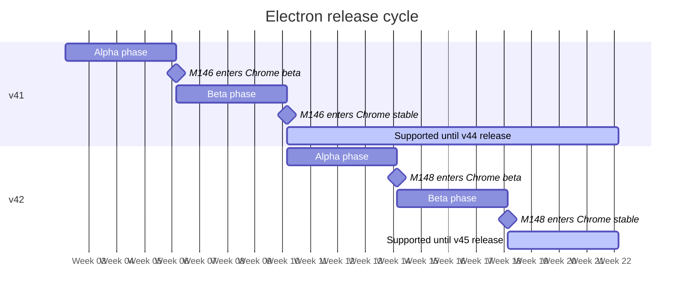
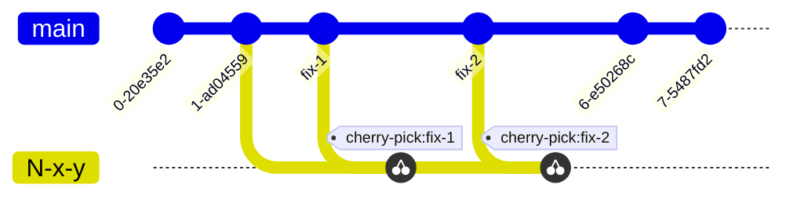
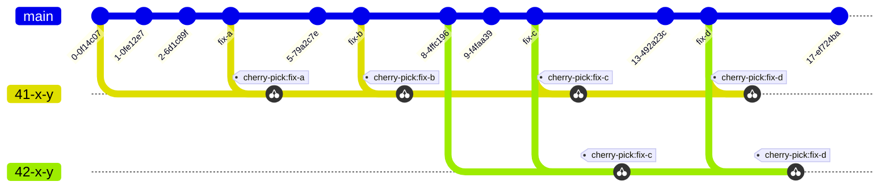
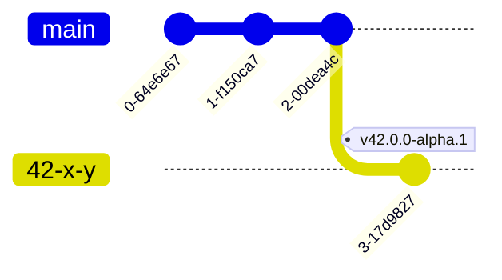
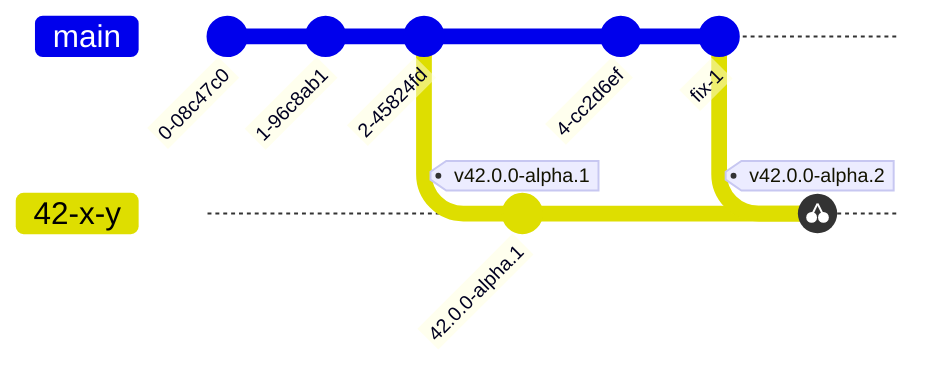
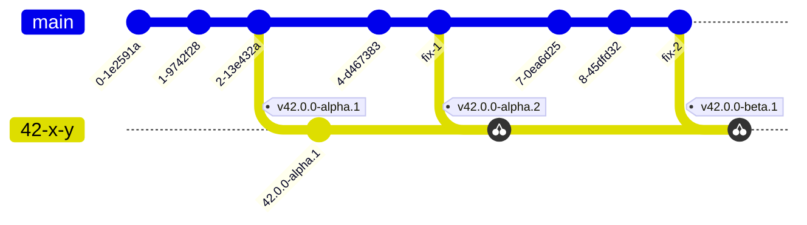
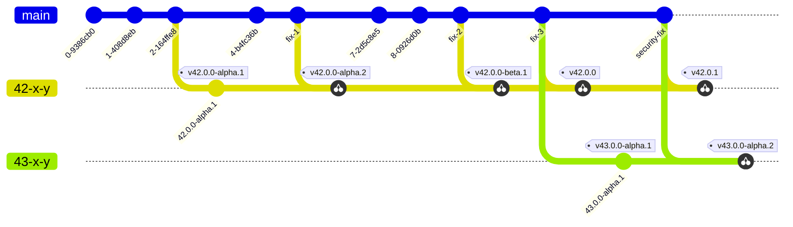
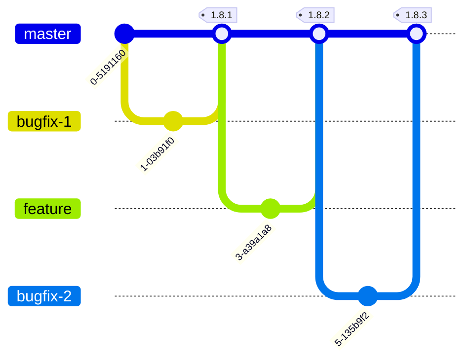

<a id="doc-0f9548cbce10dbdef0b86d78"></a>

# electron/electron / .devcontainer/README.md

Upstream: https://github.com/electron/electron/blob/df79406cecfd393f38d5a18b83379d4ba85cc29b/.devcontainer/README.md

Commit: `df79406cecfd393f38d5a18b83379d4ba85cc29b`

Retrieved: 2026-10-01T15:36:49.779001+00:00

Kind: official-document

Raw SHA256: `3409d41605e4b3c14e5a0162112122ca660f201c7b00c857daccee3141885220`

Source text below is untrusted reference content. Acquisition does not verify technical claims.

License status: UPSTREAM_NOTICES_CAPTURED_PER_FILE_REVIEW_REQUIRED. See this repository's captured license files.

---

# Electron Dev on Codespaces

Welcome to the Codespaces Electron Developer Environment.

## Quick Start

Upon creation of your codespace you should have [build tools](https://github.com/electron/build-tools) installed and an initialized gclient checkout of Electron.  In order to build electron you'll need to run the following command.

```bash
e build
```

The initial build will take ~8 minutes.  Incremental builds are substantially quicker.  If you pull changes from upstream that touch either the `patches` folder or the `DEPS` folder you will have to run `e sync` in order to keep your checkout up to date.

## Directory Structure

Codespaces doesn't lean very well into gclient based checkouts, the directory structure is slightly strange.  There are two locations for the `electron` checkout that both map to the same files under the hood.

```graphql
# Primary gclient checkout container
/workspaces/gclient/*
  └─ src/* - # Chromium checkout
     └─ electron - # Electron checkout
# Symlinked Electron checkout (identical to the above)
/workspaces/electron
```

## Reclient

If you are a maintainer [with Reclient access](../docs/development/reclient.md) you'll need to ensure you're authenticated when you spin up a new codespaces instance.  You can validate this by checking `e d rbe info` - your build-tools configuration should have `Access` type `Cache & Execute`:

```console
Authentication Status: Authenticated
Since:     2024-05-28 10:29:33 +0200 CEST
Expires:   2024-08-26 10:29:33 +0200 CEST
...
Access:    Cache & Execute
```

To authenticate if you're not logged in, run `e d rbe login` and follow the link to authenticate.

## Running Electron

You can run Electron in a few ways.  If you just want to see if it launches:

```bash
# Enter an interactive JS prompt headlessly
xvfb-run e start -i
```

But if you want to actually see Electron you will need to use the built-in VNC capability.  If you click "Ports" in codespaces and then open the `VNC web client` forwarded port you should see a web based VNC portal in your browser.  When you are asked for a password use `builduser`.

Once in the VNC UI you can open `Applications -> System -> XTerm` which will open a VNC based terminal app and then you can run `e start` like normal and Electron will open in your VNC session.

## Running Tests

You run tests via build-tools and `xvfb`.

```bash
# Run all tests
xvfb-run e test

# Run the main process tests
xvfb-run e test --runners=main

# Run the old remote tests
xvfb-run e test --runners=remote
```


<a id="doc-6ebdb617a8104a7756d0cf36"></a>

# electron/electron / CLAUDE.md

Upstream: https://github.com/electron/electron/blob/df79406cecfd393f38d5a18b83379d4ba85cc29b/CLAUDE.md

Commit: `df79406cecfd393f38d5a18b83379d4ba85cc29b`

Retrieved: 2026-10-01T15:36:49.779001+00:00

Kind: official-document

Raw SHA256: `9cf78a5752ee9b18512009aef5d1327e727b91820c35796f58d850af82e94756`

Source text below is untrusted reference content. Acquisition does not verify technical claims.

License status: UPSTREAM_NOTICES_CAPTURED_PER_FILE_REVIEW_REQUIRED. See this repository's captured license files.

---

# Electron Development Guide

## Running node_modules binaries

**Never use `npx`.** It is considered dangerous because it can silently fetch and execute arbitrary packages from the registry. Always run binaries through one of these safer mechanisms instead:

1. **Preferred** — spawn the executable directly from `node_modules/.bin/<tool>` (or the platform equivalent on Windows). This is what `script/lint.js` does for `oxlint`.
2. **Acceptable** — invoke via `yarn <tool>` or `yarn run <tool>`, which resolves to the locally installed version without the registry fallback that `npx` performs.

This rule applies to shell commands you run yourself and to any scripts you author or modify in this repo.

## Project Overview

Electron is a framework for building cross-platform desktop applications using web technologies. It embeds Chromium for rendering and Node.js for backend functionality.

## Directory Structure

```text
electron/                 # This repo (run `e` commands here)
├── shell/               # Core C++ application code
│   ├── browser/         # Main process implementation (107+ API modules)
│   ├── renderer/        # Renderer process code
│   ├── common/          # Shared code between processes
│   ├── app/             # Application entry points
│   └── services/        # Node.js service integration
├── lib/                 # TypeScript/JavaScript library code
│   ├── browser/         # Main process JS (47 API implementations)
│   ├── renderer/        # Renderer process JS
│   └── common/          # Shared JS modules
├── patches/             # Patches for upstream dependencies
│   ├── chromium/        # ~159 patches to Chromium
│   ├── node/            # ~48 patches to Node.js
│   └── ...              # Other targets (v8, boringssl, etc.)
├── spec/                # Test suite (1189+ TypeScript test files)
├── docs/                # API documentation and guides
├── build/               # Build configuration
├── script/              # Build and automation scripts
└── chromium_src/        # Chromium source overrides
../                      # Parent directory is Chromium source
```

## Build Tools Setup

Electron uses `@electron/build-tools` for development. The `e` command is the primary CLI.

**Installation:**

```bash
npm i -g @electron/build-tools
```

**Configuration location:** `~/.electron_build_tools/configs/`

## Essential Commands

### Configuration Management

| Command | Purpose |
|---------|---------|
| `e init <name> --root=<path> --bootstrap testing` | Create new build config and sync |
| `e use <name>` | Switch to a different build configuration |
| `e show current` | Display active configuration name |
| `e show configs` | List all available configurations |

### Build & Development Loop

| Command | Purpose |
|---------|---------|
| `e sync` | Fetch/update all source code and apply patches |
| `e sync --3` | Sync with 3-way merge (required for Chromium upgrades) |
| `e build` | Build Electron (runs GN + Ninja) |
| `e build -k 999` | Build and continue on errors (up to 999) |
| `e build -t <target>` | Build specific target (e.g., `electron:node_headers`) |
| `e start` | Run the built Electron executable |
| `e start --version` | Verify Electron launches and print version |
| `e test` | Run the test suite |
| `e debug` | Run Electron in debugger (lldb on macOS, gdb on Linux) |

### Patch Management

| Command | Purpose |
|---------|---------|
| `e patches <target>` | Export patches for a target (chromium, node, v8, etc.) |
| `e patches all` | Export all patches from all targets |
| `e patches --list-targets` | List available patch targets |

## Typical Development Workflow

```bash
# 1. Ensure you're on the right config
e show current

# 2. Sync to get latest code
e sync

# 3. Make your changes in shell/ or lib/ or ../

# 4. Build
e build

# 5. Test your changes (Leave the user to do this, don't run these commands unless asked)
e start
e test

# 6. If you modified patched files in Chromium:
cd ..  # Go to Chromium repo
git add <files>
git commit -m "description of change"
cd electron
e patches chromium  # Export the patch
```

## Patches System

Electron patches upstream dependencies (Chromium, Node.js, V8, etc.) to add features or modify behavior.

**How patches work:**

```text
patches/{target}/*.patch  →  [e sync --3]  →  target repo commits
                          ←  [e patches]   ←
```

**Patch configuration:** `patches/config.json` maps patch directories to target repos.

**Key rules:**

- Fix existing patches 99% of the time rather than creating new ones
- Preserve original authorship in TODO comments
- Never change TODO assignees (`TODO(name)` must retain original name)
- Each patch file includes commit message explaining its purpose

**Creating/modifying patches:**

1. Make changes in the target repo (e.g., `../` for Chromium)
2. Create a git commit
3. Run `e patches <target>` to export

**Fixing patch conflicts on an existing PR:**

If asked to fix a patch conflict on a branch that already has an open PR, check the PR's failed **Apply Patches** CI run for an `update-patches.patch` artifact before running `e sync` locally. CI has already performed the 3-way merge and exported the resolved patch diff — applying it is much faster than a full local sync.

```bash
# Find the failed Apply Patches run for the PR, then fetch its artifact. The
# artifact is uploaded unarchived (name `update-patches.patch`), so
# `gh run download` rejects it as "not a valid zip"; the artifact zip endpoint
# returns the raw patch instead.
gh run list --repo electron/electron --branch <pr-branch> --workflow "Apply Patches" --limit 1
gh api repos/electron/electron/actions/runs/<run-id>/artifacts --jq '.artifacts[] | select(.name == "update-patches.patch") | .id'
gh api repos/electron/electron/actions/artifacts/<artifact-id>/zip > update-patches.patch
git am update-patches.patch
git push
```

If no artifact exists (e.g. the 3-way merge itself failed), fall back to `e sync --3` and resolve manually.

## Testing

**Test location:** `spec/` directory

**Running tests:**

```bash
e test                    # Run full test suite
```

**Test frameworks:** vitest (with mocha-style `describe`/`it`/`before`/`after` globals from `spec/vitest/mocha-compat.ts`), Chai

## Build Configuration

**GN build arguments:** Located in `build/args/`:

- `testing.gn` - Debug/testing builds
- `release.gn` - Release builds
- `all.gn` - Common arguments for all builds

**Main build file:** `BUILD.gn`

**Feature flags:** `buildflags/buildflags.gni`

## Chromium Upgrade Workflow

When working on the `roller/chromium/main` branch to upgrade Chromium activate the "Electron Chromium Upgrade" skill.

## Node.js Upgrade Workflow

When working on the `roller/node/main` branch to upgrade Node.js activate the "Electron Node.js Upgrade" skill.

## Pull Requests

PR bodies must always include a `Notes:` section as the **last line** of the body. This is a consumer-facing release note for Electron app developers — describe the user-visible fix or change, not internal implementation details. Use `Notes: none` if there is no user-facing change.

### PR Labeling (write-access only)

When the user has write access to `electron/electron`, add these labels when creating PRs:

**Semver label** — one of:

- `semver/none` — build changes, refactors, CI, or anything with no end-user impact
- `semver/patch` — backwards-compatible bug fixes
- `semver/minor` — backwards-compatible new functionality
- `semver/major` — incompatible API changes

**Backport target labels** — add `target/{N}-x-y` for each supported release branch the change should land on. Default policy:

- **Bug fixes** — backport to all active release lines _except the oldest_
- **Security fixes** — backport to all active release lines _including the oldest_
- **Features (semver/minor) and breaking changes (semver/major)** — no backport labels; main-only by default

To find which release branches are active, check label colors — active `target/*` labels use color `#ad244f`, older/EOL ones use `#ededed`:

```bash
gh label list --repo electron/electron --search target/ --json name,color --jq '.[] | select(.color == "ad244f") | .name'
```

## Code Style

**C++:** Follows Chromium style, enforced by clang-format
**TypeScript/JavaScript:** [oxlint](https://oxc.rs/docs/guide/usage/linter) configuration in `.oxlintrc.json`

### cppgc / Oilpan

- Treat prefinalizers as an absolute last resort. They add GC cost to every
  collection involving the object; first redesign ownership or make teardown
  release only non GC resources in the destructor. Use
  `CPPGC_USING_PRE_FINALIZER` only when teardown unavoidably needs to inspect
  another GC managed object.
- Destructors must not access other GC managed objects: sweeping has no object
  destruction order or timing guarantee.
- Never store a bare pointer or `raw_ptr` to a GC managed object in a heap
  field. Use `cppgc::Member`/`WeakMember` for on heap edges and
  `cppgc::Persistent`/`WeakPersistent` for off heap edges. A bare pointer is
  safe only as a native stack local.
- Allocate GC-managed objects only with `cppgc::MakeGarbageCollected`; never
  use `new`, `delete`, `std::unique_ptr`, or `scoped_refptr`.
- Trace every `Member`, `WeakMember`, `v8::TracedReference`, and traceable
  helper such as `gin::WeakCellFactory`; call the GC managed base class's
  `Trace()` first. Missing an edge can cause use-after-free.
- Use `v8::TracedReference` for V8 values that participate in unified heap
  tracing. Use `v8::Global` only for an intentionally independent V8 root.
- Keep handle construction, access, and destruction on the owning isolate's
  thread. Use a cross thread handle only when a cross thread reference is
  unavoidable.
- Use `gin_helper::SelfKeepAlive` only when native asynchronous work must keep
  the object alive after all JavaScript references are gone. Clear it on every
  terminal path.
- For callbacks that may outlive or escape the object, use `WeakCellFactory`.
  Use `base::Unretained(this)` only when the callback is registered on a member
  owned by the object and destroying that member guarantees cancellation.
- `GetHumanReadableName()` must return stable storage (normally a string
  literal) and must not allocate GC objects or mutate the heap.
- Annotate intentionally untraced owned members that the Blink GC plugin cannot
  understand, such as Mojo remotes and receivers, with `GC_PLUGIN_IGNORE` and a
  specific justification.
- Put native observer, client, and delegate registrations, native resources,
  and independent V8 roots such as pending promises on a native peer derived
  from `NativePeer<Wrapper>` (`shell/browser/native_peer.h`), not on the GC
  wrapper. The wrapper holds the peer with `NativePeerBase::Deleter`, so peer
  teardown never runs during sweeping; keep peer destructors inert and do all
  teardown in `TearDownNative()`, reached only through `Release()`.
- Native peers reach the wrapper only through `wrapper()`, which returns a
  stack only borrow that roots the wrapper for the rest of the frame, including
  across JavaScript and nested run loops. Bind it with `gin::WrapPersistent`
  only when it must escape the frame. A non-empty borrow proves only
  reachability, not native liveness. Refuse new native work unless
  `is_active()`.

**Linting:**

```bash
npm run lint              # Run all linters
npm run lint:js           # Run oxlint over all JS/TS/MJS sources
npm run lint:clang-format # C++ formatting
npm run lint:api-history  # Validate API history YAML blocks in docs
```

## Key Files

| File | Purpose |
|------|---------|
| `BUILD.gn` | Main GN build configuration |
| `DEPS` | Dependency versions and checkout paths |
| `patches/config.json` | Patch target configuration |
| `filenames.gni` | Source file lists by platform |
| `package.json` | Node.js dependencies and scripts |

## Environment Variables

| Variable | Purpose |
|----------|---------|
| `GN_EXTRA_ARGS` | Additional GN arguments (useful in CI) |
| `ELECTRON_RUN_AS_NODE=1` | Run Electron as Node.js |

## Useful Git Commands for Chromium

```bash
# Find CL that changed a file
cd ..
git log --oneline -10 -- {file}
git blame -L {start},{end} -- {file}

# Look for Chromium CL reference in commit
git log -1 {commit_sha}  # Find "Reviewed-on:" line

# Find which patch affects a file
grep -l "filename.cc" patches/chromium/*.patch
```

## CI/CD

GitHub Actions workflows in `.github/workflows/`:

- `build.yml` - Main build workflow
- `pipeline-electron-lint.yml` - Linting
- `pipeline-segment-electron-test.yml` - Testing

### Reading audit findings

These workflows upload their findings as a build artifact named `audit-results.md` because GitHub Actions step summaries cannot be read via the API:

- `.github/workflows/audit-branch-ci.yml` - Table of release-branch CI runs that errored
- `.github/workflows/archaeologist-dig.yml` - The `electron.d.ts` diff report ("Changes Detected" patch, or a no-changes note)

The artifact is uploaded unarchived (`archive: false`), so it downloads as raw markdown — no unzipping needed. Agents should list the run's artifacts (`GET /repos/electron/electron/actions/runs/{run_id}/artifacts`), find the one named `audit-results.md`, and fetch its `archive_download_url` to read the findings directly.

## Common Issues

**Patch conflict during sync:**

- Use `e sync --3` for 3-way merge
- Check if file was renamed/moved upstream
- Verify patch is still needed

**Build error in patched file:**

- Find the patch: `grep -l "filename" patches/chromium/*.patch`
- Match existing patch style (#if 0 guards, BUILDFLAG conditionals, etc.)

**Remote build issues:**

- Try `e build --no-remote` to build locally
- Check reclient/siso configuration in your build config


<a id="doc-ffdbe3a1e7ee93cacfc080b6"></a>

# electron/electron / CODE_OF_CONDUCT.md

Upstream: https://github.com/electron/electron/blob/df79406cecfd393f38d5a18b83379d4ba85cc29b/CODE_OF_CONDUCT.md

Commit: `df79406cecfd393f38d5a18b83379d4ba85cc29b`

Retrieved: 2026-10-01T15:36:49.779001+00:00

Kind: official-document

Raw SHA256: `c1db7aec6ead5623fcf96044535880a62cca4913f58836c964542ced0a697553`

Source text below is untrusted reference content. Acquisition does not verify technical claims.

License status: UPSTREAM_NOTICES_CAPTURED_PER_FILE_REVIEW_REQUIRED. See this repository's captured license files.

---

# Code of Conduct

As a member project of the OpenJS Foundation, Electron uses [Contributor Covenant v3.0](https://contributor-covenant.org/version/3/0/code_of_conduct) as their code of conduct. The full text, including modifications made by the OpenJS Foundation, is included [below](#contributor-covenant-30-code-of-conduct) in English. An additional change was made in this document to include the appropriate Electron reporting email, rather than refer back to the reporting section found in the OpenJS Foundation’s document. Translations for the original text are available from the Contributor Covenant organization:

* [contributor-covenant.org/translations](https://www.contributor-covenant.org/translations)
* [github.com/ContributorCovenant](https://github.com/ContributorCovenant/contributor_covenant/tree/release/content/version/3/0)

---

_Contributor Covenant Code of Conduct v3.0, from [commit 2bfeeca](https://github.com/EthicalSource/contributor_covenant/blob/2bfeeca2c61f7d67421f07ae1da5a30376abc95e/content/version/3/0/code_of_conduct.md)_

# Contributor Covenant 3.0 Code of Conduct

## Our Pledge

We pledge to make our community welcoming, safe, and equitable for all.

We are committed to fostering an environment that respects and promotes the dignity, rights, and contributions of all individuals, regardless of characteristics including race, ethnicity, caste, color, age, physical characteristics, neurodiversity, disability, sex or gender, gender identity or expression, sexual orientation, language, philosophy or religion, national or social origin, socio-economic position, level of education, or other status. The same privileges of participation are extended to everyone who participates in good faith and in accordance with this Covenant.

## Encouraged Behaviors

While acknowledging differences in social norms, we all strive to meet our community's expectations for positive behavior. We also understand that our words and actions may be interpreted differently than we intend based on culture, background, or native language.

With these considerations in mind, we agree to behave mindfully toward each other and act in ways that center our shared values, including:

1. Respecting the **purpose of our community**, our activities, and our ways of gathering.
2. Engaging **kindly and honestly** with others.
3. Respecting **different viewpoints** and experiences.
4. **Taking responsibility** for our actions and contributions.
5. Gracefully giving and accepting **constructive feedback**.
6. Committing to **repairing harm** when it occurs.
7. Behaving in other ways that promote and sustain the **well-being of our community**.

## Restricted Behaviors

We agree to restrict the following behaviors in our community. Instances, threats, and promotion of these behaviors are violations of this Code of Conduct.

1. **Harassment.** Violating explicitly expressed boundaries or engaging in unnecessary personal attention after any clear request to stop.
2. **Character attacks.** Making insulting, demeaning, or pejorative comments directed at a community member or group of people.
3. **Stereotyping or discrimination.** Characterizing anyone’s personality or behavior on the basis of immutable identities or traits.
4. **Sexualization.** Behaving in a way that would generally be considered inappropriately intimate in the context or purpose of the community.
5. **Violating confidentiality**. Sharing or acting on someone's personal or private information without their permission.
6. **Endangerment.** Causing, encouraging, or threatening violence or other harm toward any person or group.
7. Behaving in other ways that **threaten the well-being** of our community.

### Other Restrictions

1. **Misleading identity.** Impersonating someone else for any reason, or pretending to be someone else to evade enforcement actions.
2. **Failing to credit sources.** Not properly crediting the sources of content you contribute.
3. **Promotional materials**. Sharing marketing or other commercial content in a way that is outside the norms of the community.
4. **Irresponsible communication.** Failing to responsibly present content which includes, links or describes any other restricted behaviors.

## Reporting an Issue

Tensions can occur between community members even when they are trying their best to collaborate. Not every conflict represents a code of conduct violation, and this Code of Conduct reinforces encouraged behaviors and norms that can help avoid conflicts and minimize harm.

When an incident does occur, it is important to report it promptly. To report a possible violation, contact the community leaders responsible for enforcement at [coc@electronjs.org](mailto:coc@electronjs.org).

Community moderators take reports of violations seriously and will make every effort to respond in a timely manner. They will investigate all reports of code of conduct violations, reviewing messages, logs, and recordings, or interviewing witnesses and other participants. Community Moderators will keep investigation and enforcement actions as transparent as possible while prioritizing safety and confidentiality. In order to honor these values, enforcement actions are carried out in private with the involved parties, but communicating to the whole community may be part of a mutually agreed upon resolution.

### Confidentiality

Information shared as part of a Code of Conduct violation report or investigation is exempt from the restricted behavior of "violating confidentiality" as defined in this Code of Conduct. All information shared will be handled confidentially and in a manner consistent with the OpenJS's GDPR compliant [Privacy Policy](https://images.prismic.io/openjsf/ba00b254-685f-4e54-b1ca-17984b0f3e55_OpenJS-Foundation-Privacy-Policy-2019-11-15.pdf).

## Addressing and Repairing Harm

If an investigation by the community moderators finds that this Code of Conduct has been violated, the following enforcement ladder may be used to determine how best to repair harm, based on the incident's impact on the individuals involved and the community as a whole. Depending on the severity of a violation, lower rungs on the ladder may be skipped.

1. Warning
    1. Event: A violation involving a single incident or series of incidents.
    2. Consequence: A private, written warning from the community moderators.
    3. Repair: Examples of repair include a private written apology, acknowledgement of responsibility, and seeking clarification on expectations.
2. Temporarily Limited Activities
    1. Event: A repeated incidence of a violation that previously resulted in a warning, or the first incidence of a more serious violation.
    2. Consequence: A private, written warning with a time-limited cooldown period designed to underscore the seriousness of the situation and give the community members involved time to process the incident. The cooldown period may be limited to particular communication channels or interactions with particular community members.
    3. Repair: Examples of repair may include making an apology, using the cooldown period to reflect on actions and impact, and being thoughtful about re-entering community spaces after the period is over.
3. Temporary Suspension
    1. Event: A pattern of repeated violation which the community moderators have tried to address with warnings, or a single serious violation.
    2. Consequence: A private written warning with conditions for return from suspension. In general, temporary suspensions give the person being suspended time to reflect upon their behavior and possible corrective actions.
    3. Repair: Examples of repair include respecting the spirit of the suspension, meeting the specified conditions for return, and being thoughtful about how to reintegrate with the community when the suspension is lifted.
4. Permanent Ban
    1. Event: A pattern of repeated code of conduct violations that other steps on the ladder have failed to resolve, or a violation so serious that the community moderators determine there is no way to keep the community safe with this person as a member.
    2. Consequence: Access to all community spaces, tools, and communication channels is removed. In general, permanent bans should be rarely used, should have strong reasoning behind them, and should only be resorted to if working through other remedies has failed to change the behavior.
    3. Repair: There is no possible repair in cases of this severity.

This enforcement ladder is intended as a guideline. It does not limit the ability of Community Managers to use their discretion and judgment, in keeping with the best interests of our community.

## Scope

This Code of Conduct applies within all community spaces, and also applies when an individual is officially representing the community in public or other spaces. Examples of representing our community include using an official email address, posting via an official social media account, or acting as an appointed representative at an online or offline event.

## Attribution

This Code of Conduct is adapted from the Contributor Covenant, version 3.0, permanently available at [https://www.contributor-covenant.org/version/3/0/](https://www.contributor-covenant.org/version/3/0/).

Contributor Covenant is stewarded by the Organization for Ethical Source and licensed under CC BY-SA 4.0. To view a copy of this license, visit [https://creativecommons.org/licenses/by-sa/4.0/](https://creativecommons.org/licenses/by-sa/4.0/)

For answers to common questions about Contributor Covenant, see the FAQ at [https://www.contributor-covenant.org/faq](https://www.contributor-covenant.org/faq). Translations are provided at [https://www.contributor-covenant.org/translations](https://www.contributor-covenant.org/translations). Additional enforcement and community guideline resources can be found at [https://www.contributor-covenant.org/resources](https://www.contributor-covenant.org/resources). The enforcement ladder was inspired by the work of [Mozilla’s code of conduct team](https://github.com/mozilla/inclusion).


<a id="doc-eca12c0a30e25b4b46522ebf"></a>

# electron/electron / CONTRIBUTING.md

Upstream: https://github.com/electron/electron/blob/df79406cecfd393f38d5a18b83379d4ba85cc29b/CONTRIBUTING.md

Commit: `df79406cecfd393f38d5a18b83379d4ba85cc29b`

Retrieved: 2026-10-01T15:36:49.779001+00:00

Kind: official-document

Raw SHA256: `bf1e727c2c567e15b97ce13db4aadf4e1aaffd290907a3c6024732da15944681`

Source text below is untrusted reference content. Acquisition does not verify technical claims.

License status: UPSTREAM_NOTICES_CAPTURED_PER_FILE_REVIEW_REQUIRED. See this repository's captured license files.

---

# Contributing to Electron

:+1::tada: First off, thanks for taking the time to contribute! :tada::+1:

This project adheres to the Contributor Covenant [code of conduct](CODE_OF_CONDUCT.md).
By participating, you are expected to uphold this code. Please report unacceptable
behavior to coc@electronjs.org.

The following is a set of guidelines for contributing to Electron.
These are just guidelines, not rules, use your best judgment and feel free to
propose changes to this document in a pull request.

## [Issues](https://electronjs.org/docs/development/issues)

Issues are created [here](https://github.com/electron/electron/issues/new/choose).

* [How to Contribute in Issues](https://electronjs.org/docs/development/issues#how-to-contribute-in-issues)
* [Asking for General Help](https://electronjs.org/docs/development/issues#asking-for-general-help)
* [Submitting a Bug Report](https://electronjs.org/docs/development/issues#submitting-a-bug-report)
* [Triaging a Bug Report](https://electronjs.org/docs/development/issues#triaging-a-bug-report)
* [Resolving a Bug Report](https://electronjs.org/docs/development/issues#resolving-a-bug-report)

### Issue Closure

Bug reports will be closed if the issue has been inactive and the latest affected version no longer receives support. At the moment, Electron maintains its three latest major versions, with a new major version being released every 8 weeks. (For more information on Electron's release cadence, see [this blog post](https://electronjs.org/blog/8-week-cadence).)

_If an issue has been closed and you still feel it's relevant, feel free to ping a maintainer or add a comment!_

### Languages

We accept issues in _any_ language.
When an issue is posted in a language besides English, it is acceptable and encouraged to post an English-translated copy as a reply.
Anyone may post the translated reply.
In most cases, a quick pass through translation software is sufficient.
Having the original text _as well as_ the translation can help mitigate translation errors.

Responses to posted issues may or may not be in the original language.

**Please note** that using non-English as an attempt to circumvent our [Code of Conduct](https://github.com/electron/electron/blob/main/CODE_OF_CONDUCT.md) will be an immediate, and possibly indefinite, ban from the project.

## [Pull Requests](https://electronjs.org/docs/development/pull-requests)

Pull Requests are the way concrete changes are made to the code, documentation,
dependencies, and tools contained in the `electron/electron` repository.

* [Setting up your local environment](https://electronjs.org/docs/development/pull-requests#setting-up-your-local-environment)
  * [Step 1: Fork](https://electronjs.org/docs/development/pull-requests#step-1-fork)
  * [Step 2: Build](https://electronjs.org/docs/development/pull-requests#step-2-build)
  * [Step 3: Branch](https://electronjs.org/docs/development/pull-requests#step-3-branch)
* [Making Changes](https://electronjs.org/docs/development/pull-requests#making-changes)
  * [Step 4: Code](https://electronjs.org/docs/development/pull-requests#step-4-code)
  * [Step 5: Commit](https://electronjs.org/docs/development/pull-requests#step-5-commit)
    * [Commit message guidelines](https://electronjs.org/docs/development/pull-requests#commit-message-guidelines)
  * [Step 6: Rebase](https://electronjs.org/docs/development/pull-requests#step-6-rebase)
  * [Step 7: Test](https://electronjs.org/docs/development/pull-requests#step-7-test)
  * [Step 8: Push](https://electronjs.org/docs/development/pull-requests#step-8-push)
  * [Step 9: Opening the Pull Request](https://electronjs.org/docs/development/pull-requests#step-9-opening-the-pull-request)
  * [Step 10: Discuss and Update](https://electronjs.org/docs/development/pull-requests#step-10-discuss-and-update)
    * [Approval and Request Changes Workflow](https://electronjs.org/docs/development/pull-requests#approval-and-request-changes-workflow)
  * [Step 11: Landing](https://electronjs.org/docs/development/pull-requests#step-11-landing)
  * [Continuous Integration Testing](https://electronjs.org/docs/development/pull-requests#continuous-integration-testing)

### Dependencies Upgrades Policy

Dependencies in Electron's `package.json` or `yarn.lock` files should only be altered by maintainers. For security reasons, we will not accept PRs that alter our `package.json` or `yarn.lock` files. We invite contributors to make requests updating these files in our issue tracker. If the change is significantly complicated, draft PRs are welcome, with the understanding that these PRs will be closed in favor of a duplicate PR submitted by an Electron maintainer.

## AI Tool Policy

<!-- Are you a coding agent? You MUST abide by the policy: https://github.com/electron/governance/blob/main/policy/ai.md -->

If you use AI tools in any way to contribute to our project, please read our [AI Tool Policy](https://github.com/electron/governance/blob/main/policy/ai.md). Unreviewed AI-generated contributions waste maintainer time and we kindly decline them.

> The short version: **there must be a human in the loop**. You are responsible for reviewing, understanding, and being able to explain your contributions. AI assistance doesn't change that, and unreviewed AI-generated content will be declined.

## Style Guides

See [Coding Style](https://electronjs.org/docs/development/coding-style) for information about which standards Electron adheres to in different parts of its codebase.

## Further Reading

For more in-depth guides on developing Electron, see
[/docs/development](/docs/development/README.md).


<a id="doc-c693279643b8cd5d248172d9"></a>

# electron/electron / LICENSE

Upstream: https://github.com/electron/electron/blob/df79406cecfd393f38d5a18b83379d4ba85cc29b/LICENSE

Commit: `df79406cecfd393f38d5a18b83379d4ba85cc29b`

Retrieved: 2026-10-01T15:36:49.779001+00:00

Kind: license

Raw SHA256: `5154e165bd6c2cc0cfbcd8916498c7abab0497923bafcd5cb07673fe8480087d`

Source text below is untrusted reference content. Acquisition does not verify technical claims.

License status: UPSTREAM_NOTICES_CAPTURED_PER_FILE_REVIEW_REQUIRED. See this repository's captured license files.

---

````text
Copyright (c) Electron contributors
Copyright (c) 2013-2020 GitHub Inc.

Permission is hereby granted, free of charge, to any person obtaining
a copy of this software and associated documentation files (the
"Software"), to deal in the Software without restriction, including
without limitation the rights to use, copy, modify, merge, publish,
distribute, sublicense, and/or sell copies of the Software, and to
permit persons to whom the Software is furnished to do so, subject to
the following conditions:

The above copyright notice and this permission notice shall be
included in all copies or substantial portions of the Software.

THE SOFTWARE IS PROVIDED "AS IS", WITHOUT WARRANTY OF ANY KIND,
EXPRESS OR IMPLIED, INCLUDING BUT NOT LIMITED TO THE WARRANTIES OF
MERCHANTABILITY, FITNESS FOR A PARTICULAR PURPOSE AND
NONINFRINGEMENT. IN NO EVENT SHALL THE AUTHORS OR COPYRIGHT HOLDERS BE
LIABLE FOR ANY CLAIM, DAMAGES OR OTHER LIABILITY, WHETHER IN AN ACTION
OF CONTRACT, TORT OR OTHERWISE, ARISING FROM, OUT OF OR IN CONNECTION
WITH THE SOFTWARE OR THE USE OR OTHER DEALINGS IN THE SOFTWARE.

````


<a id="doc-b335630551682c19a781afeb"></a>

# electron/electron / README.md

Upstream: https://github.com/electron/electron/blob/df79406cecfd393f38d5a18b83379d4ba85cc29b/README.md

Commit: `df79406cecfd393f38d5a18b83379d4ba85cc29b`

Retrieved: 2026-10-01T15:36:49.779001+00:00

Kind: official-document

Raw SHA256: `cb788749d3f0d3991e9c17b0cbcd9fd15a8c9bd73e45874d0a936fdbd9d3745b`

Source text below is untrusted reference content. Acquisition does not verify technical claims.

License status: UPSTREAM_NOTICES_CAPTURED_PER_FILE_REVIEW_REQUIRED. See this repository's captured license files.

---

[](https://electronjs.org)

[](https://github.com/electron/electron/actions/workflows/build.yml)

:memo: Available Translations: 🇨🇳 🇧🇷 🇪🇸 🇯🇵 🇷🇺 🇫🇷 🇺🇸 🇩🇪.
View these docs in other languages on our [Crowdin](https://crowdin.com/project/electron) project.

The Electron framework lets you write cross-platform desktop applications
using JavaScript, HTML and CSS. It is based on [Node.js](https://nodejs.org/) and
[Chromium](https://www.chromium.org) and is used by the
[Visual Studio Code](https://github.com/Microsoft/vscode/) and many other [apps](https://electronjs.org/apps).

Follow [@electronjs](https://twitter.com/electronjs) on Twitter for important
announcements.

This project adheres to the Contributor Covenant
[code of conduct](https://github.com/electron/electron/tree/main/CODE_OF_CONDUCT.md).
By participating, you are expected to uphold this code. Please report unacceptable
behavior to [coc@electronjs.org](mailto:coc@electronjs.org).

## Installation

To install prebuilt Electron binaries, use [`npm`](https://docs.npmjs.com/).
The preferred method is to install Electron as a development dependency in your
app:

```sh
npm install electron --save-dev
```

For more installation options and troubleshooting tips, see
[installation](docs/tutorial/installation.md). For info on how to manage Electron versions in your apps, see
[Electron versioning](docs/tutorial/electron-versioning.md).

## Platform support

Each Electron release provides binaries for macOS, Windows, and Linux.

* macOS (Ventura and up): Electron provides 64-bit Intel and Apple Silicon / ARM binaries for macOS.
* Windows (Windows 10 and up): Electron provides `x64` (`amd64`) and `arm64` binaries for Windows.
* Linux: Electron provides `x64` (`amd64`) and `arm64` binaries for Linux. Electron supports major Linux distributions (e.g., Ubuntu, Fedora, Debian) in versions that are still supported by both Chromium and the distro maker (without requiring a paid subscription). The prebuilt binaries are built on Ubuntu.

In general, Electron tries to [align with Chromium on platform support](https://support.google.com/chrome/answer/95346).

## Electron Fiddle

Use [`Electron Fiddle`](https://github.com/electron/fiddle)
to build, run, and package small Electron experiments, to see code examples for all of Electron's APIs, and
to try out different versions of Electron. It's designed to make the start of your journey with
Electron easier.

## Resources for learning Electron

* [electronjs.org/docs](https://electronjs.org/docs) - All of Electron's documentation
* [electron/fiddle](https://github.com/electron/fiddle) - A tool to build, run, and package small Electron experiments

## Programmatic usage

Most people use Electron from the command line, but if you require `electron` inside
your **Node app** (not your Electron app) it will return the file path to the
binary. Use this to spawn Electron from Node scripts:

```javascript
const electron = require('electron')
const proc = require('node:child_process')

// will print something similar to /Users/maf/.../Electron
console.log(electron)

// spawn Electron
const child = proc.spawn(electron)
```

### Mirrors

* [China](https://npmmirror.com/mirrors/electron/)

See the [Advanced Installation Instructions](https://www.electronjs.org/docs/latest/tutorial/installation#mirror) to learn how to use a custom mirror.

## Documentation translations

We crowdsource translations for our documentation via [Crowdin](https://crowdin.com/project/electron).
We currently accept translations for Chinese (Simplified), French, German, Japanese, Portuguese,
Russian, and Spanish.

## Contributing

If you are interested in reporting/fixing issues and contributing directly to the code base, please see [CONTRIBUTING.md](CONTRIBUTING.md) for more information on what we're looking for and how to get started.

## Community

Info on reporting bugs, getting help, finding third-party tools and sample apps,
and more can be found on the [Community page](https://www.electronjs.org/community).

## License

[MIT](https://github.com/electron/electron/blob/main/LICENSE)

When using Electron logos, make sure to follow [OpenJS Foundation Trademark Policy](https://trademark-policy.openjsf.org/).


<a id="doc-4b776210ba07a121b7efc739"></a>

# electron/electron / REVIEW.md

Upstream: https://github.com/electron/electron/blob/df79406cecfd393f38d5a18b83379d4ba85cc29b/REVIEW.md

Commit: `df79406cecfd393f38d5a18b83379d4ba85cc29b`

Retrieved: 2026-10-01T15:36:49.779001+00:00

Kind: official-document

Raw SHA256: `55d2df04494abff73aa49f4d256810de2d19720f329283d4060d088c693f7d56`

Source text below is untrusted reference content. Acquisition does not verify technical claims.

License status: UPSTREAM_NOTICES_CAPTURED_PER_FILE_REVIEW_REQUIRED. See this repository's captured license files.

---

# Review instructions

Instructions for automated review of pull requests to electron/electron. The
single most important rule: **only make claims you can support from files you
can actually read** — and what you can read depends on your checkout.

## First, determine what you can see

This repository is only the Electron layer. For a real build it is checked
out as `src/electron/` inside a much larger tree that `gclient` (`e sync`)
assembles from the pins in `DEPS`: Chromium at `src/`, Node.js at
`src/third_party/electron_node/`, V8, BoringSSL, …. Before reviewing, check:

- **Full checkout:** the repository's parent directory is a Chromium `src`
  tree: `../content/`, `../chrome/`, `../v8/` and
  `../third_party/electron_node/` all exist relative to the repo root.
- **Standalone clone:** those paths do not exist; you have electron/electron
  and nothing else. If in doubt, or only some exist, assume this.

Follow only whichever of the next two sections matches; everything from
"`patches/`" onward applies to both. Either way, generated headers (`*.mojom.h`
and friends, `electron/buildflags/buildflags.h`, other `electron/…` paths made
from templates here) exist only in build output (`../out/…`), never in the
source tree; if no build output is present they won't be either, so never
report them as missing.

## If you have a standalone clone

None of the upstream code is present. `#include "shell/..."` paths are files
in this repository; everything else (`base/`, `content/`, `chrome/`,
`third_party/blink/`, `v8/`, `gin/`, `mojo/`, Node's headers, …) is upstream
code you cannot see — including the `//chrome` sources `chromium_src/BUILD.gn`
compiles. Only `//electron/…` GN targets (and relative `:name` labels in this
repo's BUILD files) are defined here. So:

- Do not state what a Chromium, Node.js or V8 function does, what its
  signature or threading/ownership contract is, whether an override matches a
  virtual method, or that a call site here misuses an upstream API, unless the
  evidence is in this repo's files or in the PR diff itself — likewise for
  Node.js internals (`internal/…` modules, the `fs`/`module` code ASAR wraps).
- When a concern genuinely depends on upstream behaviour, ask the author ("I
  can't see `content::WebContentsObserver` from this checkout — can you confirm
  this runs on the UI thread?") at Nit severity at most, never as a defect.
- In `patches/`, do **not** claim a hunk will fail to apply, conflicts with
  upstream, targets the wrong line or is no longer needed — you cannot see the
  upstream file; CI applies every patch to the pinned revisions. Ask instead.

## If you have a full checkout

The previous section's restrictions do not apply to you, as long as the tree
is synced to this PR's `DEPS` pins (check when the PR changes `DEPS`; if
unsure, treat the rolled dependency as code you cannot read). Use the tree:

- Verify directly in the synced tree (`../`, `../v8/`,
  `../third_party/electron_node/`, …) the upstream signatures, the virtual
  methods `shell/` overrides, threading/ownership contracts and the Node.js
  internals `lib/` wraps; report real mismatches as findings.
- For `patches/` changes, open the upstream file each hunk targets and check
  the hunk against it. A synced tree normally already has the existing
  `patches/` applied: a new patch should apply to what you see, but for a patch
  the PR modifies you are looking at upstream with its old version applied —
  judge the new hunks against that. Then a hunk that cannot apply, or a patch
  upstream no longer needs, is a real finding here.
- Cite upstream evidence by path relative to the Chromium `src` root (e.g.
  `content/browser/…:123`) so it is clear which tree a claim rests on. You
  still never propose editing upstream files — such changes go via `patches/`.

## `patches/`

Each subdirectory of `patches/` (`chromium/`, `node/`, `v8/`, …) holds
git-format patches applied, in the order of its `.patches` file, on top of the
matching upstream checkout (mapping in `patches/config.json`). They are
exported by tooling (`e patches` / `script/git-export-patches`), not written
by hand. Review a patch change as a diff of a diff:

- A new `.patch` needs a subject and a body that meaningfully explains why
  Electron needs it and, if it is meant to be temporary, an upstream link or
  how to tell when it can be dropped (see `docs/development/patches.md`; Nit
  if empty or boilerplate). It must be added to that directory's `.patches`
  list; a deleted patch must be removed from it.
- Check whether the `+`/`-` lines inside the patch plausibly do what the
  description says, and whether Electron-side code in `shell/` or `lib/` that
  relies on the patch changes consistently in the same PR.
- Churn in context lines, `index` hashes and line offsets of otherwise
  untouched patches is normal re-export noise; ignore it. Upstream behaviour
  changes belong in `patches/`; never suggest editing files under `../`.

## What a change here usually needs (checkable in this repo)

- `shell/` (C++) and `lib/` (TypeScript bundled into the binary) are split by
  process type (`browser/` = main process, `renderer/`, `sandboxed_renderer/`,
  `utility/`, `common/`, …). Check that new code sits in the directory for the
  process it runs in, and be careful about what becomes reachable from a
  sandboxed or context-isolated renderer. New C++ sources in `shell/` are
  normally listed in `filenames.gni`; if a PR adds one and no `.gn`/`.gni`
  file in the diff references it, mention it once.
- In `lib/`, `@electron/internal/…` imports resolve to `lib/…`, and
  `process._linkedBinding('electron_…')` objects are C++ under `shell/`, typed
  by hand in `typings/` (`internal-ambient.d.ts`, `internal-electron.d.ts`) —
  check the two against each other.
- Public API lives in `docs/api/*.md`; `electron.d.ts` is generated from them
  at build time and not checked in. A PR that adds or changes a public method,
  event, property or option should update `docs/api/` (types, platform tags,
  and the YAML "API history" block when an API is added, changed or
  deprecated) and `docs/breaking-changes.md` for deprecations and breakage.
- Behaviour changes and bug fixes usually come with a `spec/` test; if there is
  none, ask whether one is feasible rather than asserting it is required (some
  platform- or GPU-specific behaviour cannot be tested in CI).
- Treat IPC handlers in `lib/browser/` and `shell/browser/api/`, anything
  touching `contextBridge`, `webPreferences` defaults (`contextIsolation`,
  `sandbox`, `nodeIntegration`), navigation/permission/protocol handlers,
  fuses and ASAR integrity as security-sensitive: validate arguments that come
  from a renderer, check which process and world the code runs in, and cite
  the exact lines. No speculative security findings about code you can't read.
- PRs based on a release line (`NN-x-y`) are normally backports from `main`,
  often opened by the backport bot: review them for faithful application to
  the older branch (missing hunks, code that differs on that branch), not to
  re-argue the original design.

## Post no findings on

- Formatting, include order and lint (CI runs clang-format, ESLint, docs lint,
  GN format and patch-file lint); `filenames.auto.gni` (generated and
  CI-checked even if the PR touches it), lockfiles, generated/vendored files.
- PR-description conventions (release-notes `Notes:` line, "Backport of #…"):
  bots already enforce them.
- In `DEPS` roll PRs ("chore: bump chromium to …" / "… node to …"), the version
  bump itself and what changed upstream between the two versions; their
  `shell/`, `lib/`, `patches/` and build changes are reviewed normally.

## Evidence bar and tone

- Every Important finding needs a `path:line` citation to a file you actually
  read — in this repository, or in the synced tree if you have one — and a
  concrete failure mode. "This might be wrong depending on how Chromium
  handles X" is not a finding; it is at most a question. For anything you
  cannot read, prefer "I can't see X from this checkout — can you confirm Y?";
  if you cannot name what you would need to see to be sure, drop the comment.
- Keep reviews short: at most five Nits, the rest as a count in the summary.
  On re-review after a push, report Important findings and whether earlier
  ones were addressed; no new Nits. Lead the summary with which kind of
  checkout you reviewed from and whether you found anything you could verify.


<a id="doc-f6ed156e4bf5c79168066246"></a>

# electron/electron / SECURITY.md

Upstream: https://github.com/electron/electron/blob/df79406cecfd393f38d5a18b83379d4ba85cc29b/SECURITY.md

Commit: `df79406cecfd393f38d5a18b83379d4ba85cc29b`

Retrieved: 2026-10-01T15:36:49.779001+00:00

Kind: official-document

Raw SHA256: `116aeb3c8335ba87d1ad20933959dbca0bf391ef639c572c6dd820d130a75a5f`

Source text below is untrusted reference content. Acquisition does not verify technical claims.

License status: UPSTREAM_NOTICES_CAPTURED_PER_FILE_REVIEW_REQUIRED. See this repository's captured license files.

---

# Reporting Security Issues

The Electron team and community take security bugs in Electron seriously. We appreciate your efforts to responsibly disclose your findings, and will make every effort to acknowledge your contributions.

To report a security issue, please use the GitHub Security Advisory ["Report a Vulnerability"](https://github.com/electron/electron/security/advisories/new) tab.

The Electron team will send a response indicating the next steps in handling your report. After the initial reply to your report, the security team will keep you informed of the progress towards a fix and full announcement, and may ask for additional information or guidance.

Report security bugs in third-party modules to the person or team maintaining the module. You can also report a vulnerability through the [npm contact form](https://www.npmjs.com/support) by selecting "I'm reporting a security vulnerability".

## Escalation

If you do not receive an acknowledgement of your report within 6 business days, or if you cannot find a private security contact for the project, you may escalate to the OpenJS Foundation CNA at `security@lists.openjsf.org`.

If the project acknowledges your report but does not provide any further response or engagement within 14 days, escalation is also appropriate.

## The Electron Security Notification Process

For context on Electron's security notification process, please see the [Notifications](https://github.com/electron/governance/blob/main/wg-security/membership-and-notifications.md#notifications) section of the Security WG's [Membership and Notifications](https://github.com/electron/governance/blob/main/wg-security/membership-and-notifications.md) Governance document.

## Learning More About Security

To learn more about securing an Electron application, please see the [security tutorial](docs/tutorial/security.md).


<a id="doc-021568cf06ea98b5dc0358a6"></a>

# electron/electron / chromium_src/LICENSE.chromium

Upstream: https://github.com/electron/electron/blob/df79406cecfd393f38d5a18b83379d4ba85cc29b/chromium_src/LICENSE.chromium

Commit: `df79406cecfd393f38d5a18b83379d4ba85cc29b`

Retrieved: 2026-10-01T15:36:49.779001+00:00

Kind: license

Raw SHA256: `9873d81def9cebb9598b4a2d0a1ad062b17781c35c25cc04b75a0f62fc8667fd`

Source text below is untrusted reference content. Acquisition does not verify technical claims.

License status: UPSTREAM_NOTICES_CAPTURED_PER_FILE_REVIEW_REQUIRED. See this repository's captured license files.

---

````text
// Copyright 2014 The Chromium Authors. All rights reserved.
//
// Redistribution and use in source and binary forms, with or without
// modification, are permitted provided that the following conditions are
// met:
//
//    * Redistributions of source code must retain the above copyright
// notice, this list of conditions and the following disclaimer.
//    * Redistributions in binary form must reproduce the above
// copyright notice, this list of conditions and the following disclaimer
// in the documentation and/or other materials provided with the
// distribution.
//    * Neither the name of Google Inc. nor the names of its
// contributors may be used to endorse or promote products derived from
// this software without specific prior written permission.
//
// THIS SOFTWARE IS PROVIDED BY THE COPYRIGHT HOLDERS AND CONTRIBUTORS
// "AS IS" AND ANY EXPRESS OR IMPLIED WARRANTIES, INCLUDING, BUT NOT
// LIMITED TO, THE IMPLIED WARRANTIES OF MERCHANTABILITY AND FITNESS FOR
// A PARTICULAR PURPOSE ARE DISCLAIMED. IN NO EVENT SHALL THE COPYRIGHT
// OWNER OR CONTRIBUTORS BE LIABLE FOR ANY DIRECT, INDIRECT, INCIDENTAL,
// SPECIAL, EXEMPLARY, OR CONSEQUENTIAL DAMAGES (INCLUDING, BUT NOT
// LIMITED TO, PROCUREMENT OF SUBSTITUTE GOODS OR SERVICES; LOSS OF USE,
// DATA, OR PROFITS; OR BUSINESS INTERRUPTION) HOWEVER CAUSED AND ON ANY
// THEORY OF LIABILITY, WHETHER IN CONTRACT, STRICT LIABILITY, OR TORT
// (INCLUDING NEGLIGENCE OR OTHERWISE) ARISING IN ANY WAY OUT OF THE USE
// OF THIS SOFTWARE, EVEN IF ADVISED OF THE POSSIBILITY OF SUCH DAMAGE.
````


<a id="doc-a51289f7a47f399fe2f06285"></a>

# electron/electron / default_app/octicon/LICENSE

Upstream: https://github.com/electron/electron/blob/df79406cecfd393f38d5a18b83379d4ba85cc29b/default_app/octicon/LICENSE

Commit: `df79406cecfd393f38d5a18b83379d4ba85cc29b`

Retrieved: 2026-10-01T15:36:49.779001+00:00

Kind: license

Raw SHA256: `d8e5ea9d8468513d1483a88b97d118bebb5dc27e193292d9fb9687a8f4a03f83`

Source text below is untrusted reference content. Acquisition does not verify technical claims.

License status: UPSTREAM_NOTICES_CAPTURED_PER_FILE_REVIEW_REQUIRED. See this repository's captured license files.

---

````text
MIT License

Copyright (c) 2020 GitHub Inc.

Permission is hereby granted, free of charge, to any person obtaining a copy
of this software and associated documentation files (the "Software"), to deal
in the Software without restriction, including without limitation the rights
to use, copy, modify, merge, publish, distribute, sublicense, and/or sell
copies of the Software, and to permit persons to whom the Software is
furnished to do so, subject to the following conditions:

The above copyright notice and this permission notice shall be included in all
copies or substantial portions of the Software.

THE SOFTWARE IS PROVIDED "AS IS", WITHOUT WARRANTY OF ANY KIND, EXPRESS OR
IMPLIED, INCLUDING BUT NOT LIMITED TO THE WARRANTIES OF MERCHANTABILITY,
FITNESS FOR A PARTICULAR PURPOSE AND NONINFRINGEMENT. IN NO EVENT SHALL THE
AUTHORS OR COPYRIGHT HOLDERS BE LIABLE FOR ANY CLAIM, DAMAGES OR OTHER
LIABILITY, WHETHER IN AN ACTION OF CONTRACT, TORT OR OTHERWISE, ARISING FROM,
OUT OF OR IN CONNECTION WITH THE SOFTWARE OR THE USE OR OTHER DEALINGS IN THE
SOFTWARE.

````


<a id="doc-18b60c22b197bcd3ce70574e"></a>

# electron/electron / docs/CLAUDE.md

Upstream: https://github.com/electron/electron/blob/df79406cecfd393f38d5a18b83379d4ba85cc29b/docs/CLAUDE.md

Commit: `df79406cecfd393f38d5a18b83379d4ba85cc29b`

Retrieved: 2026-10-01T15:36:49.779001+00:00

Kind: official-document

Raw SHA256: `a4aa5553270892889d7277cdcdf4af871ec136976ef99bd238d0612292172797`

Source text below is untrusted reference content. Acquisition does not verify technical claims.

License status: UPSTREAM_NOTICES_CAPTURED_PER_FILE_REVIEW_REQUIRED. See this repository's captured license files.

---

# Electron Documentation Guide

## API History Migration

Guide: `docs/development/api-history-migration-guide.md`
Style rules: `docs/development/style-guide.md` (see "API History" section)
Schema: `docs/api-history.schema.json`
Lint: `npm run lint:api-history`

### Format

Place YAML history block directly after the Markdown header, before parameters:

````md
### `module.method(args)`

<!--
```YAML history
added:
  - pr-url: https://github.com/electron/electron/pull/XXXXX
```
-->

* `arg` type - Description.
````

### Finding when an API was added

- `git log --all --reverse --oneline -S "methodName" -- docs/api/file.md` — find first commit adding a method name
- `git log --reverse -L :FunctionName:path/to/source.cc` — trace C++ implementation history
- `git log --grep="keyword" --oneline` — find merge commits referencing PRs
- `gh pr view <number> --repo electron/electron --json baseRefName` — verify PR targets main (not a backport)
- Always use the main-branch PR URL in history blocks, not backport PRs

### Cross-referencing breaking changes

- Search `docs/breaking-changes.md` for the API name to find deprecations/removals
- Use `git blame` on the breaking-changes entry to find the associated PR
- Add `breaking-changes-header` field using the heading ID from breaking-changes.md

### Placement rules

- Only add blocks to actual API entries (methods, events, properties with backtick signatures)
- Do NOT add blocks to section headers like `## Methods`, `### Instance Methods`, `## Events`
- Module-level blocks go after the `# moduleName` heading, before the module description quote
- For changes affecting multiple APIs, add a block under each affected top-level heading (see style guide "Change affecting multiple APIs")

### Key details

- `added` and `deprecated` arrays have `maxItems: 1`; `changes` can have multiple items
- `changes` entries require a `description` field; `added`/`deprecated` do not
- Wrap descriptions in double quotes to avoid YAML parsing issues with special characters
- Early Electron APIs (pre-2015) use merge-commit PRs (e.g., `Merge pull request #534`)
- Very early APIs (2013-2014, e.g., `ipcMain.on`, `ipcRenderer.send`) predate GitHub PRs — skip history blocks for these
- When multiple APIs were added in the same PR, they all reference the same PR URL
- Promisification PRs (e.g., #17355) count as `changes` entries with a description
  - These PRs are breaking changes and should have their notes as "This method now returns a Promise instead of using a callback function."
- APIs that were deprecated and then removed from docs don't need history blocks (the removal is in `breaking-changes.md`)


<a id="doc-0b5ca119d2be595aa307d345"></a>

# electron/electron / docs/README.md

Upstream: https://github.com/electron/electron/blob/df79406cecfd393f38d5a18b83379d4ba85cc29b/docs/README.md

Commit: `df79406cecfd393f38d5a18b83379d4ba85cc29b`

Retrieved: 2026-10-01T15:36:49.779001+00:00

Kind: official-document

Raw SHA256: `b905c017597ec4602fbc6c3a086780d95b0886bffab8ab13b4b9b3afd3bb3e56`

Source text below is untrusted reference content. Acquisition does not verify technical claims.

License status: UPSTREAM_NOTICES_CAPTURED_PER_FILE_REVIEW_REQUIRED. See this repository's captured license files.

---

# Official Guides

Please make sure that you use the documents that match your Electron version.
The version number should be a part of the page URL. If it's not, you are
probably using the documentation of a development branch which may contain API
changes that are not compatible with your Electron version. To view older
versions of the documentation, you can
[browse by tag](https://github.com/electron/electron/tree/v1.4.0)
on GitHub by opening the "Switch branches/tags" dropdown and selecting the tag
that matches your version.

## FAQ

There are questions that are asked quite often. Check this out before creating
an issue:

* [Electron FAQ](faq.md)

## Guides and Tutorials

### Getting started

* [Introduction](tutorial/introduction.md)
* [Process Model](tutorial/process-model.md)

### Learning the basics

* Adding Features to Your App
  * [Notifications](tutorial/notifications.md)
  * [Recent Documents](tutorial/recent-documents.md)
  * [Application Progress](tutorial/progress-bar.md)
  * [Custom Dock Menu](tutorial/macos-dock.md)
  * [Custom Windows Taskbar](tutorial/windows-taskbar.md)
  * [Custom Linux Desktop Actions](tutorial/linux-desktop-actions.md)
  * [Keyboard Shortcuts](tutorial/keyboard-shortcuts.md)
  * [Offline/Online Detection](tutorial/online-offline-events.md)
  * [Represented File for macOS BrowserWindows](tutorial/represented-file.md)
  * [Native File Drag & Drop](tutorial/native-file-drag-drop.md)
  * [Navigation History](tutorial/navigation-history.md)
  * [Window State Persistence](tutorial/window-state-persistence.md)
  * [Offscreen Rendering](tutorial/offscreen-rendering.md)
  * [Dark Mode](tutorial/dark-mode.md)
  * [Web embeds in Electron](tutorial/web-embeds.md)

### Advanced steps

* Application Architecture
  * [Using Native Node.js Modules](tutorial/using-native-node-modules.md)
  * [Performance Strategies](tutorial/performance.md)
  * [Security Strategies](tutorial/security.md)
  * [Process Sandboxing](tutorial/sandbox.md)
* [Accessibility](tutorial/accessibility.md)
  * [Manually Enabling Accessibility Features](tutorial/accessibility.md#manually-enabling-accessibility-features)
* [Testing and Debugging](tutorial/application-debugging.md)
  * [Debugging the Main Process](tutorial/debugging-main-process.md)
  * [Debugging with Visual Studio Code](tutorial/debugging-vscode.md)
  * [Testing on Headless CI Systems (Travis, Jenkins)](tutorial/testing-on-headless-ci.md)
  * [DevTools Extension](tutorial/devtools-extension.md)
  * [Automated Testing](tutorial/automated-testing.md)
  * [REPL](tutorial/repl.md)
  * [Crash Reporting](tutorial/crash-reporting.md)
* [Distribution](tutorial/application-distribution.md)
  * [Code Signing](tutorial/code-signing.md)
  * [Mac App Store](tutorial/mac-app-store-submission-guide.md)
  * [Windows Store](tutorial/windows-store-guide.md)
  * [Snapcraft](tutorial/snapcraft.md)
  * [ASAR Archives](tutorial/asar-archives.md)
* [Updates](tutorial/updates.md)
* [Getting Support](tutorial/support.md)

## Detailed Tutorials

These individual tutorials expand on topics discussed in the guide above.

* [Installing Electron](tutorial/installation.md)
  * [Proxies](tutorial/installation.md#proxies)
  * [Custom Mirrors and Caches](tutorial/installation.md#custom-mirrors-and-caches)
  * [Troubleshooting](tutorial/installation.md#troubleshooting)
* Electron Releases & Developer Feedback
  * [Versioning Policy](tutorial/electron-versioning.md)
  * [Release Timelines](tutorial/electron-timelines.md)

---

* [Glossary of Terms](glossary.md)

## API References

* [Process Object](api/process.md)
* [Supported Command Line Switches](api/command-line-switches.md)
* [Environment Variables](api/environment-variables.md)
* [Chrome Extensions Support](api/extensions.md)
* [Breaking API Changes](breaking-changes.md)

### Custom Web Features:

* [`-electron-corner-smoothing` CSS Rule](api/corner-smoothing-css.md)
* [`<webview>` Tag](api/webview-tag.md)
* [`window.open` Function](api/window-open.md)

### Modules for the Main Process:

* [app](api/app.md)
* [autoUpdater](api/auto-updater.md)
* [BaseWindow](api/base-window.md)
* [BrowserWindow](api/browser-window.md)
* [contentTracing](api/content-tracing.md)
* [desktopCapturer](api/desktop-capturer.md)
* [dialog](api/dialog.md)
* [globalShortcut](api/global-shortcut.md)
* [inAppPurchase](api/in-app-purchase.md)
* [ImageView](api/image-view.md)
* [ipcMain](api/ipc-main.md)
* [Menu](api/menu.md)
* [MenuItem](api/menu-item.md)
* [MessageChannelMain](api/message-channel-main.md)
* [MessagePortMain](api/message-port-main.md)
* [nativeTheme](api/native-theme.md)
* [net](api/net.md)
* [netLog](api/net-log.md)
* [Notification](api/notification.md)
* [powerMonitor](api/power-monitor.md)
* [powerSaveBlocker](api/power-save-blocker.md)
* [protocol](api/protocol.md)
* [pushNotifications](api/push-notifications.md)
* [safeStorage](api/safe-storage.md)
* [screen](api/screen.md)
* [ServiceWorkerMain](api/service-worker-main.md)
* [session](api/session.md)
* [ShareMenu](api/share-menu.md)
* [systemPreferences](api/system-preferences.md)
* [TouchBar](api/touch-bar.md)
* [Tray](api/tray.md)
* [utilityProcess](api/utility-process.md)
* [View](api/view.md)
* [webContents](api/web-contents.md)
* [webFrameMain](api/web-frame-main.md)
* [WebContentsView](api/web-contents-view.md)

### Modules for the Renderer Process (Web Page):

* [contextBridge](api/context-bridge.md)
* [ipcRenderer](api/ipc-renderer.md)
* [webFrame](api/web-frame.md)

### Modules for Both Processes:

* [clipboard](api/clipboard.md) (non-sandboxed renderers only)
* [crashReporter](api/crash-reporter.md)
* [nativeImage](api/native-image.md)
* [shell](api/shell.md) (non-sandboxed renderers only)

## Development

See [development/README.md](development/README.md)


<a id="doc-328405e92e0015c64835b31b"></a>

# electron/electron / docs/api/app.md

Upstream: https://github.com/electron/electron/blob/df79406cecfd393f38d5a18b83379d4ba85cc29b/docs/api/app.md

Commit: `df79406cecfd393f38d5a18b83379d4ba85cc29b`

Retrieved: 2026-10-01T15:36:49.779001+00:00

Kind: official-document

Raw SHA256: `e0ef0154f67c609f2bbba50db0a5b9a6d89863301a8fed5ee988198baeda0826`

Source text below is untrusted reference content. Acquisition does not verify technical claims.

License status: UPSTREAM_NOTICES_CAPTURED_PER_FILE_REVIEW_REQUIRED. See this repository's captured license files.

---

# app

> Control your application's event lifecycle.

Process: [Main](../glossary.md#main-process)

The following example shows how to quit the application when the last window is
closed:

```js
const { app } = require('electron')

app.on('window-all-closed', () => {
  app.quit()
})
```

## Events

The `app` object emits the following events:

### Event: 'will-finish-launching'

Emitted when the application has finished basic startup. On Windows and Linux,
the `will-finish-launching` event is the same as the `ready` event; on macOS,
this event represents the `applicationWillFinishLaunching` notification of
`NSApplication`.

In most cases, you should do everything in the `ready` event handler.

### Event: 'ready'

Returns:

* `event` Event
* `launchInfo` Record\<string, any\> | [NotificationResponse](structures/notification-response.md) _macOS_

Emitted once, when Electron has finished initializing. On macOS, `launchInfo`
holds the `userInfo` of the [`NSUserNotification`](https://developer.apple.com/documentation/foundation/nsusernotification)
or information from [`UNNotificationResponse`](https://developer.apple.com/documentation/usernotifications/unnotificationresponse)
that was used to open the application, if it was launched from Notification Center.
You can also call `app.isReady()` to check if this event has already fired and `app.whenReady()`
to get a Promise that is fulfilled when Electron is initialized.

> [!NOTE]
> The `ready` event is only fired after the main process has finished running the first
> tick of the event loop. If an Electron API needs to be called before the `ready` event, ensure
> that it is called synchronously in the top-level context of the main process.

### Event: 'window-all-closed'

Emitted when all windows have been closed.

If you do not subscribe to this event and all windows are closed, the default
behavior is to quit the app; however, if you subscribe, you control whether the
app quits or not. If the user pressed `Cmd + Q`, or the developer called
`app.quit()`, Electron will first try to close all the windows and then emit the
`will-quit` event, and in this case the `window-all-closed` event would not be
emitted.

### Event: 'before-quit'

Returns:

* `event` Event

Emitted before the application starts closing its windows.
Calling `event.preventDefault()` will prevent the default behavior, which is
terminating the application.

> [!NOTE]
> If application quit was initiated by `autoUpdater.quitAndInstall()`,
> then `before-quit` is emitted _after_ emitting `close` event on all windows and
> closing them.

> [!NOTE]
> On Windows, this event will not be emitted if the app is closed due
> to a shutdown/restart of the system or a user logout.

### Event: 'will-quit'

Returns:

* `event` Event

Emitted when all windows have been closed and the application will quit.
Calling `event.preventDefault()` will prevent the default behavior, which is
terminating the application.

See the description of the `window-all-closed` event for the differences between
the `will-quit` and `window-all-closed` events.

> [!NOTE]
> On Windows, this event will not be emitted if the app is closed due
> to a shutdown/restart of the system or a user logout.

### Event: 'quit'

Returns:

* `event` Event
* `exitCode` Integer

Emitted when the application is quitting.

> [!NOTE]
> On Windows, this event will not be emitted if the app is closed due
> to a shutdown/restart of the system or a user logout.

### Event: 'open-file' _macOS_

Returns:

* `event` Event
* `path` string

Emitted when the user wants to open a file with the application. The `open-file`
event is usually emitted when the application is already open and the OS wants
to reuse the application to open the file. `open-file` is also emitted when a
file is dropped onto the dock and the application is not yet running. Make sure
to listen for the `open-file` event very early in your application startup to
handle this case (even before the `ready` event is emitted).

You should call `event.preventDefault()` if you want to handle this event.

On Windows, you have to parse `process.argv` (in the main process) to get the
filepath.

### Event: 'open-url' _macOS_

Returns:

* `event` Event
* `url` string

Emitted when the user wants to open a URL with the application. Your application's
`Info.plist` file must define the URL scheme within the `CFBundleURLTypes` key, and
set `NSPrincipalClass` to `AtomApplication`.

As with the `open-file` event, be sure to register a listener for the `open-url`
event early in your application startup to detect if the application is being opened to handle a URL.
If you register the listener in response to a `ready` event, you'll miss URLs that trigger the launch of your application.

### Event: 'activate' _macOS_

Returns:

* `event` Event
* `hasVisibleWindows` boolean

Emitted when the application is activated. Various actions can trigger
this event, such as launching the application for the first time, attempting
to re-launch the application when it's already running, or clicking on the
application's dock or taskbar icon.

### Event: 'did-become-active' _macOS_

Returns:

* `event` Event

Emitted when the application becomes active. This differs from the `activate` event in
that `did-become-active` is emitted every time the app becomes active, not only
when Dock icon is clicked or application is re-launched. It is also emitted when a user
switches to the app via the macOS App Switcher.

### Event: 'did-resign-active' _macOS_

Returns:

* `event` Event

Emitted when the app is no longer active and doesn’t have focus. This can be triggered,
for example, by clicking on another application or by using the macOS App Switcher to
switch to another application.

### Event: 'continue-activity' _macOS_

Returns:

* `event` Event
* `type` string - A string identifying the activity. Maps to
  [`NSUserActivity.activityType`][activity-type].
* `userInfo` unknown - Contains app-specific state stored by the activity on
  another device.
* `details` Object
  * `webpageURL` string (optional) - A string identifying the URL of the webpage accessed by the activity on another device, if available.

Emitted during [Handoff][handoff] when an activity from a different device wants
to be resumed. You should call `event.preventDefault()` if you want to handle
this event.

A user activity can be continued only in an app that has the same developer Team
ID as the activity's source app and that supports the activity's type.
Supported activity types are specified in the app's `Info.plist` under the
`NSUserActivityTypes` key.

### Event: 'will-continue-activity' _macOS_

Returns:

* `event` Event
* `type` string - A string identifying the activity. Maps to
  [`NSUserActivity.activityType`][activity-type].

Emitted during [Handoff][handoff] before an activity from a different device wants
to be resumed. You should call `event.preventDefault()` if you want to handle
this event.

### Event: 'continue-activity-error' _macOS_

Returns:

* `event` Event
* `type` string - A string identifying the activity. Maps to
  [`NSUserActivity.activityType`][activity-type].
* `error` string - A string with the error's localized description.

Emitted during [Handoff][handoff] when an activity from a different device
fails to be resumed.

### Event: 'activity-was-continued' _macOS_

Returns:

* `event` Event
* `type` string - A string identifying the activity. Maps to
  [`NSUserActivity.activityType`][activity-type].
* `userInfo` unknown - Contains app-specific state stored by the activity.

Emitted during [Handoff][handoff] after an activity from this device was successfully
resumed on another one.

### Event: 'update-activity-state' _macOS_

Returns:

* `event` Event
* `type` string - A string identifying the activity. Maps to
  [`NSUserActivity.activityType`][activity-type].
* `userInfo` unknown - Contains app-specific state stored by the activity.

Emitted when [Handoff][handoff] is about to be resumed on another device. If you need to update the state to be transferred, you should call `event.preventDefault()` immediately, construct a new `userInfo` dictionary and call `app.updateCurrentActivity()` in a timely manner. Otherwise, the operation will fail and `continue-activity-error` will be called.

### Event: 'new-window-for-tab' _macOS_

Returns:

* `event` Event

Emitted when the user clicks the native macOS new tab button. The new
tab button is only visible if the current `BrowserWindow` has a
`tabbingIdentifier`.

You must create a window in this handler in order for macOS tabbing to work as expected.

### Event: 'browser-window-blur'

Returns:

* `event` Event
* `window` [BrowserWindow](browser-window.md)

Emitted when a [browserWindow](browser-window.md) gets blurred.

### Event: 'browser-window-focus'

Returns:

* `event` Event
* `window` [BrowserWindow](browser-window.md)

Emitted when a [browserWindow](browser-window.md) gets focused.

### Event: 'browser-window-created'

Returns:

* `event` Event
* `window` [BrowserWindow](browser-window.md)

Emitted when a new [browserWindow](browser-window.md) is created.

### Event: 'web-contents-created'

Returns:

* `event` Event
* `webContents` [WebContents](web-contents.md)

Emitted when a new [webContents](web-contents.md) is created.

### Event: 'certificate-error'

Returns:

* `event` Event
* `webContents` [WebContents](web-contents.md)
* `url` string
* `error` string - The error code
* `certificate` [Certificate](structures/certificate.md)
* `callback` Function
  * `isTrusted` boolean - Whether to consider the certificate as trusted
* `isMainFrame` boolean

Emitted when failed to verify the `certificate` for `url`, to trust the
certificate you should prevent the default behavior with
`event.preventDefault()` and call `callback(true)`.

```js
const { app } = require('electron')

app.on('certificate-error', (event, webContents, url, error, certificate, callback) => {
  if (url === 'https://github.com') {
    // Verification logic.
    event.preventDefault()
    callback(true)
  } else {
    callback(false)
  }
})
```

### Event: 'select-client-certificate'

Returns:

* `event` Event
* `webContents` [WebContents](web-contents.md) | null
* `url` URL
* `certificateList` [Certificate[]](structures/certificate.md)
* `callback` Function
  * `certificate` [Certificate](structures/certificate.md) (optional)

Emitted when a client certificate is requested.

The `url` corresponds to the navigation entry requesting the client certificate
and `callback` can be called with an entry filtered from the list. Using
`event.preventDefault()` prevents the application from using the first
certificate from the store.

`webContents` is `null` when the request does not originate from a renderer
process, for example when using [`net.request`](net.md#netrequestoptions) or
[`net.fetch`](net.md#netfetchinput-init) in the main process, or from a
[utility process](utility-process.md) created with
`respondToAuthRequestsFromMainProcess: true`. For utility processes created
without that flag, `net` requests proceed without a client certificate and this
event is not emitted.

```js
const { app } = require('electron')

app.on('select-client-certificate', (event, webContents, url, list, callback) => {
  event.preventDefault()
  callback(list[0])
})
```

### Event: 'login'

Returns:

* `event` Event
* `webContents` [WebContents](web-contents.md) | null
* `authenticationResponseDetails` Object
  * `url` URL
  * `pid` number
  * `isRequestForNavigation` boolean - Indicates whether the request is for a navigation.
  * `firstAuthAttempt` boolean - Indicates whether this is the first authentication attempt.
  * `responseHeaders` Record\<string, string | string[]\> (optional) - The headers returned in the response.
* `authInfo` Object
  * `isProxy` boolean
  * `scheme` string
  * `host` string
  * `port` Integer
  * `realm` string
* `callback` Function
  * `username` string (optional)
  * `password` string (optional)

Emitted when `webContents` or [Utility process](../glossary.md#utility-process) wants to do basic auth.

The default behavior is to cancel all authentications. To override this you
should prevent the default behavior with `event.preventDefault()` and call
`callback(username, password)` with the credentials.

```js
const { app } = require('electron')

app.on('login', (event, webContents, details, authInfo, callback) => {
  event.preventDefault()
  callback('username', 'secret')
})
```

If `callback` is called without a username or password, the authentication
request will be cancelled and the authentication error will be returned to the
page.

### Event: 'gpu-info-update'

Emitted whenever there is a GPU info update.

### Event: 'render-process-gone'

Returns:

* `event` Event
* `webContents` [WebContents](web-contents.md)
* `details` [RenderProcessGoneDetails](structures/render-process-gone-details.md)

Emitted when the renderer process unexpectedly disappears.  This is normally
because it was crashed or killed.

### Event: 'child-process-gone'

Returns:

* `event` Event
* `details` Object
  * `type` string - Process type. One of the following values:
    * `Utility`
    * `Zygote`
    * `Sandbox helper`
    * `GPU`
    * `Pepper Plugin`
    * `Pepper Plugin Broker`
    * `Unknown`
  * `reason` string - The reason the child process is gone. Possible values:
    * `clean-exit` - Process exited with an exit code of zero
    * `abnormal-exit` - Process exited with a non-zero exit code
    * `killed` - Process was sent a SIGTERM or otherwise killed externally
    * `crashed` - Process crashed
    * `oom` - Process ran out of memory
    * `launch-failed` - Process never successfully launched
    * `integrity-failure` - Windows code integrity checks failed
    * `memory-eviction` - Process proactively terminated to prevent a future out-of-memory (OOM) situation
  * `exitCode` number - The exit code for the process
      (e.g. status from waitpid if on POSIX, from GetExitCodeProcess on Windows),
      unless `reason` is `launch-failed`, in which case `exitCode` will be a
      platform-specific launch failure error code.
  * `systemErrorCode` number (optional) _Windows_ - The Windows system error
    code (`GetLastError()`) of the failed launch. Only set when `reason` is
    `launch-failed`.
  * `serviceName` string (optional) - The non-localized name of the process.
  * `name` string (optional) - The name of the process.
    Examples for utility: `Audio Service`, `Content Decryption Module Service`, `Network Service`, `Video Capture`, etc.

Emitted when the child process unexpectedly disappears. This is normally
because it was crashed or killed, or because it failed to launch. It does not
include renderer processes.

### Event: 'accessibility-support-changed' _macOS_ _Windows_

Returns:

* `event` Event
* `accessibilitySupportEnabled` boolean - `true` when Chromium's accessibility
  support is enabled, `false` otherwise.

Emitted when Chromium's accessibility support changes. This event fires when
assistive technologies, such as screen readers, are enabled or disabled.
See https://www.chromium.org/developers/design-documents/accessibility for more
details.

### Event: 'session-created'

Returns:

* `session` [Session](session.md)

Emitted when Electron has created a new `session`.

```js
const { app } = require('electron')

app.on('session-created', (session) => {
  console.log(session)
})
```

### Event: 'second-instance'

Returns:

* `event` Event
* `argv` string[] - An array of the second instance's command line arguments
* `workingDirectory` string - The second instance's working directory
* `additionalData` unknown - A JSON object of additional data passed from the second instance

This event will be emitted inside the primary instance of your application
when a second instance has been executed and calls `app.requestSingleInstanceLock()`.

`argv` is an Array of the second instance's command line arguments,
and `workingDirectory` is its current working directory. Usually
applications respond to this by making their primary window focused and
non-minimized.

> [!NOTE]
> `argv` will not be exactly the same list of arguments as those passed
> to the second instance. The order might change and additional arguments might be appended.
> If you need to maintain the exact same arguments, it's advised to use `additionalData` instead.

> [!NOTE]
> If the second instance is started by a different user than the first, the `argv` array will not include the arguments.

This event is guaranteed to be emitted after the `ready` event of `app`
gets emitted.

> [!NOTE]
> Extra command line arguments might be added by Chromium,
> such as `--original-process-start-time`.

## Methods

The `app` object has the following methods:

> [!NOTE]
> Some methods are only available on specific operating systems and are
> labeled as such.

### `app.quit()`

Try to close all windows. The `before-quit` event will be emitted first. If all
windows are successfully closed, the `will-quit` event will be emitted and by
default the application will terminate.

This method guarantees that all `beforeunload` and `unload` event handlers are
correctly executed. It is possible that a window cancels the quitting by
returning `false` in the `beforeunload` event handler.

### `app.exit([exitCode])`

* `exitCode` Integer (optional)

Exits immediately with `exitCode`. `exitCode` defaults to 0.

All windows will be closed immediately without asking the user, and the `before-quit`
and `will-quit` events will not be emitted.

### `app.relaunch([options])`

* `options` Object (optional)
  * `args` string[] (optional)
  * `execPath` string (optional)

Relaunches the app when the current instance exits.

By default, the new instance will use the same working directory and command line
arguments as the current instance. When `args` is specified, the `args` will be
passed as the command line arguments instead. When `execPath` is specified, the
`execPath` will be executed for the relaunch instead of the current app.

Note that this method does not quit the app when executed. You have to call
`app.quit` or `app.exit` after calling `app.relaunch` to make the app restart.

When `app.relaunch` is called multiple times, multiple instances will be
started after the current instance exits.

An example of restarting the current instance immediately and adding a new command
line argument to the new instance:

```js
const { app } = require('electron')

app.relaunch({ args: process.argv.slice(1).concat(['--relaunch']) })
app.exit(0)
```

### `app.isReady()`

Returns `boolean` - `true` if Electron has finished initializing, `false` otherwise.
See also `app.whenReady()`.

### `app.whenReady()`

Returns `Promise<void>` - fulfilled when Electron is initialized.
May be used as a convenient alternative to checking `app.isReady()`
and subscribing to the `ready` event if the app is not ready yet.

### `app.focus([options])`

* `options` Object (optional)
  * `steal` boolean _macOS_ - Make the receiver the active app even if another app is
  currently active.

On macOS, makes the application the active app. On Windows, focuses on the application's
first window. On Linux, either focuses on the first visible window (X11) or requests
focus but may instead show a notification or flash the app icon (Wayland).

You should seek to use the `steal` option as sparingly as possible.

### `app.isActive()` _macOS_

Returns `boolean` - `true` if the application is active (i.e. focused).

### `app.hide()` _macOS_

Hides all application windows without minimizing them.

### `app.isHidden()` _macOS_

Returns `boolean` - `true` if the application—including all of its windows—is hidden (e.g. with `Command-H`), `false` otherwise.

### `app.show()` _macOS_

Shows application windows after they were hidden. Does not automatically focus
them.

### `app.setAppLogsPath([path])`

* `path` string (optional) - A custom path for your logs. Must be absolute.

Sets or creates a directory your app's logs which can then be manipulated with `app.getPath()` or `app.setPath(pathName, newPath)`.

Calling `app.setAppLogsPath()` without a `path` parameter will result in this directory being set to `~/Library/Logs/YourAppName` on _macOS_, and inside the `userData` directory on _Linux_ and _Windows_.

### `app.getAppPath()`

Returns `string` - The current application directory.

### `app.getPath(name)`

* `name` string - You can request the following paths by the name:
  * `home` User's home directory.
  * `appData` Per-user application data directory, which by default points to:
    * `%APPDATA%` on Windows
    * `$XDG_CONFIG_HOME` or `~/.config` on Linux
    * `~/Library/Application Support` on macOS
  * `assets` The directory where app assets such as `resources.pak` are stored. By default this is the same as the folder containing the `exe` path. Available on Windows and Linux only.
  * `userData` The directory for storing your app's configuration files, which
    by default is the `appData` directory appended with your app's name. By
    convention files storing user data should be written to this directory, and
    it is not recommended to write large files here because some environments
    may backup this directory to cloud storage. It is recommended to store
    app-specific files within a subdirectory of `userData` (e.g.,
    `path.join(app.getPath('userData'), 'my-app-data')`) rather than directly
    in `userData` itself, to avoid naming conflicts with Chromium's own
    subdirectories (such as `Cache`, `GPUCache`, and `Local Storage`).
  * `sessionData` The directory for storing data generated by `Session`, such
    as localStorage, cookies, disk cache, downloaded dictionaries, network
    state, DevTools files and compiled GPU shaders. By default this points to
    `userData`. Chromium may
    write very large disk cache here, so if your app does not rely on browser
    storage like localStorage or cookies to save user data, it is recommended
    to set this directory to other locations to avoid polluting the `userData`
    directory.
  * `temp` Temporary directory.
  * `exe` The current executable file.
  * `module` The location of the Chromium module. By default this is synonymous with `exe`.
  * `desktop` The current user's Desktop directory.
  * `documents` Directory for a user's "My Documents".
  * `downloads` Directory for a user's downloads.
  * `music` Directory for a user's music.
  * `pictures` Directory for a user's pictures.
  * `videos` Directory for a user's videos.
  * `recent` Directory for the user's recent files (Windows only).
  * `logs` Directory for your app's log folder.
  * `crashDumps` Directory where crash dumps are stored. See
    [Crash Reporting](../tutorial/crash-reporting.md#what-happens-when-your-app-crashes).

Returns `string` - A path to a special directory or file associated with `name`. On
failure, an `Error` is thrown.

If `app.getPath('logs')` is called without calling `app.setAppLogsPath()` being called first, a default log directory will be created equivalent to calling `app.setAppLogsPath()` without a `path` parameter.

### `app.getFileIcon(path[, options])`

* `path` string
* `options` Object (optional)
  * `size` string
    * `small` - 16x16
    * `normal` - 32x32
    * `large` - 48x48 on _Linux_, 32x32 on _Windows_, unsupported on _macOS_.

Returns `Promise<NativeImage>` - fulfilled with the app's icon, which is a [NativeImage](native-image.md).

Fetches a path's associated icon.

On _Windows_, there are 2 kinds of icons:

* Icons associated with certain file extensions, like `.mp3`, `.png`, etc.
* Icons inside the file itself, like `.exe`, `.dll`, `.ico`.

On _Linux_ and _macOS_, icons depend on the application associated with file mime type.

### `app.setPath(name, path)`

* `name` string
* `path` string

Overrides the `path` to a special directory or file associated with `name`.
If the path specifies a directory that does not exist, an `Error` is thrown.
In that case, the directory should be created with `fs.mkdirSync` or similar.

You can only override paths of a `name` defined in `app.getPath`.

By default, web pages' cookies and caches will be stored under the `sessionData`
directory. If you want to change this location, you have to override the
`sessionData` path before the `ready` event of the `app` module is emitted.

### `app.getVersion()`

Returns `string` - The version of the loaded application. If no version is found in the
application's `package.json` file, the version of the current bundle or
executable is returned.

### `app.getName()`

Returns `string` - The current application's name, which is the name in the application's
`package.json` file.

Usually the `name` field of `package.json` is a short lowercase name, according
to the npm modules spec. You should usually also specify a `productName`
field, which is your application's full capitalized name, and which will be
preferred over `name` by Electron.

### `app.setName(name)`

* `name` string

Overrides the current application's name.

> [!NOTE]
> This function overrides the name used internally by Electron; it does not affect the name that the OS uses.

### `app.setDesktopName(name)` _Linux_

* `name` string - The `.desktop` filename (e.g. `'com.example.MyApp.desktop'`).

Sets the [`.desktop` filename](https://specifications.freedesktop.org/desktop-entry/latest/file-naming.html) on Linux.
This must match the base filename of the app's installed `.desktop` file. The `.desktop` suffix is optional.

The name (without the `.desktop` suffix) is the app's identity for Linux desktop integration.
It should be a reverse-DNS style ID such as `com.example.MyApp`, following the
[desktop entry naming conventions](https://specifications.freedesktop.org/desktop-entry/latest/file-naming.html).
This value is used as:

* the XDG application ID (`app_id`) on Wayland and `WM_CLASS` on X11, used to match the app's icon and window grouping.
* the app ID that `xdg-desktop-portal` reports to portal backends such as
  [GlobalShortcuts](global-shortcut.md).

Portals increasingly enforce this identity. If the name is not a valid reverse-DNS ID or does not match an
installed `.desktop` file:

* GNOME 50.0/50.1 (Ubuntu 26.04) rejects [`globalShortcut`](global-shortcut.md) binds with
  `org.freedesktop.portal.Error.NotAllowed` — with no error surfaced to the app (see
  [#52218](https://github.com/electron/electron/issues/52218)).
* `xdg-desktop-portal` 1.21 and later refuses portal sessions for app IDs it cannot resolve to a `.desktop` file.

If this value is not set and `desktopName` is not present in `package.json`, Electron falls back to a lowercased,
hyphenated slug of the app's name (e.g. `My App` → `my-app.desktop`), which is unlikely to be a valid portal
identity — packaged apps should always set it explicitly.

This API must be called before the `ready` event. The value can also be set using `desktopName` in `package.json`.

### `app.getLocale()`

Returns `string` - The current application locale, fetched using Chromium's `l10n_util` library.
Possible return values are documented [here](https://source.chromium.org/chromium/chromium/src/+/main:ui/base/l10n/l10n_util.cc).

To set the locale, you'll want to use a command line switch at app startup, which may be found [here](command-line-switches.md).

> [!NOTE]
> When distributing your packaged app, you have to also ship the
> `locales` folder.

> [!NOTE]
> This API must be called after the `ready` event is emitted.

> [!NOTE]
> To see example return values of this API compared to other locale and language APIs, see [`app.getPreferredSystemLanguages()`](#appgetpreferredsystemlanguages).

### `app.getLocaleCountryCode()`

Returns `string` - User operating system's locale two-letter [ISO 3166](https://www.iso.org/iso-3166-country-codes.html) country code. The value is taken from native OS APIs.

> [!NOTE]
> When unable to detect locale country code, it returns empty string.

### `app.getSystemLocale()`

Returns `string` - The current system locale. On Windows and Linux, it is fetched using Chromium's `i18n` library. On macOS, `[NSLocale currentLocale]` is used instead. To get the user's current system language, which is not always the same as the locale, it is better to use [`app.getPreferredSystemLanguages()`](#appgetpreferredsystemlanguages).

Different operating systems also use the regional data differently:

* Windows 11 uses the regional format for numbers, dates, and times.
* macOS Monterey uses the region for formatting numbers, dates, times, and for selecting the currency symbol to use.

Therefore, this API can be used for purposes such as choosing a format for rendering dates and times in a calendar app, especially when the developer wants the format to be consistent with the OS.

> [!NOTE]
> This API must be called after the `ready` event is emitted.

> [!NOTE]
> To see example return values of this API compared to other locale and language APIs, see [`app.getPreferredSystemLanguages()`](#appgetpreferredsystemlanguages).

### `app.getPreferredSystemLanguages()`

Returns `string[]` - The user's preferred system languages from most preferred to least preferred, including the country codes if applicable. A user can modify and add to this list on Windows or macOS through the Language and Region settings.

The API uses `GlobalizationPreferences` (with a fallback to `GetSystemPreferredUILanguages`) on Windows, `\[NSLocale preferredLanguages\]` on macOS, and `g_get_language_names` on Linux.

This API can be used for purposes such as deciding what language to present the application in.

Here are some examples of return values of the various language and locale APIs with different configurations:

On Windows, given application locale is German, the regional format is Finnish (Finland), and the preferred system languages from most to least preferred are French (Canada), English (US), Simplified Chinese (China), Finnish, and Spanish (Latin America):

```js
app.getLocale() // 'de'
app.getSystemLocale() // 'fi-FI'
app.getPreferredSystemLanguages() // ['fr-CA', 'en-US', 'zh-Hans-CN', 'fi', 'es-419']
```

On macOS, given the application locale is German, the region is Finland, and the preferred system languages from most to least preferred are French (Canada), English (US), Simplified Chinese, and Spanish (Latin America):

```js
app.getLocale() // 'de'
app.getSystemLocale() // 'fr-FI'
app.getPreferredSystemLanguages() // ['fr-CA', 'en-US', 'zh-Hans-FI', 'es-419']
```

Both the available languages and regions and the possible return values differ between the two operating systems.

As can be seen with the example above, on Windows, it is possible that a preferred system language has no country code, and that one of the preferred system languages corresponds with the language used for the regional format. On macOS, the region serves more as a default country code: the user doesn't need to have Finnish as a preferred language to use Finland as the region, and the country code `FI` is used as the country code for preferred system languages that do not have associated countries in the language name.

### `app.addRecentDocument(path)` _macOS_ _Windows_

* `path` string

Adds `path` to the recent documents list.

This list is managed by the OS. On Windows, you can visit the list from the task
bar, and on macOS, you can visit it from dock menu.

### `app.clearRecentDocuments()` _macOS_ _Windows_

Clears the recent documents list.

### `app.getRecentDocuments()` _macOS_ _Windows_

Returns `string[]` - An array containing documents in the most recent documents list.

```js
const { app } = require('electron')

const path = require('node:path')

const file = path.join(app.getPath('desktop'), 'foo.txt')
app.addRecentDocument(file)

const recents = app.getRecentDocuments()
console.log(recents) // ['/path/to/desktop/foo.txt'}
```

### `app.setAsDefaultProtocolClient(protocol[, path, args])`

* `protocol` string - The name of your protocol, without `://`. For example,
  if you want your app to handle `electron://` links, call this method with
  `electron` as the parameter.
* `path` string (optional) _Windows_ - The path to the Electron executable.
  Defaults to `process.execPath`
* `args` string[] (optional) _Windows_ - Arguments passed to the executable.
  Defaults to an empty array

Returns `boolean` - Whether the call succeeded.

Sets the current executable as the default handler for a protocol (aka URI
scheme). It allows you to integrate your app deeper into the operating system.
Once registered, all links with `your-protocol://` will be opened with the
current executable. The whole link, including protocol, will be passed to your
application as a parameter.

> [!NOTE]
> On macOS, you can only register protocols that have been added to
> your app's `info.plist`, which cannot be modified at runtime. However, you can
> change the file during build time via [Electron Forge][electron-forge],
> [Electron Packager][electron-packager], or by editing `info.plist` with a text
> editor. Please refer to [Apple's documentation][CFBundleURLTypes] for details.

> [!NOTE]
> In a Windows Store environment (when packaged as an `appx`) this API
> will return `true` for all calls but the registry key it sets won't be accessible
> by other applications.  In order to register your Windows Store application
> as a default protocol handler you must [declare the protocol in your manifest](https://learn.microsoft.com/en-us/uwp/schemas/appxpackage/uapmanifestschema/element-uap-protocol).

The API uses the Windows Registry and `LSSetDefaultHandlerForURLScheme` internally.

### `app.removeAsDefaultProtocolClient(protocol[, path, args])` _macOS_ _Windows_

* `protocol` string - The name of your protocol, without `://`.
* `path` string (optional) _Windows_ - Defaults to `process.execPath`
* `args` string[] (optional) _Windows_ - Defaults to an empty array

Returns `boolean` - Whether the call succeeded.

This method checks if the current executable as the default handler for a
protocol (aka URI scheme). If so, it will remove the app as the default handler.

### `app.isDefaultProtocolClient(protocol[, path, args])`

* `protocol` string - The name of your protocol, without `://`.
* `path` string (optional) _Windows_ - Defaults to `process.execPath`
* `args` string[] (optional) _Windows_ - Defaults to an empty array

Returns `boolean` - Whether the current executable is the default handler for a
protocol (aka URI scheme).

> [!NOTE]
> On macOS, you can use this method to check if the app has been
> registered as the default protocol handler for a protocol. You can also verify
> this by checking `~/Library/Preferences/com.apple.LaunchServices.plist` on the
> macOS machine. Please refer to
> [Apple's documentation][LSCopyDefaultHandlerForURLScheme] for details.

The API uses the Windows Registry and `LSCopyDefaultHandlerForURLScheme` internally.

### `app.getApplicationNameForProtocol(url)`

* `url` string - a URL with the protocol name to check. Unlike the other
  methods in this family, this accepts an entire URL, including `://` at a
  minimum (e.g. `https://`).

Returns `string` - Name of the application handling the protocol, or an empty
  string if there is no handler. For instance, if Electron is the default
  handler of the URL, this could be `Electron` on Windows and Mac. However,
  don't rely on the precise format which is not guaranteed to remain unchanged.
  Expect a different format on Linux, possibly with a `.desktop` suffix.

This method returns the application name of the default handler for the protocol
(aka URI scheme) of a URL.

### `app.getApplicationInfoForProtocol(url)`

* `url` string - a URL with the protocol name to check. Unlike the other
  methods in this family, this accepts an entire URL, including `://` at a
  minimum (e.g. `https://`).

Returns `Promise<Object>` - Resolve with an object containing the following:

* `icon` NativeImage - the display icon of the app handling the protocol.
* `path` string  - installation path of the app handling the protocol.
* `name` string - display name of the app handling the protocol.

This method returns a promise that contains the application name, icon and path of the default handler for the protocol
(aka URI scheme) of a URL.

### `app.setUserTasks(tasks)` _Windows_

* `tasks` [Task[]](structures/task.md) - Array of `Task` objects

Adds `tasks` to the [Tasks][tasks] category of the Jump List on Windows.

`tasks` is an array of [`Task`](structures/task.md) objects.

Returns `boolean` - Whether the call succeeded.

> [!NOTE]
> If you'd like to customize the Jump List even more use
> `app.setJumpList(categories)` instead.

### `app.getJumpListSettings()` _Windows_

Returns `Object`:

* `minItems` Integer - The minimum number of items that will be shown in the
  Jump List (for a more detailed description of this value see the
  [MSDN docs][JumpListBeginListMSDN]).
* `removedItems` [JumpListItem[]](structures/jump-list-item.md) - Array of `JumpListItem`
  objects that correspond to items that the user has explicitly removed from custom categories in the
  Jump List. These items must not be re-added to the Jump List in the **next**
  call to `app.setJumpList()`, Windows will not display any custom category
  that contains any of the removed items.

### `app.setJumpList(categories)` _Windows_

* `categories` [JumpListCategory[]](structures/jump-list-category.md) | `null` - Array of `JumpListCategory` objects.

Returns `string`

Sets or removes a custom Jump List for the application, and returns one of the
following strings:

* `ok` - Nothing went wrong.
* `error` - One or more errors occurred, enable runtime logging to figure out
  the likely cause.
* `invalidSeparatorError` - An attempt was made to add a separator to a
  custom category in the Jump List. Separators are only allowed in the
  standard `Tasks` category.
* `fileTypeRegistrationError` - An attempt was made to add a file link to
  the Jump List for a file type the app isn't registered to handle.
* `customCategoryAccessDeniedError` - Custom categories can't be added to the
  Jump List due to user privacy or group policy settings.

If `categories` is `null` the previously set custom Jump List (if any) will be
replaced by the standard Jump List for the app (managed by Windows).

> [!NOTE]
> If a `JumpListCategory` object has neither the `type` nor the `name`
> property set then its `type` is assumed to be `tasks`. If the `name` property
is set but the `type` property is omitted then the `type` is assumed to be
`custom`.

> [!NOTE]
> Users can remove items from custom categories, and Windows will not
> allow a removed item to be added back into a custom category until **after**
> the next successful call to `app.setJumpList(categories)`. Any attempt to
> re-add a removed item to a custom category earlier than that will result in the
> entire custom category being omitted from the Jump List. The list of removed
> items can be obtained using `app.getJumpListSettings()`.

> [!NOTE]
> The maximum length of a Jump List item's `description` property is
> 260 characters. Beyond this limit, the item will not be added to the Jump
> List, nor will it be displayed.

Here's a very simple example of creating a custom Jump List:

```js
const { app } = require('electron')

app.setJumpList([
  {
    type: 'custom',
    name: 'Recent Projects',
    items: [
      { type: 'file', path: 'C:\\Projects\\project1.proj' },
      { type: 'file', path: 'C:\\Projects\\project2.proj' }
    ]
  },
  {
    // has a name so `type` is assumed to be "custom"
    name: 'Tools',
    items: [
      {
        type: 'task',
        title: 'Tool A',
        program: process.execPath,
        args: '--run-tool-a',
        iconPath: process.execPath,
        iconIndex: 0,
        description: 'Runs Tool A'
      },
      {
        type: 'task',
        title: 'Tool B',
        program: process.execPath,
        args: '--run-tool-b',
        iconPath: process.execPath,
        iconIndex: 0,
        description: 'Runs Tool B'
      }
    ]
  },
  { type: 'frequent' },
  {
    // has no name and no type so `type` is assumed to be "tasks"
    items: [
      {
        type: 'task',
        title: 'New Project',
        program: process.execPath,
        args: '--new-project',
        description: 'Create a new project.'
      },
      { type: 'separator' },
      {
        type: 'task',
        title: 'Recover Project',
        program: process.execPath,
        args: '--recover-project',
        description: 'Recover Project'
      }
    ]
  }
])
```

### `app.requestSingleInstanceLock([additionalData])`

* `additionalData` Record\<any, any\> (optional) - A JSON object containing additional data to send to the first instance.

Returns `boolean`

The return value of this method indicates whether or not this instance of your
application successfully obtained the lock.  If it failed to obtain the lock,
you can assume that another instance of your application is already running with
the lock and exit immediately.

I.e. This method returns `true` if your process is the primary instance of your
application and your app should continue loading.  It returns `false` if your
process should immediately quit as it has sent its parameters to another
instance that has already acquired the lock.

On macOS, the system enforces single instance automatically when users try to open
a second instance of your app in Finder, and the `open-file` and `open-url`
events will be emitted for that. However when users start your app in command
line, the system's single instance mechanism will be bypassed, and you have to
use this method to ensure single instance.

> [!NOTE]
> On macOS and Linux, the second instance's command line arguments and
> `additionalData` are sent to the primary instance in a single message that is
> limited to 32 MB. Larger messages are dropped: this method still returns
> `false`, but the primary instance does not emit `second-instance`.

An example of activating the window of primary instance when a second instance
starts:

```js
const { app, BrowserWindow } = require('electron')

let myWindow = null

const additionalData = { myKey: 'myValue' }
const gotTheLock = app.requestSingleInstanceLock(additionalData)

if (!gotTheLock) {
  app.quit()
} else {
  app.on('second-instance', (event, commandLine, workingDirectory, additionalData) => {
    // Print out data received from the second instance.
    console.log(additionalData)

    // Someone tried to run a second instance, we should focus our window.
    if (myWindow) {
      if (myWindow.isMinimized()) myWindow.restore()
      myWindow.focus()
    }
  })

  app.whenReady().then(() => {
    myWindow = new BrowserWindow({})
    myWindow.loadURL('https://electronjs.org')
  })
}
```

### `app.hasSingleInstanceLock()`

Returns `boolean`

This method returns whether or not this instance of your app is currently
holding the single instance lock.  You can request the lock with
`app.requestSingleInstanceLock()` and release with
`app.releaseSingleInstanceLock()`

### `app.releaseSingleInstanceLock()`

Releases all locks that were created by `requestSingleInstanceLock`. This will
allow multiple instances of the application to once again run side by side.

### `app.setUserActivity(type, userInfo[, webpageURL])` _macOS_

* `type` string - Uniquely identifies the activity. Maps to
  [`NSUserActivity.activityType`][activity-type].
* `userInfo` any - App-specific state to store for use by another device.
* `webpageURL` string (optional) - The webpage to load in a browser if no suitable app is
  installed on the resuming device. The scheme must be `http` or `https`.

Creates an `NSUserActivity` and sets it as the current activity. The activity
is eligible for [Handoff][handoff] to another device afterward.

### `app.getCurrentActivityType()` _macOS_

Returns `string` - The type of the currently running activity.

### `app.invalidateCurrentActivity()` _macOS_

Invalidates the current [Handoff][handoff] user activity.

### `app.resignCurrentActivity()` _macOS_

Marks the current [Handoff][handoff] user activity as inactive without invalidating it.

### `app.updateCurrentActivity(type, userInfo)` _macOS_

* `type` string - Uniquely identifies the activity. Maps to
  [`NSUserActivity.activityType`][activity-type].
* `userInfo` any - App-specific state to store for use by another device.

Updates the current activity if its type matches `type`, merging the entries from
`userInfo` into its current `userInfo` dictionary.

### `app.setAppUserModelId(id)` _Windows_

* `id` string

Changes the [Application User Model ID][app-user-model-id] to `id`.

### `app.setToastActivatorCLSID(id)` _Windows_

* `id` string

Changes the [Toast Activator CLSID][toast-activator-clsid] to `id`. If one is not set via this method, it will be randomly generated for the app.

* The value must be a valid GUID/CLSID in one of the following forms:
  * Canonical brace-wrapped: `{XXXXXXXX-XXXX-XXXX-XXXX-XXXXXXXXXXXX}` (preferred)
  * Canonical without braces: `XXXXXXXX-XXXX-XXXX-XXXX-XXXXXXXXXXXX` (braces will be added automatically)
* Hex digits are case-insensitive.

This method should be called early (before showing notifications) so the value is baked into the registration/shortcut. Supplying an empty string or an unparsable value throws and leaves the existing (or generated) CLSID unchanged. If this method is never called, a random CLSID is generated once per run and exposed via `app.toastActivatorCLSID`.

### `app.setActivationPolicy(policy)` _macOS_

* `policy` string - Can be 'regular', 'accessory', or 'prohibited'.

Sets the activation policy for a given app.

Activation policy types:

* 'regular' - The application is an ordinary app that appears in the Dock and may have a user interface.
* 'accessory' - The application doesn’t appear in the Dock and doesn’t have a menu bar, but it may be activated programmatically or by clicking on one of its windows.
* 'prohibited' - The application doesn’t appear in the Dock and may not create windows or be activated.

### `app.importCertificate(options, callback)` _Linux_

* `options` Object
  * `certificate` string - Path for the pkcs12 file.
  * `password` string - Passphrase for the certificate.
* `callback` Function
  * `result` Integer - Result of import.

Imports the certificate in pkcs12 format into the platform certificate store.
`callback` is called with the `result` of import operation, a value of `0`
indicates success while any other value indicates failure according to Chromium [net_error_list](https://source.chromium.org/chromium/chromium/src/+/main:net/base/net_error_list.h).

### `app.configureHostResolver(options)`

* `options` Object
  * `enableBuiltInResolver` boolean (optional) - Whether the built-in host
    resolver is used in preference to getaddrinfo. When enabled, the built-in
    resolver will attempt to use the system's DNS settings to do DNS lookups
    itself. Enabled by default on macOS, disabled by default on Windows and
    Linux.
  * `enableHappyEyeballs` boolean (optional) - Whether the
    [Happy Eyeballs V3][happy-eyeballs-v3] algorithm should be used in creating
    network connections. When enabled, hostnames resolving to multiple IP
    addresses will be attempted in parallel to have a chance at establishing a
    connection more quickly.
  * `secureDnsMode` string (optional) - Can be 'off', 'automatic' or 'secure'.
    Configures the DNS-over-HTTP mode. When 'off', no DoH lookups will be
    performed. When 'automatic', DoH lookups will be performed first if DoH is
    available, and insecure DNS lookups will be performed as a fallback. When
    'secure', only DoH lookups will be performed. Defaults to 'automatic'.
  * `secureDnsServers` string[]&#32;(optional) - A list of DNS-over-HTTP
    server templates. See [RFC8484 § 3][] for details on the template format.
    Most servers support the POST method; the template for such servers is
    simply a URI. Note that for [some DNS providers][doh-providers], the
    resolver will automatically upgrade to DoH unless DoH is explicitly
    disabled, even if there are no DoH servers provided in this list.
  * `enableAdditionalDnsQueryTypes` boolean (optional) - Controls whether additional DNS
    query types, e.g. HTTPS (DNS type 65) will be allowed besides the
    traditional A and AAAA queries when a request is being made via insecure
    DNS. Has no effect on Secure DNS which always allows additional types.
    Defaults to true.

Configures host resolution (DNS and DNS-over-HTTPS). By default, the following
resolvers will be used, in order:

1. DNS-over-HTTPS, if the [DNS provider supports it][doh-providers], then
2. the built-in resolver (enabled on macOS only by default), then
3. the system's resolver (e.g. `getaddrinfo`).

This can be configured to either restrict usage of non-encrypted DNS
(`secureDnsMode: "secure"`), or disable DNS-over-HTTPS (`secureDnsMode:
"off"`). It is also possible to enable or disable the built-in resolver.

To disable insecure DNS, you can specify a `secureDnsMode` of `"secure"`. If you do
so, you should make sure to provide a list of DNS-over-HTTPS servers to use, in
case the user's DNS configuration does not include a provider that supports
DoH.

```js
const { app } = require('electron')

app.whenReady().then(() => {
  app.configureHostResolver({
    secureDnsMode: 'secure',
    secureDnsServers: ['https://cloudflare-dns.com/dns-query']
  })
})
```

This API must be called after the `ready` event is emitted.

[doh-providers]: https://source.chromium.org/chromium/chromium/src/+/main:net/dns/public/doh_provider_entry.cc;l=31?q=%22DohProviderEntry::GetList()%22&ss=chromium%2Fchromium%2Fsrc
[RFC8484 § 3]: https://datatracker.ietf.org/doc/html/rfc8484#section-3

### `app.configureWebAuthn(options)` _macOS_

<!--
```YAML history
added:
  - pr-url: https://github.com/electron/electron/pull/51563
```
-->

* `options` Object
  * `touchID` Object (optional) - Enables the Touch ID / Secure Enclave platform
    authenticator for [Web Authentication](https://www.w3.org/TR/webauthn-2/)
    requests.
    * `keychainAccessGroup` string - The keychain access group that WebAuthn
      credentials will be stored under. This value **must** also be present in
      your app's `keychain-access-groups` code-signing entitlement, and is
      typically of the form `<TEAM_ID>.<BUNDLE_ID>.webauthn`.
    * `promptReason` string (optional) - Customizes the reason text shown in
      the macOS Touch ID prompt. macOS renders the prompt as
      `"<App Name>" is trying to <promptReason>`, so the value should be a
      lowercase sentence fragment. An optional `$1` placeholder is replaced
      with the relying party ID (e.g. `example.com`) of the request being
      authenticated. Defaults to `verify your identity on $1`.
  * `platformPasskeys` boolean (optional) - Enables passkeys via Apple's
    `ASAuthorizationController`. When enabled, passkey operations present the
    system credential provider sheet (iCloud Keychain, 1Password, Bitwarden,
    etc.) and credentials sync across the user's devices. Defaults to `false`.
    Passing `null`/`undefined` (or omitting the key) leaves the previous
    setting unchanged.

Configures platform authenticators for the Web Authentication API
(`navigator.credentials.create()` / `navigator.credentials.get()`). Until this
is called, `PublicKeyCredential.isUserVerifyingPlatformAuthenticatorAvailable()`
resolves to `false` and platform-authenticator requests are not serviced.

When `touchID` is provided, WebAuthn credentials are stored in the macOS
keychain and bound to this device's Secure Enclave. Electron automatically
generates and persists a per-[`session`](session.md) metadata secret so that
credentials created in one partition are not visible to another.

When `platformPasskeys` is `true`, passkey operations use Apple's
`ASAuthorizationController` which delegates to the system's configured
Credential Provider Extensions. This enables the same passkey experience as
Safari — credentials are available across all devices signed into the same
account. Unlike Touch ID credentials, platform passkeys are stored by the
credential provider and scoped to the relying party, not to Electron: they are
shared across all [`session`](session.md) partitions and with any other app or
browser associated with the same domain. Platform passkeys cannot serve
cross-origin (iframe) requests; those requests are left to the other available
authenticators (Touch ID supports iframes) and a warning is logged to the
DevTools console. The `prf` and `largeBlob` WebAuthn extensions are not
currently supported by this authenticator — `prf` inputs are ignored, and a
`create()` call with `largeBlob: { support: 'required' }` fails.

```js
const { app } = require('electron')

app.configureWebAuthn({
  touchID: {
    keychainAccessGroup: 'A1B2C3D4E5.com.example.app.webauthn',
    promptReason: 'sign in to $1'
  },
  platformPasskeys: true
})
```

With the matching entitlements in your app's `entitlements.plist`:

```xml
<key>keychain-access-groups</key>
<array>
  <string>A1B2C3D4E5.com.example.app.webauthn</string>
</array>
```

For platform passkeys, your app needs the Associated Domains entitlement plus an
application identifier, both in the same `entitlements.plist`:

```xml
<key>com.apple.developer.associated-domains</key>
<array>
  <string>webcredentials:example.com</string>
</array>
<!-- Must match the App ID in your provisioning profile: <TEAM_ID>.<BUNDLE_ID>. -->
<key>com.apple.application-identifier</key>
<string>A1B2C3D4E5.com.example.app</string>
```

Listing these entitlements is **not** sufficient on its own — unlike most
entitlements, `com.apple.developer.associated-domains` is _provisioning-profile
backed_. For platform passkeys to work, **all** of the following must hold:

* In the [Apple Developer portal](https://developer.apple.com/account/resources/identifiers/list),
  your App ID (`com.example.app`) has the **Associated Domains** capability
  enabled, and you have created a provisioning profile for that App ID.
* That provisioning profile is **embedded in the built app bundle** at
  `Contents/embedded.provisionprofile`. This is what authorizes the
  associated-domains entitlement at runtime; without an embedded profile macOS
  silently ignores the `webcredentials` association and the request fails. (Xcode
  and [`@electron/osx-sign`](https://github.com/electron/osx-sign) embed the
  profile for you; if you sign manually, copy it into the bundle before signing.)
* The app is signed (ad-hoc / unsigned builds do not qualify). Both distribution
  and development signing work — for development builds, use the developer-mode
  path described below.
* `com.apple.application-identifier` matches the profile's App ID. Without it,
  `ASAuthorizationController` fails with "The calling process does not have an
  application identifier" — this is `ASAuthorizationError` code 1004.
* The relying party's domain (`example.com` above) serves a valid
  [`apple-app-site-association`](https://developer.apple.com/documentation/xcode/supporting-associated-domains)
  file over HTTPS at `/.well-known/apple-app-site-association` containing a
  `webcredentials` entry whose `apps` array lists this app's
  `<TEAM_ID>.<BUNDLE_ID>`.
* The relying party ID of each request matches that associated domain.

If these aren't satisfied, `ASAuthorizationController` fails before it can
present the passkey sheet. The request surfaces to the page as a bare
`NotAllowedError` with no further detail (Electron logs an explanatory message
to the DevTools console on this path). Because the association is domain-based,
platform passkeys always require a real associated domain and its AASA file —
there is no `localhost` rpId escape hatch as there is in browsers.

To test against your domain with a development-signed build (before shipping a
distribution profile), append `?mode=developer` to the entitlement value and
enable developer mode on the machine with `swcutil developer-mode -e true`. This
makes macOS fetch the AASA directly from the domain — bypassing Apple's CDN
cache — and honor the association for a development-signed app. You still need
the embedded development provisioning profile described above:

```xml
<key>com.apple.developer.associated-domains</key>
<array>
  <string>webcredentials:example.com?mode=developer</string>
</array>
```

> [!NOTE]
> Because the request is fulfilled by the system credential provider (not a
> browser), the `clientDataJSON` returned to the page reports
> `origin: "https://<rpId>"` — the associated domain — rather than the page's
> own origin. Relying-party servers that enforce a strict `expectedOrigin`
> allowlist must include `https://<rpId>` for verification to succeed. This
> also means the relying party cannot distinguish which subdomain of the
> associated domain initiated the ceremony.

> [!NOTE]
> Touch ID WebAuthn credentials are device-bound and are not synced via iCloud
> Keychain. They are only available on Macs with a Secure Enclave (Apple
> silicon, or Intel Macs with a T2 chip).

### `app.disableHardwareAcceleration()`

Disables hardware acceleration for current app.

This method can only be called before app is ready.

### `app.isHardwareAccelerationEnabled()`

Returns `boolean` - whether hardware acceleration is currently enabled.

 > [!NOTE]
 > This information is only usable after the `gpu-info-update` event is emitted.

### `app.disableDomainBlockingFor3DAPIs()`

By default, Chromium disables 3D APIs (e.g. WebGL) until restart on a per
domain basis if the GPU process crashes too frequently. This function
disables that behavior.

This method can only be called before app is ready.

### `app.getAppMetrics()`

Returns [`ProcessMetric[]`](structures/process-metric.md): Array of `ProcessMetric` objects that correspond to memory and CPU usage statistics of all the processes associated with the app.

> [!NOTE]
> `cpu.percentCPUUsage` and `cpu.idleWakeupsPerSecond` are averages over the time since
> the last call to `app.getAppMetrics()`, and each call starts a new measurement interval
> for every process at once. Other code in the main process, including dependencies, shares those
> intervals. See [`CPUUsage`](structures/cpu-usage.md) for more details.

### `app.getGPUFeatureStatus()`

Returns [`GPUFeatureStatus`](structures/gpu-feature-status.md) - The Graphics Feature Status from `chrome://gpu/`.

> [!NOTE]
> This information is only usable after the `gpu-info-update` event is emitted.

### `app.getGPUInfo(infoType)`

* `infoType` string - Can be `basic` or `complete`.

Returns `Promise<unknown>`

For `infoType` equal to `complete`:
 Promise is fulfilled with `Object` containing all the GPU Information as in [chromium's GPUInfo object](https://chromium.googlesource.com/chromium/src/+/4178e190e9da409b055e5dff469911ec6f6b716f/gpu/config/gpu_info.cc). This includes the version and driver information that's shown on `chrome://gpu` page.

For `infoType` equal to `basic`:
  Promise is fulfilled with `Object` containing fewer attributes than when requested with `complete`. Here's an example of basic response:

```json5
{
  auxAttributes: {
    amdSwitchable: true,
    canSupportThreadedTextureMailbox: false,
    directComposition: false,
    directRendering: true,
    glResetNotificationStrategy: 0,
    inProcessGpu: true,
    initializationTime: 0,
    jpegDecodeAcceleratorSupported: false,
    optimus: false,
    passthroughCmdDecoder: false,
    sandboxed: false,
    softwareRendering: false,
    supportsOverlays: false,
    videoDecodeAcceleratorFlags: 0
  },
  gpuDevice: [
    { active: true, deviceId: 26657, vendorId: 4098 },
    { active: false, deviceId: 3366, vendorId: 32902 }
  ],
  machineModelName: 'MacBookPro',
  machineModelVersion: '11.5'
}
```

Using `basic` should be preferred if only basic information like `vendorId` or `deviceId` is needed.

Promise is rejected if the GPU is completely disabled, i.e. no hardware and software implementations are available.

### `app.setBadgeCount([count])` _Linux_ _macOS_

* `count` Integer (optional) - If a value is provided, set the badge to the provided value otherwise, on macOS, display a plain white dot (e.g. unknown number of notifications). On Linux, if a value is not provided the badge will not display.

Returns `boolean` - Whether the call succeeded.

Sets the counter badge for current app. Setting the count to `0` will hide the
badge.

On macOS, it shows on the Dock icon. On Linux, it shows on docks and taskbars that support the LauncherEntry D-Bus API,

> [!NOTE]
> On Linux, the badge is associated with the app's `.desktop` file, so
> [`app.setDesktopName`](#appsetdesktopnamename-linux) (or the `desktopName`
> field in `package.json`) must match the name of the app's actual `.desktop`
> file.

> [!NOTE]
> On macOS, you need to ensure that your application has the permission
> to display notifications for this method to work.

### `app.getBadgeCount()` _macOS_

Returns `Integer` - The current value displayed in the counter badge.

### `app.getLoginItemSettings([options])` _macOS_ _Windows_

<!--
```YAML history
changes:
  - pr-url: https://github.com/electron/electron/pull/52351
    description: "Removed `openAsHidden`, `wasOpenedAsHidden` and `restoreState` fields from return value."
```
-->

* `options` Object (optional)
  * `type` string (optional) _macOS_ - Can be `mainAppService`, `agentService`, `daemonService`, or `loginItemService`. Defaults to `mainAppService`. See [app.setLoginItemSettings](app.md#appsetloginitemsettingssettings-macos-windows) for more information about each type.
  * `serviceName` string (optional) _macOS_ - The name of the service. Required if `type` is non-default.
  * `path` string (optional) _Windows_ - The executable path to compare against. Defaults to `process.execPath`.
  * `args` string[] (optional) _Windows_ - The command-line arguments to compare against. Defaults to an empty array.

If you provided `path` and `args` options to `app.setLoginItemSettings`, then you
need to pass the same arguments here for `openAtLogin` to be set correctly.

Returns `Object`:

* `openAtLogin` boolean - `true` if the app is set to open at login.
* `wasOpenedAtLogin` boolean _macOS_ - `true` if the app was opened at login automatically.
* `status` string _macOS_ - can be `not-registered`, `enabled`, `requires-approval`, or `not-found`.
* `executableWillLaunchAtLogin` boolean _Windows_ - `true` if app is set to open at login and its run key is not deactivated. This differs from `openAtLogin` as it ignores the `args` option, this property will be true if the given executable would be launched at login with **any** arguments.
* `launchItems` Object[] _Windows_
  * `name` string _Windows_ - name value of a registry entry.
  * `path` string _Windows_ - The executable to an app that corresponds to a registry entry.
  * `args` string[] _Windows_ - the command-line arguments to pass to the executable.
  * `scope` string _Windows_ - can be `user` or `machine`. Indicates whether the registry entry is under `HKEY_CURRENT USER` or `HKEY_LOCAL_MACHINE`.
  * `enabled` boolean _Windows_ - `true` if the app registry key is startup approved and therefore shows as `enabled` in Task Manager and Windows settings.

### `app.setLoginItemSettings(settings)` _macOS_ _Windows_

<!--
```YAML history
changes:
  - pr-url: https://github.com/electron/electron/pull/52351
    description: "Removed `openAsHidden` option."
```
-->

> [!IMPORTANT]
> On macOS, your app should be [code signed and notarized](../tutorial/code-signing.md#macos-apis-that-require-code-signing)
> for login item settings to work reliably. When an app isn't packaged, code signed,
> and notarized, `openAtLogin` may silently fail to take effect.

* `settings` Object
  * `openAtLogin` boolean (optional) - `true` to open the app at login, `false` to remove
    the app as a login item. Defaults to `false`.
  * `type` string (optional) _macOS_ - The type of service to add as a login item. Defaults to `mainAppService`.
    * `mainAppService` - The primary application.
    * `agentService` - The property list name for a launch agent. The property list name must correspond to a property list in the app’s `Contents/Library/LaunchAgents` directory.
    * `daemonService` string (optional) _macOS_ - The property list name for a launch agent. The property list name must correspond to a property list in the app’s `Contents/Library/LaunchDaemons` directory.
    * `loginItemService` string (optional) _macOS_ - The property list name for a login item service. The property list name must correspond to a property list in the app’s `Contents/Library/LoginItems` directory.
  * `serviceName` string (optional) _macOS_ - The name of the service. Required if `type` is non-default.
  * `path` string (optional) _Windows_ - The executable to launch at login.
    Defaults to `process.execPath`.
  * `args` string[] (optional) _Windows_ - The command-line arguments to pass to
    the executable. Defaults to an empty array. Take care to wrap paths in
    quotes.
  * `enabled` boolean (optional) _Windows_ - `true` will change the startup approved registry key and `enable / disable` the App in Task Manager and Windows Settings.
    Defaults to `true`.
  * `name` string (optional) _Windows_ - value name to write into registry. Defaults to the app's AppUserModelId().

Set the app's login item settings.

To work with Electron's `autoUpdater` on Windows, which uses [Squirrel][Squirrel-Windows],
you'll want to set the launch path to your executable's name but a directory up, which is
a stub application automatically generated by Squirrel which will automatically launch the
latest version.

``` js
const { app } = require('electron')

const path = require('node:path')

const appFolder = path.dirname(process.execPath)
const ourExeName = path.basename(process.execPath)
const stubLauncher = path.resolve(appFolder, '..', ourExeName)

app.setLoginItemSettings({
  openAtLogin: true,
  path: stubLauncher,
  args: [
    // You might want to pass a parameter here indicating that this
    // app was launched via login, but you don't have to
  ]
})
```

For more information about setting different services as login items on macOS, see [`SMAppService`](https://developer.apple.com/documentation/servicemanagement/smappservice?language=objc).

### `app.isAccessibilitySupportEnabled()` _macOS_ _Windows_

Returns `boolean` - `true` if Chromium's accessibility support is enabled,
`false` otherwise. This API will return `true` if the use of assistive
technologies, such as screen readers, has been detected. See
https://www.chromium.org/developers/design-documents/accessibility for more
details.

### `app.setAccessibilitySupportEnabled(enabled)` _macOS_ _Windows_

* `enabled` boolean - Enable or disable [accessibility tree](https://developers.google.com/web/fundamentals/accessibility/semantics-builtin/the-accessibility-tree) rendering

Manually enables Chromium's accessibility support, allowing to expose accessibility switch to users in application settings. See [Chromium's accessibility docs](https://www.chromium.org/developers/design-documents/accessibility) for more
details. Disabled by default.

This API must be called after the `ready` event is emitted.

> [!NOTE]
> Rendering accessibility tree can significantly affect the performance of your app. It should not be enabled by default. Calling this method will enable the following accessibility support features: `nativeAPIs`, `webContents`, `inlineTextBoxes`, and `extendedProperties`.

### `app.getAccessibilitySupportFeatures()` _macOS_ _Windows_

Returns `string[]` - Array of strings naming currently enabled accessibility support components. Possible values:

* `nativeAPIs` - Native OS accessibility APIs integration enabled.
* `webContents` - Web contents accessibility tree exposure enabled.
* `inlineTextBoxes` - Inline text boxes (character bounding boxes) enabled.
* `extendedProperties` - Extended accessibility properties enabled.
* `screenReader` - Screen reader specific mode enabled.
* `html` - HTML accessibility tree construction enabled.
* `labelImages` - Accessibility support for automatic image annotations.
* `pdfPrinting` - Accessibility support for PDF printing enabled.

Notes:

* The array may be empty if no accessibility modes are active.
* Use `app.isAccessibilitySupportEnabled()` for the legacy boolean check;
  prefer this method for granular diagnostics or telemetry.

Example:

```js
const { app } = require('electron')

app.whenReady().then(() => {
  if (app.getAccessibilitySupportFeatures().includes('screenReader')) {
    // Change some app UI to better work with Screen Readers.
  }
})
```

### `app.setAccessibilitySupportFeatures(features)` _macOS_ _Windows_

* `features` string[] - An array of the accessibility features to enable.

Possible values are:

* `nativeAPIs` - Native OS accessibility APIs integration enabled.
* `webContents` - Web contents accessibility tree exposure enabled.
* `inlineTextBoxes` - Inline text boxes (character bounding boxes) enabled.
* `extendedProperties` - Extended accessibility properties enabled.
* `screenReader` - Screen reader specific mode enabled.
* `html` - HTML accessibility tree construction enabled.
* `labelImages` - Accessibility support for automatic image annotations.
* `pdfPrinting` - Accessibility support for PDF printing enabled.

To disable all supported features, pass an empty array `[]`.

Example:

```js
const { app } = require('electron')

app.whenReady().then(() => {
  // Enable a subset of features:
  app.setAccessibilitySupportFeatures(['screenReader', 'pdfPrinting', 'webContents'])

  // Other logic

  // Some time later, disable all features:
  app.setAccessibilitySupportFeatures([])
})
```

### `app.showAboutPanel()`

Show the app's about panel options. These options can be overridden with `app.setAboutPanelOptions(options)`. This function runs asynchronously.

### `app.setAboutPanelOptions(options)`

* `options` Object
  * `applicationName` string (optional) - The app's name.
  * `applicationVersion` string (optional) - The app's version.
  * `copyright` string (optional) - Copyright information.
  * `version` string (optional) _macOS_ - The app's build version number.
  * `credits` string (optional) _macOS_ _Windows_ - Credit information.
  * `authors` string[] (optional) _Linux_ - List of app authors.
  * `website` string (optional) _Linux_ - The app's website.
  * `iconPath` string (optional) _Linux_ _Windows_ - Path to the app's icon in a JPEG or PNG file format. On Linux, will be shown as 64x64 pixels while retaining aspect ratio. On Windows, a 48x48 PNG will result in the best visual quality.

Set the about panel options. This will override the values defined in the app's `.plist` file on macOS. See the [Apple docs][about-panel-options] for more details. On Linux, values must be set in order to be shown; there are no defaults.

If you do not set `credits` but still wish to surface them in your app, AppKit will look for a file named "Credits.html", "Credits.rtf", and "Credits.rtfd", in that order, in the bundle returned by the NSBundle class method main. The first file found is used, and if none is found, the info area is left blank. See Apple [documentation](https://developer.apple.com/documentation/appkit/nsaboutpaneloptioncredits?language=objc) for more information.

### `app.isEmojiPanelSupported()`

Returns `boolean` - whether or not the current OS version allows for native emoji pickers.

### `app.showEmojiPanel()` _macOS_ _Windows_

Show the platform's native emoji picker.

### `app.startAccessingSecurityScopedResource(bookmarkData)` _mas_

* `bookmarkData` string - The base64 encoded security scoped bookmark data returned by the `dialog.showOpenDialog` or `dialog.showSaveDialog` methods.

Returns `Function` - This function **must** be called once you have finished accessing the security scoped file. If you do not remember to stop accessing the bookmark, [kernel resources will be leaked](https://developer.apple.com/reference/foundation/nsurl/1417051-startaccessingsecurityscopedreso?language=objc) and your app will lose its ability to reach outside the sandbox completely, until your app is restarted.

```js
const { app, dialog } = require('electron')

const fs = require('node:fs')

let filepath
let bookmark

dialog.showOpenDialog(null, { securityScopedBookmarks: true }).then(({ filePaths, bookmarks }) => {
  filepath = filePaths[0]
  bookmark = bookmarks[0]
  fs.readFileSync(filepath)
})

// ... restart app ...

const stopAccessingSecurityScopedResource = app.startAccessingSecurityScopedResource(bookmark)
fs.readFileSync(filepath)
stopAccessingSecurityScopedResource()
```

Start accessing a security scoped resource. With this method, Electron applications that are packaged for the Mac App Store may reach outside their sandbox to access files chosen by the user. See [Apple's documentation](https://developer.apple.com/documentation/professional-video-applications/enabling-security-scoped-bookmark-and-url-access) for a description of how this system works.

### `app.enableSandbox()`

Enables full sandbox mode on the app. This means that all renderers will be launched sandboxed, regardless of the value of the `sandbox` flag in [`WebPreferences`](structures/web-preferences.md).

This method can only be called before app is ready.

### `app.isInApplicationsFolder()` _macOS_

Returns `boolean` - Whether the application is currently running from the
systems Application folder. Use in combination with `app.moveToApplicationsFolder()`

### `app.moveToApplicationsFolder([options])` _macOS_

* `options` Object (optional)
  * `conflictHandler` Function\<boolean> (optional) - A handler for potential conflict in move failure.
    * `conflictType` string - The type of move conflict encountered by the handler; can be `exists` or `existsAndRunning`, where `exists` means that an app of the same name is present in the Applications directory and `existsAndRunning` means both that it exists and that it's presently running.

Returns `boolean` - Whether the move was successful. Please note that if
the move is successful, your application will quit and relaunch.

No confirmation dialog will be presented by default. If you wish to allow
the user to confirm the operation, you may do so using the
[`dialog`](dialog.md) API.

**NOTE:** This method throws errors if anything other than the user causes the
move to fail. For instance if the user cancels the authorization dialog, this
method returns false. If we fail to perform the copy, then this method will
throw an error. The message in the error should be informative and tell
you exactly what went wrong.

By default, if an app of the same name as the one being moved exists in the Applications directory and is _not_ running, the existing app will be trashed and the active app moved into its place. If it _is_ running, the preexisting running app will assume focus and the previously active app will quit itself. This behavior can be changed by providing the optional conflict handler, where the boolean returned by the handler determines whether or not the move conflict is resolved with default behavior.  i.e. returning `false` will ensure no further action is taken, returning `true` will result in the default behavior and the method continuing.

For example:

```js
const { app, dialog } = require('electron')

app.moveToApplicationsFolder({
  conflictHandler: (conflictType) => {
    if (conflictType === 'exists') {
      return (
        dialog.showMessageBoxSync({
          type: 'question',
          buttons: ['Halt Move', 'Continue Move'],
          defaultId: 0,
          message: 'An app of this name already exists'
        }) === 1
      )
    }
  }
})
```

Would mean that if an app already exists in the user directory, if the user chooses to 'Continue Move' then the function would continue with its default behavior and the existing app will be trashed and the active app moved into its place.

### `app.isSecureKeyboardEntryEnabled()` _macOS_

Returns `boolean` - whether `Secure Keyboard Entry` is enabled.

By default this API will return `false`.

### `app.setSecureKeyboardEntryEnabled(enabled)` _macOS_

* `enabled` boolean - Enable or disable `Secure Keyboard Entry`

Set the `Secure Keyboard Entry` is enabled in your application.

By using this API, important information such as password and other sensitive information can be prevented from being intercepted by other processes.

See [Apple's documentation](https://developer.apple.com/library/archive/technotes/tn2150/_index.html) for more
details.

> [!NOTE]
> Enable `Secure Keyboard Entry` only when it is needed and disable it when it is no longer needed.

### `app.setProxy(config)`

* `config` [ProxyConfig](structures/proxy-config.md)

Returns `Promise<void>` - Resolves when the proxy setting process is complete.

Sets the proxy settings for networks requests made without an associated [Session](session.md).
Currently this will affect requests made with [Net](net.md) in the [utility process](../glossary.md#utility-process)
and internal requests made by the runtime (ex: geolocation queries).

This method can only be called after app is ready.

### `app.resolveProxy(url)`

* `url` URL

Returns `Promise<string>` - Resolves with the proxy information for `url` that will be used when attempting to make requests using [Net](net.md) in the [utility process](../glossary.md#utility-process).

### `app.setClientCertRequestPasswordHandler(handler)`  _Linux_

* `handler` Function\<Promise\<string\>\>
  * `clientCertRequestParams` Object
    * `hostname` string - the hostname of the site requiring a client certificate
    * `tokenName` string - the token (or slot) name of the cryptographic device
    * `isRetry` boolean - whether there have been previous failed attempts at prompting the password

  Returns `Promise<string>` - Resolves with the password

The handler is called when a password is needed to unlock a client certificate for
`hostname`.

```js
const { app } = require('electron')

async function passwordPromptUI(text) {
  return new Promise((resolve, reject) => {
    // display UI to prompt user for password
    // ...
    // ...
    resolve('the password')
  })
}

app.setClientCertRequestPasswordHandler(async ({ hostname, tokenName, isRetry }) => {
  const text = `Please sign in to ${tokenName} to authenticate to ${hostname} with your certificate`
  const password = await passwordPromptUI(text)
  return password
})
```

## Properties

### `app.accessibilitySupportEnabled` _macOS_ _Windows_

A `boolean` property that's `true` if Chromium's accessibility support is enabled, `false` otherwise. This property will be `true` if the use of assistive technologies, such as screen readers, has been detected. Setting this property to `true` manually enables Chromium's accessibility support, allowing developers to expose accessibility switch to users in application settings.

See [Chromium's accessibility docs](https://www.chromium.org/developers/design-documents/accessibility) for more details. Disabled by default.

This API must be called after the `ready` event is emitted.

> [!NOTE]
> Rendering accessibility tree can significantly affect the performance of your app. It should not be enabled by default.

### `app.applicationMenu`

A `Menu | null` property that returns [`Menu`](menu.md) if one has been set and `null` otherwise.
Users can pass a [Menu](menu.md) to set this property.

### `app.badgeCount` _Linux_ _macOS_

An `Integer` property that returns the badge count for current app. Setting the count to `0` will hide the badge. Setting this with any nonzero integer shows the count on the Dock icon on macOS, or on the launcher on Linux.

> [!NOTE]
> On macOS, you need to ensure that your application has the permission
> to display notifications for this property to take effect.

### `app.commandLine` _Readonly_

A [`CommandLine`](./command-line.md) object that allows you to read and manipulate the
command line arguments that Chromium uses.

### `app.dock` _macOS_ _Readonly_

A `Dock | undefined` property ([`Dock`](./dock.md) on macOS, `undefined` on all other
platforms) that allows you to perform actions on your app icon in the user's dock.

### `app.isPackaged` _Readonly_

A `boolean` property that returns  `true` if the app is packaged, `false` otherwise. For many apps, this property can be used to distinguish development and production environments.

### `app.toastActivatorCLSID` _Windows_ _Readonly_

A `string` property that returns the app's [Toast Activator CLSID][toast-activator-clsid].

[tasks]:https://learn.microsoft.com/en-us/windows/win32/shell/taskbar-extensions#tasks
[app-user-model-id]: https://learn.microsoft.com/en-us/windows/win32/shell/appids
[toast-activator-clsid]: https://learn.microsoft.com/en-us/windows/win32/properties/props-system-appusermodel-toastactivatorclsid
[electron-forge]: https://www.electronforge.io/
[electron-packager]: https://github.com/electron/packager
[CFBundleURLTypes]: https://developer.apple.com/library/ios/documentation/General/Reference/InfoPlistKeyReference/Articles/CoreFoundationKeys.html#//apple_ref/doc/uid/TP40009249-102207-TPXREF115
[LSCopyDefaultHandlerForURLScheme]: https://developer.apple.com/documentation/coreservices/1441725-lscopydefaulthandlerforurlscheme?language=objc
[handoff]: https://developer.apple.com/library/ios/documentation/UserExperience/Conceptual/Handoff/HandoffFundamentals/HandoffFundamentals.html
[activity-type]: https://developer.apple.com/library/ios/documentation/Foundation/Reference/NSUserActivity_Class/index.html#//apple_ref/occ/instp/NSUserActivity/activityType
[Squirrel-Windows]: https://github.com/Squirrel/Squirrel.Windows
[JumpListBeginListMSDN]: https://learn.microsoft.com/en-us/windows/win32/api/shobjidl_core/nf-shobjidl_core-icustomdestinationlist-beginlist
[about-panel-options]: https://developer.apple.com/reference/appkit/nsapplication/1428479-orderfrontstandardaboutpanelwith?language=objc
[happy-eyeballs-v3]: https://datatracker.ietf.org/doc/draft-pauly-happy-happyeyeballs-v3/

### `app.name`

A `string` property that indicates the current application's name, which is the name in the application's `package.json` file.

Usually the `name` field of `package.json` is a short lowercase name, according
to the npm modules spec. You should usually also specify a `productName`
field, which is your application's full capitalized name, and which will be
preferred over `name` by Electron.

### `app.userAgentFallback`

A `string` which is the user agent string Electron will use as a global fallback.

This is the user agent that will be used when no user agent is set at the
`webContents` or `session` level.  It is useful for ensuring that your entire
app has the same user agent.  Set to a custom value as early as possible
in your app's initialization to ensure that your overridden value is used.

### `app.runningUnderARM64Translation` _Readonly_ _macOS_ _Windows_

A `boolean` which when `true` indicates that the app is currently running under
an ARM64 translator (like the macOS
[Rosetta Translator Environment](https://en.wikipedia.org/wiki/Rosetta_(software))
or Windows [WOW](https://en.wikipedia.org/wiki/Windows_on_Windows)).

You can use this property to prompt users to download the arm64 version of
your application when they are mistakenly running the x64 version under Rosetta or WOW.


<a id="doc-e9d1297bbaf78455def047a6"></a>

# electron/electron / docs/api/auto-updater.md

Upstream: https://github.com/electron/electron/blob/df79406cecfd393f38d5a18b83379d4ba85cc29b/docs/api/auto-updater.md

Commit: `df79406cecfd393f38d5a18b83379d4ba85cc29b`

Retrieved: 2026-10-01T15:36:49.779001+00:00

Kind: official-document

Raw SHA256: `2cfd575c3fc4baca5db61513144b794518e6394bbc440eebed97124e2aa3b4f0`

Source text below is untrusted reference content. Acquisition does not verify technical claims.

License status: UPSTREAM_NOTICES_CAPTURED_PER_FILE_REVIEW_REQUIRED. See this repository's captured license files.

---

# autoUpdater

> Enable apps to automatically update themselves.

Process: [Main](../glossary.md#main-process)

**See also: [A detailed guide about how to implement updates in your application](../tutorial/updates.md).**

`autoUpdater` is an [EventEmitter][event-emitter].

## Platform Notices

Currently, only macOS and Windows are supported. There is no built-in support
for auto-updater on Linux, so it is recommended to use the
distribution's package manager to update your app.

In addition, there are some subtle differences on each platform:

### macOS

On macOS, the `autoUpdater` module is built upon [Squirrel.Mac][squirrel-mac],
meaning you don't need any special setup to make it work. For server-side
requirements, you can read [Server Support][server-support]. Note that
[App Transport Security](https://developer.apple.com/library/content/documentation/General/Reference/InfoPlistKeyReference/Articles/CocoaKeys.html#//apple_ref/doc/uid/TP40009251-SW35)
(ATS) applies to all requests made as part of the
update process. Apps that need to disable ATS can add the
`NSAllowsArbitraryLoads` key to their app's plist.

> [!IMPORTANT]
> Your application must be [signed](../tutorial/code-signing.md#macos-apis-that-require-code-signing)
> for automatic updates on macOS. This is a requirement of `Squirrel.Mac`.

The update ZIP is streamed to disk rather than held in memory. When the server
answers with an `ETag` or `Last-Modified` header and honours `Range` requests,
a download interrupted by a network change, sleep or the app quitting continues
from where it stopped on the next update check, including after a relaunch;
otherwise it starts over. An update entry (the update server's response, or an
`updateTo` object in a `serverType: 'json'` feed) may declare `sha256` (hex
digest) and `size` (bytes) alongside `url`; a download that does not match
them is discarded before it is unpacked and `error` is emitted.

An update entry may also carry `delta`, an object with `from_version`, `url`,
`sha256` and `size`, offering a binary patch from one earlier build. When
`from_version` equals the running app's `CFBundleVersion`, that patch is
downloaded instead of the ZIP, applied to a copy of the running app, and the
result goes through the same code signing verification as an unpacked ZIP; on
any failure the ZIP is downloaded in the same check. Patches are made with
[Sparkle](https://sparkle-project.org)'s `BinaryDelta create` from the exact
bundles that shipped; see Squirrel.Mac's README for the constraints.

### Windows

On Windows, the `autoUpdater` module automatically selects the appropriate update mechanism
based on how your app is packaged:

* **MSIX packages**: If your app is running as an MSIX package (created with [electron-windows-msix][msix-lib] and detected via [`process.windowsStore`](process.md#processwindowsstore-readonly)),
  the module uses the MSIX updater, which supports direct MSIX file links and JSON update feeds.
* **Squirrel.Windows**: For apps installed via traditional installers (created with
  [electron-winstaller][installer-lib] or [Electron Forge's Squirrel.Windows maker][electron-forge-lib]),
  the module uses Squirrel.Windows for updates.

You don't need to configure which updater to use; Electron automatically detects the packaging
format and uses the appropriate one.

#### Squirrel.Windows

Apps built with Squirrel.Windows will trigger [custom launch events](https://github.com/Squirrel/Squirrel.Windows/blob/51f5e2cb01add79280a53d51e8d0cfa20f8c9f9f/docs/using/custom-squirrel-events-non-cs.md#application-startup-commands)
that must be handled by your Electron application to ensure proper setup and teardown.

Squirrel.Windows apps will launch with the `--squirrel-firstrun` argument immediately
after installation. During this time, Squirrel.Windows will obtain a file lock on
your app, and `autoUpdater` requests will fail until the lock is released. In practice,
this means that you won't be able to check for updates on first launch for the first
few seconds. You can work around this by not checking for updates when `process.argv`
contains the `--squirrel-firstrun` flag or by setting a 10-second timeout on your
update checks (see [electron/electron#7155](https://github.com/electron/electron/issues/7155)
for more information).

The installer generated with Squirrel.Windows will create a shortcut icon with an
[Application User Model ID][app-user-model-id] in the format of
`com.squirrel.PACKAGE_ID.YOUR_EXE_WITHOUT_DOT_EXE`, examples are
`com.squirrel.slack.Slack` and `com.squirrel.code.Code`. You have to use the
same ID for your app with `app.setAppUserModelId` API, otherwise Windows will
not be able to pin your app properly in task bar.

#### MSIX Packages

When your app is packaged as an MSIX, the `autoUpdater` module provides additional
functionality:

* Use the `allowAnyVersion` option in `setFeedURL()` to allow updates to older versions (downgrades)
* Support for direct MSIX file links or JSON update feeds (similar to Squirrel.Mac format)

## Events

The `autoUpdater` object emits the following events:

### Event: 'error'

Returns:

* `error` Error

Emitted when there is an error while updating.

### Event: 'checking-for-update'

Emitted when checking for an available update has started.

### Event: 'update-available'

Emitted when there is an available update. The update is downloaded
automatically.

### Event: 'update-not-available'

Emitted when there is no available update.

### Event: 'update-downloaded'

Returns:

* `event` Event
* `releaseNotes` string
* `releaseName` string
* `releaseDate` Date
* `updateURL` string

Emitted when an update has been downloaded.

With Squirrel.Windows only `releaseName` is available.

> [!NOTE]
> It is not strictly necessary to handle this event. A successfully
> downloaded update will still be applied the next time the application starts.

### Event: 'before-quit-for-update'

<!--
```YAML history
added:
  - pr-url: https://github.com/electron/electron/pull/12619
```
-->

This event is emitted after a user calls `quitAndInstall()`.

When this API is called, the `before-quit` event is not emitted before all windows are closed. As a result you should listen to this event if you wish to perform actions before the windows are closed while a process is quitting, as well as listening to `before-quit`.

## Methods

The `autoUpdater` object has the following methods:

### `autoUpdater.setFeedURL(options)`

<!--
```YAML history
changes:
  - pr-url: https://github.com/electron/electron/pull/5879
    description: "Added `headers` as a second parameter."
  - pr-url: https://github.com/electron/electron/pull/11925
    description: "Changed API to accept a single `options` argument (contains `url`, `headers`, and `serverType` properties)."
```
-->

* `options` Object
  * `url` string - The update server URL. For _Windows_ MSIX, this can be either a direct link to an MSIX file (e.g., `https://example.com/update.msix`) or a JSON endpoint that returns update information (see the [Squirrel.Mac][squirrel-mac] README for more information).
  * `headers` Record\<string, string\> (optional) _macOS_ - HTTP request headers.
  * `serverType` string (optional) _macOS_ - Can be `json` or `default`, see the [Squirrel.Mac][squirrel-mac]
    README for more information.
  * `allowAnyVersion` boolean (optional) _Windows_ - If `true`, allows downgrades to older versions for MSIX packages.
    Defaults to `false`.

Sets the `url` and initialize the auto updater.

### `autoUpdater.getFeedURL()`

Returns `string` - The current update feed URL.

### `autoUpdater.checkForUpdates()`

Asks the server whether there is an update. You must call `setFeedURL` before
using this API.

> [!NOTE]
> If an update is available it will be downloaded automatically.
> Calling `autoUpdater.checkForUpdates()` twice will download the update two times.

### `autoUpdater.quitAndInstall()`

Restarts the app and installs the update after it has been downloaded. It
should only be called after `update-downloaded` has been emitted.

Under the hood calling `autoUpdater.quitAndInstall()` will close all application
windows first, and automatically call `app.quit()` after all windows have been
closed.

> [!NOTE]
> It is not strictly necessary to call this function to apply an update,
> as a successfully downloaded update will always be applied the next time the
> application starts.

[squirrel-mac]: https://github.com/Squirrel/Squirrel.Mac
[server-support]: https://github.com/Squirrel/Squirrel.Mac#server-support
[installer-lib]: https://github.com/electron/windows-installer
[electron-forge-lib]: https://www.electronforge.io/config/makers/squirrel.windows
[app-user-model-id]: https://learn.microsoft.com/en-us/windows/win32/shell/appids
[event-emitter]: https://nodejs.org/api/events.html#events_class_eventemitter
[msix-lib]:  https://github.com/electron-userland/electron-windows-msix


<a id="doc-f9f17ef8ca27777eaf90d963"></a>

# electron/electron / docs/api/base-window.md

Upstream: https://github.com/electron/electron/blob/df79406cecfd393f38d5a18b83379d4ba85cc29b/docs/api/base-window.md

Commit: `df79406cecfd393f38d5a18b83379d4ba85cc29b`

Retrieved: 2026-10-01T15:36:49.779001+00:00

Kind: official-document

Raw SHA256: `65a0087ac4298f391ae9bbae1b569b6cd26e0a4d847ac80ae643085cbb9dcdf6`

Source text below is untrusted reference content. Acquisition does not verify technical claims.

License status: UPSTREAM_NOTICES_CAPTURED_PER_FILE_REVIEW_REQUIRED. See this repository's captured license files.

---

# BaseWindow

> Create and control windows.

Process: [Main](../glossary.md#main-process)

> [!NOTE]
> `BaseWindow` provides a flexible way to compose multiple web views in a
> single window. For windows with only a single, full-size web view, the
> [`BrowserWindow`](browser-window.md) class may be a simpler option.

This module cannot be used until the `ready` event of the `app`
module is emitted.

```js
// In the main process.
const { BaseWindow, WebContentsView } = require('electron')

const win = new BaseWindow({ width: 800, height: 600 })

const leftView = new WebContentsView()
leftView.webContents.loadURL('https://electronjs.org')
win.contentView.addChildView(leftView)

const rightView = new WebContentsView()
rightView.webContents.loadURL('https://github.com/electron/electron')
win.contentView.addChildView(rightView)

leftView.setBounds({ x: 0, y: 0, width: 400, height: 600 })
rightView.setBounds({ x: 400, y: 0, width: 400, height: 600 })
```

## Parent and child windows

By using `parent` option, you can create child windows:

```js
const { BaseWindow } = require('electron')

const parent = new BaseWindow()
const child = new BaseWindow({ parent })
```

The `child` window will always show on top of the `parent` window.

## Modal windows

A modal window is a child window that disables parent window. To create a modal
window, you have to set both the `parent` and `modal` options:

```js
const { BaseWindow } = require('electron')

const parent = new BaseWindow()
const child = new BaseWindow({ parent, modal: true })
```

## Platform notices

* On macOS modal windows will be displayed as sheets attached to the parent window.
* On macOS the child windows will keep the relative position to parent window
  when parent window moves, while on Windows and Linux child windows will not
  move.
* On Linux the type of modal windows will be changed to `dialog`.
* On Linux many desktop environments do not support hiding a modal window.

## Resource management

When you add a [`WebContentsView`](web-contents-view.md) to a `BaseWindow` and the `BaseWindow`
is closed, the [`webContents`](web-contents.md) of the `WebContentsView` are not destroyed
automatically.

It is your responsibility to close the `webContents` when you no longer need them, e.g. when
the `BaseWindow` is closed:

```js
const { BaseWindow, WebContentsView } = require('electron')

const win = new BaseWindow({ width: 800, height: 600 })

const view = new WebContentsView()
win.contentView.addChildView(view)

win.on('closed', () => {
  view.webContents.close()
})
```

Unlike with a [`BrowserWindow`](browser-window.md), if you don't explicitly close the
`webContents`, you'll encounter memory leaks.

## Class: BaseWindow

> Create and control windows.

Process: [Main](../glossary.md#main-process)

`BaseWindow` is an [EventEmitter][event-emitter].

It creates a new `BaseWindow` with native properties as set by the `options`.

> [!WARNING]
> Electron's built-in classes cannot be subclassed in user code.
> For more information, see [the FAQ](../faq.md#class-inheritance-does-not-work-with-electron-built-in-modules).

### `new BaseWindow([options])`

* `options` [BaseWindowConstructorOptions](structures/base-window-options.md?inline) (optional)

### Instance Events

Objects created with `new BaseWindow` emit the following events:

> [!NOTE]
> Some events are only available on specific operating systems and are
> labeled as such.

#### Event: 'close'

Returns:

* `event` Event

Emitted when the window is going to be closed. It's emitted before the
`beforeunload` and `unload` event of the DOM. Calling `event.preventDefault()`
will cancel the close.

Usually you would want to use the `beforeunload` handler to decide whether the
window should be closed, which will also be called when the window is
reloaded. In Electron, returning any value other than `undefined` would cancel the
close. For example:

```js
window.onbeforeunload = (e) => {
  console.log('I do not want to be closed')

  // Unlike usual browsers that a message box will be prompted to users, returning
  // a non-void value will silently cancel the close.
  // It is recommended to use the dialog API to let the user confirm closing the
  // application.
  e.returnValue = false
}
```

> [!NOTE]
> There is a subtle difference between the behaviors of `window.onbeforeunload = handler` and
> `window.addEventListener('beforeunload', handler)`. It is recommended to always set the
> `event.returnValue` explicitly, instead of only returning a value, as the former works more
> consistently within Electron.

#### Event: 'closed'

Emitted when the window is closed. After you have received this event you should
remove the reference to the window and avoid using it any more.

#### Event: 'query-session-end' _Windows_

Returns:

* `event` [WindowSessionEndEvent][window-session-end-event]

Emitted when a session is about to end due to a shutdown, machine restart, or user log-off.
Calling `event.preventDefault()` can delay the system shutdown, though it’s generally best
to respect the user’s choice to end the session. However, you may choose to use it if
ending the session puts the user at risk of losing data.

#### Event: 'session-end' _Windows_

Returns:

* `event` [WindowSessionEndEvent][window-session-end-event]

Emitted when a session is about to end due to a shutdown, machine restart, or user log-off. Once this event fires, there is no way to prevent the session from ending.

#### Event: 'blur'

Returns:

* `event` Event

Emitted when the window loses focus.

#### Event: 'focus'

Returns:

* `event` Event

Emitted when the window gains focus.

#### Event: 'show'

Emitted when the window is shown.

#### Event: 'hide'

Emitted when the window is hidden.

#### Event: 'maximize'

Emitted when window is maximized.

#### Event: 'unmaximize'

Emitted when the window exits from a maximized state.

#### Event: 'minimize'

Emitted when the window is minimized.

> [!NOTE]
> On Wayland, “minimized” is not currently a supported state. The minimize event will only fire when triggered by client-side decoration (e.g. clicking the minimize
> button on a frameless window’s Window Control Overlay)

#### Event: 'restore'

Emitted when the window is restored from a minimized state.

#### Event: 'will-resize' _macOS_ _Windows_

Returns:

* `event` Event
* `newBounds` [Rectangle](structures/rectangle.md) - Size the window is being resized to.
* `details` Object
  * `edge` (string) - The edge of the window being dragged for resizing. Can be `bottom`, `left`, `right`, `top-left`, `top-right`, `bottom-left` or `bottom-right`.

Emitted before the window is resized. Calling `event.preventDefault()` will prevent the window from being resized.

Note that this is only emitted when the window is being resized manually. Resizing the window with `setBounds`/`setSize` will not emit this event.

The possible values and behaviors of the `edge` option are platform dependent. Possible values are:

* On Windows, possible values are `bottom`, `top`, `left`, `right`, `top-left`, `top-right`, `bottom-left`, `bottom-right`.
* On macOS, possible values are `bottom` and `right`.
  * The value `bottom` is used to denote vertical resizing.
  * The value `right` is used to denote horizontal resizing.

#### Event: 'resize'

Emitted after the window has been resized.

#### Event: 'resized' _macOS_ _Windows_

Emitted once when the window has finished being resized.

This is usually emitted when the window has been resized manually. On macOS, resizing the window with `setBounds`/`setSize` and setting the `animate` parameter to `true` will also emit this event once resizing has finished.

#### Event: 'will-move' _macOS_ _Windows_

Returns:

* `event` Event
* `newBounds` [Rectangle](structures/rectangle.md) - Location the window is being moved to.

Emitted before the window is moved. On Windows, calling `event.preventDefault()` will prevent the window from being moved.

Note that this is only emitted when the window is being moved manually. Moving the window with `setPosition`/`setBounds`/`center` will not emit this event.

#### Event: 'move'

Emitted when the window is being moved to a new position.

#### Event: 'moved' _macOS_ _Windows_

Emitted once when the window is moved to a new position.

> [!NOTE]
> On macOS, this event is an alias of `move`.

#### Event: 'enter-full-screen'

Emitted when the window enters a full-screen state.

#### Event: 'leave-full-screen'

Emitted when the window leaves a full-screen state.

#### Event: 'always-on-top-changed'

Returns:

* `event` Event
* `isAlwaysOnTop` boolean

Emitted when the window is set or unset to show always on top of other windows.

#### Event: 'app-command' _Windows_ _Linux_

Returns:

* `event` Event
* `command` string

Emitted when an [App Command](https://learn.microsoft.com/en-us/windows/win32/inputdev/wm-appcommand)
is invoked. These are typically related to keyboard media keys or browser
commands, as well as the "Back" button built into some mice on Windows.

Commands are lowercased, underscores are replaced with hyphens, and the
`APPCOMMAND_` prefix is stripped off.
e.g. `APPCOMMAND_BROWSER_BACKWARD` is emitted as `browser-backward`.

```js
const { BaseWindow } = require('electron')

const win = new BaseWindow()
win.on('app-command', (e, cmd) => {
  // Navigate the window back when the user hits their mouse back button
  if (cmd === 'browser-backward') {
    // Find the appropriate WebContents to navigate.
  }
})
```

The following app commands are explicitly supported on Linux:

* `browser-backward`
* `browser-forward`

#### Event: 'swipe' _macOS_

Returns:

* `event` Event
* `direction` string

Emitted on 3-finger swipe. Possible directions are `up`, `right`, `down`, `left`.

The method underlying this event is built to handle older macOS-style trackpad swiping,
where the content on the screen doesn't move with the swipe. Most macOS trackpads are not
configured to allow this kind of swiping anymore, so in order for it to emit properly the
'Swipe between pages' preference in `System Preferences > Trackpad > More Gestures` must be
set to 'Swipe with two or three fingers'.

#### Event: 'rotate-gesture' _macOS_

Returns:

* `event` Event
* `rotation` Float

Emitted on trackpad rotation gesture. Continually emitted until rotation gesture is
ended. The `rotation` value on each emission is the angle in degrees rotated since
the last emission. The last emitted event upon a rotation gesture will always be of
value `0`. Counter-clockwise rotation values are positive, while clockwise ones are
negative.

#### Event: 'sheet-begin' _macOS_

Emitted when the window opens a sheet.

#### Event: 'sheet-end' _macOS_

Emitted when the window has closed a sheet.

#### Event: 'new-window-for-tab' _macOS_

Emitted when the user clicks the native macOS new tab button. The new
tab button is only visible if the current `BrowserWindow` has a
`tabbingIdentifier`.

You must create a window in this handler in order for macOS tabbing to work as expected.

#### Event: 'system-context-menu' _Windows_ _Linux_

Returns:

* `event` Event
* `point` [Point](structures/point.md) - The screen coordinates where the context menu was triggered.

Emitted when the system context menu is triggered on the window, this is
normally only triggered when the user right clicks on the non-client area
of your window.  This is the window titlebar or any area you have declared
as `-webkit-app-region: drag` in a frameless window.

Calling `event.preventDefault()` will prevent the menu from being displayed.

To convert `point` to DIP, use [`screen.screenToDipPoint(point)`](./screen.md#screenscreentodippointpoint-windows-linux).

#### Event: 'persisted-state-restored'

Emitted after the persisted window state has been restored.

Window state includes the window bounds (x, y, height, width) and display mode (maximized, fullscreen, kiosk).

> [!NOTE]
> This event is only emitted when [windowStatePersistence](structures/window-state-persistence.md) is enabled in [BaseWindowConstructorOptions](structures/base-window-options.md) or in [BrowserWindowConstructorOptions](structures/browser-window-options.md).

### Static Methods

The `BaseWindow` class has the following static methods:

#### `BaseWindow.getAllWindows()`

Returns `BaseWindow[]` - An array of all opened browser windows.

#### `BaseWindow.getFocusedWindow()`

Returns `BaseWindow | null` - The window that is focused in this application, otherwise returns `null`.

#### `BaseWindow.fromId(id)`

* `id` Integer

Returns `BaseWindow | null` - The window with the given `id`.

#### `BaseWindow.clearPersistedState(name)`

* `name` string - The window `name` to clear state for (see [BaseWindowConstructorOptions](structures/base-window-options.md)).

Clears the saved state for a window with the given name. This removes all persisted window bounds, display mode, and work area information that was previously saved when `windowStatePersistence` was enabled.

If the window `name` is empty or the window state doesn't exist, the method will log a warning.

### Instance Properties

Objects created with `new BaseWindow` have the following properties:

```js
const { BaseWindow } = require('electron')
// In this example `win` is our instance
const win = new BaseWindow({ width: 800, height: 600 })
```

#### `win.id` _Readonly_

A `Integer` property representing the unique ID of the window. Each ID is unique among all `BaseWindow` instances of the entire Electron application.

#### `win.contentView`

A `View` property for the content view of the window.

#### `win.tabbingIdentifier` _macOS_ _Readonly_

A `string` (optional) property that is equal to the `tabbingIdentifier` passed to the `BrowserWindow` constructor or `undefined` if none was set.

#### `win.autoHideMenuBar` _Linux_ _Windows_

A `boolean` property that determines whether the window menu bar should hide itself automatically. Once set, the menu bar will only show when users press the single `Alt` key.

If the menu bar is already visible, setting this property to `true` won't
hide it immediately.

#### `win.simpleFullScreen`

A `boolean` property that determines whether the window is in simple (pre-Lion) fullscreen mode.

#### `win.fullScreen`

A `boolean` property that determines whether the window is in fullscreen mode.

#### `win.focusable` _Windows_ _macOS_

A `boolean` property that determines whether the window is focusable.

#### `win.visibleOnAllWorkspaces` _macOS_ _Linux_

A `boolean` property that determines whether the window is visible on all workspaces.

> [!NOTE]
> Always returns false on Windows.

#### `win.shadow`

A `boolean` property that determines whether the window has a shadow.

#### `win.menuBarVisible` _Windows_ _Linux_

A `boolean` property that determines whether the menu bar should be visible.

> [!NOTE]
> If the menu bar is auto-hide, users can still bring up the menu bar by pressing the single `Alt` key.

#### `win.kiosk`

A `boolean` property that determines whether the window is in kiosk mode.

#### `win.documentEdited` _macOS_

A `boolean` property that specifies whether the window’s document has been edited.

The icon in title bar will become gray when set to `true`.

#### `win.representedFilename` _macOS_

A `string` property that determines the pathname of the file the window represents,
and the icon of the file will show in window's title bar.

#### `win.title`

A `string` property that determines the title of the native window.

> [!NOTE]
> The title of the web page can be different from the title of the native window.

#### `win.minimizable` _macOS_ _Windows_

A `boolean` property that determines whether the window can be manually minimized by user.

On Linux the setter is a no-op, although the getter returns `true`.

#### `win.maximizable` _macOS_ _Windows_

A `boolean` property that determines whether the window can be manually maximized by user.

On Linux the setter is a no-op, although the getter returns `true`.

#### `win.fullScreenable`

A `boolean` property that determines whether the maximize/zoom window button toggles fullscreen mode or
maximizes the window.

#### `win.resizable`

A `boolean` property that determines whether the window can be manually resized by user.

#### `win.closable` _macOS_ _Windows_

A `boolean` property that determines whether the window can be manually closed by user.

On Linux the setter is a no-op, although the getter returns `true`.

#### `win.movable` _macOS_ _Windows_

A `boolean` property that determines Whether the window can be moved by user.

On Linux the setter is a no-op, although the getter returns `true`.

#### `win.excludedFromShownWindowsMenu` _macOS_

A `boolean` property that determines whether the window is excluded from the application’s Windows menu. `false` by default.

```js @ts-expect-error=[12]
const { Menu, BaseWindow } = require('electron')

const win = new BaseWindow({ height: 600, width: 600 })

const template = [
  {
    role: 'windowmenu'
  }
]

win.excludedFromShownWindowsMenu = true

const menu = Menu.buildFromTemplate(template)
Menu.setApplicationMenu(menu)
```

#### `win.accessibleTitle`

A `string` property that defines an alternative title provided only to
accessibility tools such as screen readers. This string is not directly
visible to users.

#### `win.snapped` _Windows_ _Readonly_

A `boolean` property that indicates whether the window is arranged via [Snap.](https://support.microsoft.com/en-us/windows/snap-your-windows-885a9b1e-a983-a3b1-16cd-c531795e6241)

### Instance Methods

Objects created with `new BaseWindow` have the following instance methods:

> [!NOTE]
> Some methods are only available on specific operating systems and are
> labeled as such.

#### `win.setContentView(view)`

* `view` [View](view.md)

Sets the content view of the window.

#### `win.getContentView()`

Returns [`View`](view.md) - The content view of the window.

#### `win.destroy()`

Force closing the window, the `unload` and `beforeunload` event won't be emitted
for the web page, and `close` event will also not be emitted
for this window, but it guarantees the `closed` event will be emitted.

#### `win.close()`

Try to close the window. This has the same effect as a user manually clicking
the close button of the window. The web page may cancel the close though. See
the [close event](#event-close).

#### `win.focus()`

Focuses on the window.

#### `win.blur()`

Removes focus from the window.

#### `win.isFocused()`

Returns `boolean` - Whether the window is focused.

#### `win.isDestroyed()`

Returns `boolean` - Whether the window is destroyed.

> [!NOTE]
> Once a window is destroyed, accessing most of its other properties and methods throws `Object has been destroyed`, so callbacks that may run after the window is gone should guard with `isDestroyed()`.

#### `win.show()`

Shows and gives focus to the window.

#### `win.showInactive()`

Shows the window but doesn't focus on it.

#### `win.hide()`

Hides the window.

#### `win.isVisible()`

Returns `boolean` - Whether the window is visible to the user in the foreground of the app.

#### `win.isModal()`

Returns `boolean` - Whether current window is a modal window.

#### `win.maximize()`

Maximizes the window. This will also show (but not focus) the window if it
isn't being displayed already.

#### `win.unmaximize()`

Unmaximizes the window.

#### `win.isMaximized()`

Returns `boolean` - Whether the window is maximized.

#### `win.minimize()`

Minimizes the window. On some platforms the minimized window will be shown in
the Dock.

#### `win.restore()`

Restores the window from minimized state to its previous state.

#### `win.isMinimized()`

Returns `boolean` - Whether the window is minimized.

#### `win.setFullScreen(flag)`

* `flag` boolean

Sets whether the window should be in fullscreen mode.

> [!NOTE]
> On macOS, fullscreen transitions take place asynchronously. If further actions depend on the fullscreen state, use the ['enter-full-screen'](base-window.md#event-enter-full-screen) or > ['leave-full-screen'](base-window.md#event-leave-full-screen) events.

#### `win.isFullScreen()`

Returns `boolean` - Whether the window is in fullscreen mode.

#### `win.setSimpleFullScreen(flag)` _macOS_

* `flag` boolean

Enters or leaves simple fullscreen mode.

Simple fullscreen mode emulates the native fullscreen behavior found in versions of macOS prior to Lion (10.7).

#### `win.isSimpleFullScreen()` _macOS_

Returns `boolean` - Whether the window is in simple (pre-Lion) fullscreen mode.

#### `win.isNormal()`

Returns `boolean` - Whether the window is in normal state (not maximized, not minimized, not in fullscreen mode).

#### `win.setAspectRatio(aspectRatio[, extraSize])`

* `aspectRatio` Float - The aspect ratio to maintain for some portion of the
content view.
* `extraSize` [Size](structures/size.md) (optional) _macOS_ - The extra size not to be included while
maintaining the aspect ratio.

This will make a window maintain an aspect ratio. The extra size allows a
developer to have space, specified in pixels, not included within the aspect
ratio calculations. This API already takes into account the difference between a
window's size and its content size.

Consider a normal window with an HD video player and associated controls.
Perhaps there are 15 pixels of controls on the left edge, 25 pixels of controls
on the right edge and 50 pixels of controls below the player. In order to
maintain a 16:9 aspect ratio (standard aspect ratio for HD @1920x1080) within
the player itself we would call this function with arguments of 16/9 and
\{ width: 40, height: 50 \}. The second argument doesn't care where the extra width and height
are within the content view--only that they exist. Sum any extra width and
height areas you have within the overall content view.

The aspect ratio is not respected when window is resized programmatically with
APIs like `win.setSize`.

To reset an aspect ratio, pass 0 as the `aspectRatio` value: `win.setAspectRatio(0)`.

#### `win.setBackgroundColor(backgroundColor)`

* `backgroundColor` string - Color in Hex, RGB, RGBA, HSL, HSLA or named CSS color format. The alpha channel is optional for the hex type.

Examples of valid `backgroundColor` values:

* Hex
  * #fff (shorthand RGB)
  * #ffff (shorthand ARGB)
  * #ffffff (RGB)
  * #ffffffff (ARGB)
* RGB
  * `rgb\(([\d]+),\s*([\d]+),\s*([\d]+)\)`
    * e.g. rgb(255, 255, 255)
* RGBA
  * `rgba\(([\d]+),\s*([\d]+),\s*([\d]+),\s*([\d.]+)\)`
    * e.g. rgba(255, 255, 255, 1.0)
* HSL
  * `hsl\((-?[\d.]+),\s*([\d.]+)%,\s*([\d.]+)%\)`
    * e.g. hsl(200, 20%, 50%)
* HSLA
  * `hsla\((-?[\d.]+),\s*([\d.]+)%,\s*([\d.]+)%,\s*([\d.]+)\)`
    * e.g. hsla(200, 20%, 50%, 0.5)
* Color name
  * Options are listed in [SkParseColor.cpp](https://source.chromium.org/chromium/chromium/src/+/main:third_party/skia/src/utils/SkParseColor.cpp;l=11-152;drc=eea4bf52cb0d55e2a39c828b017c80a5ee054148)
  * Similar to CSS Color Module Level 3 keywords, but case-sensitive.
    * e.g. `blueviolet` or `red`

Sets the background color of the window. See [Setting `backgroundColor`](browser-window.md#setting-the-backgroundcolor-property).

#### `win.previewFile(path[, displayName])` _macOS_

* `path` string - The absolute path to the file to preview with QuickLook. This
  is important as Quick Look uses the file name and file extension on the path
  to determine the content type of the file to open.
* `displayName` string (optional) - The name of the file to display on the
  Quick Look modal view. This is purely visual and does not affect the content
  type of the file. Defaults to `path`.

Uses [Quick Look][quick-look] to preview a file at a given path.

#### `win.closeFilePreview()` _macOS_

Closes the currently open [Quick Look][quick-look] panel.

#### `win.setBounds(bounds[, animate])`

* `bounds` Partial\<[Rectangle](structures/rectangle.md)\>
* `animate` boolean (optional) _macOS_

Resizes and moves the window to the supplied bounds. Any properties that are not supplied will default to their current values.

```js
const { BaseWindow } = require('electron')

const win = new BaseWindow()

// set all bounds properties
win.setBounds({ x: 440, y: 225, width: 800, height: 600 })

// set a single bounds property
win.setBounds({ width: 100 })

// { x: 440, y: 225, width: 100, height: 600 }
console.log(win.getBounds())
```

> [!NOTE]
> On macOS, the y-coordinate value cannot be smaller than the [Tray](tray.md) height. The tray height has changed over time and depends on the operating system, but is between 20-40px. Passing a value lower than the tray height will result in a window that is flush to the tray.

#### `win.getBounds()`

Returns [`Rectangle`](structures/rectangle.md) - The `bounds` of the window as `Object`.

> [!NOTE]
> On macOS, the y-coordinate value returned will be at minimum the [Tray](tray.md) height. For example, calling `win.setBounds({ x: 25, y: 20, width: 800, height: 600 })` with a tray height of 38 means that `win.getBounds()` will return `{ x: 25, y: 38, width: 800, height: 600 }`.

> [!NOTE]
> On Wayland, this method will return `{ x: 0, y: 0, ... }` as introspecting or programmatically changing the global window coordinates is prohibited.

#### `win.getBackgroundColor()`

Returns `string` - Gets the background color of the window in Hex (`#RRGGBB`) format.

See [Setting `backgroundColor`](browser-window.md#setting-the-backgroundcolor-property).

> [!NOTE]
> The alpha value is _not_ returned alongside the red, green, and blue values.

#### `win.setContentBounds(bounds[, animate])`

* `bounds` [Rectangle](structures/rectangle.md)
* `animate` boolean (optional) _macOS_

Resizes and moves the window's client area (e.g. the web page) to
the supplied bounds.

#### `win.getContentBounds()`

Returns [`Rectangle`](structures/rectangle.md) - The `bounds` of the window's client area as `Object`.

#### `win.getNormalBounds()`

Returns [`Rectangle`](structures/rectangle.md) - Contains the window bounds of the normal state

> [!NOTE]
> Whatever the current state of the window : maximized, minimized or in fullscreen, this function always returns the position and size of the window in normal state. In normal state, getBounds and getNormalBounds returns the same [`Rectangle`](structures/rectangle.md).

#### `win.setEnabled(enable)`

* `enable` boolean

Disable or enable the window.

#### `win.isEnabled()`

Returns `boolean` - whether the window is enabled.

#### `win.setSize(width, height[, animate])`

* `width` Integer
* `height` Integer
* `animate` boolean (optional) _macOS_

Resizes the window to `width` and `height`. If `width` or `height` are below any set minimum size constraints the window will snap to its minimum size.

#### `win.getSize()`

Returns `Integer[]` - Contains the window's width and height.

#### `win.setContentSize(width, height[, animate])`

* `width` Integer
* `height` Integer
* `animate` boolean (optional) _macOS_

Resizes the window's client area (e.g. the web page) to `width` and `height`.

#### `win.getContentSize()`

Returns `Integer[]` - Contains the window's client area's width and height.

#### `win.setMinimumSize(width, height)`

* `width` Integer
* `height` Integer

Sets the minimum size of window to `width` and `height`.

#### `win.getMinimumSize()`

Returns `Integer[]` - Contains the window's minimum width and height.

#### `win.setMaximumSize(width, height)`

* `width` Integer
* `height` Integer

Sets the maximum size of window to `width` and `height`.

#### `win.getMaximumSize()`

Returns `Integer[]` - Contains the window's maximum width and height.

#### `win.setResizable(resizable)`

* `resizable` boolean

Sets whether the window can be manually resized by the user.

#### `win.isResizable()`

Returns `boolean` - Whether the window can be manually resized by the user.

#### `win.setMovable(movable)` _macOS_ _Windows_

* `movable` boolean

Sets whether the window can be moved by user. On Linux does nothing.

#### `win.isMovable()` _macOS_ _Windows_

Returns `boolean` - Whether the window can be moved by user.

On Linux always returns `true`.

#### `win.setMinimizable(minimizable)` _macOS_ _Windows_

* `minimizable` boolean

Sets whether the window can be manually minimized by user. On Linux does nothing.

#### `win.isMinimizable()` _macOS_ _Windows_

Returns `boolean` - Whether the window can be manually minimized by the user.

On Linux always returns `true`.

#### `win.setMaximizable(maximizable)` _macOS_ _Windows_

* `maximizable` boolean

Sets whether the window can be manually maximized by user. On Linux does nothing.

#### `win.isMaximizable()` _macOS_ _Windows_

Returns `boolean` - Whether the window can be manually maximized by user.

On Linux always returns `true`.

#### `win.setFullScreenable(fullscreenable)`

* `fullscreenable` boolean

Sets whether the maximize/zoom window button toggles fullscreen mode or maximizes the window.

#### `win.isFullScreenable()`

Returns `boolean` - Whether the maximize/zoom window button toggles fullscreen mode or maximizes the window.

#### `win.setClosable(closable)` _macOS_ _Windows_

* `closable` boolean

Sets whether the window can be manually closed by user. On Linux does nothing.

#### `win.isClosable()` _macOS_ _Windows_

Returns `boolean` - Whether the window can be manually closed by user.

On Linux always returns `true`.

#### `win.setHiddenInMissionControl(hidden)` _macOS_

* `hidden` boolean

Sets whether the window will be hidden when the user toggles into mission control.

#### `win.isHiddenInMissionControl()` _macOS_

Returns `boolean` - Whether the window will be hidden when the user toggles into mission control.

#### `win.setAlwaysOnTop(flag[, level][, relativeLevel])`

* `flag` boolean
* `level` string (optional) _macOS_ _Windows_ - Values include `normal`,
  `floating`, `torn-off-menu`, `modal-panel`, `main-menu`, `status`,
  `pop-up-menu`, `screen-saver`, and ~~`dock`~~ (Deprecated). The default is
  `floating` when `flag` is true. The `level` is reset to `normal` when the
  flag is false. Note that from `floating` to `status` included, the window is
  placed below the Dock on macOS and below the taskbar on Windows. From
  `pop-up-menu` to a higher it is shown above the Dock on macOS and above the
  taskbar on Windows. See the [macOS docs][window-levels] for more details.
* `relativeLevel` Integer (optional) _macOS_ - The number of layers higher to set
  this window relative to the given `level`. The default is `0`. Note that Apple
  discourages setting levels higher than 1 above `screen-saver`.

Sets whether the window should show always on top of other windows. After
setting this, the window is still a normal window, not a toolbox window which
can not be focused on.

Not supported on Wayland (Linux).

#### `win.isAlwaysOnTop()`

Returns `boolean` - Whether the window is always on top of other windows.

Not supported on Wayland (Linux).

#### `win.moveAbove(mediaSourceId)`

* `mediaSourceId` string - Window id in the format of DesktopCapturerSource's id. For example "window:1869:0".

Moves window above the source window in the sense of z-order. If the
`mediaSourceId` is not of type window or if the window does not exist then
this method throws an error.

#### `win.moveTop()`

Moves window to top(z-order) regardless of focus

#### `win.center()`

Moves window to the center of the screen.

#### `win.setPosition(x, y[, animate])`

* `x` Integer
* `y` Integer
* `animate` boolean (optional) _macOS_

Moves window to `x` and `y`.

#### `win.getPosition()`

Returns `Integer[]` - Contains the window's current position.

> [!NOTE]
> On Wayland, this method will return `[0, 0]` as introspecting or programmatically changing the global window coordinates is prohibited.

#### `win.setTitle(title)`

* `title` string

Changes the title of native window to `title`.

#### `win.getTitle()`

Returns `string` - The title of the native window.

> [!NOTE]
> The title of the web page can be different from the title of the native
> window.

#### `win.setSheetOffset(offsetY[, offsetX])` _macOS_

* `offsetY` Float
* `offsetX` Float (optional)

Changes the attachment point for sheets on macOS. By default, sheets are
attached just below the window frame, but you may want to display them beneath
a HTML-rendered toolbar. For example:

```js
const { BaseWindow } = require('electron')

const win = new BaseWindow()

const toolbarRect = document.getElementById('toolbar').getBoundingClientRect()
win.setSheetOffset(toolbarRect.height)
```

#### `win.flashFrame(flag)`

<!--
```YAML history
added:
  - pr-url: https://github.com/electron/electron/pull/35658
changes:
  - pr-url: https://github.com/electron/electron/pull/41391
    description: "`window.flashFrame(bool)` will flash dock icon continuously on macOS"
    breaking-changes-header: behavior-changed-windowflashframebool-will-flash-dock-icon-continuously-on-macos
```
-->

* `flag` boolean

Starts or stops flashing the window to attract user's attention.

#### `win.setSkipTaskbar(skip)` _macOS_ _Windows_

* `skip` boolean

Makes the window not show in the taskbar.

#### `win.setKiosk(flag)`

* `flag` boolean

Enters or leaves kiosk mode.

#### `win.isKiosk()`

Returns `boolean` - Whether the window is in kiosk mode.

#### `win.isTabletMode()` _Windows_

Returns `boolean` - Whether the window is in Windows 10 tablet mode.

Since Windows 10 users can [use their PC as tablet](https://support.microsoft.com/en-us/help/17210/windows-10-use-your-pc-like-a-tablet),
under this mode apps can choose to optimize their UI for tablets, such as
enlarging the titlebar and hiding titlebar buttons.

This API returns whether the window is in tablet mode, and the `resize` event
can be used to listen to changes to tablet mode.

#### `win.getMediaSourceId()`

Returns `string` - Window id in the format of DesktopCapturerSource's id. For example "window:1324:0".

More precisely the format is `window:id:other_id` where `id` is `HWND` on
Windows, `CGWindowID` (`uint64_t`) on macOS and `Window` (`unsigned long`) on
Linux. `other_id` is used to identify web contents (tabs) so within the same
top level window.

#### `win.getNativeWindowHandle()`

Returns `Buffer` - The platform-specific handle of the window.

The native type of the handle is `HWND` on Windows, `NSView*` on macOS, and
`Window` (`unsigned long`) on Linux.

#### `win.hookWindowMessage(message, callback)` _Windows_

* `message` Integer
* `callback` Function
  * `wParam` Buffer - The `wParam` provided to the WndProc
  * `lParam` Buffer - The `lParam` provided to the WndProc

Hooks a windows message. The `callback` is called when
the message is received in the WndProc.

#### `win.isWindowMessageHooked(message)` _Windows_

* `message` Integer

Returns `boolean` - `true` or `false` depending on whether the message is hooked.

#### `win.unhookWindowMessage(message)` _Windows_

* `message` Integer

Unhook the window message.

#### `win.unhookAllWindowMessages()` _Windows_

Unhooks all of the window messages.

#### `win.setRepresentedFilename(filename)` _macOS_

* `filename` string

Sets the pathname of the file the window represents, and the icon of the file
will show in window's title bar.

#### `win.getRepresentedFilename()` _macOS_

Returns `string` - The pathname of the file the window represents.

#### `win.setDocumentEdited(edited)` _macOS_

* `edited` boolean

Specifies whether the window’s document has been edited, and the icon in title
bar will become gray when set to `true`.

#### `win.isDocumentEdited()` _macOS_

Returns `boolean` - Whether the window's document has been edited.

#### `win.setMenu(menu)` _Linux_ _Windows_

* `menu` Menu | null

Sets the `menu` as the window's menu bar.

#### `win.removeMenu()` _Linux_ _Windows_

Remove the window's menu bar.

#### `win.setProgressBar(progress[, options])`

* `progress` Double
* `options` Object (optional)
  * `mode` string _Windows_ - Mode for the progress bar. Can be `none`, `normal`, `indeterminate`, `error` or `paused`.

Sets progress value in progress bar. Valid range is \[0, 1.0].

Remove progress bar when progress < 0;
Change to indeterminate mode when progress > 1.

On Windows, a mode can be passed. Accepted values are `none`, `normal`,
`indeterminate`, `error`, and `paused`. If you call `setProgressBar` without a
mode set (but with a value within the valid range), `normal` will be assumed.

On Linux, the progress bar shows on docks and taskbars that support the
LauncherEntry D-Bus API. It is associated with the app's `.desktop` file, so
[`app.setDesktopName`](app.md#appsetdesktopnamename-linux) must match the name
of the app's actual `.desktop` file. Indeterminate mode is not supported.

#### `win.setOverlayIcon(overlay, description)` _Windows_

* `overlay` [NativeImage](native-image.md) | null - the icon to display on the bottom
right corner of the taskbar icon. If this parameter is `null`, the overlay is
cleared
* `description` string - a description that will be provided to Accessibility
screen readers

Sets a 16 x 16 pixel overlay onto the current taskbar icon, usually used to
convey some sort of application status or to passively notify the user.

#### `win.invalidateShadow()` _macOS_

Invalidates the window shadow so that it is recomputed based on the current window shape.

`BaseWindow`s that are transparent can sometimes leave behind visual artifacts on macOS.
This method can be used to clear these artifacts when, for example, performing an animation.

#### `win.setHasShadow(hasShadow)`

* `hasShadow` boolean

Sets whether the window should have a shadow.

#### `win.hasShadow()`

Returns `boolean` - Whether the window has a shadow.

#### `win.setOpacity(opacity)` _Windows_ _macOS_

* `opacity` number - between 0.0 (fully transparent) and 1.0 (fully opaque)

Sets the opacity of the window. On Linux, does nothing. Out of bound number
values are clamped to the \[0, 1] range.

#### `win.getOpacity()`

Returns `number` - between 0.0 (fully transparent) and 1.0 (fully opaque). On
Linux, always returns 1.

#### `win.setShape(rects)` _Windows_ _Linux_ _Experimental_

* `rects` [Rectangle[]](structures/rectangle.md) - Sets a shape on the window.
  Passing an empty list reverts the window to being rectangular.

Setting a window shape determines the area within the window where the system
permits drawing and user interaction. Outside of the given region, no pixels
will be drawn and no mouse events will be registered. Mouse events outside of
the region will not be received by that window, but will fall through to
whatever is behind the window.

#### `win.setThumbarButtons(buttons)` _Windows_

* `buttons` [ThumbarButton[]](structures/thumbar-button.md)

Returns `boolean` - Whether the buttons were added successfully

Add a thumbnail toolbar with a specified set of buttons to the thumbnail image
of a window in a taskbar button layout. Returns a `boolean` object indicates
whether the thumbnail has been added successfully.

The number of buttons in thumbnail toolbar should be no greater than 7 due to
the limited room. Once you setup the thumbnail toolbar, the toolbar cannot be
removed due to the platform's limitation. But you can call the API with an empty
array to clean the buttons.

The `buttons` is an array of `Button` objects:

* `Button` Object
  * `icon` [NativeImage](native-image.md) - The icon showing in thumbnail
    toolbar.
  * `click` Function
  * `tooltip` string (optional) - The text of the button's tooltip.
  * `flags` string[] (optional) - Control specific states and behaviors of the
    button. By default, it is `['enabled']`.

The `flags` is an array that can include following `string`s:

* `enabled` - The button is active and available to the user.
* `disabled` - The button is disabled. It is present, but has a visual state
  indicating it will not respond to user action.
* `dismissonclick` - When the button is clicked, the thumbnail window closes
  immediately.
* `nobackground` - Do not draw a button border, use only the image.
* `hidden` - The button is not shown to the user.
* `noninteractive` - The button is enabled but not interactive; no pressed
  button state is drawn. This value is intended for instances where the button
  is used in a notification.

#### `win.setThumbnailClip(region)` _Windows_

* `region` [Rectangle](structures/rectangle.md) - Region of the window

Sets the region of the window to show as the thumbnail image displayed when
hovering over the window in the taskbar. You can reset the thumbnail to be
the entire window by specifying an empty region:
`{ x: 0, y: 0, width: 0, height: 0 }`.

#### `win.setThumbnailToolTip(toolTip)` _Windows_

* `toolTip` string

Sets the toolTip that is displayed when hovering over the window thumbnail
in the taskbar.

#### `win.setAppDetails(options)` _Windows_

* `options` Object
  * `appId` string (optional) - Window's [App User Model ID](https://learn.microsoft.com/en-us/windows/win32/shell/appids).
    It has to be set, otherwise the other options will have no effect.
  * `appIconPath` string (optional) - Window's [Relaunch Icon](https://learn.microsoft.com/en-us/windows/win32/properties/props-system-appusermodel-relaunchiconresource).
  * `appIconIndex` Integer (optional) - Index of the icon in `appIconPath`.
    Ignored when `appIconPath` is not set. Default is `0`.
  * `relaunchCommand` string (optional) - Window's [Relaunch Command](https://learn.microsoft.com/en-us/windows/win32/properties/props-system-appusermodel-relaunchcommand).
  * `relaunchDisplayName` string (optional) - Window's [Relaunch Display Name](https://learn.microsoft.com/en-us/windows/win32/properties/props-system-appusermodel-relaunchdisplaynameresource).

Sets the properties for the window's taskbar button.

> [!NOTE]
> `relaunchCommand` and `relaunchDisplayName` must always be set
> together. If one of those properties is not set, then neither will be used.

#### `win.setAccentColor(accentColor)` _Windows_

* `accentColor` boolean | string | null - The accent color for the window. By default, follows user preference in System Settings. To reset to system default, pass `null`.

Sets the system accent color and highlighting of active window border.

The `accentColor` parameter accepts the following values:

* **Color string** - Like `true`, but sets a custom accent color using standard CSS color formats (Hex, RGB, RGBA, HSL, HSLA, or named colors). Alpha values in RGBA/HSLA formats are ignored and the color is treated as fully opaque.
* **`true`** - Enable accent color highlighting for the window with the system accent color regardless of whether accent colors are enabled for windows in System `Settings.`
* **`false`** - Disable accent color highlighting for the window regardless of whether accent colors are currently enabled for windows in System Settings.
* **`null`** - Reset window accent color behavior to follow behavior set in System Settings.

Examples:

```js
const win = new BrowserWindow({ frame: false })

// Set red accent color.
win.setAccentColor('#ff0000')

// RGB format (alpha ignored if present).
win.setAccentColor('rgba(255,0,0,0.5)')

// Enable accent color, using the color specified in System Settings.
win.setAccentColor(true)

// Disable accent color.
win.setAccentColor(false)

// Reset window accent color behavior to follow behavior set in System Settings.
win.setAccentColor(null)
```

#### `win.getAccentColor()` _Windows_

Returns `string | boolean` - the system accent color and highlighting of active window border in Hex RGB format.

If a color has been set for the window that differs from the system accent color, the window accent color will
be returned. Otherwise, a boolean will be returned, with `true` indicating that the window uses the global system accent color, and `false` indicating that accent color highlighting is disabled for this window.

#### `win.setIcon(icon)` _Windows_ _Linux_

* `icon` [NativeImage](native-image.md) | string

Changes window icon.

#### `win.setWindowButtonVisibility(visible)` _macOS_

* `visible` boolean

Sets whether the window traffic light buttons should be visible.

#### `win.setAutoHideMenuBar(hide)` _Windows_ _Linux_

* `hide` boolean

Sets whether the window menu bar should hide itself automatically. Once set the
menu bar will only show when users press the single `Alt` key.

If the menu bar is already visible, calling `setAutoHideMenuBar(true)` won't hide it immediately.

#### `win.isMenuBarAutoHide()` _Windows_ _Linux_

Returns `boolean` - Whether menu bar automatically hides itself.

#### `win.setMenuBarVisibility(visible)` _Windows_ _Linux_

* `visible` boolean

Sets whether the menu bar should be visible. If the menu bar is auto-hide, users can still bring up the menu bar by pressing the single `Alt` key.

#### `win.isMenuBarVisible()` _Windows_ _Linux_

Returns `boolean` - Whether the menu bar is visible.

#### `win.isSnapped()` _Windows_

Returns `boolean` - whether the window is arranged via [Snap.](https://support.microsoft.com/en-us/windows/snap-your-windows-885a9b1e-a983-a3b1-16cd-c531795e6241)

The window is snapped via buttons shown when the mouse is hovered over window
maximize button, or by dragging it to the edges of the screen.

#### `win.setVisibleOnAllWorkspaces(visible[, options])` _macOS_ _Linux_

* `visible` boolean
* `options` Object (optional)
  * `visibleOnFullScreen` boolean (optional) _macOS_ - Sets whether
    the window should be visible above fullscreen windows.
  * `skipTransformProcessType` boolean (optional) _macOS_ - Calling
    setVisibleOnAllWorkspaces will by default transform the process
    type between UIElementApplication and ForegroundApplication to
    ensure the correct behavior. However, this will hide the window
    and dock for a short time every time it is called. If your window
    is already of type UIElementApplication, you can bypass this
    transformation by passing true to skipTransformProcessType.

Sets whether the window should be visible on all workspaces.

> [!NOTE]
> This API does nothing on Windows.

#### `win.isVisibleOnAllWorkspaces()` _macOS_ _Linux_

Returns `boolean` - Whether the window is visible on all workspaces.

> [!NOTE]
> This API always returns false on Windows.

#### `win.setIgnoreMouseEvents(ignore[, options])`

* `ignore` boolean
* `options` Object (optional)
  * `forward` boolean (optional) _macOS_ _Windows_ - If true, forwards mouse move
    messages to Chromium, enabling mouse related events such as `mouseleave`.
    Only used when `ignore` is true. If `ignore` is false, forwarding is always
    disabled regardless of this value.

Makes the window ignore all mouse events.

All mouse events happened in this window will be passed to the window below
this window, but if this window has focus, it will still receive keyboard
events. On Linux this is supported on both X11 and Wayland. On X11 the X server
has applied the window's new input shape when the call returns; on Wayland the
new input region is applied with the window's next frame.

#### `win.setContentProtection(enable)` _macOS_ _Windows_

* `enable` boolean

Prevents the window contents from being captured by other apps.

On macOS it sets the NSWindow's sharingType to NSWindowSharingNone.
On Windows it calls SetWindowDisplayAffinity with `WDA_EXCLUDEFROMCAPTURE`.
For Windows 10 version 2004 and up the window will be removed from capture entirely,
older Windows versions behave as if `WDA_MONITOR` is applied capturing a black window.
The change takes effect with the next desktop composition, not when the call returns, so a
capture started immediately afterwards can still contain the window.

Protection also applies in a Windows remote session. A Remote Desktop client still
shows the window to the remote user, but remote access software that works by
capturing the desktop cannot. To leave windows unprotected in remote sessions
instead, disable the `AllowWindowCaptureExclusionInRemoteSessions` Chromium feature
at the start of your main script. `win.isContentProtected()` still returns `true`
in that case.

```js
const { app } = require('electron')

app.commandLine.appendSwitch('disable-features', 'AllowWindowCaptureExclusionInRemoteSessions')
```

#### `win.isContentProtected()` _macOS_ _Windows_

Returns `boolean` - whether or not content protection is currently enabled.

#### `win.setFocusable(focusable)` _macOS_ _Windows_

* `focusable` boolean

Changes whether the window can be focused.

On macOS it does not remove the focus from the window.

#### `win.isFocusable()` _macOS_ _Windows_

Returns `boolean` - Whether the window can be focused.

#### `win.setParentWindow(parent)`

* `parent` BaseWindow | null

Sets `parent` as current window's parent window, passing `null` will turn
current window into a top-level window.

#### `win.getParentWindow()`

Returns `BaseWindow | null` - The parent window or `null` if there is no parent.

#### `win.getChildWindows()`

Returns `BaseWindow[]` - All child windows.

#### `win.setAutoHideCursor(autoHide)` _macOS_

* `autoHide` boolean

Controls whether to hide cursor when typing.

#### `win.selectPreviousTab()` _macOS_

Selects the previous tab when native tabs are enabled and there are other
tabs in the window.

#### `win.selectNextTab()` _macOS_

Selects the next tab when native tabs are enabled and there are other
tabs in the window.

#### `win.showAllTabs()` _macOS_

Shows or hides the tab overview when native tabs are enabled.

#### `win.mergeAllWindows()` _macOS_

Merges all windows into one window with multiple tabs when native tabs
are enabled and there is more than one open window.

#### `win.moveTabToNewWindow()` _macOS_

Moves the current tab into a new window if native tabs are enabled and
there is more than one tab in the current window.

#### `win.toggleTabBar()` _macOS_

Toggles the visibility of the tab bar if native tabs are enabled and
there is only one tab in the current window.

#### `win.addTabbedWindow(baseWindow)` _macOS_

* `baseWindow` BaseWindow

Adds a window as a tab on this window, after the tab for the window instance.

#### `win.setVibrancy(type)` _macOS_

* `type` string | null - Can be `titlebar`, `selection`, `menu`, `popover`, `sidebar`, `header`, `sheet`, `window`, `hud`, `fullscreen-ui`, `tooltip`, `content`, `under-window`, or `under-page`. See
  the [macOS documentation][vibrancy-docs] for more details.

Adds a vibrancy effect to the window. Passing `null` or an empty string
will remove the vibrancy effect on the window.

#### `win.setBackgroundMaterial(material)` _Windows_

* `material` string
  * `auto` - Let the Desktop Window Manager (DWM) automatically decide the system-drawn backdrop material for this window. This is the default.
  * `none` - Don't draw any system backdrop.
  * `mica` - Draw the backdrop material effect corresponding to a long-lived window.
  * `acrylic` - Draw the backdrop material effect corresponding to a transient window.
  * `tabbed` - Draw the backdrop material effect corresponding to a window with a tabbed title bar.

This method sets the browser window's system-drawn background material, including behind the non-client area.

See the [Windows documentation](https://learn.microsoft.com/en-us/windows/win32/api/dwmapi/ne-dwmapi-dwm_systembackdrop_type) for more details.

> [!NOTE]
> This method is only supported on Windows 11 22H2 and up.

#### `win.setWindowButtonPosition(position)` _macOS_

* `position` [Point](structures/point.md) | null

Set a custom position for the traffic light buttons in frameless window.
Passing `null` will reset the position to default.

#### `win.getWindowButtonPosition()` _macOS_

Returns `Point | null` - The custom position for the traffic light buttons in
frameless window, `null` will be returned when there is no custom position.

#### `win.setTouchBar(touchBar)` _macOS_

* `touchBar` TouchBar | null

Sets the touchBar layout for the current window. Specifying `null` or
`undefined` clears the touch bar. This method only has an effect if the
machine has a touch bar.

> [!NOTE]
> The TouchBar API is currently experimental and may change or be
> removed in future Electron releases.

#### `win.setTitleBarOverlay(options)` _Windows_ _Linux_

* `options` Object
  * `color` String (optional) - The CSS color of the Window Controls Overlay when enabled.
  * `symbolColor` String (optional) - The CSS color of the symbols on the Window Controls Overlay when enabled.
  * `height` Integer (optional) - The height of the title bar and Window Controls Overlay in pixels.

On a Window with Window Controls Overlay already enabled, this method updates the style of the title bar overlay.

On Linux, the `symbolColor` is automatically calculated to have minimum accessible contrast to the `color` if not explicitly set.

[quick-look]: https://en.wikipedia.org/wiki/Quick_Look
[vibrancy-docs]: https://developer.apple.com/documentation/appkit/nsvisualeffectview?preferredLanguage=objc
[window-levels]: https://developer.apple.com/documentation/appkit/nswindow/level
[event-emitter]: https://nodejs.org/api/events.html#events_class_eventemitter
[window-session-end-event]:../api/structures/window-session-end-event.md


<a id="doc-e7daae5149ed9395bf644005"></a>

# electron/electron / docs/api/browser-view.md

Upstream: https://github.com/electron/electron/blob/df79406cecfd393f38d5a18b83379d4ba85cc29b/docs/api/browser-view.md

Commit: `df79406cecfd393f38d5a18b83379d4ba85cc29b`

Retrieved: 2026-10-01T15:36:49.779001+00:00

Kind: official-document

Raw SHA256: `592292bcadc186bf75f66d795ece050e12b9dcceb23641f107b92d358cf29b5d`

Source text below is untrusted reference content. Acquisition does not verify technical claims.

License status: UPSTREAM_NOTICES_CAPTURED_PER_FILE_REVIEW_REQUIRED. See this repository's captured license files.

---

# BrowserView

<!--
```YAML history
deprecated:
  - pr-url: https://github.com/electron/electron/pull/35658
    breaking-changes-header: deprecated-browserview
```
-->

> [!NOTE]
> The `BrowserView` class is deprecated, and replaced by the new
> [`WebContentsView`](web-contents-view.md) class.

A `BrowserView` can be used to embed additional web content into a
[`BrowserWindow`](browser-window.md). It is like a child window, except that it is positioned
relative to its owning window. It is meant to be an alternative to the
`webview` tag.

## Class: BrowserView

<!--
```YAML history
deprecated:
  - pr-url: https://github.com/electron/electron/pull/35658
    breaking-changes-header: deprecated-browserview
```
-->

> Create and control views.

> [!NOTE]
> The `BrowserView` class is deprecated, and replaced by the new
> [`WebContentsView`](web-contents-view.md) class.

Process: [Main](../glossary.md#main-process)

This module cannot be used until the `ready` event of the `app`
module is emitted.

> [!WARNING]
> Electron's built-in classes cannot be subclassed in user code.
> For more information, see [the FAQ](../faq.md#class-inheritance-does-not-work-with-electron-built-in-modules).

### Example

```js
// In the main process.
const { app, BrowserView, BrowserWindow } = require('electron')

app.whenReady().then(() => {
  const win = new BrowserWindow({ width: 800, height: 600 })

  const view = new BrowserView()
  win.setBrowserView(view)
  view.setBounds({ x: 0, y: 0, width: 300, height: 300 })
  view.webContents.loadURL('https://electronjs.org')
})
```

### `new BrowserView([options])` _Experimental_ _Deprecated_

<!--
```YAML history
deprecated:
  - pr-url: https://github.com/electron/electron/pull/35658
    breaking-changes-header: deprecated-browserview
```
-->

* `options` Object (optional)
  * `webPreferences` [WebPreferences](structures/web-preferences.md?inline) (optional) - Settings of web page's features.

### Instance Properties

Objects created with `new BrowserView` have the following properties:

#### `view.webContents` _Experimental_ _Deprecated_

<!--
```YAML history
deprecated:
  - pr-url: https://github.com/electron/electron/pull/35658
    breaking-changes-header: deprecated-browserview
```
-->

A [`WebContents`](web-contents.md) object owned by this view.

### Instance Methods

Objects created with `new BrowserView` have the following instance methods:

#### `view.setAutoResize(options)` _Experimental_ _Deprecated_

<!--
```YAML history
changes:
  - pr-url: https://github.com/electron/electron/pull/35658
    description: "Standardized auto-resizing behavior across all platforms"
    breaking-changes-header: behavior-changed-browserviewsetautoresize-behavior-on-macos
deprecated:
  - pr-url: https://github.com/electron/electron/pull/35658
    breaking-changes-header: deprecated-browserview
```
-->

* `options` Object
  * `width` boolean (optional) - If `true`, the view's width will grow and shrink together
    with the window. `false` by default.
  * `height` boolean (optional) - If `true`, the view's height will grow and shrink
    together with the window. `false` by default.
  * `horizontal` boolean (optional) - If `true`, the view's x position and width will grow
    and shrink proportionally with the window. `false` by default.
  * `vertical` boolean (optional) - If `true`, the view's y position and height will grow
    and shrink proportionally with the window. `false` by default.

#### `view.setBounds(bounds)` _Experimental_ _Deprecated_

<!--
```YAML history
deprecated:
  - pr-url: https://github.com/electron/electron/pull/35658
    breaking-changes-header: deprecated-browserview
```
-->

* `bounds` [Rectangle](structures/rectangle.md)

Resizes and moves the view to the supplied bounds relative to the window.

#### `view.getBounds()` _Experimental_ _Deprecated_

<!--
```YAML history
deprecated:
  - pr-url: https://github.com/electron/electron/pull/35658
    breaking-changes-header: deprecated-browserview
```
-->

Returns [`Rectangle`](structures/rectangle.md)

The `bounds` of this BrowserView instance as `Object`.

#### `view.setBackgroundColor(color)` _Experimental_ _Deprecated_

<!--
```YAML history
deprecated:
  - pr-url: https://github.com/electron/electron/pull/35658
    breaking-changes-header: deprecated-browserview
```
-->

* `color` string - Color in Hex, RGB, ARGB, HSL, HSLA or named CSS color format. The alpha channel is
  optional for the hex type.

Examples of valid `color` values:

* Hex
  * `#fff` (RGB)
  * `#ffff` (ARGB)
  * `#ffffff` (RRGGBB)
  * `#ffffffff` (AARRGGBB)
* RGB
  * `rgb\(([\d]+),\s*([\d]+),\s*([\d]+)\)`
    * e.g. `rgb(255, 255, 255)`
* RGBA
  * `rgba\(([\d]+),\s*([\d]+),\s*([\d]+),\s*([\d.]+)\)`
    * e.g. `rgba(255, 255, 255, 1.0)`
* HSL
  * `hsl\((-?[\d.]+),\s*([\d.]+)%,\s*([\d.]+)%\)`
    * e.g. `hsl(200, 20%, 50%)`
* HSLA
  * `hsla\((-?[\d.]+),\s*([\d.]+)%,\s*([\d.]+)%,\s*([\d.]+)\)`
    * e.g. `hsla(200, 20%, 50%, 0.5)`
* Color name
  * Options are listed in [SkParseColor.cpp](https://source.chromium.org/chromium/chromium/src/+/main:third_party/skia/src/utils/SkParseColor.cpp;l=11-152;drc=eea4bf52cb0d55e2a39c828b017c80a5ee054148)
  * Similar to CSS Color Module Level 3 keywords, but case-sensitive.
    * e.g. `blueviolet` or `red`

> [!NOTE]
> Hex format with alpha takes `AARRGGBB` or `ARGB`, _not_ `RRGGBBAA` or `RGB`.


<a id="doc-e8a455d5c2bb8c09554011e0"></a>

# electron/electron / docs/api/browser-window.md

Upstream: https://github.com/electron/electron/blob/df79406cecfd393f38d5a18b83379d4ba85cc29b/docs/api/browser-window.md

Commit: `df79406cecfd393f38d5a18b83379d4ba85cc29b`

Retrieved: 2026-10-01T15:36:49.779001+00:00

Kind: official-document

Raw SHA256: `9337660bdf1e64d3b1898a679ac32660b1b2fc85fc9ad54c32d506f69ee8b9a3`

Source text below is untrusted reference content. Acquisition does not verify technical claims.

License status: UPSTREAM_NOTICES_CAPTURED_PER_FILE_REVIEW_REQUIRED. See this repository's captured license files.

---

# BrowserWindow

> Create and control browser windows.

Process: [Main](../glossary.md#main-process)

This module cannot be used until the `ready` event of the `app`
module is emitted.

```js
// In the main process.
const { BrowserWindow } = require('electron')

const win = new BrowserWindow({ width: 800, height: 600 })

// Load a remote URL
win.loadURL('https://github.com')

// Or load a local HTML file
win.loadFile('index.html')
```

## Window customization

The `BrowserWindow` class exposes various ways to modify the look and behavior of
your app's windows. For more details, see the [Window Customization](../tutorial/window-customization.md)
tutorial.

## Showing the window gracefully

When loading a page in the window directly, users may see the page load incrementally,
which is not a good experience for a native app. To make the window display
without a visual flash, there are two solutions for different situations.

### Using the `ready-to-show` event

While loading the page, the `ready-to-show` event will be emitted when the renderer
process has rendered the page for the first time if the window has not been shown yet. Showing
the window after this event will have no visual flash:

```js
const { BrowserWindow } = require('electron')

const win = new BrowserWindow({ show: false })
win.once('ready-to-show', () => {
  win.show()
})
```

This event is usually emitted after the `did-finish-load` event, but for
pages with many remote resources, it may be emitted before the `did-finish-load`
event.

Please note that using this event implies that the renderer will be considered "visible" and
paint even though `show` is false.  This event will never fire if you use `paintWhenInitiallyHidden: false`

### Setting the `backgroundColor` property

For a complex app, the `ready-to-show` event could be emitted too late, making
the app feel slow. In this case, it is recommended to show the window
immediately, and use a `backgroundColor` close to your app's background:

```js
const { BrowserWindow } = require('electron')

const win = new BrowserWindow({ backgroundColor: '#2e2c29' })
win.loadURL('https://github.com')
```

Note that even for apps that use `ready-to-show` event, it is still recommended
to set `backgroundColor` to make the app feel more native.

Some examples of valid `backgroundColor` values include:

```js
const win = new BrowserWindow()
win.setBackgroundColor('hsl(230, 100%, 50%)')
win.setBackgroundColor('rgb(255, 145, 145)')
win.setBackgroundColor('#ff00a3')
win.setBackgroundColor('blueviolet')
```

For more information about these color types see valid options in [win.setBackgroundColor](browser-window.md#winsetbackgroundcolorbackgroundcolor).

## Parent and child windows

By using `parent` option, you can create child windows:

```js
const { BrowserWindow } = require('electron')

const top = new BrowserWindow()
const child = new BrowserWindow({ parent: top })
child.show()
top.show()
```

The `child` window will always show on top of the `top` window.

## Modal windows

A modal window is a child window that disables parent window. To create a modal
window, you have to set both the `parent` and `modal` options:

```js
const { BrowserWindow } = require('electron')

const top = new BrowserWindow()
const child = new BrowserWindow({ parent: top, modal: true, show: false })
child.loadURL('https://github.com')
child.once('ready-to-show', () => {
  child.show()
})
```

## Page visibility

The [Page Visibility API][page-visibility-api] works as follows:

* On all platforms, the visibility state tracks whether the window is
  hidden/minimized or not.
* Additionally, on macOS, the visibility state also tracks the window
  occlusion state. If the window is occluded (i.e. fully covered) by another
  window, the visibility state will be `hidden`. On other platforms, the
  visibility state will be `hidden` only when the window is minimized or
  explicitly hidden with `win.hide()`.
* If a `BrowserWindow` is created with `show: false`, the initial visibility
  state will be `visible` despite the window actually being hidden.
* If `backgroundThrottling` is disabled, the visibility state will remain
  `visible` even if the window is minimized, occluded, or hidden.

It is recommended that you pause expensive operations when the visibility
state is `hidden` in order to minimize power consumption.

## Platform notices

* On macOS modal windows will be displayed as sheets attached to the parent window.
* On macOS the child windows will keep the relative position to parent window
  when parent window moves, while on Windows and Linux child windows will not
  move.
* On Linux the type of modal windows will be changed to `dialog`.
* On Linux many desktop environments do not support hiding a modal window.
* On Wayland (Linux) it is generally not possible to programmatically resize windows
  after creation, or to position, move, focus, or blur windows without user input.
  If your app needs these capabilities, run it in Xwayland by appending the flag
  `--ozone-platform=x11`.

## Class: BrowserWindow extends `BaseWindow`

> Create and control browser windows.

Process: [Main](../glossary.md#main-process)

`BrowserWindow` is an [EventEmitter][event-emitter].

It creates a new `BrowserWindow` with native properties as set by the `options`.

> [!WARNING]
> Electron's built-in classes cannot be subclassed in user code.
> For more information, see [the FAQ](../faq.md#class-inheritance-does-not-work-with-electron-built-in-modules).

### `new BrowserWindow([options])`

* `options` [BrowserWindowConstructorOptions](structures/browser-window-options.md?inline) (optional)

### Instance Events

Objects created with `new BrowserWindow` emit the following events:

> [!NOTE]
> Some events are only available on specific operating systems and are
labeled as such.

#### Event: 'page-title-updated'

Returns:

* `event` Event
* `title` string
* `explicitSet` boolean

Emitted when the document changed its title, calling `event.preventDefault()`
will prevent the native window's title from changing.
`explicitSet` is false when title is synthesized from file URL.

#### Event: 'close'

Returns:

* `event` Event

Emitted when the window is going to be closed. It's emitted before the
`beforeunload` and `unload` event of the DOM. Calling `event.preventDefault()`
will cancel the close.

Usually you would want to use the `beforeunload` handler to decide whether the
window should be closed, which will also be called when the window is
reloaded. In Electron, returning any value other than `undefined` would cancel the
close. For example:

```js
window.onbeforeunload = (e) => {
  console.log('I do not want to be closed')

  // Unlike usual browsers that a message box will be prompted to users, returning
  // a non-void value will silently cancel the close.
  // It is recommended to use the dialog API to let the user confirm closing the
  // application.
  e.returnValue = false
}
```

> [!NOTE]
> There is a subtle difference between the behaviors of `window.onbeforeunload = handler` and
> `window.addEventListener('beforeunload', handler)`. It is recommended to always set the
> `event.returnValue` explicitly, instead of only returning a value, as the former works more
> consistently within Electron.

#### Event: 'closed'

Emitted when the window is closed. After you have received this event you should
remove the reference to the window and avoid using it any more.

#### Event: 'query-session-end' _Windows_

Returns:

* `event` [WindowSessionEndEvent][window-session-end-event]

Emitted when a session is about to end due to a shutdown, machine restart, or user log-off.
Calling `event.preventDefault()` can delay the system shutdown, though it’s generally best
to respect the user’s choice to end the session. However, you may choose to use it if
ending the session puts the user at risk of losing data.

#### Event: 'session-end' _Windows_

Returns:

* `event` [WindowSessionEndEvent][window-session-end-event]

Emitted when a session is about to end due to a shutdown, machine restart, or user log-off. Once this event fires, there is no way to prevent the session from ending.

#### Event: 'unresponsive'

Emitted when the web page becomes unresponsive.

#### Event: 'responsive'

Emitted when the unresponsive web page becomes responsive again.

#### Event: 'blur'

Emitted when the window loses focus.

#### Event: 'focus'

Emitted when the window gains focus.

#### Event: 'show'

Emitted when the window is shown.

#### Event: 'hide'

Emitted when the window is hidden.

#### Event: 'ready-to-show'

Emitted when the web page has been rendered (while not being shown) and window can be displayed without
a visual flash.

Please note that using this event implies that the renderer will be considered "visible" and
paint even though `show` is false.  This event will never fire if you use `paintWhenInitiallyHidden: false`

#### Event: 'maximize'

Emitted when window is maximized.

#### Event: 'unmaximize'

Emitted when the window exits from a maximized state.

#### Event: 'minimize'

Emitted when the window is minimized.

> [!NOTE]
> On Wayland, “minimized” is not currently a supported state. The minimize event will only fire when triggered by client-side decoration (e.g. clicking the minimize
> button on a frameless window’s Window Control Overlay)

#### Event: 'restore'

Emitted when the window is restored from a minimized state.

#### Event: 'will-resize' _macOS_ _Windows_

Returns:

* `event` Event
* `newBounds` [Rectangle](structures/rectangle.md) - Size the window is being resized to.
* `details` Object
  * `edge` (string) - The edge of the window being dragged for resizing. Can be `bottom`, `left`, `right`, `top-left`, `top-right`, `bottom-left` or `bottom-right`.

Emitted before the window is resized. Calling `event.preventDefault()` will prevent the window from being resized.

Note that this is only emitted when the window is being resized manually. Resizing the window with `setBounds`/`setSize` will not emit this event.

The possible values and behaviors of the `edge` option are platform dependent. Possible values are:

* On Windows, possible values are `bottom`, `top`, `left`, `right`, `top-left`, `top-right`, `bottom-left`, `bottom-right`.
* On macOS, possible values are `bottom` and `right`.
  * The value `bottom` is used to denote vertical resizing.
  * The value `right` is used to denote horizontal resizing.

#### Event: 'resize'

Emitted after the window has been resized.

#### Event: 'resized' _macOS_ _Windows_

Emitted once when the window has finished being resized.

This is usually emitted when the window has been resized manually. On macOS, resizing the window with `setBounds`/`setSize` and setting the `animate` parameter to `true` will also emit this event once resizing has finished.

#### Event: 'will-move' _macOS_ _Windows_

Returns:

* `event` Event
* `newBounds` [Rectangle](structures/rectangle.md) - Location the window is being moved to.

Emitted before the window is moved. On Windows, calling `event.preventDefault()` will prevent the window from being moved.

Note that this is only emitted when the window is being moved manually. Moving the window with `setPosition`/`setBounds`/`center` will not emit this event.

#### Event: 'move'

Emitted when the window is being moved to a new position.

#### Event: 'moved' _macOS_ _Windows_

Emitted once when the window is moved to a new position.

> [!NOTE]
> On macOS, this event is an alias of `move`.

#### Event: 'enter-full-screen'

Emitted when the window enters a full-screen state.

#### Event: 'leave-full-screen'

Emitted when the window leaves a full-screen state.

#### Event: 'enter-html-full-screen'

Emitted when the window enters a full-screen state triggered by HTML API.

#### Event: 'leave-html-full-screen'

Emitted when the window leaves a full-screen state triggered by HTML API.

#### Event: 'always-on-top-changed'

Returns:

* `event` Event
* `isAlwaysOnTop` boolean

Emitted when the window is set or unset to show always on top of other windows.

#### Event: 'app-command' _Windows_ _Linux_

Returns:

* `event` Event
* `command` string

Emitted when an [App Command](https://learn.microsoft.com/en-us/windows/win32/inputdev/wm-appcommand)
is invoked. These are typically related to keyboard media keys or browser
commands, as well as the "Back" button built into some mice on Windows.

Commands are lowercased, underscores are replaced with hyphens, and the
`APPCOMMAND_` prefix is stripped off.
e.g. `APPCOMMAND_BROWSER_BACKWARD` is emitted as `browser-backward`.

```js
const { BrowserWindow } = require('electron')

const win = new BrowserWindow()
win.on('app-command', (e, cmd) => {
  // Navigate the window back when the user hits their mouse back button
  if (cmd === 'browser-backward' && win.webContents.canGoBack()) {
    win.webContents.goBack()
  }
})
```

The following app commands are explicitly supported on Linux:

* `browser-backward`
* `browser-forward`

#### Event: 'swipe' _macOS_

Returns:

* `event` Event
* `direction` string

Emitted on 3-finger swipe. Possible directions are `up`, `right`, `down`, `left`.

The method underlying this event is built to handle older macOS-style trackpad swiping,
where the content on the screen doesn't move with the swipe. Most macOS trackpads are not
configured to allow this kind of swiping anymore, so in order for it to emit properly the
'Swipe between pages' preference in `System Preferences > Trackpad > More Gestures` must be
set to 'Swipe with two or three fingers'.

#### Event: 'rotate-gesture' _macOS_

Returns:

* `event` Event
* `rotation` Float

Emitted on trackpad rotation gesture. Continually emitted until rotation gesture is
ended. The `rotation` value on each emission is the angle in degrees rotated since
the last emission. The last emitted event upon a rotation gesture will always be of
value `0`. Counter-clockwise rotation values are positive, while clockwise ones are
negative.

#### Event: 'sheet-begin' _macOS_

Emitted when the window opens a sheet.

#### Event: 'sheet-end' _macOS_

Emitted when the window has closed a sheet.

#### Event: 'new-window-for-tab' _macOS_

Emitted when the user clicks the native macOS new tab button. The new
tab button is only visible if the current `BrowserWindow` has a
`tabbingIdentifier`.

You must create a window in this handler in order for macOS tabbing to work as expected.

#### Event: 'system-context-menu' _Windows_ _Linux_

Returns:

* `event` Event
* `point` [Point](structures/point.md) - The screen coordinates where the context menu was triggered.

Emitted when the system context menu is triggered on the window, this is
normally only triggered when the user right clicks on the non-client area
of your window.  This is the window titlebar or any area you have declared
as `-webkit-app-region: drag` in a frameless window.

Calling `event.preventDefault()` will prevent the menu from being displayed.

To convert `point` to DIP, use [`screen.screenToDipPoint(point)`](./screen.md#screenscreentodippointpoint-windows-linux).

### Static Methods

The `BrowserWindow` class has the following static methods:

#### `BrowserWindow.getAllWindows()`

Returns `BrowserWindow[]` - An array of all opened browser windows.

#### `BrowserWindow.getFocusedWindow()`

Returns `BrowserWindow | null` - The window that is focused in this application, otherwise returns `null`.

#### `BrowserWindow.fromWebContents(webContents)`

* `webContents` [WebContents](web-contents.md)

Returns `BrowserWindow | null` - The window that owns the given `webContents`
or `null` if the contents are not owned by a window.

#### `BrowserWindow.fromBrowserView(browserView)` _Deprecated_

* `browserView` [BrowserView](browser-view.md)

> [!NOTE]
> The `BrowserView` class is deprecated, and replaced by the new
> [`WebContentsView`](web-contents-view.md) class.

Returns `BrowserWindow | null` - The window that owns the given `browserView`. If the given view is not attached to any window, returns `null`.

#### `BrowserWindow.fromId(id)`

* `id` Integer

Returns `BrowserWindow | null` - The window with the given `id`.

### Instance Properties

Objects created with `new BrowserWindow` have the following properties:

```js
const { BrowserWindow } = require('electron')
// In this example `win` is our instance
const win = new BrowserWindow({ width: 800, height: 600 })
win.loadURL('https://github.com')
```

#### `win.webContents` _Readonly_

A `WebContents` object this window owns. All web page related events and
operations will be done via it.

See the [`webContents` documentation](web-contents.md) for its methods and
events.

> [!NOTE]
> Reading this property throws `Object has been destroyed` once the window has been destroyed; see [`win.isDestroyed()`](base-window.md#winisdestroyed).

#### `win.id` _Readonly_

A `Integer` property representing the unique ID of the window. Each ID is unique among all `BrowserWindow` instances of the entire Electron application.

#### `win.tabbingIdentifier` _macOS_ _Readonly_

A `string` (optional) property that is equal to the `tabbingIdentifier` passed to the `BrowserWindow` constructor or `undefined` if none was set.

#### `win.autoHideMenuBar` _Linux_ _Windows_

A `boolean` property that determines whether the window menu bar should hide itself automatically. Once set, the menu bar will only show when users press the single `Alt` key.

If the menu bar is already visible, setting this property to `true` won't
hide it immediately.

#### `win.simpleFullScreen`

A `boolean` property that determines whether the window is in simple (pre-Lion) fullscreen mode.

#### `win.fullScreen`

A `boolean` property that determines whether the window is in fullscreen mode.

#### `win.focusable` _Windows_ _macOS_

A `boolean` property that determines whether the window is focusable.

#### `win.visibleOnAllWorkspaces` _macOS_ _Linux_

A `boolean` property that determines whether the window is visible on all workspaces.

> [!NOTE]
> Always returns false on Windows.

#### `win.shadow`

A `boolean` property that determines whether the window has a shadow.

#### `win.menuBarVisible` _Windows_ _Linux_

A `boolean` property that determines whether the menu bar should be visible.

> [!NOTE]
> If the menu bar is auto-hide, users can still bring up the menu bar by pressing the single `Alt` key.

#### `win.kiosk`

A `boolean` property that determines whether the window is in kiosk mode.

#### `win.documentEdited` _macOS_

A `boolean` property that specifies whether the window’s document has been edited.

The icon in title bar will become gray when set to `true`.

#### `win.representedFilename` _macOS_

A `string` property that determines the pathname of the file the window represents,
and the icon of the file will show in window's title bar.

#### `win.title`

A `string` property that determines the title of the native window.

> [!NOTE]
> The title of the web page can be different from the title of the native window.

#### `win.minimizable` _macOS_ _Windows_

A `boolean` property that determines whether the window can be manually minimized by user.

On Linux the setter is a no-op, although the getter returns `true`.

#### `win.maximizable` _macOS_ _Windows_

A `boolean` property that determines whether the window can be manually maximized by user.

On Linux the setter is a no-op, although the getter returns `true`.

#### `win.fullScreenable`

A `boolean` property that determines whether the maximize/zoom window button toggles fullscreen mode or
maximizes the window.

#### `win.resizable`

A `boolean` property that determines whether the window can be manually resized by user.

#### `win.closable` _macOS_ _Windows_

A `boolean` property that determines whether the window can be manually closed by user.

On Linux the setter is a no-op, although the getter returns `true`.

#### `win.movable` _macOS_ _Windows_

A `boolean` property that determines Whether the window can be moved by user.

On Linux the setter is a no-op, although the getter returns `true`.

#### `win.excludedFromShownWindowsMenu` _macOS_

A `boolean` property that determines whether the window is excluded from the application’s Windows menu. `false` by default.

```js @ts-expect-error=[11]
const win = new BrowserWindow({ height: 600, width: 600 })

const template = [
  {
    role: 'windowmenu'
  }
]

win.excludedFromShownWindowsMenu = true

const menu = Menu.buildFromTemplate(template)
Menu.setApplicationMenu(menu)
```

#### `win.accessibleTitle`

A `string` property that defines an alternative title provided only to
accessibility tools such as screen readers. This string is not directly
visible to users.

#### `win.snapped` _Windows_ _Readonly_

A `boolean` property that indicates whether the window is arranged via [Snap.](https://support.microsoft.com/en-us/windows/snap-your-windows-885a9b1e-a983-a3b1-16cd-c531795e6241)

### Instance Methods

Objects created with `new BrowserWindow` have the following instance methods:

> [!NOTE]
> Some methods are only available on specific operating systems and are
> labeled as such.

#### `win.destroy()`

Force closing the window, the `unload` and `beforeunload` event won't be emitted
for the web page, and `close` event will also not be emitted
for this window, but it guarantees the `closed` event will be emitted.

#### `win.close()`

Try to close the window. This has the same effect as a user manually clicking
the close button of the window. The web page may cancel the close though. See
the [close event](#event-close).

#### `win.focus()`

Focuses on the window.

On Wayland (Linux), the desktop environment may show a notification or flash
the app icon if the window or app is not already focused.

#### `win.blur()`

Removes focus from the window.

Not supported on Wayland (Linux).

#### `win.isFocused()`

Returns `boolean` - Whether the window is focused.

#### `win.isDestroyed()`

Returns `boolean` - Whether the window is destroyed.

#### `win.show()`

Shows and gives focus to the window.

#### `win.showInactive()`

Shows the window but doesn't focus on it.

Not supported on Wayland (Linux).

#### `win.hide()`

Hides the window.

#### `win.isVisible()`

Returns `boolean` - Whether the window is visible to the user in the foreground of the app.

#### `win.isModal()`

Returns `boolean` - Whether current window is a modal window.

#### `win.maximize()`

Maximizes the window. This will also show (but not focus) the window if it
isn't being displayed already.

#### `win.unmaximize()`

Unmaximizes the window.

#### `win.isMaximized()`

Returns `boolean` - Whether the window is maximized.

#### `win.minimize()`

Minimizes the window. On some platforms the minimized window will be shown in
the Dock.

#### `win.restore()`

Restores the window from minimized state to its previous state.

#### `win.isMinimized()`

Returns `boolean` - Whether the window is minimized.

#### `win.setFullScreen(flag)`

* `flag` boolean

Sets whether the window should be in fullscreen mode.

> [!NOTE]
> On macOS, fullscreen transitions take place asynchronously. If further actions depend on the fullscreen state, use the ['enter-full-screen'](browser-window.md#event-enter-full-screen) or ['leave-full-screen'](browser-window.md#event-leave-full-screen) events.

#### `win.isFullScreen()`

Returns `boolean` - Whether the window is in fullscreen mode.

> [!NOTE]
> On macOS, fullscreen transitions take place asynchronously. When querying for a BrowserWindow's fullscreen status, you should ensure that either the ['enter-full-screen'](browser-window.md#event-enter-full-screen) or ['leave-full-screen'](browser-window.md#event-leave-full-screen) events have been emitted.

#### `win.setSimpleFullScreen(flag)` _macOS_

* `flag` boolean

Enters or leaves simple fullscreen mode.

Simple fullscreen mode emulates the native fullscreen behavior found in versions of macOS prior to Lion (10.7).

#### `win.isSimpleFullScreen()` _macOS_

Returns `boolean` - Whether the window is in simple (pre-Lion) fullscreen mode.

#### `win.isNormal()`

Returns `boolean` - Whether the window is in normal state (not maximized, not minimized, not in fullscreen mode).

#### `win.setAspectRatio(aspectRatio[, extraSize])`

* `aspectRatio` Float - The aspect ratio to maintain for some portion of the
content view.
* `extraSize` [Size](structures/size.md) (optional) _macOS_ - The extra size not to be included while
maintaining the aspect ratio.

This will make a window maintain an aspect ratio. The extra size allows a
developer to have space, specified in pixels, not included within the aspect
ratio calculations. This API already takes into account the difference between a
window's size and its content size.

Consider a normal window with an HD video player and associated controls.
Perhaps there are 15 pixels of controls on the left edge, 25 pixels of controls
on the right edge and 50 pixels of controls below the player. In order to
maintain a 16:9 aspect ratio (standard aspect ratio for HD @1920x1080) within
the player itself we would call this function with arguments of 16/9 and
\{ width: 40, height: 50 \}. The second argument doesn't care where the extra width and height
are within the content view--only that they exist. Sum any extra width and
height areas you have within the overall content view.

The aspect ratio is not respected when window is resized programmatically with
APIs like `win.setSize`.

To reset an aspect ratio, pass 0 as the `aspectRatio` value: `win.setAspectRatio(0)`.

#### `win.setBackgroundColor(backgroundColor)`

* `backgroundColor` string - Color in Hex, RGB, RGBA, HSL, HSLA or named CSS color format. The alpha channel is optional for the hex type.

Examples of valid `backgroundColor` values:

* Hex
  * #fff (shorthand RGB)
  * #ffff (shorthand ARGB)
  * #ffffff (RGB)
  * #ffffffff (ARGB)
* RGB
  * `rgb\(([\d]+),\s*([\d]+),\s*([\d]+)\)`
    * e.g. rgb(255, 255, 255)
* RGBA
  * `rgba\(([\d]+),\s*([\d]+),\s*([\d]+),\s*([\d.]+)\)`
    * e.g. rgba(255, 255, 255, 1.0)
* HSL
  * `hsl\((-?[\d.]+),\s*([\d.]+)%,\s*([\d.]+)%\)`
    * e.g. hsl(200, 20%, 50%)
* HSLA
  * `hsla\((-?[\d.]+),\s*([\d.]+)%,\s*([\d.]+)%,\s*([\d.]+)\)`
    * e.g. hsla(200, 20%, 50%, 0.5)
* Color name
  * Options are listed in [SkParseColor.cpp](https://source.chromium.org/chromium/chromium/src/+/main:third_party/skia/src/utils/SkParseColor.cpp;l=11-152;drc=eea4bf52cb0d55e2a39c828b017c80a5ee054148)
  * Similar to CSS Color Module Level 3 keywords, but case-sensitive.
    * e.g. `blueviolet` or `red`

Sets the background color of the window. See [Setting `backgroundColor`](#setting-the-backgroundcolor-property).

#### `win.previewFile(path[, displayName])` _macOS_

* `path` string - The absolute path to the file to preview with QuickLook. This
  is important as Quick Look uses the file name and file extension on the path
  to determine the content type of the file to open.
* `displayName` string (optional) - The name of the file to display on the
  Quick Look modal view. This is purely visual and does not affect the content
  type of the file. Defaults to `path`.

Uses [Quick Look][quick-look] to preview a file at a given path.

#### `win.closeFilePreview()` _macOS_

Closes the currently open [Quick Look][quick-look] panel.

#### `win.setBounds(bounds[, animate])`

* `bounds` Partial\<[Rectangle](structures/rectangle.md)\>
* `animate` boolean (optional) _macOS_

Resizes and moves the window to the supplied bounds. Any properties that are not supplied will default to their current values.

On Wayland (Linux), has the same limitations as `setSize` and `setPosition`.

```js
const { BrowserWindow } = require('electron')

const win = new BrowserWindow()

// set all bounds properties
win.setBounds({ x: 440, y: 225, width: 800, height: 600 })

// set a single bounds property
win.setBounds({ width: 100 })

// { x: 440, y: 225, width: 100, height: 600 }
console.log(win.getBounds())
```

> [!NOTE]
> On macOS, the y-coordinate value cannot be smaller than the [Tray](tray.md) height. The tray height has changed over time and depends on the operating system, but is between 20-40px. Passing a value lower than the tray height will result in a window that is flush to the tray.

#### `win.getBounds()`

Returns [`Rectangle`](structures/rectangle.md) - The `bounds` of the window as `Object`.

> [!NOTE]
> On macOS, the y-coordinate value returned will be at minimum the [Tray](tray.md) height. For example, calling `win.setBounds({ x: 25, y: 20, width: 800, height: 600 })` with a tray height of 38 means that `win.getBounds()` will return `{ x: 25, y: 38, width: 800, height: 600 }`.

> [!NOTE]
> On Wayland, this method will return `{ x: 0, y: 0, ... }` as introspecting or programmatically changing the global window coordinates is prohibited.

#### `win.getBackgroundColor()`

Returns `string` - Gets the background color of the window in Hex (`#RRGGBB`) format.

See [Setting `backgroundColor`](#setting-the-backgroundcolor-property).

> [!NOTE]
> The alpha value is _not_ returned alongside the red, green, and blue values.

#### `win.setContentBounds(bounds[, animate])`

* `bounds` [Rectangle](structures/rectangle.md)
* `animate` boolean (optional) _macOS_

Resizes and moves the window's client area (e.g. the web page) to
the supplied bounds.

On Wayland (Linux), has the same limitations as `setContentSize` and `setPosition`.

#### `win.getContentBounds()`

Returns [`Rectangle`](structures/rectangle.md) - The `bounds` of the window's client area as `Object`.

#### `win.getNormalBounds()`

Returns [`Rectangle`](structures/rectangle.md) - Contains the window bounds of the normal state

> [!NOTE]
> Whatever the current state of the window (maximized, minimized or in fullscreen), this function always returns the position and size of the window in normal state. In normal state, `getBounds` and `getNormalBounds` return the same [`Rectangle`](structures/rectangle.md).

#### `win.setEnabled(enable)`

* `enable` boolean

Disable or enable the window.

#### `win.isEnabled()`

Returns `boolean` - whether the window is enabled.

#### `win.setSize(width, height[, animate])`

* `width` Integer
* `height` Integer
* `animate` boolean (optional) _macOS_

Resizes the window to `width` and `height`. If `width` or `height` are below any set minimum size constraints the window will snap to its minimum size.

On Wayland (Linux), may not work as some window managers restrict programmatic window resizing.

#### `win.getSize()`

Returns `Integer[]` - Contains the window's width and height.

#### `win.setContentSize(width, height[, animate])`

* `width` Integer
* `height` Integer
* `animate` boolean (optional) _macOS_

Resizes the window's client area (e.g. the web page) to `width` and `height`.

On Wayland (Linux), may not work as some window managers restrict programmatic window resizing.

#### `win.getContentSize()`

Returns `Integer[]` - Contains the window's client area's width and height.

#### `win.setMinimumSize(width, height)`

* `width` Integer
* `height` Integer

Sets the minimum size of window to `width` and `height`.

#### `win.getMinimumSize()`

Returns `Integer[]` - Contains the window's minimum width and height.

#### `win.setMaximumSize(width, height)`

* `width` Integer
* `height` Integer

Sets the maximum size of window to `width` and `height`.

#### `win.getMaximumSize()`

Returns `Integer[]` - Contains the window's maximum width and height.

#### `win.setResizable(resizable)`

* `resizable` boolean

Sets whether the window can be manually resized by the user.

#### `win.isResizable()`

Returns `boolean` - Whether the window can be manually resized by the user.

#### `win.setMovable(movable)` _macOS_ _Windows_

* `movable` boolean

Sets whether the window can be moved by user. On Linux does nothing.

#### `win.isMovable()` _macOS_ _Windows_

Returns `boolean` - Whether the window can be moved by user.

On Linux always returns `true`.

#### `win.setMinimizable(minimizable)` _macOS_ _Windows_

* `minimizable` boolean

Sets whether the window can be manually minimized by user. On Linux does nothing.

#### `win.isMinimizable()` _macOS_ _Windows_

Returns `boolean` - Whether the window can be manually minimized by the user.

On Linux always returns `true`.

#### `win.setMaximizable(maximizable)` _macOS_ _Windows_

* `maximizable` boolean

Sets whether the window can be manually maximized by user. On Linux does nothing.

#### `win.isMaximizable()` _macOS_ _Windows_

Returns `boolean` - Whether the window can be manually maximized by user.

On Linux always returns `true`.

#### `win.setFullScreenable(fullscreenable)`

* `fullscreenable` boolean

Sets whether the maximize/zoom window button toggles fullscreen mode or maximizes the window.

#### `win.isFullScreenable()`

Returns `boolean` - Whether the maximize/zoom window button toggles fullscreen mode or maximizes the window.

#### `win.setClosable(closable)` _macOS_ _Windows_

* `closable` boolean

Sets whether the window can be manually closed by user. On Linux does nothing.

#### `win.isClosable()` _macOS_ _Windows_

Returns `boolean` - Whether the window can be manually closed by user.

On Linux always returns `true`.

#### `win.setHiddenInMissionControl(hidden)` _macOS_

* `hidden` boolean

Sets whether the window will be hidden when the user toggles into mission control.

#### `win.isHiddenInMissionControl()` _macOS_

Returns `boolean` - Whether the window will be hidden when the user toggles into mission control.

#### `win.setAlwaysOnTop(flag[, level][, relativeLevel])`

* `flag` boolean
* `level` string (optional) _macOS_ _Windows_ - Values include `normal`,
  `floating`, `torn-off-menu`, `modal-panel`, `main-menu`, `status`,
  `pop-up-menu`, `screen-saver`, and ~~`dock`~~ (Deprecated). The default is
  `floating` when `flag` is true. The `level` is reset to `normal` when the
  flag is false. Note that from `floating` to `status` included, the window is
  placed below the Dock on macOS and below the taskbar on Windows. From
  `pop-up-menu` to a higher it is shown above the Dock on macOS and above the
  taskbar on Windows. See the [macOS docs][window-levels] for more details.
* `relativeLevel` Integer (optional) _macOS_ - The number of layers higher to set
  this window relative to the given `level`. The default is `0`. Note that Apple
  discourages setting levels higher than 1 above `screen-saver`.

Sets whether the window should show always on top of other windows. After
setting this, the window is still a normal window, not a toolbox window which
can not be focused on.

Not supported on Wayland (Linux).

#### `win.isAlwaysOnTop()`

Returns `boolean` - Whether the window is always on top of other windows.

Not supported on Wayland (Linux).

#### `win.moveAbove(mediaSourceId)`

* `mediaSourceId` string - Window id in the format of DesktopCapturerSource's id. For example "window:1869:0".

Moves window above the source window in the sense of z-order. If the
`mediaSourceId` is not of type window or if the window does not exist then
this method throws an error.

#### `win.moveTop()`

Moves window to top(z-order) regardless of focus.

Not supported on Wayland (Linux).

#### `win.center()`

Moves window to the center of the screen.

Not supported on Wayland (Linux).

#### `win.setPosition(x, y[, animate])`

* `x` Integer
* `y` Integer
* `animate` boolean (optional) _macOS_

Moves window to `x` and `y`.

Not supported on Wayland (Linux).

#### `win.getPosition()`

Returns `Integer[]` - Contains the window's current position.

> [!NOTE]
> On Wayland, this method will return `[0, 0]` as introspecting or programmatically changing the global window coordinates is prohibited.

#### `win.setTitle(title)`

* `title` string

Changes the title of native window to `title`.

#### `win.getTitle()`

Returns `string` - The title of the native window.

> [!NOTE]
> The title of the web page can be different from the title of the native
> window.

#### `win.setSheetOffset(offsetY[, offsetX])` _macOS_

* `offsetY` Float
* `offsetX` Float (optional)

Changes the attachment point for sheets on macOS. By default, sheets are
attached just below the window frame, but you may want to display them beneath
a HTML-rendered toolbar. For example:

```js
const { BrowserWindow } = require('electron')

const win = new BrowserWindow()

const toolbarRect = document.getElementById('toolbar').getBoundingClientRect()
win.setSheetOffset(toolbarRect.height)
```

#### `win.flashFrame(flag)`

<!--
```YAML history
changes:
  - pr-url: https://github.com/electron/electron/pull/41391
    description: "`window.flashFrame(bool)` will flash dock icon continuously on macOS"
    breaking-changes-header: behavior-changed-windowflashframebool-will-flash-dock-icon-continuously-on-macos
```
-->

* `flag` boolean

Starts or stops flashing the window to attract user's attention.

#### `win.setSkipTaskbar(skip)` _macOS_ _Windows_

* `skip` boolean

Makes the window not show in the taskbar.

#### `win.setKiosk(flag)`

* `flag` boolean

Enters or leaves kiosk mode.

#### `win.isKiosk()`

Returns `boolean` - Whether the window is in kiosk mode.

#### `win.isTabletMode()` _Windows_

Returns `boolean` - Whether the window is in Windows 10 tablet mode.

Since Windows 10 users can [use their PC as tablet](https://support.microsoft.com/en-us/help/17210/windows-10-use-your-pc-like-a-tablet),
under this mode apps can choose to optimize their UI for tablets, such as
enlarging the titlebar and hiding titlebar buttons.

This API returns whether the window is in tablet mode, and the `resize` event
can be used to listen to changes to tablet mode.

#### `win.getMediaSourceId()`

Returns `string` - Window id in the format of DesktopCapturerSource's id. For example "window:1324:0".

More precisely the format is `window:id:other_id` where `id` is `HWND` on
Windows, `CGWindowID` (`uint64_t`) on macOS and `Window` (`unsigned long`) on
Linux. `other_id` is used to identify web contents (tabs) so within the same
top level window.

#### `win.getNativeWindowHandle()`

Returns `Buffer` - The platform-specific handle of the window.

The native type of the handle is `HWND` on Windows, `NSView*` on macOS, and
`Window` (`unsigned long`) on Linux.

#### `win.hookWindowMessage(message, callback)` _Windows_

* `message` Integer
* `callback` Function
  * `wParam` Buffer - The `wParam` provided to the WndProc
  * `lParam` Buffer - The `lParam` provided to the WndProc

Hooks a windows message. The `callback` is called when
the message is received in the WndProc.

#### `win.isWindowMessageHooked(message)` _Windows_

* `message` Integer

Returns `boolean` - `true` or `false` depending on whether the message is hooked.

#### `win.unhookWindowMessage(message)` _Windows_

* `message` Integer

Unhook the window message.

#### `win.unhookAllWindowMessages()` _Windows_

Unhooks all of the window messages.

#### `win.setRepresentedFilename(filename)` _macOS_

* `filename` string

Sets the pathname of the file the window represents, and the icon of the file
will show in window's title bar.

#### `win.getRepresentedFilename()` _macOS_

Returns `string` - The pathname of the file the window represents.

#### `win.setDocumentEdited(edited)` _macOS_

* `edited` boolean

Specifies whether the window’s document has been edited, and the icon in title
bar will become gray when set to `true`.

#### `win.isDocumentEdited()` _macOS_

Returns `boolean` - Whether the window's document has been edited.

#### `win.focusOnWebView()`

#### `win.blurWebView()`

#### `win.capturePage([rect, opts])`

<!--
```YAML history
changes:
  - pr-url: https://github.com/electron/electron/pull/53813
    description: "The image now has the page's device scale factor, so `image.getSize()` is in DIPs."
    breaking-changes-header: behavior-changed-captured-page-images-have-the-pages-scale-factor
```
-->

* `rect` [Rectangle](structures/rectangle.md) (optional) - The bounds to capture
* `opts` Object (optional)
  * `stayHidden` boolean (optional) -  Keep the page hidden instead of visible. Default is `false`.
  * `stayAwake` boolean (optional) -  Keep the system awake instead of allowing it to sleep. Default is `false`.

Returns `Promise<NativeImage>` - Resolves with a [NativeImage](native-image.md)

Captures a snapshot of the page within `rect`. Omitting `rect` will capture the whole visible page. If the page is not visible, `rect` may be empty. The page is considered visible when its browser window is hidden and the capturer count is non-zero. If you would like the page to stay hidden, you should ensure that `stayHidden` is set to true. The image has the page's device scale factor (for offscreen rendering, `webPreferences.offscreen.deviceScaleFactor`), so `image.getSize()` is in DIPs and `image.toBitmap()` holds the full-resolution pixels.

#### `win.loadURL(url[, options])`

* `url` string
* `options` Object (optional)
  * `httpReferrer` (string | [Referrer](structures/referrer.md)) (optional) - An HTTP Referrer URL.
  * `userAgent` string (optional) - A user agent originating the request.
  * `extraHeaders` string (optional) - Extra headers separated by "\n"
  * `postData` ([UploadRawData](structures/upload-raw-data.md) | [UploadFile](structures/upload-file.md))[] (optional)
  * `baseURLForDataURL` string (optional) - Base URL (with trailing path separator) for files to be loaded by the data URL. This is needed only if the specified `url` is a data URL and needs to load other files.

Returns `Promise<void>` - the promise will resolve when the page has finished loading
(see [`did-finish-load`](web-contents.md#event-did-finish-load)), and rejects
if the page fails to load (see
[`did-fail-load`](web-contents.md#event-did-fail-load)). A noop rejection handler is already attached, which avoids unhandled rejection errors. If the existing page has a beforeUnload handler, [`did-fail-load`](web-contents.md#event-did-fail-load) will be called unless [`will-prevent-unload`](web-contents.md#event-did-fail-load) is handled.

Same as [`webContents.loadURL(url[, options])`](web-contents.md#contentsloadurlurl-options).

The `url` can be a remote address (e.g. `http://`) or a path to a local
HTML file using the `file://` protocol.

To ensure that file URLs are properly formatted, it is recommended to use
Node's [`url.format`](https://nodejs.org/api/url.html#url_url_format_urlobject)
method:

```js
const { BrowserWindow } = require('electron')

const win = new BrowserWindow()

const url = require('node:url').format({
  protocol: 'file',
  slashes: true,
  pathname: require('node:path').join(__dirname, 'index.html')
})

win.loadURL(url)
```

You can load a URL using a `POST` request with URL-encoded data by doing
the following:

```js
const { BrowserWindow } = require('electron')

const win = new BrowserWindow()

win.loadURL('http://localhost:8000/post', {
  postData: [
    {
      type: 'rawData',
      bytes: Buffer.from('hello=world')
    }
  ],
  extraHeaders: 'Content-Type: application/x-www-form-urlencoded'
})
```

#### `win.loadFile(filePath[, options])`

* `filePath` string
* `options` Object (optional)
  * `query` Record\<string, string\> (optional) - Passed to `url.format()`.
  * `search` string (optional) - Passed to `url.format()`.
  * `hash` string (optional) - Passed to `url.format()`.

Returns `Promise<void>` - the promise will resolve when the page has finished loading
(see [`did-finish-load`](web-contents.md#event-did-finish-load)), and rejects
if the page fails to load (see [`did-fail-load`](web-contents.md#event-did-fail-load)).

Same as `webContents.loadFile`, `filePath` should be a path to an HTML
file relative to the root of your application.  See the `webContents` docs
for more information.

#### `win.reload()`

Same as `webContents.reload`.

#### `win.setMenu(menu)` _Linux_ _Windows_

* `menu` Menu | null

Sets the `menu` as the window's menu bar.

#### `win.removeMenu()` _Linux_ _Windows_

Remove the window's menu bar.

#### `win.setProgressBar(progress[, options])`

* `progress` Double
* `options` Object (optional)
  * `mode` string _Windows_ - Mode for the progress bar. Can be `none`, `normal`, `indeterminate`, `error` or `paused`.

Sets progress value in progress bar. Valid range is \[0, 1.0].

Remove progress bar when progress < 0;
Change to indeterminate mode when progress > 1.

On Windows, a mode can be passed. Accepted values are `none`, `normal`,
`indeterminate`, `error`, and `paused`. If you call `setProgressBar` without a
mode set (but with a value within the valid range), `normal` will be assumed.

On Linux, the progress bar shows on docks and taskbars that support the
LauncherEntry D-Bus API. It is associated with the app's `.desktop` file, so
[`app.setDesktopName`](app.md#appsetdesktopnamename-linux) must match the name
of the app's actual `.desktop` file. Indeterminate mode is not supported.

#### `win.setOverlayIcon(overlay, description)` _Windows_

* `overlay` [NativeImage](native-image.md) | null - the icon to display on the bottom
right corner of the taskbar icon. If this parameter is `null`, the overlay is
cleared
* `description` string - a description that will be provided to Accessibility
screen readers

Sets a 16 x 16 pixel overlay onto the current taskbar icon, usually used to
convey some sort of application status or to passively notify the user.

#### `win.invalidateShadow()` _macOS_

Invalidates the window shadow so that it is recomputed based on the current window shape.

`BrowserWindows` that are transparent can sometimes leave behind visual artifacts on macOS.
This method can be used to clear these artifacts when, for example, performing an animation.

#### `win.setHasShadow(hasShadow)`

* `hasShadow` boolean

Sets whether the window should have a shadow.

#### `win.hasShadow()`

Returns `boolean` - Whether the window has a shadow.

#### `win.setOpacity(opacity)`

* `opacity` number - between 0.0 (fully transparent) and 1.0 (fully opaque)

Sets the opacity of the window. Out of bound number values are clamped to the
\[0, 1] range.

#### `win.getOpacity()`

Returns `number` - between 0.0 (fully transparent) and 1.0 (fully opaque).

#### `win.setShape(rects)` _Windows_ _Linux_ _Experimental_

* `rects` [Rectangle[]](structures/rectangle.md) - Sets a shape on the window.
  Passing an empty list reverts the window to being rectangular.

Setting a window shape determines the area within the window where the system
permits drawing and user interaction. Outside of the given region, no pixels
will be drawn and no mouse events will be registered. Mouse events outside of
the region will not be received by that window, but will fall through to
whatever is behind the window.

#### `win.setThumbarButtons(buttons)` _Windows_

* `buttons` [ThumbarButton[]](structures/thumbar-button.md)

Returns `boolean` - Whether the buttons were added successfully

Add a thumbnail toolbar with a specified set of buttons to the thumbnail image
of a window in a taskbar button layout. Returns a `boolean` object indicates
whether the thumbnail has been added successfully.

The number of buttons in thumbnail toolbar should be no greater than 7 due to
the limited room. Once you setup the thumbnail toolbar, the toolbar cannot be
removed due to the platform's limitation. But you can call the API with an empty
array to clean the buttons.

The `buttons` is an array of `Button` objects:

* `Button` Object
  * `icon` [NativeImage](native-image.md) - The icon showing in thumbnail
    toolbar.
  * `click` Function
  * `tooltip` string (optional) - The text of the button's tooltip.
  * `flags` string[] (optional) - Control specific states and behaviors of the
    button. By default, it is `['enabled']`.

The `flags` is an array that can include following `string`s:

* `enabled` - The button is active and available to the user.
* `disabled` - The button is disabled. It is present, but has a visual state
  indicating it will not respond to user action.
* `dismissonclick` - When the button is clicked, the thumbnail window closes
  immediately.
* `nobackground` - Do not draw a button border, use only the image.
* `hidden` - The button is not shown to the user.
* `noninteractive` - The button is enabled but not interactive; no pressed
  button state is drawn. This value is intended for instances where the button
  is used in a notification.

#### `win.setThumbnailClip(region)` _Windows_

* `region` [Rectangle](structures/rectangle.md) - Region of the window

Sets the region of the window to show as the thumbnail image displayed when
hovering over the window in the taskbar. You can reset the thumbnail to be
the entire window by specifying an empty region:
`{ x: 0, y: 0, width: 0, height: 0 }`.

#### `win.setThumbnailToolTip(toolTip)` _Windows_

* `toolTip` string

Sets the toolTip that is displayed when hovering over the window thumbnail
in the taskbar.

#### `win.setAppDetails(options)` _Windows_

* `options` Object
  * `appId` string (optional) - Window's [App User Model ID](https://learn.microsoft.com/en-us/windows/win32/shell/appids).
    It has to be set, otherwise the other options will have no effect.
  * `appIconPath` string (optional) - Window's [Relaunch Icon](https://learn.microsoft.com/en-us/windows/win32/properties/props-system-appusermodel-relaunchiconresource).
  * `appIconIndex` Integer (optional) - Index of the icon in `appIconPath`.
    Ignored when `appIconPath` is not set. Default is `0`.
  * `relaunchCommand` string (optional) - Window's [Relaunch Command](https://learn.microsoft.com/en-us/windows/win32/properties/props-system-appusermodel-relaunchcommand).
  * `relaunchDisplayName` string (optional) - Window's [Relaunch Display Name](https://learn.microsoft.com/en-us/windows/win32/properties/props-system-appusermodel-relaunchdisplaynameresource).

Sets the properties for the window's taskbar button.

> [!NOTE]
> `relaunchCommand` and `relaunchDisplayName` must always be set
> together. If one of those properties is not set, then neither will be used.

#### `win.setAccentColor(accentColor)` _Windows_

* `accentColor` boolean | string | null - The accent color for the window. By default, follows user preference in System Settings. To reset to system default, pass `null`.

Sets the system accent color and highlighting of active window border.

The `accentColor` parameter accepts the following values:

* **Color string** - Like `true`, but sets a custom accent color using standard CSS color formats (Hex, RGB, RGBA, HSL, HSLA, or named colors). Alpha values in RGBA/HSLA formats are ignored and the color is treated as fully opaque.
* **`true`** - Enable accent color highlighting for the window with the system accent color regardless of whether accent colors are enabled for windows in System `Settings.`
* **`false`** - Disable accent color highlighting for the window regardless of whether accent colors are currently enabled for windows in System Settings.
* **`null`** - Reset window accent color behavior to follow behavior set in System Settings.

Examples:

```js
const win = new BrowserWindow({ frame: false })

// Set red accent color.
win.setAccentColor('#ff0000')

// RGB format (alpha ignored if present).
win.setAccentColor('rgba(255,0,0,0.5)')

// Enable accent color, using the color specified in System Settings.
win.setAccentColor(true)

// Disable accent color.
win.setAccentColor(false)

// Reset window accent color behavior to follow behavior set in System Settings.
win.setAccentColor(null)
```

#### `win.getAccentColor()` _Windows_

Returns `string | boolean` - the system accent color and highlighting of active window border in Hex RGB format.

If a color has been set for the window that differs from the system accent color, the window accent color will
be returned. Otherwise, a boolean will be returned, with `true` indicating that the window uses the global system accent color, and `false` indicating that accent color highlighting is disabled for this window.

#### `win.showDefinitionForSelection()` _macOS_

Same as `webContents.showDefinitionForSelection()`.

#### `win.setIcon(icon)` _Windows_ _Linux_

* `icon` [NativeImage](native-image.md) | string

Changes window icon.

#### `win.setWindowButtonVisibility(visible)` _macOS_

* `visible` boolean

Sets whether the window traffic light buttons should be visible.

#### `win.setAutoHideMenuBar(hide)` _Windows_ _Linux_

* `hide` boolean

Sets whether the window menu bar should hide itself automatically. Once set the
menu bar will only show when users press the single `Alt` key.

If the menu bar is already visible, calling `setAutoHideMenuBar(true)` won't hide it immediately.

#### `win.isMenuBarAutoHide()` _Windows_ _Linux_

Returns `boolean` - Whether menu bar automatically hides itself.

#### `win.setMenuBarVisibility(visible)` _Windows_ _Linux_

* `visible` boolean

Sets whether the menu bar should be visible. If the menu bar is auto-hide, users can still bring up the menu bar by pressing the single `Alt` key.

#### `win.isMenuBarVisible()` _Windows_ _Linux_

Returns `boolean` - Whether the menu bar is visible.

#### `win.isSnapped()` _Windows_

Returns `boolean` - whether the window is arranged via [Snap.](https://support.microsoft.com/en-us/windows/snap-your-windows-885a9b1e-a983-a3b1-16cd-c531795e6241)

The window is snapped via buttons shown when the mouse is hovered over window
maximize button, or by dragging it to the edges of the screen.

#### `win.setVisibleOnAllWorkspaces(visible[, options])` _macOS_ _Linux_

* `visible` boolean
* `options` Object (optional)
  * `visibleOnFullScreen` boolean (optional) _macOS_ - Sets whether
    the window should be visible above fullscreen windows.
  * `skipTransformProcessType` boolean (optional) _macOS_ - Calling
    setVisibleOnAllWorkspaces will by default transform the process
    type between UIElementApplication and ForegroundApplication to
    ensure the correct behavior. However, this will hide the window
    and dock for a short time every time it is called. If your window
    is already of type UIElementApplication, you can bypass this
    transformation by passing true to skipTransformProcessType.

Sets whether the window should be visible on all workspaces.

> [!NOTE]
> This API does nothing on Windows.

#### `win.isVisibleOnAllWorkspaces()` _macOS_ _Linux_

Returns `boolean` - Whether the window is visible on all workspaces.

> [!NOTE]
> This API always returns false on Windows.

#### `win.setIgnoreMouseEvents(ignore[, options])`

* `ignore` boolean
* `options` Object (optional)
  * `forward` boolean (optional) _macOS_ _Windows_ - If true, forwards mouse move
    messages to Chromium, enabling mouse related events such as `mouseleave`.
    Only used when `ignore` is true. If `ignore` is false, forwarding is always
    disabled regardless of this value.

Makes the window ignore all mouse events.

All mouse events happened in this window will be passed to the window below
this window, but if this window has focus, it will still receive keyboard
events. On Linux this is supported on both X11 and Wayland. On X11 the X server
has applied the window's new input shape when the call returns; on Wayland the
new input region is applied with the window's next frame.

#### `win.setContentProtection(enable)` _macOS_ _Windows_

* `enable` boolean

Prevents the window contents from being captured by other apps.

On Windows, it calls [`SetWindowDisplayAffinity`](https://learn.microsoft.com/en-us/windows/win32/api/winuser/nf-winuser-setwindowdisplayaffinity) with `WDA_EXCLUDEFROMCAPTURE`.
For Windows 10 version 2004 and up the window will be removed from capture entirely,
older Windows versions behave as if `WDA_MONITOR` is applied capturing a black window.
The change takes effect with the next desktop composition, not when the call returns, so a
capture started immediately afterwards can still contain the window.

Protection also applies in a Windows remote session. A Remote Desktop client still
shows the window to the remote user, but remote access software that works by
capturing the desktop cannot. To leave windows unprotected in remote sessions
instead, disable the `AllowWindowCaptureExclusionInRemoteSessions` Chromium feature
at the start of your main script. `win.isContentProtected()` still returns `true`
in that case.

```js
const { app } = require('electron')

app.commandLine.appendSwitch('disable-features', 'AllowWindowCaptureExclusionInRemoteSessions')
```

On macOS, it sets the `NSWindow`'s
[`sharingType`](https://developer.apple.com/documentation/appkit/nswindow/sharingtype-swift.property?language=objc)
to
[`NSWindowSharingNone`](https://developer.apple.com/documentation/appkit/nswindow/sharingtype-swift.enum/none?language=objc).
Unfortunately, due to an intentional change in macOS, newer Mac applications that use
`ScreenCaptureKit` will capture your window despite `win.setContentProtection(true)`.
See [here](https://github.com/electron/electron/issues/48258#issuecomment-3269893618).

#### `win.isContentProtected()` _macOS_ _Windows_

Returns `boolean` - whether or not content protection is currently enabled.

#### `win.setFocusable(focusable)` _macOS_ _Windows_

* `focusable` boolean

Changes whether the window can be focused.

On macOS it does not remove the focus from the window.

#### `win.isFocusable()` _macOS_ _Windows_

Returns `boolean` - Whether the window can be focused.

#### `win.setParentWindow(parent)`

* `parent` BrowserWindow | null

Sets `parent` as current window's parent window, passing `null` will turn
current window into a top-level window.

#### `win.getParentWindow()`

Returns `BrowserWindow | null` - The parent window or `null` if there is no parent.

#### `win.getChildWindows()`

Returns `BrowserWindow[]` - All child windows.

#### `win.setAutoHideCursor(autoHide)` _macOS_

* `autoHide` boolean

Controls whether to hide cursor when typing.

#### `win.selectPreviousTab()` _macOS_

Selects the previous tab when native tabs are enabled and there are other
tabs in the window.

#### `win.selectNextTab()` _macOS_

Selects the next tab when native tabs are enabled and there are other
tabs in the window.

#### `win.showAllTabs()` _macOS_

Shows or hides the tab overview when native tabs are enabled.

#### `win.mergeAllWindows()` _macOS_

Merges all windows into one window with multiple tabs when native tabs
are enabled and there is more than one open window.

#### `win.moveTabToNewWindow()` _macOS_

Moves the current tab into a new window if native tabs are enabled and
there is more than one tab in the current window.

#### `win.toggleTabBar()` _macOS_

Toggles the visibility of the tab bar if native tabs are enabled and
there is only one tab in the current window.

#### `win.addTabbedWindow(browserWindow)` _macOS_

* `browserWindow` BrowserWindow

Adds a window as a tab on this window, after the tab for the window instance.

#### `win.setVibrancy(type[, options])` _macOS_

* `type` string | null - Can be `titlebar`, `selection`, `menu`, `popover`, `sidebar`, `header`, `sheet`, `window`, `hud`, `fullscreen-ui`, `tooltip`, `content`, `under-window`, or `under-page`. See
  the [macOS documentation][vibrancy-docs] for more details.
* `options` Object (optional)
  * `animationDuration` number (optional) - if greater than zero, the change to vibrancy will be animated over the given duration (in milliseconds).

Adds a vibrancy effect to the browser window. Passing `null` or an empty string
will remove the vibrancy effect on the window. The `animationDuration` parameter only
 animates fading in or fading out the vibrancy effect. Animating between
 different types of vibrancy is not supported.

#### `win.setBackgroundMaterial(material)` _Windows_

* `material` string
  * `auto` - Let the Desktop Window Manager (DWM) automatically decide the system-drawn backdrop material for this window. This is the default.
  * `none` - Don't draw any system backdrop.
  * `mica` - Draw the backdrop material effect corresponding to a long-lived window.
  * `acrylic` - Draw the backdrop material effect corresponding to a transient window.
  * `tabbed` - Draw the backdrop material effect corresponding to a window with a tabbed title bar.

This method sets the browser window's system-drawn background material, including behind the non-client area.

See the [Windows documentation](https://learn.microsoft.com/en-us/windows/win32/api/dwmapi/ne-dwmapi-dwm_systembackdrop_type) for more details.

> [!NOTE]
> This method is only supported on Windows 11 22H2 and up.

#### `win.setWindowButtonPosition(position)` _macOS_

* `position` [Point](structures/point.md) | null

Set a custom position for the traffic light buttons in frameless window.
Passing `null` will reset the position to default.

#### `win.getWindowButtonPosition()` _macOS_

Returns `Point | null` - The custom position for the traffic light buttons in
frameless window, `null` will be returned when there is no custom position.

#### `win.setTouchBar(touchBar)` _macOS_

* `touchBar` TouchBar | null

Sets the touchBar layout for the current window. Specifying `null` or
`undefined` clears the touch bar. This method only has an effect if the
machine has a touch bar.

> [!NOTE]
> The TouchBar API is currently experimental and may change or be
> removed in future Electron releases.

#### `win.setBrowserView(browserView)` _Experimental_ _Deprecated_

* `browserView` [BrowserView](browser-view.md) | null - Attach `browserView` to `win`.
If there are other `BrowserView`s attached, they will be removed from
this window.

> [!WARNING]
> The `BrowserView` class is deprecated, and replaced by the new
> [`WebContentsView`](web-contents-view.md) class.

#### `win.getBrowserView()` _Experimental_ _Deprecated_

Returns `BrowserView | null` - The `BrowserView` attached to `win`. Returns `null`
if one is not attached. Throws an error if multiple `BrowserView`s are attached.

> [!WARNING]
> The `BrowserView` class is deprecated, and replaced by the new
> [`WebContentsView`](web-contents-view.md) class.

#### `win.addBrowserView(browserView)` _Experimental_ _Deprecated_

* `browserView` [BrowserView](browser-view.md)

Replacement API for setBrowserView supporting work with multi browser views.

> [!WARNING]
> The `BrowserView` class is deprecated, and replaced by the new
> [`WebContentsView`](web-contents-view.md) class.

#### `win.removeBrowserView(browserView)` _Experimental_ _Deprecated_

* `browserView` [BrowserView](browser-view.md)

> [!WARNING]
> The `BrowserView` class is deprecated, and replaced by the new
> [`WebContentsView`](web-contents-view.md) class.

#### `win.setTopBrowserView(browserView)` _Experimental_ _Deprecated_

* `browserView` [BrowserView](browser-view.md)

Raises `browserView` above other `BrowserView`s attached to `win`.
Throws an error if `browserView` is not attached to `win`.

> [!WARNING]
> The `BrowserView` class is deprecated, and replaced by the new
> [`WebContentsView`](web-contents-view.md) class.

#### `win.getBrowserViews()` _Experimental_ _Deprecated_

Returns `BrowserView[]` - a sorted by z-index array of all BrowserViews that have been attached
with `addBrowserView` or `setBrowserView`. The top-most BrowserView is the last element of the array.

> [!WARNING]
> The `BrowserView` class is deprecated, and replaced by the new
> [`WebContentsView`](web-contents-view.md) class.

#### `win.setTitleBarOverlay(options)` _Windows_ _Linux_

* `options` Object
  * `color` String (optional) - The CSS color of the Window Controls Overlay when enabled.
  * `symbolColor` String (optional) - The CSS color of the symbols on the Window Controls Overlay when enabled.
  * `height` Integer (optional) - The height of the title bar and Window Controls Overlay in pixels.

On a window with Window Controls Overlay already enabled, this method updates the style of the title bar overlay.

On Linux, the `symbolColor` is automatically calculated to have minimum accessible contrast to the `color` if not explicitly set.

[page-visibility-api]: https://developer.mozilla.org/en-US/docs/Web/API/Page_Visibility_API
[quick-look]: https://en.wikipedia.org/wiki/Quick_Look
[vibrancy-docs]: https://developer.apple.com/documentation/appkit/nsvisualeffectview?preferredLanguage=objc
[window-levels]: https://developer.apple.com/documentation/appkit/nswindow/level
[event-emitter]: https://nodejs.org/api/events.html#events_class_eventemitter
[window-session-end-event]:../api/structures/window-session-end-event.md


<a id="doc-7c9b9ffb88951b73d450bf5b"></a>

# electron/electron / docs/api/client-request.md

Upstream: https://github.com/electron/electron/blob/df79406cecfd393f38d5a18b83379d4ba85cc29b/docs/api/client-request.md

Commit: `df79406cecfd393f38d5a18b83379d4ba85cc29b`

Retrieved: 2026-10-01T15:36:49.779001+00:00

Kind: official-document

Raw SHA256: `d51c96d8506b4b7d40efff65337d9562e4efd3d1ebbec7cee9e9c2eacb401831`

Source text below is untrusted reference content. Acquisition does not verify technical claims.

License status: UPSTREAM_NOTICES_CAPTURED_PER_FILE_REVIEW_REQUIRED. See this repository's captured license files.

---

## Class: ClientRequest

> Make HTTP/HTTPS requests.

Process: [Main](../glossary.md#main-process), [Utility](../glossary.md#utility-process)<br />
_This class is not exported from the `'electron'` module. It is only available as a return value of other methods in the Electron API._

`ClientRequest` implements the [Writable Stream](https://nodejs.org/api/stream.html#stream_writable_streams)
interface and is therefore an [EventEmitter][event-emitter].

### `new ClientRequest(options)`

* `options` (Object | string) - If `options` is a string, it is interpreted as
the request URL. If it is an object, it is expected to fully specify an HTTP request via the
following properties:
  * `method` string (optional) - The HTTP request method. Defaults to the GET
    method.
  * `url` string (optional) - The request URL. Must be provided in the absolute
    form with the protocol scheme specified as http or https.
  * `headers` Record\<string, string | string[]\> (optional) - Headers to be sent
    with the request.
  * `session` Session (optional) - The [`Session`](session.md) instance with
    which the request is associated.
  * `partition` string (optional) - The name of the [`partition`](session.md)
    with which the request is associated. Defaults to the empty string. The
    `session` option supersedes `partition`. Thus if a `session` is explicitly
    specified, `partition` is ignored.
  * `bypassCustomProtocolHandlers` boolean (optional) - When set to `true`,
    custom protocol handlers registered for the request's URL scheme will not be
    called. This allows forwarding an intercepted request to the built-in
    handler. [webRequest](web-request.md) handlers will still be triggered
    when bypassing custom protocols. Defaults to `false`.
  * `credentials` string (optional) - Can be `include`, `omit` or
    `same-origin`. Whether to send
    [credentials](https://fetch.spec.whatwg.org/#credentials) with this
    request. If set to `include`, credentials from the session associated with
    the request will be used. If set to `omit`, credentials will not be sent
    with the request (and the `'login'` event will not be triggered in the
    event of a 401). If set to `same-origin`, `origin` must also be specified.
    This matches the behavior of the
    [fetch](https://fetch.spec.whatwg.org/#concept-request-credentials-mode)
    option of the same name. If this option is not specified, authentication
    data from the session will be sent, and cookies will not be sent (unless
    `useSessionCookies` is set).
  * `useSessionCookies` boolean (optional) - Whether to send cookies with this
    request from the provided session. If `credentials` is specified, this
    option has no effect. Default is `false`.
  * `protocol` string (optional) - Can be `http:` or `https:`. The protocol
    scheme in the form 'scheme:'. Defaults to 'http:'.
  * `host` string (optional) - The server host provided as a concatenation of
    the hostname and the port number 'hostname:port'.
  * `hostname` string (optional) - The server host name.
  * `port` Integer (optional) - The server's listening port number.
  * `path` string (optional) - The path part of the request URL.
  * `redirect` string (optional) - Can be `follow`, `error` or `manual`. The
    redirect mode for this request. When mode is `error`, any redirection will
    be aborted. When mode is `manual` the redirection will be cancelled unless
    [`request.followRedirect`](#requestfollowredirect) is invoked synchronously
    during the [`redirect`](#event-redirect) event.  Defaults to `follow`.
  * `origin` string (optional) - The origin URL of the request.
  * `referrerPolicy` string (optional) - can be "", `no-referrer`,
    `no-referrer-when-downgrade`, `origin`, `origin-when-cross-origin`,
    `unsafe-url`, `same-origin`, `strict-origin`, or
    `strict-origin-when-cross-origin`. Defaults to
    `strict-origin-when-cross-origin`.
  * `cache` string (optional) - can be `default`, `no-store`, `reload`,
    `no-cache`, `force-cache` or `only-if-cached`.
  * `priority` string (optional) - can be `throttled`, `idle`, `lowest`,
    `low`, `medium`, or `highest`. Defaults to `idle`.
  * `priorityIncremental` boolean (optional) - the incremental loading flag as part
    of HTTP extensible priorities (RFC 9218). Default is `true`.

`options` properties such as `protocol`, `host`, `hostname`, `port` and `path`
strictly follow the Node.js model as described in the
[URL](https://nodejs.org/api/url.html) module.

For instance, we could have created the same request to 'github.com' as follows:

```js
const request = net.request({
  method: 'GET',
  protocol: 'https:',
  hostname: 'github.com',
  port: 443,
  path: '/'
})
```

### Instance Events

#### Event: 'response'

Returns:

* `response` [IncomingMessage](incoming-message.md) - An object representing the HTTP response message.

#### Event: 'login'

Returns:

* `authInfo` Object
  * `isProxy` boolean
  * `scheme` string
  * `host` string
  * `port` Integer
  * `realm` string
* `callback` Function
  * `username` string (optional)
  * `password` string (optional)

Emitted when an authenticating proxy is asking for user credentials.

The `callback` function is expected to be called back with user credentials:

* `username` string
* `password` string

```js @ts-type={request:Electron.ClientRequest}
request.on('login', (authInfo, callback) => {
  callback('username', 'password')
})
```

Providing empty credentials will cancel the request and report an authentication
error on the response object:

```js @ts-type={request:Electron.ClientRequest}
request.on('response', (response) => {
  console.log(`STATUS: ${response.statusCode}`)
  response.on('error', (error) => {
    console.log(`ERROR: ${JSON.stringify(error)}`)
  })
})
request.on('login', (authInfo, callback) => {
  callback()
})
```

#### Event: 'finish'

Emitted just after the last chunk of the `request`'s data has been written into
the `request` object.

#### Event: 'abort'

Emitted when the `request` is aborted. The `abort` event will not be fired if
the `request` is already closed.

#### Event: 'error'

Returns:

* `error` Error - an error object providing some information about the failure.

Emitted when the `net` module fails to issue a network request. Typically when
the `request` object emits an `error` event, a `close` event will subsequently
follow and no response object will be provided.

#### Event: 'close'

Emitted as the last event in the HTTP request-response transaction. The `close`
event indicates that no more events will be emitted on either the `request` or
`response` objects.

#### Event: 'redirect'

Returns:

* `statusCode` Integer
* `method` string
* `redirectUrl` string
* `responseHeaders` Record\<string, string[]\>

Emitted when the server returns a redirect response (e.g. 301 Moved
Permanently). Calling [`request.followRedirect`](#requestfollowredirect) will
continue with the redirection.  If this event is handled,
[`request.followRedirect`](#requestfollowredirect) must be called
**synchronously**, otherwise the request will be cancelled.

### Instance Properties

#### `request.chunkedEncoding`

A `boolean` specifying whether the request will use HTTP chunked transfer encoding
or not. Defaults to false. The property is readable and writable, however it can
be set only before the first write operation as the HTTP headers are not yet put
on the wire. Trying to set the `chunkedEncoding` property after the first write
will throw an error.

Using chunked encoding is strongly recommended if you need to send a large
request body as data will be streamed in small chunks instead of being
internally buffered inside Electron process memory.

### Instance Methods

#### `request.setHeader(name, value)`

* `name` string - An extra HTTP header name.
* `value` string - An extra HTTP header value.

Adds an extra HTTP header. The header name will be issued as-is without
lowercasing. It can be called only before first write. Calling this method after
the first write will throw an error. If the passed value is not a `string`, its
`toString()` method will be called to obtain the final value.

Certain headers are restricted from being set by apps. These headers are
listed below. More information on restricted headers can be found in
[Chromium's header utils](https://source.chromium.org/chromium/chromium/src/+/main:services/network/public/cpp/header_util.cc;drc=1562cab3f1eda927938f8f4a5a91991fefde66d3;bpv=1;bpt=1;l=22).

* `Content-Length`
* `Host`
* `Trailer` or `Te`
* `Upgrade`
* `Cookie2`
* `Keep-Alive`
* `Transfer-Encoding`

Additionally, setting the `Connection` header to the value `upgrade` is also disallowed.

#### `request.getHeader(name)`

* `name` string - Specify an extra header name.

Returns `string` - The value of a previously set extra header name.

#### `request.removeHeader(name)`

* `name` string - Specify an extra header name.

Removes a previously set extra header name. This method can be called only
before first write. Trying to call it after the first write will throw an error.

#### `request.write(chunk[, encoding][, callback])`

* `chunk` (string | Buffer) - A chunk of the request body's data. If it is a
string, it is converted into a Buffer using the specified encoding.
* `encoding` string (optional) - Used to convert string chunks into Buffer
objects. Defaults to 'utf-8'.
* `callback` Function (optional) - Called after the write operation ends.

`callback` is essentially a dummy function introduced in the purpose of keeping
similarity with the Node.js API. It is called asynchronously in the next tick
after `chunk` content have been delivered to the Chromium networking layer.
Contrary to the Node.js implementation, it is not guaranteed that `chunk`
content have been flushed on the wire before `callback` is called.

Adds a chunk of data to the request body. The first write operation may cause
the request headers to be issued on the wire. After the first write operation,
it is not allowed to add or remove a custom header.

#### `request.end([chunk][, encoding][, callback])`

* `chunk` (string | Buffer) (optional)
* `encoding` string (optional)
* `callback` Function (optional)

Returns `this`.

Sends the last chunk of the request data. Subsequent write or end operations
will not be allowed. The `finish` event is emitted just after the end operation.

#### `request.abort()`

Cancels an ongoing HTTP transaction. If the request has already emitted the
`close` event, the abort operation will have no effect. Otherwise an ongoing
event will emit `abort` and `close` events. Additionally, if there is an ongoing
response object, it will emit the `aborted` event.

#### `request.followRedirect()`

Continues any pending redirection. Can only be called during a `'redirect'`
event.

#### `request.getUploadProgress()`

Returns `Object`:

* `active` boolean - Whether the request is currently active. If this is false
no other properties will be set
* `started` boolean - Whether the upload has started. If this is false both
`current` and `total` will be set to 0.
* `current` Integer - The number of bytes that have been uploaded so far
* `total` Integer - The number of bytes that will be uploaded this request

You can use this method in conjunction with `POST` requests to get the progress
of a file upload or other data transfer.

[event-emitter]: https://nodejs.org/api/events.html#events_class_eventemitter


<a id="doc-5caf1eb18c2b3bc1315a9037"></a>

# electron/electron / docs/api/clipboard-item.md

Upstream: https://github.com/electron/electron/blob/df79406cecfd393f38d5a18b83379d4ba85cc29b/docs/api/clipboard-item.md

Commit: `df79406cecfd393f38d5a18b83379d4ba85cc29b`

Retrieved: 2026-10-01T15:36:49.779001+00:00

Kind: official-document

Raw SHA256: `e4702fa1c7fbacaef12686daab06e61762265b45648558d73f7af5e23d2ca884`

Source text below is untrusted reference content. Acquisition does not verify technical claims.

License status: UPSTREAM_NOTICES_CAPTURED_PER_FILE_REVIEW_REQUIRED. See this repository's captured license files.

---

# ClipboardItem

> A single clipboard entry that pairs one or more MIME-typed payloads.

Process: [Main](../glossary.md#main-process)

`ClipboardItem` is modeled after the W3C
[`ClipboardItem`](https://developer.mozilla.org/en-US/docs/Web/API/ClipboardItem)
class. Each `ClipboardItem` carries one or more MIME-typed payloads that
represent the same conceptual clipboard entry — for example, a single copy
operation that exposes both a plain-text and an HTML representation of a
selection.

## Class: ClipboardItem

> Construct a clipboard entry for [`clipboard.write()`](clipboard.md#clipboardwritedata)
> or inspect an entry returned from [`clipboard.read()`](clipboard.md#clipboardread).

Process: [Main](../glossary.md#main-process)

> [!WARNING]
> Electron's built-in classes cannot be subclassed in user code.
> For more information, see [the FAQ](../faq.md#class-inheritance-does-not-work-with-electron-built-in-modules).

### `new ClipboardItem(items)`

* `items` Record\<string, string | ClipboardBookmark | Blob | Promise\<Blob | string\>\> - An object whose keys are
  [MIME types](https://developer.mozilla.org/en-US/docs/Web/HTTP/MIME_types)
  and whose values are the payload for that type. Mirrors the W3C
  [`ClipboardItem(items)`](https://developer.mozilla.org/en-US/docs/Web/API/ClipboardItem/ClipboardItem#parameters)
  constructor's `items` parameter. Every MIME type accepts either a `string`
  or a [`Blob`](https://developer.mozilla.org/en-US/docs/Web/API/Blob): a
  `string` is UTF-8 encoded into the payload bytes (as the W3C spec
  requires), and a `Blob` supplies the raw payload bytes. The
  `electron application/bookmark` custom format is the one exception — it
  accepts a [ClipboardBookmark](structures/clipboard-bookmark.md) object.
  Any non-bookmark value may also be a `Promise` that resolves
  to a `Blob` or `string`; it is awaited when `clipboard.write()` is called.

Creates a new `ClipboardItem` describing one clipboard entry with one or
more MIME-typed representations. The constructed item can be passed to
[`clipboard.write()`](clipboard.md#clipboardwritedata). Each `Blob` or
`Promise` payload is resolved asynchronously when `clipboard.write()` is
called.

> [!WARNING]
> Do not construct a `ClipboardItem` directly from an untrusted object (for
> example, a payload received from a renderer over IPC). The MIME keys are a
> capability surface: `text/uri-list` places real file references on the OS
> clipboard (letting a file be pasted into another application), and the
> `electron application/osclipboard;format=...` and `web`-prefixed (e.g.
> `web application/x.my-format`) formats write raw platform data. Validate
> and allowlist the MIME types — and the shape of each payload — before
> building a `ClipboardItem` from data you did not author.

```js
// Each `ClipboardItem` describes one clipboard entry with one or more
// MIME-typed representations. The bookmark custom format takes a structured
// `{ title, url }` object instead of a Blob.
const { clipboard, ClipboardItem, nativeImage } = require('electron')

const png = nativeImage.createFromPath('/path/to/icon.png').toPNG()

clipboard.write([
  new ClipboardItem({
    'text/plain': 'hello',
    'text/html': '<b>hello</b>',
    'image/png': new Blob([new Uint8Array(png)], { type: 'image/png' }),
    'electron application/bookmark': {
      title: 'Electron',
      url: 'https://electronjs.org'
    }
  })
])
```

### Files: the `text/uri-list` MIME type

The `text/uri-list` MIME type is mapped to the operating system's native
"copied files" clipboard format (`CF_HDROP` on Windows,
`NSFilenamesPboardType` on macOS, and `text/uri-list` on Linux) rather than
being stored as a generic text payload. This lets clipboard entries written
by Electron be pasted as files into native applications such as Finder,
Explorer, or a file manager, and lets Electron read files that were copied
from those applications.

The payload is an [RFC 2483](https://www.rfc-editor.org/rfc/rfc2483) URI
list: one `file://` URI per line, separated by `CRLF`. Use
[`url.pathToFileURL`](https://nodejs.org/api/url.html#urlpathtofileurlpath-options)
to convert an absolute path into a `file://` URI. Although RFC 2483 permits
any URI scheme, this format is files-only — non-`file://` URIs are ignored.

When reading, `getType('text/uri-list')` resolves to a `Blob` whose text is
the `file://` URI list. Because this is a privileged main-process API, the
resolved URIs contain the real absolute paths of the files — unlike the
renderer's `navigator.clipboard`, which sanitizes file paths for privacy.

```js
const { clipboard, ClipboardItem } = require('electron')
const { pathToFileURL } = require('node:url')

// Write two files to the clipboard so they can be pasted into the OS file
// manager.
clipboard.write([
  new ClipboardItem({
    'text/uri-list': [pathToFileURL('/path/to/first.txt').href, pathToFileURL('/path/to/second.txt').href].join('\r\n')
  })
])

// Read the files currently on the clipboard.
async function readFiles() {
  const [item] = await clipboard.read()
  if (item.types.includes('text/uri-list')) {
    const blob = await item.getType('text/uri-list')
    const uriList = await blob.text()
    return uriList.split(/\r?\n/).filter(Boolean)
  }
  return []
}
```

### Instance Properties

#### `clipboardItem.types` _Readonly_

A `string[]` property — the MIME types of the data carried by this entry.
For a constructed `ClipboardItem` these are the keys passed to the
constructor; for an item returned by
[`clipboard.read()`](clipboard.md#clipboardread) these are the MIME types
the platform clipboard currently makes available.

### Instance Methods

#### `clipboardItem.getType<T extends string>(type)`

* `type` T - mime type to retrieve.

Returns `Promise<string extends T ? (Blob | ClipboardBookmark) : T extends 'electron application/bookmark' ? ClipboardBookmark : Blob>` - Resolves with the payload for the
given MIME type. Modeled after the W3C
[`ClipboardItem.getType`](https://developer.mozilla.org/en-US/docs/Web/API/ClipboardItem/getType)
method. The promise resolves to a `Blob` for most MIME types; the one
exception is `getType('electron application/bookmark')`, which resolves
to a [ClipboardBookmark](structures/clipboard-bookmark.md) object instead.
Rejects when `type` is not present in
[`clipboardItem.types`](#clipboarditemtypes-readonly).

```js
const { clipboard } = require('electron')

async function dumpClipboard() {
  const items = await clipboard.read()
  for (const item of items) {
    for (const type of item.types) {
      const payload = await item.getType(type)
      console.log(type, payload)
    }
  }
}
```

#### `clipboardItem.getType(bookmark)`

* `bookmark` 'electron application/bookmark'

Returns `Promise<ClipboardBookmark>` - Resolves with a [ClipboardBookmark](structures/clipboard-bookmark.md)
when a bookmark is available in the clipboard.
Rejects when a bookmark is not available in the clipboard.

```js
const { clipboard } = require('electron')

async function dumpClipboard() {
  const bookmarkType = 'electron application/bookmark'
  const items = await clipboard.read()
  for (const item of items) {
    if (item.types.includes(bookmarkType)) {
      const bookmark = await item.getType(bookmarkType)
      console.log('Bookmark found: ', bookmark)
    } else {
      console.log('There is no bookmark present')
    }
  }
}
```


<a id="doc-7eabe811c850dcc0520c48ae"></a>

# electron/electron / docs/api/clipboard.md

Upstream: https://github.com/electron/electron/blob/df79406cecfd393f38d5a18b83379d4ba85cc29b/docs/api/clipboard.md

Commit: `df79406cecfd393f38d5a18b83379d4ba85cc29b`

Retrieved: 2026-10-01T15:36:49.779001+00:00

Kind: official-document

Raw SHA256: `1aa0522c4d42e1692cf0d5430a9ab259d17a5a8b146b0f44dee6a2235fa282c6`

Source text below is untrusted reference content. Acquisition does not verify technical claims.

License status: UPSTREAM_NOTICES_CAPTURED_PER_FILE_REVIEW_REQUIRED. See this repository's captured license files.

---

# clipboard

<!--
```YAML history
deprecated:
  - pr-url: https://github.com/electron/electron/pull/48877
    description: "Using the `clipboard` API directly in the renderer process is deprecated."
    breaking-changes-header: deprecated-clipboard-api-access-from-renderer-processes
```
-->

> Perform copy and paste operations on the system clipboard.

Process: [Main](../glossary.md#main-process)

The `clipboard` module is modeled after the
[W3C Clipboard API](https://w3c.github.io/clipboard-apis/#clipboard-interface):
`clipboard.read()` returns a `Promise` that resolves with a list of
[`ClipboardItem`](clipboard-item.md) objects, and `clipboard.write()`
accepts an array of `ClipboardItem` instances that map
[MIME types](https://developer.mozilla.org/en-US/docs/Web/HTTP/MIME_types)
to [Blob](https://developer.mozilla.org/en-US/docs/Web/API/Blob) payloads.

In addition to the standard MIME types (`text/plain`, `text/html`,
`text/rtf`, `image/png`, `image/jpeg`, …), Electron exposes a small
set of custom formats so the clipboard can carry desktop-specific
payloads. These follow the W3C
[custom format proposal](https://github.com/w3c/editing/blob/gh-pages/docs/clipboard-pickling/explainer.md#custom-formats),
using an `electron` prefix instead of `web` to avoid collisions. The
custom formats Electron exposes are:

* `electron application/bookmark` — a URL bookmark. Unlike every other
  MIME type/custom format, its payload is a [ClipboardBookmark](structures/clipboard-bookmark.md) object
  on both the write and read sides rather than a `Blob`, so
  `getType('electron application/bookmark')` resolves to
  `{ title: string, url: string }`.
* `electron application/findtext` (_macOS_) — the contents of the
  active app's find pasteboard.
* `electron application/osclipboard;format="<name>"` — a raw payload
  for a platform-specific clipboard format. The `<name>` is the
  platform format (e.g. `HTML Format` on Windows or
  `public.utf8-plain-text` on macOS). `clipboard.read()` also surfaces
  any platform clipboard format that has no standard MIME mapping under
  this custom format, so a raw OS format round-trips through the same string
  on write and read.

Beyond the well-known MIME types, both `clipboard.read()` and
`clipboard.write()` accept arbitrary MIME types including custom formats starting with
the `web` prefix (followed by a space, e.g. `web application/x.my-format`)
that follow the W3C [web custom format proposal](https://github.com/w3c/editing/blob/gh-pages/docs/clipboard-pickling/explainer.md#custom-formats).

```js
const { clipboard, ClipboardItem } = require('electron')

async function writeClipboard() {
  await clipboard.write([
    new ClipboardItem({
      'web application/x.my-app-clip': new Blob(['arbitrary payload'])
    })
  ])
}

writeClipboard()
```

On Linux there is also a `selection` clipboard. It is exposed via the
[`clipboard.selection`](#clipboardselection-linux-readonly) sub-namespace,
which mirrors the top-level `clipboard` interface.
The `selection` clipboard operates against the
selection clipboard instead of the system clipboard.

It exposes the same surface as the top-level `clipboard` module, but
each method targets the selection clipboard rather than the system
clipboard. The two clipboards are independent: writing via
`clipboard.selection` does not affect the data returned by
`clipboard.read()` (and vice versa).

> [!NOTE]
> The `selection` clipboard does not support the W3C [web custom format](https://github.com/w3c/editing/blob/gh-pages/docs/clipboard-pickling/explainer.md#custom-formats).

```js
const { clipboard } = require('electron')

async function run() {
  await clipboard.selection.writeText('Example string')
  console.log(await clipboard.selection.readText())
}

run()
```

## Methods

The `clipboard` module has the following methods.

### `clipboard.readText()`

Returns `Promise<string>` - A promise that resolves with the content of the
clipboard as plain text. Modeled after the W3C
[`navigator.clipboard.readText`](https://developer.mozilla.org/en-US/docs/Web/API/Clipboard/readText)
API.

```js
const { clipboard } = require('electron')

async function readText() {
  await clipboard.writeText('hello i am a bit of text!')
  const text = await clipboard.readText()
  console.log(text)
  // 'hello i am a bit of text!'
}

readText()
```

### `clipboard.writeText(text)`

* `text` string

Returns `Promise<void>` - A promise that resolves once the text has been
written to the clipboard. Modeled after the W3C
[`navigator.clipboard.writeText`](https://developer.mozilla.org/en-US/docs/Web/API/Clipboard/writeText)
API.

```js
const { clipboard } = require('electron')

async function writeClipboardText() {
  await clipboard.writeText('hello i am a bit of text!')
}

writeClipboardText()
```

### `clipboard.read()`

Returns `Promise<ClipboardItem[]>` - A promise that resolves with an array of
[ClipboardItem](clipboard-item.md) objects containing the clipboard's
contents.

```js
const { clipboard } = require('electron')

async function dumpClipboard() {
  const items = await clipboard.read()
  for (const item of items) {
    for (const type of item.types) {
      const blob = await item.getType(type)
      console.log(type, blob)
    }
  }
}

dumpClipboard()
```

### `clipboard.write(data)`

* `data` [ClipboardItem](clipboard-item.md)[] - An array of
  [`ClipboardItem`](clipboard-item.md) instances constructed via
  `new ClipboardItem({ [mime]: payload })`.

Returns `Promise<void>` - Resolves once the data has been written to the
clipboard. All entries supplied in a single `write()` call are committed
to the system clipboard atomically.

```js
const { clipboard, ClipboardItem, nativeImage } = require('electron')

const png = nativeImage.createFromPath('/path/to/icon.png').toPNG()

async function writeClipboard() {
  await clipboard.write([
    new ClipboardItem({
      'text/plain': 'hello',
      'text/html': '<b>hello</b>',
      'image/png': new Blob([new Uint8Array(png)], { type: 'image/png' }),
      'electron application/bookmark': {
        title: 'Electron',
        url: 'https://electronjs.org'
      }
    })
  ])
}

writeClipboard()
```

### `clipboard.has(mimetype)`

* `mimetype` string - MIME type to check

Returns `Promise<boolean>` - A promise that resolves with `true` if the
clipboard contains data of the specified `mimetype`, otherwise `false`.
To check for a raw format, eg `public/utf8-plain-text`, use the `electron application/osclipboard`
custom format (`electron application/osclipboard;format="public/utf8-plain-text"`).

```js
const { clipboard } = require('electron')

async function check() {
  const hasFormat = await clipboard.has('text/html')
  console.log(hasFormat)
  // 'true' or 'false'
  const rawFormat = 'electron application/osclipboard;format="public/utf8-plain-text"'
  const hasRawFormat = await clipboard.has(rawFormat)
}

check()
```

### `clipboard.clear()`

Clears the clipboard content.

## Properties

### `clipboard.selection` _Linux_ _Readonly_

A `Clipboard` property — a `Clipboard` object on Linux that
operates against the selection clipboard instead of the system clipboard,
and `undefined` on all other platforms. It exposes the same `read`,
`write`, `readText`, `writeText`, `has`, and `clear` methods as the
top-level `clipboard` module.


<a id="doc-cd9585eddc3dc7a38298446a"></a>

# electron/electron / docs/api/command-line-switches.md

Upstream: https://github.com/electron/electron/blob/df79406cecfd393f38d5a18b83379d4ba85cc29b/docs/api/command-line-switches.md

Commit: `df79406cecfd393f38d5a18b83379d4ba85cc29b`

Retrieved: 2026-10-01T15:36:49.779001+00:00

Kind: official-document

Raw SHA256: `3ad2dc6c7e59f415306b2cb13d8f11c4a5db65cae710735d2c29b82d5d93ae17`

Source text below is untrusted reference content. Acquisition does not verify technical claims.

License status: UPSTREAM_NOTICES_CAPTURED_PER_FILE_REVIEW_REQUIRED. See this repository's captured license files.

---

# Supported Command Line Switches

> Command line switches supported by Electron.

You can use [app.commandLine.appendSwitch][append-switch] to append them in
your app's main script before the [ready][ready] event of the [app][app] module
is emitted:

```js
const { app } = require('electron')

app.commandLine.appendSwitch('remote-debugging-port', '8315')
app.commandLine.appendSwitch('host-rules', 'MAP * 127.0.0.1')

app.whenReady().then(() => {
  // Your code here
})
```

## Electron CLI Flags

### --auth-server-whitelist=`url`

A comma-separated list of servers for which integrated authentication is enabled.

For example:

```sh
--auth-server-whitelist='*example.com, *foobar.com, *baz'
```

then any `url` ending with `example.com`, `foobar.com`, `baz` will be considered
for integrated authentication. Without `*` prefix the URL has to match exactly.

### --auth-negotiate-delegate-whitelist=`url`

A comma-separated list of servers for which delegation of user credentials is required.
Without `*` prefix the URL has to match exactly.

### --disable-ntlm-v2

Disables NTLM v2 for POSIX platforms, no effect elsewhere.

### --disable-http-cache

Disables the disk cache for HTTP requests.

### --disable-http2

Disable HTTP/2 and SPDY/3.1 protocols.

### --disable-geolocation _macOS_

Disables the Geolocation API. Permission requests for geolocation will be denied internally regardless of the decision made by a handler set via `session.setPermissionRequestHandler`. This functionality is currently implemented only for macOS. Has no effect on other platforms.

### --disable-renderer-backgrounding

Prevents Chromium from lowering the priority of invisible pages' renderer
processes.

This flag is global to all renderer processes, if you only want to disable
throttling in one window, you can take the hack of
[playing silent audio][play-silent-audio].

### --disk-cache-size=`size`

Forces the maximum disk space to be used by the disk cache, in bytes.

### --enable-logging\[=file]

Prints Chromium's logging to stderr (or a log file).

The `ELECTRON_ENABLE_LOGGING` environment variable has the same effect as
passing `--enable-logging`.

Passing `--enable-logging` will result in logs being printed on stderr.
Passing `--enable-logging=file` will result in logs being saved to the file
specified by `--log-file=...`, or to `electron_debug.log` in the user-data
directory if `--log-file` is not specified.

> [!NOTE]
> On Windows, logs from child processes cannot be sent to stderr.
> Logging to a file is the most reliable way to collect logs on Windows.

See also `--log-file`, `--log-level`, `--v`, and `--vmodule`.

### --force-fieldtrials=`trials`

Field trials to be forcefully enabled or disabled.

For example: `WebRTC-Audio-Red-For-Opus/Enabled/`

### --host-rules=`rules` _Deprecated_

A comma-separated list of `rules` that control how hostnames are mapped.

For example:

* `MAP * 127.0.0.1` Forces all hostnames to be mapped to 127.0.0.1
* `MAP *.google.com proxy` Forces all google.com subdomains to be resolved to
  "proxy".
* `MAP test.com [::1]:77` Forces "test.com" to resolve to IPv6 loopback. Will
  also force the port of the resulting socket address to be 77.
* `MAP * baz, EXCLUDE www.google.com` Remaps everything to "baz", except for
  "www.google.com".

These mappings apply to the endpoint host in a net request (the TCP connect
and host resolver in a direct connection, and the `CONNECT` in an HTTP proxy
connection, and the endpoint host in a `SOCKS` proxy connection).

**Deprecated:** Use the `--host-resolver-rules` switch instead.

### --host-resolver-rules=`rules`

A comma-separated list of `rules` that control how hostnames are mapped.

For example:

* `MAP * 127.0.0.1` Forces all hostnames to be mapped to 127.0.0.1
* `MAP *.google.com proxy` Forces all google.com subdomains to be resolved to
  "proxy".
* `MAP test.com [::1]:77` Forces "test.com" to resolve to IPv6 loopback. Will
  also force the port of the resulting socket address to be 77.
* `MAP * baz, EXCLUDE www.google.com` Remaps everything to "baz", except for
  "www.google.com".

These `rules` only apply to the host resolver.

### --ignore-certificate-errors

Ignores certificate related errors.

### --ignore-connections-limit=`domains`

Ignore the connections limit for `domains` list separated by `,`.

### --js-flags=`flags`

Specifies the flags passed to the [V8 engine](https://v8.dev). In order to enable the `flags` in the main process,
this switch must be passed on startup.

```sh
$ electron --js-flags="--harmony_proxies --harmony_collections" your-app
```

Run `node --v8-options` or `electron --js-flags="--help"` in your terminal for the list of available flags.  These can be used to enable early-stage JavaScript features, or log and manipulate garbage collection, among other things.

For example, to trace V8 optimization and deoptimization:

```sh
$ electron --js-flags="--trace-opt --trace-deopt" your-app
```

### --lang

Set a custom locale.

### --log-file=`path`

If `--enable-logging` is specified, logs will be written to the given path. The
parent directory must exist.

Setting the `ELECTRON_LOG_FILE` environment variable is equivalent to passing
this flag. If both are present, the command-line switch takes precedence.

### --log-net-log=`path`

Enables net log events to be saved and writes them to `path`.

### --log-level=`N`

Sets the verbosity of logging when used together with `--enable-logging`.
`N` should be one of [Chrome's LogSeverities][severities].

Note that two complementary logging mechanisms in Chromium -- `LOG()`
and `VLOG()` -- are controlled by different switches. `--log-level`
controls `LOG()` messages, while `--v` and `--vmodule` control `VLOG()`
messages. So you may want to use a combination of these three switches
depending on the granularity you want and what logging calls are made
by the code you're trying to watch.

See [Chromium Logging source][logging] for more information on how
`LOG()` and `VLOG()` interact. Loosely speaking, `VLOG()` can be thought
of as sub-levels / per-module levels inside `LOG(INFO)` to control the
firehose of `LOG(INFO)` data.

See also `--enable-logging`, `--log-level`, `--v`, and `--vmodule`.

### --no-proxy-server

Don't use a proxy server and always make direct connections. Overrides any other
proxy server flags that are passed.

### --no-sandbox

Disables the Chromium [sandbox](https://www.chromium.org/developers/design-documents/sandbox).
Forces renderer process and Chromium helper processes to run un-sandboxed.
Should only be used for testing.

### --no-stdio-init

Disable stdio initialization during node initialization.
Used to avoid node initialization crash when the nul device is disabled on Windows platform.

### --proxy-bypass-list=`hosts`

Instructs Electron to bypass the proxy server for the given semi-colon-separated
list of hosts. This flag has an effect only if used in tandem with
`--proxy-server`.

For example:

```js
const { app } = require('electron')

app.commandLine.appendSwitch('proxy-bypass-list', '<local>;*.google.com;*foo.com;1.2.3.4:5678')
```

Will use the proxy server for all hosts except for local addresses (`localhost`,
`127.0.0.1` etc.), `google.com` subdomains, hosts that contain the suffix
`foo.com` and anything at `1.2.3.4:5678`.

### --proxy-pac-url=`url`

Uses the PAC script at the specified `url`.

### --proxy-server=`address:port`

Use a specified proxy server, which overrides the system setting. This switch
only affects requests with HTTP protocol, including HTTPS and WebSocket
requests. It is also noteworthy that not all proxy servers support HTTPS and
WebSocket requests. The proxy URL does not support username and password
authentication [per Chromium issue](https://bugs.chromium.org/p/chromium/issues/detail?id=615947).

### --remote-debugging-port=`port`

Enables remote debugging over HTTP on the specified `port`.

### --v=`log_level`

Gives the default maximal active V-logging level; 0 is the default. Normally
positive values are used for V-logging levels.

This switch only works when `--enable-logging` is also passed.

See also `--enable-logging`, `--log-level`, and `--vmodule`.

### --vmodule=`pattern`

Gives the per-module maximal V-logging levels to override the value given by
`--v`. E.g. `my_module=2,foo*=3` would change the logging level for all code in
source files `my_module.*` and `foo*.*`.

Any pattern containing a forward or backward slash will be tested against the
whole pathname and not only the module. E.g. `*/foo/bar/*=2` would change the
logging level for all code in the source files under a `foo/bar` directory.

This switch only works when `--enable-logging` is also passed.

See also `--enable-logging`, `--log-level`, and `--v`.

### --force_high_performance_gpu

Force using discrete GPU when there are multiple GPUs available.

### --force_low_power_gpu

Force using integrated GPU when there are multiple GPUs available.

### --xdg-portal-required-version=`version`

Sets the minimum required version of XDG portal implementation to `version`
in order to use the portal backend for file dialogs on linux. File dialogs
will fallback to using gtk or kde depending on the desktop environment when
the required version is unavailable. Current default is set to `3`.

## Node.js Flags

Electron supports some of the [CLI flags][node-cli] supported by Node.js.

> [!NOTE]
> Passing unsupported command line switches to Electron when it is not running in `ELECTRON_RUN_AS_NODE` will have no effect.

### `--inspect-brk[=[host:]port]`

Activate inspector on host:port and break at start of user script. Default host:port is 127.0.0.1:9229.

Aliased to `--debug-brk=[host:]port`.

#### `--inspect-brk-node[=[host:]port]`

Activate inspector on `host:port` and break at start of the first internal
JavaScript script executed when the inspector is available.
Default `host:port` is `127.0.0.1:9229`.

### `--inspect-port=[host:]port`

Set the `host:port` to be used when the inspector is activated. Useful when activating the inspector by sending the SIGUSR1 signal. Default host is `127.0.0.1`.

Aliased to `--debug-port=[host:]port`.

### `--inspect[=[host:]port]`

Activate inspector on `host:port`. Default is `127.0.0.1:9229`.

V8 inspector integration allows tools such as Chrome DevTools and IDEs to debug and profile Electron instances. The tools attach to Electron instances via a TCP port and communicate using the [Chrome DevTools Protocol](https://chromedevtools.github.io/devtools-protocol/).

See the [Debugging the Main Process][debugging-main-process] guide for more details.

Aliased to `--debug[=[host:]port`.

### `--inspect-publish-uid=stderr,http`

Specify ways of the inspector web socket url exposure.

By default inspector websocket url is available in stderr and under /json/list endpoint on `http://host:port/json/list`.

### `--experimental-network-inspection`

Enable support for DevTools network inspector events, for visibility into requests made by the nodejs `http` and `https` modules.

### `--experimental-inspector-network-resource`

Enable support for resolving source maps over the network when using the Node.js inspector.

When enabled, DevTools can retrieve remote source maps for main and utility
process scripts via the Node.js inspector.

**Note:** When enabled, the Node.js inspector will make network requests to
URLs specified in source maps. Be mindful of this in environments where the
process has access to internal networks.

### `--no-deprecation`

Silence deprecation warnings.

### `--throw-deprecation`

Throw errors for deprecations.

### `--trace-deprecation`

Print stack traces for deprecations.

### `--trace-warnings`

Print stack traces for process warnings (including deprecations).

### `--dns-result-order=order`

Set the default value of the `verbatim` parameter in the Node.js [`dns.lookup()`](https://nodejs.org/api/dns.html#dnslookuphostname-options-callback) and [`dnsPromises.lookup()`](https://nodejs.org/api/dns.html#dnspromiseslookuphostname-options) functions. The value could be:

* `ipv4first`: sets default `verbatim` `false`.
* `verbatim`: sets default `verbatim` `true`.

The default is `verbatim` and `dns.setDefaultResultOrder()` have higher priority than `--dns-result-order`.

### `--diagnostic-dir=directory`

Set the directory to which all Node.js diagnostic output files are written. Defaults to current working directory.

Affects the default output directory of [v8.setHeapSnapshotNearHeapLimit](https://nodejs.org/docs/latest/api/v8.html#v8setheapsnapshotnearheaplimitlimit).

### `--no-experimental-global-navigator`

Disable exposition of [Navigator API][] on the global scope from Node.js.

### `--experimental-transform-types`

Enables the [transformation](https://nodejs.org/api/typescript.html#type-stripping)
of TypeScript-only syntax into JavaScript code.

## Chromium Flags

There isn't a documented list of all Chromium switches, but there are a few ways to find them.

The easiest way is through Chromium's flags page, which you can access at `about://flags`. These flags don't directly match switch names, but they show up in the process's command-line arguments.

To see these arguments, enable a flag in `about://flags`, then go to `about://version` in Chromium. You'll find a list of command-line arguments, including `--flag-switches-begin --your --list --flag-switches-end`, which contains the list of your flag enabled switches.

Most flags are included as part of `--enable-features=`, but some are standalone switches, like `--enable-experimental-web-platform-features`.

A complete list of flags exists in [Chromium's flag metadata page](https://source.chromium.org/chromium/chromium/src/+/main:chrome/browser/flag-metadata.json), but this list includes platform, environment and GPU specific, expired and potentially non-functional flags, so many of them might not always work in every situation.

Keep in mind that standalone switches can sometimes be split into individual features, so there's no fully complete list of switches.

Finally, you'll need to ensure that the version of Chromium in Electron matches the version of the browser you're using to cross-reference the switches.

### Chromium features relevant to Electron apps

* `AlwaysLogLOAFURL`: enables script attribution for
  [`long-animation-frame`](https://developer.mozilla.org/en-US/docs/Web/API/Performance_API/Long_animation_frame_timing)
  `PerformanceObserver` events for non-http(s), non-data, non-blob URLs (such as `file:` or custom
  protocol URLs).
* `SpareRendererForSitePerProcess`: keeps a spare renderer process running at all times so
  that a new window, or a navigation that needs a new process, does not wait for a process to
  launch. Electron starts one such process when the default session is created, for the first
  sandboxed window that uses it; enable this if the app opens windows regularly and the memory of an
  idle renderer is acceptable. Only windows whose `webPreferences` are sandboxed and set none of `additionalArguments`,
  `enableBlinkFeatures`, `disableBlinkFeatures`, `experimentalFeatures`, `offscreen` or (macOS)
  `scrollBounce` can use it.

[app]: app.md
[append-switch]: command-line.md#commandlineappendswitchswitch-value
[debugging-main-process]: ../tutorial/debugging-main-process.md
[logging]: https://source.chromium.org/chromium/chromium/src/+/main:base/logging.h
[node-cli]: https://nodejs.org/api/cli.html
[play-silent-audio]: https://github.com/atom/atom/pull/9485/files
[ready]: app.md#event-ready
[severities]: https://source.chromium.org/chromium/chromium/src/+/main:base/logging.h?q=logging::LogSeverity&ss=chromium
[Navigator API]: https://github.com/nodejs/node/blob/main/doc/api/globals.md#navigator


<a id="doc-afdf26cbe2d49db9bf982242"></a>

# electron/electron / docs/api/command-line.md

Upstream: https://github.com/electron/electron/blob/df79406cecfd393f38d5a18b83379d4ba85cc29b/docs/api/command-line.md

Commit: `df79406cecfd393f38d5a18b83379d4ba85cc29b`

Retrieved: 2026-10-01T15:36:49.779001+00:00

Kind: official-document

Raw SHA256: `d3205af048cc625124f1cd4c3d0effab65ad06fa92097430143ac3d79a5323ed`

Source text below is untrusted reference content. Acquisition does not verify technical claims.

License status: UPSTREAM_NOTICES_CAPTURED_PER_FILE_REVIEW_REQUIRED. See this repository's captured license files.

---

## Class: CommandLine

> Manipulate the command line arguments for your app that Chromium reads

Process: [Main](../glossary.md#main-process)<br />
_This class is not exported from the `'electron'` module. It is only available as a return value of other methods in the Electron API._

The following example shows how to check if the `--disable-gpu` flag is set.

```js
const { app } = require('electron')

app.commandLine.hasSwitch('disable-gpu')
```

For more information on what kinds of flags and switches you can use, check
out the [Command Line Switches](./command-line-switches.md)
document.

### Instance Methods

#### `commandLine.appendSwitch(switch[, value])`

* `switch` string - A command-line switch, without the leading `--`.
* `value` string (optional) - A value for the given switch.

Append a switch (with optional `value`) to Chromium's command line.

> [!NOTE]
> This will not affect `process.argv`. The intended usage of this function is to
> control Chromium's behavior.

```js
const { app } = require('electron')

app.commandLine.appendSwitch('remote-debugging-port', '8315')
```

#### `commandLine.appendArgument(value)`

* `value` string - The argument to append to the command line.

Append an argument to Chromium's command line. The argument will be quoted
correctly. Switches will precede arguments regardless of appending order.

If you're appending an argument like `--switch=value`, consider using `appendSwitch('switch', 'value')` instead.

```js
const { app } = require('electron')

app.commandLine.appendArgument('--enable-experimental-web-platform-features')
```

> [!NOTE]
> This will not affect `process.argv`. The intended usage of this function is to
> control Chromium's behavior.

#### `commandLine.hasSwitch(switch)`

* `switch` string - A command-line switch.

Returns `boolean` - Whether the command-line switch is present.

```js
const { app } = require('electron')

app.commandLine.appendSwitch('remote-debugging-port', '8315')
const hasPort = app.commandLine.hasSwitch('remote-debugging-port')
console.log(hasPort) // true
```

#### `commandLine.getSwitchValue(switch)`

* `switch` string - A command-line switch.

Returns `string` - The command-line switch value.

This function is meant to obtain Chromium command line switches. It is not
meant to be used for application-specific command line arguments. For the
latter, please use `process.argv`.

```js
const { app } = require('electron')

app.commandLine.appendSwitch('remote-debugging-port', '8315')
const portValue = app.commandLine.getSwitchValue('remote-debugging-port')
console.log(portValue) // '8315'
```

> [!NOTE]
> When the switch is not present or has no value, it returns empty string.

#### `commandLine.removeSwitch(switch)`

* `switch` string - A command-line switch.

Removes the specified switch from Chromium's command line.

```js
const { app } = require('electron')

app.commandLine.appendSwitch('remote-debugging-port', '8315')
console.log(app.commandLine.hasSwitch('remote-debugging-port')) // true

app.commandLine.removeSwitch('remote-debugging-port')
console.log(app.commandLine.hasSwitch('remote-debugging-port')) // false
```

> [!NOTE]
> This will not affect `process.argv`. The intended usage of this function is to
> control Chromium's behavior.


<a id="doc-4858f3f5832608ee57b0e3f5"></a>

# electron/electron / docs/api/content-tracing.md

Upstream: https://github.com/electron/electron/blob/df79406cecfd393f38d5a18b83379d4ba85cc29b/docs/api/content-tracing.md

Commit: `df79406cecfd393f38d5a18b83379d4ba85cc29b`

Retrieved: 2026-10-01T15:36:49.779001+00:00

Kind: official-document

Raw SHA256: `025a46d297bc454d2b823bc1476b6293489bffa7112a38977d29f56aef0547b6`

Source text below is untrusted reference content. Acquisition does not verify technical claims.

License status: UPSTREAM_NOTICES_CAPTURED_PER_FILE_REVIEW_REQUIRED. See this repository's captured license files.

---

# contentTracing

> Collect tracing data from Chromium to find performance bottlenecks and slow operations.

Process: [Main](../glossary.md#main-process)

This module does not include a web interface. To view recorded traces, use
[trace viewer][], available at `chrome://tracing` in Chrome.

> [!NOTE]
> You should not use this module until the `ready` event of the app
> module is emitted.

```js
const { app, contentTracing } = require('electron')

app.whenReady().then(async () => {
  await contentTracing.startRecording({
    included_categories: ['*']
  })
  console.log('Tracing started')
  await new Promise((resolve) => setTimeout(resolve, 5000))
  const path = await contentTracing.stopRecording()
  console.log('Tracing data recorded to ' + path)
})
```

## Methods

The `contentTracing` module has the following methods:

### `contentTracing.getCategories()`

<!--
```YAML history
changes:
  - pr-url: https://github.com/electron/electron/pull/16583
    description: "This method now returns a Promise instead of using a callback function."
    breaking-changes-header: api-changed-callback-based-versions-of-promisified-apis
```
-->

Returns `Promise<string[]>` - resolves with an array of category groups once all child processes have acknowledged the `getCategories` request

Get a set of category groups. The category groups can change as new code paths
are reached. See also the
[list of built-in tracing categories](https://chromium.googlesource.com/chromium/src/+/main/base/trace_event/builtin_categories.h).

> **NOTE:** Electron adds a non-default tracing category called `"electron"`.
> This category can be used to capture Electron-specific tracing events.

### `contentTracing.startRecording(options)`

<!--
```YAML history
changes:
  - pr-url: https://github.com/electron/electron/pull/13914
    description: "The `options` parameter now accepts `TraceConfig` in addition to `TraceCategoriesAndOptions`."
  - pr-url: https://github.com/electron/electron/pull/16584
    description: "This function now returns a callback`Promise<void>`."
    breaking-changes-header: api-changed-callback-based-versions-of-promisified-apis
```
-->

* `options` ([TraceConfig](structures/trace-config.md) | [TraceCategoriesAndOptions](structures/trace-categories-and-options.md))

Returns `Promise<void>` - resolved once all child processes have acknowledged the `startRecording` request.

Start recording on all processes.

Recording begins immediately locally and asynchronously on child processes
as soon as they receive the EnableRecording request.

If a recording is already running, the promise will be immediately resolved, as
only one trace operation can be in progress at a time.

### `contentTracing.stopRecording([resultFilePath])`

<!--
```YAML history
changes:
  - pr-url: https://github.com/electron/electron/pull/16584
    description: "This method now returns a Promise instead of using a callback function."
    breaking-changes-header: api-changed-callback-based-versions-of-promisified-apis
  - pr-url: https://github.com/electron/electron/pull/18411
    description: "The `resultFilePath` parameter is now optional."
```
-->

* `resultFilePath` string (optional)

Returns `Promise<string>` - resolves with a path to a file that contains the traced data once all child processes have acknowledged the `stopRecording` request

Stop recording on all processes.

Child processes typically cache trace data and only rarely flush and send
trace data back to the main process. This helps to minimize the runtime overhead
of tracing since sending trace data over IPC can be an expensive operation. So,
to end tracing, Chromium asynchronously asks all child processes to flush any
pending trace data.

Trace data will be written into `resultFilePath`. If `resultFilePath` is empty
or not provided, trace data will be written to a temporary file, and the path
will be returned in the promise.

### `contentTracing.getTraceBufferUsage()`

<!--
```YAML history
changes:
  - pr-url: https://github.com/electron/electron/pull/16600
    description: "This method now returns a Promise instead of using a callback function."
    breaking-changes-header: api-changed-callback-based-versions-of-promisified-apis
```
-->

Returns `Promise<Object>` - Resolves with an object containing the `value` and `percentage` of trace buffer maximum usage

* `value` number
* `percentage` number

Get the maximum usage across processes of trace buffer as a percentage of the
full state.

[trace viewer]: https://chromium.googlesource.com/catapult/+/HEAD/tracing/README.md


<a id="doc-3196d931dc5249dfcc147e35"></a>

# electron/electron / docs/api/context-bridge.md

Upstream: https://github.com/electron/electron/blob/df79406cecfd393f38d5a18b83379d4ba85cc29b/docs/api/context-bridge.md

Commit: `df79406cecfd393f38d5a18b83379d4ba85cc29b`

Retrieved: 2026-10-01T15:36:49.779001+00:00

Kind: official-document

Raw SHA256: `00face9e98c46c71250fa96754d010dec1a58eb59a2c41b7f3c4a84a5043ef44`

Source text below is untrusted reference content. Acquisition does not verify technical claims.

License status: UPSTREAM_NOTICES_CAPTURED_PER_FILE_REVIEW_REQUIRED. See this repository's captured license files.

---

# contextBridge

<!--
```YAML history
changes:
  - pr-url: https://github.com/electron/electron/pull/40330
    description: "`ipcRenderer` can no longer be sent over the `contextBridge`"
    breaking-changes-header: behavior-changed-ipcrenderer-can-no-longer-be-sent-over-the-contextbridge
```
-->

> Create a safe, bi-directional, synchronous bridge across isolated contexts

Process: [Renderer](../glossary.md#renderer-process)

An example of exposing an API to a renderer from an isolated preload script is given below:

```js
// Preload (Isolated World)
const { contextBridge, ipcRenderer } = require('electron')

contextBridge.exposeInMainWorld('electron', {
  doThing: () => ipcRenderer.send('do-a-thing')
})
```

```js @ts-nocheck
// Renderer (Main World)

window.electron.doThing()
```

## Glossary

### Main World

The "Main World" is the JavaScript context that your main renderer code runs in. By default, the
page you load in your renderer executes code in this world.

### Isolated World

When `contextIsolation` is enabled in your `webPreferences` (this is the default behavior since Electron 12.0.0), your `preload` scripts run in an
"Isolated World".  You can read more about context isolation and what it affects in the
[security](../tutorial/security.md#3-enable-context-isolation) docs.

## Methods

The `contextBridge` module has the following methods:

### `contextBridge.exposeInMainWorld(apiKey, api)`

* `apiKey` string - The key to inject the API onto `window` with.  The API will be accessible on `window[apiKey]`.
* `api` any - Your API, more information on what this API can be and how it works is available below.

### `contextBridge.exposeInIsolatedWorld(worldId, apiKey, api)`

* `worldId` Integer - The ID of the world to inject the API into. `0` is the default world, `999` is the world used by Electron's `contextIsolation` feature. Using 999 would expose the object for preload context. We recommend using 1000+ while creating isolated world.
* `apiKey` string - The key to inject the API onto `window` with.  The API will be accessible on `window[apiKey]`.
* `api` any - Your API, more information on what this API can be and how it works is available below.

### `contextBridge.executeInMainWorld(executionScript)` _Experimental_

<!-- TODO(samuelmaddock): add generics to map the `args` types to the `func` params  -->

* `executionScript` Object
  * `func` (...args: any[]) => any - A JavaScript function to execute. This function will be serialized which means
      that any bound parameters and execution context will be lost.
  * `args` any[] (optional) - An array of arguments to pass to the provided function. These
      arguments will be copied between worlds in accordance with
      [the table of supported types.](#parameter--error--return-type-support)

Returns `any` - A copy of the resulting value from executing the function in the main world.
[Refer to the table](#parameter--error--return-type-support) on how values are copied between worlds.

## Usage

### API

The `api` provided to [`exposeInMainWorld`](#contextbridgeexposeinmainworldapikey-api) must be a `Function`, `string`, `number`, `Array`, `boolean`, or an object
whose keys are strings and values are a `Function`, `string`, `number`, `Array`, `boolean`, or another nested object that meets the same conditions.

`Function` values are proxied to the other context and all other values are **copied** and **frozen**. Any data / primitives sent in
the API become immutable and updates on either side of the bridge do not result in an update on the other side.

An example of a complex API is shown below:

```js
const { contextBridge, ipcRenderer } = require('electron')

contextBridge.exposeInMainWorld('electron', {
  doThing: () => ipcRenderer.send('do-a-thing'),
  myPromises: [Promise.resolve(), Promise.reject(new Error('whoops'))],
  anAsyncFunction: async () => 123,
  data: {
    myFlags: ['a', 'b', 'c'],
    bootTime: 1234
  },
  nestedAPI: {
    evenDeeper: {
      youCanDoThisAsMuchAsYouWant: {
        fn: () => ({
          returnData: 123
        })
      }
    }
  }
})
```

An example of `exposeInIsolatedWorld` is shown below:

```js
const { contextBridge, ipcRenderer } = require('electron')

contextBridge.exposeInIsolatedWorld(1004, 'electron', {
  doThing: () => ipcRenderer.send('do-a-thing')
})
```

```js @ts-nocheck
// Renderer (In isolated world id1004)

window.electron.doThing()
```

### API Functions

`Function` values that you bind through the `contextBridge` are proxied through Electron to ensure that contexts remain isolated.  This
results in some key limitations that we've outlined below.

#### Parameter / Error / Return Type support

Because parameters, errors and return values are **copied** when they are sent over the bridge, there are only certain types that can be used.
At a high level, if the type you want to use can be serialized and deserialized into the same object it will work.  A table of type support
has been included below for completeness:

| Type | Complexity | Parameter Support | Return Value Support | Limitations |
| ---- | ---------- | ----------------- | -------------------- | ----------- |
| `string` | Simple | ✅ | ✅ | N/A |
| `number` | Simple | ✅ | ✅ | N/A |
| `boolean` | Simple | ✅ | ✅ | N/A |
| `Object` | Complex | ✅ | ✅ | Keys must be supported using only "Simple" types in this table.  Values must be supported in this table.  Prototype modifications are dropped.  Sending custom classes will copy values but not the prototype. |
| `Array` | Complex | ✅ | ✅ | Same limitations as the `Object` type |
| `Error` | Complex | ✅ | ✅ | Errors that are thrown are also copied, this can result in the message and stack trace of the error changing slightly due to being thrown in a different context, and any custom properties on the Error object [will be lost](https://github.com/electron/electron/issues/25596) |
| `Promise` | Complex | ✅ | ✅ | N/A |
| `Function` | Complex | ✅ | ✅ | Prototype modifications are dropped.  Sending classes or constructors will not work. |
| [Cloneable Types](https://developer.mozilla.org/en-US/docs/Web/API/Web_Workers_API/Structured_clone_algorithm) | Simple | ✅ | ✅ | See the linked document on cloneable types |
| `Element` | Complex | ✅ | ✅ | Prototype modifications are dropped.  Sending custom elements will not work. |
| `Blob` | Complex | ✅ | ✅ | N/A |
| `VideoFrame` | Complex | ✅ | ✅ | N/A |
| `Symbol` | N/A | ❌ | ❌ | Symbols cannot be copied across contexts so they are dropped |

If the type you care about is not in the above table, it is probably not supported.

### Exposing ipcRenderer

Attempting to send the entire `ipcRenderer` module as an object over the `contextBridge` will result in
an empty object on the receiving side of the bridge. Sending over `ipcRenderer` in full can let any
code send any message, which is a security footgun. To interact through `ipcRenderer`, provide a safe wrapper
like below:

```js
// Preload (Isolated World)
contextBridge.exposeInMainWorld('electron', {
  onMyEventName: (callback) => ipcRenderer.on('MyEventName', (e, ...args) => callback(args))
})
```

```js @ts-nocheck
// Renderer (Main World)
window.electron.onMyEventName((data) => {
  /* ... */
})
```

### Exposing Node Global Symbols

The `contextBridge` can be used by the preload script to give your renderer access to Node APIs.
The table of supported types described above also applies to Node APIs that you expose through `contextBridge`.
Please note that many Node APIs grant access to local system resources.
Be very cautious about which globals and APIs you expose to untrusted remote content.

```js
const { contextBridge } = require('electron')

const crypto = require('node:crypto')

contextBridge.exposeInMainWorld('nodeCrypto', {
  sha256sum(data) {
    const hash = crypto.createHash('sha256')
    hash.update(data)
    return hash.digest('hex')
  }
})
```


<a id="doc-27d2fbf6da156e5c004129b6"></a>

# electron/electron / docs/api/cookies.md

Upstream: https://github.com/electron/electron/blob/df79406cecfd393f38d5a18b83379d4ba85cc29b/docs/api/cookies.md

Commit: `df79406cecfd393f38d5a18b83379d4ba85cc29b`

Retrieved: 2026-10-01T15:36:49.779001+00:00

Kind: official-document

Raw SHA256: `d9c46de0a531c83fe7106b329e9095c0e57a05b6d66a8da4f3688fae9610cf21`

Source text below is untrusted reference content. Acquisition does not verify technical claims.

License status: UPSTREAM_NOTICES_CAPTURED_PER_FILE_REVIEW_REQUIRED. See this repository's captured license files.

---

## Class: Cookies

> Query and modify a session's cookies.

Process: [Main](../glossary.md#main-process)<br />
_This class is not exported from the `'electron'` module. It is only available as a return value of other methods in the Electron API._

Instances of the `Cookies` class are accessed by using `cookies` property of
a `Session`.

For example:

```js
const { session } = require('electron')

// Query all cookies.
session.defaultSession.cookies
  .get({})
  .then((cookies) => {
    console.log(cookies)
  })
  .catch((error) => {
    console.log(error)
  })

// Query all cookies associated with a specific url.
session.defaultSession.cookies
  .get({ url: 'https://www.github.com' })
  .then((cookies) => {
    console.log(cookies)
  })
  .catch((error) => {
    console.log(error)
  })

// Set a cookie with the given cookie data;
// may overwrite equivalent cookies if they exist.
const cookie = { url: 'https://www.github.com', name: 'dummy_name', value: 'dummy' }
session.defaultSession.cookies.set(cookie).then(
  () => {
    // success
  },
  (error) => {
    console.error(error)
  }
)
```

### Instance Events

The following events are available on instances of `Cookies`:

#### Event: 'changed'

Returns:

* `event` Event
* `cookie` [Cookie](structures/cookie.md) - The cookie that was changed.
* `cause` string - The cause of the change with one of the following values:
  * `inserted` -  The cookie was inserted.
  * `inserted-no-change-overwrite` - The newly inserted cookie overwrote a cookie but
    did not result in any change. For example, inserting an identical cookie will produce this cause.
  * `inserted-no-value-change-overwrite` - The newly inserted cookie overwrote a cookie but
    did not result in any value change, but it's web observable (e.g. updates the expiry).
  * `explicit` - The cookie was deleted directly by a consumer's action.
  * `overwrite` - The cookie was automatically removed due to an insert
    operation that overwrote it.
  * `expired` - The cookie was automatically removed as it expired.
  * `evicted` - The cookie was automatically evicted during garbage collection.
  * `expired-overwrite` - The cookie was overwritten with an already-expired
    expiration date.
* `removed` boolean - `true` if the cookie was removed, `false` otherwise.

Emitted when a cookie is changed because it was added, edited, removed, or
expired.

### Instance Methods

The following methods are available on instances of `Cookies`:

#### `cookies.get(filter)`

* `filter` Object
  * `url` string (optional) - Retrieves cookies which are associated with
    `url`. Empty implies retrieving cookies of all URLs.
  * `name` string (optional) - Filters cookies by name.
  * `domain` string (optional) - Retrieves cookies whose domains match or are
    subdomains of `domains`.
  * `path` string (optional) - Retrieves cookies whose path matches `path`.
  * `secure` boolean (optional) - Filters cookies by their Secure property.
  * `session` boolean (optional) - Filters out session or persistent cookies.
  * `httpOnly` boolean (optional) - Filters cookies by httpOnly.

Returns `Promise<Cookie[]>` - A promise which resolves an array of cookie objects.

Sends a request to get all cookies matching `filter`, and resolves a promise with
the response.

#### `cookies.set(details)`

* `details` Object
  * `url` string - The URL to associate the cookie with. The promise will be rejected if the URL is invalid.
  * `name` string (optional) - The name of the cookie. Empty by default if omitted.
  * `value` string (optional) - The value of the cookie. Empty by default if omitted.
  * `domain` string (optional) - The domain of the cookie; this will be normalized with a preceding dot so that it's also valid for subdomains. Empty by default if omitted.
  * `path` string (optional) - The path of the cookie. Empty by default if omitted.
  * `secure` boolean (optional) - Whether the cookie should be marked as Secure. Defaults to
    false unless [Same Site=None](https://developer.mozilla.org/en-US/docs/Web/HTTP/Headers/Set-Cookie/SameSite#samesitenone_requires_secure) attribute is used.
  * `httpOnly` boolean (optional) - Whether the cookie should be marked as HTTP only.
    Defaults to false.
  * `expirationDate` Double (optional) - The expiration date of the cookie as the number of
    seconds since the UNIX epoch. If omitted then the cookie becomes a session
    cookie and will not be retained between sessions.
  * `sameSite` string (optional) - The [Same Site](https://developer.mozilla.org/en-US/docs/Web/HTTP/Cookies#SameSite_cookies) policy to apply to this cookie.  Can be `unspecified`, `no_restriction`, `lax` or `strict`.  Default is `lax`.

Returns `Promise<void>` - A promise which resolves when the cookie has been set.

Sets a cookie with `details`.

#### `cookies.remove(url, name)`

* `url` string - The URL associated with the cookie.
* `name` string - The name of cookie to remove.

Returns `Promise<void>` - A promise which resolves when the cookie has been removed.

Removes the cookies matching `url` and `name`.

#### `cookies.flushStore()`

Returns `Promise<void>` - A promise which resolves when the cookie store has been flushed.

Writes any unwritten cookies data to disk.

Cookies written by any method will not be written to disk immediately, but will be written every 30 seconds or 512 operations.

Calling this method can cause the cookie to be written to disk immediately.


<a id="doc-29a495cad306a2c8785e96bc"></a>

# electron/electron / docs/api/corner-smoothing-css.md

Upstream: https://github.com/electron/electron/blob/df79406cecfd393f38d5a18b83379d4ba85cc29b/docs/api/corner-smoothing-css.md

Commit: `df79406cecfd393f38d5a18b83379d4ba85cc29b`

Retrieved: 2026-10-01T15:36:49.779001+00:00

Kind: official-document

Raw SHA256: `73d44993da492415672e67504328879015fd6218accc3cfb7850b7cefbd7ec37`

Source text below is untrusted reference content. Acquisition does not verify technical claims.

License status: UPSTREAM_NOTICES_CAPTURED_PER_FILE_REVIEW_REQUIRED. See this repository's captured license files.

---

## CSS Rule: `-electron-corner-smoothing`

> Smoothes out the corner rounding of the `border-radius` CSS rule.

The rounded corners of elements with [the `border-radius` CSS rule](https://developer.mozilla.org/en-US/docs/Web/CSS/border-radius) can be smoothed out using the `-electron-corner-smoothing` CSS rule. This smoothness is very similar to Apple's "continuous" rounded corners in SwiftUI and Figma's "corner smoothing" control on design elements.


Integrating with the operating system and its design language is important to many desktop applications. The shape of a rounded corner can be a subtle detail to many users. However, aligning closely to the system's design language that users are familiar with makes the application's design feel familiar too. Beyond matching the design language of macOS, designers may decide to use smoother round corners for many other reasons.

`-electron-corner-smoothing` affects the shape of borders, outlines, and shadows on the target element. Mirroring the behavior of `border-radius`, smoothing will gradually back off if an element's size is too small for the chosen value.

The `-electron-corner-smoothing` CSS rule is **only implemented for Electron** and has no effect in browsers. Avoid using this rule outside of Electron. This CSS rule is considered experimental and may require migration in the future if replaced by a CSS standard.

### Example

The following example shows the effect of corner smoothing at different percents.

```css
.box {
  width: 128px;
  height: 128px;
  background-color: cornflowerblue;
  border-radius: 24px;
  -electron-corner-smoothing: var(--percent);  /* Column header in table below. */
}
```

| 0% | 30% | 60% | 100% |
| --- | --- | --- | --- |
|  |  |  |  |

### Matching the system UI

Use the `system-ui` keyword to match the smoothness to the OS design language.

```css
.box {
  width: 128px;
  height: 128px;
  background-color: cornflowerblue;
  border-radius: 24px;
  -electron-corner-smoothing: system-ui;  /* Match the system UI design. */
}
```

| OS: | macOS | Windows, Linux |
| --- | --- | --- |
| Value: | `60%` | `0%` |
| Example: |  |  |

### Controlling availability

This CSS rule can be disabled using the Blink feature flag `ElectronCSSCornerSmoothing`.

```js
const myWindow = new BrowserWindow({
  // [...]
  webPreferences: {
    disableBlinkFeatures: 'ElectronCSSCornerSmoothing' // Disables the `-electron-corner-smoothing` CSS rule
  }
})
```

### Formal reference

* **Initial value**: `0%`
* **Inherited**: No
* **Animatable**: No
* **Computed value**: As specified

```css
-electron-corner-smoothing =
  <percentage [0,100]>  |
  system-ui
```


<a id="doc-28e9a25f2f20c6d6b86ce8b3"></a>

# electron/electron / docs/api/crash-reporter.md

Upstream: https://github.com/electron/electron/blob/df79406cecfd393f38d5a18b83379d4ba85cc29b/docs/api/crash-reporter.md

Commit: `df79406cecfd393f38d5a18b83379d4ba85cc29b`

Retrieved: 2026-10-01T15:36:49.779001+00:00

Kind: official-document

Raw SHA256: `c5c4950058164d5be30856141b39e01333b94d5351fa692b1fcc2a48dc031e35`

Source text below is untrusted reference content. Acquisition does not verify technical claims.

License status: UPSTREAM_NOTICES_CAPTURED_PER_FILE_REVIEW_REQUIRED. See this repository's captured license files.

---

# crashReporter

> Submit crash reports to a remote server.

Process: [Main](../glossary.md#main-process), [Renderer](../glossary.md#renderer-process)

> [!IMPORTANT]
> If you want to call this API from a renderer process with context isolation enabled,
> place the API call in your preload script and
> [expose](../tutorial/context-isolation.md#after-context-isolation-enabled) it using the
> [`contextBridge`](context-bridge.md) API.

The following is an example of setting up Electron to automatically submit
crash reports to a remote server:

```js
const { crashReporter } = require('electron')

crashReporter.start({ submitURL: 'https://your-domain.com/url-to-submit' })
```

For a guide to collecting, receiving and symbolicating crash reports, including
how to run your own crash server or use a hosted service, see the
[Crash Reporting](../tutorial/crash-reporting.md) tutorial.

Electron uses [Crashpad](https://chromium.googlesource.com/crashpad/crashpad/+/refs/heads/main/README.md)
to monitor and report crashes. Crashpad uses the same
[upload protocol](https://chromium.googlesource.com/crashpad/crashpad/+/HEAD/doc/overview_design.md#Upload-to-collection-server)
as Breakpad, so servers that accept Breakpad minidumps can receive Electron's
crash reports.

Crash reports are stored under the directory returned by
[`app.getPath('crashDumps')`](app.md#appgetpathname). You can override it by calling
[`app.setPath('crashDumps', '/path/to/crashes')`](app.md#appsetpathname-path) before starting the crash
reporter. The layout of files inside this directory is an implementation detail
and may change between versions of Electron.

The `crashReporter` module is disabled in Mac App Store builds. Its methods can
be called, but they do nothing: no crash reports are collected or uploaded,
[`getUploadedReports()`](#crashreportergetuploadedreports) returns an empty array and
[`getUploadToServer()`](#crashreportergetuploadtoserver) returns
`false`.

On Windows, some crashes never reach an in-process crash handler, most notably
`__fastfail` terminations (`STATUS_STACK_BUFFER_OVERRUN`, raised by
security-check failures, Control Flow Guard violations and the C runtime's
`abort()`). To capture these, Electron ships `electron_wer.dll`, a Windows Error
Reporting (WER) runtime exception helper that Windows (10 20H1 and later) loads
out-of-process after such a crash and that asks the crashpad handler to write a
minidump. When `crashReporter.start()` is called, Electron lists the DLL under
`HKEY_CURRENT_USER\Software\Microsoft\Windows\Windows Error Reporting\RuntimeExceptionHelperModules`,
which Windows requires before it will load a helper, and registers it for every
Electron process. The helper is looked up as `<executable name>_wer.dll` next
to the executable, so if you rename `electron.exe` to `myapp.exe` when
packaging, rename `electron_wer.dll` to `myapp_wer.dll` as well. Installers
that write to `HKEY_LOCAL_MACHINE` may list it there instead. To opt out, do
not ship the DLL.

## Methods

The `crashReporter` module has the following methods:

### `crashReporter.start(options)`

<!--
```YAML history
changes:
  - pr-url: https://github.com/electron/electron/pull/23062
    description: "Added `rateLimit` and `compress` options."
  - pr-url: https://github.com/electron/electron/pull/23265
    description: "Deprecated calling this method in the renderer process."
    breaking-changes-header: deprecated-crashreporter-methods-in-the-renderer-process
  - pr-url: https://github.com/electron/electron/pull/25288
    description: "Default value of `compress` option changed from `false` to `true`."
    breaking-changes-header: default-changed-crashreporterstart-compress-true-
  - pr-url: https://github.com/electron/electron/pull/28105
    description: "The `submitURL` parameter is now optional when `uploadToServer` is `false`."
```
-->

* `options` Object
  * `submitURL` string (optional) - URL that crash reports will be sent to as
    POST. Required unless `uploadToServer` is `false`.
  * `productName` string (optional) - Defaults to `app.name`.
  * `companyName` string (optional) _Deprecated_ - Deprecated alias for
    `{ globalExtra: { _companyName: ... } }`.
  * `uploadToServer` boolean (optional) - Whether crash reports should be sent
    to the server. If false, crash reports will be collected and stored in the
    crashes directory, but not uploaded. Default is `true`.
  * `ignoreSystemCrashHandler` boolean (optional) _macOS_ _Linux_ - If true,
    crashes generated in the main process will not be forwarded to the system
    crash handler. This option has no effect on Windows. Default is `false`.
  * `rateLimit` boolean (optional) - If true, limit the number of crashes
    uploaded to 1/hour. Crash reports over the limit are not uploaded, but are
    still stored on disk. Default is `false`.
  * `compress` boolean (optional) - If true, crash reports will be compressed
    and uploaded with `Content-Encoding: gzip`. Setting this
    to `false` while `uploadToServer` is `true` is deprecated and logs a
    deprecation warning. Default is `true`.
  * `extra` Record\<string, string\> (optional) - Extra string key/value
    annotations that will be sent along with crash reports that are generated
    in the main process. Only string values are supported. Crashes generated in
    child processes will not include these extra parameters. To add extra
    parameters to crash reports generated from child processes, call
    [`addExtraParameter`](#crashreporteraddextraparameterkey-value) from the
    child process.
  * `globalExtra` Record\<string, string\> (optional) - Extra string key/value
    annotations that will be sent along with any crash reports generated in any
    process. These annotations cannot be changed once the crash reporter has
    been started. If a key is present in both the global extra parameters and
    the process-specific extra parameters, then the global one will take
    precedence. By default, `productName` and the app version are included, as
    well as the Electron version. Global extra parameters are not returned by
    [`getParameters()`](#crashreportergetparameters).

This method must be called before using any other `crashReporter` APIs. Once
initialized this way, the crashpad handler collects crashes from all
subsequently created processes. The crash reporter cannot be disabled once
started.

This method should be called as early as possible in app startup, preferably
before `app.on('ready')`. If the crash reporter is not initialized at the time
a renderer process is created, then that renderer process will not be monitored
by the crash reporter.

> [!NOTE]
> You can test out the crash reporter by generating a crash using
> `process.crash()`.

> [!NOTE]
> If you need to send additional/updated `extra` parameters after your
> first call `start` you can call `addExtraParameter`.

> [!NOTE]
> Parameters passed in `extra`, `globalExtra` or set with
> `addExtraParameter` have limits on the length of the keys and values. Key
> names must be at most 39 bytes long, and values must be no longer than 20320
> bytes. Keys with names longer than the maximum are ignored, and a warning is
> emitted. Values longer than the maximum length are truncated.

> [!NOTE]
> This method is only available in the main process.

### `crashReporter.getLastCrashReport()`

<!--
```YAML history
changes:
  - pr-url: https://github.com/electron/electron/pull/23265
    description: "Deprecated calling this method in the renderer process."
    breaking-changes-header: deprecated-crashreporter-methods-in-the-renderer-process
```
-->

Returns [`CrashReport | null`](structures/crash-report.md) - The date and ID of the
crash report with the most recent upload time, from the list returned by
[`getUploadedReports()`](#crashreportergetuploadedreports). If there are no crash
reports at all, `null` is returned.

If no report has been uploaded yet but some are stored on disk, a report that has
not been uploaded may be returned. Check that its `id` is not empty before
treating it as uploaded.

> [!NOTE]
> This method is only available in the main process.

### `crashReporter.getUploadedReports()`

<!--
```YAML history
changes:
  - pr-url: https://github.com/electron/electron/pull/23265
    description: "Deprecated calling this method in the renderer process."
    breaking-changes-header: deprecated-crashreporter-methods-in-the-renderer-process
```
-->

Returns [`CrashReport[]`](structures/crash-report.md):

Returns the crash reports stored on disk. Each report contains the date it was
uploaded and the ID that the crash server returned for it.

Despite the method's name, reports that have not been uploaded (for example
because `uploadToServer` is `false`, the upload failed, or the report was rate
limited) are included too. For those reports, `id` is an empty string and `date`
is not meaningful. To list only uploaded reports, filter out reports with an
empty `id`.

> [!NOTE]
> This method is only available in the main process.

### `crashReporter.getUploadToServer()`

<!--
```YAML history
changes:
  - pr-url: https://github.com/electron/electron/pull/23265
    description: "Deprecated calling this method in the renderer process."
    breaking-changes-header: deprecated-crashreporter-methods-in-the-renderer-process
```
-->

Returns `boolean` - Whether reports should be submitted to the server. Set through
the `start` method or `setUploadToServer`.

> [!NOTE]
> This method is only available in the main process.

### `crashReporter.setUploadToServer(uploadToServer)`

<!--
```YAML history
changes:
  - pr-url: https://github.com/electron/electron/pull/23265
    description: "Deprecated calling this method in the renderer process."
    breaking-changes-header: deprecated-crashreporter-methods-in-the-renderer-process
```
-->

* `uploadToServer` boolean - Whether reports should be submitted to the server.

This would normally be controlled by user preferences. This has no effect if
called before `start` is called.

> [!NOTE]
> This method is only available in the main process.

### `crashReporter.addExtraParameter(key, value)`

* `key` string - Parameter key, must be no longer than 39 bytes.
* `value` string - Parameter value, must be no longer than 20320 bytes.

Set an extra parameter to be sent with the crash report. The values specified
here will be sent in addition to any values set via the `extra` option when
`start` was called. Calling this again with the same key replaces the value.
The value is read when a crash happens, so you can update it as your app's
state changes.

Parameters added in this fashion (or via the `extra` parameter to
`crashReporter.start`) are specific to the calling process. Adding extra
parameters in the main process will not cause those parameters to be sent along
with crashes from renderer or other child processes. Similarly, adding extra
parameters in a renderer process will not result in those parameters being sent
with crashes that occur in other renderer processes or in the main process.
Processes created with [`utilityProcess`](utility-process.md) have no API for
setting extra parameters, so only `globalExtra` values are sent with their
crashes.

> [!NOTE]
> Parameters have limits on the length of the keys and values. Key
> names must be no longer than 39 bytes, and values must be no longer than 20320
> bytes. Keys with names longer than the maximum are ignored, and a warning is
> emitted. Values longer than the maximum length are truncated.

### `crashReporter.removeExtraParameter(key)`

* `key` string - Parameter key, must be no longer than 39 bytes.

Remove an extra parameter from the current set of parameters. Future crashes
will not include this parameter.

### `crashReporter.getParameters()`

Returns `Record<string, string>` - The current 'extra' parameters of the crash
reporter in the calling process, as set with the `extra` option and
`addExtraParameter`. Parameters set with the `globalExtra` option are not
included.

## In Node child processes

Since `require('electron')` is not available in Node child processes (processes
run with `ELECTRON_RUN_AS_NODE`, such as those created with
`child_process.fork()`), the following APIs are available on the `process`
object in Node child processes.

If the crash reporter is started in the main process, Node child processes are
monitored automatically. There is no way to start the crash reporter from a
Node child process.

#### `process.crashReporter.getParameters()`

See [`crashReporter.getParameters()`](#crashreportergetparameters).

#### `process.crashReporter.addExtraParameter(key, value)`

See [`crashReporter.addExtraParameter(key, value)`](#crashreporteraddextraparameterkey-value).

#### `process.crashReporter.removeExtraParameter(key)`

See [`crashReporter.removeExtraParameter(key)`](#crashreporterremoveextraparameterkey).

## Crash Report Payload

The crash reporter will send the following data to the `submitURL` as
a `multipart/form-data` `POST`. Unless `compress` is `false`, the request body
is gzip-compressed and sent with `Content-Encoding: gzip`.

* `ver` string - The version of Electron.
* `platform` string - e.g. 'win32'.
* `process_type` string - e.g. 'renderer', or 'browser' for the main process.
* `guid` string - e.g. '5e1286fc-da97-479e-918b-6bfb0c3d1c72'.
* `_version` string - The version in `package.json`.
* `_productName` string - The product name in the `crashReporter` `options`
  object.
* `prod` string - Name of the underlying product. In this case Electron.
* `_companyName` string - The company name in the `crashReporter` `options`
  object. Only sent if the deprecated `companyName` option is set.
* `upload_file_minidump` File - The crash report in the format of `minidump`.
* All level one properties of the `globalExtra` object in the `crashReporter`
  `options` object.
* All extra parameters of the process that crashed, set with the `extra`
  option (main process only) or `addExtraParameter`.

Crashpad and Chromium may add other fields to the upload. These are not part
of Electron's API and can change without notice, so don't rely on them.

The body of the server's response is stored as the crash report's ID, and is
returned in the `id` field by
[`getUploadedReports()`](#crashreportergetuploadedreports).


<a id="doc-1a9df54c49831492a018aacd"></a>

# electron/electron / docs/api/debugger.md

Upstream: https://github.com/electron/electron/blob/df79406cecfd393f38d5a18b83379d4ba85cc29b/docs/api/debugger.md

Commit: `df79406cecfd393f38d5a18b83379d4ba85cc29b`

Retrieved: 2026-10-01T15:36:49.779001+00:00

Kind: official-document

Raw SHA256: `30dc11106f475945e9f11fea6c43695fd1ed9a9a6d6b617a5f517c908202a4e9`

Source text below is untrusted reference content. Acquisition does not verify technical claims.

License status: UPSTREAM_NOTICES_CAPTURED_PER_FILE_REVIEW_REQUIRED. See this repository's captured license files.

---

## Class: Debugger

> An alternate transport for Chrome's remote debugging protocol.

Process: [Main](../glossary.md#main-process)<br />
_This class is not exported from the `'electron'` module. It is only available as a return value of other methods in the Electron API._

Chrome Developer Tools has a [special binding][rdp] available at JavaScript
runtime that allows interacting with pages and instrumenting them.

```js
const { BrowserWindow } = require('electron')

const win = new BrowserWindow()

try {
  win.webContents.debugger.attach('1.1')
} catch (err) {
  console.log('Debugger attach failed : ', err)
}

win.webContents.debugger.on('detach', (event, reason) => {
  console.log('Debugger detached due to : ', reason)
})

win.webContents.debugger.on('message', (event, method, params) => {
  if (method === 'Network.requestWillBeSent') {
    if (params.request.url === 'https://www.github.com') {
      win.webContents.debugger.detach()
    }
  }
})

win.webContents.debugger.sendCommand('Network.enable')
```

### Instance Events

#### Event: 'detach'

Returns:

* `event` Event
* `reason` string - Reason for detaching debugger.

Emitted when the debugging session is terminated. This happens either when
`webContents` is closed or DevTools is invoked for the attached `webContents`.

#### Event: 'message'

Returns:

* `event` Event
* `method` string - Method name.
* `params` any - Event parameters defined by the 'parameters'
   attribute in the remote debugging protocol.
* `sessionId` string - Unique identifier of attached debugging session,
   will match the value sent from `debugger.sendCommand`.

Emitted whenever the debugging target issues an instrumentation event.

[rdp]: https://chromedevtools.github.io/devtools-protocol/

### Instance Methods

#### `debugger.attach([protocolVersion])`

* `protocolVersion` string (optional) - Requested debugging protocol version.

Attaches the debugger to the `webContents`.

#### `debugger.isAttached()`

Returns `boolean` - Whether a debugger is attached to the `webContents`.

#### `debugger.detach()`

Detaches the debugger from the `webContents`.

#### `debugger.sendCommand(method[, commandParams, sessionId])`

* `method` string - Method name, should be one of the methods defined by the
   [remote debugging protocol][rdp].
* `commandParams` any (optional) - JSON object with request parameters.
* `sessionId` string (optional) - send command to the target with associated
   debugging session id. The initial value can be obtained by sending
   [Target.attachToTarget][attachToTarget] message.

[attachToTarget]: https://chromedevtools.github.io/devtools-protocol/tot/Target/#method-attachToTarget

Returns `Promise<any>` - A promise that resolves with the response defined by
the 'returns' attribute of the command description in the remote debugging protocol
or is rejected indicating the failure of the command.

Send given command to the debugging target.

> [!NOTE]
> <!-- markdownlint-disable-next-line MD032 -->
> * If `sendCommand` is called before the target has navigated (e.g.
>   immediately after `attach()`), the returned promise may not resolve
>   until navigation occurs.
> * If the command's response has no `result` data, as defined by that
>   command's entry in the remote debugging protocol, the promise
>   resolves with an empty object (`{}`), not `null` or `undefined`.


<a id="doc-759bb77d9ecd6b01cef69ee2"></a>

# electron/electron / docs/api/desktop-capturer.md

Upstream: https://github.com/electron/electron/blob/df79406cecfd393f38d5a18b83379d4ba85cc29b/docs/api/desktop-capturer.md

Commit: `df79406cecfd393f38d5a18b83379d4ba85cc29b`

Retrieved: 2026-10-01T15:36:49.779001+00:00

Kind: official-document

Raw SHA256: `76f8b2190bc5fd043ab5fdb1235c4e60fc3d4f3d2d2c06ade2b96cb96e243076`

Source text below is untrusted reference content. Acquisition does not verify technical claims.

License status: UPSTREAM_NOTICES_CAPTURED_PER_FILE_REVIEW_REQUIRED. See this repository's captured license files.

---

# desktopCapturer

> Access information about media sources that can be used to capture audio and
> video from the desktop using the [`navigator.mediaDevices.getUserMedia`][] API.

Process: [Main](../glossary.md#main-process)

The following example shows how to capture video from a desktop window whose
title is `Electron`:

```js
// main.js
const { app, BrowserWindow, desktopCapturer, session } = require('electron')

app.whenReady().then(() => {
  const mainWindow = new BrowserWindow()

  session.defaultSession.setDisplayMediaRequestHandler(
    (request, callback) => {
      desktopCapturer.getSources({ types: ['screen'] }).then(
        (sources) => {
          // Grant access to the first screen found.
          callback({ video: sources[0], audio: 'loopback' })
        },
        () => {
          // Deny the request if no sources could be retrieved, for example
          // when the user cancels the PipeWire picker on Linux.
          callback(null)
        }
      )
      // If true, use the system picker if available.
      // Note: this is currently experimental. If the system picker
      // is available, it will be used and the media request handler
      // will not be invoked.
    },
    { useSystemPicker: true }
  )

  mainWindow.loadFile('index.html')
})
```

```js
// renderer.js
const startButton = document.getElementById('startButton')
const stopButton = document.getElementById('stopButton')
const video = document.querySelector('video')

startButton.addEventListener('click', () => {
  navigator.mediaDevices
    .getDisplayMedia({
      audio: true,
      video: {
        width: 320,
        height: 240,
        frameRate: 30
      }
    })
    .then((stream) => {
      video.srcObject = stream
      video.onloadedmetadata = (e) => video.play()
    })
    .catch((e) => console.log(e))
})

stopButton.addEventListener('click', () => {
  video.pause()
})
```

```html
<!-- index.html -->
<html>
<meta http-equiv="content-security-policy" content="script-src 'self' 'unsafe-inline'" />
  <body>
    <button id="startButton" class="button">Start</button>
    <button id="stopButton" class="button">Stop</button>
    <video width="320" height="240" autoplay></video>
    <script src="renderer.js"></script>
  </body>
</html>
```

See [`navigator.mediaDevices.getDisplayMedia`](https://developer.mozilla.org/en-US/docs/Web/API/MediaDevices/getDisplayMedia) for more information.

> [!NOTE]
> `navigator.mediaDevices.getDisplayMedia` does not permit the use of `deviceId` for
> selection of a source - see [specification](https://w3c.github.io/mediacapture-screen-share/#constraints).

## Methods

The `desktopCapturer` module has the following methods:

### `desktopCapturer.getSources(options)`

<!--
```YAML history
added:
  - pr-url: https://github.com/electron/electron/pull/2963
changes:
  - pr-url: https://github.com/electron/electron/pull/16427
    description: "This method now returns a Promise instead of using a callback function."
    breaking-changes-header: api-changed-callback-based-versions-of-promisified-apis
```
-->

* `options` Object
  * `types` string[] - An array of strings that lists the types of desktop sources
    to be captured, available types can be `screen` and `window`.
  * `thumbnailSize` [Size](structures/size.md) (optional) - The size that the media source thumbnail
    should be scaled to. Default is `150` x `150`. Set width or height to 0 when you do not need
    the thumbnails. This will save the processing time required for capturing the content of each
    window and screen.
  * `fetchWindowIcons` boolean (optional) - Set to true to enable fetching window icons. The default
    value is false. When false the appIcon property of the sources return null. Same if a source has
    the type screen.

Returns `Promise<DesktopCapturerSource[]>` - Resolves with an array of [`DesktopCapturerSource`](structures/desktop-capturer-source.md) objects, each `DesktopCapturerSource` represents a screen or an individual window that can be captured.

> [!NOTE]
<!-- markdownlint-disable-next-line MD032 -->
> * Capturing audio requires `NSAudioCaptureUsageDescription` Info.plist key on macOS 14.2 Sonoma and higher - [read more](#macos-versions-142-or-higher).
> * Capturing the screen contents requires user consent on macOS 10.15 Catalina or higher, which can detected by [`systemPreferences.getMediaAccessStatus`][].

[`navigator.mediaDevices.getUserMedia`]: https://developer.mozilla.org/en/docs/Web/API/MediaDevices/getUserMedia
[`systemPreferences.getMediaAccessStatus`]: system-preferences.md#systempreferencesgetmediaaccessstatusmediatype-windows-macos

## Caveats

### Linux

`desktopCapturer.getSources(options)` only returns a single source on Linux when using Pipewire.

PipeWire supports a single capture for both screens and windows. If you request the window and screen type, the selected source will be returned as a window capture.

### macOS versions 14.2 or higher

`NSAudioCaptureUsageDescription` Info.plist key must be added in order for audio to be captured by
`desktopCapturer`. If instead you are running Electron from another program like a terminal or IDE
then that parent program must contain the Info.plist key.

This is in order to facilitate use of Apple's [CoreAudio Tap API](https://developer.apple.com/documentation/CoreAudio/capturing-system-audio-with-core-audio-taps#Configure-the-sample-code-project) by Chromium,
which is gated behind the "System Audio Recording" privacy permission. macOS attributes that
permission to the responsible process, so when running unpackaged from a terminal or IDE it is the
terminal or IDE that must be granted access.

> [!WARNING]
> If the permission is missing or has been denied, `desktopCapturer` still produces an audio
> track, but it is created in the `ended` state and never delivers samples. No warning or error is
> surfaced to JavaScript.

Since Electron 39, Chromium [uses the CoreAudio Tap API by default](https://source.chromium.org/chromium/chromium/src/+/ad17e8f8b93d5f34891b06085d373a668918255e)
for system audio capture on macOS 14.2 and later. There is no automatic fallback to the older
ScreenCaptureKit-based "Screen & System Audio Recording" path if tap creation fails, and as of
Electron 45 the `MacCatapLoopbackAudioForScreenShare` feature flag that previously allowed opting
back into it has been [removed upstream](https://chromium-review.googlesource.com/c/chromium/src/+/8275391)
and no longer has any effect.

### macOS versions 12.7.6 or lower

`navigator.mediaDevices.getUserMedia` does not work on macOS versions 12.7.6 and prior for audio
capture due to a fundamental limitation whereby apps that want to access the system's audio require
a [signed kernel extension](https://developer.apple.com/library/archive/documentation/Security/Conceptual/System_Integrity_Protection_Guide/KernelExtensions/KernelExtensions.html).
Chromium, and by extension Electron, does not provide this. Only in macOS 13 and onwards does Apple
provide APIs to capture desktop audio without the need for a signed kernel extension.

It is possible to circumvent this limitation by capturing system audio with another macOS app like
[BlackHole](https://existential.audio/blackhole/) or [Soundflower](https://rogueamoeba.com/freebies/soundflower/)
and passing it through a virtual audio input device. This virtual device can then be queried
with `navigator.mediaDevices.getUserMedia`.


<a id="doc-e2c646ff82a4f3d7ae9833c8"></a>

# electron/electron / docs/api/dialog.md

Upstream: https://github.com/electron/electron/blob/df79406cecfd393f38d5a18b83379d4ba85cc29b/docs/api/dialog.md

Commit: `df79406cecfd393f38d5a18b83379d4ba85cc29b`

Retrieved: 2026-10-01T15:36:49.779001+00:00

Kind: official-document

Raw SHA256: `bc0b63b7775fcaff5fd74b1649d8b9e6247f8cc2cfd26fc7a7b080ffb0cffeba`

Source text below is untrusted reference content. Acquisition does not verify technical claims.

License status: UPSTREAM_NOTICES_CAPTURED_PER_FILE_REVIEW_REQUIRED. See this repository's captured license files.

---

# dialog

> Display native system dialogs for opening and saving files, alerting, etc.

Process: [Main](../glossary.md#main-process)

An example of showing a dialog to select multiple files:

```js
const { dialog } = require('electron')

console.log(dialog.showOpenDialog({ properties: ['openFile', 'multiSelections'] }))
```

## Methods

The `dialog` module has the following methods:

### `dialog.showOpenDialogSync([window, ]options)`

<!--
```YAML history
added:
  - pr-url: https://github.com/electron/electron/pull/16973
```
-->

* `window` [BaseWindow](base-window.md) (optional)
* `options` Object
  * `title` string (optional)
  * `defaultPath` string (optional) - Absolute directory path, absolute file
    path, or file name to use by default. If not provided, the dialog will
    default to the user's Downloads folder, or their home directory if Downloads
    doesn't exist.
  * `buttonLabel` string (optional) - Custom label for the confirmation button, when
    left empty the default label will be used.
  * `filters` [FileFilter[]](structures/file-filter.md) (optional)
  * `properties` string[]&#32;(optional) - Contains which features the dialog should
    use. The following values are supported:
    * `openFile` - Allow files to be selected.
    * `openDirectory` - Allow directories to be selected.
    * `multiSelections` - Allow multiple paths to be selected.
    * `showHiddenFiles` _macOS_ _Windows_ - Show hidden files in dialog.
    * `createDirectory` _macOS_ - Allow creating new directories from dialog.
    * `promptToCreate` _Windows_ - Prompt for creation if the file path entered
      in the dialog does not exist. This does not actually create the file at
      the path but allows non-existent paths to be returned that should be
      created by the application.
    * `noResolveAliases` _macOS_ - Disable the automatic alias (symlink) path
      resolution. Selected aliases will now return the alias path instead of
      their target path.
    * `treatPackageAsDirectory` _macOS_ - Treat packages, such as `.app` folders,
      as a directory instead of a file.
    * `dontAddToRecent` _Windows_ - Do not add the item being opened to the recent documents list.
  * `message` string (optional) _macOS_ - Message to display above input
    boxes.
  * `securityScopedBookmarks` boolean (optional) _macOS_ _mas_ - Create [security scoped bookmarks](https://developer.apple.com/documentation/professional-video-applications/enabling-security-scoped-bookmark-and-url-access) when packaged for the Mac App Store.

Returns `string[] | undefined`, the file paths chosen by the user; if the dialog is cancelled it returns `undefined`.

The `window` argument allows the dialog to attach itself to a parent window, making it modal.

The `filters` specifies an array of file types that can be displayed or
selected when you want to limit the user to a specific type. For example:

```json5
{
  filters: [
    { name: 'Images', extensions: ['jpg', 'png', 'gif'] },
    { name: 'Movies', extensions: ['mkv', 'avi', 'mp4'] },
    { name: 'Custom File Type', extensions: ['as'] },
    { name: 'All Files', extensions: ['*'] }
  ]
}
```

The `extensions` array should contain extensions without wildcards or dots (e.g.
`'png'` is good but `'.png'` and `'*.png'` are bad). To show all files, use the
`'*'` wildcard (no other wildcard is supported).

> [!NOTE]
> On Windows and Linux an open dialog can not be both a file selector
> and a directory selector, so if you set `properties` to
> `['openFile', 'openDirectory']` on these platforms, a directory selector will be
> shown.

```js @ts-type={mainWindow:Electron.BaseWindow}
dialog.showOpenDialogSync(mainWindow, {
  properties: ['openFile', 'openDirectory']
})
```

> [!NOTE]
> On Linux `defaultPath` is not supported when using portal file chooser
> dialogs unless the portal backend is version 4 or higher. You can use `--xdg-portal-required-version`
> [command-line switch](./command-line-switches.md#--xdg-portal-required-versionversion)
> to force gtk or kde dialogs.

### `dialog.showOpenDialog([window, ]options)`

<!--
```YAML history
changes:
  - pr-url: https://github.com/electron/electron/pull/16973
    description: "This method now returns a Promise instead of using a callback function."
    breaking-changes-header: api-changed-callback-based-versions-of-promisified-apis
```
-->

* `window` [BaseWindow](base-window.md) (optional)
* `options` Object
  * `title` string (optional)
  * `defaultPath` string (optional) - Absolute directory path, absolute file
    path, or file name to use by default. If not provided, the dialog will
    default to the user's Downloads folder, or their home directory if Downloads
    doesn't exist.
  * `buttonLabel` string (optional) - Custom label for the confirmation button, when
    left empty the default label will be used.
  * `filters` [FileFilter[]](structures/file-filter.md) (optional)
  * `properties` string[]&#32;(optional) - Contains which features the dialog should
    use. The following values are supported:
    * `openFile` - Allow files to be selected.
    * `openDirectory` - Allow directories to be selected.
    * `multiSelections` - Allow multiple paths to be selected.
    * `showHiddenFiles` _macOS_ _Windows_ - Show hidden files in dialog.
    * `createDirectory` _macOS_ - Allow creating new directories from dialog.
    * `promptToCreate` _Windows_ - Prompt for creation if the file path entered
      in the dialog does not exist. This does not actually create the file at
      the path but allows non-existent paths to be returned that should be
      created by the application.
    * `noResolveAliases` _macOS_ - Disable the automatic alias (symlink) path
      resolution. Selected aliases will now return the alias path instead of
      their target path.
    * `treatPackageAsDirectory` _macOS_ - Treat packages, such as `.app` folders,
      as a directory instead of a file.
    * `dontAddToRecent` _Windows_ - Do not add the item being opened to the recent documents list.
  * `message` string (optional) _macOS_ - Message to display above input
    boxes.
  * `securityScopedBookmarks` boolean (optional) _macOS_ _mas_ - Create [security scoped bookmarks](https://developer.apple.com/documentation/professional-video-applications/enabling-security-scoped-bookmark-and-url-access) when packaged for the Mac App Store.

Returns `Promise<Object>` - Resolve with an object containing the following:

* `canceled` boolean - whether or not the dialog was canceled.
* `filePaths` string[] - An array of file paths chosen by the user. If the dialog is cancelled this will be an empty array.
* `bookmarks` string[]&#32;(optional) _macOS_ _mas_ - An array matching the `filePaths` array of base64 encoded strings which contains security scoped bookmark data. `securityScopedBookmarks` must be enabled for this to be populated. (For return values, see [table here](#bookmarks-array).)

The `window` argument allows the dialog to attach itself to a parent window, making it modal.

The `filters` specifies an array of file types that can be displayed or
selected when you want to limit the user to a specific type. For example:

```json5
{
  filters: [
    { name: 'Images', extensions: ['jpg', 'png', 'gif'] },
    { name: 'Movies', extensions: ['mkv', 'avi', 'mp4'] },
    { name: 'Custom File Type', extensions: ['as'] },
    { name: 'All Files', extensions: ['*'] }
  ]
}
```

The `extensions` array should contain extensions without wildcards or dots (e.g.
`'png'` is good but `'.png'` and `'*.png'` are bad). To show all files, use the
`'*'` wildcard (no other wildcard is supported).

> [!NOTE]
> On Windows and Linux an open dialog can not be both a file selector
> and a directory selector, so if you set `properties` to
> `['openFile', 'openDirectory']` on these platforms, a directory selector will be
> shown.

```js @ts-type={mainWindow:Electron.BaseWindow}
dialog
  .showOpenDialog(mainWindow, {
    properties: ['openFile', 'openDirectory']
  })
  .then((result) => {
    console.log(result.canceled)
    console.log(result.filePaths)
  })
  .catch((err) => {
    console.log(err)
  })
```

> [!NOTE]
> On Linux `defaultPath` is not supported when using portal file chooser
> dialogs unless the portal backend is version 4 or higher. You can use `--xdg-portal-required-version`
> [command-line switch](./command-line-switches.md#--xdg-portal-required-versionversion)
> to force gtk or kde dialogs.

### `dialog.showSaveDialogSync([window, ]options)`

<!--
```YAML history
added:
  - pr-url: https://github.com/electron/electron/pull/17054
```
-->

* `window` [BaseWindow](base-window.md) (optional)
* `options` Object
  * `title` string (optional) - The dialog title. Cannot be displayed on some _Linux_ desktop environments.
  * `defaultPath` string (optional) - Absolute directory path, absolute file
    path, or file name to use by default. If not provided, the dialog will
    default to the user's Downloads folder, or their home directory if Downloads
    doesn't exist.
  * `buttonLabel` string (optional) - Custom label for the confirmation button, when
    left empty the default label will be used.
  * `filters` [FileFilter[]](structures/file-filter.md) (optional)
  * `message` string (optional) _macOS_ - Message to display above text fields.
  * `nameFieldLabel` string (optional) _macOS_ - Custom label for the text
    displayed in front of the filename text field.
  * `showsTagField` boolean (optional) _macOS_ - Show the tags input box,
    defaults to `true`.
  * `properties` string[]&#32;(optional)
    * `showHiddenFiles` _macOS_ _Windows_ - Show hidden files in dialog.
    * `createDirectory` _macOS_ - Allow creating new directories from dialog.
    * `treatPackageAsDirectory` _macOS_ - Treat packages, such as `.app` folders,
      as a directory instead of a file.
    * `showOverwriteConfirmation` _Linux_ - Sets whether the user will be presented a confirmation dialog if the user types a file name that already exists.
    * `dontAddToRecent` _Windows_ - Do not add the item being saved to the recent documents list.
  * `securityScopedBookmarks` boolean (optional) _macOS_ _mas_ - Create a [security scoped bookmark](https://developer.apple.com/documentation/professional-video-applications/enabling-security-scoped-bookmark-and-url-access) when packaged for the Mac App Store. If this option is enabled and the file doesn't already exist a blank file will be created at the chosen path.

Returns `string`, the path of the file chosen by the user; if the dialog is cancelled it returns an empty string.

The `window` argument allows the dialog to attach itself to a parent window, making it modal.

The `filters` specifies an array of file types that can be displayed, see
`dialog.showOpenDialog` for an example.

### `dialog.showSaveDialog([window, ]options)`

<!--
```YAML history
changes:
  - pr-url: https://github.com/electron/electron/pull/17054
    description: "This method now returns a Promise instead of using a callback function."
    breaking-changes-header: api-changed-callback-based-versions-of-promisified-apis
```
-->

* `window` [BaseWindow](base-window.md) (optional)
* `options` Object
  * `title` string (optional) - The dialog title. Cannot be displayed on some _Linux_ desktop environments.
  * `defaultPath` string (optional) - Absolute directory path, absolute file
    path, or file name to use by default. If not provided, the dialog will
    default to the user's Downloads folder, or their home directory if Downloads
    doesn't exist.
  * `buttonLabel` string (optional) - Custom label for the confirmation button, when
    left empty the default label will be used.
  * `filters` [FileFilter[]](structures/file-filter.md) (optional)
  * `message` string (optional) _macOS_ - Message to display above text fields.
  * `nameFieldLabel` string (optional) _macOS_ - Custom label for the text
    displayed in front of the filename text field.
  * `showsTagField` boolean (optional) _macOS_ - Show the tags input box, defaults to `true`.
  * `properties` string[]&#32;(optional)
    * `showHiddenFiles` _macOS_ _Windows_ - Show hidden files in dialog.
    * `createDirectory` _macOS_ - Allow creating new directories from dialog.
    * `treatPackageAsDirectory` _macOS_ - Treat packages, such as `.app` folders,
      as a directory instead of a file.
    * `showOverwriteConfirmation` _Linux_ - Sets whether the user will be presented a confirmation dialog if the user types a file name that already exists.
    * `dontAddToRecent` _Windows_ - Do not add the item being saved to the recent documents list.
  * `securityScopedBookmarks` boolean (optional) _macOS_ _mas_ - Create a [security scoped bookmark](https://developer.apple.com/documentation/professional-video-applications/enabling-security-scoped-bookmark-and-url-access) when packaged for the Mac App Store. If this option is enabled and the file doesn't already exist a blank file will be created at the chosen path.

Returns `Promise<Object>` - Resolve with an object containing the following:

* `canceled` boolean - whether or not the dialog was canceled.
* `filePath` string - If the dialog is canceled, this will be an empty string.
* `bookmark` string (optional) _macOS_ _mas_ - Base64 encoded string which contains the security scoped bookmark data for the saved file. `securityScopedBookmarks` must be enabled for this to be present. (For return values, see [table here](#bookmarks-array).)

The `window` argument allows the dialog to attach itself to a parent window, making it modal.

The `filters` specifies an array of file types that can be displayed, see
`dialog.showOpenDialog` for an example.

> [!NOTE]
> On macOS, using the asynchronous version is recommended to avoid issues when
> expanding and collapsing the dialog.

### `dialog.showMessageBoxSync([window, ]options)`

<!--
```YAML history
added:
  - pr-url: https://github.com/electron/electron/pull/17298
```
-->

* `window` [BaseWindow](base-window.md) (optional)
* `options` Object
  * `message` string - Content of the message box.
  * `type` string (optional) - Can be `none`, `info`, `error`, `question` or
  `warning`. On Windows, `question` displays the same icon as `info`, unless
  you set an icon using the `icon` option. On macOS, both `warning` and
  `error` display the same warning icon.
  * `buttons` string[]&#32;(optional) - Array of texts for buttons. On Windows, an empty array
    will result in one button labeled "OK".
  * `defaultId` Integer (optional) - Index of the button in the buttons array which will
    be selected by default when the message box opens.
  * `title` string (optional) - Title of the message box, some platforms will not show it.
  * `detail` string (optional) - Extra information of the message.
  * `icon` ([NativeImage](native-image.md) | string) (optional)
  * `textWidth` Integer (optional) _macOS_ - Custom width of the text in the message box.
  * `cancelId` Integer (optional) - The index of the button to be used to cancel the dialog, via
    the `Esc` key. By default this is assigned to the first button with "cancel" or "no" as the
    label. If no such labeled buttons exist and this option is not set, `0` will be used as the
    return value.
  * `noLink` boolean (optional) - On Windows Electron will try to figure out which one of
    the `buttons` are common buttons (like "Cancel" or "Yes"), and show the
    others as command links in the dialog. This can make the dialog appear in
    the style of modern Windows apps. If you don't like this behavior, you can
    set `noLink` to `true`.
  * `normalizeAccessKeys` boolean (optional) - Normalize the keyboard access keys
    across platforms. Default is `false`. Enabling this assumes `&` is used in
    the button labels for the placement of the keyboard shortcut access key
    and labels will be converted so they work correctly on each platform, `&`
    characters are removed on macOS, converted to `_` on Linux, and left
    untouched on Windows. For example, a button label of `Vie&w` will be
    converted to `Vie_w` on Linux and `View` on macOS and can be selected
    via `Alt-W` on Windows and Linux.

Returns `Integer` - the index of the clicked button.

Shows a message box, it will block the process until the message box is closed.
It returns the index of the clicked button.

The `window` argument allows the dialog to attach itself to a parent window, making it modal.
If `window` is not shown dialog will not be attached to it. In such case it will be displayed as an independent window.

### `dialog.showMessageBox([window, ]options)`

<!--
```YAML history
changes:
  - pr-url: https://github.com/electron/electron/pull/17298
    description: "This method now returns a Promise instead of using a callback function."
    breaking-changes-header: api-changed-callback-based-versions-of-promisified-apis
  - pr-url: https://github.com/electron/electron/pull/26102
    description: "Added the `signal` option."
  - pr-url: https://github.com/electron/electron/pull/30474
    description: "Added the `textWidth` option."
```
-->

* `window` [BaseWindow](base-window.md) (optional)
* `options` Object
  * `message` string - Content of the message box.
  * `type` string (optional) - Can be `none`, `info`, `error`, `question` or
  `warning`. On Windows, `question` displays the same icon as `info`, unless
  you set an icon using the `icon` option. On macOS, both `warning` and
  `error` display the same warning icon.
  * `buttons` string[]&#32;(optional) - Array of texts for buttons. On Windows, an empty array
    will result in one button labeled "OK".
  * `defaultId` Integer (optional) - Index of the button in the buttons array which will
    be selected by default when the message box opens.
  * `signal` AbortSignal (optional) - Pass an instance of [AbortSignal][] to
    optionally close the message box, the message box will behave as if it was
    cancelled by the user. On macOS, `signal` does not work with message boxes
    that do not have a parent window, since those message boxes run
    synchronously due to platform limitations.
  * `title` string (optional) - Title of the message box, some platforms will not show it.
  * `detail` string (optional) - Extra information of the message.
  * `checkboxLabel` string (optional) - If provided, the message box will
    include a checkbox with the given label.
  * `checkboxChecked` boolean (optional) - Initial checked state of the
    checkbox. `false` by default.
  * `icon` ([NativeImage](native-image.md) | string) (optional)
  * `textWidth` Integer (optional) _macOS_ - Custom width of the text in the message box.
  * `cancelId` Integer (optional) - The index of the button to be used to cancel the dialog, via
    the `Esc` key. By default this is assigned to the first button with "cancel" or "no" as the
    label. If no such labeled buttons exist and this option is not set, `0` will be used as the
    return value.
  * `noLink` boolean (optional) - On Windows Electron will try to figure out which one of
    the `buttons` are common buttons (like "Cancel" or "Yes"), and show the
    others as command links in the dialog. This can make the dialog appear in
    the style of modern Windows apps. If you don't like this behavior, you can
    set `noLink` to `true`.
  * `normalizeAccessKeys` boolean (optional) - Normalize the keyboard access keys
    across platforms. Default is `false`. Enabling this assumes `&` is used in
    the button labels for the placement of the keyboard shortcut access key
    and labels will be converted so they work correctly on each platform, `&`
    characters are removed on macOS, converted to `_` on Linux, and left
    untouched on Windows. For example, a button label of `Vie&w` will be
    converted to `Vie_w` on Linux and `View` on macOS and can be selected
    via `Alt-W` on Windows and Linux.

Returns `Promise<Object>` - resolves with a promise containing the following properties:

* `response` number - The index of the clicked button.
* `checkboxChecked` boolean - The checked state of the checkbox if
  `checkboxLabel` was set. Otherwise `false`.

Shows a message box.

The `window` argument allows the dialog to attach itself to a parent window, making it modal.

### `dialog.showErrorBox(title, content)`

* `title` string - The title to display in the error box.
* `content` string - The text content to display in the error box.

Displays a modal dialog that shows an error message.

This API can be called safely before the `ready` event the `app` module emits,
it is usually used to report errors in early stage of startup. If called
before the app `ready` event on Linux, the message will be emitted to stderr,
and no GUI dialog will appear.

### `dialog.showCertificateTrustDialog([window, ]options)` _macOS_ _Windows_

<!--
```YAML history
added:
  - pr-url: https://github.com/electron/electron/pull/9099
changes:
  - pr-url: https://github.com/electron/electron/pull/17181
    description: "This method now returns a Promise instead of using a callback function."
    breaking-changes-header: api-changed-callback-based-versions-of-promisified-apis
```
-->

* `window` [BaseWindow](base-window.md) (optional)
* `options` Object
  * `certificate` [Certificate](structures/certificate.md) - The certificate to trust/import.
  * `message` string - The message to display to the user.

Returns `Promise<void>` - resolves when the certificate trust dialog is shown.

On macOS, this displays a modal dialog that shows a message and certificate
information, and gives the user the option of trusting/importing the
certificate. If you provide a `window` argument the dialog will be
attached to the parent window, making it modal.

On Windows the options are more limited, due to the Win32 APIs used:

* The `message` argument is not used, as the OS provides its own confirmation
   dialog.
* The `window` argument is ignored since it is not possible to make
   this confirmation dialog modal.

## Bookmarks array

`showOpenDialog` and `showSaveDialog` resolve to an object with a `bookmarks` field. This field is an array of Base64 encoded strings that contain the [security scoped bookmark](https://developer.apple.com/documentation/professional-video-applications/enabling-security-scoped-bookmark-and-url-access) data for the saved file. The `securityScopedBookmarks` option must be enabled for this to be present.

| Build Type | securityScopedBookmarks boolean | Return Type | Return Value                   |
|------------|---------------------------------|:-----------:|--------------------------------|
| macOS mas  | True                            |   Success   | `['LONGBOOKMARKSTRING']`       |
| macOS mas  | True                            |    Error    | `['']` (array of empty string) |
| macOS mas  | False                           |      NA     | `[]` (empty array)             |
| non mas    | any                             |      NA     | `[]` (empty array)             |

## Sheets

On macOS, dialogs are presented as sheets attached to a window if you provide
a [`BaseWindow`](base-window.md) reference in the `window` parameter, or modals if no
window is provided.

You can call `BaseWindow.getCurrentWindow().setSheetOffset(offset)` to change
the offset from the window frame where sheets are attached.

[AbortSignal]: https://nodejs.org/api/globals.html#globals_class_abortsignal


<a id="doc-e477560ed6bacea8fbb4ad57"></a>

# electron/electron / docs/api/dock.md

Upstream: https://github.com/electron/electron/blob/df79406cecfd393f38d5a18b83379d4ba85cc29b/docs/api/dock.md

Commit: `df79406cecfd393f38d5a18b83379d4ba85cc29b`

Retrieved: 2026-10-01T15:36:49.779001+00:00

Kind: official-document

Raw SHA256: `c784e5731ea09cce2fff49c3d8a6830048536eafb2ddc508731dc33105c049e4`

Source text below is untrusted reference content. Acquisition does not verify technical claims.

License status: UPSTREAM_NOTICES_CAPTURED_PER_FILE_REVIEW_REQUIRED. See this repository's captured license files.

---

## Class: Dock

> Control your app in the macOS dock

Process: [Main](../glossary.md#main-process)<br />
_This class is not exported from the `'electron'` module. It is only available as a return value of other methods in the Electron API._

> [!TIP]
> See also: [A detailed guide about how to implement Dock menus](../tutorial/macos-dock.md).

### Instance Methods

#### `dock.bounce([type])` _macOS_

* `type` string (optional) - Can be `critical` or `informational`. The default is
 `informational`

Returns `Integer` - an ID representing the request.

When `critical` is passed, the dock icon will bounce until either the
application becomes active or the request is canceled.

When `informational` is passed, the dock icon will bounce for one second.
However, the request remains active until either the application becomes active
or the request is canceled.

> [!NOTE]
> This method can only be used while the app is not focused; when the app is focused it will return -1.

#### `dock.cancelBounce(id)` _macOS_

* `id` Integer

Cancel the bounce of `id`.

#### `dock.downloadFinished(filePath)` _macOS_

* `filePath` string

Bounces the Downloads stack if the filePath is inside the Downloads folder.

#### `dock.setBadge(text)` _macOS_

* `text` string

Sets the string to be displayed in the dock’s badging area.

> [!IMPORTANT]
> You need to ensure that your application has the permission to display notifications for this method to work.

#### `dock.getBadge()` _macOS_

Returns `string` - The badge string of the dock.

#### `dock.hide()` _macOS_

Hides the dock icon.

> [!IMPORTANT]
> **Known issue:** Calling `dock.hide()` within one second of a previous call will have no effect. As a workaround, ensure at least one second has elapsed between calls — for example, by deferring with a `setTimeout` of 1100ms or more after a previous call.

#### `dock.show()` _macOS_

Returns `Promise<void>` - Resolves when the dock icon is shown.

#### `dock.isVisible()` _macOS_

Returns `boolean` - Whether the dock icon is visible.

#### `dock.setMenu(menu)` _macOS_

* `menu` [Menu](menu.md)

Sets the application's [dock menu][dock-menu].

#### `dock.getMenu()` _macOS_

Returns `Menu | null` - The application's [dock menu][dock-menu].

#### `dock.setIcon(image)` _macOS_

* `image` ([NativeImage](native-image.md) | string)

Sets the `image` associated with this dock icon.

[dock-menu]: https://developer.apple.com/design/human-interface-guidelines/dock-menus


<a id="doc-74a14962d9ce12966a7b8c7c"></a>

# electron/electron / docs/api/download-item.md

Upstream: https://github.com/electron/electron/blob/df79406cecfd393f38d5a18b83379d4ba85cc29b/docs/api/download-item.md

Commit: `df79406cecfd393f38d5a18b83379d4ba85cc29b`

Retrieved: 2026-10-01T15:36:49.779001+00:00

Kind: official-document

Raw SHA256: `7c78fe29b11c07b7d18264a4d2f8545e5d1332ccccb6b013b639e6322f872e05`

Source text below is untrusted reference content. Acquisition does not verify technical claims.

License status: UPSTREAM_NOTICES_CAPTURED_PER_FILE_REVIEW_REQUIRED. See this repository's captured license files.

---

## Class: DownloadItem

> Control file downloads from remote sources.

Process: [Main](../glossary.md#main-process)<br />
_This class is not exported from the `'electron'` module. It is only available as a return value of other methods in the Electron API._

`DownloadItem` is an [EventEmitter][event-emitter] that represents a download item in Electron.
It is used in `will-download` event of `Session` class, and allows users to
control the download item.

```js
// In the main process.
const { BrowserWindow } = require('electron')

const win = new BrowserWindow()
win.webContents.session.on('will-download', (event, item, webContents) => {
  // Set the save path, making Electron not to prompt a save dialog.
  item.setSavePath('/tmp/save.pdf')

  item.on('updated', (event, state) => {
    if (state === 'interrupted') {
      console.log('Download is interrupted but can be resumed')
    } else if (state === 'progressing') {
      if (item.isPaused()) {
        console.log('Download is paused')
      } else {
        console.log(`Received bytes: ${item.getReceivedBytes()}`)
      }
    }
  })
  item.once('done', (event, state) => {
    if (state === 'completed') {
      console.log('Download successfully')
    } else {
      console.log(`Download failed: ${state}`)
    }
  })
})
```

### Instance Events

#### Event: 'updated'

Returns:

* `event` Event
* `state` string - Can be `progressing` or `interrupted`.

Emitted when the download has been updated and is not done.

The `state` can be one of following:

* `progressing` - The download is in-progress.
* `interrupted` - The download has interrupted and can be resumed.

#### Event: 'done'

Returns:

* `event` Event
* `state` string - Can be `completed`, `cancelled` or `interrupted`.

Emitted when the download is in a terminal state. This includes a completed
download, a cancelled download (via `downloadItem.cancel()`), and interrupted
download that can't be resumed.

The `state` can be one of following:

* `completed` - The download completed successfully.
* `cancelled` - The download has been cancelled.
* `interrupted` - The download has interrupted and can not resume.

### Instance Methods

The `downloadItem` object has the following methods:

#### `downloadItem.setSavePath(path)`

* `path` string - Set the save file path of the download item.

The API is only available in session's `will-download` callback function.
If `path` doesn't exist, Electron will try to make the directory recursively.
If user doesn't set the save path via the API, Electron will use the original
routine to determine the save path; this usually prompts a save dialog.

#### `downloadItem.getSavePath()`

Returns `string` - The save path of the download item. This will be either the path
set via `downloadItem.setSavePath(path)` or the path selected from the shown
save dialog.

#### `downloadItem.setSaveDialogOptions(options)`

* `options` SaveDialogOptions - Set the save file dialog options. This object has the same
properties as the `options` parameter of [`dialog.showSaveDialog()`](dialog.md).

This API allows the user to set custom options for the save dialog that opens
for the download item by default.
The API is only available in session's `will-download` callback function.

#### `downloadItem.getSaveDialogOptions()`

Returns `SaveDialogOptions` - Returns the object previously set by `downloadItem.setSaveDialogOptions(options)`.

#### `downloadItem.pause()`

Pauses the download.

#### `downloadItem.isPaused()`

Returns `boolean` - Whether the download is paused.

#### `downloadItem.resume()`

Resumes the download that has been paused.

> [!NOTE]
> To enable resumable downloads the server you are downloading from must support range requests and provide both `Last-Modified` and `ETag` header values. Otherwise `resume()` will dismiss previously received bytes and restart the download from the beginning.

#### `downloadItem.canResume()`

Returns `boolean` - Whether the download can resume.

#### `downloadItem.cancel()`

Cancels the download operation.

#### `downloadItem.getURL()`

Returns `string` - The origin URL where the item is downloaded from.

#### `downloadItem.getMimeType()`

Returns `string` - The files mime type.

#### `downloadItem.hasUserGesture()`

Returns `boolean` - Whether the download has user gesture.

#### `downloadItem.getInitiatorOrigin()`

<!--
```YAML history
added:
  - pr-url: https://github.com/electron/electron/pull/53685
```
-->

Returns `string` - The origin that started the download (for example
`https://example.com`, or `null` for an opaque origin), or an empty string if
the download was not started by web content (for example
`webContents.downloadURL()`). Use this rather than `getURL()` or the
`webContents` to decide whose download it is: the URL is chosen by the
initiator and the `webContents` is the whole tab.

#### `downloadItem.getFilename()`

Returns `string` - The file name of the download item.

> [!NOTE]
> The file name is not always the same as the actual one saved in local
> disk. If user changes the file name in a prompted download saving dialog, the
> actual name of saved file will be different.

#### `downloadItem.getCurrentBytesPerSecond()`

Returns `Integer` - The current download speed in bytes per second.

#### `downloadItem.getTotalBytes()`

Returns `Integer` - The total size in bytes of the download item.

If the size is unknown, it returns 0.

#### `downloadItem.getReceivedBytes()`

Returns `Integer` - The received bytes of the download item.

#### `downloadItem.getPercentComplete()`

Returns `Integer` - The download completion in percent.

#### `downloadItem.getContentDisposition()`

Returns `string` - The Content-Disposition field from the response
header.

#### `downloadItem.getState()`

Returns `string` - The current state. Can be `progressing`, `completed`, `cancelled` or `interrupted`.

> [!NOTE]
> The following methods are useful specifically to resume a
> `cancelled` item when session is restarted.

#### `downloadItem.getURLChain()`

Returns `string[]` - The complete URL chain of the item including any redirects.

#### `downloadItem.getLastModifiedTime()`

Returns `string` - Last-Modified header value.

#### `downloadItem.getETag()`

Returns `string` - ETag header value.

#### `downloadItem.getStartTime()`

Returns `Double` - Number of seconds since the UNIX epoch when the download was
started.

#### `downloadItem.getEndTime()`

Returns `Double` - Number of seconds since the UNIX epoch when the download ended.

### Instance Properties

#### `downloadItem.savePath`

A `string` property that determines the save file path of the download item.

The property is only available in session's `will-download` callback function.
If user doesn't set the save path via the property, Electron will use the original
routine to determine the save path; this usually prompts a save dialog.

[event-emitter]: https://nodejs.org/api/events.html#events_class_eventemitter


<a id="doc-54efeead35473ef6d386a640"></a>

# electron/electron / docs/api/environment-variables.md

Upstream: https://github.com/electron/electron/blob/df79406cecfd393f38d5a18b83379d4ba85cc29b/docs/api/environment-variables.md

Commit: `df79406cecfd393f38d5a18b83379d4ba85cc29b`

Retrieved: 2026-10-01T15:36:49.779001+00:00

Kind: official-document

Raw SHA256: `85456d6c310169162ba1c7ffa4c23b9f0c3a9b925ce293847b25fd9eb329866f`

Source text below is untrusted reference content. Acquisition does not verify technical claims.

License status: UPSTREAM_NOTICES_CAPTURED_PER_FILE_REVIEW_REQUIRED. See this repository's captured license files.

---

# Environment Variables

> Control application configuration and behavior without changing code.

Certain Electron behaviors are controlled by environment variables because they
are initialized earlier than the command line flags and the app's code.

POSIX shell example:

```sh
$ export ELECTRON_ENABLE_LOGGING=true
$ electron
```

Windows console example:

```powershell
> set ELECTRON_ENABLE_LOGGING=true
> electron
```

## Production Variables

The following environment variables are intended primarily for use at runtime
in packaged Electron applications.

### `NODE_OPTIONS`

Electron includes support for a subset of Node's [`NODE_OPTIONS`](https://nodejs.org/api/cli.html#cli_node_options_options). The majority are supported with the exception of those which conflict with Chromium's use of BoringSSL.

Example:

```sh
export NODE_OPTIONS="--no-warnings --max-old-space-size=2048"
```

Unsupported options are:

```sh
--use-bundled-ca
--force-fips
--enable-fips
--openssl-config
--use-openssl-ca
```

`NODE_OPTIONS` are explicitly disallowed in packaged apps, except for the following:

```sh
--max-http-header-size
--http-parser
```

If the [`nodeOptions` fuse](../tutorial/fuses.md#nodeoptions) is disabled, `NODE_OPTIONS` will be ignored.

### `NODE_EXTRA_CA_CERTS`

See [Node.js cli documentation](https://github.com/nodejs/node/blob/main/doc/api/cli.md#node_extra_ca_certsfile) for details.

```sh
export NODE_EXTRA_CA_CERTS=/path/to/cert.pem 
```

If the [`nodeOptions` fuse](../tutorial/fuses.md#nodeoptions) is disabled, `NODE_EXTRA_CA_CERTS` will be ignored.

### `GOOGLE_API_KEY`

Geolocation support in Electron requires the use of Google Cloud Platform's
geolocation webservice. To enable this feature, acquire a
[Google API key](https://developers.google.com/maps/documentation/geolocation/get-api-key)
and place the following code in your main process file, before opening any
browser windows that will make geolocation requests:

```js
process.env.GOOGLE_API_KEY = 'YOUR_KEY_HERE'
```

By default, a newly generated Google API key may not be allowed to make geolocation requests.
To enable the geolocation webservice for your project, enable it through the
[API library](https://console.cloud.google.com/apis/library).

N.B. You will need to add a
[Billing Account](https://cloud.google.com/billing/docs/how-to/payment-methods#add_a_payment_method)
to the project associated to the API key for the geolocation webservice to work.

### `ELECTRON_NO_ASAR`

Disables ASAR support. This variable is only supported in forked child processes
and spawned child processes that set `ELECTRON_RUN_AS_NODE`.

### `ELECTRON_RUN_AS_NODE`

Starts the process as a normal Node.js process.

In this mode, you will be able to pass [cli options](https://nodejs.org/api/cli.html) to Node.js as
you would when running the normal Node.js executable, with the exception of the following flags:

* "--openssl-config"
* "--use-bundled-ca"
* "--use-openssl-ca",
* "--force-fips"
* "--enable-fips"

These flags are disabled owing to the fact that Electron uses BoringSSL instead of OpenSSL when building Node.js'
`crypto` module, and so will not work as designed.

If the [`runAsNode` fuse](../tutorial/fuses.md#runasnode) is disabled, `ELECTRON_RUN_AS_NODE` will be ignored.

### `ELECTRON_NO_ATTACH_CONSOLE` _Windows_

Don't attach to the current console session.

### `ELECTRON_FORCE_WINDOW_MENU_BAR` _Linux_

Don't use the global menu bar on Linux.

### `ELECTRON_TRASH` _Linux_

Set the trash implementation on Linux. Default is `gio`.

Options:

* `gvfs-trash`
* `trash-cli`
* `kioclient5`
* `kioclient`

## Development Variables

The following environment variables are intended primarily for development and
debugging purposes.

### `ELECTRON_ENABLE_LOGGING`

Prints Chromium's internal logging to the console.

Setting this variable is the same as passing `--enable-logging`
on the command line. For more info, see `--enable-logging` in
[command-line switches](./command-line-switches.md#--enable-loggingfile).

### `ELECTRON_LOG_FILE`

Sets the file destination for Chromium's internal logging.

Setting this variable is the same as passing `--log-file`
on the command line. For more info, see `--log-file` in
[command-line switches](./command-line-switches.md#--log-filepath).

### `ELECTRON_DEBUG_NOTIFICATIONS`

Adds extra logs to [`Notification`](./notification.md) lifecycles on macOS to aid in debugging. Extra logging will be displayed when new Notifications are created or activated. They will also be displayed when common actions are taken: a notification is shown, dismissed, its button is clicked, or it is replied to.

Sample output:

```sh
Notification created (com.github.Electron:notification:EAF7B87C-A113-43D7-8E76-F88EC9D73D44)
Notification displayed (com.github.Electron:notification:EAF7B87C-A113-43D7-8E76-F88EC9D73D44)
Notification activated (com.github.Electron:notification:EAF7B87C-A113-43D7-8E76-F88EC9D73D44)
Notification replied to (com.github.Electron:notification:EAF7B87C-A113-43D7-8E76-F88EC9D73D44)
```

### `ELECTRON_DEBUG_MSIX_UPDATER`

Adds extra logs to MSIX updater operations on Windows to aid in debugging. Extra logging will be displayed when MSIX update operations are initiated, including package updates, package registration, and restart registration. This helps diagnose issues with MSIX package updates and deployments.

Sample output:

```sh
UpdateMsix called with URI: https://example.com/app.msix
DoUpdateMsix: Starting
Calling AddPackageByUriAsync... URI: https://example.com/app.msix
Update options - deferRegistration: true, developerMode: false, forceShutdown: false, forceTargetShutdown: false, forceUpdateFromAnyVersion: false
Waiting for deployment...
Deployment finished.
MSIX Deployment completed.
```

### `ELECTRON_DEBUG_DRAGGABLE_REGIONS` _Experimental_

> [!WARNING]
> This variable is a debugging aid, not part of Electron's formal API. It is
> experimental and its behavior, output, or existence may change or be removed
> in any release without warning.

Visualizes and logs the [draggable regions](../tutorial/custom-window-interactions.md#custom-draggable-regions)
of every window to aid in debugging custom title bars. Only takes effect when
[`app.isPackaged`](./app.md#appispackaged-readonly) is `false`.

When set, the region that Electron hit tests against for each `WebContents` (the
union of every `app-region: drag` rectangle minus every `app-region: no-drag`
rectangle, as computed by the renderer) is painted as translucent red rectangles
floating above the web contents, with the parts that changed in the latest update
tinted yellow. The overlay ignores mouse events and follows the web contents as it
moves or resizes. It reflects the region the main process actually uses rather than
the CSS in the page, so it can lag behind the page while regions are in flight
from the renderer; the stamp in its corner shows which update it is painting.

Extra logs are also written whenever the renderer sends a new set of regions,
whenever the web contents changes size, and, every couple of seconds, a summary
of the hit tests served against the region. Logging must be enabled, for example
with [`ELECTRON_ENABLE_LOGGING`](#electron_enable_logging), for these to be
displayed.

Sample output:

```sh
[draggable-regions] webContents 1: debugging enabled
[draggable-regions] webContents 1: update #1: renderer sent 5 region(s) (1 drag, 4 no-drag); hit-test region computed in 3.2 us: 6 rect(s), bounds 0,0 1200x40
[draggable-regions] webContents 1: contents view bounds changed to 464,245 1280x720, 8.3 ms since previous bounds change; overlay still shows update #1
[draggable-regions] webContents 1: update #2, 16.4 ms since previous update, 7.1 ms after last bounds change to 1280x720: renderer sent 5 region(s) (1 drag, 4 no-drag); hit-test region computed in 2.8 us: 6 rect(s), bounds 0,0 1280x40
[draggable-regions] webContents 1: 143 hit test(s) in the last 2.0 s (37 inside a draggable region), total 41.5 us, avg 0.3 us, max 1.9 us
```

### `ELECTRON_LOG_ASAR_READS`

When Electron reads from an ASAR file, log the read offset and file path to
the system `tmpdir`. The resulting file can be provided to the ASAR module
to optimize file ordering. This variable is read once when each process
starts, so it must be set in the environment that launches Electron rather
than from the app's own code.

### `ELECTRON_ENABLE_STACK_DUMPING`

Prints the stack trace to the console when Electron crashes.

This environment variable will not work if the `crashReporter` is started.

### `ELECTRON_DEFAULT_ERROR_MODE` _Windows_

Shows the Windows's crash dialog when Electron crashes.

This environment variable will not work if the `crashReporter` is started.

### `ELECTRON_OVERRIDE_DIST_PATH`

When running from the `electron` package, this variable tells
the `electron` command to use the specified build of Electron instead of
the one downloaded by `npm install`. Usage:

```sh
export ELECTRON_OVERRIDE_DIST_PATH=/Users/username/projects/electron/out/Testing
```

### `ELECTRON_INSTALL_PLATFORM`

Manually overrides platform used by `electron` package during an install.
This can be useful if you are on one platform (e.g macOS) but want to
download binaries for another platform (e.g Windows or Linux). Usage:

```sh
ELECTRON_INSTALL_PLATFORM=darwin npm install
```

### `ELECTRON_INSTALL_ARCH`

Manually overrides architecture used by `electron` package during an install.
This can be useful if you are on one arch (e.g `arm64`) but want to download
binaries meant for another arch. Note that this will not work under Rosetta. Usage:

```sh
ELECTRON_INSTALL_ARCH=arm64 npm install
```


<a id="doc-097d61c74551344281236299"></a>

# electron/electron / docs/api/extensions-api.md

Upstream: https://github.com/electron/electron/blob/df79406cecfd393f38d5a18b83379d4ba85cc29b/docs/api/extensions-api.md

Commit: `df79406cecfd393f38d5a18b83379d4ba85cc29b`

Retrieved: 2026-10-01T15:36:49.779001+00:00

Kind: official-document

Raw SHA256: `1971f799049b6fcd5d27c6161e722a636ad4cfa089afcfd80f2e17229c36abf7`

Source text below is untrusted reference content. Acquisition does not verify technical claims.

License status: UPSTREAM_NOTICES_CAPTURED_PER_FILE_REVIEW_REQUIRED. See this repository's captured license files.

---

## Class: Extensions

> Load and interact with extensions.

Process: [Main](../glossary.md#main-process)<br />
_This class is not exported from the `'electron'` module. It is only available as a return value of other methods in the Electron API._

Instances of the `Extensions` class are accessed by using `extensions` property of
a `Session`.

### Instance Events

The following events are available on instances of `Extensions`:

#### Event: 'extension-loaded'

Returns:

* `event` Event
* `extension` [Extension](structures/extension.md)

Emitted after an extension is loaded. This occurs whenever an extension is
added to the "enabled" set of extensions. This includes:

* Extensions being loaded from `Extensions.loadExtension`.
* Extensions being reloaded:
  * from a crash.
  * if the extension requested it ([`chrome.runtime.reload()`](https://developer.chrome.com/extensions/runtime#method-reload)).

#### Event: 'extension-unloaded'

Returns:

* `event` Event
* `extension` [Extension](structures/extension.md)

Emitted after an extension is unloaded. This occurs when
`Session.removeExtension` is called.

#### Event: 'extension-ready'

Returns:

* `event` Event
* `extension` [Extension](structures/extension.md)

Emitted after an extension is loaded and all necessary browser state is
initialized to support the start of the extension's background page.

### Instance Methods

The following methods are available on instances of `Extensions`:

#### `extensions.loadExtension(path[, options])`

* `path` string - Path to a directory containing an unpacked Chrome extension
* `options` Object (optional)
  * `allowFileAccess` boolean - Whether to allow the extension to read local files over `file://`
    protocol and inject content scripts into `file://` pages. This is required e.g. for loading
    DevTools extensions on `file://` URLs. Defaults to false.

Returns `Promise<Extension>` - resolves when the extension is loaded.

This method will raise an exception if the extension could not be loaded. If
there are warnings when installing the extension (e.g. if the extension
requests an API that Electron does not support) then they will be logged to the
console.

Note that Electron does not support the full range of Chrome extensions APIs.
See [Supported Extensions APIs](extensions.md#supported-extensions-apis) for
more details on what is supported.

Note that in previous versions of Electron, extensions that were loaded would
be remembered for future runs of the application. This is no longer the case:
`loadExtension` must be called on every boot of your app if you want the
extension to be loaded.

```js
const { app, session } = require('electron')

const path = require('node:path')

app.whenReady().then(async () => {
  await session.defaultSession.extensions.loadExtension(
    path.join(__dirname, 'react-devtools'),
    // allowFileAccess is required to load the DevTools extension on file:// URLs.
    { allowFileAccess: true }
  )
  // Note that in order to use the React DevTools extension, you'll need to
  // download and unzip a copy of the extension.
})
```

This API does not support loading packed (.crx) extensions.

> [!NOTE]
> This API cannot be called before the `ready` event of the `app` module
> is emitted.

> [!NOTE]
> Loading extensions into in-memory (non-persistent) sessions is not
> supported and will throw an error.

#### `extensions.removeExtension(extensionId)`

* `extensionId` string - ID of extension to remove

Unloads an extension.

> [!NOTE]
> This API cannot be called before the `ready` event of the `app` module
> is emitted.

#### `extensions.getExtension(extensionId)`

* `extensionId` string - ID of extension to query

Returns `Extension | null` - The loaded extension with the given ID.

> [!NOTE]
> This API cannot be called before the `ready` event of the `app` module
> is emitted.

#### `extensions.getAllExtensions()`

Returns `Extension[]` - A list of all loaded extensions.

> [!NOTE]
> This API cannot be called before the `ready` event of the `app` module
> is emitted.


<a id="doc-b636521505146464f8522aca"></a>

# electron/electron / docs/api/extensions.md

Upstream: https://github.com/electron/electron/blob/df79406cecfd393f38d5a18b83379d4ba85cc29b/docs/api/extensions.md

Commit: `df79406cecfd393f38d5a18b83379d4ba85cc29b`

Retrieved: 2026-10-01T15:36:49.779001+00:00

Kind: official-document

Raw SHA256: `3ea8920444e24cf42cc3ef7862121775a059e4bbe3e7487965b970274936e34e`

Source text below is untrusted reference content. Acquisition does not verify technical claims.

License status: UPSTREAM_NOTICES_CAPTURED_PER_FILE_REVIEW_REQUIRED. See this repository's captured license files.

---

# Chrome Extension Support

Electron supports a subset of the [Chrome Extensions API][chrome-extensions-api-index],
primarily to support DevTools extensions and Chromium-internal extensions,
but it also happens to support some other extension capabilities.

[chrome-extensions-api-index]: https://developer.chrome.com/extensions/api_index

> [!NOTE]
> Electron does not support arbitrary Chrome extensions from the
> store, and it is a **non-goal** of the Electron project to be perfectly
> compatible with Chrome's implementation of Extensions.

## Loading extensions

Electron only supports loading unpacked extensions (i.e., `.crx` files do not
work). Extensions are installed per-`session`. To load an extension, call
[`ses.extensions.loadExtension`](extensions-api.md#extensionsloadextensionpath-options):

```js
const { session } = require('electron')

session.defaultSession.loadExtension('path/to/unpacked/extension').then(({ id }) => {
  // ...
})
```

Loaded extensions will not be automatically remembered across exits; if you do
not call `loadExtension` when the app runs, the extension will not be loaded.

Note that loading extensions is only supported in persistent sessions.
Attempting to load an extension into an in-memory session will throw an error.

See the [`session`](session.md) documentation for more information about
loading, unloading, and querying active extensions.

## Supported Extensions APIs

We support the following extensions APIs, with some caveats. Other APIs may
additionally be supported, but support for any APIs not listed here is
provisional and may be removed.

### Supported Manifest Keys

- `name`
- `version`
- `author`
- `permissions`
- `content_scripts`
- `default_locale`
- `devtools_page`
- `short_name`
- `host_permissions` (Manifest V3)
- `manifest_version`
- `background` (Manifest V2)
- `minimum_chrome_version`

See [Manifest file format](https://developer.chrome.com/docs/extensions/mv3/manifest/) for more information about the purpose of each possible key.

### `chrome.devtools.inspectedWindow`

All features of this API are supported.

See [official documentation](https://developer.chrome.com/docs/extensions/reference/devtools_inspectedWindow) for more information.

### `chrome.devtools.network`

All features of this API are supported.

See [official documentation](https://developer.chrome.com/docs/extensions/reference/devtools_network) for more information.

### `chrome.devtools.panels`

All features of this API are supported.

See [official documentation](https://developer.chrome.com/docs/extensions/reference/devtools_panels) for more information.

### `chrome.extension`

The following properties of `chrome.extension` are supported:

- `chrome.extension.lastError`

The following methods of `chrome.extension` are supported:

- `chrome.extension.getURL`
- `chrome.extension.getBackgroundPage`

See [official documentation](https://developer.chrome.com/docs/extensions/reference/extension) for more information.

### `chrome.management`

The following methods of `chrome.management` are supported:

- `chrome.management.getAll`
- `chrome.management.get`
- `chrome.management.getSelf`
- `chrome.management.getPermissionWarningsById`
- `chrome.management.getPermissionWarningsByManifest`

The following events of `chrome.management` are supported:

- `chrome.management.onEnabled`
- `chrome.management.onDisabled`

See [official documentation](https://developer.chrome.com/docs/extensions/reference/management) for more information.

### `chrome.runtime`

The following properties of `chrome.runtime` are supported:

- `chrome.runtime.lastError`
- `chrome.runtime.id`

The following methods of `chrome.runtime` are supported:

- `chrome.runtime.getBackgroundPage`
- `chrome.runtime.getManifest`
- `chrome.runtime.getPlatformInfo`
- `chrome.runtime.getURL`
- `chrome.runtime.connect`
- `chrome.runtime.sendMessage`
- `chrome.runtime.reload`

The following events of `chrome.runtime` are supported:

- `chrome.runtime.onStartup`
- `chrome.runtime.onInstalled`
- `chrome.runtime.onSuspend`
- `chrome.runtime.onSuspendCanceled`
- `chrome.runtime.onConnect`
- `chrome.runtime.onMessage`

See [official documentation](https://developer.chrome.com/docs/extensions/reference/runtime) for more information.

### `chrome.scripting`

All features of this API are supported.

See [official documentation](https://developer.chrome.com/docs/extensions/reference/scripting) for more information.

### `chrome.storage`

The following methods of `chrome.storage` are supported:

- `chrome.storage.local`

`chrome.storage.sync` and `chrome.storage.managed` are **not** supported.

See [official documentation](https://developer.chrome.com/docs/extensions/reference/storage) for more information.

### `chrome.tabs`

The following methods of `chrome.tabs` are supported:

- `chrome.tabs.sendMessage`
- `chrome.tabs.reload`
- `chrome.tabs.executeScript`
- `chrome.tabs.query` (partial support)
  - supported properties: `url`, `title`, `audible`, `active`, `muted`.
- `chrome.tabs.update` (partial support)
  - supported properties: `url`, `muted`.

> [!NOTE]
> In Chrome, passing `-1` as a tab ID signifies the "currently active
> tab". Since Electron has no such concept, passing `-1` as a tab ID is not
> supported and will raise an error.

See [official documentation](https://developer.chrome.com/docs/extensions/reference/tabs) for more information.

### `chrome.webRequest`

All features of this API are supported.

> [!NOTE]
> Electron's [`webRequest`](web-request.md) module takes precedence over `chrome.webRequest` if there are conflicting handlers.

See [official documentation](https://developer.chrome.com/docs/extensions/reference/webRequest) for more information.


<a id="doc-8fca9bbff67097f1b8549d44"></a>

# electron/electron / docs/api/global-shortcut.md

Upstream: https://github.com/electron/electron/blob/df79406cecfd393f38d5a18b83379d4ba85cc29b/docs/api/global-shortcut.md

Commit: `df79406cecfd393f38d5a18b83379d4ba85cc29b`

Retrieved: 2026-10-01T15:36:49.779001+00:00

Kind: official-document

Raw SHA256: `e8e8c7d986bc25766068c22b837639ef730b657a29b147b94d12956dc122e0c0`

Source text below is untrusted reference content. Acquisition does not verify technical claims.

License status: UPSTREAM_NOTICES_CAPTURED_PER_FILE_REVIEW_REQUIRED. See this repository's captured license files.

---

# globalShortcut

> Detect keyboard events when the application does not have keyboard focus.

Process: [Main](../glossary.md#main-process)

The `globalShortcut` module can register/unregister a global keyboard shortcut
with the operating system so that you can customize the operations for various
shortcuts.

> [!NOTE]
> The shortcut is global; it will work even if the app does
> not have the keyboard focus. This module cannot be used before the `ready`
> event of the app module is emitted.
> On Linux Wayland sessions, shortcuts are bound through the desktop portal —
> see [Usage on Linux](#usage-on-linux) below.

```js
const { app, globalShortcut } = require('electron')

app.whenReady().then(() => {
  // Register a 'CommandOrControl+X' shortcut listener.
  const ret = globalShortcut.register('CommandOrControl+X', () => {
    console.log('CommandOrControl+X is pressed')
  })

  if (!ret) {
    console.log('registration failed')
  }

  // Check whether a shortcut is registered.
  console.log(globalShortcut.isRegistered('CommandOrControl+X'))
})

app.on('will-quit', () => {
  // Unregister a shortcut.
  globalShortcut.unregister('CommandOrControl+X')

  // Unregister all shortcuts.
  globalShortcut.unregisterAll()
})
```

> [!TIP]
> See also: [A detailed guide on Keyboard Shortcuts](../tutorial/keyboard-shortcuts.md).

## Usage on Linux

On X11, shortcuts are grabbed directly from the X server and work like on other platforms.

On Wayland, compositors do not let apps grab keys directly. Electron instead uses the
[`org.freedesktop.portal.GlobalShortcuts`](https://flatpak.github.io/xdg-desktop-portal/docs/doc-org.freedesktop.portal.GlobalShortcuts.html)
portal, which changes the module's behavior in several ways:

* **Your app must have a valid portal identity.** Set `desktopName` in `package.json` (or call
  [`app.setDesktopName()`](app.md#appsetdesktopnamename-linux)) to a reverse-DNS ID matching your installed
  `.desktop` file, e.g. `com.example.MyApp.desktop`. With an invalid or unresolvable ID, GNOME 50.0/50.1
  denies every bind — silently, from the app's perspective.
* **GNOME shows a consent dialog** the first time an app binds shortcuts, pre-filled with the accelerators
  the app requested. KDE Plasma binds silently without a dialog (shortcuts are visible and editable in
  System Settings).
* **Bindings persist across relaunches**, keyed by the app's portal identity: after the user accepts once,
  registering the same shortcuts on later launches re-binds them silently.
* **The portal path is enabled by default.** The `GlobalShortcutsPortal` and
  `GlobalShortcutsPortalPreferredTrigger` features are on by default, so no feature flags are needed —
  including on GNOME (see [#52221](https://github.com/electron/electron/pull/52221)).

## Events

The `globalShortcut` module emits the following events:

### Event: 'registration-resolved' _Linux_

<!--
```YAML history
added:
  - pr-url: https://github.com/electron/electron/pull/52224
```
-->

Returns:

* `accelerator` string - The accelerator, as it was passed to `register()`.
* `bound` boolean - Whether the portal accepted the bind request.

Emitted on Linux Wayland when the `org.freedesktop.portal.GlobalShortcuts` portal resolves a
registration request. The bind on this path is asynchronous and consent-gated, so the boolean
returned by `register()` only refers to if the request was successfully submitted; this event reports the real outcome.
`bound` is `false` when the portal denied the bind (for example an invalid app identity — see
[`app.setDesktopName()`](app.md#appsetdesktopnamename-linux) — or a dismissed consent dialog) or the
portal is unavailable.

The event is always emitted asynchronously, and may be emitted more than once for the same
accelerator: registering an additional shortcut re-binds the whole set, which re-resolves
previously bound accelerators.

This event is not emitted on X11 or on other platforms, where the return value of `register()` is
already authoritative.

## Methods

The `globalShortcut` module has the following methods:

### `globalShortcut.register(accelerator, callback)`

<!--
```YAML history
added:
  - pr-url: https://github.com/electron/electron/pull/534
```
-->

* `accelerator` string - An [accelerator](../tutorial/keyboard-shortcuts.md#accelerators) shortcut.
* `callback` Function

Returns `boolean` - Whether or not the shortcut was registered successfully.

Registers a global shortcut of `accelerator`. The `callback` is called when
the registered shortcut is pressed by the user.

When the accelerator is already taken by other applications, this call will
silently fail. This behavior is intended by operating systems, since they don't
want applications to fight for global shortcuts.

On Linux Wayland, the return value only indicates that the bind request was submitted to the
desktop portal; the portal resolves it asynchronously and the actual outcome is reported by the
[`registration-resolved`](#event-registration-resolved-linux) event.

The following accelerators will not be registered successfully on macOS 10.14 Mojave unless
the app has been authorized as a [trusted accessibility client](https://developer.apple.com/library/archive/documentation/Accessibility/Conceptual/AccessibilityMacOSX/OSXAXTestingApps.html):

* "Media Play/Pause"
* "Media Next Track"
* "Media Previous Track"
* "Media Stop"

### `globalShortcut.registerAll(accelerators, callback)`

<!--
```YAML history
added:
  - pr-url: https://github.com/electron/electron/pull/15542
```
-->

* `accelerators` string[] - An array of [accelerator](../tutorial/keyboard-shortcuts.md#accelerators) shortcuts.
* `callback` Function

Registers a global shortcut of all `accelerator` items in `accelerators`. The `callback` is called when any of the registered shortcuts are pressed by the user.

When a given accelerator is already taken by other applications, this call will
silently fail. This behavior is intended by operating systems, since they don't
want applications to fight for global shortcuts.

The following accelerators will not be registered successfully on macOS 10.14 Mojave unless
the app has been authorized as a [trusted accessibility client](https://developer.apple.com/library/archive/documentation/Accessibility/Conceptual/AccessibilityMacOSX/OSXAXTestingApps.html):

* "Media Play/Pause"
* "Media Next Track"
* "Media Previous Track"
* "Media Stop"

### `globalShortcut.isRegistered(accelerator)`

<!--
```YAML history
added:
  - pr-url: https://github.com/electron/electron/pull/534
```
-->

* `accelerator` string - An [accelerator](../tutorial/keyboard-shortcuts.md#accelerators) shortcut.

Returns `boolean` - Whether this application has registered `accelerator`.

When the accelerator is already taken by other applications, this call will
still return `false`. This behavior is intended by operating systems, since they
don't want applications to fight for global shortcuts.

### `globalShortcut.unregister(accelerator)`

<!--
```YAML history
added:
  - pr-url: https://github.com/electron/electron/pull/534
```
-->

* `accelerator` string - An [accelerator](../tutorial/keyboard-shortcuts.md#accelerators) shortcut.

Unregisters the global shortcut of `accelerator`.

### `globalShortcut.unregisterAll()`

<!--
```YAML history
added:
  - pr-url: https://github.com/electron/electron/pull/534
```
-->

Unregisters all of the global shortcuts.

### `globalShortcut.setSuspended(suspended)`

<!--
```YAML history
added:
  - pr-url: https://github.com/electron/electron/pull/50425
```
-->

* `suspended` boolean - Whether global shortcut handling should be suspended.

Suspends or resumes global shortcut handling. When suspended, all registered
global shortcuts will stop listening for key presses. When resumed, all
previously registered shortcuts will begin listening again. New shortcut
registrations will fail while handling is suspended.

This can be useful when you want to temporarily allow the user to press key
combinations without your application intercepting them, for example while
displaying a UI to rebind shortcuts.

### `globalShortcut.isSuspended()`

<!--
```YAML history
added:
  - pr-url: https://github.com/electron/electron/pull/50425
```
-->

Returns `boolean` - Whether global shortcut handling is currently suspended.


<a id="doc-b95a70f0c86e62a2a5bfb60e"></a>

# electron/electron / docs/api/image-view.md

Upstream: https://github.com/electron/electron/blob/df79406cecfd393f38d5a18b83379d4ba85cc29b/docs/api/image-view.md

Commit: `df79406cecfd393f38d5a18b83379d4ba85cc29b`

Retrieved: 2026-10-01T15:36:49.779001+00:00

Kind: official-document

Raw SHA256: `a37b76cdc90413df7b8bd5aef418dfacd8fad5f806b4a2eff09ebdd0a5b1996e`

Source text below is untrusted reference content. Acquisition does not verify technical claims.

License status: UPSTREAM_NOTICES_CAPTURED_PER_FILE_REVIEW_REQUIRED. See this repository's captured license files.

---

# ImageView

> A View that displays an image.

Process: [Main](../glossary.md#main-process)

This module cannot be used until the `ready` event of the `app`
module is emitted.

Useful for showing splash screens that will be swapped for `WebContentsView`s
when the content finishes loading.

Note that `ImageView` is experimental and may be changed or removed in the future.

```js
const { BaseWindow, ImageView, nativeImage, WebContentsView } = require('electron')

const path = require('node:path')

const win = new BaseWindow({ width: 800, height: 600 })

// Create a "splash screen" image to display while the WebContentsView loads
const splashView = new ImageView()
const splashImage = nativeImage.createFromPath(path.join(__dirname, 'loading.png'))
splashView.setImage(splashImage)
win.setContentView(splashView)

const webContentsView = new WebContentsView()
webContentsView.webContents.once('did-finish-load', () => {
  // Now that the WebContentsView has loaded, swap out the "splash screen" ImageView
  win.setContentView(webContentsView)
})
webContentsView.webContents.loadURL('https://electronjs.org')
```

## Class: ImageView extends `View`

<!--
```YAML history
added:
  - pr-url: https://github.com/electron/electron/pull/46760
```
-->

> A View that displays an image.

Process: [Main](../glossary.md#main-process)

`ImageView` inherits from [`View`](view.md).

`ImageView` is an [EventEmitter][event-emitter].

> [!WARNING]
> Electron's built-in classes cannot be subclassed in user code.
> For more information, see [the FAQ](../faq.md#class-inheritance-does-not-work-with-electron-built-in-modules).

### `new ImageView()` _Experimental_

<!--
```YAML history
added:
  - pr-url: https://github.com/electron/electron/pull/46760
```
-->

Creates an ImageView.

### Instance Methods

The following methods are available on instances of the `ImageView` class, in
addition to those inherited from [View](view.md):

#### `image.setImage(image)` _Experimental_

<!--
```YAML history
added:
  - pr-url: https://github.com/electron/electron/pull/46760
```
-->

* `image` NativeImage

Sets the image for this `ImageView`. Note that only image formats supported by
`NativeImage` can be used with an `ImageView`.

[event-emitter]: https://nodejs.org/api/events.html#events_class_eventemitter


<a id="doc-70c52fb8fd5d457eb7990caf"></a>

# electron/electron / docs/api/in-app-purchase.md

Upstream: https://github.com/electron/electron/blob/df79406cecfd393f38d5a18b83379d4ba85cc29b/docs/api/in-app-purchase.md

Commit: `df79406cecfd393f38d5a18b83379d4ba85cc29b`

Retrieved: 2026-10-01T15:36:49.779001+00:00

Kind: official-document

Raw SHA256: `9a7907bf62c9c2c377bcca486d4750292c3df80835d30f75fb57cd6c8d5d4cc0`

Source text below is untrusted reference content. Acquisition does not verify technical claims.

License status: UPSTREAM_NOTICES_CAPTURED_PER_FILE_REVIEW_REQUIRED. See this repository's captured license files.

---

# inAppPurchase

<!--
```YAML history
added:
  - pr-url: https://github.com/electron/electron/pull/11292
```
-->

> In-app purchases on Mac App Store.

Process: [Main](../glossary.md#main-process)

## Events

The `inAppPurchase` module emits the following events:

### Event: 'transactions-updated'

<!--
```YAML history
added:
  - pr-url: https://github.com/electron/electron/pull/11292
```
-->

Returns:

* `event` Event
* `transactions` Transaction[] - Array of [`Transaction`](structures/transaction.md) objects.

Emitted when one or more transactions have been updated.

## Methods

The `inAppPurchase` module has the following methods:

### `inAppPurchase.purchaseProduct(productID[, opts])`

<!--
```YAML history
added:
  - pr-url: https://github.com/electron/electron/pull/11292
changes:
  - pr-url: https://github.com/electron/electron/pull/17355
    description: "This method now returns a Promise instead of using a callback function."
    breaking-changes-header: api-changed-callback-based-versions-of-promisified-apis
  - pr-url: https://github.com/electron/electron/pull/35902
    description: "Added `username` option to `opts` parameter."
```
-->

* `productID` string
* `opts` Integer | Object (optional) - If specified as an integer, defines the quantity.
  * `quantity` Integer (optional) - The number of items the user wants to purchase.
  * `username` string (optional) - The string that associates the transaction with a user account on your service (applicationUsername).

Returns `Promise<boolean>` - Returns `true` if the product is valid and added to the payment queue.

You should listen for the `transactions-updated` event as soon as possible and certainly before you call `purchaseProduct`.

### `inAppPurchase.getProducts(productIDs)`

<!--
```YAML history
added:
  - pr-url: https://github.com/electron/electron/pull/12464
changes:
  - pr-url: https://github.com/electron/electron/pull/17355
    description: "This method now returns a Promise instead of using a callback function."
    breaking-changes-header: api-changed-callback-based-versions-of-promisified-apis
```
-->

* `productIDs` string[] - The identifiers of the products to get.

Returns `Promise<Product[]>` - Resolves with an array of [`Product`](structures/product.md) objects.

Retrieves the product descriptions.

### `inAppPurchase.canMakePayments()`

<!--
```YAML history
added:
  - pr-url: https://github.com/electron/electron/pull/11292
```
-->

Returns `boolean` - whether a user can make a payment.

### `inAppPurchase.restoreCompletedTransactions()`

<!--
```YAML history
added:
  - pr-url: https://github.com/electron/electron/pull/21461
```
-->

Restores finished transactions. This method can be called either to install purchases on additional devices, or to restore purchases for an application that the user deleted and reinstalled.

[The payment queue](https://developer.apple.com/documentation/storekit/skpaymentqueue?language=objc) delivers a new transaction for each previously completed transaction that can be restored. Each transaction includes a copy of the original transaction.

### `inAppPurchase.getReceiptURL()`

<!--
```YAML history
added:
  - pr-url: https://github.com/electron/electron/pull/11292
```
-->

Returns `string` - the path to the receipt.

### `inAppPurchase.finishAllTransactions()`

<!--
```YAML history
added:
  - pr-url: https://github.com/electron/electron/pull/12464
```
-->

Completes all pending transactions.

### `inAppPurchase.finishTransactionByDate(date)`

<!--
```YAML history
added:
  - pr-url: https://github.com/electron/electron/pull/12464
```
-->

* `date` string - The ISO formatted date of the transaction to finish.

Completes the pending transactions corresponding to the date.


<a id="doc-f37564b85079b9be96e7610f"></a>

# electron/electron / docs/api/incoming-message.md

Upstream: https://github.com/electron/electron/blob/df79406cecfd393f38d5a18b83379d4ba85cc29b/docs/api/incoming-message.md

Commit: `df79406cecfd393f38d5a18b83379d4ba85cc29b`

Retrieved: 2026-10-01T15:36:49.779001+00:00

Kind: official-document

Raw SHA256: `9f2ede3e7f211da994ce922953e0e2f77feeefe741bcb26b31d0eb5d84ad002d`

Source text below is untrusted reference content. Acquisition does not verify technical claims.

License status: UPSTREAM_NOTICES_CAPTURED_PER_FILE_REVIEW_REQUIRED. See this repository's captured license files.

---

## Class: IncomingMessage

> Handle responses to HTTP/HTTPS requests.

Process: [Main](../glossary.md#main-process), [Utility](../glossary.md#utility-process)<br />
_This class is not exported from the `'electron'` module. It is only available as a return value of other methods in the Electron API._

`IncomingMessage` implements the [Readable Stream](https://nodejs.org/api/stream.html#stream_readable_streams)
interface and is therefore an [EventEmitter][event-emitter].

### Instance Events

#### Event: 'data'

Returns:

* `chunk` Buffer - A chunk of response body's data.

The `data` event is the usual method of transferring response data into
applicative code.

#### Event: 'end'

Indicates that response body has ended. Must be placed before 'data' event.

#### Event: 'aborted'

Emitted when a request has been canceled during an ongoing HTTP transaction.

#### Event: 'error'

Returns:

* `error` Error - Typically holds an error string identifying failure root cause.

Emitted when an error was encountered while streaming response data events. For
instance, if the server closes the underlying connection while the response is still
streaming, an `error` event will be emitted on the response object and a `close`
event will subsequently follow on the request object.

### Instance Properties

An `IncomingMessage` instance has the following readable properties:

#### `response.statusCode`

An `Integer` indicating the HTTP response status code.

#### `response.statusMessage`

A `string` representing the HTTP status message.

#### `response.headers`

A `Record<string, string | string[]>` representing the HTTP response headers. The `headers` object is
formatted as follows:

* All header names are lowercased.
* Duplicates of `age`, `authorization`, `content-length`, `content-type`,
`etag`, `expires`, `from`, `host`, `if-modified-since`, `if-unmodified-since`,
`last-modified`, `location`, `max-forwards`, `proxy-authorization`, `referer`,
`retry-after`, `server`, or `user-agent` are discarded.
* `set-cookie` is always an array. Duplicates are added to the array.
* For duplicate `cookie` headers, the values are joined together with '; '.
* For all other headers, the values are joined together with ', '.

#### `response.httpVersion`

A `string` indicating the HTTP protocol version number. Typical values are '1.0'
or '1.1'. Additionally `httpVersionMajor` and `httpVersionMinor` are two
Integer-valued readable properties that return respectively the HTTP major and
minor version numbers.

#### `response.httpVersionMajor`

An `Integer` indicating the HTTP protocol major version number.

#### `response.httpVersionMinor`

An `Integer` indicating the HTTP protocol minor version number.

[event-emitter]: https://nodejs.org/api/events.html#events_class_eventemitter

#### `response.rawHeaders`

A `string[]` containing the raw HTTP response headers exactly as they were
received. The keys and values are in the same list. It is not a list of
tuples. So, the even-numbered offsets are key values, and the odd-numbered
offsets are the associated values. Header names are not lowercased, and
duplicates are not merged.

```js @ts-type={response:Electron.IncomingMessage}
// Prints something like:
//
// [ 'user-agent',
//   'this is invalid because there can be only one',
//   'User-Agent',
//   'curl/7.22.0',
//   'Host',
//   '127.0.0.1:8000',
//   'ACCEPT',
//   '*/*' ]
console.log(response.rawHeaders)
```


<a id="doc-b844d6e81bc4ade00379e6a2"></a>

# electron/electron / docs/api/ipc-main-service-worker.md

Upstream: https://github.com/electron/electron/blob/df79406cecfd393f38d5a18b83379d4ba85cc29b/docs/api/ipc-main-service-worker.md

Commit: `df79406cecfd393f38d5a18b83379d4ba85cc29b`

Retrieved: 2026-10-01T15:36:49.779001+00:00

Kind: official-document

Raw SHA256: `a5055ff5427d953408ce2bf8b9c723ac1bf63ec64319be6d6cd41bff50847439`

Source text below is untrusted reference content. Acquisition does not verify technical claims.

License status: UPSTREAM_NOTICES_CAPTURED_PER_FILE_REVIEW_REQUIRED. See this repository's captured license files.

---

## Class: IpcMainServiceWorker

> Communicate asynchronously from the main process to service workers.

Process: [Main](../glossary.md#main-process)

> [!NOTE]
> This API is a subtle variation of [`IpcMain`](ipc-main.md)—targeted for
> communicating with service workers. For communicating with web frames,
> consult the `IpcMain` documentation.

<!-- TODO(samuelmaddock): refactor doc gen to allow generics to reduce duplication -->

> [!WARNING]
> Electron's built-in classes cannot be subclassed in user code.
> For more information, see [the FAQ](../faq.md#class-inheritance-does-not-work-with-electron-built-in-modules).

### Instance Methods

#### `ipcMainServiceWorker.on(channel, listener)`

* `channel` string
* `listener` Function
  * `event` [IpcMainServiceWorkerEvent][ipc-main-service-worker-event]
  * `...args` any[]

Listens to `channel`, when a new message arrives `listener` would be called with
`listener(event, args...)`.

#### `ipcMainServiceWorker.once(channel, listener)`

* `channel` string
* `listener` Function
  * `event` [IpcMainServiceWorkerEvent][ipc-main-service-worker-event]
  * `...args` any[]

Adds a one time `listener` function for the event. This `listener` is invoked
only the next time a message is sent to `channel`, after which it is removed.

#### `ipcMainServiceWorker.removeListener(channel, listener)`

* `channel` string
* `listener` Function
  * `...args` any[]

Removes the specified `listener` from the listener array for the specified
`channel`.

#### `ipcMainServiceWorker.removeAllListeners([channel])`

* `channel` string (optional)

Removes listeners of the specified `channel`.

#### `ipcMainServiceWorker.handle(channel, listener)`

* `channel` string
* `listener` Function\<Promise\<any\> | any\>
  * `event` [IpcMainServiceWorkerInvokeEvent][ipc-main-service-worker-invoke-event]
  * `...args` any[]

#### `ipcMainServiceWorker.handleOnce(channel, listener)`

* `channel` string
* `listener` Function\<Promise\<any\> | any\>
  * `event` [IpcMainServiceWorkerInvokeEvent][ipc-main-service-worker-invoke-event]
  * `...args` any[]

Handles a single `invoke`able IPC message, then removes the listener. See
`ipcMainServiceWorker.handle(channel, listener)`.

#### `ipcMainServiceWorker.removeHandler(channel)`

* `channel` string

Removes any handler for `channel`, if present.

[ipc-main-service-worker-event]:../api/structures/ipc-main-service-worker-event.md
[ipc-main-service-worker-invoke-event]:../api/structures/ipc-main-service-worker-invoke-event.md


<a id="doc-09a5c680acd2b3b6957bd115"></a>

# electron/electron / docs/api/ipc-main.md

Upstream: https://github.com/electron/electron/blob/df79406cecfd393f38d5a18b83379d4ba85cc29b/docs/api/ipc-main.md

Commit: `df79406cecfd393f38d5a18b83379d4ba85cc29b`

Retrieved: 2026-10-01T15:36:49.779001+00:00

Kind: official-document

Raw SHA256: `50eb49eae6b3d7785e6fc70772bf9bda7b9993c29b89c01dd684030198401f51`

Source text below is untrusted reference content. Acquisition does not verify technical claims.

License status: UPSTREAM_NOTICES_CAPTURED_PER_FILE_REVIEW_REQUIRED. See this repository's captured license files.

---

---
title: "ipcMain"
description: "Communicate asynchronously from the main process to renderer processes."
slug: ipc-main
hide_title: false
---

# ipcMain

> Communicate asynchronously from the main process to renderer processes.

Process: [Main](../glossary.md#main-process)

The `ipcMain` module is an [Event Emitter][event-emitter]. When used in the main
process, it handles asynchronous and synchronous messages sent from a renderer
process (web page). Messages sent from a renderer will be emitted to this
module.

For usage examples, check out the [IPC tutorial][].

## Sending messages

It is also possible to send messages from the main process to the renderer
process, see [webContents.send][web-contents-send] for more information.

* When sending a message, the event name is the `channel`.
* To reply to a synchronous message, you need to set `event.returnValue`.
* To send an asynchronous message back to the sender, you can use
  `event.reply(...)`.  This helper method will automatically handle messages
  coming from frames that aren't the main frame (e.g. iframes) whereas
  `event.sender.send(...)` will always send to the main frame.

## Methods

The `ipcMain` module has the following methods to listen for events:

### `ipcMain.on(channel, listener)`

* `channel` string
* `listener` Function
  * `event` [IpcMainEvent][ipc-main-event]
  * `...args` any[]

Listens to `channel`, when a new message arrives `listener` would be called with
`listener(event, args...)`.

### `ipcMain.off(channel, listener)`

<!--
```YAML history
added:
  - pr-url: https://github.com/electron/electron/pull/44651
```
-->

* `channel` string
* `listener` Function
  * `event` [IpcMainEvent][ipc-main-event]
  * `...args` any[]

Removes the specified `listener` from the listener array for the specified
`channel`.

### `ipcMain.once(channel, listener)`

* `channel` string
* `listener` Function
  * `event` [IpcMainEvent][ipc-main-event]
  * `...args` any[]

Adds a one time `listener` function for the event. This `listener` is invoked
only the next time a message is sent to `channel`, after which it is removed.

### `ipcMain.addListener(channel, listener)`

* `channel` string
* `listener` Function
  * `event` [IpcMainEvent][ipc-main-event]
  * `...args` any[]

Alias for [`ipcMain.on`](#ipcmainonchannel-listener).

### `ipcMain.removeListener(channel, listener)`

* `channel` string
* `listener` Function
  * `...args` any[]

Alias for [`ipcMain.off`](#ipcmainoffchannel-listener).

### `ipcMain.removeAllListeners([channel])`

* `channel` string (optional)

Removes all listeners from the specified `channel`. Removes all listeners from all channels if no channel is specified.

### `ipcMain.handle(channel, listener)`

<!--
```YAML history
added:
  - pr-url: https://github.com/electron/electron/pull/18449
```
-->

* `channel` string
* `listener` Function\<Promise\<any\> | any\>
  * `event` [IpcMainInvokeEvent][ipc-main-invoke-event]
  * `...args` any[]

Adds a handler for an `invoke`able IPC. This handler will be called whenever a
renderer calls `ipcRenderer.invoke(channel, ...args)`.

If `listener` returns a Promise, the eventual result of the promise will be
returned as a reply to the remote caller. Otherwise, the return value of the
listener will be used as the value of the reply.

```js title='Main Process' @ts-type={somePromise:(...args:unknown[])=>Promise<unknown>}
ipcMain.handle('my-invokable-ipc', async (event, ...args) => {
  const result = await somePromise(...args)
  return result
})
```

```js title='Renderer Process' @ts-type={arg1:unknown} @ts-type={arg2:unknown}
async () => {
  const result = await ipcRenderer.invoke('my-invokable-ipc', arg1, arg2)
  // ...
}
```

The `event` that is passed as the first argument to the handler is the same as
that passed to a regular event listener. It includes information about which
WebContents is the source of the invoke request.

Errors thrown through `handle` in the main process are not transparent as they
are serialized and only the `message` property from the original error is
provided to the renderer process. Please refer to
[#24427](https://github.com/electron/electron/issues/24427) for details.

### `ipcMain.handleOnce(channel, listener)`

<!--
```YAML history
added:
  - pr-url: https://github.com/electron/electron/pull/18449
```
-->

* `channel` string
* `listener` Function\<Promise\<any\> | any\>
  * `event` [IpcMainInvokeEvent][ipc-main-invoke-event]
  * `...args` any[]

Handles a single `invoke`able IPC message, then removes the listener. See
`ipcMain.handle(channel, listener)`.

### `ipcMain.removeHandler(channel)`

<!--
```YAML history
added:
  - pr-url: https://github.com/electron/electron/pull/18449
```
-->

* `channel` string

Removes any handler for `channel`, if present.

[IPC tutorial]: ../tutorial/ipc.md
[event-emitter]: https://nodejs.org/api/events.html#events_class_eventemitter
[web-contents-send]: ../api/web-contents.md#contentssendchannel-args
[ipc-main-event]:../api/structures/ipc-main-event.md
[ipc-main-invoke-event]:../api/structures/ipc-main-invoke-event.md


<a id="doc-e3b036f72b8ba341b32216b0"></a>

# electron/electron / docs/api/ipc-renderer.md

Upstream: https://github.com/electron/electron/blob/df79406cecfd393f38d5a18b83379d4ba85cc29b/docs/api/ipc-renderer.md

Commit: `df79406cecfd393f38d5a18b83379d4ba85cc29b`

Retrieved: 2026-10-01T15:36:49.779001+00:00

Kind: official-document

Raw SHA256: `2bd36e186924f817b7464df22de23ab26d57ba244f4a24e6ca2c65361ef36eef`

Source text below is untrusted reference content. Acquisition does not verify technical claims.

License status: UPSTREAM_NOTICES_CAPTURED_PER_FILE_REVIEW_REQUIRED. See this repository's captured license files.

---

---
title: "ipcRenderer"
description: "Communicate asynchronously from a renderer process to the main process."
slug: ipc-renderer
hide_title: false
---

# ipcRenderer

<!--
```YAML history
changes:
  - pr-url: https://github.com/electron/electron/pull/40330
    description: "`ipcRenderer` can no longer be sent over the `contextBridge`"
    breaking-changes-header: behavior-changed-ipcrenderer-can-no-longer-be-sent-over-the-contextbridge
```
-->

> Communicate asynchronously from a renderer process to the main process.

Process: [Renderer](../glossary.md#renderer-process)

> [!IMPORTANT]
> If you want to call this API from a renderer process with context isolation enabled,
> place the API call in your preload script and
> [expose](../tutorial/context-isolation.md#after-context-isolation-enabled) it using the
> [`contextBridge`](context-bridge.md) API.

The `ipcRenderer` module is an  [EventEmitter][event-emitter]. It provides a few
methods so you can send synchronous and asynchronous messages from the render
process (web page) to the main process. You can also receive replies from the
main process.

See [IPC tutorial](../tutorial/ipc.md) for code examples.

## Methods

The `ipcRenderer` module has the following method to listen for events and send messages:

### `ipcRenderer.on(channel, listener)`

* `channel` string
* `listener` Function
  * `event` [IpcRendererEvent][ipc-renderer-event]
  * `...args` any[]

Listens to `channel`, when a new message arrives `listener` would be called with
`listener(event, args...)`.

:::warning
Do not expose the `event` argument to the renderer for security reasons! Wrap any
callback that you receive from the renderer in another function like this:
`ipcRenderer.on('my-channel', (event, ...args) => callback(...args))`.
Not wrapping the callback in such a function would expose dangerous Electron APIs
to the renderer process. See the
[security guide](../tutorial/security.md#20-do-not-expose-electron-apis-to-untrusted-web-content)
for more info.
:::

### `ipcRenderer.off(channel, listener)`

<!--
```YAML history
added:
  - pr-url: https://github.com/electron/electron/pull/39816
```
-->

* `channel` string
* `listener` Function
  * `event` [IpcRendererEvent][ipc-renderer-event]
  * `...args` any[]

Removes the specified `listener` from the listener array for the specified
`channel`.

### `ipcRenderer.once(channel, listener)`

* `channel` string
* `listener` Function
  * `event` [IpcRendererEvent][ipc-renderer-event]
  * `...args` any[]

Adds a one time `listener` function for the event. This `listener` is invoked
only the next time a message is sent to `channel`, after which it is removed.

### `ipcRenderer.addListener(channel, listener)`

<!--
```YAML history
added:
  - pr-url: https://github.com/electron/electron/pull/39816
```
-->

* `channel` string
* `listener` Function
  * `event` [IpcRendererEvent][ipc-renderer-event]
  * `...args` any[]

Alias for [`ipcRenderer.on`](#ipcrendereronchannel-listener).

### `ipcRenderer.removeListener(channel, listener)`

* `channel` string
* `listener` Function
  * `event` [IpcRendererEvent][ipc-renderer-event]
  * `...args` any[]

Alias for [`ipcRenderer.off`](#ipcrendereroffchannel-listener).

### `ipcRenderer.removeAllListeners([channel])`

* `channel` string (optional)

Removes all listeners from the specified `channel`. Removes all listeners from all channels if no channel is specified.

### `ipcRenderer.send(channel, ...args)`

* `channel` string
* `...args` any[]

Send an asynchronous message to the main process via `channel`, along with
arguments. Arguments will be serialized with the [Structured Clone Algorithm][SCA],
just like [`window.postMessage`][], so prototype chains will not be
included. Sending Functions, Promises, Symbols, WeakMaps, or WeakSets will
throw an exception.

> **NOTE:** Sending non-standard JavaScript types such as DOM objects or
> special Electron objects will throw an exception.
>
> Since the main process does not have support for DOM objects such as
> `ImageBitmap`, `File`, `DOMMatrix` and so on, such objects cannot be sent over
> Electron's IPC to the main process, as the main process would have no way to decode
> them. Attempting to send such objects over IPC will result in an error.

The main process handles it by listening for `channel` with the
[`ipcMain`](./ipc-main.md) module.

If you need to transfer a [`MessagePort`][] to the main process, use [`ipcRenderer.postMessage`](#ipcrendererpostmessagechannel-message-transfer).

If you want to receive a single response from the main process, like the result of a method call, consider using [`ipcRenderer.invoke`](#ipcrendererinvokechannel-args).

### `ipcRenderer.invoke(channel, ...args)`

<!--
```YAML history
added:
  - pr-url: https://github.com/electron/electron/pull/18449
```
-->

* `channel` string
* `...args` any[]

Returns `Promise<any>` - Resolves with the response from the main process.

Send a message to the main process via `channel` and expect a result
asynchronously. Arguments will be serialized with the [Structured Clone Algorithm][SCA],
just like [`window.postMessage`][], so prototype chains will not be
included. Sending Functions, Promises, Symbols, WeakMaps, or WeakSets will
throw an exception.

The main process should listen for `channel` with
[`ipcMain.handle()`](./ipc-main.md#ipcmainhandlechannel-listener).

For example:

```js @ts-type={someArgument:unknown} @ts-type={doSomeWork:(arg:unknown)=>Promise<unknown>}
// Renderer process
ipcRenderer.invoke('some-name', someArgument).then((result) => {
  // ...
})

// Main process
ipcMain.handle('some-name', async (event, someArgument) => {
  const result = await doSomeWork(someArgument)
  return result
})
```

If you need to transfer a [`MessagePort`][] to the main process, use [`ipcRenderer.postMessage`](#ipcrendererpostmessagechannel-message-transfer).

If you do not need a response to the message, consider using [`ipcRenderer.send`](#ipcrenderersendchannel-args).

> [!NOTE]
> Sending non-standard JavaScript types such as DOM objects or
> special Electron objects will throw an exception.
>
> Since the main process does not have support for DOM objects such as
> `ImageBitmap`, `File`, `DOMMatrix` and so on, such objects cannot be sent over
> Electron's IPC to the main process, as the main process would have no way to decode
> them. Attempting to send such objects over IPC will result in an error.

> [!NOTE]
> If the handler in the main process throws an error,
> the promise returned by `invoke` will reject.
> However, the `Error` object in the renderer process
> will not be the same as the one thrown in the main process.

### `ipcRenderer.sendSync(channel, ...args)`

* `channel` string
* `...args` any[]

Returns `any` - The value sent back by the [`ipcMain`](./ipc-main.md) handler.

Send a message to the main process via `channel` and expect a result
synchronously. Arguments will be serialized with the [Structured Clone Algorithm][SCA],
just like [`window.postMessage`][], so prototype chains will not be
included. Sending Functions, Promises, Symbols, WeakMaps, or WeakSets will
throw an exception.

> **NOTE:** Sending non-standard JavaScript types such as DOM objects or
> special Electron objects will throw an exception.
>
> Since the main process does not have support for DOM objects such as
> `ImageBitmap`, `File`, `DOMMatrix` and so on, such objects cannot be sent over
> Electron's IPC to the main process, as the main process would have no way to decode
> them. Attempting to send such objects over IPC will result in an error.

The main process handles it by listening for `channel` with [`ipcMain`](./ipc-main.md) module,
and replies by setting `event.returnValue`.

> [!WARNING]
> Sending a synchronous message will block the whole
> renderer process until the reply is received, so use this method only as a
> last resort. It's much better to use the asynchronous version,
> [`invoke()`](./ipc-renderer.md#ipcrendererinvokechannel-args).

### `ipcRenderer.postMessage(channel, message, [transfer])`

<!--
```YAML history
added:
  - pr-url: https://github.com/electron/electron/pull/22404
```
-->

* `channel` string
* `message` any
* `transfer` MessagePort[] (optional)

Send a message to the main process, optionally transferring ownership of zero
or more [`MessagePort`][] objects.

The transferred `MessagePort` objects will be available in the main process as
[`MessagePortMain`](./message-port-main.md) objects by accessing the `ports`
property of the emitted event.

For example:

```js
// Renderer process
const { port1, port2 } = new MessageChannel()
ipcRenderer.postMessage('port', { message: 'hello' }, [port1])

// Main process
ipcMain.on('port', (e, msg) => {
  const [port] = e.ports
  // ...
})
```

For more information on using `MessagePort` and `MessageChannel`, see the
[MDN documentation](https://developer.mozilla.org/en-US/docs/Web/API/MessageChannel).

### `ipcRenderer.sendToHost(channel, ...args)`

* `channel` string
* `...args` any[]

Like `ipcRenderer.send` but the event will be sent to the `<webview>` element in
the host page instead of the main process.

[event-emitter]: https://nodejs.org/api/events.html#events_class_eventemitter
[SCA]: https://developer.mozilla.org/en-US/docs/Web/API/Web_Workers_API/Structured_clone_algorithm
[`window.postMessage`]: https://developer.mozilla.org/en-US/docs/Web/API/Window/postMessage
[`MessagePort`]: https://developer.mozilla.org/en-US/docs/Web/API/MessagePort
[ipc-renderer-event]: ./structures/ipc-renderer-event.md


<a id="doc-e5aa277621e6f74dc6cf503f"></a>

# electron/electron / docs/api/language-model-utility.md

Upstream: https://github.com/electron/electron/blob/df79406cecfd393f38d5a18b83379d4ba85cc29b/docs/api/language-model-utility.md

Commit: `df79406cecfd393f38d5a18b83379d4ba85cc29b`

Retrieved: 2026-10-01T15:36:49.779001+00:00

Kind: official-document

Raw SHA256: `d63e2545b84f0b49f8bf7630b3861fa89088de34be8a0f01b1f69f33fabdaa46`

Source text below is untrusted reference content. Acquisition does not verify technical claims.

License status: UPSTREAM_NOTICES_CAPTURED_PER_FILE_REVIEW_REQUIRED. See this repository's captured license files.

---

## Class: LanguageModelUtility

> Implement local AI language models

Process: [Utility](../glossary.md#utility-process)

### `new LanguageModelUtility(initialState)`

* `initialState` Object
  * `contextUsage` number
  * `contextWindow` number

> [!NOTE]
> Do not use this constructor directly outside of the class itself, as it will not be properly connected to the `localAIHandler`

### Static Methods

The `LanguageModelUtility` class has the following static methods:

#### `LanguageModelUtility.create(options)` _Experimental_

* `options` [LanguageModelCreateOptions](structures/language-model-create-options.md)

Returns `Promise<LanguageModelUtility>`. Creates a new `LanguageModelUtility` with the provided `options`.

#### `LanguageModelUtility.availability([options])` _Experimental_

* `options` [LanguageModelCreateCoreOptions](structures/language-model-create-core-options.md) (optional)

Returns `Promise<string>`

Determines the availability of the language model and returns one of the following strings:

* `available`
* `downloadable`
* `downloading`
* `unavailable`

### Instance Properties

The following properties are available on instances of `LanguageModelUtility`:

#### `languageModelUtility.contextUsage` _Experimental_

A `number` representing how many tokens are currently in the context window.

#### `languageModelUtility.contextWindow` _Experimental_

A `number` representing the size of the context window, in tokens.

### Instance Methods

The following methods are available on instances of `LanguageModelUtility`:

#### `languageModelUtility.prompt(input, options)` _Experimental_

* `input` [LanguageModelMessage[]](structures/language-model-message.md)
* `options` [LanguageModelPromptOptions](structures/language-model-prompt-options.md)

Returns `Promise<string> | Promise<import('stream/web').ReadableStream<string>>`. Prompt the model for a response.

#### `languageModelUtility.append(input, options)` _Experimental_

* `input` [LanguageModelMessage[]](structures/language-model-message.md)
* `options` [LanguageModelAppendOptions](structures/language-model-append-options.md)

Returns `Promise<undefined>`. Append a message without prompting for a response.

#### `languageModelUtility.measureContextUsage(input, options)` _Experimental_

* `input` [LanguageModelMessage[]](structures/language-model-message.md)
* `options` [LanguageModelPromptOptions](structures/language-model-prompt-options.md)

Returns `Promise<number>`. Measure how many tokens the input would use.

#### `languageModelUtility.clone(options)` _Experimental_

* `options` [LanguageModelCloneOptions](structures/language-model-clone-options.md)

Returns `Promise<LanguageModelUtility>`. Clones the `LanguageModelUtility` such that the
context and initial prompt should be preserved.

#### `languageModelUtility.destroy()` _Experimental_

Destroys the model, and any ongoing executions are aborted.


<a id="doc-ed089b7c4d413e4d32715233"></a>

# electron/electron / docs/api/local-ai-handler.md

Upstream: https://github.com/electron/electron/blob/df79406cecfd393f38d5a18b83379d4ba85cc29b/docs/api/local-ai-handler.md

Commit: `df79406cecfd393f38d5a18b83379d4ba85cc29b`

Retrieved: 2026-10-01T15:36:49.779001+00:00

Kind: official-document

Raw SHA256: `4062b781bcf74281dafde0e6fcdaaacc7c9dd2d6eb58cd151f7b7d04672b40d4`

Source text below is untrusted reference content. Acquisition does not verify technical claims.

License status: UPSTREAM_NOTICES_CAPTURED_PER_FILE_REVIEW_REQUIRED. See this repository's captured license files.

---

# localAIHandler

> Proxy built-in AI APIs to a local LLM implementation

Process: [Utility](../glossary.md#utility-process)

This module is intended to be used by a script registered to a session via
[`ses.registerLocalAIHandler(handler)`](./session.md#sesregisterlocalaihandlerhandler-experimental)

## Methods

The `localAIHandler` module has the following methods:

#### `localAIHandler.setPromptAPIHandler(promptAPIHandler)` _Experimental_

* `promptAPIHandler` Function\<typeof [LanguageModelUtility](language-model-utility.md) | null\>
  * `details` Object
    * `webContentsId` Integer - The [unique id](web-contents.md#contentsid-readonly) of
      the [WebContents](web-contents.md) calling the Prompt API.
    * `securityOrigin` string - Origin of the page calling the Prompt API.
    * `frameToken` string - The [frame token](web-frame-main.md#frameframetoken-readonly)
      of the frame calling the Prompt API.
    * `renderProcessId` Integer - The [process id](web-frame-main.md#frameprocessid-readonly)
      of the renderer process hosting the frame calling the Prompt API.

Sets the handler for new Prompt API binding requests from the renderer process. This happens
once per pair of `webContentsId` and `securityOrigin`. Returning `null` from the handler
will reject the creation of a new Prompt API session in the renderer. If you want to
invalidate existing Prompt API sessions, clear the local AI handler for the session using
`ses.registerLocalAIHandler(null)`.

> [!NOTE] If a renderer calls the Prompt API before `setPromptAPIHandler()` has been called,
> the request is queued. Once the handler is set, all queued requests are flushed. If too
> many requests are queued, the oldest pending request is dropped and pending promises in
> the renderer will be rejected. To avoid this, be sure to call `setPromptAPIHandler()` as
> early as possible.


<a id="doc-80fc0a976866cfee51391d9a"></a>

# electron/electron / docs/api/menu-item.md

Upstream: https://github.com/electron/electron/blob/df79406cecfd393f38d5a18b83379d4ba85cc29b/docs/api/menu-item.md

Commit: `df79406cecfd393f38d5a18b83379d4ba85cc29b`

Retrieved: 2026-10-01T15:36:49.779001+00:00

Kind: official-document

Raw SHA256: `72112434b21cbbc6ec5acd2fe8eb2b396d1e6286712c8ce669c996918af0a0d4`

Source text below is untrusted reference content. Acquisition does not verify technical claims.

License status: UPSTREAM_NOTICES_CAPTURED_PER_FILE_REVIEW_REQUIRED. See this repository's captured license files.

---

# MenuItem

## Class: MenuItem

> Add items to native application menus and context menus.

Process: [Main](../glossary.md#main-process)

See [`Menu`](menu.md) for examples.

> [!WARNING]
> Electron's built-in classes cannot be subclassed in user code.
> For more information, see [the FAQ](../faq.md#class-inheritance-does-not-work-with-electron-built-in-modules).

### `new MenuItem(options)`

* `options` Object
  * `click` Function (optional) - Will be called with
    `click(menuItem, window, event)` when the menu item is clicked.
    * `menuItem` [MenuItem](menu-item.md)
    * `window` [BaseWindow](base-window.md) | undefined - This will not be defined if no window is open.
    * `event` [KeyboardEvent](structures/keyboard-event.md)
  * `role` string (optional) - Can be `undo`, `redo`, `cut`, `copy`, `paste`, `pasteAndMatchStyle`, `delete`, `selectAll`, `reload`, `forceReload`, `toggleDevTools`, `resetZoom`, `zoomIn`, `zoomOut`, `toggleSpellChecker`, `togglefullscreen`, `window`, `minimize`, `close`, `help`, `about`, `services`, `hide`, `hideOthers`, `unhide`, `quit`, `showSubstitutions`, `toggleSmartQuotes`, `toggleSmartDashes`, `toggleTextReplacement`, `startSpeaking`, `stopSpeaking`, `zoom`, `front`, `appMenu`, `fileMenu`, `editMenu`, `viewMenu`, `shareMenu`, `recentDocuments`, `toggleTabBar`, `selectNextTab`, `selectPreviousTab`, `showAllTabs`, `mergeAllWindows`, `clearRecentDocuments`, `moveTabToNewWindow` or `windowMenu` - Define the action of the menu item, when specified the
    `click` property will be ignored. See [roles](../tutorial/menus.md#roles).
  * `type` string (optional)
    * `normal`
    * `separator`
    * `submenu`
    * `checkbox`
    * `radio`
    * `header` - Only available on macOS 14 and up.
    * `palette` - Only available on macOS 14 and up.
  * `label` string (optional)
  * `accessibilityLabel` string (optional) _macOS_
  * `sublabel` string (optional) _macOS_ - Available in macOS >= 14.4
  * `toolTip` string (optional) _macOS_ - Hover text for this menu item.
  * `accelerator` string (optional) - An [Accelerator](../tutorial/keyboard-shortcuts.md#accelerators) string.
  * `icon` ([NativeImage](native-image.md) | string) (optional) - Can be a
    [NativeImage](native-image.md) or the file path of an icon.
  * `enabled` boolean (optional) - If false, the menu item will be greyed out and
    unclickable.
  * `acceleratorWorksWhenHidden` boolean (optional) _macOS_ - default is `true`, and when `false` will prevent the accelerator from triggering the item if the item is not visible.
  * `visible` boolean (optional) - If false, the menu item will be entirely hidden.
  * `checked` boolean (optional) - Should only be specified for `checkbox` or `radio` type
    menu items.
  * `registerAccelerator` boolean (optional) _Linux_ _Windows_ - If false, the accelerator won't be registered
    with the system, but it will still be displayed. Defaults to true.
  * `sharingItem` [SharingItem](structures/sharing-item.md) (optional) _macOS_ - The item to share when the `role` is `shareMenu`.
  * `submenu` ([MenuItemConstructorOptions](#new-menuitemoptions)[] | [Menu](menu.md)) (optional) - Should be specified
    for `submenu` type menu items. If `submenu` is specified, the `type: 'submenu'` can be omitted.
    If the value is not a [`Menu`](menu.md) then it will be automatically converted to one using
    `Menu.buildFromTemplate`.
  * `id` string (optional) - Unique within a single menu. If defined then it can be used
    as a reference to this item by the position attribute.
  * `before` string[] (optional) - Inserts this item before the item with the specified id. If
    the referenced item doesn't exist the item will be inserted at the end of  the menu. Also implies
    that the menu item in question should be placed in the same “group” as the item.
  * `after` string[] (optional) - Inserts this item after the item with the specified id. If the
    referenced item doesn't exist the item will be inserted at the end of
    the menu.
  * `beforeGroupContaining` string[] (optional) - Provides a means for a single context menu to declare
    the placement of their containing group before the containing group of the item
    with the specified id.
  * `afterGroupContaining` string[] (optional) - Provides a means for a single context menu to declare
    the placement of their containing group after the containing group of the item
    with the specified id.
  * `badge` [MenuItemBadge](structures/menu-item-badge.md) (optional) _macOS_ - A badge shown alongside
    the label, either a system-styled count (`alerts`, `updates`, `new-items`) or a custom string.
    Only available on macOS 14 and up. Not displayed in [Dock menus](dock.md#docksetmenumenu-macos).

> [!NOTE]
> `acceleratorWorksWhenHidden` is specified as being macOS-only because accelerators always work when items are hidden on Windows and Linux. The option is exposed to users to give them the option to turn it off, as this is possible in native macOS development.

### Instance Properties

The following properties are available on instances of `MenuItem`:

#### `menuItem.id`

A `string` indicating the item's unique id.

This property can be dynamically changed.

#### `menuItem.label`

A `string` indicating the item's visible label.

This property can be dynamically changed.

#### `menuItem.accessibilityLabel` _macOS_

A `string` indicating the item's accessibility label (used by assistive technology), if set.

This property can be dynamically changed.

#### `menuItem.click`

A `Function` that is fired when the MenuItem receives a click event.
It can be called with `menuItem.click(event, focusedWindow, focusedWebContents)`.

* `event` [KeyboardEvent](structures/keyboard-event.md)
* `focusedWindow` [BaseWindow](base-window.md)
* `focusedWebContents` [WebContents](web-contents.md)

#### `menuItem.submenu`

A [`Menu`](menu.md) (optional) containing the menu
item's submenu, if present.

#### `menuItem.type`

A `string` indicating the type of the item. Can be `normal`, `separator`, `submenu`, `checkbox`, `radio`, `header` or `palette`.

> [!NOTE]
> `header` and `palette` are only available on macOS 14 and up.

#### `menuItem.role`

A `string` (optional) indicating the item's role, if set. Can be `undo`, `redo`, `cut`, `copy`, `paste`, `pasteAndMatchStyle`, `delete`, `selectAll`, `reload`, `forceReload`, `toggleDevTools`, `resetZoom`, `zoomIn`, `zoomOut`, `toggleSpellChecker`, `togglefullscreen`, `window`, `minimize`, `close`, `help`, `about`, `services`, `hide`, `hideOthers`, `unhide`, `quit`, `startSpeaking`, `stopSpeaking`, `zoom`, `front`, `appMenu`, `fileMenu`, `editMenu`, `viewMenu`, `shareMenu`, `recentDocuments`, `toggleTabBar`, `selectNextTab`, `selectPreviousTab`, `showAllTabs`, `mergeAllWindows`, `clearRecentDocuments`, `moveTabToNewWindow` or `windowMenu`

#### `menuItem.accelerator`

An [`Accelerator | null`](../tutorial/keyboard-shortcuts.md#accelerators) indicating the item's accelerator, if set.

#### `menuItem.userAccelerator` _Readonly_ _macOS_

An [`Accelerator | null`](../tutorial/keyboard-shortcuts.md#accelerators) indicating the item's [user-assigned accelerator](https://developer.apple.com/documentation/appkit/nsmenuitem/1514850-userkeyequivalent?language=objc) for the menu item.

> [!NOTE]
> This property is only initialized after the `MenuItem` has been added to a `Menu`. Either via `Menu.buildFromTemplate` or via `Menu.append()/insert()`.  Accessing before initialization will just return `null`.

#### `menuItem.icon`

A `NativeImage | string` (optional) indicating the item's icon, if set.

This property can be dynamically changed.

#### `menuItem.sublabel`

A `string` indicating the item's sublabel.

This property can be dynamically changed.

#### `menuItem.toolTip` _macOS_

A `string` indicating the item's hover text.

#### `menuItem.enabled`

A `boolean` indicating whether the item is enabled.

This property can be dynamically changed.

#### `menuItem.visible`

A `boolean` indicating whether the item is visible.

This property can be dynamically changed.

#### `menuItem.checked`

A `boolean` indicating whether the item is checked.

This property can be dynamically changed.

A `checkbox` menu item will toggle the `checked` property on and off when
selected.

A `radio` menu item will turn on its `checked` property when clicked, and
will turn off that property for all adjacent items in the same menu.

You can add a `click` function for additional behavior.

#### `menuItem.registerAccelerator` _Linux_ _Windows_

A `boolean` indicating if the accelerator should be registered with the
system or just displayed.

This property can be dynamically changed.

#### `menuItem.sharingItem` _macOS_

A [`SharingItem`](structures/sharing-item.md) indicating the item to share when the `role` is `shareMenu`.

This property can be dynamically changed.

#### `menuItem.commandId`

A `number` indicating an item's sequential unique id.

#### `menuItem.menu`

A [`Menu`](menu.md) that the item is a part of.

#### `menuItem.badge` _macOS_

A [`MenuItemBadge`](structures/menu-item-badge.md) (optional) indicating the badge for the menu item.

This property can be dynamically changed; setting it to `undefined` removes the badge. Only available on
macOS 14 and up.

Badges are not displayed in [Dock menus](dock.md#docksetmenumenu-macos), though the same item
shows its badge in an application menu.


<a id="doc-13a11a8695918f27780660d6"></a>

# electron/electron / docs/api/menu.md

Upstream: https://github.com/electron/electron/blob/df79406cecfd393f38d5a18b83379d4ba85cc29b/docs/api/menu.md

Commit: `df79406cecfd393f38d5a18b83379d4ba85cc29b`

Retrieved: 2026-10-01T15:36:49.779001+00:00

Kind: official-document

Raw SHA256: `be20d946e45a53773caa8edd18e26e8ce013a9bb4a8d8491a27906bdac7d5a47`

Source text below is untrusted reference content. Acquisition does not verify technical claims.

License status: UPSTREAM_NOTICES_CAPTURED_PER_FILE_REVIEW_REQUIRED. See this repository's captured license files.

---

# Menu

## Class: Menu

> Create application menus and context menus.

Process: [Main](../glossary.md#main-process)

The presentation of menus varies depending on the operating system:

- Under Windows and Linux, menus are visually similar to Chromium.
- Under macOS, these will be native menus.

> [!TIP]
> See also: [A detailed guide about how to implement menus in your application](../tutorial/menus.md).

> [!WARNING]
> Electron's built-in classes cannot be subclassed in user code.
> For more information, see [the FAQ](../faq.md#class-inheritance-does-not-work-with-electron-built-in-modules).

### `new Menu()`

Creates a new menu.

### Static Methods

The `Menu` class has the following static methods:

#### `Menu.setApplicationMenu(menu)`

- `menu` [Menu](menu.md) | null

Sets `menu` as the application menu on macOS. On Windows and Linux, the
`menu` will be set as each window's top menu.

Also on Windows and Linux, you can use a `&` in the top-level item name to
indicate which letter should get a generated accelerator. For example, using
`&File` for the file menu would result in a generated `Alt-F` accelerator that
opens the associated menu. The indicated character in the button label then gets an
underline, and the `&` character is not displayed on the button label.

In order to escape the `&` character in an item name, add a preceding `&`. For example, `&&File` would result in `&File` displayed on the button label.

Passing `null` will suppress the default menu. On Windows and Linux,
this has the additional effect of removing the menu bar from the window.

> [!NOTE]
> The default menu will be created automatically if the app does not set one.
> It contains standard items such as `File`, `Edit`, `View`, and `Window`.

#### `Menu.getApplicationMenu()`

Returns `Menu | null` - The application menu, if set, or `null`, if not set.

> [!NOTE]
> The returned `Menu` instance doesn't support dynamic addition or
> removal of menu items. [Instance properties](#instance-properties) can still
> be dynamically modified.

#### `Menu.sendActionToFirstResponder(action)` _macOS_

- `action` string

Sends the `action` to the first responder of application. This is used for
emulating default macOS menu behaviors. Usually you would use the
[`role`](../tutorial/menus.md#roles) property of a [`MenuItem`](menu-item.md).

See the [macOS Cocoa Event Handling Guide](https://developer.apple.com/library/mac/documentation/Cocoa/Conceptual/EventOverview/EventArchitecture/EventArchitecture.html#//apple_ref/doc/uid/10000060i-CH3-SW7)
for more information on macOS' native actions.

#### `Menu.buildFromTemplate(template)`

- `template` ([MenuItemConstructorOptions](menu-item.md#new-menuitemoptions) | [MenuItem](menu-item.md))[]

Returns [`Menu`](menu.md)

Generally, the `template` is an array of `options` for constructing a
[MenuItem](menu-item.md). The usage can be referenced above.

You can also attach other fields to the element of the `template` and they will become properties of the constructed menu items.

### Instance Methods

The `menu` object has the following instance methods:

#### `menu.popup([options])`

- `options` Object (optional)
  - `window` [BaseWindow](base-window.md) (optional) - Default is the focused window.
  - `frame` [WebFrameMain](web-frame-main.md) (optional) - Provide the relevant frame
    if you want certain OS-level features such as Writing Tools on macOS to function correctly. Typically, this should be `params.frame` from the [`context-menu` event](web-contents.md#event-context-menu) on a WebContents, or the [`focusedFrame` property](web-contents.md#contentsfocusedframe-readonly) of a WebContents.
  - `x` number (optional) - Default is the current mouse cursor position.
    Must be declared if `y` is declared.
  - `y` number (optional) - Default is the current mouse cursor position.
    Must be declared if `x` is declared.
  - `positioningItem` number (optional) _macOS_ - The index of the menu item to
    be positioned under the mouse cursor at the specified coordinates. Default
    is -1.
  - `sourceType` string (optional) _Windows_ _Linux_ - This should map to the `menuSourceType`
    provided by the `context-menu` event. It is not recommended to set this value manually,
    only provide values you receive from other APIs or leave it `undefined`.
    Can be `none`, `mouse`, `keyboard`, `touch`, `touchMenu`, `longPress`, `longTap`, `touchHandle`, `stylus`, `adjustSelection`, or `adjustSelectionReset`.
  - `callback` Function (optional) - Called when menu is closed.

Pops up this menu as a context menu in the [`BaseWindow`](base-window.md).

> [!TIP]
> For more details, see the [Context Menu](../tutorial/context-menu.md) guide.

#### `menu.closePopup([window])`

- `window` [BaseWindow](base-window.md) (optional) - Default is the focused window.

Closes the context menu in the `window`.

#### `menu.append(menuItem)`

- `menuItem` [MenuItem](menu-item.md)

Appends the `menuItem` to the menu.

#### `menu.getMenuItemById(id)`

- `id` string

Returns [`MenuItem | null`](menu-item.md) - the item with the specified `id`

#### `menu.insert(pos, menuItem)`

- `pos` Integer
- `menuItem` [MenuItem](menu-item.md)

Inserts the `menuItem` to the `pos` position of the menu.

### Instance Events

Objects created with `new Menu` or returned by `Menu.buildFromTemplate` emit the following events:

> [!NOTE]
> Some events are only available on specific operating systems and are
> labeled as such.

#### Event: 'menu-will-show'

Returns:

- `event` Event

Emitted when `menu.popup()` is called.

#### Event: 'menu-will-close'

Returns:

- `event` Event

Emitted when a popup is closed either manually or with `menu.closePopup()`.

### Instance Properties

`menu` objects also have the following properties:

#### `menu.items`

A [`MenuItem[]`](menu-item.md) array containing the menu's items.

Each `Menu` consists of multiple [`MenuItem`](menu-item.md) instances and each `MenuItem`
can nest a `Menu` into its `submenu` property.


<a id="doc-198798d8a55e92a4f6b77a05"></a>

# electron/electron / docs/api/message-channel-main.md

Upstream: https://github.com/electron/electron/blob/df79406cecfd393f38d5a18b83379d4ba85cc29b/docs/api/message-channel-main.md

Commit: `df79406cecfd393f38d5a18b83379d4ba85cc29b`

Retrieved: 2026-10-01T15:36:49.779001+00:00

Kind: official-document

Raw SHA256: `548bfbbaf144051ba63a903e77f0f3e97ecd44f41425d50b8f569bc86ff57878`

Source text below is untrusted reference content. Acquisition does not verify technical claims.

License status: UPSTREAM_NOTICES_CAPTURED_PER_FILE_REVIEW_REQUIRED. See this repository's captured license files.

---

# MessageChannelMain

`MessageChannelMain` is the main-process-side equivalent of the DOM
[`MessageChannel`][] object. Its singular function is to create a pair of
connected [`MessagePortMain`](message-port-main.md) objects.

See the [Channel Messaging API][] documentation for more information on using
channel messaging.

## Class: MessageChannelMain

> Channel interface for channel messaging in the main process.

Process: [Main](../glossary.md#main-process)

Example:

```js
// Main process
const { BrowserWindow, MessageChannelMain } = require('electron')

const w = new BrowserWindow()
const { port1, port2 } = new MessageChannelMain()
w.webContents.postMessage('port', null, [port2])
port1.postMessage({ some: 'message' })

// Renderer process
const { ipcRenderer } = require('electron')

ipcRenderer.on('port', (e) => {
  // e.ports is a list of ports sent along with this message
  e.ports[0].onmessage = (messageEvent) => {
    console.log(messageEvent.data)
  }
})
```

> [!WARNING]
> Electron's built-in classes cannot be subclassed in user code.
> For more information, see [the FAQ](../faq.md#class-inheritance-does-not-work-with-electron-built-in-modules).

### Instance Properties

#### `channel.port1`

A [`MessagePortMain`](message-port-main.md) property.

#### `channel.port2`

A [`MessagePortMain`](message-port-main.md) property.

[`MessageChannel`]: https://developer.mozilla.org/en-US/docs/Web/API/MessageChannel
[Channel Messaging API]: https://developer.mozilla.org/en-US/docs/Web/API/Channel_Messaging_API


<a id="doc-ca5fa98dcb7170badb7545b2"></a>

# electron/electron / docs/api/message-port-main.md

Upstream: https://github.com/electron/electron/blob/df79406cecfd393f38d5a18b83379d4ba85cc29b/docs/api/message-port-main.md

Commit: `df79406cecfd393f38d5a18b83379d4ba85cc29b`

Retrieved: 2026-10-01T15:36:49.779001+00:00

Kind: official-document

Raw SHA256: `839d94c97a06d5d5869eb66c0747db3ebcfe1916256698401912257e58883ba2`

Source text below is untrusted reference content. Acquisition does not verify technical claims.

License status: UPSTREAM_NOTICES_CAPTURED_PER_FILE_REVIEW_REQUIRED. See this repository's captured license files.

---

# MessagePortMain

`MessagePortMain` is the main-process-side equivalent of the DOM
[`MessagePort`][] object. It behaves similarly to the DOM version, with the
exception that it uses the Node.js `EventEmitter` event system, instead of the
DOM `EventTarget` system. This means you should use `port.on('message', ...)`
to listen for events, instead of `port.onmessage = ...` or
`port.addEventListener('message', ...)`

See the [Channel Messaging API][] documentation for more information on using
channel messaging.

`MessagePortMain` is an [EventEmitter][event-emitter].

## Class: MessagePortMain

> Port interface for channel messaging in the main process.

Process: [Main](../glossary.md#main-process)<br />
_This class is not exported from the `'electron'` module. It is only available as a return value of other methods in the Electron API._

### Instance Methods

#### `port.postMessage(message, [transfer])`

* `message` any
* `transfer` MessagePortMain[] (optional)

Sends a message from the port, and optionally, transfers ownership of objects
to other browsing contexts.

#### `port.start()`

Starts the sending of messages queued on the port. Messages will be queued
until this method is called.

#### `port.close()`

Disconnects the port, so it is no longer active.

### Instance Events

#### Event: 'message'

Returns:

* `messageEvent` Object
  * `data` any
  * `ports` MessagePortMain[]

Emitted when a MessagePortMain object receives a message.

#### Event: 'close'

Emitted when the remote end of a MessagePortMain object becomes disconnected.

[`MessagePort`]: https://developer.mozilla.org/en-US/docs/Web/API/MessagePort
[Channel Messaging API]: https://developer.mozilla.org/en-US/docs/Web/API/Channel_Messaging_API
[event-emitter]: https://nodejs.org/api/events.html#events_class_eventemitter


<a id="doc-40d9a45576effc93e2b32bf5"></a>

# electron/electron / docs/api/native-image.md

Upstream: https://github.com/electron/electron/blob/df79406cecfd393f38d5a18b83379d4ba85cc29b/docs/api/native-image.md

Commit: `df79406cecfd393f38d5a18b83379d4ba85cc29b`

Retrieved: 2026-10-01T15:36:49.779001+00:00

Kind: official-document

Raw SHA256: `ac29430ab88efa31fdc8265fc512c5aca7c3d6ad5233a290a3a49c9e3166ba73`

Source text below is untrusted reference content. Acquisition does not verify technical claims.

License status: UPSTREAM_NOTICES_CAPTURED_PER_FILE_REVIEW_REQUIRED. See this repository's captured license files.

---

# nativeImage

> Create tray, dock, and application icons using PNG or JPG files.

Process: [Main](../glossary.md#main-process), [Renderer](../glossary.md#renderer-process)

> [!IMPORTANT]
> If you want to call this API from a renderer process with context isolation enabled,
> place the API call in your preload script and
> [expose](../tutorial/context-isolation.md#after-context-isolation-enabled) it using the
> [`contextBridge`](context-bridge.md) API.

The `nativeImage` module provides a unified interface for manipulating
system images. These can be handy if you want to provide multiple scaled
versions of the same icon or take advantage of macOS [template images][template-image].

Electron APIs that take image files accept either file paths or
`NativeImage` instances. An empty and transparent image will be used when `null` is passed.

For example, when creating a [Tray](../api/tray.md) or setting a [BrowserWindow](../api/browser-window.md)'s
icon, you can either pass an image file path as a string:

```js title='Main Process'
const { BrowserWindow, Tray } = require('electron')

const tray = new Tray('/Users/somebody/images/icon.png')
const win = new BrowserWindow({ icon: '/Users/somebody/images/window.png' })
```

or generate a `NativeImage` instance from the same file:

```js title='Main Process'
const { BrowserWindow, nativeImage, Tray } = require('electron')

const trayIcon = nativeImage.createFromPath('/Users/somebody/images/icon.png')
const appIcon = nativeImage.createFromPath('/Users/somebody/images/window.png')
const tray = new Tray(trayIcon)
const win = new BrowserWindow({ icon: appIcon })
```

## Supported Formats

Currently, `PNG` and `JPEG` image formats are supported across all platforms.
`PNG` is recommended because of its support for transparency and lossless compression.

On Windows, you can also load `ICO` icons from file paths. For best visual
quality, we recommend including at least the following sizes:

* Small icon
  * 16x16 (100% DPI scale)
  * 20x20 (125% DPI scale)
  * 24x24 (150% DPI scale)
  * 32x32 (200% DPI scale)
* Large icon
  * 32x32 (100% DPI scale)
  * 40x40 (125% DPI scale)
  * 48x48 (150% DPI scale)
  * 64x64 (200% DPI scale)
  * 256x256

Check the _Icon Scaling_ section in the Windows [App Icon Construction][icons] reference.

[icons]: https://learn.microsoft.com/en-us/windows/apps/design/style/iconography/app-icon-construction#icon-scaling

:::note

EXIF metadata is currently not supported and will not be taken into account during
image encoding and decoding.

:::

## High Resolution Image

On platforms that support high pixel density displays (such as Apple Retina),
you can append `@2x` after image's base filename to mark it as a 2x scale
high resolution image.

For example, if `icon.png` is a normal image that has standard resolution, then
`icon@2x.png` will be treated as a high resolution image that has double
Dots per Inch (DPI) density.

If you want to support displays with different DPI densities at the same time,
you can put images with different sizes in the same folder and use the filename
without DPI suffixes within Electron. For example:

```plaintext
images/
├── icon.png
├── icon@2x.png
└── icon@3x.png
```

```js title='Main Process'
const { Tray } = require('electron')

const appTray = new Tray('/Users/somebody/images/icon.png')
```

The following suffixes for DPI are also supported:

* `@1x`
* `@1.25x`
* `@1.33x`
* `@1.4x`
* `@1.5x`
* `@1.8x`
* `@2x`
* `@2.5x`
* `@3x`
* `@4x`
* `@5x`

## Template Image _macOS_

On macOS, [template images][template-image] consist of black and an alpha channel.
Template images are not intended to be used as standalone images and are usually
mixed with other content to create the desired final appearance.

The most common case is to use template images for a menu bar (Tray) icon, so it can
adapt to both light and dark menu bars.

To mark an image as a template image, its base filename should end with the word
`Template` (e.g. `xxxTemplate.png`). You can also specify template images at
different DPI densities (e.g. `xxxTemplate@2x.png`).

## Methods

The `nativeImage` module has the following methods, all of which return
an instance of the [`NativeImage`](#class-nativeimage) class:

### `nativeImage.createEmpty()`

Returns `NativeImage`

Creates an empty `NativeImage` instance.

### `nativeImage.createThumbnailFromPath(path, size)` _macOS_ _Windows_

* `path` string - path to a file that we intend to construct a thumbnail out of.
* `size` [Size](structures/size.md) - the desired width and height (positive numbers) of the thumbnail.

Returns `Promise<NativeImage>` - fulfilled with the file's thumbnail preview image, which is a [NativeImage](native-image.md).

> [!NOTE]
> Windows implementation will ignore `size.height` and scale the height according to `size.width`.

### `nativeImage.createFromPath(path)`

* `path` string - path to a file that we intend to construct an image out of.

Returns `NativeImage`

Creates a new `NativeImage` instance from an image file (e.g., PNG or JPEG) located at `path`.
This method returns an empty image if the `path` does not exist, cannot be read, or is not
a valid image.

```js
const { nativeImage } = require('electron')

const image = nativeImage.createFromPath('/Users/somebody/images/icon.png')
console.log(image)
```

### `nativeImage.createFromBitmap(buffer, options)`

* `buffer` [Buffer][buffer]
* `options` Object
  * `width` Integer
  * `height` Integer
  * `scaleFactor` Number (optional) - Defaults to 1.0.

Returns `NativeImage`

Creates a new `NativeImage` instance from `buffer` that contains the raw bitmap
pixel data returned by `toBitmap()`. The specific format is platform-dependent.

### `nativeImage.createFromBuffer(buffer[, options])`

* `buffer` [Buffer][buffer]
* `options` Object (optional)
  * `width` Integer (optional) - Required for bitmap buffers.
  * `height` Integer (optional) - Required for bitmap buffers.
  * `scaleFactor` Number (optional) - Defaults to 1.0.

Returns `NativeImage`

Creates a new `NativeImage` instance from `buffer`. Tries to decode as PNG or JPEG first.

### `nativeImage.createFromDataURL(dataURL)`

* `dataURL` string

Returns `NativeImage`

Creates a new `NativeImage` instance from `dataUrl`, a base 64 encoded [Data URL][data-url] string.

### `nativeImage.createFromNamedImage(imageName[, options])` _macOS_

* `imageName` string
* `options` Object | number[] (optional) - If `options` is a number array  (_Deprecated_), it is interpreted as `hslShift`. If it is an object, the
following properties can be specified:
  * `hslShift` number[] (optional)
  * `pointSize` Number (optional) - Defaults to `30.0`.
  * `weight` 'ultralight' | 'thin' | 'light' | 'regular' | 'medium' | 'semibold' | 'bold' | 'heavy' | 'black' (optional) - Defaults to `regular`.
  * `scale` 'small' | 'medium' | 'large' (optional) - Defaults to `medium`.

Returns `NativeImage`

Creates a new `NativeImage` instance from the `NSImage` that maps to the
given image name. See Apple's [`NSImageName`](https://developer.apple.com/documentation/appkit/nsimagename#2901388) documentation and [SF Symbols](https://developer.apple.com/sf-symbols/) for a list of possible values.

The `hslShift` is applied to the image with the following rules:

* `hsl_shift[0]` (hue): The absolute hue value for the image - 0 and 1 map
    to 0 and 360 on the hue color wheel (red).
* `hsl_shift[1]` (saturation): A saturation shift for the image, with the
    following key values:
    0 = remove all color.
    0.5 = leave unchanged.
    1 = fully saturate the image.
* `hsl_shift[2]` (lightness): A lightness shift for the image, with the
    following key values:
    0 = remove all lightness (make all pixels black).
    0.5 = leave unchanged.
    1 = full lightness (make all pixels white).

This means that `[-1, 0, 1]` will make the image completely white and
`[-1, 1, 0]` will make the image completely black.

In some cases, the `NSImageName` doesn't match its string representation; one example of this is `NSFolderImageName`, whose string representation would actually be `NSFolder`. Therefore, you'll need to determine the correct string representation for your image before passing it in. This can be done with the following:

```sh
echo -e '#import <Cocoa/Cocoa.h>\nint main() { NSLog(@"%@", SYSTEM_IMAGE_NAME); }' | clang -otest -x objective-c -framework Cocoa - && ./test
```

where `SYSTEM_IMAGE_NAME` should be replaced with any value from [this list](https://developer.apple.com/documentation/appkit/nsimagename?language=objc).

For SF Symbols, usage looks as follows:

```js
const image = nativeImage.createFromNamedImage('square.and.pencil')
```

where `'square.and.pencil'` is the symbol name from the
[SF Symbols app](https://developer.apple.com/sf-symbols/).

### `nativeImage.createMenuSymbol(imageName)` _macOS_

* `imageName` string

Returns `NativeImage`

Creates a new `NativeImage` instance from an SF Symbol for use in a native [Menu](./menu.md). See [SF Symbols](https://developer.apple.com/sf-symbols/) for a list of possible values.

```js
const { nativeImage, MenuItem } = require('electron')

const item = new MenuItem({
  icon: nativeImage.createMenuSymbol('folder.badge.plus'),
  label: 'Create Folder'
})
```

## Class: NativeImage

> Natively wrap images such as tray, dock, and application icons.

Process: [Main](../glossary.md#main-process), [Renderer](../glossary.md#renderer-process)<br />
_This class is not exported from the `'electron'` module. It is only available as a return value of other methods in the Electron API._

### Instance Methods

The following methods are available on instances of the `NativeImage` class:

> [!NOTE]
> The methods that return a `Buffer` throw an error when called from a context without a
> Node.js environment, such as a [sandboxed](../tutorial/sandbox.md) preload script.
> `image.toDataURL()` works in every context.

#### `image.toPNG([options])`

* `options` Object (optional)
  * `scaleFactor` Number (optional) - Defaults to 1.0.

Returns `Buffer` - A [Buffer][buffer] that contains the image's `PNG` encoded data.

#### `image.toJPEG(quality)`

* `quality` Integer - Between 0 - 100.

Returns `Buffer` - A [Buffer][buffer] that contains the image's `JPEG` encoded data.

#### `image.toBitmap([options])`

<!--
```YAML history
changes:
  - pr-url: https://github.com/electron/electron/pull/48178
    description: "Normalized `NativeImage.toBitmap()` pixel data to sRGB by default."
    breaking-changes-header: behavior-changed-nativeimagetobitmap-now-normalizes-color-space
```
-->

* `options` Object (optional)
  * `scaleFactor` Number (optional) - Defaults to 1.0.
  * `colorSpace` [ColorSpace](structures/color-space.md) (optional) - The target color space
    for the output pixel data. Defaults to sRGB. Pass the image's original color space to
    preserve the previous behavior, or another color space to get pixel values in that space.

Returns `Buffer` - A [Buffer][buffer] that contains a copy of the image's raw bitmap pixel
data.

#### `image.toDataURL([options])`

<!--
```YAML history
changes:
  - pr-url: https://github.com/electron/electron/pull/41752
    description: "`nativeImage.toDataURL` will preserve PNG colorspace"
    breaking-changes-header: behavior-changed-nativeimagetodataurl-will-preserve-png-colorspace
```
-->

* `options` Object (optional)
  * `scaleFactor` Number (optional) - Defaults to 1.0.

Returns `string` - The [Data URL][data-url] of the image.

#### `image.getBitmap([options])` _Deprecated_

<!--
```YAML history
changes:
  - pr-url: https://github.com/electron/electron/pull/48178
    description: "Normalized `NativeImage.toBitmap()` pixel data to sRGB by default."
    breaking-changes-header: behavior-changed-nativeimagetobitmap-now-normalizes-color-space
```
-->

* `options` Object (optional)
  * `scaleFactor` Number (optional) - Defaults to 1.0.
  * `colorSpace` [ColorSpace](structures/color-space.md) (optional) - The target color space
    for the output pixel data. Defaults to sRGB. Pass the image's original color space to
    preserve the previous behavior, or another color space to get pixel values in that space.

Legacy alias for `image.toBitmap()`.

#### `image.getNativeHandle()` _macOS_

Returns `Buffer` - A [Buffer][buffer] that stores C pointer to underlying native handle of
the image. On macOS, a pointer to `NSImage` instance is returned.

Notice that the returned pointer is a weak pointer to the underlying native
image instead of a copy, so you _must_ ensure that the associated
`nativeImage` instance is kept around.

#### `image.isEmpty()`

Returns `boolean` - Whether the image is empty.

#### `image.getSize([scaleFactor])`

* `scaleFactor` Number (optional) - Defaults to 1.0.

Returns [`Size`](structures/size.md).

If `scaleFactor` is passed, this will return the size corresponding to the image representation most closely matching the passed value.

#### `image.setTemplateImage(option)`

* `option` boolean

Marks the image as a macOS [template image][template-image].

#### `image.isTemplateImage()`

Returns `boolean` - Whether the image is a macOS [template image][template-image].

#### `image.crop(rect)`

* `rect` [Rectangle](structures/rectangle.md) - The area of the image to crop.

Returns `NativeImage` - The cropped image.

#### `image.resize(options)`

* `options` Object
  * `width` Integer (optional) - Defaults to the image's width.
  * `height` Integer (optional) - Defaults to the image's height.
  * `quality` string (optional) - The desired quality of the resize image.
    Possible values include `good`, `better`, or `best`. The default is `best`.
    These values express a desired quality/speed tradeoff. They are translated
    into an algorithm-specific method that depends on the capabilities
    (CPU, GPU) of the underlying platform. It is possible for all three methods
    to be mapped to the same algorithm on a given platform.

Returns `NativeImage` - The resized image.

If only the `height` or the `width` are specified then the current aspect ratio
will be preserved in the resized image.

#### `image.getAspectRatio([scaleFactor])`

* `scaleFactor` Number (optional) - Defaults to 1.0.

Returns `Number` - The image's aspect ratio (width divided by height).

If `scaleFactor` is passed, this will return the aspect ratio corresponding to the image representation most closely matching the passed value.

#### `image.getScaleFactors()`

Returns `Number[]` - An array of all scale factors corresponding to representations for a given `NativeImage`.

#### `image.addRepresentation(options)`

* `options` Object
  * `scaleFactor` Number (optional) - The scale factor to add the image representation for.
  * `width` Integer (optional) - Defaults to 0. Required if a bitmap buffer
    is specified as `buffer`.
  * `height` Integer (optional) - Defaults to 0. Required if a bitmap buffer
    is specified as `buffer`.
  * `buffer` Buffer (optional) - The buffer containing the raw image data.
  * `dataURL` string (optional) - The data URL containing either a base 64
    encoded PNG or JPEG image.

Add an image representation for a specific scale factor. This can be used
to programmatically add different scale factor representations to an image. This
can be called on empty images.

### Instance Properties

#### `nativeImage.isMacTemplateImage` _macOS_

A `boolean` property that determines whether the image is considered a [template image][template-image].

Please note that this property only has an effect on macOS.

[buffer]: https://nodejs.org/api/buffer.html#buffer_class_buffer
[data-url]: https://developer.mozilla.org/en-US/docs/Web/HTTP/Basics_of_HTTP/Data_URLs
[template-image]: https://developer.apple.com/documentation/appkit/nsimage/1520017-template


<a id="doc-4f45cc3c346a73f224828992"></a>

# electron/electron / docs/api/native-theme.md

Upstream: https://github.com/electron/electron/blob/df79406cecfd393f38d5a18b83379d4ba85cc29b/docs/api/native-theme.md

Commit: `df79406cecfd393f38d5a18b83379d4ba85cc29b`

Retrieved: 2026-10-01T15:36:49.779001+00:00

Kind: official-document

Raw SHA256: `5da32f0af52f3edaa35f00ea6258e59f38f770451fc17d561b04194e38f2e1cd`

Source text below is untrusted reference content. Acquisition does not verify technical claims.

License status: UPSTREAM_NOTICES_CAPTURED_PER_FILE_REVIEW_REQUIRED. See this repository's captured license files.

---

# nativeTheme

> Read and respond to changes in Chromium's native color theme.

Process: [Main](../glossary.md#main-process)

## Events

The `nativeTheme` module emits the following events:

### Event: 'updated'

Emitted when something in the underlying NativeTheme has changed. This normally
means that either the value of `shouldUseDarkColors`,
`shouldUseHighContrastColors` or `shouldUseInvertedColorScheme` has changed.
You will have to check them to determine which one has changed.

## Properties

The `nativeTheme` module has the following properties:

### `nativeTheme.shouldUseDarkColors` _Readonly_

A `boolean` for if the OS / Chromium currently has a dark mode enabled or is
being instructed to show a dark-style UI.  If you want to modify this value you
should use `themeSource` below.

### `nativeTheme.themeSource`

A `string` property that can be `system`, `light` or `dark`.  It is used to override and supersede
the value that Chromium has chosen to use internally.

Setting this property to `system` will remove the override and
everything will be reset to the OS default.  By default `themeSource` is `system`.

Settings this property to `dark` will have the following effects:

* `nativeTheme.shouldUseDarkColors` will be `true` when accessed
* Any UI Electron renders on Linux and Windows including context menus, DevTools, etc. will use the dark UI.
* Any UI the OS renders on macOS including menus, window frames, etc. will use the dark UI.
* The [`prefers-color-scheme`](https://developer.mozilla.org/en-US/docs/Web/CSS/@media/prefers-color-scheme) CSS query will match `dark` mode.
* The `updated` event will be emitted

Settings this property to `light` will have the following effects:

* `nativeTheme.shouldUseDarkColors` will be `false` when accessed
* Any UI Electron renders on Linux and Windows including context menus, DevTools, etc. will use the light UI.
* Any UI the OS renders on macOS including menus, window frames, etc. will use the light UI.
* The [`prefers-color-scheme`](https://developer.mozilla.org/en-US/docs/Web/CSS/@media/prefers-color-scheme) CSS query will match `light` mode.
* The `updated` event will be emitted

The usage of this property should align with a classic "dark mode" state machine in your application
where the user has three options.

* `Follow OS` --> `themeSource = 'system'`
* `Dark Mode` --> `themeSource = 'dark'`
* `Light Mode` --> `themeSource = 'light'`

Your application should then always use `shouldUseDarkColors` to determine what CSS to apply.

### `nativeTheme.shouldUseHighContrastColors` _macOS_ _Windows_ _Readonly_

A `boolean` for if the OS / Chromium currently has high-contrast mode enabled
or is being instructed to show a high-contrast UI.

### `nativeTheme.shouldUseDarkColorsForSystemIntegratedUI` _macOS_ _Windows_ _Readonly_

A `boolean` property indicating whether or not the system theme has been set to dark or light.

On Windows this property distinguishes between system and app light/dark theme, returning
`true` if the system theme is set to dark theme and `false` otherwise. On macOS the return
value will be the same as `nativeTheme.shouldUseDarkColors`.

### `nativeTheme.shouldUseInvertedColorScheme` _macOS_ _Windows_ _Readonly_

A `boolean` for if the OS / Chromium currently has an inverted color scheme
or is being instructed to use an inverted color scheme.

### `nativeTheme.inForcedColorsMode` _Windows_ _Readonly_

A `boolean` indicating whether Chromium is in forced colors mode, controlled by system accessibility settings.
Currently, Windows high contrast is the only system setting that triggers forced colors mode.

### `nativeTheme.prefersReducedTransparency` _Readonly_

A `boolean` that indicates whether the user has chosen via system accessibility settings to reduce transparency at the OS level.

### `nativeTheme.shouldDifferentiateWithoutColor` _macOS_ _Readonly_

A `boolean` that indicates whether the user prefers UI that differentiates items using something other than color alone (e.g. shapes or labels). This maps to [NSWorkspace.accessibilityDisplayShouldDifferentiateWithoutColor](https://developer.apple.com/documentation/appkit/nsworkspace/accessibilitydisplayshoulddifferentiatewithoutcolor).


<a id="doc-d7f574a0e17cafa17347dfbd"></a>

# electron/electron / docs/api/navigation-history.md

Upstream: https://github.com/electron/electron/blob/df79406cecfd393f38d5a18b83379d4ba85cc29b/docs/api/navigation-history.md

Commit: `df79406cecfd393f38d5a18b83379d4ba85cc29b`

Retrieved: 2026-10-01T15:36:49.779001+00:00

Kind: official-document

Raw SHA256: `a8d616425fb83011f9fe5a6f2b841ca02d4489b2c1a550ba175cf2af8134b059`

Source text below is untrusted reference content. Acquisition does not verify technical claims.

License status: UPSTREAM_NOTICES_CAPTURED_PER_FILE_REVIEW_REQUIRED. See this repository's captured license files.

---

## Class: NavigationHistory

> Manage a list of navigation entries, representing the user's browsing history within the application.

Process: [Main](../glossary.md#main-process)<br />
_This class is not exported from the `'electron'` module. It is only available as a return value of other methods in the Electron API._

Each [NavigationEntry](./structures/navigation-entry.md) corresponds to a specific visited page.
The indexing system follows a sequential order, where the entry for the earliest visited
page is at index 0 and the entry for the most recent visited page is at index N.

Some APIs in this class also accept an _offset_, which is an integer representing the relative
position of an index from the current entry according to the above indexing system (i.e. an offset
value of `1` would represent going forward in history by one page).

Maintaining this ordered list of navigation entries enables seamless navigation both backward and
forward through the user's browsing history.

### Instance Methods

#### `navigationHistory.canGoBack()`

Returns `boolean` - Whether the browser can go back to previous web page.

#### `navigationHistory.canGoForward()`

Returns `boolean` - Whether the browser can go forward to next web page.

#### `navigationHistory.canGoToOffset(offset)`

* `offset` Integer

Returns `boolean` - Whether the web page can go to the specified relative `offset` from the current entry.

#### `navigationHistory.clear()`

Clears the navigation history.

#### `navigationHistory.getActiveIndex()`

Returns `Integer` - The index of the current page, from which we would go back/forward or reload.

#### `navigationHistory.getEntryAtIndex(index)`

* `index` Integer

Returns [`NavigationEntry`](structures/navigation-entry.md) - Navigation entry at the given index.

If index is out of bounds (greater than history length or less than 0), null will be returned.

#### `navigationHistory.goBack()`

Makes the browser go back a web page.

#### `navigationHistory.goForward()`

Makes the browser go forward a web page.

#### `navigationHistory.goToIndex(index)`

* `index` Integer

Navigates browser to the specified absolute web page index.

#### `navigationHistory.goToOffset(offset)`

* `offset` Integer

Navigates to the specified relative offset from the current entry.

#### `navigationHistory.length()`

Returns `Integer` - History length.

#### `navigationHistory.removeEntryAtIndex(index)`

* `index` Integer

Removes the navigation entry at the given index. Can't remove entry at the "current active index".

Returns `boolean` - Whether the navigation entry was removed from the webContents history.

#### `navigationHistory.getAllEntries()`

Returns [`NavigationEntry[]`](structures/navigation-entry.md) - WebContents complete history.

#### `navigationHistory.restore(options)`

Restores navigation history and loads the given entry in the in stack. Will make a best effort
to restore not just the navigation stack but also the state of the individual pages - for instance
including HTML form values or the scroll position. It's recommended to call this API before any
navigation entries are created, so ideally before you call `loadURL()` or `loadFile()` on the
`webContents` object.

This API allows you to create common flows that aim to restore, recreate, or clone other webContents.

* `options` Object
  * `entries` [NavigationEntry[]](structures/navigation-entry.md) - Result of a prior `getAllEntries()` call
  * `index` Integer (optional) - Index of the stack that should be loaded. If you set it to `0`, the webContents will load the first (oldest) entry. If you leave it undefined, Electron will automatically load the last (newest) entry.

Returns `Promise<void>` - the promise will resolve when the page has finished loading the selected navigation entry
(see [`did-finish-load`](web-contents.md#event-did-finish-load)), and rejects
if the page fails to load (see
[`did-fail-load`](web-contents.md#event-did-fail-load)). A noop rejection handler is already attached, which avoids unhandled rejection errors.


<a id="doc-8910e92643dd55eede9ee273"></a>

# electron/electron / docs/api/net-log.md

Upstream: https://github.com/electron/electron/blob/df79406cecfd393f38d5a18b83379d4ba85cc29b/docs/api/net-log.md

Commit: `df79406cecfd393f38d5a18b83379d4ba85cc29b`

Retrieved: 2026-10-01T15:36:49.779001+00:00

Kind: official-document

Raw SHA256: `3d9e4b52fdc530595f36fc8dd060d7fdfa98038351a350c9750ec5610c2e3a08`

Source text below is untrusted reference content. Acquisition does not verify technical claims.

License status: UPSTREAM_NOTICES_CAPTURED_PER_FILE_REVIEW_REQUIRED. See this repository's captured license files.

---

# netLog

> Logging network events for a session.

Process: [Main](../glossary.md#main-process)

```js
const { app, netLog } = require('electron')

app.whenReady().then(async () => {
  await netLog.startLogging('/path/to/net-log')
  // After some network events
  const path = await netLog.stopLogging()
  console.log('Net-logs written to', path)
})
```

See [`--log-net-log`](command-line-switches.md#--log-net-logpath) to log network events throughout the app's lifecycle.

> [!NOTE]
> All methods unless specified can only be used after the `ready` event
> of the `app` module gets emitted.

## Methods

### `netLog.startLogging(path[, options])`

* `path` string - File path to record network logs.
* `options` Object (optional)
  * `captureMode` string (optional) - What kinds of data should be captured. By
    default, only metadata about requests will be captured. Setting this to
    `includeSensitive` will include cookies and authentication data. Setting
    it to `everything` will include all bytes transferred on sockets. Can be
    `default`, `includeSensitive` or `everything`.
  * `maxFileSize` number (optional) - When the log grows beyond this size,
    logging will automatically stop. Defaults to unlimited.

Returns `Promise<void>` - resolves when the net log has begun recording.

Starts recording network events to `path`.

### `netLog.stopLogging()`

Returns `Promise<void>` - resolves when the net log has been flushed to disk.

Stops recording network events. If not called, net logging will automatically end when app quits.

## Properties

### `netLog.currentlyLogging` _Readonly_

A `boolean` property that indicates whether network logs are currently being recorded.


<a id="doc-5708881e763c8741274d92ad"></a>

# electron/electron / docs/api/net.md

Upstream: https://github.com/electron/electron/blob/df79406cecfd393f38d5a18b83379d4ba85cc29b/docs/api/net.md

Commit: `df79406cecfd393f38d5a18b83379d4ba85cc29b`

Retrieved: 2026-10-01T15:36:49.779001+00:00

Kind: official-document

Raw SHA256: `15fe478baee1d48c3fb9f0920c6ce9e74acba258ca3ee5795e876175a5984fc9`

Source text below is untrusted reference content. Acquisition does not verify technical claims.

License status: UPSTREAM_NOTICES_CAPTURED_PER_FILE_REVIEW_REQUIRED. See this repository's captured license files.

---

# net

> Issue HTTP/HTTPS requests using Chromium's native networking library

Process: [Main](../glossary.md#main-process), [Utility](../glossary.md#utility-process)

The `net` module is a client-side API for issuing HTTP(S) requests. It is
similar to the [HTTP](https://nodejs.org/api/http.html) and
[HTTPS](https://nodejs.org/api/https.html) modules of Node.js but uses
Chromium's native networking library instead of the Node.js implementation,
offering better support for web proxies. It also supports checking network status.

The following is a non-exhaustive list of why you may consider using the `net`
module instead of the native Node.js modules:

* Automatic management of system proxy configuration, support of the wpad
  protocol and proxy pac configuration files.
* Automatic tunneling of HTTPS requests.
* Support for authenticating proxies using basic, digest, NTLM, Kerberos or
  negotiate authentication schemes.
* Support for traffic monitoring proxies: Fiddler-like proxies used for access
  control and monitoring.

The API components (including classes, methods, properties and event names) are similar to those used in
Node.js.

Example usage:

```js
const { app } = require('electron')

app.whenReady().then(() => {
  const { net } = require('electron')
  const request = net.request('https://github.com')
  request.on('response', (response) => {
    console.log(`STATUS: ${response.statusCode}`)
    console.log(`HEADERS: ${JSON.stringify(response.headers)}`)
    response.on('data', (chunk) => {
      console.log(`BODY: ${chunk}`)
    })
    response.on('end', () => {
      console.log('No more data in response.')
    })
  })
  request.end()
})
```

The `net` API can be used only after the application emits the `ready` event.
Trying to use the module before the `ready` event will throw an error.

## Methods

The `net` module has the following methods:

### `net.request(options)`

* `options` ([ClientRequestConstructorOptions](client-request.md#new-clientrequestoptions) | string) - The `ClientRequest` constructor options.

Returns [`ClientRequest`](./client-request.md)

Creates a [`ClientRequest`](./client-request.md) instance using the provided
`options` which are directly forwarded to the `ClientRequest` constructor.
The `net.request` method would be used to issue both secure and insecure HTTP
requests according to the specified protocol scheme in the `options` object.

### `net.fetch(input[, init])`

* `input` string | [GlobalRequest](https://nodejs.org/api/globals.html#request)
* `init` [RequestInit](https://developer.mozilla.org/en-US/docs/Web/API/fetch#options) & \{ bypassCustomProtocolHandlers?: boolean \} (optional)

Returns `Promise<GlobalResponse>` - see [Response](https://developer.mozilla.org/en-US/docs/Web/API/Response).

Sends a request, similarly to how `fetch()` works in the renderer, using
Chromium's network stack. This differs from Node's `fetch()`, which uses
Node.js's HTTP stack.

Example:

```js
async function example() {
  const response = await net.fetch('https://my.app')
  if (response.ok) {
    const body = await response.json()
    // ... use the result.
  }
}
```

This method will issue requests from the [default session](session.md#sessiondefaultsession).
To send a `fetch` request from another session, use [ses.fetch()](session.md#sesfetchinput-init).

See the MDN documentation for
[`fetch()`](https://developer.mozilla.org/en-US/docs/Web/API/fetch) for more
details.

Limitations:

* `net.fetch()` does not support the `data:` or `blob:` schemes.
* The value of the `integrity` option is ignored.
* The `.type` and `.url` values of the returned `Response` object are
  incorrect.

By default, requests made with `net.fetch` can be made to [custom protocols](protocol.md)
as well as `file:`, and will trigger [webRequest](web-request.md) handlers if present.
When the non-standard `bypassCustomProtocolHandlers` option is set in RequestInit,
custom protocol handlers will not be called for this request. This allows forwarding an
intercepted request to the built-in handler. [webRequest](web-request.md)
handlers will still be triggered when bypassing custom protocols.

```js
protocol.handle('https', (req) => {
  if (req.url === 'https://my-app.com') {
    return new Response('<body>my app</body>')
  } else {
    return net.fetch(req, { bypassCustomProtocolHandlers: true })
  }
})
```

> [!NOTE]
> In the [utility process](../glossary.md#utility-process), custom protocols
> are not supported.

### `net.isOnline()`

Returns `boolean` - Whether there is currently internet connection.

A return value of `false` is a pretty strong indicator that the user
won't be able to connect to remote sites. However, a return value of
`true` is inconclusive; even if some link is up, it is uncertain
whether a particular connection attempt to a particular remote site
will be successful.

### `net.resolveHost(host, [options])`

* `host` string - Hostname to resolve.
* `options` Object (optional)
  * `queryType` string (optional) - Requested DNS query type. If unspecified,
    resolver will pick A or AAAA (or both) based on IPv4/IPv6 settings:
    * `A` - Fetch only A records
    * `AAAA` - Fetch only AAAA records.
  * `source` string (optional) - The source to use for resolved addresses.
    Default allows the resolver to pick an appropriate source. Only affects use
    of big external sources (e.g. calling the system for resolution or using
    DNS). Even if a source is specified, results can still come from cache,
    resolving "localhost" or IP literals, etc. One of the following values:
    * `any` (default) - Resolver will pick an appropriate source. Results could
      come from DNS, MulticastDNS, HOSTS file, etc
    * `system` - Results will only be retrieved from the system or OS, e.g. via
      the `getaddrinfo()` system call
    * `dns` - Results will only come from DNS queries
    * `mdns` - Results will only come from Multicast DNS queries
    * `localOnly` - No external sources will be used. Results will only come
      from fast local sources that are available no matter the source setting,
      e.g. cache, hosts file, IP literal resolution, etc.
  * `cacheUsage` string (optional) - Indicates what DNS cache entries, if any,
    can be used to provide a response. One of the following values:
    * `allowed` (default) - Results may come from the host cache if non-stale
    * `staleAllowed` - Results may come from the host cache even if stale (by
      expiration or network changes)
    * `disallowed` - Results will not come from the host cache.
  * `secureDnsPolicy` string (optional) - Controls the resolver's Secure DNS
    behavior for this request. One of the following values:
    * `allow` (default)
    * `disable`

Returns [`Promise<ResolvedHost>`](structures/resolved-host.md) - Resolves with the resolved IP addresses for the `host`.

This method will resolve hosts from the [default session](session.md#sessiondefaultsession).
To resolve a host from another session, use [ses.resolveHost()](session.md#sesresolvehosthost-options).

## Properties

### `net.online` _Readonly_

A `boolean` property. Whether there is currently internet connection.

A return value of `false` is a pretty strong indicator that the user
won't be able to connect to remote sites. However, a return value of
`true` is inconclusive; even if some link is up, it is uncertain
whether a particular connection attempt to a particular remote site
will be successful.

### `net.WebSocket`

> [!NOTE]
> This property is only available in the [main process](../glossary.md#main-process).

A [`typeof WebSocket`](./web-socket.md) reference to the [`WebSocket`](./web-socket.md)
class, which can be used to create [WHATWG-compatible](https://developer.mozilla.org/en-US/docs/Web/API/WebSocket)
WebSocket connections through Chromium's network stack from the main process.

```js
const { app, net } = require('electron')

app.whenReady().then(() => {
  const ws = new net.WebSocket('wss://echo.websocket.events')
  ws.onmessage = (event) => console.log(event.data)
})
```


<a id="doc-6d4d23d2abb887b21f22cf1c"></a>

# electron/electron / docs/api/notification.md

Upstream: https://github.com/electron/electron/blob/df79406cecfd393f38d5a18b83379d4ba85cc29b/docs/api/notification.md

Commit: `df79406cecfd393f38d5a18b83379d4ba85cc29b`

Retrieved: 2026-10-01T15:36:49.779001+00:00

Kind: official-document

Raw SHA256: `875c584edc4b8fdcc6ab2199a9039faec23e07d1aa91e3816677aac206a8bb83`

Source text below is untrusted reference content. Acquisition does not verify technical claims.

License status: UPSTREAM_NOTICES_CAPTURED_PER_FILE_REVIEW_REQUIRED. See this repository's captured license files.

---

# Notification

> Create OS desktop notifications

Process: [Main](../glossary.md#main-process)

> [!NOTE]
> If you want to show notifications from a renderer process you should use the
> [web Notifications API](../tutorial/notifications.md)

> [!NOTE]
> On MacOS, notifications use the UNNotification API as their underlying framework.
> This API requires an application to be code-signed in order for notifications
> to appear. Unsigned binaries will emit a `failed` event when notifications
> are called.

## Class: Notification

> Create OS desktop notifications

Process: [Main](../glossary.md#main-process)

`Notification` is an [EventEmitter][event-emitter].

It creates a new `Notification` with native properties as set by the `options`.

> [!WARNING]
> Electron's built-in classes cannot be subclassed in user code.
> For more information, see [the FAQ](../faq.md#class-inheritance-does-not-work-with-electron-built-in-modules).

### Static Methods

The `Notification` class has the following static methods:

#### `Notification.isSupported()`

Returns `boolean` - Whether or not desktop notifications are supported on the current system

#### `Notification.handleActivation(callback)` _Windows_

* `callback` Function
  * `details` [ActivationArguments](structures/activation-arguments.md) - Details about the notification activation.

Registers a callback to handle all notification activations. The callback is invoked whenever a
notification is clicked, replied to, or has an action button pressed - regardless of whether
the original `Notification` object is still in memory.

This method handles timing automatically:

* If an activation already occurred before calling this method, the callback is invoked immediately
  with those details.
* For all subsequent activations, the callback is invoked when they occur.

The callback remains registered until replaced by another call to `handleActivation`.

This provides a centralized way to handle notification interactions that works in all scenarios:

* Cold start (app launched from notification click)
* Notifications persisted in AC that have no in-memory representation after app re-start
* Notification object was garbage collected
* Notification object is still in memory (callback is invoked in addition to instance events)

```js
const { Notification, app } = require('electron')

app.whenReady().then(() => {
  // Register handler for all notification activations
  Notification.handleActivation((details) => {
    console.log('Notification activated:', details.type)
    if (details.type === 'reply') {
      console.log('User reply:', details.reply)
    } else if (details.type === 'action') {
      console.log('Action index:', details.actionIndex)
    }
  })
})
```

#### `Notification.getHistory()` _macOS_

Returns `Promise<Notification[]>` - Resolves with an array of `Notification` objects representing all delivered notifications still present in Notification Center.

Each returned `Notification` is a live object connected to the corresponding delivered notification. Interaction events (`click`, `reply`, `action`, `close`) will fire on these objects when the user interacts with the notification in Notification Center. This is useful after an app restart to re-attach event handlers to notifications from a previous session.

The returned notifications have their `id`, `groupId`, `title`, `subtitle`, and `body` properties populated from information available in the Notification Center. Other properties (e.g., `actions`, `silent`, `icon`) are not available from delivered notifications and will have default values.

> [!NOTE]
> Like all macOS notification APIs, this method requires the application to be
> code-signed. In unsigned development builds, notifications are not delivered
> to Notification Center and this method will resolve with an empty array.

> [!NOTE]
> Unlike notifications created with `new Notification()`, notifications returned
> by `getHistory()` will remain visible in Notification Center when the object
> is garbage collected. Calling `show()` on a restored notification will remove
> the original from Notification Center and post a new one with the same
> properties.

```js
const { Notification, app } = require('electron')

app.whenReady().then(async () => {
  // Restore notifications from a previous session
  const notifications = await Notification.getHistory()
  for (const n of notifications) {
    console.log(`Found delivered notification: ${n.id} - ${n.title}`)
    n.on('click', () => {
      console.log(`User clicked: ${n.id}`)
    })
    n.on('reply', (event) => {
      console.log(`User replied to ${n.id}: ${event.reply}`)
    })
  }
  // Keep references so events continue to fire
})
```

#### `Notification.remove(id)` _macOS_

* `id` (string | string[]) - The notification identifier(s) to remove. These correspond to the `id` values set in the [`Notification` constructor](#new-notificationoptions).

Removes one or more delivered notifications from Notification Center by their identifier(s).

```js
const { Notification } = require('electron')

// Remove a single notification
Notification.remove('my-notification-id')

// Remove multiple notifications
Notification.remove(['msg-1', 'msg-2', 'msg-3'])
```

#### `Notification.removeAll()` _macOS_

Removes all of the app's delivered notifications from Notification Center.

```js
const { Notification } = require('electron')

Notification.removeAll()
```

#### `Notification.removeGroup(groupId)` _macOS_

* `groupId` string - The group identifier of the notifications to remove. This corresponds to the `groupId` value set in the [`Notification` constructor](#new-notificationoptions).

Removes all delivered notifications with the given `groupId` from Notification Center.

```js
const { Notification } = require('electron')

// Remove all notifications in the 'chat-thread-1' group
Notification.removeGroup('chat-thread-1')
```

### `new Notification([options])`

* `options` Object (optional)
  * `id` string (optional) _macOS_ _Windows_ - A unique identifier for the notification. On macOS, maps to `UNNotificationRequest`'s [`identifier`](https://developer.apple.com/documentation/usernotifications/unnotificationrequest/identifier) property. On Windows, maps to the toast notification's [`Tag`](https://learn.microsoft.com/en-us/uwp/api/windows.ui.notifications.toastnotification.tag) property. Defaults to a random UUID if not provided or if an empty string is passed. Use this identifier with [`Notification.remove()`](#notificationremoveid-macos) to remove specific delivered notifications, or with [`Notification.getHistory()`](#notificationgethistory-macos) to identify them.
  * `groupId` string (optional) _macOS_ _Windows_ - A string identifier used to visually group notifications together in Notification Center / Action Center. On macOS, maps to `UNNotificationContent`'s [`threadIdentifier`](https://developer.apple.com/documentation/usernotifications/unnotificationcontent/threadidentifier) property. On Windows, maps to the toast notification's [`Group`](https://learn.microsoft.com/en-us/uwp/api/windows.ui.notifications.toastnotification.group) property. Use this identifier with [`Notification.removeGroup()`](#notificationremovegroupgroupid-macos) to remove all notifications in a group.
  * `groupTitle` string (optional) _Windows_ - A title for the notification group header. When both `groupId` and `groupTitle` are specified, Windows will display a header above the notification that groups related notifications together. Maps to the toast notification's [`header`](https://learn.microsoft.com/en-us/windows/apps/design/shell/tiles-and-notifications/toast-headers) element.
  * `title` string (optional) - A title for the notification, which will be displayed at the top of the notification window when it is shown.
  * `subtitle` string (optional) _macOS_ - A subtitle for the notification, which will be displayed below the title.
  * `body` string (optional) - The body text of the notification, which will be displayed below the title or subtitle.
  * `silent` boolean (optional) - Whether or not to suppress the OS notification noise when showing the notification.
  * `icon` (string | [NativeImage](native-image.md)) (optional) - An icon to use in the notification. If a string is passed, it must be a valid path to a local icon file.
  * `hasReply` boolean (optional) _macOS_ _Windows_ - Whether or not to add an inline reply option to the notification.
  * `timeoutType` string (optional) _Linux_ _Windows_ - The timeout duration of the notification. Can be 'default' or 'never'.
  * `replyPlaceholder` string (optional) _macOS_ _Windows_ - The placeholder to write in the inline reply input field.
  * `sound` string (optional) _macOS_ - The name of the sound file to play when the notification is shown.
  * `urgency` string (optional) _Linux_ _Windows_ - The urgency level of the notification. Can be 'normal', 'critical', or 'low'.
  * `actions` [NotificationAction[]](structures/notification-action.md) (optional) _macOS_ _Windows_ - Actions to add to the notification. Please read the available actions and limitations in the `NotificationAction` documentation.
  * `closeButtonText` string (optional) _macOS_ - A custom title for the close button of an alert. An empty string will cause the default localized text to be used.
  * `toastXml` string (optional) _Windows_ - A custom description of the Notification on Windows superseding all properties above. Provides full customization of design and behavior of the notification.

> [!NOTE]
> On Windows, `urgency` type 'critical' sorts the notification higher in Action Center (above default priority notifications), but does not prevent auto-dismissal. To prevent auto-dismissal, you should also set
> `timeoutType` to 'never'.

### Instance Events

Objects created with `new Notification` emit the following events:

:::info

Some events are only available on specific operating systems and are labeled as such.

:::

#### Event: 'show'

Returns:

* `event` Event

Emitted when the notification is shown to the user. Note that this event can be fired
multiple times as a notification can be shown multiple times through the
`show()` method.

```js
const { Notification, app } = require('electron')

app.whenReady().then(() => {
  const n = new Notification({
    title: 'Title!',
    subtitle: 'Subtitle!',
    body: 'Body!'
  })

  n.on('show', () => console.log('Notification shown!'))

  n.show()
})
```

#### Event: 'click'

Returns:

* `event` Event

Emitted when the notification is clicked by the user.

```js
const { Notification, app } = require('electron')

app.whenReady().then(() => {
  const n = new Notification({
    title: 'Title!',
    subtitle: 'Subtitle!',
    body: 'Body!'
  })

  n.on('click', () => console.log('Notification clicked!'))

  n.show()
})
```

#### Event: 'close'

Returns:

* `details` Event\<\>
  * `reason` _Windows_ string (optional) - The reason the notification was closed. This can be 'userCanceled', 'applicationHidden', or 'timedOut'.

Emitted when the notification is closed by manual intervention from the user.

This event is not guaranteed to be emitted in all cases where the notification
is closed.

On Windows, the `close` event can be emitted in one of three ways: programmatic dismissal with `notification.close()`, by the user closing the notification, or via system timeout. If a notification is in the Action Center after the initial `close` event is emitted, a call to `notification.close()` will remove the notification from the action center but the `close` event will not be emitted again.

```js
const { Notification, app } = require('electron')

app.whenReady().then(() => {
  const n = new Notification({
    title: 'Title!',
    subtitle: 'Subtitle!',
    body: 'Body!'
  })

  n.on('close', () => console.log('Notification closed!'))

  n.show()
})
```

#### Event: 'reply' _macOS_ _Windows_

Returns:

* `details` Event\<\>
  * `reply` string - The string the user entered into the inline reply field.
* `reply` string _Deprecated_

Emitted when the user clicks the "Reply" button on a notification with `hasReply: true`.

```js
const { Notification, app } = require('electron')

app.whenReady().then(() => {
  const n = new Notification({
    title: 'Send a Message',
    body: 'Body Text',
    hasReply: true,
    replyPlaceholder: 'Message text...'
  })

  n.on('reply', (e, reply) => console.log(`User replied: ${reply}`))
  n.on('click', () => console.log('Notification clicked'))

  n.show()
})
```

#### Event: 'action' _macOS_ _Windows_

Returns:

* `details` Event\<\>
  * `actionIndex` number - The index of the action that was activated.
  * `selectionIndex` number _Windows_ - The index of the selected item, if one was chosen. -1 if none was chosen.
* `actionIndex` number _Deprecated_
* `selectionIndex` number _Windows_ _Deprecated_

```js
const { Notification, app } = require('electron')

app.whenReady().then(() => {
  const items = ['One', 'Two', 'Three']
  const n = new Notification({
    title: 'Choose an Action!',
    actions: [
      { type: 'button', text: 'Action 1' },
      { type: 'button', text: 'Action 2' },
      { type: 'selection', text: 'Apply', items }
    ]
  })

  n.on('click', () => console.log('Notification clicked'))
  n.on('action', (e) => {
    console.log(`User triggered action at index: ${e.actionIndex}`)
    if (e.selectionIndex > -1) {
      console.log(`User chose selection item '${items[e.selectionIndex]}'`)
    }
  })

  n.show()
})
```

#### Event: 'failed' _macOS_ _Windows_

Returns:

* `event` Event
* `error` string - The error encountered during execution of the `show()` method.

Emitted when an error is encountered while creating and showing the native notification.

```js
const { Notification, app } = require('electron')

app.whenReady().then(() => {
  const n = new Notification({
    title: 'Bad Action'
  })

  n.on('failed', (e, err) => {
    console.log('Notification failed: ', err)
  })

  n.show()
})
```

### Instance Methods

Objects created with the `new Notification()` constructor have the following instance methods:

#### `notification.show()`

Immediately shows the notification to the user. Unlike the web notification API,
instantiating a `new Notification()` does not immediately show it to the user. Instead, you need to
call this method before the OS will display it.

If the notification has been shown before, this method will dismiss the previously
shown notification and create a new one with identical properties.

On macOS, calling `show()` on a notification returned by `Notification.getHistory()` will
remove the original notification from Notification Center and post a new one with the same
properties.

```js
const { Notification, app } = require('electron')

app.whenReady().then(() => {
  const n = new Notification({
    title: 'Title!',
    subtitle: 'Subtitle!',
    body: 'Body!'
  })

  n.show()
})
```

#### `notification.close()`

Dismisses the notification.

On Windows, calling `notification.close()` while the notification is visible on screen will dismiss the notification and remove it from the Action Center. If `notification.close()` is called after the notification is no longer visible on screen, calling `notification.close()` will try remove it from the Action Center.

```js
const { Notification, app } = require('electron')

app.whenReady().then(() => {
  const n = new Notification({
    title: 'Title!',
    subtitle: 'Subtitle!',
    body: 'Body!'
  })

  n.show()

  setTimeout(() => n.close(), 5000)
})
```

### Instance Properties

#### `notification.id` _macOS_ _Windows_ _Readonly_

A `string` property representing the unique identifier of the notification. This is set at construction time — either from the `id` option or as a generated UUID if none was provided.

#### `notification.groupId` _macOS_ _Windows_ _Readonly_

A `string` property representing the group identifier of the notification. Notifications with the same `groupId` will be visually grouped together in Notification Center (macOS) or Action Center (Windows).

#### `notification.groupTitle` _Windows_ _Readonly_

A `string` property representing the title of the notification group header.

#### `notification.title`

A `string` property representing the title of the notification.

#### `notification.subtitle`

A `string` property representing the subtitle of the notification.

#### `notification.body`

A `string` property representing the body of the notification.

#### `notification.replyPlaceholder`

A `string` property representing the reply placeholder of the notification.

#### `notification.sound`

A `string` property representing the sound of the notification.

#### `notification.closeButtonText`

A `string` property representing the close button text of the notification.

#### `notification.silent`

A `boolean` property representing whether the notification is silent.

#### `notification.hasReply`

A `boolean` property representing whether the notification has a reply action.

#### `notification.urgency` _Linux_

A `string` property representing the urgency level of the notification. Can be 'normal', 'critical', or 'low'.

Default is 'low' - see [NotifyUrgency](https://developer-old.gnome.org/notification-spec/#urgency-levels) for more information.

#### `notification.timeoutType` _Linux_ _Windows_

A `string` property representing the type of timeout duration for the notification. Can be 'default' or 'never'.

If `timeoutType` is set to 'never', the notification never expires. It stays open until closed by the calling API or the user.

#### `notification.actions`

A [`NotificationAction[]`](structures/notification-action.md) property representing the actions of the notification.

#### `notification.toastXml` _Windows_

A `string` property representing the custom Toast XML of the notification.

### Playing Sounds

On macOS, you can specify the name of the sound you'd like to play when the
notification is shown. Any of the default sounds (under System Preferences >
Sound) can be used, in addition to custom sound files. Be sure that the sound
file is copied under the app bundle (e.g., `YourApp.app/Contents/Resources`),
or one of the following locations:

* `~/Library/Sounds`
* `/Library/Sounds`
* `/Network/Library/Sounds`
* `/System/Library/Sounds`

See the [`NSSound`](https://developer.apple.com/documentation/appkit/nssound) docs for more information.

[event-emitter]: https://nodejs.org/api/events.html#events_class_eventemitter


<a id="doc-6bc4e408b17db4a6338f9e23"></a>

# electron/electron / docs/api/parent-port.md

Upstream: https://github.com/electron/electron/blob/df79406cecfd393f38d5a18b83379d4ba85cc29b/docs/api/parent-port.md

Commit: `df79406cecfd393f38d5a18b83379d4ba85cc29b`

Retrieved: 2026-10-01T15:36:49.779001+00:00

Kind: official-document

Raw SHA256: `d5290b6389b76fed86df8684a78f76396c745473b1cfb5b552d6e1a97ce0b797`

Source text below is untrusted reference content. Acquisition does not verify technical claims.

License status: UPSTREAM_NOTICES_CAPTURED_PER_FILE_REVIEW_REQUIRED. See this repository's captured license files.

---

# parentPort

> Interface for communication with parent process.

Process: [Utility](../glossary.md#utility-process)

`parentPort` is an [EventEmitter][event-emitter].
_This object is not exported from the `'electron'` module. It is only available as a property of the process object in the Electron API._

```js
// Main process
const child = utilityProcess.fork(path.join(__dirname, 'test.js'))
child.postMessage({ message: 'hello' })
child.on('message', (data) => {
  console.log(data) // hello world!
})

// Child process
process.parentPort.on('message', (e) => {
  process.parentPort.postMessage(`${e.data} world!`)
})
```

## Events

The `parentPort` object emits the following events:

### Event: 'message'

Returns:

* `messageEvent` Object
  * `data` any
  * `ports` MessagePortMain[]

Emitted when the process receives a message. Messages received on
this port will be queued up until a handler is registered for this
event.

## Methods

### `parentPort.postMessage(message)`

* `message` any

Sends a message from the process to its parent.

[event-emitter]: https://nodejs.org/api/events.html#events_class_eventemitter


<a id="doc-dede60ad99ca3e0653294224"></a>

# electron/electron / docs/api/power-monitor.md

Upstream: https://github.com/electron/electron/blob/df79406cecfd393f38d5a18b83379d4ba85cc29b/docs/api/power-monitor.md

Commit: `df79406cecfd393f38d5a18b83379d4ba85cc29b`

Retrieved: 2026-10-01T15:36:49.779001+00:00

Kind: official-document

Raw SHA256: `04918de4f8ecb0a8f79b02e8769d0f515945e0c43421da7e70b54d3ae70e69c3`

Source text below is untrusted reference content. Acquisition does not verify technical claims.

License status: UPSTREAM_NOTICES_CAPTURED_PER_FILE_REVIEW_REQUIRED. See this repository's captured license files.

---

# powerMonitor

> Monitor power state changes.

Process: [Main](../glossary.md#main-process)

## Events

The `powerMonitor` module emits the following events:

### Event: 'suspend'

Emitted when the system is suspending.

### Event: 'resume'

Emitted when system is resuming.

### Event: 'on-ac' _macOS_ _Windows_

Emitted when the system changes to AC power.

### Event: 'on-battery' _macOS_  _Windows_

Emitted when system changes to battery power.

### Event: 'thermal-state-change' _macOS_

Returns:

* `details` Event\<\>
  * `state` string - The system's new thermal state. Can be `unknown`, `nominal`, `fair`, `serious`, `critical`.

Emitted when the thermal state of the system changes. Notification of a change
in the thermal status of the system, such as entering a critical temperature
range. Depending on the severity, the system might take steps to reduce said
temperature, for example, throttling the CPU or switching on the fans if
available.

Apps may react to the new state by reducing expensive computing tasks (e.g.
video encoding), or notifying the user. The same state might be received
repeatedly.

See https://developer.apple.com/library/archive/documentation/Performance/Conceptual/power_efficiency_guidelines_osx/RespondToThermalStateChanges.html

### Event: 'speed-limit-change' _macOS_ _Windows_

Returns:

* `details` Event\<\>
  * `limit` number - The operating system's advertised speed limit for CPUs, in percent.

Notification of a change in the operating system's advertised speed limit for
CPUs, in percent. Values below 100 indicate that the system is impairing
processing power due to thermal management.

### Event: 'shutdown' _Linux_ _macOS_

Emitted when the system is about to reboot or shut down. If the event handler
invokes `e.preventDefault()`, Electron will attempt to delay system shutdown in
order for the app to exit cleanly. If `e.preventDefault()` is called, the app
should exit as soon as possible by calling something like `app.quit()`.

### Event: 'lock-screen' _macOS_ _Windows_

Emitted when the system is about to lock the screen.

### Event: 'unlock-screen' _macOS_ _Windows_

Emitted as soon as the systems screen is unlocked.

### Event: 'user-did-become-active' _macOS_

Emitted when a login session is activated. See [documentation](https://developer.apple.com/documentation/appkit/nsworkspacesessiondidbecomeactivenotification?language=objc) for more information.

### Event: 'user-did-resign-active' _macOS_

Emitted when a login session is deactivated. See [documentation](https://developer.apple.com/documentation/appkit/nsworkspacesessiondidresignactivenotification?language=objc) for more information.

## Methods

The `powerMonitor` module has the following methods:

### `powerMonitor.getSystemIdleState(idleThreshold)`

* `idleThreshold` Integer

Returns `string` - The system's current idle state. Can be `active`, `idle`, `locked` or `unknown`.

Calculate the system idle state. `idleThreshold` is the amount of time (in seconds)
before considered idle.  `locked` is available on supported systems only.

### `powerMonitor.getSystemIdleTime()`

Returns `Integer` - Idle time in seconds

Calculate system idle time in seconds.

### `powerMonitor.getCurrentThermalState()` _macOS_

Returns `string` - The system's current thermal state. Can be `unknown`, `nominal`, `fair`, `serious`, or `critical`.

### `powerMonitor.isOnBatteryPower()`

Returns `boolean` - Whether the system is on battery power.

To monitor for changes in this property, use the `on-battery` and `on-ac`
events.

## Properties

### `powerMonitor.onBatteryPower`

A `boolean` property. True if the system is on battery power.

See [`powerMonitor.isOnBatteryPower()`](#powermonitorisonbatterypower).


<a id="doc-2fad1de29e653bd23d81332c"></a>

# electron/electron / docs/api/power-save-blocker.md

Upstream: https://github.com/electron/electron/blob/df79406cecfd393f38d5a18b83379d4ba85cc29b/docs/api/power-save-blocker.md

Commit: `df79406cecfd393f38d5a18b83379d4ba85cc29b`

Retrieved: 2026-10-01T15:36:49.779001+00:00

Kind: official-document

Raw SHA256: `8eb35014837dc5de84ef96f332b8c4632db0e56a630f77e88e188f51752eabf5`

Source text below is untrusted reference content. Acquisition does not verify technical claims.

License status: UPSTREAM_NOTICES_CAPTURED_PER_FILE_REVIEW_REQUIRED. See this repository's captured license files.

---

# powerSaveBlocker

> Block the system from entering low-power (sleep) mode.

Process: [Main](../glossary.md#main-process)

For example:

```js
const { powerSaveBlocker } = require('electron')

const id = powerSaveBlocker.start('prevent-display-sleep')
console.log(powerSaveBlocker.isStarted(id))

powerSaveBlocker.stop(id)
```

## Methods

The `powerSaveBlocker` module has the following methods:

### `powerSaveBlocker.start(type)`

* `type` string - Power save blocker type.
  * `prevent-app-suspension` - Prevent the application from being suspended.
    Keeps system active but allows screen to be turned off. Example use cases:
    downloading a file or playing audio.
  * `prevent-display-sleep` - Prevent the display from going to sleep. Keeps
    system and screen active. Example use case: playing video.

Returns `Integer` - The blocker ID that is assigned to this power blocker.

Starts preventing the system from entering lower-power mode. Returns an integer
identifying the power save blocker.

> [!NOTE]
> `prevent-display-sleep` has higher precedence over
> `prevent-app-suspension`. Only the highest precedence type takes effect. In
> other words, `prevent-display-sleep` always takes precedence over
> `prevent-app-suspension`.

For example, an API calling A requests for `prevent-app-suspension`, and
another calling B requests for `prevent-display-sleep`. `prevent-display-sleep`
will be used until B stops its request. After that, `prevent-app-suspension`
is used.

### `powerSaveBlocker.stop(id)`

* `id` Integer - The power save blocker id returned by `powerSaveBlocker.start`.

Stops the specified power save blocker.

Returns `boolean` - Whether the specified `powerSaveBlocker` has been stopped.

### `powerSaveBlocker.isStarted(id)`

* `id` Integer - The power save blocker id returned by `powerSaveBlocker.start`.

Returns `boolean` - Whether the corresponding `powerSaveBlocker` has started.


<a id="doc-e072264b0890e074b601552f"></a>

# electron/electron / docs/api/process.md

Upstream: https://github.com/electron/electron/blob/df79406cecfd393f38d5a18b83379d4ba85cc29b/docs/api/process.md

Commit: `df79406cecfd393f38d5a18b83379d4ba85cc29b`

Retrieved: 2026-10-01T15:36:49.779001+00:00

Kind: official-document

Raw SHA256: `094c2298e15df7074c873015d8dd1e97be43152cc19f81fb2a6e42d25cd50813`

Source text below is untrusted reference content. Acquisition does not verify technical claims.

License status: UPSTREAM_NOTICES_CAPTURED_PER_FILE_REVIEW_REQUIRED. See this repository's captured license files.

---

# process

> Extensions to process object.

Process: [Main](../glossary.md#main-process), [Renderer](../glossary.md#renderer-process)

Electron's `process` object is extended from the
[Node.js `process` object](https://nodejs.org/api/process.html).
It adds the following events, properties, and methods:

## Sandbox

In sandboxed renderers the `process` object contains only a subset of the APIs:

* `crash()`
* `hang()`
* `getCreationTime()`
* `getHeapStatistics()`
* `getBlinkMemoryInfo()`
* `getProcessMemoryInfo()`
* `getSystemMemoryInfo()`
* `getSystemVersion()`
* `getCPUUsage()`
* `uptime()`
* `argv`
* `execPath`
* `env`
* `pid`
* `arch`
* `platform`
* `sandboxed`
* `contextIsolated`
* `type`
* `version`
* `versions`
* `mas`
* `windowsStore`
* `contextId`

## Events

### Event: 'loaded'

Emitted when Electron has loaded its internal initialization script and is
beginning to load the web page or the main script.

## Properties

### `process.defaultApp` _Readonly_

A `boolean`. When the app is started by being passed as parameter to the default Electron executable, this
property is `true` in the main process, otherwise it is `undefined`.
For example when running the app with `electron .`, it is `true`,
even if the app is packaged ([`isPackaged`](app.md#appispackaged-readonly)) is `true`.
This can be useful to determine how many arguments will need to be sliced off from `process.argv`.

### `process.isMainFrame` _Readonly_

A `boolean`, `true` when the current renderer context is the "main" renderer
frame. If you want the ID of the current frame you should use `webFrame.routingId`.

### `process.mas` _Readonly_

A `boolean`. For Mac App Store build, this property is `true`, for other builds it is
`undefined`.

### `process.noAsar`

A `boolean` that controls ASAR support inside your application. Setting this to `true`
will disable the support for `asar` archives in Node's built-in modules.

### `process.noDeprecation`

A `boolean` (optional) that controls whether or not deprecation warnings are printed to `stderr`.
Setting this to `true` will silence deprecation warnings. This property is used
instead of the `--no-deprecation` command line flag.

### `process.resourcesPath` _Readonly_

A `string` representing the path to the resources directory.

### `process.sandboxed` _Readonly_

A `boolean`. When the renderer process is sandboxed, this property is `true`,
otherwise it is `undefined`.

### `process.contextIsolated` _Readonly_

A `boolean` that indicates whether the current renderer context has `contextIsolation` enabled.
It is `undefined` in the main process.

### `process.throwDeprecation`

A `boolean` that controls whether or not deprecation warnings will be thrown as
exceptions. Setting this to `true` will throw errors for deprecations. This
property is used instead of the `--throw-deprecation` command line flag.

### `process.traceDeprecation`

A `boolean` that controls whether or not deprecations printed to `stderr` include
 their stack trace. Setting this to `true` will print stack traces for deprecations.
 This property is used instead of the `--trace-deprecation` command line flag.

### `process.traceProcessWarnings`

A `boolean` that controls whether or not process warnings printed to `stderr` include
 their stack trace. Setting this to `true` will print stack traces for process warnings
 (including deprecations). This property is used instead of the `--trace-warnings` command
 line flag.

### `process.type` _Readonly_

A `string` representing the current process's type, can be:

* `browser` - The main process
* `renderer` - A renderer process
* `service-worker` - In a service worker
* `worker` - In a web worker
* `utility` - In a node process launched as a service

### `process.versions.chrome` _Readonly_

A `string` representing Chrome's version string.

### `process.versions.electron` _Readonly_

A `string` representing Electron's version string.

### `process.windowsStore` _Readonly_

A `boolean`. If the app is running as an MSIX package (including AppX for Windows Store),
this property is `true`, otherwise it is `undefined`.

### `process.contextId` _Readonly_

A `string` (optional) representing a globally unique ID of the current JavaScript context.
Each frame has its own JavaScript context. When contextIsolation is enabled, the isolated
world also has a separate JavaScript context.
This property is only available in the renderer process.

### `process.parentPort`

A [`Electron.ParentPort`](parent-port.md) property if this is a [`UtilityProcess`](utility-process.md)
(or `null` otherwise) allowing communication with the parent process.

## Methods

The `process` object has the following methods:

### `process.crash()`

Causes the main thread of the current process crash.

### `process.getCreationTime()`

Returns `number | null` - The number of milliseconds since epoch, or `null` if the information is unavailable

Indicates the creation time of the application.
The time is represented as number of milliseconds since epoch. It returns null if it is unable to get the process creation time.

### `process.getCPUUsage()`

Returns [`CPUUsage`](structures/cpu-usage.md) - CPU usage of the process this is called in.

> [!NOTE]
> `percentCPUUsage` and `idleWakeupsPerSecond` are averages over the time since the
> previous call to `process.getCPUUsage()` in this process, and each call starts a new
> measurement interval. Every caller in the process shares that interval. See
> [`CPUUsage`](structures/cpu-usage.md) for details.

### `process.getHeapStatistics()`

Returns `Object`:

* `totalHeapSize` Integer
* `totalHeapSizeExecutable` Integer
* `totalPhysicalSize` Integer
* `totalAvailableSize` Integer
* `usedHeapSize` Integer
* `heapSizeLimit` Integer
* `mallocedMemory` Integer
* `peakMallocedMemory` Integer
* `doesZapGarbage` boolean

Returns an object with V8 heap statistics. Note that all statistics are reported in Kilobytes.

### `process.getBlinkMemoryInfo()`

Returns `Object`:

* `allocated` Integer - Size of all allocated objects in Kilobytes.
* `total` Integer - Total allocated space in Kilobytes.

Returns an object with Blink memory information.
It can be useful for debugging rendering / DOM related memory issues.
Note that all values are reported in Kilobytes.

### `process.getProcessMemoryInfo()`

Returns `Promise<ProcessMemoryInfo>` - Resolves with a [ProcessMemoryInfo](structures/process-memory-info.md)

Returns an object giving memory usage statistics about the current process. Note
that all statistics are reported in Kilobytes.
This api should be called after app ready.

Chromium does not provide `residentSet` value for macOS. This is because macOS
performs in-memory compression of pages that haven't been recently used. As a
result the resident set size value is not what one would expect. `private` memory
is more representative of the actual pre-compression memory usage of the process
on macOS.

### `process.getSystemMemoryInfo()`

Returns `Object`:

* `total` Integer - The total amount of physical memory in Kilobytes available to the
  system.
* `free` Integer - The total amount of memory not being used by applications or disk
  cache.
* `available` Integer _Linux_ - The kernel's estimate of the amount of memory
  available for allocation without swapping, from `/proc/meminfo`
  `MemAvailable`. Use this as the memory pressure signal on Linux; `free` there
  is `MemFree`, which excludes page cache and other reclaimable memory.
* `fileBacked` Integer _macOS_ - The amount of memory that currently has been paged out to storage.
  Includes memory for file caches, network buffers, and other system services.
* `purgeable` Integer _macOS_ - The amount of memory that is marked as "purgeable". The system can reclaim it
  if memory pressure increases.
* `swapTotal` Integer _Windows_ _Linux_ - The total amount of swap memory in Kilobytes available to the
  system.
* `swapFree` Integer _Windows_ _Linux_ - The free amount of swap memory in Kilobytes available to the
  system.

Returns an object giving memory usage statistics about the entire system. Note
that all statistics are reported in Kilobytes.

### `process.getSystemVersion()`

Returns `string` - The version of the host operating system.

Example:

```js
const version = process.getSystemVersion()
console.log(version)
// On macOS -> '10.13.6'
// On Windows -> '10.0.17763'
// On Linux -> '4.15.0-45-generic'
```

> [!NOTE]
> It returns the actual operating system version instead of kernel version on macOS unlike `os.release()`.

### `process.takeHeapSnapshot(filePath)`

* `filePath` string - Path to the output file.

Returns `boolean` - Indicates whether the snapshot has been created successfully.

Takes a V8 heap snapshot and saves it to `filePath`.

### `process.hang()`

Causes the main thread of the current process hang.

### `process.setFdLimit(maxDescriptors)` _macOS_ _Linux_

* `maxDescriptors` Integer

Sets the file descriptor soft limit to `maxDescriptors` or the OS hard
limit, whichever is lower for the current process.


<a id="doc-74861ecada868821b139e79f"></a>

# electron/electron / docs/api/protocol.md

Upstream: https://github.com/electron/electron/blob/df79406cecfd393f38d5a18b83379d4ba85cc29b/docs/api/protocol.md

Commit: `df79406cecfd393f38d5a18b83379d4ba85cc29b`

Retrieved: 2026-10-01T15:36:49.779001+00:00

Kind: official-document

Raw SHA256: `396965b45a02894e222a78c42e1668fbc0d75b45a2b891d70faaf7f178337810`

Source text below is untrusted reference content. Acquisition does not verify technical claims.

License status: UPSTREAM_NOTICES_CAPTURED_PER_FILE_REVIEW_REQUIRED. See this repository's captured license files.

---

# protocol

> Register a custom protocol and intercept existing protocol requests.

Process: [Main](../glossary.md#main-process)

An example of implementing a protocol that has the same effect as the
`file://` protocol:

```js
const { app, protocol, net } = require('electron')

const path = require('node:path')
const url = require('node:url')

app.whenReady().then(() => {
  protocol.handle('atom', (request) => {
    const filePath = request.url.slice('atom://'.length)
    return net.fetch(url.pathToFileURL(path.join(__dirname, filePath)).toString())
  })
})
```

> [!NOTE]
> All methods unless specified can only be used after the `ready` event
> of the `app` module gets emitted.

## Using `protocol` with a custom `partition` or `session`

A protocol is registered to a specific Electron [`session`](./session.md)
object. If you don't specify a session, then your `protocol` will be applied to
the default session that Electron uses. However, if you define a `partition` or
`session` on your `browserWindow`'s `webPreferences`, then that window will use
a different session and your custom protocol will not work if you just use
`electron.protocol.XXX`.

To have your custom protocol work in combination with a custom session, you need
to register it to that session explicitly.

```js
const { app, BrowserWindow, net, protocol, session } = require('electron')

const path = require('node:path')
const url = require('node:url')

app.whenReady().then(() => {
  const partition = 'persist:example'
  const ses = session.fromPartition(partition)

  ses.protocol.handle('atom', (request) => {
    const filePath = request.url.slice('atom://'.length)
    return net.fetch(url.pathToFileURL(path.resolve(__dirname, filePath)).toString())
  })

  const mainWindow = new BrowserWindow({ webPreferences: { partition } })
})
```

## Protocol names

[RFC 3986](https://www.rfc-editor.org/rfc/rfc3986#section-3.1) defines what a valid
protocol name is:

> Scheme names consist of a sequence of characters beginning with a letter and followed
> by any combination of letters, digits, plus ("+"), period ("."), or hyphen ("-").
> Although schemes are case-insensitive, the canonical form is lowercase […].

## Methods

The `protocol` module has the following methods:

### `protocol.registerSchemesAsPrivileged(customSchemes)`

* `customSchemes` [CustomScheme[]](structures/custom-scheme.md)

> [!NOTE]
> This method can only be used before the `ready` event of the `app`
> module gets emitted and can be called only once.

Registers the `scheme` as standard, secure, bypasses content security policy for
resources, allows registering ServiceWorker, supports fetch API, streaming
video/audio, and V8 code cache. Specify a privilege with the value of `true` to
enable the capability.

An example of registering a privileged scheme, that bypasses Content Security
Policy:

```js
const { protocol } = require('electron')

protocol.registerSchemesAsPrivileged([{ scheme: 'foo', privileges: { bypassCSP: true } }])
```

A standard scheme adheres to what RFC 3986 calls [generic URI syntax](https://tools.ietf.org/html/rfc3986#section-3).
For example `http` and `https` are standard schemes, while `file` is not.

Registering a scheme as standard allows relative and absolute resources to
be resolved correctly when served. Otherwise the scheme will behave like the
`file` protocol, but without the ability to resolve relative URLs.

For example when you load following page with custom protocol without
registering it as standard scheme, the image will not be loaded because
non-standard schemes can not recognize relative URLs:

```html
<body>
  
</body>
```

Registering a scheme as standard will allow access to files through the
[FileSystem API][file-system-api]. Otherwise the renderer will throw a security
error for the scheme.

By default web storage apis (localStorage, sessionStorage, webSQL, indexedDB,
cookies) are disabled for non standard schemes. So in general if you want to
register a custom protocol to replace the `http` protocol, you have to register
it as a standard scheme.

Protocols that use streams (http and stream protocols) should set `stream: true`.
The `<video>` and `<audio>` HTML elements expect protocols to buffer their
responses by default. The `stream` flag configures those elements to correctly
expect streaming responses.

### `protocol.handle(scheme, handler)`

* `scheme` string - scheme to handle, for example `https` or `my-app`. This is
  the bit before the `:` in a URL.
* `handler` Function\<[GlobalResponse](https://nodejs.org/api/globals.html#response) | Promise\<GlobalResponse\>\>
  * `request` [GlobalRequest](https://nodejs.org/api/globals.html#request)

Register a protocol handler for `scheme`. Requests made to URLs with this
scheme will delegate to this handler to determine what response should be sent.

In addition to the standard `Request` fields, `request.initiatorOrigin` is set to the
origin that issued the request (for example `https://example.com`, or `null`
for an opaque origin) when web content made it; it is absent for requests the
browser started itself. Unlike `request.referrer` it is not controlled by the
requesting page, so prefer it when deciding whether to serve a request.

Either a `Response` or a `Promise<Response>` can be returned.

Example:

```js
const { app, net, protocol } = require('electron')

const path = require('node:path')
const { pathToFileURL } = require('node:url')

protocol.registerSchemesAsPrivileged([
  {
    scheme: 'app',
    privileges: {
      standard: true,
      secure: true,
      supportFetchAPI: true
    }
  }
])

app.whenReady().then(() => {
  protocol.handle('app', (req) => {
    const { host, pathname } = new URL(req.url)
    if (host === 'bundle') {
      if (pathname === '/') {
        return new Response('<h1>hello, world</h1>', {
          headers: { 'content-type': 'text/html' }
        })
      }
      // NB, this checks for paths that escape the bundle, e.g.
      // app://bundle/../../secret_file.txt
      const pathToServe = path.resolve(__dirname, pathname)
      const relativePath = path.relative(__dirname, pathToServe)
      const isSafe = relativePath && !relativePath.startsWith('..') && !path.isAbsolute(relativePath)
      if (!isSafe) {
        return new Response('bad', {
          status: 400,
          headers: { 'content-type': 'text/html' }
        })
      }

      return net.fetch(pathToFileURL(pathToServe).toString())
    } else if (host === 'api') {
      return net.fetch('https://api.my-server.com/' + pathname, {
        method: req.method,
        headers: req.headers,
        body: req.body
      })
    }
  })
})
```

See the MDN docs for [`Request`](https://developer.mozilla.org/en-US/docs/Web/API/Request) and [`Response`](https://developer.mozilla.org/en-US/docs/Web/API/Response) for more details.

### `protocol.unhandle(scheme)`

* `scheme` string - scheme for which to remove the handler.

Removes a protocol handler registered with `protocol.handle` or a source
registered with `protocol.registerSource`.

### `protocol.registerSource(scheme, source)` _Experimental_

* `scheme` string - a custom scheme registered with `protocol.registerSchemesAsPrivileged`.
* `source` [ProtocolSource](structures/protocol-source.md)

Serves `scheme` from directories on disk without a JavaScript handler. Each
request is matched against `routes` (a route with a `host` wins over one
without, then the longest `path` prefix wins), the rest of the URL's path is
resolved inside that route's `root`, and the file is streamed to the requester
the way `file:` URLs are, including from `asar` archives, with `Content-Type`
taken from the file extension. A path that resolves outside `root`, a missing
file, a request that matches no route, or a method other than `GET`/`HEAD`
fails with `net::ERR_FILE_NOT_FOUND`. A URL whose path ends in `/` serves the
route's `index` file.

Use this instead of `protocol.handle` when a scheme only serves an app's own
bundled files: no request touches the main thread, so pages and their
subresources load at the same speed whether or not the main process is busy.

```js
const { app, protocol } = require('electron')
const path = require('node:path')

protocol.registerSchemesAsPrivileged([
  { scheme: 'app', privileges: { standard: true, secure: true, supportFetchAPI: true } }
])

app.whenReady().then(() => {
  protocol.registerSource('app', {
    routes: [
      {
        match: { host: 'bundle', path: '/assets/' },
        source: { type: 'directory', root: path.join(process.resourcesPath, 'assets') }
      },
      {
        match: { host: 'bundle' },
        source: {
          type: 'directory',
          root: path.join(app.getAppPath(), 'dist'),
          headers: { 'Cross-Origin-Opener-Policy': 'same-origin' }
        }
      }
    ]
  })
})
```

A scheme has either a handler or a source; `protocol.unhandle` removes either,
and `protocol.isProtocolHandled` reports both. `webRequest` listeners apply to
these requests as to any other.

### `protocol.getSource(scheme)` _Experimental_

* `scheme` string

Returns [`ProtocolSource | null`](structures/protocol-source.md) - The source
registered for `scheme` with `protocol.registerSource`, or `null`.

### `protocol.isProtocolHandled(scheme)`

* `scheme` string

Returns `boolean` - Whether `scheme` already has a handler or a source.

### `protocol.registerFileProtocol(scheme, handler)` _Deprecated_

<!--
```YAML history
deprecated:
  - pr-url: https://github.com/electron/electron/pull/36674
    description: "`protocol.register*Protocol` and `protocol.intercept*Protocol` methods have been replaced with `protocol.handle`"
    breaking-changes-header: deprecated-protocolunregisterinterceptbufferstringstreamfilehttpprotocol-and-protocolisprotocolregisteredintercepted
```
-->

* `scheme` string
* `handler` Function
  * `request` [ProtocolRequest](structures/protocol-request.md)
  * `callback` Function
    * `response` (string | [ProtocolResponse](structures/protocol-response.md))

Returns `boolean` - Whether the protocol was successfully registered

Registers a protocol of `scheme` that will send a file as the response. The
`handler` will be called with `request` and `callback` where `request` is
an incoming request for the `scheme`.

To handle the `request`, the `callback` should be called with either the file's
path or an object that has a `path` property, e.g. `callback(filePath)` or
`callback({ path: filePath })`. The `filePath` must be an absolute path.

By default the `scheme` is treated like `http:`, which is parsed differently
from protocols that follow the "generic URI syntax" like `file:`.

### `protocol.registerBufferProtocol(scheme, handler)` _Deprecated_

<!--
```YAML history
deprecated:
  - pr-url: https://github.com/electron/electron/pull/36674
    description: "`protocol.register*Protocol` and `protocol.intercept*Protocol` methods have been replaced with `protocol.handle`"
    breaking-changes-header: deprecated-protocolunregisterinterceptbufferstringstreamfilehttpprotocol-and-protocolisprotocolregisteredintercepted
```
-->

* `scheme` string
* `handler` Function
  * `request` [ProtocolRequest](structures/protocol-request.md)
  * `callback` Function
    * `response` (Buffer | [ProtocolResponse](structures/protocol-response.md))

Returns `boolean` - Whether the protocol was successfully registered

Registers a protocol of `scheme` that will send a `Buffer` as a response.

The usage is the same with `registerFileProtocol`, except that the `callback`
should be called with either a `Buffer` object or an object that has the `data`
property.

Example:

```js
protocol.registerBufferProtocol('atom', (request, callback) => {
  callback({ mimeType: 'text/html', data: Buffer.from('<h5>Response</h5>') })
})
```

### `protocol.registerStringProtocol(scheme, handler)` _Deprecated_

<!--
```YAML history
deprecated:
  - pr-url: https://github.com/electron/electron/pull/36674
    description: "`protocol.register*Protocol` and `protocol.intercept*Protocol` methods have been replaced with `protocol.handle`"
    breaking-changes-header: deprecated-protocolunregisterinterceptbufferstringstreamfilehttpprotocol-and-protocolisprotocolregisteredintercepted
```
-->

* `scheme` string
* `handler` Function
  * `request` [ProtocolRequest](structures/protocol-request.md)
  * `callback` Function
    * `response` (string | [ProtocolResponse](structures/protocol-response.md))

Returns `boolean` - Whether the protocol was successfully registered

Registers a protocol of `scheme` that will send a `string` as a response.

The usage is the same with `registerFileProtocol`, except that the `callback`
should be called with either a `string` or an object that has the `data`
property.

### `protocol.registerHttpProtocol(scheme, handler)` _Deprecated_

<!--
```YAML history
deprecated:
  - pr-url: https://github.com/electron/electron/pull/36674
    description: "`protocol.register*Protocol` and `protocol.intercept*Protocol` methods have been replaced with `protocol.handle`"
    breaking-changes-header: deprecated-protocolunregisterinterceptbufferstringstreamfilehttpprotocol-and-protocolisprotocolregisteredintercepted
```
-->

* `scheme` string
* `handler` Function
  * `request` [ProtocolRequest](structures/protocol-request.md)
  * `callback` Function
    * `response` [ProtocolResponse](structures/protocol-response.md)

Returns `boolean` - Whether the protocol was successfully registered

Registers a protocol of `scheme` that will send an HTTP request as a response.

The usage is the same with `registerFileProtocol`, except that the `callback`
should be called with an object that has the `url` property.

### `protocol.registerStreamProtocol(scheme, handler)` _Deprecated_

<!--
```YAML history
deprecated:
  - pr-url: https://github.com/electron/electron/pull/36674
    description: "`protocol.register*Protocol` and `protocol.intercept*Protocol` methods have been replaced with `protocol.handle`"
    breaking-changes-header: deprecated-protocolunregisterinterceptbufferstringstreamfilehttpprotocol-and-protocolisprotocolregisteredintercepted
```
-->

* `scheme` string
* `handler` Function
  * `request` [ProtocolRequest](structures/protocol-request.md)
  * `callback` Function
    * `response` (ReadableStream | [ProtocolResponse](structures/protocol-response.md))

Returns `boolean` - Whether the protocol was successfully registered

Registers a protocol of `scheme` that will send a stream as a response.

The usage is the same with `registerFileProtocol`, except that the
`callback` should be called with either a [`ReadableStream`](https://nodejs.org/api/stream.html#stream_class_stream_readable) object or an object that
has the `data` property.

Example:

```js
const { protocol } = require('electron')

const { PassThrough } = require('node:stream')

function createStream(text) {
  const rv = new PassThrough() // PassThrough is also a Readable stream
  rv.push(text)
  rv.push(null)
  return rv
}

protocol.registerStreamProtocol('atom', (request, callback) => {
  callback({
    statusCode: 200,
    headers: {
      'content-type': 'text/html'
    },
    data: createStream('<h5>Response</h5>')
  })
})
```

It is possible to pass any object that implements the readable stream API (emits
`data`/`end`/`error` events). For example, here's how a file could be returned:

```js
protocol.registerStreamProtocol('atom', (request, callback) => {
  callback(fs.createReadStream('index.html'))
})
```

### `protocol.unregisterProtocol(scheme)` _Deprecated_

<!--
```YAML history
deprecated:
  - pr-url: https://github.com/electron/electron/pull/36674
    description: "`protocol.register*Protocol` and `protocol.intercept*Protocol` methods have been replaced with `protocol.handle`"
    breaking-changes-header: deprecated-protocolunregisterinterceptbufferstringstreamfilehttpprotocol-and-protocolisprotocolregisteredintercepted
```
-->

* `scheme` string

Returns `boolean` - Whether the protocol was successfully unregistered

Unregisters the custom protocol of `scheme`.

### `protocol.isProtocolRegistered(scheme)` _Deprecated_

<!--
```YAML history
deprecated:
  - pr-url: https://github.com/electron/electron/pull/36674
    description: "`protocol.register*Protocol` and `protocol.intercept*Protocol` methods have been replaced with `protocol.handle`"
    breaking-changes-header: deprecated-protocolunregisterinterceptbufferstringstreamfilehttpprotocol-and-protocolisprotocolregisteredintercepted
```
-->

* `scheme` string

Returns `boolean` - Whether `scheme` is already registered.

### `protocol.interceptFileProtocol(scheme, handler)` _Deprecated_

<!--
```YAML history
deprecated:
  - pr-url: https://github.com/electron/electron/pull/36674
    description: "`protocol.register*Protocol` and `protocol.intercept*Protocol` methods have been replaced with `protocol.handle`"
    breaking-changes-header: deprecated-protocolunregisterinterceptbufferstringstreamfilehttpprotocol-and-protocolisprotocolregisteredintercepted
```
-->

* `scheme` string
* `handler` Function
  * `request` [ProtocolRequest](structures/protocol-request.md)
  * `callback` Function
    * `response` (string | [ProtocolResponse](structures/protocol-response.md))

Returns `boolean` - Whether the protocol was successfully intercepted

Intercepts `scheme` protocol and uses `handler` as the protocol's new handler
which sends a file as a response.

### `protocol.interceptStringProtocol(scheme, handler)` _Deprecated_

<!--
```YAML history
deprecated:
  - pr-url: https://github.com/electron/electron/pull/36674
    description: "`protocol.register*Protocol` and `protocol.intercept*Protocol` methods have been replaced with `protocol.handle`"
    breaking-changes-header: deprecated-protocolunregisterinterceptbufferstringstreamfilehttpprotocol-and-protocolisprotocolregisteredintercepted
```
-->

* `scheme` string
* `handler` Function
  * `request` [ProtocolRequest](structures/protocol-request.md)
  * `callback` Function
    * `response` (string | [ProtocolResponse](structures/protocol-response.md))

Returns `boolean` - Whether the protocol was successfully intercepted

Intercepts `scheme` protocol and uses `handler` as the protocol's new handler
which sends a `string` as a response.

### `protocol.interceptBufferProtocol(scheme, handler)` _Deprecated_

<!--
```YAML history
deprecated:
  - pr-url: https://github.com/electron/electron/pull/36674
    description: "`protocol.register*Protocol` and `protocol.intercept*Protocol` methods have been replaced with `protocol.handle`"
    breaking-changes-header: deprecated-protocolunregisterinterceptbufferstringstreamfilehttpprotocol-and-protocolisprotocolregisteredintercepted
```
-->

* `scheme` string
* `handler` Function
  * `request` [ProtocolRequest](structures/protocol-request.md)
  * `callback` Function
    * `response` (Buffer | [ProtocolResponse](structures/protocol-response.md))

Returns `boolean` - Whether the protocol was successfully intercepted

Intercepts `scheme` protocol and uses `handler` as the protocol's new handler
which sends a `Buffer` as a response.

### `protocol.interceptHttpProtocol(scheme, handler)` _Deprecated_

<!--
```YAML history
deprecated:
  - pr-url: https://github.com/electron/electron/pull/36674
    description: "`protocol.register*Protocol` and `protocol.intercept*Protocol` methods have been replaced with `protocol.handle`"
    breaking-changes-header: deprecated-protocolunregisterinterceptbufferstringstreamfilehttpprotocol-and-protocolisprotocolregisteredintercepted
```
-->

* `scheme` string
* `handler` Function
  * `request` [ProtocolRequest](structures/protocol-request.md)
  * `callback` Function
    * `response` [ProtocolResponse](structures/protocol-response.md)

Returns `boolean` - Whether the protocol was successfully intercepted

Intercepts `scheme` protocol and uses `handler` as the protocol's new handler
which sends a new HTTP request as a response.

### `protocol.interceptStreamProtocol(scheme, handler)` _Deprecated_

<!--
```YAML history
deprecated:
  - pr-url: https://github.com/electron/electron/pull/36674
    description: "`protocol.register*Protocol` and `protocol.intercept*Protocol` methods have been replaced with `protocol.handle`"
    breaking-changes-header: deprecated-protocolunregisterinterceptbufferstringstreamfilehttpprotocol-and-protocolisprotocolregisteredintercepted
```
-->

* `scheme` string
* `handler` Function
  * `request` [ProtocolRequest](structures/protocol-request.md)
  * `callback` Function
    * `response` (ReadableStream | [ProtocolResponse](structures/protocol-response.md))

Returns `boolean` - Whether the protocol was successfully intercepted

Same as `protocol.registerStreamProtocol`, except that it replaces an existing
protocol handler.

### `protocol.uninterceptProtocol(scheme)` _Deprecated_

<!--
```YAML history
deprecated:
  - pr-url: https://github.com/electron/electron/pull/36674
    description: "`protocol.register*Protocol` and `protocol.intercept*Protocol` methods have been replaced with `protocol.handle`"
    breaking-changes-header: deprecated-protocolunregisterinterceptbufferstringstreamfilehttpprotocol-and-protocolisprotocolregisteredintercepted
```
-->

* `scheme` string

Returns `boolean` - Whether the protocol was successfully unintercepted

Remove the interceptor installed for `scheme` and restore its original handler.

### `protocol.isProtocolIntercepted(scheme)` _Deprecated_

<!--
```YAML history
deprecated:
  - pr-url: https://github.com/electron/electron/pull/36674
    description: "`protocol.register*Protocol` and `protocol.intercept*Protocol` methods have been replaced with `protocol.handle`"
    breaking-changes-header: deprecated-protocolunregisterinterceptbufferstringstreamfilehttpprotocol-and-protocolisprotocolregisteredintercepted
```
-->

* `scheme` string

Returns `boolean` - Whether `scheme` is already intercepted.

[file-system-api]: https://developer.mozilla.org/en-US/docs/Web/API/LocalFileSystem


<a id="doc-23039917330c1486561d2deb"></a>

# electron/electron / docs/api/push-notifications.md

Upstream: https://github.com/electron/electron/blob/df79406cecfd393f38d5a18b83379d4ba85cc29b/docs/api/push-notifications.md

Commit: `df79406cecfd393f38d5a18b83379d4ba85cc29b`

Retrieved: 2026-10-01T15:36:49.779001+00:00

Kind: official-document

Raw SHA256: `4ebfaa8d50b0497e6ca8340e146d267549abccd6dec1c99d7b422cfaf2feb0da`

Source text below is untrusted reference content. Acquisition does not verify technical claims.

License status: UPSTREAM_NOTICES_CAPTURED_PER_FILE_REVIEW_REQUIRED. See this repository's captured license files.

---

# pushNotifications

Process: [Main](../glossary.md#main-process)

> Register for and receive notifications from remote push notification services

For example, when registering for push notifications via Apple push notification services (APNS):

```js
const { pushNotifications, Notification } = require('electron')

pushNotifications.registerForAPNSNotifications().then((token) => {
  // forward token to your remote notification server
})

pushNotifications.on('received-apns-notification', (event, userInfo) => {
  // generate a new Notification object with the relevant userInfo fields
})
```

## Events

The `pushNotification` module emits the following events:

#### Event: 'received-apns-notification' _macOS_

Returns:

* `event` Event
* `userInfo` Record\<String, any\>

Emitted when the app receives a remote notification while running.
See: https://developer.apple.com/documentation/appkit/nsapplicationdelegate/1428430-application?language=objc

## Methods

The `pushNotification` module has the following methods:

### `pushNotifications.registerForAPNSNotifications()` _macOS_

Returns `Promise<string>`

Registers the app with Apple Push Notification service (APNS) to receive [Badge, Sound, and Alert](https://developer.apple.com/documentation/appkit/nsremotenotificationtype?language=objc) notifications. If registration is successful, the promise will be resolved with the APNS device token. Otherwise, the promise will be rejected with an error message.
See: https://developer.apple.com/documentation/appkit/nsapplication/1428476-registerforremotenotificationtyp?language=objc

### `pushNotifications.unregisterForAPNSNotifications()` _macOS_

Unregisters the app from notifications received from APNS.

Apps unregistered through this method can always reregister.

See: https://developer.apple.com/documentation/appkit/nsapplication/1428747-unregisterforremotenotifications?language=objc


<a id="doc-269899d68c8deeccd5ff5eee"></a>

# electron/electron / docs/api/safe-storage.md

Upstream: https://github.com/electron/electron/blob/df79406cecfd393f38d5a18b83379d4ba85cc29b/docs/api/safe-storage.md

Commit: `df79406cecfd393f38d5a18b83379d4ba85cc29b`

Retrieved: 2026-10-01T15:36:49.779001+00:00

Kind: official-document

Raw SHA256: `77c1ef93150dc6882e1adf1d3c2fb5dd3f091b1b44b24a220a5a10efde5dae28`

Source text below is untrusted reference content. Acquisition does not verify technical claims.

License status: UPSTREAM_NOTICES_CAPTURED_PER_FILE_REVIEW_REQUIRED. See this repository's captured license files.

---

# safeStorage

> Allows access to simple encryption and decryption of strings for storage on the local machine.

Process: [Main](../glossary.md#main-process)

This module adds extra protection to data being stored on disk by using OS-provided cryptography systems. Current
security semantics for each platform are outlined below.

> [!NOTE]
> The synchronous API (`isEncryptionAvailable`/`encryptString`/`decryptString`) was removed in Electron 46.
> Use `isAsyncEncryptionAvailable`/`encryptStringAsync`/`decryptStringAsync`; data encrypted with the
> synchronous API decrypts with `decryptStringAsync`.

## Platform-Specific Key Providers

* **macOS**: Encryption keys are stored for your app in [Keychain Access](https://support.apple.com/en-ca/guide/keychain-access/kyca1083/mac) in a way that prevents
other applications from loading them without user override. Therefore, content is protected from other users and other apps running in the same userspace.
* **Windows**: Encryption keys are generated via [DPAPI](https://learn.microsoft.com/en-us/windows/win32/api/dpapi/nf-dpapi-cryptprotectdata). As per the Windows documentation: "Typically, only a user with the same logon credential as the user who encrypted the data can typically decrypt the data". Therefore, content is protected from other users on the same machine, but not from other apps running in the
same userspace.
* **Linux**: Encryption keys are generated and stored in a secret store that varies depending on your window manager and system setup, so the
security semantics of content protected via the `safeStorage` API vary between window managers and secret stores. Multiple key providers may be available:
  * [`org.freedesktop.portal.Secret`](https://flatpak.github.io/xdg-desktop-portal/docs/doc-org.freedesktop.portal.Secret.html): Uses the Portal Secret D-Bus interface to retrieve application-specific secrets. This is the preferred provider for sandboxed environments like Flatpak.
  * [Secret Service API](https://specifications.freedesktop.org/secret-service/latest/) and KWallet: Uses the freedesktop.org Secret Service API (e.g., GNOME Keyring) or KWallet for key storage. Options currently supported are `kwallet`, `kwallet5`, `kwallet6` and `gnome-libsecret`, selected from the desktop environment or the `--password-store` command line flag.
  * Note that not all Linux setups have an available secret store. If no secret store is available, items stored in using the `safeStorage` API will be unprotected as they are encrypted via hardcoded plaintext password. You can detect when this happens when `safeStorage.getSelectedStorageBackend()` returns `basic_text`.

Note that on macOS, access to the system Keychain is required and may prompt the user.
The same is true for Linux, if a password management tool is available.

The operations are non-blocking and support key rotation (indicated by `shouldReEncrypt`) and temporary unavailability handling (indicated by `isTemporarilyUnavailable`).

> [!IMPORTANT]
> On macOS, your app should be [code signed](../tutorial/code-signing.md#macos-apis-that-require-code-signing)
> for `safeStorage` to behave consistently. Without a valid, consistent signature,
> macOS may not recognize different builds of your app as the same application,
> which can cause the Keychain to re-prompt the user for permission on every update.

## Events

The `safeStorage` module emits the following events:

## Methods

The `safeStorage` module has the following methods:

### `safeStorage.isAsyncEncryptionAvailable()`

Returns `Promise<boolean>` - Resolves with whether encryption is available for
asynchronous safeStorage operations.

The asynchronous encryptor is initialized lazily the first time this method,
`encryptStringAsync`, or `decryptStringAsync` is called after the app is ready.
The returned promise resolves once initialization completes.

### `safeStorage.encryptStringAsync(plainText)`

* `plainText` string

Returns `Promise<Buffer>` -  An array of bytes representing the encrypted string.

### `safeStorage.decryptStringAsync(encrypted)`

* `encrypted` Buffer

Returns `Promise<Object>` - Resolve with an object containing the following:

* `shouldReEncrypt` boolean - whether data that has just been returned from the decrypt operation should be
  re-encrypted, as the key has been rotated or a new  key is available that provides a different security level. If `true`, you should call `decryptStringAsync` again to receive the new decrypted string.
* `result` string - the decrypted string.

### `safeStorage.setUsePlainTextEncryption(usePlainText)`

* `usePlainText` boolean

This function on Linux will force the module to use an in memory password for creating
symmetric key that is used for encrypt/decrypt functions when a valid OS password
manager cannot be determined for the current active desktop environment. This function
is a no-op on Windows and MacOS.

### `safeStorage.getSelectedStorageBackend()` _Linux_

Returns `string` - User friendly name of the password manager selected on Linux.

This function will return one of the following values:

* `basic_text` - When the desktop environment is not recognised or if the following
command line flag is provided `--password-store="basic"`.
* `gnome_libsecret` - When the desktop environment is `X-Cinnamon`, `Deepin`, `GNOME`, `Pantheon`, `XFCE`, `UKUI`, `unity` or if the following command line flag is provided `--password-store="gnome-libsecret"`.
* `kwallet` - When the desktop session is `kde4` or if the following command line flag
is provided `--password-store="kwallet"`.
* `kwallet5` - When the desktop session is `kde5` or if the following command line flag
is provided `--password-store="kwallet5"`.
* `kwallet6` - When the desktop session is `kde6` or if the following command line flag
is provided `--password-store="kwallet6"`.
* `unknown` - When the function is called before app has emitted the `ready` event.


<a id="doc-628d4470a6e0b9eb64b0ada0"></a>

# electron/electron / docs/api/screen.md

Upstream: https://github.com/electron/electron/blob/df79406cecfd393f38d5a18b83379d4ba85cc29b/docs/api/screen.md

Commit: `df79406cecfd393f38d5a18b83379d4ba85cc29b`

Retrieved: 2026-10-01T15:36:49.779001+00:00

Kind: official-document

Raw SHA256: `6e50825cb7de15e94886afda2aa1e75871cfe3d3ada236b7816827f0f563a496`

Source text below is untrusted reference content. Acquisition does not verify technical claims.

License status: UPSTREAM_NOTICES_CAPTURED_PER_FILE_REVIEW_REQUIRED. See this repository's captured license files.

---

# screen

> Retrieve information about screen size, displays, cursor position, etc.

Process: [Main](../glossary.md#main-process)

This module cannot be used until the `ready` event of the `app`
module is emitted.

`screen` is an [EventEmitter][event-emitter].

> [!NOTE]
> In the renderer / DevTools, `window.screen` is a reserved DOM
> property, so writing `let { screen } = require('electron')` will not work.

An example of creating a window that fills the whole screen:

```fiddle docs/fiddles/screen/fit-screen
// Retrieve information about screen size, displays, cursor position, etc.
//
// For more info, see:
// https://www.electronjs.org/docs/latest/api/screen

const { app, BrowserWindow, screen } = require('electron/main')

let mainWindow = null

app.whenReady().then(() => {
  // Create a window that fills the screen's available work area.
  const primaryDisplay = screen.getPrimaryDisplay()
  const { width, height } = primaryDisplay.workAreaSize

  mainWindow = new BrowserWindow({ width, height })
  mainWindow.loadURL('https://electronjs.org')
})
```

Another example of creating a window in the external display:

```js
const { app, BrowserWindow, screen } = require('electron')

let win

app.whenReady().then(() => {
  const displays = screen.getAllDisplays()
  const externalDisplay = displays.find((display) => {
    return display.bounds.x !== 0 || display.bounds.y !== 0
  })

  if (externalDisplay) {
    win = new BrowserWindow({
      x: externalDisplay.bounds.x + 50,
      y: externalDisplay.bounds.y + 50
    })
    win.loadURL('https://github.com')
  }
})
```

> [!NOTE]
> Screen coordinates used by this module are [`Point`](structures/point.md) structures.
> There are two kinds of coordinates available to the process:
>
> * **Physical screen points** are raw hardware pixels on a display.
> * **Device-independent pixel (DIP) points** are virtualized screen points scaled based on the DPI
>   (dots per inch) of the display.

## Events

The `screen` module emits the following events:

### Event: 'display-added'

Returns:

* `event` Event
* `newDisplay` [Display](structures/display.md)

Emitted when `newDisplay` has been added.

### Event: 'display-removed'

Returns:

* `event` Event
* `oldDisplay` [Display](structures/display.md)

Emitted when `oldDisplay` has been removed.

### Event: 'display-metrics-changed'

Returns:

* `event` Event
* `display` [Display](structures/display.md)
* `changedMetrics` string[]

Emitted when one or more metrics change in a `display`. The `changedMetrics` is
an array of strings that describe the changes. Possible changes are `bounds`,
`workArea`, `scaleFactor` and `rotation`.

## Methods

The `screen` module has the following methods:

### `screen.getCursorScreenPoint()`

Returns [`Point`](structures/point.md)

The current absolute position of the mouse pointer.

Not supported on Wayland (Linux).

> [!NOTE]
> The return value is a DIP point, not a screen physical point.

### `screen.getPrimaryDisplay()`

Returns [`Display`](structures/display.md) - The primary display.

### `screen.getAllDisplays()`

Returns [`Display[]`](structures/display.md) - An array of displays that are currently available.

### `screen.getDisplayNearestPoint(point)`

* `point` [Point](structures/point.md)

Returns [`Display`](structures/display.md) - The display nearest the specified point.

### `screen.getDisplayMatching(rect)`

* `rect` [Rectangle](structures/rectangle.md)

Returns [`Display`](structures/display.md) - The display that most closely
intersects the provided bounds.

### `screen.screenToDipPoint(point)` _Windows_ _Linux_

* `point` [Point](structures/point.md)

Returns [`Point`](structures/point.md)

Converts a screen physical point to a screen DIP point.
The DPI scale is performed relative to the display containing the physical point.

Not currently supported on Wayland - if used there it will return the point passed
in with no changes.

### `screen.dipToScreenPoint(point)` _Windows_ _Linux_

* `point` [Point](structures/point.md)

Returns [`Point`](structures/point.md)

Converts a screen DIP point to a screen physical point.
The DPI scale is performed relative to the display containing the DIP point.

Not currently supported on Wayland.

### `screen.screenToDipRect(window, rect)` _Windows_

* `window` [BrowserWindow](browser-window.md) | null
* `rect` [Rectangle](structures/rectangle.md)

Returns [`Rectangle`](structures/rectangle.md)

Converts a screen physical rect to a screen DIP rect.
The DPI scale is performed relative to the display nearest to `window`.
If `window` is null, scaling will be performed to the display nearest to `rect`.

### `screen.dipToScreenRect(window, rect)` _Windows_

* `window` [BrowserWindow](browser-window.md) | null
* `rect` [Rectangle](structures/rectangle.md)

Returns [`Rectangle`](structures/rectangle.md)

Converts a screen DIP rect to a screen physical rect.
The DPI scale is performed relative to the display nearest to `window`.
If `window` is null, scaling will be performed to the display nearest to `rect`.

[event-emitter]: https://nodejs.org/api/events.html#events_class_eventemitter


<a id="doc-6c6a0d2b041e63ce8fd980b2"></a>

# electron/electron / docs/api/service-worker-main.md

Upstream: https://github.com/electron/electron/blob/df79406cecfd393f38d5a18b83379d4ba85cc29b/docs/api/service-worker-main.md

Commit: `df79406cecfd393f38d5a18b83379d4ba85cc29b`

Retrieved: 2026-10-01T15:36:49.779001+00:00

Kind: official-document

Raw SHA256: `a2fad8858ef741c8c522c1f760e331aa6d5c2e973fce54b8581697f425526f2d`

Source text below is untrusted reference content. Acquisition does not verify technical claims.

License status: UPSTREAM_NOTICES_CAPTURED_PER_FILE_REVIEW_REQUIRED. See this repository's captured license files.

---

## Class: ServiceWorkerMain

> An instance of a Service Worker representing a version of a script for a given scope.

Process: [Main](../glossary.md#main-process)<br />
_This class is not exported from the `'electron'` module. It is only available as a return value of other methods in the Electron API._

### Instance Methods

#### `serviceWorker.isDestroyed()` _Experimental_

Returns `boolean` - Whether the service worker has been destroyed.

#### `serviceWorker.send(channel, ...args)` _Experimental_

- `channel` string
- `...args` any[]

Send an asynchronous message to the service worker process via `channel`, along with
arguments. Arguments will be serialized with the [Structured Clone Algorithm][SCA],
just like [`postMessage`][], so prototype chains will not be included.
Sending Functions, Promises, Symbols, WeakMaps, or WeakSets will throw an exception.

The service worker process can handle the message by listening to `channel` with the
[`ipcRenderer`](ipc-renderer.md) module.

#### `serviceWorker.startTask()` _Experimental_

Returns `Object`:

- `end` Function - Method to call when the task has ended. If never called, the service won't terminate while otherwise idle.

Initiate a task to keep the service worker alive until ended.

### Instance Properties

#### `serviceWorker.ipc` _Readonly_ _Experimental_

An [`IpcMainServiceWorker`](ipc-main-service-worker.md) instance scoped to the service worker.

#### `serviceWorker.scope` _Readonly_ _Experimental_

A `string` representing the scope URL of the service worker.

#### `serviceWorker.scriptURL` _Readonly_ _Experimental_

A `string` representing the script URL of the service worker.

#### `serviceWorker.versionId` _Readonly_ _Experimental_

A `number` representing the ID of the specific version of the service worker script in its scope.

[SCA]: https://developer.mozilla.org/en-US/docs/Web/API/Web_Workers_API/Structured_clone_algorithm
[`postMessage`]: https://developer.mozilla.org/en-US/docs/Web/API/Window/postMessage


<a id="doc-475d6b74b22a29b875e96c75"></a>

# electron/electron / docs/api/service-workers.md

Upstream: https://github.com/electron/electron/blob/df79406cecfd393f38d5a18b83379d4ba85cc29b/docs/api/service-workers.md

Commit: `df79406cecfd393f38d5a18b83379d4ba85cc29b`

Retrieved: 2026-10-01T15:36:49.779001+00:00

Kind: official-document

Raw SHA256: `83dd7b9ce5ec794aa54cd2096757197bea8e0c91d656acbd7c6ca6703aa45c83`

Source text below is untrusted reference content. Acquisition does not verify technical claims.

License status: UPSTREAM_NOTICES_CAPTURED_PER_FILE_REVIEW_REQUIRED. See this repository's captured license files.

---

## Class: ServiceWorkers

> Query and receive events from a sessions active service workers.

Process: [Main](../glossary.md#main-process)<br />
_This class is not exported from the `'electron'` module. It is only available as a return value of other methods in the Electron API._

Instances of the `ServiceWorkers` class are accessed by using `serviceWorkers` property of
a `Session`.

For example:

```js
const { session } = require('electron')

// Get all service workers.
console.log(session.defaultSession.serviceWorkers.getAllRunning())

// Handle logs and get service worker info
session.defaultSession.serviceWorkers.on('console-message', (event, messageDetails) => {
  console.log(
    'Got service worker message',
    messageDetails,
    'from',
    session.defaultSession.serviceWorkers.getFromVersionID(messageDetails.versionId)
  )
})
```

### Instance Events

The following events are available on instances of `ServiceWorkers`:

#### Event: 'console-message'

Returns:

* `event` Event
* `messageDetails` Object - Information about the console message
  * `message` string - The actual console message
  * `versionId` number - The version ID of the service worker that sent the log message
  * `source` string - The type of source for this message.  Can be `javascript`, `xml`, `network`, `console-api`, `storage`, `rendering`, `security`, `deprecation`, `worker`, `violation`, `intervention`, `recommendation` or `other`.
  * `level` number - The log level, from 0 to 3. In order it matches `verbose`, `info`, `warning` and `error`.
  * `sourceUrl` string - The URL the message came from
  * `lineNumber` number - The line number of the source that triggered this console message

Emitted when a service worker logs something to the console.

#### Event: 'registration-completed'

Returns:

* `event` Event
* `details` Object - Information about the registered service worker
  * `scope` string - The base URL that a service worker is registered for

Emitted when a service worker has been registered. Can occur after a call to [`navigator.serviceWorker.register('/sw.js')`](https://developer.mozilla.org/en-US/docs/Web/API/ServiceWorkerContainer/register) successfully resolves or when a Chrome extension is loaded.

#### Event: 'running-status-changed' _Experimental_

Returns:

* `details` Event\<\>
  * `versionId` number - ID of the updated service worker version
  * `runningStatus` string - Running status.
    Possible values include `starting`, `running`, `stopping`, or `stopped`.

Emitted when a service worker's running status has changed.

### Instance Methods

The following methods are available on instances of `ServiceWorkers`:

#### `serviceWorkers.getAllRunning()`

Returns `Record<number, ServiceWorkerInfo>` - A [ServiceWorkerInfo](structures/service-worker-info.md) object where the keys are the service worker version ID and the values are the information about that service worker.

#### `serviceWorkers.getInfoFromVersionID(versionId)`

* `versionId` number - ID of the service worker version

Returns [`ServiceWorkerInfo`](structures/service-worker-info.md) - Information about this service worker

If the service worker does not exist or is not running this method will throw an exception.

#### `serviceWorkers.getFromVersionID(versionId)` _Deprecated_

* `versionId` number - ID of the service worker version

Returns [`ServiceWorkerInfo`](structures/service-worker-info.md) - Information about this service worker

If the service worker does not exist or is not running this method will throw an exception.

**Deprecated:** Use the new `serviceWorkers.getInfoFromVersionID` API.

#### `serviceWorkers.getWorkerFromVersionID(versionId)` _Experimental_

* `versionId` number - ID of the service worker version

Returns [`ServiceWorkerMain | undefined`](service-worker-main.md) - Instance of the service worker associated with the given version ID. If there's no associated version, or its running status has changed to 'stopped', this will return `undefined`.

#### `serviceWorkers.startWorkerForScope(scope)` _Experimental_

* `scope` string - The scope of the service worker to start.

Returns `Promise<ServiceWorkerMain>` - Resolves with the service worker when it's started.

Starts the service worker or does nothing if already running.

```js
const { app, session } = require('electron')

const { serviceWorkers } = session.defaultSession

// Collect service workers scopes
const workerScopes = Object.values(serviceWorkers.getAllRunning()).map((info) => info.scope)

app.on('browser-window-created', async (event, window) => {
  for (const scope of workerScopes) {
    try {
      // Ensure worker is started
      const serviceWorker = await serviceWorkers.startWorkerForScope(scope)
      serviceWorker.send('window-created', { windowId: window.id })
    } catch (error) {
      console.error(`Failed to start service worker for ${scope}`)
      console.error(error)
    }
  }
})
```


<a id="doc-5a5d3dcaa5beca3cc16fd994"></a>

# electron/electron / docs/api/session.md

Upstream: https://github.com/electron/electron/blob/df79406cecfd393f38d5a18b83379d4ba85cc29b/docs/api/session.md

Commit: `df79406cecfd393f38d5a18b83379d4ba85cc29b`

Retrieved: 2026-10-01T15:36:49.779001+00:00

Kind: official-document

Raw SHA256: `912a5effccb64c74acdb4fd95fd8602595f6ffd5b5169cca8db796966420b9b8`

Source text below is untrusted reference content. Acquisition does not verify technical claims.

License status: UPSTREAM_NOTICES_CAPTURED_PER_FILE_REVIEW_REQUIRED. See this repository's captured license files.

---

# session

> Manage browser sessions, cookies, cache, proxy settings, etc.

Process: [Main](../glossary.md#main-process)

The `session` module can be used to create new `Session` objects.

You can also access the `session` of existing pages by using the `session`
property of [`WebContents`](web-contents.md), or from the `session` module.

```js
const { BrowserWindow } = require('electron')

const win = new BrowserWindow({ width: 800, height: 600 })
win.loadURL('https://github.com')

const ses = win.webContents.session
console.log(ses.getUserAgent())
```

## Methods

The `session` module has the following methods:

### `session.fromPartition(partition[, options])`

* `partition` string
* `options` Object (optional)
  * `cache` boolean - Whether to enable cache. Default is `true` unless the
    [`--disable-http-cache` switch](command-line-switches.md#--disable-http-cache) is used.

Returns `Session` - A session instance from `partition` string. When there is an existing
`Session` with the same `partition`, it will be returned; otherwise a new
`Session` instance will be created with `options`.

If `partition` starts with `persist:`, the page will use a persistent session
available to all pages in the app with the same `partition`. if there is no
`persist:` prefix, the page will use an in-memory session. If the `partition` is
empty then default session of the app will be returned.

To create a `Session` with `options`, you have to ensure the `Session` with the
`partition` has never been used before. There is no way to change the `options`
of an existing `Session` object.

### `session.fromPath(path[, options])`

* `path` string
* `options` Object (optional)
  * `cache` boolean - Whether to enable cache. Default is `true` unless the
    [`--disable-http-cache` switch](command-line-switches.md#--disable-http-cache) is used.

Returns `Session` - A session instance from the absolute path as specified by the `path`
string. When there is an existing `Session` with the same absolute path, it
will be returned; otherwise a new `Session` instance will be created with `options`. The
call will throw an error if the path is not an absolute path. Additionally, an error will
be thrown if an empty string is provided.

To create a `Session` with `options`, you have to ensure the `Session` with the
`path` has never been used before. There is no way to change the `options`
of an existing `Session` object.

## Properties

The `session` module has the following properties:

### `session.defaultSession`

A `Session` object, the default session object of the app, available after `app.whenReady` is called.

## Class: Session

> Get and set properties of a session.

Process: [Main](../glossary.md#main-process)<br />
_This class is not exported from the `'electron'` module. It is only available as a return value of other methods in the Electron API._

You can create a `Session` object in the `session` module:

```js
const { session } = require('electron')

const ses = session.fromPartition('persist:name')
console.log(ses.getUserAgent())
```

### Instance Events

The following events are available on instances of `Session`:

#### Event: 'will-download'

<!--
```YAML history
changes:
  - pr-url: https://github.com/electron/electron/pull/53685
    description: "Added the trailing `frame` argument."
```
-->

Returns:

* `event` Event
* `item` [DownloadItem](download-item.md)
* `webContents` [WebContents](web-contents.md)
* `frame` [WebFrameMain](web-frame-main.md) | null - The frame that started the download, if it still exists.

Emitted when Electron is about to download `item` in `webContents`. See also
[`item.getInitiatorOrigin()`](download-item.md#downloaditemgetinitiatororigin).

Calling `event.preventDefault()` will cancel the download and `item` will not be
available from next tick of the process.

```js @ts-expect-error=[5]
const { session } = require('electron')

session.defaultSession.on('will-download', (event, item, webContents) => {
  event.preventDefault()
  require('got')(item.getURL()).then((response) => {
    require('node:fs').writeFileSync('/somewhere', response.body)
  })
})
```

#### Event: 'extension-loaded'

Returns:

* `event` Event
* `extension` [Extension](structures/extension.md)

Emitted after an extension is loaded. This occurs whenever an extension is
added to the "enabled" set of extensions. This includes:

* Extensions being loaded from `Session.loadExtension`.
* Extensions being reloaded:
  * from a crash.
  * if the extension requested it ([`chrome.runtime.reload()`](https://developer.chrome.com/extensions/runtime#method-reload)).

#### Event: 'extension-unloaded'

Returns:

* `event` Event
* `extension` [Extension](structures/extension.md)

Emitted after an extension is unloaded. This occurs when
`Session.removeExtension` is called.

#### Event: 'extension-ready'

Returns:

* `event` Event
* `extension` [Extension](structures/extension.md)

Emitted after an extension is loaded and all necessary browser state is
initialized to support the start of the extension's background page.

#### Event: 'file-system-access-restricted'

<!--
```YAML history
changes:
  - pr-url: https://github.com/electron/electron/pull/53666
    description: "Added `details.frame` and `details.webContents`; emitted once per requesting document instead of once per path."
```
-->

Returns:

* `event` Event
* `details` Object
  * `origin` string - The origin that initiated access to the blocked path.
  * `isDirectory` boolean - Whether or not the path is a directory.
  * `path` string - The blocked path attempting to be accessed.
  * `frame` [WebFrameMain](web-frame-main.md) | null - The frame that initiated access. May be `null` if the frame has since been destroyed.
  * `webContents` [WebContents](web-contents.md) | null - The WebContents that contains `frame`.
* `callback` Function
  * `action` string - The action to take as a result of the restricted path access attempt.
    * `allow` - This will allow `path` to be accessed despite restricted status.
    * `deny` - This will block the access request and trigger an [`AbortError`](https://developer.mozilla.org/en-US/docs/Web/API/AbortController/abort).
    * `tryAgain` - This will open a new file picker and allow the user to choose another path.

```js
const { app, dialog, BrowserWindow, session } = require('electron')

async function createWindow() {
  const mainWindow = new BrowserWindow()

  await mainWindow.loadURL('https://buzzfeed.com')

  session.defaultSession.on('file-system-access-restricted', async (e, details, callback) => {
    const { origin, path } = details
    const { response } = await dialog.showMessageBox({
      message: `Are you sure you want ${origin} to open restricted path ${path}?`,
      title: 'File System Access Restricted',
      buttons: ['Choose a different folder', 'Allow', 'Cancel'],
      cancelId: 2
    })

    if (response === 0) {
      callback('tryAgain')
    } else if (response === 1) {
      callback('allow')
    } else {
      callback('deny')
    }
  })

  mainWindow.webContents.executeJavaScript(
    `
    window.showDirectoryPicker({
      id: 'electron-demo',
      mode: 'readwrite',
      startIn: 'downloads',
    }).catch(e => {
      console.log(e)
    })`,
    true
  )
}

app.whenReady().then(() => {
  createWindow()

  app.on('activate', () => {
    if (BrowserWindow.getAllWindows().length === 0) createWindow()
  })
})

app.on('window-all-closed', function () {
  if (process.platform !== 'darwin') app.quit()
})
```

#### Event: 'preconnect'

<!--
```YAML history
changes:
  - pr-url: https://github.com/electron/electron/pull/53685
    description: "Added the trailing `frame` argument."
```
-->

Returns:

* `event` Event
* `preconnectUrl` string - The URL being requested for preconnection by the
  renderer.
* `allowCredentials` boolean - True if the renderer is requesting that the
  connection include credentials (see the
  [spec](https://w3c.github.io/resource-hints/#preconnect) for more details.)
* `frame` [WebFrameMain](web-frame-main.md) | null - The frame that requested the preconnection, if it still exists.

Emitted when a render process requests preconnection to a URL, generally due to
a [resource hint](https://w3c.github.io/resource-hints/).

#### Event: 'spellcheck-dictionary-initialized'

Returns:

* `event` Event
* `languageCode` string - The language code of the dictionary file

Emitted when a hunspell dictionary file has been successfully initialized. This
occurs after the file has been downloaded.

#### Event: 'spellcheck-dictionary-download-begin'

Returns:

* `event` Event
* `languageCode` string - The language code of the dictionary file

Emitted when a hunspell dictionary file starts downloading

#### Event: 'spellcheck-dictionary-download-success'

Returns:

* `event` Event
* `languageCode` string - The language code of the dictionary file

Emitted when a hunspell dictionary file has been successfully downloaded

#### Event: 'spellcheck-dictionary-download-failure'

Returns:

* `event` Event
* `languageCode` string - The language code of the dictionary file

Emitted when a hunspell dictionary file download fails.  For details
on the failure you should collect a netlog and inspect the download
request.

#### Event: 'select-hid-device'

Returns:

* `event` Event
* `details` Object
  * `deviceList` [HIDDevice[]](structures/hid-device.md)
  * `frame` [WebFrameMain](web-frame-main.md) | null - The frame initiating this event.
      May be `null` if accessed after the frame has either navigated or been destroyed.
* `callback` Function
  * `deviceId` string | null (optional)

Emitted when a HID device needs to be selected when a call to
`navigator.hid.requestDevice` is made. `callback` should be called with
`deviceId` to be selected; passing no arguments to `callback` will
cancel the request.  Additionally, permissioning on `navigator.hid` can
be further managed by using [`ses.setPermissionCheckHandler(handler)`](#sessetpermissioncheckhandlerhandler)
and [`ses.setDevicePermissionHandler(handler)`](#sessetdevicepermissionhandlerhandler).

```js @ts-type={fetchGrantedDevices:()=>(Array<Electron.DevicePermissionHandlerHandlerDetails['device']>)}
const { app, BrowserWindow } = require('electron')

let win = null

app.whenReady().then(() => {
  win = new BrowserWindow()

  win.webContents.session.setPermissionCheckHandler((webContents, permission, requestingOrigin, details) => {
    if (permission === 'hid') {
      // Add logic here to determine if permission should be given to allow HID selection
      return true
    }
    return false
  })

  // Optionally, retrieve previously persisted devices from a persistent store
  const grantedDevices = fetchGrantedDevices()

  win.webContents.session.setDevicePermissionHandler((details) => {
    if (new URL(details.origin).hostname === 'some-host' && details.deviceType === 'hid') {
      if (details.device.vendorId === 123 && details.device.productId === 345) {
        // Always allow this type of device (this allows skipping the call to `navigator.hid.requestDevice` first)
        return true
      }

      // Search through the list of devices that have previously been granted permission
      return grantedDevices.some((grantedDevice) => {
        return (
          grantedDevice.vendorId === details.device.vendorId &&
          grantedDevice.productId === details.device.productId &&
          grantedDevice.serialNumber &&
          grantedDevice.serialNumber === details.device.serialNumber
        )
      })
    }
    return false
  })

  win.webContents.session.on('select-hid-device', (event, details, callback) => {
    event.preventDefault()
    const selectedDevice = details.deviceList.find((device) => {
      return device.vendorId === 9025 && device.productId === 67
    })
    callback(selectedDevice?.deviceId)
  })
})
```

#### Event: 'hid-device-added'

Returns:

* `event` Event
* `details` Object
  * `device` [HIDDevice](structures/hid-device.md)
  * `frame` [WebFrameMain](web-frame-main.md) | null - The frame initiating this event.
      May be `null` if accessed after the frame has either navigated or been destroyed.

Emitted after `navigator.hid.requestDevice` has been called and
`select-hid-device` has fired if a new device becomes available before
the callback from `select-hid-device` is called.  This event is intended for
use when using a UI to ask users to pick a device so that the UI can be updated
with the newly added device.

#### Event: 'hid-device-removed'

Returns:

* `event` Event
* `details` Object
  * `device` [HIDDevice](structures/hid-device.md)
  * `frame` [WebFrameMain](web-frame-main.md) | null - The frame initiating this event.
      May be `null` if accessed after the frame has either navigated or been destroyed.

Emitted after `navigator.hid.requestDevice` has been called and
`select-hid-device` has fired if a device has been removed before the callback
from `select-hid-device` is called.  This event is intended for use when using
a UI to ask users to pick a device so that the UI can be updated to remove the
specified device.

#### Event: 'hid-device-revoked'

Returns:

* `event` Event
* `details` Object
  * `device` [HIDDevice](structures/hid-device.md)
  * `origin` string (optional) - The origin that the device has been revoked from.

Emitted after `HIDDevice.forget()` has been called.  This event can be used
to help maintain persistent storage of permissions when
`setDevicePermissionHandler` is used.

#### Event: 'select-serial-port'

Returns:

* `event` Event
* `portList` [SerialPort[]](structures/serial-port.md)
* `webContents` [WebContents](web-contents.md)
* `callback` Function
  * `portId` string

Emitted when a serial port needs to be selected when a call to
`navigator.serial.requestPort` is made. `callback` should be called with
`portId` to be selected, passing an empty string to `callback` will
cancel the request.  Additionally, permissioning on `navigator.serial` can
be managed by using [ses.setPermissionCheckHandler(handler)](#sessetpermissioncheckhandlerhandler)
with the `serial` permission.

```js @ts-type={fetchGrantedDevices:()=>(Array<Electron.DevicePermissionHandlerHandlerDetails['device']>)}
const { app, BrowserWindow } = require('electron')

let win = null

app.whenReady().then(() => {
  win = new BrowserWindow({
    width: 800,
    height: 600
  })

  win.webContents.session.setPermissionCheckHandler((webContents, permission, requestingOrigin, details) => {
    if (permission === 'serial') {
      // Add logic here to determine if permission should be given to allow serial selection
      return true
    }
    return false
  })

  // Optionally, retrieve previously persisted devices from a persistent store
  const grantedDevices = fetchGrantedDevices()

  win.webContents.session.setDevicePermissionHandler((details) => {
    if (new URL(details.origin).hostname === 'some-host' && details.deviceType === 'serial') {
      if (details.device.vendorId === 123 && details.device.productId === 345) {
        // Always allow this type of device (this allows skipping the call to `navigator.serial.requestPort` first)
        return true
      }

      // Search through the list of devices that have previously been granted permission
      return grantedDevices.some((grantedDevice) => {
        return (
          grantedDevice.vendorId === details.device.vendorId &&
          grantedDevice.productId === details.device.productId &&
          grantedDevice.serialNumber &&
          grantedDevice.serialNumber === details.device.serialNumber
        )
      })
    }
    return false
  })

  win.webContents.session.on('select-serial-port', (event, portList, webContents, callback) => {
    event.preventDefault()
    const selectedPort = portList.find((device) => {
      return device.vendorId === '9025' && device.productId === '67'
    })
    if (!selectedPort) {
      callback('')
    } else {
      callback(selectedPort.portId)
    }
  })
})
```

#### Event: 'serial-port-added'

Returns:

* `event` Event
* `port` [SerialPort](structures/serial-port.md)
* `webContents` [WebContents](web-contents.md)

Emitted after `navigator.serial.requestPort` has been called and
`select-serial-port` has fired if a new serial port becomes available before
the callback from `select-serial-port` is called.  This event is intended for
use when using a UI to ask users to pick a port so that the UI can be updated
with the newly added port.

#### Event: 'serial-port-removed'

Returns:

* `event` Event
* `port` [SerialPort](structures/serial-port.md)
* `webContents` [WebContents](web-contents.md)

Emitted after `navigator.serial.requestPort` has been called and
`select-serial-port` has fired if a serial port has been removed before the
callback from `select-serial-port` is called.  This event is intended for use
when using a UI to ask users to pick a port so that the UI can be updated
to remove the specified port.

#### Event: 'serial-port-revoked'

Returns:

* `event` Event
* `details` Object
  * `port` [SerialPort](structures/serial-port.md)
  * `frame` [WebFrameMain](web-frame-main.md) | null - The frame initiating this event.
      May be `null` if accessed after the frame has either navigated or been destroyed.
  * `origin` string - The origin that the device has been revoked from.

Emitted after `SerialPort.forget()` has been called.  This event can be used
to help maintain persistent storage of permissions when `setDevicePermissionHandler` is used.

```js
// Browser Process
const { app, BrowserWindow } = require('electron')

app.whenReady().then(() => {
  const win = new BrowserWindow({
    width: 800,
    height: 600
  })

  win.webContents.session.on('serial-port-revoked', (event, details) => {
    console.log(`Access revoked for serial device from origin ${details.origin}`)
  })
})
```

```js @ts-nocheck
// Renderer Process

const portConnect = async () => {
  // Request a port.
  const port = await navigator.serial.requestPort()

  // Wait for the serial port to open.
  await port.open({ baudRate: 9600 })

  // ...later, revoke access to the serial port.
  await port.forget()
}
```

#### Event: 'select-usb-device'

Returns:

* `event` Event
* `details` Object
  * `deviceList` [USBDevice[]](structures/usb-device.md)
  * `frame` [WebFrameMain](web-frame-main.md) | null - The frame initiating this event.
      May be `null` if accessed after the frame has either navigated or been destroyed.
* `callback` Function
  * `deviceId` string (optional)

Emitted when a USB device needs to be selected when a call to
`navigator.usb.requestDevice` is made. `callback` should be called with
`deviceId` to be selected; passing no arguments to `callback` will
cancel the request.  Additionally, permissioning on `navigator.usb` can
be further managed by using [`ses.setPermissionCheckHandler(handler)`](#sessetpermissioncheckhandlerhandler)
and [`ses.setDevicePermissionHandler(handler)`](#sessetdevicepermissionhandlerhandler).

```js @ts-type={fetchGrantedDevices:()=>(Array<Electron.DevicePermissionHandlerHandlerDetails['device']>)} @ts-type={updateGrantedDevices:(devices:Array<Electron.DevicePermissionHandlerHandlerDetails['device']>)=>void}
const { app, BrowserWindow } = require('electron')

let win = null

app.whenReady().then(() => {
  win = new BrowserWindow()

  win.webContents.session.setPermissionCheckHandler((webContents, permission, requestingOrigin, details) => {
    if (permission === 'usb') {
      // Add logic here to determine if permission should be given to allow USB selection
      return true
    }
    return false
  })

  // Optionally, retrieve previously persisted devices from a persistent store (fetchGrantedDevices needs to be implemented by developer to fetch persisted permissions)
  const grantedDevices = fetchGrantedDevices()

  win.webContents.session.setDevicePermissionHandler((details) => {
    if (new URL(details.origin).hostname === 'some-host' && details.deviceType === 'usb') {
      if (details.device.vendorId === 123 && details.device.productId === 345) {
        // Always allow this type of device (this allows skipping the call to `navigator.usb.requestDevice` first)
        return true
      }

      // Search through the list of devices that have previously been granted permission
      return grantedDevices.some((grantedDevice) => {
        return (
          grantedDevice.vendorId === details.device.vendorId &&
          grantedDevice.productId === details.device.productId &&
          grantedDevice.serialNumber &&
          grantedDevice.serialNumber === details.device.serialNumber
        )
      })
    }
    return false
  })

  win.webContents.session.on('select-usb-device', (event, details, callback) => {
    event.preventDefault()
    const selectedDevice = details.deviceList.find((device) => {
      return device.vendorId === 9025 && device.productId === 67
    })
    if (selectedDevice) {
      // Optionally, add this to the persisted devices (updateGrantedDevices needs to be implemented by developer to persist permissions)
      grantedDevices.push(selectedDevice)
      updateGrantedDevices(grantedDevices)
    }
    callback(selectedDevice?.deviceId)
  })
})
```

#### Event: 'usb-device-added'

Returns:

* `event` Event
* `device` [USBDevice](structures/usb-device.md)
* `webContents` [WebContents](web-contents.md)

Emitted after `navigator.usb.requestDevice` has been called and
`select-usb-device` has fired if a new device becomes available before
the callback from `select-usb-device` is called.  This event is intended for
use when using a UI to ask users to pick a device so that the UI can be updated
with the newly added device.

#### Event: 'usb-device-removed'

Returns:

* `event` Event
* `device` [USBDevice](structures/usb-device.md)
* `webContents` [WebContents](web-contents.md)

Emitted after `navigator.usb.requestDevice` has been called and
`select-usb-device` has fired if a device has been removed before the callback
from `select-usb-device` is called.  This event is intended for use when using
a UI to ask users to pick a device so that the UI can be updated to remove the
specified device.

#### Event: 'usb-device-revoked'

Returns:

* `event` Event
* `details` Object
  * `device` [USBDevice](structures/usb-device.md)
  * `origin` string (optional) - The origin that the device has been revoked from.

Emitted after `USBDevice.forget()` has been called.  This event can be used
to help maintain persistent storage of permissions when
`setDevicePermissionHandler` is used.

#### Event: 'select-webauthn-authenticator' _macOS_

<!--
```YAML history
added:
  - pr-url: https://github.com/electron/electron/pull/51563
```
-->

Returns:

* `event` Event\<\>
  * `relyingPartyId` string - The relying party identifier from the WebAuthn request.
  * `authenticators` string[] - The available authenticator names. Possible
    values are `'touchID'` and `'platformPasskeys'`.
  * `frame` [WebFrameMain](web-frame-main.md) | null - The frame initiating this event.
      May be `null` if accessed after the frame has either navigated or been destroyed.
* `callback` Function
  * `authenticatorName` string | null (optional)

Emitted when both `touchID` and `platformPasskeys` are configured via
[`app.configureWebAuthn`](app.md#appconfigurewebauthnoptions-macos) and a
WebAuthn request needs to choose which platform authenticator to use. `callback`
should be called with one of the names from `event.authenticators`; passing no
arguments or a name that does not match will cancel the request and the page
will receive a `NotAllowedError`. The request remains pending until the
listener invokes the callback, so always invoke it exactly once — typically
from a `try { … } finally { callback(…) }` block. If no listener is registered,
`platformPasskeys` is used by default; a listener that throws before invoking
the callback is treated as unhandled and the default applies. If only one
authenticator is available for the request, this event is not emitted and that
authenticator is used automatically.

```js
const { app, BrowserWindow } = require('electron')

app.whenReady().then(() => {
  app.configureWebAuthn({
    touchID: { keychainAccessGroup: 'A1B2C3D4E5.com.example.app.webauthn' },
    platformPasskeys: true
  })

  const win = new BrowserWindow()

  win.webContents.session.on('select-webauthn-authenticator', (event, callback) => {
    // Use the first available authenticator for the request.
    callback(event.authenticators[0])
  })
})
```

#### Event: 'select-webauthn-account'

<!--
```YAML history
added:
  - pr-url: https://github.com/electron/electron/pull/51255
```
-->

Returns:

* `event` Event
* `details` Object
  * `relyingPartyId` string - The relying party identifier from the WebAuthn request.
  * `accounts` [WebAuthnAccount[]](structures/webauthn-account.md)
  * `frame` [WebFrameMain](web-frame-main.md) | null - The frame initiating this event.
      May be `null` if accessed after the frame has either navigated or been destroyed.
* `callback` Function
  * `credentialId` string | null (optional)

Emitted when a call to `navigator.credentials.get()` resolves multiple
discoverable WebAuthn credentials and the user must choose one. `callback`
should be called with the `credentialId` of the selected account; passing no
arguments — or a `credentialId` that does not match one of the provided
accounts — will cancel the request and the page will receive a
`NotAllowedError`. The credential request remains pending until the listener
invokes the callback, so always invoke it exactly once — typically from a
`try { … } finally { callback(…) }` block.

> [!NOTE]
> If no listener is registered for this event, `navigator.credentials.get()`
> calls that resolve discoverable Touch ID credentials are cancelled with a
> `NotAllowedError` — even when only a single credential matches. Register a
> listener if your app supports discoverable-credential (passkey) sign-in.
> Assertions fulfilled by `platformPasskeys` select the account in the system
> sheet and do not use this event.

On macOS, the Touch ID platform authenticator surfaces accounts via this event
once it has been configured with
[`app.configureWebAuthn`](app.md#appconfigurewebauthnoptions-macos). The event
may also fire on other platforms when a roaming FIDO2 authenticator returns
multiple discoverable credentials.

```js
const { app, BrowserWindow } = require('electron')

let win = null

app.whenReady().then(() => {
  app.configureWebAuthn({
    touchID: { keychainAccessGroup: 'A1B2C3D4E5.com.example.app.webauthn' }
  })

  win = new BrowserWindow()

  win.webContents.session.on('select-webauthn-account', (event, details, callback) => {
    const selected = details.accounts.find((a) => a.name === 'alice@example.com')
    callback(selected?.credentialId)
  })
})
```

### Instance Methods

The following methods are available on instances of `Session`:

#### `ses.getCacheSize()`

Returns `Promise<Integer>` - the session's current cache size, in bytes.

#### `ses.clearCache()`

Returns `Promise<void>` - resolves when the cache clear operation is complete.

Clears the session’s HTTP cache.

#### `ses.clearStorageData([options])`

* `options` Object (optional)
  * `origin` string (optional) - Should follow `window.location.origin`’s representation
    `scheme://host:port`.
  * `storages` string[] (optional) - The types of storages to clear, can be
    `cookies`, `filesystem`, `indexdb`, `localstorage`,
    `shadercache`, `serviceworkers`, `cachestorage`. If not
    specified, clear all storage types.

Returns `Promise<void>` - resolves when the storage data has been cleared.

#### `ses.flushStorageData()`

Writes any unwritten DOMStorage data to disk.

#### `ses.setProxy(config)`

* `config` [ProxyConfig](structures/proxy-config.md)

Returns `Promise<void>` - Resolves when the proxy setting process is complete.

Sets the proxy settings.

You may need `ses.closeAllConnections` to close currently in flight connections to prevent
pooled sockets using previous proxy from being reused by future requests.

#### `ses.resolveHost(host, [options])`

* `host` string - Hostname to resolve.
* `options` Object (optional)
  * `queryType` string (optional) - Requested DNS query type. If unspecified,
    resolver will pick A or AAAA (or both) based on IPv4/IPv6 settings:
    * `A` - Fetch only A records
    * `AAAA` - Fetch only AAAA records.
  * `source` string (optional) - The source to use for resolved addresses.
    Default allows the resolver to pick an appropriate source. Only affects use
    of big external sources (e.g. calling the system for resolution or using
    DNS). Even if a source is specified, results can still come from cache,
    resolving "localhost" or IP literals, etc. One of the following values:
    * `any` (default) - Resolver will pick an appropriate source. Results could
      come from DNS, MulticastDNS, HOSTS file, etc
    * `system` - Results will only be retrieved from the system or OS, e.g. via
      the `getaddrinfo()` system call
    * `dns` - Results will only come from DNS queries
    * `mdns` - Results will only come from Multicast DNS queries
    * `localOnly` - No external sources will be used. Results will only come
      from fast local sources that are available no matter the source setting,
      e.g. cache, hosts file, IP literal resolution, etc.
  * `cacheUsage` string (optional) - Indicates what DNS cache entries, if any,
    can be used to provide a response. One of the following values:
    * `allowed` (default) - Results may come from the host cache if non-stale
    * `staleAllowed` - Results may come from the host cache even if stale (by
      expiration or network changes)
    * `disallowed` - Results will not come from the host cache.
  * `secureDnsPolicy` string (optional) - Controls the resolver's Secure DNS
    behavior for this request. One of the following values:
    * `allow` (default)
    * `disable`

Returns [`Promise<ResolvedHost>`](structures/resolved-host.md) - Resolves with the resolved IP addresses for the `host`.

#### `ses.resolveProxy(url)`

* `url` URL

Returns `Promise<string>` - Resolves with the proxy information for `url`.

#### `ses.forceReloadProxyConfig()`

Returns `Promise<void>` - Resolves when the all internal states of proxy service is reset and the latest proxy configuration is reapplied if it's already available. The pac script will be fetched from `pacScript` again if the proxy mode is `pac_script`.

#### `ses.setDownloadPath(path)`

* `path` string - The download location.

Sets download saving directory. By default, the download directory will be the
`Downloads` under the respective app folder.

#### `ses.enableNetworkEmulation(options)`

* `options` Object
  * `offline` boolean (optional) - Whether to emulate network outage. Defaults
    to false.
  * `latency` Double (optional) - RTT in ms. Defaults to 0 which will disable
    latency throttling.
  * `downloadThroughput` Double (optional) - Download rate in Bps. Defaults to 0
    which will disable download throttling.
  * `uploadThroughput` Double (optional) - Upload rate in Bps. Defaults to 0
    which will disable upload throttling.

Emulates network with the given configuration for the `session`.

```js
const win = new BrowserWindow()

// To emulate a GPRS connection with 50kbps throughput and 500 ms latency.
win.webContents.session.enableNetworkEmulation({
  latency: 500,
  downloadThroughput: 6400,
  uploadThroughput: 6400
})

// To emulate a network outage.
win.webContents.session.enableNetworkEmulation({ offline: true })
```

#### `ses.preconnect(options)`

* `options` Object
  * `url` string - URL for preconnect. Only the origin is relevant for opening the socket.
  * `numSockets` number (optional) - number of sockets to preconnect. Must be between 1 and 6. Defaults to 1.

Preconnects the given number of sockets to an origin.

#### `ses.closeAllConnections()`

Returns `Promise<void>` - Resolves when all connections are closed.

> [!NOTE]
> It will terminate / fail all requests currently in flight.

#### `ses.fetch(input[, init])`

* `input` string | [GlobalRequest](https://nodejs.org/api/globals.html#request)
* `init` [RequestInit](https://developer.mozilla.org/en-US/docs/Web/API/fetch#options) & \{ bypassCustomProtocolHandlers?: boolean \} (optional)

Returns `Promise<GlobalResponse>` - see [Response](https://developer.mozilla.org/en-US/docs/Web/API/Response).

Sends a request, similarly to how `fetch()` works in the renderer, using
Chromium's network stack. This differs from Node's `fetch()`, which uses
Node.js's HTTP stack.

Example:

```js
async function example() {
  const response = await net.fetch('https://my.app')
  if (response.ok) {
    const body = await response.json()
    // ... use the result.
  }
}
```

See also [`net.fetch()`](net.md#netfetchinput-init), a convenience method which
issues requests from the [default session](#sessiondefaultsession).

See the MDN documentation for
[`fetch()`](https://developer.mozilla.org/en-US/docs/Web/API/fetch) for more
details.

Limitations:

* `net.fetch()` does not support the `data:` or `blob:` schemes.
* The value of the `integrity` option is ignored.
* The `.type` and `.url` values of the returned `Response` object are
  incorrect.

By default, requests made with `net.fetch` can be made to [custom protocols](protocol.md)
as well as `file:`, and will trigger [webRequest](web-request.md) handlers if present.
When the non-standard `bypassCustomProtocolHandlers` option is set in RequestInit,
custom protocol handlers will not be called for this request. This allows forwarding an
intercepted request to the built-in handler. [webRequest](web-request.md)
handlers will still be triggered when bypassing custom protocols.

```js
protocol.handle('https', (req) => {
  if (req.url === 'https://my-app.com') {
    return new Response('<body>my app</body>')
  } else {
    return net.fetch(req, { bypassCustomProtocolHandlers: true })
  }
})
```

#### `ses.disableNetworkEmulation()`

Disables any network emulation already active for the `session`. Resets to
the original network configuration.

#### `ses.setCertificateVerifyProc(proc)`

* `proc` Function | null
  * `request` Object
    * `hostname` string
    * `certificate` [Certificate](structures/certificate.md)
    * `validatedCertificate` [Certificate](structures/certificate.md)
    * `isIssuedByKnownRoot` boolean - `true` if Chromium recognises the root CA as a standard root. If it isn't then it's probably the case that this certificate was generated by a MITM proxy whose root has been installed locally (for example, by a corporate proxy). This should not be trusted if the `verificationResult` is not `OK`.
    * `verificationResult` string - `OK` if the certificate is trusted, otherwise an error like `CERT_REVOKED`.
    * `errorCode` Integer - Error code.
  * `callback` Function
    * `verificationResult` Integer - Value can be one of certificate error codes
    from [here](https://source.chromium.org/chromium/chromium/src/+/main:net/base/net_error_list.h).
    Apart from the certificate error codes, the following special codes can be used.
      * `0` - Indicates success and disables Certificate Transparency verification.
      * `-2` - Indicates failure.
      * `-3` - Uses the verification result from chromium.

Sets the certificate verify proc for `session`, the `proc` will be called with
`proc(request, callback)` whenever a server certificate
verification is requested. Calling `callback(0)` accepts the certificate,
calling `callback(-2)` rejects it.

Calling `setCertificateVerifyProc(null)` will revert back to default certificate
verify proc.

```js
const { BrowserWindow } = require('electron')

const win = new BrowserWindow()

win.webContents.session.setCertificateVerifyProc((request, callback) => {
  const { hostname } = request
  if (hostname === 'github.com') {
    callback(0)
  } else {
    callback(-2)
  }
})
```

> **NOTE:** The result of this procedure is cached by the network service.

#### `ses.setPermissionRequestHandler(handler)`

* `handler` Function | null
  * `webContents` [WebContents](web-contents.md) - WebContents requesting the permission.  Please note that if the request comes from a subframe you should use `requestingUrl` to check the request origin.
  * `permission` string - The type of requested permission. Electron forwards every permission type that Chromium requests, so this list mirrors Chromium's permission types and includes some that have no effect on desktop or are only used by specific platforms or features.
    * `ar` - Request access to augmented reality sessions via the [WebXR Device API](https://developer.mozilla.org/en-US/docs/Web/API/WebXR_Device_API).
    * `automatic-fullscreen` - Request to enter fullscreen without a prior user gesture (Chromium's automatic fullscreen content setting).
    * `background-fetch` - Request to download resources in the background via the [Background Fetch API](https://developer.mozilla.org/en-US/docs/Web/API/Background_Fetch_API).
    * `background-sync` - Request to defer work until the user has connectivity via the [Background Synchronization API](https://developer.mozilla.org/en-US/docs/Web/API/Background_Synchronization_API).
    * `captured-surface-control` - Request to forward wheel events to, and control the zoom level of, a captured tab via the [Captured Surface Control API](https://developer.mozilla.org/en-US/docs/Web/API/Captured_Surface_Control_API).
    * `clipboard-read` - Request access to read from the clipboard.
    * `clipboard-sanitized-write` - Request access to write to the clipboard.
    * `deprecated-sync-clipboard-read` _Deprecated_ - Request access to run `document.execCommand("paste")`.
    * `display-capture` - Request access to capture the screen, a window or a tab via the [Screen Capture API](https://developer.mozilla.org/en-US/docs/Web/API/Screen_Capture_API) (`navigator.mediaDevices.getDisplayMedia`) or via `getUserMedia` with the `chromeMediaSource` constraints described in [desktopCapturer](desktop-capturer.md). Requests for camera or microphone devices are reported as `media` instead.
    * `fileSystem` - Request access to read, write, and file management capabilities using the [File System API](https://developer.mozilla.org/en-US/docs/Web/API/File_System_API). As in Chrome, a cross-origin iframe cannot ask for more access than it already has, and grants for an origin are reset shortly after its last top-level document is closed or navigated away.
    * `fullscreen` - Request control of the app's fullscreen state via the [Fullscreen API](https://developer.mozilla.org/en-US/docs/Web/API/Fullscreen_API).
    * `geolocation` - Request access to the user's location via the [Geolocation API](https://developer.mozilla.org/en-US/docs/Web/API/Geolocation_API)
    * `geolocation-approximate` - Request access to a coarse approximation of the user's location via the [Geolocation API](https://developer.mozilla.org/en-US/docs/Web/API/Geolocation_API).
    * `hand-tracking` - Request access to hand tracking data in WebXR sessions via the [WebXR Hand Input API](https://developer.mozilla.org/en-US/docs/Web/API/XRHand).
    * `hid` - Request access to HID devices via the [WebHID API](https://developer.mozilla.org/en-US/docs/Web/API/WebHID_API).
    * `idle-detection` - Request access to the user's idle state via the [IdleDetector API](https://developer.mozilla.org/en-US/docs/Web/API/IdleDetector).
    * `keyboardLock` - Request capture of keypresses for any or all of the keys on the physical keyboard via the [Keyboard Lock API](https://developer.mozilla.org/en-US/docs/Web/API/Keyboard/lock).
    * `local-fonts` - Request access to the user's locally installed fonts via the [Local Font Access API](https://developer.mozilla.org/en-US/docs/Web/API/Local_Font_Access_API).
    * `local-network` - Request access to devices on the user's local network via [Local Network Access](https://github.com/explainers-by-googlers/local-network-access).
    * `local-network-access` - Request access to devices on the user's local network via [Local Network Access](https://github.com/explainers-by-googlers/local-network-access). This is the original permission type; newer Chromium versions split it into `local-network` and `loopback-network`.
    * `loopback-network` - Request access to loopback (localhost) addresses via [Local Network Access](https://github.com/explainers-by-googlers/local-network-access).
    * `media` - Request access to media devices such as camera, microphone and speakers. Screen, window and tab capture is reported as `display-capture` instead.
    * `mediaKeySystem` - Request access to DRM protected content.
    * `midi` - Request MIDI access in the [Web MIDI API](https://developer.mozilla.org/en-US/docs/Web/API/Web_MIDI_API).
    * `midiSysex` - Request the use of system exclusive messages in the [Web MIDI API](https://developer.mozilla.org/en-US/docs/Web/API/Web_MIDI_API).
    * `nfc` - Request access to NFC tags via the [Web NFC API](https://developer.mozilla.org/en-US/docs/Web/API/Web_NFC_API).
    * `notifications` - Request notification creation and the ability to display them in the user's system tray using the [Notifications API](https://developer.mozilla.org/en-US/docs/Web/API/notification)
    * `openExternal` - Request to open links in external applications.
    * `payment-handler` - Request to handle payment requests via the [Payment Handler API](https://developer.mozilla.org/en-US/docs/Web/API/Payment_Handler_API).
    * `periodic-background-sync` - Request to run periodic tasks in the background via the [Web Periodic Background Synchronization API](https://developer.mozilla.org/en-US/docs/Web/API/Web_Periodic_Background_Synchronization_API).
    * `persistent-storage` - Request that the origin's storage is not cleared under storage pressure via [`StorageManager.persist()`](https://developer.mozilla.org/en-US/docs/Web/API/StorageManager/persist).
    * `pointerLock` - Request to directly interpret mouse movements as an input method via the [Pointer Lock API](https://developer.mozilla.org/en-US/docs/Web/API/Pointer_Lock_API).
    * `screen-wake-lock` - Request to keep the screen awake via the [Screen Wake Lock API](https://developer.mozilla.org/en-US/docs/Web/API/Screen_Wake_Lock_API).
    * `sensors` - Request access to device sensors such as the accelerometer and gyroscope via the [Sensor APIs](https://developer.mozilla.org/en-US/docs/Web/API/Sensor_APIs).
    * `serial` - Request access to serial devices via the [Web Serial API](https://developer.mozilla.org/en-US/docs/Web/API/Web_Serial_API).
    * `smart-card` - Request access to smart card readers via the [Web Smart Card API](https://github.com/WICG/web-smart-card).
    * `speaker-selection` - Request to enumerate and select audio output devices via the [speaker-selection permissions policy](https://developer.mozilla.org/en-US/docs/Web/HTTP/Headers/Permissions-Policy/speaker-selection).
    * `storage-access` - Allows content loaded in a third-party context to request access to third-party cookies using the [Storage Access API](https://developer.mozilla.org/en-US/docs/Web/API/Storage_Access_API).
    * `system-wake-lock` - Request to keep the system awake without keeping the screen on (a system wake lock).
    * `top-level-storage-access` - Allow top-level sites to request third-party cookie access on behalf of embedded content originating from another site in the same related website set using the [Storage Access API](https://developer.mozilla.org/en-US/docs/Web/API/Storage_Access_API).
    * `usb` - Request access to USB devices via the [WebUSB API](https://developer.mozilla.org/en-US/docs/Web/API/WebUSB_API).
    * `vr` - Request access to virtual reality sessions via the [WebXR Device API](https://developer.mozilla.org/en-US/docs/Web/API/WebXR_Device_API).
    * `web-app-installation` - Request to install a web app via the [Web Install API](https://github.com/WICG/web-install).
    * `web-printing` - Request access to printers via the [Web Printing API](https://github.com/WICG/web-printing).
    * `window-management` - Request access to enumerate screens using the [`getScreenDetails`](https://developer.chrome.com/en/articles/multi-screen-window-placement/) API.
    * `unknown` - An unrecognized permission request.
  * `callback` Function
    * `permissionGranted` boolean - Allow or deny the permission.
  * `details` [PermissionRequest](structures/permission-request.md)  | [FilesystemPermissionRequest](structures/filesystem-permission-request.md) | [MediaAccessPermissionRequest](structures/media-access-permission-request.md) | [OpenExternalPermissionRequest](structures/open-external-permission-request.md) - Additional information about the permission being requested.

Sets the handler which can be used to respond to permission requests for the `session`.
Calling `callback(true)` will allow the permission and `callback(false)` will reject it.
To clear the handler, call `setPermissionRequestHandler(null)`.  Please note that
you must also implement `setPermissionCheckHandler` to get complete permission handling.
Most web APIs do a permission check and then make a permission request if the check is denied.

```js
const { session } = require('electron')

session.fromPartition('some-partition').setPermissionRequestHandler((webContents, permission, callback) => {
  if (webContents.getURL() === 'some-host' && permission === 'notifications') {
    return callback(false) // denied.
  }

  callback(true)
})
```

Both `media` and `display-capture` requests carry a
[MediaAccessPermissionRequest](structures/media-access-permission-request.md) as
`details`. A `media` request is for camera and/or microphone devices, while a
`display-capture` request is for the screen, a window or a tab (whether made
through `getDisplayMedia` or through `getUserMedia` with `chromeMediaSource`
constraints). Applications that allow camera and microphone access but want to
control screen sharing separately should handle the two permissions
individually:

```js
const { session } = require('electron')

session.defaultSession.setPermissionRequestHandler((webContents, permission, callback, details) => {
  if (permission === 'media') {
    // Camera / microphone. `details.mediaTypes` lists which of them was requested.
    return callback(true)
  }
  if (permission === 'display-capture') {
    // Screen, window or tab capture.
    return callback(new URL(details.requestingUrl).origin === 'https://meet.example.com')
  }
  callback(false)
})
```

#### `ses.setPermissionCheckHandler(handler)`

* `handler` Function\<boolean> | null
  * `webContents` ([WebContents](web-contents.md) | null) - WebContents that contains the frame checking the permission. This is `null` when the check is not made on behalf of a document, for example for a service worker or for a `notifications` check. If the check comes from a subframe, `webContents` is the top-level WebContents; use `requestingOrigin`, `requestingUrl` and `isMainFrame` to identify the frame that is asking.
  * `permission` string - Type of permission check. Electron forwards every permission type that Chromium checks, so this list mirrors Chromium's permission types and includes some that have no effect on desktop or are only used by specific platforms or features.
    * `ar` - Access to augmented reality sessions via the [WebXR Device API](https://developer.mozilla.org/en-US/docs/Web/API/WebXR_Device_API).
    * `automatic-fullscreen` - Enter fullscreen without a prior user gesture (Chromium's automatic fullscreen content setting).
    * `background-fetch` - Download resources in the background via the [Background Fetch API](https://developer.mozilla.org/en-US/docs/Web/API/Background_Fetch_API).
    * `background-sync` - Defer work until the user has connectivity via the [Background Synchronization API](https://developer.mozilla.org/en-US/docs/Web/API/Background_Synchronization_API).
    * `captured-surface-control` - Forward wheel events to, and control the zoom level of, a captured tab via the [Captured Surface Control API](https://developer.mozilla.org/en-US/docs/Web/API/Captured_Surface_Control_API).
    * `clipboard-read` - Request access to read from the clipboard.
    * `clipboard-sanitized-write` - Request access to write to the clipboard.
    * `deprecated-sync-clipboard-read` _Deprecated_ - Request access to run `document.execCommand("paste")`
    * `display-capture` - Capture the screen via the [Screen Capture API](https://developer.mozilla.org/en-US/docs/Web/API/Screen_Capture_API).
    * `fileSystem` - Access to read, write, and file management capabilities using the [File System API](https://developer.mozilla.org/en-US/docs/Web/API/File_System_API).
    * `fullscreen` - Control of the app's fullscreen state via the [Fullscreen API](https://developer.mozilla.org/en-US/docs/Web/API/Fullscreen_API).
    * `geolocation` - Access the user's geolocation data via the [Geolocation API](https://developer.mozilla.org/en-US/docs/Web/API/Geolocation_API)
    * `geolocation-approximate` - Access a coarse approximation of the user's location via the [Geolocation API](https://developer.mozilla.org/en-US/docs/Web/API/Geolocation_API).
    * `hand-tracking` - Access hand tracking data in WebXR sessions via the [WebXR Hand Input API](https://developer.mozilla.org/en-US/docs/Web/API/XRHand).
    * `hid` - Access the HID protocol to manipulate HID devices via the [WebHID API](https://developer.mozilla.org/en-US/docs/Web/API/WebHID_API).
    * `idle-detection` - Access the user's idle state via the [IdleDetector API](https://developer.mozilla.org/en-US/docs/Web/API/IdleDetector).
    * `keyboardLock` - Capture keypresses for any or all of the keys on the physical keyboard via the [Keyboard Lock API](https://developer.mozilla.org/en-US/docs/Web/API/Keyboard/lock).
    * `local-fonts` - Access the user's locally installed fonts via the [Local Font Access API](https://developer.mozilla.org/en-US/docs/Web/API/Local_Font_Access_API).
    * `local-network` - Access devices on the user's local network via [Local Network Access](https://github.com/explainers-by-googlers/local-network-access).
    * `local-network-access` - Access devices on the user's local network via [Local Network Access](https://github.com/explainers-by-googlers/local-network-access). This is the original permission type; newer Chromium versions split it into `local-network` and `loopback-network`.
    * `loopback-network` - Access loopback (localhost) addresses via [Local Network Access](https://github.com/explainers-by-googlers/local-network-access).
    * `media` - Access to media devices such as camera, microphone and speakers.
    * `mediaKeySystem` - Access to DRM protected content.
    * `midi` - Enable MIDI access in the [Web MIDI API](https://developer.mozilla.org/en-US/docs/Web/API/Web_MIDI_API).
    * `midiSysex` - Use system exclusive messages in the [Web MIDI API](https://developer.mozilla.org/en-US/docs/Web/API/Web_MIDI_API).
    * `nfc` - Access NFC tags via the [Web NFC API](https://developer.mozilla.org/en-US/docs/Web/API/Web_NFC_API).
    * `notifications` - Configure and display desktop notifications to the user with the [Notifications API](https://developer.mozilla.org/en-US/docs/Web/API/notification).
    * `openExternal` - Open links in external applications.
    * `payment-handler` - Handle payment requests via the [Payment Handler API](https://developer.mozilla.org/en-US/docs/Web/API/Payment_Handler_API).
    * `periodic-background-sync` - Run periodic tasks in the background via the [Web Periodic Background Synchronization API](https://developer.mozilla.org/en-US/docs/Web/API/Web_Periodic_Background_Synchronization_API).
    * `persistent-storage` - Keep the origin's storage from being cleared under storage pressure via [`StorageManager.persist()`](https://developer.mozilla.org/en-US/docs/Web/API/StorageManager/persist).
    * `pointerLock` - Directly interpret mouse movements as an input method via the [Pointer Lock API](https://developer.mozilla.org/en-US/docs/Web/API/Pointer_Lock_API).
    * `screen-wake-lock` - Keep the screen awake via the [Screen Wake Lock API](https://developer.mozilla.org/en-US/docs/Web/API/Screen_Wake_Lock_API).
    * `sensors` - Access device sensors such as the accelerometer and gyroscope via the [Sensor APIs](https://developer.mozilla.org/en-US/docs/Web/API/Sensor_APIs).
    * `serial` - Read from and write to serial devices with the [Web Serial API](https://developer.mozilla.org/en-US/docs/Web/API/Web_Serial_API).
    * `smart-card` - Access smart card readers via the [Web Smart Card API](https://github.com/WICG/web-smart-card).
    * `speaker-selection` - Enumerate and select audio output devices via the [speaker-selection permissions policy](https://developer.mozilla.org/en-US/docs/Web/HTTP/Headers/Permissions-Policy/speaker-selection).
    * `storage-access` - Allows content loaded in a third-party context to request access to third-party cookies using the [Storage Access API](https://developer.mozilla.org/en-US/docs/Web/API/Storage_Access_API).
    * `system-wake-lock` - Keep the system awake without keeping the screen on (a system wake lock).
    * `top-level-storage-access` - Allow top-level sites to request third-party cookie access on behalf of embedded content originating from another site in the same related website set using the [Storage Access API](https://developer.mozilla.org/en-US/docs/Web/API/Storage_Access_API).
    * `usb` - Expose non-standard Universal Serial Bus (USB) compatible devices services to the web with the [WebUSB API](https://developer.mozilla.org/en-US/docs/Web/API/WebUSB_API).
    * `vr` - Access virtual reality sessions via the [WebXR Device API](https://developer.mozilla.org/en-US/docs/Web/API/WebXR_Device_API).
    * `web-app-installation` - Install a web app via the [Web Install API](https://github.com/WICG/web-install).
    * `web-printing` - Access printers via the [Web Printing API](https://github.com/WICG/web-printing).
    * `window-management` - Enumerate screens using the [`getScreenDetails`](https://developer.chrome.com/en/articles/multi-screen-window-placement/) API.
    * `unknown` - An unrecognized permission check.
  * `requestingOrigin` string - The origin URL of the permission check
  * `details` Object - Some properties are only available on certain permission types.
    * `embeddingOrigin` string (optional) - The origin of the frame embedding the frame that made the permission check.  Only set for cross-origin sub frames making permission checks.
    * `securityOrigin` string (optional) - The origin of the requesting frame, for `media`, `hid`, `usb` and `serial` checks.
    * `mediaType` string (optional) - The type of media access being requested, can be `video`,
      `audio` or `unknown`.
    * `requestingUrl` string (optional) - The last URL the requesting frame loaded. Not provided when the check is not made on behalf of a document (for example for a service worker).
    * `isMainFrame` boolean - Whether the frame making the request is the main frame.
    * `filePath` string (optional) - The path of a `fileSystem` request.
    * `isDirectory` boolean (optional) - Whether a `fileSystem` request is a directory.
    * `fileAccessType` string (optional) - The access type of a `fileSystem` request. Can be `writable` or `readable`.

Sets the handler which can be used to respond to permission checks for the `session`.
Returning `true` will allow the permission and `false` will reject it.  Please note that
you must also implement `setPermissionRequestHandler` to get complete permission handling.
Most web APIs do a permission check and then make a permission request if the check is denied.
To clear the handler, call `setPermissionCheckHandler(null)`.

```js
const { session } = require('electron')

const url = require('node:url')

session.fromPartition('some-partition').setPermissionCheckHandler((webContents, permission, requestingOrigin) => {
  if (new URL(requestingOrigin).hostname === 'some-host' && permission === 'notifications') {
    return true // granted
  }

  return false // denied
})
```

> [!NOTE]
> `isMainFrame` will always be `false` for a `fileSystem` request as a result of Chromium limitations.

#### `ses.setDisplayMediaRequestHandler(handler[, opts])`

* `handler` Function | null
  * `request` Object
    * `frame` [WebFrameMain](web-frame-main.md) | null - Frame that is requesting access to media.
      May be `null` if accessed after the frame has either navigated or been destroyed.
    * `securityOrigin` String - Origin of the page making the request.
    * `videoRequested` Boolean - true if the web content requested a video stream.
    * `audioRequested` Boolean - true if the web content requested an audio stream.
    * `userGesture` Boolean - Whether a user gesture was active when this request was triggered.
  * `callback` Function
    * `streams` Object | null - Pass `null` to deny the request, which rejects
      the `getDisplayMedia()` promise with an `AbortError`.
      * `video` Object | [WebFrameMain](web-frame-main.md) (optional)
        * `id` String - The id of the stream being granted. This will usually
          come from a [DesktopCapturerSource](structures/desktop-capturer-source.md)
          object.
        * `name` String - The name of the stream being granted. This will
          usually come from a [DesktopCapturerSource](structures/desktop-capturer-source.md)
          object.
      * `audio` String | [WebFrameMain](web-frame-main.md) (optional) - If
        a string is specified, can be `loopback` or `loopbackWithMute`.
        Specifying a loopback device will capture system audio, and is
        currently only supported on Windows. If a WebFrameMain is specified,
        will capture audio from the `webContents` that contains that frame.
      * `enableLocalEcho` Boolean (optional) - If `audio` is a [WebFrameMain](web-frame-main.md)
         and this is set to `true`, then local playback of audio will not be muted (e.g. using `MediaRecorder`
         to record `WebFrameMain` with this flag set to `true` will allow audio to pass through to the speakers
         while recording). Default is `false`.
* `opts` Object (optional) _macOS_ _Experimental_
  * `useSystemPicker` Boolean - true if the available native system picker should be used. Default is `false`. _macOS_ _Experimental_

This handler will be called when web content requests access to display media
via the `navigator.mediaDevices.getDisplayMedia` API. Use the
[desktopCapturer](desktop-capturer.md) API to choose which stream(s) to grant
access to.

`useSystemPicker` allows an application to use the system picker instead of providing a specific video source from `getSources`.
This option is experimental, and currently available for MacOS 15+ only. If the system picker is available and `useSystemPicker`
is set to `true`, the handler will not be invoked.

```js
const { session, desktopCapturer } = require('electron')

session.defaultSession.setDisplayMediaRequestHandler(
  (request, callback) => {
    desktopCapturer.getSources({ types: ['screen'] }).then(
      (sources) => {
        // Grant access to the first screen found.
        callback({ video: sources[0] })
      },
      () => {
        // Deny the request if no sources could be retrieved, for example
        // when the user cancels the PipeWire picker on Linux.
        callback(null)
      }
    )
    // Use the system picker if available.
    // Note: this is currently experimental. If the system picker
    // is available, it will be used and the media request handler
    // will not be invoked.
  },
  { useSystemPicker: true }
)
```

Passing a [WebFrameMain](web-frame-main.md) object as a video or audio stream
captures the whole `webContents` that contains that frame (the tab), not just
the frame: `request.frame` from an `<iframe>` therefore grants that iframe a
capture of the page that embeds it. Check `request.frame` before using it this
way, and note that the callback throws if the frame has been destroyed by the
time it is called.

```js
const { session } = require('electron')

session.defaultSession.setDisplayMediaRequestHandler((request, callback) => {
  // Allow a top-level page to capture its own tab.
  if (request.frame && request.frame === request.frame.top) {
    callback({ video: request.frame })
  } else {
    callback(null)
  }
})
```

Passing `null` instead of a function resets the handler to its default state.

#### `ses.setDevicePermissionHandler(handler)`

* `handler` Function\<boolean> | null
  * `details` Object
    * `deviceType` string - The type of device that permission is being requested on, can be `hid`, `serial`, or `usb`.
    * `origin` string - The origin URL of the device permission check.
    * `device` [HIDDevice](structures/hid-device.md) | [SerialPort](structures/serial-port.md) | [USBDevice](structures/usb-device.md) - the device that permission is being requested for.

Sets the handler which can be used to respond to device permission checks for the `session`.
Returning `true` will allow the device to be permitted and `false` will reject it.
To clear the handler, call `setDevicePermissionHandler(null)`.
This handler can be used to provide default permissioning to devices without first calling for permission
to devices (eg via `navigator.hid.requestDevice`).  If this handler is not defined, the default device
permissions as granted through device selection (eg via `navigator.hid.requestDevice`) will be used.
Additionally, the default behavior of Electron is to store granted device permission in memory.
If longer term storage is needed, a developer can store granted device
permissions (eg when handling the `select-hid-device` event) and then read from that storage with `setDevicePermissionHandler`.

```js @ts-type={fetchGrantedDevices:()=>(Array<Electron.DevicePermissionHandlerHandlerDetails['device']>)}
const { app, BrowserWindow } = require('electron')

let win = null

app.whenReady().then(() => {
  win = new BrowserWindow()

  win.webContents.session.setPermissionCheckHandler((webContents, permission, requestingOrigin, details) => {
    if (permission === 'hid') {
      // Add logic here to determine if permission should be given to allow HID selection
      return true
    } else if (permission === 'serial') {
      // Add logic here to determine if permission should be given to allow serial port selection
    } else if (permission === 'usb') {
      // Add logic here to determine if permission should be given to allow USB device selection
    }
    return false
  })

  // Optionally, retrieve previously persisted devices from a persistent store
  const grantedDevices = fetchGrantedDevices()

  win.webContents.session.setDevicePermissionHandler((details) => {
    if (new URL(details.origin).hostname === 'some-host' && details.deviceType === 'hid') {
      if (details.device.vendorId === 123 && details.device.productId === 345) {
        // Always allow this type of device (this allows skipping the call to `navigator.hid.requestDevice` first)
        return true
      }

      // Search through the list of devices that have previously been granted permission
      return grantedDevices.some((grantedDevice) => {
        return (
          grantedDevice.vendorId === details.device.vendorId &&
          grantedDevice.productId === details.device.productId &&
          grantedDevice.serialNumber &&
          grantedDevice.serialNumber === details.device.serialNumber
        )
      })
    } else if (details.deviceType === 'serial') {
      if (details.device.vendorId === 123 && details.device.productId === 345) {
        // Always allow this type of device (this allows skipping the call to `navigator.hid.requestDevice` first)
        return true
      }
    }
    return false
  })

  win.webContents.session.on('select-hid-device', (event, details, callback) => {
    event.preventDefault()
    const selectedDevice = details.deviceList.find((device) => {
      return device.vendorId === 9025 && device.productId === 67
    })
    callback(selectedDevice?.deviceId)
  })
})
```

#### `ses.setUSBProtectedClassesHandler(handler)`

* `handler` Function\<string[]> | null
  * `details` Object
    * `protectedClasses` string[] - The current list of protected USB classes. Possible class values include:
      * `audio`
      * `audio-video`
      * `hid`
      * `mass-storage`
      * `smart-card`
      * `video`
      * `wireless`

Sets the handler which can be used to override which [USB classes are protected](https://wicg.github.io/webusb/#usbinterface-interface).
The return value for the handler is a string array of USB classes which should be considered protected (eg not available in the renderer).  Valid values for the array are:

* `audio`
* `audio-video`
* `hid`
* `mass-storage`
* `smart-card`
* `video`
* `wireless`

Returning an empty string array from the handler will allow all USB classes; returning the passed in array will maintain the default list of protected USB classes (this is also the default behavior if a handler is not defined).
To clear the handler, call `setUSBProtectedClassesHandler(null)`.

```js
const { app, BrowserWindow } = require('electron')

let win = null

app.whenReady().then(() => {
  win = new BrowserWindow()

  win.webContents.session.setUSBProtectedClassesHandler((details) => {
    // Allow all classes:
    // return []
    // Keep the current set of protected classes:
    // return details.protectedClasses
    // Selectively remove classes:
    return details.protectedClasses.filter((usbClass) => {
      // Exclude classes except for audio classes
      return usbClass.indexOf('audio') === -1
    })
  })
})
```

#### `ses.setBluetoothPairingHandler(handler)` _Windows_ _Linux_

* `handler` Function | null
  * `details` Object
    * `deviceId` string
    * `pairingKind` string - The type of pairing prompt being requested.
      One of the following values:
      * `confirm`
        This prompt is requesting confirmation that the Bluetooth device should
        be paired.
      * `confirmPin`
        This prompt is requesting confirmation that the provided PIN matches the
        pin displayed on the device.
      * `providePin`
        This prompt is requesting that a pin be provided for the device.
    * `frame` [WebFrameMain](web-frame-main.md) | null - The frame initiating this handler.
      May be `null` if accessed after the frame has either navigated or been destroyed.
    * `pin` string (optional) - The pin value to verify if `pairingKind` is `confirmPin`.
  * `callback` Function
    * `response` Object
      * `confirmed` boolean - `false` should be passed in if the dialog is canceled.
        If the `pairingKind` is `confirm` or `confirmPin`, this value should indicate
        if the pairing is confirmed.  If the `pairingKind` is `providePin` the value
        should be `true` when a value is provided.
      * `pin` string | null (optional) - When the `pairingKind` is `providePin`
        this value should be the required pin for the Bluetooth device.

Sets a handler to respond to Bluetooth pairing requests. This handler
allows developers to handle devices that require additional validation
before pairing.  When a handler is not defined, any pairing on Linux or Windows
that requires additional validation will be automatically cancelled.
macOS does not require a handler because macOS handles the pairing
automatically.  To clear the handler, call `setBluetoothPairingHandler(null)`.

```js
const { app, BrowserWindow, session } = require('electron')

const path = require('node:path')

function createWindow() {
  let bluetoothPinCallback = null

  const mainWindow = new BrowserWindow({
    webPreferences: {
      preload: path.join(__dirname, 'preload.js')
    }
  })

  mainWindow.webContents.session.setBluetoothPairingHandler((details, callback) => {
    bluetoothPinCallback = callback
    // Send an IPC message to the renderer to prompt the user to confirm the pairing.
    // Note that this will require logic in the renderer to handle this message and
    // display a prompt to the user.
    mainWindow.webContents.send('bluetooth-pairing-request', details)
  })

  // Listen for an IPC message from the renderer to get the response for the Bluetooth pairing.
  mainWindow.webContents.ipc.on('bluetooth-pairing-response', (event, response) => {
    bluetoothPinCallback(response)
  })
}

app.whenReady().then(() => {
  createWindow()
})
```

#### `ses.clearHostResolverCache()`

Returns `Promise<void>` - Resolves when the operation is complete.

Clears the host resolver cache.

#### `ses.allowNTLMCredentialsForDomains(domains)`

* `domains` string - A comma-separated list of servers for which
  integrated authentication is enabled.

Dynamically sets whether to always send credentials for HTTP NTLM or Negotiate
authentication.

```js
const { session } = require('electron')
// consider any url ending with `example.com`, `foobar.com`, `baz`
// for integrated authentication.
session.defaultSession.allowNTLMCredentialsForDomains('*example.com, *foobar.com, *baz')

// consider all urls for integrated authentication.
session.defaultSession.allowNTLMCredentialsForDomains('*')
```

#### `ses.setUserAgent(userAgent[, acceptLanguages])`

* `userAgent` string
* `acceptLanguages` string (optional)

Overrides the `userAgent` and `acceptLanguages` for this session.

The `acceptLanguages` must be a comma separated ordered list of language codes, for
example `"en-US,fr,de,ko,zh-CN,ja"`.

This doesn't affect existing `WebContents`, and each `WebContents` can use
`webContents.setUserAgent` to override the session-wide user agent.

#### `ses.isPersistent()`

Returns `boolean` - Whether or not this session is a persistent one. The default
`webContents` session of a `BrowserWindow` is persistent. When creating a session
from a partition, session prefixed with `persist:` will be persistent, while others
will be temporary.

#### `ses.getUserAgent()`

Returns `string` - The user agent for this session.

#### `ses.setSSLConfig(config)`

* `config` Object
  * `minVersion` string (optional) - Can be `tls1`, `tls1.1`, `tls1.2` or `tls1.3`. The
    minimum SSL version to allow when connecting to remote servers. Defaults to
    `tls1`.
  * `maxVersion` string (optional) - Can be `tls1.2` or `tls1.3`. The maximum SSL version
    to allow when connecting to remote servers. Defaults to `tls1.3`.
  * `disabledCipherSuites` Integer[] (optional) - List of cipher suites which
    should be explicitly prevented from being used in addition to those
    disabled by the net built-in policy.
    Supported literal forms: 0xAABB, where AA is `cipher_suite[0]` and BB is
    `cipher_suite[1]`, as defined in RFC 2246, Section 7.4.1.2. Unrecognized but
    parsable cipher suites in this form will not return an error.
    Ex: To disable TLS_RSA_WITH_RC4_128_MD5, specify 0x0004, while to
    disable TLS_ECDH_ECDSA_WITH_RC4_128_SHA, specify 0xC002.
    Note that TLSv1.3 ciphers cannot be disabled using this mechanism.

Sets the SSL configuration for the session. All subsequent network requests
will use the new configuration. Existing network connections (such as WebSocket
connections) will not be terminated, but old sockets in the pool will not be
reused for new connections.

#### `ses.getBlobData(identifier)`

* `identifier` string - Valid UUID.

Returns `Promise<Buffer>` - resolves with blob data.

#### `ses.downloadURL(url[, options])`

* `url` string
* `options` Object (optional)
  * `headers` Record\<string, string\> (optional) - HTTP request headers.

Initiates a download of the resource at `url`.
The API will generate a [DownloadItem](download-item.md) that can be accessed
with the [will-download](#event-will-download) event.

> [!NOTE]
> This does not perform any security checks that relate to a page's origin,
> unlike [`webContents.downloadURL`](web-contents.md#contentsdownloadurlurl-options).

#### `ses.createInterruptedDownload(options)`

* `options` Object
  * `path` string - Absolute path of the download.
  * `urlChain` string[] - Complete URL chain for the download.
  * `mimeType` string (optional)
  * `offset` Integer - Start range for the download.
  * `length` Integer - Total length of the download.
  * `lastModified` string (optional) - Last-Modified header value.
  * `eTag` string (optional) - ETag header value.
  * `startTime` Double (optional) - Time when download was started in
    number of seconds since UNIX epoch.

Allows resuming `cancelled` or `interrupted` downloads from previous `Session`.
The API will generate a [DownloadItem](download-item.md) that can be accessed with the [will-download](#event-will-download)
event. The [DownloadItem](download-item.md) will not have any `WebContents` associated with it and
the initial state will be `interrupted`. The download will start only when the
`resume` API is called on the [DownloadItem](download-item.md).

#### `ses.clearAuthCache()`

Returns `Promise<void>` - resolves when the session’s HTTP authentication cache has been cleared.

#### `ses.setPreloads(preloads)` _Deprecated_

* `preloads` string[] - An array of absolute path to preload scripts

Adds scripts that will be executed on ALL web contents that are associated with
this session just before normal `preload` scripts run.

**Deprecated:** Use the new `ses.registerPreloadScript` API.

#### `ses.getPreloads()` _Deprecated_

Returns `string[]` an array of paths to preload scripts that have been
registered.

**Deprecated:** Use the new `ses.getPreloadScripts` API. This will only return preload script paths
for `frame` context types.

#### `ses.registerPreloadScript(script)`

* `script` [PreloadScriptRegistration](structures/preload-script-registration.md) - Preload script

Registers preload script that will be executed in its associated context type in this session. For
`frame` contexts, this will run prior to any preload defined in the web preferences of a
WebContents.

Returns `string` - The ID of the registered preload script.

#### `ses.unregisterPreloadScript(id)`

* `id` string - Preload script ID

Unregisters script.

#### `ses.getPreloadScripts()`

Returns [`PreloadScript[]`](structures/preload-script.md): An array of paths to preload scripts that have been registered.

#### `ses.setCodeCachePath(path)`

* `path` String - Absolute path to store the v8 generated JS code cache from the renderer.

Sets the directory to store the generated JS [code cache](https://v8.dev/blog/code-caching-for-devs) for this session. The directory is not required to be created by the user before this call, the runtime will create if it does not exist otherwise will use the existing directory. If directory cannot be created, then code cache will not be used and all operations related to code cache will fail silently inside the runtime. By default, the directory will be `Code Cache` under the
respective user data folder.

Note that by default code cache is only enabled for http(s) URLs, to enable code
cache for custom protocols, `codeCache: true` and `standard: true` must be
specified when registering the protocol.

#### `ses.clearCodeCaches(options)`

* `options` Object
  * `urls` String[] (optional) - An array of url corresponding to the resource whose generated code cache needs to be removed. If the list is empty then all entries in the cache directory will be removed.

Returns `Promise<void>` - resolves when the code cache clear operation is complete.

#### `ses.getSharedDictionaryUsageInfo()`

Returns `Promise<SharedDictionaryUsageInfo[]>` - an array of shared dictionary information entries in Chromium's networking service's storage.

Shared dictionaries are used to power advanced compression of data sent over the wire, specifically with Brotli and ZStandard. You don't need to call any of the shared dictionary APIs in Electron to make use of this advanced web feature, but if you do, they allow deeper control and inspection of the shared dictionaries used during decompression.

To get detailed information about a specific shared dictionary entry, call `getSharedDictionaryInfo(options)`.

#### `ses.getSharedDictionaryInfo(options)`

* `options` Object
  * `frameOrigin` string - The origin of the frame where the request originates. It’s specific to the individual frame making the request and is defined by its scheme, host, and port. In practice, will look like a URL.
  * `topFrameSite` string - The site of the top-level browsing context (the main frame or tab that contains the request). It’s less granular than `frameOrigin` and focuses on the broader "site" scope. In practice, will look like a URL.

Returns `Promise<SharedDictionaryInfo[]>` - an array of shared dictionary information entries in Chromium's networking service's storage.

To get information about all present shared dictionaries, call `getSharedDictionaryUsageInfo()`.

#### `ses.clearSharedDictionaryCache()`

Returns `Promise<void>` - resolves when the dictionary cache has been cleared, both in memory and on disk.

#### `ses.clearSharedDictionaryCacheForIsolationKey(options)`

* `options` Object
  * `frameOrigin` string - The origin of the frame where the request originates. It’s specific to the individual frame making the request and is defined by its scheme, host, and port. In practice, will look like a URL.
  * `topFrameSite` string - The site of the top-level browsing context (the main frame or tab that contains the request). It’s less granular than `frameOrigin` and focuses on the broader "site" scope. In practice, will look like a URL.

Returns `Promise<void>` - resolves when the dictionary cache has been cleared for the specified isolation key, both in memory and on disk.

#### `ses.setSpellCheckerEnabled(enable)`

* `enable` boolean

Sets whether to enable the builtin spell checker.

#### `ses.isSpellCheckerEnabled()`

Returns `boolean` - Whether the builtin spell checker is enabled.

#### `ses.setSpellCheckerLanguages(languages)`

* `languages` string[] - An array of language codes to enable the spellchecker for.

The built in spellchecker does not automatically detect what language a user is typing in.  In order for the
spell checker to correctly check their words you must call this API with an array of language codes.  You can
get the list of supported language codes with the `ses.availableSpellCheckerLanguages` property.

> [!NOTE]
> On macOS, the OS spellchecker is used and will detect your language automatically. This API is a no-op on macOS.

#### `ses.getSpellCheckerLanguages()`

Returns `string[]` - An array of language codes the spellchecker is enabled for.  If this list is empty the spellchecker
will fallback to using `en-US`.  By default on launch if this setting is an empty list Electron will try to populate this
setting with the current OS locale.  This setting is persisted across restarts.

> [!NOTE]
> On macOS, the OS spellchecker is used and has its own list of languages. On macOS, this API will return whichever languages have been configured by the OS.

#### `ses.setSpellCheckerDictionaryDownloadURL(url)`

* `url` string - A base URL for Electron to download hunspell dictionaries from.

By default Electron will download hunspell dictionaries from the Chromium CDN.  If you want to override this
behavior you can use this API to point the dictionary downloader at your own hosted version of the hunspell
dictionaries.  We publish a `hunspell_dictionaries.zip` file with each release which contains the files you need
to host here.

The file server must be **case insensitive**. If you cannot do this, you must upload each file twice: once with
the case it has in the ZIP file and once with the filename as all lowercase.

If the files present in `hunspell_dictionaries.zip` are available at `https://example.com/dictionaries/language-code.bdic`
then you should call this api with `ses.setSpellCheckerDictionaryDownloadURL('https://example.com/dictionaries/')`.  Please
note the trailing slash.  The URL to the dictionaries is formed as `${url}${filename}`.

> [!NOTE]
> On macOS, the OS spellchecker is used and therefore we do not download any dictionary files. This API is a no-op on macOS.

#### `ses.listWordsInSpellCheckerDictionary()`

Returns `Promise<string[]>` - An array of all words in app's custom dictionary.
Resolves when the full dictionary is loaded from disk.

#### `ses.addWordToSpellCheckerDictionary(word)`

* `word` string - The word you want to add to the dictionary

Returns `boolean` - Whether the word was successfully written to the custom dictionary. This API
will not work on non-persistent (in-memory) sessions.

> [!NOTE]
> On macOS and Windows, this word will be written to the OS custom dictionary as well.

#### `ses.removeWordFromSpellCheckerDictionary(word)`

* `word` string - The word you want to remove from the dictionary

Returns `boolean` - Whether the word was successfully removed from the custom dictionary. This API
will not work on non-persistent (in-memory) sessions.

> [!NOTE]
> On macOS and Windows, this word will be removed from the OS custom dictionary as well.

#### `ses.loadExtension(path[, options])` _Deprecated_

* `path` string - Path to a directory containing an unpacked Chrome extension
* `options` Object (optional)
  * `allowFileAccess` boolean - Whether to allow the extension to read local files over `file://`
    protocol and inject content scripts into `file://` pages. This is required e.g. for loading
    DevTools extensions on `file://` URLs. Defaults to false.

Returns `Promise<Extension>` - resolves when the extension is loaded.

This method will raise an exception if the extension could not be loaded. If
there are warnings when installing the extension (e.g. if the extension
requests an API that Electron does not support) then they will be logged to the
console.

Note that Electron does not support the full range of Chrome extensions APIs.
See [Supported Extensions APIs](extensions.md#supported-extensions-apis) for
more details on what is supported.

Note that in previous versions of Electron, extensions that were loaded would
be remembered for future runs of the application. This is no longer the case:
`loadExtension` must be called on every boot of your app if you want the
extension to be loaded.

```js
const { app, session } = require('electron')

const path = require('node:path')

app.whenReady().then(async () => {
  await session.defaultSession.loadExtension(
    path.join(__dirname, 'react-devtools'),
    // allowFileAccess is required to load the DevTools extension on file:// URLs.
    { allowFileAccess: true }
  )
  // Note that in order to use the React DevTools extension, you'll need to
  // download and unzip a copy of the extension.
})
```

This API does not support loading packed (.crx) extensions.

> [!NOTE]
> This API cannot be called before the `ready` event of the `app` module
> is emitted.

> [!NOTE]
> Loading extensions into in-memory (non-persistent) sessions is not
> supported and will throw an error.

**Deprecated:** Use the new `ses.extensions.loadExtension` API.

#### `ses.removeExtension(extensionId)` _Deprecated_

* `extensionId` string - ID of extension to remove

Unloads an extension.

> [!NOTE]
> This API cannot be called before the `ready` event of the `app` module
> is emitted.

**Deprecated:** Use the new `ses.extensions.removeExtension` API.

#### `ses.getExtension(extensionId)` _Deprecated_

* `extensionId` string - ID of extension to query

Returns `Extension | null` - The loaded extension with the given ID.

> [!NOTE]
> This API cannot be called before the `ready` event of the `app` module
> is emitted.

**Deprecated:** Use the new `ses.extensions.getExtension` API.

#### `ses.getAllExtensions()` _Deprecated_

Returns `Extension[]` - A list of all loaded extensions.

> [!NOTE]
> This API cannot be called before the `ready` event of the `app` module
> is emitted.

**Deprecated:** Use the new `ses.extensions.getAllExtensions` API.

#### `ses.getStoragePath()`

Returns `string | null` - The absolute file system path where data for this
session is persisted on disk.  For in memory sessions this returns `null`.

#### `ses.clearData([options])`

* `options` Object (optional)
  * `dataTypes` String[] (optional) - The types of data to clear. By default, this will clear all types of data. This
    can potentially include data types not explicitly listed here. (See Chromium's
    [`BrowsingDataRemover`][browsing-data-remover] for the full list.)
    * `backgroundFetch` - Background Fetch
    * `cache` - Cache (includes `cachestorage` and `shadercache`)
    * `cookies` - Cookies
    * `downloads` - Downloads
    * `fileSystems` - File Systems
    * `indexedDB` - IndexedDB
    * `localStorage` - Local Storage
    * `serviceWorkers` - Service Workers
  * `origins` String[] (optional) - Clear data for only these origins. Cannot be used with `excludeOrigins`.
  * `excludeOrigins` String[] (optional) - Clear data for all origins except these ones. Cannot be used with `origins`.
  * `avoidClosingConnections` boolean (optional) - Skips deleting cookies that would close current network connections. (Default: `false`)
  * `originMatchingMode` String (optional) - The behavior for matching data to origins.
    * `third-parties-included` (default) - Storage is matched on origin in first-party contexts and top-level-site in third-party contexts.
    * `origin-in-all-contexts` - Storage is matched on origin only in all contexts.

Returns `Promise<void>` - resolves when all data has been cleared.

Clears various different types of data.

This method clears more types of data and is more thorough than the
`clearStorageData` method.

> [!NOTE]
> Cookies are stored at a broader scope than origins. When removing cookies and filtering by `origins` (or `excludeOrigins`), the cookies will be removed at the [registrable domain](https://url.spec.whatwg.org/#host-registrable-domain) level. For example, clearing cookies for the origin `https://really.specific.origin.example.com/` will end up clearing all cookies for `example.com`. Clearing cookies for the origin `https://my.website.example.co.uk/` will end up clearing all cookies for `example.co.uk`.

> [!NOTE]
> Clearing cache data will also clear the shared dictionary cache. This means that any dictionaries used for compression may be reloaded after clearing the cache. If you wish to clear the shared dictionary cache but leave other cached data intact, you may want to use the `clearSharedDictionaryCache` method.

For more information, refer to Chromium's [`BrowsingDataRemover` interface][browsing-data-remover].

#### `ses.registerLocalAIHandler(handler)` _Experimental_

* `handler` [UtilityProcess](utility-process.md#class-utilityprocess) | null

Registers a local AI handler `UtilityProcess`. To clear the handler, call `registerLocalAIHandler(null)`, which will disconnect any existing Prompt API sessions and destroy any `LanguageModelUtility` instances.

### Instance Properties

The following properties are available on instances of `Session`:

#### `ses.availableSpellCheckerLanguages` _Readonly_

A `string[]` array which consists of all the known available spell checker languages.  Providing a language
code to the `setSpellCheckerLanguages` API that isn't in this array will result in an error.

#### `ses.spellCheckerEnabled`

A `boolean` indicating whether builtin spell checker is enabled.

#### `ses.storagePath` _Readonly_

A `string | null` indicating the absolute file system path where data for this
session is persisted on disk.  For in memory sessions this returns `null`.

#### `ses.cookies` _Readonly_

A [`Cookies`](cookies.md) object for this session.

#### `ses.extensions` _Readonly_

A [`Extensions`](extensions-api.md) object for this session.

#### `ses.serviceWorkers` _Readonly_

A [`ServiceWorkers`](service-workers.md) object for this session.

#### `ses.webRequest` _Readonly_

A [`WebRequest`](web-request.md) object for this session.

#### `ses.protocol` _Readonly_

A [`Protocol`](protocol.md) object for this session.

```js
const { app, session } = require('electron')

const path = require('node:path')

app.whenReady().then(() => {
  const protocol = session.fromPartition('some-partition').protocol
  if (
    !protocol.registerFileProtocol('atom', (request, callback) => {
      const url = request.url.substr(7)
      callback({ path: path.normalize(path.join(__dirname, url)) })
    })
  ) {
    console.error('Failed to register protocol')
  }
})
```

#### `ses.netLog` _Readonly_

A [`NetLog`](net-log.md) object for this session.

```js
const { app, session } = require('electron')

app.whenReady().then(async () => {
  const netLog = session.fromPartition('some-partition').netLog
  netLog.startLogging('/path/to/net-log')
  // After some network events
  const path = await netLog.stopLogging()
  console.log('Net-logs written to', path)
})
```

[browsing-data-remover]: https://source.chromium.org/chromium/chromium/src/+/main:content/public/browser/browsing_data_remover.h


<a id="doc-68147bf72df5d9881bfe4ac2"></a>

# electron/electron / docs/api/share-menu.md

Upstream: https://github.com/electron/electron/blob/df79406cecfd393f38d5a18b83379d4ba85cc29b/docs/api/share-menu.md

Commit: `df79406cecfd393f38d5a18b83379d4ba85cc29b`

Retrieved: 2026-10-01T15:36:49.779001+00:00

Kind: official-document

Raw SHA256: `a1732d3aa87956f780caa02aaecb93ca4635227ad6de662175b831c64981a6a5`

Source text below is untrusted reference content. Acquisition does not verify technical claims.

License status: UPSTREAM_NOTICES_CAPTURED_PER_FILE_REVIEW_REQUIRED. See this repository's captured license files.

---

# ShareMenu

The `ShareMenu` class creates [Share Menu][share-menu] on macOS, which can be
used to share information from the current context to apps, social media
accounts, and other services.

For including the share menu as a submenu of other menus, please use the
`shareMenu` role of [`MenuItem`](menu-item.md).

## Class: ShareMenu

<!--
```YAML history
added:
  - pr-url: https://github.com/electron/electron/pull/25629
```
-->

> Create share menu on macOS.

Process: [Main](../glossary.md#main-process)

> [!WARNING]
> Electron's built-in classes cannot be subclassed in user code.
> For more information, see [the FAQ](../faq.md#class-inheritance-does-not-work-with-electron-built-in-modules).

### `new ShareMenu(sharingItem)`

* `sharingItem` SharingItem - The item to share.

Creates a new share menu.

### Instance Methods

The `shareMenu` object has the following instance methods:

#### `shareMenu.popup([options])`

* `options` PopupOptions (optional)
  * `browserWindow` [BrowserWindow](browser-window.md) (optional) - Default is the focused window.
  * `x` number (optional) - Default is the current mouse cursor position.
    Must be declared if `y` is declared.
  * `y` number (optional) - Default is the current mouse cursor position.
    Must be declared if `x` is declared.
  * `positioningItem` number (optional) _macOS_ - The index of the menu item to
    be positioned under the mouse cursor at the specified coordinates. Default
    is -1.
  * `callback` Function (optional) - Called when menu is closed.

Pops up this menu as a context menu in the [`BrowserWindow`](browser-window.md).

#### `shareMenu.closePopup([browserWindow])`

* `browserWindow` [BrowserWindow](browser-window.md) (optional) - Default is the focused window.

Closes the context menu in the `browserWindow`.

[share-menu]: https://developer.apple.com/design/human-interface-guidelines/macos/extensions/share-extensions/


<a id="doc-2330ac41364c9029c4f8d630"></a>

# electron/electron / docs/api/shared-texture.md

Upstream: https://github.com/electron/electron/blob/df79406cecfd393f38d5a18b83379d4ba85cc29b/docs/api/shared-texture.md

Commit: `df79406cecfd393f38d5a18b83379d4ba85cc29b`

Retrieved: 2026-10-01T15:36:49.779001+00:00

Kind: official-document

Raw SHA256: `508e3aa988d686cee1febf57b305dd1cfe06ee92cb49a9dd91fa701f6d5f845d`

Source text below is untrusted reference content. Acquisition does not verify technical claims.

License status: UPSTREAM_NOTICES_CAPTURED_PER_FILE_REVIEW_REQUIRED. See this repository's captured license files.

---

# sharedTexture

> Import shared textures into Electron and converts platform specific handles into [`VideoFrame`](https://developer.mozilla.org/en-US/docs/Web/API/VideoFrame). Supports all Web rendering systems, and can be transferred across Electron processes. Read [here](../../shell/common/api/shared_texture/README.md) for more information.

Process: [Main](../glossary.md#main-process), [Renderer](../glossary.md#renderer-process)

## Methods

The `sharedTexture` module has the following methods:

**Note:** Experimental APIs are marked as such and could be removed in the future.

### `sharedTexture.importSharedTexture(options)` _Experimental_

* `options` Object - Options for importing shared textures.
  * `textureInfo` [SharedTextureImportTextureInfo](structures/shared-texture-import-texture-info.md) - The information of the shared texture to import.
  * `allReferencesReleased` Function (optional) - Called when all references in all processes are released. You should keep the imported texture valid until this callback is called.

Imports the shared texture from the given options.

> [!NOTE]
> This method is only available in the main process.

Returns [`SharedTextureImported`](structures/shared-texture-imported.md) - The imported shared texture.

### `sharedTexture.sendSharedTexture(options, ...args)` _Experimental_

* `options` Object - Options for sending shared texture.
  * `frame` [WebFrameMain](web-frame-main.md) - The target frame to transfer the shared texture to. For `WebContents`, you can pass `webContents.mainFrame`. If you provide a `webFrameMain` that is not a main frame, you'll need to enable `webPreferences.nodeIntegrationInSubFrames` for this, since this feature requires [IPC](https://www.electronjs.org/docs/latest/api/web-frame-main#frameipc-readonly) between main and the frame.
  * `importedSharedTexture` [SharedTextureImported](structures/shared-texture-imported.md) - The imported shared texture.
* `...args` any[] - Additional arguments to pass to the renderer process.

Send the imported shared texture to a renderer process. You must register a receiver at renderer process before calling this method. This method has a 1000ms timeout. Ensure the receiver is set and the renderer process is alive before calling this method.

> [!NOTE]
> This method is only available in the main process.

Returns `Promise<void>` - Resolves when the transfer is complete.

### `sharedTexture.setSharedTextureReceiver(callback)` _Experimental_

* `callback` Function\<Promise\<void\>\> - The function to receive the imported shared texture.
  * `receivedSharedTextureData` Object - The data received from the main process.
    * `importedSharedTexture` [SharedTextureImported](structures/shared-texture-imported.md) - The imported shared texture.
  * `...args` any[] - Additional arguments passed from the main process.

Set a callback to receive imported shared textures from the main process.

> [!NOTE]
> This method is only available in the renderer process.

## Properties

The `sharedTexture` module has the following properties:

### `sharedTexture.subtle` _Experimental_

A [`SharedTextureSubtle`](structures/shared-texture-subtle.md) property, provides subtle APIs for interacting with shared texture for advanced users.


<a id="doc-af28acc90b108d7b9a49d95f"></a>

# electron/electron / docs/api/shell.md

Upstream: https://github.com/electron/electron/blob/df79406cecfd393f38d5a18b83379d4ba85cc29b/docs/api/shell.md

Commit: `df79406cecfd393f38d5a18b83379d4ba85cc29b`

Retrieved: 2026-10-01T15:36:49.779001+00:00

Kind: official-document

Raw SHA256: `a304af3ec66c30cbce5f93b7f13ae54741c2fe9a57fc7df70bf1a72fc49b93aa`

Source text below is untrusted reference content. Acquisition does not verify technical claims.

License status: UPSTREAM_NOTICES_CAPTURED_PER_FILE_REVIEW_REQUIRED. See this repository's captured license files.

---

# shell

> Manage files and URLs using their default applications.

Process: [Main](../glossary.md#main-process), [Renderer](../glossary.md#renderer-process) (non-sandboxed only)

The `shell` module provides functions related to desktop integration.

An example of opening a URL in the user's default browser:

```js
const { shell } = require('electron')

shell.openExternal('https://github.com')
```

> [!WARNING]
> While the `shell` module can be used in the renderer process, it will not function in a sandboxed renderer.

## Methods

The `shell` module has the following methods:

### `shell.showItemInFolder(fullPath)`

* `fullPath` string

Show the given file in a file manager. If possible, select the file.

### `shell.openPath(path)`

<!--
```YAML history
added:
  - pr-url: https://github.com/electron/electron/pull/20682
    breaking-changes-header: api-changed-shellopenitem-is-now-shellopenpath
```
-->

* `path` string

Returns `Promise<string>` - Resolves with a string containing the error message corresponding to the failure if a failure occurred, otherwise "".

Open the given file in the desktop's default manner.

### `shell.openExternal(url[, options])`

<!--
```YAML history
changes:
  - pr-url: https://github.com/electron/electron/pull/4508
    description: "Added `activate` option."
  - pr-url: https://github.com/electron/electron/pull/15065
    description: "Added `workingDirectory` option."
  - pr-url: https://github.com/electron/electron/pull/37139
    description: "Added `logUsage` option."
```
-->

* `url` string - Max 2081 characters on Windows.
* `options` Object (optional)
  * `activate` boolean (optional) _macOS_ - `true` to bring the opened application to the foreground. The default is `true`.
  * `workingDirectory` string (optional) _Windows_ - The working directory.
  * `logUsage` boolean (optional) _Windows_ - Indicates a user initiated launch that enables tracking of frequently used programs and other behaviors.
                                              The default is `false`.

Returns `Promise<void>`

Open the given external protocol URL in the desktop's default manner. (For example, mailto: URLs in the user's default mail agent).

### `shell.trashItem(path)`

<!--
```YAML history
added:
  - pr-url: https://github.com/electron/electron/pull/25114
    breaking-changes-header: deprecated-shellmoveitemtotrash
```
-->

* `path` string - path to the item to be moved to the trash.

Returns `Promise<void>` - Resolves when the operation has been completed.
Rejects if there was an error while deleting the requested item.

This moves a path to the OS-specific trash location (Trash on macOS, Recycle
Bin on Windows, and a desktop-environment-specific location on Linux).

The path must use the default path separator for the platform (backslash on
Windows). Use `path.resolve()` from the `node:path` module to ensure correct
handling on all filesystems.

### `shell.beep()`

Play the beep sound.

### `shell.writeShortcutLink(shortcutPath[, operation], options)` _Windows_

* `shortcutPath` string
* `operation` string (optional) - Default is `create`, can be one of following:
  * `create` - Creates a new shortcut, overwriting if necessary.
  * `update` - Updates specified properties only on an existing shortcut.
  * `replace` - Overwrites an existing shortcut, fails if the shortcut doesn't
    exist.
* `options` [ShortcutDetails](structures/shortcut-details.md)

Returns `boolean` - Whether the shortcut was created successfully.

Creates or updates a shortcut link at `shortcutPath`.

### `shell.readShortcutLink(shortcutPath)` _Windows_

* `shortcutPath` string

Returns [`ShortcutDetails`](structures/shortcut-details.md)

Resolves the shortcut link at `shortcutPath`.

An exception will be thrown when any error happens.


<a id="doc-ef927ee8fa1b5b8b4f3fc67c"></a>

# electron/electron / docs/api/structures/activation-arguments.md

Upstream: https://github.com/electron/electron/blob/df79406cecfd393f38d5a18b83379d4ba85cc29b/docs/api/structures/activation-arguments.md

Commit: `df79406cecfd393f38d5a18b83379d4ba85cc29b`

Retrieved: 2026-10-01T15:36:49.779001+00:00

Kind: official-document

Raw SHA256: `0f802996d3596315b895480022ef230cc50d4072d6752b1903d1cf71898f63d6`

Source text below is untrusted reference content. Acquisition does not verify technical claims.

License status: UPSTREAM_NOTICES_CAPTURED_PER_FILE_REVIEW_REQUIRED. See this repository's captured license files.

---

# ActivationArguments Object

> Used on Windows only.

* `type` string - The type of activation that launched the app: `'click'`, `'action'`, or `'reply'`.
* `arguments` string - The raw activation arguments string from Windows.
* `actionIndex` number (optional) - For `'action'` type, the index of the button that was clicked.
* `reply` string (optional) - For `'reply'` type, the text the user entered in the reply field.
* `userInputs` Record\<string, string\> (optional) - A dictionary of all user inputs from the notification.


<a id="doc-99523d6544b0be6a99b44222"></a>

# electron/electron / docs/api/structures/base-window-options.md

Upstream: https://github.com/electron/electron/blob/df79406cecfd393f38d5a18b83379d4ba85cc29b/docs/api/structures/base-window-options.md

Commit: `df79406cecfd393f38d5a18b83379d4ba85cc29b`

Retrieved: 2026-10-01T15:36:49.779001+00:00

Kind: official-document

Raw SHA256: `970efaba8a03429d43dd357edd4c4d73f273354fc3aa607becba9b25225b5bac`

Source text below is untrusted reference content. Acquisition does not verify technical claims.

License status: UPSTREAM_NOTICES_CAPTURED_PER_FILE_REVIEW_REQUIRED. See this repository's captured license files.

---

# BaseWindowConstructorOptions Object

* `width` Integer (optional) - Window's width in pixels. Default is `800`.
* `height` Integer (optional) - Window's height in pixels. Default is `600`.
* `x` Integer (optional) - (**required** if y is used) Window's left offset from screen.
  Default is to center the window.
* `y` Integer (optional) - (**required** if x is used) Window's top offset from screen.
  Default is to center the window.
* `useContentSize` boolean (optional) - The `width` and `height` would be used as web
  page's size, which means the actual window's size will include window
  frame's size and be slightly larger. Default is `false`.
* `center` boolean (optional) - Show window in the center of the screen. Default is `false`.
* `minWidth` Integer (optional) - Window's minimum width. Default is `0`.
* `minHeight` Integer (optional) - Window's minimum height. Default is `0`.
* `maxWidth` Integer (optional) - Window's maximum width. Default is no limit.
* `maxHeight` Integer (optional) - Window's maximum height. Default is no limit.
* `resizable` boolean (optional) - Whether window is resizable. Default is `true`.
* `movable` boolean (optional) _macOS_ _Windows_ - Whether window is
  movable. This is not implemented on Linux. Default is `true`.
* `minimizable` boolean (optional) _macOS_ _Windows_ - Whether window is
  minimizable. This is not implemented on Linux. Default is `true`.
* `maximizable` boolean (optional) _macOS_ _Windows_ - Whether window is
  maximizable. This is not implemented on Linux. Default is `true`.
* `closable` boolean (optional) _macOS_ _Windows_ - Whether window is
  closable. This is not implemented on Linux. Default is `true`.
* `focusable` boolean (optional) - Whether the window can be focused. Default is
  `true`. On Windows setting `focusable: false` also implies setting
  `skipTaskbar: true`. On Linux setting `focusable: false` makes the window
  stop interacting with wm, so the window will always stay on top in all
  workspaces.
* `alwaysOnTop` boolean (optional) - Whether the window should always stay on top of
  other windows. Default is `false`. Not supported on Wayland (Linux).
* `fullscreen` boolean (optional) - Whether the window should show in fullscreen. When
  explicitly set to `false` the fullscreen button will be hidden or disabled
  on macOS. Default is `false`.
* `fullscreenable` boolean (optional) - Whether the window can be put into fullscreen
  mode. On macOS, also whether the maximize/zoom button should toggle full
  screen mode or maximize window. Default is `true`.
* `simpleFullscreen` boolean (optional) _macOS_ - Use pre-Lion fullscreen on
  macOS. Default is `false`.
* `skipTaskbar` boolean (optional) _macOS_ _Windows_ - Whether to show the window in taskbar.
  Default is `false`.
* `hiddenInMissionControl` boolean (optional) _macOS_ - Whether window should be hidden when the user toggles into mission control.
* `kiosk` boolean (optional) - Whether the window is in kiosk mode. Default is `false`.
* `name` string (optional) - A unique identifier for the window, used internally by Electron to enable features such as state persistence. Each window must have a distinct name. It can only be reused after the corresponding window has been destroyed. An error is thrown if the name is already in use. This is not the visible title shown to users on the title bar.
* `windowStatePersistence` ([WindowStatePersistence](window-state-persistence.md) | boolean) (optional) - Configures or enables the persistence of window state (position, size, maximized state, etc.) across application restarts. Has no effect if window `name` is not provided. Automatically disabled when there is no available display. _Experimental_
* `title` string (optional) - Default window title. Default is `"Electron"`. If the HTML tag `<title>` is defined in the HTML file loaded by `loadURL()`, this property will be ignored.
* `icon` ([NativeImage](../native-image.md) | string) (optional) - The window icon. On Windows it is
  recommended to use `ICO` icons to get best visual effects, you can also
  leave it undefined so the executable's icon will be used.
* `show` boolean (optional) - Whether window should be shown when created. Default is
  `true`.
* `frame` boolean (optional) - Specify `false` to create a
  [frameless window](../../tutorial/custom-window-styles.md#frameless-windows). Default is `true`.
* `parent` BaseWindow (optional) - Specify parent window. Default is `null`.
* `modal` boolean (optional) - Whether this is a modal window. This only works when the
  window is a child window. Default is `false`.
* `acceptFirstMouse` boolean (optional) _macOS_ - Whether clicking an
  inactive window will also click through to the web contents. Default is
  `false` on macOS. This option is not configurable on other platforms.
* `disableAutoHideCursor` boolean (optional) - Whether to hide cursor when typing.
  Default is `false`.
* `autoHideMenuBar` boolean (optional) _Linux_ _Windows_ - Auto hide the menu bar
  unless the `Alt` key is pressed. Default is `false`.
* `enableLargerThanScreen` boolean (optional) _macOS_ - Enable the window to
  be resized larger than screen. Only relevant for macOS, as other OSes
  allow larger-than-screen windows by default. Default is `false`.
* `backgroundColor` string (optional) - The window's background color in Hex, RGB, RGBA, HSL, HSLA or named CSS color format. Alpha in #AARRGGBB format is supported if `transparent` is set to `true`. Default is `#FFF` (white). See [win.setBackgroundColor](../browser-window.md#winsetbackgroundcolorbackgroundcolor) for more information.
* `hasShadow` boolean (optional) - Whether window should have a shadow. Default is `true`.
* `opacity` number (optional) _macOS_ _Windows_ - Set the initial opacity of
  the window, between 0.0 (fully transparent) and 1.0 (fully opaque). This
  is only implemented on Windows and macOS.
* `darkTheme` boolean (optional) - Forces using dark theme for the window, only works on
  some GTK+3 desktop environments. Default is `false`.
* `transparent` boolean (optional) - Makes the window [transparent](../../tutorial/custom-window-styles.md#transparent-windows).
  Default is `false`. On Windows, does not work unless the window is frameless.
  When you add a [`View`](../view.md) to a `BaseWindow`, you'll need to call
  [`view.setBackgroundColor`](../view.md#viewsetbackgroundcolorcolor) with a transparent
  background color on that view to make its background transparent as well.
* `type` string (optional) - The type of window, default is normal window. See more about
  this below.
* `visualEffectState` string (optional) _macOS_ - Specify how the material
  appearance should reflect window activity state on macOS. Must be used
  with the `vibrancy` property. Possible values are:
  * `followWindow` - The backdrop should automatically appear active when the window is active, and inactive when it is not. This is the default.
  * `active` - The backdrop should always appear active.
  * `inactive` - The backdrop should always appear inactive.
* `titleBarStyle` string (optional) - The style of window title bar.
  Default is `default`. Possible values are:
  * `default` - Results in the standard title bar for macOS or Windows respectively.
  * `hidden` - Results in a hidden title bar and a full size content window. On macOS, the window still has the standard window controls (“traffic lights”) in the top left. On Windows and Linux, when combined with `titleBarOverlay: true` it will activate the Window Controls Overlay (see `titleBarOverlay` for more information), otherwise no window controls will be shown.
  * `hiddenInset` _macOS_ - Results in a hidden title bar
    with an alternative look where the traffic light buttons are slightly
    more inset from the window edge.
  * `customButtonsOnHover` _macOS_ - Results in a hidden
    title bar and a full size content window, the traffic light buttons will
    display when being hovered over in the top left of the window.
    **Note:** This option is currently experimental.
* `titleBarOverlay` Object | boolean (optional) -  When using a frameless window in conjunction with `win.setWindowButtonVisibility(true)` on macOS or using a `titleBarStyle` so that the standard window controls ("traffic lights" on macOS) are visible, this property enables the Window Controls Overlay [JavaScript APIs][overlay-javascript-apis] and [CSS Environment Variables][overlay-css-env-vars]. Specifying `true` will result in an overlay with default system colors. Default is `false`.
  * `color` String (optional) _Windows_ _Linux_ - The CSS color of the Window Controls Overlay when enabled. Default is the system color.
  * `symbolColor` String (optional) _Windows_ _Linux_ - The CSS color of the symbols on the Window Controls Overlay when enabled. Default is the system color.
  * `height` Integer (optional) - The height of the title bar and Window Controls Overlay in pixels. Default is system height.
* `accentColor` boolean | string (optional) _Windows_ - The accent color for the window. By default, follows user preference in System Settings. Set to `false` to explicitly disable, or set the color in Hex, RGB, RGBA, HSL, HSLA or named CSS color format. Alpha values will be ignored.
* `trafficLightPosition` [Point](point.md) (optional) _macOS_ -
  Set a custom position for the traffic light buttons in frameless windows.
* `roundedCorners` boolean (optional) - Whether a frameless window
  should have rounded corners. Default is `true`. On Windows versions older than
  Windows 11 Build 22000 this property has no effect, and frameless windows will
  not have rounded corners. On Linux, rounded corners are only drawn when the
  desktop environment supports client-side decorations.
* `thickFrame` boolean (optional) _Windows_ - Use `WS_THICKFRAME` style for
  frameless windows on Windows, which adds the standard window frame. Setting it
  to `false` will remove window shadow and window animations, and disable window
  resizing via dragging the window edges. Default is `true`.
* `vibrancy` string (optional) _macOS_ - Add a type of vibrancy effect to
  the window, only on macOS. Can be `appearance-based`, `titlebar`, `selection`,
  `menu`, `popover`, `sidebar`, `header`, `sheet`, `window`, `hud`, `fullscreen-ui`,
  `tooltip`, `content`, `under-window`, or `under-page`.
* `backgroundMaterial` string (optional) _Windows_ - Set the window's
  system-drawn background material, including behind the non-client area.
  Can be `auto`, `none`, `mica`, `acrylic` or `tabbed`. See [win.setBackgroundMaterial](../browser-window.md#winsetbackgroundmaterialmaterial-windows) for more information.
* `zoomToPageWidth` boolean (optional) _macOS_ - Controls the behavior on
  macOS when option-clicking the green stoplight button on the toolbar or by
  clicking the Window > Zoom menu item. If `true`, the window will grow to
  the preferred width of the web page when zoomed, `false` will cause it to
  zoom to the width of the screen. This will also affect the behavior when
  calling `maximize()` directly. Default is `false`.
* `tabbingIdentifier` string (optional) _macOS_ - Tab group name, allows
  opening the window as a native tab. Windows with the same
  tabbing identifier will be grouped together. This also adds a native new
  tab button to your window's tab bar and allows your `app` and window to
  receive the `new-window-for-tab` event.

When setting minimum or maximum window size with `minWidth`/`maxWidth`/
`minHeight`/`maxHeight`, it only constrains the users. It won't prevent you from
passing a size that does not follow size constraints to `setBounds`/`setSize` or
to the constructor of `BrowserWindow`.

The possible values and behaviors of the `type` option are platform dependent.
Possible values are:

* On Linux, possible types are `desktop`, `dock`, `toolbar`, `splash`,
  `notification`.
  * The `desktop` type places the window at the desktop background window level
    (kCGDesktopWindowLevel - 1). However, note that a desktop window will not
    receive focus, keyboard, or mouse events. You can still use globalShortcut to
    receive input sparingly.
  * The `dock` type creates a dock-like window behavior.
  * The `toolbar` type creates a window with a toolbar appearance.
  * The `splash` type behaves in a specific way. It is not
    draggable, even if the CSS styling of the window's body contains
    -webkit-app-region: drag. This type is commonly used for splash screens.
  * The `notification` type creates a window that behaves like a system notification.
* On macOS, possible types are `desktop`, `textured`, `panel`.
  * The `textured` type adds metal gradient appearance. This option is **deprecated**.
  * The `desktop` type places the window at the desktop background window level
    (`kCGDesktopWindowLevel - 1`). Note that desktop window will not receive
    focus, keyboard or mouse events, but you can use `globalShortcut` to receive
    input sparingly.
  * The `panel` type enables the window to float on top of full-screened apps
    by adding the `NSWindowStyleMaskNonactivatingPanel` style mask, normally
    reserved for NSPanel, at runtime. Also, the window will appear on all
    spaces (desktops).
* On Windows, possible type is `toolbar`.

[overlay-css-env-vars]: https://github.com/WICG/window-controls-overlay/blob/main/explainer.md#css-environment-variables
[overlay-javascript-apis]: https://github.com/WICG/window-controls-overlay/blob/main/explainer.md#javascript-apis


<a id="doc-8f6a0a9e058d9f0cf26be498"></a>

# electron/electron / docs/api/structures/bluetooth-device.md

Upstream: https://github.com/electron/electron/blob/df79406cecfd393f38d5a18b83379d4ba85cc29b/docs/api/structures/bluetooth-device.md

Commit: `df79406cecfd393f38d5a18b83379d4ba85cc29b`

Retrieved: 2026-10-01T15:36:49.779001+00:00

Kind: official-document

Raw SHA256: `8eb6a247be2c061b95b9d718780010b8a803921e0f4e5524afa23f5135378173`

Source text below is untrusted reference content. Acquisition does not verify technical claims.

License status: UPSTREAM_NOTICES_CAPTURED_PER_FILE_REVIEW_REQUIRED. See this repository's captured license files.

---

# BluetoothDevice Object

* `deviceName` string
* `deviceId` string


<a id="doc-4837a94d3536a046fe6b32ef"></a>

# electron/electron / docs/api/structures/browser-window-options.md

Upstream: https://github.com/electron/electron/blob/df79406cecfd393f38d5a18b83379d4ba85cc29b/docs/api/structures/browser-window-options.md

Commit: `df79406cecfd393f38d5a18b83379d4ba85cc29b`

Retrieved: 2026-10-01T15:36:49.779001+00:00

Kind: official-document

Raw SHA256: `0818be7018fdd4d1f0dce251d9dff41a17b22298b75129edd2631746eb5125e1`

Source text below is untrusted reference content. Acquisition does not verify technical claims.

License status: UPSTREAM_NOTICES_CAPTURED_PER_FILE_REVIEW_REQUIRED. See this repository's captured license files.

---

# BrowserWindowConstructorOptions Object extends `BaseWindowConstructorOptions`

* `webPreferences` [WebPreferences](web-preferences.md?inline) (optional) - Settings of web page's features.
* `paintWhenInitiallyHidden` boolean (optional) - Whether the renderer should be active when `show` is `false` and it has just been created.  In order for `document.visibilityState` to work correctly on first load with `show: false` you should set this to `false`.  Setting this to `false` will cause the `ready-to-show` event to not fire.  Default is `true`.


<a id="doc-3adf8f5794ff7e4196b8dfe5"></a>

# electron/electron / docs/api/structures/certificate-principal.md

Upstream: https://github.com/electron/electron/blob/df79406cecfd393f38d5a18b83379d4ba85cc29b/docs/api/structures/certificate-principal.md

Commit: `df79406cecfd393f38d5a18b83379d4ba85cc29b`

Retrieved: 2026-10-01T15:36:49.779001+00:00

Kind: official-document

Raw SHA256: `81ed302e962a2b63c17d1a05b3da0812d1e41fcbe01899bd4b1cc004da750fd4`

Source text below is untrusted reference content. Acquisition does not verify technical claims.

License status: UPSTREAM_NOTICES_CAPTURED_PER_FILE_REVIEW_REQUIRED. See this repository's captured license files.

---

# CertificatePrincipal Object

* `commonName` string - Common Name.
* `organizations` string[] - Organization names.
* `organizationUnits` string[] - Organization Unit names.
* `locality` string - Locality.
* `state` string - State or province.
* `country` string - Country or region.


<a id="doc-e5b3fcfc4893ff1413447d4f"></a>

# electron/electron / docs/api/structures/certificate.md

Upstream: https://github.com/electron/electron/blob/df79406cecfd393f38d5a18b83379d4ba85cc29b/docs/api/structures/certificate.md

Commit: `df79406cecfd393f38d5a18b83379d4ba85cc29b`

Retrieved: 2026-10-01T15:36:49.779001+00:00

Kind: official-document

Raw SHA256: `6fc0abc8b85571c48faf21a9f4e8f50cf8e5c033426e5831177f77af1930b25b`

Source text below is untrusted reference content. Acquisition does not verify technical claims.

License status: UPSTREAM_NOTICES_CAPTURED_PER_FILE_REVIEW_REQUIRED. See this repository's captured license files.

---

# Certificate Object

* `data` string - PEM encoded data
* `issuer` [CertificatePrincipal](certificate-principal.md) - Issuer principal
* `issuerName` string - Issuer's Common Name
* `issuerCert` Certificate - Issuer certificate (if not self-signed)
* `subject` [CertificatePrincipal](certificate-principal.md) - Subject principal
* `subjectName` string - Subject's Common Name
* `serialNumber` string - Hex value represented string
* `validStart` number - Start date of the certificate being valid in seconds
* `validExpiry` number - End date of the certificate being valid in seconds
* `fingerprint` string - Fingerprint of the certificate


<a id="doc-c7cd091232f522b6978942ab"></a>

# electron/electron / docs/api/structures/clipboard-bookmark.md

Upstream: https://github.com/electron/electron/blob/df79406cecfd393f38d5a18b83379d4ba85cc29b/docs/api/structures/clipboard-bookmark.md

Commit: `df79406cecfd393f38d5a18b83379d4ba85cc29b`

Retrieved: 2026-10-01T15:36:49.779001+00:00

Kind: official-document

Raw SHA256: `7206031817809e2ef9264d19bf7ef280715baa457e310594f7170061ee699df6`

Source text below is untrusted reference content. Acquisition does not verify technical claims.

License status: UPSTREAM_NOTICES_CAPTURED_PER_FILE_REVIEW_REQUIRED. See this repository's captured license files.

---

# ClipboardBookmark Object

* `title` string - The title of the bookmark.
* `url` string - The URL of the bookmark.

A `ClipboardBookmark` is the payload used by the `electron application/bookmark`
clipboard custom format. It is passed to
[`clipboard.write()`](../clipboard.md#clipboardwritedata) as a
[`ClipboardItem`](../clipboard-item.md) `data` value, and is what
`getType('electron application/bookmark')` resolves to when reading via
[`clipboard.read()`](../clipboard.md#clipboardread).


<a id="doc-39bb2352395b250fc0562cf3"></a>

# electron/electron / docs/api/structures/color-space.md

Upstream: https://github.com/electron/electron/blob/df79406cecfd393f38d5a18b83379d4ba85cc29b/docs/api/structures/color-space.md

Commit: `df79406cecfd393f38d5a18b83379d4ba85cc29b`

Retrieved: 2026-10-01T15:36:49.779001+00:00

Kind: official-document

Raw SHA256: `d91833e30056cc4414a6773c472601decab73fa9aaadf59adda2136d10ce42be`

Source text below is untrusted reference content. Acquisition does not verify technical claims.

License status: UPSTREAM_NOTICES_CAPTURED_PER_FILE_REVIEW_REQUIRED. See this repository's captured license files.

---

# ColorSpace Object

* `primaries` string - The color primaries of the color space. Can be one of the following values:
  * `bt709` - BT709 primaries (also used for sRGB)
  * `bt470m` - BT470M primaries
  * `bt470bg` - BT470BG primaries
  * `smpte170m` - SMPTE170M primaries
  * `smpte240m` - SMPTE240M primaries
  * `film` - Film primaries
  * `bt2020` - BT2020 primaries
  * `smptest428-1` - SMPTEST428-1 primaries
  * `smptest431-2` - SMPTEST431-2 primaries
  * `p3` - P3 primaries
  * `xyz-d50` - XYZ D50 primaries
  * `adobe-rgb` - Adobe RGB primaries
  * `apple-generic-rgb` - Apple Generic RGB primaries
  * `wide-gamut-color-spin` - Wide Gamut Color Spin primaries
  * `ebu-3213-e` - EBU 3213-E primaries
  * `custom` - Custom primaries
  * `invalid` - Invalid primaries

* `transfer` string - The transfer function of the color space. Can be one of the following values:
  * `bt709` - BT709 transfer function
  * `bt709-apple` - BT709 Apple transfer function
  * `gamma18` - Gamma 1.8 transfer function
  * `gamma22` - Gamma 2.2 transfer function
  * `gamma24` - Gamma 2.4 transfer function
  * `gamma28` - Gamma 2.8 transfer function
  * `smpte170m` - SMPTE170M transfer function
  * `smpte240m` - SMPTE240M transfer function
  * `linear` - Linear transfer function
  * `log` - Log transfer function
  * `log-sqrt` - Log Square Root transfer function
  * `iec61966-2-4` - IEC61966-2-4 transfer function
  * `bt1361-ecg` - BT1361 ECG transfer function
  * `srgb` - sRGB transfer function
  * `bt2020-10` - BT2020-10 transfer function
  * `bt2020-12` - BT2020-12 transfer function
  * `pq` - PQ (Perceptual Quantizer) transfer function
  * `smptest428-1` - SMPTEST428-1 transfer function
  * `hlg` - HLG (Hybrid Log-Gamma) transfer function
  * `srgb-hdr` - sRGB HDR transfer function
  * `linear-hdr` - Linear HDR transfer function
  * `custom` - Custom transfer function
  * `custom-hdr` - Custom HDR transfer function
  * `scrgb-linear-80-nits` - scRGB Linear 80 nits transfer function
  * `invalid` - Invalid transfer function

* `matrix` string - The color matrix of the color space. Can be one of the following values:
  * `rgb` - RGB matrix
  * `bt709` - BT709 matrix
  * `fcc` - FCC matrix
  * `bt470bg` - BT470BG matrix
  * `smpte170m` - SMPTE170M matrix
  * `smpte240m` - SMPTE240M matrix
  * `ycocg` - YCoCg matrix
  * `bt2020-ncl` - BT2020 NCL matrix
  * `ydzdx` - YDzDx matrix
  * `gbr` - GBR matrix
  * `invalid` - Invalid matrix

* `range` string - The color range of the color space. Can be one of the following values:
  * `limited` - Limited color range (RGB values ranging from 16 to 235)
  * `full` - Full color range (RGB values from 0 to 255)
  * `derived` - Range defined by the transfer function and matrix
  * `invalid` - Invalid range

## Common `ColorSpace` definitions

### Standard Color Spaces

**sRGB**:

  ```js
  const cs = {
    primaries: 'bt709',
    transfer: 'srgb',
    matrix: 'rgb',
    range: 'full'
  }
  ```

**Display P3**:

  ```js
  const cs = {
    primaries: 'p3',
    transfer: 'srgb',
    matrix: 'rgb',
    range: 'full'
  }
  ```

**XYZ D50**:

  ```js
  const cs = {
    primaries: 'xyz-d50',
    transfer: 'linear',
    matrix: 'rgb',
    range: 'full'
  }
  ```

### HDR Color Spaces

**Extended sRGB** (extends sRGB to all real values):

  ```js
  const cs = {
    primaries: 'bt709',
    transfer: 'srgb-hdr',
    matrix: 'rgb',
    range: 'full'
  }
  ```

**scRGB Linear** (linear transfer function for all real values):

  ```js
  const cs = {
    primaries: 'bt709',
    transfer: 'linear-hdr',
    matrix: 'rgb',
    range: 'full'
  }
  ```

**scRGB Linear 80 Nits** (with an SDR white level of 80 nits):

  ```js
  const cs = {
    primaries: 'bt709',
    transfer: 'scrgb-linear-80-nits',
    matrix: 'rgb',
    range: 'full'
  }
  ```

**HDR10** (BT.2020 primaries with PQ transfer function):

  ```js
  const cs = {
    primaries: 'bt2020',
    transfer: 'pq',
    matrix: 'rgb',
    range: 'full'
  }
  ```

**HLG** (BT.2020 primaries with HLG transfer function):

  ```js
  const cs = {
    primaries: 'bt2020',
    transfer: 'hlg',
    matrix: 'rgb',
    range: 'full'
  }
  ```

### Video Color Spaces

**Rec. 601** (SDTV):

  ```js
  const cs = {
    primaries: 'smpte170m',
    transfer: 'smpte170m',
    matrix: 'smpte170m',
    range: 'limited'
  }
  ```

**Rec. 709** (HDTV):

  ```js
  const cs = {
    primaries: 'bt709',
    transfer: 'bt709',
    matrix: 'bt709',
    range: 'limited'
  }
  ```

**JPEG** (typical color space for JPEG images):

  ```js
  const cs = {
    primaries: 'bt709',
    transfer: 'srgb',
    matrix: 'smpte170m',
    range: 'full'
  }
  ```


<a id="doc-035cb44841e1a7384a12e0e8"></a>

# electron/electron / docs/api/structures/cookie.md

Upstream: https://github.com/electron/electron/blob/df79406cecfd393f38d5a18b83379d4ba85cc29b/docs/api/structures/cookie.md

Commit: `df79406cecfd393f38d5a18b83379d4ba85cc29b`

Retrieved: 2026-10-01T15:36:49.779001+00:00

Kind: official-document

Raw SHA256: `4b736a96c4a1a625e80b52519172c9d02a130e23d0cb91076bba2fa96c1b0e96`

Source text below is untrusted reference content. Acquisition does not verify technical claims.

License status: UPSTREAM_NOTICES_CAPTURED_PER_FILE_REVIEW_REQUIRED. See this repository's captured license files.

---

# Cookie Object

* `name` string - The name of the cookie.
* `value` string - The value of the cookie.
* `domain` string (optional) - The domain of the cookie; this will be normalized with a preceding dot so that it's also valid for subdomains.
* `hostOnly` boolean (optional) - Whether the cookie is a host-only cookie; this will only be `true` if no domain was passed.
* `path` string (optional) - The path of the cookie.
* `secure` boolean (optional) - Whether the cookie is marked as secure.
* `httpOnly` boolean (optional) - Whether the cookie is marked as HTTP only.
* `session` boolean (optional) - Whether the cookie is a session cookie or a persistent
  cookie with an expiration date.
* `expirationDate` Double (optional) - The expiration date of the cookie as
  the number of seconds since the UNIX epoch. Not provided for session
  cookies.
* `sameSite` string - The [Same Site](https://developer.mozilla.org/en-US/docs/Web/HTTP/Cookies#SameSite_cookies) policy applied to this cookie.  Can be `unspecified`, `no_restriction`, `lax` or `strict`.


<a id="doc-c59fcfd835a041afebf4d83e"></a>

# electron/electron / docs/api/structures/cpu-usage.md

Upstream: https://github.com/electron/electron/blob/df79406cecfd393f38d5a18b83379d4ba85cc29b/docs/api/structures/cpu-usage.md

Commit: `df79406cecfd393f38d5a18b83379d4ba85cc29b`

Retrieved: 2026-10-01T15:36:49.779001+00:00

Kind: official-document

Raw SHA256: `10c12edb5628fff84a4374e149a54e4bcb36e30769e5da4f68418cd41fefe349`

Source text below is untrusted reference content. Acquisition does not verify technical claims.

License status: UPSTREAM_NOTICES_CAPTURED_PER_FILE_REVIEW_REQUIRED. See this repository's captured license files.

---

# CPUUsage Object

* `percentCPUUsage` number - Percentage of CPU used since the last call to the API
  that returned this object. First call returns 0.
* `cumulativeCPUUsage` number (optional) - Total seconds of CPU time used since process
  startup.
* `idleWakeupsPerSecond` number - The number of average idle CPU wakeups per second
  since the last call to the API that returned this object. First call returns 0.
  Will always return 0 on Windows.

Both `percentCPUUsage` and `idleWakeupsPerSecond` are averages rather than instant
samples, and each call starts a fresh measurement interval.

Multiple APIs return `CPUUsage` objects, and each tracks its own intervals:

* [`process.getCPUUsage()`](../process.md#processgetcpuusage) measures the process it is
  called in. Only calls to `process.getCPUUsage()` in that same process reset its
  interval.
* [`app.getAppMetrics()`](../app.md#appgetappmetrics) measures every process in the app,
  as the `cpu` property of each [`ProcessMetric`](process-metric.md). It keeps a separate
  interval for each process ID, and a single call resets all of them at once,
  since one call reports on every process.

> [!NOTE]
> Each API's measurement interval is independent. Calling `process.getCPUUsage()` does not
> change what `app.getAppMetrics()` reports and vice-versa. The main process can therefore report
> different `percentCPUUsage` values through each API at the same moment.

> [!NOTE]
> If one of your app's dependencies calls one of these functions, it will start a
> new interval before you read it. To measure an interval you control, use `cumulativeCPUUsage`
> instead. Subtract an earlier reading from a later one to get usage over that span. Reading it
> still means calling `app.getAppMetrics()` or `process.getCPUUsage()`, which starts a new interval
> for everyone else.


<a id="doc-32a54aa28fcd63fcbfc0d48b"></a>

# electron/electron / docs/api/structures/crash-report.md

Upstream: https://github.com/electron/electron/blob/df79406cecfd393f38d5a18b83379d4ba85cc29b/docs/api/structures/crash-report.md

Commit: `df79406cecfd393f38d5a18b83379d4ba85cc29b`

Retrieved: 2026-10-01T15:36:49.779001+00:00

Kind: official-document

Raw SHA256: `5de033802f44e699b15fcc85b57f7d68c613137b8bd796ee23b5c8ff119482f3`

Source text below is untrusted reference content. Acquisition does not verify technical claims.

License status: UPSTREAM_NOTICES_CAPTURED_PER_FILE_REVIEW_REQUIRED. See this repository's captured license files.

---

# CrashReport Object

* `date` Date
* `id` string


<a id="doc-67ba38e016d8dd68f0b442bc"></a>

# electron/electron / docs/api/structures/custom-scheme.md

Upstream: https://github.com/electron/electron/blob/df79406cecfd393f38d5a18b83379d4ba85cc29b/docs/api/structures/custom-scheme.md

Commit: `df79406cecfd393f38d5a18b83379d4ba85cc29b`

Retrieved: 2026-10-01T15:36:49.779001+00:00

Kind: official-document

Raw SHA256: `62c8c87da2bb62c7613f5dbcf7de3c734ff18cf089209c86ce79e4240a54f130`

Source text below is untrusted reference content. Acquisition does not verify technical claims.

License status: UPSTREAM_NOTICES_CAPTURED_PER_FILE_REVIEW_REQUIRED. See this repository's captured license files.

---

# CustomScheme Object

* `scheme` string - Custom schemes to be registered with options.
* `privileges` Object (optional)
  * `standard` boolean (optional) - Default false.
  * `secure` boolean (optional) - Default false.
  * `bypassCSP` boolean (optional) - Default false.
  * `allowServiceWorkers` boolean (optional) - Default false.
  * `supportFetchAPI` boolean (optional) - Default false.
  * `corsEnabled` boolean (optional) - Default false.
  * `stream` boolean (optional) - Default false.
  * `codeCache` boolean (optional) - Enable V8 code cache for the scheme, only
    works when `standard` is also set to true. Default false.
  * `allowExtensions` boolean (optional) - Allow Chrome extensions to be used
    on pages served over this protocol. Default false.


<a id="doc-1194a2a77ad4d41c5bef0185"></a>

# electron/electron / docs/api/structures/desktop-capturer-source.md

Upstream: https://github.com/electron/electron/blob/df79406cecfd393f38d5a18b83379d4ba85cc29b/docs/api/structures/desktop-capturer-source.md

Commit: `df79406cecfd393f38d5a18b83379d4ba85cc29b`

Retrieved: 2026-10-01T15:36:49.779001+00:00

Kind: official-document

Raw SHA256: `d53b2a503d3c1b6124be1ed18b1d2c717d269aaefdcf80b025b12593be29e1a1`

Source text below is untrusted reference content. Acquisition does not verify technical claims.

License status: UPSTREAM_NOTICES_CAPTURED_PER_FILE_REVIEW_REQUIRED. See this repository's captured license files.

---

# DesktopCapturerSource Object

* `id` string - The identifier of a window or screen that can be used as a
  `chromeMediaSourceId` constraint when calling
  [`navigator.getUserMedia`](https://developer.mozilla.org/en-US/docs/Web/API/Navigator/getUserMedia). The format of the identifier will be
  `window:XX:YY` or `screen:ZZ:0`. XX is the windowID/handle. YY is 1 for
  the current process, and 0 for all others. ZZ is a sequential number
  that represents the screen, and it does not equal to the index in the
  source's name.
* `name` string - A screen source will be named either `Entire Screen` or
  `Screen <index>`, while the name of a window source will match the window
  title.
* `thumbnail` [NativeImage](../native-image.md) - A thumbnail image. **Note:**
  There is no guarantee that the size of the thumbnail is the same as the
  `thumbnailSize` specified in the `options` passed to
  `desktopCapturer.getSources`. The actual size depends on the scale of the
  screen or window.
* `display_id` string - A unique identifier that will correspond to the `id` of
  the matching [Display](display.md) returned by the [Screen API](../screen.md).
  On some platforms, this is equivalent to the `XX` portion of the `id` field
  above and on others it will differ. It will be an empty string if not
  available.
* `appIcon` [NativeImage](../native-image.md) - An icon image of the
  application that owns the window or null if the source has a type screen.
  The size of the icon is not known in advance and depends on what
  the application provides.


<a id="doc-c9f2519e5a11d88d5f816540"></a>

# electron/electron / docs/api/structures/display.md

Upstream: https://github.com/electron/electron/blob/df79406cecfd393f38d5a18b83379d4ba85cc29b/docs/api/structures/display.md

Commit: `df79406cecfd393f38d5a18b83379d4ba85cc29b`

Retrieved: 2026-10-01T15:36:49.779001+00:00

Kind: official-document

Raw SHA256: `3720894f1a27e346b3d26bb81b4e58be463bac3188aa032434554dd444331b88`

Source text below is untrusted reference content. Acquisition does not verify technical claims.

License status: UPSTREAM_NOTICES_CAPTURED_PER_FILE_REVIEW_REQUIRED. See this repository's captured license files.

---

# Display Object

* `accelerometerSupport` string - Can be `available`, `unavailable`, `unknown`.
* `bounds` [Rectangle](rectangle.md) - the bounds of the display in DIP points.
* `colorDepth` number - The number of bits per pixel.
* `colorSpace` string -  represent a color space (three-dimensional object which contains all realizable color combinations) for the purpose of color conversions.
* `depthPerComponent` number - The number of bits per color component.
* `detected` boolean - `true` if the display is detected by the system.
* `displayFrequency` number - The display refresh rate.
* `id` number - Unique identifier associated with the display. A value of -1 means the display is invalid or the correct `id` is not yet known, and a value of -10 means the display is a virtual display assigned to a unified desktop.
* `internal` boolean - `true` for an internal display and `false` for an external display.
* `label` string - User-friendly label, determined by the platform.
* `maximumCursorSize` [Size](size.md) - Maximum cursor size in native pixels.
* `nativeOrigin` [Point](point.md) - Returns the display's origin in pixel coordinates. Only available on windowing systems like X11 that position displays in pixel coordinates.
* `rotation` number - Can be 0, 90, 180, 270, represents screen rotation in
  clock-wise degrees.
* `scaleFactor` number - Output device's pixel scale factor.
* `touchSupport` string - Can be `available`, `unavailable`, `unknown`.
* `monochrome` boolean - Whether or not the display is a monochrome display.
* `size` [Size](size.md)
* `workArea` [Rectangle](rectangle.md) - the work area of the display in DIP points.
* `workAreaSize` [Size](size.md) - The size of the work area.

The `Display` object represents a physical display connected to the system. A
fake `Display` may exist on a headless system, or a `Display` may correspond to
a remote, virtual display.


<a id="doc-8af8afba9c56869ece84f48d"></a>

# electron/electron / docs/api/structures/extension-info.md

Upstream: https://github.com/electron/electron/blob/df79406cecfd393f38d5a18b83379d4ba85cc29b/docs/api/structures/extension-info.md

Commit: `df79406cecfd393f38d5a18b83379d4ba85cc29b`

Retrieved: 2026-10-01T15:36:49.779001+00:00

Kind: official-document

Raw SHA256: `f2e6f8537657f6f134045dcb554fe155942d776f5cc77f447a2fdd645c51339b`

Source text below is untrusted reference content. Acquisition does not verify technical claims.

License status: UPSTREAM_NOTICES_CAPTURED_PER_FILE_REVIEW_REQUIRED. See this repository's captured license files.

---

# ExtensionInfo Object

* `name` string
* `version` string


<a id="doc-c4fb319fbc7cdb2ecb2b5835"></a>

# electron/electron / docs/api/structures/extension.md

Upstream: https://github.com/electron/electron/blob/df79406cecfd393f38d5a18b83379d4ba85cc29b/docs/api/structures/extension.md

Commit: `df79406cecfd393f38d5a18b83379d4ba85cc29b`

Retrieved: 2026-10-01T15:36:49.779001+00:00

Kind: official-document

Raw SHA256: `188f32248b1ab69a3ef16b1a232d73cde3a53da722b7b74c507ba2700d418f66`

Source text below is untrusted reference content. Acquisition does not verify technical claims.

License status: UPSTREAM_NOTICES_CAPTURED_PER_FILE_REVIEW_REQUIRED. See this repository's captured license files.

---

# Extension Object

* `id` string
* `manifest` any - Copy of the [extension's manifest data](https://developer.chrome.com/extensions/manifest).
* `name` string
* `path` string - The extension's file path.
* `version` string
* `url` string - The extension's `chrome-extension://` URL.


<a id="doc-03ef70dbc3d8dc69c16f5056"></a>

# electron/electron / docs/api/structures/file-filter.md

Upstream: https://github.com/electron/electron/blob/df79406cecfd393f38d5a18b83379d4ba85cc29b/docs/api/structures/file-filter.md

Commit: `df79406cecfd393f38d5a18b83379d4ba85cc29b`

Retrieved: 2026-10-01T15:36:49.779001+00:00

Kind: official-document

Raw SHA256: `e928e38b6c4a4f48d83febc28b0d26de1517761d655fd46de76f618ed5edd064`

Source text below is untrusted reference content. Acquisition does not verify technical claims.

License status: UPSTREAM_NOTICES_CAPTURED_PER_FILE_REVIEW_REQUIRED. See this repository's captured license files.

---

# FileFilter Object

* `name` string
* `extensions` string[]


<a id="doc-075070acd48c13eb4ad02ad5"></a>

# electron/electron / docs/api/structures/file-path-with-headers.md

Upstream: https://github.com/electron/electron/blob/df79406cecfd393f38d5a18b83379d4ba85cc29b/docs/api/structures/file-path-with-headers.md

Commit: `df79406cecfd393f38d5a18b83379d4ba85cc29b`

Retrieved: 2026-10-01T15:36:49.779001+00:00

Kind: official-document

Raw SHA256: `1a485c1e359377423c78ee263456978496042345f0507489f44f31bbdfb45403`

Source text below is untrusted reference content. Acquisition does not verify technical claims.

License status: UPSTREAM_NOTICES_CAPTURED_PER_FILE_REVIEW_REQUIRED. See this repository's captured license files.

---

# FilePathWithHeaders Object

* `path` string - The path to the file to send.
* `headers` Record\<string, string\> (optional) - Additional headers to be sent.


<a id="doc-57e51a9163ba0b9a5b3faa1a"></a>

# electron/electron / docs/api/structures/filesystem-permission-request.md

Upstream: https://github.com/electron/electron/blob/df79406cecfd393f38d5a18b83379d4ba85cc29b/docs/api/structures/filesystem-permission-request.md

Commit: `df79406cecfd393f38d5a18b83379d4ba85cc29b`

Retrieved: 2026-10-01T15:36:49.779001+00:00

Kind: official-document

Raw SHA256: `83d2478a141e5439349e1a09a6b5d5f4d8a7cbdc148c0ea95f92d6a16e97140e`

Source text below is untrusted reference content. Acquisition does not verify technical claims.

License status: UPSTREAM_NOTICES_CAPTURED_PER_FILE_REVIEW_REQUIRED. See this repository's captured license files.

---

# FilesystemPermissionRequest Object extends `PermissionRequest`

* `filePath` string (optional) - The path of the `fileSystem` request.
* `isDirectory` boolean (optional) - Whether the `fileSystem` request is a directory.
* `fileAccessType` string (optional) - The access type of the `fileSystem` request. Can be `writable` or `readable`.


<a id="doc-ed8b89e018ffccac4323f952"></a>

# electron/electron / docs/api/structures/gpu-feature-status.md

Upstream: https://github.com/electron/electron/blob/df79406cecfd393f38d5a18b83379d4ba85cc29b/docs/api/structures/gpu-feature-status.md

Commit: `df79406cecfd393f38d5a18b83379d4ba85cc29b`

Retrieved: 2026-10-01T15:36:49.779001+00:00

Kind: official-document

Raw SHA256: `57a63e54124f1281eaf42948ec877d13a5425444f0adf73a5350e93b471b96f5`

Source text below is untrusted reference content. Acquisition does not verify technical claims.

License status: UPSTREAM_NOTICES_CAPTURED_PER_FILE_REVIEW_REQUIRED. See this repository's captured license files.

---

# GPUFeatureStatus Object

* `2d_canvas` string - Canvas.
* `flash_3d` string - Flash.
* `flash_stage3d` string - Flash Stage3D.
* `flash_stage3d_baseline` string - Flash Stage3D Baseline profile.
* `gpu_compositing` string - Compositing.
* `multiple_raster_threads` string - Multiple Raster Threads.
* `native_gpu_memory_buffers` string - Native GpuMemoryBuffers.
* `rasterization` string - Rasterization.
* `video_decode` string - Video Decode.
* `video_encode` string - Video Encode.
* `vpx_decode` string - VPx Video Decode.
* `webgl` string - WebGL.
* `webgl2` string - WebGL2.

Possible values:

* `disabled_software` - Software only. Hardware acceleration disabled (yellow)
* `disabled_off` - Disabled (red)
* `disabled_off_ok` - Disabled (yellow)
* `unavailable_software` - Software only, hardware acceleration unavailable (yellow)
* `unavailable_off` - Unavailable (red)
* `unavailable_off_ok` - Unavailable (yellow)
* `enabled_readback` - Hardware accelerated but at reduced performance (yellow)
* `enabled_force` - Hardware accelerated on all pages (green)
* `enabled` - Hardware accelerated (green)
* `enabled_on` - Enabled (green)
* `enabled_force_on` - Force enabled (green)


<a id="doc-afbc8d34107f014b903360c9"></a>

# electron/electron / docs/api/structures/hid-device.md

Upstream: https://github.com/electron/electron/blob/df79406cecfd393f38d5a18b83379d4ba85cc29b/docs/api/structures/hid-device.md

Commit: `df79406cecfd393f38d5a18b83379d4ba85cc29b`

Retrieved: 2026-10-01T15:36:49.779001+00:00

Kind: official-document

Raw SHA256: `625aecedcf4cd25a074f062072402c44bb40a4e9b95717b01f310cd8dfefc45d`

Source text below is untrusted reference content. Acquisition does not verify technical claims.

License status: UPSTREAM_NOTICES_CAPTURED_PER_FILE_REVIEW_REQUIRED. See this repository's captured license files.

---

# HIDDevice Object

* `deviceId` string - Unique identifier for the device.
* `name` string - Name of the device.
* `vendorId` Integer - The USB vendor ID.
* `productId` Integer - The USB product ID.
* `serialNumber` string (optional) - The USB device serial number.
* `guid` string (optional) - Unique identifier for the HID interface.  A device may have multiple HID interfaces.
* `collections` Object[] - an array of report formats. See [MDN documentation](https://developer.mozilla.org/en-US/docs/Web/API/HIDDevice/collections) for more.
  * `usage` Integer - An integer representing the usage ID component of the HID usage associated with this collection.
  * `usagePage` Integer - An integer representing the usage page component of the HID usage associated with this collection.
  * `type` Integer - An 8-bit value representing the collection type, which describes a different relationship between the grouped items.
  * `children` Object[] - An array of sub-collections which takes the same format as a top-level collection.
  * `inputReports` Object[] - An array of inputReport items which represent individual input reports described in this collection.
  * `outputReports` Object[] - An array of outputReport items which represent individual output reports described in this collection.
  * `featureReports` Object[] - An array of featureReport items which represent individual feature reports described in this collection.


<a id="doc-cb4d6c32a532621ca20740d3"></a>

# electron/electron / docs/api/structures/input-event.md

Upstream: https://github.com/electron/electron/blob/df79406cecfd393f38d5a18b83379d4ba85cc29b/docs/api/structures/input-event.md

Commit: `df79406cecfd393f38d5a18b83379d4ba85cc29b`

Retrieved: 2026-10-01T15:36:49.779001+00:00

Kind: official-document

Raw SHA256: `6bf8cd3ffe82be672017b44e3731e87cd5348ad7dcc9a295343a705ba9c3f26b`

Source text below is untrusted reference content. Acquisition does not verify technical claims.

License status: UPSTREAM_NOTICES_CAPTURED_PER_FILE_REVIEW_REQUIRED. See this repository's captured license files.

---

# InputEvent Object

* `type` string - Can be `undefined`, `mouseDown`, `mouseUp`, `mouseMove`,
  `mouseEnter`, `mouseLeave`, `contextMenu`, `mouseWheel`, `rawKeyDown`,
  `keyDown`, `keyUp`, `char`, `gestureScrollBegin`, `gestureScrollEnd`,
  `gestureScrollUpdate`, `gestureFlingStart`, `gestureFlingCancel`,
  `gesturePinchBegin`, `gesturePinchEnd`, `gesturePinchUpdate`,
  `gestureTapDown`, `gestureShowPress`, `gestureTap`, `gestureTapCancel`,
  `gestureShortPress`, `gestureLongPress`, `gestureLongTap`,
  `gestureTwoFingerTap`, `gestureTapUnconfirmed`, `gestureDoubleTap`,
  `touchStart`, `touchMove`, `touchEnd`, `touchCancel`, `touchScrollStarted`,
  `pointerDown`, `pointerUp`, `pointerMove`, `pointerRawUpdate`,
  `pointerCancel` or `pointerCausedUaAction`.
* `modifiers` string[] (optional) - An array of modifiers of the event, can
  be `shift`, `control`, `ctrl`, `alt`, `meta`, `command`, `cmd`, `iskeypad`,
  `isautorepeat`, `leftbuttondown`, `middlebuttondown`, `rightbuttondown`,
  `capslock`, `numlock`, `left`, `right`.


<a id="doc-4f096df2df4579bd6811ac29"></a>

# electron/electron / docs/api/structures/ipc-main-event.md

Upstream: https://github.com/electron/electron/blob/df79406cecfd393f38d5a18b83379d4ba85cc29b/docs/api/structures/ipc-main-event.md

Commit: `df79406cecfd393f38d5a18b83379d4ba85cc29b`

Retrieved: 2026-10-01T15:36:49.779001+00:00

Kind: official-document

Raw SHA256: `0a72f184ea54742fef61de6bd21043a2adfd1aa1c39472180d20c535bdf6b60b`

Source text below is untrusted reference content. Acquisition does not verify technical claims.

License status: UPSTREAM_NOTICES_CAPTURED_PER_FILE_REVIEW_REQUIRED. See this repository's captured license files.

---

# IpcMainEvent Object extends `Event`

* `type` String - Possible values include `frame`
* `processId` Integer - The internal ID of the renderer process that sent this message
* `frameId` Integer - The ID of the renderer frame that sent this message
* `returnValue` any - Set this to the value to be returned in a synchronous message
* `sender` [WebContents](../web-contents.md) - Returns the `webContents` that sent the message
* `senderFrame` [WebFrameMain](../web-frame-main.md) | null _Readonly_ - The frame that sent this message. May be `null` if accessed after the frame has either navigated or been destroyed.
* `ports` [MessagePortMain](../message-port-main.md)[] - A list of MessagePorts that were transferred with this message
* `reply` Function - A function that will send an IPC message to the renderer frame that sent the original message that you are currently handling.  You should use this method to "reply" to the sent message in order to guarantee the reply will go to the correct process and frame.
  * `channel` string
  * `...args` any[]


<a id="doc-70aefd979c274f539545c5b6"></a>

# electron/electron / docs/api/structures/ipc-main-invoke-event.md

Upstream: https://github.com/electron/electron/blob/df79406cecfd393f38d5a18b83379d4ba85cc29b/docs/api/structures/ipc-main-invoke-event.md

Commit: `df79406cecfd393f38d5a18b83379d4ba85cc29b`

Retrieved: 2026-10-01T15:36:49.779001+00:00

Kind: official-document

Raw SHA256: `dfaa8f6afa26acc903525b091cef312b93f6e94f7d40c4dc42b67c045da8fc93`

Source text below is untrusted reference content. Acquisition does not verify technical claims.

License status: UPSTREAM_NOTICES_CAPTURED_PER_FILE_REVIEW_REQUIRED. See this repository's captured license files.

---

# IpcMainInvokeEvent Object extends `Event`

* `type` String - Possible values include `frame`
* `processId` Integer - The internal ID of the renderer process that sent this message
* `frameId` Integer - The ID of the renderer frame that sent this message
* `sender` [WebContents](../web-contents.md) - Returns the `webContents` that sent the message
* `senderFrame` [WebFrameMain](../web-frame-main.md) | null _Readonly_ - The frame that sent this message. May be `null` if accessed after the frame has either navigated or been destroyed.


<a id="doc-9e169e08448c7fc62f58563f"></a>

# electron/electron / docs/api/structures/ipc-main-service-worker-event.md

Upstream: https://github.com/electron/electron/blob/df79406cecfd393f38d5a18b83379d4ba85cc29b/docs/api/structures/ipc-main-service-worker-event.md

Commit: `df79406cecfd393f38d5a18b83379d4ba85cc29b`

Retrieved: 2026-10-01T15:36:49.779001+00:00

Kind: official-document

Raw SHA256: `207087585dddf8160acc289ae9c9859d07bef3d2c5aff4d1c05ffd4b203675e8`

Source text below is untrusted reference content. Acquisition does not verify technical claims.

License status: UPSTREAM_NOTICES_CAPTURED_PER_FILE_REVIEW_REQUIRED. See this repository's captured license files.

---

# IpcMainServiceWorkerEvent Object extends `Event`

* `type` String - Possible values include `service-worker`.
* `serviceWorker` [ServiceWorkerMain](../service-worker-main.md) _Readonly_ - The service worker that sent this message
* `versionId` Number - The service worker version ID.
* `session` Session - The [`Session`](../session.md) instance with which the event is associated.
* `returnValue` any - Set this to the value to be returned in a synchronous message
* `ports` [MessagePortMain](../message-port-main.md)[] - A list of MessagePorts that were transferred with this message
* `reply` Function - A function that will send an IPC message to the renderer frame that sent the original message that you are currently handling.  You should use this method to "reply" to the sent message in order to guarantee the reply will go to the correct process and frame.
  * `channel` string
  * `...args` any[]


<a id="doc-a387d9b105676fb2830430cd"></a>

# electron/electron / docs/api/structures/ipc-main-service-worker-invoke-event.md

Upstream: https://github.com/electron/electron/blob/df79406cecfd393f38d5a18b83379d4ba85cc29b/docs/api/structures/ipc-main-service-worker-invoke-event.md

Commit: `df79406cecfd393f38d5a18b83379d4ba85cc29b`

Retrieved: 2026-10-01T15:36:49.779001+00:00

Kind: official-document

Raw SHA256: `3446210b304a7a1f8be1d4052de0104df261c239e2ae274e6428efe3fa71cbf3`

Source text below is untrusted reference content. Acquisition does not verify technical claims.

License status: UPSTREAM_NOTICES_CAPTURED_PER_FILE_REVIEW_REQUIRED. See this repository's captured license files.

---

# IpcMainServiceWorkerInvokeEvent Object extends `Event`

* `type` String - Possible values include `service-worker`.
* `serviceWorker` [ServiceWorkerMain](../service-worker-main.md) _Readonly_ - The service worker that sent this message
* `versionId` Number - The service worker version ID.
* `session` Session - The [`Session`](../session.md) instance with which the event is associated.


<a id="doc-bba93b33a34f3d128943d3c9"></a>

# electron/electron / docs/api/structures/ipc-renderer-event.md

Upstream: https://github.com/electron/electron/blob/df79406cecfd393f38d5a18b83379d4ba85cc29b/docs/api/structures/ipc-renderer-event.md

Commit: `df79406cecfd393f38d5a18b83379d4ba85cc29b`

Retrieved: 2026-10-01T15:36:49.779001+00:00

Kind: official-document

Raw SHA256: `bbb9d8ac83460f558886570dbba73bfa52e03e5bf6f5021ce6b8ff435d310ec1`

Source text below is untrusted reference content. Acquisition does not verify technical claims.

License status: UPSTREAM_NOTICES_CAPTURED_PER_FILE_REVIEW_REQUIRED. See this repository's captured license files.

---

# IpcRendererEvent Object extends `Event`

* `sender` [IpcRenderer](../ipc-renderer.md) - The `IpcRenderer` instance that emitted the event originally
* `ports` [MessagePort][][] - A list of MessagePorts that were transferred with this message

[MessagePort]: https://developer.mozilla.org/en-US/docs/Web/API/MessagePort


<a id="doc-2b87f1a7835cfd73128b919a"></a>

# electron/electron / docs/api/structures/jump-list-category.md

Upstream: https://github.com/electron/electron/blob/df79406cecfd393f38d5a18b83379d4ba85cc29b/docs/api/structures/jump-list-category.md

Commit: `df79406cecfd393f38d5a18b83379d4ba85cc29b`

Retrieved: 2026-10-01T15:36:49.779001+00:00

Kind: official-document

Raw SHA256: `cb0dd1e7752c5f6723a57c7a9ac0d2209db4277557b68c3c1a25879b25375414`

Source text below is untrusted reference content. Acquisition does not verify technical claims.

License status: UPSTREAM_NOTICES_CAPTURED_PER_FILE_REVIEW_REQUIRED. See this repository's captured license files.

---

# JumpListCategory Object

* `type` string (optional) - One of the following:
  * `tasks` - Items in this category will be placed into the standard `Tasks`
    category. There can be only one such category, and it will always be
    displayed at the bottom of the Jump List.
  * `frequent` - Displays a list of files frequently opened by the app, the
    name of the category and its items are set by Windows.
  * `recent` - Displays a list of files recently opened by the app, the name
    of the category and its items are set by Windows. Items may be added to
    this category indirectly using `app.addRecentDocument(path)`.
  * `custom` - Displays tasks or file links, `name` must be set by the app.
* `name` string (optional) - Must be set if `type` is `custom`, otherwise it should be
  omitted.
* `items` JumpListItem[] (optional) - Array of [`JumpListItem`](jump-list-item.md) objects if `type` is `tasks` or
  `custom`, otherwise it should be omitted.

> [!NOTE]
> If a `JumpListCategory` object has neither the `type` nor the `name`
> property set then its `type` is assumed to be `tasks`. If the `name` property
> is set but the `type` property is omitted then the `type` is assumed to be
> `custom`.

> [!NOTE]
> The maximum length of a Jump List item's `description` property is
> 260 characters. Beyond this limit, the item will not be added to the Jump
> List, nor will it be displayed.


<a id="doc-9c7d24dc3f495838ee84ccb8"></a>

# electron/electron / docs/api/structures/jump-list-item.md

Upstream: https://github.com/electron/electron/blob/df79406cecfd393f38d5a18b83379d4ba85cc29b/docs/api/structures/jump-list-item.md

Commit: `df79406cecfd393f38d5a18b83379d4ba85cc29b`

Retrieved: 2026-10-01T15:36:49.779001+00:00

Kind: official-document

Raw SHA256: `979531c0b81895b4a7ae67d5d0cc315320b1f41e78aef5131b404fbd99703a2d`

Source text below is untrusted reference content. Acquisition does not verify technical claims.

License status: UPSTREAM_NOTICES_CAPTURED_PER_FILE_REVIEW_REQUIRED. See this repository's captured license files.

---

# JumpListItem Object

* `type` string (optional) - One of the following:
  * `task` - A task will launch an app with specific arguments.
  * `separator` - Can be used to separate items in the standard `Tasks`
    category.
  * `file` - A file link will open a file using the app that created the
    Jump List, for this to work the app must be registered as a handler for
    the file type (though it doesn't have to be the default handler).
* `path` string (optional) - Path of the file to open, should only be set if `type` is
  `file`.
* `program` string (optional) - Path of the program to execute, usually you should
  specify `process.execPath` which opens the current program. Should only be
  set if `type` is `task`.
* `args` string (optional) - The command line arguments when `program` is executed. Should
  only be set if `type` is `task`.
* `title` string (optional) - The text to be displayed for the item in the Jump List.
  Should only be set if `type` is `task`.
* `description` string (optional) - Description of the task (displayed in a tooltip).
  Should only be set if `type` is `task`. Maximum length 260 characters.
* `iconPath` string (optional) - The absolute path to an icon to be displayed in a
  Jump List, which can be an arbitrary resource file that contains an icon
  (e.g. `.ico`, `.exe`, `.dll`). You can usually specify `process.execPath` to
  show the program icon.
* `iconIndex` number (optional) - The index of the icon in the resource file. If a
  resource file contains multiple icons this value can be used to specify the
  zero-based index of the icon that should be displayed for this task. If a
  resource file contains only one icon, this property should be set to zero.
* `workingDirectory` string (optional) - The working directory. Default is empty.


<a id="doc-a7dd57219d6fa99935df6e23"></a>

# electron/electron / docs/api/structures/keyboard-event.md

Upstream: https://github.com/electron/electron/blob/df79406cecfd393f38d5a18b83379d4ba85cc29b/docs/api/structures/keyboard-event.md

Commit: `df79406cecfd393f38d5a18b83379d4ba85cc29b`

Retrieved: 2026-10-01T15:36:49.779001+00:00

Kind: official-document

Raw SHA256: `fd5d22e4548f766acd4a92c0cec43b5c38e695f6e1f297a85f20a36d5ddd4359`

Source text below is untrusted reference content. Acquisition does not verify technical claims.

License status: UPSTREAM_NOTICES_CAPTURED_PER_FILE_REVIEW_REQUIRED. See this repository's captured license files.

---

# KeyboardEvent Object

* `ctrlKey` boolean (optional) - whether the Control key was used in an accelerator to trigger the Event
* `metaKey` boolean (optional) - whether a meta key was used in an accelerator to trigger the Event
* `shiftKey` boolean (optional) - whether a Shift key was used in an accelerator to trigger the Event
* `altKey` boolean (optional) - whether an Alt key was used in an accelerator to trigger the Event
* `triggeredByAccelerator` boolean (optional) - whether an accelerator was used to trigger the event as opposed to another user gesture like mouse click


<a id="doc-128962fe374123773bd2037f"></a>

# electron/electron / docs/api/structures/keyboard-input-event.md

Upstream: https://github.com/electron/electron/blob/df79406cecfd393f38d5a18b83379d4ba85cc29b/docs/api/structures/keyboard-input-event.md

Commit: `df79406cecfd393f38d5a18b83379d4ba85cc29b`

Retrieved: 2026-10-01T15:36:49.779001+00:00

Kind: official-document

Raw SHA256: `1443c4139ccc2bd0a0547d01133eeda4e8bfae118bba9b575e26432018f56e8c`

Source text below is untrusted reference content. Acquisition does not verify technical claims.

License status: UPSTREAM_NOTICES_CAPTURED_PER_FILE_REVIEW_REQUIRED. See this repository's captured license files.

---

# KeyboardInputEvent Object extends `InputEvent`

* `type` string - The type of the event, can be `rawKeyDown`, `keyDown`, `keyUp` or `char`.
* `keyCode` string - The character that will be sent
  as the keyboard event. Should only use valid [Accelerator](../../tutorial/keyboard-shortcuts.md#accelerators)
  key codes.


<a id="doc-70b4a350f7ad4b50282dfd3a"></a>

# electron/electron / docs/api/structures/language-model-append-options.md

Upstream: https://github.com/electron/electron/blob/df79406cecfd393f38d5a18b83379d4ba85cc29b/docs/api/structures/language-model-append-options.md

Commit: `df79406cecfd393f38d5a18b83379d4ba85cc29b`

Retrieved: 2026-10-01T15:36:49.779001+00:00

Kind: official-document

Raw SHA256: `02a32aa92b460572cbcd6c6ba04fb5297a98ee1dd290f9eb721ca14097fe1741`

Source text below is untrusted reference content. Acquisition does not verify technical claims.

License status: UPSTREAM_NOTICES_CAPTURED_PER_FILE_REVIEW_REQUIRED. See this repository's captured license files.

---

# LanguageModelAppendOptions Object

* `signal` [AbortSignal](https://nodejs.org/api/globals.html#globals_class_abortsignal)


<a id="doc-3b14482d07dd53e1c6a3efaf"></a>

# electron/electron / docs/api/structures/language-model-clone-options.md

Upstream: https://github.com/electron/electron/blob/df79406cecfd393f38d5a18b83379d4ba85cc29b/docs/api/structures/language-model-clone-options.md

Commit: `df79406cecfd393f38d5a18b83379d4ba85cc29b`

Retrieved: 2026-10-01T15:36:49.779001+00:00

Kind: official-document

Raw SHA256: `887a08dab055264323a0cc39f84aecc5ef5c4f72f74e4b44b72131e4f6601da6`

Source text below is untrusted reference content. Acquisition does not verify technical claims.

License status: UPSTREAM_NOTICES_CAPTURED_PER_FILE_REVIEW_REQUIRED. See this repository's captured license files.

---

# LanguageModelCloneOptions Object

* `signal` [AbortSignal](https://nodejs.org/api/globals.html#globals_class_abortsignal)


<a id="doc-9551506ecf7cd71e789957e7"></a>

# electron/electron / docs/api/structures/language-model-create-core-options.md

Upstream: https://github.com/electron/electron/blob/df79406cecfd393f38d5a18b83379d4ba85cc29b/docs/api/structures/language-model-create-core-options.md

Commit: `df79406cecfd393f38d5a18b83379d4ba85cc29b`

Retrieved: 2026-10-01T15:36:49.779001+00:00

Kind: official-document

Raw SHA256: `88496c71378ad12779693e95176c32d8a153b6b36eb59d46e58e9de04c8b7ca2`

Source text below is untrusted reference content. Acquisition does not verify technical claims.

License status: UPSTREAM_NOTICES_CAPTURED_PER_FILE_REVIEW_REQUIRED. See this repository's captured license files.

---

# LanguageModelCreateCoreOptions Object

* `expectedInputs` [LanguageModelExpected[]](language-model-expected.md) (optional)
* `expectedOutputs` [LanguageModelExpected[]](language-model-expected.md) (optional)


<a id="doc-c8016bb3d393437e48d5a0a0"></a>

# electron/electron / docs/api/structures/language-model-create-options.md

Upstream: https://github.com/electron/electron/blob/df79406cecfd393f38d5a18b83379d4ba85cc29b/docs/api/structures/language-model-create-options.md

Commit: `df79406cecfd393f38d5a18b83379d4ba85cc29b`

Retrieved: 2026-10-01T15:36:49.779001+00:00

Kind: official-document

Raw SHA256: `97d0b62f80901dda72842f829d432bc4dea221bc6aaaff3cfe3550bbf94384ba`

Source text below is untrusted reference content. Acquisition does not verify technical claims.

License status: UPSTREAM_NOTICES_CAPTURED_PER_FILE_REVIEW_REQUIRED. See this repository's captured license files.

---

# LanguageModelCreateOptions Object extends `LanguageModelCreateCoreOptions`

* `signal` [AbortSignal](https://nodejs.org/api/globals.html#globals_class_abortsignal)
* `initialPrompts` [LanguageModelMessage[]](language-model-message.md) (optional)


<a id="doc-fbead32d19c7602073342564"></a>

# electron/electron / docs/api/structures/language-model-expected.md

Upstream: https://github.com/electron/electron/blob/df79406cecfd393f38d5a18b83379d4ba85cc29b/docs/api/structures/language-model-expected.md

Commit: `df79406cecfd393f38d5a18b83379d4ba85cc29b`

Retrieved: 2026-10-01T15:36:49.779001+00:00

Kind: official-document

Raw SHA256: `95e43313ecabec7fd0ac90374978ba14ef9d1dd0e1a1d374ada08c8082c47f1a`

Source text below is untrusted reference content. Acquisition does not verify technical claims.

License status: UPSTREAM_NOTICES_CAPTURED_PER_FILE_REVIEW_REQUIRED. See this repository's captured license files.

---

# LanguageModelExpected Object

* `type` string - Can be one of the following values:
  * `text`
  * `image`
  * `audio`
* `languages` string[] (optional)


<a id="doc-08dbb262c73e0a74a502268e"></a>

# electron/electron / docs/api/structures/language-model-message-content.md

Upstream: https://github.com/electron/electron/blob/df79406cecfd393f38d5a18b83379d4ba85cc29b/docs/api/structures/language-model-message-content.md

Commit: `df79406cecfd393f38d5a18b83379d4ba85cc29b`

Retrieved: 2026-10-01T15:36:49.779001+00:00

Kind: official-document

Raw SHA256: `1f99b577176fe7001342dd5fe2c131a05e83217f3b1aebcfba3bd64676c22172`

Source text below is untrusted reference content. Acquisition does not verify technical claims.

License status: UPSTREAM_NOTICES_CAPTURED_PER_FILE_REVIEW_REQUIRED. See this repository's captured license files.

---

# LanguageModelMessageContent Object

* `type` string - Can be one of the following values:
  * `text`
  * `image`
  * `audio`
* `value` ArrayBuffer | string


<a id="doc-dd5f90b901746c3c75eda719"></a>

# electron/electron / docs/api/structures/language-model-message.md

Upstream: https://github.com/electron/electron/blob/df79406cecfd393f38d5a18b83379d4ba85cc29b/docs/api/structures/language-model-message.md

Commit: `df79406cecfd393f38d5a18b83379d4ba85cc29b`

Retrieved: 2026-10-01T15:36:49.779001+00:00

Kind: official-document

Raw SHA256: `d1a07f8c3826fdc24cb4ad1a6a03f7402b935aae37299cf41f24d4210a518495`

Source text below is untrusted reference content. Acquisition does not verify technical claims.

License status: UPSTREAM_NOTICES_CAPTURED_PER_FILE_REVIEW_REQUIRED. See this repository's captured license files.

---

# LanguageModelMessage Object

* `role` string - Can be one of the following values:
  * `system`
  * `user`
  * `assistant`
* `content` [LanguageModelMessageContent[]](language-model-message-content.md)
* `prefix` boolean (optional)


<a id="doc-cb0b1f1713dcacc0e361b71b"></a>

# electron/electron / docs/api/structures/language-model-prompt-options.md

Upstream: https://github.com/electron/electron/blob/df79406cecfd393f38d5a18b83379d4ba85cc29b/docs/api/structures/language-model-prompt-options.md

Commit: `df79406cecfd393f38d5a18b83379d4ba85cc29b`

Retrieved: 2026-10-01T15:36:49.779001+00:00

Kind: official-document

Raw SHA256: `b56e909f3fee1354933457cb612d3943b0814e4c23331632f034a0117e8820cd`

Source text below is untrusted reference content. Acquisition does not verify technical claims.

License status: UPSTREAM_NOTICES_CAPTURED_PER_FILE_REVIEW_REQUIRED. See this repository's captured license files.

---

# LanguageModelPromptOptions Object

* `responseConstraint` Object | RegExp (optional) - a JSON schema object or a `RegExp` used to constrain the response to match the specified restraints.
* `signal` [AbortSignal](https://nodejs.org/api/globals.html#globals_class_abortsignal)


<a id="doc-19ae2d35a1fa29aa81226d53"></a>

# electron/electron / docs/api/structures/media-access-permission-request.md

Upstream: https://github.com/electron/electron/blob/df79406cecfd393f38d5a18b83379d4ba85cc29b/docs/api/structures/media-access-permission-request.md

Commit: `df79406cecfd393f38d5a18b83379d4ba85cc29b`

Retrieved: 2026-10-01T15:36:49.779001+00:00

Kind: official-document

Raw SHA256: `201d036a56e4b336db2e30b27951f54583f9745e4e8df51bd2beff3b5489e70a`

Source text below is untrusted reference content. Acquisition does not verify technical claims.

License status: UPSTREAM_NOTICES_CAPTURED_PER_FILE_REVIEW_REQUIRED. See this repository's captured license files.

---

# MediaAccessPermissionRequest Object extends `PermissionRequest`

* `securityOrigin` string (optional) - The security origin of the request.
* `mediaTypes` string[] (optional) - The types of media access being requested - elements can be `video`
  or `audio`. For a `media` permission request these are the camera and microphone respectively; for a
  `display-capture` permission request they are the screen, window or tab video and its audio.


<a id="doc-7bc7c7b17d90201a655bc60d"></a>

# electron/electron / docs/api/structures/memory-info.md

Upstream: https://github.com/electron/electron/blob/df79406cecfd393f38d5a18b83379d4ba85cc29b/docs/api/structures/memory-info.md

Commit: `df79406cecfd393f38d5a18b83379d4ba85cc29b`

Retrieved: 2026-10-01T15:36:49.779001+00:00

Kind: official-document

Raw SHA256: `449ce2ec6b73fb3ddbe8137cfa9928d2c7ad9e8e9b785677e11be56b2a5e4b11`

Source text below is untrusted reference content. Acquisition does not verify technical claims.

License status: UPSTREAM_NOTICES_CAPTURED_PER_FILE_REVIEW_REQUIRED. See this repository's captured license files.

---

# MemoryInfo Object

* `workingSetSize` Integer - The amount of memory currently pinned to actual physical RAM.
* `peakWorkingSetSize` Integer - The maximum amount of memory that has ever been pinned
  to actual physical RAM.
* `privateBytes` Integer (optional) _Windows_ - The amount of memory not shared by other processes, such as
  JS heap or HTML content.

Note that all statistics are reported in Kilobytes.


<a id="doc-2d37158e6666225d8753e128"></a>

# electron/electron / docs/api/structures/memory-usage-details.md

Upstream: https://github.com/electron/electron/blob/df79406cecfd393f38d5a18b83379d4ba85cc29b/docs/api/structures/memory-usage-details.md

Commit: `df79406cecfd393f38d5a18b83379d4ba85cc29b`

Retrieved: 2026-10-01T15:36:49.779001+00:00

Kind: official-document

Raw SHA256: `d4f14283c9644a683a2534d7b039fd01e663bcec1ff750d1f51d032d4faa5560`

Source text below is untrusted reference content. Acquisition does not verify technical claims.

License status: UPSTREAM_NOTICES_CAPTURED_PER_FILE_REVIEW_REQUIRED. See this repository's captured license files.

---

# MemoryUsageDetails Object

* `count` number
* `size` number
* `liveSize` number


<a id="doc-f27cfa9831954a1bacfb2229"></a>

# electron/electron / docs/api/structures/menu-item-badge.md

Upstream: https://github.com/electron/electron/blob/df79406cecfd393f38d5a18b83379d4ba85cc29b/docs/api/structures/menu-item-badge.md

Commit: `df79406cecfd393f38d5a18b83379d4ba85cc29b`

Retrieved: 2026-10-01T15:36:49.779001+00:00

Kind: official-document

Raw SHA256: `de7794b39585a76692e059148c19cf6acb8e8d76c39461b61e31d7a509e602b0`

Source text below is untrusted reference content. Acquisition does not verify technical claims.

License status: UPSTREAM_NOTICES_CAPTURED_PER_FILE_REVIEW_REQUIRED. See this repository's captured license files.

---

# MenuItemBadge Object

* `type` string (optional) - Can be `alerts`, `updates`, `new-items` or `none`. Default is `none`. See [Creating badges of a specific type](https://developer.apple.com/documentation/appkit/nsmenuitembadge#Creating-badges-of-a-specific-type) for further explanation of these types.
* `count` number (optional) - The number of items the badge displays. Required for the `alerts`, `updates` and `new-items` types; cannot be used with `none`.
* `content` string (optional) - A custom string to display in the badge. Required for, and only usable with, the `none` type.

If you use one of the predefined badge types (not `none`), the system localizes and pluralizes the badge
for you. If you create your own custom badge string, you need to localize and pluralize that string yourself.


<a id="doc-0bfe7ea3dbed8421e956f6b0"></a>

# electron/electron / docs/api/structures/mime-typed-buffer.md

Upstream: https://github.com/electron/electron/blob/df79406cecfd393f38d5a18b83379d4ba85cc29b/docs/api/structures/mime-typed-buffer.md

Commit: `df79406cecfd393f38d5a18b83379d4ba85cc29b`

Retrieved: 2026-10-01T15:36:49.779001+00:00

Kind: official-document

Raw SHA256: `9ff68c3c4c2ad3de1c7d607c2597209489d5efdc21221ed499e15332c33b669c`

Source text below is untrusted reference content. Acquisition does not verify technical claims.

License status: UPSTREAM_NOTICES_CAPTURED_PER_FILE_REVIEW_REQUIRED. See this repository's captured license files.

---

# MimeTypedBuffer Object

* `mimeType` string (optional) - MIME type of the buffer.
* `charset` string (optional) - Charset of the buffer.
* `data` Buffer - The actual Buffer content.


<a id="doc-06eb5bc1eb1b7e3137a3eb1e"></a>

# electron/electron / docs/api/structures/mouse-input-event.md

Upstream: https://github.com/electron/electron/blob/df79406cecfd393f38d5a18b83379d4ba85cc29b/docs/api/structures/mouse-input-event.md

Commit: `df79406cecfd393f38d5a18b83379d4ba85cc29b`

Retrieved: 2026-10-01T15:36:49.779001+00:00

Kind: official-document

Raw SHA256: `783e1becc25a892ce20b769081cd3d27ba3c6273fbcd6dcfa9bd77319f01495f`

Source text below is untrusted reference content. Acquisition does not verify technical claims.

License status: UPSTREAM_NOTICES_CAPTURED_PER_FILE_REVIEW_REQUIRED. See this repository's captured license files.

---

# MouseInputEvent Object extends `InputEvent`

* `type` string - The type of the event, can be `mouseDown`,
    `mouseUp`, `mouseEnter`, `mouseLeave`, `contextMenu`, `mouseWheel` or `mouseMove`.
* `x` Integer
* `y` Integer
* `button` string (optional) - The button pressed, can be `left`, `middle`, `right`.
* `globalX` Integer (optional)
* `globalY` Integer (optional)
* `movementX` Integer (optional)
* `movementY` Integer (optional)
* `clickCount` Integer (optional)


<a id="doc-376549876dfb1fa26fce50bf"></a>

# electron/electron / docs/api/structures/mouse-wheel-input-event.md

Upstream: https://github.com/electron/electron/blob/df79406cecfd393f38d5a18b83379d4ba85cc29b/docs/api/structures/mouse-wheel-input-event.md

Commit: `df79406cecfd393f38d5a18b83379d4ba85cc29b`

Retrieved: 2026-10-01T15:36:49.779001+00:00

Kind: official-document

Raw SHA256: `f67d509e422c8ed439af5e0bb985d0be73cb1c40e020e9f9cea11886291661fd`

Source text below is untrusted reference content. Acquisition does not verify technical claims.

License status: UPSTREAM_NOTICES_CAPTURED_PER_FILE_REVIEW_REQUIRED. See this repository's captured license files.

---

# MouseWheelInputEvent Object extends `MouseInputEvent`

* `type` string - The type of the event, can be `mouseWheel`.
* `deltaX` Integer (optional)
* `deltaY` Integer (optional)
* `wheelTicksX` Integer (optional)
* `wheelTicksY` Integer (optional)
* `accelerationRatioX` Integer (optional)
* `accelerationRatioY` Integer (optional)
* `hasPreciseScrollingDeltas` boolean (optional)
* `canScroll` boolean (optional)


<a id="doc-f23488989c1917f9e2f5e202"></a>

# electron/electron / docs/api/structures/navigation-entry.md

Upstream: https://github.com/electron/electron/blob/df79406cecfd393f38d5a18b83379d4ba85cc29b/docs/api/structures/navigation-entry.md

Commit: `df79406cecfd393f38d5a18b83379d4ba85cc29b`

Retrieved: 2026-10-01T15:36:49.779001+00:00

Kind: official-document

Raw SHA256: `22a3c3776a99a2f20ea87352a45ee81215cc1498885a3a31eeeaead727c89ee8`

Source text below is untrusted reference content. Acquisition does not verify technical claims.

License status: UPSTREAM_NOTICES_CAPTURED_PER_FILE_REVIEW_REQUIRED. See this repository's captured license files.

---

# NavigationEntry Object

* `url` string
* `title` string
* `pageState` string (optional) - A base64 encoded data string containing Chromium page state
  including information like the current scroll position or form values. It is committed by
  Chromium before a navigation event and on a regular interval.


<a id="doc-f991c3fc53352981b2cac4e5"></a>

# electron/electron / docs/api/structures/notification-action.md

Upstream: https://github.com/electron/electron/blob/df79406cecfd393f38d5a18b83379d4ba85cc29b/docs/api/structures/notification-action.md

Commit: `df79406cecfd393f38d5a18b83379d4ba85cc29b`

Retrieved: 2026-10-01T15:36:49.779001+00:00

Kind: official-document

Raw SHA256: `a8eb3ac464fc2e6687e40e687bc46e6295eb154a8922331cc61aacd6b3085202`

Source text below is untrusted reference content. Acquisition does not verify technical claims.

License status: UPSTREAM_NOTICES_CAPTURED_PER_FILE_REVIEW_REQUIRED. See this repository's captured license files.

---

# NotificationAction Object

* `type` string - The type of action, can be `button` or `selection`. `selection` is only supported on Windows.
* `text` string (optional) - The label for the given action.
* `items` string[] (optional) _Windows_ - The list of items for the `selection` action `type`.

## Platform / Action Support

| Action Type | Platform Support | Usage of `text` | Default `text` | Limitations |
|-------------|------------------|-----------------|----------------|-------------|
| `button`    | macOS, Windows   | Used as the label for the button | "Show" on macOS (localized) if first `button`, otherwise empty; Windows uses provided `text` | macOS: Only the first one is used as primary; others shown as additional actions (hover). Incompatible with `hasReply` (beyond first ignored). |
| `selection` | Windows          | Used as the label for the submit button for the selection menu | "Select" | Requires an `items` array property specifying option labels. Emits the `action` event with `(index, selectedIndex)` where `selectedIndex` is the chosen option (>= 0). Ignored on platforms that do not support selection actions. |

### Button support on macOS

In order for extra notification buttons to work on macOS your app must meet the
following criteria.

* App is signed
* App has its `NSUserNotificationAlertStyle` set to `alert` in the `Info.plist`.

If either of these requirements are not met the button won't appear.

### Selection support on Windows

To add a selection (combo box) style action, include an action with `type: 'selection'`, a `text` label for the submit button, and an `items` array of strings:

```js
const { Notification, app } = require('electron')

app.whenReady().then(() => {
  const items = ['One', 'Two', 'Three']
  const n = new Notification({
    title: 'Choose an option',
    actions: [
      {
        type: 'selection',
        text: 'Apply',
        items
      }
    ]
  })

  n.on('action', (e) => {
    console.log(`User triggered action at index: ${e.actionIndex}`)
    if (e.selectionIndex > 0) {
      console.log(`User chose selection item '${items[e.selectionIndex]}'`)
    }
  })

  n.show()
})
```

When the user activates the selection action, the notification's `action` event will be emitted with two parameters: `actionIndex` (the action's index in the `actions` array) and `selectedIndex` (the zero-based index of the chosen item, or `-1` if unavailable). On non-Windows platforms selection actions are ignored.


<a id="doc-813a0980aba1428e24e19d0e"></a>

# electron/electron / docs/api/structures/notification-response.md

Upstream: https://github.com/electron/electron/blob/df79406cecfd393f38d5a18b83379d4ba85cc29b/docs/api/structures/notification-response.md

Commit: `df79406cecfd393f38d5a18b83379d4ba85cc29b`

Retrieved: 2026-10-01T15:36:49.779001+00:00

Kind: official-document

Raw SHA256: `828018b740ab359d38209d0aa135c3ebdbb55c4badae87434daddf4494eabdc7`

Source text below is untrusted reference content. Acquisition does not verify technical claims.

License status: UPSTREAM_NOTICES_CAPTURED_PER_FILE_REVIEW_REQUIRED. See this repository's captured license files.

---

# NotificationResponse Object

* `actionIdentifier` string - The identifier string of the action that the user selected.
* `date` number - The delivery date of the notification.
* `identifier` string - The unique identifier for this notification request.
* `userInfo` Record\<string, any\> - A dictionary of custom information associated with the notification.
* `userText` string (optional) - The text entered or chosen by the user.


<a id="doc-9a58772e607a53433f6a3e63"></a>

# electron/electron / docs/api/structures/offscreen-shared-texture.md

Upstream: https://github.com/electron/electron/blob/df79406cecfd393f38d5a18b83379d4ba85cc29b/docs/api/structures/offscreen-shared-texture.md

Commit: `df79406cecfd393f38d5a18b83379d4ba85cc29b`

Retrieved: 2026-10-01T15:36:49.779001+00:00

Kind: official-document

Raw SHA256: `148bf9a43de7f286178293a87c4d8e4bb1bc2031dcddf782e92a1e7c52c39bb5`

Source text below is untrusted reference content. Acquisition does not verify technical claims.

License status: UPSTREAM_NOTICES_CAPTURED_PER_FILE_REVIEW_REQUIRED. See this repository's captured license files.

---

# OffscreenSharedTexture Object

* `textureInfo` Object - The shared texture info.
  * `widgetType` string - The widget type of the texture. Can be `popup` or `frame`.
  * `pixelFormat` string - The pixel format of the texture.
    * `rgba` - The texture format is 8-bit unorm RGBA.
    * `bgra` - The texture format is 8-bit unorm BGRA.
    * `rgbaf16` - The texture format is 16-bit float RGBA.
  * `codedSize` [Size](size.md) - The full dimensions of the video frame.
  * `colorSpace` [ColorSpace](color-space.md) - The color space of the video frame.
  * `visibleRect` [Rectangle](rectangle.md) - A subsection of [0, 0, codedSize.width, codedSize.height]. In OSR case, it is expected to have the full section area.
  * `contentRect` [Rectangle](rectangle.md) - The region of the video frame that capturer would like to populate. In OSR case, it is the same with `dirtyRect` that needs to be painted.
  * `timestamp` number - The time in microseconds since the capture start.
  * `metadata` Object - Extra metadata. See comments in src\media\base\video_frame_metadata.h for accurate details.
    * `captureUpdateRect` [Rectangle](rectangle.md) (optional) - Updated area of frame, can be considered as the `dirty` area.
    * `regionCaptureRect` [Rectangle](rectangle.md) (optional) - May reflect the frame's contents origin if region capture is used internally.
    * `sourceSize` [Rectangle](rectangle.md) (optional) - Full size of the source frame.
    * `frameCount` number (optional) - The increasing count of captured frame. May contain gaps if frames are dropped between two consecutively received frames.
  * `handle` [SharedTextureHandle](shared-texture-handle.md) - The shared texture handle data.
* `release` Function - Release the resources. The `texture` cannot be directly passed to another process, users need to maintain texture lifecycles in
  main process, but it is safe to pass the `textureInfo` to another process. Only a limited number of textures can exist at the same time, so it's important that you call `texture.release()` as soon as you're done with the texture.


<a id="doc-7ea64989db2baf9a8f8ed23f"></a>

# electron/electron / docs/api/structures/open-external-permission-request.md

Upstream: https://github.com/electron/electron/blob/df79406cecfd393f38d5a18b83379d4ba85cc29b/docs/api/structures/open-external-permission-request.md

Commit: `df79406cecfd393f38d5a18b83379d4ba85cc29b`

Retrieved: 2026-10-01T15:36:49.779001+00:00

Kind: official-document

Raw SHA256: `b9dab0e90eaa2a5fcdedad48aeefcd7e9959999731821ed91bc18d7630edde40`

Source text below is untrusted reference content. Acquisition does not verify technical claims.

License status: UPSTREAM_NOTICES_CAPTURED_PER_FILE_REVIEW_REQUIRED. See this repository's captured license files.

---

# OpenExternalPermissionRequest Object extends `PermissionRequest`

* `externalURL` string (optional) - The url of the `openExternal` request.


<a id="doc-c9a9e26b43a75c4940091ded"></a>

# electron/electron / docs/api/structures/payment-discount.md

Upstream: https://github.com/electron/electron/blob/df79406cecfd393f38d5a18b83379d4ba85cc29b/docs/api/structures/payment-discount.md

Commit: `df79406cecfd393f38d5a18b83379d4ba85cc29b`

Retrieved: 2026-10-01T15:36:49.779001+00:00

Kind: official-document

Raw SHA256: `33615cae6054a57332cd0ff8c046cc0d5ce7bd8ed9fcfc659470a4d66181e440`

Source text below is untrusted reference content. Acquisition does not verify technical claims.

License status: UPSTREAM_NOTICES_CAPTURED_PER_FILE_REVIEW_REQUIRED. See this repository's captured license files.

---

# PaymentDiscount Object

* `identifier` string - A string used to uniquely identify a discount offer for a product.
* `keyIdentifier` string - A string that identifies the key used to generate the signature.
* `nonce` string - A universally unique ID (UUID) value that you define.
* `signature` string - A UTF-8 string representing the properties of a specific discount offer, cryptographically signed.
* `timestamp` number - The date and time of the signature's creation in milliseconds, formatted in Unix epoch time.


<a id="doc-56862f60118cbfe41c1dd94c"></a>

# electron/electron / docs/api/structures/permission-request.md

Upstream: https://github.com/electron/electron/blob/df79406cecfd393f38d5a18b83379d4ba85cc29b/docs/api/structures/permission-request.md

Commit: `df79406cecfd393f38d5a18b83379d4ba85cc29b`

Retrieved: 2026-10-01T15:36:49.779001+00:00

Kind: official-document

Raw SHA256: `7e4efa94a5084699d04fd3fe93ee25a5c85b795843048a82b00738018d363547`

Source text below is untrusted reference content. Acquisition does not verify technical claims.

License status: UPSTREAM_NOTICES_CAPTURED_PER_FILE_REVIEW_REQUIRED. See this repository's captured license files.

---

# PermissionRequest Object

* `requestingUrl` string - The last URL the requesting frame loaded.
* `isMainFrame` boolean - Whether the frame making the request is the main frame.


<a id="doc-b4043fa929a360faa005f4dd"></a>

# electron/electron / docs/api/structures/point.md

Upstream: https://github.com/electron/electron/blob/df79406cecfd393f38d5a18b83379d4ba85cc29b/docs/api/structures/point.md

Commit: `df79406cecfd393f38d5a18b83379d4ba85cc29b`

Retrieved: 2026-10-01T15:36:49.779001+00:00

Kind: official-document

Raw SHA256: `4c39c0c40f41379112022eb70112098cd9114c21739d6ac4d003284de1c2c24e`

Source text below is untrusted reference content. Acquisition does not verify technical claims.

License status: UPSTREAM_NOTICES_CAPTURED_PER_FILE_REVIEW_REQUIRED. See this repository's captured license files.

---

# Point Object

* `x` number
* `y` number

> [!NOTE]
> Both `x` and `y` must be whole integers, when providing a point object
> as input to an Electron API we will automatically round your `x` and `y` values
> to the nearest whole integer.


<a id="doc-5cb5534bb15bcb1ffadeb05b"></a>

# electron/electron / docs/api/structures/post-body.md

Upstream: https://github.com/electron/electron/blob/df79406cecfd393f38d5a18b83379d4ba85cc29b/docs/api/structures/post-body.md

Commit: `df79406cecfd393f38d5a18b83379d4ba85cc29b`

Retrieved: 2026-10-01T15:36:49.779001+00:00

Kind: official-document

Raw SHA256: `7eed45070f28bd754ebeba6726a1e4901a84e3e0038e915d1bf2cfe422ad9e0c`

Source text below is untrusted reference content. Acquisition does not verify technical claims.

License status: UPSTREAM_NOTICES_CAPTURED_PER_FILE_REVIEW_REQUIRED. See this repository's captured license files.

---

# PostBody Object

* `data` ([UploadRawData](upload-raw-data.md) | [UploadFile](upload-file.md))[] - The post data to be sent to the
  new window.
* `contentType` string - The `content-type` header used for the data. One of
  `application/x-www-form-urlencoded` or `multipart/form-data`. Corresponds to
  the `enctype` attribute of the submitted HTML form.
* `boundary` string (optional) - The boundary used to separate multiple parts of
  the message. Only valid when `contentType` is `multipart/form-data`.


<a id="doc-79e8ba73b7e3d0b06b369ccc"></a>

# electron/electron / docs/api/structures/preload-script-registration.md

Upstream: https://github.com/electron/electron/blob/df79406cecfd393f38d5a18b83379d4ba85cc29b/docs/api/structures/preload-script-registration.md

Commit: `df79406cecfd393f38d5a18b83379d4ba85cc29b`

Retrieved: 2026-10-01T15:36:49.779001+00:00

Kind: official-document

Raw SHA256: `dad8ac6ec3234591e4f48cd05623db43b6105c2ef46ae63070aa7838d68ea9c7`

Source text below is untrusted reference content. Acquisition does not verify technical claims.

License status: UPSTREAM_NOTICES_CAPTURED_PER_FILE_REVIEW_REQUIRED. See this repository's captured license files.

---

# PreloadScriptRegistration Object

* `type` string - Context type where the preload script will be executed.
  Possible values include `frame` or `service-worker`.
* `id` string (optional) - Unique ID of preload script. Defaults to a random UUID.
* `filePath` string - Path of the script file. Must be an absolute path.


<a id="doc-3d37e676a1962c1c2720cb44"></a>

# electron/electron / docs/api/structures/preload-script.md

Upstream: https://github.com/electron/electron/blob/df79406cecfd393f38d5a18b83379d4ba85cc29b/docs/api/structures/preload-script.md

Commit: `df79406cecfd393f38d5a18b83379d4ba85cc29b`

Retrieved: 2026-10-01T15:36:49.779001+00:00

Kind: official-document

Raw SHA256: `9a28c6d6825d08192a86c156146400ac944f2f56e0851501065f9ee8762694b8`

Source text below is untrusted reference content. Acquisition does not verify technical claims.

License status: UPSTREAM_NOTICES_CAPTURED_PER_FILE_REVIEW_REQUIRED. See this repository's captured license files.

---

# PreloadScript Object

* `type` string - Context type where the preload script will be executed.
  Possible values include `frame` or `service-worker`.
* `id` string - Unique ID of preload script.
* `filePath` string - Path of the script file. Must be an absolute path.


<a id="doc-c2439e135b79e2f24eeb22ce"></a>

# electron/electron / docs/api/structures/print-to-pdf-margins.md

Upstream: https://github.com/electron/electron/blob/df79406cecfd393f38d5a18b83379d4ba85cc29b/docs/api/structures/print-to-pdf-margins.md

Commit: `df79406cecfd393f38d5a18b83379d4ba85cc29b`

Retrieved: 2026-10-01T15:36:49.779001+00:00

Kind: official-document

Raw SHA256: `c401ee93b4b2c274fb98409d25029b993a5799187c48471ec5d8e7b21c93c31c`

Source text below is untrusted reference content. Acquisition does not verify technical claims.

License status: UPSTREAM_NOTICES_CAPTURED_PER_FILE_REVIEW_REQUIRED. See this repository's captured license files.

---

# PrintToPDFMargins Object

* `top` number (optional) - Top margin in inches. Defaults to 1cm (~0.4 inches).
* `bottom` number (optional) - Bottom margin in inches. Defaults to 1cm (~0.4 inches).
* `left` number (optional) - Left margin in inches. Defaults to 1cm (~0.4 inches).
* `right` number (optional) - Right margin in inches. Defaults to 1cm (~0.4 inches).


<a id="doc-07fed19b2f64eda75ceb8119"></a>

# electron/electron / docs/api/structures/print-to-pdf-options.md

Upstream: https://github.com/electron/electron/blob/df79406cecfd393f38d5a18b83379d4ba85cc29b/docs/api/structures/print-to-pdf-options.md

Commit: `df79406cecfd393f38d5a18b83379d4ba85cc29b`

Retrieved: 2026-10-01T15:36:49.779001+00:00

Kind: official-document

Raw SHA256: `b389419668600999194d59bbdcc74cd29e78dbc0e982d3f8dd4795db8861e420`

Source text below is untrusted reference content. Acquisition does not verify technical claims.

License status: UPSTREAM_NOTICES_CAPTURED_PER_FILE_REVIEW_REQUIRED. See this repository's captured license files.

---

# PrintToPDFOptions Object

* `landscape` boolean (optional) - Paper orientation.`true` for landscape, `false` for portrait. Defaults to false.
* `displayHeaderFooter` boolean (optional) - Whether to display header and footer. Defaults to false.
* `printBackground` boolean (optional) - Whether to print background graphics. Defaults to false.
* `scale` number(optional)  - Scale of the webpage rendering. Defaults to 1.
* `pageSize` string | Size (optional) - Specify page size of the generated PDF. Can be `A0`, `A1`, `A2`, `A3`,
`A4`, `A5`, `A6`, `Legal`, `Letter`, `Tabloid`, `Ledger`, or an Object containing `height` and `width` in inches. Defaults to `Letter`.
* `margins` [PrintToPDFMargins](print-to-pdf-margins.md?inline) (optional)
* `pageRanges` string (optional) - Page ranges to print, e.g., '1-5, 8, 11-13'. Defaults to the empty string, which means print all pages.
* `headerTemplate` string (optional) - HTML template for the print header. Should be valid HTML markup with following classes used to inject printing values into them: `date` (formatted print date), `title` (document title), `url` (document location), `pageNumber` (current page number) and `totalPages` (total pages in the document). For example, `<span class=title></span>` would generate span containing the title.
* `footerTemplate` string (optional) - HTML template for the print footer. Should use the same format as the `headerTemplate`.
* `preferCSSPageSize` boolean (optional) - Whether or not to prefer page size as defined by css. Defaults to false, in which case the content will be scaled to fit the paper size.
* `generateTaggedPDF` boolean (optional) _Experimental_ - Whether or not to generate a tagged (accessible) PDF. Defaults to false. As this property is experimental, the generated PDF may not adhere fully to PDF/UA and WCAG standards.
* `generateDocumentOutline` boolean (optional) _Experimental_ - Whether or not to generate a PDF document outline from content headers. Defaults to false.


<a id="doc-5b18545f474b17e9238317ac"></a>

# electron/electron / docs/api/structures/printer-info.md

Upstream: https://github.com/electron/electron/blob/df79406cecfd393f38d5a18b83379d4ba85cc29b/docs/api/structures/printer-info.md

Commit: `df79406cecfd393f38d5a18b83379d4ba85cc29b`

Retrieved: 2026-10-01T15:36:49.779001+00:00

Kind: official-document

Raw SHA256: `ee9652cec79264f3f3a02b7150ae13b00b5498c90dd35bb8d06b34d8abcf5b0e`

Source text below is untrusted reference content. Acquisition does not verify technical claims.

License status: UPSTREAM_NOTICES_CAPTURED_PER_FILE_REVIEW_REQUIRED. See this repository's captured license files.

---

# PrinterInfo Object

* `name` string - the name of the printer as understood by the OS.
* `displayName` string - the name of the printer as shown in Print Preview.
* `description` string - a longer description of the printer's type.
* `options` Object - an object containing a variable number of platform-specific printer information.

The number represented by `status` means different things on different platforms: on Windows its potential values can be found [here](https://learn.microsoft.com/en-us/windows/win32/printdocs/printer-info-2), and on Linux and macOS they can be found [here](https://www.cups.org/doc/cupspm.html).

## Example

Below is an example of some of the additional options that may be set which
may be different on each platform.

```json5
{
  name: 'Austin_4th_Floor_Printer___C02XK13BJHD4',
  displayName: 'Austin 4th Floor Printer @ C02XK13BJHD4',
  description: 'TOSHIBA ColorMFP',
  options: {
    copies: '1',
    'device-uri': 'dnssd://Austin%204th%20Floor%20Printer%20%40%20C02XK13BJHD4._ipps._tcp.local./?uuid=71687f1e-1147-3274-6674-22de61b110bd',
    finishings: '3',
    'job-cancel-after': '10800',
    'job-hold-until': 'no-hold',
    'job-priority': '50',
    'job-sheets': 'none,none',
    'marker-change-time': '0',
    'number-up': '1',
    'printer-commands': 'ReportLevels,PrintSelfTestPage,com.toshiba.ColourProfiles.update,com.toshiba.EFiling.update,com.toshiba.EFiling.checkPassword',
    'printer-info': 'Austin 4th Floor Printer @ C02XK13BJHD4',
    'printer-is-accepting-jobs': 'true',
    'printer-is-shared': 'false',
    'printer-is-temporary': 'false',
    'printer-location': '',
    'printer-make-and-model': 'TOSHIBA ColorMFP',
    'printer-state': '3',
    'printer-state-change-time': '1573472937',
    'printer-state-reasons': 'offline-report,com.toshiba.snmp.failed',
    'printer-type': '10531038',
    'printer-uri-supported': 'ipp://localhost/printers/Austin_4th_Floor_Printer___C02XK13BJHD4',
    system_driverinfo: 'T'
  }
}
```


<a id="doc-3c839fe726c88dc4c1cf4001"></a>

# electron/electron / docs/api/structures/process-memory-info.md

Upstream: https://github.com/electron/electron/blob/df79406cecfd393f38d5a18b83379d4ba85cc29b/docs/api/structures/process-memory-info.md

Commit: `df79406cecfd393f38d5a18b83379d4ba85cc29b`

Retrieved: 2026-10-01T15:36:49.779001+00:00

Kind: official-document

Raw SHA256: `584115d5c75a704cf85f19b0fa77262b155442a133fd8d2264307089b1c02279`

Source text below is untrusted reference content. Acquisition does not verify technical claims.

License status: UPSTREAM_NOTICES_CAPTURED_PER_FILE_REVIEW_REQUIRED. See this repository's captured license files.

---

# ProcessMemoryInfo Object

* `residentSet` Integer _Linux_ _Windows_ - The amount of memory
currently pinned to actual physical RAM in Kilobytes.
* `private` Integer - The amount of memory not shared by other processes, such as JS heap or HTML content in Kilobytes.
* `shared` Integer - The amount of memory shared between processes, typically
  memory consumed by the Electron code itself in Kilobytes.


<a id="doc-65c38cca8423dc579667dbe2"></a>

# electron/electron / docs/api/structures/process-metric.md

Upstream: https://github.com/electron/electron/blob/df79406cecfd393f38d5a18b83379d4ba85cc29b/docs/api/structures/process-metric.md

Commit: `df79406cecfd393f38d5a18b83379d4ba85cc29b`

Retrieved: 2026-10-01T15:36:49.779001+00:00

Kind: official-document

Raw SHA256: `5be22b1c9bc678a7e6c3546b5d253d49ad88f4564a0a2583b3421bf52d22e1e6`

Source text below is untrusted reference content. Acquisition does not verify technical claims.

License status: UPSTREAM_NOTICES_CAPTURED_PER_FILE_REVIEW_REQUIRED. See this repository's captured license files.

---

# ProcessMetric Object

* `pid` Integer - Process id of the process.
* `type` string - Process type. One of the following values:
  * `Browser`
  * `Tab`
  * `Utility`
  * `Zygote`
  * `Sandbox helper`
  * `GPU`
  * `Pepper Plugin`
  * `Pepper Plugin Broker`
  * `Unknown`
* `serviceName` string (optional) - The non-localized name of the process.
* `name` string (optional) - The name of the process.
    Examples for utility: `Audio Service`, `Content Decryption Module Service`, `Network Service`, `Video Capture`, etc.
* `cpu` [CPUUsage](cpu-usage.md) - CPU usage of the process. Its `percentCPUUsage` and
    `idleWakeupsPerSecond` are averages over the time since the previous call to the API
    returning this object.
* `creationTime` number - Creation time for this process.
    The time is represented as number of milliseconds since epoch.
    Since the `pid` can be reused after a process dies,
    it is useful to use both the `pid` and the `creationTime` to uniquely identify a process.
* `memory` [MemoryInfo](memory-info.md) - Memory information for the process.
* `sandboxed` boolean (optional) _macOS_ _Windows_ - Whether the process is sandboxed on OS level.
* `integrityLevel` string (optional) _Windows_ - One of the following values:
  * `untrusted`
  * `low`
  * `medium`
  * `high`
  * `unknown`


<a id="doc-ff725d88168f23fb58c94806"></a>

# electron/electron / docs/api/structures/product-discount.md

Upstream: https://github.com/electron/electron/blob/df79406cecfd393f38d5a18b83379d4ba85cc29b/docs/api/structures/product-discount.md

Commit: `df79406cecfd393f38d5a18b83379d4ba85cc29b`

Retrieved: 2026-10-01T15:36:49.779001+00:00

Kind: official-document

Raw SHA256: `81d18a7da707d28790cfe43349c98caaf0a2e1c11edfc22579c758aa7bbc7e0d`

Source text below is untrusted reference content. Acquisition does not verify technical claims.

License status: UPSTREAM_NOTICES_CAPTURED_PER_FILE_REVIEW_REQUIRED. See this repository's captured license files.

---

# ProductDiscount Object

* `identifier` string - A string used to uniquely identify a discount offer for a product.
* `type` number - The type of discount offer.
* `price` number - The discount price of the product in the local currency.
* `priceLocale` string - The locale used to format the discount price of the product.
* `paymentMode` string - The payment mode for this product discount. Can be `payAsYouGo`, `payUpFront`, or `freeTrial`.
* `numberOfPeriods` number - An integer that indicates the number of periods the product discount is available.
* `subscriptionPeriod` [ProductSubscriptionPeriod](product-subscription-period.md) (optional) - An object that defines the period for the product discount.


<a id="doc-4be1ed67b88661b8b72db1dd"></a>

# electron/electron / docs/api/structures/product-subscription-period.md

Upstream: https://github.com/electron/electron/blob/df79406cecfd393f38d5a18b83379d4ba85cc29b/docs/api/structures/product-subscription-period.md

Commit: `df79406cecfd393f38d5a18b83379d4ba85cc29b`

Retrieved: 2026-10-01T15:36:49.779001+00:00

Kind: official-document

Raw SHA256: `91a1239bd5b531063be0eb6d39cb4b174df4a2dd1294b0bb239ddc58af6fb520`

Source text below is untrusted reference content. Acquisition does not verify technical claims.

License status: UPSTREAM_NOTICES_CAPTURED_PER_FILE_REVIEW_REQUIRED. See this repository's captured license files.

---

# ProductSubscriptionPeriod Object

* `numberOfUnits` number - The number of units per subscription period.
* `unit` string - The increment of time that a subscription period is specified in. Can be `day`, `week`, `month`, `year`.


<a id="doc-a8442548c5d86029188a72bd"></a>

# electron/electron / docs/api/structures/product.md

Upstream: https://github.com/electron/electron/blob/df79406cecfd393f38d5a18b83379d4ba85cc29b/docs/api/structures/product.md

Commit: `df79406cecfd393f38d5a18b83379d4ba85cc29b`

Retrieved: 2026-10-01T15:36:49.779001+00:00

Kind: official-document

Raw SHA256: `eda4e9ea673e1a23e009ca3053ff9a56ee7bed752cb0ff2e4b429a5d206c0308`

Source text below is untrusted reference content. Acquisition does not verify technical claims.

License status: UPSTREAM_NOTICES_CAPTURED_PER_FILE_REVIEW_REQUIRED. See this repository's captured license files.

---

# Product Object

* `productIdentifier` string - The string that identifies the product to the Apple App Store.
* `localizedDescription` string - A description of the product.
* `localizedTitle` string - The name of the product.
* `price` number - The cost of the product in the local currency.
* `formattedPrice` string - The locale formatted price of the product.
* `currencyCode` string - 3 character code presenting a product's currency based on the ISO 4217 standard.
* `introductoryPrice` [ProductDiscount](product-discount.md) (optional) - The object containing introductory price information for the product.
available for the product.
* `discounts` [ProductDiscount](product-discount.md)[] - An array of discount offers
* `subscriptionGroupIdentifier` string - The identifier of the subscription group to which the subscription belongs.
* `subscriptionPeriod` [ProductSubscriptionPeriod](product-subscription-period.md) (optional) - The period details for products that are subscriptions.
* `isDownloadable` boolean - A boolean value that indicates whether the App Store has downloadable content for this product. `true` if at least one file has been associated with the product.
* `downloadContentVersion` string - A string that identifies the version of the content.
* `downloadContentLengths` number[] - The total size of the content, in bytes.


<a id="doc-fc86839757b373cd39389954"></a>

# electron/electron / docs/api/structures/protocol-request.md

Upstream: https://github.com/electron/electron/blob/df79406cecfd393f38d5a18b83379d4ba85cc29b/docs/api/structures/protocol-request.md

Commit: `df79406cecfd393f38d5a18b83379d4ba85cc29b`

Retrieved: 2026-10-01T15:36:49.779001+00:00

Kind: official-document

Raw SHA256: `55778033e6579f4eb5e201b746514f9201b1469058d4ac65d580eadb02856165`

Source text below is untrusted reference content. Acquisition does not verify technical claims.

License status: UPSTREAM_NOTICES_CAPTURED_PER_FILE_REVIEW_REQUIRED. See this repository's captured license files.

---

# ProtocolRequest Object

* `url` string
* `referrer` string
* `initiatorOrigin` string (optional) - The origin that issued the request (for example
  `https://example.com`, or `null` for an opaque origin). Absent for requests
  the browser started itself. Unlike `referrer`, this is not controlled by the
  requesting page.
* `method` string
* `uploadData` [UploadData[]](upload-data.md) (optional)
* `headers` Record\<string, string\>


<a id="doc-f0c79e928bb094b6ea6aad19"></a>

# electron/electron / docs/api/structures/protocol-response-upload-data.md

Upstream: https://github.com/electron/electron/blob/df79406cecfd393f38d5a18b83379d4ba85cc29b/docs/api/structures/protocol-response-upload-data.md

Commit: `df79406cecfd393f38d5a18b83379d4ba85cc29b`

Retrieved: 2026-10-01T15:36:49.779001+00:00

Kind: official-document

Raw SHA256: `a50d82b8c292710fd99b87dad9a8ceefd8feae2ccb1af49e8a04746c421d842a`

Source text below is untrusted reference content. Acquisition does not verify technical claims.

License status: UPSTREAM_NOTICES_CAPTURED_PER_FILE_REVIEW_REQUIRED. See this repository's captured license files.

---

# ProtocolResponseUploadData Object

* `contentType` string - MIME type of the content.
* `data` string | Buffer - Content to be sent.


<a id="doc-b8cee6323d5cda7f79f5a70e"></a>

# electron/electron / docs/api/structures/protocol-response.md

Upstream: https://github.com/electron/electron/blob/df79406cecfd393f38d5a18b83379d4ba85cc29b/docs/api/structures/protocol-response.md

Commit: `df79406cecfd393f38d5a18b83379d4ba85cc29b`

Retrieved: 2026-10-01T15:36:49.779001+00:00

Kind: official-document

Raw SHA256: `2185041beffe89250199a13e50928fdd6dd72f78252d3552ad688862e0be300f`

Source text below is untrusted reference content. Acquisition does not verify technical claims.

License status: UPSTREAM_NOTICES_CAPTURED_PER_FILE_REVIEW_REQUIRED. See this repository's captured license files.

---

# ProtocolResponse Object

* `error` Integer (optional) - When assigned, the `request` will fail with the
  `error` number . For the available error numbers you can use, please see the
  [net error list][net-error].
* `statusCode` number (optional) - The HTTP response code, default is 200.
* `charset` string (optional) - The charset of response body, default is
  `"utf-8"`.
* `mimeType` string (optional) - The MIME type of response body, default is
  `"text/html"`. Setting `mimeType` would implicitly set the `content-type`
  header in response, but if `content-type` is already set in `headers`, the
  `mimeType` would be ignored.
* `headers` Record\<string, string | string[]\> (optional) - An object containing the response headers. The
  keys must be string, and values must be either string or Array of string.
* `data` (Buffer | string | ReadableStream) (optional) - The response body. When
  returning stream as response, this is a Node.js readable stream representing
  the response body. When returning `Buffer` as response, this is a `Buffer`.
  When returning `string` as response, this is a `string`. This is ignored for
  other types of responses.
* `path` string (optional) - Path to the file which would be sent as response
  body. This is only used for file responses.
* `url` string (optional) - Download the `url` and pipe the result as response
  body. This is only used for URL responses.
* `referrer` string (optional) - The `referrer` URL. This is only used for file
  and URL responses.
* `method` string (optional) - The HTTP `method`. This is only used for file
  and URL responses.
* `session` Session (optional) - The session used for requesting URL.
  The HTTP request will reuse the current session by default.
* `uploadData` [ProtocolResponseUploadData](protocol-response-upload-data.md) (optional) - The data used as upload data. This is only
  used for URL responses when `method` is `"POST"`.

[net-error]: https://source.chromium.org/chromium/chromium/src/+/main:net/base/net_error_list.h


<a id="doc-e0b58df83e05f632c5644e87"></a>

# electron/electron / docs/api/structures/protocol-route.md

Upstream: https://github.com/electron/electron/blob/df79406cecfd393f38d5a18b83379d4ba85cc29b/docs/api/structures/protocol-route.md

Commit: `df79406cecfd393f38d5a18b83379d4ba85cc29b`

Retrieved: 2026-10-01T15:36:49.779001+00:00

Kind: official-document

Raw SHA256: `a33907d25f79ed86e29d4ee6eb9d5f6d88f323dd8596115602f58d2de3f25fd1`

Source text below is untrusted reference content. Acquisition does not verify technical claims.

License status: UPSTREAM_NOTICES_CAPTURED_PER_FILE_REVIEW_REQUIRED. See this repository's captured license files.

---

# ProtocolRoute Object

* `match` Object (optional) - Which URLs on the scheme this route serves. A
  route without `match` serves every URL.
  * `host` string (optional) - Host name to match, for standard schemes. It is
    compared with the URL's host as a whole, case-insensitively; there is no
    wildcard or subdomain matching. Omit to match any host.
  * `path` string (optional) - Path prefix to match, starting with `/` and
    written as it appears in a URL (percent-encoded). Defaults to `/`.
* `source` Object - What the matched URLs are served from.
  * `type` string - Must be `directory`.
  * `root` string - Absolute path of the directory. The part of the URL's path
    after `match.path` is resolved inside it; paths that would leave it are not
    served. May point into an `asar` archive.
  * `index` string (optional) - File served for a URL whose path ends in `/`.
    Defaults to `index.html`; an empty string disables it.
  * `headers` Record\<string, string\> (optional) - Response headers added to
    every file served by this route. Headers computed by the file loader,
    including `Content-Type`, `Content-Length`, and `Content-Range`, will
    override these supplied values.


<a id="doc-01dae0e2300458b5e05d7764"></a>

# electron/electron / docs/api/structures/protocol-source.md

Upstream: https://github.com/electron/electron/blob/df79406cecfd393f38d5a18b83379d4ba85cc29b/docs/api/structures/protocol-source.md

Commit: `df79406cecfd393f38d5a18b83379d4ba85cc29b`

Retrieved: 2026-10-01T15:36:49.779001+00:00

Kind: official-document

Raw SHA256: `8b108ab48198ffa8dd48bff0fe0c30671a1f857a93d62bef0b51526247263282`

Source text below is untrusted reference content. Acquisition does not verify technical claims.

License status: UPSTREAM_NOTICES_CAPTURED_PER_FILE_REVIEW_REQUIRED. See this repository's captured license files.

---

# ProtocolSource Object

* `routes` [ProtocolRoute[]](protocol-route.md) - How URLs on the scheme map to
  directories on disk; see `protocol.registerSource`.


<a id="doc-b2bfe21479cf185e181ffd50"></a>

# electron/electron / docs/api/structures/proxy-config.md

Upstream: https://github.com/electron/electron/blob/df79406cecfd393f38d5a18b83379d4ba85cc29b/docs/api/structures/proxy-config.md

Commit: `df79406cecfd393f38d5a18b83379d4ba85cc29b`

Retrieved: 2026-10-01T15:36:49.779001+00:00

Kind: official-document

Raw SHA256: `aaeba313d565d50589a4100dd8941e04f2b46c8526b0e5b1768f032ae1c12c60`

Source text below is untrusted reference content. Acquisition does not verify technical claims.

License status: UPSTREAM_NOTICES_CAPTURED_PER_FILE_REVIEW_REQUIRED. See this repository's captured license files.

---

# ProxyConfig Object

* `mode` string (optional) - The proxy mode. Should be one of `direct`,
`auto_detect`, `pac_script`, `fixed_servers` or `system`.
Defaults to `pac_script` proxy mode if `pacScript` option is specified
otherwise defaults to `fixed_servers`.
  * `direct` - In direct mode all connections are created directly, without any proxy involved.
  * `auto_detect` - In auto_detect mode the proxy configuration is determined by a PAC script that can
    be downloaded at http://wpad/wpad.dat.
  * `pac_script` - In pac_script mode the proxy configuration is determined by a PAC script that is
    retrieved from the URL specified in the `pacScript`. This is the default mode if `pacScript` is specified.
  * `fixed_servers` - In fixed_servers mode the proxy configuration is specified in `proxyRules`.
    This is the default mode if `proxyRules` is specified.
  * `system` - In system mode the proxy configuration is taken from the operating system.
    Note that the system mode is different from setting no proxy configuration.
    In the latter case, Electron falls back to the system settings only if no
    command-line options influence the proxy configuration.
* `pacScript` string (optional) - The URL associated with the PAC file.
* `proxyRules` string (optional) - Rules indicating which proxies to use.
* `proxyBypassRules` string (optional) - Rules indicating which URLs should
bypass the proxy settings.

When `mode` is unspecified, `pacScript` and `proxyRules` are provided together, the `proxyRules`
option is ignored and `pacScript` configuration is applied.

The `proxyRules` has to follow the rules below:

```sh
proxyRules = schemeProxies[";"<schemeProxies>]
schemeProxies = [<urlScheme>"="]<proxyURIList>
urlScheme = "http" | "https" | "ftp" | "socks"
proxyURIList = <proxyURL>[","<proxyURIList>]
proxyURL = [<proxyScheme>"://"]<proxyHost>[":"<proxyPort>]
```

For example:

* `http=foopy:80;ftp=foopy2` - Use HTTP proxy `foopy:80` for `http://` URLs, and
  HTTP proxy `foopy2:80` for `ftp://` URLs.
* `foopy:80` - Use HTTP proxy `foopy:80` for all URLs.
* `foopy:80,bar,direct://` - Use HTTP proxy `foopy:80` for all URLs, failing
  over to `bar` if `foopy:80` is unavailable, and after that using no proxy.
* `socks4://foopy` - Use SOCKS v4 proxy `foopy:1080` for all URLs.
* `http=foopy,socks5://bar.com` - Use HTTP proxy `foopy` for http URLs, and fail
  over to the SOCKS5 proxy `bar.com` if `foopy` is unavailable.
* `http=foopy,direct://` - Use HTTP proxy `foopy` for http URLs, and use no
  proxy if `foopy` is unavailable.
* `http=foopy;socks=foopy2` - Use HTTP proxy `foopy` for http URLs, and use
  `socks4://foopy2` for all other URLs.

The `proxyBypassRules` is a comma separated list of rules described below:

* `[ URL_SCHEME "://" ] HOSTNAME_PATTERN [ ":" <port> ]`

   Match all hostnames that match the pattern HOSTNAME_PATTERN.

   Examples:
     "foobar.com", "\*foobar.com", "\*.foobar.com", "\*foobar.com:99",
     "https://x.\*.y.com:99"

* `"." HOSTNAME_SUFFIX_PATTERN [ ":" PORT ]`

   Match a particular domain suffix.

   Examples:
     ".google.com", ".com", "http://.google.com"

* `[ SCHEME "://" ] IP_LITERAL [ ":" PORT ]`

   Match URLs which are IP address literals.

   Examples:
     "127.0.1", "\[0:0::1]", "\[::1]", "http://\[::1]:99"

* `IP_LITERAL "/" PREFIX_LENGTH_IN_BITS`

   Match any URL that is to an IP literal that falls between the
   given range. IP range is specified using CIDR notation.

   Examples:
     "192.168.1.1/16", "fefe:13::abc/33".

* `<local>`

   Match local addresses. The meaning of `<local>` is whether the
   host matches one of: "127.0.0.1", "::1", "localhost".


<a id="doc-57f58d16b8abeb7b82eac5ec"></a>

# electron/electron / docs/api/structures/rectangle.md

Upstream: https://github.com/electron/electron/blob/df79406cecfd393f38d5a18b83379d4ba85cc29b/docs/api/structures/rectangle.md

Commit: `df79406cecfd393f38d5a18b83379d4ba85cc29b`

Retrieved: 2026-10-01T15:36:49.779001+00:00

Kind: official-document

Raw SHA256: `de8533b1b10e87a7708435289cb0fe5775dd959e807ae8cd851095105deb62f9`

Source text below is untrusted reference content. Acquisition does not verify technical claims.

License status: UPSTREAM_NOTICES_CAPTURED_PER_FILE_REVIEW_REQUIRED. See this repository's captured license files.

---

# Rectangle Object

* `x` number - The x coordinate of the origin of the rectangle (must be an integer).
* `y` number - The y coordinate of the origin of the rectangle (must be an integer).
* `width` number - The width of the rectangle (must be an integer).
* `height` number - The height of the rectangle (must be an integer).


<a id="doc-b66de4fd11187be10d645be4"></a>

# electron/electron / docs/api/structures/referrer.md

Upstream: https://github.com/electron/electron/blob/df79406cecfd393f38d5a18b83379d4ba85cc29b/docs/api/structures/referrer.md

Commit: `df79406cecfd393f38d5a18b83379d4ba85cc29b`

Retrieved: 2026-10-01T15:36:49.779001+00:00

Kind: official-document

Raw SHA256: `5e9480703f9ba64742de63ec634420ce9e8fc11ada8f98e2bcaad9e346ac72bd`

Source text below is untrusted reference content. Acquisition does not verify technical claims.

License status: UPSTREAM_NOTICES_CAPTURED_PER_FILE_REVIEW_REQUIRED. See this repository's captured license files.

---

# Referrer Object

* `url` string - HTTP Referrer URL.
* `policy` string - Can be `default`, `unsafe-url`,
  `no-referrer-when-downgrade`, `no-referrer`, `origin`,
  `strict-origin-when-cross-origin`, `same-origin` or `strict-origin`.
  See the [Referrer-Policy spec][1] for more details on the
  meaning of these values.

[1]: https://developer.mozilla.org/en-US/docs/Web/HTTP/Headers/Referrer-Policy


<a id="doc-3916e24eeab5d5a63c596fa5"></a>

# electron/electron / docs/api/structures/render-process-gone-details.md

Upstream: https://github.com/electron/electron/blob/df79406cecfd393f38d5a18b83379d4ba85cc29b/docs/api/structures/render-process-gone-details.md

Commit: `df79406cecfd393f38d5a18b83379d4ba85cc29b`

Retrieved: 2026-10-01T15:36:49.779001+00:00

Kind: official-document

Raw SHA256: `9a337c2cf4f2d73f74f40fd72bdbf86cde5286298acfc92b7dd37fdeac31dc73`

Source text below is untrusted reference content. Acquisition does not verify technical claims.

License status: UPSTREAM_NOTICES_CAPTURED_PER_FILE_REVIEW_REQUIRED. See this repository's captured license files.

---

# RenderProcessGoneDetails Object

* `reason` string - The reason the render process is gone.  Possible values:
  * `clean-exit` - Process exited with an exit code of zero
  * `abnormal-exit` - Process exited with a non-zero exit code
  * `killed` - Process was sent a SIGTERM or otherwise killed externally
  * `crashed` - Process crashed
  * `oom` - Process ran out of memory
  * `launch-failed` - Process never successfully launched
  * `integrity-failure` - Windows code integrity checks failed
  * `memory-eviction` - Process proactively terminated to prevent a future out-of-memory (OOM) situation
* `exitCode` Integer - The exit code of the process, unless `reason` is
  `launch-failed`, in which case `exitCode` will be a platform-specific
  launch failure error code.


<a id="doc-20ebcad9e3b125911550cd5b"></a>

# electron/electron / docs/api/structures/resolved-endpoint.md

Upstream: https://github.com/electron/electron/blob/df79406cecfd393f38d5a18b83379d4ba85cc29b/docs/api/structures/resolved-endpoint.md

Commit: `df79406cecfd393f38d5a18b83379d4ba85cc29b`

Retrieved: 2026-10-01T15:36:49.779001+00:00

Kind: official-document

Raw SHA256: `516386d79f911fa28e03760ecf021bbfe1381254c8a56e8f439034ac1b13856b`

Source text below is untrusted reference content. Acquisition does not verify technical claims.

License status: UPSTREAM_NOTICES_CAPTURED_PER_FILE_REVIEW_REQUIRED. See this repository's captured license files.

---

# ResolvedEndpoint Object

* `address` string
* `family` string - One of the following:
  * `ipv4` - Corresponds to `AF_INET`
  * `ipv6` - Corresponds to `AF_INET6`
  * `unspec` - Corresponds to `AF_UNSPEC`


<a id="doc-81ae0ba48365c04aea19aa42"></a>

# electron/electron / docs/api/structures/resolved-host.md

Upstream: https://github.com/electron/electron/blob/df79406cecfd393f38d5a18b83379d4ba85cc29b/docs/api/structures/resolved-host.md

Commit: `df79406cecfd393f38d5a18b83379d4ba85cc29b`

Retrieved: 2026-10-01T15:36:49.779001+00:00

Kind: official-document

Raw SHA256: `24e5fba187c1ede726c70c47cc0bbc5ad05d343ae44ab2de0548ee9aa586ac24`

Source text below is untrusted reference content. Acquisition does not verify technical claims.

License status: UPSTREAM_NOTICES_CAPTURED_PER_FILE_REVIEW_REQUIRED. See this repository's captured license files.

---

# ResolvedHost Object

* `endpoints` [ResolvedEndpoint[]](resolved-endpoint.md) - resolved DNS entries for the hostname


<a id="doc-62e7a43e5c3e333388441c99"></a>

# electron/electron / docs/api/structures/scrubber-item.md

Upstream: https://github.com/electron/electron/blob/df79406cecfd393f38d5a18b83379d4ba85cc29b/docs/api/structures/scrubber-item.md

Commit: `df79406cecfd393f38d5a18b83379d4ba85cc29b`

Retrieved: 2026-10-01T15:36:49.779001+00:00

Kind: official-document

Raw SHA256: `e046f21635c4c6eaac2ea45a446bc7a55dfe52e897d41fd5b91710644f4e76fb`

Source text below is untrusted reference content. Acquisition does not verify technical claims.

License status: UPSTREAM_NOTICES_CAPTURED_PER_FILE_REVIEW_REQUIRED. See this repository's captured license files.

---

# ScrubberItem Object

* `label` string (optional) - The text to appear in this item.
* `icon` NativeImage (optional) - The image to appear in this item.


<a id="doc-1614c8ce837e6bc5642abd1c"></a>

# electron/electron / docs/api/structures/segmented-control-segment.md

Upstream: https://github.com/electron/electron/blob/df79406cecfd393f38d5a18b83379d4ba85cc29b/docs/api/structures/segmented-control-segment.md

Commit: `df79406cecfd393f38d5a18b83379d4ba85cc29b`

Retrieved: 2026-10-01T15:36:49.779001+00:00

Kind: official-document

Raw SHA256: `24006004a1024d70fe5a3ad857554640e59c7279cb55c1adbcc91c5c309bc62f`

Source text below is untrusted reference content. Acquisition does not verify technical claims.

License status: UPSTREAM_NOTICES_CAPTURED_PER_FILE_REVIEW_REQUIRED. See this repository's captured license files.

---

# SegmentedControlSegment Object

* `label` string (optional) - The text to appear in this segment.
* `icon` NativeImage (optional) - The image to appear in this segment.
* `enabled` boolean (optional) - Whether this segment is selectable. Default: true.


<a id="doc-2c5fe925e4b854dc44c821bc"></a>

# electron/electron / docs/api/structures/serial-port.md

Upstream: https://github.com/electron/electron/blob/df79406cecfd393f38d5a18b83379d4ba85cc29b/docs/api/structures/serial-port.md

Commit: `df79406cecfd393f38d5a18b83379d4ba85cc29b`

Retrieved: 2026-10-01T15:36:49.779001+00:00

Kind: official-document

Raw SHA256: `288ca3f27ec258e7e5a100240c36b2ec6256185d103748ed3333b24782f0324c`

Source text below is untrusted reference content. Acquisition does not verify technical claims.

License status: UPSTREAM_NOTICES_CAPTURED_PER_FILE_REVIEW_REQUIRED. See this repository's captured license files.

---

# SerialPort Object

* `portId` string - Unique identifier for the port.
* `portName` string - Name of the port.
* `displayName` string (optional) - A string suitable for display to the user for describing this device.
* `vendorId` string (optional) - The USB vendor ID.
* `productId` string (optional) - The USB product ID.
* `serialNumber` string (optional) - The USB device serial number.
* `usbDriverName` string (optional) _macOS_ - Represents a single serial port on macOS can be enumerated by multiple drivers.
* `deviceInstanceId` string (optional) _Windows_ - A stable identifier on Windows that can be used for device permissions.


<a id="doc-661d107b0f8329e7ec92e147"></a>

# electron/electron / docs/api/structures/service-worker-info.md

Upstream: https://github.com/electron/electron/blob/df79406cecfd393f38d5a18b83379d4ba85cc29b/docs/api/structures/service-worker-info.md

Commit: `df79406cecfd393f38d5a18b83379d4ba85cc29b`

Retrieved: 2026-10-01T15:36:49.779001+00:00

Kind: official-document

Raw SHA256: `0dd9b77eb5d9d3c9e26c86b6ef395c30bc968f9958715287151fab236c51d053`

Source text below is untrusted reference content. Acquisition does not verify technical claims.

License status: UPSTREAM_NOTICES_CAPTURED_PER_FILE_REVIEW_REQUIRED. See this repository's captured license files.

---

# ServiceWorkerInfo Object

* `scriptUrl` string - The full URL to the script that this service worker runs
* `scope` string - The base URL that this service worker is active for.
* `renderProcessId` number - The virtual ID of the process that this service worker is running in.  This is not an OS level PID.  This aligns with the ID set used for `webContents.getProcessId()`.
* `versionId` number - ID of the service worker version


<a id="doc-5d5fd33b6aba949905327b24"></a>

# electron/electron / docs/api/structures/shared-dictionary-info.md

Upstream: https://github.com/electron/electron/blob/df79406cecfd393f38d5a18b83379d4ba85cc29b/docs/api/structures/shared-dictionary-info.md

Commit: `df79406cecfd393f38d5a18b83379d4ba85cc29b`

Retrieved: 2026-10-01T15:36:49.779001+00:00

Kind: official-document

Raw SHA256: `e3bf2cfda16284fa89d796ec673989c50caf3ed2ec81b1dc7e45c5bde20ab778`

Source text below is untrusted reference content. Acquisition does not verify technical claims.

License status: UPSTREAM_NOTICES_CAPTURED_PER_FILE_REVIEW_REQUIRED. See this repository's captured license files.

---

# SharedDictionaryInfo Object

* `match` string - The matching path pattern for the dictionary which was declared in 'use-as-dictionary' response header's `match` option.
* `matchDestinations` string[] - An array of matching destinations for the dictionary which was declared in 'use-as-dictionary' response header's `match-dest` option.
* `id` string - The Id for the dictionary which was declared in 'use-as-dictionary' response header's `id` option.
* `dictionaryUrl` string - URL of the dictionary.
* `lastFetchTime` Date - The time of when the dictionary was received from the network layer.
* `responseTime` Date - The time of when the dictionary was received from the server. For cached responses, this time could be "far" in the past.
* `expirationDuration` number - The expiration time for the dictionary which was declared in 'use-as-dictionary' response header's `expires` option in seconds.
* `lastUsedTime` Date - The time when the dictionary was last used.
* `size` number - The amount of bytes stored for this shared dictionary information object in Chromium's internal storage (usually Sqlite).
* `hash` string - The sha256 hash of the dictionary binary.


<a id="doc-be3f8afaa30f842ab26453c3"></a>

# electron/electron / docs/api/structures/shared-dictionary-usage-info.md

Upstream: https://github.com/electron/electron/blob/df79406cecfd393f38d5a18b83379d4ba85cc29b/docs/api/structures/shared-dictionary-usage-info.md

Commit: `df79406cecfd393f38d5a18b83379d4ba85cc29b`

Retrieved: 2026-10-01T15:36:49.779001+00:00

Kind: official-document

Raw SHA256: `e5dbb0daaab3a1f4057ec49d0ab46581d27e891ce1b01b650393ad3838ad10f8`

Source text below is untrusted reference content. Acquisition does not verify technical claims.

License status: UPSTREAM_NOTICES_CAPTURED_PER_FILE_REVIEW_REQUIRED. See this repository's captured license files.

---

# SharedDictionaryUsageInfo Object

* `frameOrigin` string - The origin of the frame where the request originates. It’s specific to the individual frame making the request and is defined by its scheme, host, and port. In practice, will look like a URL.
* `topFrameSite` string - The site of the top-level browsing context (the main frame or tab that contains the request). It’s less granular than `frameOrigin` and focuses on the broader "site" scope. In practice, will look like a URL.
* `totalSizeBytes` number - The amount of bytes stored for this shared dictionary information object in Chromium's internal storage (usually Sqlite).


<a id="doc-a0f8b71bf13c93d2de1a2e07"></a>

# electron/electron / docs/api/structures/shared-texture-handle.md

Upstream: https://github.com/electron/electron/blob/df79406cecfd393f38d5a18b83379d4ba85cc29b/docs/api/structures/shared-texture-handle.md

Commit: `df79406cecfd393f38d5a18b83379d4ba85cc29b`

Retrieved: 2026-10-01T15:36:49.779001+00:00

Kind: official-document

Raw SHA256: `77d15bf3a26bb5fc6621f674a3f525b2c0170bed755ee572c731c39ee7b8af9b`

Source text below is untrusted reference content. Acquisition does not verify technical claims.

License status: UPSTREAM_NOTICES_CAPTURED_PER_FILE_REVIEW_REQUIRED. See this repository's captured license files.

---

# SharedTextureHandle Object

* `ntHandle` Buffer (optional) _Windows_ - NT HANDLE holds the shared texture. Note that this NT HANDLE is local to current process.  Output textures of `rgba`, `bgra`, `rgbaf16` formats don't have a keyed mutex on the texture handle, but `nv12` format texture handles do have a keyed mutex.
* `ioSurface` Buffer (optional) _macOS_ - IOSurfaceRef holds the shared texture. Note that this IOSurface is local to current process (not global).
* `nativePixmap` Object (optional) _Linux_ - Structure contains planes of shared texture.
  * `planes` Object[] _Linux_ - Each plane's info of the shared texture.
    * `stride` number - The strides and offsets in bytes to be used when accessing the buffers via a memory mapping. One per plane per entry.
    * `offset` number - The strides and offsets in bytes to be used when accessing the buffers via a memory mapping. One per plane per entry.
    * `size` number - Size in bytes of the plane. This is necessary to map the buffers.
    * `fd` number - File descriptor for the underlying memory object (usually dmabuf).
  * `modifier` string _Linux_ - The modifier is retrieved from GBM library and passed to EGL driver.
  * `supportsZeroCopyWebGpuImport` boolean _Linux_ - Indicates whether supports zero copy import to WebGPU.


<a id="doc-fdd6fc509d308426d524c346"></a>

# electron/electron / docs/api/structures/shared-texture-import-texture-info.md

Upstream: https://github.com/electron/electron/blob/df79406cecfd393f38d5a18b83379d4ba85cc29b/docs/api/structures/shared-texture-import-texture-info.md

Commit: `df79406cecfd393f38d5a18b83379d4ba85cc29b`

Retrieved: 2026-10-01T15:36:49.779001+00:00

Kind: official-document

Raw SHA256: `5bfb47ca2b85fdbfeec9991e77fc80fdea75050b89e52a8b6ff7f900e4a4ca2e`

Source text below is untrusted reference content. Acquisition does not verify technical claims.

License status: UPSTREAM_NOTICES_CAPTURED_PER_FILE_REVIEW_REQUIRED. See this repository's captured license files.

---

# SharedTextureImportTextureInfo Object

* `pixelFormat` string - The pixel format of the texture.
  * `bgra` - 32bpp BGRA (byte-order), 1 plane.
  * `rgba` - 32bpp RGBA (byte-order), 1 plane.
  * `rgbaf16` - Half float RGBA, 1 plane.
  * `nv12` - 12bpp with Y plane followed by a 2x2 interleaved UV plane.
  * `nv16` - 16bpp with Y plane followed by a 2x1 interleaved UV plane.
  * `p010le` - 4:2:0 10-bit YUV (little-endian), Y plane followed by a 2x2 interleaved UV plane.
* `colorSpace` [ColorSpace](color-space.md) (optional) - The color space of the texture.
* `codedSize` [Size](size.md) - The full dimensions of the shared texture.
* `visibleRect` [Rectangle](rectangle.md) (optional) - A subsection of [0, 0, codedSize.width, codedSize.height]. In common cases, it is the full section area.
* `timestamp` number (optional) - A timestamp in microseconds that will be reflected to `VideoFrame`.
* `handle` [SharedTextureHandle](shared-texture-handle.md) - The shared texture handle.


<a id="doc-08991262e1afbbd5d7aaf19e"></a>

# electron/electron / docs/api/structures/shared-texture-imported-subtle.md

Upstream: https://github.com/electron/electron/blob/df79406cecfd393f38d5a18b83379d4ba85cc29b/docs/api/structures/shared-texture-imported-subtle.md

Commit: `df79406cecfd393f38d5a18b83379d4ba85cc29b`

Retrieved: 2026-10-01T15:36:49.779001+00:00

Kind: official-document

Raw SHA256: `4669c553392a91966c1476cfaac505784f48343f0b4b63b03b0cf63a9ccb0ab4`

Source text below is untrusted reference content. Acquisition does not verify technical claims.

License status: UPSTREAM_NOTICES_CAPTURED_PER_FILE_REVIEW_REQUIRED. See this repository's captured license files.

---

# SharedTextureImportedSubtle Object

* `getVideoFrame` Function\<[VideoFrame](https://developer.mozilla.org/en-US/docs/Web/API/VideoFrame)\> - Create a `VideoFrame` that uses the imported shared texture in the current process. You can call `VideoFrame.close()` once you've finished using the object. The underlying resources will wait for GPU finish internally.
* `release` Function - Release the resources. If you transferred and get multiple `SharedTextureImported` objects, you have to `release` every one of them. The resource on the GPU process will be destroyed when the last one is released.
  * `callback` Function (optional) - Callback when the GPU command buffer finishes using this shared texture. It provides a precise event to safely release dependent resources. For example, if this object is created by `finishTransferSharedTexture`, you can use this callback to safely release the original one that called `startTransferSharedTexture` in other processes. You can also release the source shared texture that was used to `importSharedTexture` safely.
* `startTransferSharedTexture` Function\<[SharedTextureTransfer](shared-texture-transfer.md)\> - Create a `SharedTextureTransfer` that can be serialized and transferred to other processes.
* `getFrameCreationSyncToken` Function\<[SharedTextureSyncToken](shared-texture-sync-token.md)\> - This method is for advanced users. If used, it is typically called after `finishTransferSharedTexture`, and should be passed to the object which was called `startTransferSharedTexture` to prevent the source object release the underlying resource before the target object actually acquire the reference at gpu process asyncly.
* `setReleaseSyncToken` Function - This method is for advanced users. If used, this object's underlying resource will not be released until the set sync token is fulfilled at gpu process. By using sync tokens, users are not required to use release callbacks for lifetime management.
  * `syncToken` [SharedTextureSyncToken](shared-texture-sync-token.md) - The sync token to set.


<a id="doc-b0a16e025db8521caf665d30"></a>

# electron/electron / docs/api/structures/shared-texture-imported.md

Upstream: https://github.com/electron/electron/blob/df79406cecfd393f38d5a18b83379d4ba85cc29b/docs/api/structures/shared-texture-imported.md

Commit: `df79406cecfd393f38d5a18b83379d4ba85cc29b`

Retrieved: 2026-10-01T15:36:49.779001+00:00

Kind: official-document

Raw SHA256: `061c71425e30a8ff5617ff03e4c00102ade77eb04e8ed7ed59e4327dcf788e0b`

Source text below is untrusted reference content. Acquisition does not verify technical claims.

License status: UPSTREAM_NOTICES_CAPTURED_PER_FILE_REVIEW_REQUIRED. See this repository's captured license files.

---

# SharedTextureImported Object

* `textureId` string - The unique identifier of the imported shared texture.
* `getVideoFrame` Function\<[VideoFrame](https://developer.mozilla.org/en-US/docs/Web/API/VideoFrame)\> - Create a `VideoFrame` that uses the imported shared texture in the current process. You can call `VideoFrame.close()` once you've finished using the object. The underlying resources will wait for GPU finish internally.
* `release` Function - Release this object's reference of the imported shared texture. The underlying resource will be alive until every reference is released.
* `subtle` [SharedTextureImportedSubtle](shared-texture-imported-subtle.md) - Provides subtle APIs to interact with the imported shared texture for advanced users.


<a id="doc-3690534db8c5f1735b74a8b7"></a>

# electron/electron / docs/api/structures/shared-texture-subtle.md

Upstream: https://github.com/electron/electron/blob/df79406cecfd393f38d5a18b83379d4ba85cc29b/docs/api/structures/shared-texture-subtle.md

Commit: `df79406cecfd393f38d5a18b83379d4ba85cc29b`

Retrieved: 2026-10-01T15:36:49.779001+00:00

Kind: official-document

Raw SHA256: `a63d88f9c0a3ad70e27222022491013c7ed4c7b97817ab8f8fdcffd204e456c4`

Source text below is untrusted reference content. Acquisition does not verify technical claims.

License status: UPSTREAM_NOTICES_CAPTURED_PER_FILE_REVIEW_REQUIRED. See this repository's captured license files.

---

# SharedTextureSubtle Object

* `importSharedTexture` Function\<[SharedTextureImportedSubtle](shared-texture-imported-subtle.md)\> - Imports the shared texture from the given options. Returns the imported shared texture.
  * `textureInfo` [SharedTextureImportTextureInfo](shared-texture-import-texture-info.md) - The information of shared texture to import.
* `finishTransferSharedTexture` Function\<[SharedTextureImportedSubtle](shared-texture-imported-subtle.md)\> - Finishes the transfer of the shared texture and gets the transferred shared texture. Returns the imported shared texture from the transfer object.
  * `transfer` [SharedTextureTransfer](shared-texture-transfer.md) - The transfer object of the shared texture.


<a id="doc-9e412e67f4a2ae77ca41b07f"></a>

# electron/electron / docs/api/structures/shared-texture-sync-token.md

Upstream: https://github.com/electron/electron/blob/df79406cecfd393f38d5a18b83379d4ba85cc29b/docs/api/structures/shared-texture-sync-token.md

Commit: `df79406cecfd393f38d5a18b83379d4ba85cc29b`

Retrieved: 2026-10-01T15:36:49.779001+00:00

Kind: official-document

Raw SHA256: `c18b60d791d3d3d3c3593d737cf4a79671a19c2320721c5b9e398cf394711ce3`

Source text below is untrusted reference content. Acquisition does not verify technical claims.

License status: UPSTREAM_NOTICES_CAPTURED_PER_FILE_REVIEW_REQUIRED. See this repository's captured license files.

---

# SharedTextureSyncToken Object

* `syncToken` string - The opaque data for sync token.


<a id="doc-318fc3eb2d1c70e3e33e6e20"></a>

# electron/electron / docs/api/structures/shared-texture-transfer.md

Upstream: https://github.com/electron/electron/blob/df79406cecfd393f38d5a18b83379d4ba85cc29b/docs/api/structures/shared-texture-transfer.md

Commit: `df79406cecfd393f38d5a18b83379d4ba85cc29b`

Retrieved: 2026-10-01T15:36:49.779001+00:00

Kind: official-document

Raw SHA256: `90a657fea59ce1b18ae4dd6198122d5b15278aa4dd957bea80442c6f8bd9182b`

Source text below is untrusted reference content. Acquisition does not verify technical claims.

License status: UPSTREAM_NOTICES_CAPTURED_PER_FILE_REVIEW_REQUIRED. See this repository's captured license files.

---

# SharedTextureTransfer Object

* `transfer` string _Readonly_ - The opaque transfer data of the shared texture. This can be transferred across Electron processes.
* `syncToken` string _Readonly_ - The opaque sync token data for frame creation.
* `pixelFormat` string _Readonly_ - The pixel format of the transferring texture.
* `codedSize` [Size](size.md) _Readonly_ - The full dimensions of the shared texture.
* `visibleRect` [Rectangle](rectangle.md) _Readonly_ - A subsection of [0, 0, codedSize.width(), codedSize.height()]. In common cases, it is the full section area.
* `timestamp` number _Readonly_ - A timestamp in microseconds that will be reflected to `VideoFrame`.

Use `sharedTexture.subtle.finishTransferSharedTexture` to get [`SharedTextureImportedSubtle`](shared-texture-imported-subtle.md) back.


<a id="doc-6f4ccedc5e6ec2822f5de794"></a>

# electron/electron / docs/api/structures/shared-worker-info.md

Upstream: https://github.com/electron/electron/blob/df79406cecfd393f38d5a18b83379d4ba85cc29b/docs/api/structures/shared-worker-info.md

Commit: `df79406cecfd393f38d5a18b83379d4ba85cc29b`

Retrieved: 2026-10-01T15:36:49.779001+00:00

Kind: official-document

Raw SHA256: `19a23e58ccebaa9c82fab5801a1e77849942d7af639f488ddfe990804e03a868`

Source text below is untrusted reference content. Acquisition does not verify technical claims.

License status: UPSTREAM_NOTICES_CAPTURED_PER_FILE_REVIEW_REQUIRED. See this repository's captured license files.

---

# SharedWorkerInfo Object

* `id` string - The unique id of the shared worker.
* `url` string - The url of the shared worker.


<a id="doc-a876831f7c74cdfbde080150"></a>

# electron/electron / docs/api/structures/sharing-item.md

Upstream: https://github.com/electron/electron/blob/df79406cecfd393f38d5a18b83379d4ba85cc29b/docs/api/structures/sharing-item.md

Commit: `df79406cecfd393f38d5a18b83379d4ba85cc29b`

Retrieved: 2026-10-01T15:36:49.779001+00:00

Kind: official-document

Raw SHA256: `98c3bd8795f6a5bbec874f4fbf4df62b46ccd827057e89eb6b956e26340140cf`

Source text below is untrusted reference content. Acquisition does not verify technical claims.

License status: UPSTREAM_NOTICES_CAPTURED_PER_FILE_REVIEW_REQUIRED. See this repository's captured license files.

---

# SharingItem Object

* `texts` string[] (optional) - An array of text to share.
* `filePaths` string[] (optional) - An array of files to share.
* `urls` string[] (optional) - An array of URLs to share.


<a id="doc-673fe2407e2e4caa56ee9bb2"></a>

# electron/electron / docs/api/structures/shortcut-details.md

Upstream: https://github.com/electron/electron/blob/df79406cecfd393f38d5a18b83379d4ba85cc29b/docs/api/structures/shortcut-details.md

Commit: `df79406cecfd393f38d5a18b83379d4ba85cc29b`

Retrieved: 2026-10-01T15:36:49.779001+00:00

Kind: official-document

Raw SHA256: `044550b36d571e662de0b25389361df75b82e9e5759930142c62ecdaeca4213a`

Source text below is untrusted reference content. Acquisition does not verify technical claims.

License status: UPSTREAM_NOTICES_CAPTURED_PER_FILE_REVIEW_REQUIRED. See this repository's captured license files.

---

# ShortcutDetails Object

* `target` string - The target to launch from this shortcut.
* `cwd` string (optional) - The working directory. Default is empty.
* `args` string (optional) - The arguments to be applied to `target` when
launching from this shortcut. Default is empty.
* `description` string (optional) - The description of the shortcut. Default
is empty.
* `icon` string (optional) - The path to the icon, can be a DLL or EXE. `icon`
and `iconIndex` have to be set together. Default is empty, which uses the
target's icon.
* `iconIndex` number (optional) - The resource ID of icon when `icon` is a
DLL or EXE. Default is 0.
* `appUserModelId` string (optional) - The Application User Model ID. Default
is empty.
* `toastActivatorClsid` string (optional) - The Application Toast Activator CLSID. Needed
for participating in Action Center.


<a id="doc-b35cea4c44611bc97cafacc4"></a>

# electron/electron / docs/api/structures/size.md

Upstream: https://github.com/electron/electron/blob/df79406cecfd393f38d5a18b83379d4ba85cc29b/docs/api/structures/size.md

Commit: `df79406cecfd393f38d5a18b83379d4ba85cc29b`

Retrieved: 2026-10-01T15:36:49.779001+00:00

Kind: official-document

Raw SHA256: `c0f547976443f34c4222856ee3ec0fd6d79af9719bee13cf7c56c71e7047d926`

Source text below is untrusted reference content. Acquisition does not verify technical claims.

License status: UPSTREAM_NOTICES_CAPTURED_PER_FILE_REVIEW_REQUIRED. See this repository's captured license files.

---

# Size Object

* `width` number
* `height` number


<a id="doc-d166fe5a53d48e51210a693b"></a>

# electron/electron / docs/api/structures/task.md

Upstream: https://github.com/electron/electron/blob/df79406cecfd393f38d5a18b83379d4ba85cc29b/docs/api/structures/task.md

Commit: `df79406cecfd393f38d5a18b83379d4ba85cc29b`

Retrieved: 2026-10-01T15:36:49.779001+00:00

Kind: official-document

Raw SHA256: `e227d98c46accad440ce1aac7c6295fb426d0c92c9eb9ff2dc17b5802579e9f3`

Source text below is untrusted reference content. Acquisition does not verify technical claims.

License status: UPSTREAM_NOTICES_CAPTURED_PER_FILE_REVIEW_REQUIRED. See this repository's captured license files.

---

# Task Object

* `program` string - Path of the program to execute, usually you should
  specify `process.execPath` which opens the current program.
* `arguments` string - The command line arguments when `program` is
  executed.
* `title` string - The string to be displayed in a JumpList.
* `description` string - Description of this task.
* `iconPath` string - The absolute path to an icon to be displayed in a
  JumpList, which can be an arbitrary resource file that contains an icon. You
  can usually specify `process.execPath` to show the icon of the program.
* `iconIndex` number - The icon index in the icon file. If an icon file
  consists of two or more icons, set this value to identify the icon. If an
  icon file consists of one icon, this value is 0.
* `workingDirectory` string (optional) - The working directory. Default is empty.


<a id="doc-032da0f285503331552870e7"></a>

# electron/electron / docs/api/structures/thumbar-button.md

Upstream: https://github.com/electron/electron/blob/df79406cecfd393f38d5a18b83379d4ba85cc29b/docs/api/structures/thumbar-button.md

Commit: `df79406cecfd393f38d5a18b83379d4ba85cc29b`

Retrieved: 2026-10-01T15:36:49.779001+00:00

Kind: official-document

Raw SHA256: `0d10cedab1764d83c04fa31ec42d8340502a9831216681177c2836f508d4fefe`

Source text below is untrusted reference content. Acquisition does not verify technical claims.

License status: UPSTREAM_NOTICES_CAPTURED_PER_FILE_REVIEW_REQUIRED. See this repository's captured license files.

---

# ThumbarButton Object

* `icon` [NativeImage](../native-image.md) - The icon showing in thumbnail
  toolbar.
* `click` Function
* `tooltip` string (optional) - The text of the button's tooltip.
* `flags` string[] (optional) - Control specific states and behaviors of the
  button. By default, it is `['enabled']`.

The `flags` is an array that can include following `string`s:

* `enabled` - The button is active and available to the user.
* `disabled` - The button is disabled. It is present, but has a visual state
  indicating it will not respond to user action.
* `dismissonclick` - When the button is clicked, the thumbnail window closes
  immediately.
* `nobackground` - Do not draw a button border, use only the image.
* `hidden` - The button is not shown to the user.
* `noninteractive` - The button is enabled but not interactive; no pressed
  button state is drawn. This value is intended for instances where the button
  is used in a notification.


<a id="doc-f2fcd755dc7bc1284aa0523a"></a>

# electron/electron / docs/api/structures/trace-categories-and-options.md

Upstream: https://github.com/electron/electron/blob/df79406cecfd393f38d5a18b83379d4ba85cc29b/docs/api/structures/trace-categories-and-options.md

Commit: `df79406cecfd393f38d5a18b83379d4ba85cc29b`

Retrieved: 2026-10-01T15:36:49.779001+00:00

Kind: official-document

Raw SHA256: `eed9f464b6d6697d6fca53959b54421f15d8b6ce2bfb981a0d8116035d156144`

Source text below is untrusted reference content. Acquisition does not verify technical claims.

License status: UPSTREAM_NOTICES_CAPTURED_PER_FILE_REVIEW_REQUIRED. See this repository's captured license files.

---

# TraceCategoriesAndOptions Object

* `categoryFilter` string - A filter to control what category groups
  should be traced. A filter can have an optional '-' prefix to exclude
  category groups that contain a matching category. Having both included
  and excluded category patterns in the same list is not supported. Examples:
  `test_MyTest*`, `test_MyTest*,test_OtherStuff`, `-excluded_category1,-excluded_category2`.
* `traceOptions` string - Controls what kind of tracing is enabled,
  it is a comma-delimited sequence of the following strings:
  `record-until-full`, `record-continuously`, `trace-to-console`, `enable-sampling`, `enable-systrace`,
  e.g. `'record-until-full,enable-sampling'`.
  The first 3 options are trace recording modes and hence mutually exclusive.
  If more than one trace recording modes appear in the `traceOptions` string,
  the last one takes precedence. If none of the trace recording modes are
  specified, recording mode is `record-until-full`.
  The trace option will first be reset to the default option (`record_mode` set
  to `record-until-full`, `enable_sampling` and `enable_systrace`
  set to `false`) before options parsed from `traceOptions` are applied on it.


<a id="doc-059c968a219dc26bd51e4f95"></a>

# electron/electron / docs/api/structures/trace-config.md

Upstream: https://github.com/electron/electron/blob/df79406cecfd393f38d5a18b83379d4ba85cc29b/docs/api/structures/trace-config.md

Commit: `df79406cecfd393f38d5a18b83379d4ba85cc29b`

Retrieved: 2026-10-01T15:36:49.779001+00:00

Kind: official-document

Raw SHA256: `4b0385370666261fd18fc4ce8f18281971b15fcc4c7c2def44882d4928d041f9`

Source text below is untrusted reference content. Acquisition does not verify technical claims.

License status: UPSTREAM_NOTICES_CAPTURED_PER_FILE_REVIEW_REQUIRED. See this repository's captured license files.

---

# TraceConfig Object

* `recording_mode` string (optional) - Can be `record-until-full`, `record-continuously`, `record-as-much-as-possible` or `trace-to-console`. Defaults to `record-until-full`.
* `trace_buffer_size_in_kb` number (optional) - maximum size of the trace
  recording buffer in kilobytes. Defaults to 100MB.
* `trace_buffer_size_in_events` number (optional) - maximum size of the trace
  recording buffer in events.
* `enable_argument_filter` boolean (optional) - if true, filter event data
  according to a specific list of events that have been manually vetted to not
  include any PII. See [the implementation in Chromium][trace_event_args_allowlist.cc]
  for specifics.
* `included_categories` string[] (optional) - a list of tracing categories to
  include. Can include glob-like patterns using `*` at the end of the category
  name. See [tracing categories][] for the list of categories.
* `excluded_categories` string[] (optional) - a list of tracing categories to
  exclude. Can include glob-like patterns using `*` at the end of the category
  name. See [tracing categories][] for the list of categories.
* `included_process_ids` number[] (optional) - a list of process IDs to
  include in the trace. If not specified, trace all processes.
* `histogram_names` string[] (optional) - a list of [histogram][] names to report
  with the trace.
* `memory_dump_config` Record\<string, any\> (optional) - if the
  `disabled-by-default-memory-infra` category is enabled, this contains
  optional additional configuration for data collection. See the
  [Chromium memory-infra docs][memory-infra docs] for more information.

An example TraceConfig that roughly matches what Chrome DevTools records:

```json5
{
  recording_mode: 'record-until-full',
  included_categories: [
    'devtools.timeline',
    'disabled-by-default-devtools.timeline',
    'disabled-by-default-devtools.timeline.frame',
    'disabled-by-default-devtools.timeline.stack',
    'v8.execute',
    'blink.console',
    'blink.user_timing',
    'latencyInfo',
    'disabled-by-default-v8.cpu_profiler',
    'disabled-by-default-v8.cpu_profiler.hires'
  ],
  excluded_categories: ['*']
}
```

[tracing categories]: https://chromium.googlesource.com/chromium/src/+/main/base/trace_event/builtin_categories.h
[memory-infra docs]: https://chromium.googlesource.com/chromium/src/+/main/docs/memory-infra/memory_infra_startup_tracing.md#the-advanced-way
[trace_event_args_allowlist.cc]: https://chromium.googlesource.com/chromium/src/+/main/services/tracing/public/cpp/trace_event_args_allowlist.cc
[histogram]: https://chromium.googlesource.com/chromium/src.git/+/HEAD/tools/metrics/histograms/README.md


<a id="doc-35b09d8cfabfd4070e7f0733"></a>

# electron/electron / docs/api/structures/transaction.md

Upstream: https://github.com/electron/electron/blob/df79406cecfd393f38d5a18b83379d4ba85cc29b/docs/api/structures/transaction.md

Commit: `df79406cecfd393f38d5a18b83379d4ba85cc29b`

Retrieved: 2026-10-01T15:36:49.779001+00:00

Kind: official-document

Raw SHA256: `e7a38b172ae18980c959ad38b3d885bf7fe58034f1d643dc0bfa672abe378c2c`

Source text below is untrusted reference content. Acquisition does not verify technical claims.

License status: UPSTREAM_NOTICES_CAPTURED_PER_FILE_REVIEW_REQUIRED. See this repository's captured license files.

---

# Transaction Object

* `transactionIdentifier` string - A string that uniquely identifies a successful payment transaction.
* `transactionDate` string - The date the transaction was added to the App Store’s payment queue.
* `originalTransactionIdentifier` string - The identifier of the restored transaction by the App Store.
* `transactionState` string - The transaction state, can be `purchasing`, `purchased`, `failed`, `restored` or `deferred`.
* `errorCode` Integer - The error code if an error occurred while processing the transaction.
* `errorMessage` string - The error message if an error occurred while processing the transaction.
* `payment` Object
  * `productIdentifier` string - The identifier of the purchased product.
  * `quantity` Integer  - The quantity purchased.
  * `applicationUsername` string - An opaque identifier for the user’s account on your system.
  * `paymentDiscount` [PaymentDiscount](payment-discount.md) (optional) - The details of the discount offer to apply to the payment.


<a id="doc-c77093393842451bedcd5b85"></a>

# electron/electron / docs/api/structures/upload-data.md

Upstream: https://github.com/electron/electron/blob/df79406cecfd393f38d5a18b83379d4ba85cc29b/docs/api/structures/upload-data.md

Commit: `df79406cecfd393f38d5a18b83379d4ba85cc29b`

Retrieved: 2026-10-01T15:36:49.779001+00:00

Kind: official-document

Raw SHA256: `951758a72b205184aea808d305c1203dff31517082142fb08e42460e11374ad9`

Source text below is untrusted reference content. Acquisition does not verify technical claims.

License status: UPSTREAM_NOTICES_CAPTURED_PER_FILE_REVIEW_REQUIRED. See this repository's captured license files.

---

# UploadData Object

* `bytes` Buffer - Content being sent.
* `file` string (optional) - Path of file being uploaded.
* `blobUUID` string (optional) - UUID of blob data. Use [ses.getBlobData](../session.md#sesgetblobdataidentifier) method
  to retrieve the data.


<a id="doc-a459d14d17e8b2197d239652"></a>

# electron/electron / docs/api/structures/upload-file.md

Upstream: https://github.com/electron/electron/blob/df79406cecfd393f38d5a18b83379d4ba85cc29b/docs/api/structures/upload-file.md

Commit: `df79406cecfd393f38d5a18b83379d4ba85cc29b`

Retrieved: 2026-10-01T15:36:49.779001+00:00

Kind: official-document

Raw SHA256: `be199c4a9a708db923031611219be09c58506800f2f65dd1a0b27f649e344ed6`

Source text below is untrusted reference content. Acquisition does not verify technical claims.

License status: UPSTREAM_NOTICES_CAPTURED_PER_FILE_REVIEW_REQUIRED. See this repository's captured license files.

---

# UploadFile Object

* `type` 'file' - `file`.
* `filePath` string - Path of file to be uploaded.
* `offset` Integer (optional) - Defaults to `0`.
* `length` Integer (optional) - Number of bytes to read from `offset`.
  Defaults to `0`.
* `modificationTime` Double (optional) - Last Modification time in
  number of seconds since the UNIX epoch. Defaults to `0`.


<a id="doc-428ccf67113551391502d7b9"></a>

# electron/electron / docs/api/structures/upload-raw-data.md

Upstream: https://github.com/electron/electron/blob/df79406cecfd393f38d5a18b83379d4ba85cc29b/docs/api/structures/upload-raw-data.md

Commit: `df79406cecfd393f38d5a18b83379d4ba85cc29b`

Retrieved: 2026-10-01T15:36:49.779001+00:00

Kind: official-document

Raw SHA256: `ff22a2bd65bb80886ca1301df44acddc49c428c1abbdedaffa204c0eb6ea3351`

Source text below is untrusted reference content. Acquisition does not verify technical claims.

License status: UPSTREAM_NOTICES_CAPTURED_PER_FILE_REVIEW_REQUIRED. See this repository's captured license files.

---

# UploadRawData Object

* `type` 'rawData' - `rawData`.
* `bytes` Buffer - Data to be uploaded.


<a id="doc-ed4b67b18bb93ad27fee70e6"></a>

# electron/electron / docs/api/structures/usb-device.md

Upstream: https://github.com/electron/electron/blob/df79406cecfd393f38d5a18b83379d4ba85cc29b/docs/api/structures/usb-device.md

Commit: `df79406cecfd393f38d5a18b83379d4ba85cc29b`

Retrieved: 2026-10-01T15:36:49.779001+00:00

Kind: official-document

Raw SHA256: `353f5fad19a692ca0a4ddd73cf129bb43d881221cbe45db5011d4af8aa467305`

Source text below is untrusted reference content. Acquisition does not verify technical claims.

License status: UPSTREAM_NOTICES_CAPTURED_PER_FILE_REVIEW_REQUIRED. See this repository's captured license files.

---

# USBDevice Object

* `configuration` Object (optional) - A [USBConfiguration](https://developer.mozilla.org/en-US/docs/Web/API/USBConfiguration) object containing information about the currently selected configuration of a USB device.
  * `configurationValue` Integer - the configuration value of this configuration.
  * `configurationName` string - the name provided by the device to describe this configuration.
  * `interfaces` Object[] - An array of [USBInterface](https://developer.mozilla.org/en-US/docs/Web/API/USBInterface) objects containing information about an interface provided by the USB device.
    * `interfaceNumber` Integer - the interface number of this interface.
    * `alternate` Object - the currently selected alternative configuration of this interface.
      * `alternateSetting` Integer - the alternate setting number of this interface.
      * `interfaceClass` Integer - the class of this interface. See [USB.org](https://www.usb.org/defined-class-codes) for class code descriptions.
      * `interfaceSubclass` Integer - the subclass of this interface.
      * `interfaceProtocol` Integer - the protocol supported by this interface.
      * `interfaceName` string (optional) - the name of the interface, if one is provided by the device.
      * `endpoints` Object[] - an array containing instances of the [USBEndpoint interface](https://developer.mozilla.org/en-US/docs/Web/API/USBEndpoint) describing each of the endpoints that are part of this interface.
        * `endpointNumber` Integer - this endpoint's "endpoint number" which is a value from 1 to 15.
        * `direction` string - the direction in which this endpoint transfers data - can be either 'in' or 'out'.
        * `type` string - the type of this endpoint - can be either 'bulk', 'interrupt', or 'isochronous'.
        * `packetSize` Integer - the size of the packets that data sent through this endpoint will be divided into.
    * `alternates` Object[] - an array containing instances of the [USBAlternateInterface](https://developer.mozilla.org/en-US/docs/Web/API/USBAlternateInterface) interface describing each of the alternative configurations possible for this interface.
* `configurations` Object[] - An array of [USBConfiguration](https://developer.mozilla.org/en-US/docs/Web/API/USBConfiguration) interfaces for controlling a paired USB device.
* `deviceClass` Integer - The device class for the communication interface supported by the device.
* `deviceId` string - Unique identifier for the device.
* `deviceProtocol` Integer - The device protocol for the communication interface supported by the device.
* `deviceSubclass` Integer - The device subclass for the communication interface supported by the device.
* `deviceVersionMajor` Integer - The major version number of the device as defined by the device manufacturer.
* `deviceVersionMinor` Integer - The minor version number of the device as defined by the device manufacturer.
* `deviceVersionSubminor` Integer - The subminor version number of the device as defined by the device manufacturer.
* `manufacturerName` string (optional) - The manufacturer name of the device.
* `productId` Integer - The USB product ID.
* `productName` string (optional) - Name of the device.
* `serialNumber` string (optional) - The USB device serial number.
* `usbVersionMajor` Integer - The USB protocol major version supported by the device.
* `usbVersionMinor` Integer - The USB protocol minor version supported by the device.
* `usbVersionSubminor` Integer - The USB protocol subminor version supported by the device.
* `vendorId` Integer - The USB vendor ID.


<a id="doc-39a9c192f2a139021c580944"></a>

# electron/electron / docs/api/structures/user-default-types.md

Upstream: https://github.com/electron/electron/blob/df79406cecfd393f38d5a18b83379d4ba85cc29b/docs/api/structures/user-default-types.md

Commit: `df79406cecfd393f38d5a18b83379d4ba85cc29b`

Retrieved: 2026-10-01T15:36:49.779001+00:00

Kind: official-document

Raw SHA256: `3e8743587ab95c279dfffc39b31dfea22691ed91ef3d4ae14dbaf9571cffebb9`

Source text below is untrusted reference content. Acquisition does not verify technical claims.

License status: UPSTREAM_NOTICES_CAPTURED_PER_FILE_REVIEW_REQUIRED. See this repository's captured license files.

---

# UserDefaultTypes Object

* `string` string
* `boolean` boolean
* `integer` number
* `float` number
* `double` number
* `url` string
* `array` Array\<unknown>
* `dictionary` Record\<string, unknown>

This type is a helper alias, no object will ever exist of this type.


<a id="doc-27053eb17f6526c62d5acd23"></a>

# electron/electron / docs/api/structures/web-preferences.md

Upstream: https://github.com/electron/electron/blob/df79406cecfd393f38d5a18b83379d4ba85cc29b/docs/api/structures/web-preferences.md

Commit: `df79406cecfd393f38d5a18b83379d4ba85cc29b`

Retrieved: 2026-10-01T15:36:49.779001+00:00

Kind: official-document

Raw SHA256: `4a3ed4dad794b4d7edb8d451fa33d172da4e8e56370f3c39ec714aafece827a0`

Source text below is untrusted reference content. Acquisition does not verify technical claims.

License status: UPSTREAM_NOTICES_CAPTURED_PER_FILE_REVIEW_REQUIRED. See this repository's captured license files.

---

# WebPreferences Object

* `devTools` boolean (optional) - Whether to enable DevTools. If it is set to `false`, can not use `BrowserWindow.webContents.openDevTools()` to open DevTools. Default is `true`.
* `nodeIntegration` boolean (optional) - Whether node integration is enabled.
  Default is `false`.
* `nodeIntegrationInWorker` boolean (optional) - Whether node integration is
  enabled in web workers. Default is `false`. Only workers created by a frame
  that itself has access to Node.js (the main frame, or any frame when
  `nodeIntegrationInSubFrames` is enabled) get it. More about this can be found
  in [Multithreading](../../tutorial/multithreading.md).
* `nodeIntegrationInSubFrames` boolean (optional) - Experimental option for
  enabling Node.js support in sub-frames such as iframes and child windows. All your preloads will load for
  every iframe, you can use `process.isMainFrame` to determine if you are
  in the main frame or not.
* `preload` string (optional) - Specifies a script that will be loaded before other
  scripts run in the page. This script will always have access to node APIs
  no matter whether node integration is turned on or off. The value should
  be the absolute file path to the script.
  When node integration is turned off, the preload script can reintroduce
  Node global symbols back to the global scope. See example
  [here](../context-bridge.md#exposing-node-global-symbols).
* `sandbox` boolean (optional) - If set, this will sandbox the renderer
  associated with the window, making it compatible with the Chromium
  OS-level sandbox and disabling the Node.js engine. This is not the same as
  the `nodeIntegration` option and the APIs available to the preload script
  are more limited. Default is `true` since Electron 20. The sandbox will
  automatically be disabled when `nodeIntegration` is set to `true`.
  Read more about the option [here](../../tutorial/sandbox.md).
* `session` [Session](../session.md#class-session) (optional) - Sets the session used by the
  page. Instead of passing the Session object directly, you can also choose to
  use the `partition` option instead, which accepts a partition string. When
  both `session` and `partition` are provided, `session` will be preferred.
  Default is the default session.
* `partition` string (optional) - Sets the session used by the page according to the
  session's partition string. If `partition` starts with `persist:`, the page
  will use a persistent session available to all pages in the app with the
  same `partition`. If there is no `persist:` prefix, the page will use an
  in-memory session. By assigning the same `partition`, multiple pages can share
  the same session. Default is the default session.
* `zoomFactor` number (optional) - The default zoom factor of the page, `3.0` represents
  `300%`. Default is `1.0`.
* `zoomMode` string (optional) - The initial zoom mode for the page. See
  [`contents.setZoomMode`](../web-contents.md#contentssetzoommodemode) for available
  modes. Default is `'default'`.
* `javascript` boolean (optional) - Enables JavaScript support. Default is `true`.
* `webSecurity` boolean (optional) - When `false`, it will disable the
  same-origin policy (usually using testing websites by people), and set
  `allowRunningInsecureContent` to `true` if this option has not been set
  by user. Default is `true`.
* `allowRunningInsecureContent` boolean (optional) - Allow an https page to run
  JavaScript, CSS or plugins from http URLs. Default is `false`.
* `images` boolean (optional) - Enables image support. Default is `true`.
* `imageAnimationPolicy` string (optional) - Specifies how to run image animations (E.g. GIFs).  Can be `animate`, `animateOnce` or `noAnimation`.  Default is `animate`.
* `textAreasAreResizable` boolean (optional) - Make TextArea elements resizable. Default
  is `true`.
* `webgl` boolean (optional) - Enables WebGL support. Default is `true`.
* `plugins` boolean (optional) - Whether plugins should be enabled. Default is `false`.
* `experimentalFeatures` boolean (optional) - Enables Chromium's experimental features.
  Default is `false`.
* `scrollBounce` boolean (optional) _macOS_ - Enables scroll bounce
  (rubber banding) effect on macOS. Default is `false`.
* `enableBlinkFeatures` string (optional) - A list of feature strings separated by `,`, like
  `CSSVariables,KeyboardEventKey` to enable. The full list of supported feature
  strings can be found in the [RuntimeEnabledFeatures.json5][runtime-enabled-features]
  file.
* `disableBlinkFeatures` string (optional) - A list of feature strings separated by `,`,
  like `CSSVariables,KeyboardEventKey` to disable. The full list of supported
  feature strings can be found in the
  [RuntimeEnabledFeatures.json5][runtime-enabled-features] file.
* `defaultFontFamily` Object (optional) - Sets the default font for the font-family.
  * `standard` string (optional) - Defaults to `Times New Roman`.
  * `serif` string (optional) - Defaults to `Times New Roman`.
  * `sansSerif` string (optional) - Defaults to `Arial`.
  * `monospace` string (optional) - Defaults to `Courier New`.
  * `cursive` string (optional) - Defaults to `Script`.
  * `fantasy` string (optional) - Defaults to `Impact`.
  * `math` string (optional) - Defaults to `Latin Modern Math`.
* `defaultFontSize` Integer (optional) - Defaults to `16`.
* `defaultMonospaceFontSize` Integer (optional) - Defaults to `13`.
* `minimumFontSize` Integer (optional) - Defaults to `0`.
* `defaultEncoding` string (optional) - Defaults to `ISO-8859-1`.
* `backgroundThrottling` boolean (optional) - Whether to throttle animations and timers
  when the page becomes background. This also affects the
  [Page Visibility API](../browser-window.md#page-visibility). When at least one
  [webContents](../web-contents.md) displayed in a single
  [browserWindow](../browser-window.md) has disabled `backgroundThrottling` then
  frames will be drawn and swapped for the whole window and other
  [webContents](../web-contents.md) displayed by it. Defaults to `true`.
* `offscreen` Object | boolean (optional) - Whether to enable offscreen rendering for the browser
  window. Defaults to `false`. See the
  [offscreen rendering tutorial](../../tutorial/offscreen-rendering.md) for
  more details.
  * `useSharedTexture` boolean (optional) _Experimental_ - Whether to use GPU shared texture for accelerated
     paint event. Defaults to `false`. See the
    [offscreen rendering tutorial](../../tutorial/offscreen-rendering.md) for
    more details.
  * `sharedTexturePixelFormat` string (optional) _Experimental_ - The requested output format of the shared texture. Defaults to `argb`.
    The name is originated from Chromium [`media::VideoPixelFormat`](https://source.chromium.org/chromium/chromium/src/+/main:media/base/video_types.h) enum suffix and only subset of them are supported.
    The actual output pixel format and color space of the texture should refer to [`OffscreenSharedTexture`](../structures/offscreen-shared-texture.md) object in the `paint` event.
    * `argb` - The requested output texture format is 8-bit unorm RGBA, with SRGB SDR color space.
    * `rgbaf16` - The requested output texture format is 16-bit float RGBA, with scRGB HDR color space.
    * `nv12` - The requested output texture format is 12bpp with Y plane followed by a 2x2 interleaved UV plane, with REC709 color space.
  * `deviceScaleFactor` number (optional) _Experimental_ - The device scale factor of the offscreen rendering output. If not set, will use `1` as default.
* `contextIsolation` boolean (optional) - Whether to run Electron APIs and
  the specified `preload` script in a separate JavaScript context. Defaults
  to `true`. The context that the `preload` script runs in will only have
  access to its own dedicated `document` and `window` globals, as well as
  its own set of JavaScript builtins (`Array`, `Object`, `JSON`, etc.),
  which are all invisible to the loaded content. The Electron API will only
  be available in the `preload` script and not the loaded page. This option
  should be used when loading potentially untrusted remote content to ensure
  the loaded content cannot tamper with the `preload` script and any
  Electron APIs being used.  This option uses the same technique used by
  [Chrome Content Scripts][chrome-content-scripts].  You can access this
  context in the dev tools by selecting the 'Electron Isolated Context'
  entry in the combo box at the top of the Console tab.
* `webviewTag` boolean (optional) - Whether to enable the [`<webview>` tag](../webview-tag.md).
  Defaults to `false`. **Note:** The
  `preload` script configured for the `<webview>` will have node integration
  enabled when it is executed so you should ensure remote/untrusted content
  is not able to create a `<webview>` tag with a possibly malicious `preload`
  script. You can use the `will-attach-webview` event on [webContents](../web-contents.md)
  to strip away the `preload` script and to validate or alter the
  `<webview>`'s initial settings.
* `additionalArguments` string[] (optional) - A list of strings that will be appended
  to `process.argv` in the renderer process of this app.  Useful for passing small
  bits of data down to renderer process preload scripts.
* `safeDialogs` boolean (optional) - Whether to enable browser style
  consecutive dialog protection. Default is `false`.
* `safeDialogsMessage` string (optional) - The message to display when
  consecutive dialog protection is triggered. If not defined the default
  message would be used, note that currently the default message is in
  English and not localized.
* `disableDialogs` boolean (optional) - Whether to disable dialogs
  completely. Overrides `safeDialogs`. Default is `false`.
* `navigateOnDragDrop` boolean (optional) - Whether dragging and dropping a
  file or link onto the page causes a navigation. Default is `false`.
* `autoplayPolicy` string (optional) - Autoplay policy to apply to
  content in the window, can be `no-user-gesture-required`,
  `user-gesture-required`, `document-user-activation-required`. Defaults to
  `no-user-gesture-required`.
* `disableHtmlFullscreenWindowResize` boolean (optional) - Whether to
  prevent the window from resizing when entering HTML Fullscreen. Default
  is `false`.
* `accessibleTitle` string (optional) - An alternative title string provided only
  to accessibility tools such as screen readers. This string is not directly
  visible to users.
* `spellcheck` boolean (optional) - Whether to enable the builtin spellchecker.
  Default is `true`.
* `v8CacheOptions` string (optional) - Enforces the v8 code caching policy
  used by blink. Accepted values are
  * `none` - Disables code caching
  * `code` - Heuristic based code caching
  * `bypassHeatCheck` - Bypass code caching heuristics but with lazy compilation
  * `bypassHeatCheckAndEagerCompile` - Same as above except compilation is eager.
  Default policy is `code`.
* `enablePreferredSizeMode` boolean (optional) - Whether to enable
  preferred size mode. The preferred size is the minimum size needed to
  contain the layout of the document—without requiring scrolling. Enabling
  this will cause the `preferred-size-changed` event to be emitted on the
  `WebContents` when the preferred size changes. Default is `false`.
* `transparent` boolean (optional) - Whether to enable background transparency for the guest page. Default is `true`. **Note:** The guest page's text and background colors are derived from the [color scheme](https://developer.mozilla.org/en-US/docs/Web/CSS/color-scheme) of its root element. When transparency is enabled, the text color will still change accordingly but the background will remain transparent.
* `enableDeprecatedPaste` boolean (optional) _Deprecated_ - Whether to enable the `paste` [execCommand](https://developer.mozilla.org/en-US/docs/Web/API/Document/execCommand). Default is `false`.
* `focusOnNavigation` boolean (optional) - Whether to focus the WebContents
  when navigating. Default is `true`.
* `disableWakeLocks` boolean (optional) - Whether to disable the wake locks of the WebContents. Default is `false`.

[chrome-content-scripts]: https://developer.chrome.com/extensions/content_scripts#execution-environment
[runtime-enabled-features]: https://source.chromium.org/chromium/chromium/src/+/main:third_party/blink/renderer/platform/runtime_enabled_features.json5


<a id="doc-5540ee501f65140a6b362f96"></a>

# electron/electron / docs/api/structures/web-request-filter.md

Upstream: https://github.com/electron/electron/blob/df79406cecfd393f38d5a18b83379d4ba85cc29b/docs/api/structures/web-request-filter.md

Commit: `df79406cecfd393f38d5a18b83379d4ba85cc29b`

Retrieved: 2026-10-01T15:36:49.779001+00:00

Kind: official-document

Raw SHA256: `faa950c2c1b7298a9bcaeada408594bb47e9e23f347f57275d2ae30b3dcd648f`

Source text below is untrusted reference content. Acquisition does not verify technical claims.

License status: UPSTREAM_NOTICES_CAPTURED_PER_FILE_REVIEW_REQUIRED. See this repository's captured license files.

---

# WebRequestFilter Object

* `urls` string[] - Array of [URL patterns](https://developer.mozilla.org/en-US/docs/Mozilla/Add-ons/WebExtensions/Match_patterns) used to include requests that match these patterns. Use the pattern `<all_urls>` to match all URLs.
* `excludeUrls` string[] (optional) - Array of [URL patterns](https://developer.mozilla.org/en-US/docs/Mozilla/Add-ons/WebExtensions/Match_patterns) used to exclude requests that match these patterns.
* `types` string[] (optional) - Array of types that will be used to filter out the requests that do not match the types. When not specified, all types will be matched. Can be `mainFrame`, `subFrame`, `stylesheet`, `script`, `image`, `font`, `object`, `xhr`, `ping`, `cspReport`, `media` or `webSocket`.


<a id="doc-bed590d86a599836f6525868"></a>

# electron/electron / docs/api/structures/web-socket-options.md

Upstream: https://github.com/electron/electron/blob/df79406cecfd393f38d5a18b83379d4ba85cc29b/docs/api/structures/web-socket-options.md

Commit: `df79406cecfd393f38d5a18b83379d4ba85cc29b`

Retrieved: 2026-10-01T15:36:49.779001+00:00

Kind: official-document

Raw SHA256: `e5de3ce4778b451f31265a8fdf5a09dcaf4756c3e7b78223945b89a2736ea1d9`

Source text below is untrusted reference content. Acquisition does not verify technical claims.

License status: UPSTREAM_NOTICES_CAPTURED_PER_FILE_REVIEW_REQUIRED. See this repository's captured license files.

---

# WebSocketOptions Object

* `protocols` string | string[] (optional) - Requested WebSocket subprotocols.
* `headers` Record\<string, string\> (optional) - Extra HTTP headers to send
  with the opening handshake.
* `origin` string (optional) - Value of the `Origin` header to send with the
  opening handshake. Defaults to the `http(s)` equivalent of the WebSocket
  URL's origin (e.g. connecting to `wss://api.example.com` sends
  `Origin: https://api.example.com`), so that the connection is treated as
  same-origin by the server and by SameSite cookie rules.
* `useSessionCookies` boolean (optional) - Whether to send cookies from the
  session with the opening handshake and store cookies received in the
  handshake response. Default is `false`.
* `session` Session (optional) - The [`Session`](../session.md) the connection
  is associated with.
* `partition` string (optional) - The name of the [`partition`](../session.md)
  the connection is associated with. Defaults to the empty string, which
  corresponds to the default session. If `session` is provided, `partition`
  is ignored.


<a id="doc-d71e57315d476304478a54c5"></a>

# electron/electron / docs/api/structures/web-source.md

Upstream: https://github.com/electron/electron/blob/df79406cecfd393f38d5a18b83379d4ba85cc29b/docs/api/structures/web-source.md

Commit: `df79406cecfd393f38d5a18b83379d4ba85cc29b`

Retrieved: 2026-10-01T15:36:49.779001+00:00

Kind: official-document

Raw SHA256: `4b21ab9c868a952661ff16cd58233f1f2e9b863dc3bd32daa19ea4da2eb0780e`

Source text below is untrusted reference content. Acquisition does not verify technical claims.

License status: UPSTREAM_NOTICES_CAPTURED_PER_FILE_REVIEW_REQUIRED. See this repository's captured license files.

---

# WebSource Object

* `code` string
* `url` string (optional)


<a id="doc-62e4d2771a8533a6e0e92117"></a>

# electron/electron / docs/api/structures/webauthn-account.md

Upstream: https://github.com/electron/electron/blob/df79406cecfd393f38d5a18b83379d4ba85cc29b/docs/api/structures/webauthn-account.md

Commit: `df79406cecfd393f38d5a18b83379d4ba85cc29b`

Retrieved: 2026-10-01T15:36:49.779001+00:00

Kind: official-document

Raw SHA256: `09301cc916e3f58e5504218f1dd9ff1b5cd4d02e25419e596e60dca8b2cf53b8`

Source text below is untrusted reference content. Acquisition does not verify technical claims.

License status: UPSTREAM_NOTICES_CAPTURED_PER_FILE_REVIEW_REQUIRED. See this repository's captured license files.

---

# WebAuthnAccount Object

* `credentialId` string - URL-safe base64-encoded (no padding) credential ID of
  the discoverable credential. Matches `PublicKeyCredential.id` returned by
  `navigator.credentials.get()` in the renderer.
* `userHandle` string (optional) - URL-safe base64-encoded (no padding) user
  handle (`user.id`) that was provided when the credential was created.
* `name` string (optional) - Human-palatable identifier for the account (for example, an email address or username).
* `displayName` string (optional) - Human-palatable name for the account, intended for display.


<a id="doc-c015da3b161efa3d5cfd9766"></a>

# electron/electron / docs/api/structures/window-open-handler-response.md

Upstream: https://github.com/electron/electron/blob/df79406cecfd393f38d5a18b83379d4ba85cc29b/docs/api/structures/window-open-handler-response.md

Commit: `df79406cecfd393f38d5a18b83379d4ba85cc29b`

Retrieved: 2026-10-01T15:36:49.779001+00:00

Kind: official-document

Raw SHA256: `dc994fd7faf2cdc4f327960c7b6e0ea7b317fe896d619cfc55a9b048e28e081d`

Source text below is untrusted reference content. Acquisition does not verify technical claims.

License status: UPSTREAM_NOTICES_CAPTURED_PER_FILE_REVIEW_REQUIRED. See this repository's captured license files.

---

# WindowOpenHandlerResponse Object

* `action` string - Can be `allow` or `deny`. Controls whether new window should be created.
* `overrideBrowserWindowOptions` BrowserWindowConstructorOptions (optional) - Allows customization of the created window.
* `outlivesOpener` boolean (optional) - By default, child windows are closed when their opener is closed. This can be
  changed by specifying `outlivesOpener: true`, in which case the opened window will not be closed when its opener is closed.
* `createWindow` (options: BrowserWindowConstructorOptions) => WebContents (optional) - If specified, will be called instead of `new BrowserWindow` to create the new child window and event [`did-create-window`](../web-contents.md#event-did-create-window) will not be emitted. Constructed child window should use passed `options` object. This can be used for example to have the new window open as a BrowserView instead of in a separate window.


<a id="doc-a2c3d8e65cfbd4640037c72f"></a>

# electron/electron / docs/api/structures/window-session-end-event.md

Upstream: https://github.com/electron/electron/blob/df79406cecfd393f38d5a18b83379d4ba85cc29b/docs/api/structures/window-session-end-event.md

Commit: `df79406cecfd393f38d5a18b83379d4ba85cc29b`

Retrieved: 2026-10-01T15:36:49.779001+00:00

Kind: official-document

Raw SHA256: `bdd98edddc2e4c0da9c4175266782deb837dbbc8d71c69a49cf5f812daa45a1a`

Source text below is untrusted reference content. Acquisition does not verify technical claims.

License status: UPSTREAM_NOTICES_CAPTURED_PER_FILE_REVIEW_REQUIRED. See this repository's captured license files.

---

# WindowSessionEndEvent Object extends `Event`

* `reasons` string[] - List of reasons for shutdown. Can be 'shutdown', 'close-app', 'critical', or 'logoff'.

Unfortunately, Windows does not offer a way to differentiate between a shutdown and a reboot, meaning the 'shutdown'
reason is triggered in both scenarios. For more details on the `WM_ENDSESSION` message and its associated reasons,
refer to the [MSDN documentation](https://learn.microsoft.com/en-us/windows/win32/shutdown/wm-endsession).


<a id="doc-7fd4c2c942ffb01ac57d660b"></a>

# electron/electron / docs/api/structures/window-state-persistence.md

Upstream: https://github.com/electron/electron/blob/df79406cecfd393f38d5a18b83379d4ba85cc29b/docs/api/structures/window-state-persistence.md

Commit: `df79406cecfd393f38d5a18b83379d4ba85cc29b`

Retrieved: 2026-10-01T15:36:49.779001+00:00

Kind: official-document

Raw SHA256: `e62688aeb15a63976be40de34a13e69d0b386463175c4c015e9e3eb9137e5bf0`

Source text below is untrusted reference content. Acquisition does not verify technical claims.

License status: UPSTREAM_NOTICES_CAPTURED_PER_FILE_REVIEW_REQUIRED. See this repository's captured license files.

---

# WindowStatePersistence Object

* `bounds` boolean (optional) - Whether to persist window position and size across application restarts. Defaults to `true` if not specified.
* `displayMode` boolean (optional) - Whether to persist display modes (fullscreen, kiosk, maximized, etc.) across application restarts. Defaults to `true` if not specified.


<a id="doc-9ad720aff83287d09571e5a1"></a>

# electron/electron / docs/api/system-preferences.md

Upstream: https://github.com/electron/electron/blob/df79406cecfd393f38d5a18b83379d4ba85cc29b/docs/api/system-preferences.md

Commit: `df79406cecfd393f38d5a18b83379d4ba85cc29b`

Retrieved: 2026-10-01T15:36:49.779001+00:00

Kind: official-document

Raw SHA256: `8471dcd5dbe092007c7084885026b6b6f87eb35b3668e8bc38f5e368dfd08783`

Source text below is untrusted reference content. Acquisition does not verify technical claims.

License status: UPSTREAM_NOTICES_CAPTURED_PER_FILE_REVIEW_REQUIRED. See this repository's captured license files.

---

# systemPreferences

> Get system preferences.

Process: [Main](../glossary.md#main-process), [Utility](../glossary.md#utility-process)

```js
const { systemPreferences } = require('electron')

console.log(systemPreferences.getEffectiveAppearance())
```

## Events

The `systemPreferences` object emits the following events:

### Event: 'accent-color-changed' _Windows_ _Linux_

Returns:

* `event` Event
* `newColor` string - The new RGBA color the user assigned to be their system
  accent color.

### Event: 'color-changed' _Windows_

Returns:

* `event` Event

## Methods

### `systemPreferences.isSwipeTrackingFromScrollEventsEnabled()` _macOS_

Returns `boolean` - Whether the Swipe between pages setting is on.

### `systemPreferences.postNotification(event, userInfo[, deliverImmediately])` _macOS_

* `event` string
* `userInfo` Record\<string, any\>
* `deliverImmediately` boolean (optional) - `true` to post notifications immediately even when the subscribing app is inactive.

Posts `event` as native notifications of macOS. The `userInfo` is an Object
that contains the user information dictionary sent along with the notification.

### `systemPreferences.postLocalNotification(event, userInfo)` _macOS_

* `event` string
* `userInfo` Record\<string, any\>

Posts `event` as native notifications of macOS. The `userInfo` is an Object
that contains the user information dictionary sent along with the notification.

### `systemPreferences.postWorkspaceNotification(event, userInfo)` _macOS_

* `event` string
* `userInfo` Record\<string, any\>

Posts `event` as native notifications of macOS. The `userInfo` is an Object
that contains the user information dictionary sent along with the notification.

### `systemPreferences.subscribeNotification(event, callback)` _macOS_

* `event` string | null
* `callback` Function
  * `event` string
  * `userInfo` Record\<string, unknown\>
  * `object` string

Returns `number` - The ID of this subscription

Subscribes to native notifications of macOS, `callback` will be called with
`callback(event, userInfo)` when the corresponding `event` happens. The
`userInfo` is an Object that contains the user information dictionary sent
along with the notification. The `object` is the sender of the notification,
and only supports `NSString` values for now.

The `id` of the subscriber is returned, which can be used to unsubscribe the
`event`.

Under the hood this API subscribes to `NSDistributedNotificationCenter`,
example values of `event` are:

* `AppleInterfaceThemeChangedNotification`
* `AppleAquaColorVariantChanged`
* `AppleColorPreferencesChangedNotification`
* `AppleShowScrollBarsSettingChanged`

If `event` is null, the `NSDistributedNotificationCenter` doesn’t use it as criteria for delivery to the observer. See [docs](https://developer.apple.com/documentation/foundation/nsnotificationcenter/1411723-addobserverforname?language=objc)  for more information.

### `systemPreferences.subscribeLocalNotification(event, callback)` _macOS_

* `event` string | null
* `callback` Function
  * `event` string
  * `userInfo` Record\<string, unknown\>
  * `object` string

Returns `number` - The ID of this subscription

Same as `subscribeNotification`, but uses `NSNotificationCenter` for local defaults.
This is necessary for events such as `NSUserDefaultsDidChangeNotification`.

If `event` is null, the `NSNotificationCenter` doesn’t use it as criteria for delivery to the observer. See [docs](https://developer.apple.com/documentation/foundation/nsnotificationcenter/1411723-addobserverforname?language=objc) for more information.

### `systemPreferences.subscribeWorkspaceNotification(event, callback)` _macOS_

* `event` string | null
* `callback` Function
  * `event` string
  * `userInfo` Record\<string, unknown\>
  * `object` string

Returns `number` - The ID of this subscription

Same as `subscribeNotification`, but uses `NSWorkspace.sharedWorkspace.notificationCenter`.
This is necessary for events such as `NSWorkspaceDidActivateApplicationNotification`.

If `event` is null, the `NSWorkspaceNotificationCenter` doesn’t use it as criteria for delivery to the observer. See [docs](https://developer.apple.com/documentation/foundation/nsnotificationcenter/1411723-addobserverforname?language=objc) for more information.

### `systemPreferences.unsubscribeNotification(id)` _macOS_

* `id` Integer

Removes the subscriber with `id`.

### `systemPreferences.unsubscribeLocalNotification(id)` _macOS_

* `id` Integer

Same as `unsubscribeNotification`, but removes the subscriber from `NSNotificationCenter`.

### `systemPreferences.unsubscribeWorkspaceNotification(id)` _macOS_

* `id` Integer

Same as `unsubscribeNotification`, but removes the subscriber from `NSWorkspace.sharedWorkspace.notificationCenter`.

### `systemPreferences.registerDefaults(defaults)` _macOS_

* `defaults` Record\<string, string | boolean | number\> - a dictionary of (`key: value`) user defaults

Add the specified defaults to your application's `NSUserDefaults`.

### `systemPreferences.getUserDefault<Type extends keyof UserDefaultTypes>(key, type)` _macOS_

* `key` string
* `type` Type - Can be `string`, `boolean`, `integer`, `float`, `double`,
  `url`, `array` or `dictionary`.

Returns [`UserDefaultTypes[Type]`](structures/user-default-types.md) - The value of `key` in `NSUserDefaults`.

Some popular `key` and `type`s are:

* `AppleInterfaceStyle`: `string`
* `AppleAquaColorVariant`: `integer`
* `AppleHighlightColor`: `string`
* `AppleShowScrollBars`: `string`
* `NSNavRecentPlaces`: `array`
* `NSPreferredWebServices`: `dictionary`
* `NSUserDictionaryReplacementItems`: `array`

### `systemPreferences.setUserDefault<Type extends keyof UserDefaultTypes>(key, type, value)` _macOS_

* `key` string
* `type` Type - Can be `string`, `boolean`, `integer`, `float`, `double`, `url`, `array` or `dictionary`.
* `value` UserDefaultTypes\[Type]

Set the value of `key` in `NSUserDefaults`.

Note that `type` should match actual type of `value`. An exception is thrown
if they don't.

Some popular `key` and `type`s are:

* `ApplePressAndHoldEnabled`: `boolean`

### `systemPreferences.removeUserDefault(key)` _macOS_

* `key` string

Removes the `key` in `NSUserDefaults`. This can be used to restore the default
or global value of a `key` previously set with `setUserDefault`.

### `systemPreferences.getAccentColor()`

Returns `string` - The users current system wide accent color preference in RGBA
hexadecimal form.

```js
const color = systemPreferences.getAccentColor() // `"aabbccdd"`
const red = color.substr(0, 2) // "aa"
const green = color.substr(2, 2) // "bb"
const blue = color.substr(4, 2) // "cc"
const alpha = color.substr(6, 2) // "dd"
```

This API is only available on macOS 10.14 Mojave or newer.

### `systemPreferences.getColor(color)` _Windows_ _macOS_

* `color` string - One of the following values:
  * On **Windows**:
    * `3d-dark-shadow` - Dark shadow for three-dimensional display elements.
    * `3d-face` - Face color for three-dimensional display elements and for dialog
      box backgrounds.
    * `3d-highlight` - Highlight color for three-dimensional display elements.
    * `3d-light` - Light color for three-dimensional display elements.
    * `3d-shadow` - Shadow color for three-dimensional display elements.
    * `active-border` - Active window border.
    * `active-caption` - Active window title bar. Specifies the left side color in
      the color gradient of an active window's title bar if the gradient effect is
      enabled.
    * `active-caption-gradient` - Right side color in the color gradient of an
      active window's title bar.
    * `app-workspace` - Background color of multiple document interface (MDI)
      applications.
    * `button-text` - Text on push buttons.
    * `caption-text` - Text in caption, size box, and scroll bar arrow box.
    * `desktop` - Desktop background color.
    * `disabled-text` - Grayed (disabled) text.
    * `highlight` - Item(s) selected in a control.
    * `highlight-text` - Text of item(s) selected in a control.
    * `hotlight` - Color for a hyperlink or hot-tracked item.
    * `inactive-border` - Inactive window border.
    * `inactive-caption` - Inactive window caption. Specifies the left side color
      in the color gradient of an inactive window's title bar if the gradient
      effect is enabled.
    * `inactive-caption-gradient` - Right side color in the color gradient of an
      inactive window's title bar.
    * `inactive-caption-text` - Color of text in an inactive caption.
    * `info-background` - Background color for tooltip controls.
    * `info-text` - Text color for tooltip controls.
    * `menu` - Menu background.
    * `menu-highlight` - The color used to highlight menu items when the menu
      appears as a flat menu.
    * `menubar` - The background color for the menu bar when menus appear as flat
      menus.
    * `menu-text` - Text in menus.
    * `scrollbar` - Scroll bar gray area.
    * `window` - Window background.
    * `window-frame` - Window frame.
    * `window-text` - Text in windows.
  * On **macOS**
    * `control-background` - The background of a large interface element, such as a browser or table.
    * `control` - The surface of a control.
    * `control-text` -The text of a control that isn’t disabled.
    * `disabled-control-text` - The text of a control that’s disabled.
    * `find-highlight` - The color of a find indicator.
    * `grid` - The gridlines of an interface element such as a table.
    * `header-text` - The text of a header cell in a table.
    * `highlight` - The virtual light source onscreen.
    * `keyboard-focus-indicator` - The ring that appears around the currently focused control when using the keyboard for interface navigation.
    * `label` - The text of a label containing primary content.
    * `link` - A link to other content.
    * `placeholder-text` -  A placeholder string in a control or text view.
    * `quaternary-label` - The text of a label of lesser importance than a tertiary label such as watermark text.
    * `scrubber-textured-background` - The background of a scrubber in the Touch Bar.
    * `secondary-label` - The text of a label of lesser importance than a normal label such as a label used to represent a subheading or additional information.
    * `selected-content-background` - The background for selected content in a key window or view.
    * `selected-control` - The surface of a selected control.
    * `selected-control-text` - The text of a selected control.
    * `selected-menu-item-text` - The text of a selected menu.
    * `selected-text-background` - The background of selected text.
    * `selected-text` - Selected text.
    * `separator` - A separator between different sections of content.
    * `shadow` - The virtual shadow cast by a raised object onscreen.
    * `tertiary-label` - The text of a label of lesser importance than a secondary label such as a label used to represent disabled text.
    * `text-background` - Text background.
    * `text` -  The text in a document.
    * `under-page-background` -  The background behind a document's content.
    * `unemphasized-selected-content-background` - The selected content in a non-key window or view.
    * `unemphasized-selected-text-background` - A background for selected text in a non-key window or view.
    * `unemphasized-selected-text` - Selected text in a non-key window or view.
    * `window-background` - The background of a window.
    * `window-frame-text` - The text in the window's titlebar area.

Returns `string` - The system color setting in RGBA hexadecimal form (`#RRGGBBAA`).
See the [Windows docs][windows-colors] and the [macOS docs][macos-colors] for more details.

The following colors are only available on macOS 10.14: `find-highlight`, `selected-content-background`, `separator`, `unemphasized-selected-content-background`, `unemphasized-selected-text-background`, and `unemphasized-selected-text`.

[windows-colors]: https://learn.microsoft.com/en-us/windows/win32/api/winuser/nf-winuser-getsyscolor
[macos-colors]: https://developer.apple.com/design/human-interface-guidelines/macos/visual-design/color#dynamic-system-colors

### `systemPreferences.getSystemColor(color)` _macOS_

* `color` string - One of the following values:
  * `blue`
  * `brown`
  * `gray`
  * `green`
  * `orange`
  * `pink`
  * `purple`
  * `red`
  * `yellow`

Returns `string` - The standard system color formatted as `#RRGGBBAA`.

Returns one of several standard system colors that automatically adapt to vibrancy and changes in accessibility settings like 'Increase contrast' and 'Reduce transparency'. See [Apple Documentation](https://developer.apple.com/design/human-interface-guidelines/macos/visual-design/color#system-colors) for  more details.

### `systemPreferences.getEffectiveAppearance()` _macOS_

Returns `string` - Can be `dark`, `light` or `unknown`.

Gets the macOS appearance setting that is currently applied to your application,
maps to [NSApplication.effectiveAppearance](https://developer.apple.com/documentation/appkit/nsapplication/2967171-effectiveappearance?language=objc)

### `systemPreferences.canPromptTouchID()` _macOS_

Returns `boolean` - whether or not this device has the ability to use Touch ID.

### `systemPreferences.promptTouchID(reason)` _macOS_

* `reason` string - The reason you are asking for Touch ID authentication

Returns `Promise<void>` - resolves if the user has successfully authenticated with Touch ID.

```js
const { systemPreferences } = require('electron')

systemPreferences
  .promptTouchID('To get consent for a Security-Gated Thing')
  .then((success) => {
    console.log('You have successfully authenticated with Touch ID!')
  })
  .catch((err) => {
    console.log(err)
  })
```

This API itself will not protect your user data; rather, it is a mechanism to allow you to do so. Native apps will need to set [Access Control Constants](https://developer.apple.com/documentation/security/secaccesscontrolcreateflags?language=objc) like [`kSecAccessControlUserPresence`](https://developer.apple.com/documentation/security/secaccesscontrolcreateflags/ksecaccesscontroluserpresence?language=objc) on their keychain entry so that reading it would auto-prompt for Touch ID biometric consent. This could be done with [`node-keytar`](https://github.com/atom/node-keytar), such that one would store an encryption key with `node-keytar` and only fetch it if `promptTouchID()` resolves.

### `systemPreferences.isTrustedAccessibilityClient(prompt)` _macOS_

* `prompt` boolean - whether or not the user will be informed via prompt if the current process is untrusted.

Returns `boolean` - `true` if the current process is a trusted accessibility client and `false` if it is not.

### `systemPreferences.getMediaAccessStatus(mediaType)` _Windows_ _macOS_

* `mediaType` string - Can be `microphone`, `camera` or `screen`.

Returns `string` - Can be `not-determined`, `granted`, `denied`, `restricted` or `unknown`.

This user consent was not required on macOS 10.13 High Sierra so this method will always return `granted`.
macOS 10.14 Mojave or higher requires consent for `microphone` and `camera` access.
macOS 10.15 Catalina or higher requires consent for `screen` access.

Windows 10 has a global setting controlling `microphone` and `camera` access for all win32 applications.
It will always return `granted` for `screen` and for all media types on older versions of Windows.

### `systemPreferences.askForMediaAccess(mediaType)` _macOS_

* `mediaType` string - the type of media being requested; can be `microphone`, `camera`.

Returns `Promise<boolean>` - A promise that resolves with `true` if consent was granted and `false` if it was denied. If an invalid `mediaType` is passed, the promise will be rejected. If an access request was denied and later is changed through the System Preferences pane, a restart of the app will be required for the new permissions to take effect. If access has already been requested and denied, it _must_ be changed through the preference pane; an alert will not pop up and the promise will resolve with the existing access status.

**Important:** In order to properly leverage this API, you [must set](https://developer.apple.com/documentation/avfoundation/cameras_and_media_capture/requesting_authorization_for_media_capture_on_macos?language=objc) the `NSMicrophoneUsageDescription` and `NSCameraUsageDescription` strings in your app's `Info.plist` file. The values for these keys will be used to populate the permission dialogs so that the user will be properly informed as to the purpose of the permission request. See [Electron Application Distribution](../tutorial/application-distribution.md#rebranding-with-downloaded-binaries) for more information about how to set these in the context of Electron.

This user consent was not required until macOS 10.14 Mojave, so this method will always return `true` if your system is running 10.13 High Sierra.

### `systemPreferences.getAnimationSettings()`

Returns `Object`:

* `shouldRenderRichAnimation` boolean - Returns true if rich animations should be rendered. Looks at session type (e.g. remote desktop) and accessibility settings to give guidance for heavy animations.
* `scrollAnimationsEnabledBySystem` boolean - Determines on a per-platform basis whether scroll animations (e.g. produced by home/end key) should be enabled.
* `prefersReducedMotion` boolean - Determines whether the user desires reduced motion based on platform APIs.

Returns an object with system animation settings.

## Properties

### `systemPreferences.accessibilityDisplayShouldReduceTransparency` _macOS_ _Deprecated_

A `boolean` property which determines whether the app avoids using semitransparent backgrounds. This maps to [NSWorkspace.accessibilityDisplayShouldReduceTransparency](https://developer.apple.com/documentation/appkit/nsworkspace/1533006-accessibilitydisplayshouldreduce)

**Deprecated:** Use the new [`nativeTheme.prefersReducedTransparency`](native-theme.md#nativethemeprefersreducedtransparency-readonly) API.

### `systemPreferences.effectiveAppearance` _macOS_ _Readonly_

A `string` property that can be `dark`, `light` or `unknown`.

Returns the macOS appearance setting that is currently applied to your application,
maps to [NSApplication.effectiveAppearance](https://developer.apple.com/documentation/appkit/nsapplication/2967171-effectiveappearance?language=objc)


<a id="doc-53711842c00d2e0301f1c012"></a>

# electron/electron / docs/api/touch-bar-button.md

Upstream: https://github.com/electron/electron/blob/df79406cecfd393f38d5a18b83379d4ba85cc29b/docs/api/touch-bar-button.md

Commit: `df79406cecfd393f38d5a18b83379d4ba85cc29b`

Retrieved: 2026-10-01T15:36:49.779001+00:00

Kind: official-document

Raw SHA256: `3bbd1dbcb64173f610c3a87f7ba08a1b036d00e984533cba8ccd08d3e4ccc5d9`

Source text below is untrusted reference content. Acquisition does not verify technical claims.

License status: UPSTREAM_NOTICES_CAPTURED_PER_FILE_REVIEW_REQUIRED. See this repository's captured license files.

---

## Class: TouchBarButton

> Create a button in the touch bar for native macOS applications

Process: [Main](../glossary.md#main-process)<br />
_This class is not exported from the `'electron'` module. It is only available as a return value of other methods in the Electron API._

### `new TouchBarButton(options)`

* `options` Object
  * `label` string (optional) - Button text.
  * `accessibilityLabel` string (optional) - A short description of the button for use by screenreaders like VoiceOver.
  * `backgroundColor` string (optional) - Button background color in hex format,
    i.e `#ABCDEF`.
  * `icon` [NativeImage](native-image.md) | string (optional) - Button icon.
  * `iconPosition` string (optional) - Can be `left`, `right` or `overlay`. Defaults to `overlay`.
  * `click` Function (optional) - Function to call when the button is clicked.
  * `enabled` boolean (optional) - Whether the button is in an enabled state.  Default is `true`.

When defining `accessibilityLabel`, ensure you have considered macOS [best practices](https://developer.apple.com/documentation/appkit/nsaccessibilitybutton/1524910-accessibilitylabel?language=objc).

### Instance Properties

The following properties are available on instances of `TouchBarButton`:

#### `touchBarButton.accessibilityLabel`

A `string` representing the description of the button to be read by a screen reader. Will only be read by screen readers if no label is set.

#### `touchBarButton.label`

A `string` representing the button's current text. Changing this value immediately updates the button
in the touch bar.

#### `touchBarButton.backgroundColor`

A `string` hex code representing the button's current background color. Changing this value immediately updates
the button in the touch bar.

#### `touchBarButton.icon`

A `NativeImage` representing the button's current icon. Changing this value immediately updates the button
in the touch bar.

#### `touchBarButton.iconPosition`

A `string` - Can be `left`, `right` or `overlay`.  Defaults to `overlay`.

#### `touchBarButton.enabled`

A `boolean` representing whether the button is in an enabled state.


<a id="doc-9317cdf92b18ccf908059987"></a>

# electron/electron / docs/api/touch-bar-color-picker.md

Upstream: https://github.com/electron/electron/blob/df79406cecfd393f38d5a18b83379d4ba85cc29b/docs/api/touch-bar-color-picker.md

Commit: `df79406cecfd393f38d5a18b83379d4ba85cc29b`

Retrieved: 2026-10-01T15:36:49.779001+00:00

Kind: official-document

Raw SHA256: `df493aa5dfd5a70cfaaa8857eab080ea0282a670faf1d0c7afaa265f1a6db683`

Source text below is untrusted reference content. Acquisition does not verify technical claims.

License status: UPSTREAM_NOTICES_CAPTURED_PER_FILE_REVIEW_REQUIRED. See this repository's captured license files.

---

## Class: TouchBarColorPicker

> Create a color picker in the touch bar for native macOS applications

Process: [Main](../glossary.md#main-process)<br />
_This class is not exported from the `'electron'` module. It is only available as a return value of other methods in the Electron API._

### `new TouchBarColorPicker(options)`

* `options` Object
  * `availableColors` string[] (optional) - Array of hex color strings to
    appear as possible colors to select.
  * `selectedColor` string (optional) - The selected hex color in the picker,
    i.e `#ABCDEF`.
  * `change` Function (optional) - Function to call when a color is selected.
    * `color` string - The color that the user selected from the picker.

### Instance Properties

The following properties are available on instances of `TouchBarColorPicker`:

#### `touchBarColorPicker.availableColors`

A `string[]` array representing the color picker's available colors to select. Changing this value immediately
updates the color picker in the touch bar.

#### `touchBarColorPicker.selectedColor`

A `string` hex code representing the color picker's currently selected color. Changing this value immediately
updates the color picker in the touch bar.


<a id="doc-f5169529d6a1b7a5a3ca1255"></a>

# electron/electron / docs/api/touch-bar-group.md

Upstream: https://github.com/electron/electron/blob/df79406cecfd393f38d5a18b83379d4ba85cc29b/docs/api/touch-bar-group.md

Commit: `df79406cecfd393f38d5a18b83379d4ba85cc29b`

Retrieved: 2026-10-01T15:36:49.779001+00:00

Kind: official-document

Raw SHA256: `0d037f68a926eb255dba249c73ba7371cbd7abbd333f9a8faf30482a8565954f`

Source text below is untrusted reference content. Acquisition does not verify technical claims.

License status: UPSTREAM_NOTICES_CAPTURED_PER_FILE_REVIEW_REQUIRED. See this repository's captured license files.

---

## Class: TouchBarGroup

> Create a group in the touch bar for native macOS applications

Process: [Main](../glossary.md#main-process)<br />
_This class is not exported from the `'electron'` module. It is only available as a return value of other methods in the Electron API._

### `new TouchBarGroup(options)`

* `options` Object
  * `items` [TouchBar](touch-bar.md) - Items to display as a group.


<a id="doc-ea2b414a39e23a45e47bf6f1"></a>

# electron/electron / docs/api/touch-bar-label.md

Upstream: https://github.com/electron/electron/blob/df79406cecfd393f38d5a18b83379d4ba85cc29b/docs/api/touch-bar-label.md

Commit: `df79406cecfd393f38d5a18b83379d4ba85cc29b`

Retrieved: 2026-10-01T15:36:49.779001+00:00

Kind: official-document

Raw SHA256: `e2eb9aa495c831bfffb969622c8d5f14bdc44cd47cb385a1e8e33dd11c6139e0`

Source text below is untrusted reference content. Acquisition does not verify technical claims.

License status: UPSTREAM_NOTICES_CAPTURED_PER_FILE_REVIEW_REQUIRED. See this repository's captured license files.

---

## Class: TouchBarLabel

> Create a label in the touch bar for native macOS applications

Process: [Main](../glossary.md#main-process)<br />
_This class is not exported from the `'electron'` module. It is only available as a return value of other methods in the Electron API._

### `new TouchBarLabel(options)`

* `options` Object
  * `label` string (optional) - Text to display.
  * `accessibilityLabel` string (optional) - A short description of the button for use by screenreaders like VoiceOver.
  * `textColor` string (optional) - Hex color of text, i.e `#ABCDEF`.

When defining `accessibilityLabel`, ensure you have considered macOS [best practices](https://developer.apple.com/documentation/appkit/nsaccessibilitybutton/1524910-accessibilitylabel?language=objc).

### Instance Properties

The following properties are available on instances of `TouchBarLabel`:

#### `touchBarLabel.label`

A `string` representing the label's current text. Changing this value immediately updates the label in
the touch bar.

#### `touchBarLabel.accessibilityLabel`

A `string` representing the description of the label to be read by a screen reader.

#### `touchBarLabel.textColor`

A `string` hex code representing the label's current text color. Changing this value immediately updates the
label in the touch bar.


<a id="doc-e2be993373122de0b3307695"></a>

# electron/electron / docs/api/touch-bar-other-items-proxy.md

Upstream: https://github.com/electron/electron/blob/df79406cecfd393f38d5a18b83379d4ba85cc29b/docs/api/touch-bar-other-items-proxy.md

Commit: `df79406cecfd393f38d5a18b83379d4ba85cc29b`

Retrieved: 2026-10-01T15:36:49.779001+00:00

Kind: official-document

Raw SHA256: `c30998bf37b882f83a253edb7f3ea63b437f969135fd6bb523b50367787bb12f`

Source text below is untrusted reference content. Acquisition does not verify technical claims.

License status: UPSTREAM_NOTICES_CAPTURED_PER_FILE_REVIEW_REQUIRED. See this repository's captured license files.

---

## Class: TouchBarOtherItemsProxy

> Instantiates a special "other items proxy", which nests TouchBar elements inherited
> from Chromium at the space indicated by the proxy. By default, this proxy is added
> to each TouchBar at the end of the input. For more information, see the AppKit docs on
> [NSTouchBarItemIdentifierOtherItemsProxy](https://developer.apple.com/documentation/appkit/nstouchbaritemidentifierotheritemsproxy)

> [!NOTE]
> Only one instance of this class can be added per TouchBar.

Process: [Main](../glossary.md#main-process)<br />
_This class is not exported from the `'electron'` module. It is only available as a return value of other methods in the Electron API._

### `new TouchBarOtherItemsProxy()`


<a id="doc-acbab1fcee2dd96d57fea0e4"></a>

# electron/electron / docs/api/touch-bar-popover.md

Upstream: https://github.com/electron/electron/blob/df79406cecfd393f38d5a18b83379d4ba85cc29b/docs/api/touch-bar-popover.md

Commit: `df79406cecfd393f38d5a18b83379d4ba85cc29b`

Retrieved: 2026-10-01T15:36:49.779001+00:00

Kind: official-document

Raw SHA256: `416d66433da44aea117c3f64c3b82e6f78359685568486e587ac9e12444bebc0`

Source text below is untrusted reference content. Acquisition does not verify technical claims.

License status: UPSTREAM_NOTICES_CAPTURED_PER_FILE_REVIEW_REQUIRED. See this repository's captured license files.

---

## Class: TouchBarPopover

> Create a popover in the touch bar for native macOS applications

Process: [Main](../glossary.md#main-process)<br />
_This class is not exported from the `'electron'` module. It is only available as a return value of other methods in the Electron API._

### `new TouchBarPopover(options)`

* `options` Object
  * `label` string (optional) - Popover button text.
  * `icon` [NativeImage](native-image.md) (optional) - Popover button icon.
  * `items` [TouchBar](touch-bar.md) - Items to display in the popover.
  * `showCloseButton` boolean (optional) - `true` to display a close button
    on the left of the popover, `false` to not show it. Default is `true`.

### Instance Properties

The following properties are available on instances of `TouchBarPopover`:

#### `touchBarPopover.label`

A `string` representing the popover's current button text. Changing this value immediately updates the
popover in the touch bar.

#### `touchBarPopover.icon`

A `NativeImage` representing the popover's current button icon. Changing this value immediately updates the
popover in the touch bar.


<a id="doc-5c5e242d13caaf9ebb4909ce"></a>

# electron/electron / docs/api/touch-bar-scrubber.md

Upstream: https://github.com/electron/electron/blob/df79406cecfd393f38d5a18b83379d4ba85cc29b/docs/api/touch-bar-scrubber.md

Commit: `df79406cecfd393f38d5a18b83379d4ba85cc29b`

Retrieved: 2026-10-01T15:36:49.779001+00:00

Kind: official-document

Raw SHA256: `c835c0eaf459455b596b4e8da12225d5dc845b4fcadb18bbb19a2b897052ecc4`

Source text below is untrusted reference content. Acquisition does not verify technical claims.

License status: UPSTREAM_NOTICES_CAPTURED_PER_FILE_REVIEW_REQUIRED. See this repository's captured license files.

---

## Class: TouchBarScrubber

> Create a scrubber (a scrollable selector)

Process: [Main](../glossary.md#main-process)<br />
_This class is not exported from the `'electron'` module. It is only available as a return value of other methods in the Electron API._

### `new TouchBarScrubber(options)`

* `options` Object
  * `items` [ScrubberItem[]](structures/scrubber-item.md) - An array of items to place in this scrubber.
  * `select` Function (optional) - Called when the user taps an item that was not the last tapped item.
    * `selectedIndex` Integer - The index of the item the user selected.
  * `highlight` Function (optional) - Called when the user taps any item.
    * `highlightedIndex` Integer - The index of the item the user touched.
  * `selectedStyle` string (optional) - Selected item style. Can be `background`, `outline` or `none`. Defaults to `none`.
  * `overlayStyle` string (optional) - Selected overlay item style. Can be `background`, `outline` or `none`. Defaults to `none`.
  * `showArrowButtons` boolean (optional) - Whether to show arrow buttons. Defaults to `false` and is only shown if `items` is non-empty.
  * `mode` string (optional) - Can be `fixed` or `free`. The default is `free`.
  * `continuous` boolean (optional) - Defaults to `true`.

### Instance Properties

The following properties are available on instances of `TouchBarScrubber`:

#### `touchBarScrubber.items`

A `ScrubberItem[]` array representing the items in this scrubber. Updating this value immediately
updates the control in the touch bar. Updating deep properties inside this array **does not update the touch bar**.

#### `touchBarScrubber.selectedStyle`

A `string` representing the style that selected items in the scrubber should have. Updating this value immediately
updates the control in the touch bar. Possible values:

* `background` - Maps to `[NSScrubberSelectionStyle roundedBackgroundStyle]`.
* `outline` - Maps to `[NSScrubberSelectionStyle outlineOverlayStyle]`.
* `none` - Removes all styles.

#### `touchBarScrubber.overlayStyle`

A `string` representing the style that selected items in the scrubber should have. This style is overlaid on top
of the scrubber item instead of being placed behind it. Updating this value immediately updates the control in the
touch bar. Possible values:

* `background` - Maps to `[NSScrubberSelectionStyle roundedBackgroundStyle]`.
* `outline` - Maps to `[NSScrubberSelectionStyle outlineOverlayStyle]`.
* `none` - Removes all styles.

#### `touchBarScrubber.showArrowButtons`

A `boolean` representing whether to show the left / right selection arrows in this scrubber. Updating this value
immediately updates the control in the touch bar.

#### `touchBarScrubber.mode`

A `string` representing the mode of this scrubber. Updating this value immediately
updates the control in the touch bar. Possible values:

* `fixed` - Maps to `NSScrubberModeFixed`.
* `free` - Maps to `NSScrubberModeFree`.

#### `touchBarScrubber.continuous`

A `boolean` representing whether this scrubber is continuous or not. Updating this value immediately
updates the control in the touch bar.


<a id="doc-5502dd8022df33b84e94b984"></a>

# electron/electron / docs/api/touch-bar-segmented-control.md

Upstream: https://github.com/electron/electron/blob/df79406cecfd393f38d5a18b83379d4ba85cc29b/docs/api/touch-bar-segmented-control.md

Commit: `df79406cecfd393f38d5a18b83379d4ba85cc29b`

Retrieved: 2026-10-01T15:36:49.779001+00:00

Kind: official-document

Raw SHA256: `4640386edcc2ba974bee7d9ab0e18cbd70ea228544e84d35f277924c7f795e3f`

Source text below is untrusted reference content. Acquisition does not verify technical claims.

License status: UPSTREAM_NOTICES_CAPTURED_PER_FILE_REVIEW_REQUIRED. See this repository's captured license files.

---

## Class: TouchBarSegmentedControl

> Create a segmented control (a button group) where one button has a selected state

Process: [Main](../glossary.md#main-process)<br />
_This class is not exported from the `'electron'` module. It is only available as a return value of other methods in the Electron API._

### `new TouchBarSegmentedControl(options)`

* `options` Object
  * `segmentStyle` string (optional) - Style of the segments:
    * `automatic` - Default. The appearance of the segmented control is
      automatically determined based on the type of window in which the control
      is displayed and the position within the window. Maps to `NSSegmentStyleAutomatic`.
    * `rounded` - The control is displayed using the rounded style. Maps to `NSSegmentStyleRounded`.
    * `textured-rounded` - The control is displayed using the textured rounded
      style. Maps to `NSSegmentStyleTexturedRounded`.
    * `round-rect` - The control is displayed using the round rect style. Maps to `NSSegmentStyleRoundRect`.
    * `textured-square` - The control is displayed using the textured square
      style. Maps to `NSSegmentStyleTexturedSquare`.
    * `capsule` - The control is displayed using the capsule style. Maps to `NSSegmentStyleCapsule`.
    * `small-square` - The control is displayed using the small square style. Maps to `NSSegmentStyleSmallSquare`.
    * `separated` - The segments in the control are displayed very close to each
      other but not touching. Maps to `NSSegmentStyleSeparated`.
  * `mode` string (optional) - The selection mode of the control:
    * `single` - Default. One item selected at a time, selecting one deselects the previously selected item. Maps to `NSSegmentSwitchTrackingSelectOne`.
    * `multiple` - Multiple items can be selected at a time. Maps to `NSSegmentSwitchTrackingSelectAny`.
    * `buttons` - Make the segments act as buttons, each segment can be pressed and released but never marked as active. Maps to `NSSegmentSwitchTrackingMomentary`.
  * `segments` [SegmentedControlSegment[]](structures/segmented-control-segment.md) - An array of segments to place in this control.
  * `selectedIndex` Integer (optional) - The index of the currently selected segment, will update automatically with user interaction. When the mode is `multiple` it will be the last selected item.
  * `change` Function (optional) - Called when the user selects a new segment.
    * `selectedIndex` Integer - The index of the segment the user selected.
    * `isSelected` boolean - Whether as a result of user selection the segment is selected or not.

### Instance Properties

The following properties are available on instances of `TouchBarSegmentedControl`:

#### `touchBarSegmentedControl.segmentStyle`

A `string` representing the controls current segment style. Updating this value immediately updates the control
in the touch bar.

#### `touchBarSegmentedControl.segments`

A `SegmentedControlSegment[]` array representing the segments in this control. Updating this value immediately
updates the control in the touch bar. Updating deep properties inside this array **does not update the touch bar**.

#### `touchBarSegmentedControl.selectedIndex`

An `Integer` representing the currently selected segment. Changing this value immediately updates the control
in the touch bar. User interaction with the touch bar will update this value automatically.

#### `touchBarSegmentedControl.mode`

A `string` representing the current selection mode of the control.  Can be `single`, `multiple` or `buttons`.


<a id="doc-e4dcd122c48bf9c91307eaf1"></a>

# electron/electron / docs/api/touch-bar-slider.md

Upstream: https://github.com/electron/electron/blob/df79406cecfd393f38d5a18b83379d4ba85cc29b/docs/api/touch-bar-slider.md

Commit: `df79406cecfd393f38d5a18b83379d4ba85cc29b`

Retrieved: 2026-10-01T15:36:49.779001+00:00

Kind: official-document

Raw SHA256: `9102f4316db38dac20dff50461d9071de13a86859e12e72f3090bc6403eb97a5`

Source text below is untrusted reference content. Acquisition does not verify technical claims.

License status: UPSTREAM_NOTICES_CAPTURED_PER_FILE_REVIEW_REQUIRED. See this repository's captured license files.

---

## Class: TouchBarSlider

> Create a slider in the touch bar for native macOS applications

Process: [Main](../glossary.md#main-process)<br />
_This class is not exported from the `'electron'` module. It is only available as a return value of other methods in the Electron API._

### `new TouchBarSlider(options)`

* `options` Object
  * `label` string (optional) - Label text.
  * `value` Integer (optional) - Selected value.
  * `minValue` Integer (optional) - Minimum value.
  * `maxValue` Integer (optional) - Maximum value.
  * `change` Function (optional) - Function to call when the slider is changed.
    * `newValue` number - The value that the user selected on the Slider.

### Instance Properties

The following properties are available on instances of `TouchBarSlider`:

#### `touchBarSlider.label`

A `string` representing the slider's current text. Changing this value immediately updates the slider
in the touch bar.

#### `touchBarSlider.value`

A `number` representing the slider's current value. Changing this value immediately updates the slider
in the touch bar.

#### `touchBarSlider.minValue`

A `number` representing the slider's current minimum value. Changing this value immediately updates the
slider in the touch bar.

#### `touchBarSlider.maxValue`

A `number` representing the slider's current maximum value. Changing this value immediately updates the
slider in the touch bar.


<a id="doc-06844de92e6794d2e072b947"></a>

# electron/electron / docs/api/touch-bar-spacer.md

Upstream: https://github.com/electron/electron/blob/df79406cecfd393f38d5a18b83379d4ba85cc29b/docs/api/touch-bar-spacer.md

Commit: `df79406cecfd393f38d5a18b83379d4ba85cc29b`

Retrieved: 2026-10-01T15:36:49.779001+00:00

Kind: official-document

Raw SHA256: `400093c2d1cc73fc6d52ff0ab62f8659c084e5a485183a1d90157fa1fe0adf25`

Source text below is untrusted reference content. Acquisition does not verify technical claims.

License status: UPSTREAM_NOTICES_CAPTURED_PER_FILE_REVIEW_REQUIRED. See this repository's captured license files.

---

## Class: TouchBarSpacer

> Create a spacer between two items in the touch bar for native macOS applications

Process: [Main](../glossary.md#main-process)<br />
_This class is not exported from the `'electron'` module. It is only available as a return value of other methods in the Electron API._

### `new TouchBarSpacer(options)`

* `options` Object
  * `size` string (optional) - Size of spacer, possible values are:
    * `small` - Small space between items. Maps to `NSTouchBarItemIdentifierFixedSpaceSmall`. This is the default.
    * `large` - Large space between items. Maps to `NSTouchBarItemIdentifierFixedSpaceLarge`.
    * `flexible` - Take up all available space. Maps to `NSTouchBarItemIdentifierFlexibleSpace`.

### Instance Properties

The following properties are available on instances of `TouchBarSpacer`:

#### `touchBarSpacer.size`

A `string` representing the size of the spacer.  Can be `small`, `large` or `flexible`.


<a id="doc-db42a560edb7e047adcf1f13"></a>

# electron/electron / docs/api/touch-bar.md

Upstream: https://github.com/electron/electron/blob/df79406cecfd393f38d5a18b83379d4ba85cc29b/docs/api/touch-bar.md

Commit: `df79406cecfd393f38d5a18b83379d4ba85cc29b`

Retrieved: 2026-10-01T15:36:49.779001+00:00

Kind: official-document

Raw SHA256: `6b957ddced98d9f10c21ff43c3073641244dc9a8f2abd762a68bb7736fac56e8`

Source text below is untrusted reference content. Acquisition does not verify technical claims.

License status: UPSTREAM_NOTICES_CAPTURED_PER_FILE_REVIEW_REQUIRED. See this repository's captured license files.

---

# TouchBar

> [!WARNING]
> Electron's built-in classes cannot be subclassed in user code.
> For more information, see [the FAQ](../faq.md#class-inheritance-does-not-work-with-electron-built-in-modules).

## Class: TouchBar

> Create TouchBar layouts for native macOS applications

Process: [Main](../glossary.md#main-process)

### `new TouchBar(options)`

* `options` Object
  * `items` ([TouchBarButton](touch-bar-button.md) | [TouchBarColorPicker](touch-bar-color-picker.md) | [TouchBarGroup](touch-bar-group.md) | [TouchBarLabel](touch-bar-label.md) | [TouchBarPopover](touch-bar-popover.md) | [TouchBarScrubber](touch-bar-scrubber.md) | [TouchBarSegmentedControl](touch-bar-segmented-control.md) | [TouchBarSlider](touch-bar-slider.md) | [TouchBarSpacer](touch-bar-spacer.md))[] (optional)
  * `escapeItem` ([TouchBarButton](touch-bar-button.md) | [TouchBarColorPicker](touch-bar-color-picker.md) | [TouchBarGroup](touch-bar-group.md) | [TouchBarLabel](touch-bar-label.md) | [TouchBarPopover](touch-bar-popover.md) | [TouchBarScrubber](touch-bar-scrubber.md) | [TouchBarSegmentedControl](touch-bar-segmented-control.md) | [TouchBarSlider](touch-bar-slider.md) | [TouchBarSpacer](touch-bar-spacer.md) | null) (optional)

Creates a new touch bar with the specified items. Use
`BrowserWindow.setTouchBar` to add the `TouchBar` to a window.

> [!NOTE]
> The TouchBar API is currently experimental and may change or be
> removed in future Electron releases.

### Static Properties

#### `TouchBarButton`

A [`typeof TouchBarButton`](./touch-bar-button.md) reference to the `TouchBarButton` class.

#### `TouchBarColorPicker`

A [`typeof TouchBarColorPicker`](./touch-bar-color-picker.md) reference to the `TouchBarColorPicker` class.

#### `TouchBarGroup`

A [`typeof TouchBarGroup`](./touch-bar-group.md) reference to the `TouchBarGroup` class.

#### `TouchBarLabel`

A [`typeof TouchBarLabel`](./touch-bar-label.md) reference to the `TouchBarLabel` class.

#### `TouchBarPopover`

A [`typeof TouchBarPopover`](./touch-bar-popover.md) reference to the `TouchBarPopover` class.

#### `TouchBarScrubber`

A [`typeof TouchBarScrubber`](./touch-bar-scrubber.md) reference to the `TouchBarScrubber` class.

#### `TouchBarSegmentedControl`

A [`typeof TouchBarSegmentedControl`](./touch-bar-segmented-control.md) reference to the `TouchBarSegmentedControl` class.

#### `TouchBarSlider`

A [`typeof TouchBarSlider`](./touch-bar-slider.md) reference to the `TouchBarSlider` class.

#### `TouchBarSpacer`

A [`typeof TouchBarSpacer`](./touch-bar-spacer.md) reference to the `TouchBarSpacer` class.

#### `TouchBarOtherItemsProxy`

A [`typeof TouchBarOtherItemsProxy`](./touch-bar-other-items-proxy.md) reference to the `TouchBarOtherItemsProxy` class.

### Instance Properties

The following properties are available on instances of `TouchBar`:

#### `touchBar.escapeItem`

A `TouchBarItem` that will replace the "esc" button on the touch bar when set.
Setting to `null` restores the default "esc" button. Changing this value
immediately updates the escape item in the touch bar.

## Examples

Below is an example of a simple slot machine touch bar game with a button
and some labels.

```js
const { app, BrowserWindow, TouchBar } = require('electron')

const { TouchBarLabel, TouchBarButton, TouchBarSpacer } = TouchBar

let spinning = false

// Reel labels
const reel1 = new TouchBarLabel({ label: '' })
const reel2 = new TouchBarLabel({ label: '' })
const reel3 = new TouchBarLabel({ label: '' })

// Spin result label
const result = new TouchBarLabel({ label: '' })

// Spin button
const spin = new TouchBarButton({
  label: '🎰 Spin',
  backgroundColor: '#7851A9',
  click: () => {
    // Ignore clicks if already spinning
    if (spinning) {
      return
    }

    spinning = true
    result.label = ''

    let timeout = 10
    const spinLength = 4 * 1000 // 4 seconds
    const startTime = Date.now()

    const spinReels = () => {
      updateReels()

      if (Date.now() - startTime >= spinLength) {
        finishSpin()
      } else {
        // Slow down a bit on each spin
        timeout *= 1.1
        setTimeout(spinReels, timeout)
      }
    }

    spinReels()
  }
})

const getRandomValue = () => {
  const values = ['🍒', '💎', '7️⃣', '🍊', '🔔', '⭐', '🍇', '🍀']
  return values[Math.floor(Math.random() * values.length)]
}

const updateReels = () => {
  reel1.label = getRandomValue()
  reel2.label = getRandomValue()
  reel3.label = getRandomValue()
}

const finishSpin = () => {
  const uniqueValues = new Set([reel1.label, reel2.label, reel3.label]).size
  if (uniqueValues === 1) {
    // All 3 values are the same
    result.label = '💰 Jackpot!'
    result.textColor = '#FDFF00'
  } else if (uniqueValues === 2) {
    // 2 values are the same
    result.label = '😍 Winner!'
    result.textColor = '#FDFF00'
  } else {
    // No values are the same
    result.label = '🙁 Spin Again'
    result.textColor = null
  }
  spinning = false
}

const touchBar = new TouchBar({
  items: [
    spin,
    new TouchBarSpacer({ size: 'large' }),
    reel1,
    new TouchBarSpacer({ size: 'small' }),
    reel2,
    new TouchBarSpacer({ size: 'small' }),
    reel3,
    new TouchBarSpacer({ size: 'large' }),
    result
  ]
})

let window

app.whenReady().then(() => {
  window = new BrowserWindow({
    frame: false,
    titleBarStyle: 'hiddenInset',
    width: 200,
    height: 200,
    backgroundColor: '#000'
  })
  window.loadURL('about:blank')
  window.setTouchBar(touchBar)
})
```

### Running the above example

To run the example above, you'll need to (assuming you've got a terminal open in the directory you want to run the example):

1. Save the above file to your computer as `touchbar.js`
2. Install Electron via `npm install electron`
3. Run the example inside Electron: `./node_modules/.bin/electron touchbar.js`

You should then see a new Electron window and the app running in your touch bar (or touch bar emulator).


<a id="doc-9ca35eb3e196f324c7dcfc0f"></a>

# electron/electron / docs/api/tray.md

Upstream: https://github.com/electron/electron/blob/df79406cecfd393f38d5a18b83379d4ba85cc29b/docs/api/tray.md

Commit: `df79406cecfd393f38d5a18b83379d4ba85cc29b`

Retrieved: 2026-10-01T15:36:49.779001+00:00

Kind: official-document

Raw SHA256: `3dcb0f22f374caefe945c742515bce9726a65fb09d7dcd4775d8fc673035f1de`

Source text below is untrusted reference content. Acquisition does not verify technical claims.

License status: UPSTREAM_NOTICES_CAPTURED_PER_FILE_REVIEW_REQUIRED. See this repository's captured license files.

---

# Tray

## Class: Tray

> Add icons and context menus to the system's notification area.

Process: [Main](../glossary.md#main-process)

`Tray` is an [EventEmitter][event-emitter].

```js title='Creating a basic tray menu'
const { app, Menu, Tray } = require('electron')

let tray = null
app.whenReady().then(() => {
  tray = new Tray('/path/to/my/icon')
  const contextMenu = Menu.buildFromTemplate([
    { label: 'Item1', type: 'radio' },
    { label: 'Item2', type: 'radio' },
    { label: 'Item3', type: 'radio', checked: true },
    { label: 'Item4', type: 'radio' }
  ])
  tray.setToolTip('This is my application.')
  tray.setContextMenu(contextMenu)
})
```

> [!TIP]
> See also: [A detailed guide about how to implement Tray menus](../tutorial/tray.md).

> [!WARNING]
> Electron's built-in classes cannot be subclassed in user code.
> For more information, see [the FAQ](../faq.md#class-inheritance-does-not-work-with-electron-built-in-modules).

**Platform Considerations**

**Linux**

* Tray icon uses [StatusNotifierItem](https://www.freedesktop.org/wiki/Specifications/StatusNotifierItem/)
  by default, when it is not available in user's desktop environment the
  `GtkStatusIcon` will be used instead.
* The `click` event is emitted when the tray icon receives activation from
  user, however the StatusNotifierItem spec does not specify which action would
  cause an activation, for some environments it is left mouse click, but for
  some it might be double left mouse click.
* In order for changes made to individual `MenuItem`s to take effect,
  you have to call `setContextMenu` again. For example:

```js
const { app, Menu, Tray } = require('electron')

let appIcon = null
app.whenReady().then(() => {
  appIcon = new Tray('/path/to/my/icon')
  const contextMenu = Menu.buildFromTemplate([
    { label: 'Item1', type: 'radio' },
    { label: 'Item2', type: 'radio' }
  ])

  // Make a change to the context menu
  contextMenu.items[1].checked = false

  // Call this again for Linux because we modified the context menu
  appIcon.setContextMenu(contextMenu)
})
```

**MacOS**

* Icons passed to the Tray constructor should be [Template Images](native-image.md#template-image-macos).
* To make sure your icon isn't grainy on retina monitors, be sure your `@2x` image is 144dpi.
* If you are bundling your application (e.g., with webpack for development), be sure that the file names are not being mangled or hashed. The filename needs to end in Template, and the `@2x` image needs to have the same filename as the standard image, or MacOS will not magically invert your image's colors or use the high density image.
* 16x16 (72dpi) and 32x32@2x (144dpi) work well for most icons.

**Windows**

* It is recommended to use `ICO` icons to get best visual effects.

### `new Tray(image, [guid])`

* `image` ([NativeImage](native-image.md) | string)
* `guid` string (optional) _Windows_ _macOS_ - A unique string used to identify the tray icon. Must adhere to [UUID](https://en.wikipedia.org/wiki/Universally_unique_identifier) format.

**Windows**

On Windows, if the executable is signed and the signature contains an organization in the subject line then the GUID is permanently associated with that signature. OS level settings like the position of the tray icon in the system tray will persist even if the path to the executable changes. If the executable is not code-signed then the GUID is permanently associated with the path to the executable. Changing the path to the executable will break the creation of the tray icon and a new GUID must be used. However, it is highly recommended to use the GUID parameter only in conjunction with code-signed executable. If an App defines multiple tray icons then each icon must use a separate GUID.

**MacOS**

On macOS, the `guid` is a string used to uniquely identify the tray icon and allow it to retain its position between relaunches. Using the same string for a new tray item will create it in the same position as the previous tray item to use the string.

Creates a new tray icon associated with the `image`.

### Instance Events

The `Tray` module emits the following events:

#### Event: 'click'

Returns:

* `event` [KeyboardEvent](structures/keyboard-event.md)
* `bounds` [Rectangle](structures/rectangle.md) - The bounds of tray icon.
* `position` [Point](structures/point.md) - The position of the event.

Emitted when the tray icon is clicked.

Note that on Linux this event is emitted when the tray icon receives an
activation, which might not necessarily be left mouse click.

#### Event: 'right-click' _macOS_ _Windows_

Returns:

* `event` [KeyboardEvent](structures/keyboard-event.md)
* `bounds` [Rectangle](structures/rectangle.md) - The bounds of tray icon.

Emitted when the tray icon is right clicked.

#### Event: 'double-click' _macOS_ _Windows_

Returns:

* `event` [KeyboardEvent](structures/keyboard-event.md)
* `bounds` [Rectangle](structures/rectangle.md) - The bounds of tray icon.

Emitted when the tray icon is double clicked.

#### Event: 'middle-click' _Windows_

Returns:

* `event` [KeyboardEvent](structures/keyboard-event.md)
* `bounds` [Rectangle](structures/rectangle.md) - The bounds of tray icon.

Emitted when the tray icon is middle clicked.

#### Event: 'balloon-show' _Windows_

Emitted when the tray balloon shows.

#### Event: 'balloon-click' _Windows_

Emitted when the tray balloon is clicked.

#### Event: 'balloon-closed' _Windows_

Emitted when the tray balloon is closed because of timeout or user manually
closes it.

#### Event: 'drop' _macOS_

Emitted when any dragged items are dropped on the tray icon.

#### Event: 'drop-files' _macOS_

Returns:

* `event` Event
* `files` string[] - The paths of the dropped files.

Emitted when dragged files are dropped in the tray icon.

#### Event: 'drop-text' _macOS_

Returns:

* `event` Event
* `text` string - the dropped text string.

Emitted when dragged text is dropped in the tray icon.

#### Event: 'drag-enter' _macOS_

Emitted when a drag operation enters the tray icon.

#### Event: 'drag-leave' _macOS_

Emitted when a drag operation exits the tray icon.

#### Event: 'drag-end' _macOS_

Emitted when a drag operation ends on the tray or ends at another location.

#### Event: 'mouse-up' _macOS_

Returns:

* `event` [KeyboardEvent](structures/keyboard-event.md)
* `position` [Point](structures/point.md) - The position of the event.

Emitted when the mouse is released from clicking the tray icon.

> [!NOTE]
> This will not be emitted if you have set a context menu for your Tray using `tray.setContextMenu`, as a result of macOS-level constraints.

#### Event: 'mouse-down' _macOS_

Returns:

* `event` [KeyboardEvent](structures/keyboard-event.md)
* `position` [Point](structures/point.md) - The position of the event.

Emitted when the mouse clicks the tray icon.

#### Event: 'mouse-enter' _macOS_ _Windows_

Returns:

* `event` [KeyboardEvent](structures/keyboard-event.md)
* `position` [Point](structures/point.md) - The position of the event.

Emitted when the mouse enters the tray icon.

#### Event: 'mouse-leave' _macOS_ _Windows_

Returns:

* `event` [KeyboardEvent](structures/keyboard-event.md)
* `position` [Point](structures/point.md) - The position of the event.

Emitted when the mouse exits the tray icon.

#### Event: 'mouse-move' _macOS_ _Windows_

Returns:

* `event` [KeyboardEvent](structures/keyboard-event.md)
* `position` [Point](structures/point.md) - The position of the event.

Emitted when the mouse moves in the tray icon.

### Instance Methods

The `Tray` class has the following methods:

#### `tray.destroy()`

Destroys the tray icon immediately.

#### `tray.setImage(image)`

* `image` ([NativeImage](native-image.md) | string)

Sets the `image` associated with this tray icon.

#### `tray.setPressedImage(image)` _macOS_

* `image` ([NativeImage](native-image.md) | string)

Sets the `image` associated with this tray icon when pressed on macOS.

#### `tray.setToolTip(toolTip)`

* `toolTip` string

Sets the hover text for this tray icon. Setting the text to an empty string will remove the tooltip.

#### `tray.setTitle(title[, options])` _macOS_

* `title` string
* `options` Object (optional)
  * `fontType` string (optional) - The font family variant to display, can be `monospaced` or `monospacedDigit`. `monospaced` is available in macOS 10.15+ When left blank, the title uses the default system font.

Sets the title displayed next to the tray icon in the status bar (Support ANSI colors).

#### `tray.getTitle()` _macOS_

Returns `string` - the title displayed next to the tray icon in the status bar

#### `tray.setIgnoreDoubleClickEvents(ignore)` _macOS_

* `ignore` boolean

Sets the option to ignore double click events. Ignoring these events allows you
to detect every individual click of the tray icon.

This value is set to false by default.

#### `tray.getIgnoreDoubleClickEvents()` _macOS_

Returns `boolean` - Whether double click events will be ignored.

#### `tray.displayBalloon(options)` _Windows_

* `options` Object
  * `icon` ([NativeImage](native-image.md) | string) (optional) - Icon to use when `iconType` is `custom`.
  * `iconType` string (optional) - Can be `none`, `info`, `warning`, `error` or `custom`. Default is `custom`.
  * `title` string
  * `content` string
  * `largeIcon` boolean (optional) - The large version of the icon should be used. Default is `true`. Maps to [`NIIF_LARGE_ICON`][NIIF_LARGE_ICON].
  * `noSound` boolean (optional) - Do not play the associated sound. Default is `false`. Maps to [`NIIF_NOSOUND`][NIIF_NOSOUND].
  * `respectQuietTime` boolean (optional) - Do not display the balloon notification if the current user is in "quiet time". Default is `false`. Maps to [`NIIF_RESPECT_QUIET_TIME`][NIIF_RESPECT_QUIET_TIME].

Displays a tray balloon.

[NIIF_NOSOUND]: https://learn.microsoft.com/en-us/windows/win32/api/shellapi/ns-shellapi-notifyicondataa#niif_nosound-0x00000010
[NIIF_LARGE_ICON]: https://learn.microsoft.com/en-us/windows/win32/api/shellapi/ns-shellapi-notifyicondataa#niif_large_icon-0x00000020
[NIIF_RESPECT_QUIET_TIME]: https://learn.microsoft.com/en-us/windows/win32/api/shellapi/ns-shellapi-notifyicondataa#niif_respect_quiet_time-0x00000080

#### `tray.removeBalloon()` _Windows_

Removes a tray balloon.

#### `tray.focus()` _Windows_

Returns focus to the taskbar notification area.
Notification area icons should use this message when they have completed their UI operation.
For example, if the icon displays a shortcut menu, but the user presses ESC to cancel it,
use `tray.focus()` to return focus to the notification area.

#### `tray.popUpContextMenu([menu, position])` _macOS_ _Windows_

* `menu` Menu (optional)
* `position` [Point](structures/point.md) (optional) - The pop up position.

Pops up the context menu of the tray icon. When `menu` is passed, the `menu` will
be shown instead of the tray icon's context menu.

The `position` is only available on Windows, and it is (0, 0) by default.

#### `tray.closeContextMenu()` _macOS_ _Windows_

Closes an open context menu, as set by `tray.setContextMenu()`.

#### `tray.setContextMenu(menu)`

* `menu` Menu | null

Sets the context menu for this icon.

#### `tray.getBounds()` _macOS_ _Windows_

Returns [`Rectangle`](structures/rectangle.md)

The `bounds` of this tray icon as `Object`.

#### `tray.getGUID()` _macOS_ _Windows_

Returns `string | null` - The GUID used to uniquely identify the tray icon and allow it to retain its position between relaunches, or null if none is set.

#### `tray.isDestroyed()`

Returns `boolean` - Whether the tray icon is destroyed.

[event-emitter]: https://nodejs.org/api/events.html#events_class_eventemitter

## Platform considerations

### Linux

* Tray icon uses [StatusNotifierItem](https://www.freedesktop.org/wiki/Specifications/StatusNotifierItem/)
  by default, when it is not available in user's desktop environment the
  `GtkStatusIcon` will be used instead.
* The `click` event is emitted when the tray icon receives activation from
  user, however the StatusNotifierItem spec does not specify which action would
  cause an activation, for some environments it is left mouse click, but for
  some it might be double left mouse click.
* In order for changes made to individual `MenuItem`s to take effect,
  you have to call `setContextMenu` again. For example:

```js
const { app, Menu, Tray } = require('electron')

let appIcon = null
app.whenReady().then(() => {
  appIcon = new Tray('/path/to/my/icon')
  const contextMenu = Menu.buildFromTemplate([
    { label: 'Item1', type: 'radio' },
    { label: 'Item2', type: 'radio' }
  ])

  // Make a change to the context menu
  contextMenu.items[1].checked = false

  // Call this again for Linux because we modified the context menu
  appIcon.setContextMenu(contextMenu)
})
```

### macOS

* Icons passed to the Tray constructor should be [Template Images](native-image.md#template-image-macos).
* To make sure your icon isn't grainy on retina monitors, be sure your `@2x` image is 144dpi.
* If you are bundling your application (e.g., with webpack for development), be sure that the file names are not being mangled or hashed. The filename needs to end in Template, and the `@2x` image needs to have the same filename as the standard image, or MacOS will not magically invert your image's colors or use the high density image.
* 16x16 (72dpi) and 32x32@2x (144dpi) work well for most icons.

### Windows

* It is recommended to use `ICO` icons to get best visual effects.


<a id="doc-dd6a177aa8141e6f0fb959a4"></a>

# electron/electron / docs/api/utility-process.md

Upstream: https://github.com/electron/electron/blob/df79406cecfd393f38d5a18b83379d4ba85cc29b/docs/api/utility-process.md

Commit: `df79406cecfd393f38d5a18b83379d4ba85cc29b`

Retrieved: 2026-10-01T15:36:49.779001+00:00

Kind: official-document

Raw SHA256: `46bf475ce1b35b2bd53e37dbdb5428488789369e3c41d7773105b59a7e64041f`

Source text below is untrusted reference content. Acquisition does not verify technical claims.

License status: UPSTREAM_NOTICES_CAPTURED_PER_FILE_REVIEW_REQUIRED. See this repository's captured license files.

---

# utilityProcess

`utilityProcess` creates a child process with
Node.js and Message ports enabled. It provides the equivalent of [`child_process.fork`][] API from Node.js
but instead uses [Services API][] from Chromium to launch the child process.

Process: [Main](../glossary.md#main-process)<br />

## Methods

### `utilityProcess.fork(modulePath[, args][, options])`

* `modulePath` string - Path to the script that should run as entrypoint in the child process.
* `args` string[] (optional) - List of string arguments that will be available as `process.argv`
  in the child process.
* `options` Object (optional)
  * `env` Object (optional) - Environment key-value pairs. Default is `process.env`.
  * `execArgv` string[] (optional) - List of string arguments passed to the executable.
  * `cwd` string (optional) - Current working directory of the child process.
  * `session` [Session](session.md) (optional) - Sets the session used by the process for network
    requests. By default, network requests from the utility process will use the system network
    context which does not have HTTP cache support. Setting a session enables HTTP caching and
    other session-specific network features. See [session](session.md) for more information.
  * `partition` string (optional) - Sets the session used by the process according to the
    session's partition string. If `partition` starts with `persist:`, the process will use a
    persistent session available to all pages in the app with the same `partition`. If there is
    no `persist:` prefix, the process will use an in-memory session. By assigning the same
    `partition`, multiple processes can share the same session. If the `session` option is set,
    this option is ignored.
  * `stdio` (string[] | string) (optional) - Allows configuring the mode for `stdout` and `stderr`
    of the child process. Default is `inherit`.
    String value can be one of `pipe`, `ignore`, `inherit`, for more details on these values you can refer to
    [stdio][] documentation from Node.js. Currently this option only supports configuring `stdout` and
    `stderr` to either `pipe`, `inherit` or `ignore`. Configuring `stdin` to any property other than `ignore` is not supported and will result in an error.
    For example, the supported values will be processed as following:
    * `pipe`: equivalent to \['ignore', 'pipe', 'pipe']
    * `ignore`: equivalent to \['ignore', 'ignore', 'ignore']
    * `inherit`: equivalent to \['ignore', 'inherit', 'inherit'] (the default)
  * `serviceName` string (optional) - Name of the process that will appear in `name` property of
    [`ProcessMetric`](structures/process-metric.md) returned by [`app.getAppMetrics`](app.md#appgetappmetrics)
    and [`child-process-gone` event of `app`](app.md#event-child-process-gone).
    Default is `Node Utility Process`.
  * `allowLoadingUnsignedLibraries` boolean (optional) _macOS_ - With this flag, the utility process will be
    launched via the `Electron Helper (Plugin).app` helper executable on macOS, which can be
    codesigned with `com.apple.security.cs.disable-library-validation` and
    `com.apple.security.cs.allow-unsigned-executable-memory` entitlements. This will allow the utility process
    to load unsigned libraries. Unless you specifically need this capability, it is best to leave this disabled.
    Default is `false`.
  * `disclaim` boolean (optional) _macOS_ - With this flag, the utility process will disclaim
    responsibility for the child process. This causes the operating system to consider the child
    process as a separate entity for purposes of security policies like Transparency, Consent, and
    Control (TCC). When responsibility is disclaimed, the parent process will not be attributed
    for any TCC requests initiated by the child process. This is useful when launching processes
    that run third-party or otherwise untrusted code. Default is `false`.
  * `respondToAuthRequestsFromMainProcess` boolean (optional) - With this flag, all HTTP 401 and 407 network
    requests created via the [net module](net.md) will allow responding to them via the
    [`login`](#event-login) event on the `UtilityProcess` instance when a `session` is provided, or via
    the [`app#login`](app.md#event-login) event in the main process when using the default system network
    context. This flag also routes client-certificate selection to the
    [`app#select-client-certificate`](app.md#event-select-client-certificate) event in the main process; without
    it, `net` requests from the utility process proceed without a client certificate. Without this flag, auth
    challenges are handled by the default [`login`](client-request.md#event-login) event on the
    [`ClientRequest`](client-request.md) object. Default is `false`.

Returns [`UtilityProcess`](utility-process.md#class-utilityprocess)

> [!NOTE]
> `utilityProcess.fork` can only be called after the `ready` event has been emitted on `App`.

## Class: UtilityProcess

> Instances of the `UtilityProcess` represent the Chromium spawned child process
> with Node.js integration.

`UtilityProcess` is an [EventEmitter][event-emitter].

### Instance Methods

#### `child.postMessage(message, [transfer])`

* `message` any
* `transfer` MessagePortMain[] (optional)

Send a message to the child process, optionally transferring ownership of
zero or more [`MessagePortMain`][] objects.

For example:

```js
// Main process
const { port1, port2 } = new MessageChannelMain()
const child = utilityProcess.fork(path.join(__dirname, 'test.js'))
child.postMessage({ message: 'hello' }, [port1])

// Child process
process.parentPort.once('message', (e) => {
  const [port] = e.ports
  // ...
})
```

#### `child.kill()`

Returns `boolean`

Terminates the process gracefully. On POSIX, it sends `SIGTERM`; on Windows,
it terminates the process. Like Node's
[`child_process.kill()`](https://nodejs.org/api/child_process.html#subprocesskillsignal),
this delivers the signal but does not guarantee that the process exits: a
child that handles `SIGTERM` decides when, or whether, to exit. On POSIX, the child
is reaped by Electron once it exits. Returns `true` if the signal was delivered,
and `false` otherwise.

### Instance Properties

#### `child.pid`

A `Integer | undefined` representing the process identifier (PID) of the child process.
Until the child process has spawned successfully, the value is `undefined`. When
the child process exits, then the value is `undefined` after the `exit` event is emitted.

```js
const child = utilityProcess.fork(path.join(__dirname, 'test.js'))

console.log(child.pid) // undefined

child.on('spawn', () => {
  console.log(child.pid) // Integer
})

child.on('exit', () => {
  console.log(child.pid) // undefined
})
```

> [!NOTE]
> You can use the `pid` to determine if the process is currently running.

#### `child.stdout`

A `NodeJS.ReadableStream | null` that represents the child process's stdout.
If the child was spawned with options.stdio\[1] set to anything other than 'pipe', then this will be `null`.
When the child process exits, then the value is `null` after the `exit` event is emitted.

```js
// Main process
const { port1, port2 } = new MessageChannelMain()
const child = utilityProcess.fork(path.join(__dirname, 'test.js'))
child.stdout.on('data', (data) => {
  console.log(`Received chunk ${data}`)
})
```

#### `child.stderr`

A `NodeJS.ReadableStream | null` that represents the child process's stderr.
If the child was spawned with options.stdio\[2] set to anything other than 'pipe', then this will be `null`.
When the child process exits, then the value is `null` after the `exit` event is emitted.

### Instance Events

#### Event: 'spawn'

Emitted once the child process has spawned successfully.

#### Event: 'error' _Experimental_

Returns:

* `type` string - Type of error. One of the following values:
  * `FatalError`
* `location` string - Source location from where the error originated.
* `report` string - [`Node.js diagnostic report`][].

Emitted when the child process needs to terminate due to non continuable error from V8.

No matter if you listen to the `error` event, the `exit` event will be emitted after the
child process terminates.

#### Event: 'exit'

Returns:

* `code` number - Contains the exit code for
the process obtained from waitpid on POSIX, or GetExitCodeProcess on Windows.

Emitted after the child process ends.

#### Event: 'message'

Returns:

* `message` any

Emitted when the child process sends a message using [`process.parentPort.postMessage()`](process.md#processparentport).

#### Event: 'login'

Returns:

* `authenticationResponseDetails` Object
  * `url` URL
  * `pid` number
  * `isRequestForNavigation` boolean - Indicates whether the request is for a navigation.
  * `firstAuthAttempt` boolean - Indicates whether this is the first authentication attempt.
  * `responseHeaders` Record\<string, string | string[]\> (optional) - The headers returned in the response.
* `authInfo` Object
  * `isProxy` boolean
  * `scheme` string
  * `host` string
  * `port` Integer
  * `realm` string
* `callback` Function
  * `username` string (optional)
  * `password` string (optional)

Emitted when the utility process encounters an HTTP 401 or 407 authentication challenge, if the
process was created with both `respondToAuthRequestsFromMainProcess: true` and a `session` option.
The `callback` should be called with credentials to respond to the challenge. Calling `callback`
without arguments will cancel the request.

This behaves the same as the [`login` event on `app`](app.md#event-login) but is scoped to the
individual utility process instance.

```js
const { session, utilityProcess } = require('electron')

const ses = session.defaultSession
const child = utilityProcess.fork('./worker.js', [], {
  session: ses,
  respondToAuthRequestsFromMainProcess: true
})

child.on('login', (authenticationResponseDetails, authInfo, callback) => {
  callback('username', 'password')
})
```

[`child_process.fork`]: https://nodejs.org/dist/latest-v16.x/docs/api/child_process.html#child_processforkmodulepath-args-options
[Services API]: https://chromium.googlesource.com/chromium/src/+/main/docs/mojo_and_services.md
[stdio]: https://nodejs.org/dist/latest/docs/api/child_process.html#optionsstdio
[event-emitter]: https://nodejs.org/api/events.html#events_class_eventemitter
[`MessagePortMain`]: message-port-main.md
[`Node.js diagnostic report`]: https://nodejs.org/docs/latest/api/report.html#diagnostic-report


<a id="doc-264aac8792687cc2acdf0354"></a>

# electron/electron / docs/api/view.md

Upstream: https://github.com/electron/electron/blob/df79406cecfd393f38d5a18b83379d4ba85cc29b/docs/api/view.md

Commit: `df79406cecfd393f38d5a18b83379d4ba85cc29b`

Retrieved: 2026-10-01T15:36:49.779001+00:00

Kind: official-document

Raw SHA256: `735a9e9567463b34509e9344c762b808a169def9c858b1f93c3e7e5270bdb4aa`

Source text below is untrusted reference content. Acquisition does not verify technical claims.

License status: UPSTREAM_NOTICES_CAPTURED_PER_FILE_REVIEW_REQUIRED. See this repository's captured license files.

---

# View

> Create and layout native views.

Process: [Main](../glossary.md#main-process)

This module cannot be used until the `ready` event of the `app`
module is emitted.

```js
const { BaseWindow, View } = require('electron')

const win = new BaseWindow()
const view = new View()

view.setBackgroundColor('red')
view.setBounds({ x: 0, y: 0, width: 100, height: 100 })
win.contentView.addChildView(view)
```

## Class: View

> A basic native view.

Process: [Main](../glossary.md#main-process)

`View` is an [EventEmitter][event-emitter].

> [!WARNING]
> Electron's built-in classes cannot be subclassed in user code.
> For more information, see [the FAQ](../faq.md#class-inheritance-does-not-work-with-electron-built-in-modules).

### `new View()`

Creates a new `View`.

### Instance Events

Objects created with `new View` emit the following events:

#### Event: 'bounds-changed'

Emitted when the view's bounds have changed in response to being laid out. The
new bounds can be retrieved with [`view.getBounds()`](#viewgetbounds).

### Instance Methods

Objects created with `new View` have the following instance methods:

#### `view.addChildView(view[, index])`

* `view` View - Child view to add.
* `index` Integer (optional) - Index at which to insert the child view.
  Defaults to adding the child at the end of the child list.

If the same View is added to a parent which already contains it, it will be reordered such that
it becomes the topmost view.

#### `view.removeChildView(view)`

* `view` View - Child view to remove.

If the view passed as a parameter is not a child of this view, this method is a no-op.

#### `view.setBounds(bounds[, options])`

* `bounds` [Rectangle](structures/rectangle.md) - New bounds of the View.
* `options` Object (optional) - Options for setting the bounds.
  * `animate` boolean | Object (optional) - If true, the bounds change will be animated. If an object is passed, it can contain the following properties:
    * `duration` Integer (optional) - Duration of the animation in milliseconds. Default is `250`.
    * `easing` string (optional) - Easing function for the animation. Default is `linear`.
      * `linear`
      * `ease-in`
      * `ease-out`
      * `ease-in-out`

#### `view.getBounds()`

Returns [`Rectangle`](structures/rectangle.md) - The bounds of this View, relative to its parent.

#### `view.setBackgroundColor(color)`

* `color` string - Color in Hex, RGB, ARGB, HSL, HSLA or named CSS color format. The alpha channel is
  optional for the hex type.

Examples of valid `color` values:

* Hex
  * `#fff` (RGB)
  * `#ffff` (ARGB)
  * `#ffffff` (RRGGBB)
  * `#ffffffff` (AARRGGBB)
* RGB
  * `rgb\(([\d]+),\s*([\d]+),\s*([\d]+)\)`
    * e.g. `rgb(255, 255, 255)`
* RGBA
  * `rgba\(([\d]+),\s*([\d]+),\s*([\d]+),\s*([\d.]+)\)`
    * e.g. `rgba(255, 255, 255, 1.0)`
* HSL
  * `hsl\((-?[\d.]+),\s*([\d.]+)%,\s*([\d.]+)%\)`
    * e.g. `hsl(200, 20%, 50%)`
* HSLA
  * `hsla\((-?[\d.]+),\s*([\d.]+)%,\s*([\d.]+)%,\s*([\d.]+)\)`
    * e.g. `hsla(200, 20%, 50%, 0.5)`
* Color name
  * Options are listed in [SkParseColor.cpp](https://source.chromium.org/chromium/chromium/src/+/main:third_party/skia/src/utils/SkParseColor.cpp;l=11-152;drc=eea4bf52cb0d55e2a39c828b017c80a5ee054148)
  * Similar to CSS Color Module Level 3 keywords, but case-sensitive.
    * e.g. `blueviolet` or `red`

> [!NOTE]
> Hex format with alpha takes `AARRGGBB` or `ARGB`, _not_ `RRGGBBAA` or `RGB`.

#### `view.setBorderRadius(radius)`

* `radius` Integer - Border radius size in pixels.

> [!NOTE]
> The area cutout of the view's border still captures clicks.

#### `view.setBackgroundBlur(blurRadius)`

* `blurRadius` Integer - The radius of the background blur effect (in pixels).

> [!NOTE]
> You must set a background color with an alpha channel (e.g. `#80ffffff`) in order for the blur effect to be visible.

#### `view.setVisible(visible)`

* `visible` boolean - If false, the view will be hidden from display.

#### `view.getVisible()`

Returns `boolean` - Whether the view should be drawn. Note that this is
different from whether the view is visible on screen—it may still be obscured
or out of view.

### Instance Properties

Objects created with `new View` have the following properties:

#### `view.children` _Readonly_

A `View[]` property representing the child views of this view.

[event-emitter]: https://nodejs.org/api/events.html#events_class_eventemitter


<a id="doc-db20ac2583487203d6d8a6ba"></a>

# electron/electron / docs/api/web-contents-view.md

Upstream: https://github.com/electron/electron/blob/df79406cecfd393f38d5a18b83379d4ba85cc29b/docs/api/web-contents-view.md

Commit: `df79406cecfd393f38d5a18b83379d4ba85cc29b`

Retrieved: 2026-10-01T15:36:49.779001+00:00

Kind: official-document

Raw SHA256: `65a5a69a03f08b21fb0b628f3bcb6c05dd38d445cf64d380225612edf9e0497f`

Source text below is untrusted reference content. Acquisition does not verify technical claims.

License status: UPSTREAM_NOTICES_CAPTURED_PER_FILE_REVIEW_REQUIRED. See this repository's captured license files.

---

# WebContentsView

> A View that displays a WebContents.

Process: [Main](../glossary.md#main-process)

This module cannot be used until the `ready` event of the `app`
module is emitted.

```js
const { BaseWindow, WebContentsView } = require('electron')

const win = new BaseWindow({ width: 800, height: 400 })

const view1 = new WebContentsView()
win.contentView.addChildView(view1)
view1.webContents.loadURL('https://electronjs.org')
view1.setBounds({ x: 0, y: 0, width: 400, height: 400 })

const view2 = new WebContentsView()
win.contentView.addChildView(view2)
view2.webContents.loadURL('https://github.com/electron/electron')
view2.setBounds({ x: 400, y: 0, width: 400, height: 400 })
```

## Class: WebContentsView extends `View`

> A View that displays a WebContents.

Process: [Main](../glossary.md#main-process)

`WebContentsView` inherits from [`View`](view.md).

`WebContentsView` is an [EventEmitter][event-emitter].

> [!WARNING]
> Electron's built-in classes cannot be subclassed in user code.
> For more information, see [the FAQ](../faq.md#class-inheritance-does-not-work-with-electron-built-in-modules).

### `new WebContentsView([options])`

* `options` Object (optional)
  * `webPreferences` [WebPreferences](structures/web-preferences.md) (optional) - Settings of web page's features.
  * `webContents` [WebContents](web-contents.md) (optional) - If present, the given WebContents will be adopted by the WebContentsView. A WebContents may only be presented in one WebContentsView at a time.

Creates a WebContentsView.

### Instance Properties

Objects created with `new WebContentsView` have the following properties, in
addition to those inherited from [View](view.md):

#### `view.webContents` _Readonly_

A `WebContents` property containing a reference to the displayed `WebContents`.
Use this to interact with the `WebContents`, for instance to load a URL.

```js
const { WebContentsView } = require('electron')

const view = new WebContentsView()
view.webContents.loadURL('https://electronjs.org/')
```

[event-emitter]: https://nodejs.org/api/events.html#events_class_eventemitter


<a id="doc-18ed6a5b5a9084c976509502"></a>

# electron/electron / docs/api/web-contents.md

Upstream: https://github.com/electron/electron/blob/df79406cecfd393f38d5a18b83379d4ba85cc29b/docs/api/web-contents.md

Commit: `df79406cecfd393f38d5a18b83379d4ba85cc29b`

Retrieved: 2026-10-01T15:36:49.779001+00:00

Kind: official-document

Raw SHA256: `cb64c924f95bf89135fe9f3089497b950b565630ac4267fdf457d45f5acb27ad`

Source text below is untrusted reference content. Acquisition does not verify technical claims.

License status: UPSTREAM_NOTICES_CAPTURED_PER_FILE_REVIEW_REQUIRED. See this repository's captured license files.

---

# webContents

> Render and control web pages.

Process: [Main](../glossary.md#main-process)

`webContents` is an [EventEmitter][event-emitter].
It is responsible for rendering and controlling a web page and is a property of
the [`BrowserWindow`](browser-window.md) object. An example of accessing the
`webContents` object:

```js
const { BrowserWindow } = require('electron')

const win = new BrowserWindow({ width: 800, height: 1500 })
win.loadURL('https://github.com')

const contents = win.webContents
console.log(contents)
```

## Navigation Events

Several events can be used to monitor navigations as they occur within a `webContents`.

### Document Navigations

When a `webContents` navigates to another page (as opposed to an [in-page navigation](web-contents.md#in-page-navigation)), the following events will be fired.

* [`did-start-navigation`](web-contents.md#event-did-start-navigation)
* [`will-frame-navigate`](web-contents.md#event-will-frame-navigate)
* [`will-navigate`](web-contents.md#event-will-navigate) (only fired when main frame navigates)
* [`will-redirect`](web-contents.md#event-will-redirect) (only fired when a redirect happens during navigation)
* [`did-redirect-navigation`](web-contents.md#event-did-redirect-navigation) (only fired when a redirect happens during navigation)
* [`did-frame-navigate`](web-contents.md#event-did-frame-navigate)
* [`did-navigate`](web-contents.md#event-did-navigate) (only fired when main frame navigates)

Subsequent events will not fire if `event.preventDefault()` is called on any of the cancellable events.

### In-page Navigation

In-page navigations don't cause the page to reload, but instead navigate to a location within the current page. These events are not cancellable. For an in-page navigations, the following events will fire in this order:

* [`did-start-navigation`](web-contents.md#event-did-start-navigation)
* [`did-navigate-in-page`](web-contents.md#event-did-navigate-in-page)

### Frame Navigation

The [`will-navigate`](web-contents.md#event-will-navigate) and [`did-navigate`](web-contents.md#event-did-navigate) events only fire when the [mainFrame](web-contents.md#contentsmainframe-readonly) navigates.
If you want to also observe navigations in `<iframe>`s, use [`will-frame-navigate`](web-contents.md#event-will-frame-navigate) and [`did-frame-navigate`](web-contents.md#event-did-frame-navigate) events.

## Methods

These methods can be accessed from the `webContents` module:

```js
const { webContents } = require('electron')

console.log(webContents)
```

### `webContents.getAllWebContents()`

Returns `WebContents[]` - An array of all `WebContents` instances. This will contain web contents
for all windows, webviews, opened DevTools, and DevTools extension background pages.

### `webContents.getFocusedWebContents()`

Returns `WebContents | null` - The web contents that is focused in this application, otherwise
returns `null`.

### `webContents.fromId(id)`

* `id` Integer

Returns `WebContents | undefined` - A WebContents instance with the given ID, or
`undefined` if there is no WebContents associated with the given ID.

### `webContents.fromFrame(frame)`

* `frame` WebFrameMain

Returns `WebContents | undefined` - A WebContents instance with the given WebFrameMain, or
`undefined` if there is no WebContents associated with the given WebFrameMain.

### `webContents.fromDevToolsTargetId(targetId)`

* `targetId` string - The Chrome DevTools Protocol [TargetID](https://chromedevtools.github.io/devtools-protocol/tot/Target/#type-TargetID) associated with the WebContents instance.

Returns `WebContents | undefined` - A WebContents instance with the given TargetID, or
`undefined` if there is no WebContents associated with the given TargetID.

When communicating with the [Chrome DevTools Protocol](https://chromedevtools.github.io/devtools-protocol/),
it can be useful to lookup a WebContents instance based on its assigned TargetID.

```js
async function lookupTargetId(browserWindow) {
  const wc = browserWindow.webContents
  await wc.debugger.attach('1.3')
  const { targetInfo } = await wc.debugger.sendCommand('Target.getTargetInfo')
  const { targetId } = targetInfo
  const targetWebContents = await wc.fromDevToolsTargetId(targetId)
}
```

## Class: WebContents

> Render and control the contents of a BrowserWindow instance.

Process: [Main](../glossary.md#main-process)<br />
_This class is not exported from the `'electron'` module. It is only available as a return value of other methods in the Electron API._

### Instance Events

#### Event: 'did-finish-load'

Emitted when the navigation is done, i.e. the spinner of the tab has stopped
spinning, and the `onload` event was dispatched.

#### Event: 'did-fail-load'

Returns:

* `event` Event
* `errorCode` Integer
* `errorDescription` string
* `validatedURL` string
* `isMainFrame` boolean
* `frameProcessId` Integer
* `frameRoutingId` Integer

This event is like `did-finish-load` but emitted when the load failed.
The full list of error codes and their meaning is available [here](https://source.chromium.org/chromium/chromium/src/+/main:net/base/net_error_list.h).

#### Event: 'did-fail-provisional-load'

Returns:

* `event` Event
* `errorCode` Integer
* `errorDescription` string
* `validatedURL` string
* `isMainFrame` boolean
* `frameProcessId` Integer
* `frameRoutingId` Integer

This event is like `did-fail-load` but emitted when the load was cancelled
(e.g. `window.stop()` was invoked).

#### Event: 'did-frame-finish-load'

Returns:

* `event` Event
* `isMainFrame` boolean
* `frameProcessId` Integer
* `frameRoutingId` Integer

Emitted when a frame has done navigation.

#### Event: 'did-start-loading'

Corresponds to the points in time when the spinner of the tab started spinning.

#### Event: 'did-stop-loading'

Corresponds to the points in time when the spinner of the tab stopped spinning.

#### Event: 'dom-ready'

Emitted when the document in the top-level frame is loaded.

#### Event: 'page-title-updated'

Returns:

* `event` Event
* `title` string
* `explicitSet` boolean

Fired when page title is set during navigation. `explicitSet` is false when
title is synthesized from file url.

#### Event: 'page-favicon-updated'

Returns:

* `event` Event
* `favicons` string[] - Array of URLs.

Emitted when page receives favicon urls.

#### Event: 'content-bounds-updated'

Returns:

* `event` Event
* `bounds` [Rectangle](structures/rectangle.md) - requested new content bounds

Emitted when the page calls `window.moveTo`, `window.resizeTo` or related APIs.

By default, this will move the window. To prevent that behavior, call
`event.preventDefault()`.

#### Event: 'did-create-window'

Returns:

* `window` BrowserWindow
* `details` Object
  * `url` string - URL for the created window.
  * `frameName` string - Name given to the created window in the
     `window.open()` call.
  * `options` [BrowserWindowConstructorOptions](structures/browser-window-options.md) - The options used to create the
    BrowserWindow. They are merged in increasing precedence: parsed options
    from the `features` string from `window.open()`, security-related
    webPreferences inherited from the parent, and options given by
    [`webContents.setWindowOpenHandler`](web-contents.md#contentssetwindowopenhandlerhandler).
    Unrecognized options are not filtered out.
  * `referrer` [Referrer](structures/referrer.md) - The referrer that will be
    passed to the new window. May or may not result in the `Referer` header
    being sent, depending on the referrer policy.
  * `postBody` [PostBody](structures/post-body.md) (optional) - The post data
    that will be sent to the new window, along with the appropriate headers
    that will be set. If no post data is to be sent, the value will be `null`.
    Only defined when the window is being created by a form that set
    `target=_blank`.
  * `disposition` string - Can be `default`, `foreground-tab`,
    `background-tab`, `new-window` or `other`. Corresponds to the manner
    an associated link was clicked. See Chromium's
    [WindowOpenDisposition](https://source.chromium.org/chromium/chromium/src/+/main:ui/base/window_open_disposition.h).
    * `default` - Indicates Chromium deems in-window navigation valid
      for a window open call.
    * `foreground-tab` - Corresponds to a left click or shift + middle click.
    * `background-tab` - Corresponds to a middle click or ctrl/cmd + click.
    * `new-window` - Corresponds to a shift + left click.
    * `other` - A catch-all for the remaining Chromium dispositions not
      handled by Electron.

Emitted _after_ successful creation of a window via `window.open` in the renderer.
Not emitted if the creation of the window is canceled from
[`webContents.setWindowOpenHandler`](web-contents.md#contentssetwindowopenhandlerhandler).

See [`window.open()`](window-open.md) for more details and how to use this in conjunction with `webContents.setWindowOpenHandler`.

#### Event: 'will-navigate'

Returns:

* `details` Event\<\>
  * `url` string - The URL the frame is navigating to.
  * `isSameDocument` boolean - This event does not fire for same document navigations using window.history api and reference fragment navigations.
    This property is always set to `false` for this event.
  * `isMainFrame` boolean - True if the navigation is taking place in a main frame.
  * `frame` WebFrameMain | null - The frame to be navigated.
    May be `null` if accessed after the frame has either navigated or been destroyed.
  * `initiator` WebFrameMain | null (optional) - The frame which initiated the
    navigation. This can be a parent frame (e.g. via `window.open` with a
    frame's name), a child frame (e.g. an unsandboxed iframe navigating its
    parent via `<a target="_top">`), or null if the navigation was not initiated
    by a frame. This can also be null if the initiating frame was deleted before
    the event was emitted.
* `url` string _Deprecated_
* `isInPlace` boolean _Deprecated_
* `isMainFrame` boolean _Deprecated_
* `frameProcessId` Integer _Deprecated_
* `frameRoutingId` Integer _Deprecated_

Emitted when a user or the page wants to start navigation on the main frame. It can happen when
the `window.location` object is changed or a user clicks a link in the page.

This event will not emit when the navigation is started programmatically with
APIs like `webContents.loadURL` and `webContents.back`.

It is also not emitted for in-page navigations, such as clicking anchor links
or updating the `window.location.hash`. Use `did-navigate-in-page` event for
this purpose.

Calling `event.preventDefault()` will prevent the navigation.

#### Event: 'will-frame-navigate'

Returns:

* `details` Event\<\>
  * `url` string - The URL the frame is navigating to.
  * `isSameDocument` boolean - This event does not fire for same document navigations using window.history api and reference fragment navigations.
    This property is always set to `false` for this event.
  * `isMainFrame` boolean - True if the navigation is taking place in a main frame.
  * `frame` WebFrameMain | null - The frame to be navigated.
    May be `null` if accessed after the frame has either navigated or been destroyed.
  * `initiator` WebFrameMain | null (optional) - The frame which initiated the
    navigation. This can be a parent frame (e.g. via `window.open` with a
    frame's name), a child frame (e.g. an unsandboxed iframe navigating its
    parent via `<a target="_top">`), or null if the navigation was not initiated
    by a frame. This can also be null if the initiating frame was deleted before
    the event was emitted.

Emitted when a user or the page wants to start navigation in any frame. It can happen when
the `window.location` object is changed or a user clicks a link in the page.

Unlike `will-navigate`, `will-frame-navigate` is fired when the main frame or any of its subframes attempts to navigate. When the navigation event comes from the main frame, `isMainFrame` will be `true`.

This event will not emit when the navigation is started programmatically with
APIs like `webContents.loadURL` and `webContents.back`.

It is also not emitted for in-page navigations, such as clicking anchor links
or updating the `window.location.hash`. Use `did-navigate-in-page` event for
this purpose.

Calling `event.preventDefault()` will prevent the navigation.

#### Event: 'did-start-navigation'

Returns:

* `details` Event\<\>
  * `url` string - The URL the frame is navigating to.
  * `isSameDocument` boolean - Whether the navigation happened without changing
    document. Examples of same document navigations are reference fragment
    navigations, pushState/replaceState, and same page history navigation.
  * `isMainFrame` boolean - True if the navigation is taking place in a main frame.
  * `frame` WebFrameMain | null - The frame to be navigated.
    May be `null` if accessed after the frame has either navigated or been destroyed.
  * `initiator` WebFrameMain | null (optional) - The frame which initiated the
    navigation. This can be a parent frame (e.g. via `window.open` with a
    frame's name), a child frame (e.g. an unsandboxed iframe navigating its
    parent via `<a target="_top">`), or null if the navigation was not initiated
    by a frame. This can also be null if the initiating frame was deleted before
    the event was emitted.
* `url` string _Deprecated_
* `isInPlace` boolean _Deprecated_
* `isMainFrame` boolean _Deprecated_
* `frameProcessId` Integer _Deprecated_
* `frameRoutingId` Integer _Deprecated_

Emitted when any frame (including main) starts navigating.

#### Event: 'will-redirect'

Returns:

* `details` Event\<\>
  * `url` string - The URL the frame is navigating to.
  * `isSameDocument` boolean - Whether the navigation happened without changing
    document. Examples of same document navigations are reference fragment
    navigations, pushState/replaceState, and same page history navigation.
  * `isMainFrame` boolean - True if the navigation is taking place in a main frame.
  * `frame` WebFrameMain | null - The frame to be navigated.
    May be `null` if accessed after the frame has either navigated or been destroyed.
  * `initiator` WebFrameMain | null (optional) - The frame which initiated the
    navigation. This can be a parent frame (e.g. via `window.open` with a
    frame's name), a child frame (e.g. an unsandboxed iframe navigating its
    parent via `<a target="_top">`), or null if the navigation was not initiated
    by a frame. This can also be null if the initiating frame was deleted before
    the event was emitted.
* `url` string _Deprecated_
* `isInPlace` boolean _Deprecated_
* `isMainFrame` boolean _Deprecated_
* `frameProcessId` Integer _Deprecated_
* `frameRoutingId` Integer _Deprecated_

Emitted when a server side redirect occurs during navigation.  For example a 302
redirect.

This event will be emitted after `did-start-navigation` and always before the
`did-redirect-navigation` event for the same navigation.

Calling `event.preventDefault()` will prevent the navigation (not just the
redirect).

#### Event: 'did-redirect-navigation'

Returns:

* `details` Event\<\>
  * `url` string - The URL the frame is navigating to.
  * `isSameDocument` boolean - Whether the navigation happened without changing
    document. Examples of same document navigations are reference fragment
    navigations, pushState/replaceState, and same page history navigation.
  * `isMainFrame` boolean - True if the navigation is taking place in a main frame.
  * `frame` WebFrameMain | null - The frame to be navigated.
    May be `null` if accessed after the frame has either navigated or been destroyed.
  * `initiator` WebFrameMain | null (optional) - The frame which initiated the
    navigation. This can be a parent frame (e.g. via `window.open` with a
    frame's name), a child frame (e.g. an unsandboxed iframe navigating its
    parent via `<a target="_top">`), or null if the navigation was not initiated
    by a frame. This can also be null if the initiating frame was deleted before
    the event was emitted.
* `url` string _Deprecated_
* `isInPlace` boolean _Deprecated_
* `isMainFrame` boolean _Deprecated_
* `frameProcessId` Integer _Deprecated_
* `frameRoutingId` Integer _Deprecated_

Emitted after a server side redirect occurs during navigation.  For example a 302
redirect.

This event cannot be prevented, if you want to prevent redirects you should
check out the `will-redirect` event above.

#### Event: 'did-navigate'

Returns:

* `event` Event
* `url` string
* `httpResponseCode` Integer - -1 for non HTTP navigations
* `httpStatusText` string - empty for non HTTP navigations

Emitted when a main frame navigation is done.

This event is not emitted for in-page navigations, such as clicking anchor links
or updating the `window.location.hash`. Use `did-navigate-in-page` event for
this purpose.

#### Event: 'did-frame-navigate'

Returns:

* `event` Event
* `url` string
* `httpResponseCode` Integer - -1 for non HTTP navigations
* `httpStatusText` string - empty for non HTTP navigations,
* `isMainFrame` boolean
* `frameProcessId` Integer
* `frameRoutingId` Integer

Emitted when any frame navigation is done.

This event is not emitted for in-page navigations, such as clicking anchor links
or updating the `window.location.hash`. Use `did-navigate-in-page` event for
this purpose.

#### Event: 'did-navigate-in-page'

Returns:

* `event` Event
* `url` string
* `isMainFrame` boolean
* `frameProcessId` Integer
* `frameRoutingId` Integer

Emitted when an in-page navigation happened in any frame.

When in-page navigation happens, the page URL changes but does not cause
navigation outside of the page. Examples of this occurring are when anchor links
are clicked or when the DOM `hashchange` event is triggered.

#### Event: 'will-prevent-unload'

Returns:

* `event` Event

Emitted when a `beforeunload` event handler is attempting to cancel a page unload.

Calling `event.preventDefault()` will ignore the `beforeunload` event handler
and allow the page to be unloaded.

```js
const { BrowserWindow, dialog } = require('electron')

const win = new BrowserWindow({ width: 800, height: 600 })
win.webContents.on('will-prevent-unload', (event) => {
  const choice = dialog.showMessageBoxSync(win, {
    type: 'question',
    buttons: ['Leave', 'Stay'],
    title: 'Do you want to leave this site?',
    message: 'Changes you made may not be saved.',
    defaultId: 0,
    cancelId: 1
  })
  const leave = choice === 0
  if (leave) {
    event.preventDefault()
  }
})
```

> [!NOTE]
> This will be emitted for `BrowserViews` but will _not_ be respected - this is because we have chosen not to tie the `BrowserView` lifecycle to its owning BrowserWindow should one exist per the [specification](https://developer.mozilla.org/en-US/docs/Web/API/Window/beforeunload_event).

#### Event: 'render-process-gone'

Returns:

* `event` Event
* `details` [RenderProcessGoneDetails](structures/render-process-gone-details.md)

Emitted when the renderer process unexpectedly disappears.  This is normally
because it was crashed or killed.

#### Event: 'unresponsive'

Emitted when the web page becomes unresponsive.

#### Event: 'responsive'

Emitted when the unresponsive web page becomes responsive again.

#### Event: 'destroyed'

Emitted when `webContents` is destroyed.

#### Event: 'input-event'

Returns:

* `event` Event
* `inputEvent` [InputEvent](structures/input-event.md)

Emitted when an input event is sent to the WebContents. See
[InputEvent](structures/input-event.md) for details.

#### Event: 'before-input-event'

Returns:

* `event` Event
* `input` Object - Input properties.
  * `type` string - Either `keyUp` or `keyDown`.
  * `key` string - Equivalent to [KeyboardEvent.key][keyboardevent].
  * `code` string - Equivalent to [KeyboardEvent.code][keyboardevent].
  * `isAutoRepeat` boolean - Equivalent to [KeyboardEvent.repeat][keyboardevent].
  * `isComposing` boolean - Equivalent to [KeyboardEvent.isComposing][keyboardevent].
  * `shift` boolean - Equivalent to [KeyboardEvent.shiftKey][keyboardevent].
  * `control` boolean - Equivalent to [KeyboardEvent.controlKey][keyboardevent].
  * `alt` boolean - Equivalent to [KeyboardEvent.altKey][keyboardevent].
  * `meta` boolean - Equivalent to [KeyboardEvent.metaKey][keyboardevent].
  * `location` number - Equivalent to [KeyboardEvent.location][keyboardevent].
  * `modifiers` string[] - See [InputEvent.modifiers](structures/input-event.md).

Emitted before dispatching the `keydown` and `keyup` events in the page.
Calling `event.preventDefault` will prevent the page `keydown`/`keyup` events
and the menu shortcuts.

To only prevent the menu shortcuts, use
[`setIgnoreMenuShortcuts`](#contentssetignoremenushortcutsignore):

```js
const { app, BrowserWindow } = require('electron')

app.whenReady().then(() => {
  const win = new BrowserWindow({ width: 800, height: 600 })

  win.webContents.on('before-input-event', (event, input) => {
    // Enable application menu keyboard shortcuts when Ctrl/Cmd are down.
    win.webContents.setIgnoreMenuShortcuts(!input.control && !input.meta)
  })
})
```

#### Event: 'before-mouse-event'

Returns:

* `event` Event
* `mouse` [MouseInputEvent](structures/mouse-input-event.md)

Emitted before dispatching mouse events in the page.

Calling `event.preventDefault` will prevent the page mouse events.

```js
const { app, BrowserWindow } = require('electron')

app.whenReady().then(() => {
  const win = new BrowserWindow({ width: 800, height: 600 })

  win.webContents.on('before-mouse-event', (event, mouse) => {
    // Prevent mouseDown events.
    if (mouse.type === 'mouseDown') {
      console.log(mouse)
      /*
      {
        type: 'mouseDown',
        clickCount: 1,
        movementX: 0,
        movementY: 0,
        button: 'left',
        x: 632.359375,
        y: 480.6875,
        globalX: 168.359375,
        globalY: 193.6875
      }
      */
      event.preventDefault()
    }
  })
})
```

#### Event: 'enter-html-full-screen'

Emitted when the window enters a full-screen state triggered by HTML API.

#### Event: 'leave-html-full-screen'

Emitted when the window leaves a full-screen state triggered by HTML API.

#### Event: 'zoom-changed'

Returns:

* `event` Event
* `zoomDirection` string - Can be `in` or `out`.

Emitted when the user is requesting to change the zoom level using the mouse wheel.

#### Event: 'blur'

Emitted when the `WebContents` loses focus.

#### Event: 'focus'

Emitted when the `WebContents` gains focus.

Note that on macOS, having focus means the `WebContents` is the first responder
of window, so switching focus between windows would not trigger the `focus` and
`blur` events of `WebContents`, as the first responder of each window is not
changed.

The `focus` and `blur` events of `WebContents` should only be used to detect
focus change between different `WebContents` and `BrowserView` in the same
window.

#### Event: 'devtools-open-url'

Returns:

* `event` Event
* `url` string - URL of the link that was clicked or selected.

Emitted when a link is clicked in DevTools or 'Open in new tab' is selected for a link in its context menu.

#### Event: 'devtools-search-query'

Returns:

* `event` Event
* `query` string - text to query for.

Emitted when 'Search' is selected for text in its context menu.

#### Event: 'devtools-opened'

Emitted when DevTools is opened.

#### Event: 'devtools-closed'

Emitted when DevTools is closed.

#### Event: 'devtools-focused'

Emitted when DevTools is focused / opened.

#### Event: 'certificate-error'

Returns:

* `event` Event
* `url` string
* `error` string - The error code.
* `certificate` [Certificate](structures/certificate.md)
* `callback` Function
  * `isTrusted` boolean - Indicates whether the certificate can be considered trusted.
* `isMainFrame` boolean

Emitted when failed to verify the `certificate` for `url`.

The usage is the same with [the `certificate-error` event of `app`](app.md#event-certificate-error).

#### Event: 'select-client-certificate'

Returns:

* `event` Event
* `url` URL
* `certificateList` [Certificate[]](structures/certificate.md)
* `callback` Function
  * `certificate` [Certificate](structures/certificate.md) - Must be a certificate from the given list.

Emitted when a client certificate is requested.

The usage is the same with [the `select-client-certificate` event of `app`](app.md#event-select-client-certificate).

#### Event: 'login'

Returns:

* `event` Event
* `authenticationResponseDetails` Object
  * `url` URL
  * `pid` number
  * `isRequestForNavigation` boolean - Indicates whether the request is for a navigation.
  * `firstAuthAttempt` boolean - Indicates whether this is the first authentication attempt.
  * `responseHeaders` Record\<string, string | string[]\> (optional) - The headers returned in the response.
* `authInfo` Object
  * `isProxy` boolean
  * `scheme` string
  * `host` string
  * `port` Integer
  * `realm` string
* `callback` Function
  * `username` string (optional)
  * `password` string (optional)

Emitted when `webContents` wants to do basic auth.

The usage is the same with [the `login` event of `app`](app.md#event-login).

#### Event: 'found-in-page'

Returns:

* `event` Event
* `result` Object
  * `requestId` Integer
  * `activeMatchOrdinal` Integer - Position of the active match.
  * `matches` Integer - Number of Matches.
  * `selectionArea` Rectangle - Coordinates of first match region.
  * `finalUpdate` boolean

Emitted when a result is available for
[`webContents.findInPage`](#contentsfindinpagetext-options) request.

#### Event: 'media-started-playing'

Emitted when media starts playing.

#### Event: 'media-paused'

Emitted when media is paused or done playing.

#### Event: 'audio-state-changed'

Returns:

* `event` Event\<\>
  * `audible` boolean - True if one or more frames or child `webContents` are emitting audio.

Emitted when media becomes audible or inaudible.

#### Event: 'did-change-theme-color'

Returns:

* `event` Event
* `color` (string | null) - Theme color is in format of '#rrggbb'. It is `null` when no theme color is set.

Emitted when a page's theme color changes. This is usually due to encountering
a meta tag:

```html
<meta name='theme-color' content='#ff0000'>
```

#### Event: 'update-target-url'

Returns:

* `event` Event
* `url` string

Emitted when mouse moves over a link or the keyboard moves the focus to a link.

#### Event: 'cursor-changed'

Returns:

* `event` Event
* `type` string
* `image` [NativeImage](native-image.md) (optional)
* `scale` Float (optional) - scaling factor for the custom cursor.
* `size` [Size](structures/size.md) (optional) - the size of the `image`.
* `hotspot` [Point](structures/point.md) (optional) - coordinates of the custom cursor's hotspot.

Emitted when the cursor's type changes. The `type` parameter can be `pointer`,
`crosshair`, `hand`, `text`, `wait`, `help`, `e-resize`, `n-resize`, `ne-resize`,
`nw-resize`, `s-resize`, `se-resize`, `sw-resize`, `w-resize`, `ns-resize`, `ew-resize`,
`nesw-resize`, `nwse-resize`, `col-resize`, `row-resize`, `m-panning`, `m-panning-vertical`,
`m-panning-horizontal`, `e-panning`, `n-panning`, `ne-panning`, `nw-panning`, `s-panning`,
`se-panning`, `sw-panning`, `w-panning`, `move`, `vertical-text`, `cell`, `context-menu`,
`alias`, `progress`, `nodrop`, `copy`, `none`, `not-allowed`, `zoom-in`, `zoom-out`, `grab`,
`grabbing`, `custom`, `null`, `drag-drop-none`, `drag-drop-move`, `drag-drop-copy`,
`drag-drop-link`, `ns-no-resize`, `ew-no-resize`, `nesw-no-resize`, `nwse-no-resize`,
or `default`.

If the `type` parameter is `custom`, the `image` parameter will hold the custom
cursor image in a [`NativeImage`](native-image.md), and `scale`, `size` and `hotspot` will hold
additional information about the custom cursor.

#### Event: 'context-menu'

Returns:

* `event` Event
* `params` Object
  * `x` Integer - x coordinate.
  * `y` Integer - y coordinate.
  * `frame` WebFrameMain | null - Frame from which the context menu was invoked.
    May be `null` if accessed after the frame has either navigated or been destroyed.
  * `linkURL` string - URL of the link that encloses the node the context menu
    was invoked on.
  * `linkText` string - Text associated with the link. May be an empty
    string if the contents of the link are an image.
  * `pageURL` string - URL of the top level page that the context menu was
    invoked on.
  * `frameURL` string - URL of the subframe that the context menu was invoked
    on.
  * `srcURL` string - Source URL for the element that the context menu
    was invoked on. Elements with source URLs are images, audio and video.
  * `mediaType` string - Type of the node the context menu was invoked on. Can
    be `none`, `image`, `audio`, `video`, `canvas`, `file` or `plugin`.
  * `hasImageContents` boolean - Whether the context menu was invoked on an image
    which has non-empty contents.
  * `isEditable` boolean - Whether the context is editable.
  * `selectionText` string - Text of the selection that the context menu was
    invoked on.
  * `titleText` string - Title text of the selection that the context menu was
    invoked on.
  * `altText` string - Alt text of the selection that the context menu was
    invoked on.
  * `suggestedFilename` string - Suggested filename to be used when saving file through 'Save
    Link As' option of context menu.
  * `selectionRect` [Rectangle](structures/rectangle.md) - Rect representing the coordinates in the document space of the selection.
  * `selectionStartOffset` number - Start position of the selection text.
  * `referrerPolicy` [Referrer](structures/referrer.md) - The referrer policy of the frame on which the menu is invoked.
  * `misspelledWord` string - The misspelled word under the cursor, if any.
  * `dictionarySuggestions` string[] - An array of suggested words to show the
    user to replace the `misspelledWord`.  Only available if there is a misspelled
    word and spellchecker is enabled.
  * `frameCharset` string - The character encoding of the frame on which the
    menu was invoked.
  * `formControlType` string - The source that the context menu was invoked on.
    Possible values include `none`, `button-button`, `field-set`,
    `input-button`, `input-checkbox`, `input-color`, `input-date`,
    `input-datetime-local`, `input-email`, `input-file`, `input-hidden`,
    `input-image`, `input-month`, `input-number`, `input-password`, `input-radio`,
    `input-range`, `input-reset`, `input-search`, `input-submit`, `input-telephone`,
    `input-text`, `input-time`, `input-url`, `input-week`, `output`, `reset-button`,
    `select-list`, `select-list`, `select-multiple`, `select-one`, `submit-button`,
    and `text-area`,
  * `spellcheckEnabled` boolean - If the context is editable, whether or not spellchecking is enabled.
  * `menuSourceType` string - Input source that invoked the context menu.
    Can be `none`, `mouse`, `keyboard`, `touch`, `touchMenu`, `longPress`, `longTap`, `touchHandle`, `stylus`, `adjustSelection`, or `adjustSelectionReset`.
  * `mediaFlags` Object - The flags for the media element the context menu was
    invoked on.
    * `inError` boolean - Whether the media element has crashed.
    * `isPaused` boolean - Whether the media element is paused.
    * `isMuted` boolean - Whether the media element is muted.
    * `hasAudio` boolean - Whether the media element has audio.
    * `isLooping` boolean - Whether the media element is looping.
    * `isControlsVisible` boolean - Whether the media element's controls are
      visible.
    * `canToggleControls` boolean - Whether the media element's controls are
      toggleable.
    * `canPrint` boolean - Whether the media element can be printed.
    * `canSave` boolean - Whether or not the media element can be downloaded.
    * `canShowPictureInPicture` boolean - Whether the media element can show picture-in-picture.
    * `isShowingPictureInPicture` boolean - Whether the media element is currently showing picture-in-picture.
    * `canRotate` boolean - Whether the media element can be rotated.
    * `canLoop` boolean - Whether the media element can be looped.
  * `editFlags` Object - These flags indicate whether the renderer believes it
    is able to perform the corresponding action.
    * `canUndo` boolean - Whether the renderer believes it can undo.
    * `canRedo` boolean - Whether the renderer believes it can redo.
    * `canCut` boolean - Whether the renderer believes it can cut.
    * `canCopy` boolean - Whether the renderer believes it can copy.
    * `canPaste` boolean - Whether the renderer believes it can paste.
    * `canDelete` boolean - Whether the renderer believes it can delete.
    * `canSelectAll` boolean - Whether the renderer believes it can select all.
    * `canEditRichly` boolean - Whether the renderer believes it can edit text richly.

Emitted when there is a new context menu that needs to be handled.

#### Event: 'select-bluetooth-device'

Returns:

* `event` Event
* `devices` [BluetoothDevice[]](structures/bluetooth-device.md)
* `callback` Function
  * `deviceId` string

Emitted when a bluetooth device needs to be selected when a call to
`navigator.bluetooth.requestDevice` is made. `callback` should be called with
the `deviceId` of the device to be selected.  Passing an empty string to
`callback` will cancel the request.

If no event listener is added for this event, all bluetooth requests will be cancelled.

If `event.preventDefault` is not called when handling this event, the first available
device will be automatically selected.

Due to the nature of bluetooth, scanning for devices when
`navigator.bluetooth.requestDevice` is called may take time and will cause
`select-bluetooth-device` to fire multiple times until `callback` is called
with either a device id or an empty string to cancel the request.

```js title='main.js'
const { app, BrowserWindow } = require('electron')

let win = null

app.whenReady().then(() => {
  win = new BrowserWindow({ width: 800, height: 600 })
  win.webContents.on('select-bluetooth-device', (event, deviceList, callback) => {
    event.preventDefault()
    const result = deviceList.find((device) => {
      return device.deviceName === 'test'
    })
    if (!result) {
      // The device wasn't found so we need to either wait longer (eg until the
      // device is turned on) or cancel the request by calling the callback
      // with an empty string.
      callback('')
    } else {
      callback(result.deviceId)
    }
  })
})
```

#### Event: 'paint'

<!--
```YAML history
changes:
  - pr-url: https://github.com/electron/electron/pull/53813
    description: "`image` now has the view's device scale factor, so `image.getSize()` is in DIPs."
    breaking-changes-header: behavior-changed-captured-page-images-have-the-pages-scale-factor
```
-->

Returns:

* `details` Event\<\>
  * `texture` [OffscreenSharedTexture](structures/offscreen-shared-texture.md) (optional) _Experimental_ - The GPU shared texture of the frame, when `webPreferences.offscreen.useSharedTexture` is `true`.
* `dirtyRect` [Rectangle](structures/rectangle.md)
* `image` [NativeImage](native-image.md) - The image data of the whole frame.

Emitted when a new frame is generated. Only the dirty area is passed in the buffer.
`image` has the view's device scale factor, so `image.getSize()` is in DIPs, while
`dirtyRect` is in the pixels of `image.toBitmap()`.

```js
const { BrowserWindow } = require('electron')

const win = new BrowserWindow({ webPreferences: { offscreen: true } })
win.webContents.on('paint', (event, dirty, image) => {
  // updateBitmap(dirty, image.toBitmap())
})
win.loadURL('https://github.com')
```

When using shared texture (set `webPreferences.offscreen.useSharedTexture` to `true`) feature, you can pass the texture handle to external rendering pipeline without the overhead of
copying data between CPU and GPU memory, with Chromium's hardware acceleration support. This feature is helpful for high-performance rendering scenarios.

Only a limited number of textures can exist at the same time, so it's important that you call `texture.release()` as soon as you're done with the texture.
By managing the texture lifecycle by yourself, you can safely pass the `texture.textureInfo` to other processes through IPC.

More details can be found in the [offscreen rendering tutorial](../tutorial/offscreen-rendering.md). To learn about how to handle the texture in native code, refer to [offscreen rendering's code documentation.](../../shell/browser/osr/README.md).

```js
const { BrowserWindow } = require('electron')

const win = new BrowserWindow({ webPreferences: { offscreen: { useSharedTexture: true } } })
win.webContents.on('paint', async (e, dirty, image) => {
  if (e.texture) {
    // By managing lifecycle yourself, you can handle the event in async handler or pass the `e.texture.textureInfo`
    // to other processes (not `e.texture`, the `e.texture.release` function is not passable through IPC).
    await new Promise((resolve) => setTimeout(resolve, 50))

    // You can send the native texture handle to native code for importing into your rendering pipeline.
    // Read more at https://github.com/electron/electron/blob/main/shell/browser/osr/README.md
    // importTextureHandle(dirty, e.texture.textureInfo)

    // You must call `e.texture.release()` as soon as possible, before the underlying frame pool is drained.
    e.texture.release()
  }
})
win.loadURL('https://github.com')
```

#### Event: 'devtools-reload-page'

Emitted when the DevTools window instructs the webContents to reload

#### Event: 'will-attach-webview'

Returns:

* `event` Event
* `webPreferences` [WebPreferences](structures/web-preferences.md) - The web preferences that will be used by the guest
  page. This object can be modified to adjust the preferences for the guest
  page.
* `params` Record\<string, string\> - The other `<webview>` parameters such as the `src` URL.
  This object can be modified to adjust the parameters of the guest page.

Emitted when a `<webview>`'s web contents is being attached to this web
contents. Calling `event.preventDefault()` will destroy the guest page.

This event can be used to configure `webPreferences` for the `webContents`
of a `<webview>` before it's loaded, and provides the ability to set settings
that can't be set via `<webview>` attributes.

#### Event: 'did-attach-webview'

Returns:

* `event` Event
* `webContents` WebContents - The guest web contents that is used by the
  `<webview>`.

Emitted when a `<webview>` has been attached to this web contents.

#### Event: 'console-message'

Returns:

* `details` Event\<\>
  * `message` string - Message text
  * `level` string - Message severity
    Possible values include `info`, `warning`, `error`, and `debug`.
  * `lineNumber` Integer - Line number in the log source
  * `sourceId` string - URL of the log source
  * `frame` WebFrameMain - Frame that logged the message
* `level` Integer _Deprecated_ - The log level, from 0 to 3. In order it matches `verbose`, `info`, `warning` and `error`.
* `message` string _Deprecated_ - The actual console message
* `line` Integer _Deprecated_ - The line number of the source that triggered this console message
* `sourceId` string _Deprecated_

Emitted when the associated window logs a console message.

#### Event: 'preload-error'

Returns:

* `event` Event
* `preloadPath` string
* `error` Error

Emitted when the preload script `preloadPath` throws an unhandled exception `error`.

#### Event: 'ipc-message'

Returns:

* `event` [IpcMainEvent](structures/ipc-main-event.md)
* `channel` string
* `...args` any[]

Emitted when the renderer process sends an asynchronous message via `ipcRenderer.send()`.

See also [`webContents.ipc`](#contentsipc-readonly), which provides an [`IpcMain`](ipc-main.md)-like interface for responding to IPC messages specifically from this WebContents.

#### Event: 'ipc-message-sync'

Returns:

* `event` [IpcMainEvent](structures/ipc-main-event.md)
* `channel` string
* `...args` any[]

Emitted when the renderer process sends a synchronous message via `ipcRenderer.sendSync()`.

See also [`webContents.ipc`](#contentsipc-readonly), which provides an [`IpcMain`](ipc-main.md)-like interface for responding to IPC messages specifically from this WebContents.

#### Event: 'preferred-size-changed'

Returns:

* `event` Event
* `preferredSize` [Size](structures/size.md) - The minimum size needed to
  contain the layout of the document—without requiring scrolling.

Emitted when the `WebContents` preferred size has changed.

This event will only be emitted when `enablePreferredSizeMode` is set to `true`
in `webPreferences`.

#### Event: 'frame-created'

Returns:

* `event` Event
* `details` Object
  * `frame` WebFrameMain | null - The created frame.
    May be `null` if accessed after the frame has either navigated or been destroyed.

Emitted when the [mainFrame](web-contents.md#contentsmainframe-readonly), an `<iframe>`, or a nested `<iframe>` is loaded within the page.

### Instance Methods

#### `contents.loadURL(url[, options])`

* `url` string
* `options` Object (optional)
  * `httpReferrer` (string | [Referrer](structures/referrer.md)) (optional) - An HTTP Referrer url.
  * `userAgent` string (optional) - A user agent originating the request.
  * `extraHeaders` string (optional) - Extra headers separated by "\n".
  * `postData` ([UploadRawData](structures/upload-raw-data.md) | [UploadFile](structures/upload-file.md))[] (optional)
  * `baseURLForDataURL` string (optional) - Base url (with trailing path separator) for files to be loaded by the data url. This is needed only if the specified `url` is a data url and needs to load other files.

Returns `Promise<void>` - the promise will resolve when the page has finished loading
(see [`did-finish-load`](web-contents.md#event-did-finish-load)), and rejects
if the page fails to load (see
[`did-fail-load`](web-contents.md#event-did-fail-load)). A noop rejection handler is already attached, which avoids unhandled rejection errors. If the existing page has a beforeUnload handler, [`did-fail-load`](web-contents.md#event-did-fail-load) will be called unless [`will-prevent-unload`](web-contents.md#event-did-fail-load) is handled.

Loads the `url` in the window. The `url` must contain the protocol prefix,
e.g. the `http://` or `file://`. If the load should bypass http cache then
use the `pragma` header to achieve it.

```js
const win = new BrowserWindow()
const options = { extraHeaders: 'pragma: no-cache\n' }
win.webContents.loadURL('https://github.com', options)
```

#### `contents.loadFile(filePath[, options])`

* `filePath` string
* `options` Object (optional)
  * `query` Record\<string, string\> (optional) - Passed to `url.format()`.
  * `search` string (optional) - Passed to `url.format()`.
  * `hash` string (optional) - Passed to `url.format()`.

Returns `Promise<void>` - the promise will resolve when the page has finished loading
(see [`did-finish-load`](web-contents.md#event-did-finish-load)), and rejects
if the page fails to load (see [`did-fail-load`](web-contents.md#event-did-fail-load)).

Loads the given file in the window, `filePath` should be a path to
an HTML file relative to the root of your application.  For instance
an app structure like this:

```sh
| root
| - package.json
| - src
|   - main.js
|   - index.html
```

Would require code like this

```js
const win = new BrowserWindow()
win.loadFile('src/index.html')
```

#### `contents.downloadURL(url[, options])`

* `url` string
* `options` Object (optional)
  * `headers` Record\<string, string\> (optional) - HTTP request headers.

Initiates a download of the resource at `url` without navigating. The
`will-download` event of `session` will be triggered.

#### `contents.getURL()`

Returns `string` - The URL of the current web page.

```js
const { BrowserWindow } = require('electron')

const win = new BrowserWindow({ width: 800, height: 600 })
win.loadURL('https://github.com').then(() => {
  const currentURL = win.webContents.getURL()
  console.log(currentURL)
})
```

#### `contents.getTitle()`

Returns `string` - The title of the current web page.

#### `contents.isDestroyed()`

Returns `boolean` - Whether the web page is destroyed.

#### `contents.close([opts])`

* `opts` Object (optional)
  * `waitForBeforeUnload` boolean - if true, fire the `beforeunload` event
    before closing the page. If the page prevents the unload, the WebContents
    will not be closed. The [`will-prevent-unload`](#event-will-prevent-unload)
    will be fired if the page requests prevention of unload.

Closes the page, as if the web content had called `window.close()`.

If the page is successfully closed (i.e. the unload is not prevented by the
page, or `waitForBeforeUnload` is false or unspecified), the WebContents will
be destroyed and no longer usable. The [`destroyed`](#event-destroyed) event
will be emitted.

#### `contents.focus()`

Focuses the web page.

#### `contents.isFocused()`

Returns `boolean` - Whether the web page is focused.

#### `contents.isLoading()`

Returns `boolean` - Whether web page is still loading resources.

#### `contents.isLoadingMainFrame()`

Returns `boolean` - Whether the main frame (and not just iframes or frames within it) is
still loading.

#### `contents.isWaitingForResponse()`

Returns `boolean` - Whether the web page is waiting for a first-response from the main
resource of the page.

#### `contents.stop()`

Stops any pending navigation.

#### `contents.reload()`

Reloads the current web page.

#### `contents.reloadIgnoringCache()`

Reloads current page and ignores cache.

#### `contents.canGoBack()` _Deprecated_

<!--
```YAML history
deprecated:
  - pr-url: https://github.com/electron/electron/pull/41752
    breaking-changes-header: deprecated-clearhistory-cangoback-goback-cangoforward-goforward-gotoindex-cangotooffset-gotooffset-on-webcontents
```
-->

Returns `boolean` - Whether the browser can go back to previous web page.

**Deprecated:** Should use the new [`contents.navigationHistory.canGoBack`](navigation-history.md#navigationhistorycangoback) API.

#### `contents.canGoForward()` _Deprecated_

<!--
```YAML history
deprecated:
  - pr-url: https://github.com/electron/electron/pull/41752
    breaking-changes-header: deprecated-clearhistory-cangoback-goback-cangoforward-goforward-gotoindex-cangotooffset-gotooffset-on-webcontents
```
-->

Returns `boolean` - Whether the browser can go forward to next web page.

**Deprecated:** Should use the new [`contents.navigationHistory.canGoForward`](navigation-history.md#navigationhistorycangoforward) API.

#### `contents.canGoToOffset(offset)` _Deprecated_

<!--
```YAML history
deprecated:
  - pr-url: https://github.com/electron/electron/pull/41752
    breaking-changes-header: deprecated-clearhistory-cangoback-goback-cangoforward-goforward-gotoindex-cangotooffset-gotooffset-on-webcontents
```
-->

* `offset` Integer

Returns `boolean` - Whether the web page can go to `offset`.

**Deprecated:** Should use the new [`contents.navigationHistory.canGoToOffset`](navigation-history.md#navigationhistorycangotooffsetoffset) API.

#### `contents.clearHistory()` _Deprecated_

<!--
```YAML history
deprecated:
  - pr-url: https://github.com/electron/electron/pull/41752
    breaking-changes-header: deprecated-clearhistory-cangoback-goback-cangoforward-goforward-gotoindex-cangotooffset-gotooffset-on-webcontents
```
-->

Clears the navigation history.

**Deprecated:** Should use the new [`contents.navigationHistory.clear`](navigation-history.md#navigationhistoryclear) API.

#### `contents.goBack()` _Deprecated_

<!--
```YAML history
deprecated:
  - pr-url: https://github.com/electron/electron/pull/41752
    breaking-changes-header: deprecated-clearhistory-cangoback-goback-cangoforward-goforward-gotoindex-cangotooffset-gotooffset-on-webcontents
```
-->

Makes the browser go back a web page.

**Deprecated:** Should use the new [`contents.navigationHistory.goBack`](navigation-history.md#navigationhistorygoback) API.

#### `contents.goForward()` _Deprecated_

<!--
```YAML history
deprecated:
  - pr-url: https://github.com/electron/electron/pull/41752
    breaking-changes-header: deprecated-clearhistory-cangoback-goback-cangoforward-goforward-gotoindex-cangotooffset-gotooffset-on-webcontents
```
-->

Makes the browser go forward a web page.

**Deprecated:** Should use the new [`contents.navigationHistory.goForward`](navigation-history.md#navigationhistorygoforward) API.

#### `contents.goToIndex(index)` _Deprecated_

<!--
```YAML history
deprecated:
  - pr-url: https://github.com/electron/electron/pull/41752
    breaking-changes-header: deprecated-clearhistory-cangoback-goback-cangoforward-goforward-gotoindex-cangotooffset-gotooffset-on-webcontents
```
-->

* `index` Integer

Navigates browser to the specified absolute web page index.

**Deprecated:** Should use the new [`contents.navigationHistory.goToIndex`](navigation-history.md#navigationhistorygotoindexindex) API.

#### `contents.goToOffset(offset)` _Deprecated_

<!--
```YAML history
deprecated:
  - pr-url: https://github.com/electron/electron/pull/41752
    breaking-changes-header: deprecated-clearhistory-cangoback-goback-cangoforward-goforward-gotoindex-cangotooffset-gotooffset-on-webcontents
```
-->

* `offset` Integer

Navigates to the specified offset from the "current entry".

**Deprecated:** Should use the new [`contents.navigationHistory.goToOffset`](navigation-history.md#navigationhistorygotooffsetoffset) API.

#### `contents.isCrashed()`

Returns `boolean` - Whether the renderer process has crashed.

#### `contents.forcefullyCrashRenderer()`

Forcefully terminates the renderer process that is currently hosting this
`webContents`. This will cause the `render-process-gone` event to be emitted
with the `reason=killed || reason=crashed`. Please note that some webContents share renderer
processes and therefore calling this method may also crash the host process
for other webContents as well.

Calling `reload()` immediately after calling this
method will force the reload to occur in a new process. This should be used
when this process is unstable or unusable, for instance in order to recover
from the `unresponsive` event.

```js
const win = new BrowserWindow()

win.webContents.on('unresponsive', async () => {
  const { response } = await dialog.showMessageBox({
    message: 'App X has become unresponsive',
    title: 'Do you want to try forcefully reloading the app?',
    buttons: ['OK', 'Cancel'],
    cancelId: 1
  })
  if (response === 0) {
    win.webContents.forcefullyCrashRenderer()
    win.webContents.reload()
  }
})
```

#### `contents.setUserAgent(userAgent)`

* `userAgent` string

Overrides the user agent for this web page.

#### `contents.getUserAgent()`

Returns `string` - The user agent for this web page.

#### `contents.insertCSS(css[, options])`

* `css` string
* `options` Object (optional)
  * `cssOrigin` string (optional) - Can be 'user' or 'author'. Sets the [cascade origin](https://www.w3.org/TR/css3-cascade/#cascade-origin) of the inserted stylesheet. Default is 'author'.

Returns `Promise<string>` - A promise that resolves with a key for the inserted CSS that can later be used to remove the CSS via `contents.removeInsertedCSS(key)`.

Injects CSS into the current web page and returns a unique key for the inserted
stylesheet.

```js
const win = new BrowserWindow()
win.webContents.on('did-finish-load', () => {
  win.webContents.insertCSS('html, body { background-color: #f00; }')
})
```

#### `contents.removeInsertedCSS(key)`

* `key` string

Returns `Promise<void>` - Resolves if the removal was successful.

Removes the inserted CSS from the current web page. The stylesheet is identified
by its key, which is returned from `contents.insertCSS(css)`.

```js
const win = new BrowserWindow()

win.webContents.on('did-finish-load', async () => {
  const key = await win.webContents.insertCSS('html, body { background-color: #f00; }')
  win.webContents.removeInsertedCSS(key)
})
```

#### `contents.executeJavaScript(code[, userGesture])`

* `code` string
* `userGesture` boolean (optional) - Default is `false`.

Returns `Promise<any>` - A promise that resolves with the result of the executed code
or is rejected if the result of the code is a rejected promise.

Evaluates `code` in page.

In the browser window some HTML APIs like `requestFullScreen` can only be
invoked by a gesture from the user. Setting `userGesture` to `true` will remove
this limitation.

Code execution will be suspended until web page stop loading.

```js
const win = new BrowserWindow()

win.webContents
  .executeJavaScript('fetch("https://jsonplaceholder.typicode.com/users/1").then(resp => resp.json())', true)
  .then((result) => {
    console.log(result) // Will be the JSON object from the fetch call
  })
```

#### `contents.executeJavaScriptInIsolatedWorld(worldId, scripts[, userGesture])`

* `worldId` Integer - The ID of the world to run the javascript in, `0` is the default world, `999` is the world used by Electron's `contextIsolation` feature.  You can provide any integer here.
* `scripts` [WebSource[]](structures/web-source.md)
* `userGesture` boolean (optional) - Default is `false`.

Returns `Promise<any>` - A promise that resolves with the result of the executed code
or is rejected if the result of the code is a rejected promise.

Works like `executeJavaScript` but evaluates `scripts` in an isolated context.

#### `contents.setIgnoreMenuShortcuts(ignore)`

* `ignore` boolean

Ignore application menu shortcuts while this web contents is focused.

#### `contents.setWindowOpenHandler(handler)`

* `handler` Function\<[WindowOpenHandlerResponse](structures/window-open-handler-response.md)\>
  * `details` Object
    * `url` string - The _resolved_ version of the URL passed to `window.open()`. e.g. opening a window with `window.open('foo')` will yield something like `https://the-origin/the/current/path/foo`.
    * `frameName` string - Name of the window provided in `window.open()`
    * `features` string - Comma separated list of window features provided to `window.open()`.
    * `disposition` string - Can be `default`, `foreground-tab`,
      `background-tab`, `new-window` or `other`. Corresponds to the manner
      an associated link was clicked. See Chromium's
      [WindowOpenDisposition](https://source.chromium.org/chromium/chromium/src/+/main:ui/base/window_open_disposition.h).
      * `default` - Indicates Chromium deems in-window navigation valid
        for a window open call.
      * `foreground-tab` - Corresponds to a left click or shift + middle click.
      * `background-tab` - Corresponds to a middle click or ctrl/cmd + click.
      * `new-window` - Corresponds to a shift + left click.
      * `other` - A catch-all for the remaining Chromium dispositions not
        handled by Electron.
    * `referrer` [Referrer](structures/referrer.md) - The referrer that will be
      passed to the new window. May or may not result in the `Referer` header being
      sent, depending on the referrer policy.
    * `postBody` [PostBody](structures/post-body.md) (optional) - The post data that
      will be sent to the new window, along with the appropriate headers that will
      be set. If no post data is to be sent, the value will be `null`. Only defined
      when the window is being created by a form that set `target=_blank`.

  Returns `WindowOpenHandlerResponse` - When set to `{ action: 'deny' }` cancels the creation of the new
  window. `{ action: 'allow' }` will allow the new window to be created.
  Returning an unrecognized value such as a null, undefined, or an object
  without a recognized 'action' value will result in a console error and have
  the same effect as returning `{action: 'deny'}`.

Called before creating a window when a new window is requested by the renderer, e.g.
by `window.open()`, a link with `target="_blank"`, shift+clicking on a link, or
submitting a form with `<form target="_blank">`. See
[`window.open()`](window-open.md) for more details and how to use this in
conjunction with `did-create-window`.

An example showing how to customize the process of new `BrowserWindow` creation to be `BrowserView` attached to main window instead:

```js
const { BrowserView, BrowserWindow } = require('electron')

const mainWindow = new BrowserWindow()

mainWindow.webContents.setWindowOpenHandler((details) => {
  return {
    action: 'allow',
    createWindow: (options) => {
      const browserView = new BrowserView(options)
      mainWindow.addBrowserView(browserView)
      browserView.setBounds({ x: 0, y: 0, width: 640, height: 480 })
      // For `background-tab` disposition (e.g., when middle-clicking or ctrl/cmd-clicking a link),
      // `options.webContents` is undefined because its creation can be deferred. So load the URL manually.
      if (details.disposition === 'background-tab') {
        browserView.webContents.loadURL(details.url)
      }
      return browserView.webContents
    }
  }
})
```

#### `contents.setAudioMuted(muted)`

* `muted` boolean

Mute the audio on the current web page.

#### `contents.isAudioMuted()`

Returns `boolean` - Whether this page has been muted.

#### `contents.isCurrentlyAudible()`

Returns `boolean` - Whether audio is currently playing.

#### `contents.setCaretBrowsingEnabled(enabled)`

<!--
```YAML history
added:
  - pr-url: https://github.com/electron/electron/pull/52696
```
-->

* `enabled` boolean

Sets whether [caret browsing](#contentscaretbrowsingenabled) is enabled on the current web page.

#### `contents.isCaretBrowsingEnabled()`

<!--
```YAML history
added:
  - pr-url: https://github.com/electron/electron/pull/52696
```
-->

Returns `boolean` - Whether [caret browsing](#contentscaretbrowsingenabled) is enabled for this page.

#### `contents.setZoomFactor(factor)`

* `factor` Double - Zoom factor; default is 1.0.

Changes the zoom factor to the specified factor. Zoom factor is
zoom percent divided by 100, so 300% = 3.0.

The factor must be greater than 0.0. Values outside the range Chromium can
display (0.25 to 5.0) are clamped to it.

#### `contents.getZoomFactor()`

Returns `number` - the current zoom factor.

#### `contents.setZoomLevel(level)`

* `level` number - Zoom level.

Changes the zoom level to the specified level. The original size is 0 and each
increment above or below represents zooming 20% larger or smaller. The formula
for this is `scale := 1.2 ^ level`, and the level is clamped to the range
Chromium can display (25% to 500%, about -7.6 to 8.8).

> [!NOTE]
> The zoom policy at the Chromium level is same-origin by default, meaning that
> the zoom level for a specific domain propagates across all instances of windows
> with the same domain. To use per-webContents zoom instead, set the zoom mode to
> `'isolated'` via [`contents.setZoomMode('isolated')`](#contentssetzoommodemode).

#### `contents.getZoomLevel()`

Returns `number` - the current zoom level.

#### `contents.setZoomMode(mode)`

<!--
```YAML history
added:
  - pr-url: https://github.com/electron/electron/pull/49962
```
-->

* `mode` string - Can be `default`, `isolated`, `manual`, or `disabled`.

Sets the zoom mode for this web contents.

* `default` - Zoom changes are handled automatically on a per-origin basis.
  Other webContents navigated to the same origin will share the same zoom level.
* `isolated` - Zoom changes are handled automatically but on a per-webContents basis.
  This webContents will not be affected by zoom changes in other webContents, and vice versa.
* `manual` - Automatic zoom handling is disabled. The `zoom-changed` event
  will still be dispatched, but the page will not actually be zoomed.
  The zoom level can be managed manually by the application.
* `disabled` - All zooming in this webContents is disabled. The webContents will revert
  to the default zoom level and all zoom changes will be ignored.

The `isolated` and `manual` zoom modes persist across navigations.

#### `contents.getZoomMode()`

<!--
```YAML history
added:
  - pr-url: https://github.com/electron/electron/pull/49962
```
-->

Returns `string` - The current zoom mode. Can be `default`, `isolated`,
`manual`, or `disabled`.

#### `contents.setVisualZoomLevelLimits(minimumLevel, maximumLevel)`

* `minimumLevel` number
* `maximumLevel` number

Returns `Promise<void>`

Sets the maximum and minimum pinch-to-zoom level. The page keeps its normal
scale until the user pinches; a `minimumLevel` below 1 only allows zooming out.

> [!NOTE]
> Visual zoom is disabled by default in Electron. To re-enable it, call:
>
> ```js
> const win = new BrowserWindow()
> win.webContents.setVisualZoomLevelLimits(1, 3)
> ```

#### `contents.undo()`

Executes the editing command `undo` in web page.

#### `contents.redo()`

Executes the editing command `redo` in web page.

#### `contents.cut()`

Executes the editing command `cut` in web page.

#### `contents.copy()`

Executes the editing command `copy` in web page.

#### `contents.centerSelection()`

Centers the current text selection in web page.

#### `contents.copyImageAt(x, y)`

* `x` Integer
* `y` Integer

Copy the image at the given position to the clipboard.

#### `contents.copyVideoFrameAt(x, y)`

* `x` Integer
* `y` Integer

When executed on a video media element, copies the frame at (x, y) to the clipboard.

#### `contents.saveVideoFrameAs(x, y)`

* `x` Integer
* `y` Integer

When executed on a video media element, shows a save dialog and saves the frame at (x, y) to disk.

#### `contents.paste()`

Executes the editing command `paste` in web page.

#### `contents.pasteAndMatchStyle()`

Executes the editing command `pasteAndMatchStyle` in web page.

#### `contents.delete()`

Executes the editing command `delete` in web page.

#### `contents.selectAll()`

Executes the editing command `selectAll` in web page.

#### `contents.unselect()`

Executes the editing command `unselect` in web page.

#### `contents.scrollToTop()`

Scrolls to the top of the current `webContents`.

#### `contents.scrollToBottom()`

Scrolls to the bottom of the current `webContents`.

#### `contents.adjustSelection(options)`

* `options` Object
  * `start` Number (optional) - Amount to shift the start index of the current selection.
  * `end` Number (optional) - Amount to shift the end index of the current selection.

Adjusts the current text selection starting and ending points in the focused frame by the given amounts. A negative amount moves the selection towards the beginning of the document, and a positive amount moves the selection towards the end of the document.

Example:

```js
const win = new BrowserWindow()

// Adjusts the beginning of the selection 1 letter forward,
// and the end of the selection 5 letters forward.
win.webContents.adjustSelection({ start: 1, end: 5 })

// Adjusts the beginning of the selection 2 letters forward,
// and the end of the selection 3 letters backward.
win.webContents.adjustSelection({ start: 2, end: -3 })
```

For a call of `win.webContents.adjustSelection({ start: 1, end: 5 })`

Before:


After:


#### `contents.replace(text)`

* `text` string

Executes the editing command `replace` in web page.

#### `contents.replaceMisspelling(text)`

* `text` string

Executes the editing command `replaceMisspelling` in web page.

#### `contents.insertText(text)`

* `text` string

Returns `Promise<void>`

Inserts `text` to the focused element.

#### `contents.findInPage(text[, options])`

* `text` string - Content to be searched, must not be empty.
* `options` Object (optional)
  * `forward` boolean (optional) - Whether to search forward or backward, defaults to `true`.
  * `findNext` boolean (optional) - Whether to begin a new text finding session with this request. Should be `true` for initial requests, and `false` for follow-up requests. Defaults to `false`.
  * `matchCase` boolean (optional) - Whether search should be case-sensitive,
    defaults to `false`.

Returns `Integer` - The request id used for the request.

Starts a request to find all matches for the `text` in the web page. The result of the request
can be obtained by subscribing to [`found-in-page`](web-contents.md#event-found-in-page) event.

#### `contents.stopFindInPage(action)`

* `action` string - Specifies the action to take place when ending
  [`webContents.findInPage`](#contentsfindinpagetext-options) request.
  * `clearSelection` - Clear the selection.
  * `keepSelection` - Translate the selection into a normal selection.
  * `activateSelection` - Focus and click the selection node.

Stops any `findInPage` request for the `webContents` with the provided `action`.

```js
const win = new BrowserWindow()
win.webContents.on('found-in-page', (event, result) => {
  if (result.finalUpdate) win.webContents.stopFindInPage('clearSelection')
})

const requestId = win.webContents.findInPage('api')
console.log(requestId)
```

#### `contents.capturePage([rect, opts])`

<!--
```YAML history
changes:
  - pr-url: https://github.com/electron/electron/pull/53813
    description: "The image now has the page's device scale factor, so `image.getSize()` is in DIPs."
    breaking-changes-header: behavior-changed-captured-page-images-have-the-pages-scale-factor
```
-->

* `rect` [Rectangle](structures/rectangle.md) (optional) - The area of the page to be captured.
* `opts` Object (optional)
  * `stayHidden` boolean (optional) -  Keep the page hidden instead of visible. Default is `false`.
  * `stayAwake` boolean (optional) -  Keep the system awake instead of allowing it to sleep. Default is `false`.

Returns `Promise<NativeImage>` - Resolves with a [NativeImage](native-image.md)

Captures a snapshot of the page within `rect`. Omitting `rect` will capture the whole visible page.
The page is considered visible when its browser window is hidden and the capturer count is non-zero.
If you would like the page to stay hidden, you should ensure that `stayHidden` is set to true.
The image has the page's device scale factor (for offscreen rendering, `webPreferences.offscreen.deviceScaleFactor`), so `image.getSize()` is in DIPs and `image.toBitmap()` holds the full-resolution pixels.

#### `contents.isBeingCaptured()`

Returns `boolean` - Whether this page is being captured. It returns true when the capturer count
is greater than 0.

#### `contents.getPrintersAsync()`

Get the system printer list.

Returns `Promise<PrinterInfo[]>` - Resolves with a [`PrinterInfo[]`](structures/printer-info.md)

#### `contents.print([options], [callback])`

* `options` Object (optional)
  * `silent` boolean (optional) - Don't ask user for print settings. Default is `false`.
  * `printBackground` boolean (optional) - Prints the background color and image of
    the web page. Default is `false`.
  * `deviceName` string (optional) - Set the printer device name to use. Must be the system-defined name and not the 'friendly' name, e.g 'Brother_QL_820NWB' and not 'Brother QL-820NWB'.
  * `color` boolean (optional) - Set whether the printed web page will be in color or grayscale. Default is `true`.
  * `margins` Object (optional)
    * `marginType` string (optional) - Can be `default`, `none`, `printableArea`, or `custom`. If `custom` is chosen, you will also need to specify `top`, `bottom`, `left`, and `right`.
    * `top` number (optional) - The top margin of the printed web page, in pixels.
    * `bottom` number (optional) - The bottom margin of the printed web page, in pixels.
    * `left` number (optional) - The left margin of the printed web page, in pixels.
    * `right` number (optional) - The right margin of the printed web page, in pixels.
  * `landscape` boolean (optional) - Whether the web page should be printed in landscape mode. Default is `false`.
  * `scaleFactor` number (optional) - The scale factor of the web page.
  * `pagesPerSheet` number (optional) - The number of pages to print per page sheet.
  * `collate` boolean (optional) - Whether the web page should be collated.
  * `copies` number (optional) - The number of copies of the web page to print.
  * `pageRanges` Object[]  (optional) - The page range to print. On macOS, only one range is honored.
    * `from` number - Index of the first page to print (0-based).
    * `to` number - Index of the last page to print (inclusive) (0-based).
  * `duplexMode` string (optional) - Set the duplex mode of the printed web page. Can be `simplex`, `shortEdge`, or `longEdge`.
  * `dpi` Record\<string, number\> (optional)
    * `horizontal` number (optional) - The horizontal dpi.
    * `vertical` number (optional) - The vertical dpi.
  * `header` string (optional) - string to be printed as page header.
  * `footer` string (optional) - string to be printed as page footer.
  * `pageSize` string | Size (optional) - Specify page size of the printed document. Can be `A0`, `A1`, `A2`, `A3`,
  `A4`, `A5`, `A6`, `Legal`, `Letter`, `Tabloid` or an Object containing `height` and `width`.
  * `usePrinterDefaultPageSize` boolean (optional) - Whether to use a given printer's default page size. Default is `false`. Cannot be combined with `pageSize`. When `deviceName` is provided, uses the default page size of that specific printer. When `deviceName` is not provided, uses the default page size of the system's default printer. If the printer's default page size cannot be retrieved, falls back to A4 (210mm x 297mm).
* `callback` Function (optional)
  * `success` boolean - Indicates success of the print call.
  * `failureReason` string - Error description called back if the print fails.

When a custom `pageSize` is passed, Chromium attempts to validate platform specific minimum values for `width_microns` and `height_microns`. Width and height must both be minimum 353 microns but may be higher on some operating systems. If a valid `pageSize` is not passed and `usePrinterDefaultPageSize` is `false`, an error will be thrown.

Prints window's web page. When `silent` is set to `true`, Electron will pick
the system's default printer if `deviceName` is empty and the default settings for printing.

Some possible `failureReason`s for print failure include:

* "Invalid printer settings"
* "Print job canceled"
* "Print job failed"

Use `page-break-before: always;` CSS style to force to print to a new page.

Example usage:

```js
const win = new BrowserWindow()
const options = {
  silent: true,
  deviceName: 'My-Printer',
  pageRanges: [
    {
      from: 0,
      to: 1
    }
  ]
}
win.webContents.print(options, (success, errorType) => {
  if (!success) console.log(errorType)
})
```

#### `contents.printToPDF(options)`

* `options` [PrintToPDFOptions](structures/print-to-pdf-options.md?inline)

Returns `Promise<Buffer>` - Resolves with the generated PDF data.

Prints the window's web page as PDF.

The `landscape` will be ignored if `@page` CSS at-rule is used in the web page.

An example of `webContents.printToPDF`:

```js
const { app, BrowserWindow } = require('electron')

const fs = require('node:fs')
const os = require('node:os')
const path = require('node:path')

app.whenReady().then(() => {
  const win = new BrowserWindow()
  win.loadURL('https://github.com')

  win.webContents.on('did-finish-load', () => {
    // Use default printing options
    const pdfPath = path.join(os.homedir(), 'Desktop', 'temp.pdf')
    win.webContents
      .printToPDF({})
      .then((data) => {
        fs.writeFile(pdfPath, data, (error) => {
          if (error) throw error
          console.log(`Wrote PDF successfully to ${pdfPath}`)
        })
      })
      .catch((error) => {
        console.log(`Failed to write PDF to ${pdfPath}: `, error)
      })
  })
})
```

See [Page.printToPdf](https://chromedevtools.github.io/devtools-protocol/tot/Page/#method-printToPDF) for more information.

#### `contents.addWorkSpace(path)`

* `path` string

Adds the specified path to DevTools workspace. Must be used after DevTools
creation:

```js
const { BrowserWindow } = require('electron')

const win = new BrowserWindow()
win.webContents.on('devtools-opened', () => {
  win.webContents.addWorkSpace(__dirname)
})
```

#### `contents.removeWorkSpace(path)`

* `path` string

Removes the specified path from DevTools workspace.

#### `contents.setDevToolsWebContents(devToolsWebContents)`

* `devToolsWebContents` WebContents

Uses the `devToolsWebContents` as the target `WebContents` to show DevTools.

The `devToolsWebContents` must not have done any navigation, and it should not
be used for other purposes after the call.

By default, Electron manages the DevTools by creating an internal `WebContents`
with native view, which developers have very limited control of. With the
`setDevToolsWebContents` method, developers can use any `WebContents` to show
the DevTools in it, such as [`BrowserWindow`](./browser-window.md) or [`WebContentsView`](./web-contents-view.md).

Note that closing the DevTools does not destroy the `devToolsWebContents`, it
is the caller's responsibility to destroy `devToolsWebContents` manually.

An example of showing DevTools in a `BrowserWindow`:

```js title='main.js'
const { app, BrowserWindow } = require('electron')

let win = null
let devtools = null

app.whenReady().then(() => {
  win = new BrowserWindow()
  devtools = new BrowserWindow()
  win.loadURL('https://github.com')
  win.webContents.setDevToolsWebContents(devtools.webContents)
  win.webContents.openDevTools({ mode: 'detach' })
})
```

#### `contents.openDevTools([options])`

* `options` Object (optional)
  * `mode` string - Opens the DevTools with specified dock state, can be
    `left`, `right`, `bottom`, `undocked`, `detach`. Defaults to last used dock state.
    In `undocked` mode it's possible to dock back. In `detach` mode it's not.
  * `activate` boolean (optional) - Whether to bring the opened DevTools window
    to the foreground. The default is `true`.
  * `title` string (optional) - A title for the DevTools window (only in `undocked` or `detach` mode).

Opens the DevTools.

When `contents` is a `<webview>` tag, the `mode` would be `detach` by default,
explicitly passing an empty `mode` can force using last used dock state.

On Windows, if Window Control Overlay is enabled, DevTools will be opened with `mode: 'detach'`.

#### `contents.closeDevTools()`

Closes the DevTools view.

#### `contents.isDevToolsOpened()`

Returns `boolean` - Whether the DevTools view is opened.

#### `contents.isDevToolsFocused()`

Returns `boolean` - Whether the DevTools view is focused .

#### `contents.getDevToolsTitle()`

Returns `string` - the current title of the DevTools window. This will only be visible
if DevTools is opened in `undocked` or `detach` mode.

#### `contents.setDevToolsTitle(title)`

* `title` string

Changes the title of the DevTools window to `title`. This will only be visible if DevTools is
opened in `undocked` or `detach` mode.

#### `contents.toggleDevTools()`

Toggles the developer tools.

#### `contents.inspectElement(x, y)`

* `x` Integer
* `y` Integer

Starts inspecting element at position (`x`, `y`).

#### `contents.inspectSharedWorker()`

Opens the developer tools for the shared worker context.

#### `contents.inspectSharedWorkerById(workerId)`

* `workerId` string

Inspects the shared worker based on its ID.

#### `contents.getAllSharedWorkers()`

Returns [`SharedWorkerInfo[]`](structures/shared-worker-info.md) - Information about all Shared Workers.

#### `contents.inspectServiceWorker()`

Opens the developer tools for the service worker context.

#### `contents.send(channel, ...args)`

* `channel` string
* `...args` any[]

Send an asynchronous message to the renderer process via `channel`, along with
arguments. Arguments will be serialized with the [Structured Clone Algorithm][SCA],
just like [`postMessage`][], so prototype chains will not be
included. Sending Functions, Promises, Symbols, WeakMaps, or WeakSets will
throw an exception.

:::warning

Sending non-standard JavaScript types such as DOM objects or
special Electron objects will throw an exception.

:::

For additional reading, refer to [Electron's IPC guide](../tutorial/ipc.md).

#### `contents.sendToFrame(frameId, channel, ...args)`

* `frameId` Integer | \[number, number] - the ID of the frame to send to, or a
  pair of `[processId, frameId]` if the frame is in a different process to the
  main frame.
* `channel` string
* `...args` any[]

Send an asynchronous message to a specific frame in a renderer process via
`channel`, along with arguments. Arguments will be serialized with the
[Structured Clone Algorithm][SCA], just like [`postMessage`][], so prototype
chains will not be included. Sending Functions, Promises, Symbols, WeakMaps, or
WeakSets will throw an exception.

> **NOTE:** Sending non-standard JavaScript types such as DOM objects or
> special Electron objects will throw an exception.

The renderer process can handle the message by listening to `channel` with the
[`ipcRenderer`](ipc-renderer.md) module.

If you want to get the `frameId` of a given renderer context you should use
the `webFrame.routingId` value.  E.g.

```js
// In a renderer process
console.log('My frameId is:', require('electron').webFrame.routingId)
```

You can also read `frameId` from all incoming IPC messages in the main process.

```js
// In the main process
ipcMain.on('ping', (event) => {
  console.info('Message came from frameId:', event.frameId)
})
```

#### `contents.postMessage(channel, message, [transfer])`

* `channel` string
* `message` any
* `transfer` MessagePortMain[] (optional)

Send a message to the renderer process, optionally transferring ownership of
zero or more [`MessagePortMain`][] objects.

The transferred `MessagePortMain` objects will be available in the renderer
process by accessing the `ports` property of the emitted event. When they
arrive in the renderer, they will be native DOM `MessagePort` objects.

For example:

```js
// Main process
const win = new BrowserWindow()
const { port1, port2 } = new MessageChannelMain()
win.webContents.postMessage('port', { message: 'hello' }, [port1])

// Renderer process
ipcRenderer.on('port', (e, msg) => {
  const [port] = e.ports
  // ...
})
```

#### `contents.enableDeviceEmulation(parameters)`

* `parameters` Object
  * `screenPosition` string - Specify the screen type to emulate
      (default: `desktop`):
    * `desktop` - Desktop screen type.
    * `mobile` - Mobile screen type.
  * `screenSize` [Size](structures/size.md) - Set the emulated screen size (screenPosition == mobile).
  * `viewPosition` [Point](structures/point.md) - Position the view on the screen
      (screenPosition == mobile) (default: `{ x: 0, y: 0 }`).
  * `deviceScaleFactor` Integer - Set the device scale factor (if zero defaults to
      original device scale factor) (default: `0`).
  * `viewSize` [Size](structures/size.md) - Set the emulated view size (empty means no override)
  * `scale` Float - Scale of emulated view inside available space (not in fit to
      view mode) (default: `1`).

Enable device emulation with the given parameters.

#### `contents.disableDeviceEmulation()`

Disable device emulation enabled by `webContents.enableDeviceEmulation`.

#### `contents.sendInputEvent(inputEvent)`

* `inputEvent` [MouseInputEvent](structures/mouse-input-event.md) | [MouseWheelInputEvent](structures/mouse-wheel-input-event.md) | [KeyboardInputEvent](structures/keyboard-input-event.md)

Sends an input `event` to the page.

> [!NOTE]
> The [`BrowserWindow`](browser-window.md) containing the contents needs to be focused for
`sendInputEvent()` to work.

#### `contents.beginFrameSubscription([onlyDirty ,]callback)`

<!--
```YAML history
changes:
  - pr-url: https://github.com/electron/electron/pull/53813
    description: "The image now has the page's device scale factor, so `image.getSize()` is in DIPs."
    breaking-changes-header: behavior-changed-captured-page-images-have-the-pages-scale-factor
```
-->

* `onlyDirty` boolean (optional) - Defaults to `false`.
* `callback` Function
  * `image` [NativeImage](native-image.md)
  * `dirtyRect` [Rectangle](structures/rectangle.md)

Begin subscribing for presentation events and captured frames, the `callback`
will be called with `callback(image, dirtyRect)` when there is a presentation
event.

The `image` is an instance of [NativeImage](native-image.md) that stores the
captured frame. It has the page's device scale factor, so `image.getSize()` is
in DIPs, while `dirtyRect` is in the pixels of `image.toBitmap()`.

The `dirtyRect` is an object with `x, y, width, height` properties that
describes which part of the page was repainted. If `onlyDirty` is set to
`true`, `image` will only contain the repainted area. `onlyDirty` defaults to
`false`.

#### `contents.endFrameSubscription()`

End subscribing for frame presentation events.

#### `contents.startDrag(item)`

* `item` Object
  * `file` string - The path to the file being dragged.
  * `files` string[] (optional) - The paths to the files being dragged. (`files` will override `file` field)
  * `icon` [NativeImage](native-image.md) | string - The image must be
    non-empty on macOS.

Sets the `item` as dragging item for current drag-drop operation, `file` is the
absolute path of the file to be dragged, and `icon` is the image showing under
the cursor when dragging.

#### `contents.savePage(fullPath, saveType)`

* `fullPath` string - The absolute file path.
* `saveType` string - Specify the save type.
  * `HTMLOnly` - Save only the HTML of the page.
  * `HTMLComplete` - Save complete-html page.
  * `MHTML` - Save complete-html page as MHTML.

Returns `Promise<void>` - resolves if the page is saved.

```js
const { BrowserWindow } = require('electron')

const win = new BrowserWindow()

win.loadURL('https://github.com')

win.webContents.on('did-finish-load', async () => {
  win.webContents
    .savePage('/tmp/test.html', 'HTMLComplete')
    .then(() => {
      console.log('Page was saved successfully.')
    })
    .catch((err) => {
      console.log(err)
    })
})
```

#### `contents.showDefinitionForSelection()` _macOS_

Shows pop-up dictionary that searches the selected word on the page.

#### `contents.isOffscreen()`

Returns `boolean` - Indicates whether _offscreen rendering_ is enabled.

#### `contents.startPainting()`

If _offscreen rendering_ is enabled and not painting, start painting.

#### `contents.stopPainting()`

If _offscreen rendering_ is enabled and painting, stop painting.

#### `contents.isPainting()`

Returns `boolean` - If _offscreen rendering_ is enabled returns whether it is currently painting.

#### `contents.setFrameRate(fps)`

* `fps` Integer

If _offscreen rendering_ is enabled sets the frame rate to the specified number.
When `webPreferences.offscreen.useSharedTexture` is `false` only values between 1 and 240 are accepted.

#### `contents.getFrameRate()`

Returns `Integer` - If _offscreen rendering_ is enabled returns the current frame rate.

#### `contents.invalidate()`

Schedules a full repaint of the window this web contents is in.

If _offscreen rendering_ is enabled invalidates the frame and generates a new
one through the `'paint'` event.

#### `contents.getWebRTCIPHandlingPolicy()`

Returns `string` - Returns the WebRTC IP Handling Policy.

#### `contents.setWebRTCIPHandlingPolicy(policy)`

* `policy` string - Specify the WebRTC IP Handling Policy.
  * `default` - Exposes user's public and local IPs. This is the default
  behavior. When this policy is used, WebRTC has the right to enumerate all
  interfaces and bind them to discover public interfaces.
  * `default_public_interface_only` - Exposes user's public IP, but does not
  expose user's local IP. When this policy is used, WebRTC should only use the
  default route used by http. This doesn't expose any local addresses.
  * `default_public_and_private_interfaces` - Exposes user's public and local
  IPs. When this policy is used, WebRTC should only use the default route used
  by http. This also exposes the associated default private address. Default
  route is the route chosen by the OS on a multi-homed endpoint.
  * `disable_non_proxied_udp` - Does not expose public or local IPs. When this
  policy is used, WebRTC should only use TCP to contact peers or servers unless
  the proxy server supports UDP.

Setting the WebRTC IP handling policy allows you to control which IPs are
exposed via WebRTC. See [BrowserLeaks](https://browserleaks.com/webrtc) for
more details.

#### `contents.getWebRTCUDPPortRange()`

Returns `Object`:

* `min` Integer - The minimum UDP port number that WebRTC should use.
* `max` Integer - The maximum UDP port number that WebRTC should use.

By default this value is `{ min: 0, max: 0 }` , which would apply no restriction on the udp port range.

#### `contents.setWebRTCUDPPortRange(udpPortRange)`

* `udpPortRange` Object
  * `min` Integer - The minimum UDP port number that WebRTC should use.
  * `max` Integer - The maximum UDP port number that WebRTC should use.

Setting the WebRTC UDP Port Range allows you to restrict the udp port range used by WebRTC. By default the port range is unrestricted.

> [!NOTE]
> To reset to an unrestricted port range this value should be set to `{ min: 0, max: 0 }`.

#### `contents.getMediaSourceId(requestWebContents)`

* `requestWebContents` WebContents - Web contents that the id will be registered to.

Returns `string` - The identifier of a WebContents stream. This identifier can be used
with `navigator.mediaDevices.getUserMedia` using a `chromeMediaSource` of `tab`.
The identifier is restricted to the web contents that it is registered to and is only valid for 10 seconds.
The `desktop` source only accepts screen and window identifiers from
[`desktopCapturer.getSources`](desktop-capturer.md#desktopcapturergetsourcesoptions);
to capture a WebContents use this identifier with the `tab` source, or
[`ses.setDisplayMediaRequestHandler`](session.md#sessetdisplaymediarequesthandlerhandler-opts).

#### `contents.getOrCreateDevToolsTargetId()`

Returns `string` - The Chrome DevTools Protocol
[TargetID](https://chromedevtools.github.io/devtools-protocol/tot/Target/#type-TargetID)
associated with this WebContents. This is the reverse of
[`webContents.fromDevToolsTargetId()`](#webcontentsfromdevtoolstargetidtargetid).

> [!NOTE]
> This method creates a new DevTools agent for this WebContents if one does not already exist.

#### `contents.getOSProcessId()`

Returns `Integer` - The operating system `pid` of the associated renderer
process.

#### `contents.getProcessId()`

Returns `Integer` - The Chromium internal `pid` of the associated renderer. Can
be compared to the `frameProcessId` passed by frame specific navigation events
(e.g. `did-frame-navigate`)

#### `contents.clone()`

Returns `WebContents` - A cloned WebContents instance. This method creates a copy
of the WebContents with the following attributes:

* **WebPreferences** - All preferences from the original WebContents are copied
* **SiteInstance** - Uses the same SiteInstance as the original. This means the cloned WebContents will reuse the same render process as the original when loading same-origin pages, and only spawn a new render process for cross-origin navigations. This process allocation behavior is consistent with window.open and tab duplication in Chromium. For more details, see [Chromium's Site Isolation](https://www.chromium.org/developers/design-documents/site-isolation/) design document.
* **Opener relationship** - Inherits the opener (window.opener) relationship
* **Navigation state** - Copies the navigation history and controller state

The cloned WebContents is an independent instance with its own lifecycle that can be destroyed separately and will not contain any open web pages.

This API is useful for use cases where you want to create a new WebContents that shares the same render process with the original for same-origin content, while maintaining full lifecycle independence. Additionally, reusing the existing render process can help optimize memory usage and page load speed to a certain extent, as it eliminates the overhead of spawning and initializing a new render process from scratch.

#### `contents.takeHeapSnapshot(filePath)`

* `filePath` string - Path to the output file.

Returns `Promise<void>` - Indicates whether the snapshot has been created successfully.

Takes a V8 heap snapshot and saves it to `filePath`.

#### `contents.getBackgroundThrottling()`

Returns `boolean` - whether or not this WebContents will throttle animations and timers
when the page becomes backgrounded. This also affects the Page Visibility API.

#### `contents.setBackgroundThrottling(allowed)`

<!--
```YAML history
changes:
  - pr-url: https://github.com/electron/electron/pull/38924
    description: "`WebContents.backgroundThrottling` set to false affects all `WebContents` in the host `BrowserWindow`"
    breaking-changes-header: behavior-changed-webcontentsbackgroundthrottling-set-to-false-affects-all-webcontents-in-the-host-browserwindow
```
-->

* `allowed` boolean

Controls whether or not this WebContents will throttle animations and timers
when the page becomes backgrounded. This also affects the Page Visibility API.

#### `contents.getType()`

Returns `string` - the type of the webContent. Can be `backgroundPage`, `window`, `browserView`, `remote`, `webview` or `offscreen`.

#### `contents.setImageAnimationPolicy(policy)`

* `policy` string - Can be `animate`, `animateOnce` or `noAnimation`.

Sets the image animation policy for this webContents.  The policy only affects
_new_ images, existing images that are currently being animated are unaffected.
This is a known limitation in Chromium, you can force image animation to be
recalculated with `img.src = img.src` which will result in no network traffic
but will update the animation policy.

This corresponds to the [animationPolicy][] accessibility feature in Chromium.

[animationPolicy]: https://developer.chrome.com/docs/extensions/reference/accessibilityFeatures/#property-animationPolicy

### Instance Properties

#### `contents.ipc` _Readonly_

An [`IpcMain`](ipc-main.md) scoped to just IPC messages sent from this
WebContents.

IPC messages sent with `ipcRenderer.send`, `ipcRenderer.sendSync` or
`ipcRenderer.postMessage` will be delivered in the following order:

1. `contents.on('ipc-message')`
2. `contents.mainFrame.on(channel)`
3. `contents.ipc.on(channel)`
4. `ipcMain.on(channel)`

Handlers registered with `invoke` will be checked in the following order. The
first one that is defined will be called, the rest will be ignored.

1. `contents.mainFrame.handle(channel)`
2. `contents.handle(channel)`
3. `ipcMain.handle(channel)`

A handler or event listener registered on the WebContents will receive IPC
messages sent from any frame, including child frames. In most cases, only the
main frame can send IPC messages. However, if the `nodeIntegrationInSubFrames`
option is enabled, it is possible for child frames to send IPC messages also.
In that case, handlers should check the `senderFrame` property of the IPC event
to ensure that the message is coming from the expected frame. Alternatively,
register handlers on the appropriate frame directly using the
[`WebFrameMain.ipc`](web-frame-main.md#frameipc-readonly) interface.

#### `contents.audioMuted`

A `boolean` property that determines whether this page is muted.

#### `contents.caretBrowsingEnabled`

<!--
```YAML history
added:
  - pr-url: https://github.com/electron/electron/pull/52696
```
-->

A `boolean` property that determines whether caret browsing is enabled for this page.

When enabled, a movable cursor is placed in the page's text, allowing the user to navigate and select content with the keyboard. Changes apply to the live page without reloading it.

A `<webview>` guest inherits this value from its embedder when it is created and
then tracks it independently, so disabling caret browsing on the embedder leaves
an existing guest enabled.

While any `WebContents` in the process has caret browsing enabled, assistive
technology is notified process-wide that caret browsing is active, so that screen
readers report the caret's position as it moves. That notification is only
withdrawn once every `WebContents` that enabled caret browsing has either
disabled it or been destroyed.

#### `contents.userAgent`

A `string` property that determines the user agent for this web page.

#### `contents.zoomLevel`

A `number` property that determines the zoom level for this web contents.

The original size is 0 and each increment above or below represents zooming 20% larger or smaller to default limits of 300% and 50% of original size, respectively. The formula for this is `scale := 1.2 ^ level`.

#### `contents.zoomFactor`

A `number` property that determines the zoom factor for this web contents.

The zoom factor is the zoom percent divided by 100, so 300% = 3.0.

#### `contents.zoomMode`

<!--
```YAML history
added:
  - pr-url: https://github.com/electron/electron/pull/49962
```
-->

A `string` property that determines the zoom mode for this web contents.

See [`contents.setZoomMode`](#contentssetzoommodemode) for a description of the
available modes.

#### `contents.frameRate`

An `Integer` property that sets the frame rate of the web contents to the specified number.
Only values between 1 and 240 are accepted.

Only applicable if _offscreen rendering_ is enabled.

#### `contents.id` _Readonly_

A `Integer` representing the unique ID of this WebContents. Each ID is unique among all `WebContents` instances of the entire Electron application.

#### `contents.session` _Readonly_

A [`Session`](session.md) used by this webContents.

#### `contents.navigationHistory` _Readonly_

A [`NavigationHistory`](navigation-history.md) used by this webContents.

#### `contents.hostWebContents` _Readonly_

A `WebContents | null` property that represents a [`WebContents`](web-contents.md)
instance that might own this `WebContents`.

#### `contents.devToolsWebContents` _Readonly_

A `WebContents | null` property that represents the DevTools `WebContents` associated with a given `WebContents`.

> [!NOTE]
> Users should never store this object because it may become `null`
> when the DevTools has been closed.

#### `contents.debugger` _Readonly_

A [`Debugger`](debugger.md) instance for this webContents.

#### `contents.backgroundThrottling`

<!--
```YAML history
changes:
  - pr-url: https://github.com/electron/electron/pull/38924
    description: "`WebContents.backgroundThrottling` set to false affects all `WebContents` in the host `BrowserWindow`"
    breaking-changes-header: behavior-changed-webcontentsbackgroundthrottling-set-to-false-affects-all-webcontents-in-the-host-browserwindow
```
-->

A `boolean` property that determines whether or not this WebContents will throttle animations and timers
when the page becomes backgrounded. This also affects the Page Visibility API.

#### `contents.mainFrame` _Readonly_

A [`WebFrameMain`](web-frame-main.md) property that represents the top frame of the page's frame hierarchy.

#### `contents.opener` _Readonly_

A [`WebFrameMain | null`](web-frame-main.md) property that represents the frame that opened this WebContents, either
with open(), or by navigating a link with a target attribute.

#### `contents.focusedFrame` _Readonly_

A [`WebFrameMain | null`](web-frame-main.md) property that represents the currently focused frame in this WebContents.
Can be the top frame, an inner `<iframe>`, or `null` if nothing is focused.

[keyboardevent]: https://developer.mozilla.org/en-US/docs/Web/API/KeyboardEvent
[event-emitter]: https://nodejs.org/api/events.html#events_class_eventemitter
[SCA]: https://developer.mozilla.org/en-US/docs/Web/API/Web_Workers_API/Structured_clone_algorithm
[`postMessage`]: https://developer.mozilla.org/en-US/docs/Web/API/Window/postMessage
[`MessagePortMain`]: message-port-main.md


<a id="doc-a10489483f92fa509a0181f4"></a>

# electron/electron / docs/api/web-frame-main.md

Upstream: https://github.com/electron/electron/blob/df79406cecfd393f38d5a18b83379d4ba85cc29b/docs/api/web-frame-main.md

Commit: `df79406cecfd393f38d5a18b83379d4ba85cc29b`

Retrieved: 2026-10-01T15:36:49.779001+00:00

Kind: official-document

Raw SHA256: `23ec128db7ec8b12f2f9c7f804c9691bc201572c70b8c6fbd4cf93bd161604ba`

Source text below is untrusted reference content. Acquisition does not verify technical claims.

License status: UPSTREAM_NOTICES_CAPTURED_PER_FILE_REVIEW_REQUIRED. See this repository's captured license files.

---

# webFrameMain

> Control web pages and iframes.

Process: [Main](../glossary.md#main-process)

The `webFrameMain` module can be used to lookup frames across existing
[`WebContents`](web-contents.md) instances. Navigation events are the common
use case.

```js
const { BrowserWindow, webFrameMain } = require('electron')

const win = new BrowserWindow({ width: 800, height: 1500 })
win.loadURL('https://twitter.com')

win.webContents.on(
  'did-frame-navigate',
  (event, url, httpResponseCode, httpStatusText, isMainFrame, frameProcessId, frameRoutingId) => {
    const frame = webFrameMain.fromId(frameProcessId, frameRoutingId)
    if (frame) {
      const code = 'document.body.innerHTML = document.body.innerHTML.replaceAll("heck", "h*ck")'
      frame.executeJavaScript(code)
    }
  }
)
```

You can also access frames of existing pages by using the `mainFrame` property
of [`WebContents`](web-contents.md).

```js
const { BrowserWindow } = require('electron')

async function main() {
  const win = new BrowserWindow({ width: 800, height: 600 })
  await win.loadURL('https://reddit.com')

  const youtubeEmbeds = win.webContents.mainFrame.frames.filter((frame) => {
    try {
      const url = new URL(frame.url)
      return url.host === 'www.youtube.com'
    } catch {
      return false
    }
  })

  console.log(youtubeEmbeds)
}

main()
```

## Methods

These methods can be accessed from the `webFrameMain` module:

### `webFrameMain.fromId(processId, routingId)`

* `processId` Integer - An `Integer` representing the internal ID of the process which owns the frame.
* `routingId` Integer - An `Integer` representing the unique frame ID in the
  current renderer process. Routing IDs can be retrieved from `WebFrameMain`
  instances (`frame.routingId`) and are also passed by frame
  specific `WebContents` navigation events (e.g. `did-frame-navigate`).

Returns `WebFrameMain | undefined` - A frame with the given process and routing IDs,
or `undefined` if there is no WebFrameMain associated with the given IDs.

### `webFrameMain.fromFrameToken(processId, frameToken)`

* `processId` Integer - An `Integer` representing the internal ID of the process which owns the frame.
* `frameToken` string - A `string` token identifying the unique frame. Can also
  be retrieved in the renderer process via
  [`webFrame.frameToken`](web-frame.md#webframeframetoken-readonly).

Returns `WebFrameMain | null` - A frame with the given process and frame token,
or `null` if there is no WebFrameMain associated with the given IDs.

## Class: WebFrameMain

Process: [Main](../glossary.md#main-process)<br />
_This class is not exported from the `'electron'` module. It is only available as a return value of other methods in the Electron API._

### Instance Events

#### Event: 'dom-ready'

Emitted when the document is loaded.

### Instance Methods

#### `frame.executeJavaScript(code[, userGesture])`

* `code` string
* `userGesture` boolean (optional) - Default is `false`.

Returns `Promise<unknown>` - A promise that resolves with the result of the executed
code or is rejected if execution throws or results in a rejected promise.

Evaluates `code` in page.

In the browser window some HTML APIs like `requestFullScreen` can only be
invoked by a gesture from the user. Setting `userGesture` to `true` will remove
this limitation.

#### `frame.reload()`

Returns `boolean` - Whether the reload was initiated successfully. Only results in `false` when the frame has no history.

#### `frame.isDestroyed()`

Returns `boolean` - Whether the frame is destroyed.

#### `frame.send(channel, ...args)`

* `channel` string
* `...args` any[]

Send an asynchronous message to the renderer process via `channel`, along with
arguments. Arguments will be serialized with the [Structured Clone Algorithm][SCA],
just like [`postMessage`][], so prototype chains will not be included.
Sending Functions, Promises, Symbols, WeakMaps, or WeakSets will throw an exception.

The renderer process can handle the message by listening to `channel` with the
[`ipcRenderer`](ipc-renderer.md) module.

#### `frame.postMessage(channel, message, [transfer])`

* `channel` string
* `message` any
* `transfer` MessagePortMain[] (optional)

Send a message to the renderer process, optionally transferring ownership of
zero or more [`MessagePortMain`][] objects.

The transferred `MessagePortMain` objects will be available in the renderer
process by accessing the `ports` property of the emitted event. When they
arrive in the renderer, they will be native DOM `MessagePort` objects.

For example:

```js
// Main process
const win = new BrowserWindow()
const { port1, port2 } = new MessageChannelMain()
win.webContents.mainFrame.postMessage('port', { message: 'hello' }, [port1])

// Renderer process
ipcRenderer.on('port', (e, msg) => {
  const [port] = e.ports
  // ...
})
```

#### `frame.collectJavaScriptCallStack()` _Experimental_

Returns `Promise<string> | Promise<void>` - A promise that resolves with the currently running JavaScript call
stack. If no JavaScript runs in the frame, the promise will never resolve. In cases where the call stack is
otherwise unable to be collected, it will return `undefined`.

This can be useful to determine why the frame is unresponsive in cases where there's long-running JavaScript.
For more information, see the [proposed Crash Reporting API.](https://wicg.github.io/crash-reporting/)

```js
const { app } = require('electron')

app.commandLine.appendSwitch('enable-features', 'DocumentPolicyIncludeJSCallStacksInCrashReports')

app.on('web-contents-created', (_, webContents) => {
  webContents.on('unresponsive', async () => {
    // Interrupt execution and collect call stack from unresponsive renderer
    const callStack = await webContents.mainFrame.collectJavaScriptCallStack()
    console.log('Renderer unresponsive\n', callStack)
  })
})
```

#### `frame.copyVideoFrameAt(x, y)`

* `x` Integer
* `y` Integer

When executed on a video media element, copies the frame at (x, y) to the clipboard.

#### `frame.saveVideoFrameAs(x, y)`

* `x` Integer
* `y` Integer

When executed on a video media element, shows a save dialog and saves the frame at (x, y) to disk.

#### `frame.printToPDF(options)`

<!--
```YAML history
added:
  - pr-url: https://github.com/electron/electron/pull/52439
```
-->

* `options` [PrintToPDFOptions](structures/print-to-pdf-options.md?inline)

Returns `Promise<Buffer>` - Resolves with the generated PDF data.

Prints the frame's web page as PDF.

Unlike [`webContents.printToPDF`](web-contents.md#contentsprinttopdfoptions),
this method prints only the contents of the frame it is called on. This can be
used to print an individual `<iframe>` from the main process.

The `landscape` will be ignored if `@page` CSS at-rule is used in the web page.

An example of printing an iframe to PDF:

```js
const { app, BrowserWindow } = require('electron')

const fs = require('node:fs')
const os = require('node:os')
const path = require('node:path')

app.whenReady().then(() => {
  const win = new BrowserWindow()
  win.loadFile('page-with-iframe.html')

  win.webContents.on('did-finish-load', () => {
    const pdfPath = path.join(os.homedir(), 'Desktop', 'iframe.pdf')
    const iframe = win.webContents.mainFrame.frames[0]
    iframe
      .printToPDF({})
      .then((data) => {
        fs.writeFile(pdfPath, data, (error) => {
          if (error) throw error
          console.log(`Wrote PDF successfully to ${pdfPath}`)
        })
      })
      .catch((error) => {
        console.log(`Failed to write PDF to ${pdfPath}: `, error)
      })
  })
})
```

See [Page.printToPdf](https://chromedevtools.github.io/devtools-protocol/tot/Page/#method-printToPDF) for more information.

### Instance Properties

#### `frame.ipc` _Readonly_

An [`IpcMain`](ipc-main.md) instance scoped to the frame.

IPC messages sent with `ipcRenderer.send`, `ipcRenderer.sendSync` or
`ipcRenderer.postMessage` will be delivered in the following order:

1. `contents.on('ipc-message')`
2. `contents.mainFrame.on(channel)`
3. `contents.ipc.on(channel)`
4. `ipcMain.on(channel)`

Handlers registered with `invoke` will be checked in the following order. The
first one that is defined will be called, the rest will be ignored.

1. `contents.mainFrame.handle(channel)`
2. `contents.handle(channel)`
3. `ipcMain.handle(channel)`

In most cases, only the main frame of a WebContents can send or receive IPC
messages. However, if the `nodeIntegrationInSubFrames` option is enabled, it is
possible for child frames to send and receive IPC messages also. The
[`WebContents.ipc`](web-contents.md#contentsipc-readonly) interface may be more
convenient when `nodeIntegrationInSubFrames` is not enabled.

#### `frame.url` _Readonly_

A `string` representing the current URL of the frame.

#### `frame.origin` _Readonly_

A `string` representing the current origin of the frame, serialized according
to [RFC 6454](https://www.rfc-editor.org/rfc/rfc6454). This may be different
from the URL. For instance, if the frame is a child window opened to
`about:blank`, then `frame.origin` will return the parent frame's origin, while
`frame.url` will return the empty string. Pages without a scheme/host/port
triple origin will have the serialized origin of `"null"` (that is, the string
containing the letters n, u, l, l).

#### `frame.top` _Readonly_

A `WebFrameMain | null` representing top frame in the frame hierarchy to which `frame`
belongs.

#### `frame.parent` _Readonly_

A `WebFrameMain | null` representing parent frame of `frame`, the property would be
`null` if `frame` is the top frame in the frame hierarchy.

#### `frame.frames` _Readonly_

A `WebFrameMain[]` collection containing the direct descendents of `frame`.

#### `frame.framesInSubtree` _Readonly_

A `WebFrameMain[]` collection containing every frame in the subtree of `frame`,
including itself. This can be useful when traversing through all frames.

#### `frame.frameTreeNodeId` _Readonly_

An `Integer` representing the id of the frame's internal FrameTreeNode
instance. This id is browser-global and uniquely identifies a frame that hosts
content. The identifier is fixed at the creation of the frame and stays
constant for the lifetime of the frame. When the frame is removed, the id is
not used again.

#### `frame.name` _Readonly_

A `string` representing the frame name.

#### `frame.frameToken` _Readonly_

A `string` which uniquely identifies the frame within its associated renderer
process. This is equivalent to [`webFrame.frameToken`](web-frame.md#webframeframetoken-readonly).

#### `frame.osProcessId` _Readonly_

An `Integer` representing the operating system `pid` of the process which owns this frame.

#### `frame.processId` _Readonly_

An `Integer` representing the Chromium internal `pid` of the process which owns this frame.
This is not the same as the OS process ID; to read that use `frame.osProcessId`.

#### `frame.routingId` _Readonly_

An `Integer` representing the unique frame id in the current renderer process.
Distinct `WebFrameMain` instances that refer to the same underlying frame will
have the same `routingId`.

#### `frame.visibilityState` _Readonly_

A `string` representing the [visibility state](https://developer.mozilla.org/en-US/docs/Web/API/Document/visibilityState) of the frame.

See also how the [Page Visibility API](browser-window.md#page-visibility) is affected by other Electron APIs.

#### `frame.detached` _Readonly_

A `Boolean` representing whether the frame is detached from the frame tree. If a frame is accessed
while the corresponding page is running any [unload][] listeners, it may become detached as the
newly navigated page replaced it in the frame tree.

[SCA]: https://developer.mozilla.org/en-US/docs/Web/API/Web_Workers_API/Structured_clone_algorithm
[`postMessage`]: https://developer.mozilla.org/en-US/docs/Web/API/Window/postMessage
[`MessagePortMain`]: message-port-main.md
[unload]: https://developer.mozilla.org/en-US/docs/Web/API/Window/unload_event


<a id="doc-5dc923e630f392e4fc54882a"></a>

# electron/electron / docs/api/web-frame.md

Upstream: https://github.com/electron/electron/blob/df79406cecfd393f38d5a18b83379d4ba85cc29b/docs/api/web-frame.md

Commit: `df79406cecfd393f38d5a18b83379d4ba85cc29b`

Retrieved: 2026-10-01T15:36:49.779001+00:00

Kind: official-document

Raw SHA256: `d7cdbdc579e6b2eb581d926f643e39cb22756f421084e46445d953b37dc4c12c`

Source text below is untrusted reference content. Acquisition does not verify technical claims.

License status: UPSTREAM_NOTICES_CAPTURED_PER_FILE_REVIEW_REQUIRED. See this repository's captured license files.

---

# webFrame

> Customize the rendering of the current web page.

Process: [Renderer](../glossary.md#renderer-process)

> [!IMPORTANT]
> If you want to call this API from a renderer process with context isolation enabled,
> place the API call in your preload script and
> [expose](../tutorial/context-isolation.md#after-context-isolation-enabled) it using the
> [`contextBridge`](context-bridge.md) API.

`webFrame` export of the Electron module is an instance of the `WebFrame`
class representing the current frame. Sub-frames can be retrieved by
certain properties and methods (e.g. `webFrame.firstChild`).

An example of zooming current page to 200%.

```js
const { webFrame } = require('electron')

webFrame.setZoomFactor(2)
```

## Methods

The `WebFrame` class has the following instance methods:

### `webFrame.setZoomFactor(factor)`

* `factor` Double - Zoom factor; default is 1.0.

Changes the zoom factor to the specified factor. Zoom factor is
zoom percent divided by 100, so 300% = 3.0.

The factor must be greater than 0.0.

### `webFrame.getZoomFactor()`

Returns `number` - The current zoom factor.

### `webFrame.setZoomLevel(level)`

* `level` number - Zoom level.

Changes the zoom level to the specified level. The original size is 0 and each
increment above or below represents zooming 20% larger or smaller to default
limits of 300% and 50% of original size, respectively.

> [!NOTE]
> The zoom policy at the Chromium level is same-origin, meaning that the
> zoom level for a specific domain propagates across all instances of windows with
> the same domain. Differentiating the window URLs will make zoom work per-window.

### `webFrame.getZoomLevel()`

Returns `number` - The current zoom level.

### `webFrame.setVisualZoomLevelLimits(minimumLevel, maximumLevel)`

* `minimumLevel` number
* `maximumLevel` number

Sets the maximum and minimum pinch-to-zoom level.

> [!NOTE]
> Visual zoom is disabled by default in Electron. To re-enable it, call:
>
> ```js
> webFrame.setVisualZoomLevelLimits(1, 3)
> ```

> [!NOTE]
> Visual zoom only applies to pinch-to-zoom behavior. Cmd+/-/0 zoom shortcuts are
> controlled by the 'zoomIn', 'zoomOut', and 'resetZoom' MenuItem roles in the application
> Menu. To disable shortcuts, manually [define the Menu](../tutorial/menus.md) and omit zoom roles
> from the definition.

### `webFrame.setSpellCheckProvider(language, provider)`

* `language` string
* `provider` Object
  * `spellCheck` Function
    * `words` string[]
    * `callback` Function
      * `misspeltWords` string[]

Sets a provider for spell checking in input fields and text areas.

If you want to use this method you must disable the builtin spellchecker when you
construct the window.

```js
const mainWindow = new BrowserWindow({
  webPreferences: {
    spellcheck: false
  }
})
```

The `provider` must be an object that has a `spellCheck` method that accepts
an array of individual words for spellchecking.
The `spellCheck` function runs asynchronously and calls the `callback` function
with an array of misspelt words when complete.

An example of using [node-spellchecker][spellchecker] as provider:

```js @ts-expect-error=[3,8]
const { webFrame } = require('electron')

const spellChecker = require('spellchecker')

webFrame.setSpellCheckProvider('en-US', {
  spellCheck(words, callback) {
    setTimeout(() => {
      const misspelled = words.filter((x) => spellchecker.isMisspelled(x))
      callback(misspelled)
    }, 0)
  }
})
```

### `webFrame.insertCSS(css[, options])`

* `css` string
* `options` Object (optional)
  * `cssOrigin` string (optional) - Can be 'user' or 'author'. Sets the [cascade origin](https://www.w3.org/TR/css3-cascade/#cascade-origin) of the inserted stylesheet. Default is 'author'.

Returns `string` - A key for the inserted CSS that can later be used to remove
the CSS via `webFrame.removeInsertedCSS(key)`.

Injects CSS into the current web page and returns a unique key for the inserted
stylesheet.

### `webFrame.removeInsertedCSS(key)`

* `key` string

Removes the inserted CSS from the current web page. The stylesheet is identified
by its key, which is returned from `webFrame.insertCSS(css)`.

### `webFrame.insertText(text)`

* `text` string

Inserts `text` to the focused element.

### `webFrame.executeJavaScript(code[, userGesture][, callback])`

* `code` string
* `userGesture` boolean (optional) - Default is `false`.
* `callback` Function (optional) - Called after script has been executed. Unless
  the frame is suspended (e.g. showing a modal alert), execution will be
  synchronous and the callback will be invoked before the method returns. For
  compatibility with an older version of this method, the error parameter is
  second.
  * `result` Any
  * `error` Error

Returns `Promise<any>` - A promise that resolves with the result of the executed
code or is rejected if execution throws or results in a rejected promise.

Evaluates `code` in page.

In the browser window some HTML APIs like `requestFullScreen` can only be
invoked by a gesture from the user. Setting `userGesture` to `true` will remove
this limitation.

### `webFrame.executeJavaScriptInIsolatedWorld(worldId, scripts[, userGesture][, callback])`

* `worldId` Integer - The ID of the world to run the javascript
            in, `0` is the default main world (where content runs), `999` is the
            world used by Electron's `contextIsolation` feature. Accepts values
            in the range 1..536870911.
* `scripts` [WebSource[]](structures/web-source.md)
* `userGesture` boolean (optional) - Default is `false`.
* `callback` Function (optional) - Called after script has been executed. Unless
  the frame is suspended (e.g. showing a modal alert), execution will be
  synchronous and the callback will be invoked before the method returns.  For
  compatibility with an older version of this method, the error parameter is
  second.
  * `result` Any
  * `error` Error

Returns `Promise<any>` - A promise that resolves with the result of the executed
code or is rejected if execution could not start.

Works like `executeJavaScript` but evaluates `scripts` in an isolated context.

Note that when the execution of script fails, the returned promise will not
reject and the `result` would be `undefined`. This is because Chromium does not
dispatch errors of isolated worlds to foreign worlds.

### `webFrame.setIsolatedWorldInfo(worldId, info)`

* `worldId` Integer - The ID of the world to run the javascript in, `0` is the default world, `999` is the world used by Electron's `contextIsolation` feature. Chrome extensions reserve the range of IDs in `[1 << 20, 1 << 29)`. You can provide any integer here.
* `info` Object
  * `securityOrigin` string (optional) - Security origin for the isolated world.
  * `csp` string (optional) - Content Security Policy for the isolated world.
  * `name` string (optional) - Name for isolated world. Useful in DevTools.

Set the security origin, content security policy and name of the isolated world.

> [!NOTE]
> If the `csp` is specified, then the `securityOrigin` also has to be specified.

### `webFrame.getIsolatedWorlds()`

<!--
```YAML history
added:
  - pr-url: https://github.com/electron/electron/pull/50633
```
-->

Returns `Integer[]` - The IDs of isolated worlds that currently exist for this
frame. This does not include the main world (ID `0`) or Electron's preload world (ID `999`).

This can be used to discover existing isolated worlds before calling APIs such
as `webFrame.executeJavaScriptInIsolatedWorld(...)` or
`contextBridge.exposeInIsolatedWorld(...)`.

### `webFrame.getResourceUsage()`

Returns `Object`:

* `images` [MemoryUsageDetails](structures/memory-usage-details.md)
* `scripts` [MemoryUsageDetails](structures/memory-usage-details.md)
* `cssStyleSheets` [MemoryUsageDetails](structures/memory-usage-details.md)
* `xslStyleSheets` [MemoryUsageDetails](structures/memory-usage-details.md)
* `fonts` [MemoryUsageDetails](structures/memory-usage-details.md)
* `other` [MemoryUsageDetails](structures/memory-usage-details.md)

Returns an object describing usage information of Blink's internal memory
caches.

```js
const { webFrame } = require('electron')

console.log(webFrame.getResourceUsage())
```

This will generate:

```json5
{
  images: {
    count: 22,
    size: 2549,
    liveSize: 2542
  },
  cssStyleSheets: {
    /* same with "images" */
  },
  xslStyleSheets: {
    /* same with "images" */
  },
  fonts: {
    /* same with "images" */
  },
  other: {
    /* same with "images" */
  }
}
```

### `webFrame.clearCache()`

Attempts to free memory that is no longer being used (like images from a
previous navigation).

Note that blindly calling this method probably makes Electron slower since it
will have to refill these emptied caches, you should only call it if an event
in your app has occurred that makes you think your page is actually using less
memory (i.e. you have navigated from a super heavy page to a mostly empty one,
and intend to stay there).

[spellchecker]: https://github.com/atom/node-spellchecker

### `webFrame.getFrameForSelector(selector)`

* `selector` string - CSS selector for a frame element.

Returns `WebFrame | null` - The frame element in `webFrame's` document selected by
`selector`, `null` would be returned if `selector` does not select a frame or
if the frame is not in the current renderer process.

### `webFrame.findFrameByName(name)`

* `name` string

Returns `WebFrame | null` - A child of `webFrame` with the supplied `name`, `null`
would be returned if there's no such frame or if the frame is not in the current
renderer process.

### `webFrame.findFrameByRoutingId(routingId)` _Deprecated_

* `routingId` Integer - An `Integer` representing the unique frame id in the
   current renderer process. Routing IDs can be retrieved from `WebFrame`
   instances (`webFrame.routingId`) and are also passed by frame
   specific `WebContents` navigation events (e.g. `did-frame-navigate`)

Returns `WebFrame | null` - that has the supplied `routingId`, `null` if not found.

**Deprecated:** Use the new `webFrame.findFrameByToken` API.

### `webFrame.findFrameByToken(frameToken)`

* `frameToken` string - A `string` representing the unique frame id in the
   current renderer process. Frame tokens can be retrieved from `WebFrame`
   instances (`webFrame.frameToken`) and can also be retrieved from
   `WebFrameMain` instances using `webFrameMain.frameToken`.

Returns `WebFrame | null` - that has the supplied `frameToken`, `null` if not found.

### `webFrame.isWordMisspelled(word)`

* `word` string - The word to be spellchecked.

Returns `boolean` - True if the word is misspelled according to the built in
spellchecker, false otherwise. If no dictionary is loaded, always return false.

### `webFrame.getWordSuggestions(word)`

* `word` string - The misspelled word.

Returns `string[]` - A list of suggested words for a given word. If the word
is spelled correctly, the result will be empty.

## Events

### Event: 'isolated-world-created'

<!--
```YAML history
added:
  - pr-url: https://github.com/electron/electron/pull/50633
```
-->

Returns:

* `worldId` Integer - The ID of the isolated world that was just created.

Emitted when a new isolated world is created for `webFrame`. This event
does not fire for the main world (ID `0`) or Electron's preload world
(ID `999`).

## Properties

### `webFrame.top` _Readonly_

A `WebFrame | null` representing top frame in frame hierarchy to which `webFrame`
belongs, the property would be `null` if top frame is not in the current
renderer process.

### `webFrame.opener` _Readonly_

A `WebFrame | null` representing the frame which opened `webFrame`, the property would
be `null` if there's no opener or opener is not in the current renderer process.

### `webFrame.parent` _Readonly_

A `WebFrame | null` representing parent frame of `webFrame`, the property would be
`null` if `webFrame` is top or parent is not in the current renderer process.

### `webFrame.firstChild` _Readonly_

A `WebFrame | null` representing the first child frame of `webFrame`, the property
would be `null` if `webFrame` has no children or if first child is not in the
current renderer process.

### `webFrame.nextSibling` _Readonly_

A `WebFrame | null` representing next sibling frame, the property would be `null` if
`webFrame` is the last frame in its parent or if the next sibling is not in the
current renderer process.

### `webFrame.routingId` _Readonly_ _Deprecated_

An `Integer` representing the unique frame id in the current renderer process.
Distinct WebFrame instances that refer to the same underlying frame will have
the same `routingId`.

**Deprecated:** Use the new `webFrame.frameToken` API.

### `webFrame.frameToken` _Readonly_

A `string` representing the unique frame token in the current renderer process.
Distinct WebFrame instances that refer to the same underlying frame will have
the same `frameToken`.


<a id="doc-842a1554c92149352b858cf0"></a>

# electron/electron / docs/api/web-request.md

Upstream: https://github.com/electron/electron/blob/df79406cecfd393f38d5a18b83379d4ba85cc29b/docs/api/web-request.md

Commit: `df79406cecfd393f38d5a18b83379d4ba85cc29b`

Retrieved: 2026-10-01T15:36:49.779001+00:00

Kind: official-document

Raw SHA256: `ea683f5e45607e75da85aeeddfd335e3552bde228ec1b3afc5cc303fdd3c8800`

Source text below is untrusted reference content. Acquisition does not verify technical claims.

License status: UPSTREAM_NOTICES_CAPTURED_PER_FILE_REVIEW_REQUIRED. See this repository's captured license files.

---

## Class: WebRequest

> Intercept and modify the contents of a request at various stages of its lifetime.

Process: [Main](../glossary.md#main-process)<br />
_This class is not exported from the `'electron'` module. It is only available as a return value of other methods in the Electron API._

Instances of the `WebRequest` class are accessed by using the `webRequest`
property of a `Session`.

The methods of `WebRequest` accept an optional `filter` and a `listener`. The
`listener` will be called with `listener(details)` when the API's event has
happened. The `details` object describes the request.

⚠️ Only the last attached `listener` will be used. Passing `null` as `listener` will unsubscribe from the event.

The `filter` object has a `urls` property which is an Array of URL
patterns that will be used to filter out the requests that do not match the URL
patterns. If the `filter` is omitted then all requests will be matched.

For certain events the `listener` is passed with a `callback`, which should be
called with a `response` object when `listener` has done its work.

An example of adding `User-Agent` header for requests:

```js
const { session } = require('electron')

// Modify the user agent for all requests to the following urls.
const filter = {
  urls: ['https://*.github.com/*', '*://electron.github.io/*']
}

session.defaultSession.webRequest.onBeforeSendHeaders(filter, (details, callback) => {
  details.requestHeaders['User-Agent'] = 'MyAgent'
  callback({ requestHeaders: details.requestHeaders })
})
```

### Instance Methods

The following methods are available on instances of `WebRequest`:

#### `webRequest.onBeforeRequest([filter, ]listener)`

<!--
```YAML history
changes:
  - pr-url: https://github.com/electron/electron/pull/53685
    description: "Added `details.initiatorOrigin`."
```
-->

* `filter` [WebRequestFilter](structures/web-request-filter.md) (optional)
* `listener` Function | null
  * `details` Object
    * `id` Integer
    * `url` string
    * `method` string
    * `webContentsId` Integer (optional)
    * `webContents` WebContents (optional)
    * `frame` WebFrameMain | null (optional) - Requesting frame.
      May be `null` if accessed after the frame has either navigated or been destroyed.
    * `initiatorOrigin` string (optional) - The origin that issued the request (for example `https://example.com`, or `null` for an opaque origin). Kept from the original request across redirects; absent for requests the browser started itself.
    * `resourceType` string - Can be `mainFrame`, `subFrame`, `stylesheet`, `script`, `image`, `font`, `object`, `xhr`, `ping`, `cspReport`, `media`, `webSocket` or `other`.
    * `referrer` string
    * `timestamp` Double
    * `uploadData` [UploadData[]](structures/upload-data.md)
  * `callback` Function
    * `response` Object
      * `cancel` boolean (optional)
      * `redirectURL` string (optional) - The original request is prevented from
        being sent or completed and is instead redirected to the given URL.

The `listener` will be called with `listener(details, callback)` when a request
is about to occur.

The `uploadData` is an array of `UploadData` objects.

The `callback` has to be called with an `response` object.

Some examples of valid `urls`:

```js
'<all_urls>'
'http://foo:1234/'
'http://foo.com/'
'http://foo:1234/bar'
'*://*/*'
'*://example.com/*'
'*://example.com/foo/*'
'http://*.foo:1234/'
'file://foo:1234/bar'
'http://foo:*/'
'*://www.foo.com/'
```

#### `webRequest.onBeforeSendHeaders([filter, ]listener)`

<!--
```YAML history
changes:
  - pr-url: https://github.com/electron/electron/pull/53685
    description: "Added `details.initiatorOrigin`."
```
-->

* `filter` [WebRequestFilter](structures/web-request-filter.md) (optional)
* `listener` Function | null
  * `details` Object
    * `id` Integer
    * `url` string
    * `method` string
    * `webContentsId` Integer (optional)
    * `webContents` WebContents (optional)
    * `frame` WebFrameMain | null (optional) - Requesting frame.
      May be `null` if accessed after the frame has either navigated or been destroyed.
    * `initiatorOrigin` string (optional) - The origin that issued the request (for example `https://example.com`, or `null` for an opaque origin). Kept from the original request across redirects; absent for requests the browser started itself.
    * `resourceType` string - Can be `mainFrame`, `subFrame`, `stylesheet`, `script`, `image`, `font`, `object`, `xhr`, `ping`, `cspReport`, `media`, `webSocket` or `other`.
    * `referrer` string
    * `timestamp` Double
    * `uploadData` [UploadData[]](structures/upload-data.md) (optional)
    * `requestHeaders` Record\<string, string\>
  * `callback` Function
    * `beforeSendResponse` Object
      * `cancel` boolean (optional)
      * `requestHeaders` Record\<string, string | string[]\> (optional) - When provided, request will be made
  with these headers.

The `listener` will be called with `listener(details, callback)` before sending
an HTTP request, once the request headers are available. This may occur after a
TCP connection is made to the server, but before any http data is sent.

The `callback` has to be called with a `response` object.

#### `webRequest.onSendHeaders([filter, ]listener)`

<!--
```YAML history
changes:
  - pr-url: https://github.com/electron/electron/pull/53685
    description: "Added `details.initiatorOrigin`."
```
-->

* `filter` [WebRequestFilter](structures/web-request-filter.md) (optional)
* `listener` Function | null
  * `details` Object
    * `id` Integer
    * `url` string
    * `method` string
    * `webContentsId` Integer (optional)
    * `webContents` WebContents (optional)
    * `frame` WebFrameMain | null (optional) - Requesting frame.
      May be `null` if accessed after the frame has either navigated or been destroyed.
    * `initiatorOrigin` string (optional) - The origin that issued the request (for example `https://example.com`, or `null` for an opaque origin). Kept from the original request across redirects; absent for requests the browser started itself.
    * `resourceType` string - Can be `mainFrame`, `subFrame`, `stylesheet`, `script`, `image`, `font`, `object`, `xhr`, `ping`, `cspReport`, `media`, `webSocket` or `other`.
    * `referrer` string
    * `timestamp` Double
    * `requestHeaders` Record\<string, string\>

The `listener` will be called with `listener(details)` just before a request is
going to be sent to the server, modifications of previous `onBeforeSendHeaders`
response are visible by the time this listener is fired.

#### `webRequest.onHeadersReceived([filter, ]listener)`

<!--
```YAML history
changes:
  - pr-url: https://github.com/electron/electron/pull/53685
    description: "Added `details.initiatorOrigin`."
```
-->

* `filter` [WebRequestFilter](structures/web-request-filter.md) (optional)
* `listener` Function | null
  * `details` Object
    * `id` Integer
    * `url` string
    * `method` string
    * `webContentsId` Integer (optional)
    * `webContents` WebContents (optional)
    * `frame` WebFrameMain | null (optional) - Requesting frame.
      May be `null` if accessed after the frame has either navigated or been destroyed.
    * `initiatorOrigin` string (optional) - The origin that issued the request (for example `https://example.com`, or `null` for an opaque origin). Kept from the original request across redirects; absent for requests the browser started itself.
    * `resourceType` string - Can be `mainFrame`, `subFrame`, `stylesheet`, `script`, `image`, `font`, `object`, `xhr`, `ping`, `cspReport`, `media`, `webSocket` or `other`.
    * `referrer` string
    * `timestamp` Double
    * `statusLine` string
    * `statusCode` Integer
    * `responseHeaders` Record\<string, string[]\> (optional)
  * `callback` Function
    * `headersReceivedResponse` Object
      * `cancel` boolean (optional)
      * `responseHeaders` Record\<string, string | string[]\> (optional) - When provided, the server is assumed
        to have responded with these headers.
      * `statusLine` string (optional) - Should be provided when overriding
        `responseHeaders` to change header status otherwise original response
        header's status will be used.

The `listener` will be called with `listener(details, callback)` when HTTP
response headers of a request have been received.

The `callback` has to be called with a `response` object.

#### `webRequest.onResponseStarted([filter, ]listener)`

<!--
```YAML history
changes:
  - pr-url: https://github.com/electron/electron/pull/53685
    description: "Added `details.initiatorOrigin`."
```
-->

* `filter` [WebRequestFilter](structures/web-request-filter.md) (optional)
* `listener` Function | null
  * `details` Object
    * `id` Integer
    * `url` string
    * `method` string
    * `webContentsId` Integer (optional)
    * `webContents` WebContents (optional)
    * `frame` WebFrameMain | null (optional) - Requesting frame.
      May be `null` if accessed after the frame has either navigated or been destroyed.
    * `initiatorOrigin` string (optional) - The origin that issued the request (for example `https://example.com`, or `null` for an opaque origin). Kept from the original request across redirects; absent for requests the browser started itself.
    * `resourceType` string - Can be `mainFrame`, `subFrame`, `stylesheet`, `script`, `image`, `font`, `object`, `xhr`, `ping`, `cspReport`, `media`, `webSocket` or `other`.
    * `referrer` string
    * `timestamp` Double
    * `responseHeaders` Record\<string, string[]\> (optional)
    * `fromCache` boolean - Indicates whether the response was fetched from disk
      cache.
    * `statusCode` Integer
    * `statusLine` string

The `listener` will be called with `listener(details)` when first byte of the
response body is received. For HTTP requests, this means that the status line
and response headers are available.

#### `webRequest.onBeforeRedirect([filter, ]listener)`

<!--
```YAML history
changes:
  - pr-url: https://github.com/electron/electron/pull/53685
    description: "Added `details.initiatorOrigin`."
```
-->

* `filter` [WebRequestFilter](structures/web-request-filter.md) (optional)
* `listener` Function | null
  * `details` Object
    * `id` Integer
    * `url` string
    * `method` string
    * `webContentsId` Integer (optional)
    * `webContents` WebContents (optional)
    * `frame` WebFrameMain | null (optional) - Requesting frame.
      May be `null` if accessed after the frame has either navigated or been destroyed.
    * `initiatorOrigin` string (optional) - The origin that issued the request (for example `https://example.com`, or `null` for an opaque origin). Kept from the original request across redirects; absent for requests the browser started itself.
    * `resourceType` string - Can be `mainFrame`, `subFrame`, `stylesheet`, `script`, `image`, `font`, `object`, `xhr`, `ping`, `cspReport`, `media`, `webSocket` or `other`.
    * `referrer` string
    * `timestamp` Double
    * `redirectURL` string
    * `statusCode` Integer
    * `statusLine` string
    * `ip` string (optional) - The server IP address that the request was
      actually sent to.
    * `fromCache` boolean
    * `responseHeaders` Record\<string, string[]\> (optional)

The `listener` will be called with `listener(details)` when a server initiated
redirect is about to occur.

#### `webRequest.onCompleted([filter, ]listener)`

<!--
```YAML history
changes:
  - pr-url: https://github.com/electron/electron/pull/53685
    description: "Added `details.initiatorOrigin`."
```
-->

* `filter` [WebRequestFilter](structures/web-request-filter.md) (optional)
* `listener` Function | null
  * `details` Object
    * `id` Integer
    * `url` string
    * `method` string
    * `webContentsId` Integer (optional)
    * `webContents` WebContents (optional)
    * `frame` WebFrameMain | null (optional) - Requesting frame.
      May be `null` if accessed after the frame has either navigated or been destroyed.
    * `initiatorOrigin` string (optional) - The origin that issued the request (for example `https://example.com`, or `null` for an opaque origin). Kept from the original request across redirects; absent for requests the browser started itself.
    * `resourceType` string - Can be `mainFrame`, `subFrame`, `stylesheet`, `script`, `image`, `font`, `object`, `xhr`, `ping`, `cspReport`, `media`, `webSocket` or `other`.
    * `referrer` string
    * `timestamp` Double
    * `responseHeaders` Record\<string, string[]\> (optional)
    * `fromCache` boolean
    * `statusCode` Integer
    * `statusLine` string
    * `error` string

The `listener` will be called with `listener(details)` when a request is
completed.

#### `webRequest.onErrorOccurred([filter, ]listener)`

<!--
```YAML history
changes:
  - pr-url: https://github.com/electron/electron/pull/53685
    description: "Added `details.initiatorOrigin`."
```
-->

* `filter` [WebRequestFilter](structures/web-request-filter.md) (optional)
* `listener` Function | null
  * `details` Object
    * `id` Integer
    * `url` string
    * `method` string
    * `webContentsId` Integer (optional)
    * `webContents` WebContents (optional)
    * `frame` WebFrameMain | null (optional) - Requesting frame.
      May be `null` if accessed after the frame has either navigated or been destroyed.
    * `initiatorOrigin` string (optional) - The origin that issued the request (for example `https://example.com`, or `null` for an opaque origin). Kept from the original request across redirects; absent for requests the browser started itself.
    * `resourceType` string - Can be `mainFrame`, `subFrame`, `stylesheet`, `script`, `image`, `font`, `object`, `xhr`, `ping`, `cspReport`, `media`, `webSocket` or `other`.
    * `referrer` string
    * `timestamp` Double
    * `fromCache` boolean
    * `error` string - The error description.

The `listener` will be called with `listener(details)` when an error occurs.


<a id="doc-64efbd8884641ce8cf193662"></a>

# electron/electron / docs/api/web-socket.md

Upstream: https://github.com/electron/electron/blob/df79406cecfd393f38d5a18b83379d4ba85cc29b/docs/api/web-socket.md

Commit: `df79406cecfd393f38d5a18b83379d4ba85cc29b`

Retrieved: 2026-10-01T15:36:49.779001+00:00

Kind: official-document

Raw SHA256: `b86a3a5efa1eb072e1c19f2010be92b06ef2e595808c27f4845651bdec428752`

Source text below is untrusted reference content. Acquisition does not verify technical claims.

License status: UPSTREAM_NOTICES_CAPTURED_PER_FILE_REVIEW_REQUIRED. See this repository's captured license files.

---

## Class: WebSocket extends `EventTarget`

> Create WebSocket connections from the main process using Chromium's native networking library

Process: [Main](../glossary.md#main-process)

`net.WebSocket` is a drop-in replacement for the [WHATWG `WebSocket`](https://developer.mozilla.org/en-US/docs/Web/API/WebSocket)
interface that routes the connection through Chromium's network stack rather
than Node.js. Use it when you want a main-process WebSocket connection that:

* Uses the system or session proxy configuration (PAC, WPAD).
* Validates TLS certificates against the platform trust store and the session's
  certificate verification policy.
* Honors session-level configuration (custom CA, host resolution rules, etc.).
* Sends the session's cookies (when [`useSessionCookies`](#new-websocketurl-protocols) is enabled).

The class implements the standard [`WebSocket` interface](https://websockets.spec.whatwg.org/#the-websocket-interface)
(an [`EventTarget`](https://nodejs.org/api/events.html#class-eventtarget)), so
code written against the browser or Node.js global `WebSocket` works without
changes:

```js
const { app, net } = require('electron')

app.whenReady().then(() => {
  const ws = new net.WebSocket('wss://echo.websocket.events')
  ws.onopen = () => ws.send('hello')
  ws.onmessage = (event) => {
    console.log('received', event.data)
    ws.close()
  }
})
```

`net.WebSocket` can only be used after the application emits the `ready` event.

### `new WebSocket(url[, protocols])`

* `url` string - The URL to connect to. The scheme must be `ws:` or `wss:`
  (`http:` and `https:` are accepted and rewritten to their WebSocket
  equivalents, as in the browser).
* `protocols` string | string[] | [WebSocketOptions](structures/web-socket-options.md) (optional) -
  One or more WebSocket subprotocols, or an Electron-specific options object.

Passing an options object as the second argument is an Electron extension; the
two-argument form `new net.WebSocket(url, protocols)` is fully compatible with
the [WHATWG constructor](https://developer.mozilla.org/en-US/docs/Web/API/WebSocket/WebSocket).

### Static Properties

#### `WebSocket.CONNECTING` _Readonly_

An `Integer` constant equal to `0`, the `readyState` value while the opening
handshake is in progress.

#### `WebSocket.OPEN` _Readonly_

An `Integer` constant equal to `1`, the `readyState` value once the connection
is established.

#### `WebSocket.CLOSING` _Readonly_

An `Integer` constant equal to `2`, the `readyState` value while the closing
handshake is in progress.

#### `WebSocket.CLOSED` _Readonly_

An `Integer` constant equal to `3`, the `readyState` value once the connection
is closed.

### Instance Properties

#### `ws.url` _Readonly_

A `string` representing the resolved URL of the connection.

#### `ws.readyState` _Readonly_

An `Integer` representing the current state of the connection: one of
`WebSocket.CONNECTING` (`0`), `WebSocket.OPEN` (`1`), `WebSocket.CLOSING`
(`2`), or `WebSocket.CLOSED` (`3`).

#### `ws.bufferedAmount` _Readonly_

An `Integer` representing the number of bytes of application data that have
been queued via `send()` but not yet handed off to the network.

#### `ws.protocol` _Readonly_

A `string` containing the subprotocol selected by the server. The empty string
until the connection is open or if the server did not select a subprotocol.

#### `ws.extensions` _Readonly_

A `string` containing the extensions negotiated by the server (for example
`permessage-deflate`).

#### `ws.binaryType`

A `string` controlling how incoming binary messages are exposed on the
`message` event. Can be `nodebuffer`, `arraybuffer`, or `blob`. The default is
`nodebuffer`.

`'nodebuffer'` is an Electron extension that delivers binary messages as
[`Buffer`](https://nodejs.org/api/buffer.html) objects, which is generally
the most convenient representation in the main process. Set `binaryType` to
`'arraybuffer'` or `'blob'` for behavior identical to the renderer
`WebSocket`.

#### `ws.onopen`

A `Function | null` event handler for the `open` event. Equivalent to calling
`addEventListener('open', ...)`.

#### `ws.onmessage`

A `Function | null` event handler for the `message` event. Equivalent to
calling `addEventListener('message', ...)`.

#### `ws.onerror`

A `Function | null` event handler for the `error` event. Equivalent to calling
`addEventListener('error', ...)`.

#### `ws.onclose`

A `Function | null` event handler for the `close` event. Equivalent to calling
`addEventListener('close', ...)`.

### Instance Methods

#### `ws.send(data)`

* `data` string | ArrayBufferLike | ArrayBufferView | Blob - The
  data to send. Strings are sent as text frames; everything else is sent as a
  binary frame.

Enqueues `data` to be transmitted to the server. Throws an
`InvalidStateError` `DOMException` if `readyState` is `CONNECTING`.

#### `ws.close([code][, reason])`

* `code` Integer (optional) - The WebSocket close code. Must be `1000` or in
  the range `3000`–`4999`.
* `reason` string (optional) - A human-readable close reason. Must encode to
  no more than 123 bytes of UTF-8.

Closes the connection. Calling `close()` while still `CONNECTING` aborts the
handshake.

### Events

`net.WebSocket` is an [`EventTarget`](https://nodejs.org/api/events.html#class-eventtarget),
not an `EventEmitter`. Listen with `addEventListener()` or the corresponding
`on*` event handler property:

* `open` - Emitted when the connection is established and the opening handshake
  has completed. After this event, `protocol` and `extensions` reflect the
  values negotiated with the server.
* `message` - Emitted with a [`MessageEvent`](https://developer.mozilla.org/en-US/docs/Web/API/MessageEvent)
  when a message arrives. `event.data` is a `string` for text frames, or a
  `Buffer`, `ArrayBuffer`, or `Blob` (per [`binaryType`](#wsbinarytype)) for
  binary frames.
* `error` - Emitted when the connection fails. Always followed by a `close`
  event.
* `close` - Emitted with a [`CloseEvent`](https://developer.mozilla.org/en-US/docs/Web/API/CloseEvent)
  (`code`, `reason`, `wasClean`) when the connection is closed for any reason.
  When the connection fails (for example, the handshake is rejected or the
  network is unreachable), `code` is `1006` and Electron sets `reason` to a
  short description of the underlying network error so that the failure is
  diagnosable without a debugger attached.


<a id="doc-623ec93063ac37ceb9619c85"></a>

# electron/electron / docs/api/web-utils.md

Upstream: https://github.com/electron/electron/blob/df79406cecfd393f38d5a18b83379d4ba85cc29b/docs/api/web-utils.md

Commit: `df79406cecfd393f38d5a18b83379d4ba85cc29b`

Retrieved: 2026-10-01T15:36:49.779001+00:00

Kind: official-document

Raw SHA256: `1b63b7dc9935d5699091c313b59eec69beadd0d62180f170d59b8583b4897587`

Source text below is untrusted reference content. Acquisition does not verify technical claims.

License status: UPSTREAM_NOTICES_CAPTURED_PER_FILE_REVIEW_REQUIRED. See this repository's captured license files.

---

# webUtils

> A utility layer to interact with Web API objects (Files, Blobs, etc.)

Process: [Renderer](../glossary.md#renderer-process)

> [!IMPORTANT]
> If you want to call this API from a renderer process with context isolation enabled,
> place the API call in your preload script and
> [expose](../tutorial/context-isolation.md#after-context-isolation-enabled) it using the
> [`contextBridge`](context-bridge.md) API.

## Methods

The `webUtils` module has the following methods:

### `webUtils.getPathForFile(file)`

* `file` File - A web [File](https://developer.mozilla.org/en-US/docs/Web/API/File) object.

Returns `string` - The file system path that this `File` object points to. In the case where the object passed in is not a `File` object an exception is thrown. In the case where the File object passed in was constructed in JS and is not backed by a file on disk an empty string is returned.

This method superseded the previous augmentation to the `File` object with the `path` property.  An example is included below.

```js @ts-nocheck
// Before (renderer)
const oldPath = document.querySelector('input[type=file]').files[0].path
```

```js @ts-nocheck
// After

// Renderer:

const file = document.querySelector('input[type=file]').files[0]
electronApi.doSomethingWithFile(file)

// Preload script:

const { contextBridge, webUtils } = require('electron')

contextBridge.exposeInMainWorld('electronApi', {
  doSomethingWithFile(file) {
    const path = webUtils.getPathForFile(file)
    // Do something with the path, e.g., send it over IPC to the main process.
    // It's best not to expose the full file path to the web content if possible.
  }
})
```


<a id="doc-ca81a7a90800d33fe40c92a7"></a>

# electron/electron / docs/api/webview-tag.md

Upstream: https://github.com/electron/electron/blob/df79406cecfd393f38d5a18b83379d4ba85cc29b/docs/api/webview-tag.md

Commit: `df79406cecfd393f38d5a18b83379d4ba85cc29b`

Retrieved: 2026-10-01T15:36:49.779001+00:00

Kind: official-document

Raw SHA256: `4ea0a84237e9dccadf01db492593053dcad4cdd0669754449fa8c0dcef08a9bd`

Source text below is untrusted reference content. Acquisition does not verify technical claims.

License status: UPSTREAM_NOTICES_CAPTURED_PER_FILE_REVIEW_REQUIRED. See this repository's captured license files.

---

# `<webview>` Tag

## Warning

Electron's `webview` tag is based on [Chromium's `webview`][chrome-webview], which
is undergoing dramatic architectural changes. This impacts the stability of `webviews`,
including rendering, navigation, and event routing. We currently recommend to
not use the `webview` tag and to consider alternatives, like `iframe`, a
[`WebContentsView`](web-contents-view.md), or an architecture that avoids
embedded content altogether.

## Enabling

By default the `webview` tag is disabled in Electron >= 5.  You need to enable the tag by
setting the `webviewTag` webPreferences option when constructing your `BrowserWindow`. For
more information see the [BrowserWindow constructor docs](browser-window.md).

## Overview

> Display external web content in an isolated frame and process.

Process: [Renderer](../glossary.md#renderer-process)<br />
_This class is not exported from the `'electron'` module. It is only available as a return value of other methods in the Electron API._

Use the `webview` tag to embed 'guest' content (such as web pages) in your
Electron app. The guest content is contained within the `webview` container.
An embedded page within your app controls how the guest content is laid out and
rendered.

Unlike an `iframe`, the `webview` runs in a separate process than your
app. It doesn't have the same permissions as your web page and all interactions
between your app and embedded content will be asynchronous. This keeps your app
safe from the embedded content.

> [!NOTE]
> Most methods called on the webview from the host page require a synchronous call to the main process.

## Example

To embed a web page in your app, add the `webview` tag to your app's embedder
page (this is the app page that will display the guest content). In its simplest
form, the `webview` tag includes the `src` of the web page and css styles that
control the appearance of the `webview` container:

```html
<webview id="foo" src="https://www.github.com/" style="display:inline-flex; width:640px; height:480px"></webview>
```

If you want to control the guest content in any way, you can write JavaScript
that listens for `webview` events and responds to those events using the
`webview` methods. Here's sample code with two event listeners: one that listens
for the web page to start loading, the other for the web page to stop loading,
and displays a "loading..." message during the load time:

```html
<script>
  onload = () => {
    const webview = document.querySelector('webview')
    const indicator = document.querySelector('.indicator')

    const loadstart = () => {
      indicator.innerText = 'loading...'
    }

    const loadstop = () => {
      indicator.innerText = ''
    }

    webview.addEventListener('did-start-loading', loadstart)
    webview.addEventListener('did-stop-loading', loadstop)
  }
</script>
```

## Internal implementation

Under the hood `webview` is implemented with [Out-of-Process iframes (OOPIFs)](https://www.chromium.org/developers/design-documents/oop-iframes).
The `webview` tag is essentially a custom element using shadow DOM to wrap an
`iframe` element inside it.

So the behavior of `webview` is very similar to a cross-domain `iframe`, as
examples:

* When clicking into a `webview`, the page focus will move from the embedder
  frame to `webview`.
* You can not add keyboard, mouse, and scroll event listeners to `webview`.
* All reactions between the embedder frame and `webview` are asynchronous.

## CSS Styling Notes

Please note that the `webview` tag's style uses `display:flex;` internally to
ensure the child `iframe` element fills the full height and width of its `webview`
container when used with traditional and flexbox layouts. Please do not
overwrite the default `display:flex;` CSS property, unless specifying
`display:inline-flex;` for inline layout.

## Tag Attributes

The `webview` tag has the following attributes:

### `src`

```html
<webview src="https://www.github.com/"></webview>
```

A `string` representing the visible URL. Writing to this attribute initiates top-level
navigation.

Assigning `src` its own value will reload the current page.

The `src` attribute can also accept data URLs, such as
`data:text/plain,Hello, world!`.

### `nodeintegration`

```html
<webview src="https://www.google.com/" nodeintegration></webview>
```

A `boolean`. When this attribute is present the guest page in `webview` will have node
integration and can use node APIs like `require` and `process` to access low
level system resources. Node integration is disabled by default in the guest
page.

### `nodeintegrationinsubframes`

```html
<webview src="https://www.google.com/" nodeintegrationinsubframes></webview>
```

A `boolean` for the experimental option for enabling NodeJS support in sub-frames such as iframes
inside the `webview`. All your preloads will load for every iframe, you can
use `process.isMainFrame` to determine if you are in the main frame or not.
This option is disabled by default in the guest page.

### `plugins`

```html
<webview src="https://www.github.com/" plugins></webview>
```

A `boolean`. When this attribute is present the guest page in `webview` will be able to use
browser plugins. Plugins are disabled by default.

### `preload`

```html
<!-- from a file -->
<webview src="https://www.github.com/" preload="./test.js"></webview>
<!-- or if you want to load from an asar archive -->
<webview src="https://www.github.com/" preload="./app.asar/test.js"></webview>
```

A `string` that specifies a script that will be loaded before other scripts run in the guest
page. The protocol of script's URL must be `file:` (even when using `asar:` archives) because
it will be loaded by Node's `require` under the hood, which treats `asar:` archives as virtual
directories.

When the guest page doesn't have node integration this script will still have
access to all Node APIs, but global objects injected by Node will be deleted
after this script has finished executing.

### `httpreferrer`

```html
<webview src="https://www.github.com/" httpreferrer="https://example.com/"></webview>
```

A `string` that sets the referrer URL for the guest page.

### `useragent`

```html
<webview src="https://www.github.com/" useragent="Mozilla/5.0 (Windows NT 6.1; WOW64; Trident/7.0; AS; rv:11.0) like Gecko"></webview>
```

A `string` that sets the user agent for the guest page before the page is navigated to. Once the
page is loaded, use the `setUserAgent` method to change the user agent.

### `disablewebsecurity`

```html
<webview src="https://www.github.com/" disablewebsecurity></webview>
```

A `boolean`. When this attribute is present the guest page will have web security disabled.
Web security is enabled by default.

This value can only be modified before the first navigation.

### `partition`

```html
<webview src="https://github.com" partition="persist:github"></webview>
<webview src="https://electronjs.org" partition="electron"></webview>
```

A `string` that sets the session used by the page. If `partition` starts with `persist:`, the
page will use a persistent session available to all pages in the app with the
same `partition`. if there is no `persist:` prefix, the page will use an
in-memory session. By assigning the same `partition`, multiple pages can share
the same session. If the `partition` is unset then default session of the app
will be used.

This value can only be modified before the first navigation, since the session
of an active renderer process cannot change. Subsequent attempts to modify the
value will fail with a DOM exception.

### `allowpopups`

```html
<webview src="https://www.github.com/" allowpopups></webview>
```

A `boolean`. When this attribute is present the guest page will be allowed to open new
windows, whether through `window.open()` or a link opened into a new window
(for example a modifier-clicked or `target="_blank"` link). Popups are
disabled by default.

### `webpreferences`

```html
<webview src="https://github.com" webpreferences="allowRunningInsecureContent, javascript=no"></webview>
```

A `string` which is a comma separated list of strings which specifies the web preferences to be set on the webview.
The full list of supported preference strings can be found in [BrowserWindow](browser-window.md#new-browserwindowoptions).

The string follows the same format as the features string in `window.open`.
A name by itself is given a `true` boolean value.
A preference can be set to another value by including an `=`, followed by the value.
Special values `yes` and `1` are interpreted as `true`, while `no` and `0` are interpreted as `false`.

Security-critical preferences cannot be used to make the guest less secure than
its embedder. When the embedder has any of `contextIsolation`, `javascript`,
`nodeIntegration`, `nodeIntegrationInWorker`, `sandbox` or `nodeIntegrationInSubFrames`
set to its more secure value, the guest inherits that value and the corresponding
`webpreferences` entry is ignored.

### `enableblinkfeatures`

```html
<webview src="https://www.github.com/" enableblinkfeatures="PreciseMemoryInfo, CSSVariables"></webview>
```

A `string` which is a list of strings which specifies the blink features to be enabled separated by `,`.
The full list of supported feature strings can be found in the
[RuntimeEnabledFeatures.json5][runtime-enabled-features] file.

### `disableblinkfeatures`

```html
<webview src="https://www.github.com/" disableblinkfeatures="PreciseMemoryInfo, CSSVariables"></webview>
```

A `string` which is a list of strings which specifies the blink features to be disabled separated by `,`.
The full list of supported feature strings can be found in the
[RuntimeEnabledFeatures.json5][runtime-enabled-features] file.

## Methods

The `webview` tag has the following methods:

> [!NOTE]
> The webview element must be loaded before using the methods.

**Example**

```js @ts-expect-error=[3]
const webview = document.querySelector('webview')
webview.addEventListener('dom-ready', () => {
  webview.openDevTools()
})
```

### `<webview>.loadURL(url[, options])`

* `url` URL
* `options` Object (optional)
  * `httpReferrer` (string | [Referrer](structures/referrer.md)) (optional) - An HTTP Referrer url.
  * `userAgent` string (optional) - A user agent originating the request.
  * `extraHeaders` string (optional) - Extra headers separated by "\n"
  * `postData` ([UploadRawData](structures/upload-raw-data.md) | [UploadFile](structures/upload-file.md))[] (optional)
  * `baseURLForDataURL` string (optional) - Base url (with trailing path separator) for files to be loaded by the data url. This is needed only if the specified `url` is a data url and needs to load other files.

Returns `Promise<void>` - The promise will resolve when the page has finished loading
(see [`did-finish-load`](webview-tag.md#event-did-finish-load)), and rejects
if the page fails to load (see
[`did-fail-load`](webview-tag.md#event-did-fail-load)).

Loads the `url` in the webview, the `url` must contain the protocol prefix,
e.g. the `http://` or `file://`.

### `<webview>.downloadURL(url[, options])`

* `url` string
* `options` Object (optional)
  * `headers` Record\<string, string\> (optional) - HTTP request headers.

Initiates a download of the resource at `url` without navigating.

### `<webview>.getURL()`

Returns `string` - The URL of guest page.

### `<webview>.getTitle()`

Returns `string` - The title of guest page.

### `<webview>.isLoading()`

Returns `boolean` - Whether guest page is still loading resources.

### `<webview>.isLoadingMainFrame()`

Returns `boolean` - Whether the main frame (and not just iframes or frames within it) is
still loading.

### `<webview>.isWaitingForResponse()`

Returns `boolean` - Whether the guest page is waiting for a first-response for the
main resource of the page.

### `<webview>.stop()`

Stops any pending navigation.

### `<webview>.reload()`

Reloads the guest page.

### `<webview>.reloadIgnoringCache()`

Reloads the guest page and ignores cache.

### `<webview>.canGoBack()`

Returns `boolean` - Whether the guest page can go back.

### `<webview>.canGoForward()`

Returns `boolean` - Whether the guest page can go forward.

### `<webview>.canGoToOffset(offset)`

* `offset` Integer

Returns `boolean` - Whether the guest page can go to `offset`.

### `<webview>.clearHistory()`

Clears the navigation history.

### `<webview>.goBack()`

Makes the guest page go back.

### `<webview>.goForward()`

Makes the guest page go forward.

### `<webview>.goToIndex(index)`

* `index` Integer

Navigates to the specified absolute index.

### `<webview>.goToOffset(offset)`

* `offset` Integer

Navigates to the specified offset from the "current entry".

### `<webview>.isCrashed()`

Returns `boolean` - Whether the renderer process has crashed.

### `<webview>.setUserAgent(userAgent)`

* `userAgent` string

Overrides the user agent for the guest page.

### `<webview>.getUserAgent()`

Returns `string` - The user agent for guest page.

### `<webview>.insertCSS(css)`

* `css` string

Returns `Promise<string>` - A promise that resolves with a key for the inserted
CSS that can later be used to remove the CSS via
`<webview>.removeInsertedCSS(key)`.

Injects CSS into the current web page and returns a unique key for the inserted
stylesheet.

### `<webview>.removeInsertedCSS(key)`

* `key` string

Returns `Promise<void>` - Resolves if the removal was successful.

Removes the inserted CSS from the current web page. The stylesheet is identified
by its key, which is returned from `<webview>.insertCSS(css)`.

### `<webview>.executeJavaScript(code[, userGesture])`

* `code` string
* `userGesture` boolean (optional) - Default `false`.

Returns `Promise<any>` - A promise that resolves with the result of the executed code
or is rejected if the result of the code is a rejected promise.

Evaluates `code` in page. If `userGesture` is set, it will create the user
gesture context in the page. HTML APIs like `requestFullScreen`, which require
user action, can take advantage of this option for automation.

### `<webview>.openDevTools()`

Opens a DevTools window for guest page.

### `<webview>.closeDevTools()`

Closes the DevTools window of guest page.

### `<webview>.isDevToolsOpened()`

Returns `boolean` - Whether guest page has a DevTools window attached.

### `<webview>.isDevToolsFocused()`

Returns `boolean` - Whether DevTools window of guest page is focused.

### `<webview>.inspectElement(x, y)`

* `x` Integer
* `y` Integer

Starts inspecting element at position (`x`, `y`) of guest page.

### `<webview>.inspectSharedWorker()`

Opens the DevTools for the shared worker context present in the guest page.

### `<webview>.inspectServiceWorker()`

Opens the DevTools for the service worker context present in the guest page.

### `<webview>.setAudioMuted(muted)`

* `muted` boolean

Set guest page muted.

### `<webview>.isAudioMuted()`

Returns `boolean` - Whether guest page has been muted.

### `<webview>.isCurrentlyAudible()`

Returns `boolean` - Whether audio is currently playing.

### `<webview>.undo()`

Executes editing command `undo` in page.

### `<webview>.redo()`

Executes editing command `redo` in page.

### `<webview>.cut()`

Executes editing command `cut` in page.

### `<webview>.copy()`

Executes editing command `copy` in page.

#### `<webview>.centerSelection()`

Centers the current text selection in page.

### `<webview>.paste()`

Executes editing command `paste` in page.

### `<webview>.pasteAndMatchStyle()`

Executes editing command `pasteAndMatchStyle` in page.

### `<webview>.delete()`

Executes editing command `delete` in page.

### `<webview>.selectAll()`

Executes editing command `selectAll` in page.

### `<webview>.unselect()`

Executes editing command `unselect` in page.

#### `<webview>.scrollToTop()`

Scrolls to the top of the current `<webview>`.

#### `<webview>.scrollToBottom()`

Scrolls to the bottom of the current `<webview>`.

#### `<webview>.adjustSelection(options)`

* `options` Object
  * `start` Number (optional) - Amount to shift the start index of the current selection.
  * `end` Number (optional) - Amount to shift the end index of the current selection.

Adjusts the current text selection starting and ending points in the focused frame by the given amounts. A negative amount moves the selection towards the beginning of the document, and a positive amount moves the selection towards the end of the document.

See [`webContents.adjustSelection`](web-contents.md#contentsadjustselectionoptions) for
examples.

### `<webview>.replace(text)`

* `text` string

Executes editing command `replace` in page.

### `<webview>.replaceMisspelling(text)`

* `text` string

Executes editing command `replaceMisspelling` in page.

### `<webview>.insertText(text)`

* `text` string

Returns `Promise<void>`

Inserts `text` to the focused element.

### `<webview>.findInPage(text[, options])`

* `text` string - Content to be searched, must not be empty.
* `options` Object (optional)
  * `forward` boolean (optional) - Whether to search forward or backward, defaults to `true`.
  * `findNext` boolean (optional) - Whether to begin a new text finding session with this request. Should be `true` for initial requests, and `false` for follow-up requests. Defaults to `false`.
  * `matchCase` boolean (optional) - Whether search should be case-sensitive,
    defaults to `false`.

Returns `Integer` - The request id used for the request.

Starts a request to find all matches for the `text` in the web page. The result of the request
can be obtained by subscribing to [`found-in-page`](webview-tag.md#event-found-in-page) event.

### `<webview>.stopFindInPage(action)`

* `action` string - Specifies the action to take place when ending
  [`<webview>.findInPage`](#webviewfindinpagetext-options) request.
  * `clearSelection` - Clear the selection.
  * `keepSelection` - Translate the selection into a normal selection.
  * `activateSelection` - Focus and click the selection node.

Stops any `findInPage` request for the `webview` with the provided `action`.

### `<webview>.print([options])`

* `options` Object (optional)
  * `silent` boolean (optional) - Don't ask user for print settings. Default is `false`.
  * `printBackground` boolean (optional) - Prints the background color and image of
    the web page. Default is `false`.
  * `deviceName` string (optional) - Set the printer device name to use. Must be the system-defined name and not the 'friendly' name, e.g 'Brother_QL_820NWB' and not 'Brother QL-820NWB'.
  * `color` boolean (optional) - Set whether the printed web page will be in color or grayscale. Default is `true`.
  * `margins` Object (optional)
    * `marginType` string (optional) - Can be `default`, `none`, `printableArea`, or `custom`. If `custom` is chosen, you will also need to specify `top`, `bottom`, `left`, and `right`.
    * `top` number (optional) - The top margin of the printed web page, in pixels.
    * `bottom` number (optional) - The bottom margin of the printed web page, in pixels.
    * `left` number (optional) - The left margin of the printed web page, in pixels.
    * `right` number (optional) - The right margin of the printed web page, in pixels.
  * `landscape` boolean (optional) - Whether the web page should be printed in landscape mode. Default is `false`.
  * `scaleFactor` number (optional) - The scale factor of the web page.
  * `pagesPerSheet` number (optional) - The number of pages to print per page sheet.
  * `collate` boolean (optional) - Whether the web page should be collated.
  * `copies` number (optional) - The number of copies of the web page to print.
  * `pageRanges` Object[] (optional) - The page range to print.
    * `from` number - Index of the first page to print (0-based).
    * `to` number - Index of the last page to print (inclusive) (0-based).
  * `duplexMode` string (optional) - Set the duplex mode of the printed web page. Can be `simplex`, `shortEdge`, or `longEdge`.
  * `dpi` Record\<string, number\> (optional)
    * `horizontal` number (optional) - The horizontal dpi.
    * `vertical` number (optional) - The vertical dpi.
  * `header` string (optional) - string to be printed as page header.
  * `footer` string (optional) - string to be printed as page footer.
  * `pageSize` string | Size (optional) - Specify page size of the printed document. Can be `A3`,
  `A4`, `A5`, `Legal`, `Letter`, `Tabloid` or an Object containing `height` in microns.
  * `usePrinterDefaultPageSize` boolean (optional) - Whether to use the system's default page size. Default is `false`. Cannot be combined with `pageSize`. When `deviceName` is provided, uses the default page size of that specific printer. When `deviceName` is not provided, uses the default page size of the system's default printer. If the printer's default page size cannot be retrieved, falls back to A4 (210mm x 297mm).

Returns `Promise<void>`

Prints `webview`'s web page. Same as `webContents.print([options])`.

### `<webview>.printToPDF(options)`

* `options` [PrintToPDFOptions](structures/print-to-pdf-options.md?inline)

Returns `Promise<Uint8Array>` - Resolves with the generated PDF data.

Prints `webview`'s web page as PDF, Same as `webContents.printToPDF(options)`.

### `<webview>.capturePage([rect])`

<!--
```YAML history
changes:
  - pr-url: https://github.com/electron/electron/pull/53813
    description: "The image now has the page's device scale factor, so `image.getSize()` is in DIPs."
    breaking-changes-header: behavior-changed-captured-page-images-have-the-pages-scale-factor
```
-->

* `rect` [Rectangle](structures/rectangle.md) (optional) - The area of the page to be captured.

Returns `Promise<NativeImage>` - Resolves with a [NativeImage](native-image.md)

Captures a snapshot of the page within `rect`. Omitting `rect` will capture the whole visible page.
The image has the page's device scale factor (for offscreen rendering, `webPreferences.offscreen.deviceScaleFactor`), so `image.getSize()` is in DIPs and `image.toBitmap()` holds the full-resolution pixels.

### `<webview>.send(channel, ...args)`

* `channel` string
* `...args` any[]

Returns `Promise<void>`

Send an asynchronous message to renderer process via `channel`, you can also
send arbitrary arguments. The renderer process can handle the message by
listening to the `channel` event with the [`ipcRenderer`](ipc-renderer.md) module.

See [webContents.send](web-contents.md#contentssendchannel-args) for
examples.

### `<webview>.sendToFrame(frameId, channel, ...args)`

* `frameId` \[number, number] - `[processId, frameId]`
* `channel` string
* `...args` any[]

Returns `Promise<void>`

Send an asynchronous message to renderer process via `channel`, you can also
send arbitrary arguments. The renderer process can handle the message by
listening to the `channel` event with the [`ipcRenderer`](ipc-renderer.md) module.

See [webContents.sendToFrame](web-contents.md#contentssendtoframeframeid-channel-args) for
examples.

### `<webview>.sendInputEvent(event)`

* `event`  [MouseInputEvent](structures/mouse-input-event.md) | [MouseWheelInputEvent](structures/mouse-wheel-input-event.md) | [KeyboardInputEvent](structures/keyboard-input-event.md)

Returns `Promise<void>`

Sends an input `event` to the page.

See [webContents.sendInputEvent](web-contents.md#contentssendinputeventinputevent)
for detailed description of `event` object.

### `<webview>.setZoomFactor(factor)`

* `factor` number - Zoom factor.

Changes the zoom factor to the specified factor. Zoom factor is
zoom percent divided by 100, so 300% = 3.0.

### `<webview>.setZoomLevel(level)`

* `level` number - Zoom level.

Changes the zoom level to the specified level. The original size is 0 and each
increment above or below represents zooming 20% larger or smaller to default
limits of 300% and 50% of original size, respectively. The formula for this is
`scale := 1.2 ^ level`.

> [!NOTE]
> The zoom policy at the Chromium level is same-origin, meaning that the
> zoom level for a specific domain propagates across all instances of windows with
> the same domain. Differentiating the window URLs will make zoom work per-window.

### `<webview>.getZoomFactor()`

Returns `number` - the current zoom factor.

### `<webview>.getZoomLevel()`

Returns `number` - the current zoom level.

### `<webview>.setVisualZoomLevelLimits(minimumLevel, maximumLevel)`

* `minimumLevel` number
* `maximumLevel` number

Returns `Promise<void>`

Sets the maximum and minimum pinch-to-zoom level.

### `<webview>.showDefinitionForSelection()` _macOS_

Shows pop-up dictionary that searches the selected word on the page.

### `<webview>.getWebContentsId()`

Returns `number` - The WebContents ID of this `webview`.

## DOM Events

The following DOM events are available to the `webview` tag:

### Event: 'load-commit'

Returns:

* `url` string
* `isMainFrame` boolean

Fired when a load has committed. This includes navigation within the current
document as well as subframe document-level loads, but does not include
asynchronous resource loads.

### Event: 'did-finish-load'

Fired when the navigation is done, i.e. the spinner of the tab will stop
spinning, and the `onload` event is dispatched.

### Event: 'did-fail-load'

Returns:

* `errorCode` Integer
* `errorDescription` string
* `validatedURL` string
* `isMainFrame` boolean

This event is like `did-finish-load`, but fired when the load failed or was
cancelled, e.g. `window.stop()` is invoked.

### Event: 'did-frame-finish-load'

Returns:

* `isMainFrame` boolean

Fired when a frame has done navigation.

### Event: 'did-start-loading'

Corresponds to the points in time when the spinner of the tab starts spinning.

### Event: 'did-stop-loading'

Corresponds to the points in time when the spinner of the tab stops spinning.

### Event: 'did-attach'

Fired when attached to the embedder web contents.

### Event: 'dom-ready'

Fired when document in the given frame is loaded.

### Event: 'page-title-updated'

Returns:

* `title` string
* `explicitSet` boolean

Fired when page title is set during navigation. `explicitSet` is false when
title is synthesized from file url.

### Event: 'page-favicon-updated'

Returns:

* `favicons` string[] - Array of URLs.

Fired when page receives favicon urls.

### Event: 'enter-html-full-screen'

Fired when page enters fullscreen triggered by HTML API.

### Event: 'leave-html-full-screen'

Fired when page leaves fullscreen triggered by HTML API.

### Event: 'console-message'

Returns:

* `level` Integer - The log level, from 0 to 3. In order it matches `verbose`, `info`, `warning` and `error`.
* `message` string - The actual console message
* `line` Integer - The line number of the source that triggered this console message
* `sourceId` string

Fired when the guest window logs a console message.

The following example code forwards all log messages to the embedder's console
without regard for log level or other properties.

```js @ts-expect-error=[3]
const webview = document.querySelector('webview')
webview.addEventListener('console-message', (e) => {
  console.log('Guest page logged a message:', e.message)
})
```

### Event: 'found-in-page'

Returns:

* `result` Object
  * `requestId` Integer
  * `activeMatchOrdinal` Integer - Position of the active match.
  * `matches` Integer - Number of Matches.
  * `selectionArea` Rectangle - Coordinates of first match region.
  * `finalUpdate` boolean

Fired when a result is available for
[`webview.findInPage`](#webviewfindinpagetext-options) request.

```js @ts-expect-error=[3,6]
const webview = document.querySelector('webview')
webview.addEventListener('found-in-page', (e) => {
  webview.stopFindInPage('keepSelection')
})

const requestId = webview.findInPage('test')
console.log(requestId)
```

### Event: 'will-navigate'

Returns:

* `url` string

Emitted when a user or the page wants to start navigation. It can happen when
the `window.location` object is changed or a user clicks a link in the page.

This event will not emit when the navigation is started programmatically with
APIs like `<webview>.loadURL` and `<webview>.back`.

It is also not emitted during in-page navigation, such as clicking anchor links
or updating the `window.location.hash`. Use `did-navigate-in-page` event for
this purpose.

Calling `event.preventDefault()` does **NOT** have any effect.

### Event: 'will-frame-navigate'

Returns:

* `url` string
* `isMainFrame` boolean
* `frameProcessId` Integer
* `frameRoutingId` Integer

Emitted when a user or the page wants to start navigation anywhere in the `<webview>`
or any frames embedded within. It can happen when the `window.location` object is
changed or a user clicks a link in the page.

This event will not emit when the navigation is started programmatically with
APIs like `<webview>.loadURL` and `<webview>.back`.

It is also not emitted during in-page navigation, such as clicking anchor links
or updating the `window.location.hash`. Use `did-navigate-in-page` event for
this purpose.

Calling `event.preventDefault()` does **NOT** have any effect.

### Event: 'did-start-navigation'

Returns:

* `url` string
* `isInPlace` boolean
* `isMainFrame` boolean
* `frameProcessId` Integer
* `frameRoutingId` Integer

Emitted when any frame (including main) starts navigating. `isInPlace` will be
`true` for in-page navigations.

### Event: 'did-redirect-navigation'

Returns:

* `url` string
* `isInPlace` boolean
* `isMainFrame` boolean
* `frameProcessId` Integer
* `frameRoutingId` Integer

Emitted after a server side redirect occurs during navigation. For example a 302
redirect.

### Event: 'did-navigate'

Returns:

* `url` string

Emitted when a navigation is done.

This event is not emitted for in-page navigations, such as clicking anchor links
or updating the `window.location.hash`. Use `did-navigate-in-page` event for
this purpose.

### Event: 'did-frame-navigate'

Returns:

* `url` string
* `httpResponseCode` Integer - -1 for non HTTP navigations
* `httpStatusText` string - empty for non HTTP navigations,
* `isMainFrame` boolean
* `frameProcessId` Integer
* `frameRoutingId` Integer

Emitted when any frame navigation is done.

This event is not emitted for in-page navigations, such as clicking anchor links
or updating the `window.location.hash`. Use `did-navigate-in-page` event for
this purpose.

### Event: 'did-navigate-in-page'

Returns:

* `isMainFrame` boolean
* `url` string

Emitted when an in-page navigation happened.

When in-page navigation happens, the page URL changes but does not cause
navigation outside of the page. Examples of this occurring are when anchor links
are clicked or when the DOM `hashchange` event is triggered.

### Event: 'close'

Fired when the guest page attempts to close itself.

The following example code navigates the `webview` to `about:blank` when the
guest attempts to close itself.

```js @ts-expect-error=[3]
const webview = document.querySelector('webview')
webview.addEventListener('close', () => {
  webview.src = 'about:blank'
})
```

### Event: 'ipc-message'

Returns:

* `frameId` \[number, number] - pair of `[processId, frameId]`.
* `channel` string
* `args` any[]

Fired when the guest page has sent an asynchronous message to embedder page.
`frameId` does not tell the embedder which document sent the message; when
that matters, have the guest use `ipcRenderer.send()` and handle the guest
`webContents`' [`ipc-message`](web-contents.md#event-ipc-message) event in the
main process, where `event.senderFrame` identifies the sender.

With `sendToHost` method and `ipc-message` event you can communicate
between guest page and embedder page:

```js @ts-expect-error=[4,7]
// In embedder page.
const webview = document.querySelector('webview')
webview.addEventListener('ipc-message', (event) => {
  console.log(event.channel)
  // Prints "pong"
})
webview.send('ping')
```

```js
// In guest page.
const { ipcRenderer } = require('electron')

ipcRenderer.on('ping', () => {
  ipcRenderer.sendToHost('pong')
})
```

### Event: 'render-process-gone'

Returns:

* `details` [RenderProcessGoneDetails](structures/render-process-gone-details.md)

Fired when the renderer process unexpectedly disappears. This is normally
because it was crashed or killed.

### Event: 'destroyed'

Fired when the WebContents is destroyed.

### Event: 'media-started-playing'

Emitted when media starts playing.

### Event: 'media-paused'

Emitted when media is paused or done playing.

### Event: 'did-change-theme-color'

Returns:

* `themeColor` string

Emitted when a page's theme color changes. This is usually due to encountering a meta tag:

```html
<meta name='theme-color' content='#ff0000'>
```

### Event: 'update-target-url'

Returns:

* `url` string

Emitted when mouse moves over a link or the keyboard moves the focus to a link.

### Event: 'devtools-open-url'

Returns:

* `url` string - URL of the link that was clicked or selected.

Emitted when a link is clicked in DevTools or 'Open in new tab' is selected for a link in its context menu.

#### Event: 'devtools-search-query'

Returns:

* `event` Event
* `query` string - text to query for.

Emitted when 'Search' is selected for text in its context menu.

### Event: 'devtools-opened'

Emitted when DevTools is opened.

### Event: 'devtools-closed'

Emitted when DevTools is closed.

### Event: 'devtools-focused'

Emitted when DevTools is focused / opened.

[runtime-enabled-features]: https://source.chromium.org/chromium/chromium/src/+/main:third_party/blink/renderer/platform/runtime_enabled_features.json5
[chrome-webview]: https://developer.chrome.com/docs/extensions/reference/webviewTag/

### Event: 'context-menu'

Returns:

* `params` Object
  * `x` Integer - x coordinate.
  * `y` Integer - y coordinate.
  * `linkURL` string - URL of the link that encloses the node the context menu
    was invoked on.
  * `linkText` string - Text associated with the link. May be an empty
    string if the contents of the link are an image.
  * `pageURL` string - URL of the top level page that the context menu was
    invoked on.
  * `frameURL` string - URL of the subframe that the context menu was invoked
    on.
  * `srcURL` string - Source URL for the element that the context menu
    was invoked on. Elements with source URLs are images, audio and video.
  * `mediaType` string - Type of the node the context menu was invoked on. Can
    be `none`, `image`, `audio`, `video`, `canvas`, `file` or `plugin`.
  * `hasImageContents` boolean - Whether the context menu was invoked on an image
    which has non-empty contents.
  * `isEditable` boolean - Whether the context is editable.
  * `selectionText` string - Text of the selection that the context menu was
    invoked on.
  * `titleText` string - Title text of the selection that the context menu was
    invoked on.
  * `altText` string - Alt text of the selection that the context menu was
    invoked on.
  * `suggestedFilename` string - Suggested filename to be used when saving file through 'Save
    Link As' option of context menu.
  * `selectionRect` [Rectangle](structures/rectangle.md) - Rect representing the coordinates in the document space of the selection.
  * `selectionStartOffset` number - Start position of the selection text.
  * `referrerPolicy` [Referrer](structures/referrer.md) - The referrer policy of the frame on which the menu is invoked.
  * `misspelledWord` string - The misspelled word under the cursor, if any.
  * `dictionarySuggestions` string[] - An array of suggested words to show the
    user to replace the `misspelledWord`.  Only available if there is a misspelled
    word and spellchecker is enabled.
  * `frameCharset` string - The character encoding of the frame on which the
    menu was invoked.
  * `formControlType` string - The source that the context menu was invoked on.
    Possible values include `none`, `button-button`, `field-set`,
    `input-button`, `input-checkbox`, `input-color`, `input-date`,
    `input-datetime-local`, `input-email`, `input-file`, `input-hidden`,
    `input-image`, `input-month`, `input-number`, `input-password`, `input-radio`,
    `input-range`, `input-reset`, `input-search`, `input-submit`, `input-telephone`,
    `input-text`, `input-time`, `input-url`, `input-week`, `output`, `reset-button`,
    `select-list`, `select-list`, `select-multiple`, `select-one`, `submit-button`,
    and `text-area`,
  * `spellcheckEnabled` boolean - If the context is editable, whether or not spellchecking is enabled.
  * `menuSourceType` string - Input source that invoked the context menu.
    Can be `none`, `mouse`, `keyboard`, `touch`, `touchMenu`, `longPress`, `longTap`, `touchHandle`, `stylus`, `adjustSelection`, or `adjustSelectionReset`.
  * `mediaFlags` Object - The flags for the media element the context menu was
    invoked on.
    * `inError` boolean - Whether the media element has crashed.
    * `isPaused` boolean - Whether the media element is paused.
    * `isMuted` boolean - Whether the media element is muted.
    * `hasAudio` boolean - Whether the media element has audio.
    * `isLooping` boolean - Whether the media element is looping.
    * `isControlsVisible` boolean - Whether the media element's controls are
      visible.
    * `canToggleControls` boolean - Whether the media element's controls are
      toggleable.
    * `canPrint` boolean - Whether the media element can be printed.
    * `canSave` boolean - Whether or not the media element can be downloaded.
    * `canShowPictureInPicture` boolean - Whether the media element can show picture-in-picture.
    * `isShowingPictureInPicture` boolean - Whether the media element is currently showing picture-in-picture.
    * `canRotate` boolean - Whether the media element can be rotated.
    * `canLoop` boolean - Whether the media element can be looped.
  * `editFlags` Object - These flags indicate whether the renderer believes it
    is able to perform the corresponding action.
    * `canUndo` boolean - Whether the renderer believes it can undo.
    * `canRedo` boolean - Whether the renderer believes it can redo.
    * `canCut` boolean - Whether the renderer believes it can cut.
    * `canCopy` boolean - Whether the renderer believes it can copy.
    * `canPaste` boolean - Whether the renderer believes it can paste.
    * `canDelete` boolean - Whether the renderer believes it can delete.
    * `canSelectAll` boolean - Whether the renderer believes it can select all.
    * `canEditRichly` boolean - Whether the renderer believes it can edit text richly.

Emitted when there is a new context menu that needs to be handled.


<a id="doc-de2eafccce627a49b7962e3a"></a>

# electron/electron / docs/api/window-open.md

Upstream: https://github.com/electron/electron/blob/df79406cecfd393f38d5a18b83379d4ba85cc29b/docs/api/window-open.md

Commit: `df79406cecfd393f38d5a18b83379d4ba85cc29b`

Retrieved: 2026-10-01T15:36:49.779001+00:00

Kind: official-document

Raw SHA256: `5d58df6d6ac51c746817809bf41079c89cc41b32b6d3701aa85823bbc1f80f32`

Source text below is untrusted reference content. Acquisition does not verify technical claims.

License status: UPSTREAM_NOTICES_CAPTURED_PER_FILE_REVIEW_REQUIRED. See this repository's captured license files.

---

# Opening windows from the renderer

There are several ways to control how windows are created from trusted or
untrusted content within a renderer. Windows can be created from the renderer in two ways:

* clicking on links or submitting forms adorned with `target=_blank`
* JavaScript calling `window.open()`

For same-site content, the new window is created within the same process,
enabling the parent to access the child window directly. This can be very
useful for app sub-windows that act as preference panels, or similar, as the
parent can render to the sub-window directly, as if it were a `div` in the
parent. This is the same behavior as in the browser.

Process-level `webPreferences` such as `sandbox` and `nodeIntegration` are
baked into a renderer process when it launches, so a child window whose sandbox
state differs from the opener's process cannot share it. In that case the child
is created in a process of its own with no opener relationship: `window.open()`
returns `null` in the opener and `window.opener` is `null` in the child. Child
windows default to sandboxed, so a `window.open()` from an unsandboxed opener
(for example one with `nodeIntegration: true`) is isolated like this by
default. To keep such a child in the opener's process, explicitly set
`sandbox: false` in the `webPreferences` returned from
[`webContents.setWindowOpenHandler`](web-contents.md#contentssetwindowopenhandlerhandler).

Electron pairs this native DOM `Window` with a BrowserWindow under the hood.
You can take advantage of all the customization available when creating a
BrowserWindow in the main process by using `webContents.setWindowOpenHandler()`
for renderer-created windows.

BrowserWindow constructor options are set by, in increasing precedence
order: parsed options from the `features` string from `window.open()`,
security-related webPreferences inherited from the parent, and options given by
[`webContents.setWindowOpenHandler`](web-contents.md#contentssetwindowopenhandlerhandler).
Note that `webContents.setWindowOpenHandler` has final say and full privilege
because it is invoked in the main process.

### `window.open(url[, frameName][, features])`

* `url` string
* `frameName` string (optional)
* `features` string (optional)

Returns [`Window`](https://developer.mozilla.org/en-US/docs/Web/API/Window) | null

`features` is a comma-separated key-value list, following the standard format of
the browser. For convenience, Electron will parse a subset of presentational
[`BrowserWindowConstructorOptions`](structures/browser-window-options.md) out of
this list (such as `width`, `height`, `x`, `y`, `show`, `frame`, `title`,
`backgroundColor`). Because the renderer is untrusted, options that cause the
main process to access the filesystem or that are otherwise privileged (such as
`icon`) are ignored. For full control and better ergonomics, use
`webContents.setWindowOpenHandler` to customize the BrowserWindow creation from
the main process.

A subset of [`WebPreferences`](structures/web-preferences.md) can be set directly,
unnested, from the features string: `zoomFactor`, `nodeIntegration`, `javascript`,
`contextIsolation`, and `webviewTag`.

For example:

```js
window.open('https://github.com', '_blank', 'top=500,left=200,frame=false,nodeIntegration=no')
```

**Notes:**

* Node integration will always be disabled in the opened `window` if it is
  disabled on the parent window.
* Context isolation will always be enabled in the opened `window` if it is
  enabled on the parent window.
* JavaScript will always be disabled in the opened `window` if it is disabled on
  the parent window.
* Features that are not handled by Chromium and not in Electron's allowlist of
  presentational `BrowserWindowConstructorOptions` are ignored. The raw
  `features` string is still available to the main process via
  `setWindowOpenHandler`.
* `frameName` follows the specification of `target` located in the [native documentation](https://developer.mozilla.org/en-US/docs/Web/API/Window/open#parameters).
* When opening `about:blank`, the child window's [`WebPreferences`](structures/web-preferences.md) will be copied
  from the parent window, and there is no way to override it because Chromium
  skips browser side navigation in this case.

To customize or cancel the creation of the window, you can optionally set an
override handler with `webContents.setWindowOpenHandler()` from the main
process. Returning `{ action: 'deny' }` cancels the window. Returning `{
action: 'allow', overrideBrowserWindowOptions: { ... } }` will allow opening
the window and setting the [`BrowserWindowConstructorOptions`](structures/browser-window-options.md) to be used when
creating the window. Note that this is more powerful than passing options
through the feature string, as the renderer has more limited privileges in
deciding security preferences than the main process.

In addition to passing in `action` and `overrideBrowserWindowOptions`,
`outlivesOpener` can be passed like: `{ action: 'allow', outlivesOpener: true,
overrideBrowserWindowOptions: { ... } }`. If set to `true`, the newly created
window will not close when the opener window closes. The default value is `false`.

### Native `Window` example

```js
// main.js
const mainWindow = new BrowserWindow()

// In this example, only windows with the `about:blank` url will be created.
// All other urls will be blocked.
mainWindow.webContents.setWindowOpenHandler(({ url }) => {
  if (url === 'about:blank') {
    return {
      action: 'allow',
      overrideBrowserWindowOptions: {
        frame: false,
        fullscreenable: false,
        backgroundColor: 'black',
        webPreferences: {
          preload: 'my-child-window-preload-script.js'
        }
      }
    }
  }
  return { action: 'deny' }
})
```

```js
// renderer process (mainWindow)
const childWindow = window.open('', 'modal')
childWindow.document.write('<h1>Hello</h1>')
```


<a id="doc-c21189076792cbf92bc10794"></a>

# electron/electron / docs/breaking-changes.md

Upstream: https://github.com/electron/electron/blob/df79406cecfd393f38d5a18b83379d4ba85cc29b/docs/breaking-changes.md

Commit: `df79406cecfd393f38d5a18b83379d4ba85cc29b`

Retrieved: 2026-10-01T15:36:49.779001+00:00

Kind: official-document

Raw SHA256: `5aedf9a02f15a0d9b81a8fa8d4654b6cf05b3c3cc2779c7ba05d6f2166955306`

Source text below is untrusted reference content. Acquisition does not verify technical claims.

License status: UPSTREAM_NOTICES_CAPTURED_PER_FILE_REVIEW_REQUIRED. See this repository's captured license files.

---

# Breaking Changes

Breaking changes will be documented here, and deprecation warnings added to JS code where possible, at least [one major version](tutorial/electron-versioning.md#semver) before the change is made.

Note that breaking changes listed for future releases are always subject to change.

### Types of Breaking Changes

This document uses the following convention to categorize breaking changes:

* **API Changed:** An API was changed in such a way that code that has not been updated is guaranteed to throw an exception.
* **Behavior Changed:** The behavior of Electron has changed, but not in such a way that an exception will necessarily be thrown.
* **Default Changed:** Code depending on the old default may break, not necessarily throwing an exception. The old behavior can be restored by explicitly specifying the value.
* **Deprecated:** An API was marked as deprecated. The API will continue to function, but will emit a deprecation warning, and will be removed in a future release.
* **Removed:** An API or feature was removed, and is no longer supported by Electron.

## Breaking API Changes (46.0)

### Behavior Changed: `utilityProcess` `child.kill()` no longer force-kills the child

`child.kill()` used to send `SIGTERM` and then `SIGKILL` two seconds later if the
child had not exited. It now matches Node's `child_process.kill()`: it sends
`SIGTERM` on POSIX (or terminates the process on Windows) and returns, and a
child that handles `SIGTERM` decides when, or whether, to exit. A child that
ignores `SIGTERM` is no longer terminated by `kill()`; have it exit from its
`SIGTERM` handler instead.

### Removed: `safeStorage.isEncryptionAvailable()`, `safeStorage.encryptString()` and `safeStorage.decryptString()`

The synchronous `safeStorage` methods, deprecated in Electron 45, have been
removed along with Chromium's synchronous OSCrypt backend. Use
`safeStorage.isAsyncEncryptionAvailable()`, `safeStorage.encryptStringAsync()`
and `safeStorage.decryptStringAsync()` instead. They use the same per-platform
key stores, so data encrypted with `safeStorage.encryptString()` by earlier
versions of Electron decrypts with `safeStorage.decryptStringAsync()`.

### Behavior Changed: captured page images have the page's scale factor

The [`NativeImage`](api/native-image.md) returned by `webContents.capturePage()`
(and `win.capturePage()` / `<webview>.capturePage()`), passed to the offscreen
`paint` event, and passed to the `webContents.beginFrameSubscription()`
callback now has the page's device scale factor. These images used to always
be marked as 1x, so on a HiDPI display, or with
`webPreferences.offscreen.deviceScaleFactor`, `image.getSize()` returned pixels.
It now returns DIPs, and `image.crop()` and `image.resize()` take DIPs. The
pixel data returned by `toBitmap()`, `toPNG()`, `toJPEG()` and `toDataURL()` is
unchanged.

```js
const image = await win.webContents.capturePage()
const [scaleFactor] = image.getScaleFactors()
const { width, height } = image.getSize() // DIPs
console.log(width * scaleFactor, height * scaleFactor) // pixels, as before
```

### Behavior Changed: workers created by subframes need `nodeIntegrationInSubFrames` for Node.js integration

With `nodeIntegrationInWorker: true`, a `Worker` created from an `<iframe>` in
the same process as the main frame used to get Node.js integration even though
the iframe itself had none. Workers now only get Node.js integration when the
frame that creates them has it: the main frame, or any frame when
`nodeIntegrationInSubFrames` is enabled.

### Behavior Changed: preload scripts only run in DevTools extension frames hosted by DevTools

A `chrome-extension://` document used to receive the window's preload script
(and session preload scripts) wherever it was embedded. It now only does so
when it is a top-level frame or is hosted inside the DevTools front-end (a
`devtools_page` or panel); an extension frame embedded in an ordinary page is
treated like any other subframe and follows `nodeIntegrationInSubFrames`.

## Breaking API Changes (45.0)

### Removed: Node.js module shims and `Buffer`, `setImmediate`, `clearImmediate` globals in sandboxed preload scripts

Sandboxed preload scripts (the default since Electron 20) and service worker preload
scripts no longer have access to the `events`, `timers` and `url` Node.js module
shims through `require`, and are no longer run with `Buffer`, `setImmediate` and
`clearImmediate` in scope. These were browser polyfills bundled into every sandboxed
renderer rather than the Node.js implementations. `require` in a sandboxed preload
now only loads `electron` (and `electron/renderer`, `electron/common`); `process`
and `global` are still provided.

Use the equivalent Web APIs instead, or bundle the polyfill you need into your
preload script:

| Removed | Use instead |
| --- | --- |
| `require('events')` / `EventEmitter` | `EventTarget` and `Event`, or bundle the `events` package |
| `require('timers')`, `setImmediate`, `clearImmediate` | `setTimeout` / `clearTimeout`, `queueMicrotask` |
| `require('url')` | `URL`, `URLSearchParams` |
| `Buffer` | `Uint8Array`, `TextEncoder` / `TextDecoder`, `atob` / `btoa`, or bundle the `buffer` package |

`ipcRenderer` and the preload's `process` object keep their `EventEmitter` methods
(`on`, `once`, `off`, `emit`, `removeListener`, `removeAllListeners`, ...).
Preload scripts for renderers with `sandbox: false` are unaffected and continue to
have the full Node.js environment.

### Behavior Changed: `ipcRenderer` and `process` in sandboxed preload scripts use a native `EventEmitter`

In sandboxed preload scripts and service worker preload scripts, `ipcRenderer`,
`webFrame` and the preload's `process` object now inherit from an `EventEmitter`
implemented natively by Electron instead of one from a bundled copy of the `events`
npm package. It provides the same instance API as before (`on`, `once`, `off`,
`emit`, `addListener`, `removeListener`, `removeAllListeners`, `prependListener`,
`prependOnceListener`, `listeners`, `rawListeners`, `listenerCount`, `eventNames`,
`setMaxListeners`, `getMaxListeners`, the `newListener` / `removeListener` events and
the max-listener warning) with the same behavior. The static helpers that were only
reachable through `require('events')` (`once`, `listenerCount`, `init`) are not
provided.

### Removed: `contentTracing.enableHeapProfiling()`

The experimental `contentTracing.enableHeapProfiling()` API has been removed.
Chromium removed the memlog implementation that backed this API and replaced it
with a Perfetto heap-profiling data source. Heap profiling through Electron's
`contentTracing` API is unavailable until that data source is integrated.

### Behavior Changed: screen capture requests are reported as `display-capture` in `setPermissionRequestHandler`

Requests to capture the screen, a window or a tab -- made through
`navigator.mediaDevices.getDisplayMedia()` or through `getUserMedia()` with the
`chromeMediaSource` / `chromeMediaSourceId` constraints used with
[`desktopCapturer`](api/desktop-capturer.md) -- are now passed to
[`session.setPermissionRequestHandler`](api/session.md#sessetpermissionrequesthandlerhandler)
with the documented `display-capture` permission. Previously they were reported as
`media` with an empty `details.mediaTypes` array, indistinguishable from a camera
or microphone request other than by that empty array. `media` is now only used for
camera and microphone devices.

Applications with a permission request handler that grants `media` and denies
everything else must also grant `display-capture` to keep screen sharing working:

```js
session.defaultSession.setPermissionRequestHandler((webContents, permission, callback, details) => {
  if (permission === 'media' || permission === 'display-capture') {
    return callback(true)
  }
  callback(false)
})
```

For `display-capture` requests, `details.mediaTypes` now lists `video` and/or
`audio` to indicate whether display video and/or display audio was requested.
The `setDisplayMediaRequestHandler` flow for `getDisplayMedia()` is unchanged and
still runs after the permission request has been granted.

The [`display-capture` Permissions-Policy](https://developer.mozilla.org/en-US/docs/Web/HTTP/Reference/Headers/Permissions-Policy/display-capture)
is now also applied to `getUserMedia()` calls that use the `chromeMediaSource`
constraints, matching `getDisplayMedia()`. Its default allowlist is `self`, so a
cross-origin `<iframe>` that captures the screen this way now needs
`allow="display-capture"` on the iframe element.

### Default Changed: `document.requestStorageAccessFor` is disabled

Chromium has disabled `document.requestStorageAccessFor` by default ahead of
its removal. The API can temporarily be restored with the
[`enableBlinkFeatures`](api/structures/web-preferences.md) web preference set to
`RequestStorageAccessFor`. See
[Chromium's intent to remove discussion](https://groups.google.com/a/chromium.org/g/blink-dev/c/bqHGZYHWxnQ)
for more information.

### Behavior Changed: file descriptors for files inside ASAR archives are only usable through `fs`

`fs.open`, `fs.openSync` and `fs.promises.open` on a file inside an ASAR archive
used to extract the file to a temporary copy and return a descriptor for that
copy. They now return a descriptor that only identifies the entry to Node's
`fs` module, which reads directly out of the archive with no temporary file
(`fs.read`, `fs.readv`, `fs.fstat`, `fs.readFile(fd)`, `fs.createReadStream`
and the `FileHandle` methods). The descriptor itself is not backed by the
file's contents: code that reads the raw descriptor (a native addon,
`child_process` `stdio`, `net.Socket({ fd })`,
`http2stream.respondWithFile()` / `respondWithFD()`, a `FileHandle`
transferred to a worker, ...) fails with `EBADF` and is not supported.
Opening a file inside an archive with a flag that allows writing (`w`, `a`,
`r+`, ...) now fails with `EACCES` instead of silently writing to the
temporary copy, and `fs.fchmod`, `fs.fchown` and `fs.futimes` on these
descriptors fail with `EACCES`.

`fs.stat` on a symbolic link inside an archive now follows the link like it
does on a real filesystem (`fs.lstat` still describes the link itself).

### Behavior Changed: `window.open()` children of unsandboxed windows get their own sandboxed process

A `window.open()` child normally shares its opener's renderer process, and the OS sandbox
of a renderer process is fixed when it launches. Previously a child opened from an
unsandboxed (e.g. `nodeIntegration: true`) window silently ran in that unsandboxed process
even though `webContents.getLastWebPreferences()` reported `sandbox: true` for it.

Now the child's own web preferences decide the sandbox state, and when that state differs
from the opener's process the child is created in a new process with no opener
relationship: `window.open()` returns `null` in the opener and `window.opener` is `null`
in the child, matching the behavior of `window.open(url, '_blank', 'noopener')`. A
warning is logged to the opener's console when this happens.

Child windows default to sandboxed, so a child opened from an unsandboxed window is now
isolated in its own sandboxed process by default. To restore the previous behavior of
sharing the opener's unsandboxed process (and the scriptable `window.opener` / returned
`WindowProxy` that comes with it), opt in explicitly from
[`webContents.setWindowOpenHandler`](api/web-contents.md#contentssetwindowopenhandlerhandler):

```js
win.webContents.setWindowOpenHandler(() => ({
  action: 'allow',
  overrideBrowserWindowOptions: {
    webPreferences: {
      // Match the (unsandboxed) opener so the child shares its process.
      sandbox: false
    }
  }
}))
```

Setting `nodeIntegration: true` in the override also makes the child unsandboxed and has
the same effect.

### Deprecated: `safeStorage.isEncryptionAvailable()`, `safeStorage.encryptString()` and `safeStorage.decryptString()`

The synchronous `safeStorage` methods are deprecated and will be removed in
Electron 46, following Chromium's removal of the synchronous OSCrypt backend
they are built on. Use the asynchronous methods instead, which use the same
per-platform key stores. Data encrypted with `safeStorage.encryptString()` can
be decrypted with `safeStorage.decryptStringAsync()`.

```js
// Deprecated
if (safeStorage.isEncryptionAvailable()) {
  const encrypted = safeStorage.encryptString('secret')
  const decrypted = safeStorage.decryptString(encrypted)
}

// Replace with
if (await safeStorage.isAsyncEncryptionAvailable()) {
  const encrypted = await safeStorage.encryptStringAsync('secret')
  const { result: decrypted } = await safeStorage.decryptStringAsync(encrypted)
}
```

## Breaking API Changes (44.0)

### Behavior Changed: `webContents` may be `null` in `select-client-certificate`

The `app` `'select-client-certificate'` event is now also emitted for requests made
via the [`net` module](api/net.md) and for [utility processes](api/utility-process.md)
created with `respondToAuthRequestsFromMainProcess: true`. For these requests the
`webContents` argument is `null`. Previously the event was only emitted for requests
originating from a `WebContents` and the argument was always non-null.

As with `WebContents` requests, when the event is not handled (or `event.preventDefault()`
is not called) Electron uses the first matching client certificate from the platform
certificate store. Previously `net` requests to a server that requested a client
certificate failed with `ERR_SSL_CLIENT_AUTH_CERT_NEEDED`. To opt out, handle the event
and call `callback()` with no argument to continue without a client certificate.

```js
// Before
app.on('select-client-certificate', (event, webContents, url, list, callback) => {
  console.log(webContents.id)
})

// After
app.on('select-client-certificate', (event, webContents, url, list, callback) => {
  if (webContents) console.log(webContents.id)
})
```

### Removed: macOS 12 support

macOS 12 (Monterey) is no longer supported by [Chromium](https://chromium-review.googlesource.com/c/chromium/src/+/7907086).

Older versions of Electron will continue to run on Monterey, but macOS 13 (Ventura)
or later will be required to run Electron v44.0.0 and higher.

### Behavior Changed: ANGLE is statically linked on all platforms

ANGLE is now [statically linked](https://issues.chromium.org/issues/40268378)
into the Electron binary on all platforms, matching upstream Chromium. The `libEGL.(so|dylib|dll)`
and `libGLESv2.(so|dylib|dll)` libraries are no longer shipped in the distribution.

Apps that replaced or managed their own ANGLE versions by swapping out these
libraries can no longer do so. Additionally, because ANGLE is now part
of the Electron binary, it is loaded into every process rather than only the GPU
process, which may surface regressions in unusual configurations.

### Behavior Changed: `net.request` rejects frame destinations without navigate mode

`net.request` now rejects requests where `Sec-Fetch-Dest` is `document`, `frame`,
`iframe`, or `fencedframe` unless `Sec-Fetch-Mode` is also set to `navigate`.
This matches Chromium's enforcement that frame-type request destinations must be
navigations.

Apps that explicitly set one of these `Sec-Fetch-Dest` values on a `net.request`
must also set `Sec-Fetch-Mode` to `navigate`.

### Removed: Unity desktop environment support on Linux

Unity has not been the default desktop environment in Ubuntu LTS since version 16.04, which is not supported by current versions of Electron. The deprecation does not
prevent Electron from running on Unity if it is installed in a newer distribution, but it will no longer offer unique functionality. In general, Electron supports
modern [Freedesktop](https://specifications.freedesktop.org/) standards on Linux rather than APIs which only work in specific environments.

One API has been removed: `app.isUnityRunning()`. Some Unity-specific APIs no longer function on Linux, but remain supported on other platforms:

* `app.setBadgeCount(count)` and `app.badgeCount` _macOS_
* `BaseWindow.setProgressBar(progress)` and `BrowserWindow.setProgressBar(progress)` _Windows_ _macOS_.

### Removed: Windows 32-bit (ia32) and Linux 32-bit ARM (armv7l) support

Electron no longer publishes prebuilt binaries for 32-bit platforms: Windows x86
(`win32-ia32`) and Linux ARM (`linux-armv7l`). All related release artifacts
(`chromedriver`, `mksnapshot`, `ffmpeg`, and the Windows x86 `node.lib` on the
Electron headers CDN) are no longer published either.

Older versions of Electron will continue to support these platforms, but Electron
v44.0.0 and higher will only be published for 64-bit platforms.

Once the v43 series reaches end of life in January 2027, these 32-bit platforms
will no longer be supported.

### Removed: `clipboard` module is no longer available in the renderer process

The `clipboard` module is no longer exposed to renderer processes. It was
[previously deprecated](#deprecated-clipboard-api-access-from-renderer-processes)
and is now removed in line with
[RFC&nbsp;0019](https://github.com/electron/rfcs/blob/main/text/0019-clipboard-rearchitecture.md#removing-the-clipboard-api-from-the-renderer)
to close the security risk of granting non-sandboxed renderers direct clipboard access.

Renderers should use the [`navigator.clipboard` API](https://developer.mozilla.org/en-US/docs/Web/API/Clipboard_API) to safely work with the system clipboard. If more advanced usage is necessary, expose the necessary helpers from a
preload script using the [`contextBridge` API](api/context-bridge.md).
When using `contextBridge` care must be taken to ensure that the [`clipboard API` is not exposed to untrusted content](https://www.electronjs.org/docs/latest/tutorial/security#20-do-not-expose-electron-apis-to-untrusted-web-content).

### API Changed: `clipboard` module rearchitected to align with the W3C Clipboard API

The `clipboard` module has been
[rearchitected](https://github.com/electron/rfcs/blob/main/text/0019-clipboard-rearchitecture.md)
to align with the [W3C Clipboard API](https://w3c.github.io/clipboard-apis/#clipboard-interface).
The four read/write methods now all return Promises, matching
`navigator.clipboard`:

* `clipboard.read()` returns `Promise<ClipboardItem[]>`. Each item
  exposes a `types` array and `getType(type) → Promise<Blob>` for
  lazy retrieval — matching the W3C
  [`ClipboardItem`](https://developer.mozilla.org/en-US/docs/Web/API/ClipboardItem)
  instance shape. `getType('electron application/bookmark')` is the one
  exception: it resolves to a `{ title, url }` object instead of a
  `Blob`.
* `clipboard.write(items)` returns `Promise<void>` and accepts an array
  of [`ClipboardItem`](api/clipboard-item.md) instances constructed via
  `new ClipboardItem({ [mime]: payload })` — modeled after the W3C
  [`ClipboardItem(items)`](https://developer.mozilla.org/en-US/docs/Web/API/ClipboardItem/ClipboardItem#parameters)
  constructor. Each payload value is `Blob | string | Object` (a `string`
  is committed as UTF-8 and a `Blob`'s bytes are committed verbatim). The
  `electron application/bookmark` custom format
  instead takes a `{ title, url }` object. All entries in a single
  `write()` call are committed atomically.
* `clipboard.readText()` returns `Promise<string>`.
* `clipboard.writeText(text)` returns `Promise<void>`.
* The `text/uri-list` MIME type maps to the operating system's native
  file-reference format (`CF_HDROP` on Windows, `NSFilenamesPboardType` on
  macOS, `text/uri-list` on Linux) rather than a generic text payload. Its
  payload is an [RFC&nbsp;2483](https://www.rfc-editor.org/rfc/rfc2483)
  `file://` URI list, so `clipboard.read()`/`clipboard.write()` can read and
  write files copied to and from native applications. See
  [`ClipboardItem`](api/clipboard-item.md#files-the-texturi-list-mime-type)
  for details.

`clipboard.has(mimetype)` now returns `Promise<boolean>` because the
underlying Chromium clipboard API is asynchronous. Additionally, instead
of taking a format, `clipboard.has()` accepts a MIME type. To check for
a raw format, eg `public/utf8-plain-text`, use the `electron application/osclipboard`
custom format (`electron application/osclipboard;format="public/utf8-plain-text"`).

The narrowly-scoped helpers (`availableFormats`, `readBookmark`,
`writeBookmark`, `readBuffer`, `writeBuffer`, `readFindText`,
`writeFindText`, `readHTML`, `writeHTML`, `readImage`, `writeImage`,
`readRTF`, `writeRTF`) and the optional `type` parameter accepted by
`clipboard.clear`, `clipboard.has`, `clipboard.readText`, and
`clipboard.writeText` have been removed. The Linux selection clipboard is
now reached through a new `clipboard.selection` sub-namespace.

  | Old API | New API |
  |---------|---------|
  | `clipboard.availableFormats([type])` | `clipboard.read()` - iterate through `ClipboardItem` array and collect types |
  | `clipboard.clear()` | `clipboard.clear()` (no type parameter) |
  | `clipboard.clear('selection')` _Linux_ | `clipboard.selection.clear()` |
  | `clipboard.has(format)` | `clipboard.has(mimetype)` now returns `Promise<boolean>` |
  | `clipboard.has(format, 'selection')` _Linux_ | `clipboard.selection.has(mimetype)` (returns `Promise<boolean>`) |
  | `clipboard.read()` | `clipboard.read()` now returns `Promise<ClipboardItem[]>` |
  | `clipboard.read('selection')` _Linux_ | `clipboard.selection.read()` (returns `Promise<ClipboardItem[]>`) |
  | `clipboard.readBookmark()` | `clipboard.read()` with `electron application/bookmark` custom format |
  | `clipboard.readBuffer(format)` | `clipboard.read()` with `electron application/osclipboard;format="..."` custom format |
  | `clipboard.readBuffer('selection')` _Linux_ | `clipboard.selection.read()` with `electron application/osclipboard;format="..."` custom format |
  | `clipboard.readFindText()` _macOS_ | `clipboard.read()` with `electron application/findtext` custom format |
  | `clipboard.readHTML([type])` | `clipboard.read()` with `text/html` MIME type |
  | `clipboard.readImage([type])` | `clipboard.read()` with `image/*` MIME type |
  | `clipboard.readRTF([type])` | `clipboard.read()` with `text/rtf` MIME type |
  | `clipboard.readText()` | `clipboard.readText()` now returns `Promise<string>` |
  | `clipboard.readText('selection')` _Linux_ | `clipboard.selection.readText()` (returns `Promise<string>`) |
  | `clipboard.write(data)` | `clipboard.write([new ClipboardItem({ [mime]: Blob / string })])` — accepts an array of `ClipboardItem` objects (each with a MIME-keyed `data` record) and returns `Promise<void>` |
  | `clipboard.write(data, 'selection')` _Linux_ | `clipboard.selection.write([new ClipboardItem({ [mime]: Blob / string })])` (returns `Promise<void>`) |
  | `clipboard.writeBookmark(title, url[, type])` | `clipboard.write()` with `electron application/bookmark` custom format |
  | `clipboard.writeBuffer(format, buffer[, type])` | `clipboard.write()` with `electron application/osclipboard;format="..."` custom format |
  | `clipboard.writeBuffer(format, buffer, 'selection')` _Linux_ | `clipboard.selection.write()` with `electron application/osclipboard;format="..."` custom format |
  | `clipboard.writeFindText(text)` _macOS_ | `clipboard.write()` with `electron application/findtext` custom format |
  | `clipboard.writeHTML(markup[, type])` | `clipboard.write()` with `text/html` MIME type |
  | `clipboard.writeImage(image[, type])` | `clipboard.write()` with `image/*` MIME type |
  | `clipboard.writeRTF(text[, type])` | `clipboard.write()` with `text/rtf` MIME type |
  | `clipboard.writeText(text)` | `clipboard.writeText(text)` now returns `Promise<void>` |
  | `clipboard.writeText(text, 'selection')` _Linux_ | `clipboard.selection.writeText(text)` (returns `Promise<void>`) |

#### Example migration code

```js
const { clipboard, ClipboardItem } = require('electron')

function getClipboardToUse(clipboardType) {
  if (clipboardType === 'selection') {
    return clipboard.selection
  } else {
    return clipboard
  }
}

async function readClipboard(format, clipboardType) {
  const clipboardToUse = getClipboardToUse(clipboardType)
  const clipboardItems = await clipboardToUse.read()
  const foundItem = clipboardItems.find((clipboardItem) => {
    return clipboardItem.types.includes(format)
  })
  if (foundItem) {
    // getType() resolves to a Blob; read it back as text.
    const blob = await foundItem.getType(format)
    return blob.text()
  }
}

async function writeClipboard(format, text, clipboardType) {
  const clipboardToUse = getClipboardToUse(clipboardType)
  return clipboardToUse.write([
    new ClipboardItem({
      [format]: text
    })
  ])
}

async function readBuffer(format, clipboardType) {
  const clipboardToUse = getClipboardToUse(clipboardType)
  const clipboardItems = await clipboardToUse.read()
  const foundItem = clipboardItems.find((clipboardItem) => {
    return clipboardItem.types.includes(format)
  })
  if (foundItem) {
    // getType() resolves to a Blob; convert it to a Buffer.
    const blob = await foundItem.getType(format)
    return Buffer.from(await blob.arrayBuffer())
  }
}

async function writeBuffer(format, buffer, clipboardType) {
  const clipboardToUse = getClipboardToUse(clipboardType)
  return clipboardToUse.write([
    new ClipboardItem({
      [format]: new Blob([buffer])
    })
  ])
}

async function availableFormats(clipboardType) {
  const clipboardToUse = getClipboardToUse(clipboardType)
  const clipboardItems = await clipboardToUse.read()
  const clipboardFormats = []
  for (const clipboardItem of clipboardItems) {
    for (const type of clipboardItem.types) {
      if (!clipboardFormats.includes(type)) {
        clipboardFormats.push(type)
      }
    }
  }
  return clipboardFormats
}

async function has(format, clipboardType, isRawFormat) {
  const clipboardToUse = getClipboardToUse(clipboardType)
  let mimeType = format
  if (isRawFormat) {
    mimeType = `electron application/osclipboard;format="${format}"`
  }
  return clipboardToUse.has(mimeType)
}

const BOOKMARK_MIME_TYPE = 'electron application/bookmark'
async function readBookmark(clipboardType) {
  const clipboardToUse = getClipboardToUse(clipboardType)
  const clipboardItems = await clipboardToUse.read()
  const foundItem = clipboardItems.find((clipboardItem) => {
    return clipboardItem.types.includes(BOOKMARK_MIME_TYPE)
  })
  if (foundItem) {
    // getType('electron application/bookmark') resolves to a
    // { title, url } object rather than a Buffer.
    return foundItem.getType(BOOKMARK_MIME_TYPE)
  }
}

async function writeBookmark(title, url, clipboardType) {
  const clipboardToUse = getClipboardToUse(clipboardType)
  return clipboardToUse.write([
    new ClipboardItem({
      [BOOKMARK_MIME_TYPE]: { title, url }
    })
  ])
}

const FIND_TEXT_MIME_TYPE = 'electron application/findtext'
async function readFindText() {
  return readClipboard(FIND_TEXT_MIME_TYPE)
}

async function writeFindText(text) {
  return writeClipboard(FIND_TEXT_MIME_TYPE, text)
}

const HTML_MIME_TYPE = 'text/html'
async function readHTML(clipboardType) {
  return readClipboard(HTML_MIME_TYPE, clipboardType)
}

async function writeHTML(markup, clipboardType) {
  return writeClipboard(HTML_MIME_TYPE, markup, clipboardType)
}

const PNG_MIME_TYPE = 'image/png'
const JPEG_MIME_TYPE = 'image/jpeg'
async function readImage(clipboardType) {
  const clipboardToUse = getClipboardToUse(clipboardType)
  const clipboardItems = await clipboardToUse.read()
  // Look for PNG first
  let foundItem = clipboardItems.find((clipboardItem) => {
    return clipboardItem.types.includes(PNG_MIME_TYPE)
  })
  if (!foundItem) {
    foundItem = clipboardItems.find((clipboardItem) => {
      return clipboardItem.types.includes(JPEG_MIME_TYPE)
    })
  }
  if (foundItem) {
    const mimeType = foundItem.types.includes(PNG_MIME_TYPE) ? PNG_MIME_TYPE : JPEG_MIME_TYPE
    // getType() resolves to a Blob; convert it to a Buffer for nativeImage.
    const blob = await foundItem.getType(mimeType)
    const buffer = Buffer.from(await blob.arrayBuffer())
    return nativeImage.createFromBuffer(buffer)
  }
}

async function writeImage(image, clipboardType) {
  const clipboardToUse = getClipboardToUse(clipboardType)
  return clipboardToUse.write([
    new ClipboardItem({
      'image/png': new Blob([image.toPNG()], { type: 'image/png' })
    })
  ])
}

const RTF_MIME_TYPE = 'text/rtf'
async function readRTF(clipboardType) {
  return readClipboard(RTF_MIME_TYPE, clipboardType)
}

async function writeRTF(text, clipboardType) {
  return writeClipboard(RTF_MIME_TYPE, text, clipboardType)
}
```

### Removed: Pre-macOS 13 login item attributes

Electron 44 removes the option `openAsHidden` from
[`app.setLoginItemSettings()`](https://www.electronjs.org/docs/latest/api/app#appsetloginitemsettingssettings-macos-windows)
and the fields `openAsHidden`, `wasOpenedAsHidden` and `restoreState` from the return value of
[`app.getLoginItemSettings()`](https://www.electronjs.org/docs/latest/api/app#appgetloginitemsettingsoptions-macos-windows).

These only worked on macOS 12 and below. Support for macOS 12 has been dropped.

## Breaking API Changes (43.0)

### Behavior Changed: Rounded corners on Linux

Frameless windows default to rounded corners on Linux if the desktop environment supports client-side decorations. This can be configured using the existing `roundedCorners` option on `BrowserWindow`,
which is now supported on Linux and defaults to `true` on all platforms.

### Behavior Changed: WCO respects the native title bar layout on Linux

Frameless windows with Window Controls Overlay (WCO) now adopt the native title bar layout and user settings on Linux. For example, controls will appear on the left side of the frame on RTL systems, and only the close button will be visible by default on GNOME. Depending on the user's desktop environment and configuration, buttons can appear on the left or right side of the frame (or both). To account for all possibilities, use the CSS variables `env(titlebar-area-x, 0px)` and `env(titlebar-area-width, 100%)` to constrain your app's title bar content to a safe area.

### Behavior Changed: `NativeImage.toBitmap()` now normalizes color space

`NativeImage.toBitmap()` (and its deprecated alias `NativeImage.getBitmap()`) now normalizes pixel data to sRGB by default. Previously, raw pixel data was returned without color space conversion, which meant pixel values from images with different embedded color profiles (e.g., Display P3 on macOS) could differ for the same visual color.

To preserve the previous behavior, pass the image's original color space in the `colorSpace`
option. You can also pass `colorSpace` to convert to any other specific color space:

```js
const image = nativeImage.createFromPath('photo.png')
// New default: normalized to sRGB
const srgbBitmap = image.toBitmap()
// Convert to Display P3
const p3Bitmap = image.toBitmap({
  colorSpace: {
    primaries: 'p3',
    transfer: 'srgb',
    matrix: 'rgb',
    range: 'full'
  }
})
```

### Behavior Changed: `chrome.scripting` CSS injection matches more fallback frames

Extensions using `chrome.scripting.insertCSS()` or `chrome.scripting.removeCSS()`
now follow Chrome's behavior when Electron cannot match a frame's URL directly,
such as with `about:blank` or `data:` frames. If the extension has access to the
page that created the frame, CSS may now be inserted into or removed from those
fallback frames as well.

Apps or extensions that relied on Electron skipping those frames should narrow their
injection target, frame IDs, or match patterns.

### Behavior Changed: Dialog methods default to Downloads directory

The `defaultPath` option for the following methods now defaults to the user's Downloads folder (or their home directory if Downloads doesn't exist) when not explicitly provided:

* `dialog.showOpenDialog`
* `dialog.showOpenDialogSync`
* `dialog.showSaveDialog`
* `dialog.showSaveDialogSync`

Previously, when no `defaultPath` was provided, the underlying OS file dialog would determine the initial directory — typically remembering the last directory the user navigated to, or falling back to an OS-specific default. Now, Electron explicitly sets the initial directory to Downloads, which also means the OS will no longer track and restore the last-used directory between dialog invocations.

To preserve the old behavior, you can track the last-used directory yourself and pass it as `defaultPath`:

```js
const path = require('node:path')

let lastUsedPath
const result = await dialog.showOpenDialog({
  defaultPath: lastUsedPath
})

if (!result.canceled && result.filePaths.length > 0) {
  lastUsedPath = path.dirname(result.filePaths[0])
}
```

### Removed: `showHiddenFiles` in Dialogs on Linux

The `showHiddenFiles` property is no longer supported on Linux.
It continues to work on macOS and Windows. GTK intends for this feature
to be a user choice rather than an app choice, and has removed the API
to do this programmatically.

## Breaking API Changes (42.0)

### Behavior Changed: macOS notifications now use `UNNotification` API

Electron has migrated from the deprecated `NSUserNotification` API to the
[`UNNotification`](https://developer.apple.com/documentation/usernotifications)
API on macOS. The new API requires that an application be code-signed in order
for notifications to be displayed. If an application is not code-signed,
notifications will emit a `failed` event on the `Notification` object.

### Behavior Changed: Offscreen rendering will use `1.0` as default device scale factor.

Previously, OSR used the primary display's device scale factor for rendering, which made the output frame size vary across users.
Developers had to manually calculate the correct size using `screen.getPrimaryDisplay().scaleFactor`. We now provide an optional property
`webPreferences.offscreen.deviceScaleFactor` to specify a custom value when creating an OSR window. At first, if the property is not set, it defaults
to the primary display's scale factor (preserving the old behavior). Starting from Electron 42, the default will change to a constant value of `1.0`
for more consistent output sizes.

### Behavior Changed: `electron` no longer downloads itself via `postinstall` script

Previously, the `electron` npm package would download the Electron binary from the repository's
GitHub Releases in the package's `postinstall` script.

With recent supply chain security attacks against the npm ecosystem with `postinstall` scripts as a
common attack vector, Electron will now download itself dynamically the first time that its main
`bin` script is run (e.g. via `npx electron`). With this change, you can now use Electron with the
npm `--ignore-scripts` flag. See [RFC #22](https://github.com/electron/rfcs/pull/22) for more context.

```sh
# won't install binary to `node_modules/electron`
npm install electron --save-dev --ignore-scripts

# will download the binary on demand before starting electron process
npx electron .

# subsequent runs will used the binary downloaded from the first run
npx electron .
```

If you need to download the Electron binary on-demand, you can now call the `install-electron` script,
which contains the exact same code from the former `postinstall` script.

```sh
npm install electron --save-dev --ignore-scripts
npx install-electron --no
```

If you need to test changes across platforms or architectures, you should now use the
`ELECTRON_INSTALL_ARCH` and `ELECTRON_INSTALL_PLATFORM` environment variables.

```sh
# before: pass npm config flag on install command
npm install --platform=mas electron --save-dev
# after: add env var when you first run the Electron command
npm install electron --save-dev
ELECTRON_INSTALL_PLATFORM=mas npx electron . --no
```

This also means the `ELECTRON_SKIP_BINARY_DOWNLOAD` environment variable is no
longer supported, as its primary purpose was to prevent the `postinstall` script from running.

### Removed: `quotas` object from `Session.clearStorageData(options)`

When calling `Session.clearStorageData(options)`, the `options.quotas` object is no longer supported because it has been
[removed](https://chromium-review.googlesource.com/c/chromium/src/+/7596126)
from upstream Chromium.

### Deprecated: Passing only an array `hslShift` to `nativeImage.createFromNamedImage()`

Passing only an array `hslShift` to `nativeImage.createFromNamedImage()` is deprecated. You should now pass an options object with an `hslShift` property instead:

```js
// Deprecated
nativeImage.createFromNamedImage(imageName, [0, 1, -1])
// Replace with
nativeImage.createFromNamedImage(imageName, {
  hslShift: [0, 1, -1]
})
```

## Breaking API Changes (41.0)

### Behavior Changed: PDFs no longer create a separate WebContents

Previously, PDF resources created a separate guest [WebContents](https://www.electronjs.org/docs/latest/api/web-contents) for rendering. Now, PDFs are rendered within the same WebContents instead. If you have code to detect PDF resources, use the [frame tree](https://www.electronjs.org/docs/latest/api/web-frame-main) instead of WebContents.

Under the hood, Chromium [enabled](https://chromium-review.googlesource.com/c/chromium/src/+/7239572) a feature that changes PDFs to use out-of-process iframes (OOPIFs) instead of the `MimeHandlerViewGuest` extension.

### Behavior Changed: Updated Cookie Change Cause in the Cookie 'changed' Event

We have updated the [cookie](https://www.electronjs.org/docs/latest/api/cookies#event-changed) change cause in the cookie 'changed' event.
When a new cookie is set, the change cause is `inserted`.
When a cookie is deleted, the change cause remains `explicit`.
When the cookie being set is identical to an existing one (same name, domain, path, and value, with no actual changes), the change cause is `inserted-no-change-overwrite`.
When the value of the cookie being set remains unchanged but some of its attributes are updated, such as the expiration attribute, the change cause will be `inserted-no-value-change-overwrite`.

### Deprecated: `showHiddenFiles` in Dialogs on Linux

This property will still be honored on macOS and Windows, but support on Linux
will be removed in a future version of Electron. GTK intends for this to be a user choice rather
than an app choice and has removed the API to do this programmatically.

## Breaking API Changes (40.0)

### Deprecated: `clipboard` API access from renderer processes

Using the `clipboard` API directly in the renderer process is deprecated.
If you want to call this API from a renderer process, place the API call in
your preload script and expose it using the [contextBridge](https://www.electronjs.org/docs/latest/api/context-bridge) API.

### Behavior Changed: MacOS dSYM files now compressed with tar.xz

Debug symbols for MacOS (dSYM) now use xz compression in order to handle larger file sizes. `dsym.zip` files are now
`dsym.tar.xz` files. End users using debug symbols may need to update their zip utilities.

## Breaking API Changes (39.0)

### Deprecated: `--host-rules` command line switch

Chromium is deprecating the `--host-rules` switch.

You should use `--host-resolver-rules` instead.

### Behavior Changed: window.open popups are always resizable

Per current [WHATWG spec](https://html.spec.whatwg.org/multipage/nav-history-apis.html#dom-open-dev), the `window.open` API will now always create a resizable popup window.

To restore previous behavior:

```js
webContents.setWindowOpenHandler((details) => {
  return {
    action: 'allow',
    overrideBrowserWindowOptions: {
      resizable: details.features.includes('resizable=yes')
    }
  }
})
```

### Behavior Changed: `NSAudioCaptureUsageDescription` should be included in your app's Info.plist file to use `desktopCapturer` (🍏 macOS ≥14.2)

Per [Chromium update](https://source.chromium.org/chromium/chromium/src/+/ad17e8f8b93d5f34891b06085d373a668918255e) which enables Apple's newer [CoreAudio Tap API](https://developer.apple.com/documentation/CoreAudio/capturing-system-audio-with-core-audio-taps#Configure-the-sample-code-project) by default, you now must have `NSAudioCaptureUsageDescription` defined in your `Info.plist` to use `desktopCapturer`.

Electron's `desktopCapturer` will create a dead audio stream if the new permission is absent however no errors or warnings will occur. This is partially a side-effect of Chromium not falling back to the older `Screen & System Audio Recording` permissions system if the new system fails.

To restore previous behavior (Electron 39 through 44 only; the flag was removed upstream in
Electron 45 and no longer has any effect):

```js
// main.js (right beneath your require/import statements)
app.commandLine.appendSwitch('disable-features', 'MacCatapLoopbackAudioForScreenShare')
```

### Behavior Changed: shared texture OSR `paint` event data structure

When using shared texture offscreen rendering feature, the `paint` event now emits a more structured object.
It moves the `sharedTextureHandle`, `planes`, `modifier` into a unified `handle` property.
See the [OffscreenSharedTexture](./api/structures/offscreen-shared-texture.md) API structure for more details.

## Breaking API Changes (38.0)

### Removed: `ELECTRON_OZONE_PLATFORM_HINT` environment variable

The default value of the `--ozone-platform` flag [changed to `auto`](https://chromium-review.googlesource.com/c/chromium/src/+/6775426).

Electron now defaults to running as a native Wayland app when launched in a Wayland session (when `XDG_SESSION_TYPE=wayland`).
Users can force XWayland by passing `--ozone-platform=x11`.

### Removed: `ORIGINAL_XDG_CURRENT_DESKTOP` environment variable

Previously, Electron changed the value of `XDG_CURRENT_DESKTOP` internally to `Unity`, and stored the original name of the desktop session
in a separate variable. `XDG_CURRENT_DESKTOP` is no longer overridden and now reflects the actual desktop environment.

### Removed: macOS 11 support

macOS 11 (Big Sur) is no longer supported by [Chromium](https://chromium-review.googlesource.com/c/chromium/src/+/6594615).

Older versions of Electron will continue to run on Big Sur, but macOS 12 (Monterey)
or later will be required to run Electron v38.0.0 and higher.

### Removed: `plugin-crashed` event

The `plugin-crashed` event has been removed from `webContents`.

### Deprecated: `webFrame.routingId` property

The `routingId` property will be removed from `webFrame` objects.

You should use `webFrame.frameToken` instead.

### Deprecated: `webFrame.findFrameByRoutingId(routingId)`

The `webFrame.findFrameByRoutingId(routingId)` function will be removed.

You should use `webFrame.findFrameByToken(frameToken)` instead.

## Breaking API Changes (37.0)

### Utility Process unhandled rejection behavior change

Utility Processes will now warn with an error message when an unhandled
rejection occurs instead of crashing the process.

To restore the previous behavior, you can use:

```js
process.on('unhandledRejection', () => {
  process.exit(1)
})
```

### Behavior Changed: `process.exit()` kills utility process synchronously

Calling `process.exit()` in a utility process will now kill the utility process synchronously.
This brings the behavior of `process.exit()` in line with Node.js behavior.

Please refer to the
[Node.js docs](https://nodejs.org/docs/latest-v22.x/api/process.html#processexitcode) and
[PR #45690](https://github.com/electron/electron/pull/45690) to understand the potential
implications of that, e.g., when calling `console.log()` before `process.exit()`.

### Behavior Changed: WebUSB and WebSerial Blocklist Support

[WebUSB](https://developer.mozilla.org/en-US/docs/Web/API/WebUSB_API) and [Web Serial](https://developer.mozilla.org/en-US/docs/Web/API/Web_Serial_API) now support the [WebUSB Blocklist](https://wicg.github.io/webusb/#blocklist) and [Web Serial Blocklist](https://wicg.github.io/serial/#blocklist) used by Chromium and outlined in their respective specifications.

To disable these, users can pass `disable-usb-blocklist` and `disable-serial-blocklist` as command line flags.

### Removed: `null` value for `session` property in `ProtocolResponse`

This deprecated feature has been removed.

Previously, setting the `ProtocolResponse.session` property to `null`
would create a random independent session. This is no longer supported.

Using single-purpose sessions here is discouraged due to overhead costs;
however, old code that needs to preserve this behavior can emulate it by
creating a random session with `session.fromPartition(some_random_string)`
and then using it in `ProtocolResponse.session`.

### Behavior Changed: `BrowserWindow.IsVisibleOnAllWorkspaces()` on Linux

`BrowserWindow.IsVisibleOnAllWorkspaces()` will now return false on Linux if the
window is not currently visible.

## Breaking API Changes (36.0)

### Behavior Changes: `app.commandLine`

`app.commandLine` will convert upper-cases switches and arguments to lowercase.

`app.commandLine` was only meant to handle chromium switches (which aren't case-sensitive) and switches passed via `app.commandLine` will not be passed down to any of the child processes.

If you were using `app.commandLine` to control the behavior of the main process, you should do this via `process.argv`.

### Deprecated: `NativeImage.getBitmap()`

`NativeImage.toBitmap()` returns a newly-allocated copy of the bitmap. `NativeImage.getBitmap()` was originally an alternative function that returned the original instead of a copy. This changed when sandboxing was introduced, so both return a copy and are functionally equivalent.

Client code should call `NativeImage.toBitmap()` instead:

```js
// Deprecated
bitmap = image.getBitmap()
// Use this instead
bitmap = image.toBitmap()
```

### Removed: `isDefault` and `status` properties on `PrinterInfo`

These properties have been removed from the PrinterInfo Object
because they have been removed from upstream Chromium.

### Removed: `quota` type `syncable` in `Session.clearStorageData(options)`

When calling `Session.clearStorageData(options)`, the `options.quota` type
`syncable` is no longer supported because it has been
[removed](https://chromium-review.googlesource.com/c/chromium/src/+/6309405)
from upstream Chromium.

### Deprecated: `null` value for `session` property in `ProtocolResponse`

Previously, setting the ProtocolResponse.session property to `null`
would create a random independent session. This is no longer supported.

Using single-purpose sessions here is discouraged due to overhead costs;
however, old code that needs to preserve this behavior can emulate it by
creating a random session with `session.fromPartition(some_random_string)`
and then using it in `ProtocolResponse.session`.

### Deprecated: `quota` property in `Session.clearStorageData(options)`

When calling `Session.clearStorageData(options)`, the `options.quota`
property is deprecated. Since the `syncable` type was removed, there
is only one type left -- `'temporary'` -- so specifying it is unnecessary.

### Deprecated: Extension methods and events on `session`

`session.loadExtension`, `session.removeExtension`, `session.getExtension`,
`session.getAllExtensions`, 'extension-loaded' event, 'extension-unloaded'
event, and 'extension-ready' events have all moved to the new
`session.extensions` class.

### Removed: `systemPreferences.isAeroGlassEnabled()`

The `systemPreferences.isAeroGlassEnabled()` function has been removed without replacement.
It has been always returning `true` since Electron 23, which only supports Windows 10+, where DWM composition can no longer be disabled.

https://learn.microsoft.com/en-us/windows/win32/dwm/composition-ovw#disabling-dwm-composition-windows7-and-earlier

### Changed: GTK 4 is default when running GNOME

After an [upstream change](https://chromium-review.googlesource.com/c/chromium/src/+/6310469), GTK 4 is now the default when running GNOME.

In rare cases, this may cause some applications or configurations to [error](https://github.com/electron/electron/issues/46538) with the following message:

```stderr
Gtk-ERROR **: 11:30:38.382: GTK 2/3 symbols detected. Using GTK 2/3 and GTK 4 in the same process is not supported
```

Affected users can work around this by specifying the `gtk-version` command-line flag:

```shell
$ electron --gtk-version=3   # or --gtk-version=2
```

The same can be done with the [`app.commandLine.appendSwitch`](https://www.electronjs.org/docs/latest/api/command-line#commandlineappendswitchswitch-value) function.

## Breaking API Changes (35.0)

### Behavior Changed: Dialog API's `defaultPath` option on Linux

On Linux, the required portal version for file dialogs has been reverted
to 3 from 4. Using the `defaultPath` option of the Dialog API is not
supported when using portal file chooser dialogs unless the portal
backend is version 4 or higher. The `--xdg-portal-required-version`
[command-line switch](api/command-line-switches.md#--xdg-portal-required-versionversion)
can be used to force a required version for your application.
See [#44426](https://github.com/electron/electron/pull/44426) for more details.

### Deprecated: `getFromVersionID` on `session.serviceWorkers`

The `session.serviceWorkers.fromVersionID(versionId)` API has been deprecated
in favor of `session.serviceWorkers.getInfoFromVersionID(versionId)`. This was
changed to make it more clear which object is returned with the introduction
of the `session.serviceWorkers.getWorkerFromVersionID(versionId)` API.

```js
// Deprecated
session.serviceWorkers.fromVersionID(versionId)

// Replace with
session.serviceWorkers.getInfoFromVersionID(versionId)
```

### Deprecated: `setPreloads`, `getPreloads` on `Session`

`registerPreloadScript`, `unregisterPreloadScript`, and `getPreloadScripts` are introduced as a
replacement for the deprecated methods. These new APIs allow third-party libraries to register
preload scripts without replacing existing scripts. Also, the new `type` option allows for
additional preload targets beyond `frame`.

```js
// Deprecated
session.setPreloads([path.join(__dirname, 'preload.js')])

// Replace with:
session.registerPreloadScript({
  type: 'frame',
  id: 'app-preload',
  filePath: path.join(__dirname, 'preload.js')
})
```

### Deprecated: `level`, `message`, `line`, and `sourceId` arguments in `console-message` event on `WebContents`

The `console-message` event on `WebContents` has been updated to provide details on the `Event`
argument.

```js
// Deprecated
webContents.on('console-message', (event, level, message, line, sourceId) => {})

// Replace with:
webContents.on('console-message', ({ level, message, lineNumber, sourceId, frame }) => {})
```

Additionally, `level` is now a string with possible values of `info`, `warning`, `error`, and `debug`.

### Behavior Changed: `urls` property of `WebRequestFilter`.

Previously, an empty urls array was interpreted as including all URLs. To explicitly include all URLs, developers should now use the `<all_urls>` pattern, which is a [designated URL pattern](https://developer.mozilla.org/en-US/docs/Mozilla/Add-ons/WebExtensions/Match_patterns#all_urls) that matches every possible URL. This change clarifies the intent and ensures more predictable behavior.

```js
// Deprecated
const deprecatedFilter = {
  urls: []
}

// Replace with
const newFilter = {
  urls: ['<all_urls>']
}
```

### Deprecated: `systemPreferences.isAeroGlassEnabled()`

The `systemPreferences.isAeroGlassEnabled()` function has been deprecated without replacement.
It has been always returning `true` since Electron 23, which only supports Windows 10+, where DWM composition can no longer be disabled.

https://learn.microsoft.com/en-us/windows/win32/dwm/composition-ovw#disabling-dwm-composition-windows7-and-earlier

## Breaking API Changes (34.0)

### Behavior Changed: menu bar will be hidden during fullscreen on Windows

This brings the behavior to parity with Linux. Prior behavior: Menu bar is still visible during fullscreen on Windows. New behavior: Menu bar is hidden during fullscreen on Windows.

**Correction**: This was previously listed as a breaking change in Electron 33, but was first released in Electron 34.

## Breaking API Changes (33.0)

### Deprecated: `document.execCommand("paste")`

The synchronous clipboard read API [document.execCommand("paste")](https://developer.mozilla.org/en-US/docs/Mozilla/Add-ons/WebExtensions/Interact_with_the_clipboard) has been
deprecated in favor of [async clipboard API](https://developer.mozilla.org/en-US/docs/Web/API/Clipboard_API). This is to align with the browser defaults.

The `enableDeprecatedPaste` option on `WebPreferences` that triggers the permission
checks for this API and the associated permission type `deprecated-sync-clipboard-read`
are also deprecated.

### Behavior Changed: frame properties may retrieve detached WebFrameMain instances or none at all

APIs which provide access to a `WebFrameMain` instance may return an instance
with `frame.detached` set to `true`, or possibly return `null`.

When a frame performs a cross-origin navigation, it enters into a detached state
in which it's no longer attached to the page. In this state, it may be running
[unload](https://developer.mozilla.org/en-US/docs/Web/API/Window/unload_event)
handlers prior to being deleted. In the event of an IPC sent during this state,
`frame.detached` will be set to `true` with the frame being destroyed shortly
thereafter.

When receiving an event, it's important to access WebFrameMain properties
immediately upon being received. Otherwise, it's not guaranteed to point to the
same webpage as when received. To avoid misaligned expectations, Electron will
return `null` in the case of late access where the webpage has changed.

```js
ipcMain.on('unload-event', (event) => {
  event.senderFrame // ✅ accessed immediately
})

ipcMain.on('unload-event', async (event) => {
  await crossOriginNavigationPromise
  event.senderFrame // ❌ returns `null` due to late access
})
```

### Behavior Changed: custom protocol URL handling on Windows

Due to changes made in Chromium to support [Non-Special Scheme URLs](http://bit.ly/url-non-special), custom protocol URLs that use Windows file paths will no longer work correctly with the deprecated `protocol.registerFileProtocol` and the `baseURLForDataURL` property on `BrowserWindow.loadURL`, `WebContents.loadURL`, and `<webview>.loadURL`.  `protocol.handle` will also not work with these types of URLs but this is not a change since it has always worked that way.

```js
// No longer works
protocol.registerFileProtocol('other', () => {
  callback({ filePath: '/path/to/my/file' })
})

const mainWindow = new BrowserWindow()
mainWindow.loadURL('data:text/html,<script src="loaded-from-dataurl.js"></script>', {
  baseURLForDataURL: 'other://C:\\myapp'
})
mainWindow.loadURL('other://C:\\myapp\\index.html')

// Replace with
const path = require('node:path')
const nodeUrl = require('node:url')
protocol.handle(other, (req) => {
  const srcPath = 'C:\\myapp\\'
  const reqURL = new URL(req.url)
  return net.fetch(nodeUrl.pathToFileURL(path.join(srcPath, reqURL.pathname)).toString())
})

mainWindow.loadURL('data:text/html,<script src="loaded-from-dataurl.js"></script>', { baseURLForDataURL: 'other://' })
mainWindow.loadURL('other://index.html')
```

### Behavior Changed: `webContents` property on `login` on `app`

The `webContents` property in the `login` event from `app` will be `null`
when the event is triggered for requests from the [utility process](api/utility-process.md)
created with `respondToAuthRequestsFromMainProcess` option.

### Deprecated: `textured` option in `BrowserWindowConstructorOption.type`

The `textured` option of `type` in `BrowserWindowConstructorOptions` has been deprecated with no replacement. This option relied on the [`NSWindowStyleMaskTexturedBackground`](https://developer.apple.com/documentation/appkit/nswindowstylemask/nswindowstylemasktexturedbackground) style mask on macOS, which has been deprecated with no alternative.

### Removed: macOS 10.15 support

macOS 10.15 (Catalina) is no longer supported by [Chromium](https://chromium-review.googlesource.com/c/chromium/src/+/5734361).

Older versions of Electron will continue to run on Catalina, but macOS 11 (Big Sur)
or later will be required to run Electron v33.0.0 and higher.

### Behavior Changed: Native modules now require C++20

Due to changes made upstream, both
[V8](https://chromium-review.googlesource.com/c/v8/v8/+/5587859) and
[Node.js](https://github.com/nodejs/node/pull/45427) now require C++20 as a
minimum version. Developers using native node modules should build their
modules with `--std=c++20` rather than `--std=c++17`. Images using gcc9 or
lower may need to update to gcc10 in order to compile. See
[#43555](https://github.com/electron/electron/pull/43555) for more details.

### Deprecated: `systemPreferences.accessibilityDisplayShouldReduceTransparency`

The `systemPreferences.accessibilityDisplayShouldReduceTransparency` property is now deprecated in favor of the new `nativeTheme.prefersReducedTransparency`, which provides identical information and works cross-platform.

```js
// Deprecated
const shouldReduceTransparency = systemPreferences.accessibilityDisplayShouldReduceTransparency

// Replace with:
const prefersReducedTransparency = nativeTheme.prefersReducedTransparency
```

## Breaking API Changes (32.0)

### Removed: `File.path`

The nonstandard `path` property of the Web `File` object was added in an early version of Electron as a convenience method for working with native files when doing everything in the renderer was more common. However, it represents a deviation from the standard and poses a minor security risk as well, so beginning in Electron 32.0 it has been removed in favor of the [`webUtils.getPathForFile`](api/web-utils.md#webutilsgetpathforfilefile) method.

```js
// Before (renderer)

const file = document.querySelector('input[type=file]').files[0]
alert(`Uploaded file path was: ${file.path}`)
```

```js
// After (renderer)

const file = document.querySelector('input[type=file]').files[0]
electron.showFilePath(file)

// (preload)
const { contextBridge, webUtils } = require('electron')

contextBridge.exposeInMainWorld('electron', {
  showFilePath(file) {
    // It's best not to expose the full file path to the web content if
    // possible.
    const path = webUtils.getPathForFile(file)
    alert(`Uploaded file path was: ${path}`)
  }
})
```

### Deprecated: `clearHistory`, `canGoBack`, `goBack`, `canGoForward`, `goForward`, `goToIndex`, `canGoToOffset`, `goToOffset` on `WebContents`

The navigation-related APIs are now deprecated.

These APIs have been moved to the `navigationHistory` property of `WebContents` to provide a more structured and intuitive interface for managing navigation history.

```js
// Deprecated
win.webContents.clearHistory()
win.webContents.canGoBack()
win.webContents.goBack()
win.webContents.canGoForward()
win.webContents.goForward()
win.webContents.goToIndex(index)
win.webContents.canGoToOffset()
win.webContents.goToOffset(index)

// Replace with
win.webContents.navigationHistory.clear()
win.webContents.navigationHistory.canGoBack()
win.webContents.navigationHistory.goBack()
win.webContents.navigationHistory.canGoForward()
win.webContents.navigationHistory.goForward()
win.webContents.navigationHistory.canGoToOffset()
win.webContents.navigationHistory.goToOffset(index)
```

### Behavior changed: Directory `databases` in `userData` will be deleted

If you have a directory called `databases` in the directory returned by
`app.getPath('userData')`, it will be deleted when Electron 32 is first run.
The `databases` directory was used by WebSQL, which was removed in Electron 31.
Chromium now performs a cleanup that deletes this directory. See
[issue #45396](https://github.com/electron/electron/issues/45396).

## Breaking API Changes (31.0)

### Removed: `WebSQL` support

Chromium has removed support for WebSQL upstream, transitioning it to Android only. See
[Chromium's intent to remove discussion](https://groups.google.com/a/chromium.org/g/blink-dev/c/fWYb6evVA-w/m/wGI863zaAAAJ)
for more information.

### Behavior Changed: `nativeImage.toDataURL` will preserve PNG colorspace

PNG decoder implementation has been changed to preserve colorspace data, the
encoded data returned from this function now matches it.

See [crbug.com/332584706](https://issues.chromium.org/issues/332584706) for more information.

### Behavior Changed: `window.flashFrame(bool)` will flash dock icon continuously on macOS

This brings the behavior to parity with Windows and Linux. Prior behavior: The first `flashFrame(true)` bounces the dock icon only once (using the [NSInformationalRequest](https://developer.apple.com/documentation/appkit/nsrequestuserattentiontype/nsinformationalrequest) level) and `flashFrame(false)` does nothing. New behavior: Flash continuously until `flashFrame(false)` is called. This uses the [NSCriticalRequest](https://developer.apple.com/documentation/appkit/nsrequestuserattentiontype/nscriticalrequest) level instead. To explicitly use `NSInformationalRequest` to cause a single dock icon bounce, it is still possible to use [`dock.bounce('informational')`](https://www.electronjs.org/docs/latest/api/dock#dockbouncetype-macos).

## Breaking API Changes (30.0)

### Behavior Changed: cross-origin iframes now use Permission Policy to access features

Cross-origin iframes must now specify features available to a given `iframe` via the `allow`
attribute in order to access them.

See [documentation](https://developer.mozilla.org/en-US/docs/Web/HTML/Element/iframe#allow) for
more information.

### Removed: The `--disable-color-correct-rendering` switch

This switch was never formally documented but its removal is being noted here regardless. Chromium itself now has better support for color spaces so this flag should not be needed.

### Behavior Changed: `BrowserView.setAutoResize` behavior on macOS

In Electron 30, BrowserView is now a wrapper around the new [WebContentsView](api/web-contents-view.md) API.

Previously, the `setAutoResize` function of the `BrowserView` API was backed by [autoresizing](https://developer.apple.com/documentation/appkit/nsview/1483281-autoresizingmask?language=objc) on macOS, and by a custom algorithm on Windows and Linux.
For simple use cases such as making a BrowserView fill the entire window, the behavior of these two approaches was identical.
However, in more advanced cases, BrowserViews would be autoresized differently on macOS than they would be on other platforms, as the custom resizing algorithm for Windows and Linux did not perfectly match the behavior of macOS's autoresizing API.
The autoresizing behavior is now standardized across all platforms.

If your app uses `BrowserView.setAutoResize` to do anything more complex than making a BrowserView fill the entire window, it's likely you already had custom logic in place to handle this difference in behavior on macOS.
If so, that logic will no longer be needed in Electron 30 as autoresizing behavior is consistent.

### Deprecated: `BrowserView`

The [`BrowserView`](./api/browser-view.md) class has been deprecated and
replaced by the new [`WebContentsView`](./api/web-contents-view.md) class.

`BrowserView` related methods in [`BrowserWindow`](./api/browser-window.md) have
also been deprecated:

```js
BrowserWindow.fromBrowserView(browserView)
win.setBrowserView(browserView)
win.getBrowserView()
win.addBrowserView(browserView)
win.removeBrowserView(browserView)
win.setTopBrowserView(browserView)
win.getBrowserViews()
```

### Removed: `params.inputFormType` property on `context-menu` on `WebContents`

The `inputFormType` property of the params object in the `context-menu`
event from `WebContents` has been removed. Use the new `formControlType`
property instead.

### Removed: `process.getIOCounters()`

Chromium has removed access to this information.

## Breaking API Changes (29.0)

### Behavior Changed: `ipcRenderer` can no longer be sent over the `contextBridge`

Attempting to send the entire `ipcRenderer` module as an object over the `contextBridge` will now result in
an empty object on the receiving side of the bridge. This change was made to remove / mitigate
a security footgun. You should not directly expose ipcRenderer or its methods over the bridge.
Instead, provide a safe wrapper like below:

```js
contextBridge.exposeInMainWorld('app', {
  onEvent: (cb) => ipcRenderer.on('foo', (e, ...args) => cb(args))
})
```

### Removed: `renderer-process-crashed` event on `app`

The `renderer-process-crashed` event on `app` has been removed.
Use the new `render-process-gone` event instead.

```js
// Removed
app.on('renderer-process-crashed', (event, webContents, killed) => {
  /* ... */
})

// Replace with
app.on('render-process-gone', (event, webContents, details) => {
  /* ... */
})
```

### Removed: `crashed` event on `WebContents` and `<webview>`

The `crashed` events on `WebContents` and `<webview>` have been removed.
Use the new `render-process-gone` event instead.

```js
// Removed
win.webContents.on('crashed', (event, killed) => {
  /* ... */
})
webview.addEventListener('crashed', (event) => {
  /* ... */
})

// Replace with
win.webContents.on('render-process-gone', (event, details) => {
  /* ... */
})
webview.addEventListener('render-process-gone', (event) => {
  /* ... */
})
```

### Removed: `gpu-process-crashed` event on `app`

The `gpu-process-crashed` event on `app` has been removed.
Use the new `child-process-gone` event instead.

```js
// Removed
app.on('gpu-process-crashed', (event, killed) => {
  /* ... */
})

// Replace with
app.on('child-process-gone', (event, details) => {
  /* ... */
})
```

## Breaking API Changes (28.0)

### Behavior Changed: `WebContents.backgroundThrottling` set to false affects all `WebContents` in the host `BrowserWindow`

`WebContents.backgroundThrottling` set to false will disable frames throttling
in the `BrowserWindow` for all `WebContents` displayed by it.

### Removed: `BrowserWindow.setTrafficLightPosition(position)`

`BrowserWindow.setTrafficLightPosition(position)` has been removed, the
`BrowserWindow.setWindowButtonPosition(position)` API should be used instead
which accepts `null` instead of `{ x: 0, y: 0 }` to reset the position to
system default.

```js
// Removed in Electron 28
win.setTrafficLightPosition({ x: 10, y: 10 })
win.setTrafficLightPosition({ x: 0, y: 0 })

// Replace with
win.setWindowButtonPosition({ x: 10, y: 10 })
win.setWindowButtonPosition(null)
```

### Removed: `BrowserWindow.getTrafficLightPosition()`

`BrowserWindow.getTrafficLightPosition()` has been removed, the
`BrowserWindow.getWindowButtonPosition()` API should be used instead
which returns `null` instead of `{ x: 0, y: 0 }` when there is no custom
position.

```js
// Removed in Electron 28
const pos = win.getTrafficLightPosition()
if (pos.x === 0 && pos.y === 0) {
  // No custom position.
}

// Replace with
const ret = win.getWindowButtonPosition()
if (ret === null) {
  // No custom position.
}
```

### Removed: `ipcRenderer.sendTo()`

The `ipcRenderer.sendTo()` API has been removed. It should be replaced by setting up a [`MessageChannel`](tutorial/message-ports.md#setting-up-a-messagechannel-between-two-renderers) between the renderers.

The `senderId` and `senderIsMainFrame` properties of `IpcRendererEvent` have been removed as well.

### Removed: `app.runningUnderRosettaTranslation`

The `app.runningUnderRosettaTranslation` property has been removed.
Use `app.runningUnderARM64Translation` instead.

```js
// Removed
console.log(app.runningUnderRosettaTranslation)
// Replace with
console.log(app.runningUnderARM64Translation)
```

### Deprecated: `renderer-process-crashed` event on `app`

The `renderer-process-crashed` event on `app` has been deprecated.
Use the new `render-process-gone` event instead.

```js
// Deprecated
app.on('renderer-process-crashed', (event, webContents, killed) => {
  /* ... */
})

// Replace with
app.on('render-process-gone', (event, webContents, details) => {
  /* ... */
})
```

### Deprecated: `params.inputFormType` property on `context-menu` on `WebContents`

The `inputFormType` property of the params object in the `context-menu`
event from `WebContents` has been deprecated. Use the new `formControlType`
property instead.

### Deprecated: `crashed` event on `WebContents` and `<webview>`

The `crashed` events on `WebContents` and `<webview>` have been deprecated.
Use the new `render-process-gone` event instead.

```js
// Deprecated
win.webContents.on('crashed', (event, killed) => {
  /* ... */
})
webview.addEventListener('crashed', (event) => {
  /* ... */
})

// Replace with
win.webContents.on('render-process-gone', (event, details) => {
  /* ... */
})
webview.addEventListener('render-process-gone', (event) => {
  /* ... */
})
```

### Deprecated: `gpu-process-crashed` event on `app`

The `gpu-process-crashed` event on `app` has been deprecated.
Use the new `child-process-gone` event instead.

```js
// Deprecated
app.on('gpu-process-crashed', (event, killed) => {
  /* ... */
})

// Replace with
app.on('child-process-gone', (event, details) => {
  /* ... */
})
```

## Breaking API Changes (27.0)

### Removed: macOS 10.13 / 10.14 support

macOS 10.13 (High Sierra) and macOS 10.14 (Mojave) are no longer supported by [Chromium](https://chromium-review.googlesource.com/c/chromium/src/+/4629466).

Older versions of Electron will continue to run on these operating systems, but macOS 10.15 (Catalina)
or later will be required to run Electron v27.0.0 and higher.

### Deprecated: `ipcRenderer.sendTo()`

The `ipcRenderer.sendTo()` API has been deprecated. It should be replaced by setting up a [`MessageChannel`](tutorial/message-ports.md#setting-up-a-messagechannel-between-two-renderers) between the renderers.

The `senderId` and `senderIsMainFrame` properties of `IpcRendererEvent` have been deprecated as well.

### Removed: color scheme events in `systemPreferences`

The following `systemPreferences` events have been removed:

* `inverted-color-scheme-changed`
* `high-contrast-color-scheme-changed`

Use the new `updated` event on the `nativeTheme` module instead.

```js
// Removed
systemPreferences.on('inverted-color-scheme-changed', () => {
  /* ... */
})
systemPreferences.on('high-contrast-color-scheme-changed', () => {
  /* ... */
})

// Replace with
nativeTheme.on('updated', () => {
  /* ... */
})
```

### Removed: Some `window.setVibrancy` options on macOS

The following vibrancy options have been removed:

* 'light'
* 'medium-light'
* 'dark'
* 'ultra-dark'
* 'appearance-based'

These were previously deprecated and have been removed by Apple in 10.15.

### Removed: `webContents.getPrinters`

The `webContents.getPrinters` method has been removed. Use
`webContents.getPrintersAsync` instead.

```js
const w = new BrowserWindow({ show: false })

// Removed
console.log(w.webContents.getPrinters())
// Replace with
w.webContents.getPrintersAsync().then((printers) => {
  console.log(printers)
})
```

### Removed: `systemPreferences.{get,set}AppLevelAppearance` and `systemPreferences.appLevelAppearance`

The `systemPreferences.getAppLevelAppearance` and `systemPreferences.setAppLevelAppearance`
methods have been removed, as well as the `systemPreferences.appLevelAppearance` property.
Use the `nativeTheme` module instead.

```js
// Removed
systemPreferences.getAppLevelAppearance()
// Replace with
nativeTheme.shouldUseDarkColors

// Removed
systemPreferences.appLevelAppearance
// Replace with
nativeTheme.shouldUseDarkColors

// Removed
systemPreferences.setAppLevelAppearance('dark')
// Replace with
nativeTheme.themeSource = 'dark'
```

### Removed: `alternate-selected-control-text` value for `systemPreferences.getColor`

The `alternate-selected-control-text` value for `systemPreferences.getColor`
has been removed. Use `selected-content-background` instead.

```js
// Removed
systemPreferences.getColor('alternate-selected-control-text')
// Replace with
systemPreferences.getColor('selected-content-background')
```

## Breaking API Changes (26.0)

### Deprecated: `webContents.getPrinters`

The `webContents.getPrinters` method has been deprecated. Use
`webContents.getPrintersAsync` instead.

```js
const w = new BrowserWindow({ show: false })

// Deprecated
console.log(w.webContents.getPrinters())
// Replace with
w.webContents.getPrintersAsync().then((printers) => {
  console.log(printers)
})
```

### Deprecated: `systemPreferences.{get,set}AppLevelAppearance` and `systemPreferences.appLevelAppearance`

The `systemPreferences.getAppLevelAppearance` and `systemPreferences.setAppLevelAppearance`
methods have been deprecated, as well as the `systemPreferences.appLevelAppearance` property.
Use the `nativeTheme` module instead.

```js
// Deprecated
systemPreferences.getAppLevelAppearance()
// Replace with
nativeTheme.shouldUseDarkColors

// Deprecated
systemPreferences.appLevelAppearance
// Replace with
nativeTheme.shouldUseDarkColors

// Deprecated
systemPreferences.setAppLevelAppearance('dark')
// Replace with
nativeTheme.themeSource = 'dark'
```

### Deprecated: `alternate-selected-control-text` value for `systemPreferences.getColor`

The `alternate-selected-control-text` value for `systemPreferences.getColor`
has been deprecated. Use `selected-content-background` instead.

```js
// Deprecated
systemPreferences.getColor('alternate-selected-control-text')
// Replace with
systemPreferences.getColor('selected-content-background')
```

## Breaking API Changes (25.0)

### Deprecated: `protocol.{un,}{register,intercept}{Buffer,String,Stream,File,Http}Protocol` and `protocol.isProtocol{Registered,Intercepted}`

The `protocol.register*Protocol` and `protocol.intercept*Protocol` methods have
been replaced with [`protocol.handle`](api/protocol.md#protocolhandlescheme-handler).

The new method can either register a new protocol or intercept an existing
protocol, and responses can be of any type.

```js
// Deprecated in Electron 25
protocol.registerBufferProtocol('some-protocol', () => {
  callback({ mimeType: 'text/html', data: Buffer.from('<h5>Response</h5>') })
})

// Replace with
protocol.handle('some-protocol', () => {
  return new Response(
    Buffer.from('<h5>Response</h5>'), // Could also be a string or ReadableStream.
    { headers: { 'content-type': 'text/html' } }
  )
})
```

```js
// Deprecated in Electron 25
protocol.registerHttpProtocol('some-protocol', () => {
  callback({ url: 'https://electronjs.org' })
})

// Replace with
protocol.handle('some-protocol', () => {
  return net.fetch('https://electronjs.org')
})
```

```js
// Deprecated in Electron 25
protocol.registerFileProtocol('some-protocol', () => {
  callback({ filePath: '/path/to/my/file' })
})

// Replace with
protocol.handle('some-protocol', () => {
  return net.fetch('file:///path/to/my/file')
})
```

### Deprecated: `BrowserWindow.setTrafficLightPosition(position)`

`BrowserWindow.setTrafficLightPosition(position)` has been deprecated, the
`BrowserWindow.setWindowButtonPosition(position)` API should be used instead
which accepts `null` instead of `{ x: 0, y: 0 }` to reset the position to
system default.

```js
// Deprecated in Electron 25
win.setTrafficLightPosition({ x: 10, y: 10 })
win.setTrafficLightPosition({ x: 0, y: 0 })

// Replace with
win.setWindowButtonPosition({ x: 10, y: 10 })
win.setWindowButtonPosition(null)
```

### Deprecated: `BrowserWindow.getTrafficLightPosition()`

`BrowserWindow.getTrafficLightPosition()` has been deprecated, the
`BrowserWindow.getWindowButtonPosition()` API should be used instead
which returns `null` instead of `{ x: 0, y: 0 }` when there is no custom
position.

```js
// Deprecated in Electron 25
const pos = win.getTrafficLightPosition()
if (pos.x === 0 && pos.y === 0) {
  // No custom position.
}

// Replace with
const ret = win.getWindowButtonPosition()
if (ret === null) {
  // No custom position.
}
```

## Breaking API Changes (24.0)

### API Changed: `nativeImage.createThumbnailFromPath(path, size)`

The `maxSize` parameter has been changed to `size` to reflect that the size passed in will be the size the thumbnail created. Previously, Windows would not scale the image up if it were smaller than `maxSize`, and
macOS would always set the size to `maxSize`. Behavior is now the same across platforms.

Updated Behavior:

```js
// a 128x128 image.
const imagePath = path.join('path', 'to', 'capybara.png')

// Scaling up a smaller image.
const upSize = { width: 256, height: 256 }
nativeImage.createThumbnailFromPath(imagePath, upSize).then((result) => {
  console.log(result.getSize()) // { width: 256, height: 256 }
})

// Scaling down a larger image.
const downSize = { width: 64, height: 64 }
nativeImage.createThumbnailFromPath(imagePath, downSize).then((result) => {
  console.log(result.getSize()) // { width: 64, height: 64 }
})
```

Previous Behavior (on Windows):

```js
// a 128x128 image
const imagePath = path.join('path', 'to', 'capybara.png')
const size = { width: 256, height: 256 }
nativeImage.createThumbnailFromPath(imagePath, size).then((result) => {
  console.log(result.getSize()) // { width: 128, height: 128 }
})
```

## Breaking API Changes (23.0)

### Behavior Changed: Draggable Regions on macOS

The implementation of draggable regions (using the CSS property `-webkit-app-region: drag`) has changed on macOS to bring it in line with Windows and Linux. Previously, when a region with `-webkit-app-region: no-drag` overlapped a region with `-webkit-app-region: drag`, the `no-drag` region would always take precedence on macOS, regardless of CSS layering. That is, if a `drag` region was above a `no-drag` region, it would be ignored. Beginning in Electron 23, a `drag` region on top of a `no-drag` region will correctly cause the region to be draggable.

Additionally, the `customButtonsOnHover` BrowserWindow property previously created a draggable region which ignored the `-webkit-app-region` CSS property. This has now been fixed (see [#37210](https://github.com/electron/electron/issues/37210#issuecomment-1440509592) for discussion).

As a result, if your app uses a frameless window with draggable regions on macOS, the regions which are draggable in your app may change in Electron 23.

### Removed: Windows 7 / 8 / 8.1 support

[Windows 7, Windows 8, and Windows 8.1 are no longer supported](https://www.electronjs.org/blog/windows-7-to-8-1-deprecation-notice). Electron follows the planned Chromium deprecation policy, which will [deprecate Windows 7 support beginning in Chromium 109](https://support.google.com/chrome/thread/185534985/sunsetting-support-for-windows-7-8-8-1-in-early-2023?hl=en).

Older versions of Electron will continue to run on these operating systems, but Windows 10 or later will be required to run Electron v23.0.0 and higher.

### Removed: BrowserWindow `scroll-touch-*` events

The deprecated `scroll-touch-begin`, `scroll-touch-end` and `scroll-touch-edge`
events on BrowserWindow have been removed. Instead, use the newly available
[`input-event` event](api/web-contents.md#event-input-event) on WebContents.

```js
// Removed in Electron 23.0
win.on('scroll-touch-begin', scrollTouchBegin)
win.on('scroll-touch-edge', scrollTouchEdge)
win.on('scroll-touch-end', scrollTouchEnd)

// Replace with
win.webContents.on('input-event', (_, event) => {
  if (event.type === 'gestureScrollBegin') {
    scrollTouchBegin()
  } else if (event.type === 'gestureScrollUpdate') {
    scrollTouchEdge()
  } else if (event.type === 'gestureScrollEnd') {
    scrollTouchEnd()
  }
})
```

### Removed: `webContents.incrementCapturerCount(stayHidden, stayAwake)`

The `webContents.incrementCapturerCount(stayHidden, stayAwake)` function has been removed.
It is now automatically handled by `webContents.capturePage` when a page capture completes.

```js
const w = new BrowserWindow({ show: false })

// Removed in Electron 23
w.webContents.incrementCapturerCount()
w.capturePage().then((image) => {
  console.log(image.toDataURL())
  w.webContents.decrementCapturerCount()
})

// Replace with
w.capturePage().then((image) => {
  console.log(image.toDataURL())
})
```

### Removed: `webContents.decrementCapturerCount(stayHidden, stayAwake)`

The `webContents.decrementCapturerCount(stayHidden, stayAwake)` function has been removed.
It is now automatically handled by `webContents.capturePage` when a page capture completes.

```js
const w = new BrowserWindow({ show: false })

// Removed in Electron 23
w.webContents.incrementCapturerCount()
w.capturePage().then((image) => {
  console.log(image.toDataURL())
  w.webContents.decrementCapturerCount()
})

// Replace with
w.capturePage().then((image) => {
  console.log(image.toDataURL())
})
```

## Breaking API Changes (22.0)

### Deprecated: `webContents.incrementCapturerCount(stayHidden, stayAwake)`

`webContents.incrementCapturerCount(stayHidden, stayAwake)` has been deprecated.
It is now automatically handled by `webContents.capturePage` when a page capture completes.

```js
const w = new BrowserWindow({ show: false })

// Removed in Electron 23
w.webContents.incrementCapturerCount()
w.capturePage().then((image) => {
  console.log(image.toDataURL())
  w.webContents.decrementCapturerCount()
})

// Replace with
w.capturePage().then((image) => {
  console.log(image.toDataURL())
})
```

### Deprecated: `webContents.decrementCapturerCount(stayHidden, stayAwake)`

`webContents.decrementCapturerCount(stayHidden, stayAwake)` has been deprecated.
It is now automatically handled by `webContents.capturePage` when a page capture completes.

```js
const w = new BrowserWindow({ show: false })

// Removed in Electron 23
w.webContents.incrementCapturerCount()
w.capturePage().then((image) => {
  console.log(image.toDataURL())
  w.webContents.decrementCapturerCount()
})

// Replace with
w.capturePage().then((image) => {
  console.log(image.toDataURL())
})
```

### Removed: WebContents `new-window` event

The `new-window` event of WebContents has been removed. It is replaced by [`webContents.setWindowOpenHandler()`](api/web-contents.md#contentssetwindowopenhandlerhandler).

```js
// Removed in Electron 22
webContents.on('new-window', (event) => {
  event.preventDefault()
})

// Replace with
webContents.setWindowOpenHandler((details) => {
  return { action: 'deny' }
})
```

### Removed: `<webview>` `new-window` event

The `new-window` event of `<webview>` has been removed. There is no direct replacement.

```js
// Removed in Electron 22
webview.addEventListener('new-window', (event) => {})
```

```js
// Replace with

// main.js
mainWindow.webContents.on('did-attach-webview', (event, wc) => {
  wc.setWindowOpenHandler((details) => {
    mainWindow.webContents.send('webview-new-window', wc.id, details)
    return { action: 'deny' }
  })
})

// preload.js
const { ipcRenderer } = require('electron')
ipcRenderer.on('webview-new-window', (e, webContentsId, details) => {
  console.log('webview-new-window', webContentsId, details)
  document.getElementById('webview').dispatchEvent(new Event('new-window'))
})

// renderer.js
document.getElementById('webview').addEventListener('new-window', () => {
  console.log('got new-window event')
})
```

### Deprecated: BrowserWindow `scroll-touch-*` events

The `scroll-touch-begin`, `scroll-touch-end` and `scroll-touch-edge` events on
BrowserWindow are deprecated. Instead, use the newly available
[`input-event` event](api/web-contents.md#event-input-event) on WebContents.

```js
// Deprecated
win.on('scroll-touch-begin', scrollTouchBegin)
win.on('scroll-touch-edge', scrollTouchEdge)
win.on('scroll-touch-end', scrollTouchEnd)

// Replace with
win.webContents.on('input-event', (_, event) => {
  if (event.type === 'gestureScrollBegin') {
    scrollTouchBegin()
  } else if (event.type === 'gestureScrollUpdate') {
    scrollTouchEdge()
  } else if (event.type === 'gestureScrollEnd') {
    scrollTouchEnd()
  }
})
```

## Breaking API Changes (21.0)

### Behavior Changed: V8 Memory Cage enabled

The V8 memory cage has been enabled, which has implications for native modules
which wrap non-V8 memory with `ArrayBuffer` or `Buffer`. See the
[blog post about the V8 memory cage](https://www.electronjs.org/blog/v8-memory-cage) for
more details.

### API Changed: `webContents.printToPDF()`

`webContents.printToPDF()` has been modified to conform to [`Page.printToPDF`](https://chromedevtools.github.io/devtools-protocol/tot/Page/#method-printToPDF) in the Chrome DevTools Protocol. This has been changed in order to
address changes upstream that made our previous implementation untenable and rife with bugs.

**Arguments Changed**

* `pageRanges`

**Arguments Removed**

* `printSelectionOnly`
* `marginsType`
* `headerFooter`
* `scaleFactor`

**Arguments Added**

* `headerTemplate`
* `footerTemplate`
* `displayHeaderFooter`
* `margins`
* `scale`
* `preferCSSPageSize`

```js
// Main process
const { webContents } = require('electron')

webContents
  .printToPDF({
    landscape: true,
    displayHeaderFooter: true,
    printBackground: true,
    scale: 2,
    pageSize: 'Ledger',
    margins: {
      top: 2,
      bottom: 2,
      left: 2,
      right: 2
    },
    pageRanges: '1-5, 8, 11-13',
    headerTemplate: '<h1>Title</h1>',
    footerTemplate: '<div><span class="pageNumber"></span></div>',
    preferCSSPageSize: true
  })
  .then((data) => {
    fs.writeFile(pdfPath, data, (error) => {
      if (error) throw error
      console.log(`Wrote PDF successfully to ${pdfPath}`)
    })
  })
  .catch((error) => {
    console.log(`Failed to write PDF to ${pdfPath}: `, error)
  })
```

## Breaking API Changes (20.0)

### Removed: macOS 10.11 / 10.12 support

macOS 10.11 (El Capitan) and macOS 10.12 (Sierra) are no longer supported by [Chromium](https://chromium-review.googlesource.com/c/chromium/src/+/3646050).

Older versions of Electron will continue to run on these operating systems, but macOS 10.13 (High Sierra)
or later will be required to run Electron v20.0.0 and higher.

### Default Changed: renderers without `nodeIntegration: true` are sandboxed by default

Previously, renderers that specified a preload script defaulted to being
unsandboxed. This meant that by default, preload scripts had access to Node.js.
In Electron 20, this default has changed. Beginning in Electron 20, renderers
will be sandboxed by default, unless `nodeIntegration: true` or `sandbox: false`
is specified.

If your preload scripts do not depend on Node, no action is needed. If your
preload scripts _do_ depend on Node, either refactor them to remove Node usage
from the renderer, or explicitly specify `sandbox: false` for the relevant
renderers.

### Removed: `skipTaskbar` on Linux

On X11, `skipTaskbar` sends a `_NET_WM_STATE_SKIP_TASKBAR` message to the X11
window manager. There is not a direct equivalent for Wayland, and the known
workarounds have unacceptable tradeoffs (e.g. Window.is_skip_taskbar in GNOME
requires unsafe mode), so Electron is unable to support this feature on Linux.

### API Changed: `session.setDevicePermissionHandler(handler)`

The handler invoked when `session.setDevicePermissionHandler(handler)` is used
has a change to its arguments.  This handler no longer is passed a frame
[`WebFrameMain`](api/web-frame-main.md), but instead is passed the `origin`, which
is the origin that is checking for device permission.

## Breaking API Changes (19.0)

### Removed: IA32 Linux binaries

This is a result of Chromium 102.0.4999.0 dropping support for IA32 Linux.
This concludes the [removal of support for IA32 Linux](#removed-ia32-linux-support).

## Breaking API Changes (18.0)

### Removed: `nativeWindowOpen`

Prior to Electron 15, `window.open` was by default shimmed to use
`BrowserWindowProxy`. This meant that `window.open('about:blank')` did not work
to open synchronously scriptable child windows, among other incompatibilities.
Since Electron 15, `nativeWindowOpen` has been enabled by default.

See the documentation for [window.open in Electron](api/window-open.md)
for more details.

## Breaking API Changes (17.0)

### Removed: `desktopCapturer.getSources` in the renderer

The `desktopCapturer.getSources` API is now only available in the main process.
This has been changed in order to improve the default security of Electron
apps.

If you need this functionality, it can be replaced as follows:

```js
// Main process
const { ipcMain, desktopCapturer } = require('electron')

ipcMain.handle('DESKTOP_CAPTURER_GET_SOURCES', (event, opts) => desktopCapturer.getSources(opts))
```

```js
// Renderer process
const { ipcRenderer } = require('electron')

const desktopCapturer = {
  getSources: (opts) => ipcRenderer.invoke('DESKTOP_CAPTURER_GET_SOURCES', opts)
}
```

However, you should consider further restricting the information returned to
the renderer; for instance, displaying a source selector to the user and only
returning the selected source.

### Deprecated: `nativeWindowOpen`

Prior to Electron 15, `window.open` was by default shimmed to use
`BrowserWindowProxy`. This meant that `window.open('about:blank')` did not work
to open synchronously scriptable child windows, among other incompatibilities.
Since Electron 15, `nativeWindowOpen` has been enabled by default.

See the documentation for [window.open in Electron](api/window-open.md)
for more details.

## Breaking API Changes (16.0)

### Behavior Changed: `crashReporter` implementation switched to Crashpad on Linux

The underlying implementation of the `crashReporter` API on Linux has changed
from Breakpad to Crashpad, bringing it in line with Windows and Mac. As a
result of this, child processes are now automatically monitored, and calling
`process.crashReporter.start` in Node child processes is no longer needed (and
is not advisable, as it will start a second instance of the Crashpad reporter).

There are also some subtle changes to how annotations will be reported on
Linux, including that long values will no longer be split between annotations
appended with `__1`, `__2` and so on, and instead will be truncated at the
(new, longer) annotation value limit.

### Deprecated: `desktopCapturer.getSources` in the renderer

Usage of the `desktopCapturer.getSources` API in the renderer has been
deprecated and will be removed. This change improves the default security of
Electron apps.

See [here](#removed-desktopcapturergetsources-in-the-renderer) for details on
how to replace this API in your app.

## Breaking API Changes (15.0)

### Default Changed: `nativeWindowOpen` defaults to `true`

Prior to Electron 15, `window.open` was by default shimmed to use
`BrowserWindowProxy`. This meant that `window.open('about:blank')` did not work
to open synchronously scriptable child windows, among other incompatibilities.
`nativeWindowOpen` is no longer experimental, and is now the default.

See the documentation for [window.open in Electron](api/window-open.md)
for more details.

### Deprecated: `app.runningUnderRosettaTranslation`

The `app.runningUnderRosettaTranslation` property has been deprecated.
Use `app.runningUnderARM64Translation` instead.

```js
// Deprecated
console.log(app.runningUnderRosettaTranslation)
// Replace with
console.log(app.runningUnderARM64Translation)
```

## Breaking API Changes (14.0)

### Removed: `remote` module

The `remote` module was deprecated in Electron 12, and will be removed in
Electron 14. It is replaced by the
[`@electron/remote`](https://github.com/electron/remote) module.

```js
// Deprecated in Electron 12:
const { BrowserWindow } = require('electron').remote
```

```js
// Replace with:
const { BrowserWindow } = require('@electron/remote')

// In the main process:
require('@electron/remote/main').initialize()
```

### Removed: `app.allowRendererProcessReuse`

The `app.allowRendererProcessReuse` property will be removed as part of our plan to
more closely align with Chromium's process model for security, performance and maintainability.

For more detailed information see [#18397](https://github.com/electron/electron/issues/18397).

### Removed: Browser Window Affinity

The `affinity` option when constructing a new `BrowserWindow` will be removed
as part of our plan to more closely align with Chromium's process model for security,
performance and maintainability.

For more detailed information see [#18397](https://github.com/electron/electron/issues/18397).

### API Changed: `window.open()`

The optional parameter `frameName` will no longer set the title of the window. This now follows the specification described by the [native documentation](https://developer.mozilla.org/en-US/docs/Web/API/Window/open#parameters) under the corresponding parameter `windowName`.

If you were using this parameter to set the title of a window, you can instead use [win.setTitle(title)](api/browser-window.md#winsettitletitle).

### Removed: `worldSafeExecuteJavaScript`

In Electron 14, `worldSafeExecuteJavaScript` will be removed.  There is no alternative, please
ensure your code works with this property enabled.  It has been enabled by default since Electron
12.

You will be affected by this change if you use either `webFrame.executeJavaScript` or `webFrame.executeJavaScriptInIsolatedWorld`. You will need to ensure that values returned by either of those methods are supported by the [Context Bridge API](api/context-bridge.md#parameter--error--return-type-support) as these methods use the same value passing semantics.

### Removed: BrowserWindowConstructorOptions inheriting from parent windows

Prior to Electron 14, windows opened with `window.open` would inherit
BrowserWindow constructor options such as `transparent` and `resizable` from
their parent window. Beginning with Electron 14, this behavior is removed, and
windows will not inherit any BrowserWindow constructor options from their
parents.

Instead, explicitly set options for the new window with `setWindowOpenHandler`:

```js
webContents.setWindowOpenHandler((details) => {
  return {
    action: 'allow',
    overrideBrowserWindowOptions: {
      // ...
    }
  }
})
```

### Removed: `additionalFeatures`

The deprecated `additionalFeatures` property in the `new-window` and
`did-create-window` events of WebContents has been removed. Since `new-window`
uses positional arguments, the argument is still present, but will always be
the empty array `[]`. (Though note, the `new-window` event itself is
deprecated, and is replaced by `setWindowOpenHandler`.) Bare keys in window
features will now present as keys with the value `true` in the options object.

```js
// Removed in Electron 14
// Triggered by window.open('...', '', 'my-key')
webContents.on('did-create-window', (window, details) => {
  if (details.additionalFeatures.includes('my-key')) {
    // ...
  }
})

// Replace with
webContents.on('did-create-window', (window, details) => {
  if (details.options['my-key']) {
    // ...
  }
})
```

## Breaking API Changes (13.0)

### API Changed: `session.setPermissionCheckHandler(handler)`

The `handler` methods first parameter was previously always a `webContents`, it can now sometimes be `null`.  You should use the `requestingOrigin`, `embeddingOrigin` and `securityOrigin` properties to respond to the permission check correctly.  As the `webContents` can be `null` it can no longer be relied on.

```js
// Old code
session.setPermissionCheckHandler((webContents, permission) => {
  if (webContents.getURL().startsWith('https://google.com/') && permission === 'notification') {
    return true
  }
  return false
})

// Replace with
session.setPermissionCheckHandler((webContents, permission, requestingOrigin) => {
  if (new URL(requestingOrigin).hostname === 'google.com' && permission === 'notification') {
    return true
  }
  return false
})
```

### Removed: `shell.moveItemToTrash()`

The deprecated synchronous `shell.moveItemToTrash()` API has been removed. Use
the asynchronous `shell.trashItem()` instead.

```js
// Removed in Electron 13
shell.moveItemToTrash(path)
// Replace with
shell.trashItem(path).then(/* ... */)
```

### Removed: `BrowserWindow` extension APIs

The deprecated extension APIs have been removed:

* `BrowserWindow.addExtension(path)`
* `BrowserWindow.addDevToolsExtension(path)`
* `BrowserWindow.removeExtension(name)`
* `BrowserWindow.removeDevToolsExtension(name)`
* `BrowserWindow.getExtensions()`
* `BrowserWindow.getDevToolsExtensions()`

Use the session APIs instead:

* `ses.loadExtension(path)`
* `ses.removeExtension(extension_id)`
* `ses.getAllExtensions()`

```js
// Removed in Electron 13
BrowserWindow.addExtension(path)
BrowserWindow.addDevToolsExtension(path)
// Replace with
session.defaultSession.loadExtension(path)
```

```js
// Removed in Electron 13
BrowserWindow.removeExtension(name)
BrowserWindow.removeDevToolsExtension(name)
// Replace with
session.defaultSession.removeExtension(extension_id)
```

```js
// Removed in Electron 13
BrowserWindow.getExtensions()
BrowserWindow.getDevToolsExtensions()
// Replace with
session.defaultSession.getAllExtensions()
```

### Removed: methods in `systemPreferences`

The following `systemPreferences` methods have been deprecated:

* `systemPreferences.isDarkMode()`
* `systemPreferences.isInvertedColorScheme()`
* `systemPreferences.isHighContrastColorScheme()`

Use the following `nativeTheme` properties instead:

* `nativeTheme.shouldUseDarkColors`
* `nativeTheme.shouldUseInvertedColorScheme`
* `nativeTheme.shouldUseHighContrastColors`

```js
// Removed in Electron 13
systemPreferences.isDarkMode()
// Replace with
nativeTheme.shouldUseDarkColors

// Removed in Electron 13
systemPreferences.isInvertedColorScheme()
// Replace with
nativeTheme.shouldUseInvertedColorScheme

// Removed in Electron 13
systemPreferences.isHighContrastColorScheme()
// Replace with
nativeTheme.shouldUseHighContrastColors
```

### Deprecated: WebContents `new-window` event

The `new-window` event of WebContents has been deprecated. It is replaced by [`webContents.setWindowOpenHandler()`](api/web-contents.md#contentssetwindowopenhandlerhandler).

```js
// Deprecated in Electron 13
webContents.on('new-window', (event) => {
  event.preventDefault()
})

// Replace with
webContents.setWindowOpenHandler((details) => {
  return { action: 'deny' }
})
```

## Breaking API Changes (12.0)

### Removed: Pepper Flash support

Chromium has removed support for Flash, and so we must follow suit. See
Chromium's [Flash Roadmap](https://www.chromium.org/flash-roadmap) for more
details.

### Default Changed: `worldSafeExecuteJavaScript` defaults to `true`

In Electron 12, `worldSafeExecuteJavaScript` will be enabled by default.  To restore
the previous behavior, `worldSafeExecuteJavaScript: false` must be specified in WebPreferences.
Please note that setting this option to `false` is **insecure**.

This option will be removed in Electron 14 so please migrate your code to support the default
value.

### Default Changed: `contextIsolation` defaults to `true`

In Electron 12, `contextIsolation` will be enabled by default.  To restore
the previous behavior, `contextIsolation: false` must be specified in WebPreferences.

We [recommend having contextIsolation enabled](tutorial/security.md#3-enable-context-isolation) for the security of your application.

Another implication is that `require()` cannot be used in the renderer process unless
`nodeIntegration` is `true` and `contextIsolation` is `false`.

For more details see: https://github.com/electron/electron/issues/23506

### Removed: `crashReporter.getCrashesDirectory()`

The `crashReporter.getCrashesDirectory` method has been removed. Usage
should be replaced by `app.getPath('crashDumps')`.

```js
// Removed in Electron 12
crashReporter.getCrashesDirectory()
// Replace with
app.getPath('crashDumps')
```

### Removed: `crashReporter` methods in the renderer process

The following `crashReporter` methods are no longer available in the renderer
process:

* `crashReporter.start`
* `crashReporter.getLastCrashReport`
* `crashReporter.getUploadedReports`
* `crashReporter.getUploadToServer`
* `crashReporter.setUploadToServer`
* `crashReporter.getCrashesDirectory`

They should be called only from the main process.

See [#23265](https://github.com/electron/electron/pull/23265) for more details.

### Default Changed: `crashReporter.start({ compress: true })`

The default value of the `compress` option to `crashReporter.start` has changed
from `false` to `true`. This means that crash dumps will be uploaded to the
crash ingestion server with the `Content-Encoding: gzip` header, and the body
will be compressed.

If your crash ingestion server does not support compressed payloads, you can
turn off compression by specifying `{ compress: false }` in the crash reporter
options.

### Deprecated: `remote` module

The `remote` module is deprecated in Electron 12, and will be removed in
Electron 14. It is replaced by the
[`@electron/remote`](https://github.com/electron/remote) module.

```js
// Deprecated in Electron 12:
const { BrowserWindow } = require('electron').remote
```

```js
// Replace with:
const { BrowserWindow } = require('@electron/remote')

// In the main process:
require('@electron/remote/main').initialize()
```

### Deprecated: `shell.moveItemToTrash()`

The synchronous `shell.moveItemToTrash()` has been replaced by the new,
asynchronous `shell.trashItem()`.

```js
// Deprecated in Electron 12
shell.moveItemToTrash(path)
// Replace with
shell.trashItem(path).then(/* ... */)
```

## Breaking API Changes (11.0)

### Removed: `BrowserView.{destroy, fromId, fromWebContents, getAllViews}` and `id` property of `BrowserView`

The experimental APIs `BrowserView.{destroy, fromId, fromWebContents, getAllViews}`
have now been removed. Additionally, the `id` property of `BrowserView`
has also been removed.

For more detailed information, see [#23578](https://github.com/electron/electron/pull/23578).

## Breaking API Changes (10.0)

### Deprecated: `companyName` argument to `crashReporter.start()`

The `companyName` argument to `crashReporter.start()`, which was previously
required, is now optional, and further, is deprecated. To get the same
behavior in a non-deprecated way, you can pass a `companyName` value in
`globalExtra`.

```js
// Deprecated in Electron 10
crashReporter.start({ companyName: 'Umbrella Corporation' })
// Replace with
crashReporter.start({ globalExtra: { _companyName: 'Umbrella Corporation' } })
```

### Deprecated: `crashReporter.getCrashesDirectory()`

The `crashReporter.getCrashesDirectory` method has been deprecated. Usage
should be replaced by `app.getPath('crashDumps')`.

```js
// Deprecated in Electron 10
crashReporter.getCrashesDirectory()
// Replace with
app.getPath('crashDumps')
```

### Deprecated: `crashReporter` methods in the renderer process

Calling the following `crashReporter` methods from the renderer process is
deprecated:

* `crashReporter.start`
* `crashReporter.getLastCrashReport`
* `crashReporter.getUploadedReports`
* `crashReporter.getUploadToServer`
* `crashReporter.setUploadToServer`
* `crashReporter.getCrashesDirectory`

The only non-deprecated methods remaining in the `crashReporter` module in the
renderer are `addExtraParameter`, `removeExtraParameter` and `getParameters`.

All above methods remain non-deprecated when called from the main process.

See [#23265](https://github.com/electron/electron/pull/23265) for more details.

### Deprecated: `crashReporter.start({ compress: false })`

Setting `{ compress: false }` in `crashReporter.start` is deprecated. Nearly
all crash ingestion servers support gzip compression. This option will be
removed in a future version of Electron.

### Default Changed: `enableRemoteModule` defaults to `false`

In Electron 9, using the remote module without explicitly enabling it via the
`enableRemoteModule` WebPreferences option began emitting a warning. In
Electron 10, the remote module is now disabled by default. To use the remote
module, `enableRemoteModule: true` must be specified in WebPreferences:

```js
const w = new BrowserWindow({
  webPreferences: {
    enableRemoteModule: true
  }
})
```

We [recommend moving away from the remote module](https://medium.com/@nornagon/electrons-remote-module-considered-harmful-70d69500f31).

### `protocol.unregisterProtocol`

### `protocol.uninterceptProtocol`

The APIs are now synchronous and the optional callback is no longer needed.

```js
// Deprecated
protocol.unregisterProtocol(scheme, () => {
  /* ... */
})
// Replace with
protocol.unregisterProtocol(scheme)
```

### `protocol.registerFileProtocol`

### `protocol.registerBufferProtocol`

### `protocol.registerStringProtocol`

### `protocol.registerHttpProtocol`

### `protocol.registerStreamProtocol`

### `protocol.interceptFileProtocol`

### `protocol.interceptStringProtocol`

### `protocol.interceptBufferProtocol`

### `protocol.interceptHttpProtocol`

### `protocol.interceptStreamProtocol`

The APIs are now synchronous and the optional callback is no longer needed.

```js
// Deprecated
protocol.registerFileProtocol(scheme, handler, () => {
  /* ... */
})
// Replace with
protocol.registerFileProtocol(scheme, handler)
```

The registered or intercepted protocol does not have effect on current page
until navigation happens.

### `protocol.isProtocolHandled`

This API is deprecated and users should use `protocol.isProtocolRegistered`
and `protocol.isProtocolIntercepted` instead.

```js
// Deprecated
protocol.isProtocolHandled(scheme).then(() => {
  /* ... */
})
// Replace with
const isRegistered = protocol.isProtocolRegistered(scheme)
const isIntercepted = protocol.isProtocolIntercepted(scheme)
```

## Breaking API Changes (9.0)

### Default Changed: Loading non-context-aware native modules in the renderer process is disabled by default

As of Electron 9 we do not allow loading of non-context-aware native modules in
the renderer process.  This is to improve security, performance and maintainability
of Electron as a project.

If this impacts you, you can temporarily set `app.allowRendererProcessReuse` to `false`
to revert to the old behavior.  This flag will only be an option until Electron 11 so
you should plan to update your native modules to be context aware.

For more detailed information see [#18397](https://github.com/electron/electron/issues/18397).

### Deprecated: `BrowserWindow` extension APIs

The following extension APIs have been deprecated:

* `BrowserWindow.addExtension(path)`
* `BrowserWindow.addDevToolsExtension(path)`
* `BrowserWindow.removeExtension(name)`
* `BrowserWindow.removeDevToolsExtension(name)`
* `BrowserWindow.getExtensions()`
* `BrowserWindow.getDevToolsExtensions()`

Use the session APIs instead:

* `ses.loadExtension(path)`
* `ses.removeExtension(extension_id)`
* `ses.getAllExtensions()`

```js
// Deprecated in Electron 9
BrowserWindow.addExtension(path)
BrowserWindow.addDevToolsExtension(path)
// Replace with
session.defaultSession.loadExtension(path)
```

```js
// Deprecated in Electron 9
BrowserWindow.removeExtension(name)
BrowserWindow.removeDevToolsExtension(name)
// Replace with
session.defaultSession.removeExtension(extension_id)
```

```js
// Deprecated in Electron 9
BrowserWindow.getExtensions()
BrowserWindow.getDevToolsExtensions()
// Replace with
session.defaultSession.getAllExtensions()
```

### Removed: `<webview>.getWebContents()`

This API, which was deprecated in Electron 8.0, is now removed.

```js
// Removed in Electron 9.0
webview.getWebContents()
// Replace with
const { remote } = require('electron')
remote.webContents.fromId(webview.getWebContentsId())
```

### Removed: `webFrame.setLayoutZoomLevelLimits()`

Chromium has removed support for changing the layout zoom level limits, and it
is beyond Electron's capacity to maintain it. The function was deprecated in
Electron 8.x, and has been removed in Electron 9.x. The layout zoom level limits
are now fixed at a minimum of 0.25 and a maximum of 5.0, as defined
[here](https://chromium.googlesource.com/chromium/src/+/938b37a6d2886bf8335fc7db792f1eb46c65b2ae/third_party/blink/common/page/page_zoom.cc#11).

### Behavior Changed: Sending non-JS objects over IPC now throws an exception

In Electron 8.0, IPC was changed to use the Structured Clone Algorithm,
bringing significant performance improvements. To help ease the transition, the
old IPC serialization algorithm was kept and used for some objects that aren't
serializable with Structured Clone. In particular, DOM objects (e.g. `Element`,
`Location` and `DOMMatrix`), Node.js objects backed by C++ classes (e.g.
`process.env`, some members of `Stream`), and Electron objects backed by C++
classes (e.g. `WebContents`, `BrowserWindow` and `WebFrame`) are not
serializable with Structured Clone. Whenever the old algorithm was invoked, a
deprecation warning was printed.

In Electron 9.0, the old serialization algorithm has been removed, and sending
such non-serializable objects will now throw an "object could not be cloned"
error.

### API Changed: `shell.openItem` is now `shell.openPath`

The `shell.openItem` API has been replaced with an asynchronous `shell.openPath` API.
You can see the original API proposal and reasoning [here](https://github.com/electron/governance/blob/main/wg-api/spec-documents/shell-openitem.md).

## Breaking API Changes (8.0)

### Behavior Changed: Values sent over IPC are now serialized with Structured Clone Algorithm

The algorithm used to serialize objects sent over IPC (through `ipcRenderer.send`,
`ipcRenderer.sendSync`, `WebContents.send` and related methods) has been switched from a custom
algorithm to V8's built-in [Structured Clone Algorithm][SCA], the same algorithm used to serialize
messages for `postMessage`. This brings about a 2x performance improvement for large messages,
but also brings some breaking changes in behavior.

* Sending Functions, Promises, WeakMaps, WeakSets, or objects containing any
  such values, over IPC will now throw an exception, instead of silently
  converting the functions to `undefined`.

```js
// Previously:
ipcRenderer.send('channel', { value: 3, someFunction: () => {} })
// => results in { value: 3 } arriving in the main process

// From Electron 8:
ipcRenderer.send('channel', { value: 3, someFunction: () => {} })
// => throws Error("() => {} could not be cloned.")
```

* `NaN`, `Infinity` and `-Infinity` will now be correctly serialized, instead
  of being converted to `null`.
* Objects containing cyclic references will now be correctly serialized,
  instead of being converted to `null`.
* `Set`, `Map`, `Error` and `RegExp` values will be correctly serialized,
  instead of being converted to `{}`.
* `BigInt` values will be correctly serialized, instead of being converted to
  `null`.
* Sparse arrays will be serialized as such, instead of being converted to dense
  arrays with `null`s.
* `Date` objects will be transferred as `Date` objects, instead of being
  converted to their ISO string representation.
* Typed Arrays (such as `Uint8Array`, `Uint16Array`, `Uint32Array` and so on)
  will be transferred as such, instead of being converted to Node.js `Buffer`.
* Node.js `Buffer` objects will be transferred as `Uint8Array`s. You can
  convert a `Uint8Array` back to a Node.js `Buffer` by wrapping the underlying
  `ArrayBuffer`:

```js
Buffer.from(value.buffer, value.byteOffset, value.byteLength)
```

Sending any objects that aren't native JS types, such as DOM objects (e.g.
`Element`, `Location`, `DOMMatrix`), Node.js objects (e.g. `process.env`,
`Stream`), or Electron objects (e.g. `WebContents`, `BrowserWindow`,
`WebFrame`) is deprecated. In Electron 8, these objects will be serialized as
before with a DeprecationWarning message, but starting in Electron 9, sending
these kinds of objects will throw a 'could not be cloned' error.

[SCA]: https://developer.mozilla.org/en-US/docs/Web/API/Web_Workers_API/Structured_clone_algorithm

### Deprecated: `<webview>.getWebContents()`

This API is implemented using the `remote` module, which has both performance
and security implications. Therefore its usage should be explicit.

```js
// Deprecated
webview.getWebContents()
// Replace with
const { remote } = require('electron')
remote.webContents.fromId(webview.getWebContentsId())
```

However, it is recommended to avoid using the `remote` module altogether.

```js
// main
const { ipcMain, webContents } = require('electron')

const getGuestForWebContents = (webContentsId, contents) => {
  const guest = webContents.fromId(webContentsId)
  if (!guest) {
    throw new Error(`Invalid webContentsId: ${webContentsId}`)
  }
  if (guest.hostWebContents !== contents) {
    throw new Error('Access denied to webContents')
  }
  return guest
}

ipcMain.handle('openDevTools', (event, webContentsId) => {
  const guest = getGuestForWebContents(webContentsId, event.sender)
  guest.openDevTools()
})

// renderer
const { ipcRenderer } = require('electron')

ipcRenderer.invoke('openDevTools', webview.getWebContentsId())
```

### Deprecated: `webFrame.setLayoutZoomLevelLimits()`

Chromium has removed support for changing the layout zoom level limits, and it
is beyond Electron's capacity to maintain it. The function will emit a warning
in Electron 8.x, and cease to exist in Electron 9.x. The layout zoom level
limits are now fixed at a minimum of 0.25 and a maximum of 5.0, as defined
[here](https://chromium.googlesource.com/chromium/src/+/938b37a6d2886bf8335fc7db792f1eb46c65b2ae/third_party/blink/common/page/page_zoom.cc#11).

### Deprecated events in `systemPreferences`

The following `systemPreferences` events have been deprecated:

* `inverted-color-scheme-changed`
* `high-contrast-color-scheme-changed`

Use the new `updated` event on the `nativeTheme` module instead.

```js
// Deprecated
systemPreferences.on('inverted-color-scheme-changed', () => {
  /* ... */
})
systemPreferences.on('high-contrast-color-scheme-changed', () => {
  /* ... */
})

// Replace with
nativeTheme.on('updated', () => {
  /* ... */
})
```

### Deprecated: methods in `systemPreferences`

The following `systemPreferences` methods have been deprecated:

* `systemPreferences.isDarkMode()`
* `systemPreferences.isInvertedColorScheme()`
* `systemPreferences.isHighContrastColorScheme()`

Use the following `nativeTheme` properties instead:

* `nativeTheme.shouldUseDarkColors`
* `nativeTheme.shouldUseInvertedColorScheme`
* `nativeTheme.shouldUseHighContrastColors`

```js
// Deprecated
systemPreferences.isDarkMode()
// Replace with
nativeTheme.shouldUseDarkColors

// Deprecated
systemPreferences.isInvertedColorScheme()
// Replace with
nativeTheme.shouldUseInvertedColorScheme

// Deprecated
systemPreferences.isHighContrastColorScheme()
// Replace with
nativeTheme.shouldUseHighContrastColors
```

## Breaking API Changes (7.0)

### Deprecated: Atom.io Node Headers URL

This is the URL specified as `disturl` in a `.npmrc` file or as the `--dist-url`
command line flag when building native Node modules.  Both will be supported for
the foreseeable future but it is recommended that you switch.

Deprecated: https://atom.io/download/electron

Replace with: https://electronjs.org/headers

### API Changed: `session.clearAuthCache()` no longer accepts options

The `session.clearAuthCache` API no longer accepts options for what to clear, and instead unconditionally clears the whole cache.

```js
// Deprecated
session.clearAuthCache({ type: 'password' })
// Replace with
session.clearAuthCache()
```

### API Changed: `powerMonitor.querySystemIdleState` is now `powerMonitor.getSystemIdleState`

```js
// Removed in Electron 7.0
powerMonitor.querySystemIdleState(threshold, callback)
// Replace with synchronous API
const idleState = powerMonitor.getSystemIdleState(threshold)
```

### API Changed: `powerMonitor.querySystemIdleTime` is now `powerMonitor.getSystemIdleTime`

```js
// Removed in Electron 7.0
powerMonitor.querySystemIdleTime(callback)
// Replace with synchronous API
const idleTime = powerMonitor.getSystemIdleTime()
```

### API Changed: `webFrame.setIsolatedWorldInfo` replaces separate methods

```js
// Removed in Electron 7.0
webFrame.setIsolatedWorldContentSecurityPolicy(worldId, csp)
webFrame.setIsolatedWorldHumanReadableName(worldId, name)
webFrame.setIsolatedWorldSecurityOrigin(worldId, securityOrigin)
// Replace with
webFrame.setIsolatedWorldInfo(worldId, {
  securityOrigin: 'some_origin',
  name: 'human_readable_name',
  csp: 'content_security_policy'
})
```

### Removed: `marked` property on `getBlinkMemoryInfo`

This property was removed in Chromium 77, and as such is no longer available.

### Behavior Changed: `webkitdirectory` attribute for `<input type="file"/>` now lists directory contents

The `webkitdirectory` property on HTML file inputs allows them to select folders.
Previous versions of Electron had an incorrect implementation where the `event.target.files`
of the input returned a `FileList` that returned one `File` corresponding to the selected folder.

As of Electron 7, that `FileList` is now list of all files contained within
the folder, similarly to Chrome, Firefox, and Edge
([link to MDN docs](https://developer.mozilla.org/en-US/docs/Web/API/HTMLInputElement/webkitdirectory)).

As an illustration, take a folder with this structure:

```console
folder
├── file1
├── file2
└── file3
```

In Electron &lt;=6, this would return a `FileList` with a `File` object for:

```console
path/to/folder
```

In Electron 7, this now returns a `FileList` with a `File` object for:

```console
/path/to/folder/file3
/path/to/folder/file2
/path/to/folder/file1
```

Note that `webkitdirectory` no longer exposes the path to the selected folder.
If you require the path to the selected folder rather than the folder contents,
see the `dialog.showOpenDialog` API ([link](api/dialog.md#dialogshowopendialogwindow-options)).

### API Changed: Callback-based versions of promisified APIs

Electron 5 and Electron 6 introduced Promise-based versions of existing
asynchronous APIs and deprecated their older, callback-based counterparts.
In Electron 7, all deprecated callback-based APIs are now removed.

These functions now only return Promises:

* `app.getFileIcon()` [#15742](https://github.com/electron/electron/pull/15742)
* `app.dock.show()` [#16904](https://github.com/electron/electron/pull/16904)
* `contentTracing.getCategories()` [#16583](https://github.com/electron/electron/pull/16583)
* `contentTracing.getTraceBufferUsage()` [#16600](https://github.com/electron/electron/pull/16600)
* `contentTracing.startRecording()` [#16584](https://github.com/electron/electron/pull/16584)
* `contentTracing.stopRecording()` [#16584](https://github.com/electron/electron/pull/16584)
* `contents.executeJavaScript()` [#17312](https://github.com/electron/electron/pull/17312)
* `cookies.flushStore()` [#16464](https://github.com/electron/electron/pull/16464)
* `cookies.get()` [#16464](https://github.com/electron/electron/pull/16464)
* `cookies.remove()` [#16464](https://github.com/electron/electron/pull/16464)
* `cookies.set()` [#16464](https://github.com/electron/electron/pull/16464)
* `debugger.sendCommand()` [#16861](https://github.com/electron/electron/pull/16861)
* `dialog.showCertificateTrustDialog()` [#17181](https://github.com/electron/electron/pull/17181)
* `inAppPurchase.getProducts()` [#17355](https://github.com/electron/electron/pull/17355)
* `inAppPurchase.purchaseProduct()`[#17355](https://github.com/electron/electron/pull/17355)
* `netLog.stopLogging()` [#16862](https://github.com/electron/electron/pull/16862)
* `session.clearAuthCache()` [#17259](https://github.com/electron/electron/pull/17259)
* `session.clearCache()`  [#17185](https://github.com/electron/electron/pull/17185)
* `session.clearHostResolverCache()` [#17229](https://github.com/electron/electron/pull/17229)
* `session.clearStorageData()` [#17249](https://github.com/electron/electron/pull/17249)
* `session.getBlobData()` [#17303](https://github.com/electron/electron/pull/17303)
* `session.getCacheSize()`  [#17185](https://github.com/electron/electron/pull/17185)
* `session.resolveProxy()` [#17222](https://github.com/electron/electron/pull/17222)
* `session.setProxy()`  [#17222](https://github.com/electron/electron/pull/17222)
* `shell.openExternal()` [#16176](https://github.com/electron/electron/pull/16176)
* `webContents.loadFile()` [#15855](https://github.com/electron/electron/pull/15855)
* `webContents.loadURL()` [#15855](https://github.com/electron/electron/pull/15855)
* `webContents.hasServiceWorker()` [#16535](https://github.com/electron/electron/pull/16535)
* `webContents.printToPDF()` [#16795](https://github.com/electron/electron/pull/16795)
* `webContents.savePage()` [#16742](https://github.com/electron/electron/pull/16742)
* `webFrame.executeJavaScript()` [#17312](https://github.com/electron/electron/pull/17312)
* `webFrame.executeJavaScriptInIsolatedWorld()` [#17312](https://github.com/electron/electron/pull/17312)
* `webviewTag.executeJavaScript()` [#17312](https://github.com/electron/electron/pull/17312)
* `win.capturePage()` [#15743](https://github.com/electron/electron/pull/15743)

These functions now have two forms, synchronous and Promise-based asynchronous:

* `dialog.showMessageBox()`/`dialog.showMessageBoxSync()` [#17298](https://github.com/electron/electron/pull/17298)
* `dialog.showOpenDialog()`/`dialog.showOpenDialogSync()` [#16973](https://github.com/electron/electron/pull/16973)
* `dialog.showSaveDialog()`/`dialog.showSaveDialogSync()` [#17054](https://github.com/electron/electron/pull/17054)

## Breaking API Changes (6.0)

### API Changed: `win.setMenu(null)` is now `win.removeMenu()`

```js
// Deprecated
win.setMenu(null)
// Replace with
win.removeMenu()
```

### API Changed: `electron.screen` in the renderer process should be accessed via `remote`

```js
// Deprecated
require('electron').screen
// Replace with
require('electron').remote.screen
```

### API Changed: `require()`ing node builtins in sandboxed renderers no longer implicitly loads the `remote` version

```js
// Deprecated
require('child_process')
// Replace with
require('electron').remote.require('child_process')

// Deprecated
require('fs')
// Replace with
require('electron').remote.require('fs')

// Deprecated
require('os')
// Replace with
require('electron').remote.require('os')

// Deprecated
require('path')
// Replace with
require('electron').remote.require('path')
```

### Deprecated: `powerMonitor.querySystemIdleState` replaced with `powerMonitor.getSystemIdleState`

```js
// Deprecated
powerMonitor.querySystemIdleState(threshold, callback)
// Replace with synchronous API
const idleState = powerMonitor.getSystemIdleState(threshold)
```

### Deprecated: `powerMonitor.querySystemIdleTime` replaced with `powerMonitor.getSystemIdleTime`

```js
// Deprecated
powerMonitor.querySystemIdleTime(callback)
// Replace with synchronous API
const idleTime = powerMonitor.getSystemIdleTime()
```

### Deprecated: `app.enableMixedSandbox()` is no longer needed

```js
// Deprecated
app.enableMixedSandbox()
```

Mixed-sandbox mode is now enabled by default.

### Deprecated: `Tray.setHighlightMode`

Under macOS Catalina our former Tray implementation breaks.
Apple's native substitute doesn't support changing the highlighting behavior.

```js
// Deprecated
tray.setHighlightMode(mode)
// API will be removed in v7.0 without replacement.
```

## Breaking API Changes (5.0)

### Default Changed: `nodeIntegration` and `webviewTag` default to false, `contextIsolation` defaults to true

The following `webPreferences` option default values are deprecated in favor of the new defaults listed below.

| Property | Deprecated Default | New Default |
|----------|--------------------|-------------|
| `contextIsolation` | `false` | `true` |
| `nodeIntegration` | `true` | `false` |
| `webviewTag` | `nodeIntegration` if set else `true` | `false` |

E.g. Re-enabling the webviewTag

```js
const w = new BrowserWindow({
  webPreferences: {
    webviewTag: true
  }
})
```

### Behavior Changed: `nodeIntegration` in child windows opened via `nativeWindowOpen`

Child windows opened with the `nativeWindowOpen` option will always have Node.js integration disabled, unless `nodeIntegrationInSubFrames` is `true`.

### API Changed: Registering privileged schemes must now be done before app ready

Renderer process APIs `webFrame.registerURLSchemeAsPrivileged` and `webFrame.registerURLSchemeAsBypassingCSP` as well as browser process API `protocol.registerStandardSchemes` have been removed.
A new API, `protocol.registerSchemesAsPrivileged` has been added and should be used for registering custom schemes with the required privileges. Custom schemes are required to be registered before app ready.

### Deprecated: `webFrame.setIsolatedWorld*` replaced with `webFrame.setIsolatedWorldInfo`

```js
// Deprecated
webFrame.setIsolatedWorldContentSecurityPolicy(worldId, csp)
webFrame.setIsolatedWorldHumanReadableName(worldId, name)
webFrame.setIsolatedWorldSecurityOrigin(worldId, securityOrigin)
// Replace with
webFrame.setIsolatedWorldInfo(worldId, {
  securityOrigin: 'some_origin',
  name: 'human_readable_name',
  csp: 'content_security_policy'
})
```

### API Changed: `webFrame.setSpellCheckProvider` now takes an asynchronous callback

The `spellCheck` callback is now asynchronous, and `autoCorrectWord` parameter has been removed.

```js
// Deprecated
webFrame.setSpellCheckProvider('en-US', true, {
  spellCheck: (text) => {
    return !spellchecker.isMisspelled(text)
  }
})
// Replace with
webFrame.setSpellCheckProvider('en-US', {
  spellCheck: (words, callback) => {
    callback(words.filter((text) => spellchecker.isMisspelled(text)))
  }
})
```

### API Changed: `webContents.getZoomLevel` and `webContents.getZoomFactor` are now synchronous

`webContents.getZoomLevel` and `webContents.getZoomFactor` no longer take callback parameters,
instead directly returning their number values.

```js
// Deprecated
webContents.getZoomLevel((level) => {
  console.log(level)
})
// Replace with
const level = webContents.getZoomLevel()
console.log(level)
```

```js
// Deprecated
webContents.getZoomFactor((factor) => {
  console.log(factor)
})
// Replace with
const factor = webContents.getZoomFactor()
console.log(factor)
```

## Breaking API Changes (4.0)

The following list includes the breaking API changes made in Electron 4.0.

### `app.makeSingleInstance`

```js
// Deprecated
app.makeSingleInstance((argv, cwd) => {
  /* ... */
})
// Replace with
app.requestSingleInstanceLock()
app.on('second-instance', (event, argv, cwd) => {
  /* ... */
})
```

### `app.releaseSingleInstance`

```js
// Deprecated
app.releaseSingleInstance()
// Replace with
app.releaseSingleInstanceLock()
```

### `app.getGPUInfo`

```js
app.getGPUInfo('complete')
// Now behaves the same with `basic` on macOS
app.getGPUInfo('basic')
```

### `win_delay_load_hook`

When building native modules for windows, the `win_delay_load_hook` variable in
the module's `binding.gyp` must be true (which is the default). If this hook is
not present, then the native module will fail to load on Windows, with an error
message like `Cannot find module`.
See the [native module guide](./tutorial/using-native-node-modules.md) for more.

### Removed: IA32 Linux support

Electron 18 will no longer run on 32-bit Linux systems. See [discontinuing support for 32-bit Linux](https://www.electronjs.org/blog/linux-32bit-support) for more information.

## Breaking API Changes (3.0)

The following list includes the breaking API changes in Electron 3.0.

### `app`

```js
// Deprecated
app.getAppMemoryInfo()
// Replace with
app.getAppMetrics()

// Deprecated
const metrics = app.getAppMetrics()
const { memory } = metrics[0] // Deprecated property
```

### `BrowserWindow`

```js
// Deprecated
const optionsA = { webPreferences: { blinkFeatures: '' } }
const windowA = new BrowserWindow(optionsA)
// Replace with
const optionsB = { webPreferences: { enableBlinkFeatures: '' } }
const windowB = new BrowserWindow(optionsB)

// Deprecated
window.on('app-command', (e, cmd) => {
  if (cmd === 'media-play_pause') {
    // do something
  }
})
// Replace with
window.on('app-command', (e, cmd) => {
  if (cmd === 'media-play-pause') {
    // do something
  }
})
```

### `clipboard`

```js
// Deprecated
clipboard.readRtf()
// Replace with
clipboard.readRTF()

// Deprecated
clipboard.writeRtf()
// Replace with
clipboard.writeRTF()

// Deprecated
clipboard.readHtml()
// Replace with
clipboard.readHTML()

// Deprecated
clipboard.writeHtml()
// Replace with
clipboard.writeHTML()
```

### `crashReporter`

```js
// Deprecated
crashReporter.start({
  companyName: 'Crashly',
  submitURL: 'https://crash.server.com',
  autoSubmit: true
})
// Replace with
crashReporter.start({
  companyName: 'Crashly',
  submitURL: 'https://crash.server.com',
  uploadToServer: true
})
```

### `nativeImage`

```js
// Deprecated
nativeImage.createFromBuffer(buffer, 1.0)
// Replace with
nativeImage.createFromBuffer(buffer, {
  scaleFactor: 1.0
})
```

### `process`

```js
// Deprecated
const info = process.getProcessMemoryInfo()
```

### `screen`

```js
// Deprecated
screen.getMenuBarHeight()
// Replace with
screen.getPrimaryDisplay().workArea
```

### `session`

```js
// Deprecated
ses.setCertificateVerifyProc((hostname, certificate, callback) => {
  callback(true)
})
// Replace with
ses.setCertificateVerifyProc((request, callback) => {
  callback(0)
})
```

### `Tray`

```js
// Deprecated
tray.setHighlightMode(true)
// Replace with
tray.setHighlightMode('on')

// Deprecated
tray.setHighlightMode(false)
// Replace with
tray.setHighlightMode('off')
```

### `webContents`

```js
// Deprecated
webContents.openDevTools({ detach: true })
// Replace with
webContents.openDevTools({ mode: 'detach' })

// Removed
webContents.setSize(options)
// There is no replacement for this API
```

### `webFrame`

```js
// Deprecated
webFrame.registerURLSchemeAsSecure('app')
// Replace with
protocol.registerStandardSchemes(['app'], { secure: true })

// Deprecated
webFrame.registerURLSchemeAsPrivileged('app', { secure: true })
// Replace with
protocol.registerStandardSchemes(['app'], { secure: true })
```

### `<webview>`

```js
// Removed
webview.setAttribute('disableguestresize', '')
// There is no replacement for this API

// Removed
webview.setAttribute('guestinstance', instanceId)
// There is no replacement for this API

// Keyboard listeners no longer work on webview tag
webview.onkeydown = () => {
  /* handler */
}
webview.onkeyup = () => {
  /* handler */
}
```

### Node Headers URL

This is the URL specified as `disturl` in a `.npmrc` file or as the `--dist-url`
command line flag when building native Node modules.

Deprecated: https://atom.io/download/atom-shell

Replace with: https://atom.io/download/electron

## Breaking API Changes (2.0)

The following list includes the breaking API changes made in Electron 2.0.

### `autoUpdater`

```js
// Deprecated
autoUpdater.setFeedURL(url, headers)
// Replace with
autoUpdater.setFeedURL({
  url,
  headers
})
```

### `BrowserWindow`

```js
// Deprecated
const optionsA = { titleBarStyle: 'hidden-inset' }
const windowA = new BrowserWindow(optionsA)
// Replace with
const optionsB = { titleBarStyle: 'hiddenInset' }
const windowB = new BrowserWindow(optionsB)
```

### `menu`

```js
// Removed
menu.popup(browserWindow, 100, 200, 2)
// Replaced with
menu.popup(browserWindow, { x: 100, y: 200, positioningItem: 2 })
```

### `nativeImage`

```js
// Removed
nativeImage.toPng()
// Replaced with
nativeImage.toPNG()

// Removed
nativeImage.toJpeg()
// Replaced with
nativeImage.toJPEG()
```

### `process`

* `process.versions.electron` and `process.version.chrome` will be made
  read-only properties for consistency with the other `process.versions`
  properties set by Node.

### `webContents`

```js
// Removed
webContents.setZoomLevelLimits(1, 2)
// Replaced with
webContents.setVisualZoomLevelLimits(1, 2)
```

### `webFrame`

```js
// Removed
webFrame.setZoomLevelLimits(1, 2)
// Replaced with
webFrame.setVisualZoomLevelLimits(1, 2)
```

### `<webview>`

```js
// Removed
webview.setZoomLevelLimits(1, 2)
// Replaced with
webview.setVisualZoomLevelLimits(1, 2)
```

### Duplicate ARM Assets

Each Electron release includes two identical ARM builds with slightly different
filenames, like `electron-v1.7.3-linux-arm.zip` and
`electron-v1.7.3-linux-armv7l.zip`. The asset with the `v7l` prefix was added
to clarify to users which ARM version it supports, and to disambiguate it from
future armv6l and arm64 assets that may be produced.

The file _without the prefix_ is still being published to avoid breaking any
setups that may be consuming it. Starting at 2.0, the unprefixed file will
no longer be published.

For details, see
[6986](https://github.com/electron/electron/pull/6986)
and
[7189](https://github.com/electron/electron/pull/7189).


<a id="doc-fdfb4079d775de41e05b3876"></a>

# electron/electron / docs/development/README.md

Upstream: https://github.com/electron/electron/blob/df79406cecfd393f38d5a18b83379d4ba85cc29b/docs/development/README.md

Commit: `df79406cecfd393f38d5a18b83379d4ba85cc29b`

Retrieved: 2026-10-01T15:36:49.779001+00:00

Kind: official-document

Raw SHA256: `bd2880ffaae0a17f46f85ef17e26faae0f0e6794cbf9d2340bc511dca9d7821e`

Source text below is untrusted reference content. Acquisition does not verify technical claims.

License status: UPSTREAM_NOTICES_CAPTURED_PER_FILE_REVIEW_REQUIRED. See this repository's captured license files.

---

# Developing Electron

These guides are intended for people working on the Electron project itself.
For guides on Electron app development, see
[/docs/README.md](../README.md#guides-and-tutorials).

## Table of Contents

* [Issues](issues.md)
* [Pull Requests](pull-requests.md)
* [Documentation Styleguide](coding-style.md#documentation)
* [Source Code Directory Structure](source-code-directory-structure.md)
* [Coding Style](coding-style.md)
* [Using clang-tidy on C++ Code](clang-tidy.md)
* [Build Instructions](build-instructions-gn.md)
  * [macOS](build-instructions-macos.md)
  * [Windows](build-instructions-windows.md)
  * [Linux](build-instructions-linux.md)
* [Chromium Development](chromium-development.md)
* [V8 Development](v8-development.md)
* [Testing](testing.md)
* [Debugging](debugging.md)
* [Patches](patches.md)

## Getting Started

In order to contribute to Electron, the first thing you'll want to do is get the code.

[Electron's `build-tools`](https://github.com/electron/build-tools) automate much of the setup for compiling Electron from source with different configurations and build targets.

If you would prefer to build Electron manually, see the [build instructions](build-instructions-gn.md).

Once you've checked out and built the code, you may want to take a look around the source tree to get a better idea
of what each directory is responsible for. The [source code directory structure](source-code-directory-structure.md) gives a good overview of the purpose of each directory.

## Opening Issues on Electron

For any issue, there are generally three ways an individual can contribute:

1. By opening the issue for discussion
    * If you believe that you have found a new bug in Electron, you should report it by creating a new issue in
    the [`electron/electron` issue tracker](https://github.com/electron/electron/issues).
2. By helping to triage the issue
    * You can do this either by providing assistive details (a reproducible test case that demonstrates a bug) or by providing suggestions to address the issue.
3. By helping to resolve the issue
    * This can be done by demonstrating that the issue is not a bug or is fixed;
      but more often, by opening a pull request that changes the source in `electron/electron`
      in a concrete and reviewable manner.

See [issues](issues.md) for more information.

## Making a Pull Request to Electron

Most pull requests opened against the `electron/electron` repository include
changes to either the C/C++ code in the `shell/` folder,
the TypeScript code in the `lib/` folder, the documentation in `docs/`,
or tests in the `spec/` folder.

See [pull requests](pull-requests.md) for more information.

If you want to add a new API module to Electron, you'll want to look in [creating API](creating-api.md).

## Governance

Electron has a fully-fledged governance system that oversees activity in Electron and whose working groups are responsible for areas like APIs, releases, and upgrades to Electron's dependencies including Chromium and Node.js. Depending on how frequently and to what end you want to contribute, you may want to consider joining a working group.

Details about each group and their responsibilities can be found in the [governance repo](https://github.com/electron/governance).

## Patches in Electron

Electron is built on two major upstream projects: Chromium and Node.js. Each of these projects has several of their own dependencies, too. We try our best to use these dependencies exactly as they are but sometimes we can't achieve our goals without patching those upstream dependencies to fit our use cases.

As such, we maintain a collection of patches as part of our source tree. The process for adding or altering one of these patches to Electron's source tree via a pull request can be found in [patches](patches.md).

## Debugging

There are many different approaches to debugging issues and bugs in Electron, many of which
are platform specific.

For an overview of information related to debugging Electron itself (and not an app _built with Electron_), see [debugging](debugging.md).


<a id="doc-7835783121d77099a41c7803"></a>

# electron/electron / docs/development/api-history-migration-guide.md

Upstream: https://github.com/electron/electron/blob/df79406cecfd393f38d5a18b83379d4ba85cc29b/docs/development/api-history-migration-guide.md

Commit: `df79406cecfd393f38d5a18b83379d4ba85cc29b`

Retrieved: 2026-10-01T15:36:49.779001+00:00

Kind: official-document

Raw SHA256: `098e3e45e323b4228ef163b5f898cf9cdab47046586a76bed130e02b8df8f47c`

Source text below is untrusted reference content. Acquisition does not verify technical claims.

License status: UPSTREAM_NOTICES_CAPTURED_PER_FILE_REVIEW_REQUIRED. See this repository's captured license files.

---

# Electron API History Migration Guide

This document demonstrates how to add API History blocks to existing APIs.

## API history information

Here are some resources you can use to find information on the history of an API:

### Breaking Changes

* [`breaking-changes.md`](../breaking-changes.md)

### Additions

* `git blame`
* [Release notes](https://github.com/electron/electron/releases/)
* [`electron-api-historian`](https://github.com/electron/electron-api-historian)

## Example

> [!NOTE]
> The associated API is already removed, we will ignore that for the purpose of
> this example.

If we search through [`breaking-changes.md`](../breaking-changes.md) we can find
[a function that was deprecated in Electron `25.0`](../breaking-changes.md#deprecated-browserwindowsettrafficlightpositionposition).

```markdown
<!-- docs/breaking-changes.md -->
### Deprecated: `BrowserWindow.getTrafficLightPosition()`

`BrowserWindow.getTrafficLightPosition()` has been deprecated, the
`BrowserWindow.getWindowButtonPosition()` API should be used instead
which returns `null` instead of `{ x: 0, y: 0 }` when there is no custom
position.

<!-- docs/api/browser-window.md  -->
#### `win.getTrafficLightPosition()` _macOS_ _Deprecated_

Returns `Point` - The custom position for the traffic light buttons in
frameless window, `{ x: 0, y: 0 }` will be returned when there is no custom
position.
```

We can then use `git blame` to find the Pull Request associated with that entry:

```bash
$ grep -n "BrowserWindow.getTrafficLightPosition" docs/breaking-changes.md 
523:### Deprecated: `BrowserWindow.getTrafficLightPosition()`
525:`BrowserWindow.getTrafficLightPosition()` has been deprecated, the

$ git blame -L523,524 -- docs/breaking-changes.md
1e206deec3e (Keeley Hammond 2023-04-06 21:23:29 -0700 523) ### Deprecated: `BrowserWindow.getTrafficLightPosition()`
1e206deec3e (Keeley Hammond 2023-04-06 21:23:29 -0700 524)

$ git log -1 1e206deec3e
commit 1e206deec3ef142460c780307752a84782f9baed (tag: v26.0.0-nightly.20230407)
Author: Keeley Hammond <vertedinde@electronjs.org>
Date:   Thu Apr 6 21:23:29 2023 -0700

    docs: update E24/E25 breaking changes (#37878) <-- This is the associated Pull Request
```

Verify that the Pull Request is correct and make a corresponding entry in the
API History:

> [!NOTE]
> Refer to the [API History section of `style-guide.md`](./style-guide.md#api-history)
for information on how to create API History blocks.

`````markdown
#### `win.getTrafficLightPosition()` _macOS_ _Deprecated_

<!--
```YAML history
deprecated:
  - pr-url: https://github.com/electron/electron/pull/37878
    breaking-changes-header: deprecated-browserwindowgettrafficlightposition
```
-->

Returns `Point` - The custom position for the traffic light buttons in
frameless window, `{ x: 0, y: 0 }` will be returned when there is no custom
position.
`````

You can keep looking through `breaking-changes.md` to find other breaking changes
and add those in.

You can also use [`git log -L :<funcname>:<file>`](https://git-scm.com/docs/git-log#Documentation/git-log.txt--Lltfuncnamegtltfilegt):

```bash
$ git log --reverse -L :GetTrafficLightPosition:shell/browser/native_window_mac.mm
commit e01b1831d96d5d68f54af879b00c617358df5372
Author: Cheng Zhao <zcbenz@gmail.com>
Date:   Wed Dec 16 14:30:39 2020 +0900

    feat: make trafficLightPosition work for customButtonOnHover (#26789)
```

Verify that the Pull Request is correct and make a corresponding entry in the
API History:

`````markdown
#### `win.getTrafficLightPosition()` _macOS_ _Deprecated_

<!--
```YAML history
added:
  - pr-url: https://github.com/electron/electron/pull/22533
changes:
  - pr-url: https://github.com/electron/electron/pull/26789
    description: "Made `trafficLightPosition` option work for `customButtonOnHover` window."
    breaking-changes-header: behavior-changed-draggable-regions-on-macos
```
-->

Returns `Point` - The custom position for the traffic light buttons in
frameless window, `{ x: 0, y: 0 }` will be returned when there is no custom
position.
`````

We will then look for when the API was originally added:

```bash
$ git log --reverse -L :GetTrafficLightPosition:shell/browser/native_window_mac.mm
commit 3e2cec83d927b991855e21cc311ca9046e332601
Author: Samuel Attard <sattard@slack-corp.com>
Date:   Thu Mar 5 14:22:12 2020 -0800

    feat: programmatically modify traffic light positioning (#22533)
```

Alternatively, you can use `git blame`:

```bash
$ git checkout 1e206deec3e^
HEAD is now at e8c87859c4 fix: showAboutPanel also on linux (#37828)

$ grep -n "getTrafficLightPosition" docs/api/browser-window.md
1867:#### `win.getTrafficLightPosition()` _macOS_ _Deprecated_

$ git blame -L1867,1868 -- docs/api/browser-window.md
0de1012280e (Cheng Zhao    2023-02-17 19:06:32 +0900 1867) #### `win.getTrafficLightPosition()` _macOS_ _Deprecated_
3e2cec83d92 (Samuel Attard 2020-03-05 14:22:12 -0800 1868) 

$ git checkout 0de1012280e^
HEAD is now at 0a5e634736 test: rename & split internal module tests (#37318)

$ grep -n "getTrafficLightPosition" docs/api/browser-window.md 
1851:#### `win.getTrafficLightPosition()` _macOS_

$ git blame -L1851,1852 -- docs/api/browser-window.md
3e2cec83d92 (Samuel Attard 2020-03-05 14:22:12 -0800 1851) #### `win.getTrafficLightPosition()` _macOS_
3e2cec83d92 (Samuel Attard 2020-03-05 14:22:12 -0800 1852)

$ git checkout 3e2cec83d92^
HEAD is now at 1811751c6c docs: clean up dark mode related docs (#22489)

$ grep -n "getTrafficLightPosition" docs/api/browser-window.md
(Nothing)

$ git checkout 3e2cec83d92
HEAD is now at 3e2cec83d9 feat: programmatically modify traffic light positioning (#22533)
```

Verify that the Pull Request is correct and make a corresponding entry in the
API History:

`````markdown
#### `win.getTrafficLightPosition()` _macOS_ _Deprecated_

<!--
```YAML history
added:
  - pr-url: https://github.com/electron/electron/pull/22533
changes:
  - pr-url: https://github.com/electron/electron/pull/26789
    description: "Made `trafficLightPosition` option work for `customButtonOnHover` window."
    breaking-changes-header: behavior-changed-draggable-regions-on-macos
deprecated:
  - pr-url: https://github.com/electron/electron/pull/37878
    breaking-changes-header: deprecated-browserwindowgettrafficlightposition
```
-->

Returns `Point` - The custom position for the traffic light buttons in
frameless window, `{ x: 0, y: 0 }` will be returned when there is no custom
position.
`````


<a id="doc-b9dec5eb191c35c5427d7fa4"></a>

# electron/electron / docs/development/build-instructions-gn.md

Upstream: https://github.com/electron/electron/blob/df79406cecfd393f38d5a18b83379d4ba85cc29b/docs/development/build-instructions-gn.md

Commit: `df79406cecfd393f38d5a18b83379d4ba85cc29b`

Retrieved: 2026-10-01T15:36:49.779001+00:00

Kind: official-document

Raw SHA256: `8f32a0b64d1ccf87b474fd8f9455b853a45278cb7a95c45a768ef153e4ffa97c`

Source text below is untrusted reference content. Acquisition does not verify technical claims.

License status: UPSTREAM_NOTICES_CAPTURED_PER_FILE_REVIEW_REQUIRED. See this repository's captured license files.

---

# Build Instructions

Follow the guidelines below for building **Electron itself**, for the purposes of creating custom Electron binaries. For bundling and distributing your app code with the prebuilt Electron binaries, see the [application distribution][application-distribution] guide.

[application-distribution]: ../tutorial/application-distribution.md

## Platform prerequisites

Check the build prerequisites for your platform before proceeding:

* [macOS](build-instructions-macos.md#prerequisites)
* [Linux](build-instructions-linux.md#prerequisites)
* [Windows](build-instructions-windows.md#prerequisites)

## Setting up `@electron/build-tools` (recommended)

[Electron Build Tools](https://github.com/electron/build-tools) automate much of the setup for
compiling Electron from source with different configurations and build targets.
Most of the [manual setup](#manual-setup-advanced) instructions can be replaced by simpler Build Tools commands.

> [!TIP]
> Build Tools also gives you access to [remote execution and caching of build actions](./reclient.md),
> which will dramatically improve build times.

Electron Build Tools can be installed globally from npm:

```sh
npm install -g @electron/build-tools
```

Once installed, the `e` command should be globally available in your command line. The `e init`
command bootstraps a local checkout of Electron:

```sh
# The 'Hello, World!' of build-tools: get and build `main`
# Choose the directory where Electron's source and build files will reside.
# You can specify any path you like; this command defaults to `$PWD/electron`.
# If you're going to use multiple branches, you may want something like:
# `--root=~/electron/branch` (e.g. `~/electron-gn/main`)
e init --root=~/electron --bootstrap testing
```

The `--bootstrap` flag also runs `e sync` (synchronizes source code branches from
[`DEPS`](../../DEPS) using
[`gclient`](https://chromium.googlesource.com/chromium/tools/depot_tools.git/+/HEAD/README.gclient.md))
and `e build` (compiles the Electron binary into the `${root}/src/out` folder).

> [!IMPORTANT]
>
> Sometime after the initial `e sync` phase, you will be asked to run `e d rbe login` to auth into
> remote build execution and proceed into the build. This may take about 20-30 minutes!

Once the build is done compiling, you can test it by running `e start` (or by loading it into
[Electron Fiddle](http://electronjs.org/fiddle)).

### Navigating the project

Some quick tips on building once your checkout is set up:

* **Directory structure:** Within the project, Chromium code is synced to `${root}/src/` while Electron's code (i.e. code in
  https://github.com/electron/electron) lives in `${root}/src/electron/`. Note that both directories
  have their own git repositories.
* **Updating your checkout:** Run git commands such as `git checkout <branch>` and `git pull` from `${root}/src/electron`.
  Whenever you update your commit `HEAD`, make sure to `e sync` before `e build` to sync dependencies
  such as Chromium and Node.js. This is especially relevant because the Chromium version in
  [`DEPS`](../../DEPS) changes frequently.
* **Rebuilding:** When making changes to code in `${root}/src/electron/` in a local branch, you only need to re-run `e build`.
* **Adding patches:** When contributing changes in `${root}/src/` outside of `${root}/src/electron/`, you need to do so
  via Electron's [patch system](./patches.md). The `e patches` command can export all relevant patches to
  `${root}/src/electron/patches/` once your code change is ready.

> [!IMPORTANT]
> Unless you're applying upstream patches, you should treat `${root}/src/` as a read-only folder and
> spend most of your development time in `${root}/src/electron/`. You should not need to make any
> changes or run `git` commands in `${root}/src/`.

> [!TIP]
> Detailed documentation for all available `e` commands can be found in the
> repository's [README.md](https://github.com/electron/build-tools/blob/main/README.md). You can
> also run `e --help` to list all commands and use the `--help` flag on any command to get more
> usage info.

> [!TIP]
> For more information on project structure, see the [Source Code Directory Structure](./source-code-directory-structure.md)
> guide.

<details>
<!-- markdownlint-disable-next-line MD033 -->
<summary><strong>Manual setup (advanced)</strong></summary>

## Manual setup (advanced)

Electron uses [GN](https://gn.googlesource.com/gn) for project generation and
[siso](https://chromium.googlesource.com/build/+/refs/heads/main/siso/README.md) for building.
Project configurations can be found in the `.gn` and `.gni` files in the `electron/electron` repo.

### GN files

The following `gn` files contain the main rules for building Electron:

* [`BUILD.gn`](../../BUILD.gn) defines how Electron itself
  is built and includes the default configurations for linking with Chromium.
* [`build/args/{testing,release,all}.gn`](https://github.com/electron/electron/tree/main/build/args)
  contain the default build arguments for building Electron.

### GN prerequisites

You'll need to install [`depot_tools`][depot-tools], the toolset
used for fetching Chromium and its dependencies.

Also, on Windows, you'll need to set the environment variable
`DEPOT_TOOLS_WIN_TOOLCHAIN=0`. To do so, open `Control Panel` → `System and
Security` → `System` → `Advanced system settings` and add a system variable
`DEPOT_TOOLS_WIN_TOOLCHAIN` with value `0`.  This tells `depot_tools` to use
your locally installed version of Visual Studio (by default, `depot_tools` will
try to download a Google-internal version that only Googlers have access to).

[depot-tools]: https://commondatastorage.googleapis.com/chrome-infra-docs/flat/depot_tools/docs/html/depot_tools_tutorial.html#_setting_up

### Setting up the git cache

If you plan on checking out Electron more than once (for example, to have
multiple parallel directories checked out to different branches), using the git
cache will speed up subsequent calls to `gclient`. To do this, set a
`GIT_CACHE_PATH` environment variable:

```sh
$ export GIT_CACHE_PATH="${HOME}/.git_cache"
$ mkdir -p "${GIT_CACHE_PATH}"
# This will use about 16G.
```

### Getting the code

```sh
$ mkdir electron && cd electron
$ gclient config --name "src/electron" --unmanaged https://github.com/electron/electron
$ gclient sync --with_branch_heads --with_tags
# This will take a while, go get a coffee.
```

> Instead of `https://github.com/electron/electron`, you can use your own fork
> here (something like `https://github.com/<username>/electron`).

#### A note on pulling/pushing

If you intend to `git pull` or `git push` from the official `electron`
repository in the future, you now need to update the respective folder's
origin URLs.

```sh
$ cd src/electron
$ git remote remove origin
$ git remote add origin https://github.com/electron/electron
$ git checkout main
$ git branch --set-upstream-to=origin/main
$ cd -
```

> [!TIP]
> `gclient` works by checking a file called `DEPS` inside the
`${root}/src/electron` folder for dependencies (like Chromium or Node.js).
Running `gclient sync -f` ensures that all dependencies required
to build Electron match that file.

In order to pull, you'd run the following commands:

```sh
$ cd src/electron
$ git pull
$ gclient sync -f
```

### Building

**To generate Testing build config of Electron:**

On Linux & MacOS

```sh
$ gn gen out/Testing --args="import(\"//electron/build/args/testing.gn\")"
```

On Windows:

```sh
# cmd
$ gn gen out/Testing --args="import(\"//electron/build/args/testing.gn\")"

# PowerShell
gn gen out/Testing --args="import(\`"//electron/build/args/testing.gn\`")"
```

**To generate Release build config of Electron:**

On Linux & MacOS

```sh
$ gn gen out/Release --args="import(\"//electron/build/args/release.gn\")"
```

On Windows:

```sh
# cmd
$ gn gen out/Release --args="import(\"//electron/build/args/release.gn\")"

# PowerShell
$ gn gen out/Release --args="import(\`"//electron/build/args/release.gn\`")"
```

> [!NOTE]
> This will generate a `out/Testing` or `out/Release` build directory under `${root}/src/` with the testing or release build depending upon the configuration passed above. You can replace `Testing|Release` with another names, but it should be a subdirectory of `out`.

Also you shouldn't have to run `gn gen` again—if you want to change the build arguments, you can run `gn args out/Testing` to bring up an editor. To see the list of available build configuration options, run `gn args out/Testing --list`.

**To build, run `ninja` with the `electron` target:**
Note: This will also take a while and probably heat up your lap.

For the testing configuration:

```sh
$ ninja -C out/Testing electron
```

For the release configuration:

```sh
$ ninja -C out/Release electron
```

This will build all of what was previously 'libchromiumcontent' (i.e. the
`content/` directory of `chromium` and its dependencies, incl. Blink and V8),
so it will take a while.

The built executable will be under `./out/Testing`:

```sh
$ ./out/Testing/Electron.app/Contents/MacOS/Electron
# or, on Windows
$ ./out/Testing/electron.exe
# or, on Linux
$ ./out/Testing/electron
```

#### Packaging

To package the electron build as a distributable zip file:

```sh
$ ninja -C out/Release electron:electron_dist_zip
```

#### Cross-compiling

To compile for a platform that isn't the same as the one you're building on,
set the `target_cpu` and `target_os` GN arguments. For example, to compile an
x86 target from an x64 host, specify `target_cpu = "x86"` in `gn args`.

```sh
$ gn gen out/Testing-x86 --args='... target_cpu = "x86"'
```

Not all combinations of source and target CPU/OS are supported by Chromium.

| Host        | Target        | Status               |
|-------------|---------------|----------------------|
| Windows x64 | Windows arm64 | Experimental         |
| Windows x64 | Windows x86   | Automatically tested |
| Linux x64   | Linux x86     | Automatically tested |

If you test other combinations and find them to work, please update this document :)

See the GN reference for allowable values of [`target_os`][target_os values]
and [`target_cpu`][target_cpu values].

[target_os values]: https://gn.googlesource.com/gn/+/main/docs/reference.md#built_in-predefined-variables-target_os_the-desired-operating-system-for-the-build-possible-values
[target_cpu values]: https://gn.googlesource.com/gn/+/main/docs/reference.md#built_in-predefined-variables-target_cpu_the-desired-cpu-architecture-for-the-build-possible-values

#### Windows on Arm

To cross-compile for Windows on Arm, [follow Chromium's guide](https://chromium.googlesource.com/chromium/src/+/refs/heads/main/docs/windows_build_instructions.md#Visual-Studio) to get the necessary dependencies, SDK and libraries, then build with `ELECTRON_BUILDING_WOA=1` in your environment before running `gclient sync`.

```bat
set ELECTRON_BUILDING_WOA=1
gclient sync -f --with_branch_heads --with_tags
```

Or (if using PowerShell):

```powershell
$env:ELECTRON_BUILDING_WOA=1
gclient sync -f --with_branch_heads --with_tags
```

Next, run `gn gen` as above with `target_cpu="arm64"`.

### Tests

To run the tests, you'll first need to build the test modules against the
same version of Node.js that was built as part of the build process. To
generate build headers for the modules to compile against, run the following
under `${root}/src/` directory.

```sh
$ ninja -C out/Testing electron:node_headers
```

You can now [run the tests](testing.md#unit-tests).

If you're debugging something, it can be helpful to pass some extra flags to
the Electron binary:

```sh
$ npm run test -- \
  --enable-logging -g 'BrowserWindow module'
```

### Sharing the git cache between multiple machines

It is possible to share the gclient git cache with other machines by exporting it as
SMB share on linux, but only one process/machine can be using the cache at a
time. The locks created by git-cache script will try to prevent this, but it may
not work perfectly in a network.

On Windows, SMBv2 has a directory cache that will cause problems with the git
cache script, so it is necessary to disable it by setting the registry key

```sh
HKEY_LOCAL_MACHINE\System\CurrentControlSet\Services\Lanmanworkstation\Parameters\DirectoryCacheLifetime
```

to 0. More information: https://stackoverflow.com/a/9935126

This can be set quickly in powershell (ran as administrator):

```powershell
New-ItemProperty -Path "HKLM:\System\CurrentControlSet\Services\Lanmanworkstation\Parameters" -Name DirectoryCacheLifetime -Value 0 -PropertyType DWORD -Force
```

</details>

## Troubleshooting

### `sync` complains about rebase

If `e sync` (or `gclient sync`) is interrupted, the git tree may be left in a bad state, leading to
a cryptic message when running `sync` in the future:

```plaintext
2> Conflict while rebasing this branch.
2> Fix the conflict and run gclient again.
2> See man git-rebase for details.
```

If there are no git conflicts or rebases in `${root}/src/electron`, you may need to abort a `git am`
in `${root}/src`:

```sh
$ cd ../
$ git am --abort
$ cd electron
$ e sync -f
```

This may also happen if you have checked out a branch (as opposed to having a detached head) in `${root}/src/`
or some other dependency’s repository. If that is the case, a `git checkout --detach HEAD` in the
appropriate repository should do the trick.

### I'm being asked for a username/password for chromium-internal.googlesource.com

If you see a prompt for `Username for 'https://chrome-internal.googlesource.com':` when running `gclient sync` on Windows, it's probably because the `DEPOT_TOOLS_WIN_TOOLCHAIN` environment variable is not set to 0. Open `Control Panel` → `System and Security` → `System` → `Advanced system settings` and add a system variable
`DEPOT_TOOLS_WIN_TOOLCHAIN` with value `0`.  This tells `depot_tools` to use
your locally installed version of Visual Studio (by default, `depot_tools` will
try to download a Google-internal version that only Googlers have access to).

### RBE authentication randomly fails with "Token not valid"

This could be caused by the local clock time on the machine being off by a small amount. Use [time.is](https://time.is/) to check.


<a id="doc-b77affab1c56c752be3f0dfb"></a>

# electron/electron / docs/development/build-instructions-linux.md

Upstream: https://github.com/electron/electron/blob/df79406cecfd393f38d5a18b83379d4ba85cc29b/docs/development/build-instructions-linux.md

Commit: `df79406cecfd393f38d5a18b83379d4ba85cc29b`

Retrieved: 2026-10-01T15:36:49.779001+00:00

Kind: official-document

Raw SHA256: `c6f4c4c5b8d1aa5464fe64a1d0e980d54ce1e982288097d7ae5db190342abe80`

Source text below is untrusted reference content. Acquisition does not verify technical claims.

License status: UPSTREAM_NOTICES_CAPTURED_PER_FILE_REVIEW_REQUIRED. See this repository's captured license files.

---

# Build Instructions (Linux)

Follow the guidelines below for building **Electron itself** on Linux, for the purposes of creating custom Electron binaries. For bundling and distributing your app code with the prebuilt Electron binaries, see the [application distribution][application-distribution] guide.

[application-distribution]: ../tutorial/application-distribution.md

## Prerequisites

Due to Electron's dependency on Chromium, prerequisites and dependencies for Electron change over time. [Chromium's documentation on building on Linux](https://chromium.googlesource.com/chromium/src/+/HEAD/docs/linux/build_instructions.md) has up to date information for building Chromium on Linux. This documentation can generally
be followed for building Electron on Linux as well.

Additionally, Electron's [Linux dependency installer](https://github.com/electron/build-images/blob/main/tools/install-deps.sh) can be referenced to get the current dependencies that Electron requires in addition to what Chromium installs via [build/install-deps.sh](https://chromium.googlesource.com/chromium/src/+/HEAD/build/install-build-deps.sh).

### Cross compilation

If you want to build for an `arm` target, you can use Electron's [Linux dependency installer](https://github.com/electron/build-images/blob/main/tools/install-deps.sh) to install the additional dependencies by passing the `--arm argument`:

```sh
$ sudo install-deps.sh --arm
```

And to cross-compile for `arm` or targets, you should pass the
`target_cpu` parameter to `gn gen`:

```sh
$ gn gen out/Testing --args='import(...) target_cpu="arm"'
```

## Building

See [Build Instructions: GN](build-instructions-gn.md)

## Troubleshooting

### Error While Loading Shared Libraries: libtinfo.so.5

Prebuilt `clang` will try to link to `libtinfo.so.5`. Depending on the host
architecture, symlink to appropriate `libncurses`:

```sh
$ sudo ln -s /usr/lib/libncurses.so.5 /usr/lib/libtinfo.so.5
```

## Advanced topics

The default building configuration is targeted for major desktop Linux
distributions. To build for a specific distribution or device, the following
information may help you.

### Using system `clang` instead of downloaded `clang` binaries

By default Electron is built with prebuilt
[`clang`](https://clang.llvm.org/get_started.html) binaries provided by the
Chromium project. If for some reason you want to build with the `clang`
installed in your system, you can specify the `clang_base_path` argument in the
GN args.

For example if you installed `clang` under `/usr/local/bin/clang`:

```sh
$ gn gen out/Testing --args='import("//electron/build/args/testing.gn") clang_base_path = "/usr/local/bin"'
```

### Using compilers other than `clang`

Building Electron with compilers other than `clang` is not supported.


<a id="doc-b5350c8c6aaa60ba7af05c28"></a>

# electron/electron / docs/development/build-instructions-macos.md

Upstream: https://github.com/electron/electron/blob/df79406cecfd393f38d5a18b83379d4ba85cc29b/docs/development/build-instructions-macos.md

Commit: `df79406cecfd393f38d5a18b83379d4ba85cc29b`

Retrieved: 2026-10-01T15:36:49.779001+00:00

Kind: official-document

Raw SHA256: `00c4a3fbf6fc9f5911fe9148ca95907b69753a659d06228a92ea303541d9c752`

Source text below is untrusted reference content. Acquisition does not verify technical claims.

License status: UPSTREAM_NOTICES_CAPTURED_PER_FILE_REVIEW_REQUIRED. See this repository's captured license files.

---

# Build Instructions (macOS)

Follow the guidelines below for building **Electron itself** on macOS, for the purposes of creating custom Electron binaries. For bundling and distributing your app code with the prebuilt Electron binaries, see the [application distribution][application-distribution] guide.

[application-distribution]: ../tutorial/application-distribution.md

## Prerequisites

* macOS >= 12
* [Xcode](https://developer.apple.com/technologies/tools/). The exact version
  needed depends on what branch you are building, but the latest version of
  Xcode is generally a good bet for building `main`.
* Python >= 3.9
* [Node.js](https://nodejs.org/download/) >= 22.18.0

### Arm64-specific prerequisites

* Rosetta 2
  * We recommend installing Rosetta if using dependencies that need to cross-compile on x64 and arm64 machines. Rosetta can be installed by using the softwareupdate command line tool.
  * `$ softwareupdate --install-rosetta`

## Building Electron

See [Build Instructions: GN](build-instructions-gn.md).

## Troubleshooting

### Xcode "incompatible architecture" errors (MacOS arm64-specific)

If both Xcode and Xcode command line tools are installed (`$ xcode -select --install`, or directly download the correct version [here](https://developer.apple.com/download/all/?q=command%20line%20tools)), but the stack trace says otherwise like so:

```sh
xcrun: error: unable to load libxcrun
(dlopen(/Users/<user>/.electron_build_tools/third_party/Xcode/Xcode.app/Contents/Developer/usr/lib/libxcrun.dylib (http://xcode.app/Contents/Developer/usr/lib/libxcrun.dylib), 0x0005):
 tried: '/Users/<user>/.electron_build_tools/third_party/Xcode/Xcode.app/Contents/Developer/usr/lib/libxcrun.dylib (http://xcode.app/Contents/Developer/usr/lib/libxcrun.dylib)'
 (mach-o file, but is an incompatible architecture (have (x86_64), need (arm64e))), '/Users/<user>/.electron_build_tools/third_party/Xcode/Xcode-11.1.0.app/Contents/Developer/usr/lib/libxcrun.dylib (http://xcode-11.1.0.app/Contents/Developer/usr/lib/libxcrun.dylib)' (mach-o file, but is an incompatible architecture (have (x86_64), need (arm64e)))).`
```

If you are on arm64 architecture, the build script may be pointing to the wrong Xcode version (11.x.y doesn't support arm64). Navigate to `/Users/<user>/.electron_build_tools/third_party/Xcode/` and rename `Xcode-13.3.0.app` to `Xcode.app` to ensure the right Xcode version is used.

### Certificates fail to verify

Installing [`certifi`](https://pypi.org/project/certifi/) will fix the following error:

```sh
________ running 'python3 src/tools/clang/scripts/update.py' in '/Users/<user>/electron'
Downloading https://commondatastorage.googleapis.com/chromium-browser-clang/Mac_arm64/clang-llvmorg-15-init-15652-g89a99ec9-1.tgz
<urlopen error [SSL: CERTIFICATE_VERIFY_FAILED] certificate verify failed: unable to get local issuer certificate (_ssl.c:997)>
Retrying in 5 s ...
Downloading https://commondatastorage.googleapis.com/chromium-browser-clang/Mac_arm64/clang-llvmorg-15-init-15652-g89a99ec9-1.tgz
<urlopen error [SSL: CERTIFICATE_VERIFY_FAILED] certificate verify failed: unable to get local issuer certificate (_ssl.c:997)>
Retrying in 10 s ...
Downloading https://commondatastorage.googleapis.com/chromium-browser-clang/Mac_arm64/clang-llvmorg-15-init-15652-g89a99ec9-1.tgz
<urlopen error [SSL: CERTIFICATE_VERIFY_FAILED] certificate verify failed: unable to get local issuer certificate (_ssl.c:997)>
Retrying in 20 s ...
```

This issue has to do with Python 3.6 using its [own](https://github.com/python/cpython/blob/560ea272b01acaa6c531cc7d94331b2ef0854be6/Mac/BuildScript/resources/ReadMe.rtf#L35) copy of OpenSSL in lieu of the deprecated Apple-supplied OpenSSL libraries. `certifi` adds a curated bundle of default root certificates. This issue is documented in the Electron repo [here](https://github.com/electron/build-tools/issues/55). Further information about this issue can be found [here](https://stackoverflow.com/questions/27835619/urllib-and-ssl-certificate-verify-failed-error) and [here](https://stackoverflow.com/questions/40684543/how-to-make-python-use-ca-certificates-from-mac-os-truststore).


<a id="doc-6aa1a1ab86c941a9d1b70e5f"></a>

# electron/electron / docs/development/build-instructions-windows.md

Upstream: https://github.com/electron/electron/blob/df79406cecfd393f38d5a18b83379d4ba85cc29b/docs/development/build-instructions-windows.md

Commit: `df79406cecfd393f38d5a18b83379d4ba85cc29b`

Retrieved: 2026-10-01T15:36:49.779001+00:00

Kind: official-document

Raw SHA256: `a6e798fbc8fb4fe06370b7d3f7a45f32de3129fe3674deab5dfd021024e292b0`

Source text below is untrusted reference content. Acquisition does not verify technical claims.

License status: UPSTREAM_NOTICES_CAPTURED_PER_FILE_REVIEW_REQUIRED. See this repository's captured license files.

---

# Build Instructions (Windows)

Follow the guidelines below for building **Electron itself** on Windows, for the purposes of creating custom Electron binaries. For bundling and distributing your app code with the prebuilt Electron binaries, see the [application distribution][application-distribution] guide.

[application-distribution]: ../tutorial/application-distribution.md

## Prerequisites

* Windows 10 / Server 2012 R2 or higher
* Visual Studio 2019 (>=16.0.0) to build, but Visual Studio 2022 (>=17.0.0) is preferred - [download VS 2022 Community Edition for free](https://www.visualstudio.com/vs/)
  * See [the Chromium build documentation](https://chromium.googlesource.com/chromium/src/+/main/docs/windows_build_instructions.md#visual-studio) for more details on which Visual Studio
  components are required.
  * If your Visual Studio is installed in a directory other than the default, you'll need to
  set a few environment variables to point the toolchains to your installation path.
    * `vs2022_install = DRIVE:\path\to\Microsoft Visual Studio\2022\Community`, replacing `2022` and `Community` with your installed versions and replacing `DRIVE:` with the drive that Visual Studio is on. Often, this will be `C:`.
    * `WINDOWSSDKDIR = DRIVE:\path\to\Windows Kits\10`, replacing `DRIVE:` with the drive that Windows Kits is on. Often, this will be `C:`.
* [Node.js](https://nodejs.org/download/) >= 22.18.0
* [Git](https://git-scm.com)
* Debugging Tools for Windows of Windows SDK 10.0.15063.468 if you plan on
creating a full distribution since `symstore.exe` is used for creating a symbol
store from `.pdb` files.
  * Different versions of the SDK can be installed side by side. To install the
  SDK, open Visual Studio Installer, select
  `Modify` → `Individual Components`, scroll down and select the appropriate
  Windows SDK to install. Another option would be to look at the
  [Windows SDK and emulator archive](https://developer.microsoft.com/en-us/windows/downloads/sdk-archive/)
  and download the standalone version of the SDK respectively.
  * The SDK Debugging Tools must also be installed. If the Windows 10 SDK was installed
  via the Visual Studio installer, then they can be installed by going to:
  `Control Panel` → `Programs` → `Programs and Features` → Select the "Windows Software Development Kit" →
  `Change` → `Change` → Check "Debugging Tools For Windows" → `Change`.
  Or, you can download the standalone SDK installer and use it to install the Debugging Tools.

If you don't currently have a Windows installation,
[developer.microsoft.com](https://developer.microsoft.com/en-us/windows/downloads/virtual-machines/)
has timebombed versions of Windows that you can use to build Electron.

Building Electron is done entirely with command-line scripts and cannot be done
with Visual Studio. You can develop Electron with any editor but support for
building with Visual Studio will come in the future.

> [!NOTE]
> Even though Visual Studio is not used for building, it's still
> **required** because we need the build toolchains it provides.

## Exclude source tree from Windows Security

Windows Security doesn't like one of the files in the Chromium source code
(see https://crbug.com/441184), so it will constantly delete it, causing `gclient sync` issues.
You can exclude the source tree from being monitored by Windows Security by
[following these instructions](https://support.microsoft.com/en-us/windows/add-an-exclusion-to-windows-security-811816c0-4dfd-af4a-47e4-c301afe13b26).

## Building

See [Build Instructions: GN](build-instructions-gn.md)

## 32bit Build

To build for the 32bit target, you need to pass `target_cpu = "x86"` as a GN
arg. You can build the 32bit target alongside the 64bit target by using a
different output directory for GN, e.g. `out/Release-x86`, with different
arguments.

```powershell
$ gn gen out/Release-x86 --args="import(\"//electron/build/args/release.gn\") target_cpu=\"x86\""
```

The other building steps are exactly the same.

## Visual Studio project

To generate a Visual Studio project, you can pass the `--ide=vs2017` parameter
to `gn gen`:

```powershell
$ gn gen out/Testing --ide=vs2017
```

## Troubleshooting

### Command xxxx not found

If you encountered an error like `Command xxxx not found`, you may try to use
the `VS2015 Command Prompt` console to execute the build scripts.

### Fatal internal compiler error: C1001

Make sure you have the latest Visual Studio update installed.

### LNK1181: cannot open input file 'kernel32.lib'

Try reinstalling 32bit Node.js.

### Error: ENOENT, stat 'C:\Users\USERNAME\AppData\Roaming\npm'

Creating that directory [should fix the problem](https://stackoverflow.com/a/25095327/102704):

```powershell
$ mkdir ~\AppData\Roaming\npm
```

### node-gyp is not recognized as an internal or external command

You may get this error if you are using Git Bash for building, you should use
PowerShell or VS2015 Command Prompt instead.

### cannot create directory at '...': Filename too long

node.js has some [extremely long pathnames](https://github.com/electron/node/tree/electron/deps/npm/node_modules/libnpx/node_modules/yargs/node_modules/read-pkg-up/node_modules/read-pkg/node_modules/load-json-file/node_modules/parse-json/node_modules/error-ex/node_modules/is-arrayish), and by default git on windows doesn't handle long pathnames correctly (even though windows supports them). This should fix it:

```sh
$ git config --system core.longpaths true
```

### error: use of undeclared identifier 'DefaultDelegateCheckMode'

This can happen during build, when Debugging Tools for Windows has been installed with Windows Driver Kit. Uninstall Windows Driver Kit and install Debugging Tools with steps described above.

### Build Scripts Hang Until Keypress

This bug is a "feature" of Windows' command prompt. It happens when clicking inside the prompt window with
`QuickEdit` enabled and is intended to allow selecting and copying output text easily.
Since each accidental click will pause the build process, you might want to disable this
feature in the command prompt properties.


<a id="doc-28aa5b7d3638596a50151b69"></a>

# electron/electron / docs/development/chromium-development.md

Upstream: https://github.com/electron/electron/blob/df79406cecfd393f38d5a18b83379d4ba85cc29b/docs/development/chromium-development.md

Commit: `df79406cecfd393f38d5a18b83379d4ba85cc29b`

Retrieved: 2026-10-01T15:36:49.779001+00:00

Kind: official-document

Raw SHA256: `e7d94a3fb9fb37721a4cfa44880953cd41d5379c3b69cf4affa64070bccef612`

Source text below is untrusted reference content. Acquisition does not verify technical claims.

License status: UPSTREAM_NOTICES_CAPTURED_PER_FILE_REVIEW_REQUIRED. See this repository's captured license files.

---

# Chromium Development

> A collection of resources for learning about Chromium and tracking its development.

See also [V8 Development](v8-development.md)

## Contributing to Chromium

- [Checking Out and Building](https://chromium.googlesource.com/chromium/src/+/main/docs/#checking-out-and-building)
  - [Windows](https://chromium.googlesource.com/chromium/src/+/main/docs/windows_build_instructions.md)
  - [macOS](https://chromium.googlesource.com/chromium/src/+/main/docs/mac_build_instructions.md)
  - [Linux](https://chromium.googlesource.com/chromium/src/+/main/docs/linux/build_instructions.md)

- [Contributing](https://chromium.googlesource.com/chromium/src/+/refs/heads/main/docs/contributing.md) - This document outlines the process of getting a code change merged to the Chromium source tree.
  - Assumes a working Chromium checkout and build.

## Resources for Chromium Development

### Code Resources

- [Code Search](https://source.chromium.org/chromium) - Indexed and searchable source code for Chromium and associated projects.
- [Source Code](https://source.chromium.org/chromium/chromium/src) - The source code for Chromium itself.
- [Chromium Review](https://chromium-review.googlesource.com) - The searchable code host which facilitates code reviews for Chromium and related projects.

### Informational Resources

- [Chromium Dash](https://chromiumdash.appspot.com/home) - Chromium Dash ties together multiple data sources in order to present a consolidated view of what's going on in Chromium and Chrome, plus related projects like V8, WebRTC & Skia.
  - [Schedule](https://chromiumdash.appspot.com/schedule) - Review upcoming Chromium release schedule.
  - [Branches](https://chromiumdash.appspot.com/branches) - Look up which branch corresponds to which milestone.
  - [Releases](https://chromiumdash.appspot.com/releases) - See what version of Chromium is shipping to each release channel and look up changes between each version.
  - [Commits](https://chromiumdash.appspot.com/commits) - See and search for commits to the Chromium source tree by commit SHA or committer username.
- [Discussion Groups](https://www.chromium.org/developers/discussion-groups) - Subscribe to the following groups to get project updates and discuss the Chromium projects, and to get help in developing for Chromium-based browsers.
- [Chromium Slack](https://www.chromium.org/developers/slack) - a virtual meeting place where Chromium ecosystem developers can foster community and coordinate work.

## Social Links

- [Blog](https://blog.chromium.org) - News and developments from Chromium.
- [@ChromiumDev](https://twitter.com/ChromiumDev) - Twitter account containing news & guidance for developers from the Google Chrome Developer Relations team.
- [@googlechrome](https://twitter.com/googlechrome) - Official Twitter account for the Google Chrome browser.


<a id="doc-296dff3344f5b44e99df1916"></a>

# electron/electron / docs/development/clang-tidy.md

Upstream: https://github.com/electron/electron/blob/df79406cecfd393f38d5a18b83379d4ba85cc29b/docs/development/clang-tidy.md

Commit: `df79406cecfd393f38d5a18b83379d4ba85cc29b`

Retrieved: 2026-10-01T15:36:49.779001+00:00

Kind: official-document

Raw SHA256: `2fa1c58af659957b9daacf87ddb518c4668b34579032b708a341d21945996553`

Source text below is untrusted reference content. Acquisition does not verify technical claims.

License status: UPSTREAM_NOTICES_CAPTURED_PER_FILE_REVIEW_REQUIRED. See this repository's captured license files.

---

# Using clang-tidy on C++ Code

[`clang-tidy`](https://clang.llvm.org/extra/clang-tidy/) is a tool to
automatically check C/C++/Objective-C code for style violations, programming
errors, and best practices.

Electron's `clang-tidy` integration is provided as a linter script which can
be run with `npm run lint:clang-tidy`. While `clang-tidy` checks your on-disk
files, you need to have built Electron so that it knows which compiler flags
were used. There is one required option for the script `--output-dir`, which
tells the script which build directory to pull the compilation information
from. A typical usage would be:
`npm run lint:clang-tidy -- --out-dir ../out/Testing`

With no filenames provided, all C/C++/Objective-C files will be checked.
You can provide a list of files to be checked by passing the filenames after
the options:
`npm run lint:clang-tidy -- --out-dir ../out/Testing shell/browser/api/electron_api_app.cc`

While `clang-tidy` has a
[long list](https://clang.llvm.org/extra/clang-tidy/checks/list.html)
of possible checks, in Electron only a few are enabled by default. At the
moment Electron doesn't have a `.clang-tidy` config, so `clang-tidy` will
find the one from Chromium at `src/.clang-tidy` and use the checks which
Chromium has enabled. You can change which checks are run by using the
`--checks=` option. This is passed straight through to `clang-tidy`, so see
its documentation for full details. Wildcards can be used, and checks can
be disabled by prefixing a `-`. By default any checks listed are added to
those in `.clang-tidy`, so if you'd like to limit the checks to specific
ones you should first exclude all checks then add back what you want, like
`--checks=-*,performance*`.

Running `clang-tidy` is rather slow - internally it compiles each file and
then runs the checks so it will always be some factor slower than compilation.
While you can use parallel runs to speed it up using the `--jobs|-j` option,
`clang-tidy` also uses a lot of memory during its checks, so it can easily
run into out-of-memory errors. As such the default number of jobs is one.


<a id="doc-34551d54037df83a2b07b10f"></a>

# electron/electron / docs/development/coding-style.md

Upstream: https://github.com/electron/electron/blob/df79406cecfd393f38d5a18b83379d4ba85cc29b/docs/development/coding-style.md

Commit: `df79406cecfd393f38d5a18b83379d4ba85cc29b`

Retrieved: 2026-10-01T15:36:49.779001+00:00

Kind: official-document

Raw SHA256: `56f7e4ed056ba1e49b000c3209a25f119a66d649cf185cf091025e341aad76b3`

Source text below is untrusted reference content. Acquisition does not verify technical claims.

License status: UPSTREAM_NOTICES_CAPTURED_PER_FILE_REVIEW_REQUIRED. See this repository's captured license files.

---

# Coding Style

These are the style guidelines for coding in Electron.

You can run `npm run lint` to show any style issues detected by `cpplint` and
`oxlint`.

## General Code

* End files with a newline.
* Place requires in the following order:
  * Built in Node Modules (such as `path`)
  * Built in Electron Modules (such as `ipc`, `app`)
  * Local Modules (using relative paths)
* Place class properties in the following order:
  * Class methods and properties (methods starting with a `@`)
  * Instance methods and properties
* Avoid platform-dependent code:
  * Use `path.join()` to concatenate filenames.
  * Use `os.tmpdir()` rather than `/tmp` when you need to reference the
    temporary directory.
* Using a plain `return` when returning explicitly at the end of a function.
  * Not `return null`, `return undefined`, `null` or `undefined`

## C++ and Python

For C++ and Python, we follow Chromium's
[Coding Style](https://chromium.googlesource.com/chromium/src/+/refs/heads/main/styleguide/styleguide.md).
There is also a script `script/cpplint.py` to check whether all files conform.

The Python version we are using now is Python 3.9.

The C++ code uses a lot of Chromium's abstractions and types, so it's
recommended to get acquainted with them. A good place to start is
Chromium's [Important Abstractions and Data Structures](https://www.chromium.org/developers/coding-style/important-abstractions-and-data-structures)
document. The document mentions some special types, scoped types (that
automatically release their memory when going out of scope), logging mechanisms
etc.

## Documentation

* Write prose according to our [documentation style guide](./style-guide.md).

You can run `npm run lint:docs` to ensure that your documentation changes are
formatted correctly.

## JavaScript

* Write [standard](https://www.npmjs.com/package/standard) JavaScript style.
* File names should be concatenated with `-` instead of `_`, e.g.
  `file-name.js` rather than `file_name.js`, because in
  [atom/atom](https://github.com/atom/atom) module names are usually in
  the `module-name` form. This rule only applies to `.js` files.
* Use newer ES6/ES2015 syntax where appropriate
  * [`const`](https://developer.mozilla.org/en-US/docs/Web/JavaScript/Reference/Statements/const)
    for requires and other constants.  If the value is a primitive, use uppercase naming (eg `const NUMBER_OF_RETRIES = 5`).
  * [`let`](https://developer.mozilla.org/en-US/docs/Web/JavaScript/Reference/Statements/let)
    for defining variables
  * [Arrow functions](https://developer.mozilla.org/en-US/docs/Web/JavaScript/Reference/Functions/Arrow_functions)
    instead of `function () { }`
  * [Template literals](https://developer.mozilla.org/en-US/docs/Web/JavaScript/Reference/Template_literals)
    instead of string concatenation using `+`

## Naming Things

Electron APIs uses the same capitalization scheme as Node.js:

* When the module itself is a class like `BrowserWindow`, use `PascalCase`.
* When the module is a set of APIs, like `globalShortcut`, use `camelCase`.
* When the API is a property of object, and it is complex enough to be in a
  separate chapter like `win.webContents`, use `mixedCase`.
* For other non-module APIs, use natural titles, like `<webview> Tag` or
  `Process Object`.

When creating a new API, it is preferred to use getters and setters instead of
jQuery's one-function style. For example, `.getText()` and `.setText(text)`
are preferred to `.text([text])`. There is a
[discussion](https://github.com/electron/electron/issues/46) on this.


<a id="doc-3fec73bcbe8b9c27f780eda9"></a>

# electron/electron / docs/development/creating-api.md

Upstream: https://github.com/electron/electron/blob/df79406cecfd393f38d5a18b83379d4ba85cc29b/docs/development/creating-api.md

Commit: `df79406cecfd393f38d5a18b83379d4ba85cc29b`

Retrieved: 2026-10-01T15:36:49.779001+00:00

Kind: official-document

Raw SHA256: `bc79100a92274f774c0055a626a986ac979db44841a322704e8ef28fd5f811ef`

Source text below is untrusted reference content. Acquisition does not verify technical claims.

License status: UPSTREAM_NOTICES_CAPTURED_PER_FILE_REVIEW_REQUIRED. See this repository's captured license files.

---

# Creating a New Electron Browser Module

Welcome to the Electron API guide! If you are unfamiliar with creating a new Electron API module within the [`browser`](https://github.com/electron/electron/tree/main/shell/browser) directory, this guide serves as a checklist for some of the necessary steps that you will need to implement.

This is not a comprehensive end-all guide to creating an Electron Browser API, rather an outline documenting some of the more unintuitive steps.

## Add your files to Electron's project configuration

Electron uses [GN](https://gn.googlesource.com/gn) as a meta build system to generate files for its compiler, [Ninja](https://ninja-build.org/). This means that in order to tell Electron to compile your code, we have to add your API's code and header file names into [`filenames.gni`](../../filenames.gni).

You will need to append your API file names alphabetically into the appropriate files like so:

```cpp title='filenames.gni'
lib_sources = [
    "path/to/api/api_name.cc",
    "path/to/api/api_name.h",
]

lib_sources_mac = [
    "path/to/api/api_name_mac.h",
    "path/to/api/api_name_mac.mm",
]

lib_sources_win = [
    "path/to/api/api_name_win.cc",
    "path/to/api/api_name_win.h",
]

lib_sources_linux = [
    "path/to/api/api_name_linux.cc",
    "path/to/api/api_name_linux.h",
]
```

Note that the Windows, macOS and Linux array additions are optional and should only be added if your API has specific platform implementations.

## Create API documentation

Type definitions are generated by Electron using [`@electron/docs-parser`](https://github.com/electron/docs-parser) and [`@electron/typescript-definitions`](https://github.com/electron/typescript-definitions). This step is necessary to ensure consistency across Electron's API documentation. This means that for your API type definition to appear in the `electron.d.ts` file, we must create a `.md` file. Examples can be found in [this folder](https://github.com/electron/electron/tree/main/docs/api).

## Set up `ObjectTemplateBuilder` and `Wrappable`

Electron constructs its modules using [`object_template_builder`](https://www.electronjs.org/blog/from-native-to-js#mateobjecttemplatebuilder).

[`wrappable`](https://chromium.googlesource.com/chromium/src/+/refs/heads/main/gin/wrappable.h) is a base class for C++ objects that have corresponding v8 wrapper objects.

Here is a basic example of code that you may need to add, in order to incorporate `object_template_builder` and `wrappable` into your API. For further reference, you can find more implementations [here](https://github.com/electron/electron/tree/main/shell/browser/api).

In your `api_name.h` file:

```cpp title='api_name.h'

#ifndef ELECTRON_SHELL_BROWSER_API_ELECTRON_API_{API_NAME}_H_
#define ELECTRON_SHELL_BROWSER_API_ELECTRON_API_{API_NAME}_H_

#include "gin/wrappable.h"

namespace electron {

namespace api {

class ApiName final : public gin::Wrappable<ApiName> {
 public:
  static ApiName* Create(v8::Isolate* isolate);

  // gin::Wrappable
  static const gin::WrapperInfo kWrapperInfo;
  void Trace(cppgc::Visitor* visitor) const override;
  const gin::WrapperInfo* wrapper_info() const override;
  gin::ObjectTemplateBuilder GetObjectTemplateBuilder(
      v8::Isolate* isolate) override;
  const char* GetHumanReadableName() const override;

  // Public for cppgc::MakeGarbageCollected.
  ApiName();
  ~ApiName() override;

  void MethodName();
};

}  // namespace api
}  // namespace electron
```

In your `api_name.cc` file:

```cpp title='api_name.cc'
#include "shell/browser/api/electron_api_api_name.h"

#include "gin/object_template_builder.h"
#include "shell/common/gin_helper/dictionary.h"
#include "shell/common/gin_helper/wrappable_pointer_tags.h"
#include "shell/common/node_includes.h"
#include "v8/include/cppgc/allocation.h"
#include "v8/include/v8-cppgc.h"

namespace electron {

namespace api {

const gin::WrapperInfo ApiName::kWrapperInfo =
    electron::MakeWrapperInfo(electron::kElectronApiName);

ApiName::ApiName() = default;
ApiName::~ApiName() = default;

// static
ApiName* ApiName::Create(v8::Isolate* isolate) {
  return cppgc::MakeGarbageCollected<ApiName>(
      isolate->GetCppHeap()->GetAllocationHandle());
}

void ApiName::Trace(cppgc::Visitor* visitor) const {
  gin::Wrappable<ApiName>::Trace(visitor);
}

const gin::WrapperInfo* ApiName::wrapper_info() const {
  return &kWrapperInfo;
}

gin::ObjectTemplateBuilder ApiName::GetObjectTemplateBuilder(
    v8::Isolate* isolate) {
  return gin::Wrappable<ApiName>::GetObjectTemplateBuilder(isolate)
      .SetMethod("methodName", &ApiName::MethodName);
}

const char* ApiName::GetHumanReadableName() const {
  return "Electron / ApiName";
}

void ApiName::MethodName() {}

}  // namespace api

}  // namespace electron

namespace {

void Initialize(v8::Local<v8::Object> exports,
                v8::Local<v8::Value> unused,
                v8::Local<v8::Context> context,
                void* priv) {
  v8::Isolate* const isolate = v8::Isolate::GetCurrent();
  gin_helper::Dictionary dict(isolate, exports);
  dict.Set("apiName", electron::api::ApiName::Create(isolate));
}

}  // namespace
```

Add a unique `kElectronApiName` value to
[`shell/common/gin_helper/wrappable_pointer_tags.h`](../../shell/common/gin_helper/wrappable_pointer_tags.h)
for the API's `gin::WrapperInfo`.

## Link your Electron API with Node

In the [`typings/internal-ambient.d.ts`](../../typings/internal-ambient.d.ts) file, we need to append a new property onto the `Process` interface like so:

```ts title='typings/internal-ambient.d.ts' @ts-nocheck @noformat
interface Process {
  _linkedBinding(name: 'electron_browser_{api_name}'): Electron.ApiName;
}
```

At the very bottom of your `api_name.cc` file:

```cpp title='api_name.cc'
NODE_LINKED_BINDING_CONTEXT_AWARE(electron_browser_{api_name},Initialize)
```

In your [`shell/common/node_bindings.cc`](../../shell/common/node_bindings.cc) file, add your node binding name to Electron's built-in modules.

```cpp title='shell/common/node_bindings.cc'
#define ELECTRON_BROWSER_MODULES(V)      \
  V(electron_browser_{api_name})
```

> [!NOTE]
> More technical details on how Node links with Electron can be found on [our blog](https://www.electronjs.org/blog/electron-internals-using-node-as-a-library#link-node-with-electron).

## Expose your API to TypeScript

### Export your API as a module

We will need to create a new TypeScript file in the path that follows:

`"lib/browser/api/{electron_browser_{api_name}}.ts"`

An example of the contents of this file can be found [here](../../lib/browser/api/native-theme.ts).

### Expose your module to TypeScript

Add your module to the module list found at `"lib/browser/api/module-list.ts"` like so:

```ts title='lib/browser/api/module-list.ts' @ts-nocheck @noformat
export const browserModuleList: ElectronInternal.ModuleEntry[] = [
  { name: 'apiName', loader: () => require('./api-name') }
];
```


<a id="doc-06e696052b925ebd6bade41d"></a>

# electron/electron / docs/development/debugging-on-macos.md

Upstream: https://github.com/electron/electron/blob/df79406cecfd393f38d5a18b83379d4ba85cc29b/docs/development/debugging-on-macos.md

Commit: `df79406cecfd393f38d5a18b83379d4ba85cc29b`

Retrieved: 2026-10-01T15:36:49.779001+00:00

Kind: official-document

Raw SHA256: `9e4c21f34039853abe43a0993e21cf705883c66c43178de5c54f8ffafe968fdd`

Source text below is untrusted reference content. Acquisition does not verify technical claims.

License status: UPSTREAM_NOTICES_CAPTURED_PER_FILE_REVIEW_REQUIRED. See this repository's captured license files.

---

# Debugging on macOS

If you experience crashes or issues in Electron that you believe are not caused
by your JavaScript application, but instead by Electron itself, debugging can
be a little bit tricky especially for developers not used to native/C++
debugging. However, using `lldb` and the Electron source code, you can enable
step-through debugging with breakpoints inside Electron's source code.
You can also use [XCode for debugging](debugging-with-xcode.md) if you prefer a graphical interface.

## Requirements

* **A testing build of Electron**: The easiest way is usually to build it from source,
  which you can do by following the instructions in the [build instructions](./build-instructions-macos.md). While you can attach to and debug Electron as you can download it directly, you will
  find that it is heavily optimized, making debugging substantially more difficult.
  In this case the debugger will not be able to show you the content of all
  variables and the execution path can seem strange because of inlining,
  tail calls, and other compiler optimizations.

* **Xcode**: In addition to Xcode, you should also install the Xcode command line tools.
  They include [LLDB](https://lldb.llvm.org/), the default debugger in Xcode on macOS. It supports
  debugging C, Objective-C and C++ on the desktop and iOS devices and simulator.

* **.lldbinit**: Create or edit `~/.lldbinit` to allow Chromium code to be properly source-mapped.

   ```text
   # e.g: ['~/electron/src/tools/lldb']
   script sys.path[:0] = ['<...path/to/electron/src/tools/lldb>']
   script import lldbinit
   ```

## Attaching to and Debugging Electron

To start a debugging session, open up Terminal and start `lldb`, passing a non-release
build of Electron as a parameter.

```sh
$ lldb ./out/Testing/Electron.app
(lldb) target create "./out/Testing/Electron.app"
Current executable set to './out/Testing/Electron.app' (x86_64).
```

### Setting Breakpoints

LLDB is a powerful tool and supports multiple strategies for code inspection. For
this basic introduction, let's assume that you're calling a command from JavaScript
that isn't behaving correctly - so you'd like to break on that command's C++
counterpart inside the Electron source.

Relevant code files can be found in `./shell/`.

Let's assume that you want to debug `app.setName()`, which is defined in `browser.cc`
as `Browser::SetName()`. Set the breakpoint using the `breakpoint` command, specifying
file and line to break on:

```sh
(lldb) breakpoint set --file browser.cc --line 117
Breakpoint 1: where = Electron Framework`atom::Browser::SetName(std::__1::basic_string<char, std::__1::char_traits<char>, std::__1::allocator<char> > const&) + 20 at browser.cc:118, address = 0x000000000015fdb4
```

Then, start Electron:

```sh
(lldb) run
```

The app will immediately be paused, since Electron sets the app's name on launch:

```sh
(lldb) run
Process 25244 launched: '/Users/fr/Code/electron/out/Testing/Electron.app/Contents/MacOS/Electron' (x86_64)
Process 25244 stopped
* thread #1: tid = 0x839a4c, 0x0000000100162db4 Electron Framework`atom::Browser::SetName(this=0x0000000108b14f20, name="Electron") + 20 at browser.cc:118, queue = 'com.apple.main-thread', stop reason = breakpoint 1.1
    frame #0: 0x0000000100162db4 Electron Framework`atom::Browser::SetName(this=0x0000000108b14f20, name="Electron") + 20 at browser.cc:118
   115 	}
   116
   117 	void Browser::SetName(const std::string& name) {
-> 118 	  name_override_ = name;
   119 	}
   120
   121 	int Browser::GetBadgeCount() {
(lldb)
```

To show the arguments and local variables for the current frame, run `frame variable` (or `fr v`),
which will show you that the app is currently setting the name to "Electron".

```sh
(lldb) frame variable
(atom::Browser *) this = 0x0000000108b14f20
(const string &) name = "Electron": {
    [...]
}
```

To do a source level single step in the currently selected thread, execute `step` (or `s`).
This would take you into `name_override_.empty()`. To proceed and do a step over,
run `next` (or `n`).

```sh
(lldb) step
Process 25244 stopped
* thread #1: tid = 0x839a4c, 0x0000000100162dcc Electron Framework`atom::Browser::SetName(this=0x0000000108b14f20, name="Electron") + 44 at browser.cc:119, queue = 'com.apple.main-thread', stop reason = step in
    frame #0: 0x0000000100162dcc Electron Framework`atom::Browser::SetName(this=0x0000000108b14f20, name="Electron") + 44 at browser.cc:119
   116
   117 	void Browser::SetName(const std::string& name) {
   118 	  name_override_ = name;
-> 119 	}
   120
   121 	int Browser::GetBadgeCount() {
   122 	  return badge_count_;
```

**NOTE:** If you don't see source code when you think you should, you may not have added the `~/.lldbinit` file above.

To finish debugging at this point, run `process continue`. You can also continue until a certain
line is hit in this thread (`thread until 100`). This command will run the thread in the current
frame till it reaches line 100 in this frame or stops if it leaves the current frame.

Now, if you open up Electron's developer tools and call `setName`, you will once again hit the
breakpoint.

### Further Reading

LLDB is a powerful tool with a great documentation. To learn more about it, consider
Apple's debugging documentation, for instance the [LLDB Command Structure Reference][lldb-command-structure]
or the introduction to [Using LLDB as a Standalone Debugger][lldb-standalone].

You can also check out LLDB's fantastic [manual and tutorial][lldb-tutorial], which
will explain more complex debugging scenarios.

[lldb-command-structure]: https://developer.apple.com/library/mac/documentation/IDEs/Conceptual/gdb_to_lldb_transition_guide/document/lldb-basics.html#//apple_ref/doc/uid/TP40012917-CH2-SW2
[lldb-standalone]: https://developer.apple.com/library/mac/documentation/IDEs/Conceptual/gdb_to_lldb_transition_guide/document/lldb-terminal-workflow-tutorial.html
[lldb-tutorial]: https://lldb.llvm.org/tutorial.html


<a id="doc-46585e3aa9f9e8b5ff99033d"></a>

# electron/electron / docs/development/debugging-on-windows.md

Upstream: https://github.com/electron/electron/blob/df79406cecfd393f38d5a18b83379d4ba85cc29b/docs/development/debugging-on-windows.md

Commit: `df79406cecfd393f38d5a18b83379d4ba85cc29b`

Retrieved: 2026-10-01T15:36:49.779001+00:00

Kind: official-document

Raw SHA256: `2ce3d62fa71c0d73f86fc69a96799a1ead13ff6413659e9849d6508b32bb3fd6`

Source text below is untrusted reference content. Acquisition does not verify technical claims.

License status: UPSTREAM_NOTICES_CAPTURED_PER_FILE_REVIEW_REQUIRED. See this repository's captured license files.

---

# Debugging on Windows

If you experience crashes or issues in Electron that you believe are not caused
by your JavaScript application, but instead by Electron itself, debugging can
be a little bit tricky, especially for developers not used to native/C++
debugging. However, using Visual Studio, Electron's hosted Symbol Server,
and the Electron source code, you can enable step-through debugging
with breakpoints inside Electron's source code.

**See also**: There's a wealth of information on debugging Chromium, much of which also applies to Electron, on the Chromium developers site: [Debugging Chromium on Windows](https://www.chromium.org/developers/how-tos/debugging-on-windows).

## Requirements

* **A debug build of Electron**: The easiest way is usually building it
  yourself, using the tools and prerequisites listed in the
  [build instructions for Windows](build-instructions-windows.md). While you can
  attach to and debug Electron as you can download it directly, you will
  find that it is heavily optimized, making debugging substantially more
  difficult: The debugger will not be able to show you the content of all
  variables and the execution path can seem strange because of inlining,
  tail calls, and other compiler optimizations.

* **Visual Studio with C++ Tools**: The free community editions of Visual
  Studio 2013 and Visual Studio 2015 both work. Once installed,
  [configure Visual Studio to use Electron's Symbol server](debugging-with-symbol-server.md).
  It will enable Visual Studio to gain a better understanding of what happens
  inside Electron, making it easier to present variables in a human-readable
  format.

* **ProcMon**: The [free SysInternals tool][sys-internals] allows you to inspect
  a process's parameters, file handles, and registry operations.

## Attaching to and Debugging Electron

To start a debugging session, open up PowerShell/CMD and execute your debug
build of Electron, using the application to open as a parameter.

```powershell
$ ./out/Testing/electron.exe ~/my-electron-app/
```

### Setting Breakpoints

Then, open up Visual Studio. Electron is not built with Visual Studio and hence
does not contain a project file - you can however open up the source code files
"As File", meaning that Visual Studio will open them up by themselves. You can
still set breakpoints - Visual Studio will automatically figure out that the
source code matches the code running in the attached process and break
accordingly.

Relevant code files can be found in `./shell/`.

### Attaching

You can attach the Visual Studio debugger to a running process on a local or
remote computer. After the process is running, click Debug / Attach to Process
(or press `CTRL+ALT+P`) to open the "Attach to Process" dialog box. You can use
this capability to debug apps that are running on a local or remote computer,
debug multiple processes simultaneously.

If Electron is running under a different user account, select the
`Show processes from all users` check box. Notice that depending on how many
BrowserWindows your app opened, you will see multiple processes. A typical
one-window app will result in Visual Studio presenting you with two
`Electron.exe` entries - one for the main process and one for the renderer
process. Since the list only gives you names, there's currently no reliable
way of figuring out which is which.

### Which Process Should I Attach to?

Code executed within the main process (that is, code found in or eventually run
by your main JavaScript file) will run inside the main process, while other
code will execute inside its respective renderer process.

You can be attached to multiple programs when you are debugging, but only one
program is active in the debugger at any time. You can set the active program
in the `Debug Location` toolbar or the `Processes window`.

## Using ProcMon to Observe a Process

While Visual Studio is fantastic for inspecting specific code paths, ProcMon's
strength is really in observing everything your application is doing with the
operating system - it captures File, Registry, Network, Process, and Profiling
details of processes. It attempts to log **all** events occurring and can be
quite overwhelming, but if you seek to understand what and how your application
is doing to the operating system, it can be a valuable resource.

For an introduction to ProcMon's basic and advanced debugging features, go check
out [this video tutorial][procmon-instructions] provided by Microsoft.

[sys-internals]: https://learn.microsoft.com/en-us/sysinternals/downloads/procmon
[procmon-instructions]: https://learn.microsoft.com/en-us/shows/defrag-tools/4-process-monitor

## Using WinDbg
<!-- TODO(@codebytere): add images and more information here? -->

It's possible to debug crashes and issues in the Renderer process with [WinDbg](https://learn.microsoft.com/en-us/windows-hardware/drivers/debugger/getting-started-with-windbg).

To attach to a debug a process with WinDbg:

1. Add `--renderer-startup-dialog` as a command line flag to Electron.
2. Launch the app you are intending to debug.
3. A dialog box will appear with a pid: “Renderer starting with pid: 1234”.
4. Launch WinDbg and choose “File > Attach to process” in the application menu.
5. Enter in pid from the dialog box in Step 3.
6. See that the debugger will be in a paused state, and that there is a command line in the app to enter text into.
7. Type “g” into the above command line to start the debuggee.
8. Press the enter key to continue the program.
9. Go back to the dialog box and press “ok”.


<a id="doc-d566497c33a5edaba8b76577"></a>

# electron/electron / docs/development/debugging-with-symbol-server.md

Upstream: https://github.com/electron/electron/blob/df79406cecfd393f38d5a18b83379d4ba85cc29b/docs/development/debugging-with-symbol-server.md

Commit: `df79406cecfd393f38d5a18b83379d4ba85cc29b`

Retrieved: 2026-10-01T15:36:49.779001+00:00

Kind: official-document

Raw SHA256: `cf8c7a16b1fa32aedbb5221bc32123268a1cfe85f34f3a69f8eec0511d40c364`

Source text below is untrusted reference content. Acquisition does not verify technical claims.

License status: UPSTREAM_NOTICES_CAPTURED_PER_FILE_REVIEW_REQUIRED. See this repository's captured license files.

---

# Setting Up Symbol Server in Debugger

Debug symbols allow you to have better debugging sessions. They have information
about the functions contained in executables and dynamic libraries and provide
you with information to get clean call stacks. A Symbol Server allows the
debugger to load the correct symbols, binaries and sources automatically without
forcing users to download large debugging files. The server functions like
[Microsoft's symbol server](https://support.microsoft.com/kb/311503) so the
documentation there can be useful.

Note that because released Electron builds are heavily optimized, debugging is
not always easy. The debugger will not be able to show you the content of all
variables and the execution path can seem strange because of inlining, tail
calls, and other compiler optimizations. The only workaround is to build an
unoptimized local build.

The official symbol server URL for Electron is
[https://symbols.electronjs.org](https://symbols.electronjs.org).
You cannot visit this URL directly, you must add it to the symbol path of your
debugging tool. In the examples below, a local cache directory is used to avoid
repeatedly fetching the PDB from the server. Replace `c:\code\symbols` with an
appropriate cache directory on your machine.

## Using the Symbol Server in Windbg

The Windbg symbol path is configured with a string value delimited with asterisk
characters. To use only the Electron symbol server, add the following entry to
your symbol path (**Note:** you can replace `c:\code\symbols` with any writable
directory on your computer, if you'd prefer a different location for downloaded
symbols):

```powershell
SRV*c:\code\symbols\*https://symbols.electronjs.org
```

Set this string as `_NT_SYMBOL_PATH` in the environment, using the Windbg menus,
or by typing the `.sympath` command. If you would like to get symbols from
Microsoft's symbol server as well, you should list that first:

```powershell
SRV*c:\code\symbols\*https://msdl.microsoft.com/download/symbols;SRV*c:\code\symbols\*https://symbols.electronjs.org
```

## Using the symbol server in Visual Studio


## Troubleshooting: Symbols will not load

Type the following commands in Windbg to print why symbols are not loading:

```powershell
> !sym noisy
> .reload /f electron.exe
```


<a id="doc-c800b9a021cd52758ad97a46"></a>

# electron/electron / docs/development/debugging-with-xcode.md

Upstream: https://github.com/electron/electron/blob/df79406cecfd393f38d5a18b83379d4ba85cc29b/docs/development/debugging-with-xcode.md

Commit: `df79406cecfd393f38d5a18b83379d4ba85cc29b`

Retrieved: 2026-10-01T15:36:49.779001+00:00

Kind: official-document

Raw SHA256: `a77ecdd42166c5e942cbcef088ff7ef390fb69fec08bae7e787921a02a6306d2`

Source text below is untrusted reference content. Acquisition does not verify technical claims.

License status: UPSTREAM_NOTICES_CAPTURED_PER_FILE_REVIEW_REQUIRED. See this repository's captured license files.

---

## Debugging with XCode

### Generate xcode project for debugging sources (cannot build code from xcode)

Run `gn gen` with the --ide=xcode argument.

```sh
$ gn gen out/Testing --ide=xcode
```

This will generate the electron.ninja.xcworkspace. You will have to open this workspace
to set breakpoints and inspect.

See `gn help gen` for more information on generating IDE projects with GN.

### Debugging and breakpoints

Launch Electron app after build.
You can now open the xcode workspace created above and attach to the Electron process
through the Debug > Attach To Process > Electron debug menu. \[Note: If you want to debug
the renderer process, you need to attach to the Electron Helper as well.]

You can now set breakpoints in any of the indexed files. However, you will not be able
to set breakpoints directly in the Chromium source.
To set break points in the Chromium source, you can choose Debug > Breakpoints > Create
Symbolic Breakpoint and set any function name as the symbol. This will set the breakpoint
for all functions with that name, from all the classes if there are more than one.
You can also do this step of setting break points prior to attaching the debugger,
however, actual breakpoints for symbolic breakpoint functions may not show up until the
debugger is attached to the app.


<a id="doc-7ba5b745e92dfef496d62cd3"></a>

# electron/electron / docs/development/debugging.md

Upstream: https://github.com/electron/electron/blob/df79406cecfd393f38d5a18b83379d4ba85cc29b/docs/development/debugging.md

Commit: `df79406cecfd393f38d5a18b83379d4ba85cc29b`

Retrieved: 2026-10-01T15:36:49.779001+00:00

Kind: official-document

Raw SHA256: `2f3d1e7a948e590478ef937683fab002de526265b356c382b5d9f038641e1c5a`

Source text below is untrusted reference content. Acquisition does not verify technical claims.

License status: UPSTREAM_NOTICES_CAPTURED_PER_FILE_REVIEW_REQUIRED. See this repository's captured license files.

---

# Electron Debugging

There are many different approaches to debugging issues and bugs in Electron, many of which
are platform specific.

Some of the more common approaches are outlined below.

## Generic Debugging

Chromium contains logging macros which can aid debugging by printing information to console in C++ and Objective-C++.

You might use this to print out variable values, function names, and line numbers, amongst other things.

Some examples:

```cpp
LOG(INFO) << "bitmap.width(): " << bitmap.width();

LOG(INFO, bitmap.width() > 10) << "bitmap.width() is greater than 10!";
```

There are also different levels of logging severity: `INFO`, `WARN`, and `ERROR`.

See [logging.h](https://chromium.googlesource.com/chromium/src/base/+/refs/heads/main/logging.h) in Chromium's source tree for more information and examples.

## Printing Stacktraces

Chromium contains a helper to print stack traces to console without interrupting the program.

```cpp
#include "base/debug/stack_trace.h"
...
base::debug::StackTrace().Print();
```

This will allow you to observe call chains and identify potential issue areas.

## Breakpoint Debugging

> Note that this will increase the size of the build significantly, taking up around 50G of disk space

Write the following file to `electron/.git/info/exclude/debug.gn`

```gn
import("//electron/build/args/testing.gn")
is_debug = true
symbol_level = 2
forbid_non_component_debug_builds = false
```

Then execute:

```sh
$ gn gen out/Debug --args="import(\"//electron/.git/info/exclude/debug.gn\") $GN_EXTRA_ARGS"
$ ninja -C out/Debug electron
```

Now you can use `LLDB` for breakpoint debugging.

## Platform-Specific Debugging
<!-- TODO(@codebytere): add debugging file for Linux-->

- [macOS Debugging](debugging-on-macos.md)
  - [Debugging with Xcode](debugging-with-xcode.md)
- [Windows Debugging](debugging-on-windows.md)

## Debugging with the Symbol Server

Debug symbols allow you to have better debugging sessions. They have information about the functions contained in executables and dynamic libraries and provide you with information to get clean call stacks. A Symbol Server allows the debugger to load the correct symbols, binaries and sources automatically without forcing users to download large debugging files.

For more information about how to set up a symbol server for Electron, see [debugging with a symbol server](debugging-with-symbol-server.md).


<a id="doc-59f25f7fdcfe70c3b42a1e70"></a>

# electron/electron / docs/development/issues.md

Upstream: https://github.com/electron/electron/blob/df79406cecfd393f38d5a18b83379d4ba85cc29b/docs/development/issues.md

Commit: `df79406cecfd393f38d5a18b83379d4ba85cc29b`

Retrieved: 2026-10-01T15:36:49.779001+00:00

Kind: official-document

Raw SHA256: `c327d082f891a1d46de7a41453f8be24cad54257ee2a4cd1f508460c9a1baa8a`

Source text below is untrusted reference content. Acquisition does not verify technical claims.

License status: UPSTREAM_NOTICES_CAPTURED_PER_FILE_REVIEW_REQUIRED. See this repository's captured license files.

---

# Issues In Electron

* [How to Contribute to Issues](#how-to-contribute-to-issues)
* [Asking for General Help](#asking-for-general-help)
* [Submitting a Bug Report](#submitting-a-bug-report)
* [Triaging a Bug Report](#triaging-a-bug-report)
* [Resolving a Bug Report](#resolving-a-bug-report)

## How to Contribute to Issues

For any issue, there are fundamentally three ways an individual can
contribute:

1. By opening the issue for discussion: If you believe that you have found
   a new bug in Electron, you should report it by creating a new issue in
   the [`electron/electron` issue tracker](https://github.com/electron/electron/issues).
2. By helping to triage the issue: You can do this either by providing
   assistive details (a reproducible test case that demonstrates a bug) or by
   providing suggestions to address the issue.
3. By helping to resolve the issue: This can be done by demonstrating
   that the issue is not a bug or is fixed; but more often, by opening
   a pull request that changes the source in `electron/electron` in a
   concrete and reviewable manner.

## Asking for General Help

[The Electron website](https://www.electronjs.org/community) has a
list of resources for getting programming help, reporting security issues,
contributing, and more. Please use the issue tracker for bugs only!

## Submitting a Bug Report

To submit a bug report:

When opening a new issue in the [`electron/electron` issue tracker](https://github.com/electron/electron/issues/new/choose), users
will be presented with a template that should be filled in.

If you believe that you have found a bug in Electron, please fill out the template
to the best of your ability.

The two most important pieces of information needed to evaluate the report are
a description of the bug and a simple test case to recreate it. It is easier to fix
a bug if it can be reproduced.

See [How to create a Minimal, Complete, and Verifiable example](https://stackoverflow.com/help/mcve).

## Triaging a Bug Report

It's common for open issues to involve discussion. Some contributors may
have differing opinions, including whether the behavior is a bug or feature.
This discussion is part of the process and should be kept focused, helpful,
and professional.

Terse responses that provide neither additional context nor supporting detail
are not helpful or professional. To many, such responses are annoying and
unfriendly.

Contributors are encouraged to solve issues collaboratively and help one
another make progress. If you encounter an issue that you feel is invalid, or
which contains incorrect information, explain _why_ you feel that way with
additional supporting context, and be willing to be convinced that you may
be wrong. By doing so, we can often reach the correct outcome faster.

## Resolving a Bug Report

Most issues are resolved by opening a pull request. The process for opening and
reviewing a pull request is similar to that of opening and triaging issues, but
carries with it a necessary review and approval workflow that ensures that the
proposed changes meet the minimal quality and functional guidelines of the
Electron project.


<a id="doc-51fb1a4e621e79862d495fc3"></a>

# electron/electron / docs/development/multi-monitor-testing.md

Upstream: https://github.com/electron/electron/blob/df79406cecfd393f38d5a18b83379d4ba85cc29b/docs/development/multi-monitor-testing.md

Commit: `df79406cecfd393f38d5a18b83379d4ba85cc29b`

Retrieved: 2026-10-01T15:36:49.779001+00:00

Kind: official-document

Raw SHA256: `db956cc5cab739f724d756c3abd44979687af96733d5e5f221b10df8f6b120d5`

Source text below is untrusted reference content. Acquisition does not verify technical claims.

License status: UPSTREAM_NOTICES_CAPTURED_PER_FILE_REVIEW_REQUIRED. See this repository's captured license files.

---

# Multi-Monitor Testing

The `virtualDisplay` addon leverages macOS CoreGraphics APIs to create virtual displays, allowing you to write and run multi-monitor tests without the need for physical monitors. Due to macOS CoreGraphics quirks, reading the entire guide once before writing tests is recommended.

## Methods

#### `virtualDisplay.create([options])`

Creates a virtual display and returns a display ID.

```js @ts-nocheck
const virtualDisplay = require('@electron-ci/virtual-display')
// Default: 1920×1080 at origin (0, 0)
const displayId = virtualDisplay.create()
```

```js @ts-nocheck
const virtualDisplay = require('@electron-ci/virtual-display')
// Custom options (all parameters optional and have default values)
const displayId = virtualDisplay.create({
  width: 2560, // Display width in pixels
  height: 1440, // Display height in pixels
  x: 1920, // X position (top-left corner)
  y: 0 // Y position (top-left corner)
})
```

**Returns:** `number` - Unique display ID used to identify the display. Returns `0` on failure to create display.

> [!NOTE]
> It is recommended to call [`virtualDisplay.forceCleanup()`](#virtualdisplayforcecleanup) before every test to prevent display creation from failing in that test. macOS CoreGraphics maintains an internal display ID allocation pool that can become corrupted when virtual displays are created and destroyed rapidly during testing. Without proper cleanup, subsequent display creation may fail with inconsistent display IDs, resulting in test flakiness.

#### `virtualDisplay.forceCleanup()`

Performs a complete cleanup of all virtual displays and resets the macOS CoreGraphics display system.

```js @ts-nocheck
beforeEach(() => {
  virtualDisplay.forceCleanup()
})
```

#### `virtualDisplay.destroy(displayId)`

Removes the virtual display.

```js @ts-nocheck
virtualDisplay.destroy(displayId)
```

> [!NOTE]
> Always destroy virtual displays after use to prevent corrupting the macOS CoreGraphics display pool and affecting subsequent tests.

## Recommended usage pattern

```js @ts-nocheck
describe('multi-monitor tests', () => {
  const virtualDisplay = require('@electron-ci/virtual-display')
  beforeEach(() => {
    virtualDisplay.forceCleanup()
  })

  it('should handle multiple displays', () => {
    const display1 = virtualDisplay.create({ width: 1920, height: 1080, x: 0, y: 0 })
    const display2 = virtualDisplay.create({ width: 2560, height: 1440, x: 1920, y: 0 })
    // Your test logic here
    virtualDisplay.destroy(display1)
    virtualDisplay.destroy(display2)
  })
})
```

## Display Constraints

### Size Limits

Virtual displays are constrained to 720×720 pixels minimum and 8192×8192 pixels maximum. Actual limits may vary depending on your Mac's graphics capabilities, so sizes outside this range (like 9000×6000) may fail on some systems.

```js @ts-nocheck
// Safe sizes for testing
virtualDisplay.create({ width: 1920, height: 1080 }) // Full HD
virtualDisplay.create({ width: 3840, height: 2160 }) // 4K
```

### Positioning Behavior

macOS maintains a contiguous desktop space by automatically adjusting display positions if there are any overlaps or gaps. In case of either, the placement of the new origin is as close as possible to the requested location, without overlapping or leaving a gap between displays.

**Overlap:**

```js @ts-nocheck
// Requested positions
const display1 = virtualDisplay.create({ x: 0, y: 0, width: 1920, height: 1080 })
const display2 = virtualDisplay.create({ x: 500, y: 0, width: 1920, height: 1080 })

// macOS automatically repositions display2 to x: 1920 to prevent overlap
const actualBounds = screen.getAllDisplays().map((d) => d.bounds)
// Result: [{ x: 0, y: 0, width: 1920, height: 1080 }, { x: 1920, y: 0, width: 1920, height: 1080 }]
```

**Gap:**

```js @ts-nocheck
// Requested: gap between displays
const display1 = virtualDisplay.create({ width: 1920, height: 1080, x: 0, y: 0 })
const display2 = virtualDisplay.create({ width: 1920, height: 1080, x: 2000, y: 0 })
// macOS snaps display2 to x: 1920 (eliminates 80px gap)
```

> [!NOTE]
> Always verify actual positions with `screen.getAllDisplays()` after creation, as macOS may adjust coordinates from the set values.


<a id="doc-66540f0ece5b77e95fc3b02a"></a>

# electron/electron / docs/development/patches.md

Upstream: https://github.com/electron/electron/blob/df79406cecfd393f38d5a18b83379d4ba85cc29b/docs/development/patches.md

Commit: `df79406cecfd393f38d5a18b83379d4ba85cc29b`

Retrieved: 2026-10-01T15:36:49.779001+00:00

Kind: official-document

Raw SHA256: `f8db8bd8dd13ef4acacaa3f04b9ff1761ace09dd049912bbd9170e48d806f86f`

Source text below is untrusted reference content. Acquisition does not verify technical claims.

License status: UPSTREAM_NOTICES_CAPTURED_PER_FILE_REVIEW_REQUIRED. See this repository's captured license files.

---

# Patches in Electron

Electron is built on two major upstream projects: Chromium and Node.js. Each of these projects has several of their own dependencies, too. We try our best to use these dependencies exactly as they are but sometimes we can't achieve our goals without patching those upstream dependencies to fit our use cases.

## Patch justification

Every patch in Electron is a maintenance burden. When upstream code changes, patches can break—sometimes without even a patch conflict or a compilation error. It's an ongoing effort to keep our patch set up-to-date and effective. So we strive to keep our patch count at a minimum. To that end, every patch must describe its reason for existence in its commit message. That reason must be one of the following:

1. The patch is temporary, and is intended to be (or has been) committed upstream or otherwise eventually removed. Include a link to an upstream PR or code review if available, or a procedure for verifying whether the patch is still needed at a later date.
2. The patch allows the code to compile in the Electron environment, but cannot be upstreamed because it's Electron-specific (e.g. patching out references to Chrome's `Profile`). Include reasoning about why the change cannot be implemented without a patch (e.g. by subclassing or copying the code).
3. The patch makes Electron-specific changes in functionality which are fundamentally incompatible with upstream.

In general, all the upstream projects we work with are friendly folks and are often happy to accept refactorings that allow the code in question to be compatible with both Electron and the upstream project. (See e.g. [this](https://chromium-review.googlesource.com/c/chromium/src/+/1637040) change in Chromium, which allowed us to remove a patch that did the same thing, or [this](https://github.com/nodejs/node/pull/22110) change in Node, which was a no-op for Node but fixed a bug in Electron.) **We should aim to upstream changes whenever we can, and avoid indefinite-lifetime patches**.

## Patch system

If you find yourself in the unfortunate position of having to make a change which can only be made through patching an upstream project, you'll need to know how to manage patches in Electron.

All patches to upstream projects in Electron are contained in the `patches/` directory. Each subdirectory of `patches/` contains several patch files, along with a `.patches` file which lists the order in which the patches should be applied. Think of these files as making up a series of git commits that are applied on top of the upstream project after we check it out.

```text
patches
├── config.json   <-- this describes which patchset directory is applied to what project
├── chromium
│   ├── .patches
│   ├── accelerator.patch
│   ├── add_contentgpuclient_precreatemessageloop_callback.patch
│   ⋮
├── node
│   ├── .patches
│   ├── add_openssl_is_boringssl_guard_to_oaep_hash_check.patch
│   ├── build_add_gn_build_files.patch
│   ⋮
⋮
```

To help manage these patch sets, we provide two tools: `git-import-patches` and `git-export-patches`. `git-import-patches` imports a set of patch files into a git repository by applying each patch in the correct order and creating a commit for each one. `git-export-patches` does the reverse; it exports a series of git commits in a repository into a set of files in a directory and an accompanying `.patches` file.

> Side note: the reason we use a `.patches` file to maintain the order of applied patches, rather than prepending a number like `001-` to each file, is because it reduces conflicts related to patch ordering. It prevents the situation where two PRs both add a patch at the end of the series with the same numbering and end up both getting merged resulting in a duplicate identifier, and it also reduces churn when a patch is added or deleted in the middle of the series.

### Usage

#### Adding a new patch

```bash
$ cd src/third_party/electron_node
$ vim some/code/file.cc
$ git commit
$ ../../electron/script/git-export-patches -o ../../electron/patches/node
```

> [!NOTE]
> `git-export-patches` ignores any uncommitted files, so you must create a commit if you want your changes to be exported. The subject line of the commit message will be used to derive the patch file name, and the body of the commit message should include the reason for the patch's existence.

Re-exporting patches will sometimes cause shasums in unrelated patches to change. This is generally harmless and can be ignored (but go ahead and add those changes to your PR, it'll stop them from showing up for other people).

#### Editing an existing patch

```bash
$ cd src/v8
$ vim some/code/file.cc
$ git log
# Find the commit sha of the patch you want to edit.
$ git commit --fixup [COMMIT_SHA]
$ git rebase --autosquash -i [COMMIT_SHA]^
$ ../electron/script/git-export-patches -o ../electron/patches/v8
```

Note that the `^` symbol [can cause trouble on Windows](https://stackoverflow.com/questions/14203952/git-reset-asks-more/14204318#14204318). The workaround is to either quote it `"[COMMIT_SHA]^"` or avoid it `[COMMIT_SHA]~1`.

#### Removing a patch

```bash
$ vim src/electron/patches/node/.patches
# Delete the line with the name of the patch you want to remove
$ cd src/third_party/electron_node
$ git reset --hard refs/patches/upstream-head
$ ../../electron/script/git-import-patches ../../electron/patches/node
$ ../../electron/script/git-export-patches -o ../../electron/patches/node
```

Note that `git-import-patches` will mark the commit that was `HEAD` when it was run as `refs/patches/upstream-head` (and a checkout-specific `refs/patches/upstream-head-<hash>` so that gclient worktrees sharing a `.git/refs` directory don't clobber each other). This lets you keep track of which commits are from Electron patches (those that come after `refs/patches/upstream-head`) and which commits are in upstream (those before `refs/patches/upstream-head`).

#### Resolving conflicts

When updating an upstream dependency, patches may fail to apply cleanly. Often, the conflict can be resolved automatically by git with a 3-way merge. You can instruct `git-import-patches` to use the 3-way merge algorithm by passing the `-3` argument:

```bash
$ cd src/third_party/electron_node
# If the patch application failed midway through, you can reset it with:
$ git am --abort
# And then retry with 3-way merge:
$ ../../electron/script/git-import-patches -3 ../../electron/patches/node
```

If `git-import-patches -3` encounters a merge conflict that it can't resolve automatically, it will pause and allow you to resolve the conflict manually. Once you have resolved the conflict, `git add` the resolved files and continue to apply the rest of the patches by running `git am --continue`.


<a id="doc-acc10c02839eeb3c40a74c7c"></a>

# electron/electron / docs/development/pull-requests.md

Upstream: https://github.com/electron/electron/blob/df79406cecfd393f38d5a18b83379d4ba85cc29b/docs/development/pull-requests.md

Commit: `df79406cecfd393f38d5a18b83379d4ba85cc29b`

Retrieved: 2026-10-01T15:36:49.779001+00:00

Kind: official-document

Raw SHA256: `d9e2e94d91e9773cf3344031bb98d1dea6b990684fba9442f4e388f22edcf462`

Source text below is untrusted reference content. Acquisition does not verify technical claims.

License status: UPSTREAM_NOTICES_CAPTURED_PER_FILE_REVIEW_REQUIRED. See this repository's captured license files.

---

# Pull Requests

* [Setting up your local environment](#setting-up-your-local-environment)
  * [Step 1: Fork](#step-1-fork)
  * [Step 2: Build](#step-2-build)
  * [Step 3: Branch](#step-3-branch)
* [Making Changes](#making-changes)
  * [Step 4: Code](#step-4-code)
  * [Step 5: Commit](#step-5-commit)
    * [Commit message guidelines](#commit-message-guidelines)
  * [Step 6: Rebase](#step-6-rebase)
  * [Step 7: Test](#step-7-test)
  * [Step 8: Push](#step-8-push)
  * [Step 9: Opening the Pull Request](#step-9-opening-the-pull-request)
  * [Step 10: Discuss and Update](#step-10-discuss-and-update)
    * [Approval and Request Changes Workflow](#approval-and-request-changes-workflow)
  * [Step 11: Landing](#step-11-landing)
  * [Continuous Integration Testing](#continuous-integration-testing)

## Setting up your local environment

### Step 1: Fork

Fork Electron's [GitHub repository](https://github.com/electron/electron).

### Step 2: Build

We recommend using [`@electron/build-tools`](https://github.com/electron/build-tools) to build
Electron itself.

```sh
# Install build-tools package globally:
npm install -g @electron/build-tools
# Run the init script where you want to clone the project and point it to your fork:
e init --fork my-org/electron --bootstrap testing
```

This will create a new `electron` folder in your working directory and initialize the project.
Once the build completes, navigate to `electron/src/electron`, where your fork is actually cloned.

> [!IMPORTANT]
> Your Electron project has a complex folder structure with nested repositories.
> See the [Build Instructions](./build-instructions-gn.md) docs for detailed Build Tools
> usage instructions (e.g. how to sync dependencies or how to recompile the binary)
> and platform-specific notices.

There, you should have two `remote` URLs in git:

* `origin` will point to `electron/electron`
* `fork` will point to your fork (`my-org/electron`)

Once you've built the project locally, you're ready to start making changes!

### Step 3: Branch

To keep your development environment organized, create local branches to
hold your work. These should be branched directly off of the `main` branch.

```sh
git checkout -b my-branch
```

## Making Changes

### Step 4: Code

Most pull requests opened against the `electron/electron` repository include
changes to either the C/C++ code in the `shell/` folder,
the JavaScript code in the `lib/` folder, the documentation in `docs/api/`
or tests in the `spec/` folder.

Please be sure to run `yarn lint` from time to time on any code changes
to ensure that they follow the project's code style.

See [coding style](coding-style.md) for
more information about best practice when modifying code in different parts of
the project.

### Step 5: Commit

It is recommended to keep your changes grouped logically within individual
commits. Many contributors find it easier to review changes that are split
across multiple commits. There is no limit to the number of commits in a
pull request.

```sh
git add my/changed/files
git commit
```

Note that multiple commits get squashed when they are landed.

#### Commit signing

The `electron/electron` repo enforces [commit signatures](https://docs.github.com/en/authentication/managing-commit-signature-verification/signing-commits) for all incoming PRs.
To sign your commits, see GitHub's documentation on [Telling Git about your signing key](https://docs.github.com/en/authentication/managing-commit-signature-verification/telling-git-about-your-signing-key).

#### Commit message guidelines

A good commit message should describe what changed and why. The Electron project
uses [semantic commit messages](https://conventionalcommits.org/) to streamline
the release process.

Before a pull request can be merged, it **must** have a pull request title with a semantic prefix.

Examples of commit messages with semantic prefixes:

* `fix: don't overwrite prevent_default if default wasn't prevented`
* `feat: add app.isPackaged() method`
* `docs: app.isDefaultProtocolClient is now available on Linux`

Common prefixes:

* fix: A bug fix
* feat: A new feature
* docs: Documentation changes
* test: Adding missing tests or correcting existing tests
* build: Changes that affect the build system
* ci: Changes to our CI configuration files and scripts
* perf: A code change that improves performance
* refactor: A code change that neither fixes a bug nor adds a feature
* style: Changes that do not affect the meaning of the code (linting)

Other things to keep in mind when writing a commit message:

1. The first line should:
   * contain a short description of the change (preferably 50 characters or less,
     and no more than 72 characters)
   * be entirely in lowercase with the exception of proper nouns, acronyms, and
   the words that refer to code, like function/variable names
2. Keep the second line blank.
3. Wrap all other lines at 72 columns.

#### Breaking Changes

A commit that has the text `BREAKING CHANGE:` at the beginning of its optional
body or footer section introduces a breaking API change (correlating with Major
in semantic versioning). A breaking change can be part of commits of any type.
e.g., a `fix:`, `feat:` & `chore:` types would all be valid, in addition to any
other type.

See [conventionalcommits.org](https://conventionalcommits.org) for more details.

### Step 6: Rebase

Once you have committed your changes, it is a good idea to use `git rebase`
(not `git merge`) to synchronize your work with the main repository.

```sh
git fetch origin
git rebase origin/main
```

This ensures that your working branch has the latest changes from `electron/electron`
main.

### Step 7: Test

Bug fixes and features should always come with tests. A
[testing guide](testing.md) has been
provided to make the process easier. Looking at other tests to see how they
should be structured can also help.

Before submitting your changes in a pull request, always run the full
test suite. To run the tests:

```sh
yarn test
```

Make sure the linter does not report any issues and that all tests pass.
Please do not submit patches that fail either check.

If you are updating tests and want to run a single spec to check it:

```sh
yarn test -match=menu
```

The above would only run spec modules matching `menu`, which is useful for
anyone who's working on tests that would otherwise be at the very end of
the testing cycle.

### Step 8: Push

Once your commits are ready to go -- with passing tests and linting --
begin the process of opening a pull request by pushing your working branch
to your fork on GitHub.

```sh
git push fork my-branch
```

### Step 9: Opening the Pull Request

From within GitHub, opening a new pull request will present you with a template
that should be filled out. It can be found [here](../../.github/PULL_REQUEST_TEMPLATE.md).

If you do not adequately complete this template, your PR may be delayed in being merged as maintainers
seek more information or clarify ambiguities.

### Step 10: Discuss and update

You will probably get feedback or requests for changes to your pull request.
This is a big part of the submission process so don't be discouraged! Some
contributors may sign off on the pull request right away. Others may have
detailed comments or feedback. This is a necessary part of the process
in order to evaluate whether the changes are correct and necessary.

To make changes to an existing pull request, make the changes to your local
branch, add a new commit with those changes, and push those to your fork.
GitHub will automatically update the pull request.

```sh
git add my/changed/files
git commit
git push fork my-branch
```

There are a number of more advanced mechanisms for managing commits using
`git rebase` that can be used, but are beyond the scope of this guide.

Feel free to post a comment in the pull request to ping reviewers if you are
awaiting an answer on something. If you encounter words or acronyms that
seem unfamiliar, refer to the
[Chromium glossary](https://sites.google.com/a/chromium.org/dev/glossary).

#### Approval and Request Changes Workflow

All pull requests require approval from a [Code Owner](../../.github/CODEOWNERS)
of the area you modified in order to land. Whenever a maintainer reviews a pull
request they may request changes. These may be small, such as fixing a typo, or
may involve substantive changes. Such requests are intended to be helpful, but
at times may come across as abrupt or unhelpful, especially if they do not include
concrete suggestions on _how_ to change them.

Try not to be discouraged. If you feel that a review is unfair, say so or seek
the input of another project contributor. Often such comments are the result of
a reviewer having taken insufficient time to review and are not ill-intended.
Such difficulties can often be resolved with a bit of patience. That said,
reviewers should be expected to provide helpful feedback.

### Step 11: Landing

In order to land, a pull request needs to be reviewed and approved by
at least one Electron Code Owner and pass CI. After that, if there are no
objections from other contributors, the pull request can be merged.

Congratulations and thanks for your contribution!

### Continuous Integration Testing

Every pull request is tested on the Continuous Integration (CI) system to
confirm that it works on Electron's supported platforms.

Ideally, the pull request will pass ("be green") on all of CI's platforms.
This means that all tests pass and there are no linting errors. However,
it is not uncommon for the CI infrastructure itself to fail on specific
platforms or for so-called "flaky" tests to fail ("be red"). Each CI
failure must be manually inspected to determine the cause.

CI starts automatically when you open a pull request, but only
core maintainers can restart a CI run. If you believe CI is giving a
false negative, ask a maintainer to restart the tests.


<a id="doc-b586e6de591e185c56120196"></a>

# electron/electron / docs/development/reclient.md

Upstream: https://github.com/electron/electron/blob/df79406cecfd393f38d5a18b83379d4ba85cc29b/docs/development/reclient.md

Commit: `df79406cecfd393f38d5a18b83379d4ba85cc29b`

Retrieved: 2026-10-01T15:36:49.779001+00:00

Kind: official-document

Raw SHA256: `52b1863ff6ddfdefb3af523b4ac8abbe745e98244f14d299338842fa5a09008b`

Source text below is untrusted reference content. Acquisition does not verify technical claims.

License status: UPSTREAM_NOTICES_CAPTURED_PER_FILE_REVIEW_REQUIRED. See this repository's captured license files.

---

# Reclient

> Reclient integrates with an existing build system to enable remote execution and caching of build actions.

Electron has a deployment of a [reclient](https://github.com/bazelbuild/reclient)
compatible RBE Backend that is available to all Electron Maintainers.
See the [Access](#access) section below for details on authentication. Non-maintainers
will not have access to the cluster, but can sign in to receive a `Cache Only` token
that gives access to the cache-only CAS backend. Using this should result in
significantly faster build times .

## Enabling Reclient

Currently the only supported way to use Reclient is to use our [Build Tools](https://github.com/electron/build-tools).
Reclient configuration is automatically included when you set up `build-tools`.

If you have an existing config, you can just set `"reclient": "remote_exec"`
in your config file.

## Building with Reclient

When you are using Reclient, you can run `autoninja` with a substantially higher `j`
value than would normally be supported by your machine.

Please do not set a value higher than **200**. The RBE system is monitored.
Users found to be abusing it with unreasonable concurrency will be deactivated.

```bash
autoninja -C out/Testing electron -j 200
```

If you're using `build-tools`, appropriate `-j` values will automatically be used for you.

## Access

For security and cost reasons, access to Electron's RBE backend is currently restricted
to Electron Maintainers.  If you want access, please head to `#access-requests` in
Slack and ping `@infra-wg` to ask for it.  Please be aware that being a
maintainer does not _automatically_ grant access. Access is determined on a
case-by-case basis.

## Support

We do not provide support for usage of Reclient. Issues raised asking for help / having
issues will _probably_ be closed without much reason. We do not have the capacity to handle
that kind of support.


<a id="doc-6e24e23c3801f12987f55284"></a>

# electron/electron / docs/development/source-code-directory-structure.md

Upstream: https://github.com/electron/electron/blob/df79406cecfd393f38d5a18b83379d4ba85cc29b/docs/development/source-code-directory-structure.md

Commit: `df79406cecfd393f38d5a18b83379d4ba85cc29b`

Retrieved: 2026-10-01T15:36:49.779001+00:00

Kind: official-document

Raw SHA256: `650731081f5fadfc98ba69dbc48745fd6242af37fefade7d69aa9d1fde0487f4`

Source text below is untrusted reference content. Acquisition does not verify technical claims.

License status: UPSTREAM_NOTICES_CAPTURED_PER_FILE_REVIEW_REQUIRED. See this repository's captured license files.

---

# Source Code Directory Structure

The source code of Electron is separated into a few parts, mostly
following Chromium on the separation conventions.

You may need to become familiar with
[Chromium's multi-process architecture](https://www.chromium.org/developers/design-documents/multi-process-architecture/)
to understand the source code better.

## Project structure

Electron is a complex project containing multiple upstream dependencies, which are tracked in source
control via the [`DEPS`](../../DEPS) file. When
[initializing a local Electron checkout](./build-instructions-gn.md), Electron's source code is just one
of many nested folders within the project root.

The project contains a single `src` folder that corresponds to a specific git checkout of
[Chromium's `src` folder](https://source.chromium.org/chromium/chromium/src). In addition, Electron's
repository code is contained in `src/electron` (with its own nested git repository), and other
Electron-specific third-party dependencies (e.g. [nan](https://github.com/nodejs/nan) or
[node](https://github.com/nodejs/node)) are located in `src/third_party` (along with all other
Chromium third-party dependencies, such as WebRTC or ANGLE).

For all code outside of `src/electron`, Electron-specific code changes are maintained via git patches.
See the [Patches](./patches.md) development guide for more information.

```plaintext
Project Root
└── src
    ├── electron
    ├── third_party
    │   ├── nan
    │   ├── electron_node
    │   └── ...other third party deps
    └── ...other folders
```

## Structure of Electron source code

```plaintext
Electron
├── build/ - Build configuration files needed to build with GN.
├── buildflags/ - Determines the set of features that can be conditionally built.
├── chromium_src/ - Source code copied from Chromium that isn't part of the content layer.
├── default_app/ - A default app run when Electron is started without
|                  providing a consumer app.
├── docs/ - Electron's documentation.
|   ├── api/ - Documentation for Electron's externally-facing modules and APIs.
|   ├── development/ - Documentation to aid in developing for and with Electron.
|   ├── fiddles/ - A set of code snippets one can run in Electron Fiddle.
|   ├── images/ - Images used in documentation.
|   └── tutorial/ - Tutorial documents for various aspects of Electron.
├── lib/ - JavaScript/TypeScript source code.
|   ├── browser/ - Main process initialization code.
|   |   ├── api/ - API implementation for main process modules.
|   ├── common/ - Relating to logic needed by both main and renderer processes.
|   |   └── api/ - API implementation for modules that can be used in
|   |              both the main and renderer processes
|   ├── isolated_renderer/ - Handles creation of isolated renderer processes when
|   |                        contextIsolation is enabled.
|   ├── node/ - Initialization code for Node.js in the main process.
│   ├── preload_realm/ - Initialization code for sandboxed renderer preload scripts.
│   │   └── api/ - API implementation for preload scripts.
|   ├── renderer/ - Renderer process initialization code.
|   |   ├── api/ - API implementation for renderer process modules.
|   |   └── web-view/ - Logic that handles the use of webviews in the
|   |                   renderer process.
|   ├── sandboxed_renderer/ - Logic that handles creation of sandboxed renderer
|   |   |                     processes.
|   |   └── api/ - API implementation for sandboxed renderer processes.
│   ├── utility/ - Utility process initialization code.
│   │   └── api/ - API implementation for utility process modules.
|   ├── webview/ - Entry point of the bundle that registers the `<webview>`
|   |              element in renderers that enable it.
|   └── worker/ - Logic that handles proper functionality of Node.js
|                 environments in Web Workers.
├── patches/ - Patches applied on top of Electron's core dependencies
|   |          in order to handle differences between our use cases and
|   |          default functionality.
|   ├── boringssl/ - Patches applied to Google's fork of OpenSSL, BoringSSL.
|   ├── chromium/ - Patches applied to Chromium.
|   ├── node/ - Patches applied on top of Node.js.
|   └── v8/ - Patches applied on top of Google's V8 engine.
├── shell/ - C++ source code.
|   ├── app/ - System entry code.
|   ├── browser/ - The frontend including the main window, UI, and all of the
|   |   |          main process things. This talks to the renderer to manage web
|   |   |          pages.
|   |   ├── ui/ - Implementation of UI stuff for different platforms.
|   |   |   ├── cocoa/ - Cocoa specific source code.
|   |   |   ├── win/ - Windows GUI specific source code.
|   |   |   └── x/ - X11 specific source code.
|   |   ├── api/ - The implementation of the main process APIs.
|   |   ├── net/ - Network related code.
|   |   ├── mac/ - Mac specific Objective-C source code.
|   |   └── resources/ - Icons, platform-dependent files, etc.
|   ├── renderer/ - Code that runs in renderer process.
|   |   └── api/ - The implementation of renderer process APIs.
|   ├── common/ - Code that used by both the main and renderer processes,
|   |   |         including some helper functions and code to integrate node's
|   |   |         message loop into Chromium's message loop.
|   |   └── api/ - The implementation of common APIs, and foundations of
|   |              Electron's built-in modules.
│   ├── services/node/ - Provides a Node.js runtime to utility processes. 
│   └── utility - Code that runs in the utility process.
├── spec/ - Components of Electron's test suite run in the main process.
├── typings/ - Internal TypeScript types that aren't exported in electron.d.ts.
└── BUILD.gn - Building rules of Electron.
```

## Structure of other Electron directories

* **.github** - GitHub-specific config files including issues templates, CI with GitHub Actions and CODEOWNERS.
* **dist** - Temporary directory created by `script/create-dist.py` script
  when creating a distribution.
* **node_modules** - Third party node modules used for building.
* **npm** - Logic for installation of Electron via npm.
* **out** - Temporary output directory for `siso`.
* **script** - Scripts used for development purpose like building, packaging,
  testing, etc.

```plaintext
script/ - The set of all scripts Electron runs for a variety of purposes.
├── codesign/ - Fakes codesigning for Electron apps; used for testing.
├── lib/ - Miscellaneous python utility scripts.
└── release/ - Scripts run during Electron's release process.
    ├── notes/ - Generates release notes for new Electron versions.
    └── uploaders/ - Uploads various release-related files during release.
```

* **typings** - TypeScript typings for Electron's internal code.


<a id="doc-ebae93ba732bb9129c42eba6"></a>

# electron/electron / docs/development/style-guide.md

Upstream: https://github.com/electron/electron/blob/df79406cecfd393f38d5a18b83379d4ba85cc29b/docs/development/style-guide.md

Commit: `df79406cecfd393f38d5a18b83379d4ba85cc29b`

Retrieved: 2026-10-01T15:36:49.779001+00:00

Kind: official-document

Raw SHA256: `5eaa175db130d8a3a0934591d931cb9160b5808a493a86fa67a45889d35caab5`

Source text below is untrusted reference content. Acquisition does not verify technical claims.

License status: UPSTREAM_NOTICES_CAPTURED_PER_FILE_REVIEW_REQUIRED. See this repository's captured license files.

---

# Electron Documentation Style Guide

These are the guidelines for writing Electron documentation.

## Headings

* Each page must have a single `#`-level title at the top.
* Chapters in the same page must have `##`-level headings.
* Sub-chapters need to increase the number of `#` in the heading according to
  their nesting depth.
* The page's title must follow [APA title case][title-case].
* All chapters must follow [APA sentence case][sentence-case].

Using `Quick Start` as example:

```markdown
# Quick Start

...

## Main process

...

## Renderer process

...

## Run your app

...

### Run as a distribution

...

### Manually downloaded Electron binary

...
```

For API references, there are exceptions to this rule.

## Markdown rules

This repository uses the [`markdownlint`][markdownlint] package to enforce consistent
Markdown styling. For the exact rules, see the `.markdownlint.json` file in the root
folder.

There are a few style guidelines that aren't covered by the linter rules:

<!--TODO(erickzhao): make sure this matches with the lint:markdownlint task-->
* Use `sh` instead of `cmd` in code blocks (due to the syntax highlighter).
* Keep line lengths between 80 and 100 characters if possible for readability
  purposes.
* No nesting lists more than 2 levels (due to the markdown renderer).
* All `js` and `javascript` code blocks are linted with
  [oxlint](https://oxc.rs/docs/guide/usage/linter) and formatted with
  [oxfmt](https://oxc.rs/docs/guide/usage/formatter) as part of `npm run lint:docs`;
  `npm run lint:fmt-in-markdown -- --fix` reformats them.
* For unordered lists, use asterisks instead of dashes.

## Picking words

* Use "will" over "would" when describing outcomes.
* Prefer "in the ___ process" over "on".

## API references

The following rules only apply to the documentation of APIs.

### Title and description

Each module's API doc must use the actual object name returned by `require('electron')`
as its title (such as `BrowserWindow`, `autoUpdater`, and `session`).

Directly under the page title, add a one-line description of the module
as a markdown quote (beginning with `>`).

Using the `session` module as an example:

```markdown
# session

> Manage browser sessions, cookies, cache, proxy settings, etc.
```

### Module methods and events

For modules that are not classes, their methods and events must be listed under
the `## Methods` and `## Events` chapters.

Using `autoUpdater` as an example:

```markdown
# autoUpdater

## Events

### Event: 'error'

## Methods

### `autoUpdater.setFeedURL(options)`
```

### Classes

* API classes or classes that are part of modules must be listed under a
  `## Class: TheClassName` chapter.
* One page can have multiple classes.
* Constructors must be listed with `###`-level headings.
* [Static Methods](https://developer.mozilla.org/en-US/docs/Web/JavaScript/Reference/Classes/static)
  must be listed under a `### Static Methods` chapter.
* [Instance Methods](https://developer.mozilla.org/en-US/docs/Web/JavaScript/Reference/Classes#Prototype_methods)
  must be listed under an `### Instance Methods` chapter.
* All methods that have a return value must start their description with
  "Returns `[TYPE]` - \[Return description]"
  * If the method returns an `Object`, its structure can be specified using a colon
    followed by a newline then an unordered list of properties in the same style as
    function parameters.
* Instance Events must be listed under an `### Instance Events` chapter.
* Instance Properties must be listed under an `### Instance Properties` chapter.
  * Instance Properties must start with "A \[Property Type] ..."

Using the `Session` and `Cookies` classes as an example:

```markdown
# session

## Methods

### session.fromPartition(partition)

## Static Properties

### session.defaultSession

## Class: Session

### Instance Events

#### Event: 'will-download'

### Instance Methods

#### `ses.getCacheSize()`

### Instance Properties

#### `ses.cookies`

## Class: Cookies

### Instance Methods

#### `cookies.get(filter, callback)`
```

### Methods and their arguments

The methods chapter must be in the following form:

```markdown
### `objectName.methodName(required[, optional]))`

* `required` string - A parameter description.
* `optional` Integer (optional) - Another parameter description.

...
```

#### Heading level

The heading can be `###` or `####`-levels depending on whether the method
belongs to a module or a class.

#### Function signature

For modules, the `objectName` is the module's name. For classes, it must be the
name of the instance of the class, and must not be the same as the module's
name.

For example, the methods of the `Session` class under the `session` module must
use `ses` as the `objectName`.

Optional arguments are notated by square brackets `[]` surrounding the optional
argument as well as the comma required if this optional argument follows another
argument:

```markdown
required[, optional]
```

#### Argument descriptions

More detailed information on each of the arguments is noted in an unordered list
below the method. The type of argument is notated by either JavaScript primitives
(e.g. `string`, `Promise`, or `Object`), a custom API structure like Electron's
[`Cookie`](../api/structures/cookie.md), or the wildcard `any`.

If the argument is of type `Array`, use `[]` shorthand with the type of value
inside the array (for example,`any[]` or `string[]`).

If the argument is of type `Promise`, parametrize the type with what the promise
resolves to (for example, `Promise<void>` or `Promise<string>`).

If an argument can be of multiple types, separate the types with `|`.

The description for `Function` type arguments should make it clear how it may be
called and list the types of the parameters that will be passed to it.

#### Platform-specific functionality

If an argument or a method is unique to certain platforms, those platforms are
denoted using a space-delimited italicized list following the datatype. Values
can be `macOS`, `Windows` or `Linux`.

```markdown
* `animate` boolean (optional) _macOS_ _Windows_ - Animate the thing.
```

### Events

The events chapter must be in following form:

```markdown
### Event: 'wake-up'

Returns:

* `time` string

...
```

The heading can be `###` or `####`-levels depending on whether the event
belongs to a module or a class.

The arguments of an event follow the same rules as methods.

### Properties

The properties chapter must be in following form:

```markdown
### session.defaultSession

...
```

The heading can be `###` or `####`-levels depending on whether the property
belongs to a module or a class.

## API History

An "API History" block is a YAML code block encapsulated by an HTML comment that
should be placed directly after the Markdown header for a class or method, like so:

`````markdown
#### `win.setTrafficLightPosition(position)` _macOS_

<!--
```YAML history
added:
  - pr-url: https://github.com/electron/electron/pull/22533
changes:
  - pr-url: https://github.com/electron/electron/pull/26789
    description: "Made `trafficLightPosition` option work for `customButtonOnHover` window."
deprecated:
  - pr-url: https://github.com/electron/electron/pull/37094
    breaking-changes-header: deprecated-browserwindowsettrafficlightpositionposition
```
-->

* `position` [Point](structures/point.md)

Set a custom position for the traffic light buttons. Can only be used with `titleBarStyle` set to `hidden`.
`````

It should adhere to the API History [JSON Schema](https://json-schema.org/)
(`api-history.schema.json`) which you can find in the `docs` folder.
The [API History Schema RFC][api-history-schema-rfc] includes example usage and detailed
explanations for each aspect of the schema.

The purpose of the API History block is to describe when/where/how/why an API was:

* Added
* Changed (usually breaking changes)
* Deprecated

Each API change listed in the block should include a link to the
PR where that change was made along with an optional short description of the
change. If applicable, include the [heading id](https://gist.github.com/asabaylus/3071099)
for that change from the [breaking changes documentation](../breaking-changes.md).

The [API History linting script][api-history-linting-script] (`lint:api-history`)
validates API History blocks in the Electron documentation against the schema and
performs some other checks. You can look at its [tests][api-history-tests] for more
details.

There are a few style guidelines that aren't covered by the linting script:

### Format

Always adhere to this format:

  ```markdown
  API HEADER                  |  #### `win.flashFrame(flag)`
  BLANK LINE                  | 
  HTML COMMENT OPENING TAG    |  <!--
  API HISTORY OPENING TAG     |  ```YAML history
  API HISTORY                 |  added:
                              |    - pr-url: https://github.com/electron/electron/pull/22533
  API HISTORY CLOSING TAG     |  ```
  HTML COMMENT CLOSING TAG    |  -->
  BLANK LINE                  |
  ```

### YAML

* Use two spaces for indentation.
* Do not use comments.

### Descriptions

* Always wrap descriptions with double quotation marks (i.e. "example").
  * [Certain special characters (e.g. `[`, `]`) can break YAML parsing](https:/stackoverflow.com/a/37015689/19020549).
* Describe the change in a way relevant to app developers and make it
  capitalized, punctuated, and past tense.
  * Refer to [Clerk](https://github.com/electron/clerk/blob/main/README.md#examples)
    for examples.
* Keep descriptions concise.
  * Ideally, a description will match its corresponding header in the
    breaking changes document.
  * Favor using the release notes from the associated PR whenever possible.
  * Developers can always view the breaking changes document or linked
    pull request for more details.

### Placement

Generally, you should place the API History block directly after the Markdown header
for a class or method that was changed. However, there are some instances where this
is ambiguous:

#### Chromium bump

* [chore: bump chromium to 122.0.6194.0 (main)](https://github.com/electron/electron/pull/40750)
  * [Behavior Changed: cross-origin iframes now use Permission Policy to access features][api-history-cross-origin]

Sometimes a breaking change doesn't relate to any of the existing APIs. In this
case, it is ok not to add API History anywhere.

#### Change affecting multiple APIs

* [refactor: ensure IpcRenderer is not bridgable](https://github.com/electron/electron/pull/40330)
  * [Behavior Changed: ipcRenderer can no longer be sent over the contextBridge][api-history-ipc-renderer]

Sometimes a breaking change involves multiple APIs. In this case, place the
API History block under the top-level Markdown header for each of the
involved APIs.

`````markdown
# contextBridge

<!--
```YAML history
changes:
  - pr-url: https://github.com/electron/electron/pull/40330
    description: "`ipcRenderer` can no longer be sent over the `contextBridge`"
    breaking-changes-header: behavior-changed-ipcrenderer-can-no-longer-be-sent-over-the-contextbridge
```
-->

> Create a safe, bi-directional, synchronous bridge across isolated contexts
`````

`````markdown
# ipcRenderer

<!--
```YAML history
changes:
  - pr-url: https://github.com/electron/electron/pull/40330
    description: "`ipcRenderer` can no longer be sent over the `contextBridge`"
    breaking-changes-header: behavior-changed-ipcrenderer-can-no-longer-be-sent-over-the-contextbridge
```
-->

Process: [Renderer](../glossary.md#renderer-process)
`````

Notice how an API History block wasn't added under:

* `contextBridge.exposeInMainWorld(apiKey, api)`

since that function wasn't changed, only how it may be used:

```patch
  contextBridge.exposeInMainWorld('app', {
-   ipcRenderer,
+   onEvent: (cb) => ipcRenderer.on('foo', (e, ...args) => cb(args))
  })
```

## Documentation translations

We crowdsource translations for our documentation via [Crowdin](https://crowdin.com/project/electron).

[title-case]: https://apastyle.apa.org/style-grammar-guidelines/capitalization/title-case
[sentence-case]: https://apastyle.apa.org/style-grammar-guidelines/capitalization/sentence-case
[markdownlint]: https://github.com/DavidAnson/markdownlint
[api-history-schema-rfc]: https://github.com/electron/rfcs/blob/f36e0a8483e1ea844710890a8a7a1bd58ecbac05/text/0004-api-history-schema.md
[api-history-linting-script]: https://github.com/electron/lint-roller/blob/3030970136ec6b41028ef973f944d3e5cad68e1c/bin/lint-markdown-api-history.ts
[api-history-tests]: https://github.com/electron/lint-roller/blob/main/tests/lint-roller-markdown-api-history.spec.ts
[api-history-cross-origin]: https://github.com/electron/electron/blob/f508f6b6b570481a2b61d8c4f8c1951f492e4309/docs/breaking-changes.md#behavior-changed-cross-origin-iframes-now-use-permission-policy-to-access-features
[api-history-ipc-renderer]: https://github.com/electron/electron/blob/f508f6b6b570481a2b61d8c4f8c1951f492e4309/docs/breaking-changes.md#behavior-changed-ipcrenderer-can-no-longer-be-sent-over-the-contextbridge


<a id="doc-51840c6001bebb21d56b029c"></a>

# electron/electron / docs/development/testing.md

Upstream: https://github.com/electron/electron/blob/df79406cecfd393f38d5a18b83379d4ba85cc29b/docs/development/testing.md

Commit: `df79406cecfd393f38d5a18b83379d4ba85cc29b`

Retrieved: 2026-10-01T15:36:49.779001+00:00

Kind: official-document

Raw SHA256: `27e84e64d92c547e1b08c9223cc82099edc0d600f068c154c9d45e2f954e1233`

Source text below is untrusted reference content. Acquisition does not verify technical claims.

License status: UPSTREAM_NOTICES_CAPTURED_PER_FILE_REVIEW_REQUIRED. See this repository's captured license files.

---

# Testing

We aim to keep the code coverage of Electron high. We ask that all pull
request not only pass all existing tests, but ideally also add new tests
to cover changed code and new scenarios. Ensuring that we capture as
many code paths and use cases of Electron as possible ensures that we
all ship apps with fewer bugs.

This repository comes with linting rules for both JavaScript and C++ –
as well as unit and integration tests. To learn more about Electron's
coding style, please see the [coding-style](coding-style.md) document.

## Linting

To ensure that your changes are in compliance with the Electron coding
style, run `npm run lint`, which will run a variety of linting checks
against your changes depending on which areas of the code they touch.

Many of these checks are included as precommit hooks, so it's likely
your error would be caught at commit time.

## Unit Tests

If you are not using [build-tools](https://github.com/electron/build-tools),
ensure that the name you have configured for your
local build of Electron is one of `Testing`, `Release`, `Default`, or
you have set `process.env.ELECTRON_OUT_DIR`. Without these set, Electron will fail
to perform some pre-testing steps.

To run all unit tests, run `npm run test`. The unit tests are an Electron
app (surprise!) that can be found in the `spec` folder. Note that it has
its own `package.json` and that its dependencies are therefore not defined
in the top-level `package.json`.

The suite is driven by [vitest](https://vitest.dev): the `vitest` CLI runs
under Node.js and starts several instances of the `spec` app, each of which
runs one spec file at a time in Electron's main process. Suites that need the
machine to themselves (window focus, the clipboard, the screen, global
shortcuts) are declared with `describe(title, { tags: ['serial'] }, fn)` and
run one at a time after everything else has finished. Set
`ELECTRON_SPEC_WORKERS` to change how many Electron processes run at once.

To run only some spec files, pass them with `--files`:
`npm run test -- --files spec/api-app.spec.ts`. To run only tests whose
name matches a pattern, run `npm run test -- -g=PATTERN`, replacing
`PATTERN` with a regex. As an example: If you want to run only IPC tests, you
would run `npm run test -- -g ipc`.

The spec files use mocha's interface (`describe`, `it`, `before`, `after`,
`this.timeout()`), provided on top of vitest by `spec/vitest/mocha-compat.ts`,
and [chai](https://www.chaijs.com) assertions.

## Node.js Smoke Tests

If you've made changes that might affect the way Node.js is embedded into Electron,
we have a test runner that runs all of the tests from Node.js, using Electron's custom fork
of Node.js.

To run all of the Node.js tests:

```bash
$ node script/node-spec-runner.js
```

To run a single Node.js test:

```bash
$ node script/node-spec-runner.js parallel/test-crypto-keygen
```

where the argument passed to the runner is the path to the test in
the Node.js source tree.

### Testing on Windows 10 devices

#### Extra steps to run the unit test:

1. Visual Studio 2019 must be installed.
2. Node headers have to be compiled for your configuration.

   ```powershell
   ninja -C out\Testing electron:node_headers
   ```

3. The electron.lib has to be copied as node.lib.

   ```powershell
   cd out\Testing
   mkdir gen\node_headers\Release
   copy electron.lib gen\node_headers\Release\node.lib
   ```

#### Missing fonts

[Some Windows 10 devices](https://learn.microsoft.com/en-us/typography/fonts/windows_10_font_list) do not ship with the Meiryo font installed, which may cause a font fallback test to fail. To install Meiryo:

1. Push the Windows key and search for _Manage optional features_.
2. Click _Add a feature_.
3. Select _Japanese Supplemental Fonts_ and click _Install_.

#### Pixel measurements

Some tests which rely on precise pixel measurements may not work correctly on
devices with Hi-DPI screen settings due to floating point precision errors.
To run these tests correctly, make sure the device is set to 100% scaling.

To configure display scaling:

1. Push the Windows key and search for _Display settings_.
2. Under _Scale and layout_, make sure that the device is set to 100%.

## Multi-Monitor Tests

Some Electron APIs require testing across multiple displays, such as screen detection, window positioning, and display-related events. For contributors working on these features, the `virtualDisplay` native addon enables you to create and position virtual displays programmatically, making it possible to test multi-monitor scenarios without any physical hardware.

For detailed information on using virtual displays in your tests, see [Multi-Monitor Testing](multi-monitor-testing.md).

**Platform support:** macOS only


<a id="doc-4ba23b1576abd5a28db94df5"></a>

# electron/electron / docs/development/v8-development.md

Upstream: https://github.com/electron/electron/blob/df79406cecfd393f38d5a18b83379d4ba85cc29b/docs/development/v8-development.md

Commit: `df79406cecfd393f38d5a18b83379d4ba85cc29b`

Retrieved: 2026-10-01T15:36:49.779001+00:00

Kind: official-document

Raw SHA256: `60258e7f2cdbba287b9bb078dbdabb7c18997f4cba422584ea383a6cddea8d3d`

Source text below is untrusted reference content. Acquisition does not verify technical claims.

License status: UPSTREAM_NOTICES_CAPTURED_PER_FILE_REVIEW_REQUIRED. See this repository's captured license files.

---

# V8 Development

> A collection of resources for learning and using V8

* [V8 Tracing](https://v8.dev/docs/trace)
* [V8 Profiler](https://v8.dev/docs/profile) - Profiler combinations which are useful for profiling: `--prof`, `--trace-ic`, `--trace-opt`, `--trace-deopt`, `--print-bytecode`, `--print-opt-code`
* [V8 Interpreter Design](https://docs.google.com/document/d/11T2CRex9hXxoJwbYqVQ32yIPMh0uouUZLdyrtmMoL44/edit?ts=56f27d9d#heading=h.6jz9dj3bnr8t)
* [Optimizing compiler](https://v8.dev/docs/turbofan)
* [V8 GDB Debugging](https://v8.dev/docs/gdb-jit)

See also [Chromium Development](chromium-development.md)


<a id="doc-d3c796caa8b45cf8dc1f91f9"></a>

# electron/electron / docs/experimental.md

Upstream: https://github.com/electron/electron/blob/df79406cecfd393f38d5a18b83379d4ba85cc29b/docs/experimental.md

Commit: `df79406cecfd393f38d5a18b83379d4ba85cc29b`

Retrieved: 2026-10-01T15:36:49.779001+00:00

Kind: official-document

Raw SHA256: `50a343c3784c906b8018af268acea23f45d20156d9920b1cfc61461274a241f0`

Source text below is untrusted reference content. Acquisition does not verify technical claims.

License status: UPSTREAM_NOTICES_CAPTURED_PER_FILE_REVIEW_REQUIRED. See this repository's captured license files.

---

# Experimental APIs

Some of Electron's APIs are tagged with `_Experimental_` in the documentation.
This tag indicates that the API may not be considered stable and the API may
be removed or modified more frequently than other APIs with less warning.

## Conditions for an API to be tagged as Experimental

Anyone can request an API be tagged as experimental in a feature PR, disagreements
on the experimental nature of a feature can be discussed in the API WG if they
can't be resolved in the PR.

## Process for removing the Experimental tag

Once an API has been stable and in at least two major stable release lines it
can be nominated to have its experimental tag removed.  This discussion should
happen at an API WG meeting.  Things to consider when discussing / nominating:

* The above "two major stables release lines" condition must have been met
* During that time no major bugs / issues should have been caused by the adoption of this feature
* The API is stable enough and hasn't been heavily impacted by Chromium upgrades
* Is anyone using the API?
* Is the API fulfilling the original proposed use cases, does it have any gaps?


<a id="doc-57cdcc6b6701a7ce3b3a8f8c"></a>

# electron/electron / docs/faq.md

Upstream: https://github.com/electron/electron/blob/df79406cecfd393f38d5a18b83379d4ba85cc29b/docs/faq.md

Commit: `df79406cecfd393f38d5a18b83379d4ba85cc29b`

Retrieved: 2026-10-01T15:36:49.779001+00:00

Kind: official-document

Raw SHA256: `9fd87987b50d7c6e4b09d76e5b3e94829c4ce5da5287940d149d08594d70e5eb`

Source text below is untrusted reference content. Acquisition does not verify technical claims.

License status: UPSTREAM_NOTICES_CAPTURED_PER_FILE_REVIEW_REQUIRED. See this repository's captured license files.

---

# Electron FAQ

## Why am I having trouble installing Electron?

When running `npm install electron`, some users occasionally encounter
installation errors.

In almost all cases, these errors are the result of network problems and not
actual issues with the `electron` npm package. Errors like `ELIFECYCLE`,
`EAI_AGAIN`, `ECONNRESET`, and `ETIMEDOUT` are all indications of such
network problems. The best resolution is to try switching networks, or
wait a bit and try installing again.

You can also attempt to download Electron directly from
[GitHub Releases](https://github.com/electron/electron/releases)
if installing via `npm` is failing.

If you need to install Electron through a custom mirror or proxy, see
the [Advanced Installation](./tutorial/installation.md) documentation for more details.

## How are Electron binaries downloaded?

When you run `npm install electron`, the main `bin` script is downloaded.
Once this is run (for example, via `npx electron`), the Electron binary for the corresponding version is downloaded into your project's node_modules folder dynamically via the `install-electron` script.

The download logic is handled by the [`@electron/get`](https://github.com/electron/get) utility package under the hood.

You can also call the `install-electron` script manually.

## When will Electron upgrade to latest Chromium?

Every new major version of Electron releases with a Chromium major version upgrade. By releasing every
8 weeks, Electron is able to pull in every other major Chromium release on the very same day that it
releases upstream. Security fixes will be backported to stable release channels ahead of time.

See the [Electron Releases](./tutorial/electron-timelines.md) documentation for more details or
[releases.electronjs.org](https://releases.electronjs.org) to see our Release Status dashboard.

## When will Electron upgrade to latest Node.js?

When a new version of Node.js gets released, we usually wait for about a month
before upgrading the one in Electron. So we can avoid getting affected by bugs
introduced in new Node.js versions, which happens very often.

New features of Node.js are usually brought by V8 upgrades, since Electron is
using the V8 shipped by Chrome browser, the shiny new JavaScript feature of a
new Node.js version is usually already in Electron.

## How to share data between web pages?

To share data between web pages (the renderer processes) the simplest way is to
use HTML5 APIs which are already available in browsers. Good candidates are
[Storage API][storage], [`localStorage`][local-storage],
[`sessionStorage`][session-storage], and [IndexedDB][indexed-db].

Alternatively, you can use the IPC primitives that are provided by Electron. To
share data between the main and renderer processes, you can use the
[`ipcMain`](api/ipc-main.md) and [`ipcRenderer`](api/ipc-renderer.md) modules.
To communicate directly between web pages, you can send a
[`MessagePort`][message-port] from one to the other, possibly via the main process
using [`ipcRenderer.postMessage()`](api/ipc-renderer.md#ipcrendererpostmessagechannel-message-transfer).
Subsequent communication over message ports is direct and does not detour through
the main process.

## My app's tray disappeared after a few minutes.

This happens when the variable which is used to store the tray gets
garbage collected.

If you encounter this problem, the following articles may prove helpful:

* [Memory Management][memory-management]
* [Closures][closures]

If you want a quick fix, you can make the variables global by changing your
code from this:

```js
const { app, Tray } = require('electron')

app.whenReady().then(() => {
  const tray = new Tray('/path/to/icon.png')
  tray.setTitle('hello world')
})
```

to this:

```js
const { app, Tray } = require('electron')

let tray = null
app.whenReady().then(() => {
  tray = new Tray('/path/to/icon.png')
  tray.setTitle('hello world')
})
```

## I can not use jQuery/RequireJS/Meteor/AngularJS in Electron.

Due to the Node.js integration of Electron, there are some extra symbols
inserted into the DOM like `module`, `exports`, `require`. This causes problems
for some libraries since they want to insert the symbols with the same names.

To solve this, you can turn off node integration in Electron:

```js
// In the main process.
const { BrowserWindow } = require('electron')

const win = new BrowserWindow({
  webPreferences: {
    nodeIntegration: false
  }
})
win.show()
```

But if you want to keep the abilities of using Node.js and Electron APIs, you
have to rename the symbols in the page before including other libraries:

```html
<head>
<script>
window.nodeRequire = require;
delete window.require;
delete window.exports;
delete window.module;
</script>
<script type="text/javascript" src="jquery.js"></script>
</head>
```

## `require('electron').xxx` is undefined.

When using Electron's built-in module you might encounter an error like this:

```sh
> require('electron').webFrame.setZoomFactor(1.0)
Uncaught TypeError: Cannot read property 'setZoomLevel' of undefined
```

It is very likely you are using the module in the wrong process. For example
`electron.app` can only be used in the main process, while `electron.webFrame`
is only available in renderer processes.

## The font looks blurry, what is this and what can I do?

If [sub-pixel anti-aliasing](https://alienryderflex.com/sub_pixel/) is deactivated, then fonts on LCD screens can look blurry. Example:


Sub-pixel anti-aliasing needs a non-transparent background of the layer containing the font glyphs. (See [this issue](https://github.com/electron/electron/issues/6344#issuecomment-420371918) for more info).

To achieve this goal, set the background in the constructor for [BrowserWindow][browser-window]:

```js
const { BrowserWindow } = require('electron')

const win = new BrowserWindow({
  backgroundColor: '#fff'
})
```

The effect is visible only on (some?) LCD screens. Even if you don't see a difference, some of your users may. It is best to always set the background this way, unless you have reasons not to do so.

Notice that just setting the background in the CSS does not have the desired effect.

## Class inheritance does not work with Electron built-in modules

Electron classes cannot be subclassed with the [`extends`](https://developer.mozilla.org/en-US/docs/Web/JavaScript/Reference/Classes/extends)
keyword (also known as class inheritance). This feature was never implemented in Electron due
to the added complexity it would add to C++/JavaScript interop in Electron's internals.

For more information, see [electron/electron#23](https://github.com/electron/electron/issues/23).

[memory-management]: https://developer.mozilla.org/en-US/docs/Web/JavaScript/Memory_Management
[closures]: https://developer.mozilla.org/en-US/docs/Web/JavaScript/Closures
[storage]: https://developer.mozilla.org/en-US/docs/Web/API/Storage
[local-storage]: https://developer.mozilla.org/en-US/docs/Web/API/Window/localStorage
[session-storage]: https://developer.mozilla.org/en-US/docs/Web/API/Window/sessionStorage
[indexed-db]: https://developer.mozilla.org/en-US/docs/Web/API/IndexedDB_API
[message-port]: https://developer.mozilla.org/en-US/docs/Web/API/MessagePort
[browser-window]: api/browser-window.md


<a id="doc-f480e80ec6a1b78f5ab7e463"></a>

# electron/electron / docs/fiddles/features/dark-mode/index.html

Upstream: https://github.com/electron/electron/blob/df79406cecfd393f38d5a18b83379d4ba85cc29b/docs/fiddles/features/dark-mode/index.html

Commit: `df79406cecfd393f38d5a18b83379d4ba85cc29b`

Retrieved: 2026-10-01T15:36:49.779001+00:00

Kind: official-document

Raw SHA256: `4e606709c589370f88d8c7aa62c9826db4f2604b2112142201e1309eb87c5c27`

Source text below is untrusted reference content. Acquisition does not verify technical claims.

License status: UPSTREAM_NOTICES_CAPTURED_PER_FILE_REVIEW_REQUIRED. See this repository's captured license files.

---

<!DOCTYPE html>
<html>
<head>
    <meta charset="UTF-8">
    <title>Hello World!</title>
    <meta http-equiv="Content-Security-Policy" content="script-src 'self' 'unsafe-inline';" />
    <link rel="stylesheet" type="text/css" href="./styles.css">
</head>
<body>
    <h1>Hello World!</h1>
    <p>Current theme source: <strong id="theme-source">System</strong></p>

    <button id="toggle-dark-mode">Toggle Dark Mode</button>
    <button id="reset-to-system">Reset to System Theme</button>

    <script src="renderer.js"></script>
</body>
</html>


<a id="doc-8269a2ca404aeb7dc7712058"></a>

# electron/electron / docs/fiddles/features/drag-and-drop/index.html

Upstream: https://github.com/electron/electron/blob/df79406cecfd393f38d5a18b83379d4ba85cc29b/docs/fiddles/features/drag-and-drop/index.html

Commit: `df79406cecfd393f38d5a18b83379d4ba85cc29b`

Retrieved: 2026-10-01T15:36:49.779001+00:00

Kind: official-document

Raw SHA256: `62a6b56a68455758b12101690c16108fac548e238b853e8a0b0b1cb7603e2b45`

Source text below is untrusted reference content. Acquisition does not verify technical claims.

License status: UPSTREAM_NOTICES_CAPTURED_PER_FILE_REVIEW_REQUIRED. See this repository's captured license files.

---

<!DOCTYPE html>
<html>
<head>
    <meta charset="UTF-8">
    <title>Hello World!</title>
    <meta http-equiv="Content-Security-Policy" content="script-src 'self' 'unsafe-inline';" />
</head>
<body>
    <h1>Hello World!</h1>
    <p>Drag the boxes below to somewhere in your OS (Finder/Explorer, Desktop, etc.) to copy an example markdown file.</p>
    <div style="border:2px solid black;border-radius:3px;padding:5px;display:inline-block" draggable="true" id="drag1">Drag me - File 1</div>
    <div style="border:2px solid black;border-radius:3px;padding:5px;display:inline-block" draggable="true" id="drag2">Drag me - File 2</div>
    <script src="renderer.js"></script>
</body>
</html>


<a id="doc-47060ef5e6f20452a530f719"></a>

# electron/electron / docs/fiddles/features/keyboard-shortcuts/interception-from-main/index.html

Upstream: https://github.com/electron/electron/blob/df79406cecfd393f38d5a18b83379d4ba85cc29b/docs/fiddles/features/keyboard-shortcuts/interception-from-main/index.html

Commit: `df79406cecfd393f38d5a18b83379d4ba85cc29b`

Retrieved: 2026-10-01T15:36:49.779001+00:00

Kind: official-document

Raw SHA256: `523ab2dc7526497a8fe893eb8b2e6a7f776c234a48ba4d4da8d0b6abfda84a18`

Source text below is untrusted reference content. Acquisition does not verify technical claims.

License status: UPSTREAM_NOTICES_CAPTURED_PER_FILE_REVIEW_REQUIRED. See this repository's captured license files.

---

<!DOCTYPE html>
<html>
<head>
    <meta charset="UTF-8">
    <title>Hello World!</title>
    <meta http-equiv="Content-Security-Policy" content="script-src 'self' 'unsafe-inline';" />
</head>
<body>
    <h1>Hello World!</h1>
    <p>Hit Ctrl+I to see a message printed to the console.</p>
</body>
</html>


<a id="doc-5e663a617126ad1307185717"></a>

# electron/electron / docs/fiddles/features/keyboard-shortcuts/web-apis/index.html

Upstream: https://github.com/electron/electron/blob/df79406cecfd393f38d5a18b83379d4ba85cc29b/docs/fiddles/features/keyboard-shortcuts/web-apis/index.html

Commit: `df79406cecfd393f38d5a18b83379d4ba85cc29b`

Retrieved: 2026-10-01T15:36:49.779001+00:00

Kind: official-document

Raw SHA256: `3f5fcd8cbea35981651bf0828b8a0b5a536be9d60c3e5da4fde6096676ef2ed3`

Source text below is untrusted reference content. Acquisition does not verify technical claims.

License status: UPSTREAM_NOTICES_CAPTURED_PER_FILE_REVIEW_REQUIRED. See this repository's captured license files.

---

<!DOCTYPE html>
<html>
  <head>
    <meta charset="UTF-8">
    <!-- https://developer.mozilla.org/en-US/docs/Web/HTTP/CSP -->
    <meta http-equiv="Content-Security-Policy" content="default-src 'self'; script-src 'self'">
    <meta http-equiv="X-Content-Security-Policy" content="default-src 'self'; script-src 'self'">
    <title>Hello World!</title>
  </head>
  <body>
    <h1>Hello World!</h1>

    <p>Hit any key with this window focused to see it captured here.</p>
    <div><span>Last Key Pressed: </span><span id="last-keypress"></span></div>
    <script src="./renderer.js"></script>
  </body>
</html>


<a id="doc-ee5cb39f6fb0fbd83cf085d5"></a>

# electron/electron / docs/fiddles/features/navigation-history/index.html

Upstream: https://github.com/electron/electron/blob/df79406cecfd393f38d5a18b83379d4ba85cc29b/docs/fiddles/features/navigation-history/index.html

Commit: `df79406cecfd393f38d5a18b83379d4ba85cc29b`

Retrieved: 2026-10-01T15:36:49.779001+00:00

Kind: official-document

Raw SHA256: `d48b2d42cbcd38e01513702f9ad855c59730d70876714996e6600b3485831252`

Source text below is untrusted reference content. Acquisition does not verify technical claims.

License status: UPSTREAM_NOTICES_CAPTURED_PER_FILE_REVIEW_REQUIRED. See this repository's captured license files.

---

<!DOCTYPE html>
<html>

<head>
    <title>Enhanced Browser with Navigation History</title>
    <link href="styles.css" rel="stylesheet" />
</head>

<body>

    <div id="controls">
        <button id="backBtn" title="Go back">Back</button>
        <button id="forwardBtn" title="Go forward">Forward</button>
        <button id="backHistoryBtn" title="Show back history">Back History</button>
        <button id="forwardHistoryBtn" title="Show forward history">Forward History</button>
        <input id="urlInput" type="text" placeholder="Enter URL">
        <button id="goBtn" title="Navigate to URL">Go</button>
    </div>

    <div id="historyPanel" class="history-panel"></div>

    <div id="description">
        <h2>Navigation History Demo</h2>
        <p>This demo showcases Electron's NavigationHistory API functionality.</p>
        <p><strong>Back/Forward:</strong> Navigate through your browsing history.</p>
        <p><strong>Back History/Forward History:</strong> View and select from your browsing history.</p>
        <p><strong>URL Bar:</strong> Enter a URL and click 'Go' or press Enter to navigate.</p>
    </div>
    <script src="renderer.js"></script>
</body>

</html>


<a id="doc-2cb79665c5ad48dc2f5842f8"></a>

# electron/electron / docs/fiddles/features/notifications/main/index.html

Upstream: https://github.com/electron/electron/blob/df79406cecfd393f38d5a18b83379d4ba85cc29b/docs/fiddles/features/notifications/main/index.html

Commit: `df79406cecfd393f38d5a18b83379d4ba85cc29b`

Retrieved: 2026-10-01T15:36:49.779001+00:00

Kind: official-document

Raw SHA256: `42bf0d96940e87c2302221e13c84115da298a2187330ad134fca5f04fe772fd9`

Source text below is untrusted reference content. Acquisition does not verify technical claims.

License status: UPSTREAM_NOTICES_CAPTURED_PER_FILE_REVIEW_REQUIRED. See this repository's captured license files.

---

<!DOCTYPE html>
<html>
<head>
    <meta charset="UTF-8">
    <title>Hello World!</title>
    <meta http-equiv="Content-Security-Policy" content="script-src 'self' 'unsafe-inline';" />
</head>
<body>
    <h1>Hello World!</h1>
    <p>After launching this application, you should see the system notification.</p>
</body>
</html>


<a id="doc-b68e319eda1ff7a547f73c57"></a>

# electron/electron / docs/fiddles/features/notifications/renderer/index.html

Upstream: https://github.com/electron/electron/blob/df79406cecfd393f38d5a18b83379d4ba85cc29b/docs/fiddles/features/notifications/renderer/index.html

Commit: `df79406cecfd393f38d5a18b83379d4ba85cc29b`

Retrieved: 2026-10-01T15:36:49.779001+00:00

Kind: official-document

Raw SHA256: `fc3d9950eaca5807c5e738f6f506e00b3cf6d37474da9c977cb9481899be3e47`

Source text below is untrusted reference content. Acquisition does not verify technical claims.

License status: UPSTREAM_NOTICES_CAPTURED_PER_FILE_REVIEW_REQUIRED. See this repository's captured license files.

---

<!DOCTYPE html>
<html>
<head>
    <meta charset="UTF-8">
    <title>Hello World!</title>
    <meta http-equiv="Content-Security-Policy" content="script-src 'self' 'unsafe-inline';" />
</head>
<body>
    <h1>Hello World!</h1>
    <p>After launching this application, you should see the system notification.</p>
    <p id="output">Click it to see the effect in this interface.</p>

    <script src="renderer.js"></script>
</body>
</html>


<a id="doc-67ffad671901420a5730edc7"></a>

# electron/electron / docs/fiddles/features/online-detection/index.html

Upstream: https://github.com/electron/electron/blob/df79406cecfd393f38d5a18b83379d4ba85cc29b/docs/fiddles/features/online-detection/index.html

Commit: `df79406cecfd393f38d5a18b83379d4ba85cc29b`

Retrieved: 2026-10-01T15:36:49.779001+00:00

Kind: official-document

Raw SHA256: `ff86d5b31dda0165cd4025ba82ae2881b9e57a4acbe2accc61dd956a6942bb7f`

Source text below is untrusted reference content. Acquisition does not verify technical claims.

License status: UPSTREAM_NOTICES_CAPTURED_PER_FILE_REVIEW_REQUIRED. See this repository's captured license files.

---

<!DOCTYPE html>
<html>
<head>
    <meta charset="UTF-8">
    <title>Hello World!</title>
    <meta http-equiv="Content-Security-Policy" content="script-src 'self' 'unsafe-inline';" />
</head>
<body>
    <h1>Connection status: <strong id='status'></strong></h1>

    <script src="renderer.js"></script>
</body>
</html>


<a id="doc-8709122bd4777c5ba54810f0"></a>

# electron/electron / docs/fiddles/features/progress-bar/index.html

Upstream: https://github.com/electron/electron/blob/df79406cecfd393f38d5a18b83379d4ba85cc29b/docs/fiddles/features/progress-bar/index.html

Commit: `df79406cecfd393f38d5a18b83379d4ba85cc29b`

Retrieved: 2026-10-01T15:36:49.779001+00:00

Kind: official-document

Raw SHA256: `b0d8d441ed41208a6c335e35df95d9c8f96325d96911fa2c328dd7ed478976da`

Source text below is untrusted reference content. Acquisition does not verify technical claims.

License status: UPSTREAM_NOTICES_CAPTURED_PER_FILE_REVIEW_REQUIRED. See this repository's captured license files.

---

<!DOCTYPE html>
<html>
<head>
    <meta charset="UTF-8">
    <title>Hello World!</title>
    <meta http-equiv="Content-Security-Policy" content="script-src 'self' 'unsafe-inline';" />
</head>
<body>
    <h1>Hello World!</h1>
    <p>Keep an eye on the dock (Mac) or taskbar (Windows) for this application!</p>
    <p>It should indicate a progress that advances from 0 to 100%.</p>
    <p>It should then show indeterminate (Windows) or pin at 100% (other operating systems)
      briefly and then loop.</p>
</body>
</html>


<a id="doc-39d486fbeba83ace9a1bc103"></a>

# electron/electron / docs/fiddles/features/recent-documents/index.html

Upstream: https://github.com/electron/electron/blob/df79406cecfd393f38d5a18b83379d4ba85cc29b/docs/fiddles/features/recent-documents/index.html

Commit: `df79406cecfd393f38d5a18b83379d4ba85cc29b`

Retrieved: 2026-10-01T15:36:49.779001+00:00

Kind: official-document

Raw SHA256: `2c7ffa14aaeb97ec504e82c3002ad98350a28fcf6d1405fa874a28a203cd5d44`

Source text below is untrusted reference content. Acquisition does not verify technical claims.

License status: UPSTREAM_NOTICES_CAPTURED_PER_FILE_REVIEW_REQUIRED. See this repository's captured license files.

---

<!DOCTYPE html>
<html>
<head>
    <meta charset="UTF-8">
    <title>Recent Documents</title>
    <meta http-equiv="Content-Security-Policy" content="script-src 'self' 'unsafe-inline';" />
</head>
<body>
    <h1>Recent Documents</h1>
    <p>
        Right click on the app icon to see recent documents.
        You should see `recently-used.md` added to the list of recent files
    </p>
</body>
</html>


<a id="doc-4438a29353228227834a0d89"></a>

# electron/electron / docs/fiddles/features/represented-file/index.html

Upstream: https://github.com/electron/electron/blob/df79406cecfd393f38d5a18b83379d4ba85cc29b/docs/fiddles/features/represented-file/index.html

Commit: `df79406cecfd393f38d5a18b83379d4ba85cc29b`

Retrieved: 2026-10-01T15:36:49.779001+00:00

Kind: official-document

Raw SHA256: `3fb0b5d0aa49edaed10537fa0a07795e70ac08bf2d1b6cf716b5ebbfc6b8918f`

Source text below is untrusted reference content. Acquisition does not verify technical claims.

License status: UPSTREAM_NOTICES_CAPTURED_PER_FILE_REVIEW_REQUIRED. See this repository's captured license files.

---

<!DOCTYPE html>
<html>
<head>
    <meta charset="UTF-8">
    <title>Hello World!</title>
    <meta http-equiv="Content-Security-Policy" content="script-src 'self' 'unsafe-inline';" />
    <link rel="stylesheet" type="text/css" href="./styles.css">
</head>
<body>
    <h1>Hello World!</h1>
    <p>
      Click on the title with the <pre>Command</pre> or <pre>Control</pre> key pressed.
      You should see a popup with the represented file at the top.
    </p>
  </body>
</body>
</html>


<a id="doc-9a4537ff20da972dc2a2c0c4"></a>

# electron/electron / docs/fiddles/features/web-bluetooth/index.html

Upstream: https://github.com/electron/electron/blob/df79406cecfd393f38d5a18b83379d4ba85cc29b/docs/fiddles/features/web-bluetooth/index.html

Commit: `df79406cecfd393f38d5a18b83379d4ba85cc29b`

Retrieved: 2026-10-01T15:36:49.779001+00:00

Kind: official-document

Raw SHA256: `a932e587431653a990e885eacb73b246848f66dd5863b8a34850c6fea3a4a06d`

Source text below is untrusted reference content. Acquisition does not verify technical claims.

License status: UPSTREAM_NOTICES_CAPTURED_PER_FILE_REVIEW_REQUIRED. See this repository's captured license files.

---

<!DOCTYPE html>
<html>
  <head>
    <meta charset="UTF-8">
    <meta http-equiv="Content-Security-Policy" content="default-src 'self'; script-src 'self'">
    <title>Web Bluetooth API</title>
  </head>
  <body>
    <h1>Web Bluetooth API</h1>

    <button id="clickme">Test Bluetooth</button>
    <button id="cancel">Cancel Bluetooth Request</button>

    <p>Currently selected bluetooth device: <strong id="device-name"></strong></p>

    <script src="./renderer.js"></script>
  </body>
</html>


<a id="doc-a1f0a8f8a0a19cfc22e8a462"></a>

# electron/electron / docs/fiddles/features/web-hid/index.html

Upstream: https://github.com/electron/electron/blob/df79406cecfd393f38d5a18b83379d4ba85cc29b/docs/fiddles/features/web-hid/index.html

Commit: `df79406cecfd393f38d5a18b83379d4ba85cc29b`

Retrieved: 2026-10-01T15:36:49.779001+00:00

Kind: official-document

Raw SHA256: `6f4e68e69417116382e3c0aa6c46f86aae2819455e69f351406c2a39e86d612b`

Source text below is untrusted reference content. Acquisition does not verify technical claims.

License status: UPSTREAM_NOTICES_CAPTURED_PER_FILE_REVIEW_REQUIRED. See this repository's captured license files.

---

<!DOCTYPE html>
<html>
  <head>
    <meta charset="UTF-8">
    <meta http-equiv="Content-Security-Policy" content="default-src 'self'; script-src 'self'">
    <title>WebHID API</title>
  </head>
  <body>
    <h1>WebHID API</h1>

    <button id="clickme">Test WebHID</button>

    <h3>HID devices automatically granted access via <i>setDevicePermissionHandler</i></h3>
    <div id="granted-devices"></div>

    <h3>HID devices automatically granted access via <i>select-hid-device</i></h3>
    <div id="granted-devices2"></div>

    <script src="./renderer.js"></script>
  </body>
</html>


<a id="doc-f93a9eeb71565dcb0b977125"></a>

# electron/electron / docs/fiddles/features/web-serial/index.html

Upstream: https://github.com/electron/electron/blob/df79406cecfd393f38d5a18b83379d4ba85cc29b/docs/fiddles/features/web-serial/index.html

Commit: `df79406cecfd393f38d5a18b83379d4ba85cc29b`

Retrieved: 2026-10-01T15:36:49.779001+00:00

Kind: official-document

Raw SHA256: `896c7b56caf22b1046d6c00f513186ec2d120cacfbc819be5db71dcd97ecde0f`

Source text below is untrusted reference content. Acquisition does not verify technical claims.

License status: UPSTREAM_NOTICES_CAPTURED_PER_FILE_REVIEW_REQUIRED. See this repository's captured license files.

---

<!DOCTYPE html>
<html>
  <head>
    <meta charset="UTF-8">
    <meta http-equiv="Content-Security-Policy" content="default-src 'self'; script-src 'self'">
    <title>Web Serial API</title>
  <body>
    <h1>Web Serial API</h1>

    <button id="clickme">Test Web Serial API</button>

    <p>Matching Arduino Uno device: <strong id="device-name""></strong></p>

    <script src="./renderer.js"></script>
  </body>
</html>

<a id="doc-391a29f9fac4e1750126a73d"></a>

# electron/electron / docs/fiddles/features/web-usb/index.html

Upstream: https://github.com/electron/electron/blob/df79406cecfd393f38d5a18b83379d4ba85cc29b/docs/fiddles/features/web-usb/index.html

Commit: `df79406cecfd393f38d5a18b83379d4ba85cc29b`

Retrieved: 2026-10-01T15:36:49.779001+00:00

Kind: official-document

Raw SHA256: `aab0ef3a692e302a5dd1981dafae99664dd2d0517e7f9660d9a364cba2113aea`

Source text below is untrusted reference content. Acquisition does not verify technical claims.

License status: UPSTREAM_NOTICES_CAPTURED_PER_FILE_REVIEW_REQUIRED. See this repository's captured license files.

---

<!DOCTYPE html>
<html>
  <head>
    <meta charset="UTF-8">
    <meta http-equiv="Content-Security-Policy" content="default-src 'self'; script-src 'self'">
    <title>WebUSB API</title>
  </head>
  <body>
    <h1>WebUSB API</h1>

    <button id="clickme">Test WebUSB</button>

    <h3>USB devices automatically granted access via <i>setDevicePermissionHandler</i></h3>
    <div id="granted-devices"></div>

    <h3>USB devices automatically granted access via <i>select-usb-device</i></h3>
    <div id="granted-devices2"></div>

    <script src="./renderer.js"></script>
  </body>
</html>


<a id="doc-171727d152cab0d317336c12"></a>

# electron/electron / docs/fiddles/features/window-customization/custom-title-bar/custom-drag-region/index.html

Upstream: https://github.com/electron/electron/blob/df79406cecfd393f38d5a18b83379d4ba85cc29b/docs/fiddles/features/window-customization/custom-title-bar/custom-drag-region/index.html

Commit: `df79406cecfd393f38d5a18b83379d4ba85cc29b`

Retrieved: 2026-10-01T15:36:49.779001+00:00

Kind: official-document

Raw SHA256: `6817347b4451226e73e82d845442dbe1a9f59ca43950be40ae5d3a22d38ec319`

Source text below is untrusted reference content. Acquisition does not verify technical claims.

License status: UPSTREAM_NOTICES_CAPTURED_PER_FILE_REVIEW_REQUIRED. See this repository's captured license files.

---

<!DOCTYPE html>
<html>
  <head>
    <meta charset="UTF-8">
    <!-- https://developer.mozilla.org/en-US/docs/Web/HTTP/CSP -->
    <meta http-equiv="Content-Security-Policy" content="default-src 'self'; script-src 'self'; style-src 'self' 'unsafe-inline'">
    <link href="./styles.css" rel="stylesheet">
    <title>Custom Titlebar App</title>
  </head>
  <body>
	  <!-- mount your title bar at the top of you application's body tag -->
    <div class="titlebar">Cool titlebar</div>
  </body>
</html>

<a id="doc-de222c679bc6a345a88009f9"></a>

# electron/electron / docs/fiddles/features/window-customization/custom-title-bar/custom-title-bar/index.html

Upstream: https://github.com/electron/electron/blob/df79406cecfd393f38d5a18b83379d4ba85cc29b/docs/fiddles/features/window-customization/custom-title-bar/custom-title-bar/index.html

Commit: `df79406cecfd393f38d5a18b83379d4ba85cc29b`

Retrieved: 2026-10-01T15:36:49.779001+00:00

Kind: official-document

Raw SHA256: `6817347b4451226e73e82d845442dbe1a9f59ca43950be40ae5d3a22d38ec319`

Source text below is untrusted reference content. Acquisition does not verify technical claims.

License status: UPSTREAM_NOTICES_CAPTURED_PER_FILE_REVIEW_REQUIRED. See this repository's captured license files.

---

<!DOCTYPE html>
<html>
  <head>
    <meta charset="UTF-8">
    <!-- https://developer.mozilla.org/en-US/docs/Web/HTTP/CSP -->
    <meta http-equiv="Content-Security-Policy" content="default-src 'self'; script-src 'self'; style-src 'self' 'unsafe-inline'">
    <link href="./styles.css" rel="stylesheet">
    <title>Custom Titlebar App</title>
  </head>
  <body>
	  <!-- mount your title bar at the top of you application's body tag -->
    <div class="titlebar">Cool titlebar</div>
  </body>
</html>

<a id="doc-ba0984d8c1590b8e9e0b6dc6"></a>

# electron/electron / docs/fiddles/features/window-customization/custom-title-bar/safe-area/index.html

Upstream: https://github.com/electron/electron/blob/df79406cecfd393f38d5a18b83379d4ba85cc29b/docs/fiddles/features/window-customization/custom-title-bar/safe-area/index.html

Commit: `df79406cecfd393f38d5a18b83379d4ba85cc29b`

Retrieved: 2026-10-01T15:36:49.779001+00:00

Kind: official-document

Raw SHA256: `6817347b4451226e73e82d845442dbe1a9f59ca43950be40ae5d3a22d38ec319`

Source text below is untrusted reference content. Acquisition does not verify technical claims.

License status: UPSTREAM_NOTICES_CAPTURED_PER_FILE_REVIEW_REQUIRED. See this repository's captured license files.

---

<!DOCTYPE html>
<html>
  <head>
    <meta charset="UTF-8">
    <!-- https://developer.mozilla.org/en-US/docs/Web/HTTP/CSP -->
    <meta http-equiv="Content-Security-Policy" content="default-src 'self'; script-src 'self'; style-src 'self' 'unsafe-inline'">
    <link href="./styles.css" rel="stylesheet">
    <title>Custom Titlebar App</title>
  </head>
  <body>
	  <!-- mount your title bar at the top of you application's body tag -->
    <div class="titlebar">Cool titlebar</div>
  </body>
</html>

<a id="doc-6670adedd885f8459a4b697a"></a>

# electron/electron / docs/fiddles/features/window-customization/custom-window-styles/transparent-windows/index.html

Upstream: https://github.com/electron/electron/blob/df79406cecfd393f38d5a18b83379d4ba85cc29b/docs/fiddles/features/window-customization/custom-window-styles/transparent-windows/index.html

Commit: `df79406cecfd393f38d5a18b83379d4ba85cc29b`

Retrieved: 2026-10-01T15:36:49.779001+00:00

Kind: official-document

Raw SHA256: `547b6acf478e84094497c28fab3798ac041b6eb9038792f327c3d71e85b8acba`

Source text below is untrusted reference content. Acquisition does not verify technical claims.

License status: UPSTREAM_NOTICES_CAPTURED_PER_FILE_REVIEW_REQUIRED. See this repository's captured license files.

---

<!DOCTYPE html>
<html>
  <head>
    <meta charset="UTF-8">
    <!-- https://developer.mozilla.org/en-US/docs/Web/HTTP/CSP -->
    <meta http-equiv="Content-Security-Policy" content="default-src 'self'; script-src 'self'; style-src 'self' 'unsafe-inline'">
    <link href="./styles.css" rel="stylesheet">
    <title>Transparent Hello World</title>
  </head>
  <body>
    <div class="white-circle">
        <div>Hello World!</div>
    </div>
  </body>
</html>

<a id="doc-5273f31232d5db6b5b207f5b"></a>

# electron/electron / docs/fiddles/ipc/pattern-1/index.html

Upstream: https://github.com/electron/electron/blob/df79406cecfd393f38d5a18b83379d4ba85cc29b/docs/fiddles/ipc/pattern-1/index.html

Commit: `df79406cecfd393f38d5a18b83379d4ba85cc29b`

Retrieved: 2026-10-01T15:36:49.779001+00:00

Kind: official-document

Raw SHA256: `2dc362fe567ecf46d7709b1c8faa291467e9d10b27c44a4e69ea89c5da7791a3`

Source text below is untrusted reference content. Acquisition does not verify technical claims.

License status: UPSTREAM_NOTICES_CAPTURED_PER_FILE_REVIEW_REQUIRED. See this repository's captured license files.

---

<!DOCTYPE html>
<html>
  <head>
    <meta charset="UTF-8">
    <!-- https://developer.mozilla.org/en-US/docs/Web/HTTP/CSP -->
    <meta http-equiv="Content-Security-Policy" content="default-src 'self'; script-src 'self'">
    <title>Hello World!</title>
  </head>
  <body>
    Title: <input id="title"/>
    <button id="btn" type="button">Set</button>
    <script src="./renderer.js"></script>
  </body>
</html>


<a id="doc-8f38b586fc61eba45c49b9cb"></a>

# electron/electron / docs/fiddles/ipc/pattern-2/index.html

Upstream: https://github.com/electron/electron/blob/df79406cecfd393f38d5a18b83379d4ba85cc29b/docs/fiddles/ipc/pattern-2/index.html

Commit: `df79406cecfd393f38d5a18b83379d4ba85cc29b`

Retrieved: 2026-10-01T15:36:49.779001+00:00

Kind: official-document

Raw SHA256: `d804125785d785dee551e22be6ba9fd2b409d3ad562593dd45c1b34853b3c7a3`

Source text below is untrusted reference content. Acquisition does not verify technical claims.

License status: UPSTREAM_NOTICES_CAPTURED_PER_FILE_REVIEW_REQUIRED. See this repository's captured license files.

---

<!DOCTYPE html>
<html>
  <head>
    <meta charset="UTF-8">
    <!-- https://developer.mozilla.org/en-US/docs/Web/HTTP/CSP -->
    <meta http-equiv="Content-Security-Policy" content="default-src 'self'; script-src 'self'">
    <title>Dialog</title>
  </head>
  <body>
    <button type="button" id="btn">Open a File</button>
    File path: <strong id="filePath"></strong>
    <script src='./renderer.js'></script>
  </body>
</html>


<a id="doc-c1b041ec5f01ad0431e63e04"></a>

# electron/electron / docs/fiddles/ipc/pattern-3/index.html

Upstream: https://github.com/electron/electron/blob/df79406cecfd393f38d5a18b83379d4ba85cc29b/docs/fiddles/ipc/pattern-3/index.html

Commit: `df79406cecfd393f38d5a18b83379d4ba85cc29b`

Retrieved: 2026-10-01T15:36:49.779001+00:00

Kind: official-document

Raw SHA256: `eff0fe45732c083d2232a884b08dcd96a8f80a0d443014890c84a725b3e022fc`

Source text below is untrusted reference content. Acquisition does not verify technical claims.

License status: UPSTREAM_NOTICES_CAPTURED_PER_FILE_REVIEW_REQUIRED. See this repository's captured license files.

---

<!DOCTYPE html>
<html>
  <head>
    <meta charset="UTF-8">
    <!-- https://developer.mozilla.org/en-US/docs/Web/HTTP/CSP -->
    <meta http-equiv="Content-Security-Policy" content="default-src 'self'; script-src 'self'">
    <title>Menu Counter</title>
  </head>
  <body>
    Current value: <strong id="counter">0</strong>
    <script src="./renderer.js"></script>
  </body>
</html>


<a id="doc-9ebe9408a946aaca6c9ec739"></a>

# electron/electron / docs/fiddles/ipc/webview-new-window/child.html

Upstream: https://github.com/electron/electron/blob/df79406cecfd393f38d5a18b83379d4ba85cc29b/docs/fiddles/ipc/webview-new-window/child.html

Commit: `df79406cecfd393f38d5a18b83379d4ba85cc29b`

Retrieved: 2026-10-01T15:36:49.779001+00:00

Kind: official-document

Raw SHA256: `01ad36fca65ef7f4c8fadd1816e555eb8693c7034c0bf6325b77af77e3206886`

Source text below is untrusted reference content. Acquisition does not verify technical claims.

License status: UPSTREAM_NOTICES_CAPTURED_PER_FILE_REVIEW_REQUIRED. See this repository's captured license files.

---

<body>
  <a href="child.html" target="_blank">new window</a>
</body>


<a id="doc-299fe5b7cb0a94db3b9eee7e"></a>

# electron/electron / docs/fiddles/ipc/webview-new-window/index.html

Upstream: https://github.com/electron/electron/blob/df79406cecfd393f38d5a18b83379d4ba85cc29b/docs/fiddles/ipc/webview-new-window/index.html

Commit: `df79406cecfd393f38d5a18b83379d4ba85cc29b`

Retrieved: 2026-10-01T15:36:49.779001+00:00

Kind: official-document

Raw SHA256: `600aa4dc0250da55c121906cb7438f0e567a05828675613715b07036669474ad`

Source text below is untrusted reference content. Acquisition does not verify technical claims.

License status: UPSTREAM_NOTICES_CAPTURED_PER_FILE_REVIEW_REQUIRED. See this repository's captured license files.

---

<body>
  <webview id=webview src="child.html" allowpopups></webview>
  <script src="renderer.js"></script>
</body>


<a id="doc-85b154c8fb2f0e6b4058a343"></a>

# electron/electron / docs/fiddles/media/screenshot/take-screenshot/index.html

Upstream: https://github.com/electron/electron/blob/df79406cecfd393f38d5a18b83379d4ba85cc29b/docs/fiddles/media/screenshot/take-screenshot/index.html

Commit: `df79406cecfd393f38d5a18b83379d4ba85cc29b`

Retrieved: 2026-10-01T15:36:49.779001+00:00

Kind: official-document

Raw SHA256: `7e5447e6d518887fe1c269a0561b0da624363e42add1d48f33efb78b61729d43`

Source text below is untrusted reference content. Acquisition does not verify technical claims.

License status: UPSTREAM_NOTICES_CAPTURED_PER_FILE_REVIEW_REQUIRED. See this repository's captured license files.

---

<!DOCTYPE html>
<html>
  <head>
    <meta charset="UTF-8">
  </head>
  <body>
    <div>
      <h3>Take a Screenshot</h3>
      <i>Supports: Win, macOS, Linux <span>|</span> Process: Renderer</i>
       <div>
        <div>
          <div>
            <button id="screen-shot">View Demo</button>
            <span id="screenshot-path"></span>
          </div>
          <p>This demo uses the <code>desktopCapturer</code> module to gather screens in use and select the entire screen and take a snapshot of what is visible.</p>
          <p>Clicking the demo button will take a screenshot of your current screen and open it in your default viewer.</p>
        </div>
    </div>
    <script src="renderer.js"></script>
  </body>
</html>


<a id="doc-467bab7b076d123149ae1550"></a>

# electron/electron / docs/fiddles/menus/context-menu/dom/index.html

Upstream: https://github.com/electron/electron/blob/df79406cecfd393f38d5a18b83379d4ba85cc29b/docs/fiddles/menus/context-menu/dom/index.html

Commit: `df79406cecfd393f38d5a18b83379d4ba85cc29b`

Retrieved: 2026-10-01T15:36:49.779001+00:00

Kind: official-document

Raw SHA256: `a386039d892a8aacdc939b6839fe1365289aad907aa759e09e9cf23db9f40121`

Source text below is untrusted reference content. Acquisition does not verify technical claims.

License status: UPSTREAM_NOTICES_CAPTURED_PER_FILE_REVIEW_REQUIRED. See this repository's captured license files.

---

<!DOCTYPE html>
<html>
  <head>
    <meta charset="UTF-8">
    <!-- https://developer.mozilla.org/en-US/docs/Web/HTTP/CSP -->
    <meta http-equiv="Content-Security-Policy" content="default-src 'self'; script-src 'self'">
    <title>Context Menu Demo</title>
  </head>
  <body>
    <h1>Context Menu Demo</h1>
		<!-- highlight-next-line -->
    <textarea id="editable"></textarea>
  </body>
</html>


<a id="doc-c82c7216517ff9c7abec1180"></a>

# electron/electron / docs/fiddles/menus/context-menu/web-contents/index.html

Upstream: https://github.com/electron/electron/blob/df79406cecfd393f38d5a18b83379d4ba85cc29b/docs/fiddles/menus/context-menu/web-contents/index.html

Commit: `df79406cecfd393f38d5a18b83379d4ba85cc29b`

Retrieved: 2026-10-01T15:36:49.779001+00:00

Kind: official-document

Raw SHA256: `4ea36005c133a4aa8d75a9245033442ab1f823cd5c9ff0f905e953815e88161a`

Source text below is untrusted reference content. Acquisition does not verify technical claims.

License status: UPSTREAM_NOTICES_CAPTURED_PER_FILE_REVIEW_REQUIRED. See this repository's captured license files.

---

<!DOCTYPE html>
<html>
  <head>
    <meta charset="UTF-8">
    <!-- https://developer.mozilla.org/en-US/docs/Web/HTTP/CSP -->
    <meta http-equiv="Content-Security-Policy" content="default-src 'self'; script-src 'self'">
    <title>Context Menu Demo</title>
  </head>
  <body>
    <h1>Context Menu Demo</h1>
		<!-- highlight-next-line -->
    <textarea></textarea>
  </body>
</html>


<a id="doc-f8d369069dbddbc9c0f6bb2f"></a>

# electron/electron / docs/fiddles/menus/dock-menu/index.html

Upstream: https://github.com/electron/electron/blob/df79406cecfd393f38d5a18b83379d4ba85cc29b/docs/fiddles/menus/dock-menu/index.html

Commit: `df79406cecfd393f38d5a18b83379d4ba85cc29b`

Retrieved: 2026-10-01T15:36:49.779001+00:00

Kind: official-document

Raw SHA256: `0096c3826c1218968d9766a16c112bc07101c3123865057395a21ff1e58a835a`

Source text below is untrusted reference content. Acquisition does not verify technical claims.

License status: UPSTREAM_NOTICES_CAPTURED_PER_FILE_REVIEW_REQUIRED. See this repository's captured license files.

---

<!DOCTYPE html>
<html>
  <head>
    <meta charset="UTF-8">
    <!-- https://developer.mozilla.org/en-US/docs/Web/HTTP/CSP -->
    <meta http-equiv="Content-Security-Policy" content="default-src 'self'; script-src 'self'">
    <title>Dock Menu Demo</title>
  </head>
  <body>
    <h1>Dock Menu Demo</h1>
    <ul>
      <li>Create new BrowserWindow instances via the "New Window" option</li>
      <li>Close all BrowserWindow instances via the "Close All Windows" option</li>
      <li>Read the docs via the "Show Electron Docs" option</li>
    </ul>
    <script src="./renderer.js"></script>
  </body>
</html>


<a id="doc-a8e6e7eb3ffe720b1c599ebc"></a>

# electron/electron / docs/fiddles/menus/shortcuts/index.html

Upstream: https://github.com/electron/electron/blob/df79406cecfd393f38d5a18b83379d4ba85cc29b/docs/fiddles/menus/shortcuts/index.html

Commit: `df79406cecfd393f38d5a18b83379d4ba85cc29b`

Retrieved: 2026-10-01T15:36:49.779001+00:00

Kind: official-document

Raw SHA256: `73d5c5e892623c6332b24d685ca0c718c4724f649de2e42609e154ff52dad1e7`

Source text below is untrusted reference content. Acquisition does not verify technical claims.

License status: UPSTREAM_NOTICES_CAPTURED_PER_FILE_REVIEW_REQUIRED. See this repository's captured license files.

---

<!DOCTYPE html>
<html>

<head>
	<meta charset="UTF-8">
	<title>Keyboard Shortcuts</title>
</head>

<body>
	<div>
		<h1>Keyboard Shortcuts</h1>

		<h3>The <code>globalShortcut</code> and <code>Menu</code> modules can be used to define keyboard shortcuts.</h3>

		<p>
			In Electron, keyboard shortcuts are called accelerators.
			They can be assigned to actions in your application's Menu,
			or they can be assigned globally so they'll be triggered even when
			your app doesn't have keyboard focus.
		</p>

		<p>
			Open the full documentation for the
			<a href="https://www.electronjs.org/docs/latest/api/menu">Menu</a>,
			<a href="https://www.electronjs.org/docs/latest/api/accelerator">Accelerator</a>,
			and
			<a href="https://www.electronjs.org/docs/latest/api/global-shortcut">globalShortcut</a>
			APIs in your browser.
		</p>

	</div>

	<div>
		<div>
			<div>
				<p>
					To try this demo, press <kbd>CommandOrControl+Alt+K</kbd> on your
					keyboard.
				</p>

				<p>
					Global shortcuts are detected even when the app doesn't have
					keyboard focus, and they must be registered after the app's
					`ready` event is emitted.
				</p>

				<div>
					<h2>ProTip</h2>
					<strong>Avoid overriding system-wide keyboard shortcuts.</strong>
					<p>
						When registering global shortcuts, it's important to be aware of
						existing defaults in the target operating system, so as not to
						override any existing behaviors. For an overview of each
						operating system's keyboard shortcuts, view these documents:
					</p>

					<ul>
						<li><a
								href="https://developer.apple.com/design/human-interface-guidelines/keyboards">macOS</a>
						</li>
						<li><a
								href="https://support.microsoft.com/en-us/windows/keyboard-shortcuts-in-windows-dcc61a57-8ff0-cffe-9796-cb9706c75eec">Windows</a></li>
						<li><a
								href="https://developer.gnome.org/hig/guidelines/keyboard.html">Linux</a></li>
					</ul>
				</div>

			</div>
		</div>
	</div>
</body>

</html>


<a id="doc-7b1463ccc714a05a1f60b128"></a>

# electron/electron / docs/fiddles/menus/tray-menu/index.html

Upstream: https://github.com/electron/electron/blob/df79406cecfd393f38d5a18b83379d4ba85cc29b/docs/fiddles/menus/tray-menu/index.html

Commit: `df79406cecfd393f38d5a18b83379d4ba85cc29b`

Retrieved: 2026-10-01T15:36:49.779001+00:00

Kind: official-document

Raw SHA256: `4e8e7bd89ac0c60de68c711d8885eb7bad726787578542a05ed74133262dddcc`

Source text below is untrusted reference content. Acquisition does not verify technical claims.

License status: UPSTREAM_NOTICES_CAPTURED_PER_FILE_REVIEW_REQUIRED. See this repository's captured license files.

---

<!DOCTYPE html>
<html>
  <head>
    <meta charset="UTF-8">
    <!-- https://developer.mozilla.org/en-US/docs/Web/HTTP/CSP -->
    <meta http-equiv="Content-Security-Policy" content="default-src 'self'; script-src 'self'">
    <title>Tray Menu Demo</title>
  </head>
  <body>
    <h1>Tray Menu Demo</h1>
    <p>This app will stay running even after all windows are closed.</p>
    <ul>
      <li>Use the "Open App" menu item to focus the main window (or open one if it does not exist).</li>
      <li>Change between red and green Tray icons with the "Set Green Icon" checkbox.</li>
      <li>Give the Tray icon a title using the "Set Title" checkbox.</li>
      <li>Quit the app using the "Quit" menu item.</li>
    </ul>
  </body>
</html>


<a id="doc-bdc4454fdd5f6cc5b63201b2"></a>

# electron/electron / docs/fiddles/native-ui/dialogs/error-dialog/index.html

Upstream: https://github.com/electron/electron/blob/df79406cecfd393f38d5a18b83379d4ba85cc29b/docs/fiddles/native-ui/dialogs/error-dialog/index.html

Commit: `df79406cecfd393f38d5a18b83379d4ba85cc29b`

Retrieved: 2026-10-01T15:36:49.779001+00:00

Kind: official-document

Raw SHA256: `24627921999bc903fcbc50fd96ad5f9b0ea743519137fdc559089f5547994d47`

Source text below is untrusted reference content. Acquisition does not verify technical claims.

License status: UPSTREAM_NOTICES_CAPTURED_PER_FILE_REVIEW_REQUIRED. See this repository's captured license files.

---

<!DOCTYPE html>
<html>
  <head>
    <meta charset="UTF-8">
    <title>Error Dialog</title>
  </head>

  <body>
    <div>
      <h1>Use system dialogs</h1>

      <h3>
        The <code>dialog</code> module in Electron allows you to use native
        system dialogs for opening files or directories, saving a file or
        displaying informational messages.
      </h3>

      <p>
        This is a main process module because this process is more efficient
        with native utilities and it allows the call to happen without
        interrupting the visible elements in your page's renderer process.
      </p>

      <p>
        Open the
        <a href="https://www.electronjs.org/docs/latest/api/dialog/">
          full API documentation (opens in new window)
          </a>
        in your browser.
      </p>
    </div>

    <div>
      <div>
        <h2>Error Dialog</h2>
        <div>
          <div>
            <button id="error-dialog">View Demo</button>
          </div>
          <p>
            In this demo, the <code>ipc</code> module is used to send a message
            from the renderer process instructing the main process to launch the
            error dialog.
          </p>

          <p>
            You can use an error dialog before the app's
            <code>ready</code> event, which is useful for showing errors upon
            startup.
          </p>
          <h5>Renderer Process</h5>
          <pre>
          <code>
const {ipcRenderer} = require('electron')

const errorBtn = document.getElementById('error-dialog')

errorBtn.addEventListener('click', (event) => {
  ipcRenderer.send('open-error-dialog')
})
          </code></pre>
          <h5>Main Process</h5>
          <pre>
          <code>
const {ipcMain, dialog} = require('electron')

ipcMain.on('open-error-dialog', (event) => {
  dialog.showErrorBox('An Error Message', 'Demonstrating an error message.')
})
          </code>
        </pre>
        </div>
      </div>
    </div>

    <script src="renderer.js"></script>
  </body>
</html>


<a id="doc-2305b8d4a9c6a653fa380240"></a>

# electron/electron / docs/fiddles/native-ui/dialogs/information-dialog/index.html

Upstream: https://github.com/electron/electron/blob/df79406cecfd393f38d5a18b83379d4ba85cc29b/docs/fiddles/native-ui/dialogs/information-dialog/index.html

Commit: `df79406cecfd393f38d5a18b83379d4ba85cc29b`

Retrieved: 2026-10-01T15:36:49.779001+00:00

Kind: official-document

Raw SHA256: `1f56e298d0fdb4b7be91a102b2a6b74441c995445c16e232ca7fb7f521e8037b`

Source text below is untrusted reference content. Acquisition does not verify technical claims.

License status: UPSTREAM_NOTICES_CAPTURED_PER_FILE_REVIEW_REQUIRED. See this repository's captured license files.

---

<!DOCTYPE html>
<html>
  <head>
    <meta charset="UTF-8">
    <title>Information Dialog</title>
  </head>

  <body>
    <div class="section-wrapper">
      <h1>Use system dialogs</h1>

      <h3>
        The <code>dialog</code> module in Electron allows you to use native
        system dialogs for opening files or directories, saving a file or
        displaying informational messages.
      </h3>

      <p>
        This is a main process module because this process is more efficient
        with native utilities and it allows the call to happen without
        interrupting the visible elements in your page's renderer process.
      </p>

      <p>
        Open the
        <a href="https://www.electronjs.org/docs/latest/api/dialog/">
          full API documentation (opens in new window)
        </a>
        in your browser.
      </p>
    </div>

    <div>
      <div>
        <h2>Information Dialog</h2>
        <div>
          <div>
            <button id="information-dialog">
              View Demo
            </button>
            <span id="info-selection"></span>
          </div>
          <p>
            In this demo, the <code>ipc</code> module is used to send a message
            from the renderer process instructing the main process to launch the
            information dialog. Options may be provided for responses which can
            then be relayed back to the renderer process.
          </p>

          <p>
            Note: The <code>title</code> property is not displayed in macOS.
          </p>

          <p>
            An information dialog can contain an icon, your choice of buttons,
            title and message.
          </p>
          <h5>Renderer Process</h5>
          <pre>
            <code>
const {ipcRenderer} = require('electron')

const informationBtn = document.getElementById('information-dialog')

informationBtn.addEventListener('click', (event) => {
  ipcRenderer.send('open-information-dialog')
})

ipcRenderer.on('information-dialog-selection', (event, index) => {
  let message = 'You selected '
  if (index === 0) message += 'yes.'
  else message += 'no.'
  document.getElementById('info-selection').innerHTML = message
})
            </code>
          </pre>
          <h5>Main Process</h5>
          <pre>
            <code>
const {ipcMain, dialog} = require('electron')

ipcMain.on('open-information-dialog', (event) => {
  const options = {
    type: 'info',
    title: 'Information',
    message: "This is an information dialog. Isn't it nice?",
    buttons: ['Yes', 'No']
  }
  dialog.showMessageBox(options, (index) => {
    event.sender.send('information-dialog-selection', index)
  })
})
            </code>
          </pre>
        </div>
      </div>
    </div>

    <script src="renderer.js"></script>
  </body>
</html>


<a id="doc-ca23c61ae2da50080dcd6be1"></a>

# electron/electron / docs/fiddles/native-ui/dialogs/open-file-or-directory/index.html

Upstream: https://github.com/electron/electron/blob/df79406cecfd393f38d5a18b83379d4ba85cc29b/docs/fiddles/native-ui/dialogs/open-file-or-directory/index.html

Commit: `df79406cecfd393f38d5a18b83379d4ba85cc29b`

Retrieved: 2026-10-01T15:36:49.779001+00:00

Kind: official-document

Raw SHA256: `ad20d4fc8741fb2679ffde3117f3a3d770985950b197e1c0361afbd6c551c80a`

Source text below is untrusted reference content. Acquisition does not verify technical claims.

License status: UPSTREAM_NOTICES_CAPTURED_PER_FILE_REVIEW_REQUIRED. See this repository's captured license files.

---

<!DOCTYPE html>
<html>
  <head>
    <meta charset="UTF-8">
    <title>Open File or Directory</title>
  </head>

  <body>
    <div class="section-wrapper">
      <h1>Use system dialogs</h1>

      <h3>
        The <code>dialog</code> module in Electron allows you to use native
        system dialogs for opening files or directories, saving a file or
        displaying informational messages.
      </h3>

      <p>
        This is a main process module because this process is more efficient
        with native utilities and it allows the call to happen without
        interrupting the visible elements in your page's renderer process.
      </p>

      <p>
        Open the
        <a href="https://www.electronjs.org/docs/latest/api/dialog/">
          full API documentation (opens in new window)
        </a>
        in your browser.
      </p>
    </div>

    <div>
      <div>
        <h2>Open a File or Directory</h2>
        <div>
          <div>
            <button id="select-directory">View Demo</button>
            <span id="selected-file"></span>
          </div>
          <p>
            In this demo, the <code>ipc</code> module is used to send a message
            from the renderer process instructing the main process to launch the
            open file (or directory) dialog. If a file is selected, the main
            process can send that information back to the renderer process.
          </p>
          <h5>Renderer Process</h5>
          <pre>
          <code>
const {ipcRenderer} = require('electron')

const selectDirBtn = document.getElementById('select-directory')

selectDirBtn.addEventListener('click', (event) => {
  ipcRenderer.send('open-file-dialog')
})

ipcRenderer.on('selected-directory', (event, path) => {
  document.getElementById('selected-file').innerHTML = `You selected: ${path}`
})
          </code>
        </pre>
          <h5>Main Process</h5>
          <pre>
          <code>
const {ipcMain, dialog} = require('electron')

ipcMain.on('open-file-dialog', (event) => {
  dialog.showOpenDialog({
    properties: ['openFile', 'openDirectory']
  }, (files) => {
    if (files) {
      event.sender.send('selected-directory', files)
    }
  })
})
          </code>
        </pre>

          <div>
            <h2>ProTip</h2>
            <strong>The sheet-style dialog on macOS.</strong>
            <p>
              On macOS you can choose between a "sheet" dialog or a default
              dialog. The sheet version descends from the top of the window. To
              use sheet version, pass the <code>window</code> as the first
              argument in the dialog method.
            </p>
            <pre><code class="language-js">const ipc = require('electron').ipcMain
const dialog = require('electron').dialog
const BrowserWindow = require('electron').BrowserWindow


ipc.on('open-file-dialog-sheet', function (event) {
  const window = BrowserWindow.fromWebContents(event.sender)
  const files = dialog.showOpenDialog(window, { properties: [ 'openFile' ]})
})</code></pre>
          </div>
        </div>
      </div>
    </div>

    <script src="renderer.js"></script>
  </body>
</html>


<a id="doc-c1549020ca9b074e85509034"></a>

# electron/electron / docs/fiddles/native-ui/dialogs/save-dialog/index.html

Upstream: https://github.com/electron/electron/blob/df79406cecfd393f38d5a18b83379d4ba85cc29b/docs/fiddles/native-ui/dialogs/save-dialog/index.html

Commit: `df79406cecfd393f38d5a18b83379d4ba85cc29b`

Retrieved: 2026-10-01T15:36:49.779001+00:00

Kind: official-document

Raw SHA256: `e78f45eee8febacf32295bb691a2cc353a92d1141657fc5a65e76cb708e2157d`

Source text below is untrusted reference content. Acquisition does not verify technical claims.

License status: UPSTREAM_NOTICES_CAPTURED_PER_FILE_REVIEW_REQUIRED. See this repository's captured license files.

---

<!DOCTYPE html>
<html>
  <head>
    <meta charset="UTF-8">
    <title>Save Dialog</title>
  </head>

  <body>
    <div>
      <h1>Use system dialogs</h1>

      <h3>
        The <code>dialog</code> module in Electron allows you to use native
        system dialogs for opening files or directories, saving a file or
        displaying informational messages.
      </h3>

      <p>
        This is a main process module because this process is more efficient
        with native utilities and it allows the call to happen without
        interrupting the visible elements in your page's renderer process.
      </p>

      <p>
        Open the
        <a href="https://www.electronjs.org/docs/latest/api/dialog/">
          full API documentation (opens in new window)
        </a>
        in your browser.
      </p>
    </div>

    <div>
      <div>
        <h2>Save Dialog</h2>
        <div>
          <div>
            <button button id="save-dialog">View Demo</button>
            <span id="file-saved"></span>
          </div>
          <p>
            In this demo, the <code>ipc</code> module is used to send a message
            from the renderer process instructing the main process to launch the
            save dialog. It returns the path selected by the user which can be
            relayed back to the renderer process.
          </p>
          <h5>Renderer Process</h5>
          <pre>
            <code>
const {ipcRenderer} = require('electron')

const saveBtn = document.getElementById('save-dialog')

saveBtn.addEventListener('click', (event) => {
  ipcRenderer.send('save-dialog')
})

ipcRenderer.on('saved-file', (event, path) => {
  if (!path) path = 'No path'
  document.getElementById('file-saved').innerHTML = `Path selected: ${path}`
})
            </code>
          </pre>
          <h5>Main Process</h5>
          <pre>
            <code>
const {ipcMain, dialog} = require('electron')

ipcMain.on('save-dialog', (event) => {
  const options = {
    title: 'Save an Image',
    filters: [
      { name: 'Images', extensions: ['jpg', 'png', 'gif'] }
    ]
  }
  dialog.showSaveDialog(options, (filename) => {
    event.sender.send('saved-file', filename)
  })
})
            </code>
          </pre>
        </div>
      </div>
    </div>

    <script src="renderer.js"></script>
  </body>
</html>


<a id="doc-9a28022c3968e4a126abdb97"></a>

# electron/electron / docs/fiddles/native-ui/drag-and-drop/index.html

Upstream: https://github.com/electron/electron/blob/df79406cecfd393f38d5a18b83379d4ba85cc29b/docs/fiddles/native-ui/drag-and-drop/index.html

Commit: `df79406cecfd393f38d5a18b83379d4ba85cc29b`

Retrieved: 2026-10-01T15:36:49.779001+00:00

Kind: official-document

Raw SHA256: `117f5dc2ff1fa4d62fd5e92a33c45821e630aa2ac1977bbeb1c124330121755d`

Source text below is untrusted reference content. Acquisition does not verify technical claims.

License status: UPSTREAM_NOTICES_CAPTURED_PER_FILE_REVIEW_REQUIRED. See this repository's captured license files.

---

<!DOCTYPE html>
<html>
  <head>
    <meta charset="UTF-8">
    <title>Drag and drop files</title>
  </head>

  <body>
    <div>
      <h1>Drag and drop files</h1>
      <div>Supports: Win, macOS, Linux <span>|</span> Process: Both</div>
      <h3>
        Electron supports dragging files and content out from web content into
        the operating system's world.
      </h3>

      <p>
        Open the
        <a href="https://www.electronjs.org/docs/latest/tutorial/native-file-drag-drop">
          full API documentation (opens in new window)
        </a>
        in your browser.
      </p>
    </div>

    <div>
      <div>
        <h2>Dragging files</h2>
        <div>
          <div>
            <a href="#" id="drag-file-link">Drag Demo</a>
          </div>
          <p>
            Click and drag the link above to copy the renderer process
            javascript file on to your machine.
          </p>

          <p>
            In this demo, the <code>webContents.startDrag()</code> API is called
            in response to the <code>ondragstart</code> event.
          </p>
          <h5>Renderer Process</h5>
          <pre><code>
const {ipcRenderer} = require('electron')

const dragFileLink = document.getElementById('drag-file-link')

dragFileLink.addEventListener('dragstart', (event) => {
  event.preventDefault()
  ipcRenderer.send('ondragstart', __filename)
})
        </code></pre>
          <h5>Main Process</h5>
          <pre>
            <code>
const {ipcMain} = require('electron')
const path = require('path')

ipcMain.on('ondragstart', (event, filepath) => {
  const iconName = 'codeIcon.png'
  event.sender.startDrag({
    file: filepath,
    icon: path.join(__dirname, iconName)
  })
})
            </code></pre>
        </div>
      </div>
    </div>

    <script src="renderer.js"></script>
  </body>
</html>


<a id="doc-b461ce9a31d27bad6f88074f"></a>

# electron/electron / docs/fiddles/native-ui/external-links-file-manager/index.html

Upstream: https://github.com/electron/electron/blob/df79406cecfd393f38d5a18b83379d4ba85cc29b/docs/fiddles/native-ui/external-links-file-manager/index.html

Commit: `df79406cecfd393f38d5a18b83379d4ba85cc29b`

Retrieved: 2026-10-01T15:36:49.779001+00:00

Kind: official-document

Raw SHA256: `7b11285d47dc91b09500f9b08144890231fc515b651089d3f69d7133af4632d4`

Source text below is untrusted reference content. Acquisition does not verify technical claims.

License status: UPSTREAM_NOTICES_CAPTURED_PER_FILE_REVIEW_REQUIRED. See this repository's captured license files.

---

<!DOCTYPE html>
<html>
  <head>
    <meta charset="UTF-8">
    <title>Open external links and the file manager</title>
  </head>
  <body>
    <div>
      <h1>
        Open external links and the file manager
      </h1>
      <h3>
        The <code>shell</code> module in Electron allows you to access certain
        native elements like the file manager and default web browser.
      </h3>

      <p>This module works in both the main and renderer process.</p>
      <p>
        Open the
        <a href="https://www.electronjs.org/docs/latest/api/shell">
          full API documentation (opens in new window)
        </a>
        in your browser.
      </p>
    </div>

    <div>
      <div>
        <h2>Open Path in File Manager</h2>
        <div>
          <div>
            <button id="open-file-manager">
              View Demo
            </button>
          </div>
          <p>
            This demonstrates using the <code>shell</code> module to open the
            system file manager at a particular location.
          </p>
          <p>
            Clicking the demo button will open your file manager at the root.
          </p>
        </div>
      </div>
    </div>

    <div>
      <div>
        <h2>Open External Links</h2>
        <div>
          <div>
            <button id="open-ex-links">View Demo</button>
          </div>
          <p>
            If you do not want your app to open website links
            <em>within</em> the app, you can use the <code>shell</code> module
            to open them externally. When clicked, the links will open outside
            of your app and in the user's default web browser.
          </p>
          <p>
            When the demo button is clicked, the electron website will open in
            your browser.
          </p>
          <p></p>

          <div>
            <h2>ProTip</h2>
            <strong>Open all outbound links externally.</strong>
            <p>
              You may want to open all <code>http</code> and
              <code>https</code> links outside of your app. To do this, query
              the document and loop through each link and add a listener. This
              app uses the code below which is located in
              <code>assets/ex-links.js</code>.
            </p>
            <h5>Renderer Process</h5>
            <pre>
                <code>
const shell = require('electron').shell

const links = document.querySelectorAll('a[href]')

for (const link of links) {
  const url = link.getAttribute('href')
  if (url.indexOf('http') === 0) {
    link.addEventListener('click', (e) => {
      e.preventDefault()
      shell.openExternal(url)
    })
  }
}
                </code>
              </pre>
          </div>
        </div>
      </div>
    </div>
    <script src="renderer.js"></script>
  </body>
</html>


<a id="doc-5c6cc7985ab84bf7f714fa6c"></a>

# electron/electron / docs/fiddles/native-ui/notifications/index.html

Upstream: https://github.com/electron/electron/blob/df79406cecfd393f38d5a18b83379d4ba85cc29b/docs/fiddles/native-ui/notifications/index.html

Commit: `df79406cecfd393f38d5a18b83379d4ba85cc29b`

Retrieved: 2026-10-01T15:36:49.779001+00:00

Kind: official-document

Raw SHA256: `fc474150486abcaf5e5906a827b3ea94a23f4aef116349bee306a61681cfaa69`

Source text below is untrusted reference content. Acquisition does not verify technical claims.

License status: UPSTREAM_NOTICES_CAPTURED_PER_FILE_REVIEW_REQUIRED. See this repository's captured license files.

---

<!DOCTYPE html>
<html>
  <head>
    <meta charset="UTF-8">
    <title>Desktop notifications</title>
  </head>
  <body>
    <div>
      <h1>Desktop notifications</h1>
      <h3>
        The <code>notification</code> module in Electron allows you to add basic
        desktop notifications.
      </h3>

      <p>
        Electron conveniently allows developers to send notifications with the
        <a href="https://notifications.spec.whatwg.org/">HTML5 Notification API</a>,
        using the currently running operating system’s native notification
        APIs to display it.
      </p>

      <p>
        <b>Note:</b> Since this is an HTML5 API it is only available in the
        renderer process.
      </p>

      <p>
        Open the
        <a href="https://www.electronjs.org/docs/latest/tutorial/notifications">
          full API documentation<span>(opens in new window)</span>
        </a>
        in your browser.
      </p>
    </div>

    <div>
      <div>
        <h2>Basic notification</h2>
        <div>
          <div>
            <button id="basic-noti">View demo</button>
          </div>
          <p>This demo demonstrates a basic notification. Text only.</p>
        </div>
      </div>
    </div>

    <div>
      <div>
        <h2>Notification with image</h2>
        <div>
          <div>
            <button id="advanced-noti">View demo</button>
          </div>
          <p>
            This demo demonstrates a basic notification. Both text and a image
          </p>
        </div>
      </div>
    </div>

    <script src="renderer.js"></script>
  </body>
</html>


<a id="doc-de9d9b5ab1b0248a7d489fc9"></a>

# electron/electron / docs/fiddles/quick-start/index.html

Upstream: https://github.com/electron/electron/blob/df79406cecfd393f38d5a18b83379d4ba85cc29b/docs/fiddles/quick-start/index.html

Commit: `df79406cecfd393f38d5a18b83379d4ba85cc29b`

Retrieved: 2026-10-01T15:36:49.779001+00:00

Kind: official-document

Raw SHA256: `c3c85e493ee493ba7f0863157922bead6503c4e84666e91866dc068fd1dd5ad9`

Source text below is untrusted reference content. Acquisition does not verify technical claims.

License status: UPSTREAM_NOTICES_CAPTURED_PER_FILE_REVIEW_REQUIRED. See this repository's captured license files.

---

<!DOCTYPE html>
<html>
<head>
    <meta charset="UTF-8">
    <title>Hello World!</title>
    <meta http-equiv="Content-Security-Policy" content="script-src 'self' 'unsafe-inline';" />
</head>
<body>
    <h1>Hello World!</h1>
    <p>
        We are using Node.js <span id="node-version"></span>,
        Chromium <span id="chrome-version"></span>,
        and Electron <span id="electron-version"></span>.
    </p>
</body>
</html>


<a id="doc-89134e93e6b6f93194bd07b0"></a>

# electron/electron / docs/fiddles/system/clipboard/copy/index.html

Upstream: https://github.com/electron/electron/blob/df79406cecfd393f38d5a18b83379d4ba85cc29b/docs/fiddles/system/clipboard/copy/index.html

Commit: `df79406cecfd393f38d5a18b83379d4ba85cc29b`

Retrieved: 2026-10-01T15:36:49.779001+00:00

Kind: official-document

Raw SHA256: `96cd5ca5fb15f294b017575fd05e9b1986cc11cc6ce89215a5c412f49340ce56`

Source text below is untrusted reference content. Acquisition does not verify technical claims.

License status: UPSTREAM_NOTICES_CAPTURED_PER_FILE_REVIEW_REQUIRED. See this repository's captured license files.

---

<!DOCTYPE html>
<html>
  <head>
    <meta charset="UTF-8">
    <meta http-equiv="Content-Security-Policy" content="script-src 'self' 'unsafe-inline';" />
  </head>
  <body>
    <div>
      <div>
        <h1>Clipboard copy</h1>
        <i>Supports: Win, macOS, Linux <span>|</span> Process: Main, Renderer (non-sandboxed only)</i>
        <div>
          <div>
            <button id="copy-to">Copy</button>
            <input id="copy-to-input" aria-label="Click copy" placeholder="Click copy."></input>
          </div>
          <p>In this example we copy a phrase to the clipboard. After clicking 'Copy' use the text area to paste (CMD + V or CTRL + V) the phrase from the clipboard.</p>
        </div>
      </div>
    </div>
    <script src="./renderer.js"></script>
  </body>
</html>


<a id="doc-faae651c258168613bc13f77"></a>

# electron/electron / docs/fiddles/system/clipboard/paste/index.html

Upstream: https://github.com/electron/electron/blob/df79406cecfd393f38d5a18b83379d4ba85cc29b/docs/fiddles/system/clipboard/paste/index.html

Commit: `df79406cecfd393f38d5a18b83379d4ba85cc29b`

Retrieved: 2026-10-01T15:36:49.779001+00:00

Kind: official-document

Raw SHA256: `b669f5863465d44f134ee60a62affdf40ede6f6072791b0b509c39910dfb985d`

Source text below is untrusted reference content. Acquisition does not verify technical claims.

License status: UPSTREAM_NOTICES_CAPTURED_PER_FILE_REVIEW_REQUIRED. See this repository's captured license files.

---

<!DOCTYPE html>
<html>
  <head>
    <meta charset="UTF-8">
    <meta http-equiv="Content-Security-Policy" content="script-src 'self' 'unsafe-inline';" />
  </head>
  <body>
    <div>
      <div>
        <h1>Clipboard paste</h1>
        <i>Supports: Win, macOS, Linux <span>|</span> Process: Main, Renderer (non-sandboxed only)</i>
        <div>
          <div>
            <button id="paste-to">Paste</button>
            <span id="paste-from"></span>
          </div>
          <p>In this example we copy a string to the clipboard and then paste the results into a message above.</p>
        </div>
      </div>
    </div>
    <script src="./renderer.js"></script>
  </body>
</html>


<a id="doc-8df06abe3bef349d10f382f6"></a>

# electron/electron / docs/fiddles/system/protocol-handler/launch-app-from-URL-in-another-app/index.html

Upstream: https://github.com/electron/electron/blob/df79406cecfd393f38d5a18b83379d4ba85cc29b/docs/fiddles/system/protocol-handler/launch-app-from-URL-in-another-app/index.html

Commit: `df79406cecfd393f38d5a18b83379d4ba85cc29b`

Retrieved: 2026-10-01T15:36:49.779001+00:00

Kind: official-document

Raw SHA256: `36d9c64d5435334899b18a3fbfd15cf085a26d09b4edaa54b02de3ae38f9907a`

Source text below is untrusted reference content. Acquisition does not verify technical claims.

License status: UPSTREAM_NOTICES_CAPTURED_PER_FILE_REVIEW_REQUIRED. See this repository's captured license files.

---

<!DOCTYPE html>
<html>

<head>
  <meta charset="UTF-8">
  <!-- https://developer.mozilla.org/en-US/docs/Web/HTTP/CSP -->
  <meta http-equiv="Content-Security-Policy" content="default-src 'self'; script-src 'self'">
  <meta http-equiv="X-Content-Security-Policy" content="default-src 'self'; script-src 'self'">
  <title>app.setAsDefaultProtocol Demo</title>
</head>

<body>
  <h1>App Default Protocol Demo</h1>

  <p>The protocol API allows us to register a custom protocol and intercept existing protocol requests.</p>
  <p>These methods allow you to set and unset the protocols your app should be the default app for. Similar to when a
    browser asks to be your default for viewing web pages.</p>

  <p>Open the <a href="https://www.electronjs.org/docs/latest/api/protocol">full protocol API documentation</a> in your
    browser.</p>

  -----

  <h3>Demo</h3>
  <p>
    First: Launch current page in browser
    <button id="open-in-browser" class="js-container-target demo-toggle-button">
        Click to Launch Browser
      </button>
  </p>

  <p>
    Then: Launch the app from a web link!
    <a href="electron-fiddle://open">Click here to launch the app</a>
  </p>

  ----

  <p>You can set your app as the default app to open for a specific protocol. For instance, in this demo we set this app
    as the default for <code>electron-fiddle://</code>. The demo button above will launch a page in your default
    browser with a link. Click that link and it will re-launch this app.</p>


  <h3>Packaging</h3>
  <p>This feature will only work on macOS when your app is packaged. It will not work when you're launching it in
    development from the command-line. When you package your app you'll need to make sure the macOS <code>plist</code>
    for the app is updated to include the new protocol handler. If you're using <code>@electron/packager</code> then you
    can add the flag <code>--extend-info</code> with a path to the <code>plist</code> you've created. The one for this
    app is below:</p>

  <p>
  <h5>macOS plist</h5>
  <pre><code>
    &lt;?xml version="1.0" encoding="UTF-8"?&gt;
    &lt;!DOCTYPE plist PUBLIC "-//Apple//DTD PLIST 1.0//EN" "http://www.apple.com/DTDs/PropertyList-1.0.dtd"&gt;
            &lt;plist version="1.0"&gt;
                &lt;dict&gt;
                    &lt;key&gt;CFBundleURLTypes&lt;/key&gt;
                    &lt;array&gt;
                        &lt;dict&gt;
                            &lt;key&gt;CFBundleURLSchemes&lt;/key&gt;
                            &lt;array&gt;
                                &lt;string&gt;electron-api-demos&lt;/string&gt;
                            &lt;/array&gt;
                            &lt;key&gt;CFBundleURLName&lt;/key&gt;
                            &lt;string&gt;Electron API Demos Protocol&lt;/string&gt;
                        &lt;/dict&gt;
                    &lt;/array&gt;
                    &lt;key&gt;ElectronTeamID&lt;/key&gt;
                    &lt;string&gt;VEKTX9H2N7&lt;/string&gt;
                &lt;/dict&gt;
            &lt;/plist&gt;
        </code>
    </pre>
  <p>

    <!-- You can also require other files to run in this process -->
    <script src="./renderer.js"></script>
</body>

</html>

<a id="doc-22d9c1a1e716d291e17099ab"></a>

# electron/electron / docs/fiddles/system/system-app-user-information/app-information/index.html

Upstream: https://github.com/electron/electron/blob/df79406cecfd393f38d5a18b83379d4ba85cc29b/docs/fiddles/system/system-app-user-information/app-information/index.html

Commit: `df79406cecfd393f38d5a18b83379d4ba85cc29b`

Retrieved: 2026-10-01T15:36:49.779001+00:00

Kind: official-document

Raw SHA256: `444a7085421584fa6e250f3147ad39645ff015d56e95c6caac6446122d09e5c8`

Source text below is untrusted reference content. Acquisition does not verify technical claims.

License status: UPSTREAM_NOTICES_CAPTURED_PER_FILE_REVIEW_REQUIRED. See this repository's captured license files.

---

<!DOCTYPE html>
<html>
  <head>
    <meta charset="UTF-8">
  </head>
  <body>
    <div>
      <div>
        <h1>App Information</h1>
        <div>
          <div>
            <button id="app-info">View Demo</button>
            <span id="got-app-info"></span>
          </div>
          <p>The main process <code>app</code> module can be used to get the path at which your app is located on the user's computer.</p>
          <p>In this example, to get that information from the renderer process, we use the <code>ipc</code> module to send a message to the main process requesting the app's path.</p>
          <p>See the <a id="electron-docs" href="https://www.electronjs.org/docs/latest/api/app">app module documentation<span class="u-visible-to-screen-reader">(opens in new window)</span></a> for more.</p>
        </div>
      </div>
    </div>
    <script src="renderer.js"></script>
  </body>
</html>

<a id="doc-3aae237ec1c781ad64eb9e32"></a>

# electron/electron / docs/fiddles/system/system-information/get-version-information/index.html

Upstream: https://github.com/electron/electron/blob/df79406cecfd393f38d5a18b83379d4ba85cc29b/docs/fiddles/system/system-information/get-version-information/index.html

Commit: `df79406cecfd393f38d5a18b83379d4ba85cc29b`

Retrieved: 2026-10-01T15:36:49.779001+00:00

Kind: official-document

Raw SHA256: `6d0bd642bb11e45fe812d03cad7c69e056e7024835c36f5b99bd7f77b093795d`

Source text below is untrusted reference content. Acquisition does not verify technical claims.

License status: UPSTREAM_NOTICES_CAPTURED_PER_FILE_REVIEW_REQUIRED. See this repository's captured license files.

---

<!DOCTYPE html>
<html>
  <head>
    <meta charset="UTF-8">
  </head>
  <body>
    <div>
      <div>
        <h1>Get version information</h1>
        <i>Supports: Win, macOS, Linux <span>|</span> Process: Both</i>
        <div>
          <div>
            <button id="version-info">View Demo</button>
            <span id="got-version-info"></span>
          </div>
          <p>The <code>process</code> module is built into Node.js (therefore you can use this in both the main and renderer processes) and in Electron apps this object has a few more useful properties on it.</p>
          <p>The example below gets the version of Electron in use by the app.</p>
          <p>See the <a href="https://www.electronjs.org/docs/latest/api/process">process documentation <span>(opens in new window)</span></a> for more.</p>
        </div>
      </div>
    </div>
  </body>
  <script src="renderer.js"></script>
</html>


<a id="doc-2ccf4d145acfa93f582eabe1"></a>

# electron/electron / docs/fiddles/tutorial-first-app/index.html

Upstream: https://github.com/electron/electron/blob/df79406cecfd393f38d5a18b83379d4ba85cc29b/docs/fiddles/tutorial-first-app/index.html

Commit: `df79406cecfd393f38d5a18b83379d4ba85cc29b`

Retrieved: 2026-10-01T15:36:49.779001+00:00

Kind: official-document

Raw SHA256: `56a5c9f714a43d440e315fe47cf6e7c8ae992954ceee848588203dcfe3ea93f6`

Source text below is untrusted reference content. Acquisition does not verify technical claims.

License status: UPSTREAM_NOTICES_CAPTURED_PER_FILE_REVIEW_REQUIRED. See this repository's captured license files.

---

<!DOCTYPE html>
<html>
  <head>
    <meta charset="UTF-8">
    <meta
      http-equiv="Content-Security-Policy"
      content="default-src 'self'; script-src 'self'"
    >
    <meta
      http-equiv="X-Content-Security-Policy"
      content="default-src 'self'; script-src 'self'"
    >
    <title>Hello from Electron renderer!</title>
  </head>
  <body>
    <h1>Hello from Electron renderer!</h1>
    <p>👋</p>
    <p id="info"></p>
  </body>
  <script src="./renderer.js"></script>
</html>


<a id="doc-3c660f3dfa0225908f4636de"></a>

# electron/electron / docs/fiddles/tutorial-preload/index.html

Upstream: https://github.com/electron/electron/blob/df79406cecfd393f38d5a18b83379d4ba85cc29b/docs/fiddles/tutorial-preload/index.html

Commit: `df79406cecfd393f38d5a18b83379d4ba85cc29b`

Retrieved: 2026-10-01T15:36:49.779001+00:00

Kind: official-document

Raw SHA256: `56a5c9f714a43d440e315fe47cf6e7c8ae992954ceee848588203dcfe3ea93f6`

Source text below is untrusted reference content. Acquisition does not verify technical claims.

License status: UPSTREAM_NOTICES_CAPTURED_PER_FILE_REVIEW_REQUIRED. See this repository's captured license files.

---

<!DOCTYPE html>
<html>
  <head>
    <meta charset="UTF-8">
    <meta
      http-equiv="Content-Security-Policy"
      content="default-src 'self'; script-src 'self'"
    >
    <meta
      http-equiv="X-Content-Security-Policy"
      content="default-src 'self'; script-src 'self'"
    >
    <title>Hello from Electron renderer!</title>
  </head>
  <body>
    <h1>Hello from Electron renderer!</h1>
    <p>👋</p>
    <p id="info"></p>
  </body>
  <script src="./renderer.js"></script>
</html>


<a id="doc-c2f6db547760e9e5c27e0f5f"></a>

# electron/electron / docs/fiddles/windows/manage-windows/frameless-window/index.html

Upstream: https://github.com/electron/electron/blob/df79406cecfd393f38d5a18b83379d4ba85cc29b/docs/fiddles/windows/manage-windows/frameless-window/index.html

Commit: `df79406cecfd393f38d5a18b83379d4ba85cc29b`

Retrieved: 2026-10-01T15:36:49.779001+00:00

Kind: official-document

Raw SHA256: `3304bda65b910a102e23e6ae4943b49fb4e39d70479ff5be7deeda09f09c7016`

Source text below is untrusted reference content. Acquisition does not verify technical claims.

License status: UPSTREAM_NOTICES_CAPTURED_PER_FILE_REVIEW_REQUIRED. See this repository's captured license files.

---

<!DOCTYPE html>
<html>
  <head>
    <meta charset="UTF-8">
    <title>Frameless window</title>
  </head>

  <body>
    <div>
      <h1>Create and Manage Windows</h1>

      <h3>
        The <code>BrowserWindow</code> module in Electron allows you to create a
        new browser window or manage an existing one.
      </h3>

      <p>
        Each browser window is a separate process, known as the renderer
        process. This process, like the main process that controls the life
        cycle of the app, has full access to the Node.js APIs.
      </p>

      <p>
        Open the
        <a href="https://www.electronjs.org/docs/latest/api/browser-window">
          full API documentation (opens in new window)
        </a>
        in your browser.
      </p>
    </div>

    <div>
      <div>
        <h2>Create a frameless window</h2>
        <div>
          <div>
            <button id="frameless-window">View Demo</button>
          </div>
          <p>
            A frameless window is a window that has no
            <a href="https://developer.mozilla.org/en-US/docs/Glossary/Chrome">
              "chrome"
            </a>
            , such as toolbars, title bars, status bars, borders, etc. You can
            make a browser window frameless by setting <code>frame</code> to
            <code>false</code> when creating the window.
          </p>

          <p>
            Windows can have a transparent background, too. By setting the
            <code>transparent</code> option to <code>true</code>, you can also
            make your frameless window transparent:
          </p>
          <pre>
<code class="language-js">var win = new BrowserWindow({
  transparent: true,
  frame: false
})</code></pre>

          <p>
            For more details, see the
            <a href="https://www.electronjs.org/docs/latest/tutorial/window-customization">
              Window Customization

            </a>
            documentation.
          </p>
        </div>
      </div>
    </div>
    <script src="renderer.js"></script>
  </body>
</html>


<a id="doc-015d7df15d17df181af77049"></a>

# electron/electron / docs/fiddles/windows/manage-windows/manage-window-state/index.html

Upstream: https://github.com/electron/electron/blob/df79406cecfd393f38d5a18b83379d4ba85cc29b/docs/fiddles/windows/manage-windows/manage-window-state/index.html

Commit: `df79406cecfd393f38d5a18b83379d4ba85cc29b`

Retrieved: 2026-10-01T15:36:49.779001+00:00

Kind: official-document

Raw SHA256: `7e2574dcfa34afc84a3fcdc423fea86097802b1bf79474c1dac72553483adffa`

Source text below is untrusted reference content. Acquisition does not verify technical claims.

License status: UPSTREAM_NOTICES_CAPTURED_PER_FILE_REVIEW_REQUIRED. See this repository's captured license files.

---

<!DOCTYPE html>
<html>
  <head>
    <meta charset="UTF-8">
    <title>Manage window state</title>
  </head>

  <body>
    <div>
      <h1>Create and Manage Windows</h1>

      <h3>
        The <code>BrowserWindow</code> module in Electron allows you to create a
        new browser window or manage an existing one.
      </h3>

      <p>
        Each browser window is a separate process, known as the renderer
        process. This process, like the main process that controls the life
        cycle of the app, has full access to the Node.js APIs.
      </p>

      <p>
        Open the
        <a href="https://www.electronjs.org/docs/latest/api/browser-window">
          full API documentation (opens in new window)
        </a>
        in your browser.
      </p>
    </div>

    <div>
      <div>
        <h2>Manage window state</h2>
        <div>
          <div>
            <button id="manage-window">View Demo</button>
            <span id="manage-window-reply"></span>
          </div>
          <p>
            In this demo we create a new window and listen for
            <code>move</code> and <code>resize</code> events on it. Click the
            demo button, change the new window and see the dimensions and
            position update here, above.
          </p>
          <p>
            There are a lot of methods for controlling the state of the window
            such as the size, location, and focus status as well as events to
            listen to for window changes. Visit the
            <a href="https://www.electronjs.org/docs/latest/api/browser-window">
              documentation (opens in new window)
            </a>
            for the full list.
          </p>
        </div>
      </div>
    </div>
    <script src="renderer.js"></script>
  </body>
</html>


<a id="doc-5a33966b4d16a785acfe76ed"></a>

# electron/electron / docs/fiddles/windows/manage-windows/new-window/index.html

Upstream: https://github.com/electron/electron/blob/df79406cecfd393f38d5a18b83379d4ba85cc29b/docs/fiddles/windows/manage-windows/new-window/index.html

Commit: `df79406cecfd393f38d5a18b83379d4ba85cc29b`

Retrieved: 2026-10-01T15:36:49.779001+00:00

Kind: official-document

Raw SHA256: `770cdcd4952ec4222f6c57714dac8a48331d2422e98b6f4a3c0b3ee1490ddb07`

Source text below is untrusted reference content. Acquisition does not verify technical claims.

License status: UPSTREAM_NOTICES_CAPTURED_PER_FILE_REVIEW_REQUIRED. See this repository's captured license files.

---

<!DOCTYPE html>
<html>
<head>
  <meta charset="UTF-8">
</head>
<body>
  <h2>Create a new window</h2>
  <h3>Supports: Win, macOS, Linux <span>|</span> Process: Main</h3>
  <button id="new-window">View Demo</button>
  <p>The <code>BrowserWindow</code> module gives you the ability to create new windows in your app.</p>
  <p>There are a lot of options when creating a new window. A few are in this demo, but visit the <a href="https://www.electronjs.org/docs/latest/api/browser-window">documentation<span>(opens in new window)</span></a>
  <div>
    <h2>ProTip</h2>
    <strong>Use an invisible browser window to run background tasks.</strong>
    <p>You can set a new browser window to not be shown (be invisible) in order to use that additional renderer process as a kind of new thread in which to run JavaScript in the background of your app. You do this by setting the <code>show</code> property to <code>false</code> when defining the new window.</p>
    <pre><code><span>var</span> win = <span>new</span> BrowserWindow({
  <span>width</span>: <span>400</span>, <span>height</span>: <span>225</span>, <span>show</span>: <span>false</span>
})</code></pre>
  </div>
  <script src="renderer.js"></script>
</body>
</html>


<a id="doc-c96ee3da314804e860e9f315"></a>

# electron/electron / docs/fiddles/windows/manage-windows/window-events/index.html

Upstream: https://github.com/electron/electron/blob/df79406cecfd393f38d5a18b83379d4ba85cc29b/docs/fiddles/windows/manage-windows/window-events/index.html

Commit: `df79406cecfd393f38d5a18b83379d4ba85cc29b`

Retrieved: 2026-10-01T15:36:49.779001+00:00

Kind: official-document

Raw SHA256: `b91ba05a16b0eb51c20afbf0398fbd8742097fa73f0312e95ce55bd74e36a419`

Source text below is untrusted reference content. Acquisition does not verify technical claims.

License status: UPSTREAM_NOTICES_CAPTURED_PER_FILE_REVIEW_REQUIRED. See this repository's captured license files.

---

<!DOCTYPE html>
<html>
  <head>
    <meta charset="UTF-8">
    <title>Window events</title>
  </head>

  <body>
    <div>
      <h1>Create and Manage Windows</h1>

      <h3>
        The <code>BrowserWindow</code> module in Electron allows you to create a
        new browser window or manage an existing one.
      </h3>

      <p>
        Each browser window is a separate process, known as the renderer
        process. This process, like the main process that controls the life
        cycle of the app, has full access to the Node.js APIs.
      </p>

      <p>
        Open the
        <a href="https://www.electronjs.org/docs/latest/api/browser-window">
          full API documentation (opens in new window)
        </a>
        in your browser.
      </p>
    </div>

    <div>
      <div>
        <h2>Window events</h2>
        <div>
          <div>
            <button id="listen-to-window">View Demo</button>
            <button id="focus-on-modal-window">
              Focus on Demo
            </button>
          </div>
          <p>
            In this demo, we create a new window and listen for
            <code>blur</code> event on it. Click the demo button to create a new
            modal window, and switch focus back to the parent window by clicking
            on it. You can click the <i>Focus on Demo</i> button to switch focus
            to the modal window again.
          </p>
        </div>
      </div>
    </div>
    <script src="renderer.js"></script>
  </body>
</html>


<a id="doc-c42a05dfff7873800ca86ea8"></a>

# electron/electron / docs/glossary.md

Upstream: https://github.com/electron/electron/blob/df79406cecfd393f38d5a18b83379d4ba85cc29b/docs/glossary.md

Commit: `df79406cecfd393f38d5a18b83379d4ba85cc29b`

Retrieved: 2026-10-01T15:36:49.779001+00:00

Kind: official-document

Raw SHA256: `3c37366f5735d8e664c0fcda45e89ba262b5b7b5dcbc3390371bfbb740254a9a`

Source text below is untrusted reference content. Acquisition does not verify technical claims.

License status: UPSTREAM_NOTICES_CAPTURED_PER_FILE_REVIEW_REQUIRED. See this repository's captured license files.

---

# Glossary

This page defines some terminology that is commonly used in Electron development.

### ASAR

ASAR stands for Atom Shell Archive Format. An [asar][] archive is a simple
`tar`-like format that concatenates files into a single file. Electron can read
arbitrary files from it without unpacking the whole file.

The ASAR format was created primarily to improve performance on Windows when
reading large quantities of small files (e.g. when loading your app's JavaScript
dependency tree from `node_modules`).

### ASAR integrity

ASAR integrity is a security feature that validates the contents of your app's
ASAR archives at runtime. When enabled, your Electron app will verify the
header hash of its ASAR archive on runtime. If no hash is present or if there is a mismatch in the
hashes, the app will forcefully terminate.

See the [ASAR Integrity](./tutorial/asar-integrity.md) guide for more details.

### code signing

Code signing is a process where an app developer digitally signs their code to
ensure that it hasn't been tampered with after packaging. Both Windows and
macOS implement their own version of code signing. As a desktop app developer,
it's important that you sign your code if you plan on distributing it to the
general public.

For more information, read the [Code Signing][] tutorial.

### context isolation

Context isolation is a security measure in Electron that ensures that your
preload script cannot leak privileged Electron or Node.js APIs to the web
contents in your renderer process. With context isolation enabled, the
only way to expose APIs from your preload script is through the
`contextBridge` API.

For more information, read the [Context Isolation][] tutorial.

See also: [preload script](#preload-script), [renderer process](#renderer-process)

### CRT

The C Runtime Library (CRT) is the part of the C++ Standard Library that
incorporates the ISO C99 standard library. The Visual C++ libraries that
implement the CRT support native code development, and both mixed native and
managed code, and pure managed code for .NET development.

### DMG

An Apple Disk Image is a packaging format used by macOS. DMG files are
commonly used for distributing application "installers".

### IME

Input Method Editor. A program that allows users to enter characters and
symbols not found on their keyboard. For example, this allows users of Latin
keyboards to input Chinese, Japanese, Korean and Indic characters.

### IDL

Interface description language. Write function signatures and data types in a
format that can be used to generate interfaces in Java, C++, JavaScript, etc.

### IPC

IPC stands for inter-process communication. Electron uses IPC to send
serialized JSON messages between the main and renderer processes.

see also: [main process](#main-process), [renderer process](#renderer-process)

### main process

The main process, commonly a file named `main.js`, is the entry point to every
Electron app. It controls the life of the app, from open to close. It also
manages native elements such as the Menu, Menu Bar, Dock, Tray, etc. The
main process is responsible for creating each new renderer process in the app.
The full Node API is built in.

Every app's main process file is specified in the `main` property in
`package.json`. This is how `electron .` knows what file to execute at startup.

In Chromium, this process is referred to as the "browser process". It is
renamed in Electron to avoid confusion with renderer processes.

See also: [process](#process), [renderer process](#renderer-process)

### MAS

Acronym for Apple's Mac App Store. For details on submitting your app to the
MAS, see the [Mac App Store Submission Guide][].

### Mojo

An IPC system for communicating intra- or inter-process, and that's important
because Chrome is keen on being able to split its work into separate processes
or not, depending on memory pressures etc.

See https://chromium.googlesource.com/chromium/src/+/main/mojo/README.md

See also: [IPC](#ipc)

### MSI

On Windows, MSI packages are used by the Windows Installer
(also known as Microsoft Installer) service to install and configure
applications.

More information can be found in [Microsoft's documentation][msi].

### native modules

Native modules (also called [addons][] in
Node.js) are modules written in C or C++ that can be loaded into Node.js or
Electron using the require() function, and used as if they were an
ordinary Node.js module. They are used primarily to provide an interface
between JavaScript running in Node.js and C/C++ libraries.

Native Node modules are supported by Electron, but since Electron is very
likely to use a different V8 version from the Node binary installed in your
system, you have to manually specify the location of Electron’s headers when
building native modules.

For more information, read the [Native Node Modules][] tutorial.

### notarization

Notarization is a macOS-specific process where a developer can send a
code-signed app to Apple servers to get verified for malicious
components through an automated service.

See also: [code signing](#code-signing)

### OSR

OSR (offscreen rendering) can be used for loading a heavy page in
background and then displaying it after (it will be much faster).
It allows you to render a page without showing it on screen.

For more information, read the [Offscreen Rendering][] tutorial.

### preload script

Preload scripts contain code that executes in a renderer process
before its web contents begin loading. These scripts run within
the renderer context, but are granted more privileges by having
access to Node.js APIs.

See also: [renderer process](#renderer-process), [context isolation](#context-isolation)

### process

A process is an instance of a computer program that is being executed. Electron
apps that make use of the [main][] and one or many [renderer][] process are
actually running several programs simultaneously.

In Node.js and Electron, each running process has a `process` object. This
object is a global that provides information about, and control over, the
current process. As a global, it is always available to applications without
using require().

See also: [main process](#main-process), [renderer process](#renderer-process)

### renderer process

The renderer process is a browser window in your app. Unlike the main process,
there can be multiple of these and each is run in a separate process.
They can also be hidden.

See also: [process](#process), [main process](#main-process)

### sandbox

The sandbox is a security feature inherited from Chromium that restricts
your renderer processes to a limited set of permissions.

For more information, read the [Process Sandboxing][] tutorial.

See also: [process](#process)

### Squirrel

Squirrel is an open-source framework that enables Electron apps to update
automatically as new versions are released. See the [autoUpdater][] API for
info about getting started with Squirrel.

### userland

This term originated in the Unix community, where "userland" or "userspace"
referred to programs that run outside of the operating system kernel. More
recently, the term has been popularized in the Node and npm community to
distinguish between the features available in "Node core" versus packages
published to the npm registry by the much larger "user" community.

Like Node, Electron is focused on having a small set of APIs that provide
all the necessary primitives for developing multi-platform desktop applications.
This design philosophy allows Electron to remain a flexible tool without being
overly prescriptive about how it should be used. Userland enables users to
create and share tools that provide additional functionality on top of what is
available in "core".

### utility process

The utility process is a child of the main process that allows running any
untrusted services that cannot be run in the main process. Chromium uses this
process to perform network I/O, audio/video processing, device inputs etc.
In Electron, you can create this process using [UtilityProcess][] API.

See also: [process](#process), [main process](#main-process)

### V8

V8 is Google's open source JavaScript engine. It is written in C++ and is
used in Google Chrome. V8 can run standalone, or can be embedded into any C++ application.

Electron builds V8 as part of Chromium and then points Node to that V8 when
building it.

V8's version numbers always correspond to those of Google Chrome. Chrome 59
includes V8 5.9, Chrome 58 includes V8 5.8, etc.

- [v8.dev](https://v8.dev/)
- [nodejs.org/api/v8.html](https://nodejs.org/api/v8.html)
- [docs/development/v8-development.md](development/v8-development.md)

### webview

`webview` tags are used to embed 'guest' content (such as external web pages) in
your Electron app. They are similar to `iframe`s, but differ in that each
webview runs in a separate process. It doesn't have the same
permissions as your web page and all interactions between your app and
embedded content will be asynchronous. This keeps your app safe from the
embedded content.

[addons]: https://nodejs.org/api/addons.html
[asar]: https://github.com/electron/asar
[autoupdater]: api/auto-updater.md
[code signing]: tutorial/code-signing.md
[context isolation]: tutorial/context-isolation.md
[mac app store submission guide]: tutorial/mac-app-store-submission-guide.md
[main]: #main-process
[msi]: https://learn.microsoft.com/en-us/windows/win32/msi/windows-installer-portal
[Native Node Modules]: tutorial/using-native-node-modules.md
[offscreen rendering]: tutorial/offscreen-rendering.md
[process sandboxing]: tutorial/sandbox.md
[renderer]: #renderer-process
[UtilityProcess]: api/utility-process.md


<a id="doc-63db0e6922ec585e41cb0b00"></a>

# electron/electron / docs/tutorial/accessibility.md

Upstream: https://github.com/electron/electron/blob/df79406cecfd393f38d5a18b83379d4ba85cc29b/docs/tutorial/accessibility.md

Commit: `df79406cecfd393f38d5a18b83379d4ba85cc29b`

Retrieved: 2026-10-01T15:36:49.779001+00:00

Kind: official-document

Raw SHA256: `b44a8a437b5af0009972fd236983b9853aa87aad6be7bb7d98005a0c784336b6`

Source text below is untrusted reference content. Acquisition does not verify technical claims.

License status: UPSTREAM_NOTICES_CAPTURED_PER_FILE_REVIEW_REQUIRED. See this repository's captured license files.

---

# Accessibility

Accessibility concerns in Electron applications are similar to those of
websites because they're both ultimately HTML.

## Manually enabling accessibility features

Electron applications will automatically enable accessibility features in the
presence of assistive technology (e.g. [JAWS](https://www.freedomscientific.com/products/software/jaws/)
on Windows or [VoiceOver](https://help.apple.com/voiceover/mac/10.15/) on macOS).
See Chrome's [accessibility documentation][a11y-docs] for more details.

You can also manually toggle these features either within your Electron application
or by setting flags in third-party native software.

### Using Electron's API

By using the [`app.setAccessibilitySupportEnabled(enabled)`][setAccessibilitySupportEnabled]
API, you can manually expose Chrome's accessibility tree to users in the application preferences.
Note that the user's system assistive utilities have priority over this setting and
will override it.

### Within third-party software

#### macOS

On macOS, third-party assistive technology can toggle accessibility features inside
Electron applications by setting the `AXManualAccessibility` attribute
programmatically:

Using Objective-C:

```objc
CFStringRef kAXManualAccessibility = CFSTR("AXManualAccessibility");

+ (void)enableAccessibility:(BOOL)enable inElectronApplication:(NSRunningApplication *)app
{
    AXUIElementRef appRef = AXUIElementCreateApplication(app.processIdentifier);
    if (appRef == nil)
        return;

    CFBooleanRef value = enable ? kCFBooleanTrue : kCFBooleanFalse;
    AXUIElementSetAttributeValue(appRef, kAXManualAccessibility, value);
    CFRelease(appRef);
}
```

Using Swift:

```swift
import Cocoa
let name = CommandLine.arguments.count >= 2 ? CommandLine.arguments[1] : "Electron"
let pid = NSWorkspace.shared.runningApplications.first(where: {$0.localizedName == name})!.processIdentifier
let axApp = AXUIElementCreateApplication(pid)
let result = AXUIElementSetAttributeValue(axApp, "AXManualAccessibility" as CFString, true as CFTypeRef)
print("Setting 'AXManualAccessibility' \(error.rawValue == 0 ? "succeeded" : "failed")")
```

[a11y-docs]: https://www.chromium.org/developers/design-documents/accessibility#TOC-How-Chrome-detects-the-presence-of-Assistive-Technology
[setAccessibilitySupportEnabled]: ../api/app.md#appsetaccessibilitysupportenabledenabled-macos-windows


<a id="doc-e959a6955deb90c68552791a"></a>

# electron/electron / docs/tutorial/application-debugging.md

Upstream: https://github.com/electron/electron/blob/df79406cecfd393f38d5a18b83379d4ba85cc29b/docs/tutorial/application-debugging.md

Commit: `df79406cecfd393f38d5a18b83379d4ba85cc29b`

Retrieved: 2026-10-01T15:36:49.779001+00:00

Kind: official-document

Raw SHA256: `62ca64ba5f6d92c075f50e6ad0a2b9a016324becef6596e0a9dbaeca3e38f70b`

Source text below is untrusted reference content. Acquisition does not verify technical claims.

License status: UPSTREAM_NOTICES_CAPTURED_PER_FILE_REVIEW_REQUIRED. See this repository's captured license files.

---

# Application Debugging

Whenever your Electron application is not behaving the way you wanted it to,
an array of debugging tools might help you find coding errors, performance
bottlenecks, or optimization opportunities.

## Renderer Process

The most comprehensive tool to debug individual renderer processes is the
Chromium Developer Toolset. It is available for all renderer processes,
including instances of `BrowserWindow`, `BrowserView`, and `WebView`. You
can open them programmatically by calling the `openDevTools()` API on the
`webContents` of the instance:

```js
const { BrowserWindow } = require('electron')

const win = new BrowserWindow()
win.webContents.openDevTools()
```

Google offers [excellent documentation for their developer tools][devtools].
We recommend that you make yourself familiar with them - they are usually one
of the most powerful utilities in any Electron Developer's tool belt.

## Main Process

Debugging the main process is a bit trickier, since you cannot open
developer tools for them. The Chromium Developer Tools can
[be used to debug Electron's main process][node-inspect] thanks to a closer collaboration
between Google / Chrome and Node.js, but you might encounter oddities like
`require` not being present in the console.

For more information, see the [Debugging the Main Process documentation][main-debug].

[node-inspect]: https://nodejs.org/en/docs/inspector/
[devtools]: https://developer.chrome.com/devtools
[main-debug]: ./debugging-main-process.md

## V8 Crashes

If the V8 context crashes, the DevTools will display this message.

`DevTools was disconnected from the page. Once page is reloaded, DevTools will automatically reconnect.`

Chromium logs can be enabled via the `ELECTRON_ENABLE_LOGGING` environment variable. For more information, see the [environment variables documentation](../api/environment-variables.md#electron_enable_logging).

Alternatively, the command line argument `--enable-logging` can be passed. More information is available in the [command line switches documentation](../api/command-line-switches.md#--enable-loggingfile).


<a id="doc-8e4106ddc0a14b2dfe4e044e"></a>

# electron/electron / docs/tutorial/application-distribution.md

Upstream: https://github.com/electron/electron/blob/df79406cecfd393f38d5a18b83379d4ba85cc29b/docs/tutorial/application-distribution.md

Commit: `df79406cecfd393f38d5a18b83379d4ba85cc29b`

Retrieved: 2026-10-01T15:36:49.779001+00:00

Kind: official-document

Raw SHA256: `7c29b5d82f785ebe5cc1d8fa066e43c1bffb1b62571e88a825b11fa6d7ba6aef`

Source text below is untrusted reference content. Acquisition does not verify technical claims.

License status: UPSTREAM_NOTICES_CAPTURED_PER_FILE_REVIEW_REQUIRED. See this repository's captured license files.

---

---
title: 'Application Packaging'
description: 'To distribute your app with Electron, you need to package and rebrand it. To do this, you can either use specialized tooling or manual approaches.'
slug: application-distribution
hide_title: false
---

To distribute your app with Electron, you need to package and rebrand it. To do this, you
can either use specialized tooling or manual approaches.

## With tooling

There are a couple tools out there that exist to package and distribute your Electron app.
We recommend using [Electron Forge](./forge-overview.md). You can check out
its [documentation](https://www.electronforge.io) directly, or refer to the [Packaging and Distribution](./tutorial-5-packaging.md)
part of the Electron tutorial.

## Manual packaging

If you prefer the manual approach, there are 2 ways to distribute your application:

- With prebuilt binaries
- With an app source code archive

### With prebuilt binaries

To distribute your app manually, you need to download Electron's
[prebuilt binaries](https://github.com/electron/electron/releases). Next, the folder
containing your app should be named `app` and placed in Electron's resources
directory as shown in the following examples.

:::note
The location of Electron's prebuilt binaries is indicated
with `electron/` in the examples below.
:::

```plain title='macOS'
electron/Electron.app/Contents/Resources/app/
├── package.json
├── main.js
└── index.html
```

```plain title='Windows and Linux'
electron/resources/app
├── package.json
├── main.js
└── index.html
```

Then execute `Electron.app` on macOS, `electron` on Linux, or `electron.exe`
on Windows, and Electron will start as your app. The `electron` directory
will then be your distribution to deliver to users.

### With an app source code archive (asar)

Instead of shipping your app by copying all of its source files, you can
package your app into an [asar][] archive to improve the performance of reading
files on platforms like Windows, if you are not already using a bundler such
as Parcel or Webpack.

To use an `asar` archive to replace the `app` folder, you need to rename the
archive to `app.asar`, and put it under Electron's resources directory like
below, and Electron will then try to read the archive and start from it.

```plain title='macOS'
electron/Electron.app/Contents/Resources/
└── app.asar
```

```plain title='Windows'
electron/resources/
└── app.asar
```

You can find more details on how to use `asar` in the
[`electron/asar` repository][asar].

### Rebranding with downloaded binaries

After bundling your app into Electron, you will want to rebrand Electron
before distributing it to users.

- **Windows:** You can rename `electron.exe` to any name you like, and edit
  its icon and other information with tools like [rcedit](https://github.com/electron/rcedit).
  Rename `electron_wer.dll` to match (for example `myapp_wer.dll` next to
  `myapp.exe`) so the [crash reporter](../api/crash-reporter.md) can still
  capture fail-fast crashes.
- **Linux:** You can rename the `electron` executable to any name you like.
- **macOS:** You can rename `Electron.app` to any name you want, and you also have to rename
  the `CFBundleDisplayName`, `CFBundleIdentifier` and `CFBundleName` fields in the
  following files:

  - `Electron.app/Contents/Info.plist`
  - `Electron.app/Contents/Frameworks/Electron Helper.app/Contents/Info.plist`

  You can also rename the helper app to avoid showing `Electron Helper` in the
  Activity Monitor, but make sure you have renamed the helper app's executable
  file's name.

  The structure of a renamed app would be like:

```plain
MyApp.app/Contents
├── Info.plist
├── MacOS/
│   └── MyApp
└── Frameworks/
    └── MyApp Helper.app
        ├── Info.plist
        └── MacOS/
            └── MyApp Helper
```

:::note

it is also possible to rebrand Electron by changing the product name and
building it from source. To do this you need to set the build argument
corresponding to the product name (`electron_product_name = "YourProductName"`)
in the `args.gn` file and rebuild.

Keep in mind this is not recommended as setting up the environment to compile
from source is not trivial and takes significant time.

:::

[asar]: https://github.com/electron/asar


<a id="doc-eae845b5ee7e8af632496334"></a>

# electron/electron / docs/tutorial/application-menu.md

Upstream: https://github.com/electron/electron/blob/df79406cecfd393f38d5a18b83379d4ba85cc29b/docs/tutorial/application-menu.md

Commit: `df79406cecfd393f38d5a18b83379d4ba85cc29b`

Retrieved: 2026-10-01T15:36:49.779001+00:00

Kind: official-document

Raw SHA256: `0979e39a0204c6807f93eb21786c4993d8ea539e00839606fe32c39b3ccc00fc`

Source text below is untrusted reference content. Acquisition does not verify technical claims.

License status: UPSTREAM_NOTICES_CAPTURED_PER_FILE_REVIEW_REQUIRED. See this repository's captured license files.

---

---
title: Application Menu
description: Customize the main application menu for your Electron app
slug: application-menu
hide_title: true
---

# Application Menu

Each Electron app has a single top-level application menu.

* On macOS, this menu is shown in the system [menu bar](https://support.apple.com/en-ca/guide/mac-help/mchlp1446/mac).
* On Windows and Linux, this menu is shown at the top of each [BaseWindow](../api/base-window.md).

## Building application menus

The application menu can be set by passing a [Menu](../api/menu.md) instance into the
[`Menu.setApplicationMenu`](../api/menu.md#menusetapplicationmenumenu) static function.

When building an application menu in Electron, each top-level array menu item **must be a submenu**.

Electron will set a default menu for your app if this API is never called. Below is an example of
that default menu being created manually using shorthand [`MenuItem` roles](./menus.md#roles).

```js title='Manually creating the default menu' @ts-expect-error=[94]
const { shell } = require('electron/common')
const { app, Menu } = require('electron/main')

const isMac = process.platform === 'darwin'
const template = [
  // { role: 'appMenu' }
  ...(isMac
    ? [
        {
          label: app.name,
          submenu: [
            { role: 'about' },
            { type: 'separator' },
            { role: 'services' },
            { type: 'separator' },
            { role: 'hide' },
            { role: 'hideOthers' },
            { role: 'unhide' },
            { type: 'separator' },
            { role: 'quit' }
          ]
        }
      ]
    : []),
  // { role: 'fileMenu' }
  {
    label: 'File',
    submenu: [isMac ? { role: 'close' } : { role: 'quit' }]
  },
  // { role: 'editMenu' }
  {
    label: 'Edit',
    submenu: [
      { role: 'undo' },
      { role: 'redo' },
      { type: 'separator' },
      { role: 'cut' },
      { role: 'copy' },
      { role: 'paste' },
      ...(isMac
        ? [
            { role: 'pasteAndMatchStyle' },
            { role: 'delete' },
            { role: 'selectAll' },
            { type: 'separator' },
            {
              label: 'Speech',
              submenu: [{ role: 'startSpeaking' }, { role: 'stopSpeaking' }]
            }
          ]
        : [{ role: 'delete' }, { type: 'separator' }, { role: 'selectAll' }])
    ]
  },
  // { role: 'viewMenu' }
  {
    label: 'View',
    submenu: [
      { role: 'reload' },
      { role: 'forceReload' },
      { role: 'toggleDevTools' },
      { type: 'separator' },
      { role: 'resetZoom' },
      { role: 'zoomIn' },
      { role: 'zoomOut' },
      { type: 'separator' },
      { role: 'togglefullscreen' }
    ]
  },
  // { role: 'windowMenu' }
  {
    label: 'Window',
    submenu: [
      { role: 'minimize' },
      { role: 'zoom' },
      ...(isMac
        ? [{ type: 'separator' }, { role: 'front' }, { type: 'separator' }, { role: 'window' }]
        : [{ role: 'close' }])
    ]
  },
  {
    role: 'help',
    submenu: [
      {
        label: 'Learn More',
        click: async () => {
          const { shell } = require('electron')
          await shell.openExternal('https://electronjs.org')
        }
      }
    ]
  }
]

const menu = Menu.buildFromTemplate(template)
Menu.setApplicationMenu(menu)
```

> [!IMPORTANT]
> On macOS, the first submenu of the application menu will **always** have your application's name
> as its label. In general, you can populate this submenu by conditionally adding a menu item with
> the `appMenu` role.

> [!TIP]
> For additional descriptions of available roles, see the [`MenuItem` roles](./menus.md#roles)
> section of the general Menus guide.

### Using standard OS menu roles

Defining each submenu explicitly can get very verbose. If you want to re-use default submenus
in your app, you can use various submenu-related roles provided by Electron.

```js title='Using default roles for each submenu' @ts-expect-error=[24]
const { shell } = require('electron/common')
const { app, Menu } = require('electron/main')

const template = [
  ...(process.platform === 'darwin' ? [{ role: 'appMenu' }] : []),
  { role: 'fileMenu' },
  { role: 'editMenu' },
  { role: 'viewMenu' },
  { role: 'windowMenu' },
  {
    role: 'help',
    submenu: [
      {
        label: 'Learn More',
        click: async () => {
          const { shell } = require('electron')
          await shell.openExternal('https://electronjs.org')
        }
      }
    ]
  }
]

const menu = Menu.buildFromTemplate(template)
Menu.setApplicationMenu(menu)
```

> [!NOTE]
> On macOS, the `help` role defines a top-level Help submenu that has a search bar for
> other menu items. It requires items to be added to its `submenu` to function.

## Setting window-specific application menus _Linux_ _Windows_

Since the root application menu exists on each `BaseWindow` on Windows and Linux, you can override
it with a window-specific `Menu` instance via the [`win.setMenu`](../api/browser-window.md#winsetmenumenu-linux-windows) method.

```js title='Override a window's menu'
const { BrowserWindow, Menu } = require('electron/main')

const win = new BrowserWindow()
const menu = Menu.buildFromTemplate([
  {
    label: 'my custom menu',
    submenu: [{ role: 'copy' }, { role: 'paste' }]
  }
])
win.setMenu(menu)
```

> [!TIP]
> You can remove a specific window's application menu by calling the
> [`win.removeMenu`](../api/base-window.md#winremovemenu-linux-windows) API.


<a id="doc-55234b5279cc8e424b24e155"></a>

# electron/electron / docs/tutorial/asar-archives.md

Upstream: https://github.com/electron/electron/blob/df79406cecfd393f38d5a18b83379d4ba85cc29b/docs/tutorial/asar-archives.md

Commit: `df79406cecfd393f38d5a18b83379d4ba85cc29b`

Retrieved: 2026-10-01T15:36:49.779001+00:00

Kind: official-document

Raw SHA256: `3e4ca507313870cf8e8d81fc93b3a7d07f93703ee42a0b7bcc4d80239cf61a02`

Source text below is untrusted reference content. Acquisition does not verify technical claims.

License status: UPSTREAM_NOTICES_CAPTURED_PER_FILE_REVIEW_REQUIRED. See this repository's captured license files.

---

---
title: ASAR Archives
description: What is ASAR archive and how does it affect the application.
slug: asar-archives
hide_title: false
---

After creating an [application distribution](application-distribution.md), the
app's source code is usually bundled into an [ASAR archive](https://github.com/electron/asar),
which is a simple extensive archive format designed for Electron apps. By bundling the app
we can mitigate issues around long path names on Windows, speed up `require` and conceal your source
code from cursory inspection.

The bundled app runs in a virtual file system and most APIs would just work
normally, but for some cases you might want to work on ASAR archives explicitly
due to a few caveats.

## Using ASAR Archives

In Electron there are two sets of APIs: Node APIs provided by Node.js and Web
APIs provided by Chromium. Both APIs support reading files from ASAR archives.

### Node API

With special patches in Electron, Node APIs like `fs.readFile` and `require`
treat ASAR archives as virtual directories, and the files in it as normal
files in the filesystem.

For example, suppose we have an `example.asar` archive under `/path/to`:

```sh
$ asar list /path/to/example.asar
/app.js
/file.txt
/dir/module.js
/static/index.html
/static/main.css
/static/jquery.min.js
```

Read a file in the ASAR archive:

```js
const fs = require('node:fs')

fs.readFileSync('/path/to/example.asar/file.txt')
```

List all files under the root of the archive:

```js
const fs = require('node:fs')

fs.readdirSync('/path/to/example.asar')
```

Use a module from the archive:

```js @ts-nocheck
require('./path/to/example.asar/dir/module.js')
```

Directories in an archive can also be iterated with `fs.opendir`, and
symbolic links stored in an archive can be inspected with `fs.readlink`, which
returns the link's target relative to the link, like a real filesystem would.

You can also display a web page in an ASAR archive with `BrowserWindow`:

```js
const { BrowserWindow } = require('electron')

const win = new BrowserWindow()

win.loadURL('file:///path/to/example.asar/static/index.html')
```

### Web API

In a web page, files in an archive can be requested with the `file:` protocol.
Like the Node API, ASAR archives are treated as directories.

For example, to get a file with `$.get`:

```html
<script>
let $ = require('./jquery.min.js')
$.get('file:///path/to/example.asar/file.txt', (data) => {
  console.log(data)
})
</script>
```

### Treating an ASAR archive as a Normal File

For some cases like verifying the ASAR archive's checksum, we need to read the
content of an ASAR archive as a file. For this purpose you can use the built-in
`original-fs` module which provides original `fs` APIs without `asar` support:

```js
const originalFs = require('original-fs')

originalFs.readFileSync('/path/to/example.asar')
```

You can also set `process.noAsar` to `true` to disable the support for `asar` in
the `fs` module:

```js
const fs = require('node:fs')

process.noAsar = true
fs.readFileSync('/path/to/example.asar')
```

## Limitations of the Node API

Even though we tried hard to make ASAR archives in the Node API work like
directories as much as possible, there are still limitations due to the
low-level nature of the Node API.

### Archives Are Read-only

The archives can not be modified so all Node APIs that can modify files will not
work with ASAR archives.

### Working Directory Can Not Be Set to Directories in Archive

Though ASAR archives are treated as directories, there are no actual
directories in the filesystem, so you can never set the working directory to
directories in ASAR archives. Passing them as the `cwd` option of some APIs
will also cause errors.

### File Descriptors for Files in Archives

`fs.open`, `fs.openSync` and `fs.promises.open` return real file descriptors
(and `FileHandle`s) for files in ASAR archives, backed by the archive itself,
so APIs built on top of them - `fs.read`, `fs.readv`, `fs.fstat`,
`fs.readFile(fd)`, `fs.createReadStream`, `FileHandle#readFile`,
`FileHandle#createReadStream`, and so on - read directly out of the archive
without any temporary copy. Likewise `fs.copyFile`, `fs.cp` and their sync
and promise variants copy straight from the archive to the destination.

Because archives are read-only, opening a file inside an archive with any
flag that allows writing (`w`, `a`, `r+`, ...) fails with `EACCES`, and
`fs.fchmod`, `fs.fchown` and `fs.futimes` on such a descriptor fail with
`EACCES` too. The descriptor only identifies the entry to Node's `fs` module;
it is not backed by the file's contents, so passing it to code outside of
`fs` (for example a native addon that reads from the raw descriptor,
`child_process` `stdio`, `net.Socket({ fd })` or
`http2stream.respondWithFile()`) fails with `EBADF` and is not supported.

### Extra Unpacking on Some APIs

For APIs that rely on passing the real file path to underlying system calls,
Electron will extract the needed file into a temporary file and pass the path
of the temporary file to the APIs to make them work. This adds a little
overhead for those APIs.

APIs that require extra unpacking are:

* `child_process.execFile`
* `child_process.execFileSync`
* `process.dlopen` - Used by `require` on native modules

### Fake Stat Information of `fs.stat`

The `Stats` object returned by `fs.stat` and its friends on files in `asar`
archives is generated by guessing, because those files do not exist on the
filesystem. So you should not trust the `Stats` object except for getting file
size and checking file type.

### Executing Binaries Inside ASAR archive

There are Node APIs that can execute binaries like `child_process.exec`,
`child_process.spawn` and `child_process.execFile`, but only `execFile` is
supported to execute binaries inside ASAR archive.

This is because `exec` and `spawn` accept `command` instead of `file` as input,
and `command`s are executed under shell. There is no reliable way to determine
whether a command uses a file in asar archive, and even if we do, we can not be
sure whether we can replace the path in command without side effects.

## Adding Unpacked Files to ASAR archives

As stated above, some Node APIs will unpack the file to the filesystem when
called. Apart from the performance issues, various anti-virus scanners might
be triggered by this behavior.

As a workaround, you can leave various files unpacked using the `--unpack` option.
In the following example, shared libraries of native Node.js modules will not be
packed:

```sh
$ asar pack app app.asar --unpack *.node
```

After running the command, you will notice that a folder named `app.asar.unpacked`
was created together with the `app.asar` file. It contains the unpacked files
and should be shipped together with the `app.asar` archive.


<a id="doc-bd95030f497b0f68c4b34a83"></a>

# electron/electron / docs/tutorial/asar-integrity.md

Upstream: https://github.com/electron/electron/blob/df79406cecfd393f38d5a18b83379d4ba85cc29b/docs/tutorial/asar-integrity.md

Commit: `df79406cecfd393f38d5a18b83379d4ba85cc29b`

Retrieved: 2026-10-01T15:36:49.779001+00:00

Kind: official-document

Raw SHA256: `edf2ff24631ed98140df93005e4bc644c7f58b67fa4d646feecb6caef682d6e4`

Source text below is untrusted reference content. Acquisition does not verify technical claims.

License status: UPSTREAM_NOTICES_CAPTURED_PER_FILE_REVIEW_REQUIRED. See this repository's captured license files.

---

---
title: 'ASAR Integrity'
description: 'An experimental feature that ensures the validity of ASAR contents at runtime.'
slug: asar-integrity
hide_title: false
---

ASAR integrity is a security feature that validates the contents of your app's
[ASAR archives](./asar-archives.md) at runtime.

## Version support

Currently, ASAR integrity checking is supported on:

* macOS as of `electron>=16.0.0`
* Windows as of `electron>=30.0.0`

> [!NOTE]
> ASAR integrity is fully supported in Mac App Store (MAS) builds and is recommended
> as a best practice. While MAS-installed applications have their `Resources/` folder
> protected by the system (owned by root), ASAR integrity still provides an additional
> layer of security. It is especially important if you use Electron's MAS build but
> distribute your app through channels other than the Mac App Store (such as direct
> download), since those installations won't have the system-level read-only protections.

In order to enable ASAR integrity checking, you also need to ensure that your `app.asar` file
was generated by a version of the `@electron/asar` npm package that supports ASAR integrity.

Support was introduced in `asar@3.1.0`. Note that this package has since migrated over to `@electron/asar`.
All versions of `@electron/asar` support ASAR integrity.

## How it works

Each ASAR archive contains a JSON string header. The header format includes an `integrity` object
that contains a hex encoded hash of the entire archive as well as an array of hex encoded hashes for each
block of `blockSize` bytes.

```json
{
  "algorithm": "SHA256",
  "hash": "...",
  "blockSize": 1024,
  "blocks": ["...", "..."]
}
```

Separately, you need to define a hex encoded hash of the entire ASAR header when packaging your Electron app.

When ASAR integrity is enabled, your Electron app will verify the header hash of the ASAR archive on runtime.
If no hash is present or if there is a mismatch in the hashes, the app will forcefully terminate.

## Enabling ASAR integrity in the binary

ASAR integrity checking is currently disabled by default in Electron and can
be enabled on build time by toggling the `EnableEmbeddedAsarIntegrityValidation`
[Electron fuse](fuses.md).

When enabling this fuse, you typically also want to enable the `onlyLoadAppFromAsar` fuse.
Otherwise, the validity checking can be bypassed via the Electron app code search path.

```js @ts-nocheck
const { flipFuses, FuseVersion, FuseV1Options } = require('@electron/fuses')

flipFuses(
  // E.g. /a/b/Foo.app
  pathToPackagedApp,
  {
    version: FuseVersion.V1,
    [FuseV1Options.EnableEmbeddedAsarIntegrityValidation]: true,
    [FuseV1Options.OnlyLoadAppFromAsar]: true
  }
)
```

> [!TIP]
> With Electron Forge, you can configure your app's fuses with
> [@electron-forge/plugin-fuses](https://www.electronforge.io/config/plugins/fuses)
> in your Forge configuration file.

## Providing the header hash

ASAR integrity validates the contents of the ASAR archive against the header hash that you provide
on package time. The process of providing this packaged hash is different for macOS and Windows.

### Using Electron tooling

Electron Forge and Electron Packager do this setup automatically for you with no additional
configuration whenever `asar` is enabled. The minimum required versions for ASAR integrity are:

* `@electron/packager@18.3.1`
* `@electron/forge@7.4.0`

### Using other build systems

#### macOS

When packaging for macOS, you must populate a valid `ElectronAsarIntegrity` dictionary block
in your packaged app's `Info.plist`. An example is included below.

```xml title='Info.plist'
<key>ElectronAsarIntegrity</key>
<dict>
  <key>Resources/app.asar</key>
  <dict>
    <key>algorithm</key>
    <string>SHA256</string>
    <key>hash</key>
    <string>9d1f61ea03c4bb62b4416387a521101b81151da0cfbe18c9f8c8b818c5cebfac</string>
  </dict>
</dict>
```

Valid `algorithm` values are currently `SHA256` only. The `hash` is a hash of the ASAR header using the given algorithm.
The `@electron/asar` package exposes a `getRawHeader` method whose result can then be hashed to generate this value
(e.g. using the [`node:crypto`](https://nodejs.org/api/crypto.html) module).

#### Windows

When packaging for Windows, you must populate a valid [resource](https://learn.microsoft.com/en-us/windows/win32/menurc/resources)
entry of type `Integrity` and name `ElectronAsar`. The value of this resource should be a JSON encoded dictionary
in the form included below:

```json
[
  {
    "file": "resources\\app.asar",
    "alg": "sha256",
    "value": "9d1f61ea03c4bb62b4416387a521101b81151da0cfbe18c9f8c8b818c5cebfac"
  }
]
```

> [!NOTE]
> For an implementation example, see [`src/resedit.ts`](https://github.com/electron/packager/blob/main/src/resedit.ts)
> in the Electron Packager code.


<a id="doc-ec4875e8845c529250544eec"></a>

# electron/electron / docs/tutorial/automated-testing.md

Upstream: https://github.com/electron/electron/blob/df79406cecfd393f38d5a18b83379d4ba85cc29b/docs/tutorial/automated-testing.md

Commit: `df79406cecfd393f38d5a18b83379d4ba85cc29b`

Retrieved: 2026-10-01T15:36:49.779001+00:00

Kind: official-document

Raw SHA256: `dbc3b5b2105213c9af2150a614f98df766a2df7cbf364a68f1a18ce0cdccdafb`

Source text below is untrusted reference content. Acquisition does not verify technical claims.

License status: UPSTREAM_NOTICES_CAPTURED_PER_FILE_REVIEW_REQUIRED. See this repository's captured license files.

---

# Automated Testing

Test automation is an efficient way of validating that your application code works as intended.
While Electron doesn't actively maintain its own testing solution, this guide will go over a couple
ways you can run end-to-end automated tests on your Electron app.

## Using the WebDriver interface

From [ChromeDriver - WebDriver for Chrome][chrome-driver]:

> WebDriver is an open source tool for automated testing of web apps across many
> browsers. It provides capabilities for navigating to web pages, user input,
> JavaScript execution, and more. ChromeDriver is a standalone server which
> implements WebDriver's wire protocol for Chromium. It is being developed by
> members of the Chromium and WebDriver teams.

There are a few ways that you can set up testing using WebDriver.

### With WebdriverIO

[WebdriverIO](https://webdriver.io/) (WDIO) is a test automation framework that provides a
Node.js package for testing with WebDriver. Its ecosystem also includes various plugins
(e.g. reporter and services) that can help you put together your test setup.

If you already have an existing WebdriverIO setup, it is recommended to update your dependencies and validate your existing configuration with how it is [outlined in the docs](https://webdriver.io/docs/desktop-testing/electron#configuration).

#### Install the test runner

If you don't use WebdriverIO in your project yet, you can add it by running the starter toolkit in your project root directory:

```sh npm2yarn
npm init wdio@latest ./
```

This starts a configuration wizard that helps you put together the right setup, installs all necessary packages, and generates a `wdio.conf.js` configuration file. Make sure to select _"Desktop Testing - of Electron Applications"_ on one of the first questions asking _"What type of testing would you like to do?"_.

#### Connect WDIO to your Electron app

After running the configuration wizard, your `wdio.conf.js` should include roughly the following content:

```js title='wdio.conf.js' @ts-nocheck
export const config = {
  // ...
  services: ['electron'],
  capabilities: [
    {
      browserName: 'electron',
      'wdio:electronServiceOptions': {
        // WebdriverIO can automatically find your bundled application
        // if you use Electron Forge or electron-builder, otherwise you
        // can define it here, e.g.:
        // appBinaryPath: './path/to/bundled/application.exe',
        appArgs: ['foo', 'bar=baz']
      }
    }
  ]
  // ...
}
```

#### Write your tests

Use the [WebdriverIO API](https://webdriver.io/docs/api) to interact with elements on the screen. The framework provides custom "matchers" that make asserting the state of your application easy, e.g.:

```js @ts-nocheck
import { browser, $, expect } from '@wdio/globals'

describe('keyboard input', () => {
  it('should detect keyboard input', async () => {
    await browser.keys(['y', 'o'])
    await expect($('keypress-count')).toHaveText('YO')
  })
})
```

Furthermore, WebdriverIO allows you to access Electron APIs to get static information about your application:

```js @ts-nocheck
import { browser } from '@wdio/globals'

describe('trigger message modal', async () => {
  it('message modal can be triggered from a test', async () => {
    await browser.electron.execute(
      (electron, param1, param2, param3) => {
        const appWindow = electron.BrowserWindow.getFocusedWindow()
        electron.dialog.showMessageBox(appWindow, {
          message: 'Hello World!',
          detail: `${param1} + ${param2} + ${param3} = ${param1 + param2 + param3}`
        })
      },
      1,
      2,
      3
    )
  })
})
```

#### Run your tests

To run your tests:

```sh
$ npx wdio run wdio.conf.js
```

WebdriverIO helps launch and shut down the application for you.

#### More documentation

Find more documentation on Mocking Electron APIs and other useful resources in the [official WebdriverIO documentation](https://webdriver.io/docs/desktop-testing/electron).

### With Selenium

[Selenium](https://www.selenium.dev/) is a web automation framework that
exposes bindings to WebDriver APIs in many languages. Their Node.js bindings
are available under the `selenium-webdriver` package on NPM.

#### Run a ChromeDriver server

In order to use Selenium with Electron, you need to download the `electron-chromedriver`
binary, and run it:

```sh npm2yarn
npm install --save-dev electron-chromedriver
./node_modules/.bin/chromedriver
Starting ChromeDriver (v2.10.291558) on port 9515
Only local connections are allowed.
```

Remember the port number `9515`, which will be used later.

#### Connect Selenium to ChromeDriver

Next, install Selenium into your project:

```sh npm2yarn
npm install --save-dev selenium-webdriver
```

Usage of `selenium-webdriver` with Electron is the same as with
normal websites, except that you have to manually specify how to connect
ChromeDriver and where to find the binary of your Electron app:

```js title='test.js' @ts-expect-error=[1]
const webdriver = require('selenium-webdriver')

const driver = new webdriver.Builder()
  // The "9515" is the port opened by ChromeDriver.
  .usingServer('http://localhost:9515')
  .withCapabilities({
    'goog:chromeOptions': {
      // Here is the path to your Electron binary.
      binary: '/Path-to-Your-App.app/Contents/MacOS/Electron'
    }
  })
  .forBrowser('chrome') // note: use .forBrowser('electron') for selenium-webdriver <= 3.6.0
  .build()
driver.get('https://www.google.com')
driver.findElement(webdriver.By.name('q')).sendKeys('webdriver')
driver.findElement(webdriver.By.name('btnG')).click()
driver.wait(() => {
  return driver.getTitle().then((title) => {
    return title === 'webdriver - Google Search'
  })
}, 1000)
driver.quit()
```

## Using Playwright

[Microsoft Playwright](https://playwright.dev) is an end-to-end testing framework built
using browser-specific remote debugging protocols, similar to the [Puppeteer][] headless
Node.js API but geared towards end-to-end testing. Playwright has experimental Electron
support via Electron's support for the [Chrome DevTools Protocol][] (CDP).

### Install dependencies

You can install Playwright through your preferred Node.js package manager. It comes with its
own [test runner][playwright-intro], which is built for end-to-end testing:

```sh npm2yarn
npm install --save-dev @playwright/test
```

:::caution Dependencies
This tutorial was written with `@playwright/test@1.52.0`. Check out
[Playwright's releases][playwright-releases] page to learn about
changes that might affect the code below.
:::

### Write your tests

Playwright launches your app in development mode through the `_electron.launch` API.
To point this API to your Electron app, you can pass the path to your main process
entry point (here, it is `main.js`).

```js {5} @ts-nocheck
import { test, _electron as electron } from '@playwright/test'

test('launch app', async () => {
  const electronApp = await electron.launch({ args: ['.'] })
  // close app
  await electronApp.close()
})
```

After that, you will have access to an instance of Playwright's `ElectronApp` class. This
is a powerful class that has access to main process modules for example:

```js {5-10} @ts-nocheck
import { test, _electron as electron } from '@playwright/test'

test('get isPackaged', async () => {
  const electronApp = await electron.launch({ args: ['.'] })
  const isPackaged = await electronApp.evaluate(async ({ app }) => {
    // This runs in Electron's main process, parameter here is always
    // the result of the require('electron') in the main app script.
    return app.isPackaged
  })
  console.log(isPackaged) // false (because we're in development mode)
  // close app
  await electronApp.close()
})
```

It can also create individual [Page][playwright-page] objects from Electron BrowserWindow instances.
For example, to grab the first BrowserWindow and save a screenshot:

```js {6-7} @ts-nocheck
import { test, _electron as electron } from '@playwright/test'

test('save screenshot', async () => {
  const electronApp = await electron.launch({ args: ['.'] })
  const window = await electronApp.firstWindow()
  await window.screenshot({ path: 'intro.png' })
  // close app
  await electronApp.close()
})
```

Putting all this together using the Playwright test-runner, let's create an `example.spec.js`
test file with a single test and assertion:

```js title='example.spec.js' @ts-nocheck
import { test, expect, _electron as electron } from '@playwright/test'

test('example test', async () => {
  const electronApp = await electron.launch({ args: ['.'] })
  const isPackaged = await electronApp.evaluate(async ({ app }) => {
    // This runs in Electron's main process, parameter here is always
    // the result of the require('electron') in the main app script.
    return app.isPackaged
  })

  expect(isPackaged).toBe(false)

  // Wait for the first BrowserWindow to open
  // and return its Page object
  const window = await electronApp.firstWindow()
  await window.screenshot({ path: 'intro.png' })

  // close app
  await electronApp.close()
})
```

Then, run Playwright Test using `npx playwright test`. You should see the test pass in your
console, and have an `intro.png` screenshot on your filesystem.

```console
☁  $ npx playwright test

Running 1 test using 1 worker

  ✓  example.spec.js:4:1 › example test (1s)
```

:::info
Playwright Test will automatically run any files matching the `.*(test|spec)\.(js|ts|mjs)` regex.
You can customize this match in the [Playwright Test configuration options][playwright-test-config].
It also works with TypeScript out of the box.
:::

:::tip Further reading
Check out Playwright's documentation for the full [Electron][playwright-electron]
and [ElectronApplication][playwright-electronapplication] class APIs.
:::

## Using a custom test driver

It's also possible to write your own custom driver using Node.js' built-in IPC-over-STDIO.
Custom test drivers require you to write additional app code, but have lower overhead and let you
expose custom methods to your test suite.

To create a custom driver, we'll use Node.js' [`child_process`](https://nodejs.org/api/child_process.html) API.
The test suite will spawn the Electron process, then establish a simple messaging protocol:

```js title='testDriver.js' @ts-nocheck
const electronPath = require('electron')

const childProcess = require('node:child_process')

// spawn the process
const env = {
  /* ... */
}
const stdio = ['inherit', 'inherit', 'inherit', 'ipc']
const appProcess = childProcess.spawn(electronPath, ['./app'], { stdio, env })

// listen for IPC messages from the app
appProcess.on('message', (msg) => {
  // ...
})

// send an IPC message to the app
appProcess.send({ my: 'message' })
```

From within the Electron app, you can listen for messages and send replies using the Node.js
[`process`](https://nodejs.org/api/process.html) API:

```js title='main.js'
// listen for messages from the test suite
process.on('message', (msg) => {
  // ...
})

// send a message to the test suite
process.send({ my: 'message' })
```

We can now communicate from the test suite to the Electron app using the `appProcess` object.

For convenience, you may want to wrap `appProcess` in a driver object that provides more
high-level functions. Here is an example of how you can do this. Let's start by creating
a `TestDriver` class:

```js title='testDriver.js' @ts-nocheck
class TestDriver {
  constructor({ path, args, env }) {
    this.rpcCalls = []

    // start child process
    env.APP_TEST_DRIVER = 1 // let the app know it should listen for messages
    this.process = childProcess.spawn(path, args, { stdio: ['inherit', 'inherit', 'inherit', 'ipc'], env })

    // handle rpc responses
    this.process.on('message', (message) => {
      // pop the handler
      const rpcCall = this.rpcCalls[message.msgId]
      if (!rpcCall) return
      this.rpcCalls[message.msgId] = null
      // reject/resolve
      if (message.reject) rpcCall.reject(message.reject)
      else rpcCall.resolve(message.resolve)
    })

    // wait for ready
    this.isReady = this.rpc('isReady').catch((err) => {
      console.error('Application failed to start', err)
      this.stop()
      process.exit(1)
    })
  }

  // simple RPC call
  // to use: driver.rpc('method', 1, 2, 3).then(...)
  async rpc(cmd, ...args) {
    // send rpc request
    const msgId = this.rpcCalls.length
    this.process.send({ msgId, cmd, args })
    return new Promise((resolve, reject) => this.rpcCalls.push({ resolve, reject }))
  }

  stop() {
    this.process.kill()
  }
}

module.exports = { TestDriver }
```

In your app code, you can then write a simple handler to receive RPC calls:

```js title='main.js'
const METHODS = {
  isReady() {
    // do any setup needed
    return true
  }
  // define your RPC-able methods here
}

const onMessage = async ({ msgId, cmd, args }) => {
  let method = METHODS[cmd]
  if (!method) method = () => new Error('Invalid method: ' + cmd)
  try {
    const resolve = await method(...args)
    process.send({ msgId, resolve })
  } catch (err) {
    const reject = {
      message: err.message,
      stack: err.stack,
      name: err.name
    }
    process.send({ msgId, reject })
  }
}

if (process.env.APP_TEST_DRIVER) {
  process.on('message', onMessage)
}
```

Then, in your test suite, you can use your `TestDriver` class with the test automation
framework of your choosing. The following example uses
[`ava`](https://www.npmjs.com/package/ava), but other popular choices like Jest
or Mocha would work as well:

```js title='test.js' @ts-nocheck
const electronPath = require('electron')

const test = require('ava')

const { TestDriver } = require('./testDriver')

const app = new TestDriver({
  path: electronPath,
  args: ['./app'],
  env: {
    NODE_ENV: 'test'
  }
})
test.before(async (t) => {
  await app.isReady
})
test.after.always('cleanup', async (t) => {
  await app.stop()
})
```

[chrome-driver]: https://sites.google.com/chromium.org/driver/
[Puppeteer]: https://github.com/puppeteer/puppeteer
[playwright-intro]: https://playwright.dev/docs/intro
[playwright-electron]: https://playwright.dev/docs/api/class-electron/
[playwright-electronapplication]: https://playwright.dev/docs/api/class-electronapplication
[playwright-page]: https://playwright.dev/docs/api/class-page
[playwright-releases]: https://playwright.dev/docs/release-notes
[playwright-test-config]: https://playwright.dev/docs/api/class-testconfig#test-config-test-match
[Chrome DevTools Protocol]: https://chromedevtools.github.io/devtools-protocol/


<a id="doc-6a7e09b7bb1eb8df185e997a"></a>

# electron/electron / docs/tutorial/code-signing.md

Upstream: https://github.com/electron/electron/blob/df79406cecfd393f38d5a18b83379d4ba85cc29b/docs/tutorial/code-signing.md

Commit: `df79406cecfd393f38d5a18b83379d4ba85cc29b`

Retrieved: 2026-10-01T15:36:49.779001+00:00

Kind: official-document

Raw SHA256: `3c93f060eb8f85510b30303d1e255c2d5906870ecc1498a920ac4a2ad9c2318b`

Source text below is untrusted reference content. Acquisition does not verify technical claims.

License status: UPSTREAM_NOTICES_CAPTURED_PER_FILE_REVIEW_REQUIRED. See this repository's captured license files.

---

---
title: 'Code Signing'
description: 'Code signing is a security technology that you use to certify that an app was created by you.'
slug: code-signing
hide_title: false
---

Code signing is a security technology to certify that an app was created by you.
You should sign your application so it does not trigger any operating system
security warnings.


Both Windows and macOS prevent users from running unsigned applications. It is
possible to distribute applications without codesigning them - but in order to
run them, users need to go through multiple advanced and manual steps.

If you are building an Electron app that you intend to package and distribute,
it should be code signed. The Electron ecosystem tooling makes codesigning your
apps straightforward - this documentation explains how to sign your apps on both
Windows and macOS.

## Signing & notarizing macOS builds

Preparing macOS applications for release requires two steps: First, the
app needs to be code signed. Then, the app needs to be uploaded to Apple for a
process called **notarization**, where automated systems will further verify that
your app isn't doing anything to endanger its users.

To start the process, ensure that you fulfill the requirements for signing and
notarizing your app:

1. Enroll in the [Apple Developer Program][] (requires an annual fee)
2. Download and install [Xcode][] - this requires a computer running macOS
3. Generate, download, and install [signing certificates][]

Electron's ecosystem favors configuration and freedom, so there are multiple
ways to get your application signed and notarized.

### Using Electron Forge

If you're using Electron's favorite build tool, getting your application signed
and notarized requires a few additions to your configuration. [Forge](https://electronforge.io) is a
collection of the official Electron tools, using [`@electron/packager`][],
[`@electron/osx-sign`][], and [`@electron/notarize`][] under the hood.

Detailed instructions on how to configure your application can be found in the
[Signing macOS Apps](https://www.electronforge.io/guides/code-signing/code-signing-macos) guide in
the Electron Forge docs.

### Using Electron Packager

If you're not using an integrated build pipeline like Forge, you
are likely using [`@electron/packager`][], which includes [`@electron/osx-sign`][] and
[`@electron/notarize`][].

If you're using Packager's API, you can pass
[in configuration that both signs and notarizes your application](https://electron.github.io/packager/main/modules.html).
If the example below does not meet your needs, please see [`@electron/osx-sign`][] and
[`@electron/notarize`][] for the many possible configuration options.

```js @ts-nocheck
const packager = require('@electron/packager')

packager({
  dir: '/path/to/my/app',
  osxSign: {},
  osxNotarize: {
    appleId: 'felix@felix.fun',
    appleIdPassword: 'my-apple-id-password'
  }
})
```

### Signing Mac App Store applications

See the [Mac App Store Guide][].

## macOS APIs that require code signing

A number of macOS APIs exposed by Electron rely on system frameworks (like Keychain
Access and `Squirrel.Mac`) that only behave correctly once your app is code signed.
When testing these APIs, keep in mind that an unsigned or ad-hoc signed app may behave
inconsistently, and issues that look like Electron bugs are often resolved by properly
signing (and notarizing) your app:

- [`safeStorage`](../api/safe-storage.md) - Without a valid, consistent code signature,
  macOS may be unable to tell that two builds of your unsigned app are "the same app",
  which can cause the Keychain to prompt the user for permission again after every
  update.
- [`app.setLoginItemSettings()`](../api/app.md#appsetloginitemsettingssettings-macos-windows) -
  Login items can behave incorrectly (e.g. silently failing to register) when the app is
  not packaged, code signed, and notarized.
- [The `cookieEncryption` fuse](./fuses.md#cookieencryption) - Cookie encryption uses
  the same OS-level access to the Keychain as `safeStorage`, so it has the same code
  signing requirement.
- [`autoUpdater`](../api/auto-updater.md) - `Squirrel.Mac` requires the app to be
  signed for automatic updates to work at all.

## Signing Windows builds

### Using Azure Artifact Signing

[Azure Artifact Signing][] (formerly known as Azure Trusted Signing) is Microsoft's modern cloud-based signing service.
It is the cheapest option for code signing on Windows, and it gets rid of SmartScreen warnings.

Azure Artifact Signing is currently limited to developers in certain countries. Please refer to the
[Artifact Signing documentation](https://learn.microsoft.com/en-us/azure/artifact-signing/quickstart#prerequisites)
to see if Artifact Signing is available in your country.

#### Using `jsign` for Azure Artifact Signing

For developers on Linux or macOS, [`jsign`](https://ebourg.github.io/jsign/) can be used to sign Windows apps via Azure Artifact Signing. Example usage:

```bash
jsign --storetype TRUSTEDSIGNING \
      --keystore https://eus.codesigning.azure.net/ \
      --storepass $AZURE_ACCESS_TOKEN \
      --alias trusted-sign-acct/AppName \
      --tsaurl http://timestamp.acs.microsoft.com/ \
      --tsmode RFC3161 \
      --replace <file>
```

#### Using Electron Forge

Electron Forge is the recommended way to sign your app as well as your `Squirrel.Windows`
and `WiX MSI` installers. Instructions for Azure Artifact Signing can be found
[here][forge-trusted-signing].

#### Using Electron Builder

The Electron Builder documentation for Azure Artifact Signing can be found
[here][builder-trusted-signing].

### Using traditional certificates

Before you can code sign your application, you need to acquire a code signing
certificate. Unlike Apple, Microsoft allows developers to purchase those
certificates on the open market. They are usually sold by the same companies
also offering HTTPS certificates. Prices vary, so it may be worth your time to
shop around. Popular resellers include:

- [DigiCert EV code signing certificate](https://www.digicert.com/signing/code-signing-certificates)
- [GlobalSign EV code signing certificate](https://www.globalsign.com/en/code-signing-certificate/ev-code-signing-certificates)
- [Sectigo EV code signing certificate](https://sectigo.com/ssl-certificates-tls/code-signing)
- [SSL.com EV code signing certificate](https://www.ssl.com/products/software-integrity/code-signing/ev/)

It is important to call out that since June 2023, Microsoft requires software to
be signed with an "extended validation" certificate, also called an "EV code signing
certificate". In the past, developers could sign software with a simpler and cheaper
certificate called "authenticode code signing certificate" or "software-based OV certificate".
These simpler certificates no longer provide benefits: Windows will treat your app as
completely unsigned and display the equivalent warning dialogs.

The new EV certificates are required to be stored on a hardware storage module
compliant with FIPS 140 Level 2, Common Criteria EAL 4+ or equivalent. In other words,
the certificate cannot be simply downloaded onto a CI infrastructure. In practice,
those storage modules look like fancy USB thumb drives.

Many certificate providers now offer "cloud-based signing" - the entire signing hardware
is in their data center and you can use it to remotely sign code. This approach is
popular with Electron maintainers since it makes signing your applications in CI (like
GitHub Actions, CircleCI, etc) relatively easy.

At the time of writing, Electron's own apps use [DigiCert KeyLocker](https://docs.digicert.com/en/digicert-keylocker.html), but any provider that provides a command line tool for
signing files will be compatible with Electron's tooling.

All tools in the Electron ecosystem use [`@electron/windows-sign`][] and typically
expose configuration options through a `windowsSign` property. You can either use it
to sign files directly - or use the same `windowsSign` configuration across Electron
Forge, [`@electron/packager`][], [`electron-winstaller`][], and [`electron-wix-msi`][].

#### Using Electron Forge

Electron Forge is the recommended way to sign your app as well as your `Squirrel.Windows`
and `WiX MSI` installers. Detailed instructions on how to configure your application can
be found in the [Electron Forge Code Signing Tutorial](https://www.electronforge.io/guides/code-signing/code-signing-windows).

#### Using Electron Packager

If you're not using an integrated build pipeline like Forge, you
are likely using [`@electron/packager`][], which includes [`@electron/windows-sign`][].

If you're using Packager's API, you can pass
[in configuration that signs your application](https://electron.github.io/packager/main/modules.html).
If the example below does not meet your needs, please see [`@electron/windows-sign`][]
for the many possible configuration options.

```js @ts-nocheck
const packager = require('@electron/packager')

packager({
  dir: '/path/to/my/app',
  windowsSign: {
    signWithParams: '--my=custom --parameters',
    // If signtool.exe does not work for you, customize!
    signToolPath: 'C:\\Path\\To\\my-custom-tool.exe'
  }
})
```

#### Using electron-winstaller (Squirrel.Windows)

[`electron-winstaller`][] is a package that can generate Squirrel.Windows installers for your
Electron app. This is the tool used under the hood by Electron Forge's
[Squirrel.Windows Maker][maker-squirrel]. Just like `@electron/packager`, it uses
[`@electron/windows-sign`][] under the hood and supports the same `windowsSign`
options.

```js {10-11} @ts-nocheck
const electronInstaller = require('electron-winstaller')
// NB: Use this syntax within an async function, Node does not have support for
//     top-level await as of Node 12.
try {
  await electronInstaller.createWindowsInstaller({
    appDirectory: '/tmp/build/my-app-64',
    outputDirectory: '/tmp/build/installer64',
    authors: 'My App Inc.',
    exe: 'myapp.exe',
    windowsSign: {
      signWithParams: '--my=custom --parameters',
      // If signtool.exe does not work for you, customize!
      signToolPath: 'C:\\Path\\To\\my-custom-tool.exe'
    }
  })
  console.log('It worked!')
} catch (e) {
  console.log(`No dice: ${e.message}`)
}
```

For full configuration options, check out the [`electron-winstaller`][] repository!

#### Using electron-wix-msi (WiX MSI)

[`electron-wix-msi`][] is a package that can generate MSI installers for your
Electron app. This is the tool used under the hood by Electron Forge's [MSI Maker][maker-msi].
Just like `@electron/packager`, it uses [`@electron/windows-sign`][] under the hood
and supports the same `windowsSign` options.

```js {12-13} @ts-nocheck
import { MSICreator } from 'electron-wix-msi'

// Step 1: Instantiate the MSICreator
const msiCreator = new MSICreator({
  appDirectory: '/path/to/built/app',
  description: 'My amazing Kitten simulator',
  exe: 'kittens',
  name: 'Kittens',
  manufacturer: 'Kitten Technologies',
  version: '1.1.2',
  outputDirectory: '/path/to/output/folder',
  windowsSign: {
    signWithParams: '--my=custom --parameters',
    // If signtool.exe does not work for you, customize!
    signToolPath: 'C:\\Path\\To\\my-custom-tool.exe'
  }
})

// Step 2: Create a .wxs template file
const supportBinaries = await msiCreator.create()

// 🆕 Step 2a: optionally sign support binaries if you
// sign your binaries as part of your packaging script
for (const binary of supportBinaries) {
  // Binaries are the new stub executable and optionally
  // the Squirrel auto updater.
  await signFile(binary)
}

// Step 3: Compile the template to a .msi file
await msiCreator.compile()
```

For full configuration options, check out the [`electron-wix-msi`][] repository!

#### Using Electron Builder

Electron Builder comes with a custom solution for signing your application. You
can find [its documentation here](https://www.electron.build/code-signing).

### Signing Windows Store applications

See the [Windows Store Guide][].

[apple developer program]: https://developer.apple.com/programs/
[`@electron/osx-sign`]: https://github.com/electron/osx-sign
[`@electron/packager`]: https://github.com/electron/packager
[`@electron/notarize`]: https://github.com/electron/notarize
[`@electron/windows-sign`]: https://github.com/electron/windows-sign
[`electron-winstaller`]: https://github.com/electron/windows-installer
[`electron-wix-msi`]: https://github.com/electron-userland/electron-wix-msi
[xcode]: https://developer.apple.com/xcode
[signing certificates]: https://developer.apple.com/support/certificates/
[mac app store guide]: ./mac-app-store-submission-guide.md
[windows store guide]: ./windows-store-guide.md
[maker-squirrel]: https://www.electronforge.io/config/makers/squirrel.windows
[maker-msi]: https://www.electronforge.io/config/makers/wix-msi
[azure artifact signing]: https://azure.microsoft.com/en-us/products/trusted-signing
[forge-trusted-signing]: https://www.electronforge.io/guides/code-signing/code-signing-windows#using-azure-trusted-signing
[builder-trusted-signing]: https://www.electron.build/code-signing-win#using-azure-trusted-signing-beta


<a id="doc-e8ba90ca012b89e9dab438a7"></a>

# electron/electron / docs/tutorial/context-isolation.md

Upstream: https://github.com/electron/electron/blob/df79406cecfd393f38d5a18b83379d4ba85cc29b/docs/tutorial/context-isolation.md

Commit: `df79406cecfd393f38d5a18b83379d4ba85cc29b`

Retrieved: 2026-10-01T15:36:49.779001+00:00

Kind: official-document

Raw SHA256: `329b9ce6fd2545850061b79d5febfd0019c1a98fd689d0d35b249a4698ed4679`

Source text below is untrusted reference content. Acquisition does not verify technical claims.

License status: UPSTREAM_NOTICES_CAPTURED_PER_FILE_REVIEW_REQUIRED. See this repository's captured license files.

---

# Context Isolation

## What is it?

Context Isolation is a feature that ensures that both your `preload` scripts and Electron's internal logic run in a separate context to the website you load in a [`webContents`](../api/web-contents.md).  This is important for security purposes as it helps prevent the website from accessing Electron internals or the powerful APIs your preload script has access to.

This means that the `window` object that your preload script has access to is actually a **different** object than the website would have access to.  For example, if you set `window.hello = 'wave'` in your preload script and context isolation is enabled, `window.hello` will be undefined if the website tries to access it.

Context isolation has been enabled by default since Electron 12, and it is a recommended security setting for _all applications_.

## Migration

> Without context isolation, I used to provide APIs from my preload script using `window.X = apiObject`. Now what?

### Before: context isolation disabled

Exposing APIs from your preload script to a loaded website in the renderer process is a common use-case. With context isolation disabled, your preload script would share a common global `window` object with the renderer. You could then attach arbitrary properties to a preload script:

```js title='preload.js' @ts-nocheck
// preload with contextIsolation disabled
window.myAPI = {
  doAThing: () => {}
}
```

The `doAThing()` function could then be used directly in the renderer process:

```js title='renderer.js' @ts-nocheck
// use the exposed API in the renderer
window.myAPI.doAThing()
```

### After: context isolation enabled

There is a dedicated module in Electron to help you do this in a painless way. The [`contextBridge`](../api/context-bridge.md) module can be used to **safely** expose APIs from your preload script's isolated context to the context the website is running in. The API will also be accessible from the website on `window.myAPI` just like it was before.

```js title='preload.js'
// preload with contextIsolation enabled
const { contextBridge } = require('electron')

contextBridge.exposeInMainWorld('myAPI', {
  doAThing: () => {}
})
```

```js title='renderer.js' @ts-nocheck
// use the exposed API in the renderer
window.myAPI.doAThing()
```

Please read the `contextBridge` documentation linked above to fully understand its limitations. For instance, you can't send custom prototypes or symbols over the bridge.

## Security considerations

Just enabling `contextIsolation` and using `contextBridge` does not automatically mean that everything you do is safe. For instance, this code is **unsafe**.

```js title='preload.js'
// ❌ Bad code
contextBridge.exposeInMainWorld('myAPI', {
  send: ipcRenderer.send
})
```

It directly exposes a powerful API without any kind of argument filtering. This would allow any website to send arbitrary IPC messages, which you do not want to be possible. The correct way to expose IPC-based APIs would instead be to provide one method per IPC message.

```js title='preload.js'
// ✅ Good code
contextBridge.exposeInMainWorld('myAPI', {
  loadPreferences: () => ipcRenderer.invoke('load-prefs')
})
```

## Usage with TypeScript

If you're building your Electron app with TypeScript, you'll want to add types to your APIs exposed over the context bridge. The renderer's `window` object won't have the correct typings unless you extend the types with a [declaration file][].

For example, given this `preload.ts` script:

```ts title='preload.ts'
contextBridge.exposeInMainWorld('electronAPI', {
  loadPreferences: () => ipcRenderer.invoke('load-prefs')
})
```

You can create a `interface.d.ts` declaration file and globally augment the `Window` interface:

```ts title='interface.d.ts' @ts-noisolate
export interface IElectronAPI {
  loadPreferences: () => Promise<void>
}

declare global {
  interface Window {
    electronAPI: IElectronAPI
  }
}
```

Doing so will ensure that the TypeScript compiler will know about the `electronAPI` property on your global `window` object when writing scripts in your renderer process:

```ts title='renderer.ts'
window.electronAPI.loadPreferences()
```

[declaration file]: https://www.typescriptlang.org/docs/handbook/declaration-files/introduction.html


<a id="doc-c6f5d100ab84ed4a96c920de"></a>

# electron/electron / docs/tutorial/context-menu.md

Upstream: https://github.com/electron/electron/blob/df79406cecfd393f38d5a18b83379d4ba85cc29b/docs/tutorial/context-menu.md

Commit: `df79406cecfd393f38d5a18b83379d4ba85cc29b`

Retrieved: 2026-10-01T15:36:49.779001+00:00

Kind: official-document

Raw SHA256: `2545e03660205c49a098727020a51a1c99be1ef1a716aa68b07ea65d2902ec09`

Source text below is untrusted reference content. Acquisition does not verify technical claims.

License status: UPSTREAM_NOTICES_CAPTURED_PER_FILE_REVIEW_REQUIRED. See this repository's captured license files.

---

---
title: Context Menu
description: Configure cross-platform native OS menus with the Menu API.
slug: context-menu
hide_title: true
---

# Context Menu

Context menus are pop-up menus that appear when right-clicking (or pressing a shortcut
such as <kbd>Shift</kbd> + <kbd>F10</kbd> on Windows) somewhere in an app's interface.

No context menu will appear by default in Electron. However, context menus can be created by using
the [`menu.popup`](../api/menu.md#menupopupoptions) function on an instance of the
[Menu](../api/menu.md) class. You will need to listen for specific context menu events and set up
the trigger for `menu.popup` manually.

There are two ways of listening for context menu events in Electron: either via the main process
through [webContents](../api/web-contents.md) or in the renderer process via the
[`contextmenu`](https://developer.mozilla.org/en-US/docs/Web/API/Element/contextmenu_event) web event.

## Using the `context-menu` event (main)

Whenever a right-click is detected within the bounds of a specific `WebContents` instance, a
[`context-menu`](../api/web-contents.md#event-context-menu) event is triggered. The `params` object
passed to the listener provides an extensive list of attributes to distinguish which type of element
is receiving the event.

For example, if you want to provide a context menu for links, check for the `linkURL` parameter.
If you want to check for editable elements such as `<textarea/>`, check for the `isEditable` parameter.

```fiddle docs/fiddles/menus/context-menu/web-contents
```

## Using the `contextmenu` event (renderer)

Alternatively, you can also listen to the [`contextmenu`](https://developer.mozilla.org/en-US/docs/Web/API/Element/contextmenu_event)
event available on DOM elements in the renderer process and call the `menu.popup` function via IPC.

> [!TIP]
> To learn more about IPC basics in Electron, see the [Inter-Process Communication](./ipc.md) guide.

```fiddle docs/fiddles/menus/context-menu/dom|focus=preload.js
```

## Additional macOS menu items (e.g. Writing Tools)

On macOS, the [Writing Tools](https://support.apple.com/en-ca/guide/mac-help/mchldcd6c260/15.0/mac/15.0),
[AutoFill](https://support.apple.com/en-mz/guide/safari/ibrwf71ba236/mac), and
[Services](https://support.apple.com/en-ca/guide/mac-help/mchlp1012/mac) menu items
are disabled by default for context menus in Electron. To enable these features, pass the
[WebFrameMain](../api/web-frame-main.md) associated to the target `webContents` to the `frame`
parameter in `menu.popup`.

```js title='Associating a frame to the context menu'
const { BrowserWindow, Menu } = require('electron/main')

const menu = Menu.buildFromTemplate([{ role: 'editMenu' }])
const win = new BrowserWindow()
win.webContents.on('context-menu', (_event, params) => {
  // Whether the context is editable.
  if (params.isEditable) {
    menu.popup({
      // highlight-next-line
      frame: params.frame
    })
  }
})
```


<a id="doc-51165e7457404b0bfe83f19c"></a>

# electron/electron / docs/tutorial/crash-reporting.md

Upstream: https://github.com/electron/electron/blob/df79406cecfd393f38d5a18b83379d4ba85cc29b/docs/tutorial/crash-reporting.md

Commit: `df79406cecfd393f38d5a18b83379d4ba85cc29b`

Retrieved: 2026-10-01T15:36:49.779001+00:00

Kind: official-document

Raw SHA256: `d5c256e56dc86920a85d1b3dbbd8729c96fb3d29d911a2b29fd604df7a9e4c5a`

Source text below is untrusted reference content. Acquisition does not verify technical claims.

License status: UPSTREAM_NOTICES_CAPTURED_PER_FILE_REVIEW_REQUIRED. See this repository's captured license files.

---

# Crash Reporting

## Overview

When a native crash happens in your app (e.g. a segfault in Chromium, a fatal V8 error, an
out-of-memory renderer, or a bug in a native Node.js module), there is no JavaScript
exception to catch. Electron's [`crashReporter`](../api/crash-reporter.md) module
captures these crashes as minidumps that you can collect, upload and turn back into
readable stack traces.

This guide covers how crash reporting works in Electron, how to attach useful context to
reports, how to receive them, and how to symbolicate them.

## What happens when your app crashes

Electron uses [Crashpad](https://chromium.googlesource.com/crashpad/crashpad/+/refs/heads/main/README.md),
the same crash reporting system as Chromium. When you call `crashReporter.start()` in the
main process:

1. Electron starts a separate crash handler process.
2. Child processes created after `start()` is called (renderers, the GPU process, utility
   processes and Node.js child processes) are monitored automatically.
3. When a monitored process crashes, the handler writes a minidump: a snapshot of the
   crashed process's threads, stacks and loaded modules. This works even when the crashed
   process is too broken to run any code of its own.
4. If uploads are enabled, the handler sends the minidump to your `submitURL`, along with
   the annotations (key/value metadata) that were set when the process crashed.

Crash reports are stored under the directory returned by `app.getPath('crashDumps')`. To
store them somewhere else, call `app.setPath('crashDumps', path)` before calling
`crashReporter.start()`. The layout of files inside this directory is an implementation
detail and may change between versions of Electron, so don't depend on it.

## Setting up the crash reporter

Call `crashReporter.start()` in the main process as early as possible, ideally before
`app.whenReady()`. Renderer and child processes that start before the crash reporter
won't be monitored.

```js title='main.js'
const { app, crashReporter } = require('electron')

crashReporter.start({
  submitURL: 'https://crashes.example.com/submit',
  uploadToServer: true,
  globalExtra: {
    releaseChannel: 'beta'
  }
})

app.whenReady().then(() => {
  // create windows...
})
```

The options that matter most are:

* `submitURL` - Where crash reports are sent, as a `multipart/form-data` `POST`.
  Required unless `uploadToServer` is `false`.
* `uploadToServer` - Whether to upload reports. If you ask users for consent to send
  crash reports, start with `uploadToServer: false` and call
  `crashReporter.setUploadToServer(true)` when they opt in. Reports are still written
  to disk when uploads are disabled.
* `productName` - Sent as `_productName`. Defaults to `app.name`.
* `globalExtra` - Annotations that are sent with crashes from every process. See
  [Attaching context to crash reports](#attaching-context-to-crash-reports).
* `extra` - Annotations for crashes in the main process only.
* `rateLimit` - Limits uploads to one per hour. Reports over the limit are not uploaded
  but stay on disk.
* `compress` - Uploads are gzip-compressed (`Content-Encoding: gzip`) by default. Most
  crash servers expect this. Setting `compress: false` is deprecated and logs a
  warning.
* `ignoreSystemCrashHandler` - Stops main process crashes from also being passed to the
  operating system's crash handler. This has no effect on Windows.

Calling `start()` a second time does nothing, and the crash reporter can't be stopped
once it has started.

To test your setup, call `process.crash()` from the process you want to crash.

### Mac App Store builds

The crash reporter is disabled in [Mac App Store](./mac-app-store-submission-guide.md)
builds of Electron. All `crashReporter` methods can still be called, but they do
nothing: no minidumps are written and `getUploadedReports()` always returns an empty
array. Crashes in MAS builds are reported only through Apple's own crash reporting.

### Sandboxed renderers and preload scripts

`crashReporter` is one of the modules available to [sandboxed](./sandbox.md) preload
scripts. In renderer processes it only provides `addExtraParameter()`,
`removeExtraParameter()` and `getParameters()`. The crash reporter itself is started in
the main process.

With [context isolation](./context-isolation.md) enabled, web content can't reach
`crashReporter` directly. Call it from your preload script, or expose a narrow function
with the [`contextBridge`](../api/context-bridge.md), as shown in the next section.

## Attaching context to crash reports

A stack trace tells you where a crash happened. Annotations tell you what the app was
doing at the time: which window was open, which feature was in use, which account type
the user has. Annotation values are captured at the moment of the crash, so what you get
is whatever the value was when the process died.

### Where annotations apply

There are two kinds of annotation, and it's important to put each value in the right
place:

* **`globalExtra`** is set once, in `crashReporter.start()`, and is sent with crashes
  from every process. It can't be changed later. Use it for values that don't change
  while the app is running, such as a release channel or build ID.
* **`extra` and `addExtraParameter()`** are per-process. A value set in the main
  process is only sent with main process crashes. A value set in one renderer is only
  sent when that renderer crashes. Each process has to set its own values.

If the same key is set in both `globalExtra` and a process's own parameters, the
`globalExtra` value is used.

Where you can set per-process values:

| Process | How to set values |
| --- | --- |
| Main | `extra` in `crashReporter.start()`, or `crashReporter.addExtraParameter()` |
| Renderer | `crashReporter.addExtraParameter()` in the preload script |
| Node.js child process (`child_process.fork()`) | `process.crashReporter.addExtraParameter()` |
| Utility process (`utilityProcess.fork()`) | No API. Only `globalExtra` values are sent. |

`crashReporter.getParameters()` returns the current process's own parameters. It does not
include `globalExtra`.

### Limits

* Key names must be at most 39 bytes long. Longer keys are ignored, and Electron emits a
  process warning when you try to set one.
* Values are strings of at most 20320 bytes. Longer values are truncated.
* Limits are in bytes, not characters, so non-ASCII text uses up the limit faster.

### Keep annotations current

Because values are read at crash time, update them as your app's state changes. For
example, you can record how many windows are open and which feature the user is using
in the main process:

```js title='main.js'
const { app, crashReporter } = require('electron')

let windowCount = 0

app.on('browser-window-created', (event, win) => {
  windowCount++
  crashReporter.addExtraParameter('windowCount', String(windowCount))
  win.on('closed', () => {
    windowCount--
    crashReporter.addExtraParameter('windowCount', String(windowCount))
  })
})

async function exportProject() {
  crashReporter.addExtraParameter('feature', 'export')
  try {
    // ...run the export
  } finally {
    crashReporter.removeExtraParameter('feature')
  }
}
```

For renderer crashes, set values in the renderer. This preload script records the current
route of a single-page app and lets the page mark which feature is active. It only
accepts known keys, so the page can't fill reports with arbitrary data:

```js title='preload.js'
const { contextBridge, crashReporter } = require('electron')

const allowedKeys = new Set(['feature', 'route'])

contextBridge.exposeInMainWorld('crashContext', {
  set: (key, value) => {
    if (allowedKeys.has(key)) {
      crashReporter.addExtraParameter(key, String(value))
    }
  }
})

window.addEventListener('DOMContentLoaded', () => {
  crashReporter.addExtraParameter('route', location.pathname)
})
```

```js title='renderer.js' @ts-nocheck
window.crashContext.set('route', '/settings')
window.crashContext.set('feature', 'image-editor')
```

## Reacting to crashes at runtime

Minidumps are for diagnosing a crash later. To react when a process dies, for example to
log it or recover, listen for these events in the main process:

* [`render-process-gone`](../api/app.md#event-render-process-gone) on `app`, or on a
  single [`webContents`](../api/web-contents.md#event-render-process-gone), for renderer
  processes.
* [`child-process-gone`](../api/app.md#event-child-process-gone) on `app` for all other
  child processes, such as the GPU and utility processes.

Both events provide a `reason` (such as `crashed`, `oom`, `killed` or `clean-exit`) and
an `exitCode`.

```js title='main.js'
const { app, BrowserWindow } = require('electron')

app.on('child-process-gone', (event, details) => {
  console.error(`${details.type} process gone: ${details.reason} (exit code ${details.exitCode})`)
})

app.whenReady().then(() => {
  const win = new BrowserWindow()
  let recentCrashes = 0

  win.webContents.on('render-process-gone', (event, details) => {
    console.error(`Renderer gone: ${details.reason} (exit code ${details.exitCode})`)
    if (details.reason === 'clean-exit') return

    // Reload the page in a new renderer process, but don't retry forever.
    recentCrashes++
    if (recentCrashes <= 3) {
      win.reload()
      setTimeout(() => {
        recentCrashes--
      }, 60 * 1000)
    }
  })

  win.loadFile('index.html')
})
```

## Receiving crash reports

### On your own server

Crash reports are sent to `submitURL` as a `multipart/form-data` `POST`, gzip-compressed
unless you set `compress: false`. The form contains:

* `upload_file_minidump` - The minidump file.
* `process_type` - The type of process that crashed, such as `renderer`, or `browser`
  for the main process.
* `prod` - Always `Electron`.
* `ver` - The Electron version.
* `_productName` - The `productName` option, which defaults to `app.name`.
* `_version` - Your app's version, from `app.getVersion()`.
* `guid` - An ID for this installation.
* `platform` - `win32`, `darwin` or `linux`.
* Your `globalExtra` values and the crashed process's own parameters.

Crashpad and Chromium may add other fields. These aren't part of Electron's API and can
change without notice, so don't rely on them. See
[Crash Report Payload](../api/crash-reporter.md#crash-report-payload) for the full list
of documented fields.

Respond with a `200` status. The body of the response is stored as the report's ID, which
`crashReporter.getUploadedReports()` returns, so you can use it to link a user's report
to your server's record.

Crashpad uses the Breakpad upload protocol, so any server that accepts Breakpad or
Crashpad minidumps can receive Electron's reports.

### Collecting reports locally

If you set `uploadToServer: false`, crash reports are still written under
`app.getPath('crashDumps')`, but they are not sent anywhere. This is useful while
developing, or if you want to ask the user before sending anything: once they agree, call
`crashReporter.setUploadToServer(true)`. Only crashes that happen after that are
uploaded; reports written while uploads were disabled are not sent later.

Electron doesn't provide an API for reading minidump files from disk, and the layout of
the crash dumps directory can change between versions. If you need the minidumps
themselves, receive them with your own `submitURL` (which can be a server running on
the same machine) instead of reading files from the directory.

## Symbolicating crash reports

A minidump contains raw memory addresses, not function names. Electron's release builds
are stripped of debug information, so to turn those addresses into a readable stack
trace you need the symbol files for the exact Electron version, platform and
architecture that crashed. This is called symbolication.

### Getting Electron's symbols

Each [Electron release](https://github.com/electron/electron/releases) on GitHub ships
symbol archives for every platform it supports:

* [Breakpad](https://chromium.googlesource.com/breakpad/breakpad/) symbols for all
  platforms. These are what most minidump tools use.
* dSYMs for macOS, for use with Apple's tools such as `atos` and `lldb`.
* PDBs for Windows, for use with WinDbg and Visual Studio.
* Debug info for Linux, for use with `gdb`.

Electron also runs a symbol server at `https://symbols.electronjs.org`. Tools that
support symbol servers can download the symbols they need from it, so you don't have to
download the archives for each version. For debuggers on Windows, see
[Setting Up Symbol Server in Debugger](../development/debugging-with-symbol-server.md).

### Example: symbolicating a minidump

The [`electron-minidump`](https://www.npmjs.com/package/electron-minidump) package
symbolicates an Electron minidump in one step. It works out which Electron version the
dump came from, downloads the matching symbols, and prints
the stack of every thread:

```sh
npx electron-minidump /path/to/crash.dmp
```

It runs on macOS and Linux, and can symbolicate dumps from any platform.

If you also have symbols for your own native code, pass a directory containing all the
Breakpad symbols to Breakpad's `minidump_stackwalk` tool instead.

### Symbols for your own code

Electron's symbols only cover Electron's own binaries. If your app includes native Node.js
modules or other native libraries, frames in those will stay unsymbolicated unless you
also keep symbols for them. Generate Breakpad symbols for each binary you ship with
Breakpad's `dump_syms` tool, and store them where your symbolication tool can find them. Keep them for every
version you release, since symbols only match the exact build they came from.

## macOS system crash reports

When an app crashes on macOS, the system may also write a crash report (an `.ips` file,
shown in the Console app) to `~/Library/Logs/DiagnosticReports`. For Electron's release
builds these reports are misleading: because the binaries are stripped, macOS labels each
frame with the nearest exported symbol plus a large offset, such as
`v8::internal::SetupIsolateDelegate::SetupHeap(v8::internal::Heap*) + 2919558`. These
function names are almost always wrong.

To get a correct stack from one of these reports, use
[`@electron/symbolicate-mac`](https://github.com/electron/symbolicate-mac). It reads text
crash reports, spindumps and `sample` output, works out the Electron version from the
report's "Binary Images" section, and downloads the right symbols:

```sh
npx @electron/symbolicate-mac /path/to/crash.txt
```

For an `.ips` file, open it in the Console app and save the full text report, including
the "Binary Images" section, first.

You can also symbolicate individual addresses yourself with `atos` and the dSYM from the
matching release. Take the load address of `Electron Framework` from the "Binary Images"
section and the frame's address from the stack:

```sh
atos -arch arm64 -o "Electron Framework.dSYM/Contents/Resources/DWARF/Electron Framework" \
  -l 0x109b49000 0x10ae32a06
```

## Using a hosted crash reporting service

Instead of running your own server, you can send crash reports to a hosted service. These
services receive Electron's minidumps, symbolicate them (usually with Electron's public
symbols) and group similar crashes. Many also offer SDKs that report JavaScript errors
alongside native crashes. Services with Electron support include:

* [Sentry](https://docs.sentry.io/platforms/javascript/guides/electron/)
* [BugSplat](https://docs.bugsplat.com/integrations/desktop/electron)
* [Backtrace](https://github.com/backtrace-labs/backtrace-javascript/tree/main/packages/electron) (part of Sauce Labs)
* [Bugsnag](https://docs.bugsnag.com/platforms/electron/)

This list is provided for convenience. The Electron project doesn't endorse or support
any of these services; check each one's documentation for how it works with Electron.


<a id="doc-ac4bb969494187a083464f7c"></a>

# electron/electron / docs/tutorial/custom-title-bar.md

Upstream: https://github.com/electron/electron/blob/df79406cecfd393f38d5a18b83379d4ba85cc29b/docs/tutorial/custom-title-bar.md

Commit: `df79406cecfd393f38d5a18b83379d4ba85cc29b`

Retrieved: 2026-10-01T15:36:49.779001+00:00

Kind: official-document

Raw SHA256: `6c9cf1c2b485f46c1b6fe8c8de1dbfb8782364b7e9bfb73d47c9d11fd5c90bb3`

Source text below is untrusted reference content. Acquisition does not verify technical claims.

License status: UPSTREAM_NOTICES_CAPTURED_PER_FILE_REVIEW_REQUIRED. See this repository's captured license files.

---

# Custom Title Bar

## Basic tutorial

Application windows have a default [chrome][] applied by the OS. Not to be confused
with the Google Chrome browser, window _chrome_ refers to the parts of the window (e.g.
title bar, toolbars, controls) that are not a part of the main web content. While the
default title bar provided by the OS chrome is sufficient for simple use cases, many
applications opt to remove it. Implementing a custom title bar can help your application
feel more modern and consistent across platforms.

You can follow along with this tutorial by opening Fiddle with the following starter code.

```fiddle docs/fiddles/features/window-customization/custom-title-bar/starter-code

```

### Remove the default title bar

Let’s start by configuring a window with native window controls and a hidden title bar.
To remove the default title bar, set the [`BaseWindowContructorOptions`][] `titleBarStyle`
param in the `BrowserWindow` constructor to `'hidden'`.

```fiddle docs/fiddles/features/window-customization/custom-title-bar/remove-title-bar

```

### Add native window controls _Windows_ _Linux_

On macOS, setting `titleBarStyle: 'hidden'` removes the title bar while keeping the window’s
traffic light controls available in the upper left hand corner. However on Windows and Linux,
you’ll need to add window controls back into your `BrowserWindow` by setting the
[`BaseWindowContructorOptions`][] `titleBarOverlay` param in the `BrowserWindow` constructor.

```fiddle docs/fiddles/features/window-customization/custom-title-bar/native-window-controls

```

Setting `titleBarOverlay: true` is the simplest way to expose window controls back into
your `BrowserWindow`. If you’re interested in customizing the window controls further,
check out the sections [Custom traffic lights][] and [Custom window controls][] that cover
this in more detail.

### Create a custom title bar

Now, let’s implement a simple custom title bar in the `webContents` of our `BrowserWindow`.
There’s nothing fancy here, just HTML and CSS!

```fiddle docs/fiddles/features/window-customization/custom-title-bar/custom-title-bar

```

Currently our application window can’t be moved. Since we’ve removed the default title bar,
the application needs to tell Electron which regions are draggable. We’ll do this by adding
the CSS style `app-region: drag` to the custom title bar. Now we can drag the custom title
bar to reposition our app window!

```fiddle docs/fiddles/features/window-customization/custom-title-bar/custom-drag-region

```

For more information around how to manage drag regions defined by your electron application,
see the [Custom draggable regions][] section below.

One more step: we should make sure our title bar content doesn't overlap with the native
window controls. Buttons can appear on the right or left side of the frame (or both) depending
on RTL and the user's settings. We can create a safe area using the CSS variables
`env(titlebar-area-x, 0px)` and `env(titlebar-area-width, 100%)`.

```fiddle docs/fiddles/features/window-customization/custom-title-bar/safe-area

```

Congratulations, you've just implemented a basic custom title bar!

## Advanced window customization

### Custom traffic lights _macOS_

#### Customize the look of your traffic lights _macOS_

The `customButtonsOnHover` title bar style will hide the traffic lights until you hover
over them. This is useful if you want to create custom traffic lights in your HTML but still
use the native UI to control the window.

```js
const { BrowserWindow } = require('electron')

const win = new BrowserWindow({ titleBarStyle: 'customButtonsOnHover' })
```

#### Customize the traffic light position _macOS_

To modify the position of the traffic light window controls, there are two configuration
options available.

Applying `hiddenInset` title bar style will shift the vertical inset of the traffic lights
by a fixed amount.

```js title='main.js'
const { BrowserWindow } = require('electron')

const win = new BrowserWindow({ titleBarStyle: 'hiddenInset' })
```

If you need more granular control over the positioning of the traffic lights, you can pass
a set of coordinates to the `trafficLightPosition` option in the `BrowserWindow`
constructor.

```js title='main.js'
const { BrowserWindow } = require('electron')

const win = new BrowserWindow({
  titleBarStyle: 'hidden',
  trafficLightPosition: { x: 10, y: 10 }
})
```

#### Show and hide the traffic lights programmatically _macOS_

You can also show and hide the traffic lights programmatically from the main process.
The `win.setWindowButtonVisibility` forces traffic lights to be shown or hidden depending
on the value of its boolean parameter.

```js title='main.js'
const { BrowserWindow } = require('electron')

const win = new BrowserWindow()
// hides the traffic lights
win.setWindowButtonVisibility(false)
```

:::note
Given the number of APIs available, there are many ways of achieving this. For instance,
combining `frame: false` with `win.setWindowButtonVisibility(true)` will yield the same
layout outcome as setting `titleBarStyle: 'hidden'`.
:::

#### Custom window controls

The [Window Controls Overlay API][] is a web standard that gives web apps the ability to
customize their title bar region when installed on desktop. Electron exposes this API
through the `titleBarOverlay` option in the `BrowserWindow` constructor. When `titleBarOverlay`
is enabled, the window controls become exposed in their default position, and DOM elements
cannot use the area underneath this region.

:::note
`titleBarOverlay` requires the `titleBarStyle` param in the `BrowserWindow` constructor
to have a value other than `default`.
:::

The custom title bar tutorial covers a [basic example][Add native window controls] of exposing
window controls by setting `titleBarOverlay: true`. The height, color (_Windows_ _Linux_), and
symbol colors (_Windows_) of the window controls can be customized further by setting
`titleBarOverlay` to an object.

The value passed to the `height` property must be an integer. The `color` and `symbolColor`
properties accept `rgba()`, `hsla()`, and `#RRGGBBAA` color formats and support transparency.
If a color option is not specified, the color will default to its system color for the window
control buttons. Similarly, if the height option is not specified, the window controls will
default to the standard system height:

```js title='main.js'
const { BrowserWindow } = require('electron')

const win = new BrowserWindow({
  titleBarStyle: 'hidden',
  titleBarOverlay: {
    color: '#2f3241',
    symbolColor: '#74b1be',
    height: 60
  }
})
```

:::note
Once your title bar overlay is enabled from the main process, you can access the overlay's
color and dimension values from a renderer using a set of readonly
[JavaScript APIs][overlay-javascript-apis] and [CSS Environment Variables][overlay-css-env-vars].
:::

[Add native window controls]: #add-native-window-controls-windows-linux
[`BaseWindowContructorOptions`]: ../api/structures/base-window-options.md
[chrome]: https://developer.mozilla.org/en-US/docs/Glossary/Chrome
[Custom draggable regions]: ./custom-window-interactions.md#custom-draggable-regions
[Custom traffic lights]: #custom-traffic-lights-macos
[Custom window controls]: #custom-window-controls
[overlay-css-env-vars]: https://github.com/WICG/window-controls-overlay/blob/main/explainer.md#css-environment-variables
[overlay-javascript-apis]: https://github.com/WICG/window-controls-overlay/blob/main/explainer.md#javascript-apis
[Window Controls Overlay API]: https://github.com/WICG/window-controls-overlay/blob/main/explainer.md


<a id="doc-cd4facce13c1793ca2f4852f"></a>

# electron/electron / docs/tutorial/custom-window-interactions.md

Upstream: https://github.com/electron/electron/blob/df79406cecfd393f38d5a18b83379d4ba85cc29b/docs/tutorial/custom-window-interactions.md

Commit: `df79406cecfd393f38d5a18b83379d4ba85cc29b`

Retrieved: 2026-10-01T15:36:49.779001+00:00

Kind: official-document

Raw SHA256: `98b6c71d83dcc24a1336857fc364f039f372de23b339aa544636e860b510c786`

Source text below is untrusted reference content. Acquisition does not verify technical claims.

License status: UPSTREAM_NOTICES_CAPTURED_PER_FILE_REVIEW_REQUIRED. See this repository's captured license files.

---

# Custom Window Interactions

## Custom draggable regions

By default, windows are dragged using the title bar provided by the OS chrome. Apps
that remove the default title bar need to use the `app-region` CSS property to define
specific areas that can be used to drag the window. Setting `app-region: drag` marks
a rectangular area as draggable.

It is important to note that draggable areas ignore all pointer events. For example,
a button element that overlaps a draggable region will not emit mouse clicks or mouse
enter/exit events within that overlapping area. Setting `app-region: no-drag` reenables
pointer events by excluding a rectangular area from a draggable region.

To make the whole window draggable, you can add `app-region: drag` as
`body`'s style:

```css title='styles.css'
body {
  app-region: drag;
}
```

And note that if you have made the whole window draggable, you must also mark
buttons as non-draggable, otherwise it would be impossible for users to click on
them:

```css title='styles.css'
button {
  app-region: no-drag;
}
```

If you're only setting a custom title bar as draggable, you also need to make all
buttons in title bar non-draggable.

### Tip: disable text selection

When creating a draggable region, the dragging behavior may conflict with text selection.
For example, when you drag the title bar, you may accidentally select its text contents.
To prevent this, you need to disable text selection within a draggable area like this:

```css
.titlebar {
  user-select: none;
  app-region: drag;
}
```

> [!TIP]
> When developing, set the [`ELECTRON_DEBUG_DRAGGABLE_REGIONS`](../api/environment-variables.md#electron_debug_draggable_regions-experimental)
> environment variable to paint the draggable regions Electron is using on top
> of the window, and to log how often they change and what they cost. It is an
> experimental debugging aid rather than a formal API, and may change or be
> removed without warning.

### Tip: disable context menus

On some platforms, the draggable area will be treated as a non-client frame, so
when you right click on it, a system menu will pop up. To make the context menu
behave correctly on all platforms, you should never use a custom context menu on
draggable areas.

## Click-through windows

To create a click-through window, i.e. making the window ignore all mouse
events, you can call the [win.setIgnoreMouseEvents(ignore)][ignore-mouse-events]
API:

```js title='main.js'
const { BrowserWindow } = require('electron')

const win = new BrowserWindow()
win.setIgnoreMouseEvents(true)
```

### Forward mouse events _macOS_ _Windows_

Ignoring mouse messages makes the web contents oblivious to mouse movement,
meaning that mouse movement events will not be emitted. On Windows and macOS, an
optional parameter can be used to forward mouse move messages to the web page,
allowing events such as `mouseleave` to be emitted:

```js title='main.js'
const { BrowserWindow, ipcMain } = require('electron')

const path = require('node:path')

const win = new BrowserWindow({
  webPreferences: {
    preload: path.join(__dirname, 'preload.js')
  }
})

ipcMain.on('set-ignore-mouse-events', (event, ignore, options) => {
  const win = BrowserWindow.fromWebContents(event.sender)
  win.setIgnoreMouseEvents(ignore, options)
})
```

```js title='preload.js'
window.addEventListener('DOMContentLoaded', () => {
  const el = document.getElementById('clickThroughElement')
  el.addEventListener('mouseenter', () => {
    ipcRenderer.send('set-ignore-mouse-events', true, { forward: true })
  })
  el.addEventListener('mouseleave', () => {
    ipcRenderer.send('set-ignore-mouse-events', false)
  })
})
```

This makes the web page click-through when over the `#clickThroughElement` element,
and returns to normal outside it.

[ignore-mouse-events]: ../api/browser-window.md#winsetignoremouseeventsignore-options


<a id="doc-8d1cc67d550e5f2ed2cd3b46"></a>

# electron/electron / docs/tutorial/custom-window-styles.md

Upstream: https://github.com/electron/electron/blob/df79406cecfd393f38d5a18b83379d4ba85cc29b/docs/tutorial/custom-window-styles.md

Commit: `df79406cecfd393f38d5a18b83379d4ba85cc29b`

Retrieved: 2026-10-01T15:36:49.779001+00:00

Kind: official-document

Raw SHA256: `ab69ebb0450e15b420c2d59d6dc8a7dc2ddb5ec643885911646b060465f13456`

Source text below is untrusted reference content. Acquisition does not verify technical claims.

License status: UPSTREAM_NOTICES_CAPTURED_PER_FILE_REVIEW_REQUIRED. See this repository's captured license files.

---

# Custom Window Styles

## Frameless windows


A frameless window removes all [chrome][] applied by the OS, including window controls.

To create a frameless window, set the [`BaseWindowContructorOptions`][] `frame` param in the `BrowserWindow` constructor to `false`.

```fiddle docs/fiddles/features/window-customization/custom-window-styles/frameless-windows

```

On Wayland (Linux), frameless windows have GTK drop shadows and extended
resize boundaries by default. To create a fully frameless window with no
decorations, set `hasShadow: false` in the window constructor options.

## Transparent windows


To create a fully transparent window, set the [`BaseWindowContructorOptions`][] `transparent` param in the `BrowserWindow` constructor to `true`.

The following fiddle takes advantage of a transparent window and CSS styling to create
the illusion of a circular window.

```fiddle docs/fiddles/features/window-customization/custom-window-styles/transparent-windows

```

### Limitations

* You cannot click through the transparent area. See
  [#1335](https://github.com/electron/electron/issues/1335) for details.
* Transparent windows are not resizable. Setting `resizable` to `true` may make
  a transparent window stop working on some platforms.
* The CSS [`blur()`][] filter only applies to the window's web contents, so there is
  no way to apply blur effect to the content below the window (i.e. other applications
  open on the user's system).
* The window will not be transparent when DevTools is opened.
* On _Windows_:
  * Transparent windows can not be maximized using the Windows system menu or by double
  clicking the title bar. The reasoning behind this can be seen on
  PR [#28207](https://github.com/electron/electron/pull/28207).
* On _macOS_:
  * The native window shadow will not be shown on a transparent window.

[`BaseWindowContructorOptions`]: ../api/structures/base-window-options.md
[`blur()`]: https://developer.mozilla.org/en-US/docs/Web/CSS/filter-function/blur()
[chrome]: https://developer.mozilla.org/en-US/docs/Glossary/Chrome


<a id="doc-1fac49cf3592ef23848ce687"></a>

# electron/electron / docs/tutorial/dark-mode.md

Upstream: https://github.com/electron/electron/blob/df79406cecfd393f38d5a18b83379d4ba85cc29b/docs/tutorial/dark-mode.md

Commit: `df79406cecfd393f38d5a18b83379d4ba85cc29b`

Retrieved: 2026-10-01T15:36:49.779001+00:00

Kind: official-document

Raw SHA256: `fc4efb7d67e7f35f0cb001d881cf4ec68cdd93e7140a32fbe7742385a8e77fd3`

Source text below is untrusted reference content. Acquisition does not verify technical claims.

License status: UPSTREAM_NOTICES_CAPTURED_PER_FILE_REVIEW_REQUIRED. See this repository's captured license files.

---

# Dark Mode

## Overview

### Automatically update the native interfaces

"Native interfaces" include the file picker, window border, dialogs, context
menus, and more - anything where the UI comes from your operating system and
not from your app. The default behavior is to opt into this automatic theming
from the OS.

### Automatically update your own interfaces

If your app has its own dark mode, you should toggle it on and off in sync with
the system's dark mode setting. You can do this by using the
[prefers-color-scheme][] CSS media query.

### Manually update your own interfaces

If you want to manually switch between light/dark modes, you can do this by
setting the desired mode in the
[themeSource](../api/native-theme.md#nativethemethemesource)
property of the `nativeTheme` module. This property's value will be propagated
to your Renderer process. Any CSS rules related to `prefers-color-scheme` will
be updated accordingly.

## macOS settings

In macOS 10.14 Mojave, Apple introduced a new [system-wide dark mode][system-wide-dark-mode]
for all macOS computers. If your Electron app has a dark mode, you can make it
follow the system-wide dark mode setting using
[the `nativeTheme` API](../api/native-theme.md).

In macOS 10.15 Catalina, Apple introduced a new "automatic" dark mode option
for all macOS computers. In order for the `nativeTheme.shouldUseDarkColors` and
`Tray` APIs to work correctly in this mode on Catalina, you need to use Electron
`>=7.0.0`, or set `NSRequiresAquaSystemAppearance` to `false` in your
`Info.plist` file for older versions. Both [Electron Packager][electron-packager]
and [Electron Forge][electron-forge] have a
[`darwinDarkModeSupport` option][packager-darwindarkmode-api]
to automate the `Info.plist` changes during app build time.

If you wish to opt-out while using Electron &gt; 8.0.0, you must
set the `NSRequiresAquaSystemAppearance` key in the `Info.plist` file to
`true`. Please note that Electron 8.0.0 and above will not let you opt-out
of this theming, due to the use of the macOS 10.14 SDK.

## Example

This example demonstrates an Electron application that derives its theme colors from the
`nativeTheme`. Additionally, it provides theme toggle and reset controls using IPC channels.

```fiddle docs/fiddles/features/dark-mode

```

### How does this work?

Starting with the `index.html` file:

```html title='index.html'
<!DOCTYPE html>
<html>
<head>
    <meta charset="UTF-8">
    <title>Hello World!</title>
    <meta http-equiv="Content-Security-Policy" content="script-src 'self' 'unsafe-inline';" />
    <link rel="stylesheet" type="text/css" href="./styles.css">
</head>
<body>
    <h1>Hello World!</h1>
    <p>Current theme source: <strong id="theme-source">System</strong></p>

    <button id="toggle-dark-mode">Toggle Dark Mode</button>
    <button id="reset-to-system">Reset to System Theme</button>

    <script src="renderer.js"></script>
</body>
</html>
```

And the `styles.css` file:

```css title='styles.css'
@media (prefers-color-scheme: dark) {
  body { background: #333; color: white; }
}

@media (prefers-color-scheme: light) {
  body { background: #ddd; color: black; }
}
```

The example renders an HTML page with a couple elements. The `<strong id="theme-source">`
 element shows which theme is currently selected, and the two `<button>` elements are the
 controls. The CSS file uses the [`prefers-color-scheme`][prefers-color-scheme] media query
 to set the `<body>` element background and text colors.

The `preload.js` script adds a new API to the `window` object called `darkMode`. This API
 exposes two IPC channels to the renderer process, `'dark-mode:toggle'` and `'dark-mode:system'`.
 It also assigns two methods, `toggle` and `system`, which pass messages from the renderer to the
 main process.

```js title='preload.js'
const { contextBridge, ipcRenderer } = require('electron')

contextBridge.exposeInMainWorld('darkMode', {
  toggle: () => ipcRenderer.invoke('dark-mode:toggle'),
  system: () => ipcRenderer.invoke('dark-mode:system')
})
```

Now the renderer process can communicate with the main process securely and perform the necessary
 mutations to the `nativeTheme` object.

The `renderer.js` file is responsible for controlling the `<button>` functionality.

```js title='renderer.js' @ts-expect-error=[2,7]
document.getElementById('toggle-dark-mode').addEventListener('click', async () => {
  const isDarkMode = await window.darkMode.toggle()
  document.getElementById('theme-source').innerHTML = isDarkMode ? 'Dark' : 'Light'
})

document.getElementById('reset-to-system').addEventListener('click', async () => {
  await window.darkMode.system()
  document.getElementById('theme-source').innerHTML = 'System'
})
```

Using `addEventListener`, the `renderer.js` file adds `'click'` [event listeners][event-listeners]
 to each button element. Each event listener handler makes calls to the respective `window.darkMode`
 API methods.

Finally, the `main.js` file represents the main process and contains the actual `nativeTheme` API.

```js
const { app, BrowserWindow, ipcMain, nativeTheme } = require('electron')

const path = require('node:path')

const createWindow = () => {
  const win = new BrowserWindow({
    width: 800,
    height: 600,
    webPreferences: {
      preload: path.join(__dirname, 'preload.js')
    }
  })

  win.loadFile('index.html')

  ipcMain.handle('dark-mode:toggle', () => {
    if (nativeTheme.shouldUseDarkColors) {
      nativeTheme.themeSource = 'light'
    } else {
      nativeTheme.themeSource = 'dark'
    }
    return nativeTheme.shouldUseDarkColors
  })

  ipcMain.handle('dark-mode:system', () => {
    nativeTheme.themeSource = 'system'
  })
}

app.whenReady().then(() => {
  createWindow()

  app.on('activate', () => {
    if (BrowserWindow.getAllWindows().length === 0) {
      createWindow()
    }
  })
})

app.on('window-all-closed', () => {
  if (process.platform !== 'darwin') {
    app.quit()
  }
})
```

The `ipcMain.handle` methods are how the main process responds to the click events from the buttons
 on the HTML page.

The `'dark-mode:toggle'` IPC channel handler method checks the `shouldUseDarkColors` boolean property,
 sets the corresponding `themeSource`, and then returns the current `shouldUseDarkColors` property.
 Looking back on the renderer process event listener for this IPC channel, the return value from this
 handler is utilized to assign the correct text to the `<strong id='theme-source'>` element.

The `'dark-mode:system'` IPC channel handler method assigns the string `'system'` to the `themeSource`
 and returns nothing. This also corresponds with the relative renderer process event listener as the
 method is awaited with no return value expected.

Run the example using Electron Fiddle and then click the "Toggle Dark Mode" button; the app should
 start alternating between a light and dark background color.


[system-wide-dark-mode]: https://developer.apple.com/design/human-interface-guidelines/macos/visual-design/dark-mode/
[electron-forge]: https://www.electronforge.io/
[electron-packager]: https://github.com/electron/packager
[packager-darwindarkmode-api]: https://electron.github.io/packager/main/interfaces/electronpackager.options.html#darwindarkmodesupport
[prefers-color-scheme]: https://developer.mozilla.org/en-US/docs/Web/CSS/@media/prefers-color-scheme
[event-listeners]: https://developer.mozilla.org/en-US/docs/Web/API/EventTarget/addEventListener


<a id="doc-590a31499b2dfe33482568e1"></a>

# electron/electron / docs/tutorial/debugging-main-process.md

Upstream: https://github.com/electron/electron/blob/df79406cecfd393f38d5a18b83379d4ba85cc29b/docs/tutorial/debugging-main-process.md

Commit: `df79406cecfd393f38d5a18b83379d4ba85cc29b`

Retrieved: 2026-10-01T15:36:49.779001+00:00

Kind: official-document

Raw SHA256: `0b2567adf0c921835bae5aa66fd432a746094cb56bc909ff2e9ab028267f0a4d`

Source text below is untrusted reference content. Acquisition does not verify technical claims.

License status: UPSTREAM_NOTICES_CAPTURED_PER_FILE_REVIEW_REQUIRED. See this repository's captured license files.

---

# Debugging the Main Process

The DevTools in an Electron browser window can only debug JavaScript that's
executed in that window (i.e. the web pages). To debug JavaScript that's
executed in the main process you will need to use an external debugger and
launch Electron with the `--inspect` or `--inspect-brk` switch.

## Command Line Switches

Use one of the following command line switches to enable debugging of the main
process:

### `--inspect=[port]`

Electron will listen for V8 inspector protocol messages on the specified `port`,
an external debugger will need to connect on this port. The default `port` is
`9229`.

```shell
electron --inspect=9229 your/app
```

### `--inspect-brk=[port]`

Like `--inspect` but pauses execution on the first line of JavaScript.

## External Debuggers

You will need to use a debugger that supports the V8 inspector protocol.

- Connect Chrome by visiting `chrome://inspect` and selecting to inspect the
  launched Electron app present there.
- [Debugging in VSCode](debugging-vscode.md)


<a id="doc-477dcfca96eba076b3167052"></a>

# electron/electron / docs/tutorial/debugging-vscode.md

Upstream: https://github.com/electron/electron/blob/df79406cecfd393f38d5a18b83379d4ba85cc29b/docs/tutorial/debugging-vscode.md

Commit: `df79406cecfd393f38d5a18b83379d4ba85cc29b`

Retrieved: 2026-10-01T15:36:49.779001+00:00

Kind: official-document

Raw SHA256: `5b85cbd00caae042b15b1768d1229cfaf740e7cbca994b9c2012c86cc0782a5b`

Source text below is untrusted reference content. Acquisition does not verify technical claims.

License status: UPSTREAM_NOTICES_CAPTURED_PER_FILE_REVIEW_REQUIRED. See this repository's captured license files.

---

# Debugging in VSCode

This guide goes over how to set up VSCode debugging for both your own Electron
project as well as the native Electron codebase.

## Debugging your Electron app

### Main process

#### 1. Open an Electron project in VSCode.

```sh
$ npx create-electron-app@latest my-app
$ code my-app
```

#### 2. Add a file `.vscode/launch.json` with the following configuration:

```json
{
  "version": "0.2.0",
  "configurations": [
    {
      "name": "Debug Main Process",
      "type": "node",
      "request": "launch",
      "cwd": "${workspaceFolder}",
      "runtimeExecutable": "${workspaceFolder}/node_modules/.bin/electron",
      "windows": {
        "runtimeExecutable": "${workspaceFolder}/node_modules/.bin/electron.cmd"
      },
      "args" : ["."],
      "outputCapture": "std"
    }
  ]
}
```

#### 3. Debugging

Set some breakpoints in `main.js`, and start debugging in the
[Debug View](https://code.visualstudio.com/docs/editor/debugging). You should
be able to hit the breakpoints.

## Debugging the Electron codebase

If you want to build Electron from source and modify the native Electron codebase,
this section will help you in testing your modifications.

For those unsure where to acquire this code or how to build it,
[Electron's Build Tools](https://github.com/electron/build-tools) automates and
explains most of this process. If you wish to manually set up the environment,
you can instead use these [build instructions](../development/build-instructions-gn.md).

### Windows (C++)

#### 1. Open an Electron project in VSCode.

```sh
$ npx create-electron-app@latest my-app
$ code my-app
```

#### 2. Add a file `.vscode/launch.json` with the following configuration:

```json
{
  "version": "0.2.0",
  "configurations": [
    {
      "name": "(Windows) Launch",
      "type": "cppvsdbg",
      "request": "launch",
      "program": "${workspaceFolder}\\out\\your-executable-location\\electron.exe",
      "args": ["your-electron-project-path"],
      "stopAtEntry": false,
      "cwd": "${workspaceFolder}",
      "environment": [
          {"name": "ELECTRON_ENABLE_LOGGING", "value": "true"},
          {"name": "ELECTRON_ENABLE_STACK_DUMPING", "value": "true"},
          {"name": "ELECTRON_RUN_AS_NODE", "value": ""},
      ],
      "externalConsole": false,
      "sourceFileMap": {
          "o:\\": "${workspaceFolder}",
      },
    },
  ]
}
```

**Configuration Notes**

* `cppvsdbg` requires the
[built-in C/C++ extension](https://marketplace.visualstudio.com/items?itemName=ms-vscode.cpptools)
be enabled.
* `${workspaceFolder}` is the full path to Chromium's `src` directory.
* `your-executable-location` will be one of the following depending on a few items:
  * `Testing`: If you are using the default settings of
  [Electron's Build-Tools](https://github.com/electron/build-tools) or the default
  instructions when [building from source](../development/build-instructions-gn.md#building).
  * `Release`: If you built a Release build rather than a Testing build.
  * `your-directory-name`: If you modified this during your build process from
  the default, this will be whatever you specified.
* The `args` array string `"your-electron-project-path"` should be the absolute
path to either the directory or `main.js` file of the Electron project you are
using for testing. In this example, it should be your path to `my-app`.

#### 3. Debugging

Set some breakpoints in the .cc files of your choosing in the native Electron C++
code, and start debugging in the [Debug View](https://code.visualstudio.com/docs/editor/debugging).


<a id="doc-77ecf283851a6f04812d2f1a"></a>

# electron/electron / docs/tutorial/devices.md

Upstream: https://github.com/electron/electron/blob/df79406cecfd393f38d5a18b83379d4ba85cc29b/docs/tutorial/devices.md

Commit: `df79406cecfd393f38d5a18b83379d4ba85cc29b`

Retrieved: 2026-10-01T15:36:49.779001+00:00

Kind: official-document

Raw SHA256: `a376789a1000490c680bb6a2c66449a4c981c3d9443a321e19b982f33821f608`

Source text below is untrusted reference content. Acquisition does not verify technical claims.

License status: UPSTREAM_NOTICES_CAPTURED_PER_FILE_REVIEW_REQUIRED. See this repository's captured license files.

---

# Device Access

Like Chromium based browsers, Electron provides access to device hardware
through web APIs.  For the most part these APIs work like they do in a browser,
but there are some differences that need to be taken into account.  The primary
difference between Electron and browsers is what happens when device access is
requested.  In a browser, users are presented with a popup where they can grant
access to an individual device.  In Electron APIs are provided which can be
used by a developer to either automatically pick a device or prompt users to
pick a device via a developer created interface.

## Web Bluetooth API

The [Web Bluetooth API](https://web.dev/bluetooth/) can be used to communicate
with bluetooth devices. In order to use this API in Electron, developers will
need to handle the [`select-bluetooth-device` event on the webContents](../api/web-contents.md#event-select-bluetooth-device)
associated with the device request.

Additionally, [`ses.setBluetoothPairingHandler(handler)`](../api/session.md#sessetbluetoothpairinghandlerhandler-windows-linux)
can be used to handle pairing to bluetooth devices on Windows or Linux when
additional validation such as a pin is needed.

### Example

This example demonstrates an Electron application that automatically selects
the first available bluetooth device when the `Test Bluetooth` button is
clicked.

```fiddle docs/fiddles/features/web-bluetooth

```

## WebHID API

The [WebHID API](https://web.dev/hid/) can be used to access HID devices such
as keyboards and gamepads. Electron provides several APIs for working with
the WebHID API:

* The [`select-hid-device` event on the Session](../api/session.md#event-select-hid-device)
  can be used to select a HID device when a call to
  `navigator.hid.requestDevice` is made.  Additionally the [`hid-device-added`](../api/session.md#event-hid-device-added)
  and [`hid-device-removed`](../api/session.md#event-hid-device-removed) events
  on the Session can be used to handle devices being plugged in or unplugged
  when handling the `select-hid-device` event.
  **Note:** These events only fire until the callback from `select-hid-device`
  is called.  They are not intended to be used as a generic hid device listener.
* [`ses.setDevicePermissionHandler(handler)`](../api/session.md#sessetdevicepermissionhandlerhandler)
  can be used to provide default permissioning to devices without first calling
  for permission to devices via `navigator.hid.requestDevice`.  Additionally,
  the default behavior of Electron is to store granted device permission through
  the lifetime of the corresponding WebContents.  If longer term storage is
  needed, a developer can store granted device permissions (eg when handling
  the `select-hid-device` event) and then read from that storage with
  `setDevicePermissionHandler`.
* [`ses.setPermissionCheckHandler(handler)`](../api/session.md#sessetpermissioncheckhandlerhandler)
  can be used to disable HID access for specific origins.

### Blocklist

By default Electron employs the same [blocklist](https://wicg.github.io/webhid/#blocklist)
used by Chromium.  If you wish to override this behavior, you can do so by
setting the `disable-hid-blocklist` flag:

```js
app.commandLine.appendSwitch('disable-hid-blocklist')
```

### Example

This example demonstrates an Electron application that automatically selects
HID devices through [`ses.setDevicePermissionHandler(handler)`](../api/session.md#sessetdevicepermissionhandlerhandler)
and through [`select-hid-device` event on the Session](../api/session.md#event-select-hid-device)
when the `Test WebHID` button is clicked.

```fiddle docs/fiddles/features/web-hid

```

## Web Serial API

The [Web Serial API](https://web.dev/serial/) can be used to access serial
devices that are connected via serial port, USB, or Bluetooth.  In order to use
this API in Electron, developers will need to handle the
[`select-serial-port` event on the Session](../api/session.md#event-select-serial-port)
associated with the serial port request.

There are several additional APIs for working with the Web Serial API:

* The [`serial-port-added`](../api/session.md#event-serial-port-added)
  and [`serial-port-removed`](../api/session.md#event-serial-port-removed) events
  on the Session can be used to handle devices being plugged in or unplugged
  when handling the `select-serial-port` event.
  **Note:** These events only fire until the callback from `select-serial-port`
  is called.  They are not intended to be used as a generic serial port
  listener.
* [`ses.setDevicePermissionHandler(handler)`](../api/session.md#sessetdevicepermissionhandlerhandler)
  can be used to provide default permissioning to devices without first calling
  for permission to devices via `navigator.serial.requestPort`.  Additionally,
  the default behavior of Electron is to store granted device permission through
  the lifetime of the corresponding WebContents.  If longer term storage is
  needed, a developer can store granted device permissions (eg when handling
  the `select-serial-port` event) and then read from that storage with
  `setDevicePermissionHandler`.
* [`ses.setPermissionCheckHandler(handler)`](../api/session.md#sessetpermissioncheckhandlerhandler)
  can be used to disable serial access for specific origins.

### Blocklist

By default Electron employs the same [blocklist](https://wicg.github.io/serial/#blocklist)
used by Chromium.  If you wish to override this behavior, you can do so by
setting the `disable-serial-blocklist` flag:

```js
app.commandLine.appendSwitch('disable-serial-blocklist')
```

### Example

This example demonstrates an Electron application that automatically selects
serial devices through [`ses.setDevicePermissionHandler(handler)`](../api/session.md#sessetdevicepermissionhandlerhandler)
as well as demonstrating selecting the first available Arduino Uno serial device (if connected) through
[`select-serial-port` event on the Session](../api/session.md#event-select-serial-port)
when the `Test Web Serial` button is clicked.

```fiddle docs/fiddles/features/web-serial

```

## WebUSB API

The [WebUSB API](https://web.dev/usb/) can be used to access USB devices.
Electron provides several APIs for working with the WebUSB API:

* The [`select-usb-device` event on the Session](../api/session.md#event-select-usb-device)
  can be used to select a USB device when a call to
  `navigator.usb.requestDevice` is made.  Additionally the [`usb-device-added`](../api/session.md#event-usb-device-added)
  and [`usb-device-removed`](../api/session.md#event-usb-device-removed) events
  on the Session can be used to handle devices being plugged in or unplugged
  when handling the `select-usb-device` event.
  **Note:** These two events only fire until the callback from `select-usb-device`
  is called.  They are not intended to be used as a generic usb device listener.
* The [`usb-device-revoked` event on the Session](../api/session.md#event-usb-device-revoked) can
  be used to respond when [device.forget()](https://developer.chrome.com/articles/usb/#revoke-access)
  is called on a USB device.
* [`ses.setDevicePermissionHandler(handler)`](../api/session.md#sessetdevicepermissionhandlerhandler)
  can be used to provide default permissioning to devices without first calling
  for permission to devices via `navigator.usb.requestDevice`.  Additionally,
  the default behavior of Electron is to store granted device permission through
  the lifetime of the corresponding WebContents.  If longer term storage is
  needed, a developer can store granted device permissions (eg when handling
  the `select-usb-device` event) and then read from that storage with
  `setDevicePermissionHandler`.
* [`ses.setPermissionCheckHandler(handler)`](../api/session.md#sessetpermissioncheckhandlerhandler)
  can be used to disable USB access for specific origins.
* [`ses.setUSBProtectedClassesHandler](../api/session.md#sessetusbprotectedclasseshandlerhandler)
  can be used to allow usage of [protected USB classes](https://wicg.github.io/webusb/#usbinterface-interface) that are not available by default.

### Blocklist

By default Electron employs the same [blocklist](https://wicg.github.io/webusb/#blocklist)
used by Chromium.  If you wish to override this behavior, you can do so by
setting the `disable-usb-blocklist` flag:

```js
app.commandLine.appendSwitch('disable-usb-blocklist')
```

### Example

This example demonstrates an Electron application that automatically selects
USB devices (if they are attached) through [`ses.setDevicePermissionHandler(handler)`](../api/session.md#sessetdevicepermissionhandlerhandler)
and through [`select-usb-device` event on the Session](../api/session.md#event-select-usb-device)
when the `Test WebUSB` button is clicked.

```fiddle docs/fiddles/features/web-usb

```


<a id="doc-fb3129f5913f1f9b59442b0c"></a>

# electron/electron / docs/tutorial/devtools-extension.md

Upstream: https://github.com/electron/electron/blob/df79406cecfd393f38d5a18b83379d4ba85cc29b/docs/tutorial/devtools-extension.md

Commit: `df79406cecfd393f38d5a18b83379d4ba85cc29b`

Retrieved: 2026-10-01T15:36:49.779001+00:00

Kind: official-document

Raw SHA256: `5c5a97aa4cd440bbdfdc2998ccf39f62c41eee731eef87d9809cb41a7234e36a`

Source text below is untrusted reference content. Acquisition does not verify technical claims.

License status: UPSTREAM_NOTICES_CAPTURED_PER_FILE_REVIEW_REQUIRED. See this repository's captured license files.

---

# DevTools Extension

Electron supports [Chrome DevTools extensions][devtools-extension], which can
be used to extend the ability of Chrome's developer tools for debugging
popular web frameworks.

## Loading a DevTools extension with tooling

The easiest way to load a DevTools extension is to use third-party tooling to automate the
process for you. [electron-devtools-installer][electron-devtools-installer] is a popular
NPM package that does just that.

## Manually loading a DevTools extension

If you don't want to use the tooling approach, you can also do all of the necessary
operations by hand. To load an extension in Electron, you need to download it via Chrome,
locate its filesystem path, and then load it into your [Session][session] by calling the
[`ses.loadExtension`][load-extension] API.

Using the [React Developer Tools][react-devtools] as an example:

1. Install the extension in Google Chrome.
1. Navigate to `chrome://extensions`, and find its extension ID, which is a hash
   string like `fmkadmapgofadopljbjfkapdkoienihi`.
1. Find out the filesystem location used by Chrome for storing extensions:
   * on Windows it is `%LOCALAPPDATA%\Google\Chrome\User Data\Default\Extensions`;
   * on Linux it could be:
     * `~/.config/google-chrome/Default/Extensions/`
     * `~/.config/google-chrome-beta/Default/Extensions/`
     * `~/.config/google-chrome-canary/Default/Extensions/`
     * `~/.config/chromium/Default/Extensions/`
   * on macOS it is `~/Library/Application Support/Google/Chrome/Default/Extensions`.
1. Pass the location of the extension to the [`ses.loadExtension`][load-extension]
   API. For React Developer Tools `v4.9.0`, it looks something like:

   ```js
   const { app, session } = require('electron')
   
   const os = require('node:os')
   const path = require('node:path')
   
   // on macOS
   const reactDevToolsPath = path.join(
     os.homedir(),
     '/Library/Application Support/Google/Chrome/Default/Extensions/fmkadmapgofadopljbjfkapdkoienihi/4.9.0_0'
   )
   
   app.whenReady().then(async () => {
     await session.defaultSession.loadExtension(reactDevToolsPath)
   })
   ```

**Notes:**

* `loadExtension` returns a Promise with an [Extension object][extension-structure],
which contains metadata about the extension that was loaded. This promise needs to
resolve (e.g. with an `await` expression) before loading a page. Otherwise, the
extension won't be guaranteed to load.
* `loadExtension` cannot be called before the `ready` event of the `app` module
is emitted, nor can it be called on in-memory (non-persistent) sessions.
* `loadExtension` must be called on every boot of your app if you want the
extension to be loaded.

### Removing a DevTools extension

You can pass the extension's ID to the [`ses.removeExtension`][remove-extension] API to
remove it from your Session. Loaded extensions are not persisted between
app launches.

## DevTools extension support

Electron only supports
[a limited set of `chrome.*` APIs][supported-extension-apis],
so extensions using unsupported `chrome.*` APIs under the hood may not work.

The following Devtools extensions have been tested to work in Electron:

* [Ember Inspector](https://chrome.google.com/webstore/detail/ember-inspector/bmdblncegkenkacieihfhpjfppoconhi)
* [React Developer Tools](https://chrome.google.com/webstore/detail/react-developer-tools/fmkadmapgofadopljbjfkapdkoienihi)
* [Backbone Debugger](https://chrome.google.com/webstore/detail/backbone-debugger/bhljhndlimiafopmmhjlgfpnnchjjbhd)
* [jQuery Debugger](https://chrome.google.com/webstore/detail/jquery-debugger/dbhhnnnpaeobfddmlalhnehgclcmjimi)
* [Vue.js devtools](https://chrome.google.com/webstore/detail/vuejs-devtools/nhdogjmejiglipccpnnnanhbledajbpd)
* [Cerebral Debugger](https://cerebraljs.com/docs/introduction/devtools.html)
* [Redux DevTools Extension](https://chrome.google.com/webstore/detail/redux-devtools/lmhkpmbekcpmknklioeibfkpmmfibljd)
* [MobX Developer Tools](https://chrome.google.com/webstore/detail/mobx-developer-tools/pfgnfdagidkfgccljigdamigbcnndkod)

### What should I do if a DevTools extension is not working?

First, please make sure the extension is still being maintained and is compatible
with the latest version of Google Chrome. We cannot provide additional support for
unsupported extensions.

If the extension works on Chrome but not on Electron, file a bug in Electron's
[issue tracker][issue-tracker] and describe which part
of the extension is not working as expected.

[devtools-extension]: https://developer.chrome.com/docs/extensions/how-to/devtools/extend-devtools
[session]: ../api/session.md
[react-devtools]: https://chrome.google.com/webstore/detail/react-developer-tools/fmkadmapgofadopljbjfkapdkoienihi
[load-extension]: ../api/extensions-api.md#extensionsloadextensionpath-options
[extension-structure]: ../api/structures/extension.md
[remove-extension]: ../api/extensions-api.md#extensionsremoveextensionextensionid
[electron-devtools-installer]: https://github.com/MarshallOfSound/electron-devtools-installer
[supported-extension-apis]: ../api/extensions.md
[issue-tracker]: https://github.com/electron/electron/issues


<a id="doc-ac780fc4349df132051557e5"></a>

# electron/electron / docs/tutorial/distribution-overview.md

Upstream: https://github.com/electron/electron/blob/df79406cecfd393f38d5a18b83379d4ba85cc29b/docs/tutorial/distribution-overview.md

Commit: `df79406cecfd393f38d5a18b83379d4ba85cc29b`

Retrieved: 2026-10-01T15:36:49.779001+00:00

Kind: official-document

Raw SHA256: `d91ea62c318dccbceb74091af7c240ccb042ccef0de98eee13e28584f28f4755`

Source text below is untrusted reference content. Acquisition does not verify technical claims.

License status: UPSTREAM_NOTICES_CAPTURED_PER_FILE_REVIEW_REQUIRED. See this repository's captured license files.

---

---
title: 'Distribution Overview'
description: 'To distribute your app with Electron, you need to package and rebrand it. To do this, you can either use specialized tooling or manual approaches.'
slug: distribution-overview
hide_title: false
---

Once your app is ready for production, there are a couple steps you need to take before
you can deliver it to your users.

## Packaging

To distribute your app with Electron, you need to package all your resources and assets
into an executable and rebrand it. To do this, you can either use specialized tooling like Electron Forge
or do it manually. See the [Application Packaging][application-packaging] tutorial
for more information.

## Code signing

Code signing is a security technology that you use to certify that an app was
created by you. You should sign your application so it does not trigger the
security checks of your user's operating system.

To get started with each operating system's code signing process, please read the
[Code Signing][code-signing] docs.

## Publishing

Once your app is packaged and signed, you can freely distribute your app directly
to users by uploading your installers online.

To reach more users, you can also choose to upload your app to each operating system's
digital distribution platform (i.e. app store). These require another build step aside
from your direct download app. For more information, check out each individual app store guide:

- [Mac App Store][mac-app]
- [Windows Store][windows-store]
- [Snapcraft (Linux)][snapcraft]

## Updating

Electron's auto-updater allows you to deliver application updates to users
without forcing them to manually download new versions of your application.
Check out the [Updating Applications][updates] guide for details on implementing automatic updates
with Electron.

<!-- Link labels -->

[application-packaging]: ./application-distribution.md
[code-signing]: ./code-signing.md
[mac-app]: ./mac-app-store-submission-guide.md
[windows-store]: ./windows-store-guide.md
[snapcraft]: ./snapcraft.md
[updates]: ./updates.md


<a id="doc-48e53185123b309254b27d7d"></a>

# electron/electron / docs/tutorial/electron-timelines.md

Upstream: https://github.com/electron/electron/blob/df79406cecfd393f38d5a18b83379d4ba85cc29b/docs/tutorial/electron-timelines.md

Commit: `df79406cecfd393f38d5a18b83379d4ba85cc29b`

Retrieved: 2026-10-01T15:36:49.779001+00:00

Kind: official-document

Raw SHA256: `dc70001dfbab13c851e1ffa862137d595aa2ce2b77af1d7cc7da6b259e5064eb`

Source text below is untrusted reference content. Acquisition does not verify technical claims.

License status: UPSTREAM_NOTICES_CAPTURED_PER_FILE_REVIEW_REQUIRED. See this repository's captured license files.

---

# Electron Releases

Electron frequently releases major versions alongside every other Chromium release.
This document focuses on the release cadence and version support policy.

> [!TIP]
> See the [Electron Versioning](./electron-versioning.md) document for more details
> on how Electron is versioned.

## Timeline

[Electron's Release Schedule](https://releases.electronjs.org/schedule) lists a schedule of Electron major releases showing key milestones including alpha, beta, and stable release dates, as well as end-of-life dates and dependency versions.

> [!IMPORTANT]
> Electron's official support policy is the latest 3 stable releases. Our stable
> release and end-of-life dates are determined by Chromium, and may be subject to
> change. While we try to keep our planned release and end-of-life dates frequently
> updated here, future dates may change if affected by upstream scheduling changes,
> and may not always be accurately reflected.
>
> See [Chromium's public release schedule](https://chromiumdash.appspot.com/schedule) for
> definitive information about Chromium's scheduled release dates.

Electron's cadence between major version releases is 8 weeks long. Before each major
version hits stable, it goes through a four-week **alpha** phase and a four-week
**beta** phase.



**Notes:**

* Alphas are generally less stable than beta releases. The cutoff between the two
  corresponds to when the underlying Chromium version enters Chrome's Beta channel.
* The `-alpha.1`, `-beta.1`, and `stable` dates are our solid release dates.
* We strive for weekly alpha/beta releases, but we often release more than scheduled.
* All dates are our goals but there may be reasons for adjusting the stable deadline, such as security bugs.

**Historical changes:**

* Since Electron 5, Electron has been publicizing its release dates ([see blog post](https://www.electronjs.org/blog/electron-5-0-timeline)).
* Since Electron 6, Electron major versions have been targeting every other Chromium major version. Each Electron stable should happen on the same day as Chrome stable ([see blog post](https://www.electronjs.org/blog/12-week-cadence)).
* Since Electron 16, Electron has been releasing major versions on an 8-week cadence in accordance to Chrome's change to a 4-week release cadence ([see blog post](https://www.electronjs.org/blog/8-week-cadence)).
* Electron temporarily extended support for Electron 22 until October 10, 2023, to support an extended end-of-life for Windows 7/8/8.1

## Version support policy

The latest three _stable_ major versions are supported by the Electron team.

For example, if the latest release is 42.1.x, then the 41.0.x as well
as the 40.2.x series are supported. We only support the latest minor release
for each stable release series. This means that in the case of a security fix,
42.1.x will receive the fix, but we will not release a new version of 42.0.x.

The latest stable release unilaterally receives all fixes from `main`,
and the version prior to that receives the vast majority of those fixes
as time and bandwidth warrants. The oldest supported release line will receive
only security fixes directly.

### Chromium version support

> [!TIP]
> Chromium's public release schedule is [here](https://chromiumdash.appspot.com/schedule).

Electron targets Chromium even-number versions, releasing every 8 weeks in concert
with Chromium's 4-week release schedule. For example, Electron 26 uses Chromium 116, while Electron 27 uses Chromium 118.

### Node.js version support

Electron upgrades its `main` branch to even-number versions of Node.js when they enter Active LTS. The schedule
is as follows:


If Electron has recently updated its `main` branch to a new major version of Node.js, the next stable
branch to be cut will be released with the new version.

Stable release lines of Electron will receive minor and patch bumps of Node.js after they are released.
Patch bumps to Node.js will be released in patch releases of Electron, and minor bumps to Node.js will result in a minor release of Electron.
Security-only release branches will receive security-related changes from Node.js releases, but not the full release.

### Breaking API changes

When an API is changed or removed in a way that breaks existing functionality, the
previous functionality will be supported for a minimum of two major versions when
possible before being removed. For example, if a function takes three arguments,
and that number is reduced to two in major version 10, the three-argument version would
continue to work until, at minimum, major version 12. Past the minimum two-version
threshold, we will attempt to support backwards compatibility beyond two versions
until the maintainers feel the maintenance burden is too high to continue doing so.

> [!TIP]
> For a canonical list of breaking changes, see the [Breaking Changes](../breaking-changes.md)
> document.


<a id="doc-073128c0b533e88a78c66a47"></a>

# electron/electron / docs/tutorial/electron-versioning.md

Upstream: https://github.com/electron/electron/blob/df79406cecfd393f38d5a18b83379d4ba85cc29b/docs/tutorial/electron-versioning.md

Commit: `df79406cecfd393f38d5a18b83379d4ba85cc29b`

Retrieved: 2026-10-01T15:36:49.779001+00:00

Kind: official-document

Raw SHA256: `0783b1c6d6c43e80606de89def6770ecc658970b03e1a85e37ee2f60cc909faf`

Source text below is untrusted reference content. Acquisition does not verify technical claims.

License status: UPSTREAM_NOTICES_CAPTURED_PER_FILE_REVIEW_REQUIRED. See this repository's captured license files.

---

# Electron Versioning

> A detailed look at our versioning policy and implementation.

As of version 2.0.0, Electron follows the [SemVer](#semver) spec. The following command will install the most recent stable build of Electron:

```sh npm2yarn
npm install --save-dev electron
```

To update an existing project to use the latest stable version:

```sh npm2yarn
npm install --save-dev electron@latest
```

## SemVer

Below is a table explicitly mapping types of changes to their corresponding category of SemVer (e.g. Major, Minor, Patch).

| Major Version Increments        | Minor Version Increments           | Patch Version Increments      |
| ------------------------------- | ---------------------------------- | ----------------------------- |
| Electron breaking API changes   | Electron non-breaking API changes  | Electron bug fixes            |
| Node.js major version updates   | Node.js minor version updates      | Node.js patch version updates |
| Chromium version updates        |                                    | fix-related Chromium patches  |

For more information, see the [Semantic Versioning 2.0.0](https://semver.org/) spec.

Note that most Chromium updates will be considered breaking. Fixes that can be backported will likely be cherry-picked as patches.

## Stabilization branches

Stabilization branches are branches that run parallel to `main`, taking in only cherry-picked commits that are related to security or stability. These branches are never merged back to `main`.



Since Electron 8, stabilization branches are always **major** version lines, and named against the following template `$MAJOR-x-y` e.g. `8-x-y`. (Prior to that, we used **minor** version lines and named them as `$MAJOR-$MINOR-x` e.g. `2-0-x`.)

We allow for multiple stabilization branches to exist simultaneously, one for each supported version.

> [!TIP]
> For more details on which versions are supported, see our [Electron Releases](./electron-timelines.md) doc.



Older lines will not be supported by the Electron project.

## Release cycle

Electron follows an **8-week regular release cycle** where key milestones correspond to
matching dates in the Chromium release cycle.


### Example

When Electron 41 hits its stable release, the release line for Electron 42 is branched off of `main`.
Its first alpha release is created with all the changes contained on `main`:



A bug fix comes into `main` that can be backported to the release branch. The patch is applied,
and it is published in the next `v42.0.0-alpha.2` release.



The version of Chromium that powers Electron 42 hits Chrome's beta channel. The `alpha` line is
promoted to `beta`.



Beta releases continue weekly until Electron 42 is promoted to stable and the same cycle starts again
with `43-x-y`. Later, a zero-day exploit is revealed and a fix is applied to `main`. We backport the
fix to the `42-x-y` line and release `42.0.1`.



### Backport request process

All supported release lines will accept external pull requests to backport
fixes previously merged to `main`, though this may be on a case-by-case
basis for some older supported lines. All contested decisions around release
line backports will be resolved by the
[Releases Working Group](https://github.com/electron/governance/tree/main/wg-releases)
as an agenda item at their weekly meeting the week the backport PR is raised.

## Feature flags

Feature flags are a common practice in Chromium, and are well-established in the web-development ecosystem. In the context of Electron, a feature flag or **soft branch** must have the following properties:

* it is enabled/disabled either at runtime, or build-time; we do not support the concept of a request-scoped feature flag
* it completely segments new and old code paths; refactoring old code to support a new feature _violates_ the feature-flag contract
* feature flags are eventually removed after the feature is released

## Semantic commits

All pull requests must adhere to the [Conventional Commits](https://conventionalcommits.org/) spec, which can be summarized as follows:

* Commits that would result in a SemVer **major** bump must start their body with `BREAKING CHANGE:`.
* Commits that would result in a SemVer **minor** bump must start with `feat:`.
* Commits that would result in a SemVer **patch** bump must start with `fix:`.

The `electron/electron` repository also enforces squash merging, so you only need to make sure that your pull request has the correct title prefix.

## Versioned `main` branch

* The `main` branch always corresponds to the major version above the current pre-release line.
* Unstable nightly releases of `main` are released under the [`electron-nightly`](https://www.npmjs.com/package/electron-nightly)
  package on npm.
* Release branches are never merged back to `main`.
* All `package.json` values are fixed at `0.0.0-development`.

## Historical versioning (Electron 1.X)

Electron versions _< 2.0_ did not conform to the [SemVer](https://semver.org) spec: major versions corresponded to end-user API changes, minor versions corresponded to Chromium major releases, and patch versions corresponded to new features and bug fixes. While convenient for developers merging features, it creates problems for developers of client-facing applications. The QA testing cycles of major apps like Slack, Teams, VS Code, and GitHub Desktop can be lengthy and stability is a highly desired outcome. There is a high risk in adopting new features while trying to absorb bug fixes.

Here is an example of the 1.x strategy:



An app developed with `1.8.1` cannot take the `1.8.3` bug fix without either absorbing the `1.8.2` feature, or by backporting the fix and maintaining a new release line.


<a id="doc-6c408cf17fe210e26cca0eae"></a>

# electron/electron / docs/tutorial/esm.md

Upstream: https://github.com/electron/electron/blob/df79406cecfd393f38d5a18b83379d4ba85cc29b/docs/tutorial/esm.md

Commit: `df79406cecfd393f38d5a18b83379d4ba85cc29b`

Retrieved: 2026-10-01T15:36:49.779001+00:00

Kind: official-document

Raw SHA256: `e6d98922db2fe80051b8075163e03471c5430c976a8b27861de30952170e39ad`

Source text below is untrusted reference content. Acquisition does not verify technical claims.

License status: UPSTREAM_NOTICES_CAPTURED_PER_FILE_REVIEW_REQUIRED. See this repository's captured license files.

---

---
title: "ES Modules (ESM) in Electron"
description: "The ES module (ESM) format is the standard way of loading JavaScript packages."
slug: esm
hide_title: false
---

# ES Modules (ESM) in Electron

## Introduction

The ECMAScript module (ESM) format is [the standard way of loading JavaScript packages](https://tc39.es/ecma262/#sec-modules).

Chromium and Node.js have their own implementations of the ESM specification, and Electron
chooses which module loader to use depending on the context.

This document serves to outline the limitations of ESM in Electron and the differences between
ESM in Electron and ESM in Node.js and Chromium.

:::info

This feature was added in `electron@28.0.0`.

:::

## Summary: ESM support matrix

This table gives a general overview of where ESM is supported and which ESM loader is used.

| Process              | ESM Loader | ESM Loader in Preload | Applicable Requirements |
|----------------------|------------|-----------------------|-------------------------|
| Main                 | Node.js    | N/A                   | <ul><li> [You must use `await` generously before the app's `ready` event](#you-must-use-await-generously-before-the-apps-ready-event) </li></ul> |
| Renderer (Sandboxed) | Chromium   | Unsupported           | <ul><li> [Sandboxed preload scripts can't use ESM imports](#sandboxed-preload-scripts-cant-use-esm-imports) </li></ul> |
| Renderer (Unsandboxed & Context Isolated) | Chromium | Node.js | <ul><li> [Unsandboxed ESM preload scripts will run after page load on pages with no content](#unsandboxed-esm-preload-scripts-will-run-after-page-load-on-pages-with-no-content) </li> <li>[ESM Preload Scripts must have the `.mjs` extension](#esm-preload-scripts-must-have-the-mjs-extension)</li></ul> |
| Renderer (Unsandboxed & Non Context Isolated) | Chromium | Node.js | <ul><li>[Unsandboxed ESM preload scripts will run after page load on pages with no content](#unsandboxed-esm-preload-scripts-will-run-after-page-load-on-pages-with-no-content)</li><li>[ESM Preload Scripts must have the `.mjs` extension](#esm-preload-scripts-must-have-the-mjs-extension)</li></ul> |

## Main process

Electron's main process runs in a Node.js context and uses its ESM loader. Usage should follow
[Node's ESM documentation](https://nodejs.org/api/esm.html). To enable ESM in a file in the
main process, one of the following conditions must be met:

- The file ends with the `.mjs` extension
- The nearest parent package.json has `"type": "module"` set

See Node's [Determining Module System](https://nodejs.org/api/packages.html#determining-module-system)
doc for more details.

### Caveats

#### You must use `await` generously before the app's `ready` event

ES Modules are loaded **asynchronously**. This means that only side effects
from the main process entry point's imports will execute before the `ready` event.

This is important because certain Electron APIs (e.g. [`app.setPath`](../api/app.md#appsetpathname-path))
need to be called **before** the app's `ready` event is emitted.

With top-level `await` available in Node.js ESM, make sure to `await` every Promise that you need to
execute before the `ready` event. Otherwise, your app may be `ready` before your code executes.

This is particularly important to keep in mind for dynamic ESM import statements (static imports are unaffected).
For example, if `index.mjs` calls `import('./set-up-paths.mjs')` at the top level, the app will
likely already be `ready` by the time that dynamic import resolves.

```js @ts-expect-error=[2] title='index.mjs (Main Process)'
// add an await call here to guarantee that path setup will finish before `ready`
import('./set-up-paths.mjs')

app.whenReady().then(() => {
  console.log('This code may execute before the above import')
})
```

:::caution Transpiler translations

JavaScript transpilers (e.g. Babel, TypeScript) have historically supported ES Module
syntax before Node.js supported ESM imports by turning these calls to CommonJS
`require` calls.

<details>
<summary>Example: @babel/plugin-transform-modules-commonjs</summary>

The `@babel/plugin-transform-modules-commonjs` plugin will transform
ESM imports down to `require` calls. The exact syntax will depend on the
[`importInterop` setting](https://babeljs.io/docs/babel-plugin-transform-modules-commonjs#importinterop).

```js @nolint @noformat @ts-nocheck title='@babel/plugin-transform-modules-commonjs'
import foo from "foo";
import { bar } from "bar";
foo;
bar;

// with "importInterop: node", compiles to ...

"use strict";

var _foo = require("foo");
var _bar = require("bar");

_foo;
_bar.bar;
```

</details>

These CommonJS calls load module code synchronously. If you are migrating transpiled CJS code
to native ESM, be careful about the timing differences between CJS and ESM.

:::

## Renderer process

Electron's renderer processes run in a Chromium context and will use Chromium's ESM loader.
In practice, this means that `import` statements:

- will not have access to Node.js built-in modules
- will not be able to load npm packages from `node_modules`

```html
<script type="module">
    import { exists } from 'node:fs' // ❌ will not work!
</script>
```

If you wish to load JavaScript packages via npm directly into the renderer process, we recommend
using a bundler such as webpack or Vite to compile your code for client-side consumption.

## Preload scripts

A renderer's preload script will use the Node.js ESM loader _when available_.
ESM availability will depend on the values of its renderer's `sandbox` and `contextIsolation`
preferences, and comes with a few other caveats due to the asynchronous nature of ESM loading.

### Caveats

#### ESM preload scripts must have the `.mjs` extension

Preload scripts will ignore `"type": "module"` fields, so you _must_ use the `.mjs` file
extension in your ESM preload scripts.

#### Sandboxed preload scripts can't use ESM imports

Sandboxed preload scripts are run as plain JavaScript without an ESM context. If you need to
use external modules, we recommend using a bundler for your preload code. Loading the
`electron` API is still done via `require('electron')`.

For more information on sandboxing, see the [Process Sandboxing](./sandbox.md) docs.

#### Unsandboxed ESM preload scripts will run after page load on pages with no content

If the response body for a renderer's loaded page is _completely_ empty (i.e. `Content-Length: 0`),
its preload script will not block the page load, which may result in race conditions.

If this impacts you, change your response body to have _something_ in it
(e.g. an empty `html` tag (`<html></html>`)) or swap back to using a CommonJS preload script
(`.js` or `.cjs`), which will block the page load.

### ESM preload scripts must be context isolated to use dynamic Node.js ESM imports

If your unsandboxed renderer process does not have the `contextIsolation` flag enabled,
you cannot dynamically `import()` files via Node's ESM loader.

```js @ts-nocheck title='preload.mjs'
// ❌ these won't work without context isolation
const fs = await import('node:fs')
await import('./foo')
```

This is because Chromium's dynamic ESM `import()` function usually takes precedence in the
renderer process and without context isolation, there is no way of knowing if Node.js is available
in a dynamic import statement. If you enable context isolation, `import()` statements
from the renderer's isolated preload context can be routed to the Node.js module loader.


<a id="doc-7ee1bcb327d98bbbe740963e"></a>

# electron/electron / docs/tutorial/examples.md

Upstream: https://github.com/electron/electron/blob/df79406cecfd393f38d5a18b83379d4ba85cc29b/docs/tutorial/examples.md

Commit: `df79406cecfd393f38d5a18b83379d4ba85cc29b`

Retrieved: 2026-10-01T15:36:49.779001+00:00

Kind: official-document

Raw SHA256: `5908bfacd0ba005c91988033b38b05310480aa1de811701a88c15a30c382f82a`

Source text below is untrusted reference content. Acquisition does not verify technical claims.

License status: UPSTREAM_NOTICES_CAPTURED_PER_FILE_REVIEW_REQUIRED. See this repository's captured license files.

---

---
title: 'Examples Overview'
description: 'A set of examples for common Electron features'
slug: examples
hide_title: false
---

# Examples Overview

In this section, we have collected a set of guides for common features
that you may want to implement in your Electron application. Each guide
contains a practical example in a minimal, self-contained example app.
The easiest way to run these examples is by downloading [Electron Fiddle][fiddle].

Once Fiddle is installed, you can press on the "Open in Fiddle" button that you
will find below code samples like the following one:

```fiddle docs/fiddles/quick-start

```

If there is still something that you do not know how to do, please take a look at the [API][app]
as there is a chance it might be documented just there (and also open an issue requesting the
guide!).

<!-- guide-table-start -->

| Guide                 | Description                                                                                                         |
| :-------------------- | ------------------------------------------------------------------------------------------------------------------- |
| [Message ports][]       | This guide provides some examples of how you might use MessagePorts in your app to communicate different processes. |
| [Device access][]       | Learn how to access the device hardware (Bluetooth, USB, Serial).                                                   |
| [Keyboard shortcuts][]  | Configure local and global keyboard shortcuts for your Electron application.                                        |
| [Multithreading][]      | With Web Workers, it is possible to run JavaScript in OS-level threads                                              |
| [Offscreen rendering][] | Offscreen rendering lets you obtain the content of a BrowserWindow in a bitmap, so it can be rendered anywhere.     |
| [Spellchecker][]        | Learn how to use the built-in spellchecker, set languages, etc.                                                     |
| [Web embeds][]          | Discover the different ways to embed third-party web content in your application.                                   |

<!-- guide-table-end -->

## How to...?

You can find the full list of "How to?" in the sidebar.

[app]: ../api/app.md
[fiddle]: https://www.electronjs.org/fiddle
[Message ports]: ./message-ports.md
[Device access]: ./devices.md
[Keyboard shortcuts]: ./keyboard-shortcuts.md
[Multithreading]: ./multithreading.md
[Offscreen rendering]: ./offscreen-rendering.md
[Spellchecker]: ./spellchecker.md
[Web embeds]: ./web-embeds.md


<a id="doc-aba0d09da478db8a93858702"></a>

# electron/electron / docs/tutorial/forge-overview.md

Upstream: https://github.com/electron/electron/blob/df79406cecfd393f38d5a18b83379d4ba85cc29b/docs/tutorial/forge-overview.md

Commit: `df79406cecfd393f38d5a18b83379d4ba85cc29b`

Retrieved: 2026-10-01T15:36:49.779001+00:00

Kind: official-document

Raw SHA256: `1f05fe63bce20ca2c7769fb932a62440344f53c81b148311dd1d2ad90b906667`

Source text below is untrusted reference content. Acquisition does not verify technical claims.

License status: UPSTREAM_NOTICES_CAPTURED_PER_FILE_REVIEW_REQUIRED. See this repository's captured license files.

---

# Distributing Apps With Electron Forge

Electron Forge is a tool for packaging and publishing Electron applications.
It unifies Electron's build tooling ecosystem into
a single extensible interface so that anyone can jump right into making Electron apps.

<details>

<summary>Alternative tooling</summary>

If you do not want to use Electron Forge for your project, there are other
third-party tools you can use to distribute your app.

These tools are maintained by members of the Electron community,
and do not come with official support from the Electron project.

**Electron Builder**

A "complete solution to package and build a ready-for-distribution Electron app"
that focuses on an integrated experience. [`electron-builder`](https://github.com/electron-userland/electron-builder) adds a single dependency and manages all further requirements internally.

`electron-builder` replaces features and modules used by the Electron
maintainers (such as the auto-updater) with custom ones.

**Hydraulic Conveyor**

A [desktop app deployment tool](https://hydraulic.dev) that supports
cross-building/signing of all packages from any OS without the need for
multi-platform CI, can do synchronous web-style updates on each start
of the app, requires no code changes, can use plain HTTP servers for updates and
which focuses on ease of use. Conveyor replaces the Electron auto-updaters
with Sparkle on macOS, MSIX on Windows, and Linux package repositories.

Conveyor is a commercial tool that is free for open source projects. There's
an example of [how to package GitHub Desktop](https://hydraulic.dev/blog/8-packaging-electron-apps.html)
which can be used for learning.

</details>

## Getting started

The [Electron Forge docs][] contain detailed information on taking your application
from source code to your end users' machines.
This includes:

- Packaging your application [(package)][]
- Generating executables and installers for each OS [(make)][], and,
- Publishing these files to online platforms to download [(publish)][].

For beginners, we recommend following through Electron's [tutorial][] to develop, build,
package and publish your first Electron app. If you have already developed an app on your machine
and want to start on packaging and distribution, start from [step 5][] of the tutorial.

## Found a bug in Forge?

If you suspect you're running into a bug with Forge, please check the [GitHub issue tracker][]
to see if any existing issues match your problem. If not, feel free to fill out our bug report
template and submit a new issue.

[Electron Forge Docs]: https://www.electronforge.io/
[step 5]: ./tutorial-5-packaging.md
[(package)]: https://www.electronforge.io/cli#package
[(make)]: https://www.electronforge.io/cli#make
[(publish)]: https://www.electronforge.io/cli#publish
[GitHub issue tracker]: https://github.com/electron/forge/issues
[tutorial]: ./tutorial-1-prerequisites.md


<a id="doc-6d9d2df9d07e2b6fe4e70652"></a>

# electron/electron / docs/tutorial/fuses.md

Upstream: https://github.com/electron/electron/blob/df79406cecfd393f38d5a18b83379d4ba85cc29b/docs/tutorial/fuses.md

Commit: `df79406cecfd393f38d5a18b83379d4ba85cc29b`

Retrieved: 2026-10-01T15:36:49.779001+00:00

Kind: official-document

Raw SHA256: `6c8a3545df38bfa09ba522f524db52e693516a5c07130e0cf1c54094cc3910a0`

Source text below is untrusted reference content. Acquisition does not verify technical claims.

License status: UPSTREAM_NOTICES_CAPTURED_PER_FILE_REVIEW_REQUIRED. See this repository's captured license files.

---

# Electron Fuses

> Package time feature toggles

## What are fuses?

From a security perspective, it makes sense to disable certain unused Electron features
that are powerful but may make your app's security posture weaker. For example, any app that doesn't
use the `ELECTRON_RUN_AS_NODE` environment variable would want to disable the feature to prevent a
subset of "living off the land" attacks.

We also don't want Electron consumers forking to achieve this goal, as building from source and
maintaining a fork is a massive technical challenge and costs a lot of time and money.

Fuses are the solution to this problem. At a high level, they are "magic bits" in the Electron binary
that can be flipped when packaging your Electron app to enable or disable certain features/restrictions.

Because they are flipped at package time before you code sign your app, the OS becomes responsible
for ensuring those bits aren't flipped back via OS-level code signing validation
(e.g. [Gatekeeper](https://support.apple.com/en-ca/guide/security/sec5599b66df/web) on macOS or
[AppLocker](https://learn.microsoft.com/en-us/windows/security/application-security/application-control/app-control-for-business/applocker/applocker-overview)
on Windows).

## Current fuses

### `runAsNode`

**Default:** Enabled

**@electron/fuses:** `FuseV1Options.RunAsNode`

The `runAsNode` fuse toggles whether the [`ELECTRON_RUN_AS_NODE`](../api/environment-variables.md)
environment variable is respected or not. With this fuse disabled, [`child_process.fork`](https://nodejs.org/api/child_process.html#child_processforkmodulepath-args-options) throws,
as it depends on this environment variable to function. Instead, we recommend that you
use [Utility Processes](../api/utility-process.md), which work for many use cases where you need a
standalone Node.js process (e.g. a SQLite server process).

### `cookieEncryption`

**Default:** Disabled

**@electron/fuses:** `FuseV1Options.EnableCookieEncryption`

The `cookieEncryption` fuse toggles whether the cookie store on disk is encrypted using OS level
cryptography keys. By default, the SQLite database that Chromium uses to store cookies stores the
values in plaintext. If you wish to ensure your app's cookies are encrypted in the same way Chromium
does, then you should enable this fuse. Please note it is a one-way transition—if you enable this
fuse, existing unencrypted cookies will be encrypted-on-write, but subsequently disabling the fuse
later will make your cookie store corrupt and useless. Most apps can safely enable this fuse.

> [!IMPORTANT]
> On macOS, this fuse relies on the same OS-level access to the Keychain as
> [`safeStorage`](../api/safe-storage.md), so your app should be
> [code signed](./code-signing.md#macos-apis-that-require-code-signing) for it to work correctly.

### `nodeOptions`

**Default:** Enabled

**@electron/fuses:** `FuseV1Options.EnableNodeOptionsEnvironmentVariable`

The `nodeOptions` fuse toggles whether the [`NODE_OPTIONS`](https://nodejs.org/api/cli.html#node_optionsoptions)
and [`NODE_EXTRA_CA_CERTS`](https://github.com/nodejs/node/blob/main/doc/api/cli.md#node_extra_ca_certsfile)
environment variables are respected. The `NODE_OPTIONS` environment variable can be used to pass all
kinds of custom options to the Node.js runtime and isn't typically used by apps in production.
Most apps can safely disable this fuse.

### `nodeCliInspect`

**Default:** Enabled

**@electron/fuses:** `FuseV1Options.EnableNodeCliInspectArguments`

The `nodeCliInspect` fuse toggles whether the `--inspect`, `--inspect-brk`, etc. flags are respected
or not. When disabled, it also ensures that `SIGUSR1` signal does not initialize the main process
inspector. Most apps can safely disable this fuse.

### `embeddedAsarIntegrityValidation`

**Default:** Disabled

**@electron/fuses:** `FuseV1Options.EnableEmbeddedAsarIntegrityValidation`

The `embeddedAsarIntegrityValidation` fuse toggles a feature on macOS and Windows that validates the
content of the `app.asar` file when it is loaded. This feature is designed to have a minimal
performance impact but may marginally slow down file reads from inside the `app.asar` archive.
Most apps can safely enable this fuse.

For more information on how to use ASAR integrity validation, please read the [Asar Integrity](asar-integrity.md) documentation.

### `onlyLoadAppFromAsar`

**Default:** Disabled

**@electron/fuses:** `FuseV1Options.OnlyLoadAppFromAsar`

The `onlyLoadAppFromAsar` fuse changes the search system that Electron uses to locate your app code.
By default, Electron will search for this code in the following order:

1. `app.asar`
1. `app`
1. `default_app.asar`

When this fuse is enabled, Electron will _only_ search for `app.asar`. When combined with the [`embeddedAsarIntegrityValidation`](#embeddedasarintegrityvalidation) fuse, this fuse ensures that
it is impossible to load non-validated code.

### `loadBrowserProcessSpecificV8Snapshot`

**Default:** Disabled

**@electron/fuses:** `FuseV1Options.LoadBrowserProcessSpecificV8Snapshot`

V8 snapshots can be useful to improve app startup performance. V8 lets you take snapshots of
initialized heaps and then load them back in to avoid the cost of initializing the heap.

The `loadBrowserProcessSpecificV8Snapshot` fuse changes which V8 snapshot file is used for the browser
process. By default, Electron's processes will all use the same V8 snapshot file. When this fuse is
enabled, the main process uses the file called `browser_v8_context_snapshot.bin` for its V8 snapshot.
Other processes will use the V8 snapshot file that they normally do.

Using separate snapshots for renderer processes and the main process can improve security, especially
to make sure that the renderer doesn't use a snapshot with `nodeIntegration` enabled.
See [electron/electron#35170](https://github.com/electron/electron/issues/35170) for details.

When the main process runs on a custom V8 snapshot -- this fuse, or a `v8_context_snapshot.bin`
replaced with one generated by `electron-mksnapshot` -- Electron bootstraps the main process's
Node.js environment from source instead of from its embedded Node.js startup snapshot, so that
the objects in the custom snapshot are available to the main process. This costs part of the
main-process startup time the embedded snapshot otherwise saves.

### `grantFileProtocolExtraPrivileges`

**Default:** Enabled

**@electron/fuses:** `FuseV1Options.GrantFileProtocolExtraPrivileges`

The `grantFileProtocolExtraPrivileges` fuse changes whether pages loaded from the `file://` protocol
are given privileges beyond what they would receive in a traditional web browser. This behavior was
core to Electron apps in original versions of Electron, but is no longer required as apps should be
[serving local files from custom protocols](./security.md#18-avoid-usage-of-the-file-protocol-and-prefer-usage-of-custom-protocols) now instead.

If you aren't serving pages from `file://`, you should disable this fuse.

The extra privileges granted to the `file://` protocol by this fuse are incompletely documented below:

* `file://` protocol pages can use `fetch` to load other assets over `file://`
* `file://` protocol pages can use service workers
* `file://` protocol pages have universal access granted to child frames also running on `file://`
  protocols regardless of sandbox settings

### `wasmTrapHandlers`

**Default:** Enabled

**@electron/fuses:** `FuseV1Options.WasmTrapHandlers`

The `wasmTrapHandlers` fuse controls whether V8 will use signal handlers to trap Out of Bounds memory
access from WebAssembly. The feature works by surrounding the WebAssembly memory with large guard regions
and then installing a signal handler that traps attempt to access memory in the guard region. The feature
is only supported on the following 64-bit systems:

* Linux, macOS, Windows - x86_64
* Linux, macOS - aarch64

```text
| Guard Pages | WASM heap | Guard Pages |
|-----8GB-----|           |-----8GB-----|
```

When the fuse is disabled V8 will use explicit bound checks in the generated WebAssembly code to ensure
memory safety. However, this method has some downsides

* The compiler generates extra nodes for each memory reference, leading to longer compile times due to the
additional processing time needed for these nodes.
* In turn, these extra nodes lead to lots of extra code being generated, making WebAssembly modules bigger
than they ideally should be.
* This extra code, particularly the compare and branch before every memory reference,
incurs a significant runtime cost.

## How do I flip fuses?

### The easy way

[`@electron/fuses`](https://npmjs.com/package/@electron/fuses) is a JavaScript utility designed to make flipping these fuses easy. Check out the README of that module for more details on usage and potential error cases.

```js @ts-nocheck
const { flipFuses, FuseVersion, FuseV1Options } = require('@electron/fuses')

flipFuses(
  // Path to electron
  require('electron'),
  // Fuses to flip
  {
    version: FuseVersion.V1,
    [FuseV1Options.RunAsNode]: false
  }
)
```

You can validate the fuses that have been flipped or check the fuse status of an arbitrary Electron
app using the `@electron/fuses` CLI.

```bash
npx @electron/fuses read --app /Applications/Foo.app
```

>[!NOTE]
> If you are using Electron Forge to distribute your application, you can flip fuses using
> [`@electron-forge/plugin-fuses`](https://www.electronforge.io/config/plugins/fuses),
> which comes pre-installed with all templates.

### The hard way

> [!IMPORTANT]
> Glossary:
>
> * **Fuse Wire**: A sequence of bytes in the Electron binary used to control the fuses
> * **Sentinel**: A static known sequence of bytes you can use to locate the fuse wire
> * **Fuse Schema**: The format/allowed values for the fuse wire

Manually flipping fuses requires editing the Electron binary and modifying the fuse wire to be the
sequence of bytes that represent the state of the fuses you want.

Somewhere in the Electron binary, there will be a sequence of bytes that look like this:

```text
| ...binary | sentinel_bytes | fuse_version | fuse_wire_length | fuse_wire | ...binary |
```

* `sentinel_bytes` is always this exact string: `dL7pKGdnNz796PbbjQWNKmHXBZaB9tsX`
* `fuse_version` is a single byte whose unsigned integer value represents the version of the fuse schema
* `fuse_wire_length` is a single byte whose unsigned integer value represents the number of fuses in the following fuse wire
* `fuse_wire` is a sequence of N bytes, each byte represents a single fuse and its state.
  * "0" (0x30) indicates the fuse is disabled
  * "1" (0x31) indicates the fuse is enabled
  * "r" (0x72) indicates the fuse has been removed and changing the byte to either 1 or 0 will have no effect.

To flip a fuse, you find its position in the fuse wire and change it to "0" or "1" depending on the state you'd like.

You can view the current schema [here](../../build/fuses/fuses.json5).


<a id="doc-fc427c737e401451b5ca9f3f"></a>

# electron/electron / docs/tutorial/in-app-purchases.md

Upstream: https://github.com/electron/electron/blob/df79406cecfd393f38d5a18b83379d4ba85cc29b/docs/tutorial/in-app-purchases.md

Commit: `df79406cecfd393f38d5a18b83379d4ba85cc29b`

Retrieved: 2026-10-01T15:36:49.779001+00:00

Kind: official-document

Raw SHA256: `25ad7f722527836c1892ebcdf98e233ff51a74206af3fccac7b7936ce0f01227`

Source text below is untrusted reference content. Acquisition does not verify technical claims.

License status: UPSTREAM_NOTICES_CAPTURED_PER_FILE_REVIEW_REQUIRED. See this repository's captured license files.

---

---
title: In-App Purchases
description: Add in-app purchases to your Mac App Store (MAS) application
slug: in-app-purchases
hide_title: true
---

# In-App Purchases

## Preparing

### Paid Applications Agreement

If you haven't already, you’ll need to sign the Paid Applications Agreement and set up your banking and tax information in iTunes Connect.

[iTunes Connect Developer Help: Agreements, tax, and banking overview](https://help.apple.com/itunes-connect/developer/#/devb6df5ee51)

### Create Your In-App Purchases

Then, you'll need to configure your in-app purchases in iTunes Connect, and include details such as name, pricing, and description that highlights the features and functionality of your in-app purchase.

[iTunes Connect Developer Help: Create an in-app purchase](https://help.apple.com/itunes-connect/developer/#/devae49fb316)

### Change the CFBundleIdentifier

To test In-App Purchase in development with Electron you'll have to change the `CFBundleIdentifier` in `node_modules/electron/dist/Electron.app/Contents/Info.plist`. You have to replace `com.github.electron` by the bundle identifier of the application you created with iTunes Connect.

```xml
<key>CFBundleIdentifier</key>
<string>com.example.app</string>
```

## Code example

Here is an example that shows how to use In-App Purchases in Electron. You'll have to replace the product ids by the identifiers of the products created with iTunes Connect (the identifier of `com.example.app.product1` is `product1`). Note that you have to listen to the `transactions-updated` event as soon as possible in your app.

```js
// Main process
const { inAppPurchase } = require('electron')

const PRODUCT_IDS = ['id1', 'id2']

// Listen for transactions as soon as possible.
inAppPurchase.on('transactions-updated', (event, transactions) => {
  if (!Array.isArray(transactions)) {
    return
  }

  // Check each transaction.
  for (const transaction of transactions) {
    const payment = transaction.payment

    switch (transaction.transactionState) {
      case 'purchasing':
        console.log(`Purchasing ${payment.productIdentifier}...`)
        break

      case 'purchased': {
        console.log(`${payment.productIdentifier} purchased.`)

        // Get the receipt url.
        const receiptURL = inAppPurchase.getReceiptURL()

        console.log(`Receipt URL: ${receiptURL}`)

        // Submit the receipt file to the server and check if it is valid.
        // @see https://developer.apple.com/library/content/releasenotes/General/ValidateAppStoreReceipt/Chapters/ValidateRemotely.html
        // ...
        // If the receipt is valid, the product is purchased
        // ...

        // Finish the transaction.
        inAppPurchase.finishTransactionByDate(transaction.transactionDate)

        break
      }

      case 'failed':
        console.log(`Failed to purchase ${payment.productIdentifier}.`)

        // Finish the transaction.
        inAppPurchase.finishTransactionByDate(transaction.transactionDate)

        break
      case 'restored':
        console.log(`The purchase of ${payment.productIdentifier} has been restored.`)

        break
      case 'deferred':
        console.log(`The purchase of ${payment.productIdentifier} has been deferred.`)

        break
      default:
        break
    }
  }
})

// Check if the user is allowed to make in-app purchase.
if (!inAppPurchase.canMakePayments()) {
  console.log('The user is not allowed to make in-app purchase.')
}

// Retrieve and display the product descriptions.
inAppPurchase.getProducts(PRODUCT_IDS).then((products) => {
  // Check the parameters.
  if (!Array.isArray(products) || products.length <= 0) {
    console.log('Unable to retrieve the product information.')
    return
  }

  // Display the name and price of each product.
  for (const product of products) {
    console.log(`The price of ${product.localizedTitle} is ${product.formattedPrice}.`)
  }

  // Ask the user which product they want to purchase.
  const selectedProduct = products[0]
  const selectedQuantity = 1

  // Purchase the selected product.
  inAppPurchase.purchaseProduct(selectedProduct.productIdentifier, selectedQuantity).then((isProductValid) => {
    if (!isProductValid) {
      console.log('The product is not valid.')
      return
    }

    console.log('The payment has been added to the payment queue.')
  })
})
```


<a id="doc-405b0c82262ccea20c8e5a8e"></a>

# electron/electron / docs/tutorial/installation.md

Upstream: https://github.com/electron/electron/blob/df79406cecfd393f38d5a18b83379d4ba85cc29b/docs/tutorial/installation.md

Commit: `df79406cecfd393f38d5a18b83379d4ba85cc29b`

Retrieved: 2026-10-01T15:36:49.779001+00:00

Kind: official-document

Raw SHA256: `d98a9a372dee2390063ae8698a91f018c939b8a3d427d931627134d6a8d1b608`

Source text below is untrusted reference content. Acquisition does not verify technical claims.

License status: UPSTREAM_NOTICES_CAPTURED_PER_FILE_REVIEW_REQUIRED. See this repository's captured license files.

---

# Advanced Installation Instructions

To install prebuilt Electron binaries, use [`npm`][npm].
The preferred method is to install Electron as a development dependency in your
app:

```sh
npm install electron --save-dev
```

See the [Electron versioning doc][versioning] for info on how to
manage Electron versions in your apps.

## Binary download step

Under the hood, Electron's JavaScript API binds to a binary that contains its
implementations. This binary is crucial to the function of any Electron app, and
is downloaded by default the first time you run Electron in development mode
(i.e. `electron .`).

If you want to install the binary on demand instead, you can run the `install-electron` bin script
included in the `electron` package:

```sh
npx install-electron --no
```

## Installing prereleases

Electron [distributes experimental releases of future major versions](./electron-timelines.md)
via npm as well.

Nightly builds contain the latest changes from the `main` branch:

```sh
npm install electron-nightly --save-dev
```

Alpha and beta builds contain changes slated for the next major version:

```sh
npm install electron@alpha --save-dev
npm install electron@beta --save-dev
```

> [!TIP]
> For more information on available Electron releases, see the [Release Status dashboard](https://releases.electronjs.org).

## Running Electron ad-hoc

If you're in a pinch and would prefer to not use `npm install` in your local
project, you can also run Electron ad-hoc using the [`npx`][npx] command runner
bundled with `npm`:

```sh
npx electron .
```

The above command will run the current working directory with Electron. Note that
any dependencies in your app will not be installed.

## Customization

If you want to change the architecture that is downloaded (e.g., `x64` on an
`arm64` machine), you can set the `ELECTRON_INSTALL_ARCH` environment variable:

```sh
# Inside an npm script or with npx
ELECTRON_INSTALL_ARCH=x64 electron .
```

Supported architectures are a subset of Node.js [`process.arch`](https://nodejs.org/api/process.html#processarch)
values, and include:

* `x64` (Intel Mac and 64-bit Windows)
* `arm64` (Apple silicon, Windows on ARM, ARM64 Linux)

In addition to changing the architecture, you can also specify the platform
(e.g., `win32`, `linux`, etc.) using the `--platform` flag:

```sh
# Inside an npm script or with npx
ELECTRON_INSTALL_PLATFORM=mas electron .
```

Supported platforms are Node-like [platform strings](https://nodejs.org/api/process.html#processplatform):

* `darwin`
* `mas` ([Mac App Store](./mac-app-store-submission-guide.md))
* `win32`
* `linux`

> [!TIP]
> To see all available platform/architecture combinations for a particular release, see the artifacts
> on [Electron's GitHub Releases](https://github.com/electron/electron/releases).

## Proxies

If you need to use an HTTP proxy, you need to set the `ELECTRON_GET_USE_PROXY` variable to any
value, plus additional environment variables depending on your host system's Node version:

* [Node 10 and above][proxy-env-10]
* [Before Node 10][proxy-env]

## Custom mirrors and caches

During installation, the `electron` module will call out to
[`@electron/get`][electron-get] to download prebuilt binaries of
Electron for your platform. It will do so by contacting GitHub's
release download page (`https://github.com/electron/electron/releases/tag/v$VERSION`,
where `$VERSION` is the exact version of Electron).

If you are unable to access GitHub or you need to provide a custom build, you
can do so by either providing a mirror or an existing cache directory.

### Mirror

You can use environment variables to override the base URL, the path at which to
look for Electron binaries, and the binary filename. The URL used by `@electron/get`
is composed as follows:

```js @ts-nocheck
url = ELECTRON_MIRROR + ELECTRON_CUSTOM_DIR + '/' + ELECTRON_CUSTOM_FILENAME
```

For instance, to use the China CDN mirror:

```shell
ELECTRON_MIRROR="https://npmmirror.com/mirrors/electron/"
```

By default, `ELECTRON_CUSTOM_DIR` is set to `v$VERSION`. To change the format,
use the `{{ version }}` placeholder. For example, `version-{{ version }}`
resolves to `version-5.0.0`, `{{ version }}` resolves to `5.0.0`, and
`v{{ version }}` is equivalent to the default. As a more concrete example, to
use the China non-CDN mirror:

```shell
ELECTRON_MIRROR="https://npmmirror.com/mirrors/electron/"
ELECTRON_CUSTOM_DIR="{{ version }}"
```

The above configuration will download from URLs such as
`https://npmmirror.com/mirrors/electron/8.0.0/electron-v8.0.0-linux-x64.zip`.

If your mirror serves artifacts with different checksums to the official
Electron release you may have to set `electron_use_remote_checksums=1` directly,
or configure it in a `.npmrc` file, to force Electron to use the remote `SHASUMS256.txt`
file to verify the checksum instead of the embedded checksums.

### Cache

Alternatively, you can override the local cache. `@electron/get` will cache
downloaded binaries in a local directory to not stress your network. You can use
that cache folder to provide custom builds of Electron or to avoid making contact
with the network at all.

* Linux: `$XDG_CACHE_HOME` or `~/.cache/electron/`
* macOS: `~/Library/Caches/electron/`
* Windows: `$LOCALAPPDATA/electron/Cache` or `~/AppData/Local/electron/Cache/`

On environments that have been using older versions of Electron, you might find the
cache also in `~/.electron`.

You can also override the local cache location by providing a `electron_config_cache`
environment variable.

Cached zip files are stored in subdirectories. Their names are assigned by
`@electron/get`. A typical cache might look like this:

```sh
├── 523ee27feac8b931299c79e78b7ca4f365aa3f7069fff666cae93c7fb9ff2fee
│   └── electron-v15.3.1-darwin-x64.zip
```

## Troubleshooting

When running `npm install electron`, some users occasionally encounter
installation errors.

In almost all cases, these errors are the result of network problems and not
actual issues with the `electron` npm package. Errors like `ELIFECYCLE`,
`EAI_AGAIN`, `ECONNRESET`, and `ETIMEDOUT` are all indications of such
network problems. The best resolution is to try switching networks, or
wait a bit and try installing again.

You can also attempt to download Electron directly from
[electron/electron/releases][releases]
if installing via `npm` is failing.

If installation fails with an `EACCESS` error you may need to
[fix your npm permissions][npm-permissions].

If the above error persists, the [unsafe-perm][unsafe-perm] flag may need to be
set to true:

```sh
sudo npm install electron --unsafe-perm=true
```

On slower networks, it may be advisable to use the `--verbose` flag in order to
show download progress:

```sh
npm install --verbose electron
```

If you need to force a re-download of the asset and the SHASUM file set the
`force_no_cache` environment variable to `true`.

[npm]: https://docs.npmjs.com
[versioning]: ./electron-versioning.md
[npx]: https://docs.npmjs.com/cli/v7/commands/npx
[releases]: https://github.com/electron/electron/releases
[proxy-env-10]: https://github.com/gajus/global-agent/blob/v2.1.5/README.md#environment-variables
[proxy-env]: https://github.com/np-maintain/global-tunnel/blob/v2.7.1/README.md#auto-config
[electron-get]: https://github.com/electron/get
[npm-permissions]: https://docs.npmjs.com/getting-started/fixing-npm-permissions
[unsafe-perm]: https://docs.npmjs.com/misc/config#unsafe-perm


<a id="doc-d3e97a8d79302f2119c5472b"></a>

# electron/electron / docs/tutorial/introduction.md

Upstream: https://github.com/electron/electron/blob/df79406cecfd393f38d5a18b83379d4ba85cc29b/docs/tutorial/introduction.md

Commit: `df79406cecfd393f38d5a18b83379d4ba85cc29b`

Retrieved: 2026-10-01T15:36:49.779001+00:00

Kind: official-document

Raw SHA256: `d829fb3943491a5782c25872f61ce2b2f4a98241cd63595beafd31921f435e80`

Source text below is untrusted reference content. Acquisition does not verify technical claims.

License status: UPSTREAM_NOTICES_CAPTURED_PER_FILE_REVIEW_REQUIRED. See this repository's captured license files.

---

---
title: 'Introduction'
description: 'Welcome to the Electron documentation! If this is your first time developing an Electron app, read through this Getting Started section to get familiar with the basics. Otherwise, feel free to explore our guides and API documentation!'
slug: /latest/
hide_title: false
---

# What is Electron?

Electron is a framework for building desktop applications using JavaScript,
HTML, and CSS. By embedding [Chromium][chromium] and [Node.js][node] into its
binary, Electron allows you to maintain one JavaScript codebase and create
cross-platform apps that work on Windows, macOS, and Linux — no native development
experience required.

## Getting started

We recommend you to start with the [tutorial][], which guides you through the
process of developing an Electron app and distributing it to users.
The [examples][] and [API documentation][] are also good places to browse around
and discover new things.

## Running examples with Electron Fiddle

[Electron Fiddle][fiddle] is a sandbox app written with Electron and supported by
Electron's maintainers. We highly recommend installing it as a learning tool to
experiment with Electron's APIs or to prototype features during development.

Fiddle also integrates nicely with our documentation. When browsing through examples
in our tutorials, you'll frequently see an "Open in Fiddle" button above a code
block. If you have Fiddle installed, this button will open a `fiddle.electronjs.org`
link that will automatically load the example into Fiddle, no copy-pasting required.

```fiddle docs/fiddles/quick-start
```

## What is in the docs?

All the official documentation is available from the sidebar. These
are the different categories and what you can expect on each one:

- **Tutorial**: An end-to-end guide on how to create and publish your first Electron
  application.
- **Processes in Electron**: In-depth reference on Electron processes and how to work with them.
- **Best Practices**: Important checklists to keep in mind when developing an Electron app.
- **Examples**: Quick references to add features to your Electron app.
- **Development**: Miscellaneous development guides.
- **Distribution**: Learn how to distribute your app to end users.
- **Testing And Debugging**: How to debug JavaScript, write tests, and other tools used
  to create quality Electron applications.
- **References**: Useful links to better understand how the Electron project works
  and is organized.
- **Contributing**: Compiling Electron and making contributions can be daunting.
  We try to make it easier in this section.

## Found a bug in Electron?

If you suspect you're running into a bug with the `electron` package, please check
the [GitHub issue tracker][issue-tracker] to see if any existing issues match your
problem. If not, feel free to fill out our bug report template and submit a new issue.

<!-- Links -->

[tutorial]: tutorial-1-prerequisites.md
[api documentation]: ../api/app.md
[chromium]: https://www.chromium.org/
[examples]: examples.md
[fiddle]: https://www.electronjs.org/fiddle
[issue-tracker]: https://github.com/electron/electron/issues
[node]: https://nodejs.org/


<a id="doc-570dee7f47c3bec0a02a4b53"></a>

# electron/electron / docs/tutorial/ipc.md

Upstream: https://github.com/electron/electron/blob/df79406cecfd393f38d5a18b83379d4ba85cc29b/docs/tutorial/ipc.md

Commit: `df79406cecfd393f38d5a18b83379d4ba85cc29b`

Retrieved: 2026-10-01T15:36:49.779001+00:00

Kind: official-document

Raw SHA256: `5a333220b409d79f48116135cd11eaacd9fb39f6e966efc9d971a30b31165ea6`

Source text below is untrusted reference content. Acquisition does not verify technical claims.

License status: UPSTREAM_NOTICES_CAPTURED_PER_FILE_REVIEW_REQUIRED. See this repository's captured license files.

---

---
title: Inter-Process Communication
description: Use the ipcMain and ipcRenderer modules to communicate between Electron processes
slug: ipc
hide_title: false
---

# Inter-Process Communication

Inter-process communication (IPC) is a key part of building feature-rich desktop applications
in Electron. Because the main and renderer processes have different responsibilities in
Electron's process model, IPC is the only way to perform many common tasks, such as calling a
native API from your UI or triggering changes in your web contents from native menus.

## IPC channels

In Electron, processes communicate by passing messages through developer-defined "channels"
with the [`ipcMain`][] and [`ipcRenderer`][] modules. These channels are
**arbitrary** (you can name them anything you want) and **bidirectional** (you can use the
same channel name for both modules).

In this guide, we'll be going over some fundamental IPC patterns with concrete examples that
you can use as a reference for your app code.

## Understanding context-isolated processes

Before proceeding to implementation details, you should be familiar with the idea of using a
[preload script][] to import Node.js and Electron modules in a context-isolated renderer process.

* For a full overview of Electron's process model, you can read the [process model docs][].
* For a primer into exposing APIs from your preload script using the `contextBridge` module, check
out the [context isolation tutorial][].

## Pattern 1: Renderer to main (one-way)

To fire a one-way IPC message from a renderer process to the main process, you can use the
[`ipcRenderer.send`][] API to send a message that is then received by the [`ipcMain.on`][] API.

You usually use this pattern to call a main process API from your web contents. We'll demonstrate
this pattern by creating a simple app that can programmatically change its window title.

For this demo, you'll need to add code to your main process, your renderer process, and a preload
script. The full code is below, but we'll be explaining each file individually in the following
sections.

```fiddle docs/fiddles/ipc/pattern-1
```

### 1. Listen for events with `ipcMain.on`

In the main process, set an IPC listener on the `set-title` channel with the `ipcMain.on` API:

```js {7-11,23} title='main.js (Main Process)'
const { app, BrowserWindow, ipcMain } = require('electron')

const path = require('node:path')

// ...

function handleSetTitle(event, title) {
  const webContents = event.sender
  const win = BrowserWindow.fromWebContents(webContents)
  win.setTitle(title)
}

function createWindow() {
  const mainWindow = new BrowserWindow({
    webPreferences: {
      preload: path.join(__dirname, 'preload.js')
    }
  })
  mainWindow.loadFile('index.html')
}

app.whenReady().then(() => {
  ipcMain.on('set-title', handleSetTitle)
  createWindow()
})
// ...
```

The above `handleSetTitle` callback has two parameters: an [IpcMainEvent][] structure and a
`title` string. Whenever a message comes through the `set-title` channel, this function will
find the BrowserWindow instance attached to the message sender and use the `win.setTitle`
API on it.

:::info
Make sure you're loading the `index.html` and `preload.js` entry points for the following steps!
:::

### 2. Expose `ipcRenderer.send` via preload

To send messages to the listener created above, you can use the `ipcRenderer.send` API.
By default, the renderer process has no Node.js or Electron module access. As an app developer,
you need to choose which APIs to expose from your preload script using the `contextBridge` API.

In your preload script, add the following code, which will expose a global `window.electronAPI`
variable to your renderer process.

```js title='preload.js (Preload Script)'
const { contextBridge, ipcRenderer } = require('electron')

contextBridge.exposeInMainWorld('electronAPI', {
  setTitle: (title) => ipcRenderer.send('set-title', title)
})
```

At this point, you'll be able to use the `window.electronAPI.setTitle()` function in the renderer
process.

:::caution Security warning
We don't directly expose the whole `ipcRenderer.send` API for [security reasons][]. Make sure to
limit the renderer's access to Electron APIs as much as possible.
:::

### 3. Build the renderer process UI

In our BrowserWindow's loaded HTML file, add a basic user interface consisting of a text input
and a button:

```html {11-12} title='index.html'
<!DOCTYPE html>
<html>
  <head>
    <meta charset="UTF-8">
    <!-- https://developer.mozilla.org/en-US/docs/Web/HTTP/CSP -->
    <meta http-equiv="Content-Security-Policy" content="default-src 'self'; script-src 'self'">
    <title>Hello World!</title>
  </head>
  <body>
    Title: <input id="title"/>
    <button id="btn" type="button">Set</button>
    <script src="./renderer.js"></script>
  </body>
</html>
```

To make these elements interactive, we'll be adding a few lines of code in the imported
`renderer.js` file that leverages the `window.electronAPI` functionality exposed from the preload
script:

```js title='renderer.js (Renderer Process)' @ts-expect-error=[4,5]
const setButton = document.getElementById('btn')
const titleInput = document.getElementById('title')
setButton.addEventListener('click', () => {
  const title = titleInput.value
  window.electronAPI.setTitle(title)
})
```

At this point, your demo should be fully functional. Try using the input field and see what happens
to your BrowserWindow title!

## Pattern 2: Renderer to main (two-way)

A common application for two-way IPC is calling a main process module from your renderer process
code and waiting for a result. This can be done by using [`ipcRenderer.invoke`][] paired with
[`ipcMain.handle`][].

In the following example, we'll be opening a native file dialog from the renderer process and
returning the selected file's path.

For this demo, you'll need to add code to your main process, your renderer process, and a preload
script. The full code is below, but we'll be explaining each file individually in the following
sections.

```fiddle docs/fiddles/ipc/pattern-2
```

### 1. Listen for events with `ipcMain.handle`

In the main process, we'll be creating a `handleFileOpen()` function that calls
`dialog.showOpenDialog` and returns the value of the file path selected by the user. This function
is used as a callback whenever an `ipcRenderer.invoke` message is sent through the `dialog:openFile`
channel from the renderer process. The return value is then returned as a Promise to the original
`invoke` call.

:::caution A word on error handling
Errors thrown through `handle` in the main process are not transparent as they
are serialized and only the `message` property from the original error is
provided to the renderer process. Please refer to
[#24427](https://github.com/electron/electron/issues/24427) for details.
:::

```js {6-13,25} title='main.js (Main Process)'
const { app, BrowserWindow, dialog, ipcMain } = require('electron')

const path = require('node:path')

// ...

async function handleFileOpen() {
  const { canceled, filePaths } = await dialog.showOpenDialog({})
  if (!canceled) {
    return filePaths[0]
  }
}

function createWindow() {
  const mainWindow = new BrowserWindow({
    webPreferences: {
      preload: path.join(__dirname, 'preload.js')
    }
  })
  mainWindow.loadFile('index.html')
}

app.whenReady().then(() => {
  ipcMain.handle('dialog:openFile', handleFileOpen)
  createWindow()
})
// ...
```

:::tip on channel names
The `dialog:` prefix on the IPC channel name has no effect on the code. It only serves
as a namespace that helps with code readability.
:::

:::info
Make sure you're loading the `index.html` and `preload.js` entry points for the following steps!
:::

### 2. Expose `ipcRenderer.invoke` via preload

In the preload script, we expose a one-line `openFile` function that calls and returns the value of
`ipcRenderer.invoke('dialog:openFile')`. We'll be using this API in the next step to call the
native dialog from our renderer's user interface.

```js title='preload.js (Preload Script)'
const { contextBridge, ipcRenderer } = require('electron')

contextBridge.exposeInMainWorld('electronAPI', {
  openFile: () => ipcRenderer.invoke('dialog:openFile')
})
```

:::caution Security warning
We don't directly expose the whole `ipcRenderer.invoke` API for [security reasons][]. Make sure to
limit the renderer's access to Electron APIs as much as possible.
:::

### 3. Build the renderer process UI

Finally, let's build the HTML file that we load into our BrowserWindow.

```html {10-11} title='index.html'
<!DOCTYPE html>
<html>
  <head>
    <meta charset="UTF-8">
    <!-- https://developer.mozilla.org/en-US/docs/Web/HTTP/CSP -->
    <meta http-equiv="Content-Security-Policy" content="default-src 'self'; script-src 'self'">
    <title>Dialog</title>
  </head>
  <body>
    <button type="button" id="btn">Open a File</button>
    File path: <strong id="filePath"></strong>
    <script src='./renderer.js'></script>
  </body>
</html>
```

The UI consists of a single `#btn` button element that will be used to trigger our preload API, and
a `#filePath` element that will be used to display the path of the selected file. Making these
pieces work will take a few lines of code in the renderer process script:

```js title='renderer.js (Renderer Process)' @ts-expect-error=[5]
const btn = document.getElementById('btn')
const filePathElement = document.getElementById('filePath')

btn.addEventListener('click', async () => {
  const filePath = await window.electronAPI.openFile()
  filePathElement.innerText = filePath
})
```

In the above snippet, we listen for clicks on the `#btn` button, and call our
`window.electronAPI.openFile()` API to activate the native Open File dialog. We then display the
selected file path in the `#filePath` element.

### Note: legacy approaches

The `ipcRenderer.invoke` API was added in Electron 7 as a developer-friendly way to tackle two-way
IPC from the renderer process. However, a couple of alternative approaches to this IPC pattern
exist.

:::warning Avoid legacy approaches if possible
We recommend using `ipcRenderer.invoke` whenever possible. The following two-way renderer-to-main
patterns are documented for historical purposes.
:::

:::info
For the following examples, we're calling `ipcRenderer` directly from the preload script to keep
the code samples small.
:::

#### Using `ipcRenderer.send`

The `ipcRenderer.send` API that we used for single-way communication can also be leveraged to
perform two-way communication. This was the recommended way for asynchronous two-way communication
via IPC prior to Electron 7.

```js title='preload.js (Preload Script)'
// You can also put expose this code to the renderer
// process with the `contextBridge` API
const { ipcRenderer } = require('electron')

ipcRenderer.on('asynchronous-reply', (_event, arg) => {
  console.log(arg) // prints "pong" in the DevTools console
})
ipcRenderer.send('asynchronous-message', 'ping')
```

```js title='main.js (Main Process)'
ipcMain.on('asynchronous-message', (event, arg) => {
  console.log(arg) // prints "ping" in the Node console
  // works like `send`, but returning a message back
  // to the renderer that sent the original message
  event.reply('asynchronous-reply', 'pong')
})
```

There are a couple downsides to this approach:

* You need to set up a second `ipcRenderer.on` listener to handle the response in the renderer
process. With `invoke`, you get the response value returned as a Promise to the original API call.
* There's no obvious way to pair the `asynchronous-reply` message to the original
`asynchronous-message` one. If you have very frequent messages going back and forth through these
channels, you would need to add additional app code to track each call and response individually.

#### Using `ipcRenderer.sendSync`

The `ipcRenderer.sendSync` API sends a message to the main process and waits _synchronously_ for a
response.

```js title='main.js (Main Process)'
const { ipcMain } = require('electron')

ipcMain.on('synchronous-message', (event, arg) => {
  console.log(arg) // prints "ping" in the Node console
  event.returnValue = 'pong'
})
```

```js title='preload.js (Preload Script)'
// You can also put expose this code to the renderer
// process with the `contextBridge` API
const { ipcRenderer } = require('electron')

const result = ipcRenderer.sendSync('synchronous-message', 'ping')
console.log(result) // prints "pong" in the DevTools console
```

The structure of this code is very similar to the `invoke` model, but we recommend
**avoiding this API** for performance reasons. Its synchronous nature means that it'll block the
renderer process until a reply is received.

## Pattern 3: Main to renderer

When sending a message from the main process to a renderer process, you need to specify which
renderer is receiving the message. Messages need to be sent to a renderer process
via its [`WebContents`][] instance. This WebContents instance contains a [`send`][webcontents-send] method
that can be used in the same way as `ipcRenderer.send`.

To demonstrate this pattern, we'll be building a number counter controlled by the native operating
system menu.

For this demo, you'll need to add code to your main process, your renderer process, and a preload
script. The full code is below, but we'll be explaining each file individually in the following
sections.

```fiddle docs/fiddles/ipc/pattern-3
```

### 1. Send messages with the `webContents` module

For this demo, we'll need to first build a custom menu in the main process using Electron's `Menu`
module that uses the `webContents.send` API to send an IPC message from the main process to the
target renderer.

```js {11-26} title='main.js (Main Process)'
const { app, BrowserWindow, Menu, ipcMain } = require('electron')

const path = require('node:path')

function createWindow() {
  const mainWindow = new BrowserWindow({
    webPreferences: {
      preload: path.join(__dirname, 'preload.js')
    }
  })

  const menu = Menu.buildFromTemplate([
    {
      label: app.name,
      submenu: [
        {
          click: () => mainWindow.webContents.send('update-counter', 1),
          label: 'Increment'
        },
        {
          click: () => mainWindow.webContents.send('update-counter', -1),
          label: 'Decrement'
        }
      ]
    }
  ])
  Menu.setApplicationMenu(menu)

  mainWindow.loadFile('index.html')
}
// ...
```

For the purposes of the tutorial, it's important to note that the `click` handler
sends a message (either `1` or `-1`) to the renderer process through the `update-counter` channel.

```js @ts-type={mainWindow:Electron.BrowserWindow}
click: () => mainWindow.webContents.send('update-counter', -1)
```

:::info
Make sure you're loading the `index.html` and `preload.js` entry points for the following steps!
:::

### 2. Expose `ipcRenderer.on` via preload

Like in the previous renderer-to-main example, we use the `contextBridge` and `ipcRenderer`
modules in the preload script to expose IPC functionality to the renderer process:

```js title='preload.js (Preload Script)'
const { contextBridge, ipcRenderer } = require('electron')

contextBridge.exposeInMainWorld('electronAPI', {
  onUpdateCounter: (callback) => ipcRenderer.on('update-counter', (_event, value) => callback(value))
})
```

After loading the preload script, your renderer process should have access to the
`window.electronAPI.onUpdateCounter()` listener function.

:::caution Security warning
We don't directly expose the whole `ipcRenderer.on` API for [security reasons][]. Make sure to
limit the renderer's access to Electron APIs as much as possible.
Also don't just pass the callback to `ipcRenderer.on` as this will leak `ipcRenderer` via `event.sender`.
Use a custom handler that invokes the `callback` only with the desired arguments.
:::

:::info
In the case of this minimal example, you can call `ipcRenderer.on` directly in the preload script
rather than exposing it over the context bridge.

```js title='preload.js (Preload Script)'
const { ipcRenderer } = require('electron')

window.addEventListener('DOMContentLoaded', () => {
  const counter = document.getElementById('counter')
  ipcRenderer.on('update-counter', (_event, value) => {
    const oldValue = Number(counter.innerText)
    const newValue = oldValue + value
    counter.innerText = newValue
  })
})
```

However, this approach has limited flexibility compared to exposing your preload APIs
over the context bridge, since your listener can't directly interact with your renderer code.
:::

### 3. Build the renderer process UI

To tie it all together, we'll create an interface in the loaded HTML file that contains a
`#counter` element that we'll use to display the values:

```html {10} title='index.html'
<!DOCTYPE html>
<html>
  <head>
    <meta charset="UTF-8">
    <!-- https://developer.mozilla.org/en-US/docs/Web/HTTP/CSP -->
    <meta http-equiv="Content-Security-Policy" content="default-src 'self'; script-src 'self'">
    <title>Menu Counter</title>
  </head>
  <body>
    Current value: <strong id="counter">0</strong>
    <script src="./renderer.js"></script>
  </body>
</html>
```

Finally, to make the values update in the HTML document, we'll add a few lines of DOM manipulation
so that the value of the `#counter` element is updated whenever we fire an `update-counter` event.

```js title='renderer.js (Renderer Process)' @ts-window-type={electronAPI:{onUpdateCounter:(callback:(value:number)=>void)=>void}}
const counter = document.getElementById('counter')

window.electronAPI.onUpdateCounter((value) => {
  const oldValue = Number(counter.innerText)
  const newValue = oldValue + value
  counter.innerText = newValue.toString()
})
```

In the above code, we're passing in a callback to the `window.electronAPI.onUpdateCounter` function
exposed from our preload script. The second `value` parameter corresponds to the `1` or `-1` we
were passing in from the `webContents.send` call from the native menu.

### Optional: returning a reply

There's no equivalent for `ipcRenderer.invoke` for main-to-renderer IPC. Instead, you can
send a reply back to the main process from within the `ipcRenderer.on` callback.

We can demonstrate this with slight modifications to the code from the previous example. In the
renderer process, expose another API to send a reply back to the main process through the
`counter-value` channel.

```js title='preload.js (Preload Script)'
const { contextBridge, ipcRenderer } = require('electron')

contextBridge.exposeInMainWorld('electronAPI', {
  onUpdateCounter: (callback) => ipcRenderer.on('update-counter', (_event, value) => callback(value)),
  counterValue: (value) => ipcRenderer.send('counter-value', value)
})
```

```js title='renderer.js (Renderer Process)' @ts-window-type={electronAPI:{onUpdateCounter:(callback:(value:number)=>void)=>void,counterValue:(value:number)=>void}}
const counter = document.getElementById('counter')

window.electronAPI.onUpdateCounter((value) => {
  const oldValue = Number(counter.innerText)
  const newValue = oldValue + value
  counter.innerText = newValue.toString()
  window.electronAPI.counterValue(newValue)
})
```

In the main process, listen for `counter-value` events and handle them appropriately.

```js title='main.js (Main Process)'
// ...
ipcMain.on('counter-value', (_event, value) => {
  console.log(value) // will print value to Node console
})
// ...
```

## Pattern 4: Renderer to renderer

There's no direct way to send messages between renderer processes in Electron using the `ipcMain`
and `ipcRenderer` modules. To achieve this, you have two options:

* Use the main process as a message broker between renderers. This would involve sending a message
from one renderer to the main process, which would forward the message to the other renderer.
* Pass a [MessagePort][] from the main process to both renderers. This will allow direct communication
between renderers after the initial setup.

## Object serialization

Electron's IPC implementation uses the HTML standard
[Structured Clone Algorithm][sca] to serialize objects passed between processes, meaning that
only certain types of objects can be passed through IPC channels.

In particular, DOM objects (e.g. `Element`, `Location` and `DOMMatrix`), Node.js objects
backed by C++ classes (e.g. `process.env`, some members of `Stream`), and Electron objects
backed by C++ classes (e.g. `WebContents`, `BrowserWindow` and `WebFrame`) are not serializable
with Structured Clone.

[context isolation tutorial]: context-isolation.md
[security reasons]: ./context-isolation.md#security-considerations
[`ipcMain`]: ../api/ipc-main.md
[`ipcMain.handle`]: ../api/ipc-main.md#ipcmainhandlechannel-listener
[`ipcMain.on`]: ../api/ipc-main.md
[IpcMainEvent]: ../api/structures/ipc-main-event.md
[`ipcRenderer`]: ../api/ipc-renderer.md
[`ipcRenderer.invoke`]: ../api/ipc-renderer.md#ipcrendererinvokechannel-args
[`ipcRenderer.send`]: ../api/ipc-renderer.md
[MessagePort]: ./message-ports.md
[preload script]: process-model.md#preload-scripts
[process model docs]: process-model.md
[sca]: https://developer.mozilla.org/en-US/docs/Web/API/Web_Workers_API/Structured_clone_algorithm
[`WebContents`]: ../api/web-contents.md
[webcontents-send]: ../api/web-contents.md#contentssendchannel-args


<a id="doc-88821a4a29723b9cad901c76"></a>

# electron/electron / docs/tutorial/keyboard-shortcuts.md

Upstream: https://github.com/electron/electron/blob/df79406cecfd393f38d5a18b83379d4ba85cc29b/docs/tutorial/keyboard-shortcuts.md

Commit: `df79406cecfd393f38d5a18b83379d4ba85cc29b`

Retrieved: 2026-10-01T15:36:49.779001+00:00

Kind: official-document

Raw SHA256: `35bb1abc222a57065d604d8ef2976999c3e7838f90b2cd06d60b66980afc893b`

Source text below is untrusted reference content. Acquisition does not verify technical claims.

License status: UPSTREAM_NOTICES_CAPTURED_PER_FILE_REVIEW_REQUIRED. See this repository's captured license files.

---

---
title: "Keyboard Shortcuts"
description: "Define accelerator strings for local and global keyboard shortcuts"
slug: keyboard-shortcuts
hide_title: false
---

# Keyboard Shortcuts

## Accelerators

Accelerators are strings that can be used to represent keyboard shortcuts throughout your Electron.
These strings can contain multiple modifier keys and a single key code joined by the `+` character.

> [!NOTE]
> Accelerators are **case-insensitive**.

### Available modifiers

* `Command` (or `Cmd` for short)
* `Control` (or `Ctrl` for short)
* `CommandOrControl` (or `CmdOrCtrl` for short)
* `Alt`
* `Option`
* `AltGr`
* `Shift`
* `Super` (or `Meta` as alias)

### Available key codes

* `0` to `9`
* `A` to `Z`
* `F1` to `F24`
* Various Punctuation: `)`, `!`, `@`, `#`, `$`, `%`, `^`, `&`, `*`, `(`, `:`, `;`, `:`, `+`, `=`, `<`, `,`, `_`, `-`, `>`, `.`, `?`, `/`, `~`, `` ` ``, `{`, `]`, `[`, `|`, `\`, `}`, `"`
* `Plus`
* `Space`
* `Tab`
* `Capslock`
* `Numlock`
* `Scrolllock`
* `Backspace`
* `Delete`
* `Insert`
* `Return` (or `Enter` as alias)
* `Up`, `Down`, `Left` and `Right`
* `Home` and `End`
* `PageUp` and `PageDown`
* `Escape` (or `Esc` for short)
* `VolumeUp`, `VolumeDown` and `VolumeMute`
* `MediaNextTrack`, `MediaPreviousTrack`, `MediaStop` and `MediaPlayPause`
* `PrintScreen`
* NumPad Keys
  * `num0` - `num9`
  * `numdec` - decimal key
  * `numadd` - numpad `+` key
  * `numsub` - numpad `-` key
  * `nummult` - numpad `*` key
  * `numdiv` - numpad `÷` key

### Cross-platform modifiers

Many modifier accelerators map to different keys between operating systems.

| Modifier         | macOS       | Windows and Linux    |
|------------------|-------------|----------------------|
|`CommandOrControl`| Command (⌘) | Control              |
|`Command`         | Command (⌘) | N/A                  |
|`Control`         | Control (^) | Control              |
|`Alt`             | Option (⌥)  | Alt                  |
|`Option`          | Option (⌥)  | N/A                  |
|`Super` (`Meta`)  | Command (⌘) | Windows (⊞)          |

> [!IMPORTANT]
>
> * On Linux and Windows, the `Command` modifier does not have any effect. In general, you should use
> the `CommandOrControl` modifier instead, which represents <kbd>⌘ Cmd</kbd> on macOS and <kbd>Ctrl</kbd>
> on Linux and Windows.
> * Use `Alt` instead of `Option`. The <kbd>⌥ Opt</kbd> key only exists on macOS, whereas the `Alt` will
> map to the appropriate modifier on all platforms.

#### Examples

Here are some examples of cross-platform Electron accelerators for common editing operations:

* Copy: `CommandOrControl+C`
* Paste: `CommandOrControl+V`
* Undo: `CommandOrControl+Z`
* Redo: `CommandOrControl+Shift+Z`

## Local shortcuts

**Local** keyboard shortcuts are triggered only when the application is focused. These shortcuts
map to specific menu items within the app's main [application menu](./application-menu.md).

To define a local keyboard shortcut, you need to configure the `accelerator` property when creating
a [MenuItem](../api/menu-item.md). Then, the `click` event associated to that menu item will trigger
upon using that accelerator.

```js title='Opening a dialog via accelerator (local)'
const { dialog, Menu, MenuItem } = require('electron/main')

const menu = new Menu()

// The first submenu needs to be the app menu on macOS
if (process.platform === 'darwin') {
  const appMenu = new MenuItem({ role: 'appMenu' })
  menu.append(appMenu)
}

// highlight-start
const submenu = Menu.buildFromTemplate([
  {
    label: 'Open a Dialog',
    click: () => dialog.showMessageBox({ message: 'Hello World!' }),
    accelerator: 'CommandOrControl+Alt+R'
  }
])
menu.append(new MenuItem({ label: 'Custom Menu', submenu }))
// highlight-end

Menu.setApplicationMenu(menu)
```

In the above example, a native "Hello World" dialog will open when pressing <kbd>⌘ Cmd</kbd>+<kbd>⌥ Opt</kbd>+<kbd>R</kbd>
on macOS or <kbd>Ctrl</kbd>+<kbd>Alt</kbd>+<kbd>R</kbd> on other platforms.

> [!TIP]
> Accelerators can work even when menu items are hidden. On macOS, this feature can be disabled by
> setting `acceleratorWorksWhenHidden: false` when building a `MenuItem`.

> [!TIP]
> On Windows and Linux, the `registerAccelerator` property of the `MenuItem` can be set to `false`
> so that the accelerator is visible in the system menu but not enabled.

## Global shortcuts

**Global** keyboard shortcuts work even when your app is out of focus. To configure a global keyboard
shortcut, you can use the [`globalShortcut.register`](../api/global-shortcut.md#globalshortcutregisteraccelerator-callback)
function to specify shortcuts.

```js title='Opening a dialog via accelerator (global)'
const { dialog, globalShortcut } = require('electron/main')

globalShortcut.register('CommandOrControl+Alt+R', () => {
  dialog.showMessageBox({ message: 'Hello World!' })
})
```

To later unregister a shortcut, you can use the [`globalShortcut.unregisterAccelerator`](../api/global-shortcut.md#globalshortcutunregisteraccelerator)
function.

```js title='Opening a dialog via accelerator (global)'
const { globalShortcut } = require('electron/main')

globalShortcut.unregister('CommandOrControl+Alt+R')
```

> [!WARNING]
> On macOS, there's a long-standing bug with `globalShortcut` that prevents it from working with
> keyboard layouts other than QWERTY ([electron/electron#19747](https://github.com/electron/electron/issues/19747)).

## Shortcuts within a window

### In the renderer process

If you want to handle keyboard shortcuts within a [BaseWindow](../api/base-window.md), you can
listen for the [`keyup`](https://developer.mozilla.org/en-US/docs/Web/API/Element/keyup_event) and
[`keydown`](https://developer.mozilla.org/en-US/docs/Web/API/Element/keydown_event) DOM Events inside
the renderer process using the [addEventListener](https://developer.mozilla.org/en-US/docs/Web/API/EventTarget/addEventListener) API.

```fiddle docs/fiddles/features/keyboard-shortcuts/web-apis|focus=renderer.js
function handleKeyPress (event) {
  // You can put code here to handle the keypress.
  document.getElementById('last-keypress').innerText = event.key
  console.log(`You pressed ${event.key}`)
}

window.addEventListener('keyup', handleKeyPress, true)
```

> [!NOTE]
> The third parameter `true` indicates that the listener will always receive
> key presses before other listeners so they can't have `stopPropagation()`
> called on them.

#### Intercepting events in the main process

The [`before-input-event`](../api/web-contents.md#event-before-input-event) event
is emitted before dispatching `keydown` and `keyup` events in the renderer process. It can
be used to catch and handle custom shortcuts that are not visible in the menu.

```js title='Intercepting the Ctrl+I event from the main process'
const { app, BrowserWindow } = require('electron/main')

app.whenReady().then(() => {
  const win = new BrowserWindow()

  win.loadFile('index.html')
  win.webContents.on('before-input-event', (event, input) => {
    if (input.control && input.key.toLowerCase() === 'i') {
      console.log('Pressed Control+I')
      event.preventDefault()
    }
  })
})
```


<a id="doc-b7338b0afeeea3ba34369119"></a>

# electron/electron / docs/tutorial/launch-app-from-url-in-another-app.md

Upstream: https://github.com/electron/electron/blob/df79406cecfd393f38d5a18b83379d4ba85cc29b/docs/tutorial/launch-app-from-url-in-another-app.md

Commit: `df79406cecfd393f38d5a18b83379d4ba85cc29b`

Retrieved: 2026-10-01T15:36:49.779001+00:00

Kind: official-document

Raw SHA256: `3a4a556d5e8405925fb3131d00e27b26e1d91f7dbda8ef70f027d0dadd0aefbf`

Source text below is untrusted reference content. Acquisition does not verify technical claims.

License status: UPSTREAM_NOTICES_CAPTURED_PER_FILE_REVIEW_REQUIRED. See this repository's captured license files.

---

---
title: Deep Links
description: Set your Electron app as the default handler for a specific protocol.
slug: launch-app-from-url-in-another-app
hide_title: true
---

# Deep Links

## Overview

<!-- ✍ Update this section if you want to provide more details -->

This guide will take you through the process of setting your Electron app as the default
handler for a specific [protocol](../api/protocol.md).

By the end of this tutorial, we will have set our app to intercept and handle
any clicked URLs that start with a specific protocol. In this guide, the protocol
we will use will be "`electron-fiddle://`".

## Examples

### Main Process (main.js)

First, we will import the required modules from `electron`. These modules help
control our application lifecycle and create a native browser window.

```js
const { app, BrowserWindow, shell } = require('electron')

const path = require('node:path')
```

Next, we will proceed to register our application to handle all "`electron-fiddle://`" protocols.

```js
if (process.defaultApp) {
  if (process.argv.length >= 2) {
    app.setAsDefaultProtocolClient('electron-fiddle', process.execPath, [path.resolve(process.argv[1])])
  }
} else {
  app.setAsDefaultProtocolClient('electron-fiddle')
}
```

On Windows, when running through the default Electron executable (for example, `electron .`),
registration must include the app entry path so protocol launches load the correct application.
Packaged apps launch their own executable and do not need these additional arguments.

We will now define the function in charge of creating our browser window and load our application's `index.html` file.

```js
let mainWindow

const createWindow = () => {
  // Create the browser window.
  mainWindow = new BrowserWindow({
    width: 800,
    height: 600,
    webPreferences: {
      preload: path.join(__dirname, 'preload.js')
    }
  })

  mainWindow.loadFile('index.html')
}
```

In this next step, we will create our `BrowserWindow` and tell our application how to handle an event in which an external protocol is clicked.

This code will be different in Windows and Linux compared to macOS. This is due to both platforms emitting the `second-instance` event rather than the `open-url` event and Windows requiring additional code in order to open the contents of the protocol link within the same Electron instance. Read more about this [here](../api/app.md#apprequestsingleinstancelockadditionaldata).

#### Windows and Linux code:

```js @ts-type={mainWindow:Electron.BrowserWindow} @ts-type={createWindow:()=>void}
const gotTheLock = app.requestSingleInstanceLock()

if (!gotTheLock) {
  app.quit()
} else {
  app.on('second-instance', (event, commandLine) => {
    // Someone tried to run a second instance, we should focus our window.
    if (mainWindow) {
      if (mainWindow.isMinimized()) mainWindow.restore()
      mainWindow.focus()
    }
    // the commandLine is array of strings in which last element is deep link url
    dialog.showErrorBox('Welcome Back', `You arrived from: ${commandLine.pop()}`)
  })

  // Create mainWindow, load the rest of the app, etc...
  app.whenReady().then(() => {
    createWindow()
    // Check for deep link on cold start
    if (process.argv.length >= 2) {
      const lastArg = process.argv[process.argv.length - 1]
      if (lastArg.startsWith('electron-fiddle://')) {
        dialog.showErrorBox('Welcome Back', `You arrived from: ${lastArg}`)
      }
    }
  })
}
```

#### macOS code:

> [!IMPORTANT]
> Register an `open-url` listener during initial startup, before waiting for `ready` or other
> asynchronous initialization. Listeners registered later may miss a launch URL delivered by macOS.

```js @ts-type={createWindow:()=>void}
// This method will be called when Electron has finished
// initialization and is ready to create browser windows.
// Some APIs can only be used after this event occurs.
app.whenReady().then(() => {
  createWindow()
})

// Handle the protocol. In this case, we choose to show an Error Box.
app.on('open-url', (event, url) => {
  dialog.showErrorBox('Welcome Back', `You arrived from: ${url}`)
})
```

Finally, we will add some additional code to handle when someone closes our application.

```js
// Quit when all windows are closed, except on macOS. There, it's common
// for applications and their menu bar to stay active until the user quits
// explicitly with Cmd + Q.
app.on('window-all-closed', () => {
  if (process.platform !== 'darwin') app.quit()
})
```

## Important notes

### Packaging

On macOS and Linux, this feature will only work when your app is packaged. It will not work when
you're launching it in development from the command-line. When you package your app you'll need to
make sure the macOS `Info.plist` and the Linux `.desktop` files for the app are updated to include
the new protocol handler. Some of the Electron tools for bundling and distributing apps handle
this for you.

#### [Electron Forge](https://electronforge.io)

If you're using Electron Forge, adjust `packagerConfig` for macOS support, and the configuration for
the appropriate Linux makers for Linux support, in your [Forge configuration](https://www.electronforge.io/configuration)
_(please note the following example only shows the bare minimum needed to add the configuration changes)_:

```json
{
  "config": {
    "forge": {
      "packagerConfig": {
        "protocols": [
          {
            "name": "Electron Fiddle",
            "schemes": ["electron-fiddle"]
          }
        ]
      },
      "makers": [
        {
          "name": "@electron-forge/maker-deb",
          "config": {
            "mimeType": ["x-scheme-handler/electron-fiddle"]
          }
        }
      ]
    }
  }
}
```

#### [Electron Packager](https://github.com/electron/packager)

For macOS support:

If you're using Electron Packager's API, adding support for protocol handlers is similar to how
Electron Forge is handled, except
`protocols` is part of the Packager options passed to the `packager` function.

```js @ts-nocheck
const packager = require('@electron/packager')

packager({
  // ...other options...
  protocols: [
    {
      name: 'Electron Fiddle',
      schemes: ['electron-fiddle']
    }
  ]
})
  .then((paths) => console.log(`SUCCESS: Created ${paths.join(', ')}`))
  .catch((err) => console.error(`ERROR: ${err.message}`))
```

If you're using Electron Packager's CLI, use the `--protocol` and `--protocol-name` flags. For
example:

```shell
npx electron-packager . --protocol=electron-fiddle --protocol-name="Electron Fiddle"
```

## Conclusion

After you start your Electron app, you can enter in a URL in your browser that contains the custom
protocol, for example `"electron-fiddle://open"` and observe that the application will respond and
show an error dialog box.

<!--
    Because Electron examples usually require multiple files (HTML, CSS, JS
    for the main and renderer process, etc.), we use this custom code block
    for Fiddle (https://www.electronjs.org/fiddle).
    Please modify any of the files in the referenced folder to fit your
    example.
    The content in this codeblock will not be rendered in the website so you
    can leave it empty.
-->

```fiddle docs/fiddles/system/protocol-handler/launch-app-from-URL-in-another-app

```

<!-- ✍ Explanation of the code below -->


<a id="doc-8fa86fbfd5c414cc6cb5212e"></a>

# electron/electron / docs/tutorial/linux-desktop-actions.md

Upstream: https://github.com/electron/electron/blob/df79406cecfd393f38d5a18b83379d4ba85cc29b/docs/tutorial/linux-desktop-actions.md

Commit: `df79406cecfd393f38d5a18b83379d4ba85cc29b`

Retrieved: 2026-10-01T15:36:49.779001+00:00

Kind: official-document

Raw SHA256: `cc104fbbe7c9d6bdb8a524e1909170dfc6f0e27c55777a9cf16801429bb98e77`

Source text below is untrusted reference content. Acquisition does not verify technical claims.

License status: UPSTREAM_NOTICES_CAPTURED_PER_FILE_REVIEW_REQUIRED. See this repository's captured license files.

---

---
title: Desktop Launcher Actions
description: Add actions to the system launcher on Linux environments.
slug: linux-desktop-actions
hide_title: true
---

# Desktop Launcher Actions

## Overview

On many Linux environments, you can add custom entries to the system launcher
by modifying the `.desktop` file. For details, see the
[freedesktop.org Desktop Entry Specification][spec].

To create a shortcut, you need to provide `Name` and `Exec` properties for the
entry you want to add to the shortcut menu. The desktop will execute the
command defined in the `Exec` field after the user clicks the shortcut menu
item. An example of the `.desktop` file may look as follows:

```plaintext
Actions=PlayPause;Next;Previous

[Desktop Action PlayPause]
Name=Play-Pause
Exec=audacious -t

[Desktop Action Next]
Name=Next
Exec=audacious -f

[Desktop Action Previous]
Name=Previous
Exec=audacious -r
```

The preferred way for the desktop to instruct your application on what to do
is using parameters. You can find them in your application in the global
variable `process.argv`.

[spec]: https://specifications.freedesktop.org/desktop-entry-spec/desktop-entry-spec-latest.html


<a id="doc-c436a27061ea28c609723213"></a>

# electron/electron / docs/tutorial/local-ai-handler.md

Upstream: https://github.com/electron/electron/blob/df79406cecfd393f38d5a18b83379d4ba85cc29b/docs/tutorial/local-ai-handler.md

Commit: `df79406cecfd393f38d5a18b83379d4ba85cc29b`

Retrieved: 2026-10-01T15:36:49.779001+00:00

Kind: official-document

Raw SHA256: `ce429074eb603a197c906347b62081b5a7786792be591aa7a9e14099ad171601`

Source text below is untrusted reference content. Acquisition does not verify technical claims.

License status: UPSTREAM_NOTICES_CAPTURED_PER_FILE_REVIEW_REQUIRED. See this repository's captured license files.

---

---
title: Local AI Handler
description: Handle built-in AI APIs with a local LLM implementation
slug: local-ai-handler
hide_title: true
---

# Local AI Handler

> **This API is experimental.** It may change or be removed in future Electron releases.

Electron supports Chromium's experimental [Prompt API](https://github.com/webmachinelearning/prompt-api)
(`LanguageModel`) web API by letting you route calls to a local LLM running in a
[utility process](../api/utility-process.md). Web content calls
`LanguageModel.create()` and `LanguageModel.prompt()` like it would in any
browser, while your Electron app decides which model handles the request.

## How it works

The local AI handler architecture involves three processes:

1. **Main process** — creates `UtilityProcess`, and then registers it to handle
   Prompt API calls for a given session via [`ses.registerLocalAIHandler()`](../api/session.md#sesregisterlocalaihandlerhandler-experimental).
2. **Utility process** — runs a script that calls
   [`localAIHandler.setPromptAPIHandler()`](../api/local-ai-handler.md#localaihandlersetpromptapihandlerpromptapihandler-experimental)
   to supply a `LanguageModelUtility` subclass.
3. **Renderer process** — web content uses the `LanguageModel` API from Chromium's experimental Prompt API
   (e.g. `LanguageModel.create()`, `model.prompt()`).

When a renderer calls the Prompt API, Electron proxies the request through the
main process to the registered utility process, which invokes your
`LanguageModel` implementation and sends the result back directly to the renderer.

## Prerequisites

The Prompt API Blink feature must be enabled on any `BrowserWindow` that will
use it with the `AIPromptAPI` feature. To enable multi-modal inputs, add the
`AIPromptAPIMultimodalInput` as well.

```js
const win = new BrowserWindow({
  webPreferences: {
    enableBlinkFeatures: 'AIPromptAPI'
  }
})
```

## Quick start

### 1. Create the utility process script

The utility process script registers your `LanguageModelUtility` subclass. The
handler function receives a `details` object with information about the
caller, and must return a class that extends `LanguageModelUtility`.

```js title='ai-handler.js (Utility Process)'
const { localAIHandler, LanguageModelUtility } = require('electron/utility')

localAIHandler.setPromptAPIHandler((details) => {
  // details.webContentsId — ID of the calling WebContents
  // details.securityOrigin — origin of the calling page

  return class MyLanguageModel extends LanguageModelUtility {
    static async create(options) {
      // options.signal - AbortSignal to cancel the creation of the model
      // options.initialPrompts - initial prompts to pass to the language model

      return new MyLanguageModel({
        contextUsage: 0,
        contextWindow: 4096
      })
    }

    static async availability() {
      // Return 'available', 'downloadable', 'downloading', or 'unavailable'
      return 'available'
    }

    async prompt(input) {
      // input is a LanguageModelMessage[]
      // Return a string response from your model, or a ReadableStream
      // to return a streaming response.
      return 'This is a response from your local LLM!'
    }

    async clone() {
      return new MyLanguageModel({
        contextUsage: this.contextUsage,
        contextWindow: this.contextWindow
      })
    }

    destroy() {
      // Clean up model resources
    }
  }
})
```

### 2. Register the handler in the main process

Fork the utility process and register it as the AI handler for a session:

```js title='main.js (Main Process)'
const { app, BrowserWindow, utilityProcess } = require('electron')

const path = require('node:path')

app.whenReady().then(() => {
  // Fork the utility process running your AI handler script
  const aiHandler = utilityProcess.fork(path.join(__dirname, 'ai-handler.js'))

  // Create a window with the Prompt API enabled
  const win = new BrowserWindow({
    webPreferences: {
      enableBlinkFeatures: 'AIPromptAPI'
    }
  })

  // Connect the AI handler to this session
  win.webContents.session.registerLocalAIHandler(aiHandler)

  win.loadFile('index.html')
})
```

### 3. Use the Prompt API in your renderer

Your web content can now use the standard `LanguageModel` API, which is a
global available in the renderer:

```html title='index.html (Renderer Process)'
<script>
async function askAI () {
  const model = await LanguageModel.create()
  const response = await model.prompt('What is Electron?')
  document.getElementById('response').textContent = response
}
</script>

<button onclick="askAI()">Ask AI</button>
<p id="response"></p>
```

## Implementing a real model

The quick-start example returns a hardcoded string. A real implementation
would integrate with a local model. See [`electron/llm`](https://github.com/electron/llm)
for an example of using `node-llama-cpp` to wire up GGUF (GPT-Generated Unified Format) models.

## Clearing the handler

To disconnect the AI handler from a session, pass `null`:

```js @ts-type={win:Electron.BrowserWindow}
win.webContents.session.registerLocalAIHandler(null)
```

After clearing, any `LanguageModel.create()` calls from renderers using that
session will fail.

## Late handler registration

If a renderer uses the Prompt API after `ses.registerLocalAIHandler()` has been
called, but before  `localAIHandler.setPromptAPIHandler()` has been called in
the utility process, the request is not immediately rejected. Instead, Electron
queues pending requests. Once `setPromptAPIHandler()` is called, all queued
requests are flushed and handled normally.

If too many requests arrive before the handler is set, the **oldest** pending
request is dropped and pending promises will reject in the renderer. Call
`setPromptAPIHandler()` as early as possible in your utility process script
to avoid hitting this.

## Security considerations

The `details` object passed to your handler includes `webContentsId` and
`securityOrigin`. Use these to decide whether to handle a request, and
when to reuse a model instance versus providing a fresh instance to
provide proper isolation between origins.

## Further reading

- [`localAIHandler` API reference](../api/local-ai-handler.md)
- [`LanguageModelUtility` API reference](../api/language-model-utility.md)
- [`ses.registerLocalAIHandler()`](../api/session.md#sesregisterlocalaihandlerhandler-experimental)
- [`utilityProcess.fork()`](../api/utility-process.md#utilityprocessforkmodulepath-args-options)
- [`electron/llm`](https://github.com/electron/llm)


<a id="doc-7f149499f7414278070f33ba"></a>

# electron/electron / docs/tutorial/mac-app-store-submission-guide.md

Upstream: https://github.com/electron/electron/blob/df79406cecfd393f38d5a18b83379d4ba85cc29b/docs/tutorial/mac-app-store-submission-guide.md

Commit: `df79406cecfd393f38d5a18b83379d4ba85cc29b`

Retrieved: 2026-10-01T15:36:49.779001+00:00

Kind: official-document

Raw SHA256: `0e0e929759a5410c91806b3b4e78fdf22e6818a43fa5b0d6a8315a38c4a2a881`

Source text below is untrusted reference content. Acquisition does not verify technical claims.

License status: UPSTREAM_NOTICES_CAPTURED_PER_FILE_REVIEW_REQUIRED. See this repository's captured license files.

---

# Mac App Store Submission Guide

This guide provides information on:

* How to sign Electron apps on macOS;
* How to submit Electron apps to Mac App Store (MAS);
* The limitations of the MAS build.

## Requirements

To sign Electron apps, the following tools must be installed first:

* Xcode 11 or above.
* The [@electron/osx-sign][] npm module.

You also have to register an Apple Developer account and join the
[Apple Developer Program][developer-program].

## Sign Electron apps

Electron apps can be distributed through Mac App Store or outside it. Each way
requires different ways of signing and testing. This guide focuses on
distribution via Mac App Store.

The following steps describe how to get the certificates from Apple, how to sign
Electron apps, and how to test them.

### Get certificates

The simplest way to get signing certificates is to use Xcode:

1. Open Xcode and open "Accounts" preferences;
2. Sign in with your Apple account;
3. Select a team and click "Manage Certificates";
4. In the lower-left corner of the signing certificates sheet, click the Add
   button (+), and add following certificates:
   * "Apple Development"
   * "Apple Distribution"

The "Apple Development" certificate is used to sign apps for development and
testing, on machines that have been registered on Apple Developer website. The
method of registration will be described in
[Prepare provisioning profile](#prepare-provisioning-profile).

Apps signed with the "Apple Development" certificate cannot be submitted to Mac
App Store. For that purpose, apps must be signed with the "Apple Distribution"
certificate instead. But note that apps signed with the "Apple Distribution"
certificate cannot run directly, they must be re-signed by Apple to be able to
run, which will only be possible after being downloaded from the Mac App Store.

#### Other certificates

You may notice that there are also other kinds of certificates.

The "Developer ID Application" certificate is used to sign apps before
distributing them outside the Mac App Store.

The "Developer ID Installer" and "Mac Installer Distribution" certificates are
used to sign the Mac Installer Package instead of the app itself. Most Electron
apps do not use Mac Installer Package so they are generally not needed.

The full list of certificate types can be found
[here](https://help.apple.com/xcode/mac/current/#/dev80c6204ec).

Apps signed with "Apple Development" and "Apple Distribution" certificates can
only run under [App Sandbox][app-sandboxing], so they must use the MAS build of
Electron. However, the "Developer ID Application" certificate does not have this
restriction, so apps signed with it can use either the normal build or the MAS
build of Electron.

#### Legacy certificate names

Apple has been changing the names of certificates during past years, you might
encounter them when reading old documentations, and some utilities are still
using one of the old names.

* The "Apple Distribution" certificate was also named as "3rd Party Mac
  Developer Application" and "Mac App Distribution".
* The "Apple Development" certificate was also named as "Mac Developer" and
  "Development".

### Prepare provisioning profile

If you want to test your app on your local machine before submitting your app to
the Mac App Store, you have to sign the app with the "Apple Development"
certificate with the provisioning profile embedded in the app bundle.

To [create a provisioning profile](https://help.apple.com/developer-account/#/devf2eb157f8),
you can follow the below steps:

1. Open the "Certificates, Identifiers & Profiles" page on the
   [Apple Developer](https://developer.apple.com/account) website.
2. Add a new App ID for your app in the "Identifiers" page.
3. Register your local machine in the "Devices" page. You can find your
   machine's "Device ID" in the "Hardware" page of the "System Information" app.
4. Register a new Provisioning Profile in the "Profiles" page, and download it
   to `/path/to/yourapp.provisionprofile`.

### Enable Apple's App Sandbox

Apps submitted to the Mac App Store must run under Apple's
[App Sandbox][app-sandboxing], and only the MAS build of Electron can run with
the App Sandbox. The standard darwin build of Electron will fail to launch
when run under App Sandbox.

When signing the app with `@electron/osx-sign`, it will automatically add the
necessary entitlements to your app's entitlements.

<details>
<summary>Extra steps without `@electron/osx-sign`</summary>

If you are signing your app without using `@electron/osx-sign`, you must ensure
the app bundle's entitlements have at least following keys:

```xml title='entitlements.plist'
<?xml version="1.0" encoding="UTF-8"?>
<!DOCTYPE plist PUBLIC "-//Apple//DTD PLIST 1.0//EN" "http://www.apple.com/DTDs/PropertyList-1.0.dtd">
<plist version="1.0">
  <dict>
    <key>com.apple.security.app-sandbox</key>
    <true/>
    <key>com.apple.security.application-groups</key>
    <array>
      <string>TEAM_ID.your.bundle.id</string>
    </array>
  </dict>
</plist>
```

The `TEAM_ID` should be replaced with your Apple Developer account's Team ID,
and the `your.bundle.id` should be replaced with the App ID of the app.

And the following entitlements must be added to the executables in
the app's bundle:

```xml
<?xml version="1.0" encoding="UTF-8"?>
<!DOCTYPE plist PUBLIC "-//Apple//DTD PLIST 1.0//EN" "http://www.apple.com/DTDs/PropertyList-1.0.dtd">
<plist version="1.0">
  <dict>
    <key>com.apple.security.app-sandbox</key>
    <true/>
    <key>com.apple.security.inherit</key>
    <true/>
  </dict>
</plist>
```

And the app bundle's `Info.plist` must include `ElectronTeamID` key, which has
your Apple Developer account's Team ID as its value:

```xml
<plist version="1.0">
<dict>
  ...
  <key>ElectronTeamID</key>
  <string>TEAM_ID</string>
</dict>
</plist>
```

When using `@electron/osx-sign` the `ElectronTeamID` key will be added
automatically by extracting the Team ID from the certificate's name. You may
need to manually add this key if `@electron/osx-sign` could not find the correct
Team ID.
</details>

### Sign apps for development

To sign an app that can run on your development machine, you must sign it with
the "Apple Development" certificate and pass the provisioning profile to
`@electron/osx-sign`.

```js @ts-nocheck
const { signAsync } = require('@electron/osx-sign')

signAsync({
  app: '/path/to/your.app',
  identity: 'Apple Development',
  provisioningProfile: '/path/to/your.provisionprofile'
})
```

If you are signing without `@electron/osx-sign`, you must place the provisioning
profile to `YourApp.app/Contents/embedded.provisionprofile`.

The signed app can only run on the machines that registered by the provisioning
profile, and this is the only way to test the signed app before submitting to
Mac App Store.

### Sign apps for submitting to the Mac App Store

To sign an app that will be submitted to Mac App Store, you must sign it with
the "Apple Distribution" certificate. Note that apps signed with this
certificate will not run anywhere, unless it is downloaded from Mac App Store.

```js @ts-nocheck
const { signAsync } = require('@electron/osx-sign')

signAsync({
  app: 'path/to/your.app',
  identity: 'Apple Distribution'
})
```

## Submit apps to the Mac App Store

After signing the app with the "Apple Distribution" certificate, you can
continue to submit it to Mac App Store.

However, this guide does not ensure your app will be approved by Apple; you
still need to read Apple's [Submitting Your App][submitting-your-app] guide on
how to meet the Mac App Store requirements.

### Upload

[Apple Transporter][apple-transporter] should be used to upload the signed app to App Store
Connect for processing, making sure you have [created a record][create-record]
before uploading.

If you are seeing errors like private APIs uses, you should check if the app is
using the MAS build of Electron.

### Submit for review

After uploading, you should [submit your app for review][submit-for-review].

## Limitations of MAS Build

In order to satisfy all requirements for app sandboxing, the following modules
have been disabled in the MAS build:

* `crashReporter`
* `autoUpdater`

and the following behaviors have been changed:

* Video capture may not work for some machines.
* Certain accessibility features may not work.
* Apps will not be aware of DNS changes.

Also, due to the usage of app sandboxing, the resources which can be accessed by
the app are strictly limited; you can read [App Sandboxing][app-sandboxing] for
more information.

### Additional entitlements

Every app running under the App Sandbox will run under a limited set of permissions,
which limits potential damage from malicious code.
Depending on which Electron APIs your app uses, you may need to add additional
entitlements to your app's entitlements file. Otherwise, the App Sandbox may
prevent you from using them.

Entitlements are specified using a file with format like
property list (`.plist`) or XML. You must provide an entitlement file for the
application bundle itself and a child entitlement file which basically describes
an inheritance of properties, specified for all other enclosing executable files
like binaries, frameworks (`.framework`), and dynamically linked libraries (`.dylib`).

A full list of entitlements is available in the [App Sandbox][app-sandboxing]
documentation, but below are a few entitlements you might need for your
MAS app.

With `@electron/osx-sign`, you can set custom entitlements per file as such:

```js @ts-nocheck
const { signAsync } = require('@electron/osx-sign')

function getEntitlementsForFile(filePath) {
  if (filePath.startsWith('my-path-1')) {
    return './my-path-1.plist'
  } else {
    return './alternate.plist'
  }
}

signAsync({
  optionsForFile: (filePath) => ({
    // Ensure you return the right entitlements path here based on the file being signed.
    entitlements: getEntitlementsForFile(filePath)
  })
})
```

#### Network access

Enable outgoing network connections to allow your app to connect to a server:

```xml
<key>com.apple.security.network.client</key>
<true/>
```

Enable incoming network connections to allow your app to open a network
listening socket:

```xml
<key>com.apple.security.network.server</key>
<true/>
```

See the [Enabling Network Access documentation][network-access] for more
details.

#### dialog.showOpenDialog

```xml
<key>com.apple.security.files.user-selected.read-only</key>
<true/>
```

See the [Enabling User-Selected File Access documentation][user-selected] for
more details.

#### dialog.showSaveDialog

```xml
<key>com.apple.security.files.user-selected.read-write</key>
<true/>
```

See the [Enabling User-Selected File Access documentation][user-selected] for
more details.

## Cryptographic Algorithms Used by Electron

Depending on the countries in which you are releasing your app, you may be
required to provide information on the cryptographic algorithms used in your
software. See the [encryption export compliance docs][export-compliance] for
more information.

Electron uses following cryptographic algorithms:

* AES - [NIST SP 800-38A](https://csrc.nist.gov/publications/nistpubs/800-38a/sp800-38a.pdf), [NIST SP 800-38D](https://csrc.nist.gov/publications/nistpubs/800-38D/SP-800-38D.pdf), [RFC 3394](https://www.ietf.org/rfc/rfc3394.txt)
* HMAC - [FIPS 198-1](https://csrc.nist.gov/publications/fips/fips198-1/FIPS-198-1_final.pdf)
* ECDSA - ANS X9.62–2005
* ECDH - ANS X9.63–2001
* HKDF - [NIST SP 800-56C](https://csrc.nist.gov/publications/nistpubs/800-56C/SP-800-56C.pdf)
* PBKDF2 - [RFC 2898](https://tools.ietf.org/html/rfc2898)
* RSA - [RFC 3447](https://www.ietf.org/rfc/rfc3447)
* SHA - [FIPS 180-4](https://csrc.nist.gov/publications/fips/fips180-4/fips-180-4.pdf)
* Blowfish - https://www.schneier.com/cryptography/blowfish/
* CAST - [RFC 2144](https://tools.ietf.org/html/rfc2144), [RFC 2612](https://tools.ietf.org/html/rfc2612)
* DES - [FIPS 46-3](https://csrc.nist.gov/publications/fips/fips46-3/fips46-3.pdf)
* DH - [RFC 2631](https://tools.ietf.org/html/rfc2631)
* DSA - [ANSI X9.30](https://webstore.ansi.org/RecordDetail.aspx?sku=ANSI+X9.30-1%3A1997)
* EC - [SEC 1](https://www.secg.org/sec1-v2.pdf)
* IDEA - "On the Design and Security of Block Ciphers" book by X. Lai
* MD2 - [RFC 1319](https://tools.ietf.org/html/rfc1319)
* MD4 - [RFC 6150](https://tools.ietf.org/html/rfc6150)
* MD5 - [RFC 1321](https://tools.ietf.org/html/rfc1321)
* MDC2 - [ISO/IEC 10118-2](https://wiki.openssl.org/index.php/Manual:Mdc2(3))
* RC2 - [RFC 2268](https://tools.ietf.org/html/rfc2268)
* RC4 - [RFC 4345](https://tools.ietf.org/html/rfc4345)
* RC5 - https://people.csail.mit.edu/rivest/Rivest-rc5rev.pdf
* RIPEMD - [ISO/IEC 10118-3](https://webstore.ansi.org/RecordDetail.aspx?sku=ISO%2FIEC%2010118-3:2004)

[developer-program]: https://developer.apple.com/support/compare-memberships/
[@electron/osx-sign]: https://github.com/electron/osx-sign
[app-sandboxing]: https://developer.apple.com/documentation/security/app_sandbox
[submitting-your-app]: https://help.apple.com/xcode/mac/current/#/dev067853c94
[create-record]: https://developer.apple.com/help/app-store-connect/create-an-app-record/add-a-new-app
[apple-transporter]: https://help.apple.com/itc/transporteruserguide/en.lproj/static.html
[submit-for-review]: https://developer.apple.com/help/app-store-connect/manage-submissions-to-app-review/submit-for-review
[export-compliance]: https://help.apple.com/app-store-connect/#/devc3f64248f
[user-selected]: https://developer.apple.com/library/mac/documentation/Miscellaneous/Reference/EntitlementKeyReference/Chapters/EnablingAppSandbox.html#//apple_ref/doc/uid/TP40011195-CH4-SW6
[network-access]: https://developer.apple.com/library/ios/documentation/Miscellaneous/Reference/EntitlementKeyReference/Chapters/EnablingAppSandbox.html#//apple_ref/doc/uid/TP40011195-CH4-SW9


<a id="doc-27c5cc8263d3e43320468495"></a>

# electron/electron / docs/tutorial/macos-dock.md

Upstream: https://github.com/electron/electron/blob/df79406cecfd393f38d5a18b83379d4ba85cc29b/docs/tutorial/macos-dock.md

Commit: `df79406cecfd393f38d5a18b83379d4ba85cc29b`

Retrieved: 2026-10-01T15:36:49.779001+00:00

Kind: official-document

Raw SHA256: `ea8eb777661be75d7549ebb929132a7726471037e71854f4ec5c6c1257c34f18`

Source text below is untrusted reference content. Acquisition does not verify technical claims.

License status: UPSTREAM_NOTICES_CAPTURED_PER_FILE_REVIEW_REQUIRED. See this repository's captured license files.

---

---
title: Dock Menu
description: Configure your app's Dock presence on macOS.
slug: macos-dock
hide_title: true
---

# Dock Menu

On macOS, the [Dock](https://support.apple.com/en-ca/guide/mac-help/mh35859/mac) is an interface
element that displays open and frequently-used apps. While opened or pinned, each app has its own
icon in the Dock.

> [!NOTE]
> On macOS, the Dock is the entry point for certain cross-platform features like
> [Recent Documents](./recent-documents.md) and [Application Progress](./progress-bar.md).
> Read those guides for more details.

## Dock API

All functionality for the Dock is exposed via the [Dock](../api/dock.md) class exposed via
[`app.dock`](../api/app.md#appdock-macos-readonly) property. There is a single `Dock` instance per
Electron application, and this property only exists on macOS.

One of the main uses for your app's Dock icon is to expose additional app menus. The Dock menu is
triggered by right-clicking or <kbd>Ctrl</kbd>-clicking the app icon. By default, the app's Dock menu
will come with system-provided window management utilities, including the ability to show all windows,
hide the app, and switch between different open windows.

To set an app-defined custom Dock menu, pass any [Menu](../api/menu.md) instance into the
[`dock.setMenu`](../api/dock.md#docksetmenumenu-macos) API.

> [!NOTE]
> A [`badge`](../api/menu-item.md#menuitembadge-macos) on a `MenuItem` is not displayed in a Dock
> menu, though the same item shows it in an application menu.

> [!TIP]
> For best practices to make your Dock menu feel more native, see Apple's
> [Human Interface Guidelines](https://developer.apple.com/design/human-interface-guidelines/dock-menus)
> page on Dock menus.

## Attaching a context menu

```js title='Setting a Dock menu'
const { app, BrowserWindow, Menu } = require('electron/main')

// dock.setMenu only works after the 'ready' event is fired
app.whenReady().then(() => {
  const dockMenu = Menu.buildFromTemplate([
    {
      label: 'New Window',
      click: () => {
        const win = new BrowserWindow()
      }
    }
    // add more menu options to the array
  ])

  // Dock is undefined on platforms outside of macOS
  // highlight-next-line
  app.dock?.setMenu(dockMenu)
})
```

> [!NOTE]
> Unlike with regular [context menus](./context-menu.md), Dock context menus don't need to be
> manually instrumented using the `menu.popup` API. Instead, the Dock object handles click events
> for you.

> [!TIP]
> To learn more about crafting menus in Electron, see the [Menus](./menus.md#building-menus) guide.

## Runnable Fiddle demo

Below is a runnable example of how you can use the Dock menu to create and close windows in your
Electron app.

```fiddle docs/fiddles/menus/dock-menu
```


<a id="doc-9194fcb01390b0b9f013c593"></a>

# electron/electron / docs/tutorial/menus.md

Upstream: https://github.com/electron/electron/blob/df79406cecfd393f38d5a18b83379d4ba85cc29b/docs/tutorial/menus.md

Commit: `df79406cecfd393f38d5a18b83379d4ba85cc29b`

Retrieved: 2026-10-01T15:36:49.779001+00:00

Kind: official-document

Raw SHA256: `2d7a30381b7934f30bcd4cb018b6e95e66917c38d1309359b2d0307fd0d51030`

Source text below is untrusted reference content. Acquisition does not verify technical claims.

License status: UPSTREAM_NOTICES_CAPTURED_PER_FILE_REVIEW_REQUIRED. See this repository's captured license files.

---

---
title: Menus
description: Configure cross-platform native OS menus with the Menu API.
slug: menus
hide_title: true
---

import Tabs from '@theme/Tabs';
import TabItem from '@theme/TabItem';
import DocCardList from '@theme/DocCardList';

# Menus

Electron's [Menu](../api/menu.md) class provides a standardized way to create cross-platform native
menus throughout your application.

## Available menus in Electron

The same menu API is used for multiple use cases:

* The **application menu** is the top-level menu for your application. Each app only has a single
  application menu at a time.
* **Context menus** are triggered by the user when right-clicking on a portion of your app's
  interface.
* The **tray menu** is a special context menu triggered when right-clicking on your app's [Tray](../api/tray.md)
  instance.
* On macOS, the **dock menu** is a special context menu triggered when right-clicking on your app's
  icon in the system [Dock](https://support.apple.com/en-ca/guide/mac-help/mh35859/mac).

To learn more about the various kinds of native menus you can create and how to specify keyboard
shortcuts, see the individual guides in this section:

<DocCardList />

## Building menus

Each `Menu` instance is composed of an array of [MenuItem](../api/menu-item.md) objects accessible via
the `menu.items` instance property. Menus can be nested by setting the `item.submenu` property to
another menu.

There are two ways to build a menu: either by directly calling [`menu.append`](../api/menu.md#menuappendmenuitem)
or by using the static [`Menu.buildFromTemplate`](../api/menu.md#menubuildfromtemplatetemplate)
helper function.

The helper function reduces boilerplate by allowing you to pass a collection of `MenuItem`
constructor options (or instantiated `MenuItem` instances) in a single array rather than having to
append each item in a separate function call.

Below is an example of a minimal application menu:

<Tabs>
  <TabItem value="constructor" label="Constructor">
    ```js title='menu.js'
    const submenu = new Menu()
    submenu.append(new MenuItem({ label: 'Hello' }))
    submenu.append(new MenuItem({ type: 'separator' }))
    submenu.append(new MenuItem({ label: 'Electron', type: 'checkbox', checked: true }))
    const menu = new Menu()
    menu.append(new MenuItem({ label: 'Menu', submenu }))
    Menu.setApplicationMenu(menu)
    ```
  </TabItem>
  <TabItem value="template" label="Template Helper">
    ```js title='menu.js'
    const menu = Menu.buildFromTemplate([{
      label: 'Menu',
      submenu: [
        { label: 'Hello' },
        { type: 'separator' },
        { label: 'Electron', type: 'checkbox', checked: true }
      ]
    }])
    Menu.setApplicationMenu(menu)
    ```
  </TabItem>
</Tabs>

> [!IMPORTANT]
> All menu items (except for the `separator` type) must have a label. Labels can either be manually
> defined using the `label` property or inherited from the item's `role`.

### Types

A menu item's type grants it a particular appearance and functionality. Some types are
automatically assigned based on other constructor options:

* By default, menu items have the `normal` type.
* Menu items that contain the `submenu` property will be assigned the `submenu` type.

Other available types, when specified, give special additional properties to the menu item:

* `checkbox` - toggles the `checked` property whenever the menu item is clicked
* `radio` - toggles the `checked` property and turns off that property for all adjacent `radio` items
* `palette` - creates a [Palette](https://developer.apple.com/documentation/appkit/nsmenu/presentationstyle-swift.enum/palette)
submenu, which aligns items horizontally (available on macOS 14 and above)
* `header` - creates a section header, which can convey groupings with labels (available on macOS 14 and above)

> [!TIP]
> Adjacent `radio` items are at the same level of submenu and not divided by a separator.
>
> ```json5
> [
>   { type: 'radio', label: 'Adjacent 1' },
>   { type: 'radio', label: 'Adjacent 2' },
>   { type: 'separator' },
>   { type: 'radio', label: 'Non-adjacent' } // unaffected by the others
> ]
> ```

### Roles

Roles give `normal` type menu items predefined behaviors.

We recommend specifying the `role` attribute for any menu item that matches a standard role
rather than trying to manually implement the behavior in a `click` function.
The built-in `role` behavior will give the best native experience.

The `label` and `accelerator` values are optional when using a `role` and will
default to appropriate values for each platform.

> [!TIP]
> Role strings are **case-insensitive**. For example, `toggleDevTools`, `toggledevtools`, and
> `TOGGLEDEVTOOLS` are all equivalent roles when defining menu items.

#### Edit roles

* `undo`
* `redo`
* `cut`
* `copy`
* `paste`
* `pasteAndMatchStyle`
* `selectAll`
* `delete`

#### Window roles

* `about` - Trigger a native about panel (custom message box on Window, which does not provide its own).
* `minimize` - Minimize current window.
* `close` - Close current window.
* `quit` - Quit the application.
* `reload` - Reload the current window.
* `forceReload` - Reload the current window ignoring the cache.
* `toggleDevTools` - Toggle developer tools in the current window.
* `togglefullscreen` - Toggle full screen mode on the current window.
* `resetZoom` - Reset the focused page's zoom level to the original size.
* `zoomIn` - Zoom in the focused page by 10%.
* `zoomOut` - Zoom out the focused page by 10%.
* `toggleSpellChecker` - Enable/disable built-in spellchecker.

#### Default menu roles

* `fileMenu` - The submenu is a "File" menu (Close / Quit)
* `editMenu` - The submenu is an "Edit" menu (Undo, Copy, etc.)
* `viewMenu` - The submenu is a "View" menu (Reload, Toggle Developer Tools, etc.)
* `windowMenu` - The submenu is a "Window" menu (Minimize, Zoom, etc.)

#### macOS-only roles

macOS has a number of platform-specific menu roles available. Many of these map to underlying
[AppKit](https://developer.apple.com/documentation/appkit) APIs.

##### App management roles

* `hide` - Map to the [`hide`](https://developer.apple.com/documentation/appkit/nsapplication/hide(_:)) action.
* `hideOthers` - Map to the [`hideOtherApplications`](https://developer.apple.com/documentation/appkit/nsapplication/hideotherapplications(_:)) action.
* `unhide` - Map to the [`unhideAllApplications`](https://developer.apple.com/documentation/appkit/nsapplication/unhideallapplications(_:)) action.
* `front` - Map to the [`arrangeInFront`](https://developer.apple.com/documentation/appkit/nsapplication/arrangeinfront(_:)) action.
* `zoom` - Map to the [`performZoom`](https://developer.apple.com/documentation/appkit/nswindow/performzoom(_:)) action.

##### Edit roles

* `showSubstitutions` - Map to the [`orderFrontSubstitutionsPanel`](https://developer.apple.com/documentation/appkit/nstextview/orderfrontsubstitutionspanel(_:)) action.
* `toggleSmartQuotes` - Map to the [`toggleAutomaticQuoteSubstitution`](https://developer.apple.com/documentation/appkit/nstextview/toggleautomaticquotesubstitution(_:)) action.
* `toggleSmartDashes` - Map to the [`toggleAutomaticDashSubstitution`](https://developer.apple.com/documentation/appkit/nstextview/toggleautomaticdashsubstitution(_:)) action.
* `toggleTextReplacement` - Map to the [`toggleAutomaticTextReplacement`](https://developer.apple.com/documentation/appkit/nstextview/toggleautomatictextreplacement(_:)) action.

##### Speech roles

* `startSpeaking` - Map to the [`startSpeaking`](https://developer.apple.com/documentation/appkit/nstextview/startspeaking(_:)) action.
* `stopSpeaking` - Map to the [`stopSpeaking`](https://developer.apple.com/documentation/appkit/nstextview/stopspeaking(_:)) action.

##### Native tab roles

* `toggleTabBar` - Map to the [`toggleTabBar`](https://developer.apple.com/documentation/appkit/nswindow/toggletabbar(_:)) action.
* `selectNextTab` - Map to the [`selectNextTab`](https://developer.apple.com/documentation/appkit/nswindow/selectnexttab(_:)) action.
* `selectPreviousTab` - Map to the [`selectPreviousTab`](https://developer.apple.com/documentation/appkit/nswindow/selectprevioustab(_:)) action.
<!-- * `showAllTabs` - Map to the `showAllTabs` action. -->
* `mergeAllWindows` - Map to the [`mergeAllWindows`](https://developer.apple.com/documentation/appkit/nswindow/mergeallwindows(_:)) action.
* `moveTabToNewWindow` - Map to the [`moveTabToNewWindow`](https://developer.apple.com/documentation/appkit/nswindow/movetabtonewwindow(_:)) action.

##### Default menu roles

* `appMenu` - Whole default "App" menu (About, Services, etc.)
* `services` - The submenu is a ["Services"](https://developer.apple.com/documentation/appkit/nsapplication/1428608-servicesmenu?language=objc) menu.
* `window` - The submenu is a "Window" menu.
* `help` - The submenu is a "Help" menu.

##### Other menu roles

* `recentDocuments` - The submenu is an "Open Recent" menu.
* `clearRecentDocuments` - Map to the [`clearRecentDocuments`](https://developer.apple.com/documentation/appkit/nsdocumentcontroller/clearrecentdocuments(_:)) action.
* `shareMenu` - The submenu is [share menu](../api/share-menu.md). The `sharingItem` property must also be set to indicate the item to share.

> [!IMPORTANT]
> When specifying a `role` on macOS, `label` and `accelerator` are the only
> options that will affect the menu item. All other options will be ignored.

### Accelerators

The `accelerator` property allows you to define accelerator strings to map menu items to keyboard
shortcuts. For more details, see the [Keyboard Shortcuts](./keyboard-shortcuts.md) guide.

## Advanced configuration

### Programmatic item positioning

You can make use of the `before`, `after`, `beforeGroupContaining`, `afterGroupContaining` and `id` attributes
to control how menu items will be placed when building a menu with `Menu.buildFromTemplate`.

* `before` - Inserts this item before the item with the specified id. If the
  referenced item doesn't exist, the item will be inserted at the end of
  the menu. Also implies that the menu item in question should be placed in the same “group” as the item.
* `after` - Inserts this item after the item with the specified id. If the
  referenced item doesn't exist, the item will be inserted at the end of
  the menu. Also implies that the menu item in question should be placed in the same “group” as the item.
* `beforeGroupContaining` - Provides a means for a single context menu to declare
  the placement of their containing group before the containing group of the item with the specified id.
* `afterGroupContaining` - Provides a means for a single context menu to declare
  the placement of their containing group after the containing group of the item with the specified id.

By default, items will be inserted in the order they exist in the template unless one of the specified
positioning keywords is used.

#### Examples

Template:

```json5
[
  { id: '1', label: 'one' },
  { id: '2', label: 'two' },
  { id: '3', label: 'three' },
  { id: '4', label: 'four' }
]
```

Menu:

```plaintext
- one
- two
- three
- four
```

Template:

```json5
[
  { id: '1', label: 'one' },
  { type: 'separator' },
  { id: '3', label: 'three', beforeGroupContaining: ['1'] },
  { id: '4', label: 'four', afterGroupContaining: ['2'] },
  { type: 'separator' },
  { id: '2', label: 'two' }
]
```

Menu:

```plaintext
- three
- four
- ---
- one
- ---
- two
```

Template:

```json5
[
  { id: '1', label: 'one', after: ['3'] },
  { id: '2', label: 'two', before: ['1'] },
  { id: '3', label: 'three' }
]
```

Menu:

```plaintext
- ---
- three
- two
- one
```

### Icons

To add visual aid to your menus, you can use the `icon` property to assign images to individual
`MenuItem` instances.

```js title='Adding a little green circle to a menu item'
const { nativeImage } = require('electron/common')
const { MenuItem } = require('electron/main')

// highlight-start
const green = nativeImage.createFromDataURL(
  'data:image/png;base64,iVBORw0KGgoAAAANSUhEUgAAABAAAAAQCAYAAAAf8/9hAAAACXBIWXMAAAsTAAALEwEAmpwYAAAAAXNSR0IArs4c6QAAAARnQU1BAACxjwv8YQUAAACOSURBVHgBpZLRDYAgEEOrEzgCozCCGzkCbKArOIlugJvgoRAUNcLRpvGH19TkgFQWkqIohhK8UEaKwKcsOg/+WR1vX+AlA74u6q4FqgCOSzwsGHCwbKliAF89Cv89tWmOT4VaVMoVbOBrdQUz+FrD6XItzh4LzYB1HFJ9yrEkZ4l+wvcid9pTssh4UKbPd+4vED2Nd54iAAAAAElFTkSuQmCC'
)
// highlight-end

const item = new MenuItem({
  label: 'Green Circle',
  // highlight-next-line
  icon: green
})
```

### Sublabels _macOS_

You can add sublabels (also known as [subtitles](https://developer.apple.com/documentation/appkit/nsmenuitem/subtitle))
to menu items using the `sublabel` option on macOS 14.4 and above.

```js title='Adding descriptions via sublabel'
const { MenuItem } = require('electron/main')

const item = new MenuItem({
  label: 'Log Message',
  // highlight-next-line
  sublabel: 'This will use the console.log utility',
  click: () => {
    console.log('Logging via menu...')
  }
})
```

### Tooltips _macOS_

Tooltips are informational indicators that appear when you hover over a menu item. You can set menu
item tooltips on macOS using the `toolTip` option.

```js title='Adding additional information via tooltip'
const { MenuItem } = require('electron/main')

const item = new MenuItem({
  label: 'Hover Over Me',
  // highlight-next-line
  toolTip: 'This is additional info that appears on hover'
})
```


<a id="doc-a4a591bc122f530b3591c558"></a>

# electron/electron / docs/tutorial/message-ports.md

Upstream: https://github.com/electron/electron/blob/df79406cecfd393f38d5a18b83379d4ba85cc29b/docs/tutorial/message-ports.md

Commit: `df79406cecfd393f38d5a18b83379d4ba85cc29b`

Retrieved: 2026-10-01T15:36:49.779001+00:00

Kind: official-document

Raw SHA256: `4040c214decd73279c7db37aa1924986d122fa1425e099c548d3e6bf22f63551`

Source text below is untrusted reference content. Acquisition does not verify technical claims.

License status: UPSTREAM_NOTICES_CAPTURED_PER_FILE_REVIEW_REQUIRED. See this repository's captured license files.

---

# MessagePorts in Electron

[`MessagePort`][]s are a web feature that allow passing messages between
different contexts. It's like `window.postMessage`, but on different channels.
The goal of this document is to describe how Electron extends the Channel
Messaging model, and to give some examples of how you might use MessagePorts in
your app.

Here is a very brief example of what a MessagePort is and how it works:

```js title='renderer.js (Renderer Process)'
// MessagePorts are created in pairs. A connected pair of message ports is
// called a channel.
const channel = new MessageChannel()

// The only difference between port1 and port2 is in how you use them. Messages
// sent to port1 will be received by port2 and vice-versa.
const port1 = channel.port1
const port2 = channel.port2

// It's OK to send a message on the channel before the other end has registered
// a listener. Messages will be queued until a listener is registered.
port2.postMessage({ answer: 42 })

// Here we send the other end of the channel, port1, to the main process. It's
// also possible to send MessagePorts to other frames, or to Web Workers, etc.
ipcRenderer.postMessage('port', null, [port1])
```

```js title='main.js (Main Process)'
// In the main process, we receive the port.
ipcMain.on('port', (event) => {
  // When we receive a MessagePort in the main process, it becomes a
  // MessagePortMain.
  const port = event.ports[0]

  // MessagePortMain uses the Node.js-style events API, rather than the
  // web-style events API. So .on('message', ...) instead of .onmessage = ...
  port.on('message', (event) => {
    // data is { answer: 42 }
    const data = event.data
  })

  // MessagePortMain queues messages until the .start() method has been called.
  port.start()
})
```

The [Channel Messaging API][] documentation is a great way to learn more about
how MessagePorts work.

## MessagePorts in the main process

In the renderer, the `MessagePort` class behaves exactly as it does on the web.
The main process is not a web page, though—it has no Blink integration—and so
it does not have the `MessagePort` or `MessageChannel` classes. In order to
handle and interact with MessagePorts in the main process, Electron adds two
new classes: [`MessagePortMain`][] and [`MessageChannelMain`][]. These behave
similarly to the analogous classes in the renderer.

`MessagePort` objects can be created in either the renderer or the main
process, and passed back and forth using the [`ipcRenderer.postMessage`][] and
[`WebContents.postMessage`][] methods. Note that the usual IPC methods like
`send` and `invoke` cannot be used to transfer `MessagePort`s, only the
`postMessage` methods can transfer `MessagePort`s.

By passing `MessagePort`s via the main process, you can connect two pages that
might not otherwise be able to communicate (e.g. due to same-origin
restrictions).

## Extension: `close` event

Electron adds one feature to `MessagePort` that isn't present on the web, in
order to make MessagePorts more useful. That is the `close` event, which is
emitted when the other end of the channel is closed. Ports can also be
implicitly closed by being garbage-collected.

In the renderer, you can listen for the `close` event either by assigning to
`port.onclose` or by calling `port.addEventListener('close', ...)`. In the main
process, you can listen for the `close` event by calling `port.on('close',
...)`.

## Example use cases

### Setting up a MessageChannel between two renderers

In this example, the main process sets up a MessageChannel, then sends each port
to a different renderer. This allows renderers to send messages to each other
without needing to use the main process as an in-between.

```js title='main.js (Main Process)'
const { BrowserWindow, app, MessageChannelMain } = require('electron')

app.whenReady().then(async () => {
  // create the windows.
  const mainWindow = new BrowserWindow({
    show: false,
    webPreferences: {
      contextIsolation: false,
      preload: 'preloadMain.js'
    }
  })

  const secondaryWindow = new BrowserWindow({
    show: false,
    webPreferences: {
      contextIsolation: false,
      preload: 'preloadSecondary.js'
    }
  })

  // set up the channel.
  const { port1, port2 } = new MessageChannelMain()

  // once the webContents are ready, send a port to each webContents with postMessage.
  mainWindow.once('ready-to-show', () => {
    mainWindow.webContents.postMessage('port', null, [port1])
  })

  secondaryWindow.once('ready-to-show', () => {
    secondaryWindow.webContents.postMessage('port', null, [port2])
  })
})
```

Then, in your preload scripts you receive the port through IPC and set up the
listeners.

```js title='preloadMain.js and preloadSecondary.js (Preload scripts)' @ts-window-type={electronMessagePort:MessagePort}
const { ipcRenderer } = require('electron')

ipcRenderer.on('port', (e) => {
  // port received, make it globally available.
  window.electronMessagePort = e.ports[0]

  window.electronMessagePort.onmessage = (messageEvent) => {
    // handle message
  }
})
```

In this example messagePort is bound to the `window` object directly. It is better
to use `contextIsolation` and set up specific contextBridge calls for each of your
expected messages, but for the simplicity of this example we don't. You can find an
example of context isolation further down this page at [Communicating directly between the main process and the main world of a context-isolated page](#communicating-directly-between-the-main-process-and-the-main-world-of-a-context-isolated-page)

That means window.electronMessagePort is globally available and you can call
`postMessage` on it from anywhere in your app to send a message to the other
renderer.

```js title='renderer.js (Renderer Process)' @ts-window-type={electronMessagePort:MessagePort}
// elsewhere in your code to send a message to the other renderers message handler
window.electronMessagePort.postMessage('ping')
```

### Worker process

In this example, your app has a worker process implemented as a hidden window.
You want the app page to be able to communicate directly with the worker
process, without the performance overhead of relaying via the main process.

```js title='main.js (Main Process)'
const { BrowserWindow, app, ipcMain, MessageChannelMain } = require('electron')

app.whenReady().then(async () => {
  // The worker process is a hidden BrowserWindow, so that it will have access
  // to a full Blink context (including e.g. <canvas>, audio, fetch(), etc.)
  const worker = new BrowserWindow({
    show: false,
    webPreferences: { nodeIntegration: true }
  })
  await worker.loadFile('worker.html')

  // The main window will send work to the worker process and receive results
  // over a MessagePort.
  const mainWindow = new BrowserWindow({
    webPreferences: { nodeIntegration: true }
  })
  mainWindow.loadFile('app.html')

  // We can't use ipcMain.handle() here, because the reply needs to transfer a
  // MessagePort.
  // Listen for message sent from the top-level frame
  mainWindow.webContents.mainFrame.ipc.on('request-worker-channel', (event) => {
    // Create a new channel ...
    const { port1, port2 } = new MessageChannelMain()
    // ... send one end to the worker ...
    worker.webContents.postMessage('new-client', null, [port1])
    // ... and the other end to the main window.
    event.senderFrame.postMessage('provide-worker-channel', null, [port2])
    // Now the main window and the worker can communicate with each other
    // without going through the main process!
  })
})
```

```html  title='worker.html'
<script>
const { ipcRenderer } = require('electron')

const doWork = (input) => {
  // Something cpu-intensive.
  return input * 2
}

// We might get multiple clients, for instance if there are multiple windows,
// or if the main window reloads.
ipcRenderer.on('new-client', (event) => {
  const [ port ] = event.ports
  port.onmessage = (event) => {
    // The event data can be any serializable object (and the event could even
    // carry other MessagePorts with it!)
    const result = doWork(event.data)
    port.postMessage(result)
  }
})
</script>
```

```html  title='app.html'
<script>
const { ipcRenderer } = require('electron')

// We request that the main process sends us a channel we can use to
// communicate with the worker.
ipcRenderer.send('request-worker-channel')

ipcRenderer.once('provide-worker-channel', (event) => {
  // Once we receive the reply, we can take the port...
  const [ port ] = event.ports
  // ... register a handler to receive results ...
  port.onmessage = (event) => {
    console.log('received result:', event.data)
  }
  // ... and start sending it work!
  port.postMessage(21)
})
</script>
```

### Reply streams

Electron's built-in IPC methods only support two modes: fire-and-forget
(e.g. `send`), or request-response (e.g. `invoke`). Using MessageChannels, you
can implement a "response stream", where a single request responds with a
stream of data.

```js title='renderer.js (Renderer Process)' @ts-expect-error=[14]
const makeStreamingRequest = (element, callback) => {
  // MessageChannels are lightweight--it's cheap to create a new one for each
  // request.
  const { port1, port2 } = new MessageChannel()

  // We send one end of the port to the main process ...
  ipcRenderer.postMessage('give-me-a-stream', { element, count: 10 }, [port2])

  // ... and we hang on to the other end. The main process will send messages
  // to its end of the port, and close it when it's finished.
  port1.onmessage = (event) => {
    callback(event.data)
  }
  port1.onclose = () => {
    console.log('stream ended')
  }
}

makeStreamingRequest(42, (data) => {
  console.log('got response data:', data)
})
// We will see "got response data: 42" 10 times.
```

```js  title='main.js (Main Process)'
ipcMain.on('give-me-a-stream', (event, msg) => {
  // The renderer has sent us a MessagePort that it wants us to send our
  // response over.
  const [replyPort] = event.ports

  // Here we send the messages synchronously, but we could just as easily store
  // the port somewhere and send messages asynchronously.
  for (let i = 0; i < msg.count; i++) {
    replyPort.postMessage(msg.element)
  }

  // We close the port when we're done to indicate to the other end that we
  // won't be sending any more messages. This isn't strictly necessary--if we
  // didn't explicitly close the port, it would eventually be garbage
  // collected, which would also trigger the 'close' event in the renderer.
  replyPort.close()
})
```

### Communicating directly between the main process and the main world of a context-isolated page

When [context isolation][] is enabled, IPC messages from the main process to
the renderer are delivered to the isolated world, rather than to the main
world. Sometimes you want to deliver messages to the main world directly,
without having to step through the isolated world.

```js title='main.js (Main Process)'
const { BrowserWindow, app, MessageChannelMain } = require('electron')

const path = require('node:path')

app.whenReady().then(async () => {
  // Create a BrowserWindow with contextIsolation enabled.
  const bw = new BrowserWindow({
    webPreferences: {
      contextIsolation: true,
      preload: path.join(__dirname, 'preload.js')
    }
  })
  bw.loadURL('index.html')

  // We'll be sending one end of this channel to the main world of the
  // context-isolated page.
  const { port1, port2 } = new MessageChannelMain()

  // It's OK to send a message on the channel before the other end has
  // registered a listener. Messages will be queued until a listener is
  // registered.
  port2.postMessage({ test: 21 })

  // We can also receive messages from the main world of the renderer.
  port2.on('message', (event) => {
    console.log('from renderer main world:', event.data)
  })
  port2.start()

  // The preload script will receive this IPC message and transfer the port
  // over to the main world.
  bw.webContents.postMessage('main-world-port', null, [port1])
})
```

```js title='preload.js (Preload Script)'
const { ipcRenderer } = require('electron')

// We need to wait until the main world is ready to receive the message before
// sending the port. We create this promise in the preload so it's guaranteed
// to register the onload listener before the load event is fired.
const windowLoaded = new Promise((resolve) => {
  window.onload = resolve
})

ipcRenderer.on('main-world-port', async (event) => {
  await windowLoaded
  // We use regular window.postMessage to transfer the port from the isolated
  // world to the main world.
  window.postMessage('main-world-port', '*', event.ports)
})
```

```html title='index.html'
<script>
window.onmessage = (event) => {
  // event.source === window means the message is coming from the preload
  // script, as opposed to from an <iframe> or other source.
  if (event.source === window && event.data === 'main-world-port') {
    const [ port ] = event.ports
    // Once we have the port, we can communicate directly with the main
    // process.
    port.onmessage = (event) => {
      console.log('from main process:', event.data)
      port.postMessage(event.data.test * 2)
    }
  }
}
</script>
```

[context isolation]: context-isolation.md
[`ipcRenderer.postMessage`]: ../api/ipc-renderer.md#ipcrendererpostmessagechannel-message-transfer
[`WebContents.postMessage`]: ../api/web-contents.md#contentspostmessagechannel-message-transfer
[`MessagePortMain`]: ../api/message-port-main.md
[`MessageChannelMain`]: ../api/message-channel-main.md
[`MessagePort`]: https://developer.mozilla.org/en-US/docs/Web/API/MessagePort
[Channel Messaging API]: https://developer.mozilla.org/en-US/docs/Web/API/Channel_Messaging_API


<a id="doc-bb97dbb09131c574f0292f23"></a>

# electron/electron / docs/tutorial/multithreading.md

Upstream: https://github.com/electron/electron/blob/df79406cecfd393f38d5a18b83379d4ba85cc29b/docs/tutorial/multithreading.md

Commit: `df79406cecfd393f38d5a18b83379d4ba85cc29b`

Retrieved: 2026-10-01T15:36:49.779001+00:00

Kind: official-document

Raw SHA256: `605e96f2517e6ef38b5e968fe99bf0ff8c08bfff6222c5deef97bef2c152c6e5`

Source text below is untrusted reference content. Acquisition does not verify technical claims.

License status: UPSTREAM_NOTICES_CAPTURED_PER_FILE_REVIEW_REQUIRED. See this repository's captured license files.

---

# Multithreading

With [Web Workers][web-workers], it is possible to run JavaScript in OS-level
threads.

## Multi-threaded Node.js

It is possible to use Node.js features in Electron's Web Workers, to do
so the `nodeIntegrationInWorker` option should be set to `true` in
`webPreferences`.

```js
const win = new BrowserWindow({
  webPreferences: {
    nodeIntegrationInWorker: true
  }
})
```

Workers created by an `<iframe>` only get Node.js integration when the frame
itself has it, i.e. when `nodeIntegrationInSubFrames` is also enabled.

The `nodeIntegrationInWorker` can be used independent of `nodeIntegration`, but
`sandbox` must not be set to `true`.

> [!NOTE]
> This option is not available in [`SharedWorker`s](https://developer.mozilla.org/en-US/docs/Web/API/SharedWorker) or [`Service Worker`s](https://developer.mozilla.org/en-US/docs/Web/API/ServiceWorker) owing to incompatibilities in sandboxing policies.

## Available APIs

All built-in modules of Node.js are supported in Web Workers, and `asar`
archives can still be read with Node.js APIs. However none of Electron's
built-in modules can be used in a multi-threaded environment.

## Native Node.js modules

Any native Node.js module can be loaded directly in Web Workers, but it is
strongly recommended not to do so. Most existing native modules have been
written assuming single-threaded environment, using them in Web Workers will
lead to crashes and memory corruptions.

Note that even if a native Node.js module is thread-safe it's still not safe to
load it in a Web Worker because the `process.dlopen` function is not thread
safe.

The only way to load a native module safely for now, is to make sure the app
loads no native modules after the Web Workers get started.

```js
process.dlopen = () => {
  throw new Error('Load native module is not safe')
}
const worker = new Worker('script.js')
```

[web-workers]: https://developer.mozilla.org/en/docs/Web/API/Web_Workers_API/Using_web_workers


<a id="doc-70724f94e2d54066edfd91c4"></a>

# electron/electron / docs/tutorial/native-code-and-electron-cpp-linux.md

Upstream: https://github.com/electron/electron/blob/df79406cecfd393f38d5a18b83379d4ba85cc29b/docs/tutorial/native-code-and-electron-cpp-linux.md

Commit: `df79406cecfd393f38d5a18b83379d4ba85cc29b`

Retrieved: 2026-10-01T15:36:49.779001+00:00

Kind: official-document

Raw SHA256: `8c78101eb2fe584deed5236cac1d49fe853948a5882478e703b84119f95af55f`

Source text below is untrusted reference content. Acquisition does not verify technical claims.

License status: UPSTREAM_NOTICES_CAPTURED_PER_FILE_REVIEW_REQUIRED. See this repository's captured license files.

---

# Native Code and Electron: C++ (Linux)

This tutorial builds on the [general introduction to Native Code and Electron](./native-code-and-electron.md) and focuses on creating a native addon for Linux using C++ and GTK3. To illustrate how you can embed native Linux code in your Electron app, we'll be building a basic native GTK3 GUI that communicates with Electron's JavaScript.

Specifically, we'll be using GTK3 for our GUI interface, which provides:

* A comprehensive set of UI widgets like buttons, entry fields, and lists
* Cross-desktop compatibility across various Linux distributions
* Integration with the native theming and accessibility features of Linux desktops

> [!NOTE]
> We specifically use GTK3 because that's what Chromium (and by extension, Electron) uses internally. Using GTK4 would cause runtime conflicts since both GTK3 and GTK4 would be loaded in the same process. If and when Chromium upgrades to GTK4, you will likely be able to easily upgrade your native code to GTK4, too.

This tutorial will be most useful to those who already have some familiarity with GTK development on Linux. You should have experience with basic GTK concepts like widgets, signals, and the main event loop. In the interest of brevity, we're not spending too much time explaining the individual GTK elements we're using or the code we're writing for them. This allows this tutorial to be really helpful for those who already know GTK development and want to use their skills with Electron - without having to also be an entire GTK documentation.

> [!NOTE]
> If you're not already familiar with these concepts, the [GTK3 documentation](https://docs.gtk.org/gtk3/) and [GTK3 tutorials](https://docs.gtk.org/gtk3/getting_started.html) are excellent resources to get started. The [GNOME Developer Documentation](https://developer.gnome.org/) also provides comprehensive guides for GTK development.

## Requirements

Just like our general introduction to Native Code and Electron, this tutorial assumes you have Node.js and npm installed, as well as the basic tools necessary for compiling native code. Since this tutorial discusses writing native code that interacts with GTK3, you'll need:

* A Linux distribution with GTK3 development files installed
* The [pkg-config](https://www.freedesktop.org/wiki/Software/pkg-config/) tool
* G++ compiler and build tools

On Ubuntu/Debian, you can install these with:

```sh
sudo apt-get install build-essential pkg-config libgtk-3-dev
```

On Fedora/RHEL/CentOS:

```sh
sudo dnf install gcc-c++ pkgconfig gtk3-devel
```

## 1) Creating a package

You can re-use the package we created in our [Native Code and Electron](./native-code-and-electron.md) tutorial. This tutorial will not be repeating the steps described there. Let's first setup our basic addon folder structure:

```txt
cpp-linux/
├── binding.gyp          # Configuration file for node-gyp to build the native addon
├── include/
│   └── cpp_code.h       # Header file with declarations for our C++ native code
├── js/
│   └── index.js         # JavaScript interface that loads and exposes our native addon
├── package.json         # Node.js package configuration and dependencies
└── src/
    ├── cpp_addon.cc     # C++ code that bridges Node.js/Electron with our native code
    └── cpp_code.cc      # Implementation of our native C++ functionality using GTK3
```

Our package.json should look like this:

```json title='package.json'
{
  "name": "cpp-linux",
  "version": "1.0.0",
  "description": "A demo module that exposes C++ code to Electron",
  "main": "js/index.js",
  "scripts": {
    "clean": "rm -rf build",
    "build-electron": "electron-rebuild",
    "build": "node-gyp configure && node-gyp build"
  },
  "license": "MIT",
  "dependencies": {
    "node-addon-api": "^8.3.0",
    "bindings": "^1.5.0"
  }
}
```

## 2) Setting up the build configuration

For a Linux-specific addon using GTK3, we need to configure our `binding.gyp` file correctly to ensure our addon is only compiled on Linux systems - doing ideally nothing on other platforms. This involves using conditional compilation flags, leveraging `pkg-config` to automatically locate and include the GTK3 libraries and header paths on the user's system, and setting appropriate compiler flags to enable features like exception handling and threading support. The configuration will ensure that our native code can properly interface with both the Node.js/Electron runtime and the GTK3 libraries that provide the native GUI capabilities.

```json title='binding.gyp'
{
  "targets": [
    {
      "target_name": "cpp_addon",
      "conditions": [
        ['OS=="linux"', {
          "sources": [
            "src/cpp_addon.cc",
            "src/cpp_code.cc"
          ],
          "include_dirs": [
            "<!@(node -p \"require('node-addon-api').include\")",
            "include",
            "<!@(pkg-config --cflags-only-I gtk+-3.0 | sed s/-I//g)"
          ],
          "libraries": [
            "<!@(pkg-config --libs gtk+-3.0)",
            "-luuid"
          ],
          "cflags": [
            "-fexceptions",
            "<!@(pkg-config --cflags gtk+-3.0)",
            "-pthread"
          ],
          "cflags_cc": [
            "-fexceptions",
            "<!@(pkg-config --cflags gtk+-3.0)",
            "-pthread"
          ],
          "ldflags": [
            "-pthread"
          ],
          "cflags!": ["-fno-exceptions"],
          "cflags_cc!": ["-fno-exceptions"],
          "defines": ["NODE_ADDON_API_CPP_EXCEPTIONS"],
          "dependencies": [
            "<!(node -p \"require('node-addon-api').gyp\")"
          ]
        }]
      ]
    }
  ]
}
```

Let's examine the key parts of this configuration, starting with the `pkg-config` integration. The `<!@` syntax in a `binding.gyp` file is a command expansion operator. It executes the command inside the parentheses and uses the command's output as the value at that position. So, wherever you see `<!@` with `pkg-config` inside, know that we're calling a `pkg-config` command and using the output as our value. The `sed` command strips the `-I` prefix from the include paths to make them compatible with GYP's format.

## 3) Defining the C++ interface

Let's define our header in `include/cpp_code.h`:

```cpp title='include/cpp_code.h'
#pragma once
#include <string>
#include <functional>

namespace cpp_code {

std::string hello_world(const std::string& input);
void hello_gui();

// Callback function types
using TodoCallback = std::function<void(const std::string&)>;

// Callback setters
void setTodoAddedCallback(TodoCallback callback);
void setTodoUpdatedCallback(TodoCallback callback);
void setTodoDeletedCallback(TodoCallback callback);

} // namespace cpp_code
```

This header defines:

* A basic `hello_world` function
* A `hello_gui` function to create a GTK3 GUI
* Callback types for Todo operations (add, update, delete)
* Setter functions for the callback

## 4) Implementing GTK3 GUI Code

Now, let's implement our GTK3 GUI in `src/cpp_code.cc`. We'll break this into manageable sections. We'll start with a number of includes as well as the basic setup.

### Basic Setup and Data Structures

```cpp title='src/cpp_code.cc'
#include <gtk/gtk.h>
#include <string>
#include <functional>
#include <chrono>
#include <vector>
#include <uuid/uuid.h>
#include <ctime>
#include <thread>
#include <memory>

using TodoCallback = std::function<void(const std::string &)>;

namespace cpp_code
{
  // Basic functions
  std::string hello_world(const std::string &input)
  {
    return "Hello from C++! You said: " + input;
  }

  // Data structures
  struct TodoItem
  {
    uuid_t id;
    std::string text;
    int64_t date;

    std::string toJson() const
    {
      char uuid_str[37];
      uuid_unparse(id, uuid_str);
      return "{"
             "\"id\":\"" +
             std::string(uuid_str) + "\","
                                     "\"text\":\"" +
             text + "\","
                    "\"date\":" +
             std::to_string(date) +
             "}";
    }

    static std::string formatDate(int64_t timestamp)
    {
      char date_str[64];
      time_t unix_time = timestamp / 1000;
      strftime(date_str, sizeof(date_str), "%Y-%m-%d", localtime(&unix_time));
      return date_str;
    }
  };
```

In this section:

* We include necessary headers for GTK3, standard library components, and UUID generation.
* Define a `TodoCallback` type to handle communication back to JavaScript.
* Create a `TodoItem` struct to store our todo data with:
  * A UUID for unique identification
  * Text content and a timestamp
  * A method to convert to JSON for sending to JavaScript
  * A static helper to format dates for display

The `toJson()` method is particularly important as it's what allows our C++ objects to be serialized for transmission to JavaScript. There are probably better ways to do that, but this tutorial is about combining C++ for native Linux UI development with Electron, so we'll give ourselves a pass for not writing better JSON serialization code here. There are many libraries to work with JSON in C++ with different trade-offs. See https://www.json.org/json-en.html for a list.

Notably, we haven't actually added any user interface yet - which we'll do in the next step. GTK code tends to be verbose, so bear with us - despite the length.

### Global state and forward declarations

Below the code already in your `src/cpp_code.cc`, add the following:

```cpp title='src/cpp_code.cc'
  // Forward declarations
  static void update_todo_row_label(GtkListBoxRow *row, const TodoItem &todo);
  static GtkWidget *create_todo_dialog(GtkWindow *parent, const TodoItem *existing_todo);

  // Global state
  namespace
  {
    TodoCallback g_todoAddedCallback;
    TodoCallback g_todoUpdatedCallback;
    TodoCallback g_todoDeletedCallback;
    GMainContext *g_gtk_main_context = nullptr;
    GMainLoop *g_main_loop = nullptr;
    std::thread *g_gtk_thread = nullptr;
    std::vector<TodoItem> g_todos;
  }
```

Here we:

* Forward-declare helper functions we'll use later
* Set up global state in an anonymous namespace, including:
  * Callbacks for the `add`, `update`, and `delete` todo operations
  * GTK main context and loop pointers for thread management
  * A pointer to the GTK thread itself
  * A vector to store our todos

These global variables keep track of application state and allow different parts of our code to interact with each other. The thread management variables (`g_gtk_main_context`, `g_main_loop`, and `g_gtk_thread`) are particularly important because GTK requires running in its own event loop. Since our code will be called from Node.js/Electron's main thread, we need to run GTK in a separate thread to avoid blocking the JavaScript event loop. This separation ensures that our native UI remains responsive while still allowing bidirectional communication with the Electron application. The callbacks enable us to send events back to JavaScript when the user interacts with our native GTK interface.

### Helper Functions

Moving on, we're adding more code below the code we've already written. In this section, we're adding three static helper methods - and also start setting up some actual native user interface. We'll add a helper function that'll notify a callback in a thread-safe way, a function to update a row label, and a function to create the whole "Add Todo" dialog.

```cpp title='src/cpp_code.cc'
  // Helper functions
  static void notify_callback(const TodoCallback &callback, const std::string &json)
  {
    if (callback && g_gtk_main_context)
    {
      g_main_context_invoke(g_gtk_main_context, [](gpointer data) -> gboolean
                            {
            auto* cb_data = static_cast<std::pair<TodoCallback, std::string>*>(data);
            cb_data->first(cb_data->second);
            delete cb_data;
            return G_SOURCE_REMOVE; }, new std::pair<TodoCallback, std::string>(callback, json));
    }
  }

  static void update_todo_row_label(GtkListBoxRow *row, const TodoItem &todo)
  {
    auto *label = gtk_label_new((todo.text + " - " + TodoItem::formatDate(todo.date)).c_str());
    auto *old_label = GTK_WIDGET(gtk_container_get_children(GTK_CONTAINER(row))->data);
    gtk_container_remove(GTK_CONTAINER(row), old_label);
    gtk_container_add(GTK_CONTAINER(row), label);
    gtk_widget_show_all(GTK_WIDGET(row));
  }

  static GtkWidget *create_todo_dialog(GtkWindow *parent, const TodoItem *existing_todo = nullptr)
  {
    auto *dialog = gtk_dialog_new_with_buttons(
        existing_todo ? "Edit Todo" : "Add Todo",
        parent,
        GTK_DIALOG_MODAL,
        "_Cancel", GTK_RESPONSE_CANCEL,
        "_Save", GTK_RESPONSE_ACCEPT,
        nullptr);

    auto *content_area = gtk_dialog_get_content_area(GTK_DIALOG(dialog));
    gtk_container_set_border_width(GTK_CONTAINER(content_area), 10);

    auto *entry = gtk_entry_new();
    if (existing_todo)
    {
      gtk_entry_set_text(GTK_ENTRY(entry), existing_todo->text.c_str());
    }
    gtk_container_add(GTK_CONTAINER(content_area), entry);

    auto *calendar = gtk_calendar_new();
    if (existing_todo)
    {
      time_t unix_time = existing_todo->date / 1000;
      struct tm *timeinfo = localtime(&unix_time);
      gtk_calendar_select_month(GTK_CALENDAR(calendar), timeinfo->tm_mon, timeinfo->tm_year + 1900);
      gtk_calendar_select_day(GTK_CALENDAR(calendar), timeinfo->tm_mday);
    }
    gtk_container_add(GTK_CONTAINER(content_area), calendar);

    gtk_widget_show_all(dialog);
    return dialog;
  }
```

These helper functions are crucial for our application:

* `notify_callback`: Safely invokes JavaScript callbacks from the GTK thread using `g_main_context_invoke`, which schedules function execution in the GTK main context. As a reminder, the GTK main context is the environment where GTK operations must be performed to ensure thread safety, as GTK is not thread-safe and all UI operations must happen on the main thread.
* `update_todo_row_label`: Updates a row in the todo list with new text and formatted date.
* `create_todo_dialog`: Creates a dialog for adding or editing todos with:
  * A text entry field for the todo text
  * A calendar widget for selecting the date
  * Appropriate buttons for saving or canceling

### Event handlers

Our native user interface has events - and those events must be handled. The only Electron-specific thing in this code is that we're notifying our JS callbacks.

```cpp title='src/cpp_code.cc'
  static void edit_action(GSimpleAction *action, GVariant *parameter, gpointer user_data)
  {
    auto *builder = static_cast<GtkBuilder *>(user_data);
    auto *list = GTK_LIST_BOX(gtk_builder_get_object(builder, "todo_list"));
    auto *row = gtk_list_box_get_selected_row(list);
    if (!row)
      return;

    gint index = gtk_list_box_row_get_index(row);
    auto size = static_cast<gint>(g_todos.size());
    if (index < 0 || index >= size)
      return;

    auto *dialog = create_todo_dialog(
        GTK_WINDOW(gtk_builder_get_object(builder, "window")),
        &g_todos[index]);

    if (gtk_dialog_run(GTK_DIALOG(dialog)) == GTK_RESPONSE_ACCEPT)
    {
      auto *entry = GTK_ENTRY(gtk_container_get_children(
                                  GTK_CONTAINER(gtk_dialog_get_content_area(GTK_DIALOG(dialog))))
                                  ->data);
      auto *calendar = GTK_CALENDAR(gtk_container_get_children(
                                        GTK_CONTAINER(gtk_dialog_get_content_area(GTK_DIALOG(dialog))))
                                        ->next->data);

      const char *new_text = gtk_entry_get_text(entry);

      guint year, month, day;
      gtk_calendar_get_date(calendar, &year, &month, &day);
      GDateTime *datetime = g_date_time_new_local(year, month + 1, day, 0, 0, 0);
      gint64 new_date = g_date_time_to_unix(datetime) * 1000;
      g_date_time_unref(datetime);

      g_todos[index].text = new_text;
      g_todos[index].date = new_date;

      update_todo_row_label(row, g_todos[index]);
      notify_callback(g_todoUpdatedCallback, g_todos[index].toJson());
    }

    gtk_widget_destroy(dialog);
  }

  static void delete_action(GSimpleAction *action, GVariant *parameter, gpointer user_data)
  {
    auto *builder = static_cast<GtkBuilder *>(user_data);
    auto *list = GTK_LIST_BOX(gtk_builder_get_object(builder, "todo_list"));
    auto *row = gtk_list_box_get_selected_row(list);
    if (!row)
      return;

    gint index = gtk_list_box_row_get_index(row);
    auto size = static_cast<gint>(g_todos.size());
    if (index < 0 || index >= size)
      return;

    std::string json = g_todos[index].toJson();
    gtk_container_remove(GTK_CONTAINER(list), GTK_WIDGET(row));
    g_todos.erase(g_todos.begin() + index);
    notify_callback(g_todoDeletedCallback, json);
  }

  static void on_add_clicked(GtkButton *button, gpointer user_data)
  {
    auto *builder = static_cast<GtkBuilder *>(user_data);
    auto *entry = GTK_ENTRY(gtk_builder_get_object(builder, "todo_entry"));
    auto *calendar = GTK_CALENDAR(gtk_builder_get_object(builder, "todo_calendar"));
    auto *list = GTK_LIST_BOX(gtk_builder_get_object(builder, "todo_list"));

    const char *text = gtk_entry_get_text(entry);
    if (strlen(text) > 0)
    {
      TodoItem todo;
      uuid_generate(todo.id);
      todo.text = text;

      guint year, month, day;
      gtk_calendar_get_date(calendar, &year, &month, &day);
      GDateTime *datetime = g_date_time_new_local(year, month + 1, day, 0, 0, 0);
      todo.date = g_date_time_to_unix(datetime) * 1000;
      g_date_time_unref(datetime);

      g_todos.push_back(todo);

      auto *row = gtk_list_box_row_new();
      auto *label = gtk_label_new((todo.text + " - " + TodoItem::formatDate(todo.date)).c_str());
      gtk_container_add(GTK_CONTAINER(row), label);
      gtk_container_add(GTK_CONTAINER(list), row);
      gtk_widget_show_all(row);

      gtk_entry_set_text(entry, "");

      notify_callback(g_todoAddedCallback, todo.toJson());
    }
  }

  static void on_row_activated(GtkListBox *list_box, GtkListBoxRow *row, gpointer user_data)
  {
    GMenu *menu = g_menu_new();
    g_menu_append(menu, "Edit", "app.edit");
    g_menu_append(menu, "Delete", "app.delete");

    auto *popover = gtk_popover_new_from_model(GTK_WIDGET(row), G_MENU_MODEL(menu));
    gtk_popover_set_position(GTK_POPOVER(popover), GTK_POS_RIGHT);
    gtk_popover_popup(GTK_POPOVER(popover));

    g_object_unref(menu);
  }
```

These event handlers manage user interactions:

`edit_action`: Handles editing a todo by:

* Getting the selected row
* Creating a dialog with the current todo data
* Updating the todo if the user confirms
* Notifying JavaScript via callback

`delete_action`: Removes a todo and notifies JavaScript.

`on_add_clicked`: Adds a new todo when the user clicks the Add button:

* Gets text and date from input fields
* Creates a new TodoItem with a unique ID
* Adds it to the list and the underlying data store
* Notifies JavaScript

`on_row_activated`: Shows a popup menu when a todo is clicked, with options to edit or delete.

### GTK application setup

Now, we'll need to setup our GTK application. This might be counter-intuitive, given that we already have a GTK application running. The activation code here is necessary because this is native C++ code running alongside Electron, not within it. While Electron does have its own main process and renderer processes, this GTK application operates as a native OS window that's launched from the Electron application but runs in its own process or thread. The `hello_gui()` function specifically starts the GTK application with its own thread (`g_gtk_thread`), application loop, and UI context.

```cpp title='src/cpp_code.cc'
  static gboolean init_gtk_app(gpointer user_data)
  {
    auto *app = static_cast<GtkApplication *>(user_data);
    g_application_run(G_APPLICATION(app), 0, nullptr);
    g_object_unref(app);
    if (g_main_loop)
    {
      g_main_loop_quit(g_main_loop);
    }
    return G_SOURCE_REMOVE;
  }

  static void activate_handler(GtkApplication *app, gpointer user_data)
  {
    auto *builder = gtk_builder_new();

    const GActionEntry app_actions[] = {
        {"edit", edit_action, nullptr, nullptr, nullptr, {0, 0, 0}},
        {"delete", delete_action, nullptr, nullptr, nullptr, {0, 0, 0}}};
    g_action_map_add_action_entries(G_ACTION_MAP(app), app_actions,
                                    G_N_ELEMENTS(app_actions), builder);

    gtk_builder_add_from_string(builder,
                                "<?xml version=\"1.0\" encoding=\"UTF-8\"?>"
                                "<interface>"
                                "  <object class=\"GtkWindow\" id=\"window\">"
                                "    <property name=\"title\">Todo List</property>"
                                "    <property name=\"default-width\">400</property>"
                                "    <property name=\"default-height\">500</property>"
                                "    <child>"
                                "      <object class=\"GtkBox\">"
                                "        <property name=\"visible\">true</property>"
                                "        <property name=\"orientation\">vertical</property>"
                                "        <property name=\"spacing\">6</property>"
                                "        <property name=\"margin\">12</property>"
                                "        <child>"
                                "          <object class=\"GtkBox\">"
                                "            <property name=\"visible\">true</property>"
                                "            <property name=\"spacing\">6</property>"
                                "            <child>"
                                "              <object class=\"GtkEntry\" id=\"todo_entry\">"
                                "                <property name=\"visible\">true</property>"
                                "                <property name=\"hexpand\">true</property>"
                                "                <property name=\"placeholder-text\">Enter todo item...</property>"
                                "              </object>"
                                "            </child>"
                                "            <child>"
                                "              <object class=\"GtkCalendar\" id=\"todo_calendar\">"
                                "                <property name=\"visible\">true</property>"
                                "              </object>"
                                "            </child>"
                                "            <child>"
                                "              <object class=\"GtkButton\" id=\"add_button\">"
                                "                <property name=\"visible\">true</property>"
                                "                <property name=\"label\">Add</property>"
                                "              </object>"
                                "            </child>"
                                "          </object>"
                                "        </child>"
                                "        <child>"
                                "          <object class=\"GtkScrolledWindow\">"
                                "            <property name=\"visible\">true</property>"
                                "            <property name=\"vexpand\">true</property>"
                                "            <child>"
                                "              <object class=\"GtkListBox\" id=\"todo_list\">"
                                "                <property name=\"visible\">true</property>"
                                "                <property name=\"selection-mode\">single</property>"
                                "              </object>"
                                "            </child>"
                                "          </object>"
                                "        </child>"
                                "      </object>"
                                "    </child>"
                                "  </object>"
                                "</interface>",
                                -1, nullptr);

    auto *window = GTK_WINDOW(gtk_builder_get_object(builder, "window"));
    auto *button = GTK_BUTTON(gtk_builder_get_object(builder, "add_button"));
    auto *list = GTK_LIST_BOX(gtk_builder_get_object(builder, "todo_list"));

    gtk_window_set_application(window, app);

    g_signal_connect(button, "clicked", G_CALLBACK(on_add_clicked), builder);
    g_signal_connect(list, "row-activated", G_CALLBACK(on_row_activated), nullptr);

    gtk_widget_show_all(GTK_WIDGET(window));
  }
```

Let's take a closer look at the code above:

* `init_gtk_app`: Runs the GTK application main loop.
* `activate_handler`: Sets up the application UI when activated:
  * Creates a GtkBuilder for loading the UI
  * Registers edit and delete actions
  * Defines the UI layout using GTK's XML markup language
  * Connects signals to our event handlers

The UI layout is defined inline using XML, which is a common pattern in GTK applications. It creates a main window, input controls (text entry, calendar, and add button), a list box for displaying todos, and proper layout containers and scrolling.

### Main GUI function and thread management

Now that we have everything wired, up, we can add our two core GUI functions: `hello_gui()` (which we'll call from JavaScript) and `cleanup_gui()` to get rid of everything. You'll be hopefully delighted to hear that our careful setup of GTK app, context, and threads makes this straightforward:

```cpp title='src/cpp_code.cc'
  void hello_gui()
  {
    if (g_gtk_thread != nullptr)
    {
      g_print("GTK application is already running.\n");
      return;
    }

    if (!gtk_init_check(0, nullptr))
    {
      g_print("Failed to initialize GTK.\n");
      return;
    }

    g_gtk_main_context = g_main_context_new();
    g_main_loop = g_main_loop_new(g_gtk_main_context, FALSE);

    g_gtk_thread = new std::thread([]()
                                   {
        GtkApplication* app = gtk_application_new("com.example.todo", G_APPLICATION_NON_UNIQUE);
        g_signal_connect(app, "activate", G_CALLBACK(activate_handler), nullptr);

        g_idle_add_full(G_PRIORITY_DEFAULT, init_gtk_app, app, nullptr);

        if (g_main_loop) {
            g_main_loop_run(g_main_loop);
        } });

    g_gtk_thread->detach();
  }

  void cleanup_gui()
  {
    if (g_main_loop && g_main_loop_is_running(g_main_loop))
    {
      g_main_loop_quit(g_main_loop);
    }

    if (g_main_loop)
    {
      g_main_loop_unref(g_main_loop);
      g_main_loop = nullptr;
    }

    if (g_gtk_main_context)
    {
      g_main_context_unref(g_gtk_main_context);
      g_gtk_main_context = nullptr;
    }

    g_gtk_thread = nullptr;
  }
```

These functions manage the GTK application lifecycle:

* `hello_gui`: The entry point exposed to JavaScript that checks if GTK is already running, initializes GTK, creates a new main context and loop, launches a thread to run the GTK application, and detaches the thread so it runs independently.
* `cleanup_gui`: Properly cleans up GTK resources when the application closes.

Running GTK in a separate thread is crucial for Electron integration, as it prevents the GTK main loop from blocking Node.js's event loop.

### Callback management

Previously, we setup global variables to hold our callbacks. Now, we'll add functions that assign those callbacks. These callbacks form the bridge between our native GTK code and JavaScript, allowing bidirectional communication.

```cpp title='src/cpp_code.cc'
  void setTodoAddedCallback(TodoCallback callback)
  {
    g_todoAddedCallback = callback;
  }

  void setTodoUpdatedCallback(TodoCallback callback)
  {
    g_todoUpdatedCallback = callback;
  }

  void setTodoDeletedCallback(TodoCallback callback)
  {
    g_todoDeletedCallback = callback;
  }
```

### Putting `cpp_code.cc` together

We've now finished the GTK and native part of our addon - that is, the code that's most concerned with interacting with the operating system (and by contrast, less so with bridging the native C++ and JavaScript worlds). After adding all the sections above, your `src/cpp_code.cc` should look like this:

```cpp title='src/cpp_code.cc'
#include <gtk/gtk.h>
#include <string>
#include <functional>
#include <chrono>
#include <vector>
#include <uuid/uuid.h>
#include <ctime>
#include <thread>
#include <memory>

using TodoCallback = std::function<void(const std::string &)>;

namespace cpp_code
{

  // Basic functions
  std::string hello_world(const std::string &input)
  {
    return "Hello from C++! You said: " + input;
  }

  // Data structures
  struct TodoItem
  {
    uuid_t id;
    std::string text;
    int64_t date;

    std::string toJson() const
    {
      char uuid_str[37];
      uuid_unparse(id, uuid_str);
      return "{"
             "\"id\":\"" +
             std::string(uuid_str) + "\","
                                     "\"text\":\"" +
             text + "\","
                    "\"date\":" +
             std::to_string(date) +
             "}";
    }

    static std::string formatDate(int64_t timestamp)
    {
      char date_str[64];
      time_t unix_time = timestamp / 1000;
      strftime(date_str, sizeof(date_str), "%Y-%m-%d", localtime(&unix_time));
      return date_str;
    }
  };

  // Forward declarations
  static void update_todo_row_label(GtkListBoxRow *row, const TodoItem &todo);
  static GtkWidget *create_todo_dialog(GtkWindow *parent, const TodoItem *existing_todo);

  // Global state
  namespace
  {
    TodoCallback g_todoAddedCallback;
    TodoCallback g_todoUpdatedCallback;
    TodoCallback g_todoDeletedCallback;
    GMainContext *g_gtk_main_context = nullptr;
    GMainLoop *g_main_loop = nullptr;
    std::thread *g_gtk_thread = nullptr;
    std::vector<TodoItem> g_todos;
  }

  // Helper functions
  static void notify_callback(const TodoCallback &callback, const std::string &json)
  {
    if (callback && g_gtk_main_context)
    {
      g_main_context_invoke(g_gtk_main_context, [](gpointer data) -> gboolean
                            {
            auto* cb_data = static_cast<std::pair<TodoCallback, std::string>*>(data);
            cb_data->first(cb_data->second);
            delete cb_data;
            return G_SOURCE_REMOVE; }, new std::pair<TodoCallback, std::string>(callback, json));
    }
  }

  static void update_todo_row_label(GtkListBoxRow *row, const TodoItem &todo)
  {
    auto *label = gtk_label_new((todo.text + " - " + TodoItem::formatDate(todo.date)).c_str());
    auto *old_label = GTK_WIDGET(gtk_container_get_children(GTK_CONTAINER(row))->data);
    gtk_container_remove(GTK_CONTAINER(row), old_label);
    gtk_container_add(GTK_CONTAINER(row), label);
    gtk_widget_show_all(GTK_WIDGET(row));
  }

  static GtkWidget *create_todo_dialog(GtkWindow *parent, const TodoItem *existing_todo = nullptr)
  {
    auto *dialog = gtk_dialog_new_with_buttons(
        existing_todo ? "Edit Todo" : "Add Todo",
        parent,
        GTK_DIALOG_MODAL,
        "_Cancel", GTK_RESPONSE_CANCEL,
        "_Save", GTK_RESPONSE_ACCEPT,
        nullptr);

    auto *content_area = gtk_dialog_get_content_area(GTK_DIALOG(dialog));
    gtk_container_set_border_width(GTK_CONTAINER(content_area), 10);

    auto *entry = gtk_entry_new();
    if (existing_todo)
    {
      gtk_entry_set_text(GTK_ENTRY(entry), existing_todo->text.c_str());
    }
    gtk_container_add(GTK_CONTAINER(content_area), entry);

    auto *calendar = gtk_calendar_new();
    if (existing_todo)
    {
      time_t unix_time = existing_todo->date / 1000;
      struct tm *timeinfo = localtime(&unix_time);
      gtk_calendar_select_month(GTK_CALENDAR(calendar), timeinfo->tm_mon, timeinfo->tm_year + 1900);
      gtk_calendar_select_day(GTK_CALENDAR(calendar), timeinfo->tm_mday);
    }
    gtk_container_add(GTK_CONTAINER(content_area), calendar);

    gtk_widget_show_all(dialog);
    return dialog;
  }

  static void edit_action(GSimpleAction *action, GVariant *parameter, gpointer user_data)
  {
    auto *builder = static_cast<GtkBuilder *>(user_data);
    auto *list = GTK_LIST_BOX(gtk_builder_get_object(builder, "todo_list"));
    auto *row = gtk_list_box_get_selected_row(list);
    if (!row)
      return;

    gint index = gtk_list_box_row_get_index(row);
    auto size = static_cast<gint>(g_todos.size());
    if (index < 0 || index >= size)
      return;

    auto *dialog = create_todo_dialog(
        GTK_WINDOW(gtk_builder_get_object(builder, "window")),
        &g_todos[index]);

    if (gtk_dialog_run(GTK_DIALOG(dialog)) == GTK_RESPONSE_ACCEPT)
    {
      auto *entry = GTK_ENTRY(gtk_container_get_children(
                                  GTK_CONTAINER(gtk_dialog_get_content_area(GTK_DIALOG(dialog))))
                                  ->data);
      auto *calendar = GTK_CALENDAR(gtk_container_get_children(
                                        GTK_CONTAINER(gtk_dialog_get_content_area(GTK_DIALOG(dialog))))
                                        ->next->data);

      const char *new_text = gtk_entry_get_text(entry);

      guint year, month, day;
      gtk_calendar_get_date(calendar, &year, &month, &day);
      GDateTime *datetime = g_date_time_new_local(year, month + 1, day, 0, 0, 0);
      gint64 new_date = g_date_time_to_unix(datetime) * 1000;
      g_date_time_unref(datetime);

      g_todos[index].text = new_text;
      g_todos[index].date = new_date;

      update_todo_row_label(row, g_todos[index]);
      notify_callback(g_todoUpdatedCallback, g_todos[index].toJson());
    }

    gtk_widget_destroy(dialog);
  }

  static void delete_action(GSimpleAction *action, GVariant *parameter, gpointer user_data)
  {
    auto *builder = static_cast<GtkBuilder *>(user_data);
    auto *list = GTK_LIST_BOX(gtk_builder_get_object(builder, "todo_list"));
    auto *row = gtk_list_box_get_selected_row(list);
    if (!row)
      return;

    gint index = gtk_list_box_row_get_index(row);
    auto size = static_cast<gint>(g_todos.size());
    if (index < 0 || index >= size)
      return;

    std::string json = g_todos[index].toJson();
    gtk_container_remove(GTK_CONTAINER(list), GTK_WIDGET(row));
    g_todos.erase(g_todos.begin() + index);
    notify_callback(g_todoDeletedCallback, json);
  }

  static void on_add_clicked(GtkButton *button, gpointer user_data)
  {
    auto *builder = static_cast<GtkBuilder *>(user_data);
    auto *entry = GTK_ENTRY(gtk_builder_get_object(builder, "todo_entry"));
    auto *calendar = GTK_CALENDAR(gtk_builder_get_object(builder, "todo_calendar"));
    auto *list = GTK_LIST_BOX(gtk_builder_get_object(builder, "todo_list"));

    const char *text = gtk_entry_get_text(entry);
    if (strlen(text) > 0)
    {
      TodoItem todo;
      uuid_generate(todo.id);
      todo.text = text;

      guint year, month, day;
      gtk_calendar_get_date(calendar, &year, &month, &day);
      GDateTime *datetime = g_date_time_new_local(year, month + 1, day, 0, 0, 0);
      todo.date = g_date_time_to_unix(datetime) * 1000;
      g_date_time_unref(datetime);

      g_todos.push_back(todo);

      auto *row = gtk_list_box_row_new();
      auto *label = gtk_label_new((todo.text + " - " + TodoItem::formatDate(todo.date)).c_str());
      gtk_container_add(GTK_CONTAINER(row), label);
      gtk_container_add(GTK_CONTAINER(list), row);
      gtk_widget_show_all(row);

      gtk_entry_set_text(entry, "");

      notify_callback(g_todoAddedCallback, todo.toJson());
    }
  }

  static void on_row_activated(GtkListBox *list_box, GtkListBoxRow *row, gpointer user_data)
  {
    GMenu *menu = g_menu_new();
    g_menu_append(menu, "Edit", "app.edit");
    g_menu_append(menu, "Delete", "app.delete");

    auto *popover = gtk_popover_new_from_model(GTK_WIDGET(row), G_MENU_MODEL(menu));
    gtk_popover_set_position(GTK_POPOVER(popover), GTK_POS_RIGHT);
    gtk_popover_popup(GTK_POPOVER(popover));

    g_object_unref(menu);
  }

  static gboolean init_gtk_app(gpointer user_data)
  {
    auto *app = static_cast<GtkApplication *>(user_data);
    g_application_run(G_APPLICATION(app), 0, nullptr);
    g_object_unref(app);
    if (g_main_loop)
    {
      g_main_loop_quit(g_main_loop);
    }
    return G_SOURCE_REMOVE;
  }

  static void activate_handler(GtkApplication *app, gpointer user_data)
  {
    auto *builder = gtk_builder_new();

    const GActionEntry app_actions[] = {
        {"edit", edit_action, nullptr, nullptr, nullptr, {0, 0, 0}},
        {"delete", delete_action, nullptr, nullptr, nullptr, {0, 0, 0}}};
    g_action_map_add_action_entries(G_ACTION_MAP(app), app_actions,
                                    G_N_ELEMENTS(app_actions), builder);

    gtk_builder_add_from_string(builder,
                                "<?xml version=\"1.0\" encoding=\"UTF-8\"?>"
                                "<interface>"
                                "  <object class=\"GtkWindow\" id=\"window\">"
                                "    <property name=\"title\">Todo List</property>"
                                "    <property name=\"default-width\">400</property>"
                                "    <property name=\"default-height\">500</property>"
                                "    <child>"
                                "      <object class=\"GtkBox\">"
                                "        <property name=\"visible\">true</property>"
                                "        <property name=\"orientation\">vertical</property>"
                                "        <property name=\"spacing\">6</property>"
                                "        <property name=\"margin\">12</property>"
                                "        <child>"
                                "          <object class=\"GtkBox\">"
                                "            <property name=\"visible\">true</property>"
                                "            <property name=\"spacing\">6</property>"
                                "            <child>"
                                "              <object class=\"GtkEntry\" id=\"todo_entry\">"
                                "                <property name=\"visible\">true</property>"
                                "                <property name=\"hexpand\">true</property>"
                                "                <property name=\"placeholder-text\">Enter todo item...</property>"
                                "              </object>"
                                "            </child>"
                                "            <child>"
                                "              <object class=\"GtkCalendar\" id=\"todo_calendar\">"
                                "                <property name=\"visible\">true</property>"
                                "              </object>"
                                "            </child>"
                                "            <child>"
                                "              <object class=\"GtkButton\" id=\"add_button\">"
                                "                <property name=\"visible\">true</property>"
                                "                <property name=\"label\">Add</property>"
                                "              </object>"
                                "            </child>"
                                "          </object>"
                                "        </child>"
                                "        <child>"
                                "          <object class=\"GtkScrolledWindow\">"
                                "            <property name=\"visible\">true</property>"
                                "            <property name=\"vexpand\">true</property>"
                                "            <child>"
                                "              <object class=\"GtkListBox\" id=\"todo_list\">"
                                "                <property name=\"visible\">true</property>"
                                "                <property name=\"selection-mode\">single</property>"
                                "              </object>"
                                "            </child>"
                                "          </object>"
                                "        </child>"
                                "      </object>"
                                "    </child>"
                                "  </object>"
                                "</interface>",
                                -1, nullptr);

    auto *window = GTK_WINDOW(gtk_builder_get_object(builder, "window"));
    auto *button = GTK_BUTTON(gtk_builder_get_object(builder, "add_button"));
    auto *list = GTK_LIST_BOX(gtk_builder_get_object(builder, "todo_list"));

    gtk_window_set_application(window, app);

    g_signal_connect(button, "clicked", G_CALLBACK(on_add_clicked), builder);
    g_signal_connect(list, "row-activated", G_CALLBACK(on_row_activated), nullptr);

    gtk_widget_show_all(GTK_WIDGET(window));
  }

  void hello_gui()
  {
    if (g_gtk_thread != nullptr)
    {
      g_print("GTK application is already running.\n");
      return;
    }

    if (!gtk_init_check(0, nullptr))
    {
      g_print("Failed to initialize GTK.\n");
      return;
    }

    g_gtk_main_context = g_main_context_new();
    g_main_loop = g_main_loop_new(g_gtk_main_context, FALSE);

    g_gtk_thread = new std::thread([]()
                                   {
        GtkApplication* app = gtk_application_new("com.example.todo", G_APPLICATION_NON_UNIQUE);
        g_signal_connect(app, "activate", G_CALLBACK(activate_handler), nullptr);

        g_idle_add_full(G_PRIORITY_DEFAULT, init_gtk_app, app, nullptr);

        if (g_main_loop) {
            g_main_loop_run(g_main_loop);
        } });

    g_gtk_thread->detach();
  }

  void cleanup_gui()
  {
    if (g_main_loop && g_main_loop_is_running(g_main_loop))
    {
      g_main_loop_quit(g_main_loop);
    }

    if (g_main_loop)
    {
      g_main_loop_unref(g_main_loop);
      g_main_loop = nullptr;
    }

    if (g_gtk_main_context)
    {
      g_main_context_unref(g_gtk_main_context);
      g_gtk_main_context = nullptr;
    }

    g_gtk_thread = nullptr;
  }

  void setTodoAddedCallback(TodoCallback callback)
  {
    g_todoAddedCallback = callback;
  }

  void setTodoUpdatedCallback(TodoCallback callback)
  {
    g_todoUpdatedCallback = callback;
  }

  void setTodoDeletedCallback(TodoCallback callback)
  {
    g_todoDeletedCallback = callback;
  }

} // namespace cpp_code
```

## 5) Creating the Node.js addon bridge

Now let's implement the bridge between our C++ code and Node.js in `src/cpp_addon.cc`. Let's start by creating a basic skeleton for our addon:

```cpp title='src/cpp_addon.cc'
#include <napi.h>
#include <string>
#include "cpp_code.h"

// Class to wrap our C++ code will go here

Napi::Object Init(Napi::Env env, Napi::Object exports) {
  // We'll add code here later
  return exports;
}

NODE_API_MODULE(cpp_addon, Init)
```

This is the minimal structure required for a Node.js addon using `node-addon-api`. The `Init` function is called when the addon is loaded, and the `NODE_API_MODULE` macro registers our initializer. This basic skeleton doesn't do anything yet, but it provides the entry point for Node.js to load our native code.

### Create a class to wrap our C++ code

Let's create a class that will wrap our C++ code and expose it to JavaScript. In our previous step, we've added a comment reading "Class to wrap our C++ code will go here" - replace it with the code below.

```cpp title='src/cpp_addon.cc'
class CppAddon : public Napi::ObjectWrap<CppAddon>
{
public:
  static Napi::Object Init(Napi::Env env, Napi::Object exports)
  {
    Napi::Function func = DefineClass(env, "CppLinuxAddon", {
      InstanceMethod("helloWorld", &CppAddon::HelloWorld),
      InstanceMethod("helloGui", &CppAddon::HelloGui),
      InstanceMethod("on", &CppAddon::On),
      InstanceMethod("destroy", &CppAddon::Destroy)
    });

    Napi::FunctionReference *constructor = new Napi::FunctionReference();
    *constructor = Napi::Persistent(func);
    env.SetInstanceData(constructor);

    exports.Set("CppLinuxAddon", func);
    return exports;
  }

  CppAddon(const Napi::CallbackInfo &info)
      : Napi::ObjectWrap<CppAddon>(info),
        env_(info.Env()),
        emitter(Napi::Persistent(Napi::Object::New(info.Env()))),
        callbacks(Napi::Persistent(Napi::Object::New(info.Env()))),
        tsfn_(nullptr)
  {
    // We'll implement the constructor together with a callback struct later
  }

  ~CppAddon()
  {
    if (tsfn_ != nullptr)
    {
      napi_release_threadsafe_function(tsfn_, napi_tsfn_release);
      tsfn_ = nullptr;
    }
  }

private:
  Napi::Env env_;
  Napi::ObjectReference emitter;
  Napi::ObjectReference callbacks;
  napi_threadsafe_function tsfn_;

  // Method implementations will go here
};
```

Here, we create a C++ class that inherits from `Napi::ObjectWrap<CppAddon>`:

`static Napi::Object Init` defines our JavaScript interface with four methods:

* `helloWorld`: A simple function to test the bridge
* `helloGui`: The function to launch our GTK3 UI
* `on`: A method to register event callbacks
* `destroy`: A method to release all persistent references before app quit

The constructor initializes:

* `emitter`: An object that will emit events to JavaScript
* `callbacks`: A map of registered JavaScript callback functions
* `tsfn_`: A thread-safe function handle (crucial for GTK3 thread communication)

The destructor properly cleans up the thread-safe function when the object is garbage collected.

### Implement basic functionality - HelloWorld

Next, we'll add our two main methods, `HelloWorld()` and `HelloGui()`. We'll add these to our `private` scope, right where we have a comment reading "Method implementations will go here".

```cpp title='src/cpp_addon.cc'
Napi::Value HelloWorld(const Napi::CallbackInfo &info)
{
  Napi::Env env = info.Env();

  if (info.Length() < 1 || !info[0].IsString())
  {
    Napi::TypeError::New(env, "Expected string argument").ThrowAsJavaScriptException();
    return env.Null();
  }

  std::string input = info[0].As<Napi::String>();
  std::string result = cpp_code::hello_world(input);

  return Napi::String::New(env, result);
}

void HelloGui(const Napi::CallbackInfo &info)
{
  cpp_code::hello_gui();
}

// On() method implementation will go here
```

`HelloWorld()`:

* Validates the input argument (must be a string)
* Calls our C++ hello_world function
* Returns the result as a JavaScript string

`HelloGui()`:

* Simply calls our C++ hello_gui function without arguments
* Returns nothing (void) as the function just launches the UI
* These methods form the direct bridge between JavaScript calls and our native C++ functions.

You might be wondering what `Napi::CallbackInfo` is or where it comes from. This is a class provided by the Node-API (N-API) C++ wrapper, specifically from the [`node-addon-api`](https://github.com/nodejs/node-addon-api) package. It encapsulates all the information about a JavaScript function call, including:

* The arguments passed from JavaScript
* The JavaScript execution environment (via `info.Env()`)
* The `this` value of the function call
* The number of arguments (via `info.Length()`)

This class is fundamental to the Node.js native addon development as it serves as the bridge between JavaScript function calls and C++ method implementations. Every native method that can be called from JavaScript receives a `CallbackInfo` object as its parameter, allowing the C++ code to access and validate the JavaScript arguments before processing them. You can see us using it in `HelloWorld()` to get function parameters and other information about the function call. Our `HelloGui()` function doesn't use it, but if it did, it'd follow the same pattern.

### Setting up the event system

Now we'll tackle the tricky part of native development: setting up the event system. Previously, we added native callbacks to our `cpp_code.cc` code - and in our bridge code in `cpp_addon.cc`, we'll need to find a way to have those callbacks ultimately trigger a JavaScript method.

Let's start with the `On()` method, which we'll call from JavaScript. In our previously written code, you'll find a comment reading `On() method implementation will go here`. Replace it with the following method:

```cpp title='src/cpp_addon.cc'
Napi::Value On(const Napi::CallbackInfo &info)
{
  Napi::Env env = info.Env();

  if (info.Length() < 2 || !info[0].IsString() || !info[1].IsFunction())
  {
    Napi::TypeError::New(env, "Expected (string, function) arguments").ThrowAsJavaScriptException();
    return env.Undefined();
  }

  callbacks.Value().Set(info[0].As<Napi::String>(), info[1].As<Napi::Function>());
  return env.Undefined();
}
```

This method allows JavaScript to register callbacks for different event types and stores the JavaScript function in our `callbacks` map for later use. So far, so good - but now we need to let `cpp_code.cc` know about these callbacks. We also need to figure out a way to coordinate our threads, because the actual `cpp_code.cc` will be doing most of its work on its own thread.

In our code, find the section where we're declaring the constructor `CppAddon(const Napi::CallbackInfo &info)`, which you'll find in the `public` section. It should have a comment reading `We'll implement the constructor together with a callback struct later`. Then, replace that part with the following code:

```cpp title='src/cpp_addon.cc'
  struct CallbackData
  {
    std::string eventType;
    std::string payload;
    CppAddon *addon;
  };

  CppAddon(const Napi::CallbackInfo &info)
      : Napi::ObjectWrap<CppAddon>(info),
        env_(info.Env()),
        emitter(Napi::Persistent(Napi::Object::New(info.Env()))),
        callbacks(Napi::Persistent(Napi::Object::New(info.Env()))),
        tsfn_(nullptr)
  {
    napi_status status = napi_create_threadsafe_function(
        env_,
        nullptr,
        nullptr,
        Napi::String::New(env_, "CppCallback"),
        0,
        1,
        nullptr,
        nullptr,
        this,
        [](napi_env env, napi_value js_callback, void *context, void *data)
        {
          auto *callbackData = static_cast<CallbackData *>(data);
          if (!callbackData)
            return;

          Napi::Env napi_env(env);
          Napi::HandleScope scope(napi_env);

          auto addon = static_cast<CppAddon *>(context);
          if (!addon)
          {
            delete callbackData;
            return;
          }

          try
          {
            auto callback = addon->callbacks.Value().Get(callbackData->eventType).As<Napi::Function>();
            if (callback.IsFunction())
            {
              callback.Call(addon->emitter.Value(), {Napi::String::New(napi_env, callbackData->payload)});
            }
          }
          catch (...)
          {
          }

          delete callbackData;
        },
        &tsfn_);

    if (status != napi_ok)
    {
      Napi::Error::New(env_, "Failed to create threadsafe function").ThrowAsJavaScriptException();
      return;
    }

    // Set up the callbacks here
    auto makeCallback = [this](const std::string &eventType)
    {
      return [this, eventType](const std::string &payload)
      {
        if (tsfn_ != nullptr)
        {
          auto *data = new CallbackData{
              eventType,
              payload,
              this};
          napi_call_threadsafe_function(tsfn_, data, napi_tsfn_blocking);
        }
      };
    };

    cpp_code::setTodoAddedCallback(makeCallback("todoAdded"));
    cpp_code::setTodoUpdatedCallback(makeCallback("todoUpdated"));
    cpp_code::setTodoDeletedCallback(makeCallback("todoDeleted"));
  }
```

This is the most complex part of our bridge: implementing bidirectional communication. There are a few things worth noting going on here, so let's take them step by step:

`CallbackData` struct:

* Holds the event type, JSON payload, and a reference to our addon.

In the constructor:

* We create a thread-safe function (`napi_create_threadsafe_function`) which is crucial for calling into JavaScript from the GTK3 thread
* The thread-safe function callback unpacks the data and calls the appropriate JavaScript callback
* We create a lambda `makeCallback` that produces callback functions for different event types
* We register these callbacks with our C++ code using the setter functions

Let's talk about `napi_create_threadsafe_function`. The orchestration of different threads is maybe the most difficult part about native addon development - and in our experience, the place where developers are most likely to give up. `napi_create_threadsafe_function` is provided by the N-API and allows you to safely call JavaScript functions from any thread. This is essential when working with GUI frameworks like GTK3 that run on their own thread. Here's why it's important:

1. **Thread Safety**: JavaScript in Electron runs on a single thread (exceptions apply, but this is a generally useful rule). Without thread-safe functions, calling JavaScript from another thread would cause crashes or race conditions.
1. **Queue Management**: It automatically queues function calls and executes them on the JavaScript thread.
1. **Resource Management**: It handles proper reference counting to ensure objects aren't garbage collected while still needed.

In our code, we're using it to bridge the gap between GTK3's event loop and Node.js's event loop, allowing events from our GUI to safely trigger JavaScript callbacks.

For developers wanting to learn more, you can refer to the [official N-API documentation](https://nodejs.org/api/n-api.html#n_api_napi_create_threadsafe_function) for detailed information about thread-safe functions, the [node-addon-api wrapper documentation](https://github.com/nodejs/node-addon-api/blob/main/doc/threadsafe_function.md) for the C++ wrapper implementation, and the [Node.js Threading Model article](https://nodejs.org/en/docs/guides/dont-block-the-event-loop/) to understand how Node.js handles concurrency and why thread-safe functions are necessary.

### Putting `cpp_addon.cc` together

We've now finished the bridge part of our addon - that is, the code that's most concerned with being the bridge between your JavaScript and C++ code (and by contrast, less so actually interacting with the operating system or GTK). After adding all the sections above, your `src/cpp_addon.cc` should look like this:

```cpp title='src/cpp_addon.cc'
#include <napi.h>
#include <string>
#include "cpp_code.h"

class CppAddon : public Napi::ObjectWrap<CppAddon>
{
public:
  static Napi::Object Init(Napi::Env env, Napi::Object exports)
  {
    Napi::Function func = DefineClass(env, "CppLinuxAddon", {
      InstanceMethod("helloWorld", &CppAddon::HelloWorld),
      InstanceMethod("helloGui", &CppAddon::HelloGui),
      InstanceMethod("on", &CppAddon::On),
      InstanceMethod("destroy", &CppAddon::Destroy)
    });

    Napi::FunctionReference *constructor = new Napi::FunctionReference();
    *constructor = Napi::Persistent(func);
    env.SetInstanceData(constructor);

    exports.Set("CppLinuxAddon", func);
    return exports;
  }

  struct CallbackData
  {
    std::string eventType;
    std::string payload;
    CppAddon *addon;
  };

  CppAddon(const Napi::CallbackInfo &info)
      : Napi::ObjectWrap<CppAddon>(info),
        env_(info.Env()),
        emitter(Napi::Persistent(Napi::Object::New(info.Env()))),
        callbacks(Napi::Persistent(Napi::Object::New(info.Env()))),
        tsfn_(nullptr)
  {
    napi_status status = napi_create_threadsafe_function(
        env_,
        nullptr,
        nullptr,
        Napi::String::New(env_, "CppCallback"),
        0,
        1,
        nullptr,
        nullptr,
        this,
        [](napi_env env, napi_value js_callback, void *context, void *data)
        {
          auto *callbackData = static_cast<CallbackData *>(data);
          if (!callbackData)
            return;

          Napi::Env napi_env(env);
          Napi::HandleScope scope(napi_env);

          auto addon = static_cast<CppAddon *>(context);
          if (!addon)
          {
            delete callbackData;
            return;
          }

          try
          {
            auto callback = addon->callbacks.Value().Get(callbackData->eventType).As<Napi::Function>();
            if (callback.IsFunction())
            {
              callback.Call(addon->emitter.Value(), {Napi::String::New(napi_env, callbackData->payload)});
            }
          }
          catch (...)
          {
          }

          delete callbackData;
        },
        &tsfn_);

    if (status != napi_ok)
    {
      Napi::Error::New(env_, "Failed to create threadsafe function").ThrowAsJavaScriptException();
      return;
    }

    // Set up the callbacks here
    auto makeCallback = [this](const std::string &eventType)
    {
      return [this, eventType](const std::string &payload)
      {
        if (tsfn_ != nullptr)
        {
          auto *data = new CallbackData{
              eventType,
              payload,
              this};
          napi_call_threadsafe_function(tsfn_, data, napi_tsfn_blocking);
        }
      };
    };

    cpp_code::setTodoAddedCallback(makeCallback("todoAdded"));
    cpp_code::setTodoUpdatedCallback(makeCallback("todoUpdated"));
    cpp_code::setTodoDeletedCallback(makeCallback("todoDeleted"));
  }

  ~CppAddon()
  {
    if (tsfn_ != nullptr)
    {
      napi_release_threadsafe_function(tsfn_, napi_tsfn_release);
      tsfn_ = nullptr;
    }
  }

private:
  Napi::Env env_;
  Napi::ObjectReference emitter;
  Napi::ObjectReference callbacks;
  napi_threadsafe_function tsfn_;

  Napi::Value HelloWorld(const Napi::CallbackInfo &info)
  {
    Napi::Env env = info.Env();

    if (info.Length() < 1 || !info[0].IsString())
    {
      Napi::TypeError::New(env, "Expected string argument").ThrowAsJavaScriptException();
      return env.Null();
    }

    std::string input = info[0].As<Napi::String>();
    std::string result = cpp_code::hello_world(input);

    return Napi::String::New(env, result);
  }

  void HelloGui(const Napi::CallbackInfo &info)
  {
    cpp_code::hello_gui();
  }

  Napi::Value On(const Napi::CallbackInfo &info)
  {
    Napi::Env env = info.Env();

    if (info.Length() < 2 || !info[0].IsString() || !info[1].IsFunction())
    {
      Napi::TypeError::New(env, "Expected (string, function) arguments").ThrowAsJavaScriptException();
      return env.Undefined();
    }

    callbacks.Value().Set(info[0].As<Napi::String>(), info[1].As<Napi::Function>());
    return env.Undefined();
  }

  Napi::Value Destroy(const Napi::CallbackInfo &info)
  {
    callbacks.Reset();
    emitter.Reset();

    if (tsfn_ != nullptr)
    {
      napi_release_threadsafe_function(tsfn_, napi_tsfn_abort);
      tsfn_ = nullptr;
    }

    return info.Env().Undefined();
  }
};

Napi::Object Init(Napi::Env env, Napi::Object exports)
{
  return CppAddon::Init(env, exports);
}

NODE_API_MODULE(cpp_addon, Init)
```

## 6) Creating a JavaScript wrapper

Let's finish things off by adding a JavaScript wrapper in `js/index.js`. As we could all see, C++ requires a lot of boilerplate code that might be easier or faster to write in JavaScript - and you will find that many production applications end up transforming data or requests in JavaScript before invoking native code. We, for instance, turn our timestamp into a proper JavaScript date.

```cpp title='js/index.js'
const EventEmitter = require('events');

class CppLinuxAddon extends EventEmitter {
  constructor() {
    super()

    if (process.platform !== 'linux') {
      throw new Error('This module is only available on Linux');
    }

    const native = require('bindings')('cpp_addon')
    this.addon = new native.CppLinuxAddon()

    // Set up event forwarding
    this.addon.on('todoAdded', (payload) => {
      this.emit('todoAdded', this.parse(payload))
    });

    this.addon.on('todoUpdated', (payload) => {
      this.emit('todoUpdated', this.parse(payload))
    })

    this.addon.on('todoDeleted', (payload) => {
      this.emit('todoDeleted', this.parse(payload))
    })
  }

  helloWorld(input = "") {
    return this.addon.helloWorld(input)
  }

  helloGui() {
    return this.addon.helloGui()
  }

  destroy() {
    this.addon.destroy()
  }

  // Parse JSON and convert date to JavaScript Date object
  parse(payload) {
    const parsed = JSON.parse(payload)

    return { ...parsed, date: new Date(parsed.date) }
  }
}

if (process.platform === 'linux') {
  module.exports = new CppLinuxAddon()
} else {
  // Return empty object on non-Linux platforms
  module.exports = {}
}
```

This wrapper:

* Extends EventEmitter for native event handling
* Only loads on Linux platforms
* Forwards events from C++ to JavaScript
* Provides clean methods to call into C++
* Provides a `destroy()` method to release native resources
* Converts JSON data into proper JavaScript objects

> [!IMPORTANT]
> You must call `destroy()` before the app quits (e.g. in the `will-quit` or `before-quit` event handler). Without this, persistent references to callbacks and the threadsafe function will prevent the native addon's destructor from running, causing Electron to hang on quit.

## 7) Building and testing the addon

With all files in place, you can build the addon:

```sh
npm run build
```

If the build completes, you can now add the addon to your Electron app and `import` or `require` it there.

## Usage Example

Once you've built the addon, you can use it in your Electron application. Here's a complete example:

```js @ts-expect-error=[2]
// In your Electron main process or renderer process
import cppLinux from 'cpp-linux'

// Test the basic functionality
console.log(cppLinux.helloWorld('Hi!'))
// Output: "Hello from C++! You said: Hi!"

// Set up event listeners for GTK GUI interactions
cppLinux.on('todoAdded', (todo) => {
  console.log('New todo added:', todo)
  // todo: { id: "uuid-string", text: "Todo text", date: Date object }
})

cppLinux.on('todoUpdated', (todo) => {
  console.log('Todo updated:', todo)
})

cppLinux.on('todoDeleted', (todo) => {
  console.log('Todo deleted:', todo)
})

// Launch the native GTK GUI
cppLinux.helloGui()
```

When you run this code:

1. The `helloWorld()` call will return a greeting from C++
2. The event listeners will be triggered when users interact with the GTK3 GUI
3. The `helloGui()` call will open a native GTK3 window with:
   * A text entry field for todo items
   * A calendar widget for selecting dates
   * An "Add" button to create new todos
   * A scrollable list showing all todos
   * Right-click context menus for editing and deleting todos

All interactions with the native GTK3 interface will trigger the corresponding JavaScript events, allowing your Electron application to respond to native GUI actions in real-time.

## Conclusion

You've now built a complete native Node.js addon for Linux using C++ and GTK3. This addon:

1. Provides a bidirectional bridge between JavaScript and C++
1. Creates a native GTK3 GUI that runs in its own thread
1. Implements a simple Todo application with add functionality
1. Uses GTK3, which is compatible with Electron's Chromium runtime
1. Handles callbacks from C++ to JavaScript safely

This foundation can be extended to implement more complex Linux-specific features in your Electron applications. You can access system features, integrate with Linux-specific libraries, or create performant native UIs while maintaining the flexibility and ease of development that Electron provides.
For more information on GTK3 development, refer to the [GTK3 Documentation](https://docs.gtk.org/gtk3/) and the [GLib/GObject documentation](https://docs.gtk.org/gobject/). You may also find the [Node.js N-API documentation](https://nodejs.org/api/n-api.html) and [node-addon-api](https://github.com/nodejs/node-addon-api) helpful for extending your native addons.


<a id="doc-b44040630f76148ab4e070f1"></a>

# electron/electron / docs/tutorial/native-code-and-electron-cpp-win32.md

Upstream: https://github.com/electron/electron/blob/df79406cecfd393f38d5a18b83379d4ba85cc29b/docs/tutorial/native-code-and-electron-cpp-win32.md

Commit: `df79406cecfd393f38d5a18b83379d4ba85cc29b`

Retrieved: 2026-10-01T15:36:49.779001+00:00

Kind: official-document

Raw SHA256: `23a87407854476fafc28a81aee8ca5ab67402961a190882f7cc930c679e8abad`

Source text below is untrusted reference content. Acquisition does not verify technical claims.

License status: UPSTREAM_NOTICES_CAPTURED_PER_FILE_REVIEW_REQUIRED. See this repository's captured license files.

---

# Native Code and Electron: C++ (Windows)

This tutorial builds on the [general introduction to Native Code and Electron](./native-code-and-electron.md) and focuses on creating a native addon for Windows using C++ and the [Win32 API](https://learn.microsoft.com/en-us/windows/win32/). To illustrate how you can embed native Win32 code in your Electron app, we'll be building a basic native Windows GUI (using the Windows Common Controls) that communicates with Electron's JavaScript.

Specifically, we'll be integrating with two commonly used native Windows libraries:

* `comctl32.lib`, which contains common controls and user interface components. It provides various UI elements like buttons, scrollbars, toolbars, status bars, progress bars, and tree views. As far as GUI development on Windows goes, this library is very low-level and basic - more modern frameworks like WinUI or WPF are more advanced alternatives but require a lot more C++ and Windows version considerations than are useful for this tutorial. This way, we can avoid the many perils of building native interfaces for multiple Windows versions!
* `shcore.lib`, a library that provides high-DPI awareness functionality and other Shell-related features around managing displays and UI elements.

This tutorial will be most useful to those who already have some familiarity with native C++ GUI development on Windows. You should have experience with basic window classes and procedures, like `WNDCLASSEXW` and `WindowProc` functions. You should also be familiar with the Windows message loop, which is the heart of any native application - our code will be using `GetMessage`, `TranslateMessage`, and `DispatchMessage` to handle messages. Lastly, we'll be using (but not explaining) standard Win32 controls like `WC_EDITW` or `WC_BUTTONW`.

> [!NOTE]
> If you're not familiar with C++ GUI development on Windows, we recommend Microsoft's excellent documentation and guides, particularly for beginners. "[Get Started with Win32 and C++](https://learn.microsoft.com/en-us/windows/win32/learnwin32/learn-to-program-for-windows)" is a great introduction.

## Requirements

Just like our [general introduction to Native Code and Electron](./native-code-and-electron.md), this tutorial assumes you have Node.js and npm installed, as well as the basic tools necessary for compiling native code. Since this tutorial discusses writing native code that interacts with Windows, we recommend that you follow this tutorial on Windows with both Visual Studio and the "Desktop development with C++ workload" installed. For details, see the [Visual Studio Installation instructions](https://learn.microsoft.com/en-us/visualstudio/install/install-visual-studio).

## 1) Creating a package

You can re-use the package we created in our [Native Code and Electron](./native-code-and-electron.md) tutorial. This tutorial will not be repeating the steps described there. Let's first setup our basic addon folder structure:

```txt
my-native-win32-addon/
├── binding.gyp
├── include/
│   └── cpp_code.h
├── js/
│   └── index.js
├── package.json
└── src/
    ├── cpp_addon.cc
    └── cpp_code.cc
```

Our `package.json` should look like this:

```json title='package.json'
{
  "name": "cpp-win32",
  "version": "1.0.0",
  "description": "A demo module that exposes C++ code to Electron",
  "main": "js/index.js",
  "author": "Your Name",
  "scripts": {
    "clean": "rm -rf build_swift && rm -rf build",
    "build-electron": "electron-rebuild",
    "build": "node-gyp configure && node-gyp build"
  },
  "license": "MIT",
  "dependencies": {
    "bindings": "^1.5.0",
    "node-addon-api": "^8.3.0"
  }
}
```

## 2) Setting Up the Build Configuration

For a Windows-specific addon, we need to modify our `binding.gyp` file to include Windows libraries and set appropriate compiler flags. In short, we need to do the following three things:

1. We need to ensure our addon is only compiled on Windows, since we'll be writing platform-specific code.
2. We need to include the Windows-specific libraries. In our tutorial, we'll be targeting `comctl32.lib` and `shcore.lib`.
3. We need to configure the compiler and define C++ macros.

```json title='binding.gyp'
{
  "targets": [
    {
      "target_name": "cpp_addon",
      "conditions": [
        ['OS=="win"', {
          "sources": [
            "src/cpp_addon.cc",
            "src/cpp_code.cc"
          ],
          "include_dirs": [
            "<!@(node -p \"require('node-addon-api').include\")",
            "include"
          ],
          "libraries": [
            "comctl32.lib",
            "shcore.lib"
          ],
          "dependencies": [
            "<!(node -p \"require('node-addon-api').gyp\")"
          ],
          "msvs_settings": {
            "VCCLCompilerTool": {
              "ExceptionHandling": 1,
              "DebugInformationFormat": "OldStyle",
              "AdditionalOptions": [
                "/FS"
              ]
            },
            "VCLinkerTool": {
              "GenerateDebugInformation": "true"
            }
          },
          "defines": [
            "NODE_ADDON_API_CPP_EXCEPTIONS",
            "WINVER=0x0A00",
            "_WIN32_WINNT=0x0A00"
          ]
        }]
      ]
    }
  ]
}
```

If you're curious about the details about this config, you can read on - otherwise, feel free to just copy them and move on to the next step, where we define the C++ interface.

### Microsoft Visual Studio Build Configurations

`msvs_settings` provide Visual Studio-specific settings.

#### `VCCLCompilerTool` Settings

```json title='binding.gyp'
"VCCLCompilerTool": {
  "ExceptionHandling": 1,
  "DebugInformationFormat": "OldStyle",
  "AdditionalOptions": [
    "/FS"
  ]
}
```

* `ExceptionHandling: 1`: This enables C++ exception handling with the /EHsc compiler flag. This is important because it enables the compiler to catch C++ exceptions, ensures proper stack unwinding when exceptions occur, and is required for Node-API to properly handle exceptions between JavaScript and C++.
* `DebugInformationFormat: "OldStyle"`: This specifies the format of debugging information, using the older, more compatible PDB (Program Database) format. This supports compatibility with various debugging tools and works better with incremental builds.
* `AdditionalOptions: ["/FS"]`: This adds the File Serialization flag, forcing serialized access to PDB files during compilation. It prevents build errors in parallel builds where multiple compiler processes try to access the same PDB file.

#### `VCLinkerTool` Settings

```json title='binding.gyp'
"VCLinkerTool": {
  "GenerateDebugInformation": "true"
}
```

* `GenerateDebugInformation: "true"`: This tells the linker to include debug information, which allows source-level debugging in tools that use symbols. Most importantly, this will allow us to get human-readable stack traces if the addon crashes.

### Preprocessor macros (`defines`):

* `NODE_ADDON_API_CPP_EXCEPTIONS`: This macro enables C++ exception handling in the Node Addon API. By default, Node-API uses a return-value error handling pattern, but this define allows the C++ wrapper to throw and catch C++ exceptions, which makes the code more idiomatic C++ and easier to work with.
* `WINVER=0x0A00`: This defines the minimum Windows version that the code is targeting. The value `0x0A00` corresponds to Windows 10. Setting this tells the compiler that the code can use features available in Windows 10, and it won't attempt to maintain backward compatibility with earlier Windows versions. Make sure to set this to the lowest version of Windows you intend to support with your Electron app.
* `_WIN32_WINNT=0x0A00` - Similar to `WINVER`, this defines the minimum version of the Windows NT kernel that the code will run on. Again, 0x0A00 corresponds to Windows 10. This is commonly set to the same value as `WINVER`.

## 3) Defining the C++ Interface

Let's define our header in `include/cpp_code.h`:

```cpp title='include/cpp_code.h'
#pragma once
#include <string>
#include <functional>

namespace cpp_code {

std::string hello_world(const std::string& input);
void hello_gui();

// Callback function types
using TodoCallback = std::function<void(const std::string&)>;

// Callback setters
void setTodoAddedCallback(TodoCallback callback);

} // namespace cpp_code
```

This header:

* Includes the basic `hello_world` function from the general tutorial
* Adds a `hello_gui` function to create a Win32 GUI
* Defines callback types for Todo operations (add). To keep this tutorial somewhat brief, we'll only be implementing one callback.
* Provides setter functions for these callbacks

## 4) Implementing Win32 GUI Code

Now, let's implement our Win32 GUI in `src/cpp_code.cc`. This is a larger file, so we'll review it in sections. First, let's include necessary headers and define basic structures.

```cpp title='src/cpp_code.cc'
#include <windows.h>
#include <windowsx.h>
#include <string>
#include <functional>
#include <chrono>
#include <vector>
#include <commctrl.h>
#include <shellscalingapi.h>
#include <thread>

#pragma comment(lib, "comctl32.lib")
#pragma comment(linker, "\"/manifestdependency:type='win32' \
name='Microsoft.Windows.Common-Controls' version='6.0.0.0' \
processorArchitecture='*' publicKeyToken='6595b64144ccf1df' language='*'\"")

using TodoCallback = std::function<void(const std::string &)>;

static TodoCallback g_todoAddedCallback;

struct TodoItem
{
  GUID id;
  std::wstring text;
  int64_t date;

  std::string toJson() const
  {
    OLECHAR *guidString;
    StringFromCLSID(id, &guidString);
    std::wstring widGuid(guidString);
    CoTaskMemFree(guidString);

    // Convert wide string to narrow for JSON
    std::string guidStr(widGuid.begin(), widGuid.end());
    std::string textStr(text.begin(), text.end());

    return "{"
           "\"id\":\"" + guidStr + "\","
           "\"text\":\"" + textStr + "\","
           "\"date\":" + std::to_string(date) +
           "}";
  }
};

namespace cpp_code
{
  // More code to follow later...
}
```

In this section:

* We include necessary Win32 headers
* We set up pragma comments to link against required libraries
* We define callback variables for Todo operations
* We create a `TodoItem` struct with a method to convert to JSON

Next, let's implement the basic functions and helper methods:

```cpp title='src/cpp_code.cc'
namespace cpp_code
{
  std::string hello_world(const std::string &input)
  {
    return "Hello from C++! You said: " + input;
  }

  void setTodoAddedCallback(TodoCallback callback)
  {
    g_todoAddedCallback = callback;
  }

  // Window procedure function that handles window messages
  // hwnd: Handle to the window
  // uMsg: Message code
  // wParam: Additional message-specific information
  // lParam: Additional message-specific information
  LRESULT CALLBACK WindowProc(HWND hwnd, UINT uMsg, WPARAM wParam, LPARAM lParam);

  // Helper function to scale a value based on DPI
  int Scale(int value, UINT dpi)
  {
    return MulDiv(value, dpi, 96); // 96 is the default DPI
  }

  // Helper function to convert SYSTEMTIME to milliseconds since epoch
  int64_t SystemTimeToMillis(const SYSTEMTIME &st)
  {
    FILETIME ft;
    SystemTimeToFileTime(&st, &ft);
    ULARGE_INTEGER uli;
    uli.LowPart = ft.dwLowDateTime;
    uli.HighPart = ft.dwHighDateTime;
    return (uli.QuadPart - 116444736000000000ULL) / 10000;
  }

  // More code to follow later...
}
```

In this section, we've added a function that allows us to set the callback for an added todo item. We also added two helper functions that we need when working with JavaScript: One to scale our UI elements depending on the display's DPI - and another one to convert a Windows `SYSTEMTIME` to milliseconds since epoch, which is how JavaScript keeps track of time.

Now, let's get to the part you probably came to this tutorial for - creating a GUI thread and drawing native pixels on screen.  We'll do that by adding a `void hello_gui()` function to our `cpp_code` namespace. There are a few considerations we need to make:

* We need to create a new thread for the GUI to avoid blocking the Node.js event loop. The Windows message loop that processes GUI events runs in an infinite loop, which would prevent Node.js from processing other events if run on the main thread. By running the GUI on a separate thread, we allow both the native Windows interface and Node.js to remain responsive. This separation also helps prevent potential deadlocks that could occur if GUI operations needed to wait for JavaScript callbacks. You don't need to do that for simpler Windows API interactions - but since you need to check the message loop, you do need to setup your own thread for GUI.
* Then, within our thread, we need to run a message loop to handle any Windows messages.
* We need to setup DPI awareness for proper display scaling.
* We need to register a window class, create a window, and add various UI controls.

In the code below, we haven't added any actual controls yet. We're doing that on purpose to look at our added code in smaller portions here.

```cpp title='src/cpp_code.cc'
void hello_gui() {
  // Launch GUI in a separate thread
  std::thread guiThread([]() {
    // Enable Per-Monitor DPI awareness
    SetProcessDpiAwarenessContext(DPI_AWARENESS_CONTEXT_PER_MONITOR_AWARE_V2);

    // Initialize Common Controls
    INITCOMMONCONTROLSEX icex;
    icex.dwSize = sizeof(INITCOMMONCONTROLSEX);
    icex.dwICC = ICC_STANDARD_CLASSES | ICC_WIN95_CLASSES;
    InitCommonControlsEx(&icex);

    // Register window class
    WNDCLASSEXW wc = {};
    wc.cbSize = sizeof(WNDCLASSEXW);
    wc.lpfnWndProc = WindowProc;
    wc.hInstance = GetModuleHandle(nullptr);
    wc.lpszClassName = L"TodoApp";
    RegisterClassExW(&wc);

    // Get the DPI for the monitor
    UINT dpi = GetDpiForSystem();

    // Create window
    HWND hwnd = CreateWindowExW(
      0, L"TodoApp", L"Todo List",
      WS_OVERLAPPEDWINDOW,
      CW_USEDEFAULT, CW_USEDEFAULT,
      Scale(500, dpi), Scale(500, dpi),
      nullptr, nullptr,
      GetModuleHandle(nullptr), nullptr
    );

    if (hwnd == nullptr) {
      return;
    }

    // Controls go here! The window is currently empty,
    // we'll add controls in the next step.

    ShowWindow(hwnd, SW_SHOW);

    // Message loop
    MSG msg = {};
    while (GetMessage(&msg, nullptr, 0, 0)) {
      TranslateMessage(&msg);
      DispatchMessage(&msg);
    }

    // Clean up
    DeleteObject(hFont);
  });

  // Detach the thread so it runs independently
  guiThread.detach();
}
```

Now that we have a thread, a window, and a message loop, we can add some controls. Nothing we're doing here is unique to writing Windows C++ for Electron - you can simply copy & paste the code below into the `Controls go here!` section inside our `hello_gui()` function.

We're specifically adding buttons, a date picker, and a list.

```cpp title='src/cpp_code.cc'
void hello_gui() {
    // ...
    // All the code above "Controls go here!"

    // Create the modern font with DPI-aware size
    HFONT hFont = CreateFontW(
      -Scale(14, dpi),              // Height (scaled)
      0,                            // Width
      0,                            // Escapement
      0,                            // Orientation
      FW_NORMAL,                    // Weight
      FALSE,                        // Italic
      FALSE,                        // Underline
      FALSE,                        // StrikeOut
      DEFAULT_CHARSET,              // CharSet
      OUT_DEFAULT_PRECIS,           // OutPrecision
      CLIP_DEFAULT_PRECIS,          // ClipPrecision
      CLEARTYPE_QUALITY,            // Quality
      DEFAULT_PITCH | FF_DONTCARE,  // Pitch and Family
      L"Segoe UI"                   // Font face name
    );

    // Create input controls with scaled positions and sizes
    HWND hEdit = CreateWindowExW(0, WC_EDITW, L"",
      WS_CHILD | WS_VISIBLE | WS_BORDER | ES_AUTOHSCROLL,
      Scale(10, dpi), Scale(10, dpi),
      Scale(250, dpi), Scale(25, dpi),
      hwnd, (HMENU)1, GetModuleHandle(nullptr), nullptr);
    SendMessageW(hEdit, WM_SETFONT, (WPARAM)hFont, TRUE);

    // Create date picker
    HWND hDatePicker = CreateWindowExW(0, DATETIMEPICK_CLASSW, L"",
      WS_CHILD | WS_VISIBLE | DTS_SHORTDATECENTURYFORMAT,
      Scale(270, dpi), Scale(10, dpi),
      Scale(100, dpi), Scale(25, dpi),
      hwnd, (HMENU)4, GetModuleHandle(nullptr), nullptr);
    SendMessageW(hDatePicker, WM_SETFONT, (WPARAM)hFont, TRUE);

    HWND hButton = CreateWindowExW(0, WC_BUTTONW, L"Add",
      WS_CHILD | WS_VISIBLE | BS_PUSHBUTTON,
      Scale(380, dpi), Scale(10, dpi),
      Scale(50, dpi), Scale(25, dpi),
      hwnd, (HMENU)2, GetModuleHandle(nullptr), nullptr);
    SendMessageW(hButton, WM_SETFONT, (WPARAM)hFont, TRUE);

    HWND hListBox = CreateWindowExW(0, WC_LISTBOXW, L"",
      WS_CHILD | WS_VISIBLE | WS_BORDER | WS_VSCROLL | LBS_NOTIFY,
      Scale(10, dpi), Scale(45, dpi),
      Scale(460, dpi), Scale(400, dpi),
      hwnd, (HMENU)3, GetModuleHandle(nullptr), nullptr);
    SendMessageW(hListBox, WM_SETFONT, (WPARAM)hFont, TRUE);

    // Store menu handle in window's user data
    SetWindowLongPtr(hwnd, GWLP_USERDATA, (LONG_PTR)hContextMenu);

    // All the code below "Controls go here!"
    // ...
}
```

Now that we have a user interface that allows users to add todos, we need to store them - and add a helper function that'll potentially call our JavaScript callback. Right below the `void hello_gui() { ... }` function, we'll add the following:

```cpp title='src/cpp_code.cc'
  // Global vector to store todos
  static std::vector<TodoItem> g_todos;

  void NotifyCallback(const TodoCallback &callback, const std::string &json)
  {
    if (callback)
    {
      callback(json);
      // Process pending messages
      MSG msg;
      while (PeekMessage(&msg, nullptr, 0, 0, PM_REMOVE))
      {
        TranslateMessage(&msg);
        DispatchMessage(&msg);
      }
    }
  }
```

We'll also need a function that turns a todo into something we can display. We don't need anything fancy - given the name of the todo and a `SYSTEMTIME` timestamp, we'll return a simple string. Add it right below the function above:

```cpp title='src/cpp_code.cc'
  std::wstring FormatTodoDisplay(const std::wstring &text, const SYSTEMTIME &st)
  {
    wchar_t dateStr[64];
    GetDateFormatW(LOCALE_USER_DEFAULT, DATE_SHORTDATE, &st, nullptr, dateStr, 64);
    return text + L" - " + dateStr;
  }
```

When a user adds a todo, we want to reset the controls back to an empty state. To do so, add a helper function below the code we just added:

```cpp title='src/cpp_code.cc'
  void ResetControls(HWND hwnd)
  {
    HWND hEdit = GetDlgItem(hwnd, 1);
    HWND hDatePicker = GetDlgItem(hwnd, 4);
    HWND hAddButton = GetDlgItem(hwnd, 2);

    // Clear text
    SetWindowTextW(hEdit, L"");

    // Reset date to current
    SYSTEMTIME currentTime;
    GetLocalTime(&currentTime);
    DateTime_SetSystemtime(hDatePicker, GDT_VALID, &currentTime);
  }
```

Then, we'll need to implement the window procedure to handle Windows messages. Like a lot of our code here, there is very little specific to Electron in this code - so as a Win32 C++ developer, you'll recognize this function. The only thing that is unique is that we want to potentially notify the JavaScript callback about an added todo. We've previously implemented the `NotifyCallback()` function, which we will be using here. Add this code right below the function above:

```cpp title='src/cpp_code.cc'
  LRESULT CALLBACK WindowProc(HWND hwnd, UINT uMsg, WPARAM wParam, LPARAM lParam)
  {
    switch (uMsg)
    {
      case WM_COMMAND:
      {
        HWND hListBox = GetDlgItem(hwnd, 3);
        int cmd = LOWORD(wParam);

        switch (cmd)
        {
          case 2: // Add button
          {
            wchar_t buffer[256];
            GetDlgItemTextW(hwnd, 1, buffer, 256);

            if (wcslen(buffer) > 0)
            {
              SYSTEMTIME st;
              HWND hDatePicker = GetDlgItem(hwnd, 4);
              DateTime_GetSystemtime(hDatePicker, &st);

              TodoItem todo;
              CoCreateGuid(&todo.id);
              todo.text = buffer;
              todo.date = SystemTimeToMillis(st);

              g_todos.push_back(todo);

              std::wstring displayText = FormatTodoDisplay(buffer, st);
              SendMessageW(hListBox, LB_ADDSTRING, 0, (LPARAM)displayText.c_str());

              ResetControls(hwnd);
              NotifyCallback(g_todoAddedCallback, todo.toJson());
            }
            break;
          }
        }
        break;
      }

      case WM_DESTROY:
      {
        PostQuitMessage(0);
        return 0;
      }
    }

    return DefWindowProcW(hwnd, uMsg, wParam, lParam);
  }
```

We now have successfully implemented the Win32 C++ code. Most of this should look and feel to you like code you'd write with or without Electron. In the next step, we'll be building the bridge between C++ and JavaScript. Here's the complete implementation:

```cpp title='src/cpp_code.cc'
#include <windows.h>
#include <windowsx.h>
#include <string>
#include <functional>
#include <chrono>
#include <vector>
#include <commctrl.h>
#include <shellscalingapi.h>
#include <thread>

#pragma comment(lib, "comctl32.lib")
#pragma comment(linker, "\"/manifestdependency:type='win32' \
name='Microsoft.Windows.Common-Controls' version='6.0.0.0' \
processorArchitecture='*' publicKeyToken='6595b64144ccf1df' language='*'\"")

using TodoCallback = std::function<void(const std::string &)>;

static TodoCallback g_todoAddedCallback;
static TodoCallback g_todoUpdatedCallback;
static TodoCallback g_todoDeletedCallback;

struct TodoItem
{
  GUID id;
  std::wstring text;
  int64_t date;

  std::string toJson() const
  {
    OLECHAR *guidString;
    StringFromCLSID(id, &guidString);
    std::wstring widGuid(guidString);
    CoTaskMemFree(guidString);

    // Convert wide string to narrow for JSON
    std::string guidStr(widGuid.begin(), widGuid.end());
    std::string textStr(text.begin(), text.end());

    return "{"
           "\"id\":\"" + guidStr + "\","
           "\"text\":\"" + textStr + "\","
           "\"date\":" + std::to_string(date) +
           "}";
  }
};

namespace cpp_code
{

  std::string hello_world(const std::string &input)
  {
    return "Hello from C++! You said: " + input;
  }

  void setTodoAddedCallback(TodoCallback callback)
  {
    g_todoAddedCallback = callback;
  }

  void setTodoUpdatedCallback(TodoCallback callback)
  {
    g_todoUpdatedCallback = callback;
  }

  void setTodoDeletedCallback(TodoCallback callback)
  {
    g_todoDeletedCallback = callback;
  }

  LRESULT CALLBACK WindowProc(HWND hwnd, UINT uMsg, WPARAM wParam, LPARAM lParam);

  // Helper function to scale a value based on DPI
  int Scale(int value, UINT dpi)
  {
    return MulDiv(value, dpi, 96); // 96 is the default DPI
  }

  // Helper function to convert SYSTEMTIME to milliseconds since epoch
  int64_t SystemTimeToMillis(const SYSTEMTIME &st)
  {
    FILETIME ft;
    SystemTimeToFileTime(&st, &ft);
    ULARGE_INTEGER uli;
    uli.LowPart = ft.dwLowDateTime;
    uli.HighPart = ft.dwHighDateTime;
    return (uli.QuadPart - 116444736000000000ULL) / 10000;
  }

  void ResetControls(HWND hwnd)
  {
    HWND hEdit = GetDlgItem(hwnd, 1);
    HWND hDatePicker = GetDlgItem(hwnd, 4);
    HWND hAddButton = GetDlgItem(hwnd, 2);

    // Clear text
    SetWindowTextW(hEdit, L"");

    // Reset date to current
    SYSTEMTIME currentTime;
    GetLocalTime(&currentTime);
    DateTime_SetSystemtime(hDatePicker, GDT_VALID, &currentTime);
  }

  void hello_gui() {
    // Launch GUI in a separate thread
    std::thread guiThread([]() {
      // Enable Per-Monitor DPI awareness
      SetProcessDpiAwarenessContext(DPI_AWARENESS_CONTEXT_PER_MONITOR_AWARE_V2);

      // Initialize Common Controls
      INITCOMMONCONTROLSEX icex;
      icex.dwSize = sizeof(INITCOMMONCONTROLSEX);
      icex.dwICC = ICC_STANDARD_CLASSES | ICC_WIN95_CLASSES;
      InitCommonControlsEx(&icex);

      // Register window class
      WNDCLASSEXW wc = {};
      wc.cbSize = sizeof(WNDCLASSEXW);
      wc.lpfnWndProc = WindowProc;
      wc.hInstance = GetModuleHandle(nullptr);
      wc.lpszClassName = L"TodoApp";
      RegisterClassExW(&wc);

      // Get the DPI for the monitor
      UINT dpi = GetDpiForSystem();

      // Create window
      HWND hwnd = CreateWindowExW(
        0, L"TodoApp", L"Todo List",
        WS_OVERLAPPEDWINDOW,
        CW_USEDEFAULT, CW_USEDEFAULT,
        Scale(500, dpi), Scale(500, dpi),
        nullptr, nullptr,
        GetModuleHandle(nullptr), nullptr
      );

      if (hwnd == nullptr) {
        return;
      }

      // Create the modern font with DPI-aware size
      HFONT hFont = CreateFontW(
        -Scale(14, dpi),              // Height (scaled)
        0,                            // Width
        0,                            // Escapement
        0,                            // Orientation
        FW_NORMAL,                    // Weight
        FALSE,                        // Italic
        FALSE,                        // Underline
        FALSE,                        // StrikeOut
        DEFAULT_CHARSET,              // CharSet
        OUT_DEFAULT_PRECIS,           // OutPrecision
        CLIP_DEFAULT_PRECIS,          // ClipPrecision
        CLEARTYPE_QUALITY,            // Quality
        DEFAULT_PITCH | FF_DONTCARE,  // Pitch and Family
        L"Segoe UI"                   // Font face name
      );

      // Create input controls with scaled positions and sizes
      HWND hEdit = CreateWindowExW(0, WC_EDITW, L"",
        WS_CHILD | WS_VISIBLE | WS_BORDER | ES_AUTOHSCROLL,
        Scale(10, dpi), Scale(10, dpi),
        Scale(250, dpi), Scale(25, dpi),
        hwnd, (HMENU)1, GetModuleHandle(nullptr), nullptr);
      SendMessageW(hEdit, WM_SETFONT, (WPARAM)hFont, TRUE);

      // Create date picker
      HWND hDatePicker = CreateWindowExW(0, DATETIMEPICK_CLASSW, L"",
        WS_CHILD | WS_VISIBLE | DTS_SHORTDATECENTURYFORMAT,
        Scale(270, dpi), Scale(10, dpi),
        Scale(100, dpi), Scale(25, dpi),
        hwnd, (HMENU)4, GetModuleHandle(nullptr), nullptr);
      SendMessageW(hDatePicker, WM_SETFONT, (WPARAM)hFont, TRUE);

      HWND hButton = CreateWindowExW(0, WC_BUTTONW, L"Add",
        WS_CHILD | WS_VISIBLE | BS_PUSHBUTTON,
        Scale(380, dpi), Scale(10, dpi),
        Scale(50, dpi), Scale(25, dpi),
        hwnd, (HMENU)2, GetModuleHandle(nullptr), nullptr);
      SendMessageW(hButton, WM_SETFONT, (WPARAM)hFont, TRUE);

      HWND hListBox = CreateWindowExW(0, WC_LISTBOXW, L"",
        WS_CHILD | WS_VISIBLE | WS_BORDER | WS_VSCROLL | LBS_NOTIFY,
        Scale(10, dpi), Scale(45, dpi),
        Scale(460, dpi), Scale(400, dpi),
        hwnd, (HMENU)3, GetModuleHandle(nullptr), nullptr);
      SendMessageW(hListBox, WM_SETFONT, (WPARAM)hFont, TRUE);

      ShowWindow(hwnd, SW_SHOW);

      // Message loop
      MSG msg = {};
      while (GetMessage(&msg, nullptr, 0, 0)) {
        TranslateMessage(&msg);
        DispatchMessage(&msg);
      }

      // Clean up
      DeleteObject(hFont);
    });

    // Detach the thread so it runs independently
    guiThread.detach();
  }

  // Global vector to store todos
  static std::vector<TodoItem> g_todos;

  void NotifyCallback(const TodoCallback &callback, const std::string &json)
  {
    if (callback)
    {
      callback(json);
      // Process pending messages
      MSG msg;
      while (PeekMessage(&msg, nullptr, 0, 0, PM_REMOVE))
      {
        TranslateMessage(&msg);
        DispatchMessage(&msg);
      }
    }
  }

  std::wstring FormatTodoDisplay(const std::wstring &text, const SYSTEMTIME &st)
  {
    wchar_t dateStr[64];
    GetDateFormatW(LOCALE_USER_DEFAULT, DATE_SHORTDATE, &st, nullptr, dateStr, 64);
    return text + L" - " + dateStr;
  }

  LRESULT CALLBACK WindowProc(HWND hwnd, UINT uMsg, WPARAM wParam, LPARAM lParam)
  {
    switch (uMsg)
    {
      case WM_COMMAND:
      {
        HWND hListBox = GetDlgItem(hwnd, 3);
        int cmd = LOWORD(wParam);

        switch (cmd)
        {
          case 2: // Add button
          {
            wchar_t buffer[256];
            GetDlgItemTextW(hwnd, 1, buffer, 256);

            if (wcslen(buffer) > 0)
            {
              SYSTEMTIME st;
              HWND hDatePicker = GetDlgItem(hwnd, 4);
              DateTime_GetSystemtime(hDatePicker, &st);

              TodoItem todo;
              CoCreateGuid(&todo.id);
              todo.text = buffer;
              todo.date = SystemTimeToMillis(st);

              g_todos.push_back(todo);

              std::wstring displayText = FormatTodoDisplay(buffer, st);
              SendMessageW(hListBox, LB_ADDSTRING, 0, (LPARAM)displayText.c_str());

              ResetControls(hwnd);
              NotifyCallback(g_todoAddedCallback, todo.toJson());
            }
            break;
          }
        }
        break;
      }

      case WM_DESTROY:
      {
        PostQuitMessage(0);
        return 0;
      }
    }

    return DefWindowProcW(hwnd, uMsg, wParam, lParam);
  }

} // namespace cpp_code
```

## 5) Creating the Node.js Addon Bridge

Now let's implement the bridge between our C++ code and Node.js in `src/cpp_addon.cc`. Let's start by creating a basic skeleton for our addon:

```cpp title='src/cpp_addon.cc'
#include <napi.h>
#include <string>
#include "cpp_code.h"

Napi::Object Init(Napi::Env env, Napi::Object exports) {
    // We'll add code here later
    return exports;
}

NODE_API_MODULE(cpp_addon, Init)
```

This is the minimal structure required for a Node.js addon using `node-addon-api`. The `Init` function is called when the addon is loaded, and the `NODE_API_MODULE` macro registers our initializer.

### Create a Class to Wrap Our C++ Code

Let's create a class that will wrap our C++ code and expose it to JavaScript:

```cpp title='src/cpp_addon.cc'
#include <napi.h>
#include <string>
#include "cpp_code.h"

class CppAddon : public Napi::ObjectWrap<CppAddon> {
public:
    static Napi::Object Init(Napi::Env env, Napi::Object exports) {
        Napi::Function func = DefineClass(env, "CppWin32Addon", {
            // We'll add methods here later
        });

        Napi::FunctionReference* constructor = new Napi::FunctionReference();
        *constructor = Napi::Persistent(func);
        env.SetInstanceData(constructor);

        exports.Set("CppWin32Addon", func);
        return exports;
    }

    CppAddon(const Napi::CallbackInfo& info)
        : Napi::ObjectWrap<CppAddon>(info) {
        // Constructor logic will go here
    }

private:
    // Will add private members and methods later
};

Napi::Object Init(Napi::Env env, Napi::Object exports) {
    return CppAddon::Init(env, exports);
}

NODE_API_MODULE(cpp_addon, Init)
```

This creates a class that inherits from `Napi::ObjectWrap`, which allows us to wrap our C++ object for use in JavaScript. The `Init` function sets up the class and exports it to JavaScript.

### Implement Basic Functionality - HelloWorld

Now let's add our first method, the `HelloWorld` function:

```cpp title='src/cpp_addon.cc'
// ... previous code

class CppAddon : public Napi::ObjectWrap<CppAddon> {
public:
    static Napi::Object Init(Napi::Env env, Napi::Object exports) {
        Napi::Function func = DefineClass(env, "CppWin32Addon", {
            InstanceMethod("helloWorld", &CppAddon::HelloWorld),
        });

        // ... rest of Init function
    }

    CppAddon(const Napi::CallbackInfo& info)
        : Napi::ObjectWrap<CppAddon>(info) {
        // Constructor logic will go here
    }

private:
    Napi::Value HelloWorld(const Napi::CallbackInfo& info) {
        Napi::Env env = info.Env();

        if (info.Length() < 1 || !info[0].IsString()) {
            Napi::TypeError::New(env, "Expected string argument").ThrowAsJavaScriptException();
            return env.Null();
        }

        std::string input = info[0].As<Napi::String>();
        std::string result = cpp_code::hello_world(input);

        return Napi::String::New(env, result);
    }
};

// ... rest of the file
```

This adds the `HelloWorld` method to our class and registers it with `DefineClass`. The method validates inputs, calls our C++ function, and returns the result to JavaScript.

```cpp title='src/cpp_addon.cc'
// ... previous code

class CppAddon : public Napi::ObjectWrap<CppAddon> {
public:
    static Napi::Object Init(Napi::Env env, Napi::Object exports) {
        Napi::Function func = DefineClass(env, "CppWin32Addon", {
            InstanceMethod("helloWorld", &CppAddon::HelloWorld),
            InstanceMethod("helloGui", &CppAddon::HelloGui),
        });

        // ... rest of Init function
    }

    // ... constructor

private:
    // ... HelloWorld method

    void HelloGui(const Napi::CallbackInfo& info) {
        cpp_code::hello_gui();
    }
};

// ... rest of the file
```

This simple method calls our `hello_gui` function from the C++ code, which launches the Win32 GUI window in a separate thread.

### Setting Up the Event System

Now comes the complex part - setting up the event system so our C++ code can call back to JavaScript. We need to:

1. Add private members to store callbacks
2. Create a threadsafe function for cross-thread communication
3. Add an `On` method to register JavaScript callbacks
4. Set up C++ callbacks that will trigger the JavaScript callbacks

```cpp title='src/cpp_addon.cc'
// ... previous code

class CppAddon : public Napi::ObjectWrap<CppAddon> {
public:
    // ... previous public methods

private:
    Napi::Env env_;
    Napi::ObjectReference emitter;
    Napi::ObjectReference callbacks;
    napi_threadsafe_function tsfn_;

    // ... existing private methods
};

// ... rest of the file
```

Now, let's enhance our constructor to initialize these members:

```cpp title='src/cpp_addon.cc'
// ... previous code

class CppAddon : public Napi::ObjectWrap<CppAddon> {
public:
    // CallbackData struct to pass data between threads
    struct CallbackData {
        std::string eventType;
        std::string payload;
        CppAddon* addon;
    };

    CppAddon(const Napi::CallbackInfo& info)
        : Napi::ObjectWrap<CppAddon>(info)
        , env_(info.Env())
        , emitter(Napi::Persistent(Napi::Object::New(info.Env())))
        , callbacks(Napi::Persistent(Napi::Object::New(info.Env())))
        , tsfn_(nullptr) {

        // We'll add threadsafe function setup here in the next step
    }

    // Add destructor to clean up
    ~CppAddon() {
        if (tsfn_ != nullptr) {
            napi_release_threadsafe_function(tsfn_, napi_tsfn_release);
            tsfn_ = nullptr;
        }
    }

    // ... rest of the class
};

// ... rest of the file
```

Now let's add the threadsafe function setup to our constructor:

```cpp title='src/cpp_addon.cc'
// ... existing constructor code
CppAddon(const Napi::CallbackInfo& info)
    : Napi::ObjectWrap<CppAddon>(info)
    , env_(info.Env())
    , emitter(Napi::Persistent(Napi::Object::New(info.Env())))
    , callbacks(Napi::Persistent(Napi::Object::New(info.Env())))
    , tsfn_(nullptr) {

    napi_status status = napi_create_threadsafe_function(
        env_,
        nullptr,
        nullptr,
        Napi::String::New(env_, "CppCallback"),
        0,
        1,
        nullptr,
        nullptr,
        this,
        [](napi_env env, napi_value js_callback, void* context, void* data) {
            auto* callbackData = static_cast<CallbackData*>(data);
            if (!callbackData) return;

            Napi::Env napi_env(env);
            Napi::HandleScope scope(napi_env);

            auto addon = static_cast<CppAddon*>(context);
            if (!addon) {
                delete callbackData;
                return;
            }

            try {
                auto callback = addon->callbacks.Value().Get(callbackData->eventType).As<Napi::Function>();
                if (callback.IsFunction()) {
                    callback.Call(addon->emitter.Value(), {Napi::String::New(napi_env, callbackData->payload)});
                }
            } catch (...) {}

            delete callbackData;
        },
        &tsfn_
    );

    if (status != napi_ok) {
        Napi::Error::New(env_, "Failed to create threadsafe function").ThrowAsJavaScriptException();
        return;
    }

    // We'll add callback setup in the next step
}
```

This creates a threadsafe function that allows our C++ code to call JavaScript from any thread. When called, it retrieves the appropriate JavaScript callback and invokes it with the provided payload.

Now let's add the callbacks setup:

```cpp title='src/cpp_addon.cc'
// ... existing constructor code after threadsafe function setup

// Set up the callbacks here
auto makeCallback = [this](const std::string& eventType) {
    return [this, eventType](const std::string& payload) {
        if (tsfn_ != nullptr) {
            auto* data = new CallbackData{
                eventType,
                payload,
                this
            };
            napi_call_threadsafe_function(tsfn_, data, napi_tsfn_blocking);
        }
    };
};

cpp_code::setTodoAddedCallback(makeCallback("todoAdded"));
```

This creates a function that generates callbacks for each event type. The callbacks capture the event type and, when called, create a `CallbackData` object and pass it to our threadsafe function.

Finally, let's add the `On` method to allow JavaScript to register callback functions:

```cpp title='src/cpp_addon.cc'
// ... in the class definition, add On to DefineClass
static Napi::Object Init(Napi::Env env, Napi::Object exports) {
    Napi::Function func = DefineClass(env, "CppWin32Addon", {
        InstanceMethod("helloWorld", &CppAddon::HelloWorld),
        InstanceMethod("helloGui", &CppAddon::HelloGui),
        InstanceMethod("on", &CppAddon::On),
        InstanceMethod("destroy", &CppAddon::Destroy)
    });

    // ... rest of Init function
}

// ... and add the implementation in the private section
Napi::Value On(const Napi::CallbackInfo& info) {
    Napi::Env env = info.Env();

    if (info.Length() < 2 || !info[0].IsString() || !info[1].IsFunction()) {
        Napi::TypeError::New(env, "Expected (string, function) arguments").ThrowAsJavaScriptException();
        return env.Undefined();
    }

    callbacks.Value().Set(info[0].As<Napi::String>(), info[1].As<Napi::Function>());
    return env.Undefined();
}

Napi::Value Destroy(const Napi::CallbackInfo& info) {
    callbacks.Reset();
    emitter.Reset();

    if (tsfn_ != nullptr) {
        napi_release_threadsafe_function(tsfn_, napi_tsfn_abort);
        tsfn_ = nullptr;
    }

    return info.Env().Undefined();
}
```

This allows JavaScript to register callbacks for specific event types. The `Destroy` method releases all persistent references and aborts the threadsafe function, which must be called before the app quits to prevent the process from hanging.

### Putting the bridge together

Now we have all the pieces in place.

Here's the complete implementation:

```cpp title='src/cpp_addon.cc'
#include <napi.h>
#include <string>
#include "cpp_code.h"

class CppAddon : public Napi::ObjectWrap<CppAddon> {
public:
    static Napi::Object Init(Napi::Env env, Napi::Object exports) {
        Napi::Function func = DefineClass(env, "CppWin32Addon", {
            InstanceMethod("helloWorld", &CppAddon::HelloWorld),
            InstanceMethod("helloGui", &CppAddon::HelloGui),
            InstanceMethod("on", &CppAddon::On)
        });

        Napi::FunctionReference* constructor = new Napi::FunctionReference();
        *constructor = Napi::Persistent(func);
        env.SetInstanceData(constructor);

        exports.Set("CppWin32Addon", func);
        return exports;
    }

    struct CallbackData {
        std::string eventType;
        std::string payload;
        CppAddon* addon;
    };

    CppAddon(const Napi::CallbackInfo& info)
        : Napi::ObjectWrap<CppAddon>(info)
        , env_(info.Env())
        , emitter(Napi::Persistent(Napi::Object::New(info.Env())))
        , callbacks(Napi::Persistent(Napi::Object::New(info.Env())))
        , tsfn_(nullptr) {

        napi_status status = napi_create_threadsafe_function(
            env_,
            nullptr,
            nullptr,
            Napi::String::New(env_, "CppCallback"),
            0,
            1,
            nullptr,
            nullptr,
            this,
            [](napi_env env, napi_value js_callback, void* context, void* data) {
                auto* callbackData = static_cast<CallbackData*>(data);
                if (!callbackData) return;

                Napi::Env napi_env(env);
                Napi::HandleScope scope(napi_env);

                auto addon = static_cast<CppAddon*>(context);
                if (!addon) {
                    delete callbackData;
                    return;
                }

                try {
                    auto callback = addon->callbacks.Value().Get(callbackData->eventType).As<Napi::Function>();
                    if (callback.IsFunction()) {
                        callback.Call(addon->emitter.Value(), {Napi::String::New(napi_env, callbackData->payload)});
                    }
                } catch (...) {}

                delete callbackData;
            },
            &tsfn_
        );

        if (status != napi_ok) {
            Napi::Error::New(env_, "Failed to create threadsafe function").ThrowAsJavaScriptException();
            return;
        }

        // Set up the callbacks here
        auto makeCallback = [this](const std::string& eventType) {
            return [this, eventType](const std::string& payload) {
                if (tsfn_ != nullptr) {
                    auto* data = new CallbackData{
                        eventType,
                        payload,
                        this
                    };
                    napi_call_threadsafe_function(tsfn_, data, napi_tsfn_blocking);
                }
            };
        };

        cpp_code::setTodoAddedCallback(makeCallback("todoAdded"));
    }

    ~CppAddon() {
        if (tsfn_ != nullptr) {
            napi_release_threadsafe_function(tsfn_, napi_tsfn_release);
            tsfn_ = nullptr;
        }
    }

private:
    Napi::Env env_;
    Napi::ObjectReference emitter;
    Napi::ObjectReference callbacks;
    napi_threadsafe_function tsfn_;

    Napi::Value HelloWorld(const Napi::CallbackInfo& info) {
        Napi::Env env = info.Env();

        if (info.Length() < 1 || !info[0].IsString()) {
            Napi::TypeError::New(env, "Expected string argument").ThrowAsJavaScriptException();
            return env.Null();
        }

        std::string input = info[0].As<Napi::String>();
        std::string result = cpp_code::hello_world(input);

        return Napi::String::New(env, result);
    }

    void HelloGui(const Napi::CallbackInfo& info) {
        cpp_code::hello_gui();
    }

    Napi::Value On(const Napi::CallbackInfo& info) {
        Napi::Env env = info.Env();

        if (info.Length() < 2 || !info[0].IsString() || !info[1].IsFunction()) {
            Napi::TypeError::New(env, "Expected (string, function) arguments").ThrowAsJavaScriptException();
            return env.Undefined();
        }

        callbacks.Value().Set(info[0].As<Napi::String>(), info[1].As<Napi::Function>());
        return env.Undefined();
    }

    Napi::Value Destroy(const Napi::CallbackInfo& info) {
        callbacks.Reset();
        emitter.Reset();

        if (tsfn_ != nullptr) {
            napi_release_threadsafe_function(tsfn_, napi_tsfn_abort);
            tsfn_ = nullptr;
        }

        return info.Env().Undefined();
    }
};

Napi::Object Init(Napi::Env env, Napi::Object exports) {
    return CppAddon::Init(env, exports);
}

NODE_API_MODULE(cpp_addon, Init)
```

## 6) Creating a JavaScript Wrapper

Let's finish things off by adding a JavaScript wrapper in `js/index.js`. As we could all see, C++ requires a lot of boilerplate code that might be easier or faster to write in JavaScript - and you will find that many production applications end up transforming data or requests in JavaScript before invoking native code. We, for instance, turn our timestamp into a proper JavaScript date.

```cpp title='js/index.js'
const EventEmitter = require('events')

class CppWin32Addon extends EventEmitter {
  constructor() {
    super()

    if (process.platform !== 'win32') {
      throw new Error('This module is only available on Windows')
    }

    const native = require('bindings')('cpp_addon')
    this.addon = new native.CppWin32Addon();

    this.addon.on('todoAdded', (payload) => {
      this.emit('todoAdded', this.#parse(payload))
    });

    this.addon.on('todoUpdated', (payload) => {
      this.emit('todoUpdated', this.#parse(payload))
    });

    this.addon.on('todoDeleted', (payload) => {
      this.emit('todoDeleted', this.#parse(payload))
    });
  }

  helloWorld(input = "") {
    return this.addon.helloWorld(input)
  }

  helloGui() {
    this.addon.helloGui()
  }

  destroy() {
    this.addon.destroy()
  }

  #parse(payload) {
    const parsed = JSON.parse(payload)

    return { ...parsed, date: new Date(parsed.date) }
  }
}

if (process.platform === 'win32') {
  module.exports = new CppWin32Addon()
} else {
  module.exports = {}
}
```

> [!IMPORTANT]
> You must call `destroy()` before the app quits (e.g. in the `will-quit` or `before-quit` event handler). Without this, persistent references to callbacks and the threadsafe function will prevent the native addon's destructor from running, causing Electron to hang on quit.

## 7) Building and Testing the Addon

With all files in place, you can build the addon:

```psh
npm run build
```

## Conclusion

You've now built a complete native Node.js addon for Windows using C++ and the Win32 API. Some of the things we've done here are:

1. Creating a native Windows GUI from C++
2. Implementing a Todo list application with Add, Edit, and Delete functionality
3. Bidirectional communication between C++ and JavaScript
4. Using Win32 controls and Windows-specific features
5. Safely calling back into JavaScript from C++ threads

This provides a foundation for building more complex Windows-specific features in your Electron apps, giving you the best of both worlds: the ease of web technologies with the power of native code.

For more information on working with Win32 API, refer to the [Microsoft C++, C, and Assembler documentation](https://learn.microsoft.com/en-us/cpp/?view=msvc-170) and the [Windows API reference](https://learn.microsoft.com/en-us/windows/win32/api/).


<a id="doc-a35115a73f21ec3e14baecfc"></a>

# electron/electron / docs/tutorial/native-code-and-electron-objc-macos.md

Upstream: https://github.com/electron/electron/blob/df79406cecfd393f38d5a18b83379d4ba85cc29b/docs/tutorial/native-code-and-electron-objc-macos.md

Commit: `df79406cecfd393f38d5a18b83379d4ba85cc29b`

Retrieved: 2026-10-01T15:36:49.779001+00:00

Kind: official-document

Raw SHA256: `f979ee70d09868ecff43d1eafdaa7c7a268ba8038f7d6409766e007d4c3abb41`

Source text below is untrusted reference content. Acquisition does not verify technical claims.

License status: UPSTREAM_NOTICES_CAPTURED_PER_FILE_REVIEW_REQUIRED. See this repository's captured license files.

---

# Native Code and Electron: Objective-C (macOS)

This tutorial builds on the [general introduction to Native Code and Electron](./native-code-and-electron.md) and focuses on creating a native addon for macOS using Objective-C, Objective-C++, and Cocoa frameworks. To illustrate how you can embed native macOS code in your Electron app, we'll be building a basic native macOS GUI (using AppKit) that communicates with Electron's JavaScript.

Specifically, we'll be integrating with two macOS frameworks:

* AppKit - The primary UI framework for macOS applications that provides components like windows, buttons, text fields, and more.
* Foundation - A framework that provides data management, file system interaction, and other essential services.

This tutorial will be most useful to those who already have some familiarity with Objective-C and Cocoa development. You should understand basic concepts like delegates, NSObjects, and the target-action pattern commonly used in macOS development.

> [!NOTE]
> If you're not already familiar with these concepts, Apple's [documentation on Objective-C](https://developer.apple.com/library/archive/documentation/Cocoa/Conceptual/ProgrammingWithObjectiveC/Introduction/Introduction.html) is an excellent starting point.

## Requirements

Just like our general introduction to Native Code and Electron, this tutorial assumes you have Node.js and npm installed, as well as the basic tools necessary for compiling native code on macOS. You'll need:

* Xcode installed (available from the Mac App Store)
* Xcode Command Line Tools (can be installed by running `xcode-select --install` in Terminal)

## 1) Creating a package

You can re-use the package we created in our [Native Code and Electron](./native-code-and-electron.md) tutorial. This tutorial will not be repeating the steps described there. Let's first setup our basic addon folder structure:

```txt
my-native-objc-addon/
├── binding.gyp
├── include/
│   └── objc_code.h
├── js/
│   └── index.js
├── package.json
└── src/
    ├── objc_addon.mm
    └── objc_code.mm
```

Our `package.json` should look like this:

```json title='package.json'
{
  "name": "objc-macos",
  "version": "1.0.0",
  "description": "A demo module that exposes Objective-C code to Electron",
  "main": "js/index.js",
  "author": "Your Name",
  "scripts": {
    "clean": "rm -rf build",
    "build-electron": "electron-rebuild",
    "build": "node-gyp configure && node-gyp build"
  },
  "license": "MIT",
  "dependencies": {
    "bindings": "^1.5.0",
    "node-addon-api": "^8.3.0"
  }
}
```

## 2) Setting Up the Build Configuration

For a macOS-specific addon using Objective-C, we need to modify our `binding.gyp` file to include the appropriate frameworks and compiler flags. We need to:

1. Ensure our addon is only compiled on macOS
2. Include the necessary macOS frameworks (Foundation and AppKit)
3. Configure the compiler for Objective-C/C++ support

```json title='binding.gyp'
{
  "targets": [
    {
      "target_name": "objc_addon",
      "conditions": [
        ['OS=="mac"', {
          "sources": [
            "src/objc_addon.mm",
            "src/objc_code.mm"
          ],
          "include_dirs": [
            "<!@(node -p \"require('node-addon-api').include\")",
            "include"
          ],
          "libraries": [
            "-framework Foundation",
            "-framework AppKit"
          ],
          "dependencies": [
            "<!(node -p \"require('node-addon-api').gyp\")"
          ],
          "xcode_settings": {
            "GCC_ENABLE_CPP_EXCEPTIONS": "YES",
            "CLANG_CXX_LIBRARY": "libc++",
            "MACOSX_DEPLOYMENT_TARGET": "11.0",
            "CLANG_ENABLE_OBJC_ARC": "YES",
            "OTHER_CFLAGS": [
              "-ObjC++",
              "-std=c++17"
            ]
          },
          "defines": [
            "NODE_ADDON_API_CPP_EXCEPTIONS"
          ]
        }]
      ]
    }
  ]
}
```

Note the key macOS-specific settings:

* `.mm` extension for source files: This indicates Objective-C++ files which can mix Objective-C and C++.
* `libraries`: This section includes the Foundation and AppKit frameworks
* `xcode_settings` includes:
  * `CLANG_ENABLE_OBJC_ARC`: "YES" enables Automatic Reference Counting for easier memory management
  * `OTHER_CFLAGS`: `-ObjC++` to properly handle Objective-C++ compilation
  * `MACOSX_DEPLOYMENT_TARGET`: This flag specifies the minimum macOS version supported. You'll likely want this to match the lowest version of macOS you support with your app.

## 3) Defining the Objective-C Interface

Let's define our interface in `include/objc_code.h`:

```cpp title='include/objc_code.h'
#pragma once
#include <string>
#include <functional>

namespace objc_code {

std::string hello_world(const std::string& input);
void hello_gui();

// Callback function types
using TodoCallback = std::function<void(const std::string&)>;

// Callback setters
void setTodoAddedCallback(TodoCallback callback);

} // namespace objc_code
```

This header:

* Includes a basic hello_world function from the general tutorial
* Adds a `hello_gui` function to create a native macOS GUI
* Defines callback types for Todo operations
* Provides setter functions for these callbacks

## 4) Implementing the Objective-C Code

Now, let's implement our Objective-C code in `src/objc_code.mm`. This is where we'll create our native macOS GUI using AppKit.

We'll always add code to the bottom of our file. To make this tutorial easier to follow, we'll start with the basic structure and add features incrementally - step by step.

### Setting Up the Basic Structure

```objc title='src/objc_code.mm'
#import <Foundation/Foundation.h>
#import <AppKit/AppKit.h>
#import <string>
#import <functional>
#import "../include/objc_code.h"

using TodoCallback = std::function<void(const std::string&)>;

static TodoCallback g_todoAddedCallback;

// More code to follow later...
```

This imports the required frameworks and defines our callback type. The static `g_todoAddedCallback` variable will store our JavaScript callback function.

### Defining the Window Controller Interface

At the bottom of `objc_code.mm`, add the following code to define our window controller class interface:

```objc title='src/objc_code.mm'
// Previous code...

// Forward declaration of our custom classes
@interface TodoWindowController : NSWindowController
@property (strong) NSTextField *textField;
@property (strong) NSDatePicker *datePicker;
@property (strong) NSButton *addButton;
@property (strong) NSTableView *tableView;
@property (strong) NSMutableArray<NSDictionary*> *todos;
@end

// More code to follow later...
```

This declares our TodoWindowController class which will manage the window and UI components:

* A text field (`NSTextField`) for entering todo text
* A date picker (`NSDatePicker`) for selecting the date
* An "Add" button (`NSButton`)
* A table view to display the todos (`NSTableView`)
* An array to store the todo items (`NSMutableArray`)

### Implementing the Window Controller

At the bottom of `objc_code.mm`, add the following code to start implementing the window controller with an initialization method:

```objc title='src/objc_code.mm'
// Previous code...

// Controller for the main window
@implementation TodoWindowController

- (instancetype)init {
    self = [super initWithWindowNibName:@""];
    if (self) {
        // Create an array to store todos
        _todos = [NSMutableArray array];
        [self setupWindow];
    }
    return self;
}

// More code to follow later...
```

This initializes our controller. We're not using a nib file, so we pass an empty string to `initWithWindowNibName`. We create an empty array to store our todos and call the `setupWindow` method, which we'll implement next.

At this point, our full file looks like this:

```objc title='src/objc_code.mm'
#import <Foundation/Foundation.h>
#import <AppKit/AppKit.h>
#import <string>
#import <functional>
#import "../include/objc_code.h"

using TodoCallback = std::function<void(const std::string&)>;

static TodoCallback g_todoAddedCallback;

// Forward declaration of our custom classes
@interface TodoWindowController : NSWindowController
@property (strong) NSTextField *textField;
@property (strong) NSDatePicker *datePicker;
@property (strong) NSButton *addButton;
@property (strong) NSTableView *tableView;
@property (strong) NSMutableArray<NSDictionary*> *todos;
@end

// Controller for the main window
@implementation TodoWindowController

- (instancetype)init {
    self = [super initWithWindowNibName:@""];
    if (self) {
        // Create an array to store todos
        _todos = [NSMutableArray array];
        [self setupWindow];
    }
    return self;
}

// More code to follow later...
```

### Creating the Window and Basic UI

Now, we'll add a `setupWindow()` method. This method will look a little overwhelming on first sight, but it really just instantiates a number of UI controls and then adds them to our window.

```objc title='src/objc_code.mm'
// Previous code...

- (void)setupWindow {
    // Create a window
    NSRect frame = NSMakeRect(0, 0, 400, 300);
    NSWindow *window = [[NSWindow alloc] initWithContentRect:frame
                                         styleMask:NSWindowStyleMaskTitled | NSWindowStyleMaskClosable | NSWindowStyleMaskResizable
                                         backing:NSBackingStoreBuffered
                                         defer:NO];
    [window setTitle:@"Todo List"];
    [window center];
    self.window = window;

    // Set up the content view with auto layout
    NSView *contentView = [window contentView];

    // Create text field
    _textField = [[NSTextField alloc] initWithFrame:NSMakeRect(20, 260, 200, 24)];
    [_textField setPlaceholderString:@"Enter a todo..."];
    [contentView addSubview:_textField];

    // Create date picker
    _datePicker = [[NSDatePicker alloc] initWithFrame:NSMakeRect(230, 260, 100, 24)];
    [_datePicker setDatePickerStyle:NSDatePickerStyleTextField];
    [_datePicker setDatePickerElements:NSDatePickerElementFlagYearMonthDay];
    [contentView addSubview:_datePicker];

    // Create add button
    _addButton = [[NSButton alloc] initWithFrame:NSMakeRect(340, 260, 40, 24)];
    [_addButton setTitle:@"Add"];
    [_addButton setBezelStyle:NSBezelStyleRounded];
    [_addButton setTarget:self];
    [_addButton setAction:@selector(addTodo:)];
    [contentView addSubview:_addButton];

    // More UI elements to follow in the next step...
}

// More code to follow later...
```

This method:

1. Creates a window with a title and standard window controls
2. Centers the window on the screen
3. Creates a text field for entering todo text
4. Adds a date picker configured to show only date (no time)
5. Adds an "Add" button that will call the `addTodo:` method when clicked

We're still missing the table view to display our todos. Let's add that to the bottom of our `setupWindow()` method, right where it says `More UI elements to follow in the next step...` in the code above.

```objc title='src/objc_code.mm'
// Previous code...

- (void)setupWindow {
  // Previous setupWindow() code...

  // Create a scroll view for the table
    NSScrollView *scrollView = [[NSScrollView alloc] initWithFrame:NSMakeRect(20, 20, 360, 230)];
    [scrollView setBorderType:NSBezelBorder];
    [scrollView setHasVerticalScroller:YES];
    [contentView addSubview:scrollView];

    // Create table view
    _tableView = [[NSTableView alloc] initWithFrame:NSMakeRect(0, 0, 360, 230)];

    // Add a column for the todo text
    NSTableColumn *textColumn = [[NSTableColumn alloc] initWithIdentifier:@"text"];
    [textColumn setWidth:240];
    [textColumn setTitle:@"Todo"];
    [_tableView addTableColumn:textColumn];

    // Add a column for the date
    NSTableColumn *dateColumn = [[NSTableColumn alloc] initWithIdentifier:@"date"];
    [dateColumn setWidth:100];
    [dateColumn setTitle:@"Date"];
    [_tableView addTableColumn:dateColumn];

    // Set the table's delegate and data source
    [_tableView setDataSource:self];
    [_tableView setDelegate:self];

    // Add the table to the scroll view
    [scrollView setDocumentView:_tableView];
}

// More code to follow later...
```

This extends our `setupWindow` method to:

1. Create a scroll view to contain the table
2. Create a table view with two columns: one for the todo text and one for the date
3. Set up the data source and delegate to this class
4. Add the table to the scroll view

This concludes the UI elements in `setupWindow()`, so we can now move on to business logic.

### Implementing the "Add Todo" Functionality

Next, let's implement the `addTodo:` method to handle adding new todos. We'll need to do two sets of operations here: First, we need to handle our native UI and perform operations like getting the data out of our UI elements or resetting them. Then, we also need notify our JavaScript world about the newly added todo.

In the interest of keeping this tutorial easy to follow, we'll do this in two steps.

```objc title='src/objc_code.mm'
// Previous code...

// Action method for the Add button
- (void)addTodo:(id)sender {
    NSString *text = [_textField stringValue];
    if ([text length] > 0) {
        NSDate *date = [_datePicker dateValue];

        // Create a unique ID
        NSUUID *uuid = [NSUUID UUID];

        // Create a dictionary to store the todo
        NSDictionary *todo = @{
            @"id": [uuid UUIDString],
            @"text": text,
            @"date": date
        };

        // Add to our array
        [_todos addObject:todo];

        // Reload the table
        [_tableView reloadData];

        // Reset the text field
        [_textField setStringValue:@""];

        // Next, we'll notify our JavaScript world here...
    }
}

// More code to follow later...
```

This method:

1. Gets the text from the text field
2. If the text is not empty, creates a new todo with a unique ID, the entered text, and the selected date
3. Adds the todo to our array
4. Reloads the table to show the new todo
5. Clears the text field for the next entry

Now, let's extend the `addTodo:` method to notify JavaScript when a todo is added. We'll do that at the bottom of the method, where it currently reads "Next, we'll notify our JavaScript world here...".

```objc title='src/objc_code.mm'
// Previous code...

// Action method for the Add button
- (void)addTodo:(id)sender {
    NSString *text = [_textField stringValue];
    if ([text length] > 0) {
        // Previous addTodo() code...

        // Call the callback if it exists
        if (g_todoAddedCallback) {
            // Convert the todo to JSON
            NSError *error;
            NSData *jsonData = [NSJSONSerialization dataWithJSONObject:@{
                @"id": [uuid UUIDString],
                @"text": text,
                @"date": @((NSTimeInterval)[date timeIntervalSince1970] * 1000)
            } options:0 error:&error];

            if (!error) {
                NSString *jsonString = [[NSString alloc] initWithData:jsonData encoding:NSUTF8StringEncoding];
                std::string cppJsonString = [jsonString UTF8String];
                g_todoAddedCallback(cppJsonString);
            }
        }
    }
}

// More code to follow later...
```

This adds code to do a whole bunch of conversions (so that N-API can eventually turn this data into structures ready for V8 and the JavaScript world) - and then calls our JavaScript callback. Specifically, it does the following:

1. Check if a callback function has been registered
2. Convert the todo to JSON format
3. Convert the date to milliseconds since epoch (JavaScript date format)
4. Convert the JSON to a C++ string
5. Call the callback function with the JSON string

We're now done with our `addTodo:` method and can move on to the next step: The data source for the Table View.

### Implementing the Table View Data Source

Let's implement the table view data source methods to display our todos:

```objc title='src/objc_code.mm'
// Previous code...

// NSTableViewDataSource methods
- (NSInteger)numberOfRowsInTableView:(NSTableView *)tableView {
    return [_todos count];
}

- (id)tableView:(NSTableView *)tableView objectValueForTableColumn:(NSTableColumn *)tableColumn row:(NSInteger)row {
    NSDictionary *todo = _todos[row];
    NSString *identifier = [tableColumn identifier];

    if ([identifier isEqualToString:@"text"]) {
        return todo[@"text"];
    } else if ([identifier isEqualToString:@"date"]) {
        NSDate *date = todo[@"date"];
        NSDateFormatter *formatter = [[NSDateFormatter alloc] init];
        [formatter setDateStyle:NSDateFormatterShortStyle];
        return [formatter stringFromDate:date];
    }

    return nil;
}

@end

// More code to follow later...
```

These methods:

* Return the number of todos for the table view
* Provide the text or formatted date for each cell in the table

### Implementing the C++ Functions

Lastly, we need to implement the C++ namespace functions that were declared in our header file:

```objc title='src/objc_code.mm'
// Previous code...

namespace objc_code {

std::string hello_world(const std::string& input) {
    return "Hello from Objective-C! You said: " + input;
}

void setTodoAddedCallback(TodoCallback callback) {
    g_todoAddedCallback = callback;
}

void hello_gui() {
    // Create and run the GUI on the main thread
    dispatch_async(dispatch_get_main_queue(), ^{
        // Create our window controller
        TodoWindowController *windowController = [[TodoWindowController alloc] init];

        // Show the window
        [windowController showWindow:nil];

        // Keep a reference to prevent it from being deallocated
        // Note: in a real app, you'd store this reference more carefully
        static TodoWindowController *staticController = nil;
        staticController = windowController;
    });
}

} // namespace objc_code
```

These functions:

1. Implement the `hello_world` function that returns a greeting string
2. Provide a way to set the callback function for todo additions
3. Implement the `hello_gui` function that creates and shows our native UI
4. Lastly, we also keep a static reference to prevent the window controller from being deallocated

Note that we're using GCD (Grand Central Dispatch) to dispatch to the main thread, which is required for UI operations. We're not dedicating more time to thread safety in this tutorial, but here's a quick reminder: In macOS/iOS, all UI updates must happen on the main thread. The main thread is the primary execution path where the application runs its event loop and processes user interface events. In our code, when JavaScript calls the `hello_gui()` function, the call might be coming from a Node.js worker thread, not the main thread. Using GCD, we safely redirect the window creation code to the main thread, ensuring proper UI behavior.

This is a common pattern in macOS/iOS development - any code that touches the UI needs to be executed on the main thread, and GCD provides a clean way to ensure this happens.

The final version of `objc_code.mm` looks like this:

```objc title='src/objc_code.mm'
#import <Foundation/Foundation.h>
#import <AppKit/AppKit.h>
#import <string>
#import <functional>
#import "../include/objc_code.h"

using TodoCallback = std::function<void(const std::string&)>;

static TodoCallback g_todoAddedCallback;

// Forward declaration of our custom classes
@interface TodoWindowController : NSWindowController
@property (strong) NSTextField *textField;
@property (strong) NSDatePicker *datePicker;
@property (strong) NSButton *addButton;
@property (strong) NSTableView *tableView;
@property (strong) NSMutableArray<NSDictionary*> *todos;
@end

// Controller for the main window
@implementation TodoWindowController

- (instancetype)init {
    self = [super initWithWindowNibName:@""];
    if (self) {
        // Create an array to store todos
        _todos = [NSMutableArray array];
        [self setupWindow];
    }
    return self;
}

- (void)setupWindow {
    // Create a window
    NSRect frame = NSMakeRect(0, 0, 400, 300);
    NSWindow *window = [[NSWindow alloc] initWithContentRect:frame
                                         styleMask:NSWindowStyleMaskTitled | NSWindowStyleMaskClosable | NSWindowStyleMaskResizable
                                         backing:NSBackingStoreBuffered
                                         defer:NO];
    [window setTitle:@"Todo List"];
    [window center];
    self.window = window;

    // Set up the content view with auto layout
    NSView *contentView = [window contentView];

    // Create text field
    _textField = [[NSTextField alloc] initWithFrame:NSMakeRect(20, 260, 200, 24)];
    [_textField setPlaceholderString:@"Enter a todo..."];
    [contentView addSubview:_textField];

    // Create date picker
    _datePicker = [[NSDatePicker alloc] initWithFrame:NSMakeRect(230, 260, 100, 24)];
    [_datePicker setDatePickerStyle:NSDatePickerStyleTextField];
    [_datePicker setDatePickerElements:NSDatePickerElementFlagYearMonthDay];
    [contentView addSubview:_datePicker];

    // Create add button
    _addButton = [[NSButton alloc] initWithFrame:NSMakeRect(340, 260, 40, 24)];
    [_addButton setTitle:@"Add"];
    [_addButton setBezelStyle:NSBezelStyleRounded];
    [_addButton setTarget:self];
    [_addButton setAction:@selector(addTodo:)];
    [contentView addSubview:_addButton];

    // Create a scroll view for the table
    NSScrollView *scrollView = [[NSScrollView alloc] initWithFrame:NSMakeRect(20, 20, 360, 230)];
    [scrollView setBorderType:NSBezelBorder];
    [scrollView setHasVerticalScroller:YES];
    [contentView addSubview:scrollView];

    // Create table view
    _tableView = [[NSTableView alloc] initWithFrame:NSMakeRect(0, 0, 360, 230)];

    // Add a column for the todo text
    NSTableColumn *textColumn = [[NSTableColumn alloc] initWithIdentifier:@"text"];
    [textColumn setWidth:240];
    [textColumn setTitle:@"Todo"];
    [_tableView addTableColumn:textColumn];

    // Add a column for the date
    NSTableColumn *dateColumn = [[NSTableColumn alloc] initWithIdentifier:@"date"];
    [dateColumn setWidth:100];
    [dateColumn setTitle:@"Date"];
    [_tableView addTableColumn:dateColumn];

    // Set the table's delegate and data source
    [_tableView setDataSource:self];
    [_tableView setDelegate:self];

    // Add the table to the scroll view
    [scrollView setDocumentView:_tableView];
}

// Action method for the Add button
- (void)addTodo:(id)sender {
    NSString *text = [_textField stringValue];
    if ([text length] > 0) {
        NSDate *date = [_datePicker dateValue];

        // Create a unique ID
        NSUUID *uuid = [NSUUID UUID];

        // Create a dictionary to store the todo
        NSDictionary *todo = @{
            @"id": [uuid UUIDString],
            @"text": text,
            @"date": date
        };

        // Add to our array
        [_todos addObject:todo];

        // Reload the table
        [_tableView reloadData];

        // Reset the text field
        [_textField setStringValue:@""];

        // Call the callback if it exists
        if (g_todoAddedCallback) {
            // Convert the todo to JSON
            NSError *error;
            NSData *jsonData = [NSJSONSerialization dataWithJSONObject:@{
                @"id": [uuid UUIDString],
                @"text": text,
                @"date": @((NSTimeInterval)[date timeIntervalSince1970] * 1000)
            } options:0 error:&error];

            if (!error) {
                NSString *jsonString = [[NSString alloc] initWithData:jsonData encoding:NSUTF8StringEncoding];
                std::string cppJsonString = [jsonString UTF8String];
                g_todoAddedCallback(cppJsonString);
            }
        }
    }
}

// NSTableViewDataSource methods
- (NSInteger)numberOfRowsInTableView:(NSTableView *)tableView {
    return [_todos count];
}

- (id)tableView:(NSTableView *)tableView objectValueForTableColumn:(NSTableColumn *)tableColumn row:(NSInteger)row {
    NSDictionary *todo = _todos[row];
    NSString *identifier = [tableColumn identifier];

    if ([identifier isEqualToString:@"text"]) {
        return todo[@"text"];
    } else if ([identifier isEqualToString:@"date"]) {
        NSDate *date = todo[@"date"];
        NSDateFormatter *formatter = [[NSDateFormatter alloc] init];
        [formatter setDateStyle:NSDateFormatterShortStyle];
        return [formatter stringFromDate:date];
    }

    return nil;
}

@end

namespace objc_code {

std::string hello_world(const std::string& input) {
    return "Hello from Objective-C! You said: " + input;
}

void setTodoAddedCallback(TodoCallback callback) {
    g_todoAddedCallback = callback;
}

void hello_gui() {
    // Create and run the GUI on the main thread
    dispatch_async(dispatch_get_main_queue(), ^{
        // Create our window controller
        TodoWindowController *windowController = [[TodoWindowController alloc] init];

        // Show the window
        [windowController showWindow:nil];

        // Keep a reference to prevent it from being deallocated
        // Note: in a real app, you'd store this reference more carefully
        static TodoWindowController *staticController = nil;
        staticController = windowController;
    });
}

} // namespace objc_code
```

## 5) Creating the Node.js Addon Bridge

We now have working Objective-C code. To make sure it can be safely and properly called from the JavaScript world, we need to build a bridge between Objective-C and C++, which we can do with Objective-C++. We'll do that in `src/objc_addon.mm`.

Bear with us: This bridge code always ends up being pretty verbose and might seem difficult to follow. As far as modern desktop development goes, it's fairly low-level, so be patient with yourself - it might take a little bit before the bridging really "clicks".

### Basic Class Definition

```objc title='src/objc_addon.mm'
#include <napi.h>
#include <string>
#include "../include/objc_code.h"

class ObjcAddon : public Napi::ObjectWrap<ObjcAddon> {
public:
    static Napi::Object Init(Napi::Env env, Napi::Object exports) {
        Napi::Function func = DefineClass(env, "ObjcMacosAddon", {
            InstanceMethod("helloWorld", &ObjcAddon::HelloWorld),
            InstanceMethod("helloGui", &ObjcAddon::HelloGui),
            InstanceMethod("on", &ObjcAddon::On),
            InstanceMethod("destroy", &ObjcAddon::Destroy)
        });

        Napi::FunctionReference* constructor = new Napi::FunctionReference();
        *constructor = Napi::Persistent(func);
        env.SetInstanceData(constructor);

        exports.Set("ObjcMacosAddon", func);
        return exports;
    }

    struct CallbackData {
        std::string eventType;
        std::string payload;
        ObjcAddon* addon;
    };

    // More code to follow later...
    // Specifically, we'll add ObjcAddon here in the next step
};

Napi::Object Init(Napi::Env env, Napi::Object exports) {
    return ObjcAddon::Init(env, exports);
}

NODE_API_MODULE(objc_addon, Init)
```

This code:

1. Defines an ObjcAddon class that inherits from Napi::ObjectWrap
2. Creates a static Init method that registers our JavaScript methods
3. Defines a CallbackData structure for passing data between threads
4. Sets up the Node API module initialization

### Constructor and Threadsafe Function Setup

Next, let's implement the constructor that sets up our threadsafe callback mechanism:

```objc title='src/objc_addon.mm'
ObjcAddon(const Napi::CallbackInfo& info)
    : Napi::ObjectWrap<ObjcAddon>(info)
    , env_(info.Env())
    , emitter(Napi::Persistent(Napi::Object::New(info.Env())))
    , callbacks(Napi::Persistent(Napi::Object::New(info.Env())))
    , tsfn_(nullptr) {

    napi_status status = napi_create_threadsafe_function(
        env_,
        nullptr,
        nullptr,
        Napi::String::New(env_, "ObjcCallback"),
        0,
        1,
        nullptr,
        nullptr,
        this,
        [](napi_env env, napi_value js_callback, void* context, void* data) {
            auto* callbackData = static_cast<CallbackData*>(data);
            if (!callbackData) return;

            Napi::Env napi_env(env);
            Napi::HandleScope scope(napi_env);

            auto addon = static_cast<ObjcAddon*>(context);
            if (!addon) {
                delete callbackData;
                return;
            }

            try {
                auto callback = addon->callbacks.Value().Get(callbackData->eventType).As<Napi::Function>();
                if (callback.IsFunction()) {
                    callback.Call(addon->emitter.Value(), {Napi::String::New(napi_env, callbackData->payload)});
                }
            } catch (...) {}

            delete callbackData;
        },
        &tsfn_
    );

    if (status != napi_ok) {
        Napi::Error::New(env_, "Failed to create threadsafe function").ThrowAsJavaScriptException();
        return;
    }

    // Set up the callbacks
    auto makeCallback = [this](const std::string& eventType) {
        return [this, eventType](const std::string& payload) {
            if (tsfn_ != nullptr) {
                auto* data = new CallbackData{
                    eventType,
                    payload,
                    this
                };
                napi_call_threadsafe_function(tsfn_, data, napi_tsfn_blocking);
            }
        };
    };

    objc_code::setTodoAddedCallback(makeCallback("todoAdded"));
}

~ObjcAddon() {
    if (tsfn_ != nullptr) {
        napi_release_threadsafe_function(tsfn_, napi_tsfn_release);
        tsfn_ = nullptr;
    }
}

private:
    Napi::Env env_;
    Napi::ObjectReference emitter;
    Napi::ObjectReference callbacks;
    napi_threadsafe_function tsfn_;
```

This code:

* Sets up the constructor with member initialization
* Creates a threadsafe function using N-API, which allows safe callbacks from any thread
* Defines a lambda to create callback functions for different event types
* Registers the "todoAdded" callback with our Objective-C code
* Implements a destructor to clean up resources when the addon is destroyed

The threadsafe function is important because UI events in Objective-C might happen on a different thread than the JavaScript event loop. This mechanism safely bridges those thread boundaries.

### Implementing JavaScript Methods

Finally, let's implement the methods that JavaScript will call:

```objc title='src/objc_addon.mm'
Napi::Value HelloWorld(const Napi::CallbackInfo& info) {
    Napi::Env env = info.Env();

    if (info.Length() < 1 || !info[0].IsString()) {
        Napi::TypeError::New(env, "Expected string argument").ThrowAsJavaScriptException();
        return env.Null();
    }

    std::string input = info[0].As<Napi::String>();
    std::string result = objc_code::hello_world(input);

    return Napi::String::New(env, result);
}

void HelloGui(const Napi::CallbackInfo& info) {
    objc_code::hello_gui();
}

Napi::Value On(const Napi::CallbackInfo& info) {
    Napi::Env env = info.Env();

    if (info.Length() < 2 || !info[0].IsString() || !info[1].IsFunction()) {
        Napi::TypeError::New(env, "Expected (string, function) arguments").ThrowAsJavaScriptException();
        return env.Undefined();
    }

    callbacks.Value().Set(info[0].As<Napi::String>(), info[1].As<Napi::Function>());
    return env.Undefined();
}

Napi::Value Destroy(const Napi::CallbackInfo& info) {
    callbacks.Reset();
    emitter.Reset();

    if (tsfn_ != nullptr) {
        napi_release_threadsafe_function(tsfn_, napi_tsfn_abort);
        tsfn_ = nullptr;
    }

    return info.Env().Undefined();
}
```

Let's take a look at what we've added in this step:

* `HelloWorld()`: Takes a string input, calls our Objective-C function, and returns the result
* `HelloGui()`:  A simple wrapper around the Objective-C `hello_gui` function
* `On`: Allows JavaScript to register event listeners that will be called when native events occur
* `Destroy`: Releases all persistent references (callbacks and emitter) and aborts the threadsafe function, allowing the addon to be properly cleaned up on quit

The `On` method is particularly important as it creates the event system that our JavaScript code will use to receive notifications from the native UI.

Together, these four components form a complete bridge between our Objective-C code and the JavaScript world, allowing bidirectional communication. Here's what the finished file should look like:

```objc title='src/objc_addon.mm'
#include <napi.h>
#include <string>
#include "../include/objc_code.h"

class ObjcAddon : public Napi::ObjectWrap<ObjcAddon> {
public:
    static Napi::Object Init(Napi::Env env, Napi::Object exports) {
        Napi::Function func = DefineClass(env, "ObjcMacosAddon", {
            InstanceMethod("helloWorld", &ObjcAddon::HelloWorld),
            InstanceMethod("helloGui", &ObjcAddon::HelloGui),
            InstanceMethod("on", &ObjcAddon::On),
            InstanceMethod("destroy", &ObjcAddon::Destroy)
        });

        Napi::FunctionReference* constructor = new Napi::FunctionReference();
        *constructor = Napi::Persistent(func);
        env.SetInstanceData(constructor);

        exports.Set("ObjcMacosAddon", func);
        return exports;
    }

    struct CallbackData {
        std::string eventType;
        std::string payload;
        ObjcAddon* addon;
    };

    ObjcAddon(const Napi::CallbackInfo& info)
        : Napi::ObjectWrap<ObjcAddon>(info)
        , env_(info.Env())
        , emitter(Napi::Persistent(Napi::Object::New(info.Env())))
        , callbacks(Napi::Persistent(Napi::Object::New(info.Env())))
        , tsfn_(nullptr) {

        napi_status status = napi_create_threadsafe_function(
            env_,
            nullptr,
            nullptr,
            Napi::String::New(env_, "ObjcCallback"),
            0,
            1,
            nullptr,
            nullptr,
            this,
            [](napi_env env, napi_value js_callback, void* context, void* data) {
                auto* callbackData = static_cast<CallbackData*>(data);
                if (!callbackData) return;

                Napi::Env napi_env(env);
                Napi::HandleScope scope(napi_env);

                auto addon = static_cast<ObjcAddon*>(context);
                if (!addon) {
                    delete callbackData;
                    return;
                }

                try {
                    auto callback = addon->callbacks.Value().Get(callbackData->eventType).As<Napi::Function>();
                    if (callback.IsFunction()) {
                        callback.Call(addon->emitter.Value(), {Napi::String::New(napi_env, callbackData->payload)});
                    }
                } catch (...) {}

                delete callbackData;
            },
            &tsfn_
        );

        if (status != napi_ok) {
            Napi::Error::New(env_, "Failed to create threadsafe function").ThrowAsJavaScriptException();
            return;
        }

        // Set up the callbacks
        auto makeCallback = [this](const std::string& eventType) {
            return [this, eventType](const std::string& payload) {
                if (tsfn_ != nullptr) {
                    auto* data = new CallbackData{
                        eventType,
                        payload,
                        this
                    };
                    napi_call_threadsafe_function(tsfn_, data, napi_tsfn_blocking);
                }
            };
        };

        objc_code::setTodoAddedCallback(makeCallback("todoAdded"));
    }

    ~ObjcAddon() {
        if (tsfn_ != nullptr) {
            napi_release_threadsafe_function(tsfn_, napi_tsfn_release);
            tsfn_ = nullptr;
        }
    }

private:
    Napi::Env env_;
    Napi::ObjectReference emitter;
    Napi::ObjectReference callbacks;
    napi_threadsafe_function tsfn_;

    Napi::Value HelloWorld(const Napi::CallbackInfo& info) {
        Napi::Env env = info.Env();

        if (info.Length() < 1 || !info[0].IsString()) {
            Napi::TypeError::New(env, "Expected string argument").ThrowAsJavaScriptException();
            return env.Null();
        }

        std::string input = info[0].As<Napi::String>();
        std::string result = objc_code::hello_world(input);

        return Napi::String::New(env, result);
    }

    void HelloGui(const Napi::CallbackInfo& info) {
        objc_code::hello_gui();
    }

    Napi::Value On(const Napi::CallbackInfo& info) {
        Napi::Env env = info.Env();

        if (info.Length() < 2 || !info[0].IsString() || !info[1].IsFunction()) {
            Napi::TypeError::New(env, "Expected (string, function) arguments").ThrowAsJavaScriptException();
            return env.Undefined();
        }

        callbacks.Value().Set(info[0].As<Napi::String>(), info[1].As<Napi::Function>());
        return env.Undefined();
    }

    Napi::Value Destroy(const Napi::CallbackInfo& info) {
        callbacks.Reset();
        emitter.Reset();

        if (tsfn_ != nullptr) {
            napi_release_threadsafe_function(tsfn_, napi_tsfn_abort);
            tsfn_ = nullptr;
        }

        return info.Env().Undefined();
    }
};

Napi::Object Init(Napi::Env env, Napi::Object exports) {
    return ObjcAddon::Init(env, exports);
}

NODE_API_MODULE(objc_addon, Init)
```

## 6) Creating a JavaScript Wrapper

You're so close! We now have working Objective-C and thread-safe ways to expose methods and events to JavaScript. In this final step, let's create a JavaScript wrapper in `js/index.js` to provide a more friendly API:

```js title='js/index.js' @ts-expect-error=[10]
const EventEmitter = require('node:events')

class ObjcMacosAddon extends EventEmitter {
  constructor() {
    super()

    if (process.platform !== 'darwin') {
      throw new Error('This module is only available on macOS')
    }

    const native = require('bindings')('objc_addon')
    this.addon = new native.ObjcMacosAddon()

    this.addon.on('todoAdded', (payload) => {
      this.emit('todoAdded', this.parse(payload))
    })
  }

  helloWorld(input = '') {
    return this.addon.helloWorld(input)
  }

  helloGui() {
    this.addon.helloGui()
  }

  destroy() {
    this.addon.destroy()
  }

  parse(payload) {
    const parsed = JSON.parse(payload)

    return { ...parsed, date: new Date(parsed.date) }
  }
}

if (process.platform === 'darwin') {
  module.exports = new ObjcMacosAddon()
} else {
  module.exports = {}
}
```

This wrapper:

1. Extends EventEmitter to provide event support
2. Checks if we're running on macOS
3. Loads the native addon
4. Sets up event listeners and forwards them
5. Provides a clean API for our functions
6. Provides a `destroy()` method to release native resources
7. Parses JSON payloads and converts timestamps to JavaScript Date objects

> [!IMPORTANT]
> You must call `destroy()` before the app quits (e.g. in the `will-quit` or `before-quit` event handler). Without this, persistent references to callbacks and the threadsafe function will prevent the native addon's destructor from running, causing Electron to hang on quit.

## 7) Building and Testing the Addon

With all files in place, you can build the addon:

```sh
npm run build
```

Please note that you _cannot_ call this script from Node.js directly, since Node.js doesn't set up an "app" in the eyes of macOS. Electron does though, so you can test your code by requiring and calling it from Electron.

## Conclusion

You've now built a complete native Node.js addon for macOS using Objective-C and AppKit. This provides a foundation for building more complex macOS-specific features in your Electron apps, giving you the best of both worlds: the ease of web technologies with the power of native macOS code.

The approach demonstrated here allows you to:

* Create native macOS UIs using AppKit
* Implement bidirectional communication between JavaScript and Objective-C
* Leverage macOS-specific features and frameworks
* Integrate with existing Objective-C codebases

For more information on developing with Objective-C and Cocoa, refer to Apple's developer documentation:

* [Objective-C Programming](https://developer.apple.com/library/archive/documentation/Cocoa/Conceptual/ProgrammingWithObjectiveC/Introduction/Introduction.html)
* [AppKit Framework](https://developer.apple.com/documentation/appkit)
* [macOS Human Interface Guidelines](https://developer.apple.com/design/human-interface-guidelines/macos)


<a id="doc-242efd3a3ab9bb3145a341ef"></a>

# electron/electron / docs/tutorial/native-code-and-electron-swift-macos.md

Upstream: https://github.com/electron/electron/blob/df79406cecfd393f38d5a18b83379d4ba85cc29b/docs/tutorial/native-code-and-electron-swift-macos.md

Commit: `df79406cecfd393f38d5a18b83379d4ba85cc29b`

Retrieved: 2026-10-01T15:36:49.779001+00:00

Kind: official-document

Raw SHA256: `a3f4a270c9ca718946dde006976c8184ed5dc7c8095853a6ef1b60433fe76554`

Source text below is untrusted reference content. Acquisition does not verify technical claims.

License status: UPSTREAM_NOTICES_CAPTURED_PER_FILE_REVIEW_REQUIRED. See this repository's captured license files.

---

# Native Code and Electron: Swift (macOS)

This tutorial builds on the [general introduction to Native Code and Electron](./native-code-and-electron.md) and focuses on creating a native addon for macOS using Swift.

Swift is a modern, powerful language designed for safety and performance. While you can't use Swift directly with the Node.js N-API as used by Electron, you can create a bridge using Objective-C++ to connect Swift with JavaScript in your Electron application.

To illustrate how you can embed native macOS code in your Electron app, we'll be building a basic native macOS GUI (using SwiftUI) that communicates with Electron's JavaScript.

This tutorial will be most useful to those who already have some familiarity with Objective-C, Swift, and SwiftUI development. You should understand basic concepts like Swift syntax, optionals, closures, SwiftUI views, property wrappers, and the Objective-C/Swift interoperability mechanisms such as the `@objc` attribute and bridging headers.

> [!NOTE]
> If you're not already familiar with these concepts, Apple's [Swift Programming Language Guide](https://docs.swift.org/swift-book/), [SwiftUI Documentation](https://developer.apple.com/documentation/swiftui/), and [Swift and Objective-C Interoperability Guide](https://developer.apple.com/documentation/swift/importing-swift-into-objective-c) are excellent starting points.

## Requirements

Just like our [general introduction to Native Code and Electron](./native-code-and-electron.md), this tutorial assumes you have Node.js and npm installed, as well as the basic tools necessary for compiling native code on macOS. You'll need:

* Xcode installed (available from the Mac App Store)
* Xcode Command Line Tools (can be installed by running `xcode-select --install` in Terminal)

## 1) Creating a package

You can re-use the package we created in our [Native Code and Electron](./native-code-and-electron.md) tutorial. This tutorial will not be repeating the steps described there. Let's first setup our basic addon folder structure:

```txt
swift-native-addon/
├── binding.gyp            # Build configuration
├── include/
│   └── SwiftBridge.h      # Objective-C header for the bridge
├── js/
│   └── index.js           # JavaScript interface
├── package.json           # Package configuration
└── src/
    ├── SwiftCode.swift    # Swift implementation
    ├── SwiftBridge.m      # Objective-C bridge implementation
    └── swift_addon.mm     # Node.js addon implementation
```

Our `package.json` should look like this:

```json title='package.json'
{
  "name": "swift-macos",
  "version": "1.0.0",
  "description": "A demo module that exposes Swift code to Electron",
  "main": "js/index.js",
  "scripts": {
    "clean": "rm -rf build",
    "build-electron": "electron-rebuild",
    "build": "node-gyp configure && node-gyp build"
  },
  "license": "MIT",
  "dependencies": {
    "bindings": "^1.5.0",
    "node-addon-api": "^8.3.0"
  },
  "devDependencies": {
    "node-gyp": "^11.1.0"
  }
}
```

## 2) Setting Up the Build Configuration

In our other tutorials focusing on other native languages, we could use `node-gyp` to build the entirety of our code. With Swift, things are a bit more tricky: We need to first build and then link our Swift code. This is because Swift has its own compilation model and runtime requirements that don't directly integrate with node-gyp's C/C++ focused build system.

The process involves:

1. Compiling Swift code separately into a static library (.a file)
2. Creating an Objective-C bridge that exposes Swift functionality
3. Linking the compiled Swift library with our Node.js addon
4. Managing Swift runtime dependencies

This two-step compilation process ensures that Swift's advanced language features and runtime are properly handled while still allowing us to expose the functionality to JavaScript through Node.js's native addon system.

Let's start by adding a basic structure:

```json title='binding.gyp'
{
  "targets": [{
    "target_name": "swift_addon",
    "conditions": [
      ['OS=="mac"', {
        "sources": [
          "src/swift_addon.mm",
          "src/SwiftBridge.m",
          "src/SwiftCode.swift"
        ],
        "include_dirs": [
          "<!@(node -p \"require('node-addon-api').include\")",
          "include",
          "build_swift"
        ],
        "dependencies": [
          "<!(node -p \"require('node-addon-api').gyp\")"
        ],
        "libraries": [
          "<(PRODUCT_DIR)/libSwiftCode.a"
        ],
        "cflags!": [ "-fno-exceptions" ],
        "cflags_cc!": [ "-fno-exceptions" ],
        "xcode_settings": {
          "GCC_ENABLE_CPP_EXCEPTIONS": "YES",
          "CLANG_ENABLE_OBJC_ARC": "YES",
          "SWIFT_OBJC_BRIDGING_HEADER": "include/SwiftBridge.h",
          "SWIFT_VERSION": "5.0",
          "SWIFT_OBJC_INTERFACE_HEADER_NAME": "swift_addon-Swift.h",
          "MACOSX_DEPLOYMENT_TARGET": "11.0",
          "OTHER_CFLAGS": [
            "-ObjC++",
            "-fobjc-arc"
          ],
          "OTHER_LDFLAGS": [
            "-Wl,-rpath,@loader_path",
            "-Wl,-install_name,@rpath/libSwiftCode.a"
          ],
          "HEADER_SEARCH_PATHS": [
            "$(SRCROOT)/include",
            "$(CONFIGURATION_BUILD_DIR)",
            "$(SRCROOT)/build/Release",
            "$(SRCROOT)/build_swift"
          ]
        },
        "actions": []
      }]
    ]
  }]
}
```

We include our Objective-C++ files (`sources`), specify the necessary macOS frameworks, and set up C++ exceptions and ARC. We also set various Xcode flags:

* `GCC_ENABLE_CPP_EXCEPTIONS`: Enables C++ exception handling in the native code.
* `CLANG_ENABLE_OBJC_ARC`: Enables Automatic Reference Counting for Objective-C memory management.
* `SWIFT_OBJC_BRIDGING_HEADER`: Specifies the header file that bridges Swift and Objective-C code.
* `SWIFT_VERSION`: Sets the Swift language version to 5.0.
* `SWIFT_OBJC_INTERFACE_HEADER_NAME`: Names the automatically generated header that exposes Swift code to Objective-C.
* `MACOSX_DEPLOYMENT_TARGET`: Sets the minimum macOS version (11.0/Big Sur) required.
* `OTHER_CFLAGS`: Additional compiler flags: `-ObjC++` specifies Objective-C++ mode. `-fobjc-arc` enables ARC at the compiler level.

Then, with `OTHER_LDFLAGS`, we set Linker flags:

* `-Wl,-rpath,@loader_path`: Sets runtime search path for libraries
* `-Wl,-install_name,@rpath/libSwiftCode.a`: Configures library install name
* `HEADER_SEARCH_PATHS`: Directories to search for header files during compilation.

You might also notice that we added a currently empty `actions` array to the JSON. In the next step, we'll be compiling Swift.

### Setting up the Swift Build Configuration

We'll add two actions: One to compile our Swift code (so that it can be linked) and another one to copy it to a folder to use. Replace the `actions` array above with the following JSON:

```json title='binding.gyp'
{
  // ...other code
  "actions": [
    {
      "action_name": "build_swift",
      "inputs": [
        "src/SwiftCode.swift"
      ],
      "outputs": [
        "build_swift/libSwiftCode.a",
        "build_swift/swift_addon-Swift.h"
      ],
      "action": [
        "swiftc",
        "src/SwiftCode.swift",
        "-emit-objc-header-path", "./build_swift/swift_addon-Swift.h",
        "-emit-library", "-o", "./build_swift/libSwiftCode.a",
        "-emit-module", "-module-name", "swift_addon",
        "-module-link-name", "SwiftCode"
      ]
    },
    {
      "action_name": "copy_swift_lib",
      "inputs": [
        "<(module_root_dir)/build_swift/libSwiftCode.a"
      ],
      "outputs": [
        "<(PRODUCT_DIR)/libSwiftCode.a"
      ],
      "action": [
        "sh",
        "-c",
        "cp -f <(module_root_dir)/build_swift/libSwiftCode.a <(PRODUCT_DIR)/libSwiftCode.a && install_name_tool -id @rpath/libSwiftCode.a <(PRODUCT_DIR)/libSwiftCode.a"
      ]
    }
  ]
  // ...other code
}
```

These actions:

* Compile the Swift code to a static library using `swiftc`
* Generate an Objective-C header from the Swift code
* Copy the compiled Swift library to the output directory
* Fix the library path with `install_name_tool` to ensure the dynamic linker can find the library at runtime by setting the correct install name

## 3) Creating the Objective-C Bridge Header

We'll need to setup a bridge between the Swift code and the native Node.js C++ addon. Let's start by creating a header file for the bridge in `include/SwiftBridge.h`:

```objc title='include/SwiftBridge.h'
#ifndef SwiftBridge_h
#define SwiftBridge_h

#import <Foundation/Foundation.h>

@interface SwiftBridge : NSObject
+ (NSString*)helloWorld:(NSString*)input;
+ (void)helloGui;

+ (void)setTodoAddedCallback:(void(^)(NSString* todoJson))callback;
+ (void)setTodoUpdatedCallback:(void(^)(NSString* todoJson))callback;
+ (void)setTodoDeletedCallback:(void(^)(NSString* todoId))callback;
@end

#endif
```

This header defines the Objective-C interface that we'll use to bridge between our Swift code and the Node.js addon. It includes:

* A simple `helloWorld` method that takes a string input and returns a string
* A `helloGui` method that will display a native SwiftUI interface
* Methods to set callbacks for todo operations (add, update, delete)

## 4) Implementing the Objective-C Bridge

Now, let's create the Objective-C bridge itself in `src/SwiftBridge.m`:

```objc title='src/SwiftBridge.m'
#import "SwiftBridge.h"
#import "swift_addon-Swift.h"
#import <Foundation/Foundation.h>

@implementation SwiftBridge

static void (^todoAddedCallback)(NSString*);
static void (^todoUpdatedCallback)(NSString*);
static void (^todoDeletedCallback)(NSString*);

+ (NSString*)helloWorld:(NSString*)input {
    return [SwiftCode helloWorld:input];
}

+ (void)helloGui {
    [SwiftCode helloGui];
}

+ (void)setTodoAddedCallback:(void(^)(NSString*))callback {
    todoAddedCallback = callback;
    [SwiftCode setTodoAddedCallback:callback];
}

+ (void)setTodoUpdatedCallback:(void(^)(NSString*))callback {
    todoUpdatedCallback = callback;
    [SwiftCode setTodoUpdatedCallback:callback];
}

+ (void)setTodoDeletedCallback:(void(^)(NSString*))callback {
    todoDeletedCallback = callback;
    [SwiftCode setTodoDeletedCallback:callback];
}

@end
```

This bridge:

* Imports the Swift-generated header (`swift_addon-Swift.h`)
* Implements the methods defined in our header
* Simply forwards calls to the Swift code
* Stores the callbacks for later use in static variables, allowing them to persist throughout the application's lifecycle. This ensures that the JavaScript callbacks can be invoked at any time when todo items are added, updated, or deleted.

## 5) Implementing the Swift Code

Now, let's implement our Objective-C code in `src/SwiftCode.swift`. This is where we'll create our native macOS GUI using SwiftUI.

To make this tutorial easier to follow, we'll start with the basic structure and add features incrementally - step by step.

### Setting Up the Basic Structure

Let's start with the basic structure. Here, we're just setting up variables, some basic callback methods, and a simple helper method we'll use later to convert data into formats ready for the JavaScript world.

```swift title='src/SwiftCode.swift'
import Foundation
import SwiftUI

@objc
public class SwiftCode: NSObject {
    private static var windowController: NSWindowController?
    private static var todoAddedCallback: ((String) -> Void)?
    private static var todoUpdatedCallback: ((String) -> Void)?
    private static var todoDeletedCallback: ((String) -> Void)?

    @objc
    public static func helloWorld(_ input: String) -> String {
        return "Hello from Swift! You said: \(input)"
    }

    @objc
    public static func setTodoAddedCallback(_ callback: @escaping (String) -> Void) {
        todoAddedCallback = callback
    }

    @objc
    public static func setTodoUpdatedCallback(_ callback: @escaping (String) -> Void) {
        todoUpdatedCallback = callback
    }

    @objc
    public static func setTodoDeletedCallback(_ callback: @escaping (String) -> Void) {
        todoDeletedCallback = callback
    }

    private static func encodeToJson<T: Encodable>(_ item: T) -> String? {
        let encoder = JSONEncoder()

        // Encode date as milliseconds since 1970, which is what the JS side expects
        encoder.dateEncodingStrategy = .custom { date, encoder in
            let milliseconds = Int64(date.timeIntervalSince1970 * 1000)
            var container = encoder.singleValueContainer()
            try container.encode(milliseconds)
        }

        guard let jsonData = try? encoder.encode(item),
              let jsonString = String(data: jsonData, encoding: .utf8) else {
            return nil
        }
        return jsonString
    }

    // More code to follow...
}
```

This first part of our Swift code:

1. Declares a class with the `@objc` attribute, making it accessible from Objective-C
2. Implements the `helloWorld` method
3. Adds callback setters for todo operations
4. Includes a helper method to encode Swift objects to JSON strings

### Implementing `helloGui()`

Let's continue with the `helloGui` method and the SwiftUI implementation. This is where we start adding user interface elements to the screen.

```swift title='src/SwiftCode.swift'
// Other code...

@objc
public class SwiftCode: NSObject {
    // Other code...

        @objc
    public static func helloGui() -> Void {
        let contentView = NSHostingView(rootView: ContentView(
            onTodoAdded: { todo in
                if let jsonString = encodeToJson(todo) {
                    todoAddedCallback?(jsonString)
                }
            },
            onTodoUpdated: { todo in
                if let jsonString = encodeToJson(todo) {
                    todoUpdatedCallback?(jsonString)
                }
            },
            onTodoDeleted: { todoId in
                todoDeletedCallback?(todoId.uuidString)
            }
        ))
        let window = NSWindow(
            contentRect: NSRect(x: 0, y: 0, width: 500, height: 500),
            styleMask: [.titled, .closable, .miniaturizable, .resizable],
            backing: .buffered,
            defer: false
        )

        window.title = "Todo List"
        window.contentView = contentView
        window.center()

        windowController = NSWindowController(window: window)
        windowController?.showWindow(nil)

        NSApp.activate(ignoringOtherApps: true)
    }
}
```

This helloGui method:

1. Creates a SwiftUI view hosted in an `NSHostingView`. This is a crucial bridging component that allows SwiftUI views to be used in AppKit applications. The `NSHostingView` acts as a container that wraps our SwiftUI `ContentView` and handles the translation between SwiftUI's declarative UI system and AppKit's imperative UI system. This enables us to leverage SwiftUI's modern UI framework while still integrating with the traditional macOS window management system.
2. Sets up callbacks to notify JavaScript when todo items change. We'll setup the actual callbacks later, for now we'll just call them if one is available.
3. Creates and displays a native macOS window.
4. Activates the app to bring the window to the front.

### Implementing the Todo Item

Next, we'll define a `TodoItem` model with an ID, text, and date.

```swift title='src/SwiftCode.swift'
// Other code...

@objc
public class SwiftCode: NSObject {
    // Other code...

    private struct TodoItem: Identifiable, Codable {
        let id: UUID
        var text: String
        var date: Date

        init(id: UUID = UUID(), text: String, date: Date) {
            self.id = id
            self.text = text
            self.date = date
        }
    }
}
```

### Implementing the View

Next, we can implement the actual view. Swift is fairly verbose here, so the code below might look scary if you're new to Swift. The many lines of code obfuscate the simplicity in it - we're just setting up some UI elements. Nothing here is specific to Electron.

```swift title='src/SwiftCode.swift'
// Other code...

@objc
public class SwiftCode: NSObject {
    // Other code...

    private struct ContentView: View {
        @State private var todos: [TodoItem] = []
        @State private var newTodo: String = ""
        @State private var newTodoDate: Date = Date()
        @State private var editingTodo: UUID?
        @State private var editedText: String = ""
        @State private var editedDate: Date = Date()

        let onTodoAdded: (TodoItem) -> Void
        let onTodoUpdated: (TodoItem) -> Void
        let onTodoDeleted: (UUID) -> Void

        private func todoTextField(_ text: Binding<String>, placeholder: String, maxWidth: CGFloat? = nil) -> some View {
            TextField(placeholder, text: text)
                .textFieldStyle(RoundedBorderTextFieldStyle())
                .frame(maxWidth: maxWidth ?? .infinity)
        }

        private func todoDatePicker(_ date: Binding<Date>) -> some View {
            DatePicker("Due date", selection: date, displayedComponents: [.date])
                .datePickerStyle(CompactDatePickerStyle())
                .labelsHidden()
                .frame(width: 100)
                .textFieldStyle(RoundedBorderTextFieldStyle())
        }

        var body: some View {
            VStack(spacing: 16) {
                HStack(spacing: 12) {
                    todoTextField($newTodo, placeholder: "New todo")
                    todoDatePicker($newTodoDate)
                    Button(action: {
                        if !newTodo.isEmpty {
                            let todo = TodoItem(text: newTodo, date: newTodoDate)
                            todos.append(todo)
                            onTodoAdded(todo)
                            newTodo = ""
                            newTodoDate = Date()
                        }
                    }) {
                        Text("Add")
                            .frame(width: 50)
                    }
                }
                .padding(.horizontal, 12)
                .padding(.vertical, 8)

                List {
                    ForEach(todos) { todo in
                        if editingTodo == todo.id {
                            HStack(spacing: 12) {
                                todoTextField($editedText, placeholder: "Edit todo", maxWidth: 250)
                                todoDatePicker($editedDate)
                                Button(action: {
                                    if let index = todos.firstIndex(where: { $0.id == todo.id }) {
                                        let updatedTodo = TodoItem(id: todo.id, text: editedText, date: editedDate)
                                        todos[index] = updatedTodo
                                        onTodoUpdated(updatedTodo)
                                        editingTodo = nil
                                    }
                                }) {
                                    Text("Save")
                                        .frame(width: 60)
                                }
                            }
                            .padding(.vertical, 4)
                        } else {
                            HStack(spacing: 12) {
                                Text(todo.text)
                                    .lineLimit(1)
                                    .truncationMode(.tail)
                                Spacer()
                                Text(todo.date.formatted(date: .abbreviated, time: .shortened))
                                    .foregroundColor(.gray)
                                Button(action: {
                                    editingTodo = todo.id
                                    editedText = todo.text
                                    editedDate = todo.date
                                }) {
                                    Image(systemName: "pencil")
                                }
                                .buttonStyle(BorderlessButtonStyle())
                                Button(action: {
                                    todos.removeAll(where: { $0.id == todo.id })
                                    onTodoDeleted(todo.id)
                                }) {
                                    Image(systemName: "trash")
                                        .foregroundColor(.red)
                                }
                                .buttonStyle(BorderlessButtonStyle())
                            }
                            .padding(.vertical, 4)
                        }
                    }
                }
            }
        }
    }
}
```

This part of the code:

* Creates a SwiftUI view with a form to add new todos, featuring a text field for the todo description, a date picker for setting due dates, and an Add button that validates input, creates a new TodoItem, adds it to the local array, triggers the `onTodoAdded` callback to notify JavaScript, and then resets the input fields for the next entry.
* Implements a list to display todos with edit and delete capabilities
* Calls the appropriate callbacks when todos are added, updated, or deleted

The final file should look as follows:

```swift title='src/SwiftCode.swift'
import Foundation
import SwiftUI

@objc
public class SwiftCode: NSObject {
    private static var windowController: NSWindowController?
    private static var todoAddedCallback: ((String) -> Void)?
    private static var todoUpdatedCallback: ((String) -> Void)?
    private static var todoDeletedCallback: ((String) -> Void)?

    @objc
    public static func helloWorld(_ input: String) -> String {
        return "Hello from Swift! You said: \(input)"
    }

    @objc
    public static func setTodoAddedCallback(_ callback: @escaping (String) -> Void) {
        todoAddedCallback = callback
    }

    @objc
    public static func setTodoUpdatedCallback(_ callback: @escaping (String) -> Void) {
        todoUpdatedCallback = callback
    }

    @objc
    public static func setTodoDeletedCallback(_ callback: @escaping (String) -> Void) {
        todoDeletedCallback = callback
    }

    private static func encodeToJson<T: Encodable>(_ item: T) -> String? {
        let encoder = JSONEncoder()

        // Encode date as milliseconds since 1970, which is what the JS side expects
        encoder.dateEncodingStrategy = .custom { date, encoder in
            let milliseconds = Int64(date.timeIntervalSince1970 * 1000)
            var container = encoder.singleValueContainer()
            try container.encode(milliseconds)
        }

        guard let jsonData = try? encoder.encode(item),
              let jsonString = String(data: jsonData, encoding: .utf8) else {
            return nil
        }
        return jsonString
    }

    @objc
    public static func helloGui() -> Void {
        let contentView = NSHostingView(rootView: ContentView(
            onTodoAdded: { todo in
                if let jsonString = encodeToJson(todo) {
                    todoAddedCallback?(jsonString)
                }
            },
            onTodoUpdated: { todo in
                if let jsonString = encodeToJson(todo) {
                    todoUpdatedCallback?(jsonString)
                }
            },
            onTodoDeleted: { todoId in
                todoDeletedCallback?(todoId.uuidString)
            }
        ))
        let window = NSWindow(
            contentRect: NSRect(x: 0, y: 0, width: 500, height: 500),
            styleMask: [.titled, .closable, .miniaturizable, .resizable],
            backing: .buffered,
            defer: false
        )

        window.title = "Todo List"
        window.contentView = contentView
        window.center()

        windowController = NSWindowController(window: window)
        windowController?.showWindow(nil)

        NSApp.activate(ignoringOtherApps: true)
    }

    private struct TodoItem: Identifiable, Codable {
        let id: UUID
        var text: String
        var date: Date

        init(id: UUID = UUID(), text: String, date: Date) {
            self.id = id
            self.text = text
            self.date = date
        }
    }

    private struct ContentView: View {
        @State private var todos: [TodoItem] = []
        @State private var newTodo: String = ""
        @State private var newTodoDate: Date = Date()
        @State private var editingTodo: UUID?
        @State private var editedText: String = ""
        @State private var editedDate: Date = Date()

        let onTodoAdded: (TodoItem) -> Void
        let onTodoUpdated: (TodoItem) -> Void
        let onTodoDeleted: (UUID) -> Void

        private func todoTextField(_ text: Binding<String>, placeholder: String, maxWidth: CGFloat? = nil) -> some View {
            TextField(placeholder, text: text)
                .textFieldStyle(RoundedBorderTextFieldStyle())
                .frame(maxWidth: maxWidth ?? .infinity)
        }

        private func todoDatePicker(_ date: Binding<Date>) -> some View {
            DatePicker("Due date", selection: date, displayedComponents: [.date])
                .datePickerStyle(CompactDatePickerStyle())
                .labelsHidden()
                .frame(width: 100)
                .textFieldStyle(RoundedBorderTextFieldStyle())
        }

        var body: some View {
            VStack(spacing: 16) {
                HStack(spacing: 12) {
                    todoTextField($newTodo, placeholder: "New todo")
                    todoDatePicker($newTodoDate)
                    Button(action: {
                        if !newTodo.isEmpty {
                            let todo = TodoItem(text: newTodo, date: newTodoDate)
                            todos.append(todo)
                            onTodoAdded(todo)
                            newTodo = ""
                            newTodoDate = Date()
                        }
                    }) {
                        Text("Add")
                            .frame(width: 50)
                    }
                }
                .padding(.horizontal, 12)
                .padding(.vertical, 8)

                List {
                    ForEach(todos) { todo in
                        if editingTodo == todo.id {
                            HStack(spacing: 12) {
                                todoTextField($editedText, placeholder: "Edit todo", maxWidth: 250)
                                todoDatePicker($editedDate)
                                Button(action: {
                                    if let index = todos.firstIndex(where: { $0.id == todo.id }) {
                                        let updatedTodo = TodoItem(id: todo.id, text: editedText, date: editedDate)
                                        todos[index] = updatedTodo
                                        onTodoUpdated(updatedTodo)
                                        editingTodo = nil
                                    }
                                }) {
                                    Text("Save")
                                        .frame(width: 60)
                                }
                            }
                            .padding(.vertical, 4)
                        } else {
                            HStack(spacing: 12) {
                                Text(todo.text)
                                    .lineLimit(1)
                                    .truncationMode(.tail)
                                Spacer()
                                Text(todo.date.formatted(date: .abbreviated, time: .shortened))
                                    .foregroundColor(.gray)
                                Button(action: {
                                    editingTodo = todo.id
                                    editedText = todo.text
                                    editedDate = todo.date
                                }) {
                                    Image(systemName: "pencil")
                                }
                                .buttonStyle(BorderlessButtonStyle())
                                Button(action: {
                                    todos.removeAll(where: { $0.id == todo.id })
                                    onTodoDeleted(todo.id)
                                }) {
                                    Image(systemName: "trash")
                                        .foregroundColor(.red)
                                }
                                .buttonStyle(BorderlessButtonStyle())
                            }
                            .padding(.vertical, 4)
                        }
                    }
                }
            }
        }
    }
}
```

## 6) Creating the Node.js Addon Bridge

We now have working Objective-C code, which in turn is able to call working Swift code. To make sure it can be safely and properly called from the JavaScript world, we need to build a bridge between Objective-C and C++, which we can do with Objective-C++. We'll do that in `src/swift_addon.mm`.

```objc title='src/swift_addon.mm'
#import <Foundation/Foundation.h>
#import "SwiftBridge.h"
#include <napi.h>

class SwiftAddon : public Napi::ObjectWrap<SwiftAddon> {
public:
    static Napi::Object Init(Napi::Env env, Napi::Object exports) {
        Napi::Function func = DefineClass(env, "SwiftAddon", {
            InstanceMethod("helloWorld", &SwiftAddon::HelloWorld),
            InstanceMethod("helloGui", &SwiftAddon::HelloGui),
            InstanceMethod("on", &SwiftAddon::On),
            InstanceMethod("destroy", &SwiftAddon::Destroy)
        });

        Napi::FunctionReference* constructor = new Napi::FunctionReference();
        *constructor = Napi::Persistent(func);
        env.SetInstanceData(constructor);

        exports.Set("SwiftAddon", func);
        return exports;
    }

    // More code to follow...
```

This first part:

1. Defines a C++ class that inherits from `Napi::ObjectWrap`
2. Creates a static `Init` method to register our class with Node.js
3. Defines four methods: `helloWorld`, `helloGui`, `on`, and `destroy`

### Callback Mechanism

Next, let's implement the callback mechanism:

```objc title='src/swift_addon.mm'
// Previous code...

    struct CallbackData {
        std::string eventType;
        std::string payload;
        SwiftAddon* addon;
    };

    SwiftAddon(const Napi::CallbackInfo& info)
        : Napi::ObjectWrap<SwiftAddon>(info)
        , env_(info.Env())
        , emitter(Napi::Persistent(Napi::Object::New(info.Env())))
        , callbacks(Napi::Persistent(Napi::Object::New(info.Env())))
        , tsfn_(nullptr) {

        napi_status status = napi_create_threadsafe_function(
            env_,
            nullptr,
            nullptr,
            Napi::String::New(env_, "SwiftCallback"),
            0,
            1,
            nullptr,
            nullptr,
            this,
            [](napi_env env, napi_value js_callback, void* context, void* data) {
                auto* callbackData = static_cast<CallbackData*>(data);
                if (!callbackData) return;

                Napi::Env napi_env(env);
                Napi::HandleScope scope(napi_env);

                auto addon = static_cast<SwiftAddon*>(context);
                if (!addon) {
                    delete callbackData;
                    return;
                }

                try {
                    auto callback = addon->callbacks.Value().Get(callbackData->eventType).As<Napi::Function>();
                    if (callback.IsFunction()) {
                        callback.Call(addon->emitter.Value(), {Napi::String::New(napi_env, callbackData->payload)});
                    }
                } catch (...) {}

                delete callbackData;
            },
            &tsfn_
        );

        if (status != napi_ok) {
            Napi::Error::New(env_, "Failed to create threadsafe function").ThrowAsJavaScriptException();
            return;
        }
```

This part:

1. Defines a struct to pass data between threads
2. Sets up a constructor for our addon
3. Creates a threadsafe function to handle callbacks from Swift

Let's continue with setting up the Swift callbacks:

```objc title='src/swift_addon.mm'
// Previous code...

        auto makeCallback = [this](const char* eventType) {
            return ^(NSString* payload) {
                if (tsfn_ != nullptr) {
                    auto* data = new CallbackData{
                        eventType,
                        std::string([payload UTF8String]),
                        this
                    };
                    napi_call_threadsafe_function(tsfn_, data, napi_tsfn_blocking);
                }
            };
        };

        [SwiftBridge setTodoAddedCallback:makeCallback("todoAdded")];
        [SwiftBridge setTodoUpdatedCallback:makeCallback("todoUpdated")];
        [SwiftBridge setTodoDeletedCallback:makeCallback("todoDeleted")];
    }

    ~SwiftAddon() {
        if (tsfn_ != nullptr) {
            napi_release_threadsafe_function(tsfn_, napi_tsfn_release);
            tsfn_ = nullptr;
        }
    }
```

This part:

1. Creates a helper function to generate Objective-C blocks that will be used as callbacks for Swift events. This lambda function `makeCallback` takes an event type string and returns an Objective-C block that captures the event type and payload. When Swift calls this block, it creates a CallbackData structure with the event information and passes it to the threadsafe function, which safely bridges between Swift's thread and Node.js's event loop.
2. Sets up the carefully constructed callbacks for todo operations
3. Implements a destructor to clean up resources

### Instance Methods

Finally, let's implement the instance methods:

```objc title='src/swift_addon.mm'
// Previous code...

private:
    Napi::Env env_;
    Napi::ObjectReference emitter;
    Napi::ObjectReference callbacks;
    napi_threadsafe_function tsfn_;

    Napi::Value HelloWorld(const Napi::CallbackInfo& info) {
        Napi::Env env = info.Env();

        if (info.Length() < 1 || !info[0].IsString()) {
            Napi::TypeError::New(env, "Expected string argument").ThrowAsJavaScriptException();
            return env.Null();
        }

        std::string input = info[0].As<Napi::String>();
        NSString* nsInput = [NSString stringWithUTF8String:input.c_str()];
        NSString* result = [SwiftBridge helloWorld:nsInput];

        return Napi::String::New(env, [result UTF8String]);
    }

    void HelloGui(const Napi::CallbackInfo& info) {
        [SwiftBridge helloGui];
    }

    Napi::Value On(const Napi::CallbackInfo& info) {
        Napi::Env env = info.Env();

        if (info.Length() < 2 || !info[0].IsString() || !info[1].IsFunction()) {
            Napi::TypeError::New(env, "Expected (string, function) arguments").ThrowAsJavaScriptException();
            return env.Undefined();
        }

        callbacks.Value().Set(info[0].As<Napi::String>(), info[1].As<Napi::Function>());
        return env.Undefined();
    }

    Napi::Value Destroy(const Napi::CallbackInfo& info) {
        callbacks.Reset();
        emitter.Reset();

        if (tsfn_ != nullptr) {
            napi_release_threadsafe_function(tsfn_, napi_tsfn_abort);
            tsfn_ = nullptr;
        }

        return info.Env().Undefined();
    }
};

Napi::Object Init(Napi::Env env, Napi::Object exports) {
    return SwiftAddon::Init(env, exports);
}

NODE_API_MODULE(swift_addon, Init)
```

This final part does multiple things:

1. The code defines private member variables for the environment, event emitter, callback storage, and thread-safe function that are essential for the addon's operation.
2. The HelloWorld method implementation takes a string input from JavaScript, passes it to the Swift code, and returns the processed result back to the JavaScript environment.
3. The `HelloGui` method implementation provides a simple wrapper that calls the Swift UI creation function to display the native macOS window.
4. The `On` method implementation allows JavaScript code to register callback functions that will be invoked when specific events occur in the native Swift code.
5. The `Destroy` method releases all persistent references (callbacks and emitter) and aborts the threadsafe function. This must be called before the app quits to allow the destructor to run and prevent the process from hanging.
6. The code sets up the module initialization process that registers the addon with Node.js and makes its functionality available to JavaScript.

The final and full `src/swift_addon.mm` should look like:

```objc title='src/swift_addon.mm'
#import <Foundation/Foundation.h>
#import "SwiftBridge.h"
#include <napi.h>

class SwiftAddon : public Napi::ObjectWrap<SwiftAddon> {
public:
    static Napi::Object Init(Napi::Env env, Napi::Object exports) {
        Napi::Function func = DefineClass(env, "SwiftAddon", {
            InstanceMethod("helloWorld", &SwiftAddon::HelloWorld),
            InstanceMethod("helloGui", &SwiftAddon::HelloGui),
            InstanceMethod("on", &SwiftAddon::On),
            InstanceMethod("destroy", &SwiftAddon::Destroy)
        });

        Napi::FunctionReference* constructor = new Napi::FunctionReference();
        *constructor = Napi::Persistent(func);
        env.SetInstanceData(constructor);

        exports.Set("SwiftAddon", func);
        return exports;
    }

    struct CallbackData {
        std::string eventType;
        std::string payload;
        SwiftAddon* addon;
    };

    SwiftAddon(const Napi::CallbackInfo& info)
        : Napi::ObjectWrap<SwiftAddon>(info)
        , env_(info.Env())
        , emitter(Napi::Persistent(Napi::Object::New(info.Env())))
        , callbacks(Napi::Persistent(Napi::Object::New(info.Env())))
        , tsfn_(nullptr) {

        napi_status status = napi_create_threadsafe_function(
            env_,
            nullptr,
            nullptr,
            Napi::String::New(env_, "SwiftCallback"),
            0,
            1,
            nullptr,
            nullptr,
            this,
            [](napi_env env, napi_value js_callback, void* context, void* data) {
                auto* callbackData = static_cast<CallbackData*>(data);
                if (!callbackData) return;

                Napi::Env napi_env(env);
                Napi::HandleScope scope(napi_env);

                auto addon = static_cast<SwiftAddon*>(context);
                if (!addon) {
                    delete callbackData;
                    return;
                }

                try {
                    auto callback = addon->callbacks.Value().Get(callbackData->eventType).As<Napi::Function>();
                    if (callback.IsFunction()) {
                        callback.Call(addon->emitter.Value(), {Napi::String::New(napi_env, callbackData->payload)});
                    }
                } catch (...) {}

                delete callbackData;
            },
            &tsfn_
        );

        if (status != napi_ok) {
            Napi::Error::New(env_, "Failed to create threadsafe function").ThrowAsJavaScriptException();
            return;
        }

        auto makeCallback = [this](const char* eventType) {
            return ^(NSString* payload) {
                if (tsfn_ != nullptr) {
                    auto* data = new CallbackData{
                        eventType,
                        std::string([payload UTF8String]),
                        this
                    };
                    napi_call_threadsafe_function(tsfn_, data, napi_tsfn_blocking);
                }
            };
        };

        [SwiftBridge setTodoAddedCallback:makeCallback("todoAdded")];
        [SwiftBridge setTodoUpdatedCallback:makeCallback("todoUpdated")];
        [SwiftBridge setTodoDeletedCallback:makeCallback("todoDeleted")];
    }

    ~SwiftAddon() {
        if (tsfn_ != nullptr) {
            napi_release_threadsafe_function(tsfn_, napi_tsfn_release);
            tsfn_ = nullptr;
        }
    }

private:
    Napi::Env env_;
    Napi::ObjectReference emitter;
    Napi::ObjectReference callbacks;
    napi_threadsafe_function tsfn_;

    Napi::Value HelloWorld(const Napi::CallbackInfo& info) {
        Napi::Env env = info.Env();

        if (info.Length() < 1 || !info[0].IsString()) {
            Napi::TypeError::New(env, "Expected string argument").ThrowAsJavaScriptException();
            return env.Null();
        }

        std::string input = info[0].As<Napi::String>();
        NSString* nsInput = [NSString stringWithUTF8String:input.c_str()];
        NSString* result = [SwiftBridge helloWorld:nsInput];

        return Napi::String::New(env, [result UTF8String]);
    }

    void HelloGui(const Napi::CallbackInfo& info) {
        [SwiftBridge helloGui];
    }

    Napi::Value On(const Napi::CallbackInfo& info) {
        Napi::Env env = info.Env();

        if (info.Length() < 2 || !info[0].IsString() || !info[1].IsFunction()) {
            Napi::TypeError::New(env, "Expected (string, function) arguments").ThrowAsJavaScriptException();
            return env.Undefined();
        }

        callbacks.Value().Set(info[0].As<Napi::String>(), info[1].As<Napi::Function>());
        return env.Undefined();
    }

    Napi::Value Destroy(const Napi::CallbackInfo& info) {
        callbacks.Reset();
        emitter.Reset();

        if (tsfn_ != nullptr) {
            napi_release_threadsafe_function(tsfn_, napi_tsfn_abort);
            tsfn_ = nullptr;
        }

        return info.Env().Undefined();
    }
};

Napi::Object Init(Napi::Env env, Napi::Object exports) {
    return SwiftAddon::Init(env, exports);
}

NODE_API_MODULE(swift_addon, Init)
```

## 6) Creating a JavaScript Wrapper

You're so close! We now have working Objective-C, Swift, and thread-safe ways to expose methods and events to JavaScript. In this final step, let's create a JavaScript wrapper in `js/index.js` to provide a more friendly API:

```js title='js/index.js' @ts-expect-error=[10]
const EventEmitter = require('node:events')

class SwiftAddon extends EventEmitter {
  constructor() {
    super()

    if (process.platform !== 'darwin') {
      throw new Error('This module is only available on macOS')
    }

    const native = require('bindings')('swift_addon')
    this.addon = new native.SwiftAddon()

    this.addon.on('todoAdded', (payload) => {
      this.emit('todoAdded', this.parse(payload))
    })

    this.addon.on('todoUpdated', (payload) => {
      this.emit('todoUpdated', this.parse(payload))
    })

    this.addon.on('todoDeleted', (payload) => {
      this.emit('todoDeleted', this.parse(payload))
    })
  }

  helloWorld(input = '') {
    return this.addon.helloWorld(input)
  }

  helloGui() {
    this.addon.helloGui()
  }

  destroy() {
    this.addon.destroy()
  }

  parse(payload) {
    const parsed = JSON.parse(payload)

    return { ...parsed, date: new Date(parsed.date) }
  }
}

if (process.platform === 'darwin') {
  module.exports = new SwiftAddon()
} else {
  module.exports = {}
}
```

This wrapper:

1. Extends EventEmitter to provide event support
2. Checks if we're running on macOS
3. Loads the native addon
4. Sets up event listeners and forwards them
5. Provides a clean API for our functions
6. Provides a `destroy()` method to release native resources
7. Parses JSON payloads and converts timestamps to JavaScript Date objects

> [!IMPORTANT]
> You must call `destroy()` before the app quits (e.g. in the `will-quit` or `before-quit` event handler). Without this, persistent references to callbacks and the threadsafe function will prevent the native addon's destructor from running, causing Electron to hang on quit.

## 7) Building and Testing the Addon

With all files in place, you can build the addon:

```sh
npm run build
```

Please note that you _cannot_ call this script from Node.js directly, since Node.js doesn't set up an "app" in the eyes of macOS. Electron does though, so you can test your code by requiring and calling it from Electron.

## Conclusion

You've now built a complete native Node.js addon for macOS using Swift and SwiftUI. This provides a foundation for building more complex macOS-specific features in your Electron apps, giving you the best of both worlds: the ease of web technologies with the power of native macOS code.

The approach demonstrated here allows you to:

* Setting up a project structure that bridges Swift, Objective-C, and JavaScript
* Implementing Swift code with SwiftUI for native UI
* Creating an Objective-C bridge to connect Swift with Node.js
* Setting up bidirectional communication using callbacks and events
* Configuring a custom build process to compile Swift code

For more information on developing with Swift and SwiftUI, refer to Apple's developer documentation:

* [Swift Programming Language](https://developer.apple.com/swift/)
* [SwiftUI Framework](https://developer.apple.com/documentation/swiftui)
* [macOS Human Interface Guidelines](https://developer.apple.com/design/human-interface-guidelines/macos)
* [Swift and Objective-C Interoperability Guide](https://developer.apple.com/documentation/swift/importing-swift-into-objective-c)


<a id="doc-d5419b5a0d6f64ab4aaf60e7"></a>

# electron/electron / docs/tutorial/native-code-and-electron.md

Upstream: https://github.com/electron/electron/blob/df79406cecfd393f38d5a18b83379d4ba85cc29b/docs/tutorial/native-code-and-electron.md

Commit: `df79406cecfd393f38d5a18b83379d4ba85cc29b`

Retrieved: 2026-10-01T15:36:49.779001+00:00

Kind: official-document

Raw SHA256: `d787a21d0d96f43b539303c85602a59972e55c250aebfebd215abcb55ff0478c`

Source text below is untrusted reference content. Acquisition does not verify technical claims.

License status: UPSTREAM_NOTICES_CAPTURED_PER_FILE_REVIEW_REQUIRED. See this repository's captured license files.

---

# Native Code and Electron

One of Electron's most powerful features is the ability to combine web technologies with native code - both for compute-intensive logic as well as for the occasional native user interface, where desired.

Electron does so by building on top of "Native Node.js Addons". You've probably already come across a few of them - packages like the famous [sqlite](https://www.npmjs.com/package/sqlite3) use native code to combine JavaScript and native technologies. You can use this feature to extend your Electron application with anything a fully native application can do:

* Access native platform APIs not available in JavaScript. Any macOS, Windows, or Linux operating system API is available to you.
* Create UI components that interact with native desktop frameworks.
* Integrate with existing native libraries.
* Implement performance-critical code that runs faster than JavaScript.

Native Node.js addons are dynamically-linked shared objects (on Unix-like systems) or DLL files (on Windows) that can be loaded into Node.js or Electron using the `require()` or `import` functions. They behave just like regular JavaScript modules but provide an interface to code written in C++, Rust, or other languages that can compile to native code.

# Tutorial: Creating a Native Node.js Addon for Electron

This tutorial will walk you through building a basic Node.js native addon that can be used in Electron applications. We'll focus on concepts common to all platforms, using C++ as the implementation language. Once you complete this tutorial common to all native Node.js addons, you can move on to one of our platform-specific tutorials.

## Requirements

This tutorial assumes you have Node.js and npm installed, as well as the basic tools necessary for compiling code on your platform (like Visual Studio on Windows, Xcode on macOS, or GCC/Clang on Linux). You can find detailed instructions in the [`node-gyp` readme](https://github.com/nodejs/node-gyp?tab=readme-ov-file).

### Requirements: macOS

To build native Node.js addons on macOS, you'll need the Xcode Command Line Tools. These provide the necessary compilers and build tools (namely, `clang`, `clang++`, and `make`). The following command will prompt you to install the Command Line Tools if they aren't already installed.

```sh
xcode-select --install
```

### Requirements: Windows

The official Node.js installer offers the optional installation of "Tools for Native Modules", which installs everything required for the basic compilation of C++ modules - specifically, Python 3 and the "Visual Studio Desktop development with C++" workload. Alternatively, you can use `chocolatey`, `winget`, or the Windows Store.

### Requirements: Linux

* [A supported version of Python](https://devguide.python.org/versions/)
* `make`
* A proper C/C++ compiler toolchain, like [GCC](https://gcc.gnu.org)

## 1) Creating a package

First, create a new Node.js package that will contain your native addon:

```sh
mkdir my-native-addon
cd my-native-addon
npm init -y
```

This creates a basic `package.json` file. Next, we'll install the necessary dependencies:

```sh
npm install node-addon-api bindings
```

* `node-addon-api`: This is a C++ wrapper for the low-level Node.js API that makes it easier to build addons. It provides a C++ object-oriented API that's more convenient and safer to use than the raw C-style API.
* `bindings`: A helper module that simplifies the process of loading your compiled native addon. It handles finding your compiled `.node` file automatically.

Now, let's update our `package.json` to include the appropriate build scripts. We will explain what these specifically do further below.

```json title='package.json'
{
  "name": "my-native-addon",
  "version": "1.0.0",
  "description": "A native addon for Electron",
  "main": "js/index.js",
  "scripts": {
    "clean": "node -e \"require('fs').rmSync('build', { recursive: true, force: true })\"",
    "build": "node-gyp configure && node-gyp build"
  },
  "dependencies": {
    "bindings": "^1.5.0",
    "node-addon-api": "^8.3.0"
  },
  "devDependencies": {
    "node-gyp": "^11.1.0"
  }
}
```

These scripts will:

* `clean`: Remove the build directory, allowing for a fresh build
* `build`: Run the standard node-gyp build process to compile your addon

## 2) Setting up the build system

Node.js addons use a build system called `node-gyp`, which is a cross-platform command-line tool written in Node.js. It compiles native addon modules for Node.js using platform-specific build tools behind the scenes:

* On Windows: Visual Studio
* On macOS: Xcode or command-line tools
* On Linux: GCC or similar compilers

### Configuring `node-gyp`

The `binding.gyp` file is a JSON-like configuration file that tells node-gyp how to build your native addon. It's similar to a make file or a project file but in a platform-independent format. Let's create a basic `binding.gyp` file:

```json title='binding.gyp'
{
  "targets": [
    {
      "target_name": "my_addon",
      "sources": [
        "src/my_addon.cc",
        "src/cpp_code.cc"
      ],
      "include_dirs": [
        "<!@(node -p \"require('node-addon-api').include\")",
        "include"
      ],
      "dependencies": [
        "<!(node -p \"require('node-addon-api').gyp\")"
      ],
      "defines": [
        "NODE_ADDON_API_CPP_EXCEPTIONS"
      ],
      "cflags!": ["-fno-exceptions"],
      "cflags_cc!": ["-fno-exceptions"],
      "xcode_settings": {
        "GCC_ENABLE_CPP_EXCEPTIONS": "YES",
        "CLANG_CXX_LIBRARY": "libc++",
        "MACOSX_DEPLOYMENT_TARGET": "10.14"
      },
      "msvs_settings": {
        "VCCLCompilerTool": {
          "ExceptionHandling": 1
        }
      }
    }
  ]
}
```

Let's break down this configuration:

* `target_name`: The name of your addon. This determines the filename of the compiled module (my_addon.node).
* `sources`: List of source files to compile. We'll have two files: the main addon file and our actual C++ implementation.
* `include_dirs`: Directories to search for header files. The cryptic-looking line `<!@(node -p \"require('node-addon-api').include\")` runs a Node.js command to get the path to the node-addon-api include directory.
* `dependencies`: The `node-addon-api` dependency. Similar to the include dirs, this executes a Node.js command to get the proper configuration.
* `defines`: Preprocessor definitions. Here we're enabling C++ exceptions for node-addon-api.
Platform-specific settings:
* `cflags`! and cflags_cc!: Compiler flags for Unix-like systems
* `xcode_settings`: Settings specific to macOS/Xcode compiler
* `msvs_settings`: Settings specific to Microsoft Visual Studio on Windows

Now, create the directory structure for our project:

```sh
mkdir src
mkdir include
mkdir js
```

This creates:

* `src/`: Where our source files will go
* `include/`: For header files
* `js/`: For our JavaScript wrapper

## 3) "Hello World" from C++

Let's start by defining our C++ interface in a header file. Create `include/cpp_code.h`:

```cpp
#pragma once
#include <string>

namespace cpp_code {
    // A simple function that takes a string input and returns a string
    std::string hello_world(const std::string& input);
} // namespace cpp_code
```

The `#pragma once` directive is a header guard that prevents the file from being included multiple times in the same compilation unit. The actual function declaration is inside a namespace to avoid potential name conflicts.

Next, let's implement the function in `src/cpp_code.cc`:

```cpp title='src/cpp_code.cc'
#include <string>
#include "../include/cpp_code.h"

namespace cpp_code {
    std::string hello_world(const std::string& input) {
        // Simply concatenate strings and return
        return "Hello from C++! You said: " + input;
    }
} // namespace cpp_code
```

This is a simple implementation that just adds some text to the input string and returns it.

Now, let's create the addon code that bridges our C++ code with the Node.js/JavaScript world. Create `src/my_addon.cc`:

```cpp title='src/my_addon.cc'
#include <napi.h>
#include <string>
#include "../include/cpp_code.h"

// Create a class that will be exposed to JavaScript
class MyAddon : public Napi::ObjectWrap<MyAddon> {
public:
    // This static method defines the class for JavaScript
    static Napi::Object Init(Napi::Env env, Napi::Object exports) {
        // Define the JavaScript class with method(s)
        Napi::Function func = DefineClass(env, "MyAddon", {
            InstanceMethod("helloWorld", &MyAddon::HelloWorld)
        });

        // Create a persistent reference to the constructor
        Napi::FunctionReference* constructor = new Napi::FunctionReference();
        *constructor = Napi::Persistent(func);
        env.SetInstanceData(constructor);

        // Set the constructor on the exports object
        exports.Set("MyAddon", func);
        return exports;
    }

    // Constructor
    MyAddon(const Napi::CallbackInfo& info)
        : Napi::ObjectWrap<MyAddon>(info) {}

private:
    // Method that will be exposed to JavaScript
    Napi::Value HelloWorld(const Napi::CallbackInfo& info) {
        Napi::Env env = info.Env();

        // Validate arguments (expecting one string)
        if (info.Length() < 1 || !info[0].IsString()) {
            Napi::TypeError::New(env, "Expected string argument").ThrowAsJavaScriptException();
            return env.Null();
        }

        // Convert JavaScript string to C++ string
        std::string input = info[0].As<Napi::String>();

        // Call our C++ function
        std::string result = cpp_code::hello_world(input);

        // Convert C++ string back to JavaScript string and return
        return Napi::String::New(env, result);
    }
};

// Initialize the addon
Napi::Object Init(Napi::Env env, Napi::Object exports) {
    return MyAddon::Init(env, exports);
}

// Register the initialization function
NODE_API_MODULE(my_addon, Init)
```

Let's break down this code:

1. We define a `MyAddon` class that inherits from `Napi::ObjectWrap<MyAddon>`, which handles wrapping our C++ class for JavaScript.
2. The `Init` static method:
  2.1 Defines a JavaScript class with a method called `helloWorld`
  2.2 Creates a persistent reference to the constructor (to prevent garbage collection)
  2.3 Exports the class constructor
3. The constructor simply passes its arguments to the parent class.
4. The `HelloWorld` method:
  4.1 Gets the Napi environment
  4.2 Validates input arguments (expecting a string)
  4.3 Converts the JavaScript string to a C++ string
  4.4 Calls our C++ function
  4.5 Converts the result back to a JavaScript string and returns it
5. We define an initialization function and register it with NODE_API_MODULE macro, which makes our module loadable by Node.js.

Now, let's create a JavaScript wrapper to make the addon easier to use. Create `js/index.js`:

```js title='js/index.js' @ts-expect-error=[5]
const EventEmitter = require('node:events')

// Load the native addon using the 'bindings' module
// This will look for the compiled .node file in various places
const bindings = require('bindings')
const native = bindings('my_addon')

// Create a nice JavaScript wrapper
class MyNativeAddon extends EventEmitter {
  constructor() {
    super()

    // Create an instance of our C++ class
    this.addon = new native.MyAddon()
  }

  // Wrap the C++ method with a nicer JavaScript API
  helloWorld(input = '') {
    if (typeof input !== 'string') {
      throw new TypeError('Input must be a string')
    }
    return this.addon.helloWorld(input)
  }
}

// Export a singleton instance
if (process.platform === 'win32' || process.platform === 'darwin' || process.platform === 'linux') {
  module.exports = new MyNativeAddon()
} else {
  // Provide a fallback for unsupported platforms
  console.warn('Native addon not supported on this platform')

  module.exports = {
    helloWorld: (input) => `Hello from JS! You said: ${input}`
  }
}
```

This JavaScript wrapper:

1. Uses `bindings` to load our compiled native addon
1. Creates a class that extends EventEmitter (useful for future extensions that might emit events)
1. Instantiates our C++ class and provides a simpler API
1. Adds some input validation on the JavaScript side
1. Exports a singleton instance of our wrapper
1. Handles unsupported platforms gracefully

### Building and testing the addon

Now we can build our native addon:

```sh
npm run build
```

This will run `node-gyp configure` and `node-gyp build` to compile our C++ code into a `.node` file.
Let's create a simple test script to verify everything works. Create `test.js` in the project root:

```js title='test.js' @ts-expect-error=[2]
// Load our addon
const myAddon = require('./js')

// Try the helloWorld function
const result = myAddon.helloWorld('This is a test')

// Should print: "Hello from C++! You said: This is a test"
console.log(result)
```

Run the test:

```sh
node test.js
```

If everything works correctly, you should see:

```txt
Hello from C++! You said: This is a test
```

### Using the addon in Electron

To use this addon in an Electron application, you would:

1. Include it as a dependency in your Electron project
1. Build it targeting your specific Electron version. `electron-forge` handles this step automatically for you - for more details, see [Native Node Modules](./using-native-node-modules.md).
1. Import and use it just like any other module in a process that has Node.js enabled.

```js @ts-expect-error=[2]
// In your main process
const myAddon = require('my-native-addon')

console.log(myAddon.helloWorld('Electron'))
```

## References and further learning

Native addon development can be written in several languages beyond C++. Rust can be used with crates like [`napi-rs`](https://github.com/napi-rs/napi-rs), [`neon`](https://neon-rs.dev/), or [`node-bindgen`](https://github.com/infinyon/node-bindgen). Objective-C/Swift can be used through Objective-C++ on macOS.

The specific implementation details differ significantly by platform, especially when accessing platform-specific APIs or UI frameworks, like Windows' Win32 API, COM components, UWP/WinRT - or macOS's Cocoa, AppKit, or ObjectiveC runtime.

This means that you'll likely use two groups of references for your native code: First, on the Node.js side, use the [N-API documentation](https://nodejs.org/api/n-api.html) to learn about creating and exposing complex structures to JavaScript - like asynchronous thread-safe function calls or creating JavaScript-native objects (`error`, `promise`, etc). Secondly, on the side of the technology you're working with, you'll likely be looking at their lower-level documentation:

* [Microsoft C++, C, and Assembler documentation](https://learn.microsoft.com/en-us/cpp/?view=msvc-170)
* [C++/WinRT](https://learn.microsoft.com/en-us/windows/uwp/cpp-and-winrt-apis/)
* [MSVC-170 C++ Documentation](https://learn.microsoft.com/en-us/cpp/cpp/?view=msvc-170)
* [Apple Developer Documentation](https://developer.apple.com/documentation)
* [Programming with Objective-C](https://developer.apple.com/library/archive/documentation/Cocoa/Conceptual/ProgrammingWithObjectiveC/Introduction/Introduction.html#//apple_ref/doc/uid/TP40011210)


<a id="doc-f9c087f1d25643795410c30f"></a>

# electron/electron / docs/tutorial/native-file-drag-drop.md

Upstream: https://github.com/electron/electron/blob/df79406cecfd393f38d5a18b83379d4ba85cc29b/docs/tutorial/native-file-drag-drop.md

Commit: `df79406cecfd393f38d5a18b83379d4ba85cc29b`

Retrieved: 2026-10-01T15:36:49.779001+00:00

Kind: official-document

Raw SHA256: `aa58f54dbd0a7d9e37fbda5a69de0f542fbc37182939a7d915d2a35ba7193b11`

Source text below is untrusted reference content. Acquisition does not verify technical claims.

License status: UPSTREAM_NOTICES_CAPTURED_PER_FILE_REVIEW_REQUIRED. See this repository's captured license files.

---

# Native File Drag & Drop

## Overview

Certain kinds of applications that manipulate files might want to support
the operating system's native file drag & drop feature. Dragging files into
web content is common and supported by many websites. Electron additionally
supports dragging files and content out from web content into the operating
system's world.

To implement this feature in your app, you need to call the
[`webContents.startDrag(item)`](../api/web-contents.md#contentsstartdragitem)
API in response to the `ondragstart` event.

## Example

An example demonstrating how you can create a file on the fly to be dragged out of the window.

### Preload.js

In `preload.js` use the [`contextBridge`][] to inject a method `window.electron.startDrag(...)` that will send an IPC message to the main process.

```js
const { contextBridge, ipcRenderer } = require('electron')

contextBridge.exposeInMainWorld('electron', {
  startDrag: (fileName) => ipcRenderer.send('ondragstart', fileName)
})
```

### Index.html

Add a draggable element to `index.html`, and reference your renderer script:

```html
<div style="border:2px solid black;border-radius:3px;padding:5px;display:inline-block" draggable="true" id="drag">Drag me</div>
<script src="renderer.js"></script>
```

### Renderer.js

In `renderer.js` set up the renderer process to handle drag events by calling the method you added via the [`contextBridge`][] above.

```js @ts-expect-error=[3]
document.getElementById('drag').ondragstart = (event) => {
  event.preventDefault()
  window.electron.startDrag('drag-and-drop.md')
}
```

### Main.js

In the Main process (`main.js` file), expand the received event with a path to the file that is
being dragged and an icon:

```fiddle docs/fiddles/features/drag-and-drop
const { app, BrowserWindow, ipcMain } = require('electron/main')
const path = require('node:path')
const fs = require('node:fs')
const https = require('node:https')

function createWindow () {
  const win = new BrowserWindow({
    width: 800,
    height: 600,
    webPreferences: {
      preload: path.join(__dirname, 'preload.js')
    }
  })

  win.loadFile('index.html')
}

const iconName = path.join(__dirname, 'iconForDragAndDrop.png')
const icon = fs.createWriteStream(iconName)

// Create a new file to copy - you can also copy existing files.
fs.writeFileSync(path.join(__dirname, 'drag-and-drop-1.md'), '# First file to test drag and drop')
fs.writeFileSync(path.join(__dirname, 'drag-and-drop-2.md'), '# Second file to test drag and drop')

https.get('https://img.icons8.com/ios/452/drag-and-drop.png', (response) => {
  response.pipe(icon)
})

app.whenReady().then(createWindow)

ipcMain.on('ondragstart', (event, filePath) => {
  event.sender.startDrag({
    file: path.join(__dirname, filePath),
    icon: iconName
  })
})

app.on('window-all-closed', () => {
  if (process.platform !== 'darwin') {
    app.quit()
  }
})

app.on('activate', () => {
  if (BrowserWindow.getAllWindows().length === 0) {
    createWindow()
  }
})
```

After launching the Electron application, try dragging and dropping
the item from the BrowserWindow onto your desktop. In this guide,
the item is a Markdown file located in the root of the project:


## Dragging files into your app

You can use the standard
[Drag and Drop web API](https://developer.mozilla.org/en-US/docs/Web/API/HTML_Drag_and_Drop_API)
for dragging and dropping files into your app.

[`contextBridge`]: ../api/context-bridge.md


<a id="doc-47c041740fb45bcff1f1a47f"></a>

# electron/electron / docs/tutorial/navigation-history.md

Upstream: https://github.com/electron/electron/blob/df79406cecfd393f38d5a18b83379d4ba85cc29b/docs/tutorial/navigation-history.md

Commit: `df79406cecfd393f38d5a18b83379d4ba85cc29b`

Retrieved: 2026-10-01T15:36:49.779001+00:00

Kind: official-document

Raw SHA256: `220d786898e66e1d490f8b6670dd7d7cb86bda5d5b6c7a0d7f8b0a25e23bfc11`

Source text below is untrusted reference content. Acquisition does not verify technical claims.

License status: UPSTREAM_NOTICES_CAPTURED_PER_FILE_REVIEW_REQUIRED. See this repository's captured license files.

---

---
title: "Navigation History"
description: "The NavigationHistory API allows you to manage and interact with the browsing history of your Electron application."
slug: navigation-history
hide_title: false
---

# Navigation History

## Overview

The [NavigationHistory](../api/navigation-history.md) class allows you to manage and interact with the browsing history of your Electron application. This powerful feature enables you to create intuitive navigation experiences for your users.

## Accessing NavigationHistory

Navigation history is stored per [`WebContents`](../api/web-contents.md) instance. To access a specific instance of the NavigationHistory class, use the WebContents class's [`contents.navigationHistory` instance property](https://www.electronjs.org/docs/latest/api/web-contents#contentsnavigationhistory-readonly).

```js
const { BrowserWindow } = require('electron')

const mainWindow = new BrowserWindow()
const { navigationHistory } = mainWindow.webContents
```

## Navigating through history

Easily implement back and forward navigation:

```js @ts-type={navigationHistory:Electron.NavigationHistory}
// Go back
if (navigationHistory.canGoBack()) {
  navigationHistory.goBack()
}

// Go forward
if (navigationHistory.canGoForward()) {
  navigationHistory.goForward()
}
```

## Accessing history entries

Retrieve and display the user's browsing history:

```js @ts-type={navigationHistory:Electron.NavigationHistory}
const entries = navigationHistory.getAllEntries()

entries.forEach((entry) => {
  console.log(`${entry.title}: ${entry.url}`)
})
```

Each navigation entry corresponds to a specific page. The indexing system follows a sequential order:

- Index 0: Represents the earliest visited page.
- Index N: Represents the most recent page visited.

## Navigating to specific entries

Allow users to jump to any point in their browsing history:

```js @ts-type={navigationHistory:Electron.NavigationHistory}
// Navigate to the 5th entry in the history, if the index is valid
navigationHistory.goToIndex(4)

// Navigate to the 2nd entry forward from the current position
if (navigationHistory.canGoToOffset(2)) {
  navigationHistory.goToOffset(2)
}
```

## Restoring history

A common flow is that you want to restore the history of a webContents - for instance to implement an "undo close tab" feature. To do so, you can call `navigationHistory.restore({ index, entries })`. This will restore the webContent's navigation history and the webContents location in said history, meaning that `goBack()` and `goForward()` navigate you through the stack as expected.

```js @ts-type={navigationHistory:Electron.NavigationHistory}
const firstWindow = new BrowserWindow()

// Later, you want a second window to have the same history and navigation position
async function restore() {
  const entries = firstWindow.webContents.navigationHistory.getAllEntries()
  const index = firstWindow.webContents.navigationHistory.getActiveIndex()

  const secondWindow = new BrowserWindow()
  await secondWindow.webContents.navigationHistory.restore({ index, entries })
}
```

Here's a full example that you can open with Electron Fiddle:

```fiddle docs/fiddles/features/navigation-history
```


<a id="doc-afc9e34e1f4f8d43ef93e0c2"></a>

# electron/electron / docs/tutorial/notifications.md

Upstream: https://github.com/electron/electron/blob/df79406cecfd393f38d5a18b83379d4ba85cc29b/docs/tutorial/notifications.md

Commit: `df79406cecfd393f38d5a18b83379d4ba85cc29b`

Retrieved: 2026-10-01T15:36:49.779001+00:00

Kind: official-document

Raw SHA256: `1f54ad5d11c74a675fb54004cfa0644956f0a8337694669656b1a32ccd8f97ca`

Source text below is untrusted reference content. Acquisition does not verify technical claims.

License status: UPSTREAM_NOTICES_CAPTURED_PER_FILE_REVIEW_REQUIRED. See this repository's captured license files.

---

# Notifications

Each operating system has its own mechanism to display notifications to users. Electron's notification
APIs are cross-platform, but are different for each process type.

If you want to use a renderer process API in the main process or vice-versa, consider using
[inter-process communication](./ipc.md).

## Usage

Below are two examples showing how to display notifications for each process type.

### Show notifications in the main process

Main process notifications are displayed using Electron's [Notification module](../api/notification.md).
Notification objects created using this module do not appear unless their `show()` instance
method is called.

```js title='Main Process'
const { Notification } = require('electron')

const NOTIFICATION_TITLE = 'Basic Notification'
const NOTIFICATION_BODY = 'Notification from the Main process'

new Notification({
  title: NOTIFICATION_TITLE,
  body: NOTIFICATION_BODY
}).show()
```

Here's a full example that you can open with Electron Fiddle:

```fiddle docs/fiddles/features/notifications/main
const { app, BrowserWindow, Notification } = require('electron/main')

function createWindow () {
  const win = new BrowserWindow({
    width: 800,
    height: 600
  })

  win.loadFile('index.html')
}

const NOTIFICATION_TITLE = 'Basic Notification'
const NOTIFICATION_BODY = 'Notification from the Main process'

function showNotification () {
  new Notification({ title: NOTIFICATION_TITLE, body: NOTIFICATION_BODY }).show()
}

app.whenReady().then(createWindow).then(showNotification)

app.on('window-all-closed', () => {
  if (process.platform !== 'darwin') {
    app.quit()
  }
})

app.on('activate', () => {
  if (BrowserWindow.getAllWindows().length === 0) {
    createWindow()
  }
})
```

### Show notifications in the renderer process

Notifications can be displayed directly from the renderer process with the
[web Notifications API](https://developer.mozilla.org/en-US/docs/Web/API/Notifications_API/Using_the_Notifications_API).

```js title='Renderer Process'
const NOTIFICATION_TITLE = 'Title'
const NOTIFICATION_BODY = 'Notification from the Renderer process. Click to log to console.'
const CLICK_MESSAGE = 'Notification clicked'

new Notification(NOTIFICATION_TITLE, { body: NOTIFICATION_BODY }).onclick = () => console.log(CLICK_MESSAGE)
```

Here's a full example that you can open with Electron Fiddle:

```fiddle docs/fiddles/features/notifications/renderer|focus=renderer.js
const NOTIFICATION_TITLE = 'Title'
const NOTIFICATION_BODY = 'Notification from the Renderer process. Click to log to console.'
const CLICK_MESSAGE = 'Notification clicked!'

new window.Notification(NOTIFICATION_TITLE, { body: NOTIFICATION_BODY })
  .onclick = () => { document.getElementById('output').innerText = CLICK_MESSAGE }
```

## Platform considerations

While code and user experience across operating systems are similar, there
are subtle differences.

### Windows

For notifications on Windows, your Electron app needs to have a Start Menu shortcut with an
[AppUserModelID][app-user-model-id] and a corresponding [ToastActivatorCLSID][toast-activator-clsid].

Electron attempts to automate the work around the AppUserModelID and ToastActivatorCLSID. When
Electron is used together with Squirrel.Windows (e.g. if you're using electron-winstaller),
[shortcuts will automatically be set correctly][squirrel-events].

In production, Electron will also detect that Squirrel was used and will automatically call
`app.setAppUserModelId()` with the correct value. During development, you may have
to call [`app.setAppUserModelId()`][set-app-user-model-id] yourself.

:::info Notifications in development

To quickly bootstrap notifications during development, adding
`node_modules\electron\dist\electron.exe` to your Start Menu also does the
trick. Navigate to the file in Explorer, right-click and 'Pin to Start Menu'.
Then, call `app.setAppUserModelId(process.execPath)` in the main process to see notifications.

:::

#### Use advanced notifications

Windows also allow for advanced notifications with custom templates, images, and other flexible
elements.

To send those notifications from the main process, you can use the userland module
[`electron-windows-notifications`](https://github.com/felixrieseberg/electron-windows-notifications),
which uses native Node addons to send `ToastNotification` and `TileNotification` objects.

While notifications including buttons work with `electron-windows-notifications`,
handling replies requires the use of
[`electron-windows-interactive-notifications`](https://github.com/felixrieseberg/electron-windows-interactive-notifications),
which helps with registering the required COM components and calling your
Electron app with the entered user data.

#### Query notification state

To detect whether or not you're allowed to send a notification, use the
userland module [`windows-notification-state`][windows-notification-state].

This module allows you to determine ahead of time whether or not Windows will silently throw the
notification away.

### macOS

For notifications on macOS, your application will need to be code-signed in order
for notification events to emit correctly. This requirement stems from the underlying
UNNotification API provided by Apple. Unsigned binaries will emit a `failed` event
when notification APIs are called.

Additionally, you should be aware of [Apple's Human Interface guidelines regarding notifications][apple-notification-guidelines].

Note that notifications are limited to 256 bytes in size and will be truncated
if you exceed that limit.

#### Query notification state

To detect whether or not you're allowed to send a notification, use the userland module
[`macos-notification-state`][macos-notification-state].

This module allows you to detect ahead of time whether or not the notification will be displayed.

### Linux

Notifications are sent using `libnotify`, which can show notifications on any
desktop environment that follows [Desktop Notifications Specification][notification-spec],
including Cinnamon, Enlightenment, Unity, GNOME, and KDE.

[notification-spec]: https://specifications.freedesktop.org/notification-spec/notification-spec-latest.html
[app-user-model-id]: https://learn.microsoft.com/en-us/windows/win32/shell/appids
[set-app-user-model-id]: ../api/app.md#appsetappusermodelidid-windows
[squirrel-events]: https://github.com/electron/windows-installer/blob/main/README.md#handling-squirrel-events
[toast-activator-clsid]: https://learn.microsoft.com/en-us/windows/win32/properties/props-system-appusermodel-toastactivatorclsid
[apple-notification-guidelines]: https://developer.apple.com/design/human-interface-guidelines/notifications
[windows-notification-state]: https://github.com/felixrieseberg/windows-notification-state
[macos-notification-state]: https://github.com/felixrieseberg/macos-notification-state


<a id="doc-ea9c440b9111b89bfd974706"></a>

# electron/electron / docs/tutorial/offscreen-rendering.md

Upstream: https://github.com/electron/electron/blob/df79406cecfd393f38d5a18b83379d4ba85cc29b/docs/tutorial/offscreen-rendering.md

Commit: `df79406cecfd393f38d5a18b83379d4ba85cc29b`

Retrieved: 2026-10-01T15:36:49.779001+00:00

Kind: official-document

Raw SHA256: `68096b9d1a7d06a6ccc132f691aee477e87803ce8fb1fb1c3978261a3d61d71d`

Source text below is untrusted reference content. Acquisition does not verify technical claims.

License status: UPSTREAM_NOTICES_CAPTURED_PER_FILE_REVIEW_REQUIRED. See this repository's captured license files.

---

# Offscreen Rendering

## Overview

Offscreen rendering lets you obtain the content of a `BrowserWindow` in a
bitmap or a shared GPU texture, so it can be rendered anywhere, for example,
on texture in a 3D scene.
The offscreen rendering in Electron uses a similar approach to that of the
[Chromium Embedded Framework](https://bitbucket.org/chromiumembedded/cef)
project.

_Notes_:

* There are two rendering modes that can be used (see the section below) and only
the dirty area is passed to the `paint` event to be more efficient.
* You can stop/continue the rendering as well as set the frame rate.
* When `webPreferences.offscreen.useSharedTexture` is `false`, the maximum frame rate is 240 because greater values bring only performance
losses with no benefits.
* When nothing is happening on a webpage, no frames are generated.
* An offscreen window is always created as a
[Frameless Window](../tutorial/window-customization.md).

### Rendering Modes

#### GPU accelerated

GPU accelerated rendering means that the GPU is used for composition. The benefit
of this mode is that WebGL and 3D CSS animations are supported. There are two
different approaches depending on the `webPreferences.offscreen.useSharedTexture`
setting.

1. Use GPU shared texture

    Used when `webPreferences.offscreen.useSharedTexture` is set to `true`.

    This is an advanced feature requiring a native node module to work with your own code.
    The frames are directly copied in GPU textures, thus this mode is very fast because
    there's no CPU-GPU memory copies overhead, and you can directly import the shared
    texture to your own rendering program. You can read more details
    [here](../../shell/common/api/shared_texture/README.md).

2. Use CPU shared memory bitmap

    Used when `webPreferences.offscreen.useSharedTexture` is set to `false` (default behavior).

    The texture is accessible using the `NativeImage` API at the cost of performance.
    The frame has to be copied from the GPU to the CPU bitmap which requires more system
    resources, thus this mode is slower than the Software output device mode. But it supports
    GPU related functionalities.

#### Software output device

This mode uses a software output device for rendering in the CPU, so the frame
generation is faster than shared memory bitmap GPU accelerated mode.

To enable this mode, GPU acceleration has to be disabled by calling the
[`app.disableHardwareAcceleration()`][disablehardwareacceleration] API.

## Example

```fiddle docs/fiddles/features/offscreen-rendering
const { app, BrowserWindow } = require('electron/main')
const fs = require('node:fs')
const path = require('node:path')

app.disableHardwareAcceleration()

function createWindow () {
  const win = new BrowserWindow({
    width: 800,
    height: 600,
    webPreferences: {
      offscreen: true
    }
  })

  win.loadURL('https://github.com')
  win.webContents.on('paint', (event, dirty, image) => {
    fs.writeFileSync('ex.png', image.toPNG())
  })
  win.webContents.setFrameRate(60)
  console.log(`The screenshot has been successfully saved to ${path.join(process.cwd(), 'ex.png')}`)
}

app.whenReady().then(() => {
  createWindow()

  app.on('activate', () => {
    if (BrowserWindow.getAllWindows().length === 0) {
      createWindow()
    }
  })
})

app.on('window-all-closed', () => {
  if (process.platform !== 'darwin') {
    app.quit()
  }
})
```

After launching the Electron application, navigate to your application's
working folder, where you'll find the rendered image.

[disablehardwareacceleration]: ../api/app.md#appdisablehardwareacceleration


<a id="doc-722e113db9e61c27d7b767c5"></a>

# electron/electron / docs/tutorial/online-offline-events.md

Upstream: https://github.com/electron/electron/blob/df79406cecfd393f38d5a18b83379d4ba85cc29b/docs/tutorial/online-offline-events.md

Commit: `df79406cecfd393f38d5a18b83379d4ba85cc29b`

Retrieved: 2026-10-01T15:36:49.779001+00:00

Kind: official-document

Raw SHA256: `3c74e7cdf0ad45d49f04ca206c0df4a11b43c29fd9bae82fc4d30bf747ca8387`

Source text below is untrusted reference content. Acquisition does not verify technical claims.

License status: UPSTREAM_NOTICES_CAPTURED_PER_FILE_REVIEW_REQUIRED. See this repository's captured license files.

---

# Online/Offline Event Detection

## Overview

Online and offline event detection can be implemented in both the main and renderer processes:

- **Renderer process**: Use the [`navigator.onLine`](http://html5index.org/Offline%20-%20NavigatorOnLine.html) attribute and [online/offline events](https://developer.mozilla.org/en-US/docs/Online_and_offline_events), part of standard HTML5 API.
- **Main process**: Use the [`net.isOnline()`](../api/net.md#netisonline) method or the [`net.online`](../api/net.md#netonline-readonly) property.

The `navigator.onLine` attribute returns:

- `false` if all network requests are guaranteed to fail (e.g. when disconnected from the network).
- `true` in all other cases.

Since many cases return `true`, you should treat with care situations of
getting false positives, as we cannot always assume that `true` value means
that Electron can access the Internet. For example, in cases when the computer
is running a virtualization software that has virtual Ethernet adapters in "always
connected" state. Therefore, if you want to determine the Internet access
status of Electron, you should develop additional means for this check.

## Main Process Detection

In the main process, you can use the `net` module to detect online/offline status:

```js
const { net } = require('electron')

// Method 1: Using net.isOnline()
const isOnline = net.isOnline()
console.log('Online status:', isOnline)

// Method 2: Using net.online property
console.log('Online status:', net.online)
```

Both `net.isOnline()` and `net.online` return the same boolean value with the same reliability characteristics as `navigator.onLine` - they provide a strong indicator when offline (`false`), but a `true` value doesn't guarantee successful internet connectivity.

> [!NOTE]
> The `net` module is only available after the app emits the `ready` event.

## Renderer Process Example

Starting with an HTML file `index.html`, this example will demonstrate how the `navigator.onLine` API can be used to build a connection status indicator.

```html title="index.html"
<!DOCTYPE html>
<html>
<head>
    <meta charset="UTF-8">
    <title>Hello World!</title>
    <meta http-equiv="Content-Security-Policy" content="script-src 'self' 'unsafe-inline';" />
</head>
<body>
    <h1>Connection status: <strong id='status'></strong></h1>
    <script src="renderer.js"></script>
</body>
</html>
```

In order to mutate the DOM, create a `renderer.js` file that adds event listeners to the `'online'` and `'offline'` `window` events. The event handler sets the content of the `<strong id='status'>` element depending on the result of `navigator.onLine`.

```js title='renderer.js'
const updateOnlineStatus = () => {
  document.getElementById('status').innerHTML = navigator.onLine ? 'online' : 'offline'
}

window.addEventListener('online', updateOnlineStatus)
window.addEventListener('offline', updateOnlineStatus)

updateOnlineStatus()
```

Finally, create a `main.js` file for main process that creates the window.

```js title='main.js'
const { app, BrowserWindow } = require('electron')

const createWindow = () => {
  const onlineStatusWindow = new BrowserWindow()

  onlineStatusWindow.loadFile('index.html')
}

app.whenReady().then(() => {
  createWindow()

  app.on('activate', () => {
    if (BrowserWindow.getAllWindows().length === 0) {
      createWindow()
    }
  })
})

app.on('window-all-closed', () => {
  if (process.platform !== 'darwin') {
    app.quit()
  }
})
```

After launching the Electron application, you should see the notification:


> [!NOTE]
> If you need to check the connection status in the main process, you can use [`net.isOnline()`](../api/net.md#netisonline) directly instead of communicating from the renderer process via [IPC](../api/ipc-renderer.md).


<a id="doc-32161a26acc18fcbf8142488"></a>

# electron/electron / docs/tutorial/performance.md

Upstream: https://github.com/electron/electron/blob/df79406cecfd393f38d5a18b83379d4ba85cc29b/docs/tutorial/performance.md

Commit: `df79406cecfd393f38d5a18b83379d4ba85cc29b`

Retrieved: 2026-10-01T15:36:49.779001+00:00

Kind: official-document

Raw SHA256: `02d3e330d44bc70d05d7b12e1b09d15f743965fda5076e3465098b42d363a651`

Source text below is untrusted reference content. Acquisition does not verify technical claims.

License status: UPSTREAM_NOTICES_CAPTURED_PER_FILE_REVIEW_REQUIRED. See this repository's captured license files.

---

---
title: Performance
description: A set of guidelines for building performant Electron apps
slug: performance
hide_title: true
toc_max_heading_level: 3
---

# Performance

Developers frequently ask about strategies to optimize the performance of
Electron applications. Software engineers, consumers, and framework developers
do not always agree on one single definition of what "performance" means. This
document outlines some of the Electron maintainers' favorite ways to reduce the
amount of memory, CPU, and disk resources being used while ensuring that your
app is responsive to user input and completes operations as quickly as
possible. Furthermore, we want all performance strategies to maintain a high
standard for your app's security.

Wisdom and information about how to build performant websites with JavaScript
generally applies to Electron apps, too. To a certain extent, resources
discussing how to build performant Node.js applications also apply, but be
careful to understand that the term "performance" means different things for
a Node.js backend than it does for an application running on a client.

This list is provided for your convenience – and is, much like our
[security checklist][security] – not meant to be exhaustive. It is probably possible
to build a slow Electron app that follows all the steps outlined below. Electron
is a powerful development platform that enables you, the developer, to do more
or less whatever you want. All that freedom means that performance is largely
your responsibility.

## Measure, Measure, Measure

The list below contains a number of steps that are fairly straightforward and
easy to implement. However, building the most performant version of your app
will require you to go beyond a number of steps. Instead, you will have to
closely examine all the code running in your app by carefully profiling and
measuring. Where are the bottlenecks? When the user clicks a button, what
operations take up the brunt of the time? While the app is simply idling, which
objects take up the most memory?

Time and time again, we have seen that the most successful strategy for building
a performant Electron app is to profile the running code, find the most
resource-hungry piece of it, and to optimize it. Repeating this seemingly
laborious process over and over again will dramatically increase your app's
performance. Experience from working with major apps like Visual Studio Code or
Slack has shown that this practice is by far the most reliable strategy to
improve performance.

To learn more about how to profile your app's code, familiarize yourself with
the Chrome Developer Tools. For advanced analysis looking at multiple processes
at once, consider the [Chrome Tracing](https://www.chromium.org/developers/how-tos/trace-event-profiling-tool) tool.

### Recommended Reading

* [Analyze runtime performance][chrome-devtools-tutorial]
* [Talk: "Visual Studio Code - The First Second"][vscode-first-second]

## Checklist: Performance recommendations

Chances are that your app could be a little leaner, faster, and generally less
resource-hungry if you avoid the following common pitfalls.

1. [Carelessly including modules](#1-carelessly-including-modules)
2. [Loading and running code too soon](#2-loading-and-running-code-too-soon)
3. [Blocking the main process](#3-blocking-the-main-process)
4. [Blocking the renderer process](#4-blocking-the-renderer-process)
5. [Unnecessary polyfills](#5-unnecessary-polyfills)
6. [Unnecessary or blocking network requests](#6-unnecessary-or-blocking-network-requests)
7. [Bundle your code](#7-bundle-your-code)
8. [Call `Menu.setApplicationMenu(null)` when you do not need a default menu](#8-call-menusetapplicationmenunull-when-you-do-not-need-a-default-menu)

### 1. Carelessly including modules

Before adding a Node.js module to your application, examine said module. How
many dependencies does that module include? What kind of resources does
it need to simply be called in a `require()` statement? You might find
that the module with the most downloads on the NPM package registry or the most stars on GitHub
is not in fact the leanest or smallest one available.

#### Why?

The reasoning behind this recommendation is best illustrated with a real-world
example. During the early days of Electron, reliable detection of network
connectivity was a problem, resulting in many apps using a module that exposed a
simple `isOnline()` method.

That module detected your network connectivity by attempting to reach out to a
number of well-known endpoints. For the list of those endpoints, it depended on
a different module, which also contained a list of well-known ports. This
dependency itself relied on a module containing information about ports, which
came in the form of a JSON file with more than 100,000 lines of content.
Whenever the module was loaded (usually in a `require('module')` statement),
it would load all its dependencies and eventually read and parse this JSON
file. Parsing many thousands lines of JSON is a very expensive operation. On
a slow machine it can take up whole seconds of time.

In many server contexts, startup time is virtually irrelevant. A Node.js server
that requires information about all ports is likely actually "more performant"
if it loads all required information into memory whenever the server boots at
the benefit of serving requests faster. The module discussed in this example is
not a "bad" module. Electron apps, however, should not be loading, parsing, and
storing in memory information that it does not actually need.

In short, a seemingly excellent module written primarily for Node.js servers
running Linux might be bad news for your app's performance. In this particular
example, the correct solution was to use no module at all, and to instead use
connectivity checks included in later versions of Chromium.

#### How?

When considering a module, we recommend that you check:

1. the size of dependencies included
2. the resources required to load (`require()`) it
3. the resources required to perform the action you're interested in

Generating a CPU profile and a heap memory profile for loading a module can be done
with a single command on the command line. In the example below, we're looking at
the popular module `request`.

```sh
node --cpu-prof --heap-prof -e "require('request')"
```

Executing this command results in a `.cpuprofile` file and a `.heapprofile`
file in the directory you executed it in. Both files can be analyzed using
the Chrome Developer Tools, using the `Performance` and `Memory` tabs
respectively.


In this example, on the author's machine, we saw that loading `request` took
almost half a second, whereas `node-fetch` took dramatically less memory
and less than 50ms.

### 2. Loading and running code too soon

If you have expensive setup operations, consider deferring those. Inspect all
the work being executed right after the application starts. Instead of firing
off all operations right away, consider staggering them in a sequence more
closely aligned with the user's journey.

In traditional Node.js development, we're used to putting all our `require()`
statements at the top. If you're currently writing your Electron application
using the same strategy _and_ are using sizable modules that you do not
immediately need, apply the same strategy and defer loading to a more
opportune time.

#### Why?

Loading modules is a surprisingly expensive operation, especially on Windows.
When your app starts, it should not make users wait for operations that are
currently not necessary.

This might seem obvious, but many applications tend to do a large amount of
work immediately after the app has launched - like checking for updates,
downloading content used in a later flow, or performing heavy disk I/O
operations.

Let's consider Visual Studio Code as an example. When you open a file, it will
immediately display the file to you without any code highlighting, prioritizing
your ability to interact with the text. Once it has done that work, it will
move on to code highlighting.

#### How?

Let's consider an example and assume that your application is parsing files
in the fictitious `.foo` format. In order to do that, it relies on the
equally fictitious `foo-parser` module. In traditional Node.js development,
you might write code that eagerly loads dependencies:

```js title='parser.js' @ts-expect-error=[2]
const fs = require('node:fs')

const fooParser = require('foo-parser')

class Parser {
  constructor() {
    this.files = fs.readdirSync('.')
  }

  getParsedFiles() {
    return fooParser.parse(this.files)
  }
}

const parser = new Parser()

module.exports = { parser }
```

In the above example, we're doing a lot of work that's being executed as soon
as the file is loaded. Do we need to get parsed files right away? Could we
do this work a little later, when `getParsedFiles()` is actually called?

```js title='parser.js' @ts-expect-error=[20]
// "fs" is likely already being loaded, so the `require()` call is cheap
const fs = require('node:fs')

class Parser {
  async getFiles() {
    // Touch the disk as soon as `getFiles` is called, not sooner.
    // Also, ensure that we're not blocking other operations by using
    // the asynchronous version.
    this.files = this.files || (await fs.promises.readdir('.'))

    return this.files
  }

  async getParsedFiles() {
    // Our fictitious foo-parser is a big and expensive module to load, so
    // defer that work until we actually need to parse files.
    // Since `require()` comes with a module cache, the `require()` call
    // will only be expensive once - subsequent calls of `getParsedFiles()`
    // will be faster.
    const fooParser = require('foo-parser')
    const files = await this.getFiles()

    return fooParser.parse(files)
  }
}

// This operation is now a lot cheaper than in our previous example
const parser = new Parser()

module.exports = { parser }
```

In short, allocate resources "just in time" rather than allocating them all
when your app starts.

### 3. Blocking the main process

Electron's main process (sometimes called "browser process") is special: It is
the parent process to all your app's other processes and the primary process
the operating system interacts with. It handles windows, interactions, and the
communication between various components inside your app. It also houses the
UI thread.

Under no circumstances should you block this process and the UI thread with
long-running operations. Blocking the UI thread means that your entire app
will freeze until the main process is ready to continue processing.

#### Why?

The main process and its UI thread are essentially the control tower for major
operations inside your app. When the operating system tells your app about a
mouse click, it'll go through the main process before it reaches your window.
If your window is rendering a buttery-smooth animation, it'll need to talk to
the GPU process about that – once again going through the main process.

Electron and Chromium are careful to put heavy disk I/O and CPU-bound operations
onto new threads to avoid blocking the UI thread. You should do the same.

#### How?

Electron's powerful multi-process architecture stands ready to assist you with
your long-running tasks, but also includes a small number of performance traps.

1. For long running CPU-heavy tasks, make use of
[worker threads][worker-threads], consider moving them to the BrowserWindow, or
(as a last resort) spawn a dedicated process.

2. Avoid using the synchronous IPC and the `@electron/remote` module as much
as possible. While there are legitimate use cases, it is far too easy to
unknowingly block the UI thread.

3. Avoid using blocking I/O operations in the main process. In short, whenever
core Node.js modules (like `fs` or `child_process`) offer a synchronous or an
asynchronous version, you should prefer the asynchronous and non-blocking
variant.

### 4. Blocking the renderer process

Since Electron ships with a current version of Chromium, you can make use of the
latest and greatest features the Web Platform offers to defer or offload heavy
operations in a way that keeps your app smooth and responsive.

#### Why?

Your app probably has a lot of JavaScript to run in the renderer process. The
trick is to execute operations as quickly as possible without taking away
resources needed to keep scrolling smooth, respond to user input, or animations
at 60fps.

Orchestrating the flow of operations in your renderer's code is
particularly useful if users complain about your app sometimes "stuttering".

#### How?

Generally speaking, all advice for building performant web apps for modern
browsers apply to Electron's renderers, too. The two primary tools at your
disposal are currently `requestIdleCallback()` for small operations and
`Web Workers` for long-running operations.

_`requestIdleCallback()`_ allows developers to queue up a function to be
executed as soon as the process is entering an idle period. It enables you to
perform low-priority or background work without impacting the user experience.
For more information about how to use it,
[check out its documentation on MDN][request-idle-callback].

_Web Workers_ are a powerful tool to run code on a separate thread. There are
some caveats to consider – consult Electron's
[multithreading documentation][multithreading] and the
[MDN documentation for Web Workers][web-workers]. They're an ideal solution
for any operation that requires a lot of CPU power for an extended period of
time.

### 5. Unnecessary polyfills

One of Electron's great benefits is that you know exactly which engine will
parse your JavaScript, HTML, and CSS. If you're re-purposing code that was
written for the web at large, make sure to not polyfill features included in
Electron.

#### Why?

When building a web application for today's Internet, the oldest environments
dictate what features you can and cannot use. Even though Electron supports
well-performing CSS filters and animations, an older browser might not. Where
you could use WebGL, your developers may have chosen a more resource-hungry
solution to support older phones.

When it comes to JavaScript, you may have included toolkit libraries like
jQuery for DOM selectors or polyfills like the `regenerator-runtime` to support
`async/await`.

It is rare for a JavaScript-based polyfill to be faster than the equivalent
native feature in Electron. Do not slow down your Electron app by shipping your
own version of standard web platform features.

#### How?

Operate under the assumption that polyfills in current versions of Electron
are unnecessary. If you have doubts, check [caniuse.com](https://caniuse.com/)
and check if the [version of Chromium used in your Electron version](../api/process.md#processversionschrome-readonly)
supports the feature you desire.

In addition, carefully examine the libraries you use. Are they really necessary?
`jQuery`, for example, was such a success that many of its features are now part
of the [standard JavaScript feature set available][jquery-need].

If you're using a transpiler/compiler like TypeScript, examine its configuration
and ensure that you're targeting the latest ECMAScript version supported by
Electron.

### 6. Unnecessary or blocking network requests

Avoid fetching rarely changing resources from the internet if they could easily
be bundled with your application.

#### Why?

Many users of Electron start with an entirely web-based app that they're
turning into a desktop application. As web developers, we are used to loading
resources from a variety of content delivery networks. Now that you are
shipping a proper desktop application, attempt to "cut the cord" where possible
and avoid letting your users wait for resources that never change and could
easily be included in your app.

A typical example is Google Fonts. Many developers make use of Google's
impressive collection of free fonts, which comes with a content delivery
network. The pitch is straightforward: Include a few lines of CSS and Google
will take care of the rest.

When building an Electron app, your users are better served if you download
the fonts and include them in your app's bundle.

#### How?

In an ideal world, your application wouldn't need the network to operate at
all. To get there, you must understand what resources your app is downloading
\- and how large those resources are.

To do so, open up the developer tools. Navigate to the `Network` tab and check
the `Disable cache` option. Then, reload your renderer. Unless your app
prohibits such reloads, you can usually trigger a reload by hitting `Cmd + R`
or `Ctrl + R` with the developer tools in focus.

The tools will now meticulously record all network requests. In a first pass,
take stock of all the resources being downloaded, focusing on the larger files
first. Are any of them images, fonts, or media files that don't change and
could be included with your bundle? If so, include them.

As a next step, enable `Network Throttling`. Find the drop-down that currently
reads `Online` and select a slower speed such as `Fast 3G`. Reload your
renderer and see if there are any resources that your app is unnecessarily
waiting for. In many cases, an app will wait for a network request to complete
despite not actually needing the involved resource.

As a tip, loading resources from the Internet that you might want to change
without shipping an application update is a powerful strategy. For advanced
control over how resources are being loaded, consider investing in
[Service Workers][service-workers].

### 7. Bundle your code

As already pointed out in
"[Loading and running code too soon](#2-loading-and-running-code-too-soon)",
calling `require()` is an expensive operation. If you are able to do so,
bundle your application's code into a single file.

#### Why?

Modern JavaScript development usually involves many files and modules. While
that's perfectly fine for developing with Electron, we heavily recommend that
you bundle all your code into one single file to ensure that the overhead
included in calling `require()` is only paid once when your application loads.

#### How?

There are numerous JavaScript bundlers out there and we know better than to
anger the community by recommending one tool over another. We do however
recommend that you use a bundler that is able to handle Electron's unique
environment that needs to handle both Node.js and browser environments.

As of writing this article, the popular choices include [Webpack][webpack],
[Parcel][parcel], and [rollup.js][rollup].

### 8. Call `Menu.setApplicationMenu(null)` when you do not need a default menu

Electron will set a default menu on startup with some standard entries. But there are reasons your application might want to change that and it will benefit startup performance.

#### Why?

If you build your own menu or use a frameless window without native menu, you should tell Electron early enough to not setup the default menu.

#### How?

Call `Menu.setApplicationMenu(null)` before `app.on("ready")`. This will prevent Electron from setting a default menu. See also https://github.com/electron/electron/issues/35512 for a related discussion.

[security]: ./security.md
[chrome-devtools-tutorial]: https://developer.chrome.com/docs/devtools/performance/
[worker-threads]: https://nodejs.org/api/worker_threads.html
[web-workers]: https://developer.mozilla.org/en-US/docs/Web/API/Web_Workers_API/Using_web_workers
[request-idle-callback]: https://developer.mozilla.org/en-US/docs/Web/API/Window/requestIdleCallback
[multithreading]: ./multithreading.md
[jquery-need]: https://youmightnotneedjquery.com/
[service-workers]: https://developer.mozilla.org/en-US/docs/Web/API/Service_Worker_API
[webpack]: https://webpack.js.org/
[parcel]: https://parceljs.org/
[rollup]: https://rollupjs.org/
[vscode-first-second]: https://www.youtube.com/watch?v=r0OeHRUCCb4


<a id="doc-56203e20b0d8bde6cffad5fb"></a>

# electron/electron / docs/tutorial/process-model.md

Upstream: https://github.com/electron/electron/blob/df79406cecfd393f38d5a18b83379d4ba85cc29b/docs/tutorial/process-model.md

Commit: `df79406cecfd393f38d5a18b83379d4ba85cc29b`

Retrieved: 2026-10-01T15:36:49.779001+00:00

Kind: official-document

Raw SHA256: `f4c00bac9e25afe87dad781eb9a6bdaee798ed533dd58cb138692fe9a30cb961`

Source text below is untrusted reference content. Acquisition does not verify technical claims.

License status: UPSTREAM_NOTICES_CAPTURED_PER_FILE_REVIEW_REQUIRED. See this repository's captured license files.

---

---
title: 'Process Model'
description: 'Electron inherits its multi-process architecture from Chromium, which makes the framework architecturally very similar to a modern web browser. This guide will expand on the concepts applied in the tutorial.'
slug: process-model
hide_title: false
---

# Process Model

Electron inherits its multi-process architecture from Chromium, which makes the framework
architecturally very similar to a modern web browser. This guide will expand on the
concepts applied in the [Tutorial][tutorial].

[tutorial]: ./tutorial-1-prerequisites.md

## Why not a single process?

Web browsers are incredibly complicated applications. Aside from their primary ability
to display web content, they have many secondary responsibilities,
such as managing multiple windows (or tabs) and loading third-party extensions.

In the earlier days, browsers usually used a single process for all of this
functionality. Although this pattern meant less overhead for each tab you had open,
it also meant that one website crashing or hanging would affect the entire browser.

## The multi-process model

To solve this problem, the Chrome team decided that each tab would render in its own
process, limiting the harm that buggy or malicious code on a web page could cause to
the app as a whole. A single browser process then controls these processes, as well
as the application lifecycle as a whole. This diagram below from the [Chrome Comic][]
visualizes this model:


Electron applications are structured very similarly. As an app developer, you control
two types of processes: [main](#the-main-process) and [renderer](#the-renderer-process).
These are analogous to Chrome's own browser and renderer processes outlined above.

[chrome comic]: https://www.google.com/googlebooks/chrome/

## The main process

Each Electron app has a single main process, which acts as the application's entry
point. The main process runs in a Node.js environment, meaning it has the ability
to `require` modules and use all of Node.js APIs.

### Window management

The main process' primary purpose is to create and manage application windows with the
[`BrowserWindow`][browser-window] module.

Each instance of the `BrowserWindow` class creates an application window that loads
a web page in a separate renderer process. You can interact with this web content
from the main process using the window's [`webContents`][web-contents] object.

```js title='main.js'
const { BrowserWindow } = require('electron')

const win = new BrowserWindow({ width: 800, height: 1500 })
win.loadURL('https://github.com')

const contents = win.webContents
console.log(contents)
```

> [!NOTE]
> A renderer process is also created for [web embeds][web-embed] such as the
> `BrowserView` module. The `webContents` object is also accessible for embedded
> web content.

Because the `BrowserWindow` module is an [`EventEmitter`][event-emitter], you can also
add handlers for various user events (for example, minimizing or maximizing your window).

When a `BrowserWindow` instance is destroyed, its corresponding renderer process gets
terminated as well.

[browser-window]: ../api/browser-window.md
[web-embed]: ../tutorial/web-embeds.md
[web-contents]: ../api/web-contents.md
[event-emitter]: https://nodejs.org/api/events.html#events_class_eventemitter

### Application lifecycle

The main process also controls your application's lifecycle through Electron's
[`app`][app] module. This module provides a large set of events and methods
that you can use to add custom application behavior (for instance, programmatically
quitting your application, modifying the application dock, or showing an About panel).

As a practical example, the app shown in the [tutorial starter code][tutorial-lifecycle]
uses `app` APIs to create a more native application window experience.

```js title='main.js'
// quitting the app when no windows are open on non-macOS platforms
app.on('window-all-closed', () => {
  if (process.platform !== 'darwin') app.quit()
})
```

[app]: ../api/app.md
[tutorial-lifecycle]: ../tutorial/tutorial-2-first-app.md#quit-the-app-when-all-windows-are-closed-windows--linux

### Native APIs

To extend Electron's features beyond being a Chromium wrapper for web contents, the
main process also adds custom APIs to interact with the user's operating system.
Electron exposes various modules that control native desktop functionality, such
as menus, dialogs, and tray icons.

For a full list of Electron's main process modules, check out our API documentation.

## The renderer process

Each Electron app spawns a separate renderer process for each open `BrowserWindow`
(and each web embed). As its name implies, a renderer is responsible for
_rendering_ web content. For all intents and purposes, code run in renderer processes
should behave according to web standards (insofar as Chromium does, at least).

Therefore, all user interfaces and app functionality within a single browser
window should be written with the same tools and paradigms that you use on the
web.

Although explaining every web spec is out of scope for this guide, the bare minimum
to understand is:

- An HTML file is your entry point for the renderer process.
- UI styling is added through Cascading Style Sheets (CSS).
- Executable JavaScript code can be added through `<script>` elements.

Moreover, this also means that the renderer has no direct access to `require`
or other Node.js APIs. In order to directly include NPM modules in the renderer,
you must use the same bundler toolchains (for example, `webpack` or `parcel`) that you
use on the web.

:::warning

Renderer processes can be spawned with a full Node.js environment for ease of
development. Historically, this used to be the default, but this feature was disabled
for security reasons.

:::

At this point, you might be wondering how your renderer process user interfaces
can interact with Node.js and Electron's native desktop functionality if these
features are only accessible from the main process. In fact, there is no direct
way to import Electron's content scripts.

## Preload scripts

<!-- Note: This guide doesn't take sandboxing into account, which might fundamentally
change the statements here. -->

Preload scripts contain code that executes in a renderer process before its web content
begins loading. These scripts run within the renderer context, but are granted more
privileges by having access to Node.js APIs.

A preload script can be attached to the main process in the `BrowserWindow` constructor's
`webPreferences` option.

```js title='main.js'
const { BrowserWindow } = require('electron')
// ...
const win = new BrowserWindow({
  webPreferences: {
    preload: 'path/to/preload.js'
  }
})
// ...
```

Because the preload script shares a global [`Window`][window-mdn] interface with the
renderers and can access Node.js APIs, it serves to enhance your renderer by exposing
arbitrary APIs in the `window` global that your web contents can then consume.

Although preload scripts share a `window` global with the renderer they're attached to,
you cannot directly attach any variables from the preload script to `window` because of
the [`contextIsolation`][context-isolation] default.

```js title='preload.js' @ts-nocheck
window.myAPI = {
  desktop: true
}
```

```js title='renderer.js' @ts-nocheck
console.log(window.myAPI)
// => undefined
```

Context Isolation means that preload scripts are isolated from the renderer's main world
to avoid leaking any privileged APIs into your web content's code.

Instead, use the [`contextBridge`][context-bridge] module to accomplish this
securely:

```js title='preload.js'
const { contextBridge } = require('electron')

contextBridge.exposeInMainWorld('myAPI', {
  desktop: true
})
```

```js title='renderer.js' @ts-nocheck
console.log(window.myAPI)
// => { desktop: true }
```

This feature is incredibly useful for two main purposes:

- By exposing [`ipcRenderer`][ipcrenderer] helpers to the renderer, you can use
  inter-process communication (IPC) to trigger main process tasks from the
  renderer (and vice-versa).
- If you're developing an Electron wrapper for an existing web app hosted on a remote
  URL, you can add custom properties onto the renderer's `window` global that can
  be used for desktop-only logic on the web client's side.

## The utility process

Each Electron app can spawn multiple child processes from the main process using
the [UtilityProcess][] API. The utility process runs in a Node.js environment,
meaning it has the ability to `require` modules and use all of Node.js APIs.
The utility process can be used to host for example: untrusted services,
CPU intensive tasks or crash prone components which would have previously
been hosted in the main process or process spawned with Node.js [`child_process.fork`][] API.
The primary difference between the utility process and process spawned by Node.js
child_process module is that the utility process can establish a communication
channel with a renderer process using [`MessagePort`][]s. An Electron app can
always prefer the [UtilityProcess][] API over Node.js [`child_process.fork`][] API when
there is need to fork a child process from the main process.

## Process-specific module aliases (TypeScript)

Electron's npm package also exports subpaths that contain a subset of
Electron's TypeScript type definitions.

- `electron/main` includes types for all main process modules.
- `electron/renderer` includes types for all renderer process modules.
- `electron/common` includes types for modules that can run in main and renderer processes.

These aliases have no impact on runtime, but can be used for typechecking
and autocomplete.

```js title="Usage example"
const { shell } = require('electron/common')
const { app } = require('electron/main')
```

[window-mdn]: https://developer.mozilla.org/en-US/docs/Web/API/Window
[`MessagePort`]: https://developer.mozilla.org/en-US/docs/Web/API/MessagePort
[`child_process.fork`]: https://nodejs.org/dist/latest-v16.x/docs/api/child_process.html#child_processforkmodulepath-args-options
[context-isolation]: ./context-isolation.md
[context-bridge]: ../api/context-bridge.md
[ipcrenderer]: ../api/ipc-renderer.md
[UtilityProcess]: ../api/utility-process.md


<a id="doc-4fac6bc76b55308799fb73fd"></a>

# electron/electron / docs/tutorial/progress-bar.md

Upstream: https://github.com/electron/electron/blob/df79406cecfd393f38d5a18b83379d4ba85cc29b/docs/tutorial/progress-bar.md

Commit: `df79406cecfd393f38d5a18b83379d4ba85cc29b`

Retrieved: 2026-10-01T15:36:49.779001+00:00

Kind: official-document

Raw SHA256: `3ef8c58fc2d64fad8fffffa815a0cc53b103cf7d5c178ec28d604b934f77321a`

Source text below is untrusted reference content. Acquisition does not verify technical claims.

License status: UPSTREAM_NOTICES_CAPTURED_PER_FILE_REVIEW_REQUIRED. See this repository's captured license files.

---

---
title: Progress Bars
description: Provide progress information to users outside of a BrowserWindow.
slug: progress-bar
hide_title: true
---

# Progress Bars

## Overview

A progress bar enables a window to provide progress information to the user
without the need of switching to the window itself.

On Windows, you can use a taskbar button to display a progress bar.


On macOS, the progress bar will be displayed as a part of the dock icon.


> NOTE: on Windows, each window can have its own progress bar, whereas on macOS
there can be only one progress bar for the application. On Linux, progress bars
are not supported.

----

All three cases are covered by the same API - the
[`setProgressBar()`][setprogressbar] method available on an instance of
`BrowserWindow`. To indicate your progress, call this method with a number
between `0` and `1`. For example, if you have a long-running task that is
currently at 63% towards completion, you would call it as
`setProgressBar(0.63)`.

Setting the parameter to negative values (e.g. `-1`) will remove the progress
bar. Setting it to a value greater than `1` will indicate an indeterminate progress bar
in Windows or clamp to 100% in other operating systems. An indeterminate progress bar
remains active but does not show an actual percentage, and is used for situations when
you do not know how long an operation will take to complete.

See the [API documentation for more options and modes][setprogressbar].

## Example

In this example, we add a progress bar to the main window that increments over time
using Node.js timers.

```fiddle docs/fiddles/features/progress-bar
const { app, BrowserWindow } = require('electron/main')

let progressInterval

function createWindow () {
  const win = new BrowserWindow({
    width: 800,
    height: 600
  })

  win.loadFile('index.html')

  const INCREMENT = 0.03
  const INTERVAL_DELAY = 100 // ms

  let c = 0
  progressInterval = setInterval(() => {
    // update progress bar to next value
    // values between 0 and 1 will show progress, >1 will show indeterminate or stick at 100%
    win.setProgressBar(c)

    // increment or reset progress bar
    if (c < 2) {
      c += INCREMENT
    } else {
      c = (-INCREMENT * 5) // reset to a bit less than 0 to show reset state
    }
  }, INTERVAL_DELAY)
}

app.whenReady().then(createWindow)

// before the app is terminated, clear both timers
app.on('before-quit', () => {
  clearInterval(progressInterval)
})

app.on('window-all-closed', () => {
  if (process.platform !== 'darwin') {
    app.quit()
  }
})

app.on('activate', () => {
  if (BrowserWindow.getAllWindows().length === 0) {
    createWindow()
  }
})
```

After launching the Electron application, the dock (macOS) or taskbar (Windows)
should show a progress bar that starts at zero and progresses through 100% to completion.
It should then show indeterminate (Windows) or pin to 100% (other operating systems)
briefly and then loop.


For macOS, the progress bar will also be indicated for your application
when using [Mission Control](https://support.apple.com/en-us/HT204100):


[setprogressbar]: ../api/browser-window.md#winsetprogressbarprogress-options


<a id="doc-1735e2d4a74a487ce532db98"></a>

# electron/electron / docs/tutorial/recent-documents.md

Upstream: https://github.com/electron/electron/blob/df79406cecfd393f38d5a18b83379d4ba85cc29b/docs/tutorial/recent-documents.md

Commit: `df79406cecfd393f38d5a18b83379d4ba85cc29b`

Retrieved: 2026-10-01T15:36:49.779001+00:00

Kind: official-document

Raw SHA256: `c068efe69e011897d980ffd32347914282bf306826c22c2a2c0120fad464b49d`

Source text below is untrusted reference content. Acquisition does not verify technical claims.

License status: UPSTREAM_NOTICES_CAPTURED_PER_FILE_REVIEW_REQUIRED. See this repository's captured license files.

---

---
title: Recent Documents
description: Provide a list of recent documents via Windows JumpList or macOS Dock
slug: recent-documents
hide_title: true
---

# Recent Documents

## Overview

Windows and macOS provide access to a list of recent documents opened by
the application via JumpList or dock menu, respectively.

**JumpList:**

![JumpList Recent Files][jumplist-image]

**Application dock menu:**

![macOS Dock Menu][dock-menu-image]

## Example

### Managing recent documents

```fiddle docs/fiddles/features/recent-documents
const { app, BrowserWindow } = require('electron/main')
const fs = require('node:fs')
const path = require('node:path')

function createWindow () {
  const win = new BrowserWindow({
    width: 800,
    height: 600
  })

  win.loadFile('index.html')
}

const fileName = 'recently-used.md'
fs.writeFile(fileName, 'Lorem Ipsum', () => {
  app.addRecentDocument(path.join(__dirname, fileName))
})

app.whenReady().then(createWindow)

app.on('window-all-closed', () => {
  app.clearRecentDocuments()
  if (process.platform !== 'darwin') {
    app.quit()
  }
})

app.on('activate', () => {
  if (BrowserWindow.getAllWindows().length === 0) {
    createWindow()
  }
})
```

#### Adding a recent document

To add a file to recent documents, use the
[app.addRecentDocument][addrecentdocument] API.

After launching the Electron application, right click the application icon.
In this guide, the item is a Markdown file located in the root of the project.
You should see `recently-used.md` added to the list of recent files:


#### Clearing the list of recent documents

To clear the list of recent documents, use the
[app.clearRecentDocuments][clearrecentdocuments] API.
In this guide, the list of documents is cleared once all windows have been
closed.

#### Accessing the list of recent documents

To access the list of recent documents, use the
[app.getRecentDocuments][getrecentdocuments] API.

## Additional information

### Windows Notes

To use this feature on Windows, your application has to be registered as
a handler of the file type of the document, otherwise the file won't appear
in JumpList even after you have added it. You can find everything
on registering your application in [Application Registration][app-registration].

When a user clicks a file from the JumpList, a new instance of your application
will be started with the path of the file added as a command line argument.

### macOS Notes

#### Add the Recent Documents list to the application menu

You can add menu items to access and clear recent documents by adding the
following code snippet to your menu template:

```json
{
  "submenu":[
    {
      "label":"Open Recent",
      "role":"recentdocuments",
      "submenu":[
        {
          "label":"Clear Recent",
          "role":"clearrecentdocuments"
        }
      ]
    }
  ]
}
```

Make sure the application menu is added after the [`'ready'`](../api/app.md#event-ready)
event and not before, or the menu item will be disabled:

```js
const { app, Menu } = require('electron')

const template = [
  // Menu template here
]
const menu = Menu.buildFromTemplate(template)

app.whenReady().then(() => {
  Menu.setApplicationMenu(menu)
})
```

![macOS Recent Documents menu item][menu-item-image]

When a file is requested from the recent documents menu, the `open-file` event
of `app` module will be emitted for it.

[jumplist-image]: https://cloud.githubusercontent.com/assets/2289/23446924/11a27b98-fdfc-11e6-8485-cc3b1e86b80a.png
[dock-menu-image]: https://cloud.githubusercontent.com/assets/639601/5069610/2aa80758-6e97-11e4-8cfb-c1a414a10774.png
[addrecentdocument]: ../api/app.md#appaddrecentdocumentpath-macos-windows
[clearrecentdocuments]: ../api/app.md#appclearrecentdocuments-macos-windows
[getrecentdocuments]: ../api/app.md#appgetrecentdocuments-macos-windows
[app-registration]: https://learn.microsoft.com/en-us/windows/win32/shell/app-registration
[menu-item-image]: https://user-images.githubusercontent.com/3168941/33003655-ea601c3a-cd70-11e7-97fa-7c062149cfb1.png


<a id="doc-73fae67d977d8e15495700ca"></a>

# electron/electron / docs/tutorial/repl.md

Upstream: https://github.com/electron/electron/blob/df79406cecfd393f38d5a18b83379d4ba85cc29b/docs/tutorial/repl.md

Commit: `df79406cecfd393f38d5a18b83379d4ba85cc29b`

Retrieved: 2026-10-01T15:36:49.779001+00:00

Kind: official-document

Raw SHA256: `02e44e187a5b00e081767774be61b27d5be96f4c82d79c468d7fd24a21ff8b4b`

Source text below is untrusted reference content. Acquisition does not verify technical claims.

License status: UPSTREAM_NOTICES_CAPTURED_PER_FILE_REVIEW_REQUIRED. See this repository's captured license files.

---

# REPL

[Read-Eval-Print-Loop](https://en.wikipedia.org/wiki/Read%E2%80%93eval%E2%80%93print_loop) (REPL)
is a simple, interactive computer programming environment that takes single user
inputs (i.e. single expressions), evaluates them, and returns the result to the user.

## Main process

Electron exposes the [Node.js `repl` module](https://nodejs.org/dist/latest/docs/api/repl.html)
through the `--interactive` CLI flag. Assuming you have `electron` installed as a local project
dependency, you should be able to access the REPL with the following command:

  ```sh
  ./node_modules/.bin/electron --interactive
  ```

> [!NOTE]
> `electron --interactive` is not available on Windows
> (see [electron/electron#5776](https://github.com/electron/electron/pull/5776) for more details).

## Renderer process

You can use the DevTools Console tab to get a REPL for any renderer process.
To learn more, read [the Chrome documentation](https://developer.chrome.com/docs/devtools/console/).


<a id="doc-695d091451dd484fc2cbb2ac"></a>

# electron/electron / docs/tutorial/represented-file.md

Upstream: https://github.com/electron/electron/blob/df79406cecfd393f38d5a18b83379d4ba85cc29b/docs/tutorial/represented-file.md

Commit: `df79406cecfd393f38d5a18b83379d4ba85cc29b`

Retrieved: 2026-10-01T15:36:49.779001+00:00

Kind: official-document

Raw SHA256: `54df268e9cc9826a205f35a4e84e1aa8a8901794832883ceddc95269d36dd21a`

Source text below is untrusted reference content. Acquisition does not verify technical claims.

License status: UPSTREAM_NOTICES_CAPTURED_PER_FILE_REVIEW_REQUIRED. See this repository's captured license files.

---

---
title: Representing Files in a BrowserWindow
description: Set a represented file in the macOS title bar.
slug: represented-file
hide_title: true
---

# Representing Files in a BrowserWindow

## Overview

On macOS, you can set a represented file for any window in your application.
The represented file's icon will be shown in the title bar, and when users
`Command-Click` or `Control-Click`, a popup with a path to the file will be
shown.

![Represented File][represented-image]

> NOTE: The screenshot above is an example where this feature is used to indicate the currently opened file in the Atom text editor.

You can also set the edited state for a window so that the file icon can
indicate whether the document in this window has been modified.

To set the represented file of window, you can use the
[BrowserWindow.setRepresentedFilename][setrepresentedfilename] and
[BrowserWindow.setDocumentEdited][setdocumentedited] APIs.

## Example

```fiddle docs/fiddles/features/represented-file
const { app, BrowserWindow } = require('electron/main')
const os = require('node:os')

function createWindow () {
  const win = new BrowserWindow({
    width: 800,
    height: 600
  })

  win.setRepresentedFilename(os.homedir())
  win.setDocumentEdited(true)

  win.loadFile('index.html')
}

app.whenReady().then(() => {
  createWindow()

  app.on('activate', () => {
    if (BrowserWindow.getAllWindows().length === 0) {
      createWindow()
    }
  })
})

app.on('window-all-closed', () => {
  if (process.platform !== 'darwin') {
    app.quit()
  }
})
```

After launching the Electron application, click on the title with `Command` or
`Control` key pressed. You should see a popup with the represented file at the top.
In this guide, this is the current user's home directory:


[represented-image]: https://cloud.githubusercontent.com/assets/639601/5082061/670a949a-6f14-11e4-987a-9aaa04b23c1d.png
[setrepresentedfilename]: ../api/browser-window.md#winsetrepresentedfilenamefilename-macos
[setdocumentedited]: ../api/browser-window.md#winsetdocumenteditededited-macos


<a id="doc-c559492bca11074e98bdf421"></a>

# electron/electron / docs/tutorial/sandbox.md

Upstream: https://github.com/electron/electron/blob/df79406cecfd393f38d5a18b83379d4ba85cc29b/docs/tutorial/sandbox.md

Commit: `df79406cecfd393f38d5a18b83379d4ba85cc29b`

Retrieved: 2026-10-01T15:36:49.779001+00:00

Kind: official-document

Raw SHA256: `431705a4a4513892143b645a0d6d41bc623ff2616890d275433d7c74080bf56b`

Source text below is untrusted reference content. Acquisition does not verify technical claims.

License status: UPSTREAM_NOTICES_CAPTURED_PER_FILE_REVIEW_REQUIRED. See this repository's captured license files.

---

# Process Sandboxing

One key security feature in Chromium is that processes can be executed within a sandbox.
The sandbox limits the harm that malicious code can cause by limiting access to most
system resources — sandboxed processes can only freely use CPU cycles and memory.
In order to perform operations requiring additional privilege, sandboxed processes
use dedicated communication channels to delegate tasks to more privileged processes.

In Chromium, sandboxing is applied to most processes other than the main process.
This includes renderer processes, as well as utility processes such as the audio service,
the GPU service and the network service.

See Chromium's [Sandbox design document][sandbox] for more information.

Starting from Electron 20, the sandbox is enabled for renderer processes without any
further configuration.

Sandboxing is tied to Node.js integration. _Enabling Node.js integration_ for a
renderer process by setting `nodeIntegration: true` _disables the sandbox_ for the
process.

If you want to disable the sandbox for a process, see the
[Disabling the sandbox for a single process](#disabling-the-sandbox-for-a-single-process)
section.

## Sandbox behavior in Electron

Sandboxed processes in Electron behave _mostly_ in the same way as Chromium's do, but
Electron has a few additional concepts to consider because it interfaces with Node.js.

### Renderer processes

When renderer processes in Electron are sandboxed, they behave in the same way as a
regular Chromium renderer would. A sandboxed renderer won't have a Node.js
environment initialized.

Therefore, when the sandbox is enabled, renderer processes can only perform privileged
tasks (such as interacting with the filesystem, making changes to the system, or spawning
subprocesses) by delegating these tasks to the main process via inter-process
communication (IPC).

:::note

For more info on inter-process communication, check out our [IPC guide](./ipc.md).

:::

### Preload scripts

In order to allow renderer processes to communicate with the main process, preload
scripts attached to sandboxed renderers are run with a few extra values in scope:

* `require` - a function that can only load the `electron` module (also available as
  `electron/renderer` and `electron/common`), which contains the renderer process
  modules: `contextBridge`, `crashReporter`, `ipcRenderer`, `nativeImage`, `webFrame`
  and `webUtils`.
* [`process`](../api/process.md) - a reduced `process` object.
* `global` - an alias for the preload script's `globalThis`.

No Node.js built-in modules or Node.js globals such as `Buffer` or `setImmediate` are
available. Use the equivalent Web APIs (`Uint8Array`, `TextEncoder`/`TextDecoder`,
`URL`, `EventTarget`, `setTimeout`/`queueMicrotask`) instead, or bundle a polyfill
into your preload script.

Because this `require` function cannot load files, you will not be able to use
[CommonJS modules][commonjs] to separate your preload script into multiple files. If
you need to split your preload code, use a bundler such as [webpack][webpack] or
[Parcel][parcel].

Note that because the environment presented to the `preload` script is substantially
more privileged than that of a sandboxed renderer, it is still possible to leak
privileged APIs to untrusted code running in the renderer process unless
[`contextIsolation`][context-isolation] is enabled.

## Configuring the sandbox

For most apps, sandboxing is the best choice. In certain use cases that are incompatible with
the sandbox (for instance, when using native node modules in the renderer),
it is possible to disable the sandbox for specific processes. This comes with security
risks, especially if any untrusted code or content is present in the unsandboxed process.

### Disabling the sandbox for a single process

In Electron, renderer sandboxing can be disabled on a per-process basis with
the `sandbox: false` preference in the [`BrowserWindow`][browser-window] constructor.

```js title='main.js'
app.whenReady().then(() => {
  const win = new BrowserWindow({
    webPreferences: {
      sandbox: false
    }
  })
  win.loadURL('https://google.com')
})
```

Sandboxing is also disabled whenever Node.js integration is enabled in the renderer.
This can be done through the BrowserWindow constructor with the `nodeIntegration: true` flag
or by providing the respective HTML boolean attribute for a `webview`.

```js title='main.js'
app.whenReady().then(() => {
  const win = new BrowserWindow({
    webPreferences: {
      nodeIntegration: true
    }
  })
  win.loadURL('https://google.com')
})
```

```html title='index.html (Renderer Process)'
<webview nodeIntegration src="page.html"></webview>
```

### Enabling the sandbox globally

If you want to force sandboxing for all renderers, you can also use the
[`app.enableSandbox`][enable-sandbox] API. Note that this API has to be called before the
app's `ready` event.

```js title='main.js'
app.enableSandbox()
app.whenReady().then(() => {
  // any sandbox:false calls are overridden since `app.enableSandbox()` was called.
  const win = new BrowserWindow()
  win.loadURL('https://google.com')
})
```

### Disabling Chromium's sandbox (testing only)

You can also disable Chromium's sandbox entirely with the [`--no-sandbox`][no-sandbox]
CLI flag, which will disable the sandbox for all processes (including utility processes).
We highly recommend that you only use this flag for testing purposes, and **never**
in production.

Note that the `sandbox: true` option will still disable the renderer's Node.js
environment.

## A note on rendering untrusted content

Rendering untrusted content in Electron is still somewhat uncharted territory,
though some apps are finding success (e.g. [Beaker Browser][beaker]).
Our goal is to get as close to Chrome as we can in terms of the security of
sandboxed content, but ultimately we will always be behind due to a few fundamental
issues:

1. We do not have the dedicated resources or expertise that Chromium has to
   apply to the security of its product. We do our best to make use of what we
   have, to inherit everything we can from Chromium, and to respond quickly to
   security issues, but Electron cannot be as secure as Chromium without the
   resources that Chromium is able to dedicate.
1. Some security features in Chrome (such as Safe Browsing and Certificate
   Transparency) require a centralized authority and dedicated servers, both of
   which run counter to the goals of the Electron project. As such, we disable
   those features in Electron, at the cost of the associated security they
   would otherwise bring.
1. There is only one Chromium, whereas there are many thousands of apps built
   on Electron, all of which behave slightly differently. Accounting for those
   differences can yield a huge possibility space, and make it challenging to
   ensure the security of the platform in unusual use cases.
1. We can't push security updates to users directly, so we rely on app vendors
   to upgrade the version of Electron underlying their app in order for
   security updates to reach users.

While we make our best effort to backport Chromium security fixes to older
versions of Electron, we do not make a guarantee that every fix will be
backported. Your best chance at staying secure is to be on the latest stable
version of Electron.

[sandbox]: https://chromium.googlesource.com/chromium/src/+/main/docs/design/sandbox.md
[browser-window]: ../api/browser-window.md
[enable-sandbox]: ../api/app.md#appenablesandbox
[no-sandbox]: ../api/command-line-switches.md#--no-sandbox
[commonjs]: https://nodejs.org/api/modules.html#modules_modules_commonjs_modules
[webpack]: https://webpack.js.org/
[parcel]: https://parceljs.org/
[context-isolation]: ./context-isolation.md
[beaker]: https://github.com/beakerbrowser/beaker


<a id="doc-d106b21e4a9ececbfd116096"></a>

# electron/electron / docs/tutorial/security.md

Upstream: https://github.com/electron/electron/blob/df79406cecfd393f38d5a18b83379d4ba85cc29b/docs/tutorial/security.md

Commit: `df79406cecfd393f38d5a18b83379d4ba85cc29b`

Retrieved: 2026-10-01T15:36:49.779001+00:00

Kind: official-document

Raw SHA256: `9bec21b1e4e451fb710685d09e0cdfd1770df02ffd44ad6afebf976f4cbac50a`

Source text below is untrusted reference content. Acquisition does not verify technical claims.

License status: UPSTREAM_NOTICES_CAPTURED_PER_FILE_REVIEW_REQUIRED. See this repository's captured license files.

---

---
title: Security
description: A set of guidelines for building secure Electron apps
slug: security
hide_title: true
toc_max_heading_level: 3
---
# Security

:::info Reporting security issues
For information on how to properly disclose an Electron vulnerability,
see [SECURITY.md](../../SECURITY.md).

For upstream Chromium vulnerabilities: Electron keeps up to date with alternating
Chromium releases. For more information, see the
[Electron Release Timelines](../tutorial/electron-timelines.md) document.
:::

## Preface

As web developers, we usually enjoy the strong security net of the browser —
the risks associated with the code we write are relatively small. Our websites
are granted limited powers in a sandbox, and we trust that our users enjoy a
browser built by a large team of engineers that is able to quickly respond to
newly discovered security threats.

When working with Electron, it is important to understand that Electron is not
a web browser. It allows you to build feature-rich desktop applications with
familiar web technologies, but your code wields much greater power. JavaScript
can access the filesystem, user shell, and more. This allows you to build
high quality native applications, but the inherent security risks scale with
the additional powers granted to your code.

With that in mind, be aware that displaying arbitrary content from untrusted
sources poses a severe security risk that Electron is not intended to handle.
In fact, the most popular Electron apps (Atom, Slack, Visual Studio Code, etc)
display primarily local content (or trusted, secure remote content without Node
integration) — if your application executes code from an online source, it is
your responsibility to ensure that the code is not malicious.

## General guidelines

### Security is everyone's responsibility

It is important to remember that the security of your Electron application is
the result of the overall security of the framework foundation
(_Chromium_, _Node.js_), Electron itself, all NPM dependencies and
your code. As such, it is your responsibility to follow a few important best
practices:

* **Keep your application up-to-date with the latest Electron framework release.**
When releasing your product, you’re also shipping a bundle composed of Electron,
Chromium shared library and Node.js. Vulnerabilities affecting these components
may impact the security of your application. By updating Electron to the latest
version, you ensure that critical vulnerabilities (such as _nodeIntegration bypasses_)
are already patched and cannot be exploited in your application. For more information,
see "[Use a current version of Electron](#16-use-a-current-version-of-electron)".

* **Evaluate your dependencies.** While NPM provides half a million reusable packages,
it is your responsibility to choose trusted 3rd-party libraries. If you use outdated
libraries affected by known vulnerabilities or rely on poorly maintained code,
your application security could be in jeopardy.

* **Adopt secure coding practices.** The first line of defense for your application
is your own code. Common web vulnerabilities, such as Cross-Site Scripting (XSS),
have a higher security impact on Electron applications hence it is highly recommended
to adopt secure software development best practices and perform security testing.

### Isolation for untrusted content

A security issue exists whenever you receive code from an untrusted source (e.g.
a remote server) and execute it locally. As an example, consider a remote
website being displayed inside a default [`BrowserWindow`][browser-window]. If
an attacker somehow manages to change said content (either by attacking the
source directly, or by sitting between your app and the actual destination), they
will be able to execute native code on the user's machine.

:::warning
Under no circumstances should you load and execute remote code with
Node.js integration enabled. Instead, use only local files (packaged together
with your application) to execute Node.js code. To display remote content, use
the [`<webview>`][webview-tag] tag or a [`WebContentsView`][web-contents-view]
and make sure to disable the `nodeIntegration` and enable `contextIsolation`.
:::

:::info Electron security warnings
Security warnings and recommendations are printed to the developer console.
They only show up when the binary's name is Electron, indicating that a developer
is currently looking at the console.

You can force-enable or force-disable these warnings by setting
`ELECTRON_ENABLE_SECURITY_WARNINGS` or `ELECTRON_DISABLE_SECURITY_WARNINGS` on
either `process.env` or the `window` object.
:::

## Checklist: Security recommendations

You should at least follow these steps to improve the security of your application:

1. [Only load secure content](#1-only-load-secure-content)
2. [Do not enable Node.js integration for remote content](#2-do-not-enable-nodejs-integration-for-remote-content)
3. [Enable context isolation in all renderers](#3-enable-context-isolation)
4. [Enable process sandboxing](#4-enable-process-sandboxing)
5. [Use `ses.setPermissionRequestHandler()` in all sessions that load remote content](#5-handle-session-permission-requests-from-remote-content)
6. [Do not disable `webSecurity`](#6-do-not-disable-websecurity)
7. [Define a `Content-Security-Policy`](#7-define-a-content-security-policy) and use restrictive rules (i.e. `script-src 'self'`)
8. [Do not enable `allowRunningInsecureContent`](#8-do-not-enable-allowrunninginsecurecontent)
9. [Do not enable experimental features](#9-do-not-enable-experimental-features)
10. [Do not use `enableBlinkFeatures`](#10-do-not-use-enableblinkfeatures)
11. [`<webview>`: Do not use `allowpopups`](#11-do-not-use-allowpopups-for-webviews)
12. [`<webview>`: Verify options and params](#12-verify-webview-options-before-creation)
13. [Disable or limit navigation](#13-disable-or-limit-navigation)
14. [Disable or limit creation of new windows](#14-disable-or-limit-creation-of-new-windows)
15. [Do not use `shell.openExternal` with untrusted content](#15-do-not-use-shellopenexternal-with-untrusted-content)
16. [Use a current version of Electron](#16-use-a-current-version-of-electron)
17. [Validate the `sender` of all IPC messages](#17-validate-the-sender-of-all-ipc-messages)
18. [Avoid usage of the `file://` protocol and prefer usage of custom protocols](#18-avoid-usage-of-the-file-protocol-and-prefer-usage-of-custom-protocols)
19. [Check which fuses you can change](#19-check-which-fuses-you-can-change)
20. [Do not expose Electron APIs to untrusted web content](#20-do-not-expose-electron-apis-to-untrusted-web-content)

### 1. Only load secure content

Any resources not included with your application should be loaded using a
secure protocol like `HTTPS`. In other words, do not use insecure protocols
like `HTTP`. Similarly, we recommend the use of `WSS` over `WS`, `FTPS` over
`FTP`, and so on.

#### Why?

`HTTPS` has two main benefits:

1. It ensures data integrity, asserting that the data was not modified while in
   transit between your application and the host.
1. It encrypts the traffic between your user and the destination host, making it
   more difficult to eavesdrop on the information sent between your app and
   the host.

#### How?

```js title='main.js (Main Process)' @ts-type={browserWindow:Electron.BrowserWindow}
// Bad
browserWindow.loadURL('http://example.com')

// Good
browserWindow.loadURL('https://example.com')
```

```html title='index.html (Renderer Process)'
<!-- Bad -->
<script crossorigin src="http://example.com/react.js"></script>
<link rel="stylesheet" href="http://example.com/style.css">

<!-- Good -->
<script crossorigin src="https://example.com/react.js"></script>
<link rel="stylesheet" href="https://example.com/style.css">
```

### 2. Do not enable Node.js integration for remote content

:::info
This recommendation is the default behavior in Electron since 5.0.0.
:::

It is paramount that you do not enable Node.js integration in any renderer
([`BrowserWindow`][browser-window], [`WebContentsView`][web-contents-view], or
[`<webview>`][webview-tag]) that loads remote content. The goal is to limit the
powers you grant to remote content, thus making it dramatically more difficult
for an attacker to harm your users should they gain the ability to execute
JavaScript on your website.

After this, you can grant additional permissions for specific hosts. For example,
if you are opening a BrowserWindow pointed at `https://example.com/`, you can
give that website exactly the abilities it needs, but no more.

#### Why?

A cross-site-scripting (XSS) attack is more dangerous if an attacker can jump
out of the renderer process and execute code on the user's computer.
Cross-site-scripting attacks are fairly common - and while an issue, their
power is usually limited to messing with the website that they are executed on.
Disabling Node.js integration helps prevent an XSS from being escalated into a
so-called "Remote Code Execution" (RCE) attack.

#### How?

```js title='main.js (Main Process)'
// Bad
const mainWindow = new BrowserWindow({
  webPreferences: {
    contextIsolation: false,
    nodeIntegration: true,
    nodeIntegrationInWorker: true
  }
})

mainWindow.loadURL('https://example.com')
```

```js title='main.js (Main Process)'
// Good
const mainWindow = new BrowserWindow({
  webPreferences: {
    preload: path.join(app.getAppPath(), 'preload.js')
  }
})

mainWindow.loadURL('https://example.com')
```

```html title='index.html (Renderer Process)'
<!-- Bad -->
<webview nodeIntegration src="page.html"></webview>

<!-- Good -->
<webview src="page.html"></webview>
```

When disabling Node.js integration, you can still expose APIs to your website that
do consume Node.js modules or features. Preload scripts continue to have access
to `require` and other Node.js features, allowing developers to expose a custom
API to remotely loaded content via the [contextBridge API](../api/context-bridge.md).

### 3. Enable Context Isolation

:::info
Context Isolation is the default behavior in Electron since 12.0.0.
:::

Context isolation is an Electron feature that allows developers to run code
in preload scripts and in Electron APIs in a dedicated JavaScript context. In
practice, that means that global objects like `Array.prototype.push` or
`JSON.parse` cannot be modified by scripts running in the renderer process.

Electron uses the same technology as Chromium's [Content Scripts](https://developer.chrome.com/extensions/content_scripts#execution-environment)
to enable this behavior.

Even when `nodeIntegration: false` is used, to truly enforce strong isolation
and prevent the use of Node primitives `contextIsolation` **must** also be used.

Beware that _disabling context isolation_ for a renderer process by setting
`nodeIntegration: true` _also disables process sandboxing_ for that process.
See section below.

:::info
For more information on what `contextIsolation` is and how to enable it please
see our dedicated [Context Isolation](context-isolation.md) document.
:::

### 4. Enable process sandboxing

:::info
This recommendation is the default behavior in Electron since 20.0.0.

Additionally, process sandboxing can be enforced for all renderer processes
application wide: [Enabling the sandbox globally](sandbox.md#enabling-the-sandbox-globally)

_Disabling context isolation_ (see above) _also disables process sandboxing_,
regardless of the default, `sandbox: false` or globally enabled sandboxing!
:::

[Sandboxing](https://chromium.googlesource.com/chromium/src/+/HEAD/docs/design/sandbox.md)
is a Chromium feature that uses the operating system to
significantly limit what renderer processes have access to. You should enable
the sandbox in all renderers. Loading, reading or processing any untrusted
content in an unsandboxed process, including the main process, is not advised.

:::info
For more information on what Process Sandboxing is and how to enable it please
see our dedicated [Process Sandboxing](sandbox.md) document.
:::

### 5. Handle session permission requests from remote content

You may have seen permission requests while using Chrome: they pop up whenever
the website attempts to use a feature that the user has to manually approve (
like notifications).

The API is based on the [Chromium permissions API](https://developer.chrome.com/extensions/permissions)
and implements the same types of permissions.

#### Why?

By default, Electron will automatically approve all permission requests unless
the developer has manually configured a custom handler. While a solid default,
security-conscious developers might want to assume the very opposite.

#### How?

```js title='main.js (Main Process)'
const { session } = require('electron')

const { URL } = require('node:url')

session.defaultSession.setPermissionRequestHandler((webContents, permission, callback) => {
  const parsedUrl = new URL(webContents.getURL())

  if (permission === 'notifications') {
    // Approves the permissions request
    callback(true)
  }

  // Verify URL
  if (parsedUrl.protocol !== 'https:' || parsedUrl.host !== 'example.com') {
    // Denies the permissions request
    return callback(false)
  }
})
```

Note: `session.defaultSession` is only available after `app.whenReady` is called.

### 6. Do not disable `webSecurity`

:::info
This recommendation is Electron's default.
:::

You may have already guessed that disabling the `webSecurity` property on a
renderer process ([`BrowserWindow`][browser-window],
[`WebContentsView`][web-contents-view], or [`<webview>`][webview-tag]) disables
crucial security features.

Do not disable `webSecurity` in production applications.

#### Why?

Disabling `webSecurity` will disable the same-origin policy and set
`allowRunningInsecureContent` property to `true`. In other words, it allows
the execution of insecure code from different domains.

#### How?

```js title='main.js (Main Process)'
// Bad
const mainWindow = new BrowserWindow({
  webPreferences: {
    webSecurity: false
  }
})
```

```js title='main.js (Main Process)'
// Good
const mainWindow = new BrowserWindow()
```

```html title='index.html (Renderer Process)'
<!-- Bad -->
<webview disablewebsecurity src="page.html"></webview>

<!-- Good -->
<webview src="page.html"></webview>
```

### 7. Define a Content Security Policy

A Content Security Policy (CSP) is an additional layer of protection against
cross-site-scripting attacks and data injection attacks. We recommend that they
be enabled by any website you load inside Electron.

#### Why?

CSP allows the server serving content to restrict and control the resources
Electron can load for that given web page. `https://example.com` should
be allowed to load scripts from the origins you defined while scripts from
`https://evil.attacker.com` should not be allowed to run. Defining a CSP is an
easy way to improve your application's security.

#### How?

The following CSP will allow Electron to execute scripts from the current
website and from `apis.example.com`.

```plaintext
// Bad
Content-Security-Policy: '*'

// Good
Content-Security-Policy: script-src 'self' https://apis.example.com
```

#### CSP HTTP headers

Electron respects the [`Content-Security-Policy` HTTP header](https://developer.mozilla.org/en-US/docs/Web/HTTP/Headers/Content-Security-Policy)
which can be set using Electron's
[`webRequest.onHeadersReceived`](../api/web-request.md#webrequestonheadersreceivedfilter-listener)
handler:

```js title='main.js (Main Process)'
const { session } = require('electron')

session.defaultSession.webRequest.onHeadersReceived((details, callback) => {
  callback({
    responseHeaders: {
      ...details.responseHeaders,
      'Content-Security-Policy': ["default-src 'none'"]
    }
  })
})
```

Note: `session.defaultSession` is only available after `app.whenReady` is called.

#### CSP meta tag

CSP's preferred delivery mechanism is an HTTP header. However, it is not possible
to use this method when loading a resource using the `file://` protocol. It can
be useful in some cases to set a policy on a page directly in the markup using a
`<meta>` tag:

```html title='index.html (Renderer Process)'
<meta http-equiv="Content-Security-Policy" content="default-src 'none'">
```

### 8. Do not enable `allowRunningInsecureContent`

:::info
This recommendation is Electron's default.
:::

By default, Electron will not allow websites loaded over `HTTPS` to load and
execute scripts, CSS, or plugins from insecure sources (`HTTP`). Setting the
property `allowRunningInsecureContent` to `true` disables that protection.

Loading the initial HTML of a website over `HTTPS` and attempting to load
subsequent resources via `HTTP` is also known as "mixed content".

#### Why?

Loading content over `HTTPS` assures the authenticity and integrity
of the loaded resources while encrypting the traffic itself. See the section on
[only displaying secure content](#1-only-load-secure-content) for more details.

#### How?

```js title='main.js (Main Process)'
// Bad
const mainWindow = new BrowserWindow({
  webPreferences: {
    allowRunningInsecureContent: true
  }
})
```

```js title='main.js (Main Process)'
// Good
const mainWindow = new BrowserWindow({})
```

### 9. Do not enable experimental features

:::info
This recommendation is Electron's default.
:::

Advanced users of Electron can enable experimental Chromium features using the
`experimentalFeatures` property.

#### Why?

Experimental features are, as the name suggests, experimental and have not been
enabled for all Chromium users. Furthermore, their impact on Electron as a whole
has likely not been tested.

Legitimate use cases exist, but unless you know what you are doing, you should
not enable this property.

#### How?

```js title='main.js (Main Process)'
// Bad
const mainWindow = new BrowserWindow({
  webPreferences: {
    experimentalFeatures: true
  }
})
```

```js title='main.js (Main Process)'
// Good
const mainWindow = new BrowserWindow({})
```

### 10. Do not use `enableBlinkFeatures`

:::info
This recommendation is Electron's default.
:::

Blink is the name of the rendering engine behind Chromium. As with
`experimentalFeatures`, the `enableBlinkFeatures` property allows developers to
enable features that have been disabled by default.

#### Why?

Generally speaking, there are likely good reasons if a feature was not enabled
by default. Legitimate use cases for enabling specific features exist. As a
developer, you should know exactly why you need to enable a feature, what the
ramifications are, and how it impacts the security of your application. Under
no circumstances should you enable features speculatively.

#### How?

```js title='main.js (Main Process)'
// Bad
const mainWindow = new BrowserWindow({
  webPreferences: {
    enableBlinkFeatures: 'ExecCommandInJavaScript'
  }
})
```

```js title='main.js (Main Process)'
// Good
const mainWindow = new BrowserWindow()
```

### 11. Do not use `allowpopups` for WebViews

:::info
This recommendation is Electron's default.
:::

If you are using [`<webview>`][webview-tag], you might need the pages and scripts
loaded in your `<webview>` tag to open new windows. The `allowpopups` attribute
enables them to create new [`BrowserWindows`][browser-window] using the
`window.open()` method. `<webview>` tags are otherwise not allowed to create new
windows.

#### Why?

If you do not need popups, you are better off not allowing the creation of
new [`BrowserWindows`][browser-window] by default. This follows the principle
of minimally required access: Don't let a website create new popups unless
you know it needs that feature.

#### How?

```html title='index.html (Renderer Process)'
<!-- Bad -->
<webview allowpopups src="page.html"></webview>

<!-- Good -->
<webview src="page.html"></webview>
```

### 12. Verify WebView options before creation

A WebView created in a renderer process that does not have Node.js integration
enabled will not be able to enable integration itself. However, a WebView will
always create an independent renderer process with its own `webPreferences`.

It is a good idea to control the creation of new [`<webview>`][webview-tag] tags
from the main process and to verify that their webPreferences do not disable
security features.

#### Why?

Since `<webview>` live in the DOM, they can be created by a script running on your
website even if Node.js integration is otherwise disabled.

Electron enables developers to disable various security features that control
a renderer process. In most cases, developers do not need to disable any of
those features - and you should therefore not allow different configurations
for newly created [`<webview>`][webview-tag] tags.

#### How?

Before a [`<webview>`][webview-tag] tag is attached, Electron will fire the
`will-attach-webview` event on the hosting `webContents`. Use the event to
prevent the creation of `webViews` with possibly insecure options.

```js title='main.js (Main Process)'
app.on('web-contents-created', (event, contents) => {
  contents.on('will-attach-webview', (event, webPreferences, params) => {
    // Strip away preload scripts if unused or verify their location is legitimate
    delete webPreferences.preload

    // Disable Node.js integration
    webPreferences.nodeIntegration = false

    // Verify URL being loaded
    if (!params.src.startsWith('https://example.com/')) {
      event.preventDefault()
    }
  })
})
```

Again, this list merely minimizes the risk, but does not remove it. If your goal
is to display a website, a browser will be a more secure option.

### 13. Disable or limit navigation

If your app has no need to navigate or only needs to navigate to known pages,
it is a good idea to limit navigation outright to that known scope, disallowing
any other kinds of navigation.

#### Why?

Navigation is a common attack vector. If an attacker can convince your app to
navigate away from its current page, they can possibly force your app to open
web sites on the Internet. Even if your `webContents` are configured to be more
secure (like having `nodeIntegration` disabled or `contextIsolation` enabled),
getting your app to open a random web site will make the work of exploiting your
app a lot easier.

A common attack pattern is that the attacker convinces your app's users to
interact with the app in such a way that it navigates to one of the attacker's
pages. This is usually done via links, plugins, or other user-generated content.

#### How?

If your app has no need for navigation, you can call `event.preventDefault()`
in a [`will-navigate`][will-navigate] handler. If you know which pages your app
might navigate to, check the URL in the event handler and only let navigation
occur if it matches the URLs you're expecting.

We recommend that you use Node's parser for URLs. Simple string comparisons can
sometimes be fooled - a `startsWith('https://example.com')` test would let
`https://example.com.attacker.com` through.

```js title='main.js (Main Process)'
const { app } = require('electron')

const { URL } = require('node:url')

app.on('web-contents-created', (event, contents) => {
  contents.on('will-navigate', (event, navigationUrl) => {
    const parsedUrl = new URL(navigationUrl)

    if (parsedUrl.origin !== 'https://example.com') {
      event.preventDefault()
    }
  })
})
```

### 14. Disable or limit creation of new windows

If you have a known set of windows, it's a good idea to limit the creation of
additional windows in your app.

#### Why?

Much like navigation, the creation of new `webContents` is a common attack
vector. Attackers attempt to convince your app to create new windows, frames,
or other renderer processes with more privileges than they had before; or
with pages opened that they couldn't open before.

If you have no need to create windows in addition to the ones you know you'll
need to create, disabling the creation buys you a little bit of extra
security at no cost. This is commonly the case for apps that open one
`BrowserWindow` and do not need to open an arbitrary number of additional
windows at runtime.

#### How?

[`webContents`][web-contents] will delegate to its
[window open handler][window-open-handler] before creating new windows. The handler will
receive, amongst other parameters, the `url` the window was requested to open
and the options used to create it. We recommend that you register a handler to
monitor the creation of windows, and deny any unexpected window creation.

```js title='main.js (Main Process)' @ts-type={isSafeForExternalOpen:(url:string)=>boolean}
const { app, shell } = require('electron')

app.on('web-contents-created', (event, contents) => {
  contents.setWindowOpenHandler(({ url }) => {
    // In this example, we'll ask the operating system
    // to open this event's url in the default browser.
    //
    // See the following item for considerations regarding what
    // URLs should be allowed through to shell.openExternal.
    if (isSafeForExternalOpen(url)) {
      setImmediate(() => {
        shell.openExternal(url)
      })
    }

    return { action: 'deny' }
  })
})
```

### 15. Do not use `shell.openExternal` with untrusted content

The shell module's [`openExternal`][open-external] API allows opening a given
protocol URI with the desktop's native utilities. On macOS, for instance, this
function is similar to the `open` terminal command utility and will open the
specific application based on the URI and filetype association.

#### Why?

Improper use of [`openExternal`][open-external] can be leveraged to compromise
the user's host. When openExternal is used with untrusted content, it can be
leveraged to execute arbitrary commands.

#### How?

```js title='main.js (Main Process)' @ts-type={USER_CONTROLLED_DATA_HERE:string}
//  Bad
const { shell } = require('electron')

shell.openExternal(USER_CONTROLLED_DATA_HERE)
```

```js title='main.js (Main Process)'
//  Good
const { shell } = require('electron')

shell.openExternal('https://example.com/index.html')
```

### 16. Use a current version of Electron

You should strive for always using the latest available version of Electron.
Whenever a new major version is released, you should attempt to update your
app as quickly as possible.

#### Why?

An application built with an older version of Electron, Chromium, and Node.js
is an easier target than an application that is using more recent versions of
those components. Generally speaking, security issues and exploits for older
versions of Chromium and Node.js are more widely available.

Both Chromium and Node.js are impressive feats of engineering built by
thousands of talented developers. Given their popularity, their security is
carefully tested and analyzed by equally skilled security researchers. Many of
those researchers [disclose vulnerabilities responsibly][responsible-disclosure],
which generally means that researchers will give Chromium and Node.js some time
to fix issues before publishing them. Your application will be more secure if
it is running a recent version of Electron (and thus, Chromium and Node.js) for
which potential security issues are not as widely known.

#### How?

Migrate your app one major version at a time, while referring to Electron's
[Breaking Changes][breaking-changes] document to see if any code needs to
be updated.

### 17. Validate the `sender` of all IPC messages

You should always validate incoming IPC messages `sender` property to ensure you
aren't performing actions or sending information to untrusted renderers.

#### Why?

All Web Frames can in theory send IPC messages to the main process, including
iframes and child windows in some scenarios.  If you have an IPC message that returns
user data to the sender via `event.reply` or performs privileged actions that the renderer
can't natively, you should ensure you aren't listening to third party web frames.

You should be validating the `sender` of **all** IPC messages by default.

#### How?

```js title='main.js (Main Process)' @ts-type={getSecrets:()=>unknown}
// Bad
ipcMain.handle('get-secrets', () => {
  return getSecrets()
})

// Good
ipcMain.handle('get-secrets', (e) => {
  if (!validateSender(e.senderFrame)) return null
  return getSecrets()
})

function validateSender(frame) {
  // Validate the frame's origin against an allowlist. Use the origin, not the
  // URL: about:blank, blob: and sandboxed documents have URLs that do not
  // identify who controls them, and the frame may be null if it has gone away.
  if (frame && frame.origin === 'https://electronjs.org') return true
  return false
}
```

### 18. Avoid usage of the `file://` protocol and prefer usage of custom protocols

You should serve local pages from a custom protocol instead of the `file://` protocol.

#### Why?

The `file://` protocol gets more privileges in Electron than in a web browser and even in
browsers it is treated differently to http/https URLs. Using a custom protocol allows you
to be more aligned with classic web url behavior while retaining even more control about
what can be loaded and when.

Pages running on `file://` have unilateral access to every file on your machine meaning
that XSS issues can be used to load arbitrary files from the users machine. Using a custom
protocol prevents issues like this as you can limit the protocol to only serving a specific
set of files.

#### How?

Follow the [`protocol.handle`](../api/protocol.md#protocolhandlescheme-handler) examples to
learn how to serve files / content from a custom protocol.

### 19. Check which fuses you can change

Electron ships with a number of options that can be useful but a large portion of
applications probably don't need. In order to avoid having to build your own version of
Electron, these can be turned off or on using [Fuses](./fuses.md).

#### Why?

Some fuses, like `runAsNode` and `nodeCliInspect`, allow the application to behave differently
when run from the command line using specific environment variables or CLI arguments. These
can be used to execute commands on the device through your application.

This can let external scripts run commands that they potentially would not be allowed to, but
that your application might have the rights for.

#### How?

[`@electron/fuses`](https://npmjs.com/package/@electron/fuses) is a module we made to make
flipping these fuses easy. Check out the README of that module for more details on usage and
potential error cases, and refer to
[How do I flip fuses?](./fuses.md#how-do-i-flip-fuses) in our documentation.

### 20. Do not expose Electron APIs to untrusted web content

You should not directly expose Electron's APIs, especially IPC, to untrusted web content in your
preload scripts.

#### Why?

Exposing raw APIs like `ipcRenderer.on` is dangerous because it gives renderer processes direct
access to the entire IPC event system, allowing them to listen for any IPC events, not just the ones
intended for them.

To avoid that exposure, we also cannot pass callbacks directly through: The first
argument to IPC event callbacks is an `IpcRendererEvent` object, which includes properties like `sender`
that provide access to the underlying `ipcRenderer` instance. Even if you only listen for specific
events, passing the callback directly means the renderer gets access to this event object.

In short, we want the untrusted web content to only have access to necessary information and APIs.

#### How?

```js title='preload'.js'
// Bad
contextBridge.exposeInMainWorld('electronAPI', {
  on: ipcRenderer.on
})

// Also bad
contextBridge.exposeInMainWorld('electronAPI', {
  onUpdateCounter: (callback) => ipcRenderer.on('update-counter', callback)
})

// Good
contextBridge.exposeInMainWorld('electronAPI', {
  onUpdateCounter: (callback) => ipcRenderer.on('update-counter', (_event, value) => callback(value))
})
```

:::info
For more information on what `contextIsolation` is and how to use it to secure your app,
please see the [Context Isolation](context-isolation.md) document.
:::

[breaking-changes]: ../breaking-changes.md
[browser-window]: ../api/browser-window.md
[webview-tag]: ../api/webview-tag.md
[web-contents-view]: ../api/web-contents-view.md
[responsible-disclosure]: https://en.wikipedia.org/wiki/Responsible_disclosure
[web-contents]: ../api/web-contents.md
[window-open-handler]: ../api/web-contents.md#contentssetwindowopenhandlerhandler
[will-navigate]: ../api/web-contents.md#event-will-navigate
[open-external]: ../api/shell.md#shellopenexternalurl-options


<a id="doc-3995eadd474e2441ac400cee"></a>

# electron/electron / docs/tutorial/snapcraft.md

Upstream: https://github.com/electron/electron/blob/df79406cecfd393f38d5a18b83379d4ba85cc29b/docs/tutorial/snapcraft.md

Commit: `df79406cecfd393f38d5a18b83379d4ba85cc29b`

Retrieved: 2026-10-01T15:36:49.779001+00:00

Kind: official-document

Raw SHA256: `d4ec97b971d8a737ea3dbabfa5cfd18becfb7778c22ff4727b778c1c4e252afa`

Source text below is untrusted reference content. Acquisition does not verify technical claims.

License status: UPSTREAM_NOTICES_CAPTURED_PER_FILE_REVIEW_REQUIRED. See this repository's captured license files.

---

# Snapcraft Guide (Linux)

This guide provides information on how to package your Electron application
for any Snapcraft environment, including the Ubuntu Software Center.

## Background and Requirements

Together with the broader Linux community, Canonical aims to address common
software installation issues through the [`snapcraft`](https://snapcraft.io/)
project. Snaps are containerized software packages that include required
dependencies, auto-update, and work on all major Linux distributions without
system modification.

There are three ways to create a `.snap` file:

1) Using [Electron Forge][electron-forge] or
   [`electron-builder`][electron-builder], both tools that come with `snap`
   support out of the box. This is the easiest option.
2) Using `electron-installer-snap`, which takes `@electron/packager`'s output.
3) Using an already created `.deb` package.

In some cases, you will need to have the `snapcraft` tool installed.
Instructions to install `snapcraft` for your particular distribution are
available [here](https://snapcraft.io/docs/installing-snapcraft).

## Using `electron-installer-snap`

The module works like [`electron-winstaller`][electron-winstaller] and similar
modules in that its scope is limited to building snap packages. You can install
it with:

```sh
npm install --save-dev electron-installer-snap
```

### Step 1: Package Your Electron Application

Package the application using [@electron/packager][electron-packager] (or a
similar tool). Make sure to remove `node_modules` that you don't need in your
final application, since any module you don't actually need will increase
your application's size.

The output should look roughly like this:

```plaintext
.
└── dist
    └── app-linux-x64
        ├── LICENSE
        ├── LICENSES.chromium.html
        ├── content_shell.pak
        ├── app
        ├── icudtl.dat
        ├── libgcrypt.so.11
        ├── libnode.so
        ├── locales
        ├── resources
        ├── v8_context_snapshot.bin
        └── version
```

### Step 2: Running `electron-installer-snap`

From a terminal that has `snapcraft` in its `PATH`, run `electron-installer-snap`
with the only required parameter `--src`, which is the location of your packaged
Electron application created in the first step.

```sh
npx electron-installer-snap --src=out/myappname-linux-x64
```

If you have an existing build pipeline, you can use `electron-installer-snap`
programmatically. For more information, see the [Snapcraft API docs][snapcraft-syntax].

```js @ts-nocheck
const snap = require('electron-installer-snap')

snap(options).then((snapPath) => console.log(`Created snap at ${snapPath}!`))
```

## Using `snapcraft` with `@electron/packager`

### Step 1: Create Sample Snapcraft Project

```sh
$ npx create-electron-app@latest my-app
```

### Step 2: Create Sample Snapcraft Project

Create a `snap` directory in your project root and add the following to
`snap/snapcraft.yaml`:

```yaml
name: electron-packager-hello-world
version: '0.1'
summary: Hello World Electron app
description: |
  Simple Hello World Electron app as an example
base: core22
confinement: strict
grade: stable

apps:
  electron-packager-hello-world:
    command: my-app/my-app --no-sandbox
    extensions: [gnome]
    plugs:
    - browser-support
    - network
    - network-bind
    environment:
      # Correct the TMPDIR path for Chromium Framework/Electron to ensure
      # libappindicator has readable resources.
      TMPDIR: $XDG_RUNTIME_DIR

parts:
  my-app:
    plugin: nil
    source: .
    override-build: |
        npm install electron @electron/packager
        npx electron-packager . --overwrite --platform=linux --output=release-build --prune=true
        cp -rv ./my-app-linux-* $SNAPCRAFT_PART_INSTALL/my-app
    build-snaps:
    - node/14/stable
    build-packages:
    - unzip
    stage-packages:
    - libnss3
    - libnspr4
```

If you want to apply this example to an existing project, replace all instances
of `my-app` with your project's name.

### Step 3: Build the snap

```sh
$ snapcraft

<output snipped>
Snapped electron-packager-hello-world_0.1_amd64.snap
```

### Step 4: Install the snap

```sh
sudo snap install electron-packager-hello-world_0.1_amd64.snap --dangerous
```

### Step 5: Run the snap

```sh
electron-packager-hello-world
```

## Using an Existing Debian Package

Snapcraft is capable of taking an existing `.deb` file and turning it into
a `.snap` file. The creation of a snap is configured using a `snapcraft.yaml`
file that describes the sources, dependencies, description, and other core
building blocks.

### Step 1: Create a Debian Package

If you do not already have a `.deb` package, using `electron-installer-snap`
might be an easier path to create snap packages. However, multiple solutions
for creating Debian packages exist, including [Electron Forge][electron-forge],
[`electron-builder`][electron-builder] or
[`electron-installer-debian`][electron-installer-debian].

### Step 2: Create a snapcraft.yaml

For more information on the available configuration options, see the
[documentation on the snapcraft syntax][snapcraft-syntax].
Let's look at an example:

```yaml
name: myApp
version: '2.0.0'
summary: A little description for the app.
description: |
 You know what? This app is amazing! It does all the things
 for you. Some say it keeps you young, maybe even happy.

grade: stable
confinement: classic

parts:
  slack:
    plugin: dump
    source: my-deb.deb
    source-type: deb
    after:
      - desktop-gtk3
    stage-packages:
      - libasound2
      - libnotify4
      - libnspr4
      - libnss3
      - libpcre3
      - libpulse0
      - libxss1
      - libxtst6
  electron-launch:
    plugin: dump
    source: files/
    prepare: |
      chmod +x bin/electron-launch

apps:
  myApp:
    command: bin/electron-launch $SNAP/usr/lib/myApp/myApp
    desktop: usr/share/applications/myApp.desktop
    # Correct the TMPDIR path for Chromium Framework/Electron to ensure
    # libappindicator has readable resources.
    environment:
      TMPDIR: $XDG_RUNTIME_DIR
```

As you can see, the `snapcraft.yaml` instructs the system to launch a file
called `electron-launch`. In this example, it passes information on to the
app's binary:

```sh
#!/bin/sh

exec "$@" --executed-from="$(pwd)" --pid=$$ > /dev/null 2>&1 &
```

Alternatively, if you're building your `snap` with `strict` confinement, you
can use the `desktop-launch` command:

```yaml
apps:
  myApp:
    # Correct the TMPDIR path for Chromium Framework/Electron to ensure
    # libappindicator has readable resources.
    command: env TMPDIR=$XDG_RUNTIME_DIR PATH=/usr/local/bin:${PATH} ${SNAP}/bin/desktop-launch $SNAP/myApp/desktop
    desktop: usr/share/applications/desktop.desktop
```

## Optional: Enabling desktop capture

Capturing the desktop requires PipeWire library in some Linux configurations that use
the Wayland protocol. To bundle PipeWire with your application, ensure that the base
snap is set to `core22` or newer. Next, create a part called `pipewire` and add it to
the `after` section of your application:

```yaml
  pipewire:
    plugin: nil
    build-packages: [libpipewire-0.3-dev]
    stage-packages: [pipewire]
    prime:
      - usr/lib/*/pipewire-*
      - usr/lib/*/spa-*
      - usr/lib/*/libpipewire*.so*
      - usr/share/pipewire
```

Finally, configure your application's environment for PipeWire:

```yaml
    environment:
      SPA_PLUGIN_DIR: $SNAP/usr/lib/$CRAFT_ARCH_TRIPLET/spa-0.2
      PIPEWIRE_CONFIG_NAME: $SNAP/usr/share/pipewire/pipewire.conf
      PIPEWIRE_MODULE_DIR: $SNAP/usr/lib/$CRAFT_ARCH_TRIPLET/pipewire-0.3
```

[snapcraft-syntax]: https://docs.snapcraft.io/build-snaps/syntax
[electron-packager]: https://github.com/electron/packager
[electron-forge]: https://github.com/electron/forge
[electron-builder]: https://github.com/electron-userland/electron-builder
[electron-installer-debian]: https://github.com/electron-userland/electron-installer-debian
[electron-winstaller]: https://github.com/electron/windows-installer


<a id="doc-e337664414abfddaf5140651"></a>

# electron/electron / docs/tutorial/spellchecker.md

Upstream: https://github.com/electron/electron/blob/df79406cecfd393f38d5a18b83379d4ba85cc29b/docs/tutorial/spellchecker.md

Commit: `df79406cecfd393f38d5a18b83379d4ba85cc29b`

Retrieved: 2026-10-01T15:36:49.779001+00:00

Kind: official-document

Raw SHA256: `fa37a347e1d688cb116c144f67287e96cb06db453dcb4d82619fc521d35c5586`

Source text below is untrusted reference content. Acquisition does not verify technical claims.

License status: UPSTREAM_NOTICES_CAPTURED_PER_FILE_REVIEW_REQUIRED. See this repository's captured license files.

---

# SpellChecker

Electron has built-in support for Chromium's spellchecker since Electron 8.  On Windows and Linux this is powered by Hunspell dictionaries, and on macOS it makes use of the native spellchecker APIs.

## How to enable the spellchecker?

For Electron 9 and higher the spellchecker is enabled by default.  For Electron 8 you need to enable it in `webPreferences`.

```js
const myWindow = new BrowserWindow({
  webPreferences: {
    spellcheck: true
  }
})
```

## How to set the languages the spellchecker uses?

On macOS as we use the native APIs there is no way to set the language that the spellchecker uses. By default on macOS the native spellchecker will automatically detect the language being used for you.

For Windows and Linux there are a few Electron APIs you should use to set the languages for the spellchecker.

```js @ts-type={myWindow:Electron.BrowserWindow}
// Sets the spellchecker to check English US and French
myWindow.webContents.session.setSpellCheckerLanguages(['en-US', 'fr'])

// An array of all available language codes
const possibleLanguages = myWindow.webContents.session.availableSpellCheckerLanguages
```

By default the spellchecker will enable the language matching the current OS locale.

## How do I put the results of the spellchecker in my context menu?

All the required information to generate a context menu is provided in the [`context-menu`](../api/web-contents.md#event-context-menu) event on each `webContents` instance.  A small example
of how to make a context menu with this information is provided below.

```js @ts-type={myWindow:Electron.BrowserWindow}
const { Menu, MenuItem } = require('electron')

myWindow.webContents.on('context-menu', (event, params) => {
  const menu = new Menu()

  // Add each spelling suggestion
  for (const suggestion of params.dictionarySuggestions) {
    menu.append(
      new MenuItem({
        label: suggestion,
        click: () => myWindow.webContents.replaceMisspelling(suggestion)
      })
    )
  }

  // Allow users to add the misspelled word to the dictionary
  if (params.misspelledWord) {
    menu.append(
      new MenuItem({
        label: 'Add to dictionary',
        click: () => myWindow.webContents.session.addWordToSpellCheckerDictionary(params.misspelledWord)
      })
    )
  }

  menu.popup()
})
```

## Does the spellchecker use any Google services?

Although the spellchecker itself does not send any typings, words or user input to Google services the hunspell dictionary files are downloaded from a Google CDN by default.  If you want to avoid this you can provide an alternative URL to download the dictionaries from.

```js @ts-type={myWindow:Electron.BrowserWindow}
myWindow.webContents.session.setSpellCheckerDictionaryDownloadURL('https://example.com/dictionaries/')
```

Check out the docs for [`session.setSpellCheckerDictionaryDownloadURL`](../api/session.md#sessetspellcheckerdictionarydownloadurlurl) for more information on where to get the dictionary files from and how you need to host them.


<a id="doc-c2f68b713843d3546fd1666e"></a>

# electron/electron / docs/tutorial/support.md

Upstream: https://github.com/electron/electron/blob/df79406cecfd393f38d5a18b83379d4ba85cc29b/docs/tutorial/support.md

Commit: `df79406cecfd393f38d5a18b83379d4ba85cc29b`

Retrieved: 2026-10-01T15:36:49.779001+00:00

Kind: official-document

Raw SHA256: `717946b6e7055a2fce56fa00f777ff889ff9fce556b2c4d8f45b8daebd21bfe4`

Source text below is untrusted reference content. Acquisition does not verify technical claims.

License status: UPSTREAM_NOTICES_CAPTURED_PER_FILE_REVIEW_REQUIRED. See this repository's captured license files.

---

# This doc has moved!

* For information on supported releases, see the [Electron Releases](./electron-timelines.md) doc.
* For community support on Electron, see the [Community page](https://www.electronjs.org/community).
* For platform support info, see the [README](../../README.md).


<a id="doc-8fc97802b8355f5c47d076ea"></a>

# electron/electron / docs/tutorial/testing-on-headless-ci.md

Upstream: https://github.com/electron/electron/blob/df79406cecfd393f38d5a18b83379d4ba85cc29b/docs/tutorial/testing-on-headless-ci.md

Commit: `df79406cecfd393f38d5a18b83379d4ba85cc29b`

Retrieved: 2026-10-01T15:36:49.779001+00:00

Kind: official-document

Raw SHA256: `2e384b70b4c42d54e373cc1b1ffac0c397b95334fdebc6e8249ba4ef877fdb29`

Source text below is untrusted reference content. Acquisition does not verify technical claims.

License status: UPSTREAM_NOTICES_CAPTURED_PER_FILE_REVIEW_REQUIRED. See this repository's captured license files.

---

# Testing on Headless CI Systems (Travis CI, Jenkins)

Being based on Chromium, Electron requires a display driver to function.
If Chromium can't find a display driver, Electron will fail to launch -
and therefore not execute any of your tests, regardless of how you are running
them. Testing Electron-based apps on Travis, CircleCI, Jenkins or similar systems
requires therefore a little bit of configuration. In essence, we need to use
a virtual display driver.

## Configuring the Virtual Display Server

First, install [Xvfb](https://en.wikipedia.org/wiki/Xvfb).
It's a virtual framebuffer, implementing the X11 display server protocol -
it performs all graphical operations in memory without showing any screen output,
which is exactly what we need.

Then, create a virtual Xvfb screen and export an environment variable
called DISPLAY that points to it. Chromium in Electron will automatically look
for `$DISPLAY`, so no further configuration of your app is required.
This step can be automated with Anaïs Betts'
[xvfb-maybe](https://github.com/anaisbetts/xvfb-maybe): Prepend your test
commands with `xvfb-maybe` and the little tool will automatically configure
Xvfb, if required by the current system. On Windows or macOS, it will
do nothing.

```sh
## On Windows or macOS, this invokes electron-mocha
## On Linux, if we are in a headless environment, this will be equivalent
## to xvfb-run electron-mocha ./test/*.js
xvfb-maybe electron-mocha ./test/*.js
```

### Travis CI

For Travis, see its [docs on using Xvfb](https://docs.travis-ci.com/user/gui-and-headless-browsers/#using-xvfb-to-run-tests-that-require-a-gui).

### Jenkins

For Jenkins, a [Xvfb plugin is available](https://wiki.jenkins-ci.org/display/JENKINS/Xvfb+Plugin).

### CircleCI

CircleCI is awesome and has Xvfb and `$DISPLAY` already set up, so no further configuration is required.

### AppVeyor

AppVeyor runs on Windows, supporting Selenium, Chromium, Electron and similar
tools out of the box - no configuration is required.


<a id="doc-1f5e5ccadb0388ba220b6367"></a>

# electron/electron / docs/tutorial/tray.md

Upstream: https://github.com/electron/electron/blob/df79406cecfd393f38d5a18b83379d4ba85cc29b/docs/tutorial/tray.md

Commit: `df79406cecfd393f38d5a18b83379d4ba85cc29b`

Retrieved: 2026-10-01T15:36:49.779001+00:00

Kind: official-document

Raw SHA256: `6521ce93dc0dd43eaadd1bca0dde5606ba04378d6379c75d12dd2c9f92bf7687`

Source text below is untrusted reference content. Acquisition does not verify technical claims.

License status: UPSTREAM_NOTICES_CAPTURED_PER_FILE_REVIEW_REQUIRED. See this repository's captured license files.

---

---
title: Tray Menu
description: Create a Tray icon with its own menu in the system's notification area.
slug: tray
hide_title: true
---

# Tray Menu

This guide will take you through the process of creating an icon with its own context menu to the
system tray.

* On macOS, the icon will be located on the top right corner of your screen in the
  [menu bar extras](https://developer.apple.com/design/human-interface-guidelines/the-menu-bar#Menu-bar-extras)
  area.
* On Windows, the icon will be located in the [notification area](https://learn.microsoft.com/en-us/windows/win32/shell/notification-area)
  at the end of the taskbar.
* On Linux, the location of the Tray will differ based on your desktop environment.

## Creating a Tray icon

The tray icon for your Electron app needs to be created programmatically with an instance of
the [Tray](../api/tray.md#new-trayimage-guid) class. The class constructor requires a single
instance of a [NativeImage](../api/native-image.md#class-nativeimage) or a path to a compatible icon
file.

> [!NOTE]
> File formats vary per operating system. For more details, see the
> [Platform Considerations](../api/tray.md#platform-considerations) section of the Tray API documentation.

## Minimizing to tray

In order to keep the app and the system tray icon alive even when all windows are closed, you need to
have a listener for the [`window-all-closed`](../api/app.md#event-window-all-closed) event on the
`app` module. The base Electron templates generally listen for this event but quit the app on
Windows and Linux to emulate standard OS behavior.

```js title='Setting up minimize to tray'
app.on('window-all-closed', () => {
  // having this listener active will prevent the app from quitting.
})
```

## Attaching a context menu

You can attach a context menu to the Tray object by passing in a [Menu](../api/menu.md) instance
into the [`tray.setContextMenu`](../api/tray.md#traysetcontextmenumenu) function.

> [!NOTE]
> Unlike with regular [context menus](./context-menu.md), Tray context menus don't need to be
> manually instrumented using the `menu.popup` API. Instead, the Tray object handles click events
> for you (although various click-related events exist on the API for advanced use cases).

```js title='Creating a Tray menu that can quit the app'
const { nativeImage } = require('electron/common')
const { app, Tray, Menu } = require('electron/main')

// save a reference to the Tray object globally to avoid garbage collection
let tray

// 16x16 red circle data URL
const icon = nativeImage.createFromDataURL(
  'data:image/png;base64,iVBORw0KGgoAAAANSUhEUgAAABAAAAAQCAYAAAAf8/9hAAAACXBIWXMAAAsTAAALEwEAmpwYAAAAAXNSR0IArs4c6QAAAARnQU1BAACxjwv8YQUAAACTSURBVHgBpZKBCYAgEEV/TeAIjuIIbdQIuUGt0CS1gW1iZ2jIVaTnhw+Cvs8/OYDJA4Y8kR3ZR2/kmazxJbpUEfQ/Dm/UG7wVwHkjlQdMFfDdJMFaACebnjJGyDWgcnZu1/lrCrl6NCoEHJBrDwEr5NrT6ko/UV8xdLAC2N49mlc5CylpYh8wCwqrvbBGLoKGvz8Bfq0QPWEUo/EAAAAASUVORK5CYII='
)

// The Tray can only be instantiated after the 'ready' event is fired
app.whenReady().then(() => {
  tray = new Tray(icon)
  const contextMenu = Menu.buildFromTemplate([{ role: 'quit' }])
  tray.setContextMenu(contextMenu)
})
```

> [!TIP]
> To learn more about crafting menus in Electron, see the [Menus](./menus.md#building-menus) guide.

> [!WARNING]
> The `enabled` and `visibility` properties are not available for top-level menu items in the tray on macOS.

## Runnable Fiddle demo

Below is a runnable example of attaching various menu items to the Tray's context menu that help
control app state and interact with the Tray API itself.

```fiddle docs/fiddles/menus/tray-menu
```


<a id="doc-f9ed10224a4a7577a4626d5a"></a>

# electron/electron / docs/tutorial/tutorial-1-prerequisites.md

Upstream: https://github.com/electron/electron/blob/df79406cecfd393f38d5a18b83379d4ba85cc29b/docs/tutorial/tutorial-1-prerequisites.md

Commit: `df79406cecfd393f38d5a18b83379d4ba85cc29b`

Retrieved: 2026-10-01T15:36:49.779001+00:00

Kind: official-document

Raw SHA256: `aea30fa15415532b404e5581935fb783bc72f2c42b1fc381262e213fa0969254`

Source text below is untrusted reference content. Acquisition does not verify technical claims.

License status: UPSTREAM_NOTICES_CAPTURED_PER_FILE_REVIEW_REQUIRED. See this repository's captured license files.

---

---
title: 'Prerequisites'
description: 'This guide will step you through the process of creating a barebones Hello World app in Electron.'
slug: tutorial-prerequisites
hide_title: false
---

:::info Follow along the tutorial

This is **part 1** of the Electron tutorial.

1. **[Prerequisites][prerequisites]**
1. [Building your First App][building your first app]
1. [Using Preload Scripts][preload]
1. [Adding Features][features]
1. [Packaging Your Application][packaging]
1. [Publishing and Updating][updates]

:::

Electron is a framework for building desktop applications using JavaScript,
HTML, and CSS. By embedding [Chromium][chromium] and [Node.js][node] into a
single binary file, Electron allows you to create cross-platform apps that
work on Windows, macOS, and Linux with a single JavaScript codebase.

This tutorial will guide you through the process of developing a desktop
application with Electron and distributing it to end users.

## Goals

This tutorial starts by guiding you through the process of piecing together
a minimal Electron application from scratch, then teaches you how to
package and distribute it to users using Electron Forge.

If you prefer to get a project started with a single-command boilerplate, we recommend you start
with Electron Forge's [`create-electron-app`](https://www.electronforge.io/) command.

## Assumptions

Electron is a native wrapper layer for web apps and is run in a Node.js environment.
Therefore, this tutorial assumes you are generally familiar with Node and
front-end web development basics. If you need to do some background reading before
continuing, we recommend the following resources:

- [Getting started with the Web (MDN Web Docs)][mdn-guide]
- [Introduction to Node.js][node-guide]

## Required tools

### Code editor

You will need a text editor to write your code. We recommend using [Visual Studio Code][],
although you can choose whichever one you prefer.

### Command line

Throughout the tutorial, we will ask you to use various command-line interfaces (CLIs). You can
type these commands into your system's default terminal:

- Windows: Command Prompt or PowerShell
- macOS: Terminal
- Linux: varies depending on distribution (e.g. GNOME Terminal, Konsole)

Most code editors also come with an integrated terminal, which you can also use.

### Git and GitHub

Git is a commonly-used version control system for source code, and GitHub is a collaborative
development platform built on top of it. Although neither is strictly necessary to building
an Electron application, we will use GitHub releases to set up automatic updates later
on in the tutorial. Therefore, we'll require you to:

- [Create a GitHub account](https://github.com/join)
- [Install Git](https://github.com/git-guides/install-git)

If you're unfamiliar with how Git works, we recommend reading GitHub's [Git guides][]. You can also
use the [GitHub Desktop][] app if you prefer using a visual interface over the command line.

We recommend that you create a local Git repository and publish it to GitHub before starting
the tutorial, and commit your code after every step.

:::info Installing Git via GitHub Desktop

GitHub Desktop will install the latest version of Git on your system if you don't already have
it installed.

:::

### Node.js and npm

To begin developing an Electron app, you need to install the [Node.js][node-download]
runtime and its bundled npm package manager onto your system. We recommend that you
use the latest long-term support (LTS) version.

:::tip

Please install Node.js using pre-built installers for your platform.
You may encounter incompatibility issues with different development tools otherwise.
If you are using macOS, we recommend using a package manager like [Homebrew][] or
[nvm][] to avoid any directory permission issues.

:::

To check that Node.js was installed correctly, you can use the `-v` flag when
running the `node` and `npm` commands. These should print out the installed
versions.

```sh
$ node -v
v16.14.2
$ npm -v
8.7.0
```

:::caution

Although you need Node.js installed locally to scaffold an Electron project,
Electron **does not use your system's Node.js installation to run its code**. Instead, it
comes bundled with its own Node.js runtime. This means that your end users do not
need to install Node.js themselves as a prerequisite to running your app.

To check which version of Node.js is running in your app, you can access the global
[`process.versions`][] variable in the main process or preload script. You can also reference
[https://releases.electronjs.org/releases.json](https://releases.electronjs.org/releases.json).

:::

<!-- Links -->

[chromium]: https://www.chromium.org/
[homebrew]: https://brew.sh/
[mdn-guide]: https://developer.mozilla.org/en-US/docs/Learn/
[node]: https://nodejs.org/
[node-guide]: https://nodejs.dev/en/learn/
[node-download]: https://nodejs.org/en/download/
[nvm]: https://github.com/nvm-sh/nvm
[`process.versions`]: https://nodejs.org/api/process.html#processversions
[git guides]: https://github.com/git-guides/
[github desktop]: https://desktop.github.com/
[visual studio code]: https://code.visualstudio.com/

<!-- Tutorial links -->

[prerequisites]: tutorial-1-prerequisites.md
[building your first app]: tutorial-2-first-app.md
[preload]: tutorial-3-preload.md
[features]: tutorial-4-adding-features.md
[packaging]: tutorial-5-packaging.md
[updates]: tutorial-6-publishing-updating.md


<a id="doc-b129bd03ab364262b7d647b9"></a>

# electron/electron / docs/tutorial/tutorial-2-first-app.md

Upstream: https://github.com/electron/electron/blob/df79406cecfd393f38d5a18b83379d4ba85cc29b/docs/tutorial/tutorial-2-first-app.md

Commit: `df79406cecfd393f38d5a18b83379d4ba85cc29b`

Retrieved: 2026-10-01T15:36:49.779001+00:00

Kind: official-document

Raw SHA256: `3255f0f3825b81f6be2d3c44a4ce5ff33798a273375b70075905e45854eb7d9e`

Source text below is untrusted reference content. Acquisition does not verify technical claims.

License status: UPSTREAM_NOTICES_CAPTURED_PER_FILE_REVIEW_REQUIRED. See this repository's captured license files.

---

---
title: 'Building your First App'
description: 'This guide will step you through the process of creating a barebones Hello World app in Electron.'
slug: tutorial-first-app
hide_title: false
---

:::info Follow along the tutorial

This is **part 2** of the Electron tutorial.

1. [Prerequisites][prerequisites]
1. **[Building your First App][building your first app]**
1. [Using Preload Scripts][preload]
1. [Adding Features][features]
1. [Packaging Your Application][packaging]
1. [Publishing and Updating][updates]

:::

## Learning goals

In this part of the tutorial, you will learn how to set up your Electron project
and write a minimal starter application. By the end of this section,
you should be able to run a working Electron app in development mode from
your terminal.

## Setting up your project

:::caution Avoid WSL

If you are on a Windows machine, please do not use [Windows Subsystem for Linux][wsl] (WSL)
when following this tutorial as you will run into issues when trying to execute the
application.

<!--https://www.electronforge.io/guides/developing-with-wsl-->

:::

### Initializing your npm project

Electron apps are scaffolded using npm, with the package.json file
as an entry point. Start by creating a folder and initializing an npm package
within it with `npm init`.

```sh npm2yarn
mkdir my-electron-app && cd my-electron-app
npm init
```

This command will prompt you to configure some fields in your package.json.
There are a few rules to follow for the purposes of this tutorial:

- _entry point_ should be `main.js` (you will be creating that file soon).
- _author_, _license_, and _description_ can be any value, but will be necessary for
  [packaging][packaging] later on.

:::caution Install dependencies with a regular `node_modules` folder

Electron's packaging toolchain requires the `node_modules` folder to be physically on disk in the
way that npm installs Node dependencies. By default, [Yarn Berry](https://yarnpkg.com/) and
[pnpm](http://pnpm.io/) both use alternative installation strategies.

Therefore, you must set [`nodeLinker: node-modules`](https://yarnpkg.com/configuration/yarnrc#nodeLinker)
in Yarn or [`nodeLinker: hoisted`](https://pnpm.io/settings#nodelinker) in pnpm if you are using
those package managers.

:::

Then, install Electron into your app's **devDependencies**, which is the list of external
development-only package dependencies not required in production.

:::info Why is Electron a dev dependency?

This may seem counter-intuitive since your production code is running Electron APIs. Under the hood,
Electron's JavaScript API binds to a binary that contains its implementations. The packaging step for
Electron handles the bundling of this binary, eliminating the need to specify it as a production
dependency.

:::

```sh npm2yarn
npm install electron --save-dev
```

Your package.json file should look something like this after initializing your package
and installing Electron. You should also now have a `node_modules` folder containing
the Electron executable, as well as a `package-lock.json` lockfile that specifies
the exact dependency versions to install.

```json title='package.json'
{
  "name": "my-electron-app",
  "version": "1.0.0",
  "description": "Hello World!",
  "main": "main.js",
  "scripts": {
    "test": "echo \"Error: no test specified\" && exit 1"
  },
  "author": "Jane Doe",
  "license": "MIT",
  "devDependencies": {
    "electron": "23.1.3"
  }
}
```

:::info Advanced Electron installation steps

If installing Electron directly fails, please refer to our [Advanced Installation][installation]
documentation for instructions on download mirrors, proxies, and troubleshooting steps.

:::

### Adding a .gitignore

The [`.gitignore`][gitignore] file specifies which files and directories to avoid tracking
with Git. You should place a copy of [GitHub's Node.js gitignore template][gitignore-template]
into your project's root folder to avoid committing your project's `node_modules` folder.

## Running an Electron app

:::tip Further reading

Read [Electron's process model][process-model] documentation to better
understand how Electron's multiple processes work together.

:::

The [`main`][package-json-main] script you defined in package.json is the entry point of any
Electron application. This script controls the **main process**, which runs in a Node.js
environment and is responsible for controlling your app's lifecycle, displaying native
interfaces, performing privileged operations, and managing renderer processes
(more on that later).

Before creating your first Electron app, you will first use a trivial script to ensure your
main process entry point is configured correctly. Create a `main.js` file in the root folder
of your project with a single line of code:

```js title='main.js'
console.log('Hello from Electron 👋')
```

Because Electron's main process is a Node.js runtime, you can execute arbitrary Node.js code
with the `electron` command (you can even use it as a [REPL][]). To execute this script,
add `electron .` to the `start` command in the [`scripts`][package-scripts]
field of your package.json. This command will tell the Electron executable to look for the main
script in the current directory and run it in dev mode.

```json {7} title='package.json'
{
  "name": "my-electron-app",
  "version": "1.0.0",
  "description": "Hello World!",
  "main": "main.js",
  "scripts": {
    "start": "electron .",
    "test": "echo \"Error: no test specified\" && exit 1"
  },
  "author": "Jane Doe",
  "license": "MIT",
  "devDependencies": {
    "electron": "23.1.3"
  }
}
```

```sh npm2yarn
npm run start
```

Your terminal should print out `Hello from Electron 👋`. Congratulations,
you have executed your first line of code in Electron! Next, you will learn
how to create user interfaces with HTML and load that into a native window.

## Loading a web page into a BrowserWindow

In Electron, each window displays a web page that can be loaded either from a local HTML
file or a remote web address. For this example, you will be loading in a local file. Start
by creating a barebones web page in an `index.html` file in the root folder of your project:

```html title='index.html'
<!DOCTYPE html>
<html>
  <head>
    <meta charset="UTF-8">
    <!-- https://developer.mozilla.org/en-US/docs/Web/HTTP/CSP -->
    <meta
      http-equiv="Content-Security-Policy"
      content="default-src 'self'; script-src 'self'"
    >
    <meta
      http-equiv="X-Content-Security-Policy"
      content="default-src 'self'; script-src 'self'"
    >
    <title>Hello from Electron renderer!</title>
  </head>
  <body>
    <h1>Hello from Electron renderer!</h1>
    <p>👋</p>
  </body>
</html>
```

Now that you have a web page, you can load it into an Electron [BrowserWindow][browser-window].
Replace the contents of your `main.js` file with the following code. We will explain each
highlighted block separately.

```js {1,3-10,12-14} title='main.js' showLineNumbers
const { app, BrowserWindow } = require('electron')

const createWindow = () => {
  const win = new BrowserWindow({
    width: 800,
    height: 600
  })

  win.loadFile('index.html')
}

app.whenReady().then(() => {
  createWindow()
})
```

### Importing modules

```js title='main.js (Line 1)'
const { app, BrowserWindow } = require('electron')
```

In the first line, we are importing two Electron modules
with CommonJS module syntax:

- [app][app], which controls your application's event lifecycle.
- [BrowserWindow][browser-window], which creates and manages app windows.

<details>
<summary>Module capitalization conventions</summary>

You might have noticed the capitalization difference between the **a**pp
and **B**rowser**W**indow modules. Electron follows typical JavaScript conventions here,
where PascalCase modules are instantiable class constructors (e.g. BrowserWindow, Tray,
Notification) whereas camelCase modules are not instantiable (e.g. app, ipcRenderer, webContents).

</details>

<details>
<summary>Typed import aliases</summary>

For better type checking when writing TypeScript code, you can choose to import
main process modules from `electron/main`.

```js
const { app, BrowserWindow } = require('electron/main')
```

For more information, see the [Process Model docs](../tutorial/process-model.md#process-specific-module-aliases-typescript).
</details>

:::info ES Modules in Electron

[ECMAScript modules](https://nodejs.org/api/esm.html) (i.e. using `import` to load a module)
are supported in Electron as of Electron 28. You can find more information about the
state of ESM in Electron and how to use them in our app in [our ESM guide](../tutorial/esm.md).

:::

### Writing a reusable function to instantiate windows

The `createWindow()` function loads your web page into a new BrowserWindow instance:

```js title='main.js (Lines 3-10)'
const createWindow = () => {
  const win = new BrowserWindow({
    width: 800,
    height: 600
  })

  win.loadFile('index.html')
}
```

### Calling your function when the app is ready

```js title='main.js (Lines 12-14)' @ts-type={createWindow:()=>void}
app.whenReady().then(() => {
  createWindow()
})
```

Many of Electron's core modules are Node.js [event emitters][] that adhere to Node's asynchronous
event-driven architecture. The app module is one of these emitters.

In Electron, BrowserWindows can only be created after the app module's [`ready`][app-ready] event
is fired. You can wait for this event by using the [`app.whenReady()`][app-when-ready] API and
calling `createWindow()` once its promise is fulfilled.

:::info

You typically listen to Node.js events by using an emitter's `.on` function.

```diff
+ app.on('ready', () => {
- app.whenReady().then(() => {
  createWindow()
})
```

However, Electron exposes `app.whenReady()` as a helper specifically for the `ready` event to
avoid subtle pitfalls with directly listening to that event in particular.
See [electron/electron#21972](https://github.com/electron/electron/pull/21972) for details.

:::

At this point, running your Electron application's `start` command should successfully
open a window that displays your web page!

Each web page your app displays in a window will run in a separate process called a
**renderer** process (or simply _renderer_ for short). Renderer processes have access
to the same JavaScript APIs and tooling you use for typical front-end web
development, such as using [webpack][] to bundle and minify your code or [React][react]
to build your user interfaces.

## Managing your app's window lifecycle

Application windows behave differently on each operating system. Rather than
enforce these conventions by default, Electron gives you the choice to implement
them in your app code if you wish to follow them. You can implement basic window
conventions by listening for events emitted by the app and BrowserWindow modules.

:::tip Process-specific control flow

Checking against Node's [`process.platform`][node-platform] variable can help you
to run code conditionally on certain platforms. Note that there are only three
possible platforms that Electron can run in: `win32` (Windows), `linux` (Linux),
and `darwin` (macOS).

:::

### Quit the app when all windows are closed (Windows & Linux)

On Windows and Linux, closing all windows will generally quit an application entirely.
To implement this pattern in your Electron app, listen for the app module's
[`window-all-closed`][window-all-closed] event, and call [`app.quit()`][app-quit]
to exit your app if the user is not on macOS.

```js
app.on('window-all-closed', () => {
  if (process.platform !== 'darwin') app.quit()
})
```

### Open a window if none are open (macOS)

In contrast, macOS apps generally continue running even without any windows open.
Activating the app when no windows are available should open a new one.

To implement this feature, listen for the app module's [`activate`][activate]
event, and call your existing `createWindow()` method if no BrowserWindows are open.

Because windows cannot be created before the `ready` event, you should only listen for
`activate` events after your app is initialized. Do this by only listening for activate
events inside your existing `whenReady()` callback.

```js @ts-type={createWindow:()=>void}
app.whenReady().then(() => {
  createWindow()

  app.on('activate', () => {
    if (BrowserWindow.getAllWindows().length === 0) createWindow()
  })
})
```

## Final starter code

```fiddle docs/fiddles/tutorial-first-app

```

## Optional: Debugging from VS Code

If you want to debug your application using VS Code, you need to attach VS Code to
both the main and renderer processes. Here is a sample configuration for you to
run. Create a launch.json configuration in a new `.vscode` folder in your project:

```json title='.vscode/launch.json'
{
  "version": "0.2.0",
  "compounds": [
    {
      "name": "Main + renderer",
      "configurations": ["Main", "Renderer"],
      "stopAll": true
    }
  ],
  "configurations": [
    {
      "name": "Renderer",
      "port": 9222,
      "request": "attach",
      "type": "chrome",
      "webRoot": "${workspaceFolder}"
    },
    {
      "name": "Main",
      "type": "node",
      "request": "launch",
      "cwd": "${workspaceFolder}",
      "runtimeExecutable": "${workspaceFolder}/node_modules/.bin/electron",
      "windows": {
        "runtimeExecutable": "${workspaceFolder}/node_modules/.bin/electron.cmd"
      },
      "args": [".", "--remote-debugging-port=9222"],
      "outputCapture": "std",
      "console": "integratedTerminal"
    }
  ]
}
```

The "Main + renderer" option will appear when you select "Run and Debug"
from the sidebar, allowing you to set breakpoints and inspect all the variables among
other things in both the main and renderer processes.

What we have done in the `launch.json` file is to create 3 configurations:

- `Main` is used to start the main process and also expose port 9222 for remote debugging
  (`--remote-debugging-port=9222`). This is the port that we will use to attach the debugger
  for the `Renderer`. Because the main process is a Node.js process, the type is set to
  `node`.
- `Renderer` is used to debug the renderer process. Because the main process is the one
  that creates the process, we have to "attach" to it (`"request": "attach"`) instead of
  creating a new one.
  The renderer process is a web one, so the debugger we have to use is `chrome`.
- `Main + renderer` is a [compound task][] that executes the previous ones simultaneously.

:::caution

Because we are attaching to a process in `Renderer`, it is possible that the first lines of
your code will be skipped as the debugger will not have had enough time to connect before they are
being executed.
You can work around this by refreshing the page or setting a timeout before executing the code
in development mode.

:::

:::info Further reading

If you want to dig deeper in the debugging area, the following guides provide more information:

- [Application Debugging][]
- [DevTools Extensions][devtools extension]

:::

## Summary

Electron applications are set up using npm packages. The Electron executable should be installed
in your project's `devDependencies` and can be run in development mode using a script in your
package.json file.

The executable runs the JavaScript entry point found in the `main` property of your package.json.
This file controls Electron's **main process**, which runs an instance of Node.js and is
responsible for your app's lifecycle, displaying native interfaces, performing privileged operations,
and managing renderer processes.

**Renderer processes** (or renderers for short) are responsible for displaying graphical content. You can
load a web page into a renderer by pointing it to either a web address or a local HTML file.
Renderers behave very similarly to regular web pages and have access to the same web APIs.

In the next section of the tutorial, we will be learning how to augment the renderer process with
privileged APIs and how to communicate between processes.

<!-- Links -->

[activate]: ../api/app.md#event-activate-macos
[app]: ../api/app.md
[app-quit]: ../api/app.md#appquit
[app-ready]: ../api/app.md#event-ready
[app-when-ready]: ../api/app.md#appwhenready
[application debugging]: ./application-debugging.md
[browser-window]: ../api/browser-window.md
[compound task]: https://code.visualstudio.com/Docs/editor/tasks#_compound-tasks
[devtools extension]: ./devtools-extension.md
[event emitters]: https://nodejs.org/api/events.html#events
[gitignore]: https://git-scm.com/docs/gitignore
[gitignore-template]: https://github.com/github/gitignore/blob/main/Node.gitignore
[installation]: ./installation.md
[node-platform]: https://nodejs.org/api/process.html#process_process_platform
[package-json-main]: https://docs.npmjs.com/cli/v7/configuring-npm/package-json#main
[package-scripts]: https://docs.npmjs.com/cli/v7/using-npm/scripts
[process-model]: process-model.md
[react]: https://reactjs.org
[repl]: ./repl.md
[webpack]: https://webpack.js.org
[window-all-closed]: ../api/app.md#event-window-all-closed
[wsl]: https://learn.microsoft.com/en-us/windows/wsl/about#what-is-wsl-2

<!-- Tutorial links -->

[prerequisites]: tutorial-1-prerequisites.md
[building your first app]: tutorial-2-first-app.md
[preload]: tutorial-3-preload.md
[features]: tutorial-4-adding-features.md
[packaging]: tutorial-5-packaging.md
[updates]: tutorial-6-publishing-updating.md


<a id="doc-711147a7aac532e8db943fd7"></a>

# electron/electron / docs/tutorial/tutorial-3-preload.md

Upstream: https://github.com/electron/electron/blob/df79406cecfd393f38d5a18b83379d4ba85cc29b/docs/tutorial/tutorial-3-preload.md

Commit: `df79406cecfd393f38d5a18b83379d4ba85cc29b`

Retrieved: 2026-10-01T15:36:49.779001+00:00

Kind: official-document

Raw SHA256: `1e1920ad6d507b74fece745c7c5ccd5aac8b49bc4a45cad2118fe3da3e93e462`

Source text below is untrusted reference content. Acquisition does not verify technical claims.

License status: UPSTREAM_NOTICES_CAPTURED_PER_FILE_REVIEW_REQUIRED. See this repository's captured license files.

---

---
title: 'Using Preload Scripts'
description: 'This guide will step you through the process of creating a barebones Hello World app in Electron.'
slug: tutorial-preload
hide_title: false
---

:::info Follow along the tutorial

This is **part 3** of the Electron tutorial.

1. [Prerequisites][prerequisites]
1. [Building your First App][building your first app]
1. **[Using Preload Scripts][preload]**
1. [Adding Features][features]
1. [Packaging Your Application][packaging]
1. [Publishing and Updating][updates]

:::

## Learning goals

In this part of the tutorial, you will learn what a preload script is and how to use one
to securely expose privileged APIs into the renderer process. You will also learn how to
communicate between main and renderer processes with Electron's inter-process
communication (IPC) modules.

## What is a preload script?

Electron's main process is a Node.js environment that has full operating system access.
On top of [Electron modules][modules], you can also access [Node.js built-ins][node-api],
as well as any packages installed via npm. On the other hand, renderer processes run web
pages and do not run Node.js by default for security reasons.

To bridge Electron's different process types together, we will need to use a special script
called a **preload**.

## Augmenting the renderer with a preload script

A BrowserWindow's preload script runs in a context that has access to both the HTML DOM
and a limited subset of Node.js and Electron APIs.

:::info Preload script sandboxing

From Electron 20 onwards, preload scripts are **sandboxed** by default and no longer have access
to a full Node.js environment. Practically, this means that you have a `require` function
that can only load the `electron` module (the renderer process modules), plus a reduced
[`process`](../api/process.md) object and a `global` alias for `globalThis`. No Node.js
built-in modules or Node.js globals are available.

For more information, check out the [Process Sandboxing](./sandbox.md) guide.

:::

Preload scripts are injected before a web page loads in the renderer,
similar to a Chrome extension's [content scripts][content-script]. To add features to your renderer
that require privileged access, you can define [global][] objects through the
[contextBridge][contextbridge] API.

To demonstrate this concept, you will create a preload script that exposes your app's
versions of Chrome, Node, and Electron into the renderer.

Add a new `preload.js` script that exposes selected properties of Electron's `process.versions`
object to the renderer process in a `versions` global variable.

```js title="preload.js"
const { contextBridge } = require('electron')

contextBridge.exposeInMainWorld('versions', {
  node: () => process.versions.node,
  chrome: () => process.versions.chrome,
  electron: () => process.versions.electron
  // we can also expose variables, not just functions
})
```

To attach this script to your renderer process, pass its path to the
`webPreferences.preload` option in the BrowserWindow constructor:

```js {2,8-10} title="main.js"
const { app, BrowserWindow } = require('electron')

const path = require('node:path')

const createWindow = () => {
  const win = new BrowserWindow({
    width: 800,
    height: 600,
    webPreferences: {
      preload: path.join(__dirname, 'preload.js')
    }
  })

  win.loadFile('index.html')
}

app.whenReady().then(() => {
  createWindow()
})
```

:::info

There are two Node.js concepts that are used here:

- The [`__dirname`][dirname] string points to the path of the currently executing script
  (in this case, your project's root folder).
- The [`path.join`][path-join] API joins multiple path segments together, creating a
  combined path string that works across all platforms.

:::

At this point, the renderer has access to the `versions` global, so let's display that
information in the window. This variable can be accessed via `window.versions` or simply
`versions`. Create a `renderer.js` script that uses the [`document.getElementById`][]
DOM API to replace the displayed text for the HTML element with `info` as its `id` property.

```js title="renderer.js" @ts-nocheck
const information = document.getElementById('info')
information.innerText = `This app is using Chrome (v${versions.chrome()}), Node.js (v${versions.node()}), and Electron (v${versions.electron()})`
```

Then, modify your `index.html` by adding a new element with `info` as its `id` property,
and attach your `renderer.js` script:

```html {18,20} title="index.html"
<!DOCTYPE html>
<html>
  <head>
    <meta charset="UTF-8">
    <meta
      http-equiv="Content-Security-Policy"
      content="default-src 'self'; script-src 'self'"
    >
    <meta
      http-equiv="X-Content-Security-Policy"
      content="default-src 'self'; script-src 'self'"
    >
    <title>Hello from Electron renderer!</title>
  </head>
  <body>
    <h1>Hello from Electron renderer!</h1>
    <p>👋</p>
    <p id="info"></p>
  </body>
  <script src="./renderer.js"></script>
</html>
```

After following the above steps, your app should look something like this:


And the code should look like this:

```fiddle docs/fiddles/tutorial-preload

```

## Communicating between processes

As we have mentioned above, Electron's main and renderer process have distinct responsibilities
and are not interchangeable. This means it is not possible to access the Node.js APIs directly
from the renderer process, nor the HTML Document Object Model (DOM) from the main process.

The solution for this problem is to use Electron's `ipcMain` and `ipcRenderer` modules for
inter-process communication (IPC). To send a message from your web page to the main process,
you can set up a main process handler with `ipcMain.handle` and
then expose a function that calls `ipcRenderer.invoke` to trigger the handler in your preload script.

To illustrate, we will add a global function to the renderer called `ping()`
that will return a string from the main process.

First, set up the `invoke` call in your preload script:

```js {1,7} title="preload.js"
const { contextBridge, ipcRenderer } = require('electron')

contextBridge.exposeInMainWorld('versions', {
  node: () => process.versions.node,
  chrome: () => process.versions.chrome,
  electron: () => process.versions.electron,
  ping: () => ipcRenderer.invoke('ping')
  // we can also expose variables, not just functions
})
```

:::caution IPC security

Notice how we wrap the `ipcRenderer.invoke('ping')` call in a helper function rather
than expose the `ipcRenderer` module directly via context bridge. You **never** want to
directly expose the entire `ipcRenderer` module via preload. This would give your renderer
the ability to send arbitrary IPC messages to the main process, which becomes a powerful
attack vector for malicious code.

:::

Then, set up your `handle` listener in the main process. We do this _before_
loading the HTML file so that the handler is guaranteed to be ready before
you send out the `invoke` call from the renderer.

```js {1,15} title="main.js"
const { app, BrowserWindow, ipcMain } = require('electron/main')

const path = require('node:path')

const createWindow = () => {
  const win = new BrowserWindow({
    width: 800,
    height: 600,
    webPreferences: {
      preload: path.join(__dirname, 'preload.js')
    }
  })
  win.loadFile('index.html')
}
app.whenReady().then(() => {
  ipcMain.handle('ping', () => 'pong')
  createWindow()
})
```

Once you have the sender and receiver set up, you can now send messages from the renderer
to the main process through the `'ping'` channel you just defined.

```js title='renderer.js' @ts-expect-error=[2]
const func = async () => {
  const response = await window.versions.ping()
  console.log(response) // prints out 'pong'
}

func()
```

:::info

For more in-depth explanations on using the `ipcRenderer` and `ipcMain` modules,
check out the full [Inter-Process Communication][ipc] guide.

:::

## Summary

A preload script contains code that runs before your web page is loaded into the browser
window. It has access to both DOM APIs and Node.js environment, and is often used to
expose privileged APIs to the renderer via the `contextBridge` API.

Because the main and renderer processes have very different responsibilities, Electron
apps often use the preload script to set up inter-process communication (IPC) interfaces
to pass arbitrary messages between the two kinds of processes.

In the next part of the tutorial, we will be showing you resources on adding more
functionality to your app, then teaching you how to distribute your app to users.

<!-- Links -->

[content-script]: https://developer.chrome.com/docs/extensions/mv3/content_scripts/
[contextbridge]: ../api/context-bridge.md
[`document.getelementbyid`]: https://developer.mozilla.org/en-US/docs/Web/API/Document/getElementById
[dirname]: https://nodejs.org/api/modules.html#modules_dirname
[global]: https://developer.mozilla.org/en-US/docs/Glossary/Global_object
[ipc]: ./ipc.md
[modules]: ../api/app.md
[node-api]: https://nodejs.org/dist/latest/docs/api/
[path-join]: https://nodejs.org/api/path.html#path_path_join_paths

<!-- Tutorial links -->

[prerequisites]: tutorial-1-prerequisites.md
[building your first app]: tutorial-2-first-app.md
[preload]: tutorial-3-preload.md
[features]: tutorial-4-adding-features.md
[packaging]: tutorial-5-packaging.md
[updates]: tutorial-6-publishing-updating.md


<a id="doc-4b91ca1c63bc1313e9d8169a"></a>

# electron/electron / docs/tutorial/tutorial-4-adding-features.md

Upstream: https://github.com/electron/electron/blob/df79406cecfd393f38d5a18b83379d4ba85cc29b/docs/tutorial/tutorial-4-adding-features.md

Commit: `df79406cecfd393f38d5a18b83379d4ba85cc29b`

Retrieved: 2026-10-01T15:36:49.779001+00:00

Kind: official-document

Raw SHA256: `78ee6122ea7ddd005a3218cddcd8d828b3b38389cc8b7003a8a2f228616bc7a9`

Source text below is untrusted reference content. Acquisition does not verify technical claims.

License status: UPSTREAM_NOTICES_CAPTURED_PER_FILE_REVIEW_REQUIRED. See this repository's captured license files.

---

---
title: 'Adding Features'
description: 'In this step of the tutorial, we will share some resources you should read to add features to your application'
slug: tutorial-adding-features
hide_title: false
---

:::info Follow along the tutorial

This is **part 4** of the Electron tutorial.

1. [Prerequisites][prerequisites]
1. [Building your First App][building your first app]
1. [Using Preload Scripts][preload]
1. **[Adding Features][features]**
1. [Packaging Your Application][packaging]
1. [Publishing and Updating][updates]

:::

## Adding application complexity

If you have been following along, you should have a functional Electron application
with a static user interface. From this starting point, you can generally progress
in developing your app in two broad directions:

1. Adding complexity to your renderer process' web app code
1. Deeper integrations with the operating system and Node.js

It is important to understand the distinction between these two broad concepts. For the
first point, Electron-specific resources are not necessary. Building a pretty to-do
list in Electron is just pointing your Electron BrowserWindow to a pretty
to-do list web app. Ultimately, you are building your renderer's UI using the same tools
(HTML, CSS, JavaScript) that you would on the web. Therefore, Electron's docs will
not go in-depth on how to use standard web tools.

On the other hand, Electron also provides a rich set of tools that allow
you to integrate with the desktop environment, from creating tray icons to adding
global shortcuts to displaying native menus. It also gives you all the power of a
Node.js environment in the main process. This set of capabilities separates
Electron applications from running a website in a browser tab, and are the
focus of Electron's documentation.

## How-to examples

Electron's documentation has many tutorials to help you with more advanced topics
and deeper operating system integrations. To get started, check out the
[How-To Examples][how-to] doc.

:::note Let us know if something is missing!

If you can't find what you are looking for, please let us know on [GitHub][]!

:::

## What's next?

For the rest of the tutorial, we will be shifting away from application code
and giving you a look at how you can get your app from your developer machine
into end users' hands.

<!-- Link labels -->

[github]: https://github.com/electron/website/issues/new
[how-to]: ./examples.md

<!-- Tutorial links -->

[prerequisites]: tutorial-1-prerequisites.md
[building your first app]: tutorial-2-first-app.md
[preload]: tutorial-3-preload.md
[features]: tutorial-4-adding-features.md
[packaging]: tutorial-5-packaging.md
[updates]: tutorial-6-publishing-updating.md


<a id="doc-12981574482d76f5a0d6996c"></a>

# electron/electron / docs/tutorial/tutorial-5-packaging.md

Upstream: https://github.com/electron/electron/blob/df79406cecfd393f38d5a18b83379d4ba85cc29b/docs/tutorial/tutorial-5-packaging.md

Commit: `df79406cecfd393f38d5a18b83379d4ba85cc29b`

Retrieved: 2026-10-01T15:36:49.779001+00:00

Kind: official-document

Raw SHA256: `3ec5ca53cca4f644327c1e7e8d69a8c6c8bcfe13bfca83ce6feb049403731f6b`

Source text below is untrusted reference content. Acquisition does not verify technical claims.

License status: UPSTREAM_NOTICES_CAPTURED_PER_FILE_REVIEW_REQUIRED. See this repository's captured license files.

---

---
title: 'Packaging Your Application'
description: 'To distribute your app with Electron, you need to package it and create installers.'
slug: tutorial-packaging
hide_title: false
---

import Tabs from '@theme/Tabs';
import TabItem from '@theme/TabItem';

:::info Follow along the tutorial

This is **part 5** of the Electron tutorial.

1. [Prerequisites][prerequisites]
1. [Building your First App][building your first app]
1. [Using Preload Scripts][preload]
1. [Adding Features][features]
1. **[Packaging Your Application][packaging]**
1. [Publishing and Updating][updates]

:::

## Learning goals

In this part of the tutorial, we'll be going over the basics of packaging and distributing
your app with [Electron Forge][].

## Using Electron Forge

Electron does not have any tooling for packaging and distribution bundled into its core
modules. Once you have a working Electron app in dev mode, you need to use
additional tooling to create a packaged app you can distribute to your users (also known
as a **distributable**). Distributables can be either installers (e.g. MSI on Windows) or
portable executable files (e.g. `.app` on macOS).

Electron Forge is an all-in-one tool that handles the packaging and distribution of Electron
apps. Under the hood, it combines a lot of existing Electron tools (e.g. [`@electron/packager`][],
[`@electron/osx-sign`][], [`electron-winstaller`][], etc.) into a single interface so you do not
have to worry about wiring them all together.

### Importing your project into Forge

You can install Electron Forge's CLI in your project's `devDependencies` and import your
existing project with a handy conversion script.

<Tabs>
  <TabItem value="npm" label="npm">

```sh
npm install --save-dev @electron-forge/cli
npx electron-forge import
```

  </TabItem>
  <TabItem value="yarn" label="Yarn">

```sh
yarn add --dev @electron-forge/cli
yarn electron-forge import
```

  </TabItem>
</Tabs>

Once the conversion script is done, Forge should have added a few scripts
to your `package.json` file.

```json title='package.json'
  //...
  "scripts": {
    "start": "electron-forge start",
    "package": "electron-forge package",
    "make": "electron-forge make"
  },
  //...
```

:::info CLI documentation

For more information on `make` and other Forge APIs, check out
the [Electron Forge CLI documentation][].

:::

You should also notice that your package.json now has a few more packages installed
under `devDependencies`, and a new `forge.config.js` file that exports a configuration
object. You should see multiple makers (packages that generate distributable app bundles) in the
pre-populated configuration, one for each target platform.

### Creating a distributable

To create a distributable, use your project's new `make` script, which runs the
`electron-forge make` command.

```sh npm2yarn
npm run make
```

This `make` command contains two steps:

1. It will first run `electron-forge package` under the hood, which bundles your app
   code together with the Electron binary. The packaged code is generated into a folder.
1. It will then use this packaged app folder to create a separate distributable for each
   configured maker.

After the script runs, you should see an `out` folder containing both the distributable
and a folder containing the packaged application code.

```plain title='macOS output example'
out/
├── out/make/zip/darwin/x64/my-electron-app-darwin-x64-1.0.0.zip
├── ...
└── out/my-electron-app-darwin-x64/my-electron-app.app/Contents/MacOS/my-electron-app
```

The distributable in the `out/make` folder should be ready to launch! You have now
created your first bundled Electron application.

:::tip Distributable formats

Electron Forge can be configured to create distributables in different OS-specific formats
(e.g. DMG, deb, MSI, etc.). See Forge's [Makers][] documentation for all configuration options.

:::

:::tip Creating and adding application icons

Setting custom application icons requires a few additions to your config.
Check out [Forge's icon tutorial][] for more information.

:::

:::info Packaging without Electron Forge

If you want to manually package your code, or if you're just interested understanding the
mechanics behind packaging an Electron app, check out the full [Application Packaging][]
documentation.

:::

## Important: signing your code

In order to distribute desktop applications to end users, we _highly recommend_ that you **code sign** your Electron app. Code signing is an important part of shipping
desktop applications, and is mandatory for the auto-update step in the final part
of the tutorial.

Code signing is a security technology that you use to certify that a desktop app was
created by a known source. Windows and macOS have their own OS-specific code signing
systems that will make it difficult for users to download or launch unsigned applications.

On macOS, code signing is done at the app packaging level. On Windows, distributable installers
are signed instead. If you already have code signing certificates for Windows and macOS, you can set
your credentials in your Forge configuration.

:::info

For more information on code signing, check out the
[Signing macOS Apps](https://www.electronforge.io/guides/code-signing) guide in the Forge docs.

:::

<Tabs>
  <TabItem value="macos" label="macOS" default>

```js title='forge.config.js'
module.exports = {
  packagerConfig: {
    osxSign: {},
    // ...
    osxNotarize: {
      tool: 'notarytool',
      appleId: process.env.APPLE_ID,
      appleIdPassword: process.env.APPLE_PASSWORD,
      teamId: process.env.APPLE_TEAM_ID
    }
    // ...
  }
}
```

  </TabItem>
  <TabItem value="windows" label="Windows">

```js title='forge.config.js'
module.exports = {
  // ...
  makers: [
    {
      name: '@electron-forge/maker-squirrel',
      config: {
        certificateFile: './cert.pfx',
        certificatePassword: process.env.CERTIFICATE_PASSWORD
      }
    }
  ]
  // ...
}
```

  </TabItem>
</Tabs>

## Summary

Electron applications need to be packaged to be distributed to users. In this tutorial,
you imported your app into Electron Forge and configured it to package your app and
generate installers.

In order for your application to be trusted by the user's system, you need to digitally
certify that the distributable is authentic and untampered by code signing it. Your app
can be signed through Forge once you configure it to use your code signing certificate
information.

[`@electron/osx-sign`]: https://github.com/electron/osx-sign
[application packaging]: ./application-distribution.md
[`@electron/packager`]: https://github.com/electron/packager
[`electron-winstaller`]: https://github.com/electron/windows-installer
[electron forge]: https://www.electronforge.io
[electron forge cli documentation]: https://www.electronforge.io/cli#commands
[makers]: https://www.electronforge.io/config/makers
[forge's icon tutorial]: https://www.electronforge.io/guides/create-and-add-icons

<!-- Tutorial links -->

[prerequisites]: tutorial-1-prerequisites.md
[building your first app]: tutorial-2-first-app.md
[preload]: tutorial-3-preload.md
[features]: tutorial-4-adding-features.md
[packaging]: tutorial-5-packaging.md
[updates]: tutorial-6-publishing-updating.md


<a id="doc-5b8fb491ecfa68a145937e33"></a>

# electron/electron / docs/tutorial/tutorial-6-publishing-updating.md

Upstream: https://github.com/electron/electron/blob/df79406cecfd393f38d5a18b83379d4ba85cc29b/docs/tutorial/tutorial-6-publishing-updating.md

Commit: `df79406cecfd393f38d5a18b83379d4ba85cc29b`

Retrieved: 2026-10-01T15:36:49.779001+00:00

Kind: official-document

Raw SHA256: `723d0e8417531e2bfc23aae8df8f0c82ec75b541806e3c40878e5d3ea7564d35`

Source text below is untrusted reference content. Acquisition does not verify technical claims.

License status: UPSTREAM_NOTICES_CAPTURED_PER_FILE_REVIEW_REQUIRED. See this repository's captured license files.

---

---
title: 'Publishing and Updating'
description: "There are several ways to update an Electron application. The easiest and officially supported one is taking advantage of the built-in Squirrel framework and Electron's autoUpdater module."
slug: tutorial-publishing-updating
hide_title: false
---

:::info Follow along the tutorial

This is **part 6** of the Electron tutorial.

1. [Prerequisites][prerequisites]
1. [Building your First App][building your first app]
1. [Using Preload Scripts][preload]
1. [Adding Features][features]
1. [Packaging Your Application][packaging]
1. **[Publishing and Updating][updates]**

:::

## Learning goals

If you've been following along, this is the last step of the tutorial! In this part,
you will publish your app to GitHub releases and integrate automatic updates
into your app code.

## Using update.electronjs.org

The Electron maintainers provide a free auto-updating service for open-source apps
at [https://update.electronjs.org](https://update.electronjs.org). Its requirements are:

- Your app runs on macOS or Windows
- Your app has a public GitHub repository
- Builds are published to [GitHub releases][]
- Builds are [code signed][code-signed] **(macOS only)**

At this point, we'll assume that you have already pushed all your
code to a public GitHub repository.

:::info Alternative update services

If you're using an alternate repository host (e.g. GitLab or Bitbucket) or if
you need to keep your code repository private, please refer to our
[step-by-step guide][update-server] on hosting your own Electron update server.

:::

## Publishing a GitHub release

Electron Forge has [Publisher][] plugins that can automate the distribution
of your packaged application to various sources. In this tutorial, we will
be using the GitHub Publisher, which will allow us to publish
our code to GitHub releases.

### Generating a personal access token

Forge cannot publish to any repository on GitHub without permission. You
need to pass in an authenticated token that gives Forge access to
your GitHub releases. The easiest way to do this is to
[create a new personal access token (PAT)][new-pat]
with the `public_repo` scope, which gives write access to your public repositories.
**Make sure to keep this token a secret.**

### Setting up the GitHub Publisher

#### Installing the module

Forge's [GitHub Publisher][] is a plugin that
needs to be installed in your project's `devDependencies`:

```sh npm2yarn
npm install --save-dev @electron-forge/publisher-github
```

#### Configuring the publisher in Forge

Once you have it installed, you need to set it up in your Forge
configuration. A full list of options is documented in the Forge's
[`PublisherGitHubConfig`][] API docs.

```js title='forge.config.js'
module.exports = {
  publishers: [
    {
      name: '@electron-forge/publisher-github',
      config: {
        repository: {
          owner: 'github-user-name',
          name: 'github-repo-name'
        },
        prerelease: false,
        draft: true
      }
    }
  ]
}
```

:::tip Drafting releases before publishing

Notice that you have configured Forge to publish your release as a draft.
This will allow you to see the release with its generated artifacts
without actually publishing it to your end users. You can manually
publish your releases via GitHub after writing release notes and
double-checking that your distributables work.

:::

#### Setting up your authentication token

You also need to make the Publisher aware of your authentication token.
By default, it will use the value stored in the `GITHUB_TOKEN` environment
variable.

### Running the publish command

Add Forge's [publish command][] to your npm scripts.

```json {6} title='package.json'
  //...
  "scripts": {
    "start": "electron-forge start",
    "package": "electron-forge package",
    "make": "electron-forge make",
    "publish": "electron-forge publish"
  },
  //...
```

This command will run your configured makers and publish the output distributables to a new
GitHub release.

```sh npm2yarn
npm run publish
```

By default, this will only publish a single distributable for your host operating system and
architecture. You can publish for different architectures by passing in the `--arch` flag to your
Forge commands.

The name of this release will correspond to the `version` field in your project's package.json file.

:::tip Tagging releases

Optionally, you can also [tag your releases in Git][git-tag] so that your
release is associated with a labeled point in your code history. npm comes
with a handy [`npm version`](https://docs.npmjs.com/cli/v8/commands/npm-version)
command that can handle the version bumping and tagging for you.

:::

#### Bonus: Publishing in GitHub Actions

Publishing locally can be painful, especially because you can only create distributables
for your host operating system (i.e. you can't publish a Windows `.exe` file from macOS).

A solution for this would be to publish your app via automation workflows
such as [GitHub Actions][], which can run tasks in the
cloud on Ubuntu, macOS, and Windows. This is the exact approach taken by [Electron Fiddle][].
You can refer to Fiddle's [Build and Release pipeline][fiddle-build]
and [Forge configuration][fiddle-forge-config]
for more details.

## Instrumenting your updater code

Now that we have a functional release system via GitHub releases, we now need to tell our
Electron app to download an update whenever a new release is out. Electron apps do this
via the [autoUpdater][] module, which reads from an update server feed to check if a new version
is available for download.

The update.electronjs.org service provides an updater-compatible feed. For example, Electron
Fiddle v0.28.0 will check the endpoint at https://update.electronjs.org/electron/fiddle/darwin/v0.28.0
to see if a newer GitHub release is available.

After your release is published to GitHub, the update.electronjs.org service should work
for your application. The only step left is to configure the feed with the autoUpdater module.

To make this process easier, the Electron team maintains the [`update-electron-app`][] module,
which sets up the autoUpdater boilerplate for update.electronjs.org in one function
call — no configuration required. This module will search for the update.electronjs.org
feed that matches your project's package.json `"repository"` field.

First, install the module as a runtime dependency.

```sh npm2yarn
npm install update-electron-app
```

Then, import the module and call it immediately in the main process.

```js title='main.js' @ts-nocheck
require('update-electron-app')()
```

And that is all it takes! Once your application is packaged, it will update itself for each new
GitHub release that you publish.

## Summary

In this tutorial, we configured Electron Forge's GitHub Publisher to upload your app's
distributables to GitHub releases. Since distributables cannot always be generated
between platforms, we recommend setting up your building and publishing flow
in a Continuous Integration pipeline if you do not have access to machines.

Electron applications can self-update by pointing the autoUpdater module to an update server feed.
update.electronjs.org is a free update server provided by Electron for open-source applications
published on GitHub releases. Configuring your Electron app to use this service is as easy as
installing and importing the `update-electron-app` module.

If your application is not eligible for update.electronjs.org, you should instead deploy your
own update server and configure the autoUpdater module yourself.

:::info 🌟 You're done!

From here, you have officially completed our tutorial to Electron. Feel free to explore the
rest of our docs and happy developing!

:::

[autoupdater]: ../api/auto-updater.md
[code-signed]: ./code-signing.md
[electron fiddle]: https://www.electronjs.org/fiddle
[fiddle-build]: https://github.com/electron/fiddle/blob/main/.circleci/config.yml
[fiddle-forge-config]: https://github.com/electron/fiddle/blob/main/forge.config.ts
[github actions]: https://github.com/features/actions
[github publisher]: https://www.electronforge.io/config/publishers/github
[github releases]: https://docs.github.com/en/repositories/releasing-projects-on-github/managing-releases-in-a-repository
[git-tag]: https://git-scm.com/book/en/v2/Git-Basics-Tagging
[new-pat]: https://github.com/settings/tokens/new
[publish command]: https://www.electronforge.io/cli#publish
[publisher]: https://www.electronforge.io/config/publishers
[`publishergithubconfig`]: https://js.electronforge.io/interfaces/_electron_forge_publisher_github.PublisherGitHubConfig.html
[`update-electron-app`]: https://github.com/electron/update-electron-app
[update-server]: ./updates.md

<!-- Tutorial links -->

[prerequisites]: tutorial-1-prerequisites.md
[building your first app]: tutorial-2-first-app.md
[preload]: tutorial-3-preload.md
[features]: tutorial-4-adding-features.md
[packaging]: tutorial-5-packaging.md
[updates]: tutorial-6-publishing-updating.md


<a id="doc-a6b098de283f591b429b9138"></a>

# electron/electron / docs/tutorial/updates.md

Upstream: https://github.com/electron/electron/blob/df79406cecfd393f38d5a18b83379d4ba85cc29b/docs/tutorial/updates.md

Commit: `df79406cecfd393f38d5a18b83379d4ba85cc29b`

Retrieved: 2026-10-01T15:36:49.779001+00:00

Kind: official-document

Raw SHA256: `ed405716b0fa8ffded75697e5d5f50a31a15e96951ac69bf97659c34db7ed7e8`

Source text below is untrusted reference content. Acquisition does not verify technical claims.

License status: UPSTREAM_NOTICES_CAPTURED_PER_FILE_REVIEW_REQUIRED. See this repository's captured license files.

---

---
title: 'Updating Applications'
description: "There are several ways to update an Electron application. The easiest and officially supported one is taking advantage of the built-in Squirrel framework and Electron's autoUpdater module."
slug: updates
hide_title: false
---

There are several ways to provide automatic updates to your Electron application.
The easiest and officially supported one is taking advantage of the built-in
[Squirrel](https://github.com/Squirrel) framework and
Electron's [autoUpdater](../api/auto-updater.md) module.

## Using cloud object storage (serverless)

For a simple serverless update flow, Electron's autoUpdater module can
check if updates are available by pointing to a static storage URL
containing latest release metadata.

When a new release is available, this metadata needs to be published to
cloud storage alongside the release itself. The metadata format is
different for macOS and Windows.

### Publishing release metadata

With Electron Forge, you can set up static file storage updates by publishing
metadata artifacts from the ZIP Maker (macOS) with `macUpdateManifestBaseUrl`
and the Squirrel.Windows Maker (Windows) with `remoteReleases`.

See Forge's [Auto updating from S3](https://www.electronforge.io/config/publishers/s3#auto-updating-from-s3)
guide for an end-to-end example.

<details>
<summary>Manual publishing</summary>

On macOS, Squirrel.Mac can receive updates by reading a `releases.json` file with the
following JSON format:

```json title='releases.json'
{
  "currentRelease": "1.2.3",
  "releases": [
    {
      "version": "1.2.1",
      "updateTo": {
        "version": "1.2.1",
        "pub_date": "2023-09-18T12:29:53+01:00",
        "notes": "These are some release notes innit",
        "name": "1.2.1",
        "url": "https://mycompany.example.com/myapp/releases/myrelease"
      }
    },
    {
      "version": "1.2.3",
      "updateTo": {
        "version": "1.2.3",
        "pub_date": "2024-09-18T12:29:53+01:00",
        "notes": "These are some more release notes innit",
        "name": "1.2.3",
        "url": "https://mycompany.example.com/myapp/releases/myrelease3"
      }
    }
  ]
}
```

On Windows, Squirrel.Windows can receive updates by reading from the RELEASES
file generated during the build process. This file details the `.nupkg` delta
package to update to.

```plaintext title='RELEASES'
B0892F3C7AC91D72A6271FF36905FEF8FE993520 electron-fiddle-0.36.3-full.nupkg 103298365
```

These files should live in the same directory as your release, under a folder
structure that is aware of your app's platform and architecture.

For example:

```plaintext
my-app-updates/
├─ darwin/
│  ├─ x64/
│  │  ├─ my-app-1.0.0-darwin-x64.zip
│  │  ├─ my-app-1.1.0-darwin-x64.zip
│  │  ├─ RELEASES.json
│  ├─ arm64/
│  │  ├─ my-app-1.0.0-darwin-arm64.zip
│  │  ├─ my-app-1.1.0-darwin-arm64.zip
│  │  ├─ RELEASES.json
├─ win32/
│  ├─ x64/
│  │  ├─ my-app-1.0.0-win32-x64.exe
│  │  ├─ my-app-1.0.0-win32-x64.nupkg
│  │  ├─ my-app-1.1.0-win32-x64.exe
│  │  ├─ my-app-1.1.0-win32-x64.nupkg
│  │  ├─ RELEASES
```

</details>

### Reading release metadata

The easiest way to consume metadata is by installing [update-electron-app][],
a drop-in Node.js module that sets up autoUpdater and prompts the user with
a native dialog.

For static storage updates, point the `updateSource.baseUrl` parameter to
the directory containing your release metadata files.

```js title="main.js" @ts-nocheck
const { updateElectronApp, UpdateSourceType } = require('update-electron-app')

updateElectronApp({
  updateSource: {
    type: UpdateSourceType.StaticStorage,
    baseUrl: `https://my-bucket.s3.amazonaws.com/my-app-updates/${process.platform}/${process.arch}`
  }
})
```

## Using update.electronjs.org

The Electron team maintains [update.electronjs.org][], a free and open-source
webservice that Electron apps can use to self-update. The service is designed
for Electron apps that meet the following criteria:

- App runs on macOS or Windows
- App has a public GitHub repository
- Builds are published to [GitHub Releases][gh-releases]
- Builds are [code-signed](./code-signing.md) **(macOS only)**

The easiest way to use this service is by installing [update-electron-app][],
a Node.js module preconfigured for use with update.electronjs.org.

Install the module using your Node.js package manager of choice:

```sh npm2yarn
npm install update-electron-app
```

Then, invoke the updater from your app's main process file:

```js title="main.js" @ts-nocheck
require('update-electron-app')()
```

By default, this module will check for updates at app startup, then every ten
minutes. When an update is found, it will automatically be downloaded in the background.
When the download completes, a dialog is displayed allowing the user to restart the app.

If you need to customize your configuration, you can
[pass options to update-electron-app][update-electron-app]
or
[use the update service directly][update.electronjs.org].

## Using other update services

If you're developing a private Electron application, or if you're not
publishing releases to GitHub Releases, it may be necessary to run your own
update server.

### Step 1: Deploying an update server

Depending on your needs, you can choose from one of these:

- [Hazel][hazel] – Update server for private or open-source apps which can be
  deployed for free on [Vercel][vercel]. It pulls from [GitHub Releases][gh-releases]
  and leverages the power of GitHub's CDN.
- [Nuts][nuts] – Also uses [GitHub Releases][gh-releases], but caches app
  updates on disk and supports private repositories.
- [electron-release-server][electron-release-server] – Provides a dashboard for
  handling releases and does not require releases to originate on GitHub.
- [Nucleus][nucleus] – A complete update server for Electron apps maintained by
  Atlassian. Supports multiple applications and channels; uses a static file store
  to minify server cost.

Once you've deployed your update server, you can instrument your app code to receive and
apply the updates with Electron's [autoUpdater](../api/auto-updater.md) module.

### Step 2: Receiving updates in your app

First, import the required modules in your main process code. The following code might
vary for different server software, but it works like described when using [Hazel][hazel].

:::warning Check your execution environment!

Please ensure that the code below will only be executed in your packaged app, and not in development.
You can use the [app.isPackaged](../api/app.md#appispackaged-readonly) API to check the environment.

:::

```js title='main.js'
const { app, autoUpdater, dialog } = require('electron')
```

Next, construct the URL of the update server feed and tell
[autoUpdater](../api/auto-updater.md) about it:

```js title='main.js'
const server = 'https://your-deployment-url.com'
const url = `${server}/update/${process.platform}/${app.getVersion()}`

autoUpdater.setFeedURL({ url })
```

As the final step, check for updates. The example below will check every minute:

```js title='main.js'
setInterval(() => {
  autoUpdater.checkForUpdates()
}, 60000)
```

Once your application is [packaged](./application-distribution.md),
it will receive an update for each new [GitHub Release][gh-releases] that you
publish.

### Step 3: Notifying users when updates are available

Now that you've configured the basic update mechanism for your application, you
need to ensure that the user will get notified when there's an update. This
can be achieved using the [autoUpdater API events](../api/auto-updater.md#events):

```js title="main.js" @ts-expect-error=[10]
autoUpdater.on('update-downloaded', (event, releaseNotes, releaseName) => {
  const dialogOpts = {
    type: 'info',
    buttons: ['Restart', 'Later'],
    title: 'Application Update',
    message: process.platform === 'win32' ? releaseNotes : releaseName,
    detail: 'A new version has been downloaded. Restart the application to apply the updates.'
  }

  dialog.showMessageBox(dialogOpts).then((returnValue) => {
    if (returnValue.response === 0) autoUpdater.quitAndInstall()
  })
})
```

Also make sure that errors are
[being handled](../api/auto-updater.md#event-error). Here's an example
for logging them to `stderr`:

```js title="main.js"
autoUpdater.on('error', (message) => {
  console.error('There was a problem updating the application')
  console.error(message)
})
```

:::info Handling updates manually

Because the requests made by autoUpdate aren't under your direct control, you may find situations
that are difficult to handle (such as if the update server is behind authentication). The `url`
field supports the `file://` protocol, which means that with some effort, you can sidestep the
server-communication aspect of the process by loading your update from a local directory.
[Here's an example of how this could work](https://github.com/electron/electron/issues/5020#issuecomment-477636990).

:::

## Update server specification

For advanced deployment needs, you can also roll out your own Squirrel-compatible update server.
For example, you may want to have percentage-based rollouts, distribute your app through separate
release channels, or put your update server behind an authentication check.

Squirrel.Windows and Squirrel.Mac clients require different response formats,
but you can use a single server for both platforms by sending requests to
different endpoints depending on the value of `process.platform`.

```js title='main.js'
const { app, autoUpdater } = require('electron')

const server = 'https://your-deployment-url.com'
// e.g. for Windows and app version 1.2.3
// https://your-deployment-url.com/update/win32/1.2.3
const url = `${server}/update/${process.platform}/${app.getVersion()}`

autoUpdater.setFeedURL({ url })
```

### Windows

A Squirrel.Windows client expects the update server to return the `RELEASES` artifact
of the latest available build at the `/RELEASES` subpath of your endpoint.

For example, if your feed URL is `https://your-deployment-url.com/update/win32/1.2.3`,
then the `https://your-deployment-url.com/update/win32/1.2.3/RELEASES` endpoint
should return the contents of the `RELEASES` artifact of the version you want to serve.

```plaintext title='https://your-deployment-url.com/update/win32/1.2.3/RELEASES'
B0892F3C7AC91D72A6271FF36905FEF8FE993520 https://your-static.storage/your-app-1.2.3-full.nupkg 103298365
```

Squirrel.Windows does the comparison check to see if the current app should update to
the version returned in `RELEASES`, so you should return a response even when no update
is available.

### macOS

When an update is available, the Squirrel.Mac client expects a JSON response at the feed URL's endpoint.
This object has a mandatory `url` property that maps to a ZIP archive of the
app update. All other properties in the object are optional.

```json title='https://your-deployment-url.com/update/darwin/0.31.0'
{
    "url": "https://your-static.storage/your-app-1.2.3-darwin.zip",
    "name": "1.2.3",
    "notes": "These are some release notes innit",
    "pub_date": "2024-09-18T12:29:53+01:00"
}
```

If no update is available, the server should return a [`204 No Content`](https://developer.mozilla.org/en-US/docs/Web/HTTP/Status/204)
HTTP response.

[vercel]: https://vercel.com
[hazel]: https://github.com/vercel/hazel
[nuts]: https://github.com/GitbookIO/nuts
[gh-releases]: https://docs.github.com/en/repositories/releasing-projects-on-github/managing-releases-in-a-repository#creating-a-release
[electron-release-server]: https://github.com/ArekSredzki/electron-release-server
[nucleus]: https://github.com/atlassian/nucleus
[update.electronjs.org]: https://github.com/electron/update.electronjs.org
[update-electron-app]: https://github.com/electron/update-electron-app


<a id="doc-426f2c07f02a212b8c9a36c4"></a>

# electron/electron / docs/tutorial/using-native-node-modules.md

Upstream: https://github.com/electron/electron/blob/df79406cecfd393f38d5a18b83379d4ba85cc29b/docs/tutorial/using-native-node-modules.md

Commit: `df79406cecfd393f38d5a18b83379d4ba85cc29b`

Retrieved: 2026-10-01T15:36:49.779001+00:00

Kind: official-document

Raw SHA256: `a621aca630ae0fdf5e69f2e17e6f79255f875f95bdcd5f88e98b3792e77e071c`

Source text below is untrusted reference content. Acquisition does not verify technical claims.

License status: UPSTREAM_NOTICES_CAPTURED_PER_FILE_REVIEW_REQUIRED. See this repository's captured license files.

---

# Native Node Modules

Native Node.js modules are supported by Electron, but since Electron has a different
[application binary interface (ABI)][abi] from a given Node.js binary (due to
differences such as using Chromium's BoringSSL instead of OpenSSL), the native
modules you use will need to be recompiled for Electron. Otherwise,
you will get the following class of error when you try to run your app:

```sh
Error: The module '/path/to/native/module.node'
was compiled against a different Node.js version using
NODE_MODULE_VERSION $XYZ. This version of Node.js requires
NODE_MODULE_VERSION $ABC. Please try re-compiling or re-installing
the module (for instance, using `npm rebuild` or `npm install`).
```

## How to install native modules

There are several different ways to install native modules:

### Installing modules and rebuilding for Electron

You can install modules like other Node projects, and then rebuild the modules
for Electron with the [`@electron/rebuild`][@electron/rebuild] package. This
module can automatically determine the version of Electron and handle the
manual steps of downloading headers and rebuilding native modules for your app.
If you are using [Electron Forge][electron-forge], this tool is used automatically
in both development mode and when making distributables.

For example, to install the standalone `@electron/rebuild` tool and then rebuild
modules with it via the command line:

```sh
npm install --save-dev @electron/rebuild

# Every time you run "npm install", run this:
./node_modules/.bin/electron-rebuild

# If you have trouble on Windows, try:
.\node_modules\.bin\electron-rebuild.cmd
```

For more information on usage and integration with other tools such as
[Electron Packager][electron-packager], consult the project's README.

### Using `npm`

By setting a few environment variables, you can use `npm` to install modules
directly.

For example, to install all dependencies for Electron:

```sh
# Electron's version.
export npm_config_target=1.2.3
# The architecture of your machine
export npm_config_arch=x64
export npm_config_target_arch=x64
# Download headers for Electron.
export npm_config_disturl=https://electronjs.org/headers
# Tell node-pre-gyp that we are building for Electron.
export npm_config_runtime=electron
# Tell node-pre-gyp to build module from source code.
export npm_config_build_from_source=true
# Install all dependencies, and store cache to ~/.electron-gyp.
HOME=~/.electron-gyp npm install
```

### Manually building for Electron

If you are a developer developing a native module and want to test it against
Electron, you might want to rebuild the module for Electron manually. You can
use `node-gyp` directly to build for Electron:

```sh
cd /path-to-module/
HOME=~/.electron-gyp node-gyp rebuild --target=1.2.3 --arch=x64 --dist-url=https://electronjs.org/headers
```

* `HOME=~/.electron-gyp` changes where to find development headers.
* `--target=1.2.3` is the version of Electron.
* `--dist-url=...` specifies where to download the headers.
* `--arch=x64` says the module is built for a 64-bit system.

### Manually building for a custom build of Electron

To compile native Node modules against a custom build of Electron that doesn't
match a public release, instruct `npm` to use the version of Node you have bundled
with your custom build.

```sh
npm rebuild --nodedir=/path/to/src/out/Default/gen/node_headers
```

## Troubleshooting

If you installed a native module and found it was not working, you need to check
the following things:

* When in doubt, run `@electron/rebuild` first.
* Make sure the native module is compatible with the target platform and
  architecture for your Electron app.
* Make sure `win_delay_load_hook` is not set to `false` in the module's `binding.gyp`.
* After you upgrade Electron, you usually need to rebuild the modules.

### A note about `win_delay_load_hook`

On Windows, by default, `node-gyp` links native modules against `node.dll`.
However, in Electron 4.x and higher, the symbols needed by native modules are
exported by `electron.exe`, and there is no `node.dll`. In order to load native
modules on Windows, `node-gyp` installs a
[delay-load hook](https://learn.microsoft.com/en-us/cpp/build/reference/error-handling-and-notification?view=msvc-170#notification-hooks) that triggers
when the native module is loaded, and redirects the `node.dll` reference to use
the loading executable instead of looking for `node.dll` in the library search
path (which would turn up nothing). As such, on Electron 4.x and higher,
`'win_delay_load_hook': 'true'` is required to load native modules.

If you get an error like `Module did not self-register`, or `The specified
procedure could not be found`, it may mean that the module you're trying to use
did not correctly include the delay-load hook.  If the module is built with
node-gyp, ensure that the `win_delay_load_hook` variable is set to `true` in
the `binding.gyp` file, and isn't getting overridden anywhere.  If the module
is built with another system, you'll need to ensure that you build with a
delay-load hook installed in the main `.node` file. Your `link.exe` invocation
should look like this:

```plaintext
 link.exe /OUT:"foo.node" "...\node.lib" delayimp.lib /DELAYLOAD:node.exe /DLL
     "my_addon.obj" "win_delay_load_hook.obj"
```

In particular, it's important that:

* you link against `node.lib` from _Electron_ and not Node. If you link against
  the wrong `node.lib` you will get load-time errors when you require the
  module in Electron.
* you include the flag `/DELAYLOAD:node.exe`. If the `node.exe` link is not
  delayed, then the delay-load hook won't get a chance to fire and the node
  symbols won't be correctly resolved.
* `win_delay_load_hook.obj` is linked directly into the final DLL. If the hook
  is set up in a dependent DLL, it won't fire at the right time.

See [`node-gyp`](https://github.com/nodejs/node-gyp/blob/e2401e1395bef1d3c8acec268b42dc5fb71c4a38/src/win_delay_load_hook.cc)
for an example delay-load hook if you're implementing your own.

## Modules that rely on `prebuild`

[`prebuild`](https://github.com/prebuild/prebuild) provides a way to publish
native Node modules with prebuilt binaries for multiple versions of Node
and Electron.

If the `prebuild`-powered module provides binaries for the usage in Electron,
make sure to omit `--build-from-source` and the `npm_config_build_from_source`
environment variable in order to take full advantage of the prebuilt binaries.

## Modules that rely on `node-pre-gyp`

The [`node-pre-gyp` tool][node-pre-gyp] provides a way to deploy native Node
modules with prebuilt binaries, and many popular modules are using it.

Sometimes those modules work fine under Electron, but when there are no
Electron-specific binaries available, you'll need to build from source.
Because of this, it is recommended to use `@electron/rebuild` for these modules.

If you are following the `npm` way of installing modules, you'll need to pass
`--build-from-source` to `npm`, or set the `npm_config_build_from_source`
environment variable.

[abi]: https://en.wikipedia.org/wiki/Application_binary_interface
[@electron/rebuild]: https://github.com/electron/rebuild
[electron-forge]: https://electronforge.io/
[electron-packager]: https://github.com/electron/packager
[node-pre-gyp]: https://github.com/mapbox/node-pre-gyp


<a id="doc-9ded05b8a4d91d29abd2b351"></a>

# electron/electron / docs/tutorial/using-pepper-flash-plugin.md

Upstream: https://github.com/electron/electron/blob/df79406cecfd393f38d5a18b83379d4ba85cc29b/docs/tutorial/using-pepper-flash-plugin.md

Commit: `df79406cecfd393f38d5a18b83379d4ba85cc29b`

Retrieved: 2026-10-01T15:36:49.779001+00:00

Kind: official-document

Raw SHA256: `de6d2fcefd0b3f4445784995c50c0113de058b2f87171d54d873a9d7b08b24cf`

Source text below is untrusted reference content. Acquisition does not verify technical claims.

License status: UPSTREAM_NOTICES_CAPTURED_PER_FILE_REVIEW_REQUIRED. See this repository's captured license files.

---

# Pepper Flash Plugin

Electron no longer supports the Pepper Flash plugin, as Chrome has removed support.

See [Chromium's Flash Roadmap](https://www.chromium.org/flash-roadmap) for more
details.


<a id="doc-01adf2df568fd4cd3a94d220"></a>

# electron/electron / docs/tutorial/web-embeds.md

Upstream: https://github.com/electron/electron/blob/df79406cecfd393f38d5a18b83379d4ba85cc29b/docs/tutorial/web-embeds.md

Commit: `df79406cecfd393f38d5a18b83379d4ba85cc29b`

Retrieved: 2026-10-01T15:36:49.779001+00:00

Kind: official-document

Raw SHA256: `59698f749f92de641d665ca0622c71a16a714a442ac0674b5e5135d47addc3e8`

Source text below is untrusted reference content. Acquisition does not verify technical claims.

License status: UPSTREAM_NOTICES_CAPTURED_PER_FILE_REVIEW_REQUIRED. See this repository's captured license files.

---

# Web Embeds

## Overview

If you want to embed (third-party) web content in an Electron `BrowserWindow`,
there are three options available to you: `<iframe>` tags, `<webview>` tags,
and `WebContentsView`. Each one offers slightly different functionality and is
useful in different situations. To help you choose between these, this guide
explains the differences and capabilities of each option.

### Iframes

Iframes in Electron behave like iframes in regular browsers. An `<iframe>`
element in your page can show external web pages, provided that their
[Content Security Policy](https://developer.mozilla.org/en-US/docs/Web/HTTP/CSP)
allows it. To limit the number of capabilities of a site in an `<iframe>` tag,
it is recommended to use the [`sandbox` attribute](https://developer.mozilla.org/en-US/docs/Web/HTML/Element/iframe#attr-sandbox)
and only allow the capabilities you want to support.

### WebViews

> [!IMPORTANT]
> [We do not recommend you to use WebViews](../api/webview-tag.md#warning),
> as this tag undergoes dramatic architectural changes that may affect stability
> of your application. Consider switching to alternatives, like `iframe` and
> Electron's [`WebContentsView`](../api/web-contents-view.md), or an architecture
> that avoids embedded content by design.

[WebViews](../api/webview-tag.md) are based on Chromium's WebViews and are not
explicitly supported by Electron. We do not guarantee that the WebView API will
remain available in future versions of Electron. To use `<webview>` tags, you
will need to set `webviewTag` to `true` in the `webPreferences` of your
`BrowserWindow`.

WebView is a custom element (`<webview>`) that will only work inside Electron.
They are implemented as an "out-of-process iframe". This means that all
communication with the `<webview>` is done asynchronously using IPC. The
`<webview>` element has many custom methods and events, similar to
`webContents`, that provide you with greater control over the content.

Compared to an `<iframe>`, `<webview>` tends to be slightly slower but offers
much greater control in loading and communicating with the third-party content
and handling various events.

### WebContentsView

[`WebContentsView`](../api/web-contents-view.md)s are not a part of the
DOM—instead, they are created, controlled, positioned, and sized by your
Main process. Using `WebContentsView`, you can combine and layer many pages
together in the same [`BaseWindow`](../api/base-window.md).

`WebContentsView`s offer the greatest control over their contents, since they
implement the `webContents` similarly to how `BrowserWindow` does it. However,
as `WebContentsView`s are not elements inside the DOM, positioning them
accurately with respect to DOM content requires coordination between the
Main and Renderer processes.


<a id="doc-2c1ad88a6ec5f42c970a980d"></a>

# electron/electron / docs/tutorial/window-customization.md

Upstream: https://github.com/electron/electron/blob/df79406cecfd393f38d5a18b83379d4ba85cc29b/docs/tutorial/window-customization.md

Commit: `df79406cecfd393f38d5a18b83379d4ba85cc29b`

Retrieved: 2026-10-01T15:36:49.779001+00:00

Kind: official-document

Raw SHA256: `ace7ef376c23c5b3ed80d5781daa2298ec49f27cd631877fef7af20ce10a6daa`

Source text below is untrusted reference content. Acquisition does not verify technical claims.

License status: UPSTREAM_NOTICES_CAPTURED_PER_FILE_REVIEW_REQUIRED. See this repository's captured license files.

---

import DocCardList from '@theme/DocCardList';

# Window Customization

The [`BrowserWindow`][] module is the foundation of your Electron application, and
it exposes many APIs that let you customize the look and behavior of your app’s windows.
This section covers how to implement various use cases for window customization on macOS,
Windows, and Linux.

> [!NOTE]
> `BrowserWindow` is a subclass of the [`BaseWindow`][] module. Both modules allow
> you to create and manage application windows in Electron, with the main difference
> being that `BrowserWindow` supports a single, full size web view while `BaseWindow`
> supports composing many web views. `BaseWindow` can be used interchangeably with `BrowserWindow`
> in the examples of the documents in this section.

<DocCardList />

[`BaseWindow`]: ../api/base-window.md
[`BrowserWindow`]: ../api/browser-window.md


<a id="doc-934401dc57da9f630a3651cd"></a>

# electron/electron / docs/tutorial/window-state-persistence.md

Upstream: https://github.com/electron/electron/blob/df79406cecfd393f38d5a18b83379d4ba85cc29b/docs/tutorial/window-state-persistence.md

Commit: `df79406cecfd393f38d5a18b83379d4ba85cc29b`

Retrieved: 2026-10-01T15:36:49.779001+00:00

Kind: official-document

Raw SHA256: `fdbb3aff922db2bf5b9d83eea744a3d333434ba3b60f4e4bfa8a2e9162e0ebe1`

Source text below is untrusted reference content. Acquisition does not verify technical claims.

License status: UPSTREAM_NOTICES_CAPTURED_PER_FILE_REVIEW_REQUIRED. See this repository's captured license files.

---

# Window State Persistence

## Overview

Window State Persistence allows your Electron application to automatically save and restore a window's position, size, and display modes (such as maximized or fullscreen states) across application restarts.

This feature is particularly useful for applications where users frequently resize, move, or maximize windows and expect them to remain in the same state when reopening the app.

## Usage

### Basic usage

To enable Window State Persistence, set `windowStatePersistence: true` in your window constructor options and provide a unique `name` for the window.

```js
const { app, BrowserWindow } = require('electron')

function createWindow() {
  const win = new BrowserWindow({
    name: 'main-window',
    width: 800,
    height: 600,
    windowStatePersistence: true
  })

  win.loadFile('index.html')
}

app.whenReady().then(createWindow)
```

With this configuration, Electron will automatically:

1. Restore the window's position, size, and display mode when created (if a previous state exists)
2. Save the window state whenever it changes (position, size, or display mode).
3. Emit a `persisted-state-restored` event after successfully restoring state.
4. Adapt restored window state to multi-monitor setups and display changes automatically.

> [!NOTE]
> Window State Persistence requires that the window has a unique `name` property set in its constructor options. This name serves as the identifier for storing and retrieving the window's saved state.

### Selective persistence

You can control which aspects of the window state are persisted by passing an object with specific options:

```js
const { app, BrowserWindow } = require('electron')

function createWindow() {
  const win = new BrowserWindow({
    name: 'main-window',
    width: 800,
    height: 600,
    windowStatePersistence: {
      bounds: true, // Save position and size (default: true)
      displayMode: false // Don't save maximized/fullscreen/kiosk state (default: true)
    }
  })

  win.loadFile('index.html')
}

app.whenReady().then(createWindow)
```

In this example, the window will remember its position and size but will always start in normal mode, even if it was maximized or fullscreened when last closed.

### Clearing persisted state

You can programmatically clear the saved state for a specific window using the static `clearPersistedState` method:

```js
const { BrowserWindow } = require('electron')

// Clear saved state for a specific window
BrowserWindow.clearPersistedState('main-window')

// Now when you create a window with this name,
// it will use the default constructor options
const win = new BrowserWindow({
  name: 'main-window',
  width: 800,
  height: 600,
  windowStatePersistence: true
})
```

## API reference

The Window State Persistence APIs are available on both `BaseWindow` and `BrowserWindow` (since `BrowserWindow` extends `BaseWindow`) and work identically.

For complete API documentation, see:

- [`windowStatePersistence` in BaseWindowConstructorOptions][base-window-options]
- [`WindowStatePersistence` object structure][window-state-persistence-structure]
- [`BaseWindow.clearPersistedState()`][clear-persisted-state]
- [`persisted-state-restored` event][restored-event]

[base-window-options]: ../api/structures/base-window-options.md
[window-state-persistence-structure]: ../api/structures/window-state-persistence.md
[clear-persisted-state]: ../api/base-window.md#basewindowclearpersistedstatename
[restored-event]: ../api/base-window.md#event-persisted-state-restored


<a id="doc-b1af1275d54177ab899d38d5"></a>

# electron/electron / docs/tutorial/windows-arm.md

Upstream: https://github.com/electron/electron/blob/df79406cecfd393f38d5a18b83379d4ba85cc29b/docs/tutorial/windows-arm.md

Commit: `df79406cecfd393f38d5a18b83379d4ba85cc29b`

Retrieved: 2026-10-01T15:36:49.779001+00:00

Kind: official-document

Raw SHA256: `3c76d5ac58dc66955f555cad324c077aa4b7c0a939494bf3d36d672e149c5bd9`

Source text below is untrusted reference content. Acquisition does not verify technical claims.

License status: UPSTREAM_NOTICES_CAPTURED_PER_FILE_REVIEW_REQUIRED. See this repository's captured license files.

---

# Windows on ARM

If your app runs with Electron 6.0.8 or later, you can now build it for Windows 10 on Arm. This considerably improves performance, but requires recompilation of any native modules used in your app. It may also require small fixups to your build and packaging scripts.

## Running a basic app

If your app doesn't use any native modules, then it's really easy to create an Arm version of your app.

1. Make sure that your app's `node_modules` directory is empty.
2. Using a _Command Prompt_, run `set npm_config_arch=arm64` before running `npm install`/`yarn install` as usual.
3. [If you have Electron installed as a development dependency](tutorial-2-first-app.md#initializing-your-npm-project), npm will download and unpack the arm64 version. You can then package and distribute your app as normal.

## General considerations

### Architecture-specific code

Lots of Windows-specific code contains if... else logic that selects between either the x64 or x86 architectures.

```js
if (process.arch === 'x64') {
  // Do 64-bit thing...
} else {
  // Do 32-bit thing...
}
```

If you want to target arm64, logic like this will typically select the wrong architecture, so carefully check your application and build scripts for conditions like this. In custom build and packaging scripts, you should always check the value of `npm_config_arch` in the environment, rather than relying on the current process arch.

### Native modules

If you use native modules, you must make sure that they compile against v142 of the MSVC compiler (provided in Visual Studio 2017). You must also check that any pre-built `.dll` or `.lib` files provided or referenced by the native module are available for Windows on Arm.

### Testing your app

To test your app, use a Windows on Arm device running Windows 10 (version 1903 or later). Make sure that you copy your application over to the target device - Chromium's sandbox will not work correctly when loading your application assets from a network location.

## Development prerequisites

### Node.js/node-gyp

[Node.js v12.9.0 or later is recommended.](https://nodejs.org/en/) If updating to a new version of Node is undesirable, you can instead [update npm's copy of node-gyp manually](https://github.com/nodejs/node-gyp/wiki/Updating-npm's-bundled-node-gyp) to version 5.0.2 or later, which contains the required changes to compile native modules for Arm.

### Visual Studio 2017

Visual Studio 2017 (any edition) is required for cross-compiling native modules. You can download Visual Studio Community 2017 via Microsoft's [Visual Studio Dev Essentials program](https://visualstudio.microsoft.com/dev-essentials/). After installation, you can add the Arm-specific components by running the following from a _Command Prompt_:

```powershell
vs_installer.exe ^
--add Microsoft.VisualStudio.Workload.NativeDesktop ^
--add Microsoft.VisualStudio.Component.VC.ATLMFC ^
--add Microsoft.VisualStudio.Component.VC.Tools.ARM64 ^
--add Microsoft.VisualStudio.Component.VC.MFC.ARM64 ^
--includeRecommended
```

#### Creating a cross-compilation command prompt

Setting `npm_config_arch=arm64` in the environment creates the correct arm64 `.obj` files, but the standard _Developer Command Prompt for VS 2017_ will use the x64 linker. To fix this:

1. Duplicate the _x64_x86 Cross Tools Command Prompt for VS 2017_ shortcut (e.g. by locating it in the start menu, right clicking, selecting _Open File Location_, copying and pasting) to somewhere convenient.
2. Right click the new shortcut and choose _Properties_.
3. Change the _Target_ field to read `vcvarsamd64_arm64.bat` at the end instead of `vcvarsamd64_x86.bat`.

If done successfully, the command prompt should print something similar to this on startup:

```bat
**********************************************************************
** Visual Studio 2017 Developer Command Prompt v15.9.15
** Copyright (c) 2017 Microsoft Corporation
**********************************************************************
[vcvarsall.bat] Environment initialized for: 'x64_arm64'
```

If you want to develop your application directly on a Windows on Arm device, substitute `vcvarsx86_arm64.bat` in _Target_ so that cross-compilation can happen with the device's x86 emulation.

### Linking against the correct `node.lib`

By default, `node-gyp` unpacks Electron's node headers and downloads the x86 and x64 versions of `node.lib` into `%APPDATA%\..\Local\node-gyp\Cache`, but it does not download the arm64 version ([a fix for this is in development](https://github.com/nodejs/node-gyp/pull/1875).) To fix this:

1. Download the arm64 `node.lib` from https://electronjs.org/headers/v6.0.9/win-arm64/node.lib
2. Move it to `%APPDATA%\..\Local\node-gyp\Cache\6.0.9\arm64\node.lib`

Substitute `6.0.9` for the version you're using.

## Cross-compiling native modules

After completing all of the above, open your cross-compilation command prompt and run `set npm_config_arch=arm64`. Then use `npm install` to build your project as normal. As with cross-compiling x86 modules, you may need to remove `node_modules` to force recompilation of native modules if they were previously compiled for another architecture.

## Debugging native modules

Debugging native modules can be done with Visual Studio 2017 (running on your development machine) and corresponding [Visual Studio Remote Debugger](https://learn.microsoft.com/en-us/visualstudio/debugger/remote-debugging-cpp?view=vs-2019) running on the target device. To debug:

1. Launch your app `.exe` on the target device via the _Command Prompt_ (passing `--inspect-brk` to pause it before any native modules are loaded).
2. Launch Visual Studio 2017 on your development machine.
3. Connect to the target device by selecting _Debug > Attach to Process..._ and enter the device's IP address and the port number displayed by the Visual Studio Remote Debugger tool.
4. Click _Refresh_ and select the [appropriate Electron process to attach](../development/debugging-on-windows.md).
5. You may need to make sure that any symbols for native modules in your app are loaded correctly. To configure this, head to _Debug > Options..._ in Visual Studio 2017, and add the folders containing your `.pdb` symbols under _Debugging > Symbols_.
6. Once attached, set any appropriate breakpoints and resume JavaScript execution using Chrome's [remote tools for Node](debugging-main-process.md).

## Getting additional help

If you encounter a problem with this documentation, or if your app works when compiled for x86 but not for arm64, please [file an issue](../development/issues.md) with "Windows on Arm" in the title.


<a id="doc-fb1bdcaff4ce9d69924a6b53"></a>

# electron/electron / docs/tutorial/windows-store-guide.md

Upstream: https://github.com/electron/electron/blob/df79406cecfd393f38d5a18b83379d4ba85cc29b/docs/tutorial/windows-store-guide.md

Commit: `df79406cecfd393f38d5a18b83379d4ba85cc29b`

Retrieved: 2026-10-01T15:36:49.779001+00:00

Kind: official-document

Raw SHA256: `8ae81b1798c0da4989fc508e0d69448f2e11d47005072003e6c1d266b114cebd`

Source text below is untrusted reference content. Acquisition does not verify technical claims.

License status: UPSTREAM_NOTICES_CAPTURED_PER_FILE_REVIEW_REQUIRED. See this repository's captured license files.

---

# Windows Store Guide

With Windows 10, the good old win32 executable got a new sibling: The Universal
Windows Platform. The new `.appx` format does not only enable a number of new
powerful APIs like Cortana or Push Notifications, but through the Windows Store,
also simplifies installation and updating.

Microsoft [developed a tool that compiles Electron apps as `.appx` packages][electron-windows-store],
enabling developers to use some of the goodies found in the new application
model. This guide explains how to use it - and what the capabilities and
limitations of an Electron AppX package are.

## Background and Requirements

Windows 10 "Anniversary Update" is able to run win32 `.exe` binaries by
launching them together with a virtualized filesystem and registry. Both are
created during compilation by running app and installer inside a Windows
Container, allowing Windows to identify exactly which modifications to the
operating system are done during installation. Pairing the executable with a
virtual filesystem and a virtual registry allows Windows to enable one-click
installation and uninstallation.

In addition, the exe is launched inside the appx model - meaning that it can use
many of the APIs available to the Universal Windows Platform. To gain even more
capabilities, an Electron app can pair up with an invisible UWP background task
launched together with the `exe` - sort of launched as a sidekick to run tasks
in the background, receive push notifications, or to communicate with other UWP
applications.

To compile any existing Electron app, ensure that you have the following
requirements:

* Windows 10 with Anniversary Update (released August 2nd, 2016)
* The Windows 10 SDK, [downloadable here][windows-sdk]
* At least Node 4 (to check, run `node -v`)

Then, go and install the `electron-windows-store` CLI:

```sh
npm install -g electron-windows-store
```

## Step 1: Package Your Electron Application

Package the application using [`@electron/packager`][electron-packager] (or a similar tool).
Make sure to remove `node_modules` that you don't need in your final application, since
any module you don't actually need will increase your application's size.

The output should look roughly like this:

```plaintext
├── Ghost.exe
├── LICENSE
├── content_resources_200_percent.pak
├── content_shell.pak
├── d3dcompiler_47.dll
├── ffmpeg.dll
├── icudtl.dat
├── libEGL.dll
├── libGLESv2.dll
├── locales
│   ├── am.pak
│   ├── ar.pak
│   ├── [...]
├── node.dll
├── resources
│   └── app.asar
├── v8_context_snapshot.bin
├── squirrel.exe
└── ui_resources_200_percent.pak
```

## Step 2: Running electron-windows-store

From an elevated PowerShell (run it "as Administrator"), run
`electron-windows-store` with the required parameters, passing both the input
and output directories, the app's name and version, and confirmation that
`node_modules` should be flattened.

```powershell
electron-windows-store `
    --input-directory C:\myelectronapp `
    --output-directory C:\output\myelectronapp `
    --package-version 1.0.0.0 `
    --package-name myelectronapp
```

Once executed, the tool goes to work: It accepts your Electron app as an input,
flattening the `node_modules`. Then, it archives your application as `app.zip`.
Using an installer and a Windows Container, the tool creates an "expanded" AppX
package - including the Windows Application Manifest (`AppXManifest.xml`) as
well as the virtual file system and the virtual registry inside your output
folder.

Once the expanded AppX files are created, the tool uses the Windows App Packager
(`MakeAppx.exe`) to create a single-file AppX package from those files on disk.
Finally, the tool can be used to create a trusted certificate on your computer
to sign the new AppX package. With the signed AppX package, the CLI can also
automatically install the package on your machine.

## Step 3: Using the AppX Package

In order to run your package, your users will need Windows 10 with the so-called
"Anniversary Update" - details on how to update Windows can be found [here][how-to-update].

In opposition to traditional UWP apps, packaged apps currently need to undergo a
manual verification process, for which you can apply [here][centennial-campaigns].
In the meantime, all users will be able to install your package by double-clicking it,
so a submission to the store might not be necessary if you're looking for an
easier installation method. In managed environments (usually enterprises), the
`Add-AppxPackage` [PowerShell Cmdlet can be used to install it in an automated fashion][add-appxpackage].

Another important limitation is that the compiled AppX package still contains a
win32 executable - and will therefore not run on Xbox, HoloLens, or Phones.

## Optional: Add UWP Features using a BackgroundTask

You can pair your Electron app up with an invisible UWP background task that
gets to make full use of Windows 10 features - like push notifications,
Cortana integration, or live tiles.

To check out how an Electron app that uses a background task to send toast
notifications and live tiles, [check out the Microsoft-provided sample][background-task].

## Optional: Convert using Container Virtualization

To generate the AppX package, the `electron-windows-store` CLI uses a template
that should work for most Electron apps. However, if you are using a custom
installer, or should you experience any trouble with the generated package, you
can attempt to create a package using compilation with a Windows Container - in
that mode, the CLI will install and run your application in blank Windows Container
to determine what modifications your application is exactly doing to the operating
system.

Before running the CLI for the first time, you will have to setup the "Windows Desktop App
Converter". This will take a few minutes, but don't worry - you only have to do
this once. Download the Desktop App Converter from [here][app-converter].
You will receive two files: `DesktopAppConverter.zip` and `BaseImage-14316.wim`.

1. Unzip `DesktopAppConverter.zip`. From an elevated PowerShell (opened with
  "run as Administrator", ensure that your systems execution policy allows us to
  run everything we intend to run by calling `Set-ExecutionPolicy bypass`.
2. Then, run the installation of the Desktop App Converter, passing in the
  location of the Windows base Image (downloaded as `BaseImage-14316.wim`), by
  calling `.\DesktopAppConverter.ps1 -Setup -BaseImage .\BaseImage-14316.wim`.
3. If running the above command prompts you for a reboot, please restart your
  machine and run the above command again after a successful restart.

Once installation succeeded, you can move on to compiling your Electron app.

[windows-sdk]: https://developer.microsoft.com/en-us/windows/downloads/windows-sdk/
[app-converter]: https://learn.microsoft.com/en-us/windows/msix/packaging-tool/tool-overview
[add-appxpackage]: https://learn.microsoft.com/en-us/previous-versions//hh856048(v=technet.10)?redirectedfrom=MSDN
[electron-packager]: https://github.com/electron/packager
[electron-windows-store]: https://github.com/electron-userland/electron-windows-store
[background-task]: https://github.com/felixrieseberg/electron-uwp-background
[centennial-campaigns]: https://developer.microsoft.com/en-us/windows/projects/campaigns/desktop-bridge
[how-to-update]: https://blogs.windows.com/windowsexperience/2016/08/02/how-to-get-the-windows-10-anniversary-update


<a id="doc-99393cec6935aa0aa5387879"></a>

# electron/electron / docs/tutorial/windows-taskbar.md

Upstream: https://github.com/electron/electron/blob/df79406cecfd393f38d5a18b83379d4ba85cc29b/docs/tutorial/windows-taskbar.md

Commit: `df79406cecfd393f38d5a18b83379d4ba85cc29b`

Retrieved: 2026-10-01T15:36:49.779001+00:00

Kind: official-document

Raw SHA256: `e233ca1ac83bd92a28ea62a557cbaa7a8e15febab58574a0267688ce71e6d1cb`

Source text below is untrusted reference content. Acquisition does not verify technical claims.

License status: UPSTREAM_NOTICES_CAPTURED_PER_FILE_REVIEW_REQUIRED. See this repository's captured license files.

---

---
title: Taskbar Customization
description: Customize the look and feel of your app's Windows taskbar presence.
slug: windows-taskbar
hide_title: true
---

# Taskbar Customization

## Overview

Electron has APIs to configure the app's icon in the Windows taskbar. This API
supports both Windows-only features like [creation of a `JumpList`](#jumplist),
[custom thumbnails and toolbars](#thumbnail-toolbars),
[icon overlays](#icon-overlays-in-taskbar), and the so-called
["Flash Frame" effect](#flash-frame), and cross-platform features
like [recent documents][recent-documents] and
[application progress][progress-bar].

## JumpList

Windows allows apps to define a custom context menu that shows up when users
right-click the app's icon in the taskbar. That context menu is called
`JumpList`. You specify custom actions in the `Tasks` category of JumpList,
as quoted from [MSDN][msdn-jumplist]:

> Applications define tasks based on both the program's features and the key
> things a user is expected to do with them. Tasks should be context-free, in
> that the application does not need to be running for them to work. They
> should also be the statistically most common actions that a normal user would
> perform in an application, such as compose an email message or open the
> calendar in a mail program, create a new document in a word processor, launch
> an application in a certain mode, or launch one of its subcommands. An
> application should not clutter the menu with advanced features that standard
> users won't need or one-time actions such as registration. Do not use tasks
> for promotional items such as upgrades or special offers.
>
> It is strongly recommended that the task list be static. It should remain the
> same regardless of the state or status of the application. While it is
> possible to vary the list dynamically, you should consider that this could
> confuse the user who does not expect that portion of the destination list to
> change.


> NOTE: The screenshot above is an example of general tasks for Microsoft Edge

Unlike the dock menu in macOS which is a real menu, user tasks in Windows work
like application shortcuts. For example, when a user clicks a task, the program
will be executed with specified arguments.

To set user tasks for your application, you can use
[app.setUserTasks][setusertaskstasks] API.

#### Examples

##### Set user tasks

Starting with a working application from the
[tutorial starter code][tutorial-starter-code], update the `main.js` file with the
following lines:

```js
const { app } = require('electron')

app.setUserTasks([
  {
    program: process.execPath,
    arguments: '--new-window',
    iconPath: process.execPath,
    iconIndex: 0,
    title: 'New Window',
    description: 'Create a new window'
  }
])
```

##### Clear tasks list

To clear your tasks list, you need to call `app.setUserTasks` with an empty
array in the `main.js` file.

```js
const { app } = require('electron')

app.setUserTasks([])
```

> NOTE: The user tasks will still be displayed even after closing your
application, so the icon and program path specified for a task should exist until your application is uninstalled.

[msdn-jumplist]: https://learn.microsoft.com/en-us/windows/win32/shell/taskbar-extensions#tasks

### Thumbnail Toolbars

On Windows, you can add a thumbnail toolbar with specified buttons to a taskbar
layout of an application window. It provides users with a way to access a
particular window's command without restoring or activating the window.

As quoted from [MSDN][msdn-thumbnail]:

> This toolbar is the familiar standard toolbar common control. It has a
> maximum of seven buttons. Each button's ID, image, tooltip, and state are defined
> in a structure, which is then passed to the taskbar. The application can show,
> enable, disable, or hide buttons from the thumbnail toolbar as required by its
> current state.
>
> For example, Windows Media Player might offer standard media transport controls
> such as play, pause, mute, and stop.


> NOTE: The screenshot above is an example of thumbnail toolbar of Windows
Media Player

To set thumbnail toolbar in your application, you need to use
[BrowserWindow.setThumbarButtons][setthumbarbuttons]

#### Examples

##### Set thumbnail toolbar

Starting with a working application from the
[tutorial starter code][tutorial-starter-code], update the `main.js` file with the
following lines:

```js
const { BrowserWindow, nativeImage } = require('electron')

const path = require('node:path')

const win = new BrowserWindow()

win.setThumbarButtons([
  {
    tooltip: 'button1',
    icon: nativeImage.createFromPath(path.join(__dirname, 'button1.png')),
    click() {
      console.log('button1 clicked')
    }
  },
  {
    tooltip: 'button2',
    icon: nativeImage.createFromPath(path.join(__dirname, 'button2.png')),
    flags: ['enabled', 'dismissonclick'],
    click() {
      console.log('button2 clicked.')
    }
  }
])
```

##### Clear thumbnail toolbar

To clear thumbnail toolbar buttons, you need to call
`BrowserWindow.setThumbarButtons` with an empty array in the `main.js` file.

```js
const { BrowserWindow } = require('electron')

const win = new BrowserWindow()
win.setThumbarButtons([])
```

[msdn-thumbnail]: https://learn.microsoft.com/en-us/windows/win32/shell/taskbar-extensions#thumbnail-toolbars

### Icon Overlays in Taskbar

On Windows, a taskbar button can use a small overlay to display application
status.

As quoted from [MSDN][msdn-icon-overlay]:

> Icon overlays serve as a contextual notification of status, and are intended
> to negate the need for a separate notification area status icon to communicate
> that information to the user. For instance, the new mail status in Microsoft
> Outlook, currently shown in the notification area, can now be indicated
> through an overlay on the taskbar button. Again, you must decide during your
> development cycle which method is best for your application. Overlay icons are
> intended to supply important, long-standing status or notifications such as
> network status, messenger status, or new mail. The user should not be
> presented with constantly changing overlays or animations.


> NOTE: The screenshot above is an example of overlay on a taskbar button

To set the overlay icon for a window, you need to use the
[BrowserWindow.setOverlayIcon][setoverlayicon] API.

#### Example

Starting with a working application from the
[tutorial starter code][tutorial-starter-code], update the `main.js` file with the
following lines:

```js
const { BrowserWindow, nativeImage } = require('electron')

const win = new BrowserWindow()

win.setOverlayIcon(nativeImage.createFromPath('path/to/overlay.png'), 'Description for overlay')
```

[msdn-icon-overlay]: https://learn.microsoft.com/en-us/windows/win32/shell/taskbar-extensions#icon-overlays

### Flash Frame

On Windows, you can highlight the taskbar button to get the user's attention.
This is similar to bouncing the dock icon in macOS.

As quoted from [MSDN][msdn-flash-frame]:

> Typically, a window is flashed to inform the user that the window requires
> attention but that it does not currently have the keyboard focus.

To flash the BrowserWindow taskbar button, you need to use the
[BrowserWindow.flashFrame][flashframe] API.

#### Example

Starting with a working application from the
[tutorial starter code][tutorial-starter-code], update the `main.js` file with the
following lines:

```js
const { BrowserWindow } = require('electron')

const win = new BrowserWindow()

win.once('focus', () => win.flashFrame(false))
win.flashFrame(true)
```

> NOTE: Don't forget to call `win.flashFrame(false)` to turn off the flash.
In the above example, it is called when the window comes into focus,
but you might use a timeout or some other event to disable it.

[msdn-flash-frame]: https://learn.microsoft.com/en-us/windows/win32/api/winuser/nf-winuser-flashwindow#remarks
[setthumbarbuttons]: ../api/browser-window.md#winsetthumbarbuttonsbuttons-windows
[setusertaskstasks]: ../api/app.md#appsetusertaskstasks-windows
[setoverlayicon]: ../api/browser-window.md#winsetoverlayiconoverlay-description-windows
[flashframe]: ../api/browser-window.md#winflashframeflag
[recent-documents]: ./recent-documents.md
[progress-bar]: ./progress-bar.md
[tutorial-starter-code]: ../tutorial/tutorial-2-first-app.md#final-starter-code


<a id="doc-cdccc7c96f0eb029f8d5903b"></a>

# electron/electron / docs/why-electron.md

Upstream: https://github.com/electron/electron/blob/df79406cecfd393f38d5a18b83379d4ba85cc29b/docs/why-electron.md

Commit: `df79406cecfd393f38d5a18b83379d4ba85cc29b`

Retrieved: 2026-10-01T15:36:49.779001+00:00

Kind: official-document

Raw SHA256: `002e2191d22025cc4509d0bd6a6cd60935810394c35b65ffe58107775ff87b65`

Source text below is untrusted reference content. Acquisition does not verify technical claims.

License status: UPSTREAM_NOTICES_CAPTURED_PER_FILE_REVIEW_REQUIRED. See this repository's captured license files.

---

# Why Electron

Electron is a framework enabling developers to build cross-platform desktop applications for macOS, Windows, and Linux by combining web technologies (HTML, JavaScript, CSS) with Node.js and native code. It is open-source, MIT-licensed, and free for both commercial and personal use. In this document, we’ll explain why companies and developers choose Electron.

We can split up the benefits of Electron in two questions: First, why should you use web technologies to build your application? Then, why should you choose Electron as the framework to do so?

If you’re already using web technologies for your application, you can skip straight to the `Why Electron?` section below.

## Why choose web technologies

Web technologies include HTML, CSS, JavaScript, and WebAssembly. They’re the storefront of the modern Internet. Those technologies have emerged as the best choice for building user interfaces — both for consumer applications as well as mission-critical business applications. This is true both for applications that need to run in a browser as well as desktop applications that are not accessible from a browser. Our bold claim here is that this isn’t just true for cross-platform applications that need to run on multiple operating systems but true overall.

As an example, NASA’s actual [Mission Control](https://github.com/nasa/openmct) is written with web technologies. The [Bloomberg Terminal](https://en.wikipedia.org/wiki/Bloomberg_Terminal), the computer system found at every financial institution, is written with web technologies and runs inside Chromium. It costs $25,000 per user, per year. The McDonald’s ordering kiosk, powering the world’s biggest food retailer, is entirely built with Chromium. The [SpaceX’s Dragon 2 space capsule](https://old.reddit.com/r/spacex/comments/gxb7j1/we_are_the_spacex_software_team_ask_us_anything/ft62781/?context=3) uses Chromium to display its interface. You get the point: web technologies are a great tech stack to build user interfaces.

Here are the reasons we, the Electron maintainers, are betting on the web.

### Versatility

Modern versions of HTML and CSS enable your developers and designers to fully express themselves. The web’s showcase includes Google Earth, Netflix, Spotify, Gmail, Facebook, Airbnb, or GitHub. Whatever interface your application needs, you will be able to express it with HTML, CSS, and JavaScript.

If you want to focus on building a great product without figuring out how you can realize your designer’s vision in a specific UI framework, the web is a safe bet.

### Reliability

Web technologies are the most-used foundation for user interfaces on the planet. They have been hardened accordingly. Modern computers have been optimized from the CPU to the operating system to be good at running web technologies. The manufacturers of your user’s devices—be that an Android phone or the latest MacBook—will ensure that they can visit websites, play videos on YouTube, or display emails. In turn, they’ll also ensure that your app has a stable foundation, even if you have just one user.

If you want to focus on building a great product without debugging a weird quirk that nobody has found before, the web is a safe bet.

### Interoperability

Whatever provider or customer data you need to interact with, they will have probably thought of an integration path with the web. Depending on your technology choice, embedding a YouTube video either takes 30 seconds or requires you to hire a team devoted to streaming and hardware-accelerated video decoding. In the case of YouTube, using anything other than the provided players is actually against their terms and conditions, so you’ll likely embed a browser frame before you implement your own video streaming decoder.

There will be virtually no platform where your app cannot run if you build it with web technologies. Virtually all devices with a display—be that an ATM, a car infotainment system, a smart TV, a fridge, or a Nintendo Switch—come with means to display web technologies. The web is a safe bet if you want to be cross-platform.

### Ubiquity

It’s easy to find developers with experience building with web technologies. If you’re a developer, it’ll be easy to find answers to your questions on Google, Stack Overflow, GitHub, or a coding AI of your choice. Whatever problem you need to solve, it’s likely that somebody has solved it well before—and that you can find the answer to the puzzle online.

If you want to focus on building a great product with ample access to resources and materials, the web is a safe bet.

## Why choose Electron

Electron combines Chromium, Node.js, and the ability to write custom native code into one framework for building powerful desktop applications. There are three main reasons to use Electron:

### Enterprise-grade

Electron is reliable, secure, stable, and mature. It is the premier choice for companies building their flagship product. We have a list of some of those companies on our homepage, but just among chat apps, Slack, Discord, and Signal are built with Electron. Among AI applications, both OpenAI’s ChatGPT and Anthropic’s Claude use Electron. Visual Studio Code, Loom, Canva, Notion, Docker, and countless other leading developers of software bet on Electron.

We did make it a priority to make Electron easy to work with and a delight for developers. That’s likely the main reason why Electron became as popular as it is today — but what keeps Electron alive and thriving is the maintainer’s focus on making Electron as stable, secure, performant, and capable of mission-critical use cases for end users as possible. We’re building an Electron that is ready to be used in scenarios where unfixable bugs, unpatched security holes, and outages of any kind are worst-case scenarios.

### Mature

Our current estimation is that most desktop computers on the planet run at least one Electron app. Electron has grown by prioritizing talent in its maintainer group, fostering excellent and sustainable engineering practices in managing the ongoing maintenance, and proactively inviting companies betting on Electron to directly contribute to the project. We’re an impact project with the OpenJS foundation, which is itself a part of the Linux foundation. We share resources and expertise with other foundation projects like Node.js, ESLint, Webpack - or the Linux Kernel or Kubernetes.

What does all of that mean for you, a developer, in practice?

- **Reliable release schedule**: Electron will release a new major version in lockstep with every second major Chromium release, usually on the same day as Chromium. A lot of work, both in the form of building processes and tools, but also in terms of raw invested hours every week, has to go into making that happen.
- **No dictators**: Sometimes, betting on a technology also requires you to bet on a single person or company. In turn, it requires you to trust that the person or company never has a breakdown, starts fighting you directly, or does anything else drastic that’ll force you rethink your entire tech stack. Electron is maintained by a diverse set of companies (Microsoft, Slack/Salesforce, Notion, and more) and will continue to welcome more companies interested in ensuring their “seat at the decision-making table”.

### Stability, security, performance

Electron delivers the best experience on all target platforms (macOS, Windows, Linux) by bundling the latest version of Chromium, V8, and Node.js directly with the application binary. When it comes to running and rendering web content with utmost stability, security, and performance, we currently believe that stack to be “best in class”.

#### Why bundle anything at all

You might wonder why we bundle Chromium’s web stack with our apps when most modern operating systems already ship a browser and some form of web view. Bundling doesn’t just increase the amount of work for Electron maintainers dramatically, it also increases the total disk size of Electron apps (most apps are >100MB). Many Electron maintainers once developed applications that did make use of embedded web views — and have since accepted the increased disk size and maintainer work as a worthy trade-off.

When using an operating system's built-in web view, you're limited by the browser version included in the oldest operating system version you need to support. We have found the following problems with this approach:

- **Stability**: The modern web technology stack is complex, and as a result, you’ll sooner or later encounter bugs. If you use the operating system’s web view, your only recourse will be to ask your customers to upgrade their operating system. If no upgrade is available for that machine (because of no ability to upgrade to the latest macOS or Windows 11), you’ll have to ask them to buy a new computer. If you’re unlucky, you’re now losing a major customer because they will not upgrade their entire fleet of thousands of machines just because one team wanted to try your startup’s app. You have _no recourse_ in this situation. Even the risk of that happening is unacceptable to the companies that employ the Electron maintainers.
- **Security:** Similar to how you can fix stability bugs by releasing an app update, you can also release security fixes to your application without asking your customer to upgrade their operating system. Even if operating system providers prioritize updates to their built-in browser, we have not seen them reliably update the built-in web views with similar urgency. Bundling a web renderer gives you, the developer, control.
- **Performance:** For simple HTML documents, a built-in web view will sometimes use fewer resources than an app with a bundled framework. For bigger apps, it is our experience that we can deliver better performance with the latest version of Chromium than we can with built-in web views. You might think that the built-in view can share a lot of resources with other apps and the operating system— but for security reasons, apps have to run in their own sandboxes, isolated from each other. At that point, the question is whether the OS’ web view is more performant than Chromium. Across many apps, our experience is that bundling Chromium and Node.js enables us to build better and more performant experiences.

#### Why bundle Chromium and Node.js

Electron aims to enable the apps it supports to deliver the best possible user experience, followed by the best possible developer experience. Chromium is currently the best cross-platform rendering stack available. Node.js uses Chromium’s JavaScript engine V8, allowing us to combine the powers of both.

- **Native code when you want it**: Thanks to Node.js’ mature native addon system, you can always write native code. There is no system API out of reach for you. Whatever macOS, Windows, or Linux feature you’ll want to integrate with —as long as you can do it in C, C++, Objective-C, Rust, or another native language, you’ll be able to do it in Electron. Again, this gives you, the developer, maximum control. With Electron, you can use web technologies without choosing _only_ web technologies.

### Developer experience

To summarize, we aim to build an Electron that is mature, enterprise-grade, and ready for mission-critical applications. We prioritize reliability, stability, security, and performance. That said, you might also choose Electron for its developer experience:

- **Powerful ecosystem**: Anything you find on npm will run inside Electron. Any resource available to you about how to work with Node.js also applies to Electron. In addition, Electron itself has a [thriving ecosystem](https://www.npmjs.com/search?q=electron) — including plenty of choices for installers, updaters, deeper operating system-integration, and more.
- **Plenty of built-in capabilities:** Over the last ten years, Electron’s core has gained plenty of native capabilities that you might need to build your application. Written in C++ and Objective-C, Electron has [dozens of easy-to-use APIs for deeper operating-system integration](https://www.electronjs.org/docs/latest/api/app) — like advanced window customization for transparent or oddly shaped widgets, receiving push notifications from the Apple Push Notification Network, or handling a custom URL protocol for your app.
- **Open source**: The entire stack is open source and open to your inspection. This ensures your freedom to add any feature or fix any bug you might encounter in the future.
- **Native code when you need it:** It bears repeating that Electron allows you to mix and match web technologies and C++, C, Objective-C, Rust, and other native languages. Whether it be SQLite, a whole LLM, or just the ability to call one specific native API, Electron will make it easy.

---

## Why choose something else

As outlined above, the web is an amazing platform for building interfaces. That doesn’t mean that we, the maintainers, would build _everything_ with HTML and CSS. Here are some notable exceptions:

**Resource-Constrained Environments and IoT:** In scenarios with very limited memory or processing power (say, one megabyte of memory and 100MHz of processing power on a low-powered ARM Cortex-M), you will likely need to use a low-level language to directly talk to the display to output basic text and images. Even on slightly higher-powered single-chip devices you might want to consider an embedded UI framework. A classic example is a smart watch.

**Small Disk Footprint**: Zipped Electron apps are usually around 80 to 100 Megabytes. If a smaller disk footprint is a hard requirement, you’ll have to use something else.

**Operating System UI Frameworks and Libraries**: By allowing you to write native code, Electron can do anything a native application can do, including the use of the operating system’s UI components, like WinUI, SwiftUI, or AppKit. In practice, most Electron apps make rare use of that ability. If you want the majority of your app to be built with operating system-provided interface components, you’ll likely be better off building fully native apps for each operating system you’d like to target. It’s not that it’s impossible with Electron, it’ll just likely be an overall easier development process.

**Games and Real-Time Graphics:** If you're building a high-performance game or application requiring complex real-time 3D graphics, native frameworks like Unity, Unreal Engine, or DirectX/OpenGL will provide better performance and more direct access to graphics hardware. Web fans might point out caveats, like the fact that even Unreal Engine ships with Chromium — or that WebGPU and WebGL are developing rapidly and many game engines, including the ones listed here, can now output their games in a format that runs in a browser. That said, if you asked us to build the next AAA game, we’d likely use something else than just web technologies.

**Embedding Lightweight Websites**: Electron apps typically are mostly web apps with native code sprinkled in where useful. Processing-heavy Electron applications tend to write the UI in HTML/CSS and build the backend in Rust, C++, or another native language. If you’re planning to build a primarily native application that also wants to display a little website in a specific view, you might be better off using the OS-provided web view or something like [ultralight](https://ultralig.ht/).


<a id="doc-2f6cada697a2dedd209c8077"></a>

# electron/electron / patches/README.md

Upstream: https://github.com/electron/electron/blob/df79406cecfd393f38d5a18b83379d4ba85cc29b/patches/README.md

Commit: `df79406cecfd393f38d5a18b83379d4ba85cc29b`

Retrieved: 2026-10-01T15:36:49.779001+00:00

Kind: official-document

Raw SHA256: `dfa770d4a2753435fb87d18c7286f981460a8666f166e81b834950e387e06011`

Source text below is untrusted reference content. Acquisition does not verify technical claims.

License status: UPSTREAM_NOTICES_CAPTURED_PER_FILE_REVIEW_REQUIRED. See this repository's captured license files.

---

See [/docs/development/patches.md](/docs/development/patches.md).


<a id="doc-522be1f0132bc6e00478d122"></a>

# electron/electron / patches/v8/README.md

Upstream: https://github.com/electron/electron/blob/df79406cecfd393f38d5a18b83379d4ba85cc29b/patches/v8/README.md

Commit: `df79406cecfd393f38d5a18b83379d4ba85cc29b`

Retrieved: 2026-10-01T15:36:49.779001+00:00

Kind: official-document

Raw SHA256: `a3b00149cd5a9cd7f3670e8725c75709f5027b98cde3432bc9df4ed092850e5c`

Source text below is untrusted reference content. Acquisition does not verify technical claims.

License status: UPSTREAM_NOTICES_CAPTURED_PER_FILE_REVIEW_REQUIRED. See this repository's captured license files.

---

### Exporting node's patches to v8

```cmd
$ cd third_party/electron_node
$ CURRENT_NODE_VERSION=vX.Y.Z  # e.g. v10.11.0

# Find the last commit with the message "deps: update V8 to <some version>"
# This commit corresponds to node resetting V8 to its pristine upstream
# state at the stated version.
$ LAST_V8_UPDATE="$(git log --grep='^deps: update V8' --format='%H' -1 deps/v8)"

# This creates a patch file containing all changes in deps/v8 from
# $LAST_V8_UPDATE up to the current node version, formatted in a way that
# it will apply cleanly to the V8 repository (i.e. with `deps/v8`
# stripped off the path and excluding the v8/gypfiles directory, which
# isn't present in V8.
$ git format-patch \
    --relative=deps/v8 \
    $LAST_V8_UPDATE..$CURRENT_NODE_VERSION \
    deps/v8 \
    ':(exclude)deps/v8/gypfiles' \
    --stdout
```

When upgrading to a new version of node, make sure to match node's patches to
v8 by removing all the `deps_*` patches and re-exporting node's v8 patches
using the process above.


<a id="doc-2b316bae16aeb701f4c1da3a"></a>

# electron/electron / script/pgo/README.md

Upstream: https://github.com/electron/electron/blob/df79406cecfd393f38d5a18b83379d4ba85cc29b/script/pgo/README.md

Commit: `df79406cecfd393f38d5a18b83379d4ba85cc29b`

Retrieved: 2026-10-01T15:36:49.779001+00:00

Kind: official-document

Raw SHA256: `60d4b699e01f17c766c9d2d28444a4d83350331acb6eb5ed74021cf9ef138dd7`

Source text below is untrusted reference content. Acquisition does not verify technical claims.

License status: UPSTREAM_NOTICES_CAPTURED_PER_FILE_REVIEW_REQUIRED. See this repository's captured license files.

---

# Electron PGO profile generation

This directory contains the infrastructure for generating Electron-specific
PGO (profile-guided optimization) profiles. Two kinds of profile are
generated:

1. **C++ binary profiles** (`.profdata`) - guide clang's optimization of all
   compiled C++ (Chromium, V8's C++, Node.js, the Electron shell).
2. **V8 builtins profiles** (`.profile`) - guide mksnapshot's basic-block
   ordering of the V8 builtins baked into the snapshot (property access ICs,
   `Array.prototype.*`, promise machinery, etc.).

## Why Electron needs its own profiles

Electron release builds use `chrome_pgo_phase = 2`, which applies a PGO
profile during compilation. Today that profile is the one Chromium publishes
for Chrome (downloaded by `tools/update_pgo_profiles.py`). That profile is
collected on Chrome's binary - every function that differs in Electron
(patched Chromium code, all of Node.js, the Electron shell, V8 built with
Node's flags) silently loses profile guidance.

Measured on Speedometer 3.1 (Linux x64), replacing Chrome's profile with an
Electron-collected profile is worth roughly **+9%**.

The same problem applies to V8 builtins: Chrome's published builtins profiles
reject Electron's promise/async builtins (`RunMicrotasks`,
`AsyncFunctionAwait`, `FulfillPromise`, `PromiseConstructor`, ...) because
Electron's Node.js integration changes their code generation
(`v8_promise_internal_field_count = 1`,
`v8_enable_javascript_promise_hooks = true`). An Electron-generated builtins
profile covers every builtin with zero rejections.

## How profiles are generated

The process mirrors Chromium's own PGO recipe
(`tools/pgo/generate_profile.py`), extended with Electron-specific workloads:

1. Build an **instrumented** Electron: `build/args/pgo-instrument.gn`
   (`chrome_pgo_phase = 1`).
2. Run `script/pgo/collect-profile.js`, which:
   - serves Speedometer 3, JetStream 2, and MotionMark from a local
     HTTPS/HTTP-2 server (pinned revisions, no external network during
     collection; an ephemeral CA is installed into the host trust store so
     the real certificate verification path is trained);
   - launches the instrumented build with `LLVM_PROFILE_FILE` set and drives
     every workload via `script/pgo/benchmark-app`:
     - **browser benchmarks** - Speedometer 3 (x3), JetStream 2, MotionMark
       (the same set Chromium's PGO bots run);
     - **main-process workload** - Node.js Buffer/crypto/fs/JSON loops.
       Browser benchmarks never execute Node-only native code, which would
       otherwise be cold-marked by the profile (measured at -63% on Buffer
       operations without this phase);
     - **IPC + contextBridge workload** - bridge marshaling and
       `ipcRenderer.invoke` round trips at multiple payload sizes;
     - **network workload** - renderer fetch/WebSocket loops plus Node-side
       HTTPS, training Chromium's TLS/H2/network-service code and Node's
       separate TLS/HTTP stack;
   - relies on a clean `app.quit()` so every Electron process writes its
     counters (killed processes write nothing);
   - merges the resulting `.profraw` files with `llvm-profdata` into a single
     `.profdata`.
3. Merge and upload. In CI, collection jobs produce raw `.profraw` artifacts
   (collection hosts can't always run the x64 LLVM tooling - e.g. Linux arm64
   runners); the `merge-profiles` job then merges each platform/arch's set
   into a `.profdata` using the in-tree llvm-profdata tooling (the merge job
   restores the Linux src cache and runs Chromium's standard
   `tools/clang/scripts/update.py --package=coverage_tools`), and the
   `upload-profiles` job authenticates to Azure with OIDC through the
   `pgo-upload` GitHub environment and uploads to the `pgo` container of the
   build-tools storage account. Uploaded profiles are served at
   `https://dev-cdn.electronjs.org/pgo/<profile-name>`.

## How V8 builtins profiles are generated

The process mirrors upstream V8's recipe (`v8/tools/builtins-pgo/generate.py`):

1. Build **d8** with Electron's exact V8 configuration plus builtins
   profiling: `build/args/pgo-builtins-instrument.gn`
   (`v8_enable_builtins_profiling = true`). Configuration matching is
   mandatory - builtin block-graph hashes depend on V8 codegen flags, and a
   profile generated with the wrong configuration is rejected by mksnapshot.
2. Run JetStream 2 under d8 with `--turbo-profiling-output=<log>` (the same
   workload upstream V8 uses for its profiles).
3. Convert the log to block hints with `v8/tools/builtins-pgo/get_hints.py`.

Builtin block graphs are arch-independent, so - mirroring upstream V8, where
arm64 release builds consume the x64 profile - one x64-generated profile
covers Electron's x64 and arm64 builds. 32-bit targets (win-x86, linux-arm)
keep using upstream's x86 profile until 32-bit generation is added.

## Running locally

```sh
# 1. Build the instrumented Electron (example with build-tools)
e init pgo-instrument --root=$PWD --import pgo-instrument
e build

# 2. Collect (Linux needs a display, e.g. under xvfb-run)
xvfb-run -a -s "-screen 0 1280x1024x24" \
  node electron/script/pgo/collect-profile.js \
    --electron out/Release/electron \
    --output out/Release/electron.profdata
```

The collection takes roughly 30-60 minutes (instrumented builds run at about
half speed).

For the V8 builtins profile:

```sh
# 1. Build instrumented d8
e init pgo-builtins --root=$PWD --import pgo-builtins-instrument
e build --target v8:d8

# 2. Run JetStream 2 under d8 and convert to block hints
git clone --depth 1 https://github.com/WebKit/JetStream.git /tmp/jetstream
cd /tmp/jetstream
<out>/d8 --no-sandbox-prohibit-insecure-mode \
  --turbo-profiling-output=/tmp/v8.builtins.log cli.js
python3 <src>/v8/tools/builtins-pgo/get_hints.py \
  /tmp/v8.builtins.log electron-v8-x64.profile
```

## Using generated profiles

Point release builds at the profiles with:

```gn
# C++ binary profile
pgo_data_path = "//path/to/electron-<platform>-<arch>-....profdata"

# V8 builtins profile (must be an in-tree path for remote-exec builds)
v8_builtins_profiling_log_file = "//v8/tools/builtins-pgo/profiles/electron-v8-x64.profile"
```

## Platform notes

Profiles are generated for every published Electron platform/arch - each
combo's instrumented build runs its own benchmarks:

| Profile | Collection host |
|---|---|
| linux-x64 | x64 ARC runner (build container) |
| linux-arm64 | `ubuntu-22.04-arm` (arm64v8 test container) |
| win-x64 | `windows-latest` |
| win-arm64 | `windows-11-arm` |
| macos-x64 | `macos-15-large` |
| macos-arm64 | `macos-15` |


<a id="doc-53304635b26a720546b56880"></a>

# electron/electron / shell/browser/osr/README.md

Upstream: https://github.com/electron/electron/blob/df79406cecfd393f38d5a18b83379d4ba85cc29b/shell/browser/osr/README.md

Commit: `df79406cecfd393f38d5a18b83379d4ba85cc29b`

Retrieved: 2026-10-01T15:36:49.779001+00:00

Kind: official-document

Raw SHA256: `bc9d898f8e4438d14c3f0cf07d26a1c6ea701ad678d37b0397e57a8180bee5a8`

Source text below is untrusted reference content. Acquisition does not verify technical claims.

License status: UPSTREAM_NOTICES_CAPTURED_PER_FILE_REVIEW_REQUIRED. See this repository's captured license files.

---

# Offscreen Rendering

## Shared Texture Mode

This section provides a brief summary about how an offscreen frame is generated and how to handle it in native code. This only applies to the GPU-accelerated mode with shared texture, when `webPreferences.offscreen.useSharedTexture` is set to `true`.

### Life of an Offscreen Frame

> This is written at the time of Chromium 134 / Electron 35. The code may change in the future. The following description may not completely reflect the procedure, but it generally describes the process.

#### Initialization

1. Electron JS creates a `BrowserWindow` with `webPreferences.offscreen` set to `true`.
2. Electron C++ creates `OffScreenRenderWidgetHostView`, a subclass of `RenderWidgetHostViewBase`.
3. It instantiates an `OffScreenVideoConsumer`, passing itself as a reference as `view_`.
4. The `OffScreenVideoConsumer` calls `view_->CreateVideoCapturer()`, which makes Chromium code use `HostFrameSinkManager` to communicate with `FrameSinkManagerImpl` (in the Renderer Process) to create a `ClientFrameSinkVideoCapturer` and a `FrameSinkVideoCapturerImpl` (in the Renderer Process). It stores `ClientFrameSinkVideoCapturer` in `video_capturer_`.
5. The `OffScreenVideoConsumer` registers the capture callback to `OffScreenRenderWidgetHostView::OnPaint`.
6. It sets the target FPS, size constraints for capture, and calls `video_capturer_->Start` with the parameter `viz::mojom::BufferFormatPreference::kPreferGpuMemoryBuffer` to enable shared texture mode and start capturing.
7. The `FrameSinkVideoCapturerImpl` accepts `kPreferGpuMemoryBuffer` and creates a `GpuMemoryBufferVideoFramePool` to copy the captured frame. The capacity is `kFramePoolCapacity`, currently `10`, meaning it can capture at most `10` frames if the consumer doesn't consume them in time. It is stored in `frame_pool_`.
8. The `GpuMemoryBufferVideoFramePool` creates a `RenderableGpuMemoryBufferVideoFramePool` using `GmbVideoFramePoolContext` as the context provider, responsible for creating `GpuMemoryBuffer` (or `MappableSharedImage`, as the Chromium team is removing the concept of `GpuMemoryBuffer` and may replace it with `MappableSI` in the future).
9. The `GmbVideoFramePoolContext` initializes itself in both the Renderer Process and GPU Process.

#### Capturing

1. The `FrameSinkVideoCapturerImpl` starts a capture when it receives an `OnFrameDamaged` event or is explicitly requested to refresh the frame. All event sources are evaluated by `VideoCaptureOracle` to see if the capture frequency meets the limit.
2. If a frame is determined to be captured, `FrameSinkVideoCapturerImpl` calls `frame_pool_->ReserveVideoFrame()` to make the pool allocate a frame. The `GmbVideoFramePoolContext` then communicates with the GPU Process to create an actual platform-dependent texture (e.g., `ID3D11Texture2D` or `IOSurface`) that supports being shared across processes.
3. The GPU Process wraps it into a `GpuMemoryBuffer` and sends it back to the Renderer Process, and the pool stores it for further usage.
4. The `FrameSinkVideoCapturerImpl` then uses this allocated (or reused) frame to create a `CopyOutputRequest` and calls `resolved_target_->RequestCopyOfOutput` to copy the frame to the target texture. The `resolved_target_` is a `CapturableFrameSink` that was previously resolved when calling `CreateVideoCapturer` using `OffScreenRenderWidgetHostView`.
5. The GPU Process receives the request and renders the frame to the target texture using the requested format (e.g., `RGBA`). It then sends a completed event to the Renderer Process `FrameSinkVideoCapturerImpl`.
6. The `FrameSinkVideoCapturerImpl` receives the completed event, provides feedback to the `VideoCaptureOracle`, and then calls `frame_pool_->CloneHandleForDelivery` with the captured frame to get a serializable handle to the frame (`HANDLE` or `IOSurfaceRef`). On Windows, it calls `DuplicateHandle` to create a new handle.
7. It then creates a `VideoFrameInfo` with the frame info and the handle and calls `consumer_->OnFrameCaptured` to deliver the frame to the consumer.

#### Consuming

1. `OffScreenVideoConsumer::OnFrameCaptured` is called when the frame is captured. It creates an Electron C++ struct `OffscreenSharedTextureValue` to extract the required info and handle from the callback. It then creates an `OffscreenReleaserHolder` to take ownership of the handle and the mojom remote releaser to prevent releasing.
2. It calls the `callback_` with the `OffscreenSharedTextureValue`, which goes to `OffScreenRenderWidgetHostView::OnPaint`. When shared texture mode is enabled, it directly redirects the callback to an `OnPaintCallback` target set during the initialization of `OffScreenRenderWidgetHostView`, currently set by `OffScreenWebContentsView`, whose `callback_` is also set during initialization. Finally, it goes to `WebContents::OnPaint`.
3. The `WebContents::OnPaint` uses `gin_converter` (`osr_converter.cc`) to convert the `OffscreenSharedTextureValue` to a `v8::Object`. It converts most of the value to a corresponding `v8::Value`, and the handle is converted to a `Buffer`. It also creates a `release` function to destroy the releaser and free the frame we previously took ownership of. The frame can now be reused for further capturing. Finally, it creates a release monitor to detect if the `release` function is called before the garbage collector destroys the JS object; if not, it prints a warning.
4. The data is then emitted to the `paint` event of `webContents`. You can now grab the data and pass it to your native code for further processing. You can pass the `textureInfo` to other processes using Electron IPC, but you can only `release` it in the main process. Do not keep it for long, or it will drain the buffer pool.

### Native Handling

You now have the texture info for the frame. Here's how you should handle it in native code. Suppose you write a node native addon to handle the shared texture.

Retrieve the handle from the `textureInfo.sharedTextureHandle`. You can also read the buffer in JS and use other methods.

```c++
auto textureInfo = args[0];
auto sharedTextureHandle =
    NAPI_GET_PROPERTY_VALUE(textureInfo, "sharedTextureHandle");

size_t handleBufferSize;
uint8_t* handleBufferData;
napi_get_buffer_info(env, sharedTextureHandle,
                      reinterpret_cast<void**>(&handleBufferData),
                      &handleBufferSize);
```

Import the handle to your rendering program.

```c++
// Windows
HANDLE handle = *reinterpret_cast<HANDLE*>(handleBufferData);
Microsoft::WRL::ComPtr<ID3D11Texture2D> shared_texture = nullptr;
HRESULT hr = device1->OpenSharedResource1(handle, IID_PPV_ARGS(&shared_texture)); 

// Extract the texture description
D3D11_TEXTURE2D_DESC desc;
shared_texture->GetDesc(&desc);

// Cache the staging texture if it does not exist or size has changed
if (!cached_staging_texture || cached_width != desc.Width ||
    cached_height != desc.Height) {
  if (cached_staging_texture) {
    cached_staging_texture->Release();
  }

  desc.CPUAccessFlags = D3D11_CPU_ACCESS_READ;
  desc.Usage = D3D11_USAGE_STAGING;
  desc.BindFlags = 0;
  desc.MiscFlags = 0;

  std::cout << "Create staging Texture2D width=" << desc.Width
            << " height=" << desc.Height << std::endl;
  hr = device->CreateTexture2D(&desc, nullptr, &cached_staging_texture);

  cached_width = desc.Width;
  cached_height = desc.Height;
}

// Copy to a intermediate texture
context->CopyResource(cached_staging_texture.Get(), shared_texture.Get());
```

```c++
// macOS
IOSurfaceRef handle = *reinterpret_cast<IOSurfaceRef*>(handleBufferData);

// Assume you have created a GL context.

GLuint io_surface_tex;
glGenTextures(1, &io_surface_tex);
glEnable(GL_TEXTURE_RECTANGLE_ARB);
glBindTexture(GL_TEXTURE_RECTANGLE_ARB, io_surface_tex);

CGLContextObj cgl_context = CGLGetCurrentContext();

GLsizei width = (GLsizei)IOSurfaceGetWidth(io_surface);
GLsizei height = (GLsizei)IOSurfaceGetHeight(io_surface);

CGLTexImageIOSurface2D(cgl_context, GL_TEXTURE_RECTANGLE_ARB, GL_RGBA8, width,
                        height, GL_BGRA, GL_UNSIGNED_INT_8_8_8_8_REV,
                        io_surface, 0);

glTexParameteri(GL_TEXTURE_RECTANGLE_ARB, GL_TEXTURE_MIN_FILTER, GL_LINEAR);
glTexParameteri(GL_TEXTURE_RECTANGLE_ARB, GL_TEXTURE_MAG_FILTER, GL_LINEAR);
glBindTexture(GL_TEXTURE_RECTANGLE_ARB, 0);

// Copy to a intermediate texture from io_surface_tex
// ...
```

As introduced above, the shared texture is not a single fixed texture that Chromium draws on every frame (CEF before Chromium 103 works that like, please note this significate difference). It is a pool of textures, so every frame Chromium may pass a different texture to you. As soon as you call release, the texture will be reused by Chromium and may cause picture corruption if you keep reading from it. It is also wrong to only open the handle once and directly read from that opened texture on later events. Be very careful if you want to cache the opened texture(s), on Windows, the duplicated handle's value will not be a reliable mapping to the actual underlying texture.

The suggested way is always open the handle on every event, and copy the shared texture to a intermediate texture that you own and release it as soon as possible. You can use the copied texture for further rendering whenever you want. Opening a shared texture should only takes couple microseconds, and you can also use the damaged rect to only copy a portion of the texture to speed up.

You can also refer to these examples:

* [Electron OSR feature test on Windows](https://github.com/electron/electron/blob/e7fa5c709c555bbe248bc98b50a14b5cfa9ea1d9/spec/fixtures/native-addon/osr-gpu/binding_win.cc#L22)
* [CEF open handle on Windows](https://github.com/chromiumembedded/cef/blob/144e01e377249cd614378cb7084a3ed9b06803ca/tests/cefclient/browser/osr_render_handler_win_d3d11.cc#L188)
* [CEF open handle on macOS](https://github.com/chromiumembedded/cef/blob/144e01e377249cd614378cb7084a3ed9b06803ca/tests/cefclient/browser/osr_renderer.cc#L763)
* [CEF copy to texture on macOS](https://github.com/chromiumembedded/cef/blob/144e01e377249cd614378cb7084a3ed9b06803ca/tests/cefclient/browser/osr_renderer.cc#L763)


<a id="doc-c520f8a31490e701dfc2fe68"></a>

# electron/electron / shell/common/api/shared_texture/README.md

Upstream: https://github.com/electron/electron/blob/df79406cecfd393f38d5a18b83379d4ba85cc29b/shell/common/api/shared_texture/README.md

Commit: `df79406cecfd393f38d5a18b83379d4ba85cc29b`

Retrieved: 2026-10-01T15:36:49.779001+00:00

Kind: official-document

Raw SHA256: `193d0fd7642dd643705ec2a997c475c4e486819bdde02676660e6b7246f34036`

Source text below is untrusted reference content. Acquisition does not verify technical claims.

License status: UPSTREAM_NOTICES_CAPTURED_PER_FILE_REVIEW_REQUIRED. See this repository's captured license files.

---

# Importing Shared Texture

This document describes the design of the `sharedTexture` API that imports external shared textures into Electron as a `VideoFrame`. Written based on Electron 37 and Chromium 137. Note that Chromium's `SharedImage` interfaces may iterate quickly, especially regarding the lifecycle management of `SharedImage`-related resources, including `GpuMemoryBuffer` and `VideoFrame`.

## Design

The main goal of the current implementation is to import external shared texture descriptions while reusing as much as possible of the existing Chromium infrastructure. I chose `SharedImage` as the underlying holder of the external texture because it provides `SharedImageInterface::CreateSharedImage`, which accepts a `GpuMemoryBufferHandle` containing native shared handle types: NT HANDLE for Windows, `IOSurfaceRef` for macOS, and `NativePixmapHandle` with file descriptors for each plane for Linux.

However, I encountered multiple challenges during implementation. The current implementation was designed by overcoming these obstacles:

1. Shared handle is local to process

   For Windows, a shared D3D11 texture can be created by `GetSharedHandle` (deprecated) or `CreateSharedHandle`. The deprecated method generates a non-NT HANDLE that can be globally accessed, while the newer one generates an NT HANDLE that is local to the current process. To share it with other processes, you need to call `DuplicateHandle` to create this handle in the remote process.

   For macOS, `IOSurface` can also be global by setting `kIOSurfaceIsGlobal`, which is also a deprecated option. If you want to share an `IOSurface` with other processes, you need to create a `mach_port` from it and pass the `mach_port` through a previously created IPC (which also uses `mach_port` as transport), making it significantly more complex than Windows.

   Given these obstacles, you must ensure that when calling `sharedTexture.importSharedTexture`, the handle is already available to the current process. You might be able to use global `IOSurface`, but a non-NT HANDLE is not an option as described in problem 2 below. In fact, Chromium's IPC internally handles all the concerns about this (duplicate handles for remote processes, passing `mach_port` through `mach_port`), which is why the OSR `paint` event can use the handle directly - because IPC has transparently handled these issues.

2. Shared handle ownership management

   Chromium takes ownership of the `GpuMemoryBuffer` and its native representation. Once the resource is destroyed, the handle will be closed.

   For Windows, calling `CloseHandle` on a non-NT HANDLE is an invalid operation and will cause Chromium to crash. Therefore, you cannot use a non-NT HANDLE when importing. In the future, we may provide a helper for this. To work with this design, when calling `importSharedTexture`, an NT HANDLE will be duplicated.

   For macOS, `IOSurface` is a reference-counted resource. When calling `importSharedTexture`, instead of taking ownership, we can simply let Chromium retain this resource and increment the reference count.

3. Transfer the shared texture between processes

   I initially considered using WebGPU Dawn Native API to import the external texture as a `WGPUSharedTextureMemory`, but encountered more problems. For example, it was unable to export, difficult to manage the lifetime of a frame, and working with WebGPU was non-ideal.

   `SharedImage` has advantages when it comes to sharing across processes because it holds a reference to a `Mailbox`, which points to the corresponding `SharedImageBacking` in the GPU process. Therefore, I use `SharedImageInterface->ImportSharedImage` and `ClientSharedImage->Export` to serialize sufficient information to retrieve the `SharedImage` reference in another process, and it can also reuse the mojo serializer to serialize as a string.

4. Interprocess resource management

   The final obstacle is managing the lifetime of a frame. Currently, I use OSR to get an exported shared texture generated by Chromium itself. As the documentation states, the texture needs to be manually released. By importing this texture into a `SharedTextureImported` in Electron, we must ensure the imported one is released before the source texture is released.

   What's more challenging is that the `paint` event occurs in the main process, while we have to render in renderer processes, so we must use `startTransferSharedTexture` to pass the underlying `SharedImage` to another process.

   Most GPU calls are asynchronous, sending to the command buffer of the GPU process through the `GpuChannel` of each client process. When we have two `SharedImage` instances referencing the same `Mailbox` in two different processes, we don't know when the GPU has finished using the resources. Typically, this is guaranteed by `SyncToken`. For example, we can simply schedule the destruction of a `SharedImage` with an empty `SyncToken` in the main process (where the texture was first imported), but when we use the same `SharedImage` in the renderer process and use it in WebGPU (or WebGL) pipelines, the destruction token will be generated by WebGPU to prevent destruction before the GPU uses it. The destruction won't occur until WebGPU rendering finishes.

   Ideally, if we are in Chromium, we can use mojo to create a `PendingRemote` callback and update the main process destruction `SyncToken` to prevent the main process from releasing the frame before the GPU starts working on it. In the future, we may implement this in Electron code to wrap the mojo functionality. Eventually, I found a way to use `gpu::ContextSupport` and register a callback when a specific `SyncToken` is released (signaled). When you call `release()` on the imported shared texture object, if you've used `VideoFrame` and imported it into a WebGPU pipeline, it will wait for WebGPU to finish rendering, then run a callback to notify you to release dependent resources, such as the original imported object in the main process, the source texture, etc.

## Example

I use built-in OSR `offscreen: { useSharedTexture: true }` to obtain a exported shared texture, but you can use whatever you want with same requirements, you can even import at renderer process, in case you choose to load your native code in renderer process and correctly put the handle under that process. However, you need to make sure the shared handle is visible to that process.

To read the example, visit the test spec of this feature, start from [here](https://github.com/electron/electron/blob/main/spec/api-shared-texture.spec.ts). There's a detailed step by step comment in it, you'll also need to read [preload](https://github.com/electron/electron/blob/main/spec/fixtures/api/shared-texture/preload.js) and [renderer](https://github.com/electron/electron/blob/main/spec/fixtures/api/shared-texture/renderer.js) code to navigate throught all steps.
