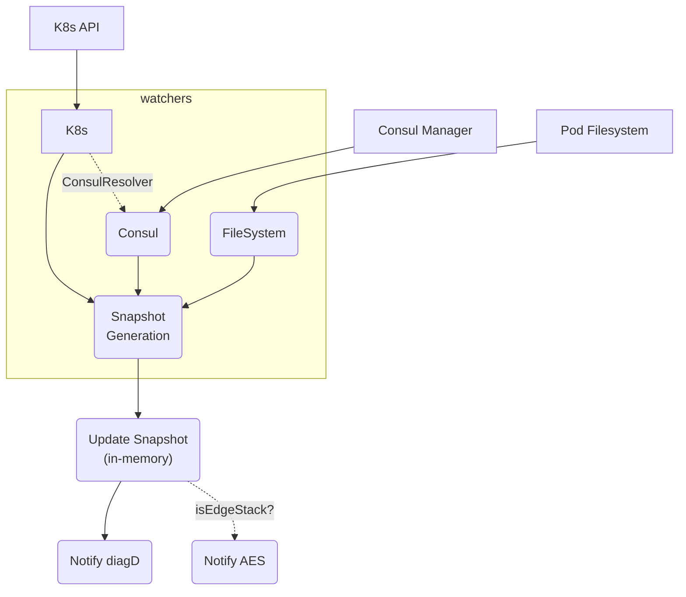

<a id="doc-06572a96a58dc510037d5efa"></a>

# emissary-ingress/emissary / CHANGELOG.md

Upstream: https://github.com/emissary-ingress/emissary/blob/0c186243e5d947bb2860b071f0b9507975e06632/CHANGELOG.md

Commit: `0c186243e5d947bb2860b071f0b9507975e06632`

Retrieved: 2026-10-01T15:18:14.178400+00:00

Kind: official-document

Raw SHA256: `25e9f7a6ff72e011f3d8e59f08fb9c61e0ff1aef7e56137a3b9c93a1285e3661`

Source text below is untrusted reference content. Acquisition does not verify technical claims.

License status: UPSTREAM_NOTICES_CAPTURED_PER_FILE_REVIEW_REQUIRED. See this repository's captured license files.

---

# CHANGELOG

## EMISSARY-INGRESS v4

[Emissary] is a Kubernetes-native, self-service, open-source API gateway
and ingress controller. It is a CNCF Incubating project, formerly known
as the Ambassador API Gateway.

### Quickstart

Emissary v4 supports both AMD64 and ARM64 architectures. To install
Emissary v4 using Helm, follow the instructions in the [Emissary
Quickstart](https://emissary-ingress.dev/docs/4.0/quick-start/).

Emissary provides two Helm charts:

- `ghcr.io/emissary-ingress/emissary-crds-chart` is the chart for
  Emissary's CRDs.

- `ghcr.io/emissary-ingress/emissary-ingress` is the chart for
  Emissary itself.

The Emissary project recommends using Helm to install Emissary. If you
need YAML instead, use `helm template` to generate the YAML manifests
from the Helm charts.

## Emissary v4 Release Notes

## [TBD] TBD
[TBD]: https://github.com/emissary-ingress/emissary/compare/v4.1.0...TBD

- Fix: Completely disable the Ambassador Labs `error_response_overrides` mechanism;
  you'll now see an error posted if you try to use it. (This shouldn't affect anyone
  running Emissary.)

- Fix: Weighted `TCPMapping`s now divide traffic in the ratio they are configured with.
  Their weights were reaching Envoy as running totals rather than as each cluster's own
  share, so a pair weighted 70 and 30 actually split about 77/23. If you had tuned
  weights around the old behaviour, your split will change.

## [4.1.0] 1 May 2026
[4.1.0]: https://github.com/emissary-ingress/emissary/compare/v4.0.1...v4.1.0

- Update: Upgrade from Envoy 1.36.2 to Envoy 1.37.2 ([1.37.0 release notes],
  [1.37.1 release notes], [1.37.2 release notes]).

[1.37.0 release notes]: https://www.envoyproxy.io/docs/envoy/latest/version_history/v1.37/v1.37.0
[1.37.1 release notes]: https://www.envoyproxy.io/docs/envoy/latest/version_history/v1.37/v1.37.1
[1.37.2 release notes]: https://www.envoyproxy.io/docs/envoy/latest/version_history/v1.37/v1.37.2

- Fix: `IR.check_deltas` now forces a complete reconfigure whenever the
  cache is present but the incoming snapshot has no deltas. Previously,
  an empty-delta snapshot with a cached entry kept the stale entry around
  until another delta happened to arrive, which caused the Istio mTLS
  cert-rotation failure described in [#4744] (thanks, [Jonathan Bailey]!).

[#4744]: https://github.com/emissary-ingress/emissary/issues/4744
[Jonathan Bailey]: https://github.com/jonathanelbailey

## [4.0.1] 26 March 2026
[4.0.1]: https://github.com/emissary-ingress/emissary/compare/v3.10.0...v4.0.1

_v4.0.0 was never published due to a CI glitch. v4.0.1 is the correct GA
version of Emissary._

### Quickstart

Emissary v4 supports both AMD64 and ARM64 architectures. To install
Emissary v4 using Helm, follow the instructions in the [Emissary
Quickstart](https://emissary-ingress.dev/docs/4.0/quick-start/).

Emissary provides two Helm charts:

- `ghcr.io/emissary-ingress/emissary-crds-chart` is the chart for
  Emissary's CRDs.

- `ghcr.io/emissary-ingress/emissary-ingress` is the chart for
  Emissary itself.

The Emissary project recommends using Helm to install Emissary. If you
need YAML instead, use `helm template` to generate the YAML manifests
from the Helm charts.

### Breaking Changes

- **BREAKING CHANGE**: Emissary is now built using `distroless` and Envoy
  1.36.2 with **no custom Envoy changes**, and almost all code specific
  to Ambassador Edge Stack has been removed to lessen maintenance burdens
  (with thanks to [Luke Shumaker] for jumping back in to help with
  tooling work!).

  As a result, Ambassador Edge Stack's custom error responses and
  header-case mangling features are completely unavailable in Emissary
  (which should not affect any Emissary users).

- **BREAKING CHANGE**: The Helm chart and Emissary itself now have aligned
  version numbers (e.g., use chart 4.0.1 to install Emissary 4.0.1).

- **BREAKING CHANGE**: Emissary's Helm charts are now available only from
  the GitHub Container Registry (GHCR):

- **BREAKING CHANGE**: By default, the Emissary CRD Helm chart will not
  enable the conversion webhook that supports Emissary's `v1` and `v2`
  CRDs. To enable the webhook:

  - Set `enableLegacyVersions: true` to enable the conversion webhook
    with support for `v2` CRDs.

  - Also set `enableV1: true` to additionally support `v1` CRDs. There is
    no way to support only `v1` CRDs.

- **BREAKING CHANGE**: Support for the extra metrics endpoint (set by
  supplying `--metrics-endpoint` on the command line for `diagd`) has
  been removed. This was a holdover from Ambassador Edge Stack (thanks to
  [Jeremy Dinsel] for the report!)

- **BREAKING CHANGE**: The default `--banner-endpoint` argument has been
  removed, since it was a holdover from Ambassador Edge Stack. If you
  want to use the diagnostics-banner functionality, you can now set
  `AMBASSADOR_DIAGD_BANNER_ENDPOINT` in the environment to the URL from
  which to fetch the banner.

### Changes

- Fix: Correctly distinguish Mappings that differ only by `weight`, even
  when some weights are missing (thanks, [sekar-saravanan]!).

- Fix: Generate correct cache keys for Mappings using `header_regex`
  match conditions (thanks, [sekar-saravanan]!).

- Fix: Document the `loadBalancerSourceRanges` value in the Helm chart
  (thanks, [Abhay Bothra]!).

- Fix: The Helm chart no longer sets a CPU limit on Emissary's
  deployments (thanks, [Frederic Mereu]!).

- Fix: The Helm chart's `initContainers` are now correctly indented
  (thanks, [Catalin Codreanu]!).

- Fix: The Helm chart now correctly restores the `HOST_IP` value for
  tracing providers (thanks, [Tenshin Higashi]!).

- Fix: Update many dependencies and the Python interpreter to resolve CVEs (thanks, [Bhargav Joshi]!).

- Fix: When the conversion webhook is active and Emissary is instructed
  to wait for the webhooks at boot time, this is now completely internal
  rather than requiring an extra init container.

- Fix: When trying to use environment variables to tell the conversion
  webhook not to manage aspects of its certificate, don't invert the
  meaning of the environment variables.

- Fix: The diagnostics UI refers to Emissary (instead of Ambassador) and
  links to emissary-ingress.dev's docs.

- Fix: Emissary now uses the current `string_match` Envoy HeaderMatcher
  stanza rather than the deprecated `exact_match` stanza.

- Feature: Emissary now supports both `arm64` and `amd64` architectures
  using multiarch Docker images.

- Feature: When the `emissary-apiext` deployment is in use, the Helm
  chart correctly sets its `securityContext` (thanks, [Frederic Mereu]!).

- Feature: The Helm chart can now supply a `loadBalancerClass` on
  Emissary's Services (thanks, [Sunny Kumar]!).

- Feature: The Helm chart supports setting the IP address family for
  Emissary's Services, and disabling the creation of a Module entirely
  (thanks, [Pier]!).

[Abhay Bothra]: https://github.com/bothra90
[Bhargav Joshi]: https://github.com/zencircle
[Catalin Codreanu]: https://github.com/ccodreanu
[Frederic Mereu]: https://github.com/fad3t
[Jeremy Dinsel]: https://github.com/jdinsel-xealth
[Luke Shumaker]: https://github.com/lukeshu
[Pier]: https://github.com/pie-r
[Sunny Kumar]: https://github.com/sunnykrGupta
[Tenshin Higashi]: https://github.com/tenshinhigashi
[sekar-saravanan]: https://github.com/sekar-saravanan

[Emissary] follows [Semantic
Versioning](http://semver.org/spec/v2.0.0.html).

[Emissary]: https://emissary-ingress.dev/


<a id="doc-73c2e4c2e886ff07d524b16d"></a>

# emissary-ingress/emissary / DEPENDENCIES.md

Upstream: https://github.com/emissary-ingress/emissary/blob/0c186243e5d947bb2860b071f0b9507975e06632/DEPENDENCIES.md

Commit: `0c186243e5d947bb2860b071f0b9507975e06632`

Retrieved: 2026-10-01T15:18:14.178400+00:00

Kind: official-document

Raw SHA256: `f0be4a7c9360cc9057839ddb609ecaacad13836fb879575e752e2ea6dbec4d62`

Source text below is untrusted reference content. Acquisition does not verify technical claims.

License status: UPSTREAM_NOTICES_CAPTURED_PER_FILE_REVIEW_REQUIRED. See this repository's captured license files.

---

The Go module "github.com/emissary-ingress/emissary/v3" incorporates the
following Free and Open Source software:

    Name                                                                                    Version                                License(s)
    ----                                                                                    -------                                ----------
    the Go language standard library ("std")                                                v1.24.0                                3-clause BSD license
    cel.dev/expr                                                                            v0.16.1                                Apache License 2.0
    dario.cat/mergo                                                                         v1.0.0                                 3-clause BSD license
    github.com/Azure/go-ansiterm                                                            v0.0.0-20210617225240-d185dfc1b5a1     MIT license
    github.com/MakeNowJust/heredoc                                                          v1.0.0                                 MIT license
    github.com/Masterminds/goutils                                                          v1.1.1                                 Apache License 2.0
    github.com/Masterminds/semver                                                           v1.5.0                                 MIT license
    github.com/Masterminds/sprig                                                            v2.22.0+incompatible                   MIT license
    github.com/Microsoft/go-winio                                                           v0.6.2                                 MIT license
    github.com/ProtonMail/go-crypto                                                         v1.1.6                                 3-clause BSD license
    github.com/antlr/antlr4/runtime/Go/antlr/v4                                             v4.0.0-20230305170008-8188dc5388df     3-clause BSD license
    github.com/armon/go-metrics                                                             v0.4.1                                 MIT license
    github.com/asaskevich/govalidator                                                       v0.0.0-20230301143203-a9d515a09cc2     MIT license
    github.com/beorn7/perks                                                                 v1.0.1                                 MIT license
    github.com/blang/semver/v4                                                              v4.0.0                                 MIT license
    github.com/cenkalti/backoff/v4                                                          v4.2.1                                 MIT license
    github.com/census-instrumentation/opencensus-proto                                      v0.4.1                                 Apache License 2.0
    github.com/cespare/xxhash/v2                                                            v2.3.0                                 MIT license
    github.com/chai2010/gettext-go                                                          v1.0.2                                 3-clause BSD license
    github.com/cloudflare/circl                                                             v1.6.3                                 3-clause BSD license
    github.com/cncf/xds/go                                                                  v0.0.0-20240905190251-b4127c9b8d78     Apache License 2.0
    github.com/cyphar/filepath-securejoin                                                   v0.4.1                                 3-clause BSD license
    github.com/datawire/dlib                                                                v1.3.1                                 Apache License 2.0
    github.com/datawire/dtest                                                               v0.0.0-20210928162311-722b199c4c2f     Apache License 2.0
    github.com/LukeShu/go-mkopensource (modified from github.com/datawire/go-mkopensource)  v0.0.0-20250206080114-4ff6b660d8d4     Apache License 2.0
    github.com/davecgh/go-spew                                                              v1.1.2-0.20180830191138-d8f796af33cc   ISC license
    github.com/distribution/reference                                                       v0.5.0                                 Apache License 2.0
    github.com/emicklei/go-restful/v3                                                       v3.11.0                                MIT license
    github.com/emirpasic/gods                                                               v1.18.1                                2-clause BSD license, ISC license
    github.com/emissary-ingress/goversion                                                   v0.0.0-20230221050731-229c429afb59     3-clause BSD license, Apache License 2.0
    github.com/envoyproxy/go-control-plane                                                  v0.13.1                                Apache License 2.0
    github.com/envoyproxy/protoc-gen-validate                                               v1.1.0                                 Apache License 2.0
    github.com/evanphx/json-patch                                                           v5.7.0+incompatible                    3-clause BSD license
    github.com/evanphx/json-patch/v5                                                        v5.9.0                                 3-clause BSD license
    github.com/exponent-io/jsonpath                                                         v0.0.0-20210407135951-1de76d718b3f     MIT license
    github.com/fatih/camelcase                                                              v1.0.0                                 MIT license
    github.com/fatih/color                                                                  v1.18.0                                MIT license
    github.com/fsnotify/fsnotify                                                            v1.7.0                                 3-clause BSD license
    github.com/go-errors/errors                                                             v1.5.1                                 MIT license
    github.com/go-git/gcfg                                                                  v1.5.1-0.20230307220236-3a3c6141e376   3-clause BSD license
    github.com/go-git/go-billy/v5                                                           v5.6.2                                 Apache License 2.0
    github.com/go-git/go-git/v5                                                             v5.16.5                                Apache License 2.0
    github.com/go-logr/logr                                                                 v1.4.2                                 Apache License 2.0
    github.com/go-logr/zapr                                                                 v1.3.0                                 Apache License 2.0
    github.com/go-openapi/jsonpointer                                                       v0.20.0                                Apache License 2.0
    github.com/go-openapi/jsonreference                                                     v0.20.2                                Apache License 2.0
    github.com/go-openapi/swag                                                              v0.22.4                                Apache License 2.0
    github.com/gobuffalo/flect                                                              v1.0.2                                 MIT license
    github.com/gogo/protobuf                                                                v1.3.2                                 3-clause BSD license
    github.com/golang/groupcache                                                            v0.0.0-20241129210726-2c02b8208cf8     Apache License 2.0
    github.com/golang/protobuf                                                              v1.5.4                                 3-clause BSD license
    github.com/google/btree                                                                 v1.0.1                                 Apache License 2.0
    github.com/google/cel-go                                                                v0.18.1                                3-clause BSD license, Apache License 2.0
    github.com/google/gnostic-models                                                        v0.6.8                                 Apache License 2.0
    github.com/google/go-cmp                                                                v0.7.0                                 3-clause BSD license
    github.com/google/gofuzz                                                                v1.2.0                                 Apache License 2.0
    github.com/google/shlex                                                                 v0.0.0-20191202100458-e7afc7fbc510     Apache License 2.0
    github.com/google/uuid                                                                  v1.6.0                                 3-clause BSD license
    github.com/gorilla/websocket                                                            v1.5.1                                 3-clause BSD license
    github.com/gregjones/httpcache                                                          v0.0.0-20190611155906-901d90724c79     MIT license
    github.com/hashicorp/consul/api                                                         v1.26.1                                Mozilla Public License 2.0
    github.com/hashicorp/errwrap                                                            v1.1.0                                 Mozilla Public License 2.0
    github.com/hashicorp/go-cleanhttp                                                       v0.5.2                                 Mozilla Public License 2.0
    github.com/hashicorp/go-hclog                                                           v1.5.0                                 MIT license
    github.com/hashicorp/go-immutable-radix                                                 v1.3.1                                 Mozilla Public License 2.0
    github.com/hashicorp/go-multierror                                                      v1.1.1                                 Mozilla Public License 2.0
    github.com/hashicorp/go-rootcerts                                                       v1.0.2                                 Mozilla Public License 2.0
    github.com/hashicorp/golang-lru                                                         v1.0.2                                 Mozilla Public License 2.0
    github.com/hashicorp/hcl                                                                v1.0.0                                 Mozilla Public License 2.0
    github.com/hashicorp/serf                                                               v0.10.1                                Mozilla Public License 2.0
    github.com/huandu/xstrings                                                              v1.3.2                                 MIT license
    github.com/imdario/mergo                                                                v0.3.16                                3-clause BSD license
    github.com/inconshreveable/mousetrap                                                    v1.1.0                                 Apache License 2.0
    github.com/jbenet/go-context                                                            v0.0.0-20150711004518-d14ea06fba99     MIT license
    github.com/josharian/intern                                                             v1.0.1-0.20211109044230-42b52b674af5   MIT license
    github.com/json-iterator/go                                                             v1.1.12                                MIT license
    github.com/kballard/go-shellquote                                                       v0.0.0-20180428030007-95032a82bc51     MIT license
    github.com/kevinburke/ssh_config                                                        v1.2.0                                 MIT license
    github.com/liggitt/tabwriter                                                            v0.0.0-20181228230101-89fcab3d43de     3-clause BSD license
    github.com/magiconair/properties                                                        v1.8.6                                 2-clause BSD license
    github.com/mailru/easyjson                                                              v0.7.7                                 MIT license
    github.com/mattn/go-colorable                                                           v0.1.14                                MIT license
    github.com/mattn/go-isatty                                                              v0.0.20                                MIT license
    github.com/matttproud/golang_protobuf_extensions/v2                                     v2.0.0                                 Apache License 2.0
    github.com/mitchellh/copystructure                                                      v1.2.0                                 MIT license
    github.com/mitchellh/go-homedir                                                         v1.1.0                                 MIT license
    github.com/mitchellh/go-wordwrap                                                        v1.0.1                                 MIT license
    github.com/mitchellh/mapstructure                                                       v1.5.0                                 MIT license
    github.com/mitchellh/reflectwalk                                                        v1.0.2                                 MIT license
    github.com/moby/spdystream                                                              v0.2.0                                 Apache License 2.0
    github.com/moby/term                                                                    v0.0.0-20221205130635-1aeaba878587     Apache License 2.0
    github.com/modern-go/concurrent                                                         v0.0.0-20180306012644-bacd9c7ef1dd     Apache License 2.0
    github.com/modern-go/reflect2                                                           v1.0.2                                 Apache License 2.0
    github.com/monochromegane/go-gitignore                                                  v0.0.0-20200626010858-205db1a8cc00     MIT license
    github.com/munnerz/goautoneg                                                            v0.0.0-20191010083416-a7dc8b61c822     3-clause BSD license
    github.com/mxk/go-flowrate                                                              v0.0.0-20140419014527-cca7078d478f     3-clause BSD license
    github.com/opencontainers/go-digest                                                     v1.0.0                                 Apache License 2.0
    github.com/pelletier/go-toml                                                            v1.9.5                                 MIT license
    github.com/pelletier/go-toml/v2                                                         v2.2.3                                 MIT license
    github.com/peterbourgon/diskv                                                           v2.0.1+incompatible                    MIT license
    github.com/pjbgf/sha1cd                                                                 v0.3.2                                 Apache License 2.0
    github.com/pkg/errors                                                                   v0.9.1                                 2-clause BSD license
    github.com/planetscale/vtprotobuf                                                       v0.6.1-0.20240319094008-0393e58bdf10   3-clause BSD license
    github.com/pmezard/go-difflib                                                           v1.0.1-0.20181226105442-5d4384ee4fb2   3-clause BSD license
    github.com/prometheus/client_golang                                                     v1.17.0                                Apache License 2.0
    github.com/prometheus/client_model                                                      v0.6.0                                 Apache License 2.0
    github.com/prometheus/common                                                            v0.45.0                                Apache License 2.0
    github.com/prometheus/procfs                                                            v0.12.0                                Apache License 2.0
    github.com/russross/blackfriday/v2                                                      v2.1.0                                 2-clause BSD license
    github.com/sergi/go-diff                                                                v1.3.2-0.20230802210424-5b0b94c5c0d3   MIT license
    github.com/sirupsen/logrus                                                              v1.9.3                                 MIT license
    github.com/skeema/knownhosts                                                            v1.3.1                                 Apache License 2.0
    github.com/spf13/afero                                                                  v1.12.0                                Apache License 2.0
    github.com/spf13/cast                                                                   v1.5.0                                 MIT license
    github.com/spf13/cobra                                                                  v1.9.1                                 Apache License 2.0
    github.com/spf13/jwalterweatherman                                                      v1.1.0                                 MIT license
    github.com/spf13/pflag                                                                  v1.0.6                                 3-clause BSD license
    github.com/spf13/viper                                                                  v1.12.0                                MIT license
    github.com/stoewer/go-strcase                                                           v1.3.0                                 MIT license
    github.com/stretchr/testify                                                             v1.10.0                                MIT license
    github.com/subosito/gotenv                                                              v1.4.1                                 MIT license
    github.com/vladimirvivien/gexe                                                          v0.2.0                                 MIT license
    github.com/xanzy/ssh-agent                                                              v0.3.3                                 Apache License 2.0
    github.com/xlab/treeprint                                                               v1.2.0                                 MIT license
    go.starlark.net                                                                         v0.0.0-20230525235612-a134d8f9ddca     3-clause BSD license
    go.uber.org/multierr                                                                    v1.11.0                                MIT license
    go.uber.org/zap                                                                         v1.26.0                                MIT license
    golang.org/x/crypto                                                                     v0.48.0                                3-clause BSD license
    golang.org/x/exp                                                                        v0.0.0-20240909161429-701f63a606c0     3-clause BSD license
    golang.org/x/mod                                                                        v0.33.0                                3-clause BSD license
    golang.org/x/net                                                                        v0.50.0                                3-clause BSD license
    golang.org/x/oauth2                                                                     v0.27.0                                3-clause BSD license
    golang.org/x/sync                                                                       v0.19.0                                3-clause BSD license
    golang.org/x/sys                                                                        v0.41.0                                3-clause BSD license
    golang.org/x/term                                                                       v0.40.0                                3-clause BSD license
    golang.org/x/text                                                                       v0.34.0                                3-clause BSD license
    golang.org/x/time                                                                       v0.8.0                                 3-clause BSD license
    golang.org/x/tools                                                                      v0.42.0                                3-clause BSD license
    gomodules.xyz/jsonpatch/v2                                                              v2.4.0                                 Apache License 2.0
    google.golang.org/genproto/googleapis/api                                               v0.0.0-20241209162323-e6fa225c2576     Apache License 2.0
    google.golang.org/genproto/googleapis/rpc                                               v0.0.0-20241223144023-3abc09e42ca8     Apache License 2.0
    google.golang.org/grpc                                                                  v1.67.3                                Apache License 2.0
    google.golang.org/grpc/cmd/protoc-gen-go-grpc                                           v1.3.0                                 Apache License 2.0
    google.golang.org/protobuf                                                              v1.36.5                                3-clause BSD license
    gopkg.in/inf.v0                                                                         v0.9.1                                 3-clause BSD license
    gopkg.in/ini.v1                                                                         v1.67.0                                Apache License 2.0
    gopkg.in/warnings.v0                                                                    v0.1.2                                 2-clause BSD license
    gopkg.in/yaml.v2                                                                        v2.4.0                                 Apache License 2.0, MIT license
    gopkg.in/yaml.v3                                                                        v3.0.1                                 Apache License 2.0, MIT license
    k8s.io/api                                                                              v0.30.2                                Apache License 2.0
    k8s.io/apiextensions-apiserver                                                          v0.30.2                                Apache License 2.0
    k8s.io/apimachinery                                                                     v0.30.2                                3-clause BSD license, Apache License 2.0
    k8s.io/apiserver                                                                        v0.30.2                                Apache License 2.0
    k8s.io/cli-runtime                                                                      v0.30.2                                Apache License 2.0
    k8s.io/client-go                                                                        v0.30.2                                3-clause BSD license, Apache License 2.0
    github.com/emissary-ingress/code-generator (modified from k8s.io/code-generator)        v0.30.2-0.20250205230848-daa3b0f955a4  Apache License 2.0
    k8s.io/component-base                                                                   v0.30.2                                Apache License 2.0
    k8s.io/gengo/v2                                                                         v2.0.0-20240228010128-51d4e06bde70     Apache License 2.0
    k8s.io/klog/v2                                                                          v2.120.1                               Apache License 2.0
    k8s.io/kube-openapi                                                                     v0.0.0-20240228011516-70dd3763d340     3-clause BSD license, Apache License 2.0
    k8s.io/kubectl                                                                          v0.30.1                                Apache License 2.0
    k8s.io/kubernetes                                                                       v1.30.3                                Apache License 2.0
    k8s.io/metrics                                                                          v0.30.2                                Apache License 2.0
    k8s.io/utils                                                                            v0.0.0-20230726121419-3b25d923346b     3-clause BSD license, Apache License 2.0
    sigs.k8s.io/controller-runtime                                                          v0.18.2                                Apache License 2.0
    sigs.k8s.io/controller-tools                                                            v0.13.0                                Apache License 2.0
    sigs.k8s.io/e2e-framework                                                               v0.3.0                                 Apache License 2.0
    sigs.k8s.io/gateway-api                                                                 v0.2.0                                 Apache License 2.0
    sigs.k8s.io/json                                                                        v0.0.0-20221116044647-bc3834ca7abd     3-clause BSD license, Apache License 2.0
    sigs.k8s.io/kustomize/api                                                               v0.13.5-0.20230601165947-6ce0bf390ce3  Apache License 2.0
    sigs.k8s.io/kustomize/kyaml                                                             v0.14.3                                Apache License 2.0, MIT license
    sigs.k8s.io/structured-merge-diff/v4                                                    v4.4.1                                 Apache License 2.0
    sigs.k8s.io/yaml                                                                        v1.4.0                                 3-clause BSD license, Apache License 2.0, MIT license

The Emissary-ingress Python code makes use of the following Free and Open Source
libraries:

    Name                Version     License(s)
    ----                -------     ----------
    Flask               3.1.3       3-clause BSD license
    Jinja2              3.1.6       3-clause BSD license
    MarkupSafe          3.0.3       3-clause BSD license
    PyYAML              6.0.2       MIT license
    Werkzeug            3.1.3       3-clause BSD license
    blinker             1.9.0       MIT license
    certifi             2025.11.12  Mozilla Public License 2.0
    charset-normalizer  3.4.4       MIT license
    click               8.3.0       3-clause BSD license
    durationpy          0.10        MIT license
    expiringdict        1.2.2       Apache License 2.0
    gunicorn            25.1.0      MIT license
    idna                3.11        3-clause BSD license
    itsdangerous        2.2.0       3-clause BSD license
    jsonpatch           1.33        3-clause BSD license
    jsonpointer         3.0.0       3-clause BSD license
    orjson              3.11.1      Apache License 2.0, MIT license
    packaging           24.2        2-clause BSD license, Apache License 2.0
    pip                 26.0.1      MIT license
    prometheus_client   0.22.1      2-clause BSD license, Apache License 2.0
    python-json-logger  2.0.7       2-clause BSD license
    requests            2.32.5      Apache License 2.0
    semantic-version    2.10.0      2-clause BSD license
    urllib3             2.5.0       MIT license


<a id="doc-3bbf1f5286f0a0e4121688ea"></a>

# emissary-ingress/emissary / DEPENDENCY_LICENSES.md

Upstream: https://github.com/emissary-ingress/emissary/blob/0c186243e5d947bb2860b071f0b9507975e06632/DEPENDENCY_LICENSES.md

Commit: `0c186243e5d947bb2860b071f0b9507975e06632`

Retrieved: 2026-10-01T15:18:14.178400+00:00

Kind: official-document

Raw SHA256: `3cfd57814d4730b9ec612bd867c9c855b81609fe2fcf8477c762d6787d326cbe`

Source text below is untrusted reference content. Acquisition does not verify technical claims.

License status: UPSTREAM_NOTICES_CAPTURED_PER_FILE_REVIEW_REQUIRED. See this repository's captured license files.

---

Emissary-ingress incorporates Free and Open Source software under the following licenses:

* [2-clause BSD license](https://opensource.org/licenses/BSD-2-Clause)
* [3-clause BSD license](https://opensource.org/licenses/BSD-3-Clause)
* [Apache License 2.0](https://opensource.org/licenses/Apache-2.0)
* [ISC license](https://opensource.org/licenses/ISC)
* [MIT license](https://opensource.org/licenses/MIT)
* [Mozilla Public License 2.0](https://opensource.org/licenses/MPL-2.0)


<a id="doc-3c9034016e4697f736d78860"></a>

# emissary-ingress/emissary / DevDocumentation/ARCHITECTURE.md

Upstream: https://github.com/emissary-ingress/emissary/blob/0c186243e5d947bb2860b071f0b9507975e06632/DevDocumentation/ARCHITECTURE.md

Commit: `0c186243e5d947bb2860b071f0b9507975e06632`

Retrieved: 2026-10-01T15:18:14.178400+00:00

Kind: official-document

Raw SHA256: `396e2a7ebd7a53666dcb86b37766a8116fa57927ab6cd3535a6267661d735bd2`

Source text below is untrusted reference content. Acquisition does not verify technical claims.

License status: UPSTREAM_NOTICES_CAPTURED_PER_FILE_REVIEW_REQUIRED. See this repository's captured license files.

---

# Emissary-Ingress Architecture

In this document you will find information about the internal design and architecture of the Emissary-ingress (formerly known as Ambassador API Gateway). Emissary-ingress provides a Kubernetes-native load balancer, API gateway and ingress controller that is built on top of [Envoy Proxy](https://www.envoyproxy.io).

> Looking for end user guides for Emissary-ingress? You can check out the end user guides at <https://www.getambassador.io/docs/emissary/>.

## Table of Contents

- [Table of Contents](#table-of-contents)
- [Overview](#overview)
- [Custom Resource Definitions (CRD)](#custom-resource-definitions-crd)
  - [Apiext](#apiext)
  - [Additional Reading](#additional-reading)
- [Emissary-ingress Container](#emissary-ingress-container)
  - [Startup and Busyambassador](#startup-and-busyambassador)
  - [Entrypoint](#entrypoint)
    - [Watch All The Things (Watt)](#watch-all-the-things-watt)
- [Diagd](#diagd)
- [Ambex](#ambex)
- [Envoy](#envoy)
- [Testing Components](#testing-components)
  - [kat-client](#kat-client)
  - [kat-server](#kat-server)

## Overview

Emissary-ingress is a Kubernetes native API Gateway built on top of Envoy Proxy. We utilize Kubernetes CRDs to provide an expressive API to configure Envoy Proxy to handle routing traffic into your cluster.

Check [this blog post](https://blog.getambassador.io/building-ambassador-an-open-source-api-gateway-on-kubernetes-and-envoy-ed01ed520844) for additional context around the motivations and architecture decisions made for Emissary-ingress.

At the core of Emissary-ingress is Envoy Proxy which has very extensive configuration and extensions points. Getting this right can be challenging so Emissary-ingress provides Kubernetes Administrators and Developers a cloud-native way to configure Envoy using declarative yaml files. Here are the core components of Emissary-Ingress:

- CRDs - extend K8s to enable Emissary-ingress's abstractions (*generated yaml*)
- Apiext - A server that implements the Webhook Conversion interface for CRD's (**own container**)
- Diagd - provides diagnostic ui, translates snapshots/ir into envoy configuration (*in-process*)
- Ambex - gRPC server implementation of envoy xDS for dynamic envoy configration (*in-process*)
- Envoy Proxy - Proxy that handles routing all user traffic (*in-process*)

## Custom Resource Definitions (CRD)

Kubernetes allows extending its API through the use of [Customer Resource Definitions](https://kubernetes.io/docs/tasks/extend-kubernetes/custom-resources/custom-resource-definitions/) (aka CRDs) which allow solutions like Emissary-ingress to add custom resources to K8s and allow developers to treat them like any other K8s resource. CRDs provide validation, strong typing, structured data, versioning and are persisted in `etcd` along with the core Kuberenetes resources.

Emissary-ingress provides a set of CRD's that are applied to a cluster and then are watched by Emissary-ingress. Emissary-ingress then uses the data from these CRD's along with the standard K8's resources (services, endpoints, etc...) to dynamically generate Envoy Proxy configuration. Depending on the version of Emissary-ingress there might be multiple versions of the CRD's that are suppported.

You can read the user documentation (see additional reading below) to find out more about all the various CRDs that are used and how to configure them. For understanding, how they are defined you can take a look in `pkg/getambassador.io/*` directory. In this directory, you will find a directory per version of the CRDs and for each version you will see the `Golang` structs that define the data structures that are used for each of the Emissary-ingress custom resources. It's recommended to read the `doc.go` file for information about API guidelines followed and how the comment markers are used by the build system.

The build system (`make`) uses [controller-gen](https://book.kubebuilder.io/reference/controller-gen.html) to generate the required YAML representation for the customer resources that can be found at `pkg/getambassador.io/crds.yaml`. This file is auto-generated and checked into the respository. This is the file that is applied to a cluster extending the Kubernetes API. If any changes are made to the custom resources then it needs to be re-generated and checked-in as part of your PR. Running `make generate` will trigger the generation of this file and other generated files (`protobufs`) that are checked into the respository as well. If you want to see more about the build process take a look at `build-aux/generate.mk`.

> **Annotations**:  K8s allows developers to provide Annotations as well to the standard K8s Resources (Services, Ingress, etc...). Annotations were the preferred method of configuring early versions of Emissary-ingress but annotations did not provide validation and can be error prone. However, with the introduction of CRD's these are now the preferred method and annotations are only supported for backwards compatibility. We won't discuss the annotations much here due to this but rather making you aware that they exist.

### Apiext

Kubernetes provides the ability to have multiple versions of Custom Resources similiar to the core K8s resources but it is only capable of having a single `storage` version that is persisted in `etcd`. Custom Resource Definitions can define a `ConversionWebHook` that Kubernetes will call whenever it receives a version that is not the storage version.

You can check the current storage version by looking at `pkg/getambassador.io/crds.yaml` and searching for the `storage: true` field and seeing which version is the storage version of the custom resource (*at the time of writing this it is `v2`*).

The `apiext` container is the Emissary-ingress's server implementation for the conversion webhook that is registered with our custom resources. Each custom resource will have a section similiar to the following in the `pkg/getambassador.io/crds.yaml`:

```yaml
conversion:
    strategy: Webhook
    webhook:
      clientConfig:
        service:
          name: emissary-apiext
          namespace: emissary-system
      conversionReviewVersions:
      - v1
```

This is telling the Kubernetes API Server to call a WebHook using a `Service` within the cluster that is called `emissary-apiext` that can be found in the `emissary-system` namespace. It also states that our server implementation supports the `v1` version of the WebHook protocol so the K8s API Server will send the request and expect the response in the format for `v1`.

The implementation of the `apiext` server can be found in `cmd/apiext` and it leverages the [controller-runtime](https://pkg.go.dev/sigs.k8s.io/controller-runtime@v0.11.2starts) library which is vendored in `vendor/sigs.k8s.io/controller-runtime`. When this process starts up it will do the following:

1. Register the Emissary-Ingress CRD schemas using the Go structs described previously
2. Ensure a self-signed certificate is generated that our server can register with for `https`.
3. Kick off a Go routine that handles watching our CRD's and enriching the WebHook Conversion section (*outlined in yaml above*) so that it includes our self-signed certs, port and path that the apiext server is listening on.
4. Starts up our two servers one for container liveness/readiness probes and one for the WebHook implementation that performs the conversion between CRD versions.

### Additional Reading

- [Ambassador Labs Docs - Custom Resources](https://www.getambassador.io/docs/emissary/latest/topics/running/host-crd/)
- [Ambassador Labs Docs - Declarative Configuration](https://www.getambassador.io/docs/emissary/latest/topics/concepts/gitops-continuous-delivery/#policies-declarative-configuration-and-custom-resource-definitions)
- [K8s Docs - Custom Resouce Definition](https://kubernetes.io/docs/tasks/extend-kubernetes/custom-resources/custom-resource-definitions/)
- [K8s Docs - Version CRD's](https://kubernetes.io/docs/tasks/extend-kubernetes/custom-resources/custom-resource-definition-versioning/)
- [K8s Docs - Webhook Conversion](<https://kubernetes.io/docs/tasks/extend-kubernetes/custom-resources/custom-resource-definition-versioning/#webhook-conversion>)

## Emissary-ingress Container

One of the major goals of the Emissary-ingress is to simplify the deployment of Envoy Proxy in a cloud-native friendly way using containers and declarative CRD's. To honor this goal Emissary-ingress is packaged up into a single image with all the necessary components.

This section will give a high-level overview of each of these components and will help provide you direction on where you can find more information on each of the components.

### Startup and Busyambassador

Emissary-ingress has evolved over many years, many contributors and many versions of Kubernetes which has led to the internal components being implemented in different programming languages. Some of the components are pre-built binaries like envoy, first-party python programs and first-party golang binaries. To provide a single entrypoint for the container startup the Golang binary called `busyambassador` was introduced.

/buildroot/ambassador/python/entrypoint.sh

The `busyambassador` binary provides a busybox like interface that dispatches the CMD's that are provided to a container for the various configured Golang binaries. This enables a single image to support multiple binaries on startup that are declartively set within a `deployment` in the `command` field when setting the image for a deployment.

The image takes advantage of the `ENTRYPOINT` and `CMD` fields within a docker image manifest. You can see this in `builder/Dockerfile` in the final optimized image on the last line there is `ENTRYPOINT [ "bash", "/buildroot/ambassador/python/entrypoint.sh" ]`. This entrypoint cannot be overriden by the user and will run that bash script. By default the bash script will run the `entrypoint` binary which will be discussed in the next section but if passed a known binary name, then `busyambassador` will run the correct command.

To learn more about `busyambassador` the code can be found:

- `cmd/busyambassador`
- `pkg/busy`

> Note: the bash script will just exec into the `busyambassador` Golang binary in most cases and is still around for historical reasons and advanced debugging scenarios.

> Additional Reading: If you want to know more about how containers work with entrypoint and commands then take a look at this blogpost. <https://www.bmc.com/blogs/docker-cmd-vs-entrypoint/>

### Entrypoint

The `entrypoint` Golang binary is the default binary that `busyambassador` will run on container startup. It is the parent process for all the other processes that are run within the single `ambassador` image for Emissary-Ingress. At a high-level it starts and manages multiple go-routines, starts other child processes such as `diagd` (python program) and `envoy` (c++ compiled binary).

Here is a list of everything managed by the `entrypoint` binary. Each one is indicated by whether its a child OS process that is started or a goroutine (*note: some of the OS processes are started/managed in goroutines but the core logic resides within the child process thus they are marked as such*).

| Description                                                               |     Goroutine      |      OS.Exec       |
| ------------------------------------------------------------------------- | :----------------: | :----------------: |
| `diagd` - admin ui & config processor                                     |                    | :white_check_mark: |
| `ambex` - the Envoy ADS Server                                            | :white_check_mark: |                    |
| `envoy` - proxy routing data                                              |                    | :white_check_mark: |
| SnapshotServer  - expose in-memory snapshot over localhost                | :white_check_mark: |                    |
| ExternalSnapshotServer - Ambassador Cloud friendly exposed over localhost | :white_check_mark: |                    |
| HealthCheck -  endpoints for K8s liveness/readiness probes                | :white_check_mark: |                    |
| Watt - Watch k8s, consul & files for cluster changes                      | :white_check_mark: |                    |
| Sidecar Processes - start various side car processes                      |                    | :white_check_mark: |

Some of these items will be discussed in more detail but the best places to get started looking at the `entrypoint` is by looking at `cmd/entrypoint/entrypoint.go`.

> To see how the container passes `entrypoint` as the default binary to run on container startup you can look at `python/entrypoint.sh` where it calls `exec busyambassador entrypoint "$@"` which will drop the shell process and will run the entrypoint process via busyambassador.

#### Watch All The Things (Watt)

Watch All The Things (aka Watt) is tasked with watching alot of things, hence the name :smile:. Specifically, its job is to watch for changes in the K8s Cluster and potentially Consul and file system changes. Watt is the beginning point for the end-to-end data flow from developer applying the configuration to envoy being configured. You can find the code for this in the `cmd/entrypoint/watcher.go` file.

The watching of the K8s Cluster changes is where Emissary-ingress will get most of its configuration by looking for K8s Resources (e.g. services,ingresss, etc...) as well as the Emissary-ingress CRD Resources (e.g. Host, Mapping, Listeners, etc...). A `consulWatcher`  will be started if a user has configured a Mapping to use the `ConsulResolver`. You can find this code in `cmd/entrypoint/consul.go`. The filesystem is also watched for changes to support `istio` and how it mounts certificates to the filesystem.

Here is the general flow:



## Diagd

Provides two main functions:

1. A Diagnostic Admin UI for viewing the current state of Emissary-Ingress
2. Processing Cluster changes into Envoy ready configuration
   1. This process has all the steps i'm outlining below

- receives "CONFIG" event and pushes on queue
- event queue loop listens for commands and pops them off
- on CONFIG event it calls back to emissary Snapshot Server to grab current snapshot stored in-memory
- It is serialized and stored in `/ambassador/snapshots/snapshot-tmp.yaml`.
- A SecretHandler and Config is initialized
- A ResourceFetcher (aka, parse the snapshot into an in-memory representation)
- Generate IR and envoy configs (load_ir function)
  - Take each Resource generated in ResourceFetcher and add it to the Config object as strongly typed objects
  - Store Config Object in `/ambassador/snapshots/aconf-tmp.json`
  - Check Deltas for Mappings cach and determine if we needs to be reset
  - Create IR with a Config, Cache, and invalidated items
    - IR is generated which basically just converts our stuff to strongly typed generic "envoy" items (handling filters, clusters, listeners, removing duplicates, etc...)
  - IR is updated in-memory for diagd process
  - IR is persisted to temp storage in `/ambassador/snapshots/ir-tmp.json`
  - generate envoy config from IR and cache
  - Split envoy config into bootstrap config, ads_config and clustermap config
  - Validate econfig
  - Rotate Snapshots for each of the files `aconf`, `econf`, `ir`, `snapshot` that get persisted in the snapshot path `/ambassador/snapshots`.
    - Rotating them allows for seeing the history of snapshots up to a limit and then they are dropped
    - this also renames the `-tmp` files written above into
  - Persist bootstrap, envoy ads config and clustermap config to base directory:
    - `/ambassador/bootstrap-ads.json` # this is used by envoy during startup to initial config itself and let it know about the static ADS Service
    - `/ambassador/enovy/envoy.json` # this is used in `ambex` to generate the ADS snapshots along with the fastPath items
    - `/ambassador/clustermap.json` # this might not be used either...
  - Notify `envoy` and `ambex` that a new snapshot has been persisted using signal SIGHUP
    - the Goroutine within `entrypoint` that starts up `envoy` is blocking waiting for this signal to start envoy
    - the `ambex` process continuously listens for this signal and it triggers a configuration update for ambex.
  - Update the appropriate status fields with metatdata by making calls to the `kubestatus` binary found in `cmd/kubestatus` which handles the communication to the cluster

## Ambex

This is the gRPC server implementation of the envoy xDS v2 and v3 api's based on ...

- listens for SIGHUP from diagd
- converts `envoy.json` into in-memory snapshots that are cached for v2/v3
- implements ADS v2/v3 Apis that envoy is configured to listen to

## Envoy

We maintain our own [fork](https://github.com/datawire/envoy) of Envoy that includes some additional commits for implementing some features in Emissary-Ingress.

Envoy does all the heavy-lifting

- does all routing, filtering, TLS termination, metrics collection, tracing, etc...
- It is bootstraps from the output of diagd
- It is dynamically updated using the xDS services and specifically the ADS service
  - Our implementation of this is `ambex`

## Testing Components

TODO: talk about testing performed by kat-client/kat-server.

### kat-client

TODO: discuss the purpose of kat-client

### kat-server

TODO: discuss the purpose of kat-client


<a id="doc-c693279643b8cd5d248172d9"></a>

# emissary-ingress/emissary / LICENSE

Upstream: https://github.com/emissary-ingress/emissary/blob/0c186243e5d947bb2860b071f0b9507975e06632/LICENSE

Commit: `0c186243e5d947bb2860b071f0b9507975e06632`

Retrieved: 2026-10-01T15:18:14.178400+00:00

Kind: license

Raw SHA256: `c71d239df91726fc519c6eb72d318ec65820627232b2f796219e87dcf35d0ab4`

Source text below is untrusted reference content. Acquisition does not verify technical claims.

License status: UPSTREAM_NOTICES_CAPTURED_PER_FILE_REVIEW_REQUIRED. See this repository's captured license files.

---

````text
                                 Apache License
                           Version 2.0, January 2004
                        http://www.apache.org/licenses/

   TERMS AND CONDITIONS FOR USE, REPRODUCTION, AND DISTRIBUTION

   1. Definitions.

      "License" shall mean the terms and conditions for use, reproduction,
      and distribution as defined by Sections 1 through 9 of this document.

      "Licensor" shall mean the copyright owner or entity authorized by
      the copyright owner that is granting the License.

      "Legal Entity" shall mean the union of the acting entity and all
      other entities that control, are controlled by, or are under common
      control with that entity. For the purposes of this definition,
      "control" means (i) the power, direct or indirect, to cause the
      direction or management of such entity, whether by contract or
      otherwise, or (ii) ownership of fifty percent (50%) or more of the
      outstanding shares, or (iii) beneficial ownership of such entity.

      "You" (or "Your") shall mean an individual or Legal Entity
      exercising permissions granted by this License.

      "Source" form shall mean the preferred form for making modifications,
      including but not limited to software source code, documentation
      source, and configuration files.

      "Object" form shall mean any form resulting from mechanical
      transformation or translation of a Source form, including but
      not limited to compiled object code, generated documentation,
      and conversions to other media types.

      "Work" shall mean the work of authorship, whether in Source or
      Object form, made available under the License, as indicated by a
      copyright notice that is included in or attached to the work
      (an example is provided in the Appendix below).

      "Derivative Works" shall mean any work, whether in Source or Object
      form, that is based on (or derived from) the Work and for which the
      editorial revisions, annotations, elaborations, or other modifications
      represent, as a whole, an original work of authorship. For the purposes
      of this License, Derivative Works shall not include works that remain
      separable from, or merely link (or bind by name) to the interfaces of,
      the Work and Derivative Works thereof.

      "Contribution" shall mean any work of authorship, including
      the original version of the Work and any modifications or additions
      to that Work or Derivative Works thereof, that is intentionally
      submitted to Licensor for inclusion in the Work by the copyright owner
      or by an individual or Legal Entity authorized to submit on behalf of
      the copyright owner. For the purposes of this definition, "submitted"
      means any form of electronic, verbal, or written communication sent
      to the Licensor or its representatives, including but not limited to
      communication on electronic mailing lists, source code control systems,
      and issue tracking systems that are managed by, or on behalf of, the
      Licensor for the purpose of discussing and improving the Work, but
      excluding communication that is conspicuously marked or otherwise
      designated in writing by the copyright owner as "Not a Contribution."

      "Contributor" shall mean Licensor and any individual or Legal Entity
      on behalf of whom a Contribution has been received by Licensor and
      subsequently incorporated within the Work.

   2. Grant of Copyright License. Subject to the terms and conditions of
      this License, each Contributor hereby grants to You a perpetual,
      worldwide, non-exclusive, no-charge, royalty-free, irrevocable
      copyright license to reproduce, prepare Derivative Works of,
      publicly display, publicly perform, sublicense, and distribute the
      Work and such Derivative Works in Source or Object form.

   3. Grant of Patent License. Subject to the terms and conditions of
      this License, each Contributor hereby grants to You a perpetual,
      worldwide, non-exclusive, no-charge, royalty-free, irrevocable
      (except as stated in this section) patent license to make, have made,
      use, offer to sell, sell, import, and otherwise transfer the Work,
      where such license applies only to those patent claims licensable
      by such Contributor that are necessarily infringed by their
      Contribution(s) alone or by combination of their Contribution(s)
      with the Work to which such Contribution(s) was submitted. If You
      institute patent litigation against any entity (including a
      cross-claim or counterclaim in a lawsuit) alleging that the Work
      or a Contribution incorporated within the Work constitutes direct
      or contributory patent infringement, then any patent licenses
      granted to You under this License for that Work shall terminate
      as of the date such litigation is filed.

   4. Redistribution. You may reproduce and distribute copies of the
      Work or Derivative Works thereof in any medium, with or without
      modifications, and in Source or Object form, provided that You
      meet the following conditions:

      (a) You must give any other recipients of the Work or
          Derivative Works a copy of this License; and

      (b) You must cause any modified files to carry prominent notices
          stating that You changed the files; and

      (c) You must retain, in the Source form of any Derivative Works
          that You distribute, all copyright, patent, trademark, and
          attribution notices from the Source form of the Work,
          excluding those notices that do not pertain to any part of
          the Derivative Works; and

      (d) If the Work includes a "NOTICE" text file as part of its
          distribution, then any Derivative Works that You distribute must
          include a readable copy of the attribution notices contained
          within such NOTICE file, excluding those notices that do not
          pertain to any part of the Derivative Works, in at least one
          of the following places: within a NOTICE text file distributed
          as part of the Derivative Works; within the Source form or
          documentation, if provided along with the Derivative Works; or,
          within a display generated by the Derivative Works, if and
          wherever such third-party notices normally appear. The contents
          of the NOTICE file are for informational purposes only and
          do not modify the License. You may add Your own attribution
          notices within Derivative Works that You distribute, alongside
          or as an addendum to the NOTICE text from the Work, provided
          that such additional attribution notices cannot be construed
          as modifying the License.

      You may add Your own copyright statement to Your modifications and
      may provide additional or different license terms and conditions
      for use, reproduction, or distribution of Your modifications, or
      for any such Derivative Works as a whole, provided Your use,
      reproduction, and distribution of the Work otherwise complies with
      the conditions stated in this License.

   5. Submission of Contributions. Unless You explicitly state otherwise,
      any Contribution intentionally submitted for inclusion in the Work
      by You to the Licensor shall be under the terms and conditions of
      this License, without any additional terms or conditions.
      Notwithstanding the above, nothing herein shall supersede or modify
      the terms of any separate license agreement you may have executed
      with Licensor regarding such Contributions.

   6. Trademarks. This License does not grant permission to use the trade
      names, trademarks, service marks, or product names of the Licensor,
      except as required for reasonable and customary use in describing the
      origin of the Work and reproducing the content of the NOTICE file.

   7. Disclaimer of Warranty. Unless required by applicable law or
      agreed to in writing, Licensor provides the Work (and each
      Contributor provides its Contributions) on an "AS IS" BASIS,
      WITHOUT WARRANTIES OR CONDITIONS OF ANY KIND, either express or
      implied, including, without limitation, any warranties or conditions
      of TITLE, NON-INFRINGEMENT, MERCHANTABILITY, or FITNESS FOR A
      PARTICULAR PURPOSE. You are solely responsible for determining the
      appropriateness of using or redistributing the Work and assume any
      risks associated with Your exercise of permissions under this License.

   8. Limitation of Liability. In no event and under no legal theory,
      whether in tort (including negligence), contract, or otherwise,
      unless required by applicable law (such as deliberate and grossly
      negligent acts) or agreed to in writing, shall any Contributor be
      liable to You for damages, including any direct, indirect, special,
      incidental, or consequential damages of any character arising as a
      result of this License or out of the use or inability to use the
      Work (including but not limited to damages for loss of goodwill,
      work stoppage, computer failure or malfunction, or any and all
      other commercial damages or losses), even if such Contributor
      has been advised of the possibility of such damages.

   9. Accepting Warranty or Additional Liability. While redistributing
      the Work or Derivative Works thereof, You may choose to offer,
      and charge a fee for, acceptance of support, warranty, indemnity,
      or other liability obligations and/or rights consistent with this
      License. However, in accepting such obligations, You may act only
      on Your own behalf and on Your sole responsibility, not on behalf
      of any other Contributor, and only if You agree to indemnify,
      defend, and hold each Contributor harmless for any liability
      incurred by, or claims asserted against, such Contributor by reason
      of your accepting any such warranty or additional liability.

   END OF TERMS AND CONDITIONS

   APPENDIX: How to apply the Apache License to your work.

      To apply the Apache License to your work, attach the following
      boilerplate notice, with the fields enclosed by brackets "[]"
      replaced with your own identifying information. (Don't include
      the brackets!)  The text should be enclosed in the appropriate
      comment syntax for the file format. We also recommend that a
      file or class name and description of purpose be included on the
      same "printed page" as the copyright notice for easier
      identification within third-party archives.

   Copyright [yyyy] [name of copyright owner]

   Licensed under the Apache License, Version 2.0 (the "License");
   you may not use this file except in compliance with the License.
   You may obtain a copy of the License at

       http://www.apache.org/licenses/LICENSE-2.0

   Unless required by applicable law or agreed to in writing, software
   distributed under the License is distributed on an "AS IS" BASIS,
   WITHOUT WARRANTIES OR CONDITIONS OF ANY KIND, either express or implied.
   See the License for the specific language governing permissions and
   limitations under the License.

````


<a id="doc-b335630551682c19a781afeb"></a>

# emissary-ingress/emissary / README.md

Upstream: https://github.com/emissary-ingress/emissary/blob/0c186243e5d947bb2860b071f0b9507975e06632/README.md

Commit: `0c186243e5d947bb2860b071f0b9507975e06632`

Retrieved: 2026-10-01T15:18:14.178400+00:00

Kind: official-document

Raw SHA256: `052dd63bddac63d71999abc34b9bcbe874768113ca26e36a458ce317ad496dc4`

Source text below is untrusted reference content. Acquisition does not verify technical claims.

License status: UPSTREAM_NOTICES_CAPTURED_PER_FILE_REVIEW_REQUIRED. See this repository's captured license files.

---

Emissary-ingress
================

<!-- [![Alt Text][image-url]][link-url] -->
[![Version][badge-version-img]][badge-version-link]
[![Image Size][badge-ghcr-size]][badge-ghcr-link]
[![Image Pulls][badge-ghcr-pulls]][badge-ghcr-link]
[![Join Slack][badge-slack-img]][badge-slack-link]
[![Core Infrastructure Initiative: Best Practices][badge-cii-img]][badge-cii-link]
<!-- [![Artifact HUB][badge-artifacthub-img]][badge-artifacthub-link] -->

[badge-version-img]: https://ghcr-badge.egpl.dev/emissary-ingress/emissary/latest_tag?trim=major&label=version
[badge-version-link]: https://github.com/emissary-ingress/emissary/releases
[badge-ghcr-size]: https://ghcr-badge.egpl.dev/emissary-ingress/emissary/size
[badge-ghcr-pulls]: https://img.shields.io/badge/dynamic/json?url=https://ghcr-badge.elias.eu.org/api/emissary-ingress/emissary/emissary&query=downloadCount&logo=docker&label=ghcr%20pulls&color=2496ed
[badge-ghcr-link]: https://github.com/emissary-ingress/emissary/packages
[badge-slack-img]: https://img.shields.io/badge/slack-join-orange.svg
[badge-slack-link]: https://communityinviter.com/apps/cloud-native/cncf
[badge-cii-img]: https://bestpractices.coreinfrastructure.org/projects/1852/badge
[badge-cii-link]: https://bestpractices.coreinfrastructure.org/projects/1852
<!-- [badge-artifacthub-img]: https://img.shields.io/endpoint?url=https://artifacthub.io/badge/repository/emissary-ingress -->
<!-- [badge-artifacthub-link]: https://artifacthub.io/packages/helm/datawire/emissary-ingress -->

<!-- Links are (mostly) at the end of this document, for legibility. -->

[Emissary-Ingress](https://www.getambassador.io/docs/open-source) is an open-source Kubernetes-native API Gateway +
Layer 7 load balancer + Kubernetes Ingress built on [Envoy Proxy].
Emissary-ingress is a CNCF incubation project (and was formerly known as Ambassador API Gateway).

Emissary-ingress enables its users to:
* Manage ingress traffic with [load balancing], support for multiple protocols ([gRPC and HTTP/2], [TCP], and [web sockets]), and Kubernetes integration
* Manage changes to routing with an easy to use declarative policy engine and [self-service configuration], via Kubernetes [CRDs] or annotations
* Secure microservices with [authentication], [rate limiting], and [TLS]
* Ensure high availability with [sticky sessions], [rate limiting], and [circuit breaking]
* Leverage observability with integrations with [Grafana], [Prometheus], and [Datadog], and comprehensive [metrics] support
* Enable progressive delivery with [canary releases]
* Connect service meshes including [Consul], [Linkerd], and [Istio]
* [Knative serverless integration]

See the full list of [features](https://emissary-ingress.dev/docs/4.0/about/features-and-benefits/) here.

Branches
========

(If you are looking at this list on a branch other than `main`, it
is likely to be wrong.)

- [`main`](https://github.com/emissary-ingress/emissary/tree/main): main Emissary-ingress development work (:heavy_check_mark: active development)

- [`master`](https://github.com/emissary-ingress/emissary/tree/master): **frozen** branch for Emissary-ingress 3.10 (:heavy_check_mark: frozen)
- [`release/v2.5`](https://github.com/emissary-ingress/emissary/tree/release/v2.5): **frozen** branch for Emissary-ingress 2.5 (:heavy_check_mark: frozen)

Building Emissary 4
===================

`gmake images` should make all the images you need using
[goreleaser](https://goreleaser.com/). **Note that `.goreleaser.yaml` is a
generated file**; do not edit it directly. It's this way so that we
can use the open-source version of `goreleaser`.

If you want to update the Envoy version, edit the `ENVOY_IMAGE` value in
the `Makefile`.

Architecture
============

Emissary is configured via Kubernetes CRDs, or via annotations on
Kubernetes `Service`s. Internally, it uses the [Envoy Proxy] to actually
handle routing data; externally, it relies on Kubernetes for scaling and
resiliency.

Getting Started
===============

The fastest way to get started with Emissary is to follow the
[Quickstart]. For other common questions, check out the [Emissary FAQ] or
the full [Emissary documentation].

Community
=========

Emissary-ingress is a CNCF Incubating project and welcomes any and all
contributors.

**At this point, Emissary's original parent company has stepped back from
direct involvement in the project**, so the community is now more
important than ever. As we've said at the past few KubeCons, Emissary
needs you.

The best way to join the community is to join the [CNCF Slack] and hop
into the `#emissary-ingress` channel. Checking out [open issues] or
[contributing documentation] are both great ways to get started
contributing.

You can also check out the project's governance documentation:

 - [`CODE_OF_CONDUCT.md`](Community/CODE_OF_CONDUCT.md): the community
   code of conduct
 - [`GOVERNANCE.md`](Community/GOVERNANCE.md): the governance structure
 - [`MAINTAINERS.md`](Community/MAINTAINERS.md): the list of maintainers
 - [`MEETING_SCHEDULE.md`](Community/MEETING_SCHEDULE.md): the schedule
   of community meetings

<!-- Please keep this list sorted. -->
[authentication]: https://www.emissary-ingress.dev/docs/4.0/topics/running/services/auth-service/
[canary releases]: https://www.emissary-ingress.dev/docs/4.0/topics/using/canary/
[circuit breaking]: https://www.emissary-ingress.dev/docs/4.0/topics/using/circuit-breakers/
[CNCF Slack]: https://communityinviter.com/apps/cloud-native/cncf
[Consul]: https://www.emissary-ingress.dev/docs/4.0/howtos/consul/
[CRDs]: https://kubernetes.io/docs/concepts/extend-kubernetes/api-extension/custom-resources/
[Datadog]: https://www.emissary-ingress.dev/docs/4.0/topics/running/statistics/#datadog
[Emissary documentation]: https://www.emissary-ingress.dev/docs/4.0/
[Emissary FAQ]: https://www.emissary-ingress.dev/docs/4.0/about/faq/
[Envoy Proxy]: https://www.envoyproxy.io
[Grafana]: https://www.emissary-ingress.dev/docs/4.0/topics/running/statistics/#grafana
[gRPC and HTTP/2]: https://www.emissary-ingress.dev/docs/4.0/howtos/grpc/
[Istio]: https://www.emissary-ingress.dev/docs/4.0/howtos/istio/
[Knative serverless integration]: https://www.emissary-ingress.dev/docs/4.0/howtos/knative/
[Linkerd]: https://www.emissary-ingress.dev/docs/4.0/howtos/linkerd2/
[load balancing]: https://www.emissary-ingress.dev/docs/4.0/topics/running/load-balancer/
[metrics]: https://www.emissary-ingress.dev/docs/4.0/topics/running/statistics/
[Prometheus]: https://www.emissary-ingress.dev/docs/4.0/topics/running/statistics/#prometheus
[Quickstart]: https://emissary-ingress.dev/docs/4.0/quick-start/
[rate limiting]: https://www.emissary-ingress.dev/docs/4.0/topics/running/services/rate-limit-service/
[self-service configuration]: https://www.emissary-ingress.dev/docs/4.0/topics/using/mappings/
[sticky sessions]: https://www.emissary-ingress.dev/docs/4.0/topics/running/load-balancer/#sticky-sessions--session-affinity
[TCP]: https://www.emissary-ingress.dev/docs/4.0/topics/using/tcpmappings/
[TLS]: https://www.emissary-ingress.dev/docs/4.0/howtos/tls-termination/
[web sockets]: https://www.emissary-ingress.dev/docs/4.0/topics/using/tcpmappings/


<a id="doc-2b1b69303b927a484e02c7fa"></a>

# emissary-ingress/emissary / RELEASE.md

Upstream: https://github.com/emissary-ingress/emissary/blob/0c186243e5d947bb2860b071f0b9507975e06632/RELEASE.md

Commit: `0c186243e5d947bb2860b071f0b9507975e06632`

Retrieved: 2026-10-01T15:18:14.178400+00:00

Kind: official-document

Raw SHA256: `2ef4820deb03eee8f8b67f6ff3e8131911cd6ef1e8d1d60419c2f84a87c15545`

Source text below is untrusted reference content. Acquisition does not verify technical claims.

License status: UPSTREAM_NOTICES_CAPTURED_PER_FILE_REVIEW_REQUIRED. See this repository's captured license files.

---

# Releases

This document describes the release process for Emissary. It is intended for
maintainers cutting a release. Contributors should not need to read it.

The examples below use `v4.1` and `v4.1.0-rc.0`. Substitute the version you are
actually cutting.

## Release shepherd responsibilities

One maintainer takes the role of release shepherd for a given minor release.
The shepherd is responsible for:

- Cutting the release branch and the initial release candidate.
- Triaging bug reports against the release branch, deciding what gets
  backported, and cutting any follow-up RCs.
- Cutting the final `vX.Y.0` once the RCs are stable.
- Cutting patch releases (`vX.Y.Z`) off the release branch as needed.

## Branching and cherry-pick policy

Each minor release lives on its own long-lived branch named `release/vX.Y`
(for example `release/v4.1`). Tags for that minor (RCs, the GA release, and
all subsequent patches) are cut from this branch.

The flow:

- New features and other non-bugfix changes land on `main`.
- Bugfixes intended for an active release land on `release/vX.Y` and are
  cherry-picked back to `main`, unless there's a specific reason to do the
  reverse.

Going branch-first (instead of main-first) for bugfixes keeps the release
branch independently buildable and avoids losing fixes if a feature commit on
`main` isn't safe to backport.

## How to cut a release

### 1. Cut the release branch (new minor only)

For a new minor release, create the release branch from `main` at the point
you are ready to cut `vX.Y.0-rc.0`:

```
git fetch origin
git checkout -b release/v4.1 origin/main
git push origin release/v4.1
```

For a patch release on an existing minor, skip this step as the branch
already exists.

### 2. Make any release-branch-only changes

Any CHANGELOG edits or other release-prep tweaks happen on `release/vX.Y`,
not on `main`. In practice there usually shouldn't be anything to do here.

The GitHub Release body links to `CHANGELOG.md` at the tag (it does not
inline the changelog), so make sure the section for the version you're
about to tag is in good shape on the release branch before tagging.

If you do make changes, cherry-pick them back to `main` afterwards per the
policy above.

### 3. Tag the release

Tag the tip of the release branch:

```
git checkout release/v4.1
git pull origin release/v4.1
git tag -s -m "v4.1.0-rc.0" v4.1.0-rc.0
git push origin v4.1.0-rc.0
```

The same procedure is used for RCs (`v4.1.0-rc.N`), the GA release
(`v4.1.0`), and patch releases (`v4.1.Z`).

### 4. Wait for CI

Pushing the tag triggers the full CI pipeline. Lint and tests run first; the
release job is gated on them and will not run if any of them fail. When the
release job does run, it pushes images and Helm charts to GHCR (under
`ghcr.io/emissary-ingress`) and creates a corresponding GitHub Release.

Watch the run, and if it fails, fix forward. Do not delete and re-push the
tag.

### 5. Publish the GitHub Release

The release is created as a **draft** and is **not** marked as the latest
release. Once CI is green:

- Open the draft release on GitHub and review the body.
- Manually edit the release notes to include the relevant changes from the CHANGELOG.
- Publish the release.
- For a GA or patch release (not an RC), mark it as the latest release.

## Patch releases

Patch releases are cut from the same `release/vX.Y` branch:

1. Land the bugfix on `release/vX.Y` (cherry-picked from `main` or authored
   directly on the branch).
2. Cherry-pick to `main` if the fix is also relevant there.
3. Tag `release/vX.Y` with `vX.Y.Z` and push the tag.


<a id="doc-d3a8d052ec62582836a16382"></a>

# emissary-ingress/emissary / build-aux/README.md

Upstream: https://github.com/emissary-ingress/emissary/blob/0c186243e5d947bb2860b071f0b9507975e06632/build-aux/README.md

Commit: `0c186243e5d947bb2860b071f0b9507975e06632`

Retrieved: 2026-10-01T15:18:14.178400+00:00

Kind: official-document

Raw SHA256: `e34c50b3e524b1113663b09be02f2dc6bc902cb4cefb0743c8c6dbde8b3f1733`

Source text below is untrusted reference content. Acquisition does not verify technical claims.

License status: UPSTREAM_NOTICES_CAPTURED_PER_FILE_REVIEW_REQUIRED. See this repository's captured license files.

---

# Datawire build-aux

This is a collection of Makefile snippets (and associated utilities)
for use in Datawire projects.

It has the following downsides:
 1. It does not support out-of-tree builds.
 2. It has no notion of nesting.  You cannot `cd` to a sub-directory,
    run `make`, and have it just build the stuff in that directory.
 3. It has no notion of nesting.  If you want per-directory build
    descriptions, you'll have to build that functionality yourself, or
    offload it to a separate build-system, like `go` or `setup.py`.
 4. Most of the `.mk` snippets have a hard dependency on the `go`
    program being in `PATH`, even if none of the sources are Go.

If any of those are a bummer, but you still want the "Make snippets in
a `./build-aux/` folder" concept, consider
[Autothing](https://git.lukeshu.com/autothing/) (which has the
downsides that it requires GNU Make 3.82 or above, and is slow).

At Datawire, those are good trade-offs, since:
 - We're mostly a Python and Go shop (we don't care about #2 or #3,
   and only care about #4 for Python-only projects).
 - I've never heard anyone here even mention out-of-tree builds (#1).
 - We need to support macOS (which still ships GNU Make 3.81, as it's
   the last GPLv2 version) (so Autothing is ruled out).

## How to use

Add `build-aux.git` as `build-aux/` in the git repository of the
project that you want to use this from.  I recommend that you do this
using `git subtree`, but `git submodule` is fine too.

Then, in your Makefile, write `include build-aux/FOO.mk` for each
common bit of functionality that you want to make use of.

### Using `git-subtree` to manage `./build-aux/`

 - Start using build-aux:

		$ git subtree add --squash --prefix=build-aux git@github.com:datawire/build-aux.git master

 - Update to latest build-aux:

		$ ./build-aux/build-aux-pull

 - Push "vendored" changes upstream to build-aux.git:

		$ ./build-aux/build-aux-push

### Documentation

 - Each `.mk` snippet contains a reference-quality header comment
   identifying
    - any "eager" inputs (mostly variables); these must be defined
      *before* including the `.mk` file.
    - any "lazy" inputs (mostly variables); these may be defined
      before or after including the `.mk` file.
    - any outputs (targets, variables)
    - which targets from other snippets it hooks in to (mostly hooking
      in to `common.mk` targets)
 - [`docs/intro.md`](./docs/intro.md) is an introduction to
   big-picture ideas in `*.mk` snippets.
 - [`docs/golang.md`](./docs/golang.md) discusses support for building
   software written in Go.
 - [`docs/testing.md`](./docs/testing.md) discusses adding tests to
   `make check`.
 - [`HACKING.md`](./HACKING.md) has guidelines for contributing to
   `build-aux.git`.


<a id="doc-44bfd77037641cfc2c970ff9"></a>

# emissary-ingress/emissary / build-aux/copyright-boilerplate.go.txt

Upstream: https://github.com/emissary-ingress/emissary/blob/0c186243e5d947bb2860b071f0b9507975e06632/build-aux/copyright-boilerplate.go.txt

Commit: `0c186243e5d947bb2860b071f0b9507975e06632`

Retrieved: 2026-10-01T15:18:14.178400+00:00

Kind: license

Raw SHA256: `12e4cfb96d710bb1dfa3386ed00115c3d6ec3a1713653dc46ba2eae8a189cbc9`

Source text below is untrusted reference content. Acquisition does not verify technical claims.

License status: UPSTREAM_NOTICES_CAPTURED_PER_FILE_REVIEW_REQUIRED. See this repository's captured license files.

---

````text
// Copyright 2021 Ambassador Labs.  All rights reserved
//
// Licensed under the Apache License, Version 2.0 (the "License");
// you may not use this file except in compliance with the License.
// You may obtain a copy of the License at
//
//     http://www.apache.org/licenses/LICENSE-2.0
//
// Unless required by applicable law or agreed to in writing, software
// distributed under the License is distributed on an "AS IS" BASIS,
// WITHOUT WARRANTIES OR CONDITIONS OF ANY KIND, either express or implied.
// See the License for the specific language governing permissions and
// limitations under the License.

````


<a id="doc-c07a20f4766beee2d9c2ca2a"></a>

# emissary-ingress/emissary / build-aux/docs/conventions.md

Upstream: https://github.com/emissary-ingress/emissary/blob/0c186243e5d947bb2860b071f0b9507975e06632/build-aux/docs/conventions.md

Commit: `0c186243e5d947bb2860b071f0b9507975e06632`

Retrieved: 2026-10-01T15:18:14.178400+00:00

Kind: official-document

Raw SHA256: `bf87f12e1b522b46f27917192ff5d042e9889ed48975ea284a0d7979f1d51b51`

Source text below is untrusted reference content. Acquisition does not verify technical claims.

License status: UPSTREAM_NOTICES_CAPTURED_PER_FILE_REVIEW_REQUIRED. See this repository's captured license files.

---

# Conventions for use in build-aux

Each `.mk` snippet starts with a reference header-comment of the
format:

    ```make
    # Copyright statement.
    #
    # A sentence or two introducing what this file does.
    #
    ## Section heading ##
    #  - type: item
    #  - type: item
    ## Section heading ##
    #  - item
    #  - item
    #
    # High-level prose documentation.
    ```

Always include (at a minimum) these 4 sections, even if their content
is `(none)`:

 - `## Eager inputs ##` (mostly variables) Eager-evaluated inputs that
   need to be defined *before* loading the snippet
 - `## Lazy inputs ##` (mostly variables) Lazy-evaluated inputs can be
   defined before *or* after loading the snippet
 - `## Outputs ##` (targets, variables, et c.)
 - `## common.mk targets ##`

If there are which targets from snippets other than `common.mk` that
it hooks in to, a section for each of those snippets should exist too.

The most common reason for an input to be eager is if it is listed as
a dependency of a target defined in the `.mk` file.

Bullet points under "Eager inputs", "Lazy inputs", or "Outputs" should
be of the format "Type: thing [extra info]", optionally with the ":"
aligned between rows.  Types currently used are:

 - `Target(s)` (only for use as an output): Indicates that the snippet
   defines rules to create the specified file(s).  Prefer to list each
   target separately; only use the plural `Targets` when listing an
   expression that govers a large range of actual files.
 - `.PHONY Target(s)` (only for use as an output): Like `Target`, but
   is declared as `.PHONY`; a file with that name is never actually
   created.
 - `File` (only for use as an input): Indicates that this file is
   parsed by the Makefile snippet.  Note that it should not be a file
   described by a Target, since it needs to be there at
   Makefile-parse-time.
 - `Variable`: The meaning is obvious.
   * For inputs: If there is a default value, the listing should
     include `?= value` for a possibly pseudo-code or comment `value`
     documenting what the default value is.
   * For outputs: The listing should include `= value` or `?= value`
     for a possibly pseudo-code or comment `value` documenting what
     the variable is set to contain.  The `=` should be `?=` as
     appropriate, to document whether it can be overridden by the
     caller/user.
   * If a `?=` variable is listed in "Outputs", consider also listing
     it in "inputs"; if an input gets a default value set, consider
     also listing it in "Outputs".
     - `NAME` in `go-mod.mk`.  It isn't listed as an an input, because
       it isn't one "in spirit".
     - "Executables" (below) are set with `?=`, but don't list them as
       "inputs".
 - `Function`: (only for use as an output) This is a special case of a
   Variable that defines a function to be called with `$(call
   funcname,args)`.  Should not be listed as an input; if you depend
   on a function, just go ahead and include the snippet that defines
   it.
 - `Executable` (only for use as an output): An "Executable" output is
   a special-case of both a "Target" output and a "Variable"
   input/output.  An "Executable" output has the following attributes:
   * It is exposed as a variable that stores an absolute path to an
     executable file (this makes it safe to list as a dependency).
   * That variable can be overridden using an environment variable
     (that is: it is set with `?=`).
   * It is NOT guaranteed to already exist (you may need to depend on
     it), but a rule to create it is guaranteed be there it it doesn't
     already exist.
   * Overriding it using an environment variable will not affect the
     rule to create the standard version, or cleanup rules to remove
     it; those targets do not obey the environment variable.


<a id="doc-29cd6fc46a025cebf4ab09e3"></a>

# emissary-ingress/emissary / build-aux/docs/intro.md

Upstream: https://github.com/emissary-ingress/emissary/blob/0c186243e5d947bb2860b071f0b9507975e06632/build-aux/docs/intro.md

Commit: `0c186243e5d947bb2860b071f0b9507975e06632`

Retrieved: 2026-10-01T15:18:14.178400+00:00

Kind: official-document

Raw SHA256: `6d679d022a7ee8842fd3088d9dfd0c5bf393fbf73f8b7d2409e8dcbcb6e8e250`

Source text below is untrusted reference content. Acquisition does not verify technical claims.

License status: UPSTREAM_NOTICES_CAPTURED_PER_FILE_REVIEW_REQUIRED. See this repository's captured license files.

---

# Datawire build-aux Introduction

build-aux is a collection of Makefile `.mk` snippets (and associated
utilities).  Each of the `.mk` snippets is written to be as
independent from the others as possible, but integrate well by
following common conventions.  You may pick-and-choose which to
include simply by writing `include build-aux/NAME.mk` in your
`Makefile`.

Each `.mk` snippet starts with a reference header-comment
identifying:

 - any eager-evaluated inputs (mostly variables)
 - any lazy-evaluated inputs (mostly variables)
 - any outputs (targets, variables)
 - which targets from other snippets it hooks in to (mostly hooking
   in to `common.mk` targets)

Eager inputs need to be defined *before* loading the snippet; lazy
inputs can be defined later.  See [`conventions.mk`][./conventions.md]
for more information on the reference header-comment.

For the most part, you don't need to worry about dependencies between
`.mk` files; each file will automatically `include` the others it
depends on.  However, if you would like to use an output from one
snippet as an eager input to another, then you do need to worry about
include order; if you would like to use `kubernaut-ui.mk` to set
`KUBECONFIG` for `teleproxy.mk`, then you will need to make sure you
include `kubernaut-ui.mk` *before* you include `teleproxy.mk`.  You
don't need to worry about including a file twice; this is safe, as
they all have C-header-style include guards.

## `common.mk`

Most (but not all) of the snippets include `common.mk`, which

 1. Configures Make to use sane settings (since the default settings
    are set for historical compatibility, not the "right thing").

 2. Defines several `$(call …)`-able helper functions, like
    `joinlist`, `path.trimprefix`, or `quote.shell`.  See
    [`common.mk`](../common.mk) itself for the full list, and
    documentation on how to use them.

 3. Declares several utility variables:
    - `GOOS`, `GOARCH`: Operating system name, and CPU architecture.
      `GO` is included in the variable names to indicate that they use
      the same names as `go env` (as opposed to using `uname
      -s`/`uname -m` names, or something else).
    - `NL`: a single newline character, since that's hard to type in Make
    - `SPACE`: a single space character, since that's hard to type in
      Make

 4. Declares several high-level common targets, like `make build`,
    `make clean`, or `make check`.  See [`common.mk`](../common.mk)
    itself for the full list.  By defining a list of common
    user-facing targets, the rest of the snippets can hook in to that
    and provide a uniform interface.  With the exception of `make
    check` (which is special, see below), your `Makefile` can extend
    any of these by adding dependencies to the target name.  For
    example, to have `make build` build the `foo` file, you could
    write:

		build: foo

    or to have `make lint` run the `flake8` Python linter, you could
    write

		lint: flake8
		flake8:
			flake8 mypackage/
		.PHONY: flake8

    or

		lint:
			flake8 mypackage/

    The former has the advantage that it allows you to add multiple
	hooks on to `lint` (so it's the only method that build-aux
	snippets use), and also allows flake8 to run in parallel with
	other linters set up by build-aux snippets.

    `make check` is special in how it works.  Instead of writing

		check: my-test                  # WRONG

    you write

		test-suite.tap: my-test.tap     # CORRECT

    See [`testing.md`](./testing.md) for information about writing the
    recipe for `my-test.tap`.

    Because of `make check`'s use of `test-suite.tap`, `common.mk`
    also goes ahead and has `make clean` run `rm -f test-suite.tap`.

    With the exceptions of `make check` and `make clean`, `common.mk`
    only provides empty definitions; it is up to your `Makefile`, or
    other `.mk` snippets to make these rules actually do something.

## `help.mk`

The snippet `help.mk` adds a `make help` target, that display
information about your project (customizable by setting the
`help.body` variable from your `Makefile`), and a table of all of the
`make FOO` targets that Make knows about.  Any targets you write in
your `Makefile` that you think should be visible can be added to this
listing by writing a magic comment:

	frob: ## Frobnicate the splorks

See [`help.mk`](../help.mk) itself for full documentation.


<a id="doc-4360d58cf9d4d6007d6f37e0"></a>

# emissary-ingress/emissary / build-aux/docs/testing.md

Upstream: https://github.com/emissary-ingress/emissary/blob/0c186243e5d947bb2860b071f0b9507975e06632/build-aux/docs/testing.md

Commit: `0c186243e5d947bb2860b071f0b9507975e06632`

Retrieved: 2026-10-01T15:18:14.178400+00:00

Kind: official-document

Raw SHA256: `c7ba7ebb0f77b6686748c57d625a284ec6459a0856c9e112124ccf072d71ff66`

Source text below is untrusted reference content. Acquisition does not verify technical claims.

License status: UPSTREAM_NOTICES_CAPTURED_PER_FILE_REVIEW_REQUIRED. See this repository's captured license files.

---

# Datawire build-aux Test Harness

`common.mk` includes a built-in test harness that allows you to plug
in your own tests, and have them aggregated and summarized, like:

	$ make check
	...
	PASS: go-test 5 - github.com/datawire/apro/cmd/amb-sidecar.TestAppNoToken
	PASS: go-test 6 - github.com/datawire/apro/cmd/amb-sidecar.TestAppBadToken
	PASS: go-test 7 - github.com/datawire/apro/cmd/amb-sidecar.TestAppBadCookie
	PASS: go-test 8 - github.com/datawire/apro/cmd/amb-sidecar.TestAppCallback
	PASS: go-test 9 - github.com/datawire/apro/cmd/amb-sidecar.TestAppCallbackNoCode
	PASS: tests/local/apictl.tap.gen 1 - check_version
	============================================================================
	test-suite summary
	============================================================================
	# TOTAL:  10
	# SKIP:    0
	# PASS:   10
	# XFAIL:   0
	# FAIL:    0
	# XPASS:   0
	# ERROR:   0
	============================================================================
	make[1]: Leaving directory '/home/lukeshu/src/apro'

(If you were viewing that in a terminal, it would also be pretty and
colorized.)

Each test-case can have one of 6 results:

 - `pass`, `fail`, `skip`: You can guess what these mean.
 - `xfail` ("expected fail"): The test failed, but it was expected to
   fail.  Perhaps you wrote a test for a feature for before
   implementing the feature.  Perhaps you wrote a test that captures a
   bug report, but haven't written the fix yet.  Makes
   Test-Driven-Development possible.
 - `xpass` ("unexpected pass"): The test passed, but it was expected
   to xfail.  This either means you did a poor job implementing the
   test, and it doesn't really check what you think it checks, or it
   means you've implemented the fix, but forgot to replace `xfail`
   with `fail` in the test.
 - `error`: It isn't that the test decided that there's bug in the
   code-under-test, it's that the test itself encountered an error.

You can use any test framework or language you like, as long as it can
emit [TAP, the Test Anything Protocol][TAP] (or something that can be
translated to TAP).  Both TAP version 12 and version 13 are supported.
`not ok # TODO` is "xfail", while , `ok # TODO` is "xpass"

 > Side-Note: pytest-tap emits `ok # TODO` for both xfail and xpass,
 > which is wrong, and I consider to be a bug in pytest-tap.

## Built-in test runners

By default, `common.mk` knows how to run test cases of 2 types (but
you can easily add more):

 - `*.test` GNU Automake-compatible standalone test cases.  One file
   is one test case.  `FOO.test` must be an executable file.  It is
   run with no arguments, stdout and stderr are ignored (but logged to
   `FOO.log`); it is the exit code that determines the test result:

    * 0 => pass
	* 77 => skip
	* anything else => fail

   It is not possible to xfail or xpass with this type of test.

 - `*.tap.gen` TAP-emitting test cases.  You may have multiple test
   cases per file.  `FOO.tap.gen` must be an executable file.  It is
   run with no arguments; stdout and stderr are merged, and are taken
   to be a TAP stream (both v12 and v13 are supported).  The exit code
   is ignored.

`common.mk` does *not* scan your source directory for tests (but
`go-*.mk` will scan for `go test` tests).  In your `Makefile` You must
explicitly tell it about any `.test` or `.tap.gen` files that you
would like it to include in `make check`.  For example, if you would
like it to include any `.test` or `.tap.gen` files in the `./tests/`
directory, you could write:

	test-suite.tap: $(patsubst %.test,%.tap,$(wildcard tests/*.test))
	test-suite.tap: $(patsubst %.tap.gen,%.tap,$(wildcard tests/*.tap.gen))

## Adding your own test runners

To add a new test runner, you just need a command that emits TAP:
`tee` it to a `.tap` file, and pipe that to `$(tools/tap-driver) stream -n
TEST_GROUP_NAME` to pretty-print the results as they happen:

	# Tell Make how to run the test command, and stream the results to
	# `$(tools/tap-driver) stream` to pretty-print the results as they happen.
	my-test.tap: my-test.input $(tools/tap-driver) FORCE
		@SOME_COMMAND_THAT_EMITS_TAP 2>&1 | tee $@ | $(tools/tap-driver) stream -n my-test

	# Tell Make to include 'my-test' in `make check`
	test-suite.tap: my-test.tap

For example, to use [BATS (Bash Automated Testing System)][BATS], you
would write:

	%.tap: %.bats $(tools/tap-driver) FORCE
		@bats --tap $< | tee $@ | $(tools/tap-driver) stream -n $<

	# Automatically include `./tests/*.bats`
	test-suite.tap: $(patsubst %.bats,%.tap,$(wildcard tests/*.bats))

If your test framework of choice doesn't support TAP output, you can
pipe it to a helper program that can translate it.  For example, `go
test` doesn't support TAP output, but `go test -json` output is
parsable, so we pipe that to [gotest2tap][gotest2tap], which
translates it to TAP.

If you set `SHELL = sh -o pipefail` in your `Makefile` (the pros and
cons of which I won't comment on here), you should be sure that if
your test-runner indicates success or failure with an exit code, that
you ignore that exit code:

	%.tap: %.bats $(tools/tap-driver) FORCE
		@{ bats --tap $< || true; } | tee $@ | $(tools/tap-driver) stream -n $<

## Adding dependencies of tests

It is assumed that *all* tests depend on `make build`.  To add a
dependency shared by all tests, to declare a dependency that all tests
should depend on, declare it as a dependency of `check` itself.  For
example, `common.mk` says:

	check: lint build

As another example, the `Makefile` for Ambassador Pro says:

	check: $(if $(HAVE_DOCKER),deploy proxy)

To declare a dependency for an individual test is a little trickier,
because you must keep in mind what type of test it is.  For `.tap.gen`
tests, you must declare it both on the `.tap` file and (if the
dependency is not a `.tap`) on `check` itself:

    test-suite.tap: tests/cluster/oauth-e2e.tap
	check tests/cluster/oauth-e2e.tap: tests/cluster/oauth-e2e/node_modules

If that were a `.test` test, you would need to declare it on the
`.log` file instead of `.tap`:

    test-suite.tap: tests/cluster/oauth-e2e.tap
	check tests/cluster/oauth-e2e.log: tests/cluster/oauth-e2e/node_modules

If you need one test to depend on another test, write the dependency
using the `.tap` suffix (not `.log`).  You do not need to write the
depenency for `check`, since it will already depend on the `.tap`
through `test-suite.tap`:

    test-suite.tap: foo.tap bar.tap
    foo.log: bar.tap

[TAP]: https://testanything.org
[BATS]: https://github.com/sstephenson/bats
[gotest2tap]: ../bin-go/gotest2tap/


<a id="doc-ad0cd6499c9fe49921cf986d"></a>

# emissary-ingress/emissary / charts/emissary-ingress/CHANGELOG.md

Upstream: https://github.com/emissary-ingress/emissary/blob/0c186243e5d947bb2860b071f0b9507975e06632/charts/emissary-ingress/CHANGELOG.md

Commit: `0c186243e5d947bb2860b071f0b9507975e06632`

Retrieved: 2026-10-01T15:18:14.178400+00:00

Kind: official-document

Raw SHA256: `24db53048ed612afe47f13fdac1b295b1d072ff0163687941f3c688aaf09ff10`

Source text below is untrusted reference content. Acquisition does not verify technical claims.

License status: UPSTREAM_NOTICES_CAPTURED_PER_FILE_REVIEW_REQUIRED. See this repository's captured license files.

---

# Change Log

This file documents all notable changes to Ambassador Helm Chart. The release
numbering uses [semantic versioning](http://semver.org).

## v8.10.0 - TBD

- Upgrade Emissary to v3.10.0 [CHANGELOG](https://github.com/emissary-ingress/emissary/blob/master/CHANGELOG.md)
- Ambassador Agent is no longer installed by default and requires setting `agent.enabled: true` to opt-in. We recommend you
use the stand alone chart instead [AmbassadorAgent Repo](https://github.com/datawire/ambassador-agent).

## v8.9.0

- Upgrade Emissary to v3.9.0 [CHANGELOG](https://github.com/emissary-ingress/emissary/blob/master/CHANGELOG.md)
- Feature: configure autoscaling behaviors for HorizontalPodAutoscaler in `.Values.autoscaling.behavior`
- Fix: wrong autoscaling apiVersion on EKS due to EKS not following semver (see https://github.com/aws/containers-roadmap/issues/1404, https://github.com/helm/helm/issues/10375, https://github.com/helm/helm/issues/12053)

## v8.8.0

- Upgrade Emissary to v3.8.0 [CHANGELOG](https://github.com/emissary-ingress/emissary/blob/master/CHANGELOG.md)
- Fix: Ambassador Agent RBAC so that it can properly find cloud connect tokens in a secret
- Upgrade Ambassador Agent to the latest z-patch of 1.0.14.

## v8.7.1 - 2023-07-13

- Upgrade Emissary to v3.7.1 [CHANGELOG](https://github.com/emissary-ingress/emissary/blob/master/CHANGELOG.md)

## v8.7.0 - 2023-06-20

- Upgrade Emissary to v3.7.0 [CHANGELOG](https://github.com/emissary-ingress/emissary/blob/master/CHANGELOG.md)

## v8.6.0 - 2023-04-17

- Upgrade Emissary to v3.6.0 [CHANGELOG](https://github.com/emissary-ingress/emissary/blob/master/CHANGELOG.md)
- Use autoscaling/v2 HorizontalPodAutoscaler if the cluster version is >=v1.23 as autoscaling/v2beta2 is deprecated starting v1.23 and removed in v1.26. Thanks to [Eivind Valderhaug](https://github.com/eevdev)
- Upgrade KubernetesEndpointResolver & ConsulResolver apiVersions to `getambassador.io/v3alpha1`
- Add support for setting `nodeSelector`, `tolerations` and `affinity` on the Ambassador Agent. Thanks to [Philip Panyukov](https://github.com/ppanyukov).

## v8.5.1 - 2023-02-23

- Upgrade Emissary to v3.5.1 [CHANGELOG](https://github.com/emissary-ingress/emissary/blob/master/CHANGELOG.md)
- Fix regression where the Module resource fails validation when setting the ambassador_id after upgrading to `getambassador.io/v3alpha1`. Thanks to [pie-r](https://github.com/pie-r)

## v8.5.0 - 2023-02-15

- Upgrade Emissary to v3.5.0 [CHANGELOG](https://github.com/emissary-ingress/emissary/blob/master/CHANGELOG.md)
- Adds support for configuring a startupProbe on the emissary-ingress deployments. This is useful when a larger number of resources
  are used and the initial startup needs additional time. See for details https://github.com/emissary-ingress/emissary/pull/4649.
- Update default module resource to use `getambassador.io/v3alpha1`. Thanks to [Luke Swithenbank](https://github.com/lswith)

## v8.4.0 - 2022-01-03

- Upgrade Emissary to v3.4.0 [CHANGELOG](https://github.com/emissary-ingress/emissary/blob/master/CHANGELOG.md)

- The Ambassador agent that was previously embedded in Emissary Ingress has been moved to a standalone container.

## v8.3.0

- Upgrade Emissary to v3.3.0 [CHANGELOG](https://github.com/emissary-ingress/emissary/blob/master/CHANGELOG.md)

- Change: By default, the Ambassador agent will report diagnostics to the Ambassador Cloud

- Change: updated auto-scaling resource cpu and memory variable ordering to help with git-ops syncing. Also, adjusted memory and cpu settings to be more friendly so that they do not cause the HPA auto-scaling to trigger during start-up. Thanks to [Ian Martin](https://github.com/aztechian) for the contribution!

## v8.2.0

- Upgrade Emissary to v3.2.0 [CHANGELOG](https://github.com/emissary-ingress/emissary/blob/master/CHANGELOG.md)

- Bugfix: The default Role configuration of the Ambassador Agent Deployment will allow it to correctly watch Secret resources for Ambassador Cloud tokens.

## v8.1.0

- Upgrade Emissary to v3.1.0 [CHANGELOG](https://github.com/emissary-ingress/emissary/blob/master/CHANGELOG.md)

- Change: The default for the `module` value has changed to enable serving remote client requests to the <code>:8877/ambassador/v0/diag/</code> endpoint by default.

## v8.0.0

- Upgrade Emissary to v3.0.0 [CHANGELOG](https://github.com/emissary-ingress/emissary/blob/master/CHANGELOG.md)

- Change: The default for the `module` value has changed to disable
  the `/ambassador/v0/` → `127.0.0.1:8877` synthetic Mapping by
  default. We have long recommended to turn this off for production
  use; it is now off by default.

- Bugfix: The default values no trigger the creation of an
  "emissary-test-ready" Pod. This Pod was meant to only be created
  when running the chart's test suite; it was not meant to be created
  in users' clusters.

## v7.5.0

- Upgrade Emissary to v2.4.0 [CHANGELOG](https://github.com/emissary-ingress/emissary/blob/master/CHANGELOG.md)

## v7.4.2

- Update Emissary chart image to version v2.3.2 [CHANGELOG](https://github.com/emissary-ingress/emissary/blob/master/CHANGELOG.md)

## v7.4.1

- Update Emissary chart image to version v2.3.1 [CHANGELOG](https://github.com/emissary-ingress/emissary/blob/master/CHANGELOG.md)

## v7.4.0

- Update change Emissary chart image to version v2.3.0 [CHANGELOG](https://github.com/emissary-ingress/emissary/blob/master/CHANGELOG.md)
- Add "lifecycle" option to main container. This can be used, for example, to add a lifecycle.preStop hook. Thanks to [Eric Totten](https://github.com/etotten) for the contribution!
- Add `ambassador_id` to listener manifests rendered when using `createDefaultListeners: true` with `AMBASSADOR_ID` set in environment variables. Thanks to [Jennifer Reed](https://github.com/ServerNinja) for the contribution!
- Feature: Added configurable IngressClass resource to be compliant with Kubernetes 1.22+ ingress specification.

## v7.3.2

- Upgrade Emissary to v2.2.2 [CHANGELOG](https://github.com/emissary-ingress/emissary/blob/master/CHANGELOG.md)

## v7.3.1

- Upgrade Emissary to v2.2.1 [CHANGELOG](https://github.com/emissary-ingress/emissary/blob/master/CHANGELOG.md)

## v7.3.0

- Upgrade Emissary to v2.2.0 [CHANGELOG](https://github.com/emissary-ingress/emissary/blob/master/CHANGELOG.md)

## v7.2.2

- Update Emissary chart image to version v2.1.2: [CHANGELOG](https://github.com/emissary-ingress/emissary/blob/master/CHANGELOG.md)

## v7.2.1

There was no v7.2.1 release; we skipped to v7.2.2 to keep the version
number in-sync with the edge-stack chart.

## v7.2.0

- Update Emissary chart image to version v2.1.0: [CHANGELOG](https://github.com/emissary-ingress/emissary/blob/master/CHANGELOG.md)
- Change: It is now _always_ nescessary to manually apply `emissary-crds.yaml` before applying the chart.
- Bugfix: When setting `adminService.snapshotPort`, it now points at the correct port on the Pod.

## v7.1.10

- Update Ambassador chart image to version v2.0.5: [CHANGELOG](https://github.com/emissary-ingress/emissary/blob/master/CHANGELOG.md)

## v7.1.9

- Update Ambassador chart image to version v2.0.4: [CHANGELOG](https://github.com/emissary-ingress/emissary/blob/master/CHANGELOG.md)

## v7.1.8-ea

- Update Ambassador chart image to version v2.0.3-ea: [CHANGELOG](https://github.com/emissary-ingress/emissary/blob/master/CHANGELOG.md)

## v7.1.2-ea

- Update Ambassador chart image to version v2.0.2-ea: [CHANGELOG](https://github.com/emissary-ingress/emissary/blob/master/CHANGELOG.md)

## v7.1.1-ea

- Update Ambassador chart image to version v2.0.1-ea: [CHANGELOG](https://github.com/emissary-ingress/emissary/blob/master/CHANGELOG.md)

## v7.1.0-ea

- Feature: New canarying features for Ambassador in the chart that allow creation of a secondary deployment/service to test new versions and environment variables.
- Feature: Exposed `progressDeadlineSeconds` for the Ambassador and Ambassador Agent Deployments with new values

## v7.0.0-ea

We're pleased to introduce Emissary 2.0.0 as a developer preview.

Emissary Ingress chart v7.0.0-ea provides early access to Emissary 2.0 features. [Learn more in our docs](https://www.getambassador.io/docs/emissary/latest/about/changes-2.0.0/)

- Update Ambassador chart image to version v2.0.0-ea: [CHANGELOG](https://github.com/emissary-ingress/emissary/blob/master/CHANGELOG.md)
- Change: removed helm 2 support
- Feature: Add an option to create default HTTP and HTTPS listeners

## v6.9.5

- Update Ambassador API Gateway chart image to version v1.14.4: [CHANGELOG](https://github.com/emissary-ingress/emissary/blob/master/CHANGELOG.md)
- Update Ambassador Edge Stack chart image to version v1.14.4: [CHANGELOG](https://github.com/emissary-ingress/emissary/blob/master/CHANGELOG.md)

## v6.9.4

- Update Ambassador API Gateway chart image to version v1.14.3: [CHANGELOG](https://github.com/emissary-ingress/emissary/blob/master/CHANGELOG.md)
- Update Ambassador Edge Stack chart image to version v1.14.3: [CHANGELOG](https://github.com/emissary-ingress/emissary/blob/master/CHANGELOG.md)

## v6.9.3

- Update Ambassador API Gateway chart image to version v1.14.2: [CHANGELOG](https://github.com/emissary-ingress/emissary/blob/master/CHANGELOG.md)
- Update Ambassador Edge Stack chart image to version v1.14.2: [CHANGELOG](https://github.com/emissary-ingress/emissary/blob/master/CHANGELOG.md)

(v6.9.2 was withdrawn)

## v6.9.1

- Update Ambassador API Gateway chart image to version v1.14.1: [CHANGELOG](https://github.com/emissary-ingress/emissary/blob/master/CHANGELOG.md)
- Update Ambassador Edge Stack chart image to version v1.14.1: [CHANGELOG](https://github.com/emissary-ingress/emissary/blob/master/CHANGELOG.md)

## v6.9.0

- Update Ambassador Edge Stack chart image to version v1.14.0: [CHANGELOG](https://github.com/emissary-ingress/emissary/blob/master/CHANGELOG.md)

## v6.8.0

- Update Ambassador API Gateway chart image to version v1.14.0: [CHANGELOG](https://github.com/emissary-ingress/emissary/blob/master/CHANGELOG.md)

## v6.7.14

- Feature: New Values to expose `progressDeadlineSeconds` for the Ambassador and Ambassador-agent Deployments.

## v6.7.13

- Update Ambassador API Gateway chart image to version v1.13.10: [CHANGELOG](https://github.com/emissary-ingress/emissary/blob/master/CHANGELOG.md)
- Update Ambassador Edge Stack chart image to version v1.13.10: [CHANGELOG](https://github.com/emissary-ingress/emissary/blob/master/CHANGELOG.md)

## v6.7.12

- Update Ambassador API Gateway chart image to version v1.13.9: [CHANGELOG](https://github.com/emissary-ingress/emissary/blob/master/CHANGELOG.md)
- Update Ambassador Edge Stack chart image to version v1.13.9: [CHANGELOG](https://github.com/emissary-ingress/emissary/blob/master/CHANGELOG.md)

## v6.7.11

- Update Ambassador API Gateway chart image to version v1.13.8: [CHANGELOG](https://github.com/emissary-ingress/emissary/blob/master/CHANGELOG.md)
- Update Ambassador Edge Stack chart image to version v1.13.8: [CHANGELOG](https://github.com/emissary-ingress/emissary/blob/master/CHANGELOG.md)
- Bugfix: remove duplicate label key in ambassador-agent deployment

## v6.7.10

- Update Ambassador API Gateway chart image to version v1.13.7: [CHANGELOG](https://github.com/emissary-ingress/emissary/blob/master/CHANGELOG.md)
- Update Ambassador Edge Stack chart image to version v1.13.7: [CHANGELOG](https://github.com/emissary-ingress/emissary/blob/master/CHANGELOG.md)

## v6.7.9

- Update Ambassador chart image to version 1.13.6: [CHANGELOG](https://github.com/datawire/ambassador/blob/master/CHANGELOG.md)

## v6.7.8

- Update Ambassador chart image to version 1.13.5: [CHANGELOG](https://github.com/datawire/ambassador/blob/master/CHANGELOG.md)

## v6.7.7

- Bugfix: ambassador-injector and telepresence-proxy now use the correct default image repository

## v6.7.6

- Update Ambassador chart image to version 1.13.4: [CHANGELOG](https://github.com/datawire/ambassador/blob/master/CHANGELOG.md)
- Change: unless image.repository or image.fullImageOverride is explicitly set, the ambassador image used will be templated on .Values.enableAES. If AES is enabled, the chart will use docker.io/datawire/aes, otherwise will use docker.io/datawire/ambassador.

## v6.7.5

- Update Ambassador chart image to version v1.13.3: [CHANGELOG](https://github.com/datawire/ambassador/blob/master/CHANGELOG.md)

## v6.7.4

- Feature: The [Ambassador Module](https://www.getambassador.io/docs/edge-stack/latest/topics/running/ambassador/) can now be configured and managed by Helm

## v6.7.3

- Update Ambassador chart image to version v1.13.2: [CHANGELOG](https://github.com/datawire/ambassador/blob/master/CHANGELOG.md)

## v6.7.2

- Bugfix: Don't change the Role name when running in singleNamespace mode.

## v6.7.1

- Update Ambassador chart image to version v1.13.1: [CHANGELOG](https://github.com/datawire/ambassador/blob/master/CHANGELOG.md)

## v6.7.0

- Update Ambassador to version 1.13.0: [CHANGELOG](https://github.com/datawire/ambassador/blob/master/CHANGELOG.md)
- Feature: Ambassador Agent now available for API Gateway (https://app.getambassador.io)
- Feature: Add support for [pod toplology spread constraints](https://kubernetes.io/docs/concepts/workloads/pods/pod-topology-spread-constraints/) via the `topologySpreadConstraints` helm value to the Ambassador deployment. (thanks, [@lawliet89](https://github.com/lawliet89)!)
- BugFix: Add missing `ambassador_id` for resolvers.
- Change: Ambassador ClusterRoles are now aggregated under the label `rbac.getambassador.io/role-group`. The aggregated role has the same name as the previous role name (so no need to update ClusterRoleBindings).

## v6.6.4

- Update Ambassador to version 1.12.4: [CHANGELOG](https://github.com/datawire/ambassador/blob/master/CHANGELOG.md)

## v6.6.3

- Update Ambassador to version 1.12.3: [CHANGELOG](https://github.com/datawire/ambassador/blob/master/CHANGELOG.md)

## v6.6.2

- Update Ambassador to version 1.12.2: [CHANGELOG](https://github.com/datawire/ambassador/blob/master/CHANGELOG.md)

## v6.6.1

- Fix metadata field in ConsulRevoler
- Make resolvers available to OSS

## v6.6.0

- Update Ambassador to version 1.12.1: [CHANGELOG](https://github.com/datawire/ambassador/blob/master/CHANGELOG.md)
- Feature: Apply Ambassador Agent deployment by default to enable Service Catalog reporting (https://app.getambassador.io)

## v6.5.22

- Bugfix: Disable the cloud agent by default. The agent will be enabled in 6.6.0.
- Bugfix: Adds a check to prevent the cloud agent from being installed if AES version is less than 1.12.0

## v6.5.21

- Update Ambassador to version 1.12.0: [CHANGELOG](https://github.com/datawire/ambassador/blob/master/CHANGELOG.md)
- Feature: Add support for the ambassador-agent, reporting to Service Catalog (https://app.getambassador.io)
- Feature: All services are automatically instrumented with discovery annotations.

## v6.5.20

- Update Ambassador to version v1.11.2: [CHANGELOG](https://github.com/datawire/ambassador/blob/master/CHANGELOG.md)

## v6.5.19

- Make all `livenessProbe` and `readinessProbe` configurations available to the values file

## v6.5.18

- Update Ambassador to version v1.11.1: [CHANGELOG](https://github.com/datawire/ambassador/blob/master/CHANGELOG.md)

## v6.5.17

- Update Ambassador to version v1.11.0: [CHANGELOG](https://github.com/datawire/ambassador/blob/master/CHANGELOG.md)
- Bugfix: Fix Mapping definition to correctly support labels in use.

## v6.5.16

- Bugfix: Ambassador CRD cleanup will now execute as expected.

## v6.5.15

- Bugfix: Ambassador RBAC now includes permissions for IngressClasses.

## v6.5.14

- Update for Ambassador v1.10.0

## v6.5.13

- Update for Ambassador v1.9.1

## v6.5.12

- Feature: Add ability to configure `terminationGracePeriodSeconds` for the Ambassador container
- Update for Ambassador v1.9.0

## v6.5.11

- Feature: add affinity and tolerations support for redis pods

## v6.5.10

- Update Ambassador to version 1.8.1: [CHANGELOG](https://github.com/datawire/ambassador/blob/master/CHANGELOG.md)

## v6.5.9

- Update Ambassador to version 1.8.0: [CHANGELOG](https://github.com/datawire/ambassador/blob/master/CHANGELOG.md)
- Bugfix: The RBAC for AES now grants permission to "patch" Events.v1.core. Previously it granted "create" but not "patch".

## v6.5.8

- Update Ambassador to version 1.7.4: [CHANGELOG](https://github.com/datawire/ambassador/blob/master/CHANGELOG.md)

## v6.5.7

- Update Ambassador to version 1.7.3: [CHANGELOG](https://github.com/datawire/ambassador/blob/master/CHANGELOG.md)
- The BusyBox image image used by `test-ready` is now configurable (thanks, [Alan Silva](https://github.com/OmegaVVeapon)!)

## v6.5.6

- Update Ambassador to version 1.7.2: [CHANGELOG](https://github.com/datawire/ambassador/blob/master/CHANGELOG.md)
- Feature: Allow overriding the namespace for the release using the values file: [ambassador-chart/#122](https://github.com/datawire/ambassador-chart/pull/122)

## v6.5.5

- Allow hyphens in service annotations: [CHANGELOG](https://github.com/datawire/ambassador/blob/master/CHANGELOG.md)

## v6.5.4

- Upgrade Ambassador to version 1.7.1: [CHANGELOG](https://github.com/datawire/ambassador/blob/master/CHANGELOG.md)

## v6.5.3

- Upgrade Ambassador to version 1.7.0: [CHANGELOG](https://github.com/datawire/ambassador/blob/master/CHANGELOG.md)

## v6.5.2

- Feature: Add support for DaemonSet/Deployment labels: [ambassador-chart/#114](https://github.com/datawire/ambassador-chart/pull/114)
- Upgrade Ambassador to version 1.6.2: [CHANGELOG](https://github.com/datawire/ambassador/blob/master/CHANGELOG.md)

## v6.5.1

- Upgrade Ambassador to version 1.6.1: [CHANGELOG](https://github.com/datawire/ambassador/blob/master/CHANGELOG.md)

## v6.5.0

- Upgrade Ambassador to version 1.6.0: [CHANGELOG}](https://github.com/datawire/ambassador/blob/master/CHANGELOG.md)

## v6.4.10

- Feature: Allow specifying annotations for the license-key-secret: [ambassador-chart/#106](https://github.com/datawire/ambassador-chart/issues/106)
- Feature: Annotation for keeping the AES secret on removal: [ambassador-chart/#110](https://github.com/datawire/ambassador-chart/issues/110)
- Fix: do not mount the secret if we do not want a secret: [ambassador-chart/#103](https://github.com/datawire/ambassador-chart/issues/103)
- Internal CI refactorings.

## v6.4.9

- BugFix: Cannot specify podSecurityPolicies: [ambassador-chart/#97](https://github.com/datawire/ambassador-chart/issues/97)

## v6.4.8

- Upgrade Ambassador to version 1.5.5: [CHANGELOG](https://github.com/datawire/ambassador/blob/master/CHANGELOG.md)

## v6.4.7

- BugFix: Registry service is now using the proper `app.kubernetes.io/name`
- BugFix: Restore ability to set `REDIS` env vars in `env` instead of `redisEnv`
- Feature: Add `envRaw` to support supplying raw yaml for environment variables. Deprecates `redisEnv`.

## v6.4.6

- Upgrade Ambassador to version 1.5.4: [CHANGELOG](https://github.com/datawire/ambassador/blob/master/CHANGELOG.md)
- Added support setting external IPs for the ambassador service (thanks, [Jason Smith](https://github.com/jasons42)!)

## v6.4.5

- Upgrade Ambassador to version 1.5.3: [CHANGELOG](https://github.com/datawire/ambassador/blob/master/CHANGELOG.md)

## v6.4.4

- Feature flag for enabling or disabling the [`Project` registry](https://www.getambassador.io/docs/edge-stack/latest/topics/using/projects/)
- redisEnv for setting environment variables to control how Ambassador interacts with redis. See [redis environment](https://www.getambassador.io/docs/edge-stack/latest/topics/running/environment/#redis)

## v6.4.3

- Upgrade Ambassador to version 1.5.2: [CHANGELOG](https://github.com/datawire/ambassador/blob/master/CHANGELOG.md)

## v6.4.2

- Upgrade Ambassador to version 1.5.1: [CHANGELOG](https://github.com/datawire/ambassador/blob/master/CHANGELOG.md)

## v6.4.1

- BugFix: The `PodSecurityPolicy` should not be created by default since it is a cluster-wide resource that should only be created once.

If you would like to use the default `PodSecurityPolicy`, make sure to unset `security.podSecurityPolicy` it in all other releases.

## v6.4.0

- Upgrade Ambassador to version 1.5.0: [CHANGELOG](https://github.com/datawire/ambassador/blob/master/CHANGELOG.md)
- AuthService and RateLimitService are now installed in the same namespace as Ambassador.
- Changes RBAC permissions to better support single-namespace installations and detecting getambassador.io CRDs.
- Add option to install Service Preview components (traffic-manager, traffic-agent).
- Add option to install ambassador-injector, alongside Service Preview.
- Add additional security policy configurations.

  `securityContext` has been deprecated in favor of `security` which allows you to set container and pod security contexts as well as a default `PodSecurityPolicy`.

## v6.3.6

- Switch from Quay.io to DockerHub

## v6.3.5

- Upgrade Ambassador to version 1.4.3: [CHANGELOG}](https://github.com/datawire/ambassador/blob/master/CHANGELOG.md)

## v6.3.4

- Minor bug fixes

## v6.3.3

- Add extra labels to ServiceMonitor: [CHANGELOG}](https://github.com/datawire/ambassador/blob/master/CHANGELOG.md)

## v6.3.2

- Upgrade Ambassador to version 1.4.2: [CHANGELOG}](https://github.com/datawire/ambassador/blob/master/CHANGELOG.md)

## v6.3.1

- Upgrade Ambassador to version 1.4.1: [CHANGELOG}](https://github.com/datawire/ambassador/blob/master/CHANGELOG.md)

## v6.3.0

- Adds: Option to create a ServiceMonitor for scraping via Prometheus Operator

## v6.2.5

- Upgrade Ambassador to version 1.4.0: [CHANGELOG}](https://github.com/datawire/ambassador/blob/master/CHANGELOG.md)

## v6.2.4

- Fix typing so that Helm3 doesn't complain (thanks, [Fabrice Rabaute](https://github.com/jfrabaute)!)

## v6.2.3

- Upgrade Ambassador to version 1.3.2.
- Use explicit types for things like ports, so that things like `helm .. --set service.ports[0].port=80` will be integers instead of ending up as strings

## v6.2.2

- Upgrade Ambassador to version 1.3.1.
- Remove unnecessary `version` field from CRDs.
- Add static label to AES resources, to better support `edgectl install`

## v6.2.1

- Upgrade Ambassador to version 1.3.0.

## v6.2.0

- Add option to not create DevPortal routes

## v6.1.5

- Upgrade Ambassador to version 1.2.2.

## v6.1.4

- Upgrade from Ambassador 1.2.0 to 1.2.1.

## v6.1.3

- Upgrade from Ambassador 1.1.1 to 1.2.0.

## v6.1.2

- Upgrade from Ambassador 1.1.0 to 1.1.1.

## v6.1.1

Minor Improvements:

- Adds: Option to override the name of the RBAC resources

## v6.1.0

Minor improvements including:

- Adds: Option to set `restartPolicy`
- Adds: Option to give the AES license key secret a custom name
- Fixes: Assumption that the AES will be installed only from the `datawire/aes` repository. The `enableAES` flag now configures whether the AES is installed.
- Clarification on how to install OSS

## v6.0.0

Introduces Ambassador Edge Stack being installed by default.

### Breaking changes

Ambassador Pro support has been removed in 6.0.0. Please upgrade to the Ambassador Edge Stack.

## v5.0.0

### Breaking changes

**Note** If upgrading an existing helm 2 installation no action is needed, previously installed CRDs will not be modified.

- Helm 3 support for CRDs was added. Specifically, the CRD templates were moved to non-templated files in the `/crds` directory, and to keep Helm 2 support they are globbed from there by `/templates/crds.yaml`. However, because Helm 3 CRDs are not templated, the labels for new installations have necessarily changed

## v4.0.0

### Breaking Changes

- Introduces the performance tuned and certified build of open source Ambassador, Ambassador core
- The license key is now stored and read from a Kubernetes secret by default
- Added `.Values.pro.licenseKey.secret.enabled` `.Values.pro.licenseKey.secret.create` fields to allow multiple releases in the same namespace to use the same license key secret.

### Minor Changes

- Introduces the ability to configure resource limits for both Ambassador Pro and it's redis instance
- Introduces the ability to configure additional `AuthService` options (see [AuthService documentation](https://www.getambassador.io/reference/services/auth-service/))
- The ambassador-pro-auth `AuthService` and ambassador-pro-ratelimit `RateLimitService` and now created as CRDs when `.Values.crds.enabled: true`
- Fixed misnamed selector for redis instance that failed in an edge case
- Exposes annotations for redis deployment and service

## v3.0.0

### Breaking Changes

- The default annotation has been removed. The service port will be set dynamically to 8080 or 8443 for http and https respectively.
- `service.http`, `service.https`, and `additionalTCPPort` has been replaced with `service.ports`.
- `rbac.namespaced` has been removed. Use `scope.singleNamespace` instead.

### Minor Changes

- Ambassador Pro will pick up when `AMBASSADOR_ID` is set in `.Values.env` [[#15025]](https://github.com/helm/charts/issues/15025).
- `{{release name}}-admins` has been renamed to `{{release name}}-admin` to match YAML install templates
- RBAC configuration has been updated to allow for CRD use when `scope.singleNamespace: true`. [[ambassador/#1576]](https://github.com/datawire/ambassador/issues/1576)
- RBAC configuration now allows for multiple Ambassadors to use CRDs. Set `crds.enabled` in releases that expect CRDs [[ambassador/#1679]](https://github.com/datawire/ambassador/issues/1679)

## v2.6.0

### Minor Changes

- Add ambassador CRDs!
- Update ambassador to 0.70.0

## v2.5.1

### Minor Changes

- Update ambassador to 0.61.1

## v2.5.0

### Minor Changes

- Add support for autoscaling using HPA, see `autoscaling` values.

## v2.4.1

### Minor Changes

- Update ambassador to 0.61.0

## v2.4.0

### Minor Changes

- Allow configuring `hostNetwork` and `dnsPolicy`

## v2.3.1

### Minor Changes

- Adds HOST_IP environment variable

## v2.3.0

### Minor Changes

- Adds support for init containers using `initContainers` and pod labels `podLabels`

## v2.2.5

### Minor Changes

- Update ambassador to 0.60.3

## v2.2.4

### Minor Changes

- Add support for Ambassador PRO [see readme](https://github.com/helm/charts/blob/master/stable/ambassador/README.md#ambassador-pro)

## v2.2.3

### Minor Changes

- Update ambassador to 0.60.2

## v2.2.2

### Minor Changes

- Update ambassador to 0.60.1

## v2.2.1

### Minor Changes

- Fix RBAC for ambassador 0.60.0

## v2.2.0

### Minor Changes

- Update ambassador to 0.60.0

## v2.1.0

### Minor Changes

- Added `scope.singleNamespace` for configuring ambassador to run in single namespace

## v2.0.2

### Minor Changes

- Update ambassador to 0.53.1

## v2.0.1

### Minor Changes

- Update ambassador to 0.52.0

## v2.0.0

### Major Changes

- Removed `ambassador.id` and `namespace.single` in favor of setting environment variables.

## v1.1.5

### Minor Changes

- Update ambassador to 0.50.3

## v1.1.4

### Minor Changes

- support targetPort specification

## v1.1.3

### Minor Changes

- Update ambassador to 0.50.2

## v1.1.2

### Minor Changes

- Add additional chart maintainer

## v1.1.1

### Minor Changes

- Default replicas -> 3

## v1.1.0

### Minor Changes

- Allow RBAC to be namespaced (`rbac.namespaced`)

## v1.0.0

### Major Changes

- First release of Ambassador Helm Chart in helm/charts
- For migration see [Migrating from datawire/ambassador chart](https://github.com/helm/charts/tree/master/stable/ambassador#migrating-from-datawireambassador-chart-chart-version-0400-or-0500)


<a id="doc-a7fee7b317c283296ea23e7d"></a>

# emissary-ingress/emissary / cmd/kubestatus/README.md

Upstream: https://github.com/emissary-ingress/emissary/blob/0c186243e5d947bb2860b071f0b9507975e06632/cmd/kubestatus/README.md

Commit: `0c186243e5d947bb2860b071f0b9507975e06632`

Retrieved: 2026-10-01T15:18:14.178400+00:00

Kind: official-document

Raw SHA256: `de2aecef4819a3dc05813ab32c4a2c4d33b665ddb36bb40beb3181d263cc2a59`

Source text below is untrusted reference content. Acquisition does not verify technical claims.

License status: UPSTREAM_NOTICES_CAPTURED_PER_FILE_REVIEW_REQUIRED. See this repository's captured license files.

---

The kubestatus program provides a command line interface for updating
the status of a kubernetes resource.

The kubestatus program operates on a set of resources. This set is
defined by the combination of the <kind> passed on the command line,
and the --field-selector and --label-selector arguments, e.g.:

```
kubestatus service -f metadata.name=foo
```

Note that by default kubestatus will just list the statuses you have
selected. If you want to update the status, you need to supply it with
a new status via the -u or --update flag:

```
kubestatus service -f metadata.name=foo -u updated-status.json
```

The status must be supplied in a valid json format in the referenced
file. This status also needs to conform to whatever the kubernetes
schema is for the given resource. You can use kubectl explain to
figure out what that is, e.g.:

```
kubectl explain service.status
...
kubectl explain service.status.loadBalancer
...
```


<a id="doc-e36b2a76b16ed88ae9d76f0e"></a>

# emissary-ingress/emissary / pkg/ambex/README.md

Upstream: https://github.com/emissary-ingress/emissary/blob/0c186243e5d947bb2860b071f0b9507975e06632/pkg/ambex/README.md

Commit: `0c186243e5d947bb2860b071f0b9507975e06632`

Retrieved: 2026-10-01T15:18:14.178400+00:00

Kind: official-document

Raw SHA256: `2a8f60016775bed7d634a89b51ff77b63f960a12cc71d47994893ca5d0167599`

Source text below is untrusted reference content. Acquisition does not verify technical claims.

License status: UPSTREAM_NOTICES_CAPTURED_PER_FILE_REVIEW_REQUIRED. See this repository's captured license files.

---

Ambex: Ambassador Experimental^H^H^H^H^H^H^H^H^H^H^H^H ADS service
=============================

Ambassador prior to v0.50.0 worked by writing out Envoy v1 JSON
configuration files, then triggering a hot restart of Envoy.  This
works, but it has some unpleasant limitations:

- Restarts take awhile, and as a result you can't change the
  configuration very quickly.
- Restarts can drop connections (cf Envoy #2776; more on this later).
- Envoy itself is deprecating the v1 configuration, and will only
  support v2 in a bit.

To get around these limitations, and generally go for a better
experience all 'round, we want to switch to the so-called `xDS` model,
in which Envoy's configuration is supplied by its various "*D*iscovery
*S*ervices": e.g. the `CDS` is the Cluster Discovery Service; the
`EDS` is the Endpoint Discovery Service.  For Ambassador, the
Aggregated Discovery Service or `ADS` is the one we want to use --
basically, it brings the other services together under one aegis and
lets you just tell Envoy "get everything dynamically."

However, the whole `ADS` thing is a bit of a pain:

- Envoy makes a bidirectional gRPC stream to the `ADS` server.
- The `ADS` then makes gRPC calls _to the Envoy_ to feed the Envoy
  configuration elements, but:
- The `ADS` has to carefully order things such that the configuration
  elements match what Envoy expects for consistency.

Rather than do all that logic by hand, we'll use the Envoy
`go-control-plane`[^1] for the heavy lifting.  This is also something of a
pain, given that it's not well documented, but here's the deal:

- The root of the world is a `SnapshotCache`:
  - `import github.com/datawire/ambassador/pkg/envoy-control-plane/cache`,
    then refer to `cache.SnapshotCache`.
  - A collection of internally consistent configuration objects is a
    `Snapshot` (`cache.Snapshot`).
  - `Snapshot`s are collected in the `SnapshotCache`.
  - A given `SnapshotCache` can hold configurations for multiple
    Envoys, identified by the Envoy `nodeID`, which must be configured
    for the Envoy.

- The `SnapshotCache` can only hold `go-control-plane` configuration
  objects, so you have to build these up to hand to the
  `SnapshotCache`.

- The gRPC stuff is handled by a `Server`:
  - `import github.com/datawire/ambassador/pkg/envoy-control-plane/server`,
    then refer to `server.Server`.
  - Our `runManagementServer` function (largely ripped off from the
    `go-control-plane` tests) gets this running.  It takes a
    `SnapshotCache` (cleverly called `config` for no reason I (Flynn)
    understand) and a standard Go `gRPCServer` as arguments.
  - _ALL_ the gRPC madness is handled by the `Server`, with the
    assistance of the methods in its `callback` object.

- Once the `Server` is running, Envoy can open a gRPC stream to it.
  - On connection, Envoy will get handed the most recent `Snapshot`
    that the `Server`'s `SnapshotCache` knows about.
  - Whenever a newer `Snapshot` is added to the `SnapshotCache`, that
    `Snapshot` will get sent to the Envoy.

- We manage the `SnapshotCache` by loading Envoy configuration files
  on disk:
   - it ignores files that start with a `.` (hidden files)
   - it interprets `*.json` files as [JSON-encoded protobuf](https://developers.google.com/protocol-buffers/docs/proto3#json)
   - it interprets `*.pb` files as [text-encoded protobuf](https://pkg.go.dev/google.golang.org/protobuf/encoding/prototext)
   - all other files are ignored
  As for when it loads those files:
   - By default when we get a SIGHUP we reload the configuration.
   - When passed the `--watch` argument we reload whenever any file in
     the directory changes.  Be careful about updating files
     atomically if you use this!

[^1]: The Envoy `go-control-plane` usually refers to
      `github.com/envoyproxy/go-control-plane`, but we've "forked" it
      as `github.com/datawire/ambassador/pkg/envoy-control-plane` in
      order to build it against the protobufs for our patched Envoy.

Running Ambex
=============

You'll need the Go toolchain, and will want to have a functioning `envoy`.

Then, you can run the ambex CLI using `busyambassador`:

```shell
go run github.com/datawire/ambassador/cmd/busyambassador ambex ARGs...
```

If you're on a platform other than GNU/Linux, in order to have a
functioning `envoy`, you may want to run all of this in the builder
shell: `make shell`.

Try it out
----------

You'll want to run both `ambex` and an instance of `envoy` with a
boostrap config pointing at that `ambex.

 1. First, start the `ambex`:

    ```shell
    go run github.com/datawire/ambassador/cmd/busyambassador ambex ./example/ambex/
    ```

    or

    ```shell
    go run github.com/datawire/ambassador/cmd/busyambassador ambex --watch ./example/ambex/
    ```

 2. Second, in another shell, start the `envoy`:

    ```shell
    envoy -l debug -c ./example/envoy/bootstrap-ads.yaml
    ```

You should now be able to run some curls in (yet) another shell:

```console
$ curl localhost:8080/hello
Hello ADS!!!

$ curl localhost:8080/get
{
  "args": {},
  "headers": {
    "Accept": "*/*",
    "Connection": "close",
    "Host": "httpbin.org",
    "User-Agent": "curl/7.54.0",
    "X-Envoy-Expected-Rq-Timeout-Ms": "15000"
  },
  "origin": "72.74.69.156",
  "url": "http://httpbin.org/get"
}
```

Edit and/or add more files to the `./example/ambex/` directory in
order to play with more configurations and see them reload
_instantaneously_ (if you used the `--watch` flag), or when-triggered
(if you didn't use the `--watch` flag; trigger a relead by signaling
the process with `killall -HUP ambex`).

Clean up
--------

Kill Ambex and Envoy with `Ctrl-C`.


<a id="doc-217ed82f87b78b399e304b07"></a>

# emissary-ingress/emissary / python/README.md

Upstream: https://github.com/emissary-ingress/emissary/blob/0c186243e5d947bb2860b071f0b9507975e06632/python/README.md

Commit: `0c186243e5d947bb2860b071f0b9507975e06632`

Retrieved: 2026-10-01T15:18:14.178400+00:00

Kind: official-document

Raw SHA256: `191da677c7334b8ddcf2856b114254f6379c2743f745251768d48340186287ab`

Source text below is untrusted reference content. Acquisition does not verify technical claims.

License status: UPSTREAM_NOTICES_CAPTURED_PER_FILE_REVIEW_REQUIRED. See this repository's captured license files.

---

Ambassador Developer's Guide
============================

Concepts
--------

Ambassador sits between users and an Envoy. The primary job that an Ambassador does is to take an _Ambassador configuration_ and, from that, generate an _Envoy configuration_. This generation happens using an _intermediate representation (IR)_ to manage all the internal logic that Ambassador needs:

```asciiart
Ambassador config => IR => Envoy config
```

### Ambassador Components and Ports

Ambassador comprises several different components:

| Component            | Type   | Function.                                                                                                 |
| :------------------- | :----- | :-------------------------------------------------------------------------------------------------------- |
| `diagd`              | Python | Increasingly-misnamed core of the system; manages changing configurations and provides the diagnostics UI |
| `entrypoint/ambex`   | Go     | Envoy `go-control-plane` implementation; supplies Envoy with current configuration                        |
| `entrypoint/watcher` | Go     | Service/secret discovery; interface to Kubernetes and Consul                                              |
| `envoy`              | C++    | The actual proxy process                                                                                  |

`entrypoint`, `diagd`, and `envoy` are all long-running daemons.  If any of them exit, the pod as a whole will exit.

Ambassador uses several TCP ports while running. All but one of them are in the range 8000-8499, and any future assignments for Ambassador ports should come from this range.

| Port | Process                               | Function                                                                                                           |
| :--- | :------------------------------------ | :----------------------------------------------------------------------------------------------------------------- |
| 8001 | `envoy`                               | Internal stats, logging, etc.; not exposed outside pod                                                             |
| 8002 | `entrypoint/watcher`                  | Internal `watt` snapshot access; not exposed outside pod                                                           |
| 8003 | `entrypoint/ambex`                    | Internal `ambex` snapshot access; not exposed outside pod                                                          |
| 8004 | `diagd`                               | Internal `diagd` access when `AMBASSADOR_FAST_RECONFIGURE` is set; not exposed outside pod                         |
| 8005 | `entrypoint/external_snapshot_server` | Exposes configuration snapshots for integration with other tools                                                   |
| 8006 | `envoy`                               | Default ready listener port                                                                                        |
| 8080 | `envoy`                               | Default HTTP service port                                                                                          |
| 8443 | `envoy`                               | Default HTTPS service port                                                                                         |
| 8877 | `diagd`                               | Direct access to diagnostics UI; provided by `busyambassador entrypoint` when `AMBASSADOR_FAST_RECONFIGURE` is set |

### The Ambassador Configuration

An Ambassador configuration is a collection of _Ambassador configuration resources_, which are represented by subclasses of `ambassador.config.ACResource`. The configuration as a whole is represented by an `ambassador.Config` object.

`ambassador.Config` does not know how to parse YAML, interact with Kubernetes, or look at the filesystem. Instead, its consumer must construct a consistent list of fully-instantiated `ACResource` objects and tell `ambassador.Config` to load these resources:

```python
aconf: Config = Config()
aconf.load_all(resources: List[ACResource])
```

`load_all` is only meant to be called once, with a complete set of all the resources comprising the Ambassador configuration. To change the configuration, instantiate a new `ambassador.Config`.

The `ambassador.Config` class is relatively unsophisticated: for the most part, all it does is to save the resources handed to it in a way that preserves the type of the resources, and permits consumers to query the `Config` for various kinds of resources:

* `get_config(self, key: str) -> Any`

    Fetches all the configuration information the `Config` has for the type tagged as `key`, e.g. `aconf.get_config("mappings")` will fetch all the `Mapping`s that the `Config` has stored.

    Current keys include:

    - `auth_configs`: information from `AuthService` definitions
    - `mappings`: information from `Mapping`s
    - `modules`: information from `Module`s, including the `Ambassador` and `TLS` `Module`s
    - `ratelimit_configs`: information about `RateLimitService`s
    - `tracing_configs`: information about `TracingService`s

* `get_module(self, module_name: str) -> Optional[ACResource]`

    Fetches the `Module` with a given name (e.g. `aconf.get_module("ambassador")` will fetch information about the `Ambassador` `Module`). Returns `None` if no `Module` with the given name is found.

* `module_lookup(self, module_name: str, key: str, default: Any=None) -> Any`

    Looks up a specific `key` in a specific `Module`. e.g.

    ```aconf.module_lookup('ambassador', 'service_port', 8080)```

    will look up the `service_port` from the `Ambassador` `Module`; if no `service_port` is defined, the default value will be 8080.

* `dump(self, output=sys.stdout) -> None`

    Dumps the entire `Config` object to the given `output`, for debugging.

Once a `Config` has loaded resources, it can be used to create an `IR`.

### The IR

The Intermediate Representation is where most of the logic of Ambassador lives. The IR as a whole is represented by an `ambassador.IR` object, which contains many objects descended from `ambassador.ir.IRResource`. The logic needed to synthesize the IR from an `ambassador.Config` is mostly contained in these `IRResource` subclasses; relatively little is in the `ambassador.IR` class itself.

An `ambassador.IR` can only be instantiated from an `ambassador.Config`:

```
ir = IR(aconf: Config)
```

The general rule in the `IR` is that everything interesting is stored in objects descended from `IRResource`.  There are two cases:

#### Only One `IRResource`

Only one of some `IRResource` objects can exist within a given IR, no matter how many distinct `ACResource`s they collect information from. A good example here is the `IRAmbassador` object, which contains global configuration information pooled from the `Ambassador` `Module` as well any `TLS` `Module`: only one of these will ever exist.

For these single-instance objects:

1. First the resource is instantiated with the `ambassador.IR` and `ambassador.Config` objects as parameters.   Whatever information is needed to initialize the `IRResource`, its `__init__` method should pull directly from the `Config` and/or `IR` objects.

2. Next, the resource's `setup` method is called, again with the `IR` and `Config` as parameters. `setup` can perform further initialization, consistency checks, etc., and must return a boolean: `True` will allow the resource to become active, `False` will mean the resource isn't needed after all. (For example, the `IRAuth` object will return `False` if it doesn't find any configured authentication services.)

    The default `setup` method simply returns `True`, so any `IRResource` subclass that doesn't override it will always be active.

3. If the resource's `setup` returns `True`, the `IR` will save it as an active resource.

4. After all resources have been probed, the `IR` will walk the list of active resources and call the `add_mappings` method for each active resource. `add_mappings` should add any mappings or clusters needed by the resource. (For example, the `IRAmbassador` object adds mappings (and thus clusters) to handle probes and diagnostics.)

    The default `add_mappings` method does nothing, so no mappings or clusters will be added for `IRResource` subclasses that don't override `add_mappings`.

For single-instance objects, the distinction between `__init__` and `setup` is rarely relevant. It's OK to do everything in `__init__` and allow the default `setup` to always return `True`; likewise it's OK to just save incoming data in `__init__` and have all logic in `setup`.

#### Multiple `IRResource`s

There can be multiple instances of some `IRResource` objects: for example, a single `Config` can contain many `Mapping`s and multiple `Listener`s. For these resources, we use a `Factory` class, which must implement the `load_all` classmethod and may implement the `finalize` classmethod, both of which receive the `IR` and `Config` as parameters.

1. `load_all` is called early in the instantiation process, and is responsible for creating as many individual resources as needed and saving them (usually in the `IR` itself).

2. `finalize` is called only after all the factories have had `load_all` called and all other single-instance resources have had `add_mappings` called, and is responsible for any normalization or other initialization that depends on global knowledge (for example, `MappingFactory.finalize` does the normalization of weights across `Mapping` groups).

#### The Full Sequence

The full IR instantiation sequence can be found in `ambassador.ir.IR.__init__`:

- TLS defaults
- `IRAmbassadorTLS` (TLS contexts, etc.)
- `IRAmbassador` (global Ambassador config)
- `IRAuth` (extauth services)
- `IRRateLimit` (rate limiting)
- `ListenerFactory` (listeners -- creates `IRListener` objects)
- `MappingFactory` (mappings -- creates `IRMappingGroup`, `IRMapping`, and `IRCluster` objects)
- Cluster naming normalization

#### Helpers

- `IR.add_mapping` adds or looks up an `IRMappingGroup` with associated `IRMapping`s and `IRCluster`s.
- `IR.add_cluster` adds only an `IRCluster`.
- `IR.has_cluster` and `IR.get_cluster` do `IRCluster` lookups.
- `IR.dump` dumps the entire IR for debugging.

### The Envoy V1 Configuration

Finally, an Envoy V1 configuration is represented by `ambassador.envoy.V1Config`. A V1 config is built from an IR, again with most of the logic to do so contained in classes that mirror the structure of the V1 config. As we support later Envoy configuration versions, they will have their own classes.

The root of the Envoy V1 configuration is `ambassador.envoy.v1.V1Config`.

Overall Life Cycle
------------------

0. Construct a collection of `ACResource` objects (from disk, from K8s, whatever).

    This will mostly involve `ACResource.from_dict` or `ACResource.from_yaml`.

1. Instantiate an `ambassador.Config`. Use its `load_all()` method to load up the collection of `ACResource` objects.

2. Instantiate an `ambassador.IR` from the `ambassador.Config`.

3. Instantiate an `ambassador.envoy.V1Config` from the `ambassador.IR`.

Developing in Ambassador
------------------------

In all cases, understanding the class hierarchy and the lifecycle around the IR will be important. Both of these are discussed below.

### Adding Features

Adding a feature will start with the Ambassador configuration resources:

- The simple case will involve modifying a schema file and possibly modifying an `ACResource` class.
- The less simple case will involve adding a new schema and a new `ACResource` subclass.
   - Unless the new class needs complex logic (it shouldn't), you can just let the existing `Config` code save your new resource.
   - If it does need complex logic, you'll need to add a handler method to `Config`.

Once the Ambassador config is dealt with, you'll add or modify the IR to cope. Most of what you do here should involve the `IRResource` subclasses, _not_ the `IR` class itself (although if you're adding something completely new, you'll need to add code to `IR.__init__` to call your new class).

Once the IR is dealt with, you'll need to add or modify the `V1Config` to cope with the IR changes.

### Handling Bugs

The trick with bugs will be figuring out what you need to change. In general, work from V1Config to IR to Ambassador config -- the closer to Envoy that the fix can go, the simpler it will probably be.

- `ambassador.Config` and `ambassador.IR` both have `dump` methods that are invaluable for studying their contents.
- You can also attach debuggers and look at objects. Most of the things you're working with are subclasses of `dict`, so many introspection tools are simple.

Class Hierarchy
----------------

   * `IR`
      * `IRResource`
         * `IRAdmin`
         * `IRAmbassador`
         * `IRCluster`
         * `IRFilter`
            * `IRAuth`
         * `IRListener`
         * `IRMapping`
         * `IRMappingGroup`
         * `IRRateLimit`
         * `IRAmbassadorTLS`
         * `IREnvoyTLS`
   * `envoy`
      * `V1Config`
         * `V1Admin`
         * `V1Cluster`
         * `V1ClusterManager`
         * `V1Listener`

(This diagram is mostly about the way the classes are used, rather than strictly reflecting implementation. For example, the `Config` class is actually `ambassador.config.config.Config` but is imported into `ambassador` to make usage easier.)

The `Resource` Class
--------------------

`IRResource` and `ACResource` are subclasses of `ambassador.Resource`, although they are shown in the packages where they are logically used. A `Resource` is a kind of `dict` that can keep track of where it came from, what makes use of it, and any errors associated with it.

To initialize a `Resource` requires:

* `rkey`: a short identifier that is used as the primary key for _all_ the Ambassador classes to identify this single specific resource. It should be something like "ambassador-default.1" or the like that is very specific, though it doesn't have to be fun for humans.

* `location`: a more human-readable string describing where the human should go to find the source of this resource. "Service ambassador, namespace default, object 1". This is primarly used for diagnostics.

* `kind`: the kind of resource this is -- "Mapping", "TLS", "AuthService", whatever.

* `serialization`: the _original input serialization_, if we have it, of the object. If we don't have it, this should be `None` -- don't just serialize the object to no purpose.

All of these should be passed as keyword arguments (although it is possible to pass `rkey` and `kind` as positional arguments, it is discouraged). A `Resource` can also accept any other arbitrary keyword arguments, which will be saved in the `Resource` as they would be in a `dict`.

`Resource` defines multiple common methods and mechanisms:

* Dot notation and brace notation are equivalent for `Resource`: `rsrc.foo` and `rsrc["foo"]` are, by definition, equivalent.

* `rsrc.post_error(status: RichStatus)` posts an error notification that will be tracked throughout the life of the object. It will be the case that anything trying to use the `Resource` will inherit its errors; this is not fully implemented yet.

* `rsrc.referenced_by(other: Resource)` marks this `Resource` as being referenced by another `Resource`. For example, an Ambassador `Mapping` will cause Envoy clusters to be created. The `IRCluster` object created to track the cluster will reference the `ACMapping` that defined the mapping that caused the cluster to be created. This gives the diagnostics service a way to track from the cluster back to the annotation that caused it to exist.

* `rsrc.references(other: Resource)` is the other direction: it marks the other `Resource` as being referenced by us.

* `rsrc.is_referenced_by(rkey: str) -> Optional[Resource]` returns `None` if the given `rkey` is not associated with a `Resource` that references this `Resource`, or the referencing `Resource` if it is.

* `rsrc.as_dict() -> dict` returns a raw-dictionary form of just the data fields of the `Resource`. Things like the location and the references table are removed.

* Class method `Resource.from_dict(rkey: str, location: str, serialization: Optional[str], attrs: dict)` creates a new `Resource` or subclass from a dictionary. The `kind` passed in the dictionary determines the actual class of the object returned (see below for more).

* Class method `Resource.from_yaml(rkey: str, location: str, serialization: str)` deserializes the YAML `serialization` and passes that to `Resource.from_dict`.

* Class method `Resource.from_resource(...)` clones a `Resource`, allowing optionally overriding any field using keyword arguments.

The `ACResource` class
----------------------

`ACResource` is a subclass of `Resource` which specifically refers to Ambassador configuration resources. It adds no new behaviors, but two additional keyword arguments are present when initializing:

* `name` is the name given to this Ambassador resource. Required for every type except `Pragma`.

* `apiVersion` is the API version to use when interpreting this resource. If not given, it defaults to "ambassador/v0".

Also, `ACResource.from_dict` will look first for `ACResource` subclasses when interpreting types.

The `IRResource` class
----------------------

`IRResource` is a subclass of `Resource` which specifically refers to IR resources. `IRResource` doesn't add any new fields (and, in fact, many `IRResource` subclasses default some fields) but several new behaviors are added.


<a id="doc-9391531d8280bc7df82b21fe"></a>

# emissary-ingress/emissary / python/kat/README.md

Upstream: https://github.com/emissary-ingress/emissary/blob/0c186243e5d947bb2860b071f0b9507975e06632/python/kat/README.md

Commit: `0c186243e5d947bb2860b071f0b9507975e06632`

Retrieved: 2026-10-01T15:18:14.178400+00:00

Kind: official-document

Raw SHA256: `42853b3f34b5b0ee40be0c8c1815179b7d1a32fced5ac0b91c0f1f56cbffe978`

Source text below is untrusted reference content. Acquisition does not verify technical claims.

License status: UPSTREAM_NOTICES_CAPTURED_PER_FILE_REVIEW_REQUIRED. See this repository's captured license files.

---

# kat
Kubernetes Acceptance Testing tool

This is a testing tool that was originally developed for testing of
ambassador, but could potentially be useful for any sort of
application built on top of kubernetes.

This tool streamlines the following process:

1. apply a bunch of yaml
2. wait for services to spin up
3. run a bunch of queries against the spun up APIs
4. perform a bunch of assertions on those query results

We originally built these sort of tests in a unit-testing style
framework where each test would proceed through this sequence on its
own. This turns out to be very slow since steps two and three are
highly synchronous/chatty.

This test framework runs these sorts of tests several orders of
magnitude faster by a) applying the yaml for all tests in a single big
batch up front, and b) performing all the queries in step 3
asynchronously using a high performance client.

Please see the [tutorial](docs/tutorial.rst) to get started.


<a id="doc-243df594829d893f30c771d6"></a>

# emissary-ingress/emissary / python/tests/src/tests/README.md

Upstream: https://github.com/emissary-ingress/emissary/blob/0c186243e5d947bb2860b071f0b9507975e06632/python/tests/src/tests/README.md

Commit: `0c186243e5d947bb2860b071f0b9507975e06632`

Retrieved: 2026-10-01T15:18:14.178400+00:00

Kind: official-document

Raw SHA256: `86baf7a0d3cc61681f2a56bda7bb4448835ff27f29747da558a6874788503b08`

Source text below is untrusted reference content. Acquisition does not verify technical claims.

License status: UPSTREAM_NOTICES_CAPTURED_PER_FILE_REVIEW_REQUIRED. See this repository's captured license files.

---

Ambassador Unit Tests
=====================

Ambassador is tested with [KAT](../../kat/README.md). **You are strongly encouraged to add tests when you add features.** However, KAT is fairly complex, and how you actually add will depend a bit on what kind of thing you're adding. Here we'll talk a bit about how Ambassador uses KAT, and how to work within that

The Ambassador KAT class hierarchy looks a bit like this:

```
Node
  ServiceType (abstract_tests.py)
    HTTP -- generic HTTP echo backend (abstract_tests.py)
    AHTTP -- authentication service using HTTP (abstract_tests.py)
    etc.
  Test
    AmbassadorTest (abstract_tests.py)
      TCP (test_ambassador.py)
      Plain (test_ambassador.py)
      TracingTest (t_tracing.py)
      etc.
    MappingTest (abstract_tests.py)
      SimpleMapping (test_ambassador.py)
    OptionTest (abstract_tests.py)
      AddRequestHeaders (test_ambassador.py)
      AddResponseHeaders (test_ambassador.py)
      etc.
```

Broadly speaking:

- an `AmbassadorTest` is a test that instantiates its own Ambassador, and can therefore safely modify things like the Ambassador `Module` and such;
- a `MappingTest` defines a `Mapping` that will be added to both the `Plain` and `TCP` `AmbassadorTests`;
- an `OptionTest` defines an option that will be added to all `MappingTests`; and
- a `ServiceType` is a kind of backend service you can talk to.

Historically, we started with all the tests lumped into `test_ambassador.py`. As this has become more and more unwieldy, we've split out into the `t_*.py` files. If you want to create a new file for your test, great! but don't give it a name starting with `test_` because that can confuse things.

All the way at the bottom of `test_ambassador.py` you'll find

```
main = Runner(AmbassadorTest)
```

which is what actually uses KAT to instantiate and run all subclasses of `AmbassadorTest` as tests.

### `OptionTest`

If you're lucky, your test can be an `OptionTest`: this is appropriate if you're adding an option to the `Mapping` class. Just check out an existing test (like `AddRequestHeaders`) and you'll be good to go.

Within an `OptionTest`:
- the `config` method should just `yield` the string you want to be added to the `Mapping` configuration for your option
- the `queries` method only needs to `yield` queries that the parent `MappingTest` won't already be doing. So, for example, the `AddRequestHeader` test doesn't have a `queries` method -- it will have an effect on all the queries that the parent is already performing.
- the `check` method can assert about `self.parent.results` to check things about queries made by the parent, or about `self.results` if the `queries` method added more queries.

### `MappingTest`

A `MappingTest` adds an entirely new `Mapping` to an `AmbassadorTest`'s Ambassador. `MappingTest`s are a bit more challenging to work with than `OptionTest`s.

- To initialize a `MappingTest`, you must pass it a `target`, which must be an instance of (a subclass of) `ServiceType` at minimum, and you may also pass it a tuple of `OptionTest`s (and of course a `name`). The minimal instantiation is something like

    `MappingTest(HTTP())`

  to create a `MappingTest` with our generic HTTP echo service for its `target`. The `target` is accessible in the `MappingTest` as `self.target`.

- The `variants` class method must `yield` valid instances of the `MappingTest`. The `WebSocketMapping` test is a good example:

    ```
    class WebSocketMapping(MappingTest):
        ...

        @classmethod
        def variants(cls):
            for st in variants(ServiceType):
                yield cls(st, name="{self.target.name}")
    ```

  Here we define `WebSocketMapping` as a subclass of `MappingTest`. It varies with `ServiceType`s -- for every kind of `ServiceType` out there, we take the instantiated `ServiceType` and instantiate a new `WebSocketMapping` with the instantiated `ServiceType` as the `target`. We need to change the `name` of our new instance, too, so that we don't have duplicates.

- `queries` and `check` should generate and check a new set of queries. Again, it's OK to look at `self.parent.results` in `check`.

### `AmbassadorTest`

An `AmbassadorTest` is the place that new Ambassadors actually get created. If your test doesn't need a new Ambassador, don't create a new `AmbassadorTest`! Each of these requires a new pod in the test cluster; they're somewhat expensive. On the other hand, you _need_ an `AmbassadorTest` if you need to play with the `Ambassador` `Module`, or TLS contexts, or things like that.

- By default, an `AmbassadorTest` uses an `ambassador_id` of its name. You can override this by setting `ambassador_id` on your instance, but why bother?

- By default, an `AmbassadorTest` will appear in namespace `default`. You can override this by setting `namespace` on your instance.

- If you set `single_namespace` on your instance, that will restrict your Ambassador to only looking in its namespace.

- The `config` method will likely need to `yield` tuples: `yield self, configstr` to set configuration on the Ambassador itself, or `yield self.target, configstr` to set configuration on a service you've saved as `self.target`.

- If you need to change `manifests`, you will almost certainly need to include a call to `super().manifests()` too. The common pattern here is

    def manifests(self):
        return manifeststr + super().manifests()

  so that you can be that the manifest in `manifeststr` takes effect before the Ambassador is created.

- A fairly common pattern for a single-purpose `AmbassadorTest` is to create a target as `self.target` in the `init` method (not `__init__` -- leave that alone!).

### More coming soon!


<a id="doc-7d9a55ec9712c1ccc931efe1"></a>

# emissary-ingress/emissary / test/e2e/README.md

Upstream: https://github.com/emissary-ingress/emissary/blob/0c186243e5d947bb2860b071f0b9507975e06632/test/e2e/README.md

Commit: `0c186243e5d947bb2860b071f0b9507975e06632`

Retrieved: 2026-10-01T15:18:14.178400+00:00

Kind: official-document

Raw SHA256: `af9c6d049d9e031fcd51f2f695964950e1efb4ad9617d13a161c3422d4b2fedc`

Source text below is untrusted reference content. Acquisition does not verify technical claims.

License status: UPSTREAM_NOTICES_CAPTURED_PER_FILE_REVIEW_REQUIRED. See this repository's captured license files.

---

# End-to-End Tests

Black-box end-to-end tests that exercise a real Emissary-ingress installation
running in a local k3d cluster. Each fixture applies Kubernetes manifests,
runs probes through the gateway, and asserts on the response.

The tests are driven by [Chainsaw](https://kyverno.github.io/chainsaw/), a
declarative Kubernetes test framework. Each fixture is one Chainsaw `Test`
that gets its own ephemeral namespace, applies its manifests, runs a probe,
and is automatically torn down (with diagnostics on failure).

## Layout

```
test/e2e/
├── .chainsaw.yaml              # Chainsaw Configuration (timeouts, parallelism, namespacing)
├── helm-values.yaml            # values for the Emissary helm install
├── slots.sh                    # slot installs + sharded runner (see below)
├── probe.sh                    # shared retry + assert helper (see below)
└── fixtures/
    └── <fixture-name>/
        ├── chainsaw-test.yaml  # the Test resource (apply + probe)
        ├── manifests.yaml      # Deployments/Services/Mappings for the scenario
        └── queries.json        # kat-client query set for the probe
```

Each test gets a fresh, randomly-named namespace (`generateName: e2e-`).
Emissary watches all namespaces, so Mappings/Listeners/TCPMappings created in
those test namespaces are picked up automatically.

## Slots

Most tests can't share one Emissary. A `Module`, `AuthService`,
`RateLimitService`, `TracingService` or `LogService` configures the *whole
instance*, so two such tests running at once would clobber each other.

A **slot** is a pre-baked, isolated Emissary install. Isolation is by
`AMBASSADOR_ID`, not by namespace: an Emissary only acts on CRDs whose
`ambassador_id` matches its own, and a CRD that omits the field defaults to
`"default"`. So a slot is just another helm release of the shipped chart
with `env.AMBASSADOR_ID` set, which also makes the chart stamp the matching
`ambassador_id` onto its default Listeners.

| Slot      | Namespace        | `AMBASSADOR_ID` | http | https | tcp  |
|-----------|------------------|-----------------|------|-------|------|
| `default` | `emissary`       | *(unset)*       | 80   | 443   | 6789 |
| `slot1`   | `emissary-slot1` | `slot1`         | 8100 | 8101  | 8102 |
| `slot2`   | `emissary-slot2` | `slot2`         | 8104 | 8105  | 8106 |
| ...       |                  |                 |      |       |      |
| `slot8`   | `emissary-slot8` | `slot8`         | 8128 | 8129  | 8130 |

The numbered slots are **anonymous and interchangeable**. Nothing distinguishes
one from another except its ports; all the config comes from the fixture's own
CRDs at runtime, so any exclusive fixture can run on any free slot.

## Declaring what a fixture needs

A fixture never names a slot. It declares only *whether* it needs one:

```yaml
metadata:
  labels:
    slot: exclusive     # or: shared
```

- **`shared`** -- the fixture only creates `Mapping`s, `Host`s, `TCPMapping`s
  and the like. It adds no global config, so it can overlap with others on the
  base Emissary.
- **`exclusive`** -- the fixture creates a `Module`, `AuthService`,
  `RateLimitService`, `TracingService` or `LogService`. Those configure the
  whole instance, so it needs a slot to itself for its duration.

Every Emissary CRD then uses the same expression, whichever kind it is:

```yaml
spec:
  ambassador_id: [(env('SLOT'))]
```

`slots.sh` exports `SLOT` per shard: `default` for the shared shard, `slotN`
for an exclusive one. An Emissary with `AMBASSADOR_ID` unset self-identifies as
`"default"`, so the shared case needs no special handling.

Because the line is identical everywhere, switching a fixture between shared
and exclusive is a one-word label change with nothing else to remember.

## How the run is sharded

`make e2e/run` starts one `chainsaw` process per shard, all concurrent:

- **shared** -- every `slot: shared` fixture, `--parallel $E2E_DEFAULT_PARALLEL`
  against the base Emissary.
- **slot1..N** -- the `slot: exclusive` fixtures, dealt round-robin across the
  available slots, each shard `--parallel 1` so a slot hosts one fixture at a
  time. Shards target their fixtures by name via `--include-test-regex`, which
  chainsaw feeds to Go's `-run` and matches against `chainsaw/<name>`.

Assignment happens at run time, so there is no slot bookkeeping in the
fixtures and no way for two of them to collide on a hand-picked number. If
there are more exclusive fixtures than slots they double up and run in
sequence; if there are fewer, the spare slots get no process at all.

`slots.sh check` runs first and fails the suite if a fixture has a missing or
unknown `slot` label, or a name that wouldn't survive being put in a regex,
since any of those would mean the fixture silently never runs.

> **Why slots disable the chart's Module.** The chart ships a `Module` named
> `ambassador` (`module.enabled: true`). Emissary keys its module store by name
> alone, so that Module would collide with one a fixture creates: the loser is
> renamed to `ambassador.<namespace>` and `get_module("ambassador")` then
> returns whichever won, silently dropping the fixture's config. Slots are
> therefore installed with `--set module.enabled=false`, which leaves the
> fixture's own Module as the only one carrying that `ambassador_id`.

> **Adding a slot.** Edit `SLOTS` in `slots.sh`. Ports come out of the
> `8100-8159` block k3d publishes at cluster-creation time; at the 4-port
> stride that holds 15 slots, and going past that needs the range widened
> *and* the cluster recreated.
>
> Slots install concurrently, so adding one costs wall-clock only if it pushes
> the runner past its CPU budget. Sizing: at ~28s per fixture, N slots clear
> the pinned backlog in `(count / N) * 28`s. Returns flatten past N=8, where
> the `default` shard becomes the constraint instead -- raise
> `E2E_DEFAULT_PARALLEL` before adding a ninth slot. The hard ceiling is runner
> CPU (the chart requests `200m` per Emissary; a 4-vCPU runner fits ~16), so
> 8-12 is the practical band.

The probe step shells out to `probe.sh`, which runs the host-built
`kat-client` binary against `$GATEWAY_URL` and retries until a `jq` assertion
passes. Fixtures need no `bindings` at all: `script` steps inherit the process
environment, and manifests call `(env('KAT_SERVER_IMAGE'))` and
`(env('SLOT'))` directly.

> Chainsaw runs a `script` step's `content` with `/bin/sh`, so keep it POSIX.
> That is bash on a Mac and dash on the CI runners, which means a bashism can
> pass locally and then fail only in CI with `Bad substitution`. Use
> `"https://${GATEWAY_TCP_URL#http://}"`, not `"${GATEWAY_TCP_URL/http:/https:}"`.
> `probe.sh` itself has a bash shebang and can use bash freely; this applies to
> the inline `content` a fixture writes.

## The probe helper

`probe.sh <queries.json> <jq-expr>` is the whole assertion mechanism:

```sh
../../probe.sh queries.json '
  .[0].result.status == 200 and
  .[0].result.json.backend == "http-echo"
'
```

- `queries.json` is a plain [kat-client][] input file. URLs starting with `/`
  are prefixed with `$PROBE_BASE` (defaults to `$GATEWAY_URL`); absolute URLs
  are left alone, so TLS and alternate-port fixtures spell out their own
  scheme and host. A fixture that wants to probe the downstream HTTPS
  listener sets `PROBE_BASE="$GATEWAY_HTTPS_URL"` in its `script` step;
  `slots.sh` and `e2e.mk` export `GATEWAY_HTTPS_URL` alongside `GATEWAY_URL`
  and `GATEWAY_TCP_URL`, pointing at the slot's `+1` port (see the port table
  above).
- The `jq` expression is evaluated against kat-client's output array. It maps
  directly onto the old KAT Python assertions: `Query(..., expected=404)`
  becomes `.[0].result.status == 404`, and `r.backend.name == "x"` becomes
  `.[0].result.json.backend == "x"`.
- Chainsaw does not retry `script` steps, and Envoy config propagation is
  async, so the retry lives here. Tune with `PROBE_ATTEMPTS` (default 30) and
  `PROBE_INTERVAL` (default 2s).

On failure it prints the assertion, the last full response, and kat-client's
stderr, then exits 1 so Chainsaw runs the `catch` diagnostics configured in
`.chainsaw.yaml`.

[kat-client]: ../../cmd/kat-client/client.go

## Running locally

Everything is driven through `make` targets defined in `build-aux/e2e.mk`.

### Prerequisites

- Docker running locally (k3d needs it).
- Python venv active so Makefile `python3` invocations resolve project deps:
  ```
  source .venv/bin/activate     # or: uv run make ...
  ```
- `k3d`, `kubectl`, `helm`, and `chainsaw` are fetched automatically into
  `tools/bin/` the first time they're needed.
- `jq` on your `PATH` (used by the probe scripts to parse kat-client JSON).
  Preinstalled on GitHub runners; `brew install jq` on macOS.

The fixtures use the in-tree `kat-client` as the probe and `kat-server` as
the backend. `make e2e/run` builds `kat-client` as a host binary at
`tools/bin/kat-client`, and `kat-server`'s image is the one produced by
`make images`.

### Full cycle from scratch

```
make e2e/local
```

This runs, in order:
1. `e2e/cluster-up` creates a k3d cluster named `emissary-e2e` with ports
   80/443 (HTTP fixtures), 6789 (TCPMapping fixtures) and the `8100-8159`
   slot block mapped to the host loadbalancer, and Traefik disabled.
2. `make images` builds Emissary's container images via goreleaser snapshot.
3. `e2e/install` imports images into k3d, then `helm install`s the CRDs chart
   and the ingress chart pinned to the locally-built image tag, then
   `e2e/install-slots` installs one extra release per slot.
4. `e2e/run` shards `chainsaw test` across the slots.

### Iterating

Once the cluster is up and Emissary is installed, you usually only need:

```
make e2e/run              # re-run every fixture, sharded by slot
make e2e/run/gzip-minimum # re-run one fixture (a slot is allocated for it)
```

If you changed code and want to redeploy without recreating the cluster:

```
make images && make VERSION=v4.0.0-local e2e/install
```

> **Why the `VERSION` override?** `make e2e/install` builds Helm charts whose
> metadata labels embed `VERSION`. A dirty working tree's default version
> (e.g. `4.0.2-0.20260422205059-<sha>-dirty.<ts>`) exceeds Kubernetes' 63-char
> label limit, and `helm install` rejects the CRDs with `metadata.labels:
> Invalid value: ... must be no more than 63 characters`. `make e2e/local`
> applies this override for you automatically; `make e2e/install` on its own
> does not, so pass it explicitly (or set `E2E_LOCAL_VERSION` in the
> environment). Use any short string. `v4.0.0-local` is just the default.

> **Adding a new edge port?** k3d's published ports are fixed at cluster
> creation time. If you add a port to `e2e/cluster-up` (or want the existing
> 6789 or the `8100-8159` slot block on a cluster you created before they
> were added), you have to `make e2e/cluster-down && make e2e/cluster-up` to
> pick it up. `helm upgrade` alone won't get traffic in.

To reinstall just the slots (after changing `SLOTS` in `slots.sh`, say):

```
make e2e/uninstall-slots && make VERSION=v4.0.0-local e2e/install-slots
```

### Teardown

```
make e2e/cluster-down
```

### Overridable variables

All have sensible defaults; override on the command line as needed:

| Variable             | Default                | Purpose                                  |
|----------------------|------------------------|------------------------------------------|
| `E2E_CLUSTER`        | `emissary-e2e`         | k3d cluster name                         |
| `E2E_NAMESPACE`      | `emissary`             | namespace for the Emissary install       |
| `E2E_CRD_NAMESPACE`  | `emissary-system`      | namespace for the CRDs chart             |
| `E2E_GATEWAY_URL`    | `http://localhost`     | host the probes target (slot ports are appended) |
| `E2E_GATEWAY_HTTPS_URL` | `https://localhost` | https counterpart of `E2E_GATEWAY_URL`, for fixtures that probe the downstream TLS listener |
| `E2E_LOCAL_VERSION`  | `v4.0.0-local`         | short chart VERSION (dirty trees produce strings longer than k8s' 63-char label limit) |
| `E2E_SLOTS`          | `slot1:8100 ... slot8:8128` | `<name>:<port-base>` list of isolated Emissary installs |
| `E2E_DEFAULT_PARALLEL` | `8`                  | how many `shared` fixtures run at once |
| `E2E_SLOT`           | *(first free)*         | force `make e2e/run/<name>` onto a specific slot |

Per-fixture probe and apply timeouts are set in `.chainsaw.yaml` and on
individual steps inside each `chainsaw-test.yaml`.

## Adding a new fixture

1. Create `test/e2e/fixtures/<name>/`.
2. Put the resources you want in `manifests.yaml` (Deployment, Service,
   Mapping, whatever the scenario needs). For the locally-built kat-server
   image, and on every Emissary CRD, use:
   ```yaml
   image: (env('KAT_SERVER_IMAGE'))
   ...
   spec:
     ambassador_id: [(env('SLOT'))]
   ```
3. Decide `shared` or `exclusive` (see [Declaring what a fixture
   needs](#declaring-what-a-fixture-needs)). You never pick a slot number.
4. Put the requests in `queries.json` (kat-client format, relative URLs).
5. Write `chainsaw-test.yaml` defining a `Test` resource with:
   - `metadata.labels.slot` set to `shared` or `exclusive`.
   - A `try` block that `apply`s `manifests.yaml` and runs
     `../../probe.sh queries.json '<jq-expr>'` via a `script` step.

   No `bindings`, no `template: true` (templating is on by default), and no
   `catch` -- the diagnostics in `.chainsaw.yaml` apply to every fixture. Add a
   `catch` only for something unusual; it appends to the global one rather than
   replacing it. Existing fixtures are good templates.
6. Run `make e2e/run/<name>` and confirm it passes.

No registration step is required beyond the `slot` label. Chainsaw discovers
every directory under `fixtures/` that contains a `chainsaw-test.yaml`, and
`slots.sh check` fails the suite if that label is missing or unknown.

### Porting a KAT test

The old Python suite under `python/tests/src/tests/kat/` maps over piece by
piece. Each fixture's header comment names the class it came from.

| KAT                                       | Chainsaw                                            |
|-------------------------------------------|-----------------------------------------------------|
| `manifests()` / `config()`                 | `manifests.yaml`                                    |
| `queries()`                                | `queries.json`                                      |
| `Query(url, expected=404)`                 | `.[N].result.status == 404`                         |
| `Query(url, headers={...})`                | `"headers": {...}` in the query                     |
| `check()` / `assert`                       | the `jq` expression passed to `probe.sh`            |
| `r.backend.name == "x"`                    | `.[N].result.json.backend == "x"`                   |
| `r.headers["Server"] == ["x"]`             | `.[N].result.headers["Server"][0] == "x"`           |
| one Emissary per test (`AMBASSADOR_ID`)    | a slot pin                                        |

When porting an assertion about an *absence* (`"X" not in r.headers`), AND in a
positive check too. `has("X") | not` is satisfied by a 404 from an Emissary
that never picked up the route, so on its own it passes for the wrong reason.
`fixtures/gzip-unsupported-content-type` shows the pattern.

## How CI runs this

`.github/workflows/test-images.yaml` mirrors the local flow: it spins up k3d
(with the slot port block published), imports the images built by
`build-images`, `helm install`s the charts produced by `build-charts` (pinned
to that same image tag), calls `slots.sh install` for the slot releases,
installs `chainsaw` into `tools/bin/`, and then runs `slots.sh run`. On
failure each fixture's `catch` block dumps pod logs and the relevant CRDs; the
workflow's diagnostics step then walks every Emissary namespace.

Both CI and `make` call `slots.sh`, so the slot list and its port math have
exactly one definition.

The key difference from local: CI consumes pre-built image and chart
artifacts from upstream jobs instead of running `make images` / `make
charts` itself.


<a id="doc-d98d31758c170816eabbc2f1"></a>

# emissary-ingress/emissary / tools/src/py-mkopensource/README.md

Upstream: https://github.com/emissary-ingress/emissary/blob/0c186243e5d947bb2860b071f0b9507975e06632/tools/src/py-mkopensource/README.md

Commit: `0c186243e5d947bb2860b071f0b9507975e06632`

Retrieved: 2026-10-01T15:18:14.178400+00:00

Kind: official-document

Raw SHA256: `2ccaf61fd54845b2976710c6560c8e6593ac9bbe1f046415ab2cb6fd5a657d10`

Source text below is untrusted reference content. Acquisition does not verify technical claims.

License status: UPSTREAM_NOTICES_CAPTURED_PER_FILE_REVIEW_REQUIRED. See this repository's captured license files.

---

# py-mkopensource

`py-mkopensource` is a program for generating reports of the libraries
used by a Python application, in order to be in compliance with the
attribution requirements of various opensource licenses.

`py-mkopensource` takes as input the dependencies generated by 
`pip show`, and produces a report in either JSON or markdown output.

## Running

`py-mkopensource` requires `pip` and `pip-tools`.

To generate the list of dependencies from `requirements.txt`, run the 
following commands:

```shell
pip3 --disable-pip-version-check install -r requirements.txt
pip3 --disable-pip-version-check freeze --exclude-editable | cut -d= -f1 | xargs pip show | sed 's/^---$//' >dependenncies.txt
echo '' >>dependenncies.txt
cat dependenncies.txt | ./py-mkopensource
```

## Command line options

### Output type

Parameter `--output-type` controls the output format.

#### `--output-type=markdown`

Program outputs dependency information in Markdown format. 

This is the default value.

#### `--output-type=json`

Program outputs dependency information in JSON format
