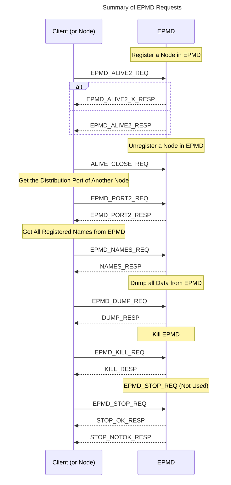
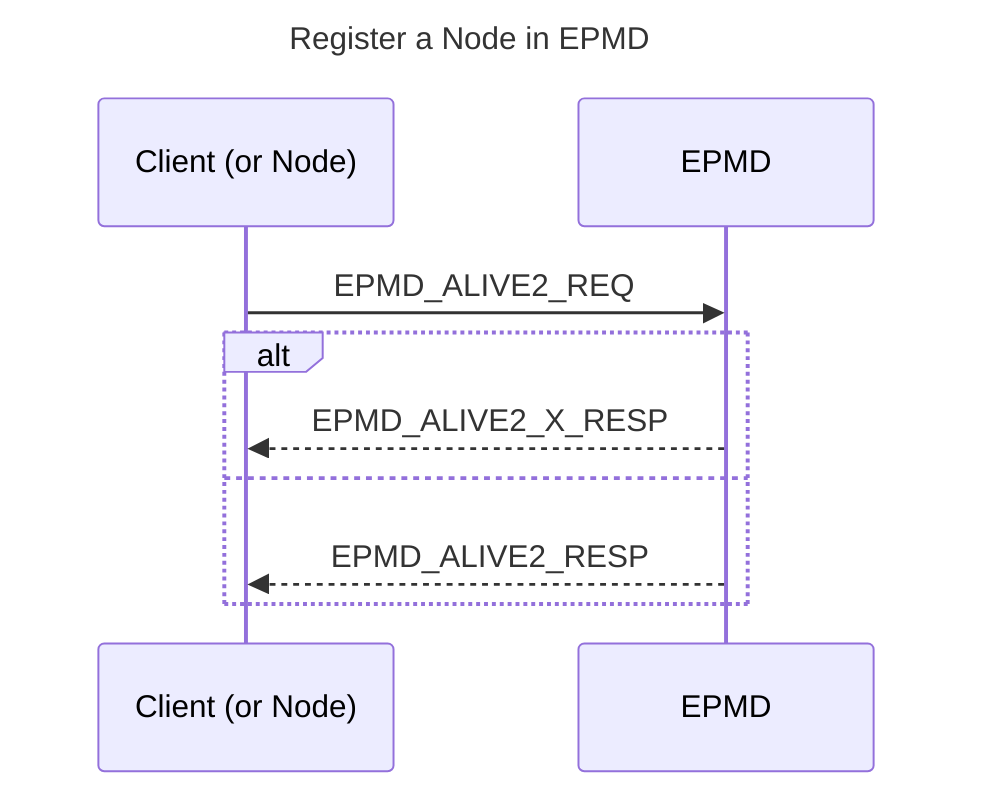
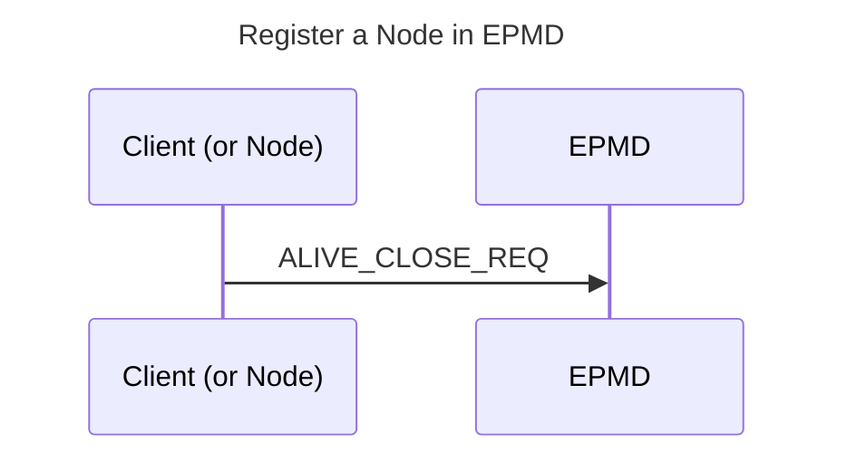
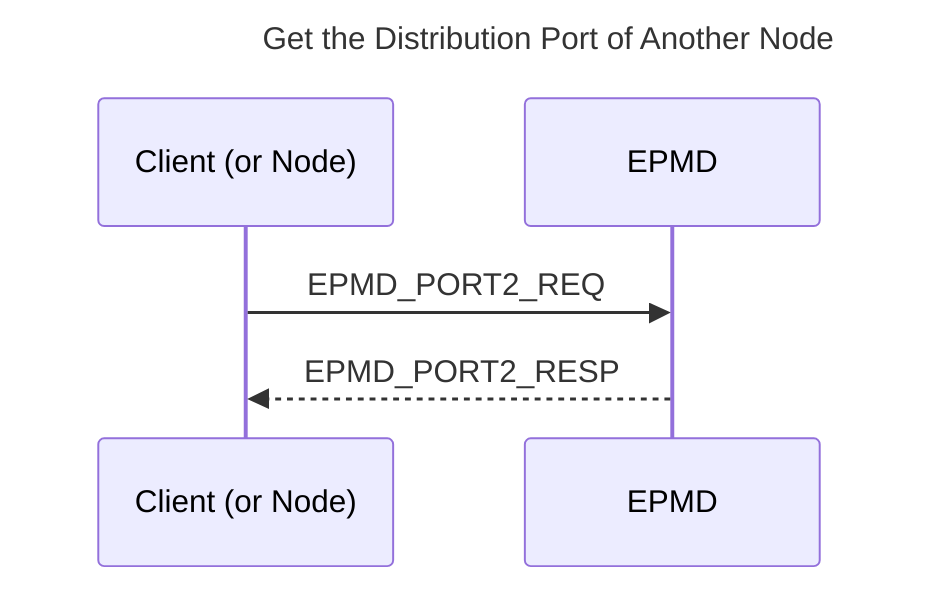
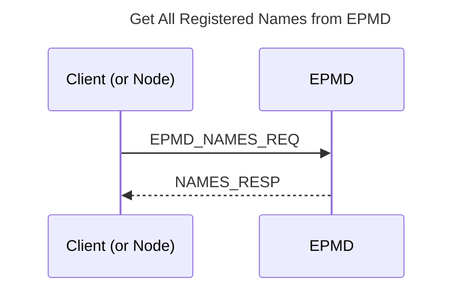
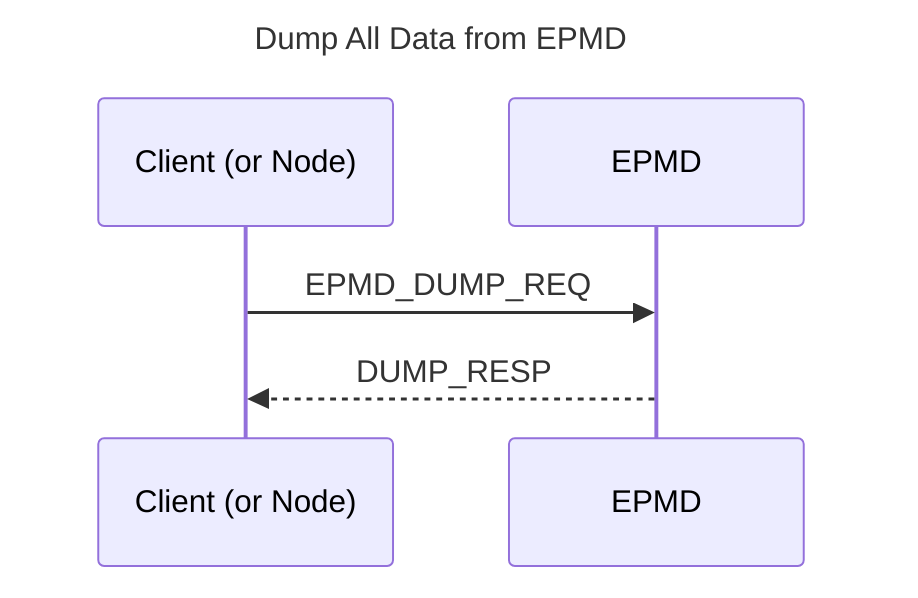
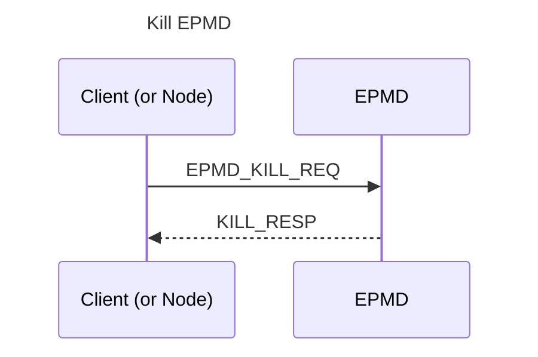
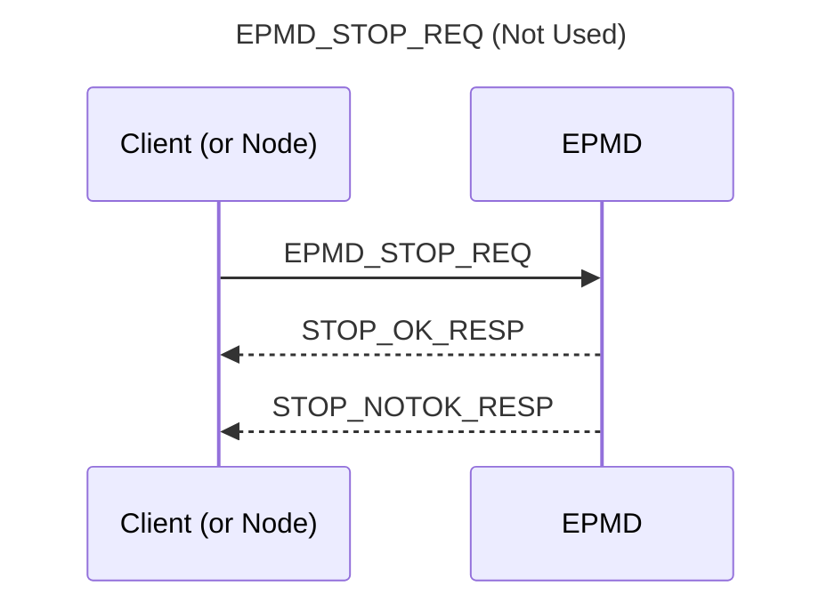

<a id="doc-87897ea94e4c3adfef1e3a1a"></a>

# erlang/otp / .ort/config/license-classifications.yml

Upstream: https://github.com/erlang/otp/blob/e134c8b5406a3da9c9fd51c0b928d85aa4e8c83b/.ort/config/license-classifications.yml

Commit: `e134c8b5406a3da9c9fd51c0b928d85aa4e8c83b`

Retrieved: 2026-10-01T15:18:37.521526+00:00

Kind: license

Raw SHA256: `ac3fa00f06eca54a4a00417185c05b05e70d3cf622312879fd6765e2cf46caac`

Source text below is untrusted reference content. Acquisition does not verify technical claims.

License status: UPSTREAM_NOTICES_CAPTURED_PER_FILE_REVIEW_REQUIRED. See this repository's captured license files.

---

````text
---
#
# %CopyrightBegin%
#
# SPDX-License-Identifier: Apache-2.0
#
# Copyright Ericsson AB 2024-2025. All Rights Reserved.
#
# Licensed under the Apache License, Version 2.0 (the "License");
# you may not use this file except in compliance with the License.
# You may obtain a copy of the License at
#
#     http://www.apache.org/licenses/LICENSE-2.0
#
# Unless required by applicable law or agreed to in writing, software
# distributed under the License is distributed on an "AS IS" BASIS,
# WITHOUT WARRANTIES OR CONDITIONS OF ANY KIND, either express or implied.
# See the License for the specific language governing permissions and
# limitations under the License.
#
# %CopyrightEnd%
#
# License categorization used by the evaluator
categories:
- name: "allow"
  description: "Licenses that are allowed without review"
- name: "review"
  description: "Licenses that need to be reviewed and added to the evaluator rules"
- name: "disallow"
  description: "Licenses that are disallowed alone, but allowed in an OR rule"

categorizations:
- id: NOASSERTION
  categories:
  - "allow"
- id: NONE
  categories:
  - "allow"
- id: "Apache-2.0"
  categories:
  - "allow"
- id: "Zlib"
  categories:
  - "review"
- id: "Apache-2.0 WITH LLVM-exception"
  categories:
  - "review"
- id: "BSD-2-Clause"
  categories: 
  - "review"
- id: "BSD-3-Clause"
  categories: 
  - "review"
- id: "GPL-2.0-only"
  categories: 
  - "review"
  - "disallow"
- id: "BSL-1.0"
  categories: 
  - "review"
- id: "CC0-1.0"
  categories: 
  - "review"
- id: "FSFUL"
  categories: 
  - "review"
- id: "GPL-3.0-or-later WITH Autoconf-exception-generic-3.0"
  categories: 
  - "review"
- id: "LGPL-2.0-or-later"
  categories: 
  - "review"
  - "disallow"
- id: "LGPL-2.1-or-later"
  categories: 
  - "review"
  - "disallow"
- id: "MIT"
  categories: 
  - "review"
- id: "MPL-1.1"
  categories: 
  - "review"
- id: "TCL"
  categories: 
  - "review"
- id: "Unicode-3.0"
  categories: 
  - "review"
- id: "Unlicense"
  categories:
  - "review"
- id: "LicenseRef-IETF-MIB"
  categories: 
  - "review"
- id: "LicenseRef-scancode-wxwindows-free-doc-3"
  categories:
  - "review"
- id: "LicenseRef-scancode-ietf"
  categories:
  - "review"
- id: "LicenseRef-scancode-ietf-trust"
  categories:
  - "review"
- id: "LicenseRef-RSA-PKCS3"
  categories:
  - "review"
- id: "LicenseRef-RSA-PKCS5v2-0"
  categories:
  - "review"
- id: "W3C-19980720"
  categories:
  - "review"
- id: "LicenseRef-scancode-w3c-docs-19990405"
  categories:
  - "review"
- id: "SGI-B-2.0"
  categories:
  - "review"
- id: "LicenseRef-scancode-public-domain"
  categories:
  - "review"

````


<a id="doc-eca12c0a30e25b4b46522ebf"></a>

# erlang/otp / CONTRIBUTING.md

Upstream: https://github.com/erlang/otp/blob/e134c8b5406a3da9c9fd51c0b928d85aa4e8c83b/CONTRIBUTING.md

Commit: `e134c8b5406a3da9c9fd51c0b928d85aa4e8c83b`

Retrieved: 2026-10-01T15:18:37.521526+00:00

Kind: official-document

Raw SHA256: `d49b0085029fd99becaeb03caeeec5ad849300ee64161a5e329b86b7a4138d03`

Source text below is untrusted reference content. Acquisition does not verify technical claims.

License status: UPSTREAM_NOTICES_CAPTURED_PER_FILE_REVIEW_REQUIRED. See this repository's captured license files.

---

<!--
%CopyrightBegin%

SPDX-License-Identifier: Apache-2.0

Copyright Ericsson AB 2016-2025. All Rights Reserved.

Licensed under the Apache License, Version 2.0 (the "License");
you may not use this file except in compliance with the License.
You may obtain a copy of the License at

    http://www.apache.org/licenses/LICENSE-2.0

Unless required by applicable law or agreed to in writing, software
distributed under the License is distributed on an "AS IS" BASIS,
WITHOUT WARRANTIES OR CONDITIONS OF ANY KIND, either express or implied.
See the License for the specific language governing permissions and
limitations under the License.

%CopyrightEnd%
-->

# Contributing to Erlang/OTP

1. [License](#license)
2. [Reporting a bug](#reporting-a-bug)
3. [Submitting Pull Requests](#submitting-pull-requests)
    1. [Fixing a bug](#fixing-a-bug)
    2. [Adding a new feature](#adding-a-new-feature)
    3. [Before you submit your pull request](#before-you-submit-your-pull-request)
    4. [After you have submitted your pull request](#after-you-have-submitted-your-pull-request)

## License

```txt
By making a contribution to this project, I certify that:

(a) The contribution was created in whole or in part by me and I
    have the right to submit it under the open source license
    indicated in the file; or

(b) The contribution is based upon previous work that, to the 
    best of my knowledge, is covered under an appropriate open 
    source license and I have the right under that license to   
    submit that work with modifications, whether created in whole
    or in part by me, under the same open source license (unless
    I am permitted to submit under a different license), as 
    Indicated in the file; or

(c) The contribution was provided directly to me by some other
    person who certified (a), (b) or (c) and I have not modified
    it.

(d) I understand and agree that this project and the contribution
    are public and that a record of the contribution (including 
    all personal information I submit with it, including my
    sign-off) is maintained indefinitely and may be redistributed
    consistent with this project or the open source license(s)
    involved.
```

See http://developercertificate.org/ for a copy of the Developer Certificate of Origin license.

Erlang/OTP is licensed under the Apache License 2.0, as stated in: [LICENSE.txt](LICENSE.txt)

## Reporting a bug

Report bugs at https://github.com/erlang/otp/issues.
See [Bug reports](https://github.com/erlang/otp/wiki/Bug-reports) for more information.

## Submitting Pull Requests

You can contribute to Erlang/OTP by opening a Pull Request.

Make sure you create a new branch for your pull request with `git checkout -b new-branch-name`.
Give the branch a short but descriptive name, like `stdlib/lists-length-fix`.
Never do your work directly on `maint` or `master`.

### Fixing a bug

* In most cases, pull requests for bug fixes should be based on the `maint` branch.
There are exceptions, for example corrections to bugs that have been introduced in the `master` branch.

* Include a test case to ensure that the bug is fixed **and that it stays fixed**.

* TIP: Write the test case **before** fixing the bug so that you can know that it catches the bug.

* For applications without a test suite in the git repository, it would be appreciated if you provide a
small code sample in the commit message or attach a module to the PR that will provoke the failure.

### Adding a new feature

* In most cases, pull requests for new features should be based on the `master` branch.

* It is recommended to discuss new features in the [erlang forums](https://erlangforums.com),
especially for major new features or any new features in ERTS, Kernel, or STDLIB.

* It is important to write a good commit message explaining **why** the feature is needed.
We prefer that the information is in the commit message, so that anyone that want to know 
two years later why a particular feature can easily find out. It does no harm to provide
the same information in the pull request (if the pull request consists of a single commit,
the commit message will be added to the pull request automatically).

* With few exceptions, it is mandatory to write a new test case that tests the feature.
The test case is needed to ensure that the features does not stop working in the future.

* Update the [Documentation](https://github.com/erlang/otp/wiki/Documentation) to describe the feature.

* Make sure that the new feature builds and works on all major platforms. Exceptions are features
that only makes sense one some platforms, for example the `win32reg` module for accessing the Windows registry.

* Make sure that your feature does not break backward compatibility. In general, we only break backward
compatibility in major releases and only for a very good reason. Usually we first deprecate the
feature one or two releases beforehand.

* In general, language changes/extensions require an
[EEP (Erlang Enhancement Proposal)](https://github.com/erlang/eep) to be written and approved before they 
can be included in OTP. Major changes or new features in ERTS, Kernel, or STDLIB will need an EEP or at least
a discussion on the mailing list.

### License Compliance

Contributions to Erlang/OTP must be under the Apache 2.0 license, and should
have a SPDX license and copyright identifier. Only in specific cases were no
other alternative exists, Erlang/OTP will consider accepting Pull Requests with
`Apache-2.0` compatible licenses.

Under no circumstances the Erlang/OTP project will accept non-compatible Apache 2.0 contributions.

Erlang/OTP has automatic checks to enforce this policy:
* License Scanner checks that contributions are Apache 2.0. Any non-Apache 2.0
  contribution will be manually checked, and will trigger a non-passing test in
  Github.

See <HOWTO/FILE-HEADERS.md> for details on the layout of file headers.

### Before you submit your pull request

* Make sure existing test cases don't fail. It is not necessary to run all tests
(that would take many hours), but you should at least run the tests for the
application you have changed.
* Make sure all static checks pass by calling `./otp_build check`. Call `./otp_build check --help` for details on what `./otp_build check` does.
* Make sure that github actions passes, if you go to https://github.com/$YOUR_GITHUB_USER/otp/actions you can enable github actions builds for you otp fork.

See the [Testing](https://github.com/erlang/otp/blob/master/HOWTO/TESTING.md) and
[Development](https://github.com/erlang/otp/blob/master/HOWTO/DEVELOPMENT.md) howtos
for details on how to use run tests and use the Erlang/OTP make system.

Make sure that your branch contains clean commits:

* Don't make the first line in the commit message longer than 72 characters.
**Don't end the first line with a period.**

* Follow the guidelines for [Writing good commit messages](https://github.com/erlang/otp/wiki/Writing-good-commit-messages).

* Don't merge `maint` or `master` into your branch. Use `git rebase` if you need to resolve merge
conflicts or include the latest changes.

* Each commit should represent a logical change, such as a feature added or bug fixed, and also include relevant changes to documentation and tests.

* Each commit should compile separately and pass the most relevant test cases. This makes it possible to use the powerful `git bisect` command.

* Changes to multiple applications should be made in separate commits to facilitate code reviews, unless special circumstances motivates a single commit, such as not breaking the ability to build cleanly.

* Check for unnecessary whitespace before committing with `git diff --check`.
However, do not fix preexisting whitespace errors in otherwise untouched source lines.

Check your coding style:

* Make sure your changes follow the coding and indentation style of the code surrounding your changes.

* Do not commit commented-out code or files that are no longer needed. Remove the code or the files.

* In most code (Erlang and C), indentation is 4 steps. Indentation using only spaces is **strongly recommended**.

#### Configuring Emacs

If you use Emacs, use the Erlang mode, and add the following lines to `.emacs`:

    (setq-default indent-tabs-mode nil)
    (setq c-basic-offset 4)

If you want to change the setting only for the Erlang mode, you can use a hook like this:

```
(add-hook 'erlang-mode-hook 'my-erlang-hook)

(defun my-erlang-hook ()
  (setq indent-tabs-mode nil))
```

### After you have submitted your pull request

* Follow the discussion following your pull request, answer questions, discuss and implement
changes requested by reviewers. Smaller changes should be squashed into their associated commits.

* If your pull requests introduces new public functions, they need to be tagged with the
OTP release in which they _will_ appear in the `since` tag in the functions' documentation.
As this is generally not yet certain at the time when your PR gets merged, the person assigned
to your pull request should give you an internal ticket number (for example `OTP-12345`) to use
as a placeholder in the respective `since` tags, like `-doc #{ since => ~"OTP @OTP-12345@" }.`.
When your new functions are released with an OTP release, this placeholder will get replaced with
the actual OTP version, leading to something like "OTP 26.0".

* If you are asked to write a release note for your pull request, see
[Writing release notes](https://github.com/erlang/otp/blob/master/HOWTO/RELEASE-NOTES.md)
for advice.


<a id="doc-9869a556f9f110c33248a431"></a>

# erlang/otp / FILE-HEADERS/README.md

Upstream: https://github.com/erlang/otp/blob/e134c8b5406a3da9c9fd51c0b928d85aa4e8c83b/FILE-HEADERS/README.md

Commit: `e134c8b5406a3da9c9fd51c0b928d85aa4e8c83b`

Retrieved: 2026-10-01T15:18:37.521526+00:00

Kind: official-document

Raw SHA256: `54ef15781c87a672e396bde095362b2074c6c2f7081feb9dcecc3fadc227ab14`

Source text below is untrusted reference content. Acquisition does not verify technical claims.

License status: UPSTREAM_NOTICES_CAPTURED_PER_FILE_REVIEW_REQUIRED. See this repository's captured license files.

---

# License Headers

This folder contains a list of all license headers present in the
Erlang/OTP repository. The files here must match exactly what is
in the license header in each file. It is used by license-headers.es
to validate the license headers of all files.

See <../HOWTO/FILE-HEADERS.md> for more details.


<a id="doc-64750c7591bf534b6837701c"></a>

# erlang/otp / HOWTO/RELEASE-NOTES.md

Upstream: https://github.com/erlang/otp/blob/e134c8b5406a3da9c9fd51c0b928d85aa4e8c83b/HOWTO/RELEASE-NOTES.md

Commit: `e134c8b5406a3da9c9fd51c0b928d85aa4e8c83b`

Retrieved: 2026-10-01T15:18:37.521526+00:00

Kind: official-document

Raw SHA256: `7324085f72ca6193093240bf3788760a4c719eda135a3521d0f675c1c0cd45b4`

Source text below is untrusted reference content. Acquisition does not verify technical claims.

License status: UPSTREAM_NOTICES_CAPTURED_PER_FILE_REVIEW_REQUIRED. See this repository's captured license files.

---

<!--
%%
%% %CopyrightBegin%
%%
%% SPDX-License-Identifier: Apache-2.0
%%
%% Copyright Ericsson AB 2024-2025. All Rights Reserved.
%%
%% Licensed under the Apache License, Version 2.0 (the "License");
%% you may not use this file except in compliance with the License.
%% You may obtain a copy of the License at
%%
%%     http://www.apache.org/licenses/LICENSE-2.0
%%
%% Unless required by applicable law or agreed to in writing, software
%% distributed under the License is distributed on an "AS IS" BASIS,
%% WITHOUT WARRANTIES OR CONDITIONS OF ANY KIND, either express or implied.
%% See the License for the specific language governing permissions and
%% limitations under the License.
%%
%% %CopyrightEnd%
-->

# Writing release notes

This HOWTO gives advice on how to write release notes.

The purpose of release notes is to inform users about changes,
improvements, bug fixes, and new features included in a new version of
Erlang/OTP. Therefore, they should generally only mention changes
observable by the user. Refactoring, fixing of spelling errors in
comments, or updates of test suites should in general not be
mentioned. One exception is when such change is the only change in the
application, in which case it is necessary to add a release note
anyway.

### Don't reuse the commit message as a release note

If one has followed the rules in [writing good commit
messages](https://github.com/erlang/otp/wiki/Writing-good-commit-messages),
a commit message is not suitable for direct inclusion in a release
note.

One reason is that the first line in a commit message is written in the
imperative mood, that is as a command or request. For example, the
first line of a commit message for the Erlang compiler could be:

    Combine creation of a record with subsequent record updates

Directly pasting this into a release note makes for strange reading,
as if the release note is asking the reader to perform the record
operations.

Another reason to avoid reusing a commit message is that it can
contain irrelevant information for a release note, for example why the
change was done or why it was done in a particular way, and it can
lack essential information.

### Examples of release notes

There is more than one way to rephrase the example from the previous
section to produce a suitable release note. For example:

    The compiler will now merge consecutive updates of the same record.

Another reasonable rewording is:

    The compiler has learned to merge consecutive updates of the same record.

Here are some other release note examples:

    Native coverage support has been implemented in the JIT.

    The documentation has been migrated to use Markdown and ExDoc.

    Safe destructive update of tuples has been implemented in
    the compiler and runtime system.

### Use examples and links to make release notes clearer

As of Erlang/OTP 27, release notes can be written in Markdown, making
it much easier to include examples and links. It is usually easier for
the writer of a release note to make their point clear using an
example instead of trying to express it using words, and it is often
easier for the reader to understand as well.

Example:

    The compiler will now merge consecutive updates of the same record.

    As an example, the body of the following function will be combined
    into a single tuple creation instruction:

    -record(r, {a,b,c,d}).

    ```erlang
    update(Value) ->
        R0 = #r{},
        R1 = R0#r{a=Value},
        R2 = R1#r{b=2},
        R2#r{c=3}.
    ```

Also include relevant links to the documentation, especially for a new
feature.

### Always include references to pull requests and issues

To further help the reader of the release note to understand a
particular change, always include references to the pull request and
to relevant issues.

The scripts that render release notes automatically turns references
to pull requests and Github issues to links. As an example, here is
the last line for the previous release note example:

    Own Id: OTP-18680 Aux Id: PR-7491, PR-8086, ERIERL-967

`PR-7491` and `PR-8086` are rendered as links.

Note that if a change requires a release note, it should generally
have a corresponding pull request. Exceptions are fixes for
vulnerabilities, which are often released without a pull request.

### Bug fixes

When the release note describes a fix to a bug, consider include the following:

* **Symptom** -- Describe the undesired effect of the bug. Like for example
  an incorrect function return value, an unexpectedly raised exception
  or a beam process crash.
* **Trigger** -- The conditions that are needed for the bug to manifest.
  Like specific function arguments or actions that need to happen in a specific
  order or at the same time.
* **Version** -- The oldest OTP version where the bug exists.


<a id="doc-d0ed4cc3fb70489fe51c7e0a"></a>

# erlang/otp / LICENSE.txt

Upstream: https://github.com/erlang/otp/blob/e134c8b5406a3da9c9fd51c0b928d85aa4e8c83b/LICENSE.txt

Commit: `e134c8b5406a3da9c9fd51c0b928d85aa4e8c83b`

Retrieved: 2026-10-01T15:18:37.521526+00:00

Kind: license

Raw SHA256: `809fa1ed21450f59827d1e9aec720bbc4b687434fa22283c6cb5dd82a47ab9c0`

Source text below is untrusted reference content. Acquisition does not verify technical claims.

License status: UPSTREAM_NOTICES_CAPTURED_PER_FILE_REVIEW_REQUIRED. See this repository's captured license files.

---

````text

                                 Apache License
                           Version 2.0, January 2004
                        http://www.apache.org/licenses/

   TERMS AND CONDITIONS FOR USE, REPRODUCTION, AND DISTRIBUTION

   1. Definitions.

      "License" shall mean the terms and conditions for use, reproduction,
      and distribution as defined by Sections 1 through 9 of this document.

      "Licensor" shall mean the copyright owner or entity authorized by
      the copyright owner that is granting the License.

      "Legal Entity" shall mean the union of the acting entity and all
      other entities that control, are controlled by, or are under common
      control with that entity. For the purposes of this definition,
      "control" means (i) the power, direct or indirect, to cause the
      direction or management of such entity, whether by contract or
      otherwise, or (ii) ownership of fifty percent (50%) or more of the
      outstanding shares, or (iii) beneficial ownership of such entity.

      "You" (or "Your") shall mean an individual or Legal Entity
      exercising permissions granted by this License.

      "Source" form shall mean the preferred form for making modifications,
      including but not limited to software source code, documentation
      source, and configuration files.

      "Object" form shall mean any form resulting from mechanical
      transformation or translation of a Source form, including but
      not limited to compiled object code, generated documentation,
      and conversions to other media types.

      "Work" shall mean the work of authorship, whether in Source or
      Object form, made available under the License, as indicated by a
      copyright notice that is included in or attached to the work
      (an example is provided in the Appendix below).

      "Derivative Works" shall mean any work, whether in Source or Object
      form, that is based on (or derived from) the Work and for which the
      editorial revisions, annotations, elaborations, or other modifications
      represent, as a whole, an original work of authorship. For the purposes
      of this License, Derivative Works shall not include works that remain
      separable from, or merely link (or bind by name) to the interfaces of,
      the Work and Derivative Works thereof.

      "Contribution" shall mean any work of authorship, including
      the original version of the Work and any modifications or additions
      to that Work or Derivative Works thereof, that is intentionally
      submitted to Licensor for inclusion in the Work by the copyright owner
      or by an individual or Legal Entity authorized to submit on behalf of
      the copyright owner. For the purposes of this definition, "submitted"
      means any form of electronic, verbal, or written communication sent
      to the Licensor or its representatives, including but not limited to
      communication on electronic mailing lists, source code control systems,
      and issue tracking systems that are managed by, or on behalf of, the
      Licensor for the purpose of discussing and improving the Work, but
      excluding communication that is conspicuously marked or otherwise
      designated in writing by the copyright owner as "Not a Contribution."

      "Contributor" shall mean Licensor and any individual or Legal Entity
      on behalf of whom a Contribution has been received by Licensor and
      subsequently incorporated within the Work.

   2. Grant of Copyright License. Subject to the terms and conditions of
      this License, each Contributor hereby grants to You a perpetual,
      worldwide, non-exclusive, no-charge, royalty-free, irrevocable
      copyright license to reproduce, prepare Derivative Works of,
      publicly display, publicly perform, sublicense, and distribute the
      Work and such Derivative Works in Source or Object form.

   3. Grant of Patent License. Subject to the terms and conditions of
      this License, each Contributor hereby grants to You a perpetual,
      worldwide, non-exclusive, no-charge, royalty-free, irrevocable
      (except as stated in this section) patent license to make, have made,
      use, offer to sell, sell, import, and otherwise transfer the Work,
      where such license applies only to those patent claims licensable
      by such Contributor that are necessarily infringed by their
      Contribution(s) alone or by combination of their Contribution(s)
      with the Work to which such Contribution(s) was submitted. If You
      institute patent litigation against any entity (including a
      cross-claim or counterclaim in a lawsuit) alleging that the Work
      or a Contribution incorporated within the Work constitutes direct
      or contributory patent infringement, then any patent licenses
      granted to You under this License for that Work shall terminate
      as of the date such litigation is filed.

   4. Redistribution. You may reproduce and distribute copies of the
      Work or Derivative Works thereof in any medium, with or without
      modifications, and in Source or Object form, provided that You
      meet the following conditions:

      (a) You must give any other recipients of the Work or
          Derivative Works a copy of this License; and

      (b) You must cause any modified files to carry prominent notices
          stating that You changed the files; and

      (c) You must retain, in the Source form of any Derivative Works
          that You distribute, all copyright, patent, trademark, and
          attribution notices from the Source form of the Work,
          excluding those notices that do not pertain to any part of
          the Derivative Works; and

      (d) If the Work includes a "NOTICE" text file as part of its
          distribution, then any Derivative Works that You distribute must
          include a readable copy of the attribution notices contained
          within such NOTICE file, excluding those notices that do not
          pertain to any part of the Derivative Works, in at least one
          of the following places: within a NOTICE text file distributed
          as part of the Derivative Works; within the Source form or
          documentation, if provided along with the Derivative Works; or,
          within a display generated by the Derivative Works, if and
          wherever such third-party notices normally appear. The contents
          of the NOTICE file are for informational purposes only and
          do not modify the License. You may add Your own attribution
          notices within Derivative Works that You distribute, alongside
          or as an addendum to the NOTICE text from the Work, provided
          that such additional attribution notices cannot be construed
          as modifying the License.

      You may add Your own copyright statement to Your modifications and
      may provide additional or different license terms and conditions
      for use, reproduction, or distribution of Your modifications, or
      for any such Derivative Works as a whole, provided Your use,
      reproduction, and distribution of the Work otherwise complies with
      the conditions stated in this License.

   5. Submission of Contributions. Unless You explicitly state otherwise,
      any Contribution intentionally submitted for inclusion in the Work
      by You to the Licensor shall be under the terms and conditions of
      this License, without any additional terms or conditions.
      Notwithstanding the above, nothing herein shall supersede or modify
      the terms of any separate license agreement you may have executed
      with Licensor regarding such Contributions.

   6. Trademarks. This License does not grant permission to use the trade
      names, trademarks, service marks, or product names of the Licensor,
      except as required for reasonable and customary use in describing the
      origin of the Work and reproducing the content of the NOTICE file.

   7. Disclaimer of Warranty. Unless required by applicable law or
      agreed to in writing, Licensor provides the Work (and each
      Contributor provides its Contributions) on an "AS IS" BASIS,
      WITHOUT WARRANTIES OR CONDITIONS OF ANY KIND, either express or
      implied, including, without limitation, any warranties or conditions
      of TITLE, NON-INFRINGEMENT, MERCHANTABILITY, or FITNESS FOR A
      PARTICULAR PURPOSE. You are solely responsible for determining the
      appropriateness of using or redistributing the Work and assume any
      risks associated with Your exercise of permissions under this License.

   8. Limitation of Liability. In no event and under no legal theory,
      whether in tort (including negligence), contract, or otherwise,
      unless required by applicable law (such as deliberate and grossly
      negligent acts) or agreed to in writing, shall any Contributor be
      liable to You for damages, including any direct, indirect, special,
      incidental, or consequential damages of any character arising as a
      result of this License or out of the use or inability to use the
      Work (including but not limited to damages for loss of goodwill,
      work stoppage, computer failure or malfunction, or any and all
      other commercial damages or losses), even if such Contributor
      has been advised of the possibility of such damages.

   9. Accepting Warranty or Additional Liability. While redistributing
      the Work or Derivative Works thereof, You may choose to offer,
      and charge a fee for, acceptance of support, warranty, indemnity,
      or other liability obligations and/or rights consistent with this
      License. However, in accepting such obligations, You may act only
      on Your own behalf and on Your sole responsibility, not on behalf
      of any other Contributor, and only if You agree to indemnify,
      defend, and hold each Contributor harmless for any liability
      incurred by, or claims asserted against, such Contributor by reason
      of your accepting any such warranty or additional liability.

   END OF TERMS AND CONDITIONS


````


<a id="doc-3aff4b5114e363cf4946699f"></a>

# erlang/otp / LICENSES/BSD-2-Clause.txt

Upstream: https://github.com/erlang/otp/blob/e134c8b5406a3da9c9fd51c0b928d85aa4e8c83b/LICENSES/BSD-2-Clause.txt

Commit: `e134c8b5406a3da9c9fd51c0b928d85aa4e8c83b`

Retrieved: 2026-10-01T15:18:37.521526+00:00

Kind: license

Raw SHA256: `06413eaf2855d173db853258579d9f8013d1599c8d7340adc32383ce658352af`

Source text below is untrusted reference content. Acquisition does not verify technical claims.

License status: UPSTREAM_NOTICES_CAPTURED_PER_FILE_REVIEW_REQUIRED. See this repository's captured license files.

---

````text
Redistribution and use in source and binary forms, with or without
modification, are permitted provided that the following conditions
are met:

1. Redistributions of source code must retain the above copyright
notice, this list of conditions and the following disclaimer.
2. Redistributions in binary form must reproduce the above copyright
notice, this list of conditions and the following disclaimer in the
documentation and/or other materials provided with the distribution.

THIS SOFTWARE IS PROVIDED BY THE COPYRIGHT HOLDERS AND CONTRIBUTORS
"AS IS" AND ANY EXPRESS OR IMPLIED WARRANTIES, INCLUDING, BUT NOT
LIMITED TO, THE IMPLIED WARRANTIES OF MERCHANTABILITY AND FITNESS
FOR A PARTICULAR PURPOSE ARE DISCLAIMED. IN NO EVENT SHALL THE
COPYRIGHT HOLDERS OR CONTRIBUTORS BE LIABLE FOR ANY DIRECT, INDIRECT,
INCIDENTAL, SPECIAL, EXEMPLARY, OR CONSEQUENTIAL DAMAGES (INCLUDING,
BUT NOT LIMITED TO, PROCUREMENT OF SUBSTITUTE GOODS OR SERVICES;
LOSS OF USE, DATA, OR PROFITS; OR BUSINESS INTERRUPTION) HOWEVER
CAUSED AND ON ANY THEORY OF LIABILITY, WHETHER IN CONTRACT, STRICT
LIABILITY, OR TORT (INCLUDING NEGLIGENCE OR OTHERWISE) ARISING IN
ANY WAY OUT OF THE USE OF THIS SOFTWARE, EVEN IF ADVISED OF THE
POSSIBILITY OF SUCH DAMAGE.
````


<a id="doc-fed77666c49a806192bd3912"></a>

# erlang/otp / LICENSES/BSD-3-Clause.txt

Upstream: https://github.com/erlang/otp/blob/e134c8b5406a3da9c9fd51c0b928d85aa4e8c83b/LICENSES/BSD-3-Clause.txt

Commit: `e134c8b5406a3da9c9fd51c0b928d85aa4e8c83b`

Retrieved: 2026-10-01T15:18:37.521526+00:00

Kind: license

Raw SHA256: `8fff43829a246bf63d422e0bde3ae6300ceed0be445a5d4d0a553f2781002d52`

Source text below is untrusted reference content. Acquisition does not verify technical claims.

License status: UPSTREAM_NOTICES_CAPTURED_PER_FILE_REVIEW_REQUIRED. See this repository's captured license files.

---

````text
Redistribution and use in source and binary forms, with or without
modification, are permitted provided that the following conditions are met:

1. Redistributions of source code must retain the above copyright notice,
   this list of conditions and the following disclaimer.

2. Redistributions in binary form must reproduce the above copyright notice,
   this list of conditions and the following disclaimer in the documentation
   and/or other materials provided with the distribution.

3. Neither the name of the copyright holder nor the names of its contributors
   may be used to endorse or promote products derived from this software
   without specific prior written permission.

THIS SOFTWARE IS PROVIDED BY THE COPYRIGHT HOLDERS AND CONTRIBUTORS “AS IS”
AND ANY EXPRESS OR IMPLIED WARRANTIES, INCLUDING, BUT NOT LIMITED TO, THE
IMPLIED WARRANTIES OF MERCHANTABILITY AND FITNESS FOR A PARTICULAR PURPOSE
ARE DISCLAIMED. IN NO EVENT SHALL THE COPYRIGHT HOLDER OR CONTRIBUTORS BE
LIABLE FOR ANY DIRECT, INDIRECT, INCIDENTAL, SPECIAL, EXEMPLARY, OR
CONSEQUENTIAL DAMAGES (INCLUDING, BUT NOT LIMITED TO, PROCUREMENT OF
SUBSTITUTE GOODS OR SERVICES; LOSS OF USE, DATA, OR PROFITS; OR BUSINESS
INTERRUPTION) HOWEVER CAUSED AND ON ANY THEORY OF LIABILITY, WHETHER IN
CONTRACT, STRICT LIABILITY, OR TORT (INCLUDING NEGLIGENCE OR OTHERWISE)
ARISING IN ANY WAY OUT OF THE USE OF THIS SOFTWARE, EVEN IF ADVISED OF THE
POSSIBILITY OF SUCH DAMAGE.
````


<a id="doc-5933fe883872b8f52c546eed"></a>

# erlang/otp / LICENSES/LicenseRef-IETF-MIB.txt

Upstream: https://github.com/erlang/otp/blob/e134c8b5406a3da9c9fd51c0b928d85aa4e8c83b/LICENSES/LicenseRef-IETF-MIB.txt

Commit: `e134c8b5406a3da9c9fd51c0b928d85aa4e8c83b`

Retrieved: 2026-10-01T15:18:37.521526+00:00

Kind: license

Raw SHA256: `9085f92f25a385ef53dba4ca26c5d770fe3fb18041746574544f619375509e2c`

Source text below is untrusted reference content. Acquisition does not verify technical claims.

License status: UPSTREAM_NOTICES_CAPTURED_PER_FILE_REVIEW_REQUIRED. See this repository's captured license files.

---

````text
MIB modules published in IETF RFCs prior to the adoption of BCP 78 (such as
RFC 1158) are considered to be freely copyable and usable for implementation
and interoperability purposes. No explicit license was provided, but the IETF
intended for MIB code to be reusable and modifiable as necessary.

This interpretation is based on historical practice and later IETF
clarification that such material was meant to be in the public domain or
under permissive terms.


````


<a id="doc-dcbb5ff9cb2ffdba7cad9b2d"></a>

# erlang/otp / LICENSES/LicenseRef-RSA-PKCS3.txt

Upstream: https://github.com/erlang/otp/blob/e134c8b5406a3da9c9fd51c0b928d85aa4e8c83b/LICENSES/LicenseRef-RSA-PKCS3.txt

Commit: `e134c8b5406a3da9c9fd51c0b928d85aa4e8c83b`

Retrieved: 2026-10-01T15:18:37.521526+00:00

Kind: license

Raw SHA256: `7ffa15804690e9fb3538301963adb8a80a420568322d5028dc41ed9a7d5d03a9`

Source text below is untrusted reference content. Acquisition does not verify technical claims.

License status: UPSTREAM_NOTICES_CAPTURED_PER_FILE_REVIEW_REQUIRED. See this repository's captured license files.

---

````text
This document and translations of it may be copied and furnished to
others, and derivative works that comment on or otherwise explain it
or assist in its implementation may be prepared, copied, published
and distributed, in whole or in part, without restriction of any
kind, provided that the above copyright notice and this paragraph are
included on all such copies and derivative works.  However, this
document itself may not be modified in any way, such as by removing
the copyright notice or references to the Internet Society or other
Internet organizations, except as needed for the purpose of
developing Internet standards in which case the procedures for
copyrights defined in the Internet Standards process must be
followed, or as required to translate it into languages other than
English.

The limited permissions granted above are perpetual and will not be
revoked by the Internet Society or its successors or assigns.

This document and the information contained herein is provided on an
"AS IS" basis and THE INTERNET SOCIETY AND THE INTERNET ENGINEERING
TASK FORCE DISCLAIMS ALL WARRANTIES, EXPRESS OR IMPLIED, INCLUDING
BUT NOT LIMITED TO ANY WARRANTY THAT THE USE OF THE INFORMATION
HEREIN WILL NOT INFRINGE ANY RIGHTS OR ANY IMPLIED WARRANTIES OF
MERCHANTABILITY OR FITNESS FOR A PARTICULAR PURPOSE.

````


<a id="doc-eda0b8f404179a03a7b80e1b"></a>

# erlang/otp / LICENSES/LicenseRef-RSA-PKCS5v2-0.txt

Upstream: https://github.com/erlang/otp/blob/e134c8b5406a3da9c9fd51c0b928d85aa4e8c83b/LICENSES/LicenseRef-RSA-PKCS5v2-0.txt

Commit: `e134c8b5406a3da9c9fd51c0b928d85aa4e8c83b`

Retrieved: 2026-10-01T15:18:37.521526+00:00

Kind: license

Raw SHA256: `d607ae3934f9a407a5ae0f00eda4302e482f7e48d50da5215f3b218bd5a4362c`

Source text below is untrusted reference content. Acquisition does not verify technical claims.

License status: UPSTREAM_NOTICES_CAPTURED_PER_FILE_REVIEW_REQUIRED. See this repository's captured license files.

---

````text
Intellectual Property Considerations

RSA Security makes no patent claims on the general constructions
described in this document, although specific underlying techniques
may be covered. Among the underlying techniques, the RC5 encryption
algorithm (Appendix B.2.4) is protected by U.S. Patents 5,724,428
[22] and 5,835,600 [23].

RC2 and RC5 are trademarks of RSA Security.

License to copy this document is granted provided that it is
identified as RSA Security Inc. Public-Key Cryptography Standards
(PKCS) in all material mentioning or referencing this document.

RSA Security makes no representations regarding intellectual property
claims by other parties. Such determination is the responsibility of
the user.

````


<a id="doc-98610aa4eae2269554736b4d"></a>

# erlang/otp / LICENSES/LicenseRef-scancode-ietf-trust-AND-BSD-2-Clause.txt

Upstream: https://github.com/erlang/otp/blob/e134c8b5406a3da9c9fd51c0b928d85aa4e8c83b/LICENSES/LicenseRef-scancode-ietf-trust-AND-BSD-2-Clause.txt

Commit: `e134c8b5406a3da9c9fd51c0b928d85aa4e8c83b`

Retrieved: 2026-10-01T15:18:37.521526+00:00

Kind: license

Raw SHA256: `6cdeec116a6b825cbdc364eef7ea607b565dd18dfe38e03c25ad41d75208baa8`

Source text below is untrusted reference content. Acquisition does not verify technical claims.

License status: UPSTREAM_NOTICES_CAPTURED_PER_FILE_REVIEW_REQUIRED. See this repository's captured license files.

---

````text
IETF TRUST
Legal Provisions Relating to IETF Documents
Effective Date: December 28, 2009

1. Background

The IETF Trust was formed on December 15, 2005, for, among other things, the purpose of acquiring, holding, maintaining and licensing certain existing and future intellectual property used in connection with the Internet standards process and its administration, for the advancement of science and technology associated with the Internet and related technology. Accordingly, pursuant to RFC 5378, Contributors grant the IETF Trust certain licenses with respect to their IETF Contributions. In RFC 5377, the IETF Community has provided the IETF Trust with guidance regarding licenses that the IETF Trust should grant to others with respect to such IETF Contributions and IETF Documents. These Legal Provisions describe the rights and licenses that the IETF Trust grants to others with respect to such IETF Contributions and IETF Documents; as well as certain restrictions, limitations and notices relating to IETF Documents. These Legal Provisions also apply to other document streams that have requested that the IETF Trust act as licensing administrator, as described in Section 8 below. Capitalized terms used in these Legal Provisions that are not otherwise defined have the meanings set forth in RFC 5378.

2. Applicability of these Legal Provisions.

a. These Legal Provisions are effective as of December 28, 2009 (the "Effective Date").

b. The licenses granted by the IETF Trust pursuant to these Legal Provisions apply only with respect to (i) IETF Contributions (including Internet-Drafts) that are submitted to the IETF following the Effective Date, and (ii) IETF RFCs and other IETF Documents that are published after the Effective Date.

c. IETF Contributions made, and IETF Documents published, prior to the Effective Date ("Pre-Existing IETF Documents") remain subject to the licensing provisions of the IETF copyright policy document in effect at the time of their contribution or publication, as applicable, including RFCs 1310, 1602, 2026, 3978 and 4748 and previous versions of these Legal Provisions.

d. In most cases, rights to Pre-Existing IETF Documents that are not expressly granted under these RFCs can only be obtained by requesting such rights directly from the document authors. The IETF Trust and the Internet Society do not become involved in making such requests to document authors.

e. These Legal Provisions may be amended from time to time by the IETF Trust in a manner consistent with the guidance provided by the IETF community and its own operating procedures. Any amendment to these Legal Provisions shall be posted for review at http://trustee.ietf.org/policyandprocedures.html and shall become effective on a date specified by the IETF Trust, but no earlier than thirty (30) days following its posting. Such amendment shall apply with respect to all IETF Contributions made and IETF Documents published following the effective date of such amendment. All prior versions of these Legal Provisions shall continue to be posted at http://trustee.ietf.org/policyandprocedures.html for reference with respect to IETF Contributions and IETF Documents as to which they may apply.

3. Licenses to IETF Documents and IETF Contributions.a. License For Use Within the IETF Standards Process. The IETF Trust hereby grants to each participant in the IETF Standards Process, to the greatest extent that it is permitted to do so, a non-exclusive, royalty-free, worldwide right and license under all copyrights and rights of authors granted to the IETF Trust:

i. to copy, publish, display and distribute IETF Contributions and IETF Documents, in whole or in part, as part of the IETF Standards Process, and

ii. to translate IETF Contributions and IETF Documents, in whole or part, into languages other than English as part of the IETF Standards Process, and

iii. unless explicitly disallowed in the notices contained in an IETF Contribution or IETF Document (as specified in Section 6.c below), to modify or prepare derivative works of such IETF Contributions or IETF Documents, in whole or in part, as part of the IETF Standards Process.

b. IETF Standards Process. The term IETF Standards Process has the meaning assigned to it in RFC 5378. In addition, the IETF Trust interprets the IETF Standards Process to include the archiving of IETF Documents in perpetuity for reference in support of IETF activities and the implementation of IETF standards and specifications.

c. Licenses For Use Outside the IETF Standards Process. In addition to the rights granted with respect to Code Components described in Section 4 below, the IETF Trust hereby grants to each person who wishes to exercise such rights, to the greatest extent that it is permitted to do so, a non-exclusive, royalty-free, worldwide right and license under all copyrights and rights of authors:

i. to copy, publish, display and distribute IETF Contributions and IETF Documents in full and without modification,

ii. to translate IETF Contributions and IETF Documents into languages otherthan English, and to copy, publish, display and distribute such translated IETF Contributions and IETF Documents in full and without modification,

iii. to copy, publish, display and distribute unmodified portions of IETF Contributions and IETF Documents and translations thereof, provided that: (x) each such portion is clearly attributed to IETF and identifies the RFC or other IETF Document or IETF Contribution from which it is taken, (y) all IETF legends, legal notices and indications of authorship IETF Trust Legal Provisions Relating to IETF Documents Effective Date: December 28, 2009 3 contained in the original IETF RFC must also be included where any substantial portion of the text of an IETF RFC, and in any event where more than one-fifth of such text, is reproduced in a single document or series of related documents.

d. Licenses that are not Granted. The following licenses are not granted pursuant to these Legal Provisions:

i. any license to modify IETF Contributions or IETF Documents, or portions thereof (other than to make translations or to extract, use and modify Code Components as permitted under the licenses granted under Section 4 of these Legal Provisions) in any context outside the IETF Standards Process, or

ii. any license to publish, display or distribute IETF Contributions or IETF Documents, or portions thereof, without the required legends and notices described in these Legal Provisions.

e. Requesting Additional Rights. Anyone who wishes to request license rights from the IETF Trust in addition to those granted under these Legal Provisions may submit such request to trustees@ietf.org. Such request will be considered by the IETF Trust, which will make a decision regarding the request in its sole discretion and inform the requester of its disposition. In addition, individual Contributors may be contacted regarding licenses to their IETF Contributions. The IETF Trust does not limit the ability of IETF Contributors to license their Contributions, so long as those licenses do not affect the rights granted to the IETF Trust under RFC 5378.

4. License to Code Components.

a. Definition. IETF Contributions and IETF Documents often include components intended to be directly processed by a computer ("Code Components"). A list of common Code Components can be found at http://trustee.ietf.org/license-info/.

b. Identification. Text in IETF Contributions and IETF Documents of the types identified in Section 4.a above shall constitute "Code Components". In addition, any text found between the markers <CODE BEGINS> and <CODE ENDS>, or otherwise clearly labeled as a Code Component, shall be considered a "Code Component".

c. License. In addition to the licenses granted under Section 3, unless one of the legends contained in Section 6.c.i or 6.c.ii is included in an IETF Document containing Code Components, such Code Components are also licensed to each person who wishes to receive such a license on the terms of the "Simplified BSD License", as described below. If a licensee elects to apply the BSD License to a Code Component, then the additional licenses and restrictions set forth in Section 3 and elsewhere in these Legal Provisions shall not apply thereto. Note that this license is specifically offered for IETF Documents and may not be available for Alternate Stream documents. See Section 8 for licensing information for the appropriate stream.

BSD License: Copyright (c) <insert year> IETF Trust and the persons identified as authors of the code.
All rights IETF Trust Legal Provisions Relating to IETF Documents
Effective Date: December 28, 2009 4 reserved.

Redistribution and use in source and binary forms, with or without modification, are permitted provided that the following conditions are met:
• Redistributions of source code must retain the above copyright notice, this list of conditions and the following disclaimer.
• Redistributions in binary form must reproduce the above copyright notice, this list of conditions and the following disclaimer in the documentation and/or other materials provided with the distribution.
• Neither the name of Internet Society, IETF or IETF Trust, nor the names of specific contributors, may be used to endorse or promote products derived from this software without specific prior written permission.

THIS SOFTWARE IS PROVIDED BY THE COPYRIGHT HOLDERS AND CONTRIBUTORS "AS IS" AND ANY EXPRESS OR IMPLIED WARRANTIES, INCLUDING, BUT NOT LIMITED TO, THE IMPLIED WARRANTIES OF MERCHANTABILITY AND FITNESS FOR A PARTICULAR PURPOSE ARE DISCLAIMED. IN NO EVENT SHALL THE COPYRIGHT OWNER OR CONTRIBUTORS BE LIABLE FOR ANY DIRECT, INDIRECT, INCIDENTAL, SPECIAL, EXEMPLARY, OR CONSEQUENTIAL DAMAGES (INCLUDING, BUT NOT LIMITED TO, PROCUREMENT OF SUBSTITUTE GOODS OR SERVICES; LOSS OF USE, DATA, OR PROFITS; OR BUSINESS INTERRUPTION) HOWEVER CAUSED AND ON ANY THEORY OF LIABILITY, WHETHER IN CONTRACT, STRICT LIABILITY, OR TORT (INCLUDING NEGLIGENCE OR OTHERWISE) ARISING IN ANY WAY OUT OF THE USE OF THIS SOFTWARE, EVEN IF ADVISED OF THE POSSIBILITY OF SUCH DAMAGE.

The above BSD License is intended to be compatible with the Simplified BSD License template published at http://opensource.org/licenses/bsd-license.php .

d. Attribution. Those who use Code Components under the license granted under Section 4.c above are requested to attribute each such Code Component to IETF and identify the RFC or other IETF Document or IETF Contribution from which it is taken. Such attribution may be placed in the code itself (e.g., "This code was derived from IETF RFC *insert RFC number]. Please reproduce this note if possible."), or any other reasonable location.

e. BSD License Text. For purposes of compliance with the redistribution clauses of the Simplified BSD License set forth in Section 4.c above, it is permissible, when using Code Components extracted from IETF Contributions and IETF Documents, either (1) to reproduce the entire text of the Simplified BSD License set forth in Section 4.c above as part of such Code Component, or (2) to include in such Code Component the legend set forth in Section 6.d below.

5. License Limitations.

a.  No Patent License.  The licenses granted under these Legal Provisions shall not be
deemed to grant any right under any patent, patent application or similar intellectual property
right.

b.  Supersedure.  The terms of any license granted under these Legal Provisions may be
superseded by a written agreement between the IETF Trust and the licensee that specifically
references and supersedes the relevant provisions of these Legal Provisions, except that (i) the
IETF Trust shall in no event be authorized to grant rights with respect to any Contribution in
excess of those which it has been granted by the Contributor, and (ii) the rights granted shall not
be less than those otherwise granted under these Legal Provisions.

c.  Pre-5378 Material.  In some cases, IETF Contributions or IETF Documents may
contain material from IETF Contributions or IETF Documents published or made publicly
available before November 10, 2008 as to which the persons controlling the copyright in such
material have not granted rights to the IETF Trust under the terms of RFC 5378 ("Pre-5378
Material").  If a Contributor includes the legend contained in Section 6.c.iii of these Legal
Provisions on such IETF Contributions or IETF Documents containing Pre-5378 Materials, the
IETF Trust agrees that it shall not grant any third party the right to use such Pre-5378 Material
outside the IETF Standards Process unless and until it has obtained sufficient rights to do so from
the persons controlling the copyright in such Pre-5378 Material.  Where practical, Contributors
are encouraged to identify which portions of such IETF Contributions and IETF Documents
contain Pre-5378 Material, including the source (by RFC number or otherwise) of the Pre-5378
Material.


6. Text To Be Included in IETF Documents.
The following text must be included in each IETF Document  as specified below.
The IESG shall specify the manner and location of such text for Internet-Drafts.
The RFC Editor shall specify the manner and location of such text for RFCs.
The copyright notice specified in 6.b below shall be placed so as to give reasonable
notice of the claim of copyright.

a.  Submission Compliance for Internet-Drafts.   In each Internet-Draft:
This Internet-Draft is submitted in full conformance with the provisions of BCP 78 and BCP 79.

b.  Copyright and License Notice.  In each Document (including RFCs and InternetDrafts):

i.  Copyright and License Notice.
Copyright (c) <insert year> IETF Trust and the persons identified as the document authors.  All
rights reserved.
This document is subject to BCP 78 and the IETF Trust’s Legal Provisions Relating to IETF
Documents (http://trustee.ietf.org/license-info) in effect on the date of publication of this
document. Please review these documents carefully, as they describe your rights and restrictions
with respect to this document.  Code Components extracted from this document must include
Simplified BSD License text as described in Section 4.e of the Trust Legal Provisions and are
provided without warranty as described in the Simplified BSD License.

ii. Alternate Stream Documents Copyright and License Notice. In all Alternate
Stream Documents (including RFCs and Internet-Drafts):
Copyright (c) <insert year> IETF Trust and the persons identified as the document authors.  All
rights reserved.
This document is subject to BCP 78 and the IETF Trust’s Legal Provisions Relating to IETF
Documents (http://trustee.ietf.org/license-info) in effect on the date of publication of this
document. Please review these documents carefully, as they describe your rights and restrictions
with respect to this document.

c.  Derivative Works and Publication Limitations. If a Contributor chooses to limit
the right to make modifications and derivative works of an IETF Contribution, then one of the
notices in clause (i) or (ii) below must be included. Note that an IETF Contribution with such a
notice cannot become a Standards Track document or, in most cases, a working group document.
If an IETF Contribution contains pre-5378 Material as to which the IETF Trust has not been
granted, or may not have been granted, the necessary permissions to allow modification of  such
pre-5378 Material outside the IETF Standards Process, then the notice in clause (iii) may be
included by the Contributor of such IETF Contribution to limit the right to make modifications to
such pre-5378 Material outside the IETF Standards Process.

i. If the Contributor does not wish to allow modifications, but does wish to allow publication as an RFC:

This document may not be modified, and derivative works of it may not be created, except to
format it for publication as an RFC or to translate it into languages other than English.

ii. If the Contributor does not wish to allow modifications nor to allow publication as an RFC:

This document may not be modified, and derivative works of it may not be created, and it may not
be published except as an Internet-Draft.

iii. If an IETF Contribution contains pre-5378 Material as to which the IETF Trust has not been granted, or may not have been granted, the necessary permissions to allow modification of such pre-5378 Material outside the IETF Standards Process:

This document may contain material from IETF Documents or IETF Contributions published or
made publicly available before November 10,  2008. The person(s) controlling the copyright in
some of this material may not have granted the IETF Trust the right to allow modifications of such
material outside the IETF Standards Process.  Without obtaining an adequate license from the
person(s) controlling the copyright in such materials, this document may not be modified outside
the IETF Standards Process, and derivative works of it may not be created outside the IETF
Standards Process, except to format it for publication as an RFC or to translate it into languages
other than English.

 d.  BSD License Notification.  In lieu of the complete text of the Simplified BSD
License set forth in Section 4.c, a person who elects to license a Code Component under the
Simplified BSD License as described in Section 4.c may use the following notification in the
program or other file that includes the Code Component:

Copyright (c) <insert year> IETF Trust and the persons identified as authors of the code.
All rights reserved.

Redistribution and use in source and binary forms, with or without modification, is permitted pursuant to,
and subject to the license terms contained in, the Simplified BSD License set forth in Section 4.c of the
IETF Trust’s Legal Provisions Relating to IETF Documents (http://trustee.ietf.org/license-info).


7. Terms Applicable to All IETF Documents.
The following legal terms apply to all IETF Documents:

a. ALL DOCUMENTS AND THE INFORMATION CONTAINED THEREIN
ARE PROVIDED ON AN "AS IS" BASIS AND THE CONTRIBUTOR, THE
ORGANIZATION HE/SHE REPRESENTS OR IS SPONSORED BY (IF ANY), THE
INTERNET SOCIETY, THE IETF TRUST, THE INTERNET ENGINEERING TASK FORCE
AND ANY APPLICABLE MANAGERS OF ALTERNATE STREAM DOCUMENTS, AS
DEFINED IN SECTION 8 BELOW, DISCLAIM ALL WARRANTIES, EXPRESS OR
IMPLIED, INCLUDING BUT NOT LIMITED TO ANY WARRANTY THAT THE USE OF
THE INFORMATION THEREIN WILL NOT INFRINGE ANY RIGHTS OR ANY IMPLIED
WARRANTIES OF MERCHANTABILITY OR FITNESS FOR A PARTICULAR PURPOSE.

b. The IETF Trust takes no position regarding the validity or scope of any
Intellectual Property Rights or other rights that might be claimed to pertain to the implementation
or use of the technology described in any IETF Document or the extent to which any license
under such rights might or might not be available; nor does it represent that it has made any
independent effort to identify any such rights.

c. Copies of Intellectual Property disclosures made to the IETF Secretariat and
any assurances of licenses to be made available, or the result of an attempt made to obtain a
general license or permission for the use of such proprietary rights by implementers or users of
this specification can be obtained from the IETF on-line IPR repository at
http://www.ietf.org/ipr.

d. The IETF invites any interested party to bring to its attention any copyrights,
patents or patent applications, or other proprietary rights that may cover technology that may be
required to implement any standard or specification contained in an IETF Document.  Please
address the information to the IETF at ietf-ipr@ietf.org.

e. The definitive version of an IETF Document is that published by, or under the
auspices of, the IETF.  Versions of IETF Documents that are published by third parties,
including those that are translated into other languages, should not be considered to be definitive
versions of IETF Documents.  The definitive version of these Legal Provisions is that published
by, or under the auspices of, the IETF.  Versions of these Legal Provisions that are published by
third parties, including those that are translated into other languages, should not be considered to
be definitive versions of these Legal Provisions.

f.  For the avoidance of doubt, each Contributor licenses each Contribution that
he or she makes to the IETF Trust pursuant to the provisions of RFC 5378.  No language to the
contrary, or terms, conditions or rights that differ from or are inconsistent with the rights and
licenses granted under RFC 5378, shall have any effect and shall be null and void, whether
published or posted by such Contributor, or included with or in such Contribution.

8. Application to non-IETF Stream Documents

a.  General.  These Legal Provisions have been developed by the IETF Trust for the
benefit and use of the IETF community in accordance with the guidance provided in RFC 5377.
As such, these Legal Provisions apply to all IETF Contributions and IETF Documents that are in
the "IETF Document Stream" as defined in Section 5.1.1 of RFC 4844 (i.e., those that are
contributed, developed, edited and published as part of the IETF Standards Process).  As
indicated in Section 4 of RFC 5378, the IETF rules regarding copyrights (which are embodied in
these Legal Provisions) do not by their terms cover documents or materials contributed or
published outside of the IETF Document Stream, even if they are referred to as Internet-Drafts or
RFCs and/or published by the RFC Editor.  The IAB Document Stream, the IRTF Document
Stream and the Independent Submission Stream, each as defined in Section 5.1 of RFC 4844 are
referred to collectively herein as "Alternate Streams".

b.  Adoption by Alternate Streams.  The legal rules that apply to documents in
Alternate Streams are established by the managers of those Alternate Streams as defined in RFC
4844. (i.e., the Internet Architecture Board (IAB), Internet Research Steering Group (IRSG) and
Independent Submission Editor).  These managers may elect, through their own internal
processes, to cause these Legal Provisions to be applied to documents contributed to them for
development, editing and publication in their respective Alternate Streams.  If an Alternate
Stream manager elects to adopt these Legal Provisions and to utilize the IETF Trust as the
licensing administrator for such Alternate Stream, the IETF Trust will update these Legal
Provisions to reflect the specific manner in which it will so act, and shall do so consistently with
the stated wishes of the Alternate Stream manager to the extent consistent with the IETF Trust’s
legal obligations and the instructions of the IETF community embodied in RFC 5377 and
elsewhere.

c.  Alternate Stream License.
  i. Unless otherwise specified below, for each Alternate Stream for which the
IETF Trust acts as licensing administrator, from the date on which these Legal Provisions are
effective with respect to such Alternate Stream (as specified below) the IETF Trust shall accept
licenses of copyrights in documents granted to the IETF Trust by contributors to Alternate
Stream as though granted pursuant to RFC 5378, and shall grant licenses to others on the terms
of these Legal Provisions.
  ii. Each occurrence of the term "IETF Contribution" and "IETF Document"
in these Legal Provisions shall be read to mean a Contribution or document in such Alternate
Stream, as the case may be.  The disclaimer in Section 7.a of these Legal Provisions shall apply
to the manager of such Alternate Stream as defined in RFC 4844 as though such manager were
expressly listed in Section 7.a.
  iii. The license grant in Section 3.a of these Legal Provisions with respect to
Alternate Stream documents shall not be limited to the IETF Standards Process, and all
references to the IETF Standards Process in Section 3.a shall be omitted with respect to licenses
of Alternate Stream documents, and correspondingly Section 3.c hereof shall not apply with
respect to Alternate Stream documents.
  iv. Alternate Stream contributions made, and Alternate Stream documents
published, prior to the application of these Legal Provisions to such Alternate Stream  remain
subject to the licensing provisions in effect for such Alternate Stream at the time of their
contribution or publication, as applicable.

d.  Responsibility of Alternate Stream Contributors.  Sections 5.c and 6.c.iii of these
Legal Provisions shall not apply to Alternate Stream documents, thus contributors of
Contribution to Alternate Streams must assure themselves that they comply with the
representations and warranties required under RFC 5378, including under Section 5.6 of RFC
5378, with respect to the entirety of their Alternate Stream Contributions prior to making the
contribution.

e.  IAB Document Stream.   Pursuant to Section 11 of RFC 5378, the IAB requested,
as of April 4, 2008, that the IETF Trust act as licensing administrator for the IAB Document
Stream and that these Legal Provisions be applied to documents submitted and published in the
IAB Document Stream following the Effective Date of RFC 5378.   Section 4 of these Legal
Provisions shall not apply to documents in the IAB Document Stream, and all references to
Section 4 hereof shall be disregarded with respect to documents in the IAB Document Stream
pursuant to RFC 5745 published on December 21, 2009.

f.  Independent Submission Stream.   Pursuant to RFC 5744 published on December
17, 2009, the manager of the Independent Submission Stream has requested that the IETF Trust
act as licensing administrator for the Independent Submission Stream and that these Legal
Provisions be applied to documents submitted and published in the Independent Submission
Stream following December 28, 2009.  Section 4 of these Legal Provisions shall not apply to
documents in the Independent Submission Stream, and all references to Section 4 hereof shall be
disregarded with respect to documents in the Independent Submission Stream.

g.  IRTF Document Stream.   Pursuant to RFC 5743 published on December 24,
2009, the manager of the IRTF Document Stream has requested that the IETF Trust act as
licensing administrator for the IRTF Document Stream and that these Legal Provisions be
applied to documents submitted and published in the IRTF Document Stream following
December 28, 2009.  Section 4 of these Legal Provisions shall not apply to documents in the
IRTF Document Stream, and all references to Section 4 hereof shall be disregarded with respect
to documents in the IRTF Document Stream.

Redistribution and use in source and binary forms, with or without
modification, are permitted provided that the following conditions
are met:

1. Redistributions of source code must retain the above copyright
notice, this list of conditions and the following disclaimer.
2. Redistributions in binary form must reproduce the above copyright
notice, this list of conditions and the following disclaimer in the
documentation and/or other materials provided with the distribution.

THIS SOFTWARE IS PROVIDED BY THE COPYRIGHT HOLDERS AND CONTRIBUTORS
"AS IS" AND ANY EXPRESS OR IMPLIED WARRANTIES, INCLUDING, BUT NOT
LIMITED TO, THE IMPLIED WARRANTIES OF MERCHANTABILITY AND FITNESS
FOR A PARTICULAR PURPOSE ARE DISCLAIMED. IN NO EVENT SHALL THE
COPYRIGHT HOLDERS OR CONTRIBUTORS BE LIABLE FOR ANY DIRECT, INDIRECT,
INCIDENTAL, SPECIAL, EXEMPLARY, OR CONSEQUENTIAL DAMAGES (INCLUDING,
BUT NOT LIMITED TO, PROCUREMENT OF SUBSTITUTE GOODS OR SERVICES;
LOSS OF USE, DATA, OR PROFITS; OR BUSINESS INTERRUPTION) HOWEVER
CAUSED AND ON ANY THEORY OF LIABILITY, WHETHER IN CONTRACT, STRICT
LIABILITY, OR TORT (INCLUDING NEGLIGENCE OR OTHERWISE) ARISING IN
ANY WAY OUT OF THE USE OF THIS SOFTWARE, EVEN IF ADVISED OF THE
POSSIBILITY OF SUCH DAMAGE.

````


<a id="doc-1fa23ce6b483e1e499a34865"></a>

# erlang/otp / LICENSES/LicenseRef-scancode-ietf-trust.txt

Upstream: https://github.com/erlang/otp/blob/e134c8b5406a3da9c9fd51c0b928d85aa4e8c83b/LICENSES/LicenseRef-scancode-ietf-trust.txt

Commit: `e134c8b5406a3da9c9fd51c0b928d85aa4e8c83b`

Retrieved: 2026-10-01T15:18:37.521526+00:00

Kind: license

Raw SHA256: `30a48fff768daa1518c8fed2262315eb61b952951a4470fdac5e212a2f50791d`

Source text below is untrusted reference content. Acquisition does not verify technical claims.

License status: UPSTREAM_NOTICES_CAPTURED_PER_FILE_REVIEW_REQUIRED. See this repository's captured license files.

---

````text
IETF TRUST
Legal Provisions Relating to IETF Documents
Effective Date: December 28, 2009

1. Background

The IETF Trust was formed on December 15, 2005, for, among other things, the purpose of acquiring, holding, maintaining and licensing certain existing and future intellectual property used in connection with the Internet standards process and its administration, for the advancement of science and technology associated with the Internet and related technology. Accordingly, pursuant to RFC 5378, Contributors grant the IETF Trust certain licenses with respect to their IETF Contributions. In RFC 5377, the IETF Community has provided the IETF Trust with guidance regarding licenses that the IETF Trust should grant to others with respect to such IETF Contributions and IETF Documents. These Legal Provisions describe the rights and licenses that the IETF Trust grants to others with respect to such IETF Contributions and IETF Documents; as well as certain restrictions, limitations and notices relating to IETF Documents. These Legal Provisions also apply to other document streams that have requested that the IETF Trust act as licensing administrator, as described in Section 8 below. Capitalized terms used in these Legal Provisions that are not otherwise defined have the meanings set forth in RFC 5378.

2. Applicability of these Legal Provisions.

a. These Legal Provisions are effective as of December 28, 2009 (the "Effective Date").

b. The licenses granted by the IETF Trust pursuant to these Legal Provisions apply only with respect to (i) IETF Contributions (including Internet-Drafts) that are submitted to the IETF following the Effective Date, and (ii) IETF RFCs and other IETF Documents that are published after the Effective Date.

c. IETF Contributions made, and IETF Documents published, prior to the Effective Date ("Pre-Existing IETF Documents") remain subject to the licensing provisions of the IETF copyright policy document in effect at the time of their contribution or publication, as applicable, including RFCs 1310, 1602, 2026, 3978 and 4748 and previous versions of these Legal Provisions.

d. In most cases, rights to Pre-Existing IETF Documents that are not expressly granted under these RFCs can only be obtained by requesting such rights directly from the document authors. The IETF Trust and the Internet Society do not become involved in making such requests to document authors.

e. These Legal Provisions may be amended from time to time by the IETF Trust in a manner consistent with the guidance provided by the IETF community and its own operating procedures. Any amendment to these Legal Provisions shall be posted for review at http://trustee.ietf.org/policyandprocedures.html and shall become effective on a date specified by the IETF Trust, but no earlier than thirty (30) days following its posting. Such amendment shall apply with respect to all IETF Contributions made and IETF Documents published following the effective date of such amendment. All prior versions of these Legal Provisions shall continue to be posted at http://trustee.ietf.org/policyandprocedures.html for reference with respect to IETF Contributions and IETF Documents as to which they may apply.

3. Licenses to IETF Documents and IETF Contributions.a. License For Use Within the IETF Standards Process. The IETF Trust hereby grants to each participant in the IETF Standards Process, to the greatest extent that it is permitted to do so, a non-exclusive, royalty-free, worldwide right and license under all copyrights and rights of authors granted to the IETF Trust:

i. to copy, publish, display and distribute IETF Contributions and IETF Documents, in whole or in part, as part of the IETF Standards Process, and

ii. to translate IETF Contributions and IETF Documents, in whole or part, into languages other than English as part of the IETF Standards Process, and

iii. unless explicitly disallowed in the notices contained in an IETF Contribution or IETF Document (as specified in Section 6.c below), to modify or prepare derivative works of such IETF Contributions or IETF Documents, in whole or in part, as part of the IETF Standards Process.

b. IETF Standards Process. The term IETF Standards Process has the meaning assigned to it in RFC 5378. In addition, the IETF Trust interprets the IETF Standards Process to include the archiving of IETF Documents in perpetuity for reference in support of IETF activities and the implementation of IETF standards and specifications.

c. Licenses For Use Outside the IETF Standards Process. In addition to the rights granted with respect to Code Components described in Section 4 below, the IETF Trust hereby grants to each person who wishes to exercise such rights, to the greatest extent that it is permitted to do so, a non-exclusive, royalty-free, worldwide right and license under all copyrights and rights of authors:

i. to copy, publish, display and distribute IETF Contributions and IETF Documents in full and without modification,

ii. to translate IETF Contributions and IETF Documents into languages otherthan English, and to copy, publish, display and distribute such translated IETF Contributions and IETF Documents in full and without modification,

iii. to copy, publish, display and distribute unmodified portions of IETF Contributions and IETF Documents and translations thereof, provided that: (x) each such portion is clearly attributed to IETF and identifies the RFC or other IETF Document or IETF Contribution from which it is taken, (y) all IETF legends, legal notices and indications of authorship IETF Trust Legal Provisions Relating to IETF Documents Effective Date: December 28, 2009 3 contained in the original IETF RFC must also be included where any substantial portion of the text of an IETF RFC, and in any event where more than one-fifth of such text, is reproduced in a single document or series of related documents.

d. Licenses that are not Granted. The following licenses are not granted pursuant to these Legal Provisions:

i. any license to modify IETF Contributions or IETF Documents, or portions thereof (other than to make translations or to extract, use and modify Code Components as permitted under the licenses granted under Section 4 of these Legal Provisions) in any context outside the IETF Standards Process, or

ii. any license to publish, display or distribute IETF Contributions or IETF Documents, or portions thereof, without the required legends and notices described in these Legal Provisions.

e. Requesting Additional Rights. Anyone who wishes to request license rights from the IETF Trust in addition to those granted under these Legal Provisions may submit such request to trustees@ietf.org. Such request will be considered by the IETF Trust, which will make a decision regarding the request in its sole discretion and inform the requester of its disposition. In addition, individual Contributors may be contacted regarding licenses to their IETF Contributions. The IETF Trust does not limit the ability of IETF Contributors to license their Contributions, so long as those licenses do not affect the rights granted to the IETF Trust under RFC 5378.

4. License to Code Components.

a. Definition. IETF Contributions and IETF Documents often include components intended to be directly processed by a computer ("Code Components"). A list of common Code Components can be found at http://trustee.ietf.org/license-info/.

b. Identification. Text in IETF Contributions and IETF Documents of the types identified in Section 4.a above shall constitute "Code Components". In addition, any text found between the markers <CODE BEGINS> and <CODE ENDS>, or otherwise clearly labeled as a Code Component, shall be considered a "Code Component".

c. License. In addition to the licenses granted under Section 3, unless one of the legends contained in Section 6.c.i or 6.c.ii is included in an IETF Document containing Code Components, such Code Components are also licensed to each person who wishes to receive such a license on the terms of the "Simplified BSD License", as described below. If a licensee elects to apply the BSD License to a Code Component, then the additional licenses and restrictions set forth in Section 3 and elsewhere in these Legal Provisions shall not apply thereto. Note that this license is specifically offered for IETF Documents and may not be available for Alternate Stream documents. See Section 8 for licensing information for the appropriate stream.

BSD License: Copyright (c) <insert year> IETF Trust and the persons identified as authors of the code.
All rights IETF Trust Legal Provisions Relating to IETF Documents
Effective Date: December 28, 2009 4 reserved.

Redistribution and use in source and binary forms, with or without modification, are permitted provided that the following conditions are met:
• Redistributions of source code must retain the above copyright notice, this list of conditions and the following disclaimer.
• Redistributions in binary form must reproduce the above copyright notice, this list of conditions and the following disclaimer in the documentation and/or other materials provided with the distribution.
• Neither the name of Internet Society, IETF or IETF Trust, nor the names of specific contributors, may be used to endorse or promote products derived from this software without specific prior written permission.

THIS SOFTWARE IS PROVIDED BY THE COPYRIGHT HOLDERS AND CONTRIBUTORS "AS IS" AND ANY EXPRESS OR IMPLIED WARRANTIES, INCLUDING, BUT NOT LIMITED TO, THE IMPLIED WARRANTIES OF MERCHANTABILITY AND FITNESS FOR A PARTICULAR PURPOSE ARE DISCLAIMED. IN NO EVENT SHALL THE COPYRIGHT OWNER OR CONTRIBUTORS BE LIABLE FOR ANY DIRECT, INDIRECT, INCIDENTAL, SPECIAL, EXEMPLARY, OR CONSEQUENTIAL DAMAGES (INCLUDING, BUT NOT LIMITED TO, PROCUREMENT OF SUBSTITUTE GOODS OR SERVICES; LOSS OF USE, DATA, OR PROFITS; OR BUSINESS INTERRUPTION) HOWEVER CAUSED AND ON ANY THEORY OF LIABILITY, WHETHER IN CONTRACT, STRICT LIABILITY, OR TORT (INCLUDING NEGLIGENCE OR OTHERWISE) ARISING IN ANY WAY OUT OF THE USE OF THIS SOFTWARE, EVEN IF ADVISED OF THE POSSIBILITY OF SUCH DAMAGE.

The above BSD License is intended to be compatible with the Simplified BSD License template published at http://opensource.org/licenses/bsd-license.php .

d. Attribution. Those who use Code Components under the license granted under Section 4.c above are requested to attribute each such Code Component to IETF and identify the RFC or other IETF Document or IETF Contribution from which it is taken. Such attribution may be placed in the code itself (e.g., "This code was derived from IETF RFC *insert RFC number]. Please reproduce this note if possible."), or any other reasonable location.

e. BSD License Text. For purposes of compliance with the redistribution clauses of the Simplified BSD License set forth in Section 4.c above, it is permissible, when using Code Components extracted from IETF Contributions and IETF Documents, either (1) to reproduce the entire text of the Simplified BSD License set forth in Section 4.c above as part of such Code Component, or (2) to include in such Code Component the legend set forth in Section 6.d below.

5. License Limitations.

a.  No Patent License.  The licenses granted under these Legal Provisions shall not be
deemed to grant any right under any patent, patent application or similar intellectual property
right.

b.  Supersedure.  The terms of any license granted under these Legal Provisions may be
superseded by a written agreement between the IETF Trust and the licensee that specifically
references and supersedes the relevant provisions of these Legal Provisions, except that (i) the
IETF Trust shall in no event be authorized to grant rights with respect to any Contribution in
excess of those which it has been granted by the Contributor, and (ii) the rights granted shall not
be less than those otherwise granted under these Legal Provisions.

c.  Pre-5378 Material.  In some cases, IETF Contributions or IETF Documents may
contain material from IETF Contributions or IETF Documents published or made publicly
available before November 10, 2008 as to which the persons controlling the copyright in such
material have not granted rights to the IETF Trust under the terms of RFC 5378 ("Pre-5378
Material").  If a Contributor includes the legend contained in Section 6.c.iii of these Legal
Provisions on such IETF Contributions or IETF Documents containing Pre-5378 Materials, the
IETF Trust agrees that it shall not grant any third party the right to use such Pre-5378 Material
outside the IETF Standards Process unless and until it has obtained sufficient rights to do so from
the persons controlling the copyright in such Pre-5378 Material.  Where practical, Contributors
are encouraged to identify which portions of such IETF Contributions and IETF Documents
contain Pre-5378 Material, including the source (by RFC number or otherwise) of the Pre-5378
Material.


6. Text To Be Included in IETF Documents.
The following text must be included in each IETF Document  as specified below.
The IESG shall specify the manner and location of such text for Internet-Drafts.
The RFC Editor shall specify the manner and location of such text for RFCs.
The copyright notice specified in 6.b below shall be placed so as to give reasonable
notice of the claim of copyright.

a.  Submission Compliance for Internet-Drafts.   In each Internet-Draft:
This Internet-Draft is submitted in full conformance with the provisions of BCP 78 and BCP 79.

b.  Copyright and License Notice.  In each Document (including RFCs and InternetDrafts):

i.  Copyright and License Notice.
Copyright (c) <insert year> IETF Trust and the persons identified as the document authors.  All
rights reserved.
This document is subject to BCP 78 and the IETF Trust’s Legal Provisions Relating to IETF
Documents (http://trustee.ietf.org/license-info) in effect on the date of publication of this
document. Please review these documents carefully, as they describe your rights and restrictions
with respect to this document.  Code Components extracted from this document must include
Simplified BSD License text as described in Section 4.e of the Trust Legal Provisions and are
provided without warranty as described in the Simplified BSD License.

ii. Alternate Stream Documents Copyright and License Notice. In all Alternate
Stream Documents (including RFCs and Internet-Drafts):
Copyright (c) <insert year> IETF Trust and the persons identified as the document authors.  All
rights reserved.
This document is subject to BCP 78 and the IETF Trust’s Legal Provisions Relating to IETF
Documents (http://trustee.ietf.org/license-info) in effect on the date of publication of this
document. Please review these documents carefully, as they describe your rights and restrictions
with respect to this document.

c.  Derivative Works and Publication Limitations. If a Contributor chooses to limit
the right to make modifications and derivative works of an IETF Contribution, then one of the
notices in clause (i) or (ii) below must be included. Note that an IETF Contribution with such a
notice cannot become a Standards Track document or, in most cases, a working group document.
If an IETF Contribution contains pre-5378 Material as to which the IETF Trust has not been
granted, or may not have been granted, the necessary permissions to allow modification of  such
pre-5378 Material outside the IETF Standards Process, then the notice in clause (iii) may be
included by the Contributor of such IETF Contribution to limit the right to make modifications to
such pre-5378 Material outside the IETF Standards Process.

i. If the Contributor does not wish to allow modifications, but does wish to allow publication as an RFC:

This document may not be modified, and derivative works of it may not be created, except to
format it for publication as an RFC or to translate it into languages other than English.

ii. If the Contributor does not wish to allow modifications nor to allow publication as an RFC:

This document may not be modified, and derivative works of it may not be created, and it may not
be published except as an Internet-Draft.

iii. If an IETF Contribution contains pre-5378 Material as to which the IETF Trust has not been granted, or may not have been granted, the necessary permissions to allow modification of such pre-5378 Material outside the IETF Standards Process:

This document may contain material from IETF Documents or IETF Contributions published or
made publicly available before November 10,  2008. The person(s) controlling the copyright in
some of this material may not have granted the IETF Trust the right to allow modifications of such
material outside the IETF Standards Process.  Without obtaining an adequate license from the
person(s) controlling the copyright in such materials, this document may not be modified outside
the IETF Standards Process, and derivative works of it may not be created outside the IETF
Standards Process, except to format it for publication as an RFC or to translate it into languages
other than English.

 d.  BSD License Notification.  In lieu of the complete text of the Simplified BSD
License set forth in Section 4.c, a person who elects to license a Code Component under the
Simplified BSD License as described in Section 4.c may use the following notification in the
program or other file that includes the Code Component:

Copyright (c) <insert year> IETF Trust and the persons identified as authors of the code.
All rights reserved.

Redistribution and use in source and binary forms, with or without modification, is permitted pursuant to,
and subject to the license terms contained in, the Simplified BSD License set forth in Section 4.c of the
IETF Trust’s Legal Provisions Relating to IETF Documents (http://trustee.ietf.org/license-info).


7. Terms Applicable to All IETF Documents.
The following legal terms apply to all IETF Documents:

a. ALL DOCUMENTS AND THE INFORMATION CONTAINED THEREIN
ARE PROVIDED ON AN "AS IS" BASIS AND THE CONTRIBUTOR, THE
ORGANIZATION HE/SHE REPRESENTS OR IS SPONSORED BY (IF ANY), THE
INTERNET SOCIETY, THE IETF TRUST, THE INTERNET ENGINEERING TASK FORCE
AND ANY APPLICABLE MANAGERS OF ALTERNATE STREAM DOCUMENTS, AS
DEFINED IN SECTION 8 BELOW, DISCLAIM ALL WARRANTIES, EXPRESS OR
IMPLIED, INCLUDING BUT NOT LIMITED TO ANY WARRANTY THAT THE USE OF
THE INFORMATION THEREIN WILL NOT INFRINGE ANY RIGHTS OR ANY IMPLIED
WARRANTIES OF MERCHANTABILITY OR FITNESS FOR A PARTICULAR PURPOSE.

b. The IETF Trust takes no position regarding the validity or scope of any
Intellectual Property Rights or other rights that might be claimed to pertain to the implementation
or use of the technology described in any IETF Document or the extent to which any license
under such rights might or might not be available; nor does it represent that it has made any
independent effort to identify any such rights.

c. Copies of Intellectual Property disclosures made to the IETF Secretariat and
any assurances of licenses to be made available, or the result of an attempt made to obtain a
general license or permission for the use of such proprietary rights by implementers or users of
this specification can be obtained from the IETF on-line IPR repository at
http://www.ietf.org/ipr.

d. The IETF invites any interested party to bring to its attention any copyrights,
patents or patent applications, or other proprietary rights that may cover technology that may be
required to implement any standard or specification contained in an IETF Document.  Please
address the information to the IETF at ietf-ipr@ietf.org.

e. The definitive version of an IETF Document is that published by, or under the
auspices of, the IETF.  Versions of IETF Documents that are published by third parties,
including those that are translated into other languages, should not be considered to be definitive
versions of IETF Documents.  The definitive version of these Legal Provisions is that published
by, or under the auspices of, the IETF.  Versions of these Legal Provisions that are published by
third parties, including those that are translated into other languages, should not be considered to
be definitive versions of these Legal Provisions.

f.  For the avoidance of doubt, each Contributor licenses each Contribution that
he or she makes to the IETF Trust pursuant to the provisions of RFC 5378.  No language to the
contrary, or terms, conditions or rights that differ from or are inconsistent with the rights and
licenses granted under RFC 5378, shall have any effect and shall be null and void, whether
published or posted by such Contributor, or included with or in such Contribution.

8. Application to non-IETF Stream Documents

a.  General.  These Legal Provisions have been developed by the IETF Trust for the
benefit and use of the IETF community in accordance with the guidance provided in RFC 5377.
As such, these Legal Provisions apply to all IETF Contributions and IETF Documents that are in
the "IETF Document Stream" as defined in Section 5.1.1 of RFC 4844 (i.e., those that are
contributed, developed, edited and published as part of the IETF Standards Process).  As
indicated in Section 4 of RFC 5378, the IETF rules regarding copyrights (which are embodied in
these Legal Provisions) do not by their terms cover documents or materials contributed or
published outside of the IETF Document Stream, even if they are referred to as Internet-Drafts or
RFCs and/or published by the RFC Editor.  The IAB Document Stream, the IRTF Document
Stream and the Independent Submission Stream, each as defined in Section 5.1 of RFC 4844 are
referred to collectively herein as "Alternate Streams".

b.  Adoption by Alternate Streams.  The legal rules that apply to documents in
Alternate Streams are established by the managers of those Alternate Streams as defined in RFC
4844. (i.e., the Internet Architecture Board (IAB), Internet Research Steering Group (IRSG) and
Independent Submission Editor).  These managers may elect, through their own internal
processes, to cause these Legal Provisions to be applied to documents contributed to them for
development, editing and publication in their respective Alternate Streams.  If an Alternate
Stream manager elects to adopt these Legal Provisions and to utilize the IETF Trust as the
licensing administrator for such Alternate Stream, the IETF Trust will update these Legal
Provisions to reflect the specific manner in which it will so act, and shall do so consistently with
the stated wishes of the Alternate Stream manager to the extent consistent with the IETF Trust’s
legal obligations and the instructions of the IETF community embodied in RFC 5377 and
elsewhere.

c.  Alternate Stream License.
  i. Unless otherwise specified below, for each Alternate Stream for which the
IETF Trust acts as licensing administrator, from the date on which these Legal Provisions are
effective with respect to such Alternate Stream (as specified below) the IETF Trust shall accept
licenses of copyrights in documents granted to the IETF Trust by contributors to Alternate
Stream as though granted pursuant to RFC 5378, and shall grant licenses to others on the terms
of these Legal Provisions.
  ii. Each occurrence of the term "IETF Contribution" and "IETF Document"
in these Legal Provisions shall be read to mean a Contribution or document in such Alternate
Stream, as the case may be.  The disclaimer in Section 7.a of these Legal Provisions shall apply
to the manager of such Alternate Stream as defined in RFC 4844 as though such manager were
expressly listed in Section 7.a.
  iii. The license grant in Section 3.a of these Legal Provisions with respect to
Alternate Stream documents shall not be limited to the IETF Standards Process, and all
references to the IETF Standards Process in Section 3.a shall be omitted with respect to licenses
of Alternate Stream documents, and correspondingly Section 3.c hereof shall not apply with
respect to Alternate Stream documents.
  iv. Alternate Stream contributions made, and Alternate Stream documents
published, prior to the application of these Legal Provisions to such Alternate Stream  remain
subject to the licensing provisions in effect for such Alternate Stream at the time of their
contribution or publication, as applicable.

d.  Responsibility of Alternate Stream Contributors.  Sections 5.c and 6.c.iii of these
Legal Provisions shall not apply to Alternate Stream documents, thus contributors of
Contribution to Alternate Streams must assure themselves that they comply with the
representations and warranties required under RFC 5378, including under Section 5.6 of RFC
5378, with respect to the entirety of their Alternate Stream Contributions prior to making the
contribution.

e.  IAB Document Stream.   Pursuant to Section 11 of RFC 5378, the IAB requested,
as of April 4, 2008, that the IETF Trust act as licensing administrator for the IAB Document
Stream and that these Legal Provisions be applied to documents submitted and published in the
IAB Document Stream following the Effective Date of RFC 5378.   Section 4 of these Legal
Provisions shall not apply to documents in the IAB Document Stream, and all references to
Section 4 hereof shall be disregarded with respect to documents in the IAB Document Stream
pursuant to RFC 5745 published on December 21, 2009.

f.  Independent Submission Stream.   Pursuant to RFC 5744 published on December
17, 2009, the manager of the Independent Submission Stream has requested that the IETF Trust
act as licensing administrator for the Independent Submission Stream and that these Legal
Provisions be applied to documents submitted and published in the Independent Submission
Stream following December 28, 2009.  Section 4 of these Legal Provisions shall not apply to
documents in the Independent Submission Stream, and all references to Section 4 hereof shall be
disregarded with respect to documents in the Independent Submission Stream.

g.  IRTF Document Stream.   Pursuant to RFC 5743 published on December 24,
2009, the manager of the IRTF Document Stream has requested that the IETF Trust act as
licensing administrator for the IRTF Document Stream and that these Legal Provisions be
applied to documents submitted and published in the IRTF Document Stream following
December 28, 2009.  Section 4 of these Legal Provisions shall not apply to documents in the
IRTF Document Stream, and all references to Section 4 hereof shall be disregarded with respect
to documents in the IRTF Document Stream.

````


<a id="doc-c6aa145af01904f21c310e3c"></a>

# erlang/otp / LICENSES/LicenseRef-scancode-ietf.txt

Upstream: https://github.com/erlang/otp/blob/e134c8b5406a3da9c9fd51c0b928d85aa4e8c83b/LICENSES/LicenseRef-scancode-ietf.txt

Commit: `e134c8b5406a3da9c9fd51c0b928d85aa4e8c83b`

Retrieved: 2026-10-01T15:18:37.521526+00:00

Kind: license

Raw SHA256: `7ffa15804690e9fb3538301963adb8a80a420568322d5028dc41ed9a7d5d03a9`

Source text below is untrusted reference content. Acquisition does not verify technical claims.

License status: UPSTREAM_NOTICES_CAPTURED_PER_FILE_REVIEW_REQUIRED. See this repository's captured license files.

---

````text
This document and translations of it may be copied and furnished to
others, and derivative works that comment on or otherwise explain it
or assist in its implementation may be prepared, copied, published
and distributed, in whole or in part, without restriction of any
kind, provided that the above copyright notice and this paragraph are
included on all such copies and derivative works.  However, this
document itself may not be modified in any way, such as by removing
the copyright notice or references to the Internet Society or other
Internet organizations, except as needed for the purpose of
developing Internet standards in which case the procedures for
copyrights defined in the Internet Standards process must be
followed, or as required to translate it into languages other than
English.

The limited permissions granted above are perpetual and will not be
revoked by the Internet Society or its successors or assigns.

This document and the information contained herein is provided on an
"AS IS" basis and THE INTERNET SOCIETY AND THE INTERNET ENGINEERING
TASK FORCE DISCLAIMS ALL WARRANTIES, EXPRESS OR IMPLIED, INCLUDING
BUT NOT LIMITED TO ANY WARRANTY THAT THE USE OF THE INFORMATION
HEREIN WILL NOT INFRINGE ANY RIGHTS OR ANY IMPLIED WARRANTIES OF
MERCHANTABILITY OR FITNESS FOR A PARTICULAR PURPOSE.

````


<a id="doc-241c777ffd704d6e5caba35e"></a>

# erlang/otp / LICENSES/LicenseRef-scancode-w3c-docs-19990405.txt

Upstream: https://github.com/erlang/otp/blob/e134c8b5406a3da9c9fd51c0b928d85aa4e8c83b/LICENSES/LicenseRef-scancode-w3c-docs-19990405.txt

Commit: `e134c8b5406a3da9c9fd51c0b928d85aa4e8c83b`

Retrieved: 2026-10-01T15:18:37.521526+00:00

Kind: license

Raw SHA256: `f561fd8183fd37f8f38b8f0c1d6d24e3354dc483b4a757033003498c1122105b`

Source text below is untrusted reference content. Acquisition does not verify technical claims.

License status: UPSTREAM_NOTICES_CAPTURED_PER_FILE_REVIEW_REQUIRED. See this repository's captured license files.

---

````text
W3C® DOCUMENT NOTICE AND LICENSE

Copyright ©  World Wide Web Consortium, (Massachusetts Institute of Technology,
Institut National de Recherche en Informatique et en Automatique, Keio University).
All Rights Reserved. http://www.w3.org/Consortium/Legal/

Public documents on the W3C site are provided by the copyright holders under the following license. The software or Document Type Definitions (DTDs) associated with W3C specifications are governed by the Software Notice. By using and/or copying this document, or the W3C document from which this statement is linked, you (the licensee) agree that you have read, understood, and will comply with the following terms and conditions:

Permission to use, copy, and distribute the contents of this document, or the W3C document from which this statement is linked, in any medium for any purpose and without fee or royalty is hereby granted, provided that you include the following on ALL copies of the document, or portions thereof, that you use:

A link or URL to the original W3C document.
The pre-existing copyright notice of the original author, or if it doesn't exist, a notice of the form: "Copyright © [$date-of-document] World Wide Web Consortium, (Massachusetts Institute of Technology, Institut National de Recherche en Informatique et en Automatique, Keio University). All Rights Reserved. http://www.w3.org/Consortium/Legal/" (Hypertext is preferred, but a textual representation is permitted.)
If it exists, the STATUS of the W3C document.
When space permits, inclusion of the full text of this NOTICE should be provided. We request that authorship attribution be provided in any software, documents, or other items or products that you create pursuant to the implementation of the contents of this document, or any portion thereof.

No right to create modifications or derivatives of W3C documents is granted pursuant to this license. However, if additional requirements (documented in the Copyright FAQ) are satisfied, the right to create modifications or derivatives is sometimes granted by the W3C to individuals complying with those requirements.

THIS DOCUMENT IS PROVIDED "AS IS," AND COPYRIGHT HOLDERS MAKE NO REPRESENTATIONS OR WARRANTIES, EXPRESS OR IMPLIED, INCLUDING, BUT NOT LIMITED TO, WARRANTIES OF MERCHANTABILITY, FITNESS FOR A PARTICULAR PURPOSE, NON-INFRINGEMENT, OR TITLE; THAT THE CONTENTS OF THE DOCUMENT ARE SUITABLE FOR ANY PURPOSE; NOR THAT THE IMPLEMENTATION OF SUCH CONTENTS WILL NOT INFRINGE ANY THIRD PARTY PATENTS, COPYRIGHTS, TRADEMARKS OR OTHER RIGHTS.

COPYRIGHT HOLDERS WILL NOT BE LIABLE FOR ANY DIRECT, INDIRECT, SPECIAL OR CONSEQUENTIAL DAMAGES ARISING OUT OF ANY USE OF THE DOCUMENT OR THE PERFORMANCE OR IMPLEMENTATION OF THE CONTENTS THEREOF.

The name and trademarks of copyright holders may NOT be used in advertising or publicity pertaining to this document or its contents without specific, written prior permission. Title to copyright in this document will at all times remain with copyright holders.

----------------------------------------------------------------------------

This formulation of W3C's notice and license became active on April 05 1999 so as to account for the treatment of DTDs, schema's and bindings. See the older formulation for the policy prior to this date. Please see our Copyright FAQ for common questions about using materials from our site, including specific terms and conditions for packages like libwww, Amaya, and Jigsaw. Other questions about this notice can be directed to site-policy@w3.org.

````


<a id="doc-639c18ad9ced0e78b18d9b29"></a>

# erlang/otp / LICENSES/LicenseRef-scancode-wxwindows-free-doc-3.txt

Upstream: https://github.com/erlang/otp/blob/e134c8b5406a3da9c9fd51c0b928d85aa4e8c83b/LICENSES/LicenseRef-scancode-wxwindows-free-doc-3.txt

Commit: `e134c8b5406a3da9c9fd51c0b928d85aa4e8c83b`

Retrieved: 2026-10-01T15:18:37.521526+00:00

Kind: license

Raw SHA256: `2005d5130f8748c4073d33c2699f9e46f3c11846df8cc83849971b53d59277bd`

Source text below is untrusted reference content. Acquisition does not verify technical claims.

License status: UPSTREAM_NOTICES_CAPTURED_PER_FILE_REVIEW_REQUIRED. See this repository's captured license files.

---

````text
wxWindows Free Documentation Licence, Version 3
===============================================

Everyone is permitted to copy and distribute verbatim copies
of this licence document, but changing it is not allowed.

                 WXWINDOWS FREE DOCUMENTATION LICENCE
   TERMS AND CONDITIONS FOR COPYING, DISTRIBUTION AND MODIFICATION

1. Permission is granted to make and distribute verbatim copies of this
manual or piece of documentation provided any copyright notice and this
permission notice are preserved on all copies.

2. Permission is granted to process this file or document through a
document processing system and, at your option and the option of any third
party, print the results, provided a printed document carries a copying
permission notice identical to this one.

3. Permission is granted to copy and distribute modified versions of this
manual or piece of documentation under the conditions for verbatim copying,
provided also that any sections describing licensing conditions for this
manual, such as, in particular, the GNU General Public Licence, the GNU
Library General Public Licence, and any wxWindows Licence are included
exactly as in the original, and provided that the entire resulting derived
work is distributed under the terms of a permission notice identical to
this one.

4. Permission is granted to copy and distribute translations of this manual
or piece of documentation into another language, under the above conditions
for modified versions, except that sections related to licensing, including
this paragraph, may also be included in translations approved by the
copyright holders of the respective licence documents in addition to the
original English.

                          WARRANTY DISCLAIMER

5. BECAUSE THIS MANUAL OR PIECE OF DOCUMENTATION IS LICENSED FREE OF
CHARGE, THERE IS NO WARRANTY FOR IT, TO THE EXTENT PERMITTED BY APPLICABLE
LAW.  EXCEPT WHEN OTHERWISE STATED IN WRITING THE COPYRIGHT HOLDERS AND/OR
OTHER PARTIES PROVIDE THIS MANUAL OR PIECE OF DOCUMENTATION "AS IS" WITHOUT
WARRANTY OF ANY KIND, EITHER EXPRESSED OR IMPLIED, INCLUDING, BUT NOT
LIMITED TO, THE IMPLIED WARRANTIES OF MERCHANTABILITY AND FITNESS FOR A
PARTICULAR PURPOSE.  THE ENTIRE RISK AS TO THE QUALITY AND PERFORMANCE OF
THE MANUAL OR PIECE OF DOCUMENTATION IS WITH YOU.  SHOULD THE MANUAL OR
PIECE OF DOCUMENTATION PROVE DEFECTIVE, YOU ASSUME THE COST OF ALL
NECESSARY SERVICING, REPAIR OR CORRECTION.

6. IN NO EVENT UNLESS REQUIRED BY APPLICABLE LAW OR AGREED TO IN WRITING
WILL ANY COPYRIGHT HOLDER, OR ANY OTHER PARTY WHO MAY MODIFY AND/OR
REDISTRIBUTE THE MANUAL OR PIECE OF DOCUMENTATION AS PERMITTED ABOVE, BE
LIABLE TO YOU FOR DAMAGES, INCLUDING ANY GENERAL, SPECIAL, INCIDENTAL OR
CONSEQUENTIAL DAMAGES ARISING OUT OF THE USE OR INABILITY TO USE THE MANUAL
OR PIECE OF DOCUMENTATION (INCLUDING BUT NOT LIMITED TO LOSS OF DATA OR
DATA BEING RENDERED INACCURATE OR LOSSES SUSTAINED BY YOU OR THIRD PARTIES
OR A FAILURE OF A PROGRAM BASED ON THE MANUAL OR PIECE OF DOCUMENTATION TO
OPERATE WITH ANY OTHER PROGRAMS), EVEN IF SUCH HOLDER OR OTHER PARTY HAS
BEEN ADVISED OF THE POSSIBILITY OF SUCH DAMAGES.
````


<a id="doc-47d6174376cafa9e4749bf65"></a>

# erlang/otp / LICENSES/MIT.txt

Upstream: https://github.com/erlang/otp/blob/e134c8b5406a3da9c9fd51c0b928d85aa4e8c83b/LICENSES/MIT.txt

Commit: `e134c8b5406a3da9c9fd51c0b928d85aa4e8c83b`

Retrieved: 2026-10-01T15:18:37.521526+00:00

Kind: license

Raw SHA256: `c181eed254a608399a1059ddf5cb72cb1f1a5841a083aaa30f3e6713853ddf9f`

Source text below is untrusted reference content. Acquisition does not verify technical claims.

License status: UPSTREAM_NOTICES_CAPTURED_PER_FILE_REVIEW_REQUIRED. See this repository's captured license files.

---

````text
Permission is hereby granted, free of charge, to any person obtaining a copy
of this software and associated documentation files (the "Software"), to deal
in the Software without restriction, including without limitation the rights
to use, copy, modify, merge, publish, distribute, sublicense, and/or sell
copies of the Software, and to permit persons to whom the Software is
furnished to do so, subject to the following conditions:

The above copyright notice and this permission notice shall be included in
all copies or substantial portions of the Software.

THE SOFTWARE IS PROVIDED "AS IS", WITHOUT WARRANTY OF ANY KIND, EXPRESS OR
IMPLIED, INCLUDING BUT NOT LIMITED TO THE WARRANTIES OF MERCHANTABILITY,
FITNESS FOR A PARTICULAR PURPOSE AND NONINFRINGEMENT. IN NO EVENT SHALL THE
AUTHORS OR COPYRIGHT HOLDERS BE LIABLE FOR ANY CLAIM, DAMAGES OR OTHER
LIABILITY, WHETHER IN AN ACTION OF CONTRACT, TORT OR OTHERWISE, ARISING FROM,
OUT OF OR IN CONNECTION WITH THE SOFTWARE OR THE USE OR OTHER DEALINGS IN
THE SOFTWARE.
````


<a id="doc-c916b1d2d00a8a6c8e2ce3f9"></a>

# erlang/otp / LICENSES/SGI-B-2.0.txt

Upstream: https://github.com/erlang/otp/blob/e134c8b5406a3da9c9fd51c0b928d85aa4e8c83b/LICENSES/SGI-B-2.0.txt

Commit: `e134c8b5406a3da9c9fd51c0b928d85aa4e8c83b`

Retrieved: 2026-10-01T15:18:37.521526+00:00

Kind: license

Raw SHA256: `a846ca68baa78531e85b6622e64ae979a2a9a0d9e69b234c12d44bcb915f2f12`

Source text below is untrusted reference content. Acquisition does not verify technical claims.

License status: UPSTREAM_NOTICES_CAPTURED_PER_FILE_REVIEW_REQUIRED. See this repository's captured license files.

---

````text
Permission is hereby granted, free of charge, to any person obtaining a
copy of this software and associated documentation files (the
"Software"), to deal in the Software without restriction, including
without limitation the rights to use, copy, modify, merge, publish,
distribute, sublicense, and/or sell copies of the Software, and to
permit persons to whom the Software is furnished to do so, subject to
the following conditions:

The above copyright notice including the dates of first publication and
either this permission notice or a reference to
http://oss.sgi.com/projects/FreeB/ shall be included in all copies or
substantial portions of the Software.

THE SOFTWARE IS PROVIDED "AS IS", WITHOUT WARRANTY OF ANY KIND, EXPRESS
OR IMPLIED, INCLUDING BUT NOT LIMITED TO THE WARRANTIES OF
MERCHANTABILITY, FITNESS FOR A PARTICULAR PURPOSE AND NONINFRINGEMENT.
IN NO EVENT SHALL SILICON GRAPHICS, INC. BE LIABLE FOR ANY CLAIM,
DAMAGES OR OTHER LIABILITY, WHETHER IN AN ACTION OF CONTRACT, TORT OR
OTHERWISE, ARISING FROM, OUT OF OR IN CONNECTION WITH THE SOFTWARE OR
THE USE OR OTHER DEALINGS IN THE SOFTWARE.

Except as contained in this notice, the name of Silicon Graphics, Inc.
shall not be used in advertising or otherwise to promote the sale, use
or other dealings in this Software without prior written authorization
from Silicon Graphics, Inc.

````


<a id="doc-3638dbe25f62d108138d0cb5"></a>

# erlang/otp / LICENSES/Unicode-3.0.txt

Upstream: https://github.com/erlang/otp/blob/e134c8b5406a3da9c9fd51c0b928d85aa4e8c83b/LICENSES/Unicode-3.0.txt

Commit: `e134c8b5406a3da9c9fd51c0b928d85aa4e8c83b`

Retrieved: 2026-10-01T15:18:37.521526+00:00

Kind: license

Raw SHA256: `2c7c46406b84c73c756d3024d23b175466c43eafc4354e1e8c485d97c4040ddb`

Source text below is untrusted reference content. Acquisition does not verify technical claims.

License status: UPSTREAM_NOTICES_CAPTURED_PER_FILE_REVIEW_REQUIRED. See this repository's captured license files.

---

````text
UNICODE LICENSE V3

COPYRIGHT AND PERMISSION NOTICE

Permission is hereby granted, free of charge, to any person obtaining a
copy of data files and any associated documentation (the "Data Files") or
software and any associated documentation (the "Software") to deal in the
Data Files or Software without restriction, including without limitation
the rights to use, copy, modify, merge, publish, distribute, and/or sell
copies of the Data Files or Software, and to permit persons to whom the
Data Files or Software are furnished to do so, provided that either (a)
this copyright and permission notice appear with all copies of the Data
Files or Software, or (b) this copyright and permission notice appear in
associated Documentation.

THE DATA FILES AND SOFTWARE ARE PROVIDED "AS IS", WITHOUT WARRANTY OF ANY
KIND, EXPRESS OR IMPLIED, INCLUDING BUT NOT LIMITED TO THE WARRANTIES OF
MERCHANTABILITY, FITNESS FOR A PARTICULAR PURPOSE AND NONINFRINGEMENT OF
THIRD PARTY RIGHTS.

IN NO EVENT SHALL THE COPYRIGHT HOLDER OR HOLDERS INCLUDED IN THIS NOTICE
BE LIABLE FOR ANY CLAIM, OR ANY SPECIAL INDIRECT OR CONSEQUENTIAL DAMAGES,
OR ANY DAMAGES WHATSOEVER RESULTING FROM LOSS OF USE, DATA OR PROFITS,
WHETHER IN AN ACTION OF CONTRACT, NEGLIGENCE OR OTHER TORTIOUS ACTION,
ARISING OUT OF OR IN CONNECTION WITH THE USE OR PERFORMANCE OF THE DATA
FILES OR SOFTWARE.

Except as contained in this notice, the name of a copyright holder shall
not be used in advertising or otherwise to promote the sale, use or other
dealings in these Data Files or Software without prior written
authorization of the copyright holder.

````


<a id="doc-7619d9846358928141e0083b"></a>

# erlang/otp / LICENSES/W3C-19980720.txt

Upstream: https://github.com/erlang/otp/blob/e134c8b5406a3da9c9fd51c0b928d85aa4e8c83b/LICENSES/W3C-19980720.txt

Commit: `e134c8b5406a3da9c9fd51c0b928d85aa4e8c83b`

Retrieved: 2026-10-01T15:18:37.521526+00:00

Kind: license

Raw SHA256: `3df9c937249ffca4fbce93d3eb6aa8fa3f7b93cf52af8d596792abd9db141bda`

Source text below is untrusted reference content. Acquisition does not verify technical claims.

License status: UPSTREAM_NOTICES_CAPTURED_PER_FILE_REVIEW_REQUIRED. See this repository's captured license files.

---

````text
W3C® SOFTWARE NOTICE AND LICENSE

Copyright © 1994-2002 World Wide Web Consortium, (Massachusetts Institute of
Technology, Institut National de Recherche en Informatique et en Automatique,
Keio University). All Rights Reserved. http://www.w3.org/Consortium/Legal/

This W3C work (including software, documents, or other related items) is being
provided by the copyright holders under the following license. By obtaining,
using and/or copying this work, you (the licensee) agree that you have read,
understood, and will comply with the following terms and conditions:

Permission to use, copy, modify, and distribute this software and its
documentation, with or without modification,  for any purpose and without fee or
royalty is hereby granted, provided that you include the following on ALL copies
of the software and documentation or portions thereof, including modifications,
that you make:

The full text of this NOTICE in a location viewable to users of the
redistributed or derivative work.

Any pre-existing intellectual property disclaimers, notices, or terms and
conditions. If none exist, a short notice of the following form (hypertext is
preferred, text is permitted) should be used within the body of any
redistributed or derivative code: "Copyright © [$date-of-software] World Wide
Web Consortium, (Massachusetts Institute of Technology, Institut National de
Recherche en Informatique et en Automatique, Keio University). All Rights
Reserved. http://www.w3.org/Consortium/Legal/"

Notice of any changes or modifications to the W3C files, including the date
changes were made. (We recommend you provide URIs to the location from which the
code is derived.)

THIS SOFTWARE AND DOCUMENTATION IS PROVIDED "AS IS," AND COPYRIGHT HOLDERS MAKE
NO REPRESENTATIONS OR WARRANTIES, EXPRESS OR IMPLIED, INCLUDING BUT NOT LIMITED
TO, WARRANTIES OF MERCHANTABILITY OR FITNESS FOR ANY PARTICULAR PURPOSE OR THAT
THE USE OF THE SOFTWARE OR DOCUMENTATION WILL NOT INFRINGE ANY THIRD PARTY
PATENTS, COPYRIGHTS, TRADEMARKS OR OTHER RIGHTS.

COPYRIGHT HOLDERS WILL NOT BE LIABLE FOR ANY DIRECT, INDIRECT, SPECIAL OR
CONSEQUENTIAL DAMAGES ARISING OUT OF ANY USE OF THE SOFTWARE OR DOCUMENTATION.

The name and trademarks of copyright holders may NOT be used in advertising or
publicity pertaining to the software without specific, written prior permission.
Title to copyright in this software and any associated documentation will at all
times remain with copyright holders.


This formulation of W3C's notice and license became active on August 14 1998 so
as to improve compatibility with GPL. This version ensures that W3C software
licensing terms are no more restrictive than GPL and consequently W3C software
may be distributed in GPL packages. See the older formulation for the policy
prior to this date. Please see our Copyright FAQ for common questions about
using materials from our site, including specific terms and conditions for
packages like libwww, Amaya, and Jigsaw. Other questions about this notice can
be directed to site-policy@w3.org.

````


<a id="doc-b335630551682c19a781afeb"></a>

# erlang/otp / README.md

Upstream: https://github.com/erlang/otp/blob/e134c8b5406a3da9c9fd51c0b928d85aa4e8c83b/README.md

Commit: `e134c8b5406a3da9c9fd51c0b928d85aa4e8c83b`

Retrieved: 2026-10-01T15:18:37.521526+00:00

Kind: official-document

Raw SHA256: `6be87ac999e8853c5af0eb96e8c229094c2709ed16a545deee0412248f007536`

Source text below is untrusted reference content. Acquisition does not verify technical claims.

License status: UPSTREAM_NOTICES_CAPTURED_PER_FILE_REVIEW_REQUIRED. See this repository's captured license files.

---

# [Erlang/OTP](https://www.erlang.org)

**Erlang** is a programming language and runtime system for building massively scalable soft real-time systems with requirements on high availability. 

**OTP** is a set of Erlang libraries, which consists of the Erlang runtime system, a number of ready-to-use components mainly written in Erlang, and a set of design principles for Erlang programs. [Learn more about Erlang and OTP](https://www.erlang.org/doc/system/getting_started.html).

[Learn how to program in Erlang](http://learnyousomeerlang.com/).

## Examples

There are several examples [on the website](http://erlang.org/faq/getting_started.html) to help you get started. The below example defines a function `world/0` that prints "Hello, world" in the Erlang shell:

```erlang
-module(hello).
-export([world/0]).

world() -> io:format("Hello, world\n").
```

Save the file as `hello.erl` and run `erl` to enter the Erlang shell to compile the module.

```sh
Erlang/OTP 24 [erts-12.2] [source] [64-bit] [smp:8:8] [ds:8:8:10] [async-threads:1] [jit]

Eshell V12.2  (abort with ^G)
1> c(hello).
{ok,hello}
2> hello:world().
Hello, world
ok
```

Learn more about the Erlang syntax of [modules](http://erlang.org/doc/reference_manual/modules.html), [functions](http://erlang.org/doc/reference_manual/functions.html) and [expressions](http://erlang.org/doc/reference_manual/expressions.html) on [Erlang.org](https://www.erlang.org).

## Installation

### Binary Distributions

Erlang/OTP is available as pre-built binary packages by most OS package managers.

```sh
apt-get install erlang
```

### Compiling from source

To compile Erlang from source, run the following commands. The complete building and installation instructions [can be found here](HOWTO/INSTALL.md).

```sh
git clone https://github.com/erlang/otp.git
cd otp
```

Checkout the branch or tag of your choice

```sh
git checkout maint-27    # current latest stable version
```

Configure, build and install

```sh
./configure
make
make install
```

Alternatively, you can use [Kerl](https://github.com/kerl/kerl), a script that lets you easily build Erlang with a few commands.

## Bug Reports

Please visit our [GitHub Issues](https://github.com/erlang/otp/issues) page for reporting bugs. The instructions for submitting bugs reports [can be found here](https://github.com/erlang/otp/wiki/Bug-reports).

### Security Disclosure

Please do not report security vulnerabilities through public channels, like
GitHub issues, discussions, or pull requests.

Please disclose the security issues following our [SECURITY](SECURITY.md) guidelines.

## Contributing

We are grateful to the community for contributing bug fixes and improvements. Read below to learn how you can take part in improving Erlang/OTP. We appreciate your help!

### Contribution Guide

Read our [contribution guide](CONTRIBUTING.md) to learn about our development process, how to propose fixes and improvements, and how to test your changes to Erlang/OTP before submitting a pull request.

### Help Wanted

We have a list of [Help Wanted](https://github.com/erlang/otp/issues?q=is%3Aissue+is%3Aopen+label%3A%22help+wanted%22) bugs that we would appreciate external help from the community. This is a great place to get involved.

## Awesome-Erlang

You can find more projects, tools and articles related to Erlang/OTP on the [awesome-erlang list](https://github.com/erlang-punch/awesome-erlang). Add your project there.

## License

Erlang/OTP is released under the [Apache License 2.0](http://www.apache.org/licenses/LICENSE-2.0).

For any license inquiry, please send an email to opensource@ericsson.com

> %CopyrightBegin%
>
> SPDX-License-Identifier: Apache-2.0
>
> Copyright Ericsson AB 2010-2025. All Rights Reserved.
>
> Licensed under the Apache License, Version 2.0 (the "License");
> you may not use this file except in compliance with the License.
> You may obtain a copy of the License at
>
>     http://www.apache.org/licenses/LICENSE-2.0
>
> Unless required by applicable law or agreed to in writing, software
> distributed under the License is distributed on an "AS IS" BASIS,
> WITHOUT WARRANTIES OR CONDITIONS OF ANY KIND, either express or implied.
> See the License for the specific language governing permissions and
> limitations under the License.
>
> %CopyrightEnd%


<a id="doc-f6ed156e4bf5c79168066246"></a>

# erlang/otp / SECURITY.md

Upstream: https://github.com/erlang/otp/blob/e134c8b5406a3da9c9fd51c0b928d85aa4e8c83b/SECURITY.md

Commit: `e134c8b5406a3da9c9fd51c0b928d85aa4e8c83b`

Retrieved: 2026-10-01T15:18:37.521526+00:00

Kind: official-document

Raw SHA256: `7f3f205d2950b78bfd56c9b19083f8f72efccbf11fd263b99138034a97fb2d4e`

Source text below is untrusted reference content. Acquisition does not verify technical claims.

License status: UPSTREAM_NOTICES_CAPTURED_PER_FILE_REVIEW_REQUIRED. See this repository's captured license files.

---

# Security Policy

## Reporting a Vulnerability and/or Security Issues

Please do not report security vulnerabilities through public channels, like
GitHub issues, discussions, or pull requests.

If you believe you have found a security vulnerability in this repository,
please report it to erlang-security@erlang.org or https://github.com/erlang/otp/security.

## Supported Versions

Erlang/OTP supports the last 3 OTP releases with security updates and patches.
For example, if the latest release is OTP 28, we will support with maintenance and security releases:

| Version | Supported          |
| ------- | ------------------ |
| 28      | :white_check_mark: |
| 27      | :white_check_mark: |
| 26      | :white_check_mark: |
| =< 25   | :x:               |

<!--
> %CopyrightBegin%
>
> SPDX-License-Identifier: Apache-2.0
>
> Copyright Ericsson AB 2010-2025. All Rights Reserved.
>
> Licensed under the Apache License, Version 2.0 (the "License");
> you may not use this file except in compliance with the License.
> You may obtain a copy of the License at
>
>     http://www.apache.org/licenses/LICENSE-2.0
>
> Unless required by applicable law or agreed to in writing, software
> distributed under the License is distributed on an "AS IS" BASIS,
> WITHOUT WARRANTIES OR CONDITIONS OF ANY KIND, either express or implied.
> See the License for the specific language governing permissions and
> limitations under the License.
>
> %CopyrightEnd%
-->


<a id="doc-4d3985abaddea2c037621609"></a>

# erlang/otp / erts/autoconf/README.md

Upstream: https://github.com/erlang/otp/blob/e134c8b5406a3da9c9fd51c0b928d85aa4e8c83b/erts/autoconf/README.md

Commit: `e134c8b5406a3da9c9fd51c0b928d85aa4e8c83b`

Retrieved: 2026-10-01T15:18:37.521526+00:00

Kind: official-document

Raw SHA256: `00a7b164c40c3916375519a157f5e8de2bfeb3c3614e2868df917cbbd45bc4a6`

Source text below is untrusted reference content. Acquisition does not verify technical claims.

License status: UPSTREAM_NOTICES_CAPTURED_PER_FILE_REVIEW_REQUIRED. See this repository's captured license files.

---

<!--
# %CopyrightBegin%
#
# SPDX-License-Identifier: Apache-2.0
#
# Copyright Ericsson AB 2021-2025. All Rights Reserved.
#
# Licensed under the Apache License, Version 2.0 (the "License");
# you may not use this file except in compliance with the License.
# You may obtain a copy of the License at
#
#     http://www.apache.org/licenses/LICENSE-2.0
#
# Unless required by applicable law or agreed to in writing, software
# distributed under the License is distributed on an "AS IS" BASIS,
# WITHOUT WARRANTIES OR CONDITIONS OF ANY KIND, either express or implied.
# See the License for the specific language governing permissions and
# limitations under the License.
#
# %CopyrightEnd%
-->

All files in this directory except for the README.md files are copies
of primary files located in the `$ERL_TOP/make/autoconf` directory.
Files in this directory are updated automatically when executing
`$ERL_TOP/otp_build update_configure [--no-commit]`.

The files in this directory are only kept here in order not to break
external scripts that might depend on them being here. You typically
want to use the files in the `$ERL_TOP/make/autoconf` directory and
*not* the ones in this directory. The files in this directory will
eventually be removed.


<a id="doc-16947039b0fc2b23c7466898"></a>

# erlang/otp / erts/doc/guides/absform.md

Upstream: https://github.com/erlang/otp/blob/e134c8b5406a3da9c9fd51c0b928d85aa4e8c83b/erts/doc/guides/absform.md

Commit: `e134c8b5406a3da9c9fd51c0b928d85aa4e8c83b`

Retrieved: 2026-10-01T15:18:37.521526+00:00

Kind: official-document

Raw SHA256: `d31af647d608e943e234aa14a304dddfa43143c9dd18d238e9d91b7e8618f3bc`

Source text below is untrusted reference content. Acquisition does not verify technical claims.

License status: UPSTREAM_NOTICES_CAPTURED_PER_FILE_REVIEW_REQUIRED. See this repository's captured license files.

---

<!--
%CopyrightBegin%

SPDX-License-Identifier: Apache-2.0

Copyright Ericsson AB 2023-2025. All Rights Reserved.

Licensed under the Apache License, Version 2.0 (the "License");
you may not use this file except in compliance with the License.
You may obtain a copy of the License at

    http://www.apache.org/licenses/LICENSE-2.0

Unless required by applicable law or agreed to in writing, software
distributed under the License is distributed on an "AS IS" BASIS,
WITHOUT WARRANTIES OR CONDITIONS OF ANY KIND, either express or implied.
See the License for the specific language governing permissions and
limitations under the License.

%CopyrightEnd%
-->
# The Abstract Format

This section describes the standard representation of parse trees for Erlang
programs as Erlang terms. This representation is known as the _abstract format_.
Functions dealing with such parse trees are
[`compile:forms/1,2`](`compile:forms/1`) and functions in the following modules:

- `m:epp`
- `m:erl_eval`
- `m:erl_lint`
- `m:erl_parse`
- `m:erl_pp`
- `m:io`

The functions are also used as input and output for parse transforms, see the
`m:compile` module.

We use the function `Rep` to denote the mapping from an Erlang source construct
`C` to its abstract format representation `R`, and write `R = Rep(C)`.

The word `ANNO` in this section represents an annotation, and denotes among
other things the number of the line in the source file where the construction
occurred. See `m:erl_anno` for details. Several instances of `ANNO` in the same
construction can denote different annotations.

As operators are not terms in their own right, when operators are mentioned
below, the representation of an operator is to be taken to be the atom with a
printname consisting of the same characters as the operator.

## Module Declarations and Forms

A module declaration consists of a sequence of forms, which are either function
declarations or attributes.

- If D is a module declaration consisting of the forms `F_1`, ..., `F_k`, then
  Rep(D) = `[Rep(F_1), ..., Rep(F_k)]`.
- If F is an attribute `-export([Fun_1/A_1, ..., Fun_k/A_k])`, then Rep(F) =
  `{attribute,ANNO,export,[{Fun_1,A_1}, ..., {Fun_k,A_k}]}`.
- If F is an attribute `-import(Mod,[Fun_1/A_1, ..., Fun_k/A_k])`, then Rep(F) =
  `{attribute,ANNO,import,{Mod,[{Fun_1,A_1}, ..., {Fun_k,A_k}]}}`.
- If F is an attribute `-module(Mod)`, then Rep(F) =
  `{attribute,ANNO,module,Mod}`.
- If F is an attribute `-file(File,Line)`, then Rep(F) =
  `{attribute,ANNO,file,{File,Line}}`.
- If F is a function declaration `Name Fc_1 ; ... ; Name Fc_k`, where each
  `Fc_i` is a function clause with a pattern sequence of the same length
  `Arity`, then Rep(F) =
  `{function,ANNO,Name,Arity,[Rep(Fc_1), ...,Rep(Fc_k)]}`.
- If F is a function specification `-Spec Name Ft_1; ...; Ft_k`, where `Spec` is
  either the atom `spec` or the atom `callback`, and each `Ft_i` is a possibly
  constrained function type with an argument sequence of the same length
  `Arity`, then Rep(F) =
  `{attribute,ANNO,Spec,{{Name,Arity},[Rep(Ft_1), ..., Rep(Ft_k)]}}`.
- If F is a function specification `-spec Mod:Name Ft_1; ...; Ft_k`, where each
  `Ft_i` is a possibly constrained function type with an argument sequence of
  the same length `Arity`, then Rep(F) =
  `{attribute,ANNO,spec,{{Mod,Name,Arity},[Rep(Ft_1), ..., Rep(Ft_k)]}}`.
- If F is a record declaration `-record(Name,{V_1, ..., V_k})`, where each `V_i`
  is a record field, then Rep(F) =
  `{attribute,ANNO,record,{Name,[Rep(V_1), ..., Rep(V_k)]}}`. For Rep(V), see
  below.
- If F is a type declaration `-Type Name(V_1, ..., V_k) :: T`, where `Type` is
  either the atom `type` or the atom `opaque`, each `V_i` is a type variable,
  and `T` is a type, then Rep(F) =
  `{attribute,ANNO,Type,{Name,Rep(T),[Rep(V_1), ..., Rep(V_k)]}}`.
- If F is a wild attribute `-A(T)`, then Rep(F) = `{attribute,ANNO,A,T}`.

### Record Fields

Each field in a record declaration can have an optional, explicit, default
initializer expression, and an optional type.

- If V is `A`, then Rep(V) = `{record_field,ANNO,Rep(A)}`.
- If V is `A = E`, where `E` is an expression, then Rep(V) =
  `{record_field,ANNO,Rep(A),Rep(E)}`.
- If V is `A :: T`, where `T` is a type, then Rep(V) =
  `{typed_record_field,{record_field,ANNO,Rep(A)},Rep(T)}`.
- If V is `A = E :: T`, where `E` is an expression and `T` is a type, then
  Rep(V) = `{typed_record_field,{record_field,ANNO,Rep(A),Rep(E)},Rep(T)}`.

### Representation of Parse Errors and End-of-File

In addition to the representations of forms, the list that represents a module
declaration (as returned by functions in `m:epp` and `m:erl_parse`) can contain
the following:

- Tuples `{error,E}` and `{warning,W}`, denoting syntactically incorrect forms
  and warnings.
- `{eof,LOCATION}`, denoting an end-of-stream encountered before a complete form
  had been parsed. The word `LOCATION` represents a location, and denotes the
  number of the last line, and possibly the number of the last column on that
  line, in the source file. See `m:erl_anno` for details.

See [`the form_info/0`](`t:erl_parse:form_info/0`) type in `m:erl_parse` for
more details about these values.

## Atomic Literals

There are five kinds of atomic literals, which are represented in the same way
in patterns, expressions, and guards:

- If L is an atom literal, then Rep(L) = `{atom,ANNO,L}`.
- If L is a character literal, then Rep(L) = `{char,ANNO,L}`.
- If L is a float literal, then Rep(L) = `{float,ANNO,L}`.
- If L is an integer literal, then Rep(L) = `{integer,ANNO,L}`.
- If L is a string literal consisting of the characters `C_1`, ..., `C_k`, then
  Rep(L) = `{string,ANNO,[C_1, ..., C_k]}`.

Notice that negative integer and float literals do not occur as such; they are
parsed as an application of the unary negation operator.

## Patterns

If Ps is a sequence of patterns `P_1, ..., P_k`, then Rep(Ps) =
`[Rep(P_1), ..., Rep(P_k)]`. Such sequences occur as the list of arguments to a
function or fun.

Individual patterns are represented as follows:

- If P is an atomic literal `L`, then Rep(P) = Rep(L).
- If P is a bitstring pattern `<<P_1:Size_1/TSL_1, ..., P_k:Size_k/TSL_k>>`,
  where each `Size_i` is an expression that can be evaluated to an integer, and
  each `TSL_i` is a type specificer list, then Rep(P) =
  `{bin,ANNO,[{bin_element,ANNO,Rep(P_1),Rep(Size_1),Rep(TSL_1)}, ..., {bin_element,ANNO,Rep(P_k),Rep(Size_k),Rep(TSL_k)}]}`.
  For Rep(TSL), see below. An omitted `Size_i` is represented by `default`. An
  omitted `TSL_i` is represented by `default`.
- If P is a compound pattern `P_1 = P_2`, then Rep(P) =
  `{match,ANNO,Rep(P_1),Rep(P_2)}`.
- If P is a cons pattern `[P_h | P_t]`, then Rep(P) =
  `{cons,ANNO,Rep(P_h),Rep(P_t)}`.
- If P is a map pattern `#{A_1, ..., A_k}`, where each `A_i` is an association
  `P_i_1 := P_i_2`, then Rep(P) = `{map,ANNO,[Rep(A_1), ..., Rep(A_k)]}`. For
  Rep(A), see below.
- If P is a nil pattern `[]`, then Rep(P) = `{nil,ANNO}`.
- If P is an operator pattern `P_1 Op P_2`, where `Op` is a binary operator
  (this is either an occurrence of `++` applied to a literal string or character
  list, or an occurrence of an expression that can be evaluated to a number at
  compile time), then Rep(P) = `{op,ANNO,Op,Rep(P_1),Rep(P_2)}`.
- If P is an operator pattern `Op P_0`, where `Op` is a unary operator (this is
  an occurrence of an expression that can be evaluated to a number at compile
  time), then Rep(P) = `{op,ANNO,Op,Rep(P_0)}`.
- If P is a parenthesized pattern `( P_0 )`, then Rep(P) = `Rep(P_0)`, that is,
  parenthesized patterns cannot be distinguished from their bodies.
- If P is a record field index pattern `#Name.Field`, where `Field` is an atom,
  then Rep(P) = `{record_index,ANNO,Name,Rep(Field)}`.
- If P is a record pattern `#Name{Field_1=P_1, ..., Field_k=P_k}`, where each
  `Field_i` is an atom or `_`, then Rep(P) =
  `{record,ANNO,Name,[{record_field,ANNO,Rep(Field_1),Rep(P_1)}, ..., {record_field,ANNO,Rep(Field_k),Rep(P_k)}]}`.
- If P is a tuple pattern `{P_1, ..., P_k}`, then Rep(P) =
  `{tuple,ANNO,[Rep(P_1), ..., Rep(P_k)]}`.
- If P is a universal pattern `_`, then Rep(P) = `{var,ANNO,'_'}`.
- If P is a variable pattern `V`, then Rep(P) = `{var,ANNO,A}`, where A is an
  atom with a printname consisting of the same characters as `V`.

Notice that every pattern has the same source form as some expression, and is
represented in the same way as the corresponding expression.

## Expressions

A body B is a non-empty sequence of expressions `E_1, ..., E_k`, and Rep(B) =
`[Rep(E_1), ..., Rep(E_k)]`.

An expression E is one of the following:

- If E is an atomic literal `L`, then Rep(E) = Rep(L).
- If E is a bitstring comprehension `<<E_0 || Q_1, ..., Q_k>>`, where each `Q_i`
  is a qualifier, then Rep(E) = `{bc,ANNO,Rep(E_0),[Rep(Q_1), ..., Rep(Q_k)]}`.
  For Rep(Q), see below.
- If E is a bitstring constructor `<<E_1:Size_1/TSL_1, ..., E_k:Size_k/TSL_k>>`,
  where each `Size_i` is an expression and each `TSL_i` is a type specificer
  list, then Rep(E) =
  `{bin,ANNO,[{bin_element,ANNO,Rep(E_1),Rep(Size_1),Rep(TSL_1)}, ..., {bin_element,ANNO,Rep(E_k),Rep(Size_k),Rep(TSL_k)}]}`.
  For Rep(TSL), see below. An omitted `Size_i` is represented by `default`. An
  omitted `TSL_i` is represented by `default`.
- If E is a block expression `begin B end`, where `B` is a body, then Rep(E) =
  `{block,ANNO,Rep(B)}`.
- If E is a case expression `case E_0 of Cc_1 ; ... ; Cc_k end`, where `E_0` is
  an expression and each `Cc_i` is a case clause, then Rep(E) =
  `{'case',ANNO,Rep(E_0),[Rep(Cc_1), ..., Rep(Cc_k)]}`.
- If E is a catch expression `catch E_0`, then Rep(E) =
  `{'catch',ANNO,Rep(E_0)}`.
- If E is a cons skeleton `[E_h | E_t]`, then Rep(E) =
  `{cons,ANNO,Rep(E_h),Rep(E_t)}`.
- If E is a fun expression `fun Name/Arity`, then Rep(E) =
  `{'fun',ANNO,{function,Name,Arity}}`.
- If E is a fun expression `fun Module:Name/Arity`, then Rep(E) =
  `{'fun',ANNO,{function,Rep(Module),Rep(Name),Rep(Arity)}}`.
- If E is a fun expression `fun Fc_1 ; ... ; Fc_k end`, where each `Fc_i` is a
  function clause, then Rep(E) =
  `{'fun',ANNO,{clauses,[Rep(Fc_1), ..., Rep(Fc_k)]}}`.
- If E is a fun expression `fun Name Fc_1 ; ... ; Name Fc_k end`, where `Name`
  is a variable and each `Fc_i` is a function clause, then Rep(E) =
  `{named_fun,ANNO,Name,[Rep(Fc_1), ..., Rep(Fc_k)]}`.
- If E is a function call `E_0(E_1, ..., E_k)`, then Rep(E) =
  `{call,ANNO,Rep(E_0),[Rep(E_1), ..., Rep(E_k)]}`.
- If E is a function call `E_m:E_0(E_1, ..., E_k)`, then Rep(E) =
  `{call,ANNO,{remote,ANNO,Rep(E_m),Rep(E_0)},[Rep(E_1), ..., Rep(E_k)]}`.
- If E is an if expression `if Ic_1 ; ... ; Ic_k end`, where each `Ic_i` is an
  if clause, then Rep(E) = `{'if',ANNO,[Rep(Ic_1), ..., Rep(Ic_k)]}`.
- If E is a list comprehension `[E_0 || Q_1, ..., Q_k]`, where each `Q_i` is a
  qualifier, then Rep(E) = `{lc,ANNO,Rep(E_0),[Rep(Q_1), ..., Rep(Q_k)]}`. For
  Rep(Q), see below.
- If E is a list comprehension with multiple expressions `[E_0, ..., E_k || Q_1, ..., Q_k]`,
  where each `E_i` is an expression and each `Q_i` is a qualifier, then
  Rep(E) = `{lc,ANNO,[Rep(E_0),...,Rep(E_k)],[Rep(Q_1),...Rep(Q_k)]}`. For `Rep(Q)`,
  see below.
- If E is a map comprehension `#{E_0 || Q_1, ..., Q_k}`, where `E_0` is an
  association `K => V` and each `Q_i` is a qualifier, then Rep(E) =
  `{mc,ANNO,Rep(E_0),[Rep(Q_1), ..., Rep(Q_k)]}`. For Rep(E_0) and Rep(Q), see
  below.
- If E is a map comprehension with multiple expressions `#{E_0, ..., E_k || Q_1, ..., Q_k}`,
  where each `E_i` is an association `K_i => V_i` and each `Q_i` is a qualifier, then
  Rep(E) = `{mc,ANNO,[Rep(E_0),...,Rep(E_k)],[Rep(Q_1),...Rep(Q_k)]}`. 
  For `Rep(E)` and `Rep(Q)`, see below.
- If E is a map creation `#{A_1, ..., A_k}`, where each `A_i` is an association
  `E_i_1 => E_i_2`, then Rep(E) = `{map,ANNO,[Rep(A_1), ..., Rep(A_k)]}`. For
  Rep(A), see below.
- If E is a map update `E_0#{A_1, ..., A_k}`, where each `A_i` is an association
  `E_i_1 => E_i_2` or `E_i_1 := E_i_2`, then Rep(E) =
  `{map,ANNO,Rep(E_0),[Rep(A_1), ..., Rep(A_k)]}`. For Rep(A), see below.
- If E is a match operator expression `P = E_0`, where `P` is a pattern, then
  Rep(E) = `{match,ANNO,Rep(P),Rep(E_0)}`.
- If E is a conditional match operator expression `P ?= E_0`, where `P` is a
  pattern, then Rep(E) = `{maybe_match,ANNO,Rep(P),Rep(E_0)}`.
- If E is a maybe expression `maybe B end`, where `B` is a body then Rep(E) =
  `{'maybe',ANNO,Rep(B)}`.
- If E is a maybe expression `maybe B else Ec_1 ; ... ; Ec_k end`, where `B` is
  a body and each `Ec_i` is an else clause then Rep(E) =
  `{'maybe',ANNO,Rep(B),{'else',ANNO,[Rep(Ec_1), ..., Rep(Ec_k)]}}`.
- If E is nil, `[]`, then Rep(E) = `{nil,ANNO}`.
- If E is an operator expression `E_1 Op E_2`, where `Op` is a binary operator
  other than match operator `=`, then Rep(E) = `{op,ANNO,Op,Rep(E_1),Rep(E_2)}`.
- If E is an operator expression `Op E_0`, where `Op` is a unary operator, then
  Rep(E) = `{op,ANNO,Op,Rep(E_0)}`.
- If E is a parenthesized expression `( E_0 )`, then Rep(E) = `Rep(E_0)`, that
  is, parenthesized expressions cannot be distinguished from their bodies.
- If E is a receive expression `receive Cc_1 ; ... ; Cc_k end`, where each
  `Cc_i` is a case clause, then Rep(E) =
  `{'receive',ANNO,[Rep(Cc_1), ..., Rep(Cc_k)]}`.
- If E is a receive expression `receive Cc_1 ; ... ; Cc_k after E_0 -> B_t end`,
  where each `Cc_i` is a case clause, `E_0` is an expression, and `B_t` is a
  body, then Rep(E) =
  `{'receive',ANNO,[Rep(Cc_1), ..., Rep(Cc_k)],Rep(E_0),Rep(B_t)}`.
- If E is a record creation `#Name{Field_1=E_1, ..., Field_k=E_k}`, where each
  `Field_i` is an atom or `_`, then Rep(E) =
  `{record,ANNO,Name,[{record_field,ANNO,Rep(Field_1),Rep(E_1)}, ..., {record_field,ANNO,Rep(Field_k),Rep(E_k)}]}`.
- If E is a record field access `E_0#Name.Field`, where `Field` is an atom, then
  Rep(E) = `{record_field,ANNO,Rep(E_0),Name,Rep(Field)}`.
- If E is a record field index `#Name.Field`, where `Field` is an atom, then
  Rep(E) = `{record_index,ANNO,Name,Rep(Field)}`.
- If E is a record update `E_0#Name{Field_1=E_1, ..., Field_k=E_k}`, where each
  `Field_i` is an atom, then Rep(E) =
  `{record,ANNO,Rep(E_0),Name,[{record_field,ANNO,Rep(Field_1),Rep(E_1)}, ..., {record_field,ANNO,Rep(Field_k),Rep(E_k)}]}`.
- If E is a tuple skeleton `{E_1, ..., E_k}`, then Rep(E) =
  `{tuple,ANNO,[Rep(E_1), ..., Rep(E_k)]}`.
- If E is a try expression `try B catch Tc_1 ; ... ; Tc_k end`, where `B` is a
  body and each `Tc_i` is a catch clause, then Rep(E) =
  `{'try',ANNO,Rep(B),[],[Rep(Tc_1), ..., Rep(Tc_k)],[]}`.
- If E is a try expression
  `try B of Cc_1 ; ... ; Cc_k catch Tc_1 ; ... ; Tc_n end`, where `B` is a body,
  each `Cc_i` is a case clause, and each `Tc_j` is a catch clause, then Rep(E) =
  `{'try',ANNO,Rep(B),[Rep(Cc_1), ..., Rep(Cc_k)],[Rep(Tc_1), ..., Rep(Tc_n)],[]}`.
- If E is a try expression `try B after A end`, where `B` and `A` are bodies,
  then Rep(E) = `{'try',ANNO,Rep(B),[],[],Rep(A)}`.
- If E is a try expression `try B of Cc_1 ; ... ; Cc_k after A end`, where `B`
  and `A` are a bodies, and each `Cc_i` is a case clause, then Rep(E) =
  `{'try',ANNO,Rep(B),[Rep(Cc_1), ..., Rep(Cc_k)],[],Rep(A)}`.
- If E is a try expression `try B catch Tc_1 ; ... ; Tc_k after A end`, where
  `B` and `A` are bodies, and each `Tc_i` is a catch clause, then Rep(E) =
  `{'try',ANNO,Rep(B),[],[Rep(Tc_1), ..., Rep(Tc_k)],Rep(A)}`.
- If E is a try expression
  `try B of Cc_1 ; ... ; Cc_k catch Tc_1 ; ... ; Tc_n after A end`, where `B`
  and `A` are a bodies, each `Cc_i` is a case clause, and each `Tc_j` is a catch
  clause, then Rep(E) =
  `{'try',ANNO,Rep(B),[Rep(Cc_1), ..., Rep(Cc_k)],[Rep(Tc_1), ..., Rep(Tc_n)],Rep(A)}`.
- If E is a variable `V`, then Rep(E) = `{var,ANNO,A}`, where `A` is an atom
  with a printname consisting of the same characters as `V`.

### Qualifiers

A qualifier Q is one of the following:

- If Q is a filter `E`, where `E` is an expression, then Rep(Q) = `Rep(E)`.
- If Q is a zip generator `Q_1 && ...&& Q_k]`, where each `Q_i` is
  a non-zip generator, then Rep(E) = `{zip,ANNO,[Rep(Q_1), ..., Rep(Q_k)]}`.
  For Rep(Q), see below.
- If Q is a list generator `P <- E`, where `P` is a pattern and `E` is an
  expression, then Rep(Q) = `{generate,ANNO,Rep(P),Rep(E)}`.
- If Q is a list generator `P <:- E`, where `P` is a pattern and `E` is an
  expression, then Rep(Q) = `{generate_strict,ANNO,Rep(P),Rep(E)}`.
- If Q is a bitstring generator `P <= E`, where `P` is a pattern and `E` is an
  expression, then Rep(Q) = `{b_generate,ANNO,Rep(P),Rep(E)}`.
- If Q is a bitstring generator `P <:= E`, where `P` is a pattern and `E` is an
  expression, then Rep(Q) = `{b_generate_strict,ANNO,Rep(P),Rep(E)}`.
- If Q is a map generator `P <- E`, where `P` is an association pattern
  `P_1 := P_2` and `E` is an expression, then Rep(Q) =
  `{m_generate,ANNO,Rep(P),Rep(E)}`. For Rep(P), see below.
- If Q is a map generator `P <:- E`, where `P` is an association pattern
  `P_1 := P_2` and `E` is an expression, then Rep(Q) =
  `{m_generate_strict,ANNO,Rep(P),Rep(E)}`.

### Bitstring Element Type Specifiers

A type specifier list TSL for a bitstring element is a sequence of type
specifiers `TS_1 - ... - TS_k`, and Rep(TSL) = `[Rep(TS_1), ..., Rep(TS_k)]`.

- If TS is a type specifier `A`, where `A` is an atom, then Rep(TS) = `A`.
- If TS is a type specifier `A:Value`, where `A` is an atom and `Value` is an
  integer, then Rep(TS) = `{A,Value}`.

### Associations

An association A is one of the following:

- If A is an association `K => V`, then Rep(A) =
  `{map_field_assoc,ANNO,Rep(K),Rep(V)}`.
- If A is an association `K := V`, then Rep(A) =
  `{map_field_exact,ANNO,Rep(K),Rep(V)}`.

## Clauses

There are function clauses, if clauses, case clauses, and catch clauses.

A clause C is one of the following:

- If C is a case clause `P -> B`, where `P` is a pattern and `B` is a body, then
  Rep(C) = `{clause,ANNO,[Rep(P)],[],Rep(B)}`.
- If C is a case clause `P when Gs -> B`, where `P` is a pattern, `Gs` is a
  guard sequence, and `B` is a body, then Rep(C) =
  `{clause,ANNO,[Rep(P)],Rep(Gs),Rep(B)}`.
- If C is a catch clause `P -> B`, where `P` is a pattern and `B` is a body,
  then Rep(C) = `{clause,ANNO,[Rep({throw,P,_})],[],Rep(B)}`, that is, a catch
  clause with an explicit exception class `throw` and with or without an
  explicit stacktrace variable `_` cannot be distinguished from a catch clause
  without an explicit exception class and without an explicit stacktrace
  variable.
- If C is a catch clause `X : P -> B`, where `X` is an atomic literal or a
  variable pattern, `P` is a pattern, and `B` is a body, then Rep(C) =
  `{clause,ANNO,[Rep({X,P,_})],[],Rep(B)}`, that is, a catch clause with an
  explicit exception class and with an explicit stacktrace variable `_` cannot
  be distinguished from a catch clause with an explicit exception class and
  without an explicit stacktrace variable.
- If C is a catch clause `X : P : S -> B`, where `X` is an atomic literal or a
  variable pattern, `P` is a pattern, `S` is a variable, and `B` is a body, then
  Rep(C) = `{clause,ANNO,[Rep({X,P,S})],[],Rep(B)}`.
- If C is a catch clause `P when Gs -> B`, where `P` is a pattern, `Gs` is a
  guard sequence, and `B` is a body, then Rep(C) =
  `{clause,ANNO,[Rep({throw,P,_})],Rep(Gs),Rep(B)}`, that is, a catch clause
  with an explicit exception class `throw` and with or without an explicit
  stacktrace variable `_` cannot be distinguished from a catch clause without an
  explicit exception class and without an explicit stacktrace variable.
- If C is a catch clause `X : P when Gs -> B`, where `X` is an atomic literal or
  a variable pattern, `P` is a pattern, `Gs` is a guard sequence, and `B` is a
  body, then Rep(C) = `{clause,ANNO,[Rep({X,P,_})],Rep(Gs),Rep(B)}`, that is, a
  catch clause with an explicit exception class and with an explicit stacktrace
  variable `_` cannot be distinguished from a catch clause with an explicit
  exception class and without an explicit stacktrace variable.
- If C is a catch clause `X : P : S when Gs -> B`, where `X` is an atomic
  literal or a variable pattern, `P` is a pattern, `Gs` is a guard sequence, `S`
  is a variable, and `B` is a body, then Rep(C) =
  `{clause,ANNO,[Rep({X,P,S})],Rep(Gs),Rep(B)}`.
- If C is a function clause `( Ps ) -> B`, where `Ps` is a pattern sequence and
  `B` is a body, then Rep(C) = `{clause,ANNO,Rep(Ps),[],Rep(B)}`.
- If C is a function clause `( Ps ) when Gs -> B`, where `Ps` is a pattern
  sequence, `Gs` is a guard sequence and `B` is a body, then Rep(C) =
  `{clause,ANNO,Rep(Ps),Rep(Gs),Rep(B)}`.
- If C is an if clause `Gs -> B`, where `Gs` is a guard sequence and `B` is a
  body, then Rep(C) = `{clause,ANNO,[],Rep(Gs),Rep(B)}`.

## Guards

A guard sequence Gs is a sequence of guards `G_1; ...; G_k`, and Rep(Gs) =
`[Rep(G_1), ..., Rep(G_k)]`. If the guard sequence is empty, then Rep(Gs) =
`[]`.

A guard G is a non-empty sequence of guard tests `Gt_1, ..., Gt_k`, and Rep(G) =
`[Rep(Gt_1), ..., Rep(Gt_k)]`.

A guard test Gt is one of the following:

- If Gt is an atomic literal `L`, then Rep(Gt) = Rep(L).
- If Gt is a bitstring constructor
  `<<Gt_1:Size_1/TSL_1, ..., Gt_k:Size_k/TSL_k>>`, where each `Size_i` is a
  guard test and each `TSL_i` is a type specificer list, then Rep(Gt) =
  `{bin,ANNO,[{bin_element,ANNO,Rep(Gt_1),Rep(Size_1),Rep(TSL_1)}, ..., {bin_element,ANNO,Rep(Gt_k),Rep(Size_k),Rep(TSL_k)}]}`.
  For Rep(TSL), see above. An omitted `Size_i` is represented by `default`. An
  omitted `TSL_i` is represented by `default`.
- If Gt is a cons skeleton `[Gt_h | Gt_t]`, then Rep(Gt) =
  `{cons,ANNO,Rep(Gt_h),Rep(Gt_t)}`.
- If Gt is a function call `A(Gt_1, ..., Gt_k)`, where `A` is an atom, then
  Rep(Gt) = `{call,ANNO,Rep(A),[Rep(Gt_1), ..., Rep(Gt_k)]}`.
- If Gt is a function call `A_m:A(Gt_1, ..., Gt_k)`, where `A_m` is the atom
  `erlang` and `A` is an atom or an operator, then Rep(Gt) =
  `{call,ANNO,{remote,ANNO,Rep(A_m),Rep(A)},[Rep(Gt_1), ..., Rep(Gt_k)]}`.
- If Gt is a map creation `#{A_1, ..., A_k}`, where each `A_i` is an association
  `Gt_i_1 => Gt_i_2`, then Rep(Gt) = `{map,ANNO,[Rep(A_1), ..., Rep(A_k)]}`. For
  Rep(A), see above.
- If Gt is a map update `Gt_0#{A_1, ..., A_k}`, where each `A_i` is an
  association `Gt_i_1 => Gt_i_2` or `Gt_i_1 := Gt_i_2`, then Rep(Gt) =
  `{map,ANNO,Rep(Gt_0),[Rep(A_1), ..., Rep(A_k)]}`. For Rep(A), see above.
- If Gt is nil, `[]`, then Rep(Gt) = `{nil,ANNO}`.
- If Gt is an operator guard test `Gt_1 Op Gt_2`, where `Op` is a binary
  operator other than match operator `=`, then Rep(Gt) =
  `{op,ANNO,Op,Rep(Gt_1),Rep(Gt_2)}`.
- If Gt is an operator guard test `Op Gt_0`, where `Op` is a unary operator,
  then Rep(Gt) = `{op,ANNO,Op,Rep(Gt_0)}`.
- If Gt is a parenthesized guard test `( Gt_0 )`, then Rep(Gt) = `Rep(Gt_0)`,
  that is, parenthesized guard tests cannot be distinguished from their bodies.
- If Gt is a record creation `#Name{Field_1=Gt_1, ..., Field_k=Gt_k}`, where
  each `Field_i` is an atom or `_`, then Rep(Gt) =
  `{record,ANNO,Name,[{record_field,ANNO,Rep(Field_1),Rep(Gt_1)}, ..., {record_field,ANNO,Rep(Field_k),Rep(Gt_k)}]}`.
- If Gt is a record field access `Gt_0#Name.Field`, where `Field` is an atom,
  then Rep(Gt) = `{record_field,ANNO,Rep(Gt_0),Name,Rep(Field)}`.
- If Gt is a record field index `#Name.Field`, where `Field` is an atom, then
  Rep(Gt) = `{record_index,ANNO,Name,Rep(Field)}`.
- If Gt is a tuple skeleton `{Gt_1, ..., Gt_k}`, then Rep(Gt) =
  `{tuple,ANNO,[Rep(Gt_1), ..., Rep(Gt_k)]}`.
- If Gt is a variable pattern `V`, then Rep(Gt) = `{var,ANNO,A}`, where A is an
  atom with a printname consisting of the same characters as `V`.

Notice that every guard test has the same source form as some expression, and is
represented in the same way as the corresponding expression.

## Types

- If T is an annotated type `A :: T_0`, where `A` is a variable, then Rep(T) =
  `{ann_type,ANNO,[Rep(A),Rep(T_0)]}`.
- If T is an atom, a character, or an integer literal L, then Rep(T) = Rep(L).
- If T is a bitstring type `<<_:M,_:_*N>>`, where `M` and `N` are singleton
  integer types, then Rep(T) = `{type,ANNO,binary,[Rep(M),Rep(N)]}`.
- If T is the empty list type `[]`, then Rep(T) = `{type,ANNO,nil,[]}`, that is,
  the empty list type `[]` cannot be distinguished from the predefined type
  `t:nil/0`.
- If T is a fun type `fun()`, then Rep(T) = `{type,ANNO,'fun',[]}`.
- If T is a fun type `fun((...) -> T_0)`, then Rep(T) =
  `{type,ANNO,'fun',[{type,ANNO,any},Rep(T_0)]}`.
- If T is a fun type `fun(Ft)`, where `Ft` is a function type, then Rep(T) =
  `Rep(Ft)`. For Rep(Ft), see below.
- If T is an integer range type `L .. H`, where `L` and `H` are singleton
  integer types, then Rep(T) = `{type,ANNO,range,[Rep(L),Rep(H)]}`.
- If T is a map type `t:map/0`, then Rep(T) = `{type,ANNO,map,any}`.
- If T is a map type `#{A_1, ..., A_k}`, where each `A_i` is an association
  type, then Rep(T) = `{type,ANNO,map,[Rep(A_1), ..., Rep(A_k)]}`. For Rep(A),
  see below.
- If T is an operator type `T_1 Op T_2`, where `Op` is a binary operator (this
  is an occurrence of an expression that can be evaluated to an integer at
  compile time), then Rep(T) = `{op,ANNO,Op,Rep(T_1),Rep(T_2)}`.
- If T is an operator type `Op T_0`, where `Op` is a unary operator (this is an
  occurrence of an expression that can be evaluated to an integer at compile
  time), then Rep(T) = `{op,ANNO,Op,Rep(T_0)}`.
- If T is `( T_0 )`, then Rep(T) = `Rep(T_0)`, that is, parenthesized types
  cannot be distinguished from their bodies.
- If T is a predefined (or built-in) type `N(T_1, ..., T_k)`, then Rep(T) =
  `{type,ANNO,N,[Rep(T_1), ..., Rep(T_k)]}`.
- If T is a record type `#Name{F_1, ..., F_k}`, where each `F_i` is a record
  field type, then Rep(T) =
  `{type,ANNO,record,[Rep(Name),Rep(F_1), ..., Rep(F_k)]}`. For Rep(F), see
  below.
- If T is a remote type `M:N(T_1, ..., T_k)`, then Rep(T) =
  `{remote_type,ANNO,[Rep(M),Rep(N),[Rep(T_1), ..., Rep(T_k)]]}`.
- If T is a tuple type `t:tuple/0`, then Rep(T) = `{type,ANNO,tuple,any}`.
- If T is a tuple type `{T_1, ..., T_k}`, then Rep(T) =
  `{type,ANNO,tuple,[Rep(T_1), ..., Rep(T_k)]}`.
- If T is a type union `T_1 | ... | T_k`, then Rep(T) =
  `{type,ANNO,union,[Rep(T_1), ..., Rep(T_k)]}`.
- If T is a type variable `V`, then Rep(T) = `{var,ANNO,A}`, where `A` is an
  atom with a printname consisting of the same characters as `V`. A type
  variable is any variable except underscore (`_`).
- If T is a user-defined type `N(T_1, ..., T_k)`, then Rep(T) =
  `{user_type,ANNO,N,[Rep(T_1), ..., Rep(T_k)]}`.

### Function Types

A function type Ft is one of the following:

- If Ft is a constrained function type `Ft_1 when Fc`, where `Ft_1` is a
  function type and `Fc` is a function constraint, then Rep(T) =
  `{type,ANNO,bounded_fun,[Rep(Ft_1),Rep(Fc)]}`. For Rep(Fc), see below.
- If Ft is a function type `(T_1, ..., T_n) -> T_0`, where each `T_i` is a type,
  then Rep(Ft) =
  `{type,ANNO,'fun',[{type,ANNO,product,[Rep(T_1), ..., Rep(T_n)]},Rep(T_0)]}`.

### Function Constraints

A function constraint Fc is a non-empty sequence of constraints `C_1, ..., C_k`,
and Rep(Fc) = `[Rep(C_1), ..., Rep(C_k)]`.

- If C is a constraint `V :: T`, where `V` is a type variable and `T` is a type,
  then Rep(C) =
  `{type,ANNO,constraint,[{atom,ANNO,is_subtype},[Rep(V),Rep(T)]]}`.

### Association Types

- If A is an association type `K => V`, where `K` and `V` are types, then Rep(A)
  = `{type,ANNO,map_field_assoc,[Rep(K),Rep(V)]}`.
- If A is an association type `K := V`, where `K` and `V` are types, then Rep(A)
  = `{type,ANNO,map_field_exact,[Rep(K),Rep(V)]}`.

### Record Field Types

- If F is a record field type `Name :: Type`, where `Type` is a type, then
  Rep(F) = `{type,ANNO,field_type,[Rep(Name),Rep(Type)]}`.

## The Abstract Format after Preprocessing

The compilation option `debug_info` can be specified to the compiler to have the
abstract code stored in the `abstract_code` chunk in the Beam file (for
debugging purposes).

As from Erlang/OTP R9C, the `abstract_code` chunk contains
`{raw_abstract_v1,AbstractCode}`, where `AbstractCode` is the abstract code as
described in this section.


<a id="doc-c881d01c83a9a520289d45b5"></a>

# erlang/otp / erts/doc/guides/alt_disco.md

Upstream: https://github.com/erlang/otp/blob/e134c8b5406a3da9c9fd51c0b928d85aa4e8c83b/erts/doc/guides/alt_disco.md

Commit: `e134c8b5406a3da9c9fd51c0b928d85aa4e8c83b`

Retrieved: 2026-10-01T15:18:37.521526+00:00

Kind: official-document

Raw SHA256: `592c9754bf930239cc4e3202bfb39f385a26282faf3592471fc559585e67a8f9`

Source text below is untrusted reference content. Acquisition does not verify technical claims.

License status: UPSTREAM_NOTICES_CAPTURED_PER_FILE_REVIEW_REQUIRED. See this repository's captured license files.

---

<!--
%CopyrightBegin%

SPDX-License-Identifier: Apache-2.0

Copyright Ericsson AB 2023-2025. All Rights Reserved.

Licensed under the Apache License, Version 2.0 (the "License");
you may not use this file except in compliance with the License.
You may obtain a copy of the License at

    http://www.apache.org/licenses/LICENSE-2.0

Unless required by applicable law or agreed to in writing, software
distributed under the License is distributed on an "AS IS" BASIS,
WITHOUT WARRANTIES OR CONDITIONS OF ANY KIND, either express or implied.
See the License for the specific language governing permissions and
limitations under the License.

%CopyrightEnd%
-->
# How to Implement an Alternative Node Discovery for Erlang Distribution

This section describes how to implement an alternative node discovery mechanism
for Erlang distribution. Node discovery is normally done using DNS and the
Erlang Port Mapper Daemon (EPMD) for port registration and lookup.

> #### Note {: .info }
>
> Support for alternative node discovery mechanisms was added in Erlang/OTP 21.

## Introduction

To implement your own node discovery module you have to write your own EPMD
module. The [EPMD module](`m:erl_epmd`) is responsible for providing the
location of another node. The distribution modules
(`inet_tcp_dist`/`inet_tls_dist`) call the EPMD module to get the IP address and
port of the other node. The EPMD module that is part of Erlang/OTP will resolve
the hostname using DNS and uses the EPMD unix process to get the port of another
node. The EPMD unix process does this by connecting to the other node on a
well-known port, port 4369.

## Discovery module

The discovery module needs to implement the same API as the regular
[EPMD module](`m:erl_epmd`). However, instead of communicating with EPMD you can
connect to any service to find out connection details of other nodes. A
discovery module is enabled by setting [\-epmd_module](erl_cmd.md) when starting
erlang. The discovery module must implement the following callbacks:

- **[start_link/0](`erl_epmd:start_link/0`)** - Start any processes needed by
  the discovery module.

- **[names/1](`erl_epmd:names/1`)** - Return node names held by the registrar
  for the given host.

- **[register_node/3](`erl_epmd:register_node/3`)** - Register the given node
  name with the registrar.

- **[port_please/2](`erl_epmd:port_please/2`)** - Return the distribution port
  used by the given node.

The discovery module may implement the following callback:

- **[address_please/3](`erl_epmd:address_please/3`)** - Return the address of
  the given node. If not implemented, `erl_epmd:address_please/3` will be used
  instead.

  This callback may also return the port of the given node. In that case
  [port_please/3](`erl_epmd:port_please/3`) may be omitted.

- **[listen_port_please/2](`erl_epmd:listen_port_please/2`)** - Return the port
  the local node should listen to. If not implemented,
  `erl_epmd:listen_port_please/2` will be used instead.


<a id="doc-68f5bbf8adce363ec895f6dd"></a>

# erlang/otp / erts/doc/guides/alt_dist.md

Upstream: https://github.com/erlang/otp/blob/e134c8b5406a3da9c9fd51c0b928d85aa4e8c83b/erts/doc/guides/alt_dist.md

Commit: `e134c8b5406a3da9c9fd51c0b928d85aa4e8c83b`

Retrieved: 2026-10-01T15:18:37.521526+00:00

Kind: official-document

Raw SHA256: `56be7d8bc9eb092b1050420e70bce7e5d928f77f0c1a1e5f125c47cb00ab3d66`

Source text below is untrusted reference content. Acquisition does not verify technical claims.

License status: UPSTREAM_NOTICES_CAPTURED_PER_FILE_REVIEW_REQUIRED. See this repository's captured license files.

---

<!--
%CopyrightBegin%

SPDX-License-Identifier: Apache-2.0

Copyright Ericsson AB 2023-2025. All Rights Reserved.

Licensed under the Apache License, Version 2.0 (the "License");
you may not use this file except in compliance with the License.
You may obtain a copy of the License at

    http://www.apache.org/licenses/LICENSE-2.0

Unless required by applicable law or agreed to in writing, software
distributed under the License is distributed on an "AS IS" BASIS,
WITHOUT WARRANTIES OR CONDITIONS OF ANY KIND, either express or implied.
See the License for the specific language governing permissions and
limitations under the License.

%CopyrightEnd%
-->
# How to Implement an Alternative Carrier for the Erlang Distribution

This section describes how to implement an alternative carrier protocol for the
Erlang distribution. The distribution is normally carried by TCP/IP. Here is
explained a method for replacing TCP/IP with another protocol.

The section is a step-by-step explanation of the `uds_dist` example application
(in the Kernel application `examples` directory). The `uds_dist` application
implements distribution over Unix domain sockets and is written for the Sun
Solaris 2 operating environment. The mechanisms are however general and apply to
any operating system Erlang runs on. The reason the C code is not made portable,
is simply readability.

## Introduction

To implement a new carrier for the Erlang distribution, the main steps are as
follows.

> #### Note {: .info }
>
> As of ERTS version 10.0 support for distribution controller processes has been
> introduced. That is, the traffic over a distribution channel can be managed by
> a process instead of only by a port. This makes it possible to implement large
> parts of the logic in Erlang code, and you perhaps do not even need a new
> driver for the protocol. One example could be Erlang distribution over UDP
> using `gen_udp` (your Erlang code will of course have to take care of
> retransmissions, etc in this example). That is, depending on what you want to
> do you perhaps do not need to implement a driver at all and can then skip the
> driver related sections below. The `gen_tcp_dist` and `erl_uds_dist` examples
> described in the [Distribution Module](alt_dist.md#distribution-module)
> section utilize distribution controller processes and can be worth having a
> look at if you want to use distribution controller processes.

### Writing an Erlang Driver

First, the protocol must be available to the Erlang machine, which involves
writing an Erlang driver. A port program cannot be used, an Erlang driver is
required. Erlang drivers can be:

- Statically linked to the emulator, which can be an alternative when using the
  open source distribution of Erlang, or
- Dynamically loaded into the Erlang machines address space, which is the only
  alternative if a precompiled version of Erlang is to be used

Writing an Erlang driver is not easy. The driver is written as some callback
functions called by the Erlang emulator when data is sent to the driver, or the
driver has any data available on a file descriptor. As the driver callback
routines execute in the main thread of the Erlang machine, the callback
functions can perform no blocking activity whatsoever. The callbacks are only to
set up file descriptors for waiting and/or read/write available data. All I/O
must be non-blocking. Driver callbacks are however executed in sequence, why a
global state can safely be updated within the routines.

### Writing an Erlang Interface for the Driver

When the driver is implemented, one would preferably write an Erlang interface
for the driver to be able to test the functionality of the driver separately.
This interface can then be used by the distribution module, which will cover the
details of the protocol from the `net_kernel`.

The easiest path is to mimic the `inet` and `inet_tcp` interfaces, but not much
functionality in those modules needs to be implemented. In the example
application, only a few of the usual interfaces are implemented, and they are
much simplified.

### Writing a Distribution Module

When the protocol is available to Erlang through a driver and an Erlang
interface module, a distribution module can be written. The distribution module
is a module with well-defined callbacks, much like a `gen_server` (there is no
compiler support for checking the callbacks, though). This module implements:

- The details of finding other nodes (that is, talking to `epmd` or something
  similar)
- Creating a listen port (or similar)
- Connecting to other nodes
- Performing the handshakes/cookie verification

There is however a utility module, `dist_util`, which does most of the hard work
of handling handshakes, cookies, timers, and ticking. Using `dist_util` makes
implementing a distribution module much easier and that is done in the example
application.

### Creating Boot Scripts

The last step is to create boot scripts to make the protocol implementation
available at boot time. The implementation can be debugged by starting the
distribution when all the system is running, but in a real system the
distribution is to start very early, why a boot script and some command-line
parameters are necessary.

This step also implies that the Erlang code in the interface and distribution
modules is written in such a way that it can be run in the startup phase. In
particular, there can be no calls to the `application` module or to any modules
not loaded at boot time. That is, only `Kernel`, `STDLIB`, and the application
itself can be used.

## Distribution Module

The distribution module exposes an API that `net_kernel` calls in order to
manage connections to other nodes. The module name should have the suffix
`_dist`.

The module needs to create some kind of listening entity (process or port) and
an acceptor process that accepts incoming connections using the listening
entity. For each connection, the module at least needs to create one connection
supervisor process, which also is responsible for the handshake when setting up
the connection, and a distribution controller (process or port) responsible for
transport of data over the connection. The distribution controller and the
connection supervisor process should be linked together so both of them are
cleaned up when the connection is taken down.

Note that there need to be exactly one distribution controller per connection. A
process or port can only be distribution controller for one connection. The
registration as distribution controller cannot be undone. It will stick until
the distribution controller terminates. The distribution controller should not
ignore exit signals. It is allowed to trap exits, but it should then voluntarily
terminate when an exit signal is received.

An example implementation of a distribution module can be found in
[$ERL_TOP/lib/kernel/examples/gen_tcp_dist/src/gen_tcp_dist.erl](assets/gen_tcp_dist.erl).
It implements the distribution over TCP/IP using the `gen_tcp` API with
distribution controllers implemented by processes. This instead of using port
distribution controllers as the ordinary TCP/IP distribution uses.

Another example implementation of a distribution module can be found in
[$ERL_TOP/lib/kernel/examples/erl_uds_dist/src/erl_uds_dist.erl](assets/erl_uds_dist.erl).
It implements the distribution over Unix domain sockets using the `gen_tcp` API
with distribution controllers implemented by processes. Compared to the original
`uds_dist` example using a port driver written in C, `erl_uds_dist` is written
entirely in Erlang.

### Exported Callback Functions

The following functions are mandatory:

- ```erlang
  listen(Name) ->
    {ok, {Listen, Address, Creation}} | {error, Error}
  listen(Name,Host) ->
    {ok, {Listen, Address, Creation}} | {error, Error}
  ```
  {: #listen }
  
  `listen/2` is called once in order to listen for incoming connection requests.
  The call is made when the distribution is brought up. The argument `Name` is
  the part of the node name before the `@` sign in the full node name. It can be
  either an atom or a string. The argument `Host` is the part of the node name
  after the `@` sign in the full node name. It is always a string.

  The return value consists of a `Listen` handle (which is later passed to the
  [`accept/1`](alt_dist.md#accept) callback), `Address` which is a
  `#net_address{}` record with information about the address for the node (the
  `#net_address{}` record is defined in `kernel/include/net_address.hrl`), and
  `Creation` which (currently) is an integer `1`, `2`, or `3`.

  If [`epmd`](epmd_cmd.md) is to be used for node discovery, you typically want
  to use the `erl_epmd` module (part of the `kernel` application) in order to
  register the listen port with `epmd` and retrieve `Creation` to use.

- ```
  address() ->
    Address
  ```
  {: #address }
  
  `address/0` is called in order to get the `Address` part of the
  [`listen/2`](alt_dist.md#listen) function without creating a listen socket.
  All fields except `address` have to be set in the returned record

  Example:

  ```erlang
  address() ->
      {ok, Host} = inet:gethostname(),
      #net_address{ host = Host, protocol = tcp, family = inet6 }.
  ```

- ```erlang
  accept(Listen) ->
    AcceptorPid
  ```
  {: #accept }
  
  `accept/1` should spawn a process that accepts connections. This process
  should preferably execute on `max` priority. The process identifier of this
  process should be returned.

  The `Listen` argument will be the same as the `Listen` handle part of the
  return value of the [`listen/1`](alt_dist.md#listen) callback above.
  `accept/1` is called only once when the distribution protocol is started.

  The caller of this function is a representative for `net_kernel` (this may or
  may not be the process registered as `net_kernel`) and is in this document
  identified as `Kernel`. When a connection has been accepted by the acceptor
  process, it needs to inform `Kernel` about the accepted connection. This is
  done by passing a message of the form:

  ```erlang
  Kernel ! {accept, AcceptorPid, DistController, Family, Proto}
  ```

  `DistController` is either the process or port identifier of the distribution
  controller for the connection. The distribution controller should be created
  by the acceptor processes when a new connection is accepted. Its job is to
  dispatch traffic on the connection.

  `Kernel` responds with one of the following messages:

  - **`{Kernel, controller, SupervisorPid}`** - The request was accepted and
    `SupervisorPid` is the process identifier of the connection supervisor
    process (which is created in the
    [`accept_connection/5`](alt_dist.md#accept_connection) callback).

  - **`{Kernel, unsupported_protocol}`** - The request was rejected. This is a
    fatal error. The acceptor process should terminate.

  When an accept sequence has been completed the acceptor process is expected to
  continue accepting further requests.

- ```
  accept_connection(AcceptorPid, DistCtrl, MyNode, Allowed, SetupTime) ->
    ConnectionSupervisorPid
  ```
  {: #accept_connection }
  
  `accept_connection/5` should spawn a process that will perform the Erlang
  distribution handshake for the connection. If the handshake successfully
  completes it should continue to function as a connection supervisor. This
  process should preferably execute on `max` priority and should be linked to
  the caller. The `dist_util:net_ticker_spawn_options()` function can be called
  to get spawn options suitable for this process which can be passed directly to
  `erlang:spawn_opt/4`. `dist_util:net_ticker_spawn_options()` will by default
  return `[link, {priority, max}]`, but allows the user to configure more
  options using the
  [`net_ticker_spawn_options`](`e:kernel:kernel_app.md#net_ticker_spawn_options`)
  kernel parameter. The process identifier of this process should be returned.

  The arguments:

  - **`AcceptorPid`** - Process identifier of the process created by the
    [`accept/1`](alt_dist.md#accept) callback.

  - **`DistCtrl`** - The identifier of the distribution controller identifier
    created by the acceptor process. To be passed along to
    `dist_util:handshake_other_started(HsData)`.

  - **`MyNode`** - Node name of this node. To be passed along to
    `dist_util:handshake_other_started(HsData)`.

  - **`Allowed`** - To be passed along to
    `dist_util:handshake_other_started(HsData)`.

  - **`SetupTime`** - Time used for creating a setup timer by a call to
    `dist_util:start_timer(SetupTime)`. The timer should be passed along to
    `dist_util:handshake_other_started(HsData)`.

  The created process should provide callbacks and other information needed for
  the handshake in a [`#hs_data{}`](alt_dist.md#hs_data_record) record and call
  `dist_util:handshake_other_started(HsData)` with this record.

  `dist_util:handshake_other_started(HsData)` will perform the handshake and if
  the handshake successfully completes this process will then continue in a
  connection supervisor loop as long as the connection is up.

- ```
  setup(Node, Type, MyNode, LongOrShortNames, SetupTime) ->
    ConnectionSupervisorPid
  ```
  {: #setup }
  
  `setup/5` should spawn a process that connects to `Node`. When connection has
  been established it should perform the Erlang distribution handshake for the
  connection. If the handshake successfully completes it should continue to
  function as a connection supervisor. This process should preferably execute on
  `max` priority and should be linked to the caller. The
  `dist_util:net_ticker_spawn_options()` function can be called to get spawn
  options suitable for this process which can be passed directly to
  `erlang:spawn_opt/4`. `dist_util:net_ticker_spawn_options()` will by default
  return `[link, {priority, max}]`, but allows the user to configure more
  options using the
  [`net_ticker_spawn_options`](`e:kernel:kernel_app.md#net_ticker_spawn_options`)
  kernel parameter. The process identifier of this process should be returned.

  The arguments:

  - **`Node`** - Node name of remote node. To be passed along to
    `dist_util:handshake_we_started(HsData)`.

  - **`Type`** - Connection type. To be passed along to
    `dist_util:handshake_we_started(HsData)`.

  - **`MyNode`** - Node name of this node. To be passed along to
    `dist_util:handshake_we_started(HsData)`.

  - **`LongOrShortNames`** - Either the atom `longnames` or the atom
    `shortnames` indicating whether long or short names is used.

  - **`SetupTime`** - Time used for creating a setup timer by a call to
    `dist_util:start_timer(SetupTime)`. The timer should be passed along to
    `dist_util:handshake_we_started(HsData)`.

  The caller of this function is a representative for `net_kernel` (this may or
  may not be the process registered as `net_kernel`) and is in this document
  identified as `Kernel`.

  This function should, besides spawning the connection supervisor, also create
  a distribution controller. The distribution controller is either a process or
  a port which is responsible for dispatching traffic.

  The created process should provide callbacks and other information needed for
  the handshake in a [`#hs_data{}`](alt_dist.md#hs_data_record) record and call
  `dist_util:handshake_we_started(HsData)` with this record.

  `dist_util:handshake_we_started(HsData)` will perform the handshake and the
  handshake successfully completes this process will then continue in a
  connection supervisor loop as long as the connection is up.

- ```
  close(Listen) ->
    void()
  ```
  {: #close }
  
  Called in order to close the `Listen` handle that originally was passed from
  the [`listen/1`](alt_dist.md#listen) callback.

- ```
  select(NodeName) ->
    boolean()
  ```
  {: #select }
  
  Return `true` if the host name part of the `NodeName` is valid for use with
  this protocol; otherwise, `false`.

There are also two optional functions that may be exported:

- ```
  setopts(Listen, Opts) ->
    ok | {error, Error}
  ```
  {: #setopts }
  
  The argument `Listen` is the handle originally passed from the
  [`listen/1`](alt_dist.md#listen) callback. The argument `Opts` is a list of
  options to set on future connections.

- ```
  getopts(Listen, Opts) ->
    {ok, OptionValues} | {error, Error}
  ```
  {: #getopts }
  
  The argument `Listen` is the handle originally passed from the
  [`listen/1`](alt_dist.md#listen) callback. The argument `Opts` is a list of
  options to read for future connections.

[](){: #hs_data_record }

### The #hs_data\{\} Record

The `dist_util:handshake_we_started/1` and `dist_util:handshake_other_started/1`
functions takes a `#hs_data{}` record as argument. There are quite a lot of
fields in this record that you need to set. The record is defined in
`kernel/include/dist_util.hrl`. Not documented fields should not be set, i.e.,
should be left as `undefined`.

The following `#hs_data{}` record fields need to be set unless otherwise stated:

- **`kernel_pid`{: #hs_data_kernel_pid }** - Process identifier of the `Kernel`
  process. That is, the process that called either
  [`setup/5`](alt_dist.md#setup) or
  [`accept_connection/5`](alt_dist.md#accept_connection).

- **`other_node`{: #hs_data_other_node }** - Name of the other node. This field
  is only mandatory when this node initiates the connection. That is, when
  connection is set up via [`setup/5`](alt_dist.md#setup).

- **`this_node`{: #hs_data_this_node }** - The node name of this node.

- **`socket`{: #hs_data_socket }** - The identifier of the distribution
  controller.

- **`timer`{: #hs_data_timer }** - The timer created using
  `dist_util:start_timer/1`.

- **`allowed`{: #hs_data_allowed }** - Information passed as `Allowed` to
  `accept_connection/5`. This field is only mandatory when the remote node
  initiated the connection. That is, when the connection is set up via
  [`accept_connection/5`](alt_dist.md#accept_connection).

- **`f_send`{: #hs_data_f_send }** - A fun with the following signature:

  ```erlang
  fun (DistCtrlr, Data) -> ok | {error, Error}
  ```

  where `DistCtrlr` is the identifier of the distribution controller and `Data`
  is io data to pass to the other side.

  Only used during handshake phase.

- **`f_recv`{: #hs_data_f_recv }** - A fun with the following signature:

  ```erlang
  fun (DistCtrlr, Length, Timeout) -> {ok, Packet} | {error, Reason}
  ```

  where `DistCtrlr` is the identifier of the distribution controller. If
  `Length` is `0`, all available bytes should be returned. If `Length > 0`,
  exactly `Length` bytes should be returned, or an error; possibly discarding
  less than `Length` bytes of data when the connection is closed from the other
  side. It is used for passive receive of data from the other end.

  Only used during handshake phase.

- **`f_setopts_pre_nodeup`{: #hs_data_f_setopts_pre_nodeup }** - A fun with the
  following signature:

  ```erlang
  fun (DistCtrlr) -> ok | {error, Error}
  ```

  where `DistCtrlr` is the identifier of the distribution controller. Called
  just before the distribution channel is taken up for normal traffic.

  Only used during handshake phase.

- **`f_setopts_post_nodeup`{: #hs_data_f_setopts_post_nodeup }** - A fun with
  the following signature:

  ```erlang
  fun (DistCtrlr) -> ok | {error, Error}
  ```

  where `DistCtrlr` is the identifier of the distribution controller. Called
  just after distribution channel has been taken up for normal traffic.

  Only used during handshake phase.

- **`f_getll`{: #hs_data_f_getll }** - A fun with the following signature:

  ```erlang
  fun (DistCtrlr) -> ID
  ```

  where `DistCtrlr` is the identifier of the distribution controller and `ID` is
  the identifier of the low level entity that handles the connection (often
  `DistCtrlr` itself).

  Only used during handshake phase.

- **`f_address`{: #hs_data_f_address }** - A fun with the following signature:

  ```erlang
  fun (DistCtrlr, Node) -> NetAddress
  ```

  where `DistCtrlr` is the identifier of the distribution controller, `Node` is
  the node name of the node on the other end, and `NetAddress` is a
  `#net_address{}` record with information about the address for the `Node` on
  the other end of the connection. The `#net_address{}` record is defined in
  `kernel/include/net_address.hrl`.

  Only used during handshake phase.

- **`mf_tick`{: #hs_data_mf_tick }** - A fun with the following signature:

  ```erlang
  fun (DistCtrlr) -> void()
  ```

  where `DistCtrlr` is the identifier of the distribution controller. This
  function should send information over the connection that is not interpreted
  by the other end while increasing the statistics of received packets on the
  other end. This is usually implemented by sending an empty packet.

  > #### Note {: .info }
  >
  > It is of vital importance that this operation does not block the caller for
  > a long time. This since it is called from the connection supervisor.

  Used when connection is up.

- **`mf_getstat`{: #hs_data_mf_getstat }** - A fun with the following signature:

  ```erlang
  fun (DistCtrlr) -> {ok, Received, Sent, PendSend}
  ```

  where `DistCtrlr` is the identifier of the distribution controller, `Received`
  is received packets, `Sent` is sent packets, and `PendSend` is amount of data
  in queue to be sent (typically in bytes, but `dist_util` only checks whether
  the value is non-zero to know there is data in queue) or a `t:boolean/0`
  indicating whether there are packets in queue to be sent.

  > #### Note {: .info }
  >
  > It is of vital importance that this operation does not block the caller for
  > a long time. This since it is called from the connection supervisor.

  Used when connection is up.

- **`request_type`{: #hs_data_request_type }** - The request `Type` as passed to
  [`setup/5`](alt_dist.md#setup). This is only mandatory when the connection has
  been initiated by this node. That is, the connection is set up via `setup/5`.

- **`mf_setopts`{: #hs_data_mf_setopts }** - A fun with the following signature:

  ```erlang
  fun (DistCtrl, Opts) -> ok | {error, Error}
  ```

  where `DistCtrlr` is the identifier of the distribution controller and `Opts`
  is a list of options to set on the connection.

  This function is optional. Used when connection is up.

- **`mf_getopts`{: #hs_data_mf_getopts }** - A fun with the following signature:

  ```erlang
  fun (DistCtrl, Opts) -> {ok, OptionValues} | {error, Error}
  ```

  where `DistCtrlr` is the identifier of the distribution controller and `Opts`
  is a list of options to read for the connection.

  This function is optional. Used when connection is up.

- **`f_handshake_complete`{: #hs_data_f_handshake_complete }** - A fun with the
  following signature:

  ```erlang
  fun (DistCtrlr, Node, DHandle) -> void() |
  fun (DistCtrlr, Node, DHandle, Context) -> void()
  ```

  where `DistCtrlr` is the identifier of the distribution controller, `Node` is
  the node name of the node connected at the other end. `Context` is a map of
  `#{creation => Creation, flags => Flags}`, and `Creation` / `Flags` are the
  node incarnation identifier / [capability flags](erl_dist_protocol.md#dflags)
  of the node connected at the other end. `DHandle` is a distribution handle
  needed by a distribution controller process when calling the following BIFs:

  - `erlang:dist_ctrl_get_data/1`
  - `erlang:dist_ctrl_get_data_notification/1`
  - `erlang:dist_ctrl_input_handler/2`
  - `erlang:dist_ctrl_put_data/2`

  This function is called when the handshake has completed and the distribution
  channel is up. The distribution controller can begin dispatching traffic over
  the channel. This function is optional.

  Only used during handshake phase.

- **`add_flags`{: #hs_data_add_flags }** -
  [Distribution flags](erl_dist_protocol.md#dflags) to add to the connection.
  Currently all (non obsolete) flags will automatically be enabled.

  This flag field is optional.

- **`reject_flags`{: #hs_data_reject_flags }** -
  [Distribution flags](erl_dist_protocol.md#dflags) to reject. Currently the
  following distribution flags can be rejected:

  - **`DFLAG_DIST_HDR_ATOM_CACHE`** - Do not use atom cache over this
    connection.

  - **`DFLAG_FRAGMENTS`** - Split large distribution messages into multiple
    fragments.

  This flag field is optional.

  See also [Distribution Data Delivery](alt_dist.md#distribution-data-delivery)

- **`require_flags`{: #hs_data_require_flags }** - Require these
  [distribution flags](erl_dist_protocol.md#dflags) to be used. The connection
  will be aborted during the handshake if the other end does not use them.

  This flag field is optional.

### Distribution Data Delivery

When using the default configuration, the data to pass over a connection needs
to be delivered as is to the node on the receiving end in the _exact same
order_, with no loss of data what so ever, as sent from the sending node.

The data delivery order can be relaxed by disabling features that require strict
ordering. This is done by passing the
[distribution flags](erl_dist_protocol.md#dflags) returned by
`dist_util:strict_order_flags/0` in the
[`reject_flags`](alt_dist.md#hs_data_reject_flags) field of the
[`#hs_data{}`](alt_dist.md#hs_data_record) record used when setting up the
connection. When relaxed ordering is used, only the order of signals with the
same sender/receiver pair has to be preserved. However, note that disabling the
features that require strict ordering may have a negative impact on performance,
throughput, and/or latency.

### Enable Your Distribution Module

For `net_kernel` to find out which distribution module to use, the `erl`
command-line argument `-proto_dist` is used. It is followed by one or more
distribution module names, with suffix "\_dist" removed. That is, `gen_tcp_dist`
as a distribution module is specified as `-proto_dist gen_tcp`.

If no `epmd` (TCP port mapper daemon) is used, also command-line option
`-no_epmd` is to be specified, which makes Erlang skip the `epmd` startup, both
as an OS process and as an Erlang ditto.

## The Driver

> #### Note {: .info }
>
> This section was written a long time ago. Most of it is still valid, but some
> things have changed since then. Some updates have been made to the
> documentation of the driver presented here, but more can be done and is
> planned for the future. The reader is encouraged to read the
> [`erl_driver`](erl_driver.md) and [`driver_entry`](driver_entry.md)
> documentation also.

Although Erlang drivers in general can be beyond the scope of this section, a
brief introduction seems to be in place.

### Drivers in General

An Erlang driver is a native code module written in C (or assembler), which
serves as an interface for some special operating system service. This is a
general mechanism that is used throughout the Erlang emulator for all kinds of
I/O. An Erlang driver can be dynamically linked (or loaded) to the Erlang
emulator at runtime by using the `erl_ddll` Erlang module. Some of the drivers
in OTP are however statically linked to the runtime system, but that is more an
optimization than a necessity.

The driver data types and the functions available to the driver writer are
defined in header file `erl_driver.h` seated in Erlang's include directory. See
the [erl_driver](erl_driver.md) documentation for details of which functions are
available.

When writing a driver to make a communications protocol available to Erlang, one
should know just about everything worth knowing about that particular protocol.
All operation must be non-blocking and all possible situations are to be
accounted for in the driver. A non-stable driver will affect and/or crash the
whole Erlang runtime system.

The emulator calls the driver in the following situations:

- When the driver is loaded. This callback must have a special name and inform
  the emulator of what callbacks are to be used by returning a pointer to a
  `ErlDrvEntry` struct, which is to be properly filled in (see below).
- When a port to the driver is opened (by a `open_port` call from Erlang). This
  routine is to set up internal data structures and return an opaque data entity
  of the type `ErlDrvData`, which is a data type large enough to hold a pointer.
  The pointer returned by this function is the first argument to all other
  callbacks concerning this particular port. It is usually called the port
  handle. The emulator only stores the handle and does never try to interpret
  it, why it can be virtually anything (anything not larger than a pointer that
  is) and can point to anything if it is a pointer. Usually this pointer refers
  to a structure holding information about the particular port, as it does in
  the example.
- When an Erlang process sends data to the port. The data arrives as a buffer of
  bytes, the interpretation is not defined, but is up to the implementor. This
  callback returns nothing to the caller, answers are sent to the caller as
  messages (using a routine called `driver_output` available to all drivers).
  There is also a way to talk in a synchronous way to drivers, described below.
  There can be an additional callback function for handling data that is
  fragmented (sent in a deep io-list). That interface gets the data in a form
  suitable for Unix `writev` rather than in a single buffer. There is no need
  for a distribution driver to implement such a callback, so we will not.
- When a file descriptor is signaled for input. This callback is called when the
  emulator detects input on a file descriptor that the driver has marked for
  monitoring by using the interface `driver_select`. The mechanism of driver
  select makes it possible to read non-blocking from file descriptors by calling
  `driver_select` when reading is needed, and then do the reading in this
  callback (when reading is possible). The typical scenario is that
  `driver_select` is called when an Erlang process orders a read operation, and
  that this routine sends the answer when data is available on the file
  descriptor.
- When a file descriptor is signaled for output. This callback is called in a
  similar way as the previous, but when writing to a file descriptor is
  possible. The usual scenario is that Erlang orders writing on a file
  descriptor and that the driver calls `driver_select`. When the descriptor is
  ready for output, this callback is called and the driver can try to send the
  output. Queuing can be involved in such operations, and there are convenient
  queue routines available to the driver writer to use.
- When a port is closed, either by an Erlang process or by the driver calling
  one of the `driver_failure_XXX` routines. This routine is to clean up
  everything connected to one particular port. When other callbacks call a
  `driver_failure_XXX` routine, this routine is immediately called. The callback
  routine issuing the error can make no more use of the data structures for the
  port, as this routine surely has freed all associated data and closed all file
  descriptors. If the queue utility available to driver writer is used, this
  routine is however _not_ called until the queue is empty.
- When an Erlang process calls `erlang:port_control/3`, which is a synchronous
  interface to drivers. The control interface is used to set driver options,
  change states of ports, and so on. This interface is used a lot in the
  example.
- When a timer expires. The driver can set timers with the function
  `driver_set_timer`. When such timers expire, a specific callback function is
  called. No timers are used in the example.
- When the whole driver is unloaded. Every resource allocated by the driver is
  to be freed.

### The Data Structures of the Distribution Driver

The driver used for Erlang distribution is to implement a reliable, order
maintaining, variable length packet-oriented protocol. All error correction,
resending and such need to be implemented in the driver or by the underlying
communications protocol. If the protocol is stream-oriented (as is the case with
both TCP/IP and our streamed Unix domain sockets), some mechanism for packaging
is needed. We will use the simple method of having a header of four bytes
containing the length of the package in a big-endian 32-bit integer. As Unix
domain sockets only can be used between processes on the same machine, we do not
need to code the integer in some special endianness, but we will do it anyway
because in most situation you need to do it. Unix domain sockets are reliable
and order maintaining, so we do not need to implement resends and such in the
driver.

We start writing the example Unix domain sockets driver by declaring prototypes
and filling in a static `ErlDrvEntry` structure:

```c
( 1) #include <stdio.h>
( 2) #include <stdlib.h>
( 3) #include <string.h>
( 4) #include <unistd.h>
( 5) #include <errno.h>
( 6) #include <sys/types.h>
( 7) #include <sys/stat.h>
( 8) #include <sys/socket.h>
( 9) #include <sys/un.h>
(10) #include <fcntl.h>

(11) #define HAVE_UIO_H
(12) #include "erl_driver.h"

(13) /*
(14) ** Interface routines
(15) */
(16) static ErlDrvData uds_start(ErlDrvPort port, char *buff);
(17) static void uds_stop(ErlDrvData handle);
(18) static void uds_command(ErlDrvData handle, char *buff, int bufflen);
(19) static void uds_input(ErlDrvData handle, ErlDrvEvent event);
(20) static void uds_output(ErlDrvData handle, ErlDrvEvent event);
(21) static void uds_finish(void);
(22) static int uds_control(ErlDrvData handle, unsigned int command,
(23)                        char* buf, int count, char** res, int res_size);

(24) /* The driver entry */
(25) static ErlDrvEntry uds_driver_entry = {
(26)     NULL,                            /* init, N/A */
(27)     uds_start,                       /* start, called when port is opened */
(28)     uds_stop,                        /* stop, called when port is closed */
(29)     uds_command,                     /* output, called when erlang has sent */
(30)     uds_input,                       /* ready_input, called when input
(31)                                         descriptor ready */
(32)     uds_output,                      /* ready_output, called when output
(33)                                         descriptor ready */
(34)     "uds_drv",                       /* char *driver_name, the argument
(35)                                         to open_port */
(36)     uds_finish,                      /* finish, called when unloaded */
(37)     NULL,                            /* void * that is not used (BC) */
(38)     uds_control,                     /* control, port_control callback */
(39)     NULL,                            /* timeout, called on timeouts */
(40)     NULL,                            /* outputv, vector output interface */
(41)     NULL,                            /* ready_async callback */
(42)     NULL,                            /* flush callback */
(43)     NULL,                            /* call callback */
(44)     NULL,                            /* event callback */
(45)     ERL_DRV_EXTENDED_MARKER,         /* Extended driver interface marker */
(46)     ERL_DRV_EXTENDED_MAJOR_VERSION,  /* Major version number */
(47)     ERL_DRV_EXTENDED_MINOR_VERSION,  /* Minor version number */
(48)     ERL_DRV_FLAG_SOFT_BUSY,          /* Driver flags. Soft busy flag is
(49)                                         required for distribution drivers */
(50)     NULL,                            /* Reserved for internal use */
(51)     NULL,                            /* process_exit callback */
(52)     NULL                             /* stop_select callback */
(53) };
```

On line 1-10 the OS headers needed for the driver are included. As this driver
is written for Solaris, we know that the header `uio.h` exists. So the
preprocessor variable `HAVE_UIO_H` can be defined before `erl_driver.h` is
included on line 12. The definition of `HAVE_UIO_H` will make the I/O vectors
used in Erlang's driver queues to correspond to the operating systems ditto,
which is very convenient.

On line 16-23 the different callback functions are declared ("forward
declarations").

The driver structure is similar for statically linked-in drivers and dynamically
loaded. However, some of the fields are to be left empty (that is, initialized
to NULL) in the different types of drivers. The first field (the `init` function
pointer) is always left blank in a dynamically loaded driver, see line 26.
`NULL` on line 37 is always to be there, the field is no longer used and is
retained for backward compatibility. No timers are used in this driver, why no
callback for timers is needed. The `outputv` field (line 40) can be used to
implement an interface similar to Unix `writev` for output. The Erlang runtime
system could previously not use `outputv` for the distribution, but it can as
from ERTS 5.7.2. As this driver was written before ERTS 5.7.2 it does not use
the `outputv` callback. Using the `outputv` callback is preferred, as it reduces
copying of data. (We will however use scatter/gather I/O internally in the
driver.)

As from ERTS 5.5.3 the driver interface was extended with version control and
the possibility to pass capability information. Capability flags are present on
line 48. As from ERTS 5.7.4 flag
[`ERL_DRV_FLAG_SOFT_BUSY`](driver_entry.md#driver_flags) is required for drivers
that are to be used by the distribution. The soft busy flag implies that the
driver can handle calls to the `output` and `outputv` callbacks although it has
marked itself as busy. This has always been a requirement on drivers used by the
distribution, but no capability information has been available about this
previously. For more information, see
[`erl_driver:set_busy_port()`](erl_driver.md#set_busy_port)).

This driver was written before the runtime system had SMP support. The driver
will still function in the runtime system with SMP support, but performance will
suffer from lock contention on the driver lock used for the driver. This can be
alleviated by reviewing and perhaps rewriting the code so that each instance of
the driver safely can execute in parallel. When instances safely can execute in
parallel, it is safe to enable instance-specific locking on the driver. This is
done by passing [`ERL_DRV_FLAG_USE_PORT_LOCKING`](driver_entry.md#driver_flags)
as a driver flag. This is left as an exercise for the reader.

Thus, the defined callbacks are as follows:

- **`uds_start`** - Must initiate data for a port. We do not create any sockets
  here, only initialize data structures.

- **`uds_stop`** - Called when a port is closed.

- **`uds_command`** - Handles messages from Erlang. The messages can either be
  plain data to be sent or more subtle instructions to the driver. This function
  is here mostly for data pumping.

- **`uds_input`** - Called when there is something to read from a socket.

- **`uds_output`** - Called when it is possible to write to a socket.

- **`uds_finish`** - Called when the driver is unloaded. A distribution driver
  will never be unloaded, but we include this for completeness. To be able to
  clean up after oneself is always a good thing.

- **`uds_control`** - The `erlang:port_control/3` callback, which is used a lot
  in this implementation.

The ports implemented by this driver operate in two major modes, named `command`
and `data`. In `command` mode, only passive reading and writing (like
`gen_tcp:recv`/`gen_tcp:send`) can be done. The port is in this mode during the
distribution handshake. When the connection is up, the port is switched to
`data` mode and all data is immediately read and passed further to the Erlang
emulator. In `data` mode, no data arriving to `uds_command` is interpreted, only
packaged and sent out on the socket. The `uds_control` callback does the
switching between those two modes.

While `net_kernel` informs different subsystems that the connection is coming
up, the port is to accept data to send. However, the port should not receive any
data, to avoid that data arrives from another node before every kernel subsystem
is prepared to handle it. A third mode, named `intermediate`, is used for this
intermediate stage.

An enum is defined for the different types of ports:

```c
( 1) typedef enum {
( 2)     portTypeUnknown,      /* An uninitialized port */
( 3)     portTypeListener,     /* A listening port/socket */
( 4)     portTypeAcceptor,     /* An intermediate stage when accepting
( 5)                              on a listen port */
( 6)     portTypeConnector,    /* An intermediate stage when connecting */
( 7)     portTypeCommand,      /* A connected open port in command mode */
( 8)     portTypeIntermediate, /* A connected open port in special
( 9)                              half active mode */
(10)     portTypeData          /* A connected open port in data mode */
(11) } PortType;
```

The different types are as follows:

- **`portTypeUnknown`** - The type a port has when it is opened, but not bound
  to any file descriptor.

- **`portTypeListener`** - A port that is connected to a listen socket. This
  port does not do much, no data pumping is done on this socket, but read data
  is available when one is trying to do an accept on the port.

- **`portTypeAcceptor`** - This port is to represent the result of an accept
  operation. It is created when one wants to accept from a listen socket, and it
  is converted to a `portTypeCommand` when the accept succeeds.

- **`portTypeConnector`** - Very similar to `portTypeAcceptor`, an intermediate
  stage between the request for a connect operation and that the socket is
  connected to an accepting ditto in the other end. When the sockets are
  connected, the port switches type to `portTypeCommand`.

- **`portTypeCommand`** - A connected socket (or accepted socket) in `command`
  mode mentioned earlier.

- **`portTypeIntermediate`** - The intermediate stage for a connected socket.
  There is to be no processing of input for this socket.

- **`portTypeData`** - The mode where data is pumped through the port and the
  `uds_command` routine regards every call as a call where sending is wanted. In
  this mode, all input available is read and sent to Erlang when it arrives on
  the socket, much like in the active mode of a `gen_tcp` socket.

We study the state that is needed for the ports. Notice that not all fields are
used for all types of ports. Some space could be saved by using unions, but that
would clutter the code with multiple indirections, so here is used one struct
for all types of ports, for readability:

```c
( 1) typedef unsigned char Byte;
( 2) typedef unsigned int Word;

( 3) typedef struct uds_data {
( 4)     int fd;                   /* File descriptor */
( 5)     ErlDrvPort port;          /* The port identifier */
( 6)     int lockfd;               /* The file descriptor for a lock file in
( 7)                                  case of listen sockets */
( 8)     Byte creation;            /* The creation serial derived from the
( 9)                                  lock file */
(10)     PortType type;            /* Type of port */
(11)     char *name;               /* Short name of socket for unlink */
(12)     Word sent;                /* Bytes sent */
(13)     Word received;            /* Bytes received */
(14)     struct uds_data *partner; /* The partner in an accept/listen pair */
(15)     struct uds_data *next;    /* Next structure in list */
(16)     /* The input buffer and its data */
(17)     int buffer_size;          /* The allocated size of the input buffer */
(18)     int buffer_pos;           /* Current position in input buffer */
(19)     int header_pos;           /* Where the current header is in the
(20)                                  input buffer */
(21)     Byte *buffer;             /* The actual input buffer */
(22) } UdsData;
```

This structure is used for all types of ports although some fields are useless
for some types. The least memory consuming solution would be to arrange this
structure as a union of structures. However, the multiple indirections in the
code to access a field in such a structure would clutter the code too much for
an example.

The fields in the structure are as follows:

- **`fd`** - The file descriptor of the socket associated with the port.

- **`port`** - The port identifier for the port that this structure corresponds
  to. It is needed for most `driver_XXX` calls from the driver back to the
  emulator.

- **`lockfd`** - If the socket is a listen socket, we use a separate (regular)
  file for two purposes:

  - We want a locking mechanism that gives no race conditions, to be sure if
    another Erlang node uses the listen socket name we require or if the file is
    only left there from a previous (crashed) session.
  - We store the `creation` serial number in the file. The `creation` is a
    number that is to change between different instances of different Erlang
    emulators with the same name, so that process identifiers from one emulator
    do not become valid when sent to a new emulator with the same distribution
    name. The creation can be from 0 through 3 (two bits) and is stored in every
    process identifier sent to another node.

    In a system with TCP-based distribution, this data is kept in the _Erlang
    port mapper daemon_ (`epmd`), which is contacted when a distributed node
    starts. The lock file and a convention for the UDS listen socket's name
    remove the need for `epmd` when using this distribution module. UDS is
    always restricted to one host, why avoiding a port mapper is easy.

- **`creation`** - The creation number for a listen socket, which is calculated
  as (the value found in the lock-file + 1) rem 4. This creation value is also
  written back into the lock file, so that the next invocation of the emulator
  finds our value in the file.

- **`type`** - The current type/state of the port, which can be one of the
  values declared above.

- **`name`** - The name of the socket file (the path prefix removed), which
  allows for deletion (`unlink`) when the socket is closed.

- **`sent`** - How many bytes that have been sent over the socket. This can
  wrap, but that is no problem for the distribution, as the Erlang distribution
  is only interested in if this value has changed. (The Erlang `net_kernel`
  `ticker` uses this value by calling the driver to fetch it, which is done
  through the `erlang:port_control/3` routine.)

- **`received`** - How many bytes that are read (received) from the socket, used
  in similar ways as `sent`.

- **`partner`** - A pointer to another port structure, which is either the
  listen port from which this port is accepting a connection or conversely. The
  "partner relation" is always bidirectional.

- **`next`** - Pointer to next structure in a linked list of all port
  structures. This list is used when accepting connections and when the driver
  is unloaded.

- **`buffer_size`, `buffer_pos`, `header_pos`, `buffer`** - Data for input
  buffering. For details about the input buffering, see the source code in
  directory `kernel/examples`. That certainly goes beyond the scope of this
  section.

### Selected Parts of the Distribution Driver Implementation

The implementation of the distribution driver is not completely covered here,
details about buffering and other things unrelated to driver writing are not
explained. Likewise are some peculiarities of the UDS protocol not explained in
detail. The chosen protocol is not important.

Prototypes for the driver callback routines can be found in the `erl_driver.h`
header file.

The driver initialization routine is (usually) declared with a macro to make the
driver easier to port between different operating systems (and flavors of
systems). This is the only routine that must have a well-defined name. All other
callbacks are reached through the driver structure. The macro to use is named
`DRIVER_INIT` and takes the driver name as parameter:

```c
(1) /* Beginning of linked list of ports */
(2) static UdsData *first_data;

(3) DRIVER_INIT(uds_drv)
(4) {
(5)     first_data = NULL;
(6)     return &uds_driver_entry;
(7) }
```

The routine initializes the single global data structure and returns a pointer
to the driver entry. The routine is called when `erl_ddll:load_driver` is called
from Erlang.

The `uds_start` routine is called when a port is opened from Erlang. In this
case, we only allocate a structure and initialize it. Creating the actual socket
is left to the `uds_command` routine.

```c
( 1) static ErlDrvData uds_start(ErlDrvPort port, char *buff)
( 2) {
( 3)     UdsData *ud;
( 4)
( 5)     ud = ALLOC(sizeof(UdsData));
( 6)     ud->fd = -1;
( 7)     ud->lockfd = -1;
( 8)     ud->creation = 0;
( 9)     ud->port = port;
(10)     ud->type = portTypeUnknown;
(11)     ud->name = NULL;
(12)     ud->buffer_size = 0;
(13)     ud->buffer_pos = 0;
(14)     ud->header_pos = 0;
(15)     ud->buffer = NULL;
(16)     ud->sent = 0;
(17)     ud->received = 0;
(18)     ud->partner = NULL;
(19)     ud->next = first_data;
(20)     first_data = ud;
(21)
(22)     return((ErlDrvData) ud);
(23) }
```

Every data item is initialized, so that no problems arise when a newly created
port is closed (without there being any corresponding socket). This routine is
called when [`open_port({spawn, "uds_drv"},[])`](`open_port/2`) is called from
Erlang.

The `uds_command` routine is the routine called when an Erlang process sends
data to the port. This routine handles all asynchronous commands when the port
is in `command` mode and the sending of all data when the port is in `data`
mode:

```c
( 1) static void uds_command(ErlDrvData handle, char *buff, int bufflen)
( 2) {
( 3)     UdsData *ud = (UdsData *) handle;

( 4)     if (ud->type == portTypeData || ud->type == portTypeIntermediate) {
( 5)         DEBUGF(("Passive do_send %d",bufflen));
( 6)         do_send(ud, buff + 1, bufflen - 1); /* XXX */
( 7)         return;
( 8)     }
( 9)     if (bufflen == 0) {
(10)         return;
(11)     }
(12)     switch (*buff) {
(13)     case 'L':
(14)         if (ud->type != portTypeUnknown) {
(15)             driver_failure_posix(ud->port, ENOTSUP);
(16)             return;
(17)         }
(18)         uds_command_listen(ud,buff,bufflen);
(19)         return;
(20)     case 'A':
(21)         if (ud->type != portTypeUnknown) {
(22)             driver_failure_posix(ud->port, ENOTSUP);
(23)             return;
(24)         }
(25)         uds_command_accept(ud,buff,bufflen);
(26)         return;
(27)     case 'C':
(28)         if (ud->type != portTypeUnknown) {
(29)             driver_failure_posix(ud->port, ENOTSUP);
(30)             return;
(31)         }
(32)         uds_command_connect(ud,buff,bufflen);
(33)         return;
(34)     case 'S':
(35)         if (ud->type != portTypeCommand) {
(36)             driver_failure_posix(ud->port, ENOTSUP);
(37)             return;
(38)         }
(39)         do_send(ud, buff + 1, bufflen - 1);
(40)         return;
(41)     case 'R':
(42)         if (ud->type != portTypeCommand) {
(43)             driver_failure_posix(ud->port, ENOTSUP);
(44)             return;
(45)         }
(46)         do_recv(ud);
(47)         return;
(48)     default:
(49)         return;
(50)     }
(51) }
```

The command routine takes three parameters; the handle returned for the port by
`uds_start`, which is a pointer to the internal port structure, the data buffer,
and the length of the data buffer. The buffer is the data sent from Erlang (a
list of bytes) converted to an C array (of bytes).

If Erlang sends, for example, the list `[$a,$b,$c]` to the port, the `bufflen`
variable is `3` and the `buff` variable contains `{'a','b','c'}` (no `NULL`
termination). Usually the first byte is used as an opcode, which is the case in
this driver too (at least when the port is in `command` mode). The opcodes are
defined as follows:

- **`'L'<socket name>`** - Creates and listens on socket with the specified
  name.

- **`'A'<listen number as 32-bit big-endian>`** - Accepts from the listen socket
  identified by the specified identification number. The identification number
  is retrieved with the `uds_control` routine.

- **`'C'<socket name>`** - Connects to the socket named <socket name>.

- **`'S'<data>`** - Sends the data <data> on the connected/accepted socket (in
  `command` mode). The sending is acknowledged when the data has left this
  process.

- **`'R'`** - Receives one packet of data.

"One packet of data" in command `'R'` can be explained as follows. This driver
always sends data packaged with a 4 byte header containing a big-endian 32-bit
integer that represents the length of the data in the packet. There is no need
for different packet sizes or some kind of streamed mode, as this driver is for
the distribution only. Why is the header word coded explicitly in big-endian
when a UDS socket is local to the host? It is good practice when writing a
distribution driver, as distribution in practice usually crosses the host
boundaries.

On line 4-8 is handled the case where the port is in `data` mode or
`intermediate` mode and the remaining routine handles the different commands.
The routine uses the `driver_failure_posix()` routine to report errors (see, for
example, line 15). Notice that the failure routines make a call to the
`uds_stop` routine, which will remove the internal port data. The handle (and
the casted handle `ud`) is therefore _invalid pointers_ after a `driver_failure`
call and we should _return immediately_. The runtime system will send exit
signals to all linked processes.

The `uds_input` routine is called when data is available on a file descriptor
previously passed to the `driver_select` routine. This occurs typically when a
read command is issued and no data is available. The `do_recv` routine is as
follows:

```c
( 1) static void do_recv(UdsData *ud)
( 2) {
( 3)     int res;
( 4)     char *ibuf;
( 5)     for(;;) {
( 6)         if ((res = buffered_read_package(ud,&ibuf)) < 0) {
( 7)             if (res == NORMAL_READ_FAILURE) {
( 8)                 driver_select(ud->port, (ErlDrvEvent) ud->fd, DO_READ, 1);
( 9)             } else {
(10)                 driver_failure_eof(ud->port);
(11)             }
(12)             return;
(13)         }
(14)         /* Got a package */
(15)         if (ud->type == portTypeCommand) {
(16)             ibuf[-1] = 'R'; /* There is always room for a single byte
(17)                                opcode before the actual buffer
(18)                                (where the packet header was) */
(19)             driver_output(ud->port,ibuf - 1, res + 1);
(20)             driver_select(ud->port, (ErlDrvEvent) ud->fd, DO_READ,0);
(21)             return;
(22)         } else {
(23)             ibuf[-1] = DIST_MAGIC_RECV_TAG; /* XXX */
(24)             driver_output(ud->port,ibuf - 1, res + 1);
(25)             driver_select(ud->port, (ErlDrvEvent) ud->fd, DO_READ,1);
(26)         }
(27)     }
(28) }
```

The routine tries to read data until a packet is read or the
`buffered_read_package` routine returns a `NORMAL_READ_FAILURE` (an internally
defined constant for the module, which means that the read operation resulted in
an `EWOULDBLOCK`). If the port is in `command` mode, the reading stops when one
package is read. If the port is in `data` mode, the reading continues until the
socket buffer is empty (read failure). If no more data can be read and more is
wanted (which is always the case when the socket is in `data` mode),
`driver_select` is called to make the `uds_input` callback be called when more
data is available for reading.

When the port is in `data` mode, all data is sent to Erlang in a format that
suits the distribution. In fact, the raw data will never reach any Erlang
process, but will be translated/interpreted by the emulator itself and then
delivered in the correct format to the correct processes. In the current
emulator version, received data is to be tagged with a single byte of 100. That
is what the macro `DIST_MAGIC_RECV_TAG` is defined to. The tagging of data in
the distribution can be changed in the future.

The `uds_input` routine handles other input events (like non-blocking `accept`),
but most importantly handle data arriving at the socket by calling `do_recv`:

```c
( 1) static void uds_input(ErlDrvData handle, ErlDrvEvent event)
( 2) {
( 3)     UdsData *ud = (UdsData *) handle;

( 4)     if (ud->type == portTypeListener) {
( 5)         UdsData *ad = ud->partner;
( 6)         struct sockaddr_un peer;
( 7)         int pl = sizeof(struct sockaddr_un);
( 8)         int fd;

( 9)         if ((fd = accept(ud->fd, (struct sockaddr *) &peer, &pl)) < 0) {
(10)             if (errno != EWOULDBLOCK) {
(11)                 driver_failure_posix(ud->port, errno);
(12)                 return;
(13)             }
(14)             return;
(15)         }
(16)         SET_NONBLOCKING(fd);
(17)         ad->fd = fd;
(18)         ad->partner = NULL;
(19)         ad->type = portTypeCommand;
(20)         ud->partner = NULL;
(21)         driver_select(ud->port, (ErlDrvEvent) ud->fd, DO_READ, 0);
(22)         driver_output(ad->port, "Aok",3);
(23)         return;
(24)     }
(25)     do_recv(ud);
(26) }
```

The important line is the last line in the function: the `do_read` routine is
called to handle new input. The remaining function handles input on a listen
socket, which means that it is to be possible to do an accept on the socket,
which is also recognized as a read event.

The output mechanisms are similar to the input. The `do_send` routine is as
follows:

```c
( 1) static void do_send(UdsData *ud, char *buff, int bufflen)
( 2) {
( 3)     char header[4];
( 4)     int written;
( 5)     SysIOVec iov[2];
( 6)     ErlIOVec eio;
( 7)     ErlDrvBinary *binv[] = {NULL,NULL};

( 8)     put_packet_length(header, bufflen);
( 9)     iov[0].iov_base = (char *) header;
(10)     iov[0].iov_len = 4;
(11)     iov[1].iov_base = buff;
(12)     iov[1].iov_len = bufflen;
(13)     eio.iov = iov;
(14)     eio.binv = binv;
(15)     eio.vsize = 2;
(16)     eio.size = bufflen + 4;
(17)     written = 0;
(18)     if (driver_sizeq(ud->port) == 0) {
(19)         if ((written = writev(ud->fd, iov, 2)) == eio.size) {
(20)             ud->sent += written;
(21)             if (ud->type == portTypeCommand) {
(22)                 driver_output(ud->port, "Sok", 3);
(23)             }
(24)             return;
(25)         } else if (written < 0) {
(26)             if (errno != EWOULDBLOCK) {
(27)                 driver_failure_eof(ud->port);
(28)                 return;
(29)             } else {
(30)                 written = 0;
(31)             }
(32)         } else {
(33)             ud->sent += written;
(34)         }
(35)         /* Enqueue remaining */
(36)     }
(37)     driver_enqv(ud->port, &eio, written);
(38)     send_out_queue(ud);
(39) }
```

This driver uses the `writev` system call to send data onto the socket. A
combination of `writev` and the driver output queues is very convenient. An
`ErlIOVec` structure contains a `SysIOVec` (which is equivalent to the
`struct iovec` structure defined in `uio.h`. The `ErlIOVec` also contains an
array of `ErlDrvBinary` pointers, of the same length as the number of buffers in
the I/O vector itself. One can use this to allocate the binaries for the queue
"manually" in the driver, but here the binary array is filled with `NULL` values
(line 7). The runtime system then allocates its own buffers when `driver_enqv`
is called (line 37).

The routine builds an I/O vector containing the header bytes and the buffer (the
opcode has been removed and the buffer length decreased by the output routine).
If the queue is empty, we write the data directly to the socket (or at least try
to). If any data is left, it is stored in the queue and then we try to send the
queue (line 38). An acknowledgement is sent when the message is delivered
completely (line 22). The `send_out_queue` sends acknowledgements if the sending
is completed there. If the port is in `command` mode, the Erlang code serializes
the send operations so that only one packet can be waiting for delivery at a
time. Therefore the acknowledgement can be sent whenever the queue is empty.

The `send_out_queue` routine is as follows:

```c
( 1) static int send_out_queue(UdsData *ud)
( 2) {
( 3)     for(;;) {
( 4)         int vlen;
( 5)         SysIOVec *tmp = driver_peekq(ud->port, &vlen);
( 6)         int wrote;
( 7)         if (tmp == NULL) {
( 8)             driver_select(ud->port, (ErlDrvEvent) ud->fd, DO_WRITE, 0);
( 9)             if (ud->type == portTypeCommand) {
(10)                 driver_output(ud->port, "Sok", 3);
(11)             }
(12)             return 0;
(13)         }
(14)         if (vlen > IO_VECTOR_MAX) {
(15)             vlen = IO_VECTOR_MAX;
(16)         }
(17)         if ((wrote = writev(ud->fd, tmp, vlen)) < 0) {
(18)             if (errno == EWOULDBLOCK) {
(19)                 driver_select(ud->port, (ErlDrvEvent) ud->fd,
(20)                               DO_WRITE, 1);
(21)                 return 0;
(22)             } else {
(23)                 driver_failure_eof(ud->port);
(24)                 return -1;
(25)             }
(26)         }
(27)         driver_deq(ud->port, wrote);
(28)         ud->sent += wrote;
(29)     }
(30) }
```

We simply pick out an I/O vector from the queue (which is the whole queue as a
`SysIOVec`). If the I/O vector is too long (`IO_VECTOR_MAX` is defined to 16),
the vector length is decreased (line 15), otherwise the `writev` call (line 17)
fails. Writing is tried and anything written is dequeued (line 27). If the write
fails with `EWOULDBLOCK` (notice that all sockets are in non-blocking mode),
`driver_select` is called to make the `uds_output` routine be called when there
is space to write again.

We continue trying to write until the queue is empty or the writing blocks.

The routine above is called from the `uds_output` routine:

```c
( 1) static void uds_output(ErlDrvData handle, ErlDrvEvent event)
( 2) {
( 3)    UdsData *ud = (UdsData *) handle;
( 4)    if (ud->type == portTypeConnector) {
( 5)        ud->type = portTypeCommand;
( 6)        driver_select(ud->port, (ErlDrvEvent) ud->fd, DO_WRITE, 0);
( 7)        driver_output(ud->port, "Cok",3);
( 8)        return;
( 9)    }
(10)    send_out_queue(ud);
(11) }
```

The routine is simple: it first handles the fact that the output select will
concern a socket in the business of connecting (and the connecting blocked). If
the socket is in a connected state, it simply sends the output queue. This
routine is called when it is possible to write to a socket where we have an
output queue, so there is no question what to do.

The driver implements a control interface, which is a synchronous interface
called when Erlang calls `erlang:port_control/3`. Only this interface can
control the driver when it is in `data` mode. It can be called with the
following opcodes:

- **`'C'`** - Sets port in `command` mode.

- **`'I'`** - Sets port in `intermediate` mode.

- **`'D'`** - Sets port in `data` mode.

- **`'N'`** - Gets identification number for listen port. This identification
  number is used in an accept command to the driver. It is returned as a
  big-endian 32-bit integer, which is the file identifier for the listen socket.

- **`'S'`** - Gets statistics, which is the number of bytes received, the number
  of bytes sent, and the number of bytes pending in the output queue. This data
  is used when the distribution checks that a connection is alive (ticking). The
  statistics is returned as three 32-bit big-endian integers.

- **`'T'`** - Sends a tick message, which is a packet of length 0. Ticking is
  done when the port is in `data` mode, so the command for sending data cannot
  be used (besides it ignores zero length packages in `command` mode). This is
  used by the ticker to send dummy data when no other traffic is present.

  _Note:_ It is important that the interface for sending ticks is not blocking.
  This implementation uses `erlang:port_control/3`, which does not block the
  caller. If `erlang:port_command` is used, use `erlang:port_command/3` and pass
  `[force]` as option list; otherwise the caller can be blocked indefinitely on
  a busy port and prevent the system from taking down a connection that is not
  functioning.

- **`'R'`** - Gets creation number of a listen socket, which is used to dig out
  the number stored in the lock file to differentiate between invocations of
  Erlang nodes with the same name.

The control interface gets a buffer to return its value in, but is free to
allocate its own buffer if the provided one is too small. The `uds_control` code
is as follows:

```c
( 1) static int uds_control(ErlDrvData handle, unsigned int command,
( 2)                        char* buf, int count, char** res, int res_size)
( 3) {
( 4) /* Local macro to ensure large enough buffer. */
( 5) #define ENSURE(N)                               \
( 6)    do {                                         \
( 7)        if (res_size < N) {                      \
( 8)            *res = ALLOC(N);                     \
( 9)        }                                        \
(10)    } while(0)

(11)    UdsData *ud = (UdsData *) handle;

(12)    switch (command) {
(13)    case 'S':
(14)        {
(15)            ENSURE(13);
(16)            **res = 0;
(17)            put_packet_length((*res) + 1, ud->received);
(18)            put_packet_length((*res) + 5, ud->sent);
(19)            put_packet_length((*res) + 9, driver_sizeq(ud->port));
(20)            return 13;
(21)        }
(22)    case 'C':
(23)        if (ud->type < portTypeCommand) {
(24)            return report_control_error(res, res_size, "einval");
(25)        }
(26)        ud->type = portTypeCommand;
(27)        driver_select(ud->port, (ErlDrvEvent) ud->fd, DO_READ, 0);
(28)        ENSURE(1);
(29)        **res = 0;
(30)        return 1;
(31)    case 'I':
(32)        if (ud->type < portTypeCommand) {
(33)            return report_control_error(res, res_size, "einval");
(34)        }
(35)        ud->type = portTypeIntermediate;
(36)        driver_select(ud->port, (ErlDrvEvent) ud->fd, DO_READ, 0);
(37)        ENSURE(1);
(38)        **res = 0;
(39)        return 1;
(40)    case 'D':
(41)        if (ud->type < portTypeCommand) {
(42)            return report_control_error(res, res_size, "einval");
(43)        }
(44)        ud->type = portTypeData;
(45)        do_recv(ud);
(46)        ENSURE(1);
(47)        **res = 0;
(48)        return 1;
(49)    case 'N':
(50)        if (ud->type != portTypeListener) {
(51)            return report_control_error(res, res_size, "einval");
(52)        }
(53)        ENSURE(5);
(54)        (*res)[0] = 0;
(55)        put_packet_length((*res) + 1, ud->fd);
(56)        return 5;
(57)    case 'T': /* tick */
(58)        if (ud->type != portTypeData) {
(59)            return report_control_error(res, res_size, "einval");
(60)        }
(61)        do_send(ud,"",0);
(62)        ENSURE(1);
(63)        **res = 0;
(64)        return 1;
(65)    case 'R':
(66)        if (ud->type != portTypeListener) {
(67)            return report_control_error(res, res_size, "einval");
(68)        }
(69)        ENSURE(2);
(70)        (*res)[0] = 0;
(71)        (*res)[1] = ud->creation;
(72)        return 2;
(73)    default:
(74)        return report_control_error(res, res_size, "einval");
(75)    }
(76) #undef ENSURE
(77) }
```

The macro `ENSURE` (line 5-10) is used to ensure that the buffer is large enough
for the answer. We switch on the command and take actions. We always have read
select active on a port in `data` mode (achieved by calling `do_recv` on line
45), but we turn off read selection in `intermediate` and `command` modes (line
27 and 36).

The rest of the driver is more or less UDS-specific and not of general interest.

## Putting It All Together

To test the distribution, the `net_kernel:start/1` function can be used. It is
useful, as it starts the distribution on a running system, where
tracing/debugging can be performed. The `net_kernel:start/1` routine takes a
list as its single argument. The list first element in the list is to be the
node name (without the "@hostname") as an atom. The second (and last) element is
to be one of the atoms `shortnames` or `longnames`. In the example case,
`shortnames` is preferred.

For `net_kernel` to find out which distribution module to use, command-line
argument `-proto_dist` is used. It is followed by one or more distribution
module names, with suffix "\_dist" removed, that is, `uds_dist` as a
distribution module is specified as `-proto_dist uds`.

If no `epmd` (TCP port mapper daemon) is used, also command-line option
`-no_epmd` is to be specified, which makes Erlang skip the `epmd` startup, both
as an OS process and as an Erlang ditto.

The path to the directory where the distribution modules reside must be known at
boot. This can be achieved either by specifying `-pa <path>` on the command line
or by building a boot script containing the applications used for your
distribution protocol. (In the `uds_dist` protocol, only the `uds_dist`
application needs to be added to the script.)

The distribution starts at boot if all the above is specified and an
`-sname <name>` flag is present at the command line.

_Example 1:_

```text
$ erl -pa $ERL_TOP/lib/kernel/examples/uds_dist/ebin -proto_dist uds -no_epmd
Erlang (BEAM) emulator version 5.0

Eshell V5.0  (abort with ^G)
1> net_kernel:start([bing,shortnames]).
{ok,<0.30.0>}
(bing@hador)2>
```

_Example 2:_

```text
$ erl -pa $ERL_TOP/lib/kernel/examples/uds_dist/ebin -proto_dist uds \
      -no_epmd -sname bong
Erlang (BEAM) emulator version 5.0

Eshell V5.0  (abort with ^G)
(bong@hador)1>
```

The `ERL_FLAGS` environment variable can be used to store the complicated
parameters in:

```text
$ ERL_FLAGS=-pa $ERL_TOP/lib/kernel/examples/uds_dist/ebin \
      -proto_dist uds -no_epmd
$ export ERL_FLAGS
$ erl -sname bang
Erlang (BEAM) emulator version 5.0

Eshell V5.0  (abort with ^G)
(bang@hador)1>
```

`ERL_FLAGS` should not include the node name.


<a id="doc-b9f767bf55c38cffe5368340"></a>

# erlang/otp / erts/doc/guides/communication.md

Upstream: https://github.com/erlang/otp/blob/e134c8b5406a3da9c9fd51c0b928d85aa4e8c83b/erts/doc/guides/communication.md

Commit: `e134c8b5406a3da9c9fd51c0b928d85aa4e8c83b`

Retrieved: 2026-10-01T15:18:37.521526+00:00

Kind: official-document

Raw SHA256: `13692cfea9e9c1d8189ed8f48bb64e4317e4fc25edf0e3e26021e7e8fd4f259c`

Source text below is untrusted reference content. Acquisition does not verify technical claims.

License status: UPSTREAM_NOTICES_CAPTURED_PER_FILE_REVIEW_REQUIRED. See this repository's captured license files.

---

<!--
%CopyrightBegin%

SPDX-License-Identifier: Apache-2.0

Copyright Ericsson AB 2023-2025. All Rights Reserved.

Licensed under the Apache License, Version 2.0 (the "License");
you may not use this file except in compliance with the License.
You may obtain a copy of the License at

    http://www.apache.org/licenses/LICENSE-2.0

Unless required by applicable law or agreed to in writing, software
distributed under the License is distributed on an "AS IS" BASIS,
WITHOUT WARRANTIES OR CONDITIONS OF ANY KIND, either express or implied.
See the License for the specific language governing permissions and
limitations under the License.

%CopyrightEnd%
-->
# Communication in Erlang

Communication in Erlang is conceptually performed using asynchronous signaling.
All different executing entities, such as processes and ports, communicate
through asynchronous signals. The most commonly used signal is a message. Other
common signals are exit, link, unlink, monitor, and demonitor signals.

## Passing of Signals

This information has been moved to the
[_Signals_ section of the _Processes_ chapter in the _Erlang Reference Manual_](`e:system:ref_man_processes.md#signal-delivery`).

## Synchronous Communication

This information has been moved to the
[_Signals_ section of the _Processes_ chapter in the _Erlang Reference Manual_](`e:system:ref_man_processes.md#sync-comm`).

## Implementation

The implementation of different asynchronous signals in the virtual machine can
vary over time, but the behavior always respects this concept of asynchronous
signals being passed between entities as described above.

By inspecting the implementation, you might notice that some specific signal
gives a stricter guarantee than described above. It is of vital importance that
such knowledge about the implementation is _not_ used by Erlang code, as the
implementation can change at any time without prior notice.

Examples of major implementation changes:

- As from ERTS 5.5.2 exit signals to processes are truly asynchronously
  delivered.
- As from ERTS 5.10 all signals from processes to ports are truly asynchronously
  delivered.


<a id="doc-44010688280748eed9bba68c"></a>

# erlang/otp / erts/doc/guides/crash_dump.md

Upstream: https://github.com/erlang/otp/blob/e134c8b5406a3da9c9fd51c0b928d85aa4e8c83b/erts/doc/guides/crash_dump.md

Commit: `e134c8b5406a3da9c9fd51c0b928d85aa4e8c83b`

Retrieved: 2026-10-01T15:18:37.521526+00:00

Kind: official-document

Raw SHA256: `e5c2f4966de00535ee8ba7619d709e3f20a789e56043c1a1493f0197c7273252`

Source text below is untrusted reference content. Acquisition does not verify technical claims.

License status: UPSTREAM_NOTICES_CAPTURED_PER_FILE_REVIEW_REQUIRED. See this repository's captured license files.

---

<!--
%CopyrightBegin%

SPDX-License-Identifier: Apache-2.0

Copyright Ericsson AB 2023-2025. All Rights Reserved.

Licensed under the Apache License, Version 2.0 (the "License");
you may not use this file except in compliance with the License.
You may obtain a copy of the License at

    http://www.apache.org/licenses/LICENSE-2.0

Unless required by applicable law or agreed to in writing, software
distributed under the License is distributed on an "AS IS" BASIS,
WITHOUT WARRANTIES OR CONDITIONS OF ANY KIND, either express or implied.
See the License for the specific language governing permissions and
limitations under the License.

%CopyrightEnd%
-->
# How to Interpret the Erlang Crash Dumps

This section describes the `erl_crash.dump` file generated upon abnormal exit of
the Erlang runtime system.

> #### Note {: .info }
>
> The Erlang crash dump had a major facelift in Erlang/OTP R9C. The information
> in this section is therefore not directly applicable for older dumps. However,
> if you use `m:crashdump_viewer` on older dumps, the crash dumps are translated
> into a format similar to this.

The system writes the crash dump in the current directory of the emulator or in
the file pointed out by the environment variable (whatever that means on the
current operating system) `ERL_CRASH_DUMP`. For a crash dump to be written, a
writable file system must be mounted.

Crash dumps are written mainly for one of two reasons: either the built-in
function `erlang:halt/1` is called explicitly with a string argument from
running Erlang code, or the runtime system has detected an error that cannot be
handled. The most usual reason that the system cannot handle the error is that
the cause is external limitations, such as running out of memory. A crash dump
caused by an internal error can be caused by the system reaching limits in the
emulator itself (like the number of atoms in the system, or too many
simultaneous ETS tables). Usually the emulator or the operating system can be
reconfigured to avoid the crash, which is why interpreting the crash dump
correctly is important.

On systems that support OS signals, it is also possible to stop the runtime
system and generate a crash dump by sending the `SIGUSR1` signal.

The Erlang crash dump is a readable text file, but it can be difficult to read.
Using the Crashdump Viewer tool in the `Observer` application simplifies the
task. This is a wx-widget-based tool for browsing Erlang crash dumps.

## General Information

The first part of the crash dump shows the following:

- The creation time for the dump
- A slogan indicating the reason for the dump
- The system version of the node from which the dump originates
- The number of atoms in the atom table
- The runtime system thread that caused the crash dump

### Reasons for Crash Dumps (Slogan)

The reason for the dump is shown in the beginning of the file as:

```text
Slogan: <reason>
```

If the system is halted by the BIF `erlang:halt/1`, the slogan is the string
parameter passed to the BIF, otherwise it is a description generated by the
emulator or the (Erlang) kernel. Normally the message is enough to understand
the problem, but some messages are described here. Notice that the suggested
reasons for the crash are _only suggestions_. The exact reasons for the errors
can vary depending on the local applications and the underlying operating
system.

- **_<A>: Cannot allocate <N> bytes of memory (of type "<T>")_** - The system
  has run out of memory. <A> is the allocator that failed to allocate memory,
  <N> is the number of bytes that <A> tried to allocate, and <T> is the memory
  block type that the memory was needed for. The most common case is that a
  process stores huge amounts of data. In this case <T> is most often `heap`,
  `old_heap`, `heap_frag`, or `binary`. For more information on allocators, see
  [`erts_alloc(3)`](erts_alloc.md).

- **_<A>: Cannot reallocate <N> bytes of memory (of type "<T>")_** - Same as
  above except that memory was reallocated instead of allocated when the system
  ran out of memory.

- **_Unexpected op code <N>_** - Error in compiled code, `beam` file damaged, or
  error in the compiler.

- **_Module <Name> undefined `|` Function <Name> undefined `|` No function
  <Name>:<Name>/1 `|` No function <Name>:start/2_** - The Kernel/STDLIB
  applications are damaged or the start script is damaged.

- **_Driver_select called with too large file descriptor `N`_** - The number of
  file descriptors for sockets exceeds 1024 (Unix only). The limit on file
  descriptors in some Unix flavors can be set to over 1024, but only 1024
  sockets/pipes can be used simultaneously by Erlang (because of limitations in
  the Unix `select` call). The number of open regular files is not affected by
  this.

- **_Received SIGUSR1_** - Sending the `SIGUSR1` signal to an Erlang machine
  (Unix only) forces a crash dump. This slogan reflects that the Erlang machine
  crash-dumped because of receiving that signal.

- **_Kernel pid terminated (<Who>) (<Exit reason>)_** - The kernel supervisor
  has detected a failure, usually that the `application_controller` has shut
  down (`Who` = `application_controller`, `Why` = `shutdown`). The application
  controller can have shut down for many reasons, the most usual is that the
  node name of the distributed Erlang node is already in use. A complete
  supervisor tree "crash" (that is, the top supervisors have exited) gives about
  the same result. This message comes from the Erlang code and not from the
  virtual machine itself. It is always because of some failure in an
  application, either within OTP or a "user-written" one. Looking at the error
  log for your application is probably the first step to take.

- **_Init terminating in do_boot ()_** - The primitive Erlang boot sequence was
  terminated, most probably because the boot script has errors or cannot be
  read. This is usually a configuration error; the system can have been started
  with a faulty `-boot` parameter or with a boot script from the wrong OTP
  version.

- **_Could not start kernel pid (<Who>) ()_** - One of the kernel processes
  could not start. This is probably because of faulty arguments (like errors in
  a `-config` argument) or faulty configuration files. Check that all files are
  in their correct location and that the configuration files (if any) are not
  damaged. Usually messages are also written to the controlling terminal and/or
  the error log explaining what is wrong.

Other errors than these can occur, as the `erlang:halt/1` BIF can generate any
message. If the message is not generated by the BIF and does not occur in the
list above, it can be because of an error in the emulator. There can however be
unusual messages, not mentioned here, which are still connected to an
application failure. There is much more information available, so a thorough
reading of the crash dump can reveal the crash reason. The size of processes,
the number of ETS tables, and the Erlang data on each process stack can be
useful to find the problem.

### Number of Atoms

The number of atoms in the system at the time of the crash is shown as `Atoms: <number>`.
Some ten thousands atoms is perfectly normal, but more can indicate
that the BIF `erlang:list_to_atom/1` is used to generate many _different_ atoms
dynamically, which is never a good idea.

## Scheduler Information

Under the tag _=scheduler_ is shown information about the current state and
statistics of the schedulers in the runtime system. On operating systems that
allow suspension of other threads, the data within this section reflects what
the runtime system looks like when a crash occurs.

The following fields can exist for a process:

- **_=scheduler:id_** - Heading. States the scheduler identifier.

- **_Scheduler Sleep Info Flags_** - If empty, the scheduler was doing some
  work. If not empty, the scheduler is either in some state of sleep, or
  suspended.

- **_Scheduler Sleep Info Aux Work_** - If not empty, a scheduler internal
  auxiliary work is scheduled to be done.

- **_Current Port_** - The port identifier of the port that is currently
  executed by the scheduler.

- **_Current Process_** - The process identifier of the process that is
  currently executed by the scheduler. If there is such a process, this entry is
  followed by the _State_, _Internal State_, _Program Counter_, and _CP_ of that
  same process. The entries are described in section
  [Process Information](crash_dump.md#process-data).

  Notice that this is a snapshot of what the entries are exactly when the crash
  dump is starting to be generated. Therefore they are most likely different
  (and more telling) than the entries for the same processes found in the
  _=proc_ section. If there is no currently running process, only the _Current
  Process_ entry is shown.

- **_Current Process Limited Stack Trace_** - This entry is shown only if there
  is a current process. It is similar to
  [_=proc_stack_](crash_dump.md#process-data), except that only the function frames
  are shown (that is, the stack variables are omitted). Also, only the top and
  bottom part of the stack are shown. If the stack is small (< 512 slots), the
  entire stack is shown. Otherwise the entry _skipping ## slots_ is shown, where
  `##` is replaced by the number of slots that has been skipped.

- **_Run Queue_** - Shows statistics about how many processes and ports of
  different priorities are scheduled on this scheduler.

- **\*\*\* crashed \*\*\*** - This entry is normally not shown. It signifies
  that getting the rest of the information about this scheduler failed for some
  reason.

## Memory Information

Under the tag _=memory_ is shown information similar to what can be obtained on
a living node with [`erlang:memory()`](`erlang:memory/0`).

## Internal Table Information

Under the tags _=hash_table:<table_name>_ and _=index_table:<table_name>_ is
shown internal tables. These are mostly of interest for runtime system
developers.

## Allocated Areas

Under the tag _=allocated_areas_ is shown information similar to what can be
obtained on a living node with
[`erlang:system_info(allocated_areas)`](`m:erlang#system_info_allocated_areas`).

## Allocator

Under the tag _=allocator:<A>_ is shown various information about allocator <A>.
The information is similar to what can be obtained on a living node with
[`erlang:system_info({allocator, <A>})`](`m:erlang#system_info_allocator_tuple`).
For more information, see also [`erts_alloc(3)`](erts_alloc.md).

## Process Information

The Erlang crashdump contains a listing of each living Erlang process in the
system. The following fields can exist for a process:

- **_=proc:<pid>_** - Heading. States the process identifier.

- **_State_** - The state of the process. This can be one of the following:

  - **_Scheduled_** - The process was scheduled to run but is currently not
    running ("in the run queue").

  - **_Waiting_** - The process was waiting for something (in `receive`).

  - **_Running_** - The process was currently running. If the BIF
    `erlang:halt/1` was called, this was the process calling it.

  - **_Exiting_** - The process was on its way to exit.

  - **_Garbing_** - This is bad luck, the process was garbage collecting when
    the crash dump was written. The rest of the information for this process is
    limited.

  - **_Suspended_** - The process is suspended, either by the BIF
    `erlang:suspend_process/1` or because it tries to write to a busy port.

- **_Registered name_** - The registered name of the process, if any.

- **_Spawned as_** - The entry point of the process, that is, what function was
  referenced in the `spawn` or `spawn_link` call that started the process.

- **_Last scheduled in for | Current call_** - The current function of the
  process. These fields do not always exist.

- **_Spawned by_** - The parent of the process, that is, the process that
  executed `spawn` or `spawn_link`.

- **_Started_** - The date and time when the process was started.

- **_Message queue length_** - The number of messages in the process' message
  queue.

- **_Number of heap fragments_** - The number of allocated heap fragments.

- **_Heap fragment data_** - Size of fragmented heap data, in words. This is
  data either created by messages sent to the process or by the Erlang BIFs.
  This amount depends on so many things that this field is usually
  uninteresting.

- **_Link list_** - Process IDs of processes linked to this one. Can also
  contain ports. If process monitoring is used, this field also tells in which
  direction the monitoring is in effect. That is, a link "to" a process tells
  you that the "current" process was monitoring the other, and a link "from" a
  process tells you that the other process was monitoring the current one.

- **_Reductions_** - The number of reductions consumed by the process.

- **_Stack+heap_** - The size of the stack and heap, in words (they share memory
  segment).

- **_OldHeap_** - The size of the "old heap", in words. The Erlang virtual
  machine uses generational garbage collection with two generations. There is
  one heap for new data items and one for the data that has survived two garbage
  collections. The assumption (which is almost always correct) is that data
  surviving two garbage collections can be "tenured" to a heap more seldom
  garbage collected, as they will live for a long period. This is a usual
  technique in virtual machines. The sum of the heaps and stack together
  constitute most of the allocated memory of the process.

- **_Heap unused, OldHeap unused_** - The amount of unused memory on each heap,
  in words. This information is usually useless.

- **_Memory_** - The total memory used by this process, in bytes. This includes
  call stack, heap, and internal structures. Same as
  [`erlang:process_info(Pid,memory)`](`erlang:process_info/2`).

- **_Program counter_** - The current instruction pointer. This is only of
  interest for runtime system developers. The function into which the program
  counter points is the current function of the process.

- **_CP_** - The continuation pointer, that is, the return address for the
  current call. Usually useless for other than runtime system developers. This
  can be followed by the function into which the CP points, which is the
  function calling the current function.

- **_Arity_** - The number of live argument registers. The argument registers if
  any are live will follow. These can contain the arguments of the function if
  they are not yet moved to the stack.

- **_Internal State_** - A more detailed internal representation of the state of
  this process.

See also section [Process Data](crash_dump.md#process-data).

## Port Information

This section lists the open ports, their owners, any linked processes, and the
name of their driver or external process.

## ETS Tables

This section contains information about all the ETS tables in the system. The
following fields are of interest for each table:

- **_=ets:<owner>_** - Heading. States the table owner (a process identifier).

- **_Table_** - The identifier for the table. If the table is a `named_table`,
  this is the name.

- **_Name_** - The table name, regardless of if it is a `named_table` or not.

- **_Hash table, Buckets_** - If the table is a hash table, that is, if it is
  not an `ordered_set`.

- **_Hash table, Chain Length_** - If the table is a hash table. Contains
  statistics about the table, such as the maximum, minimum, and average chain
  length. Having a maximum much larger than the average, and a standard
  deviation much larger than the expected standard deviation is a sign that the
  hashing of the terms behaves badly for some reason.

- **_Ordered set (AVL tree), Elements_** - If the table is an `ordered_set`.
  (The number of elements is the same as the number of objects in the table.)

- **_Fixed_** - If the table is fixed using `ets:safe_fixtable/2` or some
  internal mechanism.

- **_Objects_** - The number of objects in the table.

- **_Words_** - The number of words allocated to data in the table.

- **_Type_** - The table type, that is, `set`, `bag`, `duplicate_bag`, or
  `ordered_set`.

- **_Compressed_** - If the table was compressed.

- **_Protection_** - The protection of the table.

- **_Write Concurrency_** - If `write_concurrency` was enabled for the table.

- **_Read Concurrency_** - If `read_concurrency` was enabled for the table.

## Timers

This section contains information about all the timers started with the BIFs
`erlang:start_timer/3` and `erlang:send_after/3`. The following fields exist for
each timer:

- **_=timer:<owner>_** - Heading. States the timer owner (a process identifier),
  that is, the process to receive the message when the timer expires.

- **_Message_** - The message to be sent.

- **_Time left_** - Number of milliseconds left until the message would have
  been sent.

## Distribution Information

If the Erlang node was alive, that is, set up for communicating with other
nodes, this section lists the connections that were active. The following fields
can exist:

- **_=node:<node_name>_** - The node name.

- **_no_distribution_** - If the node was not distributed.

- **_=visible_node:<channel>_** - Heading for a visible node, that is, an alive
  node with a connection to the node that crashed. States the channel number for
  the node.

- **_=hidden_node:<channel>_** - Heading for a hidden node. A hidden node is the
  same as a visible node, except that it is started with the `"-hidden"` flag.
  States the channel number for the node.

- **_=not_connected:<channel>_** - Heading for a node that was connected to the
  crashed node earlier. References (that is, process or port identifiers) to the
  not connected node existed at the time of the crash. States the channel number
  for the node.

- **_Name_** - The name of the remote node.

- **_Controller_** - The port controlling communication with the remote node.

- **_Creation_** - An integer (1-3) that together with the node name identifies
  a specific instance of the node.

- **_Remote monitoring: <local_proc> <remote_proc>_** - The local process was
  monitoring the remote process at the time of the crash.

- **_Remotely monitored by: <local_proc> <remote_proc>_** - The remote process
  was monitoring the local process at the time of the crash.

- **_Remote link: <local_proc> <remote_proc>_** - A link existed between the
  local process and the remote process at the time of the crash.

## Loaded Module Information

This section contains information about all loaded modules.

First, the memory use by the loaded code is summarized:

- **_Current code_** - Code that is the current latest version of the modules.

- **_Old code_** - Code where there exists a newer version in the system, but
  the old version is not yet purged.

Then, all loaded modules are listed. The following fields exist:

- **_=mod:<module_name>_** - Heading. States the module name.

- **_Current size_** - Memory use for the loaded code, in bytes.

- **_Old size_** - Memory use for the old code, in bytes.

- **_Current attributes_** - Module attributes for the current code. This field
  is decoded when looked at by the Crashdump Viewer tool.

- **_Old attributes_** - Module attributes for the old code, if any. This field
  is decoded when looked at by the Crashdump Viewer tool.

- **_Current compilation info_** - Compilation information (options) for the
  current code. This field is decoded when looked at by the Crashdump Viewer
  tool.

- **_Old compilation info_** - Compilation information (options) for the old
  code, if any. This field is decoded when looked at by the Crashdump Viewer
  tool.

## Fun Information

This section lists all funs. The following fields exist for each fun:

- **_=fun_** - Heading.

- **_Module_** - The name of the module where the fun was defined.

- **_Uniq, Index_** - Identifiers.

- **_Address_** - The address of the fun's code.

- **_Refc_** - The number of references to the fun.

## Process Data

For each process there is at least one _=proc_stack_ and one _=proc_heap_ tag,
followed by the raw memory information for the stack and heap of the process.

For each process there is also a _=proc_messages_ tag if the process message
queue is non-empty, and a _=proc_dictionary_ tag if the process dictionary (the
[`put/2`](`put/2`) and [`get/1`](`get/1`) thing) is non-empty.

The raw memory information can be decoded by the Crashdump Viewer tool. You can
then see the stack dump, the message queue (if any), and the dictionary (if
any).

The stack dump is a dump of the Erlang process stack. Most of the live data
(that is, variables currently in use) are placed on the stack; thus this can be
interesting. One has to "guess" what is what, but as the information is
symbolic, thorough reading of this information can be useful. As an example, we
can find the state variable of the Erlang primitive loader online `(5)` and
`(6)` in the following example:

```erlang
(1)  3cac44   Return addr 0x13BF58 (<terminate process normally>)
(2)  y(0)     ["/view/siri_r10_dev/clearcase/otp/erts/lib/kernel/ebin",
(3)            "/view/siri_r10_dev/clearcase/otp/erts/lib/stdlib/ebin"]
(4)  y(1)     <0.1.0>
(5)  y(2)     {state,[],none,#Fun<erl_prim_loader.6.7085890>,undefined,#Fun<erl_prim_loader.7.9000327>,
(6)            #Fun<erl_prim_loader.8.116480692>,#Port<0.2>,infinity,#Fun<erl_prim_loader.9.10708760>}
(7)  y(3)     infinity
```

When interpreting the data for a process, it is helpful to know that anonymous
function objects (funs) are given the following:

- A name constructed from the name of the function in which they are created
- A number (starting with 0) indicating the number of that fun within that
  function

## Atoms

This section presents all the atoms in the system. This is only of interest if
one suspects that dynamic generation of atoms can be a problem, otherwise this
section can be ignored.

Notice that the last created atom is shown first.

## Disclaimer

The format of the crash dump evolves between OTP releases. Some information
described here may not apply to your version. A description like this will never
be complete; it is meant as an explanation of the crash dump in general and as a
help when trying to find application errors, not as a complete specification.


<a id="doc-2974f74d97a3d96017bd065e"></a>

# erlang/otp / erts/doc/guides/driver.md

Upstream: https://github.com/erlang/otp/blob/e134c8b5406a3da9c9fd51c0b928d85aa4e8c83b/erts/doc/guides/driver.md

Commit: `e134c8b5406a3da9c9fd51c0b928d85aa4e8c83b`

Retrieved: 2026-10-01T15:18:37.521526+00:00

Kind: official-document

Raw SHA256: `f0f40dbb9690c7d06483d88a898f7673ac4176860184681ad308aea15599e7b5`

Source text below is untrusted reference content. Acquisition does not verify technical claims.

License status: UPSTREAM_NOTICES_CAPTURED_PER_FILE_REVIEW_REQUIRED. See this repository's captured license files.

---

<!--
%CopyrightBegin%

SPDX-License-Identifier: Apache-2.0

Copyright Ericsson AB 2023-2025. All Rights Reserved.

Licensed under the Apache License, Version 2.0 (the "License");
you may not use this file except in compliance with the License.
You may obtain a copy of the License at

    http://www.apache.org/licenses/LICENSE-2.0

Unless required by applicable law or agreed to in writing, software
distributed under the License is distributed on an "AS IS" BASIS,
WITHOUT WARRANTIES OR CONDITIONS OF ANY KIND, either express or implied.
See the License for the specific language governing permissions and
limitations under the License.

%CopyrightEnd%
-->
# How to Implement a Driver

> #### Note {: .info }
>
> This section was written a long time ago. Most of it is still valid, as it
> explains important concepts, but this was written for an older driver
> interface so the examples do not work anymore. The reader is encouraged to
> read the [`erl_driver`](erl_driver.md) and [`driver_entry`](driver_entry.md)
> documentation also.

## Introduction

This section describes how to build your own driver for Erlang.

A driver in Erlang is a library written in C, which is linked to the Erlang
emulator and called from Erlang. Drivers can be used when C is more suitable
than Erlang, to speed up things, or to provide access to OS resources not
directly accessible from Erlang.

A driver can be dynamically loaded, as a shared library (known as a DLL on
Windows), or statically loaded, linked with the emulator when it is compiled and
linked. Only dynamically loaded drivers are described here, statically linked
drivers are beyond the scope of this section.

> #### Warning {: .warning }
>
> When a driver is loaded it is executed in the context of the emulator, shares
> the same memory and the same thread. This means that all operations in the
> driver must be non-blocking, and that any crash in the driver brings the whole
> emulator down. In short, be careful.

## Sample Driver

This section describes a simple driver for accessing a postgres database using
the libpq C client library. Postgres is used because it is free and open source.
For information on postgres, see [www.postgres.org](http://www.postgres.org).

The driver is synchronous, it uses the synchronous calls of the client library.
This is only for simplicity, but not good, as it halts the emulator while
waiting for the database. This is improved below with an asynchronous sample
driver.

The code is straightforward: all communication between Erlang and the driver is
done with [`port_control/3`](`port_control/3`), and the driver returns data back
using the `rbuf`.

An Erlang driver only exports one function: the driver entry function. This is
defined with a macro, `DRIVER_INIT`, which returns a pointer to a C `struct`
containing the entry points that are called from the emulator. The `struct`
defines the entries that the emulator calls to call the driver, with a `NULL`
pointer for entries that are not defined and used by the driver.

The `start` entry is called when the driver is opened as a port with
[`open_port/2`](`open_port/2`). Here we allocate memory for a user data
structure. This user data is passed every time the emulator calls us. First we
store the driver handle, as it is needed in later calls. We allocate memory for
the connection handle that is used by LibPQ. We also set the port to return
allocated driver binaries, by setting flag `PORT_CONTROL_FLAG_BINARY`, calling
`set_port_control_flags`. (This is because we do not know if our data will fit
in the result buffer of `control`, which has a default size, 64 bytes, set up by
the emulator.)

An entry `init` is called when the driver is loaded. However, we do not use
this, as it is executed only once, and we want to have the possibility of
several instances of the driver.

The `stop` entry is called when the port is closed.

The `control` entry is called from the emulator when the Erlang code calls
[`port_control/3`](`port_control/3`), to do the actual work. We have defined a
simple set of commands: `connect` to log in to the database, `disconnect` to log
out, and `select` to send a SQL-query and get the result. All results are
returned through `rbuf`. The library [`ei`] in [`erl_interface`](`e:erl_interface:index.html`)
is used to encode data in binary term format. The result is returned to the emulator as binary
terms, so `binary_to_term` is called in Erlang to convert the result to term
form.

The code is available in `pg_sync.c` in the `sample` directory of `erts`.

The driver entry contains the functions that will be called by the emulator. In
this example, only [`start`], [`stop`], and [`control`] are provided:

```c
/* Driver interface declarations */
static ErlDrvData start(ErlDrvPort port, char *command);
static void stop(ErlDrvData drv_data);
static int control(ErlDrvData drv_data, unsigned int command, char *buf,
                   int len, char **rbuf, int rlen);

static ErlDrvEntry pq_driver_entry = {
    NULL,                        /* init */
    start,
    stop,
    NULL,                        /* output */
    NULL,                        /* ready_input */
    NULL,                        /* ready_output */
    "pg_sync",                   /* the name of the driver */
    NULL,                        /* finish */
    NULL,                        /* handle */
    control,
    NULL,                        /* timeout */
    NULL,                        /* outputv */
    NULL,                        /* ready_async */
    NULL,                        /* flush */
    NULL,                        /* call */
    NULL                         /* event */
};
```

We have a structure to store state needed by the driver, in this case we only
need to keep the database connection:

```c
typedef struct our_data_s {
    PGconn* conn;
} our_data_t;
```

The control codes that we have defined are as follows:

```c
/* Keep the following definitions in alignment with the
 * defines in erl_pq_sync.erl
 */

#define DRV_CONNECT             'C'
#define DRV_DISCONNECT          'D'
#define DRV_SELECT              'S'
```

This returns the driver structure. The macro [`DRIVER_INIT`] defines the only
exported function. All the other functions are static, and will not be exported
from the library.

```c
/* INITIALIZATION AFTER LOADING */

/*
 * This is the init function called after this driver has been loaded.
 * It must *not* be declared static. Must return the address to
 * the driver entry.
 */

DRIVER_INIT(pq_drv)
{
    return &pq_driver_entry;
}
```

Here some initialization is done, [`start`] is called from `open_port/2`. The data
will be passed to [`control`] and [`stop`].

```c
/* DRIVER INTERFACE */
static ErlDrvData start(ErlDrvPort port, char *command)
{
    our_data_t* data;

    data = (our_data_t*)driver_alloc(sizeof(our_data_t));
    data->conn = NULL;
    set_port_control_flags(port, PORT_CONTROL_FLAG_BINARY);
    return (ErlDrvData)data;
}
```

We call disconnect to log out from the database. (This should have been done
from Erlang, but just in case.)

```c
static int do_disconnect(our_data_t* data, ei_x_buff* x);

static void stop(ErlDrvData drv_data)
{
    our_data_t* data = (our_data_t*)drv_data;

    do_disconnect(data, NULL);
    driver_free(data);
}
```

We use the binary format only to return data to the emulator; input data is a
string parameter for `connect` and `select`. The returned data consists of
Erlang terms.

The functions `get_s` and `ei_x_to_new_binary` are utilities that are used to
make the code shorter. `get_s` duplicates the string and zero-terminates it, as
the postgres client library wants that. `ei_x_to_new_binary` takes an
`ei_x_buff` buffer, allocates a binary, and copies the data there. This binary
is returned in `*rbuf`. (Notice that this binary is freed by the emulator, not
by us.)

```c
static char* get_s(const char* buf, int len);
static int do_connect(const char *s, our_data_t* data, ei_x_buff* x);
static int do_select(const char* s, our_data_t* data, ei_x_buff* x);

/* As we are operating in binary mode, the return value from control
 * is irrelevant, as long as it is not negative.
 */
static int control(ErlDrvData drv_data, unsigned int command, char *buf,
                   int len, char **rbuf, int rlen)
{
    int r;
    ei_x_buff x;
    our_data_t* data = (our_data_t*)drv_data;
    char* s = get_s(buf, len);
    ei_x_new_with_version(&x);
    switch (command) {
        case DRV_CONNECT:    r = do_connect(s, data, &x);  break;
        case DRV_DISCONNECT: r = do_disconnect(data, &x);  break;
        case DRV_SELECT:     r = do_select(s, data, &x);   break;
        default:             r = -1;        break;
    }
    *rbuf = (char*)ei_x_to_new_binary(&x);
    ei_x_free(&x);
    driver_free(s);
    return r;
}
```

`do_connect` is where we log in to the database. If the connection was
successful, we store the connection handle in the driver data, and return
`'ok'`. Otherwise, we return the error message from postgres and store `NULL` in
the driver data.

```c
static int do_connect(const char *s, our_data_t* data, ei_x_buff* x)
{
    PGconn* conn = PQconnectdb(s);
    if (PQstatus(conn) != CONNECTION_OK) {
        encode_error(x, conn);
        PQfinish(conn);
        conn = NULL;
    } else {
        encode_ok(x);
    }
    data->conn = conn;
    return 0;
}
```

If we are connected (and if the connection handle is not `NULL`), we log out
from the database. We need to check if we should encode an `'ok'`, as we can get
here from function [`stop`], which does not return data to the emulator:

```c
static int do_disconnect(our_data_t* data, ei_x_buff* x)
{
    if (data->conn == NULL)
        return 0;
    PQfinish(data->conn);
    data->conn = NULL;
    if (x != NULL)
        encode_ok(x);
    return 0;
}
```

We execute a query and encode the result. Encoding is done in another C module,
`pg_encode.c`, which is also provided as sample code.

```c
static int do_select(const char* s, our_data_t* data, ei_x_buff* x)
{
   PGresult* res = PQexec(data->conn, s);
    encode_result(x, res, data->conn);
    PQclear(res);
    return 0;
}
```

Here we check the result from postgres. If it is data, we encode it as lists of
lists with column data. Everything from postgres is C strings, so we use
[`ei_x_encode_string`] to send the result as strings to Erlang. (The head of the
list contains the column names.)

```c
void encode_result(ei_x_buff* x, PGresult* res, PGconn* conn)
{
    int row, n_rows, col, n_cols;
    switch (PQresultStatus(res)) {
    case PGRES_TUPLES_OK:
        n_rows = PQntuples(res);
        n_cols = PQnfields(res);
        ei_x_encode_tuple_header(x, 2);
        encode_ok(x);
        ei_x_encode_list_header(x, n_rows+1);
        ei_x_encode_list_header(x, n_cols);
        for (col = 0; col < n_cols; ++col) {
            ei_x_encode_string(x, PQfname(res, col));
        }
        ei_x_encode_empty_list(x);
        for (row = 0; row < n_rows; ++row) {
            ei_x_encode_list_header(x, n_cols);
            for (col = 0; col < n_cols; ++col) {
                ei_x_encode_string(x, PQgetvalue(res, row, col));
            }
            ei_x_encode_empty_list(x);
        }
        ei_x_encode_empty_list(x);
        break;
    case PGRES_COMMAND_OK:
        ei_x_encode_tuple_header(x, 2);
        encode_ok(x);
        ei_x_encode_string(x, PQcmdTuples(res));
        break;
    default:
        encode_error(x, conn);
        break;
    }
}
```

## Compiling and Linking the Sample Driver

The driver is to be compiled and linked to a shared library (DLL on Windows).
With gcc, this is done with link flags `-shared` and `-fpic`. As we use the [`ei`]
library, we should include it too. There are several versions of [`ei`], compiled
for debug or non-debug and multi-threaded or single-threaded. In the makefile
for the samples, the `obj` directory is used for the [`ei`] library, meaning that
we use the non-debug, single-threaded version.

## Calling a Driver as a Port in Erlang

Before a driver can be called from Erlang, it must be loaded and opened. Loading
is done using the `m:erl_ddll` module (the `m:erl_ddll` driver that loads dynamic
driver is actually a driver itself). If loading is successful, the port can be
opened with [`open_port/2`](`open_port/2`). The port name must match the name of
the shared library and the name in the driver entry structure.

When the port has been opened, the driver can be called. In the `pg_sync`
example, we do not have any data from the port, only the return value from the
`port_control/3`.

The following code is the Erlang part of the synchronous postgres driver,
`pg_sync.erl`:

```erlang
-module(pg_sync).

-define(DRV_CONNECT, 1).
-define(DRV_DISCONNECT, 2).
-define(DRV_SELECT, 3).

-export([connect/1, disconnect/1, select/2]).

connect(ConnectStr) ->
    case erl_ddll:load_driver(".", "pg_sync") of
        ok -> ok;
        {error, already_loaded} -> ok;
        E -> exit({error, E})
    end,
    Port = open_port({spawn, ?MODULE}, []),
    case binary_to_term(port_control(Port, ?DRV_CONNECT, ConnectStr)) of
        ok -> {ok, Port};
        Error -> Error
    end.

disconnect(Port) ->
    R = binary_to_term(port_control(Port, ?DRV_DISCONNECT, "")),
    port_close(Port),
    R.

select(Port, Query) ->
    binary_to_term(port_control(Port, ?DRV_SELECT, Query)).
```

The API is simple:

- `connect/1` loads the driver, opens it, and logs on to the database, returning
  the Erlang port if successful.
- `select/2` sends a query to the driver and returns the result.
- `disconnect/1` closes the database connection and the driver. (However, it
  does not unload it.)

The connection string is to be a connection string for postgres.

The driver is loaded with `erl_ddll:load_driver/2`. If this is successful, or if
it is already loaded, it is opened. This will call the `start` function in the
driver.

We use the [`port_control/3`](`port_control/3`) function for all calls into the
driver. The result from the driver is returned immediately and converted to
terms by calling [`binary_to_term/1`](`binary_to_term/1`). (We trust that the
terms returned from the driver are well-formed, otherwise the `binary_to_term/1`
calls could be contained in a `catch`.)

## Sample Asynchronous Driver

Sometimes database queries can take a long time to complete, in our `pg_sync`
driver, the emulator halts while the driver is doing its job. This is often not
acceptable, as no other Erlang process gets a chance to do anything. To improve
on our postgres driver, we re-implement it using the asynchronous calls in
LibPQ.

The asynchronous version of the driver is in the sample files `pg_async.c` and
`pg_asyng.erl`.

```c
/* Driver interface declarations */
static ErlDrvData start(ErlDrvPort port, char *command);
static void stop(ErlDrvData drv_data);
static int control(ErlDrvData drv_data, unsigned int command, char *buf,
                   int len, char **rbuf, int rlen);
static void ready_io(ErlDrvData drv_data, ErlDrvEvent event);

static ErlDrvEntry pq_driver_entry = {
    NULL,                     /* init */
    start,
    stop,
    NULL,                     /* output */
    ready_io,                 /* ready_input */
    ready_io,                 /* ready_output */
    "pg_async",               /* the name of the driver */
    NULL,                     /* finish */
    NULL,                     /* handle */
    control,
    NULL,                     /* timeout */
    NULL,                     /* outputv */
    NULL,                     /* ready_async */
    NULL,                     /* flush */
    NULL,                     /* call */
    NULL                      /* event */
};

typedef struct our_data_t {
    PGconn* conn;
    ErlDrvPort port;
    int socket;
    int connecting;
} our_data_t;
```

Some things have changed from `pg_sync.c`: we use the entry `ready_io` for
[`ready_input`] and [`ready_output`], which is called from the emulator only when
there is input to be read from the socket. (Actually, the socket is used in a
`select` function inside the emulator, and when the socket is signaled,
indicating there is data to read, the [`ready_input`] entry is called. More about
this below.)

Our driver data is also extended, we keep track of the socket used for
communication with postgres, and also the port, which is needed when we send
data to the port with [`driver_output`]. We have a flag `connecting` to tell
whether the driver is waiting for a connection or waiting for the result of a
query. (This is needed, as the entry `ready_io` is called both when connecting
and when there is a query result.)

```c
static int do_connect(const char *s, our_data_t* data)
{
    PGconn* conn = PQconnectStart(s);
    if (PQstatus(conn) == CONNECTION_BAD) {
        ei_x_buff x;
        ei_x_new_with_version(&x);
        encode_error(&x, conn);
        PQfinish(conn);
        conn = NULL;
        driver_output(data->port, x.buff, x.index);
        ei_x_free(&x);
    }
    PQconnectPoll(conn);
    int socket = PQsocket(conn);
    data->socket = socket;
    driver_select(data->port, (ErlDrvEvent)socket, DO_READ, 1);
    driver_select(data->port, (ErlDrvEvent)socket, DO_WRITE, 1);
    data->conn = conn;
    data->connecting = 1;
    return 0;
}
```

The `connect` function looks a bit different too. We connect using the
asynchronous `PQconnectStart` function. After the connection is started, we
retrieve the socket for the connection with `PQsocket`. This socket is used with
the [`driver_select`] function to wait for connection. When the socket is ready
for input or for output, the `ready_io` function is called.

Notice that we only return data (with [`driver_output`]) if there is an error
here, otherwise we wait for the connection to be completed, in which case our
`ready_io` function is called.

```c
static int do_select(const char* s, our_data_t* data)
{
    data->connecting = 0;
    PGconn* conn = data->conn;
    /* if there's an error return it now */
    if (PQsendQuery(conn, s) == 0) {
        ei_x_buff x;
        ei_x_new_with_version(&x);
        encode_error(&x, conn);
        driver_output(data->port, x.buff, x.index);
        ei_x_free(&x);
    }
    /* else wait for ready_output to get results */
    return 0;
}
```

The `do_select` function initiates a select, and returns if there is no
immediate error. The result is returned when `ready_io` is called.

```c
static void ready_io(ErlDrvData drv_data, ErlDrvEvent event)
{
    PGresult* res = NULL;
    our_data_t* data = (our_data_t*)drv_data;
    PGconn* conn = data->conn;
    ei_x_buff x;
    ei_x_new_with_version(&x);
    if (data->connecting) {
        ConnStatusType status;
        PQconnectPoll(conn);
        status = PQstatus(conn);
        if (status == CONNECTION_OK)
            encode_ok(&x);
        else if (status == CONNECTION_BAD)
            encode_error(&x, conn);
    } else {
        PQconsumeInput(conn);
        if (PQisBusy(conn))
            return;
        res = PQgetResult(conn);
        encode_result(&x, res, conn);
        PQclear(res);
        for (;;) {
            res = PQgetResult(conn);
            if (res == NULL)
                break;
            PQclear(res);
        }
    }
    if (x.index > 1) {
        driver_output(data->port, x.buff, x.index);
        if (data->connecting)
            driver_select(data->port, (ErlDrvEvent)data->socket, DO_WRITE, 0);
    }
    ei_x_free(&x);
}
```

The `ready_io` function is called when the socket we got from postgres is ready
for input or output. Here we first check if we are connecting to the database.
In that case, we check connection status and return OK if the connection is
successful, or error if it is not. If the connection is not yet established, we
simply return; `ready_io` is called again.

If we have a result from a connect, indicated by having data in the `x` buffer,
we no longer need to select on output ([`ready_output`]), so we remove this by
calling [`driver_select`].

If we are not connecting, we wait for results from a `PQsendQuery`, so we get
the result and return it. The encoding is done with the same functions as in the
earlier example.

Error handling is to be added here, for example, checking that the socket is
still open, but this is only a simple example.

The Erlang part of the asynchronous driver consists of the sample file
`pg_async.erl`.

```erlang
-module(pg_async).

-define(DRV_CONNECT, $C).
-define(DRV_DISCONNECT, $D).
-define(DRV_SELECT, $S).

-export([connect/1, disconnect/1, select/2]).

connect(ConnectStr) ->
    case erl_ddll:load_driver(".", "pg_async") of
        ok -> ok;
        {error, already_loaded} -> ok;
        _ -> exit({error, could_not_load_driver})
    end,
    Port = open_port({spawn, ?MODULE}, [binary]),
    port_control(Port, ?DRV_CONNECT, ConnectStr),
    case return_port_data(Port) of
        ok ->
            {ok, Port};
        Error ->
            Error
    end.

disconnect(Port) ->
    port_control(Port, ?DRV_DISCONNECT, ""),
    R = return_port_data(Port),
    port_close(Port),
    R.

select(Port, Query) ->
    port_control(Port, ?DRV_SELECT, Query),
    return_port_data(Port).

return_port_data(Port) ->
    receive
        {Port, {data, Data}} ->
            binary_to_term(Data)
    end.
```

The Erlang code is slightly different, as we do not return the result
synchronously from `port_control/3`, instead we get it from [`driver_output`] as
data in the message queue. The function `return_port_data` above receives data
from the port. As the data is in binary format, we use
[`binary_to_term/1`](`binary_to_term/1`) to convert it to an Erlang term. Notice
that the driver is opened in binary mode ([`open_port/2`](`open_port/2`) is
called with option `[binary]`). This means that data sent from the driver to the
emulator is sent as binaries. Without option `binary`, they would have been
lists of integers.

## An Asynchronous Driver Using driver_async

As a final example we demonstrate the use of [`driver_async`]. We also use the
driver term interface. The driver is written in C++. This enables us to use an
algorithm from STL. We use the `next_permutation` algorithm to get the next
permutation of a list of integers. For large lists (> 100,000 elements), this
takes some time, so we perform this as an asynchronous task.

The asynchronous API for drivers is complicated. First, the work must be
prepared. In the example, this is done in [`output`]. We could have used
[`control`], but we want some variation in the examples. In our driver, we
allocate a structure that contains anything that is needed for the asynchronous
task to do the work. This is done in the main emulator thread. Then the
asynchronous function is called from a driver thread, separate from the main
emulator thread. Notice that the driver functions are not re-entrant, so they
are not to be used. Finally, after the function is completed, the driver
callback [`ready_async`] is called from the main emulator thread, this is where we
return the result to Erlang. (We cannot return the result from within the
asynchronous function, as we cannot call the driver functions.)

The following code is from the sample file `next_perm.cc`. The driver entry
looks like before, but also contains the callback [`ready_async`].

```c
static ErlDrvEntry next_perm_driver_entry = {
    NULL,                        /* init */
    start,
    NULL,                        /* stop */
    output,
    NULL,                        /* ready_input */
    NULL,                        /* ready_output */
    "next_perm",                 /* the name of the driver */
    NULL,                        /* finish */
    NULL,                        /* handle */
    NULL,                        /* control */
    NULL,                        /* timeout */
    NULL,                        /* outputv */
    ready_async,
    NULL,                        /* flush */
    NULL,                        /* call */
    NULL                         /* event */
};
```

The `output` function allocates the work area of the asynchronous function. As
we use C++, we use a struct, and stuff the data in it. We must copy the original
data, it is not valid after we have returned from the `output` function, and the
`do_perm` function is called later, and from another thread. We return no data
here, instead it is sent later from the [`ready_async`] callback.

The `async_data` is passed to the `do_perm` function. We do not use a
`async_free` function (the last argument to [`driver_async`]), it is only used if
the task is cancelled programmatically.

```c
struct our_async_data {
    bool prev;
    vector<int> data;
    our_async_data(ErlDrvPort p, int command, const char* buf, int len);
};

our_async_data::our_async_data(ErlDrvPort p, int command,
                               const char* buf, int len)
    : prev(command == 2),
      data((int*)buf, (int*)buf + len / sizeof(int))
{
}

static void do_perm(void* async_data);

static void output(ErlDrvData drv_data, char *buf, int len)
{
    if (*buf < 1 || *buf > 2) return;
    ErlDrvPort port = reinterpret_cast<ErlDrvPort>(drv_data);
    void* async_data = new our_async_data(port, *buf, buf+1, len);
    driver_async(port, NULL, do_perm, async_data, do_free);
}
```

In the `do_perm` we do the work, operating on the structure that was allocated
in `output`.

```c
static void do_perm(void* async_data)
{
    our_async_data* d = reinterpret_cast<our_async_data*>(async_data);
    if (d->prev)
        prev_permutation(d->data.begin(), d->data.end());
    else
        next_permutation(d->data.begin(), d->data.end());
}
```

In the `ready_async` function the output is sent back to the emulator. We use
the driver term format instead of [`ei`]. This is the only way to send Erlang
terms directly to a driver, without having the Erlang code to call
[`binary_to_term/1`](`binary_to_term/1`). In the simple example this works well,
and we do not need to use [`ei`] to handle the binary term format.

When the data is returned, we deallocate our data.

```c
static void ready_async(ErlDrvData drv_data, ErlDrvThreadData async_data)
{
    ErlDrvPort port = reinterpret_cast<ErlDrvPort>(drv_data);
    our_async_data* d = reinterpret_cast<our_async_data*>(async_data);
    int n = d->data.size(), result_n = n*2 + 3;
    ErlDrvTermData *result = new ErlDrvTermData[result_n], *rp = result;
    for (vector<int>::iterator i = d->data.begin();
         i != d->data.end(); ++i) {
        *rp++ = ERL_DRV_INT;
        *rp++ = *i;
    }
    *rp++ = ERL_DRV_NIL;
    *rp++ = ERL_DRV_LIST;
    *rp++ = n+1;
    driver_output_term(port, result, result_n);
    delete[] result;
    delete d;
}
```

This driver is called like the others from Erlang. However, as we use
[`driver_output_term`], there is no need to call `binary_to_term/1`. The Erlang code
is in the sample file `next_perm.erl`.

The input is changed into a list of integers and sent to the driver.

```erlang
-module(next_perm).

-export([next_perm/1, prev_perm/1, load/0, all_perm/1]).

load() ->
    case whereis(next_perm) of
        undefined ->
            case erl_ddll:load_driver(".", "next_perm") of
                ok -> ok;
                {error, already_loaded} -> ok;
                E -> exit(E)
            end,
            Port = open_port({spawn, "next_perm"}, []),
            register(next_perm, Port);
        _ ->
            ok
    end.

list_to_integer_binaries(L) ->
    [<<I:32/integer-native>> || I <- L].

next_perm(L) ->
    next_perm(L, 1).

prev_perm(L) ->
    next_perm(L, 2).

next_perm(L, Nxt) ->
    load(),
    B = list_to_integer_binaries(L),
    port_control(next_perm, Nxt, B),
    receive
        Result ->
            Result
    end.

all_perm(L) ->
    New = prev_perm(L),
    all_perm(New, L, [New]).

all_perm(L, L, Acc) ->
    Acc;
all_perm(L, Orig, Acc) ->
    New = prev_perm(L),
    all_perm(New, Orig, [New | Acc]).
```

[`ei`]: `e:erl_interface:ei.md`
[`start`]: `e:erts:driver_entry.md#start`
[`stop`]: `e:erts:driver_entry.md#stop`
[`control`]: `e:erts:driver_entry.md#control`
[`output`]: `e:erts:driver_entry.md#output`
[`DRIVER_INIT`]: `e:erts:driver_entry.md#DRIVER_INIT`
[`ready_input`]: `e:erts:driver_entry.md#ready_input`
[`ready_output`]: `e:erts:driver_entry.md#ready_output`
[`ready_async`]: `e:erts:driver_entry.md#ready_async`
[`driver_output`]: `e:erts:erl_driver.md#driver_output`
[`driver_output_term`]: `e:erts:erl_driver.md#driver_output_term`
[`driver_select`]: `e:erts:erl_driver.md#driver_select`
[`driver_async`]: `e:erts:erl_driver.md#driver_async`
[`ei_x_encode_string`]: `e:erl_interface:ei.md#ei_x_encode_string`


<a id="doc-48d92d0b09e747c8df658ba5"></a>

# erlang/otp / erts/doc/guides/erl_dist_protocol.md

Upstream: https://github.com/erlang/otp/blob/e134c8b5406a3da9c9fd51c0b928d85aa4e8c83b/erts/doc/guides/erl_dist_protocol.md

Commit: `e134c8b5406a3da9c9fd51c0b928d85aa4e8c83b`

Retrieved: 2026-10-01T15:18:37.521526+00:00

Kind: official-document

Raw SHA256: `7bed6fd486640fb5bdcf9d80be8f2e750fa74d1d629a7cb6d3d887d6a42efd49`

Source text below is untrusted reference content. Acquisition does not verify technical claims.

License status: UPSTREAM_NOTICES_CAPTURED_PER_FILE_REVIEW_REQUIRED. See this repository's captured license files.

---

<!--
%CopyrightBegin%

SPDX-License-Identifier: Apache-2.0

Copyright Ericsson AB 2023-2026. All Rights Reserved.

Licensed under the Apache License, Version 2.0 (the "License");
you may not use this file except in compliance with the License.
You may obtain a copy of the License at

    http://www.apache.org/licenses/LICENSE-2.0

Unless required by applicable law or agreed to in writing, software
distributed under the License is distributed on an "AS IS" BASIS,
WITHOUT WARRANTIES OR CONDITIONS OF ANY KIND, either express or implied.
See the License for the specific language governing permissions and
limitations under the License.

%CopyrightEnd%
-->
# Distribution Protocol

This description is far from complete. It will be updated if the protocol is
updated. However, the protocols, both from Erlang nodes to the Erlang Port
Mapper Daemon (EPMD) and between Erlang nodes are stable since many years.

The distribution protocol can be divided into four parts:

- Low-level socket connection (1)
- Handshake, interchange node name, and authenticate (2)
- Authentication (done by `m:net_kernel`) (3)
- Connected (4)

A node fetches the port number of another node through the EPMD (at the other
host) to initiate a connection request.

For each host, where a distributed Erlang node is running, also an EPMD is to be
running. The EPMD can be started explicitly or automatically as a result of the
Erlang node startup.

By default the EPMD listens on port 4369.

(3) and (4) above are performed at the same level but the `net_kernel`
disconnects the other node if it communicates using an invalid cookie (after 1
second).

The integers in all multibyte fields are in big-endian order.

> #### Warning {: .warning }
>
> The Erlang Distribution protocol is not by itself secure and does not aim to
> be so. In order to get secure distribution the distributed nodes should be
> configured to use distribution over tls. See the
> [Using SSL for Erlang Distribution](`e:ssl:ssl_distribution.md`) User's Guide
> for details on how to setup a secure distributed node.

## EPMD Protocol

The EPMD Protocol supports various tasks:

- Registering a Node
- Unregistering a Node
- Getting the Distributing Port of Another Node
- Getting all Registered Names
- Dumping all Data from EPMD
- Killing EPMD
- `EPMD_STOP_REQ` (Not Used)

The requests served by the EPMD for these tasks are summarized in the following figure.



Each request `*_REQ` is preceded by a 2 byte length field. Thus, the overall
request format is as follows:

| 2        | n         |
| -------- | --------- |
| `Length` | `Request` |

_Table: Request Format_

### Register a Node in EPMD

When a distributed node is started it registers itself in the EPMD. The message
`EPMD_ALIVE2_REQ` described below is sent from the node to the EPMD. The response
from the EPMD is `EPMD_ALIVE2_X_RESP` (or `EPMD_ALIVE2_RESP`):



| 1     | 2        | 1          | 1          | 2                | 2               | 2      | Nlen       | 2      | Elen    |
| ----- | -------- | ---------- | ---------- | ---------------- | --------------- | ------ | ---------- | ------ | ------- |
| `120` | `PortNo` | `NodeType` | `Protocol` | `HighestVersion` | `LowestVersion` | `Nlen` | `NodeName` | `Elen` | `Extra` |

_Table: EPMD_ALIVE2_REQ (120)_

- **`PortNo`** - The port number on which the node accept connection requests.

- **`NodeType`** - 77 = normal Erlang node, 72 = hidden node (C-node), ...

- **`Protocol`** - 0 = TCP/IPv4, ...

- **`HighestVersion`** - The highest distribution protocol version this node can
  handle. The value in OTP 23 and later is 6. Older nodes only support
  version 5.

- **`LowestVersion`** - The lowest distribution version that this node can
  handle. The value in OTP 25 and later is 6 as support for connections to nodes
  older than OTP 23 has been dropped.

- **`Nlen`** - The length (in bytes) of field `NodeName`.

- **`NodeName`** - The node name as an UTF-8 encoded string of `Nlen` bytes.

- **`Elen`** - The length of field `Extra`.

- **`Extra`** - Extra field of `Elen` bytes.

The connection created to the EPMD must be kept as long as the node is a
distributed node. When the connection is closed, the node is automatically
unregistered from the EPMD.

The response message is either `EPMD_ALIVE2_X_RESP` or `EPMD_ALIVE2_RESP` depending on
distribution version. If both the node and EPMD support distribution version 6
then the response is `EPMD_ALIVE2_X_RESP` otherwise it is the older `EPMD_ALIVE2_RESP`:

| 1     | 1        | 4          |
| ----- | -------- | ---------- |
| `118` | `Result` | `Creation` |

_Table: EPMD_ALIVE2_X_RESP (118) with 32 bit creation_

| 1     | 1        | 2          |
| ----- | -------- | ---------- |
| `121` | `Result` | `Creation` |

_Table: EPMD_ALIVE2_RESP (121) with 16-bit creation_

Result = 0 -> ok, result > 0 -> error.

### Unregister a Node from EPMD

A node unregisters itself from the EPMD by closing the TCP connection to EPMD
established when the node was registered:




### Get the Distribution Port of Another Node

When one node wants to connect to another node it starts with a
`EPMD_PORT2_REQ` request to the EPMD on the host where the node resides to get
the distribution port that the node listens to:




| 1     | N          |
| ----- | ---------- |
| `122` | `NodeName` |

_Table: EPMD_PORT2_REQ (122)_

where N = `Length` \- 1.

| 1     | 1        |
| ----- | -------- |
| `119` | `Result` |

_Table: EPMD_PORT2_RESP (119) Response Indicating Error, Result > 0_

or

| 1     | 1        | 2        | 1          | 1          | 2                | 2               | 2      | Nlen       | 2      | Elen     |
| ----- | -------- | -------- | ---------- | ---------- | ---------------- | --------------- | ------ | ---------- | ------ | -------- |
| `119` | `Result` | `PortNo` | `NodeType` | `Protocol` | `HighestVersion` | `LowestVersion` | `Nlen` | `NodeName` | `Elen` | >`Extra` |

_Table: EPMD_PORT2_RESP, Result = 0_

If `Result` > 0, the packet only consists of `[119, Result]`.

The EPMD closes the socket when it has sent the information.

### Get All Registered Names from EPMD

This request is used through the Erlang function
[`net_adm:names/1,2`](`net_adm:names/1`). A TCP connection is opened to the EPMD
and this request is sent:



| 1     |
| ----- |
| `110` |

_Table: EPMD_NAMES_REQ (110)_

The response for a `EPMD_NAMES_REQ` is as follows:

| 4            |             |
| ------------ | ----------- |
| `EPMDPortNo` | `NodeInfo*` |

_Table: NAMES_RESP_

`NodeInfo` is a string written for each active node. When all `NodeInfo` has
been written the connection is closed by the EPMD.

`NodeInfo` is, as expressed in Erlang:

```erlang
io:format("name ~ts at port ~p~n", [NodeName, Port]).
```

### Dump All Data from EPMD

This request is not really used, it is to be regarded as a debug feature.




| 1     |
| ----- |
| `100` |

_Table: EPMD_DUMP_REQ_

The response for a `EPMD_DUMP_REQ` is as follows:

| 4            |             |
| ------------ | ----------- |
| `EPMDPortNo` | `NodeInfo*` |

_Table: DUMP_RESP_

`NodeInfo` is a string written for each node kept in the EPMD. When all
`NodeInfo` has been written the connection is closed by the EPMD.

`NodeInfo` is, as expressed in Erlang:

```erlang
io:format("active name     ~ts at port ~p, fd = ~p~n",
          [NodeName, Port, Fd]).
```

or

```erlang
io:format("old/unused name ~ts at port ~p, fd = ~p ~n",
          [NodeName, Port, Fd]).
```

### Kill EPMD

This request kills the running EPMD. It is almost never used.



| 1     |
| ----- |
| `107` |

_Table: EPMD_KILL_REQ_

The response for a `EPMD_KILL_REQ` is as follows:

| 2          |
| ---------- |
| `OKString` |

_Table: KILL_RESP_

where `OKString` is "OK".

### EPMD_STOP_REQ (Not Used)



| 1     | n          |
| ----- | ---------- |
| `115` | `NodeName` |

_Table: EPMD_STOP_REQ_

where n = `Length` \- 1.

The response for a `EPMD_STOP_REQ` is as follows:

| 7          |
| ---------- |
| `OKString` |

_Table: STOP_RESP_

where `OKString` is "STOPPED".

A negative response can look as follows:

| 7           |
| ----------- |
| `NOKString` |

_Table: STOP_NOTOK_RESP_

where `NOKString` is "NOEXIST".

[](){: #distribution_handshake }

## Distribution Handshake

This section describes the distribution handshake protocol used between nodes to
establishing a connection. The protocol was introduced in Erlang/OTP R6 and
amended in OTP 23. From OTP 25 support for the older protocol was dropped.
Therefore an OTP 25 node can not connect to nodes older than OTP 23. This
documentation only decribes the part of the protocol used by OTP 25.

> #### Note {: .info }
>
> A bug introduced in OTP 25.0 may cause OTP 25 nodes to reject connection
> attempts from OTP 23 and 24 nodes that are not using `epmd` to gain version
> information about the remote node. This is fixed in OTP 25.3.

### General

The TCP/IP distribution uses a handshake that expects a connection-based
protocol, that is, the protocol does not include any authentication after the
handshake procedure.

This is not entirely safe, as it is vulnerable against takeover attacks, but it
is a tradeoff between fair safety and performance.

The cookies are never sent in cleartext and the handshake procedure expects the
client (called `A`) to be the first one to prove that it can generate a
sufficient digest. The digest is generated with the MD5 message digest algorithm
and the challenges are expected to be random numbers.

### Definitions

A challenge is a 32-bit integer in big-endian order. Below the function
`gen_challenge()` returns a random 32-bit integer used as a challenge.

A digest is a (16 bytes) MD5 hash of the cookie (as text) concatenated with the
challenge (as text). Below, the function `gen_digest(Challenge, Cookie)`
generates a digest as described above.

An `out_cookie` is the cookie used in outgoing communication to a certain node,
so that `A`'s `out_cookie` for `B` is to correspond with `B`'s `in_cookie` for
`A` and conversely. `A`'s `out_cookie` for `B` and `A`'s `in_cookie` for `B`
need _not_ be the same. Below the function `out_cookie(Node)` returns the
current node's `out_cookie` for `Node`.

An `in_cookie` is the cookie expected to be used by another node when
communicating with us, so that `A`'s `in_cookie` for `B` corresponds with `B`'s
`out_cookie` for `A`. Below the function `in_cookie(Node)` returns the current
node's `in_cookie` for `Node`.

The cookies are text strings that can be viewed as passwords.

Every message in the handshake starts with a 16-bit big-endian integer, which
contains the message length (not counting the two initial bytes). In Erlang this
corresponds to option `{packet, 2}` in `m:gen_tcp`. Notice that after the
handshake, the distribution switches to 4 byte packet headers.

### The Handshake in Detail

Imagine two nodes, `A` that initiates the handshake and `B` that accepts the
connection.

- **1) connect/accept** - `A` connects to `B` through TCP/IP and `B` accepts the
  connection.

- **2) `send_name`/`receive_name`** - `A` sends an initial identification to
  `B`, which receives the message. The message can have two different formats
  which looks as follows (the packet headers are removed):

  | 1     | 2           | 4       | Nlen   |
  | ----- | ----------- | ------- | ------ |
  | `'n'` | `Version=5` | `Flags` | `Name` |

  _Table: Old send_name ('n') for protocol version 5_

  | 1     | 8       | 4          | 2      | Nlen   |
  | ----- | ------- | ---------- | ------ | ------ |
  | `'N'` | `Flags` | `Creation` | `Nlen` | `Name` |

  _Table: New send_name ('N') for protocol version 6_

  The old `send_name` format is only sent from OTP 23 and 24 nodes that are not
  using `epmd` and therefore do not know if the remote node only supports
  protocol version 5. The `Version` is a 16-bit big endian integer and _must_
  always have the value 5 (even though node `A` supports version 6). `Flags` are
  the [capability flags](erl_dist_protocol.md#dflags) of node `A` in 32-bit big
  endian. The flag bit
  [`DFLAG_HANDSHAKE_23`](erl_dist_protocol.md#DFLAG_HANDSHAKE_23) must be set
  (as node `A` must supports version 6). `Name` is the full node name of `A`, as
  a string of bytes (the packet length denotes how long it is).

  The new `send_name` is sent to nodes known to support version 6. `Flags` are
  the [capability flags](erl_dist_protocol.md#dflags) of node `A` in 64-bit big
  endian. The flag bit
  [`DFLAG_HANDSHAKE_23`](erl_dist_protocol.md#DFLAG_HANDSHAKE_23) must always be
  set. `Creation` is the node incarnation identifier used by node `A` to create
  its pids, ports and references. `Name` is the full node name of `A`, as a
  string of bytes. `Nlen` is the byte length of the node name in 16-bit big
  endian. Any extra data after the node `Name` must be accepted and ignored.

  The `Name` must be just the host name (without @) when
  [`DFLAG_NAME_ME`](erl_dist_protocol.md#DFLAG_NAME_ME) is set.

- **3) `recv_status`/`send_status`** - `B` sends a status message to `A`, which
  indicates if the connection is allowed.

  | 1     | Slen     |
  | ----- | -------- |
  | `'s'` | `Status` |

  _Table: The format of the status message_

  's' is the message tag. `Status` is the status code as a string (not null
  terminated). The following status codes are defined:

  - **`ok`** - The handshake will continue.

  - **`ok_simultaneous`** - The handshake will continue, but `A` is informed
    that `B` has another ongoing connection attempt that will be shut down
    (simultaneous connect where `A`'s name is greater than `B`'s name, compared
    literally).

  - **`nok`** - The handshake will not continue, as `B` already has an ongoing
    handshake, which it itself has initiated (simultaneous connect where `B`'s
    name is greater than `A`'s).

  - **`not_allowed`** - The connection is disallowed for some (unspecified)
    security reason.

  - **`alive`** - A connection to the node is already active, which either means
    that node `A` is confused or that the TCP connection breakdown of a previous
    node with this name has not yet reached node `B`. See step 3B below.

  - **`named:`** - The handshake will continue, but `A` requested a dynamic node
    name by setting flag [`DFLAG_NAME_ME`](erl_dist_protocol.md#DFLAG_NAME_ME).
    The dynamic node name of `A` is supplied at the end of the status message
    from `B`. The host name of `A` which was sent as `Name` in `send_name` will
    be used by node `B` to generate the full dynamic node name.

    | 1     | Slen=6            | 2      | Nlen   | 4          |
    | ----- | ----------------- | ------ | ------ | ---------- |
    | `'s'` | `Status='named:'` | `Nlen` | `Name` | `Creation` |

    *Table: The format of the 'named:' status message*

    `Name` is the full dynamic node name of `A`, as a string of bytes. `Nlen` is
    the byte length of the node name in 16-bit big endian. `Creation` is the
    incarnation identifier of node `A` generated by node `B`. Any extra data after
    the node `Creation` must be accepted and ignored.

- **3B) `send_status`/`recv_status`** - If status was `alive`, node `A` answers
  with another status message containing either `true`, which means that the
  connection is to continue (the old connection from this node is broken), or
  `false`, which means that the connection is to be closed (the connection
  attempt was a mistake.

- **4) `recv_challenge`/`send_challenge`** - If the status was `ok` or
  `ok_simultaneous`, the handshake continues with `B` sending `A` another
  message, the challenge. The challenge contains the same type of information as
  the "name" message initially sent from `A` to `B`, plus a 32-bit challenge:

  | 1     | 8       | 4           | 4          | 2      | Nlen   |
  | ----- | ------- | ----------- | ---------- | ------ | ------ |
  | `'N'` | `Flags` | `Challenge` | `Creation` | `Nlen` | `Name` |

  _Table: The new challenge message format (version 6)_

  `Challenge` is a 32-bit big-endian integer. The other fields are node `B`'s
  flags, creation and full node name, similar to the `send_name` message. Any
  extra data after the node `Name` must be accepted and ignored.

- **4B) `send_complement`/`recv_complement`** - The complement message, from `A`
  to `B`, is only sent if node `A` initially sent an old name message. It
  contains complementary information missing in the initial old name message
  from node `A`.

  | 1     | 4           | 4          |
  | ----- | ----------- | ---------- |
  | `'c'` | `FlagsHigh` | `Creation` |

  _Table: The complement message_

  `FlagsHigh` are the high capability flags (bit 33-64) of node `A` as a 32-bit
  big endian integer. `Creation` is the incarnation identifier of node `A`.

- **5) `send_challenge_reply`/`recv_challenge_reply`** - Now `A` has generated a
  digest and its own challenge. Those are sent together in a package to `B`:

  | 1     | 4           | 16       |
  | ----- | ----------- | -------- |
  | `'r'` | `Challenge` | `Digest` |

  _Table: The challenge_reply message_

  `Challenge` is `A`'s challenge for `B` to handle. `Digest` is the MD5 digest
  that `A` constructed from the challenge `B` sent in the previous step.

- **6) `recv_challenge_ack`/`send_challenge_ack`** - `B` checks that the digest
  received from `A` is correct and generates a digest from the challenge
  received from `A`. The digest is then sent to `A`. The message is as follows:

  | 1     | 16       |
  | ----- | -------- |
  | `'a'` | `Digest` |

  _Table: The challenge_ack message_

  `Digest` is the digest calculated by `B` for `A`'s challenge.

- **7) check** - `A` checks the digest from `B` and the connection is up.

### Semigraphic View

```erlang
A (initiator)                                      B (acceptor)

TCP connect ------------------------------------>
                                                   TCP accept

send_name -------------------------------------->
                                                   recv_name

  <---------------------------------------------- send_status
recv_status
(if status was 'alive'
 send_status - - - - - - - - - - - - - - - - - ->
                                                   recv_status)

                          (ChB)                      ChB = gen_challenge()
  <---------------------------------------------- send_challenge
recv_challenge

(if old send_name
 send_complement - - - - - - - - - - - - - - - ->
                                                   recv_complement)

ChA = gen_challenge(),
OCA = out_cookie(B),
DiA = gen_digest(ChB, OCA)
                          (ChA, DiA)
send_challenge_reply --------------------------->
                                                   recv_challenge_reply
                                                   ICB = in_cookie(A),
                                                   check:
                                                   DiA == gen_digest (ChB, ICB)?
                                                   - if OK:
                                                    OCB = out_cookie(A),
                                                    DiB = gen_digest (ChA, OCB)
                          (DiB)
  <----------------------------------------------- send_challenge_ack
recv_challenge_ack                                  DONE
ICA = in_cookie(B),                                - else:
check:                                              CLOSE
DiB == gen_digest(ChA, ICA)?
- if OK:
 DONE
- else:
 CLOSE
```

[](){: #dflags }

### Distribution Flags

Early in the distribution handshake the two participating nodes exchange
capability flags. This is done in order to determine how the communication
between the two nodes should be performed. The intersection of the capabilities
presented by the two nodes defines the capabilities that will be used. The
following capability flags are defined:

- **`-define(DFLAG_PUBLISHED,16#1).`** - The node is to be published and part of
  the global namespace.

- **`-define(DFLAG_ATOM_CACHE,16#2).`** - The node implements an atom cache
  (obsolete).

- **`-define(DFLAG_EXTENDED_REFERENCES,16#4).`** - The node implements extended
  (3 × 32 bits) references. This flag is mandatory. If not present, the
  connection is refused.

- **`-define(DFLAG_DIST_MONITOR,16#8).`** - The node implements distributed
  process monitoring.

- **`-define(DFLAG_FUN_TAGS,16#10).`** - The node uses separate tags for funs
  (lambdas) in the distribution protocol. This flag is mandatory. If not
  present, the connection is refused.

- **`-define(DFLAG_DIST_MONITOR_NAME,16#20).`** - The node implements
  distributed named process monitoring.

- **`-define(DFLAG_HIDDEN_ATOM_CACHE,16#40).`** - The (hidden) node implements
  atom cache (obsolete).

- **`-define(DFLAG_NEW_FUN_TAGS,16#80).`** - The node understands the
  [`NEW_FUN_EXT`](erl_ext_dist.md#new_fun_ext) tag. This flag is mandatory. If
  not present, the connection is refused.

- **`-define(DFLAG_EXTENDED_PIDS_PORTS,16#100).`** - The node can handle
  extended pids and ports. This flag is mandatory. If not present, the
  connection is refused.

- **`-define(DFLAG_EXPORT_PTR_TAG,16#200).`** - The node understands the
  [`EXPORT_EXT`](erl_ext_dist.md#export_ext) tag. This flag is mandatory. If not
  present, the connection is refused.

- **`-define(DFLAG_BIT_BINARIES,16#400).`** - The node understands the
  [`BIT_BINARY_EXT`](erl_ext_dist.md#bit_binary_ext) tag. This flag is
  mandatory. If not present, the connection is refused.

- **`-define(DFLAG_NEW_FLOATS,16#800).`** - The node understands the
  [`NEW_FLOAT_EXT`](erl_ext_dist.md#new_float_ext) tag. This flag is mandatory.
  If not present, the connection is refused.

- **`-define(DFLAG_UNICODE_IO,16#1000).`**

- **`-define(DFLAG_DIST_HDR_ATOM_CACHE,16#2000).`** - The node implements atom
  cache in distribution header.

- **`-define(DFLAG_SMALL_ATOM_TAGS, 16#4000).`{: #DFLAG_SMALL_ATOM_TAGS }** -
  The node understands the [`SMALL_ATOM_EXT`](erl_ext_dist.md#small_atom_ext)
  tag.

- **`-define(DFLAG_UTF8_ATOMS, 16#10000).`{: #DFLAG_UTF8_ATOMS }** - The node
  understands UTF-8 atoms encoded with
  [`ATOM_UTF8_EXT`](erl_ext_dist.md#atom_utf8_ext) and
  [`SMALL ATOM_UTF8_EXT`](erl_ext_dist.md#small_atom_utf8_ext). This flag is
  mandatory. If not present, the connection is refused.

- **`-define(DFLAG_MAP_TAG, 16#20000).`** - The node understands the map tag
  [`MAP_EXT`](erl_ext_dist.md#map_ext). This flag is mandatory. If not present,
  the connection is refused.

- **`-define(DFLAG_BIG_CREATION, 16#40000).`{: #DFLAG_BIG_CREATION }** - The
  node understands big node creation tags
  [`NEW_PID_EXT`](erl_ext_dist.md#new_pid_ext),
  [`NEW_PORT_EXT`](erl_ext_dist.md#new_port_ext) and
  [`NEWER_REFERENCE_EXT`](erl_ext_dist.md#newer_reference_ext). This flag is
  mandatory. If not present, the connection is refused.

- **`-define(DFLAG_SEND_SENDER, 16#80000).`** - Use the `SEND_SENDER`
  [control message](erl_dist_protocol.md#control_message) instead of the `SEND`
  control message and use the `SEND_SENDER_TT` control message instead of the
  `SEND_TT` control message.

- **`-define(DFLAG_BIG_SEQTRACE_LABELS, 16#100000).`** - The node understands
  any term as the seqtrace label.

- **`-define(DFLAG_EXIT_PAYLOAD, 16#400000).`** - Use the `PAYLOAD_EXIT`,
  `PAYLOAD_EXIT_TT`, `PAYLOAD_EXIT2`, `PAYLOAD_EXIT2_TT` and
  `PAYLOAD_MONITOR_P_EXIT`
  [control message](erl_dist_protocol.md#control_message)s instead of the
  non-PAYLOAD variants.

- **`-define(DFLAG_FRAGMENTS, 16#800000).`{: #DFLAG_FRAGMENTS }** - Use
  [fragmented](erl_ext_dist.md#fragments) distribution messages to send large
  messages.

- **`-define(DFLAG_HANDSHAKE_23, 16#1000000).`{: #DFLAG_HANDSHAKE_23 }** - The
  node supports the new connection setup handshake (version 6) introduced in
  OTP 23. This flag is mandatory (from OTP 25). If not present, the connection
  is refused.

- **`-define(DFLAG_UNLINK_ID, 16#2000000).`{: #DFLAG_UNLINK_ID }** - Use the
  [new link protocol](erl_dist_protocol.md#link_protocol).

  > #### Note {: .info }
  >
  > This flag is mandatory as of OTP 26.

- **`-define(DFLAG_MANDATORY_25_DIGEST, (1 bsl 36)).`** - The node supports all
  capabilities that are mandatory in OTP 25. Introduced in OTP 25.

  > #### Note {: .info }
  >
  > This flag will become mandatory in OTP 27.

- **`-define(DFLAG_SPAWN, (1 bsl 32)).`{: #DFLAG_SPAWN }** - Set if the
  [`SPAWN_REQUEST`](erl_dist_protocol.md#SPAWN_REQUEST),
  [`SPAWN_REQUEST_TT`](erl_dist_protocol.md#SPAWN_REQUEST_TT),
  [`SPAWN_REPLY`](erl_dist_protocol.md#SPAWN_REPLY),
  [`SPAWN_REPLY_TT`](erl_dist_protocol.md#SPAWN_REPLY_TT) control messages are
  supported.

- **`-define(DFLAG_NAME_ME, (1 bsl 33)).`{: #DFLAG_NAME_ME }** - Dynamic node
  name. This is not a capability but rather used as a request from the
  connecting node to receive its node name from the accepting node as part of
  the handshake.

- **`-define(DFLAG_V4_NC, (1 bsl 34)).`{: #DFLAG_V4_NC }** - The node accepts a
  larger amount of data in pids, ports and references (node container types
  version 4). In the pid case full 32-bit `ID` and `Serial` fields in
  [`NEW_PID_EXT`](erl_ext_dist.md#new_pid_ext), in the port case a 64-bit
  integer in [`V4_PORT_EXT`](erl_ext_dist.md#v4_port_ext), and in the reference
  case up to 5 32-bit ID words are now accepted in
  [`NEWER_REFERENCE_EXT`](erl_ext_dist.md#newer_reference_ext). This flag was
  introduced in OTP 24 and became mandatory in OTP 26.

- **`-define(DFLAG_ALIAS, (1 bsl 35)).`{: #DFLAG_ALIAS }** - The node supports
  process alias and can by this handle the
  [`ALIAS_SEND`](erl_dist_protocol.md#ALIAS_SEND) and
  [`ALIAS_SEND_TT`](erl_dist_protocol.md#ALIAS_SEND_TT) control messages.
  Introduced in OTP 24.

  > #### Warning {: .warning }
  >
  > `DFLAG_ALIAS` is deprecated and is scheduled for removal in OTP 30. It has
  > been replaced by
  > [`DFLAG_ALTACT_SIG`](erl_dist_protocol.md#DFLAG_ALTACT_SIG).

- **`-define(DFLAG_ALTACT_SIG, (1 bsl 37)).`{: #DFLAG_ALTACT_SIG }** - The node
  supports alternate action messages (alias and priority messages) and can by
  this handle the
  [`ALTACT_SIG_SEND`](erl_dist_protocol.md#ALTACT_SIG_SEND) control messages.
  Introduced in OTP 28.

- **`-define(DFLAG_NATIVE_RECORDS, (1 bsl 38)).`{: #DFLAG_NATIVE_RECORDS }** -
  The node supports native record terms encoded with the
  [`RECORD_EXT`](erl_ext_dist.md#record_ext) tag.
  Introduced in OTP 29.

There is also function `dist_util:strict_order_flags/0` returning all flags
(bitwise or:ed together) corresponding to features that require strict ordering
of data over distribution channels.

[](){: #connected_nodes }

## Protocol between Connected Nodes

Since ERTS 5.7.2 (OTP R13B) the runtime system passes a distribution flag in the
handshake stage that enables the use of a
[distribution header ](erl_ext_dist.md#distribution-header)on all messages
passed. Messages passed between nodes have in this case the following format:

| 4        | d                    | n                | m         |
| -------- | -------------------- | ---------------- | --------- |
| `Length` | `DistributionHeader` | `ControlMessage` | `Message` |

_Table: Format of Messages Passed between Nodes (as from ERTS 5.7.2 (OTP R13B))_

- **`Length`** - Equal to d + n + m.

- **`DistributionHeader`** -
  [Distribution header describing the atom cache and fragmented distribution messages.](erl_ext_dist.md#distribution-header)

- **`ControlMessage`** - A tuple passed using the external format of Erlang.

- **`Message`** - The message sent to another node using the '\!' or the reason
  for a EXIT, EXIT2 or DOWN signal using the external term format.

Notice that
[the version number is omitted from the terms that follow a distribution header ](erl_ext_dist.md#overall_format).

Nodes with an ERTS version earlier than 5.7.2 (OTP R13B) does not pass the
distribution flag that enables the distribution header. Messages passed between
nodes have in this case the following format:

| 4        | 1      | n                | m         |
| -------- | ------ | ---------------- | --------- |
| `Length` | `Type` | `ControlMessage` | `Message` |

_Table: Format of Messages Passed between Nodes (before ERTS 5.7.2 (OTP R13B))_

- **`Length`** - Equal to 1 + n + m.

- **`Type`** - Equal to `112` (pass through).

- **`ControlMessage`** - A tuple passed using the external format of Erlang.

- **`Message`** - The message sent to another node using the '\!' (in external
  format). Notice that `Message` is only passed in combination with a
  `ControlMessage` encoding a send ('\!').

[](){: #control_message }

The `ControlMessage` is a tuple, where the first element indicates which
distributed operation it encodes:

- **`LINK`{: #LINK }** - `{1, FromPid, ToPid}`

  This signal is sent by `FromPid` in order to create a link between `FromPid`
  and `ToPid`.

- **`SEND`** - `{2, Unused, ToPid}`

  Followed by `Message`.

  `Unused` is kept for backward compatibility.

- **`EXIT`** - `{3, FromPid, ToPid, Reason}`

  This signal is sent when a link has been broken

- **`UNLINK`{: #UNLINK } (obsolete)** - `{4, FromPid, ToPid}`

  > #### Warning {: .warning }
  >
  > This signal is obsolete and not supported as of OTP 26. For more information
  > see the documentation of the
  > [link protocol](erl_dist_protocol.md#link_protocol).

- **`NODE_LINK`** - `{5}`

- **`REG_SEND`** - `{6, FromPid, Unused, ToName}`

  Followed by `Message`.

  `Unused` is kept for backward compatibility.

- **`GROUP_LEADER`** - `{7, FromPid, ToPid}`

- **`EXIT2`** - `{8, FromPid, ToPid, Reason}`

  This signal is sent by a call to the erlang:exit_signal/2 bif

- **`SEND_TT`** - `{12, Unused, ToPid, TraceToken}`

  Followed by `Message`.

  `Unused` is kept for backward compatibility.

- **`EXIT_TT`** - `{13, FromPid, ToPid, TraceToken, Reason}`

- **`REG_SEND_TT`** - `{16, FromPid, Unused, ToName, TraceToken}`

  Followed by `Message`.

  `Unused` is kept for backward compatibility.

- **`EXIT2_TT`** - `{18, FromPid, ToPid, TraceToken, Reason}`

- **`MONITOR_P`** - `{19, FromPid, ToProc, Ref}`, where `FromPid` = monitoring
  process and `ToProc` = monitored process pid or name (atom)

- **`DEMONITOR_P`** - `{20, FromPid, ToProc, Ref}`, where `FromPid` = monitoring
  process and `ToProc` = monitored process pid or name (atom)

  We include `FromPid` just in case we want to trace this.

- **`MONITOR_P_EXIT`** - `{21, FromProc, ToPid, Ref, Reason}`, where `FromProc`
  = monitored process pid or name (atom), `ToPid` = monitoring process, and
  `Reason` = exit reason for the monitored process

### New Ctrlmessages for Erlang/OTP 21

- **`SEND_SENDER`** - `{22, FromPid, ToPid}`

  Followed by `Message`.

  This control message replaces the `SEND` control message and will be sent when
  the distribution flag [`DFLAG_SEND_SENDER`](erl_dist_protocol.md#dflags) has
  been negotiated in the connection setup handshake.

  > #### Note {: .info }
  >
  > Messages encoded before the connection has been set up may still use the
  > `SEND` control message. However, once a `SEND_SENDER` or `SEND_SENDER_TT`
  > control message has been sent, no more `SEND` control messages will be sent
  > in the same direction on the connection.

- **`SEND_SENDER_TT`** - `{23, FromPid, ToPid, TraceToken}`

  Followed by `Message`.

  This control message replaces the `SEND_TT` control message and will be sent
  when the distribution flag [`DFLAG_SEND_SENDER`](erl_dist_protocol.md#dflags)
  has been negotiated in the connection setup handshake.

  > #### Note {: .info }
  >
  > Messages encoded before the connection has been set up may still use the
  > `SEND_TT` control message. However, once a `SEND_SENDER` or `SEND_SENDER_TT`
  > control message has been sent, no more `SEND_TT` control messages will be
  > sent in the same direction on the connection.

### New Ctrlmessages for Erlang/OTP 22

> #### Note {: .info }
>
> Messages encoded before the connection has been set up may still use the
> non-PAYLOAD variant. However, once a PAYLOAD control message has been sent, no
> more non-PAYLOAD control messages will be sent in the same direction on the
> connection.

- **`PAYLOAD_EXIT`** - `{24, FromPid, ToPid}`

  Followed by `Reason`.

  This control message replaces the `EXIT` control message and will be sent when
  the distribution flag [`DFLAG_EXIT_PAYLOAD`](erl_dist_protocol.md#dflags) has
  been negotiated in the connection setup handshake.

- **`PAYLOAD_EXIT_TT`** - `{25, FromPid, ToPid, TraceToken}`

  Followed by `Reason`.

  This control message replaces the `EXIT_TT` control message and will be sent
  when the distribution flag [`DFLAG_EXIT_PAYLOAD`](erl_dist_protocol.md#dflags)
  has been negotiated in the connection setup handshake.

- **`PAYLOAD_EXIT2`** - `{26, FromPid, ToPid}`

  Followed by `Reason`.

  This control message replaces the `EXIT2` control message and will be sent
  when the distribution flag [`DFLAG_EXIT_PAYLOAD`](erl_dist_protocol.md#dflags)
  has been negotiated in the connection setup handshake.

- **`PAYLOAD_EXIT2_TT`** - `{27, FromPid, ToPid, TraceToken}`

  Followed by `Reason`.

  This control message replaces the `EXIT2_TT` control message and will be sent
  when the distribution flag [`DFLAG_EXIT_PAYLOAD`](erl_dist_protocol.md#dflags)
  has been negotiated in the connection setup handshake.

- **`PAYLOAD_MONITOR_P_EXIT`** - `{28, FromProc, ToPid, Ref}`

  Followed by `Reason`.

  This control message replaces the `MONITOR_P_EXIT` control message and will be
  sent when the distribution flag
  [`DFLAG_EXIT_PAYLOAD`](erl_dist_protocol.md#dflags) has been negotiated in the
  connection setup handshake.

### New Ctrlmessages for Erlang/OTP 23

- **`SPAWN_REQUEST`{: #SPAWN_REQUEST }** -
  `{29, ReqId, From, GroupLeader, {Module, Function, Arity}, OptList}`

  Followed by `ArgList`.

  This signal is sent by the [`spawn_request()`](`erlang:spawn_request/5`) BIF.

  - **`ReqId :: reference()`** - Request identifier. Also used as monitor
    reference in case the `monitor` option has been passed.

  - **`From :: pid()`** - Process identifier of the process making the request.
    That is, the parent process to be.

  - **`GroupLeader :: pid()`** - Process identifier of the group leader of the
    newly created process.

  - **`{Module :: atom(), Function :: atom(), Arity :: integer() >= 0}`** -
    Entry point for the new process.

  - **`OptList :: [term()]`** - A proper list of spawn options to use when
    spawning.

  - **`ArgList :: [term()]`** - A proper list of arguments to use in the call to
    the entry point.

  Only supported when the [`DFLAG_SPAWN`](erl_dist_protocol.md#DFLAG_SPAWN)
  [distribution flag](erl_dist_protocol.md#dflags) has been passed.

- **`SPAWN_REQUEST_TT`{: #SPAWN_REQUEST_TT }** -
  `{30, ReqId, From, GroupLeader, {Module, Function, Arity}, OptList, Token}`

  Followed by `ArgList`.

  Same as [`SPAWN_REQUEST`](erl_dist_protocol.md#SPAWN_REQUEST), but also with a
  sequential trace `Token`.

  Only supported when the [`DFLAG_SPAWN`](erl_dist_protocol.md#DFLAG_SPAWN)
  [distribution flag](erl_dist_protocol.md#dflags) has been passed.

- **`SPAWN_REPLY`{: #SPAWN_REPLY }** - `{31, ReqId, To, Flags, Result}`

  This signal is sent as a reply to a process previously sending a
  [`SPAWN_REQUEST`](erl_dist_protocol.md#SPAWN_REQUEST) signal.

  - **`ReqId :: reference()`** - Request identifier. Also used as monitor
    reference in case the `monitor` option has been passed.

  - **`To :: pid()`** - Process identifier of the process making the spawn
    request.

  - **`Flags :: integer() >= 0`** - A bit flag field of bit flags bitwise or:ed
    together. Currently the following flags are defined:

    - **`1`** - A link between `To` and `Result` was set up on the node where
      `Result` resides.

    - **`2`** - A monitor from `To` to `Result` was set up on the node where
      `Result` resides.

  - **`Result :: pid() | atom()`** - Result of the operation. If `Result` is a
    process identifier, the operation succeeded and the process identifier is
    the identifier of the newly created process. If `Result` is an atom, the
    operation failed and the atom identifies failure reason.

  Only supported when the [`DFLAG_SPAWN`](erl_dist_protocol.md#DFLAG_SPAWN)
  [distribution flag](erl_dist_protocol.md#dflags) has been passed.

- **`SPAWN_REPLY_TT`{: #SPAWN_REPLY_TT }** -
  `{32, ReqId, To, Flags, Result, Token}`

  Same as [`SPAWN_REPLY`](erl_dist_protocol.md#SPAWN_REPLY), but also with a
  sequential trace `Token`.

  Only supported when the [`DFLAG_SPAWN`](erl_dist_protocol.md#DFLAG_SPAWN)
  [distribution flag](erl_dist_protocol.md#dflags) has been passed.

- **`UNLINK_ID`{: #UNLINK_ID }** - `{35, Id, FromPid, ToPid}`

  This signal is sent by `FromPid` in order to remove a link between `FromPid`
  and `ToPid`. This unlink signal replaces the
  [`UNLINK`](erl_dist_protocol.md#UNLINK) signal. Besides process identifiers of
  the sender and receiver the `UNLINK_ID` signal also contains an integer
  identifier `Id`. Valid range of `Id` is `[1, (1 bsl 64) - 1]`. `Id` is to be
  passed back to the sender by the receiver in an
  [`UNLINK_ID_ACK`](erl_dist_protocol.md#UNLINK_ID_ACK) signal. `Id` must
  uniquely identify the `UNLINK_ID` signal among all not yet acknowledged
  `UNLINK_ID` signals from `FromPid` to `ToPid`.

  This signal is part of the
  [new link protocol](erl_dist_protocol.md#link_protocol) which became mandatory
  as of OTP 26.

- **`UNLINK_ID_ACK`{: #UNLINK_ID_ACK }** - `{36, Id, FromPid, ToPid}`

  An unlink acknowledgement signal. This signal is sent as an acknowledgement of
  the reception of an [`UNLINK_ID`](erl_dist_protocol.md#UNLINK_ID) signal. The
  `Id` element should be the same `Id` as present in the `UNLINK_ID` signal.
  `FromPid` identifies the sender of the `UNLINK_ID_ACK` signal and `ToPid`
  identifies the sender of the `UNLINK_ID` signal.

  This signal is part of the
  [new link protocol](erl_dist_protocol.md#link_protocol) which became mandatory
  as of OTP 26.

### New Ctrlmessages for Erlang/OTP 24

- **`ALIAS_SEND`{: #ALIAS_SEND }** - `{33, FromPid, Alias}`

  > #### Warning {: .warning }
  >
  > This signal is deprecated and has been scheduled for removal in OTP 30.
  > It has been replaced by the
  > the [`ALTACT_SIG_SEND`](erl_dist_protocol.md#ALTACT_SIG_SEND) signal.

  Followed by `Message`.

  This control message is used when sending the message `Message` to the process
  identified by the process alias `Alias`. Nodes that can handle this control
  message sets the distribution flag
  [`DFLAG_ALIAS`](erl_dist_protocol.md#DFLAG_ALIAS) in the connection setup
  handshake.

- **`ALIAS_SEND_TT`{: #ALIAS_SEND_TT }** - `{34, FromPid, Alias, Token}`

  > #### Warning {: .warning }
  >
  > This signal is deprecated and has been scheduled for removal in OTP 30.
  > It has been replaced by the
  > the [`ALTACT_SIG_SEND`](erl_dist_protocol.md#ALTACT_SIG_SEND) signal.

  Followed by `Message`.

  Same as [`ALIAS_SEND`](erl_dist_protocol.md#ALIAS_SEND), but also with a
  sequential trace `Token`.

### New Ctrlmessages for Erlang/OTP 28

- **`ALTACT_SIG_SEND`{: #ALTACT_SIG_SEND }** - `{37, Flags, SenderPid, To}` or `{37, Flags, SenderPid, To, Token}`

  Followed by `Data`.

  This control message is used when sending an alternate action signal with
  associated `Data` to the process identified by `To`. Currently defined
  alternate action signals are alias and priority message signals and exit
  signals. That is, signals with an action upon reception which is different
  than the default action.

  Currently the following bitwise flags are defined:
  * `ALTACT_SIG_FLG_PRIO` - **`1`** - This is a priority signal
  * `ALTACT_SIG_FLG_TOKEN` - **`2`** - The control message is a 5-tuple with
    token as element 5; otherwise, the control message is a 4-tuple.
  * `ALTACT_SIG_FLG_ALIAS` - **`4`** - Send to an alias, i.e., `To` is a reference
  * `ALTACT_SIG_FLG_NAME` - **`8`** - Send to a registered name, i.e., `To` is an atom
  * `ALTACT_SIG_FLG_EXIT` - **`16`** - The signal is an exit signal

  If neither `ALTACT_SIG_FLG_ALIAS` nor `ALTACT_SIG_FLG_NAME` is set, `To` is
  a process identifier.

  If `ALTACT_SIG_FLG_EXIT` is not set, the signal is a message signal.

  For a message signal `Data` corresponds to the actual message term, and for
  an exit signal `Data` corresponds to the exit reason term.

  Nodes that can handle this control message sets the distribution flag
  [`DFLAG_ALTACT_SIG`](erl_dist_protocol.md#DFLAG_ALTACT_SIG) in the connection
  setup handshake.

[](){: #link_protocol } [](){: #new_link_protocol } [](){: #old_link_protocol }

### Link Protocol

The new link protocol introduced in OTP 23.3 became mandatory as of OTP 26. As
of OTP 26, OTP nodes will therefor refuse to connect to nodes that do not
indicate that they support the new link protocol using the
[`DFLAG_UNLINK_ID`](erl_dist_protocol.md#DFLAG_UNLINK_ID)
[distribution flag](erl_dist_protocol.md#dflags).

The new link protocol introduced two new signals,
[`UNLINK_ID`](erl_dist_protocol.md#UNLINK_ID) and
[`UNLINK_ID_ACK`](erl_dist_protocol.md#UNLINK_ID), which replaced the old
[`UNLINK`](erl_dist_protocol.md#UNLINK) signal. The old
[`LINK`](erl_dist_protocol.md#LINK) signal is still sent in order to set up a
link, but handled differently upon reception.

In order to set up a link, a `LINK` signal is sent, from the process initiating
the operation, to the process that it wants to link to. In order to remove a
link, an `UNLINK_ID` signal is sent, from the process initiating the operation,
to the linked process. The receiver of an `UNLINK_ID` signal responds with an
`UNLINK_ID_ACK` signal. Upon reception of an `UNLINK_ID` signal, the
corresponding `UNLINK_ID_ACK` signal _must_ be sent before any other signals are
sent to the sender of the `UNLINK_ID` signal. Together with
[the signal ordering guarantee](`e:system:ref_man_processes.md#signal-delivery`)
of Erlang this makes it possible for the sender of the `UNLINK_ID` signal to
know the order of other signals which is essential for the protocol. The
`UNLINK_ID_ACK` signal should contain the same `Id` as the `Id` contained in the
`UNLINK_ID` signal being acknowledged.

Processes also need to maintain process local information about links. The state
of this process local information is changed when the signals above are sent and
received. This process local information also determines if a signal should be
sent when a process calls [`link/1`](`erlang:link/1`) or
[`unlink/1`](`erlang:unlink/1`). A `LINK` signal is only sent if there does not
currently exist an active link between the processes according to the process
local information and an `UNLINK_ID` signal is only sent if there currently
exists an active link between the processes according to the process local
information.

The process local information about a link contains:

- **Pid** - Process identifier of the linked process.

- **Active Flag** - If set, the link is active and the process will react on
  [incoming exit signals](`e:system:ref_man_processes.md#receiving_exit_signals`)
  issued due to the link. If not set, the link is inactive and incoming exit
  signals, issued due to the link, will be ignored. That is, the processes are
  considered as _not_ linked.

- **Unlink Id** - Identifier of an outstanding unlink operation. That is, an
  unlink operation that has not yet been acknowledged. This information is only
  used when the active flag is not set.

A process is only considered linked to another process if it has process local
information about the link containing the process identifier of the other
process and with the active flag set.

The process local information about a link is updated as follows:

- **A `LINK` signal is sent** - Link information is created if not already
  existing. The active flag is set, and unlink id is cleared. That is, if we had
  an outstanding unlink operation we will ignore the result of that operation
  and enable the link.

- **A `LINK` signal is received** - If no link information already exists, it is
  created, the active flag is set and unlink id is cleared. If the link
  information already exists, the signal is silently ignored, regardless of
  whether the active flag is set or not. That is, if we have an outstanding
  unlink operation we will _not_ activate the link. In this scenario, the sender
  of the `LINK` signal has not yet sent an `UNLINK_ID_ACK` signal corresponding
  to our `UNLINK_ID` signal which means that it will receive our `UNLINK_ID`
  signal after it sent its `LINK` signal. This in turn means that both processes
  in the end will agree that there is no link between them.

- **An `UNLINK_ID` signal is sent** - Link information already exists and the
  active flag is set (otherwise the signal would not be sent). The active flag
  is unset, and the unlink id of the signal is saved in the link information.

- **An `UNLINK_ID` signal is received** - If the active flag is set, information
  about the link is removed. If the active flag is not set (that is, we have an
  outstanding unlink operation), the information about the link is left
  unchanged.

- **An `UNLINK_ID_ACK` signal is sent** - This is done when an `UNLINK_ID`
  signal is received and causes no further changes of the link information.

- **An `UNLINK_ID_ACK` signal is received** - If information about the link
  exists, the active flag is not set, and the unlink id in the link information
  equals the `Id` in the signal, the link information is removed; otherwise, the
  signal is ignored.

When a process receives an exit signal due to a link, the process will first
react to the exit signal if the link is active and then remove the process local
information about the link.

In case the connection is lost between two nodes, exit signals with exit reason
`noconnection` are sent to all processes with links over the connection. This
will cause all process local information about links over the connection to be
removed.

Exactly the same link protocol is also used internally on an Erlang node. The
signals however have different formats since they do not have to be sent over
the wire.


<a id="doc-2f212f8316e3475b14032c35"></a>

# erlang/otp / erts/doc/guides/erl_ext_dist.md

Upstream: https://github.com/erlang/otp/blob/e134c8b5406a3da9c9fd51c0b928d85aa4e8c83b/erts/doc/guides/erl_ext_dist.md

Commit: `e134c8b5406a3da9c9fd51c0b928d85aa4e8c83b`

Retrieved: 2026-10-01T15:18:37.521526+00:00

Kind: official-document

Raw SHA256: `97b53d98d572fa2df3b268b1ab1677f37cca1fd487403913230fa76b8717dfa1`

Source text below is untrusted reference content. Acquisition does not verify technical claims.

License status: UPSTREAM_NOTICES_CAPTURED_PER_FILE_REVIEW_REQUIRED. See this repository's captured license files.

---

<!--
%CopyrightBegin%

SPDX-License-Identifier: Apache-2.0

Copyright Ericsson AB 2023-2026. All Rights Reserved.

Licensed under the Apache License, Version 2.0 (the "License");
you may not use this file except in compliance with the License.
You may obtain a copy of the License at

    http://www.apache.org/licenses/LICENSE-2.0

Unless required by applicable law or agreed to in writing, software
distributed under the License is distributed on an "AS IS" BASIS,
WITHOUT WARRANTIES OR CONDITIONS OF ANY KIND, either express or implied.
See the License for the specific language governing permissions and
limitations under the License.

%CopyrightEnd%
-->
# External Term Format

## Introduction

The external term format is mainly used in the distribution mechanism of Erlang.

As Erlang has a fixed number of types, there is no need for a programmer to
define a specification for the external format used within some application. All
Erlang terms have an external representation and the interpretation of the
different terms is application-specific.

In Erlang the BIF [`erlang:term_to_binary/1,2`](`erlang:term_to_binary/1`) is
used to convert a term into the external format. To convert binary data encoding
to a term, the BIF `erlang:binary_to_term/1` is used.

The distribution does this implicitly when sending messages across node
boundaries.

[](){: #overall_format }

The overall format of the term format is as follows:

| 1     | 1     | N      |
| ----- | ----- | ------ |
| `131` | `Tag` | `Data` |

> #### Note {: .info }
>
> When messages are
> [passed between connected nodes](erl_dist_protocol.md#connected_nodes) and a
> [distribution header](erl_ext_dist.md#distribution-header) is used, the first
> byte containing the version number (131) is omitted from the terms that follow
> the distribution header. This is because the version number is implied by the
> version number in the distribution header.

The compressed term format is as follows:

| 1     | 1    | 4                  | N                     |
| ----- | ---- | ------------------ | --------------------- |
| `131` | `80` | `UncompressedSize` | `Zlib-compressedData` |

Uncompressed size (unsigned 32-bit integer in big-endian byte order) is the size
of the data before it was compressed. The compressed data has the following
format when it has been expanded:

| 1     | Uncompressed Size |
| ----- | ----------------- |
| `Tag` | `Data`            |

[](){: #utf8_atoms }

## Encoding atoms

As from ERTS 9.0 (OTP 20), atoms may contain any Unicode characters.

Atoms sent over node distribution are always encoded in UTF-8 using either
[`ATOM_UTF8_EXT`](erl_ext_dist.md#atom_utf8_ext),
[`SMALL_ATOM_UTF8_EXT`](erl_ext_dist.md#small_atom_utf8_ext) or
[`ATOM_CACHE_REF`](erl_ext_dist.md#atom_cache_ref).

Atoms encoded with [`erlang:term_to_binary/1,2`](`erlang:term_to_binary/1`) or
[`erlang:term_to_iovec/1,2`](`erlang:term_to_iovec/1`) are by default
also always encoded in UTF-8 using either
[`ATOM_UTF8_EXT`](erl_ext_dist.md#atom_utf8_ext) or
[`SMALL_ATOM_UTF8_EXT`](erl_ext_dist.md#small_atom_utf8_ext).

The maximum number of allowed characters in an atom is 255. In the UTF-8 case,
each character can need 4 bytes to be encoded.

## Distribution Header

The distribution header is sent by the erlang distribution to carry metadata
about the coming [control message](erl_dist_protocol.md#control_message) and
potential payload. It is primarily used to handle the atom cache in the Erlang
distribution. Since OTP-22 it is also used to fragment large distribution
messages into multiple smaller fragments. For more information about how the
distribution uses the distribution header, see the documentation of the
[protocol between connected nodes](erl_dist_protocol.md#connected_nodes) in the
[distribution protocol](erl_dist_protocol.md) documentation.

Any [ATOM_CACHE_REF](erl_ext_dist.md#atom_cache_ref) entries with corresponding
`AtomCacheReferenceIndex` in terms encoded on the external format following a
distribution header refer to the atom cache references made in the distribution
header. The range is 0 <= `AtomCacheReferenceIndex` < 255, that is, at most 255
different atom cache references from the following terms can be made.

### Normal Distribution Header

The non-fragmented distribution header format is as follows:

| 1     | 1    | 1                       | NumberOfAtomCacheRefs/2+1 \| 0 | N \| 0          |
| ----- | ---- | ----------------------- | ------------------------------ | --------------- |
| `131` | `68` | `NumberOfAtomCacheRefs` | `Flags`                        | `AtomCacheRefs` |

`Flags` consist of `NumberOfAtomCacheRefs/2+1` bytes, unless
`NumberOfAtomCacheRefs` is `0`. If `NumberOfAtomCacheRefs` is `0`, `Flags` and
`AtomCacheRefs` are omitted. Each atom cache reference has a half byte flag
field. Flags corresponding to a specific `AtomCacheReferenceIndex` are located
in flag byte number `AtomCacheReferenceIndex/2`. Flag byte 0 is the first byte
after the `NumberOfAtomCacheRefs` byte. Flags for an even
`AtomCacheReferenceIndex` are located in the least significant half byte and
flags for an odd `AtomCacheReferenceIndex` are located in the most significant
half byte.

The flag field of an atom cache reference has the following format:

| 1 bit               | 3 bits         |
| ------------------- | -------------- |
| `NewCacheEntryFlag` | `SegmentIndex` |

The most significant bit is the `NewCacheEntryFlag`. If set, the corresponding
cache reference is new. The three least significant bits are the `SegmentIndex`
of the corresponding atom cache entry. An atom cache consists of 8 segments,
each of size 256, that is, an atom cache can contain 2048 entries.

Another half byte flag field is located along with flag fields for atom cache
references. When `NumberOfAtomCacheRefs` is even, this half byte is the least
significant half byte of the byte that follows the atom cache references. When
`NumberOfAtomCacheRefs` is odd, this half byte is the most significant half byte
of the last byte of the atom cache references (on the wire, it will appear
before the last cache reference). It has the following format:

| 3 bits            | 1 bit       |
| ----------------- | ----------- |
| `CurrentlyUnused` | `LongAtoms` |

The least significant bit in that half byte is flag `LongAtoms`. If it is set, 2
bytes are used for atom lengths instead of 1 byte in the distribution header.

After the `Flags` field follow the `AtomCacheRefs`. The first `AtomCacheRef` is
the one corresponding to `AtomCacheReferenceIndex` 0\. Higher indices follow in
sequence up to index `NumberOfAtomCacheRefs - 1`.

If the `NewCacheEntryFlag` for the next `AtomCacheRef` has been set, a
`NewAtomCacheRef` on the following format follows:

| 1                      | 1 \| 2   | Length     |
| ---------------------- | -------- | ---------- |
| `InternalSegmentIndex` | `Length` | `AtomText` |

`InternalSegmentIndex` together with the `SegmentIndex` completely identify the
location of an atom cache entry in the atom cache. `Length` is the number of
bytes that `AtomText` consists of. Length is a 2 byte big-endian integer if flag
`LongAtoms` has been set, otherwise a 1 byte integer. When distribution flag
[`DFLAG_UTF8_ATOMS`](erl_dist_protocol.md#DFLAG_UTF8_ATOMS) has been exchanged
between both nodes in the
[distribution handshake](erl_dist_protocol.md#distribution_handshake),
characters in `AtomText` are encoded in UTF-8, otherwise in Latin-1. The
following `CachedAtomRef`s with the same `SegmentIndex` and
`InternalSegmentIndex` as this `NewAtomCacheRef` refer to this atom until a new
`NewAtomCacheRef` with the same `SegmentIndex` and `InternalSegmentIndex`
appear.

For more information on encoding of atoms, see the
[section on UTF-8 encoded atoms](erl_ext_dist.md#utf8_atoms) above.

If the `NewCacheEntryFlag` for the next `AtomCacheRef` has not been set, a
`CachedAtomRef` on the following format follows:

| 1                      |
| ---------------------- |
| `InternalSegmentIndex` |

`InternalSegmentIndex` together with the `SegmentIndex` identify the location of
the atom cache entry in the atom cache. The atom corresponding to this
`CachedAtomRef` is the latest `NewAtomCacheRef` preceding this `CachedAtomRef`
in another previously passed distribution header.

[](){: #fragments }

### Distribution Header for fragmented messages

Messages sent between Erlang nodes can sometimes be quite large. Since OTP-22 it
is possible to split large messages into smaller fragments in order to allow
smaller messages to be interleaved between larges messages. It is only the
`message` part of each
[distributed message](erl_dist_protocol.md#connected_nodes) that may be split
using fragmentation. Therefore it is recommended to use the
[PAYLOAD control messages](erl_dist_protocol.md#new-ctrlmessages-for-erlang-otp-22)
introduced in OTP-22.

Fragmented distribution messages are only used if the receiving node signals
that it supports them via the
[DFLAG_FRAGMENTS](erl_dist_protocol.md#DFLAG_FRAGMENTS) distribution flag.

A process must complete the sending of a fragmented message before it can start
sending any other message on the same distribution channel.

The start of a sequence of fragmented messages looks like this:

| 1     | 1    | 8            | 8            | 1                       | NumberOfAtomCacheRefs/2+1 \| 0 | N \| 0          |
| ----- | ---- | ------------ | ------------ | ----------------------- | ------------------------------ | --------------- |
| `131` | `69` | `SequenceId` | `FragmentId` | `NumberOfAtomCacheRefs` | `Flags`                        | `AtomCacheRefs` |

The continuation of a sequence of fragmented messages looks like this:

| 1     | 1    | 8            | 8            |
| ----- | ---- | ------------ | ------------ |
| `131` | `70` | `SequenceId` | `FragmentId` |

The starting distribution header is very similar to a non-fragmented
distribution header. The atom cache works the same as for normal distribution
header and is the same for the entire sequence. The additional fields added are
the sequence id and fragment id.

- **Sequence ID** - The sequence id is used to uniquely identify a fragmented
  message sent from one process to another on the same distributed connection.
  This is used to identify which sequence a fragment is a part of as the same
  process can be in the process of receiving multiple sequences at the same
  time.

  As one process can only be sending one fragmented message at once, it can be
  convenient to use the local PID as the sequence id.

- **Fragments ID** - The Fragment ID is used to number the fragments in a
  sequence. The id starts at the total number of fragments and then decrements
  to 1 (which is the final fragment). So if a sequence consists of 3 fragments
  the fragment id in the starting header will be 3, and then fragments 2 and 1
  are sent.

  The fragments must be delivered in the correct order, so if an unordered
  distribution carrier is used, they must be ordered before delivered to the
  Erlang run-time.

#### Example:

As an example, let say that we want to send
`{call, <0.245.2>, {set_get_state, <<0:1024>>}}` to registered process `reg`
using a fragment size of 128. To send this message we need a distribution
header, atom cache updates, the control message (which would be
`{6, <0.245.2>, [], reg}` in this case) and finally the actual message. This
would all be encoded into:

```text
131,69,0,0,2,168,0,0,5,83,0,0,0,0,0,0,0,2,               %% Header with seq and frag id
5,4,137,9,10,5,236,3,114,101,103,9,4,99,97,108,108,      %% Atom cache updates
238,13,115,101,116,95,103,101,116,95,115,116,97,116,101,
104,4,97,6,103,82,0,0,0,0,85,0,0,0,0,2,82,1,82,2,        %% Control message
104,3,82,3,103,82,0,0,0,0,245,0,0,0,2,2,                 %% Actual message using cached atoms
104,2,82,4,109,0,0,0,128,0,0,0,0,0,0,0,0,0,0,0,0,0,
0,0,0,0,0,0,0,0,0,0,0,0,0,0,0,0,0,0,0,0,0,0,0,0,0,
0,0,0,0,0,0,0,0,0,0,0,0,0,0,0,0,0,0,0,0,0,0,0,0,0,
0,0,0,0,0,0,0,0,0,0,0,0,0,0,0,0,0,0,0,0,0,0,0,0,0,
0,0,0,0,0,0,0,0,0,0,0,0,0,0,0

131,70,0,0,2,168,0,0,5,83,0,0,0,0,0,0,0,1,               %% Cont Header with seq and frag id
0,0,0,0,0,0,0,0,0,0,0,0,0,0,0,0,0,0,0,0,0,               %% Rest of payload
0,0,0,0
```

Let us break that apart into its components. First we have the distribution
header tags together with the sequence id and a fragment id of 2.

```text
131,69,                   %% Start fragment header
0,0,2,168,0,0,5,83,       %% The sequence ID
0,0,0,0,0,0,0,2,           %% The fragment ID
```

Then we have the updates to the atom cache:

```text
5,4,137,9,  %% 5 atoms and their flags
10,5,       %% The already cached atom ids
236,3,114,101,103,  %% The atom 'reg'
9,4,99,97,108,108,  %% The atom 'call'
238,13,115,101,116,95,103,101,116,95,115,116,97,116,101, %% The atom 'set_get_state'
```

The first byte says that we have 5 atoms that are part of the cache. Then
follows three bytes that are the atom cache ref flags. Each of the flags uses 4
bits so they are a bit hard to read in decimal byte form. In binary half-byte
form they look like this:

```text
0000, 0100, 1000, 1001, 1001
```

As the high bit of the first two atoms in the cache are not set we know that
they are already in the cache, so they do not have to be sent again (this is the
node name of the receiving and sending node). Then follows the atoms that have
to be sent, together with their segment ids.

Then the listing of the atoms comes, starting with 10 and 5 which are the atom
refs of the already cached atoms. Then the new atoms are sent.

When the atom cache is setup correctly the control message is sent.

```text
104,4,97,6,103,82,0,0,0,0,85,0,0,0,0,2,82,1,82,2,
```

Note that up until here it is not allowed to fragments the message. The entire
atom cache and control message has to be part of the starting fragment. After
the control message the payload of the message is sent using 128 bytes:

```text
104,3,82,3,103,82,0,0,0,0,245,0,0,0,2,2,
104,2,82,4,109,0,0,0,128,0,0,0,0,0,0,0,0,0,0,0,0,0,
0,0,0,0,0,0,0,0,0,0,0,0,0,0,0,0,0,0,0,0,0,0,0,0,0,
0,0,0,0,0,0,0,0,0,0,0,0,0,0,0,0,0,0,0,0,0,0,0,0,0,
0,0,0,0,0,0,0,0,0,0,0,0,0,0,0,0,0,0,0,0,0,0,0,0,0,
0,0,0,0,0,0,0,0,0,0,0,0,0,0,0
```

Since the payload is larger than 128-bytes it is split into two fragments. The
second fragment does not have any atom cache update instructions so it is a lot
simpler:

```text
131,70,0,0,2,168,0,0,5,83,0,0,0,0,0,0,0,1, %% Continuation dist header 70 with seq and frag id
0,0,0,0,0,0,0,0,0,0,0,0,0,0,0,0,0,0,0,0,0, %% remaining payload
0,0,0,0
```

> #### Note {: .info }
>
> The fragment size of 128 is only used as an example. Any fragments size may be
> used when sending fragmented messages.

## ATOM_CACHE_REF

| 1    | 1                         |
| ---- | ------------------------- |
| `82` | `AtomCacheReferenceIndex` |

Refers to the atom with `AtomCacheReferenceIndex` in the
[distribution header](erl_ext_dist.md#distribution-header).

## SMALL_INTEGER_EXT

| 1    | 1     |
| ---- | ----- |
| `97` | `Int` |

Unsigned 8-bit integer.

## INTEGER_EXT

| 1    | 4     |
| ---- | ----- |
| `98` | `Int` |

Signed 32-bit integer in big-endian format.

## FLOAT_EXT

| 1    | 31             |
| ---- | -------------- |
| `99` | `Float string` |

A finite float (i.e. not inf, -inf or NaN) is stored in string format. The
format used in sprintf to format the float is "%.20e" (there are more bytes
allocated than necessary). To unpack the float, use sscanf with format "%lf".

This term is used in minor version 0 of the external format; it has been
superseded by [`NEW_FLOAT_EXT`](erl_ext_dist.md#new_float_ext).

## PORT_EXT

| 1     | N      | 4    | 1          |
| ----- | ------ | ---- | ---------- |
| `102` | `Node` | `ID` | `Creation` |

Same as [`NEW_PORT_EXT`](erl_ext_dist.md#new_port_ext) except the `Creation`
field is only one byte and only two bits are significant, the rest are to be 0.

## NEW_PORT_EXT

| 1    | N      | 4    | 4          |
| ---- | ------ | ---- | ---------- |
| `89` | `Node` | `ID` | `Creation` |

Same as [`V4_PORT_EXT`](erl_ext_dist.md#v4_port_ext) except the `ID` field is
only four bytes. Only 28 bits are significant; the rest are to be 0.

`NEW_PORT_EXT` was introduced in OTP 19, but only to be decoded and echoed back.
Not encoded for local ports.

In OTP 23 distribution flag
[`DFLAG_BIG_CREATION`](erl_dist_protocol.md#DFLAG_BIG_CREATION) became
mandatory. All ports are now encoded using `NEW_PORT_EXT`, even external ports
received as [`PORT_EXT`](erl_ext_dist.md#port_ext) from older nodes.

## V4_PORT_EXT

| 1     | N      | 8    | 4          |
| ----- | ------ | ---- | ---------- |
| `120` | `Node` | `ID` | `Creation` |

Encodes a port identifier (obtained from `erlang:open_port/2`). `Node` is the
originating node, [encoded as an atom](erl_ext_dist.md#utf8_atoms). `ID` is a
64-bit big endian unsigned integer. The `Creation` works just like in
[`NEW_PID_EXT`](erl_ext_dist.md#new_pid_ext). Port operations are not allowed
across node boundaries.

In OTP 26 distribution flag [`DFLAG_V4_NC`](erl_dist_protocol.md#DFLAG_V4_NC) as
well as `V4_PORT_EXT` became mandatory accepting full 64-bit ports to be decoded
and echoed back.

## PID_EXT

| 1     | N      | 4    | 4        | 1          |
| ----- | ------ | ---- | -------- | ---------- |
| `103` | `Node` | `ID` | `Serial` | `Creation` |

Same as [`NEW_PID_EXT`](erl_ext_dist.md#new_pid_ext) except the `Creation` field
is only one byte and only two bits are significant, the rest are to be 0.

## NEW_PID_EXT

| 1    | N      | 4    | 4        | 4          |
| ---- | ------ | ---- | -------- | ---------- |
| `88` | `Node` | `ID` | `Serial` | `Creation` |

Encodes an Erlang process identifier object.

- **`Node`** - The name of the originating node,
  [encoded as an atom](erl_ext_dist.md#utf8_atoms).

- **`ID`** - A 32-bit big endian unsigned integer.

- **`Serial`** - A 32-bit big endian unsigned integer.

- **`Creation`** - A 32-bit big endian unsigned integer. All identifiers
  originating from the same node incarnation must have identical `Creation`
  values. This makes it possible to separate identifiers from old (crashed)
  nodes from a new one. The value zero is reserved and must be avoided for
  normal operations.

`NEW_PID_EXT` was introduced in OTP 19, but only to be decoded and echoed back.
Not encoded for local processes.

In OTP 23 distribution flag
[`DFLAG_BIG_CREATION`](erl_dist_protocol.md#DFLAG_BIG_CREATION) became
mandatory. All pids are now encoded using `NEW_PID_EXT`, even external pids
received as [`PID_EXT`](erl_ext_dist.md#pid_ext) from older nodes.

In OTP 26 distribution flag [`DFLAG_V4_NC`](erl_dist_protocol.md#DFLAG_V4_NC)
became mandatory accepting full 64-bit pids to be decoded and echoed back.

## SMALL_TUPLE_EXT

| 1     | 1       | N          |
| ----- | ------- | ---------- |
| `104` | `Arity` | `Elements` |

Encodes a tuple. The `Arity` field is an unsigned byte that determines how many
elements that follows in section `Elements`.

## LARGE_TUPLE_EXT

| 1     | 4       | N          |
| ----- | ------- | ---------- |
| `105` | `Arity` | `Elements` |

Same as [`SMALL_TUPLE_EXT`](erl_ext_dist.md#small_tuple_ext) except that `Arity`
is an unsigned 4 byte integer in big-endian format.

## MAP_EXT

| 1     | 4       | N       |
| ----- | ------- | ------- |
| `116` | `Arity` | `Pairs` |

Encodes a map. The `Arity` field is an unsigned 4 byte integer in big-endian
format that determines the number of key-value pairs in the map. Key and value
pairs (`Ki => Vi`) are encoded in section `Pairs` in the following order:
`K1, V1, K2, V2,..., Kn, Vn`. Duplicate keys are _not allowed_ within the same
map.

*As from *Erlang/OTP 17.0

## NIL_EXT

| 1     |
| ----- |
| `106` |

The representation for an empty list, that is, the Erlang syntax `[]`.

## STRING_EXT

| 1     | 2        | Len          |
| ----- | -------- | ------------ |
| `107` | `Length` | `Characters` |

String does _not_ have a corresponding Erlang representation, but is an
optimization for sending lists of bytes (integer in the range 0-255) more
efficiently over the distribution. As field `Length` is an unsigned 2 byte
integer (big-endian), implementations must ensure that lists longer than 65535
elements are encoded as [`LIST_EXT`](erl_ext_dist.md#list_ext).

## LIST_EXT

| 1     | 4        |            |        |
| ----- | -------- | ---------- | ------ |
| `108` | `Length` | `Elements` | `Tail` |

`Length` is the number of elements that follows in section `Elements`. `Tail` is
the final tail of the list; it is [`NIL_EXT`](erl_ext_dist.md#nil_ext) for a
proper list, but can be any type if the list is improper (for example, `[a|b]`).

## BINARY_EXT

| 1     | 4     | Len    |
| ----- | ----- | ------ |
| `109` | `Len` | `Data` |

Binaries are generated with bit syntax expression or with
`erlang:list_to_binary/1`, `erlang:term_to_binary/1`, or as input from binary
ports. The `Len` length field is an unsigned 4 byte integer (big-endian).

## SMALL_BIG_EXT

| 1     | 1   | 1      | n                   |
| ----- | --- | ------ | ------------------- |
| `110` | `n` | `Sign` | `d(0)` ... `d(n-1)` |

Bignums are stored in unary form with a `Sign` byte, that is, 0 if the bignum is
positive and 1 if it is negative. The digits are stored with the least
significant byte stored first. To calculate the integer, the following formula
can be used:

```
B = 256
(d0*B^0 + d1*B^1 + d2*B^2 + ... d(N-1)*B^(n-1))
```


## LARGE_BIG_EXT

| 1     | 4   | 1      | n                   |
| ----- | --- | ------ | ------------------- |
| `111` | `n` | `Sign` | `d(0)` ... `d(n-1)` |

Same as [`SMALL_BIG_EXT`](erl_ext_dist.md#small_big_ext) except that the length
field is an unsigned 4 byte integer.

## REFERENCE_EXT (deprecated)

| 1     | N      | 4    | 1          |
| ----- | ------ | ---- | ---------- |
| `101` | `Node` | `ID` | `Creation` |

The same as [`NEW_REFERENCE_EXT`](erl_ext_dist.md#new_reference_ext) except `ID`
is only one word (`Len` = 1).

## NEW_REFERENCE_EXT

| 1     | 2     | N      | 1          | N'       |
| ----- | ----- | ------ | ---------- | -------- |
| `114` | `Len` | `Node` | `Creation` | `ID ...` |

The same as [`NEWER_REFERENCE_EXT`](erl_ext_dist.md#newer_reference_ext)
_except_:

- **`ID`** - In the first word (4 bytes) of `ID`, only 18 bits are significant,
  the rest must be 0.

- **`Creation`** - Only one byte long and only two bits are significant, the
  rest must be 0.

## NEWER_REFERENCE_EXT

| 1    | 2     | N      | 4          | N'       |
| ---- | ----- | ------ | ---------- | -------- |
| `90` | `Len` | `Node` | `Creation` | `ID ...` |

Encodes a reference term generated with `erlang:make_ref/0`.

- **`Node`** - The name of the originating node,
  [encoded as an atom](erl_ext_dist.md#utf8_atoms).

- **`Len`** - A 16-bit big endian unsigned integer not larger than 5.

- **`ID`** - A sequence of `Len` big-endian unsigned integers (4 bytes each, so
  `N'` = 4 \* `Len`), but is to be regarded as uninterpreted data.

- **`Creation`** - Works just like in
  [`NEW_PID_EXT`](erl_ext_dist.md#new_pid_ext).

`NEWER_REFERENCE_EXT` was introduced in OTP 19, but only to be decoded and
echoed back. Not encoded for local references.

In OTP 23 distribution flag
[`DFLAG_BIG_CREATION`](erl_dist_protocol.md#DFLAG_BIG_CREATION) became
mandatory. All references are now encoded using `NEWER_REFERENCE_EXT`, even
external references received as
[`NEW_REFERENCE_EXT`](erl_ext_dist.md#new_reference_ext) from older nodes.

In OTP 26 distribution flag [`DFLAG_V4_NC`](erl_dist_protocol.md#DFLAG_V4_NC)
became mandatory. References now can contain up to 5 `ID` words.

## FUN_EXT (removed)

| 1     | 4         | N1    | N2       | N3      | N4     | N5              |
| ----- | --------- | ----- | -------- | ------- | ------ | --------------- |
| `117` | `NumFree` | `Pid` | `Module` | `Index` | `Uniq` | `Free vars ...` |

Not emitted since OTP R8, and not decoded since OTP 23.

## NEW_FUN_EXT

| 1     | 4      | 1       | 16     | 4       | 4         | N1       | N2         | N3        | N4    | N5          |
| ----- | ------ | ------- | ------ | ------- | --------- | -------- | ---------- | --------- | ----- | ----------- |
| `112` | `Size` | `Arity` | `Uniq` | `Index` | `NumFree` | `Module` | `OldIndex` | `OldUniq` | `Pid` | `Free Vars` |

This is the encoding of internal funs: `fun F/A` and `fun(Arg1,..) -> ... end`.

- **`Size`** - The total number of bytes, including field `Size`.

- **`Arity`** - The arity of the function implementing the fun.

- **`Uniq`** - The 16 bytes MD5 of the significant parts of the Beam file.

- **`Index`** - An index number. Each fun within a module has an unique index.
  `Index` is stored in big-endian byte order.

- **`NumFree`** - The number of free variables.

- **`Module`** - The module that the fun is implemented in,
  [encoded as an atom](erl_ext_dist.md#utf8_atoms).

- **`OldIndex`** - An integer encoded using
  [`SMALL_INTEGER_EXT`](erl_ext_dist.md#small_integer_ext) or
  [`INTEGER_EXT`](erl_ext_dist.md#integer_ext). Is typically a small index into
  the module's fun table.

- **`OldUniq`** - An integer encoded using
  [`SMALL_INTEGER_EXT`](erl_ext_dist.md#small_integer_ext) or
  [`INTEGER_EXT`](erl_ext_dist.md#integer_ext). `Uniq` is the hash value of the
  parse tree for the fun.

- **`Pid`** - A process identifier as in [`PID_EXT`](erl_ext_dist.md#pid_ext).
  Represents the process in which the fun was created.

- **`Free vars`** - `NumFree` number of terms, each one encoded according to its
  type.

## EXPORT_EXT

| 1     | N1       | N2         | N3      |
| ----- | -------- | ---------- | ------- |
| `113` | `Module` | `Function` | `Arity` |

This term is the encoding for external funs: `fun M:F/A`.

`Module` and `Function` are [encoded as atoms](erl_ext_dist.md#utf8_atoms).

`Arity` is an integer encoded using
[`SMALL_INTEGER_EXT`](erl_ext_dist.md#small_integer_ext).

## BIT_BINARY_EXT

| 1    | 4     | 1      | Len    |
| ---- | ----- | ------ | ------ |
| `77` | `Len` | `Bits` | `Data` |

This term represents a bitstring whose length in bits does not have to be a
multiple of 8. The `Len` field is an unsigned 4 byte integer (big-endian). The
`Bits` field is the number of bits (1-8) that are used in the last byte in the
data field, counting from the most significant bit to the least significant.

## NEW_FLOAT_EXT

| 1    | 8            |
| ---- | ------------ |
| `70` | `IEEE float` |

A finite float (i.e. not inf, -inf or NaN) is stored as 8 bytes in big-endian
IEEE format.

This term is used in minor version 1 of the external format.

## ATOM_UTF8_EXT

| 1     | 2     | Len        |
| ----- | ----- | ---------- |
| `118` | `Len` | `AtomName` |

An atom is stored with a 2 byte unsigned length in big-endian order, followed by
`Len` bytes containing the `AtomName` encoded in UTF-8.

For more information, see the
[section on encoding atoms](erl_ext_dist.md#utf8_atoms) in the beginning of this
page.

## SMALL_ATOM_UTF8_EXT

| 1     | 1     | Len        |
| ----- | ----- | ---------- |
| `119` | `Len` | `AtomName` |

An atom is stored with a 1 byte unsigned length, followed by `Len` bytes
containing the `AtomName` encoded in UTF-8. Longer atoms encoded in UTF-8 can be
represented using [`ATOM_UTF8_EXT`](erl_ext_dist.md#atom_utf8_ext).

For more information, see the
[section on encoding atoms](erl_ext_dist.md#utf8_atoms) in the beginning of this
page.

[](){: #atom_ext }

## ATOM_EXT (deprecated)

| 1     | 2     | Len        |
| ----- | ----- | ---------- |
| `100` | `Len` | `AtomName` |

An atom is stored with a 2 byte unsigned length in big-endian order, followed by
`Len` numbers of 8-bit Latin-1 characters that forms the `AtomName`. The maximum
allowed value for `Len` is 255.

[](){: #small_atom_ext }

## SMALL_ATOM_EXT (deprecated)

| 1     | 1     | Len        |
| ----- | ----- | ---------- |
| `115` | `Len` | `AtomName` |

An atom is stored with a 1 byte unsigned length, followed by `Len` numbers of
8-bit Latin-1 characters that forms the `AtomName`.

> #### Note {: .info }
>
> `SMALL_ATOM_EXT` was introduced in ERTS 5.7.2 and require an exchange of
> distribution flag
> [`DFLAG_SMALL_ATOM_TAGS`](erl_dist_protocol.md#DFLAG_SMALL_ATOM_TAGS) in the
> [distribution handshake](erl_dist_protocol.md#distribution_handshake).

## LOCAL_EXT

| 1     | ... |
| ----- | --- |
| `121` | ... |

Marks that this is encoded on an alternative local external term format intended
to only be decoded by a specific local decoder. The bytes following from here on
may contain any unspecified type of encoding of terms. It is the responsibility
of the user to only attempt to decode terms on the local external term format
which has been produced by a matching encoder.

This tag is used by the Erlang runtime system upon encoding the local external
term format when the [`local`](`m:erlang#term_to_binary_local`) option is passed
to [`term_to_binary/2`](`erlang:term_to_binary/2`), but can be used by other
encoders as well providing similar functionality. The Erlang runtime system adds
a hash immediately following the `LOCAL_EXT` tag which is verified on decoding
in order to verify that encoder and decoder match which might be a good
practice. This will very likely catch mistakes made by users, but is not
guaranteed to, and is not intended to, prevent decoding of an intentionally
forged encoding on the local external term format.

`LOCAL_EXT` was introduced in OTP 26.0.

## RECORD_EXT

| 1     | 4         | 1       | N1       | N2     | N3            | N4       |
| ----- | --------- | ------- | -------- | ------ | ------------- | -------- |
| `67`  | `#Fields` | `Flags` | `Module` | `Name` | `Field Names` | `Values` |


This is the encoding of a native record.

- **`#Fields`** - Number of fields.

- **`Flags`** - The least significant bit is 0 if this record is not
    exported, and 1 if not exported. The other bits are reserved for
    future use and must be set to zero.

- **`Module`** - An atom. The module name of the module where the record is defined.

- **`Name`** - An atom. The name of the record.

- **`Field Names`** - All field names encoded as atoms in the same
    order as in the record definition.

- **`Values`** - The values of all fields; each one encoded according
    to its type.

`RECORD_EXT` was introduced in OTP 29.0.


<a id="doc-1be4e17b8c65b209f8478bb6"></a>

# erlang/otp / erts/doc/guides/inet_cfg.md

Upstream: https://github.com/erlang/otp/blob/e134c8b5406a3da9c9fd51c0b928d85aa4e8c83b/erts/doc/guides/inet_cfg.md

Commit: `e134c8b5406a3da9c9fd51c0b928d85aa4e8c83b`

Retrieved: 2026-10-01T15:18:37.521526+00:00

Kind: official-document

Raw SHA256: `3734cd730d8ba5b0752f990fe3005469a3cf8d50535d4d02a7503c7ad44c74cf`

Source text below is untrusted reference content. Acquisition does not verify technical claims.

License status: UPSTREAM_NOTICES_CAPTURED_PER_FILE_REVIEW_REQUIRED. See this repository's captured license files.

---

<!--
%CopyrightBegin%

SPDX-License-Identifier: Apache-2.0

Copyright Ericsson AB 2023-2025. All Rights Reserved.

Licensed under the Apache License, Version 2.0 (the "License");
you may not use this file except in compliance with the License.
You may obtain a copy of the License at

    http://www.apache.org/licenses/LICENSE-2.0

Unless required by applicable law or agreed to in writing, software
distributed under the License is distributed on an "AS IS" BASIS,
WITHOUT WARRANTIES OR CONDITIONS OF ANY KIND, either express or implied.
See the License for the specific language governing permissions and
limitations under the License.

%CopyrightEnd%
-->
# Inet Configuration

## Introduction

This section describes how the Erlang runtime system is configured for IP
communication. It also explains how you can configure it for your needs by a
configuration file. The information is primarily intended for users with special
configuration needs or problems. There is normally no need for specific settings
for Erlang to function properly on a correctly IP-configured platform.

When Erlang starts up it reads the Kernel variable `inetrc`, which, if defined,
is to specify the location and name of a user configuration file. Example:

```text
% erl -kernel inetrc '"./cfg_files/erl_inetrc"'
```

Notice that the use of an `.inetrc` file, which was supported in earlier
Erlang/OTP versions, is now obsolete.

A second way to specify the configuration file is to set environment variable
`ERL_INETRC` to the full name of the file. Example (bash):

```text
% export ERL_INETRC=./cfg_files/erl_inetrc
```

Notice that the Kernel variable `inetrc` overrides this environment variable.

If no user configuration file is specified and Erlang is started in
non-distributed or short name distributed mode, Erlang uses default
configuration settings and a native lookup method that works correctly under
most circumstances. Erlang reads no information from system `inet` configuration
files (such as `/etc/host.conf` and `/etc/nsswitch.conf`) in these modes, except
for `/etc/resolv.conf` and `/etc/hosts` that is read and monitored for changes
on Unix platforms for the internal DNS client `m:inet_res`.

If Erlang is started in long name distributed mode, it needs to get the domain
name from somewhere and reads system `inet` configuration files for this
information. Any hosts and resolver information found is also recorded, but not
used as long as Erlang is configured for native lookups. The information becomes
useful if the lookup method is changed to `'file'` or `'dns'`, see below.

Native lookup (system calls) is always the default resolver method. This is true
for all platforms, except OSE Delta where `'file'` or `'dns'` is used (in that
priority order).

On Windows platforms, Erlang searches the system registry rather than looks for
configuration files when started in long name distributed mode.

## Configuration Data

Erlang records the following data in a local database if found in system `inet`
configuration files (or system registry):

- Hostnames and host addresses
- Domain name
- Nameservers
- Search domains
- Lookup method

This data can also be specified explicitly in the user configuration file. This
file is to contain lines of configuration parameters (each terminated with a
full stop). Some parameters add data to the configuration (such as host and
nameserver), others overwrite any previous settings (such as domain and lookup).
The user configuration file is always examined last in the configuration
process, making it possible for the user to override any default values or
previously made settings. Call `inet:get_rc()` to view the state of the `inet`
configuration database.

The valid configuration parameters are as follows:

- ```
  {file, Format, File}.
    Format = atom()
    File = string()
  ```

  Specify a system file that Erlang is to read configuration data from. `Format`
  tells the parser how the file is to be interpreted:

  - `resolv` (Unix resolv.conf)
  - `host_conf_freebsd` (FreeBSD host.conf)
  - `host_conf_bsdos` (BSDOS host.conf)
  - `host_conf_linux` (Linux host.conf)
  - `nsswitch_conf` (Unix nsswitch.conf)
  - `hosts` (Unix hosts)

  `File` is to specify the filename with full path.

- ```
  {resolv_conf, File}.
    File = string()
  ```

  Specify a system file that Erlang is to read resolver configuration from for
  the internal DNS client `m:inet_res`, and monitor for changes, even if it does
  not exist. The path must be absolute.

  This can override the configuration parameters `nameserver` and `search`
  depending on the contents of the specified file. They can also change any time
  in the future reflecting the file contents.

  If the file is specified as an empty string `""`, no file is read or monitored
  in the future. This emulates the old behavior of not configuring the DNS
  client when the node is started in short name distributed mode.

  If this parameter is not specified, it defaults to `/etc/resolv.conf` unless
  environment variable `ERL_INET_ETC_DIR` is set, which defines the directory
  for this file to some maybe other than `/etc`.

- ```
  {hosts_file, File}.
    File = string()
  ```

  Specify a system file that Erlang is to read resolver configuration from for
  the internal hosts file resolver, and monitor for changes, even if it does not
  exist. The path must be absolute.

  These host entries are searched after all added with `{file, hosts, File}`
  above or `{host, IP, Aliases}` below when lookup option `file` is used.

  If the file is specified as an empty string `""`, no file is read or monitored
  in the future. This emulates the old behavior of not configuring the DNS
  client when the node is started in short name distributed mode.

  If this parameter is not specified, it defaults to `/etc/hosts` unless
  environment variable `ERL_INET_ETC_DIR` is set, which defines the directory
  for this file to some maybe other than `/etc`.

- ```
  {registry, Type}.
    Type = atom()
  ```

  Specify a system registry that Erlang is to read configuration data from.
  `win32` is the only valid option.

- ```
  {host, IP, Aliases}.
    IP = tuple()
  ```

  `Aliases = [string()]`

  Add host entry to the hosts table.

- ```
  {domain, Domain}.
    Domain = string()
  ```

  Set domain name.

- ```
  {nameserver, IP [,Port]}.
    IP = tuple()
    Port = integer()
  ```

  Add address (and port, if other than default) of the primary nameserver to use
  for `m:inet_res`.

- ```
  {alt_nameserver, IP [,Port]}.
    IP = tuple()
    Port = integer()
  ```

  Add address (and port, if other than default) of the secondary nameserver for
  `m:inet_res`.

- ```
  {search, Domains}.
    Domains = [string()]
  ```

  Add search domains for `m:inet_res`.

- ```
  {lookup, Methods}.
    Methods = [atom()]
  ```

  Specify lookup methods and in which order to try them. The valid methods are
  as follows:

  - `native` (use system calls)
  - `file` (use host data retrieved from system configuration files and/or the
    user configuration file)
  - `dns` (use the Erlang DNS client `m:inet_res` for nameserver queries)

  The lookup method `string` tries to parse the hostname as an IPv4 or IPv6
  string and return the resulting IP address. It is automatically tried first
  when `native` is _not_ in the `Methods` list. To skip it in this case, the
  pseudo lookup method `nostring` can be inserted anywhere in the `Methods`
  list.

- ```
  {cache_size, Size}.
    Size = integer()
  ```

  Set the resolver cache size for `dns` lookups. `native` lookups are not
  cached. Defaults to 100 DNS records.

- ```
  {cache_refresh, Time}.
    Time = integer()
  ```

  Set how often (in milliseconds) the resolver cache for `m:inet_res` is
  refreshed (that is, expired DNS records are deleted). Defaults to 1 hour.

- ```
  {timeout, Time}.
    Time = integer()
  ```

  Set the time to wait until retry (in milliseconds) for DNS queries made by
  `m:inet_res`. Defaults to 2 seconds.

- ```
  {retry, N}.
    N = integer()
  ```

  Set the number of DNS queries `m:inet_res` will try before giving up. Defaults
  to 3.

- ```
  {servfail_retry_timeout, Time}.
    Time = non_neg_integer()
  ```

  After all name servers have been tried, there is a timeout before the name
  servers are tried again. This is to prevent the server from answering the
  query with what's in the servfail cache,
  [`inet_res`](`m:inet_res#servfail_retry_timeout`). Defaults to 1500 milli
  seconds .

- ```
  {inet6, Bool}.
    Bool = true | false
  ```

  Tells the DNS client `m:inet_res` to look up IPv6 addresses. Defaults to
  `false`.

- ```
  {usevc, Bool}.
    Bool = true | false
  ```

  Tells the DNS client `m:inet_res` to use TCP (Virtual Circuit) instead of UDP.
  Defaults to `false`.

- ```
  {edns, Version}.
    Version = false | 0
  ```

  Sets the EDNS version that `m:inet_res` will use. The only allowed version is
  zero. Defaults to `false`, which means not to use EDNS.

- ```
  {udp_payload_size, Size}.
    N = integer()
  ```

  Sets the allowed UDP payload size `m:inet_res` will advertise in EDNS queries.
  Also sets the limit when the DNS query will be deemed too large for UDP
  forcing a TCP query instead; this is not entirely correct, as the advertised
  UDP payload size of the individual nameserver is what is to be used, but this
  simple strategy will do until a more intelligent (probing, caching) algorithm
  needs to be implemented. Default to 1280, which stems from the standard
  Ethernet MTU size.

- ```
  {udp, Module}.
    Module = atom()
  ```

  Tell Erlang to use another primitive UDP module than `inet_udp`.

- ```
  {tcp, Module}.
    Module = atom()
  ```

  Tell Erlang to use another primitive TCP module than `inet_tcp`.

- ```
  clear_hosts.
  ```

  Clear the hosts table.

- ```
  clear_ns.
  ```

  Clear the list of recorded nameservers (primary and secondary).

- ```
  clear_search.
  ```

  Clear the list of search domains.

## User Configuration Example

Assume that a user does not want Erlang to use the native lookup method, but
wants Erlang to read all information necessary from start and use that for
resolving names and addresses. If lookup fails, Erlang is to request the data
from a nameserver (using the Erlang DNS client, set to use EDNS allowing larger
responses). The resolver configuration is updated when its configuration file
changes. Also, DNS records are never to be cached. The user configuration file
(in this example named `erl_inetrc`, stored in directory `./cfg_files`) can then
look as follows (Unix):

```erlang
%% -- ERLANG INET CONFIGURATION FILE --
%% read the hosts file
{file, hosts, "/etc/hosts"}.
%% add a particular host
{host, {134,138,177,105}, ["finwe"]}.
%% do not monitor the hosts file
{hosts_file, ""}.
%% read and monitor nameserver config from here
{resolv_conf, "/usr/local/etc/resolv.conf"}.
%% enable EDNS
{edns,0}.
%% disable caching
{cache_size, 0}.
%% specify lookup method
{lookup, [file, dns]}.
```

And Erlang can, for example, be started as follows:

```text
% erl -sname my_node -kernel inetrc '"./cfg_files/erl_inetrc"'
```


<a id="doc-18892f9aca3ec9badcb32a5d"></a>

# erlang/otp / erts/doc/guides/introduction.md

Upstream: https://github.com/erlang/otp/blob/e134c8b5406a3da9c9fd51c0b928d85aa4e8c83b/erts/doc/guides/introduction.md

Commit: `e134c8b5406a3da9c9fd51c0b928d85aa4e8c83b`

Retrieved: 2026-10-01T15:18:37.521526+00:00

Kind: official-document

Raw SHA256: `068115241f724e3756e486b1ca4fbdbe937ac4c79b35d8fe56d68879147d947d`

Source text below is untrusted reference content. Acquisition does not verify technical claims.

License status: UPSTREAM_NOTICES_CAPTURED_PER_FILE_REVIEW_REQUIRED. See this repository's captured license files.

---

<!--
%CopyrightBegin%

SPDX-License-Identifier: Apache-2.0

Copyright Ericsson AB 2023-2025. All Rights Reserved.

Licensed under the Apache License, Version 2.0 (the "License");
you may not use this file except in compliance with the License.
You may obtain a copy of the License at

    http://www.apache.org/licenses/LICENSE-2.0

Unless required by applicable law or agreed to in writing, software
distributed under the License is distributed on an "AS IS" BASIS,
WITHOUT WARRANTIES OR CONDITIONS OF ANY KIND, either express or implied.
See the License for the specific language governing permissions and
limitations under the License.

%CopyrightEnd%
-->
# Introduction

## Scope

The Erlang Runtime System Application, ERTS, contains functionality necessary to
run the Erlang system.

## Prerequisites

It is assumed that the reader is familiar with the Erlang programming language.


<a id="doc-e9dc2b7624a153f187a8ea9a"></a>

# erlang/otp / erts/doc/guides/match_spec.md

Upstream: https://github.com/erlang/otp/blob/e134c8b5406a3da9c9fd51c0b928d85aa4e8c83b/erts/doc/guides/match_spec.md

Commit: `e134c8b5406a3da9c9fd51c0b928d85aa4e8c83b`

Retrieved: 2026-10-01T15:18:37.521526+00:00

Kind: official-document

Raw SHA256: `3513b9393ba7d68f38ffcb4d92e5c773b86a140890c267b3febb697adcdb398d`

Source text below is untrusted reference content. Acquisition does not verify technical claims.

License status: UPSTREAM_NOTICES_CAPTURED_PER_FILE_REVIEW_REQUIRED. See this repository's captured license files.

---

<!--
%CopyrightBegin%

SPDX-License-Identifier: Apache-2.0

Copyright Ericsson AB 2023-2026. All Rights Reserved.

Licensed under the Apache License, Version 2.0 (the "License");
you may not use this file except in compliance with the License.
You may obtain a copy of the License at

    http://www.apache.org/licenses/LICENSE-2.0

Unless required by applicable law or agreed to in writing, software
distributed under the License is distributed on an "AS IS" BASIS,
WITHOUT WARRANTIES OR CONDITIONS OF ANY KIND, either express or implied.
See the License for the specific language governing permissions and
limitations under the License.

%CopyrightEnd%
-->
# Match Specifications in Erlang

A "match specification" (`match_spec`) is an Erlang term describing a small
"program" that tries to match something. It can be used to either control
tracing with `trace:function/4` or to search for objects in an ETS table
with for example `ets:select/2`. The match specification in many ways works like
a small function in Erlang, but is interpreted/compiled by the Erlang runtime
system to something much more efficient than calling an Erlang function. The
match specification is also very limited compared to the expressiveness of real
Erlang functions.

The most notable difference between a match specification and an Erlang fun is
the syntax. Match specifications are Erlang terms, not Erlang code. Also, a
match specification has a strange concept of exceptions:

- An exception (such as `badarg`) in the `MatchCondition` part, which resembles
  an Erlang guard, generates immediate failure.
- An exception in the `MatchBody` part, which resembles the body of an Erlang
  function, is implicitly caught and results in the single atom `'EXIT'`.

## Grammar

A match specification used in tracing can be described in the following
_informal_ grammar:

- MatchExpression ::= [ MatchFunction, ... ]
- MatchFunction ::= { MatchHead, MatchConditions, MatchBody }
- MatchHead ::= MatchVariable | `'_'` | [ MatchHeadPart, ... ] | [ MatchHeadPart, ... | `'_'` ]
- MatchHeadPart ::= [term()](`t:term/0`) | MatchVariable | `'_'`
- MatchVariable ::= '$<number>'
- MatchConditions ::= [ MatchCondition, ...] | `[]`
- MatchCondition ::= { GuardFunction } | { GuardFunction,
  ConditionExpression, ... }
- BoolFunction ::= `is_atom` | `is_float` | `is_integer` | `is_list` |
  `is_number` | `is_pid` | `is_port` | `is_reference` | `is_tuple` | `is_map` |
  `is_map_key` | `is_binary` | `is_bitstring` | `is_boolean` | `is_function` |
  `is_record` | `is_seq_trace` | `'and'` | `'or'` | `'not'` | `'xor'` |
  `'andalso'` | `'orelse'`
- ConditionExpression ::= ExprMatchVariable | { GuardFunction } | {
  GuardFunction, ConditionExpression, ... } | TermConstruct
- ExprMatchVariable ::= MatchVariable (bound in the MatchHead) | `'$_'` | `'$$'`
- TermConstruct = {{}} | {{ ConditionExpression, ... }} | `[]` |
  [ConditionExpression, ...] | `#{}` | #{[term()](`t:term/0`) => ConditionExpression, ...}
  | NonCompositeTerm | Constant
- NonCompositeTerm ::= [term()](`t:term/0`) (not list or tuple or map)
- Constant ::= {`const`, [term()](`t:term/0`)}
- GuardFunction ::= BoolFunction | `abs` | `element` | `hd` | `length` |
  `map_get` | `map_size` | `max` | `min` | `node` | `float` | `round` | `floor`
  | `ceil` | `size` | `bit_size` | `byte_size` | `tuple_size` | `tl` | `trunc` |
  `binary_part` | `'+'` | `'-'` | `'*'` | `'div'` | `'rem'` | `'band'` | `'bor'`
  | `'bxor'` | `'bnot'` | `'bsl'` | `'bsr'` | `'>'` | `'>='` | `'<'` | `'=<'` |
  `'=:='` | `'=='` | `'=/='` | `'/='` | `self` | `get_tcw`
- MatchBody ::= [ ActionTerm ]
- ActionTerm ::= ConditionExpression | ActionCall
- ActionCall ::= {ActionFunction} | {ActionFunction, ActionTerm, ...}
- ActionFunction ::= `set_seq_token` | `get_seq_token` | `message` |
  `return_trace` | `exception_trace` | `process_dump` | `enable_trace` |
  `disable_trace` | `trace` | `display` | `caller` | `caller_line` |
  `current_stacktrace` | `set_tcw` | `silent`

A match specification used in `m:ets` can be described in the following
_informal_ grammar:

- MatchExpression ::= [ MatchFunction, ... ]
- MatchFunction ::= { MatchHead, MatchConditions, MatchBody }
- MatchHead ::= MatchVariable | `'_'` | { MatchHeadPart, ... }
- MatchHeadPart ::= [term()](`t:term/0`) | MatchVariable | `'_'`
- MatchVariable ::= '$<number>'
- MatchConditions ::= [ MatchCondition, ...] | `[]`
- MatchCondition ::= { GuardFunction } | { GuardFunction,
  ConditionExpression, ... }
- BoolFunction ::= `is_atom` | `is_float` | `is_integer` | `is_list` |
  `is_number` | `is_pid` | `is_port` | `is_reference` | `is_tuple` | `is_map` |
  `is_map_key` | `is_binary` | `is_bitstring` | `is_boolean` | `is_function` |
  `is_record` | `'and'` | `'or'` | `'not'` | `'xor'` | `'andalso'` | `'orelse'`
- ConditionExpression ::= ExprMatchVariable | { GuardFunction } | {
  GuardFunction, ConditionExpression, ... } | TermConstruct
- ExprMatchVariable ::= MatchVariable (bound in the MatchHead) | `'$_'` | `'$$'`
- TermConstruct = {{}} | {{ ConditionExpression, ... }} | `[]` |
  [ConditionExpression, ...] | #{} | #{[term()](`t:term/0`) => ConditionExpression, ...}
  | NonCompositeTerm | Constant
- NonCompositeTerm ::= [term()](`t:term/0`) (not list or tuple or map)
- Constant ::= {`const`, [term()](`t:term/0`)}
- GuardFunction ::= BoolFunction | `abs` | `element` | `hd` | `length` |
  `map_get` | `map_size` | `max` | `min` | `node` | `float` | `round` | `floor`
  | `ceil` | `size` | `bit_size` | `byte_size` | `tuple_size` | `tl` | `trunc` |
  `binary_part` | `'+'` | `'-'` | `'*'` | `'div'` | `'rem'` | `'band'` | `'bor'`
  | `'bxor'` | `'bnot'` | `'bsl'` | `'bsr'` | `'>'` | `'>='` | `'<'` | `'=<'` |
  `'=:='` | `'=='` | `'=/='` | `'/='` | `self`
- MatchBody ::= [ ConditionExpression, ... ]

## Function Descriptions

### Functions Allowed in All Types of Match Specifications

The functions allowed in `match_spec` work as follows:

- **`is_atom`, `is_boolean`, `is_float`, `is_integer`, `is_list`, `is_number`,
  `is_pid`, `is_port`, `is_reference`, `is_tuple`, `is_map`, `is_binary`,
  `is_bitstring`, `is_function`** - Same as the corresponding guard tests in
  Erlang, return `true` or `false`.

- **`is_record`** - Takes an additional parameter, which _must_ be the result of
  `record_info(size, <record_type>)`, like in
  `{is_record, '$1', rectype, record_info(size, rectype)}`.

- **`'not'`** - Negates its single argument (anything other than `false` gives
  `false`).

- **`'and'`** - Returns `true` if all its arguments (variable length argument
  list) evaluate to `true`, otherwise `false`. Evaluation order is undefined.

- **`'or'`** - Returns `true` if any of its arguments evaluates to `true`.
  Variable length argument list. Evaluation order is undefined.

- **`'andalso'`** - Works as `'and'`, but quits evaluating its arguments when
  one argument evaluates to something else than `true`. Arguments are evaluated
  left to right.

- **`'orelse'`** - Works as `'or'`, but quits evaluating as soon as one of its
  arguments evaluates to `true`. Arguments are evaluated left to right.

- **`'xor'`** - Only two arguments, of which one must be `true` and the other
  `false` to return `true`; otherwise `'xor'` returns false.

- **`abs`, `element`, `hd`, `length`, `map_get`, `map_size`, `max`, `min`,
  `node`, `round`, `ceil`, `floor`, `float`, `size`, `bit_size`, `byte_size`,
  `tuple_size`, `tl`, `trunc`, `binary_part`, `'+'`, `'-'`, `'*'`, `'div'`,
  `'rem'`, `'band'`, `'bor'`, `'bxor'`, `'bnot'`, `'bsl'`, `'bsr'`, `'>'`,
  `'>='`, `'<'`, `'=<'`, `'=:='`, `'=='`, `'=/='`, `'/='`, `self`** - Same as
  the corresponding Erlang BIFs (or operators). In case of bad arguments, the
  result depends on the context. In the `MatchConditions` part of the
  expression, the test fails immediately (like in an Erlang guard). In the
  `MatchBody` part, exceptions are implicitly caught and the call results in the
  atom `'EXIT'`.

### Functions Allowed Only for Tracing

The functions allowed only for tracing work as follows:

- **`is_seq_trace`** - Returns `true` if a sequential trace token is set for the
  current process, otherwise `false`.

- **`set_seq_token`** - Works as `seq_trace:set_token/2`, but returns `true` on
  success, and `'EXIT'` on error or bad argument. Only allowed in the
  `MatchBody` part and only allowed when tracing.

- **`get_seq_token`** - Same as `seq_trace:get_token/0` and only allowed in the
  `MatchBody` part when tracing.

- **`message`** - Sets an additional message appended to the trace message sent.
  One can only set one additional message in the body. Later calls replace the
  appended message.

  As a special case, `{message, false}` disables sending of trace messages
  ('call' and 'return_to') for this function call, just like if the match
  specification had not matched. This can be useful if only the side effects of
  the `MatchBody` part are desired.

  Another special case is `{message, true}`, which sets the default behavior, as
  if the function had no match specification; trace message is sent with no
  extra information (if no other calls to `message` are placed before
  `{message, true}`, it is in fact a "noop").

  Takes one argument: the message. Returns `true` and can only be used in the
  `MatchBody` part and when tracing.

- **`return_trace`** - Causes a `return_from` trace message to be sent upon
  return from the current function. Takes no arguments, returns `true` and can
  only be used in the `MatchBody` part when tracing. If the process trace flag
  `silent` is active, the `return_from` trace message is inhibited.

  _Warning:_ If the traced function is tail-recursive, this match specification
  function destroys that property. Hence, if a match specification executing
  this function is used on a perpetual server process, it can only be active for
  a limited period of time, or the emulator will eventually use all memory in
  the host machine and crash. If this match specification function is inhibited
  using process trace flag `silent`, tail-recursiveness still remains.

- **`exception_trace`** - Works as `return_trace` plus; if the traced function
  exits because of an exception, an `exception_from` trace message is generated,
  regardless of the exception is caught or not.

- **`process_dump`** - Returns some textual information about the current
  process as a binary. Takes no arguments and is only allowed in the `MatchBody`
  part when tracing.

- **`enable_trace`** - Enable a trace flag for a process.

  With one parameter this function turns on tracing like
  the Erlang call [`trace:process(S, self(), true, [P2])`](`trace:process/4`),
  where `S` is the current trace session and `P2` is the parameter to
  `enable_trace`.

  With two parameters, the first parameter is to be either a process identifier
  or the registered name of a process. In this case tracing is turned on for the
  designated process in the same way as in the Erlang call
  [`trace:process(S, P1, true, [P2])`](`trace:process/4`), where `P1` is the
  first and `P2` is the second argument. `P1` _cannot_ be one of the atoms
  `all`, `new` or `existing` (unless they are registered names). `P2` _cannot_
  be `cpu_timestamp` or `tracer`.

  Returns `true` and can only be used in the `MatchBody` part when tracing.

  If used by the legacy function `erlang:trace_pattern/3`, the process `P1` gets
  its trace messages sent to the same tracer as the process executing the
  statement uses.

- **`disable_trace`** - Disable a trace flag for a process.

  With one parameter this function disables tracing like
  the Erlang call [`trace:process(S, self(), false, [P2])`](`trace:process/4`),
  where `S` is the current trace session and `P2` is the parameter to
  `disable_trace`.

  With two parameters this function works as the Erlang call
  [`trace:process(S, P1, false, [P2])`](`trace:process/4`), where `P1` can be
  either a process identifier or a registered name and is specified as the first
  argument to the match specification function. `P2` _cannot_ be `cpu_timestamp`
  or `tracer`.

  Returns `true` and can only be used in the `MatchBody` part when tracing.

- **`trace`** - Enable and/or disable trace flags for a process.

  With two parameters this function takes a list of trace flags to
  disable as first parameter and a list of trace flags to enable as second
  parameter. Logically, the disable list is applied first, but effectively all
  changes are applied atomically. The trace flags are the same as for
  `trace:process/4`, not including `cpu_timestamp`.

  With three parameters to this function, the first is either a process
  identifier or the registered name of a process to set trace flags on, the
  second is the disable list, and the third is the enable list.

  When used via the new `m:trace` API, trace flag `tracer` is not allowed and the
  receiving tracer is always the tracer of the current session.

  When used via the legacy function `erlang:trace_pattern/3`, trace flag `tracer`
  is allowed. If no tracer is specified, the same tracer as the process
  executing the match specification is used (not the meta tracer). If that
  process doesn't have a tracer either, then trace flags are ignored.

  When using a [tracer module](`m:erl_tracer`), the module must be loaded before
  the match specification is executed. If it is not loaded, the match fails.

  Returns `true` if any trace property was changed for the trace target process,
  otherwise `false`. Can only be used in the `MatchBody` part when tracing.

- **`caller`** - Returns the calling function as a tuple
  `{Module, Function, Arity}` or the atom `undefined` if the calling function
  cannot be determined. Can only be used in the `MatchBody` part when tracing.

  Notice that if a "technically built in function" (that is, a function not
  written in Erlang) is traced, the `caller` function sometimes returns the atom
  `undefined`. The calling Erlang function is not available during such calls.

- **`caller_line`** - Similar to `caller` but returns additional information
  about the source code location of the function call-site within the caller
  function. Returns the calling function as a tuple
  `{Module, Function, Arity, {File, Line}}`. `File` is the
  [string](`e:system:data_types.md#string`) file name while `Line` is source
  line number. If the `File` and `Line` cannot be determined,
  `{Module, Function, Arity, undefined}` is returned. If the calling function
  cannot be determined, the atom `undefined` is returned. Can only be used in
  the `MatchBody` part when tracing.

  Notice that if a "technically built in function" (that is, a function not
  written in Erlang) is traced, the `caller_line` function sometimes returns the
  atom `undefined`. The calling Erlang function is not available during such
  calls.

- **`current_stacktrace`** - Returns the current call stack back-trace
  ([stacktrace](`t:erlang:stacktrace/0`)) of the calling function. The stack has
  the same format as in the `catch` part of a `try`. See
  [The call-stack back trace (stacktrace)](`e:system:errors.md#stacktrace`). The
  depth of the stacktrace is truncated according to the `backtrace_depth` system
  flag setting.

  Accepts a depth parameter. The depth value will be `backtrace_depth` if the
  argument is greater.

- **`display`** - For debugging purposes only. Displays the single argument as
  an Erlang term on `stdout`, which is seldom what is wanted. Returns `true` and
  can only be used in the `MatchBody` part when tracing.

- **`get_tcw`{: #get_tcw }** - Takes no argument and returns the value of the
  node's trace control word. The same is done by
  `erlang:system_info(trace_control_word)`.

  The trace control word is a 32-bit unsigned integer intended for generic trace
  control. The trace control word can be tested and set both from within trace
  match specifications and with BIFs. This call is only allowed when tracing.

- **`set_tcw`{: #set_tcw }** - Takes one unsigned integer argument, sets the
  value of the node's trace control word to the value of the argument, and
  returns the previous value. The same is done by
  `erlang:system_flag(trace_control_word, Value)`. It is only allowed to use
  `set_tcw` in the `MatchBody` part when tracing.

- **`silent`** - Takes one argument. If the argument is `true`, the call trace
  message mode for the current process is set to silent for this call and all
  later calls, that is, call trace messages are inhibited even if
  `{message, true}` is called in the `MatchBody` part for a traced function.

  This mode can also be activated with flag `silent` to `trace:process/4`.

  If the argument is `false`, the call trace message mode for the current
  process is set to normal (non-silent) for this call and all later calls.

  If the argument is not `true` or `false`, the call trace message mode is
  unaffected.

> #### Note {: .info }
>
> All "function calls" must be tuples, even if they take no arguments. The value
> of `self` is the atom() `self`, but the value of `{self}` is the pid() of the
> current process.

[](){: #match_target }

## Match target

Each execution of a match specification is done against a match target term. The
format and content of the target term depends on the context in which the match
is done. The match target for ETS is always a full table tuple. The match target
for call trace is always a list of all function arguments. The match target for
event trace depends on the event type, see table below.

| Context | Type      | Match target                 | Description                                 |
| ------- | --------- | ---------------------------- | ------------------------------------------- |
| ETS     |           | {Key, Value1, Value2, ...}   | A table object                              |
| Trace   | call      | [Arg1, Arg2, ...]            | Function arguments                          |
| Trace   | send      | [Receiver, Message]          | Receiving process/port and message term     |
| Trace   | 'receive' | [Node, Sender, Message]      | Sending node, process/port and message term |

_Table: Match target depending on context_

## Variables and Literals

Variables take the form `'$<number>'`, where `<number>` is an integer between 0
and 100,000,000 (1e+8). The behavior if the number is outside these limits is
_undefined_. In the `MatchHead` part, the special variable `'_'` matches
anything, and never gets bound (like `_` in Erlang).

- In the `MatchCondition/MatchBody` parts, no unbound variables are allowed, so
  `'_'` is interpreted as itself (an atom). Variables can only be bound in the
  `MatchHead` part.
- In the `MatchBody` and `MatchCondition` parts, only variables bound previously
  can be used.
- As a special case, the following apply in the `MatchCondition/MatchBody`
  parts:

  - The variable `'$_'` expands to the whole
    [match target](match_spec.md#match_target) term.
  - The variable `'$$'` expands to a list of the values of all bound variables
    in order (that is, `['$1','$2', ...]`).

In the `MatchHead` part, all literals (except the variables above) are
interpreted "as is".

In the `MatchCondition/MatchBody` parts, the interpretation is in some ways
different. Literals in these parts can either be written "as is", which works
for all literals except tuples, or by using the special form `{const, T}`, where
`T` is any Erlang term.

For tuple literals in the match specification, double tuple parentheses can also
be used, that is, construct them as a tuple of arity one containing a single
tuple, which is the one to be constructed. The "double tuple parenthesis" syntax
is useful to construct tuples from already bound variables, like in
`{{'$1', [a,b,'$2']}}`. Examples:

| Expression                | Variable Bindings   | Result                                   |
| ------------------------- | ------------------- | ---------------------------------------- |
| `{{'$1','$2'}}`           | '$1' = a, '$2' = b  | `{a,b}`                                  |
| `{const, {'$1', '$2'}}`   | Irrelevant          | `{'$1', '$2'}`                           |
| `a`                       | Irrelevant          | `a`                                      |
| `'$1'`                    | '$1' = []           | `[]`                                     |
| `[{{a}}]`                 | Irrelevant          | `[{a}]`                                  |
| `['$1']`                  | '$1' = []           | `[[]]`                                   |
| `42`                      | Irrelevant          | `42`                                     |
| `"hello"`                 | Irrelevant          | `"hello"`                                |
| `$1`                      | Irrelevant          | `49` (the ASCII value for character '1') |

_Table: Literals in MatchCondition/MatchBody Parts of a Match Specification_

## Execution of the Match

The execution of the match expression, when the runtime system decides whether a
trace message is to be sent, is as follows:

For each tuple in the `MatchExpression` list and while no match has succeeded:

1. Match the `MatchHead` part against the match target term, binding the
   `'$<number>'` variables (much like in `ets:match/2`). If the `MatchHead` part
   cannot match the arguments, the match fails.
1. Evaluate each `MatchCondition` (where only `'$<number>'` variables previously
   bound in the `MatchHead` part can occur) and expect it to return the atom
   `true`. When a condition does not evaluate to `true`, the match fails. If any
   BIF call generates an exception, the match also fails.
1. Two cases can occur:

- If the match specification is executing when tracing:

  Evaluate each `ActionTerm` in the same way as the `MatchConditions`, but
  ignore the return values. Regardless of what happens in this part, the match
  has succeeded.

- If the match specification is executed when selecting objects from an ETS
  table:

  Evaluate the expressions in order and return the value of the last expression
  (typically there is only one expression in this context).

[](){: #differences_ets_tracing }

## Differences between Match Specifications in ETS and Tracing

ETS match specifications produce a return value. Usually the `MatchBody`
contains one single `ConditionExpression` that defines the return value without
any side effects. Calls with side effects are not allowed in the ETS context.

When tracing there is no return value to produce, the match specification either
matches or does not. The effect when the expression matches is a trace message
rather than a returned term. The `ActionTerm`s are executed as in an imperative
language, that is, for their side effects. Functions with side effects are also
allowed when tracing.

## Tracing Examples

Match an argument list of three, where the first and third arguments are equal:

```erlang
[{['$1', '_', '$1'],
  [],
  []}]
```

Match an argument list of three, where the second argument is a number > 3:

```erlang
[{['_', '$1', '_'],
  [{ '>', '$1', 3}],
  []}]
```

Match an argument list of three, where the third argument is either a tuple
containing argument one and two, _or_ a list beginning with argument one and two
(that is, `[a,b,[a,b,c]]` or `[a,b,{a,b}]`):

```erlang
[{['$1', '$2', '$3'],
  [{'orelse',
      {'=:=', '$3', {{'$1','$2'}}},
      {'and',
        {'=:=', '$1', {hd, '$3'}},
        {'=:=', '$2', {hd, {tl, '$3'}}}}}],
  []}]
```

The above problem can also be solved as follows:

```erlang
[{['$1', '$2', {'$1', '$2}], [], []},
 {['$1', '$2', ['$1', '$2' | '_']], [], []}]
```

Match two arguments, where the first is a tuple beginning with a list that in
turn begins with the second argument times two (that is, `[{[4,x],y},2]` or
`[{[8], y, z},4])`:

```erlang
[{['$1', '$2'],[{'=:=', {'*', 2, '$2'}, {hd, {element, 1, '$1'}}}],
  []}]
```

Match three arguments. When all three are equal and are numbers, append the
process dump to the trace message, otherwise let the trace message be "as is",
but set the sequential trace token label to 4711:

```erlang
[{['$1', '$1', '$1'],
  [{is_number, '$1'}],
  [{message, {process_dump}}]},
 {'_', [], [{set_seq_token, label, 4711}]}]
```

As can be noted above, the parameter list can be matched against a single
`MatchVariable` or an `'_'`. To replace the whole parameter list with a single
variable is a special case. In all other cases the `MatchHead` must be a
_proper_ list.

Generate a trace message only if the trace control word is set to 1:

```erlang
[{'_',
  [{'==',{get_tcw},{const, 1}}],
  []}]
```

Generate a trace message only if there is a `seq_trace` token:

```erlang
[{'_',
  [{'==',{is_seq_trace},{const, 1}}],
  []}]
```

Remove the `'silent'` trace flag when the first argument is `'verbose'`, and add
it when it is `'silent':`

```erlang
[{'$1',
  [{'==',{hd, '$1'},verbose}],
  [{trace, [silent],[]}]},
 {'$1',
  [{'==',{hd, '$1'},silent}],
  [{trace, [],[silent]}]}]
```

Add a `return_trace` message if the function is of arity 3:

```erlang
[{'$1',
  [{'==',{length, '$1'},3}],
  [{return_trace}]},
 {'_',[],[]}]
```

Generate a trace message only if the function is of arity 3 and the first
argument is `'trace'`:

```erlang
[{['trace','$2','$3'],
  [],
  []},
 {'_',[],[]}]
```

Match all calls with two or more arguments where the first argument is the atom
`'error'`, using a prefix match head (note the `| '_'` tail):

```erlang
[{['error', '_' | '_'],
  [],
  []}]
```

This is mainly useful when combined with a wildcard arity in the trace pattern,
for example `trace:function(S, {Mod, Fun, '_'}, MatchSpec, [])`, where the
match specification needs to match calls regardless of their arity.

## ETS Examples

Match all objects in an ETS table, where the first element is the atom
`'strider'` and the tuple arity is 3, and return the whole object:

```erlang
[{{strider,'_','_'},
  [],
  ['$_']}]
```

Match all objects in an ETS table with arity > 1 and the first element is
'gandalf', and return element 2:

```erlang
[{'$1',
  [{'==', gandalf, {element, 1, '$1'}},{'>=',{size, '$1'},2}],
  [{element,2,'$1'}]}]
```

In this example, if the first element had been the key, it is much more
efficient to match that key in the `MatchHead` part than in the
`MatchConditions` part. The search space of the tables is restricted with
regards to the `MatchHead` so that only objects with the matching key are
searched.

Match tuples of three elements, where the second element is either `'merry'` or
`'pippin'`, and return the whole objects:

```erlang
[{{'_',merry,'_'},
  [],
  ['$_']},
 {{'_',pippin,'_'},
  [],
  ['$_']}]
```

Function `ets:test_ms/2` can be useful for testing complicated ETS matches.


<a id="doc-9432c0f2d7b1353a38769574"></a>

# erlang/otp / erts/doc/guides/time_correction.md

Upstream: https://github.com/erlang/otp/blob/e134c8b5406a3da9c9fd51c0b928d85aa4e8c83b/erts/doc/guides/time_correction.md

Commit: `e134c8b5406a3da9c9fd51c0b928d85aa4e8c83b`

Retrieved: 2026-10-01T15:18:37.521526+00:00

Kind: official-document

Raw SHA256: `f8632d2d339d12d7c90a297e9b416d94963d71c64dfa4bbcc3bf2c2547e0d7a2`

Source text below is untrusted reference content. Acquisition does not verify technical claims.

License status: UPSTREAM_NOTICES_CAPTURED_PER_FILE_REVIEW_REQUIRED. See this repository's captured license files.

---

<!--
%CopyrightBegin%

SPDX-License-Identifier: Apache-2.0

Copyright Ericsson AB 2023-2025. All Rights Reserved.

Licensed under the Apache License, Version 2.0 (the "License");
you may not use this file except in compliance with the License.
You may obtain a copy of the License at

    http://www.apache.org/licenses/LICENSE-2.0

Unless required by applicable law or agreed to in writing, software
distributed under the License is distributed on an "AS IS" BASIS,
WITHOUT WARRANTIES OR CONDITIONS OF ANY KIND, either express or implied.
See the License for the specific language governing permissions and
limitations under the License.

%CopyrightEnd%
-->
# Time and Time Correction in Erlang

## Extended Time Functionality

As of Erlang/OTP 18 (ERTS 7.0) the time functionality was extended. This
includes a [new API](time_correction.md#new-time-api) for time and
[time warp modes](time_correction.md#time-warp-modes) that change the system
behavior when system time changes.

> #### Note {: .info }
>
> As of Erlang/OTP 26 (ERTS 14.0) the
> [multi time warp mode](time_correction.md#multi-time-warp-mode) is enabled by
> default. This assumes that all code executing on the system is
> [time warp safe](time_correction.md#time-warp-safe-code).
>
> If you have old code in the system that is not time warp safe, you now
> explicitly need to start the system in
> [no time warp mode](time_correction.md#no-time-warp-mode) (or
> [single time warp mode](time_correction.md#single-time-warp-mode) if it is
> partially time warp safe) in order to avoid problems. When starting the system
> in no time warp mode, the system behaves as it did prior to the introduction
> of the extended time functionality introduced in OTP 18.
>
> If you have code that is not time warp safe, you are strongly encouraged to
> change this so that you can use multi time warp mode. Compared to no time warp
> mode, multi time warp mode improves scalability and performance as well as
> accuracy and precision of time measurements.

## Terminology

To make it easier to understand this section, some terms are defined. This is a
mix of our own terminology (Erlang/OS system time, Erlang/OS monotonic time,
time warp) and globally accepted terminology.

### Monotonically Increasing

In a monotonically increasing sequence of values, all values that have a
predecessor are either larger than or equal to its predecessor.

### Strictly Monotonically Increasing

In a strictly monotonically increasing sequence of values, all values that have
a predecessor are larger than its predecessor.

### UT1

Universal Time. UT1 is based on the rotation of the earth and conceptually means
solar time at 0° longitude.

### UTC

Coordinated Universal Time. UTC almost aligns with
[UT1](time_correction.md#ut1). However, UTC uses the SI definition of a second,
which has not exactly the same length as the second used by UT1. This means that
UTC slowly drifts from UT1. To keep UTC relatively in sync with UT1, leap
seconds are inserted, and potentially also deleted. That is, an UTC day can be
86400, 86401, or 86399 seconds long.

### POSIX Time

Time since
[Epoch](http://pubs.opengroup.org/onlinepubs/9699919799/xrat/V4_xbd_chap03.html#tag_21_03_00_17).
Epoch is defined to be 00:00:00 [UTC](time_correction.md#utc), 1970-01-01.
[A day in POSIX time](http://pubs.opengroup.org/onlinepubs/009604499/basedefs/xbd_chap04.html#tag_04_14)
is defined to be exactly 86400 seconds long. Strangely enough, Epoch is defined
to be a time in UTC, and UTC has another definition of how long a day is.
Quoting the Open Group
["POSIX time is therefore not necessarily UTC, despite its appearance"](http://pubs.opengroup.org/onlinepubs/9699919799/xrat/V4_xbd_chap04.html#tag_21_04_15).
The effect of this is that when an UTC leap second is inserted, POSIX time
either stops for a second, or repeats the last second. If an UTC leap second
would be deleted (which has not happened yet), POSIX time would make a one
second leap forward.

### Time Resolution

The shortest time interval that can be distinguished when reading time values.

### Time Precision

The shortest time interval that can be distinguished repeatedly and reliably
when reading time values. Precision is limited by the
[resolution](time_correction.md#time-resolution), but resolution and precision
can differ significantly.

### Time Accuracy

The correctness of time values.

### Time Warp

A time warp is a leap forwards or backwards in time. That is, the difference of
time values taken before and after the time warp does not correspond to the
actual elapsed time.

### OS System Time

The operating systems view of [POSIX time](time_correction.md#posix-time). To
retrieve it, call [`os:system_time()`](`os:system_time/0`). This may or may not
be an accurate view of POSIX time. This time may typically be adjusted both
backwards and forwards without limitation. That is,
[time warps](time_correction.md#time-warp) may be observed.

To get information about the Erlang runtime system's source of OS system time,
call
[`erlang:system_info(os_system_time_source)`](`m:erlang#system_info_os_system_time_source`).

### OS Monotonic Time

A monotonically increasing time provided by the OS. This time does not leap and
has a relatively steady frequency although not completely correct. However, it
is not uncommon that OS monotonic time stops if the system is suspended. This
time typically increases since some unspecified point in time that is not
connected to [OS system time](time_correction.md#os-system-time). This type of
time is not necessarily provided by all OSs.

To get information about the Erlang runtime system's source of OS monotonic
time, call
[`erlang:system_info(os_monotonic_time_source)`](`m:erlang#system_info_os_monotonic_time_source`).

### Erlang System Time

The Erlang runtime systems view of [POSIX time](time_correction.md#posix-time).
To retrieve it, call [`erlang:system_time()`](`erlang:system_time/0`).

This time may or may not be an accurate view of POSIX time, and may or may not
align with [OS system time](time_correction.md#os-system-time). The runtime
system works towards aligning the two system times. Depending on the
[time warp mode](time_correction.md#time-warp-modes) used, this can be achieved
by letting Erlang system time perform a
[time warp](time_correction.md#time-warp).

### Erlang Monotonic Time

A monotonically increasing time provided by the Erlang runtime system. Erlang
monotonic time increases since some unspecified point in time. To retrieve it,
call [`erlang:monotonic_time()`](`erlang:monotonic_time/0`).

The [accuracy](time_correction.md#time-accuracy) and
[precision](time_correction.md#time-precision) of Erlang monotonic time heavily
depends on the following:

- Accuracy and precision of
  [OS monotonic time](time_correction.md#os-monotonic-time)
- Accuracy and precision of [OS system time](time_correction.md#os-system-time)
- [time warp mode](time_correction.md#time-warp-modes) used

On a system without OS monotonic time, Erlang monotonic time guarantees
monotonicity, but cannot give other guarantees. The frequency adjustments made
to Erlang monotonic time depend on the time warp mode used.

Internally in the runtime system, Erlang monotonic time is the "time engine"
that is used for more or less everything that has anything to do with time. All
timers, regardless of it is a `receive ... after` timer, BIF timer, or a timer
in the `m:timer` module, are triggered relative Erlang monotonic time. Even
[Erlang system time](time_correction.md#erlang-system-time) is based on Erlang
monotonic time. By adding current Erlang monotonic time with current time
offset, you get current Erlang system time.

To retrieve the current time offset, call `erlang:time_offset/0`.

### Timers

All timers are triggered relative Erlang monotonic time. All timers currently
have millisecond resolution both in the API and internally in the runtime
system. That is, resolution (as well as precision and accuracy) will not be
higher than millisecond. If [Erlang monotonic time](#erlang-monotonic-time) has
a lower resolution than millisecond, the timer resolution will be lower than
millisecond as well.

Timers can only be triggered on whole milliseconds since [the runtime
system start](`m:erlang#system_info_start_time`). A timer is not allowed to
trigger before the timeout time given by the user. That is, assuming that the
system is *not* heavily loaded, a timer will typically be triggered in the range
[`T`, `T+1`) milliseconds when the user has given the timeout time `T`. If the
system is heavily loaded, it may take an even longer time until a timer is
triggered.

## Introduction

Time is vital to an Erlang program and, more importantly, _correct_ time is
vital to an Erlang program. As Erlang is a language with soft real-time
properties and we can express time in our programs, the Virtual Machine and the
language must be careful about what is considered a correct time and in how time
functions behave.

When Erlang was designed, it was assumed that the wall clock time in the system
showed a monotonic time moving forward at exactly the same pace as the
definition of time. This more or less meant that an atomic clock (or better time
source) was expected to be attached to your hardware and that the hardware was
then expected to be locked away from any human tinkering forever. While this can
be a compelling thought, it is simply never the case.

A "normal" modern computer cannot keep time, not on itself and not unless you
have a chip-level atomic clock wired to it. Time, as perceived by your computer,
must normally be corrected. Hence the Network Time Protocol (NTP) protocol,
together with the `ntpd` process, does its best to keep your computer time in
sync with the correct time. Between NTP corrections, usually a less potent
time-keeper than an atomic clock is used.

However, NTP is not fail-safe. The NTP server can be unavailable, `ntp.conf` can
be wrongly configured, or your computer can sometimes be disconnected from
Internet. Furthermore, you can have a user (or even system administrator) who
thinks the correct way to handle Daylight Saving Time is to adjust the clock one
hour two times a year (which is the incorrect way to do it). To complicate
things further, this user fetched your software from Internet and has not
considered what the correct time is as perceived by a computer. The user does
not care about keeping the wall clock in sync with the correct time. The user
expects your program to have unlimited knowledge about the time.

Most programmers also expect time to be reliable, at least until they realize
that the wall clock time on their workstation is off by a minute. Then they set
it to the correct time, but most probably not in a smooth way.

The number of problems that arise when you always expect the wall clock time on
the system to be correct can be immense. Erlang therefore introduced the
"corrected estimate of time", or the "time correction", many years ago. The time
correction relies on the fact that most operating systems have some kind of
monotonic clock, either a real-time extension or some built-in "tick counter"
that is independent of the wall clock settings. This counter can have
microsecond resolution or much less, but it has a drift that cannot be ignored.

## Time Correction

If time correction is enabled, the Erlang runtime system makes use of both
[OS system time](time_correction.md#os-system-time) and
[OS monotonic time](time_correction.md#os-monotonic-time), to adjust the
frequency of the Erlang monotonic clock. Time correction ensures that
[Erlang monotonic time](time_correction.md#erlang-monotonic-time) does not warp
and that the frequency is relatively accurate. The type of frequency adjustments
depends on the time warp mode used. Section
[Time Warp Modes](time_correction.md#time-warp-modes) provides more details.

By default time correction is enabled if support for it exists on the specific
platform. Support for it includes both OS monotonic time, provided by the OS,
and an implementation in the Erlang runtime system using OS monotonic time. To
check if your system has support for OS monotonic time, call
[`erlang:system_info(os_monotonic_time_source)`](`m:erlang#system_info_os_monotonic_time_source`).
To check if time correction is enabled on your system, call
[`erlang:system_info(time_correction)`](`m:erlang#system_info_time_correction`).

To enable or disable time correction, pass command-line argument
[`+c [true|false]`](erl_cmd.md#+c) to [`erl(1)`](erl_cmd.md).

If time correction is disabled, Erlang monotonic time can warp forwards or stop,
or even freeze for extended periods of time. There are then no guarantees that
the frequency of the Erlang monotonic clock is accurate or stable.

_You typically never want to disable time correction_. Previously a performance
penalty was associated with time correction, but nowadays it is usually the
other way around. If time correction is disabled, you probably get bad
scalability, bad performance, and bad time measurements.

## Time Warp Safe Code

Time warp safe code can handle a [time warp](time_correction.md#time-warp) of
[Erlang system time](time_correction.md#erlang-system-time).

`erlang:now/0` behaves bad when Erlang system time warps. When Erlang system
time does a time warp backwards, the values returned from `erlang:now/0` freeze
(if you disregard the microsecond increments made because of the actual call)
until OS system time reaches the point of the last value returned by
`erlang:now/0`. This freeze can continue for a long time. It can take years,
decades, and even longer until the freeze stops.

All uses of `erlang:now/0` are not necessarily time warp unsafe. If you do not
use it to get time, it is time warp safe. However, _all uses of `erlang:now/0`
are suboptimal_ from a performance and scalability perspective. So you really
want to replace the use of it with other functionality. For examples of how to
replace the use of `erlang:now/0`, see section
[How to Work with the New API](time_correction.md#Dos_and_Donts).

## Time Warp Modes

Current [Erlang system time](time_correction.md#erlang-system-time) is
determined by adding the current
[Erlang monotonic time](`erlang:monotonic_time/0`) with current
[time offset](`erlang:time_offset/0`). The time offset is managed differently
depending on which time warp mode you use.

To set the time warp mode, pass command-line argument
[`+C [no_time_warp|single_time_warp|multi_time_warp]`](erl_cmd.md#+C_) to
[`erl(1)`](erl_cmd.md).

### No Time Warp Mode

The time offset is determined at runtime system start and does not change later.
This is the same behavior as was default prior to OTP 26 (ERTS 14.0), and the
only behavior prior to OTP 18 (ERTS 7.0).

As the time offset is not allowed to change, time correction must adjust the
frequency of the Erlang monotonic clock to align Erlang system time with OS
system time smoothly. A significant downside of this approach is that we on
purpose will use a faulty frequency on the Erlang monotonic clock if adjustments
are needed. This error can be as large as 1%. This error will show up in all
time measurements in the runtime system.

If time correction is not enabled, Erlang monotonic time freezes when OS system
time leaps backwards. The freeze of monotonic time continues until OS system
time catches up. The freeze can continue for a long time. When OS system time
leaps forwards, Erlang monotonic time also leaps forward.

### Single Time Warp Mode

This mode is more or less a backward compatibility mode as from its
introduction.

On an embedded system it is not uncommon that the system has no power supply,
not even a battery, when it is shut off. The system clock on such a system is
typically way off when the system boots. If
[no time warp mode](time_correction.md#no-time-warp-mode) is used, and the
Erlang runtime system is started before OS system time has been corrected,
Erlang system time can be wrong for a long time, centuries or even longer.

If you need to use Erlang code that is not
[time warp safe](time_correction.md#time-warp-safe-code), and you need to start
the Erlang runtime system before OS system time has been corrected, you may want
to use the single time warp mode.

> #### Note {: .info }
>
> There are limitations to when you can execute time warp unsafe code using this
> mode. If it is possible to use time warp safe code only, it is _much_ better
> to use the [multi-time warp mode](time_correction.md#multi-time-warp-mode)
> instead.

Using the single time warp mode, the time offset is handled in two phases:

- **Preliminary Phase** - This phase starts when the runtime system starts. A
  preliminary time offset based on current OS system time is determined. This
  offset is from now on to be fixed during the whole preliminary phase.

  If time correction is enabled, adjustments to the Erlang monotonic clock are
  made to keep its frequency as correct as possible. However, _no_ adjustments
  are made trying to align Erlang system time and OS system time. That is,
  during the preliminary phase Erlang system time and OS system time can diverge
  from each other, and no attempt is made to prevent this.

  If time correction is disabled, changes in OS system time affects the
  monotonic clock the same way as when the
  [no time warp mode](time_correction.md#no-time-warp-mode) is used.

- **Final Phase** - This phase begins when the user finalizes the time offset by
  calling
  [`erlang:system_flag(time_offset, finalize)`](`m:erlang#system_flag_time_offset`).
  The finalization can only be performed once.

  During finalization, the time offset is adjusted and fixed so that current
  Erlang system time aligns with the current OS system time. As the time offset
  can change during the finalization, Erlang system time can do a time warp at
  this point. The time offset is from now on fixed until the runtime system
  terminates. If time correction has been enabled, the time correction from now
  on also makes adjustments to align Erlang system time with OS system time.
  When the system is in the final phase, it behaves exactly as in
  [no time warp mode](time_correction.md#no-time-warp-mode).

In order for this to work properly, the user must ensure that the following two
requirements are satisfied:

- **Forward Time Warp** - The time warp made when finalizing the time offset can
  only be done forwards without encountering problems. This implies that the
  user must ensure that OS system time is set to a time earlier or equal to
  actual POSIX time before starting the Erlang runtime system.

  If you are not sure that OS system time is correct, set it to a time that is
  guaranteed to be earlier than actual POSIX time before starting the Erlang
  runtime system, just to be safe.

- **Finalize Correct OS System Time** - OS system time must be correct when the
  user finalizes the time offset.

If these requirements are not fulfilled, the system may behave very bad.

Assuming that these requirements are fulfilled, time correction is enabled, and
OS system time is adjusted using a time adjustment protocol such as NTP, only
small adjustments of Erlang monotonic time are needed to keep system times
aligned after finalization. As long as the system is not suspended, the largest
adjustments needed are for inserted (or deleted) leap seconds.

> #### Warning {: .warning }
>
> To use this mode, ensure that all Erlang code that will execute in both phases
> is [time warp safe](time_correction.md#time-warp-safe-code).
>
> Code executing only in the final phase does not have to be able to cope with
> the time warp.

### Multi-Time Warp Mode

_Multi-time warp mode in combination with time correction is the preferred
configuration_. This as the Erlang runtime system have better performance, scale
better, and behave better on almost all platforms. Also, the accuracy and
precision of time measurements are better. Only Erlang runtime systems executing
on ancient platforms benefit from another configuration. As of OTP 26 (ERTS
14.0) this is also the default.

The time offset can change at any time without limitations. That is, Erlang
system time can perform time warps both forwards and backwards at _any_ time. As
we align Erlang system time with OS system time by changing the time offset, we
can enable a time correction that tries to adjust the frequency of the Erlang
monotonic clock to be as correct as possible. This makes time measurements using
Erlang monotonic time more accurate and precise.

If time correction is disabled, Erlang monotonic time leaps forward if OS system
time leaps forward. If OS system time leaps backwards, Erlang monotonic time
stops briefly, but it does not freeze for extended periods of time. This as the
time offset is changed to align Erlang system time with OS system time.

> #### Warning {: .warning }
>
> To use this mode, ensure that all Erlang code that will execute on the runtime
> system is [time warp safe](time_correction.md#time-warp-safe-code).

## New Time API

The old time API is based on `erlang:now/0`. `erlang:now/0` was intended to be
used for many unrelated things. This tied these unrelated operations together
and caused issues with performance, scalability, accuracy, and precision for
operations that did not need to have such issues. To improve this, the new API
spreads different functionality over multiple functions.

To be backward compatible, `erlang:now/0` remains "as is", but _you are strongly
discouraged from using it_. Many use cases of `erlang:now/0` prevents you from
using the new [multi-time warp mode](time_correction.md#multi-time-warp-mode),
which is an important part of this new time functionality improvement.

Some of the new BIFs on some systems, perhaps surprisingly, return negative
integer values on a newly started runtime system. This is not a bug, but a
memory use optimization.

The new API consists of the following new BIFs:

- `erlang:convert_time_unit/3`
- `erlang:monotonic_time/0`
- `erlang:monotonic_time/1`
- `erlang:system_time/0`
- `erlang:system_time/1`
- `erlang:time_offset/0`
- `erlang:time_offset/1`
- `erlang:timestamp/0`
- `erlang:unique_integer/0`
- `erlang:unique_integer/1`
- `os:system_time/0`
- `os:system_time/1`

The new API also consists of extensions of the following existing BIFs:

- [`erlang:monitor(time_offset, clock_service)`](`erlang:monitor/2`)
- [`erlang:system_flag(time_offset, finalize)`](`m:erlang#system_flag_time_offset`)
- [`erlang:system_info(os_monotonic_time_source)`](`m:erlang#system_info_os_monotonic_time_source`)
- [`erlang:system_info(os_system_time_source)`](`m:erlang#system_info_os_system_time_source`)
- [`erlang:system_info(time_offset)`](`m:erlang#system_info_time_offset`)
- [`erlang:system_info(time_warp_mode)`](`m:erlang#system_info_time_warp_mode`)
- [`erlang:system_info(time_correction)`](`m:erlang#system_info_time_correction`)
- [`erlang:system_info(start_time)`](`m:erlang#system_info_start_time`)
- [`erlang:system_info(end_time)`](`m:erlang#system_info_end_time`)

### New Erlang Monotonic Time

Erlang monotonic time as such is new as from ERTS 7.0. It is introduced to
detach time measurements, such as elapsed time from calendar time. In many use
cases there is a need to measure elapsed time or specify a time relative to
another point in time without the need to know the involved times in UTC or any
other globally defined time scale. By introducing a time scale with a local
definition of where it starts, time that do not concern calendar time can be
managed on that time scale. Erlang monotonic time uses such a time scale with a
locally defined start.

The introduction of Erlang monotonic time allows us to adjust the two Erlang
times (Erlang monotonic time and Erlang system time) separately. By doing this,
the accuracy of elapsed time does not have to suffer just because the system
time happened to be wrong at some point in time. Separate adjustments of the two
times are only performed in the time warp modes, and only fully separated in the
[multi-time warp mode](time_correction.md#multi-time-warp-mode). All other modes
than the multi-time warp mode are for backward compatibility reasons. When using
these modes, the accuracy of Erlang monotonic time suffer, as the adjustments of
Erlang monotonic time in these modes are more or less tied to Erlang system
time.

The adjustment of system time could have been made smother than using a time
warp approach, but we think that would be a bad choice. As we can express and
measure time that is not connected to calendar time by the use of Erlang
monotonic time, it is better to expose the change in Erlang system time
immediately. This as the Erlang applications executing on the system can react
on the change in system time as soon as possible. This is also more or less
exactly how most operating systems handle this (OS monotonic time and OS system
time). By adjusting system time smoothly, we would just hide the fact that
system time changed and make it harder for the Erlang applications to react to
the change in a sensible way.

To be able to react to a change in Erlang system time, you must be able to
detect that it happened. The change in Erlang system time occurs when the
current time offset is changed. We have therefore introduced the possibility to
monitor the time offset using
[`erlang:monitor(time_offset, clock_service)`](`erlang:monitor/2`). A process
monitoring the time offset is sent a message on the following format when the
time offset is changed:

```text
{'CHANGE', MonitorReference, time_offset, clock_service, NewTimeOffset}
```

### Unique Values

Besides reporting time, `erlang:now/0` also produces unique and strictly
monotonically increasing values. To detach this functionality from time
measurements, we have introduced
[`erlang:unique_integer()`](`erlang:unique_integer/1`).

[](){: #Dos_and_Donts }

### How to Work with the New API

Previously `erlang:now/0` was the only option for doing many things. This
section deals with some things that `erlang:now/0` can be used for, and how you
use the new API.

#### Retrieve Erlang System Time

> #### Dont {: .error }
>
> Use `erlang:now/0` to retrieve the current Erlang system time.

> #### Do {: .tip }
>
> Use `erlang:system_time/1` to retrieve the current Erlang system time on the
> [time unit](`t:erlang:time_unit/0`) of your choice.
>
> If you want the same format as returned by `erlang:now/0`, use
> `erlang:timestamp/0`.

#### Measure Elapsed Time

> #### Dont {: .error }
>
> Take time stamps with `erlang:now/0` and calculate the difference in time with
> `timer:now_diff/2`.

> #### Do {: .tip }
>
> Take time stamps with `erlang:monotonic_time/0` and calculate the time
> difference using ordinary subtraction. The result is in `native`
> [time unit](`t:erlang:time_unit/0`). If you want to convert the result to
> another time unit, you can use `erlang:convert_time_unit/3`.
>
> An easier way to do this is to use `erlang:monotonic_time/1` with the desired
> time unit. However, you can then lose accuracy and precision.

#### Determine Order of Events

> #### Dont {: .error }
>
> Determine the order of events by saving a time stamp with `erlang:now/0` when
> the event occurs.

> #### Do {: .tip }
>
> Determine the order of events by saving the integer returned by
> [`erlang:unique_integer([monotonic])`](`erlang:unique_integer/1`) when the
> event occurs. These integers are strictly monotonically ordered on current
> runtime system instance corresponding to creation time.

#### Determine Order of Events with Time of the Event

> #### Dont {: .error }
>
> Determine the order of events by saving a time stamp with `erlang:now/0` when
> the event occurs.

> #### Do {: .tip }
>
> Determine the order of events by saving a tuple containing
> [monotonic time](`erlang:monotonic_time/0`) and a
> [strictly monotonically increasing integer](`erlang:unique_integer/1`) as
> follows:
>
> ```erlang
> Time = erlang:monotonic_time(),
> UMI = erlang:unique_integer([monotonic]),
> EventTag = {Time, UMI}
> ```
>
> These tuples are strictly monotonically ordered on the current runtime system
> instance according to creation time. It is important that the monotonic time
> is in the first element (the most significant element when comparing
> two-tuples). Using the monotonic time in the tuples, you can calculate time
> between events.
>
> If you are interested in Erlang system time at the time when the event
> occurred, you can also save the time offset before or after saving the events
> using `erlang:time_offset/0`. Erlang monotonic time added with the time offset
> corresponds to Erlang system time.
>
> If you are executing in a mode where time offset can change, and you want to
> get the actual Erlang system time when the event occurred, you can save the
> time offset as a third element in the tuple (the least significant element
> when comparing three-tuples).

#### Create a Unique Name

> #### Dont {: .error }
>
> Use the values returned from `erlang:now/0` to create a name unique on the
> current runtime system instance.

> #### Do {: .tip }
>
> Use the value returned from `erlang:unique_integer/0` to create a name unique
> on the current runtime system instance. If you only want positive integers,
> you can use [`erlang:unique_integer([positive])`](`erlang:unique_integer/1`).

#### Seed Random Number Generation with a Unique Value

> #### Dont {: .error }
>
> Seed random number generation using `erlang:now/0`.

> #### Do {: .tip }
>
> Seed random number generation using a combination of
> [`erlang:monotonic_time/0`](`erlang:monotonic_time/0`),
> [`erlang:time_offset/0`](`erlang:time_offset/0`),
> [`erlang:unique_integer/0`](`erlang:unique_integer/0`), and other
> functionality.

To sum up this section: _Do not use `erlang:now/0`._

## Support of Both New and Old OTP Releases

It can be required that your code must run on a variety of OTP installations of
different OTP releases. If so, you cannot use the new API out of the box, as it
will not be available on releases before OTP 18. The solution is _not_ to avoid
using the new API, as your code would then not benefit from the scalability and
accuracy improvements made. Instead, use the new API when available, and fall
back on `erlang:now/0` when the new API is unavailable.

Fortunately most of the new API can easily be implemented using existing
primitives, except for:

- [`erlang:system_info(start_time)`](`m:erlang#system_info_start_time`)
- [`erlang:system_info(end_time)`](`m:erlang#system_info_end_time`)
- [`erlang:system_info(os_monotonic_time_source)`](`m:erlang#system_info_os_monotonic_time_source`)
- [`erlang:system_info(os_system_time_source)`](`m:erlang#system_info_os_system_time_source`)

By wrapping the API with functions that fall back on `erlang:now/0` when the new
API is unavailable, and using these wrappers instead of using the API directly,
the problem is solved. These wrappers can, for example, be implemented as in
[$ERL_TOP/erts/example/time_compat.erl](assets/time_compat.erl).


<a id="doc-8c87a915e4cf0af70030a8c3"></a>

# erlang/otp / erts/doc/guides/tty.md

Upstream: https://github.com/erlang/otp/blob/e134c8b5406a3da9c9fd51c0b928d85aa4e8c83b/erts/doc/guides/tty.md

Commit: `e134c8b5406a3da9c9fd51c0b928d85aa4e8c83b`

Retrieved: 2026-10-01T15:18:37.521526+00:00

Kind: official-document

Raw SHA256: `84c7db06eac806db324c6a7fe43f1531f08b58ce5f2a886f27b254cedba204b5`

Source text below is untrusted reference content. Acquisition does not verify technical claims.

License status: UPSTREAM_NOTICES_CAPTURED_PER_FILE_REVIEW_REQUIRED. See this repository's captured license files.

---

<!--
%CopyrightBegin%

SPDX-License-Identifier: Apache-2.0

Copyright Ericsson AB 2023-2025. All Rights Reserved.

Licensed under the Apache License, Version 2.0 (the "License");
you may not use this file except in compliance with the License.
You may obtain a copy of the License at

    http://www.apache.org/licenses/LICENSE-2.0

Unless required by applicable law or agreed to in writing, software
distributed under the License is distributed on an "AS IS" BASIS,
WITHOUT WARRANTIES OR CONDITIONS OF ANY KIND, either express or implied.
See the License for the specific language governing permissions and
limitations under the License.

%CopyrightEnd%
-->
# tty - A Command-Line Interface

`tty` is a simple command-line interface program where keystrokes are collected
and interpreted. Completed lines are sent to the shell for interpretation. A
simple history mechanism saves previous lines, which can be edited before
sending them to the shell. `tty` is started when Erlang is started with the
following command:

```text
erl
```

`tty` operates in several different modes:

- Normal mode, in which text lines can be edited and sent to the shell.
- Search mode, in which the user can search for previous commands in the history
  buffer.
- Shell break mode, which allows the user to kill the current shell, start
  multiple shells, and so on.

## Normal Mode

In normal mode keystrokes from the user are collected and interpreted by `tty`.
Most of the _Emacs_ line-editing commands are supported. The following is a
complete list of the supported line-editing commands.

Typographic conventions:

- `C-a` means pressing the _Ctrl_ key and the letter `a` simultaneously.
- `C-S-a` means pressing the _Ctrl_ key, the _Shift_ key, and the letter `a`
  simultaneously.
- `M-f` means pressing the _Esc_ key and the letter `f` in sequence or pressing
  the _Alt_ key and the letter `f` simultaneously.
- `Home` and `End` represent the keys with the same name on the keyboard.
- `Left`, `Right`, `Up` and `Down` represent the corresponding arrow keys.
- When a function has multiple possible key sequences they are listed on
  individual lines in the `Key Sequence` column.

| Key Sequence           | Function                                                                                                                                                                                                                                                              |
| ---------------------- | --------------------------------------------------------------------------------------------------------------------------------------------------------------------------------------------------------------------------------------------------------------------- |
| `Home`                 | Beginning of line                                                                                                                                                                                                                                                     |
| `C-a`                  | Beginning of line                                                                                                                                                                                                                                                     |
| `C-b`                  | Backward character                                                                                                                                                                                                                                                    |
| `C-Left` or `M-Left`   | Backward word                                                                                                                                                                                                                                                         |
| `M-b`                  | Backward word                                                                                                                                                                                                                                                         |
| `C-d`                  | Delete character                                                                                                                                                                                                                                                      |
| `M-d`                  | Delete word                                                                                                                                                                                                                                                           |
| `End`                  | End of line                                                                                                                                                                                                                                                           |
| `C-e`                  | End of line                                                                                                                                                                                                                                                           |
| `C-f`                  | Forward character                                                                                                                                                                                                                                                     |
| `C-Right` or `M-Right` | Forward word                                                                                                                                                                                                                                                          |
| `M-f`                  | Forward word                                                                                                                                                                                                                                                          |
| `C-g`                  | Enter shell break mode                                                                                                                                                                                                                                                |
| `C-k`                  | Kill line                                                                                                                                                                                                                                                             |
| `C-u`                  | Backward kill line                                                                                                                                                                                                                                                    |
| `C-l`                  | Clears the screen                                                                                                                                                                                                                                                     |
| `M-c`                  | Clears the current expression                                                                                                                                                                                                                                         |
| `M-l`                  | Redraw line                                                                                                                                                                                                                                                           |
| `C-n`                  | Fetch next line from the history buffer                                                                                                                                                                                                                               |
| `C-o` or `M-o`         | Edit the current line using the editor specified in the environment variable `VISUAL` or `EDITOR`. The environment variables can contain arguments to the editor if needed, for example `VISUAL="emacs -nw"`. On Windows the editor cannot be a console based editor. |
| `C-p`                  | Fetch previous line from the history buffer                                                                                                                                                                                                                           |
| `M-r`                  | Format current expression using `shell:format_shell_func/1`                                                                                                                                                                                                           |
| `C-r`                  | Enter search mode and then search backward in the shell history                                                                                                                                                                                                       |
| `C-s`                  | In search mode, search forward in the shell history                                                                                                                                                                                                                   |
| `C-t`                  | Transpose characters                                                                                                                                                                                                                                                  |
| `C-w`                  | Backward kill word                                                                                                                                                                                                                                                    |
| `C-y`                  | Insert previously killed text                                                                                                                                                                                                                                         |
| `C-]`                  | Insert matching closing bracket                                                                                                                                                                                                                                       |
| `C-Up` or `M-Up`       | Navigate one row up when editing multiple lines                                                                                                                                                                                                                       |
| `C-Down` or `M-Down`   | Navigate one row down when editing multiple lines                                                                                                                                                                                                                     |
| `M-Enter`              | Insert a new line at cursor                                                                                                                                                                                                                                           |
| `M-<` or `M-S-Up`      | Navigate to the start of the current expression                                                                                                                                                                                                                       |
| `M->` or `M-S-Down`    | Navigate to the end of the current expression                                                                                                                                                                                                                         |
| `Tab` or `C-i`         | Autocomplete current expression, or show completion suggestions                                                                                                                                                                                                       |
| `M-c`                  | Clear current expression                                                                                                                                                                                                                                              |
| `M-h`                  | Display help for the module or function closest on the left of the cursor.                                                                                                                                                                                            |
| `PageUp`               | Scroll the expand, search or help buffer 5 lines upwards.                                                                                                                                                                                                             |
| `PageDown`             | Scroll the expand, search or help buffer 5 lines downwards.                                                                                                                                                                                                           |

_Table: tty Text Editing_

## Shell Break Mode

In this mode the following can be done:

- Kill or suspend the current shell
- Connect to a suspended shell
- Start a new shell


<a id="doc-bbce88e762f9dc349161b6dc"></a>

# erlang/otp / erts/doc/notes.md

Upstream: https://github.com/erlang/otp/blob/e134c8b5406a3da9c9fd51c0b928d85aa4e8c83b/erts/doc/notes.md

Commit: `e134c8b5406a3da9c9fd51c0b928d85aa4e8c83b`

Retrieved: 2026-10-01T15:18:37.521526+00:00

Kind: official-document

Raw SHA256: `d08f745fdf398800ff36d843292beb92620d28f5cf5403a6970be171f2d85526`

Source text below is untrusted reference content. Acquisition does not verify technical claims.

License status: UPSTREAM_NOTICES_CAPTURED_PER_FILE_REVIEW_REQUIRED. See this repository's captured license files.

---

<!--
%CopyrightBegin%

SPDX-License-Identifier: Apache-2.0

Copyright Ericsson AB 2023-2026. All Rights Reserved.

Licensed under the Apache License, Version 2.0 (the "License");
you may not use this file except in compliance with the License.
You may obtain a copy of the License at

    http://www.apache.org/licenses/LICENSE-2.0

Unless required by applicable law or agreed to in writing, software
distributed under the License is distributed on an "AS IS" BASIS,
WITHOUT WARRANTIES OR CONDITIONS OF ANY KIND, either express or implied.
See the License for the specific language governing permissions and
limitations under the License.

%CopyrightEnd%
-->
# ERTS Release Notes

This document describes the changes made to the ERTS application.

## Erts 17.1

### Fixed Bugs and Malfunctions

- Fixed bug in `ets:member/2` for `set`, `bag` and `duplicate_bag`. The bug could (maybe) lead to `ets:member` spuriously returning false for a value which is actually a member for a table that faces high insert load.

  Own Id: OTP-20152 Aux Id: [PR-11115]

- Fixed crashing bug caused by race between timer creating process and suspending receiver of the timer. Only seen to cause crash one time by extremely provoking test case. Bug exists only since OTP 29.0.

  Own Id: OTP-20175 Aux Id: [PR-11196]

- Fixed bug in `enif_realloc_binary` when called with a read-only binary. Instead of returning false at out-of-memory failure, it returned true and did nothing.

  Own Id: OTP-20187 Aux Id: [PR-11133]

- Fixed alternate signal stack sizing on musl (Alpine) running on CPUs whose Linux kernel reports large signal frames (AVX-512/AMX). It caused emulator to abort during startup with "Failed to set alternate signal stack".

  Own Id: OTP-20213 Aux Id: [PR-11249], [GH-11248]

- For `socket:recvmmsg/6`, the buffer length was not handled correctly when the OS network stack truncated the received message, so garbage data with incorrect length could be delivered to the calling process.  This bug has been corrected.

  Own Id: OTP-20246 Aux Id: [PR-11335]

- `binary_to_term/1` will now reject an external native record with duplicated fields.

  Own Id: OTP-20276 Aux Id: [GH-11398], [PR-11410]

- Fixed a crash upon starting the emulator on systems with a very large minimum signal stack size.

  Own Id: OTP-20292 Aux Id: [PR-11376], [GH-11349]

- Fixed lock order violation during crash dump due to export table exhaustion. Only problem for debug emulator.

  Own Id: OTP-20305 Aux Id: [PR-11460]

- Fixed rounding errors when converting large integers to floating point numbers, explicitly with `float/1` or implicitly in arithmetic such as `1.0 * N`. Integers with absolute values larger than 64 bits that could not be represented exactly as a float could be rounded to the second nearest float instead of the nearest. For example, `float(428654966685883400000)` returned `4.2865496668588343e20` instead of the correct `4.286549666858834e20`, which is what `binary_to_float/1` returns for the same number.

  Own Id: OTP-20317 Aux Id: [PR-11391]

- An error check in `prim_inet` has been fixed.  This manifested itself as `file:sendfile/*` sometimes crashing instead of returning an error when the remote end closes the socket during initialization.

  Own Id: OTP-20356 Aux Id: [PR-11438]

[PR-11115]: https://github.com/erlang/otp/pull/11115
[PR-11196]: https://github.com/erlang/otp/pull/11196
[PR-11133]: https://github.com/erlang/otp/pull/11133
[PR-11249]: https://github.com/erlang/otp/pull/11249
[GH-11248]: https://github.com/erlang/otp/issues/11248
[PR-11335]: https://github.com/erlang/otp/pull/11335
[GH-11398]: https://github.com/erlang/otp/issues/11398
[PR-11410]: https://github.com/erlang/otp/pull/11410
[PR-11376]: https://github.com/erlang/otp/pull/11376
[GH-11349]: https://github.com/erlang/otp/issues/11349
[PR-11460]: https://github.com/erlang/otp/pull/11460
[PR-11391]: https://github.com/erlang/otp/pull/11391
[PR-11438]: https://github.com/erlang/otp/pull/11438

### Improvements and New Features

- Fairness of code permission locks have been improved to avoid long latencies for code loading and trace operations.

  Own Id: OTP-20188 Aux Id: [PR-11144]

- The BIFs that convert strings to integers (for example [`binary_to_integer/1`](https://www.erlang.org/doc/apps/erts/erlang.html#binary_to_integer/1)) are now much faster for huge input strings. On a modern computer, even a string with more than a million decimal digits should finish in less than a second.
  
  The `div` and `rem` operators are now also much faster for large operands.

  Own Id: OTP-20209 Aux Id: [PR-11074], [PR-11324]

- Arithmetic operations on large integers will now increase the reduction count for the process, causing context switches to occur more frequently when doing arithmetic on large integers.

  Own Id: OTP-20211 Aux Id: [PR-11274]

[PR-11144]: https://github.com/erlang/otp/pull/11144
[PR-11074]: https://github.com/erlang/otp/pull/11074
[PR-11324]: https://github.com/erlang/otp/pull/11324
[PR-11274]: https://github.com/erlang/otp/pull/11274

## Erts 17.0.6

### Fixed Bugs and Malfunctions

- No-suspend port command signals (i.e. port command signals sent using the `erlang:port_command/3` BIF or the `erlang:send/3` BIF with the `nosuspend` option) were not aborted properly in all scenarios which could leave the port queue in a busy state indefinitely. Also asynchronously sent no-suspend command signals (i.e, port command signals sent using the `erlang:send/3` BIF with the `nosuspend` option) could sometimes be delivered even though the port was busy.

  Own Id: OTP-20135 Aux Id: [GH-11052], [PR-11463]

- erts: Fix missing exit_status caused by SIGCHLD race

  Own Id: OTP-20274 Aux Id: [GH-11278], [PR-11298]

- erts: Fix bug in `is_in_range` instruction for x86 JIT

  Own Id: OTP-20278 Aux Id: [GH-11419], [PR-11429]

- Fixed bug in `binary_to_term` that could cause emulator crash for specific terms in specific process states (reductions left).

  Own Id: OTP-20281 Aux Id: [GH-11404], [PR-11425]

- erts: Fix crash with `term_to_iovec/2` for large binary

  Own Id: OTP-20282 Aux Id: [PR-11428]

- A distributed `priority` send larger than 32 KiB to a process alias caused the receiving  runtime system to crash.

  Own Id: OTP-20286 Aux Id: [GH-11416], [PR-11417]

- Priority message queue markers were sometimes installed in the message queue even when no priority messages could be received. As a result, the two markers had to be traversed unnecessarily when scanning the message queue, introducing a small but avoidable overhead.

  Own Id: OTP-20300 Aux Id: [PR-11485]

- A monitor of `time_offset` co-created with a process alias (`monitor(time_offset, clock_service, [{alias, UnaliasOpt}])`) either crashed the runtime system or did not work. This bug was introduced in OTP 25.0.

  Own Id: OTP-20319 Aux Id: [PR-11509]

- A process alias was erroneously created when a remote `spawn_request()` operation with a `{monitor, [{alias, explicit_unalias}]}` option failed with `noconnection` reason.

  Own Id: OTP-20330 Aux Id: [PR-11521]

- A `gen_tcp` socket using the inet driver and `{packet,4}` had a bug if receiving a packet with size just below INT_MAX.
  
  That packet size wrapped in size calculations and made the received data overwrite its allocation and trash allocator metadata and subsequent block(s), causing the VM to crash.
  
  This made it possible for anyone to remotely crash an Erlang node that used `{packet,4}` on a reachable socket.
  
  This bug has been corrected.

  Own Id: OTP-20334 Aux Id: [CVE-2026-75538], [PR-11533]

[GH-11052]: https://github.com/erlang/otp/issues/11052
[PR-11463]: https://github.com/erlang/otp/pull/11463
[GH-11278]: https://github.com/erlang/otp/issues/11278
[PR-11298]: https://github.com/erlang/otp/pull/11298
[GH-11419]: https://github.com/erlang/otp/issues/11419
[PR-11429]: https://github.com/erlang/otp/pull/11429
[GH-11404]: https://github.com/erlang/otp/issues/11404
[PR-11425]: https://github.com/erlang/otp/pull/11425
[PR-11428]: https://github.com/erlang/otp/pull/11428
[GH-11416]: https://github.com/erlang/otp/issues/11416
[PR-11417]: https://github.com/erlang/otp/pull/11417
[PR-11485]: https://github.com/erlang/otp/pull/11485
[PR-11509]: https://github.com/erlang/otp/pull/11509
[PR-11521]: https://github.com/erlang/otp/pull/11521
[CVE-2026-75538]: https://nvd.nist.gov/vuln/detail/2026-75538
[PR-11533]: https://github.com/erlang/otp/pull/11533

## Erts 17.0.5

### Fixed Bugs and Malfunctions

- Fixed a regression in the previous patch release that prevented epmd from binding to localhost.

  Own Id: OTP-20275 Aux Id: [PR-11409], [GH-11402]

[PR-11409]: https://github.com/erlang/otp/pull/11409
[GH-11402]: https://github.com/erlang/otp/issues/11402

## Erts 17.0.4

### Fixed Bugs and Malfunctions

- Mitigated a denial of service attack in epmd.
  
  Thanks to Ryan Moore for finding and responsibly disclosing this vulnerability to the Erlang/OTP project.

  *** POTENTIAL INCOMPATIBILITY ***

  Own Id: OTP-20136 Aux Id: [CVE-2026-42792], [PR-11386]

- Fixed heap corruption when an invalidly encoded tuple with an arity of 2^31 or larger is decoded from Erlang's External Term Format (binary_to_term).

  Own Id: OTP-20214 Aux Id: [PR-11297], [CVE-2026-55737]

- When send_timeout is set and send_timeout_close is set to true, a 'tcp_closed' message is expected when the timeout occurs, but that (message) was not delivered.
  This has now been fixed.

  Own Id: OTP-20257 Aux Id: [GH-11319]

- A crafted External Term Format (ETF) payload could crash the runtime system.
  
  Thanks to Paul Guyot for finding and responsibly disclosing this vulnerability to the Erlang/OTP project.

  Own Id: OTP-20259 Aux Id: [CVE-2026-54890], [PR-11386]

- Fixed a rounding error in 16-bit float conversion.

  Own Id: OTP-20260 Aux Id: [GH-11332], [PR-11334]

[CVE-2026-42792]: https://nvd.nist.gov/vuln/detail/2026-42792
[PR-11386]: https://github.com/erlang/otp/pull/11386
[PR-11297]: https://github.com/erlang/otp/pull/11297
[CVE-2026-55737]: https://nvd.nist.gov/vuln/detail/2026-55737
[GH-11319]: https://github.com/erlang/otp/issues/11319
[CVE-2026-54890]: https://nvd.nist.gov/vuln/detail/2026-54890
[PR-11386]: https://github.com/erlang/otp/pull/11386
[GH-11332]: https://github.com/erlang/otp/issues/11332
[PR-11334]: https://github.com/erlang/otp/pull/11334

## Erts 17.0.3

### Fixed Bugs and Malfunctions

- Fixed an undefined behavior in the internal `erts_qsort()` function, which could have been the cause of a beam crash seen when updating large maps.

  Own Id: OTP-20185 Aux Id: [PR-11215]

- Calculating `bxor` of the largest supported positive integer (`erlang:system_info(max_integer)`) and `-1` would return `[]` instead of a raising a `system_limit` exception.

  Own Id: OTP-20208 Aux Id: [PR-11269]

- Fix possible race between `ets:delete/1` and terminating process with a fixation on the same table.

  Own Id: OTP-20217 Aux Id: [PR-11283]

- A few code generation issues for the JIT on AArch64 (ARM64) have been fixed.
  
  For all platforms, the loader will reject some invalid BEAM files earlier.

  Own Id: OTP-20226 Aux Id: [PR-11299]

- On 32-bit computers, the `md5` BIFs would return an incorrect MD5 checksum for data of size 4GiB or more.

  Own Id: OTP-20227 Aux Id: [PR-11289]

[PR-11215]: https://github.com/erlang/otp/pull/11215
[PR-11269]: https://github.com/erlang/otp/pull/11269
[PR-11283]: https://github.com/erlang/otp/pull/11283
[PR-11299]: https://github.com/erlang/otp/pull/11299
[PR-11289]: https://github.com/erlang/otp/pull/11289

## Erts 17.0.2

### Fixed Bugs and Malfunctions

- A buffer overflow error when parsing SCTP ERROR or ABORT chunks has been fixed.  
  
  This could lead to stack corruption and VM crash, but ultimately with hard work by an attacker be refined into maybe even remote code execution.

  Own Id: OTP-20165 Aux Id: [PR-1234], GHSA-6f4f-chj5-5g97, [CVE-2026-49759]

[PR-1234]: https://github.com/erlang/otp/pull/1234
[CVE-2026-49759]: https://nvd.nist.gov/vuln/detail/2026-49759

## Erts 17.0.1

### Fixed Bugs and Malfunctions

- Comparison of two native records could return an incorrect result or crash the runtime system.

  Own Id: OTP-20139 Aux Id: [PR-11107]

[PR-11107]: https://github.com/erlang/otp/pull/11107

## Erts 17.0

### Fixed Bugs and Malfunctions

- For a function such as the following:
  
  ```
  bar(S0) ->
      S1 = setelement(8, S0, a),
      S2 = setelement(7, S1, b),
      setelement(5, S2, c).
  ```
  
  the compiler would keep all of the calls to `setelement/3` and emit extra unnecessary `set_tuple_element` instructions.
  
  This has been corrected so that the compiler will never emit code that uses the `set_tuple_element` instruction. In a future release, support for the `set_tuple_element` will be removed from the runtime system.

  Own Id: OTP-19751 Aux Id: [GH-10125], [PR-10144]

- Improved the handling of the logging directory for the start script on Unix-like systems, so that it no longer crashes when `$ROOTDIR/log` is not writable.

  Own Id: OTP-19874 Aux Id: [GH-10341], [PR-10348]

- The `-nocookie` option for `erl` is now documented.

  Own Id: OTP-19935 Aux Id: [PR-10549]

- `beam_lib:strip/1` will now retain the Beam debug information chunk produced by the `beam_debug_info` option. The chunk will also be retained when combing the `beam_debug_info` option with the undocumented `slim` option.
  
  The runtime system will no longer crash when attempting to load modules that have been compiled with `beam_debug_info` but lack the actual Beam debug info chunk.

  Own Id: OTP-19991 Aux Id: [GH-10557], [PR-10735]

- Fixed potential symbol clashing on MacOS by passing `RTLD_LOCAL` to `dlopen`. This will make symbols to not be resolvable between subsequently loaded NIF/drivers, which is the default behavior on Linux and BSD.

  Own Id: OTP-20026 Aux Id: [PR-10805]

- The `configure` script used to call `isfinite()` with argument `0`. That could fail on some platforms. This has been changed to call `isfinite()` with `1.0` instead.

  Own Id: OTP-20088 Aux Id: [PR-10965]

- The TOS handling on socket has been significantlyupdated and improved.  Socket did not properly handle set, get and recv (cmsg) of TOS.
  
  Note that the returned TOS value has been changed.  It was previously an atom or an integer.  Now it is a map with different interpretations of the TOS octet.  See the documentation.

  *** POTENTIAL INCOMPATIBILITY ***

  Own Id: OTP-20102 Aux Id: [GH-10968], [PR-11059]

- Fixed `erlang:md5_init` to always return the same deterministic context binary. Only an issue in OTP 28.5 when OTP was built with `--disable-builtin-openssl` or `--enable-use-embedded-3pp-alternatives`.

  Own Id: OTP-20123

- Added explicit configure test for C++ function `std::to_chars` if options `--disable-builtin-ryu` or `--enable-use-embedded-3pp-alternatives` is used.

  Own Id: OTP-20126 Aux Id: [PR-11067]

[GH-10125]: https://github.com/erlang/otp/issues/10125
[PR-10144]: https://github.com/erlang/otp/pull/10144
[GH-10341]: https://github.com/erlang/otp/issues/10341
[PR-10348]: https://github.com/erlang/otp/pull/10348
[PR-10549]: https://github.com/erlang/otp/pull/10549
[GH-10557]: https://github.com/erlang/otp/issues/10557
[PR-10735]: https://github.com/erlang/otp/pull/10735
[PR-10805]: https://github.com/erlang/otp/pull/10805
[PR-10965]: https://github.com/erlang/otp/pull/10965
[GH-10968]: https://github.com/erlang/otp/issues/10968
[PR-11059]: https://github.com/erlang/otp/pull/11059
[PR-11067]: https://github.com/erlang/otp/pull/11067

### Improvements and New Features

- The exported name space of the `beam` executable has been cleaned to only expose symbols of documented interfaces like NIF and driver APIs. This will avoid accidental name clashes with, for example, our statically linked variants of PCRE2 and ZSTD. NIFs and drivers that abuse undocumented internal interfaces will fail to load due to this change.

  Own Id: OTP-19643 Aux Id: [PR-9864]

- Improved name consistency of EPMD protocol messages in documentation and code. Renamed `PORT_PLEASE2_REQ` to `PORT2_REQ` and added prefix `EPMD_`.

  Own Id: OTP-19734 Aux Id: [GH-10071], [PR-10078]

- The JIT now generates better code for matching or creating binaries with multiple little-endian segments.

  Own Id: OTP-19747 Aux Id: [PR-10126]

- In the documentation for the `m:compile` module, a section has been added with recommendations for implementors of languages running on the BEAM. Documentation has also been added for the `to_abstr`, `to_exp`, and `from_abstr` options.
  
  The documentation for [erlc](erlc_cmd.md) now lists `.abstr` as one of the supported options.
  
  When compiling with the `to_abstr` option, the resulting `.abstr` file now retains any `-doc` attributes present in the source code.

  Own Id: OTP-19784 Aux Id: [PR-10230], [PR-10234]

- Native records as described in [EEP-79](https://www.erlang.org/eeps/eep-0079) has been implemented.
  
  A native record is a data structure similar to the traditional tuple-based records, except that is a true data type.
  
  Native records are considered experimental in Erlang/OTP 29 and possibly also in Erlang/OTP 30, meaning that their behavior may change, potentially requiring updates to applications that use them.

  Own Id: OTP-19785 Aux Id: [PR-10617]

- Task stealing between schedulers has been further optimized.

  Own Id: OTP-19793 Aux Id: [PR-9984]

- The guard BIF `is_integer/3` has been added. It follows the design of the original EEP-16, only changing the name from `is_between` to `is_integer`. This BIF takes in 3 parameters, `Term`, `LowerBound`, and `UpperBound`.
  
  It returns `true` if `Term`, `LowerBound`, and `UpperBound` are all integers, and `LowerBound =< Term =< UpperBound`; otherwise, it returns false.
  
  Example:
  
  ```erlang
  1> I = 42.
  2> is_integer(I, 0, 100).
  true
  ```

  Own Id: OTP-19809 Aux Id: [PR-10276]

- Calls to `trace:info(_, {M,F,A}, Item)`, with `Item` as `call_time`, `call_memory`, or `all`, will no longer block all scheduler threads from running.

  Own Id: OTP-19811 Aux Id: [PR-10207]

- Full support for SCTP in `m:socket`.
  Not (yet) supported for FreeBSD.

  Own Id: OTP-19834

- In the default code path for the Erlang system, the current working directory (`.`) is now in the last position instead of the first.

  *** POTENTIAL INCOMPATIBILITY ***

  Own Id: OTP-19842

- Tools such as the debugger, `m:beam_lib`, and `m:xref` no longer support BEAM files created before OTP 13B.

  Own Id: OTP-19906 Aux Id: [PR-10519]

- Optimized ETS named table lookup scalability by replacing read locks with lockless atomic operations.

  Own Id: OTP-19919 Aux Id: [PR-7118]

- Removed the undocumented `dyn_erl` utility.

  Own Id: OTP-19933 Aux Id: [PR-10573]

- Added `zstd:flush/2` for flushing compressed data without closing the compression context.

  Own Id: OTP-19936 Aux Id: [GH-10345], [PR-10511]

- While the iteration order for maps is undefined, it is now guaranteed that all ways of iterating over maps provides the elements in the same order. That is, all of the following ways of iterating will produce the elements in the same order:
  
  * `maps:keys/1`
  * `maps:values/1`
  * `maps:to_list/1`
  * `maps:to_list(maps:iterator(M))`
  * Map comprehension: `[{K,V} || K := V <- M]`

  Own Id: OTP-19963 Aux Id: [PR-10626]

- Improved the performance of code loading.

  Own Id: OTP-19966 Aux Id: [PR-10615]

- Changed `ets:update_counter/4` and `ets:update_element/4` to *always* reject default tuples smaller than the `keypos` of the table. Such keyless tuples are now rejected even if the key exists in the table and the default tuple would not be used. This is a subtle semantic change but is a nicer behavior for development and testing as it will detect faulty default tuple arguments earlier.

  *** POTENTIAL INCOMPATIBILITY ***

  Own Id: OTP-19975 Aux Id: [PR-10674]

- Improved compatibility with systems that lack certain shell utilities.

  Own Id: OTP-20002 Aux Id: [PR-10647]

- It was previously not possible to check on the socket nif load result. A successful load was self-evident, but a failure was only visible from the fact that most `m:socket` functions failed with `notsup`.
  This has now been improved such that the (socket nif) load result is visible in the info map (from `socket:info/0`).

  Own Id: OTP-20003

- The default for the `configure` option [`--{enable,disable}-use-embedded-3pp-alternatives` ](`e:system:install.md#advanced-configuration-and-build-of-erlang-otp_configuring`) has changed and the subset of embedded third-party products (*3pps*) affected by it has also changed. Currently this option affects `zstd`, `zlib`, `ryu` (with `STL`). By default `zstd` and `zlib` available on the OS will be used if they fulfill the requirements. The builtin `ryu` (with `STL`) will be used by default. The 3pps `openssl` and `tcl` that previously were present have been replaced by our own implementations. 
  
  Requirements for the affected 3pps alternatives are still the same as before:
  - `zstd` - Static library and include files of at least version 1.5.6 needs to be available.
  - `zlib` - Library and include files of at least version 1.2.5 needs to be available.
  - `ryu` (with `STL`) - A usable C++ compiler with C++17 library support.

  Own Id: OTP-20013 Aux Id: [PR-10894], [PR-10986], OTP-20106

- Added support for socket functions `recvmmsg()` and `sendmmsg()`.

  Own Id: OTP-20015 Aux Id: [PR-10564]

- There is a new NIF function `enif_term_size()`.

  Own Id: OTP-20016 Aux Id: [PR-10782]

- Call trace match specs can use `[Arg1, Arg2 | '_']` syntax to match functions with at least N number of arguments.

  Own Id: OTP-20017 Aux Id: [PR-10754]

- Replaced embedded OpenSSL MD5 implementation.

  Own Id: OTP-20045 Aux Id: [PR-10870]

- The format of the debug information stored by the `beam_debug_info` option (used by the [edb debugger](https://github.com/WhatsApp/edb)) has been updated to more easily extendible and to contain more information about call targets. (See the linked PR for more details.)

  Own Id: OTP-20048 Aux Id: [PR-9814]

- There are new functions `erlang:exit_signal/2,3` replacing the old [`erlang:exit/2,3`](`erlang:exit/3`). The primary purpose is better naming to distinguish between exit *exceptions* and exit *signals*. The new `exit_signal` functions will also avoid a historical quirk when a process sends an exit signal to itself with reason `normal`.
  
  The old `erlang:exit/2,3` will work as before, but it is recommended to use the new `exit:signal/2,3` functions for new or modified code. Deprecation of `erlang:exit/2,3` with a compiler warning is planned for OTP 30.

  Own Id: OTP-20069 Aux Id: [PR-10801]

- The old Tcl-based implementation of [`erl_errno_id()`](erl_driver.md#erl_errno_id) has been replaced by our own implementation now supporting more `errno` values on modern operating systems. It also returns the string `"errno_<ERRNO_INTEGER>"` corresponding to the integer given as argument if the `errno` integer is unknown instead of as previously just return the string `"unknown"`.
  
  The result of `erl_errno_id()` is often converted into an atom and passed as an error from a driver or a NIF.

  *** POTENTIAL INCOMPATIBILITY ***

  Own Id: OTP-20076 Aux Id: [PR-10969], [PR-10958]

- The runtime system now supports generating encrypted crash dumps. See the description of `--enable-encrypted-crash-dumps` in [Building and Installing Erlang/OTP](https://www.erlang.org/doc/system/install.html).

  Own Id: OTP-20085 Aux Id: [PR-10993]

- When implementing an [alternate distribution](alt_dist.md) implementors can now use an alternate [*handshake complete* fun of arity 4](alt_dist.md#hs_data_f_handshake_complete) if needed.

  Own Id: OTP-20090 Aux Id: [PR-10478]

- The `erlang:suspend_process/1` and `erlang:suspend_process/2` BIFs now also suspend BIF timers that will send messages to the process if the timer was created using the PID of the process as destination. Timers created using registered names are not affected.

  *** POTENTIAL INCOMPATIBILITY ***

  Own Id: OTP-20095 Aux Id: [PR-10619], [PR-11004]

- Added support for socket option SO_TIMESTAMPNS (not available on all platforms).

  Own Id: OTP-20115 Aux Id: [PR-10929]

[PR-9864]: https://github.com/erlang/otp/pull/9864
[GH-10071]: https://github.com/erlang/otp/issues/10071
[PR-10078]: https://github.com/erlang/otp/pull/10078
[PR-10126]: https://github.com/erlang/otp/pull/10126
[PR-10230]: https://github.com/erlang/otp/pull/10230
[PR-10234]: https://github.com/erlang/otp/pull/10234
[PR-10617]: https://github.com/erlang/otp/pull/10617
[PR-9984]: https://github.com/erlang/otp/pull/9984
[PR-10276]: https://github.com/erlang/otp/pull/10276
[PR-10207]: https://github.com/erlang/otp/pull/10207
[PR-10519]: https://github.com/erlang/otp/pull/10519
[PR-7118]: https://github.com/erlang/otp/pull/7118
[PR-10573]: https://github.com/erlang/otp/pull/10573
[GH-10345]: https://github.com/erlang/otp/issues/10345
[PR-10511]: https://github.com/erlang/otp/pull/10511
[PR-10626]: https://github.com/erlang/otp/pull/10626
[PR-10615]: https://github.com/erlang/otp/pull/10615
[PR-10674]: https://github.com/erlang/otp/pull/10674
[PR-10647]: https://github.com/erlang/otp/pull/10647
[PR-10894]: https://github.com/erlang/otp/pull/10894
[PR-10986]: https://github.com/erlang/otp/pull/10986
[PR-10564]: https://github.com/erlang/otp/pull/10564
[PR-10782]: https://github.com/erlang/otp/pull/10782
[PR-10754]: https://github.com/erlang/otp/pull/10754
[PR-10870]: https://github.com/erlang/otp/pull/10870
[PR-9814]: https://github.com/erlang/otp/pull/9814
[PR-10801]: https://github.com/erlang/otp/pull/10801
[PR-10969]: https://github.com/erlang/otp/pull/10969
[PR-10958]: https://github.com/erlang/otp/pull/10958
[PR-10993]: https://github.com/erlang/otp/pull/10993
[PR-10478]: https://github.com/erlang/otp/pull/10478
[PR-10619]: https://github.com/erlang/otp/pull/10619
[PR-11004]: https://github.com/erlang/otp/pull/11004
[PR-10929]: https://github.com/erlang/otp/pull/10929

## Erts 16.4.0.6

### Fixed Bugs and Malfunctions

- No-suspend port command signals (i.e. port command signals sent using the `erlang:port_command/3` BIF or the `erlang:send/3` BIF with the `nosuspend` option) were not aborted properly in all scenarios which could leave the port queue in a busy state indefinitely. Also asynchronously sent no-suspend command signals (i.e, port command signals sent using the `erlang:send/3` BIF with the `nosuspend` option) could sometimes be delivered even though the port was busy.

  Own Id: OTP-20135 Aux Id: [GH-11052], [PR-11463]

- erts: Fix missing exit_status caused by SIGCHLD race

  Own Id: OTP-20274 Aux Id: [GH-11278], [PR-11298]

- erts: Fix bug in `is_in_range` instruction for x86 JIT

  Own Id: OTP-20278 Aux Id: [GH-11419], [PR-11429]

- Fixed bug in `binary_to_term` that could cause emulator crash for specific terms in specific process states (reductions left).

  Own Id: OTP-20281 Aux Id: [GH-11404], [PR-11425]

- erts: Fix crash with `term_to_iovec/2` for large binary

  Own Id: OTP-20282 Aux Id: [PR-11428]

- A distributed `priority` send larger than 32 KiB to a process alias caused the receiving  runtime system to crash.

  Own Id: OTP-20286 Aux Id: [GH-11416], [PR-11417]

- Priority message queue markers were sometimes installed in the message queue even when no priority messages could be received. As a result, the two markers had to be traversed unnecessarily when scanning the message queue, introducing a small but avoidable overhead.

  Own Id: OTP-20300 Aux Id: [PR-11485]

- A monitor of `time_offset` co-created with a process alias (`monitor(time_offset, clock_service, [{alias, UnaliasOpt}])`) either crashed the runtime system or did not work. This bug was introduced in OTP 25.0.

  Own Id: OTP-20319 Aux Id: [PR-11509]

- A process alias was erroneously created when a remote `spawn_request()` operation with a `{monitor, [{alias, explicit_unalias}]}` option failed with `noconnection` reason.

  Own Id: OTP-20330 Aux Id: [PR-11521]

- A `gen_tcp` socket using the inet driver and `{packet,4}` had a bug if receiving a packet with size just below INT_MAX.
  
  That packet size wrapped in size calculations and made the received data overwrite its allocation and trash allocator metadata and subsequent block(s), causing the VM to crash.
  
  This made it possible for anyone to remotely crash an Erlang node that used `{packet,4}` on a reachable socket.
  
  This bug has been corrected.

  Own Id: OTP-20334 Aux Id: [CVE-2026-75538], [PR-11533]

[GH-11052]: https://github.com/erlang/otp/issues/11052
[PR-11463]: https://github.com/erlang/otp/pull/11463
[GH-11278]: https://github.com/erlang/otp/issues/11278
[PR-11298]: https://github.com/erlang/otp/pull/11298
[GH-11419]: https://github.com/erlang/otp/issues/11419
[PR-11429]: https://github.com/erlang/otp/pull/11429
[GH-11404]: https://github.com/erlang/otp/issues/11404
[PR-11425]: https://github.com/erlang/otp/pull/11425
[PR-11428]: https://github.com/erlang/otp/pull/11428
[GH-11416]: https://github.com/erlang/otp/issues/11416
[PR-11417]: https://github.com/erlang/otp/pull/11417
[PR-11485]: https://github.com/erlang/otp/pull/11485
[PR-11509]: https://github.com/erlang/otp/pull/11509
[PR-11521]: https://github.com/erlang/otp/pull/11521
[CVE-2026-75538]: https://nvd.nist.gov/vuln/detail/2026-75538
[PR-11533]: https://github.com/erlang/otp/pull/11533

## Erts 16.4.0.5

### Fixed Bugs and Malfunctions

- Fixed a regression in the previous patch release that prevented epmd from binding to localhost.

  Own Id: OTP-20275 Aux Id: [PR-11409], [GH-11402]

[PR-11409]: https://github.com/erlang/otp/pull/11409
[GH-11402]: https://github.com/erlang/otp/issues/11402

## Erts 16.4.0.4

### Fixed Bugs and Malfunctions

- Mitigated a denial of service attack in epmd.
  
  Thanks to Ryan Moore for finding and responsibly disclosing this vulnerability to the Erlang/OTP project.

  *** POTENTIAL INCOMPATIBILITY ***

  Own Id: OTP-20136 Aux Id: [CVE-2026-42792], [PR-11386]

- Fixed heap corruption when an invalidly encoded tuple with an arity of 2^31 or larger is decoded from Erlang's External Term Format (binary_to_term).

  Own Id: OTP-20214 Aux Id: [PR-11297], [CVE-2026-55737]

- When send_timeout is set and send_timeout_close is set to true, a 'tcp_closed' message is expected when the timeout occurs, but that (message) was not delivered.
  This has now been fixed.

  Own Id: OTP-20257 Aux Id: [GH-11319]

- A crafted External Term Format (ETF) payload could crash the runtime system.
  
  Thanks to Paul Guyot for finding and responsibly disclosing this vulnerability to the Erlang/OTP project.

  Own Id: OTP-20259 Aux Id: [CVE-2026-54890], [PR-11386]

- Fixed a rounding error in 16-bit float conversion.

  Own Id: OTP-20260 Aux Id: [GH-11332], [PR-11334]

[CVE-2026-42792]: https://nvd.nist.gov/vuln/detail/2026-42792
[PR-11386]: https://github.com/erlang/otp/pull/11386
[PR-11297]: https://github.com/erlang/otp/pull/11297
[CVE-2026-55737]: https://nvd.nist.gov/vuln/detail/2026-55737
[GH-11319]: https://github.com/erlang/otp/issues/11319
[CVE-2026-54890]: https://nvd.nist.gov/vuln/detail/2026-54890
[PR-11386]: https://github.com/erlang/otp/pull/11386
[GH-11332]: https://github.com/erlang/otp/issues/11332
[PR-11334]: https://github.com/erlang/otp/pull/11334

## Erts 16.4.0.3

### Fixed Bugs and Malfunctions

- Fixed an undefined behavior in the internal `erts_qsort()` function, which could have been the cause of a beam crash seen when updating large maps.

  Own Id: OTP-20185 Aux Id: [PR-11215]

- Calculating `bxor` of the largest supported positive integer (`erlang:system_info(max_integer)`) and `-1` would return `[]` instead of a raising a `system_limit` exception.

  Own Id: OTP-20208 Aux Id: [PR-11269]

- Fix possible race between `ets:delete/1` and terminating process with a fixation on the same table.

  Own Id: OTP-20217 Aux Id: [PR-11283]

- A few code generation issues for the JIT on AArch64 (ARM64) have been fixed.
  
  For all platforms, the loader will reject some invalid BEAM files earlier.

  Own Id: OTP-20226 Aux Id: [PR-11299]

[PR-11215]: https://github.com/erlang/otp/pull/11215
[PR-11269]: https://github.com/erlang/otp/pull/11269
[PR-11283]: https://github.com/erlang/otp/pull/11283
[PR-11299]: https://github.com/erlang/otp/pull/11299

### Improvements and New Features

- Arithmetic operations on large integers will now increase the reduction count for the process, causing context switches to occur more frequently when doing arithmetic on large integers.

  Own Id: OTP-20211 Aux Id: [PR-11274]

[PR-11274]: https://github.com/erlang/otp/pull/11274

## Erts 16.4.0.2

### Fixed Bugs and Malfunctions

- Fixed bug in `ets:member/2` for `set`, `bag` and `duplicate_bag`. The bug could (maybe) lead to `ets:member` spuriously returning false for a value which is actually a member for a table that faces high insert load.

  Own Id: OTP-20152 Aux Id: [PR-11115]

- A buffer overflow error when parsing SCTP ERROR or ABORT chunks has been fixed.  
  
  This could lead to stack corruption and VM crash, but ultimately with hard work by an attacker be refined into maybe even remote code execution.

  Own Id: OTP-20165 Aux Id: [PR-1234], GHSA-6f4f-chj5-5g97, [CVE-2026-49759]

[PR-11115]: https://github.com/erlang/otp/pull/11115
[PR-1234]: https://github.com/erlang/otp/pull/1234
[CVE-2026-49759]: https://nvd.nist.gov/vuln/detail/2026-49759

## Erts 16.4.0.1

### Fixed Bugs and Malfunctions

- Fixed `erlang:md5_init` to always return the same deterministic context binary. Only an issue in OTP 28.5 when OTP was built with `--disable-builtin-openssl` or `--enable-use-embedded-3pp-alternatives`.

  Own Id: OTP-20123

- Added explicit configure test for C++ function `std::to_chars` if options `--disable-builtin-ryu` or `--enable-use-embedded-3pp-alternatives` is used.

  Own Id: OTP-20126 Aux Id: [PR-11067]

[PR-11067]: https://github.com/erlang/otp/pull/11067

## Erts 16.4

### Fixed Bugs and Malfunctions

- Fixed bug in `enif_make_map_from_arrays` for arrays with at least 33 keys. If duplicate keys existed, instead of failing, it would skip the duplicates. If less than 33 unique keys existed, an internally inconsistent and broken map was returned.

  Own Id: OTP-20098 Aux Id: [PR-10976]

- Fixed an issue when supplying the args_file option to erl.exe on windows that did not handle unicode characters correctly.

  Own Id: OTP-20101 Aux Id: [GH-10667]

[PR-10976]: https://github.com/erlang/otp/pull/10976
[GH-10667]: https://github.com/erlang/otp/issues/10667

### Improvements and New Features

- A new `configure` option [`--{enable,disable}-use-embedded-3pp-alternatives` ](`e:system:install.md#advanced-configuration-and-build-of-erlang-otp_configuring`) has been added. When *enabled*, `configure` is forced to find alternatives, to a subset, of the embedded third-party products (*3pps*) in the runtime system, and when *disabled*, `configure` will use all internal embedded 3pps. Currently this option affects `zstd`, `zlib`, `ryu` (with `STL`), `openssl` and `tcl`. The default is to use all built-in embedded 3pps except for `zlib` which by default will use `zlib` on the OS if available.
  
  Requirements for alternatives:
  - `zstd` - Static library and include files of at least version 1.5.6 needs to be available.
  - `zlib` - Library and include files of at least version 1.2.5 needs to be available.
  - `ryu` (with `STL`) - A usable C++ compiler with C++17 support.
  - `openssl` - No requirements. Our own MD5 implementation will be used.
  - `tcl` - The `strerrorname_np()` function (introduced in glibc 2.32) mapping errno integers to symbolic names needs to be available.
  
  The argument [`embedded_3pps`](`m:erlang#system_info_embedded_3pps`) has been added to `erlang:system_info/1`. It returns a map with information about the use of embedded 3pps in the runtime system.

  Own Id: OTP-20106 Aux Id: [PR-11045]

[PR-11045]: https://github.com/erlang/otp/pull/11045

## Erts 16.3.1

### Fixed Bugs and Malfunctions

- Fixed a JIT bug that miscompiled expressions like `X * X + X * X`.

  Own Id: OTP-19889 Aux Id: [GH-10454], [PR-10456]

- Fixed bug on windows that made tools dialyzer, erlc and typer unusable in powershell or cmd.exe, when there are spaces in the installation path.

  Own Id: OTP-20027 Aux Id: [PR-10620]

- Fixed a bug with prim_tty that could occur on windows if we cannot get the console mode, mark the TTY as unavailable. This can happen when the input handle is a pipe, but the output handle is a console.

  Own Id: OTP-20060 Aux Id: [PR-10899]

[GH-10454]: https://github.com/erlang/otp/issues/10454
[PR-10456]: https://github.com/erlang/otp/pull/10456
[PR-10620]: https://github.com/erlang/otp/pull/10620
[PR-10899]: https://github.com/erlang/otp/pull/10899

## Erts 16.3

### Fixed Bugs and Malfunctions

- Fixed a documentation build warning when one or more applications failed their configure step and were skipped.

  Own Id: OTP-19914 Aux Id: ERIERL-1251,[PR-10537]

- The (IPv6) flowinfo control message header was not properly supported.

  Own Id: OTP-19977

- Fixed NetBSD thread naming, using `pthread_setname_np()`; used for debugging.

  Own Id: OTP-19987 Aux Id: [PR-10684]

[PR-10537]: https://github.com/erlang/otp/pull/10537
[PR-10684]: https://github.com/erlang/otp/pull/10684

### Improvements and New Features

- The `erlang:link_option/0` type is now exported.

  Own Id: OTP-19904 Aux Id: [PR-10451]

- Added `persistent_term:put_new/2` that will quickly do nothing if a term with the given name and value already exists, and raise a `badarg` exception if the term exists with a different value.

  Own Id: OTP-19908 Aux Id: [GH-9681], [PR-9695]

- The `manifest.xml` file for the Windows build now has version numbers updated to correctly report OS versions on Windows 10, 11, Server 2016, 2019, 2022.

  Own Id: OTP-19920 Aux Id: [GH-10371], [PR-10546]

- Improved yielding inside `re:run`. Regular expressions searching for *one* specific byte character could spin in `memchr()` without any yielding or reduction counting.

  Own Id: OTP-19950 Aux Id: [PR-10486]

- Updated `openssl` from `3.6.0` to `3.6.1`.
  
  This change does not perform any changes in the `md5` vendor implementation from `openssl`. The change merges upstream cosmetic changes from `openssl`. This is necessary to automatically migrate cleanly to the next `openssl` version without conflicts with upstream.

  Own Id: OTP-19959 Aux Id: [PR-10630]

- Updated `ryu` implementation used to convert floats to strings.

  Own Id: OTP-19974 Aux Id: [PR-10672]

- Upgraded `asmjit` to `v1.18`

  Own Id: OTP-19979 Aux Id: [PR-10675]

- Updated zlib to version 1.3.2.

  Own Id: OTP-19998 Aux Id: [PR-10752]

[PR-10451]: https://github.com/erlang/otp/pull/10451
[GH-9681]: https://github.com/erlang/otp/issues/9681
[PR-9695]: https://github.com/erlang/otp/pull/9695
[GH-10371]: https://github.com/erlang/otp/issues/10371
[PR-10546]: https://github.com/erlang/otp/pull/10546
[PR-10486]: https://github.com/erlang/otp/pull/10486
[PR-10630]: https://github.com/erlang/otp/pull/10630
[PR-10672]: https://github.com/erlang/otp/pull/10672
[PR-10675]: https://github.com/erlang/otp/pull/10675
[PR-10752]: https://github.com/erlang/otp/pull/10752

## Erts 16.2.2

### Fixed Bugs and Malfunctions

- Fixed bug in `erlang:monitor_node` for rare reconnect race with multiple node monitoring from the same process.

  Own Id: OTP-19902 Aux Id: [PR-10518]

- Add missing copyrights.

  Own Id: OTP-20008

[PR-10518]: https://github.com/erlang/otp/pull/10518

## Erts 16.2.1

### Fixed Bugs and Malfunctions

- Fail the windows build properly when nsis is not recognised.

  Own Id: OTP-19926 Aux Id: [PR-10547]

- Socket accept cancel could cause fatal crash (core dump) on Windows.

  Own Id: OTP-19958

- Fixed bug in `ets:update_counter/4` and `ets:update_element/4` accepting and inserting a default tuple smaller than the `keypos` of the table. Such a tuple without a key element would make the table internally inconsistent and might lead to bad behavior at table access, like ERTS runtime crash.
  
  Now a call to `ets:update_counter/4` or `ets:update_element/4` will fail with `badarg` if the key does not exist in the table and the default tuple is too small.

  Own Id: OTP-19962 Aux Id: [PR-10616]

- A missing memory barrier when unlocking process locks could cause unexpected behavior on architectures with weak memory ordering such as for example ARM.

  Own Id: OTP-19978 Aux Id: [PR-10664]

- A process could fail to wake from hibernation when a non‑message signal followed by a message signal arrived concurrently as the receiving process hibernated. If the process had a large heap, triggering a dirty GC, the wakeup could be lost.
  
  This bug existed since OTP 27.0.

  Own Id: OTP-19983 Aux Id: [GH-10651], [PR-10696]

[PR-10547]: https://github.com/erlang/otp/pull/10547
[PR-10616]: https://github.com/erlang/otp/pull/10616
[PR-10664]: https://github.com/erlang/otp/pull/10664
[GH-10651]: https://github.com/erlang/otp/issues/10651
[PR-10696]: https://github.com/erlang/otp/pull/10696

## Erts 16.2

### Fixed Bugs and Malfunctions

- Fixed a build issue on modern compilers.

  Own Id: OTP-19789 Aux Id: [PR-9983]

- When multiple processes called the same fun whose defining module was not loaded, a `badfun` exception could sometimes occur in one of the calling processes. This would only happen with the JIT runtime system.

  Own Id: OTP-19803 Aux Id: [PR-10257]

- Fix a bug where Erlang/OTP tools could load a different boot script from CWD.

  Own Id: OTP-19819 Aux Id: [PR-10317]

- Fixed a bug when more than one session traced the same BIF. Disabling tracing for a BIF in one session could incorrectly disable tracing of the BIF in other trace sessions as well.

  Own Id: OTP-19840 Aux Id: [PR-10349]

- Fixed a slight performance regression in `erlang:binary_to_term/1,2`.

  Own Id: OTP-19859 Aux Id: [PR-10383], [GH-8329]

- Two socket related code warts found by PVS Studio has been fixed.  One caused `gen_tcp` to no convert the send error `econnaborted` to `econnreset` on Windows. The other caused `socket:sendfile/*` to indicate the wrong error for a bad `Offset`.

  Own Id: OTP-19862 Aux Id: [PR-10362], [PR-10388]

- Fixed bug causing VM crash if an Erlang process gets killed while executing `re:run` with a (presumably) large subject string.

  Own Id: OTP-19888 Aux Id: [GH-10432], [PR-10439]

[PR-9983]: https://github.com/erlang/otp/pull/9983
[PR-10257]: https://github.com/erlang/otp/pull/10257
[PR-10317]: https://github.com/erlang/otp/pull/10317
[PR-10349]: https://github.com/erlang/otp/pull/10349
[PR-10383]: https://github.com/erlang/otp/pull/10383
[GH-8329]: https://github.com/erlang/otp/issues/8329
[PR-10362]: https://github.com/erlang/otp/pull/10362
[PR-10388]: https://github.com/erlang/otp/pull/10388
[GH-10432]: https://github.com/erlang/otp/issues/10432
[PR-10439]: https://github.com/erlang/otp/pull/10439

### Improvements and New Features

- Updated the vendor dependencies SHA to improve the accuracy of the source SBOM with `purl` pointing to the exact vendor commit that Erlang/OTP builds upon.

  Own Id: OTP-19777 Aux Id: [PR-10216]

- Receive buffer allocation has been optimized for `socket` socket in that an underutilized buffers' content is copied to a freshly allocated binary of the right size instead of being reallocated.
  
  This optimization was already implemented for the `socket:recv/1` functions, but now the same buffer stragegy is shared between all `socket` receive operations.

  Own Id: OTP-19794 Aux Id: [PR-10231]

- Option(s) to create `gen_tcp` and `socket` sockets with protocol IPPROTO_MPTCP has been implemented.
  
  See functions `gen_tcp:listen/2`, `gen_tcp:connect/4` and the type `t:socket:protocol/0`.

  Own Id: OTP-19814

- `erlc` will now limit the number of ports and processes when starting `erl` in order to use less memory.

  Own Id: OTP-19852 Aux Id: [PR-10364]

- Support for the socket options TCP_KEEPCNT, TCP_KEEPIDLE, and TCP_KEEPINTVL have been implemented for `gen_tcp`, as well as TCP_USER_TIMEOUT for both `gen_tcp` and `socket`.

  Own Id: OTP-19857 Aux Id: OTP-19814, [PR-10390]

- Limit size of sctp_event_subscribe on Linux

  Own Id: OTP-19863 Aux Id: [PR-10321]

- Updated MD5 implementation from OpenSSL 3.5.0 to 3.6.0

  Own Id: OTP-19870 Aux Id: [PR-10405]

- Improved performance when doing `socket:accept` on the same socket from many processes on large multi core systems under high rate of connections. Mitigating performance regression seen since OTP 28.0.

  Own Id: OTP-19873 Aux Id: [PR-10323], [GH-10322]

- Updated STL version used.

  Own Id: OTP-19876

- Updated PCRE2 to 10.47. Also picked newer fix, from upstream PCRE2, to bug that could cause benign random uninitialized data in exported regular expressions.

  Own Id: OTP-19880 Aux Id: [PR-10391]

[PR-10216]: https://github.com/erlang/otp/pull/10216
[PR-10231]: https://github.com/erlang/otp/pull/10231
[PR-10364]: https://github.com/erlang/otp/pull/10364
[PR-10390]: https://github.com/erlang/otp/pull/10390
[PR-10321]: https://github.com/erlang/otp/pull/10321
[PR-10405]: https://github.com/erlang/otp/pull/10405
[PR-10323]: https://github.com/erlang/otp/pull/10323
[GH-10322]: https://github.com/erlang/otp/issues/10322
[PR-10391]: https://github.com/erlang/otp/pull/10391

## Erts 16.1.2

### Fixed Bugs and Malfunctions

- Fixed a JIT bug that could miscompile equality tests on empty bitstrings.

  Own Id: OTP-19846 Aux Id: [PR-10359]

- The documentation building code produced warnings during the build, if none of the applications were skipped. The warnings were resolved.

  Own Id: OTP-19865 Aux Id: ERIERL-1251,[PR-10396]

[PR-10359]: https://github.com/erlang/otp/pull/10359
[PR-10396]: https://github.com/erlang/otp/pull/10396

## Erts 16.1.1

### Fixed Bugs and Malfunctions

- Fixed the `erl` documentation of the default timewarp mode used.

  Own Id: OTP-19790 Aux Id: [PR-9970]

- The `erlang:suspend_process()` BIFs failed to suspend processes currently executing on dirty schedulers.

  Own Id: OTP-19799 Aux Id: [PR-10241]

[PR-9970]: https://github.com/erlang/otp/pull/9970
[PR-10241]: https://github.com/erlang/otp/pull/10241

## Erts 16.1

### Fixed Bugs and Malfunctions

- Made sure to not set any terminal settings when they have not been changed. Doing so can trigger a SIGTTOU signal which would terminate Erlang when it should not.

  Own Id: OTP-19685 Aux Id: [PR-9906]

- As an optimization, when the `unicode:characters_to_binary/3` was used to convert from `latin1` to `utf8` or vice versa, it would return the original binary unchanged if it only contained 7-bit ASCII characters. That otpimization was broken in Erlang/OTP 27, and has now been mended.

  Own Id: OTP-19728 Aux Id: [GH-10072], [PR-10093]

[PR-9906]: https://github.com/erlang/otp/pull/9906
[GH-10072]: https://github.com/erlang/otp/issues/10072
[PR-10093]: https://github.com/erlang/otp/pull/10093

### Improvements and New Features

- Fixed C compiler warnings generated by codechecker.

  Own Id: OTP-19671 Aux Id: [PR-9832]

- Added support in module `re` for export and import of compiled regular expression in order to safely move them between Erlang node instances.

  Own Id: OTP-19730 Aux Id: [PR-9976]

- Added new `erl` command line flag `+Mumadtn <bool>` causing `MADV_DONTNEED` to be passed to `madvise()` instead of `MADV_FREE`.

  Own Id: OTP-19739 Aux Id: [PR-10113]

[PR-9832]: https://github.com/erlang/otp/pull/9832
[PR-9976]: https://github.com/erlang/otp/pull/9976
[PR-10113]: https://github.com/erlang/otp/pull/10113

## Erts 16.0.3

### Fixed Bugs and Malfunctions

- Update PCRE2 from 10.45 to 10.46. Fixes potential buffer read overflow on regular expressions with `(*scs:)` and `(*ACCEPT)` syntax combined.

  Own Id: OTP-19755 Aux Id: [CVE-2025-58050]

- Fixed bug that could cause crash in beam started with `erl -emu_type debug +JPperf true` with any type of tracing return from function.

  Own Id: OTP-19761 Aux Id: [PR-19755]

[CVE-2025-58050]: https://nvd.nist.gov/vuln/detail/2025-58050
[PR-19755]: https://github.com/erlang/otp/pull/19755

## Erts 16.0.2

### Fixed Bugs and Malfunctions

- prim_net nif used incorrect encoding for family resulting in non-functional address selection.

  Own Id: OTP-19674

- Fix windows uninstall command.

  Own Id: OTP-19683 Aux Id: [PR-9887], [GH-9992], [GH-9884]

- With this change erlang will start if it receives short (ms-dos compatible) path to executable.

  Own Id: OTP-19690 Aux Id: [PR-9996]

[PR-9887]: https://github.com/erlang/otp/pull/9887
[GH-9992]: https://github.com/erlang/otp/issues/9992
[GH-9884]: https://github.com/erlang/otp/issues/9884
[PR-9996]: https://github.com/erlang/otp/pull/9996

### Improvements and New Features

- The maximum amount of connections for `epmd` on Windows platforms has been increased from 64 to 1024.

  Own Id: OTP-19710 Aux Id: [PR-10039]

[PR-10039]: https://github.com/erlang/otp/pull/10039

## Erts 16.0.1

### Fixed Bugs and Malfunctions

- Fix Erlang to not crash when `t:io:standard_error/0` is a terminal but `t:io:standard_io/0` is not. This bug has existed since Erlang/OTP 28.0 and only effects Windows.

  Own Id: OTP-19650 Aux Id: [GH-9872], [PR-9878]

- In a debug build, the BIFs for the native debugger could cause a lock order violation diagnostic from the lock checker.

  Own Id: OTP-19665 Aux Id: [PR-9926]

- When building ERTS make sure correct `pcre2.h` file is included even if CFLAGS contains extra include paths.

  Own Id: OTP-19675 Aux Id: [PR-9892]

[GH-9872]: https://github.com/erlang/otp/issues/9872
[PR-9878]: https://github.com/erlang/otp/pull/9878
[PR-9926]: https://github.com/erlang/otp/pull/9926
[PR-9892]: https://github.com/erlang/otp/pull/9892

## Erts 16.0

### Fixed Bugs and Malfunctions

- ETS tables with more than 2 billion keys are now supported.

  Own Id: OTP-19144 Aux Id: [PR-8589]

- The zlib library included in Erlang/OTP has been updated to version 1.3.1.

  Own Id: OTP-19259 Aux Id: [PR-8862]

- [`to_erl`](`e:system:embedded.md#to_erl`) no longer clears the screen when attaching to a [`run_erl`](run_erl_cmd.md) session.

  Own Id: OTP-19263 Aux Id: [PR-8943]

- The size of an atom in the Erlang source code was limited to 255 bytes in previous releases, meaning that an atom containing only emojis could contain only 63 emojis.
  
  While atoms are still only allowed to contain 255 characters, the number of bytes is no longer limited.
  
  External tools that parse the `AtU8` chunk of a BEAM file directly need to be updated. Tools that use [`beam_lib:chunks(Beam, [atoms])`](`beam_lib:chunks/2`) to read the atom table will continue to work.

  *** POTENTIAL INCOMPATIBILITY ***

  Own Id: OTP-19285 Aux Id: [PR-8913]

- Fixed a bug where [`erlc`](erlc_cmd.md) would crash if its path contained spaces.

  Own Id: OTP-19295 Aux Id: [PR-8937]

- The [`-noshell`](erl_cmd.md#noshell) mode has been updated to read data lazily from standard input. Before this fix any data would be read greedily which meant that Erlang could consume data not meant for it. It also meant that in order for `shell:start_interactive/0` to work on Windows an API that did not support reading of Unicode characters had to be used.

  Own Id: OTP-19313 Aux Id: [PR-8962], [GH-8113]

- The literals chunk in BEAM is no longer compressed, resulting in slightly smaller BEAM files when a BEAM file is stripped using `beam_lib:strip_files/1`.
  
  This is a potential incompatibility for tools that read and interpret the contents of the literal chunk. One way to update such tools to work with the new format is to retrieve the chunk using [`beam_lib:chunks(Beam, [literals])`](`beam_lib:chunks/2`).

  *** POTENTIAL INCOMPATIBILITY ***

  Own Id: OTP-19323 Aux Id: [GH-8967], [PR-8988]

- Fixed `erlang:localtime_to_universaltime/2` with `IsDST` set to `true` and a timezone without daylight saving (for example `UTC`) to assume that the provided localtime does not have DST. This has always been the behaviour, but glibc versions after 2.37 changed it so that the behavior in Erlang also changed.

  Own Id: OTP-19453 Aux Id: [PR-9207]

- Support for the `TZ` environment variable has been added on Windows. Before this change only the time zone configured in the OS was ever used.

  Own Id: OTP-19454 Aux Id: [PR-9207]

- Suppressed various warnings when building the emulator with recent versions of GCC

  Own Id: OTP-19488 Aux Id: [GH-9413], [PR-9417]

- Fixed a bug in re:run and re:compile where the pattern parameter would be read incorrectly if it was a sub-binary.

  Own Id: OTP-19507 Aux Id: [PR-9478], [GH-9438]

- Fixed a broken makefile rule that made it so that  `O2` and `-O2` could not be part of the directory path when building Erlang/OTP. Bug has been present since R11B released 2006.

  Own Id: OTP-19518 Aux Id: [PR-9488], [GH-9487]

- Fixed the index types of modules `atomics` and `counters` from `integer()` to `pos_integer()`, which is more correct.

  Own Id: OTP-19532 Aux Id: [PR-9538]

- Fix [`erl`](erl_cmd.md) flags `+Q`, `+P` and `+t` to not allow values greater than 4294975487. Before this fix, the runtime would either truncate the value or crash depending on which value was given.

  Own Id: OTP-19594 Aux Id: [PR-9671], [GH-9668]

- The socket option names for built-in socket options in the module `socket` has been cleaned up.
  
  Now, for known socket options, it is only the canonical protocol names that are allowed such as `ip` for the socket option `{ip,recvtos}`.  Previously, due to being a protocol alias; `{'IP',recvtos}` was also allowed, as was the incorrect `{hopopt,recvtos}` because the protocol `hopopt` on Linux has the same protocol number as `ip`.
  
  So, to reduce confusion, all enumerated protocol names with the same number, are not allowed for the known protocol options, only the canonical name.

  *** POTENTIAL INCOMPATIBILITY ***

  Own Id: OTP-19615 Aux Id: [PR-9718]

- On windows, socket:sendv could incorrectly return {ok, integer()} on Windows.

  Own Id: OTP-19617 Aux Id: OTP-19482

[PR-8589]: https://github.com/erlang/otp/pull/8589
[PR-8862]: https://github.com/erlang/otp/pull/8862
[PR-8943]: https://github.com/erlang/otp/pull/8943
[PR-8913]: https://github.com/erlang/otp/pull/8913
[PR-8937]: https://github.com/erlang/otp/pull/8937
[PR-8962]: https://github.com/erlang/otp/pull/8962
[GH-8113]: https://github.com/erlang/otp/issues/8113
[GH-8967]: https://github.com/erlang/otp/issues/8967
[PR-8988]: https://github.com/erlang/otp/pull/8988
[PR-9207]: https://github.com/erlang/otp/pull/9207
[PR-9207]: https://github.com/erlang/otp/pull/9207
[GH-9413]: https://github.com/erlang/otp/issues/9413
[PR-9417]: https://github.com/erlang/otp/pull/9417
[PR-9478]: https://github.com/erlang/otp/pull/9478
[GH-9438]: https://github.com/erlang/otp/issues/9438
[PR-9488]: https://github.com/erlang/otp/pull/9488
[GH-9487]: https://github.com/erlang/otp/issues/9487
[PR-9538]: https://github.com/erlang/otp/pull/9538
[PR-9671]: https://github.com/erlang/otp/pull/9671
[GH-9668]: https://github.com/erlang/otp/issues/9668
[PR-9718]: https://github.com/erlang/otp/pull/9718

### Improvements and New Features

- Functionality making it possible for processes to enable reception of [priority messages](`e:system:ref_man_processes.md#priority-messages`) has been introduced in accordance with [EEP 76](https://www.erlang.org/eeps/eep-0076).

  Own Id: OTP-19198 Aux Id: [PR-9269], [PR-9519], [PR-9590]

- The `trace:system/3` function has been added. It has a similar interface as `erlang:system_monitor/2` but it also supports trace sessions.

  Own Id: OTP-19271 Aux Id: [PR-8660]

- Added support for `SIGWINCH`, `SIGCONT`, and `SIGINFO` signals to `os:set_signal/2` where available.

  Own Id: OTP-19278 Aux Id: [PR-8887], [PR-8938]

- The [`erl -noshell`](erl_cmd.md#noshell) mode has been updated to have two sub modes called `raw` and `cooked`, where `cooked` is the old default behaviour and `raw` can be used to bypass the line-editing support of the native terminal. Using `raw` mode it is possible to read keystrokes as they happen without the user having to press Enter. Also, the `raw` mode does not echo the typed characters to stdout. An example of how to create a tic-tac-toe game using this mechanism is included in [the documentation](`e:stdlib:terminal_interface.md`).

  Own Id: OTP-19314 Aux Id: [PR-8962], [GH-8037]

- [EEP-69: Nominal Types](https://www.erlang.org/eeps/eep-0069) has been implemented. As a side effect, nominal types can encode opaque types. We changed all opaque-handling logic and improved opaque warnings in Dialyzer.
  
  All existing Erlang type systems are structural: two types are seen as equivalent if their structures are the same. Type comparisons are based on the structures of the types, not on how the user explicitly defines them. For example, in the following example, `meter()` and `foot()` are equivalent. The two types can be used interchangeably. Neither of them differ from the basic type `integer()`.
  
  ````
  -type meter() :: integer().
  -type foot() :: integer().
  ````
  
  Nominal typing is an alternative type system, where two types are equivalent if and only if they are declared with the same type name. The EEP proposes one new syntax -nominal for declaring nominal types. Under nominal typing, `meter()` and `foot()` are no longer compatible. Whenever a function expects type `meter()`, passing in type `foot()` would result in a Dialyzer error.
  
  ````
  -nominal meter() :: integer().
  -nominal foot() :: integer().
  ````
  
  More nominal type-checking rules can be found in the EEP. It is worth noting that most work for adding nominal types and type-checking is in `erl_types.erl`. The rest are changes that removed the previous opaque type-checking, and added an improved version of it using nominal type-checking with reworked warnings.
  
  Backwards compatibility for opaque type-checking is not preserved by this PR. Previous opaque warnings can appear with slightly different wordings. A new kind of opaque warning `opaque_union` is added, together with a Dialyzer option `no_opaque_union` to turn this kind of warnings off.

  Own Id: OTP-19364 Aux Id: [PR-9079]

- Two BIFs have been added to the `m:erlang` module. 
  
  `erlang:processes_iterator/0` returns a process iterator that can be used to
  iterate through the process table.
  
  `erlang:process_next/1` takes in a process iterator and returns a 2-tuple, consisting of a process identifier and a new process iterator. When the process iterator runs out of processes in the process table, `none` will be returned.
  
  Using these BIFs to scan the processes scales better than using `erlang:processes/0`, at the cost of giving less consistency guarantees. Process identifiers returned from consecutive calls of `erlang:process_next/1` may not be a consistent snapshot of all elements existing in the table during any of the calls. A process identifier is only guaranteed to be returned from a call to `erlang:processes_next/1` if it was alive before the call to `erlang:processes_iterator/0` and was still alive when `erlang:processes_next/1` returned `none`.

  Own Id: OTP-19369 Aux Id: [PR-9129]

- Improved open debug for gen_tcp_socket (connect and listen) and gen_udp_socket (open).

  Own Id: OTP-19386

- Module `m:re` has been updated to use PCRE2, which is mostly backward compatible with PCRE.
  
  The most noticeable incompatibilities are
  * The default character encoding is pure ASCII and not Latin1. Unicode support
    is still available with options `unicode` and `ucp`.
  * Options `bsr_anycrlf`, `bsr_unicode` and `{newline,_}` are only set when a
    regex is compiled and cannot be changed at matching for precompiled regex.

  *** POTENTIAL INCOMPATIBILITY ***

  Own Id: OTP-19431 Aux Id: [PR-9299], [PR-9610]

- When booting the runtime system on a 32-bit computer with a single core, the boot code will try to minimize the peak memory use by disabling parallel loading of BEAM files.

  Own Id: OTP-19450 Aux Id: [PR-9342]

- A `socket` option `{otp,select_read}` has been added that enables keeping a socket in the VM select/poll set between calls to recv functions.
  
  This increases throughput by reducing the number of calls to said functions.

  Own Id: OTP-19451 Aux Id: [PR-9344]

- `erlc` will now write compiler warnings and errors to standard error, instead of standard output, in common with other language compilers.

  Own Id: OTP-19460 Aux Id: [GH-9255], [PR-9363]

- Fixed the Windows build to always include `.pdb` files for all DLLs and executables to help with debugging.

  Own Id: OTP-19465 Aux Id: [PR-9229]

- Improve the naming of the (internal) esock mutex(es). It is now possible to configure (as in autoconf) the use of simple names for the esock mutex(es).

  Own Id: OTP-19472 Aux Id: [PR-9388]

- An optimization for appending 0 bits to a binary was removed in patch releases for OTP versions 25, 26, and 27. This optimization has been reintroduced in Erlang/OTP 28.

  Own Id: OTP-19473 Aux Id: [PR-9396], [PR-8697]

- Fixed licenses in files and added ORT curations to the following apps: otp, eldap, erl_interface, eunit, parsetools, stdlib, syntax_tools, and ERTS.

  Own Id: OTP-19478 Aux Id: [PR-9376], [PR-9402], [PR-9819]

- When using [`enif_select_read`](erl_nif.md#enif_select_read) (or [`enif_select`](erl_nif.md#enif_select) with `ERL_NIF_SELECT_READ`) on systems with kernel polling enabled (that is most Unix systems), file descriptors that are always re-enabled as soon as they trigger are now part of a specialized pollset just as [`driver_select`](erl_driver.md#driver_select). This reduces the CPU usage in such scenarios as the erts does not have to re-insert the FD everytime it it triggered. As a result of this optimization `m:socket` based reading uses a lot less CPU and achieves a higher throughput.

  Own Id: OTP-19479 Aux Id: [PR-9275]

- Added support for compiling Erlang/OTP for Windows on ARM64.

  Own Id: OTP-19480 Aux Id: [PR-8734]

- The Windows installer no longer creates the `erl.ini` file, making installations redistributable.

  Own Id: OTP-19481 Aux Id: [PR-9330]

- Added erlang:hibernate/0, which hibernates a process without discarding the stack.

  Own Id: OTP-19503 Aux Id: [PR-9406]

- The asmjit library (used by BeamJIT) has been updated to version 029075b84bf0161a761beb63e6eda519a29020db.

  Own Id: OTP-19509 Aux Id: [PR-9495]

- When compiling C/C++ code on Unix systems, the compiler hardening flags suggested by the [Open Source Security Foundation](https://github.com/ossf/wg-best-practices-os-developers/blob/main/docs/Compiler-Hardening-Guides/Compiler-Options-Hardening-Guide-for-C-and-C%2B%2B.md) are now enabled by default. To disable them, pass `--disable-security-hardening-flags` to `configure`.

  Own Id: OTP-19519 Aux Id: [PR-9441]

- If a process being suspended using [`erlang:suspend_process()`](`erlang:suspend_process/2`)
  currently is waiting in a `receive ... after` expression, the timer for the timeout will now also be
  suspended until the process is resumed.

  *** POTENTIAL INCOMPATIBILITY ***

  Own Id: OTP-19536 Aux Id: [PR-8670]

- A test module for TLS distribution over `socket` has been implemented.

  Own Id: OTP-19539 Aux Id: [PR-9511]

- Upgrade pcre2 to 10.45

  Own Id: OTP-19541 Aux Id: [PR-9582]

- The `+R` emulator options has been removed. It has had any effect since Erlang/OTP R9.

  Own Id: OTP-19551 Aux Id: [PR-9608]

- The license and copyright header has changed format to include an `SPDX-License-Identifier`. At the same time, most files have been updated to follow a uniform standard for license headers.

  Own Id: OTP-19575 Aux Id: [PR-9670]

- Increase the default inet-driver buffer size(s). Also introduce kernel parameters for UDP and SCTP to change the sizes when creating (those) sockets.

  Own Id: OTP-19576

- Add [`+JPperfdirectory <dir>`](erl_cmd.md#%2BJPperfdirectory) for specifying which directory Erlang should place perf symbol information files.

  Own Id: OTP-19589 Aux Id: [PR-9639], [GH-9500]

- Allow multiple static nifs to be part of the same archive. See the [NIF documentation](erl_nif.md#initialization) for details.

  Own Id: OTP-19590 Aux Id: [PR-9625]

- Various improvements reducing lock contention on run queues due to task stealing.

  Own Id: OTP-19591 Aux Id: [PR-9594]

- The new implementation has the same behavior as the previous one. The newer compilers already have native support for FP16, so this implementation is only relevant for older compilers. For this reason, the new implementation has not been tested for speed.

  Own Id: OTP-19603 Aux Id: [PR-9735]

- An  **experimental** API for a native debugger has been added. The main components are the following:
  
  * A new compiler option `beam_debug_info` for the Erlang compiler. When given, most optimizations are disabled and debug information suitable for the native debugger are added to generated BEAM files.
  
  * A new `+D` emulator flag. When given, the VM becomes "debuggable", which means that when modules that been compiled with the `beam_debug_info` option are loaded, the code is instrumented so that one can enable and disable breakpoints on executable lines.
  
  * An experimental `erl_debugger` module with a new debugging API. Essentially, it allows a single, local, process to be registered as the "debugger" process for the node. This process is the one that will receive messages notifying that a process hit a breakpoint. This way, the front-end implementation of a debugger (such as [edb from WhatApp](https://github.com/WhatsApp/edb)) can be decoupled from OTP.
  
  * The `erl_debugger` module also exposes new BIFs to inspect `X` and `Y` registers of a suspended process. Together with new code-information BIFs, this let's a debugger show the values of variables in scope for a suspended process.

  Own Id: OTP-19609 Aux Id: [PR-8670], [PR-9334], [PR-9604]

- Update internal `ryu` implementation to use latest version. The new version is a little bit faster in some scenarios. `ryu` is used by `float_to_list/1` and similar functions to convert floats to strings.

  Own Id: OTP-19613 Aux Id: [PR-9733]

- Update of MD5 implementation from OpenSSL version 3.1.4 to 3.5.

  Own Id: OTP-19614 Aux Id: [PR-9775]

- Small optimization in binary_to_term by not allocating an unnecessary large native stack frame.

  Own Id: OTP-19618 Aux Id: [PR-9759], [PR-9809]

[PR-9269]: https://github.com/erlang/otp/pull/9269
[PR-9519]: https://github.com/erlang/otp/pull/9519
[PR-9590]: https://github.com/erlang/otp/pull/9590
[PR-8660]: https://github.com/erlang/otp/pull/8660
[PR-8887]: https://github.com/erlang/otp/pull/8887
[PR-8938]: https://github.com/erlang/otp/pull/8938
[PR-8962]: https://github.com/erlang/otp/pull/8962
[GH-8037]: https://github.com/erlang/otp/issues/8037
[PR-9079]: https://github.com/erlang/otp/pull/9079
[PR-9129]: https://github.com/erlang/otp/pull/9129
[PR-9299]: https://github.com/erlang/otp/pull/9299
[PR-9610]: https://github.com/erlang/otp/pull/9610
[PR-9342]: https://github.com/erlang/otp/pull/9342
[PR-9344]: https://github.com/erlang/otp/pull/9344
[GH-9255]: https://github.com/erlang/otp/issues/9255
[PR-9363]: https://github.com/erlang/otp/pull/9363
[PR-9229]: https://github.com/erlang/otp/pull/9229
[PR-9388]: https://github.com/erlang/otp/pull/9388
[PR-9396]: https://github.com/erlang/otp/pull/9396
[PR-8697]: https://github.com/erlang/otp/pull/8697
[PR-9376]: https://github.com/erlang/otp/pull/9376
[PR-9402]: https://github.com/erlang/otp/pull/9402
[PR-9819]: https://github.com/erlang/otp/pull/9819
[PR-9275]: https://github.com/erlang/otp/pull/9275
[PR-8734]: https://github.com/erlang/otp/pull/8734
[PR-9330]: https://github.com/erlang/otp/pull/9330
[PR-9406]: https://github.com/erlang/otp/pull/9406
[PR-9495]: https://github.com/erlang/otp/pull/9495
[PR-9441]: https://github.com/erlang/otp/pull/9441
[PR-8670]: https://github.com/erlang/otp/pull/8670
[PR-9511]: https://github.com/erlang/otp/pull/9511
[PR-9582]: https://github.com/erlang/otp/pull/9582
[PR-9608]: https://github.com/erlang/otp/pull/9608
[PR-9670]: https://github.com/erlang/otp/pull/9670
[PR-9639]: https://github.com/erlang/otp/pull/9639
[GH-9500]: https://github.com/erlang/otp/issues/9500
[PR-9625]: https://github.com/erlang/otp/pull/9625
[PR-9594]: https://github.com/erlang/otp/pull/9594
[PR-9735]: https://github.com/erlang/otp/pull/9735
[PR-8670]: https://github.com/erlang/otp/pull/8670
[PR-9334]: https://github.com/erlang/otp/pull/9334
[PR-9604]: https://github.com/erlang/otp/pull/9604
[PR-9733]: https://github.com/erlang/otp/pull/9733
[PR-9775]: https://github.com/erlang/otp/pull/9775
[PR-9759]: https://github.com/erlang/otp/pull/9759
[PR-9809]: https://github.com/erlang/otp/pull/9809

## Erts 15.2.7.13

### Fixed Bugs and Malfunctions

- No-suspend port command signals (i.e. port command signals sent using the `erlang:port_command/3` BIF or the `erlang:send/3` BIF with the `nosuspend` option) were not aborted properly in all scenarios which could leave the port queue in a busy state indefinitely. Also asynchronously sent no-suspend command signals (i.e, port command signals sent using the `erlang:send/3` BIF with the `nosuspend` option) could sometimes be delivered even though the port was busy.

  Own Id: OTP-20135 Aux Id: [GH-11052], [PR-11463]

- erts: Fix missing exit_status caused by SIGCHLD race

  Own Id: OTP-20273 Aux Id: [GH-11278], [PR-11285]

- erts: Fix bug in `is_in_range` instruction for x86 JIT

  Own Id: OTP-20278 Aux Id: [GH-11419], [PR-11429]

- Fixed bug in `binary_to_term` that could cause emulator crash for specific terms in specific process states (reductions left).

  Own Id: OTP-20281 Aux Id: [GH-11404], [PR-11425]

- erts: Fix crash with `term_to_iovec/2` for large binary

  Own Id: OTP-20282 Aux Id: [PR-11428]

- A monitor of `time_offset` co-created with a process alias (`monitor(time_offset, clock_service, [{alias, UnaliasOpt}])`) either crashed the runtime system or did not work. This bug was introduced in OTP 25.0.

  Own Id: OTP-20319 Aux Id: [PR-11509]

- A process alias was erroneously created when a remote `spawn_request()` operation with a `{monitor, [{alias, explicit_unalias}]}` option failed with `noconnection` reason.

  Own Id: OTP-20330 Aux Id: [PR-11521]

- A `gen_tcp` socket using the inet driver and `{packet,4}` had a bug if receiving a packet with size just below INT_MAX.
  
  That packet size wrapped in size calculations and made the received data overwrite its allocation and trash allocator metadata and subsequent block(s), causing the VM to crash.
  
  This made it possible for anyone to remotely crash an Erlang node that used `{packet,4}` on a reachable socket.
  
  This bug has been corrected.

  Own Id: OTP-20334 Aux Id: [CVE-2026-75538], [PR-11533]

[GH-11052]: https://github.com/erlang/otp/issues/11052
[PR-11463]: https://github.com/erlang/otp/pull/11463
[GH-11278]: https://github.com/erlang/otp/issues/11278
[PR-11285]: https://github.com/erlang/otp/pull/11285
[GH-11419]: https://github.com/erlang/otp/issues/11419
[PR-11429]: https://github.com/erlang/otp/pull/11429
[GH-11404]: https://github.com/erlang/otp/issues/11404
[PR-11425]: https://github.com/erlang/otp/pull/11425
[PR-11428]: https://github.com/erlang/otp/pull/11428
[PR-11509]: https://github.com/erlang/otp/pull/11509
[PR-11521]: https://github.com/erlang/otp/pull/11521
[CVE-2026-75538]: https://nvd.nist.gov/vuln/detail/2026-75538
[PR-11533]: https://github.com/erlang/otp/pull/11533

## Erts 15.2.7.12

### Fixed Bugs and Malfunctions

- Fixed a regression in the previous patch release that prevented epmd from binding to localhost.

  Own Id: OTP-20275 Aux Id: [PR-11409], [GH-11402]

[PR-11409]: https://github.com/erlang/otp/pull/11409
[GH-11402]: https://github.com/erlang/otp/issues/11402

## Erts 15.2.7.11

### Fixed Bugs and Malfunctions

- Mitigated a denial of service attack in epmd.
  
  Thanks to Ryan Moore for finding and responsibly disclosing this vulnerability to the Erlang/OTP project.

  *** POTENTIAL INCOMPATIBILITY ***

  Own Id: OTP-20136 Aux Id: [CVE-2026-42792], [PR-11386]

- Fixed heap corruption when an invalidly encoded tuple with an arity of 2^31 or larger is decoded from Erlang's External Term Format (binary_to_term).

  Own Id: OTP-20214 Aux Id: [PR-11297], [CVE-2026-55737]

- When send_timeout is set and send_timeout_close is set to true, a 'tcp_closed' message is expected when the timeout occurs, but that (message) was not delivered.
  This has now been fixed.

  Own Id: OTP-20257 Aux Id: [GH-11319]

- A crafted External Term Format (ETF) payload could crash the runtime system.
  
  Thanks to Paul Guyot for finding and responsibly disclosing this vulnerability to the Erlang/OTP project.

  Own Id: OTP-20259 Aux Id: [CVE-2026-54890], [PR-11386]

[CVE-2026-42792]: https://nvd.nist.gov/vuln/detail/2026-42792
[PR-11386]: https://github.com/erlang/otp/pull/11386
[PR-11297]: https://github.com/erlang/otp/pull/11297
[CVE-2026-55737]: https://nvd.nist.gov/vuln/detail/2026-55737
[GH-11319]: https://github.com/erlang/otp/issues/11319
[CVE-2026-54890]: https://nvd.nist.gov/vuln/detail/2026-54890
[PR-11386]: https://github.com/erlang/otp/pull/11386

## Erts 15.2.7.10

### Fixed Bugs and Malfunctions

- Fixed an undefined behavior in the internal `erts_qsort()` function, which could have been the cause of a beam crash seen when updating large maps.

  Own Id: OTP-20185 Aux Id: [PR-11215]

- Calculating `bxor` of the largest supported positive integer (`erlang:system_info(max_integer)`) and `-1` would return `[]` instead of a raising a `system_limit` exception.

  Own Id: OTP-20208 Aux Id: [PR-11269]

- Fix possible race between `ets:delete/1` and terminating process with a fixation on the same table.

  Own Id: OTP-20217 Aux Id: [PR-11283]

- A few code generation issues for the JIT on AArch64 (ARM64) have been fixed.
  
  For all platforms, the loader will reject some invalid BEAM files earlier.

  Own Id: OTP-20226 Aux Id: [PR-11299]

[PR-11215]: https://github.com/erlang/otp/pull/11215
[PR-11269]: https://github.com/erlang/otp/pull/11269
[PR-11283]: https://github.com/erlang/otp/pull/11283
[PR-11299]: https://github.com/erlang/otp/pull/11299

### Improvements and New Features

- Arithmetic operations on large integers will now increase the reduction count for the process, causing context switches to occur more frequently when doing arithmetic on large integers.

  Own Id: OTP-20211 Aux Id: [PR-11274]

[PR-11274]: https://github.com/erlang/otp/pull/11274

## Erts 15.2.7.9

### Fixed Bugs and Malfunctions

- Fixed bug in `ets:member/2` for `set`, `bag` and `duplicate_bag`. The bug could (maybe) lead to `ets:member` spuriously returning false for a value which is actually a member for a table that faces high insert load.

  Own Id: OTP-20152 Aux Id: [PR-11115]

- A buffer overflow error when parsing SCTP ERROR or ABORT chunks has been fixed.  
  
  This could lead to stack corruption and VM crash, but ultimately with hard work by an attacker be refined into maybe even remote code execution.

  Own Id: OTP-20165 Aux Id: [PR-1234], GHSA-6f4f-chj5-5g97, [CVE-2026-49759]

[PR-11115]: https://github.com/erlang/otp/pull/11115
[PR-1234]: https://github.com/erlang/otp/pull/1234
[CVE-2026-49759]: https://nvd.nist.gov/vuln/detail/2026-49759

## Erts 15.2.7.8

### Fixed Bugs and Malfunctions

- Fixed bug in `enif_make_map_from_arrays` for arrays with at least 33 keys. If duplicate keys existed, instead of failing, it would skip the duplicates. If less than 33 unique keys existed, an internally inconsistent and broken map was returned.

  Own Id: OTP-20098 Aux Id: [PR-10976]

- Fixed an issue when supplying the args_file option to erl.exe on windows that did not handle unicode characters correctly.

  Own Id: OTP-20101 Aux Id: [GH-10667]

[PR-10976]: https://github.com/erlang/otp/pull/10976
[GH-10667]: https://github.com/erlang/otp/issues/10667

## Erts 15.2.7.7

### Fixed Bugs and Malfunctions

- Fixed a JIT bug that miscompiled expressions like `X * X + X * X`.

  Own Id: OTP-19889 Aux Id: [GH-10454], [PR-10456]

- Fixed bug on windows that made tools dialyzer, erlc and typer unusable in powershell or cmd.exe, when there are spaces in the installation path.

  Own Id: OTP-20027 Aux Id: [PR-10620]

[GH-10454]: https://github.com/erlang/otp/issues/10454
[PR-10456]: https://github.com/erlang/otp/pull/10456
[PR-10620]: https://github.com/erlang/otp/pull/10620

## Erts 15.2.7.6

### Fixed Bugs and Malfunctions

- Fixed bug in `ets:update_counter/4` and `ets:update_element/4` accepting and inserting a default tuple smaller than the `keypos` of the table. Such a tuple without a key element would make the table internally inconsistent and might lead to bad behavior at table access, like ERTS runtime crash.
  
  Now a call to `ets:update_counter/4` or `ets:update_element/4` will fail with `badarg` if the key does not exist in the table and the default tuple is too small.

  Own Id: OTP-19962 Aux Id: [PR-10616]

- A missing memory barrier when unlocking process locks could cause unexpected behavior on architectures with weak memory ordering such as for example ARM.

  Own Id: OTP-19978 Aux Id: [PR-10664]

- A process could fail to wake from hibernation when a non‑message signal followed by a message signal arrived concurrently as the receiving process hibernated. If the process had a large heap, triggering a dirty GC, the wakeup could be lost.
  
  This bug existed since OTP 27.0.

  Own Id: OTP-19983 Aux Id: [GH-10651], [PR-10696]

[PR-10616]: https://github.com/erlang/otp/pull/10616
[PR-10664]: https://github.com/erlang/otp/pull/10664
[GH-10651]: https://github.com/erlang/otp/issues/10651
[PR-10696]: https://github.com/erlang/otp/pull/10696

## Erts 15.2.7.5

### Fixed Bugs and Malfunctions

- Fixed a JIT bug that could miscompile equality tests on empty bitstrings.

  Own Id: OTP-19846 Aux Id: [PR-10359]

- Fail the windows build properly when nsis is not recognised.

  Own Id: OTP-19926 Aux Id: [PR-10547]

[PR-10359]: https://github.com/erlang/otp/pull/10359
[PR-10547]: https://github.com/erlang/otp/pull/10547

## Erts 15.2.7.4

### Improvements and New Features

- Option(s) to create `gen_tcp` and `socket` sockets with protocol IPPROTO_MPTCP has been implemented.
  
  See functions `gen_tcp:listen/2`, `gen_tcp:connect/4` and the type `t:socket:protocol/0`.

  Own Id: OTP-19814

## Erts 15.2.7.3

### Fixed Bugs and Malfunctions

- Fixed the `erl` documentation of the default timewarp mode used.

  Own Id: OTP-19790 Aux Id: [PR-9970]

- The `erlang:suspend_process()` BIFs failed to suspend processes currently executing on dirty schedulers.

  Own Id: OTP-19799 Aux Id: [PR-10241]

- When multiple processes called the same fun whose defining module was not loaded, a `badfun` exception could sometimes occur in one of the calling processes. This would only happen with the JIT runtime system.

  Own Id: OTP-19803 Aux Id: [PR-10257]

[PR-9970]: https://github.com/erlang/otp/pull/9970
[PR-10241]: https://github.com/erlang/otp/pull/10241
[PR-10257]: https://github.com/erlang/otp/pull/10257

## Erts 15.2.7.2

### Fixed Bugs and Malfunctions

- As an optimization, when the `unicode:characters_to_binary/3` was used to convert from `latin1` to `utf8` or vice versa, it would return the original binary unchanged if it only contained 7-bit ASCII characters. That otpimization was broken in Erlang/OTP 27, and has now been mended.

  Own Id: OTP-19728 Aux Id: [GH-10072], [PR-10093]

[GH-10072]: https://github.com/erlang/otp/issues/10072
[PR-10093]: https://github.com/erlang/otp/pull/10093

## Erts 15.2.7.1

### Fixed Bugs and Malfunctions

- Fix windows uninstall command.

  Own Id: OTP-19683 Aux Id: [PR-9887], [GH-9992], [GH-9884]

[PR-9887]: https://github.com/erlang/otp/pull/9887
[GH-9992]: https://github.com/erlang/otp/issues/9992
[GH-9884]: https://github.com/erlang/otp/issues/9884

### Improvements and New Features

- The maximum amount of connections for `epmd` on Windows platforms has been increased from 64 to 1024.

  Own Id: OTP-19710 Aux Id: [PR-10039]

[PR-10039]: https://github.com/erlang/otp/pull/10039

## Erts 15.2.7

### Fixed Bugs and Malfunctions

- Fixed an emulator crash when setting an error_handler module that was not yet loaded.

  Own Id: OTP-19577 Aux Id: ERIERL-1220, [PR-9696]

- Fixed a rare bug that could cause an emulator crash after unloading a module or erasing a persistent_term.

  Own Id: OTP-19599 Aux Id: [PR-9724]

[PR-9696]: https://github.com/erlang/otp/pull/9696
[PR-9724]: https://github.com/erlang/otp/pull/9724

## Erts 15.2.6

### Fixed Bugs and Malfunctions

- Fixed bug in `call_memory` tracing that could cause wildly incorrect reported memory values. Bug exists since OTP 27.1.
  
  Also fixed return type spec of `trace:info/3`.

  Own Id: OTP-19581 Aux Id: ERIERL-1219, [PR-9706]

[PR-9706]: https://github.com/erlang/otp/pull/9706

## Erts 15.2.5

### Fixed Bugs and Malfunctions

- On Windows, using socket:sendv, a large IOV (size > MAX), the tail was not sent.

  Own Id: OTP-19482

- Uplift pcre 8.44 to pcre 8.45

  Own Id: OTP-19565

## Erts 15.2.4

### Fixed Bugs and Malfunctions

- Behavior for socket:recv/3 has been improved. The behavior has also been clarified in the documentation.

  Own Id: OTP-19469 Aux Id: [#9172]

- Trace messages due to `receive` tracing could potentially be delayed a very long time if the traced process waited in a `receive` expression without clauses matching on messages (timed wait), or just did not enter a `receive` expression for a very long time.

  Own Id: OTP-19527 Aux Id: [PR-9577]

- Improve the naming of the (internal) esock mutex(es). It is now possible to configure (as in autoconf) the use of simple names for the esock mutex(es).

  Own Id: OTP-19548 Aux Id: OTP-19472

[#9172]: https://github.com/erlang/otp/issues/9172
[PR-9577]: https://github.com/erlang/otp/pull/9577

## Erts 15.2.3

### Fixed Bugs and Malfunctions

- Fixed failed runtime assert in debug VM when built with statically linked NIFs.

  Own Id: OTP-19443 Aux Id: [GH-9306], [PR-9307]

- Fixed a bug where reading a binary from `m:persistent_term` could cause a segmentation fault on Windows. This bug was introduced in Erlang/OTP 27.0.

  Own Id: OTP-19458 Aux Id: [PR-9349], [GH-9222]

- Fixed a crash in `erlexec` (an executable used by `erl` during startup) when a `PATH` longer than 10240 was set.

  Own Id: OTP-19471 Aux Id: [PR-9331]

- Fixed bug in `erlang:halt`. Two processes calling `erlang:halt` at the same time could lead to one of them crashing with `badarg` as if it called `erlang:halt(undefined,undefined)`.

  Own Id: OTP-19490 Aux Id: [PR-8640], [GH-8634]

- Fixed BEAM crash when a custom thread sends a large map (>128 keys) externally encoded with, for example, `erl_drv_send_term()`.

  Own Id: OTP-19495 Aux Id: [GH-8208], [PR-8209]

[GH-9306]: https://github.com/erlang/otp/issues/9306
[PR-9307]: https://github.com/erlang/otp/pull/9307
[PR-9349]: https://github.com/erlang/otp/pull/9349
[GH-9222]: https://github.com/erlang/otp/issues/9222
[PR-9331]: https://github.com/erlang/otp/pull/9331
[PR-8640]: https://github.com/erlang/otp/pull/8640
[GH-8634]: https://github.com/erlang/otp/issues/8634
[GH-8208]: https://github.com/erlang/otp/issues/8208
[PR-8209]: https://github.com/erlang/otp/pull/8209

## Erts 15.2.2

### Fixed Bugs and Malfunctions

- Disabled an unsafe runtime optimization in binary construction that caused silent memory corruption.

  Own Id: OTP-19462 Aux Id: ERIERL-1177, [PR-9372]

[PR-9372]: https://github.com/erlang/otp/pull/9372

## Erts 15.2.1

### Fixed Bugs and Malfunctions

- Fixed configure tests for GCC 14

  Own Id: OTP-19407 Aux Id: [GH-9211], [PR-9234]

- Fix bug where log printouts would go missing when `application_controller` is stopping while log messages are being sent.
  
  This bug was introduced by OTP-19078 in Erlang/OTP 26.2.5.

  Own Id: OTP-19418 Aux Id: [GH-9163], [PR-9274]

[GH-9211]: https://github.com/erlang/otp/issues/9211
[PR-9234]: https://github.com/erlang/otp/pull/9234
[GH-9163]: https://github.com/erlang/otp/issues/9163
[PR-9274]: https://github.com/erlang/otp/pull/9274

## Erts 15.2

### Fixed Bugs and Malfunctions

- `gen_sctp:peeloff/2` has been fixed to inherit socket options to the peeled off socket more like `gen_tcp:accept/1`, for example the options `tos` or `tclass`.
  
  When setting SCTP options that are unsupported on the platform, some should be silently ignored, but a bug caused the option parsing to derail so the options after could bail out and cause an error instead.  This has been fixed.

  Own Id: OTP-19225 Aux Id: [PR-8789]

- Fixed a bug where Erlang would corrupt the terminal settings if stdin was a TTY but stdout was not.

  Own Id: OTP-19232 Aux Id: [PR-8794], [GH-8487]

- Fixed a bug in the non-JIT VM when loading a NIF over a function that is already traced by more than one session. This caused a VM crash. This bug has existed since OTP-27.0, where multiple trace sessions were introduced.

  Own Id: OTP-19248 Aux Id: [PR-8856]

- Fixed a bug where the loading of modules with extremely large binary construction instructions crashed the emulator on AArch64.

  Own Id: OTP-19261 Aux Id: [GH-8815], [PR-8816]

- [`inet:getifaddrs/0,1`](`inet:getifaddrs/1`) is improved when using
  inet_backend = socket.

  Own Id: OTP-19264

- `win32reg:value/2` will no longer crash the emulator when the value is an unterminated REG_SZ of size 0.

  Own Id: OTP-19283 Aux Id: [GH-8903], [PR-8912]

- `Makefile` dependency generation on Windows in WSL 2 has been corrected.

  Own Id: OTP-19300 Aux Id: [PR-8955]

- Fix lock order violation if a NIF monitor `down` callback calls `enif_whereis_pid`. Would cause debug emulator to crash but could potentially lead to deadlocks in optimized emulator.

  Own Id: OTP-19330 Aux Id: [GH-8983], [PR-9008]

- Fixed compilation faults when compiling using `--enable-vm-probes`.

  Own Id: OTP-19333

- Fixed `erl_nif.h` on Windows to compile when gcc or clang is used.

  Own Id: OTP-19341 Aux Id: [PR-9016]

- Fixed a minor issue in the JIT debug information that confused tools like GDB and perf.

  Own Id: OTP-19362 Aux Id: [PR-9003]

[PR-8789]: https://github.com/erlang/otp/pull/8789
[PR-8794]: https://github.com/erlang/otp/pull/8794
[GH-8487]: https://github.com/erlang/otp/issues/8487
[PR-8856]: https://github.com/erlang/otp/pull/8856
[GH-8815]: https://github.com/erlang/otp/issues/8815
[PR-8816]: https://github.com/erlang/otp/pull/8816
[GH-8903]: https://github.com/erlang/otp/issues/8903
[PR-8912]: https://github.com/erlang/otp/pull/8912
[PR-8955]: https://github.com/erlang/otp/pull/8955
[GH-8983]: https://github.com/erlang/otp/issues/8983
[PR-9008]: https://github.com/erlang/otp/pull/9008
[PR-9016]: https://github.com/erlang/otp/pull/9016
[PR-9003]: https://github.com/erlang/otp/pull/9003

### Improvements and New Features

- Improved documentation of [timers](time_correction.md#timers).

  Own Id: OTP-19360 Aux Id: ERIERL-1149, [PR-9062]

- The label for a process can now be retrieved also using `process_info(Pid, label)` in addition to `proc_lib:get_label/1`.
  
  This new option is useful when one wants to retrieve more than one process info item. For example:
  
  ```
  process_info(Pid, [label,registered_name])
  ```

  Own Id: OTP-19373 Aux Id: [PR-9108]

[PR-9062]: https://github.com/erlang/otp/pull/9062
[PR-9108]: https://github.com/erlang/otp/pull/9108

## Erts 15.1.3

### Fixed Bugs and Malfunctions

- gen_udp:send on domain local can leak inet_reply messages.

  Own Id: OTP-19332 Aux Id: [#8989]

- net:getifaddrs does not properly report the running flag on windows.

  Own Id: OTP-19366 Aux Id: OTP-19061, ERIERL-1134

[#8989]: https://github.com/erlang/otp/issues/8989

## Erts 15.1.2

### Fixed Bugs and Malfunctions

- A bug has been fixed where receiving an SCTP message with `gen_sctp` could waste the first fragments of a message and only deliver the last fragment.
  
  This happened with low probability when the OS signaled that the socket was ready for reading in combination with an internal time-out retry.
  
  A bug has been fixed with a lingering time-out from after an SCTP connect that could stop the flow of incoming messages on an active `gen_tcp` socket.

  Own Id: OTP-19235 Aux Id: ERIERL-1133, [PR-8837]

- An boolean option `non_block_send` for SCTP, has ben added to be able to achieve the old behaviour to avoid blocking send operations by passing the OS network stack error message (`{error,eagain}` through.

  Own Id: OTP-19258 Aux Id: OTP-19061, ERIERL-1134

- The call `gen_tcp:send/2` could hang indefinitely despite having set the `send_timeout` option for the following unfortunate combination of circumstances:
  
  * The socket has to be in passive mode.
  * All output buffers had to be filled util the `high_watermark` was hit, causing the `gen_tcp:send/2` operation to block.
  * While the send operation was blocked, a `gen_tcp:recv/2,3` call had to be done from a different process.  It had to block, waiting for data for a while before completing the operation, and the received packet had to fill at least 75% of the receive buffer.
  
  Under these circumstances he information that a send operation was waiting got lost, so the send operation that blocked in the first placed would never return.  The data it had would be sent, though, and send operations from other processes, still work.
  
  This bug has been fixed.

  Own Id: OTP-19267 Aux Id: [GH-6455], OTP-18520, ERIERL-1138, [PR-8892]

- In rare circumstances, in code that matches multiple tuples, the JIT could generate code that would raise a `badmatch` exception even if the given tuples were correct.

  Own Id: OTP-19268 Aux Id: [GH-8875], [PR-8895]

- Fixed beam crash that could happen if resetting `call_time` or `call_memory` trace counters of a function while it is called. Bug exists since OTP R16.

  Own Id: OTP-19269 Aux Id: [GH-8835], [PR-8897]

[PR-8837]: https://github.com/erlang/otp/pull/8837
[GH-6455]: https://github.com/erlang/otp/issues/6455
[PR-8892]: https://github.com/erlang/otp/pull/8892
[GH-8875]: https://github.com/erlang/otp/issues/8875
[PR-8895]: https://github.com/erlang/otp/pull/8895
[GH-8835]: https://github.com/erlang/otp/issues/8835
[PR-8897]: https://github.com/erlang/otp/pull/8897

## Erts 15.1.1

### Fixed Bugs and Malfunctions

- On Windows, successive failed socket calls caused socket to become "uninitialized".

  Own Id: OTP-19251 Aux Id: [#8853]

- The socket framework fails to start on a IPv6-only Windows machine.

  Own Id: OTP-19254 Aux Id: [#8848]

[#8853]: https://github.com/erlang/otp/issues/8853
[#8848]: https://github.com/erlang/otp/issues/8848

## Erts 15.1

### Fixed Bugs and Malfunctions

- The `erl -man example` has been corrected to not consider values set in `ERL_ZFLAGS` and stop parsing arguments when a `--` is encountered.

  Own Id: OTP-19098 Aux Id: [PR-8478], [GH-8477]

- Compiler warnings for  Windows I/O back-end have been silenced.

  Own Id: OTP-19113

- Bugs related to `return_to` trace have been fixed. It did not work for more than once trace session and it did sometimes not trigger for exceptions.

  Own Id: OTP-19122

- Potential deadlocks while writing a crash dump have been eliminated.

  Own Id: OTP-19133 Aux Id: [PR-8521], [GH-8498]

- When loading a damaged or too old BEAM file, the runtime system could crash.

  Own Id: OTP-19153 Aux Id: [PR-8623]

- A scheduler thread could get stuck when deleting a memory allocator carrier when adjacent carriers were deleted and/or inserted simultaneously by other schedulers. This in turn could cause the other schedulers to get stuck as well.

  Own Id: OTP-19154 Aux Id: [GH-8613], [PR-8627]

- Statistics for number of carriers in a shared pool after calling `instrument:allocations` or `instrument:carriers` are now correct. Also, a potential bug in carrier block scanning was eliminated.

  Own Id: OTP-19166 Aux Id: [PR-8636]

- A race in the kTLS flavour of SSL distribution has been fixed so that `inet_drv.c` doesn't read ahead too much data, which could cause the kTLS encryption to be activated too late when some encrypted data had already been read into the `inet_drv.c` buffer as unencrypted.

  Own Id: OTP-19175 Aux Id: [GH-8561], [PR-8690]

- Fixed an emulator crash relating to compressed ETS tables.

  Own Id: OTP-19176 Aux Id: [PR-8683]

- A function (encode_sockaddr) was called with superfluous argument, on Windows, in the net nif.

  Own Id: OTP-19181

- Fixed a crash that could happen on reallocation failure.

  Own Id: OTP-19192

- Man pages are now available for `erl`, `erlc`, `dialyzer`, and all other programs that are included in Erlang/OTP.

  Own Id: OTP-19201 Aux Id: [PR-8740]

- A previous correction in the Erlang/OTP 27.0.1 emergency patch had the unfortunate side effect of sometimes causing an unnecessary fullsweep (major) garbage collection instead of a  generation (minor) garbage collection. This has been corrected.

  Own Id: OTP-19209 Aux Id: [PR-8751], [PR-8539]

- Fixed trace matchspec functions `trace` and `enable_trace` to use the session tracer when enabling trace flags on untraced processes.

  Own Id: OTP-19211 Aux Id: [GH-8657]

- Fixed a typo in the type spec for `t:erlang:garbage_collection_defaults/0`.

  Own Id: OTP-19215 Aux Id: [PR-8757]

- Corrected socket:ioctl for genaddr (SIOCGENADDR).

  Own Id: OTP-19216

- The support for Transparent Huge Pages has been disabled on non-amd64 Linux systems.

  Own Id: OTP-19219 Aux Id: [PR-8702]

- Fixed a race condition on Windows when upgrading from `-noshell` to a shell that would cause Erlang to crash with the error:
  
  ```
  {'GetOverlappedResult',
    'The I/O operation has been aborted because of either a thread exit or an application request.'}.
  ```

  Own Id: OTP-19220 Aux Id: [PR-8774], [GH-7621]

[PR-8478]: https://github.com/erlang/otp/pull/8478
[GH-8477]: https://github.com/erlang/otp/issues/8477
[PR-8521]: https://github.com/erlang/otp/pull/8521
[GH-8498]: https://github.com/erlang/otp/issues/8498
[PR-8623]: https://github.com/erlang/otp/pull/8623
[GH-8613]: https://github.com/erlang/otp/issues/8613
[PR-8627]: https://github.com/erlang/otp/pull/8627
[PR-8636]: https://github.com/erlang/otp/pull/8636
[GH-8561]: https://github.com/erlang/otp/issues/8561
[PR-8690]: https://github.com/erlang/otp/pull/8690
[PR-8683]: https://github.com/erlang/otp/pull/8683
[PR-8740]: https://github.com/erlang/otp/pull/8740
[PR-8751]: https://github.com/erlang/otp/pull/8751
[PR-8539]: https://github.com/erlang/otp/pull/8539
[GH-8657]: https://github.com/erlang/otp/issues/8657
[PR-8757]: https://github.com/erlang/otp/pull/8757
[PR-8702]: https://github.com/erlang/otp/pull/8702
[PR-8774]: https://github.com/erlang/otp/pull/8774
[GH-7621]: https://github.com/erlang/otp/issues/7621

### Improvements and New Features

- Added functions `getservbyname` and `getservbyport` to the `net` module.

  Own Id: OTP-19101 Aux Id: OTP-18835

- Introduced enet | esock variants of `m:inet` functions, either when called with sockets,
  with explicit inet_backend config or with the e inet_backend kernel config option.

  Own Id: OTP-19132 Aux Id: OTP-19101

- Optimize process and port creation when such tracing is not enabled by any trace session.

  Own Id: OTP-19167 Aux Id: [PR-8655]

- Compiler warnings for some removed functions have been corrected to point out the correct replacement functions.

  Own Id: OTP-19186 Aux Id: [PR-8709]

- A boolean option `read_ahead` has been implemented for `gen_tcp`, default `true`, to facilitate not reading past (caching data) the end of a packet.  In particular, for kTLS, caching data could read in data that was supposed to be decrypted by the platform's network stack, before crypto parameters could be activated.

  Own Id: OTP-19199 Aux Id: OTP-19175, [GH-8561], [GH-8690], [GH-8785]

- The `m:zip` module has been updated with support for:
  
  * zip64 archives - Archives larger than 4GB or with more than 2^32 entries.
  * extended timestamps - Higher resolution and in UTC.
  * UID/GID - Save and extract the original UID/GID.
  * Fixes so that permission mode attributes are correctly read and set for files in archives.
  * `zip:list_dir/2` now also returns directories, not only files. (You can disable this behaviour by using the option `skip_directories`).
  
  Various bugs in the original implementation have also been fixed, such as:
  
  * Correctly encode and decode the DOS timestamps for entries within an archive (that is the non-extended timestamp).
  * Fix DOS timestamps to be set to localtime instead of UTC (use extended timestamps for UTC timestamps).
  * Use the unix file attributes read from disk when creating archives instead of setting everything to 644.

  Own Id: OTP-19214 Aux Id: [PR-8765]

[PR-8655]: https://github.com/erlang/otp/pull/8655
[PR-8709]: https://github.com/erlang/otp/pull/8709
[GH-8561]: https://github.com/erlang/otp/issues/8561
[GH-8690]: https://github.com/erlang/otp/issues/8690
[GH-8785]: https://github.com/erlang/otp/issues/8785
[PR-8765]: https://github.com/erlang/otp/pull/8765

## Erts 15.0.1

### Fixed Bugs and Malfunctions

- In rare circumstances the JIT could do an unsafe in-place update of a tuple.

  Own Id: OTP-19108 Aux Id: [PR-8539]

- When a port command crashed in the inet driver during `gen_tcp:send/2`, a monitor `'DOWN'` message could be left lingering in the caller's mailbox. This has now been fixed.

  Own Id: OTP-19121 Aux Id: [GH-8484]

- `'DOWN'` messages originating from a monitored port, contained the atom `process` instead of the atom `port` as the third element when the exit reason was not an immediate term.

  Own Id: OTP-19123 Aux Id: [GH-8484], [PR-8546]

- Fix so that the options to enable Transparent Huge Page alignment of the Erlang VM executable are only applied to the Erlang VM and not other native programs such as `erlc` and `dialyzer`. This bug was introduced in Erlang/OTP 27.0.

  Own Id: OTP-19137 Aux Id: [GH-8574]

- When [*no time warp mode*](time_correction.md#no-time-warp-mode) was enabled, a smaller Erlang monotonic time could be read than a previously read time, i.e., breaking the monotonic property. The runtime system will abort when detecting an issue like this since OTP 24.3.4.17 and OTP 25.0.
  
  Up until OTP 25 *no time warp mode* is the default. As of OTP 26 [*multi time warp mode*](time_correction.md#multi-time-warp-mode) is the default.

  Own Id: OTP-19147 Aux Id: ERIERL-1043, ERIERL-1106, [PR-8619]

- When calling `trace:function(Session, _, true, [meta])` the meta tracer was incorrectly set to be the calling process. Now it's set to the session tracer as expected.

  Own Id: OTP-19151 Aux Id: [PR-8616], [GH-8614]

[PR-8539]: https://github.com/erlang/otp/pull/8539
[GH-8484]: https://github.com/erlang/otp/issues/8484
[GH-8484]: https://github.com/erlang/otp/issues/8484
[PR-8546]: https://github.com/erlang/otp/pull/8546
[GH-8574]: https://github.com/erlang/otp/issues/8574
[PR-8619]: https://github.com/erlang/otp/pull/8619
[PR-8616]: https://github.com/erlang/otp/pull/8616
[GH-8614]: https://github.com/erlang/otp/issues/8614

## Erts 15.0

### Fixed Bugs and Malfunctions

- Bugs in how `erl -extra` interacts with passing flags via ERL_*FLAGS or `-args_file` have been fixed.

  Own Id: OTP-18766 Aux Id: [PR-7639]

- Fixed a bug that prevented the emulator from building on recent versions of Yocto Linux.

  Own Id: OTP-18918 Aux Id: [PR-7952]

- Fixed spectre mitigation configure test to work with GCC patches to always add `-fcf-protection=full`.

  Own Id: OTP-18928 Aux Id: [PR-8006]

- A  call to `socket:[recv|recvfrom|recvmsg]/*` with Timeout = 0 on Windows could cause a (case clause) crash if data is immediately available.

  Own Id: OTP-19063 Aux Id: OTP-18835

- Fix bug on Windows where `exit_status` would not be sent when a port exits after the stdin/stdout handles have been closed.

  Own Id: OTP-19077 Aux Id: [PR-8324]

[PR-7639]: https://github.com/erlang/otp/pull/7639
[PR-7952]: https://github.com/erlang/otp/pull/7952
[PR-8006]: https://github.com/erlang/otp/pull/8006
[PR-8324]: https://github.com/erlang/otp/pull/8324

### Improvements and New Features

- Refactored how the JIT handles POSIX signals and how they affect thread stacks, allowing us to use the native stack register for Erlang stacks on more platforms.
  
  Notably, containers built on 64-bit x86 Alpine Linux images will now perform much better in sequential code. As an example, running `dialyzer` over the OTP code base finishes about 15% quicker.

  Own Id: OTP-18568 Aux Id: [PR-7174]

- The `m:instrument` module can now track allocations on a per-process or per-port basis.

  Own Id: OTP-18577 Aux Id: [PR-7236]

- The `pid` field returned from [`erlang:fun_info/1,2`](`erlang:fun_info/2`) is now always the pid for the `init` process of the local node, not the pid for the actual process that created the fun.

  *** POTENTIAL INCOMPATIBILITY ***

  Own Id: OTP-18594 Aux Id: [PR-7274]

- By default, escripts will now be compiled instead of interpreted. That means that the `compiler` application must be installed.

  *** POTENTIAL INCOMPATIBILITY ***

  Own Id: OTP-18639 Aux Id: [PR-7348]

- A binary returned from the `m:socket` receive functions is no longer created as a sub binary of an often large receive buffer binary (socket option `{otp,rcvbuf}`).  This avoids space waste, trusting the allocators to implement reallocation efficiently.

  Own Id: OTP-18642 Aux Id: [GH-6152], [PR-7465]

- The default process limit has been raised to `1048576` processes.

  Own Id: OTP-18699 Aux Id: [PR-7388]

- The `erlang:system_monitor/2` functionality is now able to monitor long message queues in the system.

  Own Id: OTP-18709 Aux Id: [PR-7651]

- The `erl` command now supports the `-S` flag, which is similar to the `-run` flag, except that it will pass all arguments up to end of the command line to the called function. (The `-run` flag will not pass arguments beginning with a hyphen.) Another difference is that `-S` will always call a function with one argument, passing an empty list if no arguments were given.

  Own Id: OTP-18744 Aux Id: [PR-7470]

- When implementing an alternative carrier for the Erlang distribution, a separate input handler process may now be registered, using `erlang:dist_ctrl_input_handler/2`, also in the case when the distribution controller is a port.

  Own Id: OTP-18774 Aux Id: [PR-7110]

- The call stack trace has now been added to the error reported by `erlang:process_flag/2` when `max_heap_size` limit has been exceeded.

  Own Id: OTP-18779 Aux Id: [PR-7592]

- `-callback` attributes have been added to `m:erl_tracer`.

  Own Id: OTP-18794 Aux Id: [PR-7703]

- For `inet_backend = socket`, setting the `active` socket option alone, to `once`, `true` or `N` has been optimized, as well as the corresponding data delivery.

  Own Id: OTP-18835

- New functions `socket:sendv/*` for sending I/O vectors have been added.

  Own Id: OTP-18845

- Socket options that take string now also accept binaries.

  Own Id: OTP-18849 Aux Id: [PR-6510]

- Native coverage support has been implemented in the JIT. It will  automatically be used by the `m:cover` tool to reduce the execution overhead when running cover-compiled code.
  
  There are also new APIs to support native coverage without using the `cover` tool.
  
  To instrument code for native coverage it must be compiled with the [`line_coverage`](`m:compile#line_coverage`) option.
  
  To enable native coverage in the runtime system, start it like so:
  
  ```text
  $ erl +JPcover true
  ```
  
  There are also the following new functions for supporting native coverage:
  
  * `code:coverage_support/0`
  * `code:get_coverage/2`
  * `code:reset_coverage/1`
  * `code:get_coverage_mode/0`
  * `code:get_coverage_mode/1`
  * `code:set_coverage_mode/1`

  Own Id: OTP-18856 Aux Id: [PR-7856]

- Changed the default value of the command line flag `-code_path_choice` to `strict`. 
  
  Note that for application systems using archives, it is necessary to add the `code_path_choice relaxed` to the command line that invokes `erl`.

  Own Id: OTP-18894 Aux Id: [PR-7243]

- Added module loading to `erl -init_debug` printouts.

  Own Id: OTP-18929 Aux Id: [PR-8004]

- When the runtime system halts, it performs various flush operations before terminating. By default there is no limit on how much time the flush operations are allowed to take. A new *halt flush timeout* functionality has been introduced which can be used for limiting the amount of time that the flushing operations are allowed to take. For more information see the documentation of the [`flush_timeout`](`m:erlang#halt_flush_timeout`) option of the [`erlang:halt/2`](`erlang:halt/2`) BIF and the documentation of the `erl` [`+zhft <Timeout>`](erl_cmd.md#+zhft) command line flag.

  Own Id: OTP-18938 Aux Id: [PR-8035], [GH-7438]

- Optimized code loading by moving certain operations from the code server to the caller.

  Own Id: OTP-18941 Aux Id: [PR-7981]

- Updated asmjit to version a465fe71ab3d0e224b2b4bd0fac69ae68ab9239d

  Own Id: OTP-18942

- The deprecated functions in `m:zlib` have been removed. That includes `inflateChunk/{1,2}`, `getBufSize/1`, `setBufSize/2`, the CRC32 functions, and the Adler checksum functions.

  Own Id: OTP-18950

- The documentation has been migrated to use Markdown and ExDoc.

  Own Id: OTP-18955 Aux Id: [PR-8026]

- Safe destructive update of tuples has been implemented in the compiler and runtime system. This allows the VM to update tuples in-place when it is safe to do so, thus improving performance by doing less copying but also by producing less garbage.
  
  Example:
  
  ```erlang
  -record(rec, {a,b,c}).
  
  update(#rec{a=needs_update,b=N}=R0) ->
      R = R0#rec{a=up_to_date},
      if
          N < 0 ->
              R#rec{c=negative};
          N == 0 ->
              R#rec{c=zero};
          N > 0 ->
              R#rec{c=positive}
      end.
  ```
  
  The record updates in each of the three clauses of the `if` can safely be done in-place, because variable `R` is not used again.

  Own Id: OTP-18972 Aux Id: [PR-8090]

- The obsolete and undocumented support for opening a port to an external
  resource by passing an atom (or a string) as first argument to
  [`open_port()`](`erlang:open_port/2`), implemented by the vanilla driver,
  has been removed. This feature has been scheduled for removal in OTP 27
  since the release of OTP 26.

  Own Id: OTP-18976 Aux Id: [PR-7125]

- An optional NIF callback `ERL_NIF_OPT_ON_UNLOAD_THREAD` to be called by all scheduler threads when a NIF library is unloaded. Used for releasing thread specific data. Can be set with function `enif_set_option`.

  Own Id: OTP-18977 Aux Id: [PR-7809]

- There is a new module `m:trace` in Kernel providing the same trace functionality as `erlang:trace/3` and `erlang:trace_pattern/3`, but with the addition of **dynamic isolated trace sessions**.

  Own Id: OTP-18980

- Added the `+MMlp on|off` emulator option to let the `mseg` allocator use "large pages" (sometimes known as "huge pages" or "super pages"). This currently only affects super-carrier allocations, but may be extended in the future.

  Own Id: OTP-18984 Aux Id: [PR-7977]

- `inet_backend = socket` has been optimized and reworked to be more compatible with the original `inet_backend = inet`.

  Own Id: OTP-19004 Aux Id: OTP-18835

- The `socket` documentation has been reworked, and due to
  that a few details were fixed:
  * `socket:is_supported/1` now returns `true` for example for `protocols`
    that is a "category", not an item.
  * `socket:cancel_monitor/1` no longer badargs for a monitor that was set by
    another process, instead it returns `false` as for other unknown
    `reference()`s.

  Own Id: OTP-19054

[PR-7174]: https://github.com/erlang/otp/pull/7174
[PR-7236]: https://github.com/erlang/otp/pull/7236
[PR-7274]: https://github.com/erlang/otp/pull/7274
[PR-7348]: https://github.com/erlang/otp/pull/7348
[GH-6152]: https://github.com/erlang/otp/issues/6152
[PR-7465]: https://github.com/erlang/otp/pull/7465
[PR-7388]: https://github.com/erlang/otp/pull/7388
[PR-7651]: https://github.com/erlang/otp/pull/7651
[PR-7470]: https://github.com/erlang/otp/pull/7470
[PR-7110]: https://github.com/erlang/otp/pull/7110
[PR-7592]: https://github.com/erlang/otp/pull/7592
[PR-7703]: https://github.com/erlang/otp/pull/7703
[PR-6510]: https://github.com/erlang/otp/pull/6510
[PR-7856]: https://github.com/erlang/otp/pull/7856
[PR-7243]: https://github.com/erlang/otp/pull/7243
[PR-8004]: https://github.com/erlang/otp/pull/8004
[PR-8035]: https://github.com/erlang/otp/pull/8035
[GH-7438]: https://github.com/erlang/otp/issues/7438
[PR-7981]: https://github.com/erlang/otp/pull/7981
[PR-8026]: https://github.com/erlang/otp/pull/8026
[PR-8090]: https://github.com/erlang/otp/pull/8090
[PR-7125]: https://github.com/erlang/otp/pull/7125
[PR-7809]: https://github.com/erlang/otp/pull/7809
[PR-7977]: https://github.com/erlang/otp/pull/7977

## Erts 14.2.5.15

### Fixed Bugs and Malfunctions

* Fixed bug in `enif_make_map_from_arrays` for arrays with at least 33 keys. If duplicate keys existed, instead of failing, it would skip the duplicates. If less than 33 unique keys existed, an internally inconsistent and broken map was returned.

  Own Id: OTP-20098 Aux Id: PR-10976

## Erts 14.2.5.14

### Fixed Bugs and Malfunctions

* Fixed an issue when supplying the args_file option to erl.exe on windows that did not handle unicode characters correctly.

  Own Id: OTP-20101 Aux Id: GH-10667

## Erts 14.2.5.13

### Fixed Bugs and Malfunctions

* Fail the windows build properly when nsis is not recognised.

  Own Id: OTP-19926 Aux Id: PR-10547
* Fixed bug in `ets:update_counter/4` and `ets:update_element/4` accepting and inserting a default tuple smaller than the `keypos` of the table. Such a tuple without a key element would make the table internally inconsistent and might lead to bad behavior at table access, like ERTS runtime crash.

  Now a call to `ets:update_counter/4` or `ets:update_element/4` will fail with `badarg` if the key does not exist in the table and the default tuple is too small.

  Own Id: OTP-19962 Aux Id: PR-10616
* A missing memory barrier when unlocking process locks could cause unexpected behavior on architectures with weak memory ordering such as for example ARM.

  Own Id: OTP-19978 Aux Id: PR-10664

## Erts 14.2.5.12

### Fixed Bugs and Malfunctions

* Fixed the `erl` documentation of the default timewarp mode used.

  Own Id: OTP-19790 Aux Id: PR-9970
* The `erlang:suspend_process()` BIFs failed to suspend processes currently executing on dirty schedulers.

  Own Id: OTP-19799 Aux Id: PR-10241
* When multiple processes called the same fun whose defining module was not loaded, a `badfun` exception could sometimes occur in one of the calling processes. This would only happen with the JIT runtime system.

  Own Id: OTP-19803 Aux Id: PR-10257

## Erts 14.2.5.11

### Fixed Bugs and Malfunctions

* Fix windows uninstall command.

  Own Id: OTP-19683 Aux Id: PR-9887, GH-9992, GH-9884

### Improvements and New Features

* The maximum amount of connections for `epmd` on Windows platforms has been increased from 64 to 1024.

  Own Id: OTP-19710 Aux Id: PR-10039

## Erts 14.2.5.10

### Fixed Bugs and Malfunctions

* Fixed an emulator crash when setting an error_handler module that was not yet loaded.

  Own Id: OTP-19577 Aux Id: ERIERL-1220, PR-9696
* Fixed a rare bug that could cause an emulator crash after unloading a module or erasing a persistent_term.

  Own Id: OTP-19599 Aux Id: PR-9724

## Erts 14.2.5.9

### Fixed Bugs and Malfunctions

* Behavior for socket:recv/3 has been improved. The behavior has also been clarified in the documentation.

  Own Id: OTP-19469 Aux Id: #9172
* Fix `prim_inet:send/3` (and in extension `gen_tcp:send/2,3`) to use the selective recive optimization when waiting for a send acknowledgement.

  Own Id: OTP-19493 Aux Id: PR-9443
* Trace messages due to `receive` tracing could potentially be delayed a very long time if the traced process waited in a `receive` expression without clauses matching on messages (timed wait), or just did not enter a `receive` expression for a very long time.

  Own Id: OTP-19527 Aux Id: PR-9577
* Improve the naming of the (internal) esock mutex(es). It is now possible to configure (as in autoconf) the use of simple names for the esock mutex(es).

  Own Id: OTP-19548 Aux Id: OTP-19472

## Erts 14.2.5.8

### Fixed Bugs and Malfunctions

* Fixed BEAM crash when a custom thread sends a large map (>128 keys) externally encoded with for example `erl_drv_send_term()`.

  Own Id: OTP-19495 Aux Id: GH-8208, PR-8209

## Erts 14.2.5.7

### Fixed Bugs and Malfunctions

* Disabled an unsafe runtime optimization in binary construction that caused silent memory corruption.

  Own Id: OTP-19462 Aux Id: ERIERL-1177, PR-9372

## Erts 14.2.5.6

### Fixed Bugs and Malfunctions

* Fixed configure tests for GCC 14

  Own Id: OTP-19407 Aux Id: GH-9211, PR-9234

## Erts 14.2.5.5

### Fixed Bugs and Malfunctions

* Fix lock order violation if a NIF monitor `down` callback calls `enif_whereis_pid`. Would cause debug emulator to crash but could potentially lead to deadlocks in optimized emulator.

  Own Id: OTP-19330 Aux Id: GH-8983, PR-9008
* gen_udp:send on domain local can leak inet_reply messages.

  Own Id: OTP-19332 Aux Id: #8989
* net:getifaddrs does not properly report the running flag on windows.

  Own Id: OTP-19366 Aux Id: OTP-19061, ERIERL-1134

## Erts 14.2.5.4

### Fixed Bugs and Malfunctions

* A bug has been fixed where receiving an SCTP message with \`gen_sctp\` could waste the first fragments of a message and only deliver the last fragment.

  This happened with low probability when the OS signaled that the socket was ready for reading in combination with an internal time-out retry.

  A bug has been fixed with a lingering time-out from after an SCTP connect that could stop the flow of incoming messages on an active \`gen_tcp\` socket.

  Own Id: OTP-19235 Aux Id: ERIERL-1133, PR-8837
* On Windows, successive failed socket calls caused socket to become "uninitialized".

  Own Id: OTP-19251 Aux Id: GH-8853
* The socket framework fails to start on a IPv6-only Windows machine.

  Own Id: OTP-19254 Aux Id: GH-8848
* An boolean option \`non_block_send\` for SCTP, has ben added to be able to achieve the old behaviour to avoid blocking send operations by passing the OS network stack error message (\`\{error,eagain\}\` through.

  Own Id: OTP-19258 Aux Id: OTP-19061, ERIERL-1134
* The call \`gen_tcp:send/2\` could hang indefinitely despite having set the \`send_timeout\` option for the following unfortunate combination of circumstances:

  \* The socket has to be in passive mode. * All output buffers had to be filled util the \`high_watermark\` was hit, causing the \`gen_tcp:send/2\` operation to block. * While the send operation was blocked, a \`gen_tcp:recv/2,3\` call had to be done from a different process. It had to block, waiting for data for a while before completing the operation, and the received packet had to fill at least 75% of the receive buffer.

  Under these circumstances he information that a send operation was waiting got lost, so the send operation that blocked in the first placed would never return. The data it had would be sent, though, and send operations from other processes, still work.

  This bug has been fixed.

  Own Id: OTP-19267 Aux Id: GH-6455, OTP-18520, ERIERL-1138, PR-8892
* Fixed beam crash that could happen if resetting `call_time` or `call_memory` trace counters of a function while it is called. Bug exists since OTP R16.

  Own Id: OTP-19269 Aux Id: GH-8835, PR-8897

## Erts 14.2.5.3

### Fixed Bugs and Malfunctions

* A race in the kTLS flavour of SSL distribution has been fixed so inet_drv.c doesn't read ahead too much data which could cause the kTLS encryption to be activated too late when some encrypted data had already been read into the inet_drv.c buffer as unencrypted.

  Own Id: OTP-19175 Aux Id: GH-8561, PR-8690

## Erts 14.2.5.2

### Fixed Bugs and Malfunctions

* When [*no time warp mode*](time_correction.md#no-time-warp-mode) was enabled, a smaller Erlang monotonic time could be read than a previously read time, i.e., breaking the monotonic property. The runtime system will abort when detecting an issue like this since OTP 24.3.4.17 and OTP 25.0.

  Up until OTP 25 *no time warp mode* is the default. As of OTP 26 [*multi time warp mode*](time_correction.md#multi-time-warp-mode) is the default.

  Own Id: OTP-19147 Aux Id: ERIERL-1043, ERIERL-1106, PR-8619
* A scheduler thread could get stuck when deleting a memory allocator carrier when adjacent carriers were deleted and/or inserted simultaneously by other schedulers. This in turn could cause the other schedulers to get stuck as well.

  Own Id: OTP-19154 Aux Id: GH-8613, PR-8627

## Erts 14.2.5.1

### Fixed Bugs and Malfunctions

* A call to socket:\[recv|recvfrom|recvmsg]/* with Timeout = 0 on Windows could cause a (case clause) crash if data is immediately available.

  Own Id: OTP-19063 Aux Id: OTP-18835
* When a port command crashed in the inet driver during `gen_tcp:send/2`, a monitor `'DOWN'` message could be left lingering in the caller's mailbox. This has now been fixed.

  Own Id: OTP-19121 Aux Id: GH-8484
* `'DOWN'` messages originating from a monitored port, contained the atom `process` instead of the atom `port` as the third element when the exit reason was not an immediate term.

  Own Id: OTP-19123 Aux Id: GH-8484, PR-8546

## Erts 14.2.5

### Fixed Bugs and Malfunctions

* [`gen_sctp:send/3,4`](`gen_sctp:send/4`) now waits for the send to complete instead of returning an OS result such as `{error, ewouldblock}`.

  Own Id: OTP-19061
* ETS functions did not properly handle keys containing maps, sometimes matching too many or too few objects.

  Own Id: OTP-19070 Aux Id: GH-8385
* Fix CPU quota determination for cgroups.

  The bug was introduced through OTP-18999.

  Own Id: OTP-19071 Aux Id: OTP-18999 PR-8380

### Improvements and New Features

* Added a warning to open_port/2 regarding the BadBatBut attack affecting Windows.

  Own Id: OTP-19069

## Erts 14.2.4

### Fixed Bugs and Malfunctions

* Fixed CPU quota determination for cgroup version 2

  Own Id: OTP-18999 Aux Id: GH-7928
* Fix faulty reduction counting in exiting process which could cause it to do unnecessary yielding.

  Own Id: OTP-19014
* Fix bug in `re:run/3` where if an invalid UTF-8 subject was given, re:run could get stuck in an infinite loop. Bug was introduced in Erlang/OTP 22.1.

  Own Id: OTP-19015 Aux Id: ERIERL-682
* On AArch64 (ARM64), Erlang code using bit syntax construction compiled using Erlang/OTP 24 could crash the runtime system when run in Erlang/OTP 26.2.3.

  Own Id: OTP-19021 Aux Id: GH-8238, PR-8248
* Calling `erlang:trace/3` with first argument one of `ports`, `processes`, `existing_ports`, `existing_processes`, `existing` or `all`, could cause emulator crash if a dirty scheduler was executing a simultaneous trace action.

  Own Id: OTP-19034
* Fixed an integer overflow when the monotonic time unit reported by the operating system was greater than 10 and lower than 100 microseconds.

  Own Id: OTP-19036 Aux Id: GH-8186
* Fix option reuseaddr for FreeBSD 14

  Own Id: OTP-19041
* When a traced process executing on a dirty scheduler received an exit signal, the dirty scheduler could use the wrong thread specific data which could lead to a crash.

  Own Id: OTP-19043 Aux Id: PR-8342
* Fixed a more or less harmless bug that caused time correction of Erlang monotonic time to become slightly off on Windows platforms when `QueryPerformanceCounter()` was used as OS monotonic time source.

  `erlang:system_info(os_monotonic_time_source)` now also returns information about *used resolution* which not always corresponds to the resolution of the OS monotonic time source.

  Own Id: OTP-19048 Aux Id: PR-8343
* When using IPv6, classic gen_udp failed to add (group) membership (drop was used instead).

  Own Id: OTP-19049 Aux Id: #8176
* Fix bug on Windows where "Unknown event: 2" would be printed to the console.

  Own Id: OTP-19060

### Improvements and New Features

* Checks for monotonicity of monotonic time have been improved so that Erlang and OS monotonic time are checked separately.

  A new `configure` argument `--enable-ensure-os-monotonic-time` has also been added. It enables functionality ensuring the monotonicity of monotonic timestamps delivered by the OS. When a non-monotonic timestamp is detected, it will be replaced by the last delivered monotonic timestamp before being used by Erlang's time functionality. Note that you do *not* want to enable this unless the OS monotonic time source on the system fails to produce monotonic timestamps. This since ensuring the monotonicity of OS monotonic timestamps will hurt scalability and performance of the system.

  Own Id: OTP-19044 Aux Id: ERIERL-1043, PR-8342
* For severe errors, when the \`socket\` module terminates the Erlang VM, now an erl_crash.dump is produced, to facilitate post mortem debugging.

  Own Id: OTP-19058

## Erts 14.2.3

### Fixed Bugs and Malfunctions

* Fixed compile warning in erl_nif.c for gcc-13.

  Own Id: OTP-18906 Aux Id: PR-7930
* Fix C++ compile error for macros `enif_select_read` and friends.

  Own Id: OTP-18907 Aux Id: PR-7932
* Fixed a name clash on Solaris that prevented the JIT from being built.

  Own Id: OTP-18940 Aux Id: GH-8024
* Fix termcap detection on solaris.

  Own Id: OTP-18952 Aux Id: PR-8025
* Fix heap corruption bug that could cause runaway memory consumption due to circular offheap list at process exit. Other symptoms may also be possible. Bug exists since OTP 25.0.

  Own Id: OTP-18971 Aux Id: GH-8044
* Do not clear tracing in old module instance if load fails with 'not_purged'.

  Own Id: OTP-18979
* When exceeding the \`max_heap_size\` limit in a garbage collection initiated by some bit syntax operations, the process would not always terminate immediately.

  Own Id: OTP-18982
* The code server could be hanging if a module with `on_load` function was loaded at the same time as another module was purged using `erlang:purge_module` directly.

  Own Id: OTP-19006
* A process optimized for parallel signal delivery could under some circumstances lose wakeup information. That is, the processes was not woken up to take care of the signal, so the signal would not be taken care of until the process was woken by another signal. Only processes configured with [`message_queue_data`](`m:erlang#process_flag_message_queue_data`) set to `off_heap` utilize this optimization.

  Own Id: OTP-19008 Aux Id: GH-8119, PR-8201
* Fix segfault when generating crashdump containing a fun places in persistent_term storage.

  Own Id: OTP-19009 Aux Id: PR-8181
* By default the JIT is disabled on Intel Macs, because of annoying poups on macOS Sonoma. It is now possible to explicitly enable the JIT on Intel Macs. Here is how: `./configure --enable-jit`

  Own Id: OTP-19011

## Erts 14.2.2

### Fixed Bugs and Malfunctions

* 32-bit runtime systems on most Unix like platforms could crash if a BIF timer was set with a huge timeout of more than 68 years into the future. In order for the crash to occur, the huge timer (at a later time than when it was set) had to become the nearest active timer set on the specific scheduler on which it was set. This could not happen on a system with only one scheduler since there would always be shorter timers in the system.

  Setting a timer larger than 49 days on Windows could under rare circumstances cause the timeout to be delayed.

  Own Id: OTP-18911 Aux Id: ERIERL-1023, PR-7983
* Fix bug where the system installed openssl/md5.h would be confused with the vendored md5.h.

  Own Id: OTP-18931 Aux Id: GH-7987 PR-7989
* The JIT has now been disabled on x86 Macs to prevent annoying the "verifying shm-xyz" popups introduced in MacOS Sonoma.

  ARM Macs are unaffected.

  Own Id: OTP-18949
* Garbage collection of a process on a dirty scheduler could collide with signal handling for that process causing a crash of the runtime system. This bug was introduced in OTP 25.3.2.8 and OTP 26.2.

  Own Id: OTP-18957 Aux Id: GH-8051, PR-8088, OTP-18841

## Erts 14.2.1

### Fixed Bugs and Malfunctions

- Removed unnecessary PCRE source tar-ball.

  Own Id: OTP-18902

## Erts 14.2

### Fixed Bugs and Malfunctions

- Fix erl.exe to to restore the console to its original state when exiting. This
  bug was introduced in OTP 26.0 and only happens when erl.exe is run in
  cmd.exe.

  Own Id: OTP-18751 Aux Id: GH-7621 GH-7548

- Fix faulty debug assert when page size is larger than 16kb, like on PowerPC.
  Did crash debug VM directly at start.

  Own Id: OTP-18802

- `zlib` will no longer randomly return garbage (negative) Adler32 checksums.

  Own Id: OTP-18811 Aux Id: ERIERL-994

- Replaced unintentional Erlang Public License 1.1 headers in some files with
  the intended Apache License 2.0 header.

  Own Id: OTP-18815 Aux Id: PR-7780

- A process with `message_queue_data` configured as `off_heap` could end up in
  an inconsistent state when being `receive` traced, inspected using
  [`process_info/2`](`process_info/2`) with the `message_queue_len` item, or
  inspected using the break menu (CTRL-C). When it ended up in this inconsistent
  state, it was not enqueued into a run queue even though it was set in a
  runnable state.This also effected signals being sent to the process after it
  had gotten into this inconsistent state, in such a way that it was from this
  point not possible to communicate with it.

  Own Id: OTP-18838 Aux Id: PR-7822, GH-7801

- A race occurring when a process was selected for dirty execution
  simultaneously as it was scheduled for handling a signal could cause the
  process to end up in an inconsistent state. When it ended up in this
  inconsistent state, it was not enqueued into a run queue even though it was
  set in a runnable state. This also effected signals being sent to the process
  after it had gotten into this inconsistent state, in such a way that it was
  from this point not possible to communicate with it.

  Own Id: OTP-18839 Aux Id: PR-7822, GH-7801

- When a process had to to wait in the run queue for a long time before being
  selected for dirty execution, it could not receive signals. This caused
  inspection of such a process, for example using
  [`process_info/2`](`process_info/2`), to take a long time.

  This issue was introduced in OTP 25.3.2.6 and 26.1 when fixing an issue where
  a constant flow of signals prevented a process from being able to execute
  dirty.

  Own Id: OTP-18841 Aux Id: PR-7822, GH-7801, OTP-18737

- Fixed a bug in the JIT that miscompiled large `select_val` instructions.

  Own Id: OTP-18842

- Fix bug on Windows where large writes to `standard_io` could cause duplicate
  data to be written.

  Own Id: OTP-18871 Aux Id: GH-7838

- The `struct ip_mreqn` field `imr_ifindex` had got an incorrect byte order
  conversion that has been corrected.

  Own Id: OTP-18880 Aux Id: GH-7736, PR-7761

- On OTP 24 and OTP 25, incoming distributed messages larger than 64 KiB sent
  using an alias leaked memory if the alias had been removed prior to entering
  the node. This issue was not present on OTP 26.

  Incoming distributed messages larger than 64 KiB sent using an alias which had
  been removed on the receiving node could crash the node. This crash was quite
  unlikely on OTP 24 and OTP 25, but very likely on OTP 26.

  `'DOWN'` signals with exit reason larger than 64 KiB directed towards a
  process on a node with a not matching creation leaked memory on the receiving
  node. Such signals should however be very rare.

  Own Id: OTP-18885 Aux Id: GH-7834, GH-7890, PR-7915

### Improvements and New Features

- Add Windows support for DGRAM socket connect.

  Own Id: OTP-18762

- [`process_info/2`](`erlang:process_info/2`) now supports lookup of values for
  specific keys in the process dictionary. For example,
  `{{dictionary, Key}, Value} = process_info(Pid, {dictionary, Key})`.

  Own Id: OTP-18765 Aux Id: PR-7707

- Removed unnecessary regexp library used when generating yielding BIFs.

  Own Id: OTP-18830 Aux Id: PR-7823

- Fix tty restore when `+Bc` is used.

  Own Id: OTP-18872 Aux Id: GH-7832

- Replaced old md5 implementation with an implementation from OpenSSL.

  Own Id: OTP-18877

- Removed unused `makewhatis` script.

  Own Id: OTP-18899

## Erts 14.1.1

### Fixed Bugs and Malfunctions

- If the external term format encoding of an argument list part of a distributed
  spawn operation was faulty, the newly spawned remote process could misbehave.
  The misbehavior included hanging or interpret an incoming message as an
  argument list to use. This was very unlikely to happen unless using an
  alternate implementation of the distribution protocol which made a faulty
  encoding of the argument list. The child process will now detect this error
  and terminate before executing the user specified code.

  Own Id: OTP-18790 Aux Id: PR-7742

- Fix bugs where if the body of a matchspec would return a map with a variable
  ('$1', '$\_' etc) as one of the keys or values and the variable was not an
  immidiate, the term would not be copied to the receiving processes heap. This
  would later corrupt the term in the table as the GC could place move markers
  in it, which in turn would cause the VM to crash.

  Bug has been present for since OTP 17.0.

  Own Id: OTP-18797 Aux Id: PR-7712 GH-7683

## Erts 14.1

### Fixed Bugs and Malfunctions

- maps:put with existing key and identical value was not optimized as a no-op
  correctly if having the same 32-bit hash as another key in the map. In
  practice very rare and harmless.

  Own Id: OTP-18592

- Fixed an issue with truncated crash slogans on failed emulator start.

  Own Id: OTP-18623 Aux Id: GH-7344

- Fixed a bug where the emulator was unable to determine the current `cgroup`
  CPU quota.

  Own Id: OTP-18645 Aux Id: GH-7401

- A process optimized for parallel signal delivery could under some
  circumstances lose wakeup information. That is, the processes was not woken up
  to take care of the signal, so the signal would not be taken care of until the
  process was woken by another signal. Only processes configured with
  [`message_queue_data`](`m:erlang#process_flag_message_queue_data`) set to
  `off_heap` utilize this optimization.

  Own Id: OTP-18647 Aux Id: PR-7595

- Function socket:close/1 could cause a VM crash on Windows.

  Own Id: OTP-18669 Aux Id: OTP-18029

- Fixed a bug in the ARM JIT where it could accidentally add garbage trailing
  bits when creating bitstrings whose size wasn't an even multiple of 8 bits.

  Own Id: OTP-18672 Aux Id: GH-7469

- Fix `erlang:system_info/1` documentation to show correct types.

  Own Id: OTP-18674 Aux Id: PR-7472

- Expanded the documentation about how to use the `standard_io`,
  `standard_error` and `user` I/O devices.

  Added the types [`io:standard_io/0`](`t:io:standard_io/0`),
  `io:standard:error/0` and [`io:user/0`](`t:io:user/0`).

  Own Id: OTP-18676 Aux Id: PR-7473 GH-7459

- Fix compilation with GNU termcap.

  Own Id: OTP-18702 Aux Id: GH-7381

- Delivery time of message signals to a process not executing any `receive`
  expressions could become very long, potentially infinite. For example, a
  process checking for messages using
  [`process_info(self(), message_queue_len)`](`process_info/2`) or
  [`process_info(self(), messages)`](`process_info/2`) and avoiding to execute a
  `receive` expression matching on messages could be very slow in detecting new
  messages. Note that you are still discouraged from using `process_info()` this
  way. A process that wants to check if there are messages available to handle
  should execute a `receive` expression matching on messages.

  Own Id: OTP-18706 Aux Id: GH-7413, PR-7595, ERIERL-979

- On AArch64 (ARM64), when calculating both the quotient and remainder with a
  divisor begin a power two, the remainder could be incorrectly calculated.

  Own Id: OTP-18724 Aux Id: GH-7566, PR-7567

- Fix bug causing "magic" references in a `compressed` ETS table to not keep the
  referred object alive. The symptom would be the referred object being garbage
  collected prematurely and the reference appearing stale, not referring to
  anything. Examples of such magically referred objects are `atomics` and NIF
  resources.

  Own Id: OTP-18732 Aux Id: GH-7444, PR-7458

- Matching out short bitstrings with a fixed size not divisible by 8 could could
  lead to the runtime system terminating with an "Overrun heap and stack" error.

  Own Id: OTP-18733 Aux Id: GH-7292

- A constant flow of incoming non-message signals could prevent a process
  needing to execute dirty from doing so.

  Own Id: OTP-18737 Aux Id: PR-7595

- A BEAM file usually contains a chunk with the tag "Type" containing type
  information that can be used by the JIT. The `beam_lib:strip/1` takes care to
  preserve that chunk, but a build/release tool that does customized stripping
  could accidentally remove the chunk. Loading a BEAM file without the "Type"
  chunk could cause incorrect behavior of the loaded code.

  Own Id: OTP-18745 Aux Id: GH-7492, PR-7616

- `gen_udp:recv/*` for Unix Domain Socket in binary mode and passive mode has
  been fixed to not crash.

  Own Id: OTP-18747 Aux Id: GH-7605

- The cleanup operation of not yet delivered signals to a terminated process
  yielded excessively.

  Own Id: OTP-18752 Aux Id: PR-7633

- Fixed minor hashing issue with the `local` option of
  `term_to_binary()`/`term_to_iovec()`.

  Own Id: OTP-18753 Aux Id: PR-7634

### Improvements and New Features

- Update gen_tcp_socket and gen_udp_socket to handle 'completion' (socket on
  Windows).

  Own Id: OTP-18586 Aux Id: OTP-18029

- Add support for Unix Domain Sockets (only for STREAM sockets) on Windows for
  'socket'.

  Own Id: OTP-18611 Aux Id: OTP-18029, #5024

- In Erlang/OTP 27, by default escripts will be compiled before being executed.
  That means that the `compiler` application must be installed. It is possible
  to force the escript to be interpreted by adding the directive
  `-mode(interpret).` to the escript file.

  In Erlang/OTP 28, support for interpreting an escript will be removed.

  Own Id: OTP-18638

- Add basic support for socket ioctl on Windows.

  Own Id: OTP-18660

- Removed erts/etc/darwin/Info.plist, as it is no longer necessary after macos
  10.12

  Own Id: OTP-18661 Aux Id: PR-6112

- Add support for (Windows) socket option exclusiveaddruse.

  Own Id: OTP-18686

- \[socket] Add support for the 'nopush' option.

  Own Id: OTP-18687

- Add support for socket option 'BSP STATE'.

  Own Id: OTP-18693

- Add tcp socket options 'keepcnt', 'keepidle' and 'keepintvl'.

  Own Id: OTP-18698

- Add support for misc (Windows) socket options ('max_msg_size' and 'maxdg').

  Own Id: OTP-18710

## Erts 14.0.2

### Fixed Bugs and Malfunctions

- Fix using the IME (Input Method Editor) to enter text in cmd.exe and
  powershell.exe on Windows.

  Own Id: OTP-18630 Aux Id: PR-7275 GH-7029

- Multiple socket:accept calls issue. When making multiple accept calls, only
  the last call is active.

  Own Id: OTP-18635 Aux Id: #7328

- Fix the shell to ignore terminal delay when the terminal capabilities report
  that they should be used.

  Own Id: OTP-18636 Aux Id: PR-7352 GH-7308

- Fix "oldshell" to echo characters while typing on Windows.

  Own Id: OTP-18637 Aux Id: PR-7359 GH-7324

- On Windows, a call to the function socket:close, when there are waiting active
  calls to read, write or accept functions, could hang.

  Own Id: OTP-18646

- Fix issues when reading or configuring `standard_io` on Windows when erl.exe
  is started using `-noshell` flag.

  Own Id: OTP-18649 Aux Id: GH-7261 PR-7400

- The following functions are now much faster when given a long list or binary:

  - erlang:list_to_integer/1
  - erlang:binary_to_integer/1
  - erlang:binary_to_integer/2
  - erlang:list_to_integer/2
  - string:to_integer/1

  Own Id: OTP-18659 Aux Id: PR-7426

- On AArch64 (ARM64), equality and non-equality tests with literal bitstrings
  could succeed when they should fail and vice versa.

  Own Id: OTP-18663 Aux Id: GH-7433, PR-7437

## Erts 14.0.1

### Fixed Bugs and Malfunctions

- Build of the socket nif failed on Solaris 11.

  Own Id: OTP-18585 Aux Id: OTP-18029

- Fixed two reduction-counting bugs relating to binaries.

  Own Id: OTP-18587

- Constructing a binary segment not aligned with a byte boundary, with a size
  not fitting in 31 bits, and with a value not fitting in a 64-bit word could
  crash the runtime system.

  Own Id: OTP-18597

- When a binary construction failed because of bad size for a segment, the error
  information was not always correct.

  Own Id: OTP-18602 Aux Id: GH-7282

- Fixed a crash when calling a fun that was defined in a module that had been
  upgraded.

  Own Id: OTP-18621 Aux Id: GH-7288

## Erts 14.0

### Fixed Bugs and Malfunctions

- If a local fun was called while reloading the _exact same_ module that defined
  said fun, there was a small window in which the call would land in code that
  was yet to be fully loaded.

  Own Id: OTP-18016

- Fix the TLS distribution to work when starting Erlang in embedded mode and a
  connection is done before kernel is fully started.

  Own Id: OTP-18248 Aux Id: PR-6227 GH-6085

- erl `-remsh` has been improved to provide better error reasons and work when
  using a shell without terminal support (that is an "oldshell").

  Own Id: OTP-18271 Aux Id: PR-6279

- Fix so that `-fno-omit-frame-pointer` is applied to all of the Erlang VM when
  using the JIT so that tools, such as perf, can crawl the process stacks.

  Own Id: OTP-18274 Aux Id: PR-6048

- Compilation server now support unicode paths in compilation server for
  filesystems that are encoded with unicode.

  Own Id: OTP-18277 Aux Id: PR-6306

- Reintroduced the optimization that turned anonymous functions without free
  variables into literals (OTP-15195). This optimization was lost during
  refactoring in OTP 24.

  Alongside this fix, we plan to remove the "fun creator pid" feature in OTP 27.
  See
  [Upcoming Potential Incompatibilities](`e:general_info:upcoming_incompatibilities.md#fun_creator_pid`)
  for more details.

  Own Id: OTP-18498

- Fixed a crash during tracing on certain platforms that cannot use the machine
  stack for Erlang code (mainly OpenBSD and Linux with musl).

  Own Id: OTP-18561

### Improvements and New Features

- The [`enif_set_option()`](erl_nif.md#enif_set_option) function has been
  introduced into the NIF API. It can be used in order to set the
  [`ERL_NIF_OPT_DELAY_HALT`](erl_nif.md#delay_halt) and/or
  [`ERL_NIF_OPT_ON_HALT`](erl_nif.md#on_halt) options with which one can
  synchronize halt of the runtime system with flushing enabled and execution of
  NIFs.
  [Halt of the runtime system _without_ flushing enabled](`erlang:halt/2`), now
  terminates the runtime system without execution of `atexit`/`on_exit` handlers
  that may have been installed into the runtime system which might be considered
  a potential incompatibility.

  \*** POTENTIAL INCOMPATIBILITY \***

  Own Id: OTP-17771 Aux Id: GH-5325, PR-6370

- The TTY/terminal subsystem has been rewritten by moving more code to Erlang
  from the old linked-in driver and implementing all the I/O primitives needed
  in a NIF instead.

  On Unix platforms the user should not notice a lot of difference, besides
  better handling of unicode characters and fixing of some long standing bugs.

  Windows users will notice that erl.exe has the same functionality as a normal
  Unix shell and that werl.exe has been removed and replaced with a symlink to
  erl.exe. This makes the Windows Erlang terminal experience identical to that
  of Unix.

  The re-write brings with it a number of bug fixes and feature additions:

  - The TTY is now reset when Erlang exits, fixing zsh to not break when
    terminating an Erlang session.
  - `standard_error` now uses the same unicode mode as `standard_io`.
  - Hitting backspace when searching the shell history with an empty search
    string no longer breaks the shell.
  - Tab expansion now works on remote nodes started using the JCL interface.
  - It is now possible to configure the shell slogan and the session slogans
    (that is the texts that appear when you start an Erlang shell). See the
    kernel documentation for more details.
  - Added shell:start_interactive for starting the interactive shell from a
    non-interactive Erlang session (for example an escript).
  - On Windows, when starting in detached mode the standard handler are now set
    to `nul` devices instead of being unset.
  - Standard I/O now always defaults to `unicode` mode if supported. Previously
    the default was `latin1` if the runtime system had been started with
    `-oldshell` or `-noshell` (for example in an `escript`). To send raw bytes
    over standard out, one now explicitly has to specify
    `io:setopts(standard_io, [{encoding, latin1}]).`

  \*** POTENTIAL INCOMPATIBILITY \***

  Own Id: OTP-17932 Aux Id: PR-6144 GH-3150 GH-3390 GH-4343 GH-4225

- Add support for socket on Windows.

  - Pre release status.
  - Error codes not finalized.
  - No explicit support for Windows specific options (socket options, flags for
    read and write).
  - New async api for Windows (completion). See the `Asynchronous calls` chapter
    in the (Socket Usage) Users Guide.
  - To ensure platform independence, gen_tcp and gen_udp is _intended_ to be
    used (not yet updated).

  Own Id: OTP-18029

- Updated configure cache for Windows. This makes configure run faster on
  Windows as many more checks are cached.

  Own Id: OTP-18053 Aux Id: PR-6101

- Optimized record updates.

  Own Id: OTP-18126 Aux Id: PR-6033

- Optimized internal hash routines.

  Own Id: OTP-18131

- As announced when OTP 25 was released,
  [multi time warp mode](time_correction.md#multi-time-warp-mode) is now enabled
  by default. This assumes that all code executing on the system is
  [time warp safe](time_correction.md#time-warp-safe-code).

  If you have old code in the system that is not time warp safe, you now
  explicitly need to start the system in
  [no time warp mode](time_correction.md#no-time-warp-mode) (or
  [singe time warp mode](time_correction.md#single-time-warp-mode) if it is
  partially time warp safe) in order to avoid problems. When starting the system
  in no time warp mode, the system behaves as it did prior to the introduction
  of the extended time functionality introduced in OTP 18.

  If you have code that is not time warp safe, you are strongly encouraged to
  change this so that you can use multi time warp mode. Compared to no time warp
  mode, multi time warp mode improves scalability and performance as well as
  accuracy and precision of time measurements.

  \*** POTENTIAL INCOMPATIBILITY \***

  Own Id: OTP-18135 Aux Id: GH-4965, PR-6046

- There are several new optimization for binary syntax in the JIT:

  - Creation and matching of binaries with segments of fixed sizes have been
    optimized.
  - Creation and matching of UTF-8 segments have been optimized.
  - Appending to binaries has been optimized.

  Own Id: OTP-18137 Aux Id: PR-6259, PR-6404, PR-6576, PR-6804

- As announced since the release of OTP 24, support for:

  - version 4 node container types in the external term format are now
    mandatory. That is, references supporting up to 5 32-bit integer
    identifiers, and process and port identifiers with support for 64-bit data
    storage. The distribution flag
    [`DFLAG_V4_NC`](erl_dist_protocol.md#DFLAG_V4_NC) is therefor now also
    mandatory. OTP has since OTP 24 supported this. Also note that the external
    format produced by `term_to_binary()` and `term_to_iovec()` will
    unconditionally produce pids, ports, and references supporting this larger
    format.
  - the [new link protocol](erl_dist_protocol.md#new_link_protocol) introduced
    in OTP 23.3 is now mandatory. The distribution flag
    [`DFLAG_UNLINK_ID`](erl_dist_protocol.md#DFLAG_UNLINK_ID) is therefor now
    also mandatory.

  Due to the above, OTP 26 nodes will refuse to connect to OTP nodes from
  releases prior to OTP 24.

  \*** POTENTIAL INCOMPATIBILITY \***

  Own Id: OTP-18140 Aux Id: PR-6072

- Optimization of
  [_process aliases_](`e:system:ref_man_processes.md#process-aliases`) made
  possible now that support for
  [version 4 node container types](erl_dist_protocol.md#DFLAG_V4_NC) in the
  external term format is mandatory.

  Own Id: OTP-18141 Aux Id: OTP-18140, PR-6073

- The compiler and JIT now generate better code for creation of small maps where
  all keys are literals known at compile time.

  Own Id: OTP-18185 Aux Id: GH-6139

- When `erl -eval` fails to execute a command, an error description is printed
  to standard_error.

  Own Id: OTP-18227 Aux Id: PR-6254

- Support for UTF-8 atoms and strings in the NIF interface including new
  functions `enif_make_new_atom`, `enif_make_new_atom_len` and
  `enif_get_string_length`.

  Own Id: OTP-18334 Aux Id: PR-6434

- The following `inet:setopts/2` options have been introduced:

  - **[`reuseport`](`m:inet#option-reuseport`)** - Reuse of local port. Load
    balancing may or may not be provided depending on underlying OS.

  - **[`reuseport_lb`](`m:inet#option-reuseport_lb`)** - Reuse of local port.
    Load balancing provided.

  - **[`exclusiveaddruse`](`m:inet#option-exclusiveaddruse`)** - Exclusive
    address/port usage on Windows. This socket option is Windows specific and
    will silently be ignored on other systems.

  The behavior of setting [`reuseaddr`](`m:inet#option-reuseaddr`) on Windows
  have changed in a _backwards incompatible_ way. The underlying `SO_REUSEADDR`
  socket option is now only set if both the `reusaddr` and the `reuseport`
  `inet` options have been set. This since the underlying `SO_REUSEADDR` socket
  option on Windows behaves similar to how BSD behaves if both the underlying
  socket options `SO_REUSEADDR` and `SO_REUSEPORT` have been set. See the
  documentation of the `reuseaddr` option for more information.

  \*** POTENTIAL INCOMPATIBILITY \***

  Own Id: OTP-18344 Aux Id: PR-6522, PR-6944, OTP-18324, PR-6481, GH-6461

- `erlang:display/1` will now print large maps in a more readable way (similar
  to how small maps are printed).

  Own Id: OTP-18360 Aux Id: PR-6497

- The BIFs [`min/2`](`min/2`) and [`max/2`](`max/2`) are now allowed to be used
  in guards and match specs.

  Own Id: OTP-18367 Aux Id: GH-6544

- Fail `enif_init_resource_type` and friends by returning NULL if not called
  during load/upgrade. Old behavior was undefined.

  Own Id: OTP-18369

- New option `include_shared_binaries` for the `max_heap_size` process limit. If
  set to `true`, large binaries (> 64 bytes), which may be referred by several
  processes, are included in the memory sum compared against the `max_heap_size`
  limit.

  Own Id: OTP-18410 Aux Id: GH-5889, PR-6345

- Map comprehensions as suggested in EEP 58 has now been implemented.

  Own Id: OTP-18413 Aux Id: EEP-58, PR-6727

- Some map operations have been optimized by changing the internal sort order of
  atom keys. This changes the (undocumented) order of how atom keys in small
  maps are printed and returned by `maps:to_list/1` and `maps:next/1`. The new
  order is unpredictable and may change between different invocations of the
  Erlang VM.

  For applications where order is important, there is a new function
  `maps:iterator/2` for creating iterators that return the map elements in a
  deterministic order. There are also new modifiers `k` and `K` for the format
  string for [`io:format()`](`t:io:format/0`) to support printing map elements
  ordered.

  Own Id: OTP-18414 Aux Id: PR-6151

- Reduced memory usage of `file:read_file_info/1,2`

  Own Id: OTP-18424 Aux Id: PR-6716

- Add new function `current_stacktrace` for trace match specifications used by
  `erlang:trace_pattern/3`.

  This new option puts the current stacktrace of the caller into the trace
  message sent to the trace receiver.

  Own Id: OTP-18425 Aux Id: PR-6628, GH-5333

- The amount of significant bits in node local process identifiers and port
  identifiers has been extended from 28 bits to 60 bits on 64-bit runtime
  systems. This makes these identifiers large enough to in practice never having
  to be reused during the life time of a node.

  Own Id: OTP-18435 Aux Id: PR-6827

- New trace feature `call_memory`. Similar to `call_time` tracing, but instead
  of measure accumulated time in traced functions it measures accumulated heap
  space consumed by traced functions. It can be used to compare how much
  different functions are contributing to garbage collection being triggered.

  Own Id: OTP-18440 Aux Id: PR-6351

- It is no longer necessary to enable a feature in the runtime system in order
  to load modules that are using it. It is sufficient to enable the feature in
  the compiler when compiling it.

  That means that to use feature `maybe_expr` in Erlang/OTP 26, it is sufficient
  to enable it during compilation.

  In Erlang/OTP 27, feature `maybe_expr` will be enabled by default, but it will
  be possible to disable it.

  Own Id: OTP-18445

- Handling of `on_load` modules during boot has been improved by adding an extra
  step in the boot order for embedded mode that runs all `on_load` handlers,
  instead of relying on explicit invocation of them, later, when the kernel
  supervision tree starts.

  This is mostly a code improvement and OTP internal simplification to avoid
  future bugs and to simplify code maintenance.

  Own Id: OTP-18447

- Introduced the [`local`](`m:erlang#term_to_binary_local`) option of
  [`term_to_binary/2`](`erlang:term_to_binary/2`) and
  [`term_to_iovec/2`](`erlang:term_to_iovec/2`).

  Own Id: OTP-18477 Aux Id: PR-7006

- Document the commonly used practice to create and store static atoms at NIF
  load time in callbacks `load` or `upgrade`.

  Own Id: OTP-18483 Aux Id: PR-6888

- Optimize `ets:lookup_element` for uncompressed tables by using a more
  efficient method to copy the term from ETS to the heap of the calling process.

  Own Id: OTP-18493 Aux Id: PR-6272

- The default encoding of atoms by `term_to_binary` and `term_to_iovec` have
  changed from Latin1 to UTF-8. The old encoding can still be obtained with
  options `{minor_version, 1}`.

  Apart from encoding code points between 128 and 255 with two bytes (UTF-8)
  instead of one, most atoms will occupy one less byte as the length field use
  only one byte instead of two if possible.

  \*** POTENTIAL INCOMPATIBILITY \***

  Own Id: OTP-18505 Aux Id: PR-6991

- The version of zlib included in the Erlang/OTP source code is now 1.2.13.

  Own Id: OTP-18517

- `gen_tcp:send/*`, `gen_udp:send/*` and `gen_sctp:send/*` have been optimized
  to use the infamous receive reference optimization, so now sending should not
  have bad performance when the calling process has a large message queue.

  Own Id: OTP-18520 Aux Id: GH-6455

- Added the new built-in type `t:dynamic/0` introduced in EEP-61, improving
  support for gradual type checkers.

  Own Id: OTP-18522

- Optimize `maps:merge/2` memory consumption for small maps (<33 keys) by
  reusing key tuples or entire maps if the result map has the same number of
  keys as any of the argument maps.

  Own Id: OTP-18523 Aux Id: PR-7004

- Optimize `maps:merge/2` memory consumption further for small maps by mutating
  2nd map to use literal key tuple of 1st map if both have the same keys.

  Own Id: OTP-18524 Aux Id: PR-7004, OTP-18523

- [`ceil/1`](`ceil/1`), [`floor/1`](`floor/1`),
  [`is_bitstring/1`](`is_bitstring/1`), [`is_boolean/1`](`is_boolean/1`),
  [`is_function/2`](`is_function/2`), and [`tuple_size/1`](`tuple_size/1`) can
  now be used in match specifications.

  Own Id: OTP-18526 Aux Id: GH-7045

- Allow IPv6 addresses as host in `http` packets decoded by
  `erlang:decode_packet/3` and `gen_tcp` packet option. The IPv6 address should
  be enclosed within `[]` according to RFC2732.

  Own Id: OTP-18540 Aux Id: PR-6900

- Removed the experimental `erts_alloc_config` module. It no longer produced
  good configurations and cannot be fixed in a reasonably backwards compatible
  manner. It has since OTP 25 been deprecated and scheduled for removal in
  OTP 26.

  \*** POTENTIAL INCOMPATIBILITY \***

  Own Id: OTP-18549 Aux Id: PR-7105

- ERTS internal thread names have been changed. All threads created by ERTS now
  have a prefix `erts_` followed by a type name potentially followed by an
  integer index. For example, normal schedulers are now named `erts_sched_<IX>`,
  dirty CPU schedulers `erts_dcpus_<IX>`, and dirty IO schedulers
  `erts_dios_<IX>`. NIF and driver thread names are truncated at 15 characters
  regardless of whether the underlying platform support more characters or not.

  \*** POTENTIAL INCOMPATIBILITY \***

  Own Id: OTP-18552 Aux Id: PR-6973

- Further robustify implementation of large maps (> 32 keys). Keys that happen
  to have same internal 32-bit hash values are now put in collision nodes which
  are traversed with linear search. This removes the demand for the internal
  hash function when salted to eventually produce different hashes for all
  possible pairs of unequal terms.

  Own Id: OTP-18569

- In Erlang/OTP 27, `0.0` will no longer be considered to be exactly equal to
  `-0.0`. See
  [Upcoming Potential Incompatibilities](`e:general_info:upcoming_incompatibilities.md#float_matching`).

  Own Id: OTP-18574

## Erts 13.2.2.16

### Fixed Bugs and Malfunctions

* Fixed an emulator crash when setting an error_handler module that was not yet loaded.

  Own Id: OTP-19577 Aux Id: ERIERL-1220, PR-9696
* Fixed a rare bug that could cause an emulator crash after unloading a module or erasing a persistent_term.

  Own Id: OTP-19599 Aux Id: PR-9724

## Erts 13.2.2.15

### Fixed Bugs and Malfunctions

* Trace messages due to `receive` tracing could potentially be delayed a very long time if the traced process waited in a `receive` expression without clauses matching on messages (timed wait), or just did not enter a `receive` expression for a very long time.

  Own Id: OTP-19527 Aux Id: PR-9577

## Erts 13.2.2.14

### Fixed Bugs and Malfunctions

* Fixed BEAM crash when a custom thread sends a large map (>128 keys) externally encoded with for example `erl_drv_send_term()`.

  Own Id: OTP-19495 Aux Id: GH-8208, PR-8209

## Erts 13.2.2.13

### Fixed Bugs and Malfunctions

* Disabled an unsafe runtime optimization in binary construction that caused silent memory corruption.

  Own Id: OTP-19462 Aux Id: ERIERL-1177, PR-9372

## Erts 13.2.2.12

### Fixed Bugs and Malfunctions

* Fix lock order violation if a NIF monitor `down` callback calls `enif_whereis_pid`. Would cause debug emulator to crash but could potentially lead to deadlocks in optimized emulator.

  Own Id: OTP-19330 Aux Id: GH-8983, PR-9008

## Erts 13.2.2.11

### Fixed Bugs and Malfunctions

* Fixed beam crash that could happen if resetting `call_time` or `call_memory` trace counters of a function while it is called. Bug exists since OTP R16.

  Own Id: OTP-19269 Aux Id: GH-8835, PR-8897

## Erts 13.2.2.10

### Fixed Bugs and Malfunctions

* `'DOWN'` messages originating from a monitored port, contained the atom `process` instead of the atom `port` as the third element when the exit reason was not an immediate term.

  Own Id: OTP-19123 Aux Id: GH-8484, PR-8546
* When [*no time warp mode*](time_correction.md#no-time-warp-mode) was enabled, a smaller Erlang monotonic time could be read than a previously read time, i.e., breaking the monotonic property. The runtime system will abort when detecting an issue like this since OTP 24.3.4.17 and OTP 25.0.

  Up until OTP 25 *no time warp mode* is the default. As of OTP 26 [*multi time warp mode*](time_correction.md#multi-time-warp-mode) is the default.

  Own Id: OTP-19147 Aux Id: ERIERL-1043, ERIERL-1106, PR-8619
* A scheduler thread could get stuck when deleting a memory allocator carrier when adjacent carriers were deleted and/or inserted simultaneously by other schedulers. This in turn could cause the other schedulers to get stuck as well.

  Own Id: OTP-19154 Aux Id: GH-8613, PR-8627

## Erts 13.2.2.9

### Fixed Bugs and Malfunctions

* ETS functions did not properly handle keys containing maps, sometimes matching too many or too few objects.

  Own Id: OTP-19070 Aux Id: GH-8385
* Fix CPU quota determination for cgroups.

  The bug was introduced through OTP-18999.

  Own Id: OTP-19071 Aux Id: OTP-18999 PR-8380

## Erts 13.2.2.8

### Fixed Bugs and Malfunctions

* Fixed CPU quota determination for cgroup version 2

  Own Id: OTP-18999 Aux Id: GH-7928
* Fix faulty reduction counting in exiting process which could cause it to do unnecessary yielding.

  Own Id: OTP-19014
* Calling `erlang:trace/3` with first argument one of `ports`, `processes`, `existing_ports`, `existing_processes`, `existing` or `all`, could cause emulator crash if a dirty scheduler was executing a simultaneous trace action.

  Own Id: OTP-19034
* Fixed an integer overflow when the monotonic time unit reported by the operating system was greater than 10 and lower than 100 microseconds.

  Own Id: OTP-19036 Aux Id: GH-8186
* When a traced process executing on a dirty scheduler received an exit signal, the dirty scheduler could use the wrong thread specific data which could lead to a crash.

  Own Id: OTP-19043 Aux Id: PR-8342
* Fixed a more or less harmless bug that caused time correction of Erlang monotonic time to become slightly off on Windows platforms when `QueryPerformanceCounter()` was used as OS monotonic time source.

  `erlang:system_info(os_monotonic_time_source)` now also returns information about *used resolution* which not always corresponds to the resolution of the OS monotonic time source.

  Own Id: OTP-19048 Aux Id: PR-8343

### Improvements and New Features

* Checks for monotonicity of monotonic time have been improved so that Erlang and OS monotonic time are checked separately.

  A new `configure` argument `--enable-ensure-os-monotonic-time` has also been added. It enables functionality ensuring the monotonicity of monotonic timestamps delivered by the OS. When a non-monotonic timestamp is detected, it will be replaced by the last delivered monotonic timestamp before being used by Erlang's time functionality. Note that you do *not* want to enable this unless the OS monotonic time source on the system fails to produce monotonic timestamps. This since ensuring the monotonicity of OS monotonic timestamps will hurt scalability and performance of the system.

  Own Id: OTP-19044 Aux Id: ERIERL-1043, PR-8342
* For severe errors, when the \`socket\` module terminates the Erlang VM, now an erl_crash.dump is produced, to facilitate post mortem debugging.

  Own Id: OTP-19058

## Erts 13.2.2.7

### Fixed Bugs and Malfunctions

* Fix heap corruption bug that could cause runaway memory consumption due to circular offheap list at process exit. Other symptoms may also be possible. Bug exists since OTP 25.0.

  Own Id: OTP-18971 Aux Id: GH-8044
* The code server could be hanging if a module with `on_load` function was loaded at the same time as another module was purged using `erlang:purge_module` directly.

  Own Id: OTP-19006
* A process optimized for parallel signal delivery could under some circumstances lose wakeup information. That is, the processes was not woken up to take care of the signal, so the signal would not be taken care of until the process was woken by another signal. Only processes configured with [`message_queue_data`](`m:erlang#process_flag_message_queue_data`) set to `off_heap` utilize this optimization.

  Own Id: OTP-19008 Aux Id: GH-8119, PR-8201
* Fix bug in `re:run/3` where if an invalid UTF-8 subject was given, re:run could get stuck in an infinite loop. Bug was introduced in Erlang/OTP 22.1.

  Own Id: OTP-19015 Aux Id: ERIERL-682

## Erts 13.2.2.6

### Fixed Bugs and Malfunctions

* 32-bit runtime systems on most Unix like platforms could crash if a BIF timer was set with a huge timeout of more than 68 years into the future. In order for the crash to occur, the huge timer (at a later time than when it was set) had to become the nearest active timer set on the specific scheduler on which it was set. This could not happen on a system with only one scheduler since there would always be shorter timers in the system.

  Setting a timer larger than 49 days on Windows could under rare circumstances cause the timeout to be delayed.

  Own Id: OTP-18911 Aux Id: ERIERL-1023, PR-7983
* Garbage collection of a process on a dirty scheduler could collide with signal handling for that process causing a crash of the runtime system. This bug was introduced in OTP 25.3.2.8 and OTP 26.2.

  Own Id: OTP-18957 Aux Id: GH-8051, PR-8088, OTP-18841

## Erts 13.2.2.5

### Fixed Bugs and Malfunctions

- Fix faulty debug assert when page size is larger than 16kb, like on PowerPC.
  Did crash debug VM directly at start.

  Own Id: OTP-18802

- A process with `message_queue_data` configured as `off_heap` could end up in
  an inconsistent state when being `receive` traced, inspected using
  [`process_info/2`](`process_info/2`) with the `message_queue_len` item, or
  inspected using the break menu (CTRL-C). When it ended up in this inconsistent
  state, it was not enqueued into a run queue even though it was set in a
  runnable state.This also effected signals being sent to the process after it
  had gotten into this inconsistent state, in such a way that it was from this
  point not possible to communicate with it.

  Own Id: OTP-18838 Aux Id: PR-7822, GH-7801

- A race occurring when a process was selected for dirty execution
  simultaneously as it was scheduled for handling a signal could cause the
  process to end up in an inconsistent state. When it ended up in this
  inconsistent state, it was not enqueued into a run queue even though it was
  set in a runnable state. This also effected signals being sent to the process
  after it had gotten into this inconsistent state, in such a way that it was
  from this point not possible to communicate with it.

  Own Id: OTP-18839 Aux Id: PR-7822, GH-7801

- When a process had to to wait in the run queue for a long time before being
  selected for dirty execution, it could not receive signals. This caused
  inspection of such a process, for example using
  [`process_info/2`](`process_info/2`), to take a long time.

  This issue was introduced in OTP 25.3.2.6 and 26.1 when fixing an issue where
  a constant flow of signals prevented a process from being able to execute
  dirty.

  Own Id: OTP-18841 Aux Id: PR-7822, GH-7801, OTP-18737

- Fixed a bug in the JIT that miscompiled large `select_val` instructions.

  Own Id: OTP-18842

- On OTP 24 and OTP 25, incoming distributed messages larger than 64 KiB sent
  using an alias leaked memory if the alias had been removed prior to entering
  the node. This issue was not present on OTP 26.

  Incoming distributed messages larger than 64 KiB sent using an alias which had
  been removed on the receiving node could crash the node. This crash was quite
  unlikely on OTP 24 and OTP 25, but very likely on OTP 26.

  `'DOWN'` signals with exit reason larger than 64 KiB directed towards a
  process on a node with a not matching creation leaked memory on the receiving
  node. Such signals should however be very rare.

  Own Id: OTP-18885 Aux Id: GH-7834, GH-7890, PR-7915

- Removed unnecessary PCRE source tar-ball.

  Own Id: OTP-18902

### Improvements and New Features

- Removed unnecessary regexp library used when generating yielding BIFs.

  Own Id: OTP-18830 Aux Id: PR-7823

- Replaced old md5 implementation with an implementation from OpenSSL.

  Own Id: OTP-18877

- Removed unused `makewhatis` script.

  Own Id: OTP-18899

## Erts 13.2.2.4

### Fixed Bugs and Malfunctions

- If the external term format encoding of an argument list part of a distributed
  spawn operation was faulty, the newly spawned remote process could misbehave.
  The misbehavior included hanging or interpret an incoming message as an
  argument list to use. This was very unlikely to happen unless using an
  alternate implementation of the distribution protocol which made a faulty
  encoding of the argument list. The child process will now detect this error
  and terminate before executing the user specified code.

  Own Id: OTP-18790 Aux Id: PR-7742

- On Apple Silicon Macs running macOS Sonoma, the runtime system with the JIT
  enabled would crash. Therefore, the `configure` script will by default now
  disable the JIT on Macs with Apple Silicon. When building for earlier versions
  of macOS, the JIT can be explicitly enabled by passing `--enable-jit` to the
  `configure` script.

  Own Id: OTP-18792 Aux Id: GH-7687

- Fix bugs where if the body of a matchspec would return a map with a variable
  ('$1', '$\_' etc) as one of the keys or values and the variable was not an
  immidiate, the term would not be copied to the receiving processes heap. This
  would later corrupt the term in the table as the GC could place move markers
  in it, which in turn would cause the VM to crash.

  Bug has been present for since OTP 17.0.

  Own Id: OTP-18797 Aux Id: PR-7712 GH-7683

## Erts 13.2.2.3

### Fixed Bugs and Malfunctions

- A process optimized for parallel signal delivery could under some
  circumstances lose wakeup information. That is, the processes was not woken up
  to take care of the signal, so the signal would not be taken care of until the
  process was woken by another signal. Only processes configured with
  [`message_queue_data`](`m:erlang#process_flag_message_queue_data`) set to
  `off_heap` utilize this optimization.

  Own Id: OTP-18647 Aux Id: PR-7595

- Delivery time of message signals to a process not executing any `receive`
  expressions could become very long, potentially infinite. For example, a
  process checking for messages using
  [`process_info(self(), message_queue_len)`](`process_info/2`) or
  [`process_info(self(), messages)`](`process_info/2`) and avoiding to execute a
  `receive` expression matching on messages could be very slow in detecting new
  messages. Note that you are still discouraged from using `process_info()` this
  way. A process that wants to check if there are messages available to handle
  should execute a `receive` expression matching on messages.

  Own Id: OTP-18706 Aux Id: GH-7413, PR-7595, ERIERL-979

- Fix bug causing "magic" references in a `compressed` ETS table to not keep the
  referred object alive. The symptom would be the referred object being garbage
  collected prematurely and the reference appearing stale, not referring to
  anything. Examples of such magically referred objects are `atomics` and NIF
  resources.

  Own Id: OTP-18732 Aux Id: GH-7444, PR-7458

- A constant flow of incoming non-message signals could prevent a process
  needing to execute dirty from doing so.

  Own Id: OTP-18737 Aux Id: PR-7595

- The cleanup operation of not yet delivered signals to a terminated process
  yielded excessively.

  Own Id: OTP-18752 Aux Id: PR-7633

## Erts 13.2.2.2

### Fixed Bugs and Malfunctions

- Multiple socket:accept calls issue. When making multiple accept calls, only
  the last call is active.

  Own Id: OTP-18635 Aux Id: #7328

- The following functions are now much faster when given a long list or binary:

  - erlang:list_to_integer/1
  - erlang:binary_to_integer/1
  - erlang:binary_to_integer/2
  - erlang:list_to_integer/2
  - string:to_integer/1

  Own Id: OTP-18659 Aux Id: PR-7426

## Erts 13.2.2.1

### Fixed Bugs and Malfunctions

- Fixed a crash during tracing on certain platforms that cannot use the machine
  stack for Erlang code (mainly OpenBSD and Linux with musl).

  Own Id: OTP-18561

- Constructing a binary segment not aligned with a byte boundary, with a size
  not fitting in 31 bits, and with a value not fitting in a 64-bit word could
  crash the runtime system.

  Own Id: OTP-18597

### Improvements and New Features

- Further robustify implementation of large maps (> 32 keys). Keys that happen
  to have same internal 32-bit hash values are now put in collision nodes which
  are traversed with linear search. This removes the demand for the internal
  hash function when salted to eventually produce different hashes for all
  possible pairs of unequal terms.

  Own Id: OTP-18569

## Erts 13.2.2

### Fixed Bugs and Malfunctions

- If a runtime system which was starting the distribution already had existing
  pids, ports, or references referring to a node with the same nodename/creation
  pair that the runtime system was about to use, these already existing pids,
  ports, or references would not work as expected in various situations after
  the node had gone alive. This could only occur if the runtime system was
  communicated such pids, ports, or references prior to the distribution was
  started. That is, it was extremely unlikely to happen unless the distribution
  was started dynamically and was even then very unlikely to happen. The runtime
  system now checks for already existing pids, ports, and references with the
  same nodename/creation pair that it is about to use. If such are found another
  creation will be chosen in order to avoid these issues.

  Own Id: OTP-18570 Aux Id: PR-7190

## Erts 13.2.1

### Fixed Bugs and Malfunctions

- Fixed a bug in the loader that prevented certain modules compiled with
  `no_ssa_opt` from being loaded.

  Own Id: OTP-18519 Aux Id: GH-7024

- Implementations of the [`call()`](driver_entry.md#call) driver callback that
  returned a faulty encoded result could cause a memory leak and could cause
  invalid data on the heap of the processes calling `erlang:port_call/3`.

  Own Id: OTP-18525 Aux Id: PR-7049

- Fixed a memory corruption issue when upgrading code. The bug was introduced in
  `OTP 25.3`

  Own Id: OTP-18553

- Fixed configure tests for a few ARM-specific instructions, which prevented the
  emulator from being built on some platforms.

  Own Id: OTP-18554

- Aliases created in combination with a monitor using the
  `{alias, explicit_unalias}` option stopped working from remote nodes when a
  `'DOWN'` signal had been received due to the monitor or if the monitor was
  removed using the `erlang:demonitor()` BIF.

  This bug was introduced in OTP 24.3.4.10 and OTP 25.3.

  Own Id: OTP-18557 Aux Id: PR-7131, OTP-18496

- In rare circumstances, bit syntax matching of an invalid code point for a
  `utf32` would crash the runtime system.

  Own Id: OTP-18560

- Building the runtime system failed when native atomic support was missing.
  Note that execution on such systems have only been rudimentary tested.

  Own Id: OTP-18563 Aux Id: GH-7114, PR-7159

## Erts 13.2

### Fixed Bugs and Malfunctions

- Fixed a bug on Windows where `file:read_file_info/1` would fail for files with
  corrupt metadata.

  Own Id: OTP-18348 Aux Id: GH-6356

- Fix [`process_info(_, binary)`](`process_info/2`) to again include "writable
  binaries" which were lost in OTP-25.0. Writable binaries are an optimization
  used when binaries are appended upon in a loop.

  Own Id: OTP-18373 Aux Id: PR-6574, GH-6573

- Fix rare race when receiving fragmented messages on a terminating connection.
  Could potentially cause memory leaks as well as double free crashes. Bug
  exists since OTP 22.0.

  Own Id: OTP-18382 Aux Id: PR-6585

- Fixed bug that could maybe cause problems when a file descriptor number is
  closed by a linked in driver and then opened (reused) and passed to
  `enif_select` by a NIF. No actual symptoms seen, only failed internal
  assertions in debug build.

  Own Id: OTP-18391

- The runtime system could crash when tracing a process executing on a dirty
  scheduler.

  Own Id: OTP-18398 Aux Id: PR-6495, GH-6448, GH-5984

- In the binary syntax, attempting to match out integers with size exceeding 2
  GiB could crash the runtime system.

  Own Id: OTP-18406 Aux Id: GH-6701

- Fixed edge case in floating-point negation where `A = 0.0, B = -A` did not
  produce `B = -0.0` on x86_64 JIT.

  Own Id: OTP-18411 Aux Id: GH-6717

- Fixed an issue in the JIT that could crash the emulator on some platforms.

  Own Id: OTP-18418

- Added meta data to the windows installer.

  Own Id: OTP-18429 Aux Id: PR-6587 GH-4232 GH-6537

- Fixed ETS insertion order into `bag` and `duplicate_bag` of tuples with
  identical keys when passed in a list to `ets:insert/2`. The insert order has
  been head-to-tail but was accidentally changed in OTP 23.0. For `bag` it was
  reverted (tail-to-head), while for `duplicate_bag` it was sometimes reverted
  depending on the length of the list and number of "reductions" left for the
  calling process.

  This fix changes the insert order of `ets:insert/2` back to always be
  head-to-tail of the list argument.

  Own Id: OTP-18434 Aux Id: PR-6752

- With the JIT for AArch64 (AMD64), calling `bxor` in with non-integer arguments
  in a guard would crash the runtime system.

  Own Id: OTP-18454 Aux Id: PR-6839

- Fix bug regarding process flag `max_heap_size`. Could cause strange behavior
  when a process was killed due to exceeding the limit.

  Own Id: OTP-18457 Aux Id: PR-6816

- Fixed binary comprehensions to be similar to other creation of binary data
  with respect to its contribution of triggering garbage collection.

  Own Id: OTP-18458

- In rare circumstances, when a process exceeded its allowed heap size set by
  option `max_heap_size`, it would not be killed as it should be, but instead
  enter a kind of zombie state it would never get out of.

  Own Id: OTP-18463 Aux Id: PR-6858

- Instead of crashing, the [`list_to_integer/1`](`list_to_integer/1`) and
  [`list_to_integer/2`](`list_to_integer/2`) BIFs now raise the `system_limit`
  exception for overlong lists that can't be converted to integers. Similarly,
  the `string:to_integer/1` BIF now returns `{error,system_limit}` for overlong
  lists.

  Own Id: OTP-18475 Aux Id: PR-6897

- Active process aliases of a process at its termination leaked memory.

  Own Id: OTP-18496 Aux Id: GH-6947, PR-6953

### Improvements and New Features

- Support for fully asynchronous distributed signaling where send operations
  _never_ block. This functionality is by default disabled and can be enabled
  per process. For more information see the documentation of
  [`process_flag(async_dist, Bool)`](`m:erlang#process_flag_async_dist`).

  Own Id: OTP-18374 Aux Id: PR-6632

- Added the `+JPperf no_fp` option to explicitly disable Erlang frame pointers
  otherwise added when using the `+JPperf map` option.

  Own Id: OTP-18426

## Erts 13.1.5

### Fixed Bugs and Malfunctions

- Comparisons between small numbers and pids or ports would in some edge cases
  say that the number was greater than the pid or port, violating the term
  order.

  Own Id: OTP-18415

- [`process_info(Pid, status)`](`process_info/2`) when `Pid /= self()` could
  return an erroneous result.

  Own Id: OTP-18421 Aux Id: PR-6806

## Erts 13.1.4

### Fixed Bugs and Malfunctions

- Fixed a bug in selective receive optimization that could crash 32-bit
  emulators.

  Own Id: OTP-18383 Aux Id: ERIERL-905

- A race condition which was very rarely triggered could cause the signal queue
  of a process to become inconsistent causing the runtime system to crash.

  Own Id: OTP-18388 Aux Id: OTP-17462, PR-6662

## Erts 13.1.3

### Fixed Bugs and Malfunctions

- Fix perf/gdb JIT symbols to not contain `CodeInfoPrologue` for the JIT
  internal module erts_beamasm.

  Own Id: OTP-18256 Aux Id: PR-6316

- Fixed minor memory leaks.

  Own Id: OTP-18281 Aux Id: PR-4840

- Fix bugs in `ets:insert` and `ets:insert_new` when called with a list of
  tuples to insert while a concurrent process either deletes or renames the
  table. The table deletion could be done with `ets:delete/1` or be caused by
  termination of the table owning process.

  Symptoms are either VM crash or strange incorrect behavior from the insert
  operation. The risk of triggering the bugs increases with the length of the
  list of tuple to insert. Bugs exist since OTP 23.0.

  Own Id: OTP-18284 Aux Id: PR-6305

- Boost execution of scheduled thread progress jobs. This to prevent memory
  exhaustion in extremely rapid allocation/deallocation scenarios, such as
  repeated ETS table creations/deletions.

  Own Id: OTP-18294 Aux Id: PR-6390

- Fix segv crash during crash dumping an ETS table doing
  `ets:delete_all_objects`.

  Own Id: OTP-18295

- Spec for function net:if_names/0 incorrect

  Own Id: OTP-18296 Aux Id: OTP-16464

- Fix bug in `binary_to_term` decoding a binary term 2Gbyte or larger.

  Own Id: OTP-18306 Aux Id: GH-6393, PR-6401

- Documentation of `erlang:module_loaded/1` has been adjusted:

  - It did not previously say that the BIF only returns `true` for modules
    loaded as _current code_.
  - The warning claiming that the BIF should only be used by the code server has
    been removed.

  Own Id: OTP-18313 Aux Id: PR-6456

- Fix [`list_to_atom/1`](`list_to_atom/1`) for negative code points. Could
  either return with a positive code point or fail with an incorrect exception.

  Own Id: OTP-18321

- Fix rare bug causing VM crash when sending to a pid of a spawning process
  returned from `erlang:processes/0`.

  Only seen when provoked by system process literal_area_collector, triggered by
  a module purge operation, on a VM started with +Meamin (no customized
  allocators).

  Own Id: OTP-18322 Aux Id: PR-6479

- gen_udp:open/2 with option(s) add_membership or drop_membership would drop
  earlier options.

  Own Id: OTP-18323 Aux Id: #6476

- The `inet:setopts/2` `{reuseaddr, true}` option will now be ignored on Windows
  unless the socket is an UDP socket. For more information see the documentation
  of the `reuseaddr` option part of the documentation of `inet:setopts/2`.

  Prior to OTP 25 the `{reuseaddr, true}` option was ignored for all sockets on
  Windows, but as of OTP 25.0 this was changed so that it was not ignored for
  any sockets.

  \*** POTENTIAL INCOMPATIBILITY \***

  Own Id: OTP-18324 Aux Id: GH-6461, PR-6481

- Fix bug in `binary_to_term` decoding a list of length 1G or longer.

  Own Id: OTP-18328 Aux Id: GH-6439, PR-6440

- Fix bug in `binary_to_term` (and distributed receive) when decoding a large
  map (>32 keys) with unsorted small maps (<= 32) as keys of the large map.

  This was only a problem if the term was encoded by `erl_interface`,
  `jinterface` or otherwise, as the VM itself always encodes small maps with
  sorted keys.

  The "binary_to_term" would appear as successful but the created large map was
  internally inconsistent. The smaller key-maps could not be found with maps:get
  and friends. Other operations such as map compare and merge could probably
  also give incorrect results.

  Own Id: OTP-18343 Aux Id: GH-6496

- Fix Windows bug in `open_port({spawn, Command}, ..)` when `Command` is found
  via the OS search PATH and that directory path contains white spaces. The port
  program would start but the command line arguments to it could be incorrect.

  Own Id: OTP-18345 Aux Id: GH-6387, PR-6396

## Erts 13.1.2.1

### Fixed Bugs and Malfunctions

- Fixed a bug in selective receive optimization that could crash 32-bit
  emulators.

  Own Id: OTP-18383 Aux Id: ERIERL-905

- A race condition which was very rarely triggered could cause the signal queue
  of a process to become inconsistent causing the runtime system to crash.

  Own Id: OTP-18388 Aux Id: OTP-17462, PR-6662

## Erts 13.1.2

### Fixed Bugs and Malfunctions

- Add abandon carrier free utilization limit (`+Muacful`) option to erts_alloc.
  This option allows the user to mark unused segments in a memory carrier as
  re-useable by the OS if needed.

  This functionality was a non-configurable default before Erlang/OTP 25, but
  removed due to performance issues.

  Own Id: OTP-18290 Aux Id: ERIERL-866 PR-6378

## Erts 13.1.1

### Fixed Bugs and Malfunctions

- Listen sockets created with the socket module, leaked (erlang-) monitors.

  Own Id: OTP-18240 Aux Id: #6285

- [Notifications about available distribution data](`erlang:dist_ctrl_get_data_notification/1`)
  sent to distribution controller processes could be lost. Distribution
  controller processes can be used when implementing an alternative distribution
  carrier. The default distribution over tcp was not effected and the bug was
  also not present on x86/x86_64 platforms.

  Own Id: OTP-18258 Aux Id: GH-6309, PR-6324

## Erts 13.1

### Fixed Bugs and Malfunctions

- Fixed inconsistency bugs in `m:global` due to `nodeup`/`nodedown` messages not
  being delivered before/after traffic over connections. Also fixed various
  other inconsistency bugs and deadlocks in both `m:global_group` and `global`.

  As building blocks for these fixes, a new BIF `erlang:nodes/2` has been
  introduced and `net_kernel:monitor_nodes/2` has been extended.

  The [`-hidden`](erl_cmd.md#hidden) and
  [`-connect_all`](erl_cmd.md#connect_all) command line arguments did not work
  if multiple instances were present on the command line which has been fixed.
  The new kernel parameter [`connect_all`](`e:kernel:kernel_app.md#connect_all`)
  has also been introduced in order to replace the `-connect_all` command line
  argument.

  Own Id: OTP-17934 Aux Id: PR-6007

- Fixed IPv6 multicast_if and membership socket options.

  Own Id: OTP-18091 Aux Id: #5789

- Accept funs (NEW_FUN_EXT) with incorrectly encoded size field. This is a
  workaround for a bug (OTP-18104) existing in OTP 23 and 24 that could cause
  incorrect size fields in certain cases. The emulator does not use the decoded
  size field, but `erl_interface` still does and is not helped by this
  workaround.

  Own Id: OTP-18093 Aux Id: OTP-18104, PR-5987

- Fixed issue with inet:getifaddrs hanging on pure IPv6 Windows

  Own Id: OTP-18102 Aux Id: #5904

- Fix faulty distribution encoding of terms with either

  - a fun with bit-string or export-fun in its environment when encoded toward a
    not yet established (pending) connection
  - or a fun with a binary/bitstring, in its environment, referring to an
    off-heap binary (larger than 64 bytes).

  The symptom could be failed decoding on the receiving side leading to aborted
  connection. Fix OTP-18093 is a workaround for theses bugs that makes the VM
  accepts such faulty encoded funs.

  The first encoding bug toward pending connection exists only in OTP 23 and 24,
  but the second one exists also on OTP 25.

  Own Id: OTP-18104 Aux Id: OTP-18093

- Fixed emulator crash that could happen during crashdump generation of ETS
  tables with options `ordered_set` and `{write_concurrency,true}`.

  Own Id: OTP-18144 Aux Id: GH-5981

- Retrieval of monotonic and system clock resolution on MacOS could cause a
  crash and/or erroneous results.

  Own Id: OTP-18160 Aux Id: PR-6103

- Fix bug where the max allowed size of `erl +hmax` was lower than what was
  allowed by `process_flag`.

  Own Id: OTP-18161 Aux Id: PR-6081

- On computers with ARM64 (AArch64) processors, the JIT could generate incorrect
  code when more than 4095 bits were skipped at the tail end of a binary match.

  Own Id: OTP-18201

- In rare circumstances, an [`is_binary/1`](`is_binary/1`) guard test could
  succeed when given a large integer.

  Own Id: OTP-18216 Aux Id: GH-6239, PR-6240

- Fix bug causing `ets:info` (and sometimes `ets:whereis`) to return 'undefined'
  for an existing table if a concurrent process were doing `ets:insert` with a
  long list on the same table.

  Own Id: OTP-18218 Aux Id: ERIERL-855

- Fix writing and reading of more than 2 GB in a single read/write operation on
  macOS. Before this fix attempting to read/write more than 2GB would result in
  `{error,einval}`.

  Own Id: OTP-18222 Aux Id: PR-6248 GH-6242

- Fix bug sometimes causing emulator crash at node shutdown when there are
  pending connections. Only seen when running duel distribution protocols,
  inet_drv and inet_tls_dist.

  Own Id: OTP-18243 Aux Id: GH-6247, PR-6258

### Improvements and New Features

- Yield when adjusting large process message queues due to

  - copying terms from a literal area prior to removing the literal area.
  - changing the `message_queue_data` state from `on_heap` to `off_heap`.

  The message queue adjustment work will now be interleaved with all other types
  of work that processes have to do, even other message queue adjustment work.

  Own Id: OTP-17340 Aux Id: PR-6133

- Add rudimentary debug feature (option) for the inet-driver based sockets, such
  as gen_tcp and gen_udp.

  Own Id: OTP-18032

- Introduced the `hidden` and `dist_listen` options to `net_kernel:start/2`.

  Also documented the [`-dist_listen`](erl_cmd.md#dist_listen) command line
  argument which was erroneously documented as a `kernel` parameter and not as a
  command line argument.

  Own Id: OTP-18107 Aux Id: PR-6009

- New documentation chapter "Debugging NIFs and Port Drivers" under
  Interoperability Tutorial.

  Own Id: OTP-18109

- Add new API function erl_features:configurable/0

  Own Id: OTP-18199 Aux Id: PR-5790

## Erts 13.0.4

### Fixed Bugs and Malfunctions

- The [`monitor/3`](`erlang:monitor/3`) BIF did not apply options to the created
  monitor if the target process or port did not exist. That is, the
  corresponding down message would get a `` `DOWN` `` tag even if a custom tag
  had been set, and the returned reference was not an alias even if the `alias`
  option had been passed.

  Own Id: OTP-18190 Aux Id: GH-6185, PR-6209

- The `erlang:monotonic_time/1`, `erlang:system_time/1`, `erlang:time_offset/1`,
  and `os:system_time/1` BIFs erroneously failed when passed the argument
  `native`.

  Own Id: OTP-18197 Aux Id: GH-6165, PR-6213

## Erts 13.0.3

### Fixed Bugs and Malfunctions

- Distributed exit signals could be lost under the following conditions:

  - An exit signal from a parent process to a child process was lost if:

    - the parent process terminated before the spawn request that created the
      child had completed,
    - the spawn request set up a link between parent and child
    - the spawn request was distributed, and
    - the exit reason was larger than one machine word.

  - Loss of a connection over which a not yet completed spawn request was
    ongoing could cause loss of exit signals. Such loss of exit signals was very
    rare. Besides the above described connection loss also the following
    conditions had to be satisfied:

    - The spawn request that was interrupted by the connection loss also had to
      set up a link between the parent process and the child process.
    - The parent process that issued the spawn request also had to be
      terminating while the spawn request was interrupted by the connection
      loss.
    - The same parent process also had to have made other spawn requests to
      other nodes than to the node to which the connection was lost.
    - These spawn requests to the other nodes also had to set up links.
    - These spawn requests to the other nodes also had to be not yet completed
      at the time of the connection loss. That is, the spawn reply from the
      child process had not yet reached the parent process.

    If all the conditions above were met, exit signals to the children spawned
    due to the above described spawn requests to other nodes _could_ be lost.

    The above bug also caused a significant memory leak when it was triggered
    since the destruction of the parent process never completed.

  Own Id: OTP-18164 Aux Id: PR-6114

- A race could cause [`process_info(Pid, message_queue_len)`](`process_info/2`)
  on other processes to return invalid results.

  Own Id: OTP-18169 Aux Id: PR-6134

- Fixed reduction counting for handling process system tasks.

  Own Id: OTP-18170 Aux Id: PR-6135

- Priority elevation of terminating processes did not work which could cause
  execution of such processes to be delayed.

  Own Id: OTP-18175 Aux Id: PR-6142

- An unlink operation made by a process that terminated before the unlink
  operation completed, i.e., before it had received an unlink-ack signal from
  the linked process, caused an exit signal to erroneously be sent from the
  terminating process to the process being unlinked. This exit signal would most
  often be ignored by the receiver, but if the receiver of the exit signal
  concurrently set up a new link, it could receive the exit signal with the
  actual exit reason of the terminating process instead of a `noproc` exit
  reason. It is however very hard to detect that this has happened and has no
  obvious negative consequences, so it should be considered harmless.

  A distributed unlink-ack signal received by a terminating process was also not
  properly removed which could cause a minor memory leak.

  Own Id: OTP-18177 Aux Id: PR-6150

## Erts 13.0.2

### Fixed Bugs and Malfunctions

- On computers with the ARM64 (AArch64) architecture (such as Apple Silicon
  Macs) a `rem` expression followed by a `div` expression with the same operands
  could evaluate to the wrong result if the result of the `rem` expression was
  unused.

  Own Id: OTP-18143

## Erts 13.0.1

### Fixed Bugs and Malfunctions

- A `spawn_reply` signal from a remote node could be delayed and be delivered
  after other signals from the newly spawned process.

  When this bug triggered, the connection to the node where the process was
  spawned sometimes could be taken down due to the bug. The following error
  message would then be logged if this happened:
  `Missing 'spawn_reply' signal from the node <RemoteNode> detected by <Pid> on the node <LocalNode>. The node <RemoteNode> probably suffers from the bug with ticket id OTP-17737.`

  This bug only affected processes which had enabled
  [`off_heap` `message_queue_data`](`m:erlang#process_flag_message_queue_data`)
  and parallel reception of signals had been automatically enabled.

  This bug was introduced in OTP 25.0, ERTS version 13.0.

  Own Id: OTP-18105 Aux Id: OTP-16982, PR-6003

- Fixed type spec of `erlang:system_info(dist_ctrl)`.

  Own Id: OTP-18106 Aux Id: PR-5992

- The zlib built in to the runtime system has been updated to version 1.2.12.
  (Note that on most platforms, the platform's own zlib is used.)

  Own Id: OTP-18123 Aux Id: GH-5994

- The `erlang:is_alive()` BIF could return `true` before configured distribution
  service was available. This bug was introduced in OTP 25.0 ERTS version 13.0.

  The `erlang:monitor_node()` and `erlang:monitor()` BIFs could erroneously fail
  even though configured distribution service was available. This occurred if
  these BIFs were called after the distribution had been started using dynamic
  node name assignment but before the name had been assigned.

  Own Id: OTP-18124 Aux Id: OTP-17558, PR-6032

## Erts 13.0

### Fixed Bugs and Malfunctions

- The socket option 'reuseaddr' is _no longer_ ignored on Windows.

  Own Id: OTP-17447 Aux Id: GH-4819

- The growth rate of writable binaries has been adjusted to only increase by 20%
  after 16MB in size. Before this change the size would always double.

  This change may degrade write performance of large binaries.

  \*** POTENTIAL INCOMPATIBILITY \***

  Own Id: OTP-17569 Aux Id: PR-4793

- Fix reduction counting bug in `re:run` that caused the function to yield too
  frequently when doing `global` matches.

  Own Id: OTP-17661 Aux Id: PR-5165

- Fix spelling mistakes in epmd error messages.

  Own Id: OTP-17758 Aux Id: PR-5391

- Fix bug where the "newshell" would trigger a newline at the column width of
  the terminal, even if the next character to be printed was a newline. This
  would cause the terminal to render two newlines instead of one.

  Own Id: OTP-17779 Aux Id: GH-5403 PR-5599

- Fix the memory value returned from `ets:info(Tid,memory)` when the
  `read_concurrency` option is used.

  Before this fix the memory used by the scheduler specific lock cache lines was
  not counted towards the total. This caused the returned memory usage to be
  very incorrect on systems with many schedulers for tables with man locks.

  Own Id: OTP-17832 Aux Id: PR-5494

- Fix the undocumented `--profile_boot` option to work again.

  Own Id: OTP-17836 Aux Id: PR-5546

- \[socket] Encode of sockaddr has been improved.

  Own Id: OTP-18020

- Fix `erl_child_setup` (the program used by `open_port({spawn,...})` and
  `os:cmd/1`) to better handle partial reads from the Erlang VM.

  Own Id: OTP-18047 Aux Id: PR-5861

- The runtime system would crash when attempting to create more than 33554431
  atoms.

  Own Id: OTP-18068 Aux Id: GH-5903

### Improvements and New Features

- Users can now configure ETS tables with the `{write_concurrency, auto}`
  option. This option forces tables to automatically change the number of locks
  that are used at run-time depending on how much concurrency is detected. The
  `{decentralized_counters, true}` option is enabled by default when
  `{write_concurrency, auto}` is active.

  Benchmark results comparing this option with the other ETS optimization
  options are available here:

  https://erlang.org/bench/ets_bench_result_lock_config.html

  Own Id: OTP-15991 Aux Id: PR-5208

- The net module now works on Windows.

  Own Id: OTP-16464

- To enable more optimizations, BEAM files compiled with OTP 21 and earlier
  cannot be loaded in OTP 25.

  Own Id: OTP-16702

- Optimize minor garbage collection for processes with large number of binaries,
  funs and/or external pids/ports/refs. This is a continuation of the
  optimization (OTP-17602) released in OTP-24.1.

  Own Id: OTP-16852 Aux Id: ERL-1347, PR-5195

- The signal queue of a process with message_queue_data=off_heap\* has been
  optimized to allow parallel reception of signals from multiple processes.

  This is possible to do as Erlang only guarantees that signals (i.e., message
  signals and non-message signals) sent from a single process to another process
  are ordered in send order. However, there are no ordering guarantees for
  signals sent from different processes to a particular process. Therefore,
  several processes can send signals in parallel to a specific process without
  synchronizing with each other. However, such signal sending was previously
  always serialized as the senders had to acquire the lock for the outer signal
  queue of the receiving process. This parallel signal sending optimization
  yields much better scalability for signal sending than what was previously
  possible, see https://erlang.org/bench/sigq_bench_result.html for benchmark
  results.

  \* Information about how to enable the message_queue_data=off_heap setting can
  be found in the documentation of the function erlang:process_flag/2.

  Own Id: OTP-16982 Aux Id: PR-5020

- The JIT now works for 64-bit ARM processors.

  Own Id: OTP-17119 Aux Id: PR-4869

- Added support for the compile attribute `-nifs()` to empower compiler and
  loader with information about which functions may be overridden as NIFs by
  `erlang:load_nif/2`. It is recommended to use this attribute in all modules
  that load NIF libraries.

  Own Id: OTP-17151 Aux Id: ERIERL-590, PR-5479

- A test case has been added to the otp_SUITE that test that the dependency
  versions for OTP's applications are correct. The test case uses xref to check
  if the used functions are available in the specified dependency versions. The
  test case depends on the Erlang/OTP team's testing infrastructure and will be
  skipped if its dependencies are not met.

  Own Id: OTP-17224

- An Erlang installation directory is now relocatable on the file system given
  that the paths in the installation's `RELEASES` file are paths that are
  relative to the installations root directory. The
  `` `release_handler:create_RELEASES/4 `` function can generate a `RELEASES`
  file with relative paths if its `RootDir` parameter is set to the empty
  string.

  Own Id: OTP-17304

- The following distribution flags are now mandatory: `DFLAG_BIT_BINARIES`,
  `DFLAG_EXPORT_PTR_TAG`, `DFLAG_MAP_TAGS`, `DFLAG_NEW_FLOATS`, and
  `DFLAG_FUN_TAGS`. This mainly concerns libraries or application that implement
  the distribution protocol themselves.

  Own Id: OTP-17318 Aux Id: PR-4972

- Input for `configure` scripts adapted to `autoconf` 2\.71.

  Own Id: OTP-17414 Aux Id: PR-4967

- When binary construction using the binary syntax fails, the error message
  printed in the shell and by `erl_error:format_exception/3,4` will contain more
  detailed information about what went wrong.

  Own Id: OTP-17504 Aux Id: GH-4971, PR-5281, PR-5752

- The configuration files [`.erlang`](erl_cmd.md),
  [`.erlang.cookie`](`e:system:distributed.md`) and
  [`.erlang.crypt`](`m:beam_lib#module-erlang-crypt`) can now be located in the XDG
  Config Home directory.

  See the documentation for each file and `filename:basedir/2` for more details.

  Own Id: OTP-17554 Aux Id: GH-5016 PR-5408 OTP-17821

- Make [`byte_size/1`](`byte_size/1`) and `binary_part/2/3` callable from match
  specs (in ETS and tracing).

  Own Id: OTP-17555 Aux Id: PR-5027

- Dynamic node name improvements: `erlang:is_alive/0` changed to return true for
  pending dynamic node name and new function `net_kernel:get_state/0`.

  Own Id: OTP-17558 Aux Id: OTP-17538, PR-5111, GH-5402

- A new option called `short` has been added to the functions
  `erlang:float_to_list` and `erlang:float_to_binary`. This option creates the
  shortest correctly rounded string representation of the given float that can
  be converted back to the same float again.

  Own Id: OTP-17562 Aux Id: GH-4492

- The tagged tuple tests and fun-calls have been optimized and are now a little
  bit cheaper than previously.

  These optimizations become possible after making sure that all boxed terms
  have at least one word allocated after the arity word. This has been
  accomplished by letting all empty tuples refer to the same empty tuple literal
  which also reduces memory usage for empty tuples.

  Own Id: OTP-17608

- The signal queue benchmark in parallel_messages_SUITE and the ETS benchmark in
  ets_SUITE have benchmark result visualization HTML pages with "fill-screen"
  buttons to make the graphs bigger. This button did not work as intended
  before. When pressing the button for a graph, the last graph got replaced with
  a bigger version and not the one over the button. This is now fixed.

  Own Id: OTP-17630

- The test case num_bif_SUITE:t_float_to_string previously failed sometimes as
  it assumed a certain rounding of floats printed with sprintf but the rounding
  type is platform specific.

  Own Id: OTP-17636

- Optimize interpreter to create heap binaries of small match contexts if
  possible.

  This optimization was already done in the JIT.

  Own Id: OTP-17660 Aux Id: PR-5164

- Optimize integer multiplication for x86 JIT

  Own Id: OTP-17667 Aux Id: PR-5237

- Removed use of node creation value zero as a wildcard. Also prevent zero from
  being used as creation by `erl_interface` and `jinterface` nodes.

  Own Id: OTP-17682 Aux Id: PR-5347

- Distributed spawn operations now require
  [distributed `spawn_request()`](erl_dist_protocol.md#DFLAG_SPAWN) support.
  Distributed `spawn_request()` was introduced in OTP 23. That is, distributed
  spawn operations against Erlang nodes of releases prior to OTP 23 will fail.

  \*** POTENTIAL INCOMPATIBILITY \***

  Own Id: OTP-17683 Aux Id: PR-5306

- The Erlang compiler now includes type information in BEAM files, and the JIT
  can now use that type information to do optimizations such as eliminating or
  simplifying type tests.

  Own Id: OTP-17684 Aux Id: PR-5316, PR-5664

- Improved the JIT's support for external tools like `perf` and `gdb`, allowing
  them to show line numbers and even the original Erlang source code when that
  can be found.

  To aid them in finding the source code, the `absolute_path` compiler option
  has been added to embed the absolute file path of a module.

  Own Id: OTP-17685

- Add \[32-bit] to the Erlang shell title row for 32-bit VMs.

  Own Id: OTP-17717 Aux Id: PR-5290

- Instructions for how to build the runtime system for iOS/iPadOS can now be
  found in `HOWTO/INSTALL.md`.

  Own Id: OTP-17728 Aux Id: PR-5284

- Add support for static Elixir NIF modules with non-alphanumeric characters by
  using new macro `STATIC_ERLANG_NIF_LIBNAME`.

  Own Id: OTP-17729 Aux Id: PR-5477

- Add new function `caller_line` to for trace match specifications used by
  erlang:trace_pattern/3.

  This new option puts the line number of the caller into the trace message sent
  to the trace receiver.

  Own Id: OTP-17753 Aux Id: PR-5305 GH-5297

- A new `erl` command line argument `+ssrct` has been introduced which will
  cause the runtime system to skip reading CPU topology information. This reduce
  start up time especially when the CPU topology is large. Reading of CPU
  topology information is now also skipped if a user defined CPU topology is set
  using the `+sct` command line argument.

  Own Id: OTP-17762 Aux Id: GH-5204, PR-5219

- The default time warp mode will change in Erlang/OTP 26. Added a warning about
  this upcoming potential incompatibility to the documentation.

  Own Id: OTP-17772 Aux Id: GH-4965 PR-5644

- The emulator will no longer mark unused memory as discardable (e.g. through
  `madvise(2)`), as it caused more problems than it solved.

  Own Id: OTP-17824

- When a record matching or record update fails, a
  `{badrecord,ExpectedRecordTag}` exception used to be raised. In this release,
  the exception has been changed to `{badrecord,ActualValue}`, where
  `ActualValue` is the actual that was found instead of the expected record.

  Own Id: OTP-17841 Aux Id: PR-5694

- Removed the previously undocumented and unsupported `emem` tool.

  Own Id: OTP-17892 Aux Id: PR-5591

- Remove version number from the default install path on Windows.

  Own Id: OTP-17899 Aux Id: PR-5524

- On Windows apply the limit flag JOB_OBJECT_LIMIT_BREAKAWAY_OK in the Erlang
  service to be able to start a OS child process with a different session
  number.

  Own Id: OTP-17927 Aux Id: PR-5283

- New erl command line option `+IOs`. It can be used to disable scheduler thread
  poll optimization, which has been seen to cause degraded event latency in some
  use cases.

  Own Id: OTP-17945 Aux Id: GH-4759, PR-5809

- An API for multihomed SCTP connect has been added in the guise of
  `gen_sctp:connectx_init/*`

  Own Id: OTP-17951 Aux Id: PR-5656

- \[socket] Add encoding of the field hatype of the type sockaddr_ll (family
  'packet').

  Own Id: OTP-17968 Aux Id: OTP-16464

- A cross compilation issue has been fixed about finding libdlpi during the
  configure phase.

  Own Id: OTP-17985 Aux Id: GH-5728

- [`process_info/2`](`erlang:process_info/2`) now also accepts `parent` as
  argument. When passed, the process identifier of the parent process will be
  returned.

  Own Id: OTP-17999 Aux Id: PR-5768

- Add function attributes to `erl_nif` and `erl_driver` APis to improve compiler
  detection of interface misuse.

  Own Id: OTP-18006 Aux Id: PR-5932

- The exported type `t:erlang:send_destination/0` has been introduced.

  Own Id: OTP-18033 Aux Id: PR-2926, GH-5376

- Building of the C/C++ make dependencies on Windows has been optimized to be a
  lot faster.

  Own Id: OTP-18036 Aux Id: PR-5846

- `file:sync/1` will now use the `F_BARRIERFSYNC` flag when available on Mac OS.

  Own Id: OTP-18038

## Erts 12.3.2.17

### Fixed Bugs and Malfunctions

* The code server could be hanging if a module with `on_load` function was loaded at the same time as another module was purged using `erlang:purge_module` directly.

  Own Id: OTP-19006
* Fix bug in `re:run/3` where if an invalid UTF-8 subject was given, re:run could get stuck in an infinite loop. Bug was introduced in Erlang/OTP 22.1.

  Own Id: OTP-19015 Aux Id: ERIERL-682
* Calling `erlang:trace/3` with first argument one of `ports`, `processes`, `existing_ports`, `existing_processes`, `existing` or `all`, could cause emulator crash if a dirty scheduler was executing a simultaneous trace action.

  Own Id: OTP-19034
* Fixed an integer overflow when the monotonic time unit reported by the operating system was greater than 10 and lower than 100 microseconds.

  Own Id: OTP-19036 Aux Id: GH-8186
* When a traced process executing on a dirty scheduler received an exit signal, the dirty scheduler could use the wrong thread specific data which could lead to a crash.

  Own Id: OTP-19043 Aux Id: PR-8342
* Fixed a more or less harmless bug that caused time correction of Erlang monotonic time to become slightly off on Windows platforms when `QueryPerformanceCounter()` was used as OS monotonic time source.

  `erlang:system_info(os_monotonic_time_source)` now also returns information about *used resolution* which not always corresponds to the resolution of the OS monotonic time source.

  Own Id: OTP-19048 Aux Id: PR-8343

### Improvements and New Features

* Checks for monotonicity of monotonic time have been improved so that Erlang and OS monotonic time are checked separately.

  A new `configure` argument `--enable-ensure-os-monotonic-time` has also been added. It enables functionality ensuring the monotonicity of monotonic timestamps delivered by the OS. When a non-monotonic timestamp is detected, it will be replaced by the last delivered monotonic timestamp before being used by Erlang's time functionality. Note that you do *not* want to enable this unless the OS monotonic time source on the system fails to produce monotonic timestamps. This since ensuring the monotonicity of OS monotonic timestamps will hurt scalability and performance of the system.

  Own Id: OTP-19044 Aux Id: ERIERL-1043, PR-8342

## Erts 12.3.2.16

### Fixed Bugs and Malfunctions

* 32-bit runtime systems on most Unix like platforms could crash if a BIF timer was set with a huge timeout of more than 68 years into the future. In order for the crash to occur, the huge timer (at a later time than when it was set) had to become the nearest active timer set on the specific scheduler on which it was set. This could not happen on a system with only one scheduler since there would always be shorter timers in the system.

  Setting a timer larger than 49 days on Windows could under rare circumstances cause the timeout to be delayed.

  Own Id: OTP-18911 Aux Id: ERIERL-1023, PR-7983

## Erts 12.3.2.15

### Fixed Bugs and Malfunctions

- Fix faulty debug assert when page size is larger than 16kb, like on PowerPC.
  Did crash debug VM directly at start.

  Own Id: OTP-18802

- On OTP 24 and OTP 25, incoming distributed messages larger than 64 KiB sent
  using an alias leaked memory if the alias had been removed prior to entering
  the node. This issue was not present on OTP 26.

  Incoming distributed messages larger than 64 KiB sent using an alias which had
  been removed on the receiving node could crash the node. This crash was quite
  unlikely on OTP 24 and OTP 25, but very likely on OTP 26.

  `'DOWN'` signals with exit reason larger than 64 KiB directed towards a
  process on a node with a not matching creation leaked memory on the receiving
  node. Such signals should however be very rare.

  Own Id: OTP-18885 Aux Id: GH-7834, GH-7890, PR-7915

- Removed unnecessary PCRE source tar-ball.

  Own Id: OTP-18902

### Improvements and New Features

- Removed unnecessary regexp library used when generating yielding BIFs.

  Own Id: OTP-18830 Aux Id: PR-7823

- Replaced old md5 implementation with an implementation from OpenSSL.

  Own Id: OTP-18877

- Removed unused `makewhatis` script.

  Own Id: OTP-18899

## Erts 12.3.2.14

### Fixed Bugs and Malfunctions

- Fix bug causing "magic" references in a `compressed` ETS table to not keep the
  referred object alive. The symptom would be the referred object being garbage
  collected prematurely and the reference appearing stale, not referring to
  anything. Examples of such magically referred objects are `atomics` and NIF
  resources.

  Own Id: OTP-18732 Aux Id: GH-7444, PR-7458

- The cleanup operation of not yet delivered signals to a terminated process
  yielded excessively.

  Own Id: OTP-18752 Aux Id: PR-7633

- If the external term format encoding of an argument list part of a distributed
  spawn operation was faulty, the newly spawned remote process could misbehave.
  The misbehavior included hanging or interpret an incoming message as an
  argument list to use. This was very unlikely to happen unless using an
  alternate implementation of the distribution protocol which made a faulty
  encoding of the argument list. The child process will now detect this error
  and terminate before executing the user specified code.

  Own Id: OTP-18790 Aux Id: PR-7742

- Fix bugs where if the body of a matchspec would return a map with a variable
  ('$1', '$\_' etc) as one of the keys or values and the variable was not an
  immidiate, the term would not be copied to the receiving processes heap. This
  would later corrupt the term in the table as the GC could place move markers
  in it, which in turn would cause the VM to crash.

  Bug has been present for since OTP 17.0.

  Own Id: OTP-18797 Aux Id: PR-7712 GH-7683

## Erts 12.3.2.13

### Fixed Bugs and Malfunctions

- The following functions are now much faster when given a long list or binary:

  - erlang:list_to_integer/1
  - erlang:binary_to_integer/1
  - erlang:binary_to_integer/2
  - erlang:list_to_integer/2
  - string:to_integer/1

  Own Id: OTP-18659 Aux Id: PR-7426

## Erts 12.3.2.12

### Fixed Bugs and Malfunctions

- In rare circumstances, bit syntax matching of an invalid code point for a
  `utf32` would crash the runtime system.

  Own Id: OTP-18560

- If a runtime system which was starting the distribution already had existing
  pids, ports, or references referring to a node with the same nodename/creation
  pair that the runtime system was about to use, these already existing pids,
  ports, or references would not work as expected in various situations after
  the node had gone alive. This could only occur if the runtime system was
  communicated such pids, ports, or references prior to the distribution was
  started. That is, it was extremely unlikely to happen unless the distribution
  was started dynamically and was even then very unlikely to happen. The runtime
  system now checks for already existing pids, ports, and references with the
  same nodename/creation pair that it is about to use. If such are found another
  creation will be chosen in order to avoid these issues.

  Own Id: OTP-18570 Aux Id: PR-7190

- Constructing a binary segment not aligned with a byte boundary, with a size
  not fitting in 31 bits, and with a value not fitting in a 64-bit word could
  crash the runtime system.

  Own Id: OTP-18597

### Improvements and New Features

- Further robustify implementation of large maps (> 32 keys). Keys that happen
  to have same internal 32-bit hash values are now put in collision nodes which
  are traversed with linear search. This removes the demand for the internal
  hash function when salted to eventually produce different hashes for all
  possible pairs of unequal terms.

  Own Id: OTP-18569

## Erts 12.3.2.11

### Fixed Bugs and Malfunctions

- Fix bug sometimes causing emulator crash at node shutdown when there are
  pending connections. Only seen when running duel distribution protocols,
  inet_drv and inet_tls_dist.

  Own Id: OTP-18243 Aux Id: GH-6247, PR-6258

- Fix bug in `binary_to_term` (and distributed receive) when decoding a large
  map (>32 keys) with unsorted small maps (<= 32) as keys of the large map.

  This was only a problem if the term was encoded by `erl_interface`,
  `jinterface` or otherwise, as the VM itself always encodes small maps with
  sorted keys.

  The "binary_to_term" would appear as successful but the created large map was
  internally inconsistent. The smaller key-maps could not be found with maps:get
  and friends. Other operations such as map compare and merge could probably
  also give incorrect results.

  Own Id: OTP-18343 Aux Id: GH-6496

- Implementations of the [`call()`](driver_entry.md#call) driver callback that
  returned a faulty encoded result could cause a memory leak and could cause
  invalid data on the heap of the processes calling `erlang:port_call/3`.

  Own Id: OTP-18525 Aux Id: PR-7049

- Aliases created in combination with a monitor using the
  `{alias, explicit_unalias}` option stopped working from remote nodes when a
  `'DOWN'` signal had been received due to the monitor or if the monitor was
  removed using the `erlang:demonitor()` BIF.

  This bug was introduced in OTP 24.3.4.10 and OTP 25.3.

  Own Id: OTP-18557 Aux Id: PR-7131, OTP-18496

## Erts 12.3.2.10

### Fixed Bugs and Malfunctions

- Active process aliases of a process at its termination leaked memory.

  Own Id: OTP-18496 Aux Id: GH-6947, PR-6953

## Erts 12.3.2.9

### Fixed Bugs and Malfunctions

- [`process_info(Pid, status)`](`process_info/2`) when `Pid /= self()` could
  return an erroneous result.

  Own Id: OTP-18421 Aux Id: PR-6806

- In rare circumstances, when a process exceeded its allowed heap size set by
  option `max_heap_size`, it would not be killed as it should be, but instead
  enter a kind of zombie state it would never get out of.

  Own Id: OTP-18463 Aux Id: PR-6858

## Erts 12.3.2.8

### Fixed Bugs and Malfunctions

- Fixed a bug in selective receive optimization that could crash 32-bit
  emulators.

  Own Id: OTP-18383 Aux Id: ERIERL-905

- A race condition which was very rarely triggered could cause the signal queue
  of a process to become inconsistent causing the runtime system to crash.

  Own Id: OTP-18388 Aux Id: OTP-17462, PR-6662

## Erts 12.3.2.7

### Fixed Bugs and Malfunctions

- Spec for function net:if_names/0 incorrect

  Own Id: OTP-18296 Aux Id: OTP-16464

- Fix bug in `binary_to_term` decoding a binary term 2Gbyte or larger.

  Own Id: OTP-18306 Aux Id: GH-6393, PR-6401

- Fix [`list_to_atom/1`](`list_to_atom/1`) for negative code points. Could
  either return with a positive code point or fail with an incorrect exception.

  Own Id: OTP-18321

- Fix bug in `binary_to_term` decoding a list of length 1G or longer.

  Own Id: OTP-18328 Aux Id: GH-6439, PR-6440

## Erts 12.3.2.6

### Fixed Bugs and Malfunctions

- [Notifications about available distribution data](`erlang:dist_ctrl_get_data_notification/1`)
  sent to distribution controller processes could be lost. Distribution
  controller processes can be used when implementing an alternative distribution
  carrier. The default distribution over tcp was not effected and the bug was
  also not present on x86/x86_64 platforms.

  Own Id: OTP-18258 Aux Id: GH-6309, PR-6324

## Erts 12.3.2.5

### Fixed Bugs and Malfunctions

- Fix writing and reading of more than 2 GB in a single read/write operation on
  macOS. Before this fix attempting to read/write more than 2GB would result in
  `{error,einval}`.

  Own Id: OTP-18222 Aux Id: PR-6248 GH-6242

## Erts 12.3.2.4

### Fixed Bugs and Malfunctions

- Fix bug causing `ets:info` (and sometimes `ets:whereis`) to return 'undefined'
  for an existing table if a concurrent process were doing `ets:insert` with a
  long list on the same table.

  Own Id: OTP-18218 Aux Id: ERIERL-855

## Erts 12.3.2.3

### Fixed Bugs and Malfunctions

- Fix faulty distribution encoding of terms with either

  - a fun with bit-string or export-fun in its environment when encoded toward a
    not yet established (pending) connection
  - or a fun with a binary/bitstring, in its environment, referring to an
    off-heap binary (larger than 64 bytes).

  The symptom could be failed decoding on the receiving side leading to aborted
  connection. Fix OTP-18093 is a workaround for theses bugs that makes the VM
  accepts such faulty encoded funs.

  The first encoding bug toward pending connection exists only in OTP 23 and 24,
  but the second one exists also on OTP 25.

  Own Id: OTP-18104 Aux Id: OTP-18093

- Distributed exit signals could be lost under the following conditions:

  - An exit signal from a parent process to a child process was lost if:

    - the parent process terminated before the spawn request that created the
      child had completed,
    - the spawn request set up a link between parent and child
    - the spawn request was distributed, and
    - the exit reason was larger than one machine word.

  - Loss of a connection over which a not yet completed spawn request was
    ongoing could cause loss of exit signals. Such loss of exit signals was very
    rare. Besides the above described connection loss also the following
    conditions had to be satisfied:

    - The spawn request that was interrupted by the connection loss also had to
      set up a link between the parent process and the child process.
    - The parent process that issued the spawn request also had to be
      terminating while the spawn request was interrupted by the connection
      loss.
    - The same parent process also had to have made other spawn requests to
      other nodes than to the node to which the connection was lost.
    - These spawn requests to the other nodes also had to set up links.
    - These spawn requests to the other nodes also had to be not yet completed
      at the time of the connection loss. That is, the spawn reply from the
      child process had not yet reached the parent process.

    If all the conditions above were met, exit signals to the children spawned
    due to the above described spawn requests to other nodes _could_ be lost.

    The above bug also caused a significant memory leak when it was triggered
    since the destruction of the parent process never completed.

  Own Id: OTP-18164 Aux Id: PR-6114

- A race could cause [`process_info(Pid, message_queue_len)`](`process_info/2`)
  on other processes to return invalid results.

  Own Id: OTP-18169 Aux Id: PR-6134

- Fixed reduction counting for handling process system tasks.

  Own Id: OTP-18170 Aux Id: PR-6135

- Priority elevation of terminating processes did not work which could cause
  execution of such processes to be delayed.

  Own Id: OTP-18175 Aux Id: PR-6142

- An unlink operation made by a process that terminated before the unlink
  operation completed, i.e., before it had received an unlink-ack signal from
  the linked process, caused an exit signal to erroneously be sent from the
  terminating process to the process being unlinked. This exit signal would most
  often be ignored by the receiver, but if the receiver of the exit signal
  concurrently set up a new link, it could receive the exit signal with the
  actual exit reason of the terminating process instead of a `noproc` exit
  reason. It is however very hard to detect that this has happened and has no
  obvious negative consequences, so it should be considered harmless.

  A distributed unlink-ack signal received by a terminating process was also not
  properly removed which could cause a minor memory leak.

  Own Id: OTP-18177 Aux Id: PR-6150

- The [`monitor/3`](`erlang:monitor/3`) BIF did not apply options to the created
  monitor if the target process or port did not exist. That is, the
  corresponding down message would get a `` `DOWN` `` tag even if a custom tag
  had been set, and the returned reference was not an alias even if the `alias`
  option had been passed.

  Own Id: OTP-18190 Aux Id: GH-6185, PR-6209

- The `erlang:monotonic_time/1`, `erlang:system_time/1`, `erlang:time_offset/1`,
  and `os:system_time/1` BIFs erroneously failed when passed the argument
  `native`.

  Own Id: OTP-18197 Aux Id: GH-6165, PR-6213

## Erts 12.3.2.2

### Fixed Bugs and Malfunctions

- Fixed emulator crash that could happen during crashdump generation of ETS
  tables with options `ordered_set` and `{write_concurrency,true}`.

  Own Id: OTP-18144 Aux Id: GH-5981

## Erts 12.3.2.1

### Fixed Bugs and Malfunctions

- Accept funs (NEW_FUN_EXT) with incorrectly encoded size field. This is a
  workaround for a bug (OTP-18104) existing in OTP 23 and 24 that could cause
  incorrect size fields in certain cases. The emulator does not use the decoded
  size field, but `erl_interface` still does and is not helped by this
  workaround.

  Own Id: OTP-18093 Aux Id: OTP-18104, PR-5987

- The zlib built in to the runtime system has been updated to version 1.2.12.
  (Note that on most platforms, the platform's own zlib is used.)

  Own Id: OTP-18123 Aux Id: GH-5994

## Erts 12.3.2

### Fixed Bugs and Malfunctions

- Let EPMD tolerate failure when binding to IPv4/IPv6 loopback intefaces in
  addition to user-supplied addresses via `ERL_EPMD_ADDRESS` or the `-address`
  option. This can happen, for example, if the host system has ipv6 disabled via
  the disable_ipv6 sysctl.

  Own Id: OTP-17970 Aux Id: PR-5762

- Fixed a rare bug in [`binary_to_term/1`](`binary_to_term/1`),
  `enif_make_map_from_arrays`, `erl_drv_send_term`, and Erlang distribution that
  could crash the emulator.

  Own Id: OTP-18027

- Fixed a rare race in `persistent_term:get/1,2` that could cause it to return
  the value of another key.

  Own Id: OTP-18065 Aux Id: GH-5908

- Fix bug where the process message queue was left in an inconsistent state when
  changing from on_heap to off_heap message queue data causing the GC to
  segfault.

  Own Id: OTP-18075 Aux Id: PR-5927

- Fix functions that convert universal to localtime (such as erlang:localtime/0
  and erlang:universaltime_to_localtime/1) to fetch the correct localtime if it
  is changed after the start of the VM.

  Own Id: OTP-18076 Aux Id: ERIERL-802 PR-5905

- Fix memory leak when a process doing a distributed fragmented send is sent an
  exit signal. Before this fix the receiving node would be left with an
  incomplete message that would remain until the nodes were disconnected. The
  bug has existed since Erlang/OTP 21.

  Own Id: OTP-18077 Aux Id: GH-5876 PR-5892

- Corrected the behaviour of the shutdown function when using with the
  inet_backend = socket. It was not sufficiently compatible with the "old"
  gen_tcp.

  Own Id: OTP-18080 Aux Id: GH-5930

## Erts 12.3.1

### Fixed Bugs and Malfunctions

- `erlang:open_port({spawn, _},_)` has been fixed on Windows to handle
  whitespace characters in the path correctly.

  This could, for example, cause execution of the resolver helper program
  `inet_gethost` to fail and instead possibly execute a different program.

  Own Id: OTP-17978 Aux Id: OTP-17958

- Fix race condition when creating crash dump that could cause multiple threads
  to race when writing the initial information in a crash dump.

  The race condition was introduced in erts-12.2 (Erlang/OTP 24.2).

  Own Id: OTP-17993 Aux Id: PR-5806

- Fix Erlang monotonic time on MacOS. Previously used OS monotonic time
  primitive on MacOS is buggy and will not be used anymore. It has been replaced
  with usage of another OS monotonic time primitive that does not appear to be
  buggy.

  Own Id: OTP-17998 Aux Id: PR-5825, GH-5554

## Erts 12.3

### Fixed Bugs and Malfunctions

- Fixed a bug in the x86 JIT that might cause floating point instructions to
  wrongly throw an exception.

  Own Id: OTP-17822

- Preserve correct `nodedown_reason` if supervised distribution controller
  processes exit with `{shutdown, Reason}`.

  Own Id: OTP-17838 Aux Id: PR-5748

- Handling of `send_timeout` for `gen_tcp` has been corrected so that the
  timeout is honored also when sending 0 bytes.

  Own Id: OTP-17840

- By default `global` does _not_ take any actions to restore a fully connected
  network when connections are lost due to network issues. This is problematic
  for all applications expecting a fully connected network to be provided, such
  as for example `mnesia`, but also for `global` itself. A network of
  overlapping partitions might cause the internal state of `global` to become
  inconsistent. Such an inconsistency can remain even after such partitions have
  been brought together to form a fully connected network again. The effect on
  other applications that expects that a fully connected network is maintained
  may vary, but they might misbehave in very subtle hard to detect ways during
  such a partitioning.

  In order to prevent such issues, we have introduced a _prevent overlapping
  partitions_ fix which can be enabled using the
  [`prevent_overlapping_partitions`](`e:kernel:kernel_app.md#prevent_overlapping_partitions`)
  `kernel(6)` parameter. When this fix has been enabled, `global` will actively
  disconnect from nodes that reports that they have lost connections to other
  nodes. This will cause fully connected partitions to form instead of leaving
  the network in a state with overlapping partitions. Note that this fix _has_
  to be enabled on _all_ nodes in the network in order to work properly. Since
  this quite substantially changes the behavior, this fix is currently disabled
  by default. Since you might get hard to detect issues without this fix you
  are, however, _strongly_ advised to enable this fix in order to avoid issues
  such as the ones described above. As of OTP 25 this fix will become enabled by
  default.

  Own Id: OTP-17843 Aux Id: ERIERL-732, PR-5611

- Corrected the type specification of `erlang:seq_trace/2`.

  Own Id: OTP-17900 Aux Id: GH-5667

- Fix memory leak when tracing on running on a process that only handle system
  tasks or non-message signals (for example process_info requests).

  Own Id: OTP-17904 Aux Id: ERIERL-757

### Improvements and New Features

- Add support for using socket:sockaddr_in() and socket:sockaddr_in6() when
  using gen_sctp, gen_tcp and gen_udp. This will make it possible to use Link
  Local IPv6 addresses.

  Own Id: OTP-17455 Aux Id: GH-4852

- Show `on_load` failure reasons in embedded mode.

  Own Id: OTP-17718 Aux Id: PR-5199

- Compile date saved in the Erlang VM executable has been removed.

  Own Id: OTP-17891 Aux Id: PR-5589

- Improve documentation for the dynamic node name feature.

  Own Id: OTP-17918

## Erts 12.2.1

### Fixed Bugs and Malfunctions

- Fixed a memory leak in `file:read_file_info/2` and `file:read_file/1` on
  Windows.

  Own Id: OTP-17827 Aux Id: GH-5527

- Fix GC emulator crash when `spawn_request` was used when message tracing was
  enabled.

  Own Id: OTP-17871 Aux Id: PR-5612

## Erts 12.2

### Fixed Bugs and Malfunctions

- When matching and constructing `utf16` segments in the binary syntax, the
  `native` flag would be ignored. That is, the endian would always be big endian
  even on a little-endian computer (almost all modern computers).

  Own Id: OTP-17713

- Fix the help printout of `+JPperf`.

  Own Id: OTP-17749 Aux Id: PR-5378 GH-5361

- Fix bug that could cause Erlang to deadlock during creation of an Erlang crash
  dump.

  Own Id: OTP-17751 Aux Id: PR-5315

- Fixed C++ build errors on some aarch64 platforms.

  Own Id: OTP-17763 Aux Id: GH-5351

- For macOS, the `Info.plist` file embedded in the runtime system now only
  contains the absolute minimum amount of information needed for the web view in
  `wx` to work towards `localhost`. The other fields have been removed, allowing
  an application packaged in a bundle to specify the application name and other
  parameter in its own `Info.plist` file.

  Own Id: OTP-17785 Aux Id: PR-5393

- Fix bug in internal stacks (WSTACK and ESTACK) used by
  [`term_to_binary/2`](`term_to_binary/2`) to encode terms. The bug could cause
  a segfault if a very very large map was to be encoded with the `deterministic`
  option given.

  Own Id: OTP-17804 Aux Id: PR-5372

- Improve the error printout when [`open_port/2`](`open_port/2`) fails because
  of invalid arguments.

  Own Id: OTP-17805 Aux Id: PR-5406

- Fix bug in crash dumps where the stackframe of a process would be printed
  using an incorrect format.

  Crash dump viewer has also been fixed to be able read the broken stack format.

  The bug has existed since Erlang/OTP 23.0.

  Own Id: OTP-17814 Aux Id: PR-5462

### Improvements and New Features

- An option for enabling dirty scheduler specific allocator instances has been
  introduced. By default such allocator instances are disabled. For more
  information see the documentation of the [`+Mdai`](erts_alloc.md#Mdai) `erl`
  command line argument.

  Own Id: OTP-17363 Aux Id: GH-4728, PR-5187

- Minor optimization of receive markers in message queues.

  Own Id: OTP-17673 Aux Id: OTP-16226

- All predefined types have been added to the `erlang` module together with
  documentation.

  Any reference to a predefined type now links to that documentation so that the
  user can view it.

  Own Id: OTP-17689 Aux Id: PR-5292

- Suppress a code checker warning caused by debug builds of YCF. YCF tries to
  get a conservative estimate of the bottom of the stack by reading and
  returning a call stack allocated variable.

  Own Id: OTP-17719

- Add file and product properties to erl.exe and werl.exe.

  Own Id: OTP-17724 Aux Id: ERL-1224

- Micro optimization in bitstring append operations.

  Own Id: OTP-17760 Aux Id: ERIERL-725, PR-5414

- Responsiveness of processes executing on `normal` or `low` priority could
  suffer due to code purging or literal area removal on systems with a huge
  amount of processes. This since during these operations all processes on the
  system were scheduled for execution at once.

  This problem has been fixed by introducing a limit on outstanding purge and
  copy literal requests in the system. By default this limit is set to twice the
  amount of schedulers on the system. This will ensure that schedulers will have
  enough work scheduled to perform these operations as quickly as possible at
  the same time as other work will be interleaved to a much higher degree.
  Performance of these operations will however be somewhat degraded due to the
  overhead of enforcing this limit compared to when using a very large limit.

  This limit can be set by passing the `+zosrl` command line argument to `erl`,
  or by calling
  `erlang:system_flag(outstanding_system_requests_limit, NewLimit)`.

  Own Id: OTP-17796 Aux Id: ERIERL-729, PR-5473

## Erts 12.1.5

### Fixed Bugs and Malfunctions

- The runtime system could call `select()` with a too large timeout value when
  executing on MacOS. This could in turn cause the runtime system to crash.

  Own Id: OTP-17735 Aux Id: GH-5339

- The fix for Linux's behaviour when reconnecting an UDP socket in PR-5120
  released in OTP-24.1.2 has been refined to only dissolve the socket's
  connection before a connect if the socket is already connected, that is: only
  for a reconnect.

  This allows code to open a socket with an ephemeral port, get the port number
  and connect; without the port number changing (on Linux). This turned out to
  have at least one valid use case (besides test cases).

  Should one reconnect the socket then the port number may change, on Linux; it
  is a known quirk, which can be worked around by binding to a specific port
  number when opening the socket. If you can do without an ephemeral port, that
  is...

  Own Id: OTP-17736 Aux Id: GH-5279, PR-5120, OTP-17559

- Certain distributed signals that for various reasons must to be forced into
  the distribution buffer even when it is full would instead be lost if the
  distribution buffer was full when sent. The effected signals:

  - `EXIT` signals with exit reasons of one word size.
  - `DOWN` signals with exit reasons of one word size.
  - `demonitor` signals from a terminating process.
  - `unlink_ack` signals on OTP 23 and 24.
  - `spawn_reply` signals on OTP 23 and 24.

  Own Id: OTP-17737 Aux Id: GH-5346, GH-4989

## Erts 12.1.4

### Fixed Bugs and Malfunctions

- Fix bug where a gen_tcp write error that happened during a delayed_send would
  cause a use after free segfault.

  Own Id: OTP-17731 Aux Id: PR-5285

- Fix x86 JIT bug where a `rem` instruction could cause a segfault if given
  values that would cause an badarith exception.

  Own Id: OTP-17732 Aux Id: PR-5331 ERIERL-664

## Erts 12.1.3

### Fixed Bugs and Malfunctions

- Reduction counter was not updated before and after doing `apply` operations on
  the runtime system with the jit enabled. This caused reduction counting to get
  out of sync if a garbage collection was made as part of the `apply` operation.

  Own Id: OTP-17675

- This fixes a bug in `erts_factory_undo` that caused the heap to not be reset
  correctly. The `erts_factory_undo` function is, for example, called when a
  [`binary_to_term/1`](`binary_to_term/1`) call fails to reset the heap to its
  state before the [`binary_to_term/1`](`binary_to_term/1`) call. This can cause
  the heap to contain invalid terms which potentially can cause issues (e.g.,
  crashes) when the whole heap is scanned.

  Own Id: OTP-17677

- When attempting to construct a binary with an segment having an illegal type
  for the size (e.g. an atom), there could be an unnecessary memory allocation
  (and subsequent deallocation) before the operation failed. Amended to fail
  before allocating any memory for the binary.

  Own Id: OTP-17686

- Fix bug in `persistent_term` when a key-value pair contains a magic reference
  that is referred more than once. Magic references are NIF resources or
  returned from BIFs like `ets:new`, `atomics:new`. The bug could cause the
  memory of the referred resource to be prematurely deallocated.

  The bug also apply to magic references in message passing on a runtime built
  with configure option `--enable-sharing-preserving`.

  Bug exist for 64-bit since OTP-24.0 and for 32-bit since OTP-20.0.

  Own Id: OTP-17700 Aux Id: GH-5271, PR-5273

- Fixed a crash when inspecting the stack trace of an exception raised at a very
  high line number.

  This bug was introduced in OTP 24.

  Own Id: OTP-17712

- The following two bugs that caused `erlang:demonitor()` to behave erroneously
  have been fixed. The bugs were only triggered if the monitor that was removed
  by `demonitor()` had previously been created simultaneously as a monitor and
  as an alias.

  - A demonitor operation on a monitor created using the
    `{alias, reply_demonitor}` option erroneously behaved as if the
    `{alias, explicit_unalias}` option had been used.
  - A demonitor operation did not prevent a corresponding `'DOWN'` message from
    being delivered if the monitor reference was kept as an active alias after
    the operation. This could only occur if the monitored process simultaneously
    terminated before the demonitor signal reached it, and the exit reason was
    not an immediate term. That is, a term larger than one machine word.

  Own Id: OTP-17722 Aux Id: GH-5310, PR-5313

## Erts 12.1.2

### Improvements and New Features

- The python scripts that existed in
  erts/lib_src/yielding_c_fun/lib/tiny_regex_c/scripts had a license that was
  incompatible with Erlang/OTP's license. This ticket removes these scripts that
  were not used by us.

  Own Id: OTP-17658

## Erts 12.1.1

### Fixed Bugs and Malfunctions

- A race between an exiting port and handling of simultaneously received signals
  to that port could cause a runtime system crash. The effected signals are
  `link`, `monitor` and `demonitor`. On OTP 22 a similar race could also cause a
  memory leak when receiving an `unlink` signal.

  Own Id: OTP-17642 Aux Id: PR-5248

- [A user defined tag on a monitor message](`erlang:monitor/3`) could cause the
  runtime system to crash when the monitor message had been received.

  Own Id: OTP-17646 Aux Id: GH-5221, PR-5232

- A call to [`erlang:demonitor(Ref)`](`erlang:demonitor/1`) where the reference
  `Ref` referred to an active alias, but not an active monitor, caused the
  runtime system to crash.

  Own Id: OTP-17647 Aux Id: GH-5225, PR-5230

- The message queue of a process entered an inconsistent state after a `receive`
  expression with an invalid timeout value was executed. If the exception raised
  due to the invalid timeout value was caught, the following `receive`
  expression executed by the process could fail to match messages already
  present in the message queue.

  On OTP 24 this could also cause the whole runtime system to crash.

  Own Id: OTP-17651 Aux Id: GH-5235, PR-5244

- Sending a `Port ! {PortOwner, close}` signal from a process other than the
  port owner could erroneously trigger a `badsig` exit signal being sent to the
  port owner process even though the correct `PortOwner` had been passed in the
  signal.

  Own Id: OTP-17665 Aux Id: PR-5248

## Erts 12.1

### Fixed Bugs and Malfunctions

- Atoms with Unicode code points greater than 255 (for example Greek or Cyrillic
  characters) would not be displayed correctly by `crashdump_viewer`.

  Own Id: OTP-17377

- Fix rare minor memory leak related to jit code loading.

  Own Id: OTP-17445 Aux Id: PR-4843

- The extended error information has been corrected and improved for the
  following BIFs: [`binary_to_existing_atom/2`](`binary_to_existing_atom/2`),
  [`list_to_existing_atom/1`](`list_to_existing_atom/1`),
  `erlang:send_after/{3,4}`, and `erlang:start_timer/{3,4}`.

  Own Id: OTP-17449 Aux Id: GH-4900

- Fix bug provoked when building with gcc 10 and link time optimization (-flto),
  causing Erlang compiler to crash. Bug exists since OTP-24.0.

  Own Id: OTP-17477 Aux Id: GH-4846, PR-4894

- Corrected bugs where builds were not reducible even when the `deterministic`
  option was given. In particular, modules with map literals with more than 32
  elements could cause this problem.

  As part of this fix, the `term_to_binary` BIF now accepts the option
  `deterministic`.

  Own Id: OTP-17495 Aux Id: PR-5153

- After an exception has been caught in a process, the stack trace would be kept
  in the process longer than necessary.

  Own Id: OTP-17512

- Fix rare race bug in memory management of distribution entries. Have been seen
  to cause VM crash when massive number of repeated concurrent failing
  connection attempts.

  Own Id: OTP-17513 Aux Id: GH-4964, PR-5015

- The configure test for `--disable-esock-socket-registry` has been corrected so
  disabling now works.

  Own Id: OTP-17539

- `init:stop()` no longer unloads loaded code before terminating the runtime
  system. On systems with slow CPUs (such as Raspberry PI Zero), that can
  significantly speed up termination of the runtime system.

  Own Id: OTP-17542 Aux Id: GH-5031, PR-5032

- Fixed match specifications that use maps in either the guard or the body to
  work properly.

  With this fix both keys and values in maps can be expressions.

  Various other crashes and bugs when using maps in match specifications have
  also been fixed.

  Own Id: OTP-17567 Aux Id: PR-4915 PR-5115

- Parsing of the result value in the native DNS resolver has been made more
  defensive against incorrect results.

  Own Id: OTP-17578 Aux Id: ERIERL-683

- When [`binary_to_term/2`](`binary_to_term/2`) failed, the extended error
  information would always blame the second argument even if the actual error
  was in the first argument.

  Own Id: OTP-17591 Aux Id: GH-5171

- On 32-bit computers, `binary_to_term/1,2` is now more resilient against
  corrupted binaries containing maps in the external format.

  Own Id: OTP-17604

- A call to [`process_info(Pid, status)`](`process_info/2`) could erroneously
  report the status `running` when it should have reported `waiting`. This
  occurred when the calling process was executing on a higher priority than the
  process being inspected. This bug has been present since OTP 21.0 (erts
  version 10.0).

  Own Id: OTP-17628

### Improvements and New Features

- Optimize memory usage of erts internal processes used during code
  loading/purging by hibernating them after a long time of inactivity.

  Own Id: OTP-17426 Aux Id: PR-4785

- Add the type `t:erlang:stacktrace/0`.

  Own Id: OTP-17453 Aux Id: PR-4764

- The arity argument of [`error/2,3`](`erlang:error/2`) can now be `none` to
  indicate that the calling functions arity should be used.

  Own Id: OTP-17456 Aux Id: PR-4764

- Optimize match spec compiler for immediate (single word) constant terms.

  Own Id: OTP-17469

- Functions `erlang:set_cookie(Cookie)` and `erlang:get_cookie(Node)` have been
  added for completeness and to facilitate configuring distributed nodes with
  different cookies.

  The documentation regarding distribution cookies has been improved to be less
  vague.

  Own Id: OTP-17538 Aux Id: GH-5063, PR-5111

- A workaround has been implemented for Linux's quirky behaviour to not adjust
  the source IP address when connecting a connected (reconnecing) UDP socket.

  The workaround is to, on Linux, always dissolve any connection before
  connecting an UDP socket.

  Own Id: OTP-17559 Aux Id: GH-5092, PR-5120

- The internal documentation for how to use Yielding C Fun (YCF) has been
  updated to contain text about best practices for using YCF for ERTS.

  Own Id: OTP-17596

- Optimize garbage collection for processes with large number of binaries, funs
  and/or external pids/ports/refs.

  Own Id: OTP-17602 Aux Id: PR-5149

## Erts 12.0.4

### Fixed Bugs and Malfunctions

- A call to the `process_info()` BIF could end up hanging for ever due to a bug
  introduced when the new selective receive optimization was introduced in OTP
  24.0. Note that this bug only effects `process_info()`.

  Own Id: OTP-17548 Aux Id: PR-5078, OTP-10391

- Fix buffer overrun problem in the tty driver. The problem happens on some
  platforms when using the CTRL+R functionality of newshell with very long
  strings in the history.

  Own Id: OTP-17560 Aux Id: GH-5116

- Fix race-condition that could cause a crash when tracing scheduling or garbage
  collections on a process that was running on a dirty scheduler.

  Own Id: OTP-17568 Aux Id: PR-4940

- Fix rare bug where re:run would crash/return invalid results when given a
  subbinary as subject.

  This bug has existed since Erlang/OTP 20.0.

  Own Id: OTP-17585 Aux Id: GH-5150

- `binary_to_term/1,2` is now more resilient against corrupted binaries
  containing maps in the external format.

  Own Id: OTP-17594

## Erts 12.0.3

### Fixed Bugs and Malfunctions

- A call to `erlang:cancel_timer(_, [{info, false}])` could cause the calling
  process to block forever in the call. Note that only the synchronous version
  of the call (that is, the `async` option is `false`) in combination with the
  `info` option set to `false` was effected by this bug.

  Own Id: OTP-17472 Aux Id: PR-4932

- Microstate accounting (msacc) and `os:perf_counter()` unintentionally used
  system time instead of monotonic time for time measurements on a lot of
  systems. These systems were all non x86/x86_64 systems or x86/x86_64 systems
  without a reliable and constant rdtsc instruction.

  The lock counting (lcnt) built runtime system also unintentionally used system
  time instead of monotonic time for time measurements on all systems.

  Own Id: OTP-17493

- Simultaneous calls to `erlang:system_flag(schedulers_online, _)` could cause
  callers to end up in a suspended state forever.

  Own Id: OTP-17500 Aux Id: GH-4809

## Erts 12.0.2

### Fixed Bugs and Malfunctions

- Not yet handled alias-message signals in the signal queue at the time when a
  garbage collection was performed could cause a memory corruption which in turn
  could result in a crash of the runtime system. This bug was introduced in OTP
  24.0.

  Own Id: OTP-17431 Aux Id: GH-4858, PR-4870, OTP-16718

- Fixed bug when using external pids/ports in keys of big maps (> 32). Could
  cause runtime crash. Bug exists since OTP 24.0.

  Own Id: OTP-17436 Aux Id: PR-4875

- After a node restart with `init:restart/0,1`, the module `socket` was not
  usable because supporting tables had been cleared and not re-initialized. This
  has now been fixed.

  Handling of the "." domain as a search domain was incorrect and caused a crash
  in the DNS resolver `inet_res`, which has now been fixed.

  Own Id: OTP-17439 Aux Id: GH-4827, PR-4888, GH-4838

- A call to `port_command()` could cause a scheduler to end up in an eternal
  loop if the port was busy and the calling process had incoming signals at the
  time of the call. This bug was introduced in OTP 23.3.2 (ERTS version 11.2.1),
  OTP 22.3.4.18 (ERTS version 10.7.2.10), and OTP 21.3.8.23 (ERTS version
  10.3.5.18).

  Own Id: OTP-17448 Aux Id: GH-4898, PR-4903, OTP-17291

- Bug fixes and code cleanup for the new `socket` implementation, such as:

  Assertions on the result of demonitoring has been added in the NIF code, where
  appropriate.

  Internal state handling for socket close in the NIF code has been reviewed.

  Looping over `close()` for `EINTR` in the NIF code has been removed, since it
  is strongly discouraged on Linux and Posix is not clear about if it is
  allowed.

  The `inet_backend` temporary socket option for legacy `gen_tcp` sockets has
  been documented.

  The return value from `net:getaddrinfo/2` has been corrected: the `protocol`
  field is now an `t:atom/0`, instead of, incorrectly,
  [`list(atom())`](`t:list/1`). The documentation has also been corrected about
  this return type.

  Deferred close of a `socket:sendfile/*` file was broken and has been
  corrected.

  Some debug code, not enabled by default, in the socket NIF has been corrected
  to not accidentally core dump for debug printouts of more or less innocent
  events.

  Own Id: OTP-17452

- Dirty execution of a process in combination with an unlink signal from a port
  to the process could cause the signal queue of the process to enter into an
  inconsistent state. The result of the inconsistency typically caused a crash
  of the runtime system. This bug was introduced in OTP 23.3 (ERTS version
  11.2).

  Own Id: OTP-17462 Aux Id: GH-4885, PR-4914, OTP-17127

## Erts 12.0.1

### Fixed Bugs and Malfunctions

- Commit of generated `configure` script.

  Own Id: OTP-17420 Aux Id: OTP-17398, GH-4821

## Erts 12.0

### Fixed Bugs and Malfunctions

- `file:open/2` now throws an badarg error when opened with both the `ram` and
  `raw` options.

  Own Id: OTP-16822 Aux Id: PR-2723

- The estone benchmark has been updated to better reflect changes in the
  compiler and run-time system.

  Own Id: OTP-16879

- Fix profile guided optimization of run-time system when using GCC 7 or later.

  Own Id: OTP-16880

- Fix double close of fd when creating crash dump.

  Own Id: OTP-16884

- Improve `erl` error message when unable to open included `args_file`.

  Own Id: OTP-17014

- Remove warning text about the `--` operation from documentation

  The `--` operation was optimized in Erlang/OTP 22 so that its worst case
  complexity is O(N*log(N)), where N is the total size of the input lists.
  Therefore, the warning in the documentation saying that the time complexity is
  proportional to length(A)*length(B) is incorrect and is no longer needed.
  Notice that Erlang/OTP 21 will no longer be supported when Erlang/OTP 24 gets
  released.

  Own Id: OTP-17020

- A floating point zero (0.0) can be both positive (+0.0) and negative (-0.0).
  Multiple bugs in the compiler, runtime system, and STDLIB have been fixed to
  ensure that the minus sign on 0.0 is not lost.

  Own Id: OTP-17077 Aux Id: ERL-1431, PR-2903, PR-2905, PR-2906

- Fix compiler warnings produced by the clang compiler.

  Own Id: OTP-17105 Aux Id: PR-2872

- Windows process `erl.exe` killed if its service process `erlsrv.exe`
  terminates.

  Own Id: OTP-17131 Aux Id: PR-3031, GH-4360

- The `configure` scripts in `crypto` and `erts` now fail if a requested feature
  cannot be enabled.

  Large parts of the `configure` script of `crypto` have been rewritten with
  various improvements and bug fixes. It is now better at finding usable OpenSSL
  libraries, but will in the following cases fail to detect OpenSSL libraries
  where it previously sometimes detected the libraries by chance:

  - OpenSSL installations with `include` directory and `lib` directory parts
    installed in different base directories. In order to detect such
    installations after this change, the user must explicitly specify the
    locations using the
    [`--with-ssl=<path>`](`e:system:install.md#advanced-configuration-and-build-of-erlang-otp_configuring`)
    and the
    [`--with-ssl-incl=<path>`](`e:system:install.md#advanced-configuration-and-build-of-erlang-otp_configuring`)
    `configure` command line arguments.
  - When building with old `gcc` compilers or other compilers on Debian
    derivatives with multiarch directories under the `lib` directory. In order
    to detect such installations after this change, the user must explicitly
    specify the multiarch directory name using the
    [`--with-ssl-lib-subdir=lib/<multiarch-dir>`](`e:system:install.md#advanced-configuration-and-build-of-erlang-otp_configuring`)
    `configure` command line argument.

  Own Id: OTP-17254 Aux Id: ERIERL-618, GH-4230

- The `erl` command line arguments `+Bi`, `+Bd`, and `+B` erroneously caused
  reception of the `USR1` signal to terminate the runtime system without
  creating a crash dump. Reception of the `USR1` signal now always cause
  termination _with_ creation of a crash dump, regardless of command line
  arguments passed. This bug has existed at least since OTP R5B.

  \*** POTENTIAL INCOMPATIBILITY \***

  Own Id: OTP-17275 Aux Id: PR-4553

- Add check to make sure that when passing an option to `erl` that requires an
  argument, but none is given, we report an error. This fixes a bug introduced
  in OTP-22.1 via OTP-15926.

  Own Id: OTP-17314 Aux Id: OTP-15926, GH-4624, PR-

- The "Last calls" section in crash dumps have been updated to print newlines
  after each non-function `save_calls` state (send, receive, timeout).

  Own Id: OTP-17329 Aux Id: PR-4730

- Sockets created with socket:accept not counted (socket:info/0).

  Own Id: OTP-17372

### Improvements and New Features

- The experimental `socket` module can now use any protocol (by name) the OS
  supports. Suggested in PR-2641, implemented in PR-2670.

  Own Id: OTP-14601 Aux Id: PR-2641, PR-2670, OTP-16749

- New functions `enif_dynamic_resource_call` enables NIFs to call native code in
  another NIF module. The call is done via a resource callback function
  `dyncall` supplied by the user with the new `enif_init_resource_type`.

  Own Id: OTP-14753

- Runtime support for new improved selective receive optimization.

  Own Id: OTP-16226 Aux Id: OTP-10391

- The deprecated function `erlang:get_stacktrace/0` has been removed. Use the
  new syntax in try/catch to retrieve the stack backtrace.

  Own Id: OTP-16653

- Support for handling abstract code created before OTP R15 has been dropped.

  Own Id: OTP-16678 Aux Id: PR-2627

- Extended error information for failing BIF calls as proposed in
  [EEP 54](https://github.com/erlang/eep/blob/master/eeps/eep-0054.md) has been
  implemented.

  When a BIF call from the Erlang shell fails, more information about which
  argument or arguments that were in error will be printed. The same extended
  error information will by `proc_lib`, `common_test`, and `qlc` when BIF calls
  fail.

  For applications that wish to provide the same extended error information,
  there are new functions `erl_error:format_exception/3` and
  `erl_error:format_exception/4`.

  There is a new [`error/3`](`error/3`) BIF that allows applications or
  libraries to provide extended error information in the same way for their own
  exceptions.

  Own Id: OTP-16686

- The `m:erlang` module documentation has been updated to improve clarity and
  description of edge cases.

  Own Id: OTP-16687 Aux Id: PR-2996 PR-2762

- An example implementation of Erlang distribution over UDS using distribution
  processes has been introduced.

  Thanks to Jérôme de Bretagne

  Own Id: OTP-16703 Aux Id: PR-2620

- Improve code generation when creating funs by adding a new beam instruction
  make_fun3 that does not do GC and allows for better register allocation.

  Own Id: OTP-16712

- The [_process alias_](`e:system:ref_man_processes.md#process-aliases`) feature
  as outlined by
  [EEP 53](https://github.com/erlang/eep/blob/master/eeps/eep-0053.md) has been
  introduced. It is introduced in order to provide a lightweight mechanism that
  can prevent late replies after timeout or connection loss. For more
  information, see EEP 53 and the documentation of the new
  [`alias/1`](`erlang:alias/1`) BIF and the new options to the
  [`monitor/3`](`erlang:monitor/3`) BIF.

  The `call` operation in the framework used by `gen_server`, `gen_statem`, and
  `gen_event` has been updated to utilize alias in order to prevent late
  responses. The `gen_statem` behavior still use a proxy process in the
  distributed case, since it has always prevented late replies and aliases won't
  work against pre OTP 24 nodes. The proxy process can be removed in OTP 26.

  The alias feature also made it possible to introduce new functions similar to
  the [`erpc:receive_response()`](`erpc:receive_response/2`) function in the gen
  behaviors, so the new functions
  [`gen_server:receive_response()`](`gen_server:receive_response/2`),
  [`gen_statem:receive_response()`](`gen_statem:receive_response/2`),
  [`gen_event:receive_response()`](`gen_event:receive_response/2`) have also
  been introduced.

  Own Id: OTP-16718 Aux Id: PR-2735

- Accept 64-bit process identifiers from external nodes. This is the first step
  in an upgrade path toward using 64-bit pids in a future OTP release.

  Own Id: OTP-16720 Aux Id: PR-2680

- The experimental new socket API has been further developed. Some backwards
  incompatible changes with respect to OTP 23 have been made.

  The control message format has been changed so a decoded value is now in the
  'value' field instead of in the 'data' field. The 'data' field now always
  contains binary data.

  Some type names have been changed regarding message headers and control
  message headers.

  `socket:bind/2` now returns plain `ok` instead of `{ok, Port}` which was only
  relevant for the `inet` and `inet6` address families and often not
  interesting. To find out which port was chosen use `socket:sockname/1`.

  \*** POTENTIAL INCOMPATIBILITY \***

  Own Id: OTP-16749 Aux Id: OTP-14601

- Remove old unused `+MYm` and `ERL_MALLOC_LIB` options.

  Own Id: OTP-16788

- Increase timer resolution on windows.

  Own Id: OTP-16814 Aux Id: PR-2704

- The code loader has been rewritten in order to be able to load JIT:ed code. As
  a consequence of this, it is no longer possible to load HiPE code.

  \*** POTENTIAL INCOMPATIBILITY \***

  Own Id: OTP-16878

- Add support in the Erlang/OTP build system to generate a compilation database
  that can be used by third-party tools (such as irony in Emacs) to compile the
  erts C and C++ source code. Create the database using `make compdb`.

  Own Id: OTP-16881

- The BeamAsm JIT-compiler has been added to Erlang/OTP. The JIT-compiler is
  enabled by default on most x86 64-bit platforms that have a C++ compiler that
  can compile C++17. To verify that a JIT enabled emulator is running you can
  use [`erlang:system_info(emu_flavor)`](`m:erlang#system_info_emu_flavor`).

  For more information see the
  [internal documentation of BeamAsm in erts](BeamAsm.md).

  Own Id: OTP-16885 Aux Id: PR-2745

- By default all ERTS internal memory allocators based on `alloc_util` will now
  use their own separate carrier pool for migration of carriers instead of using
  a node global carrier pool. This was the default behavior between OTP 17 and
  OTP 21, but changed to use a node global carrier pool as of OTP 22.0. Usage of
  the node global carrier pool proved troublesome since it had a tendency to
  spread long lived blocks into allocators with normally short lived blocks
  causing increased memory fragmentation. The node global carrier pool behavior
  as well as other behaviors can be configured using the
  [`+M<S>cp`](erts_alloc.md#M_cp) command line argument.

  Own Id: OTP-16898 Aux Id: OTP-16856

- New functions have been added to the `maps` module: `merge_with/3`,
  `intersect/2`, `intersect_with/3`, `filtermap/2`, `from_keys/2`, and
  `maps:foreach/2`.

  `maps:merge_with/3` is the same as `merge/2` but takes an extra fun that is
  used to combine items with the same key.

  `maps:intersect/2` computes the intersection of two maps.

  `maps:intersect_with/3` is the same as `intersect/2` but takes an extra fun
  that is used to combine intersecting items.

  `maps:filtermap/2` allows filtering and mapping of a map in a single pass.

  `maps:from_keys/2` constructs a map from a list of keys and a single value and
  can be used to optimize sets operations such as from_list/1, filter/2,
  intersection/2, and subtract/2.

  `maps:foreach/2` allows iteration over a map without returning any value.

  Own Id: OTP-16936 Aux Id: ERL-1367

- Change `escript`s to output any errors or warnings to standard error instead
  of standard out.

  \*** POTENTIAL INCOMPATIBILITY \***

  Own Id: OTP-16945

- A new erl parameter for specifying a file descriptor with configuration data
  has been added. This makes it possible to pass the parameter "-configfd FD"
  when executing the erl command. When this option is given, the system will try
  to read and parse configuration parameters from the file descriptor.

  Own Id: OTP-16952

- The experimental HiPE application has been removed, together with all related
  functionality in other applications.

  \*** POTENTIAL INCOMPATIBILITY \***

  Own Id: OTP-16963

- The pretty printer for floating point number have been changed to make it
  easier to see if the integer part of the number has been rounded. After the
  change the digit that may have been rounded always appears last or just before
  the exponent character (e or E). This is accomplished by always printing the
  number using scientific notation if it is so large that the integer part could
  be rounded.

  Own Id: OTP-16980 Aux Id: ERL-1308

- The `erlang:monitor_node/2` BIF will now fail with a `notalive` exception if
  distribution has not been started on the current node; it used to fail with a
  `badarg` exception.

  \*** POTENTIAL INCOMPATIBILITY \***

  Own Id: OTP-16987

- Accept references up to a size of 160-bits from remote nodes. This is the
  first step in an upgrade path toward using references up to 160-bits in a
  future OTP release.

  Own Id: OTP-17005 Aux Id: OTP-16718

- Accept 64-bit port identifiers from external nodes. This is the first step in
  an upgrade path toward using 64-bit port identifiers in a future OTP release.

  Own Id: OTP-17007

- One can now pass the ERL_ROOTDIR environment variable to the erl and start
  scrips. This makes it easier to use Erlang for Android apps. On Android, apps
  don't control where they will be installed.

  Own Id: OTP-17028

- All long running functions in the maps API are now yielding. In previous
  releases the functions `maps:from_list/1`, `maps:keys/1` and `maps:values/1`
  did not yield. This could cause unfair scheduling of processes.

  Own Id: OTP-17057

- `socket:sendfile/2,3,4,5` has been implemented, for platforms that support the
  underlying socket library call.

  Own Id: OTP-17154 Aux Id: OTP-16749

- The bit matching and construction syntax now supports 16-bit floats (IEEE
  754-2008).

  Own Id: OTP-17207

- Add [`process_flag(fullsweep_after, N)`](`process_flag/2`) to change
  `fullsweep_after` value in an already spawned process.

  Own Id: OTP-17285 Aux Id: PR-4651

- The `max_heap_size` error report has been updated to include the message queue
  size.

  Own Id: OTP-17293 Aux Id: PR-4672

- Introduce new types `t:nonempty_binary/0` and `t:nonempty_bitstring/0`.

  Own Id: OTP-17301 Aux Id: GH-4636

- Optimize updates of large maps with identical keys and values. E.g. in the
  example below the original `Map` will be reused as the return of the second
  update.

  `1> Map = LargeMap#{ a => b }.`

  `2> Map#{ a := b }.`

  The same optimization was done for small maps (< 33 keys) in erts-10.4 (OTP
  22.0).

  Own Id: OTP-17310 Aux Id: PR-4656

- The previously undocumented internal `-no_epmd` option has been made
  documented and public.

  Own Id: OTP-17341 Aux Id: PR-2945

- Reduce memory carrier super alignment on 64-bit architectures. In practice
  allows more fine grained control over configuration of memory carrier sizes,
  from increments of 256kb to 16kb.

  Own Id: OTP-17368

## Erts 11.2.2.18

### Fixed Bugs and Malfunctions

- Fix [`list_to_atom/1`](`list_to_atom/1`) for negative code points. Could
  either return with a positive code point or fail with an incorrect exception.

  Own Id: OTP-18321

- A race condition which was very rarely triggered could cause the signal queue
  of a process to become inconsistent causing the runtime system to crash.

  Own Id: OTP-18388 Aux Id: OTP-17462, PR-6662

- [`process_info(Pid, status)`](`process_info/2`) when `Pid /= self()` could
  return an erroneous result.

  Own Id: OTP-18421 Aux Id: PR-6806

- In rare circumstances, when a process exceeded its allowed heap size set by
  option `max_heap_size`, it would not be killed as it should be, but instead
  enter a kind of zombie state it would never get out of.

  Own Id: OTP-18463 Aux Id: PR-6858

- Implementations of the [`call()`](driver_entry.md#call) driver callback that
  returned a faulty encoded result could cause a memory leak and could cause
  invalid data on the heap of the processes calling `erlang:port_call/3`.

  Own Id: OTP-18525 Aux Id: PR-7049

- If a runtime system which was starting the distribution already had existing
  pids, ports, or references referring to a node with the same nodename/creation
  pair that the runtime system was about to use, these already existing pids,
  ports, or references would not work as expected in various situations after
  the node had gone alive. This could only occur if the runtime system was
  communicated such pids, ports, or references prior to the distribution was
  started. That is, it was extremely unlikely to happen unless the distribution
  was started dynamically and was even then very unlikely to happen. The runtime
  system now checks for already existing pids, ports, and references with the
  same nodename/creation pair that it is about to use. If such are found another
  creation will be chosen in order to avoid these issues.

  Own Id: OTP-18570 Aux Id: PR-7190

## Erts 11.2.2.17

### Fixed Bugs and Malfunctions

- [Notifications about available distribution data](`erlang:dist_ctrl_get_data_notification/1`)
  sent to distribution controller processes could be lost. Distribution
  controller processes can be used when implementing an alternative distribution
  carrier. The default distribution over tcp was not effected and the bug was
  also not present on x86/x86_64 platforms.

  Own Id: OTP-18258 Aux Id: GH-6309, PR-6324

## Erts 11.2.2.16

### Fixed Bugs and Malfunctions

- Distributed exit signals could be lost under the following conditions:

  - An exit signal from a parent process to a child process was lost if:

    - the parent process terminated before the spawn request that created the
      child had completed,
    - the spawn request set up a link between parent and child
    - the spawn request was distributed, and
    - the exit reason was larger than one machine word.

  - Loss of a connection over which a not yet completed spawn request was
    ongoing could cause loss of exit signals. Such loss of exit signals was very
    rare. Besides the above described connection loss also the following
    conditions had to be satisfied:

    - The spawn request that was interrupted by the connection loss also had to
      set up a link between the parent process and the child process.
    - The parent process that issued the spawn request also had to be
      terminating while the spawn request was interrupted by the connection
      loss.
    - The same parent process also had to have made other spawn requests to
      other nodes than to the node to which the connection was lost.
    - These spawn requests to the other nodes also had to set up links.
    - These spawn requests to the other nodes also had to be not yet completed
      at the time of the connection loss. That is, the spawn reply from the
      child process had not yet reached the parent process.

    If all the conditions above were met, exit signals to the children spawned
    due to the above described spawn requests to other nodes _could_ be lost.

    The above bug also caused a significant memory leak when it was triggered
    since the destruction of the parent process never completed.

  Own Id: OTP-18164 Aux Id: PR-6114

- A race could cause [`process_info(Pid, message_queue_len)`](`process_info/2`)
  on other processes to return invalid results.

  Own Id: OTP-18169 Aux Id: PR-6134

- Fixed reduction counting for handling process system tasks.

  Own Id: OTP-18170 Aux Id: PR-6135

- Priority elevation of terminating processes did not work which could cause
  execution of such processes to be delayed.

  Own Id: OTP-18175 Aux Id: PR-6142

- An unlink operation made by a process that terminated before the unlink
  operation completed, i.e., before it had received an unlink-ack signal from
  the linked process, caused an exit signal to erroneously be sent from the
  terminating process to the process being unlinked. This exit signal would most
  often be ignored by the receiver, but if the receiver of the exit signal
  concurrently set up a new link, it could receive the exit signal with the
  actual exit reason of the terminating process instead of a `noproc` exit
  reason. It is however very hard to detect that this has happened and has no
  obvious negative consequences, so it should be considered harmless.

  A distributed unlink-ack signal received by a terminating process was also not
  properly removed which could cause a minor memory leak.

  Own Id: OTP-18177 Aux Id: PR-6150

- The `erlang:monotonic_time/1`, `erlang:system_time/1`, `erlang:time_offset/1`,
  and `os:system_time/1` BIFs erroneously failed when passed the argument
  `native`.

  Own Id: OTP-18197 Aux Id: GH-6165, PR-6213

- Fix writing and reading of more than 2 GB in a single read/write operation on
  macOS. Before this fix attempting to read/write more than 2GB would result in
  `{error,einval}`.

  Own Id: OTP-18222 Aux Id: PR-6248 GH-6242

## Erts 11.2.2.15

### Fixed Bugs and Malfunctions

- Fix faulty distribution encoding of terms with either

  - a fun with bit-string or export-fun in its environment when encoded toward a
    not yet established (pending) connection
  - or a fun with a binary/bitstring, in its environment, referring to an
    off-heap binary (larger than 64 bytes).

  The symptom could be failed decoding on the receiving side leading to aborted
  connection. Fix OTP-18093 is a workaround for theses bugs that makes the VM
  accepts such faulty encoded funs.

  The first encoding bug toward pending connection exists only in OTP 23 and 24,
  but the second one exists also on OTP 25.

  Own Id: OTP-18104 Aux Id: OTP-18093

## Erts 11.2.2.14

### Fixed Bugs and Malfunctions

- Accept funs (NEW_FUN_EXT) with incorrectly encoded size field. This is a
  workaround for a bug (OTP-18104) existing in OTP 23 and 24 that could cause
  incorrect size fields in certain cases. The emulator does not use the decoded
  size field, but `erl_interface` still does and is not helped by this
  workaround.

  Own Id: OTP-18093 Aux Id: OTP-18104, PR-5987

- The zlib built in to the runtime system has been updated to version 1.2.12.
  (Note that on most platforms, the platform's own zlib is used.)

  Own Id: OTP-18123 Aux Id: GH-5994

- Fixed emulator crash that could happen during crashdump generation of ETS
  tables with options `ordered_set` and `{write_concurrency,true}`.

  Own Id: OTP-18144 Aux Id: GH-5981

## Erts 11.2.2.13

### Fixed Bugs and Malfunctions

- Let EPMD tolerate failure when binding to IPv4/IPv6 loopback intefaces in
  addition to user-supplied addresses via `ERL_EPMD_ADDRESS` or the `-address`
  option. This can happen, for example, if the host system has ipv6 disabled via
  the disable_ipv6 sysctl.

  Own Id: OTP-17970 Aux Id: PR-5762

- Fixed a rare bug in [`binary_to_term/1`](`binary_to_term/1`),
  `enif_make_map_from_arrays`, `erl_drv_send_term`, and Erlang distribution that
  could crash the emulator.

  Own Id: OTP-18027

- Fixed a rare race in `persistent_term:get/1,2` that could cause it to return
  the value of another key.

  Own Id: OTP-18065 Aux Id: GH-5908

- Fix bug where the process message queue was left in an inconsistent state when
  changing from on_heap to off_heap message queue data causing the GC to
  segfault.

  Own Id: OTP-18075 Aux Id: PR-5927

- Fix functions that convert universal to localtime (such as erlang:localtime/0
  and erlang:universaltime_to_localtime/1) to fetch the correct localtime if it
  is changed after the start of the VM.

  Own Id: OTP-18076 Aux Id: ERIERL-802 PR-5905

- Fix memory leak when a process doing a distributed fragmented send is sent an
  exit signal. Before this fix the receiving node would be left with an
  incomplete message that would remain until the nodes were disconnected. The
  bug has existed since Erlang/OTP 21.

  Own Id: OTP-18077 Aux Id: GH-5876 PR-5892

## Erts 11.2.2.12

### Fixed Bugs and Malfunctions

- Fix Erlang monotonic time on MacOS. Previously used OS monotonic time
  primitive on MacOS is buggy and will not be used anymore. It has been replaced
  with usage of another OS monotonic time primitive that does not appear to be
  buggy.

  Own Id: OTP-17998 Aux Id: PR-5825, GH-5554

## Erts 11.2.2.11

### Fixed Bugs and Malfunctions

- By default `global` does _not_ take any actions to restore a fully connected
  network when connections are lost due to network issues. This is problematic
  for all applications expecting a fully connected network to be provided, such
  as for example `mnesia`, but also for `global` itself. A network of
  overlapping partitions might cause the internal state of `global` to become
  inconsistent. Such an inconsistency can remain even after such partitions have
  been brought together to form a fully connected network again. The effect on
  other applications that expects that a fully connected network is maintained
  may vary, but they might misbehave in very subtle hard to detect ways during
  such a partitioning.

  In order to prevent such issues, we have introduced a _prevent overlapping
  partitions_ fix which can be enabled using the
  [`prevent_overlapping_partitions`](`e:kernel:kernel_app.md#prevent_overlapping_partitions`)
  `kernel(6)` parameter. When this fix has been enabled, `global` will actively
  disconnect from nodes that reports that they have lost connections to other
  nodes. This will cause fully connected partitions to form instead of leaving
  the network in a state with overlapping partitions. Note that this fix _has_
  to be enabled on _all_ nodes in the network in order to work properly. Since
  this quite substantially changes the behavior, this fix is currently disabled
  by default. Since you might get hard to detect issues without this fix you
  are, however, _strongly_ advised to enable this fix in order to avoid issues
  such as the ones described above. As of OTP 25 this fix will become enabled by
  default.

  Own Id: OTP-17843 Aux Id: ERIERL-732, PR-5611

- Fix memory leak when tracing on running on a process that only handle system
  tasks or non-message signals (for example process_info requests).

  Own Id: OTP-17904 Aux Id: ERIERL-757

## Erts 11.2.2.10

### Fixed Bugs and Malfunctions

- Fix GC emulator crash when `spawn_request` was used when message tracing was
  enabled.

  Own Id: OTP-17871 Aux Id: PR-5612

## Erts 11.2.2.9

### Fixed Bugs and Malfunctions

- Fixed a memory leak in `file:read_file_info/2` and `file:read_file/1` on
  Windows.

  Own Id: OTP-17827 Aux Id: GH-5527

### Improvements and New Features

- Responsiveness of processes executing on `normal` or `low` priority could
  suffer due to code purging or literal area removal on systems with a huge
  amount of processes. This since during these operations all processes on the
  system were scheduled for execution at once.

  This problem has been fixed by introducing a limit on outstanding purge and
  copy literal requests in the system. By default this limit is set to twice the
  amount of schedulers on the system. This will ensure that schedulers will have
  enough work scheduled to perform these operations as quickly as possible at
  the same time as other work will be interleaved to a much higher degree.
  Performance of these operations will however be somewhat degraded due to the
  overhead of enforcing this limit compared to when using a very large limit.

  This limit can be set by passing the `+zosrl` command line argument to `erl`,
  or by calling
  `erlang:system_flag(outstanding_system_requests_limit, NewLimit)`.

  Own Id: OTP-17796 Aux Id: ERIERL-729, PR-5473

## Erts 11.2.2.8

### Fixed Bugs and Malfunctions

- The runtime system could call `select()` with a too large timeout value when
  executing on MacOS. This could in turn cause the runtime system to crash.

  Own Id: OTP-17735 Aux Id: GH-5339

- Certain distributed signals that for various reasons must to be forced into
  the distribution buffer even when it is full would instead be lost if the
  distribution buffer was full when sent. The effected signals:

  - `EXIT` signals with exit reasons of one word size.
  - `DOWN` signals with exit reasons of one word size.
  - `demonitor` signals from a terminating process.
  - `unlink_ack` signals on OTP 23 and 24.
  - `spawn_reply` signals on OTP 23 and 24.

  Own Id: OTP-17737 Aux Id: GH-5346, GH-4989

## Erts 11.2.2.7

### Fixed Bugs and Malfunctions

- A call to [`process_info(Pid, status)`](`process_info/2`) could erroneously
  report the status `running` when it should have reported `waiting`. This
  occurred when the calling process was executing on a higher priority than the
  process being inspected. This bug has been present since OTP 21.0 (erts
  version 10.0).

  Own Id: OTP-17628

- A race between an exiting port and handling of simultaneously received signals
  to that port could cause a runtime system crash. The effected signals are
  `link`, `monitor` and `demonitor`. On OTP 22 a similar race could also cause a
  memory leak when receiving an `unlink` signal.

  Own Id: OTP-17642 Aux Id: PR-5248

- The message queue of a process entered an inconsistent state after a `receive`
  expression with an invalid timeout value was executed. If the exception raised
  due to the invalid timeout value was caught, the following `receive`
  expression executed by the process could fail to match messages already
  present in the message queue.

  On OTP 24 this could also cause the whole runtime system to crash.

  Own Id: OTP-17651 Aux Id: GH-5235, PR-5244

- Sending a `Port ! {PortOwner, close}` signal from a process other than the
  port owner could erroneously trigger a `badsig` exit signal being sent to the
  port owner process even though the correct `PortOwner` had been passed in the
  signal.

  Own Id: OTP-17665 Aux Id: PR-5248

- This fixes a bug in `erts_factory_undo` that caused the heap to not be reset
  correctly. The `erts_factory_undo` function is, for example, called when a
  [`binary_to_term/1`](`binary_to_term/1`) call fails to reset the heap to its
  state before the [`binary_to_term/1`](`binary_to_term/1`) call. This can cause
  the heap to contain invalid terms which potentially can cause issues (e.g.,
  crashes) when the whole heap is scanned.

  Own Id: OTP-17677

- Fix bug in `persistent_term` when a key-value pair contains a magic reference
  that is referred more than once. Magic references are NIF resources or
  returned from BIFs like `ets:new`, `atomics:new`. The bug could cause the
  memory of the referred resource to be prematurely deallocated.

  The bug also apply to magic references in message passing on a runtime built
  with configure option `--enable-sharing-preserving`.

  Bug exist for 64-bit since OTP-24.0 and for 32-bit since OTP-20.0.

  Own Id: OTP-17700 Aux Id: GH-5271, PR-5273

### Improvements and New Features

- The python scripts that existed in
  erts/lib_src/yielding_c_fun/lib/tiny_regex_c/scripts had a license that was
  incompatible with Erlang/OTP's license. This ticket removes these scripts that
  were not used by us.

  Own Id: OTP-17658

## Erts 11.2.2.6

### Fixed Bugs and Malfunctions

- Parsing of the result value in the native DNS resolver has been made more
  defensive against incorrect results.

  Own Id: OTP-17578 Aux Id: ERIERL-683

- On 32-bit computers, `binary_to_term/1,2` is now more resilient against
  corrupted binaries containing maps in the external format.

  Own Id: OTP-17604

## Erts 11.2.2.5

### Fixed Bugs and Malfunctions

- Fix buffer overrun problem in the tty driver. The problem happens on some
  platforms when using the CTRL+R functionality of newshell with very long
  strings in the history.

  Own Id: OTP-17560 Aux Id: GH-5116

- Fix race-condition that could cause a crash when tracing scheduling or garbage
  collections on a process that was running on a dirty scheduler.

  Own Id: OTP-17568 Aux Id: PR-4940

- Fix rare bug where re:run would crash/return invalid results when given a
  subbinary as subject.

  This bug has existed since Erlang/OTP 20.0.

  Own Id: OTP-17585 Aux Id: GH-5150

- `binary_to_term/1,2` is now more resilient against corrupted binaries
  containing maps in the external format.

  Own Id: OTP-17594

## Erts 11.2.2.4

### Fixed Bugs and Malfunctions

- Microstate accounting (msacc) and `os:perf_counter()` unintentionally used
  system time instead of monotonic time for time measurements on a lot of
  systems. These systems were all non x86/x86_64 systems or x86/x86_64 systems
  without a reliable and constant rdtsc instruction.

  The lock counting (lcnt) built runtime system also unintentionally used system
  time instead of monotonic time for time measurements on all systems.

  Own Id: OTP-17493

- Simultaneous calls to `erlang:system_flag(schedulers_online, _)` could cause
  callers to end up in a suspended state forever.

  Own Id: OTP-17500 Aux Id: GH-4809

- Fix rare race bug in memory management of distribution entries. Have been seen
  to cause VM crash when massive number of repeated concurrent failing
  connection attempts.

  Own Id: OTP-17513 Aux Id: GH-4964, PR-5015

## Erts 11.2.2.3

### Fixed Bugs and Malfunctions

- A call to `erlang:cancel_timer(_, [{info, false}])` could cause the calling
  process to block forever in the call. Note that only the synchronous version
  of the call (that is, the `async` option is `false`) in combination with the
  `info` option set to `false` was effected by this bug.

  Own Id: OTP-17472 Aux Id: PR-4932

## Erts 11.2.2.2

### Fixed Bugs and Malfunctions

- A call to `port_command()` could cause a scheduler to end up in an eternal
  loop if the port was busy and the calling process had incoming signals at the
  time of the call. This bug was introduced in OTP 23.3.2 (ERTS version 11.2.1),
  OTP 22.3.4.18 (ERTS version 10.7.2.10), and OTP 21.3.8.23 (ERTS version
  10.3.5.18).

  Own Id: OTP-17448 Aux Id: GH-4898, PR-4903, OTP-17291

- Dirty execution of a process in combination with an unlink signal from a port
  to the process could cause the signal queue of the process to enter into an
  inconsistent state. The result of the inconsistency typically caused a crash
  of the runtime system. This bug was introduced in OTP 23.3 (ERTS version
  11.2).

  Own Id: OTP-17462 Aux Id: GH-4885, PR-4914, OTP-17127

## Erts 11.2.2.1

### Fixed Bugs and Malfunctions

- Commit of generated `configure` script.

  Own Id: OTP-17420 Aux Id: OTP-17398, GH-4821

## Erts 11.2.2

### Fixed Bugs and Malfunctions

- Fix bug in match spec compilator seen to cause a stack overflow crash on debug
  VM for certain match specs. Could potentially cause problems for standard VM,
  but has not been verified. Match specs are used by `ets:match/select`
  functions and `erlang:trace_pattern`.

  Own Id: OTP-17379 Aux Id: PR-4804

## Erts 11.2.1

### Fixed Bugs and Malfunctions

- The following signals could pass before other signals from the same sender to
  the same receiver. That is, these signals could arrive too early.

  - `garbage-collect` request. Sent from one process to another using one of the
    `garbage_collect/0` BIFs.
  - `check-process-code` request. Sent from one process to another using one of
    the `check_process_code()` BIFs.
  - `is-process-alive` reply. Sent as a response to a process calling the
    `is_process_alive()` BIF.
  - `process-info` reply. Sent as a response to a process calling one of the
    `process_info()` BIFs.
  - `port-command` reply. Sent as a response to a process calling one of the
    `port_command()` BIFs.
  - `port-connect` reply. Sent as a response to a process calling the
    `port_connect()` BIF.
  - `port-close` reply. Sent as a response to a process calling the
    `port_close()` BIF.
  - `port-control` reply. Sent as a response to a process calling the
    `port_control()` BIF.
  - `port-call` reply. Sent as a response to a process calling the `port_call()`
    BIF.
  - `port-info` reply. Sent as a response to a process calling one of the
    `port_info()` BIFs.

  Own Id: OTP-17291

- Fix bug in `persistent_term:get/0` and `info/0` that could cause VM crash in
  rare cases. Bug exists since OTP 23.0.

  Own Id: OTP-17298

- Fixed a bug in `zlib` where decompression would crash with `data_error` on
  some valid inputs.

  Own Id: OTP-17299 Aux Id: GH-4710

- A garbage collection of a literal area missed messages that entirely consisted
  of a term in a literal area. This could in turn lead to a crash of the runtime
  system.

  Own Id: OTP-17307

- A call to [`process_flag(message_queue_data, off_heap)`](`process_flag/2`)
  could cause a crash of the runtime system when sequential tracing was enabled.

  Own Id: OTP-17349

## Erts 11.2

### Fixed Bugs and Malfunctions

- Fix memory leak of about 6 words when `erlang:process_flag/3` is called with a
  pid of an already dead process. Bug exists since OTP-21.0.

  Own Id: OTP-17081 Aux Id: PR-2930

- Fixed small memory leak in `erl_drv_send_term` and `erl_drv_output_term` when
  failing due to the term being invalid.

  Own Id: OTP-17089 Aux Id: PR-2934

- The DTrace/SystemTap `process_heap_grow` probe is now called with valid the
  heap and stack pointers for the process in question.

  Own Id: OTP-17096 Aux Id: PR-2932

- Fixed a performance issue in memory allocation for Linux kernels that didn't
  support `MADV_FREE`.

  Own Id: OTP-17124

- A [new link protocol](erl_dist_protocol.md#new_link_protocol) has been
  introduced which prevents links from ending up in an inconsistent state where
  one participant considers itself linked while the other doesn't. This bug has
  always existed in the distributed case, but has since OTP 21 also existed in
  the node local case since the distributed link protocol then was adopted also
  for node local links. The bug could, however, only trigger if both
  participants operated on the link simultaneously.

  Own Id: OTP-17127

- Fix memory leak when receiving sigchld from port program to already dead port.

  Own Id: OTP-17163

- Fix bug where complex seq_trace tokens (that is lists, tuples, maps etc) could
  becomes corrupted by the GC. The bug was introduced in OTP-21.

  Own Id: OTP-17209 Aux Id: PR-3039

- Fixed WSLPATH environment variable addition to PATH on windows, the last
  character was lost.

  Own Id: OTP-17229

- Fixed a bug in the timer implementation which could cause timers that were set
  to more than 37.25 hours in the future to be delayed. This could occur if
  there were multiple timers scheduled to be triggered very close in time, but
  still at different times, and the scheduler thread handling the timers was not
  able to handle them quickly enough. Delayed timers were in this case triggered
  when another unrelated timer was triggered.

  Own Id: OTP-17253

- Fixed small memory leak in `erlang:trace/3` if option `{tracer,_}` is included
  and the option list is invalid or the call races with a concurrent trace or
  code change operation.

  Own Id: OTP-17265 Aux Id: PR-4596

- Fix configure check for `inet_pton` on 32-bit windows. The failure of this
  check would cause epmd to be built without ipv6 support.

  Own Id: OTP-17283

### Improvements and New Features

- Various address sanitizer support.

  Own Id: OTP-16959 Aux Id: PR-2965

- The emulator will now honor `cgroup2` CPU quotas.

  Own Id: OTP-17002

- Improved memory barrier usage on ARMv8 hardware, and specifically on Apple
  silicon.

  Own Id: OTP-17195 Aux Id: PR-4505, PR-4538

- Improved memory barrier usage on 64-bit POWER hardware.

  Own Id: OTP-17200 Aux Id: PR-4510

- Fix a file descriptor leak when using sendfile and the remote side closes the
  connection. This bug has been present since OTP-21.0.

  Own Id: OTP-17244

- Refinement of the documentation of the `message_queue_data` process flag.

  Own Id: OTP-17252 Aux Id: PR-4568

## Erts 11.1.8

### Fixed Bugs and Malfunctions

- Fixed a bug that could cause some work scheduled for execution on scheduler
  threads to be delayed until other similar work appeared. Beside delaying
  various cleanup of internal data structures also the following could be
  delayed:

  - Termination of a distribution controller process
  - Disabling of the distribution on a node
  - Gathering of memory allocator information using the `instrument` module
  - Enabling, disabling, and gathering of `msacc` information
  - Delivery of `'CHANGE'` messages when time offset is monitored
  - A call to `erlang:cancel_timer()`
  - A call to `erlang:read_timer()`
  - A call to `erlang:statistics(io | garbage_collection | scheduler_wall_time)`
  - A call to `ets:all()`
  - A call to `erlang:memory()`
  - A call to `erlang:system_info({allocator | allocator_sizes, _})`
  - A call to `erlang:trace_delivered()`

  The bug existed on runtime systems running on all types of hardware except for
  x86/x86_64.

  Own Id: OTP-17185

## Erts 11.1.7

### Improvements and New Features

- Make windows installer remove write access rights for non admin users when
  installing to a non default directory. Reduces the risk for DLL sideloading,
  but the user should always be aware of the access rights for the installation.

  Own Id: OTP-17097

## Erts 11.1.6

### Fixed Bugs and Malfunctions

- The `suspend_process()` and `resume_process()` BIFs did not check their
  arguments properly which could cause an emulator crash.

  Own Id: OTP-17080

- The runtime system would get into an infinite loop if the runtime system was
  started with more than 1023 file descriptors already open.

  Own Id: OTP-17088 Aux Id: ERIERL-580

## Erts 11.1.5

### Fixed Bugs and Malfunctions

- Fix emulator crash when sending small bit-strings over Erlang distribution
  while the connection is being setup.

  The fault was introduced in OTP-23.0

  Own Id: OTP-17083 Aux Id: ERIERL-572

## Erts 11.1.4

### Fixed Bugs and Malfunctions

- Fixed bug which could cause VM crash when a NIF is loaded at the same time as
  the Erlang implementation of the NIF is called. Bug exists since OTP 23.0.

  Own Id: OTP-16859

- Fixed `enif_make_map_*` functions in debug build when given environment from
  `enif_alloc_env`.

  Own Id: OTP-16863 Aux Id: ERL-1352

- Fixed broken configuration option `--disable-pie`.

  Own Id: OTP-16864

- Fixed rare distribution bug in race between received signal
  (link/monitor/spawn_request/spawn_reply) and disconnection. Symptom: VM crash.
  Since: OTP 21.0.

  Own Id: OTP-16869 Aux Id: ERL-1337

- Fixed a performance issue when extremely many items were stored in the process
  dictionary. (Fixing this bug also eliminates a compiler warning emitted by the
  latest version of Clang.)

  Own Id: OTP-16888

- Remove `-ftree-copyrename` from flags passed to compiler when building erts.
  The flag is not used by modern gcc's and is not supported by clang.

  Own Id: OTP-16894

- Modules using complicated nested binary comprehensions could fail to load.

  Own Id: OTP-16899

- Fixed a race in `file:read_file/1` were an incomplete file could be returned
  if another OS process swapped the file out while reading.

  Own Id: OTP-16948 Aux Id: PR-2792

- The call [`list_to_integer("10", true)`](`list_to_integer/2`) would return `4`
  instead of raising an exception. Certain other atoms would also be interpreted
  as a number base.

  Own Id: OTP-17030

- On macOS 11 (Big Sur), erl would not start if the maximum number of file
  descriptors were unlimited (`ulimit -n unlimited`).

  Own Id: OTP-17055 Aux Id: ERL-1417

### Improvements and New Features

- Add manifest to all executables and dynamic libraries.

  Own Id: OTP-17067 Aux Id: PR-2907

## Erts 11.1.3

### Fixed Bugs and Malfunctions

- Fixed a crash when exceptions were thrown during call time tracing.

  Own Id: OTP-16994

## Erts 11.1.2

### Fixed Bugs and Malfunctions

- Fixed bugs causing issues when enabling the ERTS internal allocators on a
  system built with the undocumented and unsupported `SMALL_MEMORY` feature.

  Own Id: OTP-16939

- The inet driver used to use 16 as maximum elements in an I/O vector passed to
  `writev()` (and `WSASend()` on Windows). When the data to send contained lots
  of elements, this caused a performance degradation since repeated calls to
  `writev()` had to be made to a much larger extent. The inet driver now looks
  up actual maximum amount of elements that can be used on the system, instead
  of just assuming 16. On most systems this will result in a maximum amount of
  I/O vector elements of 1024.

  As of OTP 23.0 the term encoding of signals to send over the distribution are
  encoded into I/O vectors of buffers instead of into a single buffer. Reference
  counted binaries are referred to directly from the I/O vector instead of being
  copied into the single buffer. That is, Erlang signals containing huge amounts
  of reference counted binaries was effected by this performance degradation.

  Own Id: OTP-16955 Aux Id: ERL-1343, OTP-15618

- In the distributed case, a faulty `reply` option in a call to the
  `spawn_request()` BIF erroneously caused a `badarg` exception instead of a
  `badopt` error message reply.

  Own Id: OTP-16991 Aux Id: OTP-15251

## Erts 11.1.1

### Fixed Bugs and Malfunctions

- inet:setopts(\[\{active,once\}]) wakes up IO polling thread unnecessarily,
  leading to lock contention and visibly higher CPU utilization.

  Own Id: OTP-16847 Aux Id: ERL-1301

- Two bugs in the ERTS internal thread wakeup functionality have been fixed.
  These bugs mainly hit when all threads in the system tried to go to sleep.
  When the bugs were triggered, certain operations were delayed until a thread
  woke up due to some other reason. Most important operations effected were code
  loading, persistent term updates, and memory deallocation.

  Own Id: OTP-16870

- Fixed bug in `ets:select_replace/2` on `compressed` tables that could produce
  faulty results or VM crash. Bug exists since OTP 20.

  Own Id: OTP-16874 Aux Id: ERL-1356, PR-2763

- When compiling Erlang/OTP on macOS using Xcode 12, the performance of the BEAM
  interpreter would be degraded.

  Own Id: OTP-16892

### Improvements and New Features

- As of OTP 22, the allocator specific memory carrier pools were replaced by a
  node global carrier pool. This unfortunately caused substantial memory
  fragmentation in some cases due to long lived data being spread into carriers
  used by allocators mainly handling short lived data.

  A new command line argument `+M<S>cp` has been introduced with which one can
  enable the old behavior as well as configuring other behaviors for the carrier
  pools. In order to configure the old behavior, with allocator specific carrier
  pools for all allocators, pass `+Mucp :` (including the colon character) as a
  command line argument to `erl` when starting the Erlang system.

  The default configuration for carrier pools will be changed to `+Mucp :` some
  time in the future, but not in this patch.

  Own Id: OTP-16856

## Erts 11.1

### Fixed Bugs and Malfunctions

- Update the documentation of the abstract format to use `ANNO` instead of
  `LINE`.

  Own Id: OTP-16625 Aux Id: PR-2609

- The emulator will no longer revert to the default number of schedulers when
  running under a CPU quota lower than 1 CPU.

  Own Id: OTP-16710 Aux Id: ERL-1280

- Fixed a problem with crash dumps. When a process that contained reference to
  literals internally created by the runtime system (such as the tuple returned
  by `os:type/0`), the literal would not be included in the crash dump and the
  crashdump viewer would complain about the heap being incomplete.

  Own Id: OTP-16713

- Fix configure detection of PGO for clang.

  Own Id: OTP-16738

- The to_erl program has been fixed to correctly interpret newline as only
  newline and not newline+return.

  This bug would cause the terminal to behave strangely when using lines longer
  than the terminal size.

  Own Id: OTP-16741

- A race condition when changing process priority by calling
  [`process_flag(priority, Prio)`](`process_flag/2`) could cause elevation of
  priority for a system task to be ignored. This bug hit if the system task was
  scheduled on the process calling `process_flag()` at the same time as the
  priority was changed. The bug is quite harmless and should hit very seldom if
  ever.

  Own Id: OTP-16770

- Adjust `/bin/sh` to `/system/bin/sh` in scripts when installing on Android.

  Own Id: OTP-16833 Aux Id: PR-2729

- In rare circumstances, when loading a BEAM file generated by an alternative
  code generator (not the Erlang compiler in OTP) or from handwritten or patched
  BEAM code, the loader could do an unsafe optimization.

  Own Id: OTP-16850 Aux Id: ERL-1344

- A memory and file descriptor leak in socket has been fixed. (When a newly
  opened socket that had not entered the fd into the VM's poll set (neither
  received, sent, accepted nor connected) was abandoned without closing (process
  died), after assigning a different controlling process, then a memory block
  and the file descriptor could be leaked.)

  Own Id: OTP-16857

- The documentation of [`statistics(run_queue)`](`statistics/1`) erroneously
  stated that it returns the total length of all normal run queues when it is
  the total length of all normal and dirty CPU run queues that is returned. The
  documentation has been updated to reflect the actual behavior.

  Own Id: OTP-16866 Aux Id: ERL-1355

### Improvements and New Features

- Changes in order to build on the Haiku operating system.

  Thanks to Calvin Buckley

  Own Id: OTP-16707 Aux Id: PR-2638

- When building the inet driver on Windows, there where many compiler warnings
  regarding type casting (used when calling the debug macro). This has now been
  resolved.

  Own Id: OTP-16715

- Make (use of) the socket registry optional (still enabled by default). Its now
  possible to build OTP with the socket registry turned off, turn it off by
  setting an environment variable and controlling in runtime (via function calls
  and arguments when creating sockets).

  Own Id: OTP-16763

- Change default filename encoding on android to UTF-8.

  Own Id: OTP-16821 Aux Id: PR-2733

- Clarification of the format of the atom cache header used by the distribution.

  Own Id: OTP-16848 Aux Id: PR-2737

## Erts 11.0.4

### Fixed Bugs and Malfunctions

- The ERTS internal I/O poll implementation could get into an inconsistent state
  causing input events to be ignored.

  Own Id: OTP-16780 Aux Id: PR-2701

## Erts 11.0.3

### Fixed Bugs and Malfunctions

- Fixed bug in `erlang:load_nif/2` that could cause it to throw `badarg`
  exception if a concurrent code change operation was in progress. Bug existed
  since OTP 23.0.

  Own Id: OTP-16704 Aux Id: ERL-1273, PR-16704

- Minor fix of debug compiled VM.

  Own Id: OTP-16717

- An unintentional reuse of an already used emulator internal event object could
  cause a wakeup signal to a thread to be lost. In worst case this could cause
  the runtime system to hang. This hang was however quite rare.

  Own Id: OTP-16766 Aux Id: ERL-1304

- NIF threads and driver threads on non-Linux systems leaked internal resources
  when terminating. On Windows these resources were one event per thread. On
  most other systems one mutex and one condition variable per thread. On these
  other systems that also lacked `pthread_cond_timedwait()` also a pipe with its
  file descriptors was leaked.

  Own Id: OTP-16772 Aux Id: ERL-1304

## Erts 11.0.2

### Fixed Bugs and Malfunctions

- Fixed bug when sending an export fun (eg `lists:reverse/1`) on a not yet
  established connection. It could cause VM crash. Bug exists since OTP 23.0.

  Own Id: OTP-16693 Aux Id: ERL-1254, PR-2640

## Erts 11.0.1

### Fixed Bugs and Malfunctions

- The functionality utilized by BIFs for temporary disabling of garbage
  collection while yielding could cause system task queues to become
  inconsistent on a process executing such a BIF. Process system tasks are for
  example utilized when purging code, garbage collecting literal data, and when
  issuing an ordinary garbage collection from another process.

  The bug does not trigger frequently. Multiple code purges in direct sequence
  makes it more likely that this bug is triggered. In the cases observed, this
  has resulted in a hanging code purge operation.

  Own Id: OTP-16639 Aux Id: ERL-1236

- SCTP and UDP recv/2,3 hangs indefinitely if socket is closed while recv is
  called (socket in passive mode).

  Own Id: OTP-16654 Aux Id: ERL-1242

## Erts 11.0

### Fixed Bugs and Malfunctions

- BIFs now behave like ordinary functions with regard to tracing, allowing
  `call_count` tracing and fixing a few bugs where return trace messages were
  lost when BIFs tail-called themselves or other functions ("trapping").

  Own Id: OTP-14734 Aux Id: ERL-496

- Fix various compiler warnings on 64-bit Windows.

  Own Id: OTP-15800

- `erlang:fun_info(fun foo/1, name/1)` used to return a function name based on
  the name of the function that `fun foo/1` was used in. The name returned is
  now `-fun.foo/1-`.

  Own Id: OTP-15837

- `file:allocate/3` will now update the file size on all platforms.

  Own Id: OTP-16155 Aux Id: PR-2408

- `erlang:decode_packet` with type set to `httph` no longer accepts http headers
  that have whitespaces in between the header name and the colon. That is:

  `Content-Type : text/html`

  is no longer allowed. This has been changed to conform with RFC 7230 and thus
  protect against http desync attacks.

  \*** POTENTIAL INCOMPATIBILITY \***

  Own Id: OTP-16168 Aux Id: ERL-1053

- Fix the quoting rules in `erl -args_file`, `ERL_FLAGS`, `ERL_AFLAGS` and
  `ERL_ZFLAGS` to work as unix sh quoting.

  This bug fix can make previous configuration options to `erl` passed through
  `ERL_FLAGS`, `ERL_AFLAGS`, `ERL_ZFLAGS` or `-args_file` not be interpreted in
  the same way as before the fix.

  \*** POTENTIAL INCOMPATIBILITY \***

  Own Id: OTP-16244 Aux Id: ERL-1051

- Fix the Erlang distribution to handle the scenario when a node connects that
  can handle message fragmentation but can not handle the atom cache. This bug
  only affects users that have implemented a custom distribution carrier. It has
  been present since OTP-21.

  The `DFLAG_FRAGMENT` distribution flag was added to the set of flags that can
  be rejected by a distribution implementation.

  Own Id: OTP-16284

- Compiling a match specification with excessive nesting caused the runtime
  system to crash due to scheduler stack exhaustion. Instead of crashing the
  runtime system, effected functions will now raise a `system_limit` error
  exception in this situation.

  Own Id: OTP-16431 Aux Id: ERL-592

- Fixed a bug that prevented Erlang from being started on Windows if it were
  installed on certain paths.

  Own Id: OTP-16478 Aux Id: ERL-1115

- Fix bug on Windows causing bad performance when standard input is closed,
  especially if the VM is only assigned one CPU core. Could be provoked for
  example by starting erl or escript via function `os:cmd/1`. Could be avoided
  with command line option `-noinput`.

  The bad performance was caused by an io thread spinning indefinitely.

  Own Id: OTP-16521 Aux Id: ERL-716

- Fixed a bug on Unix platforms that would cause `file:read_file_info/1` to
  return incorrect results if the emulator's effective user or group id differed
  from its actual ones.

  Own Id: OTP-16571

- socket: Compile problems on Android when PACKET_FASTROUTE and PACKET_USER are
  both defined and has the same value. Use of PACKET_FASTROUTE has been removed
  as it may be unused and also only for none user-land.

  Own Id: OTP-16576 Aux Id: ERL-1208

- Fixed bug in erl_crash.dump generation that could cause a SEGV core dump if a
  recently cancelled timer was found.

  Own Id: OTP-16596 Aux Id: ERL-1105, PR-2606

### Improvements and New Features

- Improved concurrency of `erlang:load_nif/2` as it does no longer block other
  schedulers from executing during initial load of a NIF library.

  Own Id: OTP-10278

- EEP-52 has been implemented.

  In binary matching, the size of the segment to be matched is now allowed to be
  a guard expression, and similarly in map matching the keys can now be guard
  expressions. See the Erlang Reference Manual and Programming Examples for more
  details.

  Language compilers or code generators that generate Core Erlang code may need
  to be updated to be compatible with the compiler in OTP 23. For more details,
  see the section Backwards Compatibility in
  [EEP 52](http://erlang.org/eeps/eep-0052.html).

  Own Id: OTP-14708

- Internally in BEAM, handling of continuation pointers has been simplified.
  This change is not user-visible, except when examining a process stack in the
  crashdump viewer. The continuation pointer for a function will now be stored
  below the y(0) for that function.

  Own Id: OTP-15077

- `seq_trace` tokens are now propagated to spawned processes.

  Own Id: OTP-15232 Aux Id: ERL-700

- Improvements of distributed spawn operations. These include both scalability
  and performance improvements as well as new functionality.

  New functionality:

  - A distributed [`spawn_monitor()`](`erlang:spawn_monitor/4`) BIF.
  - Support for `monitor` option in the distributed
    [`spawn_opt()`](`erlang:spawn_opt/5`) BIF.
  - New [`spawn_request()`](`erlang:spawn_request/5`) BIFs for asynchronous
    spawn of processes. `spawn_request()` supports all options that
    `spawn_opt()` support plus a few more.

  Own Id: OTP-15251

- Make `ets:insert/2` and `ets:insert_new/2` yield scheduler execution on long
  lists of records to insert.

  Own Id: OTP-15517 Aux Id: ERL-560

- Increased size of node incarnation numbers (aka "creation"), from 2 bits to 32
  bits. This will reduce the risk of pids/ports/refs, from different node
  incarnation with the same name, being mixed up.

  Own Id: OTP-15603

- The runtime system can now encode Erlang terms to the Erlang external term
  format as I/O vectors. The main benefit of this is that reference counted
  binaries can be referred to directly instead of copied into a new binary.

  The default Erlang distribution over TCP will always utilize this. Alternate
  distribution implementations utilizing a port as distribution controller will
  utilize this if the driver implements the [`outputv`](driver_entry.md#outputv)
  callback. Alternate Erlang distribution implementations utilizing a process as
  distribution controller will utilize this if I/O vectors are utilized by the
  functionality that processes the data returned from
  [`erlang:dist_ctrl_get_data()`](`erlang:dist_ctrl_get_data/1`).

  The return type for data returned by
  [`erlang:dist_ctrl_get_data()`](`erlang:dist_ctrl_get_data/1`) has been
  changed from `t:iodata/0` to `iovec()`. Note that `iovec()` data is valid
  `t:iodata/0` so old implementations using `erlang:dist_ctrl_get_data()` do not
  need to be changed, but may benefit from being changed depending on usage
  scenario.

  The new BIFs [`term_to_iovec/1`](`erlang:term_to_iovec/1`) and
  [`term_to_iovec/2`](`erlang:term_to_iovec/2`) have been introduced. These work
  exactly as `term_to_binary()` with the corresponding arity except the return
  type.

  Own Id: OTP-15618

- Improved ETS scalability of concurrent calls that change the size of a table,
  like `ets:insert/2` and `ets:delete/2`.

  This performance feature was implemented for `ordered_set` in OTP 22.0 and
  does now apply for all ETS table types.

  The improved scalability may come at the cost of longer latency of
  `ets:info(T,size)` and `ets:info(T,memory)`. A new table option
  `decentralized_counters` has therefore been added. It is default `true` for
  `ordered_set` with `write_concurrency` enabled and default `false` for all
  other table types.

  Own Id: OTP-15744 Aux Id: OTP-15623, PR-2229

- Directories can now be opened by `file:open/2` when passing the `directory`
  option.

  Own Id: OTP-15835 Aux Id: PR-2212

- Add Hygon Dhyana as known processor to enable support for atomic operations.

  Own Id: OTP-15840

- Make `erlang:phash2` functions consume reductions proportional to the size of
  the input term and yield scheduler when reductions are depleted.

  Own Id: OTP-15842 Aux Id: PR-2182

- Fix various build issues when compiling Erlang/OTP to the IBM AIX platform.

  Own Id: OTP-15866 Aux Id: PR-2110

- Add configure options `--enable-pie` and `--disable-pie` to control the build
  of position independent executables.

  Own Id: OTP-15868

- `file:read_file_info/2` can now be used on opened files and directories.

  Own Id: OTP-15956 Aux Id: PR-2231

- Add arity-1 versions of `atom_to_binary`, `binary_to_atom` and
  `binary_to_existing_atom`, all with `utf8` as default encoding.

  Own Id: OTP-15995 Aux Id: PR-2358

- Optimized the erts internal hash table implementation for faster lookups. The
  internal hash is used for things like; the process registry, executing
  erlang:apply/2, executing M:func(test), and more.

  Own Id: OTP-16014 Aux Id: PR-2345

- CPU quotas are now taken into account when deciding the default number of
  online schedulers, improving performance in container environments where
  quotas are applied, such as `docker` with the `--cpus` flag.

  Own Id: OTP-16105 Aux Id: ERL-927

- The `-config` option to `erl` now can take multiple config files without
  repeating the `-config` option. Example:

  erl -config sys local

  Own Id: OTP-16148 Aux Id: PR-2373

- Removed the `scheduler_poll` and `async I/O` dtrace and LTTng trace probes.

  \*** POTENTIAL INCOMPATIBILITY \***

  Own Id: OTP-16215

- Optimized `persistent_term:put/2` and [`erase/1`](`erase/1`) to consume less
  CPU in many cases.

  Own Id: OTP-16237 Aux Id: PR-2389

- The possibility to run Erlang distribution without relying on EPMD has been
  extended. To achieve this a couple of new options to the inet distribution has
  been added.

  - **\-dist_listen false** - Setup the distribution channel, but do not listen
    for incoming connection. This is useful when you want to use the current
    node to interact with another node on the same machine without it joining
    the entire cluster.

  - **\-erl_epmd_port Port** - Configure a default port that the built-in EPMD
    client should return. This allows the local node to know the port to connect
    to for any other node in the cluster.

  The `erl_epmd` callback API has also been extended to allow returning `-1` as
  the creation which means that a random creation will be created by the node.

  In addition a new callback function called `listen_port_please` has been added
  that allows the callback to return which listen port the distribution should
  use. This can be used instead of `inet_dist_listen_min/max` if the listen port
  is to be fetched from an external service.

  Own Id: OTP-16250

- On systems without `closefrom()`, such as Linux, iterating over all possible
  file descriptors and calling `close()` for each is inefficient. This is
  markedly so when the maximum number of file descriptors has been tuned to a
  large number.

  Instead, in erl_child_setup, walk the open descriptors under `/dev/fd` and
  close only those which are open.

  This optimization affects the CPU usage of starting a new Erlang instance.

  Own Id: OTP-16270

- Optimized `maps:merge/2` for trivial cases of an empty map(s) or same map.

  Own Id: OTP-16283 Aux Id: PR-2441

- The new experimental `socket` module has been moved to the Kernel application.

  Own Id: OTP-16312

- Improved the presentation of allocations and carriers in the `instrument`
  module.

  Own Id: OTP-16327

- As announced in OTP 22.0, the previously existing limited support for VxWorks
  has now been removed.

  \*** POTENTIAL INCOMPATIBILITY \***

  Own Id: OTP-16329 Aux Id: OTP-15621

- The return value when using the `httph` and `httph_bin` option to
  `erlang:decode_packet/3` and `inet:setopts/2` has been changed to also include
  the original header unmodified. See `erlang:decode_packet/3`. Example:

  ```erlang
   >
  	    erlang:decode_packet(httph_bin,<<"HELLO:
  	    hi\r\n\r\n">>,[]).
  	    {ok,{http_header,0,<<"Hello">>,<<"HELLO">>,<<"hi">>},<<"\r\n">>}
  ```

  Own Id: OTP-16347 Aux Id: PR-2466

- Ensure `net_kernel:monitor_nodes/1` sends `nodedown` messages of a failed
  connection before `nodeup` messages of a reestablished connection toward the
  same node.

  Own Id: OTP-16362

- Update of [sequential tracing](`m:seq_trace#whatis`) to also support other
  information transfers than message passing.

  Own Id: OTP-16370 Aux Id: OTP-15251, OTP-15232

- socket: It is now possible to create a socket from an already existing file
  descriptor.

  Own Id: OTP-16398 Aux Id: ERL-1154

- socket: The socket:supports/1 function now also report if netns is supported
  or not.

  Own Id: OTP-16432

- `=:=` has been optimized to return `false` immediately when comparing two maps
  of different sizes.

  Own Id: OTP-16454

- Changed the behaviour of passing the `erl` command line argument
  [`+A 0`](erl_cmd.md#async_thread_pool_size) to silently imply `+A 1`. That is,
  it will no longer be possible to completely disable the async thread pool.
  Disabling of the async thread pool has since OTP 21 had no benefits; only lots
  of drawbacks.

  Own Id: OTP-16482

- The deprecated `erlang:get_stacktrace/0` BIF now returns an empty list instead
  of a stacktrace. To retrieve the stacktrace, use the extended try/catch syntax
  that was introduced in OTP 21. `erlang:get_stacktrace/0` is scheduled for
  removal in OTP 24.

  \*** POTENTIAL INCOMPATIBILITY \***

  Own Id: OTP-16484

- `init:restart/1` has been introduced. `init:restart/1` can be utilized for
  changing the code loading mode during a restart.

  Own Id: OTP-16492 Aux Id: PR-2461

- Improve configure for the net nif, which should increase portability.

  Own Id: OTP-16530 Aux Id: OTP-16464

- socket: Socket counters and socket global counters are now represented as maps
  (instead of property lists).

  Own Id: OTP-16535

- Reduced the resource usage of `erlc` in parallel builds (e.g. `make -j128`).

  Own Id: OTP-16543 Aux Id: ERL-1186

- The experimental socket module has gotten restrictions removed so now the
  'seqpacket' socket type should work for any communication domain (protocol
  family) where the OS supports it, typically the Unix Domain.

  Own Id: OTP-16550 Aux Id: ERIERL-476

- Updated the internal `pcre` library to `8.44`.

  Own Id: OTP-16557

- There is now cost in terms of reductions when copying binary data using the
  binary syntax.

  Own Id: OTP-16601 Aux Id: OTP-16577

- The executable `erl_call` is now part of the `erts` distribution in addition
  to `erl_interface`.

  Own Id: OTP-16602

- Fix a buffer overflow bug that caused EPMD to consume 100% CPU after many
  nodes had been connected on the same time on NetBSD.

  Own Id: OTP-16615

- `erl -remsh` now uses the dynamic node names feature by default. See the
  [erl](erl_cmd.md) documentation for details.

  Own Id: OTP-16616

- socket: By default the socket options rcvtimeo and sndtimeo are now disabled.
  To enable these, OTP now has to be built with the configure option
  --enable-esock-rcvsndtimeo

  Own Id: OTP-16620

- The environment variable $HOME does no longer have to be set before Erlang can
  be started.

  Own Id: OTP-16635 Aux Id: ERL-476 PR-2390

## Erts 10.7.2.19

### Fixed Bugs and Malfunctions

* A race could cause [`process_info(Pid, message_queue_len)`](`process_info/2`) on other processes to return invalid results.

  Own Id: OTP-18169 Aux Id: PR-6134
* Fixed reduction counting for handling process system tasks.

  Own Id: OTP-18170 Aux Id: PR-6135
* Priority elevation of terminating processes did not work which could cause execution of such processes to be delayed.

  Own Id: OTP-18175 Aux Id: PR-6142
* The `erlang:monotonic_time/1`, `erlang:system_time/1`, `erlang:time_offset/1`, and `os:system_time/1` BIFs erroneously failed when passed the argument `native`.

  Own Id: OTP-18197 Aux Id: GH-6165, PR-6213
* Notifications about available distribution data sent to distribution controller processes could be lost. Distribution controller processes can be used when implementing an alternative distribution carrier. The default distribution over tcp was not effected and the bug was also not present on x86/x86_64 platforms.

  Own Id: OTP-18258 Aux Id: GH-6309, PR-6324

## Erts 10.7.2.18

### Fixed Bugs and Malfunctions

- Fix bug where the process message queue was left in an inconsistent state when
  changing from on_heap to off_heap message queue data causing the GC to
  segfault.

  Own Id: OTP-18075 Aux Id: PR-5927

- Fix functions that convert universal to localtime (such as erlang:localtime/0
  and erlang:universaltime_to_localtime/1) to fetch the correct localtime if it
  is changed after the start of the VM.

  Own Id: OTP-18076 Aux Id: ERIERL-802 PR-5905

- Fix memory leak when a process doing a distributed fragmented send is sent an
  exit signal. Before this fix the receiving node would be left with an
  incomplete message that would remain until the nodes were disconnected. The
  bug has existed since Erlang/OTP 21.

  Own Id: OTP-18077 Aux Id: GH-5876 PR-5892

## Erts 10.7.2.17

### Fixed Bugs and Malfunctions

- By default `global` does _not_ take any actions to restore a fully connected
  network when connections are lost due to network issues. This is problematic
  for all applications expecting a fully connected network to be provided, such
  as for example `mnesia`, but also for `global` itself. A network of
  overlapping partitions might cause the internal state of `global` to become
  inconsistent. Such an inconsistency can remain even after such partitions have
  been brought together to form a fully connected network again. The effect on
  other applications that expects that a fully connected network is maintained
  may vary, but they might misbehave in very subtle hard to detect ways during
  such a partitioning.

  In order to prevent such issues, we have introduced a _prevent overlapping
  partitions_ fix which can be enabled using the
  `prevent_overlapping_partitions` `kernel(6)` parameter. When this fix has been
  enabled, `global` will actively disconnect from nodes that reports that they
  have lost connections to other nodes. This will cause fully connected
  partitions to form instead of leaving the network in a state with overlapping
  partitions. Note that this fix _has_ to be enabled on _all_ nodes in the
  network in order to work properly. Since this quite substantially changes the
  behavior, this fix is currently disabled by default. Since you might get hard
  to detect issues without this fix you are, however, _strongly_ advised to
  enable this fix in order to avoid issues such as the ones described above. As
  of OTP 25 this fix will become enabled by default.

  Own Id: OTP-17843 Aux Id: ERIERL-732, PR-5611

- Fix memory leak when tracing on running on a process that only handle system
  tasks or non-message signals (for example process_info requests).

  Own Id: OTP-17904 Aux Id: ERIERL-757

- Fix Erlang monotonic time on MacOS. Previously used OS monotonic time
  primitive on MacOS is buggy and will not be used anymore. It has been replaced
  with usage of another OS monotonic time primitive that does not appear to be
  buggy.

  Own Id: OTP-17998 Aux Id: PR-5825, GH-5554

## Erts 10.7.2.16

### Improvements and New Features

- Responsiveness of processes executing on `normal` or `low` priority could
  suffer due to code purging or literal area removal on systems with a huge
  amount of processes. This since during these operations all processes on the
  system were scheduled for execution at once.

  This problem has been fixed by introducing a limit on outstanding purge and
  copy literal requests in the system. By default this limit is set to twice the
  amount of schedulers on the system. This will ensure that schedulers will have
  enough work scheduled to perform these operations as quickly as possible at
  the same time as other work will be interleaved to a much higher degree.
  Performance of these operations will however be somewhat degraded due to the
  overhead of enforcing this limit compared to when using a very large limit.

  This limit can be set by passing the `+zosrl` command line argument to `erl`,
  or by calling
  `erlang:system_flag(outstanding_system_requests_limit, NewLimit)`.

  Own Id: OTP-17796 Aux Id: ERIERL-729, PR-5473

## Erts 10.7.2.15

### Fixed Bugs and Malfunctions

- The runtime system could call `select()` with a too large timeout value when
  executing on MacOS. This could in turn cause the runtime system to crash.

  Own Id: OTP-17735 Aux Id: GH-5339

- Certain distributed signals that for various reasons must to be forced into
  the distribution buffer even when it is full would instead be lost if the
  distribution buffer was full when sent. The effected signals:

  - `EXIT` signals with exit reasons of one word size.
  - `DOWN` signals with exit reasons of one word size.
  - `demonitor` signals from a terminating process.
  - `unlink_ack` signals on OTP 23 and 24.
  - `spawn_reply` signals on OTP 23 and 24.

  Own Id: OTP-17737 Aux Id: GH-5346, GH-4989

## Erts 10.7.2.14

### Fixed Bugs and Malfunctions

- On 32-bit computers, `binary_to_term/1,2` is now more resilient against
  corrupted binaries containing maps in the external format.

  Own Id: OTP-17604

- A call to [`process_info(Pid, status)`](`process_info/2`) could erroneously
  report the status `running` when it should have reported `waiting`. This
  occurred when the calling process was executing on a higher priority than the
  process being inspected. This bug has been present since OTP 21.0 (erts
  version 10.0).

  Own Id: OTP-17628

- A race between an exiting port and handling of simultaneously received signals
  to that port could cause a runtime system crash. The effected signals are
  `link`, `monitor` and `demonitor`. On OTP 22 a similar race could also cause a
  memory leak when receiving an `unlink` signal.

  Own Id: OTP-17642 Aux Id: PR-5248

- The message queue of a process entered an inconsistent state after a `receive`
  expression with an invalid timeout value was executed. If the exception raised
  due to the invalid timeout value was caught, the following `receive`
  expression executed by the process could fail to match messages already
  present in the message queue.

  On OTP 24 this could also cause the whole runtime system to crash.

  Own Id: OTP-17651 Aux Id: GH-5235, PR-5244

- Sending a `Port ! {PortOwner, close}` signal from a process other than the
  port owner could erroneously trigger a `badsig` exit signal being sent to the
  port owner process even though the correct `PortOwner` had been passed in the
  signal.

  Own Id: OTP-17665 Aux Id: PR-5248

- This fixes a bug in `erts_factory_undo` that caused the heap to not be reset
  correctly. The `erts_factory_undo` function is, for example, called when a
  [`binary_to_term/1`](`binary_to_term/1`) call fails to reset the heap to its
  state before the [`binary_to_term/1`](`binary_to_term/1`) call. This can cause
  the heap to contain invalid terms which potentially can cause issues (e.g.,
  crashes) when the whole heap is scanned.

  Own Id: OTP-17677

- Fix bug in `persistent_term` when a key-value pair contains a magic reference
  that is referred more than once. Magic references are NIF resources or
  returned from BIFs like `ets:new`, `atomics:new`. The bug could cause the
  memory of the referred resource to be prematurely deallocated.

  The bug also apply to magic references in message passing on a runtime built
  with configure option `--enable-sharing-preserving`.

  Bug exist for 64-bit since OTP-24.0 and for 32-bit since OTP-20.0.

  Own Id: OTP-17700 Aux Id: GH-5271, PR-5273

## Erts 10.7.2.13

### Fixed Bugs and Malfunctions

- Fixed a bug in `zlib` where decompression would crash with `data_error` on
  some valid inputs. The bug could also cause extraction from a zip archive
  using `zip:extract()` to fail.

  Own Id: OTP-17470 Aux Id: ERIERL-657

- A call to `erlang:cancel_timer(_, [{info, false}])` could cause the calling
  process to block forever in the call. Note that only the synchronous version
  of the call (that is, the `async` option is `false`) in combination with the
  `info` option set to `false` was effected by this bug.

  Own Id: OTP-17472 Aux Id: PR-4932

- Microstate accounting (msacc) and `os:perf_counter()` unintentionally used
  system time instead of monotonic time for time measurements on a lot of
  systems. These systems were all non x86/x86_64 systems or x86/x86_64 systems
  without a reliable and constant rdtsc instruction.

  The lock counting (lcnt) built runtime system also unintentionally used system
  time instead of monotonic time for time measurements on all systems.

  Own Id: OTP-17493

- Simultaneous calls to `erlang:system_flag(schedulers_online, _)` could cause
  callers to end up in a suspended state forever.

  Own Id: OTP-17500 Aux Id: GH-4809

- Fix rare race bug in memory management of distribution entries. Have been seen
  to cause VM crash when massive number of repeated concurrent failing
  connection attempts.

  Own Id: OTP-17513 Aux Id: GH-4964, PR-5015

- Fix buffer overrun problem in the tty driver. The problem happens on some
  platforms when using the CTRL+R functionality of newshell with very long
  strings in the history.

  Own Id: OTP-17560 Aux Id: GH-5116

- Fix race-condition that could cause a crash when tracing scheduling or garbage
  collections on a process that was running on a dirty scheduler.

  Own Id: OTP-17568 Aux Id: PR-4940

- Fix rare bug where re:run would crash/return invalid results when given a
  subbinary as subject.

  This bug has existed since Erlang/OTP 20.0.

  Own Id: OTP-17585 Aux Id: GH-5150

- `binary_to_term/1,2` is now more resilient against corrupted binaries
  containing maps in the external format.

  Own Id: OTP-17594

## Erts 10.7.2.12

### Fixed Bugs and Malfunctions

- A call to `port_command()` could cause a scheduler to end up in an eternal
  loop if the port was busy and the calling process had incoming signals at the
  time of the call. This bug was introduced in OTP 23.3.2 (ERTS version 11.2.1),
  OTP 22.3.4.18 (ERTS version 10.7.2.10), and OTP 21.3.8.23 (ERTS version
  10.3.5.18).

  Own Id: OTP-17448 Aux Id: GH-4898, PR-4903, OTP-17291

## Erts 10.7.2.11

### Fixed Bugs and Malfunctions

- Fix bug in match spec compilator seen to cause a stack overflow crash on debug
  VM for certain match specs. Could potentially cause problems for standard VM,
  but has not been verified. Match specs are used by `ets:match/select`
  functions and `erlang:trace_pattern`.

  Own Id: OTP-17379 Aux Id: PR-4804

- Commit of generated `configure` script.

  Own Id: OTP-17420 Aux Id: OTP-17398, GH-4821

## Erts 10.7.2.10

### Fixed Bugs and Malfunctions

- The following signals could pass before other signals from the same sender to
  the same receiver. That is, these signals could arrive too early.

  - `garbage-collect` request. Sent from one process to another using one of the
    `garbage_collect/0` BIFs.
  - `check-process-code` request. Sent from one process to another using one of
    the `check_process_code()` BIFs.
  - `is-process-alive` reply. Sent as a response to a process calling the
    `is_process_alive()` BIF.
  - `process-info` reply. Sent as a response to a process calling one of the
    `process_info()` BIFs.
  - `port-command` reply. Sent as a response to a process calling one of the
    `port_command()` BIFs.
  - `port-connect` reply. Sent as a response to a process calling the
    `port_connect()` BIF.
  - `port-close` reply. Sent as a response to a process calling the
    `port_close()` BIF.
  - `port-control` reply. Sent as a response to a process calling the
    `port_control()` BIF.
  - `port-call` reply. Sent as a response to a process calling the `port_call()`
    BIF.
  - `port-info` reply. Sent as a response to a process calling one of the
    `port_info()` BIFs.

  Own Id: OTP-17291

- A garbage collection of a literal area missed messages that entirely consisted
  of a term in a literal area. This could in turn lead to a crash of the runtime
  system.

  Own Id: OTP-17307

- A call to [`process_flag(message_queue_data, off_heap)`](`process_flag/2`)
  could cause a crash of the runtime system when sequential tracing was enabled.

  Own Id: OTP-17349

## Erts 10.7.2.9

### Fixed Bugs and Malfunctions

- Fixed a bug in the timer implementation which could cause timers that were set
  to more than 37.25 hours in the future to be delayed. This could occur if
  there were multiple timers scheduled to be triggered very close in time, but
  still at different times, and the scheduler thread handling the timers was not
  able to handle them quickly enough. Delayed timers were in this case triggered
  when another unrelated timer was triggered.

  Own Id: OTP-17253

- Fix bug in call_time tracing (used by eprof) that could cause VM crash. Bug
  exists since OTP-22.2 (but not in OTP-23).

  Own Id: OTP-17290 Aux Id: GH-4635

### Improvements and New Features

- Fix a file descriptor leak when using sendfile and the remote side closes the
  connection. This bug has been present since OTP-21.0.

  Own Id: OTP-17244

## Erts 10.7.2.8

### Fixed Bugs and Malfunctions

- Fixed a bug that could cause some work scheduled for execution on scheduler
  threads to be delayed until other similar work appeared. Beside delaying
  various cleanup of internal data structures also the following could be
  delayed:

  - Termination of a distribution controller process
  - Disabling of the distribution on a node
  - Gathering of memory allocator information using the `instrument` module
  - Enabling, disabling, and gathering of `msacc` information
  - Delivery of `'CHANGE'` messages when time offset is monitored
  - A call to `erlang:cancel_timer()`
  - A call to `erlang:read_timer()`
  - A call to `erlang:statistics(io | garbage_collection | scheduler_wall_time)`
  - A call to `ets:all()`
  - A call to `erlang:memory()`
  - A call to `erlang:system_info({allocator | allocator_sizes, _})`
  - A call to `erlang:trace_delivered()`

  The bug existed on runtime systems running on all types of hardware except for
  x86/x86_64.

  Own Id: OTP-17185

## Erts 10.7.2.7

### Fixed Bugs and Malfunctions

- The `suspend_process()` and `resume_process()` BIFs did not check their
  arguments properly which could cause an emulator crash.

  Own Id: OTP-17080

- The runtime system would get into an infinite loop if the runtime system was
  started with more than 1023 file descriptors already open.

  Own Id: OTP-17088 Aux Id: ERIERL-580

## Erts 10.7.2.6

### Fixed Bugs and Malfunctions

- Fixed rare distribution bug in race between received signal
  (link/monitor/spawn_request/spawn_reply) and disconnection. Symptom: VM crash.
  Since: OTP 21.0.

  Own Id: OTP-16869 Aux Id: ERL-1337

## Erts 10.7.2.5

### Fixed Bugs and Malfunctions

- Fixed bugs causing issues when enabling the ERTS internal allocators on a
  system built with the undocumented and unsupported `SMALL_MEMORY` feature.

  Own Id: OTP-16939

## Erts 10.7.2.4

### Fixed Bugs and Malfunctions

- inet:setopts(\[\{active,once\}]) wakes up IO polling thread unnecessarily,
  leading to lock contention and visibly higher CPU utilization.

  Own Id: OTP-16847 Aux Id: ERL-1301

- The documentation of [`statistics(run_queue)`](`statistics/1`) erroneously
  stated that it returns the total length of all normal run queues when it is
  the total length of all normal and dirty CPU run queues that is returned. The
  documentation has been updated to reflect the actual behavior.

  Own Id: OTP-16866 Aux Id: ERL-1355

- Two bugs in the ERTS internal thread wakeup functionality have been fixed.
  These bugs mainly hit when all threads in the system tried to go to sleep.
  When the bugs were triggered, certain operations were delayed until a thread
  woke up due to some other reason. Most important operations effected were code
  loading, persistent term updates, and memory deallocation.

  Own Id: OTP-16870

- Fixed bug in `ets:select_replace/2` on `compressed` tables that could produce
  faulty results or VM crash. Bug exists since OTP 20.

  Own Id: OTP-16874 Aux Id: ERL-1356, PR-2763

### Improvements and New Features

- As of OTP 22, the allocator specific memory carrier pools were replaced by a
  node global carrier pool. This unfortunately caused substantial memory
  fragmentation in some cases due to long lived data being spread into carriers
  used by allocators mainly handling short lived data.

  A new command line argument `+M<S>cp` has been introduced with which one can
  enable the old behavior as well as configuring other behaviors for the carrier
  pools. In order to configure the old behavior, with allocator specific carrier
  pools for all allocators, pass `+Mucp :` (including the colon character) as a
  command line argument to `erl` when starting the Erlang system.

  The default configuration for carrier pools will be changed to `+Mucp :` some
  time in the future, but not in this patch.

  Own Id: OTP-16856

## Erts 10.7.2.3

### Fixed Bugs and Malfunctions

- The ERTS internal I/O poll implementation could get into an inconsistent state
  causing input events to be ignored.

  Own Id: OTP-16780 Aux Id: PR-2701

## Erts 10.7.2.2

### Fixed Bugs and Malfunctions

- An unintentional reuse of an already used emulator internal event object could
  cause a wakeup signal to a thread to be lost. In worst case this could cause
  the runtime system to hang. This hang was however quite rare.

  Own Id: OTP-16766 Aux Id: ERL-1304

- NIF threads and driver threads on non-Linux systems leaked internal resources
  when terminating. On Windows these resources were one event per thread. On
  most other systems one mutex and one condition variable per thread. On these
  other systems that also lacked `pthread_cond_timedwait()` also a pipe with its
  file descriptors was leaked.

  Own Id: OTP-16772 Aux Id: ERL-1304

## Erts 10.7.2.1

### Fixed Bugs and Malfunctions

- Fixed bug in erl_crash.dump generation that could cause a SEGV core dump if a
  recently cancelled timer was found.

  Own Id: OTP-16596 Aux Id: ERL-1105, PR-2606

- The functionality utilized by BIFs for temporary disabling of garbage
  collection while yielding could cause system task queues to become
  inconsistent on a process executing such a BIF. Process system tasks are for
  example utilized when purging code, garbage collecting literal data, and when
  issuing an ordinary garbage collection from another process.

  The bug does not trigger frequently. Multiple code purges in direct sequence
  makes it more likely that this bug is triggered. In the cases observed, this
  has resulted in a hanging code purge operation.

  Own Id: OTP-16639 Aux Id: ERL-1236

- SCTP and UDP recv/2,3 hangs indefinitely if socket is closed while recv is
  called (socket in passive mode).

  Own Id: OTP-16654 Aux Id: ERL-1242

## Erts 10.7.2

### Fixed Bugs and Malfunctions

- A literal area could prematurely be released before all uses of it had been
  removed. This occurred either when a terminating process had a complex exit
  reason referring to a literal that concurrently was removed, or when a
  terminating process continued executing a dirty NIF accessing a literal (via
  the heap) that concurrently was removed.

  Own Id: OTP-16640 Aux Id: OTP-16193

- The VM could potentially crash when checking process code of a process that
  terminated while executing a dirty NIF. The checking of process code is part
  of a code purge operation.

  Own Id: OTP-16641

- System tasks of `low` priority were not interleaved with `normal` priority
  system tasks as they should. This could potentially delay garbage collection
  of another process longer than intended if the garbage collection was
  requested from a `low` priority process.

  Own Id: OTP-16642

## Erts 10.7.1

### Fixed Bugs and Malfunctions

- [re:run(Subject, RE, \[unicode])](`re:run/3`) returned `nomatch` instead of
  failing with a `badarg` error exception when `Subject` contained illegal utf8
  and `RE` was passed as a binary. This has been corrected along with
  corrections of reduction counting in `re:run()` error cases.

  Own Id: OTP-16553

- Fixed a bug that could cause the emulator to crash when purging modules or
  persistent terms.

  Own Id: OTP-16555 Aux Id: ERL-1188

- Fixed a bug in a receive optimization. This could cause a `receive` not to
  match even though a matching message was present in the message queue. This
  bug was introduced in ERTS version 10.6 (OTP 22.2).

  Own Id: OTP-16572 Aux Id: ERL-1199, OTP-16269

## Erts 10.7

### Fixed Bugs and Malfunctions

- `gen_udp:recv(S, N, 0)` corrupted the internal state for the socket so after
  receive with `{active, once}` it always returned `{error, timeout}`, and
  wasted the received UDP packets. This bug has now been fixed.

  Reported and pinpointed by Alexander Petrovsky.

  Own Id: OTP-16059

- The atom esock_atom_user and esock_atom_kernel was never actually created.
  This has now been corrected.

  Own Id: OTP-16381

- Fixed bug in `socket` module that could potentially lead to scheduler
  deadlocks.

  Own Id: OTP-16384

- Fix bug causing VM crash if `down` or `stop` callback of a NIF resource is
  called after the NIF module has been purged. The fix will postpone unloading
  until all such resource objects have been garbage collected.

  Own Id: OTP-16399

- Fixed bug in `ets:update_counter/4`, when called with an invalid `UpdateOp`
  and a `Key` that does not exist, causing `ets:info(T,size)` to return
  incorrect values. Bug exists since OTP-19.0.2.

  Own Id: OTP-16404 Aux Id: ERL-1127

- Fix potential heap corrupting bugs when a process calls a BIF that blocks
  other normal schedulers and then writes to its own heap without the main
  process lock. A NIF running on a dirty scheduler trying to interact with such
  a process could corrupt its heap. The fixed BIFs were related to code loading
  and tracing.

  Own Id: OTP-16417

- Fixed bug in `erlang:list_to_ref/1` when called with a reference created by a
  remote note. Function [`list_to_ref/1`](`list_to_ref/1`) is intended for
  debugging and not to be used in application programs. Bug exist since OTP
  20.0.

  Own Id: OTP-16438

- The prim_net nif (net/kernel) made use of an undefined atom, notsup. This has
  now been corrected.

  Own Id: OTP-16440

- Corrected the valid range of the `erl` command line argument
  [`+SDio <NumberOfDirtyIoSchedulers>`](erl_cmd.md#%2BSDio) from `0..1024` to
  `1..1024`. `+SDio 0` was erroneously allowed which just caused the VM to crash
  on the first dirty I/O job scheduled.

  Own Id: OTP-16481

- Fix a crash when attempting to log faults when loading files during early
  boot.

  Own Id: OTP-16491

### Improvements and New Features

- For [socket](`m:socket#`), not all send and receive flags are supported on all
  platforms. In order to (at least) simplify testing, the
  socket:supports/0,1,2,3 functions has been extended with send_flags and
  recv_flags items, which indicates what the current platform can manage.

  Own Id: OTP-16153

- Add a "full featured" version of getifaddrs in the net module.

  Own Id: OTP-16212 Aux Id: ERL-1070

- The options `busy_limits_port` and `busy_limits_msgq` have been added to the
  BIF `erlang:open_port/2`. The `busy_limits_port` option can be used for
  controlling the busy state of a port executing the `spawn_driver` or the
  `fd_driver`. The `busy_limits_msgq` option can be used for controlling the
  busy state of the port message queue.

  Own Id: OTP-16306 Aux Id: ERIERL-439

- A socket "registry" has been added making it possible to list current open
  sockets.

  Own Id: OTP-16309

- The counters managed by the socket nif has been extended. Their "size" has
  been increased from 32 bit to 64. Two max package size (for read and write)
  has been added. And four accept counters has been added.

  Own Id: OTP-16387

- Add gcc option `-fno-common` to detect accidental name clashes of global
  variables.

  Own Id: OTP-16420 Aux Id: PR-2513

- New dynamic lock checker that verifies locking orders and detects potential
  deadlock bugs in drivers and NIFs. Enabled together with the old static lock
  checker (for ERTS internal locks) in emulator started with `-emu_type debug`
  or built with configuration option `--enable-lock-checking`.

  Own Id: OTP-16427

## Erts 10.6.4

### Fixed Bugs and Malfunctions

- A process could get into an inconsistent state where it was runnable, but
  never scheduled for execution. This could occur when a mix of `normal` and
  `low` priority processes where scheduled on the same type of dirty scheduler
  simultaneously.

  Own Id: OTP-16446 Aux Id: ERL-1157

## Erts 10.6.3

### Fixed Bugs and Malfunctions

- A process could end up in a state where it got endlessly rescheduled without
  making any progress. This occurred when a system task, such as check of
  process code (part of a code purge), was scheduled on a high priority process
  trying to execute on a dirty scheduler.

  Own Id: OTP-16436 Aux Id: ERL-1152

### Improvements and New Features

- Improved signal handling for processes executing dirty. For example, avoid
  busy wait in dirty signal handler process when process is doing garbage
  collection on dirty scheduler.

  Own Id: OTP-16358

## Erts 10.6.2

### Fixed Bugs and Malfunctions

- Taking a scheduler offline could cause timers set while executing on that
  scheduler to be delayed until the scheduler was put online again. This bug was
  introduced in ERTS version 10.0 (OTP 21.0).

  Own Id: OTP-16371

- The `ets:update_counter/4` core dumped when given an ordered_set with
  write_concurrency enabled and an invalid position. This bug has been fixed.

  Own Id: OTP-16378 Aux Id: ERL-1125

- A process calling
  [`erlang:system_flag(multi_scheduling, block)`](`m:erlang#system_flag_multi_scheduling`)
  could end up blocked waiting for the operation to complete indefinitely.

  Own Id: OTP-16379

### Improvements and New Features

- Duplicate entries for \[socket:]getopt and \[socket:]setopt in man page.

  Own Id: OTP-16333 Aux Id: ERL-1104

## Erts 10.6.1

### Fixed Bugs and Malfunctions

- Corrected an issue with the new socket api which could cause a core dump. A
  race during socket close could cause a core dump (an invalid nif environment
  free).

  Own Id: OTP-16314 Aux Id: ERL-1098

- Corrected an issue with the new socket api which could cause a core dump. When
  multiple accept processes waiting for a connect a connect could cause a core
  dump.

  Own Id: OTP-16359

## Erts 10.6

### Fixed Bugs and Malfunctions

- The functions [`unicode:characters_to_list()`](`unicode:characters_to_list/2`)
  and [`unicode:characters_to_binary()`](`unicode:characters_to_binary/3`)
  raised a `badarg` exception instead of returning an error tuple when passed
  very large invalid code points as input.

  Own Id: OTP-16052

- `file:allocate/3` will now work properly on Mac OS.

  Own Id: OTP-16074 Aux Id: ERL-1042, PR-2386

- For [socket](`m:socket#`), invalid encoding of send and receive flags caused
  badarg and send failure.

  Own Id: OTP-16149

- Fix a bug in `re` on platforms where the native stack grows upwards, for
  instance on HP PA-RISC.

  Own Id: OTP-16150 Aux Id: ERL-1043

- For [socket](`m:socket#`), unable to properly decode the timestamp control
  message header on FreeBSD. We incorrectly used the SO_TIMESTAMP flag for the
  timestamp control message header type. It should have been SCM_TIMESTAMP. This
  caused the timestamp control message header to not be fully decoded.

  Own Id: OTP-16151 Aux Id: #2400

- For [socket](`m:socket#`), when setting the ip option 'recvtos' to true,
  thereby indicating that we want to receive the TOS control message header, we
  don't actually get TOS but RECVTOS on FreeBSD (and maybe others)\! This was
  previously not handled.

  Own Id: OTP-16152 Aux Id: OTP-16114

- Fixed a bug where the emulator would print out error messages forever if it
  crashed during startup.

  Own Id: OTP-16159 Aux Id: ERL-1060

- For [socket](`m:socket#`), wrong type for protocol caused segmentation fault
  if protocol was provided as \{raw, integer()\}.

  Own Id: OTP-16163 Aux Id: ERL-1061

- For [socket](`m:socket#`), when setting the ip option 'recvttl' to true,
  thereby indicating that we want to receive the TTL control message header, we
  don't actually get TTL but RECVTTL on Solaris (and maybe others)\! This was
  previously not handled.

  Own Id: OTP-16172 Aux Id: OTP-16114

- For [socket](`m:socket#`), IPv6 control message headers was incorrectly
  decoded with level ip instead of ipv6.

  Own Id: OTP-16173

- Fix configure bug where `clock_getres` would not correctly be detected causing
  `erlang:system_info(os_system_time_source)` to return an incorrect resolution.

  This bug effects all OSs that use `clock_gettime` to get time (basically all
  OSs except windows) and has been present since OTP-19.2.

  Own Id: OTP-16191 Aux Id: ERL-1067

- Fix bugs when using `ERLC_USE_SERVER=true` on Windows when building
  Erlang/OTP.

  Change the cookie used by the compile server to be hard coded instead of using
  the users cookie.

  Own Id: OTP-16192

- Fix so that `persistent_term` is listed in the erts application file.

  Own Id: OTP-16194

- Fix bug in call_time tracing which could sometimes cause call time
  measurements being attributed to the wrong function.

  Own Id: OTP-16195 Aux Id: ERL-1027

- The [socket](`m:socket#`) socket option 'peek_off' has been disabled. If
  peek_off was set and then socket:recv/3 was called with the peek flag, the
  call could hang.

  Own Id: OTP-16196

- Handle possibly uninitiated (control message header) data.

  Own Id: OTP-16197

- For [net](`m:net#`), a couple of NI macros was deprecated in new versions of
  glibc, so these are no longer used (IDN_ALLOW_UNASSIGNED and
  IDN_USE_STD3_ASCII_RULES).

  Own Id: OTP-16203

- The string value from a get operation needed to be truncated.

  Own Id: OTP-16204

- Fix misleading seq_trace message for remote send operation toward named
  process. Changed receiver to be `{Name,Node}` instead of just `Name`.

  Own Id: OTP-16206 Aux Id: PR-2423

- Fixed a bug causing actual nodedown reason reported by
  [`net_kernel:monitor_nodes(true, [nodedown_reason])`](`net_kernel:monitor_nodes/2`)
  to be lost and replaced by the reason `killed`.

  Own Id: OTP-16216

- For [socket](`m:socket#`), the timestamp creation used when printing warning
  messages and debug printouts did not work. The used buffer was too small.

  Own Id: OTP-16223

- Fix compiler warnings generated by GCC 8

  Own Id: OTP-16235

- Fix `erl -emu_type` to accept the option `opt` which means the normal
  optimized emulator. This can be used to override the `-emu_type` option from
  environment variables.

  Own Id: OTP-16297

- Corrected the function spec to reflect the actual code of the function
  socket:bind.

  Own Id: OTP-16310 Aux Id: ERL-1082

- Fixed a performance issue in ETS lookup when using the `compressed` option and
  the term contained atoms. Before this fix the decompress algorithm for atoms
  would unnecessarily take a global lock to validate the atom.

  Own Id: OTP-16316

### Improvements and New Features

- For [socket](`m:socket#`), not all send and receive flags are supported on all
  platforms. In order to (at least) simplify testing, the
  socket:supports/0,1,2,3 functions has been extended with send_flags and
  recv_flags items, which indicates what the current platform can manage.

  Own Id: OTP-16153

- For [socket](`m:socket#`), add support for IPv6 socket options tclass and
  recvtclass. Both has been added, but the use of them are platform dependent.
  Call socket:supports(options, ipv6, Opt) to be sure what option to use in
  order to request a TCLASS control message header.

  Own Id: OTP-16180

- For [socket](`m:socket#`), the TCP socket option cork was not supported even
  though the supports function reported it as such.

  Own Id: OTP-16205

- The Kernel application's User's Guide now contain a Logger Cookbook with
  common usage patterns.

  Own Id: OTP-16208

- Add a "full featured" version of getifaddrs in the net module.

  Own Id: OTP-16212 Aux Id: ERL-1070

- Fix an inefficiency introduced by the bug fix in OTP-16241 which fixed a
  problem with the receive optimization. That bug fix introduced an inefficiency
  when using the receive optimization and a burst of messages arrive at once
  when the receiving process' mailbox was empty.

  Own Id: OTP-16269 Aux Id: OTP-16241

- For [socket](`m:socket#`), added support for the socket option extended_err.
  Andreas Schultz.

  Own Id: OTP-16302 Aux Id: #2449

- ETS tables have been optimized to not use any locks when running in a system
  with only one scheduler enabled. This can provide significant performance
  gains for applications that use ETS tables heavily.

  Own Id: OTP-16315

## Erts 10.5.6

### Fixed Bugs and Malfunctions

- Large amounts of quickly executed dirty work could cause heavy contention on
  an internal spin lock. The spin lock was replaced by a mutex which behaves
  much better under these conditions.

  Own Id: OTP-16301 Aux Id: ERL-1079

## Erts 10.5.5

### Fixed Bugs and Malfunctions

- A literal area could prematurely be released before all uses of it had been
  removed. This occurred either when a terminating process had a complex exit
  reason referring to a literal that concurrently was removed, or when a
  terminating process continued executing a dirty NIF accessing a literal (via
  the heap) that concurrently was removed.

  Own Id: OTP-16193

- Fix bug causing VM crash due to memory corruption of distribution entry.
  Probability of crash increases if Erlang distribution is frequently
  disconnected and reestablished towards same node names. Bug exists since
  OTP-21.0.

  Own Id: OTP-16224 Aux Id: ERL-1044

- Fixed bug causing crash of VM built with configuration
  `--enable--sharing-preserving`. Provoked when a sent message contains both a
  bit string and the heap binary (< 65 bytes) which the bit string was matched
  from. Bug exists since OTP-19.0 but has seen to be easier to provoke since
  OTP-22.1.

  Own Id: OTP-16265 Aux Id: ERL-1064

## Erts 10.5.4

### Fixed Bugs and Malfunctions

- The compiler could do an unsafe optimization of receives, which would cause a
  receive to only scan part of the message queue.

  This bug fix in the compiler fixes a bug in the socket module.

  Own Id: OTP-16219 Aux Id: ERL-1076

- Fix bug where the receive marker used by the runtime to do the receive queue
  optimization could be incorrectly set. The symptom of this would be that a
  message that should match in a receive never matches.

  The bug requires the OTP-22 compiler and multiple selective receives to
  trigger. See OTP-16219 for details about the bug fix in the compiler.

  Own Id: OTP-16241 Aux Id: ERL-1076 OTP-16219

## Erts 10.5.3

### Fixed Bugs and Malfunctions

- Erlang/OTP can now be built on macOS Catalina (10.15).

  Own Id: OTP-16177 Aux Id: ERL-1063

## Erts 10.5.2

### Improvements and New Features

- Added the environment variable `ERLC_SERVER_ID`, which allows multiple compile
  servers to run separately under the same user.

  Own Id: OTP-16125 Aux Id: ERIERL-412

## Erts 10.5.1

### Fixed Bugs and Malfunctions

- A terminating process sending distributed `'EXIT'` or `'DOWN'` signals while
  terminating could end up in a state where no progress at all was made. This
  was triggered by a distribution channel that the terminating process was
  sending on got busy. This bug has existed since ERTS version 10.4 (OTP 22.0).

  Own Id: OTP-16069

- When communicating with a simultaneously exiting port via the
  `erlang:port_*()` BIFs one could sometimes get stray `{Ref, What}` messages.
  Where `Ref` was a reference and `What` usually were the atom `badarg`.

  Own Id: OTP-16107 Aux Id: ERL-1049

## Erts 10.5

### Fixed Bugs and Malfunctions

- If you set `{linger,{true,0}}` on a `gen_tcp` listen socket, accept a
  connection on that socket, and then close the accepted socket, now the linger
  zero setting is transferred to the accepted socket. Before this correction
  that information was lost and the close behaviour on the accepted socket
  incorrect.

  Own Id: OTP-15370 Aux Id: ERIERL-353

- Sending ancillary data implemented in OTP-15747 accidentally left behind test
  code that caused all UDP sends to fail on Windows. This has now been fixed.

  Own Id: OTP-15422 Aux Id: OTP-15747

- In the socket nif, used invalid flags when if-def'ing for supported TCP flags:
  TCP_MAXSEG and TCP_NODELAY (the support function).

  Own Id: OTP-15827

- Fixed memory leaks in experimental socket module.

  Own Id: OTP-15830

- `re:run()` now yields when validating utf8 in a large subject.

  Own Id: OTP-15836 Aux Id: ERL-876

- Fixed bug in `seq_trace:set_token(label,Term)` which could cause VM crash if
  `Term` was heap allocated (not an atom, small integer, local pid or port). Bug
  exists since OTP 21.0 when terms other than small integers were first allowed
  as labels.

  Own Id: OTP-15849 Aux Id: ERL-700

- Extra `-mode` flags given to `erl` are ignored with a warning.

  Own Id: OTP-15852

- Don't loop indefinitely when `--enable-pgo` is given to configure, but
  compiler does not support pgo.

  Own Id: OTP-15853 Aux Id: PR-2254

- Fix `seq_trace:print/2` not to raise `badarg` exception if label is not a
  small integer. Bug exists since OTP 21.0.

  Own Id: OTP-15859 Aux Id: ERL-700

- Fixed hipe_flush_icache_range for non-Linux OS on ARM.

  Own Id: OTP-15874 Aux Id: ERL-958, PR-2266

- The fix in OTP-15871 was too conservative and disabled the offending load-time
  optimization in some cases where it was safe.

  Own Id: OTP-15881

- Upgraded the ERTS internal PCRE library from version 8.42 to version 8.43. See
  [http://pcre.org/original/changelog.txt](http://pcre.org/original/changelog.txt)
  for information about changes made to PCRE. This library implements major
  parts of the `m:re` regular expressions module.

  Own Id: OTP-15889

- Fix race condition when closing a socket while using `{active,N}` on Windows.

  Own Id: OTP-15901 Aux Id: ERL-960 PR-2272

- Allow more than one `-config` command line option to `erl` on Windows to
  conform with other OS.

  Own Id: OTP-15918 Aux Id: ERL-912

- Fix so that ERL_FLAGS environment variable does not interfere with command
  line arguments. Before this fix you could write:

  `ERL_FLAGS="10" erl +S`

  and erlang would start as if `+S` had been given the argument `10`.

  Own Id: OTP-15931

- The bug with ID ERL-717 has been fixed. The functions `io:columns()` and
  `io:rows()` only worked correctly inside interactive erlang shells before this
  fix. These functions returned `{error,enotsup}` before this fix even if stdout
  and stdin were connected to a terminal when they were invoked from an escript
  or a program started with e.g., `erl -noshell`.

  Own Id: OTP-15959 Aux Id: ERL-717

- Do not use named label in `ethread.c` inline assemble. This allows erts to be
  compiled using gcc 9.1.0 with LTO enabled.

  Own Id: OTP-15971 Aux Id: PR-2333

- `erlang:fun_to_list/1` will now escape the module and function name when
  necessary.

  Own Id: OTP-15975 Aux Id: ERL-1009

- [`process_info(P,binary)`](`process_info/2`) would neglect to look through
  heap fragments, potentially missing a few binaries associated with the
  process.

  Own Id: OTP-15978 Aux Id: ERIERL-366

- HiPE is now automatically disabled on systems with non-glibc implementation
  (for instance musl). This is because musl does not provide the API's for
  guaranteeing that signals are delivered on the correct native stack.

  Own Id: OTP-16037

- Fixed bug triggered if a process is killed during call to
  `persistent_term:put` or `persistent_term:erase`.

  Own Id: OTP-16041

- Add units to all memory slogans in the crash dump documentation.

  Own Id: OTP-16042

- Fix a bug in `binary_to_term` that would crash the emulator if a term larger
  than 16GB was to be decoded.

  Own Id: OTP-16058 Aux Id: PR-2382

- Fixed bug related to an exiting process sending EXIT and DOWN signals to
  remote linked/monitored processes. Bugs exists since OTP 22.0.

  Own Id: OTP-16060

### Improvements and New Features

- `erlc` can now automatically use a compile server to avoid starting an Erlang
  system for each file to be compiled in a multi-file project. See the
  documentation for how to enable it.

  Own Id: OTP-15738 Aux Id: PR-2361

- The possibility to send ancillary data, in particular the TOS field, has been
  added to `gen_udp:send/4,5`.

  Own Id: OTP-15747 Aux Id: ERIERL-294

- The net module has been split into 'net' (kernel) and prim_net (preloaded).

  Own Id: OTP-15765

- Socket counters now works as expected and can also be extracted with the (new)
  info function.

  Own Id: OTP-15818

- `re:run()` now avoids validating utf8 in the subject more than once in the
  same call. This validation could previously be performed multiple times when
  the `global` option was passed.

  Own Id: OTP-15831 Aux Id: ERL-876

- The un-documented function `erlang:dist_get_stat/1` now returns the real value
  of what the distribution queue contains instead of a boolean.

  Own Id: OTP-15905 Aux Id: PR-2270

- ETS `ordered_set` tables with `write_concurrency` enabled has got a
  performance issue fixed. There were no limits for the values of internal
  statistics counters before this fix. This could result in that the data
  structure sometimes reacted slowly to a change in how many parallel processes
  were using it.

  Own Id: OTP-15906

- Optimize the reception of large distribution messages.

  Own Id: OTP-15926 Aux Id: PR-2291

- Binary matching and functions like [`split_binary/2`](`split_binary/2`) will
  now create heap binaries when the results are small enough, reducing the
  chances of small sub-binaries keeping large binaries alive.

  Own Id: OTP-15977 Aux Id: ERIERL-366

- Fixed rare emulator crash in `instrument:allocations/0-1`.

  Own Id: OTP-15983

- Ports could pass very small binaries as reference counted off heap binaries to
  processes. This could cause an unnecessary large memory usage and an
  unnecessary load on the binary allocator. Small binaries are now always passed
  as heap binaries to processes.

  Own Id: OTP-16001 Aux Id: ERIERL-366

- `unicode:characters_to_binary()` could return very small binaries as reference
  counted off heap binaries. This could cause an unnecessary large memory usage
  and an unnecessary load on the binary allocator. Small binaries are now always
  returned as heap binaries.

  Own Id: OTP-16002 Aux Id: ERIERL-366

- Improved `erl_nif` documentation regarding `on_load` and Erlang stub/fallback
  functions.

  Own Id: OTP-16028 Aux Id: PR-2362

- New feature `ets:info(_, binary)` to get information about all reference
  counted binaries kept by a table. This is the same kind of debug information
  that [`process_info(_, binary)`](`process_info/2`) returns for a process.

  Own Id: OTP-16035 Aux Id: ERIERL-366

## Erts 10.4.4

### Fixed Bugs and Malfunctions

- An invalid value test caused the socket:setopt(Socket, ip, add_membership,
  ip_mreq()) to fail with badarg. The same for drop_membership.

  Own Id: OTP-15908 Aux Id: ERL-980

- Fixed bug causing VM crash when doing textual dump of a process containing an
  unhandled monitor down signal. Textual process dumps can be done with
  `erlang:system_info(procs)`, trace feature `process_dump`, Erlang shell break
  menu and a crashdump. Bug exist since OTP 21.0.

  Own Id: OTP-15909 Aux Id: ERL-979

- `lists:subtract/2` would produce incorrect results for some inputs on 64-bit
  platforms.

  Own Id: OTP-15938 Aux Id: ERL-986

- Fixed a bug in the loader that was similar to `OTP-15938`, yielding incorrect
  code for some inputs on 64-bit platforms.

  Own Id: OTP-15939

- Fixed bug causing scheduler threads in rare cases to block spinnning
  indefinitely. Bug exists since OTP 21.0.

  Own Id: OTP-15941 Aux Id: PR-2313

## Erts 10.4.3

### Fixed Bugs and Malfunctions

- Fixed a buffer overflow when
  [`binary_to_existing_atom/2`](`binary_to_existing_atom/2`) and
  `list_to_existing_atom/2` was used with the `latin1` encoding.

  Own Id: OTP-15819 Aux Id: ERL-944

- The runtime system disconnected a connection if it received an
  [`exit/2`](`exit/2`) signal where the recipient was a process on an old
  incarnation of the current node. That is, the receiving node had the same node
  name, but another "creation" number. The signal will now just be dropped since
  the receiving process no longer exists.

  Own Id: OTP-15867 Aux Id: ERIERL-373

## Erts 10.4.2

### Fixed Bugs and Malfunctions

- Fixed [`process_info(Pid,reductions)`](`process_info/2`) to not categorically
  increase reduction count of the measured process `Pid`. Repeated reduction
  measure of an idle process will most often (but not guaranteed) return the
  same value, like it behaved before OTP 21.3.8.

  Own Id: OTP-15865 Aux Id: ERL-964

- Fixed an incorrect load-time optimization that could cause a crash when
  extracting deeply nested tuple elements.

  Own Id: OTP-15871 Aux Id: ERIERL-374

- Fix bug causing VM crash when pressing P for "proc info" in Erlang shell break
  menu. Bug exists since OTP 22.0.

  Own Id: OTP-15873 Aux Id: ERL-965

## Erts 10.4.1

### Fixed Bugs and Malfunctions

- In nested use of `try`/`catch`, rethrowing an exception using `erlang:raise/3`
  with a different class would not always be able to change the class of the
  exception.

  Own Id: OTP-15834 Aux Id: ERIERL-367

## Erts 10.4

### Fixed Bugs and Malfunctions

- Do not allocate new bitstring/binary when an empty binary is appended.

  Own Id: OTP-15535 Aux Id: PR-2055

- Document that [`process_info(_, current_function)`](`process_info/2`) can
  return `{current_function, undefined}` in case of execution of native code.

  Own Id: OTP-15543 Aux Id: PR-2089

- Fixed bug in `ets:select`, `ets:match` and friends which could cause the table
  to remain fixated (as if `ets:safe_fixtable` had been called) after the call
  returned. This could happen for `protected` tables if another concurrent
  running process transferred table ownership to the process during its
  ets:select/match call. Ownership can be transferred using either
  `ets:give_away` or the `heir` table option.

  Own Id: OTP-15672

- Fixed a Windows-specific bug in `file:list_dir/1` that caused it to misbehave
  on network shares.

  Own Id: OTP-15693

- Fixed bug when calling `enif_whereis_*` from NIF resource destructor. Symptoms
  could be emulator crash or hanging scheduler threads.

  Own Id: OTP-15694 Aux Id: ERL-863

- Fixed a bug in the error case of [`apply/3`](`apply/3`), where the exception
  would erroneously have an empty argument list in some cases.

  Own Id: OTP-15698

- A bug has been fixed in the `maps` implementation that could cause a crash or
  memory usage to grow until the machine ran out of memory. This could happen
  when inserting a new key-value pair with a key `K1` containing a binary `B1`
  into a map `M` having a key `K2` with a binary `B2` if the following
  conditions were met:

  - `B1 =/= B2`
  - `size(B1) >= 4294967296`
  - `size(B2) >= 4294967296`
  - `size(M) >= 32`
  - `(size(B1) rem 4294967296) == (size(B2) rem 4294967296)`
  - the first `(size(B1) rem 4294967296)` bytes are the same both in `B1` and
    `B2`
  - substituting `B1` in `K1` with `B2` would create a term with the same value
    as `K2`

  The root cause of the problem is that the `maps` implementation only hashed
  the first `(X rem 4294967296)` bytes of binaries so that different binaries
  could get the same hash value independently of the hash seed.

  Own Id: OTP-15707

- `term_to_binary()` and distributed sends will now throw a `system_limit`
  exception instead of producing erroneous results when trying to encode a
  binary larger than 4 GB.

  Own Id: OTP-15708

- The vxworks configure has been updated to respect the environment CFLAGS.

  Own Id: OTP-15773

- Fix configure to not enable PGO (profile guided optimizations) when linking of
  the PGO binary fails. For instance this happens when there is no gcov lib
  installed.

  Own Id: OTP-15788

- Fix bug on OpenBSD where sockets using `active, true` or `active, N` could
  cause the system to live lock. The bug was introduced in erts-10.2 (OTP-21.2).

  Own Id: OTP-15791

### Improvements and New Features

- Add support for Erlang Distribution protocol to split the payload of large
  signals into several fragments. This allows other processes to communicate
  uninterrupted during the transmission of these signals.

  Own Id: OTP-13397

- A simple socket API is provided through the socket module. This is a low level
  API that does _not_ replace gen\_\[tcp|udp|sctp]. It is intended to
  _eventually_ replace the inet driver, but not the high level gen-modules
  (gen_tcp, gen_udp and gen_sctp). It also provides a basic API that facilitates
  the implementation of other protocols, that is TCP, UDP and SCTP.

  Known issues are; No support for the Windows OS (currently).

  Own Id: OTP-14831

- Added NIF functions
  [`enif_set_pid_undefined`](erl_nif.md#enif_set_pid_undefined),
  [`enif_is_pid_undefined`](erl_nif.md#enif_is_pid_undefined) and
  [`enif_compare_pids`](erl_nif.md#enif_compare_pids).

  Own Id: OTP-15011 Aux Id: PR-2147

- Underutilized memory segments (carriers) can now move between all allocator
  instances, rather than just between instances of the same type, which greatly
  reduces memory usage in some scenarios.

  Own Id: OTP-15063

- The emulator will now mark free blocks in pooled carriers with
  `madvise(2) + MADV_FREE` (or similar), letting the OS reclaim the associated
  physical memory if necessary.

  Own Id: OTP-15075

- New `ERL_NIF_SELECT_CANCEL` feature added to `enif_select` in order to cancel
  (or "deselect") a read or write event on a previously selected file
  descriptor.

  Own Id: OTP-15095

- ETS option `write_concurrency` now also affects and improves the scalability
  of `ordered_set` tables. The implementation is based on a data structure
  called contention adapting search tree, where the lock granularity adapts to
  the actual amount of concurrency exploited by the applications in runtime.

  Own Id: OTP-15128

- Build configuration of the `crypto` application has been moved from the `erts`
  application into the `crypto` application.

  Own Id: OTP-15129

- Anonymous functions that don't capture environment are now created at
  load-time instead of in run-time.

  Own Id: OTP-15195 Aux Id: PR-1812

- Optimize updates of maps with identical keys and values. E.g. in the example
  below the original Map will be reused as the return of the update.

  1> Map = #\{ a => b \}. #\{ a => b \} 2> Map#\{ a := b \}.

  Own Id: OTP-15211 Aux Id: PR-1889

- Optimize `binary:match/2` and `binary:matches/2` to use memchr internally.

  Own Id: OTP-15238 Aux Id: PR-1803

- The runtime system used to terminate when a message larger than 2 Gb was
  passed over the distribution. The send operation will now instead throw a
  `system_limit` exception.

  Own Id: OTP-15261

- Change the first module called by erts to be named erl_init instead of
  otp_ring0. systools in sasl have been updated to reflect this change.

  Own Id: OTP-15336 Aux Id: PR-1825

- Minor adjustments made to build system for parallel configure.

  Own Id: OTP-15340 Aux Id: OTP-14625

- Two new NIF interface functions `enif_select_read` and `enif_select_write`.
  They are similar to existing `enif_select` but allow a custom event message as
  an argument.

  Own Id: OTP-15349 Aux Id: PR-2084

- The embedded copy of `zlib` has been updated from `1.2.8` to `1.2.11`.

  Note that this copy is only used as a fallback when the target platform
  doesn't provide any `zlib` development libraries. If your system provides
  `zlib` then it will be used even if it is older than `1.2.11`.

  Own Id: OTP-15351 Aux Id: ERL-749

- New NIF function `enif_make_monitor_term`.

  Own Id: OTP-15362 Aux Id: PR-2127

- Appending lists (The ++ operator) will now yield properly on large inputs.

  Own Id: OTP-15427

- The [`length/1`](`length/1`) BIF used to calculate the length of the list in
  one go without yielding, even if the list was very long. In OTP 22,
  [`length/1`](`length/1`) will yield when called with long lists.

  Own Id: OTP-15439

- Processes sending messages are now punished with a reduction cost based on
  message size. That is, a process sending a large message will yield earlier
  than before.

  Own Id: OTP-15513 Aux Id: ERL-773

- The transitory emulator option `+ztma true` (introduced in OTP 21.3) has been
  removed.

  Own Id: OTP-15581 Aux Id: OTP-15580

- In OTP 22, HiPE (the native code compiler) is not fully functional. The
  reasons for this are:

  There are new BEAM instructions for binary matching that the HiPE native code
  compiler does not support.

  The new optimizations in the Erlang compiler create new combination of
  instructions that HiPE currently does not handle correctly.

  If erlc is invoked with the `+native` option, and if any of the new binary
  matching instructions are used, the compiler will issue a warning and produce
  a BEAM file without native code.

  Own Id: OTP-15596

- The termination behaviour of processes has changed to allow processes to yield
  while sending link exit/monitor down signals.

  The erl crash dump has been expanded to now also include processes that are
  termeinating but have not yet terminated.

  Own Id: OTP-15610

- The dist messages EXIT, EXIT2 and MONITOR_DOWN have been updated with new
  versions that send the reason term as part of the payload of the message
  instead of as part of the control message.

  The old versions are still present and can be used when communicating with
  nodes that don't support the new versions.

  Own Id: OTP-15611

- When sending messages, exit, exit2 and monitor down distributed signals, the
  process sending will now yield appropriately.

  This means that a terminating process will yield and possibly be suspended on
  busy distribution entries while they are terminating. This means that any
  memory held by such processes will not be released until after all
  exit/monitor down signals have been sent.

  Own Id: OTP-15612

- All external pids/ports/refs created by erlang:list_to_pid/port/ref debug
  functions now compare equal to any other pid/port/ref with the same number
  from that node.

  Before this change they compared differently because the node creation of the
  pid/port/ref did not compare equal to any real pid/port/ref creation.

  This will mostly effect pids/ports/refs typed in the shell.

  Own Id: OTP-15613

- The `persistent_term` functions [`put/2`](`put/2`) and [`erase/1`](`erase/1`)
  are now yielding.

  Own Id: OTP-15615

- A new
  [`erlang:dist_ctrl_set_opt(DHandle, get_size, Value)`](`erlang:dist_ctrl_set_opt/3`)
  option has been added. This option makes it possible to configure the
  distribution channel identified by `DHandle` so that
  [`erlang:dist_ctrl_get_data(DHandle)`](`erlang:dist_ctrl_get_data/1`) also
  returns the size of the data to pass over the channel.

  Own Id: OTP-15617

- Previously, all ETS tables used centralized counter variables to keep track of
  the number of items stored and the amount of memory consumed. These counters
  can cause scalability problems (especially on big NUMA systems). This change
  adds an implementation of a decentralized counter and modifies the
  implementation of ETS so that ETS tables of type `ordered_set` with
  `write_concurrency` enabled use the decentralized counter. Experiments
  indicate that this change substantially improves the scalability of ETS
  `ordered_set` tables with `write_concurrency` enabled in scenarios with
  frequent `ets:insert/2` and `ets:delete/2` calls.

  Own Id: OTP-15623 Aux Id: PR-2190

- The [`iolist_size/1`](`iolist_size/1`) function is now yielding which means
  that an Erlang/OTP system will be responsive even if the applications running
  on the system frequently call [`iolist_size/1`](`iolist_size/1`) with large
  iolists.

  Own Id: OTP-15631

- A simple test suite for the net module has been added.

  Own Id: OTP-15635

- Added the NIF function `enif_term_type`, which helps avoid long sequences of
  `enif_is_xyz` by returning the type of the given term. This is especially
  helpful for NIFs that serialize terms, such as JSON encoders, where it can
  improve both performance and readability.

  Own Id: OTP-15640

- The last call optimization is now applied to BIFs. When calling a BIF in the
  tail position of a function, the return address and stack frame will now be
  discarded before calling the BIF. As a consequence of this change, the
  immediate caller of a tail-called BIF will no longer be available in stack
  backtraces.

  Own Id: OTP-15674 Aux Id: PR-2177

- Fix GC bug where distributed messages in a processes mailbox would cause extra
  GCs. This can be very expensive if there many messages in the mailbox.

  Own Id: OTP-15703

- Internal documentation has now been added to the _Erts_ and _Compiler_
  applications.

  The internal documents for _Erts_ describe miscellaneous interesting
  implementation details. Those details can change at any time.

  The internal documentation for _Compiler_ documents the API for the Core
  Erlang modules. While we will not change those APIs without good reason, we
  don't give the same guarantees about backward compatibility as for the rest of
  the APIs in OTP.

  Own Id: OTP-15715

- The performance of non-bignum integer arithmetic has been improved.

  Own Id: OTP-15740

- The `-remsh` option to `erl` now automatically adds the local systems hostname
  to the target node if no nodename is given. e.g.

  `erl -name foo -remsh bar`  
  `erl -sname foo -remsh bar`

  Own Id: OTP-15794 Aux Id: PR-2219

## Erts 10.3.5.19

### Fixed Bugs and Malfunctions

- Fix bug in match spec compilator seen to cause a stack overflow crash on debug
  VM for certain match specs. Could potentially cause problems for standard VM,
  but has not been verified. Match specs are used by `ets:match/select`
  functions and `erlang:trace_pattern`.

  Own Id: OTP-17379 Aux Id: PR-4804

- A call to `port_command()` could cause a scheduler to end up in an eternal
  loop if the port was busy and the calling process had incoming signals at the
  time of the call. This bug was introduced in OTP 23.3.2 (ERTS version 11.2.1),
  OTP 22.3.4.18 (ERTS version 10.7.2.10), and OTP 21.3.8.23 (ERTS version
  10.3.5.18).

  Own Id: OTP-17448 Aux Id: GH-4898, PR-4903, OTP-17291

## Erts 10.3.5.18

### Fixed Bugs and Malfunctions

- The following signals could pass before other signals from the same sender to
  the same receiver. That is, these signals could arrive too early.

  - `garbage-collect` request. Sent from one process to another using one of the
    `garbage_collect/0` BIFs.
  - `check-process-code` request. Sent from one process to another using one of
    the `check_process_code()` BIFs.
  - `is-process-alive` reply. Sent as a response to a process calling the
    `is_process_alive()` BIF.
  - `process-info` reply. Sent as a response to a process calling one of the
    `process_info()` BIFs.
  - `port-command` reply. Sent as a response to a process calling one of the
    `port_command()` BIFs.
  - `port-connect` reply. Sent as a response to a process calling the
    `port_connect()` BIF.
  - `port-close` reply. Sent as a response to a process calling the
    `port_close()` BIF.
  - `port-control` reply. Sent as a response to a process calling the
    `port_control()` BIF.
  - `port-call` reply. Sent as a response to a process calling the `port_call()`
    BIF.
  - `port-info` reply. Sent as a response to a process calling one of the
    `port_info()` BIFs.

  Own Id: OTP-17291

- A garbage collection of a literal area missed messages that entirely consisted
  of a term in a literal area. This could in turn lead to a crash of the runtime
  system.

  Own Id: OTP-17307

- A call to [`process_flag(message_queue_data, off_heap)`](`process_flag/2`)
  could cause a crash of the runtime system when sequential tracing was enabled.

  Own Id: OTP-17349

## Erts 10.3.5.17

### Fixed Bugs and Malfunctions

- Fixed a bug in the timer implementation which could cause timers that were set
  to more than 37.25 hours in the future to be delayed. This could occur if
  there were multiple timers scheduled to be triggered very close in time, but
  still at different times, and the scheduler thread handling the timers was not
  able to handle them quickly enough. Delayed timers were in this case triggered
  when another unrelated timer was triggered.

  Own Id: OTP-17253

### Improvements and New Features

- Fix a file descriptor leak when using sendfile and the remote side closes the
  connection. This bug has been present since OTP-21.0.

  Own Id: OTP-17244

## Erts 10.3.5.16

### Fixed Bugs and Malfunctions

- Fixed a bug that could cause some work scheduled for execution on scheduler
  threads to be delayed until other similar work appeared. Beside delaying
  various cleanup of internal data structures also the following could be
  delayed:

  - Termination of a distribution controller process
  - Disabling of the distribution on a node
  - Gathering of memory allocator information using the `instrument` module
  - Enabling, disabling, and gathering of `msacc` information
  - Delivery of `'CHANGE'` messages when time offset is monitored
  - A call to `erlang:cancel_timer()`
  - A call to `erlang:read_timer()`
  - A call to `erlang:statistics(io | garbage_collection | scheduler_wall_time)`
  - A call to `ets:all()`
  - A call to `erlang:memory()`
  - A call to `erlang:system_info({allocator | allocator_sizes, _})`
  - A call to `erlang:trace_delivered()`

  The bug existed on runtime systems running on all types of hardware except for
  x86/x86_64.

  Own Id: OTP-17185

## Erts 10.3.5.15

### Fixed Bugs and Malfunctions

- Fixed rare distribution bug in race between received signal
  (link/monitor/spawn_request/spawn_reply) and disconnection. Symptom: VM crash.
  Since: OTP 21.0.

  Own Id: OTP-16869 Aux Id: ERL-1337

- The `suspend_process()` and `resume_process()` BIFs did not check their
  arguments properly which could cause an emulator crash.

  Own Id: OTP-17080

- The runtime system would get into an infinite loop if the runtime system was
  started with more than 1023 file descriptors already open.

  Own Id: OTP-17088 Aux Id: ERIERL-580

## Erts 10.3.5.14

### Fixed Bugs and Malfunctions

- The ERTS internal I/O poll implementation could get into an inconsistent state
  causing input events to be ignored.

  Own Id: OTP-16780 Aux Id: PR-2701

- The documentation of [`statistics(run_queue)`](`statistics/1`) erroneously
  stated that it returns the total length of all normal run queues when it is
  the total length of all normal and dirty CPU run queues that is returned. The
  documentation has been updated to reflect the actual behavior.

  Own Id: OTP-16866 Aux Id: ERL-1355

- Two bugs in the ERTS internal thread wakeup functionality have been fixed.
  These bugs mainly hit when all threads in the system tried to go to sleep.
  When the bugs were triggered, certain operations were delayed until a thread
  woke up due to some other reason. Most important operations effected were code
  loading, persistent term updates, and memory deallocation.

  Own Id: OTP-16870

- Fixed bug in `ets:select_replace/2` on `compressed` tables that could produce
  faulty results or VM crash. Bug exists since OTP 20.

  Own Id: OTP-16874 Aux Id: ERL-1356, PR-2763

## Erts 10.3.5.13

### Fixed Bugs and Malfunctions

- An unintentional reuse of an already used emulator internal event object could
  cause a wakeup signal to a thread to be lost. In worst case this could cause
  the runtime system to hang. This hang was however quite rare.

  Own Id: OTP-16766 Aux Id: ERL-1304

- NIF threads and driver threads on non-Linux systems leaked internal resources
  when terminating. On Windows these resources were one event per thread. On
  most other systems one mutex and one condition variable per thread. On these
  other systems that also lacked `pthread_cond_timedwait()` also a pipe with its
  file descriptors was leaked.

  Own Id: OTP-16772 Aux Id: ERL-1304

## Erts 10.3.5.12

### Fixed Bugs and Malfunctions

- The functionality utilized by BIFs for temporary disabling of garbage
  collection while yielding could cause system task queues to become
  inconsistent on a process executing such a BIF. Process system tasks are for
  example utilized when purging code, garbage collecting literal data, and when
  issuing an ordinary garbage collection from another process.

  The bug does not trigger frequently. Multiple code purges in direct sequence
  makes it more likely that this bug is triggered. In the cases observed, this
  has resulted in a hanging code purge operation.

  Own Id: OTP-16639 Aux Id: ERL-1236

- A literal area could prematurely be released before all uses of it had been
  removed. This occurred either when a terminating process had a complex exit
  reason referring to a literal that concurrently was removed, or when a
  terminating process continued executing a dirty NIF accessing a literal (via
  the heap) that concurrently was removed.

  Own Id: OTP-16640 Aux Id: OTP-16193

- The VM could potentially crash when checking process code of a process that
  terminated while executing a dirty NIF. The checking of process code is part
  of a code purge operation.

  Own Id: OTP-16641

- System tasks of `low` priority were not interleaved with `normal` priority
  system tasks as they should. This could potentially delay garbage collection
  of another process longer than intended if the garbage collection was
  requested from a `low` priority process.

  Own Id: OTP-16642

## Erts 10.3.5.11

### Fixed Bugs and Malfunctions

- [re:run(Subject, RE, \[unicode])](`re:run/3`) returned `nomatch` instead of
  failing with a `badarg` error exception when `Subject` contained illegal utf8
  and `RE` was passed as a binary. This has been corrected along with
  corrections of reduction counting in `re:run()` error cases.

  Own Id: OTP-16553

- Fixed a bug that could cause the emulator to crash when purging modules or
  persistent terms.

  Own Id: OTP-16555 Aux Id: ERL-1188

## Erts 10.3.5.10

### Fixed Bugs and Malfunctions

- Fixed bug in `ets:update_counter/4`, when called with an invalid `UpdateOp`
  and a `Key` that does not exist, causing `ets:info(T,size)` to return
  incorrect values. Bug exists since OTP-19.0.2.

  Own Id: OTP-16404 Aux Id: ERL-1127

- A process could get into an inconsistent state where it was runnable, but
  never scheduled for execution. This could occur when a mix of `normal` and
  `low` priority processes where scheduled on the same type of dirty scheduler
  simultaneously.

  Own Id: OTP-16446 Aux Id: ERL-1157

- Corrected the valid range of the `erl` command line argument
  [`+SDio <NumberOfDirtyIoSchedulers>`](erl_cmd.md#%2BSDio) from `0..1024` to
  `1..1024`. `+SDio 0` was erroneously allowed which just caused the VM to crash
  on the first dirty I/O job scheduled.

  Own Id: OTP-16481

## Erts 10.3.5.9

### Fixed Bugs and Malfunctions

- A process could end up in a state where it got endlessly rescheduled without
  making any progress. This occurred when a system task, such as check of
  process code (part of a code purge), was scheduled on a high priority process
  trying to execute on a dirty scheduler.

  Own Id: OTP-16436 Aux Id: ERL-1152

- Fixed bug in `erlang:list_to_ref/1` when called with a reference created by a
  remote note. Function [`list_to_ref/1`](`list_to_ref/1`) is intended for
  debugging and not to be used in application programs. Bug exist since OTP
  20.0.

  Own Id: OTP-16438

## Erts 10.3.5.8

### Fixed Bugs and Malfunctions

- Taking a scheduler offline could cause timers set while executing on that
  scheduler to be delayed until the scheduler was put online again. This bug was
  introduced in ERTS version 10.0 (OTP 21.0).

  Own Id: OTP-16371

- A process calling
  [`erlang:system_flag(multi_scheduling, block)`](`m:erlang#system_flag_multi_scheduling`)
  could end up blocked waiting for the operation to complete indefinitely.

  Own Id: OTP-16379

## Erts 10.3.5.7

### Fixed Bugs and Malfunctions

- A literal area could prematurely be released before all uses of it had been
  removed. This occurred either when a terminating process had a complex exit
  reason referring to a literal that concurrently was removed, or when a
  terminating process continued executing a dirty NIF accessing a literal (via
  the heap) that concurrently was removed.

  Own Id: OTP-16193

- Fix bug causing VM crash due to memory corruption of distribution entry.
  Probability of crash increases if Erlang distribution is frequently
  disconnected and reestablished towards same node names. Bug exists since
  OTP-21.0.

  Own Id: OTP-16224 Aux Id: ERL-1044

- Fix bug where the receive marker used by the runtime to do the receive queue
  optimization could be incorrectly set. The symptom of this would be that a
  message that should match in a receive never matches.

  The bug requires the OTP-22 compiler and multiple selective receives to
  trigger. See OTP-16219 for details about the bug fix in the compiler.

  Own Id: OTP-16241 Aux Id: ERL-1076 OTP-16219

- Fixed bug causing crash of VM built with configuration
  `--enable--sharing-preserving`. Provoked when a sent message contains both a
  bit string and the heap binary (< 65 bytes) which the bit string was matched
  from. Bug exists since OTP-19.0 but has seen to be easier to provoke since
  OTP-22.1.

  Own Id: OTP-16265 Aux Id: ERL-1064

## Erts 10.3.5.6

### Fixed Bugs and Malfunctions

- Fix a bug in `binary_to_term` that would crash the emulator if a term larger
  than 16GB was to be decoded.

  Own Id: OTP-16058 Aux Id: PR-2382

- When communicating with a simultaneously exiting port via the
  `erlang:port_*()` BIFs one could sometimes get stray `{Ref, What}` messages.
  Where `Ref` was a reference and `What` usually were the atom `badarg`.

  Own Id: OTP-16107 Aux Id: ERL-1049

## Erts 10.3.5.5

### Fixed Bugs and Malfunctions

- [`process_info(P,binary)`](`process_info/2`) would neglect to look through
  heap fragments, potentially missing a few binaries associated with the
  process.

  Own Id: OTP-15978 Aux Id: ERIERL-366

- Fixed bug triggered if a process is killed during call to
  `persistent_term:put` or `persistent_term:erase`.

  Own Id: OTP-16041

### Improvements and New Features

- Fixed rare emulator crash in `instrument:allocations/0-1`.

  Own Id: OTP-15983

## Erts 10.3.5.4

### Fixed Bugs and Malfunctions

- Fixed bug causing VM crash when doing textual dump of a process containing an
  unhandled monitor down signal. Textual process dumps can be done with
  `erlang:system_info(procs)`, trace feature `process_dump`, Erlang shell break
  menu and a crashdump. Bug exist since OTP 21.0.

  Own Id: OTP-15909 Aux Id: ERL-979

- `lists:subtract/2` would produce incorrect results for some inputs on 64-bit
  platforms.

  Own Id: OTP-15938 Aux Id: ERL-986

- Fixed a bug in the loader that was similar to `OTP-15938`, yielding incorrect
  code for some inputs on 64-bit platforms.

  Own Id: OTP-15939

- Fixed bug causing scheduler threads in rare cases to block spinnning
  indefinitely. Bug exists since OTP 21.0.

  Own Id: OTP-15941 Aux Id: PR-2313

## Erts 10.3.5.3

### Fixed Bugs and Malfunctions

- If you set `{linger,{true,0}}` on a `gen_tcp` listen socket, accept a
  connection on that socket, and then close the accepted socket, now the linger
  zero setting is transferred to the accepted socket. Before this correction
  that information was lost and the close behaviour on the accepted socket
  incorrect.

  Own Id: OTP-15370 Aux Id: ERIERL-353

- Fixed [`process_info(Pid,reductions)`](`process_info/2`) to not categorically
  increase reduction count of the measured process `Pid`. Repeated reduction
  measure of an idle process will most often (but not guaranteed) return the
  same value, like it behaved before OTP 21.3.8.

  Own Id: OTP-15865 Aux Id: ERL-964

- The runtime system disconnected a connection if it received an
  [`exit/2`](`exit/2`) signal where the recipient was a process on an old
  incarnation of the current node. That is, the receiving node had the same node
  name, but another "creation" number. The signal will now just be dropped since
  the receiving process no longer exists.

  Own Id: OTP-15867 Aux Id: ERIERL-373

### Improvements and New Features

- The possibility to send ancillary data, in particular the TOS field, has been
  added to `gen_udp:send/4,5`.

  Own Id: OTP-15747 Aux Id: ERIERL-294

## Erts 10.3.5.2

### Fixed Bugs and Malfunctions

- In nested use of `try`/`catch`, rethrowing an exception using `erlang:raise/3`
  with a different class would not always be able to change the class of the
  exception.

  Own Id: OTP-15834 Aux Id: ERIERL-367

- Fixed bug in `seq_trace:set_token(label,Term)` which could cause VM crash if
  `Term` was heap allocated (not an atom, small integer, local pid or port). Bug
  exists since OTP 21.0 when terms other than small integers were first allowed
  as labels.

  Own Id: OTP-15849 Aux Id: ERL-700

- Fix `seq_trace:print/2` not to raise `badarg` exception if label is not a
  small integer. Bug exists since OTP 21.0.

  Own Id: OTP-15859 Aux Id: ERL-700

## Erts 10.3.5.1

### Fixed Bugs and Malfunctions

- Fixed a buffer overflow when
  [`binary_to_existing_atom/2`](`binary_to_existing_atom/2`) and
  `list_to_existing_atom/2` was used with the `latin1` encoding.

  Own Id: OTP-15819 Aux Id: ERL-944

## Erts 10.3.5

### Fixed Bugs and Malfunctions

- Fixed more bugs in [`process_info(reductions)`](`process_info/1`) causing it
  to sometimes behave non-monotonic. That is, a subsequent call toward the same
  process could return a lower reduction value.

  Own Id: OTP-15793 Aux Id: ERIERL-337, OTP-15709

## Erts 10.3.4

### Fixed Bugs and Malfunctions

- Add missing documentation of new external tags `NEW_PID`, `NEW_PORT` and
  `NEWER_REFERENCE` introduced in OTP 19.

  These new tags are planned to be "activated" in OTP 23 when distribution
  capability flag `DFLAG_BIG_CREATION` becomes mandatory. Older nodes (>= 19)
  are able to decode these new tags and send them back to the new node. Nodes
  older than OTP 23 will however never encode their own local pids, ports and
  references using the new tags.

  Own Id: OTP-15766

## Erts 10.3.3

### Fixed Bugs and Malfunctions

- Fix `erlang:open_port/2` with the `fd` option to correctly cleanup the pollset
  when the port is closed. Before this fix there would be error printouts sent
  to logger when the same fd was reused in a new port.

  Own Id: OTP-15753 Aux Id: ERL-900

## Erts 10.3.2

### Fixed Bugs and Malfunctions

- Fixed a bug in `seq_trace:reset_trace/0` that could crash the emulator.

  Own Id: OTP-15704

- Fixed bug in [`process_info(reductions)`](`process_info/1`) causing it to
  sometimes return invalid results.

  Own Id: OTP-15709 Aux Id: ERIERL-337

## Erts 10.3.1

### Fixed Bugs and Malfunctions

- If a suspend/resume signal pair was sent to a process while it was executing
  dirty, the receiving process could later end up in a suspended state
  indefinitely. This bug was introduced in ERTS version 10.0 (OTP 21.0).

  Suspend/resume signals are sent from
  [`erlang:suspend_process()`](`erlang:suspend_process/1`)/[`erlang:resume_process()`](`erlang:resume_process/1`).
  The `m:dbg` trace tool utilize this functionality and could thus trigger this
  bug.

  Own Id: OTP-15688

- Fix a possible deadlock when terminating the ERTS caused by a dirty scheduler
  not releasing it's run-queue lock when terminating.

  Own Id: OTP-15690 Aux Id: PR-2172

## Erts 10.3

### Fixed Bugs and Malfunctions

- When multiplying a number by itself, a word beyond the number on the heap
  could be read (and ignored). This bug was extremely unlikely to actually cause
  a real problem.

  Own Id: OTP-15484

- Fix bug where doing `seq_trace:reset_trace()` while another process was doing
  a garbage collection could cause the run-time system to segfault.

  Own Id: OTP-15490

- Fix reading of ancillary data from packet oriented sockets on old Linux kernel
  versions. Without this fix, getting the data would cause the port to enter an
  infinite loop.

  Own Id: OTP-15494

- Fix bug where crash dumping or doing `erlang:system_info(procs)` while another
  process was doing a garbage collection could cause the run-time system to
  segfault.

  Own Id: OTP-15527

- Fix `erlang:system_info(kernel_poll)` to return correct value. Before this
  fix, the call always returned `false`.

  Own Id: OTP-15556

- Fix bug in `enif_make_map_from_arrays` that would produce broken maps when
  number of keys were 32. Bug exists since OTP 21.0.

  Own Id: OTP-15567

- Fix a bug in `binary:encode_unsigned` that may cause a read of uninitialized
  memory.

  The bug existed since the function was added (OTP R16B02).

  Own Id: OTP-15583 Aux Id: PR-2118

- Fixed a bug that could cause `heart` to kill an exiting node before it had
  time to flush all buffered writes. If environment variable
  `HEART_KILL_SIGNAL=SIGABRT` was set a superfluous core dump could also be
  generated.

  Own Id: OTP-15599 Aux Id: ERIERL-298

- Fix `enif_consume_timeslice` to be a no-op on dirty scheduler and not crash
  debug compiled emulator.

  Own Id: OTP-15604

- Fixed macro redefinition warnings.

  Own Id: OTP-15629

- `to_erl` fixed to not garble terminal input beyond 7-bit ASCII.

  Own Id: OTP-15650 Aux Id: ERL-854, PR-2161

- Minor fixes for `make clean`.

  Own Id: OTP-15657

- Fixed a bug in all `ets:select*` and `ets:match*` functions that could in some
  rare cases lead to very poor performance.

  Own Id: OTP-15660 Aux Id: ERL-869

### Improvements and New Features

- Add `erlang:system_flag(system_logger, Pid)` and
  `erlang:system_info(system_logger)`. This system_flag can be used to set the
  process that will receive the logging messages generated by ERTS.

  Own Id: OTP-15375

- [`integer_to_list/2`](`integer_to_list/2`) and
  [`integer_to_binary/2`](`integer_to_binary/2`) are now implemented in C,
  improving their performance.

  Own Id: OTP-15503 Aux Id: PR-2052

- Improved `term_to_binary` to do more fair reduction count and yielding when
  encoding large byte lists (strings).

  Own Id: OTP-15514 Aux Id: ERL-774

- Made internal port drivers more robust against `erlang:port_control` with
  invalid arguments and added documentation warnings about such abuse.

  Own Id: OTP-15555 Aux Id: ERIERL-231

- Fix bug on NetBSD where the `exit_status` from a port program would never be
  sent.

  Own Id: OTP-15558 Aux Id: ERL-725

- There is a new function `persistent:term(Key, Default)` to allow specifying a
  default when looking up a persistent term.

  Own Id: OTP-15576 Aux Id: ERL-843

- A transitory emulator option '`+ztma true`' has been added to allow running
  existing BEAM code that relies on "tuple calls" (dispatch on parameterized
  modules) which has been compiled under OTP 20 or earlier. This option will be
  removed in OTP 22, so such modules should eventually be recompiled with the
  `+tuple_calls` option.

  Own Id: OTP-15580 Aux Id: PR-2113

## Erts 10.2.5

### Fixed Bugs and Malfunctions

- Fixes of install/release phase in build system.

  - The source tree was modified when installing/releasing and/or applying a
    patch.
  - Some files were installed with wrong access rights.
  - If applying a patch (using `otp_patch_apply`) as another user (except root)
    than the user that built the source, the documentation was not properly
    updated.

  Own Id: OTP-15551

- Setting the `recbuf` size of an inet socket the `buffer` is also automatically
  increased. Fix a bug where the auto adjustment of inet buffer size would be
  triggered even if an explicit inet buffer size had already been set.

  Own Id: OTP-15651 Aux Id: ERIERL-304

- Reading from UDP using active `true` or active `N` mode has been optimized
  when more packets than specified by `read_packets` are available on the
  socket.

  Own Id: OTP-15652 Aux Id: ERIERL-304

## Erts 10.2.4

### Fixed Bugs and Malfunctions

- When using the `{linger,{true,T}}` option; `gen_tcp:listen/2` used the full
  linger time before returning for example `eaddrinuse`. This bug has now been
  corrected.

  Own Id: OTP-14728 Aux Id: ERIERL-303

## Erts 10.2.3

### Fixed Bugs and Malfunctions

- Fix bug where doing a `gen_tcp:send` on a socket with `delay_send` set to true
  could cause a segfault if the other side closes the connection.

  Bug was introduced in erts-10.2 (OTP-21.2).

  Own Id: OTP-15536 Aux Id: ERL-827

- Fix a race condition when a port program closes that could result in the next
  started port to hang during startup.

  When this fault happens the following error is normally (but not always)
  logged:

  `=ERROR REPORT==== 14-Jan-2019::10:45:52.868246 ===`  
  `Bad input fd in erts_poll()! fd=11, port=#Port<0.505>, driver=spawn, name=/bin/sh -s unix:cmd`

  Bug was introduced in erts-10.0 (OTP-21.0).

  Own Id: OTP-15537

- Fix a bug where polling for external events could be delayed for a very long
  time if all active schedulers were 100% loaded.

  Bug was introduced in erts-10.2 (OTP-21.2).

  Own Id: OTP-15538 Aux Id: ERIERL-229

## Erts 10.2.2

### Fixed Bugs and Malfunctions

- Fixed a crash when dangling files were closed after `init:restart/0`.

  Own Id: OTP-15495 Aux Id: ERL-821

- A bug that could cause dirty schedulers to become unresponsive has been fixed.

  Own Id: OTP-15509 Aux Id: PR-2027, PR-2093

## Erts 10.2.1

### Fixed Bugs and Malfunctions

- Fixed bug on big endian architectures when changing file permissions or
  ownership with `file:change_mode`, `change_owner`, `change_group` or
  `write_file_info`. Bug exists since OTP-21.0.

  Own Id: OTP-15485

- Fixed bug in `atomics` with option `{signed,false}` when returned values are
  `(1 bsl 63)` or larger. Could cause heap corruption leading to VM crash or
  other unpleasant symptoms. Bug exists since OTP-21.2 when module `atomics` was
  introduced.

  Own Id: OTP-15486 Aux Id: PR-2061

- Fixed bug in operator `band` of two negative operands causing erroneous result
  if the absolute value of one of the operands have the lowest `N*W` bits as
  zero and the other absolute value is not larger than `N*W` bits. `N` is an
  integer of 1 or larger and `W` is 32 or 64 depending on word size.

  Own Id: OTP-15487 Aux Id: ERL-804

## Erts 10.2

### Fixed Bugs and Malfunctions

- When a process was waiting for a TCP socket send operation to complete, and
  another process closed the socket during that send, the sending process could
  hang. This bug has now been corrected.

  Own Id: OTP-12242 Aux Id: ERL-561

- Document `bit_size` in match specifications and allow it in `ets:fun2ms`.

  Own Id: OTP-15343 Aux Id: PR-1962

- Fixed bug in `ets:select_replace` when called with a fully bound key could
  cause a following call to `ets:next` or `ets:prev` to crash the emulator or
  return invalid result.

  Own Id: OTP-15346

- When a module has been purged from memory, any literals belonging to that
  module will be copied to all processes that hold references to them. The max
  heap size limit would be ignored in the garbage collection initiated when
  copying literals to a process. If the max heap size was exceeded, the process
  would typically be terminated in the following garbage collection. Corrected
  to terminate the process directly if copying a literal would exceed the max
  heap size.

  Own Id: OTP-15360

- Fix compilation of run_erl on Solaris 11.4 and later.

  Own Id: OTP-15389

- Fixed a bug where `lists:reverse/1-2` could use far too many reductions. This
  bug was introduced in `OTP 21.1`.

  Own Id: OTP-15436

- Fixed a bug where a dirty scheduler could stay awake forever if a distribution
  entry was removed as part of a dirty GC.

  Own Id: OTP-15446 Aux Id: PR-2024

- Fix microstate accounting handing in various places. Most importantly the GC
  states when the GC is run on a dirty scheduler are now managed correctly.

  Own Id: OTP-15450 Aux Id: ERIERL-229

- Fixed bug in `file:sendfile` when the send operation failed. For sockets in
  `active` modes it could cause emulator crash or a hanging call. For sockets
  with `{active,false}` an unexpected `{inet_reply, _, _}` message could be sent
  to the calling process. The bug exists since OTP-21.0.

  Own Id: OTP-15461 Aux Id: ERL-784

- The erts configure script has been updated to reject any CFLAGS that does not
  have `-O`. This in order to prevent the common mistake of forgetting to add
  `-O2` to custom CFLAGS.

  Own Id: OTP-15465

- Fix reduction count in lists:member/2

  Own Id: OTP-15474 Aux Id: ERIERL-229

### Improvements and New Features

- New `counters` and `atomics` modules supplies access to highly efficient
  operations on mutable fixed word sized variables.

  Own Id: OTP-13468

- There is a new module `persistent_term` that implements a term storage
  suitable for terms that are frequently used but never or infrequently updated.
  Lookups are done in constant time without copying the terms.

  Own Id: OTP-14669 Aux Id: PR-1989

- A function `inet:getifaddrs/1` that takes a list with a namespace option has
  been added, for platforms that support that feature, for example Linux
  (only?).

  Own Id: OTP-15121 Aux Id: ERIERL-189, PR-1974

- Added the `nopush` option for TCP sockets, which corresponds to `TCP_NOPUSH`
  on \*BSD and `TCP_CORK` on Linux.

  This is also used internally in `file:sendfile` to reduce latency on
  subsequent send operations.

  Own Id: OTP-15357 Aux Id: ERL-698

- List subtraction (The `--` operator) will now yield properly on large inputs.

  Own Id: OTP-15371

- Optimize handling of send_delay for tcp sockes to better work with the new
  pollthread implementation introduced in OTP-21.

  Own Id: OTP-15471 Aux Id: ERIERL-229

- Optimize driver_set_timer with a zero timeout to short-circuit and not create
  any timer structure, but instead schedule the timer immediately.

  Own Id: OTP-15472 Aux Id: ERIERL-229

- Add `erl_xcomp_code_model_small` as a cross configure variable in order to let
  the emulator be build with the assumption that a small code model will be used
  on the target machine.

  Own Id: OTP-15473 Aux Id: ERIERL-229

- Add a new pollset that is made to handle sockets that use `{active, true}` or
  `{active, N}`. The new pollset will not be polled by a pollthread, but instead
  polled by a normal scheduler.

  This change was made because of the overhead associated with constantly having
  to re-apply the ONESHOT mechanism on fds that all input events were
  interesting.

  The new pollset is only active on platforms that support concurrent kernel
  poll updates, i.e. Linux and BSD.

  Own Id: OTP-15475 Aux Id: ERIERL-229

- Fix bug where emulator would segfault if a literal message was sent when
  sequence tracing was enabled.

  Own Id: OTP-15478 Aux Id: ERL-741

## Erts 10.1.3

### Improvements and New Features

- Added an optional `./configure` flag to compile the emulator with spectre
  mitigation: `--with-spectre-mitigation`

  Note that this requires a recent version of GCC with support for spectre
  mitigation and the `--mindirect-branch=thunk` flag, such as `8.1`.

  Own Id: OTP-15430 Aux Id: ERIERL-237

## Erts 10.1.2

### Fixed Bugs and Malfunctions

- Fixed a rare bug where files could be closed on a normal instead of an IO
  scheduler, resulting in system instability if the operation blocked.

  Own Id: OTP-15421

## Erts 10.1.1

### Fixed Bugs and Malfunctions

- A bug where the socket option 'pktoptions' caused a read of uninitialized
  memory has been fixed. Would cause malfunction on FreeBSD.

  Own Id: OTP-14297 Aux Id: OTP-15141

- Fixed a memory leak on errors when reading files.

  Own Id: OTP-15318

- File access through UNC paths works again on Windows. This regression was
  introduced in OTP 21.

  Own Id: OTP-15333 Aux Id: ERL-737

## Erts 10.1

### Fixed Bugs and Malfunctions

- Fix the seq_trace token to not be cleared when a process receives messages
  sent by erts. Some examples of when this could happen is all port BIFs, i.e.
  `open_port`, `port_command` etc etc.

  Fix so that messages sent by nifs can be traced using normal and `seq_trace`
  tracing.

  Own Id: OTP-15038 Aux Id: ERL-602

- Fixed specs and documentation for `process_info` item `monitored_by` to
  include port identifiers and nif resources as possible types.

  Own Id: OTP-15180 Aux Id: ERL-648

- Fix bug in generation of erl_crash.dump, which could cause VM to crash.

  Bug exist since erts-9.2 (OTP-20.2).

  Own Id: OTP-15181

- Fix bug where ctrl-break or ctrl-c would not trigger the break mode properly
  on Windows. This bug was introduced in erts-10.0 (OTP-21).

  Own Id: OTP-15205

- Fix a performance bug for reception of UDP packages, where a memory buffer
  would be reallocated when it should not have been.

  Introduce a limit on the maximum automatic increase of the UDP user-space
  buffer to the theoretical max of the network PATH, i.e. 65535.

  Own Id: OTP-15206

- Fix alignment of erts allocator state internally in erts. With the improper
  alignment the emulator would refuse to start when compiled with clang on
  32-bit systems.

  Own Id: OTP-15208 Aux Id: PR-1897 ERL-677

- Fix bug where too many concurrent calls to
  `erlang:open_port({spawn,"cmd"},...)` would result in the emulator terminating
  with the reason "Failed to write to erl_child_setup: ". After this fix the
  `open_port` call will throw an `emfile` exception instead.

  Own Id: OTP-15210

- Upgraded the ERTS internal PCRE library from version 8.41 to version 8.42. See
  [http://pcre.org/original/changelog.txt](http://pcre.org/original/changelog.txt)
  for information about changes made to PCRE. This library implements major
  parts of the `m:re` regular expressions module.

  Own Id: OTP-15217

- Fix `open_port({fd,X,Y}, ...)` to release the file descriptors from the
  pollset when closing the port. Without this fix the same file descriptor
  number could not be reused when doing multiple open_port and port_close
  sequences.

  Own Id: OTP-15236 Aux Id: ERL-692

- Fixed bug in [`float_to_list/2`](`float_to_list/2`) and
  [`float_to_binary/2`](`float_to_binary/2`) with options
  `[{decimals,0},compact]` causing totally wrong results. Bug exists since
  OTP-21.0.

  Own Id: OTP-15276 Aux Id: PR-1920

- Fixed bug in `erlang:memory` causing `ets` to report too much. This small
  false memory leak (16 bytes each time) can only happen when a specific race
  condition occurs between scheduler threads on a table with option
  `write_concurrency`.

  Own Id: OTP-15278

- Minor `configure` test fixes

  Own Id: OTP-15282

- Improved robustness of distribution connection setup. In OTP-21.0 a truly
  asynchronous connection setup was introduced. This is further improvement on
  that work to make the emulator more robust and also be able to recover in
  cases when involved Erlang processes misbehave.

  Own Id: OTP-15297 Aux Id: OTP-15279, OTP-15280

### Improvements and New Features

- The socket options `recvtos`, `recvttl`, `recvtclass` and `pktoptions` have
  been implemented in the socket modules. See the documentation for the
  `gen_tcp`, `gen_udp` and `inet` modules. Note that support for these in the
  runtime system is platform dependent. Especially for `pktoptions` which is
  very Linux specific and obsoleted by the RFCs that defined it.

  Own Id: OTP-15145 Aux Id: ERIERL-187

## Erts 10.0.8

### Fixed Bugs and Malfunctions

- As of ERTS version 10.0 (OTP 21.0) the `erl_child_setup` program, which
  creates port programs, ignores `TERM` signals. This setting was
  unintentionally inherited by port programs. Handling of `TERM` signals in port
  programs has now been restored to the default behavior. That is, terminate the
  process.

  Own Id: OTP-15289 Aux Id: ERIERL-235, OTP-14943, ERL-576

- The fix made for OTP-15279 in erts-10.07 (OTP-21.0.8) was not complete. It
  could cause a new connection attempt to be incorrectly aborted in certain
  cases. This fix will amend that flaw.

  Own Id: OTP-15296 Aux Id: OTP-15279, ERIERL-226

## Erts 10.0.7

### Fixed Bugs and Malfunctions

- A process could get stuck in an infinite rescheduling loop between normal and
  dirty schedulers. This bug was introduced in ERTS version 10.0.

  Thanks to Maxim Fedorov for finding and fixing this issue.

  Own Id: OTP-15275 Aux Id: PR-1943

- Garbage collection of a distribution entry could cause an emulator crash if
  `net_kernel` had not brought previous connection attempts on it down properly.

  Own Id: OTP-15279 Aux Id: ERIERL-226

## Erts 10.0.6

### Fixed Bugs and Malfunctions

- A race between termination of a process and resume of the same process via
  `erlang:resume_process/1` could cause the VM to crash. This bug was introduced
  in erts version 10.0 (OTP 21.0).

  Own Id: OTP-15237

- When tracing on `running`, `in` trace events could be lost when a process was
  rescheduled between a dirty and a normal scheduler.

  Own Id: OTP-15269 Aux Id: ERL-713

## Erts 10.0.5

### Fixed Bugs and Malfunctions

- Fixed a bug which caused an emulator crash when `enif_send()` was called by a
  NIF that executed on a dirty scheduler. The bug was either triggered when the
  NIF called `enif_send()` without a message environment, or when the process
  executing the NIF was `send` traced.

  Own Id: OTP-15223

- Fixed a bug causing some Erlang references to be inconsistently ordered. This
  could for example cause failure to look up certain elements with references as
  keys in search data structures. This bug was introduced in R13B02.

  Thanks to Simon Cornish for finding the bug and supplying a fix.

  \*** POTENTIAL INCOMPATIBILITY \***

  Own Id: OTP-15225

## Erts 10.0.4

### Fixed Bugs and Malfunctions

- Fixed a bug that prevented the `noshell` option from working correctly on Mac
  OS X and BSD.

  Own Id: OTP-15169

- Fixed a crash when matching directly against a literal map using a single key
  that had been saved on the stack.

  Own Id: OTP-15184

- Fix node crash when passing a bad time option to `file:read_file_info/2`.

  Own Id: OTP-15196

## Erts 10.0.3

### Fixed Bugs and Malfunctions

- Fixed a scheduler bug that caused normal schedulers to run dirty code.

  Own Id: OTP-15154

- Fixed a bug in `erlang:trace_info/2` which caused the emulator to crash when a
  bad argument was passed. The bug was introduced in ERTS version 10.0.

  Own Id: OTP-15183 Aux Id: ERL-670

## Erts 10.0.2

### Fixed Bugs and Malfunctions

- Fixed a rare bug that could cause processes to be scheduled after they had
  been freed.

  Own Id: OTP-15067 Aux Id: ERL-573

- Fixed a race condition in the inet driver that could cause receive to hang
  when the emulator was compiled with gcc 8.

  Own Id: OTP-15158 Aux Id: ERL-654

## Erts 10.0.1

### Fixed Bugs and Malfunctions

- The keys used in `os:getenv` and `os:putenv` are case-insensitive again on
  Windows.

  Own Id: OTP-15147 Aux Id: ERL-644

## Erts 10.0

### Fixed Bugs and Malfunctions

- The type specifications for [`file:posix/0`](`t:file:posix/0`) and
  [`inet:posix/0`](`t:inet:posix/0`) have been updated according to which errors
  file and socket operations should be able to return.

  Own Id: OTP-14019 Aux Id: ERL-550

- Fix error printout from run_erl and a bug that could cause unintended fds to
  be leaked into the started program.

  Own Id: OTP-14537 Aux Id: PR1529

- File operations used to accept [filenames](`t:file:name_all/0`) containing
  null characters (integer value zero). This caused the name to be truncated and
  in some cases arguments to primitive operations to be mixed up. Filenames
  containing null characters inside the filename are now _rejected_ and will
  cause primitive file operations to fail.

  Also environment variable operations used to accept
  [names](`t:os:env_var_name/0`) and [values](`t:os:env_var_value/0`) of
  environment variables containing null characters (integer value zero). This
  caused operations to silently produce erroneous results. Environment variable
  names and values containing null characters inside the name or value are now
  _rejected_ and will cause environment variable operations to fail.

  Primitive environment variable operations also used to accept the `$=`
  character in environment variable names causing various problems. `$=`
  characters in environment variable names are now also _rejected_.

  Also `os:cmd/1` now reject null characters inside its
  [command](`t:os:os_command/0`).

  `erlang:open_port/2` will also reject null characters inside the port name
  from now on.

  \*** POTENTIAL INCOMPATIBILITY \***

  Own Id: OTP-14543 Aux Id: ERL-370

- Fix bugs related to the bookkeeping of microstate accounting states.

  Own Id: OTP-14652

- `os:putenv` and `os:getenv` no longer access the process environment directly
  and instead work on a thread-safe emulation. The only observable difference is
  that it's _not_ kept in sync with libc `getenv(3)` / `putenv(3)`, so those who
  relied on that behavior in drivers or NIFs will need to add manual
  synchronization.

  On Windows this means that you can no longer resolve DLL dependencies by
  modifying the `PATH` just before loading the driver/NIF. To make this less of
  a problem, the emulator now adds the target DLL's folder to the DLL search
  path.

  \*** POTENTIAL INCOMPATIBILITY \***

  Own Id: OTP-14666

- Corrected `erlang:is_builtin(erlang, M, F)` to return `true` for
  [`apply/2`](`apply/2`) and `yield/0`.

  Own Id: OTP-14713 Aux Id: ERL-500

- Fixed a bug where the PATH environment variable wasn't updated correctly on a
  release downgrade, effectively keeping the PATH of the new release.

  Own Id: OTP-14719

- A receive optimization that avoids scanning the entire message queue when
  receiving a message containing a freshly created reference could in rare
  circumstances (involving recursive calls to the functions that does the
  receive) cause the receive to hang. This has been corrected.

  Own Id: OTP-14782 Aux Id: ERL-511

- Fix building of Erlang/OTP on platforms which have small data area with short
  addressing. For example the PowerPC/RTEMS platform.

  Own Id: OTP-14909 Aux Id: PR-1692

- Fixed a crash when `enif_make_binary` is called with a binary produced by
  `enif_inspect_binary` in a different environment.

  Own Id: OTP-14931

- Fixed a crash when `enif_make_binary` is called more than once with a binary
  that had previously been added to an `enif_ioq`.

  Own Id: OTP-14932

- The erl_child_setup program now ignores SIGTERM signals.

  Own Id: OTP-14943 Aux Id: ERL-576

- Force 64-bit alignment on pre-allocators on architectures which needs it.

  Own Id: OTP-14977

- Fixed a bug where dirty scheduler picked up non-dirty work.

  Own Id: OTP-14978

- Calls to `gen_tcp:send/2` on closed sockets now returns `{error, closed}`
  instead of `{error,enotconn}`.

  Own Id: OTP-15001

- `erlang:monotonic_time/1` failed with `badarg` when passing the `perf_counter`
  time unit as argument.

  Own Id: OTP-15008

- Fix bug where rapid `init:restart()` calls would sometimes crash because a
  code load request leaked in between the restarts.

  Own Id: OTP-15013

- Improve [`float_to_list(F, [{decimals,D}])`](`float_to_list/2`) to closer
  conform with `io_lib:format("~.*f", [D,F])`.

  There are however, still cases when `float_to_list` does not produce the exact
  same result as `io_lib:format`, especially for large values `F` and/or many
  decimals `D`.

  Own Id: OTP-15015 Aux Id: OTP-14890

- Fixed a deadlock that would occur on certain allocators when a reallocation
  failed with `+ramv` enabled.

  Own Id: OTP-15024

- Fix bug that made it impossible to use an erl_tracer as the seq_trace trace
  receiver.

  Own Id: OTP-15029

- Fix bug where a large (> 1 GB) emulator generated error logger message would
  cause the emulator to crash.

  Own Id: OTP-15032

- The emulator will no longer crash when reading the file information of an
  ordinary file that has an NTFS reparse point, such as files stored in a
  OneDrive-mapped folder.

  Own Id: OTP-15062 Aux Id: ERL-615

- Fixed bug in `enif_binary_to_term` which could cause memory corruption for
  immediate terms (atoms, small integers, pids, ports, empty lists).

  Own Id: OTP-15080

- Fixed bug in `erlang:system_profile/2` that could cause superfluous
  `{profile,_,active,_,_}` messages for terminating processes.

  Own Id: OTP-15085

- On OSs with per thread CPU time support, change `cpu_timestamp` in
  `erlang:trace/3` to use it instead of per process CPU time. This makes this
  option usable on such OSs when running multiple schedulers.

  Own Id: OTP-15090

- Fix segfault in abort_signal_task which could happen if a port terminated
  while there were outstanding port tasks that were not signals, for example a
  ready_input/ready_output event.

  Own Id: OTP-15108 Aux Id: ERL-621

- Fixed bug in `ets` that could cause VM crash if process A terminates after
  fixating a table and process B deletes the table at "the same time". The table
  fixation could be done with `ets:safe_fixtable` or if process A terminates in
  the middle of a long running `select` or `match` call.

  Own Id: OTP-15109

- Owner and group changes through `file:write_file_info`, `file:change_owner`,
  and `file:change_group` will no longer report success on permission errors.

  \*** POTENTIAL INCOMPATIBILITY \***

  Own Id: OTP-15118

- Fix a bug error reporting from escripts on windows where the error message
  would get garbled.

  Own Id: OTP-15119 Aux Id: PR-1826

- Fix segfault when a process is internally re-scheduled while being traced for
  in out events. This bug was introduced in erts-8.0 (OTP-19.0).

  Own Id: OTP-15125

### Improvements and New Features

- It is now possible to open device files and FIFOs with `file:open/2`.

  Own Id: OTP-11462

- The `erlang:system_flag(scheduler_wall_time,Bool)` call is now reference
  counted and will be turned off if the (last) process that started the
  performance statistics dies. Thus it is no longer possible to start the
  statistics with
  `rpc:call(Node, erlang, system_flag, [scheduler_wall_time, true])` since it
  will be turned off directly afterwards when the rpc process dies.

  \*** POTENTIAL INCOMPATIBILITY \***

  Own Id: OTP-11694

- A new logging API is added to Erlang/OTP, see the `m:logger` manual page, and
  section [Logging](`e:kernel:logger_chapter.md`) in the Kernel User's Guide.

  Calls to `error_logger` are automatically redirected to the new API, and
  legacy error logger event handlers can still be used. It is, however,
  recommended to use the Logger API directly when writing new code.

  Notice the following potential incompatibilities:

  - Kernel configuration parameters `error_logger` still works, but is overruled
    if the default handler's output destination is configured with Kernel
    configuration parameter `logger`.

    In general, parameters for configuring error logger are overwritten by new
    parameters for configuring Logger.

  - The concept of SASL error logging is deprecated, meaning that by default the
    SASL application does not affect which log events are logged.

    By default, supervisor reports and crash reports are logged by the default
    Logger handler started by Kernel, and end up at the same destination
    (terminal or file) as other standard log event from Erlang/OTP.

    Progress reports are not logged by default, but can be enabled by setting
    the primary log level to info, for example with the Kernel configuration
    parameter `logger_level`.

    To obtain backwards compatibility with the SASL error logging functionality
    from earlier releases, set Kernel configuration parameter
    `logger_sasl_compatible` to `true`. This prevents the default Logger handler
    from logging any supervisor-, crash-, or progress reports. Instead, SASL
    adds a separate Logger handler during application start, which takes care of
    these log events. The SASL configuration parameters `sasl_error_logger` and
    `sasl_errlog_type` specify the destination (terminal or file) and severity
    level to log for these events.

  Since Logger is new in Erlang/OTP 21.0, we do reserve the right to introduce
  changes to the Logger API and functionality in patches following this release.
  These changes might or might not be backwards compatible with the initial
  version.

  \*** POTENTIAL INCOMPATIBILITY \***

  Own Id: OTP-13295

- `gen_sctp:connect_init/4` or rather connect in `inet_drv.c` for SCTP has been
  fixed to not check the write file descriptor for writeability after a connect,
  since for SCTP (SOCK_SEQPACKET) that property does not seem to be any kind of
  indicator for when a connect has finished. This fixes connects that the OS
  returned as "in progress" that was misinterpreted by `gen_sctp:connect_init`
  as failed.

  Own Id: OTP-13760 Aux Id: PR-1592

- The file driver has been rewritten as a NIF, decreasing the latency of file
  operations. Notable incompatibilities are:

  - The `use_threads` option for `file:sendfile/5` no longer has any effect; we
    either use non-blocking `sendfile(2)` or fall back to `file:read` \+
    `gen_tcp:send`.
  - The file-specific DTrace probes have been removed. The same effect can be
    achieved with normal tracing together with the `nif__entry`/`nif__return`
    probes to track scheduling.

  \*** POTENTIAL INCOMPATIBILITY \***

  Own Id: OTP-14256

- The I/O polling functionality of erts has been re-written to better make use
  of the OSs polling mechanisms. This change means that erts will now always
  prefer to use a kernel-polling mechanism if possible. Also all of the I/O
  polling has been moved to dedicated threads instead of being placed in the
  scheduler loops.

  As a result of this, the `erl` options `+K` and `+secio` have been removed. It
  is still possible to disable kernel-poll, but it has to be done at compile
  time through the configure option `--disable-kernel-poll`.

  The new `erl` options [`+IOt`](erl_cmd.md#%2BIOt) and
  [`+IOp`](erl_cmd.md#%2BIOp) can be used to change how many IO poll threads and
  poll sets that erts should use. See their respective documentation for more
  details.

  Own Id: OTP-14346

- Truly asynchronous auto-connect. Earlier, when `erlang:send` was aimed toward
  an unconnected node, the function would not return until the connection setup
  had completed (or failed). Now the function returns directly after the message
  has been enqueued and the connection setup started.

  The same applies to all distributed operations that may trigger auto-connect,
  i.e. `'!'`, `send`, `link`, `monitor`, `monitor_node`, [`exit/2`](`exit/2`)
  and `group_leader`.

  The interface for all these functions are unchanged as they do not return
  connection failures. The only exception is `erlang:monitor` where a _possible
  incompatibility_ is introduced: An attempt to monitor a process on a primitive
  node (such as erl_interface or jinterface), where remote process monitoring is
  not implemented, will no longer fail with `badarg` exception. Instead a
  monitor will be created, but it will only supervise the connection to the
  node.

  \*** POTENTIAL INCOMPATIBILITY \***

  Own Id: OTP-14370

- Changed the default behaviour of `.erlang` loading: `.erlang` is no longer
  loaded from the current directory. `c:erlangrc(PathList)` can be used to
  search and load an `.erlang` file from user specified directories.

  `escript`, `erlc`, `dialyzer` and `typer` no longer load an `.erlang` at all.

  \*** POTENTIAL INCOMPATIBILITY \***

  Own Id: OTP-14439

- New functionality for implementation of alternative carriers for the Erlang
  distribution has been introduced. This mainly consists of support for usage of
  distribution controller processes (previously only ports could be used as
  distribution controllers). For more information see
  [ERTS User's Guide ➜ How to implement an Alternative Carrier for the Erlang Distribution ➜ Distribution Module](alt_dist.md#distribution-module).

  Own Id: OTP-14459

- Add support for the lcc compiler and in extension the Elbrus 2000 platform.

  Own Id: OTP-14492

- Support for "tuple calls" have been removed from the run-time system. Tuple
  calls was an undocumented and unsupported feature which allowed the module
  argument for an apply operation to be a tuple: `Var = dict:new(), Var:size()`.
  This "feature" frequently caused confusion, especially when such call failed.
  The stacktrace would point out functions that don't exist in the source code.

  For legacy code that need to use parameterized modules or tuple calls for some
  other reason, there is a new compiler option called `tuple_calls`. When this
  option is given, the compiler will generate extra code that emulates the old
  behavior for calls where the module is a variable.

  \*** POTENTIAL INCOMPATIBILITY \***

  Own Id: OTP-14497

- Creation of small maps with literal keys has been optimized to be faster and
  potentially use less memory. The keys are combined into a literal key tuple
  which is put into the literal pool. The key tuple can be shared between many
  instances of maps having the same keys.

  Own Id: OTP-14502

- When an exception is thrown, include the arguments of the call in the
  stacktrace for BIFs `band`, `bor`, `bsl`, `bsr`, `bxor`, `div`, `rem` and the
  operators `+`, `-`, `*` and `/`.

  \*** POTENTIAL INCOMPATIBILITY \***

  Own Id: OTP-14508

- The non-smp emulators have been removed. This means that the configure options
  `--disable-threads` and `--enable-plain-emulator` have been removed and
  configure will now refuse to build Erlang/OTP on platforms without thread
  support.

  In order to achieve a similar setup as the non-smp emulator, it is possible to
  start Erlang/OTP with the `+S 1` option.

  \*** POTENTIAL INCOMPATIBILITY \***

  Own Id: OTP-14518

- Modules that use floating point constants compiled with R15 or earlier will
  need to be re-compiled before they can be loaded.

  Own Id: OTP-14575

- Implementation of true asynchronous signaling between processes in order to
  improve scalability. Signals affected include exit, monitor, demonitor,
  monitor triggered, link, unlink, and group leader.

  Own Id: OTP-14589

- Added a PGO (profile guided optimization) pass to the build step of erts. This
  can be disabled by passing --disable-pgo to configure.

  Own Id: OTP-14604

- Improved the performance of `binary:split` and `binary:match`.

  Own Id: OTP-14610 Aux Id: PR-1480

- It is not longer possible to disable dirty schedulers when building erlang.

  Own Id: OTP-14613

- Loaded BEAM code in a 64-bit system requires less memory because of better
  packing of operands for instructions.

  These memory savings were achieved by major improvements to the `beam_makeops`
  scripts used when building the run time system and BEAM compiler. There is
  also new for documentation for `beam_makeops` that describes how new BEAM
  instructions and loader transformations can be implemented. The documentation
  is found in here in a source directory or git repository:
  erts/emulator/internal_doc/beam_makeops.md. An online version can be found
  here:
  https://github.com/erlang/otp/blob/master/erts/emulator/internal_doc/beam_makeops.md

  Own Id: OTP-14626

- `file:read_file` has been changed to read the content of files that report a
  size of 0 even when data can be read from them. An example of such a file is
  `/proc/cpuinfo` on Linux.

  Own Id: OTP-14637 Aux Id: ERL-327 PR-1524

- It is no longer possible to disable the `temp_alloc` allocator. Disabling it
  caused serious performance degradations and was never what was wanted.

  Own Id: OTP-14651

- The reduction cost of sending messages is now constant. It will no longer
  scale according to the length of the receiving process' message queue.

  Own Id: OTP-14667

- Improved loading of modules with `-on_load` directive, to no longer block all
  schedulers when the load operation is completed.

  Own Id: OTP-14680

- On platforms with real-time signals available, SIGRTMIN+1 is now used as the
  internal scheduler suspend signal instead of SIGUSR2.

  Own Id: OTP-14682

- When the value returned from a '`catch`' expression is ignored, no stacktrace
  will be built if an exception is caught. That will save time and produce less
  garbage. There are also some minor optimizations of '`try`/`catch`' both in
  the compiler and run-time system.

  Own Id: OTP-14683

- The guarantees and non-guarantees of `erlang:get_stacktrace/0` are now
  documented.

  Own Id: OTP-14687

- There is a new syntax in '`try/catch`' for retrieving the stacktrace without
  calling '`erlang:get_stacktrace/0`'. See the reference manual for a
  description of the new syntax. The '`erlang:get_stacktrace/0`' BIF is now
  deprecated.

  Own Id: OTP-14692

- New 'used' option for [`binary_to_term/2`](`binary_to_term/2`) that will also
  return number of bytes actually read from the binary. This enables easy access
  to any extra data in the binary located directly after the returned term.

  Own Id: OTP-14780

- Added more statistics for `erlang:system_info({allocator,A})` in the
  `mbcs_pool` section.

  Own Id: OTP-14795 Aux Id: ERL-88

- Added `enif_ioq_peek_head` to retrieve Erlang terms from NIF IO queues without
  having to resort to copying.

  Own Id: OTP-14797

- There is a new option '`makedep_side_effect`' for the compiler and `-MMD` for
  '`erlc`' that generates dependencies and continues to compile as normal.

  Own Id: OTP-14830

- Added `ets:whereis/1` for retrieving the table identifier of a named table.

  Own Id: OTP-14884

- `seq_trace` labels may now be any erlang term.

  Own Id: OTP-14899

- Optimized the common case of `monitor` followed by `send` to the same local
  process. The monitor signal is now delayed in order to be piggybacked with the
  sent message and thereby only get one lock operation on the message queue of
  the receiver. A delayed monitor signal is flushed if no `send` has been done
  at the latest when the process is scheduled out.

  Own Id: OTP-14901

- Make hipe compiled code work on x86_64 (amd64) with OS security feature PIE,
  where executable code can be loaded into a random location. Old behavior, if
  hipe was enabled, was to disable PIE build options for the VM.

  Own Id: OTP-14903

- The number of driver async threads will now default to 1 as the standard
  drivers do not use them anymore. Users that changed this value to tweak the
  file driver should replace `+A` with `+SDio` since it now uses dirty IO
  schedulers instead of async threads.

  \*** POTENTIAL INCOMPATIBILITY \***

  Own Id: OTP-14928

- Optimize `==` and `/=` for binaries with different sizes to be constant in
  time instead of proportional to the size of their common prefix.

  Own Id: OTP-14934 Aux Id: PR-1708

- Refactorings making some internal process flags available for other usage.

  Own Id: OTP-14948

- Removed need for HiPE to allocate native executable memory in low 2GB address
  space on x86_64. Command line option `+MXscs` is thereby obsolete and ignored.

  Own Id: OTP-14951

- Added `enif_make_map_from_arrays` for creating a populated map, analogous to
  `enif_make_list_from_array`.

  Own Id: OTP-14954

- Added configuration switches for busy-wait and wake up thresholds for dirty
  schedulers, and changing these settings for normal schedulers will no longer
  affect dirty schedulers.

  Refer to the documentation for details. The new switches are
  [\+sbwtdcpu](erl_cmd.md#%2Bsbwtdcpu), [\+sbwtdio](erl_cmd.md#%2Bsbwtdio),
  [\+swtdcpu](erl_cmd.md#%2Bswtdcpu), and [\+swtdio](erl_cmd.md#%2Bswtdio).

  The default busy wait threshold for dirty scheduler threads has also been
  lowered to `short`.

  Own Id: OTP-14959

- The list of "taints" now also includes dynamic loaded drivers in addition to
  NIF libraries. Statically linked drivers and NIF libraries that are part of
  erts are not included. The "taints" are returned by `system_info(taints)` and
  printed in the header of `erl_crash.dump` files.

  Own Id: OTP-14960

- Added `instrument:allocations` and `instrument:carriers` for retrieving
  information about memory utilization and fragmentation.

  The old `instrument` interface has been removed, as have the related options
  `+Mim` and `+Mis`.

  \*** POTENTIAL INCOMPATIBILITY \***

  Own Id: OTP-14961

- The process suspend functionality used by the `erlang:suspend_process/2` BIF
  has been reimplemented using the newly introduced true asynchronous signaling
  between processes. This mainly to reduce memory usage in the process control
  block of all processes, but also in order to simplify the implementation.

  > #### Warning {: .warning }
  >
  > You can easily create deadlocks if processes suspends each other (directly
  > or in circles). In ERTS versions prior to ERTS version 10.0, the runtime
  > system prevented such deadlocks, but this prevention has now been removed
  > due to performance reasons.

  Other ERTS internal functionality that used the previous process suspend
  functionality have also been reimplemented to use asynchronous signaling
  instead.

  \*** POTENTIAL INCOMPATIBILITY \***

  Own Id: OTP-14964 Aux Id: OTP-14589

- Added the `nifs` option to `?MODULE:module_info/1` for listing a module's
  installed NIF functions.

  Own Id: OTP-14965

- New implementation of `erlang:process_info/[1,2]`.

  In the general case when inspecting another process, the new implementation
  sends an asynchronous process-info request signal to the other process and
  waits for the result instead of locking the other process and reading the
  result directly. In some special cases where no conflicts occur, signal order
  won't be violated, and the amount of data requested is guaranteed to be small,
  the inspected process may be inspected directly.

  Appropriate amount of reductions are now also bumped when inspecting a
  process.

  Own Id: OTP-14966

- Removed process start time from crash dump in order to save memory in process
  control block.

  Own Id: OTP-14975 Aux Id: PR-1597

- Optimize `erlang:put/2` when updating existing key with a new immediate value
  (atom, small integer, pid, port).

  Own Id: OTP-14976

- `erlang:process_info/1` has been changed to no longer include `messages` by
  default. Instead `erlang:process_info/2` should be used.

  \*** POTENTIAL INCOMPATIBILITY \***

  Own Id: OTP-14986 Aux Id: PR-1745

- New `erlang:system_info(ets_count)` to get total number of ets tables existing
  at the local node.

  Own Id: OTP-14987

- New NIF functions: `enif_mutex_name`, `enif_cond_name`, `enif_rwlock_name`,
  `enif_thread_name`, `enif_vfprintf`, `enif_vsnprintf`.

  Own Id: OTP-14994

- When `erlang:system_flag(backtrace_depth, 0)` has been called, all exceptions
  will now contain the entry for _one_ function (despite the zero). It used to
  be that a hand-made stack backtrace passed to `erlang:raise/3` would be
  truncated to an empty list.

  Own Id: OTP-15026

- Fixed bug for named `ets` tables which could cause unexpected results from
  matchspec iteration functions (`ets:select*` and `ets:match*`) if the table
  was deleted and recreated with the same name during the iteration. The
  iteration could incorrectly continue through the recreated table. The expected
  correct behavior is now for the iteration call to fail with a `badarg`
  exception if the table is deleted before the iteration has completed.

  Own Id: OTP-15031

- Two new guards BIFs operating on maps have been added:
  [`map_get/2`](`map_get/2`) and [`is_map_key/2`](`is_map_key/2`). They do the
  same as `maps:get/2` and `maps:is_key/2`, respectively, except that they are
  allowed to be used in guards.

  Own Id: OTP-15037 Aux Id: PR-1784, PR-1802

- Release run-queue lock while cleaning up terminated dirty process.

  Own Id: OTP-15081

- The callback module passed as `-epmd_module` to erl has been expanded to be
  able to do name and port resolving.

  Documentation has also been added in the `m:erl_epmd` reference manual and
  ERTS User's Guide
  [How to Implement an Alternative Node Discovery for Erlang Distribution](alt_disco.md).

  Own Id: OTP-15086 Aux Id: PR-1694

## Erts 9.3.3.15

### Fixed Bugs and Malfunctions

- A process could end up in a state where it got endlessly rescheduled without
  making any progress. This occurred when a system task, such as check of
  process code (part of a code purge), was scheduled on a high priority process
  trying to execute on a dirty scheduler.

  Own Id: OTP-16436 Aux Id: ERL-1152

- Fixed bug in `erlang:list_to_ref/1` when called with a reference created by a
  remote note. Function [`list_to_ref/1`](`list_to_ref/1`) is intended for
  debugging and not to be used in application programs. Bug exist since OTP
  20.0.

  Own Id: OTP-16438

- A process could get into an inconsistent state where it was runnable, but
  never scheduled for execution. This could occur when a mix of `normal` and
  `low` priority processes where scheduled on the same type of dirty scheduler
  simultaneously.

  Own Id: OTP-16446 Aux Id: ERL-1157

- Fixed erroneous mapping of exit reason from `kill` to `killed` on reception of
  some exit signals due to a broken link. This bug has existed since ERTS
  version 5.5.2 (OTP R11).

  This bug was also unknowingly fixed in ERTS version 10.0 (OTP 21.0) due to a
  new ERTS internal implementation of signaling between processes.

  Own Id: OTP-16465 Aux Id: ERL-1165, OTP-6160, OTP-14589

- Corrected the valid range of the `erl` command line argument
  [`+SDio <NumberOfDirtyIoSchedulers>`](erl_cmd.md#%2BSDio) from `0..1024` to
  `1..1024`. `+SDio 0` was erroneously allowed which just caused the VM to crash
  on the first dirty I/O job scheduled.

  Own Id: OTP-16481

## Erts 9.3.3.14

### Fixed Bugs and Malfunctions

- A process calling
  [`erlang:system_flag(multi_scheduling, block)`](`m:erlang#system_flag_multi_scheduling`)
  could end up blocked waiting for the operation to complete indefinitely.

  Own Id: OTP-16379

## Erts 9.3.3.13

### Fixed Bugs and Malfunctions

- A literal area could prematurely be released before all uses of it had been
  removed. This occurred either when a terminating process had a complex exit
  reason referring to a literal that concurrently was removed, or when a
  terminating process continued executing a dirty NIF accessing a literal (via
  the heap) that concurrently was removed.

  Own Id: OTP-16193

## Erts 9.3.3.12

### Fixed Bugs and Malfunctions

- The runtime system disconnected a connection if it received an
  [`exit/2`](`exit/2`) signal where the recipient was a process on an old
  incarnation of the current node. That is, the receiving node had the same node
  name, but another "creation" number. The signal will now just be dropped since
  the receiving process no longer exists.

  Own Id: OTP-15867 Aux Id: ERIERL-373

- Fix a bug in `binary_to_term` that would crash the emulator if a term larger
  than 16GB was to be decoded.

  Own Id: OTP-16058 Aux Id: PR-2382

- When communicating with a simultaneously exiting port via the
  `erlang:port_*()` BIFs one could sometimes get stray `{Ref, What}` messages.
  Where `Ref` was a reference and `What` usually were the atom `badarg`.

  Own Id: OTP-16107 Aux Id: ERL-1049

## Erts 9.3.3.11

### Fixed Bugs and Malfunctions

- Fixed a buffer overflow when
  [`binary_to_existing_atom/2`](`binary_to_existing_atom/2`) and
  `list_to_existing_atom/2` was used with the `latin1` encoding.

  Own Id: OTP-15819 Aux Id: ERL-944

## Erts 9.3.3.10

### Fixed Bugs and Malfunctions

- Fixes of install/release phase in build system.

  - The source tree was modified when installing/releasing and/or applying a
    patch.
  - Some files were installed with wrong access rights.
  - If applying a patch (using `otp_patch_apply`) as another user (except root)
    than the user that built the source, the documentation was not properly
    updated.

  Own Id: OTP-15551

- Minor fixes for `make clean`.

  Own Id: OTP-15657

- Fixed a bug in all `ets:select*` and `ets:match*` functions that could in some
  rare cases lead to very poor performance.

  Own Id: OTP-15660 Aux Id: ERL-869

- Fix a possible deadlock when terminating the ERTS caused by a dirty scheduler
  not releasing it's run-queue lock when terminating.

  Own Id: OTP-15690 Aux Id: PR-2172

- Add missing documentation of new external tags `NEW_PID`, `NEW_PORT` and
  `NEWER_REFERENCE` introduced in OTP 19.

  These new tags are planned to be "activated" in OTP 23 when distribution
  capability flag `DFLAG_BIG_CREATION` becomes mandatory. Older nodes (>= 19)
  are able to decode these new tags and send them back to the new node. Nodes
  older than OTP 23 will however never encode their own local pids, ports and
  references using the new tags.

  Own Id: OTP-15766

## Erts 9.3.3.9

### Improvements and New Features

- Added an optional `./configure` flag to compile the emulator with spectre
  mitigation: `--with-spectre-mitigation`

  Note that this requires a recent version of GCC with support for spectre
  mitigation and the `--mindirect-branch=thunk` flag, such as `8.1`.

  Own Id: OTP-15430 Aux Id: ERIERL-237

## Erts 9.3.3.8

### Fixed Bugs and Malfunctions

- A bug that could cause dirty schedulers to become unresponsive has been fixed.

  Own Id: OTP-15509 Aux Id: PR-2027, PR-2093

## Erts 9.3.3.7

### Fixed Bugs and Malfunctions

- Fixed bug in operator `band` of two negative operands causing erroneous result
  if the absolute value of one of the operands have the lowest `N*W` bits as
  zero and the other absolute value is not larger than `N*W` bits. `N` is an
  integer of 1 or larger and `W` is 32 or 64 depending on word size.

  Own Id: OTP-15487 Aux Id: ERL-804

## Erts 9.3.3.6

### Improvements and New Features

- List subtraction (The `--` operator) will now yield properly on large inputs.

  Own Id: OTP-15371

## Erts 9.3.3.5

### Fixed Bugs and Malfunctions

- ERTS internal trees of monitor structures could get into an inconsistent
  state. This could cause `'DOWN'` messages not to be delivered when they
  should, as well as delivery of `'DOWN'` messages that should not be delivered.

  This bug was introduced in ERTS version 9.0 (OTP 20.0) and was fixed in ERTS
  version 10.0 (OTP 21.0) due to a rewrite of the monitor code. That is, this
  bug only exist in the OTP 20 release.

  Own Id: OTP-15399 Aux Id: ERL-751, ERIERL-262, OTP-14205

## Erts 9.3.3.4

### Fixed Bugs and Malfunctions

- Fixed bug in `ets:select_replace` when called with a fully bound key could
  cause a following call to `ets:next` or `ets:prev` to crash the emulator or
  return invalid result.

  Own Id: OTP-15346

## Erts 9.3.3.3

### Fixed Bugs and Malfunctions

- Fixed a bug which caused an emulator crash when `enif_send()` was called by a
  NIF that executed on a dirty scheduler. The bug was either triggered when the
  NIF called `enif_send()` without a message environment, or when the process
  executing the NIF was `send` traced.

  Own Id: OTP-15223

- Fixed a bug causing some Erlang references to be inconsistently ordered. This
  could for example cause failure to look up certain elements with references as
  keys in search data structures. This bug was introduced in R13B02.

  Thanks to Simon Cornish for finding the bug and supplying a fix.

  \*** POTENTIAL INCOMPATIBILITY \***

  Own Id: OTP-15225

## Erts 9.3.3.2

### Fixed Bugs and Malfunctions

- Fixed a race condition in the inet driver that could cause receive to hang
  when the emulator was compiled with gcc 8.

  Own Id: OTP-15158 Aux Id: ERL-654

- Fix bug in generation of erl_crash.dump, which could cause VM to crash.

  Bug exist since erts-9.2 (OTP-20.2).

  Own Id: OTP-15181

## Erts 9.3.3.1

### Fixed Bugs and Malfunctions

- Fixed a rare bug that could cause processes to be scheduled after they had
  been freed.

  Own Id: OTP-15067 Aux Id: ERL-573

## Erts 9.3.3

### Fixed Bugs and Malfunctions

- Fixed bug in `ets` that could cause VM crash if process A terminates after
  fixating a table and process B deletes the table at "the same time". The table
  fixation could be done with `ets:safe_fixtable` or if process A terminates in
  the middle of a long running `select` or `match` call.

  Own Id: OTP-15109

## Erts 9.3.2

### Fixed Bugs and Malfunctions

- Fixed bug in `enif_binary_to_term` which could cause memory corruption for
  immediate terms (atoms, small integers, pids, ports, empty lists).

  Own Id: OTP-15080

- Fixed bug in `erlang:system_profile/2` that could cause superfluous
  `{profile,_,active,_,_}` messages for terminating processes.

  Own Id: OTP-15085

## Erts 9.3.1

### Fixed Bugs and Malfunctions

- Fixed a crash in `heart:get_cmd/0` when the stored command was too long.

  Own Id: OTP-15034

## Erts 9.3

### Fixed Bugs and Malfunctions

- Fixed a `configure` test for `libz` internals that unintentionally caused
  various native code in OTP to link against `libz`. Under certain circumstances
  this caused the build of OTP to fail.

  Own Id: OTP-14840 Aux Id: ERL-529

- File names containing unicode codepoints larger than 255 were not correctly
  encoded in stack traces.

  Own Id: OTP-14847 Aux Id: ERL-544

- Fix HiPE bug for binary constructs like `<<X/utf8>>` which could in rare cases
  cause faulty results or VM crash.

  This fix affects both the `hipe` compiler and `erts` runtime in an
  _incompatible_ way. Old hipe compiled files need to be recompiled to load and
  run properly as native.

  \*** POTENTIAL INCOMPATIBILITY \***

  Own Id: OTP-14850 Aux Id: PR-1664

- Fix [`term_to_binary/2`](`term_to_binary/2`) spec for `minor_version`.

  Own Id: OTP-14876 Aux Id: ERL-548

- Fix bug in erlang:binary_to_integer/2 where invalid characters were not
  detected for bases larger then 10. e.g.
  [`binary_to_integer(<<":">>, 16)`](`binary_to_integer/2`) would return 3 and
  not badarg as it should.

  Own Id: OTP-14879

- Fixed bug in [`float_to_list/2`](`float_to_list/2`) and
  [`float_to_binary/2`](`float_to_binary/2`) with option `decimals` that caused
  a faulty rounding up of the last decimal digit for about 6% of floats with a
  fraction part.

  For example, [`float_to_list(0.145, [{decimals,1}])`](`float_to_list/2`)
  returned `"0.2"` instead of `"0.1"`.

  Own Id: OTP-14890

- Fix bug causing slow hipe execution in modules loaded early during boot or
  loaded by `code:atomic_load` or `code:finish_loading`.

  Own Id: OTP-14891

- Fixed a buffer overflow in an internal string formatting function that could
  be hit if specifying a long floating-point format specifier to `erts_sprintf`
  or similar.

  Own Id: OTP-14920

- `erlang:iolist_to_iovec/1` and `enif_inspect_iovec` will no longer fail when
  provided with binaries that have been matched-out on a non-byte boundary.

  Own Id: OTP-14921

- [`iolist_to_binary/1`](`iolist_to_binary/1`) and `erlang:iolist_to_iovec/1`
  will now badarg if supplied with a bitstring (without a list).

  Own Id: OTP-14926

- Reject loading modules with names containing directory separators ('/' or '\\'
  on Windows).

  Own Id: OTP-14933 Aux Id: ERL-564, PR-1716

- Fix potential dead-lock when the tracer process dies while a the traced
  process is running on a dirty scheduler.

  Own Id: OTP-14938

### Improvements and New Features

- More crash dump info such as: process binary virtual heap stats, full info for
  process causing out-of-mem during GC, more port related info, and dirty
  scheduler info.

  Own Id: OTP-14820

## Erts 9.2.1

### Improvements and New Features

- Improve search algorithm of abandoned memory carriers. Instead of limited
  linear search, each allocator instance maintain a balanced search tree of all
  its abandoned carriers for faster and more exhaustive search.

  Own Id: OTP-14915 Aux Id: ERIERL-88

- New erts_alloc command line options `+M_acnl` and `+M_acfml` to limit carrier
  abandonment.

  Own Id: OTP-14916 Aux Id: ERIERL-88

- New family of `erts_alloc` strategies: Age Order First Fit. Similar to
  "address order", but instead the oldest possible carrier is always chosen for
  allocation.

  Own Id: OTP-14917 Aux Id: ERIERL-88

- Add possibility to change allocator options at runtime with
  `system_info(erts_alloc, ...)`. Only option `sbct` (single block carrier
  threshold) is currently supported via this interface.

  Own Id: OTP-14918 Aux Id: ERIERL-88

## Erts 9.2.0.1

### Improvements and New Features

- Extra internal consistency checks wrt communication with erl_child_setup
  process.

  Own Id: OTP-15488 Aux Id: ERIERL-231

## Erts 9.2

### Fixed Bugs and Malfunctions

- Fix a bug in tracing where the \{caller\} match spec function would be set to
  undefined incorrectly when used in conjunction with return_to or return_trace
  on some functions.

  The functions effected are: erlang:put/2, erlang:erase/1,
  erlang:process_info/1,2, erlang:nif_load/2, erts_internal:garbage_collection/1
  and erts_internal:check_process_code/1.

  Because of this bug, the analysis done by fprof could become incorrect when
  the functions above are the tail-call in a function.

  Own Id: OTP-14677

- Fix emulator deadlock that would happen if `trap_exit` was set to true and a
  process sends an exit signal to itself using
  [`exit(self(), Reason)`](`exit/2`) while receive tracing was enabled for that
  process.

  Own Id: OTP-14678 Aux Id: ERL-495

- Writing of crash dumps is significantly faster.

  Maps are now included in crash dumps.

  Constants terms would only be shown in one process, while other processes
  referencing the same constant term would show a marker for incomplete heap.

  Own Id: OTP-14685 Aux Id: OTP-14611, OTP-14603, OTP-14595

- The fallback home directory for windows has been changed to be the PROFILE
  directory instead of the WINDOWS directory. The fallback is used when the
  environment variables HOMEDRIVE and HOMEPATH have not been set.

  Own Id: OTP-14691

- Fix bug for hipe compiled code using `<<X/utf32>>` binary construction that
  could cause faulty result or even VM crash.

  On architectures other than x86_64, code need to be recompiled to benefit from
  this fix.

  Own Id: OTP-14740

- Fixed bug in `erlang:garbage_collect/2` and `erlang:check_process_code/3`,
  when called with option `{async,ReqestId}`. Could cause VM crash or heap
  corruption if `RequestId` was an immediate term (like a pid, atom or small
  integer). Bug exists since OTP-17.0.

  Own Id: OTP-14752

- ERL*NIF_MINOR_VERSION wasn't bumped with the addition of `enif_ioq*\*`.

  Own Id: OTP-14779

- Purging of loaded code that contained "fake literals" (for example the magic
  reference obtained from '`ets:new/2`') would crash the runtime system.
  Corrected.

  Own Id: OTP-14791

- Setting the size of the atom table to a number near 2147483647 (using the
  '`+t`' option) would cause the emulator to exit with a failure to allocate a
  huge amount of memory. This has been corrected. Also the usage message for the
  '`+t`' option has been corrected to show the correct upper limit 2147483647
  instead of 0.

  Own Id: OTP-14796

- Fixed a bug that prevented registered process names from being resolved in
  lcnt results.

  Own Id: OTP-14803

- Formatting bugs were fixed in several HiPE debug BIFs.

  Own Id: OTP-14804

### Improvements and New Features

- Binaries and some other data in crash dumps are now encoded in base64 (instead
  of in hex), which will reduce the size of crash dumps.

  A few bugs in the handling of sub binaries in `crashdump_viewer` have been
  fixed.

  Own Id: OTP-14686

- Micro optimization for send operations of messages to other nodes. The local
  ack-message, which is otherwise sent back from TPC/IP port driver to sending
  client process, is now ignored earlier for distributed send operations.

  Own Id: OTP-14689

## Erts 9.1.5

### Fixed Bugs and Malfunctions

- Fixed a bug in file closure on Unix; close(2) was retried on EINTR which could
  cause a different (recently opened) file to be closed as well.

  Own Id: OTP-14775

- A race-condition when tearing down a connection with active node monitors
  could cause the runtime system to crash.

  This bug was introduced in ERTS version 8.0 (OTP 19.0).

  Own Id: OTP-14781 Aux Id: OTP-13047

## Erts 9.1.4

### Fixed Bugs and Malfunctions

- Microstate accounting sometimes produced incorrect results for dirty
  schedulers.

  Own Id: OTP-14707

- Fixed a regression in `zlib:gunzip/1` that prevented it from working when the
  decompressed size was a perfect multiple of 16384. This regression was
  introduced in 20.1.1

  Own Id: OTP-14730 Aux Id: ERL-507

- Fixed a memory corruption bug in `enif_inspect_iovec`; writable binaries
  stayed writable after entering the iovec.

  Own Id: OTP-14745

- Fixed a crash in `enif_inspect_iovec` on encountering empty binaries.

  Own Id: OTP-14750

- `zlib:deflateParams/3` will no longer return `buf_error` when called after
  `zlib:deflate/2` with zlib `1.2.11`.

  Own Id: OTP-14751

## Erts 9.1.3

### Fixed Bugs and Malfunctions

- Added zlib:set_controlling_process/2 to move a zstream() between processes.

  Own Id: OTP-14672 Aux Id: ERL-494

- Fix so that schedulers are bound correctly when the first available cpu is not
  the first detected cpu. e.g. when using "taskset -c X..Y" when X is not equal
  to 0.

  Own Id: OTP-14694

## Erts 9.1.2

### Fixed Bugs and Malfunctions

- Fixed bug that could cause a VM crash when a corrupt message is received on
  distribution channel from other node.

  Own Id: OTP-14661 Aux Id: ERIERL-80

## Erts 9.1.1

### Fixed Bugs and Malfunctions

- The new zlib module returned a data_error when inflating concatenated streams,
  which was incompatible with the old module's behavior of returning the
  uncompressed data up to the end of the first stream.

  Own Id: OTP-14648

- zlib:gunzip/1 will no longer stop at the end of the first stream when
  decompressing concatenated gzip files.

  Own Id: OTP-14649

## Erts 9.1

### Fixed Bugs and Malfunctions

- Changed `erlang:apply/2` to raise a `badarg` exception if the second argument
  is not a proper list. Previous behavior was a misleading `undef` exception.

  Own Id: OTP-14490 Aux Id: ERL-432

- On macOS, `crypto` would crash if `observer` had been started before `crypto`.
  On the beta for macOS 10.13 (High Sierra), `crypto` would crash. Both of those
  bugs have been fixed.

  Own Id: OTP-14499 Aux Id: ERL-251 ERL-439

- Fixed bug in enif_whereis_pid/port that could cause heap corruption in rare
  cases.

  Own Id: OTP-14523

- Fix so that trace messages generated when in a dirty nif are flushed correctly
  when the dirty nif is done executing.

  Own Id: OTP-14538

- Fix escape code handling when using ANSI color codes in the shell.

  Own Id: OTP-14549 Aux Id: PR1536

- Upgraded the ERTS internal PCRE library from version 8.40 to version 8.41. See
  [http://pcre.org/original/changelog.txt](http://pcre.org/original/changelog.txt)
  for information about changes made to PCRE. This library implements major
  parts of the `m:re` regular expressions module.

  Own Id: OTP-14574

- Fixed a bug causing [`statistics(runtime)`](`statistics/1`) to produce
  negative values and a bug in [`statistics(wall_clock)`](`statistics/1`)
  causing it to produce values one second too long.

  [`statistics(runtime)`](`statistics/1`) now also use `getrusage()` as source
  when available preventing the returned value from wrapping as frequent as
  before.

  Own Id: OTP-14597 Aux Id: ERL-465

- Fixed small memory leak that could occur when sending to a terminating port.

  Own Id: OTP-14609

- Fix bug causing VM crash when a module with `-on_load` directive is loaded
  while `erlang:trace(on_load, ...)` is enabled.

  Own Id: OTP-14612

- A warning that the compiler may optimize away atoms have been added to the
  documentation of [`list_to_existing_atom/1`](`list_to_existing_atom/1`) and
  [`binary_to_existing_atom/2`](`binary_to_existing_atom/2`).

  Own Id: OTP-14614 Aux Id: ERL-453

### Improvements and New Features

- Lock counting can now be fully toggled at runtime in the lock counting
  emulator (`-emu_type lcnt`). Everything is enabled by default to match the old
  behavior, but specific categories can be toggled at will with minimal runtime
  overhead when disabled. Refer to the documentation on `lcnt:rt_mask/1` for
  details.

  Own Id: OTP-13170

- The `zlib` module has been refactored and all its operations will now yield
  appropriately, allowing them to be used freely in concurrent applications.

  The following functions have been deprecated, but will not produce compiler
  warnings until OTP 21: `zlib:adler32`, `zlib:crc32`, `zlib:inflateChunk`,
  `zlib:getBufSize`, `zlib:setBufSize`.

  The behavior of throwing an error when a dictionary is required for
  decompression has also been deprecated. Refer to the documentation on
  `inflateSetDictionary/2` for details.

  Own Id: OTP-14185

- `lcnt:collect` and `lcnt:clear` will no longer block all other threads in the
  runtime system.

  Own Id: OTP-14412

- Add `erlang:iolist_to_iovec/1`, which converts an iolist() to an
  erlang:iovec(), which suitable for use with `enif_inspect_iovec`.

  Own Id: OTP-14520

- When provided with bad arguments, the `zlib` module will now raise named
  exceptions instead of just `badarg`. For example, `not_initialized` when using
  `zlib:inflate/2` with an uninitialized stream.

  Own Id: OTP-14527

- `erlang:halt/2` allows any Unicode string as slogan for the crash dump.

  Own Id: OTP-14553

- Add new nif API functions for managing an I/O Queue. The added functions are:

  - [`enif_ioq_create()`](erl_nif.md#enif_ioq_create)
  - [`enif_ioq_destroy()`](erl_nif.md#enif_ioq_destroy)
  - [`enif_ioq_enq_binary()`](erl_nif.md#enif_ioq_enq_binary)
  - [`enif_ioq_enqv()`](erl_nif.md#enif_ioq_enqv)
  - [`enif_ioq_deq()`](erl_nif.md#enif_ioq_deq)
  - [`enif_ioq_peek()`](erl_nif.md#enif_ioq_peek)
  - [`enif_inspect_iovec()`](erl_nif.md#enif_inspect_iovec)
  - [`enif_free_iovec()`](erl_nif.md#enif_free_iovec)

  Own Id: OTP-14598

## Erts 9.0.5

### Fixed Bugs and Malfunctions

- Fixed bug in `binary_to_term` and `binary_to_atom` that could cause VM crash.
  Typically happens when the last character of an UTF8 string is in the range
  128 to 255, but truncated to only one byte. Bug exists in `binary_to_term`
  since ERTS version 5.10.2 (OTP_R16B01) and `binary_to_atom` since ERTS version
  9.0 (OTP-20.0).

  Own Id: OTP-14590 Aux Id: ERL-474

## Erts 9.0.4

### Fixed Bugs and Malfunctions

- A timer internal bit-field used for storing scheduler id was too small. As a
  result, VM internal timer data structures could become inconsistent when using
  1024 schedulers on the system. Note that systems with less than 1024
  schedulers are not effected by this bug.

  This bug was introduced in ERTS version 7.0 (OTP 18.0).

  Own Id: OTP-14548 Aux Id: OTP-11997, ERL-468

- Automatic cleanup of a BIF timer, when the owner process terminated, could
  race with the timeout of the timer. This could cause the VM internal data
  structures to become inconsistent which very likely caused a VM crash.

  This bug was introduced in ERTS version 9.0 (OTP 20.0).

  Own Id: OTP-14554 Aux Id: OTP-14356, ERL-468

## Erts 9.0.3

### Fixed Bugs and Malfunctions

- Binary append operations did not check for overflow, resulting in nonsensical
  results when huge binaries were appended.

  Own Id: OTP-14524

## Erts 9.0.2

### Fixed Bugs and Malfunctions

- Added missing release notes for OTP-14491 ("performance bug in
  pre-allocators") which was included in erts-9.0.1 (OTP-20.0.1).

  Own Id: OTP-14494

- Fixed a bug that prevented TCP sockets from being closed properly on send
  timeouts.

  Own Id: OTP-14509

- Fixed bug in operator `bxor` causing erroneuos result when one operand is a
  big _negative_ integer with the lowest `N*W` bits as zero and the other
  operand not larger than `N*W` bits. `N` is an integer of 1 or larger and `W`
  is 32 or 64 depending on word size.

  Own Id: OTP-14514

## Erts 9.0.1

### Fixed Bugs and Malfunctions

- Fixed a bug in gen_tcp:send where it never returned when repeatedly called on
  a remotely closed TCP socket.

  Own Id: OTP-13939 Aux Id: ERL-193

- Fixed segfault that could happen during cleanup of aborted
  erlang:port_command/3 calls. A port_command is aborted if the port is closed
  at the same time as the port_command was issued. This bug was introduced in
  erts-8.0.

  Own Id: OTP-14481

- Fixed implementation of [`statistics(wall_clock)`](`statistics/1`) and
  [`statistics(runtime)`](`statistics/1`) so that values do not unnecessarily
  wrap due to the emulator. Note that the values returned by
  [`statistics(runtime)`](`statistics/1`) may still wrap due to limitations in
  the underlying functionality provided by the operating system.

  Own Id: OTP-14484

- Fix performance bug in pre-allocators that could cause them to permanently
  fall back on normal more expensive memory allocation. Pre-allocators are used
  for quick allocation of short lived meta data used by messages and other
  scheduled tasks. Bug exists since OTP_R15B02. \[this release note was missing
  in erts-9.0.1]

  Own Id: OTP-14491

## Erts 9.0

### Fixed Bugs and Malfunctions

- Fix various bugs regarding loading, upgrade and purge of HiPE compiled code:

  - The native code memory for a purged module was never deallocated.
  - Wrong functions could in some cases be called after a module upgrade.
  - `erlang:check_process_code` did not check for recursive calls made from
    native code.

  Own Id: OTP-13968

- Hipe optional LLVM backend does require LLVM version 3.9 or later as older
  versions forced strong dependencies on erts internals structures.

  Own Id: OTP-14238

- When an exception such as '[`throw(HugeTerm)`](`throw/1`)' was caught,
  `HugeTerm` term would be kept in the process until the next exception
  occurred, potentially increasing the heap size for the process. That has been
  corrected.

  Own Id: OTP-14255 Aux Id: OTP-14400, OTP-14401

- Slogans in crash dumps have been extended to print more complex terms.

  Own Id: OTP-14303

- Fixed bug when using `enif_inspect_binary` in combination with `enif_copy`. In
  some circumstances the inspected binary could be reallocated by the
  `enif_copy` call when it shouldn't have been.

  Own Id: OTP-14304

- The address family `local` (AF_UNIX / AF_LOCAL) now does not ensure zero
  termination of Linux Abstract Addresses so they can use all bytes.

  Own Id: OTP-14305

- Use `-fno-PIE` for Gentoo Hardened and others that don't accept linker flag
  `-no-pie`.

  Own Id: OTP-14307 Aux Id: PR-1379

- Disable hipe for `ppc64le` architecture (little endian) as it is not, and has
  never been, supported. It was earlier equated with `ppc64` (big endian) which
  lead to broken build without `--disable-hipe`.

  Own Id: OTP-14314 Aux Id: ERL-369, PR-1394

- Fix 'epmd -kill' to return a failure exit status code if epmd was not killed
  because of some error.

  Own Id: OTP-14324

- Fixed the following dirty scheduler related bugs:

  - the `+SDPcpu` command line argument could cause the amount of dirty CPU
    schedulers to be set to zero
  - `erlang:system_flag(multi_scheduling, _)` failed when only one normal
    scheduler was used together with dirty scheduler support

  Own Id: OTP-14335

- Fix erlexec to handle mismatch in sysconf and proc fs when figuring out the
  cpu topology. This behaviour has been seen when using docker together with
  `--cpuset-cpus`.

  Own Id: OTP-14352

- Fixed memory segment cache used for multiblock carriers. Huge (> 2GB) memory
  segments could cause a VM crash. Creation of such huge memory segments used
  for multiblock carriers is however very uncommon.

  Own Id: OTP-14360 Aux Id: ERL-401, PR-1417

- Fix bug causing `code:is_module_native` to falsely return true when `local`
  call trace is enabled for the module.

  Own Id: OTP-14390

- Fix emulator crash when receive tracing on a `trace_delivered` message.

  Own Id: OTP-14411

- Fix file:sendfile error handling on SunOS when a connection is closed during
  transmission.

  Own Id: OTP-14424

- `escript` did not handle paths with spaces correct.

  Own Id: OTP-14433

- Fix erroneous lock check assertion when `wx` is run on MacOS X.

  Own Id: OTP-14437 Aux Id: ERL-360

- Active-mode TCP sockets are now cleaned up properly on send/shutdown errors.

  Own Id: OTP-14441 Aux Id: ERL-430

- Fix compilation of hipe_mkliterals when the LIBS configure variable had to be
  set.

  Own Id: OTP-14447

### Improvements and New Features

- Added `erlang:garbage_collect/2` that takes an option list as the last
  argument that can be used to control whether a minor or a major garbage
  collection is to be done. Doing a minor collection only collects terms that
  have recently died, but is cheaper than a major collection.

  Own Id: OTP-11695

- Optimized test for tuples with an atom as first element.

  Own Id: OTP-12148

- Erlang literals are no longer copied during process to process messaging.

  Own Id: OTP-13529

- Add support in the `erl_nif` API for asynchronous message notifications when
  sockets or other file descriptors are ready to accept read or write
  operations. The following functions have been added:

  - enif_select
  - enif_monitor_process
  - enif_demonitor_process
  - enif_compare_monitors
  - enif_open_resource_type_x

  Own Id: OTP-13684

- There are two new guard BIFs '[`floor/1`](`floor/1`)' and
  '[`ceil/1`](`ceil/1`)'. They both return integers. In the '`math`' module,
  there are two new BIFs with the same names that return floating point values.

  Own Id: OTP-13692

- Remove deprecated `erlang:hash/2`.

  \*** POTENTIAL INCOMPATIBILITY \***

  Own Id: OTP-13827

- Replaced usage of deprecated symbolic [`time unit`](`t:erlang:time_unit/0`)
  representations.

  Own Id: OTP-13831 Aux Id: OTP-13735

- Added support in zlib for extraction of the inflation dictionary.

  Own Id: OTP-13842

- The previously used purge strategy has been removed. The optional purge
  strategy introduced in ERTS version 8.1 is now the only strategy available.

  The new purge strategy is slightly incompatible with the old strategy.
  Previously processes holding `fun`s that referred to the module being purged
  either failed a soft purge, or was killed during a hard purge. The new
  strategy completely ignores `fun`s. If `fun`s referring to the code being
  purged exist, and are used after a purge, an exception will be raised upon
  usage. That is, the behavior will be exactly the same as the case when a `fun`
  is received by a process after the purge.

  For more information see the documentation of `erlang:check_process_code/3`.

  \*** POTENTIAL INCOMPATIBILITY \***

  Own Id: OTP-13844 Aux Id: OTP-13833

- Dirty schedulers are now enabled by default when the runtime system is built
  with SMP support.

  Own Id: OTP-13860

- Improved ETS lookup/insert/delete speed for large `set`, `bag` and
  `duplicate_bag` by a significant reduction of the hash load factor. This speed
  improvement comes at the expense of less than one word per table entry. Tables
  with less than 256 entries are not affected at all.

  Own Id: OTP-13903

- The NIF library `reload` feature is not supported anymore. It has been marked
  as deprecated since OTP R15B. This means that you are only allowed to do one
  successful call to `erlang:load_nif/2` for each module instance. A second call
  to `erlang:load_nif/2` will return `{error, {reload, _}}` even if the NIF
  library implements the `reload` callback.

  Runtime upgrade of a NIF library is still supported by using the Erlang module
  upgrade mechanics with a current and an old module instance existing at the
  same time with their corresponding NIF libraries.

  \*** POTENTIAL INCOMPATIBILITY \***

  Own Id: OTP-13908

- Add `erlang:system_info(atom_count)` and `erlang:system_info(atom_limit)` to
  provide a way to retrieve the current and maximum number of atoms.

  Own Id: OTP-13976

- The function `fmod/2` has been added to the `math` module.

  Own Id: OTP-14000

- `erlang:load_nif/2` returns new error type `notsup` when called for a HiPE
  compiled module, which is not supported.

  Own Id: OTP-14002

- Add driver and nif lock instrumentation to lcnt

  Own Id: OTP-14069

- Reduce memory pressure by converting sub-binaries to heap-binaries when
  possible. This is done during garbage collection.

  Own Id: OTP-14149

- Dirty schedulers are now enabled and supported on Erlang runtime systems with
  SMP support.

  Besides support for dirty NIFs also support for dirty BIFs and dirty garbage
  collection have been introduced. All garbage collections that potentially will
  take a long time to complete are now performed on dirty schedulers if enabled.

  `erlang:statistics/1` with arguments inspecting scheduler and run queue states
  have been changed due to the dirty scheduler support. Code using this
  functionality may have to be rewritten taking these incompatibilities into
  consideration. Examples of such uses are calls to
  [`erlang:statistics(scheduler_wall_time)`](`m:erlang#statistics_scheduler_wall_time`),
  [`statistics(total_run_queue_lengths)`](`m:erlang#statistics_total_run_queue_lengths`),
  [`statistics(total_active_tasks)`](`m:erlang#statistics_total_active_tasks`),
  etc.

  \*** POTENTIAL INCOMPATIBILITY \***

  Own Id: OTP-14152

- Atoms may now contain arbitrary Unicode characters.

  Own Id: OTP-14178

- Introduce an event manager in Erlang to handle OS signals. A subset of OS
  signals may be subscribed to and those are described in the Kernel
  application.

  Own Id: OTP-14186

- The `escript` program now handles symbolic links to escripts.

  This is useful for standalone systems with `escript`s residing on a bin
  directory not included in the execution path (as it may cause their `erl`
  program(s) to override the desired one). Instead the `escript`s can be
  referred to via symbolic links from a bin directory in the path.

  Own Id: OTP-14201 Aux Id: PR-1293

- All uses of the magic binary kludge has been replaced by uses of erlang
  references.

  A magic binary was presented as an empty binary, but actually referred other
  data internally in the Erlang VM. Since they were presented as empty binaries,
  different magic binaries compared as equal, and also lost their internal data
  when passed out of an erlang node.

  The new usage of references has not got any of these strange semantic issues,
  and the usage of these references has been optimized to give the same
  performance benefits as well as memory usage benefits as magic binaries had.

  A couple of examples of previous uses of magic binaries are match
  specifications and NIF resources.

  Own Id: OTP-14205

- The non-smp emulators have been deprecated and are scheduled for removal in
  OTP-21.

  In preparation for this, the threaded non-smp emulator is no longer built by
  default and has to be enabled using the --enable-plain-emulator to configure.

  \*** POTENTIAL INCOMPATIBILITY \***

  Own Id: OTP-14272

- Allow HiPE to run on VM built with `--enable-m32-build`.

  Own Id: OTP-14330 Aux Id: PR-1397

- Upgraded the OTP internal PCRE library from version 8.33 to version 8.40. This
  library is used for implementation of the `m:re` regular expressions module.

  Besides various bug fixes, the new version allows for better stack protection.
  In order to utilize this feature, the stack size of normal scheduler threads
  is now by default set to 128 kilo words on all platforms. The stack size of
  normal scheduler threads can be set upon system start by passing the
  [`+sss`](erl_cmd.md#sched_thread_stack_size) command line argument to the
  [`erl`](erl_cmd.md) command.

  See
  [http://pcre.org/original/changelog.txt](http://pcre.org/original/changelog.txt)
  for information about changes made to PCRE between the versions 8.33 and 8.40.

  \*** POTENTIAL INCOMPATIBILITY \***

  Own Id: OTP-14331 Aux Id: ERL-208

- Remove generation of atoms in old latin1 external format in the distribution
  between erlang nodes, `erl_interface`, and `jinterface`. The new utf8 format
  for atoms was introduced in OTP R16. An OTP 20 node can therefore not connect
  to nodes older than R16.

  Atoms that can be encoded using latin1 are still encoded by `term_to_binary()`
  using latin1 encoding. Note that all atoms will by default be encoded using
  utf8 in a future Erlang/OTP release. For more information see the
  documentation of `erlang:term_to_binary/2`.

  Own Id: OTP-14337

- Added function `re:version/0` which returns information about the OTP internal
  PCRE version used for implementation of the `re` module.

  Own Id: OTP-14347 Aux Id: PR-1412

- Added new debug bif `erlang:list_to_port/1`.

  Own Id: OTP-14348

- Various improvements of timer management internally in the VM. These
  improvements both reduced memory consumption of timer wheels as well as reduce
  the amount of work that has to be performed in order to handle timers.

  Own Id: OTP-14356

- Sockets can now be bound to device (SO_BINDTODEVICE) on platforms where it is
  supported.

  This has been implemented e.g to support VRF-Lite under Linux; see
  [VRF ](https://www.kernel.org/doc/Documentation/networking/vrf.txt), and
  GitHub pull request [\#1326](https://github.com/erlang/otp/pull/1326).

  Own Id: OTP-14357 Aux Id: PR-1326

- Added the following [`erl`](erl_cmd.md) command line arguments with which you
  can set suggested stack for dirty schedulers:

  - **[`+sssdcpu`](erl_cmd.md#dcpu_sched_thread_stack_size)** - for dirty CPU
    schedulers

  - **[`+sssdio`](erl_cmd.md#dio_sched_thread_stack_size)** - for dirty IO
    schedulers

  The default suggested stack size for dirty schedulers is 40 kilo words.

  Own Id: OTP-14380

- Changed erts startup program name, argv 0, to use the environment variable
  `ESCRIPT_NAME` so that `erlc`, `dialyzer`, `typer`, `ct_run`, or the escript
  name can be seen with external programs, such as ps and htop (depending on
  options), on unix.

  Own Id: OTP-14381

- Improvements of `escript` documentation.

  Own Id: OTP-14384 Aux Id: OTP-14201

- Add function `enif_hash` for NIFs to calculate hash values of arbitrary terms.

  Own Id: OTP-14385 Aux Id: PR-1413

- '`./configure --enable-lock-counter`' will enabling building of an additional
  emulator that has support for lock counting. (The option previously existed,
  but would turn on lock counting in the default emulator being built.) To start
  the lock-counting emulator, use '`erl -emu_type lcnt`'.

  On Windows, `erl` recognized the undocumented option `-debug` for starting a
  debug-compiled emulator. That option has been removed. Use
  '`erl -emu_type debug`' instead.

  Own Id: OTP-14407

- Warnings have been added to the relevant documentation about not using
  un-secure distributed nodes in exposed environments.

  Own Id: OTP-14425

- Improvement of the documentation of the environment variable
  `ERL_CRASH_DUMP_SECONDS` as well as the default behavior when it is not set.

  Own Id: OTP-14434

- Enabled off-heap message queue for some system processes that might receive
  large amounts of messages.

  Own Id: OTP-14438

- ETS lock indexes have been replaced with the table name in LCNT results.

  Own Id: OTP-14442 Aux Id: ERIERL-22

- Introduced the new functions
  [`enif_whereis_pid()`](erl_nif.md#enif_whereis_pid) and
  [`enif_whereis_port()`](erl_nif.md#enif_whereis_port).

  Own Id: OTP-14453 Aux Id: PR-1400

## Erts 8.3.5.7

### Fixed Bugs and Malfunctions

- Fixed bug in operator `band` of two negative operands causing erroneous result
  if the absolute value of one of the operands have the lowest `N*W` bits as
  zero and the other absolute value is not larger than `N*W` bits. `N` is an
  integer of 1 or larger and `W` is 32 or 64 depending on word size.

  Own Id: OTP-15487 Aux Id: ERL-804

### Improvements and New Features

- Added an optional `./configure` flag to compile the emulator with spectre
  mitigation: `--with-spectre-mitigation`

  Note that this requires a recent version of GCC with support for spectre
  mitigation and the `--mindirect-branch=thunk` flag, such as `8.1`.

  Own Id: OTP-15430 Aux Id: ERIERL-237

## Erts 8.3.5.6

### Fixed Bugs and Malfunctions

- Fixed small memory leak that could occur when sending to a terminating port.

  Own Id: OTP-14609 Aux Id: ERIERL-238

## Erts 8.3.5.5

### Fixed Bugs and Malfunctions

- Fixed a race condition in the inet driver that could cause receive to hang
  when the emulator was compiled with gcc 8.

  Own Id: OTP-15158 Aux Id: ERL-654

- Fixed a bug causing some Erlang references to be inconsistently ordered. This
  could for example cause failure to look up certain elements with references as
  keys in search data structures. This bug was introduced in R13B02.

  Thanks to Simon Cornish for finding the bug and supplying a fix.

  \*** POTENTIAL INCOMPATIBILITY \***

  Own Id: OTP-15225

## Erts 8.3.5.4

### Fixed Bugs and Malfunctions

- Fixed a bug in file closure on Unix; close(2) was retried on EINTR which could
  cause a different (recently opened) file to be closed as well.

  Own Id: OTP-14775

- A race-condition when tearing down a connection with active node monitors
  could cause the runtime system to crash.

  This bug was introduced in ERTS version 8.0 (OTP 19.0).

  Own Id: OTP-14781 Aux Id: OTP-13047

## Erts 8.3.5.3

### Fixed Bugs and Malfunctions

- A timer internal bit-field used for storing scheduler id was too small. As a
  result, VM internal timer data structures could become inconsistent when using
  1024 schedulers on the system. Note that systems with less than 1024
  schedulers are not effected by this bug.

  This bug was introduced in ERTS version 7.0 (OTP 18.0).

  Own Id: OTP-14548 Aux Id: OTP-11997, ERL-468

- Fixed bug in `binary_to_term` and `binary_to_atom` that could cause VM crash.
  Typically happens when the last character of an UTF8 string is in the range
  128 to 255, but truncated to only one byte. Bug exists in `binary_to_term`
  since ERTS version 5.10.2 (OTP_R16B01) and `binary_to_atom` since ERTS version
  9.0 (OTP-20.0).

  Own Id: OTP-14590 Aux Id: ERL-474

- Fix bug causing VM crash when a module with `-on_load` directive is loaded
  while `erlang:trace(on_load, ...)` is enabled.

  Own Id: OTP-14612

- Fixed bug that could cause a VM crash when a corrupt message is received on
  distribution channel from other node.

  Own Id: OTP-14661 Aux Id: ERIERL-80

## Erts 8.3.5.2

### Fixed Bugs and Malfunctions

- Fix performance bug in pre-allocators that could cause them to permanently
  fall back on normal more expensive memory allocation. Pre-allocators are used
  for quick allocation of short lived meta data used by messages and other
  scheduled tasks. Bug exists since OTP_R15B02.

  Own Id: OTP-14491

- Fixed a bug that prevented TCP sockets from being closed properly on send
  timeouts.

  Own Id: OTP-14509

- Fixed bug in operator `bxor` causing erroneuos result when one operand is a
  big _negative_ integer with the lowest `N*W` bits as zero and the other
  operand not larger than `N*W` bits. `N` is an integer of 1 or larger and `W`
  is 32 or 64 depending on word size.

  Own Id: OTP-14514

## Erts 8.3.5.1

### Fixed Bugs and Malfunctions

- Fixed a bug in gen_tcp:send where it never returned when repeatedly called on
  a remotely closed TCP socket.

  Own Id: OTP-13939 Aux Id: ERL-193

- Fixed segfault that could happen during cleanup of aborted
  erlang:port_command/3 calls. A port_command is aborted if the port is closed
  at the same time as the port_command was issued. This bug was introduced in
  erts-8.0.

  Own Id: OTP-14481

- Fixed implementation of [`statistics(wall_clock)`](`statistics/1`) and
  [`statistics(runtime)`](`statistics/1`) so that values do not unnecessarily
  wrap due to the emulator. Note that the values returned by
  [`statistics(runtime)`](`statistics/1`) may still wrap due to limitations in
  the underlying functionality provided by the operating system.

  Own Id: OTP-14484

## Erts 8.3.5

### Fixed Bugs and Malfunctions

- Active-mode TCP sockets are now cleaned up properly on send/shutdown errors.

  Own Id: OTP-14441 Aux Id: ERL-430

- A code purge operation could under certain circumstances expand the size of
  hibernated processes.

  Own Id: OTP-14444 Aux Id: ERIERL-24

- Fix so that the ERL_ZZ_SIGTERM_KILL introduced in erts-8.3.4 works.

  Own Id: OTP-14451

## Erts 8.3.4

### Fixed Bugs and Malfunctions

- Add option to make SIGTERM trigger the OS default behaviour instead of doing a
  graceful shutdown. To activate this bahviour the environment variable
  ERL_ZZ_SIGTERM_KILL should be set to "true". This option only works in OTP 19
  as OTP 20 will have a different way to deal with SIGTERM.

  Own Id: OTP-14418 Aux Id: ERIERL-15

## Erts 8.3.3

### Fixed Bugs and Malfunctions

- Fixed memory segment cache used for multiblock carriers. Huge (> 2GB) memory
  segments could cause a VM crash. Creation of such huge memory segments used
  for multiblock carriers is however very uncommon.

  Own Id: OTP-14360 Aux Id: ERL-401, PR-1417

- Fix release note for OTP-14290 in ERTS version 8.3.1. It was erroneously
  placed under "Known Bugs and Problems".

  Own Id: OTP-14363 Aux Id: OTP-14290

## Erts 8.3.2

### Fixed Bugs and Malfunctions

- The `+Bi` command line argument of `erl` erroneously caused `SIGTERM` to be
  ignored by the VM as well as of all its child processes. This bug was
  introduced in erts version 8.3.

  Own Id: OTP-14358 Aux Id: OTP-14085

## Erts 8.3.1

### Fixed Bugs and Malfunctions

- Invoking `init:stop/0` via the SIGTERM signal, in a non-SMP BEAM, could cause
  BEAM to terminate with fatal error. This has now been fixed and the BEAM will
  terminate normally when SIGTERM is received.

  Own Id: OTP-14290

- Trying to open a directory with file:read_file/1 on Unix leaked a file
  descriptor. This bug has now been fixed.

  Own Id: OTP-14308 Aux Id: ERL-383

## Erts 8.3

### Fixed Bugs and Malfunctions

- Fixed a number of bugs that caused faulty stack-traces to be generated. The
  faulty stack traces were generated either when applying the following
  functions or tracing the following functions:

  - `erlang:error/1`
  - `erlang:error/2`
  - `erlang:exit/1`
  - `erlang:throw/1`

  Own Id: OTP-14055

- Corrected documentation about memory footprint for maps.

  Own Id: OTP-14118

- Fix [`process_info(Pid, current_stacktrace)`](`process_info/2`) to use stack
  depth limit set by `system_flag(backtrace_depth)`. The old behavior was a hard
  coded depth limit of 8.

  Own Id: OTP-14119 Aux Id: PR-1263

- A process calling
  [`erlang:system_flag(multi_scheduling, block)`](`m:erlang#system_flag_multi_scheduling`)
  could end up hanging forever in the call.

  Own Id: OTP-14121

- Dirty scheduler bug fixes:

  - Fixed call time tracing of process being scheduled on dirty scheduler.
  - GC info from dirty schedulers.
  - Multi scheduling block with dirty schedulers could crash the runtime system.
  - Process structures could be removed prematurely.
  - GC on dirty scheduler could crash the runtime system.
  - Termination of a process executing on a dirty scheduler could cause a
    runtime system crash.

  Own Id: OTP-14122

- Fixed crash that occurred when writing timer data to a crash dump.

  Own Id: OTP-14133

- A literal area could be removed while still referred from processes.

  Own Id: OTP-14134

- Fixed a bug in the garbage collector that could crash the runtime system.

  Own Id: OTP-14135

- Fixed a bug in call-time trace for NIFs which caused tracing to erroneously be
  started multiple times for one call.

  Own Id: OTP-14136

- Remove a debug printout and an unnecessary garbage collection when handling
  exceptions in hipe compiled code.

  Own Id: OTP-14153

- Fix bug in tracing of garbage collection that could cause VM crash. Bug exists
  since OTP 19.0.

  Own Id: OTP-14154

- Fix bug in `binary_to_term` for binaries created by `term_to_binary `with
  option `compressed`. The bug can cause `badarg` exception for a valid binary
  when Erlang VM is linked against a `zlib` library of version 1.2.9 or newer.
  Bug exists since OTP 17.0.

  Own Id: OTP-14159 Aux Id: ERL-340

- Fix suspension of schedulers when generating a crashdump.

  Own Id: OTP-14164

- NIF resources was not handled in a thread-safe manner in the runtime system
  without SMP support.

  As a consequence of this fix, the following driver functions are now
  thread-safe also in the runtime system without SMP support:

  - `driver_free_binary()`
  - `driver_realloc_binary()`
  - `driver_binary_get_refc()`
  - `driver_binary_inc_refc()`
  - `driver_binary_dec_refc()`

  Own Id: OTP-14202

- Fix `erlang:round/1` for large floating point numbers with an odd absolute
  value between `(1 bsl 52)` and `(1 bsl 53)`. The result was falsely calculated
  as the next higher even number even though all integer values up to
  `(1 bsl 53)` can be represented as floats with full precision.

  Own Id: OTP-14227

- Add size of literals to module code size in crash dump and `(l)oaded` command
  in break menu like it used to be before OTP-19.0.

  Own Id: OTP-14228

- Fix potential bug in `enif_send` when called without a process context and
  with argument `msg_env` as `NULL`.

  Own Id: OTP-14229

- Fix bug where passing an appendable binary to `erlang:port_control()` could
  crash the emulator.

  Own Id: OTP-14231

- Receive expressions with timeout in the Erlang shell could cause a VM crash.

  Own Id: OTP-14241 Aux Id: ERL-365

### Improvements and New Features

- A received SIGTERM signal to beam will generate a `'stop'` message to the
  `init` process and terminate the Erlang VM nicely. This is equivalent to
  calling `init:stop/0`.

  Own Id: OTP-14085

- Workaround for buggy Android implementation of `PTHREAD_STACK_MIN` causing
  build of runtime system to crash on undeclared `PAGE_SIZE`.

  Own Id: OTP-14165 Aux Id: ERL-319

- Add configure option --without-thread-names that removes the naming of
  individual emulator threads.

  Own Id: OTP-14234

- Add warning in documentation of `zlib:deflateInit/6` about option
  `WindowsBits` values 8 and -8.

  Own Id: OTP-14254 Aux Id: ERL-362

## Erts 8.2.2

### Fixed Bugs and Malfunctions

- Fix bug in `binary_to_term` for binaries created by `term_to_binary `with
  option `compressed`. The bug can cause `badarg` exception for a valid binary
  when Erlang VM is linked against a `zlib` library of version 1.2.9 or newer.
  Bug exists since OTP 17.0.

  Own Id: OTP-14159 Aux Id: ERL-340

- The driver efile_drv when opening a file now use fstat() on the open file
  instead of stat() before opening, if fstat() exists. This avoids a race when
  the file happens to change between stat() and open().

  Own Id: OTP-14184 Aux Id: seq-13266

## Erts 8.2.1

### Fixed Bugs and Malfunctions

- Fix a quite rare bug causing VM crash during code loading and the use of
  export funs (fun M:F/A) of not yet loaded modules. Requires a very specific
  timing of concurrent scheduler threads. Has been seen on ARM but can probably
  also occurred on other architectures. Bug has existed since OTP R16.

  Own Id: OTP-14144 Aux Id: seq13242

## Erts 8.2

### Fixed Bugs and Malfunctions

- Fixed `configure` failures on MacOSX. Most important `clock_gettime()` was
  detected when building for MacOSX - El Capitan using XCode 8 despite it is not
  available until MacOSX - Sierra.

  Own Id: OTP-13904 Aux Id: ERL-256

- `code:add_pathsa/1` and command line option `-pa` both revert the given list
  of directories when adding it at the beginning of the code path. This is now
  documented.

  Own Id: OTP-13920 Aux Id: ERL-267

- Fix a compilation error of erts in OpenBSD related to the usage of the
  \_\_errno variable.

  Own Id: OTP-13927

- Fixed so that when enabling tracing on a process that had an invalid tracer
  associated with it, the new tracer overwrites the old tracer. Before this fix,
  calling erlang:trace/3 would behave as if the tracer was still alive and not
  apply the new trace.

  This fault was introduced in ERTS 8.0.

  Own Id: OTP-13928

- Fix parsing of `-profile_boot 'true' | 'false'`

  Own Id: OTP-13955 Aux Id: ERL-280

- A slight improvement of `erlang:get_stacktrace/0` for exceptions raised in
  hipe compiled code. Beam compiled functions in such stack trace was earlier
  replaced by some unrelated function. They are now instead omitted. This is an
  attempt to reduce the confusion in the absence of a complete and correct stack
  trace for mixed beam and hipe functions.

  Own Id: OTP-13992

- Correct type declaration of match specification head.

  Own Id: OTP-13996

- HiPE code loading failed for x86_64 if gcc was configured with
  `--enable-default-pie`. Fixed by disabling PIE, if needed for HiPE, when
  building the VM.

  Own Id: OTP-14031 Aux Id: ERL-294, PR-1239

- Faulty arguments could be presented on exception from a NIF that had
  rescheduled itself using `enif_schedule_nif()`.

  Own Id: OTP-14048

- The runtime system could crash if a garbage collection on a process was
  performed immediately after a NIF had been rescheduled using
  `enif_schedule_nif()`.

  Own Id: OTP-14049

- A reference to purged code could be left undetected by the purge operation if
  a process just had rescheduled a NIF call using `enif_schedule_nif()` when the
  process was checked. This could cause a runtime system crash.

  Own Id: OTP-14050

- Fixed a number of dirty scheduler related bugs:

  - Process priority was not handled correct when scheduling on a dirty
    scheduler.
  - The runtime system could crash when an exit signal with a compound exit
    reason was sent to a process executing on a dirty scheduler.
  - The runtime system crashed when call tracing a process executing on a dirty
    scheduler.
  - A code purge operation could end up hanging forever when a process executed
    on a dirty scheduler

  Own Id: OTP-14051

### Improvements and New Features

- Fix minor soft purge race bug that could incorrectly trigger code_server to
  load new code for the module if the soft purge failed and no current version
  of the module existed.

  Own Id: OTP-13925

- To ease troubleshooting, `erlang:load_nif/2` now includes the return value
  from a failed call to load/reload/upgrade in the text part of the error tuple.
  The `crypto` NIF makes use of this feature by returning the source line
  where/if the initialization fails.

  Own Id: OTP-13951

- New environment variable `ERL_CRASH_DUMP_BYTES` can be used to limit the size
  of crash dumps. If the limit is reached, crash dump generation is aborted and
  the generated file will be truncated.

  Own Id: OTP-14046

## Erts 8.1.1.1

### Fixed Bugs and Malfunctions

- A code purge operation could under certain circumstances expand the size of
  hibernated processes.

  Own Id: OTP-14444 Aux Id: ERIERL-24

## Erts 8.1.1

### Fixed Bugs and Malfunctions

- The emulator got a dynamic library dependency towards libsctp, which on Linux
  was not intended since the emulator there loads and resolves the needed sctp
  functions in runtime. This has been fixed and a configure switch
  --enable-sctp=lib has been added for those who want such a library dependency.

  Own Id: OTP-13956 Aux Id: ERL-262, ERL-133

- Fix SIGUSR1 crashdump generation

  Do not generate a core when a crashdump is asked for.

  Own Id: OTP-13997

- The new functions in `code` that allows loading of many modules at once had a
  performance problem. While executing a helper function in the
  `erl_prim_loader` process, garbage messages were produced. The garbages
  messages were ignored and ultimately discarded, but there would be a negative
  impact on performance and memory usage. The number of garbage message depended
  on both the number of modules to be loaded and the length of the code path.

  The functions affected of this problem were: `atomic_load/1`,
  `ensure_modules_loaded/1`, and `prepare_loading/1`.

  Own Id: OTP-14009

## Erts 8.1

### Fixed Bugs and Malfunctions

- Fix bug for calls from hipe code to BIFs that disable GC while yielding. Has
  been causing Dialyzer crashes on ARM (and presumably all other non-intel
  platforms).

  Own Id: OTP-13724 Aux Id: PR-1116

- Fix a bug where changing the current working directory of the VM would not
  change the current working directory of programs spawned using
  `erlang:open_port({spawn,""}, ...)`.

  Own Id: OTP-13733 Aux Id: ERL-175

- Fix a bug where disabling tracing from a process that had return_to tracing
  enabled and was tracing on `erlang:trace/3` would cause a segmentation fault.

  Own Id: OTP-13734

- Update all erts documentation to use simpler English, use consistent
  terminology and be easier to navigate.

  Own Id: OTP-13740

- Add dirty schedulers to the microstate accounting statistics.

  Own Id: OTP-13744

- Fixed dirty scheduler build support on 32-bit windows.

  Own Id: OTP-13759

- inet:getstat(Socket) on an SCTP socket returned 0 for send stats. This bug has
  now been corrected. Reported by systra as issue ERL-102 on bugs.erlang.org.

  Own Id: OTP-13773 Aux Id: ERL-102

- AF_UNSPEC and unknown address families were misread by UDP receive in
  prim_inet resulting in an exception. This bug has now been corrected.

  Own Id: OTP-13775

- Sweep HiPE stack for literals during code purge.

  Own Id: OTP-13777 Aux Id: PR-1122

- Fix bug in run_erl for OpenBSD that could cause it on rare occations to exit
  without starting the program (erl) at all.

  Own Id: OTP-13795

- Update build scripts to not make assumptions about where env, cp and perl are
  located.

  Own Id: OTP-13800

- Fixed a bug where init:stop could deadlock if a process with infinite shutdown
  timeout (e.g. a supervisor) attempted to load code while terminating.

  Own Id: OTP-13802

- Fixed a segmentation fault on sparc CPUs when free'ing a tracer module's
  state.

  Own Id: OTP-13803

- `fun`s was not properly handled during purge of a module. This could cause a
  crash of the VM after a purge of a module.

  Own Id: OTP-13809

- Fixed a memory leak when the process monitoring a port crashed.

  Own Id: OTP-13818

- Fixed multiple dirty scheduler related tracing bugs.

  Own Id: OTP-13822

- Fix error handling in beam code runtime loader for a number of cases when
  index and size fields got corrupted (negative) values.

  Own Id: OTP-13848 Aux Id: ERL-216

- Minor fix of dirty scheduler implementation.

  Own Id: OTP-13852

- Calls to `erl_drv_send_term()` or `erl_drv_output_term()` from a non-scheduler
  thread while the corresponding port was invalid caused the emulator to enter
  an inconsistent state which eventually caused an emulator crash.

  Own Id: OTP-13866

- Fix a rare race condition in `erlang:open_port({spawn, ""}, ...)` that would
  result in the erl_child_setup program aborting and cause the emulator to exit.

  Own Id: OTP-13868

- Driver and NIF operations accessing processes or ports could cause an emulator
  crash when used from non-scheduler threads. Those operations are:

  - `erl_drv_send_term()`
  - `driver_send_term()`
  - `erl_drv_output_term()`
  - `driver_output_term()`
  - `enif_send()`
  - `enif_port_command()`

  Own Id: OTP-13869

- Fix start scripts generation dependency in Makefile

  Own Id: OTP-13871 Aux Id: ERL-241

- The VM could crash if `erlang:get_stacktrace()` was called after a rescheduled
  NIF had thrown an exception.

  Own Id: OTP-13877

- Calling `code:delete/1` before a loading a module with an on_load function,
  the old code would be overwritten, causing a memory or a crash if NIFs were
  involved. (Thanks to vans163 for reporting this bug.)

  Own Id: OTP-13893 Aux Id: ERL-240

### Improvements and New Features

- Improved accuracy of timeouts on MacOS X. This by setting premature timeouts
  followed by a short actual timeout during scheduler wait.

  Own Id: OTP-13698

- Added the following symbolic time unit representations to the
  `t:erlang:time_unit/0` type:

  - `second`
  - `millisecond`
  - `microsecond`
  - `nanosecond`

  The following symbolic time unit representations are now _deprecated_, but
  still part of the [`erlang:time_unit()`](`t:erlang:time_unit/0`) type:

  - `seconds`
  - `milli_seconds`
  - `micro_seconds`
  - `nano_seconds`

  Own Id: OTP-13735

- Fix maps hashing entropy of maps with maps keys.

  Own Id: OTP-13763 Aux Id: ERL-199

- Improved dirty scheduler support. A purge of a module can now be performed
  without having to wait for completion of all ongoing dirty NIF calls.

  Note that when enabling support for dirty schedulers, a new purge strategy
  will as of ERTS version 8.1 be enabled. This new strategy is not fully
  backwards compatible with the strategy used by default. For more information
  see the documentation of `erlang:check_process_code/3`.

  Own Id: OTP-13808 Aux Id: OTP-13833

- A new purge strategy has been introduced. The new strategy will by default be
  disabled during the OTP 19 release, but will be the only strategy available as
  of the OTP 20 release.

  The new strategy is slightly incompatible with the strategy being used by
  default in OTP 19. Using the default strategy, processes holding `fun`s that
  refer to the module being purged either fail a soft purge, or will be killed
  during a hard purge. The new strategy completely ignores `fun`s. If `fun`s
  referring to the code being purged exist, and are used after a purge, an
  exception will be raised upon usage. That is, the behavior will be exactly the
  same as the case when a `fun` is received by a process after the purge.

  The new strategy can optionally be enabled when building OTP during OTP 19,
  and will automatically be enabled if the runtime system is built with support
  for dirty schedulers.

  For more information see the documentation of `erlang:check_process_code/3`.

  Own Id: OTP-13833

- Fixed unnecessary overestimation of heap size need during garbage collection.

  Own Id: OTP-13851

## Erts 8.0.5

### Fixed Bugs and Malfunctions

- Fixed a VM crash that occurred in a garbage collection of a process when it
  had received binaries. This bug was introduced in ERTS version 8.0 (OTP 19.0).

  Own Id: OTP-13890

## Erts 8.0.4

### Fixed Bugs and Malfunctions

- Fixed a VM crash that occurred in garbage collection of a process when it had
  received maps over the distribution. This bug was introduced in ERTS version
  8.0 (OTP 19.0).

  Own Id: OTP-13889

## Erts 8.0.3

### Fixed Bugs and Malfunctions

- Fixed a race that could cause a lost wakeup of a process that timed out in a
  `receive ... after`. This bug was introduced in ERTS version 7.0.

  Own Id: OTP-13798 Aux Id: OTP-11997

- Fixed segfault after writing an erl crash dump.

  Own Id: OTP-13799

## Erts 8.0.2

### Fixed Bugs and Malfunctions

- Fix scheduler deadlock bug in `ets:update_counter/4` when key is not found and
  inserting the default object causes the table to grow.

  Own Id: OTP-13731 Aux Id: ERL-188

- Fix VM abort "Overrun stack and heap" in garbage collection triggered by a
  `bsl` operation and some very specific heap conditions.

  Own Id: OTP-13732 Aux Id: seq13142

## Erts 8.0.1

### Fixed Bugs and Malfunctions

- A memory allocation bug in [`group_leader/2`](`group_leader/2`) could cause an
  emulator crash when garbage collecting a process that had been assigned a
  remote group leader. This bug was introduced in ERTS version 8.0.

  Own Id: OTP-13716

## Erts 8.0

### Fixed Bugs and Malfunctions

- The handling of `on_load` functions has been improved. The major improvement
  is that if a code upgrade fails because the `on_load` function fails, the
  previous version of the module will now be retained.

  Own Id: OTP-12593

- `is_builtin(erlang, apply, 3)` will now return `true`.

  Own Id: OTP-13034

- Fix `enif_get_list_length` to return false if list is improper or have length
  larger than `UINT_MAX` (did return true and an incorrect length value).

  Own Id: OTP-13288 Aux Id: PR913

- Cleanup hipe signal handling code for x86 and make it more portable.

  Own Id: OTP-13341 Aux Id: PR951

- Make file:datasync use fsync instead of fdatasync on Mac OSX.

  Own Id: OTP-13411

- Make sure to create a crash dump when running out of memory. This was
  accidentally removed in the erts-7.3 release.

  Own Id: OTP-13419

- A bug has been fixed where if erlang was started +B on a unix platform it
  would be killed by a SIGUSR2 signal when creating a crash dump.

  Own Id: OTP-13425

- Fix race between [`process_flag(trap_exit,true)`](`process_flag/2`) and a
  received exit signal.

  A process could terminate due to exit signal even though
  [`process_flag(trap_exit,true)`](`process_flag/2`) had returned. A very
  specific timing between call to [`process_flag/2`](`process_flag/2`) and exit
  signal from another scheduler was required for this to happen.

  Own Id: OTP-13452

- Don't search for non-existing Map keys twice

  For `maps:get/2,3` and `maps:find/2`, searching for an immediate key, e.g. an
  atom, in a small map, the search was performed twice if the key did not exist.

  Own Id: OTP-13459

- When an abnormally large distribution message is about to be sent, the VM has
  been changed to create a crash dump instead of a core dump.

  Own Id: OTP-13474

- Fix `erlang:process_info/2` type specification

  Own Id: OTP-13485 Aux Id: ERL-123

- Fix bug in [`open_port/2`](`open_port/2`) with option `{args, List}`. A vm
  crash could be caused by an improper `List`.

  Own Id: OTP-13489 Aux Id: ERL-127

- Fixed a race-condition bug where the emulator could crash when
  `erlang:system_profile/1,2` was enabled and a process had to be re-scheduled
  during termination.

  Own Id: OTP-13494 Aux Id: ERL-126

- Fixed bugs where the reduction counter was not handled correct.

  Own Id: OTP-13512

- Fixed typo in description of the `EPMD_DUMP_REQ` response.

  Own Id: OTP-13517

- Fixed a bug where a process flagged as sensitive would sometimes record its
  save_calls when it shouldn't.

  Own Id: OTP-13540

- Update configure scripts to not use hard-coded path for /bin/pwd and /bin/rm.

  Own Id: OTP-13562

- When passing a larger binary than the outputv callback of a linked-in driver
  can handle in one io vector slot, the binary is now split into multiple slots
  in the io vector. This change only effects system where the max size of an io
  vector slot is smaller then the word size of the system (e.g. Windows).

  This change means that it is now possible on Windows to send binaries that are
  larger than 4GB to port_command, which is what is used for file:write,
  gen_tcp:send etc.

  Own Id: OTP-13628

- Workaround of Maps output in crashdumps. Currently the atom 'undefined' is
  generated instead of Map data if a Map type is encountered during crash.

  Own Id: OTP-13657

### Improvements and New Features

- The tracing support has been extended to allow a
  [tracer module](`m:erl_tracer`) to be the trace event handler instead of a
  process or port. The [tracer module](`m:erl_tracer`) makes it possible for
  trace tools to filter or manipulate trace event data without the trace event
  first having to be copied from the traced process or port.

  With the introduction of this feature, `erlang:trace(all|existing, _, _)` now
  also returns the tracer process as part of the number of processes on which
  tracing is enabled. The is incompatible with the previous releases.

  \*** POTENTIAL INCOMPATIBILITY \***

  Own Id: OTP-10267

- Introduce LTTng tracing of Erlang Runtime System

  For LTTng to be enabled OTP needs to be built with configure option
  `--with-dynamic-trace=lttng`.

  This feature introduces tracepoints for schedulers, drivers, memory carriers,
  memory and async thread pool.

  For a list of all tracepoints, see
  [Runtime Tools User's Guide](`e:runtime_tools:lttng.md`) .

  Own Id: OTP-10282

- Make it possible to monitor/demonitor ports using the `erlang:monitor/2` API.
  The process and port information functions have also been updated to include
  information about monitors from processes to ports.

  Own Id: OTP-11384

- Add microstate accounting

  Microstate accounting is a way to track which state the different threads
  within ERTS are in. The main usage area is to pin point performance
  bottlenecks by checking which states the threads are in and then from there
  figuring out why and where to optimize.

  Since checking whether microstate accounting is on or off is relatively
  expensive only a few of the states are enabled by default and more states can
  be enabled through configure.

  There is a convenience module called msacc that has been added to
  runtime_tools that can assist in gathering and interpreting the data from
  Microstate accounting.

  For more information see
  [erlang:statistics(microstate*accounting, *)](`m:erlang#statistics_microstate_accounting`)
  and the `m:msacc` module in runtime_tools.

  Own Id: OTP-12345

- The port of Erlang/OTP to the real-time operating system OSE has been removed.

  Own Id: OTP-12573

- Sharing preserved copy for messages and exit signals

  Enable sharing preserved copy with configure option
  `--enable-sharing-preserving`. This will preserve sharing, within the process,
  when communication with other processes in the Erlang node. There is a
  trade-off, the copy is more costly but this cost can be reclaimed if there is
  a lot of sharing in the message. In addition literals will not be copied in a
  send except during a purge phase of the module where the literals are located.
  This feature is considered experimental in 19.0.

  Own Id: OTP-12590 Aux Id: OTP-10251

- Halfword BEAM has been removed.

  Own Id: OTP-12883

- Added `os:perf_counter/1`.

  The perf_counter is a very very cheap and high resolution timer that can be
  used to timestamp system events. It does not have monoticity guarantees, but
  should on most OS's expose a monotonous time.

  Own Id: OTP-12908

- Support for a fragmented young heap generation. That is, the young heap
  generation can consist of multiple non continuous memory areas. The main
  reason for this change is to avoid extra copying of messages that could not be
  allocated directly on the receivers heap.

  Own Id: OTP-13047

- Erlang linked-in driver can now force the call to open_port to block until a
  call to erl_drv_init_ack is made inside the driver. This is useful when you
  want to do some asynchronous initialization, for example getting configuration
  from a pipe, and you want the initial open_port call to fail if the
  configuration is incomplete or wrong. See the erl_driver documentation for
  more details on the API.

  Own Id: OTP-13086

- Erlang linked-in drivers can now set their own pids as seen in
  `erlang:port_info/1` by using the `erl_drv_set_pid` function. For more details
  see the erl_driver documentation.

  Own Id: OTP-13087

- The functionality behind `erlang:open_port/2` when called with spawn or
  spawn_executable has been redone so that the forking of the new program is
  done in a separate process called erl_child_setup. This allows for a much more
  robust implementation that uses less memory and does not block the entire
  emulator if the program to be started is on an un-accessible NFS. Benchmarks
  have shown this approach to be about 3-5 times as fast as the old approach
  where the fork/vfork was done by erts. This is a pure stability and
  performance fix, however some error messages may have changed, which is why it
  is marked as a backwards incompatible change.

  \*** POTENTIAL INCOMPATIBILITY \***

  Own Id: OTP-13088

- Improved yielding strategy in the implementation of the following native
  functions:

  - `erlang:binary_to_list/1`
  - `erlang:binary_to_list/3`
  - `erlang:bitstring_to_list/1`
  - `erlang:list_to_binary/1`
  - `erlang:iolist_to_binary/1`
  - `erlang:list_to_bitstring/1`
  - `binary:list_to_bin/1`

  This in order to improve performance of these functions.

  Own Id: OTP-13096

- All garbage collections of processes now bump reductions. Also the amount of
  reductions bumped when garbage collecting has been adjusted. It now better
  corresponds to the amount of work performed. This in order to improve the real
  time characteristics of the system.

  Own Id: OTP-13097

- New functions that can load multiple modules at once have been added to the
  '`code`' module. The functions are `code:atomic_load/1`,
  `code:prepare_loading/1`, `code:finish_loading/1`, and
  `code:ensure_modules_loaded/1`.

  Own Id: OTP-13111

- The `-boot_var` option for `erl` now only supports a single key and single
  value (as documented). The option used to allow multiple key/value pairs, but
  that behavior was undocumented.

  The function `erl_prim_loader:start/3` has been removed. Its documentation has
  also been removed.

  The undocumented and unsupported function `erl_prim_loader:get_files/2` has
  been removed.

  Own Id: OTP-13112

- Low level BIF `erlang:purge_module/1` is made more robust against incorrect
  use. Lingering processes that still refer the old code are now killed before
  the module is purged to prevent fatal VM behavior.

  Own Id: OTP-13122

- Improved dirty scheduler implementation. For more information see the
  [NIF documentation](erl_nif.md#dirty_nifs).

  > #### Note {: .info }
  >
  > - The dirty scheduler support is still _experimental_.
  > - The support for determining whether dirty NIF support exist or not at
  >   compile time using the C preprocessor macro
  >   `ERL_NIF_DIRTY_SCHEDULER_SUPPORT` has been removed.
  > - The `enif_is_on_dirty_scheduler()` function has been removed. Use
  >   [`enif_thread_type()`](erl_nif.md#enif_thread_type) instead.

  Own Id: OTP-13123

- Various optimizations done to process dictionary access.

  Own Id: OTP-13167

- Added max_heap_size process flag. max_heap_size allows the user to limit the
  maximum heap used by a process. See
  [erlang:process_flag](`erlang:process_flag/2`) for more details.

  Own Id: OTP-13174

- Allow dynamic drivers and NIF libraries to be built with gcc option
  `-fvisibility=hidden` for faster loading and more optimized code.

  Own Id: OTP-13227

- Add `erlang:process_info(Pid, garbage_collection_info)` which returns extended
  garbage_collection information. For more details see the documentation.

  Own Id: OTP-13265

- The functions `erlang:list_to_integer/1` and `string:to_integer/1` have been
  optimized for large inputs.

  Own Id: OTP-13293

- Improved memory allocation strategy for hipe native code on x86_64 (amd64)
  architectures by reserving enough low virtual address space needed for the
  HiPE/AMD64 small code model. The default virtual address area for hipe code is
  set to 512Mb, but can be changed with emulator flag `+MXscs`.

  Own Id: OTP-13359

- Introduction of configurable management of data referred to by the message
  queue of a process. Each process can be configured individually.

  It is now possible to configure the message queue of a process, so that all
  data referred by it will be kept outside of the heap, and by this prevent this
  data from being part of garbage collections.

  For more information see the documentation of
  [`process_flag(message_queue_data, MQD)`](`m:erlang#process_flag_message_queue_data`).

  Own Id: OTP-13366 Aux Id: OTP-13047

- Processes now yield when scanning large message queues and not finding a
  matching message. This in order to improve real time characteristics.

  Own Id: OTP-13401

- Optimized an erts internal function that is used to traverse erlang terms. The
  internal function was mainly used by term_to_binary and comparison of terms.
  Benchmarks have shown up to a 10% performance increase in those functions
  after the optimization.

  Own Id: OTP-13440

- Add the following NIF API functions:

  - [`enif_cpu_time`](erl_nif.md#enif_cpu_time)
  - [`enif_now_time`](erl_nif.md#enif_now_time)
  - [`enif_make_unique_integer`](erl_nif.md#enif_make_unique_integer)
  - [`enif_is_process_alive`](erl_nif.md#enif_is_process_alive)
  - [`enif_is_port_alive`](erl_nif.md#enif_is_port_alive)
  - [`enif_term_to_binary`](erl_nif.md#enif_term_to_binary)
  - [`enif_binary_to_term`](erl_nif.md#enif_binary_to_term)
  - [`enif_port_command`](erl_nif.md#enif_port_command)

  For details of what each function does, see the erl_nif documentation.

  Own Id: OTP-13442

- Optimize `'++'` operator and `lists:append/2` by using a single pass to build
  a new list while checking for properness.

  Own Id: OTP-13487

- Handle terms (pids,ports and refs) from nodes with a 'creation' value larger
  than 3. This is a preparation of the distribution protocol to allow OTP 19
  nodes to correctly communicate with future nodes (20 or higher). The
  'creation' value differentiates different incarnations of the same node
  (name).

  Own Id: OTP-13488

- Don't send unasked for systemd notifications in epmd

  Own Id: OTP-13493 Aux Id: PR-999

- The enif_send API has been extended to allow NULL to be used as the message
  environment. When used this way, a message environment is implicitly created
  and the given term is copied into that environment before sending. This can be
  an optimization if many small messages are being sent by the nif.

  Own Id: OTP-13495

- The tracing support has been extended to allow tracing on ports. Ports can be
  traced on using the 'ports', 'send' and 'receive' trace flags.

  The first argument of `erlang:trace/3` has been extended so that `'all'`,
  `'existing'` and `'new'` now include both processes and ports. New `Tracee`
  variants, `'all_processes'`, `'all_ports'`, `'existing_processes'` etc have
  been added to specify only processes or ports.

  \*** POTENTIAL INCOMPATIBILITY \***

  Own Id: OTP-13496

- When the `'procs'` trace flag is enabled, a `'spawned'` trace event is now
  also generated by a newly created process. The previous event `'spawn'`
  remains, but as it is generated by the process that did the spawn, it is not
  guaranteed that it is ordered with other trace events from the newly spawned
  process. So when tracking the lifetime of a process this new event should be
  used as the creation event.

  This new trace event is marked as an incompatibility because tools that expect
  certain trace events when enabling 'procs' will have to updated.

  \*** POTENTIAL INCOMPATIBILITY \***

  Own Id: OTP-13497

- Add the `erlang:match_spec_test/3` function. The functions allows the testing
  of match specifications for both tracing and ets tables. It can be used to
  test that a match specification does the expected filtering on specific data.
  It also returns more verbose error reasons for incorrectly constructed match
  specifications.

  Own Id: OTP-13501

- The erts internal tracing support has been changed to have much less overhead
  and be more scalable.

  This rewrite does not break any backwards incompatibilities, but it does
  change the ordering of some trace messages when compared to previous releases.
  It should be noted that this only applies to trace messages sent to processes
  or ports, it does not apply to the new tracer module. However in future
  releases they may also be effected by this.

  Trace messages are only guaranteed to be ordered from one traced process or
  port. In previous releases this was not visible as a `'send'` trace message
  would always arrive before the corresponding `'receive'` trace message that is
  no longer always the case. This also means that timestamped trace messages may
  seem to arrive out of order as the timestamp is taken when the event is
  triggered and not when it is put in the queue of the tracer.

  Own Id: OTP-13503

- Add possibility to filter `send` and `receive` trace with match
  specifications.

  Own Id: OTP-13507

- Add `maps:update_with/3,4` and `maps:take/2`

  Own Id: OTP-13522 Aux Id: PR-1025

- Introduce LTTng tracing via Erlang tracing.

  For LTTng to be enabled OTP needs to be built with configure option
  `--with-dynamic-trace=lttng`.

  The dynamic trace module `dyntrace` is now capable to be used as a LTTng sink
  for Erlang tracing. For a list of all tracepoints, see
  [Runtime Tools User's Guide](`e:runtime_tools:lttng.md`) .

  This feature also introduces an incompatible change in trace tags. The trace
  tags `gc_start` and `gc_end` has been split into `gc_minor_start`,
  `gc_minor_end` and `gc_major_start`, `gc_major_end`.

  \*** POTENTIAL INCOMPATIBILITY \***

  Own Id: OTP-13532

- Print heap pointers for garbing processes during crashdump

  Own Id: OTP-13541 Aux Id: PR-1026

- Changed and improved low level memory statistics returned by
  `erlang:system_info/1`. The info for `erts_mmap` has been moved from
  `mseg_alloc` to its own section returned by `{allocator, erts_mmap}`.

  Own Id: OTP-13560

- Add enif_snprintf to the NIF API

  The function `enif_snprintf` is similar to `snprintf` call but can handle
  formatting of Erlang terms via `%T` format specifier.

  Own Id: OTP-13580

- The warning in the documentation for `erlang:raise/3` has been removed. It is
  now officially perfectly fine to use raise/3 in production code.

  Own Id: OTP-13599

- Fix bugs caused by the VM sometimes truncating object sizes or offsets to 32
  bits on 64-bit hosts. These bugs were mainly found when working with large
  unicode strings and nifs environments.

  Own Id: OTP-13606

- Add `-start_epmd` command line option, this lets you disable automatic
  starting of epmd when starting a distributed node.

  Add `-epmd_module` command line option, this lets you specify a module to
  register and look-up node names in. The default module is `erl_epmd`.

  Own Id: OTP-13627

- `erlang:halt` now truncates strings longer than 200 characters instead of
  failing with `badarg`.

  Own Id: OTP-13630

- Fix possible race in poller wake up on windows

  Own Id: OTP-13634

## Erts 7.3.1.6

### Improvements and New Features

- List subtraction (The `--` operator) will now yield properly on large inputs.

  Own Id: OTP-15371

## Erts 7.3.1.5

### Fixed Bugs and Malfunctions

- Fixed small memory leak that could occur when sending to a terminating port.

  Own Id: OTP-14609 Aux Id: ERIERL-238

## Erts 7.3.1.4

### Fixed Bugs and Malfunctions

- Fix performance bug in pre-allocators that could cause them to permanently
  fall back on normal more expensive memory allocation. Pre-allocators are used
  for quick allocation of short lived meta data used by messages and other
  scheduled tasks. Bug exists since OTP_R15B02.

  Own Id: OTP-14491

- Fixed bug in operator `bxor` causing erroneuos result when one operand is a
  big _negative_ integer with the lowest `N*W` bits as zero and the other
  operand not larger than `N*W` bits. `N` is an integer of 1 or larger and `W`
  is 32 or 64 depending on word size.

  Own Id: OTP-14514

- A timer internal bit-field used for storing scheduler id was too small. As a
  result, VM internal timer data structures could become inconsistent when using
  1024 schedulers on the system. Note that systems with less than 1024
  schedulers are not effected by this bug.

  This bug was introduced in ERTS version 7.0 (OTP 18.0).

  Own Id: OTP-14548 Aux Id: OTP-11997, ERL-468

- Fixed bug in `binary_to_term` and `binary_to_atom` that could cause VM crash.
  Typically happens when the last character of an UTF8 string is in the range
  128 to 255, but truncated to only one byte. Bug exists in `binary_to_term`
  since ERTS version 5.10.2 (OTP_R16B01) and `binary_to_atom` since ERTS version
  9.0 (OTP-20.0).

  Own Id: OTP-14590 Aux Id: ERL-474

## Erts 7.3.1.3

### Fixed Bugs and Malfunctions

- A bug has been fixed where if erlang was started +B on a unix platform it
  would be killed by a SIGUSR2 signal when creating a crash dump.

  Own Id: OTP-13425 Aux Id: ERL-94

- Calls to `erl_drv_send_term()` or `erl_drv_output_term()` from a non-scheduler
  thread while the corresponding port was invalid caused the emulator to enter
  an inconsistent state which eventually caused an emulator crash.

  Own Id: OTP-13866

- Driver and NIF operations accessing processes or ports could cause an emulator
  crash when used from non-scheduler threads. Those operations are:

  - `erl_drv_send_term()`
  - `driver_send_term()`
  - `erl_drv_output_term()`
  - `driver_output_term()`
  - `enif_send()`
  - `enif_port_command()`

  Own Id: OTP-13869

- Fix bug in `binary_to_term` for binaries created by `term_to_binary `with
  option `compressed`. The bug can cause `badarg` exception for a valid binary
  when Erlang VM is linked against a `zlib` library of version 1.2.9 or newer.
  Bug exists since OTP 17.0.

  Own Id: OTP-14159 Aux Id: ERL-340

## Erts 7.3.1.2

### Fixed Bugs and Malfunctions

- Fixed a race that could cause a lost wakeup of a process that timed out in a
  `receive ... after`. This bug was introduced in ERTS version 7.0.

  Own Id: OTP-13798 Aux Id: OTP-11997

- Fixed segfault after writing an erl crash dump.

  Own Id: OTP-13799

## Erts 7.3.1.1

### Fixed Bugs and Malfunctions

- Fix scheduler deadlock bug in `ets:update_counter/4` when key is not found and
  inserting the default object causes the table to grow.

  Own Id: OTP-13731 Aux Id: ERL-188

## Erts 7.3.1

### Fixed Bugs and Malfunctions

- [`process_info(Pid, last_calls)`](`process_info/2`) did not work for
  `Pid /= self()`.

  Own Id: OTP-13418

- Make sure to create a crash dump when running out of memory. This was
  accidentally removed in the erts-7.3 release.

  Own Id: OTP-13419

- Schedulers could be woken by a premature timeout on Linux. This premature
  wakeup was however harmless.

  Own Id: OTP-13420

- A process communicating with a port via one of the `erlang:port_*` BIFs could
  potentially end up in an inconsistent state if the port terminated during the
  communication. When this occurred the process could later block in a `receive`
  even though it had messages matching in its message queue.

  This bug was introduced in erts version 5.10 (OTP R16A).

  Own Id: OTP-13424 Aux Id: OTP-10336

- The reference count of a process structure could under rare circumstances be
  erroneously managed. When this happened invalid memory accesses occurred.

  Own Id: OTP-13446

- Fix race between [`process_flag(trap_exit,true)`](`process_flag/2`) and a
  received exit signal.

  A process could terminate due to exit signal even though
  [`process_flag(trap_exit,true)`](`process_flag/2`) had returned. A very
  specific timing between call to [`process_flag/2`](`process_flag/2`) and exit
  signal from another scheduler was required for this to happen.

  Own Id: OTP-13452

## Erts 7.3

### Fixed Bugs and Malfunctions

- The '-path' flag to 'erl' has been documented. This flag replaces the path
  specified in the boot script. It has always existed, but was earlier only
  documented in SASL (script).

  Own Id: OTP-13060

- The `call_time` tracing functionality internally used a time based on OS
  system time in order to measure call time which could cause erroneous results
  if OS system time was changed during tracing.

  This functionality now use Erlang monotonic time in order to measure time.
  Besides fixing the erroneous results due to OS system time being used, the
  results are often also better since Erlang monotonic time often has better
  accuracy and precision.

  Own Id: OTP-13216

- Fix behaviour of -delay_write command line switch of epmd, which is used for
  debugging - in some cases epmd was sleeping twice the requested amount of
  time.

  Own Id: OTP-13220

- Fix race between timeout and exit signal that could cause a process to ignore
  the exit signal and continue execution. Bug exist since OTP 18.0.

  Own Id: OTP-13245

- Fix bug in `erlang:halt/1,2` for large exit status values, causing either
  `badarg` (on 32-bit) or exit with a crash dump and/or core dump (on 64-bit).
  Make `erlang:halt/1,2` tolerate any non negative integer as exit status and
  truncate high order bits if the OS does not support it.

  Own Id: OTP-13251 Aux Id: ERL-49

- `gen_tcp:accept/2` was not
  [time warp safe](time_correction.md#time-warp-safe-code). This since it used
  the same time as returned by `erlang:now/0` when calculating timeout. This has
  now been fixed.

  Own Id: OTP-13254 Aux Id: OTP-11997, OTP-13222

- Fix faulty error handling when writing to a compressed file.

  Own Id: OTP-13270

- Fix sendfile usage for large files on FreeBSD

  Own Id: OTP-13271

- Fix bug that could cause
  [`process_info(P,current_location)`](`process_info/2`) to crash emulator for
  hipe compiled modules.

  Own Id: OTP-13282 Aux Id: ERL-79

- Out of memory errors have been changed to cause an exit instead of abort.

  Own Id: OTP-13292

- When calling `garbage_collect/[1,2]` or `check_process_code/[2,3]` from a
  process with a higher priority than the priority of the process operated on,
  the run queues could end up in an inconsistent state. This bug has now been
  fixed.

  Own Id: OTP-13298 Aux Id: OTP-11388

- A workaround for an issue with older gcc versions (less than 5) and inline
  assembly on 32-bit x86 caused an emulator crash when it had been compiled with
  a newer gcc version. An improved `configure` test, run when building OTP, now
  detects whether the workaround should be used or not.

  Own Id: OTP-13326 Aux Id: ERL-80

### Improvements and New Features

- Introduced new statistics functionality in order to more efficiently retrieve
  information about run able and active processes and ports. For more
  information see:

  - [`statistics(total_run_queue_lengths)`](`m:erlang#statistics_total_run_queue_lengths`)
  - [`statistics(run_queue_lengths)`](`m:erlang#statistics_run_queue_lengths`)
  - [`statistics(total_active_tasks)`](`m:erlang#statistics_total_active_tasks`)
  - [`statistics(active_tasks)`](`m:erlang#statistics_active_tasks`)

  Own Id: OTP-13201

- Time warp safety improvements.

  Introduced the options `monotonic_timestamp`, and `strict_monotonic_timestamp`
  to the trace, sequential trace, and system profile functionality. This since
  the already existing `timestamp` option is not time warp safe.

  Introduced the option `safe_fixed_monotonic_time` to `ets:info/2` and
  `dets:info/2`. This since the already existing `safe_fixed` option is not time
  warp safe.

  Own Id: OTP-13222 Aux Id: OTP-11997

- Fix a register race where down nodes goes undetected in epmd

  Own Id: OTP-13301

- Improved the gcc inline assembly implementing double word atomic compare and
  exchange on x86/x86_64 so that it also can be used when compiling with clang.

  Own Id: OTP-13336

- An optimization preventing a long wait for a scheduler thread looking up
  information about a process executing on another scheduler thread had
  unintentionally been lost in erts-5.10 (OTP R16A). This optimization has now
  been reintroduced.

  Own Id: OTP-13365 Aux Id: OTP-9892

## Erts 7.2.1.1

### Improvements and New Features

- Introduced new statistics functionality in order to more efficiently retrieve
  information about run able and active processes and ports. For more
  information see:

  - [`statistics(total_run_queue_lengths)`](`m:erlang#statistics_total_run_queue_lengths`)
  - [`statistics(run_queue_lengths)`](`m:erlang#statistics_run_queue_lengths`)
  - [`statistics(total_active_tasks)`](`m:erlang#statistics_total_active_tasks`)
  - [`statistics(active_tasks)`](`m:erlang#statistics_active_tasks`)

  Own Id: OTP-13201

## Erts 7.2.1

### Fixed Bugs and Malfunctions

- Revert "Fix erroneous splitting of emulator path"

  Own Id: OTP-13202

- Fix HiPE enabled emulator for FreeBSD.

  Own Id: OTP-13204 Aux Id: pr926

## Erts 7.2

### Fixed Bugs and Malfunctions

- Small documentation fixes

  Own Id: OTP-13017

- Fix memory corruption bug caused by disabling distribution and then re-enable
  distribution with a node name that has previously been used by a remote node.

  Own Id: OTP-13076 Aux Id: seq12959

- Renamed variables with name bool as Visual Studio 2015 now treats this is a
  keyword.

  Own Id: OTP-13079

- `erl_prim_loader` has not supported custom loaders for several releases. In
  the documentation for `erl_prim_loader`, all references to custom loaders have
  now been removed.

  Own Id: OTP-13102

- Fixed compilation of erts together with libc versions that do not define
  \_\_uint32_t.

  Own Id: OTP-13105

- erl -make now returns non-zero exit codes on failure

  Own Id: OTP-13107

- Fix crash on init:restart in embedded mode caused by on_load handler process
  not being relaunched leading to load failure for modules such as crypto and
  asn1rt_nif that need it to be present for correct NIF loading.

  Own Id: OTP-13115

- Fix maps decode in erlang:binary_to_term/1

  Decoding a term with a large (HAMT) map in an small (FLAT) map could cause a
  critical error if the external format was not produced by beam.

  Own Id: OTP-13125

- Fix very rare bug in GC when big maps with a lot of hash collisions from a
  remote node are waiting in inner message queue.

  Own Id: OTP-13146

- Fixed a bug that could cause a crash dump to become almost empty.

  Own Id: OTP-13150

### Improvements and New Features

- Updated the xmllint target to just check the xml files with real documentation
  content.  
  Corrected some errors and added some missing target in the DTD's.

  Own Id: OTP-13026

- Add function enif_getenv to read OS environment variables in a portable way
  from NIFs.

  Own Id: OTP-13147

## Erts 7.1

### Fixed Bugs and Malfunctions

- Fix bug in ETS that could cause stray objects marked for deletion to
  occasionally be missed by the cleanup done by `safe_fixtable(_,false)`.

  Own Id: OTP-12870

- Fixed VM crash that could occur if a trace port was linked to a process, and
  the trace port terminated abnormally while handling a trace message. This bug
  has always existed in the runtime system with SMP support.

  Own Id: OTP-12901

- Instead of aborting, the vm now creates a crash dump when a system process is
  terminated.

  Own Id: OTP-12934

- Fixed a rare emulator dead lock that occurred when
  erlang:process_flag(priority,...) was called by a process that was also
  scheduled for an internal system activity.

  Own Id: OTP-12943

- The runtime system on various posix platforms (except for Linux and Solaris)
  could crash when large amounts of file-descriptors were in use.

  Own Id: OTP-12954

- A beam file compiled by hipe for an incompatible runtime system was sometimes
  not rejected by the loader, which could lead to vm crash. This fix will also
  allow the same hipe compiler to be used by both normal and debug-built vm.

  Own Id: OTP-12962

- Fix bug in `maps:merge/2` when called by hipe compiled code that could cause
  vm crash. Bug exists since erts-7.0 (OTP 18.0).

  Own Id: OTP-12965

- When tracing with `process_dump` option, the VM could abort if there was an
  ongoing binary match somewhere in the call stack of the traced process.

  Own Id: OTP-12968

- Fixed possible output deadlock in tty driver when hitting "CTRL-C" in a
  non-smp emulator shell on unix.

  Own Id: OTP-12987 Aux Id: Seq12947

- Fix `binary_to_integer` to throw badarg for "+" and "-" similar to
  `list_to_integer`.

  Own Id: OTP-12988

- Suppress warning of unused argument when using macro enif_make_pid.

  Own Id: OTP-12989

### Improvements and New Features

- Changed default clock source used for OS system time on MacOS X to
  `gettimeofday()` in order to improve performance. The system can be configured
  during build to use the previously used higher resolution clock source by
  passing the switch
  [`--with-clock-resolution=high`](`e:system:install.md#advanced-configuration-and-build-of-erlang-otp_configuring`)
  when configuring the build.

  Own Id: OTP-12945 Aux Id: OTP-12892

- Added the `configure` option
  [`--disable-saved-compile-time`](`e:system:install.md#advanced-configuration-and-build-of-erlang-otp_configuring`)
  which disables saving of compile date and time in the emulator binary.

  Own Id: OTP-12971

## Erts 7.0.3

### Fixed Bugs and Malfunctions

- Fixed a binary memory leak when printing to shell using the tty driver (i.e.
  not -oldshell).

  Own Id: OTP-12941

- Fix a bug where the standard error port sometimes crashes with eagain as the
  reason.

  Own Id: OTP-12942

- When tracing with `process_dump` option, the VM could abort if there was an
  ongoing binary match somewhere in the call stack of the traced process./

  Own Id: OTP-12968

## Erts 7.0.2

### Fixed Bugs and Malfunctions

- A process could end up in an inconsistent half exited state in the runtime
  system without SMP support. This could occur if the processes was traced by a
  port that it also was linked to, and the port terminated abnormally while
  handling a trace message for the process.

  This bug has always existed in the runtime system without SMP support, but
  never in the runtime system with SMP support.

  Own Id: OTP-12889 Aux Id: seq12885

- Removed unnecessary copying of data when retrieving corrected Erlang monotonic
  time.

  Own Id: OTP-12894

- Changed default OS monotonic clock source chosen at build time. This in order
  to improve performance. The behavior will now on most systems be that (both OS
  and Erlang) monotonic time stops when the system is suspended.

  If you prefer that monotonic time elapse during suspend of the machine, you
  can pass the command line argument
  `--enable-prefer-elapsed-monotonic-time-during-suspend` to `configure` when
  building Erlang/OTP. The configuration stage will try to find such a clock
  source, but might not be able to find it. Note that there might be a
  performance penalty associated with such a clock source.

  \*** POTENTIAL INCOMPATIBILITY \***

  Own Id: OTP-12895

- `erlang:system_info(end_time)` returned a faulty value on 32-bit
  architectures.

  Own Id: OTP-12896

### Improvements and New Features

- The `configure` command line argument
  `--enable-gettimeofday-as-os-system-time` has been added which force usage of
  `gettimeofday()` for OS system time. This will improve performance of
  `os:system_time()` and `os:timestamp()` on MacOS X, at the expense of worse
  accuracy, resolution and precision of Erlang monotonic time, Erlang system
  time, and OS system time.

  Own Id: OTP-12892

## Erts 7.0.1

### Fixed Bugs and Malfunctions

- Fix a rare hanging of the VM seen to happen just after emulator start. Bug
  exists since R14.

  Own Id: OTP-12859 Aux Id: seq12882

## Erts 7.0

### Fixed Bugs and Malfunctions

- Fix issuing with spaces and quoting in the arguments when using
  erlang:open_port spawn_executable on windows. The behavior now mimics how unix
  works. This change implies a backwards incompatibility for how
  spawn_executable works on windows.

  \*** POTENTIAL INCOMPATIBILITY \***

  Own Id: OTP-11905

- Fix global call trace when hipe compiled code call beam compiled functions.
  Tracing of beam functions should now always work regardless who the caller is.

  Own Id: OTP-11939

- Correct cache alignment for ETS `write_concurrency` locks to improve
  performance by reduced false sharing. May increase memory footprint for tables
  with `write_concurrency`.

  Own Id: OTP-11974

- All possibly blocking operations in the fd/spawn and terminal driver have been
  converted to non-blocking operations. Before this fix it was possible for the
  VM to be blocked for a long time if the entity consuming stdout/stderr did not
  consume it fast enough.

  Own Id: OTP-12239

- Add missing overhead for offheap binaries created from external format. This
  fix can improve the garbage collection of large binaries originating from
  `binary_to_term` or messages from remote nodes.

  Own Id: OTP-12554

- Ensure hashing of zero is consistent

  Erlang treats positive and negative zero as equal:

  `true = 0.0 =:= 0.0/-1`

  However, Erlangs hash functions: hash, phash and phash2 did not reflect this
  behaviour. The hash values produced by the different hash functions would not
  be identical for positive and negative zero.

  This change ensures that hash value of positive zero is always produced
  regardless of the signedness of the zero float, i.e.,

  `true = erlang:phash2(0.0) =:= erlang:phash2(0.0/-1)`

  Own Id: OTP-12641

- Ensure NIF term creation disallows illegal floating point values and too long
  atoms. Such values will cause a NIF to throw badarg exception when it returns.

  Own Id: OTP-12655

- Fixed building of Map results from match_specs

  A faulty "box-value" entered into the heap which could cause a segmentation
  fault in the garbage collector if it was written on a heap fragment.

  Own Id: OTP-12656

- Fix hipe bug when matching a "writable" binary. The bug has been seen to
  sometimes cause a failed binary matching of a correct utf8 character, but
  other symptoms are also possible.

  Own Id: OTP-12667

- Keep dirty schedulers from waking other schedulers.

  Own Id: OTP-12685

- Disable floating point exceptions if the VM is compiled by clang/llvm. This is
  a known long-standing problem in clang/llvm.

  Own Id: OTP-12717

- Fix bug in `file:sendfile` for FreeBSD causing not the entire file to be sent.

  Own Id: OTP-12720

- Fix the broken Android support in erl_child_setup.c

  Own Id: OTP-12751

- Faulty statistics reported by the `fix_alloc` allocator.

  Own Id: OTP-12766

- Fix two erts_snprintf() calls to correct sizes.

  \- run_erl.c (ose): Use the size of the signal type, not its pointer. -
  erl_node_tables.c: Use the size of the \_BUFFER in erts_snprintf() to make
  sure we can use the full space.

  Own Id: OTP-12771

- Delayed memory allocations could be delayed an unnecessarily long time.

  Own Id: OTP-12812

- Make sure that timeouts on a pool of acceptors are released in the correct
  order.

  Own Id: OTP-12817

- Fix segmentation fault in module_info for deleted modules

  Own Id: OTP-12820

- Fix garbage collection of literals in code purge

  During code purging and check_process_code, the checking of the binary
  reference embedded in the match binary state was omitted for the tracing
  tests. This would cause the binary match state to reference deallocated
  memory.

  Own Id: OTP-12821

- A bug has been corrected for gen_tcp:close so when \{linger,\{true,0\}\} is in
  effect it does not wait for data in the driver queue to transfer out before
  closing the port. Bug fix by Rory Byrne.

  Own Id: OTP-12840

- The documentation of the driver callback [`start()`](driver_entry.md#start)
  erroneously stated that a return value of `ERL_DRV_ERROR_ERRNO` caused the
  error value to be passed via `erl_errno` when it should have been `errno`.

  Own Id: OTP-12855

### Improvements and New Features

- Add `md5` and `module` entries to `?MODULE:module_info/0/1` and remove
  obsolete entry 'import'.

  \*** POTENTIAL INCOMPATIBILITY \***

  Own Id: OTP-11940

- Debug function `erlang:display/1` shows content of binaries and bitstrings,
  not only the length.

  Own Id: OTP-11941

- The time functionality of Erlang has been extended. This both includes a
  [new API](time_correction.md#new-time-api) for time, as well as
  [time warp modes](time_correction.md#time-warp-modes) which alters the
  behavior of the system when system time changes. _You are strongly encouraged
  to use the new API_ instead of the old API based on `erlang:now/0`.
  `erlang:now/0` has been deprecated since it is and forever will be a
  scalability bottleneck. For more information see the
  [Time and Time Correction](time_correction.md) chapter of the ERTS User's
  Guide.

  Besides the API changes and time warp modes a lot of scalability and
  performance improvements regarding time management has been made internally in
  the runtime system. Examples of such improvements are scheduler specific timer
  wheels, scheduler specific BIF timer management, parallel retrieval of
  monotonic time and system time on systems with primitives that are not buggy.

  Own Id: OTP-11997

- `erlang:function_exported(M, F, A)` will now return `true` if `M:F/A` refers
  to a BIF.

  \*** POTENTIAL INCOMPATIBILITY \***

  Own Id: OTP-12099

- New BIF: `erlang:get_keys/0`, lists all keys associated with the process
  dictionary. Note: `erlang:get_keys/0` is auto-imported.

  \*** POTENTIAL INCOMPATIBILITY \***

  Own Id: OTP-12151 Aux Id: seq12521

- Make distributed send of large messages yield to improve real-time
  characteristics.

  Own Id: OTP-12232

- Use high accuracy poll timeouts

  Where available, use poll/select API's that can handle time resolutions less
  than 1ms. In the cases where such API's are not available the timeout is
  rounded up to the nearest ms.

  Own Id: OTP-12236

- The internal group to user_drv protocol has been changed to be synchronous in
  order to guarantee that output sent to a process implementing the user_drv
  protocol is printed before replying. This protocol is used by the
  standard_output device and the ssh application when acting as a client.

  This change changes the previous unlimited buffer when printing to standard_io
  and other devices that end up in user_drv to 1KB.

  \*** POTENTIAL INCOMPATIBILITY \***

  Own Id: OTP-12240

- The previously introduced "eager check I/O" feature is now enabled by default.

  Eager check I/O can be disabled using the `erl` command line argument:
  `+secio false`

  Characteristics impact compared to previous default:

  - Lower latency and smoother management of externally triggered I/O
    operations.
  - A slightly reduced priority of externally triggered I/O operations.

  Own Id: OTP-12254 Aux Id: OTP-12117

- Properly support maps in match_specs

  Own Id: OTP-12270

- The notice that a crashdump has been written has been moved to be printed
  before the crashdump is generated instead of afterwords. The wording of the
  notice has also been changed.

  \*** POTENTIAL INCOMPATIBILITY \***

  Own Id: OTP-12292

- New function `ets:take/2`. Works the same as `ets:delete/2` but also returns
  the deleted object(s).

  Own Id: OTP-12309

- Tracing with cpu_timestamp option has been enabled on Linux.

  Own Id: OTP-12366

- ets:info/1,2 now contains information about whether write_concurrency or
  read_concurrency is enabled.

  Own Id: OTP-12376

- Improved usage of `gcc`'s builtins for atomic memory access. These are used
  when no other implementation of atomic memory operations is available. For
  example, when compiling for ARM when `libatomic_ops` is not available.

  The largest improvement will be seen when compiling with a `gcc` with support
  for the `__atomic_*` builtins (using a `gcc` of at least version 4.7), but
  also when only the legacy `__sync_*` builtins are available (using a `gcc` of
  at least version 4.1) an improvement can be seen.

  For more information see the
  "[Atomic Memory Operations and the VM](`e:system:install.md#advanced-configuration-and-build-of-erlang-otp_configuring_atomic-memory-operations-and-the-vm`)"
  section of `$ERL_TOP/HOWTO/INSTALL.md`.

  Own Id: OTP-12383

- Introduce `math:log2/1` function to math module.

  Own Id: OTP-12411

- The documentation of the Abstract Format (in the ERTS User's Guide) has been
  updated with types and specification. (Thanks to Anthony Ramine.)

  The explicit representation of parentheses used in types of the abstract
  format has been removed. Instead the new functions
  `erl_parse:type_inop_prec()` and `erl_parse:type_preop_prec()` can be used for
  inserting parentheses where needed.

  Own Id: OTP-12492

- Remove perfctr support

  Development of perfctr in the linux kernel ceased in 2010. The perfctr support
  code in the Erlang VM is thus effectively dead code and therefore removed.

  Own Id: OTP-12508

- `zlib:inflateChunk/2` has been added. It works like `zlib:inflate/2`, but
  decompresses no more data than will fit in the buffer configured by
  `zlib:setBufSize/2`.

  Own Id: OTP-12548

- Use linear search for small select_val arrays

  Own Id: OTP-12555

- New BIF ets:update_counter/4 with a default object as argument, which will be
  inserted in the table if the key was not found.

  Own Id: OTP-12563

- Export missing types from zlib module

  Own Id: OTP-12584

- Use persistent hashmaps for large Maps

  Maps will use a persistent hashmap implementation when the number of pairs in
  a Map becomes sufficiently large. The change will occur when a Map reaches 33
  pairs in size but this limit might change in the future.

  The most significant impact for the user by this change is speed, and to a
  lesser degree memory consumption and introspection of Maps. Memory consumption
  size is probalistic but lesser than `gb_trees` or `dict` for instance. Any
  other impacts will be transparent for the user except for the following
  changes.

  Semantics of Maps have changed in two incompatible ways compared to the
  experimental implementation in OTP 17:

  - Hashing of maps is done different by `erlang:phash2/1,2`, `erlang:phash/1`
    and `erlang:hash/2`.
  - Comparing two maps with ==, /=, =<, <, >= and >, is done different if the
    keys contain floating point numbers.

  \*** POTENTIAL INCOMPATIBILITY \***

  Own Id: OTP-12585

- Scalability improvement for `erlang:make_ref/0`, and other functionality that
  create references. Each scheduler now manage its own set of references. By
  this no communication at all is needed when creating references.

  Previous implementation generated a strictly monotonically increasing sequence
  of references corresponding to creation time on the runtime system instance.
  This is _not_ the case with current implementation. You can only expect
  reference to be unique. The Erlang/OTP documentation has never mentioned
  anything else but the uniqueness property, so this change _is_ fully
  compatible. The only reason we've marked this as a potential incompatibility
  is since an early draft for an Erlang specification mentions strict
  monotonicity as a property.

  If you need to create data with a strict monotonicity property use
  [erlang:unique_integer(\[monotonic])](`erlang:unique_integer/1`). Do _not_ use
  the deprecated [erlang:now()](`erlang:now/0`).

  \*** POTENTIAL INCOMPATIBILITY \***

  Own Id: OTP-12610

- Enable different abort signal from heart

  By using environment variable HEART_KILL_SIGNAL, heart can now use a different
  signal to kill the old running Erlang.

  By default the signal is SIGKILL but SIGABRT may also be used by setting
  environment variable: HEART_KILL_SIGNAL=SIGABRT

  Own Id: OTP-12613 Aux Id: seq12826

- Update autconf to latest version 2015-03-04

  Own Id: OTP-12646

- Optimization of timers internally in the VM. This include process timers
  (`receive ... after`), port timers (`driver_set_timer()`) as well as BIF
  timers (`erlang:send_after()`/`erlang:start_timer()`).

  Each scheduler thread now has its own lock-free timer service instead of one
  locked central service. This dramatically improves performance of timer
  management on systems with a large amount of schedulers and timers.

  The timer service internal data structure has also been optimized to be able
  to handle more timers than before. That is, each timer service is by its self
  able to handle more timers without dramatic performance loss than the old
  centralized timer service.

  The API of BIF timers has also been extended. Timeout values are for example
  no longer limited to 32-bit integers. For more information see the
  documentation of `erlang:start_timer/4`, `erlang:send_after/4`,
  `erlang:cancel_timer/2`, and `erlang:read_timer/2`.

  Characteristics impact: Calls to the synchronous versions of
  `erlang:cancel_timer()`, and `erlang:read_timer()` may take substantially
  longer time to complete than before. This occur when the timer that is
  accessed is managed by a remote scheduler. You typically want to use the new
  asynchronous option in order to avoid blocking the calling process.

  Own Id: OTP-12650 Aux Id: OTP-11997

- Specialize instructions from common assembler patterns

  Specialize common instructions of `rem`, `band`, `minus` and `plus` in the
  beam loader. This will reduce the number of fetches and thus lessen the
  instruction dispatch pressure during runtime and speed up those operations in
  some common cases.

  Specialize move patterns from x-registers to the stack with a new
  `move_window` instruction. This change will reduce instruction dispatch
  pressure.

  Own Id: OTP-12690

- Fix cross compilation for Android.

  Own Id: OTP-12693

- Fix incorrect use of autoconf macro AC_EGREP_CPP, which could cause faulty
  configuration if run from a path containing the string 'yes'.

  Own Id: OTP-12706

- Minimal Java version is now 1.6

  Own Id: OTP-12715

- Send format and args on process exit to error_logger

  Previously, the emulator would generate a whole string with values and call
  the error_logger passing `"~s~n"`. This changes it to a format string
  containing `~p` with the respective values as arguments.

  Own Id: OTP-12735

- Map error logger warnings to warning messages by default.

  Own Id: OTP-12755

- Configure architecture ppc64le architecture as a ppc64

  Own Id: OTP-12761

- Add function `enif_raise_exception` to allow a NIF to raise an error exception
  with any type of reason.

  Own Id: OTP-12770

- Optimized node table statistics retrieval.

  Own Id: OTP-12777

- Map beam error logger warnings to warning messages by default. Previously
  these messages were mapped to the error channel by default.

  Own Id: OTP-12781

- gen_tcp:shutdown/2 is now asynchronous

  This solves the following problems with the old implementation:

  It doesn't block when the TCP peer is idle or slow. This is the expected
  behaviour when shutdown() is called: the caller needs to be able to continue
  reading from the socket, not be prevented from doing so.

  It doesn't truncate the output. The current version of gen_tcp:shutdown/2 will
  truncate any outbound data in the driver queue after about 10 seconds if the
  TCP peer is idle of slow. Worse yet, it doesn't even inform anyone that the
  data has been truncated: 'ok' is returned to the caller; and a FIN rather than
  an RST is sent to the TCP peer.

  \*** POTENTIAL INCOMPATIBILITY \***

  Own Id: OTP-12797

- Introduced delayed node table GC. This in order to avoid oscillation of
  entries in and out of the tables. The oscillation caused unnecessary lock
  contention on the table locks. The delay length can be set by passing the
  [`+zdntgc`](erl_cmd.md#%2Bzdntgc) command line argument.

  Characteristics impact: The tables can grow to very large sizes with unused
  entries if the node is get huge amounts of short lived connections from other
  nodes. This problem can be alleviated by shortening the length of the delay
  using the `+zdntgc` command line argument.

  Own Id: OTP-12802

- Improved implementation of [`erlang:statistics`](`erlang:statistics/1`)`(io)`
  in order to reduce contention between schedulers.

  Characteristics impact: The actual call to `erlang:statistics(io)` takes
  longer time to complete, but the overall impact on the system is improved.

  Own Id: OTP-12842

- There are many cases where user code needs to be able to distinguish between a
  socket that was closed normally and one that was aborted. Setting the option
  \{show_econnreset, true\} enables the user to receive ECONNRESET errors on
  both active and passive sockets.

  Own Id: OTP-12843

- Do not preallocate too large event pool

  A default pool size of 4000 is too excessive for the common case. This
  corresponds directly to the number of threads in the system. Change
  ERTS_TS_EV_ALLOC_DEFAULT_POOL_SIZE to 2048. Change ERTS_TS_EV_ALLOC_POOL_SIZE
  to 32.

  Own Id: OTP-12849

## Erts 6.4.1.7

### Fixed Bugs and Malfunctions

- A process communicating with a port via one of the `erlang:port_*` BIFs could
  potentially end up in an inconsistent state if the port terminated during the
  communication. When this occurred the process could later block in a `receive`
  even though it had messages matching in its message queue.

  This bug was introduced in erts version 5.10 (OTP R16A).

  Own Id: OTP-13424 Aux Id: OTP-10336

- Calls to `erl_drv_send_term()` or `erl_drv_output_term()` from a non-scheduler
  thread while the corresponding port was invalid caused the emulator to enter
  an inconsistent state which eventually caused an emulator crash.

  Own Id: OTP-13866

- Driver and NIF operations accessing processes or ports could cause an emulator
  crash when used from non-scheduler threads. Those operations are:

  - `erl_drv_send_term()`
  - `driver_send_term()`
  - `erl_drv_output_term()`
  - `driver_output_term()`
  - `enif_send()`
  - `enif_port_command()`

  Own Id: OTP-13869

- Fix bug in `binary_to_term` for binaries created by `term_to_binary `with
  option `compressed`. The bug can cause `badarg` exception for a valid binary
  when Erlang VM is linked against a `zlib` library of version 1.2.9 or newer.
  Bug exists since OTP 17.0.

  Own Id: OTP-14159 Aux Id: ERL-340

- Fixed bug in operator `bxor` causing erroneuos result when one operand is a
  big _negative_ integer with the lowest `N*W` bits as zero and the other
  operand not larger than `N*W` bits. `N` is an integer of 1 or larger and `W`
  is 32 or 64 depending on word size.

  Own Id: OTP-14514

- Fixed bug in `binary_to_term` and `binary_to_atom` that could cause VM crash.
  Typically happens when the last character of an UTF8 string is in the range
  128 to 255, but truncated to only one byte. Bug exists in `binary_to_term`
  since ERTS version 5.10.2 (OTP_R16B01) and `binary_to_atom` since ERTS version
  9.0 (OTP-20.0).

  Own Id: OTP-14590 Aux Id: ERL-474

## Erts 6.4.1.6

### Fixed Bugs and Malfunctions

- When calling `garbage_collect/[1,2]` or `check_process_code/[2,3]` from a
  process with a higher priority than the priority of the process operated on,
  the run queues could end up in an inconsistent state. This bug has now been
  fixed.

  Own Id: OTP-13298 Aux Id: OTP-11388

## Erts 6.4.1.5

### Fixed Bugs and Malfunctions

- Fixed a bug that could cause a crash dump to become almost empty.

  Own Id: OTP-13150

## Erts 6.4.1.4

### Fixed Bugs and Malfunctions

- The 'raw' socket option could not be used multiple times in one call to any
  e.g gen_tcp function because only one of the occurrences were used. This bug
  has been fixed, and also a small bug concerning propagating error codes from
  within inet:setopts/2.

  Own Id: OTP-11482 Aux Id: seq12872

## Erts 6.4.1

### Fixed Bugs and Malfunctions

- The VTS mode in Common Test has been modified to use a private version of the
  Webtool application (ct_webtool).

  Own Id: OTP-12704 Aux Id: OTP-10922

## Erts 6.4

### Fixed Bugs and Malfunctions

- Fix missing quotation in the `LM_FIND_EMU_CC` `autoconf` macro which could
  cause build failures.

  Own Id: OTP-12388

- Fix erroneous printout of monitors in crashdump file.

  Own Id: OTP-12537

- The runtime system without SMP support could crash in the BIF
  [`port_control/3`](`port_control/3`) if the port that was being accessed died
  during the call to the BIF.

  Own Id: OTP-12544 Aux Id: Seq12777

- Avoid corrupt oversized integer to be created from binary matching. Instead
  throw system_limit exception which is the correct behavior. A peculiar symptom
  of this bug was that bitwise operations (band, bor, bxor) on such oversized
  integers could return the empty list []. Credit: Mikael Pettersson, Nico
  Kruber

  Own Id: OTP-12556

- A race condition when calling `port_info/1` could cause a memory fault has
  been fixed.

  Own Id: OTP-12587

- Fix comparison of exact terms. An overflow that could cause faulty comparisons
  has been fixed. Comparison of exact terms is exclusively used within Maps.

  Own Id: OTP-12623

- Fix bug in [`list_to_integer/1`](`list_to_integer/1`) for very long lists that
  could cause VM crash.

  Own Id: OTP-12624

### Improvements and New Features

- Introduced a runtime system internal 64-bit API for atomic memory operations.

  Own Id: OTP-12351

- Add command line argument option for the initial size of process dictionaries.

  Use '+hpds <size>' to set initial process dictionary size for spawned
  processes.

  Own Id: OTP-12535 Aux Id: seq12809

- Fix documentation on $char for Unicode

  Own Id: OTP-12545

## Erts 6.3.1

### Fixed Bugs and Malfunctions

- Fix getifaddrs realloc pointer error

  When a buffer was exhausted and subsequently reallocated, we could get an
  unsafe pointer pointing to faulty memory.

  For this to occur we would need to have a large number of interfaces and a
  reallocation of memory to a lower addresses.

  The symptom would be garbage returned from erlang:port_control(Port, 25, [])
  (prim_inet:getifaddrs(Port) resulting in a badarg) or a segmentation fault.

  Own Id: OTP-12445

- Don't close all file descriptors twice in child_setup

  The commit c2b4eab25c907f453a394d382c04cd04e6c06b49 introduced an error in
  which child_setup erroneously tried to close all file descriptors twice.

  Use closefrom() if available when closing all file descriptors.

  The function closefrom() was only used in the vfork() case before but is now
  also used in the fork() case if available.

  Own Id: OTP-12446

- During a crashdump all file descriptors are closed to ensure the closing of
  the epmd port and to reserve a file descriptor for the crashdump file.

  If a driver (third party library) cannot handle closing of sockets this could
  result in a segmentation fault in which case a crashdump would not be
  produced. This is now fixed by only closing inets sockets via an emergency
  close callback to the driver and thus closing the epmd socket.

  Own Id: OTP-12447

## Erts 6.3

### Fixed Bugs and Malfunctions

- Fix HiPE debug lock checking on OS X 64bit

  Position-independent code is mandatory on OS X. We use r11 as an intermediate
  register to fill BIF_P->hipe.bif_callee. This fixes the following error when
  doing \`make debug FLAVOR=smp\`:

  clang -cc1as: fatal error: error in backend: 32-bit absolute addressing is not
  supported in 64-bit mode

  Own Id: OTP-12188

- Fix race bug that could cause VM crash in `erlang:port_get_data/1` if the port
  was closed by a concurrent process. Also fix fatal bug if `port_set_data/2` is
  called with a non-immediate data term. Both bugs exist since R16B01.

  Own Id: OTP-12208

- Correct make variable SSL_DED_LD_RUNTIME_LIBRARY_PATH when erl_xcomp_sysroot
  ends with a slash.

  Own Id: OTP-12216 Aux Id: seq12700

- Fix two cases of unreachable code caused by false use of assignment operators.

  Own Id: OTP-12222

- Fix bug when hipe compiled code makes tail call to a BIF that disables GC
  while trapping (sush as binary_to_list, list_to_binary, binary_to_term,
  term_to_binary).

  Own Id: OTP-12231

- Fix bug when a migrated empty memory carrier is reused just before it should
  be destroyed by the thread that created it.

  Own Id: OTP-12249

- Prevents compile-time errors in NIFs, when the compiler is instructed to treat
  missing field initializers as errors, by adding an initializer for the new
  options field which was added to ErlNifEntry for 17.3.

  Own Id: OTP-12266

- Fixed CPU topology detection on FreeBSD systems where Erlang/OTP is compiled
  by new C compilers (including, but possibly not limited to, gcc 4.9 and
  clang).

  Own Id: OTP-12267

- Use C99 function isfinite() instead of finite() when available on non GCC
  compilers.

  Own Id: OTP-12268

- Fix bug on windows where an incorrect number of links could be returned when
  doing file:read_file_info on a directory.

  Own Id: OTP-12269

- Fix rare bug when purging module on VM started with +Meamin.

  Own Id: OTP-12273

- Repair run_erl terminal window size adjustment sent from to_erl. This was
  broken in OTP 17.0 which could lead to strange cursor behaviour in the to_erl
  shell.

  Own Id: OTP-12275 Aux Id: seq12739

- Fixed bug on windows causing gen_tcp/udp to return an error when given an fd
  to work with.

  Own Id: OTP-12289

- Fix various internal erts issues where negating a signed integer in C would
  trigger undefined behavior. This fixes issues when dividing with bignums and
  list_to_integer.

  Own Id: OTP-12290

- When flushing output to stdout on windows, the emulator could sometimes hang
  indefinitely waiting for the flush to complete. This has been fixed.

  Own Id: OTP-12291

- Fix so that non-smp emulators with dirty scheduler support shows the correct
  number of dirty schedulers when calling erlang:system_info(system_version).

  Own Id: OTP-12295

- Add `nif_version` to `erlang:system_info/1` in order to get the NIF API
  version of the runtime system in a way similar to `driver_version`.

  Own Id: OTP-12298

- Fix bug that could cause the return value from dirty NIF with zero arity to be
  treated as garbage, leading to VM crash.

  Own Id: OTP-12300

- Improve allocation carrier migration search logic. This will reduce the risk
  of failed migrations that could lead to excess memory consumption. It will
  also improve smp performance due to reduced memory contention on the migration
  pool.

  Own Id: OTP-12323

### Improvements and New Features

- Introduced support for eager check I/O.

  By default eager check I/O will be disabled, but this will most likely be
  changed in OTP 18. When eager check I/O is enabled, schedulers will more
  frequently check for I/O work. Outstanding I/O operations will however not be
  prioritized to the same extent as when eager check I/O is disabled.

  Eager check I/O can be enabled using the `erl` command line argument:
  `+secio true`

  Characteristics impact when enabled:

  - Lower latency and smoother management of externally triggered I/O
    operations.
  - A slightly reduced priority of externally triggered I/O operations.

  Own Id: OTP-12117

- Fix erts .app-file

  Own Id: OTP-12189

- Add configure option --with-ssl-incl=PATH to support OpenSSL installations
  with headers and libraries at different places.

  Own Id: OTP-12215 Aux Id: seq12700

- Optimization of atomic memory operations with release barrier semantics on
  32-bit PowerPC when using the implementation included in OTP.

  Own Id: OTP-12250

- Minor adjustment of scheduler activation code making sure that an activation
  of a scheduler is not prevented by its run-queue being non-empty. (Thanks to
  Songlu Cai)

  Own Id: OTP-12287

- Improved support for atomic memory operations provided by the
  [libatomic_ops](https://github.com/ivmai/libatomic_ops/) library. Most
  importantly support for use of native double word atomics when implemented by
  `libatomic_ops` (for example, implemented for ARM).

  The
  [`$ERL_TOP/HOWTO/INSTALL.md`](`e:system:install.md#advanced-configuration-and-build-of-erlang-otp_configuring_atomic-memory-operations-and-the-vm`)
  document now also more clearly describes when you want to build together with
  a `libatomic_ops` installation.

  Own Id: OTP-12302

- Add configure option --with-ssl-rpath to control which runtime library path to
  use for dynamic linkage toward OpenSSL.

  Own Id: OTP-12316 Aux Id: seq12753

- Added systemd notify support to epmd

  Own Id: OTP-12321

## Erts 6.2.1

### Fixed Bugs and Malfunctions

- Fix bug when an migrated empty memory carrier is reused just before it should
  be destroyed by the thread that created it.

  Own Id: OTP-12249

- Repair run_erl terminal window size adjustment sent from to_erl. This was
  broken in OTP 17.0 which could lead to strange cursor behaviour in the to_erl
  shell.

  Own Id: OTP-12275 Aux Id: seq12739

## Erts 6.2

### Fixed Bugs and Malfunctions

- General documentation updates.

  Own Id: OTP-12052

- A bug in the VM code implementing sending of signals to ports could cause the
  receiving port queue to remain in a busy state forever. When this state had
  been reached, processes sending command signals to the port either got
  suspended forever, or, if the `nosuspend` feature was used, always failed to
  send to the port. This bug was introduced in ERTS version 5.10.

  In order for this bug to be triggered on a port, one had to at least once
  utilize the `nosuspend` functionality when passing a signal to the port. This
  by either calling

  - [`port_command(Port, Data, [nosuspend | Options])`](`erlang:port_command/3`),
  - [`erlang:send(Port, {PortOwner, {command, Data}}, [nosuspend | Options])`](`erlang:send/3`),
  - [`erlang:send_nosuspend(Port, {PortOwner, {command, Data}})`](`erlang:send_nosuspend/2`),
    or
  - [`erlang:send_nosuspend(Port, {PortOwner, {command, Data}}, Options)`](`erlang:send_nosuspend/3`).

  Thanks Vasily Demidenok for reporting the issue, and Sergey Kudryashov for
  providing a testcase.

  Own Id: OTP-12082 Aux Id: OTP-10336

- Fix size overflow bug at memory allocation. A memory allocation call, with an
  insane size close to the entire address space, could return successfully as if
  it had allocated just a few bytes. (Thanks to Don A. Bailey for reporting)

  Own Id: OTP-12091

- Fix various issues where negating a signed integer would trigger undefined
  behaviour. This fixes issues in the enif_make_int64 interface and some edge
  cases inside the erlang runtime system.

  Own Id: OTP-12097

- The documentation erroneously listed the [`+swct`](erl_cmd.md#%2Bswct) command
  line argument under `+sws`.

  Own Id: OTP-12102 Aux Id: OTP-10994

- Profiling messages could be delivered out of order when profiling on
  `runnable_procs` and/or `runnable_ports` using `erlang:system_profile/2`. This
  bug was introduced in ERTS version 5.10.

  Own Id: OTP-12105 Aux Id: OTP-10336

- Various logging fixes, including: Add run queue index to the process dump in
  crash dumps.  
  Add thread index to enomem slogan when crashing.  
  Remove error logger message for sending messages to old instances of the same
  node.

  Own Id: OTP-12115

- Fix compiler warnings reported by LLVM

  Own Id: OTP-12138

- Correct conversion of `MIN_SMALL` by
  [`list_to_integer/1`](`list_to_integer/1`) and
  [`binary_to_integer/1`](`binary_to_integer/1`). The bug produced an
  unnormalized bignum which can cause strange behavior such as comparing
  different to a correct `MIN_SMALL` integer. The value `MIN_SMALL` is
  `-(1 bsl 27) = -134217728` on a 32-bit VM and
  `-(1 bsl 59) = -576460752303423488` on a 64-bit VM. (Thanks to Jesper Louis
  Andersen, Mikael Pettersson and Anthony Ramine for report, patch and
  optimization suggestion)

  Own Id: OTP-12140

- Fix bug in `term_to_binary` that reallocates binary with inconsistent size
  information. Bug has never been confirmed to be the cause of any faulty
  behavior.

  Own Id: OTP-12141

- Real_path method used while prim loading archive files was not taking into
  account the fact that windows directory symlinks can be across different
  drives.

  Own Id: OTP-12155

### Improvements and New Features

- Add log2 histogram to lcnt for lock wait time

  Own Id: OTP-12059

- Introduced [`enif_schedule_nif()`](erl_nif.md#enif_schedule_nif) to the NIF
  API.

  The `enif_schedule_nif()` function allows a long-running NIF to be broken into
  separate NIF invocations without the help of a wrapper function written in
  Erlang. The NIF first executes part of the long-running task, then calls
  `enif_schedule_nif()` to schedule a NIF for later execution to continue the
  task. Any number of NIFs can be scheduled in this manner, one after another.
  Since the emulator regains control between invocations, this helps avoid
  problems caused by native code tying up scheduler threads for too long.

  The `enif_schedule_nif()` function also replaces the
  `enif_schedule_dirty_nif()` in the experimental dirty NIF API. Note that the
  only incompatible changes made are in the experimental dirty NIF API.

  See the [NIF documentation](erl_nif.md) for more information.

  Thanks to Steve Vinoski.

  \*** POTENTIAL INCOMPATIBILITY \***

  Own Id: OTP-12128

## Erts 6.1.2

### Fixed Bugs and Malfunctions

- OTP-11850 fixed filelib:wildcard/1 to work with broken symlinks. This
  correction, however, introduced problems since symlinks were no longer
  followed for functions like filelib:ensure_dir/1, filelib:is_dir/1,
  filelib:file_size/1, etc. This is now corrected.

  Own Id: OTP-12054 Aux Id: seq12660

## Erts 6.1.1

### Fixed Bugs and Malfunctions

- Fixed ETHR_FORCE_INLINE which caused the build to break on some platforms
  without adequate thread support (VxWorks).

  Own Id: OTP-12010

## Erts 6.1

### Fixed Bugs and Malfunctions

- The documentation for [`spawn_opt/5`](`spawn_opt/5`) now has a note mentioning
  that the `monitor` option is not supported.

  Own Id: OTP-11849

- Fix broken system monitoring of `large_heap` for non-smp VM. No message for
  `large_heap` was ever sent on non-smp VM. Bug exist since R16B.

  Own Id: OTP-11852

- The emulator without SMP support crashed when passing a message to a process
  without enough heap space for the message. This bug was introduced in
  `erts-6.0`.

  Own Id: OTP-11887 Aux Id: OTP-11388

- Fix race between ETS table deletion and unfixation that could cause VM crash.
  The race could happen between a terminating process that does not own the
  table but has a fixation on it and another process that deletes the table
  (maybe the owner terminating) at the same time. Bug existed since R15B02.

  Own Id: OTP-11892

- The string following the `-eval` option when invoking `erl` would not be
  properly translated from UTF-8 to a list of Unicode characters (as would the
  arguments for `-run`).

  That bug would cause the build of Erlang/OTP to fail when building in a
  directory whose pathname contained non-US ASCII characters encoded in UTF-8.
  (Thanks to Eric Pailleau for reporting this bug.)

  Own Id: OTP-11916

- Fix erts_debug:size/1 to handle Map sizes

  Own Id: OTP-11923

- Removed `erlang:bitstr_to_list/1` and `erlang:list_to_bitstr/1`. They were
  added by mistake, and have always raised an `undefined` exception when called.

  Own Id: OTP-11942

- Fixed compilation using mingw-w64 on Windows.

  Thanks to Jani Hakala.

  Own Id: OTP-11945

- The git sha is no longer printed in the shell start header when erlang is
  built from a tagged git release.

  Own Id: OTP-11961

- Fixed a bug where `send` trace events were erroneously dropped when the send
  was done to a registered process. This bug was introduced in R16B.

  Own Id: OTP-11968

### Improvements and New Features

- The following native functions now bump an appropriate amount of reductions
  and yield when out of reductions:

  - `erlang:binary_to_list/1`
  - `erlang:binary_to_list/3`
  - `erlang:bitstring_to_list/1`
  - `erlang:list_to_binary/1`
  - `erlang:iolist_to_binary/1`
  - `erlang:list_to_bitstring/1`
  - `binary:list_to_bin/1`

  Characteristics impact:

  - **Performance** - The functions converting from lists got a performance loss
    for very small lists, and a performance gain for very large lists.

  - **Priority** - Previously a process executing one of these functions
    effectively got an unfair priority boost. This priority boost depended on
    the input size. The larger the input was, the larger the priority boost got.
    This unfair priority boost is now lost.

  Own Id: OTP-11888

- The systemd features of epmd have been removed from epmd by default. To enable
  them you have to build erlang with the configure option --enable-systemd.

  Own Id: OTP-11921

- Removed Erlang wrapper code used when calling
  [`binary_to_term/1`](`binary_to_term/1`), and
  [`binary_to_term/2`](`binary_to_term/2`). This improves the performance of
  these BIFs especially when they are called with small binaries as input.

  Own Id: OTP-11931

- Add erlang:system_info(tolerant_timeofday), an API to check whether
  compensation for sudden changes of system time is enabled or not.

  Own Id: OTP-11970

## Erts 6.0.1

### Fixed Bugs and Malfunctions

- Fix broken system monitoring of `large_heap` for non-smp VM. No message for
  `large_heap` was ever sent on non-smp VM. Bug exist since R16B.

  Own Id: OTP-11852

- Fixed type spec of `erlang:system_info/1`.

  Own Id: OTP-11859 Aux Id: OTP-11615

## Erts 6.0

### Fixed Bugs and Malfunctions

- The option dupnames did not work as intended in re. When looking for names
  with \{capture, \[Name, ...]\}, re:run returned a random instance of the match
  for that name, instead of the leftmost matching instance, which was what the
  documentation stated. This is now corrected to adhere to the documentation.
  The option \{capture,all_names\} along with a re:inspect/2 function is also
  added to further help in using named subpatterns.

  Own Id: OTP-11205

- Allow loading of NIF library with unicode path name

  Own Id: OTP-11408

- Allow loading of driver with unicode path name

  Own Id: OTP-11549

- Fixed a bug where starting Erlang without having an open stdin on fd 0 would
  sometimes deadlock the emulator when terminating.

  Own Id: OTP-11558

- The option '-names' in epmd now works on Windows (Thanks to Johannes Weißl)

  Own Id: OTP-11565

- Correction of the examples in escript documentation. (Thanks to Pierre
  Fenoll).

  Own Id: OTP-11577

- Fix bs_get_integer instruction

  The instruction bs_get_integer could unnecessarily trigger a garbage
  collection in failure cases which is unwanted or outright dangerous.

  Ex:

  <<X:Sz,\_/bits>> = <<"some binary">>

  Previously, if Sz induced X to a bignum it would reserved memory size this on
  the heap via a garbage collection before checking if the size could actually
  match.

  It will now check the binary size before triggering a collection.

  Own Id: OTP-11581

- Remove heap space overestimation in `binary_to_term` (and remote message
  reception) for integers in the intervals \[-2147483648,-1] and
  \[256,2147483647] on 64-bit emulators.

  Own Id: OTP-11585

- Add support for detecting the separate tinfo library from ncurses (Thanks to
  Dirkjan Ochtman)

  Own Id: OTP-11590

- Deprecation warning for system_flag(cpu_topology) has been extended for
  removal in OTP 18 (Thanks to Steve Vinoski for the update)

  Own Id: OTP-11602

- Documentation improvement regarding some awkward wording around the +spp flag.
  (Thanks to Brian L. Troutwine )

  Own Id: OTP-11607

- Fixed bug where sendfile would return the wrong error code for a remotely
  closed socket if the socket was in passive mode. (Thanks to Vincent Siliakus
  for reporting the bug.)

  Own Id: OTP-11614

- Increase garbage collection tenure rate

  The garbage collector tries to maintain the previous heap block size during a
  minor gc, i.e. 'need' is not utilized in determining the size of the new heap,
  instead it relies on tenure and garbage to be sufficiently large.

  In instances during intense growing with exclusively live data on the heap
  coupled with delayed tenure, fullsweeps would be triggered directly after a
  minor gc to make room for 'need' since the new heap would be full.

  To remedy this, the tenure of terms on the minor heap will always happen (if
  it is below the high watermark) instead of every other minor gc.

  Characteristics Impact: Reduced CPU-time spent in garbage collection but may
  infer delays in collecting garbage from the heap. Tweak 'fullsweep_after'
  options to increase gc pressure if needed.

  Own Id: OTP-11617

- Fix bug when comparing integers with floats larger than 2^992. The bug could
  potentially cause memory corruption on 32-bit emulators.

  Own Id: OTP-11618

- Cross-compilation fixes for TileraMDE-3.0.1.125620

  Own Id: OTP-11635

- sendfile no longer uses async threads by default

  This has been done because a slow client attack is possible if the async
  thread pool is used. The scenario is:

  Client does a request for a file and then slowly receives the file one byte at
  a time. This will eventually fill the async thread pool with blocking sendfile
  operations and thus starving the vm of all file operations.

  If you still want to use the async threads pool for sendfile an option to
  enable it has been introduced.

  Thanks to Christopher Faulet for identifying this vulnerability.

  \*** POTENTIAL INCOMPATIBILITY \***

  Own Id: OTP-11639

- Do proper rollback of calls to `enif_open_resource_type` when load/upgrade
  callbacks of NIF library return failure.

  Own Id: OTP-11722

- Changed the default configuration when configuring with `$ERL_TOP/configure`
  to be the same as when configuring with `$ERL_TOP/otp_build configure`.

  Previously floating point exceptions got enabled by default on Linux when HiPE
  was enabled when configuring with `$ERL_TOP/configure`, but not when
  configuring with `$ERL_TOP/otp_build configure`. The default is now in both
  cases not to use floating point exceptions since there still exist unresolved
  issues with floating point exceptions on Linux.

  For more information see [`$ERL_TOP/HOWTO/INSTALL.md`](`e:system:install.md`).

  \*** POTENTIAL INCOMPATIBILITY \***

  Own Id: OTP-11723

- A comment in erl_db_tree.c no longer differ from the code. (Thanks to Cobus
  Carstens)

  Own Id: OTP-11793

- Fix epmd debug functionality for VxWorks (Thanks to Jay True)

  Own Id: OTP-11808

- Use closefrom/2 when available in child_setup (Thanks to Rick Reed and Anthony
  Ramine)

  Own Id: OTP-11809

- Fix dtrace/systemtap bug where the probe arguments would be concatenated due
  to faulty length calculation.

  Thanks to Michal Ptaszek and Scott Lystig Fritchie

  Own Id: OTP-11816

- It is now better documented that the `+fn*` flags to `erl` also affect how
  command line parameters and environment variables are read. (Thanks to Vlad
  Dumitrescu)

  Own Id: OTP-11818

### Improvements and New Features

- Options to set match_limit and match_limit_recursion are added to re:run. The
  option report_errors is also added to get more information when re:run fails
  due to limits or compilation errors.

  Own Id: OTP-10285

- Dialyzer's `unmatched_return` warnings have been corrected.

  Own Id: OTP-10908

- A common case is to wrap an argument to
  [`list_to_binary/1`](`list_to_binary/1`) in a list to ensure conversion can
  happen even though the argument may already be a binary. Take special care of
  this case and do not copy binary.

  Impact: May cause incompatibility since a single binary is no longer copied.
  Use `binary:copy/1,2` instead.

  \*** POTENTIAL INCOMPATIBILITY \***

  Own Id: OTP-11082

- Make erlang:open_port/2 spawn and spawn_executable handle unicode.

  Own Id: OTP-11105

- Handle unicode (widestring) in erl, erlc, heart, etc on windows.

  Own Id: OTP-11135

- The version of the PCRE library Used by Erlang's re module is raised to 8.33
  from 7.6. This means, among other things, better Unicode and Unicode Character
  Properties support. New options connected to PCRE 8.33 are also added to the
  re module (ucd, notempty_atstart, no_start_optimize). PCRE has extended the
  regular expression syntax between 7.6 and 8.33, why this imposes a potential
  incompatibility. Only very complicated regular expressions may be affected,
  but if you know you are using obscure features, please test run your regular
  expressions and verify that their behavior has not changed.

  \*** POTENTIAL INCOMPATIBILITY \***

  Own Id: OTP-11204

- Filenames containing UTF-8 encoded characters can now be handled by erlc.

  If you have set the `ERLC_EMULATOR` environment variable, note that `erlc` in
  OTP 17 will only work with `erl` in OTP 17 since the protocol between the
  `erlc` program and the `erl_compile` module has changed.

  Own Id: OTP-11248

- By giving --enable-static-\{nifs,drivers\} to configure it is now possible to
  statically linking of nifs and drivers to the main Erlang VM binary. At the
  moment only the asn1 and crypto nifs of the Erlang/OTP nifs and drivers have
  been prepared to be statically linked. For more details see the Installation
  Guide in the System documentation.

  Own Id: OTP-11258

- Erlang/OTP has been ported to the realtime operating system OSE. The port
  supports both smp and non-smp emulator. For details around the port and how to
  started see the User's Guide in the _ose_ application.

  Note that not all parts of Erlang/OTP has been ported.

  Notable things that work are: non-smp and smp emulators, OSE signal
  interaction, crypto, asn1, run_erl/to_erl, tcp, epmd, distribution and most if
  not all non-os specific functionality of Erlang.

  Notable things that does not work are: udp/sctp, os_mon, erl_interface,
  binding of schedulers.

  Own Id: OTP-11334

- Add the \{active,N\} socket option for TCP, UDP, and SCTP, where N is an
  integer in the range -32768..32767, to allow a caller to specify the number of
  data messages to be delivered to the controlling process. Once the socket's
  delivered message count either reaches 0 or is explicitly set to 0 with
  inet:setopts/2 or by including \{active,0\} as an option when the socket is
  created, the socket transitions to passive (\{active, false\}) mode and the
  socket's controlling process receives a message to inform it of the
  transition. TCP sockets receive \{tcp_passive,Socket\}, UDP sockets receive
  \{udp_passive,Socket\} and SCTP sockets receive \{sctp_passive,Socket\}.

  The socket's delivered message counter defaults to 0, but it can be set using
  \{active,N\} via any gen_tcp, gen_udp, or gen_sctp function that takes socket
  options as arguments, or via inet:setopts/2. New N values are added to the
  socket's current counter value, and negative numbers can be used to reduce the
  counter value. Specifying a number that would cause the socket's counter value
  to go above 32767 causes an einval error. If a negative number is specified
  such that the counter value would become negative, the socket's counter value
  is set to 0 and the socket transitions to passive mode. If the counter value
  is already 0 and inet:setopts(Socket, \[\{active,0\}]) is specified, the
  counter value remains at 0 but the appropriate passive mode transition message
  is generated for the socket.

  Thanks to Steve Vinoski

  Own Id: OTP-11368

- A new optional scheduler utilization balancing mechanism has been introduced.
  For more information see the [`+sub`](erl_cmd.md#%2Bsub) command line
  argument.

  Characteristics impact: None, when not enabled. When enabled, changed timing
  in the system, normally a small overhead due to measuring of utilization and
  calculating balancing information. On some systems, such as old Windows
  systems, the overhead can be quite substantial. This time measurement overhead
  highly depend on the underlying primitives provided by the OS.

  Own Id: OTP-11385

- A call to either the [`garbage_collect/1`](`garbage_collect/1`) BIF or the
  [`check_process_code/2`](`check_process_code/2`) BIF may trigger garbage
  collection of another processes than the process calling the BIF. The previous
  implementations performed these kinds of garbage collections without
  considering the internal state of the process being garbage collected. In
  order to be able to more easily and more efficiently implement yielding native
  code, these types of garbage collections have been rewritten. A garbage
  collection like this is now triggered by an asynchronous request signal, the
  actual garbage collection is performed by the process being garbage collected
  itself, and finalized by a reply signal to the process issuing the request.
  Using this approach processes can disable garbage collection and yield without
  having to set up the heap in a state that can be garbage collected.

  The [`garbage_collect/2`](`erlang:garbage_collect/2`), and
  [`check_process_code/3`](`erlang:check_process_code/3`) BIFs have been
  introduced. Both taking an option list as last argument. Using these, one can
  issue asynchronous requests.

  `code:purge/1` and `code:soft_purge/1` have been rewritten to utilize
  asynchronous `check_process_code` requests in order to parallelize work.

  Characteristics impact: A call to the
  [`garbage_collect/1`](`garbage_collect/1`) BIF or the
  [`check_process_code/2`](`check_process_code/2`) BIF will normally take longer
  time to complete while the system as a whole won't be as much negatively
  effected by the operation as before. A call to `code:purge/1` and
  `code:soft_purge/1` may complete faster or slower depending on the state of
  the system while the system as a whole won't be as much negatively effected by
  the operation as before.

  Own Id: OTP-11388 Aux Id: OTP-11535, OTP-11648

- Cleanup 'Buckets' and 'Time left' fields in crashdump to ease parsing.

  Own Id: OTP-11419

- Add sync option to file:open/2.

  The sync option adds the POSIX O_SYNC flag to the open system call on
  platforms that support the flag or its equivalent, e.g.,
  FILE_FLAG_WRITE_THROUGH on Windows. For platforms that don't support it,
  file:open/2 returns \{error, enotsup\} if the sync option is passed in. Thank
  to Steve Vinoski and Joseph Blomstedt

  Own Id: OTP-11498

- erlang:binary_to_term will now cost an appropriate amount of reductions and
  will interrupt (yield) for reschedule if the term is big. This avoids too long
  schedules when binary_to_term is used. (Thanks to Svante Karlsson for the
  original patch)

  Impact: Programs running binary_to_term on large binaries will run more
  smoothly, but rescheduling will impact the single process performance of the
  BIF. Single threaded benchmarks might show degraded performance of the BIF,
  while general system behaviour will be improved.

  Own Id: OTP-11535 Aux Id: OTP-11388

- Added high resolution icon for windows. (Thanks to Daniel Goertz for the
  inspiration.)

  Own Id: OTP-11560

- Migration of memory carriers has been enabled by default on all ERTS internal
  memory allocators based on the [`alloc_util`](erts_alloc.md#alloc_util)
  framework except for `temp_alloc`. That is,
  [`+M<S>acul de`](erts_alloc.md#M_acul) is default for these allocators. Note
  that this also implies changed allocation strategies for all of these
  allocators. They will all now use the "address order first fit carrier best
  fit" strategy.

  By passing `+Muacul 0` on the command line, all configuration changes made by
  this change will be reverted.

  Characteristics impact: Improved memory characteristics with a smaller memory
  footprint at the expense of a quite small performance cost.

  Own Id: OTP-11604 Aux Id: OTP-10279

- A clarification has been added to the documentation of `-on_load()` in the
  Reference Manual that it is only recommended for loading NIF libraries.

  Own Id: OTP-11611

- `+fnaw` is now default when starting the emulator; it used to be `+fnl`.

  \*** POTENTIAL INCOMPATIBILITY \***

  Own Id: OTP-11612

- EEP43: New data type - Maps

  With Maps you may for instance:

  - \_\_\_\_ - `M0 = #{ a => 1, b => 2}, % create associations`

  - \_\_\_\_ - `M1 = M0#{ a := 10 }, % update values`

  - \_\_\_\_ - `M2 = M1#{ "hi" => "hello"}, % add new associations`

  - \_\_\_\_ - `#{ "hi" := V1, a := V2, b := V3} = M2. % match keys with values`

  For information on how to use Maps please see Map Expressions in the
  [Reference Manual](`e:system:expressions.md#map-expressions`).

  The current implementation is without the following features:

  - \_\_\_\_ - No variable keys

  - \_\_\_\_ - No single value access

  - \_\_\_\_ - No map comprehensions

  Note that Maps is _experimental_ during OTP 17.0.

  Own Id: OTP-11616

- The previously deprecated driver API function `driver_async_cancel()` has been
  removed. Due to this, the driver API version has been bumped to 3.0.

  Thanks to Steve Vinoski.

  \*** POTENTIAL INCOMPATIBILITY \***

  Own Id: OTP-11628

- Experimental "dirty scheduler" functionality has been introduced. In order to
  try the functionality out, you need to pass the command line argument
  `--enable-dirty-schedulers` to `configure` when building the system.

  Dirty schedulers can currently only be used by NIFs on a system with SMP
  support. More information can be found in the
  [`erl_nif(3)`](erl_nif.md#dirty_nifs) documentation, the
  [`erl(1)`](erl_cmd.md) documentation, and in the git commit comment of commit
  'c1c03ae4ee50e58b7669ea88ec4d29c6b2b67c7b'.

  Note that the functionality is _experimental_, and _not supported_. This
  functionality _will_ be subject to backward incompatible changes. You should
  _not_ enable the dirty scheduler functionality on production systems. It is
  only provided for testing.

  Thanks to Steve Vinoski.

  Own Id: OTP-11629

- Improve reduction cost and yielding of `term_to_binary`. The reduction cost is
  increased and garbage collection is disabled during yield.

  Impact: Improves system responsiveness when `term_to_binary` is called with
  large terms without significant degradation of single threaded performance.

  Own Id: OTP-11648 Aux Id: OTP-11388

- By default, the system's version of zlib will be used, provided its version is
  1.2.4 or higher; otherwise the built-in zlib will be used. The built-in
  version of zlib has been bumped to 1.2.8. (Use the `--enable-builtin-zlib`
  option to `configure` to force the use of the built-in zlib.)

  Own Id: OTP-11669

- The default float encoding in binary_to_term and external_size has been
  changed to use minor_mode 1 instead of 0.

  \*** POTENTIAL INCOMPATIBILITY \***

  Own Id: OTP-11738

- Introduced the `configure` option `--with-assumed-cache-line-size=SIZE`. For
  more information see [`$ERL_TOP/HOWTO/INSTALL.md`](`e:system:install.md`).

  Own Id: OTP-11742

- Halfword emulator is marked as deprecated. It still works as before but is
  planned to be removed in a future major release.

  Own Id: OTP-11777

- The external format for Maps has changed in a way that is not compatible with
  the format used in OTP 17.0-rc1 and OTP 17.0-rc2.

  \*** POTENTIAL INCOMPATIBILITY \***

  Own Id: OTP-11782

- Fixed faulty make dependency that would make some make versions fail while
  building gen_git_version.mk.

  Own Id: OTP-11784

- Introduced functionality for allowing old drivers and NIF libraries to be
  loaded during a transition period. For more information see
  [the version management section in the `erl_driver(3)` documentation](erl_driver.md#version_management)
  and
  [the version management section in the `erl_nif(3)` documentation](erl_nif.md#version_management).

  Own Id: OTP-11799

- Support file paths longer than 259 characters on Windows. Long absolute paths
  are automatically converted to UNC format with a `\\?\` prefix which is the
  only way to represent long paths. The 259 character limit still applies for
  individual file names, relative paths and the current working directory.

  Own Id: OTP-11813

- Document that escript:create/2 also accepts a 3-elements tuple containing
  files and zip:create/3 options to build a zip file.

  Thanks to Pierre Fenoll

  Own Id: OTP-11827

- Add systemd socket activation for epmd.

  Thanks to Matwey V. Kornilov

  Own Id: OTP-11829

## Erts 5.10.4.1

### Known Bugs and Problems

- When using gen_tcp:connect and the `fd` option with `port` and/or `ip`, the
  `port` and `ip` options were ignored. This has been fixed so that if `port`
  and/or `ip` is specified together with `fd` a bind is requested for that `fd`.
  If `port` and/or `ip` is not specified bind will not be called.

  Own Id: OTP-12061

## Erts 5.10.4

### Fixed Bugs and Malfunctions

- When normalizing paths, erl_prim_loader would always convert backslash to
  forward slash. This is correct on Windows, but not on other operating systems.
  erl_prim_loader now checks which OS is running before performing this
  conversion.

  Own Id: OTP-11170

- Fixed syslog defines and defined LOG_ERR for systems without syslog.h. Thanks
  to Matt Lewandowsky.

  Own Id: OTP-11349

- Check all pattern arguments passed to binary:matches/2. Thanks to Mike Sassak.

  Own Id: OTP-11350

- Fix two small silent rules omissions. Thanks to Anthony Ramine.

  Own Id: OTP-11351

- Teach configure to detect if posix_memalign cannot align to more than the
  system page size.

  For cross-compiled systems a new environment variable called
  erl_xcomp_posix_memalign has been introduced to indicate whether
  posix_memalign should be used.

  Own Id: OTP-11371

- Fix bsr bug occurring when shifting a huge number a huge number of bits to the
  right. Thanks to Lars Hesel Christensen.

  Own Id: OTP-11381

- Fix memory leak for distributed monitors

  Own Id: OTP-11410

- Fix various typos in erts, kernel and ssh. Thanks to Martin Hässler.

  Own Id: OTP-11414

- Crashdumps initiated by out-of-memory on process spawn could cause the beam to
  segfault during crashdump writing due to invalid pointers.

  The pointers are invalid since the process creation never finished. This fix
  removes these processes from the printouts. Reported by Richard Carlsson.

  Own Id: OTP-11420

- Crash dumps from 64-bit Erlang machines would have all memory addresses
  truncated to 32 bits, which could cause trouble inspecting processes message
  queues and stacks in the crashdump viewer.

  Own Id: OTP-11450

- Threads other than schedulers threads could make thread unsafe accesses when
  support for migration of memory carriers had been enabled, i.e., when the
  [`+M<S>acul`](erts_alloc.md#M_acul) command line flag had been passed to
  [`erl`](erl_cmd.md). This could cause corruption of the VMs internal state.

  This bug was introduced in erts-5.10.2 when the support for migration of
  memory carriers was introduced.

  Own Id: OTP-11456 Aux Id: OTP-10279

- Fix bug in `binary_to_term` for invalid bitstrings and very large binaries
  (>2Gb).

  Own Id: OTP-11479

- Under rare circumstances a process calling `inet:close/1`, `gen_tcp:close/1`,
  `gen_udp:close/1`, or `gen_sctp:close/1` could hang in the call indefinitely.

  Own Id: OTP-11491

- Fix bug that could cause a 32-bit emulator to always crash at start (since
  R16B01) depending on the alignment of static data in the beam executable.

  Own Id: OTP-11496

- Fix benign bugs regarding bitstring compare. Only a nuisance for debug and
  valgrind VM.

  Own Id: OTP-11501

- Silence warnings (Thanks to Anthony Ramine)

  Own Id: OTP-11517

- The default wordsize of the emulator (beam) is now determined by compiler
  default on Mac OSX (Darwin). This was previously forced to 32bits by the
  configure script unless otherwise specified.

  Own Id: OTP-11521

### Improvements and New Features

- A new memory allocation feature called "super carrier" has been introduced.
  The super carrier feature can be used in different ways. It can for example be
  used for pre-allocation of all memory that the runtime system should be able
  to use.

  By default the super carrier is disabled. It is enabled by passing the
  [`+MMscs <size in MB>`](erts_alloc.md#MMscs) command line argument. For more
  information see the documentation of the [`+MMsco`](erts_alloc.md#MMsco),
  [`+MMscrfsd`](erts_alloc.md#MMscrfsd), [`+MMscrpm`](erts_alloc.md#MMscrpm),
  [`+MMscs`](erts_alloc.md#MMscs), [`+MMusac`](erts_alloc.md#Musac), and,
  [`+Mlpm`](erts_alloc.md#Mlpm) command line arguments in the
  [`erts_alloc(3)`](erts_alloc.md) documentation.

  Since it is disabled by default there should be no impact on system
  characteristics if not used.

  This change has been marked as a potential incompatibility since the returned
  list when calling
  [`erlang:system_info({allocator, mseg_alloc})`](`m:erlang#system_info_allocator_tuple`)
  now also include an `{erts_mmap, _}` tuple as one element in the list.

  \*** POTENTIAL INCOMPATIBILITY \***

  Own Id: OTP-11149

- Added erlang:system_info(ets_limit) to provide a way to retrieve the runtime's
  maximum number of ETS tables. Thanks to Steve Vinoski

  Own Id: OTP-11362

- Add new BIF os:unsetenv/1 which deletes an environment variable. Thanks to
  Martin Hässler.

  Own Id: OTP-11446

- Introduced a new guarantee regarding exit signals from ports:

  If the process calling one of the synchronous port BIFs listed below is linked
  to the port identified by the first argument, and the port exits before
  sending the result of the port operation, the exit signal issued due to this
  link will be received by the processes before the BIF returns, or fail with an
  exception due to the port not being open.

  The synchronous port BIFs are:

  - [`port_close/1`](`erlang:port_close/1`)
  - [`port_command/2`](`erlang:port_command/2`)
  - [`port_command/3`](`erlang:port_command/3`)
  - [`port_connect/2`](`erlang:port_connect/2`)
  - [`port_control/3`](`erlang:port_control/3`)
  - `erlang:port_call/3`
  - `erlang:port_info/1`
  - `erlang:port_info/2`

  Note that some ports under certain circumstances unlink themselves from the
  calling process before exiting, i.e. even though the process linked itself to
  the port there might be no link triggering an exit signal.

  Characteristics impact: The return or exception from the synchronous port BIF
  will be delayed if the port simultaneously exit due to some issue unrelated to
  the outstanding synchronous port BIF call. In all other cases characteristics
  are unchanged.

  Own Id: OTP-11489

## Erts 5.10.3.1

### Improvements and New Features

- Memory allocators will be able to create `sys_alloc` carriers as fallback, if
  `mseg_alloc` cannot create more carriers, on systems with `posix_memalign()`
  support. This is similar to how it worked in pre-R16 releases.

  Windows systems will create carriers using `_aligned_malloc()` and can by this
  use the new optimized allocator header scheme introduced in R16 on other
  platforms.

  Own Id: OTP-11318

## Erts 5.10.3

### Fixed Bugs and Malfunctions

- The documentation of predefined types and built-in types has been corrected.

  Own Id: OTP-11090

- Fix changing terminal parameters in to_erl

  Change the behaviour of to_erl to use TCSADRAIN instead of TCSANOW when
  changing terminal parameters. This makes the serial driver wait for the output
  queues to be empty before applying the terminal parameter change. Thanks to
  Stefan Zegenhagen.

  Own Id: OTP-11206

- The default value of \{flush, boolean()\} in erlang:halt/2 is documented to be
  'true' if the status is an integer. The implementation behaviour was reversed.
  The Implementation is now corrected to adhere to the documentation. Thanks to
  Jose Valim for reporting the error.

  \*** POTENTIAL INCOMPATIBILITY \***

  Own Id: OTP-11218

- Fix serious race bug in R16B01 that could cause PID mix-ups when a lot of
  processes were spawned and terminated in a very rapid pace on an SMP emulator
  with at least two scheduler threads.

  Own Id: OTP-11225

- Validating a trace pattern with the option silent no longer incorrectly
  enables/disables the silent option of the calling process.

  Own Id: OTP-11232

- Fixed a bug where GCC 4.8 and later use a more aggressive loop optimization
  algorithm that broke some previously working code in the efile driver. Thanks
  to Tomas Abrahamsson for reporting this issue.

  Own Id: OTP-11246

- Fixed bug when printing memory allocator acul option in crash dump.

  Own Id: OTP-11264

- Opening a new compressed file on Windows could in rare (random) cases result
  in \{error,eisdir\} or other error codes although it should have succeeded.
  This is now corrected.

  Own Id: OTP-11265

- Fixed a race condition when closing a trace port that would cause the emulator
  to crash.

  Own Id: OTP-11290

### Improvements and New Features

- There is a new somewhat experimental socket option 'netns' that can set the
  network namespace for a socket on Linux:es where it is supported. See the
  documentation.

  Own Id: OTP-11157

- New allocator strategy `aoffcbf` (address order first fit carrier best fit).
  Supports carrier migration but with better CPU performance than `aoffcaobf`.

  Own Id: OTP-11174

- Introduced functionality for inspection of system and build configuration.

  Own Id: OTP-11196

- Fix matching of floating point middle-endian machines. Thanks to Johannes
  Weissl.

  Own Id: OTP-11201

- Fix compile error on ARM and GCC versions greater than 4.1.0. Thanks to
  Johannes Weissl.

  Own Id: OTP-11214

- run_erl: Redirect standard streams to /dev/null. Thanks to Johannes Weissl.

  Own Id: OTP-11215

- Misc. corrections in documentation for erl_driver. Thanks to Giacomo Olgeni.

  Own Id: OTP-11227

- Fix documentation regarding binary_part.

  Own Id: OTP-11239

- Make edlin understand a few important control keys. Thanks to Stefan
  Zegenhagen.

  Own Id: OTP-11251

- Export type zlib:zstream/0. Thanks to Loic Hoguin.

  Own Id: OTP-11278

- Add erl option to set schedulers by percentages.

  For applications where measurements show enhanced performance from the use of
  a non-default number of emulator scheduler threads, having to accurately set
  the right number of scheduler threads across multiple hosts each with
  different numbers of logical processors is difficult because the erl +S option
  requires absolute numbers of scheduler threads and scheduler threads online to
  be specified.

  To address this issue, add a +SP option to erl, similar to the existing +S
  option but allowing the number of scheduler threads and scheduler threads
  online to be set as percentages of logical processors configured and logical
  processors available, respectively. For example, "+SP 50:25" sets the number
  of scheduler threads to 50% of the logical processors configured, and the
  number of scheduler threads online to 25% of the logical processors available.
  The +SP option also interacts with any settings specified with the +S option,
  such that the combination of options "+S 4:4 +SP 50:50" (in either order)
  results in 2 scheduler threads and 2 scheduler threads online.

  Thanks to Steve Vinoski

  Own Id: OTP-11282

- Extend erl_driver interface with lock names

  Lock and thread names are already a feature in the driver interface. This
  extension will let developers read these names which eases debugging.

  Own Id: OTP-11303

- Fix incorrect values returned by integer_to_binary/2. Thanks to Juan Jose
  Comellas.

  Own Id: OTP-11311

- Fix system_flag scheduling_statistics - disable . Thanks to Steve Vinoski.

  Own Id: OTP-11317

- The documentation of predefined types has been corrected Thanks to Kostis
  Sagonas.

  Own Id: OTP-11321

## Erts 5.10.2

### Fixed Bugs and Malfunctions

- A bug in prim_inet has been corrected. If the port owner was killed at a bad
  time while closing the socket port the port could become orphaned hence
  causing port and socket leaking. Reported by Fred Herbert, Dmitry Belyaev and
  others.

  Own Id: OTP-10497 Aux Id: OTP-10562

- Compilation fixes for NetBSD. Thanks to YAMAMOTO Takashi.

  Own Id: OTP-10941

- Fixed a race condition when using delayed_write when writing to a file which
  would cause the same data to be written multiple times.

  Own Id: OTP-10984

- Fix small memory leak from tracing with option `meta`.

  Own Id: OTP-10997

- Correct typo in erlsrv usage. Thanks to Bryan Hunter

  Own Id: OTP-11002

- ct_run: delete unused function. Thanks to Tuncer Ayaz.

  Own Id: OTP-11003

- Corrections to run_erl/to_erl handshake behaviour.

  Own Id: OTP-11012

- Fix typo in type: erlang:process_info_item(). Thanks to Andrew Tunnell-Jones.

  Own Id: OTP-11024

- Fix src/dest overlap issue in ttsl driver. Thanks to Steve Vinoski.

  Own Id: OTP-11064

- When sending to a port using `erlang:send(Port, Msg, [nosuspend])`, the send
  operation was performed synchronously. This bug has now been fixed.

  Own Id: OTP-11076 Aux Id: OTP-10336

- When converting a faulty binary to a list with unicode:characters_to_list, the
  error return value could contain a faulty "rest", i.e. the io_list of
  characters that could not be converted was wrong. This happened only if input
  was a sub binary and conversion was from utf8. This is now corrected.

  Own Id: OTP-11080

- Runtime system could crash when reporting stale `driver_select()`.

  Own Id: OTP-11084

- Fix lock order violation for memory instrumentation (+Mim, +Mis, +Mit).

  Own Id: OTP-11085

- Fixed some compilation warnings on miscellaneous platforms. Thanks to Anthony
  Ramine.

  Own Id: OTP-11086

- Fixed issue when flushing i/o during shutdown on windows where the Erlang VM
  would sometime hang due to a race condition.

  Own Id: OTP-11096

- Fixed issue where repeated calls to erlang:nodes() could cause unnecessary
  contention in the dist_table lock.

  Own Id: OTP-11097

- Properly guard WIDE_TAG use with HAVE_WCWIDTH in ttsl_drv. Thanks to Anthony
  Ramine

  Own Id: OTP-11106

- Fix some Makefile rules that didn't support silent rules. Thanks to Anthony
  Ramine.

  Own Id: OTP-11111

- Fix receive support in erl_eval with a BEAM module. Thanks to Anthony Ramine.

  Own Id: OTP-11137

- erlang:now() could suddenly jump ~24 days into the future on Windows. This is
  now corrected. Thanks to Garret Smith for reporting and testing fixes.

  Own Id: OTP-11146

- erlang:term_to_binary will now cost an appropriate amount of reductions and
  will interrupt (yield) for reschedule if the term is big. This avoids too long
  schedules when term_to_binary is used.

  Impact: Programs running term_to_binary on large terms will run more smothly,
  but rescheduling will impact the single process performance of the BIF. Single
  threaded benchmarks will show degraded performance of the BIF when called with
  very large terms, while general system behaviour will be improved. The
  overhead for allowing restart and reduction counting also degrades local
  performance of the BIF with between 5% and 10% even for small terms.

  Own Id: OTP-11163

### Improvements and New Features

- Replaced the lock protecting gathering of garbage collection statistics with a
  lock-free solution.

  Own Id: OTP-10271 Aux Id: kunagi-108 \[04c5410f-9cc4-4696-8639-36bf98686c7a-7]

- Support for migration of memory carriers between memory allocator instances
  has been introduced.

  By default this feature is not enabled and do not effect the characteristics
  of the system. When enabled it has the following impact on the characteristics
  of the system:

  - Reduced memory footprint when the memory load is unevenly distributed
    between scheduler specific allocator instances.
  - Depending on the default allocation strategy used on a specific allocator
    there might or might not be a slight performance loss.
  - When enabled on the `fix_alloc` allocator, a different strategy for
    management of fix blocks will be used.
  - The information returned from
    [`erlang:system_info({allocator, A})`](`m:erlang#system_info_allocator_tuple`),
    and
    [`erlang:system_info({allocator_sizes, A})`](`m:erlang#system_info_allocator_sizes`)
    will be slightly different when this feature has been enabled. An
    `mbcs_pool` tuple will be present giving information about abandoned
    carriers, and in the `fix_alloc` case no `fix_types` tuple will be present.

  For more information, see the documentation of the
  [`+M<S>acul`](erts_alloc.md#M_acul) command line argument.

  Own Id: OTP-10279

- Change specs for spawn_opt to use the process_level() type declaration instead
  of re-defining it in various places. Thanks to Kostis Sagonas.

  Own Id: OTP-11008

- Postscript files no longer needed for the generation of PDF files have been
  removed.

  Own Id: OTP-11016

- Erlang source files with non-ASCII characters are now encoded in UTF-8
  (instead of latin1).

  Own Id: OTP-11041 Aux Id: OTP-10907

- Optimization of simultaneous `inet_db` operations on the same socket by using
  a lock free implementation.

  Impact on the characteristics of the system: Improved performance.

  Own Id: OTP-11074

- The `high_msgq_watermark` and `low_msgq_watermark` `inet` socket options
  introduced in OTP-R16A could only be set on TCP sockets. These options are now
  generic and can be set on all types of sockets.

  Own Id: OTP-11075 Aux Id: OTP-10336

- A new better algorithm for management of the process, and port tables has been
  introduced.

  Impact on the characteristics of the system:

  - The new algorithm ensures that both insert and delete operations can be made
    in O(1) time complexity. Previously used algorithm either caused insert or
    delete to be O(N).
  - The new algorithm will also ensure that reuse of identifiers will be less
    frequent than when the old algorithm was used.
  - Previously used algorithm ensured that the latest created identifier
    compared as the largest when comparing two identifiers of the same type that
    had been created on the same node as long as no identifiers had been reused.
    Since identifiers can be reused quite fast, one has never been able to rely
    on this property. Due to the introduction of this new algorithm this
    property will not hold even if no identifiers has been reused yet. This
    could be considered as an incompatibility.

  Due to the above mensioned potential incompatibility, it will still be
  possible to enable the old algorithm for some time. The command line argument
  [`+P legacy`](erl_cmd.md#%2BP) will enable the old algorithm on the process
  table, and [`+Q legacy`](erl_cmd.md#%2BQ) will do the same for the port table.
  These command line arguments are however deprecated as of their introduction
  and have been scheduled for removal in OTP-R18.

  \*** POTENTIAL INCOMPATIBILITY \***

  Own Id: OTP-11077

- Support wide characters in the shell through wcwidth(). Thanks to Anthony
  Ramine. Reported by Loïc Hoguin.

  Own Id: OTP-11088

- Added total used memory for each process in erlang crash dumps.

  Own Id: OTP-11098

- Added support for hipe on Raspberry Pi (armv6l). Thanks to Klaus Alfert.

  Own Id: OTP-11125

- Remove 'query' from the list of reserved words in docs. Thanks to Matthias
  Endler and Loïc Hoguin.

  Own Id: OTP-11158

- Lift static limitation (FD_SETSIZE) for file descriptors on Mac OS X. (Thanks
  to Anthony Ramine)

  Own Id: OTP-11159

### Known Bugs and Problems

- Miscellaneous native code in OTP misbehave either due to lengthy execution, or
  due to not bumping reductions properly. Problems typically occur when passing
  huge sets of data to a misbehaving BIF. Fixing this has high priority and is
  being worked on, but there will remain issues like this for some time.

  In order to alleviate problems with scheduling which might occur when
  executing misbehaving native code, the command line argument
  [\+sfwi](erl_cmd.md#%2Bsfwi) has been introduced.

  By default this feature is disabled and you are advised not to enable it if
  you do not encounter problems with misbehaving native code.

  When enabled it has the following impact on the characteristics of the system:

  - Work will always be distributed between schedulers even when executing
    misbehaving native code.
  - It may cause an increased amount of processes and/or ports bouncing between
    schedulers which in turn will cause a performance loss.
  - It may cause reduced performance due to reduced or lost work compaction when
    all schedulers do not execute under full load.
  - An increased contention on run queue locks.

  Own Id: OTP-11164

## Erts 5.10.1.2

### Fixed Bugs and Malfunctions

- A bug in the implementation of offline schedulers has been fixed. The bug was
  introduced in OTP-R16A/ERTS-5.10, and caused work-stealing between schedulers
  to fail. This in turn, caused work to accumulate in some run-queues. The bug
  was only triggered when there were offline schedulers in the system, i.e.,
  when the amount of online schedulers was less than the total amount of
  schedulers. The effect of the bug got more severe the larger amount of offline
  schedulers the system had.

  Own Id: OTP-11022 Aux Id: OTP-9892

## Erts 5.10.1.1

### Fixed Bugs and Malfunctions

- The BIF [`is_process_alive/1`](`erlang:is_process_alive/1`) could prematurely
  return `false` while the process being inspected was terminating. This bug was
  introduced in ERTS-5.10.

  Own Id: OTP-10926

- Fix a problem in `erlang:delete_element/2` where the call could corrupt one
  word of stack if the heap and stack met during call.

  Own Id: OTP-10932

- The [`+sws<value>`](erl_cmd.md#%2Bsws) and [`+swt<value>`](erl_cmd.md#%2Bswt)
  system flags failed if no white space were passed between the parameter and
  value parts of the flags. Upon failure, the runtime system refused to start.

  Own Id: OTP-11000

### Improvements and New Features

- Scheduler threads will now by default be less eager requesting wakeup due to
  certain cleanup operations. This can also be controlled using the
  [`+swct`](erl_cmd.md#%2Bswct) command line argument of [`erl(1)`](erl_cmd.md).

  Own Id: OTP-10994

## Erts 5.10.1

### Fixed Bugs and Malfunctions

- Threads created internally in the runtime system by vanilla, fd, and spawn
  drivers on Windows systems could make thread unsafe calls to
  `driver_select()`.

  Own Id: OTP-10802

- Threads created internally in the runtime system by the vanilla, fd, and spawn
  drivers on Windows systems could make unsafe memory accesses to driver data
  after port had terminated.

  Own Id: OTP-10803

- The runtime system could crash when flushing data to standard out or standard
  error on Windows.

  Own Id: OTP-10807

- Bugs due to the port optimizations introduced in erts-5.10/OTP-R16A have been
  fixed:

  - Memory leak when terminating ports
  - Memory leak when reaching the system limit of maximum amount of concurrently
    existing ports
  - Crashes due to missing, or late test of bad port handle
  - The newly introduced driver API function `erl_drv_busy_msgq_limits()` could
    not be used by dynamically linked in drivers on Windows

  Own Id: OTP-10809 Aux Id: OTP-10336

- Fix `{packet,httph}` header capitalization for unrecognized header fields
  longer than 20 characters such as `Sec-Websocket-Version`. The limit is simply
  raised from 20 to 50 characters with the hope that valid headers longer than
  50 are not used.

  Own Id: OTP-10824

- Fix rounding issues in float_to_list/1,2. Thanks to Serge Aleynikov

  Own Id: OTP-10837

- Fix memory leak in file driver introduced in R16A.

  Own Id: OTP-10841

- A bug in an ERTS internal queue implementation could cause the loss of a wake
  up signal to a consumer thread. This has now been fixed.

  The effect of this bug, when triggered, was often only a small or even no
  delay of certain operations. This since, threads often are woken due to other
  unrelated reasons. However, if the consumer thread was not woken due to other
  reasons when the bug was triggered, these operations could be left hanging,
  potentially for ever. Such effects seems to have been very rare, but we have
  on at least one occasion gotten a report about such an issue.

  Operations potentially effected by this bug:

  - **Inspection of memory allocation status** - The Erlang process calling
    `erlang:memory/[0,1]`, or
    `erlang:system_info({allocator|allocator_sizes, _})` could potentially hang
    waiting for responses from involved threads.

  - **Async thread pool jobs** - An async thread pool job request and/or reply
    could potentially be left hanging. In OTP this only effected file
    operations, but user implemented drivers using the async thread pool were
    also effected. In the file operation case, this would typically translate
    into an Erlang process potentially hanging on the file operation.

  - **Shutting down the runtime system** - Due to the issue with the async
    thread pool mentioned above, flushing of I/O while terminating the runtime
    system could also potentially hang.

  - **ETS memory deallocation** - Scheduled jobs handling deallocation of the
    main structure of an ETS table could potentially hang. This more or less
    only translates into minor memory leaks.

  - **Shutting down distribution** - The distribution shutdown phase used when
    manually shutting down the distribution, i.e., when calling
    `net_kernel:stop()`, could potentially hang.

  Own Id: OTP-10854

- OS X Snow Leopard now only uses write, as writev does not work properly on
  very large files.

  Own Id: OTP-10858

- Fixed a bug where line oriented file I/O using read_ahead was very slow for
  files with very large difference in line length.

  Own Id: OTP-10859

- In erts-5.10 (R16A) faulty hashvalues were produced for non-ASCII atoms
  (characters in byte-range 128..255). This has now been fixed and hashvalues
  conforms to previous OTP releases.

  Own Id: OTP-10860

- Fixes of memory accesses that might be thread unsafe when the runtime system
  has been linked against third-party libraries for atomic memory operations
  during the build. Most builds are uneffected by this bug. If triggered, the
  runtime system will most likely crash more or less immediately.

  Own Id: OTP-10875 Aux Id: OTP-10854

- Fixed a bug where it was longer possible to give the +sws proposal flag to
  non-smp emulators.

  Own Id: OTP-10881 Aux Id: seq12258

- Faulty type to bytes read for ReadFile on Windows. This could cause windows
  systems to misbehave. The correct type is now used.

  Own Id: OTP-10890

- Change default max ports for Windows to 8192. Having a too large value caused
  Windows to not be able to recover properly. If you want to use another value,
  pass `+Q Value` to erl or werl.

  Own Id: OTP-10892

- Fix rare crash on halfword vm during code loading.

  Own Id: OTP-10896

### Improvements and New Features

- Tuple funs (deprecated in R15B) are no longer supported.

  \*** POTENTIAL INCOMPATIBILITY \***

  Own Id: OTP-10170

- Added four new bifs, `erlang:binary_to_integer/1,2`,
  `erlang:integer_to_binary/1`, `erlang:binary_to_float/1` and
  `erlang:float_to_binary/1,2`. These bifs work similarly to how their list
  counterparts work, except they operate on binaries. In most cases converting
  from and to binaries is faster than converting from and to lists.

  These bifs are auto-imported into erlang source files and can therefore be
  used without the `erlang` prefix.

  Own Id: OTP-10300 Aux Id: kunagi-74 \[74]

- The experimental support for packages has been removed.

  Own Id: OTP-10348 Aux Id: kunagi-316 \[227]

- The driver API function
  [`erl_drv_consume_timeslice()`](erl_driver.md#erl_drv_consume_timeslice), and
  the NIF API function
  [`enif_consume_timeslice()`](erl_nif.md#enif_consume_timeslice) have been
  introduced.

  These functions are provided in order to better support co-operative
  scheduling, improve system responsiveness, and to make it easier to prevent
  misbehaviors of the VM due to a process or port monopolizing a scheduler
  thread. They can be used when dividing lengthy work into a number of repeated
  calls without the need to use threads.

  Own Id: OTP-10810

- The list_to_integer/2 bif has been optimized when used with bases other
  than 10.

  Own Id: OTP-10834 Aux Id: kunagi-74 \[74]

- The git commit sha of the HEAD commit is now added to the Erlang shell when
  compiling a non-released Erlang version.

  Own Id: OTP-10838

- Change caching policy for memory segment allocator. For instance, prefer sbc
  segments over mbc segments, caching policy is time-arrow aware, evicting older
  cached segments to store newer segments.

  The default number of cacheable segment has been increased from five to ten
  segments. This can be modified, same as before, with the command line option
  `+MMmcs 5`

  Impact: Increased speed for processing on larger objects, e.g. binaries.
  Slight increase of mapped and resident memory. Tune your system with memory
  options to `erl` for best performance.

  Own Id: OTP-10840

- Updated config.sub and config.guess to latest version from gnu.org

  Own Id: OTP-10848

- Add an xcomp file for Blue Gene/Q. Thanks to Kostis Sagonas.

  Own Id: OTP-10849

- Cleanup of documentation of the type language. Thanks to Kostis Sagonas.

  Own Id: OTP-10850

- Change the return value of hipe_bifs:remove_refs_from/1. Thanks to Kostis
  Sagonas.

  Own Id: OTP-10851

- As of ERTS-5.10/OTP-R16A node names passed in the EPMD protocol are required
  to be encoded in UTF-8. Since EPMD previously accepted latin1 encoded node
  names this is an incompatibility. However, since Erlang nodes always have
  required characters in node names to be 7-bit ASCII characters (and still do
  require this), this incompatibility should not effect anyone using EPMD as an
  Erlang Port Mapper Daemon.

  \*** POTENTIAL INCOMPATIBILITY \***

  Own Id: OTP-10872 Aux Id: OTP-10753

- The +pc flag to erl can be used to set the range of characters considered
  printable. This affects how the shell and io:format("~tp",...) functionality
  does heuristic string detection. More can be read in STDLIB users guide.

  Own Id: OTP-10884

- Fix a number of type cast errors related to formatted printing on Win64 that
  can potentially cause problem when the Erlang VM exceeds 4 GB of ram. (Thanks
  to Blaine Whittle for the original patch)

  Own Id: OTP-10887

- The effect of the deprecated environment variable ERL_MAX_PORTS had been
  removed prematurely. It has now been re-added. Note that this is still
  scheduled to be released in R17B.

  Own Id: OTP-10895

## Erts 5.10

### Fixed Bugs and Malfunctions

- Set new peeled off SCTP socket to nonblocking socket (Thanks to Jonas
  Falkevik)

  Own Id: OTP-10491

- Fix various typos (thanks to Tuncer Ayaz)

  Own Id: OTP-10611

- Fix fd leak when using async thread pool

  When using the async thread pool, if an erlang process asks to open a file and
  it gets shutdown/killed while the file:open/2 call hasn't returned, it's
  possible to leak a file descriptor against the target file. This has now been
  fixed. (Thanks to Filipe David Manana)

  Own Id: OTP-10677

- Use sys/types.h instead of string.h to pull ssize_t definition to
  erl_driver.h. This fixes build issue on NetBSD. (Thanks to Yamamoto Takashi).

  Own Id: OTP-10699

- Arguments given with the -run or -s flags to erl are now translated according
  to the file name encoding mode of the runtime system.

  Own Id: OTP-10702

- The octet counters in the gen_tcp/inet interface could behave in unexpected
  ways on 64bit platforms. The behaviour is now as expected.

  Own Id: OTP-10746

- Certain linux kernels, most notably in redhat and CentOS distribution, had a
  bug in writev which generated an infinite loop in the tcp code of the VM. The
  bug is now worked around.

  Own Id: OTP-10747

- A process that got killed (got an exit signal) while operating on a
  compresseed file, could cause a segmentation fault in the VM. This is now
  corrected. Thanks to Filipe David Manana for identifying the problem and
  submitting a solution.

  Own Id: OTP-10748

- Windows previously used three digit exponent in formatting which caused
  difference between platforms, as can be seen by float_to_list/1. This has now
  been fixed.

  Own Id: OTP-10751

### Improvements and New Features

- A boolean socket option 'ipv6_v6only' for IPv6 sockets has been added. The
  default value of the option is OS dependent, so applications aiming to be
  portable should consider using `{ipv6_v6only,true}` when creating an `inet6`
  listening/destination socket, and if necessary also create an `inet` socket on
  the same port for IPv4 traffic. See the documentation.

  Own Id: OTP-8928 Aux Id: kunagi-193 \[104]

- It is now allowed to define stubs for BIFs, to allow type specs to be written
  for BIFs. For example, if there is BIF called `lists:member/2`, a dummy
  definition of `lists:member/2` is now allowed.

  Own Id: OTP-9861

- Process optimizations. The most notable:

  - New internal process table implementation allowing for both parallel reads
    as well as writes. Especially read operations have become really cheap. This
    reduce contention in various situations. For example when, spawning
    processes, terminating processes, sending messages, etc.
  - Optimizations of run queue management reducing contention.
  - Optimizations of process internal state changes reducing contention.

  These changes imply changes of the characteristics the system. Most notable:
  changed timing in the system.

  Own Id: OTP-9892 Aux Id: OTP-10167

- Non-blocking code loading. Earlier when an Erlang module was loaded, all other
  execution in the VM were halted while the load operation was carried out in
  single threaded mode. Now modules are loaded without blocking the VM.
  Processes may continue executing undisturbed in parallel during the entire
  load operation. The load operation is completed by making the loaded code
  visible to all processes in a consistent way with one single atomic
  instruction. Non-blocking code loading will improve realtime characteristics
  when modules are loaded/upgraded on a running SMP system.

  Own Id: OTP-9974

- In the SMP emulator, turning on and off tracing will no longer take down the
  system to single-scheduling.

  Own Id: OTP-10122

- Remove VxWorks support

  Own Id: OTP-10146

- Added a general framework for executing benchmarks of Erlang/OTP. Benchmarks
  for the Erlang VM and mnesia have been incorporated in the framework.

  For details about how to add more benchmarks see $ERL_TOP/HOWTO/BENCHMARKS.md
  in the source distribution.

  Own Id: OTP-10156

- Optimized deletion of ETS-tables which significantly improves performance when
  large amounts of temporary tables are used.

  This change imply changes of the characteristics the system. Most notable:
  changed timing in the system.

  Own Id: OTP-10167 Aux Id: OTP-9892

- Tuple funs (deprecated in R15B) are no longer supported.

  \*** POTENTIAL INCOMPATIBILITY \***

  Own Id: OTP-10170

- New internal header scheme for allocators

  Impact: Reduces size on object allocated in multiblock carriers by one word

  Own Id: OTP-10273 Aux Id: kunagi-20 \[20]

- Major port improvements. The most notable:

  - New internal port table implementation allowing for both parallel reads as
    well as writes. Especially read operations have become really cheap.This
    reduce contention in various situations. For example when, creating ports,
    terminating ports, etc.
  - Dynamic allocation of port structures. This allow for a much larger maximum
    amount of ports allowed as a default. The previous default of 1024 has been
    raised to 65536. Maximum amount of ports can be set using the
    [\+Q](erl_cmd.md#%2BQ) command line flag of [erl(1)](erl_cmd.md). The
    previously used environment variable `ERL_MAX_PORTS` has been deprecated and
    scheduled for removal in OTP-R17.
  - Major rewrite of scheduling of port tasks. Major benefits of the rewrite are
    reduced contention on run queue locks, and reduced amount of memory
    allocation operations needed. The rewrite was also necessary in order to
    make it possible to schedule signals from processes to ports.
  - Improved internal thread progress functionality for easy management of
    unmanaged threads. This improvement was necessary for the rewrite of the
    port task scheduling.
  - Rewrite of all process to port signal implementations in order to make it
    possible to schedule those operations. All port operations can now be
    scheduled which allows for reduced lock contention on the port lock as well
    as truly asynchronous communication with ports.
  - Optimized lookup of port handles from drivers.
  - Optimized driver lookup when creating ports.
  - Preemptible `erlang:ports/0` BIF.
  - Improving responsiveness by bumping reductions for a process calling a
    driver callback directly.

  These changes imply changes of the characteristics of the system. The most
  notable:

  - **Order of signal delivery** - The previous implementation of the VM has
    delivered signals from processes to ports in a synchronous stricter fashion
    than required by the language. As of ERTS version 5.10, signals are truly
    asynchronously delivered. The order of signal delivery still adheres to the
    requirements of the language, but only to the requirements. That is, some
    signal sequences that previously always were delivered in one specific order
    may now from time to time be delivered in different orders. This may cause
    Erlang programs that have made _false assumptions_ about signal delivery
    order to fail even though they previously succeeded. For more information
    about signal ordering guarantees, see the chapter on
    [communication](communication.md) in the ERTS user's guide. The `+n` command
    line flag of [erl(1)](erl_cmd.md) can be helpful when trying to find
    signaling order bugs in Erlang code that have been exposed by these changes.

  - **Latency of signals sent from processes to ports** - Signals from processes
    to ports where previously always delivered immediately. This kept latency
    for such communication to a minimum, but it could cause lock contention
    which was very expensive for the system as a whole. In order to keep this
    latency low also in the future, most signals from processes to ports are by
    default still delivered immediately as long as no conflicts occur. Such
    conflicts include not being able to acquire the port lock, but also include
    other conflicts. When a conflict occur, the signal will be scheduled for
    delivery at a later time. A scheduled signal delivery may cause a higher
    latency for this specific communication, but improves the overall
    performance of the system since it reduce lock contention between
    schedulers. The default behavior of only scheduling delivery of these
    signals on conflict can be changed by passing the [\+spp](erl_cmd.md#%2Bspp)
    command line flag to [erl(1)](erl_cmd.md). The behavior can also be changed
    on port basis using the [parallelism](`m:erlang#open_port_parallelism`)
    option of the [open_port/2](`erlang:open_port/2`) BIF.

  - **Execution time of the `erlang:ports/0` BIF** - Since `erlang:ports/0` now
    can be preempted, the responsiveness of the system as a whole has been
    improved. A call to `erlang:ports/0` may, however, take a much longer time
    to complete than before. How much longer time heavily depends on the system
    load.

  - **Reduction cost of calling driver callbacks** - Calling a driver callback
    is quite costly. This was previously not reflected in reduction cost at all.
    Since the reduction cost now has increased, a process performing lots of
    direct driver calls will be scheduled out more frequently than before.

  _Potential incompatibilities_:

  - `driver_send_term()` has been deprecated and has been scheduled for removal
    in OTP-R17. Replace usage of `driver_send_term()` with usage of
    [erl_drv_send_term()](erl_driver.md#erl_drv_send_term).
  - `driver_output_term()` has been deprecated and has been scheduled for
    removal in OTP-R17. Replace usage of `driver_output_term()` with usage of
    [erl_drv_output_term()](erl_driver.md#erl_drv_output_term).
  - The new function
    [erl_drv_busy_msgq_limits()](erl_driver.md#erl_drv_busy_msgq_limits) has
    been added in order to able to control management of port queues.

  The [driver API version](erl_driver.md#version_management) has been bumped to
  2.1 from 2.0 due to the above changes in the driver API.

  \*** POTENTIAL INCOMPATIBILITY \***

  Own Id: OTP-10336 Aux Id: OTP-9892

- The experimental support for packages has been removed.

  Own Id: OTP-10348 Aux Id: kunagi-316 \[227]

- Wrong parameters when setting seq_trace-tokens from within a trace-pattern
  could crash the VM. This is now corrected.

  Own Id: OTP-10522

- Erlang specification 4.7.3 defines max tuple size to 65535 elements It is now
  enforced to no more than 16777215 elements (arity 24 bits)

  Previous edge cases (28 bits) were not validated and could cause undefined
  behaviour.

  \*** POTENTIAL INCOMPATIBILITY \***

  Own Id: OTP-10633

- Add insert_element/3 and delete_element/2

  Own Id: OTP-10643

- The previous default of a maximum of 32768 simultaneous processes has been
  raised to 262144. This value can be changed using the [\+P](erl_cmd.md#%2BP)
  command line flag of [erl(1)](erl_cmd.md). Note that the value passed now is
  considered as a hint, and that actual value chosen in most cases will be a
  power of two.

  \*** POTENTIAL INCOMPATIBILITY \***

  Own Id: OTP-10647 Aux Id: OTP-9892, OTP-10336

- The previously (in R15) proposed scheduler wakeup strategy is now used by
  default. This strategy is not as quick to forget about previous overload as
  the previous strategy.

  This change imply changes of the characteristics the system. Most notable:
  When a small overload comes and then disappears repeatedly, the system will
  for a bit longer time be willing to wake up schedulers than before. Timing in
  the system will due to this also change.

  The previous strategy can still be enabled by passing the
  [\+sws legacy](erl_cmd.md#%2Bsws) command line flag to `erl`.

  Own Id: OTP-10661 Aux Id: OTP-10033

- The [\+stbt](erl_cmd.md#%2Bstbt) command line argument of `erl` was added.
  This argument can be used for trying to set scheduler bind type. Upon failure
  unbound schedulers will be used.

  Own Id: OTP-10668

- Support ANSI in console

  Unix platforms will no longer filter control sequences to the ttsl driver thus
  enabling ANSI and colors in console. (Thanks to Pedram Nimreezi)

  Own Id: OTP-10678

- Add file:allocate/3 operation

  This operation allows pre-allocation of space for files. It succeeds only on
  systems that support such operation. (Thanks to Filipe David Manana)

  Own Id: OTP-10680

- Treat `-Wreturn-type` warnings as error when using GCC (Thanks to Tuncer Ayaz)

  Own Id: OTP-10683

- Implement ./otp_build configure --enable-silent-rules

  With silent rules, the output of make is less verbose and compilation warnings
  are easier to spot. Silent rules are disabled by default and can be disabled
  or enabled at will by make V=0 and make V=1. (Thanks to Anthony Ramine)

  Own Id: OTP-10726

- Use share flags for all file operations on Windows. Thanks to Filipe David
  Borba Manana.

  Own Id: OTP-10727

- Make/fakefop adjustments. Thanks to Tuncer Ayaz and Sebastian Rasmussen.

  Own Id: OTP-10733

- The runtime system will now by default use 10 async threads if thread support
  has been enabled when building the runtime system.

  This will prevent long blocking file-operations from blocking scheduler
  threads for long periods of time, which can be harmful. Apart from
  file-operations, it also effects other operations scheduled on the async
  thread pool by user implemented drivers.

  The amount of async threads can be controlled by using the
  [`+A`](erl_cmd.md#async_thread_pool_size) command line argument of
  [erl](erl_cmd.md). When running some offline tools you _might_ want to disable
  async threads, but you are advised _not_ to in the general case. Instead, you
  might want to increase the amount of async threads used.

  This change imply changes of the characteristics the system compared to the
  previous default. The responsiveness of the system as a whole will be
  improved. Operations scheduled on the async thread pool will get an increased
  latency. The throughput of these operations may increase, or decrease
  depending on the type of the operations and how they get scheduled. In the
  case of file operations, the throughput very much depends on how the Erlang
  application access files. Multiple concurrent accesses to different files have
  the potential of an increased throughput.

  Own Id: OTP-10736

- The default reader group limit has been increased to 64 from 8. This limit can
  be set using the `+rg` command line argument of [erl](erl_cmd.md).

  This change of default value will reduce lock contention on ETS tables using
  the `read_concurrency` option at the expense of memory consumption when the
  amount of schedulers and logical processors are between 8 and 64. For more
  information, see documentation of the `+rg` command line argument of
  [erl](erl_cmd.md).

  Own Id: OTP-10737

- New BIF float_to_list/2 which solves a problem of float_to_list/1 that doesn't
  allow specifying the number of digits after the decimal point when formatting
  floats (Thanks to Serge Aleynikov).

  Own Id: OTP-10752

- Limited support for unicode atoms in the external format and in the internal
  representation of the vm. This is a preparative feature in order to support
  communication with future releases of Erlang/OTP that may create unicode
  atoms.

  Own Id: OTP-10753

- Increased potential concurrency in ETS for `write_concurrency` option. The
  number of internal table locks has increased from 16 to 64. This makes it four
  times less likely that two concurrent processes writing to the same table
  would collide and thereby serialized. The cost is an increased constant memory
  footprint for tables using write_concurrency. The memory consumption per
  inserted record is not affected. The increased footprint can be particularly
  large if `write_concurrency` is combined with `read_concurrency`.

  Own Id: OTP-10787

## Erts 5.9.3.1

### Known Bugs and Problems

- Create an erl_crash.dump if no heart exists and no ERL_CRASH_DUMP_SECONDS is
  set (behaviour changed).

  Don't create an erl_crash.dump if heart do exists and no
  ERL_CRASH_DUMP_SECONDS is set (behaviour not changed).

  This changes the behaviour back to the R15B02 default considering if a beam
  was running with no heart.

  Own Id: OTP-10602

## Erts 5.9.3

### Fixed Bugs and Malfunctions

- Fix linking in OpenBSD. (Thanks to Matthew Dempsky)

  Own Id: OTP-10395

- Fix bug causing fallback atomics to be used even though healthy gcc atomics or
  libatomic_ops was detected.

  Own Id: OTP-10418

- Ensure 'erl_crash.dump' when asked for it. This will change erl_crash.dump
  behaviour.

  \* Not setting ERL_CRASH_DUMP_SECONDS will now terminate beam immediately on a
  crash without writing a crash dump file.

  \* Setting ERL_CRASH_DUMP_SECONDS to 0 will also terminate beam immediately on
  a crash without writing a crash dump file, i.e. same as not setting
  ERL_CRASH_DUMP_SECONDS environment variable.

  \* Setting ERL_CRASH_DUMP_SECONDS to a negative value will let the beam wait
  indefinitely on the crash dump file being written.

  \* Setting ERL_CRASH_DUMP_SECONDS to a positive value will let the beam wait
  that many seconds on the crash dump file being written.

  A positive value will set an alarm/timeout for restart both in beam and in
  heart if heart is running.

  \*** POTENTIAL INCOMPATIBILITY \***

  Own Id: OTP-10422 Aux Id: kunagi-250 \[161]

- Fix bug where MSVRT100.dll was not included in the windows installer.

  Own Id: OTP-10481

- In the expression `<<Bin/binary,...>>`, if `Bin` was a bitstring with a size
  not a multiple of 8, either no exception was generated or an incorrect
  exception was generated. (Thanks to Adam Rutkowski for reporting this bug.)

  Own Id: OTP-10524

- The runtime system could crash while scheduling a port task. The port task was
  scheduled either due to an external I/O event being triggered, a driver
  timeout being triggered, or data being sent over a distribution channel.

  Own Id: OTP-10556

- `erlang:memory(ets)` erroneously included the size of each ETS-table main
  structure twice.

  Own Id: OTP-10558

- Fix compile error in generated file hipe_amd64_bifs.S for Solaris.

  Own Id: OTP-10577

- A faulty spec for process_info/2 could cause false dialyzer warnings. The spec
  is corrected.

  Own Id: OTP-10584

- In very rare cases, the VM could crash if a garbage collector was called while
  executing an appending bit syntax instruction. The symptom was a core when
  reallocating memory in the function erts_bs_append. The garbage collector bug
  is now corrected.

  Own Id: OTP-10590

### Improvements and New Features

- Improve support for building and testing in embedded ppc environments.

  Own Id: OTP-10265 Aux Id: kunagi-159 \[daf97f67-5724-4812-a5b6-7e86990133d2-1]

- Due to a race condition on Windows, sometimes when printing to standard output
  and then immediately terminating erlang all data would not be printed. The
  emulator now waits for all data to be printed before exiting.

  Own Id: OTP-10325 Aux Id: kunagi-166 \[dd72d0e2-3e76-4a51-8b56-7564e24eecae]

- The frequency with which sleeping schedulers are woken due to outstanding
  memory deallocation jobs has been reduced.

  Own Id: OTP-10476 Aux Id: OTP-10162

- Clearer warnings about the dangers of misuse of
  [native functions](erl_nif.md#WARNING) and [drivers](erl_driver.md#WARNING)
  have been added to the documentation.

  Own Id: OTP-10557

## Erts 5.9.2

### Fixed Bugs and Malfunctions

- Fix erl_prim_loader errors in handling of primary archive. The following
  errors have been corrected:

  - If primary archive was named "xxx", then a file in the same directory named
    "xxxyyy" would be interpreted as a file named "yyy" inside the archive.
  - erl_prim_loader did not correctly create and normalize absolute paths for
    primary archive and files inside it, so unless given with exact same path
    files inside the archive would not be found. E.g. if escript was started as
    /full/path/to/xxx then "./xxx/file" would not be found since erl_prim_loader
    would try to match /full/path/to/xxx with /full/path/to/./xxx. Same problem
    with ../.
  - Depending on how the primary archive was built, erl_prim_loader:list_dir/1
    would sometimes return an empty string inside the file list. This was a
    virtual element representing the top directory of the archive. This has been
    removed.

  Thanks to Tuncer Ayaz and Shunichi Shinohara for reporting and co-authoring
  corrections.

  Own Id: OTP-10071

- Fix: Add port-I/O statistics for active once and true and not only active
  false.

  Own Id: OTP-10073

- The 64-bit windows installer did not look in the right directories for 64-bit
  version of Microsoft Visual C++ 2010 Redistibutable Package and hence took the
  wrong decision about having to install the redistributable package if the
  32-bit version was installed but not the 64-bit and vice versa. This bug has
  now been fixed Furthermore the sub-installer for the redistributable package
  is now run in silent mode if the erlang installer is.

  Own Id: OTP-10096

- epmd would fail to start automatically when starting a distributed erlang node
  installed in a location with a whitespace in the path.

  Own Id: OTP-10106

- A more or less harmless bug that sometimes caused memory deallocations to be
  delayed longer than intended has been fixed.

  Own Id: OTP-10116

- Fix bug causing emulator crash when running HiPE on ARM. Bug has existed since
  R15B.

  Own Id: OTP-10137

- A bug regarding spaces in C function prototypes has been fixed. (Thanks to
  Richard O'Keefe.)

  Own Id: OTP-10138

- Corrected dtrace pid length in message related probes. (Thanks to Zheng Siyao)

  Own Id: OTP-10142

- Correct formatting in exit error messages

  Ensure displayed sizes are not negative. (Thanks to Michael Santos)

  Own Id: OTP-10148

- fix escript/primary archive reloading

  If the mtime of an escript/primary archive file changes after being added to
  the code path, correctly reload the archive and update the cache. (Thanks to
  Tuncer Ayaz)

  Own Id: OTP-10151

- Doc fix: link from erlang:now/0 to os:timestamp/0

  Sometimes os:timestamp/0 is more appropriate than erlang:now/0. The
  documentation for the former has a link to the latter; this patch adds a link
  in the other direction to make os:timestamp/0 more visible. Thanks to Magnus
  Henoch

  Own Id: OTP-10180

- The caret in the werl window (on Windows) could appear at the wrong place
  after regaining focus. This is now corrected.

  Own Id: OTP-10181

- Fix bug that in some cases could cause corrupted binaries in ETS tables with
  `compressed` option.

  Own Id: OTP-10182

- Fix use of "clever" mktime

  Commit 1eef765 introduced regression (conditional \_always\_ evaluates to
  true) in which erlang:localtime_to_universaltime/2 stopped working on systems
  configured with timezone without DST (i.e. UTC) on \*BSD platforms: 1>
  erlang:localtime_to_universaltime(\{\{2012,1,1\},\{0,0,0\}\}, true). \*\*
  exception error: bad argument Thanks to Piotr Sikora

  Own Id: OTP-10187

- Relocate bodies of DTrace probes to the statically-linked VM.

  Due to various operating systems (in both the DTrace and SystemTap worlds) not
  fully supporting DTrace probes (or SystemTap-compatibility mode probes) in
  shared libraries, we relocate those probes to the statically-linked virtual
  machine. This could be seen as pollution of the pristine VM by a (yet)
  experimental feature. However:

  1\. This code can be eliminated completely by the C preprocessor. 2. Leaving
  the probes in the dyntrace NIF shared library simply does not work correctly
  on too many platforms. _Many_ thanks to Macneil Shonle at Basho for assisting
  when my RSI-injured fingers gave out. (note: Solaris 10 and FreeBSD
  9.0-RELEASE can take a long time to compile)

  Own Id: OTP-10189

- Fix bug in `ets:test_ms/2` that could cause emulator crash when using `'$_'`
  in match spec.

  Own Id: OTP-10190

- Supplying a filename longer than the operating system MAX_PATH to
  file:read_link/1 would cause a crash (Segemntation fault/Critical Error) on
  all platforms. This is now corrected.

  Own Id: OTP-10200

- If Perl was configured to interpret files as being encoded in UTF-8, the build
  would crash in `make_preload`. (Thanks to Aaron Harnly for noticing this
  issue.)

  Own Id: OTP-10201

- Fix the erlc -MP flag

  Because of a copy-and-paste error in erlc.c, the -MP flag had the same effect
  as -MG. As a workaround, you had to pass +makedep_phony to enable the MP
  option. This patch makes -MP work as intended.

  Own Id: OTP-10211

- Allow mixed IPv4 and IPv6 addresses to sctp_bindx

  Also allow mixed address families to bind, since the first address on a
  multihomed sctp socket must be bound with bind, while the rest are to be bound
  using sctp_bindx. At least Linux supports adding address of mixing families.
  Make inet_set_faddress function available also when HAVE_SCTP is not defined,
  since we use it to find an address for bind to be able to mix ipv4 and ipv6
  addresses. Thanks to Tomas Abrahamsson

  Own Id: OTP-10217

- Fix support for leap seconds-aware timezones

  erlang:universaltime_to_localtime is leap seconds-aware (since 2008), however
  erlang:localtime_to_universaltime is not, which gives surprising results on
  systems configured with leap seconds-aware timezones: 1>
  erlang:universaltime_to_localtime(\{\{2012,1,1\},\{0,0,0\}\}).
  \{\{2012,1,1\},\{0,0,0\}\} 2>
  erlang:localtime_to_universaltime(\{\{2012,1,1\},\{0,0,0\}\}).
  \{\{2012,1,1\},\{0,0,24\}\} and completely breaks
  calendar:local_time_to_universal_time_dst: 3>
  calendar:local_time_to_universal_time_dst(\{\{2011,1,1\},\{0,0,0\}\}). []
  Thanks to Piotr Sikora

  Own Id: OTP-10227

- erlsrv: gracefully stop emulator on Windows shutdown

  Windows will send the SERVICE_CONTROL_SHUTDOWN event to the service control
  handler when shutting down the system. Instead of ignoring the event, erlsrv
  will now invoke the stop action. Likewise, the Erlang emulator (and it's po
  drivers) must not quit upon reception of the CTRL_SHUTDOWN_EVENT event in th
  console control handler. Thanks to Jan Kloetzke

  Own Id: OTP-10228

- Fix dtrace bug in file rename operation.

  Own Id: OTP-10234

- Fix bug in memory management of driver port data locks (PDL). In some cases
  PDLs could be deallocated before `ready_async` or `async_free` callback was
  called.

  Own Id: OTP-10249

### Improvements and New Features

- Add port and suspend options to lock-counter profiling. (Thanks to Rick Reed)

  Own Id: OTP-10051

- Latency when using the active_once option in gen_tcp communication is reduced.

  Own Id: OTP-10055 Aux Id: sto139

- Remove bit8 option support from inet

  Own Id: OTP-10056

- The OS Pid of a port program is now available by calling
  erlang:port_info(Port,os_pid), Thanks to Matthias Lang for the original patch.

  Own Id: OTP-10057

- Fix openpty usage in run_erl.

  Reopening a slave file descriptor which was closed earlier could lead to a
  misbehaving connection. This has now been remedied.

  Own Id: OTP-10076

- Remove all code, documentation, options and diagnostic functions which were
  related to the experimental hybrid heap implementation.

  Own Id: OTP-10105

- Optimizations of memory deallocations.

  Own Id: OTP-10162 Aux Id: OTP-7775

- Optimization of process locking.

  Own Id: OTP-10163

- Added a xcomp example file for powerpc-dso-linux-gnu

  Own Id: OTP-10198

- Detect when middle endian doubles are used by a platform and account for it
  when decoding floats. (Thanks to Mike Sperber)

  Own Id: OTP-10209

## Erts 5.9.1.2

### Fixed Bugs and Malfunctions

- On Linux systems using heart (erl -heart) and a HEAR_BEAT_TIMEOUT less than
  default, heart could fire even though Erlang was running fine after approx 298
  to 497 days (depending on kernel config). This was due to the behaviour of the
  times(2) system call. Usage of times(2) is now replaced with clock_gettime(2)
  and the CLOCK_MONOTONIC clock, resulting in a more stable solution. The Erlang
  VM itself has used clock_gettime(2) on linux since before R12B, so this only
  affects the heart program.

  Own Id: OTP-10111 Aux Id: seq12075

## Erts 5.9.1.1

### Fixed Bugs and Malfunctions

- If threads support for the runtime system had been disabled at compile time
  (`--disable-threads` had been passed to `configure`), and the `+A` command
  line argument of `erl` was passed when starting the runtime system,
  [driver_system_info()](erl_driver.md#driver_system_info) erroneously claimed
  that the runtime system had async threads even though it had not.

  Due to this bug the file driver did not split tasks into smaller chunks, but
  instead completed the whole task at once, i.e., the scheduler got occupied
  with I/O for a longer time than intended.

  Own Id: OTP-10059

### Improvements and New Features

- A proposal for a new scheduler wakeup strategy has been implemented. For more
  information see the documentation of the [\+sws](erl_cmd.md#%2Bsws) command
  line argument of `erl`.

  Own Id: OTP-10033 Aux Id: Seq12025

- A switch for configuration of busy wait length for scheduler threads has been
  added. For more information see the documentation of the
  [\+sbwt](erl_cmd.md#%2Bsbwt) command line argument of `erl`.

  Own Id: OTP-10044 Aux Id: Seq11976

- The extra memory barriers introduced by bug-fix OTP-9281 were unnecessarily
  used also on tables without the `write_concurrency` option enabled. This could
  unnecessarily degrade performance of ETS tables without `write_concurrency` on
  some hardware (e.g. PowerPC) while not effecting performance at all on other
  hardware (e.g. x86/x86_64).

  OTP-9281 (R14B03): ETS tables using the `write_concurrency` option could
  potentially get into an internally inconsistent state.

  Own Id: OTP-10048 Aux Id: OTP-9281

## Erts 5.9.1

### Fixed Bugs and Malfunctions

- `erlang:system_profile` erroneous profiled the profiler process when observing
  runnable processes. This has been corrected.

  Own Id: OTP-9849

- Calling trace_info/2 asking for information about a function that had native
  could crash the run-time system.

  Own Id: OTP-9886

- reduce smp locking time range in erts_garbage_collect (thanks to Jovi Zhang)

  Own Id: OTP-9912

- Fix typo in supervisor behaviour doc (Thanks to Ricardo Catalinas Jiménez)

  Own Id: OTP-9924

- Correct spelling of registered (Thanks to Richard Carlsson)

  Own Id: OTP-9925

- erts: Remove unused variable (Thanks to Jovi Zhang)

  Own Id: OTP-9926

- Fix bug in ETS with `compressed` option and insertion of term containing large
  integers (>2G) on 64-bit machines. Seen to cause emulator crash. (Thanks to
  Diego Llarrull for excellent bug report)

  Own Id: OTP-9932

- Handle Linux OS where /sys/devices/system/node is only readable by root.
  Fallback to /sys/devices/system/cpu for topology info.

  Own Id: OTP-9978

- When an escript ends now all printout to standard output and standard error
  gets out on the terminal. This bug has been corrected by changing the
  behaviour of erlang:halt/0,1, which should fix the same problem for other
  escript-like applications, i.e that data stored in the output port driver
  buffers got lost when printing on a TTY and exiting through erlang:halt/0,1.

  The BIF:s erlang:halt/0,1 has gotten improved semantics and there is a new BIF
  erlang:halt/2 to accomplish something like the old semantics. See the
  documentation.

  Now erlang:halt/0 and erlang:halt/1 with an integer argument will close all
  ports and allow all pending async threads operations to finish before exiting
  the emulator. Previously erlang:halt/0 and erlang:halt(0) would just wait for
  pending async threads operations but not close ports. And erlang:halt/1 with a
  non-zero integer argument would not even wait for pending async threads
  operations.

  To roughly the old behaviour, to not wait for ports and async threads
  operations when you exit the emulator, you use erlang:halt/2 with an integer
  first argument and an option list containing \{flush,false\} as the second
  argument. Note that now is flushing not dependent of the exit code, and you
  cannot only flush async threads operations which we deemed as a strange
  behaviour anyway.

  Also, erlang:halt/1,2 has gotten a new feature: If the first argument is the
  atom 'abort' the emulator is aborted producing a core dump, if the operating
  system so allows.

  Own Id: OTP-9985

- Added check to inet driver to avoid building on operating systems that do not
  yet have IPv6 compatible socket API. (Thanks to Peer Stritzinger)

  Own Id: OTP-9996

- Fix bug when the number of CPUs actually found is lower than the configured
  value. (Thanks to Benjamin Herrenschmidt)

  Own Id: OTP-10004

- The runtime system without SMP support and without thread support erroneously
  busy waited when no work was present. This bug first appeared in `erts-5.9`.

  Own Id: OTP-10019

- Various typographical errors corrected in documentation for common_test,
  driver, erl_driver and windows installation instructions. (Thanks to Tuncer
  Ayaz)

  Own Id: OTP-10037

- Fix memory leak caused by race on exiting process

  Own Id: OTP-10041

### Improvements and New Features

- Add `erlang:statistics(scheduler_wall_time)` to ensure correct determination
  of scheduler utilization. Measuring scheduler utilization is strongly
  preferred over CPU utilization, since CPU utilization gives very poor
  indications of actual scheduler/vm usage.

  Own Id: OTP-9858

- ERTS internal API improvements. In some cases the amount of atomic read
  operations needed have been reduced due to this.

  Own Id: OTP-9922

- The DTrace source patch from Scott Lystig Fritchie is integrated in the source
  tree. Using an emulator with dtrace probe is still not supported for
  production use, but may be a valuable debugging tool. Configure with
  --with-dynamic-trace=dtrace (or --with-dynamic-trace=systemtap) to create a
  build with dtrace probes enabled. See runtime_tools for documentation and
  examples.

  Own Id: OTP-10017

### Known Bugs and Problems

- enif_make_copy may invalidate enif_inspect_binary.

  Own Id: OTP-9828

## Erts 5.9.0.1

### Fixed Bugs and Malfunctions

- A feature test for the `lwsync` instruction performed on PowerPC hardware at
  runtime system startup got into an eternal loop if the instruction was not
  supported. This bug was introduced in erts-5.9/OTP-R15B.

  Own Id: OTP-9843

- I/O events could potentially be delayed for ever when enabling kernel-poll on
  a non-SMP runtime system executing on Solaris. When also combined with
  async-threads the runtime system hung before completing the boot phase. This
  bug was introduced in erts-5.9/OTP-R15B.

  Own Id: OTP-9844

## Erts 5.9

### Fixed Bugs and Malfunctions

- Honor option `packet_size` for http packet parsing by both TCP socket and
  `erlang:decode_packet`. This gives the ability to accept HTTP headers larger
  than the default setting, but also avoid DoS attacks by accepting lines only
  up to whatever length you wish to allow. For consistency, packet type `line`
  also honor option `packet_size`. (Thanks to Steve Vinoski)

  Own Id: OTP-9389

- A few contracts in the `lists` module have been corrected.

  Own Id: OTP-9616

- The Unicode noncharacter code points 16#FFFE and 16#FFFE were not allowed to
  be encoded or decoded using the `unicode` module or bit syntax. That was
  inconsistent with the other noncharacters 16#FDD0 to 16#FDEF that could be
  encoded/decoded. To resolve the inconsistency, 16#FFFE and 16#FFFE can now be
  encoded and decoded. (Thanks to Alisdair Sullivan.)

  \*** POTENTIAL INCOMPATIBILITY \***

  Own Id: OTP-9624

- Make epp search directory of current file first when including another file
  This completes a partial fix in R11 that only worked for include_lib().
  (Thanks to Richard Carlsson)

  Own Id: OTP-9645

- Fixed memory leak in `enif_inspect_io_list_as_binary` when applied on a
  process independent environment.

  Own Id: OTP-9668

- The number of beam catches allowed in code are no longer statically defined
  and will grow according to its need.

  Own Id: OTP-9692

- Add missing parenthesis in heart doc.

  Add missing spaces in the Reference Manual distributed section.

  In the HTML version of the doc those spaces are necessary to separate those
  words.

  Own Id: OTP-9693

- Fixes module erlang doc style: option description (Thanks to Ricardo Catalinas
  Jiménez)

  Own Id: OTP-9697

- Specifying a scope to binary:match/3 when using multiple searchstrings
  resulted in faulty return values. This is now corrected.

  Own Id: OTP-9701

- The runtime system crashed if more than one thread tried to exit the runtime
  system at the same time.

  Own Id: OTP-9705

- Fix documentation for erlang:process_flag/2

  For the subsection about process_flag(save_calls, N) there's an unrelated
  paragraph about process priorities which was copied from the preceding
  subsection regarding process_flag(priority, Level). (Thanks to Filipe David
  Manana)

  Own Id: OTP-9714

- Calls to `erlang:system_flag(schedulers_online, N)` and/or
  `erlang:system_flag(multi_scheduling, block|unblock)` could cause internal
  data used by this functionality to get into an inconsistent state. When this
  happened various problems occurred. This bug was quite hard to trigger, so
  hopefully no-one has been effected by it.

  A spinlock used by the run-queue management sometimes got heavily contended.
  This code has now been rewritten, and the spinlock has been removed.

  Own Id: OTP-9727

- Use libdlpi to get physical address (Thanks to Trond Norbye)

  Own Id: OTP-9818

### Improvements and New Features

- An option list argument can now be passed to
  `file:read_file_info/2, file:read_link_info/2` and `file:write_file_info/3`
  and set time type information in the call. Valid options are
  `{time, local}, {time, universal}` and `{time, posix}`. In the case of `posix`
  time no conversions are made which makes the operation a bit faster.

  Own Id: OTP-7687

- A number of memory allocation optimizations have been implemented. Most
  optimizations reduce contention caused by synchronization between threads
  during allocation and deallocation of memory. Most notably:

  - Synchronization of memory management in scheduler specific allocator
    instances has been rewritten to use lock-free synchronization.
  - Synchronization of memory management in scheduler specific pre-allocators
    has been rewritten to use lock-free synchronization.
  - The 'mseg_alloc' memory segment allocator now use scheduler specific
    instances instead of one instance. Apart from reducing contention this also
    ensures that memory allocators always create memory segments on the local
    NUMA node on a NUMA system.

  Own Id: OTP-7775

- The ethread atomic memory operations API used by the runtime system has been
  extended and improved.

  The ethread library now also performs runtime tests for presence of hardware
  features, such as for example SSE2 instructions, instead of requiring this to
  be determined at compile time.

  All uses of the old deprecated atomic API in the runtime system have been
  replaced with the use of the new atomic API. In a lot of places this change
  imply a relaxation of memory barriers used.

  Own Id: OTP-9014

- gen_sctp:open/0-2 may now return \{error,eprotonosupport\} if SCTP is not
  supported

  gen_sctp:peeloff/1 has been implemented and creates a one-to-one socket which
  also are supported now

  \*** POTENTIAL INCOMPATIBILITY \***

  Own Id: OTP-9239

- Sendfile has been added to the file module's API. sendfile/2 is used to read
  data from a file and send it to a tcp socket using a zero copying mechanism if
  available on that OS.

  Thanks to Tuncer Ayaz and Steve Vinovski for original implementation

  Own Id: OTP-9240

- enif_get_reverse_list function added to nif API. This function should be used
  to reverse small lists which are deep within other structures making it
  impractical to do the reverse in Erlang.

  Own Id: OTP-9392

- The deprecated concat_binary/1 BIF has been removed. Use `list_to_binary` or
  [`iolist_to_binary/1`](`iolist_to_binary/1`) instead.

  \*** POTENTIAL INCOMPATIBILITY \***

  Own Id: OTP-9421

- Erlang/OTP can now be built using parallel make if you limit the number of
  jobs, for instance using '`make -j6`' or '`make -j10`'. '`make -j`' does not
  work at the moment because of some missing dependencies.

  Own Id: OTP-9451

- Line number and filename information are now included in exception backtraces
  as a fourth element in the MFA tuple. The information will be pretty-printed
  by the shell and used by `common_test` to provide better indication of where a
  test case.

  \*** POTENTIAL INCOMPATIBILITY \***

  Own Id: OTP-9468

- All binary constants used to be handled as heap binaries (i.e. the entire
  binary would be copied when sent to another process). Binary constants larger
  than 64 bytes are now refc binaries (i.e. the actual data in the binary will
  not be copied when sent to another process).

  Own Id: OTP-9486

- If a float and an integer is compared, the integer is only converted to a
  float if the float datatype can contain it. Otherwise the float is converted
  to an integer.

  \*** POTENTIAL INCOMPATIBILITY \***

  Own Id: OTP-9497

- Add NIF function enif_is_number

  This function allows for easily determining if a term represents or not a
  number (integer, float, small or big).(Thanks to Filipe David Manana)

  Own Id: OTP-9629

- The ERTS internal system block functionality has been replaced by new
  functionality for blocking the system. The old system block functionality had
  contention issues and complexity issues. The new functionality piggy-backs on
  thread progress tracking functionality needed by newly introduced lock-free
  synchronization in the runtime system. When the functionality for blocking the
  system isn't used, there is more or less no overhead at all. This since the
  functionality for tracking thread progress is there and needed anyway.

  Own Id: OTP-9631

- An ERTS internal, generic, many to one, lock-free queue for communication
  between threads has been introduced. The many to one scenario is very common
  in ERTS, so it can be used in a lot of places in the future. Currently it is
  used by scheduling of certain jobs, and the async thread pool, but more uses
  are planned for the future.

  Drivers using the driver_async functionality are not automatically locked to
  the system anymore, and can be unloaded as any dynamically linked in driver.

  Scheduling of ready async jobs is now also interleaved in between other jobs.
  Previously all ready async jobs were performed at once.

  Own Id: OTP-9632

- Tuple funs (a two-element tuple with a module name and a function) are now
  officially deprecated and will be removed in R16. Use '`fun M:F/A`' instead.
  To make you aware that your system uses tuple funs, the very first time a
  tuple fun is applied, a warning will be sent to the error logger.

  Own Id: OTP-9649

- Changed the internal BIF calling convention. Will make simpler faster code and
  allow BIFs with an arbitrary arity.

  Own Id: OTP-9662

- Windows native critical sections are now used internally in the runtime system
  on Windows as mutex implementation. This since they perform better under
  extreme contention than our own implementation.

  Own Id: OTP-9671

- Convert some erl_nif macros into inline functions. Allow for better compile
  time type checking. (Thanks to Tuncer Ayaz)

  Own Id: OTP-9675

- The `+scl` command line flag has been added. It can be used for disabling
  compaction of scheduler load. For more information see the [erl](erl_cmd.md)
  documentation.

  Own Id: OTP-9695

- The build system has been updated so that Erlang/OTP can be built on Mac OS X
  Lion systems without a GCC compiler. The INSTALL guide has been updated with
  instructions on how to install a GCC compiler and build Erlang/OTP with it, in
  order to get a run-time system with better performance.

  Own Id: OTP-9712

- When loading a module, the system use to run on a single scheduler during the
  entire loading process. This has been changed to only take down the system
  just before inserting the loaded code into the system tables, resulting in a
  much shorter disruption if a module is loaded in a busy system. (Suggested by
  Bob Ippolito.)

  Own Id: OTP-9720

- Possible to run HiPE without floating point exceptions (FPE). Useful on
  platforms that lack reliable FPE. Slower float operations compared to HiPE
  with FPE.

  Own Id: OTP-9724

- As of ERTS version 5.9 (OTP-R15B) the runtime system will by default _not_
  bind schedulers to logical processors.

  If the Erlang runtime system is the only operating system process that binds
  threads to logical processors, this improves the performance of the runtime
  system. However, if other operating system processes (as for example another
  Erlang runtime system) also bind threads to logical processors, there might be
  a performance penalty instead. In some cases this performance penalty might be
  severe. Due to this, we change the default so that the user must make an
  active decision in order to bind schedulers.

  \*** POTENTIAL INCOMPATIBILITY \***

  Own Id: OTP-9726

- The use of `erlang:system_flag(scheduler_bind_type, _)` and
  `erlang:system_flag(cpu_topology, _)` have been deprecated and scheduled for
  removal in erts-5.10/OTP-R16. For more information see the documentation of
  `erlang:system_flag/2`.

  \*** POTENTIAL INCOMPATIBILITY \***

  Own Id: OTP-9749

- An ancient workaround for a Windows bug was removed from the open_port code,
  open_port(\{spawn,...\}...) is now faster. Thanks to Daniel Goertzen.

  Own Id: OTP-9766

- The use of deprecated 32bit time_t on 32bit Windows is removed.

  Own Id: OTP-9767

- The NIF `reload` mechanism is deprecated. Do not use it as an upgrade method
  for live production systems. It might be removed in future releases. It can
  still serve as a development feature but a warning message will be logged each
  time it is used.

  \*** POTENTIAL INCOMPATIBILITY \***

  Own Id: OTP-9771

- The driver interface has been changed to enable 64-bit aware drivers. Most
  importantly the return types for ErlDrvEntry callbacks 'call' and 'control'
  has ben enlarged which require drivers to be changed or they will cause
  emulator crashes. See
  [Rewrites for 64-bit driver interface ](erl_driver.md#rewrites-for-64-bit-driver-interface)in
  the driver manual.

  Due to this driver [version management](erl_driver.md#version_management) is
  now mandatory. A driver that is not written with version management or a
  driver that was compiled with the wrong major version will be not be loaded by
  the emulator.

  \*** POTENTIAL INCOMPATIBILITY \***

  Own Id: OTP-9795

- Eliminate use of deprecated regexp module

  Own Id: OTP-9810

## Erts 5.8.5

### Fixed Bugs and Malfunctions

- Several bugs concerning constant binary constructions such as <<0:4294967295>>
  have been corrected. Depending on the actual size of the binary and the type
  of run-time system (32-bit, halfword, 64-bit), such expression could either
  crash the run-time system or make the loader refuse loading of the module.

  Own Id: OTP-9284

- The Erlsrv utility failed to stop the erlang machine if no StopAction was
  defined when the service was stopped. This is now corrected.

  Own Id: OTP-9344

- Due to a bug in glibc the runtime system could abort while trying to destroy a
  mutex. A fix for this was introduced in R14B02. This fix did, however, not
  solve the problem. The runtime system will now issue a warning instead of
  aborting.

  Own Id: OTP-9373 Aux Id: OTP-9009

- Replace atom in DRV macro in prim_file with string

  An experimental version of Dialyzer discovered that the atom that replaced the
  DRV macro in prim_file ends up in calls to erlang:open_port(\{spawn, Driver\},
  Portopts) as the Driver argument. The documentation states that this call
  requires a string there.

  This change is also consistent with the one introduced in commit
  0f03b1e9d2bef3bc830c31a369261af4c5234727 by Kostis Sagonas.

  Own Id: OTP-9377

- Fix typos in the epmd documentation (Thanks to Holger Weiß )

  Own Id: OTP-9387

- Fix faulty integer terms created by NIF API from 64-bit integers on halfword
  emulator. (Thanks to Paolo Negri and Paul Davis)

  Own Id: OTP-9394

- Fix `epmd` crash on vxworks caused by faulty argument to select() system call.

  Own Id: OTP-9427 Aux Id: seq11855

- The ets:test_ms function could in rare cases truncate the error messages. This
  is now corrected.

  Own Id: OTP-9435

- Fix bug related to hibernate and HiPE (clear F_HIBERNATE_SCHED flag)

  F_HIBERNATE_SCHED flag that was introduced in b7ecdcd1ae9e11b8f75e must be
  cleared in hipe_mode_switch as well. Otherwise, processes running HiPE code
  that hibernate, wake up and then trap into a BIF will not be
  rescheduled.(Thanks to Paul Guyot)

  Own Id: OTP-9452

- Fix bug in FreeBSD topology detection code (Thanks to Paul Guyot)

  Own Id: OTP-9453

- Fix use of logical operator && with constant operand instead of bitwise &
  (Thanks to Cristian Greco)

  Own Id: OTP-9454

- inet: error if fd does not match socket domain

  If an IPv4 fd is opened as an IPv6 socket, unexpected behaviour can occur. For
  example, if an IPv4 UDP socket is opened and passed into Erlang as an IPv6
  socket, the first 3 bytes (corresponding to 1 byte representing the protocol
  family, 2 bytes set to the port) are stripped from the payload. The cause of
  the UDP payload truncation happens in inet_drv.c:packet_inet_input when a call
  to inet_get_address fails silently because the family is set to PF_INET6 but
  the buffer len is the size of an IPv4 struct sockaddr_in.

  (Thanks to Andrew Tunnell-Jones for finding the bug and the test case\!)

  Own Id: OTP-9455

- erts: use a union to avoid strict aliasing issues

  Use a union for pointer type conversion to avoid compiler warnings about
  strict-aliasing violations with gcc-4.1. gcc >= 4.2 does not emit the warning.
  erts: adapt matrix_nif to R14 erl_nif API changes (Thanks To Tuncer Ayaz)

  Own Id: OTP-9487

- fix 64-bit issues in the garbage collection (Thanks to Richard Carlsson)

  Own Id: OTP-9488

- epmd: fix compiler warnings

  Suppress compiler warnings about ignored return values. (Thanks to Michael
  Santos )

  Own Id: OTP-9500

- Fix non-existing function (erlang:disconnect/1) in distributed reference
  manual (Thanks to Fabian Król)

  Own Id: OTP-9504

- Document fdatasync -lrt requirement (SunOS <= 5.10) (Thanks to Tuncer Ayaz)

  Own Id: OTP-9512

- Let epmd ignore empty ERL_EPMD_ADDRESS

  If the environment variable ERL_EPMD_ADDRESS is set to the empty string, empd
  now behaves like it does by default when ERL_EPMD_ADDRESS is unset. That is,
  in this case, epmd now listens on all available interfaces instead of using
  only the loopback interface, which happened because epmd added the loopback
  address to the (in this case empty) list of addresses specified via
  ERL_EPMD_ADDRESS.

  Also, epmd now ignores ERL_EPMD_ADDRESS if it contains only separator
  characters (comma and space).

  The same applies to epmd's -address option.(Thanks to Holger Weiß)

  Own Id: OTP-9525

- Remove dead code in erl_compile (Thanks to Tuncer Ayaz)

  Own Id: OTP-9527

- Add erlang:external_size/2 BIF

  This BIF's second parameter is a list of options. Currently the only allowed
  option is \{minor_version, Version\} where version is either 0 (default) or 1.
  (Thanks to Filipe David Manana )

  Own Id: OTP-9528

- Fix enif_compare on 64bits machines

  In 64bits machines the Sint type has a size of 8 bytes, while on 32bits
  machines it has a 4 bytes size. enif_compare was ignoring this and therefore
  returning incorrect values when the result of the CMP function (which returns
  a Sint value) doesn't fit in 4 bytes. (Thanks to Filipe David Manana)

  Own Id: OTP-9533

- Implement or fix -Werror option

  If -Werror is enabled and there are warnings no output file is written. Also
  make sure that error/warning reporting is consistent. (Thanks to Tuncer Ayaz)

  Own Id: OTP-9536

- In some rare cases we did not have a run queue when scheduling misc ops. This
  is now fixed.

  Own Id: OTP-9537

- Remove misc. compiler warnings

  Own Id: OTP-9542

- Two bugs in gen_sctp has been corrected: getopts/setopts hence also send could
  only be called from socket owner, and options 'linger', 'rcvbuf' and 'sndbuf'
  was read from wrong protocol layer hence read wrong values by getopts.

  Own Id: OTP-9544

- Erlang/OTP can now be built on MacOS X Lion.

  Own Id: OTP-9547

- XML files have been corrected.

  Own Id: OTP-9550 Aux Id: OTP-9541

- Fix potential errors inspired by running cppcheck(1) (Thanks to Christian von
  Roques)

  Own Id: OTP-9557

- When auxiliary work was enqueued on a scheduler, the wakeup of the scheduler
  in order to handle this work could be lost. Wakeups in order to handle
  ordinary work were not effected by this bug. The bug only effected runtime
  systems with SMP support as follows:

  - Deallocation of some ETS data structures could be delayed.
  - On Linux systems not using the NPTL thread library (typically ancient
    systems with kernel versions prior to 2.6) and Windows systems, the
    `{Port, {exit_status, Status}}` message from a terminating port program
    could be delayed. That is, it only effected port programs which had been
    started by passing `exit_status` as an option to
    [`open_port/2`](`open_port/2`).

  Own Id: OTP-9567

- Handle rare race in the crypto key server functionality

  Own Id: OTP-9586

### Improvements and New Features

- Types and specifications have been added.

  Own Id: OTP-9356

- New allocator strategy "address order first fit". May ease the emptying of
  memory carriers and thereby real release of memory back to the OS.

  Own Id: OTP-9424

- The new `erlang:check_old_code/1` BIF checks whether a module has old code.

  Own Id: OTP-9495

- Update documentation and specifications of some of the zlib functions.

  Own Id: OTP-9506

- Detect the available CPUs on IRIX

  Add support for querying the number of configured and online processors on SGI
  systems running IRIX.(Thanks to Holger Weiß)

  Own Id: OTP-9531

## Erts 5.8.4

### Fixed Bugs and Malfunctions

- Fix binary and iolist overflow problems. Typically problems arose in length
  calculation where the result would exceed (1 bsl 32 - 1).

  Own Id: OTP-9118

- Using the old erlang shell (i.e. erl instead on werl) on windows and doing
  several init:restart's would eventually hang the VM. That is no longer the
  case.

  Own Id: OTP-9139

- Removed recursive C code when printing Erlang terms to buffers, avoiding stack
  overflows that could cause VM to crash.

  Own Id: OTP-9140

- The send_timeout option in gen_tcp did not work properly in active mode or
  with \{active,once\} options. This is now corrected.

  Own Id: OTP-9145

- Fixed various typos across the documentation (Thanks to Tuncer Ayaz)

  Own Id: OTP-9154

- Remove duplicate stack entries which could occur after calling certain BIFs.

  Own Id: OTP-9163

- A race when starting two nodes simultaneously using run_erl has been removed.

  Own Id: OTP-9164

- Add documentation on .erlang processing back again (Thanks to Gabor Liptak)

  Own Id: OTP-9189

- Remove gratuitous paren in driver_entry(Thanks to Tuncer Ayaz)

  Own Id: OTP-9192

- Fix some wrong pointer dereferences (Thanks to Cristian Greco)

  Own Id: OTP-9194

- erts: Remove unused variables (Thanks to Tuncer Ayaz)

  Own Id: OTP-9205

- The documentation for `init:get_args/0` has been removed. `init:get_args/0`
  itself was deprecated in R9C and removed in R12B. (Thanks to Eric Pailleau.)

  Own Id: OTP-9209

- Allow user to specify the IP address epmd binds to

  The IP address(es) epmd binds to can now be specified by the user, either via
  epmd's new "-address" option or (if that's not used) by setting the
  environment variable ERL_EPMD_ADDRESS. Multiple addresses may be specified
  using a comma-separated list. If the loopback address is not in this list, it
  will be added implicitly, so that the daemon can be queried by an interactive
  epmd process.(Thanks to Holger Weiß)

  Own Id: OTP-9213

- epmd: include host address in local access check

  In FreeBSD jails, the source and destination address of connections to
  localhost are changed to be the IP address of the jail. Consider connections
  from the host's IP address to itself (e.g., the source and destination address
  match) to be local for the access control checks. (Thanks to Michal Santos and
  Tom at diogunix.com)

  Own Id: OTP-9214

- Fix list returned by net_kernel:epmd_module

  Function epmd_module of net_kernel returns a list instead of an atom, when the
  epmd_module-flag is used. (Thanks to Markus Knofe)

  Own Id: OTP-9215

- Fix epmd's dbg_perror() output

  The dbg_perror() function now hands the current errno value over to
  dbg_gen_printf(). This fixes the problem that errno had been reset to zero by
  the time it was used (to print the corresponding error message) in the
  dbg_gen_printf() function. (Thanks to Holger Weiß)

  Own Id: OTP-9223

- heart: remove garbage appended to heart command

  heart:get_cmd/0 is documented to return an empty string if the command is
  cleared. get_cmd/0 returns 2 extra bytes: 1 byte for the trailing null, 1 byte
  from the op (the op is an unsigned char and 2 bytes are allocated for it in
  the returned buffer). (Thanks to Michael Santos)

  Own Id: OTP-9224

- file: fix hang reading compressed files

  The gzio driver goes into an infinite loop when reading past the end of a
  compressed file. Reported-By: Alex Morarash (Thanks to Michael Santos)

  Own Id: OTP-9245

- Eliminate alias warnings from gcc 4.5.2

  Own Id: OTP-9250

- Unsigned integer may overflow in error message (Thanks to Michael Santos)

  Own Id: OTP-9251

- Driver names should be strings, not atoms

  Own Id: OTP-9253

- driver_entry: Remove gratuitous paren and fix typo (Thanks to Tuncer Ayaz)

  Own Id: OTP-9254

- Fix format specifiers in erl_exit messages

  Fix an error message by using an unsigned integer specifier as seen in a tweet
  by @metabrew: #erlang VM crashed with "no next heap size found: -2090496108,
  offset 0", suddenly allocated all available RAM

  Also correct mis-typed string formats in bif.c.(Thanks to Michael Santos)

  Own Id: OTP-9262

- net_drv: remove unused tcp request id inet_drv: remove gratuitous assignment
  (Thanks to Tuncer Ayaz)

  Own Id: OTP-9263

- Teach run_erl RUN_ERL_DISABLE_FLOWCNTRL for disabling flow control

  Flow control can cause unwanted behaviour of the beam process, if accidentally
  hit Ctrl-S (instead of Ctrl-D to detach) the entire beam may be blocked.

  Fix this problem by making it possible to turn off flow control by setting the
  environment variable RUN_ERL_DISABLE_FLOWCNTRL. (Thanks to Jonas Faklkevik)

  Own Id: OTP-9270

- The following bugs due to missing memory barriers have been fixed:

  - ETS tables using the `write_concurrency` option could potentially get into
    an internally inconsistent state.
  - ETS tables using the `ordered_set` option could potentially get into an
    internally inconsistent state.
  - A number of memory barriers have been added when building with the
    `libatomic_ops` API (i.e. when passing `--with-libatomic_ops=PATH` to
    `configure`) and the tilera atomics API (i.e. when building for the tilera
    chip). Note that these bugs were due to erroneous usage of the APIs, and not
    in the implementations of the APIs. When using these APIs the following bugs
    where present:

    - The BIF `erlang:ports/0` could return an erroneous result.
    - A thread blocking other threads during code loading, or setup of tracing
      could potentially read invalid data.
    - Fixation of ETS tables could potentially get into an internally
      inconsistent state.

  Own Id: OTP-9281

- Fix halfword bug for ETS ordered_set when doing `select/match` with partly
  bound key.

  Own Id: OTP-9292

- Fix bug in `code:is_module_native` that caused crash for deleted modules.

  Own Id: OTP-9298

- Calling `driver_async_cancel()` could cause a scheduler thread to enter an
  eternal loop doing no useful work. (Thanks to Anders Ramsell)

  Own Id: OTP-9302

### Improvements and New Features

- New `enif_is_exception function` to allow NIFs to determine whether an
  `ERL_NIF_TERM` represents an exception. (Thanks to Steve Vinoski)

  Own Id: OTP-9150

- A process being garbage collected by another process could be scheduled on
  another scheduler. This prevented this scheduler from doing any useful work
  until the garbage collection was done. This either occurred due to a explicit
  call to the [`garbage_collect/1`](`garbage_collect/1`) BIF, or due to a
  garbage collection part of code loading. A process being garbage collected
  like this will now not be scheduled until the garbage collection has
  completed.

  Own Id: OTP-9211

- Remove unnecessary validation copy in prim_file:drv_command/3 (Thanks to Tony
  Rogvall)

  Own Id: OTP-9276

- Symbolic link handling on windows have been slightly updated to map error
  conditions more consequently and correctly read directory links created
  outside of the Erlang environment.

  Own Id: OTP-9279

- Due to standard library DLL mismatches between versions of OpenSSL and
  Erlang/OTP, OpenSSL is now linked statically to the crypto driver on Windows.
  This fixes problems starting crypto when running Erlang as a service on all
  Windows versions.

  Own Id: OTP-9280

- Halfword emulator memory handling improvements:

  - Much more of internal memory structures have been made able to use "high"
    memory and are no longer restricted to the 4Gb limit that still applies for
    all process heap data.
  - Fixed faulty values from `erlang:memory()` caused by 32-bit counter
    overflow.
  - New counter `low` in `erlang:memory()` that sums up all memory restricted by
    4Gb limit.

  Own Id: OTP-9291 Aux Id: seq11841

- The value set in the undocumented and unsupported ERL_version_FLAGS (e.g.
  ERL_R14B03_FLAGS) environment variable can now be overridden by the command
  line (similar to ERL_AFLAGS).

  Own Id: OTP-9297

## Erts 5.8.3.2

### Known Bugs and Problems

- Fix halfword emulator bug in `ets:select_delete` for `ordered_set` that caused
  emulator to crash.

  Own Id: OTP-9258 Aux Id: seq11836

## Erts 5.8.3.1

### Fixed Bugs and Malfunctions

- Ets table type ordered_set could order large integer keys wrongly on pure
  64bit platforms. This is now corrected.

  Own Id: OTP-9181

- The status of a process was unnecessarily set to waiting before a process was
  enqueued in a run queue. This bug was harmless up until OTP-R14B01. In
  OTP-R14B02 `erlang:hibernate/3` was fixed (OTP-9125). After the introduction
  of OTP-9125, the previously harmless process status bug sometimes caused
  erroneous badarg exceptions from `process_info()`.

  OTP-9125 also introduced a thread unsafe access to the status field of a
  process which now also have been fixed.

  \*** INCOMPATIBILITY with noxs \***

  Own Id: OTP-9197

## Erts 5.8.3

### Fixed Bugs and Malfunctions

- The scroll wheel now scrolls the werl window on Windows.

  Own Id: OTP-8985

- Some malformed distribution messages could cause VM to crash, this is now
  corrected.

  Own Id: OTP-8993

- The OS function getifaddrs() can return NULL in some address fields for e.g
  PPP and tunnel devices which caused the emulator to segfault. This bug has now
  been corrected.

  Own Id: OTP-8996

- The expression <<A:0>> would always produce an empty binary, even if `A` was
  not an integer. Corrected to cause a `badarg` exception if the type of `A` is
  invalid. (Thanks to Zvi.)

  Own Id: OTP-8997

- A bug that potentially could cause an emulator crash when deleting an
  ETS-table has been fixed. A resource leak when hitting the maximum amount of
  ETS-tables allowed has also been fixed.

  Own Id: OTP-8999

- A bug in the [`exit/2`](`exit/2`) BIF could potentially cause an emulator
  crash.

  Own Id: OTP-9005

- Due to a bug in glibc the runtime system could abort while trying to destroy a
  mutex. The runtime system will now issue a warning instead of aborting.

  Own Id: OTP-9009

- A bug in epmd could create strange behaviour when listen() calls failed. This
  is now corrected thanks to Steve Vinoski.

  Own Id: OTP-9024

- When setting file_info the win32_driver will now correctly set access and
  modified time. Previously these entities were swapped.

  Own Id: OTP-9046

- Setting scheduler bind type to `unbound` failed if binding of schedulers
  wasn't supported, or if CPU topology wasn't present. This even though the
  documentation stated that it is possible to set the bind type to `unbound`.

  Own Id: OTP-9056 Aux Id: Seq11779

- Two problems were fixed in crash dump: The time left for timers are now shown
  as unsigned integers and the contents of ordered_set ETS tables is no longer
  included.

  Own Id: OTP-9057

- The VM could fail to set IP_TOS and SO_PRIORITY in certain situations, either
  because sockets were supplied as open file descriptors, or because SO_PRIORITY
  by default was set higher than the user can explicitly set it to. Those
  situations are now handled.

  Own Id: OTP-9069

- Wx on MacOS X generated complains on stderr about certain cocoa functions not
  being called from the "Main thread". This is now corrected.

  Own Id: OTP-9081

- Fix a couple typos in driver_entry(3) (thanks to Tuncer Ayaz).

  Own Id: OTP-9085

- Mention that "-detached" implies "-noinput"

  Clarify that specifying "-noinput" is unnecessary if the "-detached" flag is
  given. (thanks to Holger Weiß)

  Own Id: OTP-9086

- A potential problem (found by code inspection) when calling a fun whose code
  was not loaded has been fixed.

  Own Id: OTP-9095

- The emulator could get into a state where it didn't check for I/O.

  Own Id: OTP-9105 Aux Id: Seq11798

- Attempting to create binaries exceeding 2Gb (using for example
  [`term_to_binary/1`](`term_to_binary/1`)) would crash the emulator with an
  attempt to allocate huge amounts of memory. (Thanks to Jon Meredith.)

  Own Id: OTP-9117

- Fix erlang:hibernate/3 on HiPE enabled emulator (Thanks to Paul Guyot)

  Own Id: OTP-9125

### Improvements and New Features

- From this release, the previously experimental halfword emulator is now
  official. It can be enabled by giving the `--enable-halfword-emulator` option
  to the `configure` script.

  The halfword emulator is a 64-bit application, but uses halfwords (32-bit
  words) for all data in Erlang processes, therefore using less memory and being
  faster than the standard 64-bit emulator. The total size of all BEAM code and
  all process data for all processes is limited to 4Gb, but ETS tables and
  off-heap binaries are only limited by the amount of available memory.

  Own Id: OTP-8941

- 32-bit atomic memory operations have been introduced internally in the run
  time system, and are now used where appropriate. There were previously only
  atomic memory operations of word size available. The 32-bit atomic memory
  operations slightly reduce memory consumption, and slightly improve
  performance on 64-bit runtime systems.

  Own Id: OTP-8974

- Performance enhancements for looking up timer-entries and removing timers from
  the wheel.

  Own Id: OTP-8990

- Write accesses to ETS tables have been optimized by reducing the amount of
  atomic memory operations needed during a write access.

  Own Id: OTP-9000

- Strange C coding in the VM made the -D_FORTIFY_SOURCE option to gcc-4.5 react
  badly. The code is now cleaned up so that it's accepted by gcc-4.5.

  Own Id: OTP-9025

- The memory footprint for loaded code has been somewhat reduced (especially in
  the 64-bit BEAM machine).

  Own Id: OTP-9030

- The maximum number of allowed arguments for an Erlang function has been
  lowered from 256 to 255, so that the number of arguments can now fit in a
  byte.

  Own Id: OTP-9049

- Dependency generation for Makefiles has been added to the compiler and erlc.
  See the manual pages for `compile` and `erlc`. (Thanks to Jean-Sebastien
  Pedron.)

  Own Id: OTP-9065

## Erts 5.8.2

### Fixed Bugs and Malfunctions

- Fix format_man_pages so it handles all man sections and remove warnings/errors
  in various man pages.

  Own Id: OTP-8600

- The `configure` command line argument
  [\--enable-ethread-pre-pentium4-compatibility](`e:system:install.md#advanced-configuration-and-build-of-erlang-otp`)
  had no effect. This option is now also automatically enabled if required on
  the build machine.

  Own Id: OTP-8847

- Windows 2003 and Windows XP pre SP3 would sometimes not start the Erlang R14B
  VM at all due to a bug in the cpu topology detection. The bug affects Windows
  only, no other platform is even remotely affected. The bug is now corrected.

  Own Id: OTP-8876

- The HiPE run-time in the 64-bit emulator could do a 64-bit write to a 32-bit
  struct field. It happened to be harmless on Intel/AMD processors. Corrected.
  (Thanks to Mikael Pettersson.)

  Own Id: OTP-8877

- A bug in [erl_drv_tsd_get()](erl_driver.md#erl_drv_tsd_get) and
  [enif_tsd_get()](erl_nif.md#enif_tsd_get) could cause an emulator crash. These
  functions are currently not used in OTP. That is, the crash only occur on
  systems with user implemented NIF libraries, or drivers that use one of these
  functions.

  Own Id: OTP-8889

- Calling `erlang:system_info({cpu_topology, CpuTopologyType})` with another
  `CpuTopologyType` element than one of the documented atoms `defined`,
  `detected`, or `used` caused an emulator crash. (Thanks to Paul Guyot)

  Own Id: OTP-8914

- The ERTS internal rwlock implementation could get into an inconsistent state.
  This bug was very seldom triggered, but could be during heavy contention. The
  bug was introduced in R14B (erts-5.8.1).

  The bug was most likely to be triggered when using the `read_concurrency`
  option on an ETS table that was frequently accessed from multiple processes
  doing lots of writes and reads. That is, in a situation where you typically
  don't want to use the `read_concurrency` option in the first place.

  Own Id: OTP-8925 Aux Id: OTP-8544

- Tracing to port could cause an emulator crash when unloading the trace driver.

  Own Id: OTP-8932

- Removed use of CancelIoEx on Windows that had been shown to cause problems
  with some drivers.

  Own Id: OTP-8937

- The fallback implementation used when no native atomic implementation was
  found did not compile. (Thanks to Patrick Baggett, and Tuncer Ayaz)

  Own Id: OTP-8944

- Some integer values used during load balancing could under rare circumstances
  wrap causing a load unbalance between schedulers.

  Own Id: OTP-8950

- The windows VM now correctly handles appending to large files (> 4GB).

  Own Id: OTP-8958

- Name resolving of IPv6 addresses has been implemented for Windows versions
  that support it. The use of ancient resolver flags (AI_V4MAPPED |
  AI_ADDRCONFIG) to the getaddrinfo() function has been removed since e.g
  FreeBSD regard mapped IPv4 addresses to be a security problem and the
  semantics of the address configured flag is uncertain.

  Own Id: OTP-8969

### Improvements and New Features

- The help texts produced by the `configure` scripts in the top directory and in
  the erts directory have been aligned and cleaned up.

  Own Id: OTP-8859

- When the runtime system had fewer schedulers than logical processors, the
  system could get an unnecessarily large amount reader groups.

  Own Id: OTP-8861

- `run_rel` has been updated to support Solaris's /dev/ptmx device and to load
  the necessary STREAMS modules so that `to_erl` can provide terminal echo of
  keyboard input. (Thanks to Ryan Tilder.)

  Own Id: OTP-8878

- The Erlang VM now supports Unicode filenames. The feature is turned on by
  default on systems where Unicode filenames are mandatory (Windows and MacOSX),
  but can be enabled on other systems with the '+fnu' emulator option. Enabling
  the Unicode filename feature on systems where it is not default is however
  considered experimental and not to be used for production. Together with the
  Unicode file name support, the concept of "raw filenames" is introduced, which
  means filenames provided without implicit unicode encoding translation. Raw
  filenames are provided as binaries, not lists. For further information, see
  stdlib users guide and the chapter about using Unicode in Erlang. Also see the
  file module manual page.

  \*** POTENTIAL INCOMPATIBILITY \***

  Own Id: OTP-8887

- Buffer overflows have been prevented in `erlc`, `dialyzer`, `typer`,
  `run_test`, `heart`, `escript`, and `erlexec`.

  (Thanks to Michael Santos.)

  Own Id: OTP-8892

- The runtime system is now less eager to suspend processes sending messages
  over the distribution. The default value of the distribution buffer busy limit
  has also been increased from 128 KB to 1 MB. This in order to improve
  throughput.

  Own Id: OTP-8901

- The distribution buffer busy limit can now be configured at system startup.
  For more information see the documentation of the `erl`
  [\+zdbbl](erl_cmd.md#%2Bzdbbl) command line flag. (Thanks to Scott Lystig
  Fritchie)

  Own Id: OTP-8912

- The inet driver internal buffer stack implementation has been rewritten in
  order to reduce lock contention.

  Own Id: OTP-8916

- New ETS option `compressed`, to enable a more compact storage format at the
  expence of heavier table operations. For test and evaluation, `erl +ec` can be
  used to force compression on all ETS tables.

  Own Id: OTP-8922 Aux Id: seq11658

- There is now a new function inet:getifaddrs/0 modeled after C library function
  getifaddrs() on BSD and LInux that reports existing interfaces and their
  addresses on the host. This replaces the undocumented and unsupported
  inet:getiflist/0 and inet:ifget/2.

  Own Id: OTP-8926

- Support for detection of CPU topology and binding of schedulers on FreeBSD 8
  have been added. (Thanks to Paul Guyot)

  Own Id: OTP-8939

- Several bugs related to hibernate/3 and HiPE have been corrected. (Thanks to
  Paul Guyot.)

  Own Id: OTP-8952

- Support for soft and hard links on Windows versions and filesystems that
  support them is added.

  Own Id: OTP-8955

- The win32 virtual machine is now linked large address aware. his allows the
  Erlang VM to use up to 3 gigs of address space on Windows instead of the
  default of 2 gigs.

  Own Id: OTP-8956

## Erts 5.8.1.2

### Fixed Bugs and Malfunctions

- Fix that the documentation top index generator can handle an Ericsson internal
  application group.

  Own Id: OTP-8875

- In embedded mode, on_load handlers that called `code:priv_dir/1` or other
  functions in `code` would hang the system. Since the `crypto` application now
  contains an on_loader handler that calls `code:priv_dir/1`, including the
  `crypto` application in the boot file would prevent the system from starting.

  Also extended the `-init_debug` option to print information about on_load
  handlers being run to facilitate debugging.

  Own Id: OTP-8902 Aux Id: seq11703

## Erts 5.8.1.1

### Fixed Bugs and Malfunctions

- Windows 2003 and Windows XP pre SP3 would sometimes not start the Erlang R14B
  VM at all due to a bug in the cpu topology detection. The bug affects Windows
  only, no other platform is even remotely affected. The bug is now corrected.

  Own Id: OTP-8876

## Erts 5.8.1

### Fixed Bugs and Malfunctions

- Very small floating point numbers generated errors when converting from list
  to float in some versions of the VM, this is now corrected so that i.e.
  list_to_float("1.0e-324"). returns 0.0 in all versions of Erlang.

  Own Id: OTP-7178

- Windows Vista and Windows 7 file system virtualization, which makes "old
  style" windows programs execute in a file system sandbox, was previously
  unintentionally turned on for the Erlang VM. This is now corrected so that
  i.e. writes to C:\\Program Files\\. without administrator privileges will
  fail.

  Own Id: OTP-7405

- Fix faulty 64-bit integer term output from drivers. Large 64-bits integers did
  not generate correct bignums and could even cause emulator crash. Only affects
  drivers using ERL_DRV_INT64 or ERL_DRV_UINT64, introduced in R13B03.

  Own Id: OTP-8716

- Fixed: inet:setopts(S, \[\{linger,\{true,2\}\}]) returned \{error,einval\} for
  SCTP sockets. The inet_drv had a bug when checking the option size.

  Own Id: OTP-8726 Aux Id: seq11617

- Fix libm linking with --as-needed flag

  When building with "--as-needed" linker flags on Linux the build will fail.
  This has now been fixed.

  (Thanks to Christian Faulhammer)

  Own Id: OTP-8728

- gen_udp:connect/3 was broken for SCTP enabled builds. It did not detect remote
  end errors as it should.

  Own Id: OTP-8729

- Reduce the risk of integer wrapping in bin vheap size counting.

  The vheap size series will now use the golden ratio instead of doubling and
  fibonacci sequences.

  Own Id: OTP-8730

- ETS ordered_set containing `[]` as key could cause strange thing to happen,
  like an infinite hanging `ets:select`.

  Own Id: OTP-8732

- reference() has been substituted for ref() in the documentation.

  Own Id: OTP-8733

- When a native compiled module called a not loaded non-native compiled module
  that had an on_load function, the export entries were trashed after code
  loading so on the next call from the native compiled module to the non-native
  compiled the emulator crashed. This bug has now been fixed.

  Own Id: OTP-8736

- HiPE-enabled Erlang VMs running on BSD systems sometimes generated messages
  like "Yikes\! erts_alloc() returned misaligned address 0x8016a512c". Fixed.
  (Thanks to Mikael Pettersson.)

  Own Id: OTP-8769

- A race condition in `erts_poll()` could cause delay of poll for I/O.

  Own Id: OTP-8773

- Removed some potential vulnerabilities from the Erlang Port Mapper Daemon
  (epmd) and straightened up access control. Also removed hazardous interfaces
  allowing anyone on a machine to forcefully unregister other nodes. This means
  that the ei_unregister/erl_unregister interfaces in erl_interface is rendered
  not only error prone and mystifying as before, but totally ineffective. The
  old behaviour of unchecked node unregistering can be restored if needed, see
  epmd documentation for details.

  \*** POTENTIAL INCOMPATIBILITY \***

  Own Id: OTP-8780

- Building in a source tree without prebuilt platform independent build results
  failed on the SSL examples when:

  - cross building. This has been solved by not building the SSL examples during
    a cross build.
  - building on Windows.

  Own Id: OTP-8791

- inet:getsockopt for SCTP sctp_default_send_param had a bug to not initialize
  required feilds causing random answers. It is now corrected.

  Own Id: OTP-8795 Aux Id: seq11655

- The hipe_bifs:get_hrvtime/0 BIF now always returns a real value even if the
  "perfctr" Linux kernel extension is not available. It used to return a dummy
  value. (Thanks to Mikael Pettersson.)

  Own Id: OTP-8798

- Calling a native-code compiled module with an `on_load` function could cause a
  crash. (Thanks to Mikael Pettersson.)

  Own Id: OTP-8799

- The emulator could crash while writing a crash dump if native-compiled modules
  had been loaded. (Thanks to Paul Guyot.)

  Own Id: OTP-8801

- The garbage collector could crash if invoked from native-compiled code after a
  call to a BIF. (Thanks to Paul Guyot.)

  Own Id: OTP-8821

- A rare memory leak in binary:matches is removed

  Own Id: OTP-8823

- For a socket in the HTTP packet mode, the return value from `gen_tcp:recv/2,3`
  if there is an error in the header will be `{ok,{http_error,String}}` instead
  of `{error,{http_error,String}}` to be consistent with `ssl:recv/2,3`.

  \*** POTENTIAL INCOMPATIBILITY \***

  Own Id: OTP-8831

### Improvements and New Features

- ets:select_reverse/\{1,2,3\} are now documented.

  Own Id: OTP-7863

- External format of integers changed to make full use of all 32 bits of
  INTEGER_EXT. This is a compatible change as old code can read full 32-bit
  integers but only produce 28-bit integers as INTEGER_EXT.

  Own Id: OTP-8540 Aux Id: seq11534

- Large parts of the `ethread` library have been rewritten. The `ethread`
  library is an Erlang runtime system internal, portable thread library used by
  the runtime system itself.

  Most notable improvement is a reader optimized rwlock implementation which
  dramatically improve the performance of read-lock/read-unlock operations on
  multi processor systems by avoiding ping-ponging of the rwlock cache lines.
  The reader optimized rwlock implementation is used by miscellaneous rwlocks in
  the runtime system that are known to be read-locked frequently, and can be
  enabled on ETS tables by passing the
  [\{read_concurrency, true\}](`m:ets#new_2_read_concurrency`) option upon table
  creation. See the documentation of `ets:new/2` for more information. The
  reader optimized rwlock implementation can be fine tuned when starting the
  runtime system. For more information, see the documentation of the
  [\+rg](erl_cmd.md#%2Brg) command line argument of `erl`.

  There is also a new implementation of rwlocks that is not optimized for
  readers. Both implementations interleaves readers and writers during
  contention as opposed to, e.g., the NPTL (Linux) pthread rwlock implementation
  which use either a reader or writer preferred strategy. The reader/writer
  preferred strategy is problematic since it starves threads doing the
  non-preferred operation.

  The new rwlock implementations in general performs better in ERTS than common
  pthread implementations. However, in some extremely heavily contended cases
  this is not the case. Such heavy contention can more or less only appear on
  ETS tables. This when multiple processes do very large amounts of write locked
  operations simultaneously on the same table. Such use of ETS is bad regardless
  of rwlock implementation, will never scale, and is something we strongly
  advise against.

  The new rwlock implementations depend on atomic operations. If no native
  atomic implementation is found, a fallback solution will be used. Using the
  fallback implies a performance degradation. That is, it is more important now
  than before to build OTP with a native atomic implementation.

  The `ethread` library contains native atomic implementations for, x86 (32 and
  64 bit), powerpc (32 bit), sparc V9 (32 and 64 bit), and tilera (32 bit). On
  other hardware gcc's builtin support for atomic memory access will be used if
  such exists. If no such support is found, `configure` will warn about no
  atomic implementation available.

  The `ethread` library can now also use the `libatomic_ops` library for atomic
  memory accesses. This makes it possible for the Erlang runtime system to
  utilize optimized native atomic operations on more platforms than before. If
  `configure` warns about no atomic implementation available, try using the
  `libatomic_ops` library. Use the
  [\--with-libatomic_ops=PATH](`e:system:install.md#advanced-configuration-and-build-of-erlang-otp`)
  `configure` command line argument when specifying where the `libatomic_ops`
  installation is located. The `libatomic_ops` library can be downloaded from:
  [http://www.hpl.hp.com/research/linux/atomic_ops/](http://www.hpl.hp.com/research/linux/atomic_ops/)

  The changed API of the `ethread` library has also caused modifications in the
  Erlang runtime system. Preparations for the to come "delayed deallocation"
  feature has also been done since it depends on the `ethread` library.

  _Note_: When building for x86, the `ethread` library will now use instructions
  that first appeared on the pentium 4 processor. If you want the runtime system
  to be compatible with older processors (back to 486) you need to pass the
  [\--enable-ethread-pre-pentium4-compatibility](`e:system:install.md#advanced-configuration-and-build-of-erlang-otp`)
  `configure` command line argument when configuring the system.

  Own Id: OTP-8544

- erlang:localtime_to_universaltime(\{\{2008, 8, 1\}, \{0, 0, 0\}\},true) when
  TZ=UTC now behaves consistently on all Unix platforms.

  The problem fixed was originally reported by Paul Guyot on erlang-bugs mailing
  list:

  http://www.erlang.org/pipermail/erlang-bugs/2008-November/001077.html

  Own Id: OTP-8580

- Optimization reducing memory consumption by two words per ETS object.

  Own Id: OTP-8737

- Fixes for unsupported halfword-emulator

  Own Id: OTP-8745

- NIF 64-bit integer support; `enif_get_int64`, `enif_get_uint64`,
  `enif_make_int64`, `enif_make_uint64`.

  Own Id: OTP-8746

- Alignment of trailing data in messages has been adjusted. This in order to be
  able to pass data of any type as trailing data in the future.

  Own Id: OTP-8754

- The obsolete/driver.h header file has been removed. It has been obsolete and
  deprecated since R8B. Drivers that still include obsolete/driver.h must be
  updated to include erl_driver.h.

  \*** POTENTIAL INCOMPATIBILITY \***

  Own Id: OTP-8758

- Added erlang:system_info(build_type) which makes it easier to chose drivers,
  NIF libraries, etc based on build type of the runtime system.

  The NIF library for crypto can now be built for valgrind and/or debug as
  separate NIF libraries that will be automatically loaded if the runtime system
  has been built with a matching build type.

  Own Id: OTP-8760

- Further lessened the memory requirements of ETS objects.

  Own Id: OTP-8762

- The broken elib_malloc alternate memory allocator has been removed.
  `erlang:system_info(elib_malloc)` will always return `false`, and in R15,
  `erlang:system_info(elib_malloc)` will fail with a `badarg` exception.

  Own Id: OTP-8764

- Calling `erlang:system_info/1` with the new argument `update_cpu_info` will
  make the runtime system reread and update the internally stored CPU
  information. For more information see the documentation of
  [erlang:system_info(update_cpu_info)](`m:erlang#system_info_update_cpu_info`).

  The CPU topology is now automatically detected on Windows systems with less
  than 33 logical processors. The runtime system will now, also on Windows, by
  default bind schedulers to logical processors using the `default_bind` bind
  type if the amount of schedulers is at least equal to the amount of logical
  processors configured, binding of schedulers is supported, and a CPU topology
  is available at startup.

  Own Id: OTP-8765

- The SMP ERTS internal child waiter thread used on Linux system with NPTL was
  unintentionally disabled during cross compilation rewrites (OTP-8323 in
  R13B03). It has now been re-enabled. Enabling it again gives a slight
  performance improvement.

  Own Id: OTP-8774

- `epmd` used to generate a message to the syslog when it started up, which
  could be annoying. This has been changed to only generate the message if the
  debug switch is given. (Thanks to Michael Santos.)

  Own Id: OTP-8775

- The scheduler wakeup threshold is now possible to adjust at system boot. For
  more information see the [\+swt](erl_cmd.md#%2Bswt) command line argument of
  `erl`.

  Own Id: OTP-8811

- The undocumented function inet:ifget/2 has been improved to return interface
  hardware address (MAC) on platforms supporting getaddrinfo() (such as BSD
  unixes). Note it still does not work on all platforms for example not Windows
  nor Solaris, so the function is still undocumented.

  Buffer overflow and field init bugs for inet:ifget/2 and inet:getservbyname/2
  has also been fixed.

  Thanks to Michael Santos.

  Own Id: OTP-8816

- Optimizations for MIPS when using gcc atomics. (Thanks to Steve Vinoski)

  Own Id: OTP-8834

- Lock optimization in timer functionality.

  Own Id: OTP-8835

### Known Bugs and Problems

- Fix epmd and build environment to build on VxWorks

  Own Id: OTP-8838

## Erts 5.8

### Fixed Bugs and Malfunctions

- Driver threads, such as async threads, using
  [port data locks](erl_driver.md#ErlDrvPDL) peeked at the port status field
  without proper locking when looking up the driver queue.

  Own Id: OTP-8475

- The use of `mmap()` was unnecessarily disabled when cross compiling.

  The `configure` arguments `--with-ssl`, and `--with-odbc` refused to accept
  libraries outside of `$erl_xcomp_sysroot` when cross compiling for no good
  reason.

  The `configure` argument `--with-odbc` didn't handle the value `yes` correct.

  The `configure` arguments `--with-odbc`, and `--without-odbc` have also been
  added to the configure help.

  (Thanks to Steve Vinoski for reporting these issues)

  Own Id: OTP-8484

- A call to the BIF [`unregister(RegName)`](`unregister/1`) when a port had the
  name `RegName` registered in the runtime system without SMP support caused a
  runtime system crash. (Thanks to Per Hedeland for the bugfix and test case.)

  Own Id: OTP-8487

- The runtime system crashed if fewer logical processors were found than
  reported by `sysconf( SC_NPROCESSORS_CONF)`.

  Own Id: OTP-8549

- Fix memory management bug causing crash of non-SMP emulator with async threads
  enabled. The bug did first appear in R13B03.

  Own Id: OTP-8591 Aux Id: seq11554

- Port locks could be prematurely destroyed.

  Own Id: OTP-8612

- The `empd` program could loop and consume 100% CPU time if an unexpected error
  occurred in `listen()` or `accept()`. Now `epmd` will terminate if a
  non-recoverable error occurs. (Thanks to Michael Santos.)

  Own Id: OTP-8618

- When kernel poll has been enabled, a livelock could in rare circumstances
  occur. Problem reported by Chetan Ahuja, fix by Mikael Pettersson.

  Own Id: OTP-8632

- Windows: Closing port of program that stalled without reading all data could
  deadlock scheduler thread.

  Own Id: OTP-8641

- On some combination of Montavista Linux on Cavium Octeon processors, some
  socket-related system calls returned other numbers than -1 for errors. This
  caused a core dump in inet_drv.c. Now the code works around this problem.

  Own Id: OTP-8654

- Missing memory barriers in `erts_poll()` could cause the runtime system to
  hang indefinitely.

  Own Id: OTP-8658

- `ethr_rwmutex_tryrlock()` acquired and refused to acquire a lock with inverted
  logic. The lock was however never acquired in a thread unsafe manner. (Thanks
  to JR Zhang for noting this issue)

  Own Id: OTP-8662

- Extreme combinations of register/unregister in a highly parallel SMP
  application could crash the VM. The error is corrected.

  Own Id: OTP-8663

- On Windows, files are now opened with FILE_SHARE_DELETE to get closer to Unix
  semantics.

  Own Id: OTP-8667

- `erlang:system_info(multi_scheduling)` sometimes erroneously returned
  `enabled` when it should have returned `blocked`.

  Own Id: OTP-8675

- Fix bug causing `erlang:decode_packet` and `enif_make_string` to generate
  faulty strings with negative character values for ascii values larger
  than 127. (Thanks to Paul Guyot)

  Own Id: OTP-8685

- [`open_port/2`](`open_port/2`) with the `spawn` and `spawn_executable` options
  can include an `{env,Env}` option. In some cases unsetting variables would not
  work on Unix (typically if more variables were unset than were actually
  present in the environment).

  Own Id: OTP-8701

- A user defined CPU topology set via a call to
  [erlang:system_flag(cpu_topology, CPUTopology)](`m:erlang#system_flag_cpu_topology`)
  was not properly verified, and could in worst case cause an emulator crash.
  The emulator crash could only occur when a user defined CPU topology already
  existed and was redefined.

  Own Id: OTP-8710

### Improvements and New Features

- The grammar for match specifications in ERTS users guide only described the
  tracing dialect of match specifications. An informal grammar for the ETS
  dialect is added.

  Own Id: OTP-8086 Aux Id: seq11333

- The module binary from EEP31 (and EEP9) is implemented.

  Own Id: OTP-8217

- New NIF API function `enif_make_new_binary`

  Own Id: OTP-8474

- The guard BIF [`is_boolean/1`](`is_boolean/1`) (introduced in R10B) has now
  been included in the lists of BIFs allowed in guards in the Reference Manual.

  Own Id: OTP-8477

- Added function `zip:foldl/3` to iterate over zip archives.

  Added functions to create and extract escripts. See `escript:create/2` and
  `escript:extract/2`.

  The undocumented function `escript:foldl/3` has been removed. The same
  functionality can be achieved with the more flexible functions
  `escript:extract/2` and `zip:foldl/3`.

  Record fields has been annotated with type info. Source files as been adapted
  to fit within 80 chars and trailing whitespace has been removed.

  Own Id: OTP-8521

- A regular expression with many levels of parenthesis could cause a buffer
  overflow. That has been corrected. (Thanks to Michael Santos.)

  Own Id: OTP-8539

- `erlang:decode_packet(httph_bin,..)` could return corrupt header strings or
  even crash the VM. This has been fixed. It only happened on 32-bit VM if the
  header name was unknown and between 16 and 20 characters long. Sockets with
  simular `packet` option did not suffer from this bug.

  Own Id: OTP-8548

- New NIF features:

  - Send messages from a NIF, or from thread created by NIF, to any local
    process (`enif_send`)
  - Store terms between NIF calls (`enif_alloc_env`, `enif_make_copy`)
  - Create binary terms with user defined memory management
    (`enif_make_resource_binary`)

  And some incompatible changes made to the API. For more information see the
  warning text in [erl_nif(3)](erl_nif.md).

  \*** POTENTIAL INCOMPATIBILITY \***

  Own Id: OTP-8555

- If the '`fop`' program (needed for building PDF files) cannot not be found, it
  is now possible to build the HTML and man pages anyway (there will also be
  dummy PDF files with no real content created). (Thanks to Tuncer Ayaz.)

  Own Id: OTP-8559

- When defining macros the closing right parenthesis before the dot is now
  mandatory.

  \*** POTENTIAL INCOMPATIBILITY \***

  Own Id: OTP-8562

- Local and imported functions now override the auto-imported BIFs when the
  names clash. The pre R14 behaviour was that auto-imported BIFs would override
  local functions. To avoid that old programs change behaviour, the following
  will generate an error:

  - Doing a call without explicit module name to a local function having a name
    clashing with the name of an auto-imported BIF that was present (and
    auto-imported) before OTP R14A
  - Explicitly importing a function having a name clashing with the name of an
    autoimported BIF that was present (and autoimported) before OTP R14A
  - Using any form of the old compiler directive `nowarn_bif_clash`

  If the BIF was added or auto-imported in OTP R14A or later, overriding it with
  an import or a local function will only result in a warning,

  To resolve clashes, you can either use the explicit module name `erlang` to
  call the BIF, or you can remove the auto-import of that specific BIF by using
  the new compiler directive `-compile({no_auto_import,[F/A]}).`, which makes
  all calls to the local or imported function without explicit module name pass
  without warnings or errors.

  The change makes it possible to add auto-imported BIFs without breaking or
  silently changing old code in the future. However some current code
  ingeniously utilizing the old behaviour or the `nowarn_bif_clash` compiler
  directive, might need changing to be accepted by the compiler.

  \*** POTENTIAL INCOMPATIBILITY \***

  Own Id: OTP-8579

- A bug in re that could cause certain regular expression matches never to
  terminate is corrected. (Thanks to Michael Santos and Gordon Guthrie.)

  Own Id: OTP-8589

- The erlang:open_port spawn and spawn_executable directives can include an
  `{env,Env}` directive to set up environment variables for the spawned process.
  A bug prevented applications from using `{env,Env}` to set an environment
  variable whose value ended with a '`=`' (equal sign) character; the trailing
  equal sign was mistaken as an indication that an environment variable was to
  be cleared from the environment of the spawned process. (Thanks to Steve
  Vinoski.)

  Own Id: OTP-8614

- `receive` statements that can only read out a newly created reference are now
  specially optimized so that it will execute in constant time regardless of the
  number of messages in the receive queue for the process. That optimization
  will benefit calls to `gen_server:call()`. (See `gen:do_call/4` for an example
  of a receive statement that will be optimized.)

  Own Id: OTP-8623

- The functions file:advise/4 and file:datasync/1 have been added. (Thanks to
  Filipe David Manana.)

  Own Id: OTP-8637

- New NIF API functions: `enif_make_atom_len`, `enif_make_existing_atom_len`,
  `enif_make_string_len`, `enif_get_atom_length`, `enif_get_list_length`,
  `enif_is_list`, `enif_is_tuple` (by Tuncer Ayaz)

  Own Id: OTP-8640

- Support for using gcc's built-in functions for atomic memory access has been
  added. This functionality will be used if available and no other native atomic
  implementation in ERTS is available.

  Own Id: OTP-8659

- The number of spinlocks used when implementing atomic fall-backs when no
  native atomic implementation is available has been increased from 16 to 1024.

  Own Id: OTP-8660

- Writer preferred pthread read/write locks has been enabled on Linux.

  Own Id: OTP-8661

- The runtime system will by default bind schedulers to logical processors using
  the `default_bind` bind type if the amount of schedulers are at least equal to
  the amount of logical processors configured, binding of schedulers is
  supported, and a CPU topology is available at startup.

  _NOTE:_ If the Erlang runtime system is the only operating system process that
  binds threads to logical processors, this improves the performance of the
  runtime system. However, if other operating system processes (as for example
  another Erlang runtime system) also bind threads to logical processors, there
  might be a performance penalty instead. If this is the case you, are are
  advised to unbind the schedulers using the [\+sbtu](erl_cmd.md#%2Bsbt) command
  line argument, or by invoking
  [erlang:system_flag(scheduler_bind_type, unbound)](`m:erlang#system_flag_scheduler_bind_type`).

  Own Id: OTP-8666

- The recently added BIFs erlang:min/2, erlang:max/2 and erlang:port_command/3
  are now auto-imported (as they were originally intended to be). Due to the
  recent compiler change (OTP-8579), the only impact on old code defining it's
  own min/2, max/2 or port_command/3 functions will be a warning, the local
  functions will still be used. The warning can be removed by using
  -compile(\{no_auto_import,\[min/2,max/2,port_command/3]\}). in the source
  file.

  \*** POTENTIAL INCOMPATIBILITY \***

  Own Id: OTP-8669 Aux Id: OTP-8579

- There is a new option 'exclusive' to file:open/2 that uses the OS O_EXCL flag
  where supported to open the file in exclusive mode.

  Own Id: OTP-8670

- Now, binary_to_term/2 is auto-imported. This will cause a compile warning if
  and only if a module has got a local function with that name.

  \*** POTENTIAL INCOMPATIBILITY \***

  Own Id: OTP-8671

- Alignment of scheduler data and run queues were adjusted.

  Own Id: OTP-8673

- Call time breakpoint tracing

  - Introduce a `call_time` option to `erlang:trace_pattern/3`.This option
    enables call time breakpoint tracing on code that is executed by processes
    with call tracing enabled. Call time tracing stores the number of calls and
    the time spent of each function with this trace pattern enabled. The
    information can be retrieved with `erlang:trace_info/2`
  - Add a scheduler array for BpData. To solve the issue of multiple schedulers
    constantly updating the head pointer to the bp data wheel, each scheduler
    now has its own entrypoint to the wheel. This head pointer can be updated
    without a locking being taken.

  Teach call count tracing to use atomics

  - Call count previously used a global lock for accessing and writing its
    counter in the breakpoint. This is now changed to atomics instead.
  - The change will let call count tracing and cprof to scale better when
    increasing the number of schedulers.

  Own Id: OTP-8677

- `eprof` has been reimplemented with support in the Erlang virtual machine and
  is now both faster (i.e. slows down the code being measured less) and scales
  much better. In measurements we saw speed-ups compared to the old eprof
  ranging from 6 times (for sequential code that only uses one scheduler/core)
  up to 84 times (for parallel code that uses 8 cores).

  Note: The API for the `eprof` has been cleaned up and extended. See the
  documentation.

  \*** POTENTIAL INCOMPATIBILITY \***

  Own Id: OTP-8706

## Erts 5.7.5.2

### Known Bugs and Problems

- Two bugs in gen_sctp has been corrected: getopts/setopts hence also send could
  only be called from socket owner, and options 'linger', 'rcvbuf' and 'sndbuf'
  was read from wrong protocol layer hence read wrong values by getopts.

  Own Id: OTP-9544

## Erts 5.7.5.1

### Fixed Bugs and Malfunctions

- Driver threads, such as async threads, using
  [port data locks](erl_driver.md#ErlDrvPDL) peeked at the port status field
  without proper locking when looking up the driver queue.

  Own Id: OTP-8475

- A call to the BIF [`unregister(RegName)`](`unregister/1`) when a port had the
  name `RegName` registered in the runtime system without SMP support caused a
  runtime system crash. (Thanks to Per Hedeland for the bugfix and test case.)

  Own Id: OTP-8487

- Fix memory management bug causing crash of non-SMP emulator with async threads
  enabled. The bug did first appear in R13B03.

  Own Id: OTP-8591 Aux Id: seq11554

## Erts 5.7.5

### Fixed Bugs and Malfunctions

- Fix `binary_to_term` crash on compressed term with corrupt size field.

  Own Id: OTP-8336

- Processes and/or ports could get stuck on a blocked scheduler when
  `erlang:system_flag(multi_scheduling, block)` was used.

  Processes and/or ports could get stuck on an offline scheduler when schedulers
  online were reduced using
  `erlang:system_flag(schedulers_online, SchedulersOnline)`.

  Own Id: OTP-8342

- Building on Windows will now work if the paths to `mc.exe` and `rc.exe`
  contain spaces. The README.win32 file has been updated with some information
  about building using Visual Studio 2008. (Thanks to Andrew Thompson.)

  Own Id: OTP-8345

- EPMD now correctly handles the extra data field which can be given in the
  ALIVE2_REQ request and retrieved in the PORT2_RESP response. (Thanks to Klas
  Johansson.)

  Own Id: OTP-8361

- The configure test for reliable floating point exceptions has been update to
  work on modern versions of Mac OS X. (Thanks to Trannie Carter.)

  Own Id: OTP-8368

- ERTS makefiles used to detect the use of a gcc C compiler by checking if CC
  equaled gcc. That is, the makefiles failed to detect gcc C compilers with
  other command line names than gcc. \`configure' now substitute GCC into the
  makefiles. If CC is a gcc C compiler, GCC will have the value yes. (Thanks to
  Jean-Sébastien Pédron)

  Own Id: OTP-8373

- ETS bug causing the `memory` counter from `ets:info` for ordered_set's to
  sometimes get out of synch and absurdly high.

  Own Id: OTP-8377 Aux Id: seq11442

- Immediately repeated multi-scheduling block/unblock cycles using
  `erlang:system_flag(multi_scheduling, block | unblock)` could deadlock the
  runtime system.

  Own Id: OTP-8386

- A number of bugs concerning re and unicode are corrected:

  re:compile no longer loses unicode option, which also fixes bug in re:split.

  re:replace now handles unicode charlist replacement argument

  re:replace now handles unicode RE charlist argument correctly

  re:replace now handles binary unicode output correctly when nothing is
  replaced.

  Most code, testcases and error isolation done by Rory Byrne.

  Own Id: OTP-8394

- The loading of native code was not properly atomic in the SMP emulator, which
  could cause crashes. Also a per-MFA information table for the native code has
  now been protected with a lock since it turns that it could be accessed
  concurrently in the SMP emulator. (Thanks to Mikael Pettersson.)

  Own Id: OTP-8397

- Fix processes in exiting status that are about to be scheduled, to not be
  allowed to garbage collect.

  Own Id: OTP-8420

- Removed bogus "\\011" character sequence in documentation.

  Own Id: OTP-8422

- The resolver routines failed to look up the own node name as hostname, if the
  OS native resolver was erroneously configured, bug reported by Yogish Baliga,
  now fixed.

  The resolver routines now tries to parse the hostname as an IP string as most
  OS resolvers do, unless the native resolver is used.

  The DNS resolver inet_res and file resolver inet_hosts now do not read OS
  configuration files until they are needed. Since the native resolver is
  default, in most cases they are never needed.

  The DNS resolver's automatic updating of OS configuration file data
  (/etc/resolv.conf) now uses the 'domain' keyword as default search domain if
  there is no 'search' keyword.

  Own Id: OTP-8426 Aux Id: OTP-8381

- The re module: A regular expression with an option change at the start of a
  pattern that had top-level alternatives could cause overwriting and/or a
  crash. (Thanks to Michael Santos.)

  Own Id: OTP-8438

- Harmless buffer overflow by one byte in asn1 and ram_file_drv.

  Own Id: OTP-8451

### Improvements and New Features

- Improved GC performance after BIF/NIF call when a lot of heap fragments was
  created. This will mainly benefit NIFs that return large compound terms.

  Own Id: OTP-8240

- Incompatible changes in the experimental NIF feature.

  - Changed the NIF function prototypes in order to allow more than 3 function
    arguments.
  - `enif_get_data` renamed as `enif_priv_data`.
  - `enif_make_string` got a third argument for character encoding.
  - The return value of `erlang:load_nif/2` on error changed.

  Read more in the documentation of `erl_nif` and `erlang:load_nif/2`

  .

  \*** POTENTIAL INCOMPATIBILITY \***

  Own Id: OTP-8304

- Cross compilation improvements and other build system improvements.

  Most notable:

  - Lots of cross compilation improvements. The old cross compilation support
    was more or less non-existing as well as broken. Please, note that the cross
    compilation support should still be considered as experimental. Also note
    that old cross compilation configurations cannot be used without
    modifications. For more information on cross compiling Erlang/OTP see the
    `$ERL_TOP/INSTALL-CROSS.md` file.
  - Support for staged install using
    [DESTDIR](http://www.gnu.org/prep/standards/html_node/DESTDIR.html). The old
    broken `INSTALL_PREFIX` has also been fixed. For more information see the
    `$ERL_TOP/INSTALL.md` file.
  - Documentation of the `release` target of the top `Makefile`. For more
    information see the `$ERL_TOP/INSTALL.md` file.
  - `make install` now by default creates relative symbolic links instead of
    absolute ones. For more information see the `$ERL_TOP/INSTALL.md` file.
  - `$ERL_TOP/configure --help=recursive` now works and prints help for all
    applications with `configure` scripts.
  - Doing `make install`, or `make release` directly after `make all` no longer
    triggers miscellaneous rebuilds.
  - Existing bootstrap system is now used when doing `make install`, or
    `make release` without a preceding `make all`.
  - The `crypto` and `ssl` applications use the same runtime library path when
    dynamically linking against `libssl.so` and `libcrypto.so`. The runtime
    library search path has also been extended.
  - The `configure` scripts of Erl_interface and ODBC now search for thread
    libraries and thread library quirks the same way as ERTS do.
  - The `configure` script of the `odbc` application now also looks for odbc
    libraries in `lib64` and `lib/64` directories when building on a 64-bit
    system.
  - The `config.h.in` file in the `erl_interface` application is now
    automatically generated in instead of statically updated which reduces the
    risk of `configure` tests without any effect.

  (Thanks to Henrik Riomar for suggestions and testing)

  (Thanks to Winston Smith for the AVR32-Linux cross configuration and testing)

  \*** POTENTIAL INCOMPATIBILITY \***

  Own Id: OTP-8323

- NIF improvements:

  - Driver API for multi-threading made available for NIFs.
  - Support for mempory managed (garbage collected) resource objects. A way to
    pass "pointers" to native data structures between C and Erlang in a safe
    way.
  - Support for references, floats and term comparison.
  - Various new functions, like `enif_inspect_iolist_as_binary`,
    `enif_make_sub_binary`, `enif_get_string`, `enif_get_atom`,
    `enif_make_tuple_from_array`, `enif_make_list_from_array`,
    `enif_make_existing_atom`.

  Own Id: OTP-8335

- Minor alignment adjustments of scheduler specific data.

  Own Id: OTP-8341

- The documentation is now possible to build in an open source environment after
  a number of bugs are fixed and some features are added in the documentation
  build process.

  \- The arity calculation is updated.

  \- The module prefix used in the function names for bif's are removed in the
  generated links so the links will look like
  "http://www.erlang.org/doc/man/erlang.html#append_element-2" instead of
  "http://www.erlang.org/doc/man/erlang.html#erlang:append_element-2".

  \- Enhanced the menu positioning in the html documentation when a new page is
  loaded.

  \- A number of corrections in the generation of man pages (thanks to Sergei
  Golovan)

  \- The legal notice is taken from the xml book file so OTP's build process can
  be used for non OTP applications.

  Own Id: OTP-8343

- There is new `erlang:binary_to_term/2` BIF that takes an option list. The
  option `safe` can be used to prevent creation of resources that are not
  garbage collected (such as atoms). (Thanks to Jayson Vantuyl.)

  Own Id: OTP-8367

- The default settings for garbage collection of binaries has been adjusted to
  be less aggressive than in R13B03. It is now also possible configure the
  settings for binary GC. See the documentation for `spawn_opt/2-5`,
  `erlang:system_info/1`, `erlang:system_flag/2`, `process_flag/2-3`,
  `erlang:trace/3`, and the documentation for `erl` for the new command line
  options `+hms` and `+hmbs`.

  Own Id: OTP-8370

- A bug causing memory corruption in re:run() has been corrected. (Thanks to
  Yamashina Hio.)

  Own Id: OTP-8375

- The `-Werror` option for `erlc` and the compiler option `warnings_as_errors`
  will cause warnings to be treated as errors. (Thanks to Christopher Faulet.)

  Own Id: OTP-8382

- Explicit top directories in archive files are now optional.

  For example, if an archive (app-vsn.ez) just contains an app-vsn/ebin/mod.beam
  file, the file info for the app-vsn and app-vsn/ebin directories are faked
  using the file info from the archive file as origin. The virtual directories
  can also be listed. For short, the top directories are virtual if they does
  not exist.

  Own Id: OTP-8387

- An unnecessary lock operation in os:timestamp/0 has been eliminated, making it
  slightly more efficient. (Thanks to Jonas Falkevik and Tuncer Ayaz.)

  Own Id: OTP-8390

- There is a new `+t` emulator option for changing the maximum number of atoms.
  (Thanks to Julien Barbot.)

  Own Id: OTP-8405

- Fixed numerous compiler warnings generated by gcc 4.4.1 and tile-cc
  2.0.1.78377 when compiling the runtime system.

  Own Id: OTP-8412

- `configure` learned the option `--enable-m32-build` to force the building of a
  32-bit run-time on systems where the default C compiler generates 64-bit
  executables by default.

  Own Id: OTP-8415

- HiPE now works in the 64-bit emulator on Mac OS X. (Thanks to Geoff Cant.)

  Own Id: OTP-8416

- Improved handling of symbolic links to escripts

  Own Id: OTP-8417

- Add lock profiling tool.

  The Lock profiling tool, lcnt, can make use of the internal lock statistics
  when the runtime system is built with this feature enabled.

  This provides a mechanism to examine potential lock bottlenecks within the
  runtime itself.

  \- Add erts_debug:lock_counters(\{copy_save, bool()\}). This option enables or
  disables statistics saving for destroyed processes and ets-tables. Enabling
  this might consume a lot of memory.

  \- Add id-numbering for lock classes which is otherwise undefined.

  Own Id: OTP-8424

- Removed spurious options to the emulator from escript.

  Own Id: OTP-8427

- Minor documentation fixes. Mainly anchor adjustments.

  Own Id: OTP-8457

## Erts 5.7.4

### Fixed Bugs and Malfunctions

- An insufficient stack allocation was made when reading CPU information on BSD
  operating systems. (Thanks Michael Turner and Akira Kitada)

  Own Id: OTP-8207

- A bug when supplying an argument without a dash directly after the program
  name when starting erlang could prevent distribution to start. This is now
  corrected.

  Own Id: OTP-8209

- A ticker process could potentially be blocked indefinitely trying to send a
  tick to a node not responding. If this happened, the connection would not be
  brought down as it should.

  Own Id: OTP-8218

- Using certain firewalls (i.e. MS IAS Client and certain versions of COMODO)
  could expose an undocumented behaviour in the Win32 socket interface causing
  the name resolution calls to hang infinitely. This is now worked around by
  adding possibilities for port programs under Windows to use overlapped I/O on
  their standard input/output file handles.

  Own Id: OTP-8230

- Fixed bug on ETS tables with `write_concurrency`. The emulator could crash
  when doing a `select` or `match` with a bound key without finding any object.

  Own Id: OTP-8242

- The `information-request` / `information-response`, and
  `group-leader-change-request` / `group-leader-changed-response` signal pairs
  described below did not always adhere to the signal order guarantees of
  Erlang's signal model in the runtime system with SMP support. These signals
  could for example sometimes pass exit signals.

  The following BIFs behaviors can be modeled as if an asynchronous
  `information-request` signal is sent to `Pid`. If `Pid` is alive, it responds
  with an asynchronous `information-response` signal; otherwise, the runtime
  system responds with a `no-such-process` signal. When the response is
  received, the caller transforms it into the result of the BIF.

  - [`is_process_alive(Pid)`](`is_process_alive/1`)
  - `erlang:process_display(Pid, Type)`
  - [`process_info(Pid)`](`process_info/1`)
  - [`process_info(Pid, ItemSpec)`](`process_info/2`)

  When `Pid` resides on the same node as the caller of
  [`group_leader(GroupLeader, Pid)`](`group_leader/2`), the
  [`group_leader/2`](`group_leader/2`) BIFs behavior can be modeled as if an
  asynchronous `group-leader-change-request` signal is sent to `Pid`. If `Pid`
  is alive, it responds with an asynchronous `group-leader-changed-response`
  signal; otherwise, the runtime system responds with a `no-such-process`
  signal. When the response is received, the caller transforms it into the
  result of the BIF. The distributed case which only consists of an asynchronous
  `group-leader-change-request` signal and no response is not effected.

  Own Id: OTP-8245

- Errors in the `system_profile` documentation has been corrected.

  Own Id: OTP-8257

- Low watermark socket option modified high watermark instead of low watermark
  in the inet_driver. (Thanks to Feng Yu and Tuncer Ayaz)

  Own Id: OTP-8279

- A race condition could cause the runtime system with SMP support to end up in
  a completely unresponsive state.

  Own Id: OTP-8297

### Improvements and New Features

- The use of `pthread_cond_timedwait()` have been completely removed from the
  runtime system. This since its behavior is unpredictable when the system clock
  is suddenly changed. The previous use of it was harmless.

  Own Id: OTP-8193

- The documentation is now built with open source tools (xsltproc and fop) that
  exists on most platforms. One visible change is that the frames are removed.

  Own Id: OTP-8201

- A new garbage collecting strategy for binaries which is more aggressive than
  the previous implementation. Binaries now has a virtual binary heap tied to
  each process. When binaries are created or received to a process it will check
  if the heap limit has been reached and if a reclaim should be done. This
  imitates the behavior of ordinary Erlang terms. The virtual heaps are grown
  and shrunk like ordinary heaps. This will lessen the memory footprint of
  binaries in a system.

  Own Id: OTP-8202

- The `ErlDrvTermData` term types used by `driver_output_term()` and
  `driver_send_term()` have been extended with the term types `ERL_DRV_INT64`,
  and `ERL_DRV_UINT64` for passing 64-bit integers. Also the 64-bit integer data
  types `ErlDrvSInt64` and `ErlDrvUInt64` have been introduced.

  For more information see the [erl_driver(3)](erl_driver.md) documentation.

  Own Id: OTP-8205

- \[escript] The restriction that the first line in escripts must begin with
  `#!` has been removed.

  \[escript] Some command line options to the escript executable has now been
  documented. For example you can run an escript in the debugger by just adding
  a command line option.

  \[escript] The documentation of the escript header syntax has been clarified.
  For example the header is optional. This means that it is possible to directly
  "execute" `.erl`, `.beam` and`.zip` files.

  Own Id: OTP-8215

- The instruction for building OTP on Windows was outdated and incomplete, the
  document is updated.

  Also the otp_build script required windows drives to show up in Cygwin using
  the /cygdrive prefix. That requirement is now removed.

  Own Id: OTP-8219

- A module can have native implemented functions (NIFs) that are dynamically
  loaded by calling `erlang:load_nif/2`. This is an experimental feature that is
  not yet intended for production systems. It is released with intention to get
  some early feedback on the interfaces before they are carved in stone.

  Own Id: OTP-8220

- The [`float/1`](`float/1`) BIF would always force a garbage collection. The
  BIFs [`size/1`](`size/1`), [`byte_size/1`](`byte_size/1`),
  [`bit_size/1`](`bit_size/1`), [`abs/1`](`abs/1`), and [`round/1`](`round/1`)
  would force a garbage-collection if the result was not a sufficiently small
  integer.

  Own Id: OTP-8221

- The `erlang:port_command/3` BIF has been added. `erlang:port_command/3` is
  currently not auto imported, but it is planned to be auto imported in OTP R14.
  For more information see the `m:erlang` documentation.

  Own Id: OTP-8225

- '`configure --enable-darwin-64bit`' would fail if Snow Leopard had been booted
  with the 64-bit kernel. (Thanks to Ryan M. Graham.)

  Own Id: OTP-8236

## Erts 5.7.3

### Fixed Bugs and Malfunctions

- On Windows, open_port(\{spawn,Command\},Opts) could not run executables with
  spaces in the path or filename, regardless of quoting efforts. While
  open_port(\{spawn_executable,Exec\},Opts) can run any executable, it was still
  impossible to use 'spawn' to do the same thing. This is now corrected.

  Own Id: OTP-8055

- The scheduler bind type `processor_spread` spread schedulers too much on large
  NUMA systems.

  The new scheduler bind type `spread` spreads schedulers as much as possible,
  and behaves as `processor_spread` previously did. For more information see the
  documentation of the `+sbt` command line argument in the [erl](erl_cmd.md)
  documentation, and the documentation of
  `erlang:system_flag(scheduler_bind_type, SchedulerBindType)`.

  Own Id: OTP-8063

- Automatically detected CPU topology on Linux system could erroneously contain
  logical processors with `-1` as identifiers. This happened when
  `sysconf(_SC_NPROCESSORS_CONF)` returned a value larger than the amount of
  logical processors found.

  Own Id: OTP-8064

- When the minimal term [] (end of list) was sent as the complete message to a
  process on another node, and received there, it could not be decoded. This bug
  is now corrected. Fortunately [] is uncommon as the complete message in real
  applications but it is a serious bug anyway.

  Own Id: OTP-8092

- A bug when the floating point exception pointer was not initialized has been
  corrected. It manifested itself on CentOS 5.1 sometimes when a floating point
  value was sent to a remote node. Bug reported and patch suggested by David
  Reiss, confirmed by Mikael Pettersson.

  Some build problems on IRIX was also corrected. Problem reported by Patrick
  Baggett, patch by Mikael Pettersson.

  Own Id: OTP-8095

- A terminating process could erroneously unregister a name for another process.
  This could occur under the following conditions: The name of the terminating
  process was unregistered and then registered for another process
  simultaneously as the process that first had the name was terminating.

  Own Id: OTP-8099 Aux Id: seq11344

- Running erlc in a very deep directory (with a path length of more 256 or more
  characters) would cause the emulator to crash in a call to
  [`list_to_atom/1`](`list_to_atom/1`). (Thanks to Chris Newcombe.)

  Own Id: OTP-8124

- A deadlock of the runtime system could occur when unregistering the name of a
  port.

  Own Id: OTP-8145

- `Makefile.in` has been updated to use the LDFLAGS environment variable (if
  set). (Thanks to Davide Pesavento.)

  Own Id: OTP-8157

- The pthread rwlock implementation on Linux could cause starvation of writers.
  We, therefore, now use our own rwlock implementation on Linux.

  Own Id: OTP-8158

- Open source Erlang builds are updated to work well on Snow Leopard (MacOS X
  10.6)

  Own Id: OTP-8168

- A call to `erlang:system_info(schedulers_online)` could end up in an infinite
  loop. This happened if the amount of schedulers was larger than one, the
  amount of schedulers online was one, and someone was blocking
  multi-scheduling.

  Own Id: OTP-8169

- An error in erlang:system_profile/2 could cause timestamped messages to arrive
  out of order in the SMP case. This has now been fixed.

  Own Id: OTP-8171

- [`binary_to_atom/2`](`binary_to_atom/2`) and
  [`binary_to_existing_atom/2`](`binary_to_existing_atom/2`) would leak memory
  if the binary contained unaligned data.

  Own Id: OTP-8192

- The async thread pool in the runtime system without SMP support used a memory
  allocator that was not thread safe for async jobs.

  Own Id: OTP-8194

### Improvements and New Features

- Processor internal NUMA nodes are now supported in the ERTS internal CPU
  topology representation. For more information see the documentation of the
  `+sct` command line argument in the [erl](erl_cmd.md) documentation, and the
  documentation of `erlang:system_info(cpu_topology)`.

  Own Id: OTP-8041

- Documentation for ets improved about concurrency.

  Own Id: OTP-8050

- Emulator flags in an escript were earlier inherited to emulators started from
  the emulator running the escript. For example when an escript invoked
  `os:cmd("erl")`, the new emulator were given erroneous emulator flags. This
  bug has now been fixed

  Escript filenames may now contain dots.

  Own Id: OTP-8060

- Made some BIFs non-recursive (relational operators,hash and phash) to limit
  internal stack usage.

  Own Id: OTP-8065

- Fixed Windows specific bug in erl_prim_loader. Now it handles the root
  directory (e.g. c:/) better. This bug affected the directory listing in the
  debugger.

  Own Id: OTP-8080

- A TCP socket with option `{packet,4}` could crash the emulator if it received
  a packet header with a very large size value (>2Gb). The same bug caused
  `erlang:decode_packet/3` to return faulty values. (Thanks to Georgos Seganos.)

  Own Id: OTP-8102

- The maximum size of the export table has been raised from 65536 to 524288
  entries.

  Own Id: OTP-8104 Aux Id: seq11345

- The file module has now a read_line/1 function similar to the io:get_line/2,
  but with byte oriented semantics. The function file:read_line/1 works for raw
  files as well, but for good performance it is recommended to use it together
  with the 'read_ahead' option for raw file access.

  Own Id: OTP-8108

- Fixed bug causing emulator crash when reading a term in external format
  containing a corrupt list with a negative length.

  Own Id: OTP-8117

- New emulator flag `+sss`, to set stack size of scheduler threads.

  Own Id: OTP-8119

- The Windows utility Erlsrv, run in interactive mode now accepts options for
  registering internal service name and description field of Windows registry
  database.

  Own Id: OTP-8132

- `erlang:demonitor(Mon, [flush])` has been optimized. Previously it always
  searched the message queue of the caller for a `'DOWN'` message. Current
  implementation only search the message queue when necessary. It is quite
  common that the search is not necessary.

  A new option `info` has been added to `erlang:demonitor/2`. For more
  information see the `m:erlang` documentation.

  Own Id: OTP-8143

- I/O tasks could unnecessarily be rescheduled. This was harmless, but not
  useful work.

  Own Id: OTP-8148

- Minor improvements of `erlang:memory/[1,2]`.

  Own Id: OTP-8152

- New configuration option to enable use of shared zlib.

  Own Id: OTP-8155

- Fixed smp bug in ETS that could cause emulator crash when table with more than
  1000 objects accessed by several processes, including calls to variants of
  `select` or `match` combined with concurrent object deletion.

  Own Id: OTP-8166 Aux Id: seq11392

- The code path interpretation is now more relaxed. The flag -code_path_choice
  now defaults to relaxed instead of strict. See the documentation of code and
  init for more info.

  Own Id: OTP-8170

- Load balancing of run queues and check for I/O are triggered more often than
  before in situations where processes are scheduled often but are doing very
  little work each time they execute.

  Own Id: OTP-8172

- Call tracing binary comprehensions would cause an emulator crash. (Thanks to
  Paul Mineiro.)

  Own Id: OTP-8179

- [`binary_to_term/1`](`binary_to_term/1`) would crash the emulator instead of
  generating a `badarg` exception when given certain invalid terms. (Thanks to
  Scott Lystig Fritchie.)

  Own Id: OTP-8180

## Erts 5.7.2

### Fixed Bugs and Malfunctions

- Crash dumps should now cause less problems for the crashdump_viewer
  application. (For processes where arity was non-zero, the arguments are now
  longer printed - they used to be printed in a format that was not parseable.)

  Own Id: OTP-7472 Aux Id: seq11019, 11292

- Processes could potentially get stuck on an offline scheduler.

  Own Id: OTP-7990

- [`binary_to_atom/2`](`binary_to_atom/2`) and
  [`binary_to_existing_atom/2`](`binary_to_existing_atom/2`) could leak memory
  if they caused a `badarg` exception.

  Own Id: OTP-7997

- A process could under very rare circumstances erroneously be resumed.

  Own Id: OTP-8000

- Load balancing between schedulers could under rare circumstances cause an
  emulator crash.

  Own Id: OTP-8008

- `erlang:memory(processes_used)` always returned `0` instead of the correct
  value. (Thanks to Geoff Cant)

  Own Id: OTP-8022

### Improvements and New Features

- Major improvements of the Erlang distribution for Erlang runtime systems with
  SMP support. Previously distribution port locks were heavily contended, and
  all encoding and decoding for a specific distribution channel had to be done
  in sequence. Lock contention due to the distribution is now negligible and
  both encoding and decoding of Erlang messages can be done in parallel.

  The old atom cache protocol used by the Erlang distribution has been dropped
  since it effectively prevented all parallel encoding and decoding of messages
  passed over the same distribution channel.

  A new atom cache protocol has been introduced which isolates atom cache
  accesses and makes parallel encoding and decoding of messages passed over the
  same distribution channel possible. The new atom cache protocol also use an
  atom cache size 8 times larger than before. The new atom cache protocol is
  documented in the ERTS users guide.

  Erlang messages received via the distribution are now decoded by the receiving
  Erlang processes without holding any distribution channel specific locks.
  Erlang messages and signals sent over the distribution are as before encoded
  by the sending Erlang process, but now without holding any distribution
  channel specific locks during the encoding. That is, both encoding and
  decoding can be and are done in parallel regardless of distribution channel
  used.

  The part that cannot be parallelized is the atom cache updates. Atom cache
  updates are therefore now scheduled on the distribution port. Since it is only
  one entity per distribution channel doing this work there is no lock
  contention due to the atom cache updates.

  The new runtime system does not understand the old atom cache protocol. New
  and old runtime systems can however still communicate, but no atom cache will
  be used.

  Own Id: OTP-7774

- Fixed a bug that caused error logging from `driver_select` sometimes with
  additional symptoms such as failing IP communications or even an emulator
  crash.

  Own Id: OTP-7898 Aux Id: seq11304

- Improved SMP concurrency for ETS tables. Several mutating operations can now
  be performed truly concurrent on different records of the same table. To
  support this, the table has to be created with option `write_concurrency`, as
  it is achieved at the expense of some execution and memory overhead.
  `ets:select` and `select_count` has also been improved for all tables to not
  acquire exclusive table lock during the iteration.

  Own Id: OTP-7922

- erl (that is erl.exe and dyn_erl) and erlexec has been made more dynamic so no
  hard coded paths needs to added at installation time to erl (that is erl.ini
  and erl). Reltool will make use of this in a future release.

  Own Id: OTP-7952

- Added functionality to get higher resolution timestamp from system. The
  erlang:now function returns a timestamp that's not always consistent with the
  actual operating system time (due to resilience against large time changes in
  the operating system). The function os:timestamp/0 is added to get a similar
  timestamp as the one being returned by erlang:now, but untouched by Erlangs
  time correcting and smoothing algorithms. The timestamp returned by
  os:timestamp is always consistent with the operating systems view of time,
  like the calendar functions for getting wall clock time, but with higher
  resolution. Example of usage can be found in the os manual page.

  Own Id: OTP-7971

- Two new options are added to open_port - spawn_executable which runs external
  executables in a controlled way, and spawn_driver which only opens port to
  loaded Erlang drivers. See the erlang manual page for details.

  Own Id: OTP-7995

- New functionality in ETS to transfer the ownership of a table. A table can
  either change owner be declaring an "heir", another process that will inherit
  the table if the owner terminates. A table can also change owner by calling a
  new function `ets:give_away`.

  Own Id: OTP-8006

- Updates to Tilera build environment.

  Own Id: OTP-8009

- A stack trace was unnecessarily saved during process termination.

  Own Id: OTP-8014

- User defined CPU topology and scheduler bind type can now be set from the
  command line when starting an emulator. For more information see the
  documentation of the `+sct`, and the `+sbt` emulator flags in the
  [erl](erl_cmd.md) documentation.

  The CPU topologies returned from `erlang:system_info/1` and
  `erlang:system_flag/2` now always contain the `processor` level, also when not
  strictly necessary.

  Own Id: OTP-8030

- Various fixes in ETS: `ets:first` could return a deleted key in a fixated
  table. `ets:lookup` could return objects out of order if a deleted object was
  re-inserted into a fixed bag. `ets:delete_object` could fail to delete
  duplicate objects in a duplicate_bag.

  Own Id: OTP-8040

## Erts 5.7.1

### Fixed Bugs and Malfunctions

- Fixed a bug on Windows that could make `gen_tcp:send` hang trying to send an
  iolist of more than 16 binaries.

  Own Id: OTP-7816

- The runtime system could under rare circumstances crash during load balancing.

  Own Id: OTP-7908 Aux Id: otp-7500

- `run_erl` uses fallback if Unix98 pseudo-terminal is not present on host.

  Own Id: OTP-7916 Aux Id: seq11249

- A message buffer memory leak in the runtime system without smp support has
  been fixed.

  Own Id: OTP-7941

- Attempting to append a binary of 16Mb or greater to another binary using the
  bit syntax would cause a `system_limit` exception. There was also several
  cases when constructing binaries when a `badarg` exception was generated when
  it should have been `system_limit`.

  Own Id: OTP-7942

- The runtime system with SMP support failed to terminate the caller of
  [`link(RemotePid)`](`link/1`) properly, if `RemotePid` was the pid of a
  process on an unreachable node. The calling process was in this case marked as
  exiting, but never terminated.

  Own Id: OTP-7946

### Improvements and New Features

- Rudimentary support for cross compiling is added to the source release. The
  support is still in its infancy and has only been used to cross compile on
  Linux for a different cpu architecture and a different Linux version, but
  should be extendible to support other platforms as well. The cross
  configuration files with examples are placed in $ERL_TOP/xcomp/. View
  README.xcomp and run $ERL_TOP/otp_build -help for further information.

  Own Id: OTP-7854

- The escape sequence `\{` which was given a new interpretation in R13A has
  retained its old meaning (the ASCII code for `{`), which means that codes
  greater than 255 have to be stated using hexadecimal characters (for example,
  `\x{AAA}`). The escape sequence `\xH` where H is a hexadecimal character
  followed by something else but a hexadecimal character is no longer valid
  (incompatibility with R13A). Character codes less than 256 can be stated using
  two hexadecimal characters (for example, `\x0D`).

  Own Id: OTP-7891 Aux Id: OTP-7855

- The [`term_to_binary/1`](`term_to_binary/1`) BIF used to be implemented with
  recursive C code, which could cause the Erlang emulator to terminate because
  of a stack overflow.

  Also fixed some minor issues in [`term_to_binary/1`](`term_to_binary/1`) and
  [`binary_to_term/1`](`binary_to_term/1`) pointed out by Matthew Dempsky.

  Own Id: OTP-7894

- Several glitches and performance issues in the Unicode and I/O-system
  implementation of R13A have been corrected.

  Own Id: OTP-7896 Aux Id: OTP-7648 OTP-7887

- Minor documentation improvements of the `scheduler_bind_type` argument of
  `erlang:system_flag/2`, and the `scheduler_bind_type`, and the
  `scheduler_bindings` arguments of `erlang:system_info/1`.

  Own Id: OTP-7901 Aux Id: OTP-7777

- There is a new BIF `erlang:make_tuple/3`.

  Own Id: OTP-7913

## Erts 5.7

### Fixed Bugs and Malfunctions

- _OpenSource:_

  FreeBSD leap-seconds are handled according to patch submitted by OpenSource
  user Kenji Rikitake. No test case covers this functionality (unsupported
  platform).

  Own Id: OTP-7609

- A corrected bug in ETS for `bag` and `duplicate_bag`. A `delete/2` or
  `lookup_element/3` could miss objects in a fixed table if one or more objects
  with the same key had already been deleted.

  Own Id: OTP-7665

- A new driver call-back `stop_select` is introduced to allow drivers to
  de-select and then close a file descriptor in a safe way in a SMP emulator.
  The old way was not strictly according to posix standard and could in some
  rare cases lead to unexpected behavior. A new flag `ERL_DRV_USE` can be passed
  to `driver_select()` to tell it that the descriptor should be closed.
  `stop_select` is then called when it is safe to do so. Old drivers will
  however still work as before.

  Own Id: OTP-7670

- A bug fixed for TCP sockets with option `{packet,http}`. An HTTP request with
  an absolute URI was returned with a corrupt path string. This bug did only
  exist in R12B-4 and R12B-5.

  Own Id: OTP-7682 Aux Id: OTP-7647

- run_erl did in some cases fail to extract control sequences from to_erl (like:
  winsize=X,Y) and did instead send them to be interpreted by the erlang shell.

  Own Id: OTP-7688

- A bug in the installer on Windows not updating file associations properly is
  now corrected.

  Own Id: OTP-7746

- More space than necessary could be allocated in binaries when appending to a
  binary (also in a binary comprehension) and the data appended did not consist
  of wholes bytes (e.g. 13 bits).

  Own Id: OTP-7747

- The gen_sctp option sctp_peer_addr_params,
  #sctp_paddrparams\{address=\{IP,Port\} was erroneously decoded in the inet
  driver. This bug has now been corrected.

  Own Id: OTP-7755

- Outstanding async driver jobs leaked memory if the issuing port died before
  the async jobs completed.

  Own Id: OTP-7784

- A bug in the dynamic library loading affecting, among others, OpenSolaris is
  now corrected. (Thanks to Paul Fisher.)

  Own Id: OTP-7796

- run_erl compile errors fixed for FreeBSD

  Own Id: OTP-7817

- A bug in the inet driver for SCTP on Solaris showing for e.g gen_sctp:abort/1
  and gen_sctp:eof/1 has been corrected. Patch suggestion by Simon Cornish.

  Own Id: OTP-7866

### Improvements and New Features

- The order of objects visited in select for ordered_set is now documented.

  Own Id: OTP-7339

- The runtime system with SMP support now uses multiple, scheduler specific run
  queues, instead of one globally shared run queue.

  The lock protecting the shared run queue was heavily contended, and the shared
  run queue also caused Erlang processes to randomly migrate between schedulers
  with negative cache effects as a result.

  With the current scheduler specific run queue solution, lock contention due to
  run queue protection has been reduced, and Erlang processes are only migrated
  when needed to balance the load between the schedulers. The reduced amount of
  migration also reduce lock contention on locks protecting the scheduler
  specific instances of the erts internal memory allocators.

  The scheduler specific run queues are also a necessity for a lot of future
  planned NUMA (Non-Uniform Memory Access) specific optimizations.

  Own Id: OTP-7500

- Support for Unicode is implemented as described in EEP10. Formatting and
  reading of unicode data both from terminals and files is supported by the io
  and io_lib modules. Files can be opened in modes with automatic translation to
  and from different unicode formats. The module 'unicode' contains functions
  for conversion between external and internal unicode formats and the re module
  has support for unicode data. There is also language syntax for specifying
  string and character data beyond the ISO-latin-1 range.

  The interactive shell will support input and output of unicode characters when
  the terminal and operating system supports it.

  Please see the EEP and the io/io_lib manual pages as well as the stdlib users
  guide for details.

  _I/O-protocol incompatibilities:_

  The io_protocol between io_Server and client is updated to handle protocol
  data in unicode formats. The updated protocol is now documented. The
  specification resides in the stdlib _users manual_, which is a new part of the
  manual.

  _io module incompatibilities:_

  The io:put_chars, io:get_chars and io:get_line all handle and return unicode
  data. In the case where binaries can be provided (as to io:put_chars), they
  shall be encoded in UTF-8. When binaries are returned (as by
  io:get_line/get_chars when the io_server is set in _binary mode_) the returned
  data is also _always_ encoded as UTF-8. The file module however still returns
  byte-oriented data, why file:read can be used instead of io:get_chars to read
  binary data in ISO-latin-1.

  _io_lib module incompatibilities:_

  io_lib:format can, given new format directives (i.e "~ts" and "~tc"), return
  lists containing integers larger than 255.

  \*** POTENTIAL INCOMPATIBILITY \***

  Own Id: OTP-7648 Aux Id: OTP-7580 OTP-7514 OTP-7494 OTP-7443 OTP-7181 EEP10
  EEP11

- The format of the string returned by `erlang:system_info(system_version)` (as
  well as the first message when Erlang is started) has changed. The string now
  contains the both the OTP version number as well as the erts version number.

  Own Id: OTP-7649

- Message passing has been further optimized for parallel execution. Serial
  message passing is slightly more expensive than before, but parallel send to a
  common receiver is much cheaper.

  Own Id: OTP-7659

- Lock contention on the atom table lock when decoding Erlang terms on the
  external format has been drastically reduced.

  Own Id: OTP-7660

- The undocumented, unsupported, and deprecated guard BIF `is_constant/1` has
  been removed.

  \*** INCOMPATIBILITY with R12B \***

  Own Id: OTP-7673

- The Erlang process lock implementation has been improved by Mat Hostetter at
  Tilera Corporation.

  Own Id: OTP-7692

- A `{nodedown, Node}` message passed by the `net_kernel:monitor_nodes/X`
  functionality is now guaranteed to be sent after `Node` has been removed from
  the result returned by `erlang:nodes/Y`.

  Own Id: OTP-7725

- The short-circuit operators `andalso` and `orelse` no longer guarantees that
  their second argument is either `true` or `false`. As a consequence,
  `andalso`/`orelse` are now tail-recursive.

  \*** POTENTIAL INCOMPATIBILITY \***

  Own Id: OTP-7748

- A new BIF, `lists:keyfind/3`, has been added. It works like
  `lists:keysearch/3` except that it does not wrap the returned tuple in a
  `value` tuple in case of success. (Thanks to James Hague for suggesting this
  function.)

  Own Id: OTP-7752

- Optimization for drivers by creating small binaries direct on process heap.

  Own Id: OTP-7762

- `I bsl N` could cause the Erlang virtual machine to run of memory instead
  generating a `system_limit` if N was absurdly huge. (Thanks to Daniel
  Hedlund.)

  There would always be a garbage collection when evaluating `I bsl N` or
  `I bsr N` if `I` was a bignum.

  If `I` is an integer and `N` a bignum, `I bsl N` will now cause the correct
  `system_limit` exception instead of `bad_arith` as in earlier releases.

  If `I` is an integer and `N` a bignum, `I bsr N` will return either 0 or -1
  depending on the sign of `I` instead of causing a `bad_arith` exception as in
  earlier releases.

  Own Id: OTP-7764

- Scheduler threads can now be bound to logical processors on newer Linux and
  Solaris systems. More systems will be supported in the future.

  In some cases performance has increased drastically when binding schedulers.
  Schedulers are not bound by default, though. This since it might cause a
  performance degradation if multiple programs have bound to processors, e.g.
  multiple Erlang runtime systems. For more information see the documentation of
  `erlang:system_flag/2`.

  In order to bind scheduler threads the CPU topology need to be known. On some
  newer Linux and Solaris systems the runtime system automatically detects the
  CPU topology. If the emulator isn't able to automatically detect the CPU
  topology, the CPU topology can be defined. For more information see the
  documentation of `erlang:system_flag/2`.

  Own Id: OTP-7777

- The compiler will refuse to a compile file where the module name in the file
  differs from the output file name.

  When compiling using `erlc`, the current working directory will no be included
  in the code path (unless explicitly added using "-pa .").

  \*** POTENTIAL INCOMPATIBILITY \***

  Own Id: OTP-7793

- The BIFs [`atom_to_binary/2`](`atom_to_binary/2`),
  [`binary_to_atom/2`](`binary_to_atom/2`), and
  [`binary_to_existing_atom/2`](`binary_to_existing_atom/2`) have been added.

  Own Id: OTP-7804

- The amount of schedulers online can now be changed during operation. The
  amount of schedulers online defaults to the same amount as available logical
  processors. For more information see the documentation of
  `erlang:system_flag/2` and `erl`.

  Own Id: OTP-7811

- The deprecated functions `erlang:fault/1`, `erlang:fault/2`, and
  `file:rawopen/2` have been removed.

  \*** POTENTIAL INCOMPATIBILITY \***

  Own Id: OTP-7812

- Erts internal dynamically allocated process and port specific data for rarely
  used data. This is used to reduce memory usage of processes and ports that do
  not use specific functionality. More functionality will be moved to process
  and port specific data in future releases.

  Own Id: OTP-7818

- New packet type `http_bin` for gen_tcp sockets and `erlang:decode_packet`. It
  works like `http` except that strings are returned as binaries instead of
  lists.

  Own Id: OTP-7821

- The obsolete wd_keeper program for embedded Solaris systems has been removed.

  Own Id: OTP-7822

- Nodes belonging to different independent clusters can now co-exist on the same
  host with the help of a new environment variable setting ERL_EPMD_PORT.

  Own Id: OTP-7826

- There are new functions `erlang:min/2` and `erlang:max/2` to calculate the
  minimum and maximum of two terms, respectively. Note that the functions are
  not auto-imported, so they need to be imported explicitly or the `erlang`
  prefix must be used when calling them.

  Own Id: OTP-7841

- The copyright notices have been updated.

  Own Id: OTP-7851

- Enhanced build environment for cross compilation to Tilera Tile architecture.

  Support for native ethread atomics on Tilera Tile64/TilePro (Thanks to Tilera
  Corporation).

  Own Id: OTP-7852

- The escape sequences `\x` and `\{` have been assigned new interpretations
  (they used to return the ASCII code for `x` and `{` respectively). One or more
  octal characters inside curly brackets after a leading backslash is from now
  on an alternative to the existing syntax `\NNN`, but can also be used for
  codes greater than 255. In a similar fashion, one or more hexadecimal
  characters can be put inside curly brackets after a leading `\x`. Furthermore,
  the escape sequences `\xH` and `\xHH`, where N is a hexadecimal character, can
  be used for codes less than 256.

  NOTE: These new escape sequences are still considered experimental and may be
  changed in the R13B release.

  \*** POTENTIAL INCOMPATIBILITY \***

  Own Id: OTP-7855

- The PCRE library's exported function names are now prefixed with erts\_ in the
  erlang emulator to avoid clashes with dynamically loaded drivers.

  Own Id: OTP-7861

- A runtime system with SMP support will now be built by default on most
  platforms if a usable posix thread library or native windows threads are
  found.

  For more information see the top README file.

  Own Id: OTP-7872

## Erts 5.6.5.1

### Fixed Bugs and Malfunctions

- A corrected bug in ETS for `bag` and `duplicate_bag`. A `delete/2` or
  `lookup_element/3` could miss objects in a fixed table if one or more objects
  with the same key had already been deleted.

  Own Id: OTP-7665

- A bug fixed for TCP sockets with option `{packet,http}`. An HTTP request with
  an absolute URI was returned with a corrupt path string. This bug did only
  exist in R12B-4 and R12B-5.

  Own Id: OTP-7682 Aux Id: OTP-7647

- Calling `gen_tcp:send()` from several processes on socket with option
  `send_timeout` could lead to much longer timeout than specified. The solution
  is a new socket option `{send_timeout_close,true}` that will do automatic
  close on timeout. Subsequent calls to send will then immediately fail due to
  the closed connection.

  Own Id: OTP-7731 Aux Id: seq11161

- A process being garbage collected via the
  [`garbage_collect/1`](`garbage_collect/1`) BIF or the
  [`check_process_code/2`](`check_process_code/2`) BIF didn't handle message
  receive and resume correctly during the garbage collect. When this occurred,
  the process returned to the state it had before the garbage collect instead of
  entering the new state.

  Own Id: OTP-7738

## Erts 5.6.5

### Fixed Bugs and Malfunctions

- A bug in inet_drv concerning gen_tcp:connect has been corrected. A connect
  towards a non-open port through open firewalls could sometimes erroneously be
  successful. Any subsequent operation would fail, though.

  Own Id: OTP-6542

- Floating point arithmetic in drivers could cause a runtime system crash and/or
  unexpected results on runtime systems with floating point exceptions enabled.
  Floating point exceptions are disabled unless explicitly enabled or if hipe is
  enabled.

  Own Id: OTP-7237

- A bug when many sockets got signalled simultaneously causing the emulator to
  panic with the message "Inconsistent, why isn't io reported?" is now
  corrected.

  Own Id: OTP-7420

- Starting erl with option "-detached" now disconnects correctly from terminal
  session on Unix.

  Own Id: OTP-7461

- Mended gdb etp-commands for ETS access.

  Own Id: OTP-7538

- `erlang:decode_packet/3` allows white space between HTTP header tag and colon
  according to RFC2616.

  Own Id: OTP-7543

- An emulator compiled for SCTP now starts even if the dynamic libraries are not
  present. The SCTP driver is then of course not loaded.

  Own Id: OTP-7551

- To build on Mac OS X, 10.3.0 or later is now required because of fixes for two
  problems:

  There would be a resource leak when `erl_ddl` attempted to unload a driver.
  This problem has been corrected by using `dlopen()` (which works on all modern
  Unix-like platforms) instead of the Mac OS X specific API calls.

  Signal handling in the run-time system for HiPE has been updated to work on
  later versions of Mac OS X than 10.2.x. Therefore, `--enable-hipe` now works
  on Mac OS X with Intel CPUs.

  Thanks to Geoff Cant for the patches.

  Own Id: OTP-7562

- Corrected some information about the protocol between EPMD and Erlang nodes.
  (Thanks to Michael Regen.)

  Own Id: OTP-7594

- When using `erlang:system_monitor(Pid,{long_gc,Time})`, and the GC time
  exceeded 1 second, it sometimes erroneously showed up as about 4300 seconds.
  (This bug was corrected in R9C, but re-introduced in R12B.) (Thanks to Chris
  Newcombe.)

  Own Id: OTP-7622 Aux Id: OTP-4903, seq8379

### Improvements and New Features

- The driver entry of a dynamically loaded driver is now copied when loaded
  which enables some internal optimizations. Note that drivers that modify the
  driver entry during execution will not work anymore. Such a miss-use of the
  driver interface is however not supported.

  Own Id: OTP-6900

- The split function is now added to the re library. Exceptions and errors from
  both run, replace and split are made more consistent.

  Own Id: OTP-7514 Aux Id: OTP-7494

- Fixed harmless compiler warnings when building the emulator and minor build
  changes in order to avoid unnecessary rebuilds.

  Own Id: OTP-7530

- There is now experimental support for loading of code from archive files. See
  the documentation of `code`, `init`, `erl_prim_loader `and `escript` for more
  info.

  The error handling of `escripts` has been improved.

  An `escript` may now set explicit arguments to the emulator, such as
  `-smp enabled`.

  An `escript` may now contain a precompiled beam file.

  An `escript` may now contain an archive file containing one or more
  applications (experimental).

  The internal module `code_aux` has been removed.

  Own Id: OTP-7548 Aux Id: otp-6622

- The reallocation functionality part of the ERTS internal memory allocators,
  now consider current block in combination with surrounding free blocks as an
  alternative location for a reallocation.

  Own Id: OTP-7555

- There could remain false references from a process to a module that has been
  called earlier, so that the process would be killed if the module was
  reloaded. (Thanks to Richard Carlsson.)

  Also, the fix for this bug also made it possible to make stack backtraces (as
  returned from `erlang:get_stacktrace/0` and other functions) more correct in
  that the immediate caller is always included in the stack backtrace (it could
  sometimes be missing).

  Own Id: OTP-7559

- Improved locking in IO-handling for better smp performance.

  Own Id: OTP-7560

- Improved BIF rescheduling functionality.

  Own Id: OTP-7587

- Loading a module compiled with Erlang/OTP R9C and calling `module_info/0` in
  the module would crash the emulator. The emulator now refuses to load any
  module compiled with R9C or earlier. (Note: only trivial modules compiled with
  R10B or earlier could be loaded anyway.) (Thanks to Martin Kjellin.)

  Own Id: OTP-7590

## Erts 5.6.4.2

### Fixed Bugs and Malfunctions

- A process calling one of the following BIFs could under very rare conditions
  deadlock in the runtime system with SMP support:
  [`check_process_code/2`](`check_process_code/2`),
  [`garbage_collect/1`](`garbage_collect/1`), `process_info/[1,2]`,
  `system_flag/2`, and `erlang:suspend_process/[1,2]`.

  Own Id: OTP-7582

- A couple of statistics variables were not managed in a thread safe manner in
  the runtime system with SMP support.

  Own Id: OTP-7583

- An extremely rare race condition when terminating a process could potentially
  cause a runtime system crash.

  Own Id: OTP-7584

- Under certain conditions and when using run_erl/to_erl, the terminal Erlang
  driver (ttsl_drv) could crash the emulator by doing a division by zero due to
  incorrect handling of terminals reporting a zero width. For terminals
  reporting zero width, the driver now fallbacks to a default width of 80 and a
  default height of 24 (vt100), as a fallback behaviour. This fixes the crashes
  and also makes output on "dumb" terminals much more readable.

  Own Id: OTP-7592 Aux Id: seq11073

## Erts 5.6.4.1

### Improvements and New Features

- A new `erts_alloc` parameter `+M<S>rmbcmt` (relative multiblock carrier move
  threshold) has been added. It determines when to force a moving realloc in a
  multiblock carrier when a block is shrunk. For more information see the
  `erts_alloc(3)` documentation.

  Own Id: OTP-7540

- The new option `+d` can be given to `erl` to suppress the crash dump
  generation if an internal error is detected. As a result, a more useful core
  dump is produced.

  Own Id: OTP-7578 Aux Id: seq11052

## Erts 5.6.4

### Fixed Bugs and Malfunctions

- Double backslashes in format string passed to the erts internal printf
  implementation produced erroneous results. No such format strings were passed
  to the erts internal printf implementation, i.e., the bug was therefore
  completely harmless. (Thanks to Perry Smith.)

  Own Id: OTP-7408

- Large files are now handled on Windows, where the filesystem supports it.

  Own Id: OTP-7410

- Bug fixed for `{packet,http}` when space follows http headers.

  Own Id: OTP-7458

- The trace option `running` could cause an emulator crash if the current
  function couldn't be determined.

  Own Id: OTP-7484

- Using 16#ffffFFFF as a timeout value in receive...after would often cause a
  timeout almost at once due to an 32-bit integer overflow. (Thanks to Serge
  Aleynikov and Matthias Lang.)

  Own Id: OTP-7493

- For the process that an escript runs in, the `trap_exit` process flag is now
  `false` instead of `true` (as in previous releases). Scripts that depend on
  the previous (counter-intuitive) behaviour might not work. (Thanks to Bengt
  Kleberg.)

  \*** POTENTIAL INCOMPATIBILITY \***

  Own Id: OTP-7517

- A bug in the `string:to_integer/1` builtin made the emulator unstable. This is
  now corrected. (Thanks to Lev Walkin.)

  Own Id: OTP-7526

### Improvements and New Features

- Performance for ETS intensive applications should now be better in the SMP
  emulator. Also, ETS table identifiers (as returned by `ets:new/2`) are now
  spread out in wider range than before (using 28 bits in a 32-bit emulator) to
  make sure that the table identifier for a deleted table will not be quickly
  re-used.

  NOTE: Table identifiers can now be negative integers. Programs that
  (incorrectly) assume that table identifiers can only be positive integers
  might stop to work. (The type of a table identifier is intentionally not
  documented, and may change in a future release.)

  Own Id: OTP-7348

- New BIF `erlang:decode_packet/3` that extracts a protocol packet from a
  binary. Similar to the socket option `{packet, Type}`. Also documented the
  socket packet type `http` and made it official. _NOTE_: The tuple format for
  `http` packets sent from an active socket has been changed in an incompatible
  way.

  \*** POTENTIAL INCOMPATIBILITY \***

  Own Id: OTP-7404

- The source code for the documentation for some applications (erts, kernel,
  stdlib, and several others) are now included in the source tar ball. There is
  currently no Makefile support for building HTML files from the source (such
  support will be included in a future release).

  Own Id: OTP-7406

- A lot of frequently accessed memory counters (erts internal) have been
  removed. This since they hurt performance on the runtime system with SMP
  support. As a result `erlang:memory/[0,1]` will only deliver a result if all
  `erts_alloc(3)` allocators are enabled (default). The result delivered when
  all `erts_alloc(3)` allocators are enabled are both more accurate and less
  accurate than before. More memory than before are included in the result, but
  the different parts that are summed are not gathered atomically. A call to
  `erlang:memory/[0,1]` is much cheaper for the system than before. This since
  the information isn't gathered atomically anymore which was very expensive.

  \*** POTENTIAL INCOMPATIBILITY \***

  Own Id: OTP-7468

- Pre-allocators used for, for example, timers, and messages have been rewritten
  to be scheduler specific. That is, different schedulers will now allocate from
  different pools which reduces lock contention.

  Own Id: OTP-7470

- On Mac OS X, file:sync/1 now guarantees that all filesystem buffers are
  written to the disk by using the fcntl() with F_FULLFSYNC option. Previously,
  file:sync/1 called fsync(), which only guaranteed that the data had been
  transferred to the disk drive. (Thanks to Jan Lehnardt.)

  Own Id: OTP-7471

- Termination of a process that takes a long time can now be preempted, i.e.,
  the terminating process will be rescheduled for later continuation of
  termination so that other processes can execute. Termination of a process that
  owns many and/or large ets tables typically takes a long time.

  Own Id: OTP-7477

- A new trace option `exiting` has been added. The `exiting` trace is similar to
  the `running` trace, but for exiting processes. For more information see the
  erlang(3) documentation.

  The `erlang:trace/3` bif now doesn't block other scheduler threads if only one
  tracee is specified in the call to `erlang:trace/3`.

  Own Id: OTP-7481

- The re module is extended with repetitive matches (global option) and
  replacement function.

  Own Id: OTP-7494 Aux Id: OTP-7181

- In the section about binary construction, the reference manual now mentions
  what happens when an integer value does not fit into an integer segment of
  size N (namely, that the N least significant bits will be put into the binary
  and that the most significant bits will be silently discarded). (Thanks to
  Edwin Fine.)

  Own Id: OTP-7506

- Setting the `{active,once}` for a socket (using inets:setopts/2) is now
  specially optimized (because the `{active,once}` option is typically used much
  more frequently than other options).

  Own Id: OTP-7520

### Known Bugs and Problems

- Floating point arithmetic in drivers can cause a runtime system crash and/or
  unexpected results on runtime systems with floating point exceptions enabled.
  Floating point exceptions are disabled unless explicitly enabled or if hipe is
  enabled.

  Own Id: OTP-7237

## Erts 5.6.3.3

### Fixed Bugs and Malfunctions

- Binary construction with an integer field of size 0 at the end of the
  constructed binary (and the size given in a variable), would cause a write of
  one byte outside the memory reserved for the binary, which in turn could cause
  an emulator crash.

  Own Id: OTP-7422

- A race condition in the dynamic driver implementation could cause an emulator
  crash. (Thanks to Paul Fisher)

  Own Id: OTP-7464

- Calls to `erlang:system_info(allocated_areas)` could cause the runtime system
  with SMP support to crash.

  Own Id: OTP-7474

- The `env` option to `open_port()` could cause the runtime system with SMP
  support to crash.

  Own Id: OTP-7475

### Improvements and New Features

- Operations that needed to block other threads in the runtime system with SMP
  support unnecessarily waited for async threads to block. Most important the
  `erlang:memory/[0,1]` bif, code loading, and the `erlang:trace/3` bif.

  Own Id: OTP-7480

## Erts 5.6.3.2

### Fixed Bugs and Malfunctions

- Calls to `erlang:memory/[0,1]` could cause the runtime system with SMP support
  to crash.

  Own Id: OTP-7415

## Erts 5.6.3.1

### Fixed Bugs and Malfunctions

- Doing local call trace on bit syntax matching code that has been optimized
  with delayed sub-binary creation could crash the emulator.

  Own Id: OTP-7399 Aux Id: seq10978

## Erts 5.6.3

### Fixed Bugs and Malfunctions

- Only one to_erl process at a time is allowed to connect to the same run_erl
  pipe. Prevents buggy behaviour when IO from several to_erl's get interleaved.

  Own Id: OTP-5107

- IPv6 name resolving has now been fixed to use getaddrinfo() patch (thoroughly
  reworked) courtesy of Love Hörnquist-Åstrand submitted by Fredrik Thulin. It
  also can use gethostname2() patch (also reworked) courtesy of Mikael Magnusson
  for debian submitted by Sergei Golovan.

  Own Id: OTP-5382

- Improved error handling in run_erl

  Own Id: OTP-7252

- A permanent fix for the deadlock issue temporarily fixed by OTP-7260.

  - **OTP-7260** - The runtime system with SMP support could under rare
    circumstances deadlock when a distribution channel was taken down while
    multiple simultaneous operations were performed on it.

  Own Id: OTP-7267 Aux Id: OTP-7260

- ./configure has been improved to find 64-bit OpenSSL libraries.

  Own Id: OTP-7270

- A terminating process could under very rare circumstances trigger a bug which
  could crash the runtime system with SMP support.

  Own Id: OTP-7272

- SCTP_ADDR_CONFIRMED events are now handled by gen_sctp.

  Own Id: OTP-7276

- binary_to_term/1 would crash the emulator if the binary data contained an
  external fun with non-atom module and/or function. Corrected to generate a
  badarg exception.

  Own Id: OTP-7281

- On Mac OS 10.5 (Leopard), sending to socket which the other end closes could
  cause the emulator to consume 100% CPU time. (Thanks to Matthias Radestock.)

  Own Id: OTP-7289

- The vanilla driver used on Windows could crash the emulator and sometimes
  produced corrupt files. The vanilla driver is the driver that is used when one
  only pass a filename as first argument to [`open_port/2`](`open_port/2`).
  _NOTE_: This use of [`open_port/2`](`open_port/2`) is _obsolete_, and the
  documentation of this use has previously been removed. The functionality is
  only present for backward compatibility reasons and _will_ eventually be
  removed.

  Own Id: OTP-7301

- Faulty matching in binaries larger than 512Mb on 64bit machines fixed.(On
  32bit, the size limit for binaries is still 512Mb). Thanks to Edwin Fine and
  Per Gustafsson for finding fault and fix.

  Own Id: OTP-7309

- crypto:start() on Windows caused emulator to hang on error popup window if
  openssl DLL was not found. Windows error popups now suppressed.

  Own Id: OTP-7325

- Configuration option `without-termcap` can be used to disable the use of
  termcap libraries for terminal cursor control in the shell.

  Own Id: OTP-7338

- to_erl reports its terminal window size to run_erl in order to get output
  formatted accordingly

  Own Id: OTP-7342

- On Solaris, the `compressed` option for file operations did not work if the
  file descriptor happened to be greater than 255 (a problem with fopen() and
  friends in Solaris itself).

  Own Id: OTP-7343 Aux Id: seq10949

- A race condition in the runtime system with SMP support causing an erroneous
  removal of a newly created ets table has been fixed.

  The race occurred when a process removed a table during termination
  simultaneously as another process removed the same table via `ets:delete/1`
  and a third process created a table that accidentally got the same internal
  table index as the table being removed.

  Own Id: OTP-7349

- `zlib:inflate` failed when the size of the inflated data was an exact multiple
  of the internal buffer size (4000 bytes by default).

  Own Id: OTP-7359

- If the total number of allowed atoms is exceeded, there will now be a
  controlled termination of the emulator with a crash dump file. The emulator
  used to simply crash. (Thanks Howard Yeh and Thomas Lindgren.)

  Own Id: OTP-7372

- The break handler in werl on Windows could cause the emulator to hang or
  crash, that is now corrected.

  Own Id: OTP-7394 Aux Id: seq10969

- The configure script now tests for an serious optimization bug in gcc-4.3.0.
  If the bug is present, the configure script will abort (if this happens, the
  only way to build Erlang/OTP is to change to another version of gcc). (Thanks
  to Mikael Pettersson.)

  Own Id: OTP-7397

### Improvements and New Features

- On Unix, the emulator now notices when the width of the terminal has changed.
  (Thanks to Matthew Dempsky and Patrick Mahoney.)

  Own Id: OTP-7290

- There is a new function `init:stop/1` which can be used to shutdown the system
  cleanly AND generate a non-zero exit status or crash dump. (Thanks to Magnus
  Froberg.)

  Own Id: OTP-7308

- process_info(Pid, garbage_collection) now returns more information

  Own Id: OTP-7311

- The `hide` option for [`open_port/2`](`open_port/2`) is now documented.
  (Thanks to Richard Carlsson.)

  Own Id: OTP-7358

### Known Bugs and Problems

- Floating point arithmetic in drivers can cause a runtime system crash on
  runtime systems with floating point exceptions enabled. Floating point
  exceptions are disabled unless explicitly enabled or if hipe is enabled.

  Own Id: OTP-7237

## Erts 5.6.2

### Fixed Bugs and Malfunctions

- The maximum length of an atom of 255 characters is now strictly enforced.
  [`binary_to_term/1`](`binary_to_term/1`) will now fail with a badarg if an
  encoded term contains an atom longer than 255 characters. Atoms created by
  drivers will now be truncated to 255 characters if necessary. (Thanks to
  Matthew Dempsky.)

  Own Id: OTP-7147

- A bug in "bignum handling" on some 64bit architectures could cause rem and div
  operations on large numbers to hang indefinitely. Rem operations involving the
  smallest negative number representable in 28 bits or 60 bits could also cause
  access violation and emulator crash. Both errors are corrected.

  Own Id: OTP-7177

- When doing the initial garbage collection after waking a hibernated process, a
  fullsweep garbage collection was unnecessarily triggered.

  Own Id: OTP-7212

- The beta testing module `gen_sctp` now supports active mode as stated in the
  documentation. Active mode is still rather untested, and there are some issues
  about what should be the right semantics for `gen_sctp:connect/5`. In
  particular: should it be blocking or non-blocking or choosable. There is a
  high probability it will change semantics in a (near) future patch.

  Try it, give comments and send in bug reports\!

  Own Id: OTP-7225

- Invalid arguments to `ets:update_counter/3` were not handled correctly. A
  tuple position (`Pos`) less than 1 caused the element directly following the
  key to be updated (as if no position at all had been specified). All invalid
  values for `Pos` will now fail with `badarg`.

  Own Id: OTP-7226

- The runtime system with SMP support could under rare circumstances deadlock
  when a distribution channel was taken down while multiple simultaneous
  operations were performed on it.

  Own Id: OTP-7260

### Improvements and New Features

- More checksum/hash algorithms from the zlib library are now available as built
  in functions (like md5 hashes has been for a long time).

  Own Id: OTP-7128

- Minor improvements in the garbage collector.

  Own Id: OTP-7139 Aux Id: OTP-7132

- The switch "-detached" to the windows werl program now can create an erlang
  virtual machine without any main window and without a temporary console
  showing.

  Own Id: OTP-7142

- `erlang:system_info/1` now accepts the `logical_processors`, and
  `debug_compiled` arguments. For more info see the, `m:erlang` documentation.

  The scale factor returned by `test_server:timetrap_scale_factor/0` is now also
  effected if the emulator uses a larger amount of scheduler threads than the
  amount of logical processors on the system.

  Own Id: OTP-7175

- A new BIF ets:update_element/3. To update individual elements within an
  ets-tuple, without having to read, update and write back the entire tuple.

  Own Id: OTP-7200

- A process executing the `processes/0` BIF can now be preempted by other
  processes during its execution. This in order to disturb the rest of the
  system as little as possible. The returned result is, of course, still a
  consistent snapshot of existing processes at a time during the call to
  `processes/0`.

  The documentation of the `processes/0` BIF and the
  [`is_process_alive/1`](`is_process_alive/1`) BIF have been updated in order to
  clarify the difference between an existing process and a process that is
  alive.

  Own Id: OTP-7213

## Erts 5.6.1.1

### Fixed Bugs and Malfunctions

- Not enough parameters were passed when sending an error report in
  erl_check_io.c (Thanks to Matthew Dempsky).

  Own Id: OTP-7176

- In rare circumstances, complex binary matching code could cause the emulator
  to crash or not match when it should. (Thanks to Rory Byrne.)

  Own Id: OTP-7198

### Improvements and New Features

- The `{allocator_sizes, Alloc}` and `alloc_util_allocators` arguments are now
  accepted by `erlang:system_info/1`. For more information see the `m:erlang`
  documentation.

  Own Id: OTP-7167

- The finishing reallocation of the heap block when hibernating a process is now
  always moving the heap block since it drastically reduces memory fragmentation
  when hibernating large amounts of processes.

  Own Id: OTP-7187

## Erts 5.6.1

### Fixed Bugs and Malfunctions

- The SMP emulator on sparc64 erroneously used the sparc32 atomic and the
  sparc32 spinlock implementations which caused it to crash.

  Own Id: OTP-7006

- Call tracing the new guard BIFs `byte_size`, `bit_size`, or `tuple_size` and
  the loading a module that uses one of those functions, could cause the
  emulator to terminate.

  Own Id: OTP-7008

- configuring --enable-darwin-universal or --enable-darwin-64bit on MacOSX could
  result in a non optimized emulator. Top level configure script now corrected.

  Own Id: OTP-7014

- configuring --with-gd did not produce correct include flags for percept.

  Own Id: OTP-7015

- Environment variables weren't handled in thread safe manner in the runtime
  system with SMP support on Windows.

  `erl_drv_putenv()`, and `erl_drv_getenv()` has been introduced for use in
  drivers. Do _not_ use putenv(), or getenv() directly in drivers. For more
  information see the `erl_driver` documentation.

  Own Id: OTP-7035

- HIPE: Corrected the choice of interface to the send/3 and setnode/3 BIFs for
  native-compiled code. Using the incorrect interface could, in unusual
  circumstances, lead to random runtime errors.

  Own Id: OTP-7067

- Garbage collections could become extremely slow when there were many keys in
  the process dictionary. (Thanks to Fredrik Svahn.)

  Own Id: OTP-7068

- The duplicate documentation directory in the windows installation is removed.

  Own Id: OTP-7070

- Documentation bugfixes and clarifications.

  (Thanks to Joern (opendev@gmail.com), Matthias Lang, and Richard Carlsson.)

  Own Id: OTP-7079

- The runtime system with SMP support _not_ using the native atomic integer
  implementation part of OTP could deadlock when run on a system with more than
  one logical processor. That is, only the runtime system with SMP support on
  _other_ hardware platforms than x86, x86_64, sparc32, and powerpc32 were
  effected by this bug.

  Own Id: OTP-7080

- The break handling code (run when Ctrl-C is hit) could could potentially
  deadlock the runtime system with SMP support.

  Own Id: OTP-7104

- The sctp driver has been updated to work against newer lksctp packages e.g
  1.0.7 that uses the API spelling change adaption -> adaptation. Older lksctp
  (1.0.6) still work. The erlang API in gen_sctp.erl and inet_sctp.hrl now
  spells 'adaptation' regardless of the underlying C API.

  \*** POTENTIAL INCOMPATIBILITY \***

  Own Id: OTP-7120

- A bug in `erlang:phash2/1` on 64-bit platforms has been fixed. (Thanks to
  Scott Lystig Fritchie.)

  Own Id: OTP-7127

- The emulator could under rare circumstances crash while garbage collecting.

  Own Id: OTP-7132

### Improvements and New Features

- The documentation has been updated so as to reflect the last updates of the
  Erlang shell as well as the minor modifications of the control sequence `p` of
  the `io_lib` module.

  Superfluous empty lines have been removed from code examples and from Erlang
  shell examples.

  Own Id: OTP-6944 Aux Id: OTP-6554, OTP-6911

- Bit syntax construction with a small integer in a non-byte aligned field wider
  than the CPU's word size could cause garbage bits in the beginning of the
  field.

  Own Id: OTP-7085

- All Windows versions older than Windows 2000 are now _not supported_ by the
  Erlang runtime system. This since there was a need for usage of features
  introduced in Windows 2000.

  Own Id: OTP-7086

- Memory management improvements especially for the runtime system with SMP
  support:

  - The runtime system with SMP support can now use multiple, thread specific
    instances of most memory allocators. This improves performance since it
    reduces lock contention in the memory allocators. It may however increase
    memory usage for some applications. The runtime system with SMP support will
    by default enable this feature on most allocators. The amount of instances
    used can be configured.
  - `driver_alloc()`, `driver_realloc()`, and `driver_free()` now use their own
    erts specific memory allocator instead of the default `malloc()`
    implementation on the system.
  - The default configuration of some allocators have been changed to fit
    applications that use much memory better.
  - Some new `erts_alloc` configuration parameters have been added.
  - `erts_alloc_config` has been modified to be able to create configurations
    suitable for multiple instances of allocators.
  - The returned value from `erlang:system_info({allocator, Alloc})` has been
    changed. This since an allocator may now run in multiple instances.

  If you for some reason want the memory allocators to be configured as before,
  you can pass the `+Mea r11b` command-line argument to `erl`.

  For more information see the `erts_alloc(3)`, the `m:erts_alloc_config`, and
  the `m:erlang` documentation.

  \*** POTENTIAL INCOMPATIBILITY \***

  Own Id: OTP-7100

- On Unix, denormalized floating point numbers could not be created using
  [`list_to_float/1`](`list_to_float/1`) or
  [`binary_to_term/1`](`binary_to_term/1`). (Thanks to Matthew Dempsky.)

  Own Id: OTP-7122

- Native atomic integers and spin-locks are now also available for the runtime
  system with SMP support on sparc64.

  Own Id: OTP-7130

- FP exceptions support for sparc64 userspace on Linux has been added. Note that
  FP exception support is now turned off by default, so to actually enable it
  you need to do '`./configure --enable-fp-exceptions`'.

  Own Id: OTP-7131

## Erts 5.6

### Fixed Bugs and Malfunctions

- A bug for raw files when reading 0 bytes returning 'eof' instead of empty data
  has been corrected.

  Own Id: OTP-6291 Aux Id: OTP-6967

- All exported functions in gzio.c have now been renamed to avoid conflict with
  drivers that are indirectly linked with an external zlib library.

  Own Id: OTP-6816 Aux Id: OTP-6591

- On the 64-bit Erlang emulator, bit syntax construction with integers
  containing more than 60 bits ("big numbers") into fields with more than 60
  bits could produce incorrect results.

  Own Id: OTP-6833

- When the runtime system failed to allocate memory for binaries, it could dead
  lock while writing the `erl_crash.dump`.

  Own Id: OTP-6848

- The runtime system with SMP support could deadlock if a process called the
  `erlang:suspend_process(Pid)` BIF or the `erlang:garbage_collect(Pid)` BIF
  while the process identified by `Pid` was currently running and the process
  calling the BIFs was terminated during the call to the BIFs.

  Processes suspending each other via the `erlang:suspend_process/1` BIF or
  garbage collecting each other via the `erlang:garbage_collect/1` BIF could
  deadlock each other when the runtime system with SMP support was used.

  Own Id: OTP-6920

- `dbg` could leave traced processes in a suspended state if the tracer process
  was killed with exit reason `kill`.

  `erlang:suspend_process/2` has been introduced which accepts an option list as
  second argument. For more information see the `m:erlang` documentation.

  Processes suspended via `erlang:suspend_process/[1,2]` will now be
  automatically resumed if the process that called
  `erlang:suspend_process/[1,2]` terminates.

  Processes could previously be suspended by one process and resumed by another
  unless someone was tracing the suspendee. This is _not_ possible anymore. The
  process resuming a process _has_ to be the one that suspended it.

  \*** POTENTIAL INCOMPATIBILITY \***

  Own Id: OTP-6946

- file:write_file/3, file:write/2 and file:read/2 could crash (contrary to
  documentation) for odd enough file system problems, e.g write to full file
  system. This bug has now been corrected.

  In this process the file module has been rewritten to produce better error
  codes. Posix error codes now originate from the OS file system calls or are
  generated only for very similar causes (for example 'enomem' is generated if a
  memory allocation fails, and 'einval' is generated if the file handle in
  Erlang is a file handle but currently invalid).

  More Erlang-ish error codes are now generated. For example `{error,badarg}` is
  now returned from `file:close/1` if the argument is not of a file handle type.
  See file(3).

  The possibility to write a single byte using `file:write/2` instead of a list
  or binary of one byte, contradictory to the documentation, has been removed.

  \*** POTENTIAL INCOMPATIBILITY \***

  Own Id: OTP-6967 Aux Id: OTP-6597 OTP-6291

- Monitor messages produced by the system monitor functionality, and garbage
  collect trace messages could contain erroneous heap and/or stack sizes when
  the actual heaps and/or stacks were huge.

  As of erts version 5.6 the `large_heap` option to
  `erlang:system_monitor/[1,2]` has been modified. The monitor message is sent
  if the sum of the sizes of all memory blocks allocated for all heap
  generations is equal to or larger than the specified size. Previously the
  monitor message was sent if the memory block allocated for the youngest
  generation was equal to or larger than the specified size.

  \*** POTENTIAL INCOMPATIBILITY \***

  Own Id: OTP-6974 Aux Id: seq10796

- `inet:getopts/2` returned random values on Windows Vista.

  Own Id: OTP-7003

### Improvements and New Features

- The emulator internal process lock implementation has been rewritten and
  optimized. A slight risk of starvation existed in the previous implementation.
  This risk has also been eliminated in the new implementation.

  Own Id: OTP-6500

- Bitstrings (bit-level) binaries and binary comprehensions are now part of the
  language. See the Reference Manual.

  Own Id: OTP-6558

- The windows version of erlang now has SMP support. The SMP emulator is run by
  default on machines which shows more than one virtual or physical processor.

  Own Id: OTP-6560 Aux Id: OTP-6925

- The details of the compressed term format has been documented in
  erl_ext_dist.txt. (Thanks to Daniel Goertzen.)

  Own Id: OTP-6755

- The runtime system with SMP support is now started by default if more than one
  logical processor are detected. For more information, see the `erl(3)`
  documentation.

  Own Id: OTP-6756

- The external format for Erlang terms and the distribution protocol are now
  documented in ERTS User's Guide.

  Own Id: OTP-6779

- New BIF's erlang:system_profile/1 and erlang:system_profile/2. These BIF's
  controls concurrency profiling options for processes, ports and schedulers.

  Own Id: OTP-6783 Aux Id: OTP-6285

- The `ErlDrvTermData` term types used by `driver_output_term()` and
  `driver_send_term()` have been extended with the term types
  `ERL_DRV_BUF2BINARY`, `ERL_DRV_EXT2TERM`, and `ERL_DRV_UINT`.
  `ERL_DRV_BUF2BINARY` is used for passing and creating a binary,
  `ERL_DRV_EXT2TERM` is used for passing terms encoded with the external term
  format, and `ERL_DRV_UINT` is used for passing unsigned integers.

  Also the data types `ErlDrvUInt` and `ErlDrvSInt` have been added which makes
  it more obvious how arguments to term types are interpreted with regards to
  width and signedness.

  The incorrect data types `ErlDriverTerm`, `ErlDriverBinary`, and
  `ErlDriverPort` in the `erl_driver(3)` documentation have been replaced with
  the correct data types `ErlDrvTermData`, `ErlDrvBinary`, and `ErlDrvPort`.

  For more information see the `erl_driver(3)` documentation.

  Own Id: OTP-6823

- Miscellaneous improvements of the erts internal thread library.

  It now support optimized atomic operations and spin-locks on windows.

  Fall-backs based on mutexes and/or spin-locks for missing optimized atomic
  operations, spin-locks, or rwlocks has been implemented. This makes it
  possible to compile the runtime system with SMP support on a lot more
  platforms.

  Default stack size on OpenBSD has been increased to 256 kilo-words.

  Own Id: OTP-6831 Aux Id: OTP-6560

- Many bit syntax operations, both construction and matching, are faster. For
  further information, see the Efficiency Guide.

  Own Id: OTP-6838

- Literal lists, tuples, and binaries are no longer constructed at run-time as
  they used to be, but are stored in a per-module constant pool. Literals that
  are used more than once are stored only once.

  This is not a change to the language, only in the details of its
  implementation. Therefore, the implications of this change is described in the
  Efficiency Guide.

  Example 1: In the expression
  [`element(BitNum-1, {1,2,4,8,16,32,64,128})`](`element/2`), the tuple used to
  be constructed every time the expression was executed, which could be
  detrimental to performance in two ways if the expression was executed in a
  loop: the time to build the tuple itself and the time spent in garbage
  collections because the heap filled up with garbage faster.

  Example 2: Literal strings, such as `"abc"`, used to be stored in the compiled
  code compactly as a byte string and expanded to a list at run-time. Now all
  strings will be stored expanded to lists (such as `[$a,$b,$c]`) in the
  constant pool. That means that the string will be faster to use at run-time,
  but that it will require more space even when not used. If space is an issue,
  you might want to use binary literals (that is, `<<"abc">>`) instead of string
  literals for infrequently used long strings (such as error messages).

  Own Id: OTP-6850

- The Erlang driver API has been extended with a portable POSIX thread like API
  for multi-threading. The Erlang driver thread API provides:

  - Threads
  - Mutexes
  - Condition variables
  - Read/Write locks
  - Thread specific data

  For more information see the `erl_driver(3)` documentation.

  Own Id: OTP-6857

- Recursive calls now usually consume less stack than in R11B. See the
  Efficiency Guide.

  Own Id: OTP-6862 Aux Id: seq10746

- The deprecated BIFs `erlang:old_binary_to_term/1` and `erlang:info/1` have
  been removed.

  \*** POTENTIAL INCOMPATIBILITY \***

  Own Id: OTP-6876

- Calls to driver call-backs triggered by external events are now scheduled and
  interleaved with execution of Erlang processes also on the runtime system
  without SMP support.

  Own Id: OTP-6878

- Faster arithmetic of integers of more than 27 bits signed (or 60 bits signed
  on an 64-bit CPU), and also faster integer multiplication. (Thanks to Tony
  Rogvall.)

  Own Id: OTP-6891

- Significant improvements of the `process_info` BIFs:

  - [`process_info/2`](`process_info/2`) can now be called with a list of items
    as second argument in order to atomically retrieve information about
    multiple items.
  - `process_info/[1,2]` has been optimized in the runtime system with SMP
    support. The whole scheduler could previously be blocked for a significant
    period of time in `process_info/[1,2]` waiting for a lock on the process
    being inspected. The Erlang process calling `process_info/[1,2]` can still
    be blocked for a significant period of time waiting for the lock, but the
    scheduler will now be able to run other processes while the process calling
    `process_info/[1,2]` waits for the lock.
  - [`process_info/2`](`process_info/2`) now accept a few more items than
    before.
  - The documentation of `process_info/[1,2]` has been improved.

  For more information see the `m:erlang` documentation.

  Own Id: OTP-6899

- [`open_port({}, [])`](`open_port/2`) could crash the emulator. (Thanks to
  Matthew Dempsky.)

  Own Id: OTP-6901

- Two new guard BIFs have been introduced as a recommended replacement for
  [`size/1`](`size/1`). (The [`size/1`](`size/1`) BIF will be removed no earlier
  than in R14B.) The BIFs are [`tuple_size/1`](`tuple_size/1`) to calculate the
  size of a tuple and [`byte_size/1`](`byte_size/1`) to calculate the number of
  bytes needed for the contents of the binary or bitstring (rounded up to the
  nearest number of bytes if necessary).

  There is also a new [`bit_size/1`](`bit_size/1`) BIF that returns the exact
  number of bits that a binary or bitstring contains.

  Own Id: OTP-6902

- The `ets:fixtable/2` function, which has been deprecated for several releases,
  has been removed.

  The `ets:info/1` function has been reimplemented as a BIF, which guarantees
  that information returned is consistent.

  The `ets:info/2` function now fails with reason `badarg` if the second
  argument is invalid. (Dialyzer can be used to find buggy code where the second
  argument is misspelled.)

  \*** POTENTIAL INCOMPATIBILITY \***

  Own Id: OTP-6906

- As the linux kernel may generate a minor fault when tracing with CPU
  timestamps, and there exists no patch to the Linux kernel that fixes the
  problem, cpu timestamps are disabled on Linux for now.

  \*** POTENTIAL INCOMPATIBILITY \***

  Own Id: OTP-6922

- The functions io:columns/0, io:columns/1, io:rows/0 and io:rows/1 are added to
  allow the user to get information about the terminal geometry. The shell takes
  some advantage of this when formatting output. For regular files and other
  io-devices where height and width are not applicable, the functions return
  \{error,enotsup\}.

  Potential incompatibility: If one has written a custom io-handler, the handler
  has to either return an error or take care of io-requests regarding terminal
  height and width. Usually that is no problem as io-handlers, as a rule of
  thumb, should give an error reply when receiving unknown io-requests, instead
  of crashing.

  \*** POTENTIAL INCOMPATIBILITY \***

  Own Id: OTP-6933

- `driver_caller()` can now also be used from the `start` callback of a driver.

  Own Id: OTP-6951

- The emulator can now be compiled for 64bit intel, as well as a 32bit universal
  binary on darwin/MacOSX 10.4 and 10.5.

  Own Id: OTP-6961

- If `open_port` fails because all available ports are already in use, it will
  now throw a `system_limit` exception instead of an `enfile` exception.
  (`enfile` might still be thrown if the operating system would return ENFILE.)

  Own Id: OTP-6968

- The [`spawn_monitor/1`](`spawn_monitor/1`) and
  [`spawn_monitor/3`](`spawn_monitor/3`) BIFs are now auto-imported (i.e. they
  no longer need an `erlang:` prefix).

  Own Id: OTP-6975

- On Windows, the werl window now handles resize, so that the whole window can
  be utilized. Text selection is also updated to be line oriented instead of
  rectangle oriented as in earlier versions.

  Own Id: OTP-6994 Aux Id: OTP-6933

- Kqueue support (kernel-poll) has been enabled on FreeBSD. The problem with
  kqueue not detecting writes on a pipe on FreeBSD was actually not a kqueue
  issue, but a writev on pipes issue. Neither poll(), nor select() detected the
  write when the bug hit. NetBSD and DragonFlyBSD probably have or have had the
  same bug. This bug should have been fixed in FreeBSD 6.3 and FreeBSD 7.0
  thanks to Jean-Sebastien Pedron.

  Own Id: OTP-7001

## Erts 5.5.5.5

### Fixed Bugs and Malfunctions

- Hanging writes on temporarily unavailable NFS filesystems could cause the
  execution of (not file related) erlang code to get blocked even though I/O
  threads were used. This is now corrected.

  Own Id: OTP-6907 Aux Id: seq10771

## Erts 5.5.5.4

### Fixed Bugs and Malfunctions

- Data passed to a driver via `erlang:port_call` could be corrupted when the
  runtime system with SMP support was used. (Thanks to YAMASHINA Hio.)

  Own Id: OTP-6879

- In the SMP emulator, if several processes called ets:update_counter/3 (even
  for different tables) when the counter values exceeded 27 bits, the counter
  values could be corrupted or the emulator could crash.

  Own Id: OTP-6880 Aux Id: seq10760

## Erts 5.5.5.3

### Fixed Bugs and Malfunctions

- Creating a named table using `ets:new/2` or renaming a named table using
  `ets:rename/2` could in rare circumstances succeed, meaning that there would
  be two or more tables with the same name. Now such call will fail with a
  `badarg` exception as it is supposed to do.

  `ets:delete/1` used on a named table now removes the name immediately so that
  a new table with the same name can be created.

  Turning on call trace on the internal BIF that implements `ets:delete/1` would
  crash the emulator.

  SMP emulator only: Using `ets:rename/2` on a table that `ets:safe_fixtable/2`
  has been used on could cause an emulator crash or undefined behaviour because
  of a missing lock.

  Own Id: OTP-6872 Aux Id: seq10756, seq10757

## Erts 5.5.5.2

### Known Bugs and Problems

- ets:select/3 on ordered_set and with a chunksize a multiple of 1000 gave all
  elements instead of just 1000. Also ets:slot/2 on ordered set could give
  unexpected results on SMP emulator. Both problems are corrected.

  Own Id: OTP-6842

## Erts 5.5.5.1

### Fixed Bugs and Malfunctions

- All exported functions in gzio.c have now been renamed to avoid conflict with
  drivers that are indirectly linked with an external zlib library.

  Own Id: OTP-6816 Aux Id: OTP-6591

- Calling binary_to_term/1 with certain invalid binaries would crash the
  emulator.

  Own Id: OTP-6817

### Improvements and New Features

- Restored speed of bit-syntax matching of 32 bits integers.

  Own Id: OTP-6789 Aux Id: seq10688

## Erts 5.5.5

### Fixed Bugs and Malfunctions

- The functions in gzio.c have been renamed to avoid conflict with drivers that
  indirectly linked with an external zlib library.

  Own Id: OTP-6591

- The emulator without SMP support dumped core if an async-thread finished a job
  after the emulator had begun writing an `erl_crash.dump`.

  Own Id: OTP-6685

- In bit syntax matching, integer fields with greater size than 16Mb would fail
  to match. (Thanks to Bertil Karlsson and Francesco Pierfederici.)

  Matching out a 32-bit integer not aligned on a byte boundary from a binary
  could cause an heap overflow (and subsequent termination of the emulator).

  A module that contained bit syntax construction with a literal field size
  greater than 16Mb would fail to load.

  Several other similar bugs having to do with huge field sizes were eliminated.

  Attempting to construct a binary longer than 536870911 bytes will now fail
  with a `system_limit` exception (rather than fail in mysterious ways or
  construct an binary with incorrect contents). Similarly, attempting to match a
  binary longer than 536870911 bytes will now fail (instead of producing an
  incorrect result). This limitation has been documented in the Efficiency
  Guide. (The limit is in the 32-bit emulator; use the 64-bit emulator if you
  need to handle larger binaries than 536870911.)

  Own Id: OTP-6686

- Bugs in rem and div of very large numbers are corrected.

  Own Id: OTP-6692

- `erlang:system_info({allocator, Alloc})` didn't allocate enough heap when a
  bignum was part of the result which could cause an emulator crash.

  Own Id: OTP-6693

- It was previously not possible to pass `erts_alloc` the same configuration via
  the command-line, as used by default.

  A `+M*` command-line argument that configure a size of some sort can now be
  passed a value that equals the size of the address space. The value used, in
  this case, will be `"the size of the address space" - 1`.

  Own Id: OTP-6699

- `SysIOVec* driver_peekq(ErlDrvPort port, int *vlen)` did not update `*vlen` if
  `port` was invalid. `*vlen` is now set to `-1` if the `port` is invalid.

  The `efile` driver expects `*vlen` to be updated also when the `port` is
  invalid. This situation occurs seldom, but when the runtime system has
  async-threads enabled and ports are killed it can. When it occurred the
  runtime system crashed.

  Own Id: OTP-6729

### Improvements and New Features

- For scripts written using `escript`, there is a new function
  `escript:script_name/0`, which can be used to retrieve the pathame of the
  script. The documentation has been clarified regarding pre-defined macros such
  as ?MODULE and the module name.

  Own Id: OTP-6593

- The section Guards in the chapter The Abstract Format of the ERTS User's Guide
  has been updated.

  Own Id: OTP-6600

- Corrected protocol layer flue for socket options SO_LINGER, SO_SNDBUF and
  SO_RCVBUF, for SCTP.

  Own Id: OTP-6625 Aux Id: OTP-6336

- The behaviour of the inet option \{active,once\} on peer close is improved and
  documented.

  Own Id: OTP-6681

- The inet option send_timeout for connection oriented sockets is added to allow
  for timeouts in communicating send requests to the underlying TCP stack.

  Own Id: OTP-6684 Aux Id: seq10637 OTP-6681

- The command line flag `-args_file FileName`, and the environment variables
  `ERL_AFLAGS`, and `ERL_ZFLAGS` for the `erl` command have been added. For more
  information see the [erl](erl_cmd.md) documentation.

  Own Id: OTP-6697

- The `is_constant/1` type test has been deprecated. `is_constant/1` is
  improperly named and almost entirely undocumented.

  Own Id: OTP-6731

## Erts 5.5.4.3

### Fixed Bugs and Malfunctions

- [`process_flag(trap_exit, Bad)`](`process_flag/2`) where `Bad` was a term not
  equal to `true` or `false`, didn't fail with `badarg` as it should; instead,
  the failure was silently ignored. This bug was introduced in `erts-5.5.2`.

  Own Id: OTP-6627 Aux Id: OTP-6160

- The minimum and default stack size for async-threads has been increased to 16
  kilowords. This since the previous minimum and default stack size of 8
  kilowords proved to be too small (introduced in `erts-5.5.4.2`).

  Own Id: OTP-6628 Aux Id: OTP-6580, Seq10633

### Improvements and New Features

- process_flag/2 accepts the new flag `sensitive`.

  Own Id: OTP-6592 Aux Id: seq10555

## Erts 5.5.4.2

### Fixed Bugs and Malfunctions

- When a port steals control over a file descriptor from another port, the
  stealing port tests if the other port is alive. This in order to be able to
  give an accurate error message. In the runtime system with SMP support, this
  test was done without appropriate locks held. This could in worst case lead to
  an erroneous error message; therefore, this bug is to be considered harmless.

  Own Id: OTP-6602

### Improvements and New Features

- The default stack size for threads in the async-thread pool has been shrunk to
  8 kilowords, i.e., 32 KB on 32-bit architectures. This small default size has
  been chosen since the amount of async-threads might be quite large. The
  default stack size is enough for drivers delivered with Erlang/OTP, but might
  not be sufficiently large for other dynamically linked in drivers that use the
  `driver_async()` functionality. A suggested stack size for threads in the
  async-thread pool can be configured via the `+a` command line argument of
  [erl](erl_cmd.md).

  \*** POTENTIAL INCOMPATIBILITY \***

  Own Id: OTP-6580

## Erts 5.5.4.1

### Fixed Bugs and Malfunctions

- Setting the time on the system while using heart on a linux machine where the
  emulator was built with clock_gettime support (default from Linux
  2.6/erts-5.5.4 and upwards), could make the heart command fire. This was due
  to bug in the heart executable which is now corrected.

  Own Id: OTP-6598 Aux Id: seq10614

## Erts 5.5.4

### Fixed Bugs and Malfunctions

- Corrected misspelling of '`-pz`' in the help text for `erlc`. (Thanks to Ulf
  Wiger.)

  Own Id: OTP-6433

- The MD5 calculation of a BEAM file done by `code:module_md5/1`,
  `beam_lib:md5/1`, and by the compiler for the default value of the `vsn`
  attribute have all been changed so that its result will be the same on all
  platforms; modules containing funs could get different MD5s on different
  platforms.

  Own Id: OTP-6459

- The emulator could dump core while writing an `erl_crash.dump` file if there
  were funs with a large terms in its environment. Since there is no way to
  inspect a fun's environment in the crashdump_viewer application anyway, a
  variables in the environment are now set to [] before dumping the fun. (Thanks
  to Jean-Sebastien Pedron.)

  Own Id: OTP-6504

- `{Port, {exit_status, S}}` messages from ports opened with the `exit_status`
  option could under rare circumstances be delayed. This bug was present on
  Erlang runtime systems without SMP support on all unix operating systems other
  than SunOS.

  Own Id: OTP-6528

- A bug in linuxthreads could cause the emulator to dump core when dlerror() was
  called before the first call to dlopen(). As a workaround the emulator always
  makes a call to dlopen() on initialization when linuxthreads is used as thread
  library.

  Own Id: OTP-6530

- file:sync/1 did not do anything on Windows. Now it calls the system function
  for flushing buffers (FlushFileBuffers()). (Thanks to Matthew Sackman.)

  Own Id: OTP-6531

- [`open_port/2`](`open_port/2`) could on the runtime system with SMP support
  fail with the wrong exit reason when a port couldn't be created. When this
  happened the exit reason was typically `eintr`, or `ebusy` instead of
  `eagain`.

  Own Id: OTP-6536

- The file driver (efile_drv) did not flush data written using the option
  'delayed_write' after the set timeout time, rather at the next file operation.
  This bug has now been corrected.

  Own Id: OTP-6538

### Improvements and New Features

- An interface towards the SCTP Socket API Extensions has been implemented.It is
  an Open Source patch courtesy of Serge Aleynikov and Leonid Timochouk. The
  Erlang code parts has been adapted by the OTP team, changing the Erlang API
  somewhat.

  The Erlang interface consists of the module `gen_sctp` and an include file
  `-include_lib("kernel/include/inet_sctp.hrl").` for option record definitions.
  The `gen_sctp` module is documented.

  The delivered Open Source patch, before the OTP team rewrites, was written
  according to http://tools.ietf.org/html/draft-ietf-tsvwg-sctpsocket-13 and was
  claimed to work fine, tested on Linux Fedora Core 5.0 (kernel 2.6.15-2054 or
  later) and on Solaris 10 and 11. The OTP team rewrites used the same standard
  document but might have accidentally broken some functionality. If so it will
  soon be patched to working state. The tricky parts in C and the general design
  has essentially not changed. During the rewrites the code was hand tested on
  SuSE Linux Enterprise Server 10, and briefly on Solaris 10. Feedbach on code
  and docs is very much appreciated.

  The SCTP interface is in beta state. It has only been hand tested and has no
  automatic test suites in OPT meaning everything is most certainly not tested.
  Socket active mode is broken. IPv6 is not tested. The documentation has been
  reworked due to the API changes, but has not been proofread after this.

  Thank you from the OTP team to Serge Aleynikov and Leonid Timochouk for a
  valuable contribution. We hope we have not messed it up too much.

  Own Id: OTP-6336

- A `{minor_version,Version}` option is now recognized by
  [`term_to_binary/2`](`term_to_binary/2`). \{minor_version,1\} will cause
  floats to be encoded in an exact and more space-efficient way compared to the
  previous encoding.

  Own Id: OTP-6434

- There is a new `escript` program that can be used for writing scripts in
  Erlang. Erlang scripts don't need to be compiled and any arguments can be
  passed to them without risk that they are interpreted by the Erlang system.

  Own Id: OTP-6505

- Setting and getting socket options in a "raw" fashion is now allowed. Using
  this feature will inevitably produce non portable code, but will allow setting
  ang getting arbitrary uncommon options on TCP stacks that do have them.

  Own Id: OTP-6519

- Miscellaneous signal handling improvements on the Erlang runtime system with
  SMP support.

  The fallback implementation of spin locks and atomic operations are now
  implemented using pthread spin locks when pthread spin locks are found on the
  system.

  The Erlang runtime system with SMP support can now run on Linux systems that
  has Linuxthreads instead of NPTL (Native POSIX Thread Library). Note that the
  SMP support hasn't been as thoroughly tested with Linuxthreads as with NPTL. A
  runtime system with SMP support will therefore not be built by default on
  Linux when NPTL isn't found. In order to force a build of the runtime system
  with SMP support, pass `--enable-smp-support` to `configure` when building
  OTP.

  Own Id: OTP-6525

## Erts 5.5.3.1

### Fixed Bugs and Malfunctions

- `erlang:system_flag(multi_scheduling, block)` could cause the emulator with
  SMP support to deadlock.

  Own Id: OTP-6431 Aux Id: OTP-6403

- The runtime system with SMP support failed to call the driver timeout callback
  of ports in state closing. This could cause ports to fail flushing their I/O
  queues.

  Own Id: OTP-6432

- The `{Port, closed}` message from a closed port could arrive at the port owner
  before `Port` had been removed from the result of `erlang:ports/0` in the
  runtime system with SMP support.

  Own Id: OTP-6437

- The async id of async jobs created via `driver_async` wasn't created in a
  thread safe manner in the runtime system with SMP support. This could in worst
  case cause `driver_async_cancel()` to cancel another async job than intended.

  Own Id: OTP-6438

- Under rare circumstances a terminating connection between two nodes could
  cause an instantaneous reconnect between the two nodes to fail on the runtime
  system with SMP support.

  Own Id: OTP-6447

- In the documentation of the driver entry field `extended_marker` of erts
  version 5.5.3 (`driver_entry(3)`), the following is stated: "The following
  fields are ignored if this field is equal to `0`". This is a documentation bug
  and has been changed to: "If this field is equal to `0`, all the fields
  following this field also _have_ to be `0`, or `NULL` in case it is a pointer
  field".

  The runtime check for detection of old incompatible drivers made when loading
  drivers has been improved. The emulator can, however, not make sure that a
  driver that doesn't use the extended driver interface isn't incompatible.
  Therefore, when loading a driver that doesn't use the extended driver
  interface, there is a risk that it will be loaded also when the driver is
  incompatible. When the driver use the extended driver interface, the emulator
  can verify that it isn't of an incompatible driver version. You are therefore
  advised to use the extended driver interface.

  For more information see the `erl_driver(3)` and `driver_entry(3)`
  documentation.

  Own Id: OTP-6452 Aux Id: OTP-6330

- When terminating ports on the runtime system with SMP support, removal of
  links to processes was done without locking the link lock on processes. This
  could cause an emulator crash.

  Own Id: OTP-6475

- The emulator with SMP support could crash when a port flushed its I/O queue by
  calling `driver_async()` from the timeout driver callback.

  Own Id: OTP-6479

- Large exit reasons could under rare circumstances cause the runtime system
  with SMP support to crash.

  Own Id: OTP-6521

### Improvements and New Features

- Faster system calls for keeping the time accurate are used on newer Linux
  kernels, which can result in a significant speed-up of the emulator on those
  systems.

  Own Id: OTP-6430

- Added number of async threads and number of scheduler threads to the system
  information that can be retrieved via `driver_system_info()`. For more
  information see the `erl_driver(3)` documentation.

  Own Id: OTP-6440

- When `SIGUSR1` is received by the runtime system with SMP support, the
  `erl_crash.dump` is now written by a special thread, instead of as before
  directly from the signal handler.

  Own Id: OTP-6465

- term_to_binary/2 with compression is now faster.

  term_to_binary/2 now accepts the option '`{compressed,Level}`' for specifying
  the compression level. `Level` must be in the range 0 (no compression) through
  9 (highest compression level). Default is 6.

  Future compatibility bugfix: binary_to_term/1 did not handle the `Uniq` and
  `Index` fields correctly.

  Own Id: OTP-6494

- Removed unnecessary reallocation when initializing kernel-poll set.

  Own Id: OTP-6516

## Erts 5.5.3

### Fixed Bugs and Malfunctions

- Node and fun table entries could under rare circumstances be deallocated
  multiple times on the emulator with SMP support.

  Own Id: OTP-6369

- epoll_wait() can repeat entries for the same file descriptor in the result
  array. This could cause the ready_input, ready_output, or event callbacks of a
  driver to unintentionally be called multiple times. We have only noted
  repeated entries when an error condition has occurred on the file descriptor.
  In this case, the repeated entries should normally not be a problem for the
  driver since it should detect the error and de-select the file descriptor.
  Therefore this bug should be considered harmless. The emulator now coalesce
  repeated entries into one.

  You are only affected by this bug if you are using erts-5.5.2.\* and the
  kernel-poll feature on linux.

  Own Id: OTP-6376 Aux Id: OTP-6222

- If a process that was waiting in gen_tcp:accept/1 was killed, calling
  gen_tcp:accept/1 again on the same listen socket would fail with
  '`{error,einval}`'.

  Own Id: OTP-6381 Aux Id: seq10535

- The emulator failed to start on Solaris 10 when kernel-poll support was
  enabled and the maximum number of filedescriptors configured was less than or
  equal to 256.

  Own Id: OTP-6384 Aux Id: OTP-6222

- The R10B compiler could generate unsafe `bs_save/bs_restore` instructions that
  could cause memory corruption. (The R11B compiler does not have that problem.)
  The erlang emulator will now refuse to load R10B-compiled modules that contain
  such unsafe `bs_save/bs_restore` instructions. In addition, the beam_validator
  module in the compiler will also reject such instructions (in case it is used
  to validate R10B code). (Thanks to Matthew Reilly.)

  Own Id: OTP-6386

- Process and port timers could fail to work properly on the runtime system with
  SMP support. Many thanks to Dmitriy Kargapolov and Serge Aleynikov who tracked
  down this bug.

  Own Id: OTP-6387

- Bit syntax code compiled by an R10B compiler that matched out a floating point
  number would not properly check that the floating point number was valid; if
  the float was, for instance, NaN the emulator could crash.

  Own Id: OTP-6395

- statistics(runtime) on Windows used to return the elapsed system time for the
  process, instead of the user time. Corrected. (Thanks to Robert Virding.)

  Own Id: OTP-6407

- A loadable driver (loaded by erl_ddll) which used driver_async() would cause
  the emulator to crash. (Thanks to Dmitriy Kargapolov.)

  Own Id: OTP-6410

- Under rare circumstances the emulator on unix platforms could fail to
  terminate the Erlang port corresponding to a port program opened with the
  `exit_status` option.

  Own Id: OTP-6411

- A link removed via [`unlink/1`](`unlink/1`) could under rare circumstances
  transfer exit signals for a short period of time after the call to
  [`unlink/1`](`unlink/1`) had returned when the runtime system with SMP support
  was used.

  Own Id: OTP-6425 Aux Id: OTP-6160

### Improvements and New Features

- In the runtime system with SMP support, ports are now being scheduled on the
  scheduler threads interleaved with processes instead of being run in a
  separate I/O thread.

  Own Id: OTP-6262

- More interfaces are added in erl_ddll, to support different usage scenarios.

  Own Id: OTP-6307 Aux Id: OTP-6234

- In the runtime system with SMP support, the global I/O lock has been replaced
  with a more fine grained port locking scheme. Port locking is either done on
  driver level, i.e., all ports executing the same driver share a lock, or on
  port level, i.e., each port has its own lock. Currently the inet driver, the
  efile driver, and the spawn driver use port level locking and all other
  statically linked in drivers use driver level locking. By default dynamically
  linked in drivers will use locking on driver level. For more information on
  how to enable port level locking see the `erl_driver(3)` and the
  `driver_entry(3)` man pages.

  As of erts version 5.5.3 the driver interface has been extended. The extended
  interface introduce version management, the possibility to pass capability
  flags to the runtime system at driver initialization, and some new driver API
  functions. For example, the `driver_system_info()` function which can be used
  to determine if the driver is run in a runtime system with SMP support or not.
  The extended interface doesn't have to be used, _but_ dynamically linked in
  driver _have_ to be recompiled. For information see the `erl_driver(3)` and
  the `driver_entry(3)` man pages.

  _NOTE:_ Dynamically linked in drivers _have_ to be recompiled.

  \*** POTENTIAL INCOMPATIBILITY \***

  Own Id: OTP-6330 Aux Id: OTP-6262

- A test and debug feature which modifies the timing of the runtime system has
  been added. For more information, see documentation of the `+T<Level>` command
  line argument of [erl](erl_cmd.md).

  Own Id: OTP-6382

- The version of zlib (http://zlib.net) linked into run-time system has been
  updated to version 1.2.3.

  Own Id: OTP-6394

- The `erlc` program now passes on the `-smp` and `-hybrid` options to the
  Erlang emulator it starts. This is mainly useful for compiling native code,
  because native code must be compiled with same type of run-time system as in
  which it will be run.

  If the `-s` option is given, `erlc` now prints a warning that it is deprecated
  and that it will be removed in R12B.

  Own Id: OTP-6398

- The `schedulers` option of `erlang:system_flag/2` has been removed, i.e., the
  number of scheduler threads cannot be changed after emulator boot time any
  more.

  A `multi_scheduling` option has been added to `erlang:system_flag/2`. This
  option can be used for blocking and unblocking multi-scheduling. For more
  information see the `m:erlang` documentation.

  Own Id: OTP-6403

- A port program that had been started with the `exit_status` option and closed
  one of the pipes used for communication with the emulator caused the emulator
  to continuously poll for termination of the port program. This only became a
  problem when the emulator didn't have other things to do and the port program
  closed a pipe much earlier than it terminated. When the emulator had other
  things to do, such as running Erlang processes, the emulator polled for
  termination in between scheduling of processes.

  Now the emulator doesn't poll for termination of the port program at all;
  instead, it waits for the child signal from the terminated port program to
  arrive and then schedules the Erlang port for termination.

  The termination of any port programs have also been optimized. Previously the
  termination of any port program did always cause a scan of a table of the size
  equal to maximum number of file descriptors. If the maximum number of file
  descriptors was large, this scan could be quite expensive. Now the search have
  been reduced to the set of ports started with the `exit_status` option.

  Note, all of the above only applies to Erlang emulators on Unix platforms.

  Own Id: OTP-6412 Aux Id: seq10194

- \* BEAM: added support for floating-point exceptions on FreeBSD (32-bit x86)

  \* SMP: made locking procedures work even when native lock operations aren't
  implemented

  \* SMP: improved timing accuracy in the timer thread (if enabled)

  Own Id: OTP-6424

## Erts 5.5.2.2

### Fixed Bugs and Malfunctions

- A bug in the kernel poll implementation could cause the emulator to omit
  polling for events on file descriptors. The bug was only present when using
  the kernel poll implementation based on epoll or kqueue. This bug was
  introduced in erts-5.5.2.

  Own Id: OTP-6344 Aux Id: OTP-6222

## Erts 5.5.2.1

### Fixed Bugs and Malfunctions

- The run_erl program now acquires its pseudo-ttys using openpty(3), so that it
  will work on newer Linux distributions that don't have the traditional
  pseudo-tty devices in the file system. On platforms that don't have
  openpty(3), run_erl will still search for pseudo-tty devices in the file
  system.

  The run_erl program will now wait using waitpid(3) to prevent the program it
  spawned to become defunct. run_erl will also terminate after a delay of 5
  seconds (to allow any pending output to be written to the log file) if the
  spawned program terminates even if some child of it still holds stdin and/or
  stdout open.

  Own Id: OTP-6225 Aux Id: seq10500

- A bug in ordered_set ETS datatyp caused ets:select (and match) to return
  faulty results when the table contained process id's from another node.

  Own Id: OTP-6338

## Erts 5.5.2

### Fixed Bugs and Malfunctions

- erlc: A typo in the help text for '-pa path' was corrected.

  Own Id: OTP-6218

- Failure in port command/control driver callbacks could crash the non-SMP
  emulator. This bug was introduced in the 5.5 version of erts.

  Own Id: OTP-6224

- Erroneous "`Input driver gone away without deselecting!`" error reports could
  sometimes occur when a driver instance terminated in the ready_output()
  callback of the driver. This bug was only present in emulators that used
  poll(). Note, that this bug was harmless, the only effect it had was the
  erroneous error report.

  Own Id: OTP-6229 Aux Id: OTP-3993, Seq5266, Seq7247, OTP-4307

- The emulator could cause a type assertion failure while writing an
  erl_crash.dump, causing the erl_crash.dump to be terminated and a core dump
  generated.

  Own Id: OTP-6235 Aux Id: seq10444

- The registered name of a process is now the last observable resource removed
  before links and monitors are triggered when a process terminates.

  Previously ets tables were removed after the registered name. This could cause
  problems on the runtime system with SMP support for code that expected that
  ets tables owned by a specific process had been removed if the name of the
  process had been removed.

  Own Id: OTP-6237

- Failure to fork() a new (os) process could cause the emulator to deadlock.
  This bug affect all emulators with SMP support, and emulators with async
  thread support on SunOS.

  Own Id: OTP-6241 Aux Id: OTP-3906

- Fprof traces could become truncated for the SMP emulator. This bug has now
  been corrected.

  Own Id: OTP-6246

- The undocumented functions inet:getiflist/0,1 inet:ifget/2,3 and inet:getif/1
  were completely broken on Windows. That has been fixed.

  Own Id: OTP-6255

- Behavior in case of disappeared nodes when using the dist_auto_connect once
  got changed in R11B-1. The timeouts regarding normal distributed operations is
  now reverted to the old (pre R11B-1).

  Own Id: OTP-6258 Aux Id: OTP-6200, seq10449

- The bsl and bsr operators could cause the emulator to crash if given invalid
  arguments. (Thanks to datacompboy and Per Gustafsson.)

  Own Id: OTP-6259

- driver_cancel_timer() could under certain circumstances fail to cancel the
  timer on the runtime system with SMP support.

  Own Id: OTP-6261

- A call to erlang:system_info(info) could deadlock the runtime system with SMP
  support.

  Own Id: OTP-6268

### Improvements and New Features

- Exit signals are now truly asynchronous in the runtime system with SMP
  support. This simplifies locking in bifs a lot, and makes process termination
  cheaper.

  Own Id: OTP-6160

- When tracing on the runtime system with SMP support it can be difficult to
  know when a trace has been delivered to the tracer. A new built in function
  `erlang:trace_delivered/1` has been introduced in order to make it easier to
  know when the trace has been delivered. See the erlang(3) man page for more
  information.

  Own Id: OTP-6205 Aux Id: OTP-6269

- Kernel poll support can now be combined with SMP support. Currently the
  following kernel poll versions exist: `/dev/poll`, `epoll`, and `kqueue`.
  Linux `kpoll` has been replaced with `epoll`. Some time in the future there
  will also be a kernel poll version using Solaris event ports.

  The "check io" implementation for unix has been completely rewritten. The
  current kernel poll implementation reduce the amount of system calls needed
  compared to the old kernel poll implementation.

  When `epoll` or `kqueue` is used either `poll` or `select` is used as
  fallback. Previously only `poll` could be used as fallback. Since `select` now
  can be used as fallback, kernel poll support is now also available on newer
  MacOSX. Note however, when `select` is used as fallback, the maximum number of
  file descriptors is limited to `FD_SETSIZE`.

  Kernel poll support is now enabled by default if `/dev/poll`, `epoll`, or
  `kqueue` is found when building OTP, i.e. you do not have to pass the
  `--enable-kernel-poll` argument to `configure`. As before, kernel poll is
  disabled by default in the runtime system. In order to enable it, pass the
  `+Ktrue` command line argument to `erl`.

  Note: `configure` will refuse to enable kernel poll support on FreeBSD since
  `kqueue` have problems with (at least) pipes on all version of FreeBSD that we
  have tested.

  Own Id: OTP-6222 Aux Id: seq10380

- The `erl_ddll` module and the code in the emulator have been completely
  rewritten; several bugs were fixed.

  Own Id: OTP-6234

- The SMP emulator now avoids locking for the following operations (thus making
  them as fast as in the UP emulator): [`atom_to_list/1`](`atom_to_list/1`),
  atom comparison, atom hashing, `erlang:apply/3`.

  Own Id: OTP-6252

- There are new BIFs `erlang:spawn_monitor/1,3`, and the new option `monitor`
  for `spawn_opt/2,3,4,5`.

  The `observer_backend` module has been updated to handle the new BIFs.

  Own Id: OTP-6281

## Erts 5.5.1.1

### Improvements and New Features

- There is now an option read_packets for UDP sockets that sets the maximum
  number of UDP packets that will be read for each invocation of the socket
  driver.

  Own Id: OTP-6249 Aux Id: seq10452

## Erts 5.5.1

### Fixed Bugs and Malfunctions

- Complex pattern matching of strings would fail in the 64 bits emulator because
  of a bug in the loader. (Thanks to Igor Goryachev.)

  Own Id: OTP-6142

- `-134217728 div 134217728` and `-134217728 rem 134217728` would be calculated
  incorrectly. [`abs(-2147483648)`](`abs/1`) could in unlucky circumstances
  cause a heap overflow, as could size(Binary) when size of the binary was
  larger than 128Mb.

  Own Id: OTP-6154

- erlang:display/1 displayed erroneous values for negative integers.

  Big integers (both positive and negative) were previously displayed in
  hexadecimal form while small integers were displayed in decimal form. All
  integers are now displayed in decimal form.

  NOTE: erlang:display/1 should only be used for debugging.

  Own Id: OTP-6156

- A call to erlang:trace/3 with erroneous flags caused the SMP emulator to
  deadlock instead of exiting the calling process with badarg.

  Own Id: OTP-6175

- A bug causing the emulator to hang when exiting a process that is exception
  traced has been fixed.

  Own Id: OTP-6180

- ets:rename/1 could deadlock, or crash the SMP emulator when the table wasn't a
  named table.

  ets:next/2, and ets:prev/2 could return erroneous results on the SMP emulator.

  Own Id: OTP-6198 Aux Id: seq10392, seq10415

- A memory allocation bug could cause the SMP emulator to crash when a process
  had executed a `receive after` with a larger timeout than 10 minutes.

  Own Id: OTP-6199

- The runtime system with SMP support did not slowly adjust its view of time
  when the system time suddenly changed.

  Timeouts could sometimes timeout too early on the runtime system with SMP
  support.

  Own Id: OTP-6202

### Improvements and New Features

- The smp runtime system now automatically detects the number of logical
  processors on MacOSX (darwin) and OpenBSD.

  The smp runtime system is now built by default on MacOSX (darwin) on x86.

  Own Id: OTP-6119

- The `-smp` command line argument now take the following options: `enable`,
  `auto`, or `disable`.

  Especially the `-smpauto` argument is useful since it starts the Erlang
  runtime system with SMP support if it is available and more than one logical
  processor are detected; otherwise, it starts the Erlang runtime system without
  SMP support. For more information see the [erl](erl_cmd.md) man page.

  Own Id: OTP-6126

- Increased the reduction cost for sending messages in the SMP emulator so it
  behaves more like the non-SMP emulator.

  Own Id: OTP-6196

- A port running a dynamically linked-in driver that exits due to the driver
  being unloaded now exits with exit reason `driver_unloaded`. Previously the
  port exited with exit reason `-1`.

  \*** POTENTIAL INCOMPATIBILITY \***

  Own Id: OTP-6204

- Changed name of the `erlang:system_info/1` argument `scheduler` to
  `scheduler_id`. This since the `scheduler` argument so easily could be mixed
  up with the `schedulers` argument (both returning integers).

  \*** POTENTIAL INCOMPATIBILITY \***

  Own Id: OTP-6208

- The changes below were made by Mikael Pettersson, HiPE.

  HiPE runtime system:

  Reduce overheads in the HiPE runtime system's BIF glue code.

  Fix bug when exceptions are thrown from BEAM to HiPE.

  Support SPARC on Linux.

  Support x86 on FreeBSD.

  Floating-point exceptions:

  Reduce overheads in checking results of floating-point operations.

  Minor bug fix in SSE2 floating-point exception handling.

  Support SSE2 floating-point exceptions on 32-bit x86 machines.

  Make FP exceptions work in the SMP runtime system on FreeBSD/x86.

  Support floating-point exceptions on SPARCs running Linux.

  Runtime system:

  Minor scheduler optimisation in the non-SMP runtime system.

  Substantial reduction of I/O thread overheads in the SMP runtime system if the
  separate timer thread is used. (In R11B-1, the separate timer thread is not
  used.)

  Own Id: OTP-6211

## ERTS 5.5

### Fixed Bugs and Malfunctions

- Previously [`unlink/1`](`unlink/1`) and `erlang:demonitor/2` behaved
  completely asynchronous. This had one undesirable effect, though. You could
  never know when you were guaranteed _not_ to be affected by a link that you
  had unlinked or a monitor that you had demonitored.

  The new behavior of [`unlink/1`](`unlink/1`) and `erlang:demonitor/2` can be
  viewed as two operations performed atomically. Asynchronously send an unlink
  signal or a demonitor signal, and ignore any future results of the link or
  monitor.

  _NOTE_: This change can cause some obscure code to fail which previously did
  not. For example, the following code might hang:

  ```erlang
              Mon = erlang:monitor(process, Pid),
              %% ...
              exit(Pid, bang),
              erlang:demonitor(Mon),
              receive
                  {'DOWN', Mon , process, Pid, _} -> ok
              %% We were previously guaranteed to get a down message
              %% (since we exited the process ourself), so we could
              %% in this case leave out:
              %% after 0 -> ok
              end,
  ```

  \*** POTENTIAL INCOMPATIBILITY \***

  Own Id: OTP-5772

- Two bugs fixed: If the environment variable `ERL_FLAGS` was set, its contents
  would be appended to the end of the command line even if the command line had
  an `-extra` options. Changed to place the options from `ERL_FLAGS` just before
  `-extra`. Also, the `-smp` and `-hybrid` flags no longer have any effect if
  placed after `-extra`.

  Own Id: OTP-6054

### Improvements and New Features

- The documentation for writing drivers in the ERTS User's Guide has been
  expanded and updated.

  Own Id: OTP-5192

- The `andalso` and `orelse` operators are now allowed to be used in guards.
  That also applies to match specifications.

  Own Id: OTP-5894 Aux Id: OTP-5149

- There is a new trace match spec function `{exception_trace}` and a
  corresponding trace message `exception_from` that can be used to trace on any
  exit from a function, both normal function return and exception return. See
  the documentation for details.

  The `return_to` trace message is now also generated when the execution returns
  to a function due to catching an exception.

  Own Id: OTP-5956

- Erlang runtime system with SMP (symmetric multi processing) support.

  The runtime system with SMP support is in this release focused on stability
  and there are a number of steps with optimizations to follow before it will
  take full advantage of multi processor systems. The released system is however
  truly multi threaded and you will notice increased performance for many
  applications already. We recommend that you evaluate your application on the
  SMP version of the runtime system and wait for some more optimizations before
  you use it in a real product. You will then discover if there are any problems
  in your application that needs to be fixed in order for it to work properly in
  a multi threaded environment. More optimized versions of the runtime system
  with SMP support will be included in the R11B maintenance releases.

  The SMP enabled runtime system will be started if the `-smp` command line
  argument is passed to the `erl` command. In order to make use of more than one
  processor core, multiple scheduler threads are used. By default, the number of
  scheduler threads will equal the number of processor cores. The number of
  scheduler threads can be set with the `+S` command line argument. For more
  information see the [erl](erl_cmd.md) man page.

  A runtime system with SMP support is by default built on the following
  platforms if posix threads, and a gcc compiler of at least version 2.95 is
  found:

  - Linux with at least kernel version 2.6 and the Native POSIX Thread Library
    on x86, x86_64, and 32-bits PowerPC.
  - Solaris of at least version 8 on 32-bits SPARC-V9.
  - MacOSX of at least version 10.4 (Darwin 8.0) on 32-bits PowerPC.

  The runtime system with SMP support is known _not_ to build on:

  - Windows.
  - Linux with kernel versions less than 2.4, or without the Native POSIX Thread
    Library.
  - Other hardware platforms than x86, x86_64, 32-bits SPARC-V9 and 32-bits
    PowerPC.

  Windows will be supported in a future release.

  The runtime system with SMP support might build on other operating systems in
  combination with supported hardware. In order to force a build of a runtime
  system with SMP support, pass the `--enable-smp-support` command line argument
  to configure. Note, however, that it is not enough that it builds. The
  underlying thread library and operating system has to provide SMP support as
  well. If the thread library does not distribute scheduler threads over
  multiple processor cores then the runtime system will only seemingly provide
  SMP support. If the runtime system is not built by default on a specific
  platform, we have _not_ tested it on that platform.

  _NOTE_: The design of SMP support for drivers is ongoing. There will probably
  be incompatible driver changes (only affecting drivers run on the runtime
  system with SMP support) released as patches for R11B.

  _Potential incompatibility_: Previously, specific driver call-backs were
  always called from the same thread. This is _not_ true in the runtime system
  with SMP support. Calls to call-backs will be made from different threads,
  e.g., two consecutive calls to exactly the same call-back can be made from two
  different threads. This will in _most_ cases not be a problem. All calls to
  call-backs are synchronized, i.e., only one call-back will be called at a
  time.

  In the future the default behavior will _probably_ be the following: Calls to
  call-backs will, as now, be made from different threads. Calls to call-backs
  in the same driver _instance_ will be synchronized. It will probably be
  possible to configure so that all calls to call-backs in all driver instances
  of a specific driver type will be synchronized. It may be possible to
  configure so that all calls to call-backs of a driver instance or a of a
  specific driver type will be made from the same thread.

  Parallelism in the Erlang code executed is a necessity for the Erlang runtime
  system to be able to take advantage of multi-core or multi-processor hardware.
  There need to be at least as many Erlang processes runnable as processor cores
  for the Erlang runtime system to be able to take advantage of all processor
  cores.

  An Erlang runtime system with SMP support with only one Erlang process
  runnable all the time will almost always be slower than the same Erlang
  runtime system without SMP support. This is due to thread synchronization
  overhead.

  Known major bottleneck in the Erlang runtime system:

  - Currently the I/O system uses one "big lock", i.e. only one thread can do
    I/O at a time (with the exception of async threads and threads created by
    users own linked-in drivers). This is high on the list of things to
    optimize. Note, code that does not do I/O can be executed at the same time
    as one thread does I/O.

  Some pitfalls which might cause Erlang programs that work on the non-SMP
  runtime system to fail on the SMP runtime system:

  - A newly spawned process will often begin executing immediately. Code that
    expects that the parent process will be able to execute for a while before
    the child process begins executing is likely to fail.
  - High priority processes could previously provide mutual exclusion (bad
    programming style) by preventing normal and low priority processes from
    being run. High priority processes cannot be used this way to provide mutual
    exclusion.
  - `erlang:yield()` could be used to provide some kind of temporary mutual
    exclusion (also bad programming style). `erlang:yield()` cannot be used to
    provide any kind of mutual exclusion.
  - Obscure pitfall, only if a process being traced also sends normal messages
    to the tracer:  
      The order between trace messages and normal messages is undefined. I.e.
    the order between normal messages sent from a tracee to a tracer and the
    trace messages generated from the same tracee to the same tracer is
    undefined. The internal order of normal messages and the internal order of
    trace messages will, of course, be preserved as before.

  The kernel poll feature is currently not supported by the runtime system with
  SMP support. It will probably be supported in a future release.

  \*** POTENTIAL INCOMPATIBILITY \***

  Own Id: OTP-6006 Aux Id: OTP-6095

- Linked-in driver modifications.

  - Linked-in drivers must be recompiled.
  - The `refc` field in the `ErlDrvBinary` type has been removed. The reference
    count can be accessed via API functions. For more information see the
    `erl_driver(3)` man page.

  \*** POTENTIAL INCOMPATIBILITY \***

  Own Id: OTP-6095 Aux Id: OTP-6006

## ERTS 5.4.13

### Fixed Bugs and Malfunctions

- Large files (more than 2 GBytes) are now handled on Solaris 8.

  Own Id: OTP-5849 Aux Id: seq10157

- A failing bit syntax construction could fail with the PREVIOUS exception
  reason that had occurred in the process (instead of with `badarg`).

  Own Id: OTP-5911

- When building OTP, the Kernel application was built in both the primary and
  secondary bootstrap steps, which would cause problems if OTP including its
  bootstrap is checked into a version control system (such as CVS). (Thanks to
  Sebastian Strollo.)

  Own Id: OTP-5921

- `binary_to_term(<<131,109,255,255,255,255)` and similar expressions used to
  crash the emulator instead of causing a `badarg` exception. (Thanks to
  Matthias Lang.)

  Own Id: OTP-5933

- `erlang:hibernate/3` could sometimes crash the emulator when no heap was
  needed.

  Own Id: OTP-5940

- Execution of match specs could under rare circumstances cause the emulator to
  dump core.

  Execution of match specs could cause memory leaks in the hybrid emulator.

  Own Id: OTP-5955

- A bug in `erlang:trace_info/2` when getting info for a function in a deleted
  module resulting in an emulator crash, has been corrected.

  Own Id: OTP-5957

- Different (and old) `config.guess` files in the ERTS and Erl_Interface
  applications would cause build problems on the new Intel-based iMacs. (Thanks
  to Sebastion Strollo.)

  Own Id: OTP-5967

- pthread header and library mismatch on Linux systems (at least some SuSE and
  Debian) with both NPTL and Linuxthreads libraries installed.

  Own Id: OTP-5981

### Improvements and New Features

- The driver_set_timer did not change the previous timeout if called a second
  time. Now it works as specified, changing the timeout.

  Own Id: OTP-5942

- The undocumented `{packet,http}` option (for the `gen_tcp` module) did not
  work correctly when there were multiple continuation lines. (Thanks to Per
  Hedeland.)

  Own Id: OTP-5945

- The setuid_socket_wrap program was corrected to work for C compilers that
  treat the `char` type as unsigned. (Thanks to Magnus Henoch.)

  Own Id: OTP-5946

## ERTS 5.4.12

### Fixed Bugs and Malfunctions

- Fixed a minor build problem on Windows.

  Own Id: OTP-5819 Aux Id: OTP-5382 OTP-5540 OTP-5577

- The `delay_send` option for `gen_tcp` was broken on Windows.

  Own Id: OTP-5822

- If there were user-defined variables in the boot script, and their values were
  not provided using the `-boot_var` option, the emulator would refuse to start
  with a confusing error message. Corrected to show a clear, understandable
  message.

  The `prim_file` module was modified to not depend on the `lists` module, to
  make it possible to start the emulator using a user-defined loader. (Thanks to
  Martin Bjorklund.)

  Own Id: OTP-5828 Aux Id: seq10151

### Improvements and New Features

- The HiPE compiler identifies more leaf functions, giving slightly faster code.

  Corrected problems in HiPE's coalescing register allocating that would cause
  it to fail when compiling very large functions (e.g. some of parse modules in
  the Megaco application).

  Own Id: OTP-5853

## ERTS 5.4.11

### Fixed Bugs and Malfunctions

- Timers could sometimes timeout too early. This bug has now been fixed.

  Automatic cancellation of timers created by
  `erlang:send_after(Time,pid(),Msg)` and `erlang:start_timer(Time,pid(),Msg)`
  has been introduced. Timers created with the receiver specified by a pid, will
  automatically be cancelled when the receiver exits. For more information see
  the `m:erlang` man page.

  In order to be able to maintain a larger amount of timers without increasing
  the maintenance cost, the internal timer wheel and bif timer table have been
  enlarged.

  Also a number of minor bif timer optimizations have been implemented.

  Own Id: OTP-5795 Aux Id: OTP-5090, seq8913, seq10139, OTP-5782

- `erlang:monitor(process,Pid)` hanged if `Pid` referred to a process on a
  non-existing node with the same nodename as the nodename of node on which the
  call was made. This bug has now been fixed.

  Own Id: OTP-5827

### Improvements and New Features

- By setting Unix environment variables, the priority for the emulator can be
  lowered when it is writing crash dumps and the time allowed for finishing
  writing a crash dump can be set to a certain number of seconds. See the
  documentation for `erl` in the ERTS application. (Also, a few other previously
  undocumented environment variables are now documented.)

  Own Id: OTP-5818

- Documentation improvements:

  \- documentation for `erlang:link/1` corrected

  \- command line flag `-code_path_cache` added

  \- `erl` command line flags clarifications

  \- `m:net_kernel` clarifications

  Own Id: OTP-5847

## ERTS 5.4.10

### Fixed Bugs and Malfunctions

- \-D_GNU_SOURCE is now always passed on the compile command line on linux. This
  in order to ensure that all included system headers see \_GNU_SOURCE defined.

  \_GNU_SOURCE is now also defined on linux in configure when looking for
  features.

  Some minor (harmless) configure bugs were also fixed.

  Own Id: OTP-5749

- Some compiler warnings and Dialyzer warnings were eliminated in the Tools
  application.

  When tracing to a port (which `fprof` does), there could be fake schedule
  out/schedule in messages sent for a process that had exited.

  Own Id: OTP-5757

### Improvements and New Features

- The BIFs [`iolist_size/1`](`iolist_size/1`) and
  [`iolist_to_binary/1`](`iolist_to_binary/1`) has been added.

  The BIF [`list_to_existing_atom/1`](`list_to_existing_atom/1`) has been added.

  Minor bug fix: The exception reason could be changed to `error` inside nested
  try/catch constructs if the `erlang:raise/3` BIF was called with an empty
  stacktrace. (Calling `erlang:raise/3` with an empty stacktrace is NOT
  recommended.)

  Minor bugfix: On Windows, `file:open/2` will now return the documented error
  reason `{error,eisdir}` if the filename refers to a directory (it used to
  return `{error,eacces}`).

  The message in the documentation for `erlang:system_monitor/2`, description of
  `busy_dist_port`, was corrected.

  Own Id: OTP-5709 Aux Id: seq10100

- The previously undocumented and UNSUPPORTED `zlib` module has been updated in
  an incompatible way and many bugs have been corrected. It is now also
  documented.

  \*** POTENTIAL INCOMPATIBILITY \***

  Own Id: OTP-5715

- New socket options `priority` and `tos` for platforms that support them
  (currently only Linux).

  Own Id: OTP-5756

- Only the emulator is now linked with termcap library in order to decrease
  library dependencies for other otp programs.

  Own Id: OTP-5758

## ERTS 5.4.9.2

### Fixed Bugs and Malfunctions

- The native resolver has gotten an control API for extended debugging and soft
  restart. It is: `inet_gethost_native:control(Control)`  
  `Control = {debug_level,Level} | soft_restart`  
  `Level = integer() in the range 0-4`.

  Own Id: OTP-5751 Aux Id: EABln25013

## ERTS 5.4.9.1

### Improvements and New Features

- On VxWorks, epmd did not handle file descriptors with higher numbers than 63.
  Also, if epmd should get a file descriptor with a number >= FD_SETSIZE, it
  will close a the file descriptor and write a message to the log (instead of
  mysteriously fail); the Erlang node that tried to register will fail with a
  duplicate_name error (unfortunately, epmd has no way to indicate to the Erlang
  node why the register attempt failed).

  Own Id: OTP-5716 Aux Id: seq10070

## ERTS 5.4.9

### Fixed Bugs and Malfunctions

- Timezone data is now initialized better. (was a problem at least on NetBSD
  2.0.2) Thanks to Rich Neswold.

  Own Id: OTP-5621

- The hybrid-heap emulator ('erl -hybrid') is much more stable. We have
  corrected all known bugs that caused it to dump core while running our test
  suites.

  Own Id: OTP-5634

- Fixed rare memory leaks in `erlang:demonitor/1` when distributed monitors were
  removed.

  Own Id: OTP-5692

- Processes were sometimes unnecessarily garbage collected when terminating.
  These unnecessary garbage collections have now been eliminated.

  Own Id: OTP-5693

### Improvements and New Features

- The `c:i/0` function will now run in a paged mode if there are more than 100
  processes in the system. (Thanks to Ulf Wiger.)

  `erlang:system_info(process_count)` has been optimized and does now return
  exactly the same value as [`length(processes())`](`length/1`). Previously
  `erlang:system_info(process_count)` did not include exiting processes which
  are included in [`length(processes())`](`length/1`).

  The `+P` flag for `erl`, which sets the maximum number of processes allowed to
  exist at the same, no longer accepts values higher than 134217727. (You will
  still probably run out of memory before you'll be able to reach that limit.)

  Own Id: OTP-5645 Aux Id: seq9984

- The term-building driver functions `driver_output_term()` and
  `driver_send_term()` have been updated:

  The ERL_DRV_FLOAT type has been added.

  For the ERL_DRV_BINARY type, the length and offset are now validated against
  the length of the driver binary.

  The ERL_DRV_PID type is now implemented (it was documented, but not
  implemented).

  Own Id: OTP-5674

## ERTS 5.4.8

### Fixed Bugs and Malfunctions

- `ets:delete/1` now allows other Erlang process to run when a large table is
  being deleted.

  Own Id: OTP-5572

- A bug regarding tcp sockets which results in hanging `gen_tcp:send/2` has been
  corrected. To encounter this bug you needed one process that read from a
  socket, one that wrote more date than the reader read out so the sender got
  suspended, and then the reader closed the socket. (Reported and diagnosed by
  Alexey Shchepin.)

  Corrected a bug in the (undocumented and unsupported) option `{packet,http}`
  for `gen_tcp.` (Thanks to Claes Wikstrom and Luke Gorrie.)

  Updated the documentation regarding the second argument to `gen_tcp:recv/2`,
  the `Length` to receive.

  Own Id: OTP-5582 Aux Id: seq9839

- Erlang/OTP will now build on Mac OS X 10.4 "Tiger" (the problem was that 10.4
  has a partially implemented poll() function that can't handle devices). Also,
  on Mac OS X 10.3 "Panther", Erlang/OTP will now use select() instead of poll()
  (because poll() on Mac OS X 10.3 is implemented using select()).

  Own Id: OTP-5595

- A bug in the file driver when opening a file in compressed mode, and the
  returned allocated pointer from the compressing library was in very high
  memory (>= 2GB), causing e.g. `file:read/2` to return `{error,ebadf}`, has
  been corrected.

  Own Id: OTP-5618

### Improvements and New Features

- The new fun `M:F/A` construct creates a fun that refers to the latest version
  of `M:F/A.` This syntax is meant to replace tuple funs `{M,F}` which have many
  problems.

  The new type test [`is_function(Fun,A)`](`is_function/2`) (which may be used
  in guards) test whether `Fun` is a fun that can be applied with `A` arguments.
  (Currently, `Fun` can also be a tuple fun.)

  Own Id: OTP-5584

- In the HiPE application, there's a new experimental register allocator
  (optimistic coalescing), and the linear scan register allocator is now also
  available on ppc. Plus lots of cleanups.

  Minor hybrid heap corrections.

  The maximum size of a heap used to be artificially limited so that the size of
  a heap would fit in 28 bits; that limitation could cause the emulator to
  terminate in a garbage collection even if there still was available memory.
  Now the largest heap size for a 32 bit CPU is 1,699,221,830 bytes. (Thanks to
  Jesper Wilhelmsson.)

  Also removed the undocumented `+H` emulator option.

  Own Id: OTP-5596

## ERTS 5.4.7

### Fixed Bugs and Malfunctions

- `to_erl` could close unexpectedly on Linux systems. Also, output from the
  emulator could be lost. Corrected.

  Own Id: OTP-5561

### Improvements and New Features

- The `cpu_timestamp` option for `erlang:trace/3` is now also supported on
  Linux.

  Own Id: OTP-5532 Aux Id: seq9813

- The last known `werl` window size/position is now saved correctly when `werl`
  is stopped with the window minimized. A problem with the placement not being
  saved if the emulator is halted or stopped from the JCL menu has also been
  fixed.

  Own Id: OTP-5544 Aux Id: OTP-5522

## ERTS 5.4.6

### Fixed Bugs and Malfunctions

- Some math libraries do not always throw floating-point exceptions on errors.
  In order to be able to use these libraries, floating-point errors are now more
  thoroughly checked.

  Misc floating-point fixes for Linux and MacOSX.

  Own Id: OTP-5467

- An internal buffer was sometimes not cleared which caused garbage to appear in
  error messages sent to the error logger.

  `errno` was sometimes clobbered which caused erroneous error reports about
  `poll()` errors.

  Only emulators on unix platforms were affected by these bugs.

  Own Id: OTP-5492

- The ethread library now works on OpenBSD.

  Own Id: OTP-5515

- Corrected a bug in the (undocumented and unsupported) option `{packet,http}`
  for `gen_tcp`. (Thanks to Claes Wikstrom and Luke Gorrie.)

  Own Id: OTP-5519

### Improvements and New Features

- [`binary_to_term/1`](`binary_to_term/1`) could cause the emulator to crash
  when given invalid pids or funs.

  Own Id: OTP-5484 Aux Id: seq9801

- Some more stability problems were fixed in the hybrid-heap emulator.

  Own Id: OTP-5489

- After `werl` was closed with the window minimized, it was not possible to
  restart `werl` with an open window. A temporary solution has so far been
  implemented that restores the initial window settings every time `werl` is
  started.

  Own Id: OTP-5522

## ERTS 5.4.5

### Fixed Bugs and Malfunctions

- If a process had node links (created by [`monitor_node/2`](`monitor_node/2`)),
  executing [`process_info(Pid,memory)`](`process_info/2`) for that process
  would crash the emulator.

  Own Id: OTP-5420

- Minor corrections to the help text printed by `erlc -help`. The documentation
  for `erlc` was also slightly updated.

  Own Id: OTP-5428

- 32-bit words were used for offsets in the garbage collector. This caused the
  emulator to crash on 64-bit machines when heaps were moved more than 4 GB
  during garbage collection.

  Own Id: OTP-5430

- [`is_boolean(42.5)`](`is_boolean/1`) failed to load if optimization was
  explicitly turned off.

  Own Id: OTP-5448

- If there was a call to `Module:foo/X` from any loaded module, the returned by
  `M:module_info(exports)` would always include `{foo,X}` (even though
  `Module:foo/X` if was not defined).

  Own Id: OTP-5450 Aux Id: seq9722

### Improvements and New Features

- The `c` option for the `+B` flag has been introduced which makes it possible
  to use Ctrl-C (Ctrl-Break on Windows) to interrupt the shell process rather
  than to invoke the emulator break handler. All new `+B` options are also
  supported on Windows (`werl`) as of now. Furthermore, Ctrl-C on Windows has
  now been reserved for copying text (what Ctrl-Ins was used for previously).
  Ctrl-Break should be used for break handling. Lastly, the documentation of the
  system flags has been updated.

  Own Id: OTP-5388

## ERTS 5.4.4

### Fixed Bugs and Malfunctions

- The function `erlang:float/1` can now be used in match specifications and is
  recognized by `dbg:fun2ms/1` and `ets:fun2ms/1`. This addition is part of the
  work to "harmonize" match specification guards with Erlang guards.

  Own Id: OTP-5297 Aux Id: OTP-4927

- The [`register/2`](`register/2`) BIF would return `true` even if the second
  argument was not a pid for living process. Corrected to cause an exception.

  Own Id: OTP-5324 Aux Id: seq9698

- In the 'bag' type of ets tables, elements having the same key were supposed to
  be order in insertion order. The would be wrong if a rehash occurred.

  Own Id: OTP-5340 Aux Id: seq9704

- Linked in drivers in the Crypto and Asn1 applications are now compiled with
  the `-D_THREAD_SAFE` and `-D_REENTRANT` switches on unix when the emulator has
  thread support enabled.

  Linked in drivers on MacOSX are not compiled with the undocumented
  `-lbundle1.o` switch anymore. Thanks to Sean Hinde who sent us a patch.

  Linked in driver in Crypto, and port programs in SSL, now compiles on OSF1.

  Minor makefile improvements in Runtime_Tools.

  Own Id: OTP-5346

- Fixed a bug in the hybrid heap in distributed send operations.

  Own Id: OTP-5361

- A BIF `erlang:raise/3` has been added. See the manual for details. It is
  intended for internal system programming only, advanced error handling.

  Own Id: OTP-5376 Aux Id: OTP-5257

- Mikael Pettersson (HiPE) corrected a few bugs in the emulator that caused
  problems when compiled with the experimental gcc-4.0.0.

  Own Id: OTP-5386

### Improvements and New Features

- Minor update of the internal documentation of the `epmd` protocol.

  The listen port of `epmd` has now been registered at IANA:
  [http://www.iana.org/assignments/port-numbers](http://www.iana.org/assignments/port-numbers).

  Own Id: OTP-5234

- `run_erl.c` now works on Mac OS X and FreeBSD.

  Own Id: OTP-5384

- A few bugs were corrected in the HiPE application.

  Own Id: OTP-5385

## ERTS 5.4.3

### Fixed Bugs and Malfunctions

- Font and color preferences for `werl.exe` now can be saved even after the
  first time you run `werl.exe`. The window position and size is also saved.
  Patch from James Hague who did all the hard work.

  Own Id: OTP-5250

- OTP archive libraries, e.g. the `erl_interface` library, on MacOSX could not
  be used without first rerunning `ranlib` on them. This bug has now been fixed.

  Own Id: OTP-5274

- Bugs in `erlang:hash/2` and `erlang:phash/2` on 64-bit platforms have been
  fixed.

  Own Id: OTP-5292

### Improvements and New Features

- Corrected a crash in the 64-bits emulator.

  Corrected a problem in the hybrid heap emulator.

  In the chapter about the abstract format in the ERTS User's Guide, updated the
  last section about how the abstract format is stored in BEAM files.

  Own Id: OTP-5262

- The maximum number of concurrent threads in the internal ethread thread
  package has been limited to 2048.

  Own Id: OTP-5280

## ERTS 5.4.2.1

### Improvements and New Features

- If Erlang/OTP was installed in a short directory name, such as
  `C:\Program\erl5.4.2`, the emulator would not start.

  Own Id: OTP-5254

## ERTS 5.4.2

### Fixed Bugs and Malfunctions

- If one used `select/3` and `select/1` on a non-fixed ETS table and deleted
  objects simultaneously, the emulator could crash. Note that the result of such
  simultaneous operations on tables that are not in a fixed state is still
  undefined, but the emulator crash is, needless to say, fixed.

  Own Id: OTP-5209 Aux Id: seq9198

- Arithmetic with big numbers could crash the emulator.

  The HiPE native code compiler and run-time code in the emulator has been
  updated. (Note: Native code is still not supported.)

  Eliminated a few bugs that could crash the hybrid emulator (which is not
  supported).

  Own Id: OTP-5233 Aux Id: seq9587

## ERTS 5.4.1

### Fixed Bugs and Malfunctions

- The ethread library was unnecessarily rebuilt multiple times during the build
  process, also a debug version of the library was build during the install
  phase. These unnecessary builds have now been removed. Note, the content of
  the installed Erlang/OTP system is not effected at all by this change.

  Own Id: OTP-5203

- The emulator could fail to clear the memory segment cache. This could
  potentially cause memory allocation to unnecessarily fail when memory usage
  was close to its maximum. This bug has now been fixed.

  Own Id: OTP-5211

- std_alloc (std short for standard) was sometimes called def_alloc (def short
  for default). std_alloc is now everywhere referred to as std_alloc.

  Own Id: OTP-5216

- A documentation bug has been corrected in the `erts_alloc(3)` documentation.
  It was stated that some of the memory allocators present were by default
  disabled. This is true for Erlang/OTP R9C, but is not true for Erlang/OTP
  R10B. In R10B all memory allocators present are enabled by default.

  Own Id: OTP-5217

### Improvements and New Features

- The emulator now close all open files and sockets immediately after receiving
  an USR1 signal. This causes the emulator to unregister at `epmd` as early as
  possible.

  Own Id: OTP-5221 Aux Id: OTP-4985, seq9514

- Try/catch support in the emulator slightly updated.

  Own Id: OTP-5229


<a id="doc-76f5d569beaf0c275c1b32b2"></a>

# erlang/otp / erts/doc/references/driver_entry.md

Upstream: https://github.com/erlang/otp/blob/e134c8b5406a3da9c9fd51c0b928d85aa4e8c83b/erts/doc/references/driver_entry.md

Commit: `e134c8b5406a3da9c9fd51c0b928d85aa4e8c83b`

Retrieved: 2026-10-01T15:18:37.521526+00:00

Kind: official-document

Raw SHA256: `964f833b424672c3d7d403c039949a15ebbec33cf71c53118757b5b861881127`

Source text below is untrusted reference content. Acquisition does not verify technical claims.

License status: UPSTREAM_NOTICES_CAPTURED_PER_FILE_REVIEW_REQUIRED. See this repository's captured license files.

---

<!--
%CopyrightBegin%

SPDX-License-Identifier: Apache-2.0

Copyright Ericsson AB 2023-2025. All Rights Reserved.

Licensed under the Apache License, Version 2.0 (the "License");
you may not use this file except in compliance with the License.
You may obtain a copy of the License at

    http://www.apache.org/licenses/LICENSE-2.0

Unless required by applicable law or agreed to in writing, software
distributed under the License is distributed on an "AS IS" BASIS,
WITHOUT WARRANTIES OR CONDITIONS OF ANY KIND, either express or implied.
See the License for the specific language governing permissions and
limitations under the License.

%CopyrightEnd%
-->
# driver_entry

The driver-entry structure used by Erlang drivers.

## Description

> #### Warning {: .warning #WARNING }
>
> _Use this functionality with extreme care._
>
> A driver callback is executed as a direct extension of the native code of the
> VM. Execution is not made in a safe environment. The VM _cannot_ provide the
> same services as provided when executing Erlang code, such as pre-emptive
> scheduling or memory protection. If the driver callback function does not
> behave well, the whole VM will misbehave.
>
> - A driver callback that crash will crash the whole VM.
> - An erroneously implemented driver callback can cause a VM internal state
>   inconsistency, which can cause a crash of the VM, or miscellaneous
>   misbehaviors of the VM at any point after the call to the driver callback.
> - A driver callback doing [lengthy work](erl_driver.md#lengthy_work) before
>   returning degrades responsiveness of the VM, and can cause miscellaneous
>   strange behaviors. Such strange behaviors include, but are not limited to,
>   extreme memory usage, and bad load balancing between schedulers. Strange
>   behaviors that can occur because of lengthy work can also vary between
>   Erlang/OTP releases.

As from ERTS 5.9 (Erlang/OTP R15B) the driver interface has been changed with
larger types for the callbacks [`output`](driver_entry.md#output),
[`control`](driver_entry.md#control), and [`call`](driver_entry.md#call). See
driver [version management](erl_driver.md#version_management) in
[`erl_driver`](erl_driver.md).

> #### Note {: .info }
>
> Old drivers (compiled with an `erl_driver.h` from an ERTS version earlier than
> 5.9) must be updated and have to use the extended interface (with
> [version management ](erl_driver.md#version_management)).

The `driver_entry` structure is a C struct that all Erlang drivers define. It
contains entry points for the Erlang driver, which are called by the Erlang
emulator when Erlang code accesses the driver.

[](){: #emulator } The [`erl_driver`](erl_driver.md) driver API functions need a
port handle that identifies the driver instance (and the port in the emulator).
This is only passed to the `start` function, but not to the other functions. The
`start` function returns a driver-defined handle that is passed to the other
functions. A common practice is to have the `start` function allocate some
application-defined structure and stash the `port` handle in it, to use it later
with the driver API functions.

The driver callback functions are called synchronously from the Erlang emulator.
If they take too long before completing, they can cause time-outs in the
emulator. Use the queue or asynchronous calls if necessary, as the emulator must
be responsive.

The driver structure contains the driver name and some 15 function pointers,
which are called at different times by the emulator.

The only exported function from the driver is `driver_init`. This function
returns the `driver_entry` structure that points to the other functions in the
driver. The `driver_init` function is declared with a macro,
`DRIVER_INIT(drivername)`. (This is because different operating systems have
different names for it.)
{: #DRIVER_INIT }

When writing a driver in C++, the driver entry is to be of `"C"` linkage. One
way to do this is to put the following line somewhere before the driver entry:

```text
extern "C" DRIVER_INIT(drivername);
```

When the driver has passed the `driver_entry` over to the emulator, the driver
is _not_ allowed to modify the `driver_entry`.

If compiling a driver for static inclusion through `--enable-static-drivers`,
you must define `STATIC_ERLANG_DRIVER` before the `DRIVER_INIT` declaration.

> #### Note {: .info }
>
> Do _not_ declare the `driver_entry` `const`. This because the emulator must
> modify the `handle` and the `handle2` fields. A statically allocated, and
> `const`\-declared `driver_entry` can be located in read-only memory, which
> causes the emulator to crash.

## Data Types

`ErlDrvEntry`

```c
typedef struct erl_drv_entry {
    int (*init)(void);          /* Called at system startup for statically
                                   linked drivers, and after loading for
                                   dynamically loaded drivers */
    ErlDrvData (*start)(ErlDrvPort port, char *command);
                                /* Called when open_port/2 is invoked */
    void (*stop)(ErlDrvData drv_data);
                                /* Called when port is closed, and when the
                                   emulator is halted */
    void (*output)(ErlDrvData drv_data, char *buf, ErlDrvSizeT len);
                                /* Called when we have output from Erlang to
                                   the port */
    void (*ready_input)(ErlDrvData drv_data, ErlDrvEvent event);
                                /* Called when we have input from one of
                                   the driver's handles */
    void (*ready_output)(ErlDrvData drv_data, ErlDrvEvent event);
                                /* Called when output is possible to one of
                                   the driver's handles */
    char *driver_name;          /* Name supplied as command in
                                   erlang:open_port/2 */
    void (*finish)(void);       /* Called before unloading the driver -
                                   dynamic drivers only */
    void *handle;               /* Reserved, used by emulator internally */
    ErlDrvSSizeT (*control)(ErlDrvData drv_data, unsigned int command,
                            char *buf, ErlDrvSizeT len,
			    char **rbuf, ErlDrvSizeT rlen);
                                /* "ioctl" for drivers - invoked by
                                   port_control/3 */
    void (*timeout)(ErlDrvData drv_data);
                                /* Handling of time-out in driver */
    void (*outputv)(ErlDrvData drv_data, ErlIOVec *ev);
                                /* Called when we have output from Erlang
                                   to the port */
    void (*ready_async)(ErlDrvData drv_data, ErlDrvThreadData thread_data);
    void (*flush)(ErlDrvData drv_data);
                                /* Called when the port is about to be
                                   closed, and there is data in the
                                   driver queue that must be flushed
                                   before 'stop' can be called */
    ErlDrvSSizeT (*call)(ErlDrvData drv_data, unsigned int command,
                         char *buf, ErlDrvSizeT len,
			 char **rbuf, ErlDrvSizeT rlen, unsigned int *flags);
                                /* Works mostly like 'control', a synchronous
                                   call into the driver */
    void* unused_event_callback;
    int extended_marker;        /* ERL_DRV_EXTENDED_MARKER */
    int major_version;          /* ERL_DRV_EXTENDED_MAJOR_VERSION */
    int minor_version;          /* ERL_DRV_EXTENDED_MINOR_VERSION */
    int driver_flags;           /* ERL_DRV_FLAGs */
    void *handle2;              /* Reserved, used by emulator internally */
    void (*process_exit)(ErlDrvData drv_data, ErlDrvMonitor *monitor);
                                /* Called when a process monitor fires */
    void (*stop_select)(ErlDrvEvent event, void* reserved);
                                /* Called to close an event object */
 } ErlDrvEntry;
```

- **`int (*init)(void)`{: #init }** - Called directly after the driver has been
  loaded by `erl_ddll:load_driver/2` (actually when the driver is added to the
  driver list). The driver is to return `0`, or, if the driver cannot
  initialize, `-1`.

- **`ErlDrvData (*start)(ErlDrvPort port, char* command)`{: #start }** - Called
  when the driver is instantiated, when `erlang:open_port/2` is called. The
  driver is to return a number >= 0 or a pointer, or, if the driver cannot be
  started, one of three error codes:

  - **`ERL_DRV_ERROR_GENERAL`** - General error, no error code

  - **`ERL_DRV_ERROR_ERRNO`** - Error with error code in `errno`

  - **`ERL_DRV_ERROR_BADARG`** - Error, `badarg`

  If an error code is returned, the port is not started.

- **`void (*stop)(ErlDrvData drv_data)`{: #stop }** - Called when the port is
  closed, with `erlang:port_close/1` or `Port ! {self(), close}`. Notice that
  terminating the port owner process also closes the port. If `drv_data` is a
  pointer to memory allocated in `start`, then `stop` is the place to deallocate
  that memory.

- **`void (*output)(ErlDrvData drv_data, char *buf, ErlDrvSizeT len)`{: #output }** -
  Called when an Erlang process has sent data to the port. The data is
  pointed to by `buf`, and is `len` bytes. Data is sent to the port with
  `Port ! {self(), {command, Data}}` or with `erlang:port_command/2`. Depending
  on how the port was opened, it is to be either a list of integers `0...255` or
  a binary. See `erlang:open_port/2` and `erlang:port_command/2`.

- **`void (*ready_input)(ErlDrvData drv_data, ErlDrvEvent event)`{: #ready_input }**

- **`void (*ready_output)(ErlDrvData drv_data, ErlDrvEvent event)`{: #ready_output }** -
  Called when a driver event (specified in parameter `event`) is signaled. This is used
  to help asynchronous drivers "wake up" when something occurs.

  On Unix the `event` is a pipe or socket handle (or something that the `select`
  system call understands).

  On Windows the `event` is an `Event` or `Semaphore` (or something that the
  `WaitForMultipleObjects` API function understands). (Some trickery in the
  emulator allows more than the built-in limit of 64 `Events` to be used.)

  To use this with threads and asynchronous routines, create a pipe on Unix and
  an `Event` on Windows. When the routine completes, write to the pipe (use
  `SetEvent` on Windows), this makes the emulator call `ready_input` or
  `ready_output`.

  False events can occur. That is, calls to `ready_input` or `ready_output`
  although no real events are signaled. In reality, it is rare (and
  OS-dependant), but a robust driver must nevertheless be able to handle such
  cases.

- **`char *driver_name`{: #driver_name }** - The driver name. It must correspond
  to the atom used in `erlang:open_port/2`, and the name of the driver library
  file (without the extension).

- **`void (*finish)(void)`{: #finish }** - Called by the `erl_ddll` driver when
  the driver is unloaded. (It is only called in dynamic drivers.)

  The driver is only unloaded as a result of calling `erl_ddll:unload_driver/1`,
  or when the emulator halts.

- **`void *handle`** - This field is reserved for the emulator's internal use.
  The emulator will modify this field, so it is important that the
  `driver_entry` is not declared `const`.

- __`ErlDrvSSizeT (*control)(ErlDrvData drv_data, unsigned int command, char *buf, ErlDrvSizeT len, char **rbuf, ErlDrvSizeT rlen)`__{: #control } -
  A special routine invoked with `erlang:port_control/3`. It
  works a little like an "ioctl" for Erlang drivers. The data specified to
  [`port_control/3`](`port_control/3`) arrives in `buf` and `len`. The driver
  can send data back, using `*rbuf` and `rlen`.

  This is the fastest way of calling a driver and get a response. It makes no
  context switch in the Erlang emulator and requires no message passing. It is
  suitable for calling C function to get faster execution, when Erlang is too
  slow.

  If the driver wants to return data, it is to return it in `rbuf`. When
  `control` is called, `*rbuf` points to a default buffer of `rlen` bytes, which
  can be used to return data. Data is returned differently depending on the port
  control flags (those that are set with
  [`erl_driver:set_port_control_flags`](erl_driver.md#set_port_control_flags)).

  If the flag is set to `PORT_CONTROL_FLAG_BINARY`, a binary is returned. Small
  binaries can be returned by writing the raw data into the default buffer. A
  binary can also be returned by setting `*rbuf` to point to a binary allocated
  with [`erl_driver:driver_alloc_binary`](erl_driver.md#driver_alloc_binary).
  This binary is freed automatically after `control` has returned. The driver
  can retain the binary for _read only_ access with
  [`erl_driver:driver_binary_inc_refc`](erl_driver.md#driver_binary_inc_refc) to
  be freed later with
  [`erl_driver:driver_free_binary`](erl_driver.md#driver_free_binary). It is
  never allowed to change the binary after `control` has returned. If `*rbuf` is
  set to `NULL`, an empty list is returned.

  If the flag is set to `0`, data is returned as a list of integers. Either use
  the default buffer or set `*rbuf` to point to a larger buffer allocated with
  [`erl_driver:driver_alloc`](erl_driver.md#driver_alloc). The buffer is freed
  automatically after `control` has returned.

  Using binaries is faster if more than a few bytes are returned.

  The return value is the number of bytes returned in `*rbuf`.

- **`void (*timeout)(ErlDrvData drv_data)`{: #timeout }** - Called any time
  after the driver's timer reaches `0`. The timer is activated with
  [`erl_driver:driver_set_timer`](erl_driver.md#driver_set_timer). No priorities
  or ordering exist among drivers, so if several drivers time out at the same
  time, anyone of them is called first.

- **`void (*outputv)(ErlDrvData drv_data, ErlIOVec *ev)`{: #outputv }** - Called
  whenever the port is written to. If it is `NULL`, the `output` function is
  called instead. This function is faster than `output`, as it takes an
  `ErlIOVec` directly, which requires no copying of the data. The port is to be
  in binary mode, see `erlang:open_port/2`.

  `ErlIOVec` contains both a `SysIOVec`, suitable for `writev`, and one or more
  binaries. If these binaries are to be retained when the driver returns from
  `outputv`, they can be queued (using, for example,
  [`erl_driver:driver_enq_bin`](erl_driver.md#driver_enq_bin)) or, if they are
  kept in a static or global variable, the reference counter can be incremented.

- **`void (*ready_async)(ErlDrvData drv_data, ErlDrvThreadData thread_data)`{: #ready_async }** -
  Called after an asynchronous call has completed. The asynchronous call is started with
  [`erl_driver:driver_async`](erl_driver.md#driver_async). This function is
  called from the Erlang emulator thread, as opposed to the asynchronous
  function, which is called in some thread (if multi-threading is enabled).

- **`void (*flush)(ErlDrvData drv_data)`** - Called when the port is about to be
  closed, and there is data in the driver queue that must be flushed before
  'stop' can be called.

- __`ErlDrvSSizeT (*call)(ErlDrvData drv_data, unsigned int command, char *buf, ErlDrvSizeT len, char **rbuf, ErlDrvSizeT rlen, unsigned int *flags)`__{: #call } -
  Called from `erlang:port_call/3`. It works a lot like the
  `control` callback, but uses the external term format for input and output.

  `command` is an integer, obtained from the call from Erlang (the second
  argument to `erlang:port_call/3`).

  `buf` and `len` provide the arguments to the call (the third argument to
  `erlang:port_call/3`). They can be decoded using `ei` functions.

  `rbuf` points to a return buffer, `rlen` bytes long. The return data is to be
  a valid Erlang term in the external (binary) format. This is converted to an
  Erlang term and returned by `erlang:port_call/3` to the caller. If more space
  than `rlen` bytes is needed to return data, `*rbuf` can be set to memory
  allocated with [`erl_driver:driver_alloc`](erl_driver.md#driver_alloc). This
  memory is freed automatically after `call` has returned.

  The return value is the number of bytes returned in `*rbuf`. If
  `ERL_DRV_ERROR_GENERAL` is returned (or in fact, anything < 0),
  `erlang:port_call/3` throws a `BAD_ARG`.

- **`void (*event)(ErlDrvData drv_data, ErlDrvEvent event, ErlDrvEventData event_data)`** -
  Intentionally left undocumented.

- **`int extended_marker`{: #extended_marker }** - This field is either to be
  equal to `ERL_DRV_EXTENDED_MARKER` or `0`. An old driver (not aware of the
  extended driver interface) is to set this field to `0`. If this field is `0`,
  all the following fields _must_ also be `0`, or `NULL` if it is a pointer
  field.

- **`int major_version`** - This field is to equal
  `ERL_DRV_EXTENDED_MAJOR_VERSION` if field `extended_marker` equals
  `ERL_DRV_EXTENDED_MARKER`.

- **`int minor_version`** - This field is to equal
  `ERL_DRV_EXTENDED_MINOR_VERSION` if field `extended_marker` equals
  `ERL_DRV_EXTENDED_MARKER`.

- **`int driver_flags`{: #driver_flags }** - This field is used to pass driver
  capability and other information to the runtime system. If field
  `extended_marker` equals `ERL_DRV_EXTENDED_MARKER`, it is to contain `0` or
  driver flags (`ERL_DRV_FLAG_*`) OR'ed bitwise. The following driver flags
  exist:

  - **`ERL_DRV_FLAG_USE_PORT_LOCKING`** - The runtime system uses port-level
    locking on all ports executing this driver instead of driver-level locking.
    For more information, see [`erl_driver`](erl_driver.md#smp_support).

  - **`ERL_DRV_FLAG_SOFT_BUSY`** - Marks that driver instances can handle being
    called in the [`output`](driver_entry.md#output) and/or
    [`outputv`](driver_entry.md#outputv) callbacks although a driver instance
    has marked itself as busy (see
    [`erl_driver:set_busy_port`](erl_driver.md#set_busy_port)). As from ERTS
    5.7.4 this flag is required for drivers used by the Erlang distribution (the
    behavior has always been required by drivers used by the distribution).

  - **`ERL_DRV_FLAG_NO_BUSY_MSGQ`** - Disables busy port message queue
    functionality. For more information, see
    [`erl_driver:erl_drv_busy_msgq_limits`](erl_driver.md#erl_drv_busy_msgq_limits).

  - **`ERL_DRV_FLAG_USE_INIT_ACK`** - When this flag is specified, the linked-in
    driver must manually acknowledge that the port has been successfully started
    using [`erl_driver:erl_drv_init_ack()`](erl_driver.md#erl_drv_init_ack).
    This allows the implementor to make the `erlang:open_port` exit with
    `badarg` after some initial asynchronous initialization has been done.

- **`void *handle2`** - This field is reserved for the emulator's internal use.
  The emulator modifies this field, so it is important that the `driver_entry`
  is not declared `const`.

- **`void (*process_exit)(ErlDrvData drv_data, ErlDrvMonitor *monitor)`{: #process_exit }** -
  Called when a monitored process exits. The `drv_data` is
  the data associated with the port for which the process is monitored (using
  [`erl_driver:driver_monitor_process`](erl_driver.md#driver_monitor_process))
  and the `monitor` corresponds to the `ErlDrvMonitor` structure filled in when
  creating the monitor. The driver interface function
  [`erl_driver:driver_get_monitored_process`](erl_driver.md#driver_get_monitored_process)
  can be used to retrieve the process ID of the exiting process as an
  `ErlDrvTermData`.

- **`void (*stop_select)(ErlDrvEvent event, void* reserved)`{: #stop_select }** -
  Called on behalf of
  [`erl_driver:driver_select`](erl_driver.md#driver_select) when it is safe to
  close an event object.

  A typical implementation on Unix is to do `close((int)event)`.

  Argument `reserved` is intended for future use and is to be ignored.

  In contrast to most of the other callback functions, `stop_select` is called
  independent of any port. No `ErlDrvData` argument is passed to the function.
  No driver lock or port lock is guaranteed to be held. The port that called
  `driver_select` can even be closed at the time `stop_select` is called. But it
  can also be the case that `stop_select` is called directly by
  `erl_driver:driver_select`.

  It is not allowed to call any functions in the [driver API](erl_driver.md)
  from `stop_select`. This strict limitation is because the volatile context
  that `stop_select` can be called.

## See Also

[`erl_driver(3)`](erl_driver.md), `m:erlang`, `m:erl_ddll`


<a id="doc-2707c7d338f58eaa1e85713d"></a>

# erlang/otp / erts/doc/references/epmd_cmd.md

Upstream: https://github.com/erlang/otp/blob/e134c8b5406a3da9c9fd51c0b928d85aa4e8c83b/erts/doc/references/epmd_cmd.md

Commit: `e134c8b5406a3da9c9fd51c0b928d85aa4e8c83b`

Retrieved: 2026-10-01T15:18:37.521526+00:00

Kind: official-document

Raw SHA256: `94067a690b92289f437c4899cf1586640187b774abb6df3a964fa8573b1771a9`

Source text below is untrusted reference content. Acquisition does not verify technical claims.

License status: UPSTREAM_NOTICES_CAPTURED_PER_FILE_REVIEW_REQUIRED. See this repository's captured license files.

---

<!--
%CopyrightBegin%

SPDX-License-Identifier: Apache-2.0

Copyright Ericsson AB 2023-2025. All Rights Reserved.

Licensed under the Apache License, Version 2.0 (the "License");
you may not use this file except in compliance with the License.
You may obtain a copy of the License at

    http://www.apache.org/licenses/LICENSE-2.0

Unless required by applicable law or agreed to in writing, software
distributed under the License is distributed on an "AS IS" BASIS,
WITHOUT WARRANTIES OR CONDITIONS OF ANY KIND, either express or implied.
See the License for the specific language governing permissions and
limitations under the License.

%CopyrightEnd%
-->
# epmd

Erlang Port Mapper Daemon

## Description

The `epmd` command be used to start the port mapper daemon:

```text
epmd [-d|-debug] [DbgExtra...] [-address Addresses]
    [-port No] [-daemon] [-relaxed_command_check]
```

It can also be used to communicate with a running port mapper daemon:


```text
epmd [-d|-debug] [-port No] [-names|-kill|-stop Name]
```


This daemon acts as a name server on all hosts involved in distributed Erlang
computations. When an Erlang node starts, the node has a name and it obtains an
address from the host OS kernel. The name and address are sent to the `epmd`
daemon running on the local host. In a TCP/IP environment, the address consists
of the IP address and a port number. The node name is an atom of the form
`Name@Node`. The job of the `epmd` daemon is to keep track of which node name
listens on which address. Hence, `epmd` maps symbolic node names to machine
addresses.

The TCP/IP `epmd` daemon only keeps track of the `Name` (first) part of an
Erlang node name. The `Host` part (whatever is after the `@`) is implicit in the
node name where the `epmd` daemon was contacted, as is the IP address where the
Erlang node can be reached. Consistent and correct TCP naming services are
therefore required for an Erlang network to function correctly.

> #### Note {: .info }
>
> On Windows the maximum number of nodes allowed in one epmd instance is 60.
> This is because of limitations in the current implementation. If you need more
> nodes, you should look into using and erlang based epmd implementation such as
> [Erlang EPMD](https://github.com/erlang/epmd).

- **Starting the port mapper daemon** - The daemon is started automatically by
  command [`erl(1)`](erl_cmd.md) if the node is to be distributed and no running
  instance is present. If automatically launched environment variables must be
  used to change the behavior of the daemon; see section
  [Environment Variables](epmd_cmd.md#environment_variables).

  If argument `-daemon` is not specified, `epmd` runs as a normal program with
  the controlling terminal of the shell in which it is started. Normally, it is
  to be run as a daemon.

  Regular startup options are described in section
  [Regular Options](epmd_cmd.md#daemon_flags).

  The `DbgExtra` options are described in section
  [DbgExtra Options](epmd_cmd.md#debug_flags).

- **Communicating with a running port mapper daemon** - Communicating with the
  running `epmd` daemon by the `epmd` program is done primarily for debugging
  purposes.

  The different queries are described in section
  [Interactive options](epmd_cmd.md#interactive_flags).

[](){: #daemon_flags }

## Regular Options

These options are available when starting the name server. The name server is
normally started automatically by command [`erl(1)`](erl_cmd.md) (if not already
available), but it can also be started at system startup.

- **`-address List`** - Lets this instance of `epmd` listen only on the
  comma-separated list of IP addresses and on the loopback address (which is
  implicitly added to the list if it has not been specified). This can also be
  set using environment variable `ERL_EPMD_ADDRESS`; see section
  [Environment Variables](epmd_cmd.md#environment_variables).

- **`-port No`** - Lets this instance of `epmd` listen to another TCP port than
  default 4369. This can also be set using environment variable `ERL_EPMD_PORT`;
  see section [Environment Variables](epmd_cmd.md#environment_variables).

- **`-d | -debug`** - Enables debug output. The more `-d` flags specified, the
  more debug output you will get (to a certain limit). This option is most
  useful when the `epmd` daemon is not started as a daemon.

- **`-daemon`** - Starts `epmd` detached from the controlling terminal. Logging
  ends up in syslog when available and correctly configured. If the `epmd`
  daemon is started at boot, this option is definitely to be used. It is also
  used when command `erl` automatically starts `epmd`.

- **`-relaxed_command_check`** - Starts the `epmd` program with relaxed command
  checking (mostly for backward compatibility). This affects the following:

  - With relaxed command checking, the `epmd` daemon can be killed from the
    local host with, for example, command `epmd -kill` even if active nodes are
    registered. Normally only daemons with an empty node database can be killed
    with `epmd -kill`.
  - Command `epmd -stop` (and the corresponding messages to `epmd`, as can be
    specified using [`erl_interface:ei(3)`](`e:erl_interface:ei.md`)) is
    normally always ignored. This because it can cause a strange situation where
    two nodes of the same name can be alive at the same time. A node unregisters
    itself by only closing the connection to `epmd`, which is why command `stop`
    was only intended for use in debugging situations.

    With relaxed command checking enabled, you can forcibly unregister live
    nodes.

  Relaxed command checking can also be enabled by setting environment variable
  `ERL_EPMD_RELAXED_COMMAND_CHECK` before starting `epmd`.

  Use relaxed command checking only on systems with very limited interactive
  usage.

[](){: #debug_flags }

## DbgExtra Options

> #### Note {: .info }
>
> These options are only for debugging and testing `epmd` clients. They are not
> to be used in normal operation.

- **`-packet_timeout Seconds`** - Sets the number of seconds a connection can be
  inactive before `epmd` times out and closes the connection. Defaults to 60.

- **`-delay_accept Seconds`** - To simulate a busy server, you can insert a
  delay between when `epmd` gets notified that a new connection is requested and
  when the connection gets accepted.

- **`-delay_write Seconds`** - Also a simulation of a busy server. Inserts a
  delay before a reply is sent.

[](){: #interactive_flags }

## Interactive Options

These options make `epmd` run as an interactive command, displaying the results
of sending queries to an already running instance of `epmd`. The `epmd`
contacted is always on the local node, but option `-port` can be used to select
between instances if several are running using different ports on the host.

- **`-port No`** - Contacts the `epmd` listening on the specified TCP port
  number (default 4369). This can also be set using environment variable
  `ERL_EPMD_PORT`; see section
  [Environment Variables](epmd_cmd.md#environment_variables).

- **`-names`** - Lists names registered with the currently running `epmd`.

- **`-kill`** - Kills the currently running `epmd`.

  Killing the running `epmd` is only allowed if `epmd -names` shows an empty
  database or if `-relaxed_command_check` was specified when the running
  instance of `epmd` was started.

  Notice that `-relaxed_command_check` is specified when starting the daemon
  that is to accept killing when it has live nodes registered. When running
  `epmd` interactively, `-relaxed_command_check` has no effect. A daemon that is
  started without relaxed command checking must be killed using, for example,
  signals or some other OS-specific method if it has active clients registered.

- **`-stop Name`** - Forcibly unregisters a live node from the `epmd` database.

  This command can only be used when contacting `epmd` instances started with
  flag `-relaxed_command_check`.

  Notice that relaxed command checking must enabled for the `epmd` daemon
  contacted. When running `epmd` interactively, `-relaxed_command_check` has no
  effect.

[](){: #environment_variables }

## Environment Variables

- **`ERL_EPMD_ADDRESS`** - Can be set to a comma-separated list of IP addresses,
  in which case the `epmd` daemon will listen only on the specified address(es)
  and on the loopback address (which is implicitly added to the list if it has
  not been specified). The default behavior is to listen on all available IP
  addresses.

- **`ERL_EPMD_PORT`** - Can contain the port number `epmd` will use. The default
  port will work fine in most cases. A different port can be specified to allow
  several instances of `epmd`, representing independent clusters of nodes, to
  co-exist on the same host. All nodes in a cluster must use the same `epmd`
  port number.

- **`ERL_EPMD_RELAXED_COMMAND_CHECK`** - If set before start, the `epmd` daemon
  behaves as if option `-relaxed_command_check` was specified at startup.
  Consequently, if this option is set before starting the Erlang virtual
  machine, the automatically started `epmd` accepts the `-kill` and `-stop`
  commands without restrictions.

## Logging

On some operating systems _syslog_ will be used for error reporting when `epmd`
runs as a daemon. To enable the error logging, you must edit the
/etc/syslog.conf file and add an entry:

```text
  !epmd
  *.*<TABs>/var/log/epmd.log
```

where `<TABs>` are at least one real tab character. Spaces are silently ignored.

## Access Restrictions

The `epmd` daemon accepts messages from both the local host and remote hosts.
However, only the query commands are answered (and acted upon) if the query
comes from a remote host. It is always an error to try to register a node name
if the client is not a process on the same host as the `epmd` instance is
running on. Such requests are considered hostile and the connection is closed
immediately.

The following queries are accepted from remote nodes:

- Port queries, that is, on which port the node with a specified name listens
- Name listing, that is, gives a list of all names registered on the host

To restrict access further, firewall software must be used.


<a id="doc-de4351ba133340c79fdc4114"></a>

# erlang/otp / erts/doc/references/erl_cmd.md

Upstream: https://github.com/erlang/otp/blob/e134c8b5406a3da9c9fd51c0b928d85aa4e8c83b/erts/doc/references/erl_cmd.md

Commit: `e134c8b5406a3da9c9fd51c0b928d85aa4e8c83b`

Retrieved: 2026-10-01T15:18:37.521526+00:00

Kind: official-document

Raw SHA256: `f7bbb1b78bc85f7f1165c9210b2a559fcc223fb4c6d5967d5a7cda36331f29d7`

Source text below is untrusted reference content. Acquisition does not verify technical claims.

License status: UPSTREAM_NOTICES_CAPTURED_PER_FILE_REVIEW_REQUIRED. See this repository's captured license files.

---

<!--
%CopyrightBegin%

SPDX-License-Identifier: Apache-2.0

Copyright Ericsson AB 2023-2026. All Rights Reserved.

Licensed under the Apache License, Version 2.0 (the "License");
you may not use this file except in compliance with the License.
You may obtain a copy of the License at

    http://www.apache.org/licenses/LICENSE-2.0

Unless required by applicable law or agreed to in writing, software
distributed under the License is distributed on an "AS IS" BASIS,
WITHOUT WARRANTIES OR CONDITIONS OF ANY KIND, either express or implied.
See the License for the specific language governing permissions and
limitations under the License.

%CopyrightEnd%
-->
# erl

Start the Erlang runtime system.

## Description

The `erl` program starts an Erlang runtime system. The exact details (for
example, whether `erl` is a script or a program and which other programs it
calls) are system-dependent.

> #### Note {: .info }
>
> If you are using Erlang/OTP 25 or earlier on Windows and want to
> start an Erlang system with full shell support, you should use
> `werl.exe`.  See the [Erlang/OTP 25
> documentation](https://www.erlang.org/docs/25/man/werl) for details
> on how to do that.

## erl <arguments>

Starts an Erlang runtime system.

The arguments can be divided into _emulator flags_, _flags_, and _plain
arguments_:

- Any argument starting with character `+` is interpreted as an [emulator flag](#emulator-flags).

  As indicated by the name, emulator flags control the behavior of the emulator.

- Any argument starting with character `-` (hyphen) is interpreted as a
  [flag](#flags), which is to be passed to the Erlang part of the
  runtime system, more specifically to the `init` system process, see `m:init`.

  The `init` process itself interprets some of these flags, the _init flags_. It
  also stores any remaining flags, the _user flags_. The latter can be retrieved
  by calling `init:get_argument/1`.

  A small number of "-" flags exist, which now actually are emulator flags, see
  the description below.

- Plain arguments are not interpreted in any way. They are also stored by the
  `init` process and can be retrieved by calling `init:get_plain_arguments/0`.
  Plain arguments can occur before the first flag, or after a `--` flag. Also,
  the `-extra` flag causes everything that follows to become plain arguments.

_Examples:_

```erlang
% erl +W w -sname arnie +S 2 -s my_init -extra +bertie
(arnie@host)1> init:get_argument(sname).
{ok,[["arnie"]]}
(arnie@host)2> init:get_plain_arguments().
["+bertie"]
```

Here `+W w` and `+S 2` are emulator flags. `-s my_init` is an init flag,
interpreted by `init`. `-sname arnie` is a user flag, stored by `init`. It is
read by Kernel and causes the Erlang runtime system to become distributed.
Finally, everything after `-extra` (that is, `+bertie`) is considered as plain
arguments.

```erlang
% erl -myflag 1
1> init:get_argument(myflag).
{ok,[["1"]]}
2> init:get_plain_arguments().
[]
```

Here the user flag `-myflag 1` is passed to and stored by the `init` process. It
is a user-defined flag, presumably used by some user-defined application.

## Flags

In the following list, init flags are marked "(init flag)". Unless otherwise
specified, all other flags are user flags, for which the values can be retrieved
by calling `init:get_argument/1`. Notice that the list of user flags is not
exhaustive, there can be more application-specific flags that instead are
described in the corresponding application documentation.

- **`--` (init flag)** - Everything following `--` up to the next flag (`-flag`
  or `+flag`) is considered plain arguments and can be retrieved using
  `init:get_plain_arguments/0`.

- **`-Application Par Val`** - Sets the application configuration parameter
  `Par` to the value `Val` for the application `Application`; see
  [`app(4)`](`e:kernel:app.md`) and `m:application`.

- **`-args_file FileName`{: #args_file }** - Command-line arguments are read
  from the file `FileName`. The arguments read from the file replace flag
  '`-args_file FileName`' on the resulting command line.

  The file `FileName` is to be a plain text file and can contain comments and
  command-line arguments. A comment begins with a `#` character and continues
  until the next end of line character. Backslash (\\) is used as quoting
  character. All command-line arguments accepted by `erl` are allowed, also flag
  `-args_file FileName`. Be careful not to cause circular dependencies between
  files containing flag `-args_file`, though.

  The flag `-extra` is treated in special way. Its scope ends at the end of the
  file. Arguments following an `-extra` flag are moved on the command line into
  the `-extra` section, that is, the end of the command line following after an
  `-extra` flag.

- **`-async_shell_start`** - The initial Erlang shell does not read user input
  until the system boot procedure has been completed (Erlang/OTP 5.4 and later).
  This flag disables the start synchronization feature and lets the shell start
  in parallel with the rest of the system.

- **`-boot File`{: #boot }** - Specifies the name of the boot file, `File.boot`,
  which is used to start the system; see `m:init`. Unless `File` contains an
  absolute path, the system searches for `File.boot` in the current and
  `$ROOT/bin` directories.

  Defaults to `$ROOT/bin/start.boot`.

- **`-boot_var Var Dir`** - If the boot script contains a path variable `Var`
  other than `$ROOT`, this variable is expanded to `Dir`. Used when applications
  are installed in another directory than `$ROOT/lib`; see
  [`systools:make_script/1,2`](`systools:make_script/1`) in SASL.

- **`-code_path_cache`** - Enables the code path cache of the code server; see
  `m:code`.

- **`-compile Mod1 Mod2 ...`** - Compiles the specified modules and then
  terminates (with non-zero exit code if the compilation of some file did not
  succeed). Implies `-noinput`.

  Not recommended; use [`erlc`](erlc_cmd.md) instead.

- **`-config Config [Config ...]`{: #config }** - Specifies the name of one or
  more configuration files, `Config.config`, which is used to configure
  applications; see [`app(4)`](`e:kernel:app.md`) and `m:application`. See the
  documentation for the [configuration file format](`e:kernel:config.md`) for a
  description of the configuration format and the order in which configuration
  parameters are read.

- **`-configfd FD [FD ...]`{: #configfd }** - Specifies the name of one or more
  file descriptors (called configuration file descriptors from here on) with
  configuration data for applications; see [`app(4)`](`e:kernel:app.md`) and
  `m:application`. See the documentation for the
  [configuration file format](`e:kernel:config.md`) for a description of the
  configuration format and the order in which configuration parameters are read.

  A configuration file descriptor will be read until its end and will then be
  closed.

  The content of a configuration file descriptor is stored so that it can be
  reused when `init:restart/0` or `init:restart/1` is called.

  The parameter `-configfd 0` implies `-noinput`.

  > #### Note {: .info }
  >
  > It is not recommended to use file descriptors 1 (standard output), and 2
  > (standard error) together with `-configfd` as these file descriptors are
  > typically used to print information to the console the program is running
  > in.

  Examples (Unix shell):

  ```text
  $ erl \
  -noshell \
  -configfd 3 \
  -eval \
  'io:format("~p~n",[application:get_env(kernel, logger_level)]),erlang:halt()' 3< \
  <(echo '[{kernel, [{logger_level, warning}]}].')
  {ok,warning}
  ```

  ```text
  $ echo '[{kernel, [{logger_level, warning}]}].' > test1.config
  $ echo '[{kernel, [{logger_level, error}]}].' > test2.config
  $ erl \
  -noshell \
  -configfd 3 \
  -configfd 4 \
  -eval \
  'io:format("~p~n",[application:get_env(kernel, logger_level)]),erlang:halt()' \
  3< test1.config 4< test2.config
  {ok,error}
  ```

- **`-connect_all false`{: #connect_all }** - This flag is deprecated and has
  been replaced by the `kernel` application parameter
  [`connect_all`](`e:kernel:kernel_app.md#connect_all`).

- **`-cookie Cookie`** - Obsolete flag without any effect and common misspelling
  for `-setcookie`. Use `-setcookie` instead.

- **`-detached`** - Starts the Erlang runtime system detached from the system
  console. Useful for running daemons and backgrounds processes. Implies
  `-noinput`.

- **`-disable-feature feature`{: #disable-feature }** - Disables the
  [feature](`e:system:features.md#features`) `feature` in the runtime system.
  The special feature `all` can be used to disable all non permanent features.

- **`-dist_listen true|false`{: #dist_listen }** - Specifies whether this node
  should be listening for incoming distribution connections or not. By default a
  node will listen for incoming connections. Setting this option to `false`
  implies [`-hidden`](#hidden).

- **`-emu_args`** - Useful for debugging. Prints the arguments sent to the
  emulator.

- **`-emu_flavor emu|jit|smp`** - Start an emulator of a different flavor.
  Normally only one flavor is available, more can be added by building specific
  flavors. The currently available flavors are: `emu` and `jit`. The `smp`
  flavor is an alias for the current default flavor. You can combine this flag
  with `--emu_type`. You can get the current flavor at run-time using
  [`erlang:system_info(emu_flavor)`](`m:erlang#system_info_emu_flavor`). (The
  emulator with this flavor must be built. You can build a specific flavor by
  doing `make FLAVOR=$FLAVOR` in the Erlang/OTP source repository.)

- **`-emu_type Type`{: #emu_type }** - Start an emulator of a different type.
  For example, to start the lock-counter emulator, use `-emu_type lcnt`. You can
  get the current type at run-time using
  [`erlang:system_info(build_type)`](`m:erlang#system_info_emu_type`). (The
  emulator of this type must already be built. Use the `configure` option
  `--enable-lock-counter` to build the lock-counter emulator.)

- **`-enable-feature feature`{: #enable-feature }** - Enables the
  [feature](`e:system:features.md#features`) `feature` in the runtime system.
  The special feature `all` can be used to enable all features.

- **`-env Variable Value`** - Sets the host OS environment variable `Variable`
  to the value `Value` for the Erlang runtime system. Example:

  ```text
  % erl -env DISPLAY gin:0
  ```

  In this example, an Erlang runtime system is started with environment variable
  `DISPLAY` set to `gin:0`.

- **`-epmd_module Module`{: #epmd_module }** - This flag is deprecated and has
  been replaced by the `kernel` application parameter
  [`epmd_module`](`e:kernel:kernel_app.md#epmd_module`).

- **`-erl_epmd_port Port`{: #erl_epmd_port }** - This flag is deprecated and
  has been replaced by the `kernel` application parameter
  [`erl_epmd_node_listen_port`](`e:kernel:kernel_app.md#erl_epmd_node_listen_port`).

- **`-eval Expr` (init flag)** - Makes `init` evaluate the expression `Expr`;
  see `m:init`.

- **`-extra` (init flag)** - Everything following `-extra` is considered plain
  arguments and can be retrieved using `init:get_plain_arguments/0`.

- **`-heart`** - Starts heartbeat monitoring of the Erlang runtime system; see
  `m:heart`.

- **`-hidden`{: #hidden }** - Starts the Erlang runtime system as a hidden node,
  if it is run as a distributed node. Hidden nodes always establish hidden
  connections to all other nodes except for nodes in the same global group.
  Hidden connections are not published on any of the connected nodes, that is,
  none of the connected nodes are part of the result from `nodes/0` on the other
  node. See also hidden global groups; `m:global_group`.

- **`-hosts Hosts`** - Specifies the IP addresses for the hosts on which Erlang
  boot servers are running, see `m:erl_boot_server`. This flag is mandatory if
  flag `-loader inet` is present.

  The IP addresses must be specified in the standard form (four decimal numbers
  separated by periods, for example, `"150.236.20.74"`). Hosts names are not
  acceptable, but a broadcast address (preferably limited to the local network)
  is.

- **`-id Id`** - Specifies the identity of the Erlang runtime system. If it is
  run as a distributed node, `Id` must be identical to the name supplied
  together with flag `-sname` or `-name`.

- **`-init_debug`{: #init_debug }** - Makes `init` write some debug information
  while interpreting the boot script.

- **`-instr`{: #instr } (emulator flag)** - Selects an instrumented Erlang
  runtime system (virtual machine) to run, instead of the ordinary one. When
  running an instrumented runtime system, some resource usage data can be
  obtained and analyzed using the `instrument` module. Functionally, it behaves
  exactly like an ordinary Erlang runtime system.

- **`-loader Loader`** - Specifies the method used by `erl_prim_loader` to load
  Erlang modules into the system; see `m:erl_prim_loader`. Two `Loader` methods
  are supported:

  - `efile`, which means use the local file system, this is the default.
  - `inet`, which means use a boot server on another machine. The flags `-id`,
    `-hosts` and `-setcookie` must also be specified.

  If `Loader` is something else, the user-supplied `Loader` port program is
  started.

- **`-make`** - Makes the Erlang runtime system invoke `make:all()` in the
  current working directory and then terminate; see `m:make`. Implies
  `-noinput`.

- **`-man Module`** - Displays the manual page for the Erlang module `Module`.
  Only supported on Unix.

- **`-mode interactive | embedded`** - Modules are auto loaded when they are
  first referenced if the runtime system runs in `interactive` mode, which is
  the default. In `embedded` mode modules are not auto loaded. The latter is
  recommended when the boot script preloads all modules, as conventionally
  happens in OTP releases. See `m:code`.

- **`-name Name`{: #name }** - Makes the Erlang runtime system into a
  distributed node. This flag invokes all network servers necessary for a node
  to become distributed; see `m:net_kernel`. It also ensures that `epmd` runs on
  the current host before Erlang is started (see [`epmd(1)`](epmd_cmd.md) and
  the [`-start_epmd`](#start_epmd) option) and that a magic cookie has
  been set (see [\-setcookie](#setcookie)).

  The node name will be `Name@Host`, where `Host` is the fully qualified host
  name of the current host. For short names, use flag `-sname` instead.

  If `Name` is set to _`undefined`_ the node will be started in a special mode
  optimized to be the temporary client of another node. The node will then
  request a dynamic node name from the first node it connects to. Read more in
  [Dynamic Node Name](`e:system:distributed.md#dyn_node_name`).

  > #### Warning {: .warning }
  >
  > Starting a distributed node without also specifying
  > [`-proto_dist inet_tls`](#proto_dist) will expose the node to
  > attacks that may give the attacker complete access to the node and in
  > extension the cluster. When using un-secure distributed nodes, make sure
  > that the network is configured to keep potential attackers out.

- **`-nocookie`** - Prevents the node from creating or using the magic
  cookie.

  When this flag is used, the node will not read the `~/.erlang.cookie` file on startup.

  The node's own cookie will remain "undefined" unless explicitly set later via
  `erlang:set_cookie/1` or `erlang:set_cookie/2`.

  This effectively prevents the node from participating in a distributed Erlang
  cluster with nodes that require cookie authentication. It is primarily used
  for nodes that are intended to be isolated.

- **`-no_epmd`** - Specifies that the distributed node does not need
  [epmd](epmd_cmd.md) at all.

  This option ensures that the Erlang runtime system does not start
  [epmd](epmd_cmd.md) and does not start the `m:erl_epmd` process for
  distribution either.

  This option only works if Erlang is started as a distributed node with the
  [\-proto_dist](#proto_dist) option using an alternative protocol for
  Erlang distribution which does not rely on epmd for node registration and
  discovery. For more information, see
  [How to implement an Alternative Carrier for the Erlang Distribution](alt_dist.md).

- **`-noinput`{: #noinput }** - Ensures that the Erlang runtime system never
  tries to read any input. Implies `-noshell`.

- **`-noshell`{: #noshell }** - Starts an Erlang runtime system with no shell.
  This flag makes it possible to have the Erlang runtime system as a component
  in a series of Unix pipes.

- **`-nostick`** - Disables the sticky directory facility of the Erlang code
  server; see `m:code`.

- **`-oldshell`** - Invokes the old Erlang shell from Erlang/OTP 3.3. The old
  shell can still be used.

- **`-pa Dir1 Dir2 ...`** - Adds the specified directories to the beginning of
  the code path, similar to `code:add_pathsa/1`. Note that the order of the
  given directories will be reversed in the resulting path.

  As an alternative to `-pa`, if several directories are to be prepended to the
  code path and the directories have a common parent directory, that parent
  directory can be specified in environment variable `ERL_LIBS`; see `m:code`.

- **`-pz Dir1 Dir2 ...`** - Adds the specified directories to the end of the
  code path, similar to `code:add_pathsz/1`; see `m:code`.

- **`-path Dir1 Dir2 ...`** - Replaces the path specified in the boot script;
  see [`script(4)`](`e:sasl:script.md`).

- **`-proto_dist Proto`**{: #proto_dist } -  Specifies a protocol for Erlang
  distribution:

  - **`inet_tcp`** - TCP over IPv4 (the default)

  - **`inet_tls`** - Distribution over TLS/SSL, See the
    [Using SSL for Erlang Distribution](`e:ssl:ssl_distribution.md`) User's
    Guide for details on how to setup a secure distributed node.

  - **`inet6_tcp`** - TCP over IPv6

  For example, to start up IPv6 distributed nodes:

  ```text
  % erl -name test@ipv6node.example.com -proto_dist inet6_tcp
  ```

- **`-remsh Node`{: #remsh }** - Starts Erlang with a remote shell connected to
  `Node`.

  If no `-name` or `-sname` is given the node will be started using
  `-sname undefined`. If `Node` does not contain a hostname, one is
  automatically taken from `-name` or `-sname`

  > #### Note {: .info }
  >
  > Before OTP-23 the user _needed_ to supply a valid `-sname` or `-name` for
  > `-remsh` to work. This is still the case if the target node is not running
  > OTP-23 or later.

  > #### Note {: .info }
  >
  > The connecting node needs to have a proper shell with terminal emulation.
  > This means that UNIX users must use an Erlang compiled with terminal
  > capabilities and before Erlang/OTP 25 Windows users must use
  > [`werl`](werl_cmd.md).

- **`-rsh Program`** - Specifies an alternative to `ssh` for starting a slave
  node on a remote host; see `m:slave`.

- **`-S Mod [Func [Arg1, Arg2, ...]]` (init flag)** - Makes `init` call the
  specified function. `Func` defaults to `start`. The function is assumed to be
  of arity 1, taking the list `[Arg1,Arg2,...]` as argument, or an empty list if
  no arguments are passed. All further arguments occurring after this option are
  passed to the specified function as strings. Implies `-noshell`. See `m:init`.

- **`-run Mod [Func [Arg1, Arg2, ...]]` (init flag)** - Makes `init` call the
  specified function. `Func` defaults to `start`. If no arguments are provided,
  the function is assumed to be of arity 0. Otherwise it is assumed to be of
  arity 1, taking the list `[Arg1,Arg2,...]` as argument. All arguments are
  passed as strings. See `m:init`.

- **`-s Mod [Func [Arg1, Arg2, ...]]` (init flag)** - Makes `init` call the
  specified function. `Func` defaults to `start`. If no arguments are provided,
  the function is assumed to be of arity 0. Otherwise it is assumed to be of
  arity 1, taking the list `[Arg1,Arg2,...]` as argument. All arguments are
  passed as atoms. See `m:init`.

- **`-setcookie Cookie`{: #setcookie }** - Sets the magic cookie of the node to
  `Cookie`; see `erlang:set_cookie/1`. See see section
  [Distributed Erlang](`e:system:distributed.md`) in the Erlang Reference Manual
  for more details.

- **`-setcookie Node Cookie`** - Sets the magic cookie for `Node` to `Cookie`;
  see `erlang:set_cookie/2`.

- **`-shutdown_time Time`** - Specifies how long time (in milliseconds) the
  `init` process is allowed to spend shutting down Erlang applications in the
  system. If `Time` milliseconds have elapsed, all processes still existing
  are killed. Defaults to `infinity`.

- **`-sname Name`{: #sname }** - Makes the Erlang runtime system into a
  distributed node, similar to [`-name`](#name), but the host name
  portion of the node name `Name@Host` will be the short name, not fully
  qualified.

  This is sometimes the only way to run distributed Erlang if the Domain Name
  System (DNS) is not running. No communication can exist between nodes running
  with flag `-sname` and those running with flag `-name`, as node names must be
  unique in distributed Erlang systems.

  If `Name` is set to _`undefined`_ the node will be started in a special mode
  optimized to be the temporary client of another node. The node will then
  request a dynamic node name from the first node it connects to. Read more in
  [Dynamic Node Name](`e:system:distributed.md#dyn_node_name`).

  > #### Warning {: .warning }
  >
  > Starting a distributed node without also specifying
  > [`-proto_dist inet_tls`](#proto_dist) will expose the node to
  > attacks that may give the attacker complete access to the node and in
  > extension the cluster. When using un-secure distributed nodes, make sure
  > that the network is configured to keep potential attackers out.

- **`-start_epmd true | false`{: #start_epmd }** - Specifies whether Erlang
  should start [epmd](epmd_cmd.md) on startup. By default this is `true`, but if
  you prefer to start epmd manually, set this to `false`.

  This only applies if Erlang is started as a distributed node, i.e. if `-name`
  or `-sname` is specified. Otherwise, epmd is not started even if
  `-start_epmd true` is given.

  Note that a distributed node will fail to start if epmd is not running.

- **`-version` (emulator flag)** - Makes the emulator print its version number.
  The same as `erl +V`.

## Emulator Flags

`erl` invokes the code for the Erlang emulator (virtual machine), which supports
the following flags. The flags are read from left to right and later flags override the
behavior of earlier flags.

- **`+a size`{: #async_thread_stack_size }** - Suggested stack size, in
  kilowords, for threads in the async thread pool. Valid range is 16-8192
  kilowords. The default suggested stack size is 16 kilowords, that is, 64
  kilobyte on 32-bit architectures. This small default size has been chosen
  because the number of async threads can be large. The default size is enough
  for drivers delivered with Erlang/OTP, but might not be large enough for other
  dynamically linked-in drivers that use the
  [`driver_async()`](erl_driver.md#driver_async) functionality. Notice that the
  value passed is only a suggestion, and it can even be ignored on some
  platforms.

- **`+A size`{: #async_thread_pool_size }** - Sets the number of threads in
  async thread pool. Valid range is 1-1024. The async thread pool is used by
  linked-in drivers to handle work that may take a very long time.
  Since OTP 21, the default Erlang/OTP distribution includes few
  linked-in drivers that use the async thread pool. Most of them have
  been migrated to dirty IO schedulers. Defaults to 1.

- **`+B [c | d | i]`** - Option `c` makes `Ctrl-C` interrupt the current shell
  instead of invoking the emulator break handler. Option `d` (same as specifying
  `+B` without an extra option) disables the break handler. Option `i` makes the
  emulator ignore any break signal.

  If option `c` is used with `oldshell` on Unix, `Ctrl-C` will restart the shell
  process rather than interrupt it.

- **`+c true | false`{: #+c }** - Enables or disables
  [time correction](time_correction.md#time-correction):

  - **`true`** - Enables time correction. This is the default if time correction
    is supported on the specific platform.

  - **`false`** - Disables time correction.

  For backward compatibility, the boolean value can be omitted. This is
  interpreted as `+c false`.

- **`+C no_time_warp | single_time_warp | multi_time_warp`{: #+C_ }** - Sets
  [time warp mode](time_correction.md#time-warp-modes):

  - **`no_time_warp`** -
    [No time warp mode](time_correction.md#no-time-warp-mode)

  - **`single_time_warp`** -
    [Single time warp mode](time_correction.md#single-time-warp-mode)

  - **`multi_time_warp`** -
    [Multi-time warp mode](time_correction.md#multi-time-warp-mode) (the default since Erlang/OTP 26.0)

- **`+d`** - If the emulator detects an internal error (or runs out of memory),
  it, by default, generates both a crash dump and a core dump. The core dump is,
  however, not very useful as the content of process heaps is destroyed by the
  crash dump generation.

  Option `+d` instructs the emulator to produce only a core dump and no crash
  dump if an internal error is detected.

  Calling `erlang:halt/1` with a string argument still produces a crash dump. On
  Unix systems, sending an emulator process a `SIGUSR1` signal also forces a
  crash dump.

- **`+dcg DecentralizedCounterGroupsLimit`{: #+dcg }** - Limits the number of
  decentralized counter groups used by decentralized counters optimized for
  update operations in the Erlang runtime system. By default, the limit is 256.

  When the number of schedulers is less than or equal to the limit, each
  scheduler has its own group. When the number of schedulers is larger than the
  groups limit, schedulers share groups. Shared groups degrade the performance
  for updating counters while many reader groups degrade the performance for
  reading counters. So, the limit is a tradeoff between performance for update
  operations and performance for read operations. Each group consumes 64 bytes
  in each counter.

  Note that a runtime system using decentralized counter groups benefits from
  [binding schedulers to logical processors](#%2Bsbt), as the groups
  are distributed better between schedulers with this option.

  This option only affects decentralized counters used for the counters that are
  keeping track of the memory consumption and the number of terms in ETS tables
  of type ordered_set with the write_concurrency option activated.

- **`+e Number`{: #+e }** - Sets a sizing hint for the internal index used to
  look up named ETS tables. It does not limit the number of ETS tables. Values
  below 8192 are treated as 8192, and the number of lookup buckets is rounded up
  to a power of two. See [ETS table sizing](`m:ets#max_ets_tables`).

- **`+ec`** - Forces option `compressed` on all ETS tables. Only intended for
  test and evaluation.

- **`+fnl`{: #file_name_encoding }** - The virtual machine works with filenames
  as if they are encoded using the ISO Latin-1 encoding, disallowing Unicode
  characters with code points > 255.

  For more information about Unicode filenames, see section
  [Unicode Filenames](`e:stdlib:unicode_usage.md#unicode_file_names`) in the
  STDLIB User's Guide. Notice that this value also applies to command-line
  parameters and environment variables (see section
  [Unicode in Environment and Parameters](`e:stdlib:unicode_usage.md#unicode_in_environment_and_parameters`)
  in the STDLIB User's Guide).

- **`+fnu[{w|i|e}]`** - The virtual machine works with filenames as if they are
  encoded using UTF-8 (or some other system-specific Unicode encoding). This is
  the default on operating systems that enforce Unicode encoding, that is,
  Windows MacOS X and Android.

  The `+fnu` switch can be followed by `w`, `i`, or `e` to control how wrongly
  encoded filenames are to be reported:

  - `w` means that a warning is sent to the `error_logger` whenever a wrongly
    encoded filename is "skipped" in directory listings. This is the default.
  - `i` means that those wrongly encoded filenames are silently ignored.
  - `e` means that the API function returns an error whenever a wrongly encoded
    filename (or directory name) is encountered.

  Notice that `file:read_link/1` always returns an error if the link points to
  an invalid filename.

  For more information about Unicode filenames, see section
  [Unicode Filenames](`e:stdlib:unicode_usage.md#unicode_file_names`) in the
  STDLIB User's Guide. Notice that this value also applies to command-line
  parameters and environment variables (see section
  [Unicode in Environment and Parameters](`e:stdlib:unicode_usage.md#unicode_in_environment_and_parameters`)
  in the STDLIB User's Guide).

- **`+fna[{w|i|e}]`** - Selection between `+fnl` and `+fnu` is done based on the
  current locale settings in the OS. This means that if you have set your
  terminal for UTF-8 encoding, the filesystem is expected to use the same
  encoding for filenames. This is the default on all operating systems, except
  Android, MacOS X and Windows.

  The `+fna` switch can be followed by `w`, `i`, or `e`. This has effect if the
  locale settings cause the behavior of `+fnu` to be selected; see the
  description of `+fnu` above. If the locale settings cause the behavior of
  `+fnl` to be selected, then `w`, `i`, or `e` have no effect.

  For more information about Unicode filenames, see section
  [Unicode Filenames](`e:stdlib:unicode_usage.md#unicode_file_names`) in the
  STDLIB User's Guide. Notice that this value also applies to command-line
  parameters and environment variables (see section
  [Unicode in Environment and Parameters](`e:stdlib:unicode_usage.md#unicode_in_environment_and_parameters`)
  in the STDLIB User's Guide).

- **`+hms Size`** - Sets the default heap size of processes to the size `Size`
  words.

- **`+hmbs Size`** - Sets the default binary virtual heap size of processes to
  the size `Size` words.

- **`+hmax Size`{: #+hmax }** - Sets the default maximum heap size of processes
  to the size `Size` words. Defaults to `0`, which means that no maximum heap
  size is used. For more information, see
  [`process_flag(max_heap_size, MaxHeapSize)`](`m:erlang#process_flag_max_heap_size`).

- **`+hmaxel true|false`{: #+hmaxel }** - Sets whether to send an error logger
  message or not for processes reaching the maximum heap size. Defaults to
  `true`. For more information, see
  [`process_flag(max_heap_size, MaxHeapSize)`](`m:erlang#process_flag_max_heap_size`).

- **`+hmaxib true|false`{: #+hmaxib }** - Sets whether to include the size of
  shared off-heap binaries in the sum compared against the maximum heap size.
  Defaults to `false`. For more information, see
  [`process_flag(max_heap_size, MaxHeapSize)`](`m:erlang#process_flag_max_heap_size`).

- **`+hmaxk true|false`{: #+hmaxk }** - Sets whether to kill processes reaching
  the maximum heap size or not. Default to `true`. For more information, see
  [`process_flag(max_heap_size, MaxHeapSize)`](`m:erlang#process_flag_max_heap_size`).

- **`+hpds Size`** - Sets the initial process dictionary size of processes to
  the size `Size`.

- **`+hmqd off_heap|on_heap`{: #+hmqd }** - Sets the default value of the
  `message_queue_data` process flag. Defaults to `on_heap`. If `+hmqd` is not
  passed, `on_heap` will be the default. For more information, see
  [`process_flag(message_queue_data, MQD)`](`m:erlang#process_flag_message_queue_data`).

- **`+IOp PollSets`{: #+IOp }** - Sets the number of IO pollsets to use when
  polling for I/O. This option is only used on platforms that support concurrent
  updates of a pollset, otherwise the same number of pollsets are used as IO
  poll threads. The default is 1.

- **`+IOt PollThreads`{: #+IOt }** - Sets the number of IO poll threads to use
  when polling for I/O. The maximum number of poll threads allowed is 1024. The
  default is 1.

  A good way to check if more IO poll threads are needed is to use
  [microstate accounting](`m:msacc`) and see what the load of the IO poll thread
  is. If it is high it could be a good idea to add more threads.

- **`+IOPp PollSetsPercentage`{: #+IOPp }** - Similar to
  [`+IOp`](#%2BIOp) but uses percentages to set the number of IO
  pollsets to create, based on the number of poll threads configured. If both
  `+IOPp` and `+IOp` are used, `+IOPp` is ignored.

- **`+IOPt PollThreadsPercentage`{: #+IOPt }** - Similar to
  [`+IOt`](#%2BIOt) but uses percentages to set the number of IO poll
  threads to create, based on the number of schedulers configured. If both
  `+IOPt` and `+IOt` are used, `+IOPt` is ignored.

- **`+IOs true|false`{: #+IOs }** - Enable or disable scheduler thread poll
  optimization. Default is `true`.

  If enabled, file descriptors that are frequently read may be moved to a
  special pollset used by scheduler threads. The objective is to reduce the
  number of system calls and thereby CPU load, but it can in some cases increase
  scheduling latency for individual file descriptor input events.

- **`+JPcover true|false|function|function_counters|line|line_counters`{:
  #+JPcover }**

  Enables or disables support for coverage when running with the JIT. Defaults
  to false.

  - **`function`** - All modules that are loaded will be instrumented to keep
    track of which functions are executed. Information about which functions
    that have been executed can be retrieved by calling
    [`code:get_coverage(function, Module)`](`code:get_coverage/2`).

  - **`function_counters`** - All modules that are loaded will be instrumented
    to count how many times each function is executed. Information about how
    many times each function has been executed can be retrieved by calling
    [`code:get_coverage(function, Module)`](`code:get_coverage/2`).

  - **`line`** - When modules that have been compiled with the
    [`line_coverage`](`m:compile#line_coverage`) option are loaded, they will be
    instrumented to keep track of which lines have been executed. Information
    about which lines have been executed can be retrieved by calling
    [`code:get_coverage(line, Module)`](`code:get_coverage/2`), and information
    about which functions that have been executed can be retrieved by calling
    [`code:get_coverage(function, Module)`](`code:get_coverage/2`).

  - **`line_counters`** - When modules that have been compiled with the
    [`line_coverage`](`m:compile#line_coverage`) option are loaded, they will be
    instrumented to count the number of times each line is executed. Information
    about how many times each line has been executed can be retrieved by calling
    [`code:get_coverage(line, Module)`](`code:get_coverage/2`), and information
    about which functions that have been executed can be retrieved by calling
    [`code:get_coverage(function, Module)`](`code:get_coverage/2`) (note that in
    this mode, counters for the number of times each function has been executed
    **cannot** be retrieved).

  - **`true`** - Same as `line_counters`.

  - **`false`** - Disables coverage.

  Since: OTP 27.0

- **`+JPperf true|false|dump|map|fp|no_fp`{: #+JPperf }** - Enables or disables
  support for the `perf` profiler when running with the JIT on Linux. Defaults
  to false.

  This option can be combined multiple times to enable several options:

  - **`dump`** - Gives `perf` detailed line information, so that the
    `perf annotate` feature works.

  - **`map`** - Gives `perf` a map over all module code, letting it translate
    machine code addresses to Erlang source code locations. This also enables
    frame pointers for Erlang code so that `perf` can walk the call stacks of
    Erlang processes, which costs one extra word per stack frame.

  - **`fp`** - Enables frame pointers independently of the `map` option.

  - **`no_fp`** - Disables the frame pointers added by the `map` option.

  - **`true`** - Enables `map` and `dump`.

  - **`false`** - Disables all other options.

  For more details about how to run perf see the
  [perf support](BeamAsm.md#linux-perf-support) section in the BeamAsm internal
  documentation.

- **`+JPperfdirectory <directory>`{: #+JPperfdirectory }** - Set the directory
  used to store `perf` dump and map files when running with the JIT on Linux.
  Defaults to `/tmp`.

- **`+JMsingle true|false`{: #+JMsingle }** - Enables or disables the use of
  single-mapped RWX memory for JIT code.

  The default is to map JIT:ed machine code into two regions sharing the same
  physical pages, where one region is executable but not writable, and the other
  writable but not executable. As some tools, such as QEMU user mode emulation,
  cannot deal with the dual mapping, this flags allows it to be disabled. This
  flag is automatically enabled by the [`+JPperf`](#%2BJPperf) flag.

  Since: OTP 26.0

- **`+L`** - Prevents loading information about source filenames and line
  numbers. This saves some memory, but exceptions do not contain information
  about the filenames and line numbers.

- **`+MFlag Value`{: #erts_alloc }** - Memory allocator-specific flags. For more
  information, see [`erts_alloc(3)`](erts_alloc.md).

- **`+pad true|false`{: #+pad }** - The boolean value used with the `+pad`
  parameter determines the default value of the [`async_dist`](`m:erlang#process_flag_async_dist`) process flag of newly spawned processes.

  By default, if no `+pad` command line option is
  passed, the `async_dist` flag will be set to `false`.

  The value used in runtime can be inspected by calling
  [`erlang:system_info(async_dist)`](`m:erlang#system_info_async_dist`).

  Since: OTP 25.3

- **[](){: #%2Bpc } `+pc Range`{: #printable_character_range }** -
  Sets the range of characters that the system considers printable in heuristic
  detection of strings. This typically affects the shell, debugger, and
  `io:format` functions (when `~tp` is used in the format string).

  Two values are supported for `Range`:

  - **`latin1`** - The default. Only characters in the ISO Latin-1 range can be
    considered printable. This means that a character with a code point > 255 is
    never considered printable and that lists containing such characters are
    displayed as lists of integers rather than text strings by tools.

  - **`unicode`** - All printable Unicode characters are considered when
    determining if a list of integers is to be displayed in string syntax. This
    can give unexpected results if, for example, your font does not cover all
    Unicode characters.

  See also `io:printable_range/0` in STDLIB.

- **[](){: #%2BP } `+P Number`{: #max_processes }** -
  Sets the maximum number of simultaneously existing processes for this system
  if a `Number` is passed as value. Valid range for `Number` is
  `[1024-134217727]`.

  > #### Note {: .info }
  >
  > The actual maximum chosen may be much larger than the `Number`
  > passed. Currently the runtime system often, but not always,
  > chooses a value that is a power of 2. This might, however, be
  > changed in the future. The actual value chosen can be checked by
  > calling
  > [erlang:system_info(process_limit)](`m:erlang#system_info_process_limit`).

  The default value is `1048576`

- **[](){: #%2BQ } `+Q Number`{: #max_ports }** -
  Sets the maximum number of simultaneously existing ports for this system if a
  Number is passed as value. Valid range for `Number` is `[1024-134217727]`.

  > #### Note {: .info }
  >
  > The actual maximum chosen may be much larger than the actual
  > `Number` passed. Currently the runtime system often, but not
  > always, chooses a value that is a power of 2. This might, however,
  > be changed in the future. The actual value chosen can be checked
  > by calling
  > [`erlang:system_info(port_limit)`](`m:erlang#system_info_port_limit`).

  The default value used is normally `65536`. However, if the runtime system is
  able to determine maximum amount of file descriptors that it is allowed to
  open and this value is larger than `65536`, the chosen value will increased to
  a value larger or equal to the maximum amount of file descriptors that can be
  opened.

  On Windows the default value is set to `8196` because the normal OS
  limitations are set higher than most machines can handle.

- **`+r`** - Forces ETS memory blocks to be moved on reallocation.

- **`+rg ReaderGroupsLimit`{: #+rg }** - Limits the number of reader groups used
  by read/write locks optimized for read operations in the Erlang runtime
  system. By default the reader groups limit is 64.

  When the number of schedulers is less than or equal to the reader groups
  limit, each scheduler has its own reader group. When the number of schedulers
  is larger than the reader groups limit, schedulers share reader groups. Shared
  reader groups degrade read lock and read unlock performance while many reader
  groups degrade write lock performance. So, the limit is a tradeoff between
  performance for read operations and performance for write operations. Each
  reader group consumes 64 byte in each read/write lock.

  Notice that a runtime system using shared reader groups benefits from
  [binding schedulers to logical processors](#%2Bsbt), as the reader
  groups are distributed better between schedulers.

- **`+S Schedulers:SchedulerOnline`{: #+S }** - Sets the number of scheduler
  threads to create and scheduler threads to set online. The maximum for both
  values is 1024. If the Erlang runtime system is able to determine the number
  of logical processors configured and logical processors available,
  `Schedulers` defaults to logical processors configured, and `SchedulersOnline`
  defaults to logical processors available; otherwise the default values are 1.
  If the emulator detects that it is subject to a
  [CPU quota](`m:erlang#system_info_cpu_quota`), the default value for
  `SchedulersOnline` will be limited accordingly.

  `Schedulers` can be omitted if `:SchedulerOnline` is not and conversely. The
  number of schedulers online can be changed at runtime through
  [`erlang:system_flag(schedulers_online, SchedulersOnline)`](`m:erlang#system_flag_schedulers_online`).

  If `Schedulers` or `SchedulersOnline` is specified as a negative number, the
  value is subtracted from the default number of logical processors configured
  or logical processors available, respectively.

  Specifying value `0` for `Schedulers` or `SchedulersOnline` resets the number
  of scheduler threads or scheduler threads online, respectively, to its default
  value.

- **`+SP SchedulersPercentage:SchedulersOnlinePercentage`{: #+SP }** - Similar
  to [`+S`](#%2BS) but uses percentages to set the number of scheduler
  threads to create, based on logical processors configured, and scheduler
  threads to set online, based on logical processors available. Specified values
  must be > 0. For example, `+SP 50:25` sets the number of scheduler threads to
  50% of the logical processors configured, and the number of scheduler threads
  online to 25% of the logical processors available. `SchedulersPercentage` can
  be omitted if `:SchedulersOnlinePercentage` is not and conversely. The number
  of schedulers online can be changed at runtime through
  [`erlang:system_flag(schedulers_online, SchedulersOnline)`](`m:erlang#system_flag_schedulers_online`).

  This option interacts with [`+S`](#%2BS) settings. For example, on a
  system with 8 logical cores configured and 8 logical cores available, the
  combination of the options `+S 4:4 +SP 50:25` (in either order) results in 2
  scheduler threads (50% of 4) and 1 scheduler thread online (25% of 4).

- **`+SDcpu DirtyCPUSchedulers:DirtyCPUSchedulersOnline`{: #+SDcpu }** - Sets
  the number of dirty CPU scheduler threads to create and dirty CPU scheduler
  threads to set online. The maximum for both values is 1024, and each value is
  further limited by the settings for normal schedulers:

  - The number of dirty CPU scheduler threads created cannot exceed the number
    of normal scheduler threads created.
  - The number of dirty CPU scheduler threads online cannot exceed the number of
    normal scheduler threads online.

  For details, see [`+S`](#%2BS) and [`+SP`](#%2BSP). By
  default, the number of dirty CPU scheduler threads created equals the number
  of normal scheduler threads created, and the number of dirty CPU scheduler
  threads online equals the number of normal scheduler threads online.
  `DirtyCPUSchedulers` can be omitted if `:DirtyCPUSchedulersOnline` is not and
  conversely. The number of dirty CPU schedulers online can be changed at
  runtime through
  [`erlang:system_flag(dirty_cpu_schedulers_online, DirtyCPUSchedulersOnline)`](`m:erlang#system_flag_dirty_cpu_schedulers_online`).

  The amount of dirty CPU schedulers is limited by the amount of normal
  schedulers in order to limit the effect on processes executing on ordinary
  schedulers. If the amount of dirty CPU schedulers was allowed to be unlimited,
  dirty CPU bound jobs would potentially starve normal jobs.

  Typical users of the dirty CPU schedulers are large garbage collections, json
  protocol encode/decoders written as nifs and matrix manipulation libraries.

  You can use `m:msacc` in order to see the current load of the dirty CPU
  schedulers threads and adjust the number used accordingly.

- **`+SDPcpu DirtyCPUSchedulersPercentage:DirtyCPUSchedulersOnlinePercentage`{:
  #+SDPcpu }** - Similar to [`+SDcpu`](#%2BSDcpu) but uses percentages
  to set the number of dirty CPU scheduler threads to create and the number of
  dirty CPU scheduler threads to set online. Specified values must be > 0. For
  example, `+SDPcpu 50:25` sets the number of dirty CPU scheduler threads to 50%
  of the logical processors configured and the number of dirty CPU scheduler
  threads online to 25% of the logical processors available.
  `DirtyCPUSchedulersPercentage` can be omitted if
  `:DirtyCPUSchedulersOnlinePercentage` is not and conversely. The number of
  dirty CPU schedulers online can be changed at runtime through
  [`erlang:system_flag(dirty_cpu_schedulers_online, DirtyCPUSchedulersOnline)`](`m:erlang#system_flag_dirty_cpu_schedulers_online`).

  This option interacts with [`+SDcpu`](#%2BSDcpu) settings. For
  example, on a system with 8 logical cores configured and 8 logical cores
  available, the combination of the options `+SDcpu 4:4 +SDPcpu 50:25` (in
  either order) results in 2 dirty CPU scheduler threads (50% of 4) and 1 dirty
  CPU scheduler thread online (25% of 4).

- **`+SDio DirtyIOSchedulers`{: #+SDio }** - Sets the number of dirty I/O
  scheduler threads to create. Valid range is 1-1024. By default, the number of
  dirty I/O scheduler threads created is 10.

  The amount of dirty IO schedulers is not limited by the amount of normal
  schedulers [like the amount of dirty CPU schedulers](#%2BSDcpu).
  This since only I/O bound work is expected to execute on dirty I/O schedulers.
  If the user should schedule CPU bound jobs on dirty I/O schedulers, these jobs
  might starve ordinary jobs executing on ordinary schedulers.

  Typical users of the dirty IO schedulers are reading and writing to files.

  You can use `m:msacc` in order to see the current load of the dirty IO
  schedulers threads and adjust the number used accordingly.

- **`+sFlag Value`** - Scheduling specific flags.

  - **`+sbt BindType`{: #+sbt }** - Sets scheduler bind type.

    Schedulers can also be bound using flag [`+stbt`](#%2Bstbt). The
    only difference between these two flags is how the following errors are
    handled:

    - Binding of schedulers is not supported on the specific platform.
    - No available CPU topology. That is, the runtime system was not able to
      detect the CPU topology automatically, and no
      [user-defined CPU topology](#%2Bsct) was set.

    If any of these errors occur when `+sbt` has been passed, the runtime system
    prints an error message, and refuses to start. If any of these errors occur
    when `+stbt` has been passed, the runtime system silently ignores the error,
    and start up using unbound schedulers.

    Valid `BindType`s:

    - **`u`** - `unbound` \- Schedulers are not bound to logical processors,
      that is, the operating system decides where the scheduler threads execute,
      and when to migrate them. This is the default.

    - **`ns`** - `no_spread` \- Schedulers with close scheduler identifiers are
      bound as close as possible in hardware.

    - **`ts`** - `thread_spread` \- Thread refers to hardware threads (such as
      Intel's hyper-threads). Schedulers with low scheduler identifiers, are
      bound to the first hardware thread of each core, then schedulers with
      higher scheduler identifiers are bound to the second hardware thread of
      each core,and so on.

    - **`ps`** - `processor_spread` \- Schedulers are spread like
      `thread_spread`, but also over physical processor chips.

    - **`s`** - `spread` \- Schedulers are spread as much as possible.

    - **`nnts`** - `no_node_thread_spread` \- Like `thread_spread`, but if
      multiple Non-Uniform Memory Access (NUMA) nodes exist, schedulers are
      spread over one NUMA node at a time, that is, all logical processors of
      one NUMA node are bound to schedulers in sequence.

    - **`nnps`** - `no_node_processor_spread` \- Like `processor_spread`, but if
      multiple NUMA nodes exist, schedulers are spread over one NUMA node at a
      time, that is, all logical processors of one NUMA node are bound to
      schedulers in sequence.

    - **`tnnps`** - `thread_no_node_processor_spread` \- A combination of
      `thread_spread`, and `no_node_processor_spread`. Schedulers are spread
      over hardware threads across NUMA nodes, but schedulers are only spread
      over processors internally in one NUMA node at a time.

    - **`db`** - `default_bind` \- Binds schedulers the default way. Defaults to
      `thread_no_node_processor_spread` (which can change in the future).

    Binding of schedulers is only supported on newer Linux, Solaris, FreeBSD,
    and Windows systems.

    If no CPU topology is available when flag `+sbt` is processed and `BindType`
    is any other type than `u`, the runtime system fails to start. CPU topology
    can be defined using flag [`+sct`](#%2Bsct). Notice that flag
    `+sct` can have to be passed before flag `+sbt` on the command line (if no
    CPU topology has been automatically detected).

    The runtime system does by default _not_ bind schedulers to logical
    processors.

    > #### Note {: .info }
    >
    > If the Erlang runtime system is the only operating system process that
    > binds threads to logical processors, this improves the performance of the
    > runtime system. However, if other operating system processes (for example
    > another Erlang runtime system) also bind threads to logical processors,
    > there can be a performance penalty instead. This performance penalty can
    > sometimes be severe. If so, you are advised not to bind the schedulers.

    How schedulers are bound matters. For example, in situations when there are
    fewer running processes than schedulers online, the runtime system tries to
    migrate processes to schedulers with low scheduler identifiers. The more the
    schedulers are spread over the hardware, the more resources are available to
    the runtime system in such situations.

    > #### Note {: .info }
    >
    > If a scheduler fails to bind, this is often silently ignored, as it is not
    > always possible to verify valid logical processor identifiers. If an error
    > is reported, it is reported to the `error_logger`. If you want to verify
    > that the schedulers have bound as requested, call
    > [`erlang:system_info(scheduler_bindings)`](`m:erlang#system_info_scheduler_bindings`).

  - **`+sbwt none|very_short|short|medium|long|very_long`{: #+sbwt }** - Sets
    scheduler busy wait threshold. Defaults to `medium`. The threshold
    determines how long schedulers are to busy wait when running out of work
    before going to sleep.

    > #### Note {: .info }
    >
    > This flag can be removed or changed at any time without prior notice.

  - **`+sbwtdcpu none|very_short|short|medium|long|very_long`{: #+sbwtdcpu }** -
    As [`+sbwt`](#%2Bsbwt) but affects dirty CPU schedulers. Defaults
    to `short`.

    > #### Note {: .info }
    >
    > This flag can be removed or changed at any time without prior notice.

  - **`+sbwtdio none|very_short|short|medium|long|very_long`{: #+sbwtdio }** -
    As [`+sbwt`](#%2Bsbwt) but affects dirty IO schedulers. Defaults
    to `short`.

    > #### Note {: .info }
    >
    > This flag can be removed or changed at any time without prior notice.

  - **`+scl true|false`{: #+scl }** - Enables or disables scheduler compaction
    of load. By default scheduler compaction of load is enabled. When enabled,
    load balancing strives for a load distribution, which causes as many
    scheduler threads as possible to be fully loaded (that is, not run out of
    work). This is accomplished by migrating load (for example, runnable
    processes) into a smaller set of schedulers when schedulers frequently run
    out of work. When disabled, the frequency with which schedulers run out of
    work is not taken into account by the load balancing logic.

    `+scl false` is similar to [`+sub true`](#%2Bsub), but `+sub true`
    also balances scheduler utilization between schedulers.

  - **`+sct CpuTopology`{: #+sct }** - Sets a user-defined CPU topology.
    The user-defined CPU topology overrides
    any automatically detected CPU topology. The CPU topology is used when
    [binding schedulers to logical processors](#%2Bsbt). This option must be before
    [`+sbt`](#%2Bsbt) on the command-line.

    ```
    <Id> = integer(); when 0 =< <Id> =< 65535
    <IdRange> = <Id>-<Id>
    <IdOrIdRange> = <Id> | <IdRange>
    <IdList> = <IdOrIdRange>,<IdOrIdRange> | <IdOrIdRange>
    <LogicalIds> = L<IdList>
    <ThreadIds> = T<IdList> | t<IdList>
    <CoreIds> = C<IdList> | c<IdList>
    <ProcessorIds> = P<IdList> | p<IdList>
    <NodeIds> = N<IdList> | n<IdList>
    <IdDefs> = <LogicalIds><ThreadIds><CoreIds><ProcessorIds><NodeIds> |
               <LogicalIds><ThreadIds><CoreIds><NodeIds><ProcessorIds>
    CpuTopology = <IdDefs>:<IdDefs> | <IdDefs>
    ```

    Uppercase letters signify real identifiers and lowercase letters signify
    fake identifiers only used for description of the topology. Identifiers
    passed as real identifiers can be used by the runtime system when trying to
    access specific hardware; if they are incorrect the behavior is undefined.
    Faked logical CPU identifiers are not accepted, as there is no point in
    defining the CPU topology without real logical CPU identifiers. Thread,
    core, processor, and node identifiers can be omitted. If omitted, the thread
    ID defaults to `t0`, the core ID defaults to `c0`, the processor ID defaults
    to `p0`, and the node ID is left undefined. Either each logical processor
    must belong to only one NUMA node, or no logical processors must belong to
    any NUMA nodes.

    Both increasing and decreasing `<IdRange>`s are allowed.

    NUMA node identifiers are system wide. That is, each NUMA node on the system
    must have a unique identifier. Processor identifiers are also system wide.
    Core identifiers are processor wide. Thread identifiers are core wide.

    The order of the identifier types implies the hierarchy of the CPU topology.
    The valid orders are as follows:

    - `<LogicalIds><ThreadIds><CoreIds><ProcessorIds><NodeIds>`, that is, thread
      is part of a core that is part of a processor, which is part of a NUMA
      node.
    - `<LogicalIds><ThreadIds><CoreIds><NodeIds><ProcessorIds>`, that is, thread
      is part of a core that is part of a NUMA node, which is part of a
      processor.

    A CPU topology can consist of both processor external, and processor
    internal NUMA nodes as long as each logical processor belongs to only one
    NUMA node. If `<ProcessorIds>` is omitted, its default position is before
    `<NodeIds>`. That is, the default is processor external NUMA nodes.

    If a list of identifiers is used in an `<IdDefs>`:

    - `<LogicalIds>` must be a list of identifiers.
    - At least one other identifier type besides `<LogicalIds>` must also have a
      list of identifiers.
    - All lists of identifiers must produce the same number of identifiers.

    A simple example. A single quad core processor can be described as follows:

    ```erlang
    % erl +sct L0-3c0-3
    1> erlang:system_info(cpu_topology).
    [{processor,[{core,{logical,0}},
                 {core,{logical,1}},
                 {core,{logical,2}},
                 {core,{logical,3}}]}]
    ```

    A more complicated example with two quad core processors, each processor in
    its own NUMA node. The ordering of logical processors is a bit weird. This
    to give a better example of identifier lists:

    ```erlang
    % erl +sct L0-1,3-2c0-3p0N0:L7,4,6-5c0-3p1N1
    1> erlang:system_info(cpu_topology).
    [{node,[{processor,[{core,{logical,0}},
                        {core,{logical,1}},
                        {core,{logical,3}},
                        {core,{logical,2}}]}]},
     {node,[{processor,[{core,{logical,7}},
                        {core,{logical,4}},
                        {core,{logical,6}},
                        {core,{logical,5}}]}]}]
    ```

    As long as real identifiers are correct, it is OK to pass a CPU topology
    that is not a correct description of the CPU topology. When used with care
    this can be very useful. This to trick the emulator to bind its schedulers
    as you want. For example, if you want to run multiple Erlang runtime systems
    on the same machine, you want to reduce the number of schedulers used and
    manipulate the CPU topology so that they bind to different logical CPUs. An
    example, with two Erlang runtime systems on a quad core machine:

    ```text
    % erl +sct L0-3c0-3 +sbt db +S3:2 -detached -noinput -noshell -sname one
    % erl +sct L3-0c0-3 +sbt db +S3:2 -detached -noinput -noshell -sname two
    ```

    In this example, each runtime system have two schedulers each online, and
    all schedulers online will run on different cores. If we change to one
    scheduler online on one runtime system, and three schedulers online on the
    other, all schedulers online will still run on different cores.

    Notice that a faked CPU topology that does not reflect how the real CPU
    topology looks like is likely to decrease the performance of the runtime
    system.

    For more information, see
    [`erlang:system_info(cpu_topology)`](`m:erlang#system_info_cpu_topology`).

  - **`+ssrct`{: #+ssrct }** - Skips reading CPU topology.

    > #### Note {: .info }
    >
    > Reading CPU topology slows down startup when starting many parallel
    > instances of ERTS on systems with large amount of cores; using this flag
    > might speed up execution in such scenarios.

  - **`+sfwi Interval`{: #+sfwi }** - Sets scheduler-forced wakeup interval. All
    run queues are scanned each `Interval` milliseconds. While there are
    sleeping schedulers in the system, one scheduler is woken for each non-empty
    run queue found. `Interval` default to `0`, meaning this feature is
    disabled.

    > #### Note {: .info }
    >
    > This feature has been introduced as a temporary workaround for
    > long-executing native code, and native code that does not bump reductions
    > properly in OTP. When these bugs have been fixed, this flag will be
    > removed.

  - **`+spp Bool`{: #+spp }** - Sets default scheduler hint for port
    parallelism. If set to `true`, the virtual machine schedules port tasks when
    it improves parallelism in the system. If set to `false`, the virtual
    machine tries to perform port tasks immediately, improving latency at the
    expense of parallelism. Default to `false`. The default used can be
    inspected in runtime by calling
    [`erlang:system_info(port_parallelism)`](`m:erlang#system_info_port_parallelism`).
    The default can be overridden on port creation by passing option
    [`parallelism`](`m:erlang#open_port_parallelism`) to `erlang:open_port/2`.

  - **`+sss size`{: #sched_thread_stack_size }** - Suggested stack size, in
    kilowords, for scheduler threads. Valid range is 20-8192 kilowords. The
    default suggested stack size is 128 kilowords.

  - **`+sssdcpu size`{: #dcpu_sched_thread_stack_size }** - Suggested stack
    size, in kilowords, for dirty CPU scheduler threads. Valid range is 20-8192
    kilowords. The default suggested stack size is 40 kilowords.

  - **`+sssdio size`{: #dio_sched_thread_stack_size }** - Suggested stack size,
    in kilowords, for dirty IO scheduler threads. Valid range is 20-8192
    kilowords. The default suggested stack size is 40 kilowords.

  - **`+stbt BindType`{: #+stbt }** - Tries to set the scheduler bind type. The
    same as flag [`+sbt`](#%2Bsbt) except how some errors are handled.
    For more information, see [`+sbt`](#%2Bsbt).

  - **`+sub true|false`{: #+sub }** - Enables or disables
    [scheduler utilization](`m:erlang#statistics_scheduler_wall_time`) balancing
    of load. By default scheduler utilization balancing is disabled and instead
    scheduler compaction of load is enabled, which strives for a load
    distribution that causes as many scheduler threads as possible to be fully
    loaded (that is, not run out of work). When scheduler utilization balancing
    is enabled, the system instead tries to balance scheduler utilization
    between schedulers. That is, strive for equal scheduler utilization on all
    schedulers.

    `+sub true` is only supported on systems where the runtime system detects
    and uses a monotonically increasing high-resolution clock. On other systems,
    the runtime system fails to start.

    `+sub true` implies [`+scl false`](#%2Bscl). The difference
    between `+sub true` and `+scl false` is that `+scl false` does not try to
    balance the scheduler utilization.

  - **`+swct very_eager|eager|medium|lazy|very_lazy`{: #+swct }** - Sets
    scheduler wake cleanup threshold. Defaults to `medium`. Controls how eager
    schedulers are to be requesting wakeup because of certain cleanup
    operations. When a lazy setting is used, more outstanding cleanup operations
    can be left undone while a scheduler is idling. When an eager setting is
    used, schedulers are more frequently woken, potentially increasing
    CPU-utilization.

    > #### Note {: .info }
    >
    > This flag can be removed or changed at any time without prior notice.

  - **`+sws default|legacy`{: #+sws }** - Sets scheduler wakeup strategy.
    Default strategy changed in ERTS 5.10 (Erlang/OTP R16A). This strategy was
    known as `proposal` in Erlang/OTP R15. The `legacy` strategy was used as
    default from R13 up to and including R15.

    > #### Note {: .info }
    >
    > This flag can be removed or changed at any time without prior notice.

  - **`+swt very_low|low|medium|high|very_high`{: #+swt }** - Sets scheduler
    wakeup threshold. Defaults to `medium`. The threshold determines when to
    wake up sleeping schedulers when more work than can be handled by currently
    awake schedulers exists. A low threshold causes earlier wakeups, and a high
    threshold causes later wakeups. Early wakeups distribute work over multiple
    schedulers faster, but work does more easily bounce between schedulers.

    > #### Note {: .info }
    >
    > This flag can be removed or changed at any time without prior notice.

  - **`+swtdcpu very_low|low|medium|high|very_high`{: #+swtdcpu }** - As
    [`+swt`](#%2Bswt) but affects dirty CPU schedulers. Defaults to
    `medium`.

    > #### Note {: .info }
    >
    > This flag can be removed or changed at any time without prior notice.

  - **`+swtdio very_low|low|medium|high|very_high`{: #+swtdio }** - As
    [`+swt`](#%2Bswt) but affects dirty IO schedulers. Defaults to
    `medium`.

    > #### Note {: .info }
    >
    > This flag can be removed or changed at any time without prior notice.

- **`+t size`{: #+t_size }** - Sets the maximum number of atoms the virtual machine
  can handle. Defaults to 1,048,576.

- **`+T Level`{: #+T_level }** - Enables modified timing and sets the modified timing
  level. Valid range is 0-9. The timing of the runtime system is changed. A high
  level usually means a greater change than a low level. Changing the timing can
  be very useful for finding timing-related bugs.

  Modified timing affects the following:

  - **Process spawning** - A process calling `spawn`, `spawn_link`,
    `spawn_monitor`, or `spawn_opt` is scheduled out immediately after
    completing the call. When higher modified timing levels are used, the caller
    also sleeps for a while after it is scheduled out.

  - **Context reductions** - The number of reductions a process is allowed to
    use before it is scheduled out is increased or reduced.

  - **Input reductions** - The number of reductions performed before checking
    I/O is increased or reduced.

  > #### Note {: .info }
  >
  > Performance suffers when modified timing is enabled. This flag is _only_
  > intended for testing and debugging.
  >
  > `return_to` and `return_from` trace messages are lost when tracing on the
  > spawn BIFs.
  >
  > This flag can be removed or changed at any time without prior notice.

- **`+v`** - Verbose logging. Only works if Erlang is compiled with debug enabled.
  Can optionally take an additional character to specify the types of debugging
  messages logged:

  - **`+vs`** - `DEBUG_SYSTEM`, same as `+v`
  - **`+vg`** - `DEBUG_PRIVATE_GC`
  - **`+vM`** - `DEBUG_MEMORY`
  - **`+va`** - `DEBUG_ALLOCATION`
  - **`+vt`** - `DEBUG_THREADS`
  - **`+vp`** - `DEBUG_PROCESSES`
  - **`+vm`** - `DEBUG_MESSAGES`
  - **`+vc`** - `DEBUG_SHCOPY`
  
  This is erts debugging functionality and can change at any time without prior notice.

- **`+V`** - Makes the emulator print its version number.

- **`+W w | i | e`** - Sets the mapping of warning messages for `error_logger`.
  Messages sent to the error logger using one of the warning routines can be
  mapped to errors (`+W e`), warnings (`+W w`), or information reports (`+W i`).
  Defaults to warnings. The current mapping can be retrieved using
  `error_logger:warning_map/0`. For more information, see
  `error_logger:warning_map/0` in Kernel.

- **`+zFlag Value`** - Miscellaneous flags:

  - **`+zdbbl size`{: #+zdbbl }** - Sets the distribution buffer busy limit
    ([`dist_buf_busy_limit`](`m:erlang#system_info_dist_buf_busy_limit`)) in
    kilobytes. Valid range is 1-2097151. Defaults to 1024.

    A larger buffer limit allows processes to buffer more outgoing messages over
    the distribution. When the buffer limit has been reached, sending processes
    will be suspended until the buffer size has shrunk. The buffer limit is per
    distribution channel. A higher limit gives lower latency and higher
    throughput at the expense of higher memory use.

    This limit only affects processes that have disabled
    [_fully asynchronous distributed signaling_](`m:erlang#process_flag_async_dist`).

  - **`+zdntgc time`{: #+zdntgc }** - Sets the delayed node table garbage
    collection time
    ([`delayed_node_table_gc`](`m:erlang#system_info_delayed_node_table_gc`)) in
    seconds. Valid values are either `infinity` or an integer in the range
    0-100000000. Defaults to 60.

    Node table entries that are not referred linger in the table for at least
    the amount of time that this parameter determines. The lingering prevents
    repeated deletions and insertions in the tables from occurring.

  - **`+zosrl limit`{: #+zosrl }** - Sets a limit on the amount of outstanding
    requests made by a system process orchestrating system wide changes. Valid
    range of this limit is `[1, 134217727]`. See
    [`erlang:system_flag(outstanding_system_requests_limit, Limit)`](`m:erlang#system_flag_outstanding_system_requests_limit`)
    for more information.

  - **`+zhft limit`{: #+zhft }** - Sets a limit on how long the runtime system
    is allowed to perform [flush](`m:erlang#halt_flush`) operations while
    [halting](`erlang:halt/2`). Valid `<timeout>` values are integers in the
    range `0..2147483647` or the word `infinity`. `<timeout>` is in milliseconds
    and is by default `infinity`.

    If flushing during a halt operation has been ongoing for `<timeout>`
    milliseconds, the flushing will be interrupted and the runtime system will
    be immediately terminated with exit code `255`. If halting without flushing,
    the `<timeout>` will have no effect on the system.

    The value set by this flag can be read by Erlang code by calling
    [`erlang:system_info(halt_flush_timeout)`](`m:erlang#system_info_halt_flush_timeout`).

    See also the [`flush_timeout`](`m:erlang#halt_flush_timeout`) option of the
    [`erlang:halt/2`](`erlang:halt/2`) BIF. Note that the shortest timeout of
    this command line argument and the `flush_timeout` option will be the actual
    timeout value in effect.

    Since: OTP 27.0

  - **`+zmml limit`{: #+zmml }** - Sets the maximum number of modules that can
    be loaded into the runtime system. Valid range of this limit is
    `[1, 2147483647]` (on 32-bit systems the maximum is `134217727`). Defaults
    to 65536. The limit is rounded up to a whole number of index-table pages,
    so the effective value can be slightly larger than requested.

    The current (effective) value can be read by Erlang code by calling
    [`erlang:system_info(module_limit)`](`m:erlang#system_info_module_limit`).

  - **`+zmel limit`{: #+zmel }** - Sets the maximum number of exported functions
    that can be loaded into the runtime system. Valid range of this limit is
    `[1, 2147483647]` (on 32-bit systems the maximum is `134217727`). Defaults
    to 524288. The limit is rounded up to a whole number of index-table pages,
    so the effective value can be slightly larger than requested.

    The current (effective) value can be read by Erlang code by calling
    [`erlang:system_info(export_limit)`](`m:erlang#system_info_export_limit`).

## Environment Variables

- **`ERL_CRASH_DUMP`** - If the emulator needs to write a crash dump, the value
  of this variable is the filename of the crash dump file. If the variable is
  not set, the name of the crash dump file is `erl_crash.dump` in the current
  directory.

- **`ERL_CRASH_DUMP_NICE`** - _Unix systems_: If the emulator needs to write a
  crash dump, it uses the value of this variable to set the nice value for the
  process, thus lowering its priority. Valid range is 1-39 (higher values are
  replaced with 39). The highest value, 39, gives the process the lowest
  priority.

- **`ERL_CRASH_DUMP_SECONDS`** - _Unix systems_: This variable gives the number
  of seconds that the emulator is allowed to spend writing a crash dump. When
  the given number of seconds have elapsed, the emulator is terminated.

  - **`ERL_CRASH_DUMP_SECONDS=0`** - If the variable is set to `0` seconds, the
    runtime system does not even attempt to write the crash dump file. It only
    terminates. This is the default if option `-heart` is passed to `erl` and
    `ERL_CRASH_DUMP_SECONDS` is not set.

  - **`ERL_CRASH_DUMP_SECONDS=S`** - If the variable is set to a positive value
    `S`, wait for `S` seconds to complete the crash dump file and then
    terminates the runtime system with a `SIGALRM` signal.

  - **`ERL_CRASH_DUMP_SECONDS=-1`** - A negative value causes the termination of
    the runtime system to wait indefinitely until the crash dump file has been
    completely written. This is the default if option `-heart` is _not_ passed
    to `erl` and `ERL_CRASH_DUMP_SECONDS` is not set.

  See also `m:heart`.

- **`ERL_CRASH_DUMP_BYTES`** - This variable sets the maximum size of a crash
  dump file in bytes. The crash dump will be truncated if this limit is
  exceeded. If the variable is not set, no size limit is enforced by default. If
  the variable is set to `0`, the runtime system does not even attempt to write
  a crash dump file.

  Introduced in ERTS 8.1.2 (Erlang/OTP 19.2).

- **`ERL_CRASH_DUMP_PUBLIC_KEY`{: #ERL_CRASH_DUMP_PUBLIC_KEY }** - If the
  emulator has been built to emit encrypted crash dumps, this variable **must**
  be set to a file containing the public key to be used for encryption
  (in x509 format, usually known as ".pem" files).

  When built to emit encrypted crash dumps, the emulator will refuse to start
  if this is not properly configured, as it would be too late to handle any
  potential issues when the emulator is crashing.

  Under this encryption scheme, the emulator only knows how to _encrypt_ the
  crash dump. To decrypt a crash dump, the `m:crashdump` module should be used
  with the _private key_, and care should be taken not to store the
  _private key_ on the target system.

  Supported key types are RSA of 2048 bits or higher, as well as ML-KEM if
  your OpenSSL installation supports it.

  Introduced in ERTS 16.3 (Erlang/OTP 29).

- **`ERL_AFLAGS`{: #ERL_AFLAGS }** - The content of this variable is added to
  the beginning of the command line for `erl`.

  Flag `-extra` is treated in a special way. Its scope ends at the end of the
  environment variable content. Arguments following an `-extra` flag are moved
  on the command line into section `-extra`, that is, the end of the command
  line following an `-extra` flag.

- **`ERL_ZFLAGS`{: #ERL_ZFLAGS } and `ERL_FLAGS`{: #ERL_FLAGS }** - The content
  of these variables are added to the end of the command line for `erl`.

  Flag `-extra` is treated in a special way. Its scope ends at the end of the
  environment variable content. Arguments following an `-extra` flag are moved
  on the command line into section `-extra`, that is, the end of the command
  line following an `-extra` flag.

- **`ERL_LIBS`** - Contains a list of additional library directories that the
  code server searches for applications and adds to the code path; see `m:code`.

- **`ERL_EPMD_ADDRESS`** - Can be set to a comma-separated list of IP addresses,
  in which case the [`epmd`](epmd_cmd.md) daemon listens only on the specified
  address(es) and on the loopback address (which is implicitly added to the list
  if it has not been specified).

- **`ERL_EPMD_PORT`** - Can contain the port number to use when communicating
  with [`epmd`](epmd_cmd.md). The default port works fine in most cases. A
  different port can be specified to allow nodes of independent clusters to
  co-exist on the same host. All nodes in a cluster must use the same `epmd`
  port number.

## Signals

On Unix systems, the Erlang runtime will interpret two types of signals.

- **`SIGUSR1`** - A `SIGUSR1` signal forces a crash dump.

- **`SIGTERM`** - A `SIGTERM` will produce a `stop` message to the `init`
  process. This is equivalent to a `init:stop/0` call.

  Introduced in ERTS 8.3 (Erlang/OTP 19.3)

The signal `SIGUSR2` is reserved for internal usage. No other signals are
handled.

## Configuration

The standard Erlang/OTP system can be reconfigured to change the default
behavior on startup.

- **The `.erlang` startup file** - When Erlang/OTP is started, the system
  searches for a file named `.erlang` in the
  [user's home directory](`m:init#home`) and then
  [`filename:basedir(user_config, "erlang")`](`m:filename#user_config`).

  If an `.erlang` file is found, it is assumed to contain valid Erlang
  expressions. These expressions are evaluated as if they were input to the
  shell.

  A typical `.erlang` file contains a set of search paths, for example:

  ```erlang
  io:format("executing user profile in $HOME/.erlang\n",[]).
  code:add_path("/home/calvin/test/ebin").
  code:add_path("/home/hobbes/bigappl-1.2/ebin").
  io:format(".erlang rc finished\n",[]).
  ```

- **user_default** and **shell_default** - Functions in the shell that are not
  prefixed by a module name are assumed to be functional objects (funs),
  built-in functions (BIFs), or belong to the module `user_default` or
  `shell_default`.

  To include private shell commands, define them in a module `user_default` and
  add the following argument as the first line in the `.erlang` file:

  ```text
  code:load_abs("..../user_default").
  ```

- **erl** - If the contents of `.erlang` are changed and a private version of
  `user_default` is defined, the Erlang/OTP environment can be customized. More
  powerful changes can be made by supplying command-line arguments in the
  startup script `erl`. For more information, see `m:init`.

## See Also

[`epmd(1)`](epmd_cmd.md), `m:erl_prim_loader`, [`erts_alloc(3)`](erts_alloc.md),
`m:init`, `m:application`, `m:auth`, `m:code`, `m:erl_boot_server`, `m:heart`,
`m:net_kernel`, `m:make`


<a id="doc-7026f3ee92fbd42e8c00518d"></a>

# erlang/otp / erts/doc/references/erl_driver.md

Upstream: https://github.com/erlang/otp/blob/e134c8b5406a3da9c9fd51c0b928d85aa4e8c83b/erts/doc/references/erl_driver.md

Commit: `e134c8b5406a3da9c9fd51c0b928d85aa4e8c83b`

Retrieved: 2026-10-01T15:18:37.521526+00:00

Kind: official-document

Raw SHA256: `d65639403dead819add93b440eae2abf66282ef0bc08eba616beb36a88e64f08`

Source text below is untrusted reference content. Acquisition does not verify technical claims.

License status: UPSTREAM_NOTICES_CAPTURED_PER_FILE_REVIEW_REQUIRED. See this repository's captured license files.

---

<!--
%CopyrightBegin%

SPDX-License-Identifier: Apache-2.0

Copyright Ericsson AB 2023-2026. All Rights Reserved.

Licensed under the Apache License, Version 2.0 (the "License");
you may not use this file except in compliance with the License.
You may obtain a copy of the License at

    http://www.apache.org/licenses/LICENSE-2.0

Unless required by applicable law or agreed to in writing, software
distributed under the License is distributed on an "AS IS" BASIS,
WITHOUT WARRANTIES OR CONDITIONS OF ANY KIND, either express or implied.
See the License for the specific language governing permissions and
limitations under the License.

%CopyrightEnd%
-->
# erl_driver

API functions for an Erlang driver.

## Description

An Erlang driver is a library containing a set of native driver callback
functions that the Erlang Virtual Machine calls when certain events occur. There
can be multiple instances of a driver, each instance is associated with an
Erlang port.

[](){: #WARNING }

> #### Warning {: .warning }
>
> _Use this functionality with extreme care._
>
> A driver callback is executed as a direct extension of the native code of the
> VM. Execution is not made in a safe environment. The VM _cannot_ provide the
> same services as provided when executing Erlang code, such as pre-emptive
> scheduling or memory protection. If the driver callback function does not
> behave well, the whole VM will misbehave.
>
> - A driver callback that crash will crash the whole VM.
> - An erroneously implemented driver callback can cause a VM internal state
>   inconsistency, which can cause a crash of the VM, or miscellaneous
>   misbehaviors of the VM at any point after the call to the driver callback.
> - A driver callback doing [lengthy work](erl_driver.md#lengthy_work) before
>   returning degrades responsiveness of the VM and can cause miscellaneous
>   strange behaviors. Such strange behaviors include, but are not limited to,
>   extreme memory usage and bad load balancing between schedulers. Strange
>   behaviors that can occur because of lengthy work can also vary between
>   Erlang/OTP releases.

As from ERTS 5.5.3 the driver interface has been extended (see
[`extended marker`](driver_entry.md#extended_marker)). The extended interface
introduces [version management](erl_driver.md#version_management), the
possibility to pass capability flags (see
[`driver_flags`](driver_entry.md#driver_flags)) to the runtime system at driver
initialization, and some new driver API functions.

> #### Note {: .info }
>
> As from ERTS 5.9 old drivers must be recompiled and use the extended
> interface. They must also be adjusted to the
> [64-bit capable driver interface](erl_driver.md#rewrites_for_64_bits).

The driver calls back to the emulator, using the API functions declared in
`erl_driver.h`. They are used for outputting data from the driver, using timers,
and so on.

Each driver instance is associated with a port. Every port has a port owner
process. Communication with the port is normally done through the port owner
process. Most of the functions take the `port` handle as an argument. This
identifies the driver instance. Notice that this port handle must be stored by
the driver, it is not given when the driver is called from the emulator (see
[`driver_entry`](driver_entry.md#emulator)).

Some of the functions take a parameter of type `ErlDrvBinary`, a driver binary.
It is to be both allocated and freed by the caller. Using a binary directly
avoids one extra copying of data.

Many of the output functions have a "header buffer", with `hbuf` and `hlen`
parameters. This buffer is sent as a list before the binary (or list, depending
on port mode) that is sent. This is convenient when matching on messages
received from the port. (Although in the latest Erlang versions there is the
binary syntax, which enables you to match on the beginning of a binary.)

[](){: #smp_support } Drivers are locked either on driver level or port level
(driver instance level). By default driver level locking will be used, that is,
only one emulator thread will execute code in the driver at a time. If port
level locking is used, multiple emulator threads can execute code in the driver
at the same time. Only one thread at a time will call driver callbacks
corresponding to the same port, though. To enable port level locking, set the
`ERL_DRV_FLAG_USE_PORT_LOCKING` [driver flag](driver_entry.md#driver_flags) in
the [`driver_entry`](driver_entry.md) used by the driver. When port level
locking is used, the driver writer is responsible for synchronizing all accesses
to data shared by the ports (driver instances).

Most drivers written before the runtime system with SMP support existed can run
in the runtime system with SMP support, without being rewritten, if driver level
locking is used.

> #### Note {: .info }
>
> It is assumed that drivers do not access other drivers. If drivers access each
> other, they must provide their own mechanism for thread-safe synchronization.
> Such "inter-driver communication" is strongly discouraged.

> #### Note {: .info }
>
> Regardless of locking scheme used, calls to driver callbacks can be made from
> different threads.

Most functions in this API are _not_ thread-safe, that is, they _cannot_ be
called from arbitrary threads. Functions that are not documented as thread-safe
can only be called from driver callbacks or function calls descending from a
driver callback call. Notice that driver callbacks can be called from different
threads. This, however, is not a problem for any function in this API, as the
emulator has control over these threads.

> #### Warning {: .warning }
>
> Functions not explicitly documented as thread-safe are _not_ thread safe.
>
> A function not explicitly documented as thread-safe can, at some point in
> time, have a thread-safe implementation in the runtime system. Such an
> implementation can however change to a thread _unsafe_ implementation at any
> time _without any notice_.
>
> _Only use functions explicitly documented as thread-safe from arbitrary
> threads._

[](){: #lengthy_work } As mentioned in the [warning](erl_driver.md#WARNING) text
at the beginning of this section, it is of vital importance that a driver
callback returns relatively fast. It is difficult to give an exact maximum
amount of time that a driver callback is allowed to work, but usually a
well-behaving driver callback is to return within 1 millisecond. This can be
achieved using different approaches. If you have full control over the code to
execute in the driver callback, the best approach is to divide the work into
multiple chunks of work, and trigger multiple calls to the
[time-out callback](driver_entry.md#timeout) using zero time-outs. Function
[`erl_drv_consume_timeslice`](erl_driver.md#erl_drv_consume_timeslice) can be
useful to determine when to trigger such time-out callback calls. However,
sometimes it cannot be implemented this way, for example when calling
third-party libraries. In this case, you typically want to dispatch the work to
another thread. Information about thread primitives is provided below.

## Functionality

All functions that a driver needs to do with Erlang are performed through driver
API functions. Functions exist for the following functionality:

- **Timer functions** - Control the timer that a driver can use. The timer has
  the emulator call the [`timeout`](driver_entry.md#timeout) entry function
  after a specified time. Only one timer is available for each driver instance.

- **Queue handling** - Every driver instance has an associated queue. This queue
  is a `SysIOVec`, which works as a buffer. It is mostly used for the driver to
  buffer data that is to be written to a device, it is a byte stream. If the
  port owner process closes the driver, and the queue is not empty, the driver
  is not closed. This enables the driver to flush its buffers before closing.

  The queue can be manipulated from any threads if a port data lock is used. For
  more information, see [`ErlDrvPDL`](erl_driver.md#ErlDrvPDL).

- **Output functions** - With these functions, the driver sends data back to the
  emulator. The data is received as messages by the port owner process, see
  `erlang:open_port/2`. The vector function and the function taking a driver
  binary are faster, as they avoid copying the data buffer. There is also a fast
  way of sending terms from the driver, without going through the binary term
  format.

- **Failure** - The driver can exit and signal errors up to Erlang. This is only
  for severe errors, when the driver cannot possibly keep open.

- **Asynchronous calls** - Erlang/OTP R7B and later versions have provision for
  asynchronous function calls, using a thread pool provided by Erlang. There is
  also a select call, which can be used for asynchronous drivers.

- **[](){: #multi_threading } Multi-threading**  
  A POSIX thread like API for multi-threading is provided. The Erlang driver
  thread API only provides a subset of the functionality provided by the POSIX
  thread API. The subset provided is more or less the basic functionality needed
  for multi-threaded programming:

  - [Threads](erl_driver.md#ErlDrvTid)
  - [Mutexes](erl_driver.md#ErlDrvMutex)
  - [Condition variables](erl_driver.md#ErlDrvCond)
  - [Read/write locks](erl_driver.md#ErlDrvRWLock)
  - [Thread-specific data](erl_driver.md#ErlDrvTSDKey)

  The Erlang driver thread API can be used in conjunction with the POSIX thread
  API on UN-ices and with the Windows native thread API on Windows. The Erlang
  driver thread API has the advantage of being portable, but there can exist
  situations where you want to use functionality from the POSIX thread API or
  the Windows native thread API.

  The Erlang driver thread API only returns error codes when it is reasonable to
  recover from an error condition. If it is not reasonable to recover from an
  error condition, the whole runtime system is terminated. For example, if a
  create mutex operation fails, an error code is returned, but if a lock
  operation on a mutex fails, the whole runtime system is terminated.

  Notice that there is no "condition variable wait with time-out" in the Erlang
  driver thread API. This because of issues with `pthread_cond_timedwait`. When
  the system clock suddenly is changed, it is not always guaranteed that you
  will wake up from the call as expected. An Erlang runtime system must be able
  to cope with sudden changes of the system clock. Therefore, we have omitted it
  from the Erlang driver thread API. In the Erlang driver case, time-outs can
  and are to be handled with the timer functionality of the Erlang driver API.

  Notice that many functions in the Erlang driver API are _not_ thread-safe. If
  a function is not documented as thread-safe, it is _not_ thread-safe.

  > #### Note {: .info }
  >
  > When executing in an emulator thread, it is _very important_ that you unlock
  > _all_ locks you have locked before letting the thread out of your control;
  > otherwise you are _very likely_ to deadlock the whole emulator.
  >
  > If you need to use thread-specific data in an emulator thread, only have the
  > thread-specific data set while the thread is under your control, and clear
  > the thread-specific data before you let the thread out of your control.

  In the future, debug functionality will probably be integrated with the Erlang
  driver thread API. All functions that create entities take a `name` argument.
  Currently the `name` argument is unused, but it will be used when the debug
  functionality is implemented. If you name all entities created well, the debug
  functionality will be able to give you better error reports.

- **Adding/removing drivers** - A driver can add and later remove drivers.

- **Monitoring processes** - A driver can monitor a process that does not own a
  port.

- **[](){: #version_management } Version management**  
  Version management is enabled for drivers that have set the
  [`extended_marker`](driver_entry.md#extended_marker) field of their
  [`driver_entry`](driver_entry.md) to `ERL_DRV_EXTENDED_MARKER`. `erl_driver.h`
  defines:

  - `ERL_DRV_EXTENDED_MARKER`
  - `ERL_DRV_EXTENDED_MAJOR_VERSION`, which is incremented when driver
    incompatible changes are made to the Erlang runtime system. Normally it
    suffices to recompile drivers when `ERL_DRV_EXTENDED_MAJOR_VERSION` has
    changed, but it can, under rare circumstances, mean that drivers must be
    slightly modified. If so, this will of course be documented.
  - `ERL_DRV_EXTENDED_MINOR_VERSION`, which is incremented when new features are
    added. The runtime system uses the minor version of the driver to determine
    what features to use.

  The runtime system normally refuses to load a driver if the major versions
  differ, or if the major versions are equal and the minor version used by the
  driver is greater than the one used by the runtime system. Old drivers with
  lower major versions are however allowed after a bump of the major version
  during a transition period of two major releases. Such old drivers can,
  however, fail if deprecated features are used.

  The emulator refuses to load a driver that does not use the extended driver
  interface, to allow for 64-bit capable drivers, as incompatible type changes
  for the callbacks [`output`](driver_entry.md#output),
  [`control`](driver_entry.md#control), and [`call`](driver_entry.md#call) were
  introduced in Erlang/OTP R15B. A driver written with the old types would
  compile with warnings and when called return garbage sizes to the emulator,
  causing it to read random memory and create huge incorrect result blobs.

  Therefore it is not enough to only recompile drivers written with version
  management for pre R15B types; the types must be changed in the driver
  suggesting other rewrites, especially regarding size variables. _Investigate
  all warnings when recompiling._

  Also, the API driver functions `driver_output*` and `driver_vec_to_buf`,
  `driver_alloc/realloc*`, and the `driver_*` queue functions were changed to
  have larger length arguments and return values. This is a lesser problem, as
  code that passes smaller types gets them auto-converted in the calls, and as
  long as the driver does not handle sizes that overflow an `int`, all will work
  as before.

- **[](){: #time_measurement } Time measurement**  
  Support for time measurement in drivers:

  - [`ErlDrvTime`](erl_driver.md#ErlDrvTime)
  - [`ErlDrvTimeUnit`](erl_driver.md#ErlDrvTimeUnit)
  - [`erl_drv_monotonic_time`](erl_driver.md#erl_drv_monotonic_time)
  - [`erl_drv_time_offset`](erl_driver.md#erl_drv_time_offset)
  - [`erl_drv_convert_time_unit`](erl_driver.md#erl_drv_convert_time_unit)

[](){: #rewrites_for_64_bits }

## Rewrites for 64-Bit Driver Interface

ERTS 5.9 introduced two new integer types,
[`ErlDrvSizeT`](erl_driver.md#ErlDrvSizeT) and
[`ErlDrvSSizeT`](erl_driver.md#ErlDrvSSizeT), which can hold 64-bit sizes if
necessary.

To not update a driver and only recompile, it probably works when building for a
32-bit machine creating a false sense of security. Hopefully that will generate
many important warnings. But when recompiling the same driver later on for a
64-bit machine, there _will_ be warnings and almost certainly crashes. So it is
a _bad_ idea to postpone updating the driver and not fixing the warnings.

When recompiling with `gcc`, use flag `-Wstrict-prototypes` to get better
warnings. Try to find a similar flag if you use another compiler.

The following is a checklist for rewriting a pre ERTS 5.9 driver, most important
first:

- **Return types for driver callbacks** - Rewrite driver callback
  [`control`](driver_entry.md#control) to use return type `ErlDrvSSizeT` instead
  of `int`.

  Rewrite driver callback [`call`](driver_entry.md#call) to use return type
  `ErlDrvSSizeT` instead of `int`.

  > #### Note {: .info }
  >
  > These changes are essential not to crash the emulator or worse cause
  > malfunction. Without them a driver can return garbage in the high 32 bits to
  > the emulator, causing it to build a huge result from random bytes, either
  > crashing on memory allocation or succeeding with a random result from the
  > driver call.

- **Arguments to driver callbacks** - Driver callback
  [`output`](driver_entry.md#output) now gets `ErlDrvSizeT` as 3rd argument
  instead of previously `int`.

  Driver callback [`control`](driver_entry.md#control) now gets `ErlDrvSizeT` as
  4th and 6th arguments instead of previously `int`.

  Driver callback [`call`](driver_entry.md#call) now gets `ErlDrvSizeT` as 4th
  and 6th arguments instead of previously `int`.

  Sane compiler's calling conventions probably make these changes necessary only
  for a driver to handle data chunks that require 64-bit size fields (mostly
  larger than 2 GB, as that is what an `int` of 32 bits can hold). But it is
  possible to think of non-sane calling conventions that would make the driver
  callbacks mix up the arguments causing malfunction.

  > #### Note {: .info }
  >
  > The argument type change is from signed to unsigned. This can cause problems
  > for, for example, loop termination conditions or error conditions if you
  > only change the types all over the place.

- **Larger `size` field in `ErlIOVec`** - The `size` field in
  [`ErlIOVec`](erl_driver.md#ErlIOVec) has been changed to `ErlDrvSizeT` from
  `int`. Check all code that use that field.

  Automatic type-casting probably makes these changes necessary only for a
  driver that encounters sizes > 32 bits.

  > #### Note {: .info }
  >
  > The `size` field changed from signed to unsigned. This can cause problems
  > for, for example, loop termination conditions or error conditions if you
  > only change the types all over the place.

- **Arguments and return values in the driver API** - Many driver API functions
  have changed argument type and/or return value to `ErlDrvSizeT` from mostly
  `int`. Automatic type-casting probably makes these changes necessary only for
  a driver that encounters sizes > 32 bits.

  - **[`driver_output`](erl_driver.md#driver_output)** - 3rd argument

  - **[`driver_output2`](erl_driver.md#driver_output2)** - 3rd and 5th arguments

  - **[`driver_output_binary`](erl_driver.md#driver_output_binary)** - 3rd, 5th,
    and 6th arguments

  - **[`driver_outputv`](erl_driver.md#driver_outputv)** - 3rd and 5th arguments

  - **[`driver_vec_to_buf`](erl_driver.md#driver_vec_to_buf)** - 3rd argument
    and return value

  - **[`driver_alloc`](erl_driver.md#driver_alloc)** - 1st argument

  - **[`driver_realloc`](erl_driver.md#driver_realloc)** - 2nd argument

  - **[`driver_alloc_binary`](erl_driver.md#driver_alloc_binary)** - 1st
    argument

  - **[`driver_realloc_binary`](erl_driver.md#driver_realloc_binary)** - 2nd
    argument

  - **[`driver_enq`](erl_driver.md#driver_enq)** - 3rd argument

  - **[`driver_pushq`](erl_driver.md#driver_pushq)** - 3rd argument

  - **[`driver_deq`](erl_driver.md#driver_deq)** - 2nd argument and return value

  - **[`driver_sizeq`](erl_driver.md#driver_sizeq)** - Return value

  - **[`driver_enq_bin`](erl_driver.md#driver_enq_bin)** - 3rd and 4th arguments

  - **[`driver_pushq_bin`](erl_driver.md#driver_pushq_bin)** - 3rd and 4th
    arguments

  - **[`driver_enqv`](erl_driver.md#driver_enqv)** - 3rd argument

  - **[`driver_pushqv`](erl_driver.md#driver_pushqv)** - 3rd argument

  - **[`driver_peekqv`](erl_driver.md#driver_peekqv)** - Return value

  > #### Note {: .info }
  >
  > This is a change from signed to unsigned. This can cause problems for, for
  > example, loop termination conditions and error conditions if you only change
  > the types all over the place.

## Data Types

- **`ErlDrvSizeT`{: #ErlDrvSizeT }** - An unsigned integer type to be used as
  `size_t`.

- **`ErlDrvSSizeT`{: #ErlDrvSSizeT }** - A signed integer type, the size of
  `ErlDrvSizeT`.

- **`ErlDrvSysInfo`{: #ErlDrvSysInfo }**

  ```c
  typedef struct ErlDrvSysInfo {
     int driver_major_version;
     int driver_minor_version;
     char *erts_version;
     char *otp_release;
     int thread_support;
     int smp_support;
     int async_threads;
     int scheduler_threads;
     int nif_major_version;
     int nif_minor_version;
     int dirty_scheduler_support;
  } ErlDrvSysInfo;
  ```

  The `ErlDrvSysInfo` structure is used for storage of information about the
  Erlang runtime system.
  [`driver_system_info`](erl_driver.md#driver_system_info) writes the system
  information when passed a reference to a `ErlDrvSysInfo` structure. The fields
  in the structure are as follows:

  - **`driver_major_version`** - The value of
    [`ERL_DRV_EXTENDED_MAJOR_VERSION`](erl_driver.md#version_management) when
    the runtime system was compiled. This value is the same as the value of
    [`ERL_DRV_EXTENDED_MAJOR_VERSION`](erl_driver.md#version_management) used
    when compiling the driver; otherwise the runtime system would have refused
    to load the driver.

  - **`driver_minor_version`** - The value of
    [`ERL_DRV_EXTENDED_MINOR_VERSION`](erl_driver.md#version_management) when
    the runtime system was compiled. This value can differ from the value of
    [`ERL_DRV_EXTENDED_MINOR_VERSION`](erl_driver.md#version_management) used
    when compiling the driver.

  - **`erts_version`** - A string containing the version number of the runtime
    system (the same as returned by
    [`erlang:system_info(version)`](`m:erlang#system_info_version`)).

  - **`otp_release`** - A string containing the OTP release number (the same as
    returned by
    [`erlang:system_info(otp_release)`](`m:erlang#system_info_otp_release`)).

  - **`thread_support`** - A value `!= 0` if the runtime system has thread
    support; otherwise `0`.

  - **`smp_support`** - A value `!= 0` if the runtime system has SMP support;
    otherwise `0`.

  - **`async_threads`** - The number of async threads in the async thread pool
    used by [`driver_async`](erl_driver.md#driver_async) (the same as returned
    by
    [`erlang:system_info(thread_pool_size)`](`m:erlang#system_info_thread_pool_size`)).

  - **`scheduler_threads`** - The number of scheduler threads used by the
    runtime system (the same as returned by
    [`erlang:system_info(schedulers)`](`m:erlang#system_info_schedulers`)).

  - **`nif_major_version`** - The value of `ERL_NIF_MAJOR_VERSION` when the
    runtime system was compiled.

  - **`nif_minor_version`** - The value of `ERL_NIF_MINOR_VERSION` when the
    runtime system was compiled.

  - **`dirty_scheduler_support`** - A value `!= 0` if the runtime system has
    support for dirty scheduler threads; otherwise `0`.

- **`ErlDrvBinary`{: #ErlDrvBinary }**

  ```text
  typedef struct ErlDrvBinary {
     ErlDrvSint orig_size;
     char orig_bytes[];
  } ErlDrvBinary;
  ```

  The `ErlDrvBinary` structure is a binary, as sent between the emulator and the
  driver. All binaries are reference counted; when `driver_binary_free` is
  called, the reference count is decremented, when it reaches zero, the binary
  is deallocated. `orig_size` is the binary size and `orig_bytes` is the buffer.
  `ErlDrvBinary` has not a fixed size, its size is
  `orig_size + 2 * sizeof(int)`.

  > #### Note {: .info }
  >
  > The `refc` field has been removed. The reference count of an `ErlDrvBinary`
  > is now stored elsewhere. The reference count of an `ErlDrvBinary` can be
  > accessed through
  > [`driver_binary_get_refc`](erl_driver.md#driver_binary_get_refc),
  > [`driver_binary_inc_refc`](erl_driver.md#driver_binary_inc_refc), and
  > [`driver_binary_dec_refc`](erl_driver.md#driver_binary_dec_refc).

  Some driver calls, such as `driver_enq_binary`, increment the driver reference
  count, and others, such as `driver_deq` decrement it.

  Using a driver binary instead of a normal buffer is often faster, as the
  emulator needs not to copy the data, only the pointer is used.

  A driver binary allocated in the driver, with `driver_alloc_binary`, is to be
  freed in the driver (unless otherwise stated) with `driver_free_binary`.
  (Notice that this does not necessarily deallocate it, if the driver is still
  referred in the emulator, the ref-count will not go to zero.)

  Driver binaries are used in the `driver_output2` and `driver_outputv` calls,
  and in the queue. Also the driver callback
  [`outputv`](driver_entry.md#outputv) uses driver binaries.

  If the driver for some reason wants to keep a driver binary around, for
  example in a static variable, the reference count is to be incremented, and
  the binary can later be freed in the [`stop`](driver_entry.md#stop) callback,
  with `driver_free_binary`.

  Notice that as a driver binary is shared by the driver and the emulator. A
  binary received from the emulator or sent to the emulator must not be changed
  by the driver.

  Since ERTS 5.5 (Erlang/OTP R11B), `orig_bytes` is guaranteed to be properly
  aligned for storage of an array of doubles (usually 8-byte aligned).

- **`ErlDrvData`** - A handle to driver-specific data, passed to the driver
  callbacks. It is a pointer, and is most often type cast to a specific pointer
  in the driver.

- **`SysIOVec`** - A system I/O vector, as used by `writev` on Unix and
  `WSASend` on Win32. It is used in `ErlIOVec`.

- **`ErlIOVec`{: #ErlIOVec }**

  ```c
  typedef struct ErlIOVec {
    int vsize;
    ErlDrvSizeT size;
    SysIOVec* iov;
    ErlDrvBinary** binv;
  } ErlIOVec;
  ```

  The I/O vector used by the emulator and drivers is a list of binaries, with a
  `SysIOVec` pointing to the buffers of the binaries. It is used in
  `driver_outputv` and the [`outputv`](driver_entry.md#outputv) driver callback.
  Also, the driver queue is an `ErlIOVec`.

- **`ErlDrvMonitor`** - When a driver creates a monitor for a process, a
  `ErlDrvMonitor` is filled in. This is an opaque data type that can be assigned
  to, but not compared without using the supplied compare function (that is, it
  behaves like a struct).

  The driver writer is to provide the memory for storing the monitor when
  calling [`driver_monitor_process`](erl_driver.md#driver_monitor_process). The
  address of the data is not stored outside of the driver, so `ErlDrvMonitor`
  can be used as any other data, it can be copied, moved in memory, forgotten,
  and so on.

- **`ErlDrvNowData`{: #ErlDrvNowData }** - The `ErlDrvNowData` structure holds a
  time stamp consisting of three values measured from some arbitrary point in
  the past. The three structure members are:

  - **`megasecs`** - The number of whole megaseconds elapsed since the arbitrary
    point in time

  - **`secs`** - The number of whole seconds elapsed since the arbitrary point
    in time

  - **`microsecs`** - The number of whole microseconds elapsed since the
    arbitrary point in time

- **`ErlDrvPDL`{: #ErlDrvPDL }** - If certain port-specific data must be
  accessed from other threads than those calling the driver callbacks, a port
  data lock can be used to synchronize the operations on the data. Currently,
  the only port-specific data that the emulator associates with the port data
  lock is the driver queue.

  Normally a driver instance has no port data lock. If the driver instance wants
  to use a port data lock, it must create the port data lock by calling
  [`driver_pdl_create`](erl_driver.md#driver_pdl_create).

  > #### Note {: .info }
  >
  > Once the port data lock has been created, every access to data associated
  > with the port data lock must be done while the port data lock is locked. The
  > port data lock is locked and unlocked by
  > [`driver_pdl_lock`](erl_driver.md#driver_pdl_lock), and
  > [`driver_pdl_unlock`](erl_driver.md#driver_pdl_unlock), respectively.

  A port data lock is reference counted, and when the reference count reaches
  zero, it is destroyed. The emulator at least increments the reference count
  once when the lock is created and decrements it once the port associated with
  the lock terminates. The emulator also increments the reference count when an
  async job is enqueued and decrements it when an async job has been invoked.
  Also, the driver is responsible for ensuring that the reference count does not
  reach zero before the last use of the lock by the driver has been made. The
  reference count can be read, incremented, and decremented by
  [`driver_pdl_get_refc`](erl_driver.md#driver_pdl_get_refc),
  [`driver_pdl_inc_refc`](erl_driver.md#driver_pdl_inc_refc), and
  [`driver_pdl_dec_refc`](erl_driver.md#driver_pdl_dec_refc), respectively.

- **`ErlDrvTid`{: #ErlDrvTid }** - Thread identifier.

  See also [`erl_drv_thread_create`](erl_driver.md#erl_drv_thread_create),
  [`erl_drv_thread_exit`](erl_driver.md#erl_drv_thread_exit),
  [`erl_drv_thread_join`](erl_driver.md#erl_drv_thread_join),
  [`erl_drv_thread_self`](erl_driver.md#erl_drv_thread_self), and
  [`erl_drv_equal_tids`](erl_driver.md#erl_drv_equal_tids).

- **`ErlDrvThreadOpts`{: #ErlDrvThreadOpts }**

  ```text
  int suggested_stack_size;
  ```

  Thread options structure passed to
  [`erl_drv_thread_create`](erl_driver.md#erl_drv_thread_create). The following
  field exists:

  - **`suggested_stack_size`** - A suggestion, in kilowords, on how large a
    stack to use. A value < 0 means default size.

  See also
  [`erl_drv_thread_opts_create`](erl_driver.md#erl_drv_thread_opts_create),
  [`erl_drv_thread_opts_destroy`](erl_driver.md#erl_drv_thread_opts_destroy),
  and [`erl_drv_thread_create`](erl_driver.md#erl_drv_thread_create).

- **`ErlDrvMutex`{: #ErlDrvMutex }** - Mutual exclusion lock. Used for
  synchronizing access to shared data. Only one thread at a time can lock a
  mutex.

  See also [`erl_drv_mutex_create`](erl_driver.md#erl_drv_mutex_create),
  [`erl_drv_mutex_destroy`](erl_driver.md#erl_drv_mutex_destroy),
  [`erl_drv_mutex_lock`](erl_driver.md#erl_drv_mutex_lock),
  [`erl_drv_mutex_trylock`](erl_driver.md#erl_drv_mutex_trylock), and
  [`erl_drv_mutex_unlock`](erl_driver.md#erl_drv_mutex_unlock).

- **`ErlDrvCond`{: #ErlDrvCond }** - Condition variable. Used when threads must
  wait for a specific condition to appear before continuing execution. Condition
  variables must be used with associated mutexes.

  See also [`erl_drv_cond_create`](erl_driver.md#erl_drv_cond_create),
  [`erl_drv_cond_destroy`](erl_driver.md#erl_drv_cond_destroy),
  [`erl_drv_cond_signal`](erl_driver.md#erl_drv_cond_signal),
  [`erl_drv_cond_broadcast`](erl_driver.md#erl_drv_cond_broadcast), and
  [`erl_drv_cond_wait`](erl_driver.md#erl_drv_cond_wait).

- **`ErlDrvRWLock`{: #ErlDrvRWLock }** - Read/write lock. Used to allow multiple
  threads to read shared data while only allowing one thread to write the same
  data. Multiple threads can read lock an rwlock at the same time, while only
  one thread can read/write lock an rwlock at a time.

  See also [`erl_drv_rwlock_create`](erl_driver.md#erl_drv_rwlock_create),
  [`erl_drv_rwlock_destroy`](erl_driver.md#erl_drv_rwlock_destroy),
  [`erl_drv_rwlock_rlock`](erl_driver.md#erl_drv_rwlock_rlock),
  [`erl_drv_rwlock_tryrlock`](erl_driver.md#erl_drv_rwlock_tryrlock),
  [`erl_drv_rwlock_runlock`](erl_driver.md#erl_drv_rwlock_runlock),
  [`erl_drv_rwlock_rwlock`](erl_driver.md#erl_drv_rwlock_rwlock),
  [`erl_drv_rwlock_tryrwlock`](erl_driver.md#erl_drv_rwlock_tryrwlock), and
  [`erl_drv_rwlock_rwunlock`](erl_driver.md#erl_drv_rwlock_rwunlock).

- **`ErlDrvTSDKey`{: #ErlDrvTSDKey }** - Key that thread-specific data can be
  associated with.

  See also [`erl_drv_tsd_key_create`](erl_driver.md#erl_drv_tsd_key_create),
  [`erl_drv_tsd_key_destroy`](erl_driver.md#erl_drv_tsd_key_destroy),
  [`erl_drv_tsd_set`](erl_driver.md#erl_drv_tsd_set), and
  [`erl_drv_tsd_get`](erl_driver.md#erl_drv_tsd_get).

- **`ErlDrvTime`{: #ErlDrvTime }** - A signed 64-bit integer type for time
  representation.

- **`ErlDrvTimeUnit`{: #ErlDrvTimeUnit }** - An enumeration of time units
  supported by the driver API:

  - **`ERL_DRV_SEC`** - Seconds

  - **`ERL_DRV_MSEC`** - Milliseconds

  - **`ERL_DRV_USEC`** - Microseconds

  - **`ERL_DRV_NSEC`** - Nanoseconds

## add_driver_entry()

```c
void add_driver_entry(ErlDrvEntry
        *de);
```

Adds a driver entry to the list of drivers known by Erlang. The
[`init`](driver_entry.md#init) function of parameter `de` is called.

> #### Note {: .info }
>
> To use this function for adding drivers residing in dynamically loaded code is
> dangerous. If the driver code for the added driver resides in the same
> dynamically loaded module (that is, `.so` file) as a normal dynamically loaded
> driver (loaded with the `erl_ddll` interface), the caller is to call
> [`driver_lock_driver`](erl_driver.md#driver_lock_driver) before adding driver
> entries.
>
> _Use of this function is generally deprecated._

## driver_alloc()

```c
void * driver_alloc(ErlDrvSizeT size);
```

Allocates a memory block of the size specified in `size`, and returns it. This
fails only on out of memory, in which case `NULL` is returned. (This is most
often a wrapper for `malloc`).

Memory allocated must be explicitly freed with a corresponding call to
[`driver_free`](erl_driver.md#driver_free) (unless otherwise stated).

This function is thread-safe.

## driver_alloc_binary()

```c
ErlDrvBinary * driver_alloc_binary(ErlDrvSizeT size);
```

Allocates a driver binary with a memory block of at least `size` bytes, and
returns a pointer to it, or `NULL` on failure (out of memory). When a driver
binary has been sent to the emulator, it must not be changed. Every allocated
binary is to be freed by a corresponding call to
[`driver_free_binary`](erl_driver.md#driver_free_binary) (unless otherwise
stated).

Notice that a driver binary has an internal reference counter. This means that
calling `driver_free_binary`, it may not actually dispose of it. If it is sent
to the emulator, it can be referenced there.

The driver binary has a field, `orig_bytes`, which marks the start of the data
in the binary.

This function is thread-safe.

## driver_async()

```c
long driver_async(ErlDrvPort port, unsigned
        int* key, void (*async_invoke)(void*), void* async_data, void
        (*async_free)(void*));
```

Performs an asynchronous call. The function `async_invoke` is invoked in a
thread separate from the emulator thread. This enables the driver to perform
time-consuming, blocking operations without blocking the emulator.

The async thread pool size can be set with command-line argument
[`+A`](erl_cmd.md#async_thread_pool_size) in [`erl(1)`](erl_cmd.md). If an async
thread pool is unavailable, the call is made synchronously in the thread calling
`driver_async`. The current number of async threads in the async thread pool can
be retrieved through [`driver_system_info`](erl_driver.md#driver_system_info).

If a thread pool is available, a thread is used. If argument `key` is `NULL`,
the threads from the pool are used in a round-robin way, each call to
`driver_async` uses the next thread in the pool. With argument `key` set, this
behavior is changed. The two same values of `*key` always get the same thread.

To ensure that a driver instance always uses the same thread, the following call
can be used:

```text
unsigned int myKey = driver_async_port_key(myPort);

r = driver_async(myPort, &myKey, myData, myFunc);
```

It is enough to initialize `myKey` once for each driver instance.

If a thread is already working, the calls are queued up and executed in order.
Using the same thread for each driver instance ensures that the calls are made
in sequence.

The `async_data` is the argument to the functions `async_invoke` and
`async_free`. It is typically a pointer to a structure containing a pipe or
event that can be used to signal that the async operation completed. The data is
to be freed in `async_free`.

When the async operation is done, [`ready_async`](driver_entry.md#ready_async)
driver entry function is called. If `ready_async` is `NULL` in the driver entry,
the `async_free` function is called instead.

The return value is `-1` if the `driver_async` call fails.

> #### Note {: .info }
>
> As from ERTS 5.5.4.3 the default stack size for threads in the async-thread
> pool is 16 kilowords, that is, 64 kilobyte on 32-bit architectures. This small
> default size has been chosen because the amount of async-threads can be quite
> large. The default stack size is enough for drivers delivered with Erlang/OTP,
> but is possibly not sufficiently large for other dynamically linked-in drivers
> that use the `driver_async` functionality. A suggested stack size for threads
> in the async-thread pool can be configured through command-line argument
> [`+a`](erl_cmd.md#async_thread_stack_size) in [`erl(1)`](erl_cmd.md).

## driver_async_port_key()

```c
unsigned int driver_async_port_key(ErlDrvPort port);
```

Calculates a key for later use in [`driver_async`](erl_driver.md#driver_async).
The keys are evenly distributed so that a fair mapping between port IDs and
async thread IDs is achieved.

> #### Note {: .info }
>
> Before Erlang/OTP R16, the port ID could be used as a key with proper casting,
> but after the rewrite of the port subsystem, this is no longer the case. With
> this function, you can achieve the same distribution based on port IDs as
> before Erlang/OTP R16.

Available since OTP R16B02

## driver_binary_dec_refc()

```c
long driver_binary_dec_refc(ErlDrvBinary *bin);
```

Decrements the reference count on `bin` and returns the reference count reached
after the decrement.

This function is thread-safe.

> #### Note {: .info }
>
> The reference count of driver binary is normally to be decremented by calling
> [`driver_free_binary`](erl_driver.md#driver_free_binary).
>
> `driver_binary_dec_refc` does _not_ free the binary if the reference count
> reaches zero. _Only_ use `driver_binary_dec_refc` when you are sure _not_ to
> reach a reference count of zero.

## driver_binary_get_refc()

```c
long driver_binary_get_refc(ErlDrvBinary *bin);
```

Returns the current reference count on `bin`.

This function is thread-safe.

## driver_binary_inc_refc()

```c
long driver_binary_inc_refc(ErlDrvBinary *bin);
```

Increments the reference count on `bin` and returns the reference count reached
after the increment.

This function is thread-safe.

## driver_caller()

```c
ErlDrvTermData driver_caller(ErlDrvPort
        port);
```

Returns the process ID of the process that made the current call to the driver.
The process ID can be used with
[`driver_send_term`](erl_driver.md#driver_send_term) to send back data to the
caller. `driver_caller` only returns valid data when currently executing in one
of the following driver callbacks:

- **[`start`](driver_entry.md#start)** - Called from `erlang:open_port/2`.

- **[`output`](driver_entry.md#output)** - Called from `erlang:send/2` and
  `erlang:port_command/2`.

- **[`outputv`](driver_entry.md#outputv)** - Called from `erlang:send/2` and
  `erlang:port_command/2`.

- **[`control`](driver_entry.md#control)** - Called from
  `erlang:port_control/3`.

- **[`call`](driver_entry.md#call)** - Called from `erlang:port_call/3`.

Notice that this function is _not_ thread-safe.

## driver_cancel_timer()

```c
int driver_cancel_timer(ErlDrvPort port);
```

Cancels a timer set with [`driver_set_timer`](erl_driver.md#driver_set_timer).

The return value is `0`.

## driver_compare_monitors()

```c
int driver_compare_monitors(const ErlDrvMonitor
        *monitor1, const ErlDrvMonitor *monitor2);
```

Compares two `ErlDrvMonitor`s. Can also be used to imply some artificial order
on monitors, for whatever reason.

Returns `0` if `monitor1` and `monitor2` are equal, < `0` if `monitor1` <
`monitor2`, and > `0` if `monitor1` > `monitor2`.

## driver_connected()

```c
ErlDrvTermData driver_connected(ErlDrvPort
        port);
```

Returns the port owner process.

Notice that this function is _not_ thread-safe.

## driver_create_port()

```c
ErlDrvPort driver_create_port(ErlDrvPort port,
        ErlDrvTermData owner_pid, char* name,
        ErlDrvData drv_data);
```

Creates a new port executing the same driver code as the port creating the new
port.

- **`port`** - The port handle of the port (driver instance) creating the new
  port.

- **`owner_pid`** - The process ID of the Erlang process to become owner of the
  new port. This process will be linked to the new port. You usually want to use
  `driver_caller(port)` as `owner_pid`.

- **`name`** - The port name of the new port. You usually want to use the same
  port name as the driver name ([ `driver_name`](driver_entry.md#driver_name)
  field of the [`driver_entry`](driver_entry.md)).

- **`drv_data`** - The driver-defined handle that is passed in later calls to
  driver callbacks. Notice that the
  [driver start callback](driver_entry.md#start) is not called for this new
  driver instance. The driver-defined handle is normally created in the
  [driver start callback](driver_entry.md#start) when a port is created through
  `erlang:open_port/2`.

The caller of `driver_create_port` is allowed to manipulate the newly created
port when `driver_create_port` has returned. When
[port level locking](erl_driver.md#smp_support) is used, the creating port is
only allowed to manipulate the newly created port until the current driver
callback, which was called by the emulator, returns.

## driver_demonitor_process()

```c
int driver_demonitor_process(ErlDrvPort port,
        const ErlDrvMonitor *monitor);
```

Cancels a monitor created earlier.

Returns `0` if a monitor was removed and > 0 if the monitor no longer exists.

## driver_deq()

```c
ErlDrvSizeT driver_deq(ErlDrvPort port,
        ErlDrvSizeT size);
```

Dequeues data by moving the head pointer forward in the driver queue by `size`
bytes. The data in the queue is deallocated.

Returns the number of bytes remaining in the queue on success, otherwise `-1`.

This function can be called from any thread if a
[port data lock](erl_driver.md#ErlDrvPDL) associated with the `port` is locked
by the calling thread during the call.

## driver_enq()

```c
int driver_enq(ErlDrvPort port, char* buf,
        ErlDrvSizeT len);
```

Enqueues data in the driver queue. The data in `buf` is copied (`len` bytes) and
placed at the end of the driver queue. The driver queue is normally used in a
FIFO way.

The driver queue is available to queue output from the emulator to the driver
(data from the driver to the emulator is queued by the emulator in normal Erlang
message queues). This can be useful if the driver must wait for slow devices,
and so on, and wants to yield back to the emulator. The driver queue is
implemented as an `ErlIOVec`.

When the queue contains data, the driver does not close until the queue is
empty.

The return value is `0`.

This function can be called from any thread if a
[port data lock](erl_driver.md#ErlDrvPDL) associated with the `port` is locked
by the calling thread during the call.

## driver_enq_bin()

```c
int driver_enq_bin(ErlDrvPort port,
        ErlDrvBinary *bin, ErlDrvSizeT offset, ErlDrvSizeT len);
```

Enqueues a driver binary in the driver queue. The data in `bin` at `offset` with
length `len` is placed at the end of the queue. This function is most often
faster than [`driver_enq`](erl_driver.md#driver_enq), because no data must be
copied.

This function can be called from any thread if a
[port data lock](erl_driver.md#ErlDrvPDL) associated with the `port` is locked
by the calling thread during the call.

The return value is `0`.

## driver_enqv()

```c
int driver_enqv(ErlDrvPort port, ErlIOVec *ev,
        ErlDrvSizeT skip);
```

Enqueues the data in `ev`, skipping the first `skip` bytes of it, at the end of
the driver queue. It is faster than [`driver_enq`](erl_driver.md#driver_enq),
because no data must be copied.

The return value is `0`.

This function can be called from any thread if a
[port data lock](erl_driver.md#ErlDrvPDL) associated with the `port` is locked
by the calling thread during the call.

## driver_failure()

## driver_failure_atom()

## driver_failure_posix()

```c
int driver_failure(ErlDrvPort port, int
        error);
```

```c
int driver_failure_atom(ErlDrvPort port, char
        *string);
```

```c
int driver_failure_posix(ErlDrvPort port, int
        error);
```

Signals to Erlang that the driver has encountered an error and is to be closed.
The port is closed and the tuple `{'EXIT', error, Err}` is sent to the port
owner process, where error is an error atom (`driver_failure_atom` and
`driver_failure_posix`) or an integer (`driver_failure`).

The driver is to fail only when in severe error situations, when the driver
cannot possibly keep open, for example, buffer allocation gets out of memory.
For normal errors it is more appropriate to send error codes with
[`driver_output`](erl_driver.md#driver_output).

The return value is `0`.

## driver_failure_eof()

```c
int driver_failure_eof(ErlDrvPort
        port);
```

Signals to Erlang that the driver has encountered an EOF and is to be closed,
unless the port was opened with option `eof`, in which case `eof` is sent to the
port. Otherwise the port is closed and an `'EXIT'` message is sent to the port
owner process.

The return value is `0`.

## driver_free()

```c
void driver_free(void *ptr);
```

Frees the memory pointed to by `ptr`. The memory is to have been allocated with
`driver_alloc`. All allocated memory is to be deallocated, only once. There is
no garbage collection in drivers.

This function is thread-safe.

## driver_free_binary()

```c
void driver_free_binary(ErlDrvBinary *bin);
```

Frees a driver binary `bin`, allocated previously with
[`driver_alloc_binary`](erl_driver.md#driver_alloc_binary). As binaries in
Erlang are reference counted, the binary can still be around.

This function is thread-safe.

## driver_get_monitored_process()

```c
ErlDrvTermData driver_get_monitored_process(ErlDrvPort port, const
        ErlDrvMonitor *monitor);
```

Returns the process ID associated with a living monitor. It can be used in the
[`process_exit`](driver_entry.md#process_exit) callback to get the process
identification for the exiting process.

Returns `driver_term_nil` if the monitor no longer exists.

## driver_get_now()

```c
int driver_get_now(ErlDrvNowData *now);
```

> #### Warning {: .warning }
>
> _This function is deprecated. Do not use it._ Use
> [`erl_drv_monotonic_time`](erl_driver.md#erl_drv_monotonic_time) (perhaps in
> combination with [`erl_drv_time_offset`](erl_driver.md#erl_drv_time_offset))
> instead.

Reads a time stamp into the memory pointed to by parameter `now`. For
information about specific fields, see
[`ErlDrvNowData`](erl_driver.md#ErlDrvNowData).

The return value is `0`, unless the `now` pointer is invalid, in which case it
is < `0`.

## driver_lock_driver()

```c
int driver_lock_driver(ErlDrvPort
        port);
```

Locks the driver used by the port `port` in memory for the rest of the emulator
process' lifetime. After this call, the driver behaves as one of Erlang's
statically linked-in drivers.

## driver_mk_atom()

```c
ErlDrvTermData driver_mk_atom(char*
        string);
```

Returns an atom given a name `string`. The atom is created and does not change,
so the return value can be saved and reused, which is faster than looking up the
atom several times.

Notice that this function is _not_ thread-safe.

## driver_mk_port()

```c
ErlDrvTermData driver_mk_port(ErlDrvPort
        port);
```

Converts a port handle to the Erlang term format, usable in
[`erl_drv_output_term`](erl_driver.md#erl_drv_output_term) and
[`erl_drv_send_term`](erl_driver.md#erl_drv_send_term).

Notice that this function is _not_ thread-safe.

## driver_monitor_process()

```c
int driver_monitor_process(ErlDrvPort port,
        ErlDrvTermData process, ErlDrvMonitor *monitor);
```

Starts monitoring a process from a driver. When a process is monitored, a
process exit results in a call to the provided
[`process_exit`](driver_entry.md#process_exit) callback in the
[`ErlDrvEntry`](driver_entry.md) structure. The `ErlDrvMonitor` structure is
filled in, for later removal or compare.

Parameter `process` is to be the return value of an earlier call to
[`driver_caller`](erl_driver.md#driver_caller) or
[`driver_connected`](erl_driver.md#driver_connected) call.

Returns `0` on success, < 0 if no callback is provided, and > 0 if the process
is no longer alive.

## driver_output()

```c
int driver_output(ErlDrvPort port, char *buf,
        ErlDrvSizeT len);
```

Sends data from the driver up to the emulator. The data is received as terms or
binary data, depending on how the driver port was opened.

The data is queued in the port owner process' message queue. Notice that this
does not yield to the emulator (as the driver and the emulator run in the same
thread).

Parameter `buf` points to the data to send, and `len` is the number of bytes.

The return value for all output functions is `0` for normal use. If the driver
is used for distribution, it can fail and return `-1`.

## driver_output_binary()

```c
int driver_output_binary(ErlDrvPort port, char
        *hbuf, ErlDrvSizeT hlen, ErlDrvBinary* bin, ErlDrvSizeT offset,
        ErlDrvSizeT len);
```

Sends data to a port owner process from a driver binary. It has a header buffer
(`hbuf` and `hlen`) just like [`driver_output2`](erl_driver.md#driver_output2).
Parameter `hbuf` can be `NULL`.

Parameter `offset` is an offset into the binary and `len` is the number of bytes
to send.

Driver binaries are created with
[`driver_alloc_binary`](erl_driver.md#driver_alloc_binary).

The data in the header is sent as a list and the binary as an Erlang binary in
the tail of the list.

For example, if `hlen` is `2`, the port owner process receives
`[H1, H2 | <<T>>]`.

The return value is `0` for normal use.

Notice that, using the binary syntax in Erlang, the driver application can match
the header directly from the binary, so the header can be put in the binary, and
`hlen` can be set to `0`.

## driver_output_term()

```c
int driver_output_term(ErlDrvPort port,
        ErlDrvTermData* term, int n);
```

> #### Warning {: .warning }
>
> _This function is deprecated._ Use
> [`erl_drv_output_term`](erl_driver.md#erl_drv_send_term)instead.

Parameters `term` and `n` work as in
[`erl_drv_output_term`](erl_driver.md#erl_drv_output_term).

Notice that this function is _not_ thread-safe.

## driver_output2()

```c
int driver_output2(ErlDrvPort port, char *hbuf,
        ErlDrvSizeT hlen, char *buf, ErlDrvSizeT len);
```

First sends `hbuf` (length in `hlen`) data as a list, regardless of port
settings. Then sends `buf` as a binary or list. For example, if `hlen` is `3`,
the port owner process receives `[H1, H2, H3 | T]`.

The point of sending data as a list header, is to facilitate matching on the
data received.

The return value is `0` for normal use.

## driver_outputv()

```c
int driver_outputv(ErlDrvPort port, char* hbuf,
        ErlDrvSizeT hlen, ErlIOVec *ev, ErlDrvSizeT skip);
```

Sends data from an I/O vector, `ev`, to the port owner process. It has a header
buffer (`hbuf` and `hlen`), just like
[`driver_output2`](erl_driver.md#driver_output2).

Parameter `skip` is a number of bytes to skip of the `ev` vector from the head.

You get vectors of `ErlIOVec` type from the driver queue (see below), and the
[`outputv`](driver_entry.md#outputv) driver entry function. You can also make
them yourself, if you want to send several `ErlDrvBinary` buffers at once. Often
it is faster to use [`driver_output`](erl_driver.md#driver_output) or .

For example, if `hlen` is `2` and `ev` points to an array of three binaries, the
port owner process receives `[H1, H2, <<B1>>, <<B2>> | <<B3>>]`.

The return value is `0` for normal use.

The comment for `driver_output_binary` also applies for `driver_outputv`.

## driver_pdl_create()

```c
ErlDrvPDL driver_pdl_create(ErlDrvPort port);
```

Creates a port data lock associated with the `port`.

> #### Note {: .info }
>
> Once a port data lock has been created, it must be locked during all
> operations on the driver queue of the `port`.

Returns a newly created port data lock on success, otherwise `NULL`. The
function fails if `port` is invalid or if a port data lock already has been
associated with the `port`.

## driver_pdl_dec_refc()

```c
long driver_pdl_dec_refc(ErlDrvPDL
        pdl);
```

Decrements the reference count of the port data lock passed as argument (`pdl`).

The current reference count after the decrement has been performed is returned.

This function is thread-safe.

## driver_pdl_get_refc()

```c
long driver_pdl_get_refc(ErlDrvPDL pdl);
```

Returns the current reference count of the port data lock passed as argument
(`pdl`).

This function is thread-safe.

## driver_pdl_inc_refc()

```c
long driver_pdl_inc_refc(ErlDrvPDL pdl);
```

Increments the reference count of the port data lock passed as argument (`pdl`).

The current reference count after the increment has been performed is returned.

This function is thread-safe.

## driver_pdl_lock()

```c
void driver_pdl_lock(ErlDrvPDL pdl);
```

Locks the port data lock passed as argument (`pdl`).

This function is thread-safe.

## driver_pdl_unlock()

```c
void driver_pdl_unlock(ErlDrvPDL pdl);
```

Unlocks the port data lock passed as argument (`pdl`).

This function is thread-safe.

## driver_peekq()

```c
SysIOVec * driver_peekq(ErlDrvPort port, int
        *vlen);
```

Retrieves the driver queue as a pointer to an array of `SysIOVec`s. It also
returns the number of elements in `vlen`. This is one of two ways to get data
out of the queue.

Nothing is removed from the queue by this function, that must be done with
[`driver_deq`](erl_driver.md#driver_deq).

The returned array is suitable to use with the Unix system call `writev`.

This function can be called from any thread if a
[port data lock](erl_driver.md#ErlDrvPDL) associated with the `port` is locked
by the calling thread during the call.

## driver_peekqv()

```c
ErlDrvSizeT driver_peekqv(ErlDrvPort port,
        ErlIOVec *ev);
```

Retrieves the driver queue into a supplied `ErlIOVec` `ev`. It also returns the
queue size. This is one of two ways to get data out of the queue.

If `ev` is `NULL`, all ones that is `-1` type cast to `ErlDrvSizeT` are
returned.

Nothing is removed from the queue by this function, that must be done with
[`driver_deq`](erl_driver.md#driver_deq).

This function can be called from any thread if a
[port data lock](erl_driver.md#ErlDrvPDL) associated with the `port` is locked
by the calling thread during the call.

Available since OTP R15B

## driver_pushq()

```c
int driver_pushq(ErlDrvPort port, char* buf,
        ErlDrvSizeT len);
```

Puts data at the head of the driver queue. The data in `buf` is copied (`len`
bytes) and placed at the beginning of the queue.

The return value is `0`.

This function can be called from any thread if a
[port data lock](erl_driver.md#ErlDrvPDL) associated with the `port` is locked
by the calling thread during the call.

## driver_pushq_bin()

```c
int driver_pushq_bin(ErlDrvPort port,
        ErlDrvBinary *bin, ErlDrvSizeT offset, ErlDrvSizeT len);
```

Puts data in the binary `bin`, at `offset` with length `len` at the head of the
driver queue. It is most often faster than
[`driver_pushq`](erl_driver.md#driver_pushq), because no data must be copied.

This function can be called from any thread if a
[port data lock](erl_driver.md#ErlDrvPDL) associated with the `port` is locked
by the calling thread during the call.

The return value is `0`.

## driver_pushqv()

```c
int driver_pushqv(ErlDrvPort port, ErlIOVec
        *ev, ErlDrvSizeT skip);
```

Puts the data in `ev`, skipping the first `skip` bytes of it, at the head of the
driver queue. It is faster than [`driver_pushq`](erl_driver.md#driver_pushq),
because no data must be copied.

The return value is `0`.

This function can be called from any thread if a
[port data lock](erl_driver.md#ErlDrvPDL) associated with the `port` is locked
by the calling thread during the call.

## driver_read_timer()

```c
int driver_read_timer(ErlDrvPort port, unsigned
        long *time_left);
```

Reads the current time of a timer, and places the result in `time_left`. This is
the time in milliseconds, before the time-out occurs.

The return value is `0`.

## driver_realloc()

```c
void * driver_realloc(void *ptr, ErlDrvSizeT size);
```

Resizes a memory block, either in place, or by allocating a new block, copying
the data, and freeing the old block. A pointer is returned to the reallocated
memory. On failure (out of memory), `NULL` is returned. (This is most often a
wrapper for `realloc`.)

This function is thread-safe.

## driver_realloc_binary()

```c
ErlDrvBinary * driver_realloc_binary(ErlDrvBinary *bin, ErlDrvSizeT size);
```

Resizes a driver binary, while keeping the data.

Returns the resized driver binary on success. Returns `NULL` on failure (out of
memory).

This function is thread-safe.

## driver_select()

```c
int driver_select(ErlDrvPort port, ErlDrvEvent
        event, int mode, int on);
```

This function is used by drivers to provide the emulator with events to check
for. This enables the emulator to call the driver when something has occurred
asynchronously.

Parameter `event` identifies an OS-specific event object. On Unix systems, the
functions `select`/`poll` are used. The event object must be a socket or pipe
(or other object that `select`/`poll` can use). On Windows, the Win32 API
function `WaitForMultipleObjects` is used. This places other restrictions on the
event object; see the Win32 SDK documentation.

Parameter `on` is to be `1` for setting events and `0` for clearing them.

Parameter `mode` is a bitwise OR combination of `ERL_DRV_READ`, `ERL_DRV_WRITE`,
and `ERL_DRV_USE`. The first two specify whether to wait for read events and/or
write events. A fired read event calls
[`ready_input`](driver_entry.md#ready_input) and a fired write event calls
[`ready_output`](driver_entry.md#ready_output).

> #### Note {: .info }
>
> Some OS (Windows) do not differentiate between read and write events. The
> callback for a fired event then only depends on the value of `mode`.

`ERL_DRV_USE` specifies if we are using the event object or if we want to close
it. It is not safe to clear all events and then close the event object after
`driver_select` has returned. Another thread can still be using the event object
internally. To safely close an event object, call `driver_select` with
`ERL_DRV_USE` and `on==0`, which clears all events and then either calls
[`stop_select`](driver_entry.md#stop_select) or schedules it to be called when
it is safe to close the event object. `ERL_DRV_USE` is to be set together with
the first event for an event object. It is harmless to set `ERL_DRV_USE` even if
it already has been done. Clearing all events but keeping `ERL_DRV_USE` set
indicates that we are using the event object and probably will set events for it
again.

> #### Note {: .info }
>
> `ERL_DRV_USE` was added in Erlang/OTP R13. Old drivers still work as before,
> but it is recommended to update them to use `ERL_DRV_USE` and `stop_select` to
> ensure that event objects are closed in a safe way.

The return value is `0`, unless `ready_input`/`ready_output` is `NULL`, in which
case it is `-1`.

## driver_send_term()

```c
int driver_send_term(ErlDrvPort port,
        ErlDrvTermData receiver, ErlDrvTermData* term, int n);
```

> #### Warning {: .warning }
>
> _This function is deprecated._ Use
> [`erl_drv_send_term`](erl_driver.md#erl_drv_send_term) instead.

> #### Note {: .info }
>
> The parameters of this function cannot be properly checked by the runtime
> system when executed by arbitrary threads. This can cause the function not to
> fail when it should.

Parameters `term` and `n` work as in
[`erl_drv_output_term`](erl_driver.md#erl_drv_output_term).

This function is thread-safe.

## driver_set_timer()

```c
int driver_set_timer(ErlDrvPort port, unsigned
        long time);
```

Sets a timer on the driver, which will count down and call the driver when it is
timed out. Parameter `time` is the time in milliseconds before the timer
expires.

When the timer reaches `0` and expires, the driver entry function
[`timeout`](driver_entry.md#timeout) is called.

Notice that only one timer exists on each driver instance; setting a new timer
replaces an older one.

Return value is `0`, unless the `timeout` driver function is `NULL`, in which
case it is `-1`.

## driver_sizeq()

```c
ErlDrvSizeT driver_sizeq(ErlDrvPort port);
```

Returns the number of bytes currently in the driver queue.

This function can be called from any thread if a
[port data lock](erl_driver.md#ErlDrvPDL) associated with the `port` is locked
by the calling thread during the call.

## driver_system_info()

```c
void driver_system_info(ErlDrvSysInfo
        *sys_info_ptr, size_t size);
```

Writes information about the Erlang runtime system into the
[`ErlDrvSysInfo`](erl_driver.md#ErlDrvSysInfo) structure referred to by the
first argument. The second argument is to be the size of the
[`ErlDrvSysInfo`](erl_driver.md#ErlDrvSysInfo) structure, that is,
`sizeof(ErlDrvSysInfo)`.

For information about specific fields, see
[`ErlDrvSysInfo`](erl_driver.md#ErlDrvSysInfo).

## driver_vec_to_buf()

```c
ErlDrvSizeT driver_vec_to_buf(ErlIOVec *ev,
        char *buf, ErlDrvSizeT len);
```

Collects several segments of data, referenced by `ev`, by copying them in order
to the buffer `buf`, of the size `len`.

If the data is to be sent from the driver to the port owner process, it is
faster to use [`driver_outputv`](erl_driver.md#driver_outputv).

The return value is the space left in the buffer, that is, if `ev` contains less
than `len` bytes it is the difference, and if `ev` contains `len` bytes or more,
it is `0`. This is faster if there is more than one header byte, as the binary
syntax can construct integers directly from the binary.

## erl_drv_busy_msgq_limits()

```c
void erl_drv_busy_msgq_limits(ErlDrvPort port,
        ErlDrvSizeT *low, ErlDrvSizeT *high);
```

Sets and gets limits that will be used for controlling the busy state of the
port message queue.

The port message queue is set into a busy state when the amount of command data
queued on the message queue reaches the `high` limit. The port message queue is
set into a not busy state when the amount of command data queued on the message
queue falls below the `low` limit. Command data is in this context data passed
to the port using either `Port ! {Owner, {command, Data}}` or
`port_command/[2,3]`. Notice that these limits only concerns command data that
have not yet reached the port. The [busy port](erl_driver.md#set_busy_port)
feature can be used for data that has reached the port.

Valid limits are values in the range
`[ERL_DRV_BUSY_MSGQ_LIM_MIN, ERL_DRV_BUSY_MSGQ_LIM_MAX]`. Limits are
automatically adjusted to be sane. That is, the system adjusts values so that
the low limit used is lower than or equal to the high limit used. By default the
high limit is 8 kB and the low limit is 4 kB.

By passing a pointer to an integer variable containing the value
`ERL_DRV_BUSY_MSGQ_READ_ONLY`, the currently used limit is read and written back
to the integer variable. A new limit can be set by passing a pointer to an
integer variable containing a valid limit. The passed value is written to the
internal limit. The internal limit is then adjusted. After this the adjusted
limit is written back to the integer variable from which the new value was read.
Values are in bytes.

The busy message queue feature can be disabled either by setting the
`ERL_DRV_FLAG_NO_BUSY_MSGQ` [driver flag](driver_entry.md#driver_flags) in the
[`driver_entry`](driver_entry.md) used by the driver, or by calling this
function with `ERL_DRV_BUSY_MSGQ_DISABLED` as a limit (either low or high). When
this feature has been disabled, it cannot be enabled again. When reading the
limits, both are `ERL_DRV_BUSY_MSGQ_DISABLED` if this feature has been disabled.

Processes sending command data to the port are suspended if either the port is
busy or if the port message queue is busy. Suspended processes are resumed when
neither the port or the port message queue is busy.

For information about busy port functionality, see
[`set_busy_port`](erl_driver.md#set_busy_port).

Available since OTP R16B

## erl_drv_cond_broadcast()

```c
void erl_drv_cond_broadcast(ErlDrvCond
        *cnd);
```

Broadcasts on a condition variable. That is, if other threads are waiting on the
condition variable being broadcast on, _all_ of them are woken.

`cnd` is a pointer to a condition variable to broadcast on.

This function is thread-safe.

## erl_drv_cond_create()

```c
ErlDrvCond * erl_drv_cond_create(char
        *name);
```

Creates a condition variable and returns a pointer to it.

`name` is a string identifying the created condition variable. It is used to
identify the condition variable in planned future debug functionality.

Returns `NULL` on failure. The driver creating the condition variable is
responsible for destroying it before the driver is unloaded.

This function is thread-safe.

## erl_drv_cond_destroy()

```c
void erl_drv_cond_destroy(ErlDrvCond
        *cnd);
```

Destroys a condition variable previously created by
[`erl_drv_cond_create`](erl_driver.md#erl_drv_cond_create).

`cnd` is a pointer to a condition variable to destroy.

This function is thread-safe.

## erl_drv_cond_name()

```c
char * erl_drv_cond_name(ErlDrvCond
        *cnd);
```

Returns a pointer to the name of the condition.

`cnd` is a pointer to an initialized condition.

> #### Note {: .info }
>
> This function is intended for debugging purposes only.

Available since OTP R16B02

## erl_drv_cond_signal()

```c
void erl_drv_cond_signal(ErlDrvCond
        *cnd);
```

Signals on a condition variable. That is, if other threads are waiting on the
condition variable being signaled, _one_ of them is woken.

`cnd` is a pointer to a condition variable to signal on.

This function is thread-safe.

## erl_drv_cond_wait()

```c
void erl_drv_cond_wait(ErlDrvCond *cnd,
        ErlDrvMutex *mtx);
```

Waits on a condition variable. The calling thread is blocked until another
thread wakes it by signaling or broadcasting on the condition variable. Before
the calling thread is blocked, it unlocks the mutex passed as argument. When the
calling thread is woken, it locks the same mutex before returning. That is, the
mutex currently must be locked by the calling thread when calling this function.

`cnd` is a pointer to a condition variable to wait on. `mtx` is a pointer to a
mutex to unlock while waiting.

> #### Note {: .info }
>
> `erl_drv_cond_wait` can return even if no one has signaled or broadcast on the
> condition variable. Code calling `erl_drv_cond_wait` is always to be prepared
> for `erl_drv_cond_wait` returning even if the condition that the thread was
> waiting for has not occurred. That is, when returning from
> `erl_drv_cond_wait`, always check if the condition has occurred, and if not
> call `erl_drv_cond_wait` again.

This function is thread-safe.

## erl_drv_consume_timeslice()

```c
int erl_drv_consume_timeslice(ErlDrvPort port,
        int percent);
```

Gives the runtime system a hint about how much CPU time the current driver
callback call has consumed since the last hint, or since the the start of the
callback if no previous hint has been given.

- **`port`** - Port handle of the executing port.

- **`percent`** - Approximate consumed fraction of a full time-slice in percent.

The time is specified as a fraction, in percent, of a full time-slice that a
port is allowed to execute before it is to surrender the CPU to other runnable
ports or processes. Valid range is `[1, 100]`. The scheduling time-slice is not
an exact entity, but can usually be approximated to about 1 millisecond.

Notice that it is up to the runtime system to determine if and how to use this
information. Implementations on some platforms can use other means to determine
the consumed fraction of the time-slice. Lengthy driver callbacks should,
regardless of this, frequently call this function to determine if it is allowed
to continue execution or not.

This function returns a non-zero value if the time-slice has been exhausted, and
zero if the callback is allowed to continue execution. If a non-zero value is
returned, the driver callback is to return as soon as possible in order for the
port to be able to yield.

This function is provided to better support co-operative scheduling, improve
system responsiveness, and to make it easier to prevent misbehaviors of the VM
because of a port monopolizing a scheduler thread. It can be used when dividing
lengthy work into some repeated driver callback calls, without the need to use
threads.

See also the important [warning](erl_driver.md#WARNING) text at the beginning of
this manual page.

Available since OTP R16B

## erl_drv_convert_time_unit()

```c
ErlDrvTime erl_drv_convert_time_unit(ErlDrvTime
        val, ErlDrvTimeUnit from, ErlDrvTimeUnit to);
```

Converts the `val` value of time unit `from` to the corresponding value of time
unit `to`. The result is rounded using the floor function.

- **`val`** - Value to convert time unit for.

- **`from`** - Time unit of `val`.

- **`to`** - Time unit of returned value.

Returns `ERL_DRV_TIME_ERROR` if called with an invalid time unit argument.

See also [`ErlDrvTime`](erl_driver.md#ErlDrvTime) and
[`ErlDrvTimeUnit`](erl_driver.md#ErlDrvTimeUnit).

Available since OTP 18.3

## erl_drv_equal_tids()

```c
int erl_drv_equal_tids(ErlDrvTid tid1,
        ErlDrvTid tid2);
```

Compares two thread identifiers, `tid1` and `tid2`, for equality.

Returns `0` it they are not equal, and a value not equal to `0` if they are
equal.

> #### Note {: .info }
>
> A thread identifier can be reused very quickly after a thread has terminated.
> Therefore, if a thread corresponding to one of the involved thread identifiers
> has terminated since the thread identifier was saved, the result of
> `erl_drv_equal_tids` does possibly not give the expected result.

This function is thread-safe.

## erl_drv_getenv()

```c
int erl_drv_getenv(const char *key, char
        *value, size_t *value_size);
```

Retrieves the value of an environment variable.

- **`key`** - A `NULL`\-terminated string containing the name of the environment
  variable.

- **`value`** - A pointer to an output buffer.

- **`value_size`** - A pointer to an integer. The integer is used both for
  passing input and output sizes (see below).

When this function is called, `*value_size` is to contain the size of the
`value` buffer.

On success, `0` is returned, the value of the environment variable has been
written to the `value` buffer, and `*value_size` contains the string length
(excluding the terminating `NULL` character) of the value written to the `value`
buffer.

On failure, that is, no such environment variable was found, a value < `0` is
returned. When the size of the `value` buffer is too small, a value > `0` is
returned and `*value_size` has been set to the buffer size needed.

> #### Warning {: .warning }
>
> This function reads the emulated environment used by `os:getenv/1` and not the
> environment used by libc's `getenv(3)` or similar. Drivers that _require_ that
> these are in sync will need to do so themselves, but keep in mind that they
> are segregated for a reason; `getenv(3)` and its friends are _not thread-safe_
> and may cause unrelated code to misbehave or crash the emulator.

This function is thread-safe.

## erl_drv_init_ack()

```c
void erl_drv_init_ack(ErlDrvPort port,
        ErlDrvData res);
```

Acknowledges the start of the port.

- **`port`** - The port handle of the port (driver instance) doing the
  acknowledgment.

- **`res`** - The result of the port initialization. Can be the same values as
  the return value of [`start`](driver_entry.md#start), that is, any of the
  error codes or the `ErlDrvData` that is to be used for this port.

When this function is called the initiating `erlang:open_port` call is returned
as if the [`start`](driver_entry.md#start) function had just been called. It can
only be used when flag
[`ERL_DRV_FLAG_USE_INIT_ACK`](driver_entry.md#driver_flags) has been set on the
linked-in driver.

Available since OTP 19.0

## erl_drv_monotonic_time()

```c
ErlDrvTime erl_drv_monotonic_time(ErlDrvTimeUnit time_unit);
```

Returns [Erlang monotonic time](time_correction.md#erlang-monotonic-time).
Notice that negative values are not uncommon.

`time_unit` is time unit of returned value.

Returns `ERL_DRV_TIME_ERROR` if called with an invalid time unit argument, or if
called from a thread that is not a scheduler thread.

See also [`ErlDrvTime`](erl_driver.md#ErlDrvTime) and
[`ErlDrvTimeUnit`](erl_driver.md#ErlDrvTimeUnit).

Available since OTP 18.3

## erl_drv_mutex_create()

```c
ErlDrvMutex * erl_drv_mutex_create(char
        *name);
```

Creates a mutex and returns a pointer to it.

`name` is a string identifying the created mutex. It is used to identify the
mutex in debug functionality (see note).

Returns `NULL` on failure. The driver creating the mutex is responsible for
destroying it before the driver is unloaded.

This function is thread-safe.

> #### Note {: .info #lock_checker }
>
> One such debug functionality is the _lock checker_, which can detect locking
> order violations and thereby potential deadlock bugs. For the lock checker to
> work the `name` should be on the format `"App.Type"` or
> `"App.Type[Instance]"`, where App is the name of the application, Type is the
> name of the lock type and Instance is optional information about each lock
> instance. "App.Type" should be a unique name for the lock checker to detect
> lock order violations between locks of different types. The Instance
> information is currently ignored.
>
> For example, if we have mutexes of types "myapp.xtable" and "myapp.xitem" then
> the lock checker will make sure either "myapp.xtable" locks are never locked
> after "myapp.xitem" locks or vice versa.

## erl_drv_mutex_destroy()

```c
void erl_drv_mutex_destroy(ErlDrvMutex
        *mtx);
```

Destroys a mutex previously created by
[`erl_drv_mutex_create`](erl_driver.md#erl_drv_mutex_create). The mutex must be
in an unlocked state before it is destroyed.

`mtx` is a pointer to a mutex to destroy.

This function is thread-safe.

## erl_drv_mutex_lock()

```c
void erl_drv_mutex_lock(ErlDrvMutex
        *mtx);
```

Locks a mutex. The calling thread is blocked until the mutex has been locked. A
thread that has currently locked the mutex _cannot_ lock the same mutex again.

`mtx` is a pointer to a mutex to lock.

> #### Warning {: .warning }
>
> If you leave a mutex locked in an emulator thread when you let the thread out
> of your control, you will _very likely_ deadlock the whole emulator.

This function is thread-safe.

## erl_drv_mutex_name()

```c
char * erl_drv_mutex_name(ErlDrvMutex
        *mtx);
```

Returns a pointer to the mutex name.

`mtx` is a pointer to an initialized mutex.

> #### Note {: .info }
>
> This function is intended for debugging purposes only.

Available since OTP R16B02

## erl_drv_mutex_trylock()

```c
int erl_drv_mutex_trylock(ErlDrvMutex
        *mtx);
```

Tries to lock a mutex. A thread that has currently locked the mutex _cannot_ try
to lock the same mutex again.

`mtx` is a pointer to a mutex to try to lock.

Returns `0` on success, otherwise `EBUSY`.

> #### Warning {: .warning }
>
> If you leave a mutex locked in an emulator thread when you let the thread out
> of your control, you will _very likely_ deadlock the whole emulator.

This function is thread-safe.

## erl_drv_mutex_unlock()

```c
void erl_drv_mutex_unlock(ErlDrvMutex
        *mtx);
```

Unlocks a mutex. The mutex currently must be locked by the calling thread.

`mtx` is a pointer to a mutex to unlock.

This function is thread-safe.

## erl_drv_output_term()

```c
int erl_drv_output_term(ErlDrvTermData port,
        ErlDrvTermData* term, int n);
```

Sends data in the special driver term format to the port owner process. This is
a fast way to deliver term data from a driver. It needs no binary conversion, so
the port owner process receives data as normal Erlang terms. The
[`erl_drv_send_term`](erl_driver.md#erl_drv_send_term) functions can be used for
sending to any process on the local node.

> #### Note {: .info }
>
> Parameter `port` is _not_ an ordinary port handle, but a port handle converted
> using [`driver_mk_port`](erl_driver.md#driver_mk_port).

Parameter `term` points to an array of `ErlDrvTermData` with `n` elements. This
array contains terms described in the driver term format. Every term consists of
1-4 elements in the array. The first term has a term type and then arguments.
Parameter `port` specifies the sending port.

Tuples, maps, and lists (except strings, see below) are built in reverse polish
notation, so that to build a tuple, the elements are specified first, and then
the tuple term, with a count. Likewise for lists and maps.

- A tuple must be specified with the number of elements. (The elements precede
  the `ERL_DRV_TUPLE` term.)
- A map must be specified with the number of key-value pairs `N`. The key-value
  pairs must precede the `ERL_DRV_MAP` in this order:
  `key1,value1,key2,value2,...,keyN,valueN`. Duplicate keys are not allowed.
- A list must be specified with the number of elements, including the tail,
  which is the last term preceding `ERL_DRV_LIST`.

The special term `ERL_DRV_STRING_CONS` is used to "splice" in a string in a
list, a string specified this way is not a list in itself, but the elements are
elements of the surrounding list.

```text
Term type            Arguments
---------            ---------
ERL_DRV_NIL
ERL_DRV_ATOM         ErlDrvTermData atom (from driver_mk_atom(char *string))
ERL_DRV_INT          ErlDrvSInt integer
ERL_DRV_UINT         ErlDrvUInt integer
ERL_DRV_INT64        ErlDrvSInt64 *integer_ptr
ERL_DRV_UINT64       ErlDrvUInt64 *integer_ptr
ERL_DRV_PORT         ErlDrvTermData port (from driver_mk_port(ErlDrvPort port))
ERL_DRV_BINARY       ErlDrvBinary *bin, ErlDrvUInt len, ErlDrvUInt offset
ERL_DRV_BUF2BINARY   char *buf, ErlDrvUInt len
ERL_DRV_STRING       char *str, int len
ERL_DRV_TUPLE        int sz
ERL_DRV_LIST         int sz
ERL_DRV_PID          ErlDrvTermData pid (from driver_connected(ErlDrvPort port)
                     or driver_caller(ErlDrvPort port))
ERL_DRV_STRING_CONS  char *str, int len
ERL_DRV_FLOAT        double *dbl
ERL_DRV_EXT2TERM     char *buf, ErlDrvUInt len
ERL_DRV_MAP          int sz
```

The unsigned integer data type `ErlDrvUInt` and the signed integer data type
`ErlDrvSInt` are 64 bits wide on a 64-bit runtime system and 32 bits wide on a
32-bit runtime system. They were introduced in ERTS 5.6 and replaced some of the
`int` arguments in the list above.

The unsigned integer data type `ErlDrvUInt64` and the signed integer data type
`ErlDrvSInt64` are always 64 bits wide. They were introduced in ERTS 5.7.4.

To build the tuple `{tcp, Port, [100 | Binary]}`, the following call can be
made.

```text
ErlDrvBinary* bin = ...
ErlDrvPort port = ...
ErlDrvTermData spec[] = {
    ERL_DRV_ATOM, driver_mk_atom("tcp"),
    ERL_DRV_PORT, driver_mk_port(drvport),
        ERL_DRV_INT, 100,
        ERL_DRV_BINARY, bin, 50, 0,
        ERL_DRV_LIST, 2,
    ERL_DRV_TUPLE, 3,
};
erl_drv_output_term(driver_mk_port(drvport), spec, sizeof(spec) / sizeof(spec[0]));
```

Here `bin` is a driver binary of length at least 50 and `drvport` is a port
handle. Notice that `ERL_DRV_LIST` comes after the elements of the list,
likewise `ERL_DRV_TUPLE`.

The `ERL_DRV_STRING_CONS` term is a way to construct strings. It works
differently from how `ERL_DRV_STRING` works. `ERL_DRV_STRING_CONS` builds a
string list in reverse order (as opposed to how `ERL_DRV_LIST` works),
concatenating the strings added to a list. The tail must be specified before
`ERL_DRV_STRING_CONS`.

`ERL_DRV_STRING` constructs a string, and ends it. (So it is the same as
`ERL_DRV_NIL` followed by `ERL_DRV_STRING_CONS`.)

```c
/* to send [x, "abc", y] to the port: */
ErlDrvTermData spec[] = {
    ERL_DRV_ATOM, driver_mk_atom("x"),
    ERL_DRV_STRING, (ErlDrvTermData)"abc", 3,
    ERL_DRV_ATOM, driver_mk_atom("y"),
    ERL_DRV_NIL,
    ERL_DRV_LIST, 4
};
erl_drv_output_term(driver_mk_port(drvport), spec, sizeof(spec) / sizeof(spec[0]));
```

```c
/* to send "abc123" to the port: */
ErlDrvTermData spec[] = {
    ERL_DRV_NIL,        /* with STRING_CONS, the tail comes first */
    ERL_DRV_STRING_CONS, (ErlDrvTermData)"123", 3,
    ERL_DRV_STRING_CONS, (ErlDrvTermData)"abc", 3,
};
erl_drv_output_term(driver_mk_port(drvport), spec, sizeof(spec) / sizeof(spec[0]));
```

[](){: #ERL_DRV_EXT2TERM }

The `ERL_DRV_EXT2TERM` term type is used for passing
a term encoded with the [external format](erl_ext_dist.md), that is, a term that
has been encoded by [`erlang:term_to_binary()`](`erlang:term_to_binary/2`),
[`erl_interface:ei(3)`](`e:erl_interface:ei.md`), and so on. For example, if
`binp` is a pointer to an `ErlDrvBinary` that contains term `{17, 4711}` encoded
with the [external format](erl_ext_dist.md), and you want to wrap it in a
two-tuple with the tag `my_tag`, that is, `{my_tag, {17, 4711}}`, you can do as
follows:

```text
ErlDrvTermData spec[] = {
        ERL_DRV_ATOM, driver_mk_atom("my_tag"),
        ERL_DRV_EXT2TERM, (ErlDrvTermData) binp->orig_bytes, binp->orig_size
    ERL_DRV_TUPLE, 2,
};
erl_drv_output_term(driver_mk_port(drvport), spec, sizeof(spec) / sizeof(spec[0]));
```

To build the map `#{key1 => 100, key2 => {200, 300}}`, the following call can be
made.

```text
ErlDrvPort port = ...
ErlDrvTermData spec[] = {
    ERL_DRV_ATOM, driver_mk_atom("key1"),
        ERL_DRV_INT, 100,
    ERL_DRV_ATOM, driver_mk_atom("key2"),
        ERL_DRV_INT, 200,
        ERL_DRV_INT, 300,
    ERL_DRV_TUPLE, 2,
    ERL_DRV_MAP, 2
};
erl_drv_output_term(driver_mk_port(drvport), spec, sizeof(spec) / sizeof(spec[0]));
```

If you want to pass a binary and do not already have the content of the binary
in an `ErlDrvBinary`, you can benefit from using `ERL_DRV_BUF2BINARY` instead of
creating an `ErlDrvBinary` through
[`driver_alloc_binary`](erl_driver.md#driver_alloc_binary) and then pass the
binary through `ERL_DRV_BINARY`. The runtime system often allocates binaries
smarter if `ERL_DRV_BUF2BINARY` is used. However, if the content of the binary
to pass already resides in an `ErlDrvBinary`, it is normally better to pass the
binary using `ERL_DRV_BINARY` and the `ErlDrvBinary` in question.

The `ERL_DRV_UINT`, `ERL_DRV_BUF2BINARY`, and `ERL_DRV_EXT2TERM` term types were
introduced in ERTS 5.6.

This function is thread-safe.

Available since OTP R16B

## erl_drv_putenv()

```c
int erl_drv_putenv(const char *key, char
        *value);
```

Sets the value of an environment variable.

`key` is a `NULL`\-terminated string containing the name of the environment
variable.

`value` is a `NULL`\-terminated string containing the new value of the
environment variable.

Returns `0` on success, otherwise a value `!= 0`.

> #### Note {: .info }
>
> The result of passing the empty string (`""`) as a value is
> platform-dependent. On some platforms the variable value is set to the empty
> string, on others the environment variable is removed.

> #### Warning {: .warning }
>
> This function modifies the emulated environment used by `os:putenv/2` and not
> the environment used by libc's `putenv(3)` or similar. Drivers that _require_
> that these are in sync will need to do so themselves, but keep in mind that
> they are segregated for a reason; `putenv(3)` and its friends are _not
> thread-safe_ and may cause unrelated code to misbehave or crash the emulator.

This function is thread-safe.

## erl_drv_rwlock_create()

```c
ErlDrvRWLock * erl_drv_rwlock_create(char
        *name);
```

Creates an rwlock and returns a pointer to it.

`name` is a string identifying the created rwlock. It is used to identify the
rwlock in debug functionality (see note about the
[lock checker](erl_driver.md#lock_checker)).

Returns `NULL` on failure. The driver creating the rwlock is responsible for
destroying it before the driver is unloaded.

This function is thread-safe.

## erl_drv_rwlock_destroy()

```c
void erl_drv_rwlock_destroy(ErlDrvRWLock
        *rwlck);
```

Destroys an rwlock previously created by
[`erl_drv_rwlock_create`](erl_driver.md#erl_drv_rwlock_create). The rwlock must
be in an unlocked state before it is destroyed.

`rwlck` is a pointer to an rwlock to destroy.

This function is thread-safe.

## erl_drv_rwlock_name()

```c
char * erl_drv_rwlock_name(ErlDrvRWLock
        *rwlck);
```

Returns a pointer to the name of the rwlock.

`rwlck` is a pointer to an initialized rwlock.

> #### Note {: .info }
>
> This function is intended for debugging purposes only.

Available since OTP R16B02

## erl_drv_rwlock_rlock()

```c
void erl_drv_rwlock_rlock(ErlDrvRWLock
        *rwlck);
```

Read locks an rwlock. The calling thread is blocked until the rwlock has been
read locked. A thread that currently has read or read/write locked the rwlock
_cannot_ lock the same rwlock again.

`rwlck` is a pointer to the rwlock to read lock.

> #### Warning {: .warning }
>
> If you leave an rwlock locked in an emulator thread when you let the thread
> out of your control, you will _very likely_ deadlock the whole emulator.

This function is thread-safe.

## erl_drv_rwlock_runlock()

```c
void erl_drv_rwlock_runlock(ErlDrvRWLock
        *rwlck);
```

Read unlocks an rwlock. The rwlock currently must be read locked by the calling
thread.

`rwlck` is a pointer to an rwlock to read unlock.

This function is thread-safe.

## erl_drv_rwlock_rwlock()

```c
void erl_drv_rwlock_rwlock(ErlDrvRWLock
        *rwlck);
```

Read/write locks an rwlock. The calling thread is blocked until the rwlock has
been read/write locked. A thread that currently has read or read/write locked
the rwlock _cannot_ lock the same rwlock again.

`rwlck` is a pointer to an rwlock to read/write lock.

> #### Warning {: .warning }
>
> If you leave an rwlock locked in an emulator thread when you let the thread
> out of your control, you will _very likely_ deadlock the whole emulator.

This function is thread-safe.

## erl_drv_rwlock_rwunlock()

```c
void erl_drv_rwlock_rwunlock(ErlDrvRWLock
        *rwlck);
```

Read/write unlocks an rwlock. The rwlock currently must be read/write locked by
the calling thread.

`rwlck` is a pointer to an rwlock to read/write unlock.

This function is thread-safe.

## erl_drv_rwlock_tryrlock()

```c
int erl_drv_rwlock_tryrlock(ErlDrvRWLock
        *rwlck);
```

Tries to read lock an rwlock.

`rwlck` is a pointer to an rwlock to try to read lock.

Returns `0` on success, otherwise `EBUSY`. A thread that currently has read or
read/write locked the rwlock _cannot_ try to lock the same rwlock again.

> #### Warning {: .warning }
>
> If you leave an rwlock locked in an emulator thread when you let the thread
> out of your control, you will _very likely_ deadlock the whole emulator.

This function is thread-safe.

## erl_drv_rwlock_tryrwlock()

```c
int erl_drv_rwlock_tryrwlock(ErlDrvRWLock
        *rwlck);
```

Tries to read/write lock an rwlock. A thread that currently has read or
read/write locked the rwlock _cannot_ try to lock the same rwlock again.

`rwlck`is pointer to an rwlock to try to read/write lock.

Returns `0` on success, otherwise `EBUSY`.

> #### Warning {: .warning }
>
> If you leave an rwlock locked in an emulator thread when you let the thread
> out of your control, you will _very likely_ deadlock the whole emulator.

This function is thread-safe.

## erl_drv_send_term()

```c
int erl_drv_send_term(ErlDrvTermData port,
        ErlDrvTermData receiver, ErlDrvTermData* term, int n);
```

This function is the only way for a driver to send data to _other_ processes
than the port owner process. Parameter `receiver` specifies the process to
receive the data.

> #### Note {: .info }
>
> Parameter `port` is _not_ an ordinary port handle, but a port handle converted
> using [`driver_mk_port`](erl_driver.md#driver_mk_port).

Parameters `port`, `term`, and `n` work as in
[`erl_drv_output_term`](erl_driver.md#erl_drv_output_term).

This function is thread-safe.

Available since OTP R16B

## erl_drv_set_os_pid()

```c
void erl_drv_set_os_pid(ErlDrvPort port,
        ErlDrvSInt pid);
```

Sets the `os_pid` seen when doing `erlang:port_info/2` on this port.

`port` is the port handle of the port (driver instance) to set the pid on.
`pid`is the pid to set.

Available since OTP 19.0

## erl_drv_thread_create()

```c
int erl_drv_thread_create(char *name, ErlDrvTid
        *tid, void * (*func)(void *), void *arg, ErlDrvThreadOpts
        *opts);
```

Creates a new thread.

- **`name`** - A string identifying the created thread. It is used to identify
  the thread in planned future debug functionality.

- **`tid`** - A pointer to a thread identifier variable.

- **`func`** - A pointer to a function to execute in the created thread.

- **`arg`** - A pointer to argument to the `func` function.

- **`opts`** - A pointer to thread options to use or `NULL`.

Returns `0` on success, otherwise an `errno` value is returned to indicate the
error. The newly created thread begins executing in the function pointed to by
`func`, and `func` is passed `arg` as argument. When `erl_drv_thread_create`
returns, the thread identifier of the newly created thread is available in
`*tid`. `opts` can be either a `NULL` pointer, or a pointer to an
[`ErlDrvThreadOpts`](erl_driver.md#ErlDrvThreadOpts) structure. If `opts` is a
`NULL` pointer, default options are used, otherwise the passed options are used.

> #### Warning {: .warning }
>
> You are not allowed to allocate the
> [`ErlDrvThreadOpts`](erl_driver.md#ErlDrvThreadOpts) structure by yourself. It
> must be allocated and initialized by
> [`erl_drv_thread_opts_create`](erl_driver.md#erl_drv_thread_opts_create).

The created thread terminates either when `func` returns or if
[`erl_drv_thread_exit`](erl_driver.md#erl_drv_thread_exit) is called by the
thread. The exit value of the thread is either returned from `func` or passed as
argument to [`erl_drv_thread_exit`](erl_driver.md#erl_drv_thread_exit). The
driver creating the thread is responsible for joining the thread, through
[`erl_drv_thread_join`](erl_driver.md#erl_drv_thread_join), before the driver is
unloaded. "Detached" threads cannot be created, that is, threads that do not
need to be joined.

> #### Warning {: .warning }
>
> All created threads must be joined by the driver before it is unloaded. If the
> driver fails to join all threads created before it is unloaded, the runtime
> system most likely crashes when the driver code is unloaded.

This function is thread-safe.

## erl_drv_thread_exit()

```c
void erl_drv_thread_exit(void
        *exit_value);
```

Terminates the calling thread with the exit value passed as argument.
`exit_value` is a pointer to an exit value or `NULL`.

You are only allowed to terminate threads created with
[`erl_drv_thread_create`](erl_driver.md#erl_drv_thread_create).

The exit value can later be retrieved by another thread through
[`erl_drv_thread_join`](erl_driver.md#erl_drv_thread_join).

This function is thread-safe.

## erl_drv_thread_join()

```c
int erl_drv_thread_join(ErlDrvTid tid, void
        **exit_value);
```

Joins the calling thread with another thread, that is, the calling thread is
blocked until the thread identified by `tid` has terminated.

`tid` is the thread identifier of the thread to join. `exit_value` is a pointer
to a pointer to an exit value, or `NULL`.

Returns `0` on success, otherwise an `errno` value is returned to indicate the
error.

A thread can only be joined once. The behavior of joining more than once is
undefined, an emulator crash is likely. If `exit_value == NULL`, the exit value
of the terminated thread is ignored, otherwise the exit value of the terminated
thread is stored at `*exit_value`.

This function is thread-safe.

## erl_drv_thread_name()

```c
char * erl_drv_thread_name(ErlDrvTid
        tid);
```

Returns a pointer to the name of the thread.

`tid` is a thread identifier.

> #### Note {: .info }
>
> This function is intended for debugging purposes only.

Available since OTP R16B02

## erl_drv_thread_opts_create()

```c
ErlDrvThreadOpts * erl_drv_thread_opts_create(char *name);
```

Allocates and initializes a thread option structure.

`name` is a string identifying the created thread options. It is used to
identify the thread options in planned future debug functionality.

Returns `NULL` on failure. A thread option structure is used for passing options
to [`erl_drv_thread_create`](erl_driver.md#erl_drv_thread_create). If the
structure is not modified before it is passed to
[`erl_drv_thread_create`](erl_driver.md#erl_drv_thread_create), the default
values are used.

> #### Warning {: .warning }
>
> You are not allowed to allocate the
> [`ErlDrvThreadOpts`](erl_driver.md#ErlDrvThreadOpts) structure by yourself. It
> must be allocated and initialized by `erl_drv_thread_opts_create`.

This function is thread-safe.

## erl_drv_thread_opts_destroy()

```c
void erl_drv_thread_opts_destroy(ErlDrvThreadOpts *opts);
```

Destroys thread options previously created by
[`erl_drv_thread_opts_create`](erl_driver.md#erl_drv_thread_opts_create).

`opts` is a pointer to thread options to destroy.

This function is thread-safe.

## erl_drv_thread_self()

```c
ErlDrvTid erl_drv_thread_self(void);
```

Returns the thread identifier of the calling thread.

This function is thread-safe.

## erl_drv_time_offset()

```c
ErlDrvTime erl_drv_time_offset(ErlDrvTimeUnit
        time_unit);
```

Returns the current time offset between
[Erlang monotonic time](time_correction.md#erlang-monotonic-time) and
[Erlang system time](time_correction.md#erlang-system-time) converted into the
`time_unit` passed as argument.

`time_unit` is time unit of returned value.

Returns `ERL_DRV_TIME_ERROR` if called with an invalid time unit argument, or if
called from a thread that is not a scheduler thread.

See also [`ErlDrvTime`](erl_driver.md#ErlDrvTime) and
[`ErlDrvTimeUnit`](erl_driver.md#ErlDrvTimeUnit).

Available since OTP 18.3

## erl_drv_tsd_get()

```c
void * erl_drv_tsd_get(ErlDrvTSDKey
        key);
```

Returns the thread-specific data associated with `key` for the calling thread.

`key` is a thread-specific data key.

Returns `NULL` if no data has been associated with `key` for the calling thread.

This function is thread-safe.

## erl_drv_tsd_key_create()

```c
int erl_drv_tsd_key_create(char *name,
        ErlDrvTSDKey *key);
```

Creates a thread-specific data key.

`name` is a string identifying the created key. It is used to identify the key
in planned future debug functionality.

`key` is a pointer to a thread-specific data key variable.

Returns `0` on success, otherwise an `errno` value is returned to indicate the
error. The driver creating the key is responsible for destroying it before the
driver is unloaded.

This function is thread-safe.

## erl_drv_tsd_key_destroy()

```c
void erl_drv_tsd_key_destroy(ErlDrvTSDKey
        key);
```

Destroys a thread-specific data key previously created by
[`erl_drv_tsd_key_create`](erl_driver.md#erl_drv_tsd_key_create). All
thread-specific data using this key in all threads must be cleared (see
[`erl_drv_tsd_set`](erl_driver.md#erl_drv_tsd_set)) before the call to
`erl_drv_tsd_key_destroy`.

`key` is a thread-specific data key to destroy.

> #### Warning {: .warning }
>
> A destroyed key is very likely to be reused soon. Therefore, if you fail to
> clear the thread-specific data using this key in a thread before destroying
> the key, you will _very likely_ get unexpected errors in other parts of the
> system.

This function is thread-safe.

## erl_drv_tsd_set()

```c
void erl_drv_tsd_set(ErlDrvTSDKey key, void
        *data);
```

Sets thread-specific data associated with `key` for the calling thread. You are
only allowed to set thread-specific data for threads while they are fully under
your control. For example, if you set thread-specific data in a thread calling a
driver callback function, it must be cleared, that is, set to `NULL`, before
returning from the driver callback function.

`key` is a thread-specific data key.

`data` is a pointer to data to associate with `key` in the calling thread.

> #### Warning {: .warning }
>
> If you fail to clear thread-specific data in an emulator thread before letting
> it out of your control, you might never be able to clear this data with later
> unexpected errors in other parts of the system as a result.

This function is thread-safe.

## erl_errno_id()

```c
char * erl_errno_id(int eno);
```

Returns a string corresponding to the lowercase `errno` name for the integer
value of `eno`. For example, `erl_errno_id(ENOTSUP)` will return the string
`"enotsup"`. Note that multiple `errno` names can share the same integer
value, so for example `erl_errno_id(EOPNOTSUPP)` might not return
`"eopnotsupp"`, but might instead return `"enotsup"`. The resulting string can
be used to make error terms to propagate from the driver.

If no corresponding `errno` name can be determined, the string
`"errno_<ERRNO-INTEGER>"` will, as of the OTP 29 release, be returned. In
releases prior to to OTP 29, the string `"unknown"` was returned.

## remove_driver_entry()

```c
int remove_driver_entry(ErlDrvEntry
        *de);
```

Removes a driver entry `de` previously added with
[`add_driver_entry`](erl_driver.md#add_driver_entry).

Driver entries added by the `erl_ddll` Erlang interface cannot be removed by
using this interface.

## set_busy_port()

```c
void set_busy_port(ErlDrvPort port, int
        on);
```

Sets and unsets the busy state of the port. If `on` is non-zero, the port is set
to busy. If it is zero, the port is set to not busy. You typically want to
combine this feature with the
[busy port message queue](erl_driver.md#erl_drv_busy_msgq_limits) functionality.

Processes sending command data to the port are suspended if either the port or
the port message queue is busy. Suspended processes are resumed when neither the
port or the port message queue is busy. Command data is in this context data
passed to the port using either `Port ! {Owner, {command, Data}}` or
`port_command/[2,3]`.

If the [ERL_DRV_FLAG_SOFT_BUSY](driver_entry.md#driver_flags) has been set in
the [`driver_entry`](driver_entry.md), data can be forced into the driver
through [`erlang:port_command(Port, Data, [force])`](`erlang:port_command/3`)
even if the driver has signaled that it is busy.

For information about busy port message queue functionality, see
[`erl_drv_busy_msgq_limits`](erl_driver.md#erl_drv_busy_msgq_limits).

## set_port_control_flags()

```c
void set_port_control_flags(ErlDrvPort port,
        int flags);
```

Sets flags for how the [`control`](driver_entry.md#control) driver entry
function will return data to the port owner process. (The `control` function is
called from `erlang:port_control/3`.)

Currently there are only two meaningful values for `flags`: `0` means that data
is returned in a list, and `PORT_CONTROL_FLAG_BINARY` means data is returned as
a binary from `control`.

## See Also

[`driver_entry(3)`](driver_entry.md), `m:erlang`, `m:erl_ddll`, section
[How to Implement an Alternative Carrier for the Erlang Distribution](alt_dist.md)
in the User's Guide


<a id="doc-7cb4d32c5ffa91daff72a763"></a>

# erlang/otp / erts/doc/references/erl_nif.md

Upstream: https://github.com/erlang/otp/blob/e134c8b5406a3da9c9fd51c0b928d85aa4e8c83b/erts/doc/references/erl_nif.md

Commit: `e134c8b5406a3da9c9fd51c0b928d85aa4e8c83b`

Retrieved: 2026-10-01T15:18:37.521526+00:00

Kind: official-document

Raw SHA256: `833fa2cc14a6776a46b288964893efce91a94d21f6a0a6456e515b00a43813be`

Source text below is untrusted reference content. Acquisition does not verify technical claims.

License status: UPSTREAM_NOTICES_CAPTURED_PER_FILE_REVIEW_REQUIRED. See this repository's captured license files.

---

<!--
%CopyrightBegin%

SPDX-License-Identifier: Apache-2.0

Copyright Ericsson AB 2023-2025. All Rights Reserved.

Licensed under the Apache License, Version 2.0 (the "License");
you may not use this file except in compliance with the License.
You may obtain a copy of the License at

    http://www.apache.org/licenses/LICENSE-2.0

Unless required by applicable law or agreed to in writing, software
distributed under the License is distributed on an "AS IS" BASIS,
WITHOUT WARRANTIES OR CONDITIONS OF ANY KIND, either express or implied.
See the License for the specific language governing permissions and
limitations under the License.

%CopyrightEnd%
-->
# erl_nif

API functions for an Erlang NIF library.

## Description

A NIF library contains native implementation of some functions of an Erlang
module. The native implemented functions (NIFs) are called like any other
functions without any difference to the caller. A NIF library is built as a
dynamically linked library file and loaded in runtime by calling
`erlang:load_nif/2`.

> #### Warning {: .warning }
>
> [](){: #WARNING } _Use this functionality with extreme care._
>
> A native function is executed as a direct extension of the native code of the
> VM. Execution is not made in a safe environment. The VM _cannot_ provide the
> same services as provided when executing Erlang code, such as pre-emptive
> scheduling or memory protection. If the native function does not behave well,
> the whole VM will misbehave.
>
> - A native function that crashes will crash the whole VM.
> - An erroneously implemented native function can cause a VM internal state
>   inconsistency, which can cause a crash of the VM, or miscellaneous
>   misbehaviors of the VM at any point after the call to the native function.
> - A native function doing [lengthy work](erl_nif.md#lengthy_work) before
>   returning degrades responsiveness of the VM, and can cause miscellaneous
>   strange behaviors. Such strange behaviors include, but are not limited to,
>   extreme memory usage, and bad load balancing between schedulers. Strange
>   behaviors that can occur because of lengthy work can also vary between
>   Erlang/OTP releases.

## Example

A minimal example of a NIF library can look as follows:

```c
/* niftest.c */
#include <erl_nif.h>

static ERL_NIF_TERM hello(ErlNifEnv* env, int argc, const ERL_NIF_TERM argv[])
{
    return enif_make_string(env, "Hello world!", ERL_NIF_LATIN1);
}

static ErlNifFunc nif_funcs[] =
{
    {"hello", 0, hello}
};

ERL_NIF_INIT(niftest,nif_funcs,NULL,NULL,NULL,NULL)
```

The Erlang module can look as follows:

```erlang
-module(niftest).

-export([init/0, hello/0]).

-nifs([hello/0]).

-on_load(init/0).

init() ->
      erlang:load_nif("./niftest", 0).

hello() ->
      erlang:nif_error("NIF library not loaded").
```

Compile and test can look as follows (on Linux):

```text
$> gcc -fPIC -shared -o niftest.so niftest.c -I $ERL_ROOT/usr/include/
$> erl

1> c(niftest).
{ok,niftest}
2> niftest:hello().
"Hello world!"
```

In the example above the [_`on_load`_](`e:system:code_loading.md#on_load`)
directive is used get function `init` called automatically when the module is
loaded. Function `init` in turn calls `erlang:load_nif/2` which loads the NIF
library and replaces the `hello` function with its native implementation in C.
Once loaded, a NIF library is persistent. It will not be unloaded until the
module instance that it belongs to is purged.

The [`-nifs()`](`e:system:modules.md#nifs_attribute`) attribute specifies which
functions in the module that are to be replaced by NIFs.

Each NIF must have an implementation in Erlang to be invoked if the function is
called before the NIF library is successfully loaded. A typical such stub
implementation is to call [`erlang:nif_error`](`erlang:nif_error/1`) which will
raise an exception. The Erlang function can also be used as a fallback
implementation if the NIF library lacks implementation for some OS or hardware
architecture for example.

> #### Note {: .info }
>
> A NIF does not have to be exported, it can be local to the module. However,
> unused local stub functions will be optimized away by the compiler, causing
> loading of the NIF library to fail.

## Functionality

All interaction between NIF code and the Erlang runtime system is performed by
calling NIF API functions. Functions exist for the following functionality:

- **Read and write Erlang terms** - Any Erlang terms can be passed to a NIF as
  function arguments and be returned as function return values. The terms are of
  C-type [`ERL_NIF_TERM`](erl_nif.md#ERL_NIF_TERM) and can only be read or
  written using API functions. Most functions to read the content of a term are
  prefixed `enif_get_` and usually return `true` (or `false`) if the term is of
  the expected type (or not). The functions to write terms are all prefixed
  `enif_make_` and usually return the created `ERL_NIF_TERM`. There are also
  some functions to query terms, like `enif_is_atom`, `enif_is_identical`, and
  `enif_compare`.

  All terms of type `ERL_NIF_TERM` belong to an environment of type
  [`ErlNifEnv`](erl_nif.md#ErlNifEnv), except atoms created during loading (by
  callbacks [`load`](erl_nif.md#load) or [`upgrade`](erl_nif.md#upgrade)). The
  lifetime of a term is controlled by the lifetime of its environment object.
  All API functions that read or write terms have the environment that the term
  belongs to as the first function argument. However, the atoms created during
  loading can be referred as a term in any `ErlNifEnv`. That is, the best
  practice it to create all your atoms during loading and store them in
  static/global variables, for example:

  ```c
  #include <erl_nif.h>

  ERL_NIF_TERM world_atom;

  static int load(ErlNifEnv* env, void** priv_data, ERL_NIF_TERM load_info)
  {
      world_atom = enif_make_atom(env, "world");
      return 0;
  }

  static ERL_NIF_TERM hello(ErlNifEnv* env, int argc, const ERL_NIF_TERM argv[])
  {
      ERL_NIF_TERM hello_string = enif_make_string(env, "Hello", ERL_NIF_LATIN1);
      return enif_make_tuple2(env, hello_string, world_atom);
  }

  static ErlNifFunc nif_funcs[] = { { "hello", 0, hello } };

  ERL_NIF_INIT(niftest, nif_funcs, load, NULL, NULL, NULL)
  ```

- **Binaries** - Terms of type binary are accessed with the help of struct type
  [`ErlNifBinary`](erl_nif.md#ErlNifBinary), which contains a pointer (`data`)
  to the raw binary data and the length (`size`) of the data in bytes. Both
  `data` and `size` are read-only and are only to be written using calls to API
  functions. Instances of `ErlNifBinary` are, however, always allocated by the
  user (usually as local variables).

  The raw data pointed to by `data` is only mutable after a call to
  [`enif_alloc_binary`](erl_nif.md#enif_alloc_binary) or
  [`enif_realloc_binary`](erl_nif.md#enif_realloc_binary). All other functions
  that operate on a binary leave the data as read-only. A mutable binary must in
  the end either be freed with
  [`enif_release_binary`](erl_nif.md#enif_release_binary) or made read-only by
  transferring it to an Erlang term with
  [`enif_make_binary`](erl_nif.md#enif_make_binary). However, it does not have
  to occur in the same NIF call. Read-only binaries do not have to be released.

  [`enif_make_new_binary`](erl_nif.md#enif_make_new_binary) can be used as a
  shortcut to allocate and return a binary in the same NIF call.

  Binaries are sequences of whole bytes. Bitstrings with an arbitrary bit length
  have no support yet.

- **Resource objects**{: #resource_objects }  
  The use of resource objects is a safe way to return pointers to native data
  structures from a NIF. A resource object is only a block of memory allocated
  with [`enif_alloc_resource`](erl_nif.md#enif_alloc_resource). A handle ("safe
  pointer") to this memory block can then be returned to Erlang by the use of
  [`enif_make_resource`](erl_nif.md#enif_make_resource). The term returned by
  `enif_make_resource` is opaque in nature. It can be stored and passed between
  processes, but the only real end usage is to pass it back as an argument to a
  NIF. The NIF can then call [`enif_get_resource`](erl_nif.md#enif_get_resource)
  and get back a pointer to the memory block, which is guaranteed to still be
  valid. A resource object is not deallocated until the last handle term is
  garbage collected by the VM and the resource is released with
  [`enif_release_resource`](erl_nif.md#enif_release_resource) (not necessarily
  in that order).

  All resource objects are created as instances of some _resource type_. This
  makes resources from different modules to be distinguishable. A resource type
  is created by calling
  [`enif_open_resource_type`](erl_nif.md#enif_open_resource_type) when a library
  is loaded. Objects of that resource type can then later be allocated and
  `enif_get_resource` verifies that the resource is of the expected type. A
  resource type can have a user-supplied destructor function, which is
  automatically called when resources of that type are released (by either the
  garbage collector or `enif_release_resource`). Resource types are uniquely
  identified by a supplied name string and the name of the implementing module.

  [](){: #enif_resource_example } The following is a template example of how to
  create and return a resource object.

  ```c
  ERL_NIF_TERM term;
  MyStruct* obj = enif_alloc_resource(my_resource_type, sizeof(MyStruct));

  /* initialize struct ... */

  term = enif_make_resource(env, obj);

  if (keep_a_reference_of_our_own) {
      /* store 'obj' in static variable, private data or other resource object */
  }
  else {
      enif_release_resource(obj);
      /* resource now only owned by "Erlang" */
  }
  return term;
  ```

  Notice that once `enif_make_resource` creates the term to return to Erlang,
  the code can choose to either keep its own native pointer to the allocated
  struct and release it later, or release it immediately and rely only on the
  garbage collector to deallocate the resource object eventually when it
  collects the term.

  Another use of resource objects is to create binary terms with user-defined
  memory management.
  [`enif_make_resource_binary`](erl_nif.md#enif_make_resource_binary) creates a
  binary term that is connected to a resource object. The destructor of the
  resource is called when the binary is garbage collected, at which time the
  binary data can be released. An example of this can be a binary term
  consisting of data from a `mmap`'ed file. The destructor can then do `munmap`
  to release the memory region.

  Resource types support upgrade in runtime by allowing a loaded NIF library to
  take over an already existing resource type and by that "inherit" all existing
  objects of that type. The destructor of the new library is thereafter called
  for the inherited objects and the library with the old destructor function can
  be safely unloaded. Existing resource objects, of a module that is upgraded,
  must either be deleted or taken over by the new NIF library. The unloading of
  a library is postponed as long as there exist resource objects with a
  destructor function in the library.

- **Module upgrade and static data** - A loaded NIF library is tied to the
  Erlang module instance that loaded it. If the module is upgraded, the new
  module instance needs to load its own NIF library (or maybe choose not to).
  The new module instance can, however, choose to load the exact same NIF
  library as the old code if it wants to. Sharing the dynamic library means that
  static data defined by the library is shared as well. To avoid unintentionally
  shared static data between module instances, each Erlang module version can
  keep its own private data. This private data can be set when the NIF library
  is loaded and later retrieved by calling
  [`enif_priv_data`](erl_nif.md#enif_priv_data).

- **Threads and concurrency** - A NIF is thread-safe without any explicit
  synchronization as long as it acts as a pure function and only reads the
  supplied arguments. When you write to a shared state either through static
  variables or [`enif_priv_data`](erl_nif.md#enif_priv_data), you need to supply
  your own explicit synchronization. This includes terms in process independent
  environments that are shared between threads. Resource objects also require
  synchronization if you treat them as mutable.

  The library initialization callbacks `load` and `upgrade` are thread-safe even
  for shared state data.

- **Version Management**{: #version_management } -
  When a NIF library is built, information about the NIF API version is compiled
  into the library. When a NIF library is loaded, the runtime system verifies
  that the library is of a compatible version. `erl_nif.h` defines the
  following:

  - **`ERL_NIF_MAJOR_VERSION`** - Incremented when NIF library incompatible
    changes are made to the Erlang runtime system. Normally it suffices to
    recompile the NIF library when the `ERL_NIF_MAJOR_VERSION` has changed, but
    it can, under rare circumstances, mean that NIF libraries must be slightly
    modified. If so, this will of course be documented.

  - **`ERL_NIF_MINOR_VERSION`** - Incremented when new features are added. The
    runtime system uses the minor version to determine what features to use.

  The runtime system normally refuses to load a NIF library if the major
  versions differ, or if the major versions are equal and the minor version used
  by the NIF library is greater than the one used by the runtime system. Old NIF
  libraries with lower major versions are, however, allowed after a bump of the
  major version during a transition period of two major releases. Such old NIF
  libraries can however fail if deprecated features are used.

- **Time Measurement**{: #time_measurement } -
  Support for time measurement in NIF libraries:

  - [`ErlNifTime`](erl_nif.md#ErlNifTime)
  - [`ErlNifTimeUnit`](erl_nif.md#ErlNifTimeUnit)
  - [`enif_monotonic_time()`](erl_nif.md#enif_monotonic_time)
  - [`enif_time_offset()`](erl_nif.md#enif_time_offset)
  - [`enif_convert_time_unit()`](erl_nif.md#enif_convert_time_unit)

- **I/O Queues**{: #enif_ioq }  
  The Erlang nif library contains function for easily working with I/O vectors
  as used by the unix system call `writev`. The I/O Queue is not thread safe, so
  some other synchronization mechanism has to be used.

  - [`SysIOVec`](erl_nif.md#SysIOVec)
  - [`ErlNifIOVec`](erl_nif.md#ErlNifIOVec)
  - [`enif_ioq_create()`](erl_nif.md#enif_ioq_create)
  - [`enif_ioq_destroy()`](erl_nif.md#enif_ioq_destroy)
  - [`enif_ioq_enq_binary()`](erl_nif.md#enif_ioq_enq_binary)
  - [`enif_ioq_enqv()`](erl_nif.md#enif_ioq_enqv)
  - [`enif_ioq_deq()`](erl_nif.md#enif_ioq_deq)
  - [`enif_ioq_peek()`](erl_nif.md#enif_ioq_peek)
  - [`enif_ioq_peek_head()`](erl_nif.md#enif_ioq_peek_head)
  - [`enif_inspect_iovec()`](erl_nif.md#enif_inspect_iovec)
  - [`enif_free_iovec()`](erl_nif.md#enif_free_iovec)

  Typical usage when writing to a file descriptor looks like this:

  ```c
  int writeiovec(ErlNifEnv *env, ERL_NIF_TERM term, ERL_NIF_TERM *tail,
                 ErlNifIOQueue *q, int fd) {

      ErlNifIOVec vec, *iovec = &vec;
      SysIOVec *sysiovec;
      int saved_errno;
      int iovcnt, n;

      if (!enif_inspect_iovec(env, 64, term, tail, &iovec))
          return -2;

      if (enif_ioq_size(q) > 0) {
          /* If the I/O queue contains data we enqueue the iovec and
             then peek the data to write out of the queue. */
          if (!enif_ioq_enqv(q, iovec, 0))
              return -3;

          sysiovec = enif_ioq_peek(q, &iovcnt);
      } else {
          /* If the I/O queue is empty we skip the trip through it. */
          iovcnt = iovec->iovcnt;
          sysiovec = iovec->iov;
      }

      /* Attempt to write the data */
      n = writev(fd, sysiovec, iovcnt);
      saved_errno = errno;

      if (enif_ioq_size(q) == 0) {
          /* If the I/O queue was initially empty we enqueue any
             remaining data into the queue for writing later. */
          if (n >= 0 && !enif_ioq_enqv(q, iovec, n))
              return -3;
      } else {
          /* Dequeue any data that was written from the queue. */
          if (n > 0 && !enif_ioq_deq(q, n, NULL))
              return -4;
      }

      /* return n, which is either number of bytes written or -1 if
         some error happened */
      errno = saved_errno;
      return n;
  }
  ```

- **Long-running NIFs**{: #lengthy_work }  
  As mentioned in the [warning](erl_nif.md#WARNING) text at the beginning of
  this manual page, it is of _vital importance_ that a native function returns
  relatively fast. It is difficult to give an exact maximum amount of time that
  a native function is allowed to work, but usually a well-behaving native
  function is to return to its caller within 1 millisecond. This can be achieved
  using different approaches. If you have full control over the code to execute
  in the native function, the best approach is to divide the work into multiple
  chunks of work and call the native function multiple times. This is, however,
  not always possible, for example when calling third-party libraries.

  The [`enif_consume_timeslice()`](erl_nif.md#enif_consume_timeslice) function
  can be used to inform the runtime system about the length of the NIF call. It
  is typically always to be used unless the NIF executes very fast.

  If the NIF call is too lengthy, this must be handled in one of the following
  ways to avoid degraded responsiveness, scheduler load balancing problems, and
  other strange behaviors:

  - **Yielding NIF** - If the functionality of a long-running NIF can be split
    so that its work can be achieved through a series of shorter NIF calls, the
    application has two options:

    - Make that series of NIF calls from the Erlang level.
    - Call a NIF that first performs a chunk of the work, then invokes the
      [`enif_schedule_nif`](erl_nif.md#enif_schedule_nif) function to schedule
      another NIF call to perform the next chunk. The final call scheduled in
      this manner can then return the overall result.

    Breaking up a long-running function in this manner enables the VM to regain
    control between calls to the NIFs.

    This approach is always preferred over the other alternatives described
    below. This both from a performance perspective and a system characteristics
    perspective.

  - **Threaded NIF** - This is accomplished by dispatching the work to another
    thread managed by the NIF library, return from the NIF, and wait for the
    result. The thread can send the result back to the Erlang process using
    [`enif_send`](erl_nif.md#enif_send). Information about thread primitives is
    provided below.

  - **Dirty NIF**{: #dirty_nifs }  
    A NIF that cannot be split and cannot execute in a millisecond or less is
    called a "dirty NIF", as it performs work that the ordinary schedulers of
    the Erlang runtime system cannot handle cleanly. Applications that make use
    of such functions must indicate to the runtime that the functions are dirty
    so they can be handled specially. This is handled by executing dirty jobs on
    a separate set of schedulers called dirty schedulers. A dirty NIF executing
    on a dirty scheduler does not have the same duration restriction as a normal
    NIF.

    It is important to classify the dirty job correct. An I/O bound job should
    be classified as such, and a CPU bound job should be classified as such. If
    you should classify CPU bound jobs as I/O bound jobs, dirty I/O schedulers
    might starve ordinary schedulers. I/O bound jobs are expected to either
    block waiting for I/O, and/or spend a limited amount of time moving data.

    To schedule a dirty NIF for execution, the application has two options:

    - Set the appropriate flags value for the dirty NIF in its
      [`ErlNifFunc`](erl_nif.md#ErlNifFunc) entry.
    - Call [`enif_schedule_nif`](erl_nif.md#enif_schedule_nif), pass to it a
      pointer to the dirty NIF to be executed, and indicate with argument
      `flags` whether it expects the operation to be CPU-bound or I/O-bound.

    A job that alternates between I/O bound and CPU bound can be reclassified
    and rescheduled using `enif_schedule_nif` so that it executes on the correct
    type of dirty scheduler at all times. For more information see the
    documentation of the [erl](erl_cmd.md) command line arguments
    [`+SDcpu`](erl_cmd.md#%2BSDcpu), and [`+SDio`](erl_cmd.md#%2BSDio).

    While a process executes a dirty NIF, some operations that communicate with
    it can take a very long time to complete. Suspend or garbage collection of a
    process executing a dirty NIF cannot be done until the dirty NIF has
    returned. Thus, other processes waiting for such operations to complete
    might have to wait for a very long time. Blocking multi-scheduling, that is,
    calling
    [`erlang:system_flag(multi_scheduling, block)`](`m:erlang#system_flag_multi_scheduling`),
    can also take a very long time to complete. This is because all ongoing
    dirty operations on all dirty schedulers must complete before the block
    operation can complete.

    Many operations communicating with a process executing a dirty NIF can,
    however, complete while it executes the dirty NIF. For example, retrieving
    information about it through [`process_info`](`erlang:process_info/1`),
    setting its group leader, register/unregister its name, and so on.

    Termination of a process executing a dirty NIF can only be completed up to a
    certain point while it executes the dirty NIF. All Erlang resources, such as
    its registered name and its ETS tables, are released. All links and monitors
    are triggered. The execution of the NIF is, however, _not_ stopped. The NIF
    can safely continue execution, allocate heap memory, and so on, but it is of
    course better to stop executing as soon as possible. The NIF can check
    whether a current process is alive using
    [`enif_is_current_process_alive`](erl_nif.md#enif_is_current_process_alive).
    Communication using [`enif_send`](erl_nif.md#enif_send) and
    [`enif_port_command`](erl_nif.md#enif_port_command) is also dropped when the
    sending process is not alive. Deallocation of certain internal resources,
    such as process heap and process control block, is delayed until the dirty
    NIF has completed.

## Initialization

- **`ERL_NIF_INIT(MODULE, ErlNifFunc funcs[], load, NULL, upgrade, unload)`**{: #ERL_NIF_INIT } -
  This is the magic macro to initialize a NIF library. It is
  to be evaluated in global file scope.

  `MODULE` is the name of the Erlang module as an identifier without string
  quotations. It is stringified by the macro.

  `funcs` is a static array of function descriptors for all the implemented NIFs
  in this library.

  `load`, `upgrade` and `unload` are pointers to functions. One of `load` or
  `upgrade` is called to initialize the library. `unload` is called to release
  the library. All are described individually below.

  The fourth argument `NULL` is ignored. It was earlier used for the deprecated
  `reload` callback which is no longer supported since OTP 20.

  If compiling a NIF lib for static inclusion through `--enable-static-nifs`,
  then the macro `STATIC_ERLANG_NIF_LIBNAME` must be defined as the name of the
  archive file (excluding file extension .a) without string quotations. It must
  only contain characters allowed in a C indentifier. The macro must be defined
  before `erl_nif.h` is included. If the older macro `STATIC_ERLANG_NIF` is
  instead used, then the name of the archive file must match the name of the
  module.

  Multiple static NIF libraries can be included in a single archive file by
  specifying the respective `STATIC_ERLANG_NIF_LIBNAME` values in the configure
  call separated by colons after the archive file name:

  ```sh
  ./confgure --enable-static-nifs=/path/to/archive.a:nif_lib1:nif_lib2
  ```

- __`int (*load)(ErlNifEnv* caller_env, void** priv_data, ERL_NIF_TERM load_info)`__ - 
  `load`{: #load } is called when the NIF library is loaded and no previously
  loaded library exists for this module.

  `*priv_data` can be set to point to some private data if the library needs to
  keep a state between NIF calls. `enif_priv_data` returns this pointer.
  `*priv_data` is initialized to `NULL` when `load` is called.

  `load_info` is the second argument to `erlang:load_nif/2`.

  The library fails to load if `load` returns anything other than `0`. `load`
  can be `NULL` if initialization is not needed.

- __`int (*upgrade)(ErlNifEnv* caller_env, void** priv_data, void** old_priv_data, ERL_NIF_TERM load_info)`__ - `upgrade`{: #upgrade } is called when the NIF library is loaded and there is
  old code of this module with a loaded NIF library.

  Works as `load`, except that `*old_priv_data` already contains the value set
  by the last call to `load` or `upgrade` for the old module instance. `*priv_data`
  is initialized to `NULL` when `upgrade` is called. It is allowed to write to
  both `*priv_data` and `*old_priv_data.`

  The library fails to load if `upgrade` returns anything other than `0` or if
  `upgrade` is `NULL`.

- **`void (*unload)(ErlNifEnv* caller_env, void* priv_data)`**{: #unload } -
  `unload` is called when the module instance that the NIF library belongs to is
  purged as old. New code of the same module may or may not exist.

## Data Types

- **`ERL_NIF_TERM`**{: #ERL_NIF_TERM } - Variables of type `ERL_NIF_TERM` can
  refer to any Erlang term. This is an opaque type and values of it can only by
  used either as arguments to API functions or as return values from NIFs. All
  `ERL_NIF_TERM`s belong to an environment
  ([`ErlNifEnv`](erl_nif.md#ErlNifEnv)). A term cannot be destructed
  individually, it is valid until its environment is destructed.

- **`ErlNifEnv`**{: #ErlNifEnv } - `ErlNifEnv` represents an environment that
  can host Erlang terms. All terms in an environment are valid as long as the
  environment is valid. `ErlNifEnv` is an opaque type; pointers to it can only
  be passed on to API functions. Three types of environments exist:

  - **Process bound environment**{: #proc_bound_env }  
    Passed as the first argument to all NIFs. All function arguments passed to a
    NIF belong to that environment. The return value from a NIF must also be a
    term belonging to the same environment.

    A process bound environment contains transient information about the calling
    Erlang process. The environment is only valid in the thread where it was
    supplied as argument until the NIF returns. It is thus useless and dangerous
    to store pointers to process bound environments between NIF calls.

  - **Callback environment**{: #callback_env }  
    Passed as the first argument to all the non-NIF callback functions
    ([`load`](erl_nif.md#load), [`upgrade`](erl_nif.md#upgrade),
    [`unload`](erl_nif.md#unload), [`dtor`](erl_nif.md#ErlNifResourceDtor),
    [`down`](erl_nif.md#ErlNifResourceDown),
    [`stop`](erl_nif.md#ErlNifResourceStop) and
    [`dyncall`](erl_nif.md#ErlNifResourceDynCall)). Works like a process bound
    environment but with a temporary pseudo process that "terminates" when the
    callback has returned. Terms may be created in this environment but they
    will only be accessible during the callback.

  - **Process independent environment**{: #proc_indep_env }  
    Created by calling [`enif_alloc_env`](erl_nif.md#enif_alloc_env). This
    environment can be used to store terms between NIF calls and to send terms
    with [`enif_send`](erl_nif.md#enif_send). A process independent environment
    with all its terms is valid until you explicitly invalidate it with
    [`enif_free_env`](erl_nif.md#enif_free_env) or `enif_send`.

  All contained terms of a list/tuple/map must belong to the same environment as
  the list/tuple/map itself. Terms can be copied between environments with
  [`enif_make_copy`](erl_nif.md#enif_make_copy).

- **`ErlNifFunc`**{: #ErlNifFunc }

  ```c
  typedef struct {
      const char* name;
      unsigned arity;
      ERL_NIF_TERM (*fptr)(ErlNifEnv* env, int argc, const ERL_NIF_TERM argv[]);
      unsigned flags;
  } ErlNifFunc;
  ```

  Describes a NIF by its name, arity, and implementation.

  - **`fptr`** - A pointer to the function that implements the NIF.

  - **`argv`** - Contains the function arguments passed to the NIF.

  - **`argc`** - The array length, that is, the function arity. `argv[N-1]` thus
    denotes the Nth argument to the NIF. Notice that the argument `argc` allows
    for the same C function to implement several Erlang functions with different
    arity (but probably with the same name).

  - **`flags`** - Is `0` for a regular NIF (and so its value can be omitted for
    statically initialized `ErlNifFunc` instances).

    `flags` can be used to indicate that the NIF is a
    [dirty NIF](erl_nif.md#dirty_nifs) that is to be executed on a dirty
    scheduler thread.

    If the dirty NIF is expected to be CPU-bound, its `flags` field is to be set
    to `ERL_NIF_DIRTY_JOB_CPU_BOUND`. If it's expected to be I/O-bound set
    `flags` to `ERL_NIF_DIRTY_JOB_IO_BOUND`.

- **`ErlNifBinary`**{: #ErlNifBinary }

  ```text
  typedef struct {
      size_t size;
      unsigned char* data;
  } ErlNifBinary;
  ```

  `ErlNifBinary` contains transient information about an inspected binary term.
  `data` is a pointer to a buffer of `size` bytes with the raw content of the
  binary.

  Notice that `ErlNifBinary` is a semi-opaque type and you are only allowed to
  read fields `size` and `data`.

- **`ErlNifBinaryToTerm`**{: #ErlNifBinaryToTerm } - An enumeration of the
  options that can be specified to
  [`enif_binary_to_term`](erl_nif.md#enif_binary_to_term). For default behavior,
  use value `0`.

  When receiving data from untrusted sources, use option
  `ERL_NIF_BIN2TERM_SAFE`.

- **`ErlNifMonitor`**{: #ErlNifMonitor } - This is an opaque data type that
  identifies a monitor.

  The nif writer is to provide the memory for storing the monitor when calling
  [`enif_monitor_process`](erl_nif.md#enif_monitor_process). The address of the
  data is not stored by the runtime system, so `ErlNifMonitor` can be used as
  any other data, it can be copied, moved in memory, forgotten, and so on. To
  compare two monitors,
  [`enif_compare_monitors`](erl_nif.md#enif_compare_monitors) must be used.

- **`ErlNifOnHaltCallback`**{: #ErlNifOnHaltCallback }

  ```text
  typedef void ErlNifOnHaltCallback(void *priv_data);
  ```

  The function prototype of an _on halt_ callback function.

  An _on halt_ callback can be installed using
  [`enif_set_option()`](erl_nif.md#on_halt). Such an installed callback will be
  called when the runtime system is halting.

- **`ErlNifOnUnloadThreadCallback`**{: #ErlNifOnUnloadThreadCallback }

  ```text
  typedef void ErlNifOnUnloadThreadCallback(void *priv_data);
  ```

  The function prototype of an _on_unload_thread_ callback function.

  An _on_unload_thread_ callback can be installed using
  [`enif_set_option()`](erl_nif.md#on_unload_thread). Such an installed callback
  will be called by each scheduler thread when this module instance is purged.

- **`ErlNifOption`**{: #ErlNifOption } - An enumeration of the options that can
  be set using [`enif_set_option()`](erl_nif.md#enif_set_option).

  Currently valid options:

  - **[`ERL_NIF_OPT_DELAY_HALT`](erl_nif.md#delay_halt)** - Enable delay of
    runtime system halt with flushing enabled until all calls to NIFs in the NIF
    library have returned.

  - **[`ERL_NIF_OPT_ON_HALT`](erl_nif.md#on_halt)** - Install a callback that
    will be called when the runtime system halts with flushing enabled.

  - **[`ERL_NIF_OPT_ON_UNLOAD_THREAD`](erl_nif.md#on_unload_thread)** - Install a
    callback that will be called **by each scheduler thread**
    when the module instance that the NIF library belongs to is purged as old.

- **`ErlNifPid`**{: #ErlNifPid } - A process identifier (pid). In contrast to
  pid terms (instances of `ERL_NIF_TERM`), `ErlNifPid`s are self-contained and
  not bound to any [environment](erl_nif.md#ErlNifEnv). `ErlNifPid` is an opaque
  type. It can be copied, moved in memory, forgotten, and so on.

- **`ErlNifPort`**{: #ErlNifPort } - A port identifier. In contrast to port ID
  terms (instances of `ERL_NIF_TERM`), `ErlNifPort`s are self-contained and not
  bound to any [environment](erl_nif.md#ErlNifEnv). `ErlNifPort` is an opaque
  type. It can be copied, moved in memory, forgotten, and so on.

- **`ErlNifResourceType`**{: #ErlNifResourceType } - Each instance of
  `ErlNifResourceType` represents a class of memory-managed resource objects
  that can be garbage collected. Each resource type has a unique name and a
  destructor function that is called when objects of its type are released.

- **`ErlNifResourceTypeInit`**{: #ErlNifResourceTypeInit }

  ```c
  typedef struct {
      ErlNifResourceDtor* dtor;       // #1 Destructor
      ErlNifResourceStop* stop;       // #2 Select stop
      ErlNifResourceDown* down;       // #3 Monitor down
      int members;
      ErlNifResourceDynCall* dyncall; // #4 Dynamic call
  } ErlNifResourceTypeInit;
  ```

  Initialization structure read by
  [enif_open_resource_type_x](erl_nif.md#enif_open_resource_type_x) and
  [enif_init_resource_type](erl_nif.md#enif_init_resource_type).

- **`ErlNifResourceDtor`{: #ErlNifResourceDtor }**

  ```text
  typedef void ErlNifResourceDtor(ErlNifEnv* caller_env, void* obj);
  ```

  The function prototype of a resource destructor function.

  The `obj` argument is a pointer to the resource. The only allowed use for the
  resource in the destructor is to access its user data one final time. The
  destructor is guaranteed to be the last callback before the resource is
  deallocated.

- **`ErlNifResourceDown`**{: #ErlNifResourceDown }

  ```c
  typedef void ErlNifResourceDown(ErlNifEnv* caller_env, void* obj, ErlNifPid* pid, ErlNifMonitor* mon);
  ```

  The function prototype of a resource down function, called on the behalf of
  [enif_monitor_process](erl_nif.md#enif_monitor_process). `obj` is the
  resource, `pid` is the identity of the monitored process that is exiting, and
  `mon` is the identity of the monitor.

- **`ErlNifResourceStop`**{: #ErlNifResourceStop }

  ```text
  typedef void ErlNifResourceStop(ErlNifEnv* caller_env, void* obj, ErlNifEvent event, int is_direct_call);
  ```

  The function prototype of a resource stop function, called on the behalf of
  [enif_select](erl_nif.md#enif_select). `obj` is the resource, `event` is OS
  event, `is_direct_call` is true if the call is made directly from
  `enif_select` or false if it is a scheduled call (potentially from another
  thread).

- **`ErlNifResourceDynCall`**{: #ErlNifResourceDynCall }

  ```c
  typedef void ErlNifResourceDynCall(ErlNifEnv* caller_env, void* obj, void* call_data);
  ```

  The function prototype of a dynamic resource call function, called by
  [enif_dynamic_resource_call](erl_nif.md#enif_dynamic_resource_call). Argument
  `obj` is the resource object and `call_data` is the last argument to
  `enif_dynamic_resource_call` passed through.

- **`ErlNifCharEncoding`**{: #ErlNifCharEncoding }

  ```text
  typedef enum {
      ERL_NIF_LATIN1,
      ERL_NIF_UTF8,
  }ErlNifCharEncoding;
  ```

  The character encoding used in strings and atoms. The only supported encodings
  are `ERL_NIF_LATIN1` for ISO Latin-1 (8-bit ASCII) and `ERL_NIF_UTF8` for
  UTF-8.

- **`ErlNifSysInfo`**{: #ErlNifSysInfo } - Used by
  [`enif_system_info`](erl_nif.md#enif_system_info) to return information about
  the runtime system. Contains the same content as
  [`ErlDrvSysInfo`](erl_driver.md#ErlDrvSysInfo).

- **`ErlNifSInt64`**{: #ErlNifSInt64 } - A native signed 64-bit integer type.

- **`ErlNifUInt64`**{: #ErlNifUInt64 } - A native unsigned 64-bit integer type.

- **`ErlNifTime`**{: #ErlNifTime } - A signed 64-bit integer type for
  representation of time.

- **`ErlNifTimeUnit`**{: #ErlNifTimeUnit } - An enumeration of time units
  supported by the NIF API:

  - **`ERL_NIF_SEC`** - Seconds

  - **`ERL_NIF_MSEC`** - Milliseconds

  - **`ERL_NIF_USEC`** - Microseconds

  - **`ERL_NIF_NSEC`** - Nanoseconds

- **`ErlNifUniqueInteger`**{: #ErlNifUniqueInteger } - An enumeration of the
  properties that can be requested from
  [`enif_make_unique_integer`](erl_nif.md#enif_make_unique_integer). For default
  properties, use value `0`.

  - **`ERL_NIF_UNIQUE_POSITIVE`** - Return only positive integers.

  - **`ERL_NIF_UNIQUE_MONOTONIC`** - Return only
    [strictly monotonically increasing](time_correction.md#strictly-monotonically-increasing)
    integer corresponding to creation time.

- **`ErlNifHash`**{: #ErlNifHash } - An enumeration of the supported hash types
  that can be generated using [`enif_hash`](erl_nif.md#enif_hash).

  - **`ERL_NIF_INTERNAL_HASH`** - Non-portable hash function that only
    guarantees the same hash for the same term within one Erlang VM instance.

    It takes 32-bit salt values and generates hashes within `0..2^32-1`.

  - **`ERL_NIF_PHASH2`** - Portable hash function that gives the same hash for
    the same Erlang term regardless of machine architecture and ERTS version.

    _It ignores salt values_ and generates hashes within `0..2^27-1`.

    Slower than `ERL_NIF_INTERNAL_HASH.` It corresponds to `erlang:phash2/1`.

- **`SysIOVec`**{: #SysIOVec } - A system I/O vector, as used by `writev` on
  Unix and `WSASend` on Win32. It is used in `ErlNifIOVec` and by
  [`enif_ioq_peek`](erl_nif.md#enif_ioq_peek).

- **`ErlNifIOVec`**{: #ErlNifIOVec }

  ```c
  typedef struct {
    int iovcnt;
    size_t size;
    SysIOVec* iov;
  } ErlNifIOVec;
  ```

  An I/O vector containing `iovcnt` `SysIOVec`s pointing to the data. It is used
  by [`enif_inspect_iovec`](erl_nif.md#enif_inspect_iovec) and
  [`enif_ioq_enqv`](erl_nif.md#enif_ioq_enqv).

- **`ErlNifIOQueueOpts`**{: #ErlNifIOQueueOpts } - Options to configure a
  `ErlNifIOQueue`.
  - **ERL_NIF_IOQ_NORMAL** - Create a normal I/O Queue

## enif_alloc()

```c
void * enif_alloc(
        size_t size);
```

Allocates memory of `size` bytes.

Returns `NULL` if the allocation fails.

The returned pointer is suitably aligned for any built-in type that fit in the
allocated memory.

## enif_alloc_binary()

```c
int enif_alloc_binary(
        size_t size,
        ErlNifBinary* bin);
```

Allocates a new binary of size `size` bytes. Initializes the structure pointed
to by `bin` to refer to the allocated binary. The binary must either be released
by [`enif_release_binary`](erl_nif.md#enif_release_binary) or ownership
transferred to an Erlang term with
[`enif_make_binary`](erl_nif.md#enif_make_binary). An allocated (and owned)
`ErlNifBinary` can be kept between NIF calls.

If you do not need to reallocate or keep the data alive across NIF calls,
consider using [`enif_make_new_binary`](erl_nif.md#enif_make_new_binary) instead
as it will allocate small binaries on the process heap when possible.

Returns `true` on success, or `false` if allocation fails.

## enif_alloc_env()

```c
ErlNifEnv * enif_alloc_env();
```

Allocates a new [process independent environment](erl_nif.md#proc_indep_env).
The environment can be used to hold terms that are not bound to any process.
Such terms can later be copied to a process environment with
[`enif_make_copy`](erl_nif.md#enif_make_copy) or be sent to a process as a
message with [`enif_send`](erl_nif.md#enif_send).

Returns pointer to the new environment.

Available since OTP R14B

## enif_alloc_resource()

```c
void * enif_alloc_resource(
        ErlNifResourceType* type,
        unsigned size);
```

Allocates a memory-managed resource object of type `type` and size `size` bytes.

Available since OTP R13B04

## enif_binary_to_term()

```c
size_t enif_binary_to_term(
        ErlNifEnv *env,
        const unsigned char* data,
        size_t size,
        ERL_NIF_TERM *term,
        unsigned int opts);
```

Creates a term that is the result of decoding the binary data at `data`, which
must be encoded according to the Erlang external term format. No more than
`size` bytes are read from `data`. Argument `opts` corresponds to the second
argument to `erlang:binary_to_term/2` and must be either `0` or
`ERL_NIF_BIN2TERM_SAFE`.

On success, stores the resulting term at `*term` and returns the number of bytes
read. Returns `0` if decoding fails or if `opts` is invalid.

See also [`ErlNifBinaryToTerm`](erl_nif.md#ErlNifBinaryToTerm),
`erlang:binary_to_term/2`, and
[`enif_term_to_binary`](erl_nif.md#enif_term_to_binary).

Available since OTP 19.0

## enif_clear_env()

```c
void enif_clear_env(ErlNifEnv* env);
```

Frees all terms in an environment and clears it for reuse. The environment must
have been allocated with [`enif_alloc_env`](erl_nif.md#enif_alloc_env).

Available since OTP R14B

## enif_compare()

```c
int enif_compare(
        ERL_NIF_TERM lhs,
        ERL_NIF_TERM rhs);
```

Returns an integer < `0` if `lhs` < `rhs`, `0` if `lhs` = `rhs`, and > `0` if
`lhs` > `rhs`. Corresponds to the Erlang operators `==`, `/=`, `=<`, `<`, `>=`,
and `>` (but _not_ `=:=` or `=/=`).

Available since OTP R13B04

## enif_compare_monitors()

```c
int enif_compare_monitors(
        const ErlNifMonitor *monitor1,
        const ErlNifMonitor *monitor2);
```

Compares two [`ErlNifMonitor`](erl_nif.md#ErlNifMonitor)s. Can also be used to
imply some artificial order on monitors, for whatever reason.

Returns `0` if `monitor1` and `monitor2` are equal, < `0` if `monitor1` <
`monitor2`, and > `0` if `monitor1` > `monitor2`.

Available since OTP 20.0

## enif_compare_pids()

```c
int enif_compare_pids(
        const ErlNifPid *pid1,
        const ErlNifPid *pid2);
```

Compares two [`ErlNifPid` ](erl_nif.md#ErlNifPid)s according to term order.

Returns `0` if `pid1` and `pid2` are equal, < `0` if `pid1` < `pid2`, and > `0`
if `pid1` > `pid2`.

Available since OTP 22.0

## enif_cond_broadcast()

```c
void enif_cond_broadcast(
        ErlNifCond *cnd);
```

Same as [`erl_drv_cond_broadcast`](erl_driver.md#erl_drv_cond_broadcast).

Available since OTP R13B04

## enif_cond_create()

```c
ErlNifCond * enif_cond_create(
        char *name);
```

Same as [`erl_drv_cond_create`](erl_driver.md#erl_drv_cond_create).

Available since OTP R13B04

## enif_cond_destroy()

```c
void enif_cond_destroy(
        ErlNifCond *cnd);
```

Same as [`erl_drv_cond_destroy`](erl_driver.md#erl_drv_cond_destroy).

Available since OTP R13B04

## enif_cond_name()

```c
char* enif_cond_name(
        ErlNifCond* cnd);
```

Same as [`erl_drv_cond_name`](erl_driver.md#erl_drv_cond_name).

Available since OTP 21.0

## enif_cond_signal()

```c
void enif_cond_signal(
        ErlNifCond *cnd);
```

Same as [`erl_drv_cond_signal`](erl_driver.md#erl_drv_cond_signal).

Available since OTP R13B04

## enif_cond_wait()

```c
void enif_cond_wait(
        ErlNifCond *cnd,
        ErlNifMutex *mtx);
```

Same as [`erl_drv_cond_wait`](erl_driver.md#erl_drv_cond_wait).

Available since OTP R13B04

## enif_consume_timeslice()

```c
int enif_consume_timeslice(
        ErlNifEnv *env,
        int percent);
```

Gives the runtime system a hint about how much CPU time the current NIF call has
consumed since the last hint, or since the start of the NIF if no previous hint
has been specified. The time is specified as a percent of the timeslice that a
process is allowed to execute Erlang code until it can be suspended to give time
for other runnable processes. The scheduling timeslice is not an exact entity,
but can usually be approximated to about 1 millisecond.

Notice that it is up to the runtime system to determine if and how to use this
information. Implementations on some platforms can use other means to determine
consumed CPU time. Lengthy NIFs should regardless of this frequently call
`enif_consume_timeslice` to determine if it is allowed to continue execution.

Argument `percent` must be an integer between 1 and 100. This function must only
be called from a NIF-calling thread, and argument `env` must be the environment
of the calling process.

Returns `1` if the timeslice is exhausted, otherwise `0`. If `1` is returned,
the NIF is to return as soon as possible in order for the process to yield.

This function is provided to better support co-operative scheduling, improve
system responsiveness, and make it easier to prevent misbehaviors of the VM
because of a NIF monopolizing a scheduler thread. It can be used to divide
[length work](erl_nif.md#lengthy_work) into a number of repeated NIF calls
without the need to create threads.

See also the [warning](erl_nif.md#WARNING) text at the beginning of this manual
page.

Available since OTP R16B

## enif_convert_time_unit()

```c
ErlNifTime enif_convert_time_unit(
        ErlNifTime val,
        ErlNifTimeUnit from,
        ErlNifTimeUnit to);
```

Converts the `val` value of time unit `from` to the corresponding value of time
unit `to`. The result is rounded using the floor function.

- **`val`** - Value to convert time unit for.

- **`from`** - Time unit of `val`.

- **`to`** - Time unit of returned value.

Returns `ERL_NIF_TIME_ERROR` if called with an invalid time unit argument.

See also [`ErlNifTime`](erl_nif.md#ErlNifTime) and
[`ErlNifTimeUnit`](erl_nif.md#ErlNifTimeUnit).

Available since OTP 18.3

## enif_cpu_time()

```c
ERL_NIF_TERM enif_cpu_time(
        ErlNifEnv *env);
```

Returns the CPU time in the same format as
[`erlang:timestamp()`](`erlang:timestamp/0`). The CPU time is the time the
current logical CPU has spent executing since some arbitrary point in the past.
If the OS does not support fetching this value, `enif_cpu_time` invokes
[`enif_make_badarg`](erl_nif.md#enif_make_badarg).

Available since OTP 19.0

## enif_demonitor_process()

```c
int enif_demonitor_process(
        ErlNifEnv* caller_env,
        void* obj,
        const ErlNifMonitor* mon);
```

Cancels a monitor created earlier with
[`enif_monitor_process`](erl_nif.md#enif_monitor_process). Argument `obj` is a
pointer to the resource holding the monitor and `*mon` identifies the monitor.

Argument `caller_env` is the environment of the calling thread
([process bound](erl_nif.md#proc_bound_env) or
[callback](erl_nif.md#callback_env) environment) or `NULL` if calling from a
custom thread not spawned by ERTS.

Returns `0` if the monitor was successfully identified and removed. Returns a
non-zero value if the monitor could not be identified, which means it was either

- never created for this resource
- already cancelled
- already triggered
- just about to be triggered by a concurrent thread

This function is thread-safe.

Available since OTP 20.0

## enif_dynamic_resource_call()

```c
int enif_dynamic_resource_call(
        ErlNifEnv* caller_env,
        ERL_NIF_TERM rt_module,
        ERL_NIF_TERM rt_name,
        ERL_NIF_TERM resource,
        void* call_data);
```

Call code of a resource type implemented by another NIF module. The atoms
`rt_module` and `rt_name` identifies the resource type to be called. Argument
`resource` identifies a resource object of that type.

The callback [`dyncall`](erl_nif.md#ErlNifResourceDynCall) of the identified
resource type will be called with a pointer to the resource objects `obj` and
the argument `call_data` passed through. The `call_data` argument is typically a
pointer to a struct used to passed both arguments to the `dyncall` function as
well as results back to the caller.

Returns 0 if the `dyncall` callback function was called. Returns a non-zero
value if no call was made, which happens if `rt_module` and `rt_name` did not
identify a resource type with a `dyncall` callback or if `resource` was not a
resource object of that type.

Available since OTP 24.0

## enif_equal_tids()

```c
int enif_equal_tids(
        ErlNifTid tid1,
        ErlNifTid tid2);
```

Same as [`erl_drv_equal_tids`](erl_driver.md#erl_drv_equal_tids).

Available since OTP R13B04

## enif_fprintf()

```c
int enif_fprintf(
        FILE *stream,
        const char *format,
        ...);
```

Similar to `fprintf` but this format string also accepts `"%T"`, which formats
Erlang terms of type [`ERL_NIF_TERM`](erl_nif.md#ERL_NIF_TERM).

This function is primarily intended for debugging purpose. It is not recommended
to print very large terms with `%T`. The function may change `errno`, even if
successful.

Available since OTP 21.0

## enif_free()

```c
void enif_free(
        void* ptr);
```

Frees memory allocated by [`enif_alloc`](erl_nif.md#enif_alloc).

## enif_free_env()

```c
void enif_free_env(
        ErlNifEnv* env);
```

Frees an environment allocated with
[`enif_alloc_env`](erl_nif.md#enif_alloc_env). All terms created in the
environment are freed as well.

Available since OTP R14B

## enif_free_iovec()

```c
void enif_free_iovec(
        ErlNifIOVec* iov);
```

Frees an io vector returned from
[`enif_inspect_iovec`](erl_nif.md#enif_inspect_iovec). This is needed only if a
`NULL` environment is passed to
[`enif_inspect_iovec`](erl_nif.md#enif_inspect_iovec).

```c
ErlNifIOVec *iovec = NULL;
size_t max_elements = 128;
ERL_NIF_TERM tail;
if (!enif_inspect_iovec(NULL, max_elements, term, &tail, &iovec))
  return 0;

// Do things with the iovec

/* Free the iovector, possibly in another thread or nif function call */
enif_free_iovec(iovec);
```

Available since OTP 20.1

## enif_get_atom()

```c
int enif_get_atom(
        ErlNifEnv *env,
        ERL_NIF_TERM term,
        char *buf,
        unsigned size,
        ErlNifCharEncoding encoding);
```

Writes a NUL\-terminated string in the buffer pointed to by `buf` of size
`size` bytes, consisting of the string representation of the atom `term` with
[encoding](erl_nif.md#ErlNifCharEncoding).

Returns the number of bytes written (including terminating NUL byte), or
`0` if `term` is not an atom with maximum length of `size-1` bytes in
`encoding`.

Available since OTP R13B04

## enif_get_atom_length()

```c
int enif_get_atom_length(
        ErlNifEnv *env,
        ERL_NIF_TERM term,
        unsigned *len,
        ErlNifCharEncoding encoding);
```

Sets `*len` to the length (number of bytes excluding terminating NUL
byte) of the atom `term` with [encoding](erl_nif.md#ErlNifCharEncoding).

Returns `true` on success, or `false` if `term` is not an atom or if the atom
cannot be encoded using `encoding`.

Available since OTP R14B

## enif_get_double()

```c
int enif_get_double(
        ErlNifEnv* env,
        ERL_NIF_TERM term,
        double* dp);
```

Sets `*dp` to the floating-point value of `term`.

Returns `true` on success, or `false` if `term` is not a float.

Available since OTP R13B04

## enif_get_int()

```c
int enif_get_int(
        ErlNifEnv* env,
        ERL_NIF_TERM term,
        int* ip);
```

Sets `*ip` to the integer value of `term`.

Returns `true` on success, or `false` if `term` is not an integer or is outside
the bounds of type `int`.

## enif_get_int64()

```c
int enif_get_int64(
        ErlNifEnv* env,
        ERL_NIF_TERM term,
        ErlNifSInt64* ip);
```

Sets `*ip` to the integer value of `term`.

Returns `true` on success, or `false` if `term` is not an integer or is outside
the bounds of a signed 64-bit integer.

Available since OTP R14B

## enif_get_local_pid()

```c
int enif_get_local_pid(
        ErlNifEnv* env,
        ERL_NIF_TERM term,
        ErlNifPid* pid);
```

If `term` is the pid of a node local process, this function initializes the pid
variable `*pid` from it and returns `true`. Otherwise returns `false`. No check
is done to see if the process is alive.

> #### Note {: .info }
>
> `enif_get_local_pid` will return false if argument `term` is the atom
> [`undefined`](erl_nif.md#enif_make_pid).

Available since OTP R14B

## enif_get_local_port()

```c
int enif_get_local_port(
        ErlNifEnv* env,
        ERL_NIF_TERM term,
        ErlNifPort* port_id);
```

If `term` identifies a node local port, this function initializes the port
variable `*port_id` from it and returns `true`. Otherwise returns `false`. No
check is done to see if the port is alive.

Available since OTP 19.0

## enif_get_list_cell()

```c
int enif_get_list_cell(
        ErlNifEnv* env,
        ERL_NIF_TERM list,
        ERL_NIF_TERM* head,
        ERL_NIF_TERM* tail);
```

Sets `*head` and `*tail` from list `list`.

Returns `true` on success, or `false` if it is not a list or the list is empty.

## enif_get_list_length()

```c
int enif_get_list_length(
        ErlNifEnv* env,
        ERL_NIF_TERM term,
        unsigned* len);
```

Sets `*len` to the length of list `term`.

Returns `true` on success, or `false` if `term` is not a proper list.

Available since OTP R14B

## enif_get_long()

```c
int enif_get_long(
        ErlNifEnv* env,
        ERL_NIF_TERM term,
        long int* ip);
```

Sets `*ip` to the long integer value of `term`.

Returns `true` on success, or `false` if `term` is not an integer or is outside
the bounds of type `long int`.

Available since OTP R13B04

## enif_get_map_size()

```c
int enif_get_map_size(
        ErlNifEnv* env,
        ERL_NIF_TERM term,
        size_t *size);
```

Sets `*size` to the number of key-value pairs in the map `term`.

Returns `true` on success, or `false` if `term` is not a map.

Available since OTP 18.0

## enif_get_map_value()

```c
int enif_get_map_value(
        ErlNifEnv* env,
        ERL_NIF_TERM map,
        ERL_NIF_TERM key,
        ERL_NIF_TERM* value);
```

Sets `*value` to the value associated with `key` in the map `map`.

Returns `true` on success, or `false` if `map` is not a map or if `map` does not
contain `key`.

Available since OTP 18.0

## enif_get_resource()

```c
int enif_get_resource(
        ErlNifEnv* env,
        ERL_NIF_TERM term,
        ErlNifResourceType* type,
        void** objp);
```

Sets `*objp` to point to the resource object referred to by `term`.

Returns `true` on success, or `false` if `term` is not a handle to a resource
object of type `type`.

`enif_get_resource` does not add a reference to the resource object. However,
the pointer received in `*objp` is guaranteed to be valid at least as long as
the resource handle `term` is valid.

Available since OTP R13B04

## enif_get_string()

```c
int enif_get_string(
        ErlNifEnv* env,
        ERL_NIF_TERM list,
        char* buf,
        unsigned size,
        ErlNifCharEncoding encoding);
```

Writes a NUL\-terminated string in the buffer pointed to by `buf` with size
`size`, consisting of the characters in the string `list`. The characters are
written using [encoding](erl_nif.md#ErlNifCharEncoding).

Returns one of the following:

- The number of bytes written (including the terminating NUL byte)
- `-size` if the string was truncated because of buffer space
- `0` if `list` is not a string that can be encoded with `encoding` or if `size`
  was `0`.

The written string is always NUL\-terminated, unless buffer `size` is `0`.

Available since OTP R13B04

## enif_get_string_length()

```c
int enif_get_string_length(
        ErlNifEnv *env,
        ERL_NIF_TERM list,
        unsigned *len,
        ErlNifCharEncoding encoding);
```

Sets `*len` to the length (number of bytes excluding terminating NUL
byte) of the string `list` with [encoding](erl_nif.md#ErlNifCharEncoding).

Returns `true` on success, or `false` if `list` is not a string that can be
encoded with `encoding`.

Available since OTP 26.0

## enif_get_tuple()

```c
int enif_get_tuple(
        ErlNifEnv* env,
        ERL_NIF_TERM term,
        int* arity,
        const ERL_NIF_TERM** array);
```

If `term` is a tuple, this function sets `*array` to point to an array
containing the elements of the tuple, and sets `*arity` to the number of
elements. Notice that the array is read-only and `(*array)[N-1]` is the Nth
element of the tuple. `*array` is undefined if the arity of the tuple is zero.

Returns `true` on success, or `false` if `term` is not a tuple.

Available since OTP R13B04

## enif_get_uint()

```c
int enif_get_uint(
        ErlNifEnv* env,
        ERL_NIF_TERM term,
        unsigned int* ip);
```

Sets `*ip` to the unsigned integer value of `term`.

Returns `true` on success, or `false` if `term` is not an unsigned integer or is
outside the bounds of type `unsigned int`.

Available since OTP R13B04

## enif_get_uint64()

```c
int enif_get_uint64(
        ErlNifEnv* env,
        ERL_NIF_TERM term,
        ErlNifUInt64* ip);
```

Sets `*ip` to the unsigned integer value of `term`.

Returns `true` on success, or `false` if `term` is not an unsigned integer or is
outside the bounds of an unsigned 64-bit integer.

Available since OTP R14B

## enif_get_ulong()

```c
int enif_get_ulong(
        ErlNifEnv* env,
        ERL_NIF_TERM term,
        unsigned long* ip);
```

Sets `*ip` to the unsigned long integer value of `term`.

Returns `true` on success, or `false` if `term` is not an unsigned integer or is
outside the bounds of type `unsigned long`.

## enif_getenv()

```c
int enif_getenv(
        const char* key,
        char* value,
        size_t *value_size);
```

Same as [`erl_drv_getenv`](erl_driver.md#erl_drv_getenv).

Available since OTP 18.2

## enif_has_pending_exception()

```c
int enif_has_pending_exception(
        ErlNifEnv* env,
        ERL_NIF_TERM* reason);
```

Returns `true` if a pending exception is associated with the environment `env`.
If `reason` is a `NULL` pointer, ignore it. Otherwise, if a pending exception
associated with `env` exists, set `*reason` to the value of the exception term.
For example, if [`enif_make_badarg`](erl_nif.md#enif_make_badarg) is called to
set a pending `badarg` exception, a later call to
`enif_has_pending_exception(env, &reason)` sets `*reason` to the atom `badarg`,
then return `true`.

See also [`enif_make_badarg`](erl_nif.md#enif_make_badarg) and
[`enif_raise_exception`](erl_nif.md#enif_raise_exception).

Available since OTP 18.0

## enif_hash()

```c
ErlNifUInt64 enif_hash(
        ErlNifHash type,
        ERL_NIF_TERM term,
        ErlNifUInt64 salt);
```

Hashes `term` according to the specified [`ErlNifHash`](erl_nif.md#ErlNifHash)
`type`.

Ranges of taken salt (if any) and returned value depend on the hash type.

Available since OTP 20.0

## enif_inspect_binary()

```c
int enif_inspect_binary(
        ErlNifEnv* env,
        ERL_NIF_TERM bin_term,
        ErlNifBinary* bin);
```

Initializes the structure pointed to by `bin` with information about binary term
`bin_term`. The data pointed to by `bin` is transient and does not need to be
released unless it has been later reallocated with [`enif_realloc_binary`
](erl_nif.md#enif_realloc_binary).

Returns `true` on success, or `false` if `bin_term` is not a binary.

## enif_inspect_iolist_as_binary()

```c
int enif_inspect_iolist_as_binary(
        ErlNifEnv* env,
        ERL_NIF_TERM term,
        ErlNifBinary* bin);
```

Initializes the structure pointed to by `bin` with a continuous buffer with the
same byte content as `iolist`. As with `inspect_binary`, the data pointed to by
`bin` is transient and does not need to be released unless it has been later
reallocated with [`enif_realloc_binary` ](erl_nif.md#enif_realloc_binary).

Returns `true` on success, or `false` if `iolist` is not an iolist.

Available since OTP R13B04

## enif_inspect_iovec()

```c
int enif_inspect_iovec(
        ErlNifEnv* env,
        size_t max_elements,
        ERL_NIF_TERM iovec_term,
        ERL_NIF_TERM* tail,
        ErlNifIOVec** iovec);
```

Fills `iovec` with the list of binaries provided in `iovec_term`. The number of
elements handled in the call is limited to `max_elements`, and `tail` is set to
the remainder of the list. Note that the output may be longer than
`max_elements` on some platforms.

To create a list of binaries from an arbitrary iolist, use
`erlang:iolist_to_iovec/1`.

When calling this function, `iovec` should contain a pointer to `NULL` or a
ErlNifIOVec structure that should be used if possible. e.g.

```c
/* Don't use a pre-allocated structure */
ErlNifIOVec *iovec = NULL;
enif_inspect_iovec(env, max_elements, term, &tail, &iovec);

/* Use a stack-allocated vector as an optimization for vectors with few elements */
ErlNifIOVec vec, *iovec = &vec;
enif_inspect_iovec(env, max_elements, term, &tail, &iovec);
```

The contents of the `iovec` is valid until the called nif function returns. If
the `iovec` should be valid after the nif call returns, it is possible to call
this function with a `NULL` environment. If no environment is given the `iovec`
owns the data in the vector and it has to be explicitly freed using
[`enif_free_iovec` ](erl_nif.md#enif_free_iovec).

Returns `true` on success, or `false` if `iovec_term` not an iovec.

Available since OTP 20.1

## enif_ioq_create()

```c
ErlNifIOQueue * enif_ioq_create(
        ErlNifIOQueueOpts opts);
```

Create a new I/O Queue that can be used to store data. `opts` has to be set to
`ERL_NIF_IOQ_NORMAL`.

Available since OTP 20.1

## enif_ioq_destroy()

```c
void enif_ioq_destroy(
        ErlNifIOQueue *q);
```

Destroy the I/O queue and free all of it's contents

Available since OTP 20.1

## enif_ioq_deq()

```c
int enif_ioq_deq(
        ErlNifIOQueue *q,
        size_t count,
        size_t *size);
```

Dequeue `count` bytes from the I/O queue. If `size` is not `NULL`, the new size
of the queue is placed there.

Returns `true` on success, or `false` if the I/O does not contain `count` bytes.
On failure the queue is left un-altered.

Available since OTP 20.1

## enif_ioq_enq_binary()

```c
int enif_ioq_enq_binary(
        ErlNifIOQueue *q,
        ErlNifBinary *bin,
        size_t skip);
```

Enqueue the `bin` into `q` skipping the first `skip` bytes.

Returns `true` on success, or `false` if `skip` is greater than the size of
`bin`. Any ownership of the binary data is transferred to the queue and `bin` is
to be considered read-only for the rest of the NIF call and then as released.

Available since OTP 20.1

## enif_ioq_enqv()

```c
int enif_ioq_enqv(
        ErlNifIOQueue *q,
        ErlNifIOVec *iovec,
        size_t skip);
```

Enqueue the `iovec` into `q` skipping the first `skip` bytes.

Returns `true` on success, or `false` if `skip` is greater than the size of
`iovec`.

Available since OTP 20.1

## enif_ioq_peek()

```c
SysIOVec * enif_ioq_peek(
        ErlNifIOQueue *q,
        int *iovlen);
```

Get the I/O queue as a pointer to an array of `SysIOVec`s. It also returns the
number of elements in `iovlen`.

Nothing is removed from the queue by this function, that must be done with
[`enif_ioq_deq`](erl_nif.md#enif_ioq_deq).

The returned array is suitable to use with the Unix system call `writev`.

Available since OTP 20.1

## enif_ioq_peek_head()

```c
int enif_ioq_peek_head(
        ErlNifEnv *env,
        ErlNifIOQueue *q,
        size_t *size,
        ERL_NIF_TERM *bin_term);
```

Get the head of the IO Queue as a binary term.

If `size` is not `NULL`, the size of the head is placed there.

Nothing is removed from the queue by this function, that must be done with
[`enif_ioq_deq`](erl_nif.md#enif_ioq_deq).

Returns `true` on success, or `false` if the queue is empty.

Available since OTP 21.0

## enif_ioq_size()

```c
size_t enif_ioq_size(
        ErlNifIOQueue *q);
```

Get the size of `q`.

Available since OTP 20.1

## enif_is_atom()

```c
int enif_is_atom(
        ErlNifEnv* env,
        ERL_NIF_TERM term);
```

Returns `true` if `term` is an atom.

Available since OTP R13B04

## enif_is_binary()

```c
int enif_is_binary(
        ErlNifEnv* env,
        ERL_NIF_TERM term);
```

Returns `true` if `term` is a binary.

## enif_is_current_process_alive()

```c
int enif_is_current_process_alive(
        ErlNifEnv* env);
```

Returns `true` if the currently executing process is currently alive, otherwise
`false`.

This function can only be used from a NIF-calling thread, and with an
environment corresponding to currently executing processes.

Available since OTP 19.0

## enif_is_empty_list()

```c
int enif_is_empty_list(
        ErlNifEnv* env,
        ERL_NIF_TERM term);
```

Returns `true` if `term` is an empty list.

Available since OTP R13B04

## enif_is_exception()

```c
int enif_is_exception(
        ErlNifEnv* env,
        ERL_NIF_TERM term);
```

Return true if `term` is an exception.

Available since OTP R14B03

## enif_is_fun()

```c
int enif_is_fun(
        ErlNifEnv* env,
        ERL_NIF_TERM term);
```

Returns `true` if `term` is a fun.

Available since OTP R13B04

## enif_is_identical()

```c
int enif_is_identical(
        ERL_NIF_TERM lhs,
        ERL_NIF_TERM rhs);
```

Returns `true` if the two terms are identical. Corresponds to the Erlang
operators `=:=` and `=/=`.

Available since OTP R13B04

## enif_is_list()

```c
int enif_is_list(
        ErlNifEnv* env,
        ERL_NIF_TERM term);
```

Returns `true` if `term` is a list.

Available since OTP R14B

## enif_is_map()

```c
int enif_is_map(
        ErlNifEnv* env,
        ERL_NIF_TERM term);
```

Returns `true` if `term` is a map, otherwise `false`.

Available since OTP 18.0

## enif_is_number()

```c
int enif_is_number(
        ErlNifEnv* env,
        ERL_NIF_TERM term);
```

Returns `true` if `term` is a number.

Available since OTP R15B

## enif_is_pid()

```c
int enif_is_pid(
        ErlNifEnv* env,
        ERL_NIF_TERM term);
```

Returns `true` if `term` is a pid.

Available since OTP R13B04

## enif_is_pid_undefined()

```c
int enif_is_pid_undefined(
        const ErlNifPid* pid);
```

Returns `true` if `pid` has been set as undefined by
[`enif_set_pid_undefined` ](erl_nif.md#enif_set_pid_undefined).

Available since OTP 22.0

## enif_is_port()

```c
int enif_is_port(
        ErlNifEnv* env,
        ERL_NIF_TERM term);
```

Returns `true` if `term` is a port.

Available since OTP R13B04

## enif_is_port_alive()

```c
int enif_is_port_alive(
        ErlNifEnv* env,
        ErlNifPort *port_id);
```

Returns `true` if `port_id` is alive.

This function is thread-safe.

Available since OTP 19.0

## enif_is_process_alive()

```c
int enif_is_process_alive(
        ErlNifEnv* env,
        ErlNifPid *pid);
```

Returns `true` if `pid` is alive.

This function is thread-safe.

Available since OTP 19.0

## enif_is_ref()

```c
int enif_is_ref(
        ErlNifEnv* env,
        ERL_NIF_TERM term);
```

Returns `true` if `term` is a reference.

Available since OTP R13B04

## enif_is_tuple()

```c
int enif_is_tuple(
        ErlNifEnv* env,
        ERL_NIF_TERM term);
```

Returns `true` if `term` is a tuple.

Available since OTP R14B

## enif_keep_resource()

```c
int enif_keep_resource(
        void* obj);
```

Adds a reference to resource object `obj` obtained from
[`enif_alloc_resource`](erl_nif.md#enif_alloc_resource). Each call to
`enif_keep_resource` for an object must be balanced by a call to
[`enif_release_resource`](erl_nif.md#enif_release_resource) before the object is
destructed.

Available since OTP R14B

## enif_make_atom()

```c
ERL_NIF_TERM enif_make_atom(
        ErlNifEnv *env,
        const char *name);
```

Creates an atom term from the NUL\-terminated C-string `name` with ISO
Latin-1 encoding. If the length of `name` exceeds the maximum length allowed for
an atom (255 characters), `enif_make_atom` invokes
[`enif_make_badarg`](erl_nif.md#enif_make_badarg).

## enif_make_atom_len()

```c
ERL_NIF_TERM enif_make_atom_len(
        ErlNifEnv *env,
        const char *name,
        size_t len);
```

Create an atom term from the string `name` with length `len` and ISO Latin-1
encoding. `NUL` bytes are treated as any other characters. If `len`
exceeds the maximum length allowed for an atom (255 characters),
`enif_make_atom` invokes [`enif_make_badarg` ](erl_nif.md#enif_make_badarg).

Available since OTP R14B

## enif_make_badarg()

```c
ERL_NIF_TERM enif_make_badarg(
        ErlNifEnv* env);
```

Makes a `badarg` exception to be returned from a NIF, and associates it with
environment `env`. Once a NIF or any function it calls invokes
`enif_make_badarg`, the runtime ensures that a `badarg` exception is raised when
the NIF returns, even if the NIF attempts to return a non-exception term
instead.

The return value from `enif_make_badarg` can be used only as the return value
from the NIF that invoked it (directly or indirectly) or be passed to
[`enif_is_exception`](erl_nif.md#enif_is_exception), but not to any other NIF
API function.

See also [`enif_has_pending_exception`](erl_nif.md#enif_has_pending_exception)
and [`enif_raise_exception`](erl_nif.md#enif_raise_exception).

> #### Note {: .info }
>
> Before ERTS 7.0 (Erlang/OTP 18), the return value from `enif_make_badarg` had
> to be returned from the NIF. This requirement is now lifted as the return
> value from the NIF is ignored if `enif_make_badarg` has been invoked.

## enif_make_binary()

```c
ERL_NIF_TERM enif_make_binary(
        ErlNifEnv* env,
        ErlNifBinary* bin);
```

Makes a binary term from `bin`. Any ownership of the binary data is transferred
to the created term and `bin` is to be considered read-only for the rest of the
NIF call and then as released.

## enif_make_copy()

```c
ERL_NIF_TERM enif_make_copy(
        ErlNifEnv* dst_env,
        ERL_NIF_TERM src_term);
```

Makes a copy of term `src_term`. The copy is created in environment `dst_env`.
The source term can be located in any environment.

Available since OTP R14B

## enif_make_double()

```c
ERL_NIF_TERM enif_make_double(
        ErlNifEnv* env,
        double d);
```

Creates a floating-point term from a `double`. If argument `double` is not
finite or is NaN, `enif_make_double` invokes
[`enif_make_badarg`](erl_nif.md#enif_make_badarg).

Available since OTP R13B04

## enif_make_existing_atom()

```c
int enif_make_existing_atom(
        ErlNifEnv *env,
        const char *name,
        ERL_NIF_TERM *atom,
        ErlNifCharEncoding encoding);
```

Tries to create the term of an already existing atom from the NUL\-terminated
C-string `name` with [encoding](erl_nif.md#ErlNifCharEncoding).

If the atom already exists, this function stores the term in `*atom` and returns
`true`, otherwise returns `false`. It also returns `false` if the string `name`
exceeds the maximum length allowed for an atom (255 characters) or if `name` is
not correctly encoded.

Available since OTP R13B04

## enif_make_existing_atom_len()

```c
int enif_make_existing_atom_len(
        ErlNifEnv *env,
        const char *name,
        size_t len,
        ERL_NIF_TERM *atom,
        ErlNifCharEncoding encoding);
```

Tries to create the term of an already existing atom from the string `name` with
length `len` bytes and [encoding](erl_nif.md#ErlNifCharEncoding). `NUL`
bytes are treated as any other characters.

If the atom already exists, this function stores the term in `*atom` and returns
`true`, otherwise returns `false`. It also returns `false` if the string `name`
exceeds the maximum length allowed for an atom (255 characters) or if `name` is
not correctly encoded.

Available since OTP R14B

## enif_make_int()

```c
ERL_NIF_TERM enif_make_int(
        ErlNifEnv* env,
        int i);
```

Creates an integer term.

## enif_make_int64()

```c
ERL_NIF_TERM enif_make_int64(
        ErlNifEnv* env,
        ErlNifSInt64 i);
```

Creates an integer term from a signed 64-bit integer.

Available since OTP R14B

## enif_make_list()

```c
ERL_NIF_TERM enif_make_list(
        ErlNifEnv* env,
        unsigned cnt,
        ...);
```

Creates an ordinary list term of length `cnt`. Expects `cnt` number of arguments
(after `cnt`) of type `ERL_NIF_TERM` as the elements of the list.

Returns an empty list if `cnt` is 0.

## enif_make_list1()

## enif_make_list2()

## enif_make_list3()

## enif_make_list4()

## enif_make_list5()

## enif_make_list6()

## enif_make_list7()

## enif_make_list8()

## enif_make_list9()

```c
ERL_NIF_TERM enif_make_list1(
        ErlNifEnv* env,
        ERL_NIF_TERM e1);
```

```c
ERL_NIF_TERM enif_make_list2(
        ErlNifEnv* env,
        ERL_NIF_TERM e1, ERL_NIF_TERM e2);
```

```c
ERL_NIF_TERM enif_make_list3(
        ErlNifEnv* env,
        ERL_NIF_TERM e1, ERL_NIF_TERM e2, ERL_NIF_TERM e3);
```

```c
ERL_NIF_TERM enif_make_list4(
        ErlNifEnv* env,
        ERL_NIF_TERM e1, ..., ERL_NIF_TERM e4);
```

```c
ERL_NIF_TERM enif_make_list5(
        ErlNifEnv* env,
        ERL_NIF_TERM e1, ..., ERL_NIF_TERM e5);
```

```c
ERL_NIF_TERM enif_make_list6(
        ErlNifEnv* env,
        ERL_NIF_TERM e1, ..., ERL_NIF_TERM e6);
```

```c
ERL_NIF_TERM enif_make_list7(
        ErlNifEnv* env,
        ERL_NIF_TERM e1, ..., ERL_NIF_TERM e7);
```

```c
ERL_NIF_TERM enif_make_list8(
        ErlNifEnv* env,
        ERL_NIF_TERM e1, ..., ERL_NIF_TERM e8);
```

```c
ERL_NIF_TERM enif_make_list9(
        ErlNifEnv* env,
        ERL_NIF_TERM e1, ..., ERL_NIF_TERM e9);
```

Creates an ordinary list term with length indicated by the function name. Prefer
these functions (macros) over the variadic `enif_make_list` to get a
compile-time error if the number of arguments does not match.

Available since OTP R13B04

## enif_make_list_cell()

```c
ERL_NIF_TERM enif_make_list_cell(
        ErlNifEnv* env,
        ERL_NIF_TERM head,
        ERL_NIF_TERM tail);
```

Creates a list cell `[head | tail]`.

## enif_make_list_from_array()

```c
ERL_NIF_TERM enif_make_list_from_array(
        ErlNifEnv* env,
        const ERL_NIF_TERM arr[],
        unsigned cnt);
```

Creates an ordinary list containing the elements of array `arr` of length `cnt`.

Returns an empty list if `cnt` is 0.

Available since OTP R13B04

## enif_make_long()

```c
ERL_NIF_TERM enif_make_long(
        ErlNifEnv* env,
        long int i);
```

Creates an integer term from a `long int`.

Available since OTP R13B04

## enif_make_map_put()

```c
int enif_make_map_put(
        ErlNifEnv* env,
        ERL_NIF_TERM map_in,
        ERL_NIF_TERM key,
        ERL_NIF_TERM value,
        ERL_NIF_TERM* map_out);
```

Makes a copy of map `map_in` and inserts `key` with `value`. If `key` already
exists in `map_in`, the old associated value is replaced by `value`.

If successful, this function sets `*map_out` to the new map and returns `true`.
Returns `false` if `map_in` is not a map.

The `map_in` term must belong to environment `env`.

Available since OTP 18.0

## enif_make_map_remove()

```c
int enif_make_map_remove(
        ErlNifEnv* env,
        ERL_NIF_TERM map_in,
        ERL_NIF_TERM key,
        ERL_NIF_TERM* map_out);
```

If map `map_in` contains `key`, this function makes a copy of `map_in` in
`*map_out`, and removes `key` and the associated value. If map `map_in` does not
contain `key`, `*map_out` is set to `map_in`.

Returns `true` on success, or `false` if `map_in` is not a map.

The `map_in` term must belong to environment `env`.

Available since OTP 18.0

## enif_make_map_update()

```c
int enif_make_map_update(
        ErlNifEnv* env,
        ERL_NIF_TERM map_in,
        ERL_NIF_TERM key,
        ERL_NIF_TERM new_value,
        ERL_NIF_TERM* map_out);
```

Makes a copy of map `map_in` and replace the old associated value for `key` with
`new_value`.

If successful, this function sets `*map_out` to the new map and returns `true`.
Returns `false` if `map_in` is not a map or if it does not contain `key`.

The `map_in` term must belong to environment `env`.

Available since OTP 18.0

## enif_make_map_from_arrays()

```c
int enif_make_map_from_arrays(
        ErlNifEnv* env,
        ERL_NIF_TERM keys[],
        ERL_NIF_TERM values[],
        size_t cnt,
        ERL_NIF_TERM *map_out);
```

Makes a map term from the given keys and values.

If successful, this function sets `*map_out` to the new map and returns `true`.
Returns `false` there are any duplicate keys.

All keys and values must belong to `env`.

Available since OTP 21.0

## enif_make_monitor_term()

```c
ERL_NIF_TERM enif_make_monitor_term(
        ErlNifEnv* env,
        const ErlNifMonitor* mon);
```

Creates a term identifying the given monitor received from
[`enif_monitor_process` ](erl_nif.md#enif_monitor_process).

This function is primarily intended for debugging purpose.

Available since OTP 22.0

## enif_make_new_atom()

```c
int enif_make_new_atom(
        ErlNifEnv *env,
        const char *name,
        ERL_NIF_TERM *atom,
        ErlNifCharEncoding encoding);
```

Creates an atom term from the NUL\-terminated C-string `name` with
[encoding](erl_nif.md#ErlNifCharEncoding).

If successful, `true` is returned and the atom term is stored in `*atom`.

Otherwise, `false` is returned if the length of `name` exceeds the maximum
length allowed for an atom (255 characters) or if `name` is not correctly
encoded.

Available since OTP 26.0

## enif_make_new_atom_len()

```c
int enif_make_new_atom_len(
        ErlNifEnv *env,
        const char *name,
        size_t len,
        ERL_NIF_TERM *atom,
        ErlNifCharEncoding encoding);
```

Create an atom term from string `name` with length `len` bytes and
[encoding](erl_nif.md#ErlNifCharEncoding).

If successful, `true` is returned and atom term is stored in `*atom`.

Otherwise, `false` is returned if the string exceeds the maximum length allowed
for an atom (255 characters) or if the string is not correctly encoded.

Available since OTP 26.0

## enif_make_new_binary()

```c
unsigned char * enif_make_new_binary(
	 ErlNifEnv* env,
	 size_t size,
	 ERL_NIF_TERM* termp);
```

Allocates a binary of size `size` bytes and creates an owning term. The binary
data is mutable until the calling NIF returns. This is a quick way to create a
new binary without having to use [`ErlNifBinary`](erl_nif.md#ErlNifBinary). The
drawbacks are that the binary cannot be kept between NIF calls and it cannot be
reallocated.

Returns a pointer to the raw binary data and sets `*termp` to the binary term.

Available since OTP R14B

## enif_make_new_map()

```c
ERL_NIF_TERM enif_make_new_map(
        ErlNifEnv* env);
```

Makes an empty map term.

Available since OTP 18.0

## enif_make_pid()

```c
ERL_NIF_TERM enif_make_pid(
        ErlNifEnv* env,
        const ErlNifPid* pid);
```

Makes a pid term or the atom [`undefined`](erl_nif.md#enif_set_pid_undefined)
from `*pid`.

Available since OTP R14B

## enif_make_ref()

```c
ERL_NIF_TERM enif_make_ref(
        ErlNifEnv* env);
```

Creates a reference like `erlang:make_ref/0`.

Available since OTP R13B04

## enif_make_resource()

```c
ERL_NIF_TERM enif_make_resource(
        ErlNifEnv* env,
        void* obj);
```

Creates an opaque handle to a memory-managed resource object obtained by
[`enif_alloc_resource`](erl_nif.md#enif_alloc_resource). No ownership transfer
is done, as the resource object still needs to be released by
[`enif_release_resource`](erl_nif.md#enif_release_resource). However, notice
that the call to `enif_release_resource` can occur immediately after obtaining
the term from `enif_make_resource`, in which case the resource object is
deallocated when the term is garbage collected. For more details, see the
[example of creating and returning a resource object](erl_nif.md#enif_resource_example)
in the User's Guide.

> #### Note {: .info }
>
> Since ERTS 9.0 (OTP-20.0), resource terms have a defined behavior when
> compared and serialized through `term_to_binary` or passed between nodes.
>
> - Two resource terms will compare equal if and only if they would yield the
>   same resource object pointer when passed to
>   [`enif_get_resource`](erl_nif.md#enif_get_resource).
> - A resource term can be serialized with `term_to_binary` and later be fully
>   recreated if the resource object is still alive when `binary_to_term` is
>   called. A _stale_ resource term will be returned from `binary_to_term` if
>   the resource object has been deallocated.
>   [`enif_get_resource`](erl_nif.md#enif_get_resource) will return false for
>   stale resource terms.
>
>   The same principles of serialization apply when passing resource terms in
>   messages to remote nodes and back again. A resource term will act stale on
>   all nodes except the node where its resource object is still alive in
>   memory.
>
> Before ERTS 9.0 (OTP-20.0), all resource terms did compare equal to each other
> and to empty binaries (`<<>>`). If serialized, they would be recreated as
> plain empty binaries.

Available since OTP R13B04

## enif_make_resource_binary()

```c
ERL_NIF_TERM enif_make_resource_binary(
        ErlNifEnv* env,
        void* obj,
        const void* data,
        size_t size);
```

Creates a binary term that is memory-managed by a resource object `obj` obtained
by [`enif_alloc_resource`](erl_nif.md#enif_alloc_resource). The returned binary
term consists of `size` bytes pointed to by `data`. This raw binary data must be
kept readable and unchanged until the destructor of the resource is called. The
binary data can be stored external to the resource object, in which case the
destructor is responsible for releasing the data.

Several binary terms can be managed by the same resource object. The destructor
is not called until the last binary is garbage collected. This can be useful to
return different parts of a larger binary buffer.

As with [`enif_make_resource`](erl_nif.md#enif_make_resource), no ownership
transfer is done. The resource still needs to be released with
[`enif_release_resource`](erl_nif.md#enif_release_resource).

Available since OTP R14B

## enif_make_reverse_list()

```c
int enif_make_reverse_list(
        ErlNifEnv* env,
        ERL_NIF_TERM list_in,
        ERL_NIF_TERM *list_out);
```

Sets `*list_out` to the reverse list of the list `list_in` and returns `true`,
or returns `false` if `list_in` is not a list.

This function is only to be used on short lists, as a copy is created of the
list, which is not released until after the NIF returns.

The `list_in` term must belong to environment `env`.

Available since OTP R15B

## enif_make_string()

```c
ERL_NIF_TERM enif_make_string(
        ErlNifEnv *env,
        const char *string,
        ErlNifCharEncoding encoding);
```

Creates a list containing the characters of the NUL\-terminated string
`string` with [encoding](erl_nif.md#ErlNifCharEncoding).

## enif_make_string_len()

```c
ERL_NIF_TERM enif_make_string_len(
        ErlNifEnv *env,
        const char *string,
        size_t len,
        ErlNifCharEncoding encoding);
```

Creates a list containing the characters of the string `string` with length
`len` and [encoding](erl_nif.md#ErlNifCharEncoding). NUL bytes are
treated as any other characters.

Available since OTP R14B

## enif_make_sub_binary()

```c
ERL_NIF_TERM enif_make_sub_binary(
        ErlNifEnv* env,
        ERL_NIF_TERM bin_term,
        size_t pos,
        size_t size);
```

Makes a subbinary of binary `bin_term`, starting at zero-based position `pos`
with a length of `size` bytes. `bin_term` must be a binary or bitstring.
`pos+size` must be less or equal to the number of whole bytes in `bin_term`.

Available since OTP R13B04

## enif_make_tuple()

```c
ERL_NIF_TERM enif_make_tuple(
        ErlNifEnv* env,
        unsigned cnt,
        ...);
```

Creates a tuple term of arity `cnt`. Expects `cnt` number of arguments (after
`cnt`) of type `ERL_NIF_TERM` as the elements of the tuple.

## enif_make_tuple1()

## enif_make_tuple2()

## enif_make_tuple3()

## enif_make_tuple4()

## enif_make_tuple5()

## enif_make_tuple6()

## enif_make_tuple7()

## enif_make_tuple8()

## enif_make_tuple9()

```c
ERL_NIF_TERM enif_make_tuple1(
        ErlNifEnv* env,
        ERL_NIF_TERM e1);
```

```c
ERL_NIF_TERM enif_make_tuple2(
        ErlNifEnv* env,
        ERL_NIF_TERM e1, ERL_NIF_TERM e2);
```

```c
ERL_NIF_TERM enif_make_tuple3(
        ErlNifEnv* env,
        ERL_NIF_TERM e1, ERL_NIF_TERM e2, ERL_NIF_TERM e3);
```

```c
ERL_NIF_TERM enif_make_tuple4(
        ErlNifEnv* env,
        ERL_NIF_TERM e1, ..., ERL_NIF_TERM e4);
```

```c
ERL_NIF_TERM enif_make_tuple5(
        ErlNifEnv* env,
        ERL_NIF_TERM e1, ..., ERL_NIF_TERM e5);
```

```c
ERL_NIF_TERM enif_make_tuple6(
        ErlNifEnv* env,
        ERL_NIF_TERM e1, ..., ERL_NIF_TERM e6);
```

```c
ERL_NIF_TERM enif_make_tuple7(
        ErlNifEnv* env,
        ERL_NIF_TERM e1, ..., ERL_NIF_TERM e7);
```

```c
ERL_NIF_TERM enif_make_tuple8(
        ErlNifEnv* env,
        ERL_NIF_TERM e1, ..., ERL_NIF_TERM e8);
```

```c
ERL_NIF_TERM enif_make_tuple9(
        ErlNifEnv* env,
        ERL_NIF_TERM e1, ..., ERL_NIF_TERM e9);
```

Creates a tuple term with length indicated by the function name. Prefer these
functions (macros) over the variadic `enif_make_tuple` to get a compile-time
error if the number of arguments does not match.

Available since OTP R13B04

## enif_make_tuple_from_array()

```c
ERL_NIF_TERM enif_make_tuple_from_array(
        ErlNifEnv* env,
        const ERL_NIF_TERM arr[],
        unsigned cnt);
```

Creates a tuple containing the elements of array `arr` of length `cnt`.

Available since OTP R13B04

## enif_make_uint()

```c
ERL_NIF_TERM enif_make_uint(
        ErlNifEnv* env,
        unsigned int i);
```

Creates an integer term from an `unsigned int`.

Available since OTP R13B04

## enif_make_uint64()

```c
ERL_NIF_TERM enif_make_uint64(
        ErlNifEnv* env,
        ErlNifUInt64 i);
```

Creates an integer term from an unsigned 64-bit integer.

Available since OTP R14B

## enif_make_ulong()

```c
ERL_NIF_TERM enif_make_ulong(
        ErlNifEnv* env,
        unsigned long i);
```

Creates an integer term from an `unsigned long int`.

## enif_make_unique_integer()

```c
ERL_NIF_TERM enif_make_unique_integer(
        ErlNifEnv *env,
        ErlNifUniqueInteger properties);
```

Returns a unique integer with the same properties as specified by
`erlang:unique_integer/1`.

`env` is the environment to create the integer in.

`ERL_NIF_UNIQUE_POSITIVE` and `ERL_NIF_UNIQUE_MONOTONIC` can be passed as the
second argument to change the properties of the integer returned. They can be
combined by OR:ing the two values together.

See also [`ErlNifUniqueInteger`](erl_nif.md#ErlNifUniqueInteger).

Available since OTP 19.0

## enif_map_iterator_create()

```c
int enif_map_iterator_create(
        ErlNifEnv *env,
        ERL_NIF_TERM map,
        ErlNifMapIterator *iter,
        ErlNifMapIteratorEntry entry);
```

Creates an iterator for the map `map` by initializing the structure pointed to
by `iter`. Argument `entry` determines the start position of the iterator:
`ERL_NIF_MAP_ITERATOR_FIRST` or `ERL_NIF_MAP_ITERATOR_LAST`.

Returns `true` on success, or false if `map` is not a map.

A map iterator is only useful during the lifetime of environment `env` that the
`map` belongs to. The iterator must be destroyed by calling
[`enif_map_iterator_destroy`](erl_nif.md#enif_map_iterator_destroy):

```c
ERL_NIF_TERM key, value;
ErlNifMapIterator iter;
enif_map_iterator_create(env, my_map, &iter, ERL_NIF_MAP_ITERATOR_FIRST);

while (enif_map_iterator_get_pair(env, &iter, &key, &value)) {
    do_something(key,value);
    enif_map_iterator_next(env, &iter);
}
enif_map_iterator_destroy(env, &iter);
```

> #### Note {: .info }
>
> The key-value pairs of a map have no defined iteration order. The only
> guarantee is that the iteration order of a single map instance is preserved
> during the lifetime of the environment that the map belongs to.

Available since OTP 18.0

## enif_map_iterator_destroy()

```c
void enif_map_iterator_destroy(
        ErlNifEnv *env,
        ErlNifMapIterator *iter);
```

Destroys a map iterator created by
[`enif_map_iterator_create`](erl_nif.md#enif_map_iterator_create).

Available since OTP 18.0

## enif_map_iterator_get_pair()

```c
int enif_map_iterator_get_pair(
        ErlNifEnv *env,
        ErlNifMapIterator *iter,
        ERL_NIF_TERM *key,
        ERL_NIF_TERM *value);
```

Gets key and value terms at the current map iterator position.

On success, sets `*key` and `*value` and returns `true`. Returns `false` if the
iterator is positioned at head (before first entry) or tail (beyond last entry).

Available since OTP 18.0

## enif_map_iterator_is_head()

```c
int enif_map_iterator_is_head(
        ErlNifEnv *env,
        ErlNifMapIterator *iter);
```

Returns `true` if map iterator `iter` is positioned before the first entry.

Available since OTP 18.0

## enif_map_iterator_is_tail()

```c
int enif_map_iterator_is_tail(
        ErlNifEnv *env,
        ErlNifMapIterator *iter);
```

Returns `true` if map iterator `iter` is positioned after the last entry.

Available since OTP 18.0

## enif_map_iterator_next()

```c
int enif_map_iterator_next(
        ErlNifEnv *env,
        ErlNifMapIterator *iter);
```

Increments map iterator to point to the next key-value entry.

Returns `true` if the iterator is now positioned at a valid key-value entry, or
`false` if the iterator is positioned at the tail (beyond the last entry).

Available since OTP 18.0

## enif_map_iterator_prev()

```c
int enif_map_iterator_prev(
        ErlNifEnv *env,
        ErlNifMapIterator *iter);
```

Decrements map iterator to point to the previous key-value entry.

Returns `true` if the iterator is now positioned at a valid key-value entry, or
`false` if the iterator is positioned at the head (before the first entry).

Available since OTP 18.0

## enif_monitor_process()

```c
int enif_monitor_process(
        ErlNifEnv* caller_env,
        void* obj,
        const ErlNifPid* target_pid,
        ErlNifMonitor* mon);
```

Starts monitoring a process from a resource. When a process is monitored, a
process exit results in a call to the provided
[`down`](erl_nif.md#ErlNifResourceDown) callback associated with the resource
type.

Argument `obj` is pointer to the resource to hold the monitor and `*target_pid`
identifies the local process to be monitored.

If `mon` is not `NULL`, a successful call stores the identity of the monitor in
the [`ErlNifMonitor`](erl_nif.md#ErlNifMonitor) struct pointed to by `mon`. This
identifier is used to refer to the monitor for later removal with
[`enif_demonitor_process`](erl_nif.md#enif_demonitor_process) or compare with
[`enif_compare_monitors`](erl_nif.md#enif_compare_monitors). A monitor is
automatically removed when it triggers or when the resource is deallocated.

Argument `caller_env` is the environment of the calling thread
([process bound](erl_nif.md#proc_bound_env) or
[callback](erl_nif.md#callback_env) environment) or `NULL` if calling from a
custom thread not spawned by ERTS.

Returns `0` on success, < 0 if no `down` callback is provided, and > 0 if the
process is no longer alive or if `target_pid` is
[undefined](erl_nif.md#enif_set_pid_undefined).

This function is thread-safe.

Available since OTP 20.0

## enif_monotonic_time()

```c
ErlNifTime enif_monotonic_time(
        ErlNifTimeUnit time_unit);
```

Returns the current
[Erlang monotonic time](time_correction.md#erlang-monotonic-time). Notice that
it is not uncommon with negative values.

`time_unit` is the time unit of the returned value.

Returns `ERL_NIF_TIME_ERROR` if called with an invalid time unit argument, or if
called from a thread that is not a scheduler thread.

See also [`ErlNifTime`](erl_nif.md#ErlNifTime) and
[`ErlNifTimeUnit`](erl_nif.md#ErlNifTimeUnit).

Available since OTP 18.3

## enif_mutex_create()

```c
ErlNifMutex * enif_mutex_create(
        char *name);
```

Same as [`erl_drv_mutex_create`](erl_driver.md#erl_drv_mutex_create).

Available since OTP R13B04

## enif_mutex_destroy()

```c
void enif_mutex_destroy(
        ErlNifMutex *mtx);
```

Same as [`erl_drv_mutex_destroy`](erl_driver.md#erl_drv_mutex_destroy).

Available since OTP R13B04

## enif_mutex_lock()

```c
void enif_mutex_lock(
        ErlNifMutex *mtx);
```

Same as [`erl_drv_mutex_lock`](erl_driver.md#erl_drv_mutex_lock).

Available since OTP R13B04

## enif_mutex_name()

```c
char* enif_mutex_name(
        ErlNifMutex* mtx);
```

Same as [`erl_drv_mutex_name`](erl_driver.md#erl_drv_mutex_name).

Available since OTP 21.0

## enif_mutex_trylock()

```c
int enif_mutex_trylock(
        ErlNifMutex *mtx);
```

Same as [`erl_drv_mutex_trylock`](erl_driver.md#erl_drv_mutex_trylock).

Available since OTP R13B04

## enif_mutex_unlock()

```c
void enif_mutex_unlock(
        ErlNifMutex *mtx);
```

Same as [`erl_drv_mutex_unlock`](erl_driver.md#erl_drv_mutex_unlock).

Available since OTP R13B04

## enif_now_time()

```c
ERL_NIF_TERM enif_now_time(
        ErlNifEnv *env);
```

Returns an [`erlang:now()`](`erlang:now/0`) time stamp.

_This function is deprecated._

Available since OTP 19.0

## enif_open_resource_type()

```c
ErlNifResourceType * enif_open_resource_type(
        ErlNifEnv* env,
        const char* module_str,
        const char* name,
        ErlNifResourceDtor* dtor,
        ErlNifResourceFlags flags,
        ErlNifResourceFlags* tried);
```

Creates or takes over a resource type identified by the string `name` and gives
it the destructor function pointed to by
[`dtor`](erl_nif.md#ErlNifResourceDtor). Argument `flags` can have the following
values:

- **`ERL_NIF_RT_CREATE`** - Creates a new resource type that does not already
  exist.

- **`ERL_NIF_RT_TAKEOVER`** - Opens an existing resource type and takes over
  ownership of all its instances. The supplied destructor `dtor` is called both
  for existing instances and new instances not yet created by the calling NIF
  library.

The two flag values can be combined with bitwise OR. The resource type name is
local to the calling module. Argument `module_str` is not (yet) used and must be
`NULL`. `dtor` can be `NULL` if no destructor is needed.

On success, the function returns a pointer to the resource type and `*tried` is
set to either `ERL_NIF_RT_CREATE` or `ERL_NIF_RT_TAKEOVER` to indicate what was
done. On failure, returns `NULL` and sets `*tried` to `flags`. It is allowed to
set `tried` to `NULL`.

Notice that `enif_open_resource_type` is only allowed to be called in the two
callbacks [`load`](erl_nif.md#load) and [`upgrade`](erl_nif.md#upgrade). The
resource type is only created or taken over if the calling `load`/`upgrade`
function returns successfully.

See also [`enif_open_resource_type_x`](erl_nif.md#enif_open_resource_type_x).

Available since OTP R13B04

## enif_open_resource_type_x()

```c
ErlNifResourceType * enif_open_resource_type_x(
        ErlNifEnv* env,
        const char* name,
        const ErlNifResourceTypeInit* init,
        ErlNifResourceFlags flags,
        ErlNifResourceFlags* tried);
```

Same as [`enif_open_resource_type`](erl_nif.md#enif_open_resource_type) except
it accepts additional callback functions for resource types that are used
together with [`enif_select`](erl_nif.md#enif_select) and
[`enif_monitor_process`](erl_nif.md#enif_monitor_process).

Argument `init` is a pointer to an
[`ErlNifResourceTypeInit`](erl_nif.md#ErlNifResourceTypeInit) structure that
contains the function pointers for destructor, down and stop callbacks for the
resource type.

> #### Note {: .info }
>
> Only members `dtor`, `down` and `stop` in
> [`ErlNifResourceTypeInit`](erl_nif.md#ErlNifResourceTypeInit) are read by
> `enif_open_resource_type_x`. To implement the new `dyncall` callback use
> [`enif_init_resource_type`](erl_nif.md#enif_init_resource_type).

Available since OTP 20.0

## enif_init_resource_type()

```c
ErlNifResourceType * enif_init_resource_type(
        ErlNifEnv* env,
        const char* name,
        const ErlNifResourceTypeInit* init,
        ErlNifResourceFlags flags,
        ErlNifResourceFlags* tried);
```

Same as [`enif_open_resource_type_x`](erl_nif.md#enif_open_resource_type_x)
except it accepts an additional callback function for resource types that are
used together with
[`enif_dynamic_resource_call`](erl_nif.md#enif_dynamic_resource_call).

Argument `init` is a pointer to an
[`ErlNifResourceTypeInit`](erl_nif.md#ErlNifResourceTypeInit) structure that
contains the callback function pointers `dtor`, `down`, `stop` and the new
`dyncall`. The struct also contains the field `members` that must be set to the
number of initialized callbacks counted from the top of the struct. For example,
to initialize all callbacks including `dyncall`, `members` should be set to 4.
All callbacks are optional and may be set to `NULL`.

Available since OTP 24.0

## enif_port_command()

```c
int enif_port_command(
        ErlNifEnv* env, const
        ErlNifPort* to_port,
        ErlNifEnv *msg_env,
        ERL_NIF_TERM msg);
```

Works as `erlang:port_command/2`, except that it is always completely
asynchronous.

- **`env`** - The environment of the calling process. Must not be `NULL`.

- **`*to_port`** - The port ID of the receiving port. The port ID is to refer to
  a port on the local node.

- **`msg_env`** - The environment of the message term. Can be a process
  independent environment allocated with
  [`enif_alloc_env`](erl_nif.md#enif_alloc_env) or `NULL`.

- **`msg`** - The message term to send. The same limitations apply as on the
  payload to `erlang:port_command/2`.

Using a `msg_env` of `NULL` is an optimization, which groups together calls to
`enif_alloc_env`, `enif_make_copy`, `enif_port_command`, and `enif_free_env`
into one call. This optimization is only useful when a majority of the terms are
to be copied from `env` to `msg_env`.

Returns `true` if the command is successfully sent. Returns `false` if the
command fails, for example:

- `*to_port` does not refer to a local port.
- The currently executing process (that is, the sender) is not alive.
- `msg` is invalid.

See also [`enif_get_local_port`](erl_nif.md#enif_get_local_port).

Available since OTP 19.0

## enif_priv_data()

```c
void * enif_priv_data(
        ErlNifEnv* env);
```

Returns the pointer to the private data that was set by
[`load`](erl_nif.md#load) or [`upgrade`](erl_nif.md#upgrade).

Available since OTP R13B04

## enif_raise_exception()

```c
ERL_NIF_TERM enif_raise_exception(
        ErlNifEnv* env,
        ERL_NIF_TERM reason);
```

Creates an error exception with the term `reason` to be returned from a NIF, and
associates it with environment `env`. Once a NIF or any function it calls
invokes `enif_raise_exception`, the runtime ensures that the exception it
creates is raised when the NIF returns, even if the NIF attempts to return a
non-exception term instead.

The return value from `enif_raise_exception` can only be used as the return
value from the NIF that invoked it (directly or indirectly) or be passed to
[`enif_is_exception`](erl_nif.md#enif_is_exception), but not to any other NIF
API function.

See also [`enif_has_pending_exception`](erl_nif.md#enif_has_pending_exception)
and [`enif_make_badarg`](erl_nif.md#enif_make_badarg).

Available since OTP 18.0

## enif_realloc()

```c
void * enif_realloc(
        void* ptr,
        size_t size);
```

Reallocates memory allocated by [`enif_alloc`](erl_nif.md#enif_alloc) to `size`
bytes.

Returns `NULL` if the reallocation fails.

The returned pointer is suitably aligned for any built-in type that fit in the
allocated memory.

Available since OTP 20.2

## enif_realloc_binary()

```c
int enif_realloc_binary(
        ErlNifBinary* bin,
        size_t size);
```

Changes the size of a binary `bin`. The source binary can be read-only, in which
case it is left untouched and a mutable copy is allocated and assigned to
`*bin`.

Returns `true` on success, or `false` if memory allocation failed.

Available since OTP R13B04

## enif_release_binary()

```c
void enif_release_binary(
        ErlNifBinary* bin);
```

Releases a binary obtained from
[`enif_alloc_binary`](erl_nif.md#enif_alloc_binary).

## enif_release_resource()

```c
void enif_release_resource(
        void* obj);
```

Removes a reference to resource object `obj` obtained from
[`enif_alloc_resource`](erl_nif.md#enif_alloc_resource). The resource object is
destructed when the last reference is removed. Each call to
`enif_release_resource` must correspond to a previous call to
`enif_alloc_resource` or [`enif_keep_resource`](erl_nif.md#enif_keep_resource).
References made by [`enif_make_resource`](erl_nif.md#enif_make_resource) can
only be removed by the garbage collector.

There are no guarantees exactly when the destructor of an unreferenced resource
is called. It could be called directly by `enif_release_resource` but it could
also be scheduled to be called at a later time possibly by another thread.

Available since OTP R13B04

## enif_rwlock_create()

```c
ErlNifRWLock * enif_rwlock_create(
        char *name);
```

Same as [`erl_drv_rwlock_create`](erl_driver.md#erl_drv_rwlock_create).

Available since OTP R13B04

## enif_rwlock_destroy()

```c
void enif_rwlock_destroy(
        ErlNifRWLock *rwlck);
```

Same as [`erl_drv_rwlock_destroy`](erl_driver.md#erl_drv_rwlock_destroy).

Available since OTP R13B04

## enif_rwlock_name()

```c
char* enif_rwlock_name(
        ErlNifRWLock* rwlck);
```

Same as [`erl_drv_rwlock_name`](erl_driver.md#erl_drv_rwlock_name).

Available since OTP 21.0

## enif_rwlock_rlock()

```c
void enif_rwlock_rlock(
        ErlNifRWLock *rwlck);
```

Same as [`erl_drv_rwlock_rlock`](erl_driver.md#erl_drv_rwlock_rlock).

Available since OTP R13B04

## enif_rwlock_runlock()

```c
void enif_rwlock_runlock(
        ErlNifRWLock *rwlck);
```

Same as [`erl_drv_rwlock_runlock`](erl_driver.md#erl_drv_rwlock_runlock).

Available since OTP R13B04

## enif_rwlock_rwlock()

```c
void enif_rwlock_rwlock(
        ErlNifRWLock *rwlck);
```

Same as [`erl_drv_rwlock_rwlock`](erl_driver.md#erl_drv_rwlock_rwlock).

Available since OTP R13B04

## enif_rwlock_rwunlock()

```c
void enif_rwlock_rwunlock(
        ErlNifRWLock *rwlck);
```

Same as [`erl_drv_rwlock_rwunlock`](erl_driver.md#erl_drv_rwlock_rwunlock).

Available since OTP R13B04

## enif_rwlock_tryrlock()

```c
int enif_rwlock_tryrlock(
        ErlNifRWLock *rwlck);
```

Same as [`erl_drv_rwlock_tryrlock`](erl_driver.md#erl_drv_rwlock_tryrlock).

Available since OTP R13B04

## enif_rwlock_tryrwlock()

```c
int enif_rwlock_tryrwlock(
        ErlNifRWLock *rwlck);
```

Same as [`erl_drv_rwlock_tryrwlock`](erl_driver.md#erl_drv_rwlock_tryrwlock).

Available since OTP R13B04

## enif_schedule_nif()

```c
ERL_NIF_TERM enif_schedule_nif(
        ErlNifEnv* caller_env,
        const char* fun_name,
        int flags,
        ERL_NIF_TERM (*fp)(ErlNifEnv* env, int argc, const ERL_NIF_TERM argv[]),
        int argc,
        const ERL_NIF_TERM argv[]);
```

Schedules NIF `fp` to execute. This function allows an application to break up
long-running work into multiple regular NIF calls or to schedule a
[dirty NIF](erl_nif.md#dirty_nifs) to execute on a dirty scheduler thread.

- **`caller_env`** - Must be [process bound](erl_nif.md#proc_bound_env)
  environment of the calling NIF.

- **`fun_name`** - Provides a name for the NIF that is scheduled for execution.
  If it cannot be converted to an atom, `enif_schedule_nif` returns a `badarg`
  exception.

- **`flags`** - Must be set to `0` for a regular NIF,
  `ERL_NIF_DIRTY_JOB_CPU_BOUND` if the job is expected to be CPU-bound, or
  `ERL_NIF_DIRTY_JOB_IO_BOUND` for jobs that will be I/O-bound.

- **`argc` and `argv`** - Can either be the originals passed into the calling
  NIF, or can be values created by the calling NIF.

The calling NIF must use the return value of `enif_schedule_nif` as its own
return value.

Be aware that `enif_schedule_nif`, as its name implies, only schedules the NIF
for future execution. The calling NIF does not block waiting for the scheduled
NIF to execute and return. This means that the calling NIF cannot expect to
receive the scheduled NIF return value and use it for further operations.

Available since OTP 17.3

## enif_select()

```c
int enif_select(
        ErlNifEnv* env,
        ErlNifEvent event,
        enum ErlNifSelectFlags mode,
        void* obj,
        const ErlNifPid* pid,
        ERL_NIF_TERM ref);
```

This function can be used to receive asynchronous notifications when OS-specific
event objects become ready for either read or write operations.

Argument `event` identifies the event object. On Unix systems, the functions
`select`/`poll` are used. The event object must be a socket, pipe or other file
descriptor object that `select`/`poll` can use.

Argument `mode` describes the type of events to wait for. It can be
`ERL_NIF_SELECT_READ`, `ERL_NIF_SELECT_WRITE` or a bitwise OR combination to
wait for both. It can also be `ERL_NIF_SELECT_STOP` or `ERL_NIF_SELECT_CANCEL`
which are described further below. When a read or write event is triggered, a
notification message like this is sent to the process identified by `pid`:

```text
{select, Obj, Ref, ready_input | ready_output}
```

`ready_input` or `ready_output` indicates if the event object is ready for
reading or writing.

> #### Note {: .info }
>
> For complete control over the message format use the newer functions
> [`enif_select_read`](erl_nif.md#enif_select_read) or
> [`enif_select_write`](erl_nif.md#enif_select_write) introduced in erts-11.0
> (OTP-22.0).

Argument `pid` may be `NULL` to indicate the calling process. It must not be set
as [undefined](erl_nif.md#enif_set_pid_undefined).

Argument `obj` is a resource object obtained from
[`enif_alloc_resource`](erl_nif.md#enif_alloc_resource). The purpose of the
resource objects is as a container of the event object to manage its state and
lifetime. A handle to the resource is received in the notification message as
`Obj`.

Argument `ref` must be either a reference obtained from `erlang:make_ref/0` or
the atom `undefined`. It will be passed as `Ref` in the notifications. If a
selective `receive` statement is used to wait for the notification then a
reference created just before the `receive` will exploit a runtime optimization
that bypasses all earlier received messages in the queue.

The notifications are one-shot only. To receive further notifications of the
same type (read or write), repeated calls to `enif_select` must be made after
receiving each notification.

`ERL_NIF_SELECT_CANCEL` can be used to cancel previously selected events. It
must be used in a bitwise OR combination with `ERL_NIF_SELECT_READ` and/or
`ERL_NIF_SELECT_WRITE` to indicate which type of event to cancel. Arguments
`pid` and `ref` are ignored when `ERL_NIF_SELECT_CANCEL` is specified. The
return value will tell if the event was actually cancelled or if a notification
may already have been sent.

Use `ERL_NIF_SELECT_STOP` as `mode` in order to safely close an event object
that has been passed to `enif_select`. The
[`stop`](erl_nif.md#ErlNifResourceStop) callback of the resource `obj` will be
called when it is safe to close the event object. This safe way of closing event
objects must be used even if all notifications have been received (or cancelled)
and no further calls to `enif_select` have been made. `ERL_NIF_SELECT_STOP` will
first cancel any selected events before it calls or schedules the `stop`
callback. Arguments `pid` and `ref` are ignored when `ERL_NIF_SELECT_STOP` is
specified.

The first call to `enif_select` for a specific OS `event` will establish a
relation between the event object and the containing resource. All subsequent
calls for an `event` must pass its containing resource as argument `obj`. The
relation is dissolved when `enif_select` has been called with `mode` as
`ERL_NIF_SELECT_STOP` and the corresponding `stop` callback has returned. A
resource can contain several event objects but one event object can only be
contained within one resource. A resource will not be destructed until all its
contained relations have been dissolved.

> #### Note {: .info }
>
> Use [`enif_monitor_process`](erl_nif.md#enif_monitor_process) together with
> `enif_select` to detect failing Erlang processes and prevent them from causing
> permanent leakage of resources and their contained OS event objects.

Returns a non-negative value on success where the following bits can be set:

- **`ERL_NIF_SELECT_STOP_CALLED`** - The stop callback was called directly by
  `enif_select`.

- **`ERL_NIF_SELECT_STOP_SCHEDULED`** - The stop callback was scheduled to run
  on some other thread or later by this thread.

- **`ERL_NIF_SELECT_READ_CANCELLED`** - A read event was cancelled by
  `ERL_NIF_SELECT_CANCEL` or `ERL_NIF_SELECT_STOP` and is guaranteed not to
  generate a `ready_input` notification message.

- **`ERL_NIF_SELECT_WRITE_CANCELLED`** - A write event was cancelled by
  `ERL_NIF_SELECT_CANCEL` or `ERL_NIF_SELECT_STOP` and is guaranteed not to
  generate a `ready_output` notification message.

Returns a negative value if the call failed where the following bits can be set:

- **`ERL_NIF_SELECT_INVALID_EVENT`** - Argument `event` is not a valid OS event
  object.

- **`ERL_NIF_SELECT_FAILED`** - The system call failed to add the event object
  to the poll set.

> #### Note {: .info }
>
> Use bitwise AND to test for specific bits in the return value. New significant
> bits may be added in future releases to give more detailed information for
> both failed and successful calls. Do NOT use equality tests like `==`, as that
> may cause your application to stop working.
>
> Example:
>
> ```c
> retval = enif_select(env, fd, ERL_NIF_SELECT_STOP, resource, ref);
> if (retval < 0) {
>     /* handle error */
> }
> /* Success! */
> if (retval & ERL_NIF_SELECT_STOP_CALLED) {
>     /* ... */
> }
> ```

> #### Note {: .info }
>
> The mode flag `ERL_NIF_SELECT_CANCEL` and the return flags
> `ERL_NIF_SELECT_READ_CANCELLED` and `ERL_NIF_SELECT_WRITE_CANCELLED` were
> introduced in erts-11.0 (OTP-22.0).

Available since OTP 20.0

## enif_select_read()

Available since OTP 22.0

## enif_select_write()

```c
int enif_select_read(
        ErlNifEnv* env,
        ErlNifEvent event,
        void* obj,
        const ErlNifPid* pid,
        ERL_NIF_TERM msg,
        ErlNifEnv* msg_env);
```

```c
int enif_select_write(
        ErlNifEnv* env,
        ErlNifEvent event,
        void* obj,
        const ErlNifPid* pid,
        ERL_NIF_TERM msg,
        ErlNifEnv* msg_env);
```

These are variants of [enif_select](erl_nif.md#enif_select) where you can supply
your own message term `msg` that will be sent to the process instead of the
predefined tuple `{select,_,_,_}.`

Argument `msg_env` must either be `NULL` or the environment of `msg` allocated
with [`enif_alloc_env`](erl_nif.md#enif_alloc_env). If argument `msg_env` is
`NULL` the term `msg` will be copied, otherwise both `msg` and `msg_env` will be
invalidated by a successful call to `enif_select_read` or `enif_select_write`.
The environment is then to either be freed with
[`enif_free_env`](erl_nif.md#enif_free_env) or cleared for reuse with
[`enif_clear_env`](erl_nif.md#enif_clear_env). An unsuccessful call will leave
`msg` and `msg_env` still valid.

Apart from the message format `enif_select_read` and `enif_select_write` behaves
exactly the same as [enif_select](erl_nif.md#enif_select) with argument `mode`
as either `ERL_NIF_SELECT_READ` or `ERL_NIF_SELECT_WRITE`. To cancel or close
events use [enif_select](erl_nif.md#enif_select).

Available since OTP 22.0

## enif_self()

```c
ErlNifPid * enif_self(
        ErlNifEnv* caller_env,
        ErlNifPid* pid);
```

Initializes the [`ErlNifPid`](erl_nif.md#ErlNifPid) variable at `*pid` to
represent the calling process.

Returns `pid` if successful, or NULL if `caller_env` is not a
[process bound environment](erl_nif.md#proc_bound_env).

Available since OTP R14B

## enif_send()

```c
int enif_send(
        ErlNifEnv* caller_env,
        ErlNifPid* to_pid,
        ErlNifEnv* msg_env,
        ERL_NIF_TERM msg);
```

Sends a message to a process.

- **`caller_env`** - The environment of the calling thread
  ([process bound](erl_nif.md#proc_bound_env) or
  [callback](erl_nif.md#callback_env) environment) or `NULL` if calling from a
  custom thread not spawned by ERTS.

- **`*to_pid`** - The pid of the receiving process. The pid is to refer to a
  process on the local node.

- **`msg_env`** - The environment of the message term. Must be a process
  independent environment allocated with
  [`enif_alloc_env`](erl_nif.md#enif_alloc_env) or NULL.

- **`msg`** - The message term to send.

Returns `true` if the message is successfully sent. Returns `false` if the send
operation fails, that is:

- `*to_pid` does not refer to an alive local process.
- The currently executing process (that is, the sender) is not alive.

The message environment `msg_env` with all its terms (including `msg`) is
invalidated by a successful call to `enif_send`. The environment is to either be
freed with [`enif_free_env`](erl_nif.md#enif_free_env) or cleared for reuse with
[`enif_clear_env`](erl_nif.md#enif_clear_env). An unsuccessful call will leave
`msg` and `msg_env` still valid.

If `msg_env` is set to `NULL`, the `msg` term is copied and the original term
and its environment is still valid after the call.

This function is thread-safe.

> #### Note {: .info }
>
> Passing `msg_env` as `NULL` is only supported as from ERTS 8.0 (Erlang/OTP
> 19).

Available since OTP R14B

## enif_set_option()

```c
int enif_set_option(
        ErlNifEnv *env,
        ErlNifOption opt,
	...);
```

Set an option. On success, zero will be returned. On failure, a non zero value
will be returned. Currently the following options can be set:

- **[`ERL_NIF_OPT_DELAY_HALT`](erl_nif.md#ErlNifOption)**{: #delay_halt }
  ```c
  enif_set_option(env, ERL_NIF_OPT_DELAY_HALT)
  ```

  Enable delay of
  runtime system halt with flushing enabled until all calls to NIFs in the NIF
  library have returned. If the _delay halt_ feature has not been enabled, a
  halt with flushing enabled may complete even though processes are still
  executing inside NIFs in the NIF library. Note that by _returning_ we here
  mean the first point where the NIF returns control back to the runtime system,
  and _not_ the point where a call to a NIF return a value back to the Erlang
  code that called the NIF. That is, if you schedule execution of a NIF, using
  [`enif_schedule_nif()`](erl_nif.md#enif_schedule_nif), from within a NIF while
  the system is halting, the scheduled NIF call will _not_ be executed even
  though _delay halt_ has been enabled for the NIF library.

  The runtime system halts when one of the [`erlang:halt()`](`erlang:halt/0`)
  BIFs are called. By default flushing is enabled, but can be disabled using the
  `erlang:halt/2` BIF. When flushing has been disabled, the _delay halt_ setting
  will have no effect. That is, the runtime system will halt without waiting for
  NIFs to return even if the _delay halt_ setting has been enabled. See the
  [`{flush, boolean()}`](`m:erlang#halt_flush`) option of `erlang:halt/2` for
  more information.

  The `ERL_NIF_OPT_DELAY_HALT` option can only be set during loading of a NIF
  library in a call to `enif_set_option()` inside a NIF library
  [`load()`](erl_nif.md#load) or [`upgrade()`](erl_nif.md#upgrade) call, and
  will fail if set somewhere else. The `env` argument _must_ be the callback
  environment passed to the `load()` or the `upgrade()` call. This option can
  also only be set once. That is, the _delay halt_ setting cannot be changed
  once it has been enabled. The _delay halt_ setting is tied to the module
  instance with which the NIF library instance has been loaded. That is, in case
  both a new and old version of a module using the NIF library are loaded, they
  can have the same or different _delay halt_ settings.

  The _delay halt_ feature can be used in combination with an
  [_on halt_](erl_nif.md#on_halt) callback. The _on halt_ callback is in this
  case typically used to notify processes blocked in NIFs in the library that it
  is time to return in order to let the runtime system complete the halting.
  Such NIFs should be dirty NIFs, since ordinary NIFs should never block for a
  long time.

- **[`ERL_NIF_OPT_ON_HALT`](erl_nif.md#ErlNifOption)**{: #on_halt }
  ```c
  enif_set_option(env, ERL_NIF_OPT_ON_HALT, on_halt)
  ```

  Install a callback that will be called when the runtime system halts with
  flushing enabled.

  The runtime system halts when one of the [`erlang:halt()`](`erlang:halt/0`)
  BIFs are called. By default flushing is enabled, but can be disabled using the
  `erlang:halt/2` BIF. When flushing has been disabled, the runtime system will
  halt without calling any _on halt_ callbacks even if such are installed. See
  the [`{flush, boolean()}`](`m:erlang#halt_flush`) option of `erlang:halt/2`
  for more information.

  The `ERL_NIF_OPT_ON_HALT` option can only be set during loading of a NIF
  library in a call to `enif_set_option()` inside a NIF library
  [`load()`](erl_nif.md#load) or [`upgrade()`](erl_nif.md#upgrade) call, and
  will fail if called somewhere else. The `env` argument _must_ be the callback
  environment passed to the `load()` or the `upgrade()` call. The `on_halt`
  argument should be a function pointer to the callback to install.

  The [`on_halt`](erl_nif.md#ErlNifOnHaltCallback) callback will be tied to the
  module instance with which the NIF library
  instance has been loaded. That is, in case both a new and old version of a
  module using the NIF library are loaded, they can both have different, none,
  or the same _on halt_ callbacks installed. When unloading the NIF library
  during a [code purge](`code:purge/1`), an installed _on halt_ callback will be
  uninstalled. The `ERL_NIF_OPT_ON_HALT` option can also only be set once. That
  is, the _on halt_ callback cannot be changed or removed once it has been
  installed by any other means than purging the module instance that loaded the
  NIF library.

  When the installed _on halt_ callback is called, it will be passed a pointer
  to `priv_data` as argument. The `priv_data` pointer can be set when loading
  the NIF library.

  The _on halt_ callback can be used in combination with
  [_delay of halt_](erl_nif.md#delay_halt) until all calls into the library have
  returned. The _on halt_ callback is in this case typically used to notify
  processes blocked in NIFs in the library that it is time to return in order to
  let the runtime system complete the halting. Such NIFs should be dirty NIFs,
  since ordinary NIFs should never block for a long time.

- **[`ERL_NIF_OPT_ON_UNLOAD_THREAD`](erl_nif.md#ErlNifOption)**{: #on_unload_thread }
  ```c
  enif_set_option(env, ERL_NIF_OPT_ON_UNLOAD_THREAD, on_unload_thread)
  ```

  Install a callback that will be called **by each scheduler thread** when the
  module instance that the NIF library belongs to is purged as old. A typical
  use is to release thread specific data.

  The `ERL_NIF_OPT_ON_UNLOAD_THREAD` option can only be set during loading of a
  NIF library inside a call to [`load()`](erl_nif.md#load) or
  [`upgrade()`](erl_nif.md#upgrade) and will fail if called somewhere else. The
  `env` argument _must_ be the callback environment passed to the `load()` or
  the `upgrade()` call.

  The [`on_unload_thread`](erl_nif.md#ErlNifOnUnloadThreadCallback) argument
  should be a function pointer to the callback to install. The
  _on_unload_thread_ callback will be tied to the module instance with which the
  NIF library instance has been loaded. That is, in case both a new and old
  version of a module using the NIF library are loaded, they can both have
  different, none, or the same _on_unload_thread_ callbacks installed. The
  `ERL_NIF_OPT_ON_UNLOAD_THREAD` option can only be set once and cannot be
  changed or removed once it has been installed for a module instance.

  When the installed _on_unload_thread_ callback is called, it will be passed a
  pointer to `priv_data` as argument. The `priv_data` pointer can be set when
  loading the NIF library.

  The calls to the _on_unload_thread_ function are made concurrently by the
  different scheduler threads. There is no synchronization enforced between the
  threads. However, the single finalizing call to the [`unload()`](erl_nif.md#unload)
  callback for the module instance will not be made until all calls to
  _on_unload_thread_ have returned.

Available since OTP 26.0

## enif_set_pid_undefined()

```c
void enif_set_pid_undefined(
        ErlNifPid* pid);
```

Sets an [`ErlNifPid`](erl_nif.md#ErlNifPid) variable as undefined. See
[`enif_is_pid_undefined`](erl_nif.md#enif_is_pid_undefined).

Available since OTP 22.0

## enif_term_size()

```c
unsigned enif_term_size(
        ERL_NIF_TERM term);
```

Gets the number of bytes used to store term. The size does not include
ERL_NIF_TERM itself or binary data held by the term.

Available since OTP 29.0

## enif_sizeof_resource()

```c
unsigned enif_sizeof_resource(
        void* obj);
```

Gets the byte size of resource object `obj` obtained by
[`enif_alloc_resource`](erl_nif.md#enif_alloc_resource).

Available since OTP R13B04

## enif_snprintf()

```c
int enif_snprintf(
        char *str,
        size_t size,
        const char *format,
	...);
```

Similar to `snprintf` but this format string also accepts `"%T"`, which formats
Erlang terms of type [`ERL_NIF_TERM`](erl_nif.md#ERL_NIF_TERM).

This function is primarily intended for debugging purpose. It is not recommended
to print very large terms with `%T`. The function may change `errno`, even if
successful.

Available since OTP 19.0

## enif_system_info()

```c
void enif_system_info(
        ErlNifSysInfo *sys_info_ptr,
        size_t size);
```

Same as [`driver_system_info`](erl_driver.md#driver_system_info).

Available since OTP R13B04

## enif_term_to_binary()

```c
int enif_term_to_binary(
        ErlNifEnv *env,
        ERL_NIF_TERM term,
        ErlNifBinary *bin);
```

Allocates a new binary with [`enif_alloc_binary`](erl_nif.md#enif_alloc_binary)
and stores the result of encoding `term` according to the Erlang external term
format.

Returns `true` on success, or `false` if the allocation fails.

See also `erlang:term_to_binary/1` and
[`enif_binary_to_term`](erl_nif.md#enif_binary_to_term).

Available since OTP 19.0

## enif_term_type()

```c
ErlNifTermType enif_term_type(
        ErlNifEnv *env,
        ERL_NIF_TERM term);
```

Determines the type of the given term. The term must be an ordinary Erlang term
and not one of the special terms returned by
[`enif_raise_exception`](erl_nif.md#enif_raise_exception),
[`enif_schedule_nif`](erl_nif.md#enif_schedule_nif), or similar.

The following types are defined at the moment:

- **`ERL_NIF_TERM_TYPE_ATOM`**

- **`ERL_NIF_TERM_TYPE_BITSTRING`** - A bitstring or binary

- **`ERL_NIF_TERM_TYPE_FLOAT`**

- **`ERL_NIF_TERM_TYPE_FUN`**

- **`ERL_NIF_TERM_TYPE_INTEGER`**

- **`ERL_NIF_TERM_TYPE_LIST`** - A list, empty or not

- **`ERL_NIF_TERM_TYPE_MAP`**

- **`ERL_NIF_TERM_TYPE_PID`**

- **`ERL_NIF_TERM_TYPE_PORT`**

- **`ERL_NIF_TERM_TYPE_REFERENCE`**

- **`ERL_NIF_TERM_TYPE_TUPLE`**

Note that new types may be added in the future, so the caller must be prepared
to handle unknown types.

Available since OTP 22.0

## enif_thread_create()

```c
int enif_thread_create(
        char *name,
        ErlNifTid *tid,
        void * (*func)(void *),
        void *args,
        ErlNifThreadOpts *opts);
```

Same as [`erl_drv_thread_create`](erl_driver.md#erl_drv_thread_create).

Available since OTP R13B04

## enif_thread_exit()

```c
void enif_thread_exit(
        void *resp);
```

Same as [`erl_drv_thread_exit`](erl_driver.md#erl_drv_thread_exit).

Available since OTP R13B04

## enif_thread_join()

```c
int enif_thread_join(
        ErlNifTid tid,
        void **respp);
```

Same as [`erl_drv_thread_join`](erl_driver.md#erl_drv_thread_join).

Available since OTP R13B04

## enif_thread_name()

```c
char* enif_thread_name(
        ErlNifTid tid);
```

Same as [`erl_drv_thread_name`](erl_driver.md#erl_drv_thread_name).

Available since OTP 21.0

## enif_thread_opts_create()

```c
ErlNifThreadOpts * enif_thread_opts_create(
        char *name);
```

Same as
[`erl_drv_thread_opts_create`](erl_driver.md#erl_drv_thread_opts_create).

Available since OTP R13B04

## enif_thread_opts_destroy()

```c
void enif_thread_opts_destroy(
        ErlNifThreadOpts *opts);
```

Same as
[`erl_drv_thread_opts_destroy`](erl_driver.md#erl_drv_thread_opts_destroy).

Available since OTP R13B04

## enif_thread_self()

```c
ErlNifTid enif_thread_self(void);
```

Same as [`erl_drv_thread_self`](erl_driver.md#erl_drv_thread_self).

Available since OTP R13B04

## enif_thread_type()

```c
int enif_thread_type(void);
```

Determine the type of currently executing thread. A positive value indicates a
scheduler thread while a negative value or zero indicates another type of
thread. Currently the following specific types exist (which may be extended in
the future):

- **`ERL_NIF_THR_UNDEFINED`** - Undefined thread that is not a scheduler thread.

- **`ERL_NIF_THR_NORMAL_SCHEDULER`** - A normal scheduler thread.

- **`ERL_NIF_THR_DIRTY_CPU_SCHEDULER`** - A dirty CPU scheduler thread.

- **`ERL_NIF_THR_DIRTY_IO_SCHEDULER`** - A dirty I/O scheduler thread.

Available since OTP 19.0

## enif_time_offset()

```c
ErlNifTime enif_time_offset(
        ErlNifTimeUnit time_unit);
```

Returns the current time offset between
[Erlang monotonic time](time_correction.md#erlang-monotonic-time) and
[Erlang system time](time_correction.md#erlang-system-time) converted into the
`time_unit` passed as argument.

`time_unit` is the time unit of the returned value.

Returns `ERL_NIF_TIME_ERROR` if called with an invalid time unit argument or if
called from a thread that is not a scheduler thread.

See also [`ErlNifTime`](erl_nif.md#ErlNifTime) and
[`ErlNifTimeUnit`](erl_nif.md#ErlNifTimeUnit).

Available since OTP 18.3

## enif_tsd_get()

```c
void * enif_tsd_get(
        ErlNifTSDKey key);
```

Same as [`erl_drv_tsd_get`](erl_driver.md#erl_drv_tsd_get).

Available since OTP R13B04

## enif_tsd_key_create()

```c
int enif_tsd_key_create(
        char *name,
        ErlNifTSDKey *key);
```

Same as [`erl_drv_tsd_key_create`](erl_driver.md#erl_drv_tsd_key_create).

Available since OTP R13B04

## enif_tsd_key_destroy()

```c
void enif_tsd_key_destroy(
        ErlNifTSDKey key);
```

Same as [`erl_drv_tsd_key_destroy`](erl_driver.md#erl_drv_tsd_key_destroy).

Available since OTP R13B04

## enif_tsd_set()

```c
void enif_tsd_set(
        ErlNifTSDKey key,
        void *data);
```

Same as [`erl_drv_tsd_set`](erl_driver.md#erl_drv_tsd_set).

Available since OTP R13B04

## enif_vfprintf()

```c
int enif_vfprintf(
        FILE *stream,
        const char *format,
        va_list ap);
```

Equivalent to [`enif_fprintf`](erl_nif.md#enif_fprintf) except that its called
with a `va_list` instead of a variable number of arguments.

Available since OTP 21.0

## enif_vsnprintf()

```c
int enif_vsnprintf(
        char *str,
        size_t size,
        const char *format,
        va_list ap);
```

Equivalent to [`enif_snprintf`](erl_nif.md#enif_snprintf) except that its called
with a `va_list` instead of a variable number of arguments.

Available since OTP 21.0

## enif_whereis_pid()

```c
int enif_whereis_pid(
        ErlNifEnv *caller_env,
        ERL_NIF_TERM name,
        ErlNifPid *pid);
```

Looks up a process by its registered name.

- **`caller_env`** - The environment of the calling thread
  ([process bound](erl_nif.md#proc_bound_env) or
  [callback](erl_nif.md#callback_env) environment) or `NULL` if calling from a
  custom thread not spawned by ERTS.

- **`name`** - The name of a registered process, as an atom.

- **`*pid`** - The [`ErlNifPid`](erl_nif.md#ErlNifPid) in which the resolved
  process id is stored.

On success, sets `*pid` to the local process registered with `name` and returns
`true`. If `name` is not a registered process, or is not an atom, `false` is
returned and `*pid` is unchanged.

Works as `erlang:whereis/1`, but restricted to processes. See
[`enif_whereis_port`](erl_nif.md#enif_whereis_port) to resolve registered ports.

Available since OTP 20.0

## enif_whereis_port()

```c
int enif_whereis_port(
        ErlNifEnv *caller_env,
        ERL_NIF_TERM name,
        ErlNifPort *port);
```

Looks up a port by its registered name.

- **`caller_env`** - The environment of the calling thread
  ([process bound](erl_nif.md#proc_bound_env) or
  [callback](erl_nif.md#callback_env) environment) or `NULL` if calling from a
  custom thread not spawned by ERTS.

- **`name`** - The name of a registered port, as an atom.

- **`*port`** - The [`ErlNifPort`](erl_nif.md#ErlNifPort) in which the resolved
  port id is stored.

On success, sets `*port` to the port registered with `name` and returns `true`.
If `name` is not a registered port, or is not an atom, `false` is returned and
`*port` is unchanged.

Works as `erlang:whereis/1`, but restricted to ports. See
[`enif_whereis_pid`](erl_nif.md#enif_whereis_pid) to resolve registered
processes.

Available since OTP 20.0

## See Also

`erlang:load_nif/2`
[NIFs (tutorial)](`e:system:nif.md`)
[Debugging NIFs and Port Drivers](`e:system:debugging.md`)


<a id="doc-1a4db02f69933b483a4b8a02"></a>

# erlang/otp / erts/doc/references/erlc_cmd.md

Upstream: https://github.com/erlang/otp/blob/e134c8b5406a3da9c9fd51c0b928d85aa4e8c83b/erts/doc/references/erlc_cmd.md

Commit: `e134c8b5406a3da9c9fd51c0b928d85aa4e8c83b`

Retrieved: 2026-10-01T15:18:37.521526+00:00

Kind: official-document

Raw SHA256: `d3d92ea95204ec10c8a0c5bd53b13949e4876f69f42269419e181a5809ae43c0`

Source text below is untrusted reference content. Acquisition does not verify technical claims.

License status: UPSTREAM_NOTICES_CAPTURED_PER_FILE_REVIEW_REQUIRED. See this repository's captured license files.

---

<!--
%CopyrightBegin%

SPDX-License-Identifier: Apache-2.0

Copyright Ericsson AB 2023-2025. All Rights Reserved.

Licensed under the Apache License, Version 2.0 (the "License");
you may not use this file except in compliance with the License.
You may obtain a copy of the License at

    http://www.apache.org/licenses/LICENSE-2.0

Unless required by applicable law or agreed to in writing, software
distributed under the License is distributed on an "AS IS" BASIS,
WITHOUT WARRANTIES OR CONDITIONS OF ANY KIND, either express or implied.
See the License for the specific language governing permissions and
limitations under the License.

%CopyrightEnd%
-->
# erlc

Compiler

## Description

The `erlc` program provides a common way to run all compilers in the Erlang
system. Depending on the extension of each input file, `erlc` invokes the
appropriate compiler. Regardless of which compiler is used, the same flags are
used to provide parameters, such as include paths and output directory.

The current working directory, `"."`, is not included in the code path when
running the compiler. This is to avoid loading Beam files from the current
working directory that could potentially be in conflict with the compiler or the
Erlang/OTP system used by the compiler.

## erlc flags file1.ext file2.ext...

Compiles one or more files. The files must include the extension, for example,
`.erl` for Erlang source code, or `.yrl` for Yecc source code. `Erlc` uses the
extension to invoke the correct compiler.

## Generally Useful Flags

The following flags are supported:

- **`-I <Directory>`** - Instructs the compiler to search for include files in
  the `Directory`. When encountering an `-include` or `-include_lib` directive,
  the compiler searches for header files in the following directories:

  - `"."`, the current working directory of the file server
  - The base name of the compiled file
  - The directories specified using option `-I`; the directory specified last is
    searched first

- **`-o <Directory>`** - The directory where the compiler is to place the output
  files. Defaults to the current working directory.

- **`-D<Name>`** - Defines a macro.

- **`-D<Name>=<Value>`** - Defines a macro with the specified value. The value
  can be any Erlang term. Depending on the platform, the value may need to be
  quoted if the shell itself interprets certain characters. On Unix, terms
  containing tuples and lists must be quoted. Terms containing spaces must be
  quoted on all platforms.

- **`-Werror`** - Makes all warnings into errors.

- **`-W<Number>`** - Sets warning level to `Number`. Defaults to `1`. To turn
  off warnings, use `-W0`.

- **`-W`** - Same as `-W1`. Default.

- **`-v`** - Enables verbose output.

- **`-b <Output_type>`** - Specifies the type of output file. `Output_type` is
  the same as the file extension of the output file, but without the period.
  This option is ignored by compilers that have a single output format.

- **`-no-server`** - Do not use the
  [compile server](erlc_cmd.md#compile_server).

- **`-server`** - Use the [compile server](erlc_cmd.md#compile_server).

- **`-enable-feature <Feature>`{: #enable-feature }** - Enables the
  [feature](`e:system:features.md#features`) `feature` during compilation. The
  special feature `all` can be used to enable all features.

- **`-disable-feature <feature>`{: #disable-feature }** - Disables the
  [feature](`e:system:features.md#features`) `feature` during compilation. The
  special feature `all` can be used to disable all non permanent features.

- **`-list-features`** - [](){: #list-features } List short descriptions of the
  current configurable [features](`e:system:features.md#features`).
  Non-configurable features (those with status `rejected` or `permanent`)
  will not be shown.

- **`-describe-feature <feature>`** - [](){: #describe-feature } Show long
  description and history of [feature](`e:system:features.md#features`)
  `feature`.

- **`-M`** - Produces a Makefile rule to track header dependencies. The rule is
  sent to `stdout`. No object file is produced.

- **`-MMD`** - Generate dependencies as a side-effect. The object file will be
  produced as normal. This option overrides the option `-M`.

- **`-MF <Makefile>`** - As option `-M`, except that the Makefile is written to
  `Makefile`. No object file is produced.

- **`-MD`** - Same as `-M -MF <File>.Pbeam`.

- **`-MT <Target>`** - In conjunction with option `-M` or `-MF`, changes the
  name of the rule emitted to `Target`.

- **`-MQ <Target>`** - As option `-MT`, except that characters special to
  `make/1` are quoted.

- **`-MP`** - In conjunction with option `-M` or `-MF`, adds a phony target for
  each dependency.

- **`-MG`** - In conjunction with option `-M` or `-MF`, considers missing
  headers as generated files and adds them to the dependencies.

- **`--`** - Signals that no more options will follow. The rest of the arguments
  is treated as filenames, even if they start with hyphens.

- **`+<Term>`** - A flag starting with a plus (`+`) rather than a hyphen is
  converted to an Erlang term and passed unchanged to the compiler. For example,
  option `export_all` for the Erlang compiler can be specified as follows:

  ```text
  erlc +export_all file.erl
  ```

  Depending on the platform, the value may need to be quoted if the shell itself
  interprets certain characters. On Unix, terms containing tuples and lists must
  be quoted. Terms containing spaces must be quoted on all platforms.

## Special Flags

The following flags are useful in special situations, such as rebuilding the OTP
system:

- **`-pa <Directory>`** - Appends `Directory` to the front of the code path in
  the invoked Erlang emulator. This can be used to invoke another compiler than
  the default one.

- **`-pz <Directory>`** - Appends `Directory` to the code path in the invoked
  Erlang emulator.

## Supported Compilers

The following compilers are supported:

- **`.erl`** - Erlang source code. It generates a `.beam` file.

  Options `-P`, `-E`, and `-S` are equivalent to `+'P'`, `+'E'`, and `+'S'`,
  except that it is not necessary to include the single quotes to protect them
  from the shell.

  Supported options: `-I`, `-o`, `-D`, `-v`, `-W`, `-b`.

- **`.S`** - Erlang assembler source code. It generates a `.beam` file.

  Supported options: same as for `.erl`.

- **`.core`** - Core Erlang source code. It generates a `.beam` file.

  Supported options: same as for `.erl`.

- **`.abstr`** - Erlang abstract format as produced by `to_abstr`.
  It generates a `.beam` file.

  Supported options: same as for `.erl`.

- **`.yrl`** - Yecc source code. It generates an `.erl` file.

  Use option `-I` with the name of a file to use that file as a customized
  prologue file (option `includefile`).

  Supported options: `-o`, `-v`, `-I`, `-W`.

- **`.mib`** - MIB for SNMP. It generates a `.bin` file.

  Supported options: `-I`, `-o`, `-W`.

- **`.bin`** - A compiled MIB for SNMP. It generates a `.hrl` file.

  Supported options: `-o`, `-v`.

- **`.rel`** - Script file. It generates a boot file.

  Use option `-I` to name directories to be searched for application files
  (equivalent to the `path` in the option list for `systools:make_script/2`).

  Supported option: `-o`.

- **`.asn1`** - ASN1 file. It creates an `.erl`, `.hrl`, and `.asn1db` file from
  an `.asn1` file. Also compiles the `.erl` using the Erlang compiler unless
  option `+noobj` is specified.

  Supported options: `-I`, `-o`, `-b`, `-W`.

- **`.idl`** - IC file. It runs the IDL compiler.

  Supported options: `-I`, `-o`.

[](){: #compile_server }

## Compile Server

The compile server can be used to potentially speed up the build of multi-file
projects by avoiding to start an Erlang system for each file to compile. Whether
it will speed up the build depends on the nature of the project and the build
machine.

By default, the compile server is not used. It can be enabled by giving `erlc`
the option `-server` or by setting the environment variable `ERLC_USE_SERVER` to
`yes` or `true`.

When the compile server is enabled, `erlc` will automatically use the server if
it is started and start the server if has not already started. The server will
terminate itself when it has been idle for some number of seconds.

`erlc` and the compile server communicate using the Erlang distribution. The
compile server is started as a hidden node, with a name that includes the
current user. Thus, each user on a computer has their own compile server.

Using the compile server does not always speed up the build, as the compile
server sometimes must be restarted to ensure correctness. Here are some examples
of situations that force a restart:

- `erlc` wants to use a different version of Erlang than the compile server is
  using.
- `erlc` wants to use different options for `erl` than the compile server was
  started with. (A change to code path using the option `-pa` could cause
  different parse transforms to be loaded. To be safe, the compile server will
  be restarted when any `erl` option is changed.)
- If the current working directory for `erlc` is different from the working
  directory active when the compile server was started, **and** if the compile
  server has active jobs, it will be restarted as soon as those jobs have
  finished. (Build systems that build files randomly across multiple directories
  in parallel will probably not benefit from the compile server.)

[](){: #environment_variables }

## Environment Variables

- **`ERLC_EMULATOR`** - The command for starting the emulator, which must be
  just the path for the emulator without any parameters. Defaults to `erl`
  in the same directory as the `erlc` program itself, or, if it does not exist,
  `erl` in any of the directories specified in environment variable `PATH`.

- **`ERLC_USE_SERVER`** - Allowed values are `yes` or `true` to use the
  [compile server](erlc_cmd.md#compile_server), and `no` or `false` to not use
  the compile server. If other values are given, `erlc` will print a warning
  message and continue.

- **`ERLC_SERVER_ID`** - Tells `erlc` to identify the
  [compile server](erlc_cmd.md#compile_server) by the given name, allowing a
  single user to run multiple unrelated builds in parallel without them
  affecting each other, which can be useful for shared build machines and the
  like. The name must be alpha­numeric, and it defaults to being empty.

## See Also

[`erl(1)`](erl_cmd.md), `m:compile`, `m:yecc`, `m:snmp`


<a id="doc-5d3115e825974a0cc1dc08d3"></a>

# erlang/otp / erts/doc/references/erlsrv_cmd.md

Upstream: https://github.com/erlang/otp/blob/e134c8b5406a3da9c9fd51c0b928d85aa4e8c83b/erts/doc/references/erlsrv_cmd.md

Commit: `e134c8b5406a3da9c9fd51c0b928d85aa4e8c83b`

Retrieved: 2026-10-01T15:18:37.521526+00:00

Kind: official-document

Raw SHA256: `be294b25877444bd47eed805ff16abb17a495b5e36f32f099dd35b9cac7c88c6`

Source text below is untrusted reference content. Acquisition does not verify technical claims.

License status: UPSTREAM_NOTICES_CAPTURED_PER_FILE_REVIEW_REQUIRED. See this repository's captured license files.

---

<!--
%CopyrightBegin%

SPDX-License-Identifier: Apache-2.0

Copyright Ericsson AB 2023-2025. All Rights Reserved.

Licensed under the Apache License, Version 2.0 (the "License");
you may not use this file except in compliance with the License.
You may obtain a copy of the License at

    http://www.apache.org/licenses/LICENSE-2.0

Unless required by applicable law or agreed to in writing, software
distributed under the License is distributed on an "AS IS" BASIS,
WITHOUT WARRANTIES OR CONDITIONS OF ANY KIND, either express or implied.
See the License for the specific language governing permissions and
limitations under the License.

%CopyrightEnd%
-->
# erlsrv

Run the Erlang emulator as a service on Windows

## Description

This utility is specific to Windows NT/2000/XP (and later versions of Windows).
It allows Erlang emulators to run as services on the Windows system, allowing
embedded systems to start without any user needing to log on. The emulator
started in this way can be manipulated through the Windows services applet in a
manner similar to other services.

Note that `erlsrv` is not a general service utility for Windows, but designed
for embedded Erlang systems.

`erlsrv` also provides a command-line interface for registering, changing,
starting, and stopping services.

To manipulate services, the logged on user is to have administrator privileges
on the machine. The Erlang machine itself is (default) run as the local
administrator. This can be changed with the Services applet in Windows.

The processes created by the service can, as opposed to normal services, be
"killed" with the task manager. Killing an emulator that is started by a service
triggers the "OnFail" action specified for that service, which can be a reboot.

The following parameters can be specified for each Erlang service:

- **`StopAction`** - Tells `erlsrv` how to stop the Erlang emulator. Default is
  to kill it (Win32 TerminateProcess), but this action can specify any Erlang
  shell command that will be executed in the emulator to make it stop. The
  emulator is expected to stop within 30 seconds after the command is issued in
  the shell. If the emulator is not stopped, it reports a running state to the
  service manager.

- **`OnFail`** - Can be one of the following:

  - **`reboot`** - The Windows system is rebooted whenever the emulator stops (a
    more simple form of watchdog). This can be useful for less critical systems,
    otherwise use the heart functionality to accomplish this.

  - **`restart`** - Makes the Erlang emulator be restarted (with whatever
    parameters are registered for the service at the occasion) when it stops. If
    the emulator stops again within 10 seconds, it is not restarted to avoid an
    infinite loop, which could hang the Windows system.

  - **`restart_always`** - Similar to `restart`, but does not try to detect
    cyclic restarts; it is expected that some other mechanism is present to
    avoid the problem.

  - **`ignore` (the default)** - Reports the service as stopped to the service
    manager whenever it fails; it must be manually restarted.

  On a system where release handling is used, this is always to be set to
  `ignore`. Use `heart` to restart the service on failure instead.

- **`Machine`** - The location of the Erlang emulator. The default is the
  `erl.exe` located in the same directory as `erlsrv.exe`.

  If the system uses release handling, this is to be set to a program similar to
  `start_erl.exe`.

- **`Env`** - Specifies an _extra_ environment for the emulator. The environment
  variables specified here are added to the system-wide environment block that
  is normally present when a service starts up. Variables present in both the
  system-wide environment and in the service environment specification will be
  set to the value specified in the service.

- **`WorkDir`** - The working directory for the Erlang emulator. Must be on a
  local drive (no network drives are mounted when a service starts). Default
  working directory for services is `%SystemDrive%%SystemPath%`. Debug log files
  will be placed in this directory.

- **`Priority`** - The process priority of the emulator. Can be one of the
  following:

  - **`realtime`** - Not recommended, as the machine will possibly be
    inaccessible to interactive users.

  - **`high`** - Can be used if two Erlang nodes are to reside on one dedicated
    system and one is to have precedence over the other.

  - **`low`** - Can be used if interactive performance is not to be affected by
    the emulator process.

  - **`default`** - The default priority.

- **`SName or Name`** - Specifies the short or long node name of the Erlang
  emulator. The Erlang services are always distributed. Default is to use the
  service name as (short) nodename.

- **`DebugType`** - Specifies that output from the Erlang shell is to be sent to
  a "debug log". The log file is named <servicename>`.debug` or
  <servicename>`.debug.`<N>, where <N> is an integer from 1 through 99. The log
  file is placed in the working directory of the service (as specified in
  `WorkDir`).

  Can be one of the following:

  - **`new`** - Uses a separate log file for every invocation of the service
    (<servicename>`.debug.`<N>).

  - **`reuse`** - Reuses the same log file (<servicename>`.debug`).

  - **`console`** - Opens an interactive Windows console window for the Erlang
    shell of the service. Automatically disables the `StopAction`. A service
    started with an interactive console window does not survive logouts.
    `OnFail` actions do not work with debug consoles either.

  - **`none` (the default)** - The output of the Erlang shell is discarded.

  > #### Note {: .info }
  >
  > The `console` option is _not_ intended for production. It is _only_ a
  > convenient way to debug Erlang services during development.
  >
  > The `new` and `reuse` options might seem convenient in a production system,
  > but consider that the logs grow indefinitely during the system lifetime and
  > cannot be truncated, except if the service is restarted.
  >
  > In short, the `DebugType` is intended for debugging only. Logs during
  > production are better produced with the standard Erlang logging facilities.

- **`Args`** - Passes extra arguments to the emulator startup program `erl.exe`
  (or `start_erl.exe`). Arguments that cannot be specified here are `-noinput`
  (`StopActions` would not work), `-name`, and `-sname` (they are specified in
  any way). The most common use is for specifying cookies and flags to be passed
  to `m:init` (`-s`).

- **`InternalServiceName`** - Specifies the Windows-internal service name (not
  the display name, which is the one `erlsrv` uses to identify the service).

  This internal name cannot be changed, it is fixed even if the service is
  renamed. `erlsrv` generates a unique internal name when a service is created.
  It is recommended to keep to the default if release handling is to be used for
  the application.

  The internal service name can be seen in the Windows service manager if
  viewing `Properties` for an Erlang service.

- **`Comment`** - A textual comment describing the service. Not mandatory, but
  shows up as the service description in the Windows service manager.

[](){: #001 } The naming of the service in a system that uses release handling
must follow the convention *NodeName_Release*, where _NodeName_ is the first
part of the Erlang node name (up to, but not including the "@") and _Release_ is
the current release of the application.

## erlsrv \{set | add\} <service-name> \[<service options>]

The `set` and `add` commands modifies or adds an Erlang service, respectively.
The simplest form of an `add` command is without any options in which case all
default values (described above) apply. The service name is mandatory.

Every option can be specified without parameters, the default value is then
applied. Values to the options are supplied _only_ when the default is not to be
used. For example, `erlsrv set myservice -prio -arg` sets the default priority
and removes all arguments.

Service options:

- **`-st[opaction] [<erlang shell command>]`** - Defines the `StopAction`, the
  command given to the Erlang shell when the service is stopped. Default is
  none.

- **`-on[fail] [{reboot | restart | restart_always}]`** - The action to take
  when the Erlang emulator stops unexpectedly. Default is to ignore.

- **`-m[achine] [<erl-command>]`** - The complete path to the Erlang emulator.
  Never use the `werl` program for this. Defaults to the `erl.exe` in the same
  directory as `erlsrv.exe`. When release handling is used, this is to be set to
  a program similar to `start_erl.exe`.

- **`-e[nv] [<variable>[=<value>]] ...`** - Edits the environment block for the
  service. Every environment variable specified is added to the system
  environment block. If a variable specified here has the same name as a
  system-wide environment variable, the specified value overrides the
  system-wide. Environment variables are added to this list by specifying
  <variable>=<value> and deleted from the list by specifying <variable> alone.
  The environment block is automatically sorted. Any number of `-env` options
  can be specified in one command. Default is to use the system environment
  block unmodified (except for two additions, see section
  [Environment](erlsrv_cmd.md#002) below).

- **`-w[orkdir] [<directory>]`** - The initial working directory of the Erlang
  emulator. Defaults to the system directory.

- **`-p[riority] [{low|high|realtime}]`** - The priority of the Erlang emulator.
  Default to the Windows default priority.

- **`{-sn[ame] | -n[ame]} [<node-name>]`** - The node name of the Erlang
  machine. Distribution is mandatory. Defaults to `-sname <service name>`.

- **`-d[ebugtype] [{new|reuse|console}]`** - Specifies where shell output is to
  be sent. Default is that shell output is discarded. To be used only for
  debugging.

- **`-ar[gs] [<limited erl arguments>]`** - Extra arguments to the Erlang
  emulator. Avoid `-noinput`, `-noshell`, and `-sname`/`-name`. Default is no
  extra arguments. Remember that the services cookie file is not necessarily the
  same as the interactive users. The service runs as the local administrator.
  Specify all arguments together in one string, use double quotes (") to specify
  an argument string containing spaces, and use quoted quotes (\\") to specify a
  quote within the argument string if necessary.

- **`-i[nternalservicename] [<internal name>]`** - _Only_ allowed for `add`.
  Specifies a Windows-internal service name for the service, which by default is
  set to something unique (prefixed with the original service name) by `erlsrv`
  when adding a new service. Specifying this is a purely cosmethic action and is
  _not_ recommended if release handling is to be performed. The internal service
  name cannot be changed once the service is created. The internal name is _not_
  to be confused with the ordinary service name, which is the name used to
  identify a service to `erlsrv`.

- **`-c[omment] [<short description>]`** - Specifies a textual comment
  describing the service. This comment shows up as the service description in
  the Windows service manager.

## erlsrv \{start | start_disabled | stop | disable | enable\} <service-name>

These commands are only added for convenience, the normal way to manipulate the
state of a service is through the control panels services applet.

The `start` and `stop` commands communicates with the service manager for
starting and stopping a service. The commands wait until the service is started
or stopped. When disabling a service, it is not stopped, the disabled state does
not take effect until the service is stopped. Enabling a service sets it in
automatic mode, which is started at boot. This command cannot set the service to
manual.

The `start_disabled` command operates on a service regardless of if it is
enabled/disabled or started/stopped. It does this by first enabling it
(regardless of if it is enabled or not), then starting it (if not already
started), and then disabling it. The result is a disabled but started service,
regardless of its earlier state. This is useful for starting services
temporarily during a release upgrade. The difference between using
`start_disabled` and the sequence `enable`, `start`, and `disable` is that all
other `erlsrv` commands are locked out during the sequence of operations in
`start_disable`, making the operation atomic from an `erlsrv` user's point of
view.

## erlsrv remove <service-name>

Removes the service completely with all its registered options. It is stopped
before it is removed.

## erlsrv list \[<service-name>]

If no service name is specified, a brief listing of all Erlang services is
presented. If a service name is supplied, all options for that service are
presented.

## erlsrv help

Displays a brief help text.

## Environment

[](){: #002 } The environment of an Erlang machine started as a service contains
two special variables:

- **`ERLSRV_SERVICE_NAME`** - The name of the service that started the machine.

- **`ERLSRV_EXECUTABLE`** - The full path to the `erlsrv.exe`, which can be used
  to manipulate the service. This comes in handy when defining a heart command
  for your service.

A command file for restarting a service looks as follows:

```text
@echo off
%ERLSRV_EXECUTABLE% stop %ERLSRV_SERVICE_NAME%
%ERLSRV_EXECUTABLE% start %ERLSRV_SERVICE_NAME%
```

This command file is then set as heart command.

The environment variables can also be used to detect that we are running as a
service and make port programs react correctly to the control events generated
on logout (see the next section).

## Port Programs

When a program runs in the service context, it must handle the control events
that are sent to every program in the system when the interactive user logs off.
This is done in different ways for programs running in the console subsystem and
programs running as window applications. An application running in the console
subsystem (normal for port programs) uses the win32 function
`SetConsoleCtrlHandler` to register a control handler that returns `true` in
answer to the `CTRL_LOGOFF_EVENT` and `CTRL_SHUTDOWN_EVENT` events. Other
applications only forward `WM_ENDSESSION` and `WM_QUERYENDSESSION` to the
default window procedure.

A brief example in C of how to set the console control handler:

```c
#include <windows.h>
/*
** A Console control handler that ignores the log off events,
** and lets the default handler take care of other events.
*/
BOOL WINAPI service_aware_handler(DWORD ctrl){
    if(ctrl == CTRL_LOGOFF_EVENT)
        return TRUE;
    if(ctrl == CTRL_SHUTDOWN_EVENT)
        return TRUE;
    return FALSE;
}

void initialize_handler(void){
    char buffer[2];
    /*
     * We assume we are running as a service if this
     * environment variable is defined.
     */
    if(GetEnvironmentVariable("ERLSRV_SERVICE_NAME",buffer,
                              (DWORD) 2)){
        /*
        ** Actually set the control handler
        */
        SetConsoleCtrlHandler(&service_aware_handler, TRUE);
    }
}
```

## Notes

Although the options are described in a Unix-like format, the case of the
options or commands is not relevant, and both character "/" and "-" can be used
for options.

Note that the program resides in the emulator's `bin` directory, not in the
`bin` directory directly under the Erlang root. The reasons for this are the
subtle problem of upgrading the emulator on a running system, where a new
version of the runtime system should not need to overwrite existing (and
probably used) executables.

To manipulate the Erlang services easily, put the
`<erlang_root>\erts-<version>\bin` directory in the path instead of
`<erlang_root>\bin`. The `erlsrv` program can be found from inside Erlang by
using the `os:find_executable/1` Erlang function.

For release handling to work, use `start_erl` as the Erlang machine. As stated
[above](erlsrv_cmd.md#001), the service name is significant.

## See Also

[`start_erl(1)`](start_erl_cmd.md), `m:release_handler`


<a id="doc-1731de805be9bdcd90cc9b25"></a>

# erlang/otp / erts/doc/references/erts_alloc.md

Upstream: https://github.com/erlang/otp/blob/e134c8b5406a3da9c9fd51c0b928d85aa4e8c83b/erts/doc/references/erts_alloc.md

Commit: `e134c8b5406a3da9c9fd51c0b928d85aa4e8c83b`

Retrieved: 2026-10-01T15:18:37.521526+00:00

Kind: official-document

Raw SHA256: `490a496bf1248c33b710b477f11b99c31757647b996799efe6045b6c15ac1db7`

Source text below is untrusted reference content. Acquisition does not verify technical claims.

License status: UPSTREAM_NOTICES_CAPTURED_PER_FILE_REVIEW_REQUIRED. See this repository's captured license files.

---

<!--
%CopyrightBegin%

SPDX-License-Identifier: Apache-2.0

Copyright Ericsson AB 2023-2025. All Rights Reserved.

Licensed under the Apache License, Version 2.0 (the "License");
you may not use this file except in compliance with the License.
You may obtain a copy of the License at

    http://www.apache.org/licenses/LICENSE-2.0

Unless required by applicable law or agreed to in writing, software
distributed under the License is distributed on an "AS IS" BASIS,
WITHOUT WARRANTIES OR CONDITIONS OF ANY KIND, either express or implied.
See the License for the specific language governing permissions and
limitations under the License.

%CopyrightEnd%
-->
# erts_alloc

An Erlang runtime system internal memory allocator library.

## Description

`erts_alloc` is an Erlang runtime system internal memory allocator library.
`erts_alloc` provides the Erlang runtime system with a number of memory
allocators.

## Allocators

The following allocators are present:

- **`temp_alloc`** - Allocator used for temporary allocations.

- **`eheap_alloc`** - Allocator used for Erlang heap data, such as Erlang
  process heaps.

- **`binary_alloc`** - Allocator used for Erlang binary data.

- **`ets_alloc`** - Allocator used for `ets` data.

- **`driver_alloc`** - Allocator used for driver data.

- **`literal_alloc`** - Allocator used for constant terms in Erlang code.

- **`sl_alloc`** - Allocator used for memory blocks that are expected to be
  short-lived.

- **`ll_alloc`** - Allocator used for memory blocks that are expected to be
  long-lived, for example, Erlang code.

- **`fix_alloc`** - A fast allocator used for some frequently used fixed size
  data types.

- **`std_alloc`** - Allocator used for most memory blocks not allocated through
  any of the other allocators described above.

- **`sys_alloc`** - This is normally the default `malloc` implementation used on
  the specific OS.

- **`mseg_alloc`** - A memory segment allocator. It is used by other allocators
  for allocating memory segments and is only available on systems that have the
  `mmap` system call. Memory segments that are deallocated are kept for a while
  in a segment cache before they are destroyed. When segments are allocated,
  cached segments are used if possible instead of creating new segments. This to
  reduce the number of system calls made.

`sys_alloc`, `literal_alloc` and `temp_alloc` are always enabled and cannot be
disabled. `mseg_alloc` is always enabled if it is available and an allocator
that uses it is enabled. All other allocators can be
[enabled or disabled](erts_alloc.md#M_e). By default all allocators are enabled.
When an allocator is disabled, `sys_alloc` is used instead of the disabled
allocator.

The main idea with the `erts_alloc` library is to separate memory blocks that
are used differently into different memory areas, to achieve less memory
fragmentation. By putting less effort in finding a good fit for memory blocks
that are frequently allocated than for those less frequently allocated, a
performance gain can be achieved.

[](){: #alloc_util }

## The alloc_util Framework

Internally a framework called `alloc_util` is used for implementing allocators.
`sys_alloc` and `mseg_alloc` do not use this framework, so the following does
_not_ apply to them.

An allocator manages multiple areas, called carriers, in which memory blocks are
placed. A carrier is either placed in a separate memory segment (allocated
through `mseg_alloc`), or in the heap segment (allocated through `sys_alloc`).

- Multiblock carriers are used for storage of several blocks.
- Singleblock carriers are used for storage of one block.
- Blocks that are larger than the value of the singleblock carrier threshold
  ([`sbct`](erts_alloc.md#M_sbct)) parameter are placed in singleblock carriers.
- Blocks that are smaller than the value of parameter `sbct` are placed in
  multiblock carriers.

Normally an allocator creates a "main multiblock carrier". Main multiblock
carriers are never deallocated. The size of the main multiblock carrier is
determined by the value of parameter [`mmbcs`](erts_alloc.md#M_mmbcs).

[](){: #mseg_mbc_sizes } Sizes of multiblock carriers allocated through
`mseg_alloc` are decided based on the following parameters:

- The values of the largest multiblock carrier size
  ([`lmbcs`](erts_alloc.md#M_lmbcs))
- The smallest multiblock carrier size ([`smbcs`](erts_alloc.md#M_smbcs))
- The multiblock carrier growth stages ([`mbcgs`](erts_alloc.md#M_mbcgs))

If `nc` is the current number of multiblock carriers (the main multiblock
carrier excluded) managed by an allocator, the size of the next `mseg_alloc`
multiblock carrier allocated by this allocator is roughly
`smbcs+nc*(lmbcs-smbcs)/mbcgs` when `nc <= mbcgs`, and `lmbcs` when
`nc > mbcgs`. If the value of parameter `sbct` is larger than the value of
parameter `lmbcs`, the allocator may have to create multiblock carriers that are
larger than the value of parameter `lmbcs`, though. Singleblock carriers
allocated through `mseg_alloc` are sized to whole pages.

Sizes of carriers allocated through `sys_alloc` are decided based on the value
of the `sys_alloc` carrier size ([`ycs`](erts_alloc.md#Muycs)) parameter. The
size of a carrier is the least number of multiples of the value of parameter
`ycs` satisfying the request.

Coalescing of free blocks are always performed immediately. Boundary tags
(headers and footers) in free blocks are used, which makes the time complexity
for coalescing constant.

[](){: #strategy } The memory allocation strategy used for multiblock carriers
by an allocator can be configured using parameter [`as`](erts_alloc.md#M_as).
The following strategies are available:

- **Best fit** - Strategy: Find the smallest block satisfying the requested
  block size.

  Implementation: A balanced binary search tree is used. The time complexity is
  proportional to log N, where N is the number of sizes of free blocks.

- **Address order best fit** - Strategy: Find the smallest block satisfying the
  requested block size. If multiple blocks are found, choose the one with the
  lowest address.

  Implementation: A balanced binary search tree is used. The time complexity is
  proportional to log N, where N is the number of free blocks.

- **Address order first fit** - Strategy: Find the block with the lowest address
  satisfying the requested block size.

  Implementation: A balanced binary search tree is used. The time complexity is
  proportional to log N, where N is the number of free blocks.

- **Address order first fit carrier best fit** - Strategy: Find the _carrier_
  with the lowest address that can satisfy the requested block size, then find a
  block within that carrier using the "best fit" strategy.

  Implementation: Balanced binary search trees are used. The time complexity is
  proportional to log N, where N is the number of free blocks.

- **Address order first fit carrier address order best fit** - Strategy: Find
  the _carrier_ with the lowest address that can satisfy the requested block
  size, then find a block within that carrier using the "address order best fit"
  strategy.

  Implementation: Balanced binary search trees are used. The time complexity is
  proportional to log N, where N is the number of free blocks.

- **Age order first fit carrier address order first fit** - Strategy: Find the
  _oldest carrier_ that can satisfy the requested block size, then find a block
  within that carrier using the "address order first fit" strategy.

  Implementation: A balanced binary search tree is used. The time complexity is
  proportional to log N, where N is the number of free blocks.

- **Age order first fit carrier best fit** - Strategy: Find the _oldest carrier_
  that can satisfy the requested block size, then find a block within that
  carrier using the "best fit" strategy.

  Implementation: Balanced binary search trees are used. The time complexity is
  proportional to log N, where N is the number of free blocks.

- **Age order first fit carrier address order best fit** - Strategy: Find the
  _oldest carrier_ that can satisfy the requested block size, then find a block
  within that carrier using the "address order best fit" strategy.

  Implementation: Balanced binary search trees are used. The time complexity is
  proportional to log N, where N is the number of free blocks.

- **Good fit** - Strategy: Try to find the best fit, but settle for the best fit
  found during a limited search.

  Implementation: The implementation uses segregated free lists with a maximum
  block search depth (in each list) to find a good fit fast. When the maximum
  block search depth is small (by default 3), this implementation has a time
  complexity that is constant. The maximum block search depth can be configured
  using parameter [`mbsd`](erts_alloc.md#M_mbsd).

- **A fit** - Strategy: Do not search for a fit, inspect only one free block to
  see if it satisfies the request. This strategy is only intended to be used for
  temporary allocations.

  Implementation: Inspect the first block in a free-list. If it satisfies the
  request, it is used, otherwise a new carrier is created. The implementation
  has a time complexity that is constant.

  As from ERTS 5.6.1 the emulator refuses to use this strategy on other
  allocators than `temp_alloc`. This because it only causes problems for other
  allocators.

Apart from the ordinary allocators described above, some pre-allocators are used
for some specific data types. These pre-allocators pre-allocate a fixed amount
of memory for certain data types when the runtime system starts. As long as
pre-allocated memory is available, it is used. When no pre-allocated memory is
available, memory is allocated in ordinary allocators. These pre-allocators are
typically much faster than the ordinary allocators, but can only satisfy a
limited number of requests.

[](){: #flags }

## System Flags Effecting erts_alloc

> #### Warning {: .warning }
>
> Only use these flags if you are sure what you are doing. Unsuitable settings
> can cause serious performance degradation and even a system crash at any time
> during operation.

Memory allocator system flags have the following syntax: `+M<S><P> <V>`, where
`<S>` is a letter identifying a subsystem, `<P>` is a parameter, and `<V>` is
the value to use. The flags can be passed to the Erlang emulator
([`erl(1)`](erl_cmd.md)) as command-line arguments.

System flags effecting specific allocators have an uppercase letter as `<S>`.
The following letters are used for the allocators:

- `B: binary_alloc`
- `D: std_alloc`
- `E: ets_alloc`
- `F: fix_alloc`
- `H: eheap_alloc`
- `I: literal_alloc`
- `L: ll_alloc`
- `M: mseg_alloc`
- `R: driver_alloc`
- `S: sl_alloc`
- `T: temp_alloc`
- `Y: sys_alloc`

### Flags for Configuration of mseg_alloc

- **`+MMamcbf <size>`{: #MMamcbf }** - Absolute maximum cache bad fit (in
  kilobytes). A segment in the memory segment cache is not reused if its size
  exceeds the requested size with more than the value of this parameter.
  Defaults to `4096`.

- **`+MMrmcbf <ratio>`{: #MMrmcbf }** - Relative maximum cache bad fit (in
  percent). A segment in the memory segment cache is not reused if its size
  exceeds the requested size with more than relative maximum cache bad fit
  percent of the requested size. Defaults to `20`.

- **`+MMlp on|off`{: #MMlp }** - Enables the use of large pages, sometimes known
  as huge pages or super pages, for mapping memory segment allocations. Large
  pages improve performance by reducing TLB pressure but they can sometimes be
  costly to allocate or can only be allocated on a best-effort basis.  Currently
  only affects memory segments allocated in a super carrier. Defaults to `off`.

- **`+MMsco true|false`{: #MMsco }** - Sets [super carrier](erts_alloc.md#MMscs)
  only flag. Defaults to `true`. When a super carrier is used and this flag is
  `true`, `mseg_alloc` only creates carriers in the super carrier. Notice that
  the `alloc_util` framework can create `sys_alloc` carriers, so if you want all
  carriers to be created in the super carrier, you therefore want to disable use
  of `sys_alloc` carriers by also passing [`+Musac false`](erts_alloc.md#Musac).
  When the flag is `false`, `mseg_alloc` tries to create carriers outside of the
  super carrier when the super carrier is full.

  > #### Note {: .info }
  >
  > Setting this flag to `false` is not supported on all systems. The flag is
  > then ignored.

- **`+MMscrfsd <amount>`{: #MMscrfsd }** - Sets
  [super carrier](erts_alloc.md#MMscs) reserved free segment descriptors.
  Defaults to `65536`. This parameter determines the amount of memory to reserve
  for free segment descriptors used by the super carrier. If the system runs out
  of reserved memory for free segment descriptors, other memory is used. This
  can however cause fragmentation issues, so you want to ensure that this never
  happens. The maximum amount of free segment descriptors used can be retrieved
  from the `erts_mmap` tuple part of the result from calling
  [`erlang:system_info({allocator, mseg_alloc})`](`m:erlang#system_info_allocator_tuple`).

- **`+MMscrpm true|false`{: #MMscrpm }** - Sets
  [super carrier](erts_alloc.md#MMscs) reserve physical memory flag. Defaults to
  `true`. When this flag is `true`, physical memory is reserved for the whole
  super carrier at once when it is created. The reservation is after that left
  unchanged. When this flag is set to `false`, only virtual address space is
  reserved for the super carrier upon creation. The system attempts to reserve
  physical memory upon carrier creations in the super carrier, and attempt to
  unreserve physical memory upon carrier destructions in the super carrier.

  > #### Note {: .info }
  >
  > What reservation of physical memory means, highly depends on the operating
  > system, and how it is configured. For example, different memory overcommit
  > settings on Linux drastically change the behavior.
  >
  > Setting this flag to `false` is possibly not supported on all systems. The
  > flag is then ignored.

- **`+MMscs <size in MB>`{: #MMscs }** - Sets super carrier size (in MB).
  Defaults to `0`, that is, the super carrier is by default disabled. The super
  carrier is a large continuous area in the virtual address space. `mseg_alloc`
  always tries to create new carriers in the super carrier if it exists. Notice
  that the `alloc_util` framework can create `sys_alloc` carriers. For more
  information, see [`+MMsco`](erts_alloc.md#MMsco).

- **`+MMmcs <amount>`{: #MMmcs }** - Maximum cached segments. The maximum number
  of memory segments stored in the memory segment cache. Valid range is
  `[0, 30]`. Defaults to `10`.

### Flags for Configuration of sys_alloc

- **`+MYe true`{: #MYe }** - Enables `sys_alloc`.

  > #### Note {: .info }
  >
  > `sys_alloc` cannot be disabled.

- **`+MYtt <size>`{: #MYtt }** - Trim threshold size (in kilobytes). This is the
  maximum amount of free memory at the top of the heap (allocated by `sbrk`)
  that is kept by `malloc` (not released to the operating system). When the
  amount of free memory at the top of the heap exceeds the trim threshold,
  `malloc` releases it (by calling `sbrk`). Trim threshold is specified in
  kilobytes. Defaults to `128`.

  > #### Note {: .info }
  >
  > This flag has effect only when the emulator is linked with the GNU C
  > library, and uses its `malloc` implementation.

- **`+MYtp <size>`{: #MYtp }** - Top pad size (in kilobytes). This is the amount
  of extra memory that is allocated by `malloc` when `sbrk` is called to get
  more memory from the operating system. Defaults to `0`.

  > #### Note {: .info }
  >
  > This flag has effect only when the emulator is linked with the GNU C
  > library, and uses its `malloc` implementation.

### Flags for Configuration of Allocators Based on alloc_util

If `u` is used as subsystem identifier (that is, `<S> = u`), all allocators
based on `alloc_util` are effected. If `B`, `D`, `E`, `F`, `H`, `I`, `L`, `R`,
`S`, `T`, `X` is used as subsystem identifier, only the specific allocator
identifier is effected.

- **`+M<S>acul <utilization>|de`{: #M_acul }** - Abandon carrier utilization
  limit. A valid `<utilization>` is an integer in the range `[0, 100]`
  representing utilization in percent. When a utilization value > 0 is used,
  allocator instances are allowed to abandon multiblock carriers. If `de`
  (default enabled) is passed instead of a `<utilization>`, a recommended
  non-zero utilization value is used. The value chosen depends on the allocator
  type and can be changed between ERTS versions. Defaults to `de`, but this can
  be changed in the future.

  Carriers are abandoned when memory utilization in the allocator instance falls
  below the utilization value used. Once a carrier is abandoned, no new
  allocations are made in it. When an allocator instance gets an increased
  multiblock carrier need, it first tries to fetch an abandoned carrier from
  another allocator instance. If no abandoned carrier can be fetched, it creates
  a new empty carrier. When an abandoned carrier has been fetched, it will
  function as an ordinary carrier. This feature has special requirements on the
  [allocation strategy](erts_alloc.md#M_as) used. Only the strategies `aoff`,
  `aoffcbf`, `aoffcaobf`, `ageffcaoff`m, `ageffcbf` and `ageffcaobf` support
  abandoned carriers.

  This feature also requires
  [multiple thread specific instances](erts_alloc.md#M_t) to be enabled. When
  enabling this feature, multiple thread-specific instances are enabled if not
  already enabled, and the `aoffcbf` strategy is enabled if the current strategy
  does not support abandoned carriers. This feature can be enabled on all
  allocators based on the `alloc_util` framework, except `temp_alloc` (which
  would be pointless).

- **`+M<S>acfml <bytes>`{: #M_acfml }** - Abandon carrier free block min limit.
  A valid `<bytes>` is a positive integer representing a block size limit. The
  largest free block in a carrier must be at least `bytes` large, for the
  carrier to be abandoned. The default is zero but can be changed in the future.

  See also [`acul`](erts_alloc.md#M_acul).

- **`+M<S>acnl <amount>`{: #M_acnl }** - Abandon carrier number limit. A valid
  `<amount>` is a positive integer representing max number of abandoned carriers
  per allocator instance. Defaults to 1000 which will practically disable the
  limit, but this can be changed in the future.

  See also [`acul`](erts_alloc.md#M_acul).

- **`+M<S>acful <utilization>|de`{: #M_acful }** - Abandon carrier free
  utilization limit. When the utilization of a carrier falls belows this limit
  erts_alloc instructs the OS that unused memory in the carrier can be re-used
  for allocation by other OS procesesses. On Unix this is done by calling
  `madvise(..., ..., MADV_FREE)` on the unused memory region, on Windows it is
  done by calling `VirtualAlloc(..., ..., MEM_RESET, PAGE_READWRITE)`. Defaults
  to 0 which means that no memory will be marked as re-usable by the OS.

  A valid `<utilization>` is an integer in the range `[0, 100]` representing
  utilization in percent. If this value is larger than the `acul` limit it will
  be lowered to the current `acul` limit. If `de` (default enabled) is passed
  instead of a `<utilization>`, a recommended non-zero utilization value is
  used. The value chosen depends on the allocator type and can be changed
  between ERTS versions.

  On Unix flag [`+Mumadtn`](erts_alloc.md#Mumadtn) may also be set to pass
  `MADV_DONTNEED` instead of `MADV_FREE` as argument to `madvise()`.

  See also [`acul`](erts_alloc.md#M_acul).

- **`+M<S>as bf|aobf|aoff|aoffcbf|aoffcaobf|ageffcaoff|ageffcbf|ageffcaobf|gf|af`{:
  #M_as }** - Allocation strategy. The following strategies are valid:

  - `bf` (best fit)
  - `aobf` (address order best fit)
  - `aoff` (address order first fit)
  - `aoffcbf` (address order first fit carrier best fit)
  - `aoffcaobf` (address order first fit carrier address order best fit)
  - `ageffcaoff` (age order first fit carrier address order first fit)
  - `ageffcbf` (age order first fit carrier best fit)
  - `ageffcaobf` (age order first fit carrier address order best fit)
  - `gf` (good fit)
  - `af` (a fit)

  See the description of allocation strategies in section
  [The alloc_util Framework](erts_alloc.md#strategy).

- **`+M<S>asbcst <size>`{: #M_asbcst }** - Absolute singleblock carrier shrink
  threshold (in kilobytes). When a block located in an `mseg_alloc` singleblock
  carrier is shrunk, the carrier is left unchanged if the amount of unused
  memory is less than this threshold, otherwise the carrier is shrunk. See also
  [`rsbcst`](erts_alloc.md#M_rsbcst).

- **`+M<S>atags true|false`{: #M_atags }** - Adds a small tag to each allocated
  block that contains basic information about what it is and who allocated it.
  Use the `m:instrument` module to inspect this information.

  The runtime overhead is two words per allocation when enabled. This may change
  at any time in the future.

  The default is `true` for `binary_alloc` and `driver_alloc`, and `false` for
  the other allocator types.

- **`+M<S>cp B|D|E|F|H||L|R|S|@|:`{: #M_cp }** - Set carrier pool to use for the
  allocator. Memory carriers will only migrate between allocator instances that
  use the same carrier pool. The following carrier pool names exist:

  - **`B`** - Carrier pool associated with `binary_alloc`.

  - **`D`** - Carrier pool associated with `std_alloc`.

  - **`E`** - Carrier pool associated with `ets_alloc`.

  - **`F`** - Carrier pool associated with `fix_alloc`.

  - **`H`** - Carrier pool associated with `eheap_alloc`.

  - **`L`** - Carrier pool associated with `ll_alloc`.

  - **`R`** - Carrier pool associated with `driver_alloc`.

  - **`S`** - Carrier pool associated with `sl_alloc`.

  - **`@`** - Carrier pool associated with the system as a whole.

  Besides passing carrier pool name as value to the parameter, you can also pass
  `:`. By passing `:` instead of carrier pool name, the allocator will use the
  carrier pool associated with itself. By passing the command line argument
  "`+Mucp :`", all allocators that have an associated carrier pool will use the
  carrier pool associated with themselves.

  The association between carrier pool and allocator is very loose. The
  associations are more or less only there to get names for the amount of
  carrier pools needed and names of carrier pools that can be easily identified
  by the `:` value.

  This flag is only valid for allocators that have an associated carrier pool.
  Besides that, there are no restrictions on carrier pools to use for an
  allocator.

  Currently each allocator with an associated carrier pool defaults to using its
  own associated carrier pool.

- **`+M<S>e true|false`{: #M_e }** - Enables allocator `<S>`.

- **`+M<S>lmbcs <size>`{: #M_lmbcs }** - Largest (`mseg_alloc`) multiblock
  carrier size (in kilobytes). See the description on how sizes for `mseg_alloc`
  multiblock carriers are decided in section
  [The alloc_util Framework](erts_alloc.md#mseg_mbc_sizes). On 32-bit Unix style
  OS this limit cannot be set > 64 MB.

- **`+M<S>mbcgs <ratio>`{: #M_mbcgs }** - (`mseg_alloc`) multiblock carrier
  growth stages. See the description on how sizes for `mseg_alloc` multiblock
  carriers are decided in section
  [The alloc_util Framework](erts_alloc.md#mseg_mbc_sizes).

- **`+M<S>mbsd <depth>`{: #M_mbsd }** - Maximum block search depth. This flag
  has effect only if the good fit strategy is selected for allocator `<S>`. When
  the good fit strategy is used, free blocks are placed in segregated
  free-lists. Each free-list contains blocks of sizes in a specific range. The
  maximum block search depth sets a limit on the maximum number of blocks to
  inspect in a free-list during a search for suitable block satisfying the
  request.

- **`+M<S>mmbcs <size>`{: #M_mmbcs }** - Main multiblock carrier size. Sets the
  size of the main multiblock carrier for allocator `<S>`. The main multiblock
  carrier is allocated through `sys_alloc` and is never deallocated.

- **`+M<S>mmmbc <amount>`{: #M_mmmbc }** - Maximum `mseg_alloc` multiblock
  carriers. Maximum number of multiblock carriers allocated through `mseg_alloc`
  by allocator `<S>`. When this limit is reached, new multiblock carriers are
  allocated through `sys_alloc`.

- **`+M<S>mmsbc <amount>`{: #M_mmsbc }** - Maximum `mseg_alloc` singleblock
  carriers. Maximum number of singleblock carriers allocated through
  `mseg_alloc` by allocator `<S>`. When this limit is reached, new singleblock
  carriers are allocated through `sys_alloc`.

- **`+M<S>ramv <bool>`{: #M_ramv }** - Realloc always moves. When enabled,
  reallocate operations are more or less translated into an allocate, copy, free
  sequence. This often reduces memory fragmentation, but costs performance.

- **`+M<S>rmbcmt <ratio>`{: #M_rmbcmt }** - Relative multiblock carrier move
  threshold (in percent). When a block located in a multiblock carrier is
  shrunk, the block is moved if the ratio of the size of the freed memory
  compared to the previous size is more than this threshold, otherwise the block
  is shrunk at the current location.

- **`+M<S>rsbcmt <ratio>`{: #M_rsbcmt }** - Relative singleblock carrier move
  threshold (in percent). When a block located in a singleblock carrier is
  shrunk to a size smaller than the value of parameter
  [`sbct`](erts_alloc.md#M_sbct), the block is left unchanged in the singleblock
  carrier if the ratio of unused memory is less than this threshold, otherwise
  it is moved into a multiblock carrier.

- **`+M<S>rsbcst <ratio>`{: #M_rsbcst }** - Relative singleblock carrier shrink
  threshold (in percent). When a block located in an `mseg_alloc` singleblock
  carrier is shrunk, the carrier is left unchanged if the ratio of unused memory
  is less than this threshold, otherwise the carrier is shrunk. See also
  [`asbcst`](erts_alloc.md#M_asbcst).

- **`+M<S>sbct <size>`{: #M_sbct }** - Singleblock carrier threshold (in
  kilobytes). Blocks larger than this threshold are placed in singleblock
  carriers. Blocks smaller than this threshold are placed in multiblock
  carriers. On 32-bit Unix style OS this threshold cannot be set > 8 MB.

- **`+M<S>smbcs <size>`{: #M_smbcs }** - Smallest (`mseg_alloc`) multiblock
  carrier size (in kilobytes). See the description on how sizes for `mseg_alloc`
  multiblock carriers are decided in section
  [The alloc_util Framework](erts_alloc.md#mseg_mbc_sizes).

- **`+M<S>t true|false`{: #M_t }** - Multiple, thread-specific instances of the
  allocator. Default behavior is `NoSchedulers+1` instances. Each scheduler uses
  a lock-free instance of its own and other threads use a common instance.

  Before ERTS 5.9 it was possible to configure a smaller number of
  thread-specific instances than schedulers. This is, however, not possible
  anymore.

### Flags for Configuration of alloc_util

All allocators based on `alloc_util` are effected.

- **`+Muycs <size>`{: #Muycs }** - `sys_alloc` carrier size. Carriers allocated
  through `sys_alloc` are allocated in sizes that are multiples of the
  `sys_alloc` carrier size. This is not true for main multiblock carriers and
  carriers allocated during a memory shortage, though.

- **`+Mummc <amount>`{: #Mummc }** - Maximum `mseg_alloc` carriers. Maximum
  number of carriers placed in separate memory segments. When this limit is
  reached, new carriers are placed in memory retrieved from `sys_alloc`.

- **`+Musac <bool>`{: #Musac }** - Allow `sys_alloc` carriers. Defaults to
  `true`. If set to `false`, `sys_alloc` carriers are never created by
  allocators using the `alloc_util` framework.

- **`+Mumadtn <bool>`{: #Mumadtn }** - Control how to mark memory as re-usable
  on Unix when [`+M<S>acful`](erts_alloc.md#M_acful) is set. Default is `false`
  which means `MADV_FREE` is passed to `madvise()`. If set to `true`,
  `MADV_DONTNEED` is passed instead.

### Special Flag for literal_alloc

- **`+MIscs <size in MB>`{: #MIscs }** - `literal_alloc` super carrier size (in
  MB). The amount of _virtual_ address space reserved for literal terms in
  Erlang code on 64-bit architectures. Defaults to `1024` (that is, 1 GB), which
  is usually sufficient. The flag is ignored on 32-bit architectures.

### Instrumentation Flags

- **`+M<S>atags`** - Adds a small tag to each allocated block that contains
  basic information about what it is and who allocated it. See
  [`+M<S>atags`](erts_alloc.md#M_atags) for a more complete description.

> #### Note {: .info }
>
> When instrumentation of the emulator is enabled, the emulator uses more memory
> and runs slower.

### Other Flags

- **`+Mea min|max|r9c|r10b|r11b|config`{: #Mea }** - Options:

  - **`min`** - Disables all allocators that can be disabled.

  - **`max`** - Enables all allocators (default).

  - **`r9c|r10b|r11b`** - Configures all allocators as they were configured in
    respective Erlang/OTP release. These will eventually be removed.

- **`+Mlpm all|no`{: #Mlpm }** - Lock physical memory. Defaults to `no`, that
  is, no physical memory is locked. If set to `all`, all memory mappings made by
  the runtime system are locked into physical memory. If set to `all`, the
  runtime system fails to start if this feature is not supported, the user has
  not got enough privileges, or the user is not allowed to lock enough physical
  memory. The runtime system also fails with an out of memory condition if the
  user limit on the amount of locked memory is reached.

- **`+Mdai max|<amount>`{: #Mdai }** - Set amount of dirty allocator instances
  used. Defaults to `0`. That is, by default no instances will be used. The
  maximum amount of instances equals the amount of dirty CPU schedulers on the
  system.

  By default, each normal scheduler thread has its own allocator instance for
  each allocator. All other threads in the system, including dirty schedulers,
  share one instance for each allocator. By enabling dirty allocator instances,
  dirty schedulers will get and use their own set of allocator instances. Note
  that these instances are not exclusive to each dirty scheduler, but instead
  shared among dirty schedulers. The more instances used the less risk of lock
  contention on these allocator instances. Memory consumption do however
  increase with increased amount of dirty allocator instances.

## Notes

Only some default values have been presented here. For information about the
currently used settings and the current status of the allocators, see
[`erlang:system_info(allocator)`](`m:erlang#system_info_allocator`) and
[`erlang:system_info({allocator, Alloc})`](`m:erlang#system_info_allocator_tuple`).

> #### Note {: .info }
>
> Most of these flags are highly implementation-dependent and can be changed or
> removed without prior notice.
>
> `erts_alloc` is not obliged to strictly use the settings that have been passed
> to it (it can even ignore them).

## See Also

[`erl(1)`](erl_cmd.md), `m:erlang`, `m:instrument`


<a id="doc-d98401b45d7d8866b77bcaed"></a>

# erlang/otp / erts/doc/references/escript_cmd.md

Upstream: https://github.com/erlang/otp/blob/e134c8b5406a3da9c9fd51c0b928d85aa4e8c83b/erts/doc/references/escript_cmd.md

Commit: `e134c8b5406a3da9c9fd51c0b928d85aa4e8c83b`

Retrieved: 2026-10-01T15:18:37.521526+00:00

Kind: official-document

Raw SHA256: `91011bb88b321ec80a380b90107eb42ba8912e52ac7ee5a26dfde53a77c5653f`

Source text below is untrusted reference content. Acquisition does not verify technical claims.

License status: UPSTREAM_NOTICES_CAPTURED_PER_FILE_REVIEW_REQUIRED. See this repository's captured license files.

---

<!--
%CopyrightBegin%

SPDX-License-Identifier: Apache-2.0

Copyright Ericsson AB 2023-2025. All Rights Reserved.

Licensed under the Apache License, Version 2.0 (the "License");
you may not use this file except in compliance with the License.
You may obtain a copy of the License at

    http://www.apache.org/licenses/LICENSE-2.0

Unless required by applicable law or agreed to in writing, software
distributed under the License is distributed on an "AS IS" BASIS,
WITHOUT WARRANTIES OR CONDITIONS OF ANY KIND, either express or implied.
See the License for the specific language governing permissions and
limitations under the License.

%CopyrightEnd%
-->
# escript

Run a script written in Erlang.

## Synopsis

```
script-name [arg1 arg2...]
```

## Description

`escript` provides support for running short Erlang programs without having to
compile them first, and an easy way to retrieve the command-line arguments.
`escript`s are created by either writing them by hand or using `escript:create/2`.

escripts are run by directly invoking them (does not work on Windows):

```text
script-name [arg1 arg2...]
```

or by calling the `escript` program (works on all platforms):

```text
escript [escript-flags] script-name.escript [arg1 arg2...]
```

For example:

```text
$ chmod u+x factorial
$ cat factorial
```

```
#!/usr/bin/env escript
%% -*- erlang -*-
%%! -sname factorial -mnesia debug verbose
main([String]) ->
    try
        N = list_to_integer(String),
        F = fac(N),
        io:format("factorial ~w = ~w\n", [N,F])
    catch
        _:_ ->
            usage()
    end;
main(_) ->
    usage().

usage() ->
    io:format("usage: factorial integer\n"),
    halt(1).

fac(0) -> 1;
fac(N) -> N * fac(N-1).
```

```text
$ ./factorial 5
factorial 5 = 120
$ ./factorial
usage: factorial integer
$ ./factorial five
usage: factorial integer
```

The header of the Erlang script in the example differs from a normal Erlang
module. The first line is intended to be the interpreter line, which invokes
`escript`.

However, if you invoke the `escript` as follows, the contents of the first line
do not matter, but it cannot contain Erlang code as it will be ignored:

```text
$ escript factorial 5
```

The second line in the example contains an optional directive to the `Emacs`
editor, which causes it to enter the major mode for editing Erlang source files.
If the directive is present, it must be located on the second line.

If a comment selecting the [encoding](`m:epp#encoding`) exists, it can be
located on the second line.

> #### Note {: .info }
>
> The encoding specified by the above mentioned comment applies to the script
> itself. The encoding of the I/O-server, however, must be set explicitly as
> follows:
>
> ```erlang
> io:setopts([{encoding, latin1}])
> ```
>
> The default encoding of the I/O-server for
> [`standard_io`](`t:io:standard_io/0`) is `unicode` if its supported. (see
> section
> [Summary of Options](`e:stdlib:unicode_usage.md#unicode_options_summary`)) in
> the STDLIB User's Guide.

On the third line (or second line depending on the presence of the Emacs
directive), arguments can be specified to the emulator, for example:

```text
%%! -sname factorial -mnesia debug verbose
```

Such an argument line must start with `%%!` and the remaining line is
interpreted as arguments to the emulator.

If you know the location of the `escript` executable, the first line can
directly give the path to `escript`, for example:

```text
#!/usr/local/bin/escript
```

As any other type of scripts, Erlang scripts do not work on Unix platforms if
the execution bit for the script file is not set. (To turn on the execution bit,
use `chmod +x script-name`.)

The remaining Erlang script file can either contain Erlang _source code_, an
_inlined beam file_, or an _inlined archive file_.

An Erlang script file must always contain the `main/1` function. When the script
is run, the `main/1` function is called with a list of strings representing the
arguments specified to the script (not changed or interpreted in any way).

If the `main/1` function in the script returns successfully, the exit status for
the script is `0`. If an exception is generated during execution, a short
message is printed and the script terminates with exit status `127`.

To return your own non-zero exit code, call [`halt(ExitCode)`](`halt/1`), for
example:

```text
halt(1).
```

To retrieve the pathname of the script, call `escript:script_name/0` from your
script (the pathname is usually, but not always, absolute).

If the file contains source code (as in the example above), it is processed by
the `m:epp` preprocessor. This means that you, for example, can use predefined
macros (such as `?MODULE`) and include directives like the `-include_lib`
directive. For example, use

```erlang
-include_lib("kernel/include/file.hrl").
```

to include the record definitions for the records used by function
`file:read_link_info/1`. You can also select encoding by including an encoding
comment here, but if a valid encoding comment exists on the second line, it
takes precedence.

The script is checked for syntactic and semantic correctness before it is run.
If there are warnings (such as unused variables), they are printed and the
script will still be run. If there are errors, they are printed and the script
will not be run and its exit status is `127`.

Both the module declaration and the export declaration of the `main/1` function
are optional.

By default, the script will be compiled by the Erlang compiler.

It is possible to force it to be interpreted by including the following line
somewhere in the script file:

```erlang
-mode(interpret).
```

Execution of interpreted code is slower than compiled code, and some language
constructs will not work, but there is no requirement for the Erlang compiler
application to be available.

> #### Change {: .info }
>
> Before Erlang/OTP 27 the script would be interpreted by default.

## Precompiled escripts

A script can also contains precompiled `beam` code. To create a precompiled
escript it is recommended that you use `escript:create/2`. In a
precompiled script, the interpretation of the script header is the same as in a
script containing source code. This means that you can make a `beam` file
executable by prepending the file with the lines starting with `#!` and `%%!`
mentioned above. In a precompiled script, the `main/1` function must be
exported.

Another option is to have an entire Erlang archive in the script. In an archive
script, the interpretation of the script header is the same as in a script
containing source code. This means that you can make an archive file executable
by prepending the file with the lines starting with `#!` and `%%!` mentioned
above. In an archive script, the `main/1` function must be exported. By default
the `main/1` function in the module with the same name as the basename of the
`escript` file is invoked. This behavior can be overridden by setting flag
`-escript main Module` as one of the emulator flags. `Module` must be the name
of a module that has an exported `main/1` function. For more information about
archives and code loading, see `m:escript` and `m:code`.

It is often very convenient to have a header in the escript, especially on Unix
platforms. However, the header is optional, so you directly can "execute" an
Erlang module, Beam file, or archive file without adding any header to them. But
then you have to invoke the script as follows:

```text
$ escript factorial.erl 5
factorial 5 = 120
$ escript factorial.beam 5
factorial 5 = 120
$ escript factorial.zip 5
factorial 5 = 120
```

## Bundling escripts

It is possible to bundle `escript`(s) with an Erlang runtime system to make it
self-sufficient and relocatable. In such a standalone system, the `escript`(s)
should be located in the top `bin` directory of the standalone system and given
`.escript` as file extension. Further the (built-in) `escript` program should be
copied to the same directory and given the script's original name (without the
`.escript` extension). This will enable use of the bundled Erlang runtime
system.

The (built-in) `escript` program first determines which Erlang runtime system to
use and then starts it to execute your script. Usually the runtime system is
located in the same Erlang installation as the `escript` program itself. But for
standalone systems with one or more escripts it may be the case that the
`escript` program in your path actually starts the runtime system bundled with
the escript. This is intentional, and typically happens when the standalone
system `bin` directory is not in the execution path (as it may cause its `erl`
program to override the desired one) and the `escript`(s) are referred to via
symbolic links from a `bin` directory in the path.

## Options Accepted By escript

- **`-c`** - Compiles the escript regardless of the value of the mode attribute.

- **`-d`** - Debugs the escript. Starts the debugger, loads the module
  containing the `main/1` function into the debugger, sets a breakpoint in
  `main/1`, and invokes `main/1`. If the module is precompiled, it must be
  explicitly compiled with option `debug_info`.

- **`-i`** - Interprets the escript regardless of the value of the mode
  attribute.

- **`-s`** - Performs a syntactic and semantic check of the script file.
  Warnings and errors (if any) are written to the standard output, but the
  script will not be run. The exit status is `0` if any errors are found,
  otherwise `127`.

> #### Note {: .info }
>
> The configuration of the Erlang emulator invoked by `escript` can also be
> controlled using the
> [environment variables understood by `erl`](erl_cmd.md#environment-variables).


<a id="doc-c9f959a7c1a7e66f4607e6d2"></a>

# erlang/otp / erts/doc/references/run_erl_cmd.md

Upstream: https://github.com/erlang/otp/blob/e134c8b5406a3da9c9fd51c0b928d85aa4e8c83b/erts/doc/references/run_erl_cmd.md

Commit: `e134c8b5406a3da9c9fd51c0b928d85aa4e8c83b`

Retrieved: 2026-10-01T15:18:37.521526+00:00

Kind: official-document

Raw SHA256: `c7ad73aa0966190f987cbbeccaec337080bb0dde0e70d84a850fa356c638c116`

Source text below is untrusted reference content. Acquisition does not verify technical claims.

License status: UPSTREAM_NOTICES_CAPTURED_PER_FILE_REVIEW_REQUIRED. See this repository's captured license files.

---

<!--
%CopyrightBegin%

SPDX-License-Identifier: Apache-2.0

Copyright Ericsson AB 2023-2025. All Rights Reserved.

Licensed under the Apache License, Version 2.0 (the "License");
you may not use this file except in compliance with the License.
You may obtain a copy of the License at

    http://www.apache.org/licenses/LICENSE-2.0

Unless required by applicable law or agreed to in writing, software
distributed under the License is distributed on an "AS IS" BASIS,
WITHOUT WARRANTIES OR CONDITIONS OF ANY KIND, either express or implied.
See the License for the specific language governing permissions and
limitations under the License.

%CopyrightEnd%
-->
# run_erl

Redirect Erlang input and output streams on Unix systems.

## Description

The `run_erl` program is specific to Unix systems. This program redirects the
standard input and standard output streams so that all output can be logged. It
also lets the program [`to_erl`](`e:system:embedded.md#to_erl`) connect to the
Erlang console, making it possible to monitor and debug an embedded system remotely.

For more information about the use, see the
[Embedded System User's Guide](`e:system:embedded.md`) in System
Documentation.

```text
run_erl [-daemon] pipe_dir/ log_dir "exec command arg1 arg2 ..."
```

Arguments:

- **`-daemon`** - This option is highly recommended. It makes `run_erl` run in
  the background completely detached from any controlling terminal and the
  command returns to the caller immediately. Without this option, `run_erl` must
  be started using several tricks in the shell to detach it completely from the
  terminal in use when starting it. The option must be the first argument to
  `run_erl` on the command line.

- **`pipe_dir`** - The named pipe, usually `/tmp/`. It must be suffixed by a `/`
  (slash), that is, `/tmp/epipes/`, not `/tmp/epipes`.

- **`log_dir`** - The log files, that is:

  - One log file, `run_erl.log`, which logs progress and warnings from the
    `run_erl` program itself.
  - Up to five log files at maximum 100 KB each with the content of the standard
    streams from and to the command. (Both the number of logs and sizes can be
    changed by environment variables, see section
    [Environment Variables](run_erl_cmd.md#environment_variables) below.)

    When the logs are full, `run_erl` deletes and reuses the oldest log file.

- **`"exec command arg1 arg2 ..."`** - A space-separated string specifying the
  program to be executed. The second field is typically a command name such as
  `erl`.

## Notes concerning the Log Files

While running, `run_erl` sends all output, uninterpreted, to a log file. The
file is named `erlang.log.N`, where `N` is an integer. When the log is "full"
(default log size is 100 KB), `run_erl` starts to log in file
`erlang.log.(N+1)`, until `N` reaches a certain number (default 5), whereupon
`N` starts at 1 again and the oldest files start getting overwritten.

If no output comes from the Erlang shell, but the Erlang machine still seems to
be alive, an "ALIVE" message is written to the log; it is a time stamp and is
written, by default, after 15 minutes of inactivity. Also, if output from Erlang
is logged, but more than 5 minutes (default) has passed since last time we got
anything from Erlang, a time stamp is written in the log. The "ALIVE" messages
look as follows:

```text
===== ALIVE <date-time-string>
```

The other time stamps look as follows:

```text
===== <date-time-string>
```

`date-time-string` is the date and time the message is written, default in local
time (can be changed to UTC if needed). It is formatted with the ANSI-C function
`strftime` using the format string `%a %b %e %T %Z %Y`, which produces messages
like `===== ALIVE Thu May 15 10:13:36 MEST 2003`; this can be changed, see the
next section.

[](){: #environment_variables }

## Environment Variables

The following environment variables are recognized by `run_erl` and change the
logging behavior. For more information, see the previous section.

- **`RUN_ERL_LOG_ALIVE_MINUTES`** - How long to wait for output (in minutes)
  before writing an "ALIVE" message to the log. Defaults to 15, minimum is 1.

- **`RUN_ERL_LOG_ACTIVITY_MINUTES`** - How long Erlang needs to be inactive
  before output is preceded with a time stamp. Defaults to
  `RUN_ERL_LOG_ALIVE_MINUTES div 3`, minimum is 1.

- **`RUN_ERL_LOG_ALIVE_FORMAT`** - Specifies another format string to be used in
  the `strftime` C library call. That is, specifying this to `"%e-%b-%Y, %T %Z"`
  gives log messages with time stamps like `15-May-2003, 10:23:04 MET`. For more
  information, see the documentation for the C library function `strftime`.
  Defaults to `"%a %b %e %T %Z %Y"`.

- **`RUN_ERL_LOG_ALIVE_IN_UTC`** - If set to anything else than `0`, it makes
  all times displayed by `run_erl` to be in UTC (GMT, CET, MET, without Daylight
  Saving Time), rather than in local time. This does not affect data coming from
  Erlang, only the logs output directly by `run_erl`. Application SASL can be
  modified accordingly by setting the Erlang application variable `utc_log` to
  `true`.

- **`RUN_ERL_LOG_GENERATIONS`** - Controls the number of log files written
  before older files are reused. Defaults to 5, minimum is 2, maximum is 1000.

  Note that, as a way to indicate the newest file, `run_erl` will delete the
  oldest log file to maintain a "hole" in the file sequences. For example, if
  log files #1, #2, #4 and #5 exists, that means #2 is the latest and #4 is the
  oldest. You will therefore at most get one less log file than the value set by
  `RUN_ERL_LOG_GENERATIONS`.

- **`RUN_ERL_LOG_MAXSIZE`** - The size, in bytes, of a log file before switching
  to a new log file. Defaults to 100000, minimum is 1000, maximum is about 2^30.

- **`RUN_ERL_DISABLE_FLOWCNTRL`** - If defined, disables input and output flow
  control for the pty opend by `run_erl`. Useful if you want to remove any risk
  of accidentally blocking the flow control by using Ctrl-S (instead of Ctrl-D
  to detach), which can result in blocking of the entire Beam process, and in
  the case of running heart as supervisor even the heart process becomes blocked
  when writing log message to terminal, leaving the heart process unable to do
  its work.

## See Also

[`start(1)`](start_cmd.md), [`start_erl(1)`](start_erl_cmd.md)


<a id="doc-9cd9db76c6421aece06b24bb"></a>

# erlang/otp / erts/doc/references/start_cmd.md

Upstream: https://github.com/erlang/otp/blob/e134c8b5406a3da9c9fd51c0b928d85aa4e8c83b/erts/doc/references/start_cmd.md

Commit: `e134c8b5406a3da9c9fd51c0b928d85aa4e8c83b`

Retrieved: 2026-10-01T15:18:37.521526+00:00

Kind: official-document

Raw SHA256: `0011c05ade8eb383166de9885ce00f0299f20b3423b8eb0447a74d7cf4d8283d`

Source text below is untrusted reference content. Acquisition does not verify technical claims.

License status: UPSTREAM_NOTICES_CAPTURED_PER_FILE_REVIEW_REQUIRED. See this repository's captured license files.

---

<!--
%CopyrightBegin%

SPDX-License-Identifier: Apache-2.0

Copyright Ericsson AB 2023-2025. All Rights Reserved.

Licensed under the Apache License, Version 2.0 (the "License");
you may not use this file except in compliance with the License.
You may obtain a copy of the License at

    http://www.apache.org/licenses/LICENSE-2.0

Unless required by applicable law or agreed to in writing, software
distributed under the License is distributed on an "AS IS" BASIS,
WITHOUT WARRANTIES OR CONDITIONS OF ANY KIND, either express or implied.
See the License for the specific language governing permissions and
limitations under the License.

%CopyrightEnd%
-->
# start

OTP start script example for Unix.

## Description

The `start` script is an example script on how to start up the Erlang system in
embedded mode on Unix.

For more information about the use, see the
[Embedded System User's Guide](`e:system:embedded.md`) in System
Documentation.

```text
start [ data_file ]
```

Argument:

- **`data_file`** - Optional. Specifies what `start_erl.data` file to use.

Environment variable `RELDIR` can be set before calling this example, which sets
the directory where to find the release files.

## See Also

[`run_erl(1)`](run_erl_cmd.md), [`start_erl(1)`](start_erl_cmd.md)


<a id="doc-247509fff9243d35f244bd95"></a>

# erlang/otp / erts/doc/references/start_erl_cmd.md

Upstream: https://github.com/erlang/otp/blob/e134c8b5406a3da9c9fd51c0b928d85aa4e8c83b/erts/doc/references/start_erl_cmd.md

Commit: `e134c8b5406a3da9c9fd51c0b928d85aa4e8c83b`

Retrieved: 2026-10-01T15:18:37.521526+00:00

Kind: official-document

Raw SHA256: `aa6cc91e96b32b3da3e9cd75e2ce5907a5ac6d567aa181fa2e68a8cc3e07aa68`

Source text below is untrusted reference content. Acquisition does not verify technical claims.

License status: UPSTREAM_NOTICES_CAPTURED_PER_FILE_REVIEW_REQUIRED. See this repository's captured license files.

---

<!--
%CopyrightBegin%

SPDX-License-Identifier: Apache-2.0

Copyright Ericsson AB 2023-2025. All Rights Reserved.

Licensed under the Apache License, Version 2.0 (the "License");
you may not use this file except in compliance with the License.
You may obtain a copy of the License at

    http://www.apache.org/licenses/LICENSE-2.0

Unless required by applicable law or agreed to in writing, software
distributed under the License is distributed on an "AS IS" BASIS,
WITHOUT WARRANTIES OR CONDITIONS OF ANY KIND, either express or implied.
See the License for the specific language governing permissions and
limitations under the License.

%CopyrightEnd%
-->
# start_erl

Start Erlang for embedded systems on Windows systems.

## Description

The `start_erl` program is specific to Windows NT/2000/XP (and later versions of
Windows). Although there are programs with the same name on other platforms,
their functionality is different.

This program is distributed both in compiled form (under
`<Erlang root>\erts-<version>\bin`) and in source form (under
`<Erlang root>\erts-<version>\src`). The purpose of the source code is to
ease customization of the program for local needs, such as cyclic restart
detection. There is also a "make"-file, written for the `nmake` program
distributed with Microsoft Visual C++. This program can, however, be compiled
with any Win32 C compiler (possibly with minor modifications).

This program aids release handling on Windows systems. The program is to be
called by the `erlsrv` program, read up the release data file `start_erl.data`,
and start Erlang. Some options to `start_erl` are added and removed by the
release handler during upgrade with emulator restart (more specifically option
`-data`).

```text
start_erl [<erl options>] ++ [<start_erl options>]
```

The `start_erl` program in its original form recognizes the following options:

- **`++`** - Mandatory. Delimits `start_erl` options from normal Erlang options.
  Everything on the command line _before_ `++` is interpreted as options to be
  sent to the `erl` program. Everything _after_ `++` is interpreted as options
  to `start_erl` itself.

- **`-reldir <release root>`** - Mandatory if environment variable `RELDIR` is
  not specified and no `-rootdir` option is specified. Tells `start_erl` where
  the root of the release tree is located in the file system (typically
  `<Erlang root>\releases`). The `start_erl.data` file is expected to be
  located in this directory (unless otherwise specified). If only option
  `-rootdir` is specified, the directory is assumed to be
  `<Erlang root>\releases`.

- **`-rootdir <Erlang root directory>`** - Mandatory if `-reldir` is not
  specified and no `RELDIR` exists in the environment. This specifies the Erlang
  installation root directory (under which the `lib`, `releases`, and
  `erts-<Version>` directories are located). If only `-reldir` (or environment
  variable `RELDIR`) is specified, the Erlang root is assumed to be the
  directory exactly one level above the release directory.

- **`-data <data file name>`** - Optional. Specifies another data file than
  `start_erl.data` in the `<release root>`. It is specified relative to the
  `<release root>` or absolute (including drive letter, and so on). This option is
  used by the release handler during upgrade and is not to be used during normal
  operation. Normally the release data file is not to be named differently.

- **`-bootflags <boot flags file name>`** - Optional. Specifies a file name
  relative to the release directory (that is, the subdirectory of `<release root>`
  where the `.boot` file and others are located). The contents of this file is
  appended to the command line when Erlang is started. This makes it easy to
  start the emulator with different options for different releases.

## Notes

- As the source code is distributed, it can easily be modified to accept other
  options. The program must still accept option `-data` with the semantics
  described above for the release handler to work correctly.
- The Erlang emulator is found by examining the registry keys for the emulator
  version specified in the release data file. The new emulator must be properly
  installed before the upgrade for this to work.
- Although the program is located together with files specific to the emulator
  version, it is not expected to be specific to the emulator version. The
  release handler does _not_ change option `-machine` to `erlsrv` during
  emulator restart. Locate the (possibly customized) `start_erl` program so that
  it is not overwritten during upgrade.
- The default options of the `erlsrv` program are not sufficient for release
  handling. The machine started by `erlsrv` is be specified as the `start_erl`
  program and the arguments are to contain `++` followed by the desired options.

## See Also

[`erlsrv`](erlsrv_cmd.md), `m:release_handler`


<a id="doc-22da0132535f71b8f7a1003a"></a>

# erlang/otp / erts/doc/references/werl_cmd.md

Upstream: https://github.com/erlang/otp/blob/e134c8b5406a3da9c9fd51c0b928d85aa4e8c83b/erts/doc/references/werl_cmd.md

Commit: `e134c8b5406a3da9c9fd51c0b928d85aa4e8c83b`

Retrieved: 2026-10-01T15:18:37.521526+00:00

Kind: official-document

Raw SHA256: `03e1584b07c634fdcbf2230b22317ebbfcfbf22ab33ad290e4843dfb7969c258`

Source text below is untrusted reference content. Acquisition does not verify technical claims.

License status: UPSTREAM_NOTICES_CAPTURED_PER_FILE_REVIEW_REQUIRED. See this repository's captured license files.

---

<!--
%CopyrightBegin%

SPDX-License-Identifier: Apache-2.0

Copyright Ericsson AB 2023-2025. All Rights Reserved.

Licensed under the Apache License, Version 2.0 (the "License");
you may not use this file except in compliance with the License.
You may obtain a copy of the License at

    http://www.apache.org/licenses/LICENSE-2.0

Unless required by applicable law or agreed to in writing, software
distributed under the License is distributed on an "AS IS" BASIS,
WITHOUT WARRANTIES OR CONDITIONS OF ANY KIND, either express or implied.
See the License for the specific language governing permissions and
limitations under the License.

%CopyrightEnd%
-->
# werl

The Erlang Emulator on Windows

## Description

> #### Note {: .info }
>
> Since Erlang/OTP 26 the werl.exe command is now only a link to
> [erl.exe](erl_cmd.md) as the normal Erlang shell has been updated to work on
> both Unix and Windows in the same way.
>
> The text below is kept for systems that have yet to upgrade to Erlang/OTP 26

On Windows, the preferred way to start the Erlang system for interactive use is
as follows:

`werl <arguments>`

This starts Erlang in its own window, with fully functioning command-line
editing and scrollbars. All flags except `-oldshell` work as they do for
[`erl(1)`](erl_cmd.md).

- To copy text to the clipboard, use `Ctrl-C`.
- To paste text, use `Ctrl-V`.
- To interrupt the runtime system or the shell process (depending on what has
  been specified with system flag `+B`), use `Ctrl-Break`.

In cases where you want to redirect standard input and/or standard output or use
Erlang in a pipeline, `werl` is not suitable, and the `erl` program is to be
used instead.

The `werl` window is in many ways modeled after the `xterm` window present on
other platforms, as the `xterm` model fits well with line-oriented command-based
interaction. This means that selecting text is line-oriented rather than
rectangle-oriented.

- To select text in the `werl` window, press and hold the left mouse button and
  drag the mouse over the text you want to select. If the selection crosses line
  boundaries, the selected text consists of complete lines where applicable
  (just like in a word processor).
- To select more text than fits in the window, start by selecting a small part
  in the beginning of the text you want, then use the scrollbar to view the end
  of the desired selection, point to it, and press the _right_ mouse button. The
  whole area between your first selection and the point where you right-clicked
  is included in the selection.
- To copy the selected text to the clipboard, either use `Ctrl-C`, use the menu,
  or press the copy button in the toolbar.

Pasted text is inserted at the current prompt position and is interpreted by
Erlang as usual keyboard input.

- To retrieve previous command lines, press the `Up arrow` or use `Ctrl-P`.

A drop-down box in the toolbar contains the command history. Selecting a command
in the drop-down box inserts the command at the prompt, as if you used the
keyboard to retrieve the command.

- To stop the Erlang emulator, close the `werl` window.


<a id="doc-f7842b0b8aa0e8c75c89c870"></a>

# erlang/otp / erts/doc/src/erlang_port_info.md

Upstream: https://github.com/erlang/otp/blob/e134c8b5406a3da9c9fd51c0b928d85aa4e8c83b/erts/doc/src/erlang_port_info.md

Commit: `e134c8b5406a3da9c9fd51c0b928d85aa4e8c83b`

Retrieved: 2026-10-01T15:18:37.521526+00:00

Kind: official-document

Raw SHA256: `a8c4ef09da695bceb0b8093ac66d71220870d181b05dd69a43cbb9e9eb33bdbd`

Source text below is untrusted reference content. Acquisition does not verify technical claims.

License status: UPSTREAM_NOTICES_CAPTURED_PER_FILE_REVIEW_REQUIRED. See this repository's captured license files.

---

<!--
%% %CopyrightBegin%
%%
%% SPDX-License-Identifier: Apache-2.0
%%
%% Copyright Ericsson AB 2023-2025. All Rights Reserved.
%%
%% Licensed under the Apache License, Version 2.0 (the "License");
%% you may not use this file except in compliance with the License.
%% You may obtain a copy of the License at
%%
%%     http://www.apache.org/licenses/LICENSE-2.0
%%
%% Unless required by applicable law or agreed to in writing, software
%% distributed under the License is distributed on an "AS IS" BASIS,
%% WITHOUT WARRANTIES OR CONDITIONS OF ANY KIND, either express or implied.
%% See the License for the specific language governing permissions and
%% limitations under the License.
%%
%% %CopyrightEnd%
-->
Returns information about `Port`.

If the port identified by `Port` is not open, `undefined` is returned. If the port is closed and the calling process was previously linked to the port, the exit signal from the port is guaranteed to be delivered before `port_info/2` returns `undefined`.

`Item` is one of the following and can be used to get various information about the `Port`.

- `connected` - returns `{connected, Pid}` where `Pid` is the process identifier of the process connected to the port.
- `id` - returns `{id, Index}` where `Index` is the internal index of the port. This index can be used to separate ports.
- `input` - returns `{input, Bytes}` where `Bytes` is the total number of bytes read from the port.
- `links` - returns `{links, Pids}` where `Pids` is a list of the process identifiers of the processes that the port is linked to.
- `locking` - returns `{locking, Locking}` where `Locking` is one of the following:
  * `port_level` (port-specific locking)
  * `driver_level` (driver-specific locking)
  Notice that these results are highly implementation-specific and can change in a future release.
  
  Since: OTP R16B
- `memory` {: #port_info_memory } - returns `{memory, Bytes}` where `Bytes` is the total number of bytes allocated for this port by the runtime system. The port itself can have allocated memory that is not included in `Bytes`.
  
  Since: OTP R16B
- `monitors` - returns `{monitors, Monitors}` where `Monitors` represent processes monitored by this port.
  
  Since: OTP R16B
- `monitored_by` - returns `{monitored_by, MonitoredBy}` where `MonitoredBy` is a list of pids that are monitoring given port at the moment.
  
  Since: OTP 19.0
- `name` - returns `{name, Name}` where `Name` is the command name set by `open_port/2`.
- `os_pid` - returns `{os_pid, OsPid}` where `OsPid` is the process identifier (or equivalent) of an OS process created with [`open_port({spawn | spawn_executable, Command}, Options)`](`open_port/2`). If the port is not the result of spawning an OS process, the value is `undefined`.
  
  Since: OTP R16B
- `output` - returns `{output, Bytes}` where `Bytes` is the total number of bytes written to the port from Erlang processes using `port_command/2`, `port_command/3`, or `Port ! {Owner, {command, Data}`.
- `parallelism` - returns `{parallelism, Boolean}` where `Boolean` corresponds to the port parallelism hint used by this port. For more information, see option [`parallelism`](`m:erlang#open_port_parallelism`) of `open_port/2`.
  
  Since: OTP R16B
- `queue_size` - returns `{queue_size, Bytes}` where `Bytes` is the total number of bytes queued by the port using the ERTS driver queue implementation.
  
  Since: OTP R16B
- `registered_name` - returns `{registered_name, RegisteredName}` where `RegisteredName` is the registered name of the port. If the port has no registered name, `[]` is returned.

Failure: `badarg` if `Port` is not a local port identifier, or an atom.


<a id="doc-24b465bbe410c16576481a05"></a>

# erlang/otp / erts/doc/src/erlang_system_info.md

Upstream: https://github.com/erlang/otp/blob/e134c8b5406a3da9c9fd51c0b928d85aa4e8c83b/erts/doc/src/erlang_system_info.md

Commit: `e134c8b5406a3da9c9fd51c0b928d85aa4e8c83b`

Retrieved: 2026-10-01T15:18:37.521526+00:00

Kind: official-document

Raw SHA256: `b79f4efa3a4b9f2089a394bc6767dd8f9fe971980f4496e998e5aedfd286af5f`

Source text below is untrusted reference content. Acquisition does not verify technical claims.

License status: UPSTREAM_NOTICES_CAPTURED_PER_FILE_REVIEW_REQUIRED. See this repository's captured license files.

---

<!--
%% %CopyrightBegin%
%%
%% SPDX-License-Identifier: Apache-2.0
%%
%% Copyright Ericsson AB 2023-2026. All Rights Reserved.
%%
%% Licensed under the Apache License, Version 2.0 (the "License");
%% you may not use this file except in compliance with the License.
%% You may obtain a copy of the License at
%%
%%     http://www.apache.org/licenses/LICENSE-2.0
%%
%% Unless required by applicable law or agreed to in writing, software
%% distributed under the License is distributed on an "AS IS" BASIS,
%% WITHOUT WARRANTIES OR CONDITIONS OF ANY KIND, either express or implied.
%% See the License for the specific language governing permissions and
%% limitations under the License.
%%
%% %CopyrightEnd%
-->
Returns information about the current system.

The documentation of this function is broken into the following sections in
order to make it easier to navigate.

- [`Memory Allocation`](`m:erlang#system_info/1-memory-allocation`) -
  [`allocated_areas`](`m:erlang#system_info_allocated_areas`),
  [`allocator`](`m:erlang#system_info_allocator`),
  [`alloc_util_allocators`](`m:erlang#system_info_alloc_util_allocators`),
  [`allocator_sizes`](`m:erlang#system_info_allocator_sizes`)

- [`CPU Topology`](`m:erlang#system_info/1-cpu-topology`) -
  [`cpu_topology`](`m:erlang#system_info_cpu_topology`),
  [`logical_processors`](`m:erlang#system_info_logical_processors`),
  [`update_cpu_info`](`m:erlang#system_info_update_cpu_info`)

- [`Process Information`](`m:erlang#system_info/1-process-information`) -
  [`fullsweep_after`](`m:erlang#system_info_fullsweep_after`),
  [`garbage_collection`](`m:erlang#system_info_garbage_collection`),
  [`heap_sizes`](`m:erlang#system_info_heap_sizes`),
  [`heap_type`](`m:erlang#system_info_heap_type`),
  [`max_heap_size`](`m:erlang#system_info_max_heap_size`),
  [`message_queue_data`](`m:erlang#system_info_message_queue_data`),
  [`min_heap_size`](`m:erlang#system_info_min_heap_size`),
  [`min_bin_vheap_size`](`m:erlang#system_info_min_bin_vheap_size`),
  [`procs`](`m:erlang#system_info_procs`)

- [`System Limits`](`m:erlang#system_info/1-system-limits`) -
  [`atom_count`](`m:erlang#system_info_atom_count`),
  [`atom_limit`](`m:erlang#system_info_atom_limit`),
  [`ets_count`](`m:erlang#system_info_ets_count`),
  [`ets_limit`](`m:erlang#system_info_ets_limit`),
  [`export_count`](`m:erlang#system_info_export_count`),
  [`export_limit`](`m:erlang#system_info_export_limit`),
  [`module_count`](`m:erlang#system_info_module_count`),
  [`module_limit`](`m:erlang#system_info_module_limit`),
  [`port_count`](`m:erlang#system_info_port_count`),
  [`port_limit`](`m:erlang#system_info_port_limit`),
  [`process_count`](`m:erlang#system_info_process_count`),
  [`process_limit`](`m:erlang#system_info_process_limit`)

- [`System Time`](`m:erlang#system_info/1-system-time`) -
  [`end_time`](`m:erlang#system_info_end_time`),
  [`os_monotonic_time_source`](`m:erlang#system_info_os_monotonic_time_source`),
  [`os_system_time_source`](`m:erlang#system_info_os_system_time_source`),
  [`start_time`](`m:erlang#system_info_start_time`),
  [`time_correction`](`m:erlang#system_info_time_correction`),
  [`time_offset`](`m:erlang#system_info_time_offset`),
  [`time_warp_mode`](`m:erlang#system_info_time_warp_mode`),
  [`tolerant_timeofday`](`m:erlang#system_info_tolerant_timeofday`)

- [`Scheduler Information`](`m:erlang#system_info/1-scheduler-information`) -
  [`dirty_cpu_schedulers`](`m:erlang#system_info_dirty_cpu_schedulers`),
  [`dirty_cpu_schedulers_online`](`m:erlang#system_info_dirty_cpu_schedulers_online`),
  [`dirty_io_schedulers`](`m:erlang#system_info_dirty_io_schedulers`),
  [`multi_scheduling`](`m:erlang#system_info_multi_scheduling`),
  [`multi_scheduling_blockers`](`m:erlang#system_info_multi_scheduling_blockers`),
  [`normal_multi_scheduling_blockers`](`m:erlang#system_info_normal_multi_scheduling_blockers`),
  [`scheduler_bind_type`](`m:erlang#system_info_scheduler_bind_type`),
  [`scheduler_bindings`](`m:erlang#system_info_scheduler_bindings`),
  [`scheduler_id`](`m:erlang#system_info_scheduler_id`),
  [`schedulers`](`m:erlang#system_info_schedulers`),
  [`smp_support`](`m:erlang#system_info_smp_support`),
  [`threads`](`m:erlang#system_info_threads`),
  [`thread_pool_size`](`m:erlang#system_info_thread_pool_size`)

- [`Distribution Information`](`m:erlang#system_info/1-distribution-information`) -
  [`creation`](`m:erlang#system_info_creation`),
  [`delayed_node_table_gc`](`m:erlang#system_info_delayed_node_table_gc`),
  [`dist`](`m:erlang#system_info_dist`),
  [`dist_buf_busy_limit`](`m:erlang#system_info_dist_buf_busy_limit`),
  [`dist_ctrl`](`m:erlang#system_info_dist_ctrl`)

- [`System Information`](`m:erlang#system_info/1-system-information`) -
  [`c_compiler_used`](`m:erlang#system_info_c_compiler_used`),
  [`check_io`](`m:erlang#system_info_check_io`),
  [`debug_compiled`](`m:erlang#system_info_debug_compiled`),
  [`driver_version`](`m:erlang#system_info_driver_version`),
  [`dynamic_trace`](`m:erlang#system_info_dynamic_trace`),
  [`dynamic_trace_probes`](`m:erlang#system_info_dynamic_trace_probes`),
  [`embedded_3pps`](`m:erlang#system_info_embedded_3pps`),
  [`emu_flavor`](`m:erlang#system_info_emu_flavor`),
  [`emu_type`](`m:erlang#system_info_emu_type`),
  [`info`](`m:erlang#system_info_info`),
  [`kernel_poll`](`m:erlang#system_info_kernel_poll`),
  [`loaded`](`m:erlang#system_info_loaded`),
  [`machine`](`m:erlang#system_info_machine`),
  [`modified_timing_level`](`m:erlang#system_info_modified_timing_level`),
  [`nif_version`](`m:erlang#system_info_nif_version`),
  [`otp_release`](`m:erlang#system_info_otp_release`),
  [`outstanding_system_requests_limit`](`m:erlang#system_info_outstanding_system_requests_limit`),
  [`port_parallelism`](`m:erlang#system_info_port_parallelism`),
  [`system_architecture`](`m:erlang#system_info_system_architecture`),
  [`system_logger`](`m:erlang#system_info_system_logger`),
  [`system_version`](`m:erlang#system_info_system_version`),
  [`trace_control_word`](`m:erlang#system_info_trace_control_word`),
  [`version`](`m:erlang#system_info_version`),
  [`wordsize`](`m:erlang#system_info_wordsize`)

## Memory Allocation

Returns various information about the memory allocators of the current system (emulator) as specified by `Item`:

* __`allocated_areas`__{: #system_info_allocated_areas } - Returns `[tuple()]` with
  information about miscellaneous allocated memory areas.

  Each tuple contains an atom describing the type of memory as first element and
  the amount of allocated memory in bytes as second element. When information
  about allocated and used memory is present, also a third element is present,
  containing the amount of used memory in bytes.

  `erlang:system_info(allocated_areas)` is intended for debugging, and the content
  is highly implementation-dependent. The content of the results therefore
  changes when needed without prior notice.

  Notice that the sum of these values is _not_ the total amount of memory
  allocated by the emulator. Some values are part of other values, and some
  memory areas are not part of the result. For information about the total amount
  of memory allocated by the emulator, see
  [`erlang:memory/0,1`](`erlang:memory/0`).

- `allocator`{: #system_info_allocator } - Returns
  ```
  {Allocator :: undefined | glibc,
   Version :: [non_neg_integer()],
   Features :: [atom()],
   Settings :: [{Subsystem :: atom(),
                 [{Parameter :: atom(),
                   Value :: term()}]
                 }]
  }
  ```

  where

  - `Allocator` corresponds to the `malloc()` implementation used. If
    `Allocator` equals `undefined`, the `malloc()` implementation used cannot be
    identified. `glibc` can be identified.
  - `Version` is a list of integers (but not a string) representing the
    version of the `malloc()` implementation used.
  - `Features` is a list of atoms representing the allocation features used.
  - `Settings` is a list of subsystems, their configurable parameters, and used
    values. Settings can differ between different combinations of platforms,
    allocators, and allocation features. Memory sizes are given in bytes.

  See also "System Flags Effecting erts_alloc" in
  [`erts_alloc(3)`](erts_alloc.md#flags).

- `{allocator, Alloc}`{: #system_info_allocator_tuple } - Returns
  information about the specified allocator. As from ERTS 5.6.1, the return
  value is a list of `{instance, InstanceNo, InstanceInfo}` tuples, where
  `InstanceInfo` contains information about a specific instance of the
  allocator. If `Alloc` is not a recognized allocator, `undefined` is
  returned. If `Alloc` is disabled, `false` is returned.

  Notice that the information returned is highly implementation-dependent and
  can be changed or removed at any time without prior notice. It was initially
  intended as a tool when developing new allocators, but as it can be of
  interest for others it has been briefly documented.

  The recognized allocators are listed in [`erts_alloc(3)`](erts_alloc.md).
  Information about super carriers can be obtained from ERTS 8.0 with
  `{allocator, erts_mmap}` or from ERTS 5.10.4; the returned list when calling
  with `{allocator, mseg_alloc}` also includes an `{erts_mmap, _}` tuple as one
  element in the list.

  After reading the `erts_alloc(3)` documentation, the returned information more
  or less speaks for itself, but it can be worth explaining some things. Call
  counts are presented by two values, the first value is giga calls, and the
  second value is calls. `mbcs` and `sbcs` denote multi-block carriers, and
  single-block carriers, respectively. Sizes are presented in bytes. When a
  size is not presented, it is the amount of something. Sizes and amounts are
  often presented by three values:

  - The first is the current value.
  - The second is the maximum value since the last call to
    `erlang:system_info({allocator, Alloc})`.
  - The third is the maximum value since the emulator was started.

  If only one value is present, it is the current value. `fix_alloc` memory
  block types are presented by two values. The first value is the memory pool
  size and the second value is the used memory size.

- `alloc_util_allocators`{: #system_info_alloc_util_allocators } - Returns a
  list of the names of all allocators using the ERTS internal `alloc_util`
  framework as atoms. For more information, see section
  [The alloc_util framework](erts_alloc.md#alloc_util) in `erts_alloc(3)`.

- `{allocator_sizes, Alloc}`{: #system_info_allocator_sizes } - Returns
  various size information for the specified allocator. The information
  returned is a subset of the information returned by
  [`erlang:system_info({allocator, Alloc})`](`m:erlang#system_info_allocator_tuple`).

## CPU Topology

Returns various information about the CPU topology of the current system (emulator) as specified by `Item`:

- `cpu_topology`{: #system_info_cpu_topology } - Returns the `t:cpu_topology()`
  currently used by the emulator. The CPU topology is used when binding
  schedulers to logical processors. The CPU topology used is the
  [user-defined CPU topology](`m:erlang#system_info_cpu_topology_defined`), if
  such exists, otherwise the
  [automatically detected CPU topology](`m:erlang#system_info_cpu_topology_detected`),
  if such exists. If no CPU topology exists, `undefined` is returned.

- `{cpu_topology, defined}`{: #system_info_cpu_topology_defined } - Returns
  the user-defined `t:cpu_topology()`. For more information, see command-line flag
  [`+sct`](erl_cmd.md#+sct) in `erl(1)` and argument
  [`cpu_topology`](`m:erlang#system_info_cpu_topology`).

- `{cpu_topology, detected}`{: #system_info_cpu_topology_detected } -
  Returns the automatically detected `t:cpu_topology()`. The emulator detects the
  CPU topology on some newer Linux, Solaris, FreeBSD, and Windows systems. On
  Windows system with more than 32 logical processors, the CPU topology is not
  detected.

  For more information, see argument
  [`cpu_topology`](`m:erlang#system_info_cpu_topology`).

- `{cpu_topology, used}` - Returns `CpuTopology` used by the emulator. For
  more information, see argument
  [`cpu_topology`](`m:erlang#system_info_cpu_topology`).

- `logical_processors`{: #system_info_logical_processors } - Returns the
  detected number of logical processors configured in the system. The return
  value is either an integer, or the atom `unknown` if the emulator cannot
  detect the configured logical processors.

- `logical_processors_available`{: #system_info_logical_processors_available
  } - Returns the detected number of logical processors available to the Erlang
  runtime system. The return value is either an integer, or the atom `unknown`
  if the emulator cannot detect the available logical processors. The number of
  available logical processors is less than or equal to the number of
  [logical processors online](`m:erlang#system_info_logical_processors_online`).

- `logical_processors_online`{: #system_info_logical_processors_online } -
  Returns the detected number of logical processors online on the system. The
  return value is either an integer, or the atom `unknown` if the emulator
  cannot detect logical processors online. The number of logical processors
  online is less than or equal to the number of
  [logical processors configured](`m:erlang#system_info_logical_processors`).

- `cpu_quota`{: #system_info_cpu_quota } - Returns the detected CPU quota
  the emulator is limited by. The return value is an integer saying how many
  processors' worth of runtime we get (between 1 and the number of logical
  processors), or the atom `unknown` if the emulator cannot detect a quota.

- `update_cpu_info`{: #system_info_update_cpu_info } - The runtime system
  rereads the CPU information available and updates its internally stored
  information about the
  [detected CPU topology](`m:erlang#system_info_cpu_topology_detected`) and the
  number of logical processors
  [configured](`m:erlang#system_info_logical_processors`),
  [online](`m:erlang#system_info_logical_processors_online`),
  [available](`m:erlang#system_info_logical_processors_available`), and
  [cpu quota](`m:erlang#system_info_cpu_quota`).

  If the CPU information has changed since the last time it was read, the atom
  `changed` is returned, otherwise the atom `unchanged`. If the CPU information
  has changed, you probably want to
  [adjust the number of schedulers online](`m:erlang#system_flag_schedulers_online`).
  You typically want to have as many schedulers online as
  [logical processors available](`m:erlang#system_info_logical_processors_available`).
  
  Since: OTP R14B

## Process Information

Returns information about the default process heap settings:

- `fullsweep_after`{: #system_info_fullsweep_after } - Returns
  `{fullsweep_after, integer() >= 0}`, which is the `fullsweep_after` garbage
  collection setting used by default. For more information, see
  `garbage_collection` described below.

- `garbage_collection`{: #system_info_garbage_collection } - Returns
  `t:garbage_collection_defaults/0` describing the default garbage collection settings.
  A process spawned on the local node by a `spawn` or `spawn_link` uses these
  garbage collection settings. The default settings can be changed by using
  [`erlang:system_flag/2`](`erlang:system_flag/2`).
  [`spawn_opt/2,3,4`](`erlang:spawn_opt/4`) can spawn a process that does not
  use the default settings.

- `heap_sizes`{: #system_info_heap_sizes } - Returns a list of integers
  representing valid heap sizes in words. All Erlang heaps are sized from sizes
  in this list.

- `heap_type`{: #system_info_heap_type } - Returns the heap type used by the
  current emulator. One heap type exists:

  - `private` - Each process has a heap reserved for its use and no
    references between heaps of different processes are allowed. Messages
    passed between processes are copied between heaps.

- `max_heap_size`{: #system_info_max_heap_size } - Returns
  `{max_heap_size, MaxHeapSize}`, where `MaxHeapSize` is the current
  system-wide maximum heap size settings for spawned processes. This setting
  can be set using the command-line flags [`+hmax`](erl_cmd.md#+hmax),
  [`+hmaxk`](erl_cmd.md#+hmaxk), [`+hmaxel`](erl_cmd.md#+hmaxel) and
  [`+hmaxibl`](erl_cmd.md#+hmaxib) in `erl(1)`. It can also be changed at runtime
  using
  [`erlang:system_flag(max_heap_size, MaxHeapSize)`](`m:erlang#system_flag_max_heap_size`).
  For more details about the `max_heap_size` process flag, see
  [`process_flag(max_heap_size, MaxHeapSize)`](`m:erlang#process_flag_max_heap_size`).
  
  Since: OTP 19.0

- `message_queue_data`{: #system_info_message_queue_data } - Returns the
  default value of the `message_queue_data` process flag, which can be either
  `off_heap` or `on_heap`. The default value is set by the command-line
  argument [`+hmqd`](erl_cmd.md#+hmqd) in `erl(1)`. For more information, see the
  documentation of
  [`process_flag(message_queue_data, MQD)`](`m:erlang#process_flag_message_queue_data`).
  
  Since: OTP 19.0

- `min_heap_size`{: #system_info_min_heap_size } - Returns
  `{min_heap_size, MinHeapSize}`, where `MinHeapSize` is the current
  system-wide minimum heap size for spawned processes.
  
  Since: OTP R13B04

- `min_bin_vheap_size`{: #system_info_min_bin_vheap_size } - Returns
  `{min_bin_vheap_size, MinBinVHeapSize}`, where `MinBinVHeapSize` is the
  current system-wide minimum binary virtual heap size for spawned processes.
  
  Since: OTP R13B04

- `procs`{: #system_info_procs } - Returns a binary containing a string of
  process and port information formatted as in Erlang crash dumps. For more
  information, see section
  [How to interpret the Erlang crash dumps](crash_dump.md) in the User's Guide.

## System Limits

Returns information about the current system (emulator) limits as specified by `Item`:

- `atom_count`{: #system_info_atom_count } - Returns the number of atoms
  currently existing at the local node. The value is given as an integer.
  
  Since: OTP 20.0

- `atom_limit`{: #system_info_atom_limit } - Returns the maximum number of
  atoms allowed. This limit can be increased at startup by passing
  command-line flag [`+t`](erl_cmd.md#+t_size) to `erl(1)`.
  
  Since: OTP 20.0

- `ets_count`{: #system_info_ets_count } - Returns the number of ETS tables
  currently existing at the local node.
  
  Since: OTP 21.1

- `ets_limit`{: #system_info_ets_limit } - Returns the effective sizing hint for
  the internal index used to look up named ETS tables. Despite its historical
  name, this value does not limit the number of ETS tables; they are limited only
  by available memory. See [ETS table sizing](`m:ets#max_ets_tables`).
  
  Since: OTP R16B03

- `export_count`{: #system_info_export_count } - Returns the number of exported
  functions currently loaded at the local node. The value is given as an
  integer.
  
  Since: OTP 30.0

- `export_limit`{: #system_info_export_limit } - Returns the maximum number of
  exported functions allowed. This limit can be changed at startup by passing
  command-line flag [`+zmel`](erl_cmd.md#+zmel) to `erl(1)`.
  
  Since: OTP 30.0

- `module_count`{: #system_info_module_count } - Returns the number of modules
  currently loaded at the local node. The value is given as an integer.
  
  Since: OTP 30.0

- `module_limit`{: #system_info_module_limit } - Returns the maximum number of
  modules allowed. This limit can be changed at startup by passing command-line
  flag [`+zmml`](erl_cmd.md#+zmml) to `erl(1)`.
  
  Since: OTP 30.0

- `port_count`{: #system_info_port_count } - Returns the number of ports
  currently existing at the local node. The value is given as an integer. This
  is the same value as returned by `length(erlang:ports())`, but more
  efficient.
  
  Since: OTP R16B

- `port_limit`{: #system_info_port_limit } - Returns the maximum number of
  simultaneously existing ports at the local node as an integer. This limit can
  be configured at startup by using command-line flag [`+Q`](erl_cmd.md#+Q) in
  `erl(1)`.
  
  Since OTP R16B

- `process_count`{: #system_info_process_count } - Returns the number of
  processes currently existing at the local node. The value is given as an
  integer. This is the same value as returned by `length(processes())`, but
  more efficient.

- `process_limit`{: #system_info_process_limit } - Returns the maximum
  number of simultaneously existing processes at the local node. The value is
  given as an integer. This limit can be configured at startup by using
  command-line flag [`+P`](erl_cmd.md#+P) in `erl(1)`.

## System Time

Returns information about the current system (emulator) time as specified by `Item`:

- `end_time`{: #system_info_end_time } - The last
  [Erlang monotonic time](`erlang:monotonic_time/0`) in `native`
  [time unit](`t:time_unit/0`) that can be represented internally in
  the current Erlang runtime system instance. The time between the
  [start time](`m:erlang#system_info_start_time`) and the end time is at least a
  quarter of a millennium.
  
  Since: OTP 18.0

- `os_monotonic_time_source`{: #system_info_os_monotonic_time_source } -
  Returns a list containing information about the source of
  [OS monotonic time](time_correction.md#os-monotonic-time) that is used by the
  runtime system.

  If `[]` is returned, no OS monotonic time is available. The list contains
  two-tuples with `Key`s as first element, and `Value`s as second element. The
  order of these tuples is undefined. The following tuples can be part of the
  list, but more tuples can be introduced in the future:

  - `{function, Function}` - `Function` is the name of the function used.
    This tuple always exists if OS monotonic time is available to the runtime
    system.

  - `{clock_id, ClockId}` - This tuple only exists if `Function` can be used
    with different clocks. `ClockId` corresponds to the clock identifier used
    when calling `Function`.

  - `{resolution, OsMonotonicTimeResolution}` - Highest possible
    [resolution](time_correction.md#time-resolution) of current OS monotonic
    time source as parts per second. If no resolution information can be
    retrieved from the OS, `OsMonotonicTimeResolution` is set to the resolution
    of the time unit of `Function`s return value. That is, the actual
    resolution can be lower than `OsMonotonicTimeResolution`. Notice that the
    resolution does not say anything about the
    [accuracy](time_correction.md#time-accuracy) or whether the
    [precision](time_correction.md#time-precision) aligns with the resolution.
    You do, however, know that the precision is not better than
    `OsMonotonicTimeResolution`.

  - `{used_resolution, UsedOsMonotonicTimeResolution}` - The OS monotonic time
    resolution used by the runtime system. This is very often the same as
    `OsMonotonicTimeResolution`. However, on some systems the resolution has to
    be reduced in order to reliably produce monotonic timestamps. An example of
    this is when `QueryPerformanceCounter()` is used as OS monotonic time
    source on Windows. If such a reduction of the resolution has been done,
    `UsedOsMonotonicTimeResolution` will be smaller than
    `OsMonotonicTimeResolution`.

  - `{extended, Extended}` - `Extended` equals `yes` if the range of time
    values has been extended; otherwise `Extended` equals `no`. The range must
    be extended if `Function` returns values that wrap fast. This typically is
    the case when the return value is a 32-bit value.

  - `{parallel, Parallel}` - `Parallel` equals `yes` if `Function` is called
    in parallel from multiple threads. If it is not called in parallel, because
    calls must be serialized, `Parallel` equals `no`.

  - `{time, OsMonotonicTime}` - `OsMonotonicTime` equals current OS
    monotonic time in `native` [time unit](`t:time_unit/0`).
  
  Since: OTP 18.0

- `os_system_time_source`{: #system_info_os_system_time_source } - Returns a
  list containing information about the source of
  [OS system time](time_correction.md#os-system-time) that is used by the
  runtime system.

  The list contains two-tuples with `Key`s as first element, and `Value`s as
  second element. The order of these tuples is undefined. The following tuples
  can be part of the list, but more tuples can be introduced in the future:

  - `{function, Function}` - `Function` is the name of the function used.

  - `{clock_id, ClockId}` - Exists only if `Function` can be used with
    different clocks. `ClockId` corresponds to the clock identifier used when
    calling `Function`.

  - `{resolution, OsSystemTimeResolution}` - Highest possible
    [resolution](time_correction.md#time-resolution) of current OS system time
    source as parts per second. If no resolution information can be retrieved
    from the OS, `OsSystemTimeResolution` is set to the resolution of the time
    unit of `Function`s return value. That is, the actual resolution can be
    lower than `OsSystemTimeResolution`. Notice that the resolution does not
    say anything about the [accuracy](time_correction.md#time-accuracy) or
    whether the [precision](time_correction.md#time-precision) do align with the
    resolution. You do, however, know that the precision is not better than
    `OsSystemTimeResolution`.

  - `{parallel, Parallel}` - `Parallel` equals `yes` if `Function` is called
    in parallel from multiple threads. If it is not called in parallel, because
    calls needs to be serialized, `Parallel` equals `no`.

  - `{time, OsSystemTime}` - `OsSystemTime` equals current OS system time in
    `native` [time unit](`t:time_unit/0`).
  
  Since: OTP 18.0

- `start_time`{: #system_info_start_time } - The
  [Erlang monotonic time](`erlang:monotonic_time/0`) in `native`
  [time unit](`t:time_unit/0`) at the time when current Erlang runtime
  system instance started.

  See also [`erlang:system_info(end_time)`](`m:erlang#system_info_end_time`).
  
  Since: OTP 18.0

- `time_correction`{: #system_info_time_correction } - Returns a `t:boolean()`
  value indicating whether [time correction](time_correction.md#time-correction)
  is enabled or not.
  
  Since: OTP 18.0

- `time_offset`{: #system_info_time_offset } - Returns the state of the time
  offset:

  - `preliminary` - The time offset is preliminary, and will be changed and
    finalized later. The preliminary time offset is used during the preliminary
    phase of the
    [single time warp mode](time_correction.md#single-time-warp-mode).

  - `final` - The time offset is final. This either because
    [no time warp mode](time_correction.md#no-time-warp-mode) is used, or
    because the time offset have been finalized when
    [single time warp mode](time_correction.md#single-time-warp-mode) is used.

  - `volatile` - The time offset is volatile. That is, it can change at any
    time. This is because
    [multi-time warp mode](time_correction.md#multi-time-warp-mode) is used.
  
  Since: OTP 18.0

- `time_warp_mode`{: #system_info_time_warp_mode } - Returns a value
  identifying the [time warp mode](time_correction.md#time-warp-modes) that is
  used:

  - `no_time_warp` - The
    [no time warp mode](time_correction.md#no-time-warp-mode) is used.

  - `single_time_warp` - The
    [single time warp mode](time_correction.md#single-time-warp-mode) is used.

  - `multi_time_warp` - The
    [multi-time warp mode](time_correction.md#multi-time-warp-mode) is used.
  
  Since: OTP 18.0

- `tolerant_timeofday`{: #system_info_tolerant_timeofday } - Returns whether
  a pre ERTS 7.0 backwards compatible compensation for sudden changes of system
  time is `enabled` or `disabled`. Such compensation is `enabled` when the
  [time offset](`m:erlang#system_info_time_offset`) is `final`, and
  [time correction](`m:erlang#system_info_time_correction`) is enabled.
  
  Since: OTP 17.1

## Scheduler Information

Returns information about schedulers, scheduling and threads in the current system as specified by `Item`:

- `dirty_cpu_schedulers`{: #system_info_dirty_cpu_schedulers } - Returns the
  number of dirty CPU scheduler threads used by the emulator. Dirty CPU
  schedulers execute CPU-bound native functions, such as NIFs, linked-in
  driver code, and BIFs that cannot be managed cleanly by the normal emulator
  schedulers.

  The number of dirty CPU scheduler threads is determined at emulator boot time
  and cannot be changed after that. However, the number of dirty CPU scheduler
  threads online can be changed at any time. The number of dirty CPU schedulers
  can be set at startup by passing command-line flag [`+SDcpu`](erl_cmd.md#+SDcpu)
  or [`+SDPcpu`](erl_cmd.md#+SDPcpu) in `erl(1)`.

  See also
  [`erlang:system_flag(dirty_cpu_schedulers_online, DirtyCPUSchedulersOnline)`](`m:erlang#system_flag_dirty_cpu_schedulers_online`),
  [`erlang:system_info(dirty_cpu_schedulers_online)`](`m:erlang#system_info_dirty_cpu_schedulers_online`),
  [`erlang:system_info(dirty_io_schedulers)`](`m:erlang#system_info_dirty_io_schedulers`),
  [`erlang:system_info(schedulers)`](`m:erlang#system_info_schedulers`),
  [`erlang:system_info(schedulers_online)`](`m:erlang#system_info_schedulers_online`),
  and
  [`erlang:system_flag(schedulers_online, SchedulersOnline)`](`m:erlang#system_flag_schedulers_online`).
  
  Since: OTP 17.0

- `dirty_cpu_schedulers_online`{: #system_info_dirty_cpu_schedulers_online
  } - Returns the number of dirty CPU schedulers online. The return value
  satisfies `1 <= DirtyCPUSchedulersOnline <= N`, where `N` is the smallest of
  the return values of `erlang:system_info(dirty_cpu_schedulers)` and
  `erlang:system_info(schedulers_online)`.

  The number of dirty CPU schedulers online can be set at startup by passing
  command-line flag [`+SDcpu`](erl_cmd.md#+SDcpu) in `erl(1)`.

  For more information, see
  [`erlang:system_info(dirty_cpu_schedulers)`](`m:erlang#system_info_dirty_cpu_schedulers`),
  [`erlang:system_info(dirty_io_schedulers)`](`m:erlang#system_info_dirty_io_schedulers`),
  [`erlang:system_info(schedulers_online)`](`m:erlang#system_info_schedulers_online`),
  and
  [`erlang:system_flag(dirty_cpu_schedulers_online, DirtyCPUSchedulersOnline)`](`m:erlang#system_flag_dirty_cpu_schedulers_online`).
  
  Since: OTP 17.0

- `dirty_io_schedulers`{: #system_info_dirty_io_schedulers } - Returns the
  number of dirty I/O schedulers as an integer. Dirty I/O schedulers execute
  I/O-bound native functions, such as NIFs and linked-in driver code, which
  cannot be managed cleanly by the normal emulator schedulers.

  This value can be set at startup by passing command-line argument
  [`+SDio`](erl_cmd.md#+SDio) in `erl(1)`.

  For more information, see
  [`erlang:system_info(dirty_cpu_schedulers)`](`m:erlang#system_info_dirty_cpu_schedulers`),
  [`erlang:system_info(dirty_cpu_schedulers_online)`](`m:erlang#system_info_dirty_cpu_schedulers_online`),
  and
  [`erlang:system_flag(dirty_cpu_schedulers_online, DirtyCPUSchedulersOnline)`](`m:erlang#system_flag_dirty_cpu_schedulers_online`).
  
  Since: OTP 17.0

- `multi_scheduling`{: #system_info_multi_scheduling } - Returns one of the
  following:

  - `disabled` - The emulator has been started with only one scheduler
    thread.

  - `blocked` - The emulator has more than one scheduler thread, but all
    scheduler threads except one are blocked. That is, only one scheduler
    thread schedules Erlang processes and executes Erlang code.

  - `blocked_normal` - The emulator has more than one scheduler thread, but
    all normal scheduler threads except one are blocked. Notice that dirty
    schedulers are not blocked, and can schedule Erlang processes and execute
    native code.

  - `enabled` - The emulator has more than one scheduler thread, and no
    scheduler threads are blocked. That is, all available scheduler threads
    schedule Erlang processes and execute Erlang code.

  See also
  [`erlang:system_flag(multi_scheduling, BlockState)`](`m:erlang#system_flag_multi_scheduling`),
  [`erlang:system_info(multi_scheduling_blockers)`](`m:erlang#system_info_multi_scheduling_blockers`),
  [`erlang:system_info(normal_multi_scheduling_blockers)`](`m:erlang#system_info_normal_multi_scheduling_blockers`),
  and [`erlang:system_info(schedulers)`](`m:erlang#system_info_schedulers`).

- `multi_scheduling_blockers`{: #system_info_multi_scheduling_blockers } -
  Returns a list of `Pid`s when multi-scheduling is blocked, otherwise the
  empty list is returned. The `Pid`s in the list represent all the processes
  currently blocking multi-scheduling. A `Pid` occurs only once in the list,
  even if the corresponding process has blocked multiple times.

  See also
  [`erlang:system_flag(multi_scheduling, BlockState)`](`m:erlang#system_flag_multi_scheduling`),
  [`erlang:system_info(multi_scheduling)`](`m:erlang#system_info_multi_scheduling`),
  [`erlang:system_info(normal_multi_scheduling_blockers)`](`m:erlang#system_info_normal_multi_scheduling_blockers`),
  and [`erlang:system_info(schedulers)`](`m:erlang#system_info_schedulers`).

- `normal_multi_scheduling_blockers`{:
  #system_info_normal_multi_scheduling_blockers } - Returns a list of `Pid`s
  when normal multi-scheduling is blocked (that is, all normal schedulers but
  one is blocked), otherwise the empty list is returned. The `Pid`s in the
  list represent all the processes currently blocking normal multi-scheduling.
  A `Pid` occurs only once in the list, even if the corresponding process has
  blocked multiple times.

  See also
  [`erlang:system_flag(multi_scheduling, BlockState)`](`m:erlang#system_flag_multi_scheduling`),
  [`erlang:system_info(multi_scheduling)`](`m:erlang#system_info_multi_scheduling`),
  [`erlang:system_info(multi_scheduling_blockers)`](`m:erlang#system_info_multi_scheduling_blockers`),
  and [`erlang:system_info(schedulers)`](`m:erlang#system_info_schedulers`).
  
  Since: OTP 19.0

- `scheduler_bind_type`{: #system_info_scheduler_bind_type } - Returns
  `t:scheduler_bind_type()`, information about how the user has requested
  schedulers to be bound or not bound.

  Notice that although a user has requested schedulers to be bound, they can
  silently have failed to bind. To inspect the scheduler bindings, call
  [`erlang:system_info(scheduler_bindings)`](`m:erlang#system_info_scheduler_bindings`).

  For more information, see command-line argument [`+sbt`](erl_cmd.md#+sbt) in
  `erl(1)` and
  [`erlang:system_info(scheduler_bindings)`](`m:erlang#system_info_scheduler_bindings`).

- `scheduler_bindings`{: #system_info_scheduler_bindings } - Returns
  information about the currently used scheduler bindings.

  A tuple of a size equal to
  [`erlang:system_info(schedulers)`](`m:erlang#system_info_schedulers`) is
  returned. The tuple elements are integers or the atom `unbound`. Logical
  processor identifiers are represented as integers. The `N`th element of the
  tuple equals the current binding for the scheduler with the scheduler
  identifier equal to `N`. For example, if the schedulers are bound,
  `element(erlang:system_info(scheduler_id), erlang:system_info(scheduler_bindings))`
  returns the identifier of the logical processor that the calling process is
  executing on.

  Notice that only schedulers online can be bound to logical processors.

  For more information, see command-line argument [`+sbt`](erl_cmd.md#+sbt) in
  `erl(1)` and
  [`erlang:system_info(schedulers_online)`](`m:erlang#system_info_schedulers_online`).

- `scheduler_id`{: #system_info_scheduler_id } - Returns the scheduler ID
  (`SchedulerId`) of the scheduler thread that the calling process is
  executing on. `SchedulerId` is a positive integer, where
  `1 <= SchedulerId <= erlang:system_info(schedulers)`.

  See also
  [`erlang:system_info(schedulers)`](`m:erlang#system_info_schedulers`).

- `schedulers`{: #system_info_schedulers } - Returns the number of scheduler
  threads used by the emulator. Scheduler threads online schedules Erlang
  processes and Erlang ports, and execute Erlang code and Erlang linked-in
  driver code.

  The number of scheduler threads is determined at emulator boot time and cannot
  be changed later. However, the number of schedulers online can be changed at
  any time.

  See also
  [`erlang:system_flag(schedulers_online, SchedulersOnline)`](`m:erlang#system_flag_schedulers_online`),
  [`erlang:system_info(schedulers_online)`](`m:erlang#system_info_schedulers_online`),
  [`erlang:system_info(scheduler_id)`](`m:erlang#system_info_scheduler_id`),
  [`erlang:system_flag(multi_scheduling, BlockState)`](`m:erlang#system_flag_multi_scheduling`),
  [`erlang:system_info(multi_scheduling)`](`m:erlang#system_info_multi_scheduling`),
  [`erlang:system_info(normal_multi_scheduling_blockers)`](`m:erlang#system_info_normal_multi_scheduling_blockers`)
  and
  [`erlang:system_info(multi_scheduling_blockers)`](`m:erlang#system_info_multi_scheduling_blockers`).

- `schedulers_online`{: #system_info_schedulers_online } - Returns the
  number of schedulers online. The scheduler identifiers of schedulers online
  satisfy the relationship
  `1 <= SchedulerId <= erlang:system_info(schedulers_online)`.

  For more information, see
  [`erlang:system_info(schedulers)`](`m:erlang#system_info_schedulers`) and
  [`erlang:system_flag(schedulers_online, SchedulersOnline)`](`m:erlang#system_flag_schedulers_online`).

- `smp_support`{: #system_info_smp_support } - Returns `true`.

- `threads`{: #system_info_threads } - Returns `true`.

- `thread_pool_size`{: #system_info_thread_pool_size } - Returns the number of async threads in the
  async thread pool used for asynchronous driver calls
  ([ `erl_driver:driver_async()`](erl_driver.md#driver_async)). The value is
  given as an integer.

## Distribution Information

Returns information about Erlang Distribution in the current system as specified by `Item`:

- `async_dist`{: #system_info_async_dist } - Returns the value of the command line argument
  [+pad <boolean>](erl_cmd.md#+pad) which the runtime system use. This value
  determines the default [`async_dist`](`m:erlang#process_flag_async_dist`)
  value for newly spawned processes.
  
  Since: OTP 25.3

- `creation`{: #system_info_creation } - Returns the "creation" value of the
  local node as an integer. The creation is changed when a node is restarted.
  The creation of a node is stored in process identifiers, port identifiers, and
  references. This makes it possible to distinguish between identifiers from
  different incarnations of a node. Creation values are currently 32-bit
  positive integers, but this may change in future releases. If the node is not
  alive, `0` is returned.

- `delayed_node_table_gc`{: #system_info_delayed_node_table_gc } - Returns
  the amount of time in seconds garbage collection of an entry in a node table
  is delayed. This limit can be set on startup by passing command-line flag
  [`+zdntgc`](erl_cmd.md#+zdntgc) to `erl(1)`. For more information, see the
  documentation of the command-line flag.
  
  Since: OTP 18.0

- `dist`{: #system_info_dist } - Returns a binary containing a string of
  distribution information formatted as in Erlang crash dumps. For more
  information, see section
  [How to interpret the Erlang crash dumps](crash_dump.md) in the User's Guide.

- `dist_buf_busy_limit`{: #system_info_dist_buf_busy_limit } - Returns the
  value of the distribution buffer busy limit in bytes. This limit can be set
  at startup by passing command-line flag [`+zdbbl`](erl_cmd.md#+zdbbl) to
  `erl(1)`.
  
  Since: OTP R14B01

- `dist_ctrl`{: #system_info_dist_ctrl } - Returns a list of tuples
  `{Node :: node(), ControllingEntity :: port() | pid()}`, one entry for each
  connected remote node. `Node` is the node name and `ControllingEntity` is the
  port or process identifier responsible for the communication to that node.
  More specifically, `ControllingEntity` for nodes connected through TCP/IP (the
  normal case) is the socket used in communication with the specific node.

## System Information

Returns various information about the current system (emulator) as specified by `Item`:

- `c_compiler_used`{: #system_info_c_compiler_used } - Returns a two-tuple
  describing the C compiler used when compiling the runtime system. The first
  element is an atom describing the name of the compiler, or `undefined` if
  unknown. The second element is a term describing the version of the compiler,
  or `undefined` if unknown.

- `check_io`{: #system_info_check_io } - Returns a list containing
  miscellaneous information about the emulators internal I/O checking. Notice
  that the content of the returned list can vary between platforms and over
  time. It is only guaranteed that a list is returned.

- `debug_compiled`{: #system_info_debug_compiled } - Returns `true` if the
  emulator has been debug-compiled, otherwise `false`.

- `driver_version`{: #system_info_driver_version } - Returns a string
  containing the Erlang driver version used by the runtime system. It has the
  form ["<major ver>.<minor ver>"](erl_driver.md#version_management).

- `dynamic_trace`{: #system_info_dynamic_trace } - Returns an atom
  describing the dynamic trace framework compiled into the virtual machine. It
  can be `dtrace`, `systemtap`, or `none`. For a commercial or standard build,
  it is always `none`. The other return values indicate a custom configuration
  (for example, `./configure --with-dynamic-trace=dtrace`). For more
  information about dynamic tracing, see [`dyntrace(3)`](`m:dyntrace`) manual
  page and the `README.dtrace`/`README.systemtap` files in the Erlang source
  code top directory.
  
  Since: OTP R15B01

- `dynamic_trace_probes`{: #system_info_dynamic_trace_probes } - Returns a
  `t:boolean()` indicating if dynamic trace probes (`dtrace` or `systemtap`) are
  built into the emulator. This can only be `true` if the virtual machine was
  built for dynamic tracing (that is, `system_info(dynamic_trace)` returns
  `dtrace` or `systemtap`).
  
  Since: OTP R15B01

- `embedded_3pps`{: #system_info_embedded_3pps } - Returns a map with
  information about third party products embedded in the source code of
  the Erlang/OTP runtime system. Note that often only parts (in some cases
  minuscule parts) of these third party products have been embedded in the
  source code. Currently the returned map contains the following keys:

  - `included` - The value of this key is a list of atoms where each atom
    represents a third party product from which code has been embedded in
    the source code and also has been included into the built runtime system.

  - `excluded` - The value of this key is a list of atoms where each atom
    represents a third party product from which code has been embedded in
    the source code, but which has been completely excluded in the built
    runtime system. The exclusion might be due to the functionality being
    disabled, due to the functionality being implemented using other
    primitives on the specific system, or due to the runtime system being
    linked against the same or another third party product installed on the
    system.

  Note that the returned map may be extended with new key/value pairs at
  any time.

  Since: OTP 28.5

- `emu_flavor`{: #system_info_emu_flavor } - Returns an atom describing the
  flavor of the runtime system. This will be either `emu` or `jit`. Possible
  return values can be added or removed at any time without prior notice.
  
  Since: OTP 24.0

- `emu_type`{: #system_info_emu_type } - Returns an atom describing the
  build type of the runtime system. This is normally the atom `opt` for
  optimized. Other possible return values are `debug`, `gcov`, `valgrind`,
  `gprof`, and `lcnt`. Possible return values can be added or removed at any
  time without prior notice.
  
  Since: OTP 24.0

- `halt_flush_timeout`{: #system_info_halt_flush_timeout } - Returns the
  default *halt flush timeout* set by the `erl`
  [`+zhft <Timeout>`](erl_cmd.md#+zhft) command line flag.

  Since: OTP 27.0

- `info`{: #system_info_info } - Returns a binary containing a string of
  miscellaneous system information formatted as in Erlang crash dumps. For more
  information, see section
  [How to interpret the Erlang crash dumps](crash_dump.md) in the User's Guide.

- `kernel_poll`{: #system_info_kernel_poll } - Returns `true` if the
  emulator uses some kind of kernel-poll implementation, otherwise `false`.

- `loaded`{: #system_info_loaded } - Returns a binary containing a string of
  loaded module information formatted as in Erlang crash dumps. For more
  information, see section
  [How to interpret the Erlang crash dumps](crash_dump.md) in the User's Guide.

- `machine`{: #system_info_machine } - Returns a string containing the
  Erlang machine name.

- `modified_timing_level`{: #system_info_modified_timing_level } - Returns
  the modified timing-level (an `t:integer()`) if modified timing is enabled,
  otherwise `undefined`. For more information about modified timing, see
  command-line flag [`+T`](erl_cmd.md#+T_level) in `erl(1)`

- `nif_version`{: #system_info_nif_version } - Returns a string containing
  the version of the Erlang NIF interface used by the runtime system. It is on
  the form "<major ver>.<minor ver>".
  
  Since: OTP 17.4

- `otp_release`{: #system_info_otp_release } -
  Returns a string containing the OTP release number of the OTP release that the
  currently executing ERTS application is part of.

  As from Erlang/OTP 17, the OTP release number corresponds to the major OTP
  version number. No `erlang:system_info()` argument gives the exact OTP
  version. This is because the exact OTP version in the general case is
  difficult to determine. For more information, see the description of versions
  in [System principles](`e:system:versions.md`) in System Documentation.

- `outstanding_system_requests_limit`{:
  #system_info_outstanding_system_requests_limit } - Returns the limit on the
  amount of outstanding requests made by a system process orchestrating system
  wide changes. See
  [`erlang:system_flag(outstanding_system_requests_limit, Limit)`](`m:erlang#system_flag_outstanding_system_requests_limit`)
  for more information.
  
  Since: OTP 24.2

- `port_parallelism`{: #system_info_port_parallelism } - Returns the default
  port parallelism scheduling hint used. For more information, see
  command-line argument [`+spp`](erl_cmd.md#+spp) in `erl(1)`.
  
  Since: OTP R16B

- `system_architecture`{: #system_info_system_architecture } - Returns a
  string containing the processor and OS architecture the emulator is built
  for.

- `system_logger`{: #system_info_system_logger } - Returns the current
  `system_logger` as set by [`erlang:system_flag(system_logger,
  *)`](`erlang:system_flag/2`).
  
  Since: OTP 21.3

- `system_version`{: #system_info_system_version } - Returns a string
  containing version number and some important properties, such as the number of
  schedulers.

- `trace_control_word`{: #system_info_trace_control_word } - Returns the
  value of the node trace control word. For more information, see function
  `get_tcw` in section [Match Specifications in Erlang](match_spec.md#get_tcw)
  in the User's Guide.

- `version`{: #system_info_version } - Returns a string containing the
  version number of the emulator.

- `wordsize`{: #system_info_wordsize } - Same as `{wordsize, internal}`.

- `{wordsize, internal}` - Returns the size of Erlang term words in bytes as
  an integer, that is, 4 is returned on a 32-bit architecture, and 8 is
  returned on a 64-bit architecture.

- `{wordsize, external}` - Returns the true word size of the emulator, that
  is, the size of a pointer. The value is given in bytes as an integer. On a
  pure 32-bit architecture, 4 is returned. On a 64-bit architecture, 8 is
  returned.


<a id="doc-7d2b9ad1635a6c99f99046b9"></a>

# erlang/otp / erts/emulator/asmjit/LICENSE.md

Upstream: https://github.com/erlang/otp/blob/e134c8b5406a3da9c9fd51c0b928d85aa4e8c83b/erts/emulator/asmjit/LICENSE.md

Commit: `e134c8b5406a3da9c9fd51c0b928d85aa4e8c83b`

Retrieved: 2026-10-01T15:18:37.521526+00:00

Kind: license

Raw SHA256: `13870bd53bce53fb9a9bd72e72dcceeffc547c84d9a00d3d4833737a79651828`

Source text below is untrusted reference content. Acquisition does not verify technical claims.

License status: UPSTREAM_NOTICES_CAPTURED_PER_FILE_REVIEW_REQUIRED. See this repository's captured license files.

---

````text
Copyright (c) 2008-2025 Petr Kobalicek

This software is provided 'as-is', without any express or implied
warranty. In no event will the authors be held liable for any damages
arising from the use of this software.

Permission is granted to anyone to use this software for any purpose,
including commercial applications, and to alter it and redistribute it
freely, subject to the following restrictions:

1. The origin of this software must not be misrepresented; you must not
   claim that you wrote the original software. If you use this software
   in a product, an acknowledgment in the product documentation would be
   appreciated but is not required.
2. Altered source versions must be plainly marked as such, and must not be
   misrepresented as being the original software.
3. This notice may not be removed or altered from any source distribution.

````


<a id="doc-9ebcf2d14031e117ad92a515"></a>

# erlang/otp / erts/emulator/asmjit/README.md

Upstream: https://github.com/erlang/otp/blob/e134c8b5406a3da9c9fd51c0b928d85aa4e8c83b/erts/emulator/asmjit/README.md

Commit: `e134c8b5406a3da9c9fd51c0b928d85aa4e8c83b`

Retrieved: 2026-10-01T15:18:37.521526+00:00

Kind: official-document

Raw SHA256: `e6a79234bc5713bd4364332aa1730673b6aa2f52d5171441d2e3db59e5b9fd74`

Source text below is untrusted reference content. Acquisition does not verify technical claims.

License status: UPSTREAM_NOTICES_CAPTURED_PER_FILE_REVIEW_REQUIRED. See this repository's captured license files.

---

AsmJit
------

AsmJit is a library for low-latency machine code generation written in C++.

  * [Official Home Page (asmjit.com)](https://asmjit.com)
  * [Official Repository (asmjit/asmjit)](https://github.com/asmjit/asmjit)
  * [Public Chat Channel](https://app.element.io/#/room/#asmjit:matrix.org)
  * [Zlib License](./LICENSE.md)

See [asmjit.com](https://asmjit.com) page for more details, examples, and documentation.

Project Organization
--------------------

  * **`/`**              - Project root - project files and scripts, `include` path points here
    * **asmjit**         - AsmJit source code and headers
      * **core**         - Core API, backend independent except relocations
      * **support**      - Support classes and functions
      * **arm**          - ARM specific API, designed to be common for both AArch32 and AArch64
      * **a64**          - AArch64 specific API, used only by AArch64 backends
      * **x86**          - X86 specific API, used only by X86 and X64 backends
      * **ujit**         - Universal JIT API
    * **asmjit-testing** - Unit tests, integration tests, and benchmarks (don't embed in your project)
      * **commons**      - Common utilities shared between tests and benchmarks
      * **bench**        - Benchmarks
      * **tests**        - Unit tests and integration tests
    * **db**             - Instruction database
    * **tools**          - Tools used to re-regenerate generated files (instruction DB, enum strings)

Roadmap
-------

  * See [Roadmap](https://asmjit.com/roadmap.html) page for more details

Documentation
-------------

  * [Documentation Index](https://asmjit.com/doc/index.html)
  * [Build Instructions](https://asmjit.com/doc/group__asmjit__build.html) (includes [CMake Integration](https://asmjit.com/doc/group__asmjit__build.html#cmake_integration))

Contributing Guidelines
-----------------------

  * See [CONTRIBUTING](./CONTRIBUTING.md) page for more details

Development & Testing
---------------------

  * Basic configure scripts that invoke cmake are provided in project root.

Breaking Changes
----------------

Breaking the API is sometimes inevitable, what to do?

  * See [Breaking Changes Guide](https://asmjit.com/doc/group__asmjit__breaking__changes.html), which is now part of AsmJit documentation
  * See asmjit tests, they always compile and provide implementation of many use-cases:
    * [asmjit_test_emitters.cpp](./asmjit-testing/tests/asmjit_test_emitters.cpp) - Tests that demonstrate the purpose of emitters
    * [asmjit_test_assembler_x86.cpp](./asmjit-testing/tests/asmjit_test_assembler_x86.cpp) - Tests targeting AsmJit's Assembler (x86/x64)
    * [asmjit_test_compiler_x86.cpp](./asmjit-testing/tests/asmjit_test_compiler_x86.cpp) - Tests targeting AsmJit's Compiler (x86/x64)
    * [asmjit_test_instinfo.cpp](./asmjit-testing/tests/asmjit_test_instinfo.cpp) - Tests that query instruction information
    * [asmjit_test_x86_sections.cpp](./asmjit-testing/tests/asmjit_test_x86_sections.cpp) - Multiple sections test
  * Visit our [Public Chat](https://app.element.io/#/room/#asmjit:matrix.org) if you need a quick help

Support & Funding
-----------------

  * AsmJit project has both community and commercial support, see [AsmJit's Support Page](https://asmjit.com/support.html)
  * If you use this software commercially, please see the [Funding Page](https://kobalicek.com/funding.html) and support the development

Notable Donors List:

  * [ZehMatt](https://github.com/ZehMatt)

Authors & Maintainers
---------------------

  * Petr Kobalicek <kobalicek.petr@gmail.com> ([website](https://kobalicek.com))


<a id="doc-c08bf10ff6b1609cc6bb86b8"></a>

# erlang/otp / erts/emulator/pcre/LICENCE

Upstream: https://github.com/erlang/otp/blob/e134c8b5406a3da9c9fd51c0b928d85aa4e8c83b/erts/emulator/pcre/LICENCE

Commit: `e134c8b5406a3da9c9fd51c0b928d85aa4e8c83b`

Retrieved: 2026-10-01T15:18:37.521526+00:00

Kind: license

Raw SHA256: `197d8a73ffee0d6b09adba2f9c677b5f5aede24edf89258a68e48248d010d811`

Source text below is untrusted reference content. Acquisition does not verify technical claims.

License status: UPSTREAM_NOTICES_CAPTURED_PER_FILE_REVIEW_REQUIRED. See this repository's captured license files.

---

````text
PCRE2 Licence
=============

| SPDX-License-Identifier: | BSD-3-Clause WITH PCRE2-exception |
|---------|-------|

PCRE2 is a library of functions to support regular expressions whose syntax
and semantics are as close as possible to those of the Perl 5 language.

Releases 10.00 and above of PCRE2 are distributed under the terms of the "BSD"
licence, as specified below, with one exemption for certain binary
redistributions. The documentation for PCRE2, supplied in the "doc" directory,
is distributed under the same terms as the software itself. The data in the
testdata directory is not copyrighted and is in the public domain.

The basic library functions are written in C and are freestanding. Also
included in the distribution is a just-in-time compiler that can be used to
optimize pattern matching. This is an optional feature that can be omitted when
the library is built. The just-in-time compiler is separately licensed under the
"2-clause BSD" licence.


COPYRIGHT
---------

### The basic library functions

    Written by:       Philip Hazel
    Email local part: Philip.Hazel
    Email domain:     gmail.com

    Retired from University of Cambridge Computing Service,
    Cambridge, England.

    Copyright (c) 1997-2007 University of Cambridge
    Copyright (c) 2007-2024 Philip Hazel
    All rights reserved.

### PCRE2 Just-In-Time compilation support

    Written by:       Zoltan Herczeg
    Email local part: hzmester
    Email domain:     freemail.hu

    Copyright (c) 2010-2024 Zoltan Herczeg
    All rights reserved.

### Stack-less Just-In-Time compiler

    Written by:       Zoltan Herczeg
    Email local part: hzmester
    Email domain:     freemail.hu

    Copyright (c) 2009-2024 Zoltan Herczeg
    All rights reserved.

The code in the `deps/sljit` directory has its own LICENSE file.

### All other contributions

Many other contributors have participated in the authorship of PCRE2. As PCRE2
has never required a Contributor Licensing Agreement, or other copyright
assignment agreement, all contributions have copyright retained by each
original contributor or their employer.


THE "BSD" LICENCE
-----------------

Redistribution and use in source and binary forms, with or without
modification, are permitted provided that the following conditions are met:

* Redistributions of source code must retain the above copyright notices,
  this list of conditions and the following disclaimer.

* Redistributions in binary form must reproduce the above copyright
  notices, this list of conditions and the following disclaimer in the
  documentation and/or other materials provided with the distribution.

* Neither the name of the University of Cambridge nor the names of any
  contributors may be used to endorse or promote products derived from this
  software without specific prior written permission.

THIS SOFTWARE IS PROVIDED BY THE COPYRIGHT HOLDERS AND CONTRIBUTORS "AS IS"
AND ANY EXPRESS OR IMPLIED WARRANTIES, INCLUDING, BUT NOT LIMITED TO, THE
IMPLIED WARRANTIES OF MERCHANTABILITY AND FITNESS FOR A PARTICULAR PURPOSE
ARE DISCLAIMED. IN NO EVENT SHALL THE COPYRIGHT OWNER OR CONTRIBUTORS BE
LIABLE FOR ANY DIRECT, INDIRECT, INCIDENTAL, SPECIAL, EXEMPLARY, OR
CONSEQUENTIAL DAMAGES (INCLUDING, BUT NOT LIMITED TO, PROCUREMENT OF
SUBSTITUTE GOODS OR SERVICES; LOSS OF USE, DATA, OR PROFITS; OR BUSINESS
INTERRUPTION) HOWEVER CAUSED AND ON ANY THEORY OF LIABILITY, WHETHER IN
CONTRACT, STRICT LIABILITY, OR TORT (INCLUDING NEGLIGENCE OR OTHERWISE)
ARISING IN ANY WAY OUT OF THE USE OF THIS SOFTWARE, EVEN IF ADVISED OF THE
POSSIBILITY OF SUCH DAMAGE.


EXEMPTION FOR BINARY LIBRARY-LIKE PACKAGES
------------------------------------------

The second condition in the BSD licence (covering binary redistributions) does
not apply all the way down a chain of software. If binary package A includes
PCRE2, it must respect the condition, but if package B is software that
includes package A, the condition is not imposed on package B unless it uses
PCRE2 independently.

````


<a id="doc-534cd74e55bee6e5fecbdfc5"></a>

# erlang/otp / erts/emulator/pcre/README.pcre_update.md

Upstream: https://github.com/erlang/otp/blob/e134c8b5406a3da9c9fd51c0b928d85aa4e8c83b/erts/emulator/pcre/README.pcre_update.md

Commit: `e134c8b5406a3da9c9fd51c0b928d85aa4e8c83b`

Retrieved: 2026-10-01T15:18:37.521526+00:00

Kind: official-document

Raw SHA256: `a4eced9ae4937421543ddb9afca5fe0d347298dc1466ba063099d390fbcbb3d0`

Source text below is untrusted reference content. Acquisition does not verify technical claims.

License status: UPSTREAM_NOTICES_CAPTURED_PER_FILE_REVIEW_REQUIRED. See this repository's captured license files.

---

<!--
#
# %CopyrightBegin%
#
# SPDX-License-Identifier: Apache-2.0
#
# Copyright Ericsson AB 2013-2025. All Rights Reserved.
#
# Licensed under the Apache License, Version 2.0 (the "License");
# you may not use this file except in compliance with the License.
# You may obtain a copy of the License at
#
#     http://www.apache.org/licenses/LICENSE-2.0
#
# Unless required by applicable law or agreed to in writing, software
# distributed under the License is distributed on an "AS IS" BASIS,
# WITHOUT WARRANTIES OR CONDITIONS OF ANY KIND, either express or implied.
# See the License for the specific language governing permissions and
# limitations under the License.
#
# %CopyrightEnd%
-->

<!-- REUSE-IgnoreStart -->

# How to update the PCRE version used by Erlang

## The basic changes to the PCRE library

To work with the Erlang VM, PCRE has been changed in three important ways:

1. The main execution machine in pcre2\_match has been modified so that
matching can be interrupted and restarted. This functionality utilizes
the code that implements recursion by allocating explicit
"stack-frames" in heap space, which basically means that all local
variables in the loop are part of a struct which is kept in "malloced"
memory on the heap and there are no real stack variables that need to
be pushed on the C stack in the case of recursive calls. This is a
technique we also use inside the VM to avoid building large C
stacks.

2. We compile all PCRE2 files with `-fvisibility=hidden` (if supported),
so that NIFs and drivers using a "real" PCRE2 library does not get confused.
This to avoid the need to add `erts_` prefixes which the older PCRE
integration did.

3. All irrelevant functionality has been stripped from the library,
which means for example UTF16 support, jit, DFA execution
etc. Basically the source files handling this are removed, together
with any build support from the PCRE2 project. We have our own
makefiles etc.

## Update PCRE2 Repo, quick guide
1. Set ERL_TOP for your OTP repo for these instructions.

2. Create and checkout a topic branch to receive the PCRE2 upgrade.

3. Check out our PCRE2 fork repo:
`git clone https://github.com/erlang/pcre2.git`

4. Set the pcre2 repo path for these instructions:
```
cd pcre2
PCRE2_REPO=`pwd`
```

5. Add upstream repo remote in git repo:
```
git remote add upstream https://github.com/PCRE2Project/pcre2.git
git fetch upstream
```

6. Checkout the branch:
`git checkout ERLANG_INTEGRATION`

7. Set PCRE2 versions for the rest of these instructions
```
FROM_VER=10.45
TO_VER=10.46
```

9. Verify that PCRE2 source files are identical in the two repos.
```
cd $PCRE2_REPO
for x in `ls $ERL_TOP/erts/emulator/pcre/*.[ch]`; do NAME=`basename $x`; if [ -e src/$NAME ]; then if diff -q $x src/$NAME; then echo "$NAME ok"; fi; fi; done
```

If some file(s) differ it's probably because changes have been made in the OTP
repo without updating the PCRE2 fork repo.

Identify the lost changes and commit them to the other repo. The two repos
must be in sync, otherwise changes may be lost when source files are copied
below.

Tip: You can copy a specific version of a file from a git repo without having to
check it out with
`git show $SHA:source/file/name > destination/file/name`

10. Merge in the new pcre2 version:
```
cd $PCRE2_REPO
git merge pcre2-$TO_VER
```

Jump to *what the diff means* below, for more details on merge conflicts.

11. Fix all the conflicts. Once that is done review it all to verify that conflicts automatically resolved are sane.
`gitk`

12. Check if there are new loops in pcre2_match.c's match function, that are missing
comments /* LOOP_COUNT: Ok/COST/CHK */

13. Check that it builds
./autogen.sh
mkdir build
cd build
../configure
make

14. Push the changes
`git push -u origin ERLANG_INTEGRATION`

## Updating OTP repo with pcre2 changes

1. Check if there are new files we need to deal with:
```
cd $PCRE2_REPO
git worktree add ../pcre2-$FROM_VER pcre2-$FROM_VER
git worktree add ../pcre2-$TO_VER pcre2-$TO_VER
cd ../pcre2-$FROM_VER
./autogen.sh
mkdir build
cd build
../configure
make

cd ../../pcre2-$TO_VER
./autogen.sh
mkdir build
cd build
../configure
make

# go back to main pcre2 repo
cd $PCRE2_REPO

# list files

ls ../pcre2-$FROM_VER/src > A
ls ../pcre2-$FROM_VER/build/src >> A
ls ../pcre2-$TO_VER/src > B
ls ../pcre2-$TO_VER/build/src >> B

# diff files
diff A B
```
Note them somewhere, they are needed in the next step.

2. Copy files from the src directory and the build directory
cd src/
cp `ls $ERL_TOP/erts/emulator/pcre` $ERL_TOP/erts/emulator/pcre
cd ../build/src
cp `ls $ERL_TOP/erts/emulator/pcre` $ERL_TOP/erts/emulator/pcre

Make sure everything builds in the OTP repo, if not add files from the diff in step 1 one at a time.
Remember to update pcre.mk.

3. Build pcre
`(cd $ERL_TOP/erts/emulator && make)`

4. Test re module
```
$ERL_TOP/bin/erl
1> re:run("erlang/otp","otp", []).
```
Run the re test suite:
`make stdlib_test ARGS="-suite re_SUITE"`

### What the diff means

The interesting part is in pcre2_match.c. You will see things like

    #ifdef ERLANG_INTEGRATION
    ...
    #endif

or
 
    #if defined(ERLANG_INTEGRATION)
    ...
    #endif

and a lot of

    COST_CHK(1);

or

    COST(min);

and

    /* LOOP_COUNT: Ok */
    /* LOOP_COUNT: CHK */
    /* LOOP_COUNT: COST */
	

scattered over the main loop. Those mean the following:

* COST(int x) - consume reductions proportional to the integer
  parameter, but no need for interruption here (it's like
  bump_reductions without trapping). The loop they apply to also has a
  'LOOP_COUNT: COST' comment at it's head.

* COST\_CHK(int x) - like COST(x), but also check that the reduction
  counter does not reach zero. If it does, leave the execution loop to
  be restarted at a later point. No real stack variables can be live
  here. 'i' is a
  stack variable that's explicitly saved when trapping, so that will
  also be correct when returning from a trap. So will 'c', 'rrc' and
  flags like 'utf8', 'minimize' and 'posessive'. Those can also be
  regarded as "non C-stack variables". The loop where they reside also
  has a 'LOOP\_COUNT: CHK' comment.

* /* LOOP_COUNT: Ok */ - means that I have checked the loop and it
  only runs a deterministic set of iterations regardless of input, or
  it has a call to RRECURSE in it's body, why we need not add more
  cost than the normal reduction counting that will occur for each
  instruction demands.

The thing is that each loop in the function 'match' should be marked
with one of these comments. If no comment is present after you patched
the new release (if you successfully manage to do it automatically),
it may be a new regexp instruction that is added since the last
release.

You will need to manually go through the main 'match' loop after
upgrading to verify that there are no unhandled loops in the regexp
machine loop (!).

The COST\_CHK macro works like this:

1. Decrement the loop counter.
2. If loop counter <= 0:
    1. Store the line in the return_id member of the frame structure
    2. Goto LOOP\_COUNT\_BREAK, which ultimately returns from the function
3. Insert a label, which is named L\_LOOP\_COUNT\_&lt;line number&gt;

LOOP\_COUNT\_BREAK code will create an extra "stack frame" on the heap, and will store the few
locals that are not already in the ordinary stack frame there (like
'c' and 'i').

When we continue execution (after a trap up to the main Erlang
scheduler), we will jump to LOOP\_COUNT\_RETURN, which will restore
the local variables and will jump to the labels. The jump code looks
like this in the C source:

  switch (F->return_id) 
    {

#include "pcre2_match_loop_break_cases.gen.h"
     default:
       EDEBUGF(("jump error in pcre match: label %d non-existent\n", F->return_id));
       return PCRE2_ERROR_INTERNAL;
     }

When building, pcre2\_match\_loop\_break\_cases.gen.h will be generated
during build by pcre.mk, it will look like:

     case 791: goto L_LOOP_COUNT_791;
     case 1892: goto L_LOOP_COUNT_1892;
     case 1999: goto L_LOOP_COUNT_1999;

etc

So, simply put, all C-stack variables are saved when we have consumed
our reductions, we return from the function and, as there is no real
recursion we immediately fall out into the re:run BIF, which with the
help of a magic binary keeps track of the heap allocated stack for the
regexp machine. When we return from trapping out to the scheduler, all
vital data is restored and we continue from exactly the same state as
we left. What's needed is to patch this into the new pcre2_match and
check all new instructions to determine what might need updating in
terms of COST, COST\_CHK etc.

Well, that's *almost* everything, because there is of course more...

The actual interface function, 'pcre2\_match', needs the same treatment
as the actual regexp machine loop, that is we need to store all local
variables between restarts. So there's quite a diff in
that function too, where a big struct is declared, containing every
local variable in that function, together with either local copies
that are swapped in and out, or macros that directly access the heap
allocated struct. The struct is called `PcreExecContext`.

If a context is present, we are restarting and therefore restore
everything. If we are restarting we can also skip all initialization
code in the function and jump more or less directly to the
RESTART_INTERRUPTED label and the call to 'match', which is the actual
regexp machine loop.

So, now we in theory know what to do, so let's do it:

## Test build of stripped down version of new PCRE2

Time to do a test build. Copy and edit the pcre.mk makefile and try to
get something that builds...

I made a wrapper Makefile, hacked pcre.mk a little and did a few
changes to a few files, namely added:
  
	#ifdef ERLANG_INTEGRATION
	#include "local_config.h"
	#endif

to pcre2\_config.c and pcre2\_internal.h. Also pcre.mk needs to get the
new files added and the old files removed, directory names need to be
changed and the wrapper can define most. My wrapper Makefile looked
like this:

    EPCRE_LIB = ./obj/libepcre.a
    PCRE_GENINC = ./pcre_exec_loop_break_cases.inc
    PCRE_OBJDIR = ./obj
    V_AR = ar
    V_CC = gcc
    CFLAGS = -g -O2 -DHAVE_CONFIG_H -I/ldisk/pan/git/otp/erts/x86_64-unknown-linux-gnu
    gen_verbose = 
    PCRE_DIR=.
    include pcre.mk

And the according variables were removed together with dependencies
from pcre.mk. Note that you will need to put things back in order in
pcre.mk after all testing is done.

Regenerate the make dependencies in `depend.mk` with:

    ~/erts/emulator/pcre/> make -f pcre.mk static_depend

Now your pcre.mk is fairly up to date and it's time to start patching in the changes...

## Updating pcre2_match.c

If git merge works like a charm, you still have to go through the main loop and see
that all do, while and for loops in the code contains COST\_CHK or at
least COST, or, if it's a small loop (over, say one UTF character),
mark it as OK with a comment.

You should also check for other changes, like new local variables in
the pcre2\_match function etc.

What will probably happen (didn't happen when doing update from 10.44 to 10.45),
is that the majority of chunks fail. pcre2\_match is the main file for PCRE2, one that is constantly
optimized and where every new feature ends up. You will probably see
so many failed HUNK's that you feel like giving up, but do not
despair, it's just a matter of patience and hard work:

* First, fix the 'pcre2\_match' function.
 
    * Change the struct PcreExecContext to reflect the local variables
      in this version of the code.

    * Add/update the defines that makes local variables in the code
      actually stay in an allocated "exec\_context" and be sure to
      initialize the "pseudo-stack-variables" in the same way as in
      the declarations for the original version of the code.

    * The macros SWAPIN and SWAPOUT should be for variables that are
      used a lot and we do not want to always access through the
      struct. Also a few parameters are saved by SWAPIN and SWAPOUT.

    * What might be tricky is to get things deallocated in a proper
      way, there is a function that's called from the BIF code to
      clean up an exec\_context, pcre2_free_restart_data, be especially
      observant about how the stack in the 'match' function is allocated!
      The first frame is supposed to be on the C stack, but in our case
      is allocated in the exec\_context. The rest of the frames are
      allocated but never freed, not until the match is done.

      The variable 'F' in the 'match' function is stored in our additional
      field of the 'match_block (mb)' structure, that is the stack top,
      but not necessarily the uppermost frame (due to reuse of old
      frames, which is supposed to be an optimization...).

    * Fixing pcre2\_match function takes about an hour of concentrated work, it
      could be worse...

* Next, go for the match function. It's simpler in some ways but
  harder in other. The elimination of the C stack is already there,
  you just need to modify it a little:

    * COST and COST\_CHK, together with the jump to
      LOOP\_COUNT\_RETURN label are in the beginning of the function
      'match'. It's a block of macros and declaration of our local
      variable loops\_left. We patch in the code for
      that, but may need to adopt it to new variable names etc. It's
      important to handle the 'F' variable correctly, dig it out
      of the 'mb->state_save' when we are restarting, but initialize it as
      is done in normal code otherwise.

    * The LOOP\_COUNT\_BREAK and the LOOP\_COUNT\_RETURN code can now
      be added. We have already allocated a hidden frame at the end of
      stack which we may use.
```
heapframe *newframe = (heapframe*)((char*)F + frame_size);
match_local_variable_store *store = (match_local_variable_store *) newframe;
```
      Also check which variables need to be saved. They are properly pointed
      out in the beginning of the match function with the comment
      `/* Local variables that do not need to be preserved over calls to RRMATCH(). */`
      and appear in the beginning of the
      function.

    * Now take the time to add things like debug macros to the top of
      the file and one single COST\_CHK (preferably the one right
      after for(;;) in 'match'), and see if you can compile. You will
      probably need to add some fields in the structures in pcre2.h,
      see from a larger diff what you need there and iterate until you
      can compile.

    * So, what's left is to add all the COST and COST\_CHK macros,
      plus marking all harmless loops as OK. There are a few rules
      here:

        * Mark *every* loop with the comment 'LOOP\_COUNT: xxxx',
          where xxxx is either 'Ok', 'COST' or 'CHK'. There are 182
          'LOOP\_COUNT:' comments in 10.45.

        * Loops marked 'Ok' need no macro, either because they are so
          short (like over an UTF character) or because they contain
          an RMATCH macro, in which case they will be accounted for
          anyway.

        * Loops marked 'COST' will have an associated 'COST(N)' macro,
          either before, if we know the amount of iterations, or
          within. Reductions are counted, but we will not
          interrupt. This is typically in what is expected to be
          medium long loops or at places where interruption is hard
          (like where we have local variables that are alive. The
          selection between 'COST' and 'COST\_CHK' is hard. 'COST' is
          much cheaper and usually enough, but when in doubt about the
          loop length, try to use 'COST\_CHK', while making very sure
          there are no live block-local variables that need to be
          saved over the trap. There are 67 'COST' macros in 10.45.

        * Loops marked 'CHK' shall contain a 'COST\_CHK(N)'
          macro. This macro both counts reductions and may result in
          an interrupt and a return to Erlang space. It is expensive
          and it is vital to ensure that there are no unexpected local
          variables that live past the macro. Most variables are in
          the pseudo stack frame, but some regexp instructions declare
          temporaries inside blocks. Make sure they are not expected
          to be alive after a COST\_CHK if they are not in the
          'heapframe' structure. If they are, you need to
          conditionally move them to the 'heapframe' #if
          defined(ERLANG\_INTEGRATION). in 10.45 the variables 'lgb'
          and 'rgb' are preserved in this way. There are 49
          'COST\_CHK's in 10.45.

        * I've marked a few block-local variables with warnings, but
          look thoroughly through the main loop to detect any new
          ones.

        * Be careful when it comes to freeing the context from Erlang
          (the function pcre2\_free\_restart\_data), Whatever is
          done there has to work *both* when the context is freed in
          the middle of an operation (because of trapping) and when
          some things have been freed by a successful
          return.

    * To add the costs to the main loop takes less than one work day,
      keep calm and continue...

OK, now you are done with the pcre2\_match (or at least, you think
so). The rest is simpler. You have probably already handled 'pcre2.h.in'
and 'pcre2\_internal.h' to add fields to the structures etc. Looking at
a diff from an earlier version, you will see what's left.

### Licensing

Check that all files have /* SPDX-License-Identifier: BSD-3-Clause */:
`for x in *.[ch]; do if grep "SPDX-License-Identifier: BSD-3-Clause" $x > /dev/null; then true; else echo $x; fi; done`

## Integrate with Erlang/OTP

You might need to update 'erl\_bif\_re.c' to reflect any
changes in the PCRE2 library. When it builds, run the test suites.

Make sure to rename any files that has new names and remove any files
that are no longer present before copying in the new versions from
your temporary directory. In our example we remove 'pcre\_info.c',
'pcre\_make\_latin1\_default.c', 'pcre\_try\_flipped.c',
'ucpinternal.h' and 'ucptable.h'. We rename 'make\_latin1\_table.c' to
'dftables.c' and 'pcre\_ucp\_searchfuncs.c' to 'pcre\_ucd.c'.

Update 'local_config.h' by updating the values from pcre2/src/config.h.

After copying in the sources, we can try to build. Do not forget to
fix whatever you did in pcre.mk to make it build locally.

## Update test suites

The next step is to integrate the updated PCRE2 tests into our test suites.
Copy testoutput[1,2,4,5,10] from the testdata directory of your new version
of pcre2, to the re\_SUITE\_data in stdlib's test suites. Run the
test suites and remove any bugs. Usually the bugs come from the fact
that the PCRE test suites get better and from our implementation of
global matching, which may have bugs outside of the PCRE2 library. The
test suite 'pcre2' is the one that runs these tests.

The next step is to regenerate re\_testoutput1\_replacement\_test. How
to do that is in a comment in the beginning of the file. The key
module is run\_pcre\_tests.erl, which both driver the pcre test and
generate re\_testoutput1\_replacement\_test.erl. Watch during the
generation that you do not get to many of the "Fishy character"
messages, if they are more than, say 20, you will probably need to
address the UTF8 issues in the Perl execution. As it is now, we skip
non latin1 characters in this test. The generation will end by running
'iconv' to convert the module from latin1 to UTF-8.

The exact same procedure goes for the re\_testoutput1\_split\_test.erl.

Try to use a perl version that is as new as possible. Make a note about perl
version used in the commit updating the replace and split test files.

Note that the perl version you are using may not be completely
compatible with the PCRE version you are upgrading to. If this is the
case you might get failures when running the replace and split tests.
If you get failures, you need to inspect the failures and decide what
to do. If there are only a small amount of failures you will probably
end up preferring the behavior of PCRE, and manually changing these
tests. Do these changes in a separate commit so it is easy to see
what differed.

After ironing out the rest of the bugs, you should be done with the
code.

## Update documentation

Now it's time for the documentation, which is fairly
straightforward. Diff the pcrepattern man pages from the old and new
PCRE distros and update the re.md file accordingly. It may help to
have the generated HTML file from the new version to cut and paste
from, but as you will notice, it's quite a few changes from HTML to
XML. All lists are reformatted, the &lt;pre&gt; tags are made into
either &lt;code&gt; or &lt;quite&gt; etc. Also the &lt;P&gt; tags are
converted to lowercase and all mentioned options and function calls
are converted to their Erlang counterpart. Really awesome work that
requires thorough reading of all new text.  For the upgrade from 7.6
to 8.33, the update of the pcrepattern part of our manual page took
about eight hours.

## Update Licence

Copy the LICENCE file to `erts/emulator/pcre/LICENCE` and update
the `[PCRE]` section in `system/COPYRIGHT` with the content of
the `LICENCE` file.

## Add new relevant options to re

Then, when all this is done, you should add any new relevant options
from the PCRE2 library to both the code (erl\_bif\_re.c), the specs and
the Erlang function 'copt/1' (re.erl) and the manual page
(re.md). Make sure the options are really relevant to add to the
Erlang API, check if they are compile or run-time options (or both) and
add them to the 'parse\_options' function of erl\_bif\_re.c. Adding an
option that is just passed through to PCRE2 is pretty simple, at least
"code wise".
 
Now you are done. Run all test suites on all machines and you will be happy.

## Update vendor.info

Update the `versionInfo` field in file `erts/emulator/pcre/vendor.info` with the
new PCRE2 version number.

## Final notes

To avoid the work of a major upgrade, it is probably worth it to keep
in pace with the changes to PCRE2. PCRE2 should probably be updated for
each major release, instead of every five years. There seems to be an
interest from the maintainers of PCRE2 to support yielding. Which
would deprecates most of this file.

<!-- REUSE-IgnoreEnd -->


<a id="doc-ade823e2047e47de199f8aa3"></a>

# erlang/otp / erts/emulator/ryu/LICENSE-Apache2

Upstream: https://github.com/erlang/otp/blob/e134c8b5406a3da9c9fd51c0b928d85aa4e8c83b/erts/emulator/ryu/LICENSE-Apache2

Commit: `e134c8b5406a3da9c9fd51c0b928d85aa4e8c83b`

Retrieved: 2026-10-01T15:18:37.521526+00:00

Kind: license

Raw SHA256: `c71d239df91726fc519c6eb72d318ec65820627232b2f796219e87dcf35d0ab4`

Source text below is untrusted reference content. Acquisition does not verify technical claims.

License status: UPSTREAM_NOTICES_CAPTURED_PER_FILE_REVIEW_REQUIRED. See this repository's captured license files.

---

````text
                                 Apache License
                           Version 2.0, January 2004
                        http://www.apache.org/licenses/

   TERMS AND CONDITIONS FOR USE, REPRODUCTION, AND DISTRIBUTION

   1. Definitions.

      "License" shall mean the terms and conditions for use, reproduction,
      and distribution as defined by Sections 1 through 9 of this document.

      "Licensor" shall mean the copyright owner or entity authorized by
      the copyright owner that is granting the License.

      "Legal Entity" shall mean the union of the acting entity and all
      other entities that control, are controlled by, or are under common
      control with that entity. For the purposes of this definition,
      "control" means (i) the power, direct or indirect, to cause the
      direction or management of such entity, whether by contract or
      otherwise, or (ii) ownership of fifty percent (50%) or more of the
      outstanding shares, or (iii) beneficial ownership of such entity.

      "You" (or "Your") shall mean an individual or Legal Entity
      exercising permissions granted by this License.

      "Source" form shall mean the preferred form for making modifications,
      including but not limited to software source code, documentation
      source, and configuration files.

      "Object" form shall mean any form resulting from mechanical
      transformation or translation of a Source form, including but
      not limited to compiled object code, generated documentation,
      and conversions to other media types.

      "Work" shall mean the work of authorship, whether in Source or
      Object form, made available under the License, as indicated by a
      copyright notice that is included in or attached to the work
      (an example is provided in the Appendix below).

      "Derivative Works" shall mean any work, whether in Source or Object
      form, that is based on (or derived from) the Work and for which the
      editorial revisions, annotations, elaborations, or other modifications
      represent, as a whole, an original work of authorship. For the purposes
      of this License, Derivative Works shall not include works that remain
      separable from, or merely link (or bind by name) to the interfaces of,
      the Work and Derivative Works thereof.

      "Contribution" shall mean any work of authorship, including
      the original version of the Work and any modifications or additions
      to that Work or Derivative Works thereof, that is intentionally
      submitted to Licensor for inclusion in the Work by the copyright owner
      or by an individual or Legal Entity authorized to submit on behalf of
      the copyright owner. For the purposes of this definition, "submitted"
      means any form of electronic, verbal, or written communication sent
      to the Licensor or its representatives, including but not limited to
      communication on electronic mailing lists, source code control systems,
      and issue tracking systems that are managed by, or on behalf of, the
      Licensor for the purpose of discussing and improving the Work, but
      excluding communication that is conspicuously marked or otherwise
      designated in writing by the copyright owner as "Not a Contribution."

      "Contributor" shall mean Licensor and any individual or Legal Entity
      on behalf of whom a Contribution has been received by Licensor and
      subsequently incorporated within the Work.

   2. Grant of Copyright License. Subject to the terms and conditions of
      this License, each Contributor hereby grants to You a perpetual,
      worldwide, non-exclusive, no-charge, royalty-free, irrevocable
      copyright license to reproduce, prepare Derivative Works of,
      publicly display, publicly perform, sublicense, and distribute the
      Work and such Derivative Works in Source or Object form.

   3. Grant of Patent License. Subject to the terms and conditions of
      this License, each Contributor hereby grants to You a perpetual,
      worldwide, non-exclusive, no-charge, royalty-free, irrevocable
      (except as stated in this section) patent license to make, have made,
      use, offer to sell, sell, import, and otherwise transfer the Work,
      where such license applies only to those patent claims licensable
      by such Contributor that are necessarily infringed by their
      Contribution(s) alone or by combination of their Contribution(s)
      with the Work to which such Contribution(s) was submitted. If You
      institute patent litigation against any entity (including a
      cross-claim or counterclaim in a lawsuit) alleging that the Work
      or a Contribution incorporated within the Work constitutes direct
      or contributory patent infringement, then any patent licenses
      granted to You under this License for that Work shall terminate
      as of the date such litigation is filed.

   4. Redistribution. You may reproduce and distribute copies of the
      Work or Derivative Works thereof in any medium, with or without
      modifications, and in Source or Object form, provided that You
      meet the following conditions:

      (a) You must give any other recipients of the Work or
          Derivative Works a copy of this License; and

      (b) You must cause any modified files to carry prominent notices
          stating that You changed the files; and

      (c) You must retain, in the Source form of any Derivative Works
          that You distribute, all copyright, patent, trademark, and
          attribution notices from the Source form of the Work,
          excluding those notices that do not pertain to any part of
          the Derivative Works; and

      (d) If the Work includes a "NOTICE" text file as part of its
          distribution, then any Derivative Works that You distribute must
          include a readable copy of the attribution notices contained
          within such NOTICE file, excluding those notices that do not
          pertain to any part of the Derivative Works, in at least one
          of the following places: within a NOTICE text file distributed
          as part of the Derivative Works; within the Source form or
          documentation, if provided along with the Derivative Works; or,
          within a display generated by the Derivative Works, if and
          wherever such third-party notices normally appear. The contents
          of the NOTICE file are for informational purposes only and
          do not modify the License. You may add Your own attribution
          notices within Derivative Works that You distribute, alongside
          or as an addendum to the NOTICE text from the Work, provided
          that such additional attribution notices cannot be construed
          as modifying the License.

      You may add Your own copyright statement to Your modifications and
      may provide additional or different license terms and conditions
      for use, reproduction, or distribution of Your modifications, or
      for any such Derivative Works as a whole, provided Your use,
      reproduction, and distribution of the Work otherwise complies with
      the conditions stated in this License.

   5. Submission of Contributions. Unless You explicitly state otherwise,
      any Contribution intentionally submitted for inclusion in the Work
      by You to the Licensor shall be under the terms and conditions of
      this License, without any additional terms or conditions.
      Notwithstanding the above, nothing herein shall supersede or modify
      the terms of any separate license agreement you may have executed
      with Licensor regarding such Contributions.

   6. Trademarks. This License does not grant permission to use the trade
      names, trademarks, service marks, or product names of the Licensor,
      except as required for reasonable and customary use in describing the
      origin of the Work and reproducing the content of the NOTICE file.

   7. Disclaimer of Warranty. Unless required by applicable law or
      agreed to in writing, Licensor provides the Work (and each
      Contributor provides its Contributions) on an "AS IS" BASIS,
      WITHOUT WARRANTIES OR CONDITIONS OF ANY KIND, either express or
      implied, including, without limitation, any warranties or conditions
      of TITLE, NON-INFRINGEMENT, MERCHANTABILITY, or FITNESS FOR A
      PARTICULAR PURPOSE. You are solely responsible for determining the
      appropriateness of using or redistributing the Work and assume any
      risks associated with Your exercise of permissions under this License.

   8. Limitation of Liability. In no event and under no legal theory,
      whether in tort (including negligence), contract, or otherwise,
      unless required by applicable law (such as deliberate and grossly
      negligent acts) or agreed to in writing, shall any Contributor be
      liable to You for damages, including any direct, indirect, special,
      incidental, or consequential damages of any character arising as a
      result of this License or out of the use or inability to use the
      Work (including but not limited to damages for loss of goodwill,
      work stoppage, computer failure or malfunction, or any and all
      other commercial damages or losses), even if such Contributor
      has been advised of the possibility of such damages.

   9. Accepting Warranty or Additional Liability. While redistributing
      the Work or Derivative Works thereof, You may choose to offer,
      and charge a fee for, acceptance of support, warranty, indemnity,
      or other liability obligations and/or rights consistent with this
      License. However, in accepting such obligations, You may act only
      on Your own behalf and on Your sole responsibility, not on behalf
      of any other Contributor, and only if You agree to indemnify,
      defend, and hold each Contributor harmless for any liability
      incurred by, or claims asserted against, such Contributor by reason
      of your accepting any such warranty or additional liability.

   END OF TERMS AND CONDITIONS

   APPENDIX: How to apply the Apache License to your work.

      To apply the Apache License to your work, attach the following
      boilerplate notice, with the fields enclosed by brackets "[]"
      replaced with your own identifying information. (Don't include
      the brackets!)  The text should be enclosed in the appropriate
      comment syntax for the file format. We also recommend that a
      file or class name and description of purpose be included on the
      same "printed page" as the copyright notice for easier
      identification within third-party archives.

   Copyright [yyyy] [name of copyright owner]

   Licensed under the Apache License, Version 2.0 (the "License");
   you may not use this file except in compliance with the License.
   You may obtain a copy of the License at

       http://www.apache.org/licenses/LICENSE-2.0

   Unless required by applicable law or agreed to in writing, software
   distributed under the License is distributed on an "AS IS" BASIS,
   WITHOUT WARRANTIES OR CONDITIONS OF ANY KIND, either express or implied.
   See the License for the specific language governing permissions and
   limitations under the License.

````


<a id="doc-6f7fea39f320fdad5d871a70"></a>

# erlang/otp / erts/emulator/ryu/LICENSE-Boost

Upstream: https://github.com/erlang/otp/blob/e134c8b5406a3da9c9fd51c0b928d85aa4e8c83b/erts/emulator/ryu/LICENSE-Boost

Commit: `e134c8b5406a3da9c9fd51c0b928d85aa4e8c83b`

Retrieved: 2026-10-01T15:18:37.521526+00:00

Kind: license

Raw SHA256: `c9bff75738922193e67fa726fa225535870d2aa1059f91452c411736284ad566`

Source text below is untrusted reference content. Acquisition does not verify technical claims.

License status: UPSTREAM_NOTICES_CAPTURED_PER_FILE_REVIEW_REQUIRED. See this repository's captured license files.

---

````text
Boost Software License - Version 1.0 - August 17th, 2003

Permission is hereby granted, free of charge, to any person or organization
obtaining a copy of the software and accompanying documentation covered by
this license (the "Software") to use, reproduce, display, distribute,
execute, and transmit the Software, and to prepare derivative works of the
Software, and to permit third-parties to whom the Software is furnished to
do so, all subject to the following:

The copyright notices in the Software and this entire statement, including
the above license grant, this restriction and the following disclaimer,
must be included in all copies of the Software, in whole or in part, and
all derivative works of the Software, unless such copies or derivative
works are solely in the form of machine-executable object code generated by
a source language processor.

THE SOFTWARE IS PROVIDED "AS IS", WITHOUT WARRANTY OF ANY KIND, EXPRESS OR
IMPLIED, INCLUDING BUT NOT LIMITED TO THE WARRANTIES OF MERCHANTABILITY,
FITNESS FOR A PARTICULAR PURPOSE, TITLE AND NON-INFRINGEMENT. IN NO EVENT
SHALL THE COPYRIGHT HOLDERS OR ANYONE DISTRIBUTING THE SOFTWARE BE LIABLE
FOR ANY DAMAGES OR OTHER LIABILITY, WHETHER IN CONTRACT, TORT OR OTHERWISE,
ARISING FROM, OUT OF OR IN CONNECTION WITH THE SOFTWARE OR THE USE OR OTHER
DEALINGS IN THE SOFTWARE.

````


<a id="doc-3c85f279955f34b8176b7e0d"></a>

# erlang/otp / erts/emulator/ryu/README.ryu_update.md

Upstream: https://github.com/erlang/otp/blob/e134c8b5406a3da9c9fd51c0b928d85aa4e8c83b/erts/emulator/ryu/README.ryu_update.md

Commit: `e134c8b5406a3da9c9fd51c0b928d85aa4e8c83b`

Retrieved: 2026-10-01T15:18:37.521526+00:00

Kind: official-document

Raw SHA256: `a6865b8df9fa8f33c22c5e1189fe0d699a824d6190a281f919047ec0ed7a2d5c`

Source text below is untrusted reference content. Acquisition does not verify technical claims.

License status: UPSTREAM_NOTICES_CAPTURED_PER_FILE_REVIEW_REQUIRED. See this repository's captured license files.

---

<!--
%% %CopyrightBegin%
%%
%% SPDX-License-Identifier: Apache-2.0
%%
%% Copyright Ericsson AB 2025. All Rights Reserved.
%%
%% Licensed under the Apache License, Version 2.0 (the "License");
%% you may not use this file except in compliance with the License.
%% You may obtain a copy of the License at
%%
%%     http://www.apache.org/licenses/LICENSE-2.0
%%
%% Unless required by applicable law or agreed to in writing, software
%% distributed under the License is distributed on an "AS IS" BASIS,
%% WITHOUT WARRANTIES OR CONDITIONS OF ANY KIND, either express or implied.
%% See the License for the specific language governing permissions and
%% limitations under the License.
%%
%% %CopyrightEnd%
-->

# Erlang RYU

To work with the Erlang VM, Ryu has been changed in three important ways. These
changes have been marked with a `//CHANGE_FOR_ERLANG` comment explaining them in
the code.

1. We only kept the bare minimum files needed to generate a double to string with the shortest algorithm, with the widest lookup table
2. We deleted the code producing the final string, this is handled using a modified version of to_chars from the MS STL. <https://github.com/microsoft/STL/blob/8f4c8163775d665d80642044ce27c4bc696127ce/stl/inc/xcharconv_ryu.h#L1302>
3. All other unneeded code has been deleted

This is build with our own makefile.

Some of the more minor difference:

- the Zero case in common.h is changed to correspond to erlang fixed point version
- the MS STL pointer check are not here. Erlang generate a 256 bytes buffer, we only need 30 maximum. Beware what this mean when refactoring.

# How to update the Ryu version used by Erlang

To update run the `update.sh` script in this folder. It uses
<https://github.com/erlang/ryu> as a base and tries to merge
<https://github.com/ulfjack/ryu> into it. If there are no merge conflicts it then
checks that the STL file we use had changed. If it has changed you need to manually
check if there are any changes in the `__to_chars` function and if so see if they
need to be uplifted.

The update script will also bump the versions in vendor.info so that the SBOM
contains the latest versions.

<a id="doc-76e4606ea95ae7ef18703ad1"></a>

# erlang/otp / erts/emulator/zstd/COPYING

Upstream: https://github.com/erlang/otp/blob/e134c8b5406a3da9c9fd51c0b928d85aa4e8c83b/erts/emulator/zstd/COPYING

Commit: `e134c8b5406a3da9c9fd51c0b928d85aa4e8c83b`

Retrieved: 2026-10-01T15:18:37.521526+00:00

Kind: license

Raw SHA256: `f9c375a1be4a41f7b70301dd83c91cb89e41567478859b77eef375a52d782505`

Source text below is untrusted reference content. Acquisition does not verify technical claims.

License status: UPSTREAM_NOTICES_CAPTURED_PER_FILE_REVIEW_REQUIRED. See this repository's captured license files.

---

````text
                    GNU GENERAL PUBLIC LICENSE
                       Version 2, June 1991

 Copyright (C) 1989, 1991 Free Software Foundation, Inc.,
 51 Franklin Street, Fifth Floor, Boston, MA 02110-1301 USA
 Everyone is permitted to copy and distribute verbatim copies
 of this license document, but changing it is not allowed.

                            Preamble

  The licenses for most software are designed to take away your
freedom to share and change it.  By contrast, the GNU General Public
License is intended to guarantee your freedom to share and change free
software--to make sure the software is free for all its users.  This
General Public License applies to most of the Free Software
Foundation's software and to any other program whose authors commit to
using it.  (Some other Free Software Foundation software is covered by
the GNU Lesser General Public License instead.)  You can apply it to
your programs, too.

  When we speak of free software, we are referring to freedom, not
price.  Our General Public Licenses are designed to make sure that you
have the freedom to distribute copies of free software (and charge for
this service if you wish), that you receive source code or can get it
if you want it, that you can change the software or use pieces of it
in new free programs; and that you know you can do these things.

  To protect your rights, we need to make restrictions that forbid
anyone to deny you these rights or to ask you to surrender the rights.
These restrictions translate to certain responsibilities for you if you
distribute copies of the software, or if you modify it.

  For example, if you distribute copies of such a program, whether
gratis or for a fee, you must give the recipients all the rights that
you have.  You must make sure that they, too, receive or can get the
source code.  And you must show them these terms so they know their
rights.

  We protect your rights with two steps: (1) copyright the software, and
(2) offer you this license which gives you legal permission to copy,
distribute and/or modify the software.

  Also, for each author's protection and ours, we want to make certain
that everyone understands that there is no warranty for this free
software.  If the software is modified by someone else and passed on, we
want its recipients to know that what they have is not the original, so
that any problems introduced by others will not reflect on the original
authors' reputations.

  Finally, any free program is threatened constantly by software
patents.  We wish to avoid the danger that redistributors of a free
program will individually obtain patent licenses, in effect making the
program proprietary.  To prevent this, we have made it clear that any
patent must be licensed for everyone's free use or not licensed at all.

  The precise terms and conditions for copying, distribution and
modification follow.

                    GNU GENERAL PUBLIC LICENSE
   TERMS AND CONDITIONS FOR COPYING, DISTRIBUTION AND MODIFICATION

  0. This License applies to any program or other work which contains
a notice placed by the copyright holder saying it may be distributed
under the terms of this General Public License.  The "Program", below,
refers to any such program or work, and a "work based on the Program"
means either the Program or any derivative work under copyright law:
that is to say, a work containing the Program or a portion of it,
either verbatim or with modifications and/or translated into another
language.  (Hereinafter, translation is included without limitation in
the term "modification".)  Each licensee is addressed as "you".

Activities other than copying, distribution and modification are not
covered by this License; they are outside its scope.  The act of
running the Program is not restricted, and the output from the Program
is covered only if its contents constitute a work based on the
Program (independent of having been made by running the Program).
Whether that is true depends on what the Program does.

  1. You may copy and distribute verbatim copies of the Program's
source code as you receive it, in any medium, provided that you
conspicuously and appropriately publish on each copy an appropriate
copyright notice and disclaimer of warranty; keep intact all the
notices that refer to this License and to the absence of any warranty;
and give any other recipients of the Program a copy of this License
along with the Program.

You may charge a fee for the physical act of transferring a copy, and
you may at your option offer warranty protection in exchange for a fee.

  2. You may modify your copy or copies of the Program or any portion
of it, thus forming a work based on the Program, and copy and
distribute such modifications or work under the terms of Section 1
above, provided that you also meet all of these conditions:

    a) You must cause the modified files to carry prominent notices
    stating that you changed the files and the date of any change.

    b) You must cause any work that you distribute or publish, that in
    whole or in part contains or is derived from the Program or any
    part thereof, to be licensed as a whole at no charge to all third
    parties under the terms of this License.

    c) If the modified program normally reads commands interactively
    when run, you must cause it, when started running for such
    interactive use in the most ordinary way, to print or display an
    announcement including an appropriate copyright notice and a
    notice that there is no warranty (or else, saying that you provide
    a warranty) and that users may redistribute the program under
    these conditions, and telling the user how to view a copy of this
    License.  (Exception: if the Program itself is interactive but
    does not normally print such an announcement, your work based on
    the Program is not required to print an announcement.)

These requirements apply to the modified work as a whole.  If
identifiable sections of that work are not derived from the Program,
and can be reasonably considered independent and separate works in
themselves, then this License, and its terms, do not apply to those
sections when you distribute them as separate works.  But when you
distribute the same sections as part of a whole which is a work based
on the Program, the distribution of the whole must be on the terms of
this License, whose permissions for other licensees extend to the
entire whole, and thus to each and every part regardless of who wrote it.

Thus, it is not the intent of this section to claim rights or contest
your rights to work written entirely by you; rather, the intent is to
exercise the right to control the distribution of derivative or
collective works based on the Program.

In addition, mere aggregation of another work not based on the Program
with the Program (or with a work based on the Program) on a volume of
a storage or distribution medium does not bring the other work under
the scope of this License.

  3. You may copy and distribute the Program (or a work based on it,
under Section 2) in object code or executable form under the terms of
Sections 1 and 2 above provided that you also do one of the following:

    a) Accompany it with the complete corresponding machine-readable
    source code, which must be distributed under the terms of Sections
    1 and 2 above on a medium customarily used for software interchange; or,

    b) Accompany it with a written offer, valid for at least three
    years, to give any third party, for a charge no more than your
    cost of physically performing source distribution, a complete
    machine-readable copy of the corresponding source code, to be
    distributed under the terms of Sections 1 and 2 above on a medium
    customarily used for software interchange; or,

    c) Accompany it with the information you received as to the offer
    to distribute corresponding source code.  (This alternative is
    allowed only for noncommercial distribution and only if you
    received the program in object code or executable form with such
    an offer, in accord with Subsection b above.)

The source code for a work means the preferred form of the work for
making modifications to it.  For an executable work, complete source
code means all the source code for all modules it contains, plus any
associated interface definition files, plus the scripts used to
control compilation and installation of the executable.  However, as a
special exception, the source code distributed need not include
anything that is normally distributed (in either source or binary
form) with the major components (compiler, kernel, and so on) of the
operating system on which the executable runs, unless that component
itself accompanies the executable.

If distribution of executable or object code is made by offering
access to copy from a designated place, then offering equivalent
access to copy the source code from the same place counts as
distribution of the source code, even though third parties are not
compelled to copy the source along with the object code.

  4. You may not copy, modify, sublicense, or distribute the Program
except as expressly provided under this License.  Any attempt
otherwise to copy, modify, sublicense or distribute the Program is
void, and will automatically terminate your rights under this License.
However, parties who have received copies, or rights, from you under
this License will not have their licenses terminated so long as such
parties remain in full compliance.

  5. You are not required to accept this License, since you have not
signed it.  However, nothing else grants you permission to modify or
distribute the Program or its derivative works.  These actions are
prohibited by law if you do not accept this License.  Therefore, by
modifying or distributing the Program (or any work based on the
Program), you indicate your acceptance of this License to do so, and
all its terms and conditions for copying, distributing or modifying
the Program or works based on it.

  6. Each time you redistribute the Program (or any work based on the
Program), the recipient automatically receives a license from the
original licensor to copy, distribute or modify the Program subject to
these terms and conditions.  You may not impose any further
restrictions on the recipients' exercise of the rights granted herein.
You are not responsible for enforcing compliance by third parties to
this License.

  7. If, as a consequence of a court judgment or allegation of patent
infringement or for any other reason (not limited to patent issues),
conditions are imposed on you (whether by court order, agreement or
otherwise) that contradict the conditions of this License, they do not
excuse you from the conditions of this License.  If you cannot
distribute so as to satisfy simultaneously your obligations under this
License and any other pertinent obligations, then as a consequence you
may not distribute the Program at all.  For example, if a patent
license would not permit royalty-free redistribution of the Program by
all those who receive copies directly or indirectly through you, then
the only way you could satisfy both it and this License would be to
refrain entirely from distribution of the Program.

If any portion of this section is held invalid or unenforceable under
any particular circumstance, the balance of the section is intended to
apply and the section as a whole is intended to apply in other
circumstances.

It is not the purpose of this section to induce you to infringe any
patents or other property right claims or to contest validity of any
such claims; this section has the sole purpose of protecting the
integrity of the free software distribution system, which is
implemented by public license practices.  Many people have made
generous contributions to the wide range of software distributed
through that system in reliance on consistent application of that
system; it is up to the author/donor to decide if he or she is willing
to distribute software through any other system and a licensee cannot
impose that choice.

This section is intended to make thoroughly clear what is believed to
be a consequence of the rest of this License.

  8. If the distribution and/or use of the Program is restricted in
certain countries either by patents or by copyrighted interfaces, the
original copyright holder who places the Program under this License
may add an explicit geographical distribution limitation excluding
those countries, so that distribution is permitted only in or among
countries not thus excluded.  In such case, this License incorporates
the limitation as if written in the body of this License.

  9. The Free Software Foundation may publish revised and/or new versions
of the General Public License from time to time.  Such new versions will
be similar in spirit to the present version, but may differ in detail to
address new problems or concerns.

Each version is given a distinguishing version number.  If the Program
specifies a version number of this License which applies to it and "any
later version", you have the option of following the terms and conditions
either of that version or of any later version published by the Free
Software Foundation.  If the Program does not specify a version number of
this License, you may choose any version ever published by the Free Software
Foundation.

  10. If you wish to incorporate parts of the Program into other free
programs whose distribution conditions are different, write to the author
to ask for permission.  For software which is copyrighted by the Free
Software Foundation, write to the Free Software Foundation; we sometimes
make exceptions for this.  Our decision will be guided by the two goals
of preserving the free status of all derivatives of our free software and
of promoting the sharing and reuse of software generally.

                            NO WARRANTY

  11. BECAUSE THE PROGRAM IS LICENSED FREE OF CHARGE, THERE IS NO WARRANTY
FOR THE PROGRAM, TO THE EXTENT PERMITTED BY APPLICABLE LAW.  EXCEPT WHEN
OTHERWISE STATED IN WRITING THE COPYRIGHT HOLDERS AND/OR OTHER PARTIES
PROVIDE THE PROGRAM "AS IS" WITHOUT WARRANTY OF ANY KIND, EITHER EXPRESSED
OR IMPLIED, INCLUDING, BUT NOT LIMITED TO, THE IMPLIED WARRANTIES OF
MERCHANTABILITY AND FITNESS FOR A PARTICULAR PURPOSE.  THE ENTIRE RISK AS
TO THE QUALITY AND PERFORMANCE OF THE PROGRAM IS WITH YOU.  SHOULD THE
PROGRAM PROVE DEFECTIVE, YOU ASSUME THE COST OF ALL NECESSARY SERVICING,
REPAIR OR CORRECTION.

  12. IN NO EVENT UNLESS REQUIRED BY APPLICABLE LAW OR AGREED TO IN WRITING
WILL ANY COPYRIGHT HOLDER, OR ANY OTHER PARTY WHO MAY MODIFY AND/OR
REDISTRIBUTE THE PROGRAM AS PERMITTED ABOVE, BE LIABLE TO YOU FOR DAMAGES,
INCLUDING ANY GENERAL, SPECIAL, INCIDENTAL OR CONSEQUENTIAL DAMAGES ARISING
OUT OF THE USE OR INABILITY TO USE THE PROGRAM (INCLUDING BUT NOT LIMITED
TO LOSS OF DATA OR DATA BEING RENDERED INACCURATE OR LOSSES SUSTAINED BY
YOU OR THIRD PARTIES OR A FAILURE OF THE PROGRAM TO OPERATE WITH ANY OTHER
PROGRAMS), EVEN IF SUCH HOLDER OR OTHER PARTY HAS BEEN ADVISED OF THE
POSSIBILITY OF SUCH DAMAGES.

                     END OF TERMS AND CONDITIONS

            How to Apply These Terms to Your New Programs

  If you develop a new program, and you want it to be of the greatest
possible use to the public, the best way to achieve this is to make it
free software which everyone can redistribute and change under these terms.

  To do so, attach the following notices to the program.  It is safest
to attach them to the start of each source file to most effectively
convey the exclusion of warranty; and each file should have at least
the "copyright" line and a pointer to where the full notice is found.

    <one line to give the program's name and a brief idea of what it does.>
    Copyright (C) <year>  <name of author>

    This program is free software; you can redistribute it and/or modify
    it under the terms of the GNU General Public License as published by
    the Free Software Foundation; either version 2 of the License, or
    (at your option) any later version.

    This program is distributed in the hope that it will be useful,
    but WITHOUT ANY WARRANTY; without even the implied warranty of
    MERCHANTABILITY or FITNESS FOR A PARTICULAR PURPOSE.  See the
    GNU General Public License for more details.

    You should have received a copy of the GNU General Public License along
    with this program; if not, write to the Free Software Foundation, Inc.,
    51 Franklin Street, Fifth Floor, Boston, MA 02110-1301 USA.

Also add information on how to contact you by electronic and paper mail.

If the program is interactive, make it output a short notice like this
when it starts in an interactive mode:

    Gnomovision version 69, Copyright (C) year name of author
    Gnomovision comes with ABSOLUTELY NO WARRANTY; for details type `show w'.
    This is free software, and you are welcome to redistribute it
    under certain conditions; type `show c' for details.

The hypothetical commands `show w' and `show c' should show the appropriate
parts of the General Public License.  Of course, the commands you use may
be called something other than `show w' and `show c'; they could even be
mouse-clicks or menu items--whatever suits your program.

You should also get your employer (if you work as a programmer) or your
school, if any, to sign a "copyright disclaimer" for the program, if
necessary.  Here is a sample; alter the names:

  Yoyodyne, Inc., hereby disclaims all copyright interest in the program
  `Gnomovision' (which makes passes at compilers) written by James Hacker.

  <signature of Ty Coon>, 1 April 1989
  Ty Coon, President of Vice

This General Public License does not permit incorporating your program into
proprietary programs.  If your program is a subroutine library, you may
consider it more useful to permit linking proprietary applications with the
library.  If this is what you want to do, use the GNU Lesser General
Public License instead of this License.
````


<a id="doc-c35f9df0ec88948d795004b5"></a>

# erlang/otp / erts/emulator/zstd/LICENSE

Upstream: https://github.com/erlang/otp/blob/e134c8b5406a3da9c9fd51c0b928d85aa4e8c83b/erts/emulator/zstd/LICENSE

Commit: `e134c8b5406a3da9c9fd51c0b928d85aa4e8c83b`

Retrieved: 2026-10-01T15:18:37.521526+00:00

Kind: license

Raw SHA256: `7055266497633c9025b777c78eb7235af13922117480ed5c674677adc381c9d8`

Source text below is untrusted reference content. Acquisition does not verify technical claims.

License status: UPSTREAM_NOTICES_CAPTURED_PER_FILE_REVIEW_REQUIRED. See this repository's captured license files.

---

````text
BSD License

For Zstandard software

Copyright (c) Meta Platforms, Inc. and affiliates. All rights reserved.

Redistribution and use in source and binary forms, with or without modification,
are permitted provided that the following conditions are met:

 * Redistributions of source code must retain the above copyright notice, this
   list of conditions and the following disclaimer.

 * Redistributions in binary form must reproduce the above copyright notice,
   this list of conditions and the following disclaimer in the documentation
   and/or other materials provided with the distribution.

 * Neither the name Facebook, nor Meta, nor the names of its contributors may
   be used to endorse or promote products derived from this software without
   specific prior written permission.

THIS SOFTWARE IS PROVIDED BY THE COPYRIGHT HOLDERS AND CONTRIBUTORS "AS IS" AND
ANY EXPRESS OR IMPLIED WARRANTIES, INCLUDING, BUT NOT LIMITED TO, THE IMPLIED
WARRANTIES OF MERCHANTABILITY AND FITNESS FOR A PARTICULAR PURPOSE ARE
DISCLAIMED. IN NO EVENT SHALL THE COPYRIGHT HOLDER OR CONTRIBUTORS BE LIABLE FOR
ANY DIRECT, INDIRECT, INCIDENTAL, SPECIAL, EXEMPLARY, OR CONSEQUENTIAL DAMAGES
(INCLUDING, BUT NOT LIMITED TO, PROCUREMENT OF SUBSTITUTE GOODS OR SERVICES;
LOSS OF USE, DATA, OR PROFITS; OR BUSINESS INTERRUPTION) HOWEVER CAUSED AND ON
ANY THEORY OF LIABILITY, WHETHER IN CONTRACT, STRICT LIABILITY, OR TORT
(INCLUDING NEGLIGENCE OR OTHERWISE) ARISING IN ANY WAY OUT OF THE USE OF THIS
SOFTWARE, EVEN IF ADVISED OF THE POSSIBILITY OF SUCH DAMAGE.

````


<a id="doc-d916c259279fcce6f374364f"></a>

# erlang/otp / erts/example/matrix_nif.c

Upstream: https://github.com/erlang/otp/blob/e134c8b5406a3da9c9fd51c0b928d85aa4e8c83b/erts/example/matrix_nif.c

Commit: `e134c8b5406a3da9c9fd51c0b928d85aa4e8c83b`

Retrieved: 2026-10-01T15:18:37.521526+00:00

Kind: upstream-example-code

Raw SHA256: `d43ab67bb858392540bcc97bb177c8a712ae5a2cfc02bb020e83c617742616c9`

Source text below is untrusted reference content. Acquisition does not verify technical claims.

License status: UPSTREAM_NOTICES_CAPTURED_PER_FILE_REVIEW_REQUIRED. See this repository's captured license files.

---

````text
/*
 * %CopyrightBegin%
 *
 * SPDX-License-Identifier: Apache-2.0
 *
 * Copyright Ericsson AB 2010-2025. All Rights Reserved.
 *
 * Licensed under the Apache License, Version 2.0 (the "License");
 * you may not use this file except in compliance with the License.
 * You may obtain a copy of the License at
 *
 *     http://www.apache.org/licenses/LICENSE-2.0
 *
 * Unless required by applicable law or agreed to in writing, software
 * distributed under the License is distributed on an "AS IS" BASIS,
 * WITHOUT WARRANTIES OR CONDITIONS OF ANY KIND, either express or implied.
 * See the License for the specific language governing permissions and
 * limitations under the License.
 *
 * %CopyrightEnd%
 */
/*
 * Purpose: Simple example of NIFs using resource objects to implement functions
 *          for matrix calculations.
 */

#include <erl_nif.h>

#include <stddef.h>
#include <assert.h>

typedef struct
{
    unsigned nrows;
    unsigned ncols;
    double* data;
} Matrix;

/*
 * Use a union for pointer type conversion to avoid compiler warnings
 * about strict-aliasing violations with gcc-4.1. gcc >= 4.2 does not
 * emit the warning.
 * TODO: Reconsider use of union once gcc-4.1 is obsolete?
 */
typedef union
{
    void* vp;
    Matrix* p;
} mx_t;

#define POS(MX, ROW, COL) ((MX)->data[(ROW)* (MX)->ncols + (COL)])

static int get_number(ErlNifEnv* env, ERL_NIF_TERM term, double* dp);
static Matrix* alloc_matrix(ErlNifEnv* env, unsigned nrows, unsigned ncols);
static void matrix_dtor(ErlNifEnv* env, void* obj);


static ErlNifResourceType* resource_type = NULL;

static int load(ErlNifEnv* env, void** priv_data, ERL_NIF_TERM load_info)
{
    ErlNifResourceType* rt = enif_open_resource_type(env, NULL,
						     "matrix_nif_example",
						     matrix_dtor,
						     ERL_NIF_RT_CREATE, NULL);
    if (rt == NULL) {
	return -1;
    }
    assert(resource_type == NULL);
    resource_type = rt;
    return 0;
}

static ERL_NIF_TERM create(ErlNifEnv* env, int argc, const ERL_NIF_TERM argv[])
{
    /* create(Nrows, Ncolumns, [[first row],[second row],...,[last row]]) -> Matrix */
    unsigned nrows, ncols;
    unsigned i, j;
    ERL_NIF_TERM list, row, ret;
    Matrix* mx = NULL;

    if (!enif_get_uint(env, argv[0], &nrows) || nrows < 1 ||
	!enif_get_uint(env, argv[1], &ncols) || ncols < 1) {

	goto badarg;
    }
    mx = alloc_matrix(env, nrows, ncols);
    list = argv[2];
    for (i = 0; i<nrows; i++) {
	if (!enif_get_list_cell(env, list, &row, &list)) {
	    goto badarg;
	}
	for (j = 0; j<ncols; j++) {
	    ERL_NIF_TERM v;
	    if (!enif_get_list_cell(env, row, &v, &row) ||
		!get_number(env, v, &POS(mx,i,j))) { 
		goto badarg;
	    }	    
	}
	if (!enif_is_empty_list(env, row)) {
	    goto badarg;
	}
    }
    if (!enif_is_empty_list(env, list)) {
	goto badarg;
    }

    ret = enif_make_resource(env, mx);
    enif_release_resource(mx);
    return ret;

badarg:
    if (mx != NULL) {
	enif_release_resource(mx);
    }
    return enif_make_badarg(env);
}


static ERL_NIF_TERM pos(ErlNifEnv* env, int argc, const ERL_NIF_TERM argv[])
{
    /* pos(Matrix, Row, Column) -> float() */
    mx_t mx;
    unsigned i, j;
    if (!enif_get_resource(env, argv[0], resource_type, &mx.vp) ||
	!enif_get_uint(env, argv[1], &i) || (--i >= mx.p->nrows) ||
	!enif_get_uint(env, argv[2], &j) || (--j >= mx.p->ncols)) {
	return enif_make_badarg(env);
    }
    return enif_make_double(env, POS(mx.p, i,j));
}

static ERL_NIF_TERM add(ErlNifEnv* env, int argc, const ERL_NIF_TERM argv[])
{
    /* add(Matrix_A, Matrix_B) -> Matrix_Sum */
    unsigned i, j;
    ERL_NIF_TERM ret;
    mx_t mxA, mxB, mxS;
    mxA.p = NULL;
    mxB.p = NULL;
    mxS.p = NULL;

    if (!enif_get_resource(env, argv[0], resource_type, &mxA.vp) ||
	!enif_get_resource(env, argv[1], resource_type, &mxB.vp) ||
	mxA.p->nrows != mxB.p->nrows ||
	mxB.p->ncols != mxB.p->ncols) {

    	return enif_make_badarg(env);
    }
    mxS.p = alloc_matrix(env, mxA.p->nrows, mxA.p->ncols);
    for (i = 0; i < mxA.p->nrows; i++) {
	for (j = 0; j < mxA.p->ncols; j++) {
	    POS(mxS.p, i, j) = POS(mxA.p, i, j) + POS(mxB.p, i, j);
	}
    }
    ret = enif_make_resource(env, mxS.p);
    enif_release_resource(mxS.p);
    return ret;
}

static ERL_NIF_TERM size_of(ErlNifEnv* env, int argc, const ERL_NIF_TERM argv[])
{
    /* size(Matrix) -> {Nrows, Ncols} */
    mx_t mx;
    if (!enif_get_resource(env, argv[0], resource_type, &mx.vp)) {
	return enif_make_badarg(env);
    }
    return enif_make_tuple2(env, enif_make_uint(env, mx.p->nrows),
			    enif_make_uint(env, mx.p->ncols));
}

static ERL_NIF_TERM to_term(ErlNifEnv* env, int argc, const ERL_NIF_TERM argv[])
{
    /* to_term(Matrix) -> [[first row], [second row], ...,[last row]] */
    unsigned i, j;
    ERL_NIF_TERM res;
    mx_t mx;
    mx.p = NULL;

    if (!enif_get_resource(env, argv[0], resource_type, &mx.vp)) {
    	return enif_make_badarg(env);
    }
    res = enif_make_list(env, 0);
    for (i = mx.p->nrows; i-- > 0; ) {
	ERL_NIF_TERM row = enif_make_list(env, 0);
	for (j = mx.p->ncols; j-- > 0; ) {
	    row = enif_make_list_cell(env, enif_make_double(env, POS(mx.p,i,j)),
				      row);
	}
	res = enif_make_list_cell(env, row, res);
    }
    return res;
}

static int get_number(ErlNifEnv* env, ERL_NIF_TERM term, double* dp)
{
    long i;
    return enif_get_double(env, term, dp) || 
	(enif_get_long(env, term, &i) && (*dp=(double)i, 1));
}

static Matrix* alloc_matrix(ErlNifEnv* env, unsigned nrows, unsigned ncols)
{
    Matrix* mx = enif_alloc_resource(resource_type, sizeof(Matrix));
    mx->nrows = nrows;
    mx->ncols = ncols;
    mx->data = enif_alloc(nrows*ncols*sizeof(double));
    return mx;
}

static void matrix_dtor(ErlNifEnv* env, void* obj)
{
    Matrix* mx = (Matrix*) obj;
    enif_free(mx->data);
    mx->data = NULL;
}

static ErlNifFunc nif_funcs[] =
{
    {"create", 3, create},
    {"pos", 3, pos},
    {"add", 2, add},
    {"size_of", 1, size_of},
    {"to_term", 1, to_term}
};

ERL_NIF_INIT(matrix_nif,nif_funcs,load,NULL,NULL,NULL);


````


<a id="doc-30ac3ef84fdb439d27d17d84"></a>

# erlang/otp / erts/example/pg_async.c

Upstream: https://github.com/erlang/otp/blob/e134c8b5406a3da9c9fd51c0b928d85aa4e8c83b/erts/example/pg_async.c

Commit: `e134c8b5406a3da9c9fd51c0b928d85aa4e8c83b`

Retrieved: 2026-10-01T15:18:37.521526+00:00

Kind: upstream-example-code

Raw SHA256: `c70fca8b7f4151dd495ae4eac40e715d8d110905d13e513298a8d627cb2a3058`

Source text below is untrusted reference content. Acquisition does not verify technical claims.

License status: UPSTREAM_NOTICES_CAPTURED_PER_FILE_REVIEW_REQUIRED. See this repository's captured license files.

---

````text
/*
 * %CopyrightBegin%
 *
 * SPDX-License-Identifier: Apache-2.0
 *
 * Copyright Ericsson AB 2006-2025. All Rights Reserved.
 *
 * Licensed under the Apache License, Version 2.0 (the "License");
 * you may not use this file except in compliance with the License.
 * You may obtain a copy of the License at
 *
 *     http://www.apache.org/licenses/LICENSE-2.0
 *
 * Unless required by applicable law or agreed to in writing, software
 * distributed under the License is distributed on an "AS IS" BASIS,
 * WITHOUT WARRANTIES OR CONDITIONS OF ANY KIND, either express or implied.
 * See the License for the specific language governing permissions and
 * limitations under the License.
 *
 * %CopyrightEnd%
 */
/*
 * Purpose: A driver using libpq to connect to Postgres
 * from erlang, a sample for the driver documentation
 */

#include <erl_driver.h>

#include <libpq-fe.h>

#include <ei.h>

#include <stdlib.h>
#include <stdio.h>
#include <string.h>

#include "pg_encode.h"

/* Driver interface declarations */
static ErlDrvData start(ErlDrvPort port, char *command);
static void stop(ErlDrvData drv_data);
static int control(ErlDrvData drv_data, unsigned int command, char *buf, 
		   int len, char **rbuf, int rlen); 
static void ready_io(ErlDrvData drv_data, ErlDrvEvent event);

static ErlDrvEntry pq_driver_entry = {
    NULL,			/* init */
    start, 
    stop, 
    NULL,			/* output */
    ready_io,			/* ready_input */
    ready_io,			/* ready_output */ 
    "pg_async",                 /* the name of the driver */
    NULL,			/* finish */
    NULL,			/* handle */
    control, 
    NULL,			/* timeout */
    NULL,			/* outputv */
    NULL,			/* ready_async */
    NULL,			/* flush */
    NULL,			/* call */
    NULL			/* event */
};

typedef struct our_data_t {
    PGconn* conn;
    ErlDrvPort port;
    int socket;
    int connecting;
} our_data_t;

/* Keep the following definitions in alignment with the FUNC_LIST
 * in erl_pq_sync.erl
 */

#define DRV_CONNECT             'C'
#define DRV_DISCONNECT          'D'
#define DRV_SELECT              'S'

/* #define L     fprintf(stderr, "%d\r\n", __LINE__) */

/* INITIALIZATION AFTER LOADING */

/* 
 * This is the init function called after this driver has been loaded.
 * It must *not* be declared static. Must return the address to 
 * the driver entry.
 */
DRIVER_INIT(pq_drv)
{
    return &pq_driver_entry;
}

static char* get_s(const char* buf, int len);
static int do_connect(const char *s, our_data_t* data);
static int do_disconnect(our_data_t* data);
static int do_select(const char* s, our_data_t* data);

/* DRIVER INTERFACE */
static ErlDrvData start(ErlDrvPort port, char *command)
{ 
    our_data_t* data = driver_alloc(sizeof(our_data_t));
    data->port = port;
    data->conn = NULL;
    return (ErlDrvData)data;
}

static void stop(ErlDrvData drv_data)
{
    do_disconnect((our_data_t*)drv_data);
}

static int control(ErlDrvData drv_data, unsigned int command, char *buf,
		   int len, char **rbuf, int rlen)
{
    int r;
    char* s = get_s(buf, len);
    our_data_t* data = (our_data_t*)drv_data;
    switch (command) {
    case DRV_CONNECT:     r = do_connect(s, data);  break;
    case DRV_DISCONNECT:  r = do_disconnect(data);  break;
    case DRV_SELECT:      r = do_select(s, data);   break;
    default:              r = -1;	break;
    }
    driver_free(s);
    return r;
}

static int do_connect(const char *s, our_data_t* data)
{
    PGconn* conn = PQconnectStart(s);
    if (PQstatus(conn) == CONNECTION_BAD) {
	ei_x_buff x;
	ei_x_new_with_version(&x);
        encode_error(&x, conn);
	PQfinish(conn);
	conn = NULL;
	driver_output(data->port, x.buff, x.index);
	ei_x_free(&x);
    }
    PQconnectPoll(conn);
    int socket = PQsocket(conn);
    data->socket = socket;
    driver_select(data->port, (ErlDrvEvent)socket, DO_READ, 1);
    driver_select(data->port, (ErlDrvEvent)socket, DO_WRITE, 1);
    data->conn = conn;
    data->connecting = 1;
    return 0;
}

static int do_disconnect(our_data_t* data)
{
    ei_x_buff x;
    driver_select(data->port, (ErlDrvEvent)data->socket, DO_READ, 0);
    driver_select(data->port, (ErlDrvEvent)data->socket, DO_WRITE, 0);
    PQfinish(data->conn);
    data->conn = NULL;
    ei_x_new_with_version(&x);
    encode_ok(&x);
    driver_output(data->port, x.buff, x.index);
    ei_x_free(&x);
    return 0;
}

static int do_select(const char* s, our_data_t* data)
{
    data->connecting = 0;
    PGconn* conn = data->conn;
    /* if there's an error return it now */
    if (PQsendQuery(conn, s) == 0) {
	ei_x_buff x;
	ei_x_new_with_version(&x);
	encode_error(&x, conn);
	driver_output(data->port, x.buff, x.index);
	ei_x_free(&x);
    }
    /* else wait for ready_output to get results */
    return 0;
}

static void ready_io(ErlDrvData drv_data, ErlDrvEvent event)
{
    PGresult* res = NULL;
    our_data_t* data = (our_data_t*)drv_data;
    PGconn* conn = data->conn;
    ei_x_buff x;
    ei_x_new_with_version(&x);
    if (data->connecting) {
	ConnStatusType status;
	PQconnectPoll(conn);
	status = PQstatus(conn);
	if (status == CONNECTION_OK)
	    encode_ok(&x);
	else if (status == CONNECTION_BAD)
	    encode_error(&x, conn);
    } else {
	PQconsumeInput(conn);
	if (PQisBusy(conn))
	    return;
	res = PQgetResult(conn);
	encode_result(&x, res, conn);
	PQclear(res);
	for (;;) {
	    res = PQgetResult(conn);
	    if (res == NULL)
		break;
	    PQclear(res);
	}
    }
    if (x.index > 1) {
	driver_output(data->port, x.buff, x.index);
	if (data->connecting) 
	    driver_select(data->port, (ErlDrvEvent)data->socket, DO_WRITE, 0);
    }
    ei_x_free(&x);
}

/* utilities */
static char* get_s(const char* buf, int len)
{
    char* result;
    if (len < 1 || len > 1000) return NULL;
    result = driver_alloc(len+1);
    memcpy(result, buf, len);
    result[len] = '\0';
    return result;
}

````


<a id="doc-fa74ad824e00e760e8a86fc7"></a>

# erlang/otp / erts/example/pg_async2.c

Upstream: https://github.com/erlang/otp/blob/e134c8b5406a3da9c9fd51c0b928d85aa4e8c83b/erts/example/pg_async2.c

Commit: `e134c8b5406a3da9c9fd51c0b928d85aa4e8c83b`

Retrieved: 2026-10-01T15:18:37.521526+00:00

Kind: upstream-example-code

Raw SHA256: `f39ec7f920bb7845fcae56d28b8b4fed48aa9046688d59335ff71d539c7aab8a`

Source text below is untrusted reference content. Acquisition does not verify technical claims.

License status: UPSTREAM_NOTICES_CAPTURED_PER_FILE_REVIEW_REQUIRED. See this repository's captured license files.

---

````text
/*
 * %CopyrightBegin%
 *
 * SPDX-License-Identifier: Apache-2.0
 *
 * Copyright Ericsson AB 2006-2025. All Rights Reserved.
 *
 * Licensed under the Apache License, Version 2.0 (the "License");
 * you may not use this file except in compliance with the License.
 * You may obtain a copy of the License at
 *
 *     http://www.apache.org/licenses/LICENSE-2.0
 *
 * Unless required by applicable law or agreed to in writing, software
 * distributed under the License is distributed on an "AS IS" BASIS,
 * WITHOUT WARRANTIES OR CONDITIONS OF ANY KIND, either express or implied.
 * See the License for the specific language governing permissions and
 * limitations under the License.
 *
 * %CopyrightEnd%
 */
/*
 * Purpose: A driver using libpq to connect to Postgres
 * from erlang, a sample for the driver documentation
 */

#include <erl_driver.h>

#include <libpq-fe.h>

#include <ei.h>

#include <stdlib.h>
#include <stdio.h>
#include <string.h>

#include "pg_encode2.h"

#define L     fprintf(stderr, "%d\r\n", __LINE__)

/* Driver interface declarations */
static ErlDrvData start(ErlDrvPort port, char *command);
static void stop(ErlDrvData drv_data);
static int control(ErlDrvData drv_data, unsigned int command, char *buf, 
		   int len, char **rbuf, int rlen); 
static void ready_input(ErlDrvData drv_data, ErlDrvEvent event);

static ErlDrvEntry pq_driver_entry = {
    NULL,			/* init */
    start, 
    stop, 
    NULL,			/* output */
    ready_input,		/* ready_input */
    NULL,			/* ready_output */ 
    "pg_async2", 
    NULL,			/* finish */
    NULL,			/* handle */
    control, 
    NULL,			/* timeout */
    NULL,			/* outputv */
    NULL,
    NULL,
    NULL,
    NULL
};

typedef struct our_data_t {
    PGconn* conn;
    ErlDrvPort port;
    int socket;
    char* s;
} our_data_t;

our_data_t our_data;

/* Keep the following definitions in alignment with the FUNC_LIST
 * in erl_pq_sync.erl
 */

#define DRV_CONNECT             1
#define DRV_DISCONNECT          2
#define DRV_SELECT              3

/* INITIALIZATION AFTER LOADING */

/* 
 * This is the init function called after this driver has been loaded.
 * It must *not* be declared static. Must return the address to 
 * the driver entry.
 */

#ifdef __cplusplus
extern "C" {			/* this should be in the DRIVER_INIT macro! */
#endif
DRIVER_INIT(pq_drv)
{
    return &pq_driver_entry;
}
#ifdef __cplusplus
}
#endif

/* DRIVER INTERFACE */
static ErlDrvData start(ErlDrvPort port, char *command)
{ 
    our_data_t* data = driver_alloc(sizeof(our_data_t));
    data->port = port;
    data->conn = NULL;
    return (ErlDrvData)data;
}


static char* get_s(const char* buf, int len);
static void free_s(char* s);

static int do_connect(const char *s, our_data_t* data);
static int do_disconnect(our_data_t* data);
static int do_select(const char* s, our_data_t* data);

static void stop(ErlDrvData drv_data)
{
    do_disconnect((our_data_t*)drv_data);
}


/* Since we are operating in binary mode, the return value from control
 * is irrelevant, as long as it is not negative.
 */
static int control(ErlDrvData drv_data, unsigned int command, char *buf, 
		   int len, char **rbuf, int rlen)
{
    int r;
    char* s;

    s = get_s(buf, len);
    switch (command) {
    case DRV_CONNECT:
        r = do_connect(s, (our_data_t*)drv_data);
        break;
    case DRV_DISCONNECT:
	r = do_disconnect((our_data_t*)drv_data);
	break;
    case DRV_SELECT:
	r = do_select(s, (our_data_t*)drv_data);
	break;
    default:
	r = -1;
	break;
    }
    free_s(s);
    return r;
}

static int do_connect(const char *s, our_data_t* data)
{
    ei_x_buff x;
    PGconn* conn = PQconnectdb(s);

    ei_x_new_with_version(&x);
    if (PQstatus(conn) != CONNECTION_OK) {
        encode_error(&x, conn);
	PQfinish(conn);
	conn = NULL;
    } else {
        encode_ok(&x);
	data->socket = PQsocket(conn);
	driver_select(data->port, (ErlDrvEvent)data->socket, DO_READ, 1);
    }
    driver_output(data->port, x.buff, x.index);
    ei_x_free(&x);
    data->conn = conn;
    return 0;
}

static int do_disconnect(our_data_t* data)
{
    ei_x_buff x;

    if (data->socket == 0)
	return 0;
    driver_select(data->port, (ErlDrvEvent)data->socket, DO_READ, 0);
    data->socket = 0;
    PQfinish(data->conn);
    data->conn = NULL;
    ei_x_new_with_version(&x);
    encode_ok(&x);
    driver_output(data->port, x.buff, x.index);
    ei_x_free(&x);
    return 0;
}

static int do_select(const char* s, our_data_t* data)
{
    PGconn* conn = data->conn;

    /* if there's an error return it now */
    if (PQsendQueryParams(conn, s, 0, NULL, NULL, NULL, NULL, 1) == 0) {
	ei_x_buff x;
	ei_x_new_with_version(&x);
	encode_error(&x, conn);
	driver_output(data->port, x.buff, x.index);
	ei_x_free(&x);
    }
    /* else wait for ready_output to get results */
    return 0;
}

static void ready_input(ErlDrvData drv_data, ErlDrvEvent event)
{
    our_data_t* data = (our_data_t*)drv_data;
    PGconn* conn = data->conn;
    ei_x_buff x;
    PGresult* res;

    PQconsumeInput(conn);
    if (PQisBusy(conn)) 
	return;
    ei_x_new_with_version(&x);
    res = PQgetResult(conn);
    encode_result(&x, res, conn);
    driver_output(data->port, x.buff, x.index);
    ei_x_free(&x);
    PQclear(res);
    for (;;) {
	res = PQgetResult(conn);
	if (res == NULL)
	    break;
	PQclear(res);
    }
}

/* utilities */

static char* get_s(const char* buf, int len)
{
    char* result;
    if (len < 1 || len > 1000) return NULL;
    result = driver_alloc(len+1);
    memcpy(result, buf, len);
    result[len] = '\0';
    return result;
}

static void free_s(char* s)
{
    driver_free(s);
}

````


<a id="doc-5a05cd4905f14582f4cd0cb1"></a>

# erlang/otp / erts/example/pg_encode.c

Upstream: https://github.com/erlang/otp/blob/e134c8b5406a3da9c9fd51c0b928d85aa4e8c83b/erts/example/pg_encode.c

Commit: `e134c8b5406a3da9c9fd51c0b928d85aa4e8c83b`

Retrieved: 2026-10-01T15:18:37.521526+00:00

Kind: upstream-example-code

Raw SHA256: `0ac287df951ad9a0bb60e90f3430a1c6353c38d7c139c85c7593a4096fc3f1ed`

Source text below is untrusted reference content. Acquisition does not verify technical claims.

License status: UPSTREAM_NOTICES_CAPTURED_PER_FILE_REVIEW_REQUIRED. See this repository's captured license files.

---

````text
/*
 * %CopyrightBegin%
 *
 * SPDX-License-Identifier: Apache-2.0
 *
 * Copyright Ericsson AB 2006-2025. All Rights Reserved.
 *
 * Licensed under the Apache License, Version 2.0 (the "License");
 * you may not use this file except in compliance with the License.
 * You may obtain a copy of the License at
 *
 *     http://www.apache.org/licenses/LICENSE-2.0
 *
 * Unless required by applicable law or agreed to in writing, software
 * distributed under the License is distributed on an "AS IS" BASIS,
 * WITHOUT WARRANTIES OR CONDITIONS OF ANY KIND, either express or implied.
 * See the License for the specific language governing permissions and
 * limitations under the License.
 *
 * %CopyrightEnd%
 */
#include <erl_driver.h>

#include <libpq-fe.h>

#include <ei.h>

#include <stdlib.h>
#include <stdio.h>
#include <string.h>

#include "pg_encode.h"

void encode_ok(ei_x_buff* x)
{
    const char* k_ok = "ok";
    ei_x_encode_atom(x, k_ok);
}

void encode_error(ei_x_buff* x, PGconn* conn)
{
    const char* k_error = "error";
    ei_x_encode_tuple_header(x, 2);
    ei_x_encode_atom(x, k_error);
    ei_x_encode_string(x, PQerrorMessage(conn));
}

void encode_result(ei_x_buff* x, PGresult* res, PGconn* conn)
{
    int row, n_rows, col, n_cols;
    switch (PQresultStatus(res)) {
    case PGRES_TUPLES_OK: 
	n_rows = PQntuples(res); 
	n_cols = PQnfields(res); 
	ei_x_encode_tuple_header(x, 2);
	encode_ok(x);
	ei_x_encode_list_header(x, n_rows+1);
 	ei_x_encode_list_header(x, n_cols);
	for (col = 0; col < n_cols; ++col) {
	    ei_x_encode_string(x, PQfname(res, col));
	}
	ei_x_encode_empty_list(x); 
	for (row = 0; row < n_rows; ++row) {
	    ei_x_encode_list_header(x, n_cols);
	    for (col = 0; col < n_cols; ++col) {
		ei_x_encode_string(x, PQgetvalue(res, row, col));
	    }
	    ei_x_encode_empty_list(x);
	}
	ei_x_encode_empty_list(x); 
	break; 
    case PGRES_COMMAND_OK:
	ei_x_encode_tuple_header(x, 2);
        encode_ok(x);
	ei_x_encode_string(x, PQcmdTuples(res));
        break;
    default:
	encode_error(x, conn);
	break;
    }
}


````


<a id="doc-12ccc7ab86d2066a15fde2ba"></a>

# erlang/otp / erts/example/pg_encode.h

Upstream: https://github.com/erlang/otp/blob/e134c8b5406a3da9c9fd51c0b928d85aa4e8c83b/erts/example/pg_encode.h

Commit: `e134c8b5406a3da9c9fd51c0b928d85aa4e8c83b`

Retrieved: 2026-10-01T15:18:37.521526+00:00

Kind: upstream-example-code

Raw SHA256: `c1c1af4d252d88d25b559eb4d10dc269e1f4bf234b6b77e04d4cc5532c7965be`

Source text below is untrusted reference content. Acquisition does not verify technical claims.

License status: UPSTREAM_NOTICES_CAPTURED_PER_FILE_REVIEW_REQUIRED. See this repository's captured license files.

---

````text
/*
 * %CopyrightBegin%
 *
 * SPDX-License-Identifier: Apache-2.0
 *
 * Copyright Ericsson AB 2006-2025. All Rights Reserved.
 *
 * Licensed under the Apache License, Version 2.0 (the "License");
 * you may not use this file except in compliance with the License.
 * You may obtain a copy of the License at
 *
 *     http://www.apache.org/licenses/LICENSE-2.0
 *
 * Unless required by applicable law or agreed to in writing, software
 * distributed under the License is distributed on an "AS IS" BASIS,
 * WITHOUT WARRANTIES OR CONDITIONS OF ANY KIND, either express or implied.
 * See the License for the specific language governing permissions and
 * limitations under the License.
 *
 * %CopyrightEnd%
 */
void encode_ok(ei_x_buff* x);
void encode_error(ei_x_buff* x, PGconn* conn);
void encode_result(ei_x_buff* x, PGresult* res, PGconn* conn);

````


<a id="doc-d4838425b8304ac1d8f9a95d"></a>

# erlang/otp / erts/example/pg_encode2.c

Upstream: https://github.com/erlang/otp/blob/e134c8b5406a3da9c9fd51c0b928d85aa4e8c83b/erts/example/pg_encode2.c

Commit: `e134c8b5406a3da9c9fd51c0b928d85aa4e8c83b`

Retrieved: 2026-10-01T15:18:37.521526+00:00

Kind: upstream-example-code

Raw SHA256: `047d1f35ff94e5797f8b4d013f1107b7268002089ec73d5c5a2a797c7f1e8d5c`

Source text below is untrusted reference content. Acquisition does not verify technical claims.

License status: UPSTREAM_NOTICES_CAPTURED_PER_FILE_REVIEW_REQUIRED. See this repository's captured license files.

---

````text
/*
 * %CopyrightBegin%
 *
 * SPDX-License-Identifier: Apache-2.0
 *
 * Copyright Ericsson AB 2006-2025. All Rights Reserved.
 *
 * Licensed under the Apache License, Version 2.0 (the "License");
 * you may not use this file except in compliance with the License.
 * You may obtain a copy of the License at
 *
 *     http://www.apache.org/licenses/LICENSE-2.0
 *
 * Unless required by applicable law or agreed to in writing, software
 * distributed under the License is distributed on an "AS IS" BASIS,
 * WITHOUT WARRANTIES OR CONDITIONS OF ANY KIND, either express or implied.
 * See the License for the specific language governing permissions and
 * limitations under the License.
 *
 * %CopyrightEnd%
 */
#include <erl_driver.h>

#include <libpq-fe.h>

#include <ei.h>

#include <stdlib.h>
#include <stdio.h>
#include <string.h>

#include "pg_encode2.h"

void encode_ok(ei_x_buff* x)
{
    const char* k_ok = "ok";
    ei_x_encode_atom(x, k_ok);
}

void encode_error(ei_x_buff* x, PGconn* conn)
{
    const char* k_error = "error";
    ei_x_encode_tuple_header(x, 2);
    ei_x_encode_atom(x, k_error);
    ei_x_encode_string(x, PQerrorMessage(conn));
}

void encode_result(ei_x_buff* x, PGresult* res, PGconn* conn)
{
    int row, n_rows, col, n_cols, fsize;

    switch (PQresultStatus(res)) {
    case PGRES_TUPLES_OK: 
	n_rows = PQntuples(res); 
	n_cols = PQnfields(res); 
	ei_x_encode_tuple_header(x, 2); 
	encode_ok(x);
 	ei_x_encode_list_header(x, 1);
	for (col = 0; col < n_cols; ++col) {
	    ei_x_encode_list_header(x, 1);
	    ei_x_encode_string(x, PQfname(res, col));
	}
	ei_x_encode_empty_list(x); 
	for (row = 0; row < n_rows; ++row) {
	    ei_x_encode_list_header(x, 1);
	    for (col = 0; col < n_cols; ++col) {
		ei_x_encode_list_header(x, 1);
		fsize = PQgetlength(res, row, col);
		ei_x_encode_binary(x, PQgetvalue(res, row, col), fsize);
	    }
	    ei_x_encode_empty_list(x);
	}
	ei_x_encode_empty_list(x); 
	break; 
    case PGRES_COMMAND_OK:
	ei_x_encode_tuple_header(x, 2);
        encode_ok(x);
	ei_x_encode_string(x, PQcmdTuples(res));
        break;
    default:
	encode_error(x, conn);
	break;
    }
}


````


<a id="doc-05ffbb65a6737411c5fdfd4a"></a>

# erlang/otp / erts/example/pg_encode2.h

Upstream: https://github.com/erlang/otp/blob/e134c8b5406a3da9c9fd51c0b928d85aa4e8c83b/erts/example/pg_encode2.h

Commit: `e134c8b5406a3da9c9fd51c0b928d85aa4e8c83b`

Retrieved: 2026-10-01T15:18:37.521526+00:00

Kind: upstream-example-code

Raw SHA256: `c1c1af4d252d88d25b559eb4d10dc269e1f4bf234b6b77e04d4cc5532c7965be`

Source text below is untrusted reference content. Acquisition does not verify technical claims.

License status: UPSTREAM_NOTICES_CAPTURED_PER_FILE_REVIEW_REQUIRED. See this repository's captured license files.

---

````text
/*
 * %CopyrightBegin%
 *
 * SPDX-License-Identifier: Apache-2.0
 *
 * Copyright Ericsson AB 2006-2025. All Rights Reserved.
 *
 * Licensed under the Apache License, Version 2.0 (the "License");
 * you may not use this file except in compliance with the License.
 * You may obtain a copy of the License at
 *
 *     http://www.apache.org/licenses/LICENSE-2.0
 *
 * Unless required by applicable law or agreed to in writing, software
 * distributed under the License is distributed on an "AS IS" BASIS,
 * WITHOUT WARRANTIES OR CONDITIONS OF ANY KIND, either express or implied.
 * See the License for the specific language governing permissions and
 * limitations under the License.
 *
 * %CopyrightEnd%
 */
void encode_ok(ei_x_buff* x);
void encode_error(ei_x_buff* x, PGconn* conn);
void encode_result(ei_x_buff* x, PGresult* res, PGconn* conn);

````


<a id="doc-2d33b2f602dea84fda621ebf"></a>

# erlang/otp / erts/example/pg_sync.c

Upstream: https://github.com/erlang/otp/blob/e134c8b5406a3da9c9fd51c0b928d85aa4e8c83b/erts/example/pg_sync.c

Commit: `e134c8b5406a3da9c9fd51c0b928d85aa4e8c83b`

Retrieved: 2026-10-01T15:18:37.521526+00:00

Kind: upstream-example-code

Raw SHA256: `ae6aa61ee9290c6e5b768e77602eaabbbe378a44421951d4d26decf025dd2487`

Source text below is untrusted reference content. Acquisition does not verify technical claims.

License status: UPSTREAM_NOTICES_CAPTURED_PER_FILE_REVIEW_REQUIRED. See this repository's captured license files.

---

````text
/*
 * %CopyrightBegin%
 *
 * SPDX-License-Identifier: Apache-2.0
 *
 * Copyright Ericsson AB 2006-2025. All Rights Reserved.
 *
 * Licensed under the Apache License, Version 2.0 (the "License");
 * you may not use this file except in compliance with the License.
 * You may obtain a copy of the License at
 *
 *     http://www.apache.org/licenses/LICENSE-2.0
 *
 * Unless required by applicable law or agreed to in writing, software
 * distributed under the License is distributed on an "AS IS" BASIS,
 * WITHOUT WARRANTIES OR CONDITIONS OF ANY KIND, either express or implied.
 * See the License for the specific language governing permissions and
 * limitations under the License.
 *
 * %CopyrightEnd%
 */
/*
 * Purpose: A driver using libpq to connect to Postgres
 * from erlang, a sample for the driver documentation
 */

#include <stdlib.h>
#include <stdio.h>
#include <string.h>

#include <libpq-fe.h>

#include <erl_driver.h>
#include <ei.h>

#include "pg_encode.h"

/* Driver interface declarations */
static ErlDrvData start(ErlDrvPort port, char *command);
static void stop(ErlDrvData drv_data);
static int control(ErlDrvData drv_data, unsigned int command, char *buf, 
		   int len, char **rbuf, int rlen); 

static ErlDrvEntry pq_driver_entry = {
    NULL,			/* init */
    start, 
    stop, 
    NULL,			/* output */
    NULL,			/* ready_input */
    NULL,			/* ready_output */ 
    "pg_sync",                  /* the name of the driver */
    NULL,			/* finish */
    NULL,			/* handle */
    control, 
    NULL,			/* timeout */
    NULL,			/* outputv */
    NULL,			/* ready_async */
    NULL,			/* flush */
    NULL,			/* call */
    NULL			/* event */
};

typedef struct our_data_t {
    PGconn* conn;
} our_data_t;

/* Keep the following definitions in alignment with the
 * defines in erl_pq_sync.erl
 */

#define DRV_CONNECT             'C'
#define DRV_DISCONNECT          'D'
#define DRV_SELECT              'S'

/* INITIALIZATION AFTER LOADING */

/* 
 * This is the init function called after this driver has been loaded.
 * It must *not* be declared static. Must return the address to 
 * the driver entry.
 */

DRIVER_INIT(pq_drv)
{
    return &pq_driver_entry;
}

/* DRIVER INTERFACE */
static ErlDrvData start(ErlDrvPort port, char *command)
{ 
    our_data_t* data;

    data = (our_data_t*)driver_alloc(sizeof(our_data_t));
    data->conn = NULL;
    set_port_control_flags(port, PORT_CONTROL_FLAG_BINARY);
    return (ErlDrvData)data;
}

static int do_disconnect(our_data_t* data, ei_x_buff* x);

static void stop(ErlDrvData drv_data)
{
    do_disconnect((our_data_t*)drv_data, NULL);
}

static ErlDrvBinary* ei_x_to_new_binary(ei_x_buff* x)
{
    ErlDrvBinary* bin = driver_alloc_binary(x->index);
    if (bin != NULL)
	memcpy(&bin->orig_bytes[0], x->buff, x->index);
    return bin;
}

static char* get_s(const char* buf, int len);
static int do_connect(const char *s, our_data_t* data, ei_x_buff* x);
static int do_select(const char* s, our_data_t* data, ei_x_buff* x);

/* Since we are operating in binary mode, the return value from control
 * is irrelevant, as long as it is not negative.
 */
static int control(ErlDrvData drv_data, unsigned int command, char *buf, 
		   int len, char **rbuf, int rlen)
{
    int r;
    ei_x_buff x;
    our_data_t* data = (our_data_t*)drv_data;
    char* s = get_s(buf, len);
    ei_x_new_with_version(&x);
    switch (command) {
        case DRV_CONNECT:    r = do_connect(s, data, &x);  break;
        case DRV_DISCONNECT: r = do_disconnect(data, &x);  break;
        case DRV_SELECT:     r = do_select(s, data, &x);   break;
        default:             r = -1;	break;
    }
    *rbuf = (char*)ei_x_to_new_binary(&x);
    ei_x_free(&x);
    driver_free(s);
    return r;
}

static int do_connect(const char *s, our_data_t* data, ei_x_buff* x)
{
    PGconn* conn = PQconnectdb(s);
    if (PQstatus(conn) != CONNECTION_OK) {
        encode_error(x, conn);
	PQfinish(conn);
	conn = NULL;
    } else {
        encode_ok(x);
    }
    data->conn = conn;
    return 0;
}

static int do_disconnect(our_data_t* data, ei_x_buff* x)
{
    if (data->conn == NULL)
	return 0;
    PQfinish(data->conn);
    data->conn = NULL;
    if (x != NULL)
	encode_ok(x);
    return 0;
}

static int do_select(const char* s, our_data_t* data, ei_x_buff* x)
{
    PGresult* res = PQexec(data->conn, s);
    encode_result(x, res, data->conn);
    PQclear(res);
    return 0;
}

/* utilities */
static char* get_s(const char* buf, int len)
{
    char* result;
    if (len < 1 || len > 10000) return NULL;
    result = driver_alloc(len+1);
    memcpy(result, buf, len);
    result[len] = '\0';
    return result;
}

````


<a id="doc-0496c5030af587e1d5cb404f"></a>

# erlang/otp / erts/lib_src/yielding_c_fun/README.md

Upstream: https://github.com/erlang/otp/blob/e134c8b5406a3da9c9fd51c0b928d85aa4e8c83b/erts/lib_src/yielding_c_fun/README.md

Commit: `e134c8b5406a3da9c9fd51c0b928d85aa4e8c83b`

Retrieved: 2026-10-01T15:18:37.521526+00:00

Kind: official-document

Raw SHA256: `6f9761034623504f5e74d71fa37bf09d100755f58f400b0028765d4a1b264b2f`

Source text below is untrusted reference content. Acquisition does not verify technical claims.

License status: UPSTREAM_NOTICES_CAPTURED_PER_FILE_REVIEW_REQUIRED. See this repository's captured license files.

---

<!--
%% %CopyrightBegin%
%%
%% SPDX-License-Identifier: Apache-2.0
%%
%% Copyright Ericsson AB 2025. All Rights Reserved.
%%
%% Licensed under the Apache License, Version 2.0 (the "License");
%% you may not use this file except in compliance with the License.
%% You may obtain a copy of the License at
%%
%%     http://www.apache.org/licenses/LICENSE-2.0
%%
%% Unless required by applicable law or agreed to in writing, software
%% distributed under the License is distributed on an "AS IS" BASIS,
%% WITHOUT WARRANTIES OR CONDITIONS OF ANY KIND, either express or implied.
%% See the License for the specific language governing permissions and
%% limitations under the License.
%%
%% %CopyrightEnd%
-->
Yielding C Fun
==============

Introduction
------------

Yielding C Fun (YCF) is a tool that transforms functions written in a
subset of the C programming language so that they become yieldable. A
yieldable function can be suspended/yielded/paused/trapped (either
automatically or where the user has inserted a particular statement)
and then be resumed at a later point. Yileldable functions are also
called [coroutines](https://en.wikipedia.org/wiki/Coroutine).

Difference Between Yielding C Fun and Coroutine Libraries
---------------------------------------------------------

Several libraries implement [coroutine support for the C programming
language](https://en.wikipedia.org/wiki/Coroutine#Implementations_for_C)
(e.g., \[[1], [2], [3], [4], [5], [6], [7], [8], [9], [10], [11],
[12], [13]\]). These libraries either rely on platform-specific code
or do not save call stack variables. Yielding C Fun (YCF) does not
have any of these two limitations. YCF can accomplish this as it is a
source-to-source transformation tool and not only a library.

YCF has been created to make it easier to implement yielding Erlang
[NIFs](http://erlang.org/doc/tutorial/nif.html) and
[BIFs](http://erlang.org/pipermail/erlang-questions/2009-October/046899.html)
(i.e., Erlang functions that are written in C). Below are examples of
YCF features that are useful when implementing yielding Erlang NIFs
and BIFs:

 * YCF automatically generates a destroy function for each yieldable
   function. The destroy function frees resources that are used by a
   suspended function. The destroy function is useful when a suspended
   function needs to abort (e.g., when the Erlang process that invoked
   the function has died).

 * YCF can automatically insert code that yields functions after a
   user specifiable number of loop iterations and goto statements.

 * YCF has a hook system that lets the user insert code that is
   triggered when certain events happen (e.g., when a function
   yields).

The main limitations of YCF are that it cannot handle all valid C code
and that it cannot make library functions without source code
yieldable. Pointers to stack-allocated data are also not allowed (YCF
has a memory allocation function called `YCF_STACK_ALLOC` to work
around this issue).

Requirements
------------

* A C99 compatible C compiler
* make (optional but useful for building)

Compile and Test
----------------

Build the executable `$YCF_ROOT/bin/yielding_c_fun.bin`:

    make

Build the executable and run all tests:

    make test

Getting Started
---------------

A brief introduction tutorial can be found
[here](doc/thread_tutorial.md). This tutorial is a perfect place to
start!

The "[test/examples/](test/examples/)" folder in this repository
contains many small examples that are useful when learning about
YCF. YCF's automatic tests use these examples as well. The driver for
these tests is located in `test/test.sh`.

[This Erlang NIF example](test/examples/sha256_erlang_nif/) shows how
one can use YCF to write a yielding Erlang NIF library.


Command Line Parameters
-----------------------

```
Usage: yielding_c_fun [-h]
       yielding_c_fun [-log_max_mem_usage log_file]
                      [(( -f | -frec | -fnoauto ) function_name)...
                       [-output_file_name output_file]
                       [-header_file_name header_file]
                       [-debug]
                       [-only_yielding_funs]
                       [-static_aux_funs]
                       input_c_file]]
```

* `-h`

  Print help text

* `-log_max_mem_usage log_file`

  (For debugging) Print the peak memory usage of the tool to the file
  `log_file`

* `-fnoauto function_name`

  Generate a yieldable version of the function named
  function_name. The user can use `YCF_YIELD()`,
  `YCF_YIELD_NO_REDS()`, and `YCF_CONSUME_REDS(N)` to control
  when and where the function should yield. See the section titled
  "Special Statements and Macros" for more information.

* `-f function_name`

  Generate a yieldable version of the function named
  `function_name`. The generated function automatically decrements the
  reduction counter by one at the beginning of loop bodies and before
  goto statements. The function yields automatically if the reduction
  counter reaches a value that is zero or smaller after it has been
  decremented.

* `-frec function_name`

  Same as the `-f` option with the exception that the generated function
  also decrements one reduction before calls to other yieldable
  functions and before returning. The function yields automatically if
  the reduction counter reaches a value that is zero or smaller after
  it has been decremented.

* `-fexternal function_name`

  YCF expects that a yielding version of the function called
  `function_name` is generated externally. Calls to the function
  called `function_name` from yielding functions calls the externally
  generated yielding version of the function called `function_name`.

* `-output_file_name output_file`

  Output the generated code to a file named output_file. The output
  is printed to standard output if this parameter is unspecified.

* `-header_file_name header_file`

  Generate a header file containing only declarations for the generated
  functions and write the header file to the file named header_file.

* `-debug`

  Generate debug code that executes when a function yields. The debug
  code searches the call stack of the yielding functions for pointers
  to data that is allocated on the call stack. The program crashes
  with an error message if any such pointer is found.

  The generated debug code depends on that a function called
  `ycf_debug_get_stack_start()` is declared somewhere in the
  program. The `ycf_debug_get_stack_start()` functions should return a
  value of type `void*`. Example:
  
          static _Thread_local void* ycf_debug_global_stack_start_ptr = NULL;
          void* ycf_debug_get_stack_start() {
              return ycf_debug_global_stack_start_ptr;
          }
  
  If `ycf_debug_get_stack_start()` returns `NULL`, the value of the
  `ycf_yield_state` parameter will be used as the start of the stack (it
  is assumed that the stack grows towards lower addresses). If
  `ycf_debug_get_stack_start()` returns something different than `NULL`,
  that value will be used as the start of the stack. To check that
  nested yielding functions do not have pointers to the call stack,
  one have to make sure that `ycf_debug_get_stack_start()` returns
  something different than `NULL` (otherwise, each function will just
  check for pointers to its own frame). Example:
  
          ycf_debug_global_stack_start_ptr = &wb;
          ret = fun_ycf_gen_yielding(&nr_of_reductions,&wb,NULL,allocator,freer,NULL,0,NULL,1);
          ycf_debug_global_stack_start_ptr = NULL;

* `-only_yielding_funs`

  Print only the generated functions and struct declarations. The
  default behavior is to insert the generated functions into a copy of
  the input source file.

* `-static_aux_funs`

  Make the generated auxiliary functions static (i.e., local to the C
  compilation unit)

* `input_c_file`

  The source file containing the functions that YCF shall create
  yieldable versions of. YCF does not do any macro expansions. There
  are several restrictions on the code that YCF can handle that are
  described in the "Code Restrictions" section below.

Generated Functions
-------------------

YCF generates three functions for each function name that it is
given. These functions have the original function name as prefix and
different suffixes. Descriptions of the functions that YCF generates
follows below:


```c

/* Shall return a pointer to a memory block of size size bytes. */
typedef void* (*ycf_yield_alloc_type) (size_t size ,void* ctx);
/* Shall free the memory block which block points to. */
typedef void (*ycf_yield_free_type) (void* block,void* ctx);

return_type_of_orginal_fun
original_fun_name_ycf_gen_yielding(
               long * ycf_nr_of_reductions,
               void ** ycf_yield_state,
               void * ycf_extra_context,
               ycf_yield_alloc_type ycf_yield_alloc,
               ycf_yield_free_type ycf_yield_free,
               void * ycf_yield_alloc_free_context,
               size_t ycf_stack_alloc_size_or_max_size,
               void* ycf_stack_alloc_data
               paremeters_of_orginal_function);
```

The generated function with suffix `_ycf_gen_yielding` initiates the
call of a yieldable function. Its parameters and return types are
described below:

* `return_type_of_orginal_fun`

  The return type is the same as the return type of the original
  function. The return value is the return value of the function if
  the `_ycf_gen_yielding` function returns without yielding and is
  uninitialized otherwise.

* `long * ycf_nr_of_reductions`

  (input/output parameter) Gives the yieldable function the number of
  reductions it can consume before yielding and is also used to write
  back the number of reductions that are left when the function
  returns or yields.

* `void ** ycf_yield_state`

  (input/output parameter) Should be a pointer to a pointer to NULL
  when the `_ycf_gen_yielding` function is called. The value pointed
  to by ycf_yield_state is NULL when the `_ycf_gen_yielding` function
  has returned if it did not yield and points to the yield state
  otherwise.

* `void * ycf_extra_context`

  This parameter is useful if the yieldable function needs to access
  data that may change when it resumes after having been yielded. The
  extra context can be accessed from within the yieldable function
  with the `YCF_GET_EXTRA_CONTEXT()` function.

* `ycf_yield_alloc_type ycf_yield_alloc`

  A memory allocator function that is used by the yieldable function
  to allocate memory (e.g., to save the state when the function
  yields).

* `ycf_yield_free ycf_yield_free`

  A memory free function that should free a memory block that has been
  allocated with ycf_yield_alloc.

* `void * ycf_yield_alloc_free_context`

  A context that is passed as the second argument to `ycf_yield_alloc`
  and `ycf_yield_free`.

* `size_t ycf_stack_alloc_size_or_max_size`

  The max number of total bytes that can be allocated with the special
  allocator `YCF_STACK_ALLOC(n)`. This can be set to 0 if
  `YCF_STACK_ALLOC(n)` is unused. See the documentation of
  `YCF_STACK_ALLOC(n)` below for more information.

* `void* ycf_stack_alloc_data`

  A pointer to a data block that will be used by
  `YCF_STACK_ALLOC(n)`. The value of `ycf_stack_alloc_data` should be
  `NULL` or a pointer to a data block that is least
  `ycf_stack_alloc_size_or_max_size` bytes large if
  `YCF_STACK_ALLOC(n)` is used within the yieldable function or any
  yieldable function that is called by the yieldable function. The
  `ycf_yield_alloc` and `ycf_yield_free` functions will be used to
  automatically alloc and free a data block when needed, if
  `ycf_stack_alloc_data` is set to `NULL`. The value of
  `ycf_stack_alloc_data` does not matter if `YCF_STACK_ALLOC(n)` is
  unused.

* `paremeters_of_orginal_function`

  Parameters that the original function takes will be placed in the
  end of the parameter list of the `ycf_gen_yielding` function.


```c
return_type_of_orginal_fun
original_fun_name_ycf_gen_continue(
                     long * ycf_nr_of_reduction,
                     void ** ycf_yield_state,
                     void * ycf_extra_context);
```

The generated function with the suffix `_ycf_gen_continue` is used to
resume a yielded function. The descriptions of the parameters and
return type for the `_ycf_gen_yielding` function above are valid for
the `_ycf_gen_continue` function as well, with the exception that the
parameter `ycf_yield_state` should point to a pointer to a yield state
(created in the previous call to `_ycf_gen_yielding` or
`_ycf_gen_continue`).

```c
void original_fun_name_ycf_gen_destroy(void * ycf_yield_state);
```

The `_gen_destroy` function frees the state of a yieldable function
that has been suspended. This function should only be called when one
wants to cancel a yielded call before completion. Notice that the
parameter `ycf_yield_state` points directly to the yield state, unlike
the parameter of the `_ycf_gen_yielding` and `_ycf_gen_continue`
functions with the same name. The `_gen_destroy` function
automatically calls the destroy function for active subcalls to
yieldable functions.


The `YCF_YIELD_CODE_GENERATED` Macro
------------------------------------

YCF also generates code that defines the macro
`YCF_YIELD_CODE_GENERATED`. This macro may be useful if one wants to
compile one version of a program with yieldable functions and another
without yieldable functions.

Special Statements and Macros
-----------------------------

Some special statements and macros can be used from within a yieldable
function. Descriptions of those follow below:

* `YCF_YIELD();`

  The `YCF_YIELD();` statement sets the reduction counter to zero
  and yields the function when it is executed.

* `YCF_YIELD_NO_REDS();`

  The `YCF_YIELD_NO_REDS();` statement yields the function
  without changing the reduction counter when it is executed.

* `YCF_CONSUME_REDS(N);`

  The `YCF_CONSUME_REDS(N);` statement decrements the
  reductions counter by N and yields if the reduction counter is less
  than or equal to zero after the decrement.

* `YCF_STACK_ALLOC(N)`

  The `YCF_STACK_ALLOC(N)` macro uses an allocator that is included in
  the code generated by YCF to allocate a block with `N +
  (sizeof(void * ) - (N % sizeof(void*)))` bytes and return a pointer
  to these bytes. A block that has been allocated with
  `YCF_STACK_ALLOC(N)` is automatically freed when the function that
  allocated the block returns. Memory blocks that are allocated with
  `YCF_STACK_ALLOC(N)` do not move when a yieldable function yields
  and then resumes again. In contrast, data that is allocated directly
  on the call stack may move when a function yields and
  resumes. `YCF_STACK_ALLOC(N)` can thus be useful if one wants to
  port C code that has variables that point to data that is allocated
  on the call stack. The parameters `ycf_stack_alloc_size_or_max_size`
  and `ycf_stack_alloc_data` of the `_ycf_gen_yielding` function need
  to be set correctly if `YCF_STACK_ALLOC(N)` is used. Please see the
  description of the `_ycf_gen_yielding` function in the "Generated
  Functions" section above for details about those parameters. Notice
  also that the `-debug` flag that is described in the "Command Line
  Parameters" section above can be useful when one wants to find out
  if a function points to data that is allocated on the call stack of
  a yieldable function.

* `YCF_GET_EXTRA_CONTEXT()`

  The `YCF_GET_EXTRA_CONTEXT()` macro returns the value of the
  `ycf_extra_context` parameter that was passed to the latest call of
  one of the corresponding `_ycf_gen_yielding` or `_ycf_gen_continue`
  functions. See the "Generated Functions" section above for
  information about the parameters of `_ycf_gen_yielding` and
  `_ycf_gen_continue` functions.

* `YCF_NR_OF_REDS_LEFT()`

  The `YCF_NR_OF_REDS_LEFT()` macro returns the current value of
  the reduction counter (a value of type `long`).

* `YCF_SET_NR_OF_REDS_LEFT(NEW_NR_OF_REDS_LEFT)`

  The `YCF_SET_NR_OF_REDS_LEFT(NEW_NR_OF_REDS_LEFT)` macro sets
  the value that the reduction counter (which stores a value of type
  `long`) to `NEW_NR_OF_REDS_LEFT`.

* `YCF_MAX_NR_OF_REDS`

  The `YCF_MAX_NR_OF_REDS` macro returns the maximum value that the
  reduction counter may have.

Code Restrictions
-----------------

YCF cannot parse all valid C code. The code restrictions that
yieldable functions need to follow are described below. It is
recommended to check that the generated code is correct.

* **Declarations**

  Variable declarations and parameters of yieldable functions need to
  be in the following form:

  ```
  "(optional) type descriptor (i.e., struct, union or enum)"
  
  "type name"

  "(optional) one or more star characters (i.e., *)"

  "variable name"
  
  "(optional) one or more square brackets with a number inside (e.g, [3])"
  
  "(optional) one or more empty square brackets (e.g, [])"
  
  "(optional) equal sign followed by an expression (automatic array
  initialization and struct initialization of the form
  {.filed_name=value...} are not allowed)"

  "semicolon"
  ```
  
  Here are some examples of declarations that are **correct**:
  
  ```c
  int var1;
  int var2 = 1;
  int var3 = var2 + 1;
  int var4 = function(var3);
  int * var5 = malloc(sizeof(int*));
  int ** var6 = malloc(sizeof(int*)*10);
  int ***** var7;
  struct struct_name var8;
  struct struct_name var9 = function2();
  double var10[128];
  double var11[128][];
  double * var12[128];
  ```
  
  Here are examples of declarations that are **incorrect**:
  
  ```c
  int var1, var2;
  int var1 = 1, var2 = 10;
  void (*printer_t)(int);
  ```
  
  Note that one has to use a `typedef` to be able to declare a
  function pointer variable.

* **Pointers**

  Pointers to call-stack-allocated data are not allowed. The
  `YCF_YIELD_ALLOC(N)` function, which is described in the "Special
  Statements and Macros" section above, can be used to work around
  this limitation. The `-debug` flag that is described in the "Command
  Line Parameters" section above, can be useful when one wants to find
  out if a yieldable function points to call-stack-allocated data.


* **Macros**

  YCF does not expand macros so macros in functions that YCF
  transforms should not "hide" variables or any other code that is
  relevant for yielding.

* **Calls to a Yieldable Function from Another Yieldable Function**

  Calls to a yieldable function from another yieldable function need
  to be in a form that YCF recognizes. Such calls need to be in one of
  the following forms:

  * As a separate statement:
  
    Examples:
    ```c
    my_fun(my_param_expression + 1, 10);
    my_fun2();
    ```
  
  * A separate assignment statement to a variable. The function call
    expression may be negated but is not allowed to be nested in other
    types of expressions.
    
    Examples of **correct** ways of calling yieldable functions:
    ```c
    int var_name_1 = my_fun();
    int var_name_2 = !my_fun();
    var_name_3 = my_fun();
    var_name_4 = !my_fun();
    ```
    
    Examples of **incorrect** ways of calling yieldable functions:
    ```c
    int var_name_1 = (my_fun());
    var_name_2 = 1 + my_fun();
    t->name = my_fun();
    *ptr = my_fun();
    ```

  * As the expression of `while`-statements, `do-while`-statements or
    'if`-statements:

    Examples of **correct** ways of calling yieldable functions:
    ```c
    if(my_fun()) printf("hej\n");
    if(0) else if(my_fun()) printf("hej\n");
    while(!my_fun()) printf("hej\n");
    do { printf("hej\n"); } while(my_fun());
    var_name_3 = my_fun();
    var_name_4 = !my_fun();
    ```
    
    Examples of **incorrect** ways of calling yieldable functions:
    ```
    if(3+my_fun()) printf("hej\n");
    if(hej=my_fun()) printf("hej\n");
    ```
    
    YCF prints a message to standard error and exits with an error
    code if it finds a call to a yieldable function that it cannot
    transform.

Hooks
-----

It is possible to insert special hooks in yieldable functions. Hooks
execute when certain events are happening. Hooks may read and write to
variables (changes to variables are visible after the code block has
executed). Hooks can be placed anywhere one can place a normal
statement within the function body. There are two ways to write hooks:

**Hook Style 1:**

```c
  YCF_SPECIAL_CODE_START(ON_EVENT_NAME);
  printf("This will be printed when EVENT_NAME is happening\n");
  YCF_SPECIAL_CODE_END();
```

**Hook Style 2:**

```c
  /*special_code_start:ON_EVENT_NAME*/
  if(0){
    printf("This will be printed when EVENT_NAME is happening\n");
  }
  /*special_code_end*/
```

The following hook events are currently available:

* `ON_SAVE_YIELD_STATE`

  Triggered when the function yields.

* `ON_RESTORE_YIELD_STATE`

  Triggered before a function resumes after a yield.

* `ON_DESTROY_STATE`

  Triggered if and when the corresponding `_ycf_gen_destroy` function
  is executing.

* `ON_DESTROY_STATE_OR_RETURN`

  Triggered if and when the corresponding `_ycf_gen_destroy` function
  for the function is executing or when the function is returning.

* `ON_RETURN`

  Triggered when the function is returning.

License
-------

Yielding C Fun is released under the [Apache License
2.0](http://www.apache.org/licenses/LICENSE-2.0).


> Copyright Ericsson AB and Kjell Winblad 2019. All Rights Reserved.
>
> Licensed under the Apache License, Version 2.0 (the "License");
> you may not use this file except in compliance with the License.
> You may obtain a copy of the License at
>
>     http://www.apache.org/licenses/LICENSE-2.0
>
> Unless required by applicable law or agreed to in writing, software
> distributed under the License is distributed on an "AS IS" BASIS,
> WITHOUT WARRANTIES OR CONDITIONS OF ANY KIND, either express or implied.
> See the License for the specific language governing permissions and
> limitations under the License.


[1]: http://swtch.com/libtask/ "libtask"
[2]: http://xmailserver.org/libpcl.html
[3]: https://web.archive.org/web/20060110123338/http://www.goron.de/~froese/coro/
[4]: https://github.com/halayli/lthread
[5]: http://dekorte.com/projects/opensource/libcoroutine/
[6]: http://code.google.com/p/libconcurrency/libconcurrency
[7]: http://software.schmorp.de/pkg/libcoro.html
[8]: https://github.com/Adaptv/ribs2
[9]: http://libdill.org/
[10]: https://github.com/hnes/libaco
[11]: https://byuu.org/library/libco/
[12]: http://www.chiark.greenend.org.uk/~sgtatham/coroutines.html
[13]: https://github.com/jsseldenthuis/coroutine


<a id="doc-9185d675ef143f803ff80ac9"></a>

# erlang/otp / erts/lib_src/yielding_c_fun/doc/thread_tutorial.md

Upstream: https://github.com/erlang/otp/blob/e134c8b5406a3da9c9fd51c0b928d85aa4e8c83b/erts/lib_src/yielding_c_fun/doc/thread_tutorial.md

Commit: `e134c8b5406a3da9c9fd51c0b928d85aa4e8c83b`

Retrieved: 2026-10-01T15:18:37.521526+00:00

Kind: official-document

Raw SHA256: `ade8067389a879283af835b76e1ebb805867de6a9cdc795be472672a972d7753`

Source text below is untrusted reference content. Acquisition does not verify technical claims.

License status: UPSTREAM_NOTICES_CAPTURED_PER_FILE_REVIEW_REQUIRED. See this repository's captured license files.

---

<!--
%% %CopyrightBegin%
%%
%% SPDX-License-Identifier: Apache-2.0
%%
%% Copyright Ericsson AB 2025. All Rights Reserved.
%%
%% Licensed under the Apache License, Version 2.0 (the "License");
%% you may not use this file except in compliance with the License.
%% You may obtain a copy of the License at
%%
%%     http://www.apache.org/licenses/LICENSE-2.0
%%
%% Unless required by applicable law or agreed to in writing, software
%% distributed under the License is distributed on an "AS IS" BASIS,
%% WITHOUT WARRANTIES OR CONDITIONS OF ANY KIND, either express or implied.
%% See the License for the specific language governing permissions and
%% limitations under the License.
%%
%% %CopyrightEnd%
-->
Yielding C Fun Thread Example Tutorial
======================================

This tutorial goes through how Yielding C Fun can be used to simulate
multi-threading in a single thread. You can find the source code that
we use in the tutorial below or in
[../test/examples/thread_example.c](../test/examples/thread_example.c).

```c
#include <stdio.h>
#include <stdlib.h>

#define YCF_YIELD_NO_REDS()

static int f_2(char* name, int n) {
  for(int y = 0; y < 2; y++) {
    printf("%s f_2: y=%d\n", name, y);
  }
  return n*2;
}

static void f_1(char* name, int x) {
  YCF_YIELD_NO_REDS();
  while (x > 0) {
    int f_2_ret = f_2(name, x);
    printf("%s f_1: x=%d f_2_ret=%d\n", name, x, f_2_ret);
    x--;
  }
  printf("%s f_1: DONE\n", name);
}

static void* ycf_alloc(size_t size, void* context){
  (void)context;
  return malloc(size);
}

static void ycf_free(void* data, void* context){
  (void)context;
  free(data);
}

int main( int argc, const char* argv[] ) {
#ifdef YCF_YIELD_CODE_GENERATED
  long t1_nr_of_reds = 1;
  void* t1_state = NULL;
  long t2_nr_of_reds = 2;
  void* t2_state = NULL;
  long t3_nr_of_reds = 1000;
  void* t3_state = NULL;
  /* Start t1, t2  and t3*/
  f_1_ycf_gen_yielding(&t1_nr_of_reds, &t1_state, NULL,
                       ycf_alloc, ycf_free, NULL, 0, NULL,
                       "t1", 2);
  f_1_ycf_gen_yielding(&t2_nr_of_reds, &t2_state, NULL,
                       ycf_alloc, ycf_free, NULL, 0, NULL,
                       "t2", 4);
  f_1_ycf_gen_yielding(&t3_nr_of_reds, &t3_state, NULL,
                       ycf_alloc, ycf_free, NULL, 0, NULL,
                       "t3", 2);
  printf("THREADS STARTED\n");
  /* Execute t1, t2 and t3*/
  while (t1_state != NULL ||
         t2_state != NULL ||
         t3_state != NULL) {
    t1_nr_of_reds = 1;
    t2_nr_of_reds = 2;
    if (t1_state != NULL) {
      printf("SCHEDULING THREAD: t1\n");
      f_1_ycf_gen_continue(&t1_nr_of_reds, &t1_state, NULL);
      if (t1_state == NULL) {
        printf("THREAD t1 DONE (number of reductions left = %ld)\n",
               t1_nr_of_reds);
      }
    }
    if (t2_state != NULL) {
      printf("SCHEDULING THREAD: t2\n");
      f_1_ycf_gen_continue(&t2_nr_of_reds, &t2_state, NULL);
      if (t2_state == NULL) {
        printf("THREAD t2 DONE (number of reductions left = %ld)\n",
               t2_nr_of_reds);
      }
    }
    if (t3_state != NULL) {
      printf("SCHEDULING THREAD: t3\n");
      f_1_ycf_gen_continue(&t3_nr_of_reds, &t3_state, NULL);
      if (t3_state == NULL) {
        printf("THREAD t3 DONE (number of reductions left = %ld)\n",
               t3_nr_of_reds);
      }
    }
  }
#endif
  (void)f_1;
  printf("DONE\n");
  return 0;
}
```

To run this example, you need to compile YCF itself, if you have not
done so already:

    cd directory_where_the_ycf_source_code_is_located
    YCF_ROOT=`pwd`
    make

Now, you can transform `test/examples/thread_example.c` by executing
the following command:

    "$YCF_ROOT"/bin/yielding_c_fun.bin \
            -f f_1 -f f_2 \
            -output_file_name modified_thread_example.c \
            "$YCF_ROOT"/test/examples/thread_example.c

A new file should now exist in your current directory called
`modified_thread_example.c`. This file contains a transformed
version of `test/examples/thread_example.c`. The parameters `-f
f_1` and `-f f_2` tells YCF to generate yieldable versions of the
functions named `f_1` and `f_2`.

Before you inspect the generated file to see what the tool has done,
it is smart to format the generated source code with `clang-format` or
some other tool to make the code more readable:

    clang-format -i modified_thread_example.c

You can now open the generated source code in your favorite editor:

    emacs modified_thread_example.c &

The yieldable functions get the suffix `_ycf_gen_yielding`. For
example, the yielding version of `f_1` is called
`f_1_ycf_gen_yielding`. As you can see, several parameters have been
added to the yieldable versions of `f_1`. We explain the first two of
these parameters here. [The main documentation of YCF](../README.md)
explains the rest of the parameters. The first parameter is an
input/output parameter that tells the yieldable function how many
reductions that can be "consumed" before it yields. The first
parameter can also be used by the caller to get the number of
reductions that have been consumed. The second parameter is also an
input/output parameter that should be a pointer to a `NULL` pointer
when the yieldable function is first started. The pointer that is
pointed to by the second parameter is set to a value which is
different from `NULL` when the function yields.

Let us now compile and run the generated source code so we can see
what is happening:


    cc -g modified_thread_example.c

```
$ ./a.out
THREADS STARTED
SCHEDULING THREAD: t1
SCHEDULING THREAD: t2
SCHEDULING THREAD: t3
t3 f_2: y=0
t3 f_2: y=1
t3 f_1: x=2 f_2_ret=4
t3 f_2: y=0
t3 f_2: y=1
t3 f_1: x=1 f_2_ret=2
t3 f_1: DONE
THREAD t3 DONE (number of reductions left = 994)
SCHEDULING THREAD: t1
SCHEDULING THREAD: t2
t2 f_2: y=0
t2 f_2: y=1
t2 f_1: x=4 f_2_ret=8
SCHEDULING THREAD: t1
t1 f_2: y=0
SCHEDULING THREAD: t2
t2 f_2: y=0
SCHEDULING THREAD: t1
t1 f_2: y=1
t1 f_1: x=2 f_2_ret=4
SCHEDULING THREAD: t2
t2 f_2: y=1
t2 f_1: x=3 f_2_ret=6
SCHEDULING THREAD: t1
SCHEDULING THREAD: t2
t2 f_2: y=0
t2 f_2: y=1
t2 f_1: x=2 f_2_ret=4
SCHEDULING THREAD: t1
t1 f_2: y=0
SCHEDULING THREAD: t2
t2 f_2: y=0
SCHEDULING THREAD: t1
t1 f_2: y=1
t1 f_1: x=1 f_2_ret=2
t1 f_1: DONE
THREAD t1 DONE (number of reductions left = 1)
SCHEDULING THREAD: t2
t2 f_2: y=1
t2 f_1: x=1 f_2_ret=2
t2 f_1: DONE
THREAD t2 DONE (number of reductions left = 2)
DONE
$
```

We can see that all three calls to the yieldable version of `f_1`
yield before printing anything. This is due to the
`YCF_YIELD_NO_REDS()` statement at the beginning of `f_1`'s
body. We can also see that the "thread" named `t3` runs to completion
without yielding when we call `f_1_ycf_gen_continue` with `t3_state`
in the while loop and that `t3` consumed (1000-994=6) reductions. This
is expected as we gave `t3` 1000 reductions when we started it with
the `f_1_ycf_gen_yielding` function. The "threads" `t1` and `t2` get
much fewer reductions (i.e., 1 and 2) each time they get to execute
and they are therefore interleaved.

You can now experiment with other transformation options (e.g.,
`-frec` and `-fnoauto`) and the special statements that you can use
inside functions that can yield. All these options and statements are
documented [here](../README.md).

The best way to figure out how YCF works under the hood is probably to
step through the transformed program in a debugger.

Good Luck!

<a id="doc-c2405aafd0499ecf47ad0837"></a>

# erlang/otp / erts/lib_src/yielding_c_fun/test/examples/auto_yield.c

Upstream: https://github.com/erlang/otp/blob/e134c8b5406a3da9c9fd51c0b928d85aa4e8c83b/erts/lib_src/yielding_c_fun/test/examples/auto_yield.c

Commit: `e134c8b5406a3da9c9fd51c0b928d85aa4e8c83b`

Retrieved: 2026-10-01T15:18:37.521526+00:00

Kind: upstream-example-code

Raw SHA256: `23728a0cfa1a357da0efc52312314e31a431825f723cdca04d6d904cdab55f00`

Source text below is untrusted reference content. Acquisition does not verify technical claims.

License status: UPSTREAM_NOTICES_CAPTURED_PER_FILE_REVIEW_REQUIRED. See this repository's captured license files.

---

````text
/*
 * %CopyrightBegin%
 *
 * SPDX-License-Identifier: Apache-2.0
 *
 * Copyright Kjell Winblad 2019. All Rights Reserved.
 * Copyright Ericsson AB 2019-2025. All Rights Reserved.
 *
 * Licensed under the Apache License, Version 2.0 (the "License");
 * you may not use this file except in compliance with the License.
 * You may obtain a copy of the License at
 *
 *     http://www.apache.org/licenses/LICENSE-2.0
 *
 * Unless required by applicable law or agreed to in writing, software
 * distributed under the License is distributed on an "AS IS" BASIS,
 * WITHOUT WARRANTIES OR CONDITIONS OF ANY KIND, either express or implied.
 * See the License for the specific language governing permissions and
 * limitations under the License.
 *
 * %CopyrightEnd%
 */

/*
 * Description:
 *
 * Author: Kjell Winblad
 *
 */

#include <stdio.h>
#include <stdlib.h>

#define YCF_YIELD()


int rec_inc(int to_inc, int nr_of_incs){
  int res;
  printf("nr_of_incs %d\n", nr_of_incs);
  if(nr_of_incs == 0) {
    return to_inc;
  } else {
    res = rec_inc(to_inc + 1, nr_of_incs -1);
    return res;
  }
}


int fun(){
  int i;
  int v1;
  int v2 = 13;
  int v3 = 7;
  int v4 = 5;
  int v5 = 2;
  printf("REC CALL START\n");
  v1 = rec_inc(42, 100); /* v1 == 142 */
  printf("REC CALL END\n");
  printf("FOR LOOP START\n");
  for(i = 0; i < 100; i++){
    v2 = v2 + 1;
  } /* v2 == 113 */
  printf("FOR LOOP END\n");
  printf("WHILE LOOP START\n");
  i = 0;
  while(i < 100){
    v3 = v3 + 1;
    i++;
  } /* v3 == 107 */
  printf("WHILE LOOP END\n");
  printf("DO WHILE LOOP START\n");
  i = 0;
  do {
    v4 = v4 + 1;
    i++;
  } while (i < 100); /* v4 == 105 */
  printf("DO WHILE LOOP END\n");
  printf("GOTO START\n");
  i = 0;
 my_label:
  v5 = v5 + 1;
  i++;
  if (i < 100) goto my_label; /* v5 == 102 */
  printf("GOTO END\n");
  return v1 + v2 + v3 + v4 + v5; /* 142 + 113 + 107 + 105 + 102 == 569 */
}

void* allocator(size_t size, void* context){
  (void)context;
  return malloc(size);
}

void freer(void* data, void* context){
  (void)context;
  free(data);
}

int main( int argc, const char* argv[] )
{
#ifdef YCF_YIELD_CODE_GENERATED
  void* wb = NULL;
#endif
  int ret = 0;
  long nr_of_reductions;
#ifdef YCF_YIELD_CODE_GENERATED
  do{
    nr_of_reductions = 10;
    ret = fun_ycf_gen_yielding(&nr_of_reductions,&wb,NULL,allocator,freer,NULL,0,NULL);
    if(wb != NULL){
      printf("TRAPPED %ld\n", nr_of_reductions);
    }
  }while(wb != NULL);
  if(wb != NULL){
    free(wb);
  }
  printf("REDS LEFT WHEN READY %ld\n", nr_of_reductions);
#else
  ret = fun();
#endif
  printf("RETURNED %d\n", ret);
  if(ret != 569){
    return 1;
  }else{
    return 0;
  }
}


````


<a id="doc-0a48d205077d29a96526e002"></a>

# erlang/otp / erts/lib_src/yielding_c_fun/test/examples/const_defenition.c

Upstream: https://github.com/erlang/otp/blob/e134c8b5406a3da9c9fd51c0b928d85aa4e8c83b/erts/lib_src/yielding_c_fun/test/examples/const_defenition.c

Commit: `e134c8b5406a3da9c9fd51c0b928d85aa4e8c83b`

Retrieved: 2026-10-01T15:18:37.521526+00:00

Kind: upstream-example-code

Raw SHA256: `75958151fe2f7a3f74d9c30fab25df2ef570d5458fcb0e38f164b5baadcbf6fe`

Source text below is untrusted reference content. Acquisition does not verify technical claims.

License status: UPSTREAM_NOTICES_CAPTURED_PER_FILE_REVIEW_REQUIRED. See this repository's captured license files.

---

````text
#include <stdio.h>
#include <stdlib.h>

#define YCF_YIELD()


int fun(const char x){
  const int y = x + 1; /* y == 2*/
  int const *ptr = NULL;
  YCF_YIELD();
  if(ptr != NULL){
    printf("ERROR\n");
  }
  return y;
}

void* allocator(size_t size, void* context){
  (void)context;
  return malloc(size);
}

void freer(void* data, void* context){
  (void)context;
  free(data);
}

int main( int argc, const char* argv[] )
{
#ifdef YCF_YIELD_CODE_GENERATED
  void* wb = NULL;
  long nr_of_reductions = 1;
#endif
  int ret = 0;
#ifdef YCF_YIELD_CODE_GENERATED
  do{
    ret = fun_ycf_gen_yielding(&nr_of_reductions,&wb,NULL,allocator,freer,NULL,0,NULL,1);
    if(wb != NULL){
      printf("TRAPPED\n");
    }
  }while(wb != NULL);
  if(wb != NULL){
    free(wb);
  }
#else
  ret = fun(1);
#endif
  printf("RETURNED %d\n", ret);
  if(ret != 2){
    return 1;
  }else{
    return 0;
  }
}


````


<a id="doc-78f5d81ec4eb82a2c52f4407"></a>

# erlang/otp / erts/lib_src/yielding_c_fun/test/examples/consume_reds.c

Upstream: https://github.com/erlang/otp/blob/e134c8b5406a3da9c9fd51c0b928d85aa4e8c83b/erts/lib_src/yielding_c_fun/test/examples/consume_reds.c

Commit: `e134c8b5406a3da9c9fd51c0b928d85aa4e8c83b`

Retrieved: 2026-10-01T15:18:37.521526+00:00

Kind: upstream-example-code

Raw SHA256: `17e10195410930acba4f24b11c418c0f9cd3027fbc60ba7c0a347f4aa43b4fc0`

Source text below is untrusted reference content. Acquisition does not verify technical claims.

License status: UPSTREAM_NOTICES_CAPTURED_PER_FILE_REVIEW_REQUIRED. See this repository's captured license files.

---

````text
/*
 * %CopyrightBegin%
 *
 * SPDX-License-Identifier: Apache-2.0
 *
 * Copyright Kjell Winblad 2019-2021. All Rights Reserved.
 * Copyright Ericsson AB 2019-2025. All Rights Reserved.
 *
 * Licensed under the Apache License, Version 2.0 (the "License");
 * you may not use this file except in compliance with the License.
 * You may obtain a copy of the License at
 *
 *     http://www.apache.org/licenses/LICENSE-2.0
 *
 * Unless required by applicable law or agreed to in writing, software
 * distributed under the License is distributed on an "AS IS" BASIS,
 * WITHOUT WARRANTIES OR CONDITIONS OF ANY KIND, either express or implied.
 * See the License for the specific language governing permissions and
 * limitations under the License.
 *
 * %CopyrightEnd%
 */

/*
 * Description:
 *
 * Author: Kjell Winblad
 *
 */

#include <stdio.h>
#include <stdlib.h>

#define YCF_YIELD()
#define YCF_CONSUME_REDS(X)

int fun(int x){
  int i;
  int count = 0;
  for(i = 0; i < 100; i++){
    count = count + 2;
    YCF_CONSUME_REDS(10);
  }
  return count + x;
}

void* allocator(size_t size, void* context){
  (void)context;
  return malloc(size);
}

void freer(void* data, void* context){
  (void)context;
  free(data);
}

int main( int argc, const char* argv[] )
{
#ifdef YCF_YIELD_CODE_GENERATED
  void* wb = NULL;
#endif
  int ret = 0;
  int nr_of_yields = 0;
#ifdef YCF_YIELD_CODE_GENERATED
  long nr_of_reductions;
  do{
    nr_of_reductions = 101;
    ret = fun_ycf_gen_yielding(&nr_of_reductions,&wb,NULL,allocator,freer,NULL,0,NULL,1);
    if(wb != NULL){
      printf("TRAPPED %ld\n", nr_of_reductions);
      nr_of_yields++;
    }
  }while(wb != NULL);
  if(wb != NULL){
    free(wb);
  }
#else
  ret = fun(1);
#endif
  printf("Number of yields %d\n", nr_of_yields);
  printf("RETURNED %d\n", ret);
  if(ret != 201){
    return 1;
  }else{
    return 0;
  }
}


````


<a id="doc-2f04aa7c6e0db8e6b368733e"></a>

# erlang/otp / erts/lib_src/yielding_c_fun/test/examples/consume_reds_variable.c

Upstream: https://github.com/erlang/otp/blob/e134c8b5406a3da9c9fd51c0b928d85aa4e8c83b/erts/lib_src/yielding_c_fun/test/examples/consume_reds_variable.c

Commit: `e134c8b5406a3da9c9fd51c0b928d85aa4e8c83b`

Retrieved: 2026-10-01T15:18:37.521526+00:00

Kind: upstream-example-code

Raw SHA256: `2134a124e18da848c98bfa8a2cb6d9180bddaaa3cbcc004565a676bb2676142e`

Source text below is untrusted reference content. Acquisition does not verify technical claims.

License status: UPSTREAM_NOTICES_CAPTURED_PER_FILE_REVIEW_REQUIRED. See this repository's captured license files.

---

````text
/*
 * %CopyrightBegin%
 *
 * SPDX-License-Identifier: Apache-2.0
 *
 * Copyright Kjell Winblad 2019-2021. All Rights Reserved.
 * Copyright Ericsson AB 2019-2025. All Rights Reserved.
 *
 * Licensed under the Apache License, Version 2.0 (the "License");
 * you may not use this file except in compliance with the License.
 * You may obtain a copy of the License at
 *
 *     http://www.apache.org/licenses/LICENSE-2.0
 *
 * Unless required by applicable law or agreed to in writing, software
 * distributed under the License is distributed on an "AS IS" BASIS,
 * WITHOUT WARRANTIES OR CONDITIONS OF ANY KIND, either express or implied.
 * See the License for the specific language governing permissions and
 * limitations under the License.
 *
 * %CopyrightEnd%
 */

/*
 * Description:
 *
 * Author: Kjell Winblad
 *
 */

#include <stdio.h>
#include <stdlib.h>

#define YCF_YIELD()
#define YCF_CONSUME_REDS(X)

int fun(int x){
  int i;
  int count = 0;
  int number_of_reds_to_consume = 5;
  (void)number_of_reds_to_consume;
  for(i = 0; i < 100; i++){
    count = count + 2;
    YCF_CONSUME_REDS( 5 + number_of_reds_to_consume );
  }
  return count + x;
}

void* allocator(size_t size, void* context){
  (void)context;
  return malloc(size);
}

void freer(void* data, void* context){
  (void)context;
  free(data);
}

int main( int argc, const char* argv[] )
{
#ifdef YCF_YIELD_CODE_GENERATED
  void* wb = NULL;
#endif
  int ret = 0;
  int nr_of_yields = 0;
#ifdef YCF_YIELD_CODE_GENERATED
  long nr_of_reductions;
  do{
    nr_of_reductions = 101;
    ret = fun_ycf_gen_yielding(&nr_of_reductions,&wb,NULL,allocator,freer,NULL,0,NULL,1);
    if(wb != NULL){
      printf("TRAPPED %ld\n", nr_of_reductions);
      nr_of_yields++;
    }
  }while(wb != NULL);
  if(wb != NULL){
    free(wb);
  }
#else
  ret = fun(1);
#endif
  printf("Number of yields %d\n", nr_of_yields);
  printf("RETURNED %d\n", ret);
  if(ret != 201){
    return 1;
  }else{
    return 0;
  }
}


````


<a id="doc-e163a03ce6077ebacce2fb05"></a>

# erlang/otp / erts/lib_src/yielding_c_fun/test/examples/control_statements.c

Upstream: https://github.com/erlang/otp/blob/e134c8b5406a3da9c9fd51c0b928d85aa4e8c83b/erts/lib_src/yielding_c_fun/test/examples/control_statements.c

Commit: `e134c8b5406a3da9c9fd51c0b928d85aa4e8c83b`

Retrieved: 2026-10-01T15:18:37.521526+00:00

Kind: upstream-example-code

Raw SHA256: `db28cf99fd6619bb573bf9cb48dcdbe01bdfb5503ef13ab76bdeded9bacb091b`

Source text below is untrusted reference content. Acquisition does not verify technical claims.

License status: UPSTREAM_NOTICES_CAPTURED_PER_FILE_REVIEW_REQUIRED. See this repository's captured license files.

---

````text
/*
 * %CopyrightBegin%
 *
 * SPDX-License-Identifier: Apache-2.0
 *
 * Copyright Kjell Winblad 2019. All Rights Reserved.
 * Copyright Ericsson AB 2019-2025. All Rights Reserved.
 *
 * Licensed under the Apache License, Version 2.0 (the "License");
 * you may not use this file except in compliance with the License.
 * You may obtain a copy of the License at
 *
 *     http://www.apache.org/licenses/LICENSE-2.0
 *
 * Unless required by applicable law or agreed to in writing, software
 * distributed under the License is distributed on an "AS IS" BASIS,
 * WITHOUT WARRANTIES OR CONDITIONS OF ANY KIND, either express or implied.
 * See the License for the specific language governing permissions and
 * limitations under the License.
 *
 * %CopyrightEnd%
 */

/*
 * Description:
 *
 * Author: Kjell Winblad
 *
 */

#include <stdio.h>
#include <stdlib.h>

#define YCF_YIELD()


int fun(char x){
  YCF_YIELD();
  if(x == 1){
    /*empty control statement*/
  } else {
    /* another empty*/
  }
  if(x == 1){

  } else {

  }
  if(x == 1){
    int y = 4;
    YCF_YIELD();
    printf("s_1 %d %d\n", x, y);
  }
  YCF_YIELD();
  if(x == 1){
    int y = 4;
    YCF_YIELD();
    printf("s_2 %d %d\n", x, y);
  }else printf("Hej\n");
  YCF_YIELD();
  if(x == 1){
    int y = 4;
    YCF_YIELD();
    printf("s_3 %d %d\n", x, y);
  }else if(x == 1){
    int y = 4;
    printf("Hej %d %d\n", x, y);
  }
  YCF_YIELD();
  if(x == 2){
    int y = 4;
    printf("Hej %d %d\n", x, y);
  }else if(x == 1){
    int y = 4;
    YCF_YIELD();
    printf("s_4 %d %d\n", x, y);
  }
  YCF_YIELD();
  if(x == 2){
    int y = 4;
    printf("Hej %d %d\n", x, y);
  }else{
    int y = 4;
    YCF_YIELD();
    printf("s_5 %d %d\n", x, y);
  }
  YCF_YIELD();
  while(x == 1) {
    int y = 4;
    x = 2;
    YCF_YIELD();
    printf("s_6 %d %d\n", x, y);
  }
  YCF_YIELD();
  x = 1;
  YCF_YIELD();
  do x++; while(x == 1);
  YCF_YIELD();
  printf("s_7 %d\n", x);
  YCF_YIELD();
  x = 1;
  do {
    int y = 4;
    YCF_YIELD();
    printf("s_8 %d %d\n", x, y);
    YCF_YIELD();
    x++;
  } while(x == 2);
  YCF_YIELD();
  x = 1;
  YCF_YIELD();
  while(x==1){
    int y = 4;
    YCF_YIELD();
    printf("s_9 %d %d\n", x, y);
    YCF_YIELD();
    x++;
  }
  YCF_YIELD();
  x = 2;
  for(;;){
    int y = 4;
    YCF_YIELD();
    printf("s_10 %d %d\n", x, y);
    YCF_YIELD();
    break;
  }
  YCF_YIELD();
  for(x = 0;x < 10;x++){
    int y = 4;
    YCF_YIELD();
    printf("s_11 %d %d\n", x, y);
  }
  YCF_YIELD();
  x = 42;
  YCF_YIELD();
  switch(x){
    int y;
  case 42:
    y = 4;
    YCF_YIELD();
    printf("s_12 %d %d\n", x, y);
    YCF_YIELD();
  }
  YCF_YIELD();
  {
    x = 1;
    YCF_YIELD();
    if(x == 1) if(1){
      int y = 4;
      YCF_YIELD();
      printf("s_1 %d %d\n", x, y);
    }
    YCF_YIELD();
    if(x == 1) switch(1){
        int y;
      case 1:;
        y = 4;
        YCF_YIELD();
        printf("s_2 %d %d\n", x, y);
    }else printf("Hej\n");
    YCF_YIELD();
    if(x == 1)  switch(1){
      int y;
      case 1:;
        y = 4;
      YCF_YIELD();
      printf("s_3 %d %d\n", x, y);
    }else if(x == 1){
      int y = 4;
      printf("Hej %d %d\n", x, y);
    }
    YCF_YIELD();
    if(x == 2){
      int y = 4;
      printf("Hej %d %d\n", x, y);
    }else if(x == 1) if(1){
      int y = 4;
      YCF_YIELD();
      printf("s_4 %d %d\n", x, y);
    }
    YCF_YIELD();
    if(x == 2){
      int y = 4;
      printf("Hej %d %d\n", x, y);
    }else if(1){
      int y = 4;
      YCF_YIELD();
      printf("s_5 %d %d\n", x, y);
    }
    YCF_YIELD();
    while(x == 1) if(1) {
      int y = 4;
      x = 2;
      YCF_YIELD();
      printf("s_6 %d %d\n", x, y);
    }
    YCF_YIELD();
    x = 1;
    YCF_YIELD();
    do if(1) x++; while(x == 1);
    YCF_YIELD();
    printf("s_7 %d\n", x);
    YCF_YIELD();
    x = 1;
    do if(1){
      int y = 4;
      YCF_YIELD();
      printf("s_8 %d %d\n", x, y);
      YCF_YIELD();
      x++;
    } while(x == 2);
    YCF_YIELD();
    x = 1;
    YCF_YIELD();
    while(x==1) if(1){
      int y = 4;
      YCF_YIELD();
      printf("s_9 %d %d\n", x, y);
      YCF_YIELD();
      x++;
    }
    YCF_YIELD();
    x = 2;
    for(;;) if(1){
      int y = 4;
      YCF_YIELD();
      printf("s_10 %d %d\n", x, y);
      YCF_YIELD();
      break;
    }
    YCF_YIELD();
    for(x = 0;x < 10;x++) if(1){
      int y = 4;
      YCF_YIELD();
      printf("s_11 %d %d\n", x, y);
    }
    YCF_YIELD();
    x = 42;
    YCF_YIELD();
    switch(x){
      int y;
    case 42:
      y = 4;
      YCF_YIELD();
      printf("s_12 %d %d\n", x, y);
      YCF_YIELD();
    }
    YCF_YIELD();
  }
  return x;
}

void* allocator(size_t size, void* context){
  (void)context;
  return malloc(size);
}

void freer(void* data, void* context){
  (void)context;
  free(data);
}

int main( int argc, const char* argv[] )
{
#ifdef YCF_YIELD_CODE_GENERATED
  void* wb = NULL;
#endif
  int ret = 0;
  int nr_of_trapps = 0;
  long nr_of_reductions = 1;
#ifdef YCF_YIELD_CODE_GENERATED
  do{
    ret = fun_ycf_gen_yielding(&nr_of_reductions,&wb,NULL,allocator,freer,NULL,0,NULL,1);
    if(wb != NULL){
      nr_of_trapps++;
    }
  }while(wb != NULL);
  if(wb != NULL){
    free(wb);
  }
#else
  ret = fun(1);
  nr_of_trapps = 86;
#endif
  printf("RETURNED %d %d\n", ret, nr_of_trapps);
  if(ret != 42){
    return 1;
  }else{
    return 0;
  }
}

````


<a id="doc-acc21946e64e8d140a146e09"></a>

# erlang/otp / erts/lib_src/yielding_c_fun/test/examples/custom_code_save_restore_yield_state.c

Upstream: https://github.com/erlang/otp/blob/e134c8b5406a3da9c9fd51c0b928d85aa4e8c83b/erts/lib_src/yielding_c_fun/test/examples/custom_code_save_restore_yield_state.c

Commit: `e134c8b5406a3da9c9fd51c0b928d85aa4e8c83b`

Retrieved: 2026-10-01T15:18:37.521526+00:00

Kind: upstream-example-code

Raw SHA256: `ba84d7920d86bb8756404a099cda5ea7ec15df96d7d146679358ab4b7624a293`

Source text below is untrusted reference content. Acquisition does not verify technical claims.

License status: UPSTREAM_NOTICES_CAPTURED_PER_FILE_REVIEW_REQUIRED. See this repository's captured license files.

---

````text
/*
 * %CopyrightBegin%
 *
 * SPDX-License-Identifier: Apache-2.0
 *
 * Copyright Kjell Winblad 2019-2021. All Rights Reserved.
 * Copyright Ericsson AB 2019-2025. All Rights Reserved.
 *
 * Licensed under the Apache License, Version 2.0 (the "License");
 * you may not use this file except in compliance with the License.
 * You may obtain a copy of the License at
 *
 *     http://www.apache.org/licenses/LICENSE-2.0
 *
 * Unless required by applicable law or agreed to in writing, software
 * distributed under the License is distributed on an "AS IS" BASIS,
 * WITHOUT WARRANTIES OR CONDITIONS OF ANY KIND, either express or implied.
 * See the License for the specific language governing permissions and
 * limitations under the License.
 *
 * %CopyrightEnd%
 */

/*
 * Description:
 *
 * Author: Kjell Winblad
 *
 */


#include <stdio.h>
#include <stdlib.h>

#define YCF_YIELD()

int fun2(int x){
    YCF_YIELD();
    return x;
}

int fun(char x){
  int y = 10;
  /*special_code_start:ON_SAVE_YIELD_STATE*/
  if(0){
    printf("y=%d\n", y);
    y = 42;
  }
  /*special_code_end*/
  /*special_code_start:ON_RETURN*/
  if(0){
    printf("I returned y=%d\n", y);
  }
  /*special_code_end*/
  /*special_code_start:ON_DESTROY_STATE_OR_RETURN*/
  if(0){
    int hej = 123;
    printf("I got destroyed or returned y=%d hej=%d\n", y, hej);
  }
  /*special_code_end*/
  /*special_code_start:ON_DESTROY_STATE*/
  if(0){
    int hej = 321;
    printf("I got destroyed y=%d call_in_special_code=%d hej=%d\n", y, fun2(42), hej);
  }
  /*special_code_end*/
  /*special_code_start:ON_RESTORE_YIELD_STATE*/
  if(0){
    x = 9;
  }
  /*special_code_end*/
  if(0){
    /*special_code_start:ON_SAVE_YIELD_STATE*/
    if(0){
      int z = 10;
      printf("y=%d z=%d\n", y, z);
    }
    /*special_code_end*/
  }
  if(y != 10 || x != 1){
    /*special_code_start:ON_RESTORE_YIELD_STATE*/
    if(0){
      printf("y=%d x=%d\n", y, x);
      x = x*2;
      printf("y=%d x=%d\n", y, x);
    }
    /*special_code_end*/
    /*special_code_start:ON_RESTORE_YIELD_STATE*/
    if(0){
      printf("y=%d x=%d\n", y, x);
      x = x/2;
      printf("y=%d x=%d\n", y, x);
    }
    /*special_code_end*/
    printf("ERROR BEFORE YIELD\n");
    exit(1);
  }
  YCF_YIELD();
  if(y != 42 || x != 9){
    printf("ERROR AFTER YIELD\n");
    exit(1);
  }
  printf("SUCCESS\n");
  return x;
}

void* allocator(size_t size, void* context){
  (void)context;
  return malloc(size);
}

void freer(void* data, void* context){
  (void)context;
  free(data);
}

int main( int argc, const char* argv[] )
{
#ifdef YCF_YIELD_CODE_GENERATED
  void* wb = NULL;
#endif
  int ret = 0;
  long nr_of_reductions = 1;
#ifdef YCF_YIELD_CODE_GENERATED
  ret = fun_ycf_gen_yielding(&nr_of_reductions,&wb,NULL,allocator,freer,NULL,0,NULL,1);
  printf("CALLING DESTROY\n");
  fun_ycf_gen_destroy(wb);
  wb = NULL;
  printf("DESTROY ENDED\n");
  do{
    ret = fun_ycf_gen_yielding(&nr_of_reductions,&wb,NULL,allocator,freer,NULL,0,NULL,1);
    if(wb != NULL){
      printf("TRAPPED\n");
    }
  }while(wb != NULL);
  if(wb != NULL){
    free(wb);
  }
#else
  ret = fun(1);
#endif
  printf("RETURNED %d\n", ret);
  if(ret != 9){
    return 1;
  }else{
    return 0;
  }
}


````


<a id="doc-1c58fa2b516493399716d4a9"></a>

# erlang/otp / erts/lib_src/yielding_c_fun/test/examples/custom_code_save_restore_yield_state_alt_syntax.c

Upstream: https://github.com/erlang/otp/blob/e134c8b5406a3da9c9fd51c0b928d85aa4e8c83b/erts/lib_src/yielding_c_fun/test/examples/custom_code_save_restore_yield_state_alt_syntax.c

Commit: `e134c8b5406a3da9c9fd51c0b928d85aa4e8c83b`

Retrieved: 2026-10-01T15:18:37.521526+00:00

Kind: upstream-example-code

Raw SHA256: `19aaada96221e1364502d838ea344c88b1d7609e035844d1250d4bf33a100439`

Source text below is untrusted reference content. Acquisition does not verify technical claims.

License status: UPSTREAM_NOTICES_CAPTURED_PER_FILE_REVIEW_REQUIRED. See this repository's captured license files.

---

````text
/*
 * %CopyrightBegin%
 *
 * SPDX-License-Identifier: Apache-2.0
 *
 * Copyright Kjell Winblad 2019. All Rights Reserved.
 * Copyright Ericsson AB 2019-2025. All Rights Reserved.
 *
 * Licensed under the Apache License, Version 2.0 (the "License");
 * you may not use this file except in compliance with the License.
 * You may obtain a copy of the License at
 *
 *     http://www.apache.org/licenses/LICENSE-2.0
 *
 * Unless required by applicable law or agreed to in writing, software
 * distributed under the License is distributed on an "AS IS" BASIS,
 * WITHOUT WARRANTIES OR CONDITIONS OF ANY KIND, either express or implied.
 * See the License for the specific language governing permissions and
 * limitations under the License.
 *
 * %CopyrightEnd%
 */

/*
 * Description:
 *
 * Author: Kjell Winblad
 *
 */


#include <stdio.h>
#include <stdlib.h>

#define YCF_YIELD()

#ifndef YCF_YIELDING_C_FUN_HELPERS

#define ON_SAVE_YIELD_STATE
#define ON_RESTORE_YIELD_STATE
#define ON_DESTROY_STATE
#define ON_RETURN
#define ON_DESTROY_STATE_OR_RETURN
#define YCF_SPECIAL_CODE_START(PARAM) \
  /*special_code_start:PARAM*/        \
  if(0){
#define YCF_SPECIAL_CODE_END() \
  }                            \
  /*special_code_end*/

#endif

int fun(char x){
  int y = 10;
  YCF_SPECIAL_CODE_START(ON_SAVE_YIELD_STATE);
  printf("y=%d\n", y);
  y = 42;
  YCF_SPECIAL_CODE_END();
  YCF_SPECIAL_CODE_START(ON_RETURN);
  printf("I returned y=%d\n", y);
  YCF_SPECIAL_CODE_END();
  YCF_SPECIAL_CODE_START(ON_DESTROY_STATE_OR_RETURN);
  printf("I got destroyed or returned y=%d\n", y);
  YCF_SPECIAL_CODE_END();
  YCF_SPECIAL_CODE_START(ON_RESTORE_YIELD_STATE);
  x = 9;
  YCF_SPECIAL_CODE_END();
  if(0){
    YCF_SPECIAL_CODE_START(ON_SAVE_YIELD_STATE); {
    int z = 10;
    printf("y=%d z=%d\n", y, z);
    } YCF_SPECIAL_CODE_END();
  }
  if(y != 10 || x != 1){
    YCF_SPECIAL_CODE_START(ON_RESTORE_YIELD_STATE);
    printf("y=%d x=%d\n", y, x);
    x = x*2;
    printf("y=%d x=%d\n", y, x);
    YCF_SPECIAL_CODE_END();
    YCF_SPECIAL_CODE_START(ON_RESTORE_YIELD_STATE);
    printf("y=%d x=%d\n", y, x);
    x = x/2;
    printf("y=%d x=%d\n", y, x);
    YCF_SPECIAL_CODE_END();
    printf("ERROR BEFORE YIELD\n");
    exit(1);
  }
  YCF_YIELD();
  if(y != 42 || x != 9){
    printf("ERROR AFTER YIELD\n");
    exit(1);
  }
  printf("SUCCESS\n");
  return x;
}

void* allocator(size_t size, void* context){
  (void)context;
  return malloc(size);
}

void freer(void* data, void* context){
  (void)context;
  free(data);
}

int main( int argc, const char* argv[] )
{
#ifdef YCF_YIELD_CODE_GENERATED
  void* wb = NULL;
#endif
  int ret = 0;
  long nr_of_reductions = 1;
#ifdef YCF_YIELD_CODE_GENERATED
  do{
    ret = fun_ycf_gen_yielding(&nr_of_reductions,&wb,NULL,allocator,freer,NULL,0,NULL,1);
    if(wb != NULL){
      printf("TRAPPED\n");
    }
  }while(wb != NULL);
  if(wb != NULL){
    free(wb);
  }
#else
  ret = fun(1);
#endif
  printf("RETURNED %d\n", ret);
  if(ret != 9){
    return 1;
  }else{
    return 0;
  }
}


````


<a id="doc-ca116cbc167a65b555bbeadb"></a>

# erlang/otp / erts/lib_src/yielding_c_fun/test/examples/debug_ptr_to_stack.c

Upstream: https://github.com/erlang/otp/blob/e134c8b5406a3da9c9fd51c0b928d85aa4e8c83b/erts/lib_src/yielding_c_fun/test/examples/debug_ptr_to_stack.c

Commit: `e134c8b5406a3da9c9fd51c0b928d85aa4e8c83b`

Retrieved: 2026-10-01T15:18:37.521526+00:00

Kind: upstream-example-code

Raw SHA256: `2067956f2e237a71807620a3dc988ec278a3030c1ab529de8bb5a1e2521211d2`

Source text below is untrusted reference content. Acquisition does not verify technical claims.

License status: UPSTREAM_NOTICES_CAPTURED_PER_FILE_REVIEW_REQUIRED. See this repository's captured license files.

---

````text
#include <stdio.h>
#include <stdlib.h>

void* ycf_debug_global_stack_top_ptr = NULL;
void* ycf_debug_get_stack_start(){
    return ycf_debug_global_stack_top_ptr;
}

#define YCF_YIELD()

int fun(){
  int array[1];
  int* ptr;
  array[0] = 1;
  ptr = &array[0];
  (void)ptr;
  YCF_YIELD();
  array[0] = 1;
  return array[0];
}

void* allocator(size_t size, void* context){
  (void)context;
  return malloc(size);
}

void freer(void* data, void* context){
  (void)context;
  free(data);
}

int main( int argc, const char* argv[] )
{
#ifdef YCF_YIELD_CODE_GENERATED
  void* wb = NULL;
  long nr_of_reductions = 1;
#endif
  int ret = 0;
#ifdef YCF_YIELD_CODE_GENERATED
  do{
    ret = fun_ycf_gen_yielding(&nr_of_reductions,&wb,NULL,allocator,freer,NULL,0,NULL);
    if(wb != NULL){
      printf("TRAPPED\n");
    }
  }while(wb != NULL);
  if(wb != NULL){
    free(wb);
  }
#else
  fun();
#endif
  printf("RETURNED %d\n", ret);
  if(ret != 1){
    return 1;
  }else{
    return 0;
  }
}


````


<a id="doc-2718a316deb63d3d93cf88cc"></a>

# erlang/otp / erts/lib_src/yielding_c_fun/test/examples/declarations.c

Upstream: https://github.com/erlang/otp/blob/e134c8b5406a3da9c9fd51c0b928d85aa4e8c83b/erts/lib_src/yielding_c_fun/test/examples/declarations.c

Commit: `e134c8b5406a3da9c9fd51c0b928d85aa4e8c83b`

Retrieved: 2026-10-01T15:18:37.521526+00:00

Kind: upstream-example-code

Raw SHA256: `f2f8349d7dffd25b9401ebcd93888e527b02a394fad3d3f2d10e7dd28f7959d3`

Source text below is untrusted reference content. Acquisition does not verify technical claims.

License status: UPSTREAM_NOTICES_CAPTURED_PER_FILE_REVIEW_REQUIRED. See this repository's captured license files.

---

````text
/*
 * %CopyrightBegin%
 *
 * SPDX-License-Identifier: Apache-2.0
 *
 * Copyright Kjell Winblad 2019. All Rights Reserved.
 * Copyright Ericsson AB 2019-2025. All Rights Reserved.
 *
 * Licensed under the Apache License, Version 2.0 (the "License");
 * you may not use this file except in compliance with the License.
 * You may obtain a copy of the License at
 *
 *     http://www.apache.org/licenses/LICENSE-2.0
 *
 * Unless required by applicable law or agreed to in writing, software
 * distributed under the License is distributed on an "AS IS" BASIS,
 * WITHOUT WARRANTIES OR CONDITIONS OF ANY KIND, either express or implied.
 * See the License for the specific language governing permissions and
 * limitations under the License.
 *
 * %CopyrightEnd%
 */

/*
 * Description:
 *
 * Author: Kjell Winblad
 *
 */


#include <stdio.h>
#include <stdlib.h>

#define YCF_YIELD()


unsigned long fun(char x, char* y, char **z, unsigned long a, unsigned long* b, unsigned long** c){
  unsigned int f = 3 + 3;
  x = x + 1;
  y = y + 1;
  z = z + 1;
  a = a + 1;
  b = b + 1;
  c = c + 1;
  YCF_YIELD();
  f = f - 6;
  x = x + 1;
  y = y + 1;
  z = z + 1;
  a = a + 1;
  b = b + 1;
  c = c + 1;
  return (unsigned long)((long)(x + y) + ((z + a) + ((long)b + (long)c))) + f;
}

void* allocator(size_t size, void* context){
  (void)context;
  return malloc(size);
}

void freer(void* data, void* context){
  (void)context;
  free(data);
}

int main( int argc, const char* argv[] )
{
#ifdef YCF_YIELD_CODE_GENERATED
  void* wb = NULL;
#endif
  int ret = 0;
  long nr_of_reductions = 1;
#ifdef YCF_YIELD_CODE_GENERATED
  do{
    ret = fun_ycf_gen_yielding(&nr_of_reductions,&wb,NULL,allocator,freer,NULL,0,NULL,1,(void*)1,(void*)1,1,(void*)1,(void*)1);
    if(wb != NULL){
      printf("TRAPPED\n");
    }
  }while(wb != NULL);
  if(wb != NULL){
    free(wb);
  }
#else
  ret = fun(1,(void*)1,(void*)1,1,(void*)1,(void*)1);
#endif
  printf("RETURNED %d\n", ret);
  if(ret != fun(1,(void*)1,(void*)1,1,(void*)1,(void*)1)){
    return 1;
  }else{
    return 0;
  }
}


````


<a id="doc-d83bb76f69929cdd6bd303e5"></a>

# erlang/otp / erts/lib_src/yielding_c_fun/test/examples/declarations_in_for_loops.c

Upstream: https://github.com/erlang/otp/blob/e134c8b5406a3da9c9fd51c0b928d85aa4e8c83b/erts/lib_src/yielding_c_fun/test/examples/declarations_in_for_loops.c

Commit: `e134c8b5406a3da9c9fd51c0b928d85aa4e8c83b`

Retrieved: 2026-10-01T15:18:37.521526+00:00

Kind: upstream-example-code

Raw SHA256: `385f50ae24d1edb456b3d0d57c66535d0cb4f75ccec5326e7eba61aed62c1428`

Source text below is untrusted reference content. Acquisition does not verify technical claims.

License status: UPSTREAM_NOTICES_CAPTURED_PER_FILE_REVIEW_REQUIRED. See this repository's captured license files.

---

````text
/*
 * %CopyrightBegin%
 *
 * SPDX-License-Identifier: Apache-2.0
 *
 * Copyright Kjell Winblad 2019. All Rights Reserved.
 * Copyright Ericsson AB 2019-2025. All Rights Reserved.
 *
 * Licensed under the Apache License, Version 2.0 (the "License");
 * you may not use this file except in compliance with the License.
 * You may obtain a copy of the License at
 *
 *     http://www.apache.org/licenses/LICENSE-2.0
 *
 * Unless required by applicable law or agreed to in writing, software
 * distributed under the License is distributed on an "AS IS" BASIS,
 * WITHOUT WARRANTIES OR CONDITIONS OF ANY KIND, either express or implied.
 * See the License for the specific language governing permissions and
 * limitations under the License.
 *
 * %CopyrightEnd%
 */

/*
 * Description:
 *
 * Author: Kjell Winblad
 *
 */


#include <stdio.h>
#include <stdlib.h>

#define YCF_YIELD()


int fun(){
  int y = 0;
  for(int x = 0; x < 10; x++){
    y++;
    for(int x = 0; x < 10; x++){
      y++;
    }
  }
  return y;
}

void* allocator(size_t size, void* context){
  (void)context;
  return malloc(size);
}

void freer(void* data, void* context){
  (void)context;
  free(data);
}

int main( int argc, const char* argv[] )
{
#ifdef YCF_YIELD_CODE_GENERATED
  void* wb = NULL;
#endif
  int ret = 0;
  long nr_of_reductions = 1;
#ifdef YCF_YIELD_CODE_GENERATED
  do{
    nr_of_reductions = 1;
    ret = fun_ycf_gen_yielding(&nr_of_reductions,&wb,NULL,allocator,freer,NULL,0,NULL);
    if(wb != NULL){
      printf("TRAPPED\n");
    }
  }while(wb != NULL);
  if(wb != NULL){
    free(wb);
  }
#else
  ret = fun(1);
#endif
  printf("RETURNED %d\n", ret);
  if(ret != 110){
    return 1;
  }else{
    return 0;
  }
}

````


<a id="doc-9a58bebd3a6e862eeaedc1f6"></a>

# erlang/otp / erts/lib_src/yielding_c_fun/test/examples/destroy_while_yielded.c

Upstream: https://github.com/erlang/otp/blob/e134c8b5406a3da9c9fd51c0b928d85aa4e8c83b/erts/lib_src/yielding_c_fun/test/examples/destroy_while_yielded.c

Commit: `e134c8b5406a3da9c9fd51c0b928d85aa4e8c83b`

Retrieved: 2026-10-01T15:18:37.521526+00:00

Kind: upstream-example-code

Raw SHA256: `2075d4cfa567fa2629dab9928ad30856bf067ee5adcd668823528d242f63d6e6`

Source text below is untrusted reference content. Acquisition does not verify technical claims.

License status: UPSTREAM_NOTICES_CAPTURED_PER_FILE_REVIEW_REQUIRED. See this repository's captured license files.

---

````text
/*
 * %CopyrightBegin%
 *
 * SPDX-License-Identifier: Apache-2.0
 *
 * Copyright Kjell Winblad 2019. All Rights Reserved.
 * Copyright Ericsson AB 2019-2025. All Rights Reserved.
 *
 * Licensed under the Apache License, Version 2.0 (the "License");
 * you may not use this file except in compliance with the License.
 * You may obtain a copy of the License at
 *
 *     http://www.apache.org/licenses/LICENSE-2.0
 *
 * Unless required by applicable law or agreed to in writing, software
 * distributed under the License is distributed on an "AS IS" BASIS,
 * WITHOUT WARRANTIES OR CONDITIONS OF ANY KIND, either express or implied.
 * See the License for the specific language governing permissions and
 * limitations under the License.
 *
 * %CopyrightEnd%
 */

/*
 * Description:
 *
 * Author: Kjell Winblad
 *
 */

#include <stdio.h>
#include <stdlib.h>

#define YCF_YIELD()


void fun(int level){
  void* my_mem = malloc(1000);
  /*special_code_start:ON_DESTROY_STATE*/
  if(0){
    printf("FREE AT LEVEL %d\n", level);
    free(my_mem);
  }
  /*special_code_end*/
  /*special_code_start:ON_DESTROY_STATE_OR_RETURN*/
  if(0){
    printf("I got destroyed or returned %d\n", level);
  }
  /*special_code_end*/
  printf("LEVEL %d\n", level);
  if (level == 10) {
    YCF_YIELD();
    printf("SHOULD NOT BE PRINTED 1\n");
    return;
  }else {
    fun(level + 1);
    printf("SHOULD NOT BE PRINTED 2\n");
  }
}

void* allocator(size_t size, void* context){
  (void)context;
  return malloc(size);
}

void freer(void* data, void* context){
  (void)context;
  free(data);
}

int main( int argc, const char* argv[] )
{
#ifdef YCF_YIELD_CODE_GENERATED
  void* wb = NULL;
  long nr_of_reductions = 1;
  do {
    fun_ycf_gen_yielding(&nr_of_reductions,&wb,NULL,allocator,freer,NULL,0,NULL,1);
    if(wb != NULL){
      printf("TRAPPED\n");
      fun_ycf_gen_destroy(wb);
      printf("DESTROYED\n");
      wb = NULL;
      break;
    }
  } while(wb != NULL);
  if(wb != NULL){
    free(wb);
  }
#else
  fun(1);
#endif
  printf("RETURNED\n");
  return 0;
}


````


<a id="doc-a65bc02cc3f6408e8aeb092b"></a>

# erlang/otp / erts/lib_src/yielding_c_fun/test/examples/in_code_var_declaration.c

Upstream: https://github.com/erlang/otp/blob/e134c8b5406a3da9c9fd51c0b928d85aa4e8c83b/erts/lib_src/yielding_c_fun/test/examples/in_code_var_declaration.c

Commit: `e134c8b5406a3da9c9fd51c0b928d85aa4e8c83b`

Retrieved: 2026-10-01T15:18:37.521526+00:00

Kind: upstream-example-code

Raw SHA256: `54576fbb41de82869e319c552a03dc1ac7c8ff9de36f2fd2a3c954a92b4891d1`

Source text below is untrusted reference content. Acquisition does not verify technical claims.

License status: UPSTREAM_NOTICES_CAPTURED_PER_FILE_REVIEW_REQUIRED. See this repository's captured license files.

---

````text
#include <stdio.h>
#include <stdlib.h>

#define YCF_YIELD()


int fun(char x){
  x = x + 1; /* x == 2*/
  int y;
  y = 1;
  int z = 1;
  YCF_YIELD();
  x = x + y + z; /* x == 4*/
  return x;
}

void* allocator(size_t size, void* context){
  (void)context;
  return malloc(size);
}

void freer(void* data, void* context){
  (void)context;
  free(data);
}

int main( int argc, const char* argv[] )
{
#ifdef YCF_YIELD_CODE_GENERATED
  void* wb = NULL;
  long nr_of_reductions = 1;
#endif
  int ret = 0;
#ifdef YCF_YIELD_CODE_GENERATED
  do{
    ret = fun_ycf_gen_yielding(&nr_of_reductions,&wb,NULL,allocator,freer,NULL,0,NULL,1);
    if(wb != NULL){
      printf("TRAPPED\n");
    }
  }while(wb != NULL);
  if(wb != NULL){
    free(wb);
  }
#else
  fun(1);
#endif
  printf("RETURNED %d\n", ret);
  if(ret != 4){
    return 1;
  }else{
    return 0;
  }
}


````


<a id="doc-ea64ca34d4a30b3f3bab3b7a"></a>

# erlang/otp / erts/lib_src/yielding_c_fun/test/examples/multi_scope_yield.c

Upstream: https://github.com/erlang/otp/blob/e134c8b5406a3da9c9fd51c0b928d85aa4e8c83b/erts/lib_src/yielding_c_fun/test/examples/multi_scope_yield.c

Commit: `e134c8b5406a3da9c9fd51c0b928d85aa4e8c83b`

Retrieved: 2026-10-01T15:18:37.521526+00:00

Kind: upstream-example-code

Raw SHA256: `e1818c854aefa33056421990e9fcc47ba98ef5435fb55e918d7675c3db6888a5`

Source text below is untrusted reference content. Acquisition does not verify technical claims.

License status: UPSTREAM_NOTICES_CAPTURED_PER_FILE_REVIEW_REQUIRED. See this repository's captured license files.

---

````text
/*
 * %CopyrightBegin%
 *
 * SPDX-License-Identifier: Apache-2.0
 *
 * Copyright Kjell Winblad 2019. All Rights Reserved.
 * Copyright Ericsson AB 2019-2025. All Rights Reserved.
 *
 * Licensed under the Apache License, Version 2.0 (the "License");
 * you may not use this file except in compliance with the License.
 * You may obtain a copy of the License at
 *
 *     http://www.apache.org/licenses/LICENSE-2.0
 *
 * Unless required by applicable law or agreed to in writing, software
 * distributed under the License is distributed on an "AS IS" BASIS,
 * WITHOUT WARRANTIES OR CONDITIONS OF ANY KIND, either express or implied.
 * See the License for the specific language governing permissions and
 * limitations under the License.
 *
 * %CopyrightEnd%
 */

/*
 * Description:
 *
 * Author: Kjell Winblad
 *
 */

#include <stdio.h>
#include <stdlib.h>

#define YCF_YIELD()


int fun(char x){
  long y = x + 1; /* y == 2*/
  YCF_YIELD();
  {
    int x = 10;
    YCF_YIELD();
    y = y + x; /* y == 12*/
    YCF_YIELD();
    {
      long x = 30;
      YCF_YIELD();
      y = y + x; /* y == 42*/
      YCF_YIELD();
    }
    YCF_YIELD();
    y = y + x; /* y == 52*/
  }
  YCF_YIELD();
  y = y + x; /* y == 53*/
  YCF_YIELD();
  return y;
}

void* allocator(size_t size, void* context){
  (void)context;
  return malloc(size);
}

void freer(void* data, void* context){
  (void)context;
  free(data);
}

int main( int argc, const char* argv[] )
{
#ifdef YCF_YIELD_CODE_GENERATED
  void* wb = NULL;
#endif
  int ret = 0;
  long nr_of_reductions = 1;
#ifdef YCF_YIELD_CODE_GENERATED
  do{
    ret = fun_ycf_gen_yielding(&nr_of_reductions,&wb,NULL,allocator,freer,NULL,0,NULL,1);
    if(wb != NULL){
      printf("TRAPPED\n");
    }
  }while(wb != NULL);
  if(wb != NULL){
    free(wb);
  }
#else
  fun(1);
#endif
  printf("RETURNED %d\n", ret);
  if(ret != 53){
    return 1;
  }else{
    return 0;
  }
}

````


<a id="doc-5713b667b8802c75da22afda"></a>

# erlang/otp / erts/lib_src/yielding_c_fun/test/examples/nested_call_consume_reds.c

Upstream: https://github.com/erlang/otp/blob/e134c8b5406a3da9c9fd51c0b928d85aa4e8c83b/erts/lib_src/yielding_c_fun/test/examples/nested_call_consume_reds.c

Commit: `e134c8b5406a3da9c9fd51c0b928d85aa4e8c83b`

Retrieved: 2026-10-01T15:18:37.521526+00:00

Kind: upstream-example-code

Raw SHA256: `a71cc8ee4269bb7bc7c08df2c4cbef80d96523027b598a14ab47cb8d9538f14d`

Source text below is untrusted reference content. Acquisition does not verify technical claims.

License status: UPSTREAM_NOTICES_CAPTURED_PER_FILE_REVIEW_REQUIRED. See this repository's captured license files.

---

````text
/*
 * %CopyrightBegin%
 *
 * SPDX-License-Identifier: Apache-2.0
 *
 * Copyright Kjell Winblad 2019. All Rights Reserved.
 * Copyright Ericsson AB 2019-2025. All Rights Reserved.
 *
 * Licensed under the Apache License, Version 2.0 (the "License");
 * you may not use this file except in compliance with the License.
 * You may obtain a copy of the License at
 *
 *     http://www.apache.org/licenses/LICENSE-2.0
 *
 * Unless required by applicable law or agreed to in writing, software
 * distributed under the License is distributed on an "AS IS" BASIS,
 * WITHOUT WARRANTIES OR CONDITIONS OF ANY KIND, either express or implied.
 * See the License for the specific language governing permissions and
 * limitations under the License.
 *
 * %CopyrightEnd%
 */

/*
 * Description:
 *
 * Author: Kjell Winblad
 *
 */

#include <stdio.h>
#include <stdlib.h>

#define YCF_YIELD()
#define YCF_CONSUME_REDS(X)

int sub_fun(int x){
  int i;
  int count = 0;
  for(i = 0; i < 100; i++){
    count = count + 2;
    YCF_CONSUME_REDS(10);
  }
  return count + x;
}

int fun(int x){
  int ret;
  ret = sub_fun(x);
  return ret;
}

void* allocator(size_t size, void* context){
  (void)context;
  return malloc(size);
}

void freer(void* data, void* context){
  (void)context;
  free(data);
}

int main( int argc, const char* argv[] )
{
#ifdef YCF_YIELD_CODE_GENERATED
  void* wb = NULL;
#endif
  int ret = 0;
  int nr_of_yields = 0;
  long nr_of_reductions;
#ifdef YCF_YIELD_CODE_GENERATED
  do{
    nr_of_reductions = 101;
    ret = fun_ycf_gen_yielding(&nr_of_reductions,&wb,NULL,allocator,freer,NULL,0,NULL,1);
    if(wb != NULL){
      printf("TRAPPED %ld\n", nr_of_reductions);
      nr_of_yields++;
    }
  }while(wb != NULL);
  if(wb != NULL){
    free(wb);
  }
#else
  ret = fun(1);
#endif
  printf("Number of yields %d\n", nr_of_yields);
  printf("RETURNED %d\n", ret);
  if(ret != 201){
    return 1;
  }else{
    return 0;
  }
}


````


<a id="doc-c14fdfd798595e6c0ae3d56b"></a>

# erlang/otp / erts/lib_src/yielding_c_fun/test/examples/nested_loop_yield.c

Upstream: https://github.com/erlang/otp/blob/e134c8b5406a3da9c9fd51c0b928d85aa4e8c83b/erts/lib_src/yielding_c_fun/test/examples/nested_loop_yield.c

Commit: `e134c8b5406a3da9c9fd51c0b928d85aa4e8c83b`

Retrieved: 2026-10-01T15:18:37.521526+00:00

Kind: upstream-example-code

Raw SHA256: `c07e62184518884816a6be2eeb01ed4676c73067021bd143ceab604c76cde587`

Source text below is untrusted reference content. Acquisition does not verify technical claims.

License status: UPSTREAM_NOTICES_CAPTURED_PER_FILE_REVIEW_REQUIRED. See this repository's captured license files.

---

````text
/*
 * %CopyrightBegin%
 *
 * SPDX-License-Identifier: Apache-2.0
 *
 * Copyright Kjell Winblad 2019. All Rights Reserved.
 * Copyright Ericsson AB 2019-2025. All Rights Reserved.
 *
 * Licensed under the Apache License, Version 2.0 (the "License");
 * you may not use this file except in compliance with the License.
 * You may obtain a copy of the License at
 *
 *     http://www.apache.org/licenses/LICENSE-2.0
 *
 * Unless required by applicable law or agreed to in writing, software
 * distributed under the License is distributed on an "AS IS" BASIS,
 * WITHOUT WARRANTIES OR CONDITIONS OF ANY KIND, either express or implied.
 * See the License for the specific language governing permissions and
 * limitations under the License.
 *
 * %CopyrightEnd%
 */

/*
 * Description:
 *
 * Author: Kjell Winblad
 *
 */

#include <stdio.h>
#include <stdlib.h>

#define YCF_YIELD()


int fun(){
  int x;
  int y;
  int z;
  int outer = 0;
  int inner = 0;
  for(x = 0; x < 2; x++){
    for(y = 0; y < 2; y++){ /* 2 times */
      for(z = 0; z < 2; z++){ /* 4 times */
        YCF_YIELD(); /* 8 times */
        outer++;
        printf("outer %d: x=%d y=%d z=%d\n", outer, x, y, z);
        {
          int x;
          int y;
          int z;
          for(x = 0; x < 2; x++){ /* 8 times */
            for(y = 0; y < 2; y++){ /* 16 times */
              for(z = 0; z < 2; z++){ /* 32 times */
                YCF_YIELD(); /* 64 times */
                inner++;
                printf("inner %d: x=%d y=%d z=%d\n", inner, x, y, z);
              }
            }
          }
        }
      }
    }
  }
  return inner + outer;
}

void* allocator(size_t size, void* context){
  (void)context;
  return malloc(size);
}

void freer(void* data, void* context){
  (void)context;
  free(data);
}

int main( int argc, const char* argv[] )
{
#ifdef YCF_YIELD_CODE_GENERATED
  void* wb = NULL;
#endif
  int ret = 0;
  int nr_of_traps = 0;
  long nr_of_reductions = 1;
#ifdef YCF_YIELD_CODE_GENERATED
  do{
    ret = fun_ycf_gen_yielding(&nr_of_reductions,&wb,NULL,allocator,freer,NULL,0,NULL);
    if(wb != NULL){
      nr_of_traps++;
    }
  }while(wb != NULL);
  if(wb != NULL){
    free(wb);
  }
#else
  ret = fun();
#endif
  printf("NR OF TRAPS %d\n", nr_of_traps);
  printf("RETURNED %d\n", ret);
  if(ret != 72 || nr_of_traps != ret){
    return 1;
  }else{
    return 0;
  }
}

````


<a id="doc-bf82890db569552aff17d3d9"></a>

# erlang/otp / erts/lib_src/yielding_c_fun/test/examples/sha256_erlang_nif/LICENSE

Upstream: https://github.com/erlang/otp/blob/e134c8b5406a3da9c9fd51c0b928d85aa4e8c83b/erts/lib_src/yielding_c_fun/test/examples/sha256_erlang_nif/LICENSE

Commit: `e134c8b5406a3da9c9fd51c0b928d85aa4e8c83b`

Retrieved: 2026-10-01T15:18:37.521526+00:00

Kind: license

Raw SHA256: `c06894505cc88bd61b9ca68b690decc7f92bc1b8262d7e37ce1d0d391a1b752b`

Source text below is untrusted reference content. Acquisition does not verify technical claims.

License status: UPSTREAM_NOTICES_CAPTURED_PER_FILE_REVIEW_REQUIRED. See this repository's captured license files.

---

````text
                                 Apache License
                           Version 2.0, January 2004
                        http://www.apache.org/licenses/

   TERMS AND CONDITIONS FOR USE, REPRODUCTION, AND DISTRIBUTION

   1. Definitions.

      "License" shall mean the terms and conditions for use, reproduction,
      and distribution as defined by Sections 1 through 9 of this document.

      "Licensor" shall mean the copyright owner or entity authorized by
      the copyright owner that is granting the License.

      "Legal Entity" shall mean the union of the acting entity and all
      other entities that control, are controlled by, or are under common
      control with that entity. For the purposes of this definition,
      "control" means (i) the power, direct or indirect, to cause the
      direction or management of such entity, whether by contract or
      otherwise, or (ii) ownership of fifty percent (50%) or more of the
      outstanding shares, or (iii) beneficial ownership of such entity.

      "You" (or "Your") shall mean an individual or Legal Entity
      exercising permissions granted by this License.

      "Source" form shall mean the preferred form for making modifications,
      including but not limited to software source code, documentation
      source, and configuration files.

      "Object" form shall mean any form resulting from mechanical
      transformation or translation of a Source form, including but
      not limited to compiled object code, generated documentation,
      and conversions to other media types.

      "Work" shall mean the work of authorship, whether in Source or
      Object form, made available under the License, as indicated by a
      copyright notice that is included in or attached to the work
      (an example is provided in the Appendix below).

      "Derivative Works" shall mean any work, whether in Source or Object
      form, that is based on (or derived from) the Work and for which the
      editorial revisions, annotations, elaborations, or other modifications
      represent, as a whole, an original work of authorship. For the purposes
      of this License, Derivative Works shall not include works that remain
      separable from, or merely link (or bind by name) to the interfaces of,
      the Work and Derivative Works thereof.

      "Contribution" shall mean any work of authorship, including
      the original version of the Work and any modifications or additions
      to that Work or Derivative Works thereof, that is intentionally
      submitted to Licensor for inclusion in the Work by the copyright owner
      or by an individual or Legal Entity authorized to submit on behalf of
      the copyright owner. For the purposes of this definition, "submitted"
      means any form of electronic, verbal, or written communication sent
      to the Licensor or its representatives, including but not limited to
      communication on electronic mailing lists, source code control systems,
      and issue tracking systems that are managed by, or on behalf of, the
      Licensor for the purpose of discussing and improving the Work, but
      excluding communication that is conspicuously marked or otherwise
      designated in writing by the copyright owner as "Not a Contribution."

      "Contributor" shall mean Licensor and any individual or Legal Entity
      on behalf of whom a Contribution has been received by Licensor and
      subsequently incorporated within the Work.

   2. Grant of Copyright License. Subject to the terms and conditions of
      this License, each Contributor hereby grants to You a perpetual,
      worldwide, non-exclusive, no-charge, royalty-free, irrevocable
      copyright license to reproduce, prepare Derivative Works of,
      publicly display, publicly perform, sublicense, and distribute the
      Work and such Derivative Works in Source or Object form.

   3. Grant of Patent License. Subject to the terms and conditions of
      this License, each Contributor hereby grants to You a perpetual,
      worldwide, non-exclusive, no-charge, royalty-free, irrevocable
      (except as stated in this section) patent license to make, have made,
      use, offer to sell, sell, import, and otherwise transfer the Work,
      where such license applies only to those patent claims licensable
      by such Contributor that are necessarily infringed by their
      Contribution(s) alone or by combination of their Contribution(s)
      with the Work to which such Contribution(s) was submitted. If You
      institute patent litigation against any entity (including a
      cross-claim or counterclaim in a lawsuit) alleging that the Work
      or a Contribution incorporated within the Work constitutes direct
      or contributory patent infringement, then any patent licenses
      granted to You under this License for that Work shall terminate
      as of the date such litigation is filed.

   4. Redistribution. You may reproduce and distribute copies of the
      Work or Derivative Works thereof in any medium, with or without
      modifications, and in Source or Object form, provided that You
      meet the following conditions:

      (a) You must give any other recipients of the Work or
          Derivative Works a copy of this License; and

      (b) You must cause any modified files to carry prominent notices
          stating that You changed the files; and

      (c) You must retain, in the Source form of any Derivative Works
          that You distribute, all copyright, patent, trademark, and
          attribution notices from the Source form of the Work,
          excluding those notices that do not pertain to any part of
          the Derivative Works; and

      (d) If the Work includes a "NOTICE" text file as part of its
          distribution, then any Derivative Works that You distribute must
          include a readable copy of the attribution notices contained
          within such NOTICE file, excluding those notices that do not
          pertain to any part of the Derivative Works, in at least one
          of the following places: within a NOTICE text file distributed
          as part of the Derivative Works; within the Source form or
          documentation, if provided along with the Derivative Works; or,
          within a display generated by the Derivative Works, if and
          wherever such third-party notices normally appear. The contents
          of the NOTICE file are for informational purposes only and
          do not modify the License. You may add Your own attribution
          notices within Derivative Works that You distribute, alongside
          or as an addendum to the NOTICE text from the Work, provided
          that such additional attribution notices cannot be construed
          as modifying the License.

      You may add Your own copyright statement to Your modifications and
      may provide additional or different license terms and conditions
      for use, reproduction, or distribution of Your modifications, or
      for any such Derivative Works as a whole, provided Your use,
      reproduction, and distribution of the Work otherwise complies with
      the conditions stated in this License.

   5. Submission of Contributions. Unless You explicitly state otherwise,
      any Contribution intentionally submitted for inclusion in the Work
      by You to the Licensor shall be under the terms and conditions of
      this License, without any additional terms or conditions.
      Notwithstanding the above, nothing herein shall supersede or modify
      the terms of any separate license agreement you may have executed
      with Licensor regarding such Contributions.

   6. Trademarks. This License does not grant permission to use the trade
      names, trademarks, service marks, or product names of the Licensor,
      except as required for reasonable and customary use in describing the
      origin of the Work and reproducing the content of the NOTICE file.

   7. Disclaimer of Warranty. Unless required by applicable law or
      agreed to in writing, Licensor provides the Work (and each
      Contributor provides its Contributions) on an "AS IS" BASIS,
      WITHOUT WARRANTIES OR CONDITIONS OF ANY KIND, either express or
      implied, including, without limitation, any warranties or conditions
      of TITLE, NON-INFRINGEMENT, MERCHANTABILITY, or FITNESS FOR A
      PARTICULAR PURPOSE. You are solely responsible for determining the
      appropriateness of using or redistributing the Work and assume any
      risks associated with Your exercise of permissions under this License.

   8. Limitation of Liability. In no event and under no legal theory,
      whether in tort (including negligence), contract, or otherwise,
      unless required by applicable law (such as deliberate and grossly
      negligent acts) or agreed to in writing, shall any Contributor be
      liable to You for damages, including any direct, indirect, special,
      incidental, or consequential damages of any character arising as a
      result of this License or out of the use or inability to use the
      Work (including but not limited to damages for loss of goodwill,
      work stoppage, computer failure or malfunction, or any and all
      other commercial damages or losses), even if such Contributor
      has been advised of the possibility of such damages.

   9. Accepting Warranty or Additional Liability. While redistributing
      the Work or Derivative Works thereof, You may choose to offer,
      and charge a fee for, acceptance of support, warranty, indemnity,
      or other liability obligations and/or rights consistent with this
      License. However, in accepting such obligations, You may act only
      on Your own behalf and on Your sole responsibility, not on behalf
      of any other Contributor, and only if You agree to indemnify,
      defend, and hold each Contributor harmless for any liability
      incurred by, or claims asserted against, such Contributor by reason
      of your accepting any such warranty or additional liability.

   END OF TERMS AND CONDITIONS

   Copyright 2019, Kjell Winblad <kjellwinblad@gmail.com>.

   Licensed under the Apache License, Version 2.0 (the "License");
   you may not use this file except in compliance with the License.
   You may obtain a copy of the License at

       http://www.apache.org/licenses/LICENSE-2.0

   Unless required by applicable law or agreed to in writing, software
   distributed under the License is distributed on an "AS IS" BASIS,
   WITHOUT WARRANTIES OR CONDITIONS OF ANY KIND, either express or implied.
   See the License for the specific language governing permissions and
   limitations under the License.


````


<a id="doc-d90dcb7c6f5ee76c30dc312d"></a>

# erlang/otp / erts/lib_src/yielding_c_fun/test/examples/sha256_erlang_nif/README.md

Upstream: https://github.com/erlang/otp/blob/e134c8b5406a3da9c9fd51c0b928d85aa4e8c83b/erts/lib_src/yielding_c_fun/test/examples/sha256_erlang_nif/README.md

Commit: `e134c8b5406a3da9c9fd51c0b928d85aa4e8c83b`

Retrieved: 2026-10-01T15:18:37.521526+00:00

Kind: official-document

Raw SHA256: `5facbc73544f6b25fc887ddc5161240dd7ddd1c772af03afaf615fd6cf046724`

Source text below is untrusted reference content. Acquisition does not verify technical claims.

License status: UPSTREAM_NOTICES_CAPTURED_PER_FILE_REVIEW_REQUIRED. See this repository's captured license files.

---

sha256_nif
=====

An OTP library that illustrates how one can implement a yielding
Erlang NIF API with the help of Yielding C Fun.

Build
-----

    $ rebar3 compile

or

    $ make

Test
----

    $ rebar3 ct

or

    $ make test

<a id="doc-bcc2d97fa84564e8be7cd9a3"></a>

# erlang/otp / erts/lib_src/yielding_c_fun/test/examples/sha256_erlang_nif/c_src/sha-2/LICENSE

Upstream: https://github.com/erlang/otp/blob/e134c8b5406a3da9c9fd51c0b928d85aa4e8c83b/erts/lib_src/yielding_c_fun/test/examples/sha256_erlang_nif/c_src/sha-2/LICENSE

Commit: `e134c8b5406a3da9c9fd51c0b928d85aa4e8c83b`

Retrieved: 2026-10-01T15:18:37.521526+00:00

Kind: license

Raw SHA256: `88d9b4eb60579c191ec391ca04c16130572d7eedc4a86daa58bf28c6e14c9bcd`

Source text below is untrusted reference content. Acquisition does not verify technical claims.

License status: UPSTREAM_NOTICES_CAPTURED_PER_FILE_REVIEW_REQUIRED. See this repository's captured license files.

---

````text
This is free and unencumbered software released into the public domain.

Anyone is free to copy, modify, publish, use, compile, sell, or
distribute this software, either in source code form or as a compiled
binary, for any purpose, commercial or non-commercial, and by any
means.

In jurisdictions that recognize copyright laws, the author or authors
of this software dedicate any and all copyright interest in the
software to the public domain. We make this dedication for the benefit
of the public at large and to the detriment of our heirs and
successors. We intend this dedication to be an overt act of
relinquishment in perpetuity of all present and future rights to this
software under copyright law.

THE SOFTWARE IS PROVIDED "AS IS", WITHOUT WARRANTY OF ANY KIND,
EXPRESS OR IMPLIED, INCLUDING BUT NOT LIMITED TO THE WARRANTIES OF
MERCHANTABILITY, FITNESS FOR A PARTICULAR PURPOSE AND NONINFRINGEMENT.
IN NO EVENT SHALL THE AUTHORS BE LIABLE FOR ANY CLAIM, DAMAGES OR
OTHER LIABILITY, WHETHER IN AN ACTION OF CONTRACT, TORT OR OTHERWISE,
ARISING FROM, OUT OF OR IN CONNECTION WITH THE SOFTWARE OR THE USE OR
OTHER DEALINGS IN THE SOFTWARE.

For more information, please refer to <http://unlicense.org>

````


<a id="doc-bf515f25a97379147c7a196f"></a>

# erlang/otp / erts/lib_src/yielding_c_fun/test/examples/sha256_erlang_nif/c_src/sha-2/README.md

Upstream: https://github.com/erlang/otp/blob/e134c8b5406a3da9c9fd51c0b928d85aa4e8c83b/erts/lib_src/yielding_c_fun/test/examples/sha256_erlang_nif/c_src/sha-2/README.md

Commit: `e134c8b5406a3da9c9fd51c0b928d85aa4e8c83b`

Retrieved: 2026-10-01T15:18:37.521526+00:00

Kind: official-document

Raw SHA256: `746837874b0697aff862320a3be563176b0f62938a5a48c284484989aaa604aa`

Source text below is untrusted reference content. Acquisition does not verify technical claims.

License status: UPSTREAM_NOTICES_CAPTURED_PER_FILE_REVIEW_REQUIRED. See this repository's captured license files.

---

# sha-2 [](https://travis-ci.org/amosnier/sha-2)

## Contents

SHA-2 algorithm implementations.

At the moment, only SHA-256 is implemented.

## Design criteria

- Easy to test, include in any project, compile and link.

- ANSI C with as little specific C99 as possible (e.g. extended
  integer types are used, but not bool).

- Portable. Makes no assumptions on the target system's endianness or
  word size.

- The SHA-256 implementation is a straightforward implementation of
  the algorithm specified on
  [Wikipedia](https://en.wikipedia.org/wiki/SHA-2).

## Notes

The Makefile is as minimal as possible. No effort was put into making
it general. Its purpose is mainly to ease testing for the developer's
host machine. The actual implementation is however extremely easy to
include in any project, may it use GNU make or any other build tool.

## Code review

This code has been reviewed at [Stack Exchange CODE
REVIEW](https://codereview.stackexchange.com/questions/182812/self-contained-sha-256-implementation-in-c),
and the implementation has been improved accordingly.

## Testing

Testing is continuously performed on Travis CI (see above).

Apart from that, the implementation has been successfully tested on an x86-64 machine
under Linux as well as on a 16-bit DSP. On the x86-64 machine, all the
available NIST test vectors where successfully tested ([SHA-256
examples](https://csrc.nist.gov/CSRC/media/Projects/Cryptographic-Standards-and-Guidelines/documents/examples/SHA256.pdf)
and [SHA-2 Additional
examples](https://csrc.nist.gov/CSRC/media/Projects/Cryptographic-Standards-and-Guidelines/documents/examples/SHA2_Additional.pdf),
plus a few others).

In particular:

```
Input Message: "abc"
Message Digest is BA7816BF 8F01CFEA 414140DE 5DAE2223 B00361A3 96177A9C B410FF61 F20015AD
```

```
Input Message: "abcdbcdecdefdefgefghfghighijhijkijkljklmklmnlmnomnopnopq"
Message Digest is 248D6A61 D20638B8 E5C02693 0C3E6039 A33CE459 64FF2167 F6ECEDD4 19DB06C1
```

```
SHA-256 Test Data
#1) 1 byte 0xbd 
68325720 aabd7c82 f30f554b 313d0570 c95accbb 7dc4b5aa e11204c0 8ffe732b
#2) 4 bytes 0xc98c8e55 
7abc22c0 ae5af26c e93dbb94 433a0e0b 2e119d01 4f8e7f65 bd56c61c cccd9504 
#3) 55 bytes of zeros 
02779466 cdec1638 11d07881 5c633f21 90141308 1449002f 24aa3e80 f0b88ef7 
#4) 56 bytes of zeros 
d4817aa5 497628e7 c77e6b60 6107042b bba31308 88c5f47a 375e6179 be789fbb 
#5) 57 bytes of zeros 
65a16cb7 861335d5 ace3c607 18b5052e 44660726 da4cd13b b745381b 235a1785 
#6) 64 bytes of zeros 
f5a5fd42 d16a2030 2798ef6e d309979b 43003d23 20d9f0e8 ea9831a9 2759fb4b 
#7) 1000 bytes of zeros 
541b3e9d aa09b20b f85fa273 e5cbd3e8 0185aa4e c298e765 db87742b 70138a53 
#8) 1000 bytes of 0x41 ‘A’ 
c2e68682 3489ced2 017f6059 b8b23931 8b6364f6 dcd835d0 a519105a 1eadd6e4 
#9) 1005 bytes of 0x55 ‘U’ 
f4d62dde c0f3dd90 ea1380fa 16a5ff8d c4c54b21 740650f2 4afc4120 903552b0 
#10) 1000000 bytes of zeros 
d29751f2 649b32ff 572b5e0a 9f541ea6 60a50f94 ff0beedf b0b692b9 24cc8025 
#11) 0x20000000 (536870912) bytes of 0x5a ‘Z’ 
15a1868c 12cc5395 1e182344 277447cd 0979536b adcc512a d24c67e9 b2d4f3dd 
#12) 0x41000000 (1090519040) bytes of zeros 
461c19a9 3bd4344f 9215f5ec 64357090 342bc66b 15a14831 7d276e31 cbc20b53 
#13) 0x6000003e (1610612798) bytes of 0x42 ‘B’ 
c23ce8a7 895f4b21 ec0daf37 920ac0a2 62a22004 5a03eb2d fed48ef9 b05aabea
```

## License

This repository is made available in the public domain. See [LICENSE
FILE](LICENSE).

## Reference implementation

I had missed that when I made this implementation but [RFC 6234, chapter 8](https://tools.ietf.org/html/rfc6234#section-8) actually includes a reference implementation in C that is (at least in ambition) broader in scope than this one. I have however neither compiled nor tested it.


<a id="doc-e125c3d5eb3e82cf5e3e6374"></a>

# erlang/otp / erts/lib_src/yielding_c_fun/test/examples/sha256_erlang_nif/c_src/sha-2/sha-256.c

Upstream: https://github.com/erlang/otp/blob/e134c8b5406a3da9c9fd51c0b928d85aa4e8c83b/erts/lib_src/yielding_c_fun/test/examples/sha256_erlang_nif/c_src/sha-2/sha-256.c

Commit: `e134c8b5406a3da9c9fd51c0b928d85aa4e8c83b`

Retrieved: 2026-10-01T15:18:37.521526+00:00

Kind: upstream-example-code

Raw SHA256: `a1439b7f38cee8091b86aa870289f0138ad982243957fe306ea71a79b1f3b0bb`

Source text below is untrusted reference content. Acquisition does not verify technical claims.

License status: UPSTREAM_NOTICES_CAPTURED_PER_FILE_REVIEW_REQUIRED. See this repository's captured license files.

---

````text
#include <stdint.h>
#include <string.h>

#ifdef YCF_YIELD_CODE_GENERATED
#include "sha-2/sha-256.h"
#else
#include "sha-256.h"
#endif

#define CHUNK_SIZE 64
#define TOTAL_LEN_LEN 8

/*
 * ABOUT bool: this file does not use bool in order to be as pre-C99 compatible as possible.
 */

/*
 * Comments from pseudo-code at https://en.wikipedia.org/wiki/SHA-2 are reproduced here.
 * When useful for clarification, portions of the pseudo-code are reproduced here too.
 */

/*
 * Initialize array of round constants:
 * (first 32 bits of the fractional parts of the cube roots of the first 64 primes 2..311):
 */
static const uint32_t k[] = {
	0x428a2f98, 0x71374491, 0xb5c0fbcf, 0xe9b5dba5, 0x3956c25b, 0x59f111f1, 0x923f82a4, 0xab1c5ed5,
	0xd807aa98, 0x12835b01, 0x243185be, 0x550c7dc3, 0x72be5d74, 0x80deb1fe, 0x9bdc06a7, 0xc19bf174,
	0xe49b69c1, 0xefbe4786, 0x0fc19dc6, 0x240ca1cc, 0x2de92c6f, 0x4a7484aa, 0x5cb0a9dc, 0x76f988da,
	0x983e5152, 0xa831c66d, 0xb00327c8, 0xbf597fc7, 0xc6e00bf3, 0xd5a79147, 0x06ca6351, 0x14292967,
	0x27b70a85, 0x2e1b2138, 0x4d2c6dfc, 0x53380d13, 0x650a7354, 0x766a0abb, 0x81c2c92e, 0x92722c85,
	0xa2bfe8a1, 0xa81a664b, 0xc24b8b70, 0xc76c51a3, 0xd192e819, 0xd6990624, 0xf40e3585, 0x106aa070,
	0x19a4c116, 0x1e376c08, 0x2748774c, 0x34b0bcb5, 0x391c0cb3, 0x4ed8aa4a, 0x5b9cca4f, 0x682e6ff3,
	0x748f82ee, 0x78a5636f, 0x84c87814, 0x8cc70208, 0x90befffa, 0xa4506ceb, 0xbef9a3f7, 0xc67178f2
};

struct buffer_state {
	const uint8_t * p;
	size_t len;
	size_t total_len;
	int single_one_delivered; /* bool */
	int total_len_delivered; /* bool */
};

static inline uint32_t right_rot(uint32_t value, unsigned int count)
{
	/*
	 * Defined behaviour in standard C for all count where 0 < count < 32,
	 * which is what we need here.
	 */
	return value >> count | value << (32 - count);
}

static void init_buf_state(struct buffer_state * state, const void * input, size_t len)
{
	state->p = input;
	state->len = len;
	state->total_len = len;
	state->single_one_delivered = 0;
	state->total_len_delivered = 0;
}

/* Return value: bool */
static int calc_chunk(uint8_t chunk[CHUNK_SIZE], struct buffer_state * state)
{
	size_t space_in_chunk;

	if (state->total_len_delivered) {
		return 0;
	}

	if (state->len >= CHUNK_SIZE) {
		memcpy(chunk, state->p, CHUNK_SIZE);
		state->p += CHUNK_SIZE;
		state->len -= CHUNK_SIZE;
		return 1;
	}

	memcpy(chunk, state->p, state->len);
	chunk += state->len;
	space_in_chunk = CHUNK_SIZE - state->len;
	state->p += state->len;
	state->len = 0;

	/* If we are here, space_in_chunk is one at minimum. */
	if (!state->single_one_delivered) {
		*chunk++ = 0x80;
		space_in_chunk -= 1;
		state->single_one_delivered = 1;
	}

	/*
	 * Now:
	 * - either there is enough space left for the total length, and we can conclude,
	 * - or there is too little space left, and we have to pad the rest of this chunk with zeroes.
	 * In the latter case, we will conclude at the next invocation of this function.
	 */
	if (space_in_chunk >= TOTAL_LEN_LEN) {
		const size_t left = space_in_chunk - TOTAL_LEN_LEN;
		size_t len = state->total_len;
		int i;
		memset(chunk, 0x00, left);
		chunk += left;

		/* Storing of len * 8 as a big endian 64-bit without overflow. */
		chunk[7] = (uint8_t) (len << 3);
		len >>= 5;
		for (i = 6; i >= 0; i--) {
			chunk[i] = (uint8_t) len;
			len >>= 8;
		}
		state->total_len_delivered = 1;
	} else {
		memset(chunk, 0x00, space_in_chunk);
	}

	return 1;
}

#define YCF_STACK_ALLOC(X) malloc(X)


/*
 * Limitations:
 * - Since input is a pointer in RAM, the data to hash should be in RAM, which could be a problem
 *   for large data sizes.
 * - SHA algorithms theoretically operate on bit strings. However, this implementation has no support
 *   for bit string lengths that are not multiples of eight, and it really operates on arrays of bytes.
 *   In particular, the len parameter is a number of bytes.
 */
void calc_sha_256(uint8_t hash[32], const void * input, size_t len)
{
	/*
	 * Note 1: All integers (expect indexes) are 32-bit unsigned integers and addition is calculated modulo 2^32.
	 * Note 2: For each round, there is one round constant k[i] and one entry in the message schedule array w[i], 0 = i = 63
	 * Note 3: The compression function uses 8 working variables, a through h
	 * Note 4: Big-endian convention is used when expressing the constants in this pseudocode,
	 *     and when parsing message block data from bytes to words, for example,
	 *     the first word of the input message "abc" after padding is 0x61626380
	 */

	/*
	 * Initialize hash values:
	 * (first 32 bits of the fractional parts of the square roots of the first 8 primes 2..19):
	 */
        uint32_t h[8];
	int i;
        int j;

	/* 512-bit chunks is what we will operate on. */
	uint8_t* chunk = YCF_STACK_ALLOC(64);
	struct buffer_state state;
        h[0] = 0x6a09e667;
        h[1] = 0xbb67ae85;
        h[2] = 0x3c6ef372;
        h[3] = 0xa54ff53a;
        h[4] = 0x510e527f;
        h[5] = 0x9b05688c;
        h[6] = 0x1f83d9ab;
        h[7] = 0x5be0cd19;
	init_buf_state(&state, input, len);

	while (calc_chunk(chunk, &state)) {
		uint32_t ah[8];
		
		/*
		 * create a 64-entry message schedule array w[0..63] of 32-bit words
		 * (The initial values in w[0..63] don't matter, so many implementations zero them here)
		 * copy chunk into first 16 words w[0..15] of the message schedule array
		 */
		uint32_t w[64];
		const uint8_t *p = chunk;

		memset(w, 0x00, sizeof w);
		for (i = 0; i < 16; i++) {
			w[i] = (uint32_t) p[0] << 24 | (uint32_t) p[1] << 16 |
				(uint32_t) p[2] << 8 | (uint32_t) p[3];
			p += 4;
		}

		/* Extend the first 16 words into the remaining 48 words w[16..63] of the message schedule array: */
		for (i = 16; i < 64; i++) {
			const uint32_t s0 = right_rot(w[i - 15], 7) ^ right_rot(w[i - 15], 18) ^ (w[i - 15] >> 3);
			const uint32_t s1 = right_rot(w[i - 2], 17) ^ right_rot(w[i - 2], 19) ^ (w[i - 2] >> 10);
			w[i] = w[i - 16] + s0 + w[i - 7] + s1;
		}
		
		/* Initialize working variables to current hash value: */
		for (i = 0; i < 8; i++)
			ah[i] = h[i];

		/* Compression function main loop: */
		for (i = 0; i < 64; i++) {
			const uint32_t s1 = right_rot(ah[4], 6) ^ right_rot(ah[4], 11) ^ right_rot(ah[4], 25);
			const uint32_t ch = (ah[4] & ah[5]) ^ (~ah[4] & ah[6]);
			const uint32_t temp1 = ah[7] + s1 + ch + k[i] + w[i];
			const uint32_t s0 = right_rot(ah[0], 2) ^ right_rot(ah[0], 13) ^ right_rot(ah[0], 22);
			const uint32_t maj = (ah[0] & ah[1]) ^ (ah[0] & ah[2]) ^ (ah[1] & ah[2]);
			const uint32_t temp2 = s0 + maj;

			ah[7] = ah[6];
			ah[6] = ah[5];
			ah[5] = ah[4];
			ah[4] = ah[3] + temp1;
			ah[3] = ah[2];
			ah[2] = ah[1];
			ah[1] = ah[0];
			ah[0] = temp1 + temp2;
		}

		/* Add the compressed chunk to the current hash value: */
		for (i = 0; i < 8; i++)
			h[i] += ah[i];
	}

	/* Produce the final hash value (big-endian): */
	for (i = 0, j = 0; i < 8; i++)
	{
		hash[j++] = (uint8_t) (h[i] >> 24);
		hash[j++] = (uint8_t) (h[i] >> 16);
		hash[j++] = (uint8_t) (h[i] >> 8);
		hash[j++] = (uint8_t) h[i];
	}
}

````


<a id="doc-2c3e22f1079b7cd1d550e709"></a>

# erlang/otp / erts/lib_src/yielding_c_fun/test/examples/sha256_erlang_nif/c_src/sha-2/sha-256.h

Upstream: https://github.com/erlang/otp/blob/e134c8b5406a3da9c9fd51c0b928d85aa4e8c83b/erts/lib_src/yielding_c_fun/test/examples/sha256_erlang_nif/c_src/sha-2/sha-256.h

Commit: `e134c8b5406a3da9c9fd51c0b928d85aa4e8c83b`

Retrieved: 2026-10-01T15:18:37.521526+00:00

Kind: upstream-example-code

Raw SHA256: `cb0d774a0cea176178724a667916716601b08a40e6fd188a52cfaae9332418bf`

Source text below is untrusted reference content. Acquisition does not verify technical claims.

License status: UPSTREAM_NOTICES_CAPTURED_PER_FILE_REVIEW_REQUIRED. See this repository's captured license files.

---

````text
#include <stdint.h>
#include <stdlib.h>

void calc_sha_256(uint8_t hash[], const void *input, size_t len);

````


<a id="doc-12b600ac5c3eff1b01beff6b"></a>

# erlang/otp / erts/lib_src/yielding_c_fun/test/examples/sha256_erlang_nif/c_src/sha-2/sha-256_orginal.c

Upstream: https://github.com/erlang/otp/blob/e134c8b5406a3da9c9fd51c0b928d85aa4e8c83b/erts/lib_src/yielding_c_fun/test/examples/sha256_erlang_nif/c_src/sha-2/sha-256_orginal.c

Commit: `e134c8b5406a3da9c9fd51c0b928d85aa4e8c83b`

Retrieved: 2026-10-01T15:18:37.521526+00:00

Kind: upstream-example-code

Raw SHA256: `95930dc699f1142c340e72f3d02bb2533d27b2243e629d62c0d79e96794b9622`

Source text below is untrusted reference content. Acquisition does not verify technical claims.

License status: UPSTREAM_NOTICES_CAPTURED_PER_FILE_REVIEW_REQUIRED. See this repository's captured license files.

---

````text
#include <stdint.h>
#include <string.h>

#include "sha-256.h"

#define CHUNK_SIZE 64
#define TOTAL_LEN_LEN 8

/*
 * ABOUT bool: this file does not use bool in order to be as pre-C99 compatible as possible.
 */

/*
 * Comments from pseudo-code at https://en.wikipedia.org/wiki/SHA-2 are reproduced here.
 * When useful for clarification, portions of the pseudo-code are reproduced here too.
 */

/*
 * Initialize array of round constants:
 * (first 32 bits of the fractional parts of the cube roots of the first 64 primes 2..311):
 */
static const uint32_t k[] = {
	0x428a2f98, 0x71374491, 0xb5c0fbcf, 0xe9b5dba5, 0x3956c25b, 0x59f111f1, 0x923f82a4, 0xab1c5ed5,
	0xd807aa98, 0x12835b01, 0x243185be, 0x550c7dc3, 0x72be5d74, 0x80deb1fe, 0x9bdc06a7, 0xc19bf174,
	0xe49b69c1, 0xefbe4786, 0x0fc19dc6, 0x240ca1cc, 0x2de92c6f, 0x4a7484aa, 0x5cb0a9dc, 0x76f988da,
	0x983e5152, 0xa831c66d, 0xb00327c8, 0xbf597fc7, 0xc6e00bf3, 0xd5a79147, 0x06ca6351, 0x14292967,
	0x27b70a85, 0x2e1b2138, 0x4d2c6dfc, 0x53380d13, 0x650a7354, 0x766a0abb, 0x81c2c92e, 0x92722c85,
	0xa2bfe8a1, 0xa81a664b, 0xc24b8b70, 0xc76c51a3, 0xd192e819, 0xd6990624, 0xf40e3585, 0x106aa070,
	0x19a4c116, 0x1e376c08, 0x2748774c, 0x34b0bcb5, 0x391c0cb3, 0x4ed8aa4a, 0x5b9cca4f, 0x682e6ff3,
	0x748f82ee, 0x78a5636f, 0x84c87814, 0x8cc70208, 0x90befffa, 0xa4506ceb, 0xbef9a3f7, 0xc67178f2
};

struct buffer_state {
	const uint8_t * p;
	size_t len;
	size_t total_len;
	int single_one_delivered; /* bool */
	int total_len_delivered; /* bool */
};

static inline uint32_t right_rot(uint32_t value, unsigned int count)
{
	/*
	 * Defined behaviour in standard C for all count where 0 < count < 32,
	 * which is what we need here.
	 */
	return value >> count | value << (32 - count);
}

static void init_buf_state(struct buffer_state * state, const void * input, size_t len)
{
	state->p = input;
	state->len = len;
	state->total_len = len;
	state->single_one_delivered = 0;
	state->total_len_delivered = 0;
}

/* Return value: bool */
static int calc_chunk(uint8_t chunk[CHUNK_SIZE], struct buffer_state * state)
{
	size_t space_in_chunk;

	if (state->total_len_delivered) {
		return 0;
	}

	if (state->len >= CHUNK_SIZE) {
		memcpy(chunk, state->p, CHUNK_SIZE);
		state->p += CHUNK_SIZE;
		state->len -= CHUNK_SIZE;
		return 1;
	}

	memcpy(chunk, state->p, state->len);
	chunk += state->len;
	space_in_chunk = CHUNK_SIZE - state->len;
	state->p += state->len;
	state->len = 0;

	/* If we are here, space_in_chunk is one at minimum. */
	if (!state->single_one_delivered) {
		*chunk++ = 0x80;
		space_in_chunk -= 1;
		state->single_one_delivered = 1;
	}

	/*
	 * Now:
	 * - either there is enough space left for the total length, and we can conclude,
	 * - or there is too little space left, and we have to pad the rest of this chunk with zeroes.
	 * In the latter case, we will conclude at the next invocation of this function.
	 */
	if (space_in_chunk >= TOTAL_LEN_LEN) {
		const size_t left = space_in_chunk - TOTAL_LEN_LEN;
		size_t len = state->total_len;
		int i;
		memset(chunk, 0x00, left);
		chunk += left;

		/* Storing of len * 8 as a big endian 64-bit without overflow. */
		chunk[7] = (uint8_t) (len << 3);
		len >>= 5;
		for (i = 6; i >= 0; i--) {
			chunk[i] = (uint8_t) len;
			len >>= 8;
		}
		state->total_len_delivered = 1;
	} else {
		memset(chunk, 0x00, space_in_chunk);
	}

	return 1;
}

/*
 * Limitations:
 * - Since input is a pointer in RAM, the data to hash should be in RAM, which could be a problem
 *   for large data sizes.
 * - SHA algorithms theoretically operate on bit strings. However, this implementation has no support
 *   for bit string lengths that are not multiples of eight, and it really operates on arrays of bytes.
 *   In particular, the len parameter is a number of bytes.
 */
void calc_sha_256(uint8_t hash[32], const void * input, size_t len)
{
	/*
	 * Note 1: All integers (expect indexes) are 32-bit unsigned integers and addition is calculated modulo 2^32.
	 * Note 2: For each round, there is one round constant k[i] and one entry in the message schedule array w[i], 0 = i = 63
	 * Note 3: The compression function uses 8 working variables, a through h
	 * Note 4: Big-endian convention is used when expressing the constants in this pseudocode,
	 *     and when parsing message block data from bytes to words, for example,
	 *     the first word of the input message "abc" after padding is 0x61626380
	 */

	/*
	 * Initialize hash values:
	 * (first 32 bits of the fractional parts of the square roots of the first 8 primes 2..19):
	 */
	uint32_t h[] = { 0x6a09e667, 0xbb67ae85, 0x3c6ef372, 0xa54ff53a, 0x510e527f, 0x9b05688c, 0x1f83d9ab, 0x5be0cd19 };
	int i, j;

	/* 512-bit chunks is what we will operate on. */
	uint8_t chunk[64];

	struct buffer_state state;

	init_buf_state(&state, input, len);

	while (calc_chunk(chunk, &state)) {
		uint32_t ah[8];
		
		/*
		 * create a 64-entry message schedule array w[0..63] of 32-bit words
		 * (The initial values in w[0..63] don't matter, so many implementations zero them here)
		 * copy chunk into first 16 words w[0..15] of the message schedule array
		 */
		uint32_t w[64];
		const uint8_t *p = chunk;

		memset(w, 0x00, sizeof w);
		for (i = 0; i < 16; i++) {
			w[i] = (uint32_t) p[0] << 24 | (uint32_t) p[1] << 16 |
				(uint32_t) p[2] << 8 | (uint32_t) p[3];
			p += 4;
		}

		/* Extend the first 16 words into the remaining 48 words w[16..63] of the message schedule array: */
		for (i = 16; i < 64; i++) {
			const uint32_t s0 = right_rot(w[i - 15], 7) ^ right_rot(w[i - 15], 18) ^ (w[i - 15] >> 3);
			const uint32_t s1 = right_rot(w[i - 2], 17) ^ right_rot(w[i - 2], 19) ^ (w[i - 2] >> 10);
			w[i] = w[i - 16] + s0 + w[i - 7] + s1;
		}
		
		/* Initialize working variables to current hash value: */
		for (i = 0; i < 8; i++)
			ah[i] = h[i];

		/* Compression function main loop: */
		for (i = 0; i < 64; i++) {
			const uint32_t s1 = right_rot(ah[4], 6) ^ right_rot(ah[4], 11) ^ right_rot(ah[4], 25);
			const uint32_t ch = (ah[4] & ah[5]) ^ (~ah[4] & ah[6]);
			const uint32_t temp1 = ah[7] + s1 + ch + k[i] + w[i];
			const uint32_t s0 = right_rot(ah[0], 2) ^ right_rot(ah[0], 13) ^ right_rot(ah[0], 22);
			const uint32_t maj = (ah[0] & ah[1]) ^ (ah[0] & ah[2]) ^ (ah[1] & ah[2]);
			const uint32_t temp2 = s0 + maj;

			ah[7] = ah[6];
			ah[6] = ah[5];
			ah[5] = ah[4];
			ah[4] = ah[3] + temp1;
			ah[3] = ah[2];
			ah[2] = ah[1];
			ah[1] = ah[0];
			ah[0] = temp1 + temp2;
		}

		/* Add the compressed chunk to the current hash value: */
		for (i = 0; i < 8; i++)
			h[i] += ah[i];
	}

	/* Produce the final hash value (big-endian): */
	for (i = 0, j = 0; i < 8; i++)
	{
		hash[j++] = (uint8_t) (h[i] >> 24);
		hash[j++] = (uint8_t) (h[i] >> 16);
		hash[j++] = (uint8_t) (h[i] >> 8);
		hash[j++] = (uint8_t) h[i];
	}
}

````


<a id="doc-df8b04663038a8975edd3c96"></a>

# erlang/otp / erts/lib_src/yielding_c_fun/test/examples/sha256_erlang_nif/c_src/sha-2/test.c

Upstream: https://github.com/erlang/otp/blob/e134c8b5406a3da9c9fd51c0b928d85aa4e8c83b/erts/lib_src/yielding_c_fun/test/examples/sha256_erlang_nif/c_src/sha-2/test.c

Commit: `e134c8b5406a3da9c9fd51c0b928d85aa4e8c83b`

Retrieved: 2026-10-01T15:18:37.521526+00:00

Kind: upstream-example-code

Raw SHA256: `01dec9c2354f3a6311f89e6c1fa399a6a6ff9f0824efde0cf462f1ecbb2c3c29`

Source text below is untrusted reference content. Acquisition does not verify technical claims.

License status: UPSTREAM_NOTICES_CAPTURED_PER_FILE_REVIEW_REQUIRED. See this repository's captured license files.

---

````text
#include <stdint.h>
#include <stdio.h>
#include <string.h>
#include <stdlib.h>

#include "sha-256.h"

struct string_vector {
	const char *input;
	const char *output;
};

static const struct string_vector STRING_VECTORS[] = {
	{
		"",
		"e3b0c44298fc1c149afbf4c8996fb92427ae41e4649b934ca495991b7852b855"
	},
	{
		"abc",
		"ba7816bf8f01cfea414140de5dae2223b00361a396177a9cb410ff61f20015ad"
	},
	{
		"0123456789abcdef0123456789abcdef0123456789abcdef0123456789abcdef",
		"a8ae6e6ee929abea3afcfc5258c8ccd6f85273e0d4626d26c7279f3250f77c8e"
	},
	{
		"0123456789abcdef0123456789abcdef0123456789abcdef0123456789abcde",
		"057ee79ece0b9a849552ab8d3c335fe9a5f1c46ef5f1d9b190c295728628299c"
	},
	{
		"0123456789abcdef0123456789abcdef0123456789abcdef0123456789abcdef0",
		"2a6ad82f3620d3ebe9d678c812ae12312699d673240d5be8fac0910a70000d93"
	},
	{
		"abcdbcdecdefdefgefghfghighijhijkijkljklmklmnlmnomnopnopq",
		"248d6a61d20638b8e5c026930c3e6039a33ce45964ff2167f6ecedd419db06c1"
	},
	{
		"abcdefghbcdefghicdefghijdefghijkefghijklfghijklmghijklmnhijklmno"
		"ijklmnopjklmnopqklmnopqrlmnopqrsmnopqrstnopqrstu",
		"cf5b16a778af8380036ce59e7b0492370b249b11e8f07a51afac45037afee9d1"
	}
};

#define LARGE_MESSAGES 1

static uint8_t data1[] = { 0xbd };
static uint8_t data2[] = { 0xc9, 0x8c, 0x8e, 0x55 };
static uint8_t data7[1000];
static uint8_t data8[1000];
static uint8_t data9[1005];
#if LARGE_MESSAGES
#define SIZEOF_DATA11 536870912
#define SIZEOF_DATA12 1090519040
#define SIZEOF_DATA13 1610612798
static uint8_t * data11;
static uint8_t * data12;
static uint8_t * data13;
#endif

struct vector {
	const uint8_t *input;
	size_t input_len;
	const char *output;
};

static struct vector vectors[] = {
	{
		data1,
		sizeof data1,
		"68325720aabd7c82f30f554b313d0570c95accbb7dc4b5aae11204c08ffe732b"
	},
	{
		data2,
		sizeof data2,
		"7abc22c0ae5af26ce93dbb94433a0e0b2e119d014f8e7f65bd56c61ccccd9504"
	},
	{
		data7,
		55,
		"02779466cdec163811d078815c633f21901413081449002f24aa3e80f0b88ef7"
	},
	{
		data7,
		56,
		"d4817aa5497628e7c77e6b606107042bbba3130888c5f47a375e6179be789fbb"
	},
	{
		data7,
		57,
		"65a16cb7861335d5ace3c60718b5052e44660726da4cd13bb745381b235a1785"
	},
	{
		data7,
		64,
		"f5a5fd42d16a20302798ef6ed309979b43003d2320d9f0e8ea9831a92759fb4b"
	},
	{
		data7,
		sizeof data7,
		"541b3e9daa09b20bf85fa273e5cbd3e80185aa4ec298e765db87742b70138a53"
	},
	{
		data8,
		sizeof data8,
		"c2e686823489ced2017f6059b8b239318b6364f6dcd835d0a519105a1eadd6e4"
	},
	{
		data9,
		sizeof data9,
		"f4d62ddec0f3dd90ea1380fa16a5ff8dc4c54b21740650f24afc4120903552b0"
	}
#if LARGE_MESSAGES
	,
	{
		NULL,
		1000000,
		"d29751f2649b32ff572b5e0a9f541ea660a50f94ff0beedfb0b692b924cc8025"
	},
	{
		NULL,
		SIZEOF_DATA11,
		"15a1868c12cc53951e182344277447cd0979536badcc512ad24c67e9b2d4f3dd"
	},
	{
		NULL,
		SIZEOF_DATA12,
		"461c19a93bd4344f9215f5ec64357090342bc66b15a148317d276e31cbc20b53"
	},
	{
		NULL,
		SIZEOF_DATA13,
		"c23ce8a7895f4b21ec0daf37920ac0a262a220045a03eb2dfed48ef9b05aabea"
	}
#endif
};

static void construct_binary_messages(void)
{
	memset(data7, 0x00, sizeof data7);
	memset(data8, 0x41, sizeof data8);
	memset(data9, 0x55, sizeof data9);
#if LARGE_MESSAGES
	/*
	 * Heap allocation as a workaround for some linkers not liking
	 * large BSS segments.
	 */
	data11 = malloc(SIZEOF_DATA11);
	data12 = malloc(SIZEOF_DATA12);
	data13 = malloc(SIZEOF_DATA13);
	memset(data11, 0x5a, SIZEOF_DATA11);
	memset(data12, 0x00, SIZEOF_DATA12);
	memset(data13, 0x42, SIZEOF_DATA13);
	vectors[9].input = data12;
	vectors[10].input = data11;
	vectors[11].input = data12;
	vectors[12].input = data13;
#endif
}

static void destruct_binary_messages(void)
{
#if LARGE_MESSAGES
	free(data11);
	free(data12);
	free(data13);
#endif
}

static void hash_to_string(char string[65], const uint8_t hash[32])
{
	size_t i;
	for (i = 0; i < 32; i++) {
		string += sprintf(string, "%02x", hash[i]);
	}
}	
	
static int string_test(const char input[], const char output[])
{
	uint8_t hash[32];
	char hash_string[65];
	calc_sha_256(hash, input, strlen(input));
	hash_to_string(hash_string, hash);
	printf("input: %s\n", input);
	printf("hash : %s\n", hash_string);
	if (strcmp(output, hash_string)) {
		printf("FAILURE!\n\n");
		return 1;
	} else {
		printf("SUCCESS!\n\n");
		return 0;
	}		
}

/*
 * Limitation:
 * - The variable input_len will be truncated to its LONG_BIT least
 * significant bits in the print output. This will never be a problem
 * for values that in practice are less than 2^32 - 1. Rationale: ANSI
 * C-compatibility and keeping it simple.
 */
static int test(const uint8_t * input, size_t input_len, const char output[])
{
	uint8_t hash[32];
	char hash_string[65];
	calc_sha_256(hash, input, input_len);
	hash_to_string(hash_string, hash);
	printf("input starts with 0x%02x, length %lu\n", *input, (unsigned long) input_len);
	printf("hash : %s\n", hash_string);
	if (strcmp(output, hash_string)) {
		printf("FAILURE!\n\n");
		return 1;
	} else {
		printf("SUCCESS!\n\n");
		return 0;
	}
}

int main(void)
{
	size_t i;
	for (i = 0; i < (sizeof STRING_VECTORS / sizeof (struct string_vector)); i++) {
		const struct string_vector *vector = &STRING_VECTORS[i];
		if (string_test(vector->input, vector->output))
			return 1;
	}
	construct_binary_messages();
	for (i = 0; i < (sizeof vectors / sizeof (struct vector)); i++) {
		const struct vector *vector = &vectors[i];
		if (test(vector->input, vector->input_len, vector->output))
		{
			destruct_binary_messages();
			return 1;
		}
	}
	destruct_binary_messages();
	return 0;
}

````


<a id="doc-f6d8dd73cc2e76ee37bc5928"></a>

# erlang/otp / erts/lib_src/yielding_c_fun/test/examples/sha256_erlang_nif/c_src/sha256_nif.c

Upstream: https://github.com/erlang/otp/blob/e134c8b5406a3da9c9fd51c0b928d85aa4e8c83b/erts/lib_src/yielding_c_fun/test/examples/sha256_erlang_nif/c_src/sha256_nif.c

Commit: `e134c8b5406a3da9c9fd51c0b928d85aa4e8c83b`

Retrieved: 2026-10-01T15:18:37.521526+00:00

Kind: upstream-example-code

Raw SHA256: `b95a80ef1169b82237f8c54526a2d7d241008d2fe85d2282923281e0a32062db`

Source text below is untrusted reference content. Acquisition does not verify technical claims.

License status: UPSTREAM_NOTICES_CAPTURED_PER_FILE_REVIEW_REQUIRED. See this repository's captured license files.

---

````text

#include "erl_nif.h"

#include "sha-2/sha-256.h"
struct buffer_state;
#include "gen_yielding_sha_256.h"


ERL_NIF_TERM
mk_atom(ErlNifEnv* env, const char* atom)
{
  ERL_NIF_TERM ret;

  if(!enif_make_existing_atom(env, atom, &ret, ERL_NIF_LATIN1))
    {
      return enif_make_atom(env, atom);
    }

  return ret;
}

ERL_NIF_TERM
mk_error(ErlNifEnv* env, const char* mesg)
{
  return enif_make_tuple2(env, mk_atom(env, "error"), mk_atom(env, mesg));
}


void* allocator(size_t size, void* context){
  (void)context;
  return enif_alloc(size);
}

void freer(void* data, void* context){
  (void)context;
  enif_free(data);
}

typedef struct {
  void* continuation;
  ErlNifEnv* work_env;
  ErlNifBinary out_bin;
} sha256continuation;

/* #define DEBUG */
#ifdef DEBUG
# define DEBUG_PRINT(x) printf x
long nr_of_yields = 0;
#else
# define DEBUG_PRINT(x) do {} while (0)
#endif

void sha256continuation_ErlNifResourceDtor(ErlNifEnv* caller_env, void* obj){
  sha256continuation* continuation = obj;
  if(continuation->continuation != NULL){
    calc_sha_256_ycf_gen_destroy(continuation->continuation);
    enif_release_binary(&continuation->out_bin);
    enif_free_env(continuation->work_env);
    continuation->continuation = NULL;
    DEBUG_PRINT(("DESTOY\n"));
  }
  DEBUG_PRINT(("DEALLOC\n"));
}

#define REDUCTIONS_UNTIL_YCF_YIELD() (200*300*8)

static ERL_NIF_TERM
sha256_nif_cont_after_yield(ErlNifEnv* env, int argc, const ERL_NIF_TERM argv[])
{
  ErlNifResourceType* res_type = (ErlNifResourceType*)enif_priv_data(env);
  long nr_of_reductions = REDUCTIONS_UNTIL_YCF_YIELD();
  sha256continuation* continuation;
  enif_get_resource(env,
                    argv[0],
                    res_type,
                    (void**)&continuation);
  calc_sha_256_ycf_gen_continue(&nr_of_reductions,
                            &continuation->continuation,
                            NULL);
  if(YCF_IS_YIELDED(continuation->continuation)){
#ifdef DEBUG
    nr_of_yields++;
#endif
    return enif_schedule_nif(env, "sha256_nif_cont_after_yield", 0, sha256_nif_cont_after_yield, 1, argv);
  }
  DEBUG_PRINT(("NUMBER OF YCF_YIELD()S %ld \n", nr_of_yields));
  enif_free_env(continuation->work_env);
  ErlNifBinary out_bin = continuation->out_bin;
  return enif_make_binary(env, &out_bin);
}

static ERL_NIF_TERM
sha256_nif(ErlNifEnv* env, int argc, const ERL_NIF_TERM argv[])
{
  /* ErlNifEnv* msg_env; */
  ErlNifResourceType* res_type = (ErlNifResourceType*)enif_priv_data(env);
  ErlNifEnv *work_env = enif_alloc_env();
  void* wb = NULL;
  long nr_of_reductions;
  ERL_NIF_TERM newargv[1];
  if(argc != 1 || !enif_is_binary(env, argv[0]))
    {
      return enif_make_badarg(env);
    }
  /* Copy the input binary to the work environment so it will be kept when we are yielding */
  ERL_NIF_TERM input_bin_term = enif_make_copy(work_env, argv[0]);
  ErlNifBinary input_bin;
  enif_inspect_binary(work_env, input_bin_term, &input_bin);
  ErlNifBinary out_bin;
  enif_alloc_binary(256/8, &out_bin);
  nr_of_reductions = REDUCTIONS_UNTIL_YCF_YIELD();
#ifdef DEBUG
    nr_of_yields = 0;
#endif
  calc_sha_256_ycf_gen_yielding(&nr_of_reductions,
                            &wb,
                            NULL,
                            allocator,
                            freer,
                            NULL,
                            64,
                            NULL,
                            out_bin.data,
                            input_bin.data,
                            input_bin.size);
  if(YCF_IS_YIELDED(wb)){
    DEBUG_PRINT(("TRAPPED FIRST CALL %ld \n", nr_of_reductions));
    sha256continuation* continuation =
      enif_alloc_resource(res_type,
                          sizeof(sha256continuation));
    continuation->work_env = work_env;
    continuation->continuation = wb;
    continuation->out_bin = out_bin;
    newargv[0] = enif_make_resource(env, continuation);
    enif_release_resource(continuation);
    return enif_schedule_nif(env, "sha256_nif_cont_after_yield", 0, sha256_nif_cont_after_yield, 1, newargv);
  }
  enif_free_env(work_env);
  return enif_make_binary(env, &out_bin);
}

static ErlNifFunc nif_funcs[] = {
  {"sha256", 1, sha256_nif}
};

static int
nifload(ErlNifEnv* env, void** priv_data, ERL_NIF_TERM load_info)
{
  *priv_data = enif_open_resource_type(env,
                                       NULL,
                                       "sha256_nif",
                                       sha256continuation_ErlNifResourceDtor,
                                       ERL_NIF_RT_CREATE|ERL_NIF_RT_TAKEOVER,
                                       NULL);
  return 0;
}

static int
nifupgrade(ErlNifEnv* env, void** priv_data, void** old_priv_data, ERL_NIF_TERM load_info)
{
  *priv_data = enif_open_resource_type(env,
                                       NULL,
                                       "sha256_nif",
                                       sha256continuation_ErlNifResourceDtor,
                                       ERL_NIF_RT_TAKEOVER,
                                       NULL);
  return 0;
}

ERL_NIF_INIT(sha256_nif, nif_funcs, nifload, NULL, nifupgrade, NULL);

````


<a id="doc-b4f2bf52800cba6f1d8d5caa"></a>

# erlang/otp / erts/lib_src/yielding_c_fun/test/examples/simple_fun_call.c

Upstream: https://github.com/erlang/otp/blob/e134c8b5406a3da9c9fd51c0b928d85aa4e8c83b/erts/lib_src/yielding_c_fun/test/examples/simple_fun_call.c

Commit: `e134c8b5406a3da9c9fd51c0b928d85aa4e8c83b`

Retrieved: 2026-10-01T15:18:37.521526+00:00

Kind: upstream-example-code

Raw SHA256: `cf70ae039915033c66a6a670567f291f5813468557b78bf2caaeae0c29e1ef6f`

Source text below is untrusted reference content. Acquisition does not verify technical claims.

License status: UPSTREAM_NOTICES_CAPTURED_PER_FILE_REVIEW_REQUIRED. See this repository's captured license files.

---

````text
/*
 * %CopyrightBegin%
 *
 * SPDX-License-Identifier: Apache-2.0
 *
 * Copyright Kjell Winblad 2019. All Rights Reserved.
 * Copyright Ericsson AB 2019-2025. All Rights Reserved.
 *
 * Licensed under the Apache License, Version 2.0 (the "License");
 * you may not use this file except in compliance with the License.
 * You may obtain a copy of the License at
 *
 *     http://www.apache.org/licenses/LICENSE-2.0
 *
 * Unless required by applicable law or agreed to in writing, software
 * distributed under the License is distributed on an "AS IS" BASIS,
 * WITHOUT WARRANTIES OR CONDITIONS OF ANY KIND, either express or implied.
 * See the License for the specific language governing permissions and
 * limitations under the License.
 *
 * %CopyrightEnd%
 */

/*
 * Description:
 *
 * Author: Kjell Winblad
 *
 */

#include <stdio.h>
#include <stdlib.h>

#define YCF_YIELD()


void sub_fun(char* x){
  *x = *x + 1; /* x == 3*/
  *x = *x + 1; /* x == 4*/
}

int sub_fun2(int x, int y){
  return x+y;
}

int fun(char x){
  int y;
  (void)y;
  x = x + 1; /* x == 2*/
  sub_fun(((&x)));
  sub_fun2(10, 20);
  y = sub_fun2(10, 20);
  YCF_YIELD();
  x = x + 1; /* x == 5*/
  return x;
}

void* allocator(size_t size, void* context){
  (void)context;
  return malloc(size);
}

void freer(void* data, void* context){
  (void)context;
  free(data);
}

int main( int argc, const char* argv[] )
{
#ifdef YCF_YIELD_CODE_GENERATED
  void* wb = NULL;
#endif
  int ret = 0;
  long nr_of_reductions = 1;
#ifdef YCF_YIELD_CODE_GENERATED
  do{
    ret = fun_ycf_gen_yielding(&nr_of_reductions,&wb,NULL,allocator,freer,NULL,0,NULL,1);
    if(wb != NULL){
      printf("TRAPPED\n");
    }
  }while(wb != NULL);
  if(wb != NULL){
    free(wb);
  }
#else
  fun(1);
#endif
  printf("RETURNED %d\n", ret);
  if(ret != 5){
    return 1;
  }else{
    return 0;
  }
}


````


<a id="doc-19e34eeabc066aca24f836eb"></a>

# erlang/otp / erts/lib_src/yielding_c_fun/test/examples/simple_yield.c

Upstream: https://github.com/erlang/otp/blob/e134c8b5406a3da9c9fd51c0b928d85aa4e8c83b/erts/lib_src/yielding_c_fun/test/examples/simple_yield.c

Commit: `e134c8b5406a3da9c9fd51c0b928d85aa4e8c83b`

Retrieved: 2026-10-01T15:18:37.521526+00:00

Kind: upstream-example-code

Raw SHA256: `4e508a472086a09d4a2286aff10bbfc7369c900da8fdb87684db8b7c763d3d5a`

Source text below is untrusted reference content. Acquisition does not verify technical claims.

License status: UPSTREAM_NOTICES_CAPTURED_PER_FILE_REVIEW_REQUIRED. See this repository's captured license files.

---

````text
#include <stdio.h>
#include <stdlib.h>

#define YCF_YIELD()

int empty_fun(){
  return 1;
}

int fun(char x){
  x = x + 1; /* x == 2*/
  YCF_YIELD();
  x = x + 1; /* x == 3*/
  {
    int hej = !!empty_fun();
    (void)hej;
  }
  return x;
}

void* allocator(size_t size, void* context){
  (void)context;
  return malloc(size);
}

void freer(void* data, void* context){
  (void)context;
  free(data);
}

int main( int argc, const char* argv[] )
{
#ifdef YCF_YIELD_CODE_GENERATED
  void* wb = NULL;
  long nr_of_reductions = 1;
#endif
  int ret = 0;
#ifdef YCF_YIELD_CODE_GENERATED
  do{
    ret = fun_ycf_gen_yielding(&nr_of_reductions,&wb,NULL,allocator,freer,NULL,0,NULL,1);
    if(wb != NULL){
      printf("TRAPPED\n");
    }
  }while(wb != NULL);
  if(wb != NULL){
    free(wb);
  }
#else
  fun(1);
#endif
  printf("RETURNED %d\n", ret);
  if(ret != 3){
    return 1;
  }else{
    return 0;
  }
}


````


<a id="doc-cc6d964584c253518803fb92"></a>

# erlang/otp / erts/lib_src/yielding_c_fun/test/examples/simple_yield_no_reds.c

Upstream: https://github.com/erlang/otp/blob/e134c8b5406a3da9c9fd51c0b928d85aa4e8c83b/erts/lib_src/yielding_c_fun/test/examples/simple_yield_no_reds.c

Commit: `e134c8b5406a3da9c9fd51c0b928d85aa4e8c83b`

Retrieved: 2026-10-01T15:18:37.521526+00:00

Kind: upstream-example-code

Raw SHA256: `b51d2f470fe1ec236ac52733e0358400f3a10bab56e6c63cadd24928c44bef47`

Source text below is untrusted reference content. Acquisition does not verify technical claims.

License status: UPSTREAM_NOTICES_CAPTURED_PER_FILE_REVIEW_REQUIRED. See this repository's captured license files.

---

````text
#include <stdio.h>
#include <stdlib.h>

#define YCF_YIELD_NO_REDS()

int empty_fun(){
  return 1;
}

int fun(char x){
  x = x + 1; /* x == 2*/
  YCF_YIELD_NO_REDS();
  x = x + 1; /* x == 3*/
  {
  int hej = !!empty_fun();
  (void)hej;
  return x;
  }
}

void* allocator(size_t size, void* context){
  (void)context;
  return malloc(size);
}

void freer(void* data, void* context){
  (void)context;
  free(data);
}

int main( int argc, const char* argv[] )
{
#ifdef YCF_YIELD_CODE_GENERATED
  void* wb = NULL;
  long nr_of_reductions = 777;
#endif
  int ret = 0;
#ifdef YCF_YIELD_CODE_GENERATED
  do{
    ret = fun_ycf_gen_yielding(&nr_of_reductions,&wb,NULL,allocator,freer,NULL,0,NULL,1);
    if(wb != NULL){
      if(nr_of_reductions != 777){
        printf("SHOULD NOT HAPPEN\n");
      }
      printf("TRAPPED\n");
    }
  }while(wb != NULL);
  if(wb != NULL){
    free(wb);
  }
#else
  fun(1);
#endif
  printf("RETURNED %d\n", ret);
  if(ret != 3){
    return 1;
  }else{
    return 0;
  }
}


````


<a id="doc-901818a25ea8575ae4ea9384"></a>

# erlang/otp / erts/lib_src/yielding_c_fun/test/examples/simple_yielding_fun_call.c

Upstream: https://github.com/erlang/otp/blob/e134c8b5406a3da9c9fd51c0b928d85aa4e8c83b/erts/lib_src/yielding_c_fun/test/examples/simple_yielding_fun_call.c

Commit: `e134c8b5406a3da9c9fd51c0b928d85aa4e8c83b`

Retrieved: 2026-10-01T15:18:37.521526+00:00

Kind: upstream-example-code

Raw SHA256: `624db95b5c7f7c841c3dfd6368423d38f6800f992265dbfcc87ba807426f5caf`

Source text below is untrusted reference content. Acquisition does not verify technical claims.

License status: UPSTREAM_NOTICES_CAPTURED_PER_FILE_REVIEW_REQUIRED. See this repository's captured license files.

---

````text
/*
 * %CopyrightBegin%
 *
 * SPDX-License-Identifier: Apache-2.0
 *
 * Copyright Kjell Winblad 2019. All Rights Reserved.
 * Copyright Ericsson AB 2019-2025. All Rights Reserved.
 *
 * Licensed under the Apache License, Version 2.0 (the "License");
 * you may not use this file except in compliance with the License.
 * You may obtain a copy of the License at
 *
 *     http://www.apache.org/licenses/LICENSE-2.0
 *
 * Unless required by applicable law or agreed to in writing, software
 * distributed under the License is distributed on an "AS IS" BASIS,
 * WITHOUT WARRANTIES OR CONDITIONS OF ANY KIND, either express or implied.
 * See the License for the specific language governing permissions and
 * limitations under the License.
 *
 * %CopyrightEnd%
 */

/*
 * Description:
 *
 * Author: Kjell Winblad
 *
 */


#include <stdio.h>
#include <stdlib.h>

#define YCF_YIELD()


void sub_fun_1(char* res, char x, char y){
  printf("sub_fun_1_1\n");
  YCF_YIELD();
  printf("sub_fun_1_2\n");
  *res = x + y;
  YCF_YIELD();
  printf("sub_fun_1_3\n");
  YCF_YIELD();
  printf("sub_fun_1_4\n");
}

void sub_fun_2(){
  printf("sub_fun_2_1\n");
  YCF_YIELD();
  printf("sub_fun_2_2\n");
}

char sub_fun_3(char x, char y){
  char res;
  printf("sub_fun_2_1\n");
  YCF_YIELD();
  res = x + y;
  YCF_YIELD();
  printf("sub_fun_2_2\n");
  return res;
}

int fun(char x){
  char y;
  char z = 10
  YCF_YIELD();
  sub_fun_1(&y,x,1); /* y == 2 */
  YCF_YIELD();
  sub_fun_2();
  YCF_YIELD();
  y = sub_fun_3(y, 1); /* y == 3 */
  YCF_YIELD();
  return y + z;
}

void* allocator(size_t size, void* context){
  (void)context;
  return malloc(size);
}

void freer(void* data, void* context){
  (void)context;
  free(data);
}

int main( int argc, const char* argv[] )
{
#ifdef YCF_YIELD_CODE_GENERATED
  void* wb = NULL;
#endif
  int ret = 0;
  long nr_of_reductions = 1;
#ifdef YCF_YIELD_CODE_GENERATED
  do{
    ret = fun_ycf_gen_yielding(&nr_of_reductions,&wb,NULL,allocator,freer,NULL,0,NULL,1);
    if(wb != NULL){
      printf("TRAPPED\n");
    }
  }while(wb != NULL);
  if(wb != NULL){
    free(wb);
  }
#else
  fun(1);
#endif
  printf("RETURNED %d\n", ret);
  if(ret != 13){
    return 1;
  }else{
    return 0;
  }
}

````


<a id="doc-1c1022645062774b6ae0024a"></a>

# erlang/otp / erts/lib_src/yielding_c_fun/test/examples/stack_array.c

Upstream: https://github.com/erlang/otp/blob/e134c8b5406a3da9c9fd51c0b928d85aa4e8c83b/erts/lib_src/yielding_c_fun/test/examples/stack_array.c

Commit: `e134c8b5406a3da9c9fd51c0b928d85aa4e8c83b`

Retrieved: 2026-10-01T15:18:37.521526+00:00

Kind: upstream-example-code

Raw SHA256: `082f2a74f26d1f96f30f882ee530ec0fdcc4ec9f01a76a7334fd7e655b944522`

Source text below is untrusted reference content. Acquisition does not verify technical claims.

License status: UPSTREAM_NOTICES_CAPTURED_PER_FILE_REVIEW_REQUIRED. See this repository's captured license files.

---

````text
/*
 * %CopyrightBegin%
 *
 * SPDX-License-Identifier: Apache-2.0
 *
 * Copyright Kjell Winblad 2019. All Rights Reserved.
 * Copyright Ericsson AB 2019-2025. All Rights Reserved.
 *
 * Licensed under the Apache License, Version 2.0 (the "License");
 * you may not use this file except in compliance with the License.
 * You may obtain a copy of the License at
 *
 *     http://www.apache.org/licenses/LICENSE-2.0
 *
 * Unless required by applicable law or agreed to in writing, software
 * distributed under the License is distributed on an "AS IS" BASIS,
 * WITHOUT WARRANTIES OR CONDITIONS OF ANY KIND, either express or implied.
 * See the License for the specific language governing permissions and
 * limitations under the License.
 *
 * %CopyrightEnd%
 */

/*
 * Description:
 *
 * Author: Kjell Winblad
 *
 */

#include <stdio.h>
#include <stdlib.h>
#include <string.h>


#define YCF_YIELD()


void fun(int x3content[]){
  int x1[2];
  int x2[2][2];
  int *x3[2];
  int z = 42;
  (void)z;
  x1[0] = 1;
  x1[1] = 2;
  x2[0][0] = 3;
  x2[0][1] = 4;
  x2[1][0] = 5;
  x2[1][1] = 6;
  x3[0] = x3content;
  x3[1] = x3content;
  x3[0][0] = 7;
  x3[0][1] = 8;
  x3[1][0] = 9;
  x3[1][1] = 10;
  printf("%d %d %d %d %d %d %d %d %d %d\n",
         x1[0],
         x1[1],
         x2[0][0],
         x2[0][1],
         x2[1][0],
         x2[1][1],
         x3[0][0],
         x3[0][1],
         x3[1][0],
         x3[1][1]);
  YCF_YIELD();
  printf("%d %d %d %d %d %d %d %d %d %d\n",
         x1[0],
         x1[1],
         x2[0][0],
         x2[0][1],
         x2[1][0],
         x2[1][1],
         x3[0][0],
         x3[0][1],
         x3[1][0],
         x3[1][1]);
  return;
}

void fun_reset(int x3content[]){
  int x1[2];
  int x2[2][2];
  int *x3[2];
  (void)x2;
  (void)x1;
  x1[0] = 42;
  x1[1] = 42;
  x2[0][0] = 42;
  x2[0][1] = 42;
  x2[1][0] = 42;
  x2[1][1] = 42;
  x3[0] = x3content;
  x3[1] = x3content;
  x3[0][0] = 42;
  x3[0][1] = 42;
  x3[1][0] = 42;
  x3[1][1] = 42;
  return;
}

void* allocator(size_t size, void* context){
  (void)context;
  return malloc(size);
}

void freer(void* data, void* context){
  (void)context;
  free(data);
}

int main( int argc, const char* argv[] )
{
#ifdef YCF_YIELD_CODE_GENERATED
  void* wb = NULL;
#endif
  int x3content[2];
  long nr_of_reductions = 1;
#ifdef YCF_YIELD_CODE_GENERATED
  do{
    fun_ycf_gen_yielding(&nr_of_reductions,&wb,NULL,allocator,freer,NULL,0,NULL, x3content);
    fun_reset(x3content);
    if(wb != NULL){
      printf("TRAPPED\n");
    }
  }while(wb != NULL);
  if(wb != NULL){
    free(wb);
  }
#else
  fun(x3content);
#endif
  printf("RETURNED\n");
  return 0;
}


````


<a id="doc-f1c0f5d4b6a160725267d714"></a>

# erlang/otp / erts/lib_src/yielding_c_fun/test/examples/static_inline_function.c

Upstream: https://github.com/erlang/otp/blob/e134c8b5406a3da9c9fd51c0b928d85aa4e8c83b/erts/lib_src/yielding_c_fun/test/examples/static_inline_function.c

Commit: `e134c8b5406a3da9c9fd51c0b928d85aa4e8c83b`

Retrieved: 2026-10-01T15:18:37.521526+00:00

Kind: upstream-example-code

Raw SHA256: `a75df276051228d6875b35ccced52068ad09c0fe7d8abedf640339780fe5169f`

Source text below is untrusted reference content. Acquisition does not verify technical claims.

License status: UPSTREAM_NOTICES_CAPTURED_PER_FILE_REVIEW_REQUIRED. See this repository's captured license files.

---

````text
#include <stdio.h>
#include <stdlib.h>

#if __STDC_VERSION__ >= 199901L

#else
#define inline
#endif

#define YCF_YIELD()

static
inline
int fun(char x);


static
inline
int fun(char x){
  x = x + 1; /* x == 2*/
  {
  int y;
  y = 1;
  {
  int z = 1;
  YCF_YIELD();
  x = x + y + z; /* x == 4*/
  return x;
  }
  }
}

void* allocator(size_t size, void* context){
  (void)context;
  return malloc(size);
}

void freer(void* data, void* context){
  (void)context;
  free(data);
}

int main( int argc, const char* argv[] )
{
#ifdef YCF_YIELD_CODE_GENERATED
  void* wb = NULL;
  long nr_of_reductions = 1;
#endif
  int ret = 0;
  (void)fun;
#ifdef YCF_YIELD_CODE_GENERATED
  do{
    ret = fun_ycf_gen_yielding(&nr_of_reductions,&wb,NULL,allocator,freer,NULL,0,NULL,1);
    if(wb != NULL){
      printf("TRAPPED\n");
    }
  }while(wb != NULL);
  if(wb != NULL){
    free(wb);
  }
#else
  fun(1);
#endif
  printf("RETURNED %d\n", ret);
  if(ret != 4){
    return 1;
  }else{
    return 0;
  }
}


````


<a id="doc-b98af391c38eb2e20eea8261"></a>

# erlang/otp / erts/lib_src/yielding_c_fun/test/examples/test_generated_header_file_code.c

Upstream: https://github.com/erlang/otp/blob/e134c8b5406a3da9c9fd51c0b928d85aa4e8c83b/erts/lib_src/yielding_c_fun/test/examples/test_generated_header_file_code.c

Commit: `e134c8b5406a3da9c9fd51c0b928d85aa4e8c83b`

Retrieved: 2026-10-01T15:18:37.521526+00:00

Kind: upstream-example-code

Raw SHA256: `2d0917d522a7b9724bc5712acd877e00b569733e23216de15d8012b4207eb310`

Source text below is untrusted reference content. Acquisition does not verify technical claims.

License status: UPSTREAM_NOTICES_CAPTURED_PER_FILE_REVIEW_REQUIRED. See this repository's captured license files.

---

````text
/*
 * %CopyrightBegin%
 *
 * SPDX-License-Identifier: Apache-2.0
 *
 * Copyright Kjell Winblad 2019. All Rights Reserved.
 * Copyright Ericsson AB 2019-2025. All Rights Reserved.
 *
 * Licensed under the Apache License, Version 2.0 (the "License");
 * you may not use this file except in compliance with the License.
 * You may obtain a copy of the License at
 *
 *     http://www.apache.org/licenses/LICENSE-2.0
 *
 * Unless required by applicable law or agreed to in writing, software
 * distributed under the License is distributed on an "AS IS" BASIS,
 * WITHOUT WARRANTIES OR CONDITIONS OF ANY KIND, either express or implied.
 * See the License for the specific language governing permissions and
 * limitations under the License.
 *
 * %CopyrightEnd%
 */

/*
 * Description:
 *
 * Author: Kjell Winblad
 *
 */


#include <stdio.h>
#include <stdlib.h>

#define YCF_YIELD()

int A(int depth);
int B(int depth);

int A(int depth){
  int b;
  YCF_YIELD();
  depth++;
  printf("A ");
  YCF_YIELD();
  if(depth == 100){
    return 1;
  } else {
    b = B(depth);
  }
  YCF_YIELD();
  return b + 1;
}

int B(int depth){
  int a;
  YCF_YIELD();
  depth++;
  printf("B ");
  YCF_YIELD();
  if(depth == 100){
    YCF_YIELD();
    return 1;
  } else {
    a = A(depth);
  }
  YCF_YIELD();
  return a + 1;
}

````


<a id="doc-8a4ac45c2f0fc2f44263ed87"></a>

# erlang/otp / erts/lib_src/yielding_c_fun/test/examples/test_generated_header_file_main.c

Upstream: https://github.com/erlang/otp/blob/e134c8b5406a3da9c9fd51c0b928d85aa4e8c83b/erts/lib_src/yielding_c_fun/test/examples/test_generated_header_file_main.c

Commit: `e134c8b5406a3da9c9fd51c0b928d85aa4e8c83b`

Retrieved: 2026-10-01T15:18:37.521526+00:00

Kind: upstream-example-code

Raw SHA256: `6de14b113bd479932dcae2f03c8cccd90d67fe54de675d682d88e8f3d3b20af8`

Source text below is untrusted reference content. Acquisition does not verify technical claims.

License status: UPSTREAM_NOTICES_CAPTURED_PER_FILE_REVIEW_REQUIRED. See this repository's captured license files.

---

````text
/*
 * %CopyrightBegin%
 *
 * SPDX-License-Identifier: Apache-2.0
 *
 * Copyright Kjell Winblad 2019. All Rights Reserved.
 * Copyright Ericsson AB 2019-2025. All Rights Reserved.
 *
 * Licensed under the Apache License, Version 2.0 (the "License");
 * you may not use this file except in compliance with the License.
 * You may obtain a copy of the License at
 *
 *     http://www.apache.org/licenses/LICENSE-2.0
 *
 * Unless required by applicable law or agreed to in writing, software
 * distributed under the License is distributed on an "AS IS" BASIS,
 * WITHOUT WARRANTIES OR CONDITIONS OF ANY KIND, either express or implied.
 * See the License for the specific language governing permissions and
 * limitations under the License.
 *
 * %CopyrightEnd%
 */

/*
 * Description:
 *
 * Author: Kjell Winblad
 *
 */

#ifdef YCF_YIELD_CODE_GENERATED
#include "tmp_dir/tmp.h"
#endif

#include <stdio.h>
#include <stdlib.h>

int A(int depth);
int B(int depth);

void* allocator(size_t size, void* context){
  (void)context;
  return malloc(size);
}

void freer(void* data, void* context){
  (void)context;
  free(data);
}

int main( int argc, const char* argv[] )
{
#ifdef YCF_YIELD_CODE_GENERATED
  void* wb = NULL;
#endif
  int ret = 0;
  long nr_of_reductions = 1;
#ifdef YCF_YIELD_CODE_GENERATED
  do{
    ret = A_ycf_gen_yielding(&nr_of_reductions,&wb,NULL,allocator,freer,NULL,0,NULL,0);
    if(wb != NULL){
      printf("TRAPPED\n");
    }
  }while(wb != NULL);
#else
  ret = A(0);
#endif
  printf("RETURNED %d\n", ret);
  if(ret != A(0)){
    return 1;
  }else{
    return 0;
  }
}

````


<a id="doc-2560c1514e9c9b147b41128e"></a>

# erlang/otp / erts/lib_src/yielding_c_fun/test/examples/test_only_output_yielding_funs.c

Upstream: https://github.com/erlang/otp/blob/e134c8b5406a3da9c9fd51c0b928d85aa4e8c83b/erts/lib_src/yielding_c_fun/test/examples/test_only_output_yielding_funs.c

Commit: `e134c8b5406a3da9c9fd51c0b928d85aa4e8c83b`

Retrieved: 2026-10-01T15:18:37.521526+00:00

Kind: upstream-example-code

Raw SHA256: `e81366c0420a6f8565715eed318433a5fb20ae3ee8afc395fa50b2c42597a75a`

Source text below is untrusted reference content. Acquisition does not verify technical claims.

License status: UPSTREAM_NOTICES_CAPTURED_PER_FILE_REVIEW_REQUIRED. See this repository's captured license files.

---

````text
#include <stdio.h>
#include <stdlib.h>

#define YCF_YIELD()

int empty_fun(){
  return 1;
}

#include "tmp.ycf.h"

static int fun(char x){
  x = x + 1; /* x == 2*/
  YCF_YIELD();
  x = x + 1; /* x == 3*/
  {
  int hej = !!empty_fun();
  return x + hej;
  }
}

void* allocator(size_t size, void* context){
  (void)context;
  return malloc(size);
}

void freer(void* data, void* context){
  (void)context;
  free(data);
}

int main( int argc, const char* argv[] )
{
#ifdef YCF_YIELD_CODE_GENERATED
  void* wb = NULL;
  long nr_of_reductions = 1;
#endif
  int ret = 0;
  (void)fun;
#ifdef YCF_YIELD_CODE_GENERATED
  do{
    ret = fun_ycf_gen_yielding(&nr_of_reductions,&wb,NULL,allocator,freer,NULL,0,NULL,1);
    if(wb != NULL){
      printf("TRAPPED\n");
    }
  }while(wb != NULL);
  if(wb != NULL){
    free(wb);
  }
#else
  fun(1);
#endif
  printf("RETURNED %d\n", ret);
  if(ret != 4){
    return 1;
  }else{
    return 0;
  }
}


````


<a id="doc-beacf67d40009d1923eb12e8"></a>

# erlang/otp / erts/lib_src/yielding_c_fun/test/examples/test_only_output_yielding_funs_ptr_to_stack.c

Upstream: https://github.com/erlang/otp/blob/e134c8b5406a3da9c9fd51c0b928d85aa4e8c83b/erts/lib_src/yielding_c_fun/test/examples/test_only_output_yielding_funs_ptr_to_stack.c

Commit: `e134c8b5406a3da9c9fd51c0b928d85aa4e8c83b`

Retrieved: 2026-10-01T15:18:37.521526+00:00

Kind: upstream-example-code

Raw SHA256: `3e76675051f5639bf7618ddef46153597809e6bfa4ca0ee505f7e314b2cbbe3d`

Source text below is untrusted reference content. Acquisition does not verify technical claims.

License status: UPSTREAM_NOTICES_CAPTURED_PER_FILE_REVIEW_REQUIRED. See this repository's captured license files.

---

````text

#include <stdio.h>
#include <stdlib.h>

void* ycf_debug_global_stack_start_ptr = NULL;
void* ycf_debug_get_stack_start(){
    return ycf_debug_global_stack_start_ptr;
}
#define YCF_YIELD()

int fun2(char* to_stack_in_other_fun){
    char value = *to_stack_in_other_fun;
    YCF_YIELD();
    if (value == 42) {
        return 1;
    } else {
        return 0;
    }
}

#include "tmp.ycf.h"

static int fun(char x){
  char array[1];
  array[0] = 42;
  char *to_stack = &array[0];
  x = x + 1; /* x == 2*/
  printf("ptr to: %d", (int)(*to_stack));
  x = x + 1; /* x == 3*/
  {
      int hej = 0;
      hej = fun2(to_stack);
      YCF_YIELD();
      to_stack = NULL;
      return x + hej;
  }
}

void* allocator(size_t size, void* context){
  (void)context;
  return malloc(size);
}

void freer(void* data, void* context){
  (void)context;
  free(data);
}

int main( int argc, const char* argv[] )
{
#ifdef YCF_YIELD_CODE_GENERATED
  void* wb = NULL;
  long nr_of_reductions = 1;
#endif
  int ret = 0;
  (void)fun;
#ifdef YCF_YIELD_CODE_GENERATED
  do{
    ycf_debug_global_stack_start_ptr = &wb;
    ret = fun_ycf_gen_yielding(&nr_of_reductions,&wb,NULL,allocator,freer,NULL,0,NULL,1);
    ycf_debug_global_stack_start_ptr = NULL;
    if(wb != NULL){
      printf("TRAPPED\n");
    }
  }while(wb != NULL);
  if(wb != NULL){
    free(wb);
  }
#else
  fun(1);
#endif
  printf("RETURNED %d\n", ret);
  if(ret != 4){
    return 1;
  }else{
    return 0;
  }
}


````


<a id="doc-f698bc4b681b3aa7871b1856"></a>

# erlang/otp / erts/lib_src/yielding_c_fun/test/examples/test_trap.c

Upstream: https://github.com/erlang/otp/blob/e134c8b5406a3da9c9fd51c0b928d85aa4e8c83b/erts/lib_src/yielding_c_fun/test/examples/test_trap.c

Commit: `e134c8b5406a3da9c9fd51c0b928d85aa4e8c83b`

Retrieved: 2026-10-01T15:18:37.521526+00:00

Kind: upstream-example-code

Raw SHA256: `0d6c859461276bb60abac13354e7a019f9ec0bec441c85d0fcdf3c93d9c9c157`

Source text below is untrusted reference content. Acquisition does not verify technical claims.

License status: UPSTREAM_NOTICES_CAPTURED_PER_FILE_REVIEW_REQUIRED. See this repository's captured license files.

---

````text
#include <stdio.h>
#include <stdlib.h>

#define YCF_YIELD()


int fun(char x){
  int y = 10;
  int i = 0;
  printf("BEFORE YCF_YIELD()\n");
  y = y + x;/*y == 11*/
  for (i = 0; i < 100; i++){
    printf("ITER %d\n", i);
    y = y + x;
    YCF_YIELD();
  }
  printf("AFTER YCF_YIELD()\n");/*y == 111*/
  y = y*3;
  return y;/*y == 333*/
}

int main( int argc, const char* argv[] )
{
#ifdef YCF_YIELD_CODE_GENERATED
  void* wb = NULL;
#endif
  int ret = 0;
#ifdef YCF_YIELD_CODE_GENERATED
  do{
    ret = fun(1,&wb,1);
    if(wb != NULL){
      printf("TRAPPED\n");
    }
  }while(wb != NULL);
#else
  fun(1);
#endif
  printf("RETURNED %d\n", ret);
  return 0;
}


````


<a id="doc-faec4681eb231a370274fccf"></a>

# erlang/otp / erts/lib_src/yielding_c_fun/test/examples/thread_example.c

Upstream: https://github.com/erlang/otp/blob/e134c8b5406a3da9c9fd51c0b928d85aa4e8c83b/erts/lib_src/yielding_c_fun/test/examples/thread_example.c

Commit: `e134c8b5406a3da9c9fd51c0b928d85aa4e8c83b`

Retrieved: 2026-10-01T15:18:37.521526+00:00

Kind: upstream-example-code

Raw SHA256: `d53c8ede38c667ae2d6d70808eeb7fe7579a0592fdc958115a70f3a5ff1a1c8a`

Source text below is untrusted reference content. Acquisition does not verify technical claims.

License status: UPSTREAM_NOTICES_CAPTURED_PER_FILE_REVIEW_REQUIRED. See this repository's captured license files.

---

````text
#include <stdio.h>
#include <stdlib.h>

#define YCF_YIELD_NO_REDS()

static int f_2(char* name, int n) {
  for(int y = 0; y < 2; y++) {
    printf("%s f_2: y=%d\n", name, y);
  }
  return n*2;
}

static void f_1(char* name, int x) {
  YCF_YIELD_NO_REDS();
  while (x > 0) {
    int f_2_ret = f_2(name, x);
    printf("%s f_1: x=%d f_2_ret=%d\n", name, x, f_2_ret);
    x--;
  }
  printf("%s f_1: DONE\n", name);
}

static void* ycf_alloc(size_t size, void* context){
  (void)context;
  return malloc(size);
}

static void ycf_free(void* data, void* context){
  (void)context;
  free(data);
}

int main( int argc, const char* argv[] ) {
#ifdef YCF_YIELD_CODE_GENERATED
  long t1_nr_of_reds = 1;
  void* t1_state = NULL;
  long t2_nr_of_reds = 2;
  void* t2_state = NULL;
  long t3_nr_of_reds = 1000;
  void* t3_state = NULL;
  /* Start t1, t2  and t3*/
  f_1_ycf_gen_yielding(&t1_nr_of_reds, &t1_state, NULL,
                       ycf_alloc, ycf_free, NULL, 0, NULL,
                       "t1", 2);
  f_1_ycf_gen_yielding(&t2_nr_of_reds, &t2_state, NULL,
                       ycf_alloc, ycf_free, NULL, 0, NULL,
                       "t2", 4);
  f_1_ycf_gen_yielding(&t3_nr_of_reds, &t3_state, NULL,
                       ycf_alloc, ycf_free, NULL, 0, NULL,
                       "t3", 2);
  printf("THREADS STARTED\n");
  /* Execute t1, t2 and t3*/
  while (t1_state != NULL ||
         t2_state != NULL ||
         t3_state != NULL) {
    t1_nr_of_reds = 1;
    t2_nr_of_reds = 2;
    if (t1_state != NULL) {
      printf("SCHEDULING THREAD: t1\n");
      f_1_ycf_gen_continue(&t1_nr_of_reds, &t1_state, NULL);
      if (t1_state == NULL) {
        printf("THREAD t1 DONE (number of reductions left = %ld)\n",
               t1_nr_of_reds);
      }
    }
    if (t2_state != NULL) {
      printf("SCHEDULING THREAD: t2\n");
      f_1_ycf_gen_continue(&t2_nr_of_reds, &t2_state, NULL);
      if (t2_state == NULL) {
        printf("THREAD t2 DONE (number of reductions left = %ld)\n",
               t2_nr_of_reds);
      }
    }
    if (t3_state != NULL) {
      printf("SCHEDULING THREAD: t3\n");
      f_1_ycf_gen_continue(&t3_nr_of_reds, &t3_state, NULL);
      if (t3_state == NULL) {
        printf("THREAD t3 DONE (number of reductions left = %ld)\n",
               t3_nr_of_reds);
      }
    }
  }
#endif
  (void)f_1;
  printf("DONE\n");
  return 0;
}


````


<a id="doc-757fc5c56289190ed8a4d7f7"></a>

# erlang/otp / erts/lib_src/yielding_c_fun/test/examples/void_param.c

Upstream: https://github.com/erlang/otp/blob/e134c8b5406a3da9c9fd51c0b928d85aa4e8c83b/erts/lib_src/yielding_c_fun/test/examples/void_param.c

Commit: `e134c8b5406a3da9c9fd51c0b928d85aa4e8c83b`

Retrieved: 2026-10-01T15:18:37.521526+00:00

Kind: upstream-example-code

Raw SHA256: `48f67ea0648f11a5f76930ca4cb661e2b29f1aa70348108502a343c6cf2d5c09`

Source text below is untrusted reference content. Acquisition does not verify technical claims.

License status: UPSTREAM_NOTICES_CAPTURED_PER_FILE_REVIEW_REQUIRED. See this repository's captured license files.

---

````text
/*
 * %CopyrightBegin%
 *
 * SPDX-License-Identifier: Apache-2.0
 *
 * Copyright Kjell Winblad 2019. All Rights Reserved.
 * Copyright Ericsson AB 2019-2025. All Rights Reserved.
 *
 * Licensed under the Apache License, Version 2.0 (the "License");
 * you may not use this file except in compliance with the License.
 * You may obtain a copy of the License at
 *
 *     http://www.apache.org/licenses/LICENSE-2.0
 *
 * Unless required by applicable law or agreed to in writing, software
 * distributed under the License is distributed on an "AS IS" BASIS,
 * WITHOUT WARRANTIES OR CONDITIONS OF ANY KIND, either express or implied.
 * See the License for the specific language governing permissions and
 * limitations under the License.
 *
 * %CopyrightEnd%
 */

/*
 * Description:
 *
 * Author: Kjell Winblad
 *
 */

#include <stdio.h>
#include <stdlib.h>

#define YCF_YIELD()


int fun(void){
  int z = 1;
  char x = z + 1; /* x == 2*/
  YCF_YIELD();
  x = x + 1; /* x == 3*/
  return x;
}

void* allocator(size_t size, void* context){
  (void)context;
  return malloc(size);
}

void freer(void* data, void* context){
  (void)context;
  free(data);
}

int main( int argc, const char* argv[] )
{
#ifdef YCF_YIELD_CODE_GENERATED
  void* wb = NULL;
#endif
  int ret = 0;
  long nr_of_reductions = 1;
#ifdef YCF_YIELD_CODE_GENERATED
  do{
    ret = fun_ycf_gen_yielding(&nr_of_reductions,&wb,NULL,allocator,freer,NULL,0,NULL);
    if(wb != NULL){
      printf("TRAPPED\n");
    }
  }while(wb != NULL);
  if(wb != NULL){
    free(wb);
  }
#else
  fun();
#endif
  printf("RETURNED %d\n", ret);
  if(ret != 3){
    return 1;
  }else{
    return 0;
  }
}


````


<a id="doc-c42462f3ddf81cad2adccf1d"></a>

# erlang/otp / erts/lib_src/yielding_c_fun/test/examples/void_ret_fun.c

Upstream: https://github.com/erlang/otp/blob/e134c8b5406a3da9c9fd51c0b928d85aa4e8c83b/erts/lib_src/yielding_c_fun/test/examples/void_ret_fun.c

Commit: `e134c8b5406a3da9c9fd51c0b928d85aa4e8c83b`

Retrieved: 2026-10-01T15:18:37.521526+00:00

Kind: upstream-example-code

Raw SHA256: `f283b120eac7fae2d2bc223fc6b750452fe751bf1ef4a2d6b563aadba3dd49c0`

Source text below is untrusted reference content. Acquisition does not verify technical claims.

License status: UPSTREAM_NOTICES_CAPTURED_PER_FILE_REVIEW_REQUIRED. See this repository's captured license files.

---

````text
/*
 * %CopyrightBegin%
 *
 * SPDX-License-Identifier: Apache-2.0
 *
 * Copyright Kjell Winblad 2019. All Rights Reserved.
 * Copyright Ericsson AB 2019-2025. All Rights Reserved.
 *
 * Licensed under the Apache License, Version 2.0 (the "License");
 * you may not use this file except in compliance with the License.
 * You may obtain a copy of the License at
 *
 *     http://www.apache.org/licenses/LICENSE-2.0
 *
 * Unless required by applicable law or agreed to in writing, software
 * distributed under the License is distributed on an "AS IS" BASIS,
 * WITHOUT WARRANTIES OR CONDITIONS OF ANY KIND, either express or implied.
 * See the License for the specific language governing permissions and
 * limitations under the License.
 *
 * %CopyrightEnd%
 */

/*
 * Description:
 *
 * Author: Kjell Winblad
 *
 */

#include <stdio.h>
#include <stdlib.h>

#define YCF_YIELD()


void fun(int* y){
  int x = 1;
  x = x + 1; /* x == 2*/
  YCF_YIELD();
  x = x + 1; /* x == 3*/
  *y = x;
}

void* allocator(size_t size, void* context){
  (void)context;
  return malloc(size);
}

void freer(void* data, void* context){
  (void)context;
  free(data);
}

int main( int argc, const char* argv[] )
{
#ifdef YCF_YIELD_CODE_GENERATED
  void* wb = NULL;
#endif
  int nr_of_trapps = 0;
  int ret = 0;
  long nr_of_reductions = 1;
#ifdef YCF_YIELD_CODE_GENERATED
  do{
    fun_ycf_gen_yielding(&nr_of_reductions,&wb,NULL,allocator,freer,NULL,0,NULL,&ret);
    if(wb != NULL){
      printf("TRAP\n");
      nr_of_trapps++;
    }
  }while(wb != NULL);
  if(wb != NULL){
    free(wb);
  }
  if(nr_of_trapps != 1){
    printf("ERROR\n");
    exit(1);
  }
#else
  fun(&ret);
#endif
  printf("RETURNED %d\n", ret);
  if(ret != 3){
    printf("ERROR\n");
    exit(1);
  }
  return 0;
}


````


<a id="doc-0534cdb39525a5ce222799a9"></a>

# erlang/otp / erts/lib_src/yielding_c_fun/test/examples/ycf_cannot_transform_fun_call.c

Upstream: https://github.com/erlang/otp/blob/e134c8b5406a3da9c9fd51c0b928d85aa4e8c83b/erts/lib_src/yielding_c_fun/test/examples/ycf_cannot_transform_fun_call.c

Commit: `e134c8b5406a3da9c9fd51c0b928d85aa4e8c83b`

Retrieved: 2026-10-01T15:18:37.521526+00:00

Kind: upstream-example-code

Raw SHA256: `c6acabd5bbf5cc6eff93202d063e2e960d23fba2013d58ae7e0ba1c4fc6ee07b`

Source text below is untrusted reference content. Acquisition does not verify technical claims.

License status: UPSTREAM_NOTICES_CAPTURED_PER_FILE_REVIEW_REQUIRED. See this repository's captured license files.

---

````text
/*
 * %CopyrightBegin%
 *
 * SPDX-License-Identifier: Apache-2.0
 *
 * Copyright Kjell Winblad 2020-2021. All Rights Reserved.
 * Copyright Ericsson AB 2020-2025. All Rights Reserved.
 *
 * Licensed under the Apache License, Version 2.0 (the "License");
 * you may not use this file except in compliance with the License.
 * You may obtain a copy of the License at
 *
 *     http://www.apache.org/licenses/LICENSE-2.0
 *
 * Unless required by applicable law or agreed to in writing, software
 * distributed under the License is distributed on an "AS IS" BASIS,
 * WITHOUT WARRANTIES OR CONDITIONS OF ANY KIND, either express or implied.
 * See the License for the specific language governing permissions and
 * limitations under the License.
 *
 * %CopyrightEnd%
 */

/*
 * Description:
 *
 * Author: Kjell Winblad
 *
 */

#include <stdio.h>
#include <stdlib.h>

#define YCF_YIELD()


void sub_fun(char* x){
  *x = *x + 1; /* x == 3*/
  *x = *x + 1; /* x == 4*/
}

int sub_fun2(int x, int y){
  return x+y;
}

int fun(char x){
  int y;
  (void)y;
  x = x + 1; /* x == 2*/
  sub_fun(((&x)));
  int r = 10 + 10 * (sub_fun2(10, 20));
  if (r) {
      printf("G");
  }
  y = sub_fun2(10, 20);
  YCF_YIELD();
  x = x + 1; /* x == 5*/
  return x;
}

void* allocator(size_t size, void* context){
  (void)context;
  return malloc(size);
}

void freer(void* data, void* context){
  (void)context;
  free(data);
}

int main( int argc, const char* argv[] )
{
#ifdef YCF_YIELD_CODE_GENERATED
  void* wb = NULL;
#endif
  int ret = 0;
  long nr_of_reductions = 1;
#ifdef YCF_YIELD_CODE_GENERATED
  do{
    ret = fun_ycf_gen_yielding(&nr_of_reductions,&wb,NULL,allocator,freer,NULL,0,NULL,1);
    if(wb != NULL){
      printf("TRAPPED\n");
    }
  }while(wb != NULL);
  if(wb != NULL){
    free(wb);
  }
#else
  fun(1);
#endif
  printf("RETURNED %d\n", ret);
  if(ret != 5){
    return 1;
  }else{
    return 0;
  }
}


````


<a id="doc-856a8f7ffe44255eec5fbad1"></a>

# erlang/otp / erts/lib_src/yielding_c_fun/test/examples/ycf_stack_alloc.c

Upstream: https://github.com/erlang/otp/blob/e134c8b5406a3da9c9fd51c0b928d85aa4e8c83b/erts/lib_src/yielding_c_fun/test/examples/ycf_stack_alloc.c

Commit: `e134c8b5406a3da9c9fd51c0b928d85aa4e8c83b`

Retrieved: 2026-10-01T15:18:37.521526+00:00

Kind: upstream-example-code

Raw SHA256: `312cee4191932c507c381ac88271d532623fa537b0c2b9ba3cd4c5060e7f3c99`

Source text below is untrusted reference content. Acquisition does not verify technical claims.

License status: UPSTREAM_NOTICES_CAPTURED_PER_FILE_REVIEW_REQUIRED. See this repository's captured license files.

---

````text
/*
 * %CopyrightBegin%
 *
 * SPDX-License-Identifier: Apache-2.0
 *
 * Copyright Kjell Winblad 2019-2021. All Rights Reserved.
 * Copyright Ericsson AB 2019-2025. All Rights Reserved.
 *
 * Licensed under the Apache License, Version 2.0 (the "License");
 * you may not use this file except in compliance with the License.
 * You may obtain a copy of the License at
 *
 *     http://www.apache.org/licenses/LICENSE-2.0
 *
 * Unless required by applicable law or agreed to in writing, software
 * distributed under the License is distributed on an "AS IS" BASIS,
 * WITHOUT WARRANTIES OR CONDITIONS OF ANY KIND, either express or implied.
 * See the License for the specific language governing permissions and
 * limitations under the License.
 *
 * %CopyrightEnd%
 */

/*
 * Description:
 *
 * Author: Kjell Winblad
 *
 */

#include <stdio.h>
#include <stdlib.h>

#define YCF_YIELD()
#define YCF_CONSUME_REDS(X)
#ifndef YCF_YIELD_CODE_GENERATED
#define YCF_STACK_ALLOC(X) malloc(1)
#endif

int sub_fun(int x){
  int i;
  int count = 0;
  char* my_data = YCF_STACK_ALLOC(5);
  my_data[0] = 's';
  my_data[1] = 'u';
  my_data[2] = 'b';
  my_data[3] = '\n';
  my_data[4] = '\0';
  for(i = 0; i < 2; i++){
    count = count + 2;
    YCF_YIELD();
    printf("%s", my_data);
  }
  return count + x;
}

int fun(int x){
  int ret;
  char* my_data = YCF_STACK_ALLOC(5);
  char* my_data2 = YCF_STACK_ALLOC(5);
  char* my_data3;
  my_data[0] = 'h';
  my_data[1] = 'e';
  my_data[2] = 'j';
  my_data[3] = '\n';
  my_data[4] = '\0';
  my_data2[0] = 's';
  my_data2[1] = 'o';
  my_data2[2] = 's';
  my_data2[3] = '\n';
  my_data2[4] = '\0';
  YCF_YIELD();
  printf("%s", my_data);
  printf("%s", my_data2);
  ret = sub_fun(x);
  ret = sub_fun(x);
  my_data3 = YCF_STACK_ALLOC(5);
  printf("BEFORE OVERWRITE %s", my_data3);
  my_data3[0] = 'e';
  my_data3[1] = 'r';
  my_data3[2] = 'l';
  my_data3[3] = '\n';
  my_data3[4] = '\0';
  printf("AFTER OVERWRITE %s", my_data3);
  return ret;
}

void* allocator(size_t size, void* context){
  (void)context;
  return malloc(size);
}

void freer(void* data, void* context){
  (void)context;
  free(data);
}

int main( int argc, const char* argv[] )
{
#ifdef YCF_YIELD_CODE_GENERATED
  void* wb = NULL;
#endif
  int ret = 0;
  int nr_of_yields = 0;
  long nr_of_reductions;
#ifdef YCF_YIELD_CODE_GENERATED
  do{
    nr_of_reductions = 101;
    /* sizeof(void*)*3 is used because the allocations are automatically padded to word boundaries */
    ret = fun_ycf_gen_yielding(&nr_of_reductions,&wb,NULL,allocator,freer,NULL,sizeof(void*)*3,NULL,1);
    if(wb != NULL){
      printf("TRAPPED %ld\n", nr_of_reductions);
      nr_of_yields++;
    }
  }while(wb != NULL);
  if(wb != NULL){
    free(wb);
  }
#else
  ret = fun(1);
#endif
  printf("Number of yields %d\n", nr_of_yields);
  printf("RETURNED %d\n", ret);
  if(ret != 5){
    return 1;
  }else{
    return 0;
  }
}


````


<a id="doc-18e96fa011f119dee365fc2c"></a>

# erlang/otp / erts/lib_src/yielding_c_fun/test/examples/yield_with_struct.c

Upstream: https://github.com/erlang/otp/blob/e134c8b5406a3da9c9fd51c0b928d85aa4e8c83b/erts/lib_src/yielding_c_fun/test/examples/yield_with_struct.c

Commit: `e134c8b5406a3da9c9fd51c0b928d85aa4e8c83b`

Retrieved: 2026-10-01T15:18:37.521526+00:00

Kind: upstream-example-code

Raw SHA256: `459065f8249180a99d40054bc3269f93a2c6e75dfc9c7e4aec7813376d4ab7ce`

Source text below is untrusted reference content. Acquisition does not verify technical claims.

License status: UPSTREAM_NOTICES_CAPTURED_PER_FILE_REVIEW_REQUIRED. See this repository's captured license files.

---

````text
#include <stdio.h>
#include <stdlib.h>

typedef struct my_struct {
  struct my_struct* my_struct;
  int len;
} my_struct;


#define YCF_YIELD()

int fun(char x){
  my_struct s;
  my_struct* sp;
  int len = 55;
  s.len = 10;
  s.my_struct = NULL;
  sp = malloc(sizeof(my_struct));
  sp->len = 10;
  sp->my_struct = NULL;
  YCF_YIELD();
  return
    s.len == 10 &&
    s.my_struct == NULL &&
    sp->len == 10 &&
    sp->my_struct == NULL &&
    len == 55;
}

void* allocator(size_t size, void* context){
  (void)context;
  return malloc(size);
}

void freer(void* data, void* context){
  (void)context;
  free(data);
}

int main( int argc, const char* argv[] )
{
#ifdef YCF_YIELD_CODE_GENERATED
  void* wb = NULL;
  long nr_of_reductions = 1;
#endif
  int ret = 0;
#ifdef YCF_YIELD_CODE_GENERATED
  do{
    ret = fun_ycf_gen_yielding(&nr_of_reductions,&wb,NULL,allocator,freer,NULL,0,NULL,1);
    if(wb != NULL){
      printf("TRAPPED\n");
    }
  }while(wb != NULL);
  if(wb != NULL){
    free(wb);
  }
#else
  fun(1);
#endif
  printf("RETURNED %d\n", ret);
  if(ret != 1){
    return 1;
  }else{
    return 0;
  }
}


````


<a id="doc-a292a5e86b7a19eea6d7dc27"></a>

# erlang/otp / erts/lib_src/yielding_c_fun/test/examples/yielding_fun_in_control.c

Upstream: https://github.com/erlang/otp/blob/e134c8b5406a3da9c9fd51c0b928d85aa4e8c83b/erts/lib_src/yielding_c_fun/test/examples/yielding_fun_in_control.c

Commit: `e134c8b5406a3da9c9fd51c0b928d85aa4e8c83b`

Retrieved: 2026-10-01T15:18:37.521526+00:00

Kind: upstream-example-code

Raw SHA256: `1b659408ca12b6464eee91666f275295bfd74fde55173c335b178edba0f56019`

Source text below is untrusted reference content. Acquisition does not verify technical claims.

License status: UPSTREAM_NOTICES_CAPTURED_PER_FILE_REVIEW_REQUIRED. See this repository's captured license files.

---

````text
#include <stdio.h>
#include <stdlib.h>

#define YCF_YIELD()

int sub_fun(char x){
  YCF_YIELD();
  x = x + 1; /* x == 1*/
  return (x == 10 ? 0 : 1);
}


int fun(char x){
  if(sub_fun(0)){
    printf("hej\n");
  }
  if(0) printf("NO");
  else if(sub_fun(0)){
    printf("hej 2\n");
  }
  if(sub_fun(10)){
    printf("hej 3\n");
  } else {
    printf("HEJ\n");
  }
  while(sub_fun(9)){
    printf("hoo\n");
  }
  do{
    printf("haa\n");
  }while(sub_fun(9));
  return x;
}

void* allocator(size_t size, void* context){
  (void)context;
  return malloc(size);
}

void freer(void* data, void* context){
  (void)context;
  free(data);
}

int main( int argc, const char* argv[] )
{
#ifdef YCF_YIELD_CODE_GENERATED
  void* wb = NULL;
  long nr_of_reductions = 1;
#endif
  int ret = 0;
#ifdef YCF_YIELD_CODE_GENERATED
  do{
    ret = fun_ycf_gen_yielding(&nr_of_reductions,&wb,NULL,allocator,freer,NULL,0,NULL,1);
    if(wb != NULL){
      printf("TRAPPED\n");
    }
  }while(wb != NULL);
  if(wb != NULL){
    free(wb);
  }
#else
  fun(1);
#endif
  printf("RETURNED %d\n", ret);
  return 0;
}


````


<a id="doc-36153ea16b24387058713454"></a>

# erlang/otp / erts/lib_src/yielding_c_fun/test/examples/yielding_mutual_recursion.c

Upstream: https://github.com/erlang/otp/blob/e134c8b5406a3da9c9fd51c0b928d85aa4e8c83b/erts/lib_src/yielding_c_fun/test/examples/yielding_mutual_recursion.c

Commit: `e134c8b5406a3da9c9fd51c0b928d85aa4e8c83b`

Retrieved: 2026-10-01T15:18:37.521526+00:00

Kind: upstream-example-code

Raw SHA256: `00e349be81279e580a4c228237549caaffcb484e967682bb2dc2f3a02a9345bb`

Source text below is untrusted reference content. Acquisition does not verify technical claims.

License status: UPSTREAM_NOTICES_CAPTURED_PER_FILE_REVIEW_REQUIRED. See this repository's captured license files.

---

````text
/*
 * %CopyrightBegin%
 *
 * SPDX-License-Identifier: Apache-2.0
 *
 * Copyright Kjell Winblad 2019. All Rights Reserved.
 * Copyright Ericsson AB 2019-2025. All Rights Reserved.
 *
 * Licensed under the Apache License, Version 2.0 (the "License");
 * you may not use this file except in compliance with the License.
 * You may obtain a copy of the License at
 *
 *     http://www.apache.org/licenses/LICENSE-2.0
 *
 * Unless required by applicable law or agreed to in writing, software
 * distributed under the License is distributed on an "AS IS" BASIS,
 * WITHOUT WARRANTIES OR CONDITIONS OF ANY KIND, either express or implied.
 * See the License for the specific language governing permissions and
 * limitations under the License.
 *
 * %CopyrightEnd%
 */

/*
 * Description:
 *
 * Author: Kjell Winblad
 *
 */


#include <stdio.h>
#include <stdlib.h>

#define YCF_YIELD()

int A(int depth);
int B(int depth);

int A(int depth){
  int b;
  YCF_YIELD();
  depth++;
  printf("A ");
  YCF_YIELD();
  if(depth == 100){
    return 1;
  } else {
    b = B(depth);
  }
  YCF_YIELD();
  return b + 1;
}

int B(int depth){
  int a;
  YCF_YIELD();
  depth++;
  printf("B ");
  YCF_YIELD();
  if(depth == 100){
    YCF_YIELD();
    return 1;
  } else {
    a = A(depth);
  }
  YCF_YIELD();
  return a + 1;
}

void* allocator(size_t size, void* context){
  (void)context;
  return malloc(size);
}

void freer(void* data, void* context){
  (void)context;
  free(data);
}

int main( int argc, const char* argv[] )
{
#ifdef YCF_YIELD_CODE_GENERATED
  void* wb = NULL;
#endif
  int ret = 0;
  long nr_of_reductions = 1;
#ifdef YCF_YIELD_CODE_GENERATED
  do{
    ret = A_ycf_gen_yielding(&nr_of_reductions,&wb,NULL,allocator,freer,NULL,0,NULL,0);
    if(wb != NULL){
      printf("TRAPPED\n");
    }
  }while(wb != NULL);
  if(wb != NULL){
    free(wb);
  }
#else
  ret = A(0);
#endif
  printf("RETURNED %d\n", ret);
  if(ret != A(0)){
    return 1;
  }else{
    return 0;
  }
}

````


<a id="doc-64be2fc61b2f818480f0d8c3"></a>

# erlang/otp / lib/asn1/doc/guides/asn1_getting_started.md

Upstream: https://github.com/erlang/otp/blob/e134c8b5406a3da9c9fd51c0b928d85aa4e8c83b/lib/asn1/doc/guides/asn1_getting_started.md

Commit: `e134c8b5406a3da9c9fd51c0b928d85aa4e8c83b`

Retrieved: 2026-10-01T15:18:37.521526+00:00

Kind: official-document

Raw SHA256: `9e062cffc26dbe3d479741fcd9ab81c1384db4a2780d4f1939e55a7a525d4b53`

Source text below is untrusted reference content. Acquisition does not verify technical claims.

License status: UPSTREAM_NOTICES_CAPTURED_PER_FILE_REVIEW_REQUIRED. See this repository's captured license files.

---

<!--
%CopyrightBegin%

SPDX-License-Identifier: Apache-2.0

Copyright Ericsson AB 2023-2025. All Rights Reserved.

Licensed under the Apache License, Version 2.0 (the "License");
you may not use this file except in compliance with the License.
You may obtain a copy of the License at

    http://www.apache.org/licenses/LICENSE-2.0

Unless required by applicable law or agreed to in writing, software
distributed under the License is distributed on an "AS IS" BASIS,
WITHOUT WARRANTIES OR CONDITIONS OF ANY KIND, either express or implied.
See the License for the specific language governing permissions and
limitations under the License.

%CopyrightEnd%
-->
# Getting Started

## Example

The following example demonstrates the basic functionality used to run the
Erlang ASN.1 compiler.

Create a file named `People.asn` containing the following:

```text
People DEFINITIONS AUTOMATIC TAGS ::=
BEGIN
  Person ::= SEQUENCE {
    name PrintableString,
    location INTEGER {home(0),field(1),roving(2)},
    age INTEGER OPTIONAL
  }
END
```

This file must be compiled before it can be used. The ASN.1 compiler checks that
the syntax is correct and that the text represents proper ASN.1 code before
generating an abstract syntax tree. The code generator then uses the abstract
syntax tree to generate code.

The generated Erlang files are placed in the current directory or in the
directory specified with option `{outdir,Dir}`.

The compiler can be called from the Erlang shell like this:

```erlang
1> asn1ct:compile("People", [ber]).
ok
```

Option `verbose` can be added to get information about the generated files:

```erlang
2> asn1ct:compile("People", [ber,verbose]).
Erlang ASN.1 compiling "People.asn"
--{generated,"People.asn1db"}--
--{generated,"People.hrl"}--
--{generated,"People.erl"}--
ok
```

ASN.1 module `People` is now accepted and the abstract syntax tree is saved in
file `People.asn1db`. The generated Erlang code is compiled using the Erlang
compiler and loaded into the Erlang runtime system. There is now an API for
`encode/2` and `decode/2` in module `People`, which is called like this:

```
'People':encode(<Type name>, <Value>)
```

or:

```
'People':decode(<Type name>, <Value>)
```

Assume that there is a network application that receives instances of the ASN.1
defined type `Person`, modifies, and sends them back again:

```erlang
receive
   {Port,{data,Bytes}} ->
       case 'People':decode('Person',Bytes) of
           {ok,P} ->
               {ok,Answer} = 'People':encode('Person',mk_answer(P)),
               Port ! {self(),{command,Answer}};
           {error,Reason} ->
               exit({error,Reason})
       end
    end,
```

In this example, a series of bytes is received from an external source and the
bytes are then decoded into a valid Erlang term. This was achieved with the call
`'People':decode('Person',Bytes)`, which returned an Erlang value of the ASN.1
type `Person`. Then an answer was constructed and encoded using
`'People':encode('Person',Answer)`, which takes an instance of a defined ASN.1
type and transforms it to a binary according to the BER or PER encoding rules.

The encoder and decoder can also be run from the shell:

```erlang
2> Rockstar = {'Person',"Some Name",roving,50}.
{'Person',"Some Name",roving,50}
3> {ok,Bin} = 'People':encode('Person',Rockstar).
{ok,<<243,17,19,9,83,111,109,101,32,78,97,109,101,2,1,2,
      2,1,50>>}
4> {ok,Person} = 'People':decode('Person',Bin).
{ok,{'Person',"Some Name",roving,50}}
```

### Module Dependencies

It is common that ASN.1 modules import defined types, values, and other entities
from another ASN.1 module.

Earlier versions of the ASN.1 compiler required that modules that were imported
from had to be compiled before the module that imported. This caused problems
when ASN.1 modules had circular dependencies.

Referenced modules are now parsed when the compiler finds an entity that is
imported. No code is generated for the referenced module. However, the compiled
modules rely on that the referenced modules are also compiled.

## ASN.1 Application User Interface

The `ASN.1` application provides the following two separate user interfaces:

- The module `asn1ct`, which provides the compile-time functions (including the
  compiler)
- The module `asn1rt_nif`, which provides the runtime functions for the ASN.1
  decoder for the BER back end

The reason for this division of the interfaces into compile-time and runtime is
that only runtime modules (`asn1rt_nif`) need to be loaded in an embedded system.

### Compile-Time Functions

The ASN.1 compiler can be started directly from the command line by the `erlc`
program. This is convenient when compiling many ASN.1 files from the command
line or when using Makefiles. Here some examples showing of how `erlc` can
compile ASN.1 modules:

```text
erlc Person.asn
erlc -bper Person.asn
erlc -bber ../Example.asn
erlc -o ../asnfiles -I ../asnfiles -I /usr/local/standards/asn1 Person.asn
```

Useful options for the ASN.1 compiler:

- **`-b[ber | per | uper | jer]`** - Choice of encoding rules. If omitted, `ber`
  is the default.

- **`-o OutDirectory`** - Where to put the generated files. Default is the
  current directory.

- **`-I IncludeDir`** - Where to search for `.asn1db` files and ASN.1 source
  specs to resolve references to other modules. This option can be repeated many
  times if there are several places to search in. The compiler searches the
  current directory first.

- **`+der`** - DER encoding rule. Only when using option `-bber`.

- **`+jer`** - Functions `jer_encode/2` and `jer_decode/2` for JSON encoding
  rules are generated together with functions for `ber` or `per`. Only to be
  used when the main encoding option is `-bber`, `-bper` or `-buper`.

- **`+maps`** - Use maps instead of records to represent the `SEQUENCE` and
  `SET` types. No `.hrl` files will be generated. See the section
  [Map representation for SEQUENCE and SET](asn1_getting_started.md#MAP_SEQ_SET)
  for more information.

- **`+asn1config`** - This functionality works together with option `ber`. It
  enables the specialized decodes, see section
  [Specialized Decode](asn1_spec.md).

- **`+undec_rest`** - A buffer that holds a message being decoded can also have
  trailing bytes. If those trailing bytes are important, they can be returned
  along with the decoded value by compiling the ASN.1 specification with option
  `+undec_rest`. The return value from the decoder is `{ok,Value,Rest}` where
  `Rest` is a binary containing the trailing bytes.

- **`+'Any Erlc Option'`** - Any option can be added to the Erlang compiler when
  compiling the generated Erlang files. Any option unrecognized by the ASN.1
  compiler is passed to the Erlang compiler.

For a complete description of `erlc`, see ERTS Reference Manual.

The compiler and other compile-time functions can also be started from the
Erlang shell. Here follows a brief description of the primary functions. For a
complete description of each function, see module `asn1ct` in the
[ASN.1 Reference Manual](`m:asn1ct`).

The compiler is started by `asn1ct:compile/1` with default options, or
`asn1ct:compile/2` if explicit options are given.

Example:

```text
asn1ct:compile("H323-MESSAGES").
```

This is equivalent to:

```text
asn1ct:compile("H323-MESSAGES", [ber]).
```

If PER encoding is wanted:

```text
asn1ct:compile("H323-MESSAGES", [per]).
```

The generic encode and decode functions can be called as follows:

```text
'H323-MESSAGES':encode('SomeChoiceType', {call,<<"octetstring">>}).
'H323-MESSAGES':decode('SomeChoiceType', Bytes).
```

### Runtime Functions

When an ASN.1 specification is compiled with option `ber`, the `asn1rt_nif`
module and the NIF library in `asn1/priv_dir` are needed at runtime.

By calling function `info/0` in a generated module, you get information about
which compiler options were used.

### Special Decode Functionality for JSON Encoding Rules (JER)

When using the JSON encoding rules, it is possible to call the
`decode/2` function in the following way with data that has already
been decoded by `json:decode/1`:

```erlang
SomeModule:decode(Type, {json_decoded, Decoded}).
```

Example:

```erlang
1> asn1ct:compile("People", [jer]).
ok
2> Rockstar = {'Person',"Vince Eclipse",roving,50}.
{'Person',"Vince Eclipse",roving,50}
3> {ok,Bin} = 'People':encode('Person', Rockstar).
{ok,<<"{\"name\":\"Vince Eclipse\",\"location\":2,\"age\":50}">>}
4> 'People':decode('Person', Bin).
{ok,{'Person',"Vince Eclipse",roving,50}}
5> 'People':decode('Person', {json_decoded,json:decode(Bin)}).
{ok,{'Person',"Vince Eclipse",roving,50}}

```

### Errors

Errors detected at compile-time are displayed on the screen together with line
numbers indicating where in the source file the respective error was detected.
If no errors are found, an Erlang ASN.1 module is created.

The runtime encoders and decoders execute within a `catch` and return `{ok, Data}`
or `{error, {asn1, Description}}` where `Description` is an Erlang term
describing the error.

Currently, `Description` looks like this: `{ErrorDescription, StackTrace}`.
Applications should not depend on the exact contents of `Description` as it
could change in the future.

## Multi-File Compilation

There are various reasons for using multi-file compilation:

- To choose the name for the generated module, for example, because you need to
  compile the same specs for different encoding rules.
- You want only one resulting module.

Specify which ASN.1 specs to compile in a module with extension `.set.asn`.
Choose a module name and provide the names of the ASN.1 specs. For example, if
you have the specs `File1.asn`, `File2.asn`, and `File3.asn`, your module
`MyModule.set.asn` looks as follows:

```text
File1.asn
File2.asn
File3.asn
```

If you compile with the following, the result is one merged module
`MyModule.erl` with the generated code from the three ASN.1 specs:

```text
% erlc MyModule.set.asn
```

## Note about tags

Tags used to be important for all users of ASN.1, because it was necessary to
to manually add tags to certain constructs in order for the ASN.1 specification to
be valid. Example of an old-style specification:

```erlang
Tags DEFINITIONS ::=
BEGIN
  Afters ::= CHOICE { cheese [0] IA5String,
                      dessert [1] IA5String }
END
```

Without the tags (the numbers in square brackets) the ASN.1 compiler refused to
compile the file.

In 1994 the global tagging mode `AUTOMATIC TAGS` was introduced. By putting
`AUTOMATIC TAGS` in the module header, the ASN.1 compiler automatically adds
tags when needed. The following is the same specification in `AUTOMATIC TAGS`
mode:

```erlang
Tags DEFINITIONS AUTOMATIC TAGS ::=
BEGIN
  Afters ::= CHOICE { cheese IA5String,
                      dessert IA5String }
END
```

[](){: #ASN1Types }

## ASN.1 Types

This section describes the ASN.1 types including their functionality, purpose,
and how values are assigned in Erlang.

ASN.1 has both primitive and constructed types:

| Primitive Types                                                | Constructed Types                                            |
| -------------------------------------------------------------- | ------------------------------------------------------------ |
| [BOOLEAN](asn1_getting_started.md#boolean)                     | [SEQUENCE](asn1_getting_started.md#sequence)                 |
| [INTEGER](asn1_getting_started.md#integer)                     | [SET](asn1_getting_started.md#set)                           |
| [REAL](asn1_getting_started.md#real)                           | [CHOICE](asn1_getting_started.md#choice)                     |
| [NULL](asn1_getting_started.md#null)                           | [SET OF and SEQUENCE OF](asn1_getting_started.md#SOF)        |
| [ENUMERATED](asn1_getting_started.md#enumerated)               | [ANY](asn1_getting_started.md#ANY)                           |
| [BIT STRING](asn1_getting_started.md#bit-string)               | [ANY DEFINED BY](asn1_getting_started.md#ANY)                |
| [OCTET STRING](asn1_getting_started.md#octet-string)           | [EXTERNAL](asn1_getting_started.md#NegotiationTypes)         |
| [Character Strings](asn1_getting_started.md#character-strings) | [EMBEDDED PDV](asn1_getting_started.md#NegotiationTypes)     |
| [OBJECT IDENTIFIER](asn1_getting_started.md#object-identifier) | [CHARACTER STRING](asn1_getting_started.md#NegotiationTypes) |
| [Object Descriptor](asn1_getting_started.md#object-descriptor) |                                                              |
| [TIME Types](asn1_getting_started.md#The-TIME-types)           |                                                              |

_Table: Supported ASN.1 Types_

[](){: #TypeNameValue }

> #### Note {: .info }
>
> The values of each ASN.1 type have their own representation in Erlang, as
> described in the following sections. Users must provide these values for
> encoding according to the representation, as shown in the following example:

```text
Operational ::= BOOLEAN --ASN.1 definition
```

In Erlang code it can look as follows:

```erlang
Val = true,
{ok,Bytes} = MyModule:encode('Operational', Val),
```

### BOOLEAN

Booleans in ASN.1 express values that can be either `TRUE` or `FALSE`. The
meanings assigned to `TRUE` and `FALSE` are outside the scope of this text.

In ASN.1 it is possible to have:

```text
Operational ::= BOOLEAN
```

Assigning a value to type `Operational` in Erlang is possible by using the
following Erlang code:

```erlang
Myvar1 = true,
```

Thus, in Erlang the atoms `true` and `false` are used to encode a boolean value.

### INTEGER

An ASN.1 INTEGER is represented by an integer in Erlang.

The concept of subtyping can be applied to integers and to other ASN.1 types.
The details of subtyping are not explained here; for more information, see
X.680. Various syntaxes are allowed when defining a type as an integer:

```erlang
T1 ::= INTEGER
T2 ::= INTEGER (-2..7)
T3 ::= INTEGER (0..MAX)
T4 ::= INTEGER (0<..MAX)
T5 ::= INTEGER (MIN<..-99)
T6 ::= INTEGER {red(0),blue(1),white(2)}
```

The Erlang representation of an ASN.1 `INTEGER` is an integer or an atom if a
`Named Number List` (see `T6` in the previous list) is specified.

The following is an example of Erlang code that assigns values for the types in
the previous list:

```erlang
T1value = 0,
T2value = 6,
T6value1 = blue,
T6value2 = 0,
T6value3 = white
```

These Erlang variables are now bound to valid instances of ASN.1 defined types.
This style of value can be passed directly to the encoder for transformation
into a series of bytes.

The decoder returns an atom if the value corresponds to a symbol in the
`Named Number List`.

### REAL

The following ASN.1 type is used for real numbers:

```text
R1 ::= REAL
```

It is assigned a value in Erlang as follows:

```text
R1value1 = "2.14",
R1value2 = {256,10,-2}
```

In the last line, notice that the tuple \{256,10,-2\} is the real number 2.56 in
a special notation, which encodes faster than simply stating the number as
`"2.56"`. The arity three tuple is `{Mantissa,Base,Exponent}`, that is,
`Mantissa * Base^Exponent`.

The following special values are also recognized:

```text
R1value3 = 0,
R1value4 = 'PLUS-INFINITY',
R1value5 = 'MINUS-INFINITY'
```

### NULL

The type `NULL` is suitable where supply and recognition of a value is important
but the actual value is not.

```text
Notype ::= NULL
```

This type is assigned in Erlang as follows:

```text
N1 = 'NULL',
```

The actual value is the quoted atom `'NULL'`.

### ENUMERATED

The type `ENUMERATED` can be used when the value you want to describe can only
take one of a set of predefined values. Example:

```text
DaysOfTheWeek ::= ENUMERATED {
    sunday(1),monday(2),tuesday(3),
    wednesday(4),thursday(5),friday(6),saturday(7) }
```

For example, to assign a weekday value in Erlang, use the same atom as in the
`Enumerations` of the type definition:

```text
Day1 = saturday,
```

The enumerated type is similar to an integer type, when defined with a set of
predefined values. The difference is that an enumerated type can only have
specified values, whereas an integer can have any value.

### BIT STRING

The type `BIT STRING` can be used to model information that is made up of
arbitrary length series of bits. It is intended to be used for selection of
flags, not for binary files.

In ASN.1, `BIT STRING` definitions can look as follows:

```erlang
Bits1 ::= BIT STRING
Bits2 ::= BIT STRING {foo(0),bar(1),gnu(2),gnome(3),punk(14)}
```

The following two notations are available for representation of `BIT STRING`
values in Erlang and as input to the encode functions:

1. A bitstring. By default, a `BIT STRING` with no symbolic names is decoded to
   an Erlang bitstring.
1. A list of atoms corresponding to atoms in the `NamedBitList` in the
   `BIT STRING` definition. A `BIT STRING` with symbolic names is always decoded
   to the format shown in the following example:

```text
Bits1Val1 = <<0:1,1:1,0:1,1:1,1:1>>,
Bits2Val1 = [gnu,punk],
Bits2Val2 = <<2#1110:4>>,
Bits2Val3 = [bar,gnu,gnome],
```

`Bits2Val2` and `Bits2Val3` denote the same value.

`Bits2Val1` is assigned symbolic values. The assignment means that the bits
corresponding to `gnu` and `punk`, that is, bits 2 and 14 are set to 1, and the
rest are set to 0. The symbolic values are shown as a list of values. If a named
value, which is not specified in the type definition, is shown, a runtime error
occurs.

`BIT STRING`s can also be subtyped with, for example, a `SIZE` specification:

```text
Bits3 ::= BIT STRING (SIZE(0..31))
```

This means that no bit higher than 31 can be set.

#### Deprecated Representations for BIT STRING

In addition to the representations described earlier, the following deprecated
representations are available if the specification has been compiled with option
`legacy_erlang_types`:

1. Aa a list of binary digits (0 or 1). This format is accepted as input to the
   encode functions, and a `BIT STRING` is decoded to this format if option
   `legacy_bit_string` is given.
1. As `{Unused,Binary}` where `Unused` denotes how many trailing zero-bits 0-7
   that are unused in the least significant byte in `Binary`. This format is
   accepted as input to the encode functions, and a `BIT STRING` is decoded to
   this format if `compact_bit_string` has been given.
1. As a hexadecimal number (or an integer). Avoid this as it is easy to
   misinterpret a `BIT STRING` value in this format.

### OCTET STRING

`OCTET STRING` is the simplest of all ASN.1 types. `OCTET STRING` only moves or
transfers, for example, binary files or other unstructured information complying
with two rules: the bytes consist of octets and encoding is not required.

It is possible to have the following ASN.1 type definitions:

```erlang
O1 ::= OCTET STRING
O2 ::= OCTET STRING (SIZE(28))
```

With the following example assignments in Erlang:

```text
O1Val = <<17,13,19,20,0,0,255,254>>,
O2Val = <<"must be exactly 28 chars....">>,
```

By default, an `OCTET STRING` is always represented as an Erlang binary. If the
specification has been compiled with option `legacy_erlang_types`, the encode
functions accept both lists and binaries, and the decode functions decode an
`OCTET STRING` to a list.

### Character Strings

ASN.1 supports a wide variety of character sets. The main difference between an
`OCTET STRING` and a character string is that the `OCTET STRING` has no imposed
semantics on the bytes delivered.

However, when using, for example, `IA5String` (which closely resembles ASCII),
byte 65 (in decimal notation) _means_ character 'A'.

For example, if a defined type is to be a VideotexString and an octet is
received with the unsigned integer value `X`, the octet is to be interpreted as
specified in standard ITU-T T.100, T.101.

The ASN.1 compiler does not determine the correct interpretation of
each BER string octet value with different character strings. The application is
responsible for interpretation of octets. Therefore, from the BER string point
of view, octets are very similar to character strings and are compiled in the
same way.

When PER is used, there is a significant difference in the encoding scheme
for `OCTET STRING`s and other strings. The constraints specified for a type
are especially important for PER, because they affect the encoding.

Examples:

```erlang
Digs ::= NumericString (SIZE(1..3))
TextFile ::= IA5String (SIZE(0..64000))
```

The corresponding Erlang assignments:

```c
DigsVal1 = "456",
DigsVal2 = "123",
TextFileVal1 = "abc...xyz...",
TextFileVal2 = [88,76,55,44,99,121 .......... a lot of characters here ....]
```

The Erlang representation for `BMPString` and `UniversalString` is either a list
of ASCII values or a list of quadruples. The quadruple representation associates
to the Unicode standard representation of characters. The ASCII characters are
all represented by quadruples beginning with three zeros like `{0,0,0,65}` for
character 'A'. When decoding a value for these strings, the result is a list of
quadruples, or integers when the value is an ASCII character.

The following example shows how it works. Assume the following specification is
in file `PrimStrings.asn1`:

```text
PrimStrings DEFINITIONS AUTOMATIC TAGS ::=
BEGIN
   BMP ::= BMPString
END
```

Encoding and decoding some strings:

```erlang
1> asn1ct:compile('PrimStrings', [ber]).
ok
2> {ok,Bytes1} = 'PrimStrings':encode('BMP', [{0,0,53,53},{0,0,45,56}]).
{ok,<<30,4,53,54,45,56>>}
3> 'PrimStrings':decode('BMP', Bytes1).
{ok,[{0,0,53,53},{0,0,45,56}]}
4> {ok,Bytes2} = 'PrimStrings':encode('BMP', [{0,0,53,53},{0,0,0,65}]).
{ok,<<30,4,53,53,0,65>>}
5> 'PrimStrings':decode('BMP', Bytes2).
{ok,[{0,0,53,53},65]}
6> {ok,Bytes3} = 'PrimStrings':encode('BMP', "BMP string").
{ok,<<30,20,0,66,0,77,0,80,0,32,0,115,0,116,0,114,0,105,0,110,0,103>>}
7> 'PrimStrings':decode('BMP', Bytes3).
{ok,"BMP string"}
```

Type `UTF8String` is represented as a UTF-8 encoded binary in Erlang. Such
binaries can be created directly using the binary syntax or by converting from a
list of Unicode code points using function `unicode:characters_to_binary/1`.

The following shows examples of how UTF-8 encoded binaries can be created and
manipulated:

```erlang
1> Gs = "Мой маленький Гном".
[1052,1086,1081,32,1084,1072,1083,1077,1085,1100,1082,1080,
 1081,32,1043,1085,1086,1084]
2> Gbin = unicode:characters_to_binary(Gs).
<<208,156,208,190,208,185,32,208,188,208,176,208,187,208,
  181,208,189,209,140,208,186,208,184,208,185,32,208,147,
  208,...>>
3> Gbin = <<"Мой маленький Гном"/utf8>>.
<<208,156,208,190,208,185,32,208,188,208,176,208,187,208,
  181,208,189,209,140,208,186,208,184,208,185,32,208,147,
  208,...>>
4> Gs = unicode:characters_to_list(Gbin).
[1052,1086,1081,32,1084,1072,1083,1077,1085,1100,1082,1080,
 1081,32,1043,1085,1086,1084]
```

For details, see the `m:unicode` module in STDLIB.

In the following example, this ASN.1 specification is used:

```text
UTF DEFINITIONS AUTOMATIC TAGS ::=
BEGIN
   UTF ::= UTF8String
END
```

Encoding and decoding a string with Unicode characters:

```erlang
5> asn1ct:compile('UTF', [ber]).
ok
6> {ok,Bytes1} = 'UTF':encode('UTF', <<"Гном"/utf8>>).
{ok,<<12,8,208,147,208,189,208,190,208,188>>}
7> {ok,Bin1} = 'UTF':decode('UTF', Bytes1).
{ok,<<208,147,208,189,208,190,208,188>>}
8> io:format("~ts\n", [Bin1]).
Гном
ok
9> unicode:characters_to_list(Bin1).
[1043,1085,1086,1084]
```

### OBJECT IDENTIFIER

The type `OBJECT IDENTIFIER` is used whenever a unique identity is required. An
ASN.1 module, a transfer syntax, and so on, is identified with an
`OBJECT IDENTIFIER`. Assume the following example:

```erlang
Oid ::= OBJECT IDENTIFIER
```

Therefore, the following example is a valid Erlang instance of type `Oid`:

```text
OidVal1 = {1,2,55},
```

The `OBJECT IDENTIFIER` value is a tuple with the consecutive integer values.

The first value is limited to the values 0, 1, or 2. The second value must be in
the range 0 through 39 when the first value is 0 or 1.

The `OBJECT IDENTIFIER` is an important type and it is widely used within
different standards to identify various objects uniquely. Dubuisson: _ASN.1 -
Communication Between Heterogeneous Systems_ includes an easy-to-understand
description of the use of `OBJECT IDENTIFIER`.

### Object Descriptor

Values of this type can be assigned a value as an ordinary string as follows:

```text
"This is the value of an Object descriptor"
```

[](){: #The-TIME-types }

### TIME Types

Two time types are defined within ASN.1: Generalized Time and Universal Time
Coordinated (UTC). Both are assigned a value as an ordinary string within double
quotes, for example, `"19820102070533.8"`.

For DER encoding, the compiler does not check the validity of the time values.
The DER requirements upon those strings are regarded as a matter for the
application to fulfill.

### SEQUENCE

The structured types of ASN.1 are constructed from other types in a manner
similar to the concepts of arrays and structs in C.

A `SEQUENCE` in ASN.1 is comparable with a struct in C and a record in Erlang. A
`SEQUENCE` can be defined as follows:

```erlang
Pdu ::= SEQUENCE {
   a INTEGER,
   b REAL,
   c OBJECT IDENTIFIER,
   d NULL }
```

This is a 4-component structure called `Pdu`. By default, a `SEQUENCE` is
represented by a record in Erlang. It can also be represented as a map; see
[Map representation for SEQUENCE and SET](asn1_getting_started.md#MAP_SEQ_SET).
For each `SEQUENCE` and `SET` in an ASN.1 module an Erlang record declaration is
generated. For `Pdu`, a record like the following is defined:

```erlang
-record('Pdu', {a, b, c, d}).
```

The record declarations for a module `M` are placed in a separate `M.hrl` file.

Values can be assigned in Erlang as follows:

```erlang
MyPdu = #'Pdu'{a=22,b=77.99,c={0,1,2,3,4},d='NULL'}.
```

The decode functions return a record as result when decoding a `SEQUENCE` or a
`SET`.

A `SEQUENCE` and a `SET` can contain a component with a `DEFAULT` keyword
followed by the actual value, which is the default value. The `DEFAULT` keyword
means that the application doing the encoding can omit encoding of the value,
which results in fewer bytes to send to the receiving application.

An application can use the atom `asn1_DEFAULT` to indicate that the encoding is
to be omitted for that position in the `SEQUENCE`.

Depending on the encoding rules, the encoder can also compare the given value to
the default value and automatically omit the encoding if the values are equal.
How much effort the encoder makes to compare the values depends on the encoding
rules. The DER encoding rules forbid encoding a value equal to the default
value, so it has a more thorough and time-consuming comparison than the encoders
for the other encoding rules.

In the following example, this ASN.1 specification is used:

```text
File DEFINITIONS AUTOMATIC TAGS ::=
BEGIN
Seq1 ::= SEQUENCE {
    a INTEGER DEFAULT 1,
    b Seq2 DEFAULT {aa TRUE, bb 15}
}

Seq2 ::= SEQUENCE {
    aa BOOLEAN,
    bb INTEGER
}

Seq3 ::= SEQUENCE {
    bs BIT STRING {a(0), b(1), c(2)} DEFAULT {a, c}
}
END
```

Example where the BER encoder is able to omit encoding of the default values:

```erlang
1> asn1ct:compile('File', [ber]).
ok
2> 'File':encode('Seq1', {'Seq1',asn1_DEFAULT,asn1_DEFAULT}).
{ok,<<48,0>>}
3> 'File':encode('Seq1', {'Seq1',1,{'Seq2',true,15}}).
{ok,<<48,0>>}
```

Example with a named `BIT STRING` where the BER encoder does not omit the
encoding:

```erlang
4> 'File':encode('Seq3', {'Seq3',asn1_DEFAULT).
{ok,<<48,0>>}
5> 'File':encode('Seq3', {'Seq3',<<16#101:3>>).
{ok,<<48,4,128,2,5,160>>}
```

The DER encoder omits the encoding for the same `BIT STRING`:

```erlang
6> asn1ct:compile('File', [ber,der]).
ok
7> 'File':encode('Seq3', {'Seq3',asn1_DEFAULT).
{ok,<<48,0>>}
8> 'File':encode('Seq3', {'Seq3',<<16#101:3>>).
{ok,<<48,0>>}
```

### SET

In Erlang, the `SET` type is used exactly as `SEQUENCE`. Notice that if BER or
DER encoding rules are used, decoding a `SET` is slower than decoding a
`SEQUENCE` because the components must be sorted.

### Extensibility for SEQUENCE and SET

When a `SEQUENCE` or `SET` contains an extension marker and extension components
as the following, the type can get more components in newer versions of the
ASN.1 spec:

```text
SExt ::= SEQUENCE {
           a INTEGER,
           ...,
           b BOOLEAN }
```

In this case it has got a new component `b`. Thus, incoming messages that are
decoded can have more or fever components than this one.

The component `b` is treated as an original component when encoding a message.
In this case, as it is not an optional element, it must be encoded.

During decoding, the `b` field of the record gets the decoded value of the `b`
component, if present, otherwise the value `asn1_NOVALUE`.

[](){: #MAP_SEQ_SET }

### Map representation for SEQUENCE and SET

If the ASN.1 module has been compiled with option `maps`, the types `SEQUENCE`
and `SET` are represented as maps.

In the following example, this ASN.1 specification is used:

```text
File DEFINITIONS AUTOMATIC TAGS ::=
BEGIN
Seq1 ::= SEQUENCE {
    a INTEGER DEFAULT 42,
    b BOOLEAN OPTIONAL,
    c IA5String
}
END
```

Optional fields are to be omitted from the map if they have no value:

```erlang
1> asn1ct:compile('File', [per,maps]).
ok
2> {ok,E} = 'File':encode('Seq1', #{a=>0,c=>"string"}).
{ok,<<128,1,0,6,115,116,114,105,110,103>>}
```

When decoding, optional fields will be omitted from the map:

```erlang
3> 'File':decode('Seq1', E).
{ok,#{a => 0,c => "string"}}
```

Default values can be omitted from the map:

```erlang
4> {ok,E2} = 'File':encode('Seq1', #{c=>"string"}).
{ok,<<0,6,115,116,114,105,110,103>>}
5> 'File':decode('Seq1', E2).
{ok,#{a => 42,c => "string"}}
```

> #### Note {: .info }
>
> It is not allowed to use the atoms `asn1_VALUE` and `asn1_DEFAULT` with maps.

### CHOICE

The type `CHOICE` is a space saver and is similar to the concept of union in
C.

Assume the following:

```text
SomeModuleName DEFINITIONS AUTOMATIC TAGS ::=
BEGIN
T ::= CHOICE {
        x REAL,
        y INTEGER,
        z OBJECT IDENTIFIER }
END
```

It is then possible to assign values as follows:

```erlang
TVal1 = {y,17},
TVal2 = {z,{0,1,2}},
```

A `CHOICE` value is always represented as the tuple `{ChoiceAlternative, Val}`
where `ChoiceAlternative` is an atom denoting the selected choice alternative.

#### Extensible CHOICE

When a `CHOICE` contains an extension marker and the decoder detects an unknown
alternative of the `CHOICE`, the value is represented as follows:

```text
{asn1_ExtAlt, BytesForOpenType}
```

Here `BytesForOpenType` is a list of bytes constituting the encoding of the
"unknown" `CHOICE` alternative.

[](){: #SOF }

### SET OF and SEQUENCE OF

The types `SET OF` and `SEQUENCE OF` correspond to the concept of an array in
several programming languages. The Erlang syntax for both types is
straightforward, for example:

```text
Arr1 ::= SET SIZE (5) OF INTEGER (4..9)
Arr2 ::= SEQUENCE OF OCTET STRING
```

In Erlang the following can apply:

```text
Arr1Val = [4,5,6,7,8],
Arr2Val = ["abc",[14,34,54],"Octets"],
```

Notice that the definition of type `SET OF` implies that the order of the
components is undefined, but in practice there is no difference between `SET OF`
and `SEQUENCE OF`. The ASN.1 compiler for Erlang does not randomize the order of
the `SET OF` components before encoding.

However, for a value of type `SET OF`, the DER encoding format requires the
elements to be sent in ascending order of their encoding, which implies an
expensive sorting procedure in runtime. Therefore it is recommended to use
`SEQUENCE OF` instead of `SET OF` if possible.

[](){: #ANY }

### ANY and ANY DEFINED BY

The types `ANY` and `ANY DEFINED BY` have been removed from the standard
since 1994. It is recommended not to use these types any more. They can,
however, exist in some old ASN.1 modules. The idea with this type was to leave a
"hole" in a definition where it was possible to put unspecified data of any
kind, even non-ASN.1 data.

A value of this type is encoded as an `open type`.

Instead of `ANY` and `ANY DEFINED BY`, it is recommended to use
information object classes, table constraints, and parameterization. In
particular the construct `TYPE-IDENTIFIER.@Type` accomplishes the same as the
deprecated `ANY`.

Also see [Information objects](asn1_getting_started.md#Information-Object).

[](){: #NegotiationTypes }

### EXTERNAL, EMBEDDED PDV, and CHARACTER STRING

The types `EXTERNAL`, `EMBEDDED PDV`, and `CHARACTER STRING` are used in
presentation layer negotiation. They are encoded according to their associated
type, see X.680.

The type `EXTERNAL` had a slightly different associated type before 1994. X.691
states that encoding must follow the older associated type. So, generated
encode/decode functions convert values of the newer format to the older format
before encoding. This implies that it is allowed to use `EXTERNAL` type values
of either format for encoding. Decoded values are always returned in the newer
format.

### Embedded Named Types

The structured types previously described can have other named types as their
components. The general syntax to assign a value to component `C` of a named
ASN.1 type `T` in Erlang is the record syntax `#'T'{'C'=Value}`. Here `Value`
can be a value of yet another type `T2`, for example:

```text
EmbeddedExample DEFINITIONS AUTOMATIC TAGS ::=
BEGIN
B ::= SEQUENCE {
        a Arr1,
        b T }

Arr1 ::= SET SIZE (5) OF INTEGER (4..9)

T ::= CHOICE {
        x REAL,
        y INTEGER,
        z OBJECT IDENTIFIER }
        END
```

`SEQUENCE` `b` can be encoded as follows in Erlang:

```erlang
1> 'EmbeddedExample':encode('B', {'B',[4,5,6,7,8],{x,"7.77"}}).
{ok,<<5,56,0,8,3,55,55,55,46,69,45,50>>}
```

## Naming of Records in .hrl Files

When the option `maps` is given, no `.hrl` files will be generated. The rest of
this section describes the behavior of the compiler when `maps` is not used.

When an ASN.1 specification is compiled, all defined types of type `SET` or
`SEQUENCE` result in a corresponding record in the generated `.hrl` file. This
is because the values for `SET` and `SEQUENCE` are represented as records by
default.

Some special cases of this functionality are presented in the next section.

### Embedded Structured Types

In ASN.1 it is also possible to have components that are themselves structured
types. For example, it is possible to have the following:

```text
Emb ::= SEQUENCE {
    a SEQUENCE OF OCTET STRING,
    b SET {
       a INTEGER,
       b INTEGER DEFAULT 66},
    c CHOICE {
       a INTEGER,
       b FooType } }

FooType ::= [3] VisibleString
```

The following records are generated because of type `Emb`:

```erlang
-record('Emb,{a, b, c}).
-record('Emb_b',{a, b = asn1_DEFAULT}). % the embedded SET type
```

Values of type `Emb` can be assigned as follows:

```erlang
V = #'Emb'{a=["qqqq",[1,2,255]],
           b = #'Emb_b'{a=99},
           c ={b,"Can you see this"}}.
```

For an embedded type of type `SEQUENCE`/`SET` in a `SEQUENCE`/`SET`, the record
name is extended with an underscore and the component name. If the embedded
structure is deeper with the `SEQUENCE`, `SET`, or `CHOICE` types in the line,
each component name/alternative name is added to the record name.

Example:

```text
Seq ::= SEQUENCE{
    a CHOICE{
        b SEQUENCE {
           c  INTEGER
        }
    }
}
```

This results in the following record:

```erlang
-record('Seq_a_b',{c}).
```

If the structured type has a component with an embedded `SEQUENCE OF`/`SET OF`
which embedded type in turn is a `SEQUENCE`/`SET`, it gives a record with the
`SEQUENCE OF`/`SET OF` addition as in the following example:

```text
Seq ::= SEQUENCE {
    a SEQUENCE OF SEQUENCE {
           b
               }
    c SET OF SEQUENCE {
           d
               }
}
```

This results in the following records:

```erlang
-record('Seq_a_SEQOF'{b}).
-record('Seq_c_SETOF'{d}).
```

A parameterized type is to be considered as an embedded type. Each time such a
type is referenced, an instance of it is defined. Thus, in the following example
a record with name `'Seq_b'` is generated in the `.hrl` file and is used to hold
values:

```text
Seq ::= SEQUENCE {
    b PType{INTEGER}
}

PType{T} ::= SEQUENCE{
    id T
}
```

### Recursive Types

Types that refer to themselves are called recursive types. Example:

```erlang
Rec ::= CHOICE {
     nothing NULL,
     something SEQUENCE {
          a INTEGER,
          b OCTET STRING,
          c Rec }}
```

This is allowed in ASN.1 and the ASN.1-to-Erlang compiler supports this
recursive type. A value for this type is assigned in Erlang as follows:

```erlang
V = {something,#'Rec_something'{a = 77,
                                b = "some octets here",
                                c = {nothing,'NULL'}}}.
```

## ASN.1 Values

Values can be assigned to an ASN.1 type within the ASN.1 code itself, as opposed
to the actions in the previous section where a value was assigned to an ASN.1
type in Erlang. The full value syntax of ASN.1 is supported and X.680 describes
in detail how to assign values in ASN.1. A short example:

```erlang
TT ::= SEQUENCE {
   a INTEGER,
   b SET OF OCTET STRING }

tt TT ::= {a 77,b {"kalle","kula"}}
```

The value defined here can be used in several ways. It can, for example, be used
as the value in some `DEFAULT` component:

```text
SS ::= SET {
    s OBJECT IDENTIFIER,
    val TT DEFAULT tt }
```

It can also be used from inside an Erlang program. If this ASN.1 code is defined
in ASN.1 module `Values`, the ASN.1 value `tt` can be reached from Erlang as a
function call to `'Values':tt()` as in the following example:

```erlang
1> Val = 'Values':tt().
{'TT',77,["kalle","kula"]}
2> {ok,Bytes} = 'Values':encode('TT',Val).
{ok,<<48,18,128,1,77,161,13,4,5,107,97,108,108,101,4,4,
      107,117,108,97>>}
4> 'Values':decode('TT',Bytes).
{ok,{'TT',77,["kalle","kula"]}}
5>
```

This example shows that a function is generated by the compiler that returns a
valid Erlang representation of the value, although the value is of a complex
type.

Furthermore, if the option `maps` is not used, a macro is generated for each
value in the `.hrl` file. So, the defined value `tt` can also be extracted by
`?tt` in application code.

## Macros

The type `MACRO` is not supported. It is no longer part of the ASN.1 standard.

[](){: #Information-Object }

## ASN.1 Information Objects (X.681)

Information Object Classes, Information Objects, and Information Object Sets (in
the following called classes, objects, and object sets, respectively) are
defined in the standard definition X.681. Only a brief explanation is given
here.

These constructs makes it possible to define open types, that is, values of that
type can be of any ASN.1 type. Also, relationships can be defined between
different types and values, as classes can hold types, values, objects, object
sets, and other classes in their fields. A class can be defined in ASN.1 as
follows:

```text
GENERAL-PROCEDURE ::= CLASS {
      &Message,
      &Reply               OPTIONAL,
      &Error               OPTIONAL,
      &id          PrintableString UNIQUE
}
WITH SYNTAX {
      NEW MESSAGE     &Message
      [REPLY           &Reply]
      [ERROR           &Error]
      ADDRESS          &id
}
```

An object is an instance of a class. An object set is a set containing objects
of a specified class. A definition can look as follows:

```text
object1 GENERAL-PROCEDURE ::= {
    NEW MESSAGE      PrintableString
    ADDRESS          "home"
}

object2 GENERAL-PROCEDURE ::= {
    NEW MESSAGE INTEGER
    ERROR INTEGER
    ADDRESS "remote"
}
```

The object `object1` is an instance of the class `GENERAL-PROCEDURE` and has one
type field and one fixed type value field. The object `object2` has also an
optional field `ERROR`, which is a type field. The field `ADDRESS` is a `UNIQUE`
field. Objects in an object set must have unique values in their `UNIQUE` field,
as in `GENERAL-PROCEDURES`:

```text
GENERAL-PROCEDURES GENERAL-PROCEDURE ::= {
    object1 | object2}
```

You cannot encode a class, object, or object set, only refer to it when defining
other ASN.1 entities. Typically you refer to a class as well as to object sets
by table constraints and component relation constraints (X.682) in ASN.1 types,
as in the following:

```erlang
StartMessage  ::= SEQUENCE {
    msgId  GENERAL-PROCEDURE.&id  ({GENERAL-PROCEDURES}),
    content GENERAL-PROCEDURE.&Message ({GENERAL-PROCEDURES}{@msgId}),
    }
```

In type `StartMessage`, the constraint following field `content` tells that in a
value of type `StartMessage` the value in field `content` must come from the
same object that is chosen by field `msgId`.

So, the value `#'StartMessage'{msgId="home",content="Any Printable String"}` is
legal to encode as a `StartMessage` value. However, the value
`#'StartMessage'{msgId="remote", content="Some String"}` is illegal as the
constraint in `StartMessage` tells that when you have chosen a value from a
specific object in object set `GENERAL-PROCEDURES` in field `msgId`, you must
choose a value from that same object in the content field too. In this second
case, it is to be any `INTEGER` value.

`StartMessage` can in field `content` be encoded with a value of any type that
an object in object set `GENERAL-PROCEDURES` has in its `NEW MESSAGE` field.
This field refers to a type field `&Message` in the class. Field `msgId` is
always encoded as a `PrintableString`, as the field refers to a fixed type in
the class.

In practice, object sets are usually declared to be extensible so that more
objects can be added to the set later. Extensibility is indicated as follows:

```text
GENERAL-PROCEDURES GENERAL-PROCEDURE ::= {
    object1 | object2, ...}
```

When decoding a type that uses an extensible set constraint, it is always
possible that the value in field `UNIQUE` is unknown (that is, the type has been
encoded with a later version of the ASN.1 specification). The unencoded data is
then returned wrapped in a tuple as follows:

```text
{asn1_OPENTYPE,Binary}
```

Here `Binary` is an Erlang binary that contains the encoded data. (If option
`legacy_erlang_types` has been given, only the binary is returned.)

## Parameterization (X.683)

Parameterization, which is defined in X.683, can be used when defining types,
values, value sets, classes, objects, or object sets. A part of a definition can
be supplied as a parameter. For example, if a `Type` is used in a definition
with a certain purpose, you want the type name to express the intention. This
can be done with parameterization.

When many types (or another ASN.1 entity) only differ in some minor cases, but
the structure of the types is similar, only one general type can be defined and
the differences can be supplied through parameters.

Example of use of parameterization:

```text
General{Type} ::= SEQUENCE
{
     number     INTEGER,
     string     Type
}

T1 ::= General{PrintableString}

T2 ::= General{BIT STRING}
```

An example of a value that can be encoded as type `T1` is `{12,"hello"}`.

Notice that the compiler does not generate encode/decode functions for
parameterized types, only for the instances of the parameterized types.
Therefore, if a file contains the types `General{}`, `T1`, and `T2` as in the
previous example, encode/decode functions are only generated for `T1` and `T2`.


<a id="doc-1c4d6eebedf059bda8940caf"></a>

# erlang/otp / lib/asn1/doc/guides/asn1_introduction.md

Upstream: https://github.com/erlang/otp/blob/e134c8b5406a3da9c9fd51c0b928d85aa4e8c83b/lib/asn1/doc/guides/asn1_introduction.md

Commit: `e134c8b5406a3da9c9fd51c0b928d85aa4e8c83b`

Retrieved: 2026-10-01T15:18:37.521526+00:00

Kind: official-document

Raw SHA256: `51856128f25176afce933c38ec2458315f6c40a90681ac1a4a0feda5a4905c60`

Source text below is untrusted reference content. Acquisition does not verify technical claims.

License status: UPSTREAM_NOTICES_CAPTURED_PER_FILE_REVIEW_REQUIRED. See this repository's captured license files.

---

<!--
%CopyrightBegin%

SPDX-License-Identifier: Apache-2.0

Copyright Ericsson AB 2023-2025. All Rights Reserved.

Licensed under the Apache License, Version 2.0 (the "License");
you may not use this file except in compliance with the License.
You may obtain a copy of the License at

    http://www.apache.org/licenses/LICENSE-2.0

Unless required by applicable law or agreed to in writing, software
distributed under the License is distributed on an "AS IS" BASIS,
WITHOUT WARRANTIES OR CONDITIONS OF ANY KIND, either express or implied.
See the License for the specific language governing permissions and
limitations under the License.

%CopyrightEnd%
-->
# Introduction

The `asn1` application provides the following:

- An ASN.1 compiler for Erlang, which generates encode and decode functions to
  be used by Erlang programs sending and receiving ASN.1-specified data.
- Runtime functions used by the generated code.
- Support for the following encoding rules:
  - Basic Encoding Rules (BER)
  - Distinguished Encoding Rules (DER), a specialized form of BER that is used
    in security-conscious applications
  - Packed Encoding Rules (PER), both the aligned and unaligned variant
  - JSON Encoding Rules (JER)

## Scope

This application covers all features of ASN.1 up to the 1997 edition of the
specification. In the 2002 edition, new features were introduced. The following
features of the 2002 edition are fully or partly supported:

- Decimal notation (for example, `"1.5e3`) for REAL values. The NR1, NR2, and
  NR3 formats as explained in ISO 6093 are supported.
- The `RELATIVE-OID` type for relative object identifiers is fully supported.
- The subtype constraint (`CONTAINING`/`ENCODED BY`) to constrain the content of
  an octet string or a bit string is parsed when compiling, but no further
  action is taken. This constraint is not a PER-visible constraint.
- The subtype constraint by regular expressions (`PATTERN`) for character string
  types is parsed when compiling, but no further action is taken. This
  constraint is not a PER-visible constraint.
- Multiple-line comments as in C, `/* ... */`, are supported.

## Prerequisites

It is assumed that the reader is familiar with the Erlang programming language,
concepts of OTP, and is familiar with the ASN.1 notation. The ASN.1 notation is
documented in the standard definition X.680, which is the primary text. It can
also be helpful, but not necessary, to read the standard definitions X.681,
X.682, X.683, X.690, and X.691.

A good book explaining those reference texts is Dubuisson: ASN.1 - Communication
Between Heterogeneous Systems, is free to download at
[http://www.oss.com/asn1/dubuisson.html](http://www.oss.com/asn1/dubuisson.html).


<a id="doc-fd338161e113de31b9fb915e"></a>

# erlang/otp / lib/asn1/doc/guides/asn1_overview.md

Upstream: https://github.com/erlang/otp/blob/e134c8b5406a3da9c9fd51c0b928d85aa4e8c83b/lib/asn1/doc/guides/asn1_overview.md

Commit: `e134c8b5406a3da9c9fd51c0b928d85aa4e8c83b`

Retrieved: 2026-10-01T15:18:37.521526+00:00

Kind: official-document

Raw SHA256: `72dd2f1126c0ba1eca470701ab9af8884858574013e6dfdfe280c84c105199d4`

Source text below is untrusted reference content. Acquisition does not verify technical claims.

License status: UPSTREAM_NOTICES_CAPTURED_PER_FILE_REVIEW_REQUIRED. See this repository's captured license files.

---

<!--
%CopyrightBegin%

SPDX-License-Identifier: Apache-2.0

Copyright Ericsson AB 2023-2025. All Rights Reserved.

Licensed under the Apache License, Version 2.0 (the "License");
you may not use this file except in compliance with the License.
You may obtain a copy of the License at

    http://www.apache.org/licenses/LICENSE-2.0

Unless required by applicable law or agreed to in writing, software
distributed under the License is distributed on an "AS IS" BASIS,
WITHOUT WARRANTIES OR CONDITIONS OF ANY KIND, either express or implied.
See the License for the specific language governing permissions and
limitations under the License.

%CopyrightEnd%
-->
# ASN.1

## Introduction

ASN.1 is a formal language for describing data structures to be exchanged
between distributed computer systems. The purpose of ASN.1 is to have a platform
and programming language independent notation to express types using a
standardized set of rules for the transformation of values of a defined type
into a stream of bytes. This stream of bytes can then be sent on any type of
communication channel. This way, two applications written in different
programming languages running on different computers, and with different
internal representation of data, can exchange instances of structured data
types.


<a id="doc-3cb49e37f50a5816272ca5bd"></a>

# erlang/otp / lib/asn1/doc/guides/asn1_spec.md

Upstream: https://github.com/erlang/otp/blob/e134c8b5406a3da9c9fd51c0b928d85aa4e8c83b/lib/asn1/doc/guides/asn1_spec.md

Commit: `e134c8b5406a3da9c9fd51c0b928d85aa4e8c83b`

Retrieved: 2026-10-01T15:18:37.521526+00:00

Kind: official-document

Raw SHA256: `123270d15dab7fa929a1aec1378da54b6c90dfdeacca94c097d94731ad34a13d`

Source text below is untrusted reference content. Acquisition does not verify technical claims.

License status: UPSTREAM_NOTICES_CAPTURED_PER_FILE_REVIEW_REQUIRED. See this repository's captured license files.

---

<!--
%CopyrightBegin%

SPDX-License-Identifier: Apache-2.0

Copyright Ericsson AB 2023-2025. All Rights Reserved.

Licensed under the Apache License, Version 2.0 (the "License");
you may not use this file except in compliance with the License.
You may obtain a copy of the License at

    http://www.apache.org/licenses/LICENSE-2.0

Unless required by applicable law or agreed to in writing, software
distributed under the License is distributed on an "AS IS" BASIS,
WITHOUT WARRANTIES OR CONDITIONS OF ANY KIND, either express or implied.
See the License for the specific language governing permissions and
limitations under the License.

%CopyrightEnd%
-->
# Specialized Decodes

[](){: #SpecializedDecodes }

When performance is of highest priority and one is interested in a limited part
of the ASN.1 encoded message before deciding what to do with the rest of it, an
option is to decode only a part of the message. This situation can be a server
that has to decide the addressee of a message. The addressee can be interested
in the entire message, but the server can be a bottleneck that you want to spare
any unnecessary load.

Instead of making two _complete decodes_ (the normal case of decode), one in the
server and one in the addressee, it is only necessary to make one _specialized
decode_ (in the server) and another complete decode (in the addressee). This
section describes the following specialized decode functionality:

- _Exclusive decode_
- _Selected decode_

This functionality is only provided when using `BER` (option `ber`).

## Exclusive Decode

The basic idea with exclusive decode is to specify which parts of the message
you want to exclude from being decoded. These parts remain encoded and are
returned in the value structure as binaries. The undecoded parts can be decoded
later by calling the `decode_part/2` function.

### Procedure

To perform an exclusive decode:

- _Step 1:_ Decide the name of the function for the exclusive decode.
- _Step 2:_ Include the following instructions in a configuration file:

  - The name of the exclusive decode function
  - The name of the ASN.1 specification
  - A notation that tells which parts of the message structure to be excluded
    from decode

- _Step 3_ Compile with the additional option `asn1config`. The compiler
  searches for a configuration file with the same name as the ASN.1
  specification but with extension `.asn1config`. This configuration file is not
  the same as used for compilation of a set of files. See section
  [Writing an Exclusive Decode Instruction.](asn1_spec.md#UndecodedPart)

### User Interface

The runtime user interface for exclusive decode comprises the following two
functions:

- A function for an exclusive decode, whose name the user decides in the
  configuration file
- A `decode_part/2` function generated by the ASN.1 compiler when
  exclusive decode is enabled. This function decodes the parts that
  were left undecoded during the exclusive decode.

Both functions are described in the following.

If the exclusive decode function has, for example, the name `decode_exclusive`
and an ASN.1 encoded message `Bin` is to be exclusive decoded, the call is as
follows:

```erlang
{ok,ExclMessage} = 'MyModule':decode_exclusive(Bin)
```

[](){: #UndecodedPart } The result `ExclMessage` has the same structure as a
complete decode would have, except for the parts of the top type that were not
decoded. The undecoded parts are on their places in the structure on format
`{TypeKey,UndecodedValue}`.

Each undecoded part that is to be decoded must be fed into function
`decode_part/2` as follows:

```erlang
{ok,PartMessage} = 'MyModule':decode_part(TypeKey, UndecodedValue)
```

[](){: #Exclusive-Instruction }

### Writing an Exclusive Decode Instruction

This instruction is written in the configuration file in the following format:

```erlang
ExclusiveDecodeInstruction = {exclusive_decode,{ModuleName,DecodeInstructions}}.

ModuleName = atom()

DecodeInstructions = [DecodeInstruction]+

DecodeInstruction = {ExclusiveDecodeFunctionName,TypeList}

ExclusiveDecodeFunctionName = atom()

TypeList = [TopType,ElementList]

ElementList = [Element]+

Element = {Name,parts} |
          {Name,undecoded} |
          {Name,ElementList}

TopType = atom()

Name = atom()
```

The instruction must be a valid Erlang term terminated by a dot.

In `TypeList` the path from the top type to each undecoded subcomponent is
described. `TopType` is the name of a top-level type in the ASN.1 specification.
The action for each component in `ElementList` is described by one of:

- `{Name,parts}`
- `{Name,undecoded}`
- `{Name,ElementList}`

The use and effect of the actions are as follows:

- **`{Name,undecoded}`** - Leaves the element undecoded. The type of `Name` can
  be any ASN.1 type. The value of element `Name` is returned as a tuple (as
  mentioned in the previous section) in the value structure of the top type.

- **`{Name,parts}`** - The type of `Name` must be either `SEQUENCE OF` or
  `SET OF`. The action implies that the different components of `Name` are left
  undecoded. The value of `Name` is returned as a tuple (as mentioned in the
  previous section) where the second element is a list of binaries. This is
  because the representation of a `SEQUENCE OF` or a `SET OF` in Erlang is a
  list of its internal type. Any of the elements in this list or the entire list
  can be decoded by function `decodepart`.

- **`{Name,ElementList}`** - This action is used when one or more of the
  subtypes of `Name` is exclusively decoded.

`Name` in these actions can be a component name of a `SEQUENCE OF` or a
`SET OF`, or a name of an alternative in a `CHOICE`.

### Example

In this examples, the definitions from the following ASN.1 specification are
used:

```text

GUI DEFINITIONS AUTOMATIC TAGS ::= BEGIN

  Action ::= SEQUENCE {
    number  INTEGER DEFAULT 15,
    handle  Handle DEFAULT {number 12, on TRUE}
  }

  Key ::= Button
  Handle ::= Key

  Button ::= SEQUENCE {
    number INTEGER,
    on     BOOLEAN
  }

  Window ::= CHOICE {
    vsn INTEGER,
    status Status
  }

  Status ::= SEQUENCE {
    state INTEGER,
    buttonList SEQUENCE OF Button,
    enabled BOOLEAN OPTIONAL,
    actions CHOICE {
      possibleActions SEQUENCE OF Action,
      noOfActions INTEGER
    }
  }

END
```

{: #Asn1spec }

If `Button` is a top type and it is needed to exclude component `number` from
decode, `TypeList` in the instruction in the configuration file is
`['Button',[{number,undecoded}]]`. If you call the decode function
`decode_Button_exclusive`, `DecodeInstruction` is
`{decode_Button_exclusive,['Button',[{number,undecoded}]]}`.

Another top type is `Window` whose subcomponent actions in type `Status` and the
parts of component `buttonList` are to be left undecoded. For this type, the
function is named `decode__Window_exclusive`. The complete
`Exclusive_Decode_Instruction` configuration is as follows:

```text

{exclusive_decode,
 {'GUI',
  [{decode_Window_exclusive,
    ['Window',[{status,[{buttonList,parts},{actions,undecoded}]}]]},
   {decode_Button_exclusive,
    ['Button',[{number,undecoded}]]}]}}.
```

The following figure shows the bytes of a `Window:status` message. The
components `buttonList` and `actions` are excluded from decode. Only `state` and
`enabled` are decoded when `decode__Window_exclusive` is called.


Here follows an example of how the module. Note that option `no_ok_wrapper` is
used to make the example more concise.

```erlang
1> asn1ct:compile('GUI', [ber,asn1config,no_ok_wrapper]).
ok
2> rr('GUI').
['Action','Button','Status']
3> ButtonMsg = #'Button'{number=123,on=true}.
#'Button'{number = 123,on = true}
4> ButtonBytes = 'GUI':encode('Button', ButtonMsg).
<<48,6,128,1,123,129,1,255>>
5> ExclusiveMsgButton = 'GUI':decode_Button_exclusive(ButtonBytes).
#'Button'{number = {'Button_number',<<128,1,123>>},
          on = true}
6> {UndecKey,UndecBytes} = ExclusiveMsgButton#'Button'.number.
{'Button_number',<<128,1,123>>}
7> 'GUI':decode_part(UndecKey, UndecBytes).
123
8> WindowMsg =
{status,{'Status',35,
   [{'Button',3,true},
    {'Button',4,false},
    {'Button',5,true},
    {'Button',6,true},
    {'Button',7,false}],
   false,
   {possibleActions,[{'Action',16,{'Button',17,true}}]}}}.
{status,#'Status'{state = 35,
        buttonList = [#'Button'{number = 3,on = true},
                      #'Button'{number = 4,on = false},
                      #'Button'{number = 5,on = true},
                      #'Button'{number = 6,on = true},
                      #'Button'{number = 7,on = false}],
        enabled = false,
        actions = {possibleActions,[#'Action'{number = 16,
                                              handle = #'Button'{number = 17,on = true}}]}}}
9> WindowBytes = 'GUI':encode('Window', WindowMsg).
<<161,65,128,1,35,161,40,48,6,128,1,3,129,1,255,48,6,128,
  1,4,129,1,0,48,6,128,1,5,129,...>>
10> {status,#'Status'{buttonList={UndecWindowKey,UndecWindowParts}}} =
'GUI':decode_Window_exclusive(WindowBytes).
{status,#'Status'{state = 35,
                  buttonList = {'Status_buttonList',[<<48,6,128,1,3,129,1,
                                                       255>>,
                                                     <<48,6,128,1,4,129,1,0>>,
                                                     <<48,6,128,1,5,129,1,255>>,
                                                     <<48,6,128,1,6,129,1,255>>,
                                                     <<48,6,128,1,7,129,1,0>>]},
                  enabled = false,
                  actions = {'Status_actions',<<163,15,160,13,48,11,128,
                                                1,16,161,6,128,1,17,129,
                                                1,255>>}}}
11> 'GUI':decode_part(UndecWindowKey, UndecWindowParts).
[#'Button'{number = 3,on = true},
 #'Button'{number = 4,on = false},
 #'Button'{number = 5,on = true},
 #'Button'{number = 6,on = true},
 #'Button'{number = 7,on = false}]
12> 'GUI':decode_part(UndecWindowKey, hd(UndecWindowParts)).
#'Button'{number = 3,on = true}
13> {status,#'Status'{actions={ChoiceKey,ChoiceUndec}}} = v(10).
{status,#'Status'{state = 35,
                  buttonList = {'Status_buttonList',[<<48,6,128,1,3,129,1,
                                                       255>>,
                                                     <<48,6,128,1,4,129,1,0>>,
                                                     <<48,6,128,1,5,129,1,255>>,
                                                     <<48,6,128,1,6,129,1,255>>,
                                                     <<48,6,128,1,7,129,1,0>>]},
                  enabled = false,
                  actions = {'Status_actions',<<163,15,160,13,48,11,128,
                                                1,16,161,6,128,1,17,129,
                                                1,255>>}}}
14> 'GUI':decode_part(ChoiceKey, ChoiceUndec).
{possibleActions,[#'Action'{number = 16,
                            handle = #'Button'{number = 17,on = true}}]}
```

## Selective Decode

Selective decode decodes a single subtype of a constructed value. This is the
fastest method to extract a subvalue. Selective decode is typically used when
one want to inspect, for example, a version number to be able to decide how to
handle the entire value.

### Procedure

To perform a selective decode:

- _Step 1:_ Include the following instructions in the configuration file:

  - The name of the user function
  - The name of the ASN.1 specification
  - A notation that tells which part of the type to be decoded

- _Step 2:_ Compile with the additional option `asn1config`. The compiler
  searches for a configuration file with the same name as the ASN.1
  specification, but with extension `.asn1config`. In the same file you can also
  provide configuration specifications for exclusive decode. The generated
  Erlang module has the usual functionality for encode/decode preserved and the
  specialized decode functionality added.

### User Interface

The only new user interface function is the one provided by the user in the
configuration file.

For example, if the configuration file includes the specification
`{selective_decode,{'ModuleName',[{selected_decode_Window,TypeList}]}}` do the
selective decode by
`{ok,Result} = 'ModuleName':selected_decode_Window(EncodedBinary).`

[](){: #Selective-Instruction }

### Writing a Selective Decode Instruction

One or more selective decode functions can be described in a configuration file.
Use the following notation:

```erlang
SelectiveDecodeInstruction = {selective_decode,{ModuleName,DecodeInstructions}}.

ModuleName = atom()

DecodeInstructions = [DecodeInstruction]+

DecodeInstruction = {SelectiveDecodeFunctionName,TypeList}

SelectiveDecodeFunctionName = atom()

TypeList = [TopType|ElementList]

ElementList = Name|ListSelector

Name = atom()

ListSelector = [integer()]
```

The instruction must be a valid Erlang term terminated by a dot.

- `ModuleName` is the same as the name of the ASN.1 specification, but without
  the extension.
- `DecodeInstruction` is a tuple with your chosen function name and the
  components from the top type that leads to the single type you want to decode.
  Make sure to choose a name of your function that is not the same as any of the
  generated functions.
- The first element of `TypeList` is the top type of the encoded message. In
  `ElementList`, it is followed by each of the component names that leads to
  selected type.
- Each name in `ElementList` must be a constructed type except the last name,
  which can be any type.
- `ListSelector` makes it possible to choose one of the encoded components in a
  `SEQUENCE OF` or a `SET OF`. It is also possible to go further in that
  component and pick a subtype of that to decode. So, in the `TypeList`:
  `['Window',status,buttonList,[1],number]`, component `buttonList` must be of
  type `SEQUENCE OF` or `SET OF`.

In the example, component `number` of the first of the encoded elements in the
`SEQUENCE OF` `buttonList` is selected. This applies on the ASN.1 specification
in section [Writing an Exclusive Decode Instruction](asn1_spec.md#Asn1spec).

### Example

In this example, the same ASN.1 specification as in section
[Writing an Exclusive Decode Instruction](asn1_spec.md#Asn1spec) is used. The
following is a valid selective decode instruction:

```erlang
{selective_decode,
    {'GUI',
        [{selected_decode_Window1,
            ['Window',status,buttonList,
             [1],
             number]},
 {selected_decode_Action,
     ['Action',handle,number]},
 {selected_decode_Window2,
     ['Window',
      status,
      actions,
      possibleActions,
      [1],
      handle,number]}]}}.
```

The first instruction,
`{selected_decode_Window1,['Window',status,buttonList,[1],number]}` is described
in the previous section.

The second instruction, `{selected_decode_Action,['Action',handle,number]}`,
takes component `number` in the `handle` component of type `Action`. If the
value is `ValAction = {'Action',17,{'Button',4711,false}}`, the internal value
4711 is to be picked by `selected_decode_Action`. In an Erlang terminal it looks
as follows:

```erlang
1> asn1ct:compile('GUI', [ber,asn1config,no_ok_wrapper]).
ok
2> ValAction = {'Action',17,{'Button',4711,false}}.
{'Action',17,{'Button',4711,false}}
3> Bytes = 'GUI':encode('Action',ValAction).
<<48,18,2,1,17,160,13,172,11,171,9,48,7,128,2,18,103,129,1,0>>
4> 'GUI':selected_decode_Action(Bytes).
4711
```

The third instruction,
`['Window',status,actions,possibleActions,[1],handle,number]`, works as follows:

- _Step 1:_ Starts with type `Window`.
- _Step 2:_ Takes component `status` of `Window` that is of type `Status`.
- _Step 3:_ Takes _actions_ of type `Status`.
- _Step 4:_ Takes `possibleActions` of the internally defined `CHOICE` type.
- _Step 5:_ Goes into the first component of `SEQUENCE OF` by `[1]`. That
  component is of type `Action`.
- _Step 6:_ Takes component `handle`.
- _Step 7:_ Takes component `number` of type `Button`.

The following figure shows which components are in `TypeList`
`['Window',status,actions,possibleActions,[1],handle,number]`:


In the following figure, only the marked element is decoded by
`selected_decode_Window2`:


With the following example, you can examine that both `selected_decode_Window2`
and `selected_decode_Window1` decodes the intended subvalue of value `Val`:

```erlang
1> Val = {status,{'Status',12,
                    [{'Button',13,true},
                     {'Button',14,false},
                     {'Button',15,true},
                     {'Button',16,false}],
                    true,
                    {possibleActions,[{'Action',17,{'Button',18,false}},
                                      {'Action',19,{'Button',20,true}},
                                      {'Action',21,{'Button',22,false}}]}}}.
2> Bin = 'GUI':encode('Window',Val).
<<161,89,128,1,12,161,32,48,6,128,1,13,129,1,255,48,6,128,
  1,14,129,1,0,48,6,128,1,15,129,...>>
4> 'GUI':selected_decode_Window1(Bin).
13
5> 'GUI':selected_decode_Window2(Bin).
18
```


<a id="doc-67ee125da4db0bc371265c1e"></a>

# erlang/otp / lib/asn1/doc/notes.md

Upstream: https://github.com/erlang/otp/blob/e134c8b5406a3da9c9fd51c0b928d85aa4e8c83b/lib/asn1/doc/notes.md

Commit: `e134c8b5406a3da9c9fd51c0b928d85aa4e8c83b`

Retrieved: 2026-10-01T15:18:37.521526+00:00

Kind: official-document

Raw SHA256: `c3444c50e315717e040aafa7234b51e48b3b121d318a115810e3b336808cdaaf`

Source text below is untrusted reference content. Acquisition does not verify technical claims.

License status: UPSTREAM_NOTICES_CAPTURED_PER_FILE_REVIEW_REQUIRED. See this repository's captured license files.

---

<!--
%CopyrightBegin%

SPDX-License-Identifier: Apache-2.0

Copyright Ericsson AB 2023-2025. All Rights Reserved.

Licensed under the Apache License, Version 2.0 (the "License");
you may not use this file except in compliance with the License.
You may obtain a copy of the License at

    http://www.apache.org/licenses/LICENSE-2.0

Unless required by applicable law or agreed to in writing, software
distributed under the License is distributed on an "AS IS" BASIS,
WITHOUT WARRANTIES OR CONDITIONS OF ANY KIND, either express or implied.
See the License for the specific language governing permissions and
limitations under the License.

%CopyrightEnd%
-->
# asn1 Release Notes

This document describes the changes made to the asn1 application.

## Asn1 5.5.2

### Fixed Bugs and Malfunctions

- Fixed a denial-of-service attack in asn1, where abnormally large OID components (arcs) could cause resource exhaustion.

  Own Id: OTP-20272 Aux Id: [CVE-2026-65634], [PR-11655]

- The JER backend will no longer break certain values (true, false, null) when they are typed as ENUMERATED, they will now be encoded as strings as required by the standard.

  Own Id: OTP-20355 Aux Id: ERIERL-1355, [PR-11559]

[CVE-2026-65634]: https://nvd.nist.gov/vuln/detail/2026-65634
[PR-11655]: https://github.com/erlang/otp/pull/11655
[PR-11559]: https://github.com/erlang/otp/pull/11559

## Asn1 5.5.1

### Fixed Bugs and Malfunctions

- The modern representation of BITSTRINGs is now always supported for encoding, regardless of any legacy options given. The JER backend would not support the modern representation when any legacy option was given.

  Own Id: OTP-20145 Aux Id: [PR-11097]

- The `make clean` command did not remove all generated `.erl` files.

  Own Id: OTP-20295 Aux Id: [PR-11375]

[PR-11097]: https://github.com/erlang/otp/pull/11097
[PR-11375]: https://github.com/erlang/otp/pull/11375

## Asn1 5.5

### Improvements and New Features

- Added support for `-unsafe` attributes, which is used to mark functions as unsafe to use. 
  
  This is similar to but separate from deprecation, and the compiler will by default now generate warnings for calls to functions in Erlang/OTP that are known to be always unsafe.
  
  Furthermore, `m:xref` can now be used to find calls to functions in another application that lack a `-doc` attribute (`undocumented_function_calls`), calls to functions in another application marked `-doc false.` (`private_function_calls`), as well as calls to unsafe functions (`unsafe_function_calls`).

  Own Id: OTP-20066 Aux Id: [PR-10839]

[PR-10839]: https://github.com/erlang/otp/pull/10839

## Asn1 5.4.3.1

### Fixed Bugs and Malfunctions

- Fixed a denial-of-service attack in asn1, where abnormally large OID components (arcs) could cause resource exhaustion.

  Own Id: OTP-20272 Aux Id: [CVE-2026-65634], [PR-11655]

- The JER backend will no longer break certain values (true, false, null) when they are typed as ENUMERATED, they will now be encoded as strings as required by the standard.

  Own Id: OTP-20355 Aux Id: ERIERL-1355, [PR-11559]

[CVE-2026-65634]: https://nvd.nist.gov/vuln/detail/2026-65634
[PR-11655]: https://github.com/erlang/otp/pull/11655
[PR-11559]: https://github.com/erlang/otp/pull/11559

## Asn1 5.4.3

### Improvements and New Features

- Release applications, tests, and documentation are now placed in their respective directories. Source SBOM with more packages.
  
  A `make release` application places only the necessary code in the release folder. The main change is that the documentation and examples are not part of the release folder anymore.
  
  `make release_docs` places the documentation in the released code under the `doc` folder.
  
  `make release_tests` places the tests in their own directory. It used to be the case that some source code was mixed with the tests, and this should not happen anymore.
  
  The Software Bill of Materials places the examples folders as if they are part of the `SPDX-otp-<app>-doc` packge, instead of placing examples as if they were running source code.
  
  Overall, this change cleans up many things that were not quite correct by definition, and everything should still continue to work as expected. To test a release, one can still run `./Install -minimal \`pwd\`` and add the release to the `PATH`. After that, one can run tests as usual, going into the released tests directory, entering `test_server` and running the emulator.
  
  Improves the source Software-Bill-of-Materials
  
  - The improvements adds new SPDX relations for `asmjit` and `zlib` to be `optional_components_of` the Erlang/OTP project.
  - The `autoconf` scripts in `make` and `erts` have now been categorised as `build_tool_of` the Erlang/OTP project.
  - All remaining `configure`, `configure.ac`, `config.h.in`, `Makefile.in`, `Makefile.src`, `EMakefile`, and `GNUMakefile` are now part of a specific SPDX package with relation `build_tool_of` the Erlang/OTP project.

  Own Id: OTP-19886 Aux Id: [PR-10434]

[PR-10434]: https://github.com/erlang/otp/pull/10434

## Asn1 5.4.2

### Fixed Bugs and Malfunctions

- Decoding a constrained BIT STRING using JER was broken.

  Own Id: OTP-19681 Aux Id: [PR-9949]

- NIFs and linked-in drivers are now loadable when running in an Erlang source tree on Windows.

  Own Id: OTP-19686 Aux Id: [PR-9969]

[PR-9949]: https://github.com/erlang/otp/pull/9949
[PR-9969]: https://github.com/erlang/otp/pull/9969

## Asn1 5.4.1

### Fixed Bugs and Malfunctions

- The ASN.1 compiler could generate code that would cause Dialyzer with the `unmatched_returns` option to emit warnings.

  Own Id: OTP-19638 Aux Id: [GH-9841], [PR-9846]

[GH-9841]: https://github.com/erlang/otp/issues/9841
[PR-9846]: https://github.com/erlang/otp/pull/9846

## Asn1 5.4

### Fixed Bugs and Malfunctions

- The `undec_rest` option would be ignored in generated functions for exclusive decode. The option is now respected, meaning that the return value from such functions are now three-tuples instead of a two-tuples.

  *** POTENTIAL INCOMPATIBILITY ***

  Own Id: OTP-19290 Aux Id: [PR-8798]

[PR-8798]: https://github.com/erlang/otp/pull/8798

### Improvements and New Features

- The license and copyright header has changed format to include an `SPDX-License-Identifier`. At the same time, most files have been updated to follow a uniform standard for license headers.

  Own Id: OTP-19575 Aux Id: [PR-9670]

- The ancient ASN.1 modules used in `public_key` has been replaced with more modern versions, but we have strived to keep the documented Erlang API for the `public_key` application compatible.

  *** POTENTIAL INCOMPATIBILITY ***

  Own Id: OTP-19612 Aux Id: [PR-9774]

[PR-9670]: https://github.com/erlang/otp/pull/9670
[PR-9774]: https://github.com/erlang/otp/pull/9774

## Asn1 5.3.4.3

### Fixed Bugs and Malfunctions

- Fixed a denial-of-service attack in asn1, where abnormally large OID components (arcs) could cause resource exhaustion.

  Own Id: OTP-20272 Aux Id: [CVE-2026-65634], [PR-11655]

- The JER backend will no longer break certain values (true, false, null) when they are typed as ENUMERATED, they will now be encoded as strings as required by the standard.

  Own Id: OTP-20355 Aux Id: ERIERL-1355, [PR-11559]

[CVE-2026-65634]: https://nvd.nist.gov/vuln/detail/2026-65634
[PR-11655]: https://github.com/erlang/otp/pull/11655
[PR-11559]: https://github.com/erlang/otp/pull/11559

## Asn1 5.3.4.2

### Fixed Bugs and Malfunctions

- Decoding a constrained BIT STRING using JER was broken.

  Own Id: OTP-19681 Aux Id: [PR-9949]

[PR-9949]: https://github.com/erlang/otp/pull/9949

## Asn1 5.3.4.1

### Fixed Bugs and Malfunctions

- The ASN.1 compiler could generate code that would cause Dialyzer with the `unmatched_returns` option to emit warnings.

  Own Id: OTP-19638 Aux Id: [GH-9841], [PR-9846]

[GH-9841]: https://github.com/erlang/otp/issues/9841
[PR-9846]: https://github.com/erlang/otp/pull/9846

## Asn1 5.3.4

### Fixed Bugs and Malfunctions

- Negative REAL numbers greater than -1 would be incorrectly encoded (the minus sign would be lost).

  Own Id: OTP-19567 Aux Id: ERIERL-1214, [PR-9658]

[PR-9658]: https://github.com/erlang/otp/pull/9658

## Asn1 5.3.3

### Fixed Bugs and Malfunctions

- The JER backend will now include the SIZE constraint in the type info for OCTET STRINGs, and a SIZE constraint with a range will now be included for BIT STRINGs. This does not change the actual encoding or decoding of JER, but can be useful for tools.

  Own Id: OTP-19542 Aux Id: ERIERL-1204, [PR-9588]

[PR-9588]: https://github.com/erlang/otp/pull/9588

### Improvements and New Features

- When using the JSON encoding rules, it is now possible to call the decode/2 function in the following way with data that has already been decoded by json:decode/1:
  
  ```
  SomeModule:decode(Type, {json_decoded, Decoded}).
  ```

  Own Id: OTP-19547 Aux Id: ERIERL-1206, [PR-9611]

[PR-9611]: https://github.com/erlang/otp/pull/9611

## Asn1 5.3.2

### Fixed Bugs and Malfunctions

- Multiple bugs in decoding of the `REAL` type has been eliminated. Also, the documentation for `REAL` has been updated to mention the special values `0`, `PLUS-INFINITY`, and `MINUS-INFINITY`.

  Own Id: OTP-19504 Aux Id: [GH-9096], [PR-9469]

[GH-9096]: https://github.com/erlang/otp/issues/9096
[PR-9469]: https://github.com/erlang/otp/pull/9469

## Asn1 5.3.1

### Fixed Bugs and Malfunctions

- Fixed a cosmetic but harmless issue with the ASN.1 compiler passing on the `undec_rest` option to the Erlang compiler.

  Own Id: OTP-19218 Aux Id: [GH-8779], [PR-8781]

[GH-8779]: https://github.com/erlang/otp/issues/8779
[PR-8781]: https://github.com/erlang/otp/pull/8781

## Asn1 5.3

### Fixed Bugs and Malfunctions

- Multiple bugs has been eliminated in the [specialized decode feature](`e:asn1:asn1_spec.md`).

  Own Id: OTP-18813 Aux Id: [PR-7790]

[PR-7790]: https://github.com/erlang/otp/pull/7790

### Improvements and New Features

- Specs have been added to all `asn1ct` API functions.

  Own Id: OTP-18804 Aux Id: [PR-7738]

- The documentation has been migrated to use Markdown and ExDoc.

  Own Id: OTP-18955 Aux Id: [PR-8026]

- The `jer` (JSON Encoding Rules) for ASN.1 now use the new `m:json` module for encoding and decoding JSON. Thus, there is no longer any need for an external JSON library.

  Own Id: OTP-19018 Aux Id: [PR-8241]

[PR-7738]: https://github.com/erlang/otp/pull/7738
[PR-8026]: https://github.com/erlang/otp/pull/8026
[PR-8241]: https://github.com/erlang/otp/pull/8241

## Asn1 5.2.2.1

### Fixed Bugs and Malfunctions

* The ASN.1 compiler could generate code that would cause Dialyzer with the `unmatched_returns` option to emit warnings.

  Own Id: OTP-19638 Aux Id: GH-9841, PR-9846

## Asn1 5.2.2

### Fixed Bugs and Malfunctions

* An ASN.1 module that contains named `BIT STRING` values would fail to compiled if both the BER and JER back-ends were enabled.

  Own Id: OTP-19039 Aux Id: GH-8291, PR-8297

## Asn1 5.2.1

### Fixed Bugs and Malfunctions

- Fix benign warning from gcc 11 about mismatching call to free().

  Own Id: OTP-18844

## Asn1 5.2

### Fixed Bugs and Malfunctions

- The ASN.1 compiler would ignore a constraint such as `(SIZE (1..4), ...)`,
  causing incorrect behavior of the encoding and decoding function for the PER
  and UPER backends. Corrected to handle the constraint in the same way as
  `(SIZE (1..4, ...))`.

  Own Id: OTP-18729 Aux Id: PR-7575

### Improvements and New Features

- The JER backend has been internally refactored in a way that is compatible for
  applications that use the documented API. However, for a group of ASN.1
  modules that depend on each other (for example, `S1AP-PDU-Descriptions`,
  S1AP-Contents, and so on), all modules in the group must be recompiled if on
  of the group members is recompiled.

  Own Id: OTP-18748 Aux Id: ERIERL-957, PR-7637

## Asn1 5.1

### Fixed Bugs and Malfunctions

- The ASN.1 compiler used to reject correctly specified RELATIVE-OID values
  containing other RELATIVE-OID values. This is now corrected.

  Own Id: OTP-18534 Aux Id: ERIERL-737, PR-7039

### Improvements and New Features

- Minor code improvements.

  Own Id: OTP-18441

- Handling of `on_load` modules during boot has been improved by adding an extra
  step in the boot order for embedded mode that runs all `on_load` handlers,
  instead of relying on explicit invocation of them, later, when the kernel
  supervision tree starts.

  This is mostly a code improvement and OTP internal simplification to avoid
  future bugs and to simplify code maintenance.

  Own Id: OTP-18447

## Asn1 5.0.21.1

### Fixed Bugs and Malfunctions

- Fix benign warning from gcc 11 about mismatching call to free().

  Own Id: OTP-18844

## Asn1 5.0.21

### Fixed Bugs and Malfunctions

- For the `per` and `uper` ASN.1 encoding rules, encoding and decoding the
  `SEQUENCE OF` and `SET OF` constructs with 16384 items or more is now
  supported.

  Own Id: OTP-18245 Aux Id: ERIERL-859

## Asn1 5.0.20

### Improvements and New Features

- There is a new configure option, `--enable-deterministic-build`, which will
  apply the `deterministic` compiler option when building Erlang/OTP. The
  `deterministic` option has been improved to eliminate more sources of
  non-determinism in several applications.

  Own Id: OTP-18165 Aux Id: PR-5965

## Asn1 5.0.19

### Fixed Bugs and Malfunctions

- The atom `maybe` has been quoted in the source code.

  Own Id: OTP-17980

## Asn1 5.0.18.2

### Fixed Bugs and Malfunctions

- Fix benign warning from gcc 11 about mismatching call to free().

  Own Id: OTP-18844

## Asn1 5.0.18.1

### Fixed Bugs and Malfunctions

- For the `per` and `uper` ASN.1 encoding rules, encoding and decoding the
  `SEQUENCE OF` and `SET OF` constructs with 16384 items or more is now
  supported.

  Own Id: OTP-18245 Aux Id: ERIERL-859

## Asn1 5.0.18

### Fixed Bugs and Malfunctions

- Add support for the `maps` option in combination with the `jer` backend.

  Own Id: OTP-17959 Aux Id: GH-5757

## Asn1 5.0.17

### Fixed Bugs and Malfunctions

- A parameterized type with a SEQUENCE with extension ("...") made the compiler
  backend to crash. The previous fix for this in GH-4514 was not complete.

  Own Id: OTP-17522 Aux Id: GH-4902

## Asn1 5.0.16

### Fixed Bugs and Malfunctions

- Fixed a bug in the `asn1` compiler that potentially could cause it to fail to
  open a file.

  Own Id: OTP-17387 Aux Id: OTP-17123

## Asn1 5.0.15.1

### Fixed Bugs and Malfunctions

- A parameterized type with a SEQUENCE with extension ("...") made the compiler
  backend to crash. The previous fix for this in GH-4514 was not complete.

  Own Id: OTP-17522 Aux Id: GH-4902

## Asn1 5.0.15

### Fixed Bugs and Malfunctions

- A parameterized type with a SEQUENCE with extension ("...") made the compiler
  backend to crash.

  Own Id: OTP-17227 Aux Id: GH-4514

- For JER encoding rules an INTEGER value outside the declared range is now
  reported as error during decode.

  Own Id: OTP-17306 Aux Id: ERIERL-506

### Improvements and New Features

- For the JER encoding rules, the declared order of the fields in a SEQUENCE is
  now maintained in the resulting JSON object. Previously a map was used which
  caused an undefined order of the fields which was not friendly for debugging.

  Own Id: OTP-17297 Aux Id: ERIERL-607

## Asn1 5.0.14

### Improvements and New Features

- Changes in order to build on the Haiku operating system.

  Thanks to Calvin Buckley

  Own Id: OTP-16707 Aux Id: PR-2638

## Asn1 5.0.13

### Fixed Bugs and Malfunctions

- Adhere to the ASN.1 specification for hstring & bstring lexical items. That is
  they may include white space.

  Own Id: OTP-16490

### Improvements and New Features

- Refactored the internal handling of deprecated and removed functions.

  Own Id: OTP-16469

- Improve handling of ellipsis in a CHOICE

  Own Id: OTP-16554 Aux Id: ERL-1189

## Asn1 5.0.12

### Improvements and New Features

- Dialyzer warnings of type `no_match` are now suppressed in the generated
  files.

  Own Id: OTP-16636 Aux Id: ERIERL-145

## Asn1 5.0.11

### Improvements and New Features

- The compiler now has limited support for the JSON encoding rules (ITU-T X.697
  ASN.1 encoding rules: Specification of JavaScript Object Notation Encoding
  Rules).

  Own Id: OTP-16030

## Asn1 5.0.10

### Improvements and New Features

- Fix 'DEFAULT' with 'OCTET STRING' and 'SEQUENCE OF CHOICE' with extensions.

  Own Id: OTP-16542 Aux Id: PR-2159

## Asn1 5.0.9

### Fixed Bugs and Malfunctions

- All incorrect (that is, all) uses of "can not" has been corrected to "cannot"
  in source code comments, documentation, examples, and so on.

  Own Id: OTP-14282 Aux Id: PR-1891

- Corrected problems with the following value definitions:

  - value of SEQUENCE OF CHOICE with extensions
  - value of CHOICE with extensions
  - DEFAULT used with OCTET STRING

  Own Id: OTP-15697 Aux Id: PR-2159

## Asn1 5.0.8

### Fixed Bugs and Malfunctions

- Handle erroneous length during decode (BER only) without crashing.

  Own Id: OTP-15470 Aux Id: ERIERL-278

## Asn1 5.0.7

### Fixed Bugs and Malfunctions

- A bug in ASN.1 BER decoding has been fixed. When decoding a recursively
  enclosed term the length was not propagated to that term decoding, so if the
  length of the enclosed term was longer than the enclosing that error was not
  detected.

  A hard coded C stack limitation for decoding recursive ASN.1 terms has been
  introduced. This is currently set to 8 kWords giving a nesting depth of about
  1000 levels. Deeper terms can not be decoded, which should not be much of a
  real world limitation.

  Own Id: OTP-14440 Aux Id: ERIERL-220

## Asn1 5.0.6

### Improvements and New Features

- Update to use the new string api instead of the old.

  Own Id: OTP-15036

## Asn1 5.0.5.2

### Fixed Bugs and Malfunctions

- Handle erroneous length during decode (BER only) without crashing.

  Own Id: OTP-15470 Aux Id: ERIERL-278

## Asn1 5.0.5.1

### Known Bugs and Problems

- A bug in ASN.1 BER decoding has been fixed. When decoding a recursively
  enclosed term the length was not propagated to that term decoding, so if the
  length of the enclosed term was longer than the enclosing that error was not
  detected

  A hard coded C stack limitation for decoding recursive ASN.1 terms has been
  introduced. This is currently set to 8 kWords giving a nesting depth of about
  1000 levels. Deeper terms can not be decoded, which should not be much of a
  real world limitation.

  Own Id: OTP-14440 Aux Id: ERIERL-220

## Asn1 5.0.5

### Fixed Bugs and Malfunctions

- Dialyzer suppression has been added for the generated ASN.1 helper function
  to_bitstring/1 that previously created irrelevant warnings.

  Own Id: OTP-13882 Aux Id: ERIERL-144

## Asn1 5.0.4

### Fixed Bugs and Malfunctions

- There was a issue with BER encoding and the `undec_rest` option in generated
  decoders. An exception could be thrown instead of returning an error tuple.

  Own Id: OTP-14786 Aux Id: ERL-518

- The asn1ct:test functions crashed on decoders generated with options
  `no_ok_wrapper`, `undec_rest`.

  Own Id: OTP-14787 Aux Id: ERL-518

## Asn1 5.0.3

### Fixed Bugs and Malfunctions

- Compiling an ASN.1 module using the option \{n2n, EnumTypeName\} when
  EnumTypeName contains a hyphen like for example Cause-Misc caused syntax
  errors when compiling the generated Erlang code. This is now corrected.

  Own Id: OTP-14495 Aux Id: ERL-437

## Asn1 5.0.2

### Fixed Bugs and Malfunctions

- Default values now work in extension for PER, so if you give the atom
  `asn1_DEFAULT` instead of a value it will become the default value.

  Own Id: OTP-13011 Aux Id: ERIERL-60

## Asn1 5.0.1

### Fixed Bugs and Malfunctions

- Fixed compilation error of generated code caused by a missing quotation of
  function names as part of an external call for encoding.

  Own Id: OTP-14519 Aux Id: ERIERL-49

## Asn1 5.0

### Fixed Bugs and Malfunctions

- Add compile option `-compile(no_native)` in modules with `on_load` directive
  which is not yet supported by HiPE.

  Own Id: OTP-14316 Aux Id: PR-1390

### Improvements and New Features

- The `error` tuple returned from the `encode` and `decode` functions will now
  include the stack backtrace to make it easier to understand what went wrong.

  Own Id: OTP-13961

- The deprecated module `asn1rt` has been removed. The deprecated functions
  `asn1ct:encode/3` and `asn1ct:decode/3` have been removed. The undocumented
  function `asn1ct:encode/2` has been removed.

  \*** POTENTIAL INCOMPATIBILITY \***

  Own Id: OTP-14146

- The new '`maps`' option changes the representation of the types `SEQUENCE` and
  `SET` to be maps (instead of records).

  Own Id: OTP-14219

## Asn1 4.0.4

### Fixed Bugs and Malfunctions

- Compiling multiple ASN.1 modules in the same directory with parallel make
  (make -j) should now be safe.

  Own Id: OTP-13624

## Asn1 4.0.3

### Improvements and New Features

- Internal changes

  Own Id: OTP-13551

## Asn1 4.0.2

### Fixed Bugs and Malfunctions

- When compiling to the PER format, the ASN.1 compiler would crash when
  attempting to compile an ASN.1 module with a constrained INTEGER with more
  than 65536 values and named values. (Thanks to Ingars for reporting this bug.)

  Own Id: OTP-13257

- The ASN.1 compiler will now emit Dialyzer suppressions for improper lists.
  Thus, there is no longer any need to use `--Wno_improper_lists` when analyzing
  modules generated by the ASN.1 compiler.

  Own Id: OTP-13324

## Asn1 4.0.1

### Fixed Bugs and Malfunctions

- Trying to encode an empty named BIT STRING in BER would fail with a
  `function_clause` exception. (Thanks to Svilen Ivanov for reporting this bug.)

  Own Id: OTP-13149

## Asn1 4.0

### Fixed Bugs and Malfunctions

- Many bugs have been eliminated in the ASN.1 compiler so that it can now
  successfully compile many more ASN.1 specifications. Error messages have also
  been improved.

  Own Id: OTP-12395

### Improvements and New Features

- The documentation for `asn1ct:test/1,2,3` and `asn1ct:value/2` has been
  updated with information about the limitations of the functions.

  Own Id: OTP-12765 Aux Id: seq12866, seq12867

## Asn1 3.0.4

### Fixed Bugs and Malfunctions

- The ASN.1 compiler would crash if a SEQUENCE ended with a double set of
  ellipses (`...`).

  Own Id: OTP-12546 Aux Id: seq12815

## Asn1 3.0.3

### Fixed Bugs and Malfunctions

- When decoding BER, primitives with an indefinite length will be immediately
  rejected. (Thanks to Simon Cornish for reporting this bug.)

  Own Id: OTP-12205

- BER: A bug with compliance to X.680 (200811) s31.2.7 has been fixed.
  Basically, when TagDefault is AUTOMATIC then tags are IMPLICIT unless EXPLICIT
  is given.

  Own Id: OTP-12318

- Usage of the `EXTERNAL` 1994 variant type was broken.

  Own Id: OTP-12326

## Asn1 3.0.2

### Fixed Bugs and Malfunctions

- Several problems where the ASN.1 compiler would crash when attempting to
  compile correct specifications have been corrected.

  Own Id: OTP-12125

- Robustness when decoding incorrect BER messages has been improved.

  Own Id: OTP-12145

## Asn1 3.0.1

### Fixed Bugs and Malfunctions

- The ASN.1 compiler now generates code that don't trigger Dialyzer warnings.
  Along the way, a few minor bugs were fixed.

  Own Id: OTP-11372 Aux Id: seq12397

## Asn1 3.0

### Fixed Bugs and Malfunctions

- Subtyping an extensible ENUMERATED would cause an compilation error. (Thanks
  to Morten Nygaard Åsnes for reporting this bug.)

  Own Id: OTP-11700

- When specifying the value for an OCTET STRING in a specification, the ASN.1
  standard clearly states that the value must be either a bstring or an hstring,
  but NOT a cstring. The ASN.1 compiler will now generate a compilation error if
  the value of an OCTET STRING is given as a character string.

  That is, the following example is now illegal:

  `string OCTET STRING ::= "Now illegal"`

  \*** POTENTIAL INCOMPATIBILITY \***

  Own Id: OTP-11727

- Application upgrade (appup) files are corrected for the following
  applications:

  `asn1, common_test, compiler, crypto, debugger, dialyzer, edoc, eldap, erl_docgen, et, eunit, gs, hipe, inets, observer, odbc, os_mon, otp_mibs, parsetools, percept, public_key, reltool, runtime_tools, ssh, syntax_tools, test_server, tools, typer, webtool, wx, xmerl`

  A new test utility for testing appup files is added to test_server. This is
  now used by most applications in OTP.

  (Thanks to Tobias Schlager)

  Own Id: OTP-11744

### Improvements and New Features

- By giving --enable-static-\{nifs,drivers\} to configure it is now possible to
  statically linking of nifs and drivers to the main Erlang VM binary. At the
  moment only the asn1 and crypto nifs of the Erlang/OTP nifs and drivers have
  been prepared to be statically linked. For more details see the Installation
  Guide in the System documentation.

  Own Id: OTP-11258

- Code generation for the `per` and `uper` backends has been somewhat improved.

  Own Id: OTP-11573

- The OCTET STRING and BIT STRING types now have a more natural mapping to
  Erlang types (binary and bitstring, respectively), which is more efficient and
  will avoid useless conversions between lists and binaries/bitstrings.

  This is an incompatible change. To revert to the old mapping to support
  existing applications, use the `legacy_erlang_types` option.

  Impact: There is a potential for better performance, as it is now possible to
  avoid conversions between lists and binaries both in the generated ASN.1
  encode/decode code and in the application itself.

  \*** POTENTIAL INCOMPATIBILITY \***

  Own Id: OTP-11594

- All functions in the `asn1rt` module, as well as `asn1ct:decode/3` and
  `asn1ct:encode/3`, are now deprecated.

  Own Id: OTP-11731

- Generated .hrl files are now protected from being included more than once.

  Own Id: OTP-11804

## Asn1 2.0.4

### Fixed Bugs and Malfunctions

- The default value for a `BIT STRING` would not always be recognized, causing
  the encoding to be incorrect for the DER/PER/UPER encodings.

  Own Id: OTP-11319

- The ASN.1 application would fail to build if the `.erlang` file printed
  something to standard output.

  Own Id: OTP-11360

- An union of integer ranges in an INTEGER constraint could sometimes be
  interpreted as the intersection of the range.

  Own Id: OTP-11411 Aux Id: seq12443

- Extensible, multiple single value constraints (such as `INTEGER (1|17, ...)`)
  would be incorrectly encoded.

  Own Id: OTP-11415

- The ASN.1 compiler would fail to compile a constraint with values given for
  the extension part (such as `INTEGER (1..10, ..., 11..20)`).

  Own Id: OTP-11504

### Improvements and New Features

- The new option '`no_ok_wrapper`' generates M:encode/2 and M:decode/2 functions
  that don't wrap the return value in an \{ok,...\} tuple.

  Own Id: OTP-11314

## Asn1 2.0.3

### Fixed Bugs and Malfunctions

- Open types greater than 16383 bytes will now be correctly encoded and decoded.

  Own Id: OTP-11262 Aux Id: seq12386, OTP-11223

### Improvements and New Features

- For the PER and UPER formats, code generation especially for encoding has been
  improved.

  When encoding BIT STRINGs, values longer than the maximum size for the BIT
  STRING type would be truncated silently - they now cause an exception.

  Open types greater than 16383 bytes will now be correctly encoded and decoded.

  IMPORTANT NOTE: For ASN.1 specifications that depend on each other, such as
  the S1AP-\* specifications, it is important to recompile all specifications
  (compiling some with this version of the compiler and some with an older
  version will not work).

  Own Id: OTP-11300

## Asn1 2.0.2

### Fixed Bugs and Malfunctions

- Fix some Makefile rules that didn't support silent rules. Thanks to Anthony
  Ramine.

  Own Id: OTP-11111

- PER/UPER: A semi-constrained INTEGER with a non-zero lower bound would be
  incorrectly decoded. This bug was introduced in R16.

  PER/UPER: Given `INTEGER (10..MAX, ...)`, attempting to decode any integer
  below 10 would cause the encoder to enter an infinite loop.

  PER/UPER: For a type with an extensible SIZE constraint, sizes outside of the
  root range were incorrectly encoded.

  Given a constraint such as `(SIZE (5, ...))`, encoding a size less than 5
  would fail (PER/UPER). Similarly, for BER decoding would fail.

  PER: The encoder did not align a known multiplier string (such as IA5String)
  of length 16 bits (exactly) to an octet boundary.

  In rare circumstances, DEFAULT values for the UPER backend could be wrongly
  encoded.

  Own Id: OTP-11134

- UPER: The compiler would crash when compiling an ENUMERATED having more than
  63 extended values.

  PER/UPER: A SEQUENCE with more 64 extended values could not be decoded.

  Own Id: OTP-11153

- When decoding a SEQUENCE defined inline inside a an extension addition group,
  the record named generated by the decoding code would not match the name in
  the generated .hrl file.

  Own Id: OTP-11154 Aux Id: seq12339

### Improvements and New Features

- Postscript files no longer needed for the generation of PDF files have been
  removed.

  Own Id: OTP-11016

## Asn1 2.0.1.2

### Fixed Bugs and Malfunctions

- When an object set is an actual parameter, the extension marker for the object
  set could get lost (which would cause the decoding of unknown values to fail).

  Own Id: OTP-10995 Aux Id: seq12290

## Asn1 2.0.1.1

### Fixed Bugs and Malfunctions

- The generated decoder for the 'per' and 'uper' backends did not correctly
  decode ENUMERATEDs with a single value.

  The generated encoder for the 'per' and 'uper' backends generated an empty
  binary for a top-level type that did not need to be encoded (such as an
  ENUMERATED with a single value). The correct result should be a binary
  containing a 0 byte.

  Own Id: OTP-10916 Aux Id: seq12270

## Asn1 2.0.1

### Fixed Bugs and Malfunctions

- Fixed broken table constraints within a SET OF or SEQUENCE OF for the BER
  backend.

  Own Id: OTP-10853 Aux Id: seq12245

## Asn1 2.0

### Fixed Bugs and Malfunctions

- Encoding SEQUENCEs with multiple extension addition groups with optional
  values could fail (depending both on the specification and whether all values
  were provided).

  Own Id: OTP-10664

### Improvements and New Features

- The options for the ASN.1 compiler has been drastically simplified. The
  backend is chosen by using `ber`, `per`, or `uper`. The options `optimize`,
  `nif`, and `driver` are no longer needed. The old options will still work, but
  will issue a warning.

  Another change is that generated `encode/2` function will always return a
  binary (some backends used to return an iolist).

  \*** POTENTIAL INCOMPATIBILITY \***

  Own Id: OTP-10410 Aux Id: kunagi-254 \[165]

- The ASN.1 compiler generates faster decode functions for PER and UPER. Some
  minor improvements have also been made for PER/UPER encoding, and to the BER
  backend.

  Own Id: OTP-10519 Aux Id: kunagi-322 \[233]

- The ASN.1 compiler will now always include necessary run-time functions in the
  generated Erlang modules (except for `asn1rt_nif` which is still needed). If
  the option '`inline`' is used the ASN.1 compiler will generate a warning. But
  if '`{inline,OutputFile}`' is use, the ASN.1 compiler will refuse to compile
  the file. (Use a `.set.asn` file if you need to remove the output file.)

  The '`BIT STRING`' type will now be decoded as Erlang bitstrings by default.
  Use the new `legacy_bit_string` option to encode as lists of ones and zeroes.
  (The `compact_bit_string` option still works as before.)

  Open types are now always returned as binaries (when there is no information
  allowing them to be decoded).

  \*** POTENTIAL INCOMPATIBILITY \***

  Own Id: OTP-10588 Aux Id: kunagi-341 \[252]

## Asn1 1.8.1

### Fixed Bugs and Malfunctions

- ASN.1 decoders generated with the options `-bber_bin +optimize +nif` would
  decode open types with a size larger than 511 incorrectly. That bug could
  cause decoding by `public_key` to fail. The bug was in the NIF library
  `asn1_erl_nif.so`; therefore there is no need re-compile ASN.1 specifications
  that had the problem.

  Own Id: OTP-10805 Aux Id: seq12244

- Encoding SEQUENCEs with multiple extension addition groups with optional
  values could fail (depending both on the specification and whether all values
  were provided).

  Own Id: OTP-10811 Aux Id: OTP-10664

## Asn1 1.8

### Fixed Bugs and Malfunctions

- Encoding and decoding of integer ranges can now be done with an upper bound
  larger than the previous limit of 16^10. The new upper bound in per encoding
  and decodings for constrained whole numbers is 2^2040 (close to 16^508)

  Own Id: OTP-10128

- Per encoding/decoding now works correctly for single value subtyping of an
  integer type where a subtype is a predefined value. Previously a predefined
  value could cause a non-valid range-check in the generated Erlang code for per
  encoding/decoding due to a bug in the constraint checking.

  Own Id: OTP-10139

- Fix typo error in selected decode function (Thanks to Artem Teslenko)

  Own Id: OTP-10152

- Better error indication when detecting unexpected tags during decoding of BER
  encoded data.

  Own Id: OTP-10186

- asn1rt_check: Fix transform_to_EXTERNAL1990 for binary input (Thanks to Harald
  Welte)

  Own Id: OTP-10233

### Improvements and New Features

- Add support for multiple ExtensionAdditionGroups

  Own Id: OTP-10058

- Add support for extensible enumeration types in n2n generated functions.

  Own Id: OTP-10144

## Asn1 1.7

### Improvements and New Features

- Some ASN.1 INTEGER type and SEQUENCE constructor variants previously not
  handled by the ASN.1 compiler are now correctly handled

  Own Id: OTP-9688

- An INTEGER with a value constraint where unions are used e.g. X1 ::= INTEGER
  (1..4 | 6 | 8 | 10 | 20) is not handled correctly. For PER the value is
  encoded in wrong number of bits.

  Own Id: OTP-9946

## Asn1 1.6.19

### Improvements and New Features

- The linked-in driver used for ber decode and per encode has been replaced with
  nifs. To enable the usage of nifs pass the nif option to erlc or
  asn1rt:compile when compiling. If you previously used the linked-in driver,
  you have to recompile your ASN1 modules with the current version of asn1
  application as the linked-in driver modules have been removed.

  \*** POTENTIAL INCOMPATIBILITY \***

  Own Id: OTP-9419

- A few of the heavy calculations which are done for encoding and decoding
  operations when dealing with SEQUENCE OF and DEFAULT in runtime have been
  moved to be done in compile time instead.

  Own Id: OTP-9440

- When compiling an ASN.1 ber module with the +nif option, the module will use a
  new nif for ber encoding, increasing performance by about 5%.

  Own Id: OTP-9441

- Tuple funs (a two-element tuple with a module name and a function) are now
  officially deprecated and will be removed in R16. Use '`fun M:F/A`' instead.
  To make you aware that your system uses tuple funs, the very first time a
  tuple fun is applied, a warning will be sent to the error logger.

  Own Id: OTP-9649

## Asn1 1.6.18

### Fixed Bugs and Malfunctions

- Implement or fix -Werror option

  If -Werror is enabled and there are warnings no output file is written. Also
  make sure that error/warning reporting is consistent. (Thanks to Tuncer Ayaz)

  Own Id: OTP-9536

## Asn1 1.6.17

### Fixed Bugs and Malfunctions

- Test cases which started failing when timer:tc was changed to not catch are
  corrected.

  Own Id: OTP-9286

- The bounds checking in the asn1_erl_driver when the length value of a TLV is a
  Long Definite Length is corrected. Thanks to Vance Shipley.

  Own Id: OTP-9303

## Asn1 1.6.16

### Fixed Bugs and Malfunctions

- asn1ct: Make formatting of errors and warnings consistent

  Consistently format warning and error reports. Warning and error options from
  erlc now also work in asnc1ct. (thanks to Tuncer Ayaz)

  Own Id: OTP-9062

- Shut off some dialyzer warnings

  Own Id: OTP-9063

### Improvements and New Features

- Crash in asn1ct_check, componentrelation_leadingattr fixed. (Thanks to
  Stephane Pamelard for finding the bug)

  Own Id: OTP-9092

## Asn1 1.6.15

### Fixed Bugs and Malfunctions

- The encoding of ExtensionAdditionGroup (for PER and UPER) is corrected.

  Own Id: OTP-8866 Aux Id: OTP-8797, SEQ-11557

- A race condition when several processes in parallel start to do encode/decode
  using the driver could cause an error log regarding crashing port owner
  process. This race is now eliminated.

  Own Id: OTP-8948 Aux Id: seq11733

## Asn1 1.6.14.1

### Fixed Bugs and Malfunctions

- Extension Addition Groups are now supported by the parser and in all backends.

  Own Id: OTP-8598 Aux Id: seq-11557

- Extension Addition Groups are now supported in nested types within a SEQUENCE
  and CHOICE as well (missed that in previous fix)

  Own Id: OTP-8797 Aux Id: seq-11557

### Improvements and New Features

- Bug in UNALIGNED PER regarding encoding and decoding of constrained numbers
  with a valuerange > 1024. (Thanks to Vincent de Phily)

  Own Id: OTP-8779

- Minor corrections in the User Guide.

  Own Id: OTP-8829

## Asn1 1.6.14

### Improvements and New Features

- By default, the ASN.1 compiler is now silent in the absence of warnings or
  errors. The new '`verbose`' option or the '`-v`' option for `erlc` can be
  given to show extra information (for instance, about the files that are
  generated). (Thanks to Tuncer Ayaz.)

  Own Id: OTP-8565

## Asn1 1.6.13

### Fixed Bugs and Malfunctions

- Harmless buffer overflow by one byte in asn1 and ram_file_drv.

  Own Id: OTP-8451

### Improvements and New Features

- Cross compilation improvements and other build system improvements.

  Most notable:

  - Lots of cross compilation improvements. The old cross compilation support
    was more or less non-existing as well as broken. Please, note that the cross
    compilation support should still be considered as experimental. Also note
    that old cross compilation configurations cannot be used without
    modifications. For more information on cross compiling Erlang/OTP see the
    `$ERL_TOP/INSTALL-CROSS.md` file.
  - Support for staged install using
    [DESTDIR](http://www.gnu.org/prep/standards/html_node/DESTDIR.html). The old
    broken `INSTALL_PREFIX` has also been fixed. For more information see the
    `$ERL_TOP/INSTALL.md` file.
  - Documentation of the `release` target of the top `Makefile`. For more
    information see the `$ERL_TOP/INSTALL.md` file.
  - `make install` now by default creates relative symbolic links instead of
    absolute ones. For more information see the `$ERL_TOP/INSTALL.md` file.
  - `$ERL_TOP/configure --help=recursive` now works and prints help for all
    applications with `configure` scripts.
  - Doing `make install`, or `make release` directly after `make all` no longer
    triggers miscellaneous rebuilds.
  - Existing bootstrap system is now used when doing `make install`, or
    `make release` without a preceding `make all`.
  - The `crypto` and `ssl` applications use the same runtime library path when
    dynamically linking against `libssl.so` and `libcrypto.so`. The runtime
    library search path has also been extended.
  - The `configure` scripts of `erl_interface` and `odbc` now search for thread
    libraries and thread library quirks the same way as ERTS do.
  - The `configure` script of the `odbc` application now also looks for odbc
    libraries in `lib64` and `lib/64` directories when building on a 64-bit
    system.
  - The `config.h.in` file in the `erl_interface` application is now
    automatically generated in instead of statically updated which reduces the
    risk of `configure` tests without any effect.

  (Thanks to Henrik Riomar for suggestions and testing)

  (Thanks to Winston Smith for the AVR32-Linux cross configuration and testing)

  \*** POTENTIAL INCOMPATIBILITY \***

  Own Id: OTP-8323

- Add support for prefixing macro names generated by the compiler

  This is useful when multiple protocols that contains macros with identical
  names are included in a single module.

  Add the missing `record_name_prefix` compiler option to the documentation.

  Own Id: OTP-8453

- Cleanups suggested by tidier and modernization of types and specs.

  Own Id: OTP-8455

- Support for `EXTENSIBILITY IMPLIED` and `SET/SEQ OF NamedType` is added.

  Own Id: OTP-8463

## Asn1 1.6.12

### Improvements and New Features

- The documentation is now built with open source tools (xsltproc and fop) that
  exists on most platforms. One visible change is that the frames are removed.

  Own Id: OTP-8256

## Asn1 1.6.11

### Improvements and New Features

- A new option `{n2n,TypeName}` can be used to enable generation of conversion
  functions from name to number and vice versa for selected ENUMERATION types.
  The option can be repeated many times in order to specify several types in the
  same file.  
  If the `TypeName` specified does not exists or is not an ENUMERATION type, the
  compilation will be terminated with an error code.  
  Below follows an example on how to use the option from the command line with
  `erlc`:  
  `erlc -bper+"{n2n,'CauseMisc'}" +"{n2n,'CausePcl'}" MyModyle.asn`

  Own Id: OTP-8136 Aux Id: seq11347

- Range checks added for BIT STRING with fixed SIZE constraint.

  Own Id: OTP-7972 Aux Id: seq11280

- Now support multiple-line comments in asn1-specs as specified in ASN1 X.680
  (07/2002), section 11.6.4

  Own Id: OTP-8043

- Now parses and adds abstract syntax for PATTERN subtype constraint. No other
  action is taken on this type of constraint.

  Own Id: OTP-8046

- The ASN1 subtype constraint `CONTAINING Type`,
  `CONTAINING Type ENCODED BY Value` and `ENCODED BY Value` now is parsed.
  Abstract syntax is added but no further action in generated code is taken.

  Own Id: OTP-8047

## Asn1 1.6.10

### Fixed Bugs and Malfunctions

- A faulty receive case that catch-ed all messages in the initialization of the
  driver has been removed, the initialization has been restructured.

  Own Id: OTP-7954 Aux Id: seq11220

### Improvements and New Features

- The anonymous part of the decode that splits the ASN1 TLV into Tag Value
  tuples has been optimized.

  Own Id: OTP-7953

## Asn1 1.6.9

### Fixed Bugs and Malfunctions

- Error that caused crash when drivers were loaded is now corrected. Parallel
  driver for asn1 now enabled.

  Own Id: OTP-7904 Aux Id: seq11220

### Improvements and New Features

- Optimized code for ENUMERATION type in encoder/decoder.

  Own Id: OTP-7909

## Asn1 1.6.8.1

### Fixed Bugs and Malfunctions

- Removed parallel-driver functionality due to failure when loading the driver.

  Own Id: OTP-7900 Aux Id: seq11220

### Improvements and New Features

- Generated code now uses guards that is not obsolete, e.g.
  [`is_integer/1`](`is_integer/1`) instead of `integer/1`.

  Own Id: OTP-7910

## Asn1 1.6.8

### Fixed Bugs and Malfunctions

- A BIT STRING with a size constraint that has a single value and an extension
  as in `BIT STRING (SIZE (16,...))` was erroneous encoded/decoded. This is now
  corrected and follows X.691 Section 15.6.

  Own Id: OTP-7876 Aux Id: seq11220

## Asn1 1.6.7

### Improvements and New Features

- Now asn1 starts multiple drivers to enable simultaneous encode/decode in
  different processes for the asn1-backends using linked-in driver.

  Own Id: OTP-7801

## Asn1 1.6.6

### Fixed Bugs and Malfunctions

- Decode of an open_type when the value was empty tagged type encoded with
  indefinite length failed. This is now corrected.

  Own Id: OTP-7759 Aux Id: seq11166

- Encode of BIT STRING with size of exact length, on compact_bit_string format
  in UNALIGNED PER failed when value had the right size, i.e. no padding needed.

  Own Id: OTP-7763 Aux Id: seq11182

## Asn1 1.6.5

### Fixed Bugs and Malfunctions

- For a BIT STRING with SIZE constraint higher than 255 compiled with
  `[per_bin,optimize, compact_bit_string]` an improper io-list was created and
  sent to the c-driver for complete encoding. This error has been resolved.

  Own Id: OTP-7734 Aux Id: seq11170

## Asn1 1.6.4

### Fixed Bugs and Malfunctions

- A a SEQUENCE OF with a type that is a CHOICE with ellipses occurred falsely a
  compile error. The error causing that is now removed.

  Own Id: OTP-7708 Aux Id: seq11136

## Asn1 1.6.3

### Fixed Bugs and Malfunctions

- constrained number with a value-range greater than 512 now has the proper
  interpretation of the values that causes shift to the next number of units
  (bits), According to limit condition `2^m < "range" =< 2^(m + 1)` then the
  number of bits are m + 1.

  Own Id: OTP-7681 Aux Id: seq11114

### Improvements and New Features

- Can now handle default values of simple types that is provided on its own
  format, i.e. not just as asn1_DEFAULT.

  Own Id: OTP-7678 Aux Id: seq11114

## Asn1 1.6.2

### Fixed Bugs and Malfunctions

- comparison of two value definitions failed due to new module name field in
  valuedef record. It is now corrected.

  Own Id: OTP-7608

## Asn1 1.6.1

### Fixed Bugs and Malfunctions

- Bug regarding propagation of parameters of parameterized type fixed.

  Own Id: OTP-7174 Aux Id: seq10864

- A bug, related to instantiation of a parameterized type with a type definition
  in the parameter-list, has been removed. The definition of the parameter type
  was in another module than the instance definition causing limited module
  info.

  Own Id: OTP-7299 Aux Id: seq10864

- Removed hard-coded name that may cause name collision.

  Own Id: OTP-7322 Aux Id: seq10864

- Object set of a class with id with properties UNIQUE OPTIONAL and the id field
  is lacking in the object is for now treated as a object without a unique
  identifier, i.e. no table is generated for this object.

  Own Id: OTP-7332 Aux Id: seq10864

- Compiler crashed when failed to handle a OID as ValueFromObject.

  Own Id: OTP-7476 Aux Id: seq10999

- A corrupted encoding may cause a loop when a buffer of at least two bytes of
  zero matches tag and length of a SET component. This behavior occurred only
  with decoder generated with `ber` or `ber_bin` options. Now a control breaks
  the loop.

  Own Id: OTP-7533

- Encode of BIT STRING longer than 255 bits with a `SIZE(integer())` constraint
  caused a crash when spec was compiled with `per_bin, optimize` options.

  Own Id: OTP-7602 Aux Id: seq11079

### Improvements and New Features

- Now supports REAL type of base 2 and 10

  Own Id: OTP-7166 Aux Id: seq10864

- By the asn1 compiler option `{record_name_prefix Name}` a prefix is chosen to
  the name of the record generated in the .hrl and used in the generated .erl
  files.

  Own Id: OTP-7204 Aux Id: seq10853

- The TypeFromObject production now covered

  Own Id: OTP-7295 Aux Id: seq10468

- Extended support for ObjectSetFromObjects. Production occurred as a part of
  the RootElementSetSpec of the ObjectSetSpec. Added also support for Exclusion
  of Element in ObjectSetSpec.

  Own Id: OTP-7306 Aux Id: seq10864

- Now implements RELATIVE-OID

  Own Id: OTP-7334 Aux Id: seq10864

## Asn1 1.6

### Fixed Bugs and Malfunctions

- Now is ordering, according to the canonical order, of components in a SET
  added. Canonical order is described in X.691 9.2 and X.680 8.6

  Own Id: OTP-7375 Aux Id: unaligned PER

- The precedence rules for extended constraints have been misinterpreted. The
  rule says for instance that if there are more than one constraint on a type
  that have extension-mark, only the last of the extension-marks would be kept.
  This affects the encoding of PER and is now corrected.

  Own Id: OTP-7400 Aux Id: OTP-7335

- A constrained number with a single-value constraint that is extensible was
  falsely encoded/decoded in aligned/unaligned PER. This is now corrected.

  Own Id: OTP-7403

### Improvements and New Features

- The ASN.1 compiler has got a new backend supporting PER UNALIGNED. Previously
  it was only support for PER ALIGNED.

  Own Id: OTP-7335

- Now the asn1-compiler handles unions and intersections of PermittedAlphabet
  constraints.

  Own Id: OTP-7374 Aux Id: unaligned PER

- With the undocumented option `no_final_padding` the whole encoded message is
  not padded to a border of a byte. Thus the returned encoded message is a
  `bitstring`.

  Own Id: OTP-7407

## Asn1 1.5.2

### Fixed Bugs and Malfunctions

- When duplicates of object fields were removed only one table access function
  for each unique identifier value was generated. This can occur when several
  object sets are merged by use of ObjectSetFromObjects.

  Own Id: OTP-7263 Aux Id: seq10864

- DER: For some complex types and components with reference to type in several
  steps the default value check function was not generated. This is now fixed.

  Own Id: OTP-7268 Aux Id: seq10684

- Now is the tag in a tagged type as parameter propagated to the instance.

  Own Id: OTP-7273 Aux Id: seq10864

### Improvements and New Features

- Added type T61String that is similar to TeletexString

  Own Id: OTP-7264 Aux Id: seq10864

## Asn1 1.5.1

### Fixed Bugs and Malfunctions

- A bug related to renaming of types has been fixed.This occurred using the
  .set.asn functionality.

  Own Id: OTP-7149 Aux Id: seq10853

- syntax error in ASN1 value now correctly shown

  Own Id: OTP-7154 Aux Id: seq10864

- Now a COMPONENTS OF construct in a parameterized type is expanded correctly

  Own Id: OTP-7155 Aux Id: seq10864

- Now the asn1-compiler also handles empty SEQUENCE DEFAULT values as `{}`.

  Own Id: OTP-7169 Aux Id: seq10864

- Now SelectionType gets the tag of the selected type.

  Own Id: OTP-7171 Aux Id: seq10864

- Correction of generated code for decode of an open type in a SEQUECNE OF/ SET
  OF

  Own Id: OTP-7193 Aux Id: seq10875

### Improvements and New Features

- Misc improvements and bug corrections regarding default values.

  Own Id: OTP-7199 Aux Id: seq10864

## Asn1 1.5

### Improvements and New Features

- Now generating records in .hrl file for instances of parameterized SEQUENCE or
  SET.

  Own Id: OTP-6835

- Optimization using bitstr in encode/decode functions. Active with
  `[per_bin, optimize]` options.

  \*** POTENTIAL INCOMPATIBILITY \***

  Own Id: OTP-6882

## Asn1 1.4.6

### Fixed Bugs and Malfunctions

- Parsing and encoding/decoding of type constrained with SIZE with extension is
  now recovered.

  Own Id: OTP-6763

- `inline` failed because trying to use a removed module.

  Own Id: OTP-6769

- Fixed problem with a reference to a type from an object. The failure was
  caused bye change of type name when using `inline` option.

  Own Id: OTP-6770

- Handling of decode pattern for exclusive decode was false in the case when an
  un-decoded component had more than one following elements that should be
  decoded.

  Own Id: OTP-6786

### Improvements and New Features

- Now the asn1-compiler supports two root lists in SEQUENCE and SET according to
  alternative three in ComponentTypeLists (X.680 07/2002 section 24.1), i.e.
  with an extension list between two ellipses.

  Own Id: OTP-5067 Aux Id: seq8452

## Asn1 1.4.5

### Fixed Bugs and Malfunctions

- Merging modules by `inline` earlier disabled the driver (used in modules
  generated with \[optimized]/\[optimized,driver] options). Now this is
  repaired.

  Own Id: OTP-6601

- Checking phase now aware of which module an INSTANCE OF is declared in.

  Own Id: OTP-6702

### Improvements and New Features

- The compiler now handle all forms of ObjectSetSpec according to ITU-T
  recommendation X.681 (ISO/IEC 8824-2:2002).

  Own Id: OTP-6698

- Enhanced support of referencing object sets by ObjectSetFromObjects.

  Own Id: OTP-6707

- Support for parameterized object in an object set.

  Own Id: OTP-6717


<a id="doc-d429c2e6ca05732ffadb4046"></a>

# erlang/otp / lib/asn1/doc/users_guide/users_guide.sgml

Upstream: https://github.com/erlang/otp/blob/e134c8b5406a3da9c9fd51c0b928d85aa4e8c83b/lib/asn1/doc/users_guide/users_guide.sgml

Commit: `e134c8b5406a3da9c9fd51c0b928d85aa4e8c83b`

Retrieved: 2026-10-01T15:18:37.521526+00:00

Kind: official-document

Raw SHA256: `2ba7ff26397163deac18e61579574266e95700c0283691b0acebdffb5f300f07`

Source text below is untrusted reference content. Acquisition does not verify technical claims.

License status: UPSTREAM_NOTICES_CAPTURED_PER_FILE_REVIEW_REQUIRED. See this repository's captured license files.

---

<!doctype userguide PUBLIC "-//Stork//DTD userguide//EN">
<!-- 
 ``Licensed under the Apache License, Version 2.0 (the "License");
 you may not use this file except in compliance with the License.
 You may obtain a copy of the License at

     http://www.apache.org/licenses/LICENSE-2.0

 Unless required by applicable law or agreed to in writing, software
 distributed under the License is distributed on an "AS IS" BASIS,
 WITHOUT WARRANTIES OR CONDITIONS OF ANY KIND, either express or implied.
 See the License for the specific language governing permissions and
 limitations under the License.
 
 The Initial Developer of the Original Code is Ericsson Utvecklings AB.
 Portions created by Ericsson are Copyright 1999, Ericsson Utvecklings
 AB. All Rights Reserved.''
 
     $Id$
-->
<userguide>
  <header>
    <title>ASN.1 User's Guide</>
    <prepared>Kenneth Lundin</>
    <responsible></>
    <docno></>
    <approved></>
    <checked></>
    <date>1997-01-09</>
    <rev>1.0</>
    <file>users_guide.sgml</>
  </header>
  <include file="asn1">

</userguide>


<a id="doc-ae42c222c376ec20b89320e0"></a>

# erlang/otp / lib/asn1/examples/Int.py

Upstream: https://github.com/erlang/otp/blob/e134c8b5406a3da9c9fd51c0b928d85aa4e8c83b/lib/asn1/examples/Int.py

Commit: `e134c8b5406a3da9c9fd51c0b928d85aa4e8c83b`

Retrieved: 2026-10-01T15:18:37.521526+00:00

Kind: upstream-example-code

Raw SHA256: `1dd71dd6f0a8bbe6a8deb46fdc50bc8b279318fbafd3fc6cf1f4f4aa51839b13`

Source text below is untrusted reference content. Acquisition does not verify technical claims.

License status: UPSTREAM_NOTICES_CAPTURED_PER_FILE_REVIEW_REQUIRED. See this repository's captured license files.

---

````text
Int DEFINITIONS  ::=
BEGIN

-- F.2.2.2 
-- Define the minimum and maximum allowed values of an integer type 
-- as named numbers.
-- EXAMPLE

	DayOfTheMonth ::= INTEGER {first(1), last(31)}
	today DayOfTheMonth ::= first
	unknown DayOfTheMonth ::= 0

-- To restrict the value of DayOfTheMonth to just "first" and "last", 
-- one would write:

	DayOfTheMonth2 ::= INTEGER {first(1), last(31)} (first | last)

-- and to restrict the value of the DayOfTheMonth to all values 
-- between 1 and 31, inclusive, one would write:

	DayOfTheMonth3 ::= INTEGER {first(1), last(31)} (first .. last)
	dayOfTheMonth DayOfTheMonth3 ::= 4

	SmallInt ::= INTEGER (0..1000)
	OrInt ::= INTEGER (10 | 20 | 30)

	small SmallInt ::= 17
	or OrInt ::= 20

END

````


<a id="doc-d99d139fbc327f4b65d22977"></a>

# erlang/otp / lib/common_test/doc/common_test_app.md

Upstream: https://github.com/erlang/otp/blob/e134c8b5406a3da9c9fd51c0b928d85aa4e8c83b/lib/common_test/doc/common_test_app.md

Commit: `e134c8b5406a3da9c9fd51c0b928d85aa4e8c83b`

Retrieved: 2026-10-01T15:18:37.521526+00:00

Kind: official-document

Raw SHA256: `bf348fc3cea5d5d1be5f7377442d66a54698dfab4ecc76135a992d4b561b8250`

Source text below is untrusted reference content. Acquisition does not verify technical claims.

License status: UPSTREAM_NOTICES_CAPTURED_PER_FILE_REVIEW_REQUIRED. See this repository's captured license files.

---

<!--
%CopyrightBegin%

SPDX-License-Identifier: Apache-2.0

Copyright Ericsson AB 2023-2025. All Rights Reserved.

Licensed under the Apache License, Version 2.0 (the "License");
you may not use this file except in compliance with the License.
You may obtain a copy of the License at

    http://www.apache.org/licenses/LICENSE-2.0

Unless required by applicable law or agreed to in writing, software
distributed under the License is distributed on an "AS IS" BASIS,
WITHOUT WARRANTIES OR CONDITIONS OF ANY KIND, either express or implied.
See the License for the specific language governing permissions and
limitations under the License.

%CopyrightEnd%
-->
# Common Test Application

A framework for automated testing of any target nodes.

## Description

The `Common Test` framework is an environment for implementing and performing
automatic and semi-automatic execution of test cases.

In brief, `Common Test` supports:

- Automated execution of test suites (sets of test cases)
- Logging of events during execution
- HTML presentation of test suite results
- HTML presentation of test suite code
- Support functions for test suite authors
- Step-by-step execution of test cases


<a id="doc-c0037d38ba807a86c6054bea"></a>

# erlang/otp / lib/common_test/doc/guides/basics_chapter.md

Upstream: https://github.com/erlang/otp/blob/e134c8b5406a3da9c9fd51c0b928d85aa4e8c83b/lib/common_test/doc/guides/basics_chapter.md

Commit: `e134c8b5406a3da9c9fd51c0b928d85aa4e8c83b`

Retrieved: 2026-10-01T15:18:37.521526+00:00

Kind: official-document

Raw SHA256: `e4ef8276822b77c3cf1a2cf31baa60ef11c8b9788da7a644d50e5c0f29c9f81e`

Source text below is untrusted reference content. Acquisition does not verify technical claims.

License status: UPSTREAM_NOTICES_CAPTURED_PER_FILE_REVIEW_REQUIRED. See this repository's captured license files.

---

<!--
%CopyrightBegin%

SPDX-License-Identifier: Apache-2.0

Copyright Ericsson AB 2023-2025. All Rights Reserved.

Licensed under the Apache License, Version 2.0 (the "License");
you may not use this file except in compliance with the License.
You may obtain a copy of the License at

    http://www.apache.org/licenses/LICENSE-2.0

Unless required by applicable law or agreed to in writing, software
distributed under the License is distributed on an "AS IS" BASIS,
WITHOUT WARRANTIES OR CONDITIONS OF ANY KIND, either express or implied.
See the License for the specific language governing permissions and
limitations under the License.

%CopyrightEnd%
-->
# Common Test Basics

[](){: #basics }

## General

The `Common Test` framework is a tool that supports implementation and automated
execution of test cases to any types of target systems. `Common Test` is the
main tool being used in all testing- and verification activities that are part
of Erlang/OTP system development and maintenance.

Test cases can be executed individually or in batches. `Common Test` also
features a distributed testing mode with central control and logging. With this
feature, multiple systems can be tested independently in one common session.
This is useful, for example, when running automated large-scale regression
tests.

The System Under Test (SUT) can consist of one or more target nodes.
`Common Test` contains a generic test server that, together with other test
utilities, is used to perform test case execution. The tests can be started from
a GUI, from the OS shell, or from an Erlang shell. _Test suites_ are files
(Erlang modules) that contain the _test cases_ (Erlang functions) to be
executed. _Support modules_ provide functions that the test cases use to do the
tests.

In a black-box testing scenario, `Common Test`\-based test programs connect to
the target system(s) through standard O&M and CLI protocols. `Common Test`
provides implementations of, and wrapper interfaces to, some of these protocols
(most of which exist as standalone components and applications in OTP). The
wrappers simplify configuration and add verbosity for logging purposes.
`Common Test` is continuously extended with useful support modules. However,
notice that it is a straightforward task to use any Erlang/OTP component for
testing purposes with `Common Test`, without needing a `Common Test` wrapper for
it. It is as simple as calling Erlang functions. A number of target-independent
interfaces are supported in `Common Test`, such as Generic Telnet and FTP. These
can be specialized or used directly for controlling instruments, traffic load
generators, and so on.

`Common Test` is also a very useful tool for white-box testing Erlang code (for
example, module testing), as the test programs can call exported Erlang
functions directly. There is very little overhead required for implementing
basic test suites and executing simple tests. For black-box testing Erlang
software, Erlang RPC and standard O&M interfaces can be used for example.

A test case can handle several connections to one or more target systems,
instruments, and traffic generators in parallel to perform the necessary actions
for a test. The handling of many connections in parallel is one of the major
strengths of `Common Test`, thanks to the efficient support for concurrency in
the Erlang runtime system, which `Common Test` users can take great advantage
of.

## Test Suite Organization

Test suites are organized in test directories and each test suite can have a
separate data directory. Typically, these files and directories are
version-controlled similar to other forms of source code (possibly by a version
control system like GIT or Subversion). However, `Common Test` does not itself
put any requirements on (or has any awareness of) possible file and directory
versions.

## Support Libraries

Support libraries contain functions that are useful for all test suites, or for
test suites in a specific functional area or subsystem. In addition to the
general support libraries provided by the `Common Test` framework, and the
various libraries and applications provided by Erlang/OTP, there can also be a
need for customized (user specific) support libraries.

## Suites and Test Cases

Testing is performed by running test suites (sets of test cases) or individual
test cases. A test suite is implemented as an Erlang module named
`<suite_name>_SUITE.erl` which contains a number of test cases. A test case is
an Erlang function that tests one or more things. The test case is the smallest
unit that the `Common Test` test server deals with.

Sets of test cases, called test case groups, can also be defined. A test case
group can have execution properties associated with it. Execution properties
specify if the test cases in the group are to be executed in random order, in
parallel, or in sequence, and if the execution of the group is to be repeated.
Test case groups can also be nested (that is, a group can, besides test cases,
contain subgroups).

Besides test cases and groups, the test suite can also contain configuration
functions. These functions are meant to be used for setting up (and verifying)
environment and state in the SUT (and/or the `Common Test` host node), required
for the tests to execute correctly. Examples of operations are: Opening a
connection to the SUT, initializing a database, running an installation script,
and so on. Configuration can be performed per suite, per test case group, and
per individual test case.

The test suite module must conform to a [callback interface](`m:ct_suite`)
specified by the `Common Test` test server. For details, see section
[Writing Test Suites](write_test_chapter.md#intro).

A test case is considered successful if it returns to the caller, no matter what
the returned value is. However, a few return values have special meaning as
follows:

- `{skip,Reason}` indicates that the test case is skipped.
- `{comment,Comment}` prints a comment in the log for the test case.
- `{save_config,Config}` makes the `Common Test` test server pass `Config` to
  the next test case.

A test case failure is specified as a runtime error (a crash), no matter what
the reason for termination is. If you use Erlang pattern matching effectively,
you can take advantage of this property. The result is concise and readable test
case functions that look much more like scripts than actual programs. A simple
example:

```erlang
session(_Config) ->
    {started,ServerId} = my_server:start(),
    {clients,[]} = my_server:get_clients(ServerId),
    MyId = self(),
    connected = my_server:connect(ServerId, MyId),
    {clients,[MyId]} = my_server:get_clients(ServerId),
    disconnected = my_server:disconnect(ServerId, MyId),
    {clients,[]} = my_server:get_clients(ServerId),
    stopped = my_server:stop(ServerId).
```

As a test suite runs, all information (including output to `stdout`) is recorded
in many different log files. A minimum of information is displayed in the user
console (only start and stop information, plus a note for each failed test
case).

The result from each test case is recorded in a dedicated HTML log file, created
for the particular test run. An overview page displays each test case
represented by a table row showing total execution time, if the case was
successful, failed, or skipped, plus an optional user comment. For a failed test
case, the reason for termination is also printed in the comment field. The
overview page has a link to each test case log file, providing simple navigation
with any standard HTML browser.

> #### Note {: .info }
>
> In the last row where totals are presented the time shown here is a sum of
> rows, which are above (not accounting for parallel testcases).
> On the other hand "Elapsed Time" is a clock time spent to run testcases.
>

[](){: #External_Interfaces }

## External Interfaces

The `Common Test` test server requires that the test suite defines and exports
the following mandatory or optional callback functions:

- **`all()`** - Returns a list of all test cases and groups in the suite.
  (Mandatory)

- **`suite()`** - Information function used to return properties for the suite.
  (Optional)

- **`groups()`** - For declaring test case groups. (Optional)

- **`init_per_suite(Config)`** - Suite level configuration function, executed
  before the first test case. (Optional)

- **`end_per_suite(Config)`** - Suite level configuration function, executed
  after the last test case. (Optional)

- **`group(GroupName)`** - Information function used to return properties for a
  test case group. (Optional)

- **`init_per_group(GroupName, Config)`** - Configuration function for a group,
  executed before the first test case. (Optional)

- **`end_per_group(GroupName, Config)`** - Configuration function for a group,
  executed after the last test case. (Optional)

- **`init_per_testcase(TestCase, Config)`** - Configuration function for a
  testcase, executed before each test case. (Optional)

- **`end_per_testcase(TestCase, Config)`** - Configuration function for a
  testcase, executed after each test case. (Optional)

For each test case, the `Common Test` test server expects the following
functions:

- **Testcasename()** - Information function that returns a list of test case
  properties. (Optional)

- **Testcasename(Config)** - The test case function.


<a id="doc-c9b3b751a234b2deeb7fc227"></a>

# erlang/otp / lib/common_test/doc/guides/config_file_chapter.md

Upstream: https://github.com/erlang/otp/blob/e134c8b5406a3da9c9fd51c0b928d85aa4e8c83b/lib/common_test/doc/guides/config_file_chapter.md

Commit: `e134c8b5406a3da9c9fd51c0b928d85aa4e8c83b`

Retrieved: 2026-10-01T15:18:37.521526+00:00

Kind: official-document

Raw SHA256: `f7e97c6f7dbcce3c3275684ce4ccf45edf56a50798b5aa4219cc71cfe9b047b7`

Source text below is untrusted reference content. Acquisition does not verify technical claims.

License status: UPSTREAM_NOTICES_CAPTURED_PER_FILE_REVIEW_REQUIRED. See this repository's captured license files.

---

<!--
%CopyrightBegin%

SPDX-License-Identifier: Apache-2.0

Copyright Ericsson AB 2023-2025. All Rights Reserved.

Licensed under the Apache License, Version 2.0 (the "License");
you may not use this file except in compliance with the License.
You may obtain a copy of the License at

    http://www.apache.org/licenses/LICENSE-2.0

Unless required by applicable law or agreed to in writing, software
distributed under the License is distributed on an "AS IS" BASIS,
WITHOUT WARRANTIES OR CONDITIONS OF ANY KIND, either express or implied.
See the License for the specific language governing permissions and
limitations under the License.

%CopyrightEnd%
-->
# External Configuration Data

[](){: #top }

## General

To avoid hard-coding data values related to the test and/or System Under Test
(SUT) in the test suites, the data can instead be specified through
configuration files or strings that `Common Test` reads before the start of a
test run. External configuration data makes it possible to change test
properties without modifying the test suites using the data. Examples of
configuration data follows:

- Addresses to the test plant or other instruments
- User login information
- Names of files needed by the test
- Names of programs to be executed during the test
- Any other variable needed by the test

## Syntax

A configuration file can contain any number of elements of the type:

```erlang
{CfgVarName,Value}.
```

where

```erlang
CfgVarName = atom()
Value = term() | [{CfgVarName,Value}]
```

## Requiring and Reading Configuration Data

[](){: #require_config_data }

In a test suite, one must _require_ that a configuration variable (`CfgVarName`
in the previous definition) exists before attempting to read the associated
value in a test case or configuration function.

`require` is an assert statement, which can be part of the
[Test Suite Information Function](write_test_chapter.md#suite) or
[Test Case Information Function](write_test_chapter.md#info_function). If the
required variable is unavailable, the test is skipped (unless a default value
has been specified, see section
[Test Case Information Function](write_test_chapter.md#info_function) for
details). Also, function [`ct:require/1/2`](`ct:require/1`) can be called from a
test case to check if a specific variable is available. The return value from
this function must be checked explicitly and appropriate action be taken
depending on the result (for example, to skip the test case if the variable in
question does not exist).

A `require` statement in the test suite information case or test case
information-list is to look like `{require,CfgVarName}` or
`{require,AliasName,CfgVarName}`. The arguments `AliasName` and `CfgVarName` are
the same as the arguments to [`ct:require/1,2`](`ct:require/1`). `AliasName`
becomes an alias for the configuration variable, and can be used as reference to
the configuration data value. The configuration variable can be associated with
any number of alias names, but each name must be unique within the same test
suite. The two main uses for alias names follows:

- To identify connections (described later).
- To help adapt configuration data to a test suite (or test case) and improve
  readability.

To read the value of a configuration variable, use function
[`get_config/1,2,3`](`ct:get_config/1`).

_Example:_

```erlang
suite() ->
    [{require, domain, 'CONN_SPEC_DNS_SUFFIX'}].

...

testcase(Config) ->
    Domain = ct:get_config(domain),
    ...
```

## Using Configuration Variables Defined in Multiple Files

If a configuration variable is defined in multiple files and you want to access
all possible values, use function `ct:get_config/3` and specify `all` in the
options list. The values are then returned in a list and the order of the
elements corresponds to the order that the configuration files were specified at
startup.

## Encrypted Configuration Files

[](){: #encrypted_config_files }

Configuration files containing sensitive data can be encrypted if they must be
stored in open and shared directories.

To have `Common Test` encrypt a specified file using function `DES3` in
application `Crypto`, call
[`ct:encrypt_config_file/2,3`](`ct:encrypt_config_file/2`) The encrypted file
can then be used as a regular configuration file in combination with other
encrypted files or normal text files. However, the key for decrypting the
configuration file must be provided when running the test. This can be done with
flag/option `decrypt_key` or `decrypt_file`, or a key file in a predefined
location.

`Common Test` also provides decryption functions,
[`ct:decrypt_config_file/2,3`](`ct:decrypt_config_file/2`), for recreating the
original text files.

## Opening Connections Using Configuration Data

Two different methods for opening a connection using the support functions in,
for example, `m:ct_ssh`, `m:ct_ftp`, and `m:ct_telnet` follows:

- Using a configuration target name (an alias) as reference.
- Using the configuration variable as reference.

When a target name is used for referencing the configuration data (that
specifies the connection to be opened), the same name can be used as connection
identity in all subsequent calls related to the connection (also for closing
it). Only one open connection per target name is possible. If you attempt to
open a new connection using a name already associated with an open connection,
`Common Test` returns the already existing handle so the previously opened
connection is used. This feature makes it possible to call the function for
opening a particular connection whenever useful. An action like this does not
necessarily open any new connections unless it is required (which could be the
case if, for example, the previous connection has been closed unexpectedly by
the server). Using named connections also removes the need to pass handle
references around in the suite for these connections.

When a configuration variable name is used as reference to the data specifying
the connection, the handle returned as a result of opening the connection must
be used in all subsequent calls (also for closing the connection). Repeated
calls to the open function with the same variable name as reference results in
multiple connections being opened. This can be useful, for example, if a test
case needs to open multiple connections to the same server on the target node
(using the same configuration data for each connection).

## User-Specific Configuration Data Formats

The user can specify configuration data on a different format than key-value
tuples in a text file, as described so far. The data can, for example, be read
from any files, fetched from the web over HTTP, or requested from a
user-specific process. To support this, `Common Test` provides a callback module
plugin mechanism to handle configuration data.

### Default Callback Modules for Handling Configuration Data

`Common Test` includes default callback modules for handling configuration data
specified in standard configuration files (described earlier) and in XML files
as follows:

- `ct_config_plain` \- for reading configuration files with key-value tuples
  (standard format). This handler is used to parse configuration files if no
  user callback is specified.
- `ct_config_xml` \- for reading configuration data from XML files.

### Using XML Configuration Files

An example of an XML configuration file follows:

```xml
<config>
   <ftp_host>
       <ftp>"targethost"</ftp>
       <username>"tester"</username>
       <password>"letmein"</password>
   </ftp_host>
   <lm_directory>"/test/loadmodules"</lm_directory>
</config>
```

Once read, this file produces the same configuration variables as the following
text file:

```erlang
{ftp_host, [{ftp,"targethost"},
            {username,"tester"},
            {password,"letmein"}]}.

{lm_directory, "/test/loadmodules"}.
```

### Implement a User-Specific Handler

The user-specific handler can be written to handle special configuration file
formats. The parameter can be either file names or configuration strings (the
empty list is valid).

The callback module implementing the handler is responsible for checking the
correctness of configuration strings.

To validate the configuration strings, the callback module is to have function
`Callback:check_parameter/1` exported.

The input argument is passed from `Common Test`, as defined in the test
specification, or specified as an option to `ct_run` or `ct:run_test`.

The return value is to be any of the following values, indicating if the
specified configuration parameter is valid:

- `{ok, {file, FileName}}` \- the parameter is a file name and the file exists.
- `{ok, {config, ConfigString}}` \- the parameter is a configuration string and
  it is correct.
- `{error, {nofile, FileName}}` \- there is no file with the specified name in
  the current directory.
- `{error, {wrong_config, ConfigString}}` \- the configuration string is wrong.

The function `Callback:read_config/1` is to be exported from the callback module
to read configuration data, initially before the tests start, or as a result of
data being reloaded during test execution. The input argument is the same as for
function `check_parameter/1`.

The return value is to be either of the following:

- `{ok, Config}` \- if the configuration variables are read successfully.
- `{error, {Error, ErrorDetails}}` \- if the callback module fails to proceed
  with the specified configuration parameters.

`Config` is the proper Erlang key-value list, with possible key-value sublists
as values, like the earlier configuration file example:

```erlang
[{ftp_host, [{ftp, "targethost"}, {username, "tester"}, {password, "letmein"}]},
 {lm_directory, "/test/loadmodules"}]
```

## Examples of Configuration Data Handling

A configuration file for using the FTP client to access files on a remote host
can look as follows:

```erlang
{ftp_host, [{ftp,"targethost"},
            {username,"tester"},
            {password,"letmein"}]}.

{lm_directory, "/test/loadmodules"}.
```

The XML version shown earlier can also be used, but it is to be explicitly
specified that the `ct_config_xml` callback module is to be used by
`Common Test`.

The following is an example of how to assert that the configuration data is
available and can be used for an FTP session:

```erlang
init_per_testcase(ftptest, Config) ->
    {ok,_} = ct_ftp:open(ftp),
    Config.

end_per_testcase(ftptest, _Config) ->
    ct_ftp:close(ftp).

ftptest() ->
    [{require,ftp,ftp_host},
     {require,lm_directory}].

ftptest(Config) ->
    Remote = filename:join(ct:get_config(lm_directory), "loadmodX"),
    Local = filename:join(proplists:get_value(priv_dir,Config), "loadmodule"),
    ok = ct_ftp:recv(ftp, Remote, Local),
    ...
```

The following is an example of how the functions in the previous example can be
rewritten if it is necessary to open multiple connections to the FTP server:

```erlang
init_per_testcase(ftptest, Config) ->
    {ok,Handle1} = ct_ftp:open(ftp_host),
    {ok,Handle2} = ct_ftp:open(ftp_host),
    [{ftp_handles,[Handle1,Handle2]} | Config].

end_per_testcase(ftptest, Config) ->
    lists:foreach(fun(Handle) -> ct_ftp:close(Handle) end,
                  proplists:get_value(ftp_handles,Config)).

ftptest() ->
    [{require,ftp_host},
     {require,lm_directory}].

ftptest(Config) ->
    Remote = filename:join(ct:get_config(lm_directory), "loadmodX"),
    Local = filename:join(proplists:get_value(priv_dir,Config), "loadmodule"),
    [Handle | MoreHandles] = proplists:get_value(ftp_handles,Config),
    ok = ct_ftp:recv(Handle, Remote, Local),
    ...
```

## Example of User-Specific Configuration Handler

A simple configuration handling driver, asking an external server for
configuration data, can be implemented as follows:

```erlang
-module(config_driver).
-export([read_config/1, check_parameter/1]).

read_config(ServerName)->
    ServerModule = list_to_atom(ServerName),
    ServerModule:start(),
    ServerModule:get_config().

check_parameter(ServerName)->
    ServerModule = list_to_atom(ServerName),
    case code:is_loaded(ServerModule) of
        {file, _}->
            {ok, {config, ServerName}};
        false->
            case code:load_file(ServerModule) of
                {module, ServerModule}->
                    {ok, {config, ServerName}};
                {error, nofile}->
                    {error, {wrong_config, "File not found: " ++ ServerName ++ ".beam"}}
            end
    end.
```

The configuration string for this driver can be `config_server`, if the
`config_server.erl` module that follows is compiled and exists in the code path
during test execution:

```erlang
-module(config_server).
-export([start/0, stop/0, init/1, get_config/0, loop/0]).

-define(REGISTERED_NAME, ct_test_config_server).

start()->
    case whereis(?REGISTERED_NAME) of
        undefined->
            spawn(?MODULE, init, [?REGISTERED_NAME]),
            wait();
        _Pid->
        ok
    end,
    ?REGISTERED_NAME.

init(Name)->
    register(Name, self()),
    loop().

get_config()->
    call(self(), get_config).

stop()->
    call(self(), stop).

call(Client, Request)->
    case whereis(?REGISTERED_NAME) of
        undefined->
            {error, {not_started, Request}};
        Pid->
            Pid ! {Client, Request},
            receive
                Reply->
                    {ok, Reply}
            after 4000->
                {error, {timeout, Request}}
            end
    end.

loop()->
    receive
        {Pid, stop}->
            Pid ! ok;
        {Pid, get_config}->
            {D,T} = erlang:localtime(),
            Pid !
                [{localtime, [{date, D}, {time, T}]},
                 {node, erlang:node()},
                 {now, erlang:now()},
                 {config_server_pid, self()},
                 {config_server_vsn, ?vsn}],
            ?MODULE:loop()
    end.

wait()->
    case whereis(?REGISTERED_NAME) of
        undefined->
            wait();
        _Pid->
            ok
    end.
```

Here, the handler also provides for dynamically reloading of configuration
variables. If [`ct:reload_config(localtime)`](`ct:reload_config/1`) is called
from the test case function, all variables loaded with
`config_driver:read_config/1` are updated with their latest values, and the new
value for variable `localtime` is returned.


<a id="doc-69c1baf2ca377d07c5d2883a"></a>

# erlang/otp / lib/common_test/doc/guides/cover_chapter.md

Upstream: https://github.com/erlang/otp/blob/e134c8b5406a3da9c9fd51c0b928d85aa4e8c83b/lib/common_test/doc/guides/cover_chapter.md

Commit: `e134c8b5406a3da9c9fd51c0b928d85aa4e8c83b`

Retrieved: 2026-10-01T15:18:37.521526+00:00

Kind: official-document

Raw SHA256: `e267a94096fc9a6e00f18e85787ae5a67c48069e50a2849da785f07a569c1300`

Source text below is untrusted reference content. Acquisition does not verify technical claims.

License status: UPSTREAM_NOTICES_CAPTURED_PER_FILE_REVIEW_REQUIRED. See this repository's captured license files.

---

<!--
%CopyrightBegin%

SPDX-License-Identifier: Apache-2.0

Copyright Ericsson AB 2023-2025. All Rights Reserved.

Licensed under the Apache License, Version 2.0 (the "License");
you may not use this file except in compliance with the License.
You may obtain a copy of the License at

    http://www.apache.org/licenses/LICENSE-2.0

Unless required by applicable law or agreed to in writing, software
distributed under the License is distributed on an "AS IS" BASIS,
WITHOUT WARRANTIES OR CONDITIONS OF ANY KIND, either express or implied.
See the License for the specific language governing permissions and
limitations under the License.

%CopyrightEnd%
-->
# Code Coverage Analysis

[](){: #cover }

## General

Although `Common Test` was created primarily for black-box testing, nothing
prevents it from working perfectly as a white-box testing tool as well. This is
especially true when the application to test is written in Erlang. Then the test
ports are easily realized with Erlang function calls.

When white-box testing an Erlang application, it is useful to be able to measure
the code coverage of the test. `Common Test` provides simple access to the OTP
Cover tool for this purpose. `Common Test` handles all necessary communication
with the Cover tool (starting, compiling, analysing, and so on). The
`Common Test` user only needs to specify the extent of the code coverage
analysis.

## Use

To specify the modules to be included in the code coverage test, provide a cover
specification file. With this file you can point out specific modules or specify
directories containing modules to be included in the analysis. You can also
specify modules to be excluded from the analysis.

If you are testing a distributed Erlang application, it is likely that code you
want included in the code coverage analysis gets executed on another Erlang node
than the one `Common Test` is running on. If so, you must specify these other
nodes in the cover specification file or add them dynamically to the code
coverage set of nodes. For details on the latter, see module `m:ct_cover`.

In the cover specification file you can also specify your required level of the
code coverage analysis; `details` or `overview`. In detailed mode, you get a
coverage overview page, showing per module and total coverage percentages. You
also get an HTML file printed for each module included in the analysis showing
exactly what parts of the code have been executed during the test. In overview
mode, only the code coverage overview page is printed.

You can choose to export and import code coverage data between tests. If you
specify the name of an export file in the cover specification file,
`Common Test` exports collected coverage data to this file at the end of the
test. You can similarly specify previously exported data to be imported and
included in the analysis for a test (multiple import files can be specified).
This way, the total code coverage can be analyzed without necessarily running
all tests at once.

To activate the code coverage support, specify the name of the cover
specification file as you start `Common Test`. Do this by using flag `-cover`
with [`ct_run`](ct_run_cmd.md), for example:

```text
$ ct_run -dir $TESTOBJS/db -cover $TESTOBJS/db/config/db.coverspec
```

You can also pass the cover specification file name in a call to
`ct:run_test/1`, by adding a `{cover,CoverSpec}` tuple to argument `Opts`.

You can also enable code coverage in your test specifications (see section
[Test Specifications](run_test_chapter.md#test_specifications) in section
Running Tests and Analyzing Results).

[](){: #cover_stop }

## Stopping the Cover Tool When Tests Are Completed

By default, the Cover tool is automatically stopped when the tests are
completed. This causes the original (non-cover compiled) modules to be loaded
back into the test node. If a process at this point still runs old code of any
of the modules that are cover compiled, meaning that it has not done any fully
qualified function call after the cover compilation, the process is killed. To
avoid this, set the value of option `cover_stop` to `false`. This means that the
modules stay cover compiled. Therefore, this is only recommended if the Erlang
nodes under test are terminated after the test is completed, or if cover can be
manually stopped.

The option can be set by using flag `-cover_stop` with `ct_run`, by adding
`{cover_stop,true|false}` to argument `Opts` to `ct:run_test/1`, or by adding a
`cover_stop` term in the test specification (see section
[Test Specifications](run_test_chapter.md#test_specifications) in section
Running Tests and Analyzing Results).

## The Cover Specification File

### General Config

Here follows the general configuration terms that are allowed in a cover
specification file:

```erlang
%% List of Nodes on which cover will be active during test.
%% Nodes = [atom()]
{nodes, Nodes}.

%% Files with previously exported cover data to include in analysis.
%% CoverDataFiles = [string()]
{import, CoverDataFiles}.

%% Cover data file to export from this session.
%% CoverDataFile = string()
{export, CoverDataFile}.

%% Cover analysis level.
%% Level = details | overview
{level, Level}.

%% Directories to include in cover.
%% Dirs = [string()]
{incl_dirs, Dirs}.

%% Directories, including subdirectories, to include.
{incl_dirs_r, Dirs}.

%% Specific modules to include in cover.
%% Mods = [atom()]
{incl_mods, Mods}.

%% Directories to exclude in cover.
{excl_dirs, Dirs}.

%% Directories, including subdirectories, to exclude.
{excl_dirs_r, Dirs}.

%% Specific modules to exclude in cover.
{excl_mods, Mods}.

%% Cross cover compilation
%% Tag = atom(), an identifier for a test run
%% Mod = [atom()], modules to compile for accumulated analysis
{cross,[{Tag,Mods}]}.
```

The terms `incl_dirs_r` and `excl_dirs_r` tell `Common Test` to search the
specified directories recursively and include or exclude any module found during
the search. The terms `incl_dirs` and `excl_dirs` result in a non-recursive
search for modules (that is, only modules found in the specified directories are
included or excluded).

> #### Note {: .info }
>
> Directories containing Erlang modules to be included in a code coverage test
> must exist in the code server path. Otherwise, the Cover tool fails to
> recompile the modules. It is not sufficient to specify these directories in
> the cover specification file for `Common Test`.

### OTP application Config

When using a cover specification in the testing of an OTP application itself,
there is a special incl_app directive that includes the applications modules for
the cover compilation.

```erlang
{incl_app, AppName, Cover :: overview | details}.
```

> #### Note {: .info }
>
> If you desire to also use some other general cover configuration together with
> this option you should insert the AppName in between the option and its value
> creating a three tuple.

[](){: #cross_cover }

## Cross Cover Analysis

The cross cover mechanism allows cover analysis of modules across multiple
tests. It is useful if some code, for example, a library module, is used by many
different tests and the accumulated cover result is desirable.

This can also be achieved in a more customized way by using parameter `export`
in the cover specification and analysing the result off line. However, the cross
cover mechanism is a built-in solution that also provides logging.

The mechanism is easiest explained by an example:

Assume that there are two systems, `s1` and `s2`, that are tested in separate
test runs. System `s1` contains a library module `m1` tested by test run `s1`
and is included in the cover specification of `s1` as follows:

```text
s1.cover:
  {incl_mods,[m1]}.
```

When analysing code coverage, the result for `m1` can be seen in the cover log
in the `s1` test result.

Now, imagine that as `m1` is a library module, it is also often used by system
`s2`. Test run `s2` does not specifically test `m1`, but it can still be
interesting to see which parts of `m1` that are covered by the `s2` tests. To do
this, `m1` can be included also in the cover specification of `s2` as follows:

```text
s2.cover:
  {incl_mods,[m1]}.
```

This gives an entry for `m1` also in the cover log for test run `s2`. The
problem is that this only reflects the coverage by `s2` tests, not the
accumulated result over `s1` and `s2`. This is where the cross cover mechanism
comes in handy.

If instead the cover specification for `s2` is like the following:

```text
s2.cover:
  {cross,[{s1,[m1]}]}.
```

Then `m1` is cover compiled in test run `s2`, but not shown in the coverage log.
Instead, if `ct_cover:cross_cover_analyse/2` is called after both `s1` and `s2`
test runs are completed, the accumulated result for `m1` is available in the
cross cover log for test run `s1`.

The call to the analyze function must be as follows:

```erlang
ct_cover:cross_cover_analyse(Level, [{s1,S1LogDir},{s2,S2LogDir}]).
```

Here, `S1LogDir` and `S2LogDir` are the directories named `<TestName>.logs` for
each test respectively.

Notice the tags `s1` and `s2`, which are used in the cover specification file
and in the call to `ct_cover:cross_cover_analyse/2`. The purpose of these is
only to map the modules specified in the cover specification to the log
directory specified in the call to the analyze function. The tag name has no
meaning beyond this.

## Logging

To view the result of a code coverage test, click the button labeled "COVER LOG"
in the top-level index page for the test run.

Before Erlang/OTP 17.1, if your test run consisted of multiple tests, cover
would be started and stopped for each test within the test run. Separate logs
would be available through the "Coverage log" link on the test suite result
pages. These links are still available, but now they all point to the same page
as the button on the top-level index page. The log contains the accumulated
results for the complete test run. For details about this change, see the
release notes.

The button takes you to the code coverage overview page. If you have
successfully performed a detailed coverage analysis, links to each individual
module coverage page are found here.

If cross cover analysis is performed, and there are accumulated coverage results
for the current test, the link "Coverdata collected over all tests" takes you to
these results.


<a id="doc-de7e6bb7cedb73ee9e672271"></a>

# erlang/otp / lib/common_test/doc/guides/ct_hooks_chapter.md

Upstream: https://github.com/erlang/otp/blob/e134c8b5406a3da9c9fd51c0b928d85aa4e8c83b/lib/common_test/doc/guides/ct_hooks_chapter.md

Commit: `e134c8b5406a3da9c9fd51c0b928d85aa4e8c83b`

Retrieved: 2026-10-01T15:18:37.521526+00:00

Kind: official-document

Raw SHA256: `229f21b2497b115e52fc542fc43547282c577a2676ffe1fb1b5ef3c2ac1b297a`

Source text below is untrusted reference content. Acquisition does not verify technical claims.

License status: UPSTREAM_NOTICES_CAPTURED_PER_FILE_REVIEW_REQUIRED. See this repository's captured license files.

---

<!--
%CopyrightBegin%

SPDX-License-Identifier: Apache-2.0

Copyright Ericsson AB 2023-2026. All Rights Reserved.

Licensed under the Apache License, Version 2.0 (the "License");
you may not use this file except in compliance with the License.
You may obtain a copy of the License at

    http://www.apache.org/licenses/LICENSE-2.0

Unless required by applicable law or agreed to in writing, software
distributed under the License is distributed on an "AS IS" BASIS,
WITHOUT WARRANTIES OR CONDITIONS OF ANY KIND, either express or implied.
See the License for the specific language governing permissions and
limitations under the License.

%CopyrightEnd%
-->
# Common Test Hooks

## General

The _Common Test Hook (CTH)_ framework allows extensions of the default behavior
of `Common Test` using hooks before and after all test suite calls. CTHs allow
advanced `Common Test` users to abstract out behavior that is common to multiple
test suites without littering all test suites with library calls. This can be
used for logging, starting, and monitoring external systems, building C files
needed by the tests, and so on.

In brief, CTH allows you to do the following:

- Manipulate the runtime configuration before each suite configuration call.
- Manipulate the return of all suite configuration calls, and in extension, the
  result of the tests themselves.

The following sections describe how to use CTHs, when they are run, and how to
manipulate the test results in a CTH.

> #### Warning {: .warning }
>
> When executing within a CTH, all timetraps are shut off. So if your CTH never
> returns, the entire test run is stalled.

[](){: #installing }

## Installing a CTH

A CTH can be installed in multiple ways in your test run. You can do it for all
tests in a run, for specific test suites, and for specific groups within a test
suite. If you want a CTH to be present in all test suites within your test run,
there are three ways to accomplish that, as follows:

- Add `-ct_hooks` as an argument to [ct_run](run_test_chapter.md#ct_run). To add
  multiple CTHs using this method, append them to each other using the keyword
  `and`, that is, `ct_run -ct_hooks cth1 [{debug,true}] and cth2 ...`.
- Add tag `ct_hooks` to your
  [Test Specification](run_test_chapter.md#test_specifications).
- Add tag `ct_hooks` to your call to `ct:run_test/1`.

CTHs can also be added within a test suite. This is done by returning
`{ct_hooks,[CTH]}` in the configuration list from
[suite/0](`c:ct_suite:suite/0`),
[init_per_suite/1](`c:ct_suite:init_per_suite/1`), or
[init_per_group/2](`c:ct_suite:init_per_group/2`).

In this case, `CTH` can either be only the module name of the CTH or a tuple
with the module name and the initial arguments, and optionally the hook priority
of the CTH. For example, one of the following:

- `{ct_hooks,[my_cth_module]}`
- `{ct_hooks,[{my_cth_module,[{debug,true}]}]}`
- `{ct_hooks,[{my_cth_module,[{debug,true}],500}]}`

Note that regardless of how you install a CTH, its BEAM file must be available
in the code path when Common Test runs. `ct_run` accepts the `-pa` command line
option.

### Overriding CTHs

By default, each installation of a CTH causes a new instance of it to be
activated. This can cause problems if you want to override CTHs in test
specifications while still having them in the suite information function. The
[id/1](`c:ct_hooks:id/1`) callback exists to address this problem. By returning
the same `id` in both places, `Common Test` knows that this CTH is already
installed and does not try to install it again.

[](){: #cth_execution_order }

### CTH Execution Order

By default, each installed CTH is executed in the order in which they are
installed for init calls, and then reversed for end calls. This order can be
referred to as test-centric, as the order is reversed after a testcase is
executed and corresponds to the default value (`test`) of `ct_hooks_order`
option.

The installation-based order is not always desired, so `Common Test` allows the
user to specify a priority for each hook. The priority can be specified in the
CTH function [init/2](`c:ct_hooks:init/2`) or when installing the hook. The
priority specified at installation overrides the priority returned by the CTH.

In some cases, the reversed order for all end calls is not desired, and instead,
the user might prefer the reversed order for post hook calls. Such behavior can
be enabled with `ct_hooks_order` option with `config` value. When this option is
enabled, the execution order is configuration-centric, as the reversed order
happens after each configuration function and not in relation to testcase.

Note that the `ct_hooks_order` option is considered as a global framework
setting. In case when option is configured multiple times framework with process
only the first value.

The `ct_hooks_order` option can be set as: `ct_run` argument, in test
specification or [suite/0](`c:ct_suite:suite/0`) return value.

[](){: #scope }

## CTH Scope

Once the CTH is installed into a certain test run it remains there until its
scope is expired. The scope of a CTH depends on when it is installed, see the
following table. Function [init/2](`c:ct_hooks:init/2`) is called at the
beginning of the scope and function [terminate/1](`c:ct_hooks:terminate/1`) is
called when the scope ends.

| CTH installed in                                              | CTH scope begins before                                               | CTH scope ends after                                                                          |
| ------------------------------------------------------------- | --------------------------------------------------------------------- | --------------------------------------------------------------------------------------------- |
| [ct_run](run_test_chapter.md#ct_run)                          | the first test suite is to be run                                     | the last test suite has been run                                                              |
| [ct:run_test](`ct:run_test/1`)                                | the first test suite is run                                           | the last test suite has been run                                                              |
| [Test Specification](run_test_chapter.md#test_specifications) | the first test suite is run                                           | the last test suite has been run                                                              |
| [suite/0](`c:ct_suite:suite/0`)                               | [pre_init_per_suite/3](`c:ct_hooks:pre_init_per_suite/3`) is called   | [post_end_per_suite/4](`c:ct_hooks:post_end_per_suite/4`) has been called for that test suite |
| [init_per_suite/1](`c:ct_suite:init_per_suite/1`)             | [post_init_per_suite/4](`c:ct_hooks:post_init_per_suite/4`) is called | [post_end_per_suite/4](`c:ct_hooks:post_end_per_suite/4`) has been called for that test suite |
| [init_per_group/2](`c:ct_suite:init_per_group/2`)             | [post_init_per_group/5](`c:ct_hooks:post_init_per_group/5`) is called | [post_end_per_group/5](`c:ct_hooks:post_end_per_group/5`) has been called for that group      |

_Table: Scope of a CTH_

### CTH Processes and Tables

CTHs are run with the same process scoping as normal test suites, that is, a
different process executes the `init_per_suite` hooks then the `init_per_group`
or `per_testcase` hooks. So if you want to spawn a process in the CTH, you
cannot link with the CTH process, as it exits after the post hook ends. Also, if
you for some reason need an ETS table with your CTH, you must spawn a process
that handles it.

### External Configuration Data and Logging

Configuration data values in the CTH can be read by calling
[`ct:get_config/1,2,3`](`ct:get_config/1`) (as explained in section
[Requiring and Reading Configuration Data](config_file_chapter.md#require_config_data)).
The configuration variables in question must, as always, first have been
required by a suite-, group-, or test case information function, or by function
[`ct:require/1/2`](`ct:require/1`). The latter can also be used in CT hook
functions.

The CT hook functions can call any logging function in the `ct` interface to
print information to the log files, or to add comments in the suite overview
page.

[](){: #manipulating }

## Manipulating Tests

Through CTHs the results of tests and configuration functions can be
manipulated. The main purpose to do this with CTHs is to allow common patterns
to be abstracted out from test suites and applied to multiple test suites
without duplicating any code. All the callback functions for a CTH follow a
common interface described hereafter.

`Common Test` always calls all available hook functions, even pre- and post
hooks for configuration functions that are not implemented in the suite. For
example, `pre_init_per_suite(x_SUITE, ...)` and
`post_init_per_suite(x_SUITE, ...)` are called for test suite `x_SUITE`, even if
it does not export `init_per_suite/1`. With this feature hooks can be used as
configuration fallbacks, and all configuration functions can be replaced with
hook functions.

[](){: #pre }

### Pre Hooks

In a CTH, the behavior can be hooked in before the following functions:

- [`init_per_suite`](`c:ct_suite:init_per_suite/1`)
- [`init_per_group`](`c:ct_suite:init_per_group/2`)
- [`init_per_testcase`](`c:ct_suite:init_per_testcase/2`)
- [`end_per_testcase`](`c:ct_suite:end_per_testcase/2`)
- [`end_per_group`](`c:ct_suite:end_per_group/2`)
- [`end_per_suite`](`c:ct_suite:end_per_suite/1`)

This is done in the CTH functions called `pre_<name of function>`. These
functions take the arguments `SuiteName`, `Name` (group or test case name, if
applicable), `Config`, and `CTHState`. The return value of the CTH function is
always a combination of a result for the suite/group/test and an updated
`CTHState`.

To let the test suite continue on executing, return the configuration list that
you want the test to use as the result.

All pre hooks, except `pre_end_per_testcase/4`, can skip or fail the test by
returning a tuple with `skip` or `fail`, and a reason as the result.

_Example:_

```erlang
pre_init_per_suite(SuiteName, Config, CTHState) ->
  case db:connect() of
    {error,_Reason} ->
      {{fail, "Could not connect to DB"}, CTHState};
    {ok, Handle} ->
      {[{db_handle, Handle} | Config], CTHState#state{ handle = Handle }}
  end.
```

> #### Note {: .info }
>
> If you use multiple CTHs, the first part of the return tuple is used as input
> for the next CTH. So in the previous example the next CTH can get
> `{fail,Reason}` as the second parameter. If you have many CTHs interacting, do
> not let each CTH return `fail` or `skip`. Instead, return that an action is to
> be taken through the `Config` list and implement a CTH that, at the end, takes
> the correct action.

[](){: #post }

### Post Hooks

In a CTH, behavior can be hooked in after the following functions:

- [`init_per_suite`](`c:ct_suite:init_per_suite/1`)
- [`init_per_group`](`c:ct_suite:init_per_group/2`)
- [`init_per_testcase`](`c:ct_suite:init_per_testcase/2`)
- [`end_per_testcase`](`c:ct_suite:end_per_testcase/2`)
- [`end_per_group`](`c:ct_suite:end_per_group/2`)
- [`end_per_suite`](`c:ct_suite:end_per_suite/1`)

This is done in the CTH functions called `post_<name of function>`. These
functions take the arguments `SuiteName`, `Name` (group or test case name, if
applicable), `Config`, `Return`, and `CTHState`. `Config` in this case is the
same `Config` as the testcase is called with. `Return` is the value returned by
the testcase. If the testcase fails by crashing, `Return` is
`{'EXIT',{{Error,Reason},Stacktrace}}`.

The return value of the CTH function is always a combination of a result for the
suite/group/test and an updated `CTHState`. If you do not want the callback to
affect the outcome of the test, return the `Return` data as it is given to the
CTH. You can also modify the test result. By returning the `Config` list with
element `tc_status` removed, you can recover from a test failure. As in all the
pre hooks, it is also possible to fail/skip the test case in the post hook.

_Example:_

```erlang
post_end_per_testcase(_Suite, _TC, Config, {'EXIT',{_,_}}, CTHState) ->
  case db:check_consistency() of
    true ->
      %% DB is good, pass the test.
      {proplists:delete(tc_status, Config), CTHState};
    false ->
      %% DB is not good, mark as skipped instead of failing
      {{skip, "DB is inconsistent!"}, CTHState}
  end;
post_end_per_testcase(_Suite, _TC, Config, Return, CTHState) ->
  %% Do nothing if tc does not crash.
  {Return, CTHState}.
```

> #### Note {: .info }
>
> Do recover from a testcase failure using CTHs only a last resort. If used
> wrongly, it can be very difficult to determine which tests that pass or fail
> in a test run.

### Skip and Fail Hooks

After any post hook has been executed for all installed CTHs,
[on_tc_fail](`c:ct_hooks:on_tc_fail/4`) or
[on_tc_skip](`c:ct_hooks:on_tc_skip/4`) is called if the testcase failed or was
skipped, respectively. You cannot affect the outcome of the tests any further at
this point.

[](){: #comment }

### Comment in hooks

Be aware that there are limitations on processes from which `ct:comment/1-2` can be called.
They are explained in `ct:comment/1`.

In addition to that the behavior of `ct:comment/1-2` when called from hook functions
[init/2](`c:ct_hooks:init/2`) and [terminate/1](`c:ct_hooks:terminate/1`) depends on the hook's
[scope](#scope).

If hook is installed in a way that scope begins before
[pre_init_per_suite/3](`c:ct_hooks:pre_init_per_suite/3`) is called, then calling `ct:comment/1-2`
from a process running either `init/2` or `terminate/1` does not result in the comment being printed anywhere.

Otherwise the comment is printed in the same place a process running the
[`init_per_suite`](`c:ct_suite:init_per_suite/1`) or [`end_per_suite`](`c:ct_suite:end_per_suite/1`)
functions would print it
(respectively init_per_suite and end_per_suite rows in generated Common Test HTML logs).

[](){: #synchronizing }

## Synchronizing External User Applications with Common Test

CTHs can be used to synchronize test runs with external user applications. The
init function can, for example, start and/or communicate with an application
that has the purpose of preparing the SUT for an upcoming test run, or
initialize a database for saving test data to during the test run. The terminate
function can similarly order such an application to reset the SUT after the test
run, and/or tell the application to finish active sessions and terminate. Any
system error- or progress reports generated during the init- or termination
stage are saved in the
[Pre- and Post Test I/O Log](run_test_chapter.md#pre_post_test_io_log). (This is
also true for any printouts made with `ct:log/2` and `ct:pal/2`).

To ensure that `Common Test` does not start executing tests, or closes its log
files and shuts down, before the external application is ready for it,
`Common Test` can be synchronized with the application. During startup and
shutdown, `Common Test` can be suspended, simply by having a CTH evaluate a
`receive` expression in the init- or terminate function. The macros
`?CT_HOOK_INIT_PROCESS` (the process executing the hook init function) and
`?CT_HOOK_TERMINATE_PROCESS` (the process executing the hook terminate function)
each specifies the name of the correct `Common Test` process to send a message
to. This is done to return from the `receive`. These macros are defined in
`ct.hrl`.

[](){: #example }

## Example CTH

The following CTH logs information about a test run into a format parseable by
`file:consult/1` (in Kernel):

```erlang
%%% Common Test Example Common Test Hook module.
%%%
%%% To use this hook, on the command line:
%%%     ct_run -suite example_SUITE -pa . -ct_hooks example_cth
%%%
%%% Note `-pa .`: the hook beam file must be in the code path when installing.
-module(example_cth).

%% Mandatory Callbacks
-export([init/2]).

%% Optional Callbacks
-export([id/1]).

-export([pre_init_per_suite/3]).
-export([post_end_per_suite/4]).

-export([pre_init_per_testcase/4]).
-export([post_end_per_testcase/5]).

-export([on_tc_skip/4]).

-export([terminate/1]).

%% This hook state is threaded through all the callbacks.
-record(state, {filename, total, suite_total, ts, tcs, data, skipped}).
%% This example hook prints its results to a file, see terminate/1.
-record(test_run, {total, skipped, suites}).

%% Return a unique id for this CTH.
%% Using the filename means the hook can be used with different
%% log files to separate timing data within the same test run.
%% See Installing a CTH for more information.
id(Opts) ->
    %% the path is relative to the test run directory
    proplists:get_value(filename, Opts, "example_cth.log").

%% Always called before any other callback function. Use this to initiate
%% any common state.
init(Id, _Opts) ->
    {ok, #state{filename = Id, total = 0, data = []}}.

%% Called before init_per_suite is called.
pre_init_per_suite(_Suite,Config,State) ->
    {Config, State#state{suite_total = 0, tcs = []}}.

%% Called after end_per_suite.
post_end_per_suite(Suite,_Config,Return,State) ->
    Data = {suites, Suite, State#state.suite_total,
            lists:reverse(State#state.tcs)},
    {Return, State#state{data = [Data | State#state.data],
                         total = State#state.total + State#state.suite_total}}.

%% Called before each init_per_testcase.
pre_init_per_testcase(_Suite,_TC,Config,State) ->
    Now = erlang:monotonic_time(microsecond),
    {Config, State#state{ts = Now, suite_total = State#state.suite_total + 1}}.

%% Called after each end_per_testcase.
post_end_per_testcase(Suite,TC,_Config,Return,State) ->
    Now = erlang:monotonic_time(microsecond),
    TCInfo = {testcase, Suite, TC, Return, Now - State#state.ts},
    {Return, State#state{ts = undefined, tcs = [TCInfo | State#state.tcs]}}.

%% Called when a test case is skipped by either user action
%% or due to an init function failing.
on_tc_skip(_Suite, _TC, _Reason, State) ->
    State#state{skipped = State#state.skipped + 1}.

%% Called when the scope of the CTH is done.
terminate(State) ->
    %% use append to avoid data loss if the path is reused
    {ok, File} = file:open(State#state.filename, [write, append]),
    io:format(File, "~p.~n", [results(State)]),
    file:close(File),
    ok.

results(State) ->
    #state{skipped = Skipped, data = Data, total = Total} = State,
    #test_run{total = Total, skipped = Skipped, suites = lists:reverse(Data)}.
```

[](){: #builtin_cths }

## Built-In CTHs

`Common Test` is delivered with some general-purpose CTHs that can be enabled by
the user to provide generic testing functionality. Some of these CTHs are
enabled by default when `common_test` is started to run. They can be disabled by
setting `enable_builtin_hooks` to `false` on the command line or in the test
specification. The following two CTHs are delivered with `Common Test`:

- **`cth_log_redirect`** - Built-in

  Captures all log events that would normally be printed by the default logger
  handler, and prints them to the current test case log. If an event cannot be
  associated with a test case, it is printed in the `Common Test` framework log.
  This happens for test cases running in parallel and events occurring
  in-between test cases.

  The log events are handled using a [Logger](`m:logger`) handler called
  cth_log_redirect. The formatting and level is copied from the current
  `default` handler when the cth is started. If you want to use another level
  either change the `default` handler level before starting common_test, or use
  the `logger:set_handler_config/3` API.

  This hook supports the following options:

  - **`{mode, add}`** - Add `cth_log_redirect` to the default logging handler:
    Logs will be emitted to both standard output via the default handler, and
    into the Common Test HTML logs. This is the default behaviour.

  - **`{mode, replace}`** - Replace the `default` logging handler with
    `cth_log_redirect` instead of logging to both the default handler and this
    handler. This effectively silences any logger output which would normally be
    printed to standard output during test runs. To enable this mode, you can
    pass the following options to `ct_run`:

    `-enable_builtin_hooks false -ct_hooks cth_log_redirect [{mode,replace}]`

- **`cth_surefire`** - Not built-in

  Captures all test results and outputs them as surefire XML into a file. The
  created file is by default called `junit_report.xml`. The file name can be
  changed by setting option `path` for this hook, for example:

  `-ct_hooks cth_surefire [{path,"/tmp/report.xml"}]`

  If option `url_base` is set, an extra attribute named `url` is added to each
  `testsuite` and `testcase` XML element. The value is constructed from
  `url_base` and a relative path to the test suite or test case log,
  respectively, for example:

  `-ct_hooks cth_surefire [{url_base, "http://myserver.com/"}]`

  gives an URL attribute value similar to

  `"http://myserver.com/ct_run.ct@myhost.2012-12-12_11.19.39/ x86_64-unknown-linux-gnu.my_test.logs/run.2012-12-12_11.19.39/suite.log.html"`

  Surefire XML can, for example, be used by Jenkins to display test results.


<a id="doc-b4a4da244db4bcaf0f8e4ad4"></a>

# erlang/otp / lib/common_test/doc/guides/ct_master_chapter.md

Upstream: https://github.com/erlang/otp/blob/e134c8b5406a3da9c9fd51c0b928d85aa4e8c83b/lib/common_test/doc/guides/ct_master_chapter.md

Commit: `e134c8b5406a3da9c9fd51c0b928d85aa4e8c83b`

Retrieved: 2026-10-01T15:18:37.521526+00:00

Kind: official-document

Raw SHA256: `6fab4ca59f57dbd23c31f5a148eaf95512dd0f35c3d0718d2ca07f974421da6b`

Source text below is untrusted reference content. Acquisition does not verify technical claims.

License status: UPSTREAM_NOTICES_CAPTURED_PER_FILE_REVIEW_REQUIRED. See this repository's captured license files.

---

<!--
%CopyrightBegin%

SPDX-License-Identifier: Apache-2.0

Copyright Ericsson AB 2023-2025. All Rights Reserved.

Licensed under the Apache License, Version 2.0 (the "License");
you may not use this file except in compliance with the License.
You may obtain a copy of the License at

    http://www.apache.org/licenses/LICENSE-2.0

Unless required by applicable law or agreed to in writing, software
distributed under the License is distributed on an "AS IS" BASIS,
WITHOUT WARRANTIES OR CONDITIONS OF ANY KIND, either express or implied.
See the License for the specific language governing permissions and
limitations under the License.

%CopyrightEnd%
-->
# Using Common Test for Large-Scale Testing

## General

Large-scale automated testing requires running multiple independent test
sessions in parallel. This is accomplished by running some `Common Test` nodes
on one or more hosts, testing different target systems. Configuring, starting,
and controlling the test nodes independently can be a cumbersome operation. To
aid this kind of automated large-scale testing, `Common Test` offers a master
test node component, `Common Test` Master, which handles central configuration
and control in a system of distributed `Common Test` nodes.

The `Common Test` Master server runs on one dedicated Erlang node and uses
distributed Erlang to communicate with any number of `Common Test` test nodes,
each hosting a regular `Common Test` server. Test specifications are used as
input to specify what to test on which test nodes, using what configuration.

The `Common Test` Master server writes progress information to HTML log files
similarly to the regular `Common Test` server. The logs contain test statistics
and links to the log files written by each independent `Common Test` server.

The `Common Test` Master API is exported by module `m:ct_master`.

## Use

`Common Test` Master requires all test nodes to be on the same network and share
a common file system. `Common Test` Master cannot start test nodes
automatically. The nodes must be started in advance for `Common Test` Master to
be able to start test sessions on them.

Tests are started by calling [`ct_master:run(TestSpecs)`](`ct_master:run/1`) or
[`ct_master:run(TestSpecs, InclNodes, ExclNodes)`](`ct_master:run/3`)

`TestSpecs` is either the name of a test specification file (string) or a list
of test specifications. If it is a list, the specifications are handled (and the
corresponding tests executed) in sequence. An element in a `TestSpecs` list can
also be list of test specifications. The specifications in such a list are
merged into one combined specification before test execution.

_Example:_

```erlang
ct_master:run(["ts1","ts2",["ts3","ts4"]])
```

Here, the tests specified by "ts1" run first, then the tests specified by "ts2",
and finally the tests specified by both "ts3" and "ts4".

The `InclNodes` argument to `run/3` is a list of node names. Function `run/3`
runs the tests in `TestSpecs` just like `run/1`, but also takes any test in
`TestSpecs`, which is not explicitly tagged with a particular node name, and
execute it on the nodes listed in `InclNodes`. By using `run/3` this way, any
test specification can be used, with or without node information, in a
large-scale test environment.

`ExclNodes` is a list of nodes to be excluded from the test. That is, tests that
are specified in the test specification to run on a particular node are not
performed if that node is listed in `ExclNodes` at runtime.

If `Common Test` Master fails initially to connect to any of the test nodes
specified in a test specification or in the `InclNodes` list, the operator is
prompted with the option to either start over again (after manually checking the
status of the nodes in question), to run without the missing nodes, or to abort
the operation.

When tests start, `Common Test` Master displays information to console about the
involved nodes. `Common Test` Master also reports when tests finish,
successfully or unsuccessfully. If connection is lost to a node, the test on
that node is considered finished. `Common Test` Master does not attempt to
re-establish contact with the failing node.

At any time, to get the current status of the test nodes, call function
[`ct_master:progress()`](`ct_master:progress/0`).

To stop one or more tests, use function
[`ct_master:abort()`](`ct_master:abort/0`) (to stop all) or
[`ct_master:abort(Nodes)`](`ct_master:abort/1`).

For details about the `Common Test` Master API, see module `m:ct_master`.

[](){: #test_specifications }

## Test Specifications

The test specifications used as input to `Common Test` Master are fully
compatible with the specifications used as input to the regular `Common Test`
server. The syntax is described in section
[Test Specifications](run_test_chapter.md#test_specifications) in section
Running Tests and Analyzing Results.

All test specification terms can have a `NodeRefs` element. This element
specifies which node or nodes a configuration operation or a test is to be
executed on. `NodeRefs` is defined as follows:

`NodeRefs = all_nodes | [NodeRef] | NodeRef`

`NodeRef = NodeAlias | node() | master`

A `NodeAlias` (`t:atom/0`) is used in a test specification as a reference to a
node name (so the node name only needs to be declared once, which also can be
achieved using constants). The alias is declared with a `node` term as follows:

`{node, NodeAlias, NodeName}`

If `NodeRefs` has the value `all_nodes`, the operation or test is performed on
all specified test nodes. (Declaring a term without a `NodeRefs` element has the
same effect). If `NodeRefs` has the value `master`, the operation is only
performed on the `Common Test` Master node (namely set the log directory or
install an event handler).

Consider the example in section
[Test Specifications](run_test_chapter.md#test_specifications) in section
Running Tests and Analysing Results, now extended with node information and
intended to be executed by `Common Test` Master:

```erlang
{define, 'Top', "/home/test"}.
{define, 'T1', "'Top'/t1"}.
{define, 'T2', "'Top'/t2"}.
{define, 'T3', "'Top'/t3"}.
{define, 'CfgFile', "config.cfg"}.
{define, 'Node', ct_node}.

{node, node1, 'Node@host_x'}.
{node, node2, 'Node@host_y'}.

{logdir, master, "'Top'/master_logs"}.
{logdir, "'Top'/logs"}.

{config, node1, "'T1'/'CfgFile'"}.
{config, node2, "'T2'/'CfgFile'"}.
{config, "'T3'/'CfgFile'"}.

{suites, node1, 'T1', all}.
{skip_suites, node1, 'T1', [t1B_SUITE,t1D_SUITE], "Not implemented"}.
{skip_cases, node1, 'T1', t1A_SUITE, [test3,test4], "Irrelevant"}.
{skip_cases, node1, 'T1', t1C_SUITE, [test1], "Ignore"}.

{suites, node2, 'T2', [t2B_SUITE,t2C_SUITE]}.
{cases, node2, 'T2', t2A_SUITE, [test4,test1,test7]}.

{skip_suites, 'T3', all, "Not implemented"}.
```

This example specifies the same tests as the original example. But now if
started with a call to `ct_master:run(TestSpecName)`, test `t1` is executed on
node `ct_node@host_x` (`node1`), test `t2` on `ct_node@host_y` (`node2`) and
test `t3` on both `node1` and `node2`. Configuration file `t1` is only read on
`node1` and configuration file `t2` only on `node2`, while the configuration
file `t3` is read on both `node1` and `node2`. Both test nodes write log files
to the same directory. (However, the `Common Test` Master node uses a different
log directory than the test nodes.)

If the test session is instead started with a call to
`ct_master:run(TestSpecName, [ct_node@host_z], [ct_node@host_x])`, the result is
that test `t1` does not run on `ct_node@host_x` (or any other node) while test
`t3` runs on both `ct_node@host_y` and `ct_node@host_z`.

A nice feature is that a test specification that includes node information can
still be used as input to the regular `Common Test` server (as described in
section [Test Specifications](run_test_chapter.md#test_specifications)). The
result is that any test specified to run on a node with the same name as the
`Common Test` node in question (typically `ct@somehost` if started with the
`ct_run` program), is performed. Tests without explicit node association are
always performed too, of course.

## Automatic Startup of Test Target Nodes

[](){: #ct_slave }

Initial actions can be started and performed automatically on test target nodes
using test specification term `init`.

Two subterms are supported, `node_start` and `eval`.

_Example:_

```erlang
{node, node1, node1@host1}.
{node, node2, node1@host2}.
{node, node3, node2@host2}.
{node, node4, node1@host3}.
{init, node1, [{node_start, [{callback_module, my_slave_callback}]}]}.
{init, [node2, node3], {node_start, [{username, "ct_user"}, {password, "ct_password"}]}}.
{init, node4, {eval, {module, function, []}}}.
```

This test specification declares that `node1@host1` is to be started using the
user callback function `callback_module:my_slave_callback/0`, and nodes
`node1@host2` and `node2@host2` are to be started with the default callback
module `ct_slave`. The specified username and password are used to log on to
remote host `host2`. Also, function `module:function/0` is evaluated on
`node1@host3`, and the result of this call is printed to the log.

The default callback module `m:ct_slave`, has the following features:

- Starting Erlang target nodes on local or remote hosts (application `SSH` is
  used for communication).
- Ability to start an Erlang emulator with more flags (any flags supported by
  `erl` are supported).
- Supervision of a node being started using internal callback functions. Used to
  prevent hanging nodes. (Configurable.)
- Monitoring of the master node by the slaves. A slave node can be stopped if
  the master node terminates. (Configurable.)
- Execution of user functions after a slave node is started. Functions can be
  specified as a list of `{Module, Function, Arguments}` tuples.

> #### Note {: .info }
>
> An `eval` term for the node and `startup_functions` in the `node_start`
> options list can be specified. In this case, the node is started first, then
> the `startup_functions` are executed, and finally functions specified with
> `eval` are called.


<a id="doc-41eb68d36343d70f3b81a613"></a>

# erlang/otp / lib/common_test/doc/guides/ct_property_test_chapter.md

Upstream: https://github.com/erlang/otp/blob/e134c8b5406a3da9c9fd51c0b928d85aa4e8c83b/lib/common_test/doc/guides/ct_property_test_chapter.md

Commit: `e134c8b5406a3da9c9fd51c0b928d85aa4e8c83b`

Retrieved: 2026-10-01T15:18:37.521526+00:00

Kind: official-document

Raw SHA256: `c4ef26be666484554acec198a7fc307bd408e3c99c93ff8b741ccdb05a4c3c00`

Source text below is untrusted reference content. Acquisition does not verify technical claims.

License status: UPSTREAM_NOTICES_CAPTURED_PER_FILE_REVIEW_REQUIRED. See this repository's captured license files.

---

<!--
%CopyrightBegin%

SPDX-License-Identifier: Apache-2.0

Copyright Ericsson AB 2023-2025. All Rights Reserved.

Licensed under the Apache License, Version 2.0 (the "License");
you may not use this file except in compliance with the License.
You may obtain a copy of the License at

    http://www.apache.org/licenses/LICENSE-2.0

Unless required by applicable law or agreed to in writing, software
distributed under the License is distributed on an "AS IS" BASIS,
WITHOUT WARRANTIES OR CONDITIONS OF ANY KIND, either express or implied.
See the License for the specific language governing permissions and
limitations under the License.

%CopyrightEnd%
-->
# Common Test's Property Testing Support: ct_property_test

## General

The _Common Test Property Testing Support (ct_property_test)_ is an aid to run
property based testing tools in Common Test test suites.

Basic knowledge of property based testing is assumed in the following. It is
also assumed that at least one of the following property based testing tools is
installed and available in the library path:

- [QuickCheck](http://www.quviq.com),
- [PropEr](https://proper-testing.github.io) or
- [Triq](https://github.com/krestenkrab/triq)

[](){: #supported }

## What Is Supported?

The [ct_property_test](`m:ct_property_test#`) module does the following:

- Compiles the files with property tests in the subdirectory `property_test`
- Tests properties in those files using the first found Property Testing Tool.
- Saves the results - that is the printouts - in the usual Common Test Log

## Introductory Example

Assume that we want to test the lists:sort/1 function.

We need a property to test the function. In normal way, we create
`property_test/ct_prop.erl` module in the `test` directory in our application:

```erlang
-module(ct_prop).
-export([prop_sort/0]).

%%% This will include the .hrl file for the installed testing tool:
-include_lib("common_test/include/ct_property_test.hrl").

%%% The property we want to check:
%%%   For all possibly unsorted lists,
%%%   the result of lists:sort/1 is sorted.
prop_sort() ->
    ?FORALL(UnSorted, list(),
            is_sorted(lists:sort(UnSorted))
           ).

%%% Function to check that a list is sorted:
is_sorted([]) ->
    true;
is_sorted([_]) ->
    true;
is_sorted([H1,H2|SortedTail]) when H1 =< H2 ->
    is_sorted([H2|SortedTail]);
is_sorted(_) ->
    false.
```

We also need a CommonTest test suite:

```erlang
-module(ct_property_test_SUITE).
-compile(export_all). % Only in tests!

-include_lib("common_test/include/ct.hrl").

all() -> [prop_sort
         ].

%%% First prepare Config and compile the property tests for the found tool:
init_per_suite(Config) ->
    ct_property_test:init_per_suite(Config).

end_per_suite(Config) ->
    Config.

%%%================================================================
%%% Test suites
%%%
prop_sort(Config) ->
    ct_property_test:quickcheck(
      ct_prop:prop_sort(),
      Config
     ).
```

We run it as usual, for example with ct_run in the OS shell:

```text
..../test$ ct_run -suite ct_property_test_SUITE
.....
Common Test: Running make in test directories...

TEST INFO: 1 test(s), 1 case(s) in 1 suite(s)

Testing lib.common_test.ct_property_test_SUITE: Starting test, 1 test cases

----------------------------------------------------
2019-12-18 10:44:46.293
Found property tester proper
at "/home/X/lib/proper/ebin/proper.beam"


----------------------------------------------------
2019-12-18 10:44:46.294
Compiling in "/home/..../test/property_test"
  Deleted:   ["ct_prop.beam"]
  ErlFiles:  ["ct_prop.erl"]
  MacroDefs: [{d,'PROPER'}]

Testing lib.common_test.ct_property_test_SUITE: TEST COMPLETE, 1 ok, 0 failed of 1 test cases

....
```

[](){: #stateful1 }

## A stateful testing example

Assume a test that generates some parallel stateful commands, and runs 300
tests:

```erlang
prop_parallel(Config) ->
    numtests(300,
             ?FORALL(Cmds, parallel_commands(?MODULE),
                     begin
                         RunResult = run_parallel_commands(?MODULE, Cmds),
                         ct_property_test:present_result(?MODULE, Cmds, RunResult, Config)
                     end)).
```

The `ct_property_test:present_result/4` is a help function for printing some
statistics in the CommonTest log file.

Our example test could for example be a simple test of an ftp server, where we
perform get, put and delete requests, some of them in parallel. Per default, the
result has three sections:

```text
*** User 2019-12-11 13:28:17.504 ***

Distribution sequential/parallel

 57.7% sequential
 28.0% parallel_2
 14.3% parallel_1


*** User 2019-12-11 13:28:17.505 ***

Function calls

 44.4% get
 39.3% put
 16.3% delete


*** User 2019-12-11 13:28:17.505 ***

Length of command sequences

Range  : Number in range
-------:----------------
 0 -  4:    8    2.7%  <-- min=3
 5 -  9:   44   14.7%
10 - 14:   74   24.7%
15 - 19:   60   20.0%  <-- mean=18.7 <-- median=16.0
20 - 24:   38   12.7%
25 - 29:   26    8.7%
30 - 34:   19    6.3%
35 - 39:   19    6.3%
40 - 44:    8    2.7%
45 - 49:    4    1.3%  <-- max=47
        ------
          300
```

The first part - _Distribution sequential/parallel_ \- shows the distribution in
the sequential and parallel part of the result of parallel_commands/1. See any
property testing tool for an explanation of this function. The table shows that
of all commands (get and put in our case), 57.7% are executed in the sequential
part prior to the parallel part, 28.0% are executed in the first parallel list
and the rest in the second parallel list.

The second part - _Function calls_ \- shows the distribution of the three calls
in the generated command lists. We see that all of the three calls are executed.
If it was so that we thought that we also generated a fourth call, a table like
this shows that we failed with that.

The third and final part - _Length of command sequences_ \- show statistics of
the generated command sequences. We see that the shortest list has three
elementes while the longest has 47 elements. The mean and median values are also
shown. Further we could for example see that only 2.7% of the lists (that is
eight lists) only has three or four elements.


<a id="doc-f9320f972a89990f21e4d5c3"></a>

# erlang/otp / lib/common_test/doc/guides/dependencies_chapter.md

Upstream: https://github.com/erlang/otp/blob/e134c8b5406a3da9c9fd51c0b928d85aa4e8c83b/lib/common_test/doc/guides/dependencies_chapter.md

Commit: `e134c8b5406a3da9c9fd51c0b928d85aa4e8c83b`

Retrieved: 2026-10-01T15:18:37.521526+00:00

Kind: official-document

Raw SHA256: `d50758e1b1f9677ac526e9892b5562253c4b5533d3993963b29bd59db47df96d`

Source text below is untrusted reference content. Acquisition does not verify technical claims.

License status: UPSTREAM_NOTICES_CAPTURED_PER_FILE_REVIEW_REQUIRED. See this repository's captured license files.

---

<!--
%CopyrightBegin%

SPDX-License-Identifier: Apache-2.0

Copyright Ericsson AB 2023-2025. All Rights Reserved.

Licensed under the Apache License, Version 2.0 (the "License");
you may not use this file except in compliance with the License.
You may obtain a copy of the License at

    http://www.apache.org/licenses/LICENSE-2.0

Unless required by applicable law or agreed to in writing, software
distributed under the License is distributed on an "AS IS" BASIS,
WITHOUT WARRANTIES OR CONDITIONS OF ANY KIND, either express or implied.
See the License for the specific language governing permissions and
limitations under the License.

%CopyrightEnd%
-->
# Dependencies between Test Cases and Suites

## General

When creating test suites, it is strongly recommended to not create dependencies
between test cases, that is, letting test cases depend on the result of previous
test cases. There are various reasons for this, such as, the following:

- It makes it impossible to run test cases individually.
- It makes it impossible to run test cases in a different order.
- It makes debugging difficult (as a fault can be the result of a problem in a
  different test case than the one failing).
- There are no good and explicit ways to declare dependencies, so it can be
  difficult to see and understand these in test suite code and in test logs.
- Extending, restructuring, and maintaining test suites with test case
  dependencies is difficult.

There are often sufficient means to work around the need for test case
dependencies. Generally, the problem is related to the state of the System Under
Test (SUT). The action of one test case can change the system state. For some
other test case to run properly, this new state must be known.

Instead of passing data between test cases, it is recommended that the test
cases read the state from the SUT and perform assertions (that is, let the test
case run if the state is as expected, otherwise reset or fail). It is also
recommended to use the state to set variables necessary for the test case to
execute properly. Common actions can often be implemented as library functions
for test cases to call to set the SUT in a required state. (Such common actions
can also be separately tested, if necessary, to ensure that they work as
expected). It is sometimes also possible, but not always desirable, to group
tests together in one test case, that is, let a test case perform a "scenario"
test (a test consisting of subtests).

Consider, for example, a server application under test. The following
functionality is to be tested:

- Starting the server
- Configuring the server
- Connecting a client to the server
- Disconnecting a client from the server
- Stopping the server

There are obvious dependencies between the listed functions. The server cannot
be configured if it has not first been started, a client cannot be connected
until the server is properly configured, and so on. If we want to have one test
case for each function, we might be tempted to try to always run the test cases
in the stated order and carry possible data (identities, handles, and so on)
between the cases and therefore introduce dependencies between them.

To avoid this, we can consider starting and stopping the server for every test.
We can thus implement the start and stop action as common functions to be called
from [`init_per_testcase`](`c:ct_suite:init_per_testcase/2`) and
[`end_per_testcase`](`c:ct_suite:end_per_testcase/2`). (Remember to test the
start and stop functionality separately.) The configuration can also be
implemented as a common function, maybe grouped with the start function.
Finally, the testing of connecting and disconnecting a client can be grouped
into one test case. The resulting suite can look as follows:

```erlang
-module(my_server_SUITE).
-compile(export_all).
-include_lib("common_test/include/ct.hrl").

%%% init and end functions...

suite() -> [{require,my_server_cfg}].

init_per_testcase(start_and_stop, Config) ->
    Config;

init_per_testcase(config, Config) ->
    [{server_pid,start_server()} | Config];

init_per_testcase(_, Config) ->
    ServerPid = start_server(),
    configure_server(),
    [{server_pid,ServerPid} | Config].

end_per_testcase(start_and_stop, _) ->
    ok;

end_per_testcase(_, Config) ->
    ServerPid = proplists:get_value(server_pid, Config),
    stop_server(ServerPid).

%%% test cases...

all() -> [start_and_stop, config, connect_and_disconnect].

%% test that starting and stopping works
start_and_stop(_) ->
    ServerPid = start_server(),
    stop_server(ServerPid).

%% configuration test
config(Config) ->
    ServerPid = proplists:get_value(server_pid, Config),
    configure_server(ServerPid).

%% test connecting and disconnecting client
connect_and_disconnect(Config) ->
    ServerPid = proplists:get_value(server_pid, Config),
    {ok,SessionId} = my_server:connect(ServerPid),
    ok = my_server:disconnect(ServerPid, SessionId).

%%% common functions...

start_server() ->
    {ok,ServerPid} = my_server:start(),
    ServerPid.

stop_server(ServerPid) ->
    ok = my_server:stop(),
    ok.

configure_server(ServerPid) ->
    ServerCfgData = ct:get_config(my_server_cfg),
    ok = my_server:configure(ServerPid, ServerCfgData),
    ok.
```

[](){: #save_config }

## Saving Configuration Data

Sometimes it is impossible, or infeasible, to implement independent test cases.
Maybe it is not possible to read the SUT state. Maybe resetting the SUT is
impossible and it takes too long time to restart the system. In situations where
test case dependency is necessary, CT offers a structured way to carry data from
one test case to the next. The same mechanism can also be used to carry data
from one test suite to the next.

The mechanism for passing data is called `save_config`. The idea is that one
test case (or suite) can save the current value of `Config`, or any list of
key-value tuples, so that the next executing test case (or test suite) can read
it. The configuration data is not saved permanently but can only be passed from
one case (or suite) to the next.

To save `Config` data, return tuple `{save_config,ConfigList}` from
`end_per_testcase` or from the main test case function.

To read data saved by a previous test case, use `proplists:get_value` with a
`saved_config` key as follows:

`{Saver,ConfigList} = proplists:get_value(saved_config, Config)`

`Saver` (`t:atom/0`) is the name of the previous test case (where the data was
saved). The `proplists:get_value` function can be used to extract particular
data also from the recalled `ConfigList`. It is strongly recommended that
`Saver` is always matched to the expected name of the saving test case. This
way, problems because of restructuring of the test suite can be avoided. Also,
it makes the dependency more explicit and the test suite easier to read and
maintain.

To pass data from one test suite to another, the same mechanism is used. The
data is to be saved by finction [`end_per_suite`](`c:ct_suite:end_per_suite/1`)
and read by function [`init_per_suite`](`c:ct_suite:init_per_suite/1`) in the
suite that follows. When passing data between suites, `Saver` carries the name
of the test suite.

_Example:_

```erlang
-module(server_b_SUITE).
-compile(export_all).
-include_lib("common_test/include/ct.hrl").

%%% init and end functions...

init_per_suite(Config) ->
    %% read config saved by previous test suite
    {server_a_SUITE,OldConfig} = proplists:get_value(saved_config, Config),
    %% extract server identity (comes from server_a_SUITE)
    ServerId = proplists:get_value(server_id, OldConfig),
    SessionId = connect_to_server(ServerId),
    [{ids,{ServerId,SessionId}} | Config].

end_per_suite(Config) ->
    %% save config for server_c_SUITE (session_id and server_id)
    {save_config,Config}

%%% test cases...

all() -> [allocate, deallocate].

allocate(Config) ->
    {ServerId,SessionId} = proplists:get_value(ids, Config),
    {ok,Handle} = allocate_resource(ServerId, SessionId),
    %% save handle for deallocation test
    NewConfig = [{handle,Handle}],
    {save_config,NewConfig}.

deallocate(Config) ->
    {ServerId,SessionId} = proplists:get_value(ids, Config),
    {allocate,OldConfig} = proplists:get_value(saved_config, Config),
    Handle = proplists:get_value(handle, OldConfig),
    ok = deallocate_resource(ServerId, SessionId, Handle).
```

To save `Config` data from a test case that is to be skipped, return tuple
`{skip_and_save,Reason,ConfigList}`.

The result is that the test case is skipped with `Reason` printed to the log
file (as described earlier) and `ConfigList` is saved for the next test case.
`ConfigList` can be read using `proplists:get_value(saved_config, Config)`, as
described earlier. `skip_and_save` can also be returned from `init_per_suite`.
In this case, the saved data can be read by `init_per_suite` in the suite that
follows.

## Sequences

Sometimes test cases depend on each other so that if one case fails, the
following tests are not to be executed. Typically, if the `save_config` facility
is used and a test case that is expected to save data crashes, the following
case cannot run. `Common Test` offers a way to declare such dependencies, called
sequences.

A sequence of test cases is defined as a test case group with a `sequence`
property. Test case groups are defined through function `groups/0` in the test
suite (for details, see section
[Test Case Groups](write_test_chapter.md#test_case_groups).

For example, to ensure that if `allocate` in `server_b_SUITE` crashes,
`deallocate` is skipped, the following sequence can be defined:

```erlang
groups() -> [{alloc_and_dealloc, [sequence], [alloc,dealloc]}].
```

Assume that the suite contains the test case `get_resource_status` that is
independent of the other two cases, then function `all` can look as follows:

```erlang
all() -> [{group,alloc_and_dealloc}, get_resource_status].
```

If `alloc` succeeds, `dealloc` is also executed. If `alloc` fails however,
`dealloc` is not executed but marked as `SKIPPED` in the HTML log.
`get_resource_status` runs no matter what happens to the `alloc_and_dealloc`
cases.

Test cases in a sequence are executed in order until all succeed or one fails.
If one fails, all following cases in the sequence are skipped. The cases in the
sequence that have succeeded up to that point are reported as successful in the
log. Any number of sequences can be specified.

_Example:_

```erlang
groups() -> [{scenarioA, [sequence], [testA1, testA2]},
             {scenarioB, [sequence], [testB1, testB2, testB3]}].

all() -> [test1,
          test2,
          {group,scenarioA},
          test3,
          {group,scenarioB},
          test4].
```

A sequence group can have subgroups. Such subgroups can have any property, that
is, they are not required to also be sequences. If you want the status of the
subgroup to affect the sequence on the level above, return
`{return_group_result,Status}` from
[`end_per_group/2`](`c:ct_suite:end_per_group/2`), as described in section
[Repeated Groups](write_test_chapter.md#repeated_groups) in Writing Test Suites.
A failed subgroup (`Status == failed`) causes the execution of a sequence to
fail in the same way a test case does.


<a id="doc-5ab04efd7491c9b003419c69"></a>

# erlang/otp / lib/common_test/doc/guides/event_handler_chapter.md

Upstream: https://github.com/erlang/otp/blob/e134c8b5406a3da9c9fd51c0b928d85aa4e8c83b/lib/common_test/doc/guides/event_handler_chapter.md

Commit: `e134c8b5406a3da9c9fd51c0b928d85aa4e8c83b`

Retrieved: 2026-10-01T15:18:37.521526+00:00

Kind: official-document

Raw SHA256: `e2ac4b88c117c8678099553f61e67b0070b8c2b10be3d77bd901389ac06005e7`

Source text below is untrusted reference content. Acquisition does not verify technical claims.

License status: UPSTREAM_NOTICES_CAPTURED_PER_FILE_REVIEW_REQUIRED. See this repository's captured license files.

---

<!--
%CopyrightBegin%

SPDX-License-Identifier: Apache-2.0

Copyright Ericsson AB 2023-2025. All Rights Reserved.

Licensed under the Apache License, Version 2.0 (the "License");
you may not use this file except in compliance with the License.
You may obtain a copy of the License at

    http://www.apache.org/licenses/LICENSE-2.0

Unless required by applicable law or agreed to in writing, software
distributed under the License is distributed on an "AS IS" BASIS,
WITHOUT WARRANTIES OR CONDITIONS OF ANY KIND, either express or implied.
See the License for the specific language governing permissions and
limitations under the License.

%CopyrightEnd%
-->
# Event Handling

[](){: #event_handling }

## General

The operator of a `Common Test` system can receive event notifications
continuously during a test run. For example, `Common Test` reports when a test
case starts and stops, the current count of successful, failed, and skipped
cases, and so on. This information can be used for different purposes such as
logging progress and results in another format than HTML, saving statistics to a
database for report generation, and test system supervision.

`Common Test` has a framework for event handling based on the OTP event manager
concept and `gen_event` behavior. When the `Common Test` server starts, it
spawns an event manager. During test execution the manager gets a notification
from the server when something of potential interest happens. Any event handler
plugged into the event manager can match on events of interest, take action, or
pass the information on. The event handlers are Erlang modules implemented by
the `Common Test` user according to the `gen_event` behavior (for details, see
module `m:gen_event` and section [`gen_event Behaviour`](`e:system:events.md`)
in OTP Design Principles in the System Documentation).

A `Common Test` server always starts an event manager. The server also plugs in
a default event handler, which only purpose is to relay notifications to a
globally registered `Common Test` Master event manager (if a `Common Test`
Master server is running in the system). The `Common Test` Master also spawns an
event manager at startup. Event handlers plugged into this manager receives the
events from all the test nodes, plus information from the `Common Test` Master
server.

User-specific event handlers can be plugged into a `Common Test` event manager,
either by telling `Common Test` to install them before the test run (described
later), or by adding the handlers dynamically during the test run using
`gen_event:add_handler/3` or `gen_event:add_sup_handler/3`. In the latter
scenario, the reference of the `Common Test` event manager is required. To get
it, call `ct:get_event_mgr_ref/0` or (on the `Common Test` Master node)
`ct_master:get_event_mgr_ref/0`.

[](){: #usage }

## Use

Event handlers can be installed by an `event_handler` start flag
([`ct_run`](ct_run_cmd.md)) or option `ct:run_test/1`, where the argument
specifies the names of one or more event handler modules.

_Example:_

`$ ct_run -suite test/my_SUITE -event_handler handlers/my_evh1 handlers/my_evh2 -pa $PWD/handlers`

To pass start arguments to the event handler init function, use option
`ct_run -event_handler_init` instead of `-event_handler`.

> #### Note {: .info }
>
> All event handler modules must have `gen_event` behavior. These modules must
> be precompiled and their locations must be added explicitly to the Erlang code
> server search path (as in the previous example).

An event_handler tuple in argument `Opts` has the following definition (see
`ct:run_test/1`):

```erlang
{event_handler,EventHandlers}

EventHandlers = EH | [EH]
EH = atom() | {atom(),InitArgs} | {[atom()],InitArgs}
InitArgs = [term()]
```

In the following example, two event handlers for the `my_SUITE` test are
installed:

```erlang
1> ct:run_test([{suite,"test/my_SUITE"},{event_handler,[my_evh1,{my_evh2,[node()]}]}]).
```

Event handler `my_evh1` is started with `[]` as argument to the init function.
Event handler `my_evh2` is started with the name of the current node in the init
argument list.

Event handlers can also be plugged in using one of the following
[test specification](run_test_chapter.md#test_specifications) terms:

- `{event_handler, EventHandlers}`
- `{event_handler, EventHandlers, InitArgs}`
- `{event_handler, NodeRefs, EventHandlers}`
- `{event_handler, NodeRefs, EventHandlers, InitArgs}`

`EventHandlers` is a list of module names. Before a test session starts, the
init function of each plugged in event handler is called (with the `InitArgs`
list as argument or `[]` if no start arguments are specified).

To plug in a handler to the `Common Test` Master event manager, specify `master`
as the node in `NodeRefs`.

To be able to match on events, the event handler module must include the header
file `ct_event.hrl`. An event is a record with the following definition:

`#event{name, node, data}`

- **`name`** - Label (type) of the event.

- **`node`** - Name of the node that the event originated from (only relevant
  for `Common Test` Master event handlers).

- **`data`** - Specific for the event.

[](){: #events }

### General Events

The general events are as follows:

- **`#event{name = start_logging, data = LogDir}`** - `LogDir = string()`,
  top-level log directory for the test run.

  This event indicates that the logging process of `Common Test` has started
  successfully and is ready to receive I/O messages.

- **`#event{name = stop_logging, data = []}`** - This event indicates that the
  logging process of `Common Test` was shut down at the end of the test run.

- **`#event{name = test_start, data = {StartTime,LogDir}}`** -
  `StartTime = {date(),time()}`, test run start date and time.

  `LogDir = string()`, top-level log directory for the test run.

  This event indicates that `Common Test` has finished initial preparations and
  begins executing test cases.

- **`#event{name = test_done, data = EndTime}`** - `EndTime = {date(),time()}`,
  date and time the test run finished.

  This event indicates that the last test case has been executed and
  `Common Test` is shutting down.

- **`#event{name = start_info, data = {Tests,Suites,Cases}}`** -
  `Tests = integer()`, number of tests.

  `Suites = integer()`, total number of suites.

  `Cases = integer() | unknown`, total number of test cases.

  This event gives initial test run information that can be interpreted as:
  "This test run will execute `Tests` separate tests, in total containing
  `Cases` number of test cases, in `Suites` number of suites". However, if a
  test case group with a repeat property exists in any test, the total number of
  test cases cannot be calculated (unknown).

- **`#event{name = tc_start, data = {Suite,FuncOrGroup}}`** - `Suite = atom()`,
  name of the test suite.

  `FuncOrGroup = Func | {Conf,GroupName,GroupProperties}`

  `Func = atom()`, name of test case or configuration function.

  `Conf = init_per_group | end_per_group`, group configuration function.

  `GroupName = atom()`, name of the group.

  `GroupProperties = list()`, list of execution properties for the group.

  This event informs about the start of a test case, or a group configuration
  function. The event is sent also for `init_per_suite` and `end_per_suite`, but
  not for `init_per_testcase` and `end_per_testcase`. If a group configuration
  function starts, the group name and execution properties are also specified.

- **`#event{name = tc_logfile, data = {{Suite,Func},LogFileName}}`** -
  `Suite = atom()`, name of the test suite.

  `Func = atom()`, name of test case or configuration function.

  `LogFileName = string()`, full name of the test case log file.

  This event is sent at the start of each test case (and configuration function
  except `init/end_per_testcase`) and carries information about the full name
  (that is, the file name including the absolute directory path) of the current
  test case log file.

- **`#event{name = tc_done, data = {Suite,FuncOrGroup,Result}}`** - [](){:
  #tc_done } `Suite = atom()`, name of the suite.

  `FuncOrGroup = Func | {Conf,GroupName,GroupProperties}`

  `Func = atom()`, name of test case or configuration function.

  `Conf = init_per_group | end_per_group`, group configuration function.

  `GroupName = unknown | atom()`, name of the group (unknown if init- or end
  function times out).

  `GroupProperties = list()`, list of execution properties for the group.

  `Result = ok | {auto_skipped,SkipReason} | {skipped,SkipReason} | {failed,FailReason}`,
  the result.

  [](){: #skipreason }
  `SkipReason = {require_failed,RequireInfo} | {require_failed_in_suite0,RequireInfo} | {failed,{Suite,init_per_testcase,FailInfo}} | UserTerm`,
  why the case was skipped.

  [](){: #failreason }
  `FailReason = {error,FailInfo} | {error,{RunTimeError,StackTrace}} | {timetrap_timeout,integer()} | {failed,{Suite,end_per_testcase,FailInfo}}`,
  reason for failure.

  `RequireInfo = {not_available,atom() | tuple()}`, why require failed.

  `FailInfo = {timetrap_timeout,integer()} | {RunTimeError,StackTrace} | UserTerm`,
  error details.

  `RunTimeError = term()`, a runtime error, for example, `badmatch` or `undef`.

  `StackTrace = list()`, list of function calls preceding a runtime error.

  `UserTerm = term()`, any data specified by user, or [`exit/1`](`exit/1`)
  information.

  This event informs about the end of a test case or a configuration function
  (see event `tc_start` for details on element `FuncOrGroup`). With this event
  comes the final result of the function in question. It is possible to
  determine on the top level of `Result` if the function was successful, skipped
  (by the user), or if it failed.

  It is also possible to dig deeper and, for example, perform pattern matching
  on the various reasons for skipped or failed. Notice that `{'EXIT',Reason}`
  tuples are translated into `{error,Reason}`. Notice also that if a
  `{failed,{Suite,end_per_testcase,FailInfo}` result is received, the test case
  was successful, but `end_per_testcase` for the case failed.

- **`#event{name = tc_auto_skip, data = {Suite,TestName,Reason}}`** - [](){:
  #tc_auto_skip } `Suite = atom()`, the name of the suite.

  `TestName = init_per_suite | end_per_suite | {init_per_group,GroupName} | {end_per_group,GroupName} | {FuncName,GroupName} | FuncName`

  `FuncName = atom()`, the name of the test case or configuration function.

  `GroupName = atom()`, the name of the test case group.

  `Reason = {failed,FailReason} | {require_failed_in_suite0,RequireInfo}`,
  reason for auto-skipping `Func`.

  `FailReason = {Suite,ConfigFunc,FailInfo}} | {Suite,FailedCaseInSequence}`,
  reason for failure.

  `RequireInfo = {not_available,atom() | tuple()}`, why require failed.

  `ConfigFunc = init_per_suite | init_per_group`

  `FailInfo = {timetrap_timeout,integer()} | {RunTimeError,StackTrace} | bad_return | UserTerm`,
  error details.

  `FailedCaseInSequence = atom()`, the name of a case that failed in a sequence.

  `RunTimeError = term()`, a runtime error, for example `badmatch` or `undef`.

  `StackTrace = list()`, list of function calls preceding a runtime error.

  `UserTerm = term()`, any data specified by user, or [`exit/1`](`exit/1`)
  information.

  This event is sent for every test case or configuration function that
  `Common Test` has skipped automatically because of either a failed
  `init_per_suite` or `init_per_group`, a failed `require` in `suite/0`, or a
  failed test case in a sequence. Notice that this event is never received as a
  result of a test case getting skipped because of `init_per_testcase` failing,
  as that information is carried with event `tc_done`. If a failed test case
  belongs to a test case group, the second data element is a tuple
  `{FuncName,GroupName}`, otherwise only the function name.

- **`#event{name = tc_user_skip, data = {Suite,TestName,Comment}}`** - [](){:
  #tc_user_skip } `Suite = atom()`, the name of the suite.

  `TestName = init_per_suite | end_per_suite | {init_per_group,GroupName} | {end_per_group,GroupName} | {FuncName,GroupName} | FuncName`

  `FuncName = atom()`, the name of the test case or configuration function.

  `GroupName = atom()`, the name of the test case group.

  `Comment = string()`, why the test case was skipped.

  This event specifies that a test case was skipped by the user. It is only
  received if the skip is declared in a test specification. Otherwise, user skip
  information is received as a `{skipped,SkipReason}` result in event `tc_done`
  for the test case. If a skipped test case belongs to a test case group, the
  second data element is a tuple `{FuncName,GroupName}`, otherwise only the
  function name.

- **`#event{name = test_stats, data = {Ok,Failed,Skipped}}`** -
  `Ok = integer()`, current number of successful test cases.

  `Failed = integer()`, current number of failed test cases.

  `Skipped = {UserSkipped,AutoSkipped}`

  `UserSkipped = integer()`, current number of user-skipped test cases.

  `AutoSkipped = integer()`, current number of auto-skipped test cases.

  This is a statistics event with current count of successful, skipped, and
  failed test cases so far. This event is sent after the end of each test case,
  immediately following event `tc_done`.

### Internal Events

The internal events are as follows:

- **`#event{name = start_make, data = Dir}`** - `Dir = string()`, running make
  in this directory.

  This internal event says that `Common Test` starts compiling modules in
  directory `Dir`.

- **`#event{name = finished_make, data = Dir}`** - `Dir = string()`, finished
  running make in this directory.

  This internal event says that `Common Test` is finished compiling modules in
  directory `Dir`.

- **`#event{name = start_write_file, data = FullNameFile}`** -
  `FullNameFile = string(), full name of the file.`

  This internal event is used by the `Common Test` Master process to synchronize
  particular file operations.

- **`#event{name = finished_write_file, data = FullNameFile}`** -
  `FullNameFile = string(), full name of the file.`

  This internal event is used by the `Common Test` Master process to synchronize
  particular file operations.

### Notes

The events are also documented in `ct_event.erl`. This module can serve as an
example of what an event handler for the `Common Test` event manager can look
like.

> #### Note {: .info }
>
> To ensure that printouts to `stdout` (or printouts made with
> [`ct:log/2,3`](`ct:log/2`) or [`ct:pal,2,3`](`ct:pal/2`)) get written to the
> test case log file, and not to the `Common Test` framework log, you can
> synchronize with the `Common Test` server by matching on events `tc_start` and
> `tc_done`. In the period between these events, all I/O is directed to the test
> case log file. These events are sent synchronously to avoid potential timing
> problems (for example, that the test case log file is closed just before an
> I/O message from an external process gets through). Knowing this, you need to
> be careful that your `handle_event/2` callback function does not stall the
> test execution, possibly causing unexpected behavior as a result.


<a id="doc-599be00fca338dd6b11c0dac"></a>

# erlang/otp / lib/common_test/doc/guides/example_chapter.md

Upstream: https://github.com/erlang/otp/blob/e134c8b5406a3da9c9fd51c0b928d85aa4e8c83b/lib/common_test/doc/guides/example_chapter.md

Commit: `e134c8b5406a3da9c9fd51c0b928d85aa4e8c83b`

Retrieved: 2026-10-01T15:18:37.521526+00:00

Kind: official-document

Raw SHA256: `8e284c46403e0c2d988dc2d165918fbdb1234b277fc92018fba270bb0164b16f`

Source text below is untrusted reference content. Acquisition does not verify technical claims.

License status: UPSTREAM_NOTICES_CAPTURED_PER_FILE_REVIEW_REQUIRED. See this repository's captured license files.

---

<!--
%CopyrightBegin%

SPDX-License-Identifier: Apache-2.0

Copyright Ericsson AB 2023-2025. All Rights Reserved.

Licensed under the Apache License, Version 2.0 (the "License");
you may not use this file except in compliance with the License.
You may obtain a copy of the License at

    http://www.apache.org/licenses/LICENSE-2.0

Unless required by applicable law or agreed to in writing, software
distributed under the License is distributed on an "AS IS" BASIS,
WITHOUT WARRANTIES OR CONDITIONS OF ANY KIND, either express or implied.
See the License for the specific language governing permissions and
limitations under the License.

%CopyrightEnd%
-->
# Examples and Templates

[](){: #top }

## Test Suite Example

The following example test suite shows some tests of a database server:

```erlang
-module(db_data_type_SUITE).

-include_lib("common_test/include/ct.hrl").

%% Test server callbacks
-export([suite/0, all/0,
         init_per_suite/1, end_per_suite/1,
         init_per_testcase/2, end_per_testcase/2]).

%% Test cases
-export([string/1, integer/1]).

-define(CONNECT_STR, "DSN=sqlserver;UID=alladin;PWD=sesame").

%%--------------------------------------------------------------------
%% COMMON TEST CALLBACK FUNCTIONS
%%--------------------------------------------------------------------

%%--------------------------------------------------------------------
%% Function: suite() -> Info
%%
%% Info = [tuple()]
%%   List of key/value pairs.
%%
%% Description: Returns list of tuples to set default properties
%%              for the suite.
%%--------------------------------------------------------------------
suite() ->
    [{timetrap,{minutes,1}}].

%%--------------------------------------------------------------------
%% Function: init_per_suite(Config0) -> Config1
%%
%% Config0 = Config1 = [tuple()]
%%   A list of key/value pairs, holding the test case configuration.
%%
%% Description: Initialization before the suite.
%%--------------------------------------------------------------------
init_per_suite(Config) ->
    {ok, Ref} = db:connect(?CONNECT_STR, []),
    TableName = db_lib:unique_table_name(),
    [{con_ref, Ref },{table_name, TableName}| Config].

%%--------------------------------------------------------------------
%% Function: end_per_suite(Config) -> term()
%%
%% Config = [tuple()]
%%   A list of key/value pairs, holding the test case configuration.
%%
%% Description: Cleanup after the suite.
%%--------------------------------------------------------------------
end_per_suite(Config) ->
    Ref = proplists:get_value(con_ref, Config),
    db:disconnect(Ref),
    ok.

%%--------------------------------------------------------------------
%% Function: init_per_testcase(TestCase, Config0) -> Config1
%%
%% TestCase = atom()
%%   Name of the test case that is about to run.
%% Config0 = Config1 = [tuple()]
%%   A list of key/value pairs, holding the test case configuration.
%%
%% Description: Initialization before each test case.
%%--------------------------------------------------------------------
init_per_testcase(Case, Config) ->
    Ref = proplists:get_value(con_ref, Config),
    TableName = proplists:get_value(table_name, Config),
    ok = db:create_table(Ref, TableName, table_type(Case)),
    Config.

%%--------------------------------------------------------------------
%% Function: end_per_testcase(TestCase, Config) -> term()
%%
%% TestCase = atom()
%%   Name of the test case that is finished.
%% Config = [tuple()]
%%   A list of key/value pairs, holding the test case configuration.
%%
%% Description: Cleanup after each test case.
%%--------------------------------------------------------------------
end_per_testcase(_Case, Config) ->
    Ref = proplists:get_value(con_ref, Config),
    TableName = proplists:get_value(table_name, Config),
    ok = db:delete_table(Ref, TableName),
    ok.

%%--------------------------------------------------------------------
%% Function: all() -> GroupsAndTestCases
%%
%% GroupsAndTestCases = [{group,GroupName} | TestCase]
%% GroupName = atom()
%%   Name of a test case group.
%% TestCase = atom()
%%   Name of a test case.
%%
%% Description: Returns the list of groups and test cases that
%%              are to be executed.
%%--------------------------------------------------------------------
all() ->
    [string, integer].


%%--------------------------------------------------------------------
%% TEST CASES
%%--------------------------------------------------------------------

string(Config) ->
    insert_and_lookup(dummy_key, "Dummy string", Config).

integer(Config) ->
    insert_and_lookup(dummy_key, 42, Config).


insert_and_lookup(Key, Value, Config) ->
    Ref = proplists:get_value(con_ref, Config),
    TableName = proplists:get_value(table_name, Config),
    ok = db:insert(Ref, TableName, Key, Value),
    [Value] = db:lookup(Ref, TableName, Key),
    ok = db:delete(Ref, TableName, Key),
    [] = db:lookup(Ref, TableName, Key),
    ok.
```

## Test Suite Templates

The Erlang mode for the Emacs editor includes two `Common Test` test suite
templates, one with extensive information in the function headers, and one with
minimal information. A test suite template provides a quick start for
implementing a suite from scratch and gives a good overview of the available
callback functions. The two templates follows:

_Large Common Test Suite_

```erlang
%%%-------------------------------------------------------------------
%%% File    : example_SUITE.erl
%%% Author  :
%%% Description :
%%%
%%% Created :
%%%-------------------------------------------------------------------
-module(example_SUITE).

%% Note: This directive should only be used in test suites.
-compile(export_all).

-include_lib("common_test/include/ct.hrl").

%%--------------------------------------------------------------------
%% COMMON TEST CALLBACK FUNCTIONS
%%--------------------------------------------------------------------

%%--------------------------------------------------------------------
%% Function: suite() -> Info
%%
%% Info = [tuple()]
%%   List of key/value pairs.
%%
%% Description: Returns list of tuples to set default properties
%%              for the suite.
%%
%% Note: The suite/0 function is only meant to be used to return
%% default data values, not perform any other operations.
%%--------------------------------------------------------------------
suite() ->
    [{timetrap,{minutes,10}}].

%%--------------------------------------------------------------------
%% Function: init_per_suite(Config0) ->
%%               Config1 | {skip,Reason} | {skip_and_save,Reason,Config1}
%%
%% Config0 = Config1 = [tuple()]
%%   A list of key/value pairs, holding the test case configuration.
%% Reason = term()
%%   The reason for skipping the suite.
%%
%% Description: Initialization before the suite.
%%
%% Note: This function is free to add any key/value pairs to the Config
%% variable, but should NOT alter/remove any existing entries.
%%--------------------------------------------------------------------
init_per_suite(Config) ->
    Config.

%%--------------------------------------------------------------------
%% Function: end_per_suite(Config0) -> term() | {save_config,Config1}
%%
%% Config0 = Config1 = [tuple()]
%%   A list of key/value pairs, holding the test case configuration.
%%
%% Description: Cleanup after the suite.
%%--------------------------------------------------------------------
end_per_suite(_Config) ->
    ok.

%%--------------------------------------------------------------------
%% Function: init_per_group(GroupName, Config0) ->
%%               Config1 | {skip,Reason} | {skip_and_save,Reason,Config1}
%%
%% GroupName = atom()
%%   Name of the test case group that is about to run.
%% Config0 = Config1 = [tuple()]
%%   A list of key/value pairs, holding configuration data for the group.
%% Reason = term()
%%   The reason for skipping all test cases and subgroups in the group.
%%
%% Description: Initialization before each test case group.
%%--------------------------------------------------------------------
init_per_group(_GroupName, Config) ->
    Config.

%%--------------------------------------------------------------------
%% Function: end_per_group(GroupName, Config0) ->
%%               term() | {save_config,Config1}
%%
%% GroupName = atom()
%%   Name of the test case group that is finished.
%% Config0 = Config1 = [tuple()]
%%   A list of key/value pairs, holding configuration data for the group.
%%
%% Description: Cleanup after each test case group.
%%--------------------------------------------------------------------
end_per_group(_GroupName, _Config) ->
    ok.

%%--------------------------------------------------------------------
%% Function: init_per_testcase(TestCase, Config0) ->
%%               Config1 | {skip,Reason} | {skip_and_save,Reason,Config1}
%%
%% TestCase = atom()
%%   Name of the test case that is about to run.
%% Config0 = Config1 = [tuple()]
%%   A list of key/value pairs, holding the test case configuration.
%% Reason = term()
%%   The reason for skipping the test case.
%%
%% Description: Initialization before each test case.
%%
%% Note: This function is free to add any key/value pairs to the Config
%% variable, but should NOT alter/remove any existing entries.
%%--------------------------------------------------------------------
init_per_testcase(_TestCase, Config) ->
    Config.

%%--------------------------------------------------------------------
%% Function: end_per_testcase(TestCase, Config0) ->
%%               term() | {save_config,Config1} | {fail,Reason}
%%
%% TestCase = atom()
%%   Name of the test case that is finished.
%% Config0 = Config1 = [tuple()]
%%   A list of key/value pairs, holding the test case configuration.
%% Reason = term()
%%   The reason for failing the test case.
%%
%% Description: Cleanup after each test case.
%%--------------------------------------------------------------------
end_per_testcase(_TestCase, _Config) ->
    ok.

%%--------------------------------------------------------------------
%% Function: groups() -> [Group]
%%
%% Group = {GroupName,Properties,GroupsAndTestCases}
%% GroupName = atom()
%%   The name of the group.
%% Properties = [parallel | sequence | Shuffle | {RepeatType,N}]
%%   Group properties that may be combined.
%% GroupsAndTestCases = [Group | {group,GroupName} | TestCase]
%% TestCase = atom()
%%   The name of a test case.
%% Shuffle = shuffle | {shuffle,Seed}
%%   To get cases executed in random order.
%% Seed = {integer(),integer(),integer()}
%% RepeatType = repeat | repeat_until_all_ok | repeat_until_all_fail |
%%              repeat_until_any_ok | repeat_until_any_fail
%%   To get execution of cases repeated.
%% N = integer() | forever
%%
%% Description: Returns a list of test case group definitions.
%%--------------------------------------------------------------------
groups() ->
    [].

%%--------------------------------------------------------------------
%% Function: all() -> GroupsAndTestCases | {skip,Reason}
%%
%% GroupsAndTestCases = [{group,GroupName} | TestCase]
%% GroupName = atom()
%%   Name of a test case group.
%% TestCase = atom()
%%   Name of a test case.
%% Reason = term()
%%   The reason for skipping all groups and test cases.
%%
%% Description: Returns the list of groups and test cases that
%%              are to be executed.
%%--------------------------------------------------------------------
all() ->
    [my_test_case].


%%--------------------------------------------------------------------
%% TEST CASES
%%--------------------------------------------------------------------

%%--------------------------------------------------------------------
%% Function: TestCase() -> Info
%%
%% Info = [tuple()]
%%   List of key/value pairs.
%%
%% Description: Test case info function - returns list of tuples to set
%%              properties for the test case.
%%
%% Note: This function is only meant to be used to return a list of
%% values, not perform any other operations.
%%--------------------------------------------------------------------
my_test_case() ->
    [].

%%--------------------------------------------------------------------
%% Function: TestCase(Config0) ->
%%               ok | exit() | {skip,Reason} | {comment,Comment} |
%%               {save_config,Config1} | {skip_and_save,Reason,Config1}
%%
%% Config0 = Config1 = [tuple()]
%%   A list of key/value pairs, holding the test case configuration.
%% Reason = term()
%%   The reason for skipping the test case.
%% Comment = term()
%%   A comment about the test case that will be printed in the html log.
%%
%% Description: Test case function. (The name of it must be specified in
%%              the all/0 list or in a test case group for the test case
%%              to be executed).
%%--------------------------------------------------------------------
my_test_case(_Config) ->
    ok.
```

_Small Common Test Suite_

```erlang
%%%-------------------------------------------------------------------
%%% File    : example_SUITE.erl
%%% Author  :
%%% Description :
%%%
%%% Created :
%%%-------------------------------------------------------------------
-module(example_SUITE).

-compile(export_all).

-include_lib("common_test/include/ct.hrl").

%%--------------------------------------------------------------------
%% Function: suite() -> Info
%% Info = [tuple()]
%%--------------------------------------------------------------------
suite() ->
    [{timetrap,{seconds,30}}].

%%--------------------------------------------------------------------
%% Function: init_per_suite(Config0) ->
%%               Config1 | {skip,Reason} | {skip_and_save,Reason,Config1}
%% Config0 = Config1 = [tuple()]
%% Reason = term()
%%--------------------------------------------------------------------
init_per_suite(Config) ->
    Config.

%%--------------------------------------------------------------------
%% Function: end_per_suite(Config0) -> term() | {save_config,Config1}
%% Config0 = Config1 = [tuple()]
%%--------------------------------------------------------------------
end_per_suite(_Config) ->
    ok.

%%--------------------------------------------------------------------
%% Function: init_per_group(GroupName, Config0) ->
%%               Config1 | {skip,Reason} | {skip_and_save,Reason,Config1}
%% GroupName = atom()
%% Config0 = Config1 = [tuple()]
%% Reason = term()
%%--------------------------------------------------------------------
init_per_group(_GroupName, Config) ->
    Config.

%%--------------------------------------------------------------------
%% Function: end_per_group(GroupName, Config0) ->
%%               term() | {save_config,Config1}
%% GroupName = atom()
%% Config0 = Config1 = [tuple()]
%%--------------------------------------------------------------------
end_per_group(_GroupName, _Config) ->
    ok.

%%--------------------------------------------------------------------
%% Function: init_per_testcase(TestCase, Config0) ->
%%               Config1 | {skip,Reason} | {skip_and_save,Reason,Config1}
%% TestCase = atom()
%% Config0 = Config1 = [tuple()]
%% Reason = term()
%%--------------------------------------------------------------------
init_per_testcase(_TestCase, Config) ->
    Config.

%%--------------------------------------------------------------------
%% Function: end_per_testcase(TestCase, Config0) ->
%%               term() | {save_config,Config1} | {fail,Reason}
%% TestCase = atom()
%% Config0 = Config1 = [tuple()]
%% Reason = term()
%%--------------------------------------------------------------------
end_per_testcase(_TestCase, _Config) ->
    ok.

%%--------------------------------------------------------------------
%% Function: groups() -> [Group]
%% Group = {GroupName,Properties,GroupsAndTestCases}
%% GroupName = atom()
%% Properties = [parallel | sequence | Shuffle | {RepeatType,N}]
%% GroupsAndTestCases = [Group | {group,GroupName} | TestCase]
%% TestCase = atom()
%% Shuffle = shuffle | {shuffle,{integer(),integer(),integer()}}
%% RepeatType = repeat | repeat_until_all_ok | repeat_until_all_fail |
%%              repeat_until_any_ok | repeat_until_any_fail
%% N = integer() | forever
%%--------------------------------------------------------------------
groups() ->
    [].

%%--------------------------------------------------------------------
%% Function: all() -> GroupsAndTestCases | {skip,Reason}
%% GroupsAndTestCases = [{group,GroupName} | TestCase]
%% GroupName = atom()
%% TestCase = atom()
%% Reason = term()
%%--------------------------------------------------------------------
all() ->
    [my_test_case].

%%--------------------------------------------------------------------
%% Function: TestCase() -> Info
%% Info = [tuple()]
%%--------------------------------------------------------------------
my_test_case() ->
    [].

%%--------------------------------------------------------------------
%% Function: TestCase(Config0) ->
%%               ok | exit() | {skip,Reason} | {comment,Comment} |
%%               {save_config,Config1} | {skip_and_save,Reason,Config1}
%% Config0 = Config1 = [tuple()]
%% Reason = term()
%% Comment = term()
%%--------------------------------------------------------------------
my_test_case(_Config) ->
    ok.
```


<a id="doc-3342c5e28094454dabb8a282"></a>

# erlang/otp / lib/common_test/doc/guides/getting_started_chapter.md

Upstream: https://github.com/erlang/otp/blob/e134c8b5406a3da9c9fd51c0b928d85aa4e8c83b/lib/common_test/doc/guides/getting_started_chapter.md

Commit: `e134c8b5406a3da9c9fd51c0b928d85aa4e8c83b`

Retrieved: 2026-10-01T15:18:37.521526+00:00

Kind: official-document

Raw SHA256: `caaa7502a3a339112aaa4f3510cd442e37f1893beb46a0e95c03753a7b8cb94e`

Source text below is untrusted reference content. Acquisition does not verify technical claims.

License status: UPSTREAM_NOTICES_CAPTURED_PER_FILE_REVIEW_REQUIRED. See this repository's captured license files.

---

<!--
%CopyrightBegin%

SPDX-License-Identifier: Apache-2.0

Copyright Ericsson AB 2023-2025. All Rights Reserved.

Licensed under the Apache License, Version 2.0 (the "License");
you may not use this file except in compliance with the License.
You may obtain a copy of the License at

    http://www.apache.org/licenses/LICENSE-2.0

Unless required by applicable law or agreed to in writing, software
distributed under the License is distributed on an "AS IS" BASIS,
WITHOUT WARRANTIES OR CONDITIONS OF ANY KIND, either express or implied.
See the License for the specific language governing permissions and
limitations under the License.

%CopyrightEnd%
-->
# Getting Started

## Introduction for Newcomers

The purpose of this section is to let the newcomer get started in quickly
writing and executing some first simple tests with a "learning by example"
approach. Most explanations are left for later sections. If you are not much
into "learning by example" and prefer more technical details, go ahead and skip
to the next section.

This section demonstrates how simple it is to write a basic (yet for many module
testing purposes, often sufficiently complex) test suite and execute its test
cases. This is not necessarily obvious when you read the remaining sections in
this User's Guide.

> #### Note {: .info }
>
> To understand what is discussed and examplified here, we recommended you to
> first read section [Common Test Basics](basics_chapter.md#basics).

## Test Case Execution

Execution of test cases is handled as follows:


For each test case that `Common Test` is ordered to execute, it spawns a
dedicated process on which the test case function starts running. (In parallel
to the test case process, an idle waiting timer process is started, which is
linked to the test case process. If the timer process runs out of waiting time,
it sends an exit signal to terminate the test case process. This is called a
_timetrap_).

In scenario 1, the test case process terminates normally after `case A` has
finished executing its test code without detecting any errors. The test case
function returns a value and `Common Test` logs the test case as successful.

In scenario 2, an error is detected during test `case B` execution. This causes
the test `case B` function to generate an exception and, as a result, the test
case process exits with reason other than normal. `Common Test` logs this as an
unsuccessful (Failed) test case.

As you can understand from the illustration, `Common Test` requires a test case
to generate a runtime error to indicate failure (for example, by causing a bad
match error or by calling [`exit/1`](`exit/1`), preferably through the help
function [`ct:fail/1,2`](`ct:fail/1`)). A successful execution is indicated by a
normal return from the test case function.

## A Simple Test Suite

As shown in section [Common Test Basics](basics_chapter.md#External_Interfaces),
the test suite module implements [callback functions](`m:ct_suite`) (mandatory
or optional) for various purposes, for example:

- Init/end configuration function for the test suite
- Init/end configuration function for a test case
- Init/end configuration function for a test case group
- Test cases

The configuration functions are optional. The following example is a test suite
without configuration functions, including one simple test case, to check that
module `mymod` exists (that is, can be successfully loaded by the code server):

```erlang
-module(my1st_SUITE).
-compile(export_all).

all() ->
    [mod_exists].

mod_exists(_) ->
    {module,mymod} = code:load_file(mymod).
```

If the operation fails, a bad match error occurs that terminates the test case.

## A Test Suite with Configuration Functions

If you need to perform configuration operations to run your test, you can
implement configuration functions in your suite. The result from a configuration
function is configuration data, or `Config`. This is a list of key-value tuples
that get passed from the configuration function to the test cases (possibly
through configuration functions on "lower level"). The data flow looks as
follows:


The following example shows a test suite that uses configuration functions to
open and close a log file for the test cases (an operation that is unnecessary
and irrelevant to perform by each test case):

```erlang
-module(check_log_SUITE).
-export([all/0, init_per_suite/1, end_per_suite/1]).
-export([check_restart_result/1, check_no_errors/1]).

-define(value(Key,Config), proplists:get_value(Key,Config)).

all() -> [check_restart_result, check_no_errors].

init_per_suite(InitConfigData) ->
    [{logref,open_log()} | InitConfigData].

end_per_suite(ConfigData) ->
    close_log(?value(logref, ConfigData)).

check_restart_result(ConfigData) ->
    TestData = read_log(restart, ?value(logref, ConfigData)),
    {match,_Line} = search_for("restart successful", TestData).

check_no_errors(ConfigData) ->
    TestData = read_log(all, ?value(logref, ConfigData)),
    case search_for("error", TestData) of
        {match,Line} -> ct:fail({error_found_in_log,Line});
        nomatch -> ok
    end.
```

The test cases verify, by parsing a log file, that our SUT has performed a
successful restart and that no unexpected errors are printed.

To execute the test cases in the recent test suite, type the following on the
UNIX/Linux command line (assuming that the suite module is in the current
working directory):

```text
$ ct_run -dir .
```

or:

```text
$ ct_run -suite check_log_SUITE
```

To use the Erlang shell to run our test, you can evaluate the following call:

```erlang
1> ct:run_test([{dir, "."}]).
```

or:

```erlang
1> ct:run_test([{suite, "check_log_SUITE"}]).
```

The result from running the test is printed in log files in HTML format (stored
in unique log directories on a different level). The following illustration
shows the log file structure:


## Questions and Answers

Here follows some questions that you might have after reading this section with
corresponding tips and links to the answers:

- _Question:_ "How and where can I specify variable data for my tests that must
  not be hard-coded in the test suites (such as hostnames, addresses, and user
  login data)?"

  _Answer:_ See section
  [External Configuration Data](config_file_chapter.md#top).

- _Question:_ "Is there a way to declare different tests and run them in one
  session without having to write my own scripts? Also, can such declarations be
  used for regression testing?"

  _Answer:_ See section
  [Test Specifications](run_test_chapter.md#test_specifications) in section
  Running Tests and Analyzing Results.

- _Question:_ "Can test cases and/or test runs be automatically repeated?"

  _Answer:_ Learn more about
  [Test Case Groups](write_test_chapter.md#test_case_groups) and read about
  start flags/options in section [Running Tests](run_test_chapter.md#ct_run) and
  in the Reference Manual.

- _Question:_ "Does `Common Test` execute my test cases in sequence or in
  parallel?"

  _Answer:_ See [Test Case Groups](write_test_chapter.md#test_case_groups) in
  section Writing Test Suites.

- _Question:_ "What is the syntax for timetraps (mentioned earlier), and how do
  I set them?"

  _Answer:_ This is explained in the
  [Timetrap Time-Outs](write_test_chapter.md#timetraps) part of section Writing
  Test Suites.

- _Question:_ "What functions are available for logging and printing?"

  _Answer:_ See [Logging](write_test_chapter.md#logging) in section Writing Test
  Suites.

- _Question:_ "I need data files for my tests. Where do I store them
  preferably?"

  _Answer:_ See
  [Data and Private Directories](write_test_chapter.md#data_priv_dir).

- _Question:_ "Can I start with a test suite example, please?"

  _Answer:_ [Welcome\!](example_chapter.md#top)

You probably want to get started on your own first test suites now, while at the
same time digging deeper into the `Common Test` User's Guide and Reference
Manual. There are much more to learn about the things that have been introduced
in this section. There are also many other useful features to learn, so please
continue to the other sections and have fun.


<a id="doc-df310a2d3edbcebb72072c6f"></a>

# erlang/otp / lib/common_test/doc/guides/install_chapter.md

Upstream: https://github.com/erlang/otp/blob/e134c8b5406a3da9c9fd51c0b928d85aa4e8c83b/lib/common_test/doc/guides/install_chapter.md

Commit: `e134c8b5406a3da9c9fd51c0b928d85aa4e8c83b`

Retrieved: 2026-10-01T15:18:37.521526+00:00

Kind: official-document

Raw SHA256: `603f200e06a328bcc9471bd0abc7b90ec2622e52e0d06aae370cd68c337dd10b`

Source text below is untrusted reference content. Acquisition does not verify technical claims.

License status: UPSTREAM_NOTICES_CAPTURED_PER_FILE_REVIEW_REQUIRED. See this repository's captured license files.

---

<!--
%CopyrightBegin%

SPDX-License-Identifier: Apache-2.0

Copyright Ericsson AB 2023-2025. All Rights Reserved.

Licensed under the Apache License, Version 2.0 (the "License");
you may not use this file except in compliance with the License.
You may obtain a copy of the License at

    http://www.apache.org/licenses/LICENSE-2.0

Unless required by applicable law or agreed to in writing, software
distributed under the License is distributed on an "AS IS" BASIS,
WITHOUT WARRANTIES OR CONDITIONS OF ANY KIND, either express or implied.
See the License for the specific language governing permissions and
limitations under the License.

%CopyrightEnd%
-->
# Installation

[](){: #general }

## General Information

The two main interfaces for running tests with `Common Test` are an executable
program named [`ct_run`](ct_run_cmd.md) and the Erlang module `m:ct`. `ct_run`
is compiled for the underlying operating system (for example, Unix/Linux or
Windows) during the build of the Erlang/OTP system, and is installed
automatically with other executable programs in the top level `bin` directory of
Erlang/OTP. The `ct` interface functions can be called from the Erlang shell, or
from any Erlang function, on any supported platform.

The `Common Test` application is installed with the Erlang/OTP system. No extra
installation step is required to start using `Common Test` through the `ct_run`
executable program, and/or the interface functions in the `ct` module.


<a id="doc-e225e12dd4a3d1fad4348f78"></a>

# erlang/otp / lib/common_test/doc/guides/introduction.md

Upstream: https://github.com/erlang/otp/blob/e134c8b5406a3da9c9fd51c0b928d85aa4e8c83b/lib/common_test/doc/guides/introduction.md

Commit: `e134c8b5406a3da9c9fd51c0b928d85aa4e8c83b`

Retrieved: 2026-10-01T15:18:37.521526+00:00

Kind: official-document

Raw SHA256: `f1c30bb2a4f5df52d0e1edf8419a4f84e8e058928dda696b48640854388cf66b`

Source text below is untrusted reference content. Acquisition does not verify technical claims.

License status: UPSTREAM_NOTICES_CAPTURED_PER_FILE_REVIEW_REQUIRED. See this repository's captured license files.

---

<!--
%CopyrightBegin%

SPDX-License-Identifier: Apache-2.0

Copyright Ericsson AB 2023-2025. All Rights Reserved.

Licensed under the Apache License, Version 2.0 (the "License");
you may not use this file except in compliance with the License.
You may obtain a copy of the License at

    http://www.apache.org/licenses/LICENSE-2.0

Unless required by applicable law or agreed to in writing, software
distributed under the License is distributed on an "AS IS" BASIS,
WITHOUT WARRANTIES OR CONDITIONS OF ANY KIND, either express or implied.
See the License for the specific language governing permissions and
limitations under the License.

%CopyrightEnd%
-->
# Introduction

## Scope

`Common Test` is a portable application for automated testing. It is suitable
for:

- Black-box testing of target systems of any type (that is, not necessarily
  implemented in Erlang). This is performed through standard O&M interfaces
  (such as SNMP, HTTP, CORBA, and Telnet) and, if necessary, through
  user-specific interfaces (often called test ports).
- White-box testing of Erlang/OTP programs. This is easily done by calling the
  target API functions directly from the test case functions.

`Common Test` also integrates use of the OTP `m:cover` tool in application Tools
for code coverage analysis of Erlang/OTP programs.

`Common Test` executes test suite programs automatically, without operator
interaction. Test progress and results are printed to logs in HTML format,
easily browsed with a standard web browser. `Common Test` also sends
notifications about progress and results through an OTP event manager to event
handlers plugged in to the system. This way, users can integrate their own
programs for, for example, logging, database storing, or supervision with
`Common Test`.

`Common Test` provides libraries with useful support functions to fill various
testing needs and requirements. There is, for example, support for flexible test
declarations through test specifications. There is also support for central
configuration and control of multiple independent test sessions (to different
target systems) running in parallel.

## Prerequisites

It is assumed that the reader is familiar with the Erlang programming language.


<a id="doc-82345443d0377e3c23b5f27a"></a>

# erlang/otp / lib/common_test/doc/guides/run_test_chapter.md

Upstream: https://github.com/erlang/otp/blob/e134c8b5406a3da9c9fd51c0b928d85aa4e8c83b/lib/common_test/doc/guides/run_test_chapter.md

Commit: `e134c8b5406a3da9c9fd51c0b928d85aa4e8c83b`

Retrieved: 2026-10-01T15:18:37.521526+00:00

Kind: official-document

Raw SHA256: `9856af3fc121f3fac30cf5d0d6c7806f095b0197076834af8e6d257f153570a8`

Source text below is untrusted reference content. Acquisition does not verify technical claims.

License status: UPSTREAM_NOTICES_CAPTURED_PER_FILE_REVIEW_REQUIRED. See this repository's captured license files.

---

<!--
%CopyrightBegin%

SPDX-License-Identifier: Apache-2.0

Copyright Ericsson AB 2023-2025. All Rights Reserved.

Licensed under the Apache License, Version 2.0 (the "License");
you may not use this file except in compliance with the License.
You may obtain a copy of the License at

    http://www.apache.org/licenses/LICENSE-2.0

Unless required by applicable law or agreed to in writing, software
distributed under the License is distributed on an "AS IS" BASIS,
WITHOUT WARRANTIES OR CONDITIONS OF ANY KIND, either express or implied.
See the License for the specific language governing permissions and
limitations under the License.

%CopyrightEnd%
-->
# Running Tests and Analyzing Results

## Using the Common Test Framework

The `Common Test` framework provides a high-level operator interface for
testing, providing the following features:

- Automatic compilation of test suites (and help modules)
- Creation of extra HTML pages for improved overview.
- Single-command interface for running all available tests
- Handling of configuration files specifying data related to the System Under
  Test (SUT) (and any other variable data)
- Mode for running multiple independent test sessions in parallel with central
  control and configuration

## Automatic Compilation of Test Suites and Help Modules

When `Common Test` starts, it automatically attempts to compile any suites
included in the specified tests. If particular suites are specified, only those
suites are compiled. If a particular test object directory is specified (meaning
all suites in this directory are to be part of the test), `Common Test` runs
function `make:all/1` in the directory to compile the suites.

If compilation fails for one or more suites, the test run stops
immediately if some suites fail to compile. This behavior can however
be modified with the `ct_run` flag `-abort_if_missing_suites`, or the
`ct:run_test/1` option `{abort_if_missing_suites,TrueOrFalse}`.Option
`abort_if_missing_suites` is set to `true` by default.

If `abort_if_missing_suites` is set to `false`, the compilation errors
are printed to tty and the operator is asked if the test run is to
proceed without the missing suites, or be aborted. If the operator
chooses to proceed, the tests having missing suites are noted in the
HTML log. If `Common Test` is unable to prompt the user after
compilation failure (if `Common Test` does not control `stdin`), the
test run proceeds automatically without the missing suites.

Any help module (that is, regular Erlang module with name not ending with
"\_SUITE") that resides in the same test object directory as a suite, which is
part of the test, is also automatically compiled. A help module is not mistaken
for a test suite (unless it has a "\_SUITE" name). All help modules in a
particular test object directory are compiled, no matter if all or only
particular suites in the directory are part of the test.

If test suites or help modules include header files stored in other locations
than the test directory, these include directories can be specified by using
flag `-include` with [`ct_run`](ct_run_cmd.md), or option `include` with
`ct:run_test/1`. Also, an include path can be specified with an OS environment
variable, `CT_INCLUDE_PATH`.

_Example (bash):_

`$ export CT_INCLUDE_PATH=~testuser/common_suite_files/include:~testuser/common_lib_files/include`

`Common Test` passes all include directories (specified either with flag/option
`include`, or variable `CT_INCLUDE_PATH` , or both, to the compiler.

Include directories can also be specified in test specifications, see
[Test Specifications](run_test_chapter.md#test_specifications).

If the user wants to run all test suites for a test object (or an OTP
application) by specifying only the top directory (for example, with start
flag/option `dir`), `Common Test` primarily looks for test suite modules in a
subdirectory named `test`. If this subdirectory does not exist, the specified
top directory is assumed to be the test directory, and test suites are read from
there instead.

To disable the automatic compilation feature, use flag `-no_auto_compile` with
`ct_run`, or option `{auto_compile,false}` with `ct:run_test/1`. With automatic
compilation disabled, the user is responsible for compiling the test suite
modules (and any help modules) before the test run. If the modules cannot be
loaded from the local file system during startup of `Common Test`, the user must
preload the modules before starting the test. `Common Test` only verifies that
the specified test suites exist (that is, that they are, or can be, loaded).
This is useful, for example, if the test suites are transferred and loaded as
binaries through RPC from a remote node.

[](){: #ct_run }

## Running Tests from the OS Command Line

The [`ct_run`](ct_run_cmd.md) program can be used for running tests from the OS
command line, for example, as follows:

- `ct_run -config <configfilenames> -dir <dirs>`
- `ct_run -config <configfilenames> -suite <suiteswithfullpath>`
- `ct_run -userconfig <callbackmodulename> <configfilenames> -suite <suiteswithfullpath>`
- `ct_run -config <configfilenames> -suite <suitewithfullpath> -group <groups> -case <casenames>`

_Examples:_

```text
$ ct_run -config $CFGS/sys1.cfg $CFGS/sys2.cfg -dir $SYS1_TEST $SYS2_TEST
$ ct_run -userconfig ct_config_xml $CFGS/sys1.xml $CFGS/sys2.xml -dir $SYS1_TEST $SYS2_TEST
$ ct_run -suite $SYS1_TEST/setup_SUITE $SYS2_TEST/config_SUITE
$ ct_run -suite $SYS1_TEST/setup_SUITE -case start stop
$ ct_run -suite $SYS1_TEST/setup_SUITE -group installation -case start stop
```

The flags `dir`, `suite`, and `group/case` can be combined. For example, to run
`x_SUITE` and `y_SUITE` in directory `testdir`, as follows:

```text
$ ct_run -dir ./testdir -suite x_SUITE y_SUITE
```

This has the same effect as the following:

```text
$ ct_run -suite ./testdir/x_SUITE ./testdir/y_SUITE
```

For details, see
[Test Case Group Execution](run_test_chapter.md#group_execution).

The following flags can also be used with [`ct_run`](ct_run_cmd.md):

- **`-help`** - Lists all available start flags.

- **`-logdir <dir>`** - Specifies where the HTML log files are to be written.

- **`-label <name_of_test_run>`** - Associates the test run with a name that
  gets printed in the overview HTML log files.

- **`-refresh_logs`** - Refreshes the top-level HTML index files.

- **`-shell`** - Starts interactive shell mode (described later).

- **`-step [step_opts]`** - Steps through test cases using the Erlang Debugger
  (described later).

- **`-spec <testspecs>`** - Uses test specification as input (described later).

- **`-allow_user_terms`** - Allows user-specific terms in a test specification
  (described later).

- **`-silent_connections [conn_types]`** - , tells `Common Test` to suppress
  printouts for specified connections (described later).

- **`-stylesheet <css_file>`** - Points out a user HTML style sheet (described
  later).

- **`-cover <cover_cfg_file>`** - To perform code coverage test (see
  [Code Coverage Analysis](cover_chapter.md#cover)).

- **`-cover_stop <bool>`** - To specify if the `cover` tool is to be stopped
  after the test is completed (see
  [Code Coverage Analysis](cover_chapter.md#cover_stop)).

- **`-event_handler <event_handlers>`** - To install
  [event handlers](event_handler_chapter.md#event_handling).

- **`-event_handler_init <event_handlers>`** - To install
  [event handlers](event_handler_chapter.md#event_handling) including start
  arguments.

- **`-ct_hooks <ct_hooks>`** - To install
  [Common Test Hooks](ct_hooks_chapter.md#installing) including start arguments.

- **`-ct_hooks_order [test|config]`** - To modify
  [Common Test Hooks](ct_hooks_chapter.md#installing) execution order.

- **`-enable_builtin_hooks <bool>`** - To enable or disable
  [Built-in Common Test Hooks](ct_hooks_chapter.md#builtin_cths). Default is
  `true`.

- **`-include`** - Specifies include directories (described earlier).

- **`-no_auto_compile`** - Disables the automatic test suite compilation feature
  (described earlier).

- **`-abort_if_missing_suites`** - Aborts the test run if one or more suites
  fail to compile (described earlier).

- **`-multiply_timetraps <n>`** - Extends
  [timetrap time-out](write_test_chapter.md#timetraps) values.

- **`-scale_timetraps <bool>`** - Enables automatic
  [timetrap time-out](write_test_chapter.md#timetraps) scaling.

- **`-repeat <n>`** - Tells `Common Test` to repeat the tests `n` times
  (described later).

- **`-duration <time>`** - Tells `Common Test` to repeat the tests for duration
  of time (described later).

- **`-until <stop_time>`** - Tells `Common Test` to repeat the tests until
  `stop_time` (described later).

- **`-force_stop [skip_rest]`** - On time-out, the test run is aborted when the
  current test job is finished. If `skip_rest` is provided, the remaining test
  cases in the current test job are skipped (described later).

- **`-decrypt_key <key>`** - Provides a decryption key for
  [encrypted configuration files](config_file_chapter.md#encrypted_config_files).

- **`-decrypt_file <key_file>`** - Points out a file containing a decryption key
  for
  [encrypted configuration files](config_file_chapter.md#encrypted_config_files).

- **`-basic_html`** - Switches off HTML enhancements that can be incompatible
  with older browsers.

- **`-logopts <opts>`** - Enables modification of the logging behavior, see
  [Log options](run_test_chapter.md#logopts).

- **`-verbosity <levels>`** - Sets
  [verbosity levels for printouts](write_test_chapter.md#logging).

- **`-no_esc_chars`** - Disables automatic escaping of special HTML characters.
  See the [Logging chapter](write_test_chapter.md#logging).

> #### Note {: .info }
>
> Directories passed to `Common Test` can have either relative or absolute
> paths.

> #### Note {: .info }
>
> Any start flags to the Erlang runtime system (application ERTS) can also be
> passed as parameters to `ct_run`. It is, for example, useful to be able to
> pass directories to be added to the Erlang code server search path with flag
> `-pa` or `-pz`. If you have common help- or library modules for test suites
> (separately compiled), stored in other directories than the test suite
> directories, these `help/lib` directories are preferably added to the code
> path this way.
>
> _Example:_
>
> `$ ct_run -dir ./chat_server -logdir ./chat_server/testlogs -pa $PWD/chat_server/ebin`
>
> The absolute path of directory `chat_server/ebin` is here passed to the code
> server. This is essential because relative paths are stored by the code server
> as relative, and `Common Test` changes the current working directory of ERTS
> during the test run.

The `ct_run` program sets the exit status before shutting down. The following
values are defined:

- `0` indicates a successful testrun, that is, without failed or auto-skipped
  test cases.
- `1` indicates that one or more test cases have failed, or have been
  auto-skipped.
- `2` indicates that the test execution has failed because of, for example,
  compilation errors, or an illegal return value from an information function.

If auto-skipped test cases do not affect the exit status. The default behavior
can be changed using start flag:

```text
-exit_status ignore_config
```

> #### Note {: .info }
>
> Executing `ct_run` without start flags is equal to the command:
> `ct_run -dir ./`

For more information about the `ct_run` program, see module
[`ct_run`](ct_run_cmd.md) and section
[Installation](install_chapter.md#general).

[](){: #erlang_shell_or_program }

## Running Tests from the Erlang Shell or from an Erlang Program

`Common Test` provides an Erlang API for running tests. The main (and most
flexible) function for specifying and executing tests is `ct:run_test/1`. It
takes the same start parameters as [`ct_run`](run_test_chapter.md#ct_run), but
the flags are instead specified as options in a list of key-value tuples. For
example, a test specified with `ct_run` as follows:

`$ ct_run -suite ./my_SUITE -logdir ./results`

is with `ct:run_test/1` specified as:

`1> ct:run_test([{suite,"./my_SUITE"},{logdir,"./results"}]).`

The function returns the test result, represented by the tuple
`{Ok,Failed,{UserSkipped,AutoSkipped}}`, where each element is an integer. If
test execution fails, the function returns the tuple `{error,Reason}`, where the
term `Reason` explains the failure.

The default start option `{dir,Cwd}` (to run all suites in the current working
directory) is used if the function is called with an empty list of options.

### Releasing the Erlang Shell

During execution of tests started with `ct:run_test/1`, the Erlang shell
process, controlling `stdin`, remains the top-level process of the `Common Test`
system of processes. Consequently, the Erlang shell is not available for
interaction during the test run. If this is not desirable, for example, because
the shell is needed for debugging purposes or for interaction with the SUT
during test execution, set start option `release_shell` to `true` (in the call
to `ct:run_test/1` or by using the corresponding test specification term,
described later). This makes `Common Test` release the shell immediately after
the test suite compilation stage. To accomplish this, a test runner process is
spawned to take control of the test execution. The effect is that
`ct:run_test/1` returns the pid of this process rather than the test result,
which instead is printed to tty at the end of the test run.

> #### Note {: .info }
>
> To use the functions [`ct:break/1,2`](`ct:break/1`) and
> [`ct:continue/0,1`](`ct:continue/0`), `release_shell` _must_ be set to `true`.

For details, see `ct:run_test/1` manual page.

[](){: #group_execution }

## Test Case Group Execution

With the `ct_run` flag, or `ct:run_test/1` option `group`, one or more test case
groups can be specified, optionally in combination with specific test cases. The
syntax for specifying groups on the command line is as follows:

```text
$ ct_run -group <group_names_or_paths> [-case <cases>]
```

The syntax in the Erlang shell is as follows:

```erlang
1> ct:run_test([{group,GroupsNamesOrPaths}, {case,Cases}]).
```

Parameter `group_names_or_paths` specifies one or more group names and/or one or
more group paths. At startup, `Common Test` searches for matching groups in the
group definitions tree (that is, the list returned from `Suite:groups/0`; for
details, see section [Test Case Groups](write_test_chapter.md#test_case_groups).

Given a group name, say `g`, `Common Test` searches for all paths leading to
`g`. By path is meant a sequence of nested groups, which must be followed to get
from the top-level group to `g`. To execute the test cases in group `g`,
`Common Test` must call the `init_per_group/2` function for each group in the
path to `g`, and all corresponding `end_per_group/2` functions afterwards. This
is because the configuration of a test case in `g` (and its `Config` input data)
depends on `init_per_testcase(TestCase, Config)` and its return value, which in
turn depends on `init_per_group(g, Config)` and its return value, which in turn
depends on `init_per_group/2` of the group above `g`, and so on, all the way up
to the top-level group.

This means that if there is more than one way to locate a group (and its test
cases) in a path, the result of the group search operation is a number of tests,
all of which are to be performed. `Common Test` interprets a group specification
that consists of a single name as follows:

"Search and find all paths in the group definitions tree that lead to the
specified group and, for each path, create a test that does the following, in
order:

1. Executes all configuration functions in the path to the specified group.
1. Executes all, or all matching, test cases in this group.
1. Executes all, or all matching, test cases in all subgroups of the group."

The user can specify a specific group path with parameter
`group_names_or_paths`. With this type of specification execution of unwanted
groups (in otherwise matching paths), and/or the execution of subgroups can be
avoided. The command line syntax of the group path is a list of group names in
the path, for example:

`$ ct_run -suite "./x_SUITE" -group [g1,g3,g4] -case tc1 tc5`

The syntax in the Erlang shell is as follows (requires a list within the groups
list):

`1> ct:run_test([{suite,"./x_SUITE"}, {group,[[g1,g3,g4]]}, {testcase,[tc1,tc5]}]).`

The last group in the specified path is the terminating group in the test, that
is, no subgroups following this group are executed. In the previous example,
`g4` is the terminating group. Hence, `Common Test` executes a test that calls
all `init` configuration functions in the path to `g4`, that is, `g1..g3..g4`.
It then calls test cases `tc1` and `tc5` in `g4`, and finally all `end`
configuration functions in order `g4..g3..g1`.

> #### Note {: .info }
>
> The group path specification does not necessarily have to include _all_ groups
> in the path to the terminating group. `Common Test` searches for all matching
> paths if an incomplete group path is specified.

> #### Note {: .info }
>
> Group names and group paths can be combined with parameter
> `group_names_or_paths`. Each element is treated as an individual specification
> in combination with parameter `cases`. The following examples illustrates
> this.

_Examples:_

```erlang
-module(x_SUITE).
...
%% The group definitions:
groups() ->
  [{top1,[],[tc11,tc12,
             {sub11,[],[tc12,tc13]},
             {sub12,[],[tc14,tc15,
       		 {sub121,[],[tc12,tc16]}]}]},

   {top2,[],[{group,sub21},{group,sub22}]},
   {sub21,[],[tc21,{group,sub2X2}]},
   {sub22,[],[{group,sub221},tc21,tc22,{group,sub2X2}]},
   {sub221,[],[tc21,tc23]},
   {sub2X2,[],[tc21,tc24]}].
```

The following executes two tests, one for all cases and all subgroups under
`top1`, and one for all under `top2`:

```text
$ ct_run -suite "x_SUITE" -group all
```
```erlang
1> ct:run_test([{suite,"x_SUITE"}, {group,all}]).
```

Using `-group top1 top2`, or `{group,[top1,top2]}` gives the same result.

The following executes one test for all cases and subgroups under `top1`:

```text
$ ct_run -suite "x_SUITE" -group top1
```
```erlang
1> ct:run_test([{suite,"x_SUITE"}, {group,[top1]}]).
```

The following runs a test executing `tc12` in `top1` and any subgroup under
`top1` where it can be found (`sub11` and `sub121`):

```text
$ ct_run -suite "x_SUITE" -group top1 -case tc12
```
```erlang
1> ct:run_test([{suite,"x_SUITE"}, {group,[top1]}, {testcase,[tc12]}]).
```

The following executes `tc12` _only_ in group `top1`:

```text
$ ct_run -suite "x_SUITE" -group [top1] -case tc12
```
```erlang
1> ct:run_test([{suite,"x_SUITE"}, {group,[[top1]]}, {testcase,[tc12]}]).
```

The following searches `top1` and all its subgroups for `tc16` resulting in that
this test case executes in group `sub121`:

```text
$ ct_run -suite "x_SUITE" -group top1 -case tc16
```
```erlang
1> ct:run_test([{suite,"x_SUITE"}, {group,[top1]}, {testcase,[tc16]}]).
```

Using the specific path `-group [sub121]` or `{group,[[sub121]]}` gives the same
result in this example.

The following executes two tests, one including all cases and subgroups under
`sub12`, and one with _only_ the test cases in `sub12`:

```text
$ ct_run -suite "x_SUITE" -group sub12 [sub12]
```
```erlang
1> ct:run_test([{suite,"x_SUITE"}, {group,[sub12,[sub12]]}]).
```

In the following example, `Common Test` finds and executes two tests, one for
the path from `top2` to `sub2X2` through `sub21`, and one from `top2` to
`sub2X2` through `sub22`:

```text
$ ct_run -suite "x_SUITE" -group sub2X2
```
```erlang
1> ct:run_test([{suite,"x_SUITE"}, {group,[sub2X2]}]).
```

In the following example, by specifying the unique path
`top2 -> sub21 -> sub2X2`, only one test is executed. The second possible path,
from `top2` to `sub2X2` (from the former example) is discarded:

```text
$ ct_run -suite "x_SUITE" -group [sub21,sub2X2]
```
```erlang
1> ct:run_test([{suite,"x_SUITE"}, {group,[[sub21,sub2X2]]}]).
```

The following executes only the test cases for `sub22` and in reverse order
compared to the group definition:

```text
$ ct_run -suite "x_SUITE" -group [sub22] -case tc22 tc21
```
```erlang
1> ct:run_test([{suite,"x_SUITE"}, {group,[[sub22]]}, {testcase,[tc22,tc21]}]).
```

If a test case belonging to a group (according to the group definition) is
executed without a group specification, that is, simply by (using the command
line):

`$ ct_run -suite "my_SUITE" -case my_tc`

or (using the Erlang shell):

`1> ct:run_test([{suite,"my_SUITE"}, {testcase,my_tc}]).`

then `Common Test` ignores the group definition and executes the test case in
the scope of the test suite only (no group configuration functions are called).

The group specification feature, as presented in this section, can also be used
in [Test Specifications](run_test_chapter.md#test_specifications) (with some
extra features added).

## Running the Interactive Shell Mode

You can start `Common Test` in an interactive shell mode where no automatic
testing is performed. Instead, `Common Test` starts its utility processes,
installs configuration data (if any), and waits for the user to call functions
(typically test case support functions) from the Erlang shell.

The shell mode is useful, for example, for debugging test suites, analyzing and
debugging the SUT during "simulated" test case execution, and trying out various
operations during test suite development.

To start the interactive shell mode, start an Erlang shell manually and call
`ct:install/1` to install any configuration data you might need (use `[]` as
argument otherwise). Then call `ct:start_interactive/0` to start `Common Test`.

If you use the `ct_run` program, you can start the Erlang shell and
`Common Test` in one go by using the flag `-shell` and, optionally, flag
`-config` and/or `-userconfig`.

_Examples:_

- `ct_run -shell`
- `ct_run -shell -config cfg/db.cfg`
- `ct_run -shell -userconfig db_login testuser x523qZ`

If no configuration file is specified with command `ct_run`, a warning is
displayed. If `Common Test` has been run from the same directory earlier, the
same configuration file(s) are used again. If `Common Test` has not been run
from this directory before, no configuration files are available.

If any functions using "required configuration data" (for example, functions
`ct_telnet` or `ct_ftp`) are to be called from the Erlang shell, first require
configuration data with [`ct:require/1,2`](`ct:require/1`). This is equivalent
to a `require` statement in the
[Test Suite Information Function](write_test_chapter.md#suite) or in the
[Test Case Information Function](write_test_chapter.md#info_function).

_Example:_

```erlang
1> ct:require(unix_telnet, unix).
ok
2> ct_telnet:open(unix_telnet).
{ok,<0.105.0>}
4> ct_telnet:cmd(unix_telnet, "ls .").
{ok,["ls .","file1  ...",...]}
```

Everything that `Common Test` normally prints in the test case logs, are in the
interactive mode written to a log named `ctlog.html` in directory
`ct_run.<timestamp>`. A link to this file is available in the file named
`last_interactive.html` in the directory from which you execute `ct_run`.
Specifying a different root directory for the logs than the current working
directory is not supported.

If you wish to exit the interactive mode (for example, to start an automated
test run with `ct:run_test/1`), call function `ct:stop_interactive/0`. This
shuts down the running `ct` application. Associations between configuration
names and data created with `require` are consequently deleted. Function
`ct:start_interactive/0` takes you back into interactive mode, but the previous
state is not restored.

## Step-by-Step Execution of Test Cases with the Erlang Debugger

Using `ct_run -step [opts]`, or by passing option `{step,Opts}` to
`ct:run_test/1`, the following is possible:

- Get the Erlang Debugger started automatically.
- Use its graphical interface to investigate the state of the current test case.
- Execute the test case step-by-step and/or set execution breakpoints.

If no extra options are specified with flag/option `step`, breakpoints are set
automatically on the test cases that are to be executed by `Common Test`, and
those functions only. If step option `config` is specified, breakpoints are also
initially set on the configuration functions in the suite, that is,
`init_per_suite/1`, `end_per_suite/1`, `init_per_group/2`, `end_per_group/2`,
`init_per_testcase/2` and `end_per_testcase/2`.

`Common Test` enables the Debugger auto-attach feature, which means that for
every new interpreted test case function that starts to execute, a new trace
window automatically pops up (as each test case executes on a dedicated Erlang
process). Whenever a new test case starts, `Common Test` attempts to close the
inactive trace window of the previous test case. However, if you prefer
`Common Test` to leave inactive trace windows, use option `keep_inactive`.

The step functionality can be used together with flag/option `suite` and `suite`
\+ `case/testcase`, but not together with `dir`.

[](){: #test_specifications }

## Test Specifications

### General Description

The most flexible way to specify what to test, is to use a test specification,
which is a sequence of Erlang terms. The terms are normally declared in one or
more text files (see `ct:run_test/1`), but can also be passed to `Common Test`
in the form of a list (see `ct:run_testspec/1`). There are two general types of
terms: configuration terms and test specification terms.

With configuration terms it is, for example, possible to do the following:

- Label the test run (similar to `ct_run -label`).
- Evaluate any expressions before starting the test.
- Import configuration data (similar to `ct_run -config/-userconfig`).
- Specify the top-level HTML log directory (similar to `ct_run -logdir`).
- Enable code coverage analysis (similar to `ct_run -cover`).
- Install `Common Test Hooks` (similar to `ct_run -ch_hooks`).
- Install `event_handler` plugins (similar to `ct_run -event_handler`).
- Specify include directories to be passed to the compiler for automatic
  compilation (similar to `ct_run -include`).
- Disable the auto-compilation feature (similar to `ct_run -no_auto_compile`).
- Set verbosity levels (similar to `ct_run -verbosity`).

Configuration terms can be combined with `ct_run` start flags or `ct:run_test/1`
options. The result is, for some flags/options and terms, that the values are
merged (for example, configuration files, include directories, verbosity levels,
and silent connections) and for others that the start flags/options override the
test specification terms (for example, log directory, label, style sheet, and
auto-compilation).

With test specification terms, it is possible to state exactly which tests to
run and in which order. A test term specifies either one or more suites, one or
more test case groups (possibly nested), or one or more test cases in a group
(or in multiple groups) or in a suite.

Any number of test terms can be declared in sequence. `Common Test` compiles by
default the terms into one or more tests to be performed in one resulting test
run. A term that specifies a set of test cases "swallows" one that only
specifies a subset of these cases. For example, the result of merging one term
specifying that all cases in suite S are to be executed, with another term
specifying only test case X and Y in S, is a test of all cases in S. However, if
a term specifying test case X and Y in S is merged with a term specifying case Z
in S, the result is a test of X, Y, and Z in S. To disable this behavior, that
is, to instead perform each test sequentially in a "script-like" manner, set
term `merge_tests` to `false` in the test specification.

A test term can also specify one or more test suites, groups, or test cases to
be skipped. Skipped suites, groups, and cases are not executed and show up in
the HTML log files as `SKIPPED`.

### Using Multiple Test Specification Files

When multiple test specification files are specified at startup (either with
`ct_run -spec file1 file2 ...` or `ct:run_test([{spec, [File1,File2,...]}])`),
`Common Test` either executes one test run per specification file, or joins the
files and performs all tests within one single test run. The first behavior is
the default one. The latter requires that start flag/option `join_specs` is
provided, for example,
`run_test -spec ./my_tests1.ts ./my_tests2.ts -join_specs`.

Joining a number of specifications, or running them separately, can also be
accomplished with (and can be combined with) test specification file inclusion.

### Test Specification File Inclusion

With the term `specs`, a test specification can include other specifications. An
included specification can either be joined with the source specification or
used to produce a separate test run (as with start flag/option `join_specs`
above).

_Example:_

```erlang
%% In specification file "a.spec"
{specs, join, ["b.spec", "c.spec"]}.
{specs, separate, ["d.spec", "e.spec"]}.
%% Config and test terms follow
...
```

In this example, the test terms defined in files "b.spec" and "c.spec" are
joined with the terms in source specification "a.spec" (if any). The inclusion
of specifications "d.spec" and "e.spec" results in two separate, and
independent, test runs (one for each included specification).

Option `join` does not imply that the test terms are merged, only that all tests
are executed in one single test run.

Joined specifications share common configuration settings, such as the list of
`config` files or `include` directories. For configurations that cannot be
combined, such as settings for `logdir` or `verbosity`, it is up to the user to
ensure there are no clashes when the test specifications are joined.
Specifications included with option `separate` do not share configuration
settings with the source specification. This is useful, for example, if there
are clashing configuration settings in included specifications, making it them
impossible to join.

If `{merge_tests,true}` is set in the source specification (which is the default
setting), terms in joined specifications are merged with terms in the source
specification (according to the description of `merge_tests` earlier).

Notice that it is always the `merge_tests` setting in the source specification
that is used when joined with other specifications. Say, for example, that a
source specification A, with tests TA1 and TA2, has `{merge_tests,false}` set,
and that it includes another specification, B, with tests TB1 and TB2, that has
`{merge_tests,true}` set. The result is that the test series
`TA1,TA2,merge(TB1,TB2)` is executed. The opposite `merge_tests` settings would
result in the test series `merge(merge(TA1,TA2),TB1,TB2)`.

The term `specs` can be used to nest specifications, that is, have one
specification include other specifications, which in turn include others, and so
no

### Test Case Groups

When a test case group is specified, the resulting test executes function
`init_per_group`, followed by all test cases and subgroups (including their
configuration functions), and finally function `end_per_group`. Also, if
particular test cases in a group are specified, `init_per_group` and
`end_per_group`, for the group in question, are called. If a group defined (in
`Suite:groups/0`) as a subgroup of another group, is specified (or if particular
test cases of a subgroup are), `Common Test` calls the configuration functions
for the top-level groups and for the subgroup in question (making it possible to
pass configuration data all the way from `init_per_suite` down to the test cases
in the subgroup).

The test specification uses the same mechanism for specifying test case groups
through names and paths, as explained in section
[Test Case Group Execution](run_test_chapter.md#group_execution), with the
addition of element `GroupSpec`.

Element `GroupSpec` makes it possible to specify group execution properties that
overrides those in the group definition (that is, in `groups/0`). Execution
properties for subgroups might be overridden as well. This feature makes it
possible to change properties of groups at the time of execution, without having
to edit the test suite. The same feature is available for `group` elements in
the `Suite:all/0` list. For details and examples, see section
[Test Case Groups](write_test_chapter.md#test_case_groups).

### Test Specification Syntax

Test specifications can be used to run tests both in a single test host
environment and in a distributed `Common Test` environment (Large Scale
Testing). The node parameters in term `init` are only relevant in the latter
(see section [Test Specifications](ct_master_chapter.md#test_specifications) in
Large Scale Testing). For details about the various terms, see the corresponding
sections in the User's Guide, for example, the following:

- The [`ct_run` program](run_test_chapter.md#ct_run) for an overview of
  available start flags (as most flags have a corresponding configuration term)
- [Logging](write_test_chapter.md#logging) (for terms `verbosity`, `stylesheet`,
  `basic_html` and `esc_chars`)
- [External Configuration Data](config_file_chapter.md#top) (for terms `config`
  and `userconfig`)
- [Event Handling](event_handler_chapter.md#event_handling) (for the
  `event_handler` term)
- [Common Test Hooks](ct_hooks_chapter.md#installing) (for term `ct_hooks`)

_Configuration terms:_

```erlang
{merge_tests, Bool}.

{define, Constant, Value}.

{specs, InclSpecsOption, TestSpecs}.

{node, NodeAlias, Node}.

{init, InitOptions}.
{init, [NodeAlias], InitOptions}.

{label, Label}.
{label, NodeRefs, Label}.

{verbosity, VerbosityLevels}.
{verbosity, NodeRefs, VerbosityLevels}.

{stylesheet, CSSFile}.
{stylesheet, NodeRefs, CSSFile}.

{silent_connections, ConnTypes}.
{silent_connections, NodeRefs, ConnTypes}.

{multiply_timetraps, N}.
{multiply_timetraps, NodeRefs, N}.

{scale_timetraps, Bool}.
{scale_timetraps, NodeRefs, Bool}.

{cover, CoverSpecFile}.
{cover, NodeRefs, CoverSpecFile}.

{cover_stop, Bool}.
{cover_stop, NodeRefs, Bool}.

{include, IncludeDirs}.
{include, NodeRefs, IncludeDirs}.

{auto_compile, Bool},
{auto_compile, NodeRefs, Bool},

{abort_if_missing_suites, Bool},
{abort_if_missing_suites, NodeRefs, Bool},

{config, ConfigFiles}.
{config, ConfigDir, ConfigBaseNames}.
{config, NodeRefs, ConfigFiles}.
{config, NodeRefs, ConfigDir, ConfigBaseNames}.

{userconfig, {CallbackModule, ConfigStrings}}.
{userconfig, NodeRefs, {CallbackModule, ConfigStrings}}.

{logdir, LogDir}.
{logdir, NodeRefs, LogDir}.

{logopts, LogOpts}.
{logopts, NodeRefs, LogOpts}.

{create_priv_dir, PrivDirOption}.
{create_priv_dir, NodeRefs, PrivDirOption}.

{event_handler, EventHandlers}.
{event_handler, NodeRefs, EventHandlers}.
{event_handler, EventHandlers, InitArgs}.
{event_handler, NodeRefs, EventHandlers, InitArgs}.

{ct_hooks, CTHModules}.
{ct_hooks, NodeRefs, CTHModules}.

{ct_hooks_order, CTHOrder}.

{enable_builtin_hooks, Bool}.

{basic_html, Bool}.
{basic_html, NodeRefs, Bool}.

{esc_chars, Bool}.
{esc_chars, NodeRefs, Bool}.

{release_shell, Bool}.
```

_Test terms:_

```erlang
{suites, Dir, Suites}.
{suites, NodeRefs, Dir, Suites}.

{groups, Dir, Suite, Groups}.
{groups, NodeRefs, Dir, Suite, Groups}.

{groups, Dir, Suite, Groups, {cases,Cases}}.
{groups, NodeRefs, Dir, Suite, Groups, {cases,Cases}}.

{cases, Dir, Suite, Cases}.
{cases, NodeRefs, Dir, Suite, Cases}.

{skip_suites, Dir, Suites, Comment}.
{skip_suites, NodeRefs, Dir, Suites, Comment}.

{skip_groups, Dir, Suite, GroupNames, Comment}.
{skip_groups, NodeRefs, Dir, Suite, GroupNames, Comment}.

{skip_cases, Dir, Suite, Cases, Comment}.
{skip_cases, NodeRefs, Dir, Suite, Cases, Comment}.
```

[](){: #types } _Types:_

```erlang
Bool            = true | false
Constant        = atom()
Value           = term()
InclSpecsOption = join | separate
TestSpecs       = string() | [string()]
NodeAlias       = atom()
Node            = node()
NodeRef         = NodeAlias | Node | master
NodeRefs        = all_nodes | [NodeRef] | NodeRef
InitOptions     = term()
Label           = atom() | string()
VerbosityLevels = integer() | [{Category,integer()}]
Category        = atom()
CSSFile         = string()
ConnTypes       = all | [atom()]
N               = integer()
CoverSpecFile   = string()
IncludeDirs     = string() | [string()]
ConfigFiles     = string() | [string()]
ConfigDir       = string()
ConfigBaseNames = string() | [string()]
CallbackModule  = atom()
ConfigStrings   = string() | [string()]
LogDir          = string()
LogOpts         = [term()]
PrivDirOption   = auto_per_run | auto_per_tc | manual_per_tc
EventHandlers   = atom() | [atom()]
InitArgs        = [term()]
CTHModules      = [CTHModule |
       	    {CTHModule, CTHInitArgs} |
       	    {CTHModule, CTHInitArgs, CTHPriority}]
CTHModule       = atom()
CTHInitArgs     = term()
CTHOrder        = test | config
Dir             = string()
Suites          = atom() | [atom()] | all
Suite           = atom()
Groups          = GroupPath | GroupSpec | [GroupSpec] | all
GroupPath       = [[GroupSpec]]
GroupSpec       = GroupName | {GroupName,Properties} | {GroupName,Properties,[GroupSpec]}
GroupName       = atom()
GroupNames      = GroupName | [GroupName]
Cases           = atom() | [atom()] | all
Comment         = string() | ""
```

The difference between the `config` terms above is that with `ConfigDir`,
`ConfigBaseNames` is a list of base names, that is, without directory paths.
`ConfigFiles` must be full names, including paths. For example, the following
two terms have the same meaning:

```erlang
{config, ["/home/testuser/tests/config/nodeA.cfg",
          "/home/testuser/tests/config/nodeB.cfg"]}.

{config, "/home/testuser/tests/config", ["nodeA.cfg","nodeB.cfg"]}.
```

> #### Note {: .info }
>
> Any relative paths, specified in the test specification, are relative to the
> directory containing the test specification file if
> `ct_run -spec TestSpecFile ...` or `ct:run:test([{spec,TestSpecFile},...])`
> executes the test.
>
> The path is relative to the top-level log directory if
> `ct:run:testspec(TestSpec)` executes the test.

### Constants

The term `define` introduces a constant that is used to replace the name
`Constant` with `Value`, wherever it is found in the test specification. This
replacement occurs during an initial iteration through the test specification.
Constants can be used anywhere in the test specification, for example, in any
lists and tuples, and even in strings and inside the value part of other
constant definitions. A constant can also be part of a node name, but that is
the only place where a constant can be part of an atom.

> #### Note {: .info }
>
> For the sake of readability, the name of the constant must always begin with
> an uppercase letter, or a `$`, `?`, or `_`. This means that it must always be
> single quoted (as the constant name is an atom, not text).

The main benefit of constants is that they can be used to reduce the size (and
avoid repetition) of long strings, such as file paths.

_Examples:_

```erlang
%% 1a. no constant
{config, "/home/testuser/tests/config", ["nodeA.cfg","nodeB.cfg"]}.
{suites, "/home/testuser/tests/suites", all}.

%% 1b. with constant
{define, 'TESTDIR', "/home/testuser/tests"}.
{config, "'TESTDIR'/config", ["nodeA.cfg","nodeB.cfg"]}.
{suites, "'TESTDIR'/suites", all}.

%% 2a. no constants
{config, [testnode@host1, testnode@host2], "../config", ["nodeA.cfg","nodeB.cfg"]}.
{suites, [testnode@host1, testnode@host2], "../suites", [x_SUITE, y_SUITE]}.

%% 2b. with constants
{define, 'NODE', testnode}.
{define, 'NODES', ['NODE'@host1, 'NODE'@host2]}.
{config, 'NODES', "../config", ["nodeA.cfg","nodeB.cfg"]}.
{suites, 'NODES', "../suites", [x_SUITE, y_SUITE]}.
```

Constants make the test specification term `alias`, in previous versions of
`Common Test`, redundant. This term is deprecated but remains supported in
upcoming `Common Test` releases. Replacing `alias` terms with `define` is
strongly recommended though. An example of such replacement follows:

```erlang
%% using the old alias term
{config, "/home/testuser/tests/config/nodeA.cfg"}.
{alias, suite_dir, "/home/testuser/tests/suites"}.
{groups, suite_dir, x_SUITE, group1}.

%% replacing with constants
{define, 'TestDir', "/home/testuser/tests"}.
{define, 'CfgDir', "'TestDir'/config"}.
{define, 'SuiteDir', "'TestDir'/suites"}.
{config, 'CfgDir', "nodeA.cfg"}.
{groups, 'SuiteDir', x_SUITE, group1}.
```

Constants can well replace term `node` also, but this still has a declarative
value, mainly when used in combination with `NodeRefs == all_nodes` (see
[Types](run_test_chapter.md#types)).

### Example

Here follows a simple test specification example:

```erlang
{define, 'Top', "/home/test"}.
{define, 'T1', "'Top'/t1"}.
{define, 'T2', "'Top'/t2"}.
{define, 'T3', "'Top'/t3"}.
{define, 'CfgFile', "config.cfg"}.

{logdir, "'Top'/logs"}.

{config, ["'T1'/'CfgFile'", "'T2'/'CfgFile'", "'T3'/'CfgFile'"]}.

{suites, 'T1', all}.
{skip_suites, 'T1', [t1B_SUITE,t1D_SUITE], "Not implemented"}.
{skip_cases, 'T1', t1A_SUITE, [test3,test4], "Irrelevant"}.
{skip_cases, 'T1', t1C_SUITE, [test1], "Ignore"}.

{suites, 'T2', [t2B_SUITE,t2C_SUITE]}.
{cases, 'T2', t2A_SUITE, [test4,test1,test7]}.

{skip_suites, 'T3', all, "Not implemented"}.
```

The example specifies the following:

- The specified `logdir` directory is used for storing the HTML log files (in
  subdirectories tagged with node name, date, and time).
- The variables in the specified test system configuration files are imported
  for the test.
- The first test to run includes all suites for system `t1`. Suites `t1B` and
  `t1D` are excluded from the test. Test cases `test3` and `test4` in `t1A` and
  `test1` case in `t1C` are also excluded from the test.
- The second test to run is for system `t2`. The included suites are `t2B` and
  `t2C`. Test cases `test4`, `test1`, and `test7` in suite `t2A` are also
  included. The test cases are executed in the specified order.
- The last test to run is for system `t3`. Here, all suites are skipped and this
  is explicitly noted in the log files.

### The init Term

With term `init` it is possible to specify initialization options for nodes
defined in the test specification. There are options to start the node and to
evaluate any function on the node. For details, see section
[Automatic Startup of Test Target Nodes](ct_master_chapter.md#ct_slave) in
section Using Common Test for Large Scale Testing.

### User-Specific Terms

The user can provide a test specification including (for `Common Test`)
unrecognizable terms. If this is desired, use flag `-allow_user_terms` when
starting tests with `ct_run`. This forces `Common Test` to ignore unrecognizable
terms. In this mode, `Common Test` is not able to check the specification for
errors as efficiently as if the scanner runs in default mode. If `ct:run_test/1`
is used for starting the tests, the relaxed scanner mode is enabled by tuple
`{allow_user_terms,true}`.

### Reading Test Specification Terms

Terms in the current test specification (that is, the specification that has
been used to configure and run the current test) can be looked up. The function
[`get_testspec_terms()`](`ct:get_testspec_terms/0`) returns a list of all test
specification terms (both configuration terms and test terms), and
`get_testspec_terms(Tags)` returns the term (or a list of terms) matching the
tag (or tags) in `Tags`.

For example, in the test specification:

```erlang
...
{label, my_server_smoke_test}.
{config, "../../my_server_setup.cfg"}.
{config, "../../my_server_interface.cfg"}.
...
```

And in, for example, a test suite or a `Common Test Hook` function:

```erlang
...
[{label,[{_Node,TestType}]}, {config,CfgFiles}] =
    ct:get_testspec_terms([label,config]),

[verify_my_server_cfg(TestType, CfgFile) || {Node,CfgFile} <- CfgFiles,
                                            Node == node()];
...
```

[](){: #log_files }

## Log Files

As the execution of the test suites proceed, events are logged in the following
four different ways:

- Text to the operator console.
- Suite-related information is sent to the major log file.
- Case-related information is sent to the minor log file.
- The HTML overview log file is updated with test results.
- A link to all runs executed from a certain directory is written in the log
  named `all_runs.html` and direct links to all tests (the latest results) are
  written to the top-level `index.html`.

Typically the operator, possibly running hundreds or thousands of test cases,
does not want to fill the console with details about, or printouts from,
specific test cases. By default, the operator only sees the following:

- A confirmation that the test has started and information about how many test
  cases are executed in total.
- A small note about each failed test case.
- A summary of all the run test cases.
- A confirmation when the test run is complete.
- Some special information, such as error reports, progress reports, and
  printouts written with `erlang:display/1`, or `io:format/3` specifically
  addressed to a receiver other than [`standard_io`](`t:io:standard_io/0`) (for
  example, the default group leader process `user`).

To dig deeper into the general results, or the result of a specific test case,
the operator can do so by following the links in the HTML presentation and read
the major or minor log files. The "all_runs.html" page is a good starting point.
It is located in `logdir` and contains a link to each test run, including a
quick overview (with date and time, node name, number of tests, test names, and
test result totals).

An "index.html" page is written for each test run (that is, stored in the
`ct_run` directory tagged with node name, date, and time). This file provides an
overview of all individual tests performed in the same test run. The test names
follow the following convention:

- `TopLevelDir.TestDir` (all suites in `TestDir` executed)
- `TopLevelDir.TestDir:suites` (specific suites executed)
- `TopLevelDir.TestDir.Suite` (all cases in `Suite` executed)
- `TopLevelDir.TestDir.Suite:cases` (specific test cases executed)
- `TopLevelDir.TestDir.Suite.Case` (only `Case` executed)

The "test run index" page includes a link to the `Common Test` Framework Log
file in which information about imported configuration data and general test
progress is written. This log file is useful to get snapshot information about
the test run during execution. It can also be helpful when analyzing test
results or debugging test suites.

The "test run index" page indicates if a test has missing suites (that is,
suites that `Common Test` failed to compile). Names of the missing suites can be
found in the `Common Test` Framework Log file.

The major log file shows a detailed report of the test run. It includes test
suite and test case names, execution time, the exact reason for failures, and so
on. The information is available in both a file with textual and with HTML
representation. The HTML file shows a summary that gives a good overview of the
test run. It also has links to each individual test case log file for quick
viewing with an HTML browser.

The minor log files contain full details of every single test case, each in a
separate file. This way, it is straightforward to compare the latest results to
that of previous test runs, even if the set of test cases changes. If
application SASL is running, its logs are also printed to the current minor log
file by the [cth_log_redirect built-in hook](ct_hooks_chapter.md#builtin_cths).

The full name of the minor log file (that is, the name of the file including the
absolute directory path) can be read during execution of the test case. It comes
as value in tuple `{tc_logfile,LogFileName}` in the `Config` list (which means
it can also be read by a pre- or post `Common Test Hook` function). Also, at the
start of a test case, this data is sent with an event to any installed event
handler. For details, see section
[Event Handling](event_handler_chapter.md#event_handling).

The log files are written continuously during a test run and links are always
created initially when a test starts. Thevtest progress can therefore be
followed simply by refreshing pages in the HTML browser. Statistics totals are
not presented until a test is complete however.

[](){: #logopts }

### Log Options

With start flag `logopts` options that modify some aspects of the logging
behavior can be specified. The following options are available:

- **`no_src`** - The HTML version of the test suite source code is not generated
  during the test run (and is consequently not available in the log file
  system).

- **`no_nl`** - `Common Test` does not add a newline character `(\n)` to the end
  of an output string that it receives from a call to, for example,
  `io:format/2`, and which it prints to the test case log.

For example, if a test is started with:

`$ ct_run -suite my_SUITE -logopts no_nl`

then printouts during the test made by successive calls to `io:format("x")`,
appears in the test case log as:

`xxx`

instead of each `x` printed on a new line, which is the default behavior.

[](){: #table_sorting }

### Sorting HTML Table Columns

By clicking the name in the column header of any table (for example, "Ok",
"Case", "Time", and so on), the table rows are sorted in whatever order makes
sense for the type of value (for example, numerical for "Ok" or "Time", and
alphabetical for "Case"). The sorting is performed through JavaScript code,
automatically inserted into the HTML log files. `Common Test` uses the
[jQuery](http://jquery.com) library and the
[tablesorter](https://mottie.github.io/tablesorter/docs/) plugin, with
customized sorting functions, for this implementation.

### The Unexpected I/O Log

The test suites overview page includes a link to the Unexpected I/O Log. In this
log, `Common Test` saves printouts made with [`ct:log/1,2,3,4,5`](`ct:log/2`)
and [`ct:pal/1,2,3,4,5`](`ct:pal/2`), as well as captured system error- and
progress reports, which cannot be associated with particular test cases and
therefore cannot be written to individual test case log files. This occurs, for
example, if a log printout is made from an external process (not a test case
process), _or_ if an error- or progress report comes in, during a short interval
while `Common Test` is not executing a test case or configuration function, _or_
while `Common Test` is currently executing a parallel test case group.

[](){: #pre_post_test_io_log }

### The Pre- and Post Test I/O Log

The `Common Test` Framework Log page includes links to the Pre- and Post Test
I/O Log. In this log, `Common Test` saves printouts made with `ct:log/1,2,3,4,5`
and `ct:pal/1,2,3,4,5`, as well as captured system error- and progress reports,
which take place before, and after, the test run. Examples of this are printouts
from a CT hook init- or terminate function, or progress reports generated when
an OTP application is started from a CT hook init function. Another example is
an error report generated because of a failure when an external application is
stopped from a CT hook terminate function. All information in these examples
ends up in the Pre- and Post Test I/O Log. For more information on how to
synchronize test runs with external user applications, see section
[Synchronizing](ct_hooks_chapter.md#synchronizing) in section Common Test Hooks.

> #### Note {: .info }
>
> Logging to file with `ct:log/1,2,3,4,5` or `ct:pal/1,2,3,4,5` only works when
> `Common Test` is running. Printouts with `ct:pal/1,2,3,4,5` are however always
> displayed on screen.

[](){: #delete_old_logs }

### Delete Old Logs

`Common Test` can automatically delete old log. This is specified with the
`keep_logs` option. The default value for this option is `all`, which means that
no logs are deleted. If the value is set to an integer, `N`, `Common Test`
deletes all `ct_run.<timestamp>` directories, except the `N` newest.

[](){: #html_stylesheet }

## HTML Style Sheets

`Common Test` uses an HTML Style Sheet (CSS file) to control the look of the
HTML log files generated during test runs. If the log files are not displayed
correctly in the browser of your choice, or you prefer a more primitive ("pre
`Common Test` v1.6") look of the logs, use the start flag/option:

```text
basic_html
```

This disables the use of style sheets and JavaScripts (see
[Sorting HTML Table Columns](run_test_chapter.md#table_sorting)).

`Common Test` includes an _optional_ feature to allow user HTML style sheets for
customizing printouts. The functions in `ct` that print to a test case HTML log
file (`log/3,4,5` and `pal/3,4,5`) accept `Category` as first argument. With
this argument a category can be specified that can be mapped to a named `div`
selector in a CSS rule-set. This is useful, especially for coloring text
differently depending on the type of (or reason for) the printout. Say you want
one particular background color for test system configuration information, a
different one for test system state information, and finally one for errors
detected by the test case functions. The corresponding style sheet can look as
follows:

```css
div.sys_config  { background:blue }
div.sys_state   { background:yellow }
div.error       { background:red }
```

Common Test prints the text from `ct:log/3,4,5` or `ct:pal/3,4,5` inside a `pre`
element nested under the named `div` element. Since the `pre` selector has a
predefined CSS rule (in file `ct_default.css`) for the attributes `color`,
`font-family` and `font-size`, if a user wants to change any of the predefined
attribute settings, a new rule for `pre` must be added to the user stylesheet.
Example:

```text
div.error pre { color:white }
```

Here, white text is used instead of the default black for `div.error` printouts
(and no other attribute settings for `pre` are affected).

To install the CSS file (`Common Test` inlines the definition in the HTML code),
the file name can be provided when executing `ct_run`.

_Example:_

```text
$ ct_run -dir $TEST/prog -stylesheet $TEST/styles/test_categories.css
```

Categories in a CSS file installed with flag `-stylesheet` are on a global test
level in the sense that they can be used in any suite that is part of the test
run.

Style sheets can also be installed on a per suite and per test case basis.

_Example:_

```erlang
-module(my_SUITE).
...
suite() -> [..., {stylesheet,"suite_categories.css"}, ...].
...
my_testcase(_) ->
    ...
    ct:log(sys_config, "Test node version: ~p", [VersionInfo]),
    ...
    ct:log(sys_state, "Connections: ~p", [ConnectionInfo]),
    ...
    ct:pal(error, "Error ~p detected! Info: ~p", [SomeFault,ErrorInfo]),
    ct:fail(SomeFault).
```

If the style sheet is installed as in this example, the categories are private
to the suite in question. They can be used by all test cases in the suite, but
cannot be used by other suites. A suite private style sheet, if specified, is
used in favor of a global style sheet (one specified with flag `-stylesheet`). A
stylesheet tuple (as returned by `suite/0` above) can also be returned from a
test case information function. In this case the categories specified in the
style sheet can only be used in that particular test case. A test case private
style sheet is used in favor of a suite or global level style sheet.

In a tuple `{stylesheet,CSSFile}`, if `CSSFile` is specified with a path, for
example, `"$TEST/styles/categories.css"`, this full name is used to locate the
file. However, if only the file name is specified, for example,
`categories.css`, the CSS file is assumed to be located in the data directory,
`data_dir`, of the suite. The latter use is recommended, as it is portable
compared to hard coding path names in the suite.

Argument `Category` in the previous example can have the value (atom)
`sys_config` (blue background), `sys_state` (yellow background), or `error`
(white text on red background).

[](){: #repeating_tests }

## Repeating Tests

You can order `Common Test` to repeat the tests you specify. You can choose to
repeat tests a number of times, repeat tests for a specific period of time, or
repeat tests until a particular stop time is reached. If repetition is
controlled by time, an action for `Common Test` to take upon time-out can be
specified. Either `Common Test` performs all tests in the current run before
stopping, or it stops when the current test job is finished. Repetition can be
activated by `ct_run` start flags, or tuples in the `ct:run:test/1` option list
argument. The flags (options in parentheses) are the following:

- `-repeat N ({repeat,N})`, where `N` is a positive integer
- `-duration DurTime ({duration,DurTime})`, where `DurTime` is the duration
- `-until StopTime ({until,StopTime})`, where `StopTime` is finish time
- `-force_stop ({force_stop,true})`
- `-force_stop skip_rest ({force_stop,skip_rest})`

- **`DurTime`** - The duration time is specified as `HHMMSS`, for example,
  `-duration 012030` or `{duration,"012030"}`

  , which means that the tests are executed and (if time allows) repeated until
  time-out occurs after 1 hour, 20 minutes, and 30 seconds.

- **`StopTime`** - The finish time can be specified as `HHMMSS` and is then
  interpreted as a time today (or possibly tomorrow), but can also be specified
  as `YYMoMoDDHHMMSS`, for example, `-until 071001120000` or
  `{until,"071001120000"}`. This means that the tests are executed and (if time
  allows) repeated, until 12 o'clock on the 1st of October 2007.

When time-out occurs, `Common Test` never aborts the ongoing test case, as this
can leave the SUT in an undefined, and possibly bad, state. Instead
`Common Test`, by default, finishes the current test run before stopping. If
flag `force_stop` is specified, `Common Test` stops when the current test job is
finished. If flag `force_stop` is specified with `skip_rest`, `Common Test` only
completes the current test case and skips the remaining tests in the test job.

> #### Note {: .info }
>
> As `Common Test` always finishes at least the current test case, the time
> specified with `duration` or `until` is never definitive.

Log files from every repeated test run is saved in normal `Common Test` fashion
(described earlier).

`Common Test` might later support an optional feature to only store the last
(and possibly the first) set of logs of repeated test runs, but for now the user
must be careful not to run out of disk space if tests are repeated during long
periods of time.

For each test run that is part of a repeated session, information about the
particular test run is printed in the `Common Test` Framework Log. The
information includes the repetition number, remaining time, and so on.

_Example 1:_

```text
$ ct_run -dir $TEST_ROOT/to1 $TEST_ROOT/to2 -duration 001000 -force_stop
```

Here, the suites in test directory `to1`, followed by the suites in `to2`, are
executed in one test run. A time-out event occurs after 10 minutes. As long as
there is time left, `Common Test` repeats the test run (that is, starting over
with test `to1`). After time-out, `Common Test` stops when the current job is
finished (because of flag `force_stop`). As a result, the specified test run can
be aborted after test `to1` and before test `to2`.

_Example 2:_

```text
$ ct_run -dir $TEST_ROOT/to1 $TEST_ROOT/to2 -duration 001000 -forces_stop skip_rest
```

Here, the same tests as in Example 1 are run, but with flag `force_stop` set to
`skip_rest`. If time-out occurs while executing tests in directory `to1`, the
remaining test cases in `to1` are skipped and the test is aborted without
running the tests in `to2` another time. If time-out occurs while executing
tests in directory `to2`, the remaining test cases in `to2` are skipped and the
test is aborted.

_Example 3:_

```text
$ date
Fri Sep 28 15:00:00 MEST 2007

$ ct_run -dir $TEST_ROOT/to1 $TEST_ROOT/to2 -until 160000
```

Here, the same test run as in the previous examples are executed (and possibly
repeated). However, when the time-out occurs, after 1 hour, `Common Test`
finishes the entire test run before stopping (that is, both `to1` and `to2` are
always executed in the same test run).

_Example 4:_

```text
$ ct_run -dir $TEST_ROOT/to1 $TEST_ROOT/to2 -repeat 5
```

Here, the test run, including both the `to1` and the `to2` test, is repeated
five times.

> #### Note {: .info }
>
> Do not confuse this feature with the `repeat` property of a test case group.
> The options described here are used to repeat execution of entire test runs,
> while the `repeat` property of a test case group makes it possible to repeat
> execution of sets of test cases within a suite. For more information about the
> latter, see section
> [Test Case Groups ](write_test_chapter.md#test_case_groups)in section Writing
> Test Suites.

[](){: #silent_connections }

## Silent Connections

The protocol handling processes in `Common Test`, implemented by `ct_telnet`,
`ct_ssh`, `ct_ftp`, and so on, do verbose printing to the test case logs. This
can be switched off with flag `-silent_connections`:

```text
ct_run -silent_connections [conn_types]
```

Here, `conn_types` specifies SSH, Telnet, FTP, RPC, and/or SNMP.

_Example 1:_

```text
ct_run ... -silent_connections ssh telnet
```

This switches off logging for SSH and Telnet connections.

_Example 2:_

```text
ct_run ... -silent_connections
```

This switches off logging for all connection types.

Fatal communication error and reconnection attempts are always printed, even if
logging has been suppressed for the connection type in question. However,
operations such as sending and receiving data are performed silently.

`silent_connections` can also be specified in a test suite. This is accomplished
by returning a tuple, `{silent_connections,ConnTypes}`, in the `suite/0` or test
case information list. If `ConnTypes` is a list of atoms (SSH, Telnet, FTP, RPC
and/or SNMP), output for any corresponding connections are suppressed. Full
logging is by default enabled for any connection of type not specified in
`ConnTypes`. Hence, if `ConnTypes` is the empty list, logging is enabled for all
connections.

_Example 3:_

```erlang
-module(my_SUITE).

suite() -> [..., {silent_connections,[telnet,ssh]}, ...].

...

my_testcase1() ->
    [{silent_connections,[ssh]}].

my_testcase1(_) ->
    ...

my_testcase2(_) ->
    ...
```

In this example, `suite/0` tells `Common Test` to suppress printouts from Telnet
and SSH connections. This is valid for all test cases. However, `my_testcase1/0`
specifies that for this test case, only SSH is to be silent. The result is that
`my_testcase1` gets Telnet information (if any) printed in the log, but not SSH
information. `my_testcase2` gets no information from either connection printed.

`silent_connections` can also be specified with a term in a test specification
(see section [Test Specifications](run_test_chapter.md#test_specifications) in
section Running Tests and Analyzing Results). Connections provided with start
flag/option `silent_connections` are merged with any connections listed in the
test specification.

Start flag/option `silent_connections` and the test specification term override
any settings made by the information functions inside the test suite.

> #### Note {: .info }
>
> In the current `Common Test` version, the `silent_connections` feature only
> works for Telnet and SSH connections. Support for other connection types can
> be added in future `Common Test` versions.


<a id="doc-eb110eb7a58228bfc85aec5a"></a>

# erlang/otp / lib/common_test/doc/guides/test_structure_chapter.md

Upstream: https://github.com/erlang/otp/blob/e134c8b5406a3da9c9fd51c0b928d85aa4e8c83b/lib/common_test/doc/guides/test_structure_chapter.md

Commit: `e134c8b5406a3da9c9fd51c0b928d85aa4e8c83b`

Retrieved: 2026-10-01T15:18:37.521526+00:00

Kind: official-document

Raw SHA256: `c2fb878acf46d52b4fbb0e42b633ac48910c1fbae5ff6bd857ef44907a443e42`

Source text below is untrusted reference content. Acquisition does not verify technical claims.

License status: UPSTREAM_NOTICES_CAPTURED_PER_FILE_REVIEW_REQUIRED. See this repository's captured license files.

---

<!--
%CopyrightBegin%

SPDX-License-Identifier: Apache-2.0

Copyright Ericsson AB 2023-2025. All Rights Reserved.

Licensed under the Apache License, Version 2.0 (the "License");
you may not use this file except in compliance with the License.
You may obtain a copy of the License at

    http://www.apache.org/licenses/LICENSE-2.0

Unless required by applicable law or agreed to in writing, software
distributed under the License is distributed on an "AS IS" BASIS,
WITHOUT WARRANTIES OR CONDITIONS OF ANY KIND, either express or implied.
See the License for the specific language governing permissions and
limitations under the License.

%CopyrightEnd%
-->
# Test Structure

## General

A test is performed by running one or more test suites. A test suite consists of
test cases, configuration functions, and information functions. Test cases can
be grouped in so called test case groups. A test suite is an Erlang module and
test cases are implemented as Erlang functions. Test suites are stored in test
directories.

[](){: #skipping_test_cases }

## Skipping Test Cases

Certain test cases can be skipped, for example, if you know beforehand that a
specific test case fails. The reason can be functionality that is not yet
implemented, a bug that is known but not yet fixed, or some functionality that
does not work or is not applicable on a specific platform.

Test cases can be skipped in the following ways:

- Using `skip_suites` and `skip_cases` terms in
  [test specifications](run_test_chapter.md#test_specifications).
- Returning `{skip,Reason}` from function
  [`init_per_testcase/2`](`c:ct_suite:init_per_testcase/2`) or
  [`init_per_suite/1`](`c:ct_suite:init_per_suite/1`).
- Returning `{skip,Reason}` from the execution clause of the test case. The
  execution clause is called, so the author must ensure that the test case does
  not run.

When a test case is skipped, it is noted as `SKIPPED` in the HTML log.

## Definition of Terms

- **_Auto-skipped test case_** - When a configuration function fails (that is,
  terminates unexpectedly), the test cases depending on the configuration
  function are skipped automatically by `Common Test`. The status of the test
  cases is then "auto-skipped". Test cases are also "auto-skipped" by
  `Common Test` if the required configuration data is unavailable at runtime.

- **_Configuration function_** - A function in a test suite that is meant to be
  used for setting up, cleaning up, and/or verifying the state and environment
  on the System Under Test (SUT) and/or the `Common Test` host node, so that a
  test case (or a set of test cases) can execute correctly.

- **_Configuration file_** - A file containing data related to a test and/or an
  SUT, for example, protocol server addresses, client login details, and
  hardware interface addresses. That is, any data that is to be handled as
  variable in the suite and not be hard-coded.

- **_Configuration variable_** - A name (an Erlang atom) associated with a data
  value read from a configuration file.

- **`data_dir`** - Data directory for a test suite. This directory contains any
  files used by the test suite, for example, extra Erlang modules, binaries, or
  data files.

- **_Information function_** - A function in a test suite that returns a list of
  properties (read by the `Common Test` server) that describes the conditions
  for executing the test cases in the suite.

- **_Major log file_** - An overview and summary log file for one or more test
  suites.

- **_Minor log file_** - A log file for one particular test case. Also called
  the test case log file.

- **`priv_dir`** - Private directory for a test suite. This directory is to be
  used when the test suite needs to write to files.

- **`ct_run`** - The name of an executable program that can be used as an
  interface for specifying and running tests with `Common Test`.

- **_Test case_** - A single test included in a test suite. A test case is
  implemented as a function in a test suite module.

- **_Test case group_** - A set of test cases sharing configuration functions
  and execution properties. The execution properties specify if the test cases
  in the group are to be executed in random order, in parallel, or in sequence,
  and if the execution of the group is be repeated. Test case groups can also be
  nested. That is, a group can, besides test cases, contain subgroups.

- **_Test suite_** - An Erlang module containing a collection of test cases for
  a specific functional area.

- **_Test directory_** - A directory containing one or more test suite modules,
  that is, a group of test suites.

- **_Argument_ `Config`** - A list of key-value tuples (that is, a property
  list) containing runtime configuration data passed from the configuration
  functions to the test cases.

- **_User-skipped test case_** - The status of a test case explicitly skipped in
  any of the ways described in section
  [Skipping Test Cases](test_structure_chapter.md#skipping_test_cases).


<a id="doc-8a3b6a5a4818826cd88661ac"></a>

# erlang/otp / lib/common_test/doc/guides/why_test_chapter.md

Upstream: https://github.com/erlang/otp/blob/e134c8b5406a3da9c9fd51c0b928d85aa4e8c83b/lib/common_test/doc/guides/why_test_chapter.md

Commit: `e134c8b5406a3da9c9fd51c0b928d85aa4e8c83b`

Retrieved: 2026-10-01T15:18:37.521526+00:00

Kind: official-document

Raw SHA256: `1cd89231615c66db52bd5ecc15e5300ec1b9dbd5f13649cf1bf85b171bd5da89`

Source text below is untrusted reference content. Acquisition does not verify technical claims.

License status: UPSTREAM_NOTICES_CAPTURED_PER_FILE_REVIEW_REQUIRED. See this repository's captured license files.

---

<!--
%CopyrightBegin%

SPDX-License-Identifier: Apache-2.0

Copyright Ericsson AB 2023-2025. All Rights Reserved.

Licensed under the Apache License, Version 2.0 (the "License");
you may not use this file except in compliance with the License.
You may obtain a copy of the License at

    http://www.apache.org/licenses/LICENSE-2.0

Unless required by applicable law or agreed to in writing, software
distributed under the License is distributed on an "AS IS" BASIS,
WITHOUT WARRANTIES OR CONDITIONS OF ANY KIND, either express or implied.
See the License for the specific language governing permissions and
limitations under the License.

%CopyrightEnd%
-->
# Some Thoughts about Testing

## Goals

It is not possible to prove that a program is correct by testing. On the
contrary, it has been formally proven that it is impossible to prove programs in
general by testing. Theoretical program proofs or plain examination of code can
be viable options for those wishing to certify that a program is correct. The
test server, as it is based on testing, cannot be used for certification. Its
intended use is instead to (cost effectively) _find bugs_. A successful test
suite is one that reveals a bug. If a test suite results in OK, then we know
very little that we did not know before.

## What to Test

There are many kinds of test suites. Some concentrate on calling every function
or command (in the documented way) in a certain interface. Some others do the
same, but use all kinds of illegal parameters, and verify that the server stays
alive and rejects the requests with reasonable error codes. Some test suites
simulate an application (typically consisting of a few modules of an
application), some try to do tricky requests in general, and some test suites
even test internal functions with help of special Load Modules on target.

Another interesting category of test suites is the one checking that fixed bugs
do not reoccur. When a bugfix is introduced, a test case that checks for that
specific bug is written and submitted to the affected test suites.

Aim for finding bugs. Write whatever test that has the highest probability of
finding a bug, now or in the future. Concentrate more on the critical parts.
Bugs in critical subsystems are much more expensive than others.

Aim for functionality testing rather than implementation details. Implementation
details change quite often, and the test suites are to be long lived.
Implementation details often differ on different platforms and versions. If
implementation details must be tested, try to factor them out into separate test
cases. These test cases can later be rewritten or skipped.

Also, aim for testing everything once, no less, no more. It is not effective
having every test case fail only because one function in the interface changed.


<a id="doc-dcb85e420946b5aeda98a091"></a>

# erlang/otp / lib/common_test/doc/guides/write_test_chapter.md

Upstream: https://github.com/erlang/otp/blob/e134c8b5406a3da9c9fd51c0b928d85aa4e8c83b/lib/common_test/doc/guides/write_test_chapter.md

Commit: `e134c8b5406a3da9c9fd51c0b928d85aa4e8c83b`

Retrieved: 2026-10-01T15:18:37.521526+00:00

Kind: official-document

Raw SHA256: `2802bc435e13e266c4651aa8fd2018cfc4990e03364f462de47781750e441b6e`

Source text below is untrusted reference content. Acquisition does not verify technical claims.

License status: UPSTREAM_NOTICES_CAPTURED_PER_FILE_REVIEW_REQUIRED. See this repository's captured license files.

---

<!--
%CopyrightBegin%

SPDX-License-Identifier: Apache-2.0

Copyright Ericsson AB 2023-2025. All Rights Reserved.

Licensed under the Apache License, Version 2.0 (the "License");
you may not use this file except in compliance with the License.
You may obtain a copy of the License at

    http://www.apache.org/licenses/LICENSE-2.0

Unless required by applicable law or agreed to in writing, software
distributed under the License is distributed on an "AS IS" BASIS,
WITHOUT WARRANTIES OR CONDITIONS OF ANY KIND, either express or implied.
See the License for the specific language governing permissions and
limitations under the License.

%CopyrightEnd%
-->
# Writing Test Suites

[](){: #intro }

## Support for Test Suite Authors

The `m:ct` module provides the main interface for writing test cases. This
includes for example, the following:

- Functions for printing and logging
- Functions for reading configuration data
- Function for terminating a test case with error reason
- Function for adding comments to the HTML overview page

For details about these functions, see module `m:ct`.

The `Common Test` application also includes other modules named
`ct_<component>`, which provide various support, mainly simplified use of
communication protocols such as RPC, SNMP, FTP, Telnet, and others.

## Test Suites

A test suite is an ordinary Erlang module that contains test cases. It is
recommended that the module has a name of the form `*_SUITE.erl`. Otherwise, the
directory and auto compilation function in `Common Test` cannot locate it (at
least not by default).

It is also recommended that the `ct.hrl` header file is included in all test
suite modules.

Each test suite module must export function [`all/0`](`c:ct_suite:all/0`), which
returns the list of all test case groups and test cases to be executed in that
module.

The callback functions to be implemented by the test suite are all listed in
module [ct_suite ](`m:ct_suite`). They are also described in more detail later
in this User's Guide.

## Init and End per Suite

Each test suite module can contain the optional configuration functions
[`init_per_suite/1`](`c:ct_suite:init_per_suite/1`) and
[`end_per_suite/1`](`c:ct_suite:end_per_suite/1`). If the init function is
defined, so must the end function be.

If `init_per_suite` exists, it is called initially before the test cases are
executed. It typically contains initializations common for all test cases in the
suite, which are only to be performed once. `init_per_suite` is recommended for
setting up and verifying state and environment on the System Under Test (SUT) or
the `Common Test` host node, or both, so that the test cases in the suite
executes correctly. The following are examples of initial configuration
operations:

- Opening a connection to the SUT
- Initializing a database
- Running an installation script

`end_per_suite` is called as the final stage of the test suite execution (after
the last test case has finished). The function is meant to be used for cleaning
up after `init_per_suite`.

`init_per_suite` and `end_per_suite` execute on dedicated Erlang processes, just
like the test cases do. The result of these functions is however not included in
the test run statistics of successful, failed, and skipped cases.

The argument to `init_per_suite` is `Config`, that is, the same key-value list
of runtime configuration data that each test case takes as input argument.
`init_per_suite` can modify this parameter with information that the test cases
need. The possibly modified `Config` list is the return value of the function.

If `init_per_suite` fails, all test cases in the test suite are skipped
automatically (so called _auto skipped_), including `end_per_suite`.

Notice that if `init_per_suite` and `end_per_suite` do not exist in the suite,
`Common Test` calls dummy functions (with the same names) instead, so that
output generated by hook functions can be saved to the log files for these
dummies. For details, see [Common Test Hooks](ct_hooks_chapter.md#manipulating).

[](){: #per_testcase }

## Init and End per Test Case

Each test suite module can contain the optional configuration functions
[`init_per_testcase/2`](`c:ct_suite:init_per_testcase/2`) and
[`end_per_testcase/2`](`c:ct_suite:end_per_testcase/2`). If the init function is
defined, so must the end function be.

If `init_per_testcase` exists, it is called before each test case in the suite.
It typically contains initialization that must be done for each test case
(analog to `init_per_suite` for the suite).

`end_per_testcase/2` is called after each test case has finished, enabling
cleanup after `init_per_testcase`.

> #### Note {: .info }
>
> If `end_per_testcase` crashes, however, test results are unaffected. At the
> same time, this occurrence is reported in the test execution logs.

The first argument to these functions is the name of the test case. This value
can be used with pattern matching in function clauses or conditional expressions
to choose different initialization and cleanup routines for different test
cases, or perform the same routine for many, or all, test cases.

The second argument is the `Config` key-value list of runtime configuration
data, which has the same value as the list returned by `init_per_suite`.
`init_per_testcase/2` can modify this parameter or return it "as is". The return
value of `init_per_testcase/2` is passed as parameter `Config` to the test case
itself.

The return value of `end_per_testcase/2` is ignored by the test server, with
exception of the [`save_config`](dependencies_chapter.md#save_config) and `fail`
tuple.

`end_per_testcase` can check if the test case was successful. (which in turn can
determine how cleanup is to be performed). This is done by reading the value
tagged with `tc_status` from `Config`. The value is one of the following:

- `ok`
- `{failed,Reason}`

  where `Reason` is `timetrap_timeout`, information from [`exit/1`](`exit/1`),
  or details of a runtime error

- `{skipped,Reason}`

  where `Reason` is a user-specific term

Function `end_per_testcase/2` is even called if a test case terminates because
of a call to `ct:abort_current_testcase/1`, or after a timetrap time-out.
However, `end_per_testcase` then executes on a different process than the test
case function. In this situation, `end_per_testcase` cannot change the reason
for test case termination by returning `{fail,Reason}` or save data with
`{save_config,Data}`.

The test case is skipped in the following two cases:

- If `init_per_testcase` crashes (called _auto skipped_).
- If `init_per_testcase` returns a tuple `{skip,Reason}` (called _user
  skipped_).

The test case can also be marked as failed without executing it by returning a
tuple `{fail,Reason}` from `init_per_testcase`.

> #### Note {: .info }
>
> If `init_per_testcase` crashes, or returns `{skip,Reason}` or `{fail,Reason}`,
> function `end_per_testcase` is not called.

If it is determined during execution of `end_per_testcase` that the status of a
successful test case is to be changed to failed, `end_per_testcase` can return
the tuple `{fail,Reason}` (where `Reason` describes why the test case fails).

As `init_per_testcase` and `end_per_testcase` execute on the same Erlang process
as the test case, printouts from these configuration functions are included in
the test case log file.

[](){: #test_cases }

## Test Cases

The smallest unit that the test server is concerned with is a test case. Each
test case can test many things, for example, make several calls to the same
interface function with different parameters.

The author can choose to put many or few tests into each test case. Some things
to keep in mind follows:

- Many small test cases tend to result in extra, and possibly duplicated code,
  as well as slow test execution because of large overhead for initializations
  and cleanups. Avoid duplicated code, for example, by using common help
  functions. Otherwise, the resulting suite becomes difficult to read and
  understand, and expensive to maintain.
- Larger test cases make it harder to tell what went wrong if it fails. Also,
  large portions of test code risk being skipped when errors occur.
- Readability and maintainability suffer when test cases become too large and
  extensive. It is not certain that the resulting log files reflect very well
  the number of tests performed.

The test case function takes one argument, `Config`, which contains
configuration information such as `data_dir` and `priv_dir`. (For details about
these, see section
[Data and Private Directories](write_test_chapter.md#data_priv_dir). The value
of `Config` at the time of the call, is the same as the return value from
`init_per_testcase`, mentioned earlier.

> #### Note {: .info }
>
> The test case function argument `Config` is not to be confused with the
> information that can be retrieved from the configuration files (using
> [`ct:get_config/1/2`](`ct:get_config/1`)). The test case argument `Config` is
> to be used for runtime configuration of the test suite and the test cases,
> while configuration files are to contain data related to the SUT. These two
> types of configuration data are handled differently.

As parameter `Config` is a list of key-value tuples, that is, a data type called
a property list, it can be handled by the `m:proplists` module. A value can, for
example, be searched for and returned with function `proplists:get_value/2`.
Also, or alternatively, the general `m:lists` module contains useful functions.
Normally, the only operations performed on `Config` are insertion (adding a
tuple to the head of the list) and lookup. To look up a value in the config,
`proplists:get_value` can be used. For example:
`PrivDir = proplists:get_value(priv_dir, Config)`.

The test case result can be customized in several ways. See the manual for
[`Module:Testcase/1`](`c:ct_suite:'Testcase'/1`) in the `m:ct_suite` module for
details.

[](){: #info_function }

## Test Case Information Function

For each test case function there can be an extra function with the same name
but without arguments. This is the test case information function. It is
expected to return a list of tagged tuples that specifies various properties
regarding the test case.

The following tags have special meaning:

- **`timetrap`** - Sets the maximum time the test case is allowed to execute. If
  this time is exceeded, the test case fails with reason `timetrap_timeout`.
  Notice that `init_per_testcase` and `end_per_testcase` are included in the
  timetrap time. For details, see section
  [Timetrap Time-Outs](write_test_chapter.md#timetraps).

- **`userdata`** - Specifies any data related to the test case. This data can be
  retrieved at any time using the `ct:userdata/3` utility function.

- **`silent_connections`** - For details, see section
  [Silent Connections](run_test_chapter.md#silent_connections).

- **`require`** - Specifies configuration variables required by the test case.
  If the required configuration variables are not found in any of the test
  system configuration files, the test case is skipped.

  A required variable can also be given a default value to be used if the
  variable is not found in any configuration file. To specify a default value,
  add a tuple of the form `{default_config,ConfigVariableName,Value}` to the
  test case information list (the position in the list is irrelevant).

  _Examples:_

  ```erlang
  testcase1() ->
      [{require, ftp},
       {default_config, ftp, [{ftp, "my_ftp_host"},
                              {username, "aladdin"},
                              {password, "sesame"}]}}].
  ```

  ```erlang
  testcase2() ->
      [{require, unix_telnet, unix},
       {require, {unix, [telnet, username, password]}},
       {default_config, unix, [{telnet, "my_telnet_host"},
                               {username, "aladdin"},
                               {password, "sesame"}]}}].
  ```

For more information about `require`, see section
[Requiring and Reading Configuration Data](config_file_chapter.md#require_config_data)
in section External Configuration Data and function
[`ct:require/1/2`](`ct:require/1`).

> #### Note {: .info }
>
> Specifying a default value for a required variable can result in a test case
> always getting executed. This might not be a desired behavior.

If `timetrap` or `require`, or both, is not set specifically for a particular
test case, default values specified by function
[`suite/0`](`c:ct_suite:suite/0`) are used.

Tags other than the earlier mentioned are ignored by the test server.

An example of a test case information function follows:

```erlang
reboot_node() ->
    [
     {timetrap,{seconds,60}},
     {require,interfaces},
     {userdata,
         [{description,"System Upgrade: RpuAddition Normal RebootNode"},
          {fts,"http://someserver.ericsson.se/test_doc4711.pdf"}]}
    ].
```

[](){: #suite }

## Test Suite Information Function

Function [`suite/0`](`c:ct_suite:suite/0`) can, for example, be used in a test
suite module to set a default `timetrap` value and to `require` external
configuration data. If a test case, or a group information function also
specifies any of the information tags, it overrides the default values set by
`suite/0`. For details, see
[Test Case Information Function](write_test_chapter.md#info_function) and
[Test Case Groups](write_test_chapter.md#test_case_groups).

The following options can also be specified with the suite information list:

- `stylesheet`, see [HTML Style Sheets](run_test_chapter.md#html_stylesheet)
- `userdata`, see
  [Test Case Information Function](write_test_chapter.md#info_function)
- `silent_connections`, see
  [Silent Connections](run_test_chapter.md#silent_connections)

An example of the suite information function follows:

```erlang
suite() ->
    [
     {timetrap,{minutes,10}},
     {require,global_names},
     {userdata,[{info,"This suite tests database transactions."}]},
     {silent_connections,[telnet]},
     {stylesheet,"db_testing.css"}
    ].
```

[](){: #test_case_groups }

## Test Case Groups

A test case group is a set of test cases sharing configuration functions and
execution properties. Test case groups are defined by function
[`groups/0`](`c:ct_suite:groups/0`) that should return a term having the
following syntax:

```text
groups() -> GroupDefs

Types:

GroupDefs = [GroupDef]
GroupDef = {GroupName,Properties,GroupsAndTestCases}
GroupName = atom()
GroupsAndTestCases = [GroupDef | {group,GroupName} | TestCase |
                     {testcase,TestCase,TCRepeatProps}]
TestCase = atom()
TCRepeatProps = [{repeat,N} | {repeat_until_ok,N} | {repeat_until_fail,N}]
```

`GroupName` is the name of the group and must be unique within the test suite
module. Groups can be nested, by including a group definition within the
`GroupsAndTestCases` list of another group. `Properties` is the list of
execution properties for the group. The possible values are as follows:

```erlang
Properties = [parallel | sequence | Shuffle | {GroupRepeatType,N}]
Shuffle = shuffle | {shuffle,Seed}
Seed = {integer(),integer(),integer()}
GroupRepeatType = repeat | repeat_until_all_ok | repeat_until_all_fail |
                  repeat_until_any_ok | repeat_until_any_fail
N = integer() | forever
```

_Explanations:_

- **`parallel`** - `Common Test` executes all test cases in the group in
  parallel.

- **`sequence`** - The cases are executed in a sequence as described in section
  [Sequences](dependencies_chapter.md#sequences) in section Dependencies Between
  Test Cases and Suites.

- **`shuffle`** - The cases in the group are executed in random order.

- **`repeat, repeat_until_*`** - Orders `Common Test` to repeat execution of all
  the cases in the group a given number of times, or until any, or all, cases
  fail or succeed.

_Example:_

```erlang
groups() -> [{group1, [parallel], [test1a,test1b]},
             {group2, [shuffle,sequence], [test2a,test2b,test2c]}].
```

To specify in which order groups are to be executed (also with respect to test
cases that are not part of any group), add tuples on the form
`{group,GroupName}` to the `all/0` list.

_Example:_

```erlang
all() -> [testcase1, {group,group1}, {testcase,testcase2,[{repeat,10}]}, {group,group2}].
```

Execution properties with a group tuple in `all/0`:
`{group,GroupName,Properties}` can also be specified. These properties override
those specified in the group definition (see `groups/0` earlier). This way, the
same set of tests can be run, but with different properties, without having to
make copies of the group definition in question.

If a group contains subgroups, the execution properties for these can also be
specified in the group tuple: `{group,GroupName,Properties,SubGroups}` Where,
`SubGroups` is a list of tuples, `{GroupName,Properties}` or
`{GroupName,Properties,SubGroups}` representing the subgroups. Any subgroups
defined in `groups/0` for a group, that are not specified in the `SubGroups`
list, executes with their predefined properties.

_Example:_

```erlang
groups() -> [{tests1, [], [{tests2, [], [t2a,t2b]},
                          {tests3, [], [t31,t3b]}]}].
```

To execute group `tests1` twice with different properties for `tests2` each
time:

```erlang
all() ->
   [{group, tests1, default, [{tests2, [parallel]}]},
    {group, tests1, default, [{tests2, [shuffle,{repeat,10}]}]}].
```

This is equivalent to the following specification:

```erlang
all() ->
   [{group, tests1, default, [{tests2, [parallel]},
                              {tests3, default}]},
    {group, tests1, default, [{tests2, [shuffle,{repeat,10}]},
                              {tests3, default}]}].
```

Value `default` states that the predefined properties are to be used.

The following example shows how to override properties in a scenario with deeply
nested groups:

```erlang
groups() ->
   [{tests1, [], [{group, tests2}]},
    {tests2, [], [{group, tests3}]},
    {tests3, [{repeat,2}], [t3a,t3b,t3c]}].

all() ->
   [{group, tests1, default,
     [{tests2, default,
       [{tests3, [parallel,{repeat,100}]}]}]}].
```

For ease of readability, all syntax definitions can be replaced by a function
call whose return value should match the expected syntax case.

_Example:_

```erlang
all() ->
   [{group, tests1, default, test_cases()},
    {group, tests1, default, [shuffle_test(),
                              {tests3, default}]}].
test_cases() ->
   [{tests2, [parallel]}, {tests3, default}].

shuffle_test() ->
   {tests2, [shuffle,{repeat,10}]}.
```

The described syntax can also be used in test specifications to change group
properties at the time of execution, without having to edit the test suite. For
more information, see section
[Test Specifications](run_test_chapter.md#test_specifications) in section
Running Tests and Analyzing Results.

As illustrated, properties can be combined. If, for example, `shuffle`,
`repeat_until_any_fail`, and `sequence` are all specified, the test cases in the
group are executed repeatedly, and in random order, until a test case fails.
Then execution is immediately stopped and the remaining cases are skipped.

Before execution of a group begins, the configuration function
[`init_per_group(GroupName, Config)`](`c:ct_suite:init_per_group/2`) is called.
The list of tuples returned from this function is passed to the test cases in
the usual manner by argument `Config`. `init_per_group/2` is meant to be used
for initializations common for the test cases in the group. After execution of
the group is finished, function
[`end_per_group(GroupName, Config)`](`c:ct_suite:end_per_group/2`) is called.
This function is meant to be used for cleaning up after `init_per_group/2`. If
the init function is defined, so must the end function be.

Whenever a group is executed, if `init_per_group` and `end_per_group` do not
exist in the suite, `Common Test` calls dummy functions (with the same names)
instead. Output generated by hook functions are saved to the log files for these
dummies. For more information, see section
[Manipulating Tests](ct_hooks_chapter.md#manipulating) in section Common Test
Hooks.

> #### Note {: .info }
>
> `init_per_testcase/2` and `end_per_testcase/2` are always called for each
> individual test case, no matter if the case belongs to a group or not.

The properties for a group are always printed in the top of the HTML log for
`init_per_group/2`. The total execution time for a group is included at the
bottom of the log for `end_per_group/2`.

Test case groups can be nested so sets of groups can be configured with the same
`init_per_group/2` and `end_per_group/2` functions. Nested groups can be defined
by including a group definition, or a group name reference, in the test case
list of another group.

_Example:_

```erlang
groups() -> [{group1, [shuffle], [test1a,
                                  {group2, [], [test2a,test2b]},
                                  test1b]},
             {group3, [], [{group,group4},
                           {group,group5}]},
             {group4, [parallel], [test4a,test4b]},
             {group5, [sequence], [test5a,test5b,test5c]}].
```

In the previous example, if `all/0` returns group name references in the order
`[{group,group1},{group,group3}]`, the order of the configuration functions and
test cases becomes the following (notice that `init_per_testcase/2` and
`end_per_testcase/2:` are also always called, but not included in this example
for simplification):

```text
init_per_group(group1, Config) -> Config1  (*)
     test1a(Config1)
     init_per_group(group2, Config1) -> Config2
          test2a(Config2), test2b(Config2)
     end_per_group(group2, Config2)
     test1b(Config1)
end_per_group(group1, Config1)
init_per_group(group3, Config) -> Config3
     init_per_group(group4, Config3) -> Config4
          test4a(Config4), test4b(Config4)  (**)
     end_per_group(group4, Config4)
     init_per_group(group5, Config3) -> Config5
          test5a(Config5), test5b(Config5), test5c(Config5)
     end_per_group(group5, Config5)
end_per_group(group3, Config3)
```

(\*) The order of test case `test1a`, `test1b`, and `group2` is undefined, as
`group1` has a shuffle property.

(\*\*) These cases are not executed in order, but in parallel.

Properties are not inherited from top-level groups to nested subgroups. For
instance, in the previous example, the test cases in `group2` are not executed
in random order (which is the property of `group1`).

## Parallel Property and Nested Groups

If a group has a parallel property, its test cases are spawned simultaneously
and get executed in parallel. However, a test case is not allowed to execute in
parallel with `end_per_group/2`, which means that the time to execute a parallel
group is equal to the execution time of the slowest test case in the group. A
negative side effect of running test cases in parallel is that the HTML summary
pages are not updated with links to the individual test case logs until function
`end_per_group/2` for the group has finished.

A group nested under a parallel group starts executing in parallel with previous
(parallel) test cases (no matter what properties the nested group has). However,
as test cases are never executed in parallel with `init_per_group/2` or
`end_per_group/2` of the same group, it is only after a nested group has
finished that remaining parallel cases in the previous group become spawned.

## Parallel Test Cases and I/O

A parallel test case has a private I/O server as its group leader. (For a
description of the group leader concept, see [ERTS](`e:erts:index.html`)). The
central I/O server process, which handles the output from regular test cases and
configuration functions, does not respond to I/O messages during execution of
parallel groups. This is important to understand to avoid certain traps, like
the following:

If a process, `P`, is spawned during execution of, for example,
`init_per_suite/1`, it inherits the group leader of the `init_per_suite`
process. This group leader is the central I/O server process mentioned earlier.
If, at a later time, _during parallel test case execution_, some event triggers
process `P` to call [`io:format/1/2`](`io:format/1`), that call never returns
(as the group leader is in a non-responsive state) and causes `P` to hang.

## Repeated Groups

[](){: #repeated_groups }

A test case group can be repeated a certain number of times (specified by an
integer) or indefinitely (specified by `forever`). The repetition can also be
stopped too early if any or all cases fail or succeed, that is, if any of the
properties `repeat_until_any_fail`, `repeat_until_any_ok`,
`repeat_until_all_fail`, or `repeat_until_all_ok` is used. If the basic `repeat`
property is used, status of test cases is irrelevant for the repeat operation.

The status of a subgroup can be returned (`ok` or `failed`), to affect the
execution of the group on the level above. This is accomplished by, in
`end_per_group/2`, looking up the value of `tc_group_properties` in the `Config`
list and checking the result of the test cases in the group. If status `failed`
is to be returned from the group as a result, `end_per_group/2` is to return the
value `{return_group_result,failed}`. The status of a subgroup is taken into
account by `Common Test` when evaluating if execution of a group is to be
repeated or not (unless the basic `repeat` property is used).

The value of `tc_group_properties` is a list of status tuples, each with the key
`ok`, `skipped`, and `failed`. The value of a status tuple is a list with names
of test cases that have been executed with the corresponding status as result.

The following is an example of how to return the status from a group:

```erlang
end_per_group(_Group, Config) ->
    Status = proplists:get_value(tc_group_result, Config),
    case proplists:get_value(failed, Status) of
        [] ->                                   % no failed cases
            {return_group_result,ok};
        _Failed ->                              % one or more failed
            {return_group_result,failed}
    end.
```

It is also possible, in `end_per_group/2`, to check the status of a subgroup
(maybe to determine what status the current group is to return). This is as
simple as illustrated in the previous example, only the group name is stored in
a tuple `{group_result,GroupName}`, which can be searched for in the status
lists.

_Example:_

```erlang
end_per_group(group1, Config) ->
    Status = proplists:get_value(tc_group_result, Config),
    Failed = proplists:get_value(failed, Status),
    case lists:member({group_result,group2}, Failed) of
          true ->
              {return_group_result,failed};
          false ->
              {return_group_result,ok}
    end;
...
```

> #### Note {: .info }
>
> When a test case group is repeated, the configuration functions
> `init_per_group/2` and `end_per_group/2` are also always called with each
> repetition.

## Shuffled Test Case Order

The order in which test cases in a group are executed is under normal
circumstances the same as the order specified in the test case list in the group
definition. With property `shuffle` set, however, `Common Test` instead executes
the test cases in random order.

You can provide a seed value (a tuple of three integers) with the shuffle
property `{shuffle,Seed}`. This way, the same shuffling order can be created
every time the group is executed. If no seed value is specified, `Common Test`
creates a "random" seed for the shuffling operation (using the return value of
`erlang:timestamp/0`). The seed value is always printed to the
`init_per_group/2` log file so that it can be used to recreate the same
execution order in a subsequent test run.

> #### Note {: .info }
>
> If a shuffled test case group is repeated, the seed is not reset between
> turns.

If a subgroup is specified in a group with a `shuffle` property, the execution
order of this subgroup in relation to the test cases (and other subgroups) in
the group, is random. The order of the test cases in the subgroup is however not
random (unless the subgroup has a `shuffle` property).

[](){: #group_info }

## Group Information Function

The test case group information function, `group(GroupName)`, serves the same
purpose as the suite- and test case information functions previously described.
However, the scope for the group information function, is all test cases and
subgroups in the group in question (`GroupName`).

_Example:_

```erlang
group(connection_tests) ->
   [{require,login_data},
    {timetrap,1000}].
```

The group information properties override those set with the suite information
function, and can in turn be overridden by test case information properties. For
a list of valid information properties and more general information, see the
[Test Case Information Function](write_test_chapter.md#info_function).

## Information Functions for Init- and End-Configuration

Information functions can also be used for functions `init_per_suite`,
`end_per_suite`, `init_per_group`, and `end_per_group`, and they work the same
way as with the
[Test Case Information Function](write_test_chapter.md#info_function). This is
useful, for example, for setting timetraps and requiring external configuration
data relevant only for the configuration function in question (without affecting
properties set for groups and test cases in the suite).

The information function `init/end_per_suite()` is called for
`init/end_per_suite(Config)`, and information function
`init/end_per_group(GroupName)` is called for
`init/end_per_group(GroupName,Config)`. However, information functions cannot be
used with `init/end_per_testcase(TestCase, Config)`, as these configuration
functions execute on the test case process and use the same properties as the
test case (that is, the properties set by the test case information function,
`TestCase()`). For a list of valid information properties and more general
information, see the
[Test Case Information Function](write_test_chapter.md#info_function).

[](){: #data_priv_dir }

## Data and Private Directories

In the data directory, `data_dir`, the test module has its own files needed for
the testing. The name of `data_dir` is the name of the test suite followed by
`"_data"`. For example, `"some_path/foo_SUITE.beam"` has the data directory
`"some_path/foo_SUITE_data/"`. Use this directory for portability, that is, to
avoid hardcoding directory names in your suite. As the data directory is stored
in the same directory as your test suite, you can rely on its existence at
runtime, even if the path to your test suite directory has changed between test
suite implementation and execution.

`priv_dir` is the private directory for the test cases. This directory can be
used whenever a test case (or configuration function) needs to write something
to file. The name of the private directory is generated by `Common Test`, which
also creates the directory.

By default, `Common Test` creates one central private directory per test run,
shared by all test cases. This is not always suitable. Especially if the same
test cases are executed multiple times during a test run (that is, if they
belong to a test case group with property `repeat`) and there is a risk that
files in the private directory get overwritten. Under these circumstances,
`Common Test` can be configured to create one dedicated private directory per
test case and execution instead. This is accomplished with the flag/option
`create_priv_dir` (to be used with the [`ct_run`](ct_run_cmd.md) program, the
`ct:run_test/1` function, or as test specification term). There are three
possible values for this option as follows:

- `auto_per_run`
- `auto_per_tc`
- `manual_per_tc`

The first value indicates the default `priv_dir` behavior, that is, one private
directory created per test run. The two latter values tell `Common Test` to
generate a unique test directory name per test case and execution. If the auto
version is used, _all_ private directories are created automatically. This can
become very inefficient for test runs with many test cases or repetitions, or
both. Therefore, if the manual version is used instead, the test case must tell
`Common Test` to create `priv_dir` when it needs it. It does this by calling the
function `ct:make_priv_dir/0`.

> #### Note {: .info }
>
> Do not depend on the current working directory for reading and writing data
> files, as this is not portable. All scratch files are to be written in the
> `priv_dir` and all data files are to be located in `data_dir`. Also, the
> `Common Test` server sets the current working directory to the test case log
> directory at the start of every case.

## Execution Environment

Each test case is executed by a dedicated Erlang process. The process is spawned
when the test case starts, and terminated when the test case is finished. The
configuration functions `init_per_testcase` and `end_per_testcase` execute on
the same process as the test case.

The configuration functions `init_per_suite` and `end_per_suite` execute, like
test cases, on dedicated Erlang processes.

[](){: #timetraps }

## Timetrap Time-Outs

The default time limit for a test case is 30 minutes, unless a `timetrap` is
specified either by the suite-, group-, or test case information function. The
timetrap time-out value defined by `suite/0` is the value that is used for each
test case in the suite (and for the configuration functions `init_per_suite/1`,
`end_per_suite/1`, `init_per_group/2`, and `end_per_group/2`). A timetrap value
defined by `group(GroupName)` overrides one defined by `suite()` and is used for
each test case in group `GroupName`, and any of its subgroups. If a timetrap
value is defined by `group/1` for a subgroup, it overrides that of its higher
level groups. Timetrap values set by individual test cases (by the test case
information function) override both group- and suite- level timetraps.

A timetrap can also be set or reset dynamically during the execution of a test
case, or configuration function. This is done by calling `ct:timetrap/1`. This
function cancels the current timetrap and starts a new one (that stays active
until time-out, or end of the current function).

Timetrap values can be extended with a multiplier value specified at startup
with option `multiply_timetraps`. It is also possible to let the test server
decide to scale up timetrap time-out values automatically. That is, if tools
such as `cover` or `trace` are running during the test. This feature is disabled
by default and can be enabled with start option `scale_timetraps`.

If a test case needs to suspend itself for a time that also gets multiplied by
`multiply_timetraps` (and possibly also scaled up if `scale_timetraps` is
enabled), the function `ct:sleep/1` can be used (instead of, for example,
`timer:sleep/1`).

A function (`fun/0` or `{Mod,Func,Args}` (MFA) tuple) can be specified as
timetrap value in the suite-, group- and test case information function, and as
argument to function `ct:timetrap/1`.

_Examples:_

`{timetrap,{my_test_utils,timetrap,[?MODULE,system_start]}}`

`ct:timetrap(fun() -> my_timetrap(TestCaseName, Config) end)`

The user timetrap function can be used for two things as follows:

- To act as a timetrap. The time-out is triggered when the function returns.
- To return a timetrap time value (other than a function).

Before execution of the timetrap function (which is performed on a parallel,
dedicated timetrap process), `Common Test` cancels any previously set timer for
the test case or configuration function. When the timetrap function returns, the
time-out is triggered, _unless_ the return value is a valid timetrap time, such
as an integer, or a `{SecMinOrHourTag,Time}` tuple (for details, see module
`m:ct_suite`). If a time value is returned, a new timetrap is started to
generate a time-out after the specified time.

The user timetrap function can return a time value after a delay. The effective
timetrap time is then the delay time _plus_ the returned time.

[](){: #logging }

## Logging - Categories and Verbosity Levels

`Common Test` provides the following three main functions for printing strings:

- `ct:log(Category, Importance, Format, FormatArgs, Opts)`
- `ct:print(Category, Importance, Format, FormatArgs)`
- `ct:pal(Category, Importance, Format, FormatArgs)`

The [`log/1,2,3,4,5`](`ct:log/1`) function prints a string to the test case log
file. The [`print/1,2,3,4`](`ct:print/1`) function prints the string to screen.
The [`pal/1,2,3,4`](`ct:pal/1`) function prints the same string both to file and
screen. The functions are described in module `m:ct`.

The optional `Category` argument can be used to categorize the log printout.
Categories can be used for two things as follows:

- To compare the importance of the printout to a specific verbosity level.
- To format the printout according to a user-specific HTML Style Sheet (CSS).

Argument `Importance` specifies a level of importance that, compared to a
verbosity level (general and/or set per category), determines if the printout is
to be visible. `Importance` is any integer in the range 0..99. Predefined
constants exist in the `ct.hrl` header file. The default importance level,
`?STD_IMPORTANCE` (used if argument `Importance` is not provided), is 50. This
is also the importance used for standard I/O, for example, from printouts made
with `io:format/2`, `io:put_chars/1`, and so on.

`Importance` is compared to a verbosity level set by the `verbosity` start
flag/option. The level can be set per category or generally, or both. If
`verbosity` is not set by the user, a level of 100 (`?MAX_VERBOSITY` = all
printouts visible) is used as default value. `Common Test` performs the
following test:

```text
Importance >= (100-VerbosityLevel)
```

The constant `?STD_VERBOSITY` has value 50 (see `ct.hrl`). At this level, all
standard I/O gets printed. If a lower verbosity level is set, standard I/O
printouts are ignored. Verbosity level 0 effectively turns all logging off
(except from printouts made by `Common Test` itself).

The general verbosity level is not associated with any particular category. This
level sets the threshold for the standard I/O printouts, uncategorized
`ct:log/print/pal` printouts, and printouts for categories with undefined
verbosity level.

_Examples:_

Some printouts during test case execution:

```erlang
io:format("1. Standard IO, importance = ~w~n", [?STD_IMPORTANCE]),
ct:log("2. Uncategorized, importance = ~w", [?STD_IMPORTANCE]),
 ct:log(info, "3. Categorized info, importance = ~w", [?STD_IMPORTANCE]),
 ct:log(info, ?LOW_IMPORTANCE, "4. Categorized info, importance = ~w", [?LOW_IMPORTANCE]),
 ct:log(error, ?HI_IMPORTANCE, "5. Categorized error, importance = ~w", [?HI_IMPORTANCE]),
 ct:log(error, ?MAX_IMPORTANCE, "6. Categorized error, importance = ~w", [?MAX_IMPORTANCE]),
```

If starting the test with a general verbosity level of 50 (`?STD_VERBOSITY`):

```text
$ ct_run -verbosity 50
```

the following is printed:

```text
1. Standard IO, importance = 50
2. Uncategorized, importance = 50
3. Categorized info, importance = 50
5. Categorized error, importance = 75
6. Categorized error, importance = 99
```

If starting the test with:

```text
$ ct_run -verbosity 1 and info 75
```

the following is printed:

```erlang
3. Categorized info, importance = 50
4. Categorized info, importance = 25
6. Categorized error, importance = 99
```

Note that the category argument is not required in order to only specify the
importance of a printout. Example:

```erlang
ct:pal(?LOW_IMPORTANCE, "Info report: ~p", [Info])
```

Or perhaps in combination with constants:

```erlang
-define(INFO, ?LOW_IMPORTANCE).
-define(ERROR, ?HI_IMPORTANCE).

ct:log(?INFO, "Info report: ~p", [Info])
ct:pal(?ERROR, "Error report: ~p", [Error])
```

The functions `ct:set_verbosity/2` and `ct:get_verbosity/1` may be used to
modify and read verbosity levels during test execution.

The arguments `Format` and `FormatArgs` in `ct:log/print/pal` are always passed
on to the STDLIB function `io:format/3` (For details, see the `m:io` manual
page).

`ct:pal/4` and `ct:log/5` add headers to strings being printed to the log file.
The strings are also wrapped in div tags with a CSS class attribute, so that
stylesheet formatting can be applied. To disable this feature for a printout
(i.e. to get a result similar to using `io:format/2`), call `ct:log/5` with the
`no_css` option.

How categories can be mapped to CSS tags is documented in section
[HTML Style Sheets](run_test_chapter.md#html_stylesheet) in section Running
Tests and Analyzing Results.

Common Test will escape special HTML characters (<, > and &) in printouts to the
log file made with `ct:pal/4` and `io:format/2`. In order to print strings with
HTML tags to the log, use the `ct:log/3,4,5` function. The character escaping
feature is per default disabled for `ct:log/3,4,5` but can be enabled with the
`esc_chars` option in the `Opts` list, see [`ct:log/3,4,5`](`ct:log/5`).

If the character escaping feature needs to be disabled (typically for backwards
compatibility reasons), use the `ct_run` start flag `-no_esc_chars`, or the
`ct:run_test/1` start option `{esc_chars,Bool}` (this start option is also
supported in test specifications).

For more information about log files, see section
[Log Files](run_test_chapter.md#log_files) in section Running Tests and
Analyzing Results.

## Illegal Dependencies

Even though it is highly efficient to write test suites with the `Common Test`
framework, mistakes can be made, mainly because of illegal dependencies. Some of
the more frequent mistakes from our own experience with running the Erlang/OTP
test suites follows:

- Depending on current directory, and writing there:

  This is a common error in test suites. It is assumed that the current
  directory is the same as the author used as current directory when the test
  case was developed. Many test cases even try to write scratch files to this
  directory. Instead `data_dir` and `priv_dir` are to be used to locate data and
  for writing scratch files.

- Depending on execution order:

  During development of test suites, make no assumptions on the execution order
  of the test cases or suites. For example, a test case must not assume that a
  server it depends on is already started by a previous test case. Reasons for
  this follows:

  - The user/operator can specify the order at will, and maybe a different
    execution order is sometimes more relevant or efficient.
  - If the user specifies a whole directory of test suites for the test, the
    execution order of the suites depends on how the files are listed by the
    operating system, which varies between systems.
  - If a user wants to run only a subset of a test suite, there is no way one
    test case could successfully depend on another.

- Depending on Unix:

  Running Unix commands through `os:cmd` are likely not to work on non-Unix
  platforms.

- Nested test cases:

  Starting a test case from another not only tests the same thing twice, but
  also makes it harder to follow what is being tested. Also, if the called test
  case fails for some reason, so do the caller. This way, one error gives cause
  to several error reports, which is to be avoided.

  Functionality common for many test case functions can be implemented in common
  help functions. If these functions are useful for test cases across suites,
  put the help functions into common help modules.

- Failure to crash or exit when things go wrong:

  Making requests without checking that the return value indicates success can
  be OK if the test case fails later, but it is never acceptable just to print
  an error message (into the log file) and return successfully. Such test cases
  do harm, as they create a false sense of security when overviewing the test
  results.

- Messing up for subsequent test cases:

  Test cases are to restore as much of the execution environment as possible, so
  that subsequent test cases do not crash because of their execution order. The
  function [`end_per_testcase`](`c:ct_suite:end_per_testcase/2`) is suitable for
  this.


<a id="doc-8e6b566b9b0464e563151a9e"></a>

# erlang/otp / lib/common_test/doc/notes.md

Upstream: https://github.com/erlang/otp/blob/e134c8b5406a3da9c9fd51c0b928d85aa4e8c83b/lib/common_test/doc/notes.md

Commit: `e134c8b5406a3da9c9fd51c0b928d85aa4e8c83b`

Retrieved: 2026-10-01T15:18:37.521526+00:00

Kind: official-document

Raw SHA256: `87dcc1f95640f6343272ad5a4eb8b3cdd9aaa4ffeb507eed39db01f155b6340e`

Source text below is untrusted reference content. Acquisition does not verify technical claims.

License status: UPSTREAM_NOTICES_CAPTURED_PER_FILE_REVIEW_REQUIRED. See this repository's captured license files.

---

<!--
%CopyrightBegin%

SPDX-License-Identifier: Apache-2.0

Copyright Ericsson AB 2023-2026. All Rights Reserved.

Licensed under the Apache License, Version 2.0 (the "License");
you may not use this file except in compliance with the License.
You may obtain a copy of the License at

    http://www.apache.org/licenses/LICENSE-2.0

Unless required by applicable law or agreed to in writing, software
distributed under the License is distributed on an "AS IS" BASIS,
WITHOUT WARRANTIES OR CONDITIONS OF ANY KIND, either express or implied.
See the License for the specific language governing permissions and
limitations under the License.

%CopyrightEnd%
-->
# Common Test Release Notes

## Common_Test 1.31.2

### Fixed Bugs and Malfunctions

- The internal `cte_track` event handler now correctly displays the suite name for suites without an `init_per_suite/1` callback.

  Own Id: OTP-20316 Aux Id: [PR-11501]

[PR-11501]: https://github.com/erlang/otp/pull/11501

## Common_Test 1.31.1

### Fixed Bugs and Malfunctions

- Fixed a crash in ct_netconfc that occurred when the remote server closed the SSH connection during NETCONF subsystem negotiation.

  Own Id: OTP-20191 Aux Id: ERIERL-1333, [PR-11230]

[PR-11230]: https://github.com/erlang/otp/pull/11230

## Common_Test 1.31

### Fixed Bugs and Malfunctions

- Improved support for QuickCheck when writing property tests.

  Own Id: OTP-20010 Aux Id: [PR-10783]

[PR-10783]: https://github.com/erlang/otp/pull/10783

### Improvements and New Features

- The legacy `and` and `or` operators have been replaced with other language constructs.

  Own Id: OTP-19744 Aux Id: [PR-10114], [PR-10554], [PR-10568], [PR-10579], [PR-10585], [PR-10598], [PR-10710], [PR-10718], [PR-10580], [PR-10730]

- `'EXIT'` messages are now formatted in the same way as `badmatch` errors.

  Own Id: OTP-19910 Aux Id: [PR-10277]

- Error notifications now contain the name of the source file in which the error occurred.

  Own Id: OTP-19925 Aux Id: [GH-10260], [PR-10269]

- New in this release is `ct_doctest`, a module that allows the user to test documentation examples in Erlang module docs and documentation files.
  
  ct_doctest allows you to:
  
  * Test code examples using shell syntax and their returns
  
  * Test code examples that should fail
  * Write example modules that are compiled and available in shell examples
  
  * Plugin other documentation parsing engines so that examples in, for example, `edoc`, `asciidoc`, and others can also be tested.
  
  See the documentation for more details.

  Own Id: OTP-20034 Aux Id: [PR-10824], [PR-9315]

- Added support for `-unsafe` attributes, which is used to mark functions as unsafe to use. 
  
  This is similar to but separate from deprecation, and the compiler will by default now generate warnings for calls to functions in Erlang/OTP that are known to be always unsafe.
  
  Furthermore, `m:xref` can now be used to find calls to functions in another application that lack a `-doc` attribute (`undocumented_function_calls`), calls to functions in another application marked `-doc false.` (`private_function_calls`), as well as calls to unsafe functions (`unsafe_function_calls`).

  Own Id: OTP-20066 Aux Id: [PR-10839]

[PR-10114]: https://github.com/erlang/otp/pull/10114
[PR-10554]: https://github.com/erlang/otp/pull/10554
[PR-10568]: https://github.com/erlang/otp/pull/10568
[PR-10579]: https://github.com/erlang/otp/pull/10579
[PR-10585]: https://github.com/erlang/otp/pull/10585
[PR-10598]: https://github.com/erlang/otp/pull/10598
[PR-10710]: https://github.com/erlang/otp/pull/10710
[PR-10718]: https://github.com/erlang/otp/pull/10718
[PR-10580]: https://github.com/erlang/otp/pull/10580
[PR-10730]: https://github.com/erlang/otp/pull/10730
[PR-10277]: https://github.com/erlang/otp/pull/10277
[GH-10260]: https://github.com/erlang/otp/issues/10260
[PR-10269]: https://github.com/erlang/otp/pull/10269
[PR-10824]: https://github.com/erlang/otp/pull/10824
[PR-9315]: https://github.com/erlang/otp/pull/9315
[PR-10839]: https://github.com/erlang/otp/pull/10839

## Common_Test 1.30.0.1

### Fixed Bugs and Malfunctions

- Fixed a crash in ct_netconfc that occurred when the remote server closed the SSH connection during NETCONF subsystem negotiation.

  Own Id: OTP-20191 Aux Id: ERIERL-1333, [PR-11230]

[PR-11230]: https://github.com/erlang/otp/pull/11230

## Common_Test 1.30

### Fixed Bugs and Malfunctions

- Added documentation about the behavior of `ct:comment/1` and `ct:comment/2` when executed from processes other than the process running test functions.

  Own Id: OTP-19913 Aux Id: ERIERL-1264, [PR-10271]

[PR-10271]: https://github.com/erlang/otp/pull/10271

### Improvements and New Features

- Updated jquery to 4.0.0

  Own Id: OTP-19972 Aux Id: [PR-10665], [PR-10623], [PR-10624], [PR-10625]

- The removal of the `m:slave` and `m:slave` modules have been postponed to Erlang/OTP 31.
  
  The partial removal of the archive feature has been postponed to Erlang/OTP 30.

  Own Id: OTP-19989 Aux Id: [PR-10714]

[PR-10665]: https://github.com/erlang/otp/pull/10665
[PR-10623]: https://github.com/erlang/otp/pull/10623
[PR-10624]: https://github.com/erlang/otp/pull/10624
[PR-10625]: https://github.com/erlang/otp/pull/10625
[PR-10714]: https://github.com/erlang/otp/pull/10714

## Common_Test 1.29.1

### Improvements and New Features

- Updated the vendor dependencies SHA to improve the accuracy of the source SBOM with `purl` pointing to the exact vendor commit that Erlang/OTP builds upon.

  Own Id: OTP-19777 Aux Id: [PR-10216]

[PR-10216]: https://github.com/erlang/otp/pull/10216

## Common_Test 1.29

### Improvements and New Features

- Improved printing of maps. Map keys are now printed in the same order as `maps:iterator(Map, ordered)` would sort them.

  Own Id: OTP-19642 Aux Id: ERIERL-1231, [PR-9862]

- `ct:print` will now suppress printing of timestamp and heading when the heading option is set to the empty string.

  Own Id: OTP-19714 Aux Id: [PR-10051]

[PR-9862]: https://github.com/erlang/otp/pull/9862
[PR-10051]: https://github.com/erlang/otp/pull/10051

## Common_Test 1.28

### Fixed Bugs and Malfunctions

- Replaced calls to deprecated `crypto:start()` with `application:start(crypto)`.

  Own Id: OTP-19485 Aux Id: [PR-8592]

- Enhance specs of timeout for improving documentation and dialyzer analysis.

  Own Id: OTP-19604 Aux Id: [PR-9574]

[PR-8592]: https://github.com/erlang/otp/pull/8592
[PR-9574]: https://github.com/erlang/otp/pull/9574

### Improvements and New Features

- The overage reports in HTML can be rendered in dark mode if requested by the user's browser.

  Own Id: OTP-19159 Aux Id: [PR-7830]

- The `abort_if_missing_suites` option now defaults to `true`. If you prefer the old behavior, set `abort_if_missing_suites` to `false` in your test runs.

  *** POTENTIAL INCOMPATIBILITY ***

  Own Id: OTP-19355 Aux Id: [PR-9045]

- Fixed licenses in files and added ORT curations to the following apps: otp, eldap, erl_interface, eunit, parsetools, stdlib, syntax_tools, and ERTS.

  Own Id: OTP-19478 Aux Id: [PR-9376], [PR-9402], [PR-9819]

- Added support for compiling Erlang/OTP for Windows on ARM64.

  Own Id: OTP-19480 Aux Id: [PR-8734]

- The license and copyright header has changed format to include an `SPDX-License-Identifier`. At the same time, most files have been updated to follow a uniform standard for license headers.

  Own Id: OTP-19575 Aux Id: [PR-9670]

[PR-7830]: https://github.com/erlang/otp/pull/7830
[PR-9045]: https://github.com/erlang/otp/pull/9045
[PR-9376]: https://github.com/erlang/otp/pull/9376
[PR-9402]: https://github.com/erlang/otp/pull/9402
[PR-9819]: https://github.com/erlang/otp/pull/9819
[PR-8734]: https://github.com/erlang/otp/pull/8734
[PR-9670]: https://github.com/erlang/otp/pull/9670

## Common_Test 1.27.7.1

### Fixed Bugs and Malfunctions

- Fixed a crash in ct_netconfc that occurred when the remote server closed the SSH connection during NETCONF subsystem negotiation.

  Own Id: OTP-20191 Aux Id: ERIERL-1333, [PR-11230]

[PR-11230]: https://github.com/erlang/otp/pull/11230

## Common_Test 1.27.7

### Fixed Bugs and Malfunctions

- Reduced the memory usage when testcases prints a lot to the log.

  Own Id: OTP-19489 Aux Id: [PR-9424]

- Fixed the built-in hook `cth_surefire` to not crash when a group within a skipped group is skipped.

  Own Id: OTP-19491 Aux Id: [PR-9419]

[PR-9424]: https://github.com/erlang/otp/pull/9424
[PR-9419]: https://github.com/erlang/otp/pull/9419

## Common_Test 1.27.6

### Fixed Bugs and Malfunctions

- Common test will now not crash when running tests with otp26 and earlier, while having previous test resuts from otp27.

  Own Id: OTP-19385 Aux Id: ERIERL-1166, [PR-9155], [PR-9156]

[PR-9155]: https://github.com/erlang/otp/pull/9155
[PR-9156]: https://github.com/erlang/otp/pull/9156

## Common_Test 1.27.5

### Fixed Bugs and Malfunctions

- Fixed a bug where the sum of testcases' execution time in HTML logs was sometimes miscalculated, and the table was not fully printed.

  Own Id: OTP-19284 Aux Id: ERIERL-1093, [PR-8909]

[PR-8909]: https://github.com/erlang/otp/pull/8909

## Common_Test 1.27.4

### Fixed Bugs and Malfunctions

- With this change, cth_surefire hook module handles group path reduction for a skipped group. This fixes a bug manifesting with improper group path for a group executed after a group which was skipped.

  Own Id: OTP-19365 Aux Id: ERIERL-1157, [PR-9080]

[PR-9080]: https://github.com/erlang/otp/pull/9080

### Improvements and New Features

- With this change, prefix option can be specified in cth_conn_log option list. Option allows to specify how much of additional information is added in raw log output.

  Own Id: OTP-19293 Aux Id: ERIERL-1139, [PR-8924], [PR-8931]

[PR-8924]: https://github.com/erlang/otp/pull/8924
[PR-8931]: https://github.com/erlang/otp/pull/8931

## Common_Test 1.27.3

### Fixed Bugs and Malfunctions

- With this change, jquery and tablesorter licenses are added to COPYRIGHT file.
  Also tablesorter is updated to version 2.32.

  Own Id: OTP-19265 Aux Id: [PR-8876]

[PR-8876]: https://github.com/erlang/otp/pull/8876

## Common_Test 1.27.2

### Fixed Bugs and Malfunctions

- With this change, HTML reports include jQuery version 3.7.1.

  Own Id: OTP-19252 Aux Id: [PR-8858]

[PR-8858]: https://github.com/erlang/otp/pull/8858

## Common_Test 1.27.1

### Fixed Bugs and Malfunctions

- Groups with empty list specifying groups and test cases no longer crash execution.

  Own Id: OTP-19032 Aux Id: [PR-7919], [GH-4362]

- The Common_Test documentation and type specs have been polished.

  Own Id: OTP-19148 Aux Id: [PR-8516]

- Man pages are now available for `erl`, `erlc`, `dialyzer`, and all other programs that are included in Erlang/OTP.

  Own Id: OTP-19201 Aux Id: [PR-8740]

[PR-7919]: https://github.com/erlang/otp/pull/7919
[GH-4362]: https://github.com/erlang/otp/issues/4362
[PR-8516]: https://github.com/erlang/otp/pull/8516
[PR-8740]: https://github.com/erlang/otp/pull/8740

## Common_Test 1.27

### Improvements and New Features

- Calls to `ct:capture_start/0` and `ct:capture_stop/0` are now synchronous to ensure that all output is captured.

  Own Id: OTP-18658 Aux Id: [PR-7380]

- The order in which multiple hooks are executed can now be reversed after each config function. See [CTH Execution Order](`e:common_test:ct_hooks_chapter.md#cth_execution_order`).

  Own Id: OTP-18682 Aux Id: [GH-7397], [PR-7496], ERIERL-43

- The default CSS will now include a basic dark mode handling if it is preferred by the browser.

  Own Id: OTP-18761 Aux Id: [PR-7428]

- `-callback` attributes have been added to `m:ct_suite` and `m:ct_hooks`.

  Own Id: OTP-18781 Aux Id: [PR-7701]

- The built-in [cth_log_redirect](`e:common_test:ct_hooks_chapter.md#built-in-cths`) hook can now be configured to replace default logger reports in terminal with HTML logs.

  Own Id: OTP-18875 Aux Id: [PR-7891]

- Error handling for the `m:ct_property_test` framework has been enhanced.

  Own Id: OTP-18881 Aux Id: [PR-7824]

- Enhance test case documentation, making it clear how a test case can be failed.

  Own Id: OTP-18892 Aux Id: [PR-7869]

- The failing line in the test source code is now colored to make it easier to find on the screen.

  Own Id: OTP-18898 Aux Id: [PR-7917]

- Function specifications and types have been added to all public API functions.

  Own Id: OTP-18913

- The documentation has been migrated to use Markdown and ExDoc.

  Own Id: OTP-18955 Aux Id: [PR-8026]

- The suite execution elapsed time is now included in the index page.

  Own Id: OTP-18981 Aux Id: [GH-7972], [PR-8112]

[PR-7380]: https://github.com/erlang/otp/pull/7380
[GH-7397]: https://github.com/erlang/otp/issues/7397
[PR-7496]: https://github.com/erlang/otp/pull/7496
[PR-7428]: https://github.com/erlang/otp/pull/7428
[PR-7701]: https://github.com/erlang/otp/pull/7701
[PR-7891]: https://github.com/erlang/otp/pull/7891
[PR-7824]: https://github.com/erlang/otp/pull/7824
[PR-7869]: https://github.com/erlang/otp/pull/7869
[PR-7917]: https://github.com/erlang/otp/pull/7917
[PR-8026]: https://github.com/erlang/otp/pull/8026
[GH-7972]: https://github.com/erlang/otp/issues/7972
[PR-8112]: https://github.com/erlang/otp/pull/8112

## Common_Test 1.26.2.4

### Fixed Bugs and Malfunctions

* Common test will now not crash when running tests with OTP-26 and earlier, while having previous test results from OTP-27.

  Own Id: OTP-19385 Aux Id: ERIERL-1166, PR-9155, PR-9156

## Common_Test 1.26.2.3

### Fixed Bugs and Malfunctions

* With this change, cth_surefire hook module handles group path reduction for a skipped group. This fixes a bug manifesting with improper group path for a group executed after a group which was skipped.

  Own Id: OTP-19365 Aux Id: ERIERL-1157, PR-9080

## Common_Test 1.26.2.2

### Improvements and New Features

* With this change, prefix option can be specified in cth_conn_log option list. Option allows to specify how much of additional information is added in raw log output.

  Own Id: OTP-19293 Aux Id: ERIERL-1139, PR-8924, PR-8931

## Common_Test 1.26.2.1

### Fixed Bugs and Malfunctions

* With this change, HTML reports include jQuery version 3.7.1.

  Own Id: OTP-19252 Aux Id: PR-8858
* With this change, jquery and tablesorter licenses are added to COPYRIGHT file. Also tablesorter is updated to version 2.32.

  Own Id: OTP-19265 Aux Id: PR-8876
* Fixed a bug where the sum of testcases' execution time in HTML logs was sometimes miscalculated, and the table was not fully printed.

  Own Id: OTP-19284 Aux Id: ERIERL-1093, PR-8909

## Common_Test 1.26.2

### Fixed Bugs and Malfunctions

* With this change, the last column in common_test testcase log file is modified to now show the total sum of each time in the table rows, and Elapsed Time which is a clock time spent to run above functions. The Elapsed Time is the same time that was previously a total.

  Own Id: OTP-18960

## Common_Test 1.26.1

### Fixed Bugs and Malfunctions

* Fix how CT finds Erlang/OTP releases for compatability testing. This functionality is only used to test Erlang/OTP.

  Own Id: OTP-18932

## Common_Test 1.26

### Fixed Bugs and Malfunctions

- With this change, common_test returns an error when suite with a badly defined
  group is executed.

  \*** POTENTIAL INCOMPATIBILITY \***

  Own Id: OTP-18728 Aux Id: PR-7487, PR-7674

- With this change, stylesheet option is applied to all HTML report pages.

  Own Id: OTP-18760

- Update all <tt> html tags to be <code> instead.

  Own Id: OTP-18799 Aux Id: PR-7695

### Improvements and New Features

- This change fixes docs, so that historically deprecated ?config macro is no
  longer recommended to be used.

  Own Id: OTP-18858 Aux Id: PR-7825

## Common_Test 1.25.1

### Fixed Bugs and Malfunctions

- With this change, ct_hooks manual refers to CTH execution order section in
  user guide.

  Own Id: OTP-14480 Aux Id: ERIERL-43, OTP-11894, PR-7455

- With this change, Config data from pre_end_per_testcase hook is delivered to
  post_end_per_testcase callback in case of testcase timetrap or linked process
  crash.

  Own Id: OTP-18579 Aux Id: GH-7119

- With this change, remaining references to not supported vts tool in ct_run are
  removed (mainly relates to docs and ct_run help message).

  Own Id: OTP-18615 Aux Id: PR-7234

- With this change, prompt search functionality in ct_telnet handles unicode
  input.

  Own Id: OTP-18664 Aux Id: ERIERL-959

- Expanded the documentation about how to use the `standard_io`,
  `standard_error` and `user` I/O devices.

  Added the types [`io:standard_io/0`](`t:io:standard_io/0`),
  `io:standard:error/0` and [`io:user/0`](`t:io:user/0`).

  Own Id: OTP-18676 Aux Id: PR-7473 GH-7459

## Common_Test 1.25

### Fixed Bugs and Malfunctions

- This change improves Common Test docs (CT hook example code) and adds Emacs
  skeleton with hook code.

  Own Id: OTP-18377 Aux Id: PR-6437

### Improvements and New Features

- Updated common_test with a more robust way to fetch old releases, while
  ignoring the current release.

  Own Id: OTP-18259 Aux Id: PR-5924

- \- re-write the XML `ct` module documentation into erlang types to make
  Dialyzer able to catch more precise errors

  Own Id: OTP-18340

- Deprecates `dbg:stop_clear/0` because it is simply a function alias to
  `dbg:stop/0`

  Own Id: OTP-18478 Aux Id: GH-6903

## Common_Test 1.24.0.6

### Fixed Bugs and Malfunctions

* Common test will now not crash when running tests with OTP-26 and earlier, while having previous test results from OTP-27.

  Own Id: OTP-19385 Aux Id: ERIERL-1166, PR-9155, PR-9156

## Common_Test 1.24.0.5

### Fixed Bugs and Malfunctions

* With this change, cth_surefire hook module handles group path reduction for a skipped group. This fixes a bug manifesting with improper group path for a group executed after a group which was skipped.

  Own Id: OTP-19365 Aux Id: ERIERL-1157, PR-9080

## Common_Test 1.24.0.4

### Fixed Bugs and Malfunctions

* With this change, HTML reports include jQuery version 3.7.1.

  Own Id: OTP-19252 Aux Id: PR-8858
* With this change, jquery and tablesorter licenses are added to COPYRIGHT file. Also tablesorter is updated to version 2.32.

  Own Id: OTP-19265 Aux Id: PR-8876
* Fixed a bug where the sum of testcases' execution time in HTML logs was sometimes miscalculated, and the table was not fully printed.

  Own Id: OTP-19284 Aux Id: ERIERL-1093, PR-8909

## Common_Test 1.24.0.3

### Fixed Bugs and Malfunctions

* With this change, the last column in common_test testcase log file is modified to now show the total sum of each time in the table rows, and Elapsed Time which is a clock time spent to run above functions. The Elapsed Time is the same time that was previously a total.

  Own Id: OTP-18960

## Common_Test 1.24.0.2

### Fixed Bugs and Malfunctions

* Fix how CT finds Erlang/OTP releases for compatability testing. This functionality is only used to test Erlang/OTP.

  Own Id: OTP-18932

## Common_Test 1.24.0.1

### Fixed Bugs and Malfunctions

- With this change, prompt search functionality in ct_telnet handles unicode
  input.

  Own Id: OTP-18664 Aux Id: ERIERL-959

## Common_Test 1.24

### Improvements and New Features

- Renamed undocumented macro `CT_PEER/3` to `CT_PEER_REL/3`.

  Own Id: OTP-18460

## Common_Test 1.23.3

### Fixed Bugs and Malfunctions

- Change timeout to infinity for gen_server calls in cth_log_redirect

  Own Id: OTP-18363 Aux Id: ERIERL-879

## Common_Test 1.23.2

### Fixed Bugs and Malfunctions

- Fix starting of peer nodes on old releases when the compile server was active
  and the current Erlang installation contained non-latin1 characters in its
  path.

  Own Id: OTP-18255 Aux Id: PR-6314

## Common_Test 1.23.1

### Fixed Bugs and Malfunctions

- Fix cth_surefire to handle when a suite is not compiled with `debug_info`.
  This bug has been present since Erlang/OTP 25.0.

  Own Id: OTP-18208 Aux Id: ERIERL-852 PR-6229

### Improvements and New Features

- Common Test now preserves stack traces for throws.

  Own Id: OTP-18138 Aux Id: GH-5719, PR-6029

## Common_Test 1.23

### Fixed Bugs and Malfunctions

- Fix bug when running parallel test cases and together with one or more ct
  hooks that would cause the hook lock process to crash and produce printouts in
  the ct logs.

  Own Id: OTP-17881 Aux Id: PR-5581

### Improvements and New Features

- Input for `configure` scripts adapted to `autoconf` 2\.71.

  Own Id: OTP-17414 Aux Id: PR-4967

- Remove unused and undocumented tracer node functionality.

  Own Id: OTP-17676 Aux Id: PR-5021

- The new module `peer` supersedes the `slave` module. The `slave` module is now
  deprecated and will be removed in OTP 27.

  `peer` contains an extended and more robust API for starting erlang nodes.

  Own Id: OTP-17720 Aux Id: PR-5162

- The cth_surefire ct hook has been updated to include the file and line number
  of the executed test case in the xml output.

  The performance of the hook has also been improved greatly for test runs with
  many test cases.

  Own Id: OTP-17882 Aux Id: PR-5581

## Common_Test 1.22.1.3

### Fixed Bugs and Malfunctions

* With this change, the last column in common_test testcase log file is modified to now show the total sum of each time in the table rows, and Elapsed Time which is a clock time spent to run above functions. The Elapsed Time is the same time that was previously a total.

  Own Id: OTP-18960

## Common_Test 1.22.1.2

### Fixed Bugs and Malfunctions

* Fix how CT finds Erlang/OTP releases for compatability testing. This functionality is only used to test Erlang/OTP.

  Own Id: OTP-18932

## Common_Test 1.22.1.1

### Fixed Bugs and Malfunctions

- Change timeout to infinity for gen_server calls in cth_log_redirect

  Own Id: OTP-18363 Aux Id: ERIERL-879

## Common_Test 1.22.1

### Fixed Bugs and Malfunctions

- OTP internal test fix.

  Own Id: OTP-17888

## Common_Test 1.22

### Improvements and New Features

- Before this change, group handling grammar was ambiguous and also group paths
  did not support test specs.

  Own Id: OTP-17664 Aux Id: GH-5088, PR-5242

- Before this change, it was not possible to link to a particular header entry
  in Common Test log. Change adds right aligned anchor icons in HTML test logs.

  Own Id: OTP-17790 Aux Id: PR-5375

## Common_Test 1.21

### Improvements and New Features

- Float allowed as multiply_timetraps parameter.

  Own Id: OTP-17413 Aux Id: PR-4767

- Remove usage of legacy API macro and functions.

  Own Id: OTP-17632 Aux Id: PR-5022

## Common_Test 1.20.5

### Fixed Bugs and Malfunctions

- An incoming NETCONF notification received before a call to
  ct_netconfc:create_subscription/\* caused the connection process to fail with
  badarg. Unexpected notifications are now logged in the same way as other
  unexpected messages.

  Own Id: OTP-17506

### Improvements and New Features

- Add 'receiver' option to ct_netconfc

  To allow a destination for incoming NETCONF notifications to be specified at
  sessions creation. Previously, a caller of create_subscription/\* became the
  destination, but RFC 5277 create-subscription is no longer the only way in
  which NETCONF notifications can be ordered.

  Own Id: OTP-17509

## Common_Test 1.20.4

### Fixed Bugs and Malfunctions

- Commit of generated `configure` script.

  Own Id: OTP-17420 Aux Id: OTP-17398, GH-4821

## Common_Test 1.20.3

### Fixed Bugs and Malfunctions

- The option `release_shell` could crash when used together with the `spec`
  option.

  Own Id: OTP-16940 Aux Id: ERL-1335

### Improvements and New Features

- The experimental HiPE application has been removed, together with all related
  functionality in other applications.

  \*** POTENTIAL INCOMPATIBILITY \***

  Own Id: OTP-16963

- Fixed warnings in code matching on underscore prefixed variables.

  Own Id: OTP-17385 Aux Id: OTP-17123

## Common_Test 1.20.2.3

### Fixed Bugs and Malfunctions

- OTP internal test fix.

  Own Id: OTP-17888

## Common_Test 1.20.2.2

### Fixed Bugs and Malfunctions

- An incoming NETCONF notification received before a call to
  ct_netconfc:create_subscription/\* caused the connection process to fail with
  badarg. Unexpected notifications are now logged in the same way as other
  unexpected messages.

  Own Id: OTP-17506

### Improvements and New Features

- Add 'receiver' option to ct_netconfc

  To allow a destination for incoming NETCONF notifications to be specified at
  sessions creation. Previously, a caller of create_subscription/\* became the
  destination, but RFC 5277 create-subscription is no longer the only way in
  which NETCONF notifications can be ordered.

  Own Id: OTP-17509

## Common_Test 1.20.2.1

### Fixed Bugs and Malfunctions

- Commit of generated `configure` script.

  Own Id: OTP-17420 Aux Id: OTP-17398, GH-4821

## Common_Test 1.20.2

### Fixed Bugs and Malfunctions

- Before this change Config leaked between test groups in case of a subgroup was
  skipped (GH-3480).

  Own Id: OTP-17347 Aux Id: GH-3480,ERL-1439

## Common_Test 1.20.1

### Fixed Bugs and Malfunctions

- A race condition could cause ct_netconfc:open/_ to return a dysfunctional
  handle, resulting in errors when invoking other api functions on it, and
  making it impossible to establish a new connection to the server in question.
  Similar symptoms were possible with open/_ in modules ct_ssh and ct_telnet.

  Internal messages from common_test processes could be left in the caller's
  message queue after a timeout when invoking call/\* in modules ct_netconfc and
  ct_ssh. An internal process used by module ct_telnet could leak memory due to
  stray messages.

  Calls to ct_telnet:open/\* and ct_telnet:get_data/1 could hang indefinitely if
  the TCP connection to the server was lost.

  Own Id: OTP-17328 Aux Id: ERIERL-631

## Common_Test 1.20

### Improvements and New Features

- Various address sanitizer support.

  Own Id: OTP-16959 Aux Id: PR-2965

## Common_Test 1.19.1

### Improvements and New Features

- Add behaviour for test suites

  Own Id: OTP-17070

## Common_Test 1.19

### Improvements and New Features

- The function `ct_property_test:init_tool/1` is added for the cases when the
  user does not want ct_property_test to compile properties. init_tool/1 can be
  used to set the property_test_tool config value.

  Own Id: OTP-16029 Aux Id: PR-2145

- The built-in Common Test Hook, `cth_log_redirect`, has been updated to use the
  system `default` Logger handler's configuration instead of its own. See the
  section on [Built-in Hooks](ct_hooks_chapter.md#built-in-cths) in the Common
  Test User's Guide.

  Own Id: OTP-16273

- Calls of deprecated functions in the
  [Old Crypto API](`e:crypto:new_api.md#the-old-api`) are replaced by calls of
  their [substitutions](`e:crypto:new_api.md#the-new-api`).

  Own Id: OTP-16346

## Common_Test 1.18.2.2

### Fixed Bugs and Malfunctions

- OTP internal test fix.

  Own Id: OTP-17888

## Common_Test 1.18.2.1

### Fixed Bugs and Malfunctions

- Commit of generated `configure` script.

  Own Id: OTP-17420 Aux Id: OTP-17398, GH-4821

## Common_Test 1.18.2

### Improvements and New Features

- Document incl_apps cover option

  Own Id: OTP-16039 Aux Id: ERL-795

- The `ct_property_test` has now a report function for results of stateful
  testing.

  Own Id: OTP-16340

- Don't hide error reasons from user

  Own Id: OTP-16364 Aux Id: PR-2480

## Common_Test 1.18.1

### Improvements and New Features

- The ct_property_test logging is improved.

  Own Id: OTP-16287

## Common_Test 1.18

### Fixed Bugs and Malfunctions

- If a ct hook is installed in the `suite/0` function in a test suite, then the
  hook's `terminate/1` function would be called several times without it's
  `init/2` function being called first. This is now corrected.

  Own Id: OTP-15863 Aux Id: ERIERL-370

- If `init_per_testcase` fails, the test itself is skipped. According to the
  documentation, it should be possible to change the result to failed in a hook
  function. The only available hook function in this case is
  `post_init_per_testcase`, but changing the return value there did not affect
  the test case result. This is now corrected.

  Own Id: OTP-15869 Aux Id: ERIERL-350

### Improvements and New Features

- Add ct_netconfc support for NETCONF 1.1 (RFC 6241). The 1.1 base capability
  can be sent in hello, and RFC 6242 chunk framing is applied when both client
  and server advertise 1.1 support.

  Own Id: OTP-15789

- Correct lib_dir paths in common_tests opaque data structure that is passed to
  ct_release_test callback modules in functions upgrade_init/2,
  upgrade_upgraded/2 and upgrade_downgraded/2. The incorrect paths may cause
  confusion when debugging although it will not cause any incorrect behavior on
  the part of common_test as it is currently not used.

  Own Id: OTP-15934

## Common_Test 1.17.3

### Fixed Bugs and Malfunctions

- All incorrect (that is, all) uses of "can not" has been corrected to "cannot"
  in source code comments, documentation, examples, and so on.

  Own Id: OTP-14282 Aux Id: PR-1891

### Improvements and New Features

- Use `ssh` instead of `rsh` as the default remote shell.

  Own Id: OTP-15633 Aux Id: PR-1787

## Common_Test 1.17.2.1

### Fixed Bugs and Malfunctions

- If a ct hook is installed in the `suite/0` function in a test suite, then the
  hook's `terminate/1` function would be called several times without it's
  `init/2` function being called first. This is now corrected.

  Own Id: OTP-15863 Aux Id: ERIERL-370

- If `init_per_testcase` fails, the test itself is skipped. According to the
  documentation, it should be possible to change the result to failed in a hook
  function. The only available hook function in this case is
  `post_init_per_testcase`, but changing the return value there did not affect
  the test case result. This is now corrected.

  Own Id: OTP-15869 Aux Id: ERIERL-350

## Common_Test 1.17.2

### Fixed Bugs and Malfunctions

- The test result when a hook function fails is in general the same as if the
  function that the hook is associated with fails. For example, if
  `post_init_per_testcase` fails the result is that the test case is skipped, as
  is the case when `init_per_testcase` fails.This, however, was earlier not true
  for timetrap timeouts or other error situations where the process running the
  hook function was killed. This is now corrected, so the error handling should
  be the same no matter how the hook function fails.

  \*** POTENTIAL INCOMPATIBILITY \***

  Own Id: OTP-15717 Aux Id: ERIERL-334

- In some rare cases, when two common_test nodes used the same log directory, a
  timing problem could occur which caused common_test to crash because it's log
  cache file was unexpectedly empty. This is now corrected.

  Own Id: OTP-15758 Aux Id: ERIERL-342

### Improvements and New Features

- Two new common_test hook functions are introduced:

  `post_groups/2`, which is called after `Suite:groups/0`  
  `post_all/3`, which is called after `Suite:all/0`

  These functions allow modifying the return values from the `groups/0` and
  `all/0` functions, respectively.

  A new term, `{testcase,TestCase,RepeatProperties}` is now also allowed in the
  return from `all/0`. This can be used for repeating a single test case a
  specific number of times, or until it fails or succeeds once.

  Own Id: OTP-14746 Aux Id: ERIERL-143

## Common_Test 1.17.1

### Improvements and New Features

- OTP internal test improvements.

  Own Id: OTP-15716

## Common_Test 1.17

### Fixed Bugs and Malfunctions

- A bug caused `ct:encrypt_config_file/3` and `ct:decrypt_config_file/3` to fail
  with `badmatch` if input parameter `KeyOrFile` was `{key,string()}`. This is
  now corrected.

  Own Id: OTP-15540

- The status of a test case which failed with timetrap timeout in
  `end_per_testcase` could not be modified by returning `{fail,Reason}` from a
  `post_end_per_testcase` hook function. This is now corrected.

  Own Id: OTP-15584 Aux Id: ERIERL-282

### Improvements and New Features

- A new variant of the `newline` option to `ct_telnet:cmd/3` and
  `ct_telnet:send/3` is added, which allows to specify a string to append as
  newline indicator on a command. By default, the value is "\\n", but in some
  cases it is required to be "\\r\\n", which this option allows.

  A faulty regular expression given as parameter to `ct_telnet:expect/2,3` would
  earlier crash and look like an internal error in common_test. A better error
  indication is now given, but the test case will still fail.

  Own Id: OTP-15229 Aux Id: ERIERL-203

- Since the yang RFC allows more than one top element of config data in an
  `edit-config` element, `ct_netconfc:edit_config/3,4,5` can now take a list of
  XML elements.

  Own Id: OTP-15298

## Common_Test 1.16.1

### Fixed Bugs and Malfunctions

- The Logger handler cth_log_redirect earlier called the report callback
  (report_cb) before calling the logger formatter. In some cases this would
  fail, since cth_log_redirect could not handle report callbacks with two
  arguments. This is now corrected, so only the formatter will call the report
  callback.

  Own Id: OTP-15307

## Common_Test 1.16

### Improvements and New Features

- Use the compiler option `nowarn_export_all` to disable `export_all` warnings
  when automatically compiling test suites.

  Own Id: OTP-14810

- Use uri_string module instead of http_uri.

  Own Id: OTP-14902

## Common_Test 1.15.4.4

### Improvements and New Features

- The ct_property_test logging is improved.

  Own Id: OTP-16287

## Common_Test 1.15.4.3

### Fixed Bugs and Malfunctions

- If a ct hook is installed in the `suite/0` function in a test suite, then the
  hook's `terminate/1` function would be called several times without it's
  `init/2` function being called first. This is now corrected.

  Own Id: OTP-15863 Aux Id: ERIERL-370

- If `init_per_testcase` fails, the test itself is skipped. According to the
  documentation, it should be possible to change the result to failed in a hook
  function. The only available hook function in this case is
  `post_init_per_testcase`, but changing the return value there did not affect
  the test case result. This is now corrected.

  Own Id: OTP-15869 Aux Id: ERIERL-350

## Common_Test 1.15.4.2

### Fixed Bugs and Malfunctions

- The test result when a hook function fails is in general the same as if the
  function that the hook is associated with fails. For example, if
  `post_init_per_testcase` fails the result is that the test case is skipped, as
  is the case when `init_per_testcase` fails.This, however, was earlier not true
  for timetrap timeouts or other error situations where the process running the
  hook function was killed. This is now corrected, so the error handling should
  be the same no matter how the hook function fails.

  \*** POTENTIAL INCOMPATIBILITY \***

  Own Id: OTP-15717 Aux Id: ERIERL-334

- In some rare cases, when two common_test nodes used the same log directory, a
  timing problem could occur which caused common_test to crash because it's log
  cache file was unexpectedly empty. This is now corrected.

  Own Id: OTP-15758 Aux Id: ERIERL-342

### Improvements and New Features

- Two new common_test hook functions are introduced:

  `post_groups/2`, which is called after `Suite:groups/0`  
  `post_all/3`, which is called after `Suite:all/0`

  These functions allow modifying the return values from the `groups/0` and
  `all/0` functions, respectively.

  A new term, `{testcase,TestCase,RepeatProperties}` is now also allowed in the
  return from `all/0`. This can be used for repeating a single test case a
  specific number of times, or until it fails or succeeds once.

  Own Id: OTP-14746 Aux Id: ERIERL-143

- OTP internal test improvements.

  Own Id: OTP-15716

## Common_Test 1.15.4.1

### Fixed Bugs and Malfunctions

- The status of a test case which failed with timetrap timeout in
  `end_per_testcase` could not be modified by returning `{fail,Reason}` from a
  `post_end_per_testcase` hook function. This is now corrected.

  Own Id: OTP-15584 Aux Id: ERIERL-282

## Common_Test 1.15.4.0.1

### Fixed Bugs and Malfunctions

- The status of a test case which failed with timetrap timeout in
  `end_per_testcase` could not be modified by returning `{fail,Reason}` from a
  `post_end_per_testcase` hook function. This is now corrected.

  Own Id: OTP-15584 Aux Id: ERIERL-282

## Common_Test 1.15.4

### Fixed Bugs and Malfunctions

- Fixed problem with 'skip_groups' in combination with 'all suites' option in
  test specification.

  Own Id: OTP-14953

## Common_Test 1.15.3

### Improvements and New Features

- A new function, `ct:remaining_test_procs/0`, returns the identity of test- and
  group leader processes that are still running at the time of the call.

  Own Id: OTP-13832

- A "latest test result" link is now displayed in the footer of each test index
  page, which performs a jump to the most recently generated test index. This is
  useful for making quick comparisons of results between test runs without
  having to traverse the log file tree.

  Own Id: OTP-14281

## Common_Test 1.15.2

### Improvements and New Features

- General Unicode improvements.

  Own Id: OTP-14462

## Common_Test 1.15.1

### Fixed Bugs and Malfunctions

- In OTP-20.0, the behavior of c, make, and ct_make was changed so that in some
  cases the beam files by default would be written to the directory where the
  source files were found. This is now changed back to the old behavior so beam
  files are by default written to current directory.

  Own Id: OTP-14489 Aux Id: ERL-438

## Common_Test 1.15

### Fixed Bugs and Malfunctions

- Errors in the documentation for user HTML stylesheets have been corrected.

  Own Id: OTP-14332 Aux Id: seq13299

- Internal code change: Calls to `catch` followed by a call to
  `erlang:get_stacktrace/0` has been rewritten to use `try` instead of `catch`
  to make the code future-proof.

  Own Id: OTP-14400

### Improvements and New Features

- The `ct_slave` modules now handle nodenames in the same way as nodenames
  passed to `-sname`. That means `ct_slave:start('b@127.0.0.1').` will now work.

  Own Id: OTP-13806

- Added the new option, `keep_logs`. If setting the value for this option to an
  integer, N, common_test will remove all ct_run.\* directories in the current
  log directory, except the N newest.

  Own Id: OTP-14179

- The existing `ct_netconfc:open/1,2` opens an SSH connection with one SSH
  channel realizing one Netconf session. To allow testing of multiple sessions
  over the same SSH connection, the following functions are added to
  `ct_netconfc`:

  \* `connect/1,2` \- establish an SSH connection _ `disconnect/1` \- close the
  given SSH connection _ `session/1,2,3` \- open an ssh channel on the given
  connection and send 'hello' to start a Netconf session

  Own Id: OTP-14284

- Miscellaneous updates due to atoms containing arbitrary Unicode characters.

  Own Id: OTP-14285

- The function ct_ssh:shell/2,3 is added.

  Own Id: OTP-14415 Aux Id: seq13315

## Common_Test 1.14

### Fixed Bugs and Malfunctions

- The following corrections and improvements are done in the common_test hook
  handling:

  - An extra argument, `Suite`, is added as the first argument to each of the
    following hook callback functions:

    - `pre_init_per_group`
    - `post_init_per_group`
    - `pre_end_per_group`
    - `post_end_per_group`
    - `pre_init_per_testcase`
    - `post_init_per_testcase`
    - `pre_end_per_testcase`
    - `post_end_per_testcase`
    - `on_tc_fail`
    - `on_tc_skip`

    For backwards compatibility, if the new function is not exported from a hook
    callback module, `common_test` will fall back to the old interface and call
    the function without the `Suite` argument.

  - If either `init_per_suite` or `end_per_suite` exists, but not the other,
    then the non-existing function will be reported as failed with reason
    `undef` in the test log. The same goes for `init/end_per_group`. This has
    always been a requirement according to the user's guide, but now
    `common_test` is more explicit in the report.
  - If `init_per_suite` was exported from a test suite, but not `end_per_suite`,
    then `pre/post_end_per_suite` was called with `Suite=ct_framework` instead
    of the correct suite name. This is now corrected.
  - If `end_per_group` was exported from a suite, but not `init_per_group`, then
    `end_per_group` was never called. This is now corrected.
  - Tests that were skipped before calling `pre_init_per_*` got faulty calls to
    the corresponding `post_init_per_*`. E.g. if a test was skipped because
    `suite/0` failed, then `post_init_per_suite` would be called even though
    `pre_init_per_suite` and `init_per_suite` were not called. This is now
    corrected so a `post_*` callback will never be called unless the
    corresponding `pre_*` callback has been called first.
  - Tests that were skipped before or in `init_per_testcase` got faulty calls to
    `pre_end_per_testcase` and `post_end_per_testcase`. This is now corrected so
    `pre/post_end_per_testcase` are not called when `end_per_testcase` is not
    called.
  - If an exit signal causes the test case process to die while running
    `init_per_testcase`, the case was earlier reported as failed with reason
    `{skip,...}`. This is now corrected so the case will be marked as skipped.
  - If an exist signal causes the test case process to die while running
    `end_per_testcase`, the case was earlier marked as failed. This is now
    corrected so the status of the test case is not changed - there is only a
    warning added to the comment field.
  - If a test case was skipped because of option `{force_stop,skip_rest}` or
    because of a failed sequence, then no `tc_start` event would be sent, only
    `tc_done`. This is now corrected so both events are sent.
  - When skipping or failing in a configuration function, the configuration
    function itself would get `{auto_skipped,Reason}`, `{skipped,Reason}` or
    `{failed,Reason}` in the hook callbacks `on_tc_skip` or `on_tc_fail`. The
    other test cases that were skipped as a result of this would only get
    `Reason` in `on_tc_skip`. This is now corrected so even the configuration
    function that caused the skip/fail will only get `Reason` in the hook
    callback.

  Own Id: OTP-10599 Aux Id: kunagi-344 \[255]

- When a test case was skipped by a `skip_cases` statement in a test spec, then
  `cth_surefire` would erroneously mark the previous test case as skipped in the
  xml report. The actually skipped test case would not be present in the xml
  report at all. This is now corrected.

  Own Id: OTP-14129 Aux Id: seq13244

- The `multiply_timetraps` and `scale_timetraps` options did not work with test
  specifications, which has been corrected.

  Own Id: OTP-14210

### Improvements and New Features

- ct_testspec:get_tests/1 is added. This is used by rebar3 to get all
  directories that must be compiled when running tests from testspec - instead
  of implementing testspec parsing in rebar3.

  Own Id: OTP-14132

## Common_Test 1.13

### Fixed Bugs and Malfunctions

- Some types of printouts to screen during test runs (including
  `ct:print/1,2,3,4`) used the local `user` process as IO device and these
  printouts would not be visible when e.g. running tests via a shell on a remote
  node. A default Common Test group leader process has been introduced to solve
  the problem. This process routes printouts to the group leader of the starting
  process, if available, otherwise to `user`.

  Own Id: OTP-13973 Aux Id: ERL-279

- Some Common Test processes, that act as I/O group leaders for test cases,
  would not terminate as expected at the end of test runs. This error has been
  corrected.

  Own Id: OTP-14026 Aux Id: ERL-287

- The logging verbosity feature was incorrectly documented. The default
  verbosity levels for test runs is e.g. not 50 (`?STD_VERBOSITY`), but 100
  (`?MAX_VERBOSITY`). Also, some of the examples had errors and flaws. The
  corresponding chapter (5.18) in the User's Guide has been updated.

  Own Id: OTP-14044 Aux Id: seq13223

### Improvements and New Features

- A feature to let the user specify headings to log printouts has been added.
  The heading is specified as `{heading,string()}` in the `Opts` list argument
  to `ct:pal/3,4,5`, `ct:print/3,4,5`, or `ct:log/3,4,5`. If the heading option
  is omitted, the category name, or `"User"`, is used as the heading instead.

  Own Id: OTP-14043 Aux Id: seq13226

## Common_Test 1.12.3

### Fixed Bugs and Malfunctions

- If the telnet server would pause during transmission of a line of text before
  terminating the line, the `ct_telnet:expect/3` function would print the line
  twice in the test case HTML log. This problem has been fixed.

  Own Id: OTP-13730 Aux Id: seq13135

- The functions `ct:set_verbosity/2` and `ct:get_verbosity/1` have been added in
  order to make it possible for test cases, CT Hooks, or test framework
  functions, to modify and read verbosity levels for logging.

  Own Id: OTP-13841

- `make` (tools) and `ct_make` (common_test) would crash if an Erlang source
  file contained a `-warning()` directive.

  Own Id: OTP-13855

## Common_Test 1.12.2

### Fixed Bugs and Malfunctions

- The following modules were missing in common_test.app.src: ct_groups,
  ct_property_test, ct_release_test, ct_webtool, ct_webtool_sup, test_server_gl.
  They have now been added.

  Own Id: OTP-13475

- Common Test printed incorrect timestamps for received error reports.

  Own Id: OTP-13615 Aux Id: seq13124

## Common_Test 1.12.1

### Fixed Bugs and Malfunctions

- The `nodelay` option used to be enabled (`true`) by default for sockets opened
  by the Common Test telnet client. This appeared to cause communication
  problems with telnet servers on some systems, and therefore the option is no
  longer used. Its value may instead be specified in the telnet connection
  settings. See the man page for `ct_telnet` for details. Please note that the
  interface function `connect` in `unix_telnet` has been updated with an extra
  argument and is now `unix_telnet:connect/7`.

  Own Id: OTP-13462 Aux Id: seq13077

- Fix bug in cth_surefire: When a pre_init_per_suite hook fails before reaching
  the cth_surefire:pre_init_per_suite, cth_surefire produced incorrect XML.

  Own Id: OTP-13513

- The `ct:get_timetrap_info/0` function has been updated to return more
  information about timetrap scaling.

  Own Id: OTP-13535

- A problem with stylesheet HTML tags getting incorrectly escaped by Common Test
  has been corrected.

  Own Id: OTP-13536

- The `ct_run` start flag `-no_esc_chars` and `ct:run_test/1` start option
  `{esc_chars,Bool}` have been introduced to make it possible to disable
  automatic escaping of characters. Automatic escaping of special HTML
  characters printed with `io:format/1,2` and `ct:pal/1,2,3,4` was introduced in
  Common Test 1.12. The new flag/option may be used to disable this feature for
  backwards compatibility reasons. (The option is also supported in test
  specifications).

  Own Id: OTP-13537

## Common_Test 1.12

### Fixed Bugs and Malfunctions

- This update fixes the problem with generic printouts in the html log file not
  having special characters escaped. Printouts made with `io:format/2` and
  `ct:pal/2` will now get special characters escaped automatically. Common Test
  will not attempt to escape characters printed with `ct:log/2` since it is
  assumed that the user may want to print html tagged data using this function.
  A new function, `ct:log/5`, has been added, which offers optional escaping of
  characters. The latter function may also be used to print text to the log
  without headers and CSS class wrapping (analogue to `io:format/2`).

  Own Id: OTP-13003 Aux Id: seq13005

- Commit 4cf832f1ad163f5b25dd8a6f2d314c169c23c82f erroneously removed logging of
  open and close of netconf connections. This is now corrected.

  Own Id: OTP-13386

- The directory to which nodes started with `test_server:start_node/3` writes
  their erl_crash.dump is changed. The crashdumps were earlier written to the
  directory of test_server.beam, but in later versions of Microsoft Windows this
  is no longer writable (even for administrators). The framework (common_test)
  log directory is now used instead.

  Own Id: OTP-13388

### Improvements and New Features

- This update makes it possible to specify multiple instances of the same group
  or test case in one test specification term in order to repeat execution.
  Example:
  `{groups, "./", my_SUITE, [my_group, my_group], {cases, all}}, or {cases, "./", my_SUITE, [my_tc, my_tc, my_tc]}.`

  Own Id: OTP-13241 Aux Id: seq12979

- Two new CT hook functions have been added: `post_init_per_testcase/4` and
  `pre_end_per_testcase/3`. With these hook functions, it is possible to perform
  arbitrary actions (including modifications of test execution, test state and
  results) immediately before and after the execution of the test case.

  Own Id: OTP-13242 Aux Id: seq12991

- The `ct_netconfc` was earlier very restrictive as to which SSH options the
  user could set. This is now changed, and any SSH option is now allowed. The
  netconf client will simply pass on any option, which it does not recognize, to
  SSH.

  Own Id: OTP-13338 Aux Id: seq13053,seq13069

## Common_Test 1.11.2

### Fixed Bugs and Malfunctions

- If a ssh package contained more than one netconf end tag, then the second end
  tag was never detected in ct_netconfc:handle_data. Instead it was included in
  the XML data given to the xmerl parser, which then failed. The problem was
  introduced by OTP-13007, and has now been corrected.

  Own Id: OTP-13323

## Common_Test 1.11.1

### Fixed Bugs and Malfunctions

- When data from the netconf server was split into many ssh packages, the
  netconf client performed really bad. This is now improved.

  Own Id: OTP-13007

- In ct_netconfc, if a timer expired 'at the same time' as the server sent the
  rpc-reply, the timeout message might already be in the client's message queue
  when the client removed the timer ref from its 'pending' list. This caused a
  crash in the client since the timer ref could no longer be found when handling
  the timeout message. This problem is now fixed by always flushing the timeout
  message from the message queue when canceling a timer.

  Own Id: OTP-13008

- The error logger handler ct_conn_log_h did not respect the 'silent' option,
  and tried to print to an undefined file descriptor. This has been corrected.

  Own Id: OTP-13035

- If the user would let the test run proceed after test suite compilation
  failure, Common Test did not set the exit status to indicate failure as
  expected. This has been corrected. Also, the 'abort_if_missing_suites' option
  now makes Common Test abort the test run without asking the user if
  compilation fails, even if access to stdin/stdout exists.

  Own Id: OTP-13173 Aux Id: seq12978

- With the Common Test 'create_priv_dir' start option set to 'auto_per_tc', the
  name of the priv directory for a configuration function could clash with the
  name of the priv directory for a test case, which would cause Test Server
  failure. This error has been corrected.

  Own Id: OTP-13181

## Common_Test 1.11

### Fixed Bugs and Malfunctions

- The status of an aborted test due to test suite compilation error has changed
  from 'auto_skipped' to 'failed'. This affects both the textual log file, event
  handling and CT hook callbacks. The logging of compilation failures has also
  been improved, especially in the case of multiple test suites failing
  compilation.

  Own Id: OTP-10816

- The Test Server source code parser (erl2html2) failed to handle the macro
  tuple in the syntax tree returned by epp_dodger. This error has been
  corrected.

  Own Id: OTP-12740

- New options to make it possible to specify ssh_port in a .spec file:
  \[\{node_start, [\{ssh_port, 9999\}]\}].

  And also to specify additional ssh options like paths to public-key files:
  \[\{node_start, [\{ssh_opts, [\{user_dir, "/home/shrek/e2/"\}]\}]\}].

  Own Id: OTP-12809

### Improvements and New Features

- Earlier there was no way to add optional parameters like default-operation to
  an edit-config request sent with ct_netconfc:edit_config/3,4, you had to use
  ct_netconfc:send_rpc/2,3. For simplicity and completion, a new optional
  argument, OptParams, is now added to the edit_config function.

  Own Id: OTP-10446 Aux Id: kunagi-266 \[177]

- When running OTP tests using the ts interface, it is now possible to specify
  so called test categories per OTP application. A test category is represented
  by a CT test specification and defines an arbitrary subset of existing test
  suites, groups and cases. Examples of test categories are 'smoke' (smoke
  tests) and 'bench' (benchmarks). (Call ts:help() for more info). Also,
  functions for reading terms from the current test specification during test,
  ct:get_testspec_terms/0 and ct:get_testspec_terms/1, have been implemented.

  Own Id: OTP-11962

- Obsolete scripts and make file operations have been removed and the
  installation chapter in the Common Test User's Guide has been updated.

  Own Id: OTP-12421

- The 'keep_alive' interval has been reduced to 8 seconds, which is two seconds
  shorter than the default 'idle_timeout' value for ct_telnet:expect/3. This
  way, the telnet server receives a NOP message (which might trigger an action)
  before the operation times out. Also the TCP option 'nodelay' has been enabled
  per default for all telnet connections, in order to reduce the risk for
  communication timeouts.

  Own Id: OTP-12678 Aux Id: seq12818

- When the ct_run program is executed without any flags, "-dir ." is now used as
  default start flag. Similarly, the option \{dir,"."\} is used by ct:run_test/1
  if called with an empty list. Also, the help text (ct_run -help) has been
  updated, as well as the Running Tests chapter in the Common Test User's Guide.

  Own Id: OTP-12684 Aux Id: seq12865

## Common_Test 1.10.1

### Fixed Bugs and Malfunctions

- A fault in the Common Test logger process, that caused the application to
  crash when running on a long name node, has been corrected.

  Own Id: OTP-12643

- A 'wait_for_prompt' option in ct_telnet:expect/3 has been introduced which
  forces the function to not return until a prompt string has been received,
  even if other expect patterns have already been found.

  Own Id: OTP-12688 Aux Id: seq12818

- If the last expression in a test case causes a timetrap timeout, the stack
  trace is ignored and not printed to the test case log file. This happens
  because the \{Suite,TestCase,Line\} info is not available in the stack trace
  in this scenario, due to tail call elimination. Common Test has been modified
  to handle this situation by inserting a \{Suite,TestCase,last_expr\} tuple in
  the correct place and printing the stack trace as expected.

  Own Id: OTP-12697 Aux Id: seq12848

- Fixed a buffer problem in ct_netconfc which could cause that some messages
  where buffered forever.

  Own Id: OTP-12698 Aux Id: seq12844

- The VTS mode in Common Test has been modified to use a private version of the
  Webtool application (ct_webtool).

  Own Id: OTP-12704 Aux Id: OTP-10922

- Add possibility to add user capabilities in `ct_netconfc:hello/3`.

  Own Id: OTP-12707 Aux Id: seq12846

## Common_Test 1.10

### Fixed Bugs and Malfunctions

- The tests overview file, index.html, did not always get updated correctly
  after a new test run. This was because of a bug in the Common Test log cache
  mechanism which has now been corrected.

  Own Id: OTP-11400

- When a successful test case returns, Common Test should, according to the
  documentation, send a tc_done event to the event handlers with Result = ok in
  the data field. However, Common Test sets Result to the return value of the
  test case instead. Common Test has been modified now to comply with the
  documentation.

  \*** POTENTIAL INCOMPATIBILITY \***

  Own Id: OTP-12279 Aux Id: seq12737, OTP-12531

- A ct_telnet:expect/3 call could never be aborted before an idle_timeout, even
  if total_timeout had been set to a lower value (i.e. a shorter time). This
  problem has been fixed.

  Own Id: OTP-12335

- The undocumented return value \{skipped,Reason\} from config functions and
  test cases was handled inconsistently. Test cases were e.g. reported as
  "skipped" to CT Hook functions, but "successful" to event handlers. Now, the
  above return value is consistently handled the same way as \{skip,Reason\} and
  this has also been documented.

  \*** POTENTIAL INCOMPATIBILITY \***

  Own Id: OTP-12359 Aux Id: seq12760

- The Erlang source code to HTML generator would sometimes fail because
  epp:parse_erl_form/1 could not find and expand required macros in included
  header files. The problem has been solved by making sure common_test always
  passes the full include path to epp. Also, a bug that could cause
  erl_syntax:revert/1 to fail because of a badly formed syntax tree has been
  corrected.

  Own Id: OTP-12419

- A missing group option in the ct_run help text has been added.

  Own Id: OTP-12433 Aux Id: seq12788

- Printouts by means of ct:log/2/3 or ct:pal/2/3 from the hook functions
  on_tc_fail/2 and on_tc_skip/2 would (quite unexpectedly) end up in the
  "unexpected i/o" log file instead of in the test case log file. This behaviour
  has been changed so that now, all printouts (including stdio printouts) from
  these hook functions will be routed to the test case log file.

  Own Id: OTP-12468

- ct_netconfc:action/3 will now - if the return type is void - accept an RPC
  reply on the form \{ok,\[simple_xml()]\}, and in this event return only the
  atom ok.

  Own Id: OTP-12491 Aux Id: seq12797

- OTP-11971 erroneously changed the handling of relative paths for incl_dirs
  specified in the cover spec file. This is now corrected so these are expected
  to be relative to the directory where the cover spec file itself is stored

  Own Id: OTP-12498 Aux Id: OTP-11971

- Some test cases have been updated to use ct:sleep/1 instead of timer:sleep/1.
  The reason being that the sleep times need to be scaled to compensate for slow
  execution (e.g. when cover is running).

  Own Id: OTP-12574

### Improvements and New Features

- Common Test now exports a function, ct:get_event_mgr_ref/0, that returns the
  name of the Common Test event manager. This makes it possible to plug in event
  handlers to the event manager while tests are running (using the gen_event
  API).

  Own Id: OTP-12506 Aux Id: seq12802

- When a test case (or configuration function) fails because of an exit signal
  from a linked process, Common Test previously passed only the reason for
  process termination to the CT post hook functions and the event handlers (in
  the tc_done event). This has been changed so that now the tuple
  \{'EXIT',ReasonForProcessTermination\} is passed instead. This makes it much
  easier in the CT post hook functions to distinguish a failure of this sort
  from other types of errors and from the return value of a successful test
  case.

  \*** POTENTIAL INCOMPATIBILITY \***

  Own Id: OTP-12531 Aux Id: OTP-12279

- A new feature has been introduced in ct_telnet:get_data/1 that makes it
  possible to automatically poll the telnet connection in case an incomplete
  string (one that has not yet been terminated by a newline) remains in the
  receive buffer. The polling is controlled by two new telnet config values,
  which are documented in the ct_telnet reference manual. The polling mechanism
  is disabled by default (making the get_data/1 function backwards compatible).

  Own Id: OTP-12627

## Common_Test 1.9

### Fixed Bugs and Malfunctions

- The source code to html code generator in Test Server (and Common Test) would
  fail to generate anchors in the html code for functions with non-expandable
  macros, resulting in bad html links to such functions. This correction lets
  the code generator ignore macros that can't be expanded (i.e. not pre-process
  them), so that correct anchors will always be produced.

  Own Id: OTP-11766 Aux Id: seq12556

- OTP-11971 erroneously changed the handling of relative paths (import/export
  files) specified in the cover spec file. This is now corrected so these are
  expected to be relative to the directory where the cover spec file itself is
  stored.

  Own Id: OTP-12031

- Common Test would sometimes crash while trying to print large amounts of SASL
  reports to log on a computer with a slow file system. This problem (due to an
  error in IO message buffering in ct_logs) has been fixed.

  Own Id: OTP-12159

- The common_test telnet client, ct_telnet and friends, had some unstable test
  cases. Some of these were caused by the unix_telnet callback sending an extra
  newline after sending the password. This caused the sever to send an extra
  prompt back which confused the tests. The extra newline is no longer sent.

  Also, debug printouts and logging from the telnet client is improved, and some
  test cases are slightly modified in order to stabilize the test.

  Own Id: OTP-12329

- ct_netconfc did not expect the return value \{error,timeout\} from
  ssh_connection:subsystem/4. This has been corrected.

  Own Id: OTP-12334

### Improvements and New Features

- A new option, `{newline,boolean()}` is added to all functions in `ct_telnet`
  that send data (command strings) to the telnet server. By default, `ct_telnet`
  adds a newline to all command strings, and by setting the new option to
  `false` this behavior is turned off.

  Own Id: OTP-12252 Aux Id: seq12730

- Distribute `autoconf` helpers to applications at build time instead of having
  multiple identical copies committed in the repository.

  Own Id: OTP-12348

## Common_Test 1.8.2

### Fixed Bugs and Malfunctions

- Ticket OTP-11971 introduced a runtime dependency towards test_server-3.7.1,
  since the interface between test_server and common_test was changed.
  Erroneously, the common_test.app file was not updated according to this. This
  has now been corrected.

  Own Id: OTP-12037

### Improvements and New Features

- Warning: this is experimental and may disappear or change without previous
  warning.

  Experimental support for running Quickcheck and PropEr tests from common_test
  suites is added to common_test. See the reference manual for the new module
  `ct_property_testing`.

  Experimental property tests are added under
  `lib/{inet,ssh}/test/property_test`. They can be run directly or from the
  commont_test suites `inet/ftp_property_test_SUITE.erl` and
  `ssh/test/ssh_property_test_SUITE.erl`.

  See the code in the `test` directories and the man page for details.

  (Thanks to Tuncer Ayaz for a patch adding Triq)

  Own Id: OTP-12119

## Common_Test 1.8.1

### Fixed Bugs and Malfunctions

- Substrings in long telnet messages would sometimes get wrongly reversed. This
  error has been corrected.

  Own Id: OTP-11871 Aux Id: seq12581

- The basic_html logging mode in Common Test (for compatibility with old
  browsers) generated HTML code with unbalanced tags. This has been fixed.

  Own Id: OTP-11917 Aux Id: seq12598

- The mechanism for running code cover analysis with common_test has been
  improved. Earlier, if a test run consisted of multiple tests, cover would be
  started and stopped for each test. This would give "intermediate" cover logs
  available from the "Coverage log" link on the test suite result pages. To
  accumulate cover data over all tests, the 'export' option had to be used in
  the cover spec file. This was not well documented, and the functionality was
  quite confusing.

  Using the 'nodes' option in the cover spec file would fail when the test run
  consisted of multiple tests, since the specified nodes would only be included
  in the cover analysis of the first test.

  The repeated compilation and analysis of the same modules was also very time
  consuming.

  To overcome these problems, ct will now only cover compile and analyze modules
  once per test run, i.e. once for each cover spec file. The log file is
  available via a new button on the top level index page. The old "Coverage log"
  links on the test suite result pages still exist, but they all point to the
  same log containing the accumulated result.

  Own Id: OTP-11971

- If multiple tests would run simultaneously on different Erlang nodes, writing
  their logs to the same directory, then there would often be entries in the
  all_runs.html log file showing incomplete results (all zeroes) upon
  completion. This problem was caused by a bug in the Common Test log cache
  mechanism, which has been fixed.

  Own Id: OTP-11988 Aux Id: seq12611

## Common_Test 1.8

### Fixed Bugs and Malfunctions

- The error generated if a test case process received an exit from a linked
  process while executing init_per_testcase/2, was handled incorrectly by Common
  Test. The problem has been solved, and Common Test now reports this type of
  error correctly, with proper error reason and exit location as well.

  Own Id: OTP-11643

- Running a parallel test case group with two or more instances of the same test
  case would result in identical log file names, and one test case instance
  would overwrite the log file of another. This problem has been solved.

  Own Id: OTP-11644

- Application upgrade (appup) files are corrected for the following
  applications:

  `asn1, common_test, compiler, crypto, debugger, dialyzer, edoc, eldap, erl_docgen, et, eunit, gs, hipe, inets, observer, odbc, os_mon, otp_mibs, parsetools, percept, public_key, reltool, runtime_tools, ssh, syntax_tools, test_server, tools, typer, webtool, wx, xmerl`

  A new test utility for testing appup files is added to test_server. This is
  now used by most applications in OTP.

  (Thanks to Tobias Schlager)

  Own Id: OTP-11744

- The `cth_surefire` hook would crash in `pre_init_per_suite/3` if a previous
  hook returned `{skip,Reason}` or `{fail,Reason}` instead of a `Config` list.
  This error has been corrected, and `cth_surefire` will now simply propagate
  the received `InitData` value instead.

  Own Id: OTP-11811

- Specs of return values are corrected for `ct_netconfc:get/2,3`,
  `ct_netconfc:get_config/3,4`, `ct_netconfc:action/2,3`,
  `ct_netconfc:send_rpc/2,3` and `ct_netconfc:send/2,3`.

  Own Id: OTP-11834 Aux Id: seq12574

### Improvements and New Features

- ct_telnet can now log all communication taking place during a telnet session.
  Previously, only information about ct_telnet operations and commands, as well
  as explicitly requested data from the server, was logged.

  Furthermore, a logging mechanism based on an Error Logger event handler and a
  dedicated Common Test hook, `cth_conn_log`, now makes it possible to print
  data for individual connections to separate log files. Please see the
  `ct_telnet` reference manual for more information and examples.

  Important note: A new argument, `ConnName` has been added to the
  `unix_telnet:connect/5` callback function. This forces users that use private
  ct_telnet callback modules to update their code according to
  `unix_telnet:connect/6`. Please see the `unix_telnet` reference manual and
  source code module for details.

  Own Id: OTP-11440 Aux Id: seq12457

- A new timeout option has been introduced for the `ct_telnet:expect/3`
  function. With `{total_timeout,Time}` it's possible to set a time limit for
  the complete expect operation. After `Time` milliseconds, `expect/3` returns
  `{error,timeout}`. The default value used if `total_timeout` is not specified,
  is infinity (i.e. no time limit). Please see the `ct_telnet` reference manual
  for more information.

  Own Id: OTP-11689

- Some function specs are corrected or moved and some edoc comments are
  corrected in order to allow use of edoc. (Thanks to Pierre Fenoll)

  Own Id: OTP-11702

- Test case group name information has been added to the data sent with
  `tc_user_skip` and `tc_auto_skip` event messages, as well as the data passed
  in calls to the CT Hook functions `on_tc_skip/3` and `on_tc_fail/3`. The
  modification only affects the function name element/argument. This value
  remains an atom if the test case in question does not belong to a test case
  group. Otherwise a tuple `{FuncName,GroupName}` (`{atom(),atom()}`) is passed
  instead.

  Note that this change may (depending on the patterns used for matching)
  require modifications of user event handlers and hook modules. Please see the
  Event Handling chapter in the Common Test User's Guide, and the reference
  manual for `ct_hooks`, for details.

  Note also that the Test Server framework callback function `report/2` has been
  modified. This change only affects users with test frameworks interfacing Test
  Server rather than Common Test. See the `test_server_ctrl` reference manual
  for details.

  \*** POTENTIAL INCOMPATIBILITY \***

  Own Id: OTP-11732 Aux Id: seq12541

- If Common Test can't prompt the user to abort or continue the test run when
  one or more test suites fail to compile, a new option,
  `{abort_if_missing_suites,Bool}`, can be used to specify whether it should
  proceed with the test run, or stop execution. The default value of `Bool` is
  `false` (i.e. to proceed even if suites are missing).

  Own Id: OTP-11769

### Known Bugs and Problems

- common_test: Fix problems reported by Dialyzer.

  Own Id: OTP-11525

## Common_Test 1.7.4

### Fixed Bugs and Malfunctions

- Return values from group and testcase info functions are now properly checked,
  and associated test cases are auto skipped if a return value is invalid.

  Own Id: OTP-10631 Aux Id: kunagi-345 \[256]

- The way Common Test handles skipping of test cases has been updated. In
  previous versions, returning `{skip,Reason}` from a configuration function
  (such as init_per_suite or init_per_group), resulted in all affected test
  cases getting skipped with status `auto_skipped`. This was inappropriate,
  since this status is supposed to be used to inform that Common Test has taken
  the initiative to skip something (e.g. a test case group if init_per_group
  failed). Therefore, in this version of Common Test, whenever the user skips a
  suite, group, or individual test case (by means of a configuration function or
  test specification term), the affected test cases get the status
  `user_skipped` instead.

  This update has meant a few changes that may affect Common Test users in
  various ways:

  - The test results and statistics will be affected, which is important to know
    when running regression tests and comparing results to previous test runs.
  - Users that read or parse the textual log file `suite.log` will notice that
    an auto skipped function is now reported as `auto_skipped` rather than
    `skipped` as before.
  - When `require` fails in an info function (such as suite/0 or group/1), all
    affected configuration functions and test cases are marked as
    `auto_skipped`.
  - If Common Test detects an error in the test suite (such as e.g. an invalid
    all/0 function), all affected configuration functions and test cases are
    marked as `auto_skipped`.
  - If a repeated test run session reaches a deadline with `force_stop` enabled,
    all remaining test cases are marked as `auto_skipped` rather than
    `user_skipped` as before.
  - The event messages that Common Test generates during test runs have been
    affected by this update. For details see OTP-11524.

  Own Id: OTP-11305 Aux Id: OTP-11524

- Returning \{skip, Reason\} from a pre_end_per_group/3 user hook function would
  result in an exit in the Common Test cth_log_redirect hook. This problem has
  been solved.

  Own Id: OTP-11409 Aux Id: seq12446

- When the netconf server did not respond to the close-session request, the call
  to ct_netconfc:close_session/2 would hang forever waiting for the netconf
  client to terminate. This has been corrected. The client will now always
  terminate (and take down the connection) if the close-session request times
  out.

  Own Id: OTP-11478

### Improvements and New Features

- Fix cth_log_redirect.erl to fulfill gen_event behaviour. Thanks to Roberto
  Aloi.

  Own Id: OTP-11401

- The first argument of the CT hook callback function `on_tc_skip/3` has been
  modified. When this function is called for `init_per_group` or
  `end_per_group`, the value of the first argument is now
  `{init_per_group,GroupName}` or `{end_per_group,GroupName}`.

  Own Id: OTP-11523

- The following modifications have been made to the event messages that Common
  Test sends during test execution:

  - For the `tc_auto_skip` event, the value of the `Func` element has changed
    from `end_per_group` to `{end_per_group,GroupName}`.
  - When `require` fails in an info function, such as suite/0 or group/1, the
    init configuration function is now reported as `auto_skipped` instead of
    `skipped`, with the `tc_done` event.
  - When `require` fails in an info function because of a configuration name
    already in use, the `tc_done` event now reports the error with a tuple (of
    size 2) tagged `failed` instead of `skipped`.

  Please see the Event Handling chapter in the Common Test User's Guide for
  reference.

  Own Id: OTP-11524 Aux Id: OTP-11305

## Common_Test 1.7.3

### Fixed Bugs and Malfunctions

- Documentation is added for ct_netconfc:send and ct_netconfc:send_rpc.

  Own Id: OTP-11132

- ct_netconfc:create_subscription only allowed one XML element inside the
  'filter' element. According to RFC5277 it should be allowed to add any number
  of elements inside the filter, so this is now corrected.

  Own Id: OTP-11166

- The error handler installed by the Common Test hook cth_log_redirect did not
  respond to init:stop/1/2. This has been corrected.

  Own Id: OTP-11175 Aux Id: seq12356

- Calling ct:pal/2 or ct:print/2 when Common Test was not running, would cause
  an exit. This has been changed and the string is now simply printed to stdout
  instead.

  Own Id: OTP-11176

- Fixed problem with the cth_log_redirect hook making calls to an undefined
  function in ct_logs.

  Own Id: OTP-11238

- When running tests with the 'repeat' option, the Common Test utility process
  did not always terminate quickly enough after a test run, causing the start of
  the next run to fail. A monitor is now used to ensure termination of the
  utility process after each test run.

  Own Id: OTP-11244 Aux Id: seq12396

- Test Server installed an error handler (test_server_h) only to be able to
  write the name of the current test case to stdout whenever it received an
  error- or progress report. This functionality was not useful and has been
  removed. The built-in Common Test hook, cth_log_redirect, has instead been
  improved to now also tag all error- and progress reports in the log with
  suite-, group-, and/or test case name.

  Own Id: OTP-11263 Aux Id: seq12251

### Improvements and New Features

- A new log, the "Pre- and Post Test I/O Log", has been introduced, which makes
  it possible to capture error- and progress reports, as well as printouts made
  with ct:log/2 and ct:pal/2, before and after a test run. (Some minor
  improvements of the logging system have been made at the same time). Links to
  the new log are found on the Common Test Framework Log page. The Common Test
  User's Guide has been updated with information about the new log and also with
  a new section on how to synchronize external applications with Common Test by
  means of the CT Hook init and terminate functions.

  Own Id: OTP-11272

## Common_Test 1.7.2

### Fixed Bugs and Malfunctions

- A design flaw in the generic connection handling in Common Test made it
  impossible to implement a connection handler that could map multiple
  connection names (i.e. configuration variable aliases) to single connection
  pids. This problem has been solved.

  Own Id: OTP-10126 Aux Id: kunagi-178 \[89]

- If a telnet connection is hanging, then a call to ct_telnet:close/1 will time
  out after 5 seconds and the connection process is brutally killed. In some
  cases the connection would not be unregistered and attempts at opening a new
  connection with the same name would make common_test try to reuse the same
  connection since it believed that it was still alive. This has been
  corrected - a killed connection is now always unregistered.

  Own Id: OTP-10648 Aux Id: seq12212

- Test performance has been improved by means of a cache for the top level HTML
  index logs (all_runs.html and index.html, in the logdir directory). This
  solves problems with slow start up times and test execution times increasing
  with the number of ct_run directories stored in logdir. The cached index
  entries are stored in RAM during test execution and are saved to file in
  logdir (for faster start up times) whenever a test run finishes.

  Own Id: OTP-10855

- Testing of the test specification functionality has been improved and a couple
  of minor bugs have been discovered and corrected.

  Own Id: OTP-10857

- Links to the top level index files in some HTML footers had disappeared. This
  error has been corrected. Also, a problem with the suite overview log file not
  being closed properly has been solved.

  Own Id: OTP-11046

- Common Test would, in case of timetrap error, print a warning in the log if
  end_per_testcase wasn't implemented in the suite, even though it's an optional
  function. This printout has been removed.

  Own Id: OTP-11052

### Improvements and New Features

- If it could not be decided which test case a certain log printout belonged to,
  the common test framework log was earlier used. Such printouts are now instead
  sent to unexpected_io.log.html in test_server so that there is only one place
  to look for "missing" printouts.

  Own Id: OTP-10494 Aux Id: kunagi-319 \[230]

- Make cover smarter about finding source from beam.

  In particular, search using the source path in module_info if the current
  heuristic fails.

  Own Id: OTP-10902

- Add a variant of ct_slave:start/2 that starts a node with specified options on
  the local host.

  Own Id: OTP-10920

- Integrate elliptic curve contribution from Andreas Schultz

  In order to be able to support elliptic curve cipher suites in SSL/TLS,
  additions to handle elliptic curve infrastructure has been added to public_key
  and crypto.

  This also has resulted in a rewrite of the crypto API to gain consistency and
  remove unnecessary overhead. All OTP applications using crypto has been
  updated to use the new API.

  Impact: Elliptic curve cryptography (ECC) offers equivalent security with
  smaller key sizes than other public key algorithms. Smaller key sizes result
  in savings for power, memory, bandwidth, and computational cost that make ECC
  especially attractive for constrained environments.

  Own Id: OTP-11009

- Postscript files no longer needed for the generation of PDF files have been
  removed.

  Own Id: OTP-11016

- A link is added from the red error printout in a test case log (for a failed
  test case) to the full error description at the end of the log. The reason for
  this is that the error description in the red field is sometimes truncated at
  50 characters in order to keep the log as short and easy to read as possible.

  Own Id: OTP-11044 Aux Id: seq12304

- A new option 'no_prompt_check' is added to ct_telnet:expect/3. If this option
  is used, ct_telnet will not wait for a prompt or a newline before attempting
  to match the given pattern.

  Own Id: OTP-11095

## Common_Test 1.7.1

### Fixed Bugs and Malfunctions

- If an event handler installed in the CT Master event manager took too long to
  respond during the termination phase, CT Master crashed because of a timeout
  after 5 secs. This would leave the system in a bad state. The problem has been
  solved by means of a 30 min timeout value and if CT Master gets a timeout
  after that time, it now kills the event manager and shuts down properly.

  Own Id: OTP-10634 Aux Id: kunagi-347 \[258]

- Printing with any of the ct printout functions from an event handler installed
  by Common Test, would cause a deadlock. This problem has been solved.

  Own Id: OTP-10826 Aux Id: seq12250

- Using the force_stop flag/option to interrupt a test run caused a crash in
  Common Test. This problem has been solved.

  Own Id: OTP-10832

### Improvements and New Features

- Removed deprecated run_test program, use ct_run instead.

  \*** POTENTIAL INCOMPATIBILITY \***

  Own Id: OTP-9052

### Known Bugs and Problems

- Test case execution time increases with size of test run.

  Own Id: OTP-10855

## Common_Test 1.7

### Fixed Bugs and Malfunctions

- Severe errors detected by `test_server` (e.g. if log files directories cannot
  be created) will now be reported to `common_test` and noted in the
  `common_test` logs.

  Own Id: OTP-9769 Aux Id: kunagi-202 \[113]

- The earlier undocumented cross cover feature for accumulating cover data over
  multiple tests has now been fixed and documented.

  Own Id: OTP-9870 Aux Id: kunagi-206 \[117]

- If a busy test case generated lots of error messages,
  cth_log_redirect:post_end_per_testcase would crash with a timeout while
  waiting for the error logger to finish handling all error reports. The default
  timer was 5 seconds. This has now been extended to 5 minutes.

  Own Id: OTP-10040 Aux Id: kunagi-173 \[84]

- When a test case failed because of a timetrap time out, the `Config` data for
  the case was lost in the following call to `end_per_testcase/2`, and also in
  calls to the CT Hook function `post_end_per_testcase/4`. This problem has been
  solved and the `Config` data is now correctly passed to the above functions
  after a timetrap timeout failure.

  Own Id: OTP-10070 Aux Id: kunagi-175 \[86]

- Some calls to deprecated and removed functions in snmp are removed from
  ct_snmp.

  Own Id: OTP-10088 Aux Id: kunagi-176 \[87]

- In test_server, the same process would supervise the currently running test
  case and be group leader (and IO server) for the test case. Furthermore, when
  running parallel test cases, new temporary supervisor/group leader processes
  were spawned and the process that was group leader for sequential test cases
  would not be active. That would lead to several problems:

  \* Processes started by init_per_suite will inherit the group leader of the
  init_per_suite process (and that group leader would not process IO requests
  when parallel test cases was running). If later a parallel test case caused
  such a processto print using (for example) io:format/2, the calling would
  hang.

  \* Similarly, if a process was spawned from a parallel test case, it would
  inherit the temporary group leader for that parallel test case. If that
  spawned process later - when the group of parallel tests have finished -
  attempted to print something, its group leader would be dead and there would
  be `badarg` exception.

  Those problems have been solved by having group leaders separate from the
  processes that supervises the test cases, and keeping temporary group leader
  process for parallel test cases alive until no more process in the system use
  them as group leaders.

  Also, a new `unexpected_io.log` log file (reachable from the summary page of
  each test suite) has been introduced. All unexpected IO will be printed into
  it(for example, IO to a group leader for a parallel test case that has
  finished).

  Own Id: OTP-10101 Aux Id: OTP-10125

- Some bugfixes in `ct_snmp:`

  - ct_snmp will now use the value of the 'agent_vsns' config variable when
    setting the 'variables' parameter to snmp application agent configuration.
    Earlier this had to be done separately - i.e. the supported versions had to
    be specified twice.
  - Snmp application failed to write notify.conf since ct_snmp gave the notify
    type as a string instead of an atom. This has been corrected.

  Own Id: OTP-10432

- Some bugfixes in `ct_snmp`:

  - Functions `register_users/2`, `register_agents/2` and
    `register_usm_users/2`, and the corresponding `unregister_*/1` functions
    were not executable. These are corrected/rewritten.
  - Function `update_usm_users/2` is removed, and an unregister function is
    added instead. Update can now be done with unregister_usm_users and then
    register_usm_users.
  - Functions `unregister_*/2` are added, so specific users/agents/usm users can
    be unregistered.
  - Function `unload_mibs/1` is added for completeness.
  - Overriding configuration files did not work, since the files were written in
    priv_dir instead of in the configuration dir (priv_dir/conf). This has been
    corrected.
  - Arguments to `register_usm_users/2` were faulty documented. This has been
    corrected.

  Own Id: OTP-10434 Aux Id: kunagi-264 \[175]

- Faulty exported specs in common test has been corrected to
  `ct_netconfc:hook_options/0` and [`inet:hostname/0`](`t:inet:hostname/0`)

  Own Id: OTP-10601

- The netconf client in common_test did not adjust the window after receiving
  data. Due to this, the client stopped receiving data after a while. This has
  been corrected.

  Own Id: OTP-10646

### Improvements and New Features

- It is now possible to let a test specification include other test
  specifications. Included specs can either be joined with the source spec (and
  all other joined specs), resulting in one single test run, or they can be
  executed in separate test runs. Also, a start flag/option, `join_specs`, has
  been introduced, to be used in combination with the `spec` option. With
  `join_specs`, Common Test can be told to either join multiple test
  specifications, or run them separately. Without `join_specs`, the latter
  behaviour is default. Note that this is a change compared to earlier versions
  of Common Test, where specifications could only be joined. More information
  can be found in the Running Tests chapter in the User's Guide (see the Test
  Specifications section).

  \*** POTENTIAL INCOMPATIBILITY \***

  Own Id: OTP-9881 Aux Id: kunagi-350 \[261]

- The `ct_slave:start/3` function now supports an `{env,[{Var,Value}]}` option
  to extend environment for the slave node.

  Own Id: OTP-10469 Aux Id: kunagi-317 \[228]

- Some examples overflowing the width of PDF pages have been corrected.

  Own Id: OTP-10665

- Update common test modules to handle unicode:

  - Use UTF-8 encoding for all HTML files, except the HTML version of the test
    suite generated with erl2html2:convert, which will have the same encoding as
    the original test suite (.erl) file.
  - Encode link targets in HTML files with test_server_ctrl:uri_encode/1.
  - Use unicode modifier 't' with ~s when appropriate.
  - Use unicode:characters_to_list and unicode:characters_to_binary for
    conversion between binaries and strings instead of binary_to_list and
    list_to_binary.

  Own Id: OTP-10783

### Known Bugs and Problems

- CT drops error reason when groups/0 crashes.

  Own Id: OTP-10631 Aux Id: kunagi-345 \[256]

- Event handler on a ct_master node causes hanging.

  Own Id: OTP-10634 Aux Id: kunagi-347 \[258]

- CT fails to open telnet conn after a timetrap timeout.

  Own Id: OTP-10648 Aux Id: seq12212

## Common_Test 1.6.3.1

### Known Bugs and Problems

- The following corrections/changes are done in the cth_surefire hook:

  - Earlier there would always be a 'properties' element under the 'testsuites'
    element. This would exist even if there were no 'property' element inside
    it. This has been changed so if there are no 'property' elements to display,
    then there will not be a 'properties' element either.
  - The XML file will now (unless other is specified) be stored in the top log
    directory. Earlier, the default directory would be the current working
    directory for the erlang node, which would mostly, but not always, be the
    top log directory.
  - The 'hostname' attribute in the 'testsuite' element would earlier never have
    the correct value. This has been corrected.
  - The 'errors' attribute in the 'testsuite' element would earlier display the
    number of failed testcases. This has been changed and will now always have
    the value 0, while the 'failures' attribute will show the number of failed
    testcases.
  - A new attribute 'skipped' is added to the 'testsuite' element. This will
    display the number of skipped testcases. These would earlier be included in
    the number of failed test cases.
  - The total number of tests displayed by the 'tests' attribute in the
    'testsuite' element would earlier include init/end_per_suite and
    init/end_per_group. This is no longer the case. The 'tests' attribute will
    now only count "real" test cases.
  - Earlier, auto skipped test cases would have no value in the 'log' attribute.
    This is now corrected.
  - A new attributes 'log' is added to the 'testsuite' element.
  - A new option named 'url_base' is added for this hook. If this option is
    used, a new attribute named 'url' will be added to the 'testcase' and
    'testsuite' elements.

  Own Id: OTP-10589

## Common_Test 1.6.3

### Fixed Bugs and Malfunctions

- The ct:run_test/1 option 'config' only worked with a single config file, not a
  list of files. This has been fixed.

  Own Id: OTP-10495

- ct_netconfc:close_session sometimes returned \{error,closed\} because the ssh
  connection was closed (from the server side) before the rpc-reply was received
  by the client. This is normal and cannot be helped. It has been corrected so
  the return will be 'ok' in this case. Other error situations will still give
  \{error,Reason\}.

  Own Id: OTP-10510 Aux Id: kunagi-320 \[231]

- ct_netconfc:close_session sometimes returned \{error,closed\} or (if the
  connection was named) \{error,\{process_down,Pid,normal\}\} because the ssh
  connection was closed (from the server side) before the rpc-reply was received
  by the client. This is normal and cannot be helped. It has been corrected so
  the return will be 'ok' in this situation.

  Own Id: OTP-10570

- Fix bug where ct:require of same name with same config would return
  name_in_use.

  Own Id: OTP-10572

### Improvements and New Features

- A new test case group search functionality has been implemented that makes
  Common Test search automatically through the group definitions tree (the
  return value of groups/0) and create tests for all paths of nested groups that
  match the specification. It also allows for specifying unique paths to sub
  groups in order to avoid execution of unwanted tests. This new feature can be
  used whenever starting a test run by means of the ct_run program, the
  ct:run_test/1 API function, or a Test Specification. Details can be found in
  the Test Case Group Execution section in the Running Tests chapter.

  Own Id: OTP-10466 Aux Id: kunagi-276 \[187]

### Known Bugs and Problems

- Restore Config data if lost when test case fails.

  Own Id: OTP-10070 Aux Id: kunagi-175 \[86]

- IO server error in test_server.

  Own Id: OTP-10125 Aux Id: OTP-10101, kunagi-177 \[88]

- Faulty connection handling in common_test.

  Own Id: OTP-10126 Aux Id: kunagi-178 \[89]

## Common_Test 1.6.2.1

### Fixed Bugs and Malfunctions

- The interactive mode (ct_run -shell) would not start properly. This error has
  been fixed.

  Own Id: OTP-10414

## Common_Test 1.6.2

### Fixed Bugs and Malfunctions

- If a CT hook function caused a crash, this could in some situations cause
  Common Test to terminate due to an illegal IO operation. This error has been
  corrected.

  Own Id: OTP-10050 Aux Id: seq12039

- The Common Test documentation states that timetraps are never active during
  execution of CT hook functions. This was only true for post hook functions,
  not for pre hook functions. The code for CT hooks has been modified to behave
  according to the documentation.

  Own Id: OTP-10069

- If a CT hook function would call the exit/1 or throw/1 BIF (possibly
  indirectly, e.g. as a result of a timeout in gen_server:call/3), Common Test
  would hang. This problem has been fixed.

  Own Id: OTP-10072 Aux Id: seq12053

- The documentation has been updated with information about how to deal with
  chaining of hooks which return fail/skip.

  Own Id: OTP-10077 Aux Id: seq12048

- When ct_hooks called the id/1 functions of multiple hooks, it would reverse
  the order of the hooks and call the proceeding init/2 calls in the wrong
  order. This has been fixed.

  Own Id: OTP-10135

- The surefire hook now correctly handles autoskipped initialization and test
  functions.

  Own Id: OTP-10158

- The ct:get_status/0 function failed to report status if a parallel test case
  group was running at the time of the call. This has been fixed and the return
  value for the function has been updated. Please see the ct reference manual
  for details.

  Own Id: OTP-10172

### Improvements and New Features

- The support for "silent connections" has been updated to include ssh. Also, a
  silent_connections term has been added to the set of test specification terms.

  Own Id: OTP-9625 Aux Id: seq11918

- It is now possible to specify an arbitrarily large tuple as the requires
  config data when using require and ct:get_config. See the ct:get_config and
  ct:require reference manual pages for details about which keys are allowed.

  This change introduces a backwards incompatibility in the `ct:require/2`
  interface. Previously when doing `ct:require(a_name,{key,subkey})`, a_name
  would be associated with key. This has been changed to that `a_name` is
  associated with `subkey`. This change also effects using `require` in an
  suite/group/testcase info function.

  \*** POTENTIAL INCOMPATIBILITY \***

  Own Id: OTP-9626 Aux Id: seq11920

- The ct_run program now sets the OS process exit status before it ends. Value 0
  indicates a successful test result, 1 indicates one or more failed or
  auto-skipped test cases, and 2 indicates test execution failure.

  Own Id: OTP-9865 Aux Id: OTP-10087

- It is now possible to sort the HTML tables by clicking on the header elements.
  In order to reset a sorted table, the browser window should simply be
  refreshed. This feature requires that the browser supports javascript, and has
  javascript execution enabled. If the 'ct_run -basic_html' flag is used, no
  javascript code is included in the generated HTML code.

  Own Id: OTP-9896 Aux Id: seq12034, OTP-9835

- A netconf client, ct_netconfc, is added to common_test. It supports basic
  netconf functionality over SSH. In order to allow testing of both success and
  failure cases, it is intentionally written to allow non-standard behavior.

  Own Id: OTP-10025

- The test specification term \{define,Constant,Value\} has been introduced,
  which makes it possible to replace constant names (atom()) with values
  (term()) in arbitrary test specification terms. The 'define' makes the (now
  deprecated) 'alias' term obsolete. More details, including examples, can be
  found in the Test Specifications chapter in the Common Test User's Guide.

  Own Id: OTP-10049

- Verbosity levels for log printouts has been added. This makes it possible to
  specify preferred verbosity for different categories of log printouts, as well
  as general printouts (such as standard IO), to allow control over which
  strings get printed and which get ignored. New versions of the Common Test
  logging functions, ct:log, ct:pal and ct:print, have been introduced, with a
  new Importance argument added. The Importance value is compared to the
  verbosity level at runtime. More information can be found in the chapter about
  Logging in the Common Test User's Guide.

  Own Id: OTP-10067 Aux Id: seq12050

- The return values of ct:run_test/1 and ct:run_testspec/1 have been changed
  from an uninformative 'ok' (independent of the test outcome) to a value,
  \{Ok,Failed,\{UserSkipped,AutoSkipped\}\} (all integers), that presents the
  final test case result, or a value, \{error,Reason\}, that informs about fatal
  test execution failure. See details in the reference manual for ct.

  Own Id: OTP-10087 Aux Id: OTP-9865

- The test specification syntax has been updated with new and missing terms,
  such as 'define', 'verbosity', 'auto_compile', 'stylesheet',
  'silent_connections', 'basic_html' and 'release_shell'. See the Test
  Specification chapter in the Common Test User's Guide for details.

  Own Id: OTP-10089 Aux Id: OTP-10049

- It is now possible to pause execution of a test case, by calling the
  ct:break/1/2 function. Execution is resumed with a call to ct:continue/0/1.
  Break/continue also works for test cases executing in parallel. See the ct
  reference manual for details.

  Own Id: OTP-10127

- It is now possible to send user defined events from a testcase which will be
  picked up by the installed event handler.

  Own Id: OTP-10157

- A new start option, release_shell, for ct:run_test/1, has been added, which
  makes Common Test release the shell process after the test suite compilation
  phase is finished. For details, see the Running Tests chapter in the User's
  Guide.

  Own Id: OTP-10248 Aux Id: OTP-10127

## Common_Test 1.6.1

### Fixed Bugs and Malfunctions

- Common Test adds the test suite directories to the code path before executing
  the tests. These directories should also be removed from the code path at the
  end of the test run, which, prior to this fix, was not performed.

  Own Id: OTP-9595

- An entry is now created in the index.html file (i.e. the overview file for the
  test run) for each repeated test during a test run. This was previously not
  the case. Note that in the top level (logdir) index file, however, only the
  last test result is listed. For example, given the test spec:
  \[\{merge_tests,false\},\{dirs,"test1"\},\{dirs,"test1"\}]. In the index file
  for the test run (under Logdir/ct_run.Node.Date.Time), both tests are listed.
  In the top level index file (under Logdir), only the last test is listed (one
  has to find the previous results through the all_runs.html file).

  Own Id: OTP-9634 Aux Id: seq11924

- After a test case timeout or abortion, the end_per_testcase function executes
  on a new dedicated process. The group leader for this process should be set to
  the IO server for the test case, which was not done properly. The result of
  this error was that no warnings about end_per_testcase failing or timing out
  were ever printed in the test case log. Also, help functions such as e.g.
  test_server:stop_node/1, attempting to synchronize with the IO server, would
  hang. The fault has been corrected.

  Own Id: OTP-9666

- The ct:get_status/0 function would cause the calling process to receive 'DOWN'
  messages if no tests were running at the time of the call. This bug has been
  fixed.

  Own Id: OTP-9830 Aux Id: seq11975

- A deadlock situation could occur if Common Test is forwarding error_handler
  printouts to Test Server at the same time a new test case is starting. This
  error has been fixed.

  Own Id: OTP-9894

- A link to the ct_run program is now created, as expected, in the installation
  bin directory (default /usr/local/bin) during 'make install'.

  Own Id: OTP-9898

- Using the repeat, duration or until option with ct:run_test/1, would cause an
  infinite loop. This has been fixed.

  Own Id: OTP-9899

- Two or more test cases executing in parallel and printing to screen at the
  same time with ct:pal/2/3 or ct:print/2/3 could write into each other's
  "slots" and create a mess of mixed strings. In order to avoid this, only a
  single IO message is now ever sent per printout call.

  Own Id: OTP-9900 Aux Id: OTP-9904

- When a test case was killed because of a timetrap timeout, the current
  location (suite, case and line) was not printed correctly in the log files.
  This has been corrected.

  Own Id: OTP-9930 Aux Id: seq12002

- The wrong exit location was printed in the log file when ct:fail/1 or
  ct_fail/2 was called.

  Own Id: OTP-9933 Aux Id: seq12002

- Test Server and Common Test would add new error handlers with each test run
  and fail to remove previously added ones. In the case of Test Server, this
  would only happen if SASL was not running on the test node. This has been
  fixed.

  Own Id: OTP-9941 Aux Id: seq12009

- If a test case process was terminated due to an exit signal from a linked
  process, Test Server failed to report the correct name of the suite and case
  to the framework. This has been corrected.

  Own Id: OTP-9958 Aux Id: OTP-9855

- When starting a test with ct_run and adding a directory to the code path using
  -pa or -pz (preceding -erl_args), Common Test would delete any existing
  directory in the code path with the same base name (see filename:basename/1)
  as the directory being added. This has been fixed.

  Own Id: OTP-9964

- If passing two or more directories with the same base name (see
  filename:basename/1) to Common Test with ct_run -pa, only one of the
  directories would actually be added.

  Own Id: OTP-9975 Aux Id: seq12019

- Configuration data required by the group info function was deleted before the
  call to post_end_per_group, which made it impossible for the hook function to
  read and use the data in question. This has been fixed.

  Own Id: OTP-9989

- Disabling built-in hooks in a test specification was ignored, this has now
  been fixed.

  Own Id: OTP-10009

- Various typographical errors corrected in documentation for common_test,
  driver, erl_driver and windows installation instructions. (Thanks to Tuncer
  Ayaz)

  Own Id: OTP-10037

### Improvements and New Features

- A new optional feature has been introduced that enables Common Test to
  generate priv_dir directory names that are unique for each test case or config
  function. The name of the option/flag is 'create_priv_dir' and it can be set
  to value 'auto_per_run' (which is the default, existing, behaviour), or
  'auto_per_tc' or 'manual_per_tc'. If 'auto_per_tc' is used, Test Server
  creates a dedicated priv_dir automatically for each test case (which can be
  very expensive in case of many and/or repeated cases). If 'manual_per_tc' is
  used, the user needs to create the priv_dir explicitly by calling the new
  function ct:make_priv_dir/0.

  Own Id: OTP-9659 Aux Id: seq11930

- A column for test case group name has been added to the suite overview HTML
  log file.

  Own Id: OTP-9730 Aux Id: seq11952

- It is now possible to use the post_end_per_testcase CT hook function to print
  a comment for a test case in the overview log file, even if the test case gets
  killed by a timetrap or unknown exit signal, or if the end_per_testcase
  function times out.

  Own Id: OTP-9855 Aux Id: seq11979

- The pre- and post CT hook functions are now always called for all
  configuration functions, even for configuration functions that are not
  implemented in the test suite.

  Own Id: OTP-9880 Aux Id: seq11993

- Common Test will now print error information (with a time stamp) in the test
  case log file immediately when a test case fails. This makes it easier to see
  when, in time, the fault actually occurred, and aid the job of locating
  relevant trace and debug printouts in the log.

  Own Id: OTP-9904 Aux Id: seq11985, OTP-9900

- Test Server has been modified to check the SASL errlog_type parameter when
  receiving an error logger event, so that it doesn't print reports of type that
  the user has disabled.

  Own Id: OTP-9955 Aux Id: seq12013

- The test specification term 'skip_groups' was implemented in Common Test v1.6.
  It was never documented however, which has now been attended to. Please see
  the Test Specifications chapter in the User's Guide for information.

  Own Id: OTP-9972

- The Common Test Master has been updated to use a CSS style sheet for the html
  log files.

  Own Id: OTP-9973

- If the init_per_group/2 and end_per_group/2 functions are not implemented in
  the test suite, Common Test calls it's own local init- and end functions -
  previously named ct_init_per_group/2 and ct_end_per_group/2 - when a group is
  executed. These functions have been renamed init_per_group/2 and
  end_per_group/2 respectively. Note that this may affect any user event handler
  identifying events by the old names.

  \*** POTENTIAL INCOMPATIBILITY \***

  Own Id: OTP-9986 Aux Id: OTP-9992

- By specifying a user defined function (\{M,F,A\} or fun) as timetrap value,
  either by means of an info function or by calling ct:timetrap/1, it is now
  possible to set a timetrap that will be triggered when the user function
  returns.

  Own Id: OTP-9988 Aux Id: OTP-9501, seq11894

- If the optional configuration functions init_per_suite/1 and end_per_suite/1
  are not implemented in the test suite, local Common Test versions of these
  functions are called instead, and will be displayed in the overview log file.
  Any printouts made by the pre- or post_init_per_suite and pre- or
  post_end_per_suite hook functions are saved in the log files for these
  functions.

  Own Id: OTP-9992

- A hook has been added to common test which outputs surefire XML for usage
  together with CI tools such as Jenkins. To enable the hook pass '-ct_hooks
  cth_surefire' to ct_run. See the CTH documentation for more details.

  Own Id: OTP-9995

## Common_Test 1.6

### Improvements and New Features

- A Getting Started chapter has been added to the Common Test User's Guide.

  Own Id: OTP-9156

- The test case group info function has been implemented in Common Test. Before
  execution of a test case group, a call is now made to
  `TestSuite:group(GroupName)`. The function returns a list of test properties,
  e.g. to specify timetrap values, require configuration data, etc (analogue to
  the test suite- and test case info function). The scope of the properties set
  by `group(GroupName)` is all test cases and sub-groups of group `GroupName`.

  Own Id: OTP-9235

- Common Test hooks are now in a final supported version. The Common Test hooks
  allow you to abstract out initialization behaviour that is common to multiple
  test suites into one place and also extend the behaviour of a suite without
  changing the suite itself. For more information see the Common Test user's
  guide.

  Own Id: OTP-9449

- A new built-in common test hook has been added which captures error_logger and
  SASL event and prints them in the testcase log. To disable this (and any other
  built-in hooks) pass 'enable_builtin_hooks false' to common test.

  Own Id: OTP-9543

- Common Test now calls info functions also for the `init/end_per_suite/1` and
  `init/end_per_group/2` configuration functions. These can be used e.g. to set
  timetraps and require external configuration data relevant only for the
  configuration functions in question (without affecting properties set for
  groups and test cases in the suite). The info function for
  `init/end_per_suite(Config)` is `init/end_per_suite()`, and for
  `init/end_per_group(GroupName,Config)` it's `init/end_per_group(GroupName)`.
  Info functions cannot be used with `init/end_per_testcase(TestCase, Config)`,
  since these configuration functions execute on the test case process and will
  use the same properties as the test case (i.e. properties set by the test case
  info function, `TestCase()`).

  Own Id: OTP-9569

- It's now possible to read the full name of the test case log file during
  execution. One way to do this is to lookup it up as value of the key
  `tc_logfile` in the test case `Config` list (which means it can also be read
  by a pre- or post Common Test hook function). The data is also sent with the
  event `#event{name=tc_logfile,data={{Suite,Func},LogFileName}}`, and can be
  read by any installed event handler.

  Own Id: OTP-9676 Aux Id: seq11941

- The look of the HTML log files generated by Common Test and Test Server has
  been improved (and made easier to customize) by means of a CSS file.

  Own Id: OTP-9706

- Functions ct:fail(Format, Args) and ct:comment(Format, Args) have been added
  in order to make printouts of formatted error and comment strings easier (no
  need for the user to call io_lib:format/2 explicitly).

  Own Id: OTP-9709 Aux Id: seq11951

- The order in which ct hooks are executed for cleanup hooks (i.e. _*end_per*_
  hooks) has been reversed.

  \*** POTENTIAL INCOMPATIBILITY \***

  Own Id: OTP-9774 Aux Id: seq11913

- Printouts to stdout may be captured during test case execution. This is useful
  in order to e.g. read and parse tty printouts from the SUT during test case
  execution (if necessary, say, to determine the outcome of the test). The
  capturing session is started with `ct:capture_start/0`, and stopped with
  `ct:capture_stop/0`. The list of buffered strings is read and purged with
  `ct:capture_get/0/1`. It's possible to filter out printouts made with
  `ct:log/2/3` and `ct:pal/2/3` from the captured list of strings. This is done
  by calling `capture_get/1` with a list of log categories to exclude.

  Own Id: OTP-9775

- The syntax for specifying test case groups in the all/0 list has been extended
  to include execution properties for both groups and sub-groups. The properties
  specified in all/0 for a group overrides the properties specified in the group
  declaration (in groups/0). The main purpose of this extension is to make it
  possible to run the same set of tests, but with different properties, without
  having to declare copies of the group in question. Also, the same syntax may
  be used in test specifications in order to change properties of groups at the
  time of execution, without having to edit the test suite. Please see the
  User's Guide for details and examples.

  Own Id: OTP-9809 Aux Id: OTP-9235

### Known Bugs and Problems

- Fix problems in CT/TS due to line numbers in exceptions.

  Own Id: OTP-9203

## Common_Test 1.5.5

### Fixed Bugs and Malfunctions

- An error in how comments are colored in the test suite overview html log file
  has been corrected. As result, a new framework callback function,
  format_comment/1, has been introduced.

  Own Id: OTP-9237

- Automatically generated init- and end-configuration functions for test case
  groups caused incorrect execution order of test cases. This has been
  corrected.

  Own Id: OTP-9369

- If multiple directories were specified with the 'logdir' flag/option, Common
  Test would crash. This has been fixed so that an error is properly reported
  instead.

  Own Id: OTP-9370

- If ct:log/2 was called with bad arguments, this could cause the Common Test IO
  handling process to crash. This fault has been corrected.

  Own Id: OTP-9371 Aux Id: OTP-8933

- A bug has been fixed that made Test Server call the end_tc/3 framework
  function with an incorrect module name as first argument.

  Own Id: OTP-9379 Aux Id: seq11863

- If a timetrap timeout occurred during execution of a function in a lib module
  (i.e. a function called directly or indirectly from a test case), the Suite
  argument in the end_tc/3 framework callback function would not correctly
  contain the name of the test suite, but the lib module. (This would only
  happen if the lib module was compiled with ct.hrl included). This error has
  been solved.

  Own Id: OTP-9398

- Corrections of the vts mode. It will now report errors (about e.g. incorrect
  config files) instead of crashing or hanging. Furthermore, the requirement
  that the test directory name must have a "\_test" suffix has been removed.
  Also, a workaround has been implemented for the limitation that the file
  browser (in many web browsers) will only return the basic file name, not the
  full directory path (which made it impossible to have config files in other
  directories than the main test directory).

  Own Id: OTP-9429

- Add a proplist() type

  Recently I was adding specs to an API and found that there is no canonical
  proplist() type defined. (Thanks to Ryan Zezeski)

  Own Id: OTP-9499

- It is now possible to use the 'step' flag/option to run the debugger for test
  suites that contain test case groups. This previously caused Common Test to
  crash. If 'step config' is specified, breakpoints are now also automatically
  set on init_per_group and end_per_group. Note that breakpoints are always set
  automatically on test case functions and this is true also for grouped cases.

  Own Id: OTP-9518 Aux Id: OTP-8933

- The test index page was not refreshed at the start of each test suite which
  made it impossible to follow test execution by means of refreshing the browser
  window (no links to follow). This has been fixed.

  Own Id: OTP-9520 Aux Id: OTP-8933

- If a test suite would start with a test case group defined without the
  init_per_group/2 and end_per_group/2 function, init_per_suite/1 would not
  execute initially and logging of the test run would fail. This error has been
  fixed.

  Own Id: OTP-9584

- The "Missing Suites" link from the top level index page was incorrect and has
  been fixed.

  Own Id: OTP-9592

### Improvements and New Features

- Various corrections and updates to improve the handling and reporting of
  errors.

  Own Id: OTP-8933

- The dir and suite start option can now be used in combination. E.g. executing
  my_SUITE in directory my_tests can either be specified as "ct_run -suite
  my_tests/my_SUITE" or as "ct_run -dir my_tests -suite my_SUITE". Furthermore,
  the specification: ct:run_test(\[\{suite,["./my_SUITE"]\},\{testcase,t1\}]) is
  now interpreted as ct:run_test(\[\{suite,"./my_SUITE"\},\{testcase,t1\}]),
  i.e. only testcase t1 in test suite my_SUITE - not all cases - will be
  executed.

  Own Id: OTP-9155

- A new option, 'logopts', has been introduced, to make it possible to modify
  some aspects of the logging behaviour in Common Test (or Test Server). For
  example, whenever an io printout is made, test_server adds newline (\\n) to
  the end of the output string. This may not always be a preferred action and
  can therefore be disabled by means of "ct_run ... -logopts no_nl" (or
  ct:run_test(\[..., \{logopts,[no_nl]\}])). A new framework callback function,
  get_logopts/0, has been introduced (see the ct_framework module for details).

  Own Id: OTP-9372 Aux Id: OTP-9396

- A new option, 'logopts', has been introduced, to make it possible to modify
  some aspects of the logging behaviour in Common Test (or Test Server). For
  example, if the html version of the test suite source code should not be
  generated during the test run (and consequently be unavailable in the log file
  system), the feature may be disabled by means of "ct_run ... -logopts no_src"
  (or ct:run_test(\[..., \{logopts,[no_src]\}])). A new framework callback
  function, get_logopts/0, has been introduced (see the ct_framework module for
  details).

  Own Id: OTP-9396 Aux Id: seq11869, OTP-9372

- CT Hooks can now be assigned a priority. The priority of a CTH determines when
  it should execute in relation to other CTHs. The CTH with the lowest priority
  will be executed first, CTHs with equal priority will be executed in the order
  which they were installed.

  Own Id: OTP-9445

- It is now possible to use a tuple \{M,F,A\}, or a fun, as timetrap
  specification in the suite info function or test case info functions. The
  function must return a valid timeout value, as documented in the common_test
  man page and in the User's Guide.

  Own Id: OTP-9501 Aux Id: seq11894

- A new built-in common test hook has been added which captures error_logger and
  SASL event and prints them in the testcase log. To disable this (and any other
  built-in hooks) pass 'enable_builtin_hooks false' to common test.

  Own Id: OTP-9543

- Common Test now has the possibility to have built-in hooks which are started
  by default when any test is run. To disable built-in hooks pass
  'enable_builtin_hooks false' to common test. See the common test hooks
  documentation for more details.

  Own Id: OTP-9564

## Common_Test 1.5.4

### Fixed Bugs and Malfunctions

- It was previously not possible to use timetrap value 'infinity' with
  ct:timetrap/1. This has been fixed.

  Own Id: OTP-9159

- The Common Test VTS mode has been updated to be able to report test results of
  suites that include test case groups (when it would previously crash).

  Own Id: OTP-9195

- Common Test now refreshes the very top level index.html page at the start of
  each individual test in a test run, so that progress of the ongoing test can
  be tracked by following the link to its overview page.

  Own Id: OTP-9210 Aux Id: OTP-9054

- A bug that made it impossible to cancel the previous timetrap when calling
  ct:timetrap/1 has been corrected.

  Own Id: OTP-9233 Aux Id: OTP-9159

- Fix bug which would make cth's to not be removed when out of scope when adding
  a cth in suite/0 and crashing in pre_init_per_suite.

  Own Id: OTP-9264

### Improvements and New Features

- It is now possible to return a tuple \{fail,Reason\} from init_per_testcase/2.
  The result is that the associated test case gets logged as failed without ever
  executing.

  Own Id: OTP-9160 Aux Id: seq11502

- Common Test now accepts, but ignores, empty test case group specifications.

  Own Id: OTP-9161

## Common_Test 1.5.3

### Fixed Bugs and Malfunctions

- Added an option to test specs which allow the execution of tests as is,
  instead of doing merging of tests on the same "level". See the merge_tests
  directive the test specification documentation.

  Own Id: OTP-9026 Aux Id: seq11768

### Improvements and New Features

- Alpha release of Common Test Hooks (CTH). CTHs allow the users of common test
  to abstract out common behaviours from test suites in a much more elegant and
  flexible way than was possible before. Note that the addition of this feature
  may introduce minor changes in the undocumented behaviour of the interface
  between common_test and test_server.

  \*** POTENTIAL INCOMPATIBILITY \***

  Own Id: OTP-8851

## Common_Test 1.5.2

### Fixed Bugs and Malfunctions

- Updated ct:get_status documentation to describe no_tests_running return value.

  Own Id: OTP-8895 Aux Id: seq11701

- Fixed race condition test failures in the test suites testing common test's
  parallel groups feature.

  Own Id: OTP-8921

- The include directive of testspecs now work when used on a remote node.

  Own Id: OTP-8935 Aux Id: seq11731

### Improvements and New Features

- ct:parse_table can now handle multiline sql rows

  Own Id: OTP-8907 Aux Id: seq11702

- The run_test executable has been renamed to the less generic ct_run to better
  work with other applications. run_test will remain until R16B at which point
  it will be removed.

  Own Id: OTP-8936

## Common_Test 1.5.1

### Fixed Bugs and Malfunctions

- Returning \{return_group_result,failed\} from end_per_group in a group that is
  part of a sequence, did not cause the proceeding cases (or groups) to get
  skipped. This has been fixed.

  Own Id: OTP-8753 Aux Id: seq11644

- ct:install now works as the documentation describes.

  Own Id: OTP-8818 Aux Id: seq-11666

### Improvements and New Features

- Common Test has been updated to handle start options and test specification
  terms for test case groups (and test cases in groups). Also, an option named
  'label', has been added that associates the test run with a name that Common
  Test prints in the overview HTML logs.

  Own Id: OTP-8725 Aux Id: OTP-8727

- Andrey Pampukha has been added to the AUTHORS file. Thank you Andrey for your
  work on configuration data handling, Large Scale Testing improvements, and
  other useful updates and fixes.

  Own Id: OTP-8803

- The Configuration Data chapter in the User's Guide has been updated.

  Own Id: OTP-8804

- Milliseconds are now included in timestamps in Common Test log entries.
  (Thanks to Tomas Johansson.)

  Own Id: OTP-8808

## Common_Test 1.5

### Fixed Bugs and Malfunctions

- Process calls using monitors in Common Test would not clear the inbox of
  remaining DOWN messages. This has been fixed.

  Own Id: OTP-8621 Aux Id: seq11560

### Improvements and New Features

- It is now possible for the user to provide specific callback modules that
  handle test configuration data, so that data on arbitrary form can be accessed
  (e.g. by reading files or by communicating with a configuration server
  process). Two default callback modules have been introduced in Common Test:
  ct_config_plain and ct_config_xml. The former is used to handle the
  traditional Common Test configuration files (with terms on key-value tuple
  form) and the latter to handle configuration data on XML representation.

  Own Id: OTP-8485

- It is now possible to execute test suites that are not necessarily available
  on the local file system, but have been loaded on the test node in advance
  (e.g. sent as binaries from a remote node and loaded by RPC). A requirement is
  that the no_auto_compile (or \{auto_compile,false\}) parameter has been set.

  Own Id: OTP-8490 Aux Id: seq11500

- Test Server will now call the end_per_testcase/2 function even if the test
  case has been terminated explicitly (with abort_current_testcase/1), or after
  a timetrap timeout. Under these circumstances the return value of
  end_per_testcase is completely ignored. Therefore the function will not be
  able to change the reason for test case termination by returning
  \{fail,Reason\}, nor will it be able to save data with \{save_config,Data\}.

  Own Id: OTP-8500 Aux Id: seq11521

- It is now possible to use the test specification term 'init' to start Common
  Test nodes automatically, as well as have initial function calls evaluated on
  the nodes. A default callback module for the 'init' term, ct_slave, has been
  introduced to enable Common Test Master to perform host login and node startup
  operations over ssh.

  Own Id: OTP-8570

- The run_test script has been replaced by a program (with the same name) which
  can be executed without explicit installation. The start flags are the same as
  for the legacy start script.

  Own Id: OTP-8650

- Previously, a repeat property of a test case group specified the number of
  times the group should be repeated after the main test run. I.e. \{repeat,N\}
  would case the group to execute 1+N times. To be consistent with the behaviour
  of the run_test repeat option, this has been changed. N now specifies the
  absolute number of executions instead.

  Own Id: OTP-8689 Aux Id: seq11502

- With the run_test -erl_args option, it's possible to divide the options on the
  run_test command line into ones that Common Test should process (those
  preceding -erl_args, and ones it should ignore (those succeeding -erl_args).
  Options preceding -erl_args that Common Test doesn't recognize are also
  ignored (i.e. the same behaviour as earlier versions of Common Test).

  Own Id: OTP-8690 Aux Id: OTP-8650

- Directories added with -pa or -pz in the pre-erl_args part of the run_test
  command line will be converted from relative to absolute, this to avoid
  problems loading user modules when Common Test switches working directory
  during the test run.

  Own Id: OTP-8691 Aux Id: OTP-8650

- The timetrap handling has been made more user controllable by means of new
  start options and new ct interface functions. With the 'multiply_timetraps'
  start option, it's possible to specify a value which all timetrap timeout
  values get multiplied by. This is useful e.g. to extend the timetraps
  temporarily while running cover or trace. The 'scale_timetraps' start option
  switches on or off the Test Server timetrap scaling feature (which tries to
  detect if the tests may benefit from extended timetraps, e.g. due to running
  certain test tools, and performs the scaling automatically). Furthermore, the
  ct:timetrap/1 function has been introduced, which makes it possible to
  set/reset timetraps during test execution. Also, a ct:sleep/1 function is now
  available, which takes the timetrap parameters into account when calculating
  the time to suspend the process.

  Own Id: OTP-8693

- A new run_test start option, event_handler_init, has been added that takes a
  start argument which gets passed to the init function of the event handler.

  Own Id: OTP-8694

## Common_Test 1.4.7

### Fixed Bugs and Malfunctions

- The auto compilation feature of Common Test did not recognize if a header file
  included in a test suite was modified (if the dir start flag/option was used).
  This has been fixed.

  Own Id: OTP-8396 Aux Id: seq11488, OTP-8311

### Improvements and New Features

- The tc_status value in the Config list for a test case that has failed because
  of a timetrap timeout, has changed from \{tc_status,timeout\} to
  \{tc_status,timetrap_timeout\}.

  Own Id: OTP-8302

- The documentation is now possible to build in an open source environment after
  a number of bugs are fixed and some features are added in the documentation
  build process.

  \- The arity calculation is updated.

  \- The module prefix used in the function names for bif's are removed in the
  generated links so the links will look like
  "http://www.erlang.org/doc/man/erlang.html#append_element-2" instead of
  "http://www.erlang.org/doc/man/erlang.html#erlang:append_element-2".

  \- Enhanced the menu positioning in the html documentation when a new page is
  loaded.

  \- A number of corrections in the generation of man pages (thanks to Sergei
  Golovan)

  \- The legal notice is taken from the xml book file so OTP's build process can
  be used for non OTP applications.

  Own Id: OTP-8343

- It is now possible to include the `ct.hrl` using the -include_lib directive.
  (Thanks to Fred Hebert.)

  Own Id: OTP-8379

- The telnet client in Common Test sent \[IAC,DO,NOP] to the server in attempt
  to keep the connection alive. This is not a valid sequence according to the
  standard, and some telnet servers would terminate the connection because of
  it. The client has been changed to send \[IAC,NOP] every 10 secs instead,
  which should be a valid sequence. The client does not negotiate this type of
  "keep alive" message with the server, and if it causes problems, the user may
  disable the keep alive feature by adding \{keep_alive,false\} to the telnet
  configuration data for the server/connection. Please see the ct_telnet and
  unix_telnet manual pages for details.

  Own Id: OTP-8450 Aux Id: OTP-8311

## Common_Test 1.4.6

### Fixed Bugs and Malfunctions

- If the init_per_testcase/2 function fails, the test case now gets marked and
  counted as auto skipped, not user skipped (which would previously happen).

  Own Id: OTP-8289

### Improvements and New Features

- The documentation is now built with open source tools (xsltproc and fop) that
  exists on most platforms. One visible change is that the frames are removed.

  Own Id: OTP-8201

- For a failed test case, the tc_done event is supposed to report info on the
  form \{failed,Error\}. Only Error was reported, however, which has now been
  fixed.

  Own Id: OTP-8235 Aux Id: seq-11414

- It is now possible to fail a test case from the end_per_testcase/2 function,
  by returning \{fail,Reason\}.

  Own Id: OTP-8284

- It is now possible to fail a test case by having the end_tc/3 framework
  function return \{fail,Reason\} for the test case.

  Own Id: OTP-8285

- The test_server framework API (e.g. the end_tc/3 function) has been modified.
  See the test_server_ctrl documentation for details.

  Own Id: OTP-8286 Aux Id: OTP-8285, OTP-8287

- Various updates of the test events have been implemented. The data field for
  some events, such as tc_done and tc_auto_skip has been modified to make
  pattern matching on the data easier and more consistent. Also the order in
  which some events are received has been altered. E.g. the tc_auto_skip event
  for a test case now comes after the tc_done for the failed configuration
  function (not before) which makes more sense. Note that no new events have
  been added and that the event record remains unchanged.

  Own Id: OTP-8287 Aux Id: OTP-8235

- The marquee used for test names on the all_runs.html page has been removed on
  request. Note that the test name field has the full text string in a title
  tag, which is displayed when hovering the mouse pointer over it (i.e. if the
  web browser supports title tags).

  Own Id: OTP-8288

- It is now possible to refresh the top level index files in an arbitrary log
  directory by specifying a \{refresh_logs,LogDir\} tuple in the ct:run_test/1
  options list. Also the -refresh_logs flag for the run_test script has been
  extended to take an optional LogDir argument, i.e. -refresh_logs \[LogDir]. If
  no LogDir is specified, current working directory is assumed, unless the log
  directory is set with the -logdir flag.

  Own Id: OTP-8290

- It was previously required that test suites were located under a test object
  (or OTP application) sub-directory named "test" (or under a directory named
  "<testobject>\_test"). This has been changed so that Common Test now looks for
  suites primarily in a test sub-directory only if the directory exists.
  Otherwise it will assume the suites are stored in the same directory the user
  specifies with e.g. the 'dir' start flag/option.

  Own Id: OTP-8294

## Common_Test 1.4.5

### Fixed Bugs and Malfunctions

- The Common Test logger process crashed if a test case in a sequence (declared
  with sequences/0) failed. This fault has been corrected.

  Own Id: OTP-8089 Aux Id: seq11334

### Improvements and New Features

- Various updates and fixes in Common Test and Test Server.

  Own Id: OTP-8045 Aux Id: OTP-8089,OTP-8105,OTP-8163

- Errors in coverage data collection and analysis were difficult to detect. The
  logging has been improved so that more information about e.g. imported and
  missing modules is printed to the html log files.

  Own Id: OTP-8163 Aux Id: seq11374

- The Common Test HTML overview pages have been improved. It is now possible to
  see if a test case has been skipped explicitly or because a configuration
  function has failed. Also, the history page (all_runs.html) now has scrolling
  text displaying the test names. The old format (showing names as a truncated
  string) can still be generated by means of the flag/option 'basic_html'.

  Own Id: OTP-8177

## Common_Test 1.4.2

### Improvements and New Features

- Various corrections and improvements of Common Test and Test Server.

  Own Id: OTP-7981

## Common_Test 1.4.1

### Improvements and New Features

- Minor updates and corrections.

  Own Id: OTP-7897

## Common_Test 1.4

### Improvements and New Features

- A support client module for SSH and SFTP, ct_ssh, has been introduced in
  Common Test.

  Own Id: OTP-7838

- Test case groups have been introduced. With this feature it's possible to
  execute groups (possibly nested) of test cases, each group wrapped with a call
  to function init_per_group/2 and end_per_group/2. Group definitions are done
  by means of the new call-back function groups/0, which should return a list of
  definitions. A group definition contains a name tag, a list of properties and
  a list of test cases (including possible nested group definitions). The
  properties make it possible to execute test cases in parallel, in sequence and
  in shuffled order. It is also possible to repeat test cases according to
  different criteria. The properties can be combined, making it possible to e.g.
  repeat a conf case a certain number of times and execute the test cases in
  different (random) order every time. Available properties are: parallel,
  sequence, shuffle, repeat, repeat_until_all_ok, repeat_until_any_ok,
  repeat_until_any_fail and repeat_until_all_fail. Please see the Common Test
  User's Guide for details.

  Own Id: OTP-7839 Aux Id: OTP-7511

- It is now possible to use DES3 encrypted configuration files with Common Test.

  Own Id: OTP-7842 Aux Id: OTP-7838

- In previous versions of Common Test, only one FTP connection could be opened
  per configuration target name. This has been updated so that multiple
  connections may be opened. The possibility to use named connections is still
  supported.

  Own Id: OTP-7853 Aux Id: OTP-7838

- The Erlang mode for Emacs has been updated with new and modified skeletons for
  Common Test and TS. Syntax for test case groups in Common Test (and conf cases
  with properties in TS) has been added and a new minimal Common Test suite
  skeleton has been introduced.

  Own Id: OTP-7856

## Common_Test 1.3.6

### Fixed Bugs and Malfunctions

- When running a test which includes all suites in a test directory, if the auto
  compilation would fail for one suite, all following suites would be excluded
  from the test. This was an unwanted behaviour and has been corrected. Now all
  suites will always be compiled and only the failing ones excluded from the
  test (and logged as missing).

  Own Id: OTP-7750 Aux Id: OTP-7803

- The step functionality in Common Test (based on interaction with Debugger) was
  broken. This has been fixed, and some new step features have also been added.
  Please see the Common Test User's Guide for details.

  Own Id: OTP-7800 Aux Id: seq11106

### Improvements and New Features

- It is now possible for the user to specify include directories that Common
  Test will pass along to the compiler when suite and help modules are being
  compiled (which Common Test performs automatically before running tests).

  Own Id: OTP-7803 Aux Id: OTP-7750

## Common_Test 1.3.5

### Fixed Bugs and Malfunctions

- If the Erlang runtime system was started without access to an erlang shell
  (e.g. -noshell), compilation errors would cause a crash in the Common Test
  application. Without access to a shell, Common Test cannot prompt the user to
  choose to continue or abort the test session, but must assume that the session
  should proceed.

  Own Id: OTP-7749 Aux Id: seq11175, seq11180

### Improvements and New Features

- It is now possible for the Common Test user to disable the auto-compile
  feature. This is done by specifying the run_test flag -no_auto_compile, or the
  ct:run_test/1 option \{auto_compile,false\}.

  Own Id: OTP-7663

- A new function, ct:get_config/3, has been added to Common Test that makes it
  possible to - if a particular config variable has been defined in multiple
  config files - return all matching values for the variable. The order of the
  elements in the returned list is the same as the specified order of the config
  files.

  Own Id: OTP-7758 Aux Id: seq11158

- Because a telnet connection was always identified by a config variable alias,
  it was impossible to open multiple connections using the same telnet host data
  entry in the config file. This limitation has been removed by making it
  possible to associate a connection with handle value only (i.e. multiple
  connections may be opened using the same config variable). See
  ct_telnet:open/4 for details.

  Own Id: OTP-7781

- A new syntax for defining default config data values has been introduced. In
  previous versions of Common Test, to define and access a default value for a
  config variable (in the suite info- or test case info function), an alias name
  had to be used. With the new syntax you may define default values without
  reference to aliases, like this: \{default_config,VarName,DefaultValue\}.
  Please see the User's Guide for more info.

  Own Id: OTP-7782

- In previous versions of Common Test, whenever a config variable got associated
  with a name (by means of a require statement), the config variable name was
  replaced with the new name. This introduced unwanted dependencies between test
  cases (e.g. if one test case would introduce a new name, the following test
  cases could no longer access the config data by means of the original
  variable). This functionality has now been updated so that when new names are
  introduced with require, they become aliases (references) instead of
  replacements. Hence, config data elements can always, at any time, be accessed
  by means of the original config variable names.

  Own Id: OTP-7783

## Common_Test 1.3.4

### Improvements and New Features

- Common Test now uses the re application instead of the previous rx driver to
  perform regular expression matching on telnet strings. Since re works on all
  supported operating systems, it is now possible to run telnet sessions also on
  platforms such as e.g. Windows (which was not the case with the previous rx
  driver). Note that the rx driver is obsolete from now on, and will be removed
  from Common Test after OTP R12B.

  Own Id: OTP-7528

## Common_Test 1.3.3

### Improvements and New Features

- Various updates and improvements, plus some minor bug fixes, have been
  implemented in Common Test and Test Server.

  Own Id: OTP-7112

- It is now possible, by means of the new function ct:abort_current_testcase/1
  or test_server_ctrl:abort_current_testcase/1, to abort the currently executing
  test case.

  Own Id: OTP-7518 Aux Id: OTP-7112

## Common_Test 1.3.2

### Improvements and New Features

- The configure test of the rx lib in Common Test was not performed during the
  general OTP application configuration phase. This made e.g. autoconf
  impossible. This has been changed to correspond with the normal OTP build
  procedure.

  Own Id: OTP-7379

## Common_Test 1.3.1

### Improvements and New Features

- The rx library, included with common_test, failed to build on some
  architectures because the -fPIC compiler option was missing.

  Own Id: OTP-7111

## common_test 1.3.0


<a id="doc-7069e83ede2288e4b2330790"></a>

# erlang/otp / lib/common_test/doc/references/ct_run_cmd.md

Upstream: https://github.com/erlang/otp/blob/e134c8b5406a3da9c9fd51c0b928d85aa4e8c83b/lib/common_test/doc/references/ct_run_cmd.md

Commit: `e134c8b5406a3da9c9fd51c0b928d85aa4e8c83b`

Retrieved: 2026-10-01T15:18:37.521526+00:00

Kind: official-document

Raw SHA256: `8dd0b5ace406a60413b54fc37b3b64c7aebcdcf371a7a93a4e514d53f13a72a0`

Source text below is untrusted reference content. Acquisition does not verify technical claims.

License status: UPSTREAM_NOTICES_CAPTURED_PER_FILE_REVIEW_REQUIRED. See this repository's captured license files.

---

<!--
%CopyrightBegin%

SPDX-License-Identifier: Apache-2.0

Copyright Ericsson AB 2023-2025. All Rights Reserved.

Licensed under the Apache License, Version 2.0 (the "License");
you may not use this file except in compliance with the License.
You may obtain a copy of the License at

    http://www.apache.org/licenses/LICENSE-2.0

Unless required by applicable law or agreed to in writing, software
distributed under the License is distributed on an "AS IS" BASIS,
WITHOUT WARRANTIES OR CONDITIONS OF ANY KIND, either express or implied.
See the License for the specific language governing permissions and
limitations under the License.

%CopyrightEnd%
-->
# ct_run

Program used for starting Common Test from the OS command line.

## Description

The `ct_run` program is automatically installed with Erlang/OTP and the
`Common Test` application (for more information, see section
[Installation](install_chapter.md) in the User's Guide). The program accepts
different start flags. Some flags trigger `ct_run` to start `Common Test` and
pass on data to it. Some flags start an Erlang node prepared for running
`Common Test` in a particular mode.

The interface function `ct:run_test/1`, corresponding to the `ct_run` program,
is used for starting `Common Test` from the Erlang shell (or an Erlang program).
For details, see the `m:ct` manual page.

`ct_run` also accepts Erlang emulator flags. These are used when `ct_run` calls
`erl` to start the Erlang node (this makes it possible to add directories to the
code server path, change the cookie on the node, start more applications, and so
on).

With the optional flag `-erl_args`, options on the `ct_run` command line can be
divided into two groups:

- One group that `Common Test` is to process (those preceding `-erl_args`).
- One group that `Common Test` is to ignore and pass on directly to the emulator
  (those following `-erl_args`).

Options preceding `-erl_args` that `Common Test` does not recognize are also
passed on to the emulator untouched. By `-erl_args` the user can specify flags
with the same name, but with different destinations, on the `ct_run` command
line.

If flags `-pa` or `-pz` are specified in the `Common Test` group of options
(preceding `-erl_args`), relative directories are converted to absolute and
reinserted into the code path by `Common Test`. This is to avoid problems
loading user modules when `Common Test` changes working directory during test
runs. However, `Common Test` ignores flags `-pa` and `-pz` following `-erl_args`
on the command line. These directories are added to the code path normally (that
is, on specified form).

Exit status is set before the program ends. Value `0` indicates a successful
test result, `1` indicates one or more failed or auto-skipped test cases, and
`2` indicates test execution failure.

If `ct_run` is called with option `-help`, it prints all valid start flags to
`stdout`.

[](){: #ct_run }

## Run Tests from Command Line

```text
 ct_run -dir TestDir1 TestDir2 .. TestDirN |
  [-dir TestDir] -suite Suite1 Suite2 .. SuiteN
  [-group Groups1 Groups2 .. GroupsN] [-case Case1 Case2 .. CaseN]
  [-step [config | keep_inactive]]
  [-config ConfigFile1 ConfigFile2 .. ConfigFileN]
  [-userconfig CallbackModule1 ConfigString1 and CallbackModule2
   ConfigString2 and .. CallbackModuleN ConfigStringN]
  [-decrypt_key Key] | [-decrypt_file KeyFile]
  [-label Label]
  [-logdir LogDir]
  [-logopts LogOpts]
  [-verbosity GenVLevel | [Category1 VLevel1 and
   Category2 VLevel2 and .. CategoryN VLevelN]]
  [-silent_connections [ConnType1 ConnType2 .. ConnTypeN]]
  [-stylesheet CSSFile]
  [-cover CoverCfgFile]
  [-cover_stop Bool]
  [-event_handler EvHandler1 EvHandler2 .. EvHandlerN] |
  [-event_handler_init EvHandler1 InitArg1 and
   EvHandler2 InitArg2 and .. EvHandlerN InitArgN]
  [-include InclDir1 InclDir2 .. InclDirN]
  [-no_auto_compile]
  [-abort_if_missing_suites]
  [-multiply_timetraps Multiplier]
  [-scale_timetraps]
  [-create_priv_dir auto_per_run | auto_per_tc | manual_per_tc]
  [-repeat N] |
  [-duration HHMMSS [-force_stop [skip_rest]]] |
  [-until [YYMoMoDD]HHMMSS [-force_stop [skip_rest]]]
  [-basic_html]
  [-no_esc_chars]
  [-keep_logs all | NLogs]
  [-ct_hooks CTHModule1 CTHOpts1 and CTHModule2 CTHOpts2 and ..
   CTHModuleN CTHOptsN]
  [-ct_hooks_order test | config]
  [-exit_status ignore_config]
  [-help]
```

## Run Tests using Test Specification

```text
 ct_run -spec TestSpec1 TestSpec2 .. TestSpecN
  [-join_specs]
  [-config ConfigFile1 ConfigFile2 .. ConfigFileN]
  [-userconfig CallbackModule1 ConfigString1 and CallbackModule2
   ConfigString2 and .. and CallbackModuleN ConfigStringN]
  [-decrypt_key Key] | [-decrypt_file KeyFile]
  [-label Label]
  [-logdir LogDir]
  [-logopts LogOpts]
  [-verbosity GenVLevel | [Category1 VLevel1 and
   Category2 VLevel2 and .. CategoryN VLevelN]]
  [-allow_user_terms]
  [-silent_connections [ConnType1 ConnType2 .. ConnTypeN]]
  [-stylesheet CSSFile]
  [-cover CoverCfgFile]
  [-cover_stop Bool]
  [-event_handler EvHandler1 EvHandler2 .. EvHandlerN] |
  [-event_handler_init EvHandler1 InitArg1 and
   EvHandler2 InitArg2 and .. EvHandlerN InitArgN]
  [-include InclDir1 InclDir2 .. InclDirN]
  [-no_auto_compile]
  [-abort_if_missing_suites]
  [-multiply_timetraps Multiplier]
  [-scale_timetraps]
  [-create_priv_dir auto_per_run | auto_per_tc | manual_per_tc]
  [-repeat N] |
  [-duration HHMMSS [-force_stop [skip_rest]]] |
  [-until [YYMoMoDD]HHMMSS [-force_stop [skip_rest]]]
  [-basic_html]
  [-no_esc_chars]
  [-keep_logs all | NLogs]
  [-ct_hooks CTHModule1 CTHOpts1 and CTHModule2 CTHOpts2 and ..
   CTHModuleN CTHOptsN]
  [-ct_hooks_order test | config]
  [-exit_status ignore_config]
```

## Refresh HTML Index Files

```text
 ct_run -refresh_logs [-logdir LogDir] [-basic_html]
  [-keep_logs all | NLogs]
```

## Run Common Test in Interactive Mode

```erlang
 ct_run -shell
  [-config ConfigFile1 ConfigFile2 ... ConfigFileN]
  [-userconfig CallbackModule1 ConfigString1 and CallbackModule2
   ConfigString2 and .. and CallbackModuleN ConfigStringN]
  [-decrypt_key Key] | [-decrypt_file KeyFile]
```

## Start a Common Test Master Node

```text
 ct_run -ctmaster
```

## See Also

For information about the start flags, see section
[Running Tests and Analyzing Results](run_test_chapter.md) in the User's Guide.


<a id="doc-44518670616d094bd7372a13"></a>

# erlang/otp / lib/compiler/doc/notes.md

Upstream: https://github.com/erlang/otp/blob/e134c8b5406a3da9c9fd51c0b928d85aa4e8c83b/lib/compiler/doc/notes.md

Commit: `e134c8b5406a3da9c9fd51c0b928d85aa4e8c83b`

Retrieved: 2026-10-01T15:18:37.521526+00:00

Kind: official-document

Raw SHA256: `9f8729bf43302571b855e02c9845ed2e8234559032a816ce63cf94b7cac30985`

Source text below is untrusted reference content. Acquisition does not verify technical claims.

License status: UPSTREAM_NOTICES_CAPTURED_PER_FILE_REVIEW_REQUIRED. See this repository's captured license files.

---

<!--
%CopyrightBegin%

SPDX-License-Identifier: Apache-2.0

Copyright Ericsson AB 2023-2026. All Rights Reserved.

Licensed under the Apache License, Version 2.0 (the "License");
you may not use this file except in compliance with the License.
You may obtain a copy of the License at

    http://www.apache.org/licenses/LICENSE-2.0

Unless required by applicable law or agreed to in writing, software
distributed under the License is distributed on an "AS IS" BASIS,
WITHOUT WARRANTIES OR CONDITIONS OF ANY KIND, either express or implied.
See the License for the specific language governing permissions and
limitations under the License.

%CopyrightEnd%
-->
# Compiler Release Notes

This document describes the changes made to the Compiler application.

## Compiler 10.0.6

### Fixed Bugs and Malfunctions

- Certain uses of funs could crash the compiler. For example:
  
  ```
  f() ->
      F = fun Fn(0) -> 0; Fn(N) -> Fn(N - 1) end,
      [F(X) || X <- [1, 2]].
  ```
  This has been corrected.

  Own Id: OTP-20386 Aux Id: [GH-11619], [PR-11638]

[GH-11619]: https://github.com/erlang/otp/issues/11619
[PR-11638]: https://github.com/erlang/otp/pull/11638

## Compiler 10.0.5

### Fixed Bugs and Malfunctions

- Fixed a native record crash in the `sys_core_fold` compiler pass.

  Own Id: OTP-20254 Aux Id: [GH-11351], [PR-11359]

- The compiler could crash when compiling a map comprehension.

  Own Id: OTP-20255 Aux Id: [GH-11352], [PR-11363]

- Fixed a crash when the key pattern in a map comprehension was a bitstring.

  Own Id: OTP-20262 Aux Id: [GH-11367], [PR-11379]

- Fixed an issue that could crash the compiler when compiling comprehensions with the `compr_assign` feature enabled.

  Own Id: OTP-20267 Aux Id: [GH-11366], [PR-11390]

- Code that called `erlang:0()` inside a fun could crash the compiler.

  Own Id: OTP-20280 Aux Id: [GH-11414], [PR-11424]

- Fixed an internal error when `lists:keyfind/3` is called with an argument that exceeds system limits.

  Own Id: OTP-20291 Aux Id: [GH-11413], [PR-11444]

- An incorrect `useless_building` warning has been eliminated.

  Own Id: OTP-20304 Aux Id: [GH-11472], [PR-11477]

- In rare circumstances, the type analysis pass of the compiler could run for many minutes.

  Own Id: OTP-20365 Aux Id: [GH-11534], [PR-11566]

[GH-11351]: https://github.com/erlang/otp/issues/11351
[PR-11359]: https://github.com/erlang/otp/pull/11359
[GH-11352]: https://github.com/erlang/otp/issues/11352
[PR-11363]: https://github.com/erlang/otp/pull/11363
[GH-11367]: https://github.com/erlang/otp/issues/11367
[PR-11379]: https://github.com/erlang/otp/pull/11379
[GH-11366]: https://github.com/erlang/otp/issues/11366
[PR-11390]: https://github.com/erlang/otp/pull/11390
[GH-11414]: https://github.com/erlang/otp/issues/11414
[PR-11424]: https://github.com/erlang/otp/pull/11424
[GH-11413]: https://github.com/erlang/otp/issues/11413
[PR-11444]: https://github.com/erlang/otp/pull/11444
[GH-11472]: https://github.com/erlang/otp/issues/11472
[PR-11477]: https://github.com/erlang/otp/pull/11477
[GH-11534]: https://github.com/erlang/otp/issues/11534
[PR-11566]: https://github.com/erlang/otp/pull/11566

## Compiler 10.0.4

### Fixed Bugs and Malfunctions

- compiler: Fix bug in `beam_types:subtract/2` for bitstrings

  Own Id: OTP-20312 Aux Id: [GH-11494], [PR-11503]

[GH-11494]: https://github.com/erlang/otp/issues/11494
[PR-11503]: https://github.com/erlang/otp/pull/11503

## Compiler 10.0.3

### Fixed Bugs and Malfunctions

- compiler: Fix an internal consistency check failure with `setelement`

  Own Id: OTP-20261 Aux Id: [GH-11368], [PR-11374]

[GH-11368]: https://github.com/erlang/otp/issues/11368
[PR-11374]: https://github.com/erlang/otp/pull/11374

## Compiler 10.0.2

### Fixed Bugs and Malfunctions

- Several compiler bugs that could crash the compiler or generate incorrect code in rare circumstances have been fixed.

  Own Id: OTP-20222 Aux Id: [PR-11219]

[PR-11219]: https://github.com/erlang/otp/pull/11219

## Compiler 10.0.1

### Fixed Bugs and Malfunctions

- In rare circumstances, optimization of boolean expressions could invert the boolean value.

  Own Id: OTP-20140 Aux Id: [GH-11088], [PR-11089]

- The compiler could crash when compiling code using native records in certain ways.

  Own Id: OTP-20146 Aux Id: [PR-11135]

[GH-11088]: https://github.com/erlang/otp/issues/11088
[PR-11089]: https://github.com/erlang/otp/pull/11089
[PR-11135]: https://github.com/erlang/otp/pull/11135

## Compiler 10.0

### Fixed Bugs and Malfunctions

- For a function such as the following:
  
  ```
  bar(S0) ->
      S1 = setelement(8, S0, a),
      S2 = setelement(7, S1, b),
      setelement(5, S2, c).
  ```
  
  the compiler would keep all of the calls to `setelement/3` and emit extra unnecessary `set_tuple_element` instructions.
  
  This has been corrected so that the compiler will never emit code that uses the `set_tuple_element` instruction. In a future release, support for the `set_tuple_element` will be removed from the runtime system.

  Own Id: OTP-19751 Aux Id: [GH-10125], [PR-10144]

- `beam_lib:strip/1` will now retain the Beam debug information chunk produced by the `beam_debug_info` option. The chunk will also be retained when combing the `beam_debug_info` option with the undocumented `slim` option.
  
  The runtime system will no longer crash when attempting to load modules that have been compiled with `beam_debug_info` but lack the actual Beam debug info chunk.

  Own Id: OTP-19991 Aux Id: [GH-10557], [PR-10735]

[GH-10125]: https://github.com/erlang/otp/issues/10125
[PR-10144]: https://github.com/erlang/otp/pull/10144
[GH-10557]: https://github.com/erlang/otp/issues/10557
[PR-10735]: https://github.com/erlang/otp/pull/10735

### Improvements and New Features

- In comprehensions, a generator that builds a list with a single element will now be optimized to avoid building and matching the list. Example:
  
  ```
  [H || E <- List, H <- [erlang:phash2(E)], H rem 10 =:= 0]
  ```

  Own Id: OTP-19672 Aux Id: [PR-9934]

- In the documentation for the `m:compile` module, a section has been added with recommendations for implementors of languages running on the BEAM. Documentation has also been added for the `to_abstr`, `to_exp`, and `from_abstr` options.
  
  The documentation for [erlc](`e:erts:erlc_cmd.md`) now lists `.abstr` as one of the supported options.
  
  When compiling with the `to_abstr` option, the resulting `.abstr` file now retains any `-doc` attributes present in the source code.

  Own Id: OTP-19784 Aux Id: [PR-10230], [PR-10234]

- Native records as described in [EEP-79](https://www.erlang.org/eeps/eep-0079) has been implemented.
  
  A native record is a data structure similar to the traditional tuple-based records, except that is a true data type.
  
  Native records are considered experimental in Erlang/OTP 29 and possibly also in Erlang/OTP 30, meaning that their behavior may change, potentially requiring updates to applications that use them.

  Own Id: OTP-19785 Aux Id: [PR-10617]

- The guard BIF `is_integer/3` has been added. It follows the design of the original EEP-16, only changing the name from `is_between` to `is_integer`. This BIF takes in 3 parameters, `Term`, `LowerBound`, and `UpperBound`.
  
  It returns `true` if `Term`, `LowerBound`, and `UpperBound` are all integers, and `LowerBound =< Term =< UpperBound`; otherwise, it returns false.
  
  Example:
  
  ```erlang
  1> I = 42.
  2> is_integer(I, 0, 100).
  true
  ```

  Own Id: OTP-19809 Aux Id: [PR-10276]

- Function application is now left associative. That means one can now write:
  
  ```
  f(X)(Y)
  ```
  
  instead of:
  
  ```
  (f(X))(Y)
  ```

  Own Id: OTP-19866 Aux Id: [PR-9223]

- There will now be a warning when exporting variables out of a subexpression. For example:
  
  ```
  case file:open(File, AllOpts = [write,{encoding,utf8}]) of
      {ok,Fd} ->
          {Fd,AllOpts}
  end
  ```
  
  To avoid the warning, this can be rewritten to:
  
  ```
  AllOpts = [write,{encoding,utf8}],
  case file:open(File, AllOpts) of
      {ok,Fd} ->
          {Fd,AllOpts}
  end
  ```
  
  The warning can be suppressed by giving option `nowarn_export_var_subexpr` to the compiler.

  Own Id: OTP-19898 Aux Id: [PR-9134]

- There is a new option `warn_obsolete_bool_op` that instruct the compiler to emit warnings for the `and` and `or` operators. It is recommended to instead use the modern `andalso` and `orelse` operators, or `,` and `;` in guards.

  Own Id: OTP-19918 Aux Id: [PR-9115]

- Before Erlang/OTP 29, attempting to bind variables in a comprehension would compile successfully but fail at runtime. Example:
  
  ```
  1> fh(List) -> [H || E <- List, H = erlang:phash2(E), H rem 10 =:= 0].
  ok
  2> fh(lists:seq(1, 10)).
  * exception error: bad filter 2614250
  ```
  
  In Erlang/OTP 29, attempting to bind a variable in a comprehension will fail by default:
  
  ```
  1> fh(List) -> [H || E <- List, H = erlang:phash2(E), H rem 10 =:= 0].
  * 5:14: matches using '=' are not allowed in comprehension qualifiers
  unless the experimental 'compr_assign' language feature is enabled.
  With 'compr_assign' enabled, a match 'P = E' will behave as a
  strict generator 'P <-:- [E]'."
  ```
  
  However, this example will work as expected if the `compr_assign` feature is enabled when starting the runtime system:
  
  ```
  $ erl -enable-feature compr_assign
  . . .
  1> fh(List) -> [H || E <- List, H = erlang:phash2(E), H rem 10 =:= 0].
  ok
  2> fh(lists:seq(1, 10)).
  [2614250]
  ```
  Here is another example how `compr_assign` can be used:
  
  ```
  -module(example).
  -feature(compr_assign, enable).
  -export([cat/1]).
  
  cat(Files) ->
      [Char || F <- Files,
               {ok, Bin} = file:read_file(F),
               Char <- unicode:characters_to_list(Bin)].
  ```

  *** POTENTIAL INCOMPATIBILITY ***

  Own Id: OTP-19927 Aux Id: [PR-9153]

- There will now be a warning when using the `catch` operator, which has been deprecated for a long time.
  
  It is recommended to instead use `try`...`catch`...`end` but is also possible to disable the warning by using the `nowarn_deprecated_catch` option.

  Own Id: OTP-19938 Aux Id: [PR-10421]

- Multi-valued comprehensions according to [EEP 78](https://www.erlang.org/eeps/eep-0078) has been implemented.
  
  Example:
  
  ```erlang
  > [I, -I || I <- lists:seq(1, 5)].
  [1,-1,2,-2,3,-3,4,-4,5,-5]
  ```

  Own Id: OTP-19942 Aux Id: [PR-9374]

- There will now be a warning for matches that unify constructors, such as the following:
  
  ```
  m({a,B} = {Y,Z}) -> . . .
  ```
  
  Such a match can be rewritten to:
  
  ```
  m({a=Y,B=Y}) -> . . .
  ```
  
  The compiler option `nowarn_match_alias_pats` can be used to disable the warning.

  Own Id: OTP-19943 Aux Id: [PR-10433]

- The compiler now generates more efficient code for map comprehensions with constant values that don't depend on the generator, such as the following:
  
  ```
  #{K => 42} || K <- List}.
  #{K => X || K <- List}.
  #{K => {X, Y} || K <- List}.
  ```

  Own Id: OTP-19968 Aux Id: [PR-10646]

- Compilation times of modules with a huge number of calls to `element/2` has been improved.

  Own Id: OTP-20020 Aux Id: [GH-10807], [PR-10819]

- The format of the debug information stored by the `beam_debug_info` option (used by the [edb debugger](https://github.com/WhatsApp/edb)) has been updated to more easily extendible and to contain more information about call targets. (See the linked PR for more details.)

  Own Id: OTP-20048 Aux Id: [PR-9814]

- Added support for `-unsafe` attributes, which is used to mark functions as unsafe to use. 
  
  This is similar to but separate from deprecation, and the compiler will by default now generate warnings for calls to functions in Erlang/OTP that are known to be always unsafe.
  
  Furthermore, `m:xref` can now be used to find calls to functions in another application that lack a `-doc` attribute (`undocumented_function_calls`), calls to functions in another application marked `-doc false.` (`private_function_calls`), as well as calls to unsafe functions (`unsafe_function_calls`).

  Own Id: OTP-20066 Aux Id: [PR-10839]

[PR-9934]: https://github.com/erlang/otp/pull/9934
[PR-10230]: https://github.com/erlang/otp/pull/10230
[PR-10234]: https://github.com/erlang/otp/pull/10234
[PR-10617]: https://github.com/erlang/otp/pull/10617
[PR-10276]: https://github.com/erlang/otp/pull/10276
[PR-9223]: https://github.com/erlang/otp/pull/9223
[PR-9134]: https://github.com/erlang/otp/pull/9134
[PR-9115]: https://github.com/erlang/otp/pull/9115
[PR-9153]: https://github.com/erlang/otp/pull/9153
[PR-10421]: https://github.com/erlang/otp/pull/10421
[PR-9374]: https://github.com/erlang/otp/pull/9374
[PR-10433]: https://github.com/erlang/otp/pull/10433
[PR-10646]: https://github.com/erlang/otp/pull/10646
[GH-10807]: https://github.com/erlang/otp/issues/10807
[PR-10819]: https://github.com/erlang/otp/pull/10819
[PR-9814]: https://github.com/erlang/otp/pull/9814
[PR-10839]: https://github.com/erlang/otp/pull/10839

## Compiler 9.0.6.3

### Fixed Bugs and Malfunctions

- In rare circumstances, the type analysis pass of the compiler could run for many minutes.

  Own Id: OTP-20365 Aux Id: [GH-11534], [PR-11566]

- Certain uses of funs could crash the compiler. For example:
  
  ```
  f() ->
      F = fun Fn(0) -> 0; Fn(N) -> Fn(N - 1) end,
      [F(X) || X <- [1, 2]].
  ```
  This has been corrected.

  Own Id: OTP-20386 Aux Id: [GH-11619], [PR-11638]

[GH-11534]: https://github.com/erlang/otp/issues/11534
[PR-11566]: https://github.com/erlang/otp/pull/11566
[GH-11619]: https://github.com/erlang/otp/issues/11619
[PR-11638]: https://github.com/erlang/otp/pull/11638

## Compiler 9.0.6.2

### Fixed Bugs and Malfunctions

- compiler: Fix bug in `beam_types:subtract/2` for bitstrings

  Own Id: OTP-20312 Aux Id: [GH-11494], [PR-11503]

[GH-11494]: https://github.com/erlang/otp/issues/11494
[PR-11503]: https://github.com/erlang/otp/pull/11503

## Compiler 9.0.6.1

### Fixed Bugs and Malfunctions

- In rare circumstances, optimization of boolean expressions could invert the boolean value.

  Own Id: OTP-20140 Aux Id: [GH-11088], [PR-11089]

[GH-11088]: https://github.com/erlang/otp/issues/11088
[PR-11089]: https://github.com/erlang/otp/pull/11089

## Compiler 9.0.6

### Fixed Bugs and Malfunctions

- The type inference for `maps:from_list/1` was incorrect: when the provided list was statically known to be bogus when non-empty (e.g. a list of atoms), the compiler assumed it would also fail when the list was empty.

  Own Id: OTP-19506 Aux Id: [GH-9476], [PR-9481]

- Fixed a bug in the type analysis pass that could erroneously eliminate code blocks.

  Own Id: OTP-19931 Aux Id: [GH-10562], [PR-10569]

- A binary as the value of a `-moduledoc()` attribute would be silently ignored.

  Own Id: OTP-20065 Aux Id: [GH-10901], [PR-10904]

[GH-9476]: https://github.com/erlang/otp/issues/9476
[PR-9481]: https://github.com/erlang/otp/pull/9481
[GH-10562]: https://github.com/erlang/otp/issues/10562
[PR-10569]: https://github.com/erlang/otp/pull/10569
[GH-10901]: https://github.com/erlang/otp/issues/10901
[PR-10904]: https://github.com/erlang/otp/pull/10904

## Compiler 9.0.5

### Fixed Bugs and Malfunctions

- Fixed a compiler alias analysis bug that could generate unsafe code for repeated binary segments.

  Own Id: OTP-19951 Aux Id: [PR-10588]

[PR-10588]: https://github.com/erlang/otp/pull/10588

## Compiler 9.0.4

### Fixed Bugs and Malfunctions

- For some function heads or `case` expressions with a huge number of clauses, the compiler could spend an inordinate amount of time compiling the code.

  Own Id: OTP-19797 Aux Id: [PR-10252]

- Passing a type for a fun as a macro argument would result in a "badly formed argument" error message from the compiler. Example:
  
  ```
  -module(test).
  -define(FOO(X), X).
  -type foo() :: ?FOO(fun(() -> ok)).
  ```
  
  Compiling this module would result in the following error message:
  
  ```
  test.erl:3:17: badly formed argument for macro 'FOO'
  %    5| -type foo() :: ?FOO(fun(() -> ok)).
  %
  ```

  Own Id: OTP-19821 Aux Id: [GH-10280], [PR-10309]

- In certain edge cases, the compiler could emit code that would do an unsafe destructive update of a tuple. This has been corrected.

  Own Id: OTP-19879 Aux Id: [GH-10367], [PR-10435]

[PR-10252]: https://github.com/erlang/otp/pull/10252
[GH-10280]: https://github.com/erlang/otp/issues/10280
[PR-10309]: https://github.com/erlang/otp/pull/10309
[GH-10367]: https://github.com/erlang/otp/issues/10367
[PR-10435]: https://github.com/erlang/otp/pull/10435

### Improvements and New Features

- The compiler option `beam_debug_stack` combined with `beam_debug_info` will attempt to make as many variables as possible visible in the debugger. The option has no effect if given without `beam_debug_info`.

  Own Id: OTP-19854 Aux Id: [PR-10374]

[PR-10374]: https://github.com/erlang/otp/pull/10374

## Compiler 9.0.3

### Fixed Bugs and Malfunctions

- Fixed broken type inference for lists:mapfoldl/r.

  Own Id: OTP-19845 Aux Id: [GH-10354], [PR-10358]

[GH-10354]: https://github.com/erlang/otp/issues/10354
[PR-10358]: https://github.com/erlang/otp/pull/10358

## Compiler 9.0.2

### Fixed Bugs and Malfunctions

- Fixed a compiler crash caused by patch order in destructive update.

  Own Id: OTP-19660 Aux Id: [GH-9903], [PR-9909]

- Fixed a compiler crash in `beam_ssa_pre_codegen` caused by wrong handling of multiple phi patches in the destructive update pass.

  Own Id: OTP-19689 Aux Id: [GH-9987], [PR-9990]

- Fixed a crash when a zip generator contains a map pattern.

  Own Id: OTP-19693 Aux Id: [PR-10009], [GH-10002]

- In rare circumstances, the compiler could crash when compiling code using bit syntax construction.

  Own Id: OTP-19722 Aux Id: [GH-10077], [PR-10090]

- A few minor bugs that could affect the `beam_debug_info` option were fixed.

  Own Id: OTP-19758 Aux Id: [PR-10153]

[GH-9903]: https://github.com/erlang/otp/issues/9903
[PR-9909]: https://github.com/erlang/otp/pull/9909
[GH-9987]: https://github.com/erlang/otp/issues/9987
[PR-9990]: https://github.com/erlang/otp/pull/9990
[PR-10009]: https://github.com/erlang/otp/pull/10009
[GH-10002]: https://github.com/erlang/otp/issues/10002
[GH-10077]: https://github.com/erlang/otp/issues/10077
[PR-10090]: https://github.com/erlang/otp/pull/10090
[PR-10153]: https://github.com/erlang/otp/pull/10153

## Compiler 9.0.1

### Fixed Bugs and Malfunctions

- Fixed a bug that could cause empty bitstring matches to always succeed, even when they should not.

  Own Id: OTP-19711 Aux Id: [GH-10047], [PR-10048]

[GH-10047]: https://github.com/erlang/otp/issues/10047
[PR-10048]: https://github.com/erlang/otp/pull/10048

## Compiler 9.0

### Fixed Bugs and Malfunctions

- The compiler will now emit warnings when some map patterns cannot possibly match because a previous clauses matches the same pattern. For example:
  
  ```erlang
  mm_1(#{}) -> a;
  mm_1(#{b := B}) -> {b,B}.
  
  mm_2(#{a := A}) -> {a,A};
  mm_2(#{a := A, b := B}) -> {b,A,B}.
  ```
  
  The second clause of these function can never match and the compiler will now emit a warning for both of them.
  
  Note that the compiler is not guaranteed to emit warnings for every possible map pattern that cannot match.

  Own Id: OTP-19141 Aux Id: [GH-8558], [PR-8600]

- The size of an atom in the Erlang source code was limited to 255 bytes in previous releases, meaning that an atom containing only emojis could contain only 63 emojis.
  
  While atoms are still only allowed to contain 255 characters, the number of bytes is no longer limited.
  
  External tools that parse the `AtU8` chunk of a BEAM file directly need to be updated. Tools that use [`beam_lib:chunks(Beam, [atoms])`](`beam_lib:chunks/2`) to read the atom table will continue to work.

  *** POTENTIAL INCOMPATIBILITY ***

  Own Id: OTP-19285 Aux Id: [PR-8913]

- The literals chunk in BEAM is no longer compressed, resulting in slightly smaller BEAM files when a BEAM file is stripped using `beam_lib:strip_files/1`.
  
  This is a potential incompatibility for tools that read and interpret the contents of the literal chunk. One way to update such tools to work with the new format is to retrieve the chunk using [`beam_lib:chunks(Beam, [literals])`](`beam_lib:chunks/2`).

  *** POTENTIAL INCOMPATIBILITY ***

  Own Id: OTP-19323 Aux Id: [GH-8967], [PR-8988]

- The final validation step in the compiler will now reject modules containing functions with more than 255 arguments. No impact is expected as the emulator has always refused to load these modules.

  Own Id: OTP-19376 Aux Id: [GH-9113], [PR-9121]

- Replaced calls to deprecated `crypto:start()` with `application:start(crypto)`.

  Own Id: OTP-19485 Aux Id: [PR-8592]

- Refactor code to not rely on `+nowarn_shadow_vars`.

  Own Id: OTP-19574 Aux Id: [PR-9678]

[GH-8558]: https://github.com/erlang/otp/issues/8558
[PR-8600]: https://github.com/erlang/otp/pull/8600
[PR-8913]: https://github.com/erlang/otp/pull/8913
[GH-8967]: https://github.com/erlang/otp/issues/8967
[PR-8988]: https://github.com/erlang/otp/pull/8988
[GH-9113]: https://github.com/erlang/otp/issues/9113
[PR-9121]: https://github.com/erlang/otp/pull/9121
[PR-8592]: https://github.com/erlang/otp/pull/8592
[PR-9678]: https://github.com/erlang/otp/pull/9678

### Improvements and New Features

- The EEP-48 doc chunk embedded into `.beam` files by the compiler is now `compressed` and `deterministic`.

  Own Id: OTP-19096 Aux Id: [PR-8494]

- Provided that the map argument for a `maps:put/3` call is known to the compiler to be a map, the compiler will replace such calls with the corresponding update using the map syntax.

  Own Id: OTP-19115 Aux Id: [PR-8540]

- For various error types, the compiler now tries to suggest potential fixes by adding "did you mean ...?" at the end of error messages.
  
  When a function is used with wrong arity, the compiler will try to suggest a defined function with the same name but a different arity. For example, given the following module:
  
  ````
  -module(typos).
  -export([t/0]).
  bar(A) -> A.
  bar(A,A,A) -> A.
  bar(A,A,A,A) -> A.
  t() -> bar(0, 0).
  ````
  
  The compiler will emit the following message:
  
  ````
  typo.erl:6:12: function bar/2 undefined, did you mean bar/1,3,4?
  %   6|     t() -> bar(0, 0).
  %    |            ^
  ````
  
  For compiler errors that can easily be caused by typos, the compiler will try to suggest what the correct variable or function name, could be. For example, given the following module:
  
  ```
  -module(typos).
  -export([bar/2]).
  
  bar(A0, B0) ->
      A + B.
  ```
  the compiler will emit the following error messages:
  
  ```
  typos.erl:5:5: variable 'A' is unbound, did you mean 'A0'?
  %    5|     A + B.
  %     |     ^
  
  typos.erl:5:9: variable 'B' is unbound, did you mean 'B0'?
  %    5|     A + B.
  %     |         ^
  ```
  
  Error types that now suggest correct arities: `bad_inline`, `undefined_nif`, `bad_nowarn_unused_function`, `bad_nowarn_bif_clash`, `undefined_function`.
  
  Error types that now suggest correct names: `bad_inline`, `undefined_nif`, `bad_nowarn_unused_function`, `undefined_on_load`, `undefined_function`, `undefined_record`, `undefined_field`, `unbound_var`.
  
  Using a function with wrong arity has higher precedence than having a typo in the function name. If the compiler can find a defined function with the same name but a different arity, it will not suggest a defined function with a close-enough name, regardless of arity.

  Own Id: OTP-19180 Aux Id: [PR-8699], [PR-9094]

- Comprehensions have been extended with zip generators  according to [EEP 73](https://www.erlang.org/eeps/eep-0073). 
  
  Example:
  
  ```
  1> [A+B || A <- [1,2,3] && B <- [4,5,6]].
  [5,7,9]
  ```

  Own Id: OTP-19184 Aux Id: [PR-8926]

- Documentation chunks (EEP-48) has been updated to include the following reserved metadata fields: `behaviours`, `group`, `source_path`, and `source_annos`. The compiler has also been updated to emit this metadata. See the [EEP-48 documentation](`e:kernel:eep48_chapter.md`) for more details.

  Own Id: OTP-19306 Aux Id: [PR-8945], [PR-8975]

- New strict generators have been added for comprehensions.
  
  The currently existing generators are "relaxed": they ignore terms in the
  right-hand side expression that do not match the left-hand side pattern.
  
  The new strict generators fail with exception `badmatch` if a pattern doesn't match.
  
  Examples:
  
  Using the current relaxed generator operator `<-`, any element not matching
  the pattern `{_,_}` will be silently discarded:
  
  ```
  1> [T || {_,_}=T <- [{ok,1},ok,{error,2}]].
  [{ok,1},{error,2}]
  ```
  If the intention is that all lists processed by a list comprehension must only
  contain tuples of size two, using the new strict version of the operator ensures
  that term not matching will cause a crash:
  
  ```
  2> [T || {_,_}=T <:- [{ok,1},ok,{error,2}]].
  ** exception error: no match of right hand side value ok
  ```
  Using the strict generator operator to mark the intention that all list elements must match the pattern could help finding mistakes quicker if something unpexected is added to the list processed by the generator.
  
  The strict version for bitstring generators is `<:=`.

  Own Id: OTP-19317 Aux Id: [PR-8625]

- New options for suppressing behaviour warnings have been added:
  
  * `nowarn_conflicting_behaviours`
  * `nowarn_undefined_behaviour_func`
  * `nowarn_undefined_behaviour`
  * `nowarn_undefined_behaviour_callbacks`
  * `nowarn_ill_defined_behaviour_callbacks`
  * `nowarn_ill_defined_optional_callbacks`

  Own Id: OTP-19334 Aux Id: [GH-8985], [PR-9020]

- Some BIFs with side-effects are optimized in `try`/`catch` in the same way as guard BIFs in order to gain performance.
  
  The following BIFs that are optimized in this way: `binary_to_atom/1`,
  `binary_to_atom/2`, `binary_to_existing_atom/1`, `list_to_atom/1`, and
  `list_to_existing_atom/1`.

  Own Id: OTP-19339 Aux Id: [PR-9042], [PR-9122]

- The compiler now converts known documentation attribute metadata entries from `t:unicode:chardata/0` to `t:unicode:unicode_binary/0`.

  Own Id: OTP-19394 Aux Id: [PR-9192]

- The `warn_deprecated_catch` option enables warnings for use of old-style catch expressions on the form `catch Expr` instead of the modern `try ... catch ... end`. To prevent new uses of uses of old catches to be added, this compiler option can be enabled on the project level and `-compile(nowarn_deprecated_catch).` added to individual files that still contain old catches.

  Own Id: OTP-19425 Aux Id: [PR-9154]

- Defining a fun in terms of an imported function is not allowed. Before this release, the compiler would not catch this kind of error if the name of the imported function happened to be a BIF.  Consider this example:
  
  ```
  -module(fun_example).
  -export([foo/0, bar/0]).
  -import(m, [max/2, not_a_bif/0]).
  
  foo() ->
      fun max/2.
  
  bar() ->
      fun not_a_bif/0.
  ```
  
  The compiler in Erlang/OTP 27 would generate the following messages:
  
  ```text
  fun_example.erl:9:5: function not_a_bif/0 undefined
  %    9|     fun not_a_bif/0.
  %     |     ^
  
  fun_example.erl:3:2: Warning: import directive overrides auto-imported BIF max/2 --
  use "-compile({no_auto_import,[max/2]})." to resolve name clash
  %    3| -import(m, [max/2, not_a_bif/0]).
  %     |  ^
  ```
  
  That is, there would be a (cryptic) error for `fun not_a_bif/0`, but only a warning for `fun max/2`.
  
  When compiling with this release, both attempts to create a fun will result in error messages (as well as a warning):
  
  ```text
  fun_example.erl:6:5: creating a fun from imported name max/2 is not allowed
  %    6|     fun max/2.
  %     |     ^
  
  fun_example.erl:9:5: creating a fun from imported name not_a_bif/0 is not allowed
  %    9|     fun not_a_bif/0.
  %     |     ^
  
  fun_example.erl:3:2: Warning: import directive overrides auto-imported BIF max/2 --
  use "-compile({no_auto_import,[max/2]})." to resolve name clash
  %    3| -import(m, [max/2, not_a_bif/0]).
  %     |  ^
  ```
  
  Also, attempting to call a local function having the same name as auto-imported BIF would result in an error if the BIF was added to Erlang/OTP before R14, and a warning for newer BIFs. This has been changed to always emit a warning. For example:
  
  ```
  -module(bif_example).
  -export([bar/1]).
  
  bar(B) ->
      is_boolean(B).
  
  is_boolean(B) ->
          B =:= true orelse B =:= false.
  ```
  will now result in the following warning instead of an error:
  
  ```text
  if_example.erl:5:5: Warning: ambiguous call of overridden auto-imported BIF is_boolean/1 --
  use erlang:is_boolean/1 or "-compile({no_auto_import,[is_boolean/1]})." to resolve name clash
  %    5|     is_boolean(B).
  %     |     ^
  ```

  Own Id: OTP-19432 Aux Id: [PR-9246]

- The compiler’s alias analysis pass is now both faster and less conservative, allowing optimizations of records and binary construction to be applied in more cases.

  Own Id: OTP-19502 Aux Id: [PR-8695]

- BEAM files no longer include a `Meta` chunk if there are no features used. That slightly decreases the size of BEAM files, and it also ensures that `m(Module)` and `beam_lib:md5(Beam)` will match for preloaded modules.

  Own Id: OTP-19524 Aux Id: [PR-9517]

- The license and copyright header has changed format to include an `SPDX-License-Identifier`. At the same time, most files have been updated to follow a uniform standard for license headers.

  Own Id: OTP-19575 Aux Id: [PR-9670]

- An  **experimental** API for a native debugger has been added. The main components are the following:
  
  * A new compiler option `beam_debug_info` for the Erlang compiler. When given, most optimizations are disabled and debug information suitable for the native debugger are added to generated BEAM files.
  
  * A new `+D` emulator flag. When given, the VM becomes "debuggable", which means that when modules that been compiled with the `beam_debug_info` option are loaded, the code is instrumented so that one can enable and disable breakpoints on executable lines.
  
  * An experimental `erl_debugger` module with a new debugging API. Essentially, it allows a single, local, process to be registered as the "debugger" process for the node. This process is the one that will receive messages notifying that a process hit a breakpoint. This way, the front-end implementation of a debugger (such as [edb from WhatApp](https://github.com/WhatsApp/edb)) can be decoupled from OTP.
  
  * The `erl_debugger` module also exposes new BIFs to inspect `X` and `Y` registers of a suspended process. Together with new code-information BIFs, this let's a debugger show the values of variables in scope for a suspended process.

  Own Id: OTP-19609 Aux Id: [PR-8670], [PR-9334], [PR-9604]

[PR-8494]: https://github.com/erlang/otp/pull/8494
[PR-8540]: https://github.com/erlang/otp/pull/8540
[PR-8699]: https://github.com/erlang/otp/pull/8699
[PR-9094]: https://github.com/erlang/otp/pull/9094
[PR-8926]: https://github.com/erlang/otp/pull/8926
[PR-8945]: https://github.com/erlang/otp/pull/8945
[PR-8975]: https://github.com/erlang/otp/pull/8975
[PR-8625]: https://github.com/erlang/otp/pull/8625
[GH-8985]: https://github.com/erlang/otp/issues/8985
[PR-9020]: https://github.com/erlang/otp/pull/9020
[PR-9042]: https://github.com/erlang/otp/pull/9042
[PR-9122]: https://github.com/erlang/otp/pull/9122
[PR-9192]: https://github.com/erlang/otp/pull/9192
[PR-9154]: https://github.com/erlang/otp/pull/9154
[PR-9246]: https://github.com/erlang/otp/pull/9246
[PR-8695]: https://github.com/erlang/otp/pull/8695
[PR-9517]: https://github.com/erlang/otp/pull/9517
[PR-9670]: https://github.com/erlang/otp/pull/9670
[PR-8670]: https://github.com/erlang/otp/pull/8670
[PR-9334]: https://github.com/erlang/otp/pull/9334
[PR-9604]: https://github.com/erlang/otp/pull/9604

## Compiler 8.6.1.7

### Fixed Bugs and Malfunctions

- In rare circumstances, the type analysis pass of the compiler could run for many minutes.

  Own Id: OTP-20365 Aux Id: [GH-11534], [PR-11566]

- Certain uses of funs could crash the compiler. For example:
  
  ```
  f() ->
      F = fun Fn(0) -> 0; Fn(N) -> Fn(N - 1) end,
      [F(X) || X <- [1, 2]].
  ```
  This has been corrected.

  Own Id: OTP-20386 Aux Id: [GH-11619], [PR-11638]

[GH-11534]: https://github.com/erlang/otp/issues/11534
[PR-11566]: https://github.com/erlang/otp/pull/11566
[GH-11619]: https://github.com/erlang/otp/issues/11619
[PR-11638]: https://github.com/erlang/otp/pull/11638

## Compiler 8.6.1.6

### Fixed Bugs and Malfunctions

- compiler: Fix bug in `beam_types:subtract/2` for bitstrings

  Own Id: OTP-20312 Aux Id: [GH-11494], [PR-11503]

[GH-11494]: https://github.com/erlang/otp/issues/11494
[PR-11503]: https://github.com/erlang/otp/pull/11503

## Compiler 8.6.1.5

### Fixed Bugs and Malfunctions

- In rare circumstances, optimization of boolean expressions could invert the boolean value.

  Own Id: OTP-20140 Aux Id: [GH-11088], [PR-11089]

[GH-11088]: https://github.com/erlang/otp/issues/11088
[PR-11089]: https://github.com/erlang/otp/pull/11089

## Compiler 8.6.1.4

### Fixed Bugs and Malfunctions

- The type inference for `maps:from_list/1` was incorrect: when the provided list was statically known to be bogus when non-empty (e.g. a list of atoms), the compiler assumed it would also fail when the list was empty.

  Own Id: OTP-19506 Aux Id: [GH-9476], [PR-9481]

- Fixed a bug in the type analysis pass that could erroneously eliminate code blocks.

  Own Id: OTP-19931 Aux Id: [GH-10562], [PR-10569]

- A binary as the value of a `-moduledoc()` attribute would be silently ignored.

  Own Id: OTP-20065 Aux Id: [GH-10901], [PR-10904]

[GH-9476]: https://github.com/erlang/otp/issues/9476
[PR-9481]: https://github.com/erlang/otp/pull/9481
[GH-10562]: https://github.com/erlang/otp/issues/10562
[PR-10569]: https://github.com/erlang/otp/pull/10569
[GH-10901]: https://github.com/erlang/otp/issues/10901
[PR-10904]: https://github.com/erlang/otp/pull/10904

## Compiler 8.6.1.3

### Fixed Bugs and Malfunctions

- Fixed broken type inference for lists:mapfoldl/r.

  Own Id: OTP-19845 Aux Id: [GH-10354], [PR-10358]

- Fix a compiler alias analysis bug that can generate unsafe code for repeated binary segments.

  Own Id: OTP-19951 Aux Id: [PR-10588]

[GH-10354]: https://github.com/erlang/otp/issues/10354
[PR-10358]: https://github.com/erlang/otp/pull/10358
[PR-10588]: https://github.com/erlang/otp/pull/10588

## Compiler 8.6.1.2

### Fixed Bugs and Malfunctions

- In rare circumstances, the compiler could crash when compiling code using bit syntax construction.

  Own Id: OTP-19722 Aux Id: [GH-10077], [PR-10090]

[GH-10077]: https://github.com/erlang/otp/issues/10077
[PR-10090]: https://github.com/erlang/otp/pull/10090

## Compiler 8.6.1.1

### Fixed Bugs and Malfunctions

- Fixed a bug that could cause empty bitstring matches to always succeed, even when they should not.

  Own Id: OTP-19711 Aux Id: [GH-10047], [PR-10048]

[GH-10047]: https://github.com/erlang/otp/issues/10047
[PR-10048]: https://github.com/erlang/otp/pull/10048

## Compiler 8.6.1

### Fixed Bugs and Malfunctions

- Fix the compiler crash when the inner-most tuple in a nested tuple with 3 layers is updated.

  Own Id: OTP-19561 Aux Id: ERIERL-1208, ERIERL-1210, [PR-9650]

[PR-9650]: https://github.com/erlang/otp/pull/9650

## Compiler 8.6

### Improvements and New Features

- The `beam_validator` pass in the compiler that validates generated BEAM now does stronger checks for binary syntax matching.

  Own Id: OTP-19449 Aux Id: [PR-9338]

[PR-9338]: https://github.com/erlang/otp/pull/9338

## Compiler 8.5.5

### Fixed Bugs and Malfunctions

- Eliminated a bug in the alias analysis pass that could potentially cause unsafe optimizations of binary construction or record updates.

  Own Id: OTP-19455 Aux Id: [PR-9356]

[PR-9356]: https://github.com/erlang/otp/pull/9356

## Compiler 8.5.4

### Fixed Bugs and Malfunctions

- Fixed a crash in the common sub-expression elimination pass.

  Own Id: OTP-19243 Aux Id: [GH-8818], [PR-8838]

- Fixed a bug where bogus code was generated for consecutive calls to `erlang:setelement/2`, potentially crashing the runtime system.

  Own Id: OTP-19270 Aux Id: [GH-8783], [PR-8898]

- When the `line_coverage` option was used, exceptions could show the wrong line for where the exception was raised.

  Own Id: OTP-19282 Aux Id: [PR-8907]

- The `line_coverage` option would be ignored if given in a `compile()` attribute within a module.

  Own Id: OTP-19309 Aux Id: [GH-8942], [PR-8970]

- A segment matching a float in a binary generator will now skip any invalid float (such as a NaN) and continue matching the rest of the binary. Before this correction, the comprehension would stop as soon as an invalid float was encountered.
  
  Example:
  
  ```
  1> BadFloat = <<-1:64>>.
  <<"ÿÿÿÿÿÿÿÿ">>
  2> [X || <<X:64/float>> <= <<0.0/float,BadFloat/binary,42.0/float>>].
  [0.0,42.0]
  ```

  Own Id: OTP-19331 Aux Id: [PR-8978]

[GH-8818]: https://github.com/erlang/otp/issues/8818
[PR-8838]: https://github.com/erlang/otp/pull/8838
[GH-8783]: https://github.com/erlang/otp/issues/8783
[PR-8898]: https://github.com/erlang/otp/pull/8898
[PR-8907]: https://github.com/erlang/otp/pull/8907
[GH-8942]: https://github.com/erlang/otp/issues/8942
[PR-8970]: https://github.com/erlang/otp/pull/8970
[PR-8978]: https://github.com/erlang/otp/pull/8978

## Compiler 8.5.3

### Fixed Bugs and Malfunctions

- In rare circumstances, the destructive tuple update optimization could be applied when it was unsafe.

  Own Id: OTP-19340 Aux Id: [GH-9014], [PR-9024]

- In rare circumstances involving appending to multiple binaries, the compile could emit unsafe code that would crash the runtime system.

  Own Id: OTP-19374 Aux Id: [GH-9100], [PR-9111]

[GH-9014]: https://github.com/erlang/otp/issues/9014
[PR-9024]: https://github.com/erlang/otp/pull/9024
[GH-9100]: https://github.com/erlang/otp/issues/9100
[PR-9111]: https://github.com/erlang/otp/pull/9111

## Compiler 8.5.2

### Fixed Bugs and Malfunctions

- Fixed a crash in an optimization pass relating to appending binaries.

  Own Id: OTP-19168 Aux Id: [GH-8630]

- Fixed a bug in the compiler's alias analysis pass that could make it emit unsafe code.

  Own Id: OTP-19178 Aux Id: [PR-8686]

[GH-8630]: https://github.com/erlang/otp/issues/8630
[PR-8686]: https://github.com/erlang/otp/pull/8686

## Compiler 8.5.1

### Fixed Bugs and Malfunctions

- One of the compiler's optimization passes would get very slow when compiling certain modules. The compiler will now automatically disable that pass for input that would trigger the slowdown.

  Own Id: OTP-19131 Aux Id: [PR-8567]

- Fix `+deterministic` to work properly with documentation attributes.

  Own Id: OTP-19142 Aux Id: [PR-8585], [GH-8579]

[PR-8567]: https://github.com/erlang/otp/pull/8567
[PR-8585]: https://github.com/erlang/otp/pull/8585
[GH-8579]: https://github.com/erlang/otp/issues/8579

## Compiler 8.5

### Fixed Bugs and Malfunctions

- Generators for binary comprehensions could be evaluated before it was known that they would be needed. That could result in a binary comprehensions failing if a generator that should not be evaluated until later failed.
  
  As an example, consider this module:
  
  ```erlang
  -module(t).
  -export([f/0]).
  
  f() ->
      <<0 || _ <- [], _ <- ok, false>>.
  ```
  
  In Erlang/OTP 26 it would fail like so:
  
  ```erlang
  1> t:f().
  ** exception error: bad generator ok
       in function  t:f/0 (t.erl, line 6)
  ```
  
  In Erlang/OTP 27 it returns an empty binary:
  
  ```erlang
  1> t:f().
  <<>>
  ```

  Own Id: OTP-18703 Aux Id: [GH-7494], [PR-7538]

- The documentation for the preprocessor now mentions that `defined(Name)` can be called in the condition for an `-if` or `-elif` directive to test whether `Name` is the name of a defined macro. (This feature was implemented in OTP 21.)
  
  If a function call in an `-if` or `-elif` with a name that is not the name of a guard BIF, there would not be a compilation error, but would instead cause the lines following the directive to be skipped. This has now been changed to be a compilation error.

  *** POTENTIAL INCOMPATIBILITY ***

  Own Id: OTP-18784 Aux Id: [GH-7706], [PR-7726]

[GH-7494]: https://github.com/erlang/otp/issues/7494
[PR-7538]: https://github.com/erlang/otp/pull/7538
[GH-7706]: https://github.com/erlang/otp/issues/7706
[PR-7726]: https://github.com/erlang/otp/pull/7726

### Improvements and New Features

- The compiler now emits nicer error message for function head mismatches.
  For example, given:
  
  ```erlang
  a() -> ok;
  a(_) -> error.
  ```
  
  Erlang/OTP 26 and earlier would emit a diagnostic similar to:
  
  ```text
  t.erl:6:1: head mismatch
  %    6| a(_) -> error.
  %     | ^
  ```
  
  while in Erlang/OTP 27 the diagnostic is similar to:
  
  ```text
  t.erl:6:1: head mismatch: function a with arities 0 and 1 is regarded as two distinct functions. Is the number of arguments incorrect or is the semicolon in a/0 unwanted?
  %    6| a(_) -> error.
  %     | ^
  ```

  Own Id: OTP-18648 Aux Id: [PR-7383]

- The compiler now optimizes creation of binaries that are known to be constant.
  
  Consider this example:
  
  ```erlang
  bin() ->
      C = char(),
      <<C>>.
  
  char() -> $*.
  ```
  
  Essentially, the compiler rewrites the example to the slightly more efficient:
  
  ```erlang
  bin() ->
      _ = char(),
      <<$*>>.
  
  char() -> $*.
  ```

  Own Id: OTP-18673 Aux Id: [PR-7474], ERIERL-964

- The compiler will now merge consecutive updates of the same record.
  
  As an example, the body of the following function will be combined into a single tuple creation instruction:
  
  ```erlang
  -record(r, {a,b,c,d}).
  
  update(Value) ->
      R0 = #r{},
      R1 = R0#r{a=Value},
      R2 = R1#r{b=2},
      R2#r{c=3}.
  ```

  Own Id: OTP-18680 Aux Id: [PR-7491], [PR-8086], ERIERL-967

- Improved the performance of the alias analysis pass.

  Own Id: OTP-18714 Aux Id: [PR-7528], [GH-7432]

- `-spec` attributes are now used for documentation.

  Own Id: OTP-18801 Aux Id: [PR-7739]

- Native coverage support has been implemented in the JIT. It will  automatically be used by the `m:cover` tool to reduce the execution overhead when running cover-compiled code.
  
  There are also new APIs to support native coverage without using the `cover` tool.
  
  To instrument code for native coverage it must be compiled with the [`line_coverage`](`m:compile#line_coverage`) option.
  
  To enable native coverage in the runtime system, start it like so:
  
  ```text
  $ erl +JPcover true
  ```
  
  There are also the following new functions for supporting native coverage:
  
  * `code:coverage_support/0`
  * `code:get_coverage/2`
  * `code:reset_coverage/1`
  * `code:get_coverage_mode/0`
  * `code:get_coverage_mode/1`
  * `code:set_coverage_mode/1`

  Own Id: OTP-18856 Aux Id: [PR-7856]

- [EEP-59 - Documentation Attributes](https://www.erlang.org/eeps/eep-0059) has been implemented.
  
  Documentation attributes can be used to document functions, types, callbacks, and modules.
  The keyword `-moduledoc "Documentation here".` is used to document modules, while `-doc "Documentation here".` can be used on top of functions, types, and callbacks to document them, respectively.
  
  * Types, callbacks, and function documentation can be set to `hidden` either via `-doc false` or `-doc hidden`. When documentation attributes mark a type as hidden, they will not be part of the documentation.
  
  * The documentation from `moduledoc` and `doc` gets added by default to the binary beam file, following the format of [EEP-48](https://www.erlang.org/eeps/eep-0048).
  
  * Using the compiler flag `warn_missing_doc` will raise a warning when
  `-doc` attributes are missing in exported functions, types, and callbacks.
  
  * Using the compiler flag `warn_missing_spec_documented` will raise a warning when
  spec attributes are missing in documented functions, types, and callbacks.
  
  * `moduledoc`s and `doc`s may refer to external files to be embedded, such as `-doc {file, "README.md"}.`, which refers to the file `README.md` found in the current working directory.
  
  * The compiler warns about exported functions whose specs refer to hidden types. Thus, there will be warnings when a hidden type (meaning, the type is not part of the documentation) gets used in an exported function.

  Own Id: OTP-18916 Aux Id: [PR-7936]

- The documentation has been migrated to use Markdown and ExDoc.

  Own Id: OTP-18955 Aux Id: [PR-8026]

- The order in which the compiler looks up options has changed.
  
  When there is a conflict in the compiler options given in the `-compile()` attribute and options given to the compiler, the options given in the `-compile()` attribute overrides the option given to the compiler, which in turn overrides options given in the `ERL_COMPILER_OPTIONS` environment variable.
  
  Example:
  
  If  `some_module.erl` has the following attribute:
  
  ```erlang
  -compile([nowarn_missing_spec]).
  ```
  
  and the compiler is invoked like so:
  
  ```text
  % erlc +warn_missing_spec some_module.erl
  ```
  
  no warnings will be issued for functions that do not have any specs.

  *** POTENTIAL INCOMPATIBILITY ***

  Own Id: OTP-18968 Aux Id: [GH-6979], [PR-8093]

- Safe destructive update of tuples has been implemented in the compiler and runtime system. This allows the VM to update tuples in-place when it is safe to do so, thus improving performance by doing less copying but also by producing less garbage.
  
  Example:
  
  ```erlang
  -record(rec, {a,b,c}).
  
  update(#rec{a=needs_update,b=N}=R0) ->
      R = R0#rec{a=up_to_date},
      if
          N < 0 ->
              R#rec{c=negative};
          N == 0 ->
              R#rec{c=zero};
          N > 0 ->
              R#rec{c=positive}
      end.
  ```
  
  The record updates in each of the three clauses of the `if` can safely be done in-place, because variable `R` is not used again.

  Own Id: OTP-18972 Aux Id: [PR-8090]

- Improved the match context reuse optimization slightly, allowing match contexts to be passed as-is to `bit_size/1` and `byte_size/1`.

  Own Id: OTP-18987

- `m:erl_lint` (and by extension the [`compiler`](`m:compile`)) will now warn for code using deprecated callbacks.
  
  The only callback currenly deprecated is `format_status/2` in [`gen_server`](`c:gen_server:format_status/2`), [`gen_event`](`c:gen_event:format_status/2`) and [`gen_statem`](`c:gen_server:format_status/2`).
  
  You can use `nowarn_deprecated_callback` to silence the warning.

  Own Id: OTP-19010 Aux Id: [PR-8205]

[PR-7383]: https://github.com/erlang/otp/pull/7383
[PR-7474]: https://github.com/erlang/otp/pull/7474
[PR-7491]: https://github.com/erlang/otp/pull/7491
[PR-8086]: https://github.com/erlang/otp/pull/8086
[PR-7528]: https://github.com/erlang/otp/pull/7528
[GH-7432]: https://github.com/erlang/otp/issues/7432
[PR-7739]: https://github.com/erlang/otp/pull/7739
[PR-7856]: https://github.com/erlang/otp/pull/7856
[PR-7936]: https://github.com/erlang/otp/pull/7936
[PR-8026]: https://github.com/erlang/otp/pull/8026
[GH-6979]: https://github.com/erlang/otp/issues/6979
[PR-8093]: https://github.com/erlang/otp/pull/8093
[PR-8090]: https://github.com/erlang/otp/pull/8090
[PR-8205]: https://github.com/erlang/otp/pull/8205

## Compiler 8.4.3.4

### Fixed Bugs and Malfunctions

* Fixed broken type inference for lists:mapfoldl/r.

  Own Id: OTP-19845 Aux Id: GH-10354, PR-10358

## Compiler 8.4.3.3

### Fixed Bugs and Malfunctions

* Fix a bug where unloaded nifs can crash the compiler.

  Own Id: OTP-19600 Aux Id: PR-9737, GH-9715

## Compiler 8.4.3.2

### Fixed Bugs and Malfunctions

* Fixed a bug where bogus code was generated for consecutive calls to erlang:setelement/2, potentially crashing the emulator.

  Own Id: OTP-19270 Aux Id: GH-8783 PR-8898

## Compiler 8.4.3.1

### Fixed Bugs and Malfunctions

* Fixed a crash in an optimization pass relating to appending binaries.

  Own Id: OTP-19168 Aux Id: GH-8630
* Fixed a bug in the compiler's alias analysis pass that could make it emit unsafe code.

  Own Id: OTP-19178 Aux Id: PR-8686

## Compiler 8.4.3

### Fixed Bugs and Malfunctions

* In rare circumstances, the compiler code generate unsafe code for a bit syntax match.

  Own Id: OTP-19019
* In rare circumstances, binary matches that were supposed to succeed failed.

  Own Id: OTP-19035 Aux Id: GH-8280, PR-8284
* Fixed a bug where a fun's environment could be overridden by an argument if all of the following conditions were met:

  * The fun was declared in the module that called it.
  * The fun's target was statically known.
  * The fun was called with a number of extra arguments equal to the number of environment variables.

  Own Id: OTP-19045 Aux Id: GH-8316

## Compiler 8.4.2

### Fixed Bugs and Malfunctions

* In rare circumstances, an unsafe optimization could cause the compiler to generate incorrect code for list matching.

  Own Id: OTP-19003 Aux Id: GH-8187, PR-8189

### Improvements and New Features

* Fix the compilation server to restart if the applications in its lib dir changes inbetween `erlc` invokations.

  Own Id: OTP-18936

## Compiler 8.4.1

### Fixed Bugs and Malfunctions

- The compiler could become extremely slow for modules containing huge
  functions.

  Own Id: OTP-18770 Aux Id: GH-7667, PR-7672

## Compiler 8.4

### Fixed Bugs and Malfunctions

- The compiler could run forever when compiling a call to
  [`is_record/3`](`is_record/3`) with a huge positive tuple size. The call
  [`is_record(A, a, 0)`](`is_record/3`) would crash the compiler when used in a
  function body. When used in a guard the compiler would emit incorrect code
  that would accept `{a>` as a record.

  Own Id: OTP-18605 Aux Id: GH-7298, GH-7317

- Fixed a bug that caused dialyzer to crash when analyzing bogus code that
  contained the literal atom `undefined` in segment sizes.

  Own Id: OTP-18629 Aux Id: GH-7325

- The compiler would crash when compiling some modules that contained a call to
  `erlang:load_nif/2`.

  Own Id: OTP-18662 Aux Id: GH-7409, PR-7416

- Fixed a bug that caused the compiler to crash on legal code.

  Own Id: OTP-18678 Aux Id: GH-7488

- The compiler could crash when attempting to compile a call to
  [`is_list/1`](`is_list/1`) in a complex expression.

  Own Id: OTP-18689 Aux Id: GH-7504, PR-7518

- A complex guard expression using the `or` operator could succeed when it was
  supposed to fail.

  Own Id: OTP-18692 Aux Id: GH-7517, PR-7519

- Compiling nested `try`/`catch` and `catch` expression could result in an
  internal compiler error.

  Own Id: OTP-18701 Aux Id: GH-7477, PR-7532

- Using the `bnot` operator in a complex expression could cause the compiler to
  terminate with an internal consistency failure diagnostic.

  Own Id: OTP-18719 Aux Id: GH-7468, PR-7562

- Fixed a bug that caused the compiler to crash in a binary optimization pass.

  Own Id: OTP-18721 Aux Id: PR-7527

- The compiler could terminate with an internal error when attempting to compile
  a binary pattern that could not possibly match.

  Own Id: OTP-18725 Aux Id: GH-7467

### Improvements and New Features

- Fixed various performance issues related to the alias optimization pass.

  Own Id: OTP-18691 Aux Id: PR-7448

## Compiler 8.3.2

### Fixed Bugs and Malfunctions

- Fixed a type handling bug that would cause an internal consistence failure for
  correct code.

  Own Id: OTP-18625 Aux Id: GH-7354

- Fixed a bug that could cause the stack trace of `throw` exceptions to be
  erroneously optimized out.

  Own Id: OTP-18626 Aux Id: GH-7356

- Complex guard expression using '`or`' were not always fully evaluated, making
  guards that were supposed to fail succeed.

  Own Id: OTP-18634 Aux Id: GH-7370

## Compiler 8.3.1

### Fixed Bugs and Malfunctions

- Fixed a bug where a failing `bsl` expression in a guard threw an exception
  instead of causing the guard to fail.

  Own Id: OTP-18576

- Fixed a bug that would case the validator to reject legal code.

  Own Id: OTP-18581 Aux Id: GH-7251

- The compiler could re-order clauses matching binaries so that the incorrect
  clause would match. That could only happen for code that used the option
  `{error_location,line}` or for code without line or column number information
  (e.g. generated by a parse transform).

  Own Id: OTP-18583 Aux Id: GH-7259

- Complex guard expression using the `or` operator and guard BIFs that can fail
  could sometimes be miscompiled so that the guard would succeed even if a call
  to a guard BIF failed.

  Own Id: OTP-18593 Aux Id: GH-7252

- With optimizations disabled, a `try`/`catch` construct could return an
  incorrect value.

  Own Id: OTP-18600 Aux Id: GH-7248

- In rare circumstance, a combination of binary construction and
  [`binary_part/3`](`binary_part/3`) would cause the compiler to generate unsafe
  code that would crash the runtime system.

  Own Id: OTP-18601

- The compiler could be very slow when compiling guards with multiple guard
  tests separated with '`or`' or '`;`'.

  Own Id: OTP-18617 Aux Id: GH-7338

- Complex guard expressions using '`or`' and map updates could succeed even if
  the map update failed.

  Own Id: OTP-18619 Aux Id: GH-7339

## Compiler 8.3

### Fixed Bugs and Malfunctions

- The compiler would silently accept singleton (unbound) type variables in a
  union type. Starting from Erlang/OTP 26, the compiler will generate a warning
  for this example. The warning can be disabled using the
  `nowarn_singleton_typevar` option. In Erlang/OTP 27, the warning will become
  an error.

  Own Id: OTP-18389 Aux Id: GH-6508, PR-6864, GH-7116

### Improvements and New Features

- Optimized record updates.

  Own Id: OTP-18126 Aux Id: PR-6033

- There are several new optimization for binary syntax in the JIT:

  - Creation and matching of binaries with segments of fixed sizes have been
    optimized.
  - Creation and matching of UTF-8 segments have been optimized.
  - Appending to binaries has been optimized.

  Own Id: OTP-18137 Aux Id: PR-6259, PR-6404, PR-6576, PR-6804

- The compiler and JIT now generate better code for creation of small maps where
  all keys are literals known at compile time.

  Own Id: OTP-18185 Aux Id: GH-6139

- A limitation in the binary syntax has been removed. It is now possible to
  match binary patterns in parallel. Example: `<<A:8>> = <<B:4,C:4>> = Bin`

  Own Id: OTP-18297 Aux Id: GH-6348

- It is documented that `$\^X` is the ASCII code for Control X, where X is an
  uppercase or lowercase letter. However, this notation would work for any
  character X, even then it didn't make sense.

  In Erlang/OTP 26, it is now documented that the following characters are also
  allowed to follow the `\^` characters: `@`, `[`, `\`, `]`, `^`, `_`, and `?`.
  Attempt to use other characters will be rejected with a compiler error.

  The value for `$\^?` is now 127 (instead of 31 as in earlier releases).

  Own Id: OTP-18337 Aux Id: GH-6477, PR-6503

- The BIFs [`min/2`](`min/2`) and [`max/2`](`max/2`) are now allowed to be used
  in guards and match specs.

  Own Id: OTP-18367 Aux Id: GH-6544

- Map comprehensions as suggested in EEP 58 has now been implemented.

  Own Id: OTP-18413 Aux Id: EEP-58, PR-6727

- Improved the selective receive optimization, which can now be enabled for
  references returned from other functions.

  This greatly improves the performance of `gen_server:send_request/3`,
  `gen_server:wait_response/2`, and similar functions.

  Own Id: OTP-18431 Aux Id: PR-6739

- Deprecates `dbg:stop_clear/0` because it is simply a function alias to
  `dbg:stop/0`

  Own Id: OTP-18478 Aux Id: GH-6903

- The compiler will now inline calls to `maps:get/3`.

  Own Id: OTP-18502

- In Erlang/OTP 27, `0.0` will no longer be considered to be exactly equal to
  `-0.0`. See
  [Upcoming Potential Incompatibilities](`e:general_info:upcoming_incompatibilities.md#float_matching`).

  Own Id: OTP-18574

## Compiler 8.2.6.4

### Fixed Bugs and Malfunctions

* In rare circumstances, an unsafe optimization could cause the compiler to generate incorrect code for list matching.

  Own Id: OTP-19003 Aux Id: GH-8187, PR-8189
* In rare circumstances, the compiler code generate unsafe code for a bit syntax match.

  Own Id: OTP-19019

## Compiler 8.2.6.3

### Fixed Bugs and Malfunctions

- Fixed a bug that could cause the stack trace of `throw` exceptions to be
  erroneously optimized out.

  Own Id: OTP-18626 Aux Id: GH-7356

## Compiler 8.2.6.2

### Fixed Bugs and Malfunctions

- The compiler could be very slow when compiling guards with multiple guard
  tests separated with '`or`' or '`;`'.

  Own Id: OTP-18617 Aux Id: GH-7338

## Compiler 8.2.6.1

### Fixed Bugs and Malfunctions

- Fixed a bug where a failing `bsl` expression in a guard threw an exception
  instead of causing the guard to fail.

  Own Id: OTP-18576

- Complex guard expression using the `or` operator and guard BIFs that can fail
  could sometimes be miscompiled so that the guard would succeed even if a call
  to a guard BIF failed.

  Own Id: OTP-18593 Aux Id: GH-7252

## Compiler 8.2.6

### Fixed Bugs and Malfunctions

- Fixed type handling bugs that could cause an internal error in the compiler
  for correct code.

  Own Id: OTP-18565 Aux Id: GH-7147

## Compiler 8.2.5

### Fixed Bugs and Malfunctions

- When a map update such as `#{}#{key:=value}` that should fail with an
  exception was unused, the exception would be lost.

  Own Id: OTP-18497 Aux Id: GH-6960, PR-6965

- Fixed bug in the validator that made it reject valid code.

  Own Id: OTP-18516 Aux Id: GH-6969

## Compiler 8.2.4

### Fixed Bugs and Malfunctions

- Fixed a bug that would cause the compiler to hang.

  Own Id: OTP-18378 Aux Id: GH-6604

- Fixed a crash when compiling code that contained `maybe` expressions.

  Own Id: OTP-18381 Aux Id: GH-6601

- Constructing a binary with an explicit size of `all` for a binary segment
  would crash the compiler.

  Own Id: OTP-18407 Aux Id: GH-6707

- The compiler would generate incorrect code for the following type of
  expression:

  `Pattern = BoundVar1 = . . . = BoundVarN = Expression`

  An exception should be raised if any of the bound variables have different
  values than `Expression`. The compiler would generate code that would cause
  the bound variables to be bound to the value of `Expression`whether the value
  matched or not.

  Own Id: OTP-18470 Aux Id: GH-6873, PR-6877

## Compiler 8.2.3

### Fixed Bugs and Malfunctions

- Fixed a bug that could cause legal code to fail validation.

  Own Id: OTP-18365

- Eliminated a rare crash in the `beam_types` module.

  Own Id: OTP-18368

## Compiler 8.2.2

### Fixed Bugs and Malfunctions

- Line number in compiler messages would be truncated to 4 digits for line
  numbers greater than 9999.

  Own Id: OTP-18268 Aux Id: GH-6332

- In rare circumstance, matching a binary as part of a `receive` clause could
  cause the compiler to terminate because of an internal consistency check
  failure.

  Own Id: OTP-18273 Aux Id: GH-6341

- Compiling a function with complex bit syntax matching such as
  `f(<<X:0, _:X>>, <<Y:0, _:Y>>) -> ok.` could crash the compiler.

  Own Id: OTP-18308 Aux Id: GH-6426

- It is not allowed to call functions from guards. The compiler failed to reject
  a call in a guard when done by constructing a record with a default
  initialization expression that called a function.

  Own Id: OTP-18325 Aux Id: GH-6465, GH-6466

- The compiler could crash when using a record with complex field initialization
  expression as a filter in a list comprehension.

  Own Id: OTP-18336 Aux Id: GH-6501, PR-6502

## Compiler 8.2.1

### Fixed Bugs and Malfunctions

- The compiler will now forbid using the empty atom `''` as module name. Also
  forbidden are modules names containing control characters, and module names
  containing only spaces and soft hyphens.

  Own Id: OTP-18125 Aux Id: GH-6026

- The `bin_opt_info` and `recv_opt_info` options would cause the compiler to
  crash when attempting to compile generated code without location information.

  Own Id: OTP-18162 Aux Id: PR-6102

- In rare circumstances involving floating point operations, the compiler could
  terminate with an internal consistency check failure.

  Own Id: OTP-18182 Aux Id: GH-6163

- In rare circumstances when doing arithmetic instructions on non-numbers, the
  compiler could crash.

  Own Id: OTP-18183 Aux Id: GH-6169

- In rare circumstances, complex boolean expressions in nested cases could cause
  the compiler to crash.

  Own Id: OTP-18184 Aux Id: GH-6164

- Expression similar to `#{assoc:=V} = #key=>self()}, V` would return the empty
  map instead of raising an exception.

  Own Id: OTP-18186

- Eliminated a crash in the `beam_ssa_bool` pass of the compiler when compiling
  a complex guard expression.

  Own Id: OTP-18187 Aux Id: GH-6184

- In rare circumstances, the compiler could crash with an internal consistency
  check failure.

  Own Id: OTP-18202 Aux Id: GH-6222

- When compiling with the option `inline_list_funcs`, the compiler could produce
  a nonsensical warning.

  Own Id: OTP-18214 Aux Id: GH-6158

- When given the `no_ssa_opt` option, the compiler could terminate with an
  internal consistency failure diagnostic when compiling map matching.

  Own Id: OTP-18234 Aux Id: GH-6277

### Improvements and New Features

- Made warnings for existing atoms being keywords in experimental features more
  precise, by not warning about quoted atoms.

  Own Id: OTP-18050

- There is a new configure option, `--enable-deterministic-build`, which will
  apply the `deterministic` compiler option when building Erlang/OTP. The
  `deterministic` option has been improved to eliminate more sources of
  non-determinism in several applications.

  Own Id: OTP-18165 Aux Id: PR-5965

## Compiler 8.2

### Fixed Bugs and Malfunctions

- A subtle bug regarding variable scoping has been corrected. Consider this
  example:

  `(A=1) + fun() -> A = 2() end`

  In the shell, the expression correctly evaluates to `3`. In compiled code, it
  raised a `{badmatch, 2}` exception.

  Own Id: OTP-17810 Aux Id: GH-5379

- Fixed a rare bug that would crash the compiler during type optimization.

  Own Id: OTP-17820

- Starting in OTP 24, when a fun was created and immediately used, it would be
  inlined. An unintended consequence of the inlining was that what would be a
  `function_clause` exception without the inlining would now be a rather
  confusing `case_clause` exception. This has been corrected, so that
  `function_clause` exceptions remain `function_clause` exceptions in inlined
  code.

  Own Id: OTP-17860 Aux Id: GH-5513, OTP-17226

- If a default record field initialization (`_ = Expr`) was used even though all
  records fields were explicitly initialized, `Expr` would not be evaluated.
  That would not be a problem, except when `Expr` would bind a variable
  subsequently used, in which case the compiler would crash.

  As an example, if record `#r{}` is defined to have only one field `a`, the
  following code would crash the compiler:

  `#r{a=[],_=V=42}, V`

  To fix that problem, the compiler will make sure that `Expr` is always
  evaluated at least once. The compiler will now rewrite the example to
  essentially:

  `V=42, #r{a=[]}, V`

  Own Id: OTP-18083

### Improvements and New Features

- To enable more optimizations, BEAM files compiled with OTP 21 and earlier
  cannot be loaded in OTP 25.

  Own Id: OTP-16702

- Added support for the compile attribute `-nifs()` to empower compiler and
  loader with information about which functions may be overridden as NIFs by
  `erlang:load_nif/2`. It is recommended to use this attribute in all modules
  that load NIF libraries.

  Own Id: OTP-17151 Aux Id: ERIERL-590, PR-5479

- When binary construction using the binary syntax fails, the error message
  printed in the shell and by `erl_error:format_exception/3,4` will contain more
  detailed information about what went wrong.

  Own Id: OTP-17504 Aux Id: GH-4971, PR-5281, PR-5752

- The Erlang compiler now includes type information in BEAM files, and the JIT
  can now use that type information to do optimizations such as eliminating or
  simplifying type tests.

  Own Id: OTP-17684 Aux Id: PR-5316, PR-5664

- Improved the JIT's support for external tools like `perf` and `gdb`, allowing
  them to show line numbers and even the original Erlang source code when that
  can be found.

  To aid them in finding the source code, the `absolute_path` compiler option
  has been added to embed the absolute file path of a module.

  Own Id: OTP-17685

- The `maybe` ... `end` construction proposed in EEP-49 has been implemented. It
  can simplify complex code where otherwise deeply nested cases would have to be
  used.

  To enable `maybe`, give the option `-enable-feature maybe_expr` to `erlc` or
  add `-feature(maybe_expr, enable).` inside the module.

  Own Id: OTP-17705 Aux Id: PR-5411

- When a record matching or record update fails, a
  `{badrecord,ExpectedRecordTag}` exception used to be raised. In this release,
  the exception has been changed to `{badrecord,ActualValue}`, where
  `ActualValue` is the actual that was found instead of the expected record.

  Own Id: OTP-17841 Aux Id: PR-5694

- Improved optimization of try/catch expressions.

  Own Id: OTP-17842

- The `beam_trim` pass of the compiler could be extremely slow for huge
  straight-line functions. It will now compile such functions much faster (down
  to seconds from minutes for some huge functions).

  Own Id: OTP-17885 Aux Id: GH-5140

- Added support for configurable features as described in EEP-60. Features can
  be enabled/disabled during compilation with options
  (`-enable-feature Feature`, `-disable-feature Feature` and
  `+{feature, Feature, enable|disable}`) to `erlc` as well as with directives
  (`-feature(Feature, enable|disable).`) in the file. Similar options can be
  used to `erl` for enabling/disabling features allowed at runtime. The new
  `maybe` expression (EEP-49) is fully supported as the feature `maybe_expr`.
  The features support is documented in the reference manual.

  Own Id: OTP-17988

## Compiler 8.1.1.6

### Fixed Bugs and Malfunctions

* In rare circumstances, an unsafe optimization could cause the compiler to generate incorrect code for list matching.

  Own Id: OTP-19003 Aux Id: GH-8187, PR-8189
* In rare circumstances, the compiler code generate unsafe code for a bit syntax match.

  Own Id: OTP-19019

## Compiler 8.1.1.5

### Fixed Bugs and Malfunctions

- The compiler could be very slow when compiling guards with multiple guard
  tests separated with '`or`' or '`;`'.

  Own Id: OTP-18617 Aux Id: GH-7338

## Compiler 8.1.1.4

### Fixed Bugs and Malfunctions

- Complex guard expression using the `or` operator and guard BIFs that can fail
  could sometimes be miscompiled so that the guard would succeed even if a call
  to a guard BIF failed.

  Own Id: OTP-18593 Aux Id: GH-7252

## Compiler 8.1.1.3

### Fixed Bugs and Malfunctions

- The compiler would generate incorrect code for the following type of
  expression:

  `Pattern = BoundVar1 = . . . = BoundVarN = Expression`

  An exception should be raised if any of the bound variables have different
  values than `Expression`. The compiler would generate code that would cause
  the bound variables to be bound to the value of `Expression`whether the value
  matched or not.

  Own Id: OTP-18470 Aux Id: GH-6873, PR-6877

## Compiler 8.1.1.2

### Fixed Bugs and Malfunctions

- It is not allowed to call functions from guards. The compiler failed to reject
  a call in a guard when done by constructing a record with a default
  initialization expression that called a function.

  Own Id: OTP-18325 Aux Id: GH-6465, GH-6466

- Fixed a bug that could cause legal code to fail validation.

  Own Id: OTP-18365

## Compiler 8.1.1.1

### Fixed Bugs and Malfunctions

- The `bin_opt_info` and `recv_opt_info` options would cause the compiler to
  crash when attempting to compile generated code without location information.

  Own Id: OTP-18162 Aux Id: PR-6102

- In rare circumstances involving floating point operations, the compiler could
  terminate with an internal consistency check failure.

  Own Id: OTP-18182 Aux Id: GH-6163

## Compiler 8.1.1

### Fixed Bugs and Malfunctions

- Fixed a performance bug in the validator that made certain files take a very
  long time to compile.

  Own Id: OTP-18066 Aux Id: GH-5915

- In rare circumstances, the compiler would mistakenly assume that a call to
  [`setelement/3`](`setelement/3`) would always fail and remove all code
  following the call.

  Own Id: OTP-18082

## Compiler 8.1

### Fixed Bugs and Malfunctions

- The expression `<<0/native-float>>=Bin` would always fail to match, while
  `<<0/float-native>>=Bin` would match (provided that `Bin` contained the binary
  representation of `0.0`)

  Own Id: OTP-17895

### Improvements and New Features

- The compiler will now compile huge functions with straight-line code faster.

  Own Id: OTP-17886 Aux Id: GH-5140, GH-5686

## Compiler 8.0.4

### Fixed Bugs and Malfunctions

- When the compiler is invoked by Dialyzer, it will no longer apply an
  optimization of binary patterns that would turn the pattern `<<"bar">>` into
  `<<6447474:24>>`, which would be very confusing when printed out by Dialyzer.

  Own Id: OTP-17768 Aux Id: GH-5429

- The compiler would replace known failing calls (such as
  [`atom_to_list(42)`](`atom_to_list/1`)) with a call to
  [`error(badarg)`](`error/1`). With the extended error information introduced
  in OTP 24 (EEP 54), those "optimized" calls would not have extended error
  information. To ensure that as much extended error information as possible is
  available, the compiler now keeps the original call even when it is known to
  fail.

  Own Id: OTP-17786 Aux Id: GH-5440

## Compiler 8.0.3

### Fixed Bugs and Malfunctions

- If a parse transform raised an exception using [`throw/1`](`throw/1`) or
  [`exit/1`](`exit/1`), the compiler would report that as an internal compiler
  error, which would be confusing. Amended to report that the parse transform
  failed.

  Own Id: OTP-17421

- The failing call `io:format("~p\n")` would result in a warning for line number
  0 instead of the correct line and column numbers. This has been corrected, and
  all warnings for failing calls to [`io:format()`](`t:io:format/0`) has been
  rephrased to make it clearer exactly what the problem is.

  Own Id: OTP-17430

- When the options `warn_missing_spec` and `export_all` were given, there would
  only be warnings for missing specs for functions that had been explicitly
  exported using an `-export` attribute.

  Own Id: OTP-17434 Aux Id: GH-4772

- In rare circumstances, the compiler could emit an incorrect warning for a term
  that was constructed but never used.

  Own Id: OTP-17446 Aux Id: PR-4899

- Corrected bugs where builds were not reducible even when the `deterministic`
  option was given. In particular, modules with map literals with more than 32
  elements could cause this problem.

  As part of this fix, the `term_to_binary` BIF now accepts the option
  `deterministic`.

  Own Id: OTP-17495 Aux Id: PR-5153

- The `MODULE` and `MODULE_STRING` macros would always appear to be defined
  (when tested by `-ifdef`), even though no `-module()` declaration had been
  seen yet. Changed so that `-ifdef ?MODULE.` will not consider ?MODULE defined
  if `-module()` has not been previously seen.

  Own Id: OTP-17505 Aux Id: GH-4995

- In a guard, `not (X =:= true)` would incorrectly evaluate to `false` for
  non-boolean values of `X`.

  Own Id: OTP-17510 Aux Id: GH-5007

- When the `deterministic` option was given to the compiler, the `?FILE` macro
  would be expanded to full path of the source file before the first `include`
  directive and to base part of the filename after `include` directive.

  Own Id: OTP-17581 Aux Id: PR-5141

## Compiler 8.0.2

### Fixed Bugs and Malfunctions

- A compiler optimization pass could crash when given odd but legal code using
  [`throw/1`](`throw/1`).

  Own Id: OTP-17489 Aux Id: GH-4953

## Compiler 8.0.1

### Fixed Bugs and Malfunctions

- Fixed a bug that could cause `after` blocks to be ignored when
  `erlang:raise/3` was used in a catch block.

  Own Id: OTP-17428 Aux Id: GH-4859

- Fixed a bug in the validation pass that could cause it to reject valid code.

  Own Id: OTP-17437 Aux Id: OTP-17357, GH-4774

## Compiler 8.0

### Fixed Bugs and Malfunctions

- A floating point zero (0.0) can be both positive (+0.0) and negative (-0.0).
  Multiple bugs in the compiler, runtime system, and STDLIB have been fixed to
  ensure that the minus sign on 0.0 is not lost.

  Own Id: OTP-17077 Aux Id: ERL-1431, PR-2903, PR-2905, PR-2906

- A repeated stack trace variable in a try/catch was not rejected. The following
  example will now cause a compilation error:

  ```text
  try E catch _:A:A -> A
  	    end.
  ```

  Own Id: OTP-17104 Aux Id: ERL-1380

- Eliminated a Dialyzer crashed when the `-MMD` option is used to generate a
  dependency file and a BEAM file a the same time.

  Own Id: OTP-17118 Aux Id: PR-2825

- When the `makedep` option was given, the compiler would crash if the
  dependency output contained non-latin1 characters. The compiler will now
  output the dependency information encoded in UTF-8 to avoid crashing.

  Own Id: OTP-17206

### Improvements and New Features

- Selective receive optimization will now be applied much more often.

  The new [`recv_opt_info`](`e:system:eff_guide_processes.md#recv_opt_info`)
  compile flag can be used to print diagnostics relating to this optimization.

  You can read more about the
  [selective receive optimization](`e:system:eff_guide_processes.md#receiving-messages`)
  in the Efficiency Guide.

  Own Id: OTP-10391 Aux Id: OTP-16226

- `erlang:throw/1` will no longer build stack traces when we can prove that they
  will never be inspected.

  Own Id: OTP-16334

- Variables bound between the keywords 'try' and 'of' can now be used in the
  clauses following the 'of' keyword (that is, in the success case when no
  exception was raised).

  Own Id: OTP-16706 Aux Id: ERL-1281

- Compiler warnings and errors now include column numbers in addition to line
  numbers.

  When a compiler message is emitted, the source line is printed along with a
  marker (a `^` character) that indicates the column position of the issue. The
  option '`brief`' removes the printout of the source line.

  The compiler option `{error_location, line | column}` has been added. The
  default value is `column`. Besides adding column numbers to compilation
  warnings and errors, the option also determines whether column numbers are
  included in abstract code. If tools stop working, setting the environment
  variable `ERL_COMPILER_OPTIONS` can help (include `{error_location, line}`).

  The compiler will now call the function `PT`:`parse_transform_info/0` in parse
  transforms (if it exists). It can be used by parse transforms to signal that
  they can only handle line numbers in abstract code.

  \*** POTENTIAL INCOMPATIBILITY \***

  Own Id: OTP-16824 Aux Id: PR-2664, PR-3006

- Fixed a performance bug that made functions with lots of `try/after` blocks
  slow to compile.

  Own Id: OTP-16867 Aux Id: ERL-1354

- The experimental HiPE application has been removed, together with all related
  functionality in other applications.

  \*** POTENTIAL INCOMPATIBILITY \***

  Own Id: OTP-16963

- Generators in list and binary comprehensions will now raise a
  `{bad_generator,Generator}` exception if the generator has an incorrect type
  (instead of raising an ad-hoc `badarg` or `badarih` exception). Similarly,
  when a filter does not evaluate to a boolean, a `{bad_filter,Filter}`
  exception will be raised. Some minor bugs in the compilation of binary
  comprehensions have also been fixed.

  Own Id: OTP-16964

- Some compiler warnings, such as the warning for an expression whose result is
  ignored, could not be suppressed by assigning to a variable beginning with
  '`_`', but only by assigning to the anonymous variable ('`_`'). This has now
  been changed so that any warning that can be suppressed by assigning to the
  anonymous variable can also be suppressed by assigning to a variable beginning
  with '`_`'.

  Own Id: OTP-16981 Aux Id: ERL-1113

- The previously undocumented compiler options `warn_missing_spec` and
  `warn_missing_spec_all` are now documented.

  Own Id: OTP-17078 Aux Id: ERL-1430, PR-2918

- The compiler will now emit warnings when (previously bound)
  underscore-prefixed variables are matched.

  Own Id: OTP-17123

- Erlang source files not encoded in utf-8 will no longer be accepted by the
  compiler unless it contains a "coding: latin-1" comment.

  Own Id: OTP-17168

- New compiler options `from_abstr` and `no_lint` have been added. They are
  useful when implementing other languages running on the BEAM.

  Own Id: OTP-17172

- The bit matching and construction syntax now supports 16-bit floats (IEEE
  754-2008).

  Own Id: OTP-17207

- The compiler will now inline funs that are used only once immediately after
  their definition.

  Own Id: OTP-17226 Aux Id: GH-4019, PR-4545

- It is now possible to disable warnings emitted from the compiler's
  optimization passes with the new options `nowarn_opportunistic`,
  `nowarn_nomatch`, `nowarn_ignored`, and `nowarn_failed`.

  Own Id: OTP-17260

- Introduce new types `t:nonempty_binary/0` and `t:nonempty_bitstring/0`.

  Own Id: OTP-17301 Aux Id: GH-4636

- Add compiler option `{nowarn_unused_record, RecordNames}`. Document compiler
  option `nowarn_unused_type`.

  Own Id: OTP-17330

## Compiler 7.6.9.3

### Fixed Bugs and Malfunctions

- It is not allowed to call functions from guards. The compiler failed to reject
  a call in a guard when done by constructing a record with a default
  initialization expression that called a function.

  Own Id: OTP-18325 Aux Id: GH-6465, GH-6466

- Fixed a bug that could cause legal code to fail validation.

  Own Id: OTP-18365

- The compiler would generate incorrect code for the following type of
  expression:

  `Pattern = BoundVar1 = . . . = BoundVarN = Expression`

  An exception should be raised if any of the bound variables have different
  values than `Expression`. The compiler would generate code that would cause
  the bound variables to be bound to the value of `Expression`whether the value
  matched or not.

  Own Id: OTP-18470 Aux Id: GH-6873, PR-6877

## Compiler 7.6.9.2

### Fixed Bugs and Malfunctions

- In rare circumstances, the compiler would mistakenly assume that a call to
  [`setelement/3`](`setelement/3`) would always fail and remove all code
  following the call.

  Own Id: OTP-18082

## Compiler 7.6.9.1

### Fixed Bugs and Malfunctions

- Fixed a bug in the validation pass that could cause it to reject valid code.

  Own Id: OTP-17437 Aux Id: OTP-17357, GH-4774

## Compiler 7.6.9

### Fixed Bugs and Malfunctions

- Reverted the fix for `OTP-17357` as it turned out to be incomplete and made
  the validator reject much more legal code than before.

  It will be fixed more thoroughly in a later patch.

  Own Id: OTP-17386 Aux Id: ERIERL-650, OTP-17357

## Compiler 7.6.8

### Fixed Bugs and Malfunctions

- Fixed a bug in the validator that could cause it to reject valid code.

  Own Id: OTP-17357 Aux Id: GH-4774

## Compiler 7.6.7

### Fixed Bugs and Malfunctions

- Fixed a bug in the type optimization pass that could yield incorrect values or
  cause the wrong clauses to be executed.

  Own Id: OTP-17073

- Fixed a bug in the validator that could cause it to reject valid code.

  Own Id: OTP-17126 Aux Id: ERL-1471

## Compiler 7.6.6

### Fixed Bugs and Malfunctions

- Several minor compiler bugs have been fixed:

  Constructing a binary with a list as a size of a binary segment could generate
  a BEAM file that could not be loaded.

  When matching a binary segment of type `float` and ignoring the matched out
  value, the match would always succeed, even if the size was invalid or the
  value of the float was NaN or some other non-numeric float value.

  Attempting to construct an invalid external fun (e.g. `fun m:f:bad`) is
  supposed to raise a '`badarg`' exception, but if the value was never used, no
  exception would be raised.

  Own Id: OTP-16932

- Fixed multiple bugs in the validator that could cause it to reject valid code.

  Own Id: OTP-17039 Aux Id: ERL-1426

- The compiler could crash when a binary comprehension had a generator that
  depended on another generator.

  Own Id: OTP-17045 Aux Id: ERL-1427

- Fixed a bug in the type optimization pass that could yield incorrect values or
  cause the wrong clauses to be executed.

  Own Id: OTP-17072 Aux Id: ERL-1440

## Compiler 7.6.5

### Fixed Bugs and Malfunctions

- Fixed a bug in the boolean optimization pass that caused the compiler to
  confuse different clauses.

  Own Id: OTP-16951 Aux Id: ERL-1384

## Compiler 7.6.4

### Fixed Bugs and Malfunctions

- Fixed a performance bug that could be triggered by tuple matching in very
  large functions.

  Own Id: OTP-16895 Aux Id: ERL-1359

## Compiler 7.6.3

### Fixed Bugs and Malfunctions

- If the update of a map with the '`Map#{Key := Value}`' syntax failed, the line
  number in the stack backtrace could be incorrect.

  Own Id: OTP-16701 Aux Id: ERL-1271

- Fixed a performance bug that slowed down compilation of modules with deeply
  nested terms.

  Own Id: OTP-16755 Aux Id: ERL-1297

- The compiler could in rare circumstances do an an unsafe optimization that
  would result in a matching of a nested map pattern would fail to match.

  Own Id: OTP-16820

- Fixed a bug in the validator that caused it to reject valid code.

  Own Id: OTP-16838 Aux Id: ERL-1340

## Compiler 7.6.2

### Fixed Bugs and Malfunctions

- When calls to `is_map_key` were repeated, the compiler could terminate with an
  internal consistency failure.

  Own Id: OTP-16708 Aux Id: ERL-1276

- Fixed a bug in the type inference pass that could cause the compiler to hang.

  Own Id: OTP-16745 Aux Id: ERL-1289

## Compiler 7.6.1

### Fixed Bugs and Malfunctions

- In rare circumstances, a guard using 'not' could evaluate to the wrong boolean
  value.

  Own Id: OTP-16652 Aux Id: ERL-1246

- A guard expression that referenced a variable bound to a boolean expression
  could evaluate to the wrong value.

  Own Id: OTP-16657 Aux Id: ERL-1253

## Compiler 7.6

### Fixed Bugs and Malfunctions

- `erlang:fun_info(fun foo/1, name/1)` used to return a function name based on
  the name of the function that `fun foo/1` was used in. The name returned is
  now `-fun.foo/1-`.

  Own Id: OTP-15837

- Initialization of record fields using `_` is no longer allowed if the number
  of affected fields is zero.

  Own Id: OTP-16516

### Improvements and New Features

- EEP-52 has been implemented.

  In binary matching, the size of the segment to be matched is now allowed to be
  a guard expression, and similarly in map matching the keys can now be guard
  expressions. See the Erlang Reference Manual and Programming Examples for more
  details.

  Language compilers or code generators that generate Core Erlang code may need
  to be updated to be compatible with the compiler in OTP 23. For more details,
  see the section Backwards Compatibility in
  [EEP 52](http://erlang.org/eeps/eep-0052.html).

  Own Id: OTP-14708

- Allow underscores in numeric literals to improve readability. Examples:
  `123_456_789`, `16#1234_ABCD`.

  Own Id: OTP-16007 Aux Id: PR-2324

- Improved the type optimization pass' inference of types that depend on
  themselves, giving us more accurate types and letting us track the content
  types of lists.

  Own Id: OTP-16214 Aux Id: PR-2460

- Support message queue optimization also for references returned from the new
  [`spawn_request()`](`erlang:spawn_request/5`) BIFs.

  Own Id: OTP-16367 Aux Id: OTP-15251

- The compiler will now raise a warning when inlining is used in modules that
  load NIFs.

  Own Id: OTP-16429 Aux Id: ERL-303

- Refactored the internal handling of deprecated and removed functions.

  Own Id: OTP-16469

- Line information was sometimes incorrect for floating-point math exceptions.

  Own Id: OTP-16505 Aux Id: ERL-1178

- The `debug_info` option can now be specified in `-compile()` attributes.

  Own Id: OTP-16523 Aux Id: ERL-1058

- Reduced the resource usage of `erlc` in parallel builds (e.g. `make -j128`).

  Own Id: OTP-16543 Aux Id: ERL-1186

## Compiler 7.5.4.3

### Improvements and New Features

- Fixed a bug in the type optimization pass that could yield incorrect values or
  cause the wrong clauses to be executed.

  Own Id: OTP-17073

## Compiler 7.5.4.2

### Fixed Bugs and Malfunctions

- Fixed a bug in the validator that could cause it to reject valid code

  Own Id: OTP-17039 Aux Id: ERL-1426

## Compiler 7.5.4.1

### Fixed Bugs and Malfunctions

- Fixed a bug that could cause the compiler to crash on code that constructed
  binaries.

  Own Id: OTP-16747 Aux Id: ERL-1290

## Compiler 7.5.4

### Fixed Bugs and Malfunctions

- Fixed a bug in the validator that could cause it to reject valid code.

  Own Id: OTP-16580 Aux Id: ERL-1212

## Compiler 7.5.3

### Fixed Bugs and Malfunctions

- A '`receive`' with an '`after 0`' clause would prevent the optimization that
  can avoid scanning the entire receive queue when matching on a newly created
  reference.

  Own Id: OTP-16350

- HiPE can again handle modules with `catch` and `try` constructs.

  Own Id: OTP-16418

- Fixed a bug in bit-syntax optimization that could crash the compiler.

  Own Id: OTP-16515

## Compiler 7.5.2

### Fixed Bugs and Malfunctions

- Fixed a bug that could cause the compiler to reject valid code that used the
  [`is_map_key/2`](`is_map_key/2`) BIF.

  Own Id: OTP-16452 Aux Id: ERL-1161

- Fixed a bug that could cause the compiler to reject valid code that matched
  the same map key several times.

  Own Id: OTP-16456 Aux Id: ERL-1163

- The compiler could crash when compiling a convoluted `receive` statement.

  Own Id: OTP-16466 Aux Id: ERL-1170

- The compiler could crash when a fun was created but never used.

  The compiler could crash when compiling the expression `true = 0 / X`.

  Own Id: OTP-16467 Aux Id: ERL-1166, ERL-1167

## Compiler 7.5.1

### Fixed Bugs and Malfunctions

- Fixed a bug in the compiler that could cause it to reject valid code.

  Own Id: OTP-16385 Aux Id: ERL-1128

## Compiler 7.5

### Fixed Bugs and Malfunctions

- Fixed a bug in the linter where list and binary comprehensions could suppress
  unsafe variable errors.

  Own Id: OTP-16053 Aux Id: ERL-1039

- When a compilation starts from Core Erlang code, the `core_lint` pass will
  always be run and the compilation will be aborted if any errors are found.

  Own Id: OTP-16181 Aux Id: ERL-1065

### Improvements and New Features

- The warning message that appears when the compiler detects a non-utf-8 encoded
  source file without an encoding string in the beginning of the file has been
  changed to contain information about that support for latin1 encoded source
  files without an encoding string will be removed in Erlang/OTP 24.

  Own Id: OTP-16054 Aux Id: OTP-11791

## Compiler 7.4.9

### Fixed Bugs and Malfunctions

- Fixed a performance bug that caused repeated matches of large records to take
  a very long time to compile.

  Own Id: OTP-16259 Aux Id: ERIERL-436

## Compiler 7.4.8

### Fixed Bugs and Malfunctions

- The compiler could do an unsafe optimization of receives, which would cause a
  receive to only scan part of the message queue.

  This bug fix in the compiler fixes a bug in the socket module.

  Own Id: OTP-16219 Aux Id: ERL-1076

## Compiler 7.4.7

### Fixed Bugs and Malfunctions

- Fixed a bug where the compiler could generate incorrect code for a '`receive`'
  statement inside a '`try`'.

  Own Id: OTP-16199

## Compiler 7.4.6

### Fixed Bugs and Malfunctions

- Fixed a bug in the bit-syntax optimization pass that could crash the compiler.

  Own Id: OTP-16103 Aux Id: ERL-1050

## Compiler 7.4.5

### Fixed Bugs and Malfunctions

- Code such as the following would crash the compiler in OTP 22:
  `[some_atom = fun some_function/1]`

  Own Id: OTP-15833

- Compilation could get really slow (in the order of minutes instead of seconds)
  when compiling huge functions. (Thanks to Kostis Sagonas for reporting this
  bug.)

  Own Id: OTP-15923

- Fixed a bug in the validator that could reject valid code.

  Own Id: OTP-15954 Aux Id: ERL-995

- In rare circumstances, when two clauses had identical bodies and guard tests
  that tested a single boolean variable, the guard test for the second clause
  could be discarded, executing the second clause unconditionally if the first
  clause was not executed.

  Own Id: OTP-15963

- Fixed extremely slow compilation for huge functions doing predominantly
  pattern matching.

  Own Id: OTP-15966 Aux Id: ERL-1014

- The compiler could generate unsafe code (that would crash the runtime system)
  for map pattern matching. The code could be unsafe if the matched key was not
  present in the map at runtime.

  Own Id: OTP-15968 Aux Id: ERL-1017

- Correct code using try/after could fail to compile when using the option
  '`no_type_opt`'.

  Own Id: OTP-15969 Aux Id: ERL-997

- The compiler could crash when compiling code that called
  '[`length/1`](`length/1`)' on a binary extracted using the binary syntax.

  Own Id: OTP-15970 Aux Id: ERL-1013

- Fixed a bug where the compiler could fail with an internal consistency failure
  error when compiling receive statements.

  Own Id: OTP-15982 Aux Id: ERL-1022

- Fixed a problem where the compiler would crash when compiling binary matching
  in a function head.

  Own Id: OTP-15985 Aux Id: ERL-1026

## Compiler 7.4.4

### Fixed Bugs and Malfunctions

- Fixed a compiler crash introduced in `22.0.6` (OTP-15952).

  Own Id: OTP-15953 Aux Id: ERL-999

## Compiler 7.4.3

### Fixed Bugs and Malfunctions

- Fixed an unsafe optimization when matching [`tuple_size/1`](`tuple_size/1`)
  outside of guards, which could crash the emulator if the argument was not a
  tuple.

  Own Id: OTP-15945

- Fixed a rare bug that could cause the wrong kind of exception to be thrown
  when a BIF failed in a function that matched bitstrings.

  Own Id: OTP-15946

- Fixed a bug where receive statements inside try/catch blocks could return
  incorrect results.

  Own Id: OTP-15952

## Compiler 7.4.2

### Fixed Bugs and Malfunctions

- Fixed an incorrect type determination for constructed binaries, which could
  cause `is_binary` checks to succeed when they shouldn't have.

  Own Id: OTP-15872

## Compiler 7.4.1

### Fixed Bugs and Malfunctions

- The type optimization pass of the compiler could hang or loop for a long time
  when analyzing a [`setelement/3`](`setelement/3`) call with a variable
  position.

  Own Id: OTP-15828 Aux Id: ERL-948

- Certain complex receive statements would result in an internal compiler
  failure.

  Own Id: OTP-15832 Aux Id: ERL-950

- Fixed an unsafe type optimization.

  Own Id: OTP-15838

- Fixed a crash when optimizing compiler-generated exceptions (like badmatch)
  whose offending term was a constructed binary.

  Own Id: OTP-15839 Aux Id: ERL-954

- Fixed a bad optimization related to the `++/2` operator, where the compiler
  assumed that it always produced a list (`[] ++ RHS` returns `RHS` verbatim,
  even if it's not a list).

  Own Id: OTP-15841

- An [`is_binary/1`](`is_binary/1`) test followed by
  [`is_bitstring/1`](`is_bitstring/1`) (or vice versa) could fail because of an
  usafe optimization.

  Own Id: OTP-15845

- A Core Erlang module where the last clause in a `case` matched a map would
  fail to load.

  Own Id: OTP-15846 Aux Id: ERL-955

- Fixed a bug that could cause the compiler to crash when compiling complex
  nested case expressions.

  Own Id: OTP-15848 Aux Id: ERL-956

## Compiler 7.4

### Fixed Bugs and Malfunctions

- `record_info/2` is a pseudo-function that requires literal arguments known at
  compile time. Therefore, the following usage is illegal: `fun record/info/2`.
  The compiler would crash when during compilation of that kind of code.
  Corrected to issue a compilation error.

  Own Id: OTP-15760 Aux Id: ERL-907

### Improvements and New Features

- The compiler has been rewritten to internally use an intermediate
  representation based on Static Single Assignment (SSA). The new intermediate
  representation makes more optimizations possible.

  Most noticeable is that the binary matching optimizations are now applicable
  in many more circumstances than before.

  Another noticeable change is that type optimizations are now applied across
  local function calls, and will remove a lot more redundant type tests than
  before.

  Own Id: OTP-14894 Aux Id: ERL-714

- Funs are no longer created when they are only used locally, greatly improving
  the performance of named funs and "fun-wrapped" macros.

  Own Id: OTP-15273 Aux Id: ERL-639

- All compiler options that can be given in the source file can now also be
  given in the option list or from the command line for `erlc`.

  Specifically, the option `{nowarn_deprecated_function,MFAs}` was only
  recognized when given in the file with the attribute `-compile()`. The option
  `{nowarn_unused_function,FAs}` was incorrectly documented to only work in a
  file, but it also worked when given in the option list.

  Own Id: OTP-15456

- Do not allow function specifications for functions residing in other modules.

  \*** POTENTIAL INCOMPATIBILITY \***

  Own Id: OTP-15563 Aux Id: ERL-845, OTP-15562

- Internal documentation has now been added to the _Erts_ and _Compiler_
  applications.

  The internal documents for _Erts_ describe miscellaneous interesting
  implementation details. Those details can change at any time.

  The internal documentation for _Compiler_ documents the API for the Core
  Erlang modules. While we will not change those APIs without good reason, we
  don't give the same guarantees about backward compatibility as for the rest of
  the APIs in OTP.

  Own Id: OTP-15715

- There are new compiler options `nowarn_removed` and `{nowarn_removed,Items}`
  to suppress warnings for functions and modules that have been removed from
  OTP.

  Own Id: OTP-15749 Aux Id: ERL-904

## Compiler 7.3.2

### Fixed Bugs and Malfunctions

- An expression such as `(A / B) band 16#ff` would crash the compiler.

  Own Id: OTP-15518 Aux Id: ERL-829

- There could be an incorrect warning when the `tuple_calls` option was given.
  The generated code would be correct. Here is an example of code that would
  trigger the warning:

  `(list_to_atom("prefix_" ++ atom_to_list(suffix))):doit(X)`.

  Own Id: OTP-15552 Aux Id: ERL-838

- Optimize (again) Dialyzer's handling of left-associative use of `andalso` and
  `orelse` in guards.

  Own Id: OTP-15577 Aux Id: ERL-851, PR-2141, PR-1944

## Compiler 7.3.1

### Fixed Bugs and Malfunctions

- An optimization that avoided allocation of a stack frame for some `case`
  expressions was introduced in OTP 21. (ERL-504/OTP-14808) It turns out that in
  rare circumstances, this optimization is not safe. Therefore, this
  optimization has been disabled.

  A similar optimization will be included in OTP 22 in a safe way.

  Own Id: OTP-15501 Aux Id: ERL-807, ERL-514, OTP-14808

## Compiler 7.3

### Fixed Bugs and Malfunctions

- Fixed a rare internal consistency failure caused by a bug in the `beam_jump`
  pass. (Thanks to Simon Cornish for reporting this bug.)

  Own Id: OTP-15400 Aux Id: ERL-759

- The compiler could fail with an internal consistency check failure when
  compiling code that used the [`is_function/2`](`is_function/2`) BIF.

  Own Id: OTP-15435 Aux Id: ERL-778

- When an external fun was used, warnings for unused variables could be
  suppressed.

  Own Id: OTP-15437 Aux Id: ERL-762

- The compiler would crash when compiling an `after` block that called
  `erlang:raise/3` like this: `erlang:raise(Class, Stacktrace, Stacktrace)`

  Own Id: OTP-15481

### Improvements and New Features

- When specified, the `+{source,Name}` option will now override the actual file
  name in stack traces, instead of only affecting the return value of
  `Mod:module_info()`.

  The `+deterministic` flag will also affect stack traces now, omitting all path
  information except the file name, fixing a long-standing issue where
  deterministic builds required deterministic paths.

  Own Id: OTP-15245 Aux Id: ERL-706

## Compiler 7.2.7

### Fixed Bugs and Malfunctions

- Fixed a bug where incorrect code was generated following a binary match guard.

  Own Id: OTP-15353 Aux Id: ERL-753

## Compiler 7.2.6

### Fixed Bugs and Malfunctions

- In rare circumstances, the matched out tail of a binary could be the entire
  original binary. (There was partial correction to this problem in version
  7.2.5 of the compiler application.)

  Own Id: OTP-15335 Aux Id: ERL-689, OTP-15219

## Compiler 7.2.5

### Fixed Bugs and Malfunctions

- Fixed a bug that prevented certain variable-sized binary comprehensions from
  compiling.

  Own Id: OTP-15186 Aux Id: ERL-665

- When compiling from Core Erlang, funs created in certain expressions that were
  only used for their side-effects were subtly broken.

  Own Id: OTP-15188 Aux Id: ERL-658

- There could be an internal consistency failure when a `receive` was nested in
  a `try`/`catch`.

  Own Id: OTP-15218 Aux Id: ERL-684

- In rare circumstances, the matched out tail of a binary could be the entire
  original binary.

  Own Id: OTP-15219 Aux Id: ERL-689

- When [`is_map_key/2`](`is_map_key/2`) was used in a guard together with the
  `not/1` or `or/2` operators, the error behavior could be wrong when
  [`is_map_key/2`](`is_map_key/2`) was passed a non-map as the second argument.

  In rare circumstances, compiling code that uses
  [`is_map_key/2`](`is_map_key/2`) could cause an internal consistency check
  failure.

  Own Id: OTP-15227 Aux Id: ERL-699

- The compiler could crash when compiling a function with multiple receives in
  multiple clauses.

  Own Id: OTP-15235 Aux Id: ERL-703

## Compiler 7.2.4

### Fixed Bugs and Malfunctions

- Fix a regression in OTP-15204 that removed `.beam` file metadata that some
  external build tools relied on.

  Own Id: OTP-15292

## Compiler 7.2.3

### Fixed Bugs and Malfunctions

- Fixed an issue where files compiled with the `+deterministic` option differed
  if they were compiled in a different directory but were otherwise identical.

  Own Id: OTP-15204 Aux Id: ERL-679

## Compiler 7.2.2

### Fixed Bugs and Malfunctions

- In rare cases involving matching of binary literal strings, the compiler could
  optimize away code that should be executed.

  Own Id: OTP-15156 Aux Id: ERL-655

- There could be an internal consistency check failure when compiling code that
  called [`map_get(Key, Map)`](`map_get/2`) and then updated the same map.

  Own Id: OTP-15157

- In rare circumstances, the compiler could crash in `beam_jump` when compiling
  a floating point operation.

  Own Id: OTP-15166 Aux Id: ERL-660

## Compiler 7.2.1

### Fixed Bugs and Malfunctions

- The could could crash when compiling a complicated function that used the
  binary syntax.

  Own Id: OTP-15150 Aux Id: ERL-650

## Compiler 7.2

### Fixed Bugs and Malfunctions

- Fixed an error in an optimization pass that caused impossible tuple matching.

  Own Id: OTP-14855 Aux Id: ERL-549

- The exception thrown when a list comprehension was given a non-list term was
  not always correct.

  Own Id: OTP-14992 Aux Id: ERL-572

- The compiler could produce incorrect code in rare circumstances when the
  `[{inline,F/A}]` option was used.

  Own Id: OTP-15115 Aux Id: PR-1831

### Improvements and New Features

- Changed the default behaviour of `.erlang` loading: `.erlang` is no longer
  loaded from the current directory. `c:erlangrc(PathList)` can be used to
  search and load an `.erlang` file from user specified directories.

  `escript`, `erlc`, `dialyzer` and `typer` no longer load an `.erlang` at all.

  \*** POTENTIAL INCOMPATIBILITY \***

  Own Id: OTP-14439

- Support for "tuple calls" have been removed from the run-time system. Tuple
  calls was an undocumented and unsupported feature which allowed the module
  argument for an apply operation to be a tuple: `Var = dict:new(), Var:size()`.
  This "feature" frequently caused confusion, especially when such call failed.
  The stacktrace would point out functions that don't exist in the source code.

  For legacy code that need to use parameterized modules or tuple calls for some
  other reason, there is a new compiler option called `tuple_calls`. When this
  option is given, the compiler will generate extra code that emulates the old
  behavior for calls where the module is a variable.

  \*** POTENTIAL INCOMPATIBILITY \***

  Own Id: OTP-14497

- In code such as `example({ok, Val}) -> {ok, Val}.` a tuple would be built. The
  compiler will now automatically rewrite the code to
  `example({ok,Val}=Tuple) -> Tuple.` which will reduce code size, execution
  time, and remove GC pressure.

  Own Id: OTP-14505

- The optimization of `case` expression where only one of the case arms can
  execute successfully has been improved.

  Own Id: OTP-14525

- Some uses of binary matching has been slightly improved, eliminating
  unnecessary register shuffling.

  Own Id: OTP-14594 Aux Id: ERL-444

- There is a new `{compile_info,Info}` option for the compiler that allows
  BEAM-based languages such as Elixir and LFE to add their own compiler
  versions.

  Own Id: OTP-14615 Aux Id: PR-1558

- Loaded BEAM code in a 64-bit system requires less memory because of better
  packing of operands for instructions.

  These memory savings were achieved by major improvements to the `beam_makeops`
  scripts used when building the run time system and BEAM compiler. There is
  also new for documentation for `beam_makeops` that describes how new BEAM
  instructions and loader transformations can be implemented. The documentation
  is found in here in a source directory or git repository:
  erts/emulator/internal_doc/beam_makeops.md. An online version can be found
  here:
  https://github.com/erlang/otp/blob/master/erts/emulator/internal_doc/beam_makeops.md

  Own Id: OTP-14626

- Size calculations for binary constructions has been somewhat optimized,
  producing smaller code.

  Own Id: OTP-14654

- When the value returned from a '`catch`' expression is ignored, no stacktrace
  will be built if an exception is caught. That will save time and produce less
  garbage. There are also some minor optimizations of '`try`/`catch`' both in
  the compiler and run-time system.

  Own Id: OTP-14683

- There is a new syntax in '`try/catch`' for retrieving the stacktrace without
  calling '`erlang:get_stacktrace/0`'. See the reference manual for a
  description of the new syntax. The '`erlang:get_stacktrace/0`' BIF is now
  deprecated.

  Own Id: OTP-14692

- The following is an internal change in the compiler, that is not noticeable
  for normal use of the compiler: The module `v3_life` has been removed. Its
  functionality has been simplified and integrated into `v3_codegen`.

  Own Id: OTP-14712

- The optimization of binary matching that delays creation of sub binaries (see
  the Efficiency Guide) could be thwarted by the argument order and could be
  necessary to change the argument order. The compiler has now become smarter
  and can handle any argument order.

  Own Id: OTP-14774

- When the compiler was faced with complex case expressions it would
  unnecessarily allocate stack elements and shuffle data between x and y
  registers. Improved code generation to only allocate a stack frame when
  strictly necessary.

  Own Id: OTP-14808 Aux Id: ERL-514

- There is a new option '`makedep_side_effect`' for the compiler and `-MMD` for
  '`erlc`' that generates dependencies and continues to compile as normal.

  Own Id: OTP-14830

- When compiling modules with huge functions, the compiler would generate a lot
  of atoms for its internal, sometimes so many that the atom table would
  overflow. The compiler has been rewritten to generate far less internal atoms
  to avoid filling the atom table.

  Own Id: OTP-14968 Aux Id: ERL-563

- External funs with literal values for module, name, and arity (e.g.
  `erlang:abs/1`) are now treated as literals. That means more efficient code
  that produces less garbage on the heap.

  Own Id: OTP-15003

- Two new guards BIFs operating on maps have been added:
  [`map_get/2`](`map_get/2`) and [`is_map_key/2`](`is_map_key/2`). They do the
  same as `maps:get/2` and `maps:is_key/2`, respectively, except that they are
  allowed to be used in guards.

  Own Id: OTP-15037 Aux Id: PR-1784, PR-1802

- A call or apply of a literal external fun will be replaced with a direct call.

  Own Id: OTP-15044 Aux Id: ERL-614

- Part of EEP-44 has been implemented.

  There is a new predefined macro called `OTP_RELEASE` which is an integer
  indicating the OTP release number (its value is `21` in this release).

  There are new preprocessor directives `-if(Condition).` and
  `-elif(Condition).`. The `if/elif` supports the builtin function
  `defined(Symbol)`.

  Own Id: OTP-15087 Aux Id: PR-1810

## Compiler 7.1.5.2

### Fixed Bugs and Malfunctions

- Fix a regression in OTP-15204 that removed `.beam` file metadata that some
  external build tools relied on.

  Own Id: OTP-15292

## Compiler 7.1.5.1

### Fixed Bugs and Malfunctions

- Fixed an issue where files compiled with the `+deterministic` option differed
  if they were compiled in a different directory but were otherwise identical.

  Own Id: OTP-15204 Aux Id: ERL-679

## Compiler 7.1.5

### Fixed Bugs and Malfunctions

- The internal compiler pass (`beam_validator`) that validates the generated
  code has been strengthened.

  When compiling from BEAM assembly code, the `beam_type` optimizer pass could
  make the code unsafe. Corrected.

  Own Id: OTP-14863

- Corrected optimizations of integers matched out from binaries and used in bit
  operations.

  Own Id: OTP-14898

## Compiler 7.1.4

### Fixed Bugs and Malfunctions

- The '`deterministic`' option was not recognized when given in a `-compile()`
  attribute in the source code.

  Own Id: OTP-14773 Aux Id: ERL-498

## Compiler 7.1.3

### Fixed Bugs and Malfunctions

- The compiler could issue an incorrect internal consistency failure diagnostic
  for some complicated bit syntax matches.

  Own Id: OTP-14640 Aux Id: ERL-490

## Compiler 7.1.2

### Fixed Bugs and Malfunctions

- Fail labels on guard BIFs weren't taken into account during an optimization
  pass, and a bug in the validation pass sometimes prevented this from being
  noticed when a fault occurred.

  Own Id: OTP-14522 Aux Id: ERIERL-48

- When compiling from Core Erlang, an 'apply' with a nested apply in the
  function position would be treated as an invalid call. Corrected. (Thanks to
  Mikael Pettersson for reporting this bug.)

  Own Id: OTP-14526

- Fixed checking of binary matching in the `beam_validator` module to ensure
  that potential compiler bugs are found at compile-time instead as emulator
  crash at run-time.

  Own Id: OTP-14591

- There could be false warnings for `erlang:get_stacktrace/0` being used outside
  of a `try` block when using multiple `catch` clauses.

  Own Id: OTP-14600 Aux Id: ERL-478

### Improvements and New Features

- The Erlang code linter no longer checks that the functions mentioned in
  `nowarn_deprecated_function` options are declared in the module.

  Own Id: OTP-14378

## Compiler 7.1.1

### Fixed Bugs and Malfunctions

- Fail labels on guard BIFs weren't taken into account during an optimization
  pass, and a bug in the validation pass sometimes prevented this from being
  noticed when a fault occurred.

  Own Id: OTP-14522 Aux Id: ERIERL-48

## Compiler 7.1

### Fixed Bugs and Malfunctions

- For many releases, it has been legal to override a BIF with a local function
  having the same name. However, calling a local function with the same name as
  guard BIF as filter in a list comprehension was not allowed.

  Own Id: OTP-13690

- compile:forms/2 would not return the module name as documented when one of the
  options '`from_core`', '`from_asm`', or '`from_beam`' was given. Also, the
  compiler would crash if one of those options was combined with '`native`'.

  Own Id: OTP-14408 Aux Id: ERL-417

### Improvements and New Features

- Optimized test for tuples with an atom as first element.

  Own Id: OTP-12148

- Compilation of modules with huge literal binary strings is now much faster.

  Own Id: OTP-13794

- Replaced usage of deprecated symbolic [`time unit`](`t:erlang:time_unit/0`)
  representations.

  Own Id: OTP-13831 Aux Id: OTP-13735

- The undocumented and unsupported module `sys_pre_expand` has been removed. As
  a partial replacement for the functionality, there is a new function
  `erl_internal:add_predefined_functions/1` and `erl_expand_records` will now
  add a module prefix to calls to BIFs and imported functions.

  Own Id: OTP-13856

- The internal compiler passes now start all generated variables with "@" to
  avoid any conflicts with variables in languages such as Elixir or LFE.

  Own Id: OTP-13924

- The function `fmod/2` has been added to the `math` module.

  Own Id: OTP-14000

- Code generation for complicated guards have been improved.

  Own Id: OTP-14042

- The compiler has new warnings for repeated identical map keys.

  A map expression such as,

  `#{'a' => 1, 'b' => 2, 'a' => 3}.`

  will produce a warning for the repeated key 'a'.

  Own Id: OTP-14058

- By default, there will now be a warning when `export_all` is used. The warning
  can be disabled using `nowarn_export_all`.

  Own Id: OTP-14071

- Optimize maps pattern matching by only examining the common keys in each
  clause first instead of all keys. This will reduce the number of lookups of
  each key in maps pattern matching.

  Own Id: OTP-14072

- There is a new '`deterministic`' option to omit '`source`' and '`options`'
  tuples in the BEAM file.

  Own Id: OTP-14087

- Analyzing modules with binary construction with huge strings is now much
  faster. The compiler also compiles such modules slightly faster.

  Own Id: OTP-14125 Aux Id: ERL-308

- Atoms may now contain arbitrary Unicode characters.

  Own Id: OTP-14178

- `compile:file/2` now accepts the option `extra_chunks` to include extra chunks
  in the BEAM file.

  Own Id: OTP-14221

- The format of debug information that is stored in BEAM files (when
  `debug_info` is used) has been changed. The purpose of the change is to better
  support other BEAM-based languages such as Elixir or LFE.

  All tools included in OTP (dialyzer, debugger, cover, and so on) will handle
  both the new format and the previous format. Tools that retrieve the debug
  information using `beam_lib:chunk(Beam, [abstract_code])` will continue to
  work with both the new and old format. Tools that call
  `beam_lib:chunk(Beam, ["Abst"])` will not work with the new format.

  For more information, see the description of `debug_info` in the documentation
  for `beam_lib` and the description of the `{debug_info,{Backend,Data}}` option
  in the documentation for `compile`.

  Own Id: OTP-14369 Aux Id: PR-1367

- In a future release, `erlang:get_stacktrace/0` will probably only work when
  called from within a '`try`' expression (otherwise it will return `[]`.

  To help prepare for that change, the compiler will now by default warn if
  '`get_stacktrace/0`' is used in a way that will not work in the future. Note
  that the warning will not be issued if '`get_stacktrace/0`' is used in a
  function that uses neither '`catch`' nor '`try`' (because that could be a
  legal use if the function is called from within a '`try`'.

  Own Id: OTP-14401

## Compiler 7.0.4.1

### Fixed Bugs and Malfunctions

- Fail labels on guard BIFs weren't taken into account during an optimization
  pass, and a bug in the validation pass sometimes prevented this from being
  noticed when a fault occurred.

  Own Id: OTP-14522 Aux Id: ERIERL-48

## Compiler 7.0.4

### Fixed Bugs and Malfunctions

- Minor internal changes. A typo in the documentation was also fixed.

  Own Id: OTP-14240

## Compiler 7.0.3

### Fixed Bugs and Malfunctions

- Fixed a compiler crash when maps were matched.

  Own Id: OTP-13931 Aux Id: ERL-266

- Fixed a compiler crash having to with the delayed sub-creation optimization.
  (Thanks to Jose Valim for reporting this bug.)

  Own Id: OTP-13947 Aux Id: ERL-268

- The compiler option `inline_list_funcs` accidentally turned off some other
  optimizations.

  Own Id: OTP-13985

- The compiler could sometimes generate spurious warnings when inlining was
  enabled.

  Own Id: OTP-14040 Aux Id: ERL-301

## Compiler 7.0.2

### Fixed Bugs and Malfunctions

- If the compiler fails to write the BEAM file, it will now report the reason of
  the error for the write operation.

  Own Id: OTP-13701

- Fixed an internal compiler error. (Thanks to Svilen Ivanov for reporting this
  bug.)

  Own Id: OTP-13780 Aux Id: ERL-202

- The compiler could crash when trying to compile a complicated expression with
  multiple catches all on one line . (Thanks to Thomas Arts for reporting this
  bug.)

  Own Id: OTP-13804 Aux Id: ERL-209

- Eliminated a few internal compiler failures.

  Own Id: OTP-13863

## Compiler 7.0.1

### Fixed Bugs and Malfunctions

- A literal binary matching regression was introduced in 19.0 where a match
  could fail to resolve to the right clause. This has now been fixed.

  Own Id: OTP-13738

## Compiler 7.0

### Fixed Bugs and Malfunctions

- `compile:forms/1,2` would crash when used in a working directory that had been
  deleted by another process.

  Own Id: OTP-13430 Aux Id: ERL-113

- Dialyzer no longer crashes when there is an invalid function call such as
  `42(7)` in a module being analyzed. The compiler will now warn for invalid
  function calls such as `X = 42, x(7)`.

  Own Id: OTP-13552 Aux Id: ERL-138

### Improvements and New Features

- Optimization of tuple matching has been slightly improved.

  Own Id: OTP-12951

- Five deprecated and undocumented functions in the module `core_lib` have been
  removed. The functions are: `get_anno/{1,2}`, `is_literal/1`,
  `is_literal_list/1`, and `literal_value`. Use the appropriate functions in the
  `cerl` module instead.

  Own Id: OTP-12979

- The pre-processor can now expand the ?FUNCTION_NAME and ?FUNCTION_ARITY
  macros.

  Own Id: OTP-13059

- The function mapfold/4 has been added to the `cerl_trees` module.

  Own Id: OTP-13280

- Bitstring comprehensions have been generalized to allow arbitrary expressions
  in the construction part.

  Own Id: OTP-13289

- The compiler will now produce warnings for binary patterns that will never
  match (example: `<<-1/unsigned>> = Bin`).

  Own Id: OTP-13374 Aux Id: ERL-44

- The compiler will no longer put the compilation date and time into BEAM files.
  That means that two BEAM files compiled on the same computer from the same
  source code and compilation options will be identical.

  Note: If you want to find out whether a BEAM file on disk is different from
  the loaded code, compared the MD5 value obtained from `Mod:module_info(md5)`
  with the MD5 value obtained from `beam_lib:md5(BeamFileForMod)`

  .

  \*** POTENTIAL INCOMPATIBILITY \***

  Own Id: OTP-13504

- The function `compile:env_compiler_options/0` has been added to allow tools to
  pick up the same default compiler options as the compiler itself.

  Own Id: OTP-13654

## Compiler 6.0.3.1

### Fixed Bugs and Malfunctions

- Fail labels on guard BIFs weren't taken into account during an optimization
  pass, and a bug in the validation pass sometimes prevented this from being
  noticed when a fault occurred.

  Own Id: OTP-14522 Aux Id: ERIERL-48

## Compiler 6.0.3

### Fixed Bugs and Malfunctions

- An complicated guard expression in a function call could crash the compiler.
  (Thanks to Thomas Arts for reporting this bug.)

  Own Id: OTP-13208

- Constructing a map in a guard in a catch could crash the compiler. (Thanks to
  Thomas Arts for reporting this bug.)

  Own Id: OTP-13223

- Updating a fun as if it were a map would cause the compiler to crash. (Thanks
  to Thomas Arts for reporting this bug.)

  Own Id: OTP-13231

- Fix pretty printing of Core Maps

  Literal maps could cause Dialyzer to crash when pretty printing the results.

  Own Id: OTP-13238

- A complex combination of bit syntax matching operations would cause an
  internal consistency check failure during compilation. (Thanks to Jose Valim
  for reporting this bug.)

  Own Id: OTP-13309

## Compiler 6.0.2

### Fixed Bugs and Malfunctions

- Fix cerl_trees:label/2 bug with map K/V swap

  Own Id: OTP-13091

- Warnings produced when the '`bin_opt_info`' option was given could sometimes
  lack filenames and line numbers. (Thanks to José Valim for reporting this
  bug.)

  Own Id: OTP-13113

## Compiler 6.0.1

### Fixed Bugs and Malfunctions

- Fix `get_map_elements` register corruption

  Instruction `get_map_elements` might destroy target registers when the
  fail-label is taken. Only seen for patterns with two, and only two, target
  registers. Specifically if we copy one register and then jump.

  Own Id: OTP-12967

## Compiler 6.0

### Fixed Bugs and Malfunctions

- The compiler optimizes away building of terms that are never actually used. As
  a result, the compiler in OTP 18 may produce more warnings for terms that are
  built but not used than the compiler in OTP 17.

  Own Id: OTP-12453

- Using a map could incorrectly suppress warnings for unused variables.

  Own Id: OTP-12515

- The compiler now properly reports unknown parse transforms. That is, `undef`
  exceptions coming from the parse transform itself is reported differently from
  the absence of the parse transform.

  Own Id: OTP-12723

- Allow for 'creation of sub binary delayed' optimization if maps instructions
  are in a clause.

  Own Id: OTP-12758

### Improvements and New Features

- The `cerl` and `cerl_trees` modules in the Compiler application are now
  documented.

  Own Id: OTP-11978

- The deprecated '`asm`' option has been removed.

  \*** POTENTIAL INCOMPATIBILITY \***

  Own Id: OTP-12100

- Support variables as Map keys in expressions and patterns

  Erlang will accept any expression as keys in Map expressions and it will
  accept literals or bound variables as keys in Map patterns.

  Own Id: OTP-12218

- Infer Map type information in beam_type compiler optimization pass.

  Own Id: OTP-12253

- Compiler optimizations have been improved.

  Own Id: OTP-12393

- Five undocumented functions in the module `core_lib` have been deprecated and
  will be removed in the next major release. The functions are:
  `get_anno/{1,2}`, `is_literal/1`, `is_literal_list/1`, and `literal_value`.
  Use the appropriate functions in the `cerl` module instead.

  Own Id: OTP-12497

- Change some internal data structures to Maps in order to speed up compilation
  time. Measured speed up is around 10%-15%.

  Own Id: OTP-12774

- Fix beam_bool pass for Maps instruction get_map_elements

  Before beam_split the get_map_elements instruction is still in blocks and the
  helper function in beam_jump did not reflect this.

  Own Id: OTP-12844 Aux Id: 17

## Compiler 5.0.4

### Fixed Bugs and Malfunctions

- Matching out a map from a record and then updating the record could cause a
  'badarg' exception at run-time. (Thanks to Dmitry Aleksandrov for reporting
  this bug.)

  Own Id: OTP-12402

- The compiler would crash when compiling some complex, nonsensical guards such
  as:

  ... `when {{X}}, -X`...

  Own Id: OTP-12410

- In rare circumstances, using binary pattern in the value part of a map pattern
  would cause the compiler to crash.

  Own Id: OTP-12414

- Case expressions where a map was wrapped in a tuple or list such as:

  `case {a,Map} of`  
  `{a,#{k:=_}}=Tuple -> Tuple`  
  `end.`

  would be unsafely "optimized" to either cause an exception at run-time or
  would return an empty map.

  Own Id: OTP-12451

- When a variable was compared to a literal map using the '`==`' operator, the
  compiler would change the operator to '`=:=`' since it is more efficient.
  However, this optimization is not safe if the map literal has numeric keys or
  values. The compiler will now only do the optimization if all keys and values
  are non-numeric.

  Own Id: OTP-12456

## Compiler 5.0.3

### Fixed Bugs and Malfunctions

- Named funs with the same name and arity could get mixed up with each other.

  Own Id: OTP-12262

- Coalesce map keys in dialyzer mode

  This fixes a regression introduced in commit
  805f9c89fc01220bc1bb0f27e1b68fd4eca688ba The problem occurred with compounded
  map keys compiled with dialyzer option turned on, '+dialyzer'.

  Reported by: Ivan Uemlianin

  Own Id: OTP-12347

## Compiler 5.0.2

### Fixed Bugs and Malfunctions

- Corrected a bug with incorrect code generation when inlining was turned on.

  Own Id: OTP-12132

## Compiler 5.0.1

### Fixed Bugs and Malfunctions

- A Dialyzer crash involving analysis of Map types has now been fixed.

  Own Id: OTP-11947

- The compiler would fail to compile a file with a latin-1 character in the
  false branch of an `-ifdef` or `-indef`.

  Own Id: OTP-11987

## Compiler 5.0

### Fixed Bugs and Malfunctions

- Line numbers would not be correct when a binary construction such as
  '`<<Bin/binary,...>>`' fails. (Thanks to Stanislav Seletskiy for reporting
  this bug.)

  Own Id: OTP-11572

- The compiler now properly annotates the code in value in the '`after`' clause
  for a '`try`' so that Dialyzer no longer generates a false warning for an
  unmatched return.

  Own Id: OTP-11580

- Some case statements where no clause would match could cause an internal error
  in the compiler. (Thanks to Erik Soe Sorensen for reporting this bug.)

  Own Id: OTP-11610

- With `--Wunmatched_returns`, dialyzer will no longer warn when the value of a
  list comprehension is ignored, provided that the each value in the list would
  be an atomic value (such as integer or atoms, as opposed to tuples and lists).
  Example: ignoring '`[io:format(...) || ...]`' will not cause a warning, while
  ignoring '`[file:close(Fd) || ...]`' will.

  Own Id: OTP-11626

- Matching out a binary and applying the binary as if it were a fun would crash
  the run-time system. (Thanks to Loïc Hoguin.)

  Own Id: OTP-11672

- Some local implementations of removing the last element from a list are
  replaced by `lists:droplast/1`. Note that this requires at least `stdlib-2.0`,
  which is the stdlib version delivered in OTP 17.0. (Thanks to Hans Svensson)

  Own Id: OTP-11678

- Allow all auto imports to be suppressed at once. Introducing the
  no_auto_import attribute: -compile(no_auto_import). Useful for code generation
  tools that always use the qualified function names and want to avoid the auto
  imported functions clashing with local ones. (Thanks to José Valim.)

  Own Id: OTP-11682

- Application upgrade (appup) files are corrected for the following
  applications:

  `asn1, common_test, compiler, crypto, debugger, dialyzer, edoc, eldap, erl_docgen, et, eunit, gs, hipe, inets, observer, odbc, os_mon, otp_mibs, parsetools, percept, public_key, reltool, runtime_tools, ssh, syntax_tools, test_server, tools, typer, webtool, wx, xmerl`

  A new test utility for testing appup files is added to test_server. This is
  now used by most applications in OTP.

  (Thanks to Tobias Schlager)

  Own Id: OTP-11744

- Adapt 'asm' deprecation message to new version scheme. (Thanks to Tuncer Ayaz)

  Own Id: OTP-11751

- A number of compiler errors where unusual or nonsensical code would crash the
  compiler have been reported by Ulf Norell and corrected by Anthony Ramine.

  Own Id: OTP-11770

### Improvements and New Features

- Compilation times for modules with a huge number for record accesses using the
  dot operator has been improved.

  Own Id: OTP-10652

- The compiler can generate somewhat better code by moving let expressions into
  sequences. (Thanks to Anthony Ramine.)

  Own Id: OTP-11056

- Forbid unsized fields in patterns of binary generators and simplified
  v3_core's translation of bit string generators. (Thanks to Anthony Ramine.)

  Own Id: OTP-11186

- Funs can now be a given a name. Thanks to to Richard O'Keefe for the idea
  (EEP37) and to Anthony Ramine for the implementation.

  Own Id: OTP-11537

- Using the `from_asm` option to produce a BEAM file starting from BEAM assembly
  code would often fail because early optimization passes would not understand
  instructions that later optimization passes would introduce. (Thanks to
  Anthony Ramine.)

  Own Id: OTP-11544

- The `.core` and `.S` extensions are now documented in the `erlc`
  documentation, and the '`from_core`' and '`from_asm`' options are now
  documented in the compiler documentation. (Thanks to Tuncer Ayaz.)

  Own Id: OTP-11547

- Optimization of case expressions that build tuples or lists have been
  improved.

  Own Id: OTP-11584

- EEP43: New data type - Maps

  With Maps you may for instance:

  - \_\_\_\_ - `M0 = #{ a => 1, b => 2}, % create associations`

  - \_\_\_\_ - `M1 = M0#{ a := 10 }, % update values`

  - \_\_\_\_ - `M2 = M1#{ "hi" => "hello"}, % add new associations`

  - \_\_\_\_ - `#{ "hi" := V1, a := V2, b := V3} = M2. % match keys with values`

  For information on how to use Maps please see Map Expressions in the
  [Reference Manual](`e:system:expressions.md#map-expressions`).

  The current implementation is without the following features:

  - \_\_\_\_ - No variable keys

  - \_\_\_\_ - No single value access

  - \_\_\_\_ - No map comprehensions

  Note that Maps is _experimental_ during OTP 17.0.

  Own Id: OTP-11616

- Some function specs are corrected or moved and some edoc comments are
  corrected in order to allow use of edoc. (Thanks to Pierre Fenoll)

  Own Id: OTP-11702

- Thanks to Anthony Ramine for several improvements to the optimizations in the
  BEAM compiler and for cleaning up the code the code that transforms list and
  binary comprehensions to Core Erlang.

  Own Id: OTP-11720

- The default encoding for Erlang source files is now UTF-8. As a temporary
  measure to ease the transition from the old default of latin-1, if the
  compiler encounters byte sequences that are not valid UTF-8 sequences, the
  compiler will re-try the compilation in latin-1 mode. This workaround will be
  removed in a future release.

  Own Id: OTP-11791

## Compiler 4.9.4

### Fixed Bugs and Malfunctions

- Typo fix ambigous -> ambiguous. Thanks to Leo Correa.

  Own Id: OTP-11455

### Improvements and New Features

- Lift 'after' blocks to zeroary functions. Thanks to Anthony Ramine.

  Own Id: OTP-11267

## Compiler 4.9.3

### Fixed Bugs and Malfunctions

- Expressions such as `'B = is_integer(V), if B and B -> ok end'` would crash
  the compiler.

  Own Id: OTP-11240

- `compile:file2/2` with the option `report_errors` could return ErrorInfo
  tuples with only two elements, while the documentation says that the ErrorInfo
  tuple always has three elements. Also updated the documentation to add that
  the first element may be '`none`' if no line number is applicable.

  Own Id: OTP-11304 Aux Id: seq12412

### Improvements and New Features

- Fix matching of floating point middle-endian machines. Thanks to Johannes
  Weissl.

  Own Id: OTP-11201

- Restrict inlining of local fun references. Thanks to Anthony Ramine.

  Own Id: OTP-11211

- Silence a misleading warning with some comprehensions. Thanks to Anthony
  Ramine.

  Own Id: OTP-11212

- Forbid returning a match context in beam_validator. Thanks to Anthony Ramine.

  Own Id: OTP-11247

## Compiler 4.9.2

### Fixed Bugs and Malfunctions

- Compiling functions with complex boolean operations in guards could be very
  slow. (Thanks to Magnus Muller for reporting this issue.)

  Own Id: OTP-10939

- Certain guard expressions used in a receive statement could cause the compiler
  to crash.

  Own Id: OTP-11119 Aux Id: seq12342

### Improvements and New Features

- Fix optimization of some binary comprehensions. Thanks to Anthony Ramine.

  Own Id: OTP-11005

- Use a set to store ref registers in beam_receive. Thanks to Anthony Ramine.

  Own Id: OTP-11069

- Fix renaming of bs_put_string instructions. Thanks to Anthony Ramine.

  Own Id: OTP-11129

## Compiler 4.9.1

### Fixed Bugs and Malfunctions

- The compiler would crash attempting to compile expressions such as "element(2,
  not_tuple)".

  Own Id: OTP-10794

- Forbid multiple values in Core Erlang sequence arguments. Thanks to José Valim
  and Anthony Ramine.

  Own Id: OTP-10818

- An unsafe optimization would cause the compiler to crash with an internal
  error for certain complex code sequences.

  Own Id: OTP-10825 Aux Id: seq12247

### Improvements and New Features

- Integers in expression that will give a floating point result (such as
  "`X / 2`" will now be converted to floating point at compile-time. (Suggested
  by Richard O'Keefe.)

  Identical floating points constans in a module will now be coalesced to one
  entry in the constant pool.

  Own Id: OTP-10788

## Compiler 4.9

### Improvements and New Features

- The compiler optimizations have been polished, so that the code quality will
  be slightly better in some cases.

  Own Id: OTP-10193

- Support for Unicode has been implemented.

  Own Id: OTP-10302

- Where necessary a comment stating encoding has been added to Erlang files. The
  comment is meant to be removed in Erlang/OTP R17B when UTF-8 becomes the
  default encoding.

  Own Id: OTP-10630

- Fix some wrong warnings triggered by the option inline_list_funcs. Thanks to
  Anthony Ramine.

  Own Id: OTP-10690

- Forbid local fun variables in Core Erlang guards. Thanks to Anthony Ramine.

  Own Id: OTP-10706

- Binary syntax matches could cause an internal consistency error in in the
  compiler. (Thanks to Viktor Sovietov for reporting this bug.)

  Own Id: OTP-10724

## Compiler 4.8.2

### Fixed Bugs and Malfunctions

- Modules with very many functions would compile very slowly.

  Own Id: OTP-10123

- `compile:forms/2` will now use a \{source,SourceFilePath\} to set the source
  returned by `module_info(compile)` (Thanks to José Valim)

  Own Id: OTP-10150

- A process which had enabled trap_exit would receive EXIT messages after
  calling the compiler. (Thanks to Jeremy Heater.)

  Own Id: OTP-10171

- Fix messages ordering with column numbers

  Own Id: OTP-10183

- sys_pre_expand: Fix BASE never being set

  Commit a612e99fb5aaa934fe5a8591db0f083d7fa0b20a turned module attributes from
  2-tuples to 3-tuples but forgot to update get_base/1, breaking BASE for
  parametric modules.

  Own Id: OTP-10184

- The compiler will now issue a warning if literal tuple funs are used. For
  example, \{erlang,is_tuple\}(X) will now generate a warning.

  Own Id: OTP-10185

- The compiler will now warn for illegal sizes for segments in binary
  construction. For example, <<X:(2.5)>> will now cause the compiler to issue a
  warning.

  Own Id: OTP-10197

- Fix the erlc -MP flag

  Because of a copy-and-paste error in erlc.c, the -MP flag had the same effect
  as -MG. As a workaround, you had to pass +makedep_phony to enable the MP
  option. This patch makes -MP work as intended.

  Own Id: OTP-10211

## Compiler 4.8.1

### Fixed Bugs and Malfunctions

- In rare circumstance, the compiler could crash when compiling a case
  statement. (Thanks to Hakan Mattsson.)

  Own Id: OTP-9842

- Calling a guard test (such as is_list/1) from the top-level in a guard, would
  cause a compiler crash if there was a local definition with the same name.
  Corrected to reject the program with an error message.

  Own Id: OTP-9866

- Using [`get/1`](`get/1`) in a `try` block could in some cases cause an
  internal compiler error. (Thanks to Eric Merritt.)

  Own Id: OTP-9867

- An unexported on_load function would not get run if the module was compiled
  with the `inline` option. (Thanks to Yiannis Tsiouris.)

  Own Id: OTP-9910

- Fixed a discrepancy in compile_info

  The BEAM disassembler used the atom 'none' to signify the absence of a
  compile_info chunk in a .beam file. This clashed with the type declaration of
  the compile_info field of a #beam_file\{\} record as containing a list. Now []
  signifies the absence of this chunk. This simplifies the code and avoids a
  dialyzer warning.

  Own Id: OTP-9917

- Fix typo in \`compile' doc: unmatched parenthesis (Thanks to Ricardo Catalinas
  Jiménez)

  Own Id: OTP-9919

- In a `try`...`catch` statement that always returned `false`, the compiler
  would remove calls to BIFs that could not cause an exception (such as
  [`put/2`](`put/2`)). Example of such code:
  `try put(K, V), false catch _:_ -> false end.`

  Own Id: OTP-9982

## Compiler 4.8

### Fixed Bugs and Malfunctions

- Add '-callback' attributes in stdlib's behaviours

  Replace the behaviour_info(callbacks) export in stdlib's behaviours with
  -callback' attributes for all the callbacks. Update the documentation with
  information on the callback attribute Automatically generate 'behaviour_info'
  function from '-callback' attributes

  'behaviour_info(callbacks)' is a special function that is defined in a module
  which describes a behaviour and returns a list of its callbacks.

  This function is now automatically generated using the '-callback' specs. An
  error is returned by lint if user defines both '-callback' attributes and the
  behaviour_info/1 function. If no type info is needed for a callback use a
  generic spec for it. Add '-callback' attribute to language syntax

  Behaviours may define specs for their callbacks using the familiar spec
  syntax, replacing the '-spec' keyword with '-callback'. Simple lint checks are
  performed to ensure that no callbacks are defined twice and all types referred
  are declared.

  These attributes can be then used by tools to provide documentation to the
  behaviour or find discrepancies in the callback definitions in the callback
  module.

  Add callback specs into 'application' module in kernel Add callback specs to
  tftp module following internet documentation Add callback specs to
  inets_service module following possibly deprecated comments

  Own Id: OTP-9621

- The calculation of the 'uniq' value for a fun (see `erlang:fun_info/1`) was
  too weak and has been strengthened. It used to be based on the only the code
  for the fun body, but it is now based on the MD5 of the BEAM code for the
  module.

  Own Id: OTP-9667

### Improvements and New Features

- Variables are now now allowed in '`fun M:F/A`' as suggested by Richard O'Keefe
  in EEP-23.

  The representation of '`fun M:F/A`' in the abstract format has been changed in
  an incompatible way. Tools that directly read or manipulate the abstract
  format (such as parse transforms) may need to be updated. The compiler can
  handle both the new and the old format (i.e. extracting the abstract format
  from a pre-R15 BEAM file and compiling it using compile:forms/1,2 will work).
  The `syntax_tools` application can also handle both formats.

  \*** POTENTIAL INCOMPATIBILITY \***

  Own Id: OTP-9643

- `filename:find_src/1,2` will now work on stripped BEAM files (reported by Per
  Hedeland). The HiPE compiler will also work on stripped BEAM files. The BEAM
  compiler will no longer include compilation options given in the source code
  itself in `M:module_info(compile)` (because those options will be applied
  anyway if the module is re-compiled).

  Own Id: OTP-9752

- Inlining binary matching could cause an internal compiler error. (Thanks to
  Rene Kijewski for reporting this bug.)

  Own Id: OTP-9770

## Compiler 4.7.5

### Fixed Bugs and Malfunctions

- Compiler options given in the source code using a `-compile()` attribute used
  to be included twice in `Mod:module_info(compile)`. They are now only included
  once at the beginning of the list of options.

  Own Id: OTP-9534

- beam_disasm: Handle stripped BEAM files

  beam_disasm:file/1 would crash if asked to disassemble a stripped BEAM file
  without an "Attr" chunk. (Thanks to Haitao Li)

  Own Id: OTP-9571

## Compiler 4.7.4

### Fixed Bugs and Malfunctions

- If a variable is matched out in binary matching and used as the size for a
  binary element, it would seem to be unbound if used in a subsequent match
  operation. (Thanks to Bernard Duggan.)

  Own Id: OTP-9134

- Eliminate incorrect warning in `sys_core_fold`

  Own Id: OTP-9152

## Compiler 4.7.3

### Fixed Bugs and Malfunctions

- The `-export_type()` directive is no longer included among the attributes.

  Own Id: OTP-8998

### Improvements and New Features

- The maximum number of allowed arguments for an Erlang function has been
  lowered from 256 to 255, so that the number of arguments can now fit in a
  byte.

  Own Id: OTP-9049

- Dependency generation for Makefiles has been added to the compiler and erlc.
  See the manual pages for `compile` and `erlc`. (Thanks to Jean-Sebastien
  Pedron.)

  Own Id: OTP-9065

## Compiler 4.7.2

### Fixed Bugs and Malfunctions

- Two compiler bugs (that would cause the compiler to terminate) reported by
  Christopher Williams have been fixed.

  Own Id: OTP-8949

### Improvements and New Features

- The compiler would translate binary comprehensions containing tail segments in
  a way that would would confuse Dialyzer. For instance:

  `[42 || <<_:8/integer, _/bits>> <= Bits]`

  would produce a Dialyzer warning.

  Own Id: OTP-8864

- Code such as `foo(A) -> <<A:0>>` would crash the compiler.

  Own Id: OTP-8865

- The compiler could fail with an internal error when variables were exported
  from a receive block but the return value of the receive block were not used.
  (Thanks to Jim Engquist for reporting this error.)

  Own Id: OTP-8888

## Compiler 4.7.1

### Improvements and New Features

- Eliminated warnings for auto-imported BIF clashes.

  Own Id: OTP-8840

## Compiler 4.7

### Fixed Bugs and Malfunctions

- Several problems in the inliner have been fixed.

  Own Id: OTP-8552

### Improvements and New Features

- The module binary from EEP31 (and EEP9) is implemented.

  Own Id: OTP-8217

- Local and imported functions now override the auto-imported BIFs when the
  names clash. The pre R14 behaviour was that auto-imported BIFs would override
  local functions. To avoid that old programs change behaviour, the following
  will generate an error:

  - Doing a call without explicit module name to a local function having a name
    clashing with the name of an auto-imported BIF that was present (and
    auto-imported) before OTP R14A
  - Explicitly importing a function having a name clashing with the name of an
    autoimported BIF that was present (and autoimported) before OTP R14A
  - Using any form of the old compiler directive `nowarn_bif_clash`

  If the BIF was added or auto-imported in OTP R14A or later, overriding it with
  an import or a local function will only result in a warning,

  To resolve clashes, you can either use the explicit module name `erlang` to
  call the BIF, or you can remove the auto-import of that specific BIF by using
  the new compiler directive `-compile({no_auto_import,[F/A]}).`, which makes
  all calls to the local or imported function without explicit module name pass
  without warnings or errors.

  The change makes it possible to add auto-imported BIFs without breaking or
  silently changing old code in the future. However some current code
  ingeniously utilizing the old behaviour or the `nowarn_bif_clash` compiler
  directive, might need changing to be accepted by the compiler.

  \*** POTENTIAL INCOMPATIBILITY \***

  Own Id: OTP-8579

- The undocumented, unsupported, and deprecated function `lists:flat_length/1`
  has been removed.

  Own Id: OTP-8584

- Nested records can now be accessed without parenthesis. See the Reference
  Manual for examples. (Thanks to YAMASHINA Hio and Tuncer Ayaz.)

  Own Id: OTP-8597

- It is now possible to suppress the warning in code such as
  "`list_to_integer(S), ok`" by assigning the ignored value "_" like this: "`_ =
  list_to_integer(S), ok`".

  Own Id: OTP-8602

- `receive` statements that can only read out a newly created reference are now
  specially optimized so that it will execute in constant time regardless of the
  number of messages in the receive queue for the process. That optimization
  will benefit calls to `gen_server:call()`. (See `gen:do_call/4` for an example
  of a receive statement that will be optimized.)

  Own Id: OTP-8623

- The compiler optimizes record operations better.

  Own Id: OTP-8668

## Compiler 4.6.5

### Fixed Bugs and Malfunctions

- Using complex boolean expressions in ifs could cause the compiler to either
  crash or terminate with an internal error. (Thanks to Simon Cornish.)

  Own Id: OTP-8338

- Bit string comprehensions can now be used in parameterized modules. (Thanks to
  Jebu Ittiachen.)

  Own Id: OTP-8447

### Improvements and New Features

- The expected return value for an on_load function has been changed. (See the
  section about code loading in the Reference manual.)

  \*** POTENTIAL INCOMPATIBILITY \***

  Own Id: OTP-8339

- In rare circumstances when using garbaging collecting guard BIFs, the
  validation pass (beam_validator) would signal that the code was unsafe, when
  it in fact was correct. (Thanks to Kiran Khaladkar.)

  Own Id: OTP-8378

- The `-Werror` option for `erlc` and the compiler option `warnings_as_errors`
  will cause warnings to be treated as errors. (Thanks to Christopher Faulet.)

  Own Id: OTP-8382

- Macros overloading has been implemented. (Thanks to Christopher Faulet.)

  Own Id: OTP-8388

## Compiler 4.6.4

### Fixed Bugs and Malfunctions

- The compiler's 'E' option now works with modules with types and
  specifications.

  Own Id: OTP-8238 Aux Id: OTP-8150

- Certain uses of binary matching in a `begin`-`end` in a list comprehension
  could cause the compiler to crash or generate incorrect code.

  Own Id: OTP-8271

### Improvements and New Features

- The documentation is now built with open source tools (xsltproc and fop) that
  exists on most platforms. One visible change is that the frames are removed.

  Own Id: OTP-8201

- The compiler could crash if invalid calls to is_record/2 was used in (for
  example) a list comprehension. (Thanks to Tobias Lindahl.)

  Own Id: OTP-8269

- The -on_load() directive can be used to run a function when a module is
  loaded. It is documented in the section about code loading in the Reference
  Manual.

  Own Id: OTP-8295

## Compiler 4.6.3

### Improvements and New Features

- Corrected liveness optimization to eliminate a compiler crash that could occur
  when compiling bit syntax construction code. (Thanks to Mikage Sawatari.)

  Calling BIFs such as [`length/1`](`length/1`) in guard context in a try/catch
  block could cause a compiler crash. (Thanks to Paul Fisher.)

  Using filter expressions containing `andalso` or `orelse` in a list
  comprehension could cause a compiler crash. (Thanks to Martin Engström.)

  Own Id: OTP-8054

- A guard with nested 'not' operators could cause the compiler to crash. (Thanks
  to Tuncer Ayaz.)

  Own Id: OTP-8131

## Compiler 4.6.2

### Fixed Bugs and Malfunctions

- The compiler would crash while compiling certain complex function bodies
  containing `receive after` due to a bug in the jump optimizer (a label that
  had only had backward references could still be removed). (Thanks to Vincent
  de Phily.)

  Own Id: OTP-7980

## Compiler 4.6.1

### Fixed Bugs and Malfunctions

- Miscellaneous minor bugs fixed.

  Own Id: OTP-7937

### Improvements and New Features

- There will be more efficient code if there is a clause that matches the empty
  binary and no other clauses that matches non-empty binaries.

  Own Id: OTP-7924

- There is new option to allow a module to have a module name other than the
  filename. Do not use it unless you know what you are doing.

  Own Id: OTP-7927

## Compiler 4.6.0.1

### Fixed Bugs and Malfunctions

- Using `andalso`/`orelse` or record access in a `try`...`catch` could cause a
  compiler crash.

  Some large and complex functions could require extremely long compilation
  times (hours or days).

  Own Id: OTP-7905

## Compiler 4.6

### Fixed Bugs and Malfunctions

- For some complex guards which used `andalso`/`orelse`, the compiler would
  crash. (Thanks to Hunter Morris.)

  Own Id: OTP-7679

- Code that (incorrectly) used the the value of nested applications of
  [`setelement/3`](`setelement/3`) in bit syntax construction could crash the
  compiler.

  Own Id: OTP-7690

- Modules containing huge integers (consisting of several hundreds of thousands
  of digits or more) could be slow to compile. This problem has been corrected.

  Own Id: OTP-7707 Aux Id: seq11129

- If the generator in a list comprehension is given a non-list term, there will
  now be `function_clause` exception instead of a `case_clause` exception (as it
  was in all releases before R12B).

  Own Id: OTP-7844

### Improvements and New Features

- The compiler could crash if the size for a binary segment in matching was a
  complex literal such as binary or tuple.

  Own Id: OTP-7650

- The compiler generates more compact and faster code for matching of complex
  constants (such as constant lists and tuples).

  Own Id: OTP-7655

- The undocumented, unsupported, and deprecated guard BIF `is_constant/1` has
  been removed.

  \*** INCOMPATIBILITY with R12B \***

  Own Id: OTP-7673

- The compiler generates better code for many guard expressions, and especially
  for guards that use `andalso`/`orelse` or record fields.

  (In technical terms, `andalso`/`orelse` in a guard would case the creation of
  a stack frame and saving of all x registers that could potentially be alive
  after the guard and restoring all x registers before leaving the guard. For
  certain guards, far too many x registers were saved and subsequently restored.
  In this version of the compiler, no stack frame is created and no x registers
  are saved and restored.)

  Own Id: OTP-7718

- The default size for the resulting binary created by a binary comprehension
  was 64Kb in R12B (it would grow if needed). This was often far too much. In
  this release, the default is changed to 256 bytes. Furthermore, for most
  binary comprehensions without filters, the exact size of the resulting binary
  can be calculated beforehand and the compiler now generates code that does
  that calculation.

  Own Id: OTP-7737

- The short-circuit operators `andalso` and `orelse` no longer guarantees that
  their second argument is either `true` or `false`. As a consequence,
  `andalso`/`orelse` are now tail-recursive.

  \*** POTENTIAL INCOMPATIBILITY \***

  Own Id: OTP-7748

- The compiler will refuse to a compile file where the module name in the file
  differs from the output file name.

  When compiling using `erlc`, the current working directory will no be included
  in the code path (unless explicitly added using "-pa .").

  \*** POTENTIAL INCOMPATIBILITY \***

  Own Id: OTP-7793

- There will no longer be any warnings for list comprehensions without
  generators, as such list comprehension have turned out to be useful.

  Own Id: OTP-7846

- Warnings for obsolete guard tests are now turned on. (That is, writing
  [`list(L)`](`t:list/1`) in a guard instead of [`is_list(L)`](`is_list/1`) will
  generate a warning.)

  The warnings can be turned off using the `nowarn_obsolete_guard` option.

  Own Id: OTP-7850

- The copyright notices have been updated.

  Own Id: OTP-7851

- If a module contains an exported function with the same name as an
  auto-imported BIF (such as [`length/1`](`length/1`)), any calls to the BIF
  must have an explicit `erlang:` prefix, or there will be a compilation error
  (such calls would only generate a warning in previous releases).

  (The reason for the change is to avoid breaking code in a future major
  release, R14 or R15, in which we plan to make calls without a module prefix
  always call the local function in the same module even if there is an
  auto-imported BIF with the same name.)

  \*** POTENTIAL INCOMPATIBILITY \***

  Own Id: OTP-7873

## Compiler 4.5.5

### Fixed Bugs and Malfunctions

- Matching on a zero-width segment in the bit syntax would crash the compiler.
  (Thanks to Will.)

  Own Id: OTP-7591

### Improvements and New Features

- In bit syntax expressions which started with a binary segment, and was
  followed by at least two segments of variable size, too little space could be
  allocated for the binary, leading to memory corruption.

  Own Id: OTP-7556

- In user-defined attributes, `Name/Arity` is now allowed and will be translated
  to `{Name,Arity}`. (An implementation of EEP-24 by Richard O'Keefe.)

  The `module_info/{0,1}` functions automatically inserted into each compiled
  modules are now documented in the Modules section in the Reference Manual.

  Own Id: OTP-7586

## Compiler 4.5.4

### Improvements and New Features

- Certain complex bit syntax matching operations matching out binaries and
  having several clauses could give incorrect results (the matched out binaries
  were too short). (Thanks to Christian von Roques for bug report and
  correction.)

  Own Id: OTP-7498

## Compiler 4.5.3

### Improvements and New Features

- New option `warn_export_all` to warn for a module using `export_all`. (Thanks
  to Richard Carlsson.)

  Own Id: OTP-7392

## Compiler 4.5.2.1

### Fixed Bugs and Malfunctions

- In rare circumstances, the length/1 BIF (and a few other guard BIFs) would
  seem to return an incorrect value (of any type).

  Own Id: OTP-7345 Aux Id: seq10962

## Compiler 4.5.2

### Fixed Bugs and Malfunctions

- A bug in the old inliner has been fixed. Some undocumented functionality has
  been removed.

  Own Id: OTP-7223

- Matching several binary patterns in parallel using the '=' operator is not
  allowed (an implementation limitation), but the compiler did not reject all
  such attempts (depending on the patterns, the generated code might or might
  not work correctly). Now the compiler rejects all binary patterns joined by
  '='.

  Own Id: OTP-7227

- Complex combinations of record operations and binary matching could cause the
  compiler to crash. (Thanks to Vladimir Klebansky.)

  Own Id: OTP-7233

- In rare circumstances, mixing binary matching clauses with clauses matching
  other data types, the compiler could crash.

  Own Id: OTP-7240 Aux Id: seq10916

## Compiler 4.5.1.1

### Fixed Bugs and Malfunctions

- Corrected a compiler bug that could cause a complex binary matching operation
  to fail when it shouldn't. (Thanks to Tomas Stejskal.)

  Own Id: OTP-7188

- In unusual circumstances, the environment for a fun could bind wrong values.

  Own Id: OTP-7202 Aux Id: seq10887

- Long sequences of list comprehensions without generators joined by the '++'
  operator would cause a code expansion explosion, which could cause the
  compiler to run out of memory. To resolve this problem, in
  '`[...||...]++Expr`', `Expr` is now evaluated before the list comprehension.
  This change _is_ backwards compatible (see the following note about evaluation
  order if you have doubts).

  Note about evaluation order: The Reference manual says that subexpressions are
  evaluated _in any order_ before the expression itself. Therefore, in an
  expression such as '`LeftExpr++RightExpr`', you should not depend on
  `LeftExpr` being evaluated before `RightExpr` or vice versa. The evaluation
  order is only important if the expressions contains and/or depends on
  operations with side-effects, such as message passing or ETS operations.

  Own Id: OTP-7206

## Compiler 4.5.1

### Fixed Bugs and Malfunctions

- A match expression inside a function call could cause a false "a term is
  constructed but never used" warning.

  Own Id: OTP-7018 Aux Id: seq10824

- The compiler could crash if a binary tail was matched out, and then used in a
  binary append operation. (Thanks to Oleg Avdeev.)

  Similarly, the compiler could crash if a binary tail was matched out, and then
  used (incorrectly) in binary construction in an integer field. (Thanks to
  Fredrik Svahn.) Or was incorrectly used in a float field. Or was used in a
  binary field with a given length. (Thanks to Chih - Wei Yu.)

  Own Id: OTP-7022

- Matching an empty binary in a record and then using the same record again
  could cause a compiler crash. (Thanks to Fredrik Thulin.)

  Own Id: OTP-7029

- In rare circumstances, constants containing floating points and integers could
  be confused. Example:

  `f(a) -> [1]; f(b) -> [1.0].`

  Both `f(a)` and `f(b)` would return `[1]`.

  Own Id: OTP-7073

- Some bit syntax code such as

  `matching d(_,<$lt;$gt;$gt;) -> one; d(0,<$lt;D$gt;$gt;) ->two.`

  could crash the compiler. (Thanks to Simon Cornish.)

  Own Id: OTP-7094

- In unusual circumstances, a call to a fun could fail due to an unsafe
  optimization. (Thanks to Simon Cornish.)

  Own Id: OTP-7102

- Bit syntax matching with a guard containing two or more uses of andalso/orelse
  could cause the compiler to crash. (Thanks to Mateusz Berezecki.)

  Own Id: OTP-7113

- This was only a problem if you generated or wrote your own Core Erlang code:
  The Core Erlang optimizer code could move nested calls such as
  `erlang:'$lt;'(erlang:length(L), 2)` as case expression into a guard, which
  would change the semantics. (Thanks to Robert Virding.)

  Own Id: OTP-7117

### Improvements and New Features

- The compiler could generate suboptimal code for record updates if the record
  update code consisted of multiple source code lines.

  Own Id: OTP-7101

## Compiler 4.5

### Fixed Bugs and Malfunctions

- The compiler used to allow that a binary field without size could be used in
  other positions than at the end in bit syntax pattern. For instance,
  `<<B/binary,EmptyBinary/binary>> = Bin` used to compile, but now the
  compilation will fail with an an error message.

  Also, it is now longer permitted to give a literal string in a binary pattern
  a type or a size; for instance, `<<"abc"/binary>> = Bin` will no longer
  compile. (In previous releases, there would always be a `badmatch` exception
  at run-time.)

  Own Id: OTP-6885

### Improvements and New Features

- Bitstrings (bit-level) binaries and binary comprehensions are now part of the
  language. See the Reference Manual.

  Own Id: OTP-6558

- The '`compressed`' option for the compiler has been documented.

  Own Id: OTP-6801

- If the value of a list comprehension is not used, such as in
  '`[do_something(X) || X <- List], ok`', a result list will no longer be built.
  For more details, see the Efficiency Guide.

  If the value of an expression is not used, and the expression has no side
  effects except for possibly throwing an exception, a warning will be
  generated. Examples: '`self(),ok`' and '`{error,Reason},ok`'.

  Own Id: OTP-6824

- Three new functions have been added to the `compile` module: `noenv_file/2`,
  `noenv_forms/2`, and `noenv_output_generated/1`.

  Own Id: OTP-6829

- Many bit syntax operations, both construction and matching, are faster. For
  further information, see the Efficiency Guide.

  Own Id: OTP-6838

- Literal lists, tuples, and binaries are no longer constructed at run-time as
  they used to be, but are stored in a per-module constant pool. Literals that
  are used more than once are stored only once.

  This is not a change to the language, only in the details of its
  implementation. Therefore, the implications of this change is described in the
  Efficiency Guide.

  Example 1: In the expression
  [`element(BitNum-1, {1,2,4,8,16,32,64,128})`](`element/2`), the tuple used to
  be constructed every time the expression was executed, which could be
  detrimental to performance in two ways if the expression was executed in a
  loop: the time to build the tuple itself and the time spent in garbage
  collections because the heap filled up with garbage faster.

  Example 2: Literal strings, such as `"abc"`, used to be stored in the compiled
  code compactly as a byte string and expanded to a list at run-time. Now all
  strings will be stored expanded to lists (such as `[$a,$b,$c]`) in the
  constant pool. That means that the string will be faster to use at run-time,
  but that it will require more space even when not used. If space is an issue,
  you might want to use binary literals (that is, `<<"abc"<<`) instead of string
  literals for infrequently used long strings (such as error messages).

  Own Id: OTP-6850

- Recursive calls now usually consume less stack than in R11B. See the
  Efficiency Guide.

  Own Id: OTP-6862 Aux Id: seq10746

- Two new guard BIFs have been introduced as a recommended replacement for
  [`size/1`](`size/1`). (The [`size/1`](`size/1`) BIF will be removed no earlier
  than in R14B.) The BIFs are [`tuple_size/1`](`tuple_size/1`) to calculate the
  size of a tuple and [`byte_size/1`](`byte_size/1`) to calculate the number of
  bytes needed for the contents of the binary or bitstring (rounded up to the
  nearest number of bytes if necessary).

  There is also a new [`bit_size/1`](`bit_size/1`) BIF that returns the exact
  number of bits that a binary or bitstring contains.

  Own Id: OTP-6902

- The two internal functions `erl_bifs:is_bif/3` and `erl_bifs:is_guard/3` have
  been removed. They were unsupported, undocumented, and unmaintained.

  Own Id: OTP-6966

## Compiler 4.4.5

### Fixed Bugs and Malfunctions

- The compiler would crash if you tried to combine to non-list literals with
  '`++`' (for instance, `an_atom++"string"`).

  Own Id: OTP-6630 Aux Id: seq10635

### Improvements and New Features

- Minor Makefile changes.

  Own Id: OTP-6689

## Compiler 4.4.4

### Fixed Bugs and Malfunctions

- Incorrect code could be generated for bit syntax matching if the old inliner
  was used with aggressive settings.

  Own Id: OTP-6461

## Compiler 4.4.3

### Fixed Bugs and Malfunctions

- The R10B compiler could generate unsafe `bs_save/bs_restore` instructions that
  could cause memory corruption. (The R11B compiler does not have that problem.)
  The erlang emulator will now refuse to load R10B-compiled modules that contain
  such unsafe `bs_save/bs_restore` instructions. In addition, the beam_validator
  module in the compiler will also reject such instructions (in case it is used
  to validate R10B code). (Thanks to Matthew Reilly.)

  Own Id: OTP-6386

### Improvements and New Features

- Directives for parse transforms that have been run are now removed from the
  abstract code stored when the debug_info option is given, to prevent the parse
  transforms to be run again.

  Own Id: OTP-5344

- Minor improvements in code generation for some guards expression involving
  boolean expressions.

  Own Id: OTP-6347

## Compiler 4.4.2.1

### Fixed Bugs and Malfunctions

- The compiler could generate incorrect code for bit syntax matching consisting
  of several clauses.

  Own Id: OTP-6392 Aux Id: seq10539

## Compiler 4.4.2

### Fixed Bugs and Malfunctions

- Defining a fun itself containing a fun in an `after` block of a `try` would
  cause the compiler to crash or generate incorrect code. (Thanks to Tim Rath.)

  Shorter compilation times for modules containing with an extreme number of
  functions (10000 functions or more).

  (The compiled could generate deprecated instructions for certain bit syntax
  matching operations.)

  Own Id: OTP-6212 Aux Id: seq10446

- Fixed several bugs that would cause warnings to be shown without file name and
  line number.

  Own Id: OTP-6260 Aux Id: seq10461

### Improvements and New Features

- The `strict_record_tests` option is now default; that is, reading a field from
  a record using the `Record#record_tag.field` syntax will fail if `Record` is
  not a record of the correct type.

  If necessary, the record tests can be turned off by giving the
  `no_strict_record_tests` option. To avoid editing Makefiles, the environment
  variable `ERL_COMPILER_OPTIONS` can be set to "`no_strict_record_tests`".

  The `no_strict_record_tests` option will probably be removed in the R12B
  release.

  \*** POTENTIAL INCOMPATIBILITY \***

  Own Id: OTP-6294

## Compiler 4.4.1

### Fixed Bugs and Malfunctions

- The compiler used to crash if a module contained code similar to
  '`fun(1=0) -> ok end`'. (Thanks to Richard Carlsson.)

  The compiler would spend really long time compiling bit syntax expressions
  such as '`<<1:(50*1024*1024)>>`' and produce a huge .beam file. Corrected.

  The compiler would compile list comprehensions with many generators really,
  really slow. (Thanks to Thomas Raes.)

  Module attributes would be stored in reverse order compared to the order in
  the source code. (Thus, `M:module_info(attributes)` would also return the
  attributes in reversed order.)

  Defining a fun in an `after` block of a `try` would cause the compiler to
  crash or generate incorrect code. (Thanks to Martin Bjorklund.)

  The combination of binary pattern and a guard with andalso/orelse could cause
  the compiler to crash.

  Own Id: OTP-6121 Aux Id: seq10400

## Compiler 4.4

### Fixed Bugs and Malfunctions

- When a `.hrl` file is included using `-include_lib`, the include path is
  temporarily updated to include the directory the `.hrl` file was found in,
  which will allow that `.hrl` file to itself include files from the same
  directory using `-include`. (Thanks to Richard Carlsson.)

  Own Id: OTP-5944

### Improvements and New Features

- The `andalso` and `orelse` operators are now allowed to be used in guards.
  That also applies to match specifications.

  Own Id: OTP-5894 Aux Id: OTP-5149

- When given the new option `strict_record_tests`, the compiler will generate
  code that verifies the record type for `R#record.field` operations in guards.
  Code that verifies record types in bodies has already been generated since
  R10B, but in this release there will be a `{badrecord,RecordTag}` instead of a
  `badmatch` if the record verification test fails. See `m:compile` for more
  information.

  The Erlang shell always applies strict record tests.

  Own Id: OTP-5915 Aux Id: OTP-5714

- The BIF [`is_record/3`](`is_record/3`) can now be used in guards. Also,
  [`is_record/3`](`is_record/3`) can now be called without an `erlang:` module
  prefix for consistency with the other `is_*` functions.

  Own Id: OTP-5916

- The compiler options `ignore_try` and `ignore_cond`, which allowed code that
  used unquoted `try` or `cond` as atoms or record tags, has been removed. Old
  code that depended on the options need to be revised to have occurrences of
  `try` or `cond` as atom or record tags single-quoted. (Note: Although `cond`
  is a reserved keyword, there is no `cond` statement. It might be introduced in
  a future release.)

  \*** POTENTIAL INCOMPATIBILITY \***

  Own Id: OTP-6058

## Compiler 4.3.12

### Improvements and New Features

- The following code would crash the compiler:
  `case T of #r{s = ""} -> T #r{s = "x"} end`. (Thanks to Richard Carlsson.)

  The compiler could crash if binaries were constructed in certain guards
  involving boolean operators (including semicolon). (Thanks to Torbjorn
  Tornkvist.)

  Own Id: OTP-5872

- The compiler will now warn that the `megaco:format_versions/1` function is
  deprecated.

  Own Id: OTP-5976

## Compiler 4.3.11

### Improvements and New Features

- The compiler would assume that some patterns with aliases ('=') would not
  match if they were split into several lines. (Thanks to Peter Nagy/Mats
  Cronqvist.)

  Minor cleanups to eliminate Dialyzer warnings.

  Own Id: OTP-5791 Aux Id: seq10141

## Compiler 4.3.10

### Fixed Bugs and Malfunctions

- When given the new option `strict_record_tests`, the compiler will generate
  code that verifies the record type for `R#record.field` operations (in body
  context only, not in guards). See the documentation for the `compile` module
  for more information.

  The beam validator pass of the compiler could crash given in rare
  circumstances when given certain combinations of catches and record
  operations. (Thanks to Mats Cronqvist.)

  Attributes containing binaries (such as -a(<<1,2,3>>)) would crash the
  compiler. (Thanks to Roger Price.)

  Multiple behaviours in the same module will no longer generate a warning,
  unless one or more callbacks for the behaviours overlap. For instance, using
  both the `application` and `supervisor` behaviours in the same module will NOT
  generate any warning, but using `gen_server` and `gen_fsm` will.

  Own Id: OTP-5714 Aux Id: seq10073

- The pre-processor used to complain that the macro definition
  `-define(S(S), ??S).` was circular, which it isn't. (Thanks to Richard
  Carlsson.)

  Own Id: OTP-5777

## Compiler 4.3.9

### Fixed Bugs and Malfunctions

- Updating at least two fields of a record with a literal string could cause the
  compiler to generate dangerous code that could cause a crash at run-time (e.g.
  `R#r{a="abc",b=1}`). (Thanks to Mikael Karlsson.)

  Unnecessary tests (such as a 'case' with two case branches that were
  identical) could cause the compiler to crash. (Thanks to Fredrik Thulin.)

  The validation pass of the compiler could generate an error for correct code
  when floating point operations were used in try/catch statements.

  In bit syntax construction, any field following a binary field would always be
  marked as "aligned" (which may or may not be correct). That would cause the
  hipe native compiler to generate incorrect code if the field was in fact
  unaligned. (Thanks to Per Gustafsson.)

  Some complex guard expressions (such as `A#a.b==""; A#a.b==undefined`) would
  crash the compiler. (Thanks to Sean Hinde.)

  Compilation speed has been increased for modules with many functions and/or
  atoms (such as modules generated by the Asn1 application or other code
  generators).

  Own Id: OTP-5632 Aux Id: seq10057

## Compiler 4.3.8

### Fixed Bugs and Malfunctions

- In some circumstances, having two try/catch constructs following each in a
  function body, would cause an internal error to be generated (when in fact the
  generated code was correct). (Thanks to Fredrik Thulin.)

  Incorrect calls such as `M:42()` would crash the compiler. The compiler now
  generates a warning. (Thanks to Ulf Wiger.)

  Own Id: OTP-5553

### Improvements and New Features

- The new `fun M:F/A` construct creates a fun that refers to the latest version
  of `M:F/A`. This syntax is meant to replace tuple funs `{M,F}` which have many
  problems.

  The new type test [`is_function(Fun, A)`](`is_function/2`) (which may be used
  in guards) test whether `Fun` is a fun that can be applied with `A` arguments.
  (Currently, `Fun` can also be a tuple fun.)

  Own Id: OTP-5584

## Compiler 4.3.7

### Improvements and New Features

- Further improvements of encrypted debug info: New option `encrypt_debug_info`
  for compiler.

  Own Id: OTP-5541 Aux Id: seq9837

## Compiler 4.3.6

### Fixed Bugs and Malfunctions

- Fixed a bug in the validator of the generated code (beam_validator) which
  caused an internal compiler error even though the generated code was indeed
  correct.

  Own Id: OTP-5481 Aux Id: seq9798

### Improvements and New Features

- It is now possible to encrypt the debug information in Beam files, to help
  keep the source code secret. See the documentation for `compile` on how to
  provide the key for encrypting, and the documentation for `beam_lib` on how to
  provide the key for decryption so that tools such as the Debugger, Xref, or
  Cover can be used.

  The `beam_lib:chunks/2` functions now accepts an additional chunk type
  `compile_info` to retrieve the compilation information directly as a term.
  (Thanks to Tobias Lindahl.)

  Own Id: OTP-5460 Aux Id: seq9787

## Compiler 4.3.5

### Fixed Bugs and Malfunctions

- Complex functions could cause the internal validator in the compiler to
  generate an internal error even though the generated code was correct.

  Own Id: OTP-5436 Aux Id: seq9781

## Compiler 4.3.4

### Fixed Bugs and Malfunctions

- In rare circumstances, incorrect code for record or tuple access could be
  generated. The incorrect code would either trigger an internal error in the
  compiler or cause an exception at run time. (Thanks to Martin Bjorklund.)

  Corrected a bug in in bit syntax matching where clauses could match in the
  wrong order. (Thanks to Ulf Wiger.)

  Own Id: OTP-5404 Aux Id: seq9767

## Compiler 4.3.3

### Improvements and New Features

- Given bit syntax construction in certain complex contexts involving a catch,
  the compiler would either crash or terminate due to failure in an internal
  consistency check. (Thanks to Fredrik Thulin.)

  Matches such as `<<103133:64/float>> = <<103133:64/float>>` used to fail. Now
  they succeed.

  Shadowing of variables in bit syntax matches in fun heads such as in
  `L = 8, F = fun(<<L:L,B:L>>) -> B end` was handled incorrectly by the
  compiler. The fun used to be compiled as if it was written
  '`>fun(<<8:8,B:8>>)`, while it should be compiled in the same way as
  `fun(<<L:8,B:L>>)`.

  A bug in the validation pass has been corrected. It sometimes occurred when
  the compiler optimized by reusing code for causing an exception when the
  reused code was called from within catch or try-catch statements. Then the
  validator refused to approve the code and complained about
  `fun(<<L:L,B:L>>) -> B end` was handled incorrectly by the in the same way as
  `fun(<<L:8,B:L>>)`.

  A bug in the unknown_catch_try_state.

  Corrected a bug in the optimizer that would cause the compiler to crash.
  (Thanks to Peter-Henry Mander.)

  There are now warnings generated if a bit syntax construction will fail at
  run-time because of a type mismatch (e.g. `<<an_atom:8>>`).

  Own Id: OTP-5342 Aux Id: OTP-5118, OTP-5270, OTP-5323

- Binary pattern matching such as `t(<<A:8>> = <<A:8>)` used to silently fail at
  runtime (i.e. never match). The compiler now generates an error for any such
  patterns.

  Own Id: OTP-5371

## Compiler 4.3.2

### Fixed Bugs and Malfunctions

- In rare cases, the code compiler code generate code for a tuple match that
  could crash the emulator if passed a term that was not a tuple.

  If a bit syntax construction failed within a catch, previously assigned
  variables could get the wrong value.

  The compiler now runs a validation pass on the generated code and aborts
  before writing a Beam file if any suspect code is found. In particular, the
  validation pass checks for incorrect code that may cause emulator crashes or
  other strange symptoms in the emulator.

  Some corrections to the unsupported feature parameterized modules by Richard
  Carlsson (HiPE).

  Own Id: OTP-5247 Aux Id: OTP-5235

## Compiler 4.3.1

### Fixed Bugs and Malfunctions

- Corrected the release note regarding `try/catch` below. `try/catch` DOES work
  in the initial R10B release.

  A few minor issues code generation issues were corrected. Although the
  generated code was correct, it was slightly slower and larger than it needed
  to be.

  A debug printout (that could be seen in rare circumstances) has been removed.

  `not record_test(not_a_tuple, RecordTag)` and similar expressions in a guard
  would fail.

  New options `basic_validation` and `strong_validation` to do a quick check of
  the code of a module.

  The `inline` option was not recognized if it appeared in a `-compile()`
  directive inside the module.

  Corrected some bugs in the undocumented feature "parameterized modules".

  Own Id: OTP-5198

- When the undocumented feature "parameterized modules" was used, the `?MODULE`
  macro did not work correctly.

  Own Id: OTP-5224


<a id="doc-a6f5b843afac20234089b1ee"></a>

# erlang/otp / lib/crypto/doc/crypto_app.md

Upstream: https://github.com/erlang/otp/blob/e134c8b5406a3da9c9fd51c0b928d85aa4e8c83b/lib/crypto/doc/crypto_app.md

Commit: `e134c8b5406a3da9c9fd51c0b928d85aa4e8c83b`

Retrieved: 2026-10-01T15:18:37.521526+00:00

Kind: official-document

Raw SHA256: `5d4f80240435cea0887fe566aeab2442a9c63da392a816150bff169d6f5b1232`

Source text below is untrusted reference content. Acquisition does not verify technical claims.

License status: UPSTREAM_NOTICES_CAPTURED_PER_FILE_REVIEW_REQUIRED. See this repository's captured license files.

---

<!--
%CopyrightBegin%

SPDX-License-Identifier: Apache-2.0

Copyright Ericsson AB 2023-2026. All Rights Reserved.

Licensed under the Apache License, Version 2.0 (the "License");
you may not use this file except in compliance with the License.
You may obtain a copy of the License at

    http://www.apache.org/licenses/LICENSE-2.0

Unless required by applicable law or agreed to in writing, software
distributed under the License is distributed on an "AS IS" BASIS,
WITHOUT WARRANTIES OR CONDITIONS OF ANY KIND, either express or implied.
See the License for the specific language governing permissions and
limitations under the License.

%CopyrightEnd%
-->
# Crypto Application

## Description

The purpose of the Crypto application is to provide an Erlang API to
cryptographic functions, see `m:crypto`. Note that the API is on a fairly low
level and there are some corresponding API functions available in
`m:public_key`, on a higher abstraction level, that uses the crypto application
in its implementation.

## DEPENDENCIES

The current crypto implementation uses nifs to interface OpenSSLs crypto library
and may work with limited functionality with as old versions as _OpenSSL_
0\.9.8c. FIPS mode support requires at least version 1.0.1 and a FIPS capable
OpenSSL installation. We recommend using a version that is officially supported
by the OpenSSL project. API compatible backends like LibreSSL should also work.

The crypto app is tested daily with at least one version of each of the OpenSSL
1.0.1, 1.0.2, 1.1.0, 1.1.1 and 3.0. FIPS mode is also tested for 1.0.1, 1.0.2
and 3.0.

Using OpenSSL 3.0 with Engines is supported since OTP 26.2.

Source releases of OpenSSL can be downloaded from the
[OpenSSL](http://www.openssl.org) project home page, or mirror sites listed
there.

## CONFIGURATION

The following configuration parameters are defined for the crypto application.
See [`app(3)`](`e:kernel:app.md`) for more information about configuration
parameters.

[](){: #fips_mode }
- **`fips_mode = boolean()`** - Specifies whether to run crypto in FIPS mode.
  This setting will take effect when the nif module is loaded. If FIPS mode is
  requested but not available at run time the nif module and thus the crypto
  module will fail to load. This mechanism prevents the accidental use of
  non-validated algorithms.

- **`rand_cache_size = integer()`** - Sets the cache size in bytes to use by
  [`crypto:rand_seed_alg(crypto_cache)` ](`crypto:rand_seed_alg/1`)and
  [`crypto:rand_seed_alg_s(crypto_cache)` ](`crypto:rand_seed_alg_s/1`). This
  parameter is read when a seed function is called, and then kept in generators
  state object. It has a rather small default value that causes reads of strong
  random bytes about once per hundred calls for a random value. The set value is
  rounded up to an integral number of words of the size these seed functions
  use.

> #### Change {: .info }
>
> From Erlang/OTP 29, in [interactive mode](`e:system:system_principles.md#code_loading`),
> application `crypto` will be automatically loaded if needed when module
> `crypto` is loaded. In [embedded mode](`e:system:system_principles.md#code_loading`),
> module `crypto` will fail to load if application `crypto` has not been
> loaded by the boot script. This is all done to make sure `crypto` is not
> initialized with incorrect configuration parameters.
>
> In Erlang/OTP 28 and earlier, no automatic loading of the application is done.
> If module `crypto` is then loaded (by a first call for example) before the
> application has been loaded, it will initialize with possibly incorrect
> configuration parameters. In particular, `fips_mode` will then default to
> `false` even if configured to be `true`.

## SEE ALSO

application(3)


<a id="doc-d951a06390a7101a03c5bad1"></a>

# erlang/otp / lib/crypto/doc/guides/algorithm_details.md

Upstream: https://github.com/erlang/otp/blob/e134c8b5406a3da9c9fd51c0b928d85aa4e8c83b/lib/crypto/doc/guides/algorithm_details.md

Commit: `e134c8b5406a3da9c9fd51c0b928d85aa4e8c83b`

Retrieved: 2026-10-01T15:18:37.521526+00:00

Kind: official-document

Raw SHA256: `34726a79fad6385c92d0e52e48f889c398f3675bc5efb9863b355241497c1e6d`

Source text below is untrusted reference content. Acquisition does not verify technical claims.

License status: UPSTREAM_NOTICES_CAPTURED_PER_FILE_REVIEW_REQUIRED. See this repository's captured license files.

---

<!--
%CopyrightBegin%

SPDX-License-Identifier: Apache-2.0

Copyright Ericsson AB 2023-2025. All Rights Reserved.

Licensed under the Apache License, Version 2.0 (the "License");
you may not use this file except in compliance with the License.
You may obtain a copy of the License at

    http://www.apache.org/licenses/LICENSE-2.0

Unless required by applicable law or agreed to in writing, software
distributed under the License is distributed on an "AS IS" BASIS,
WITHOUT WARRANTIES OR CONDITIONS OF ANY KIND, either express or implied.
See the License for the specific language governing permissions and
limitations under the License.

%CopyrightEnd%
-->
# Algorithm Details

This chapter describes details of algorithms in the crypto application.

The tables only documents the supported cryptos and key lengths. The user should
not draw any conclusion on security from the supplied tables.

## Ciphers

A [cipher](`t:crypto:cipher/0`) in the [new api](new_api.md#the-new-api) is
categorized as either [cipher_no_iv()](`t:crypto:cipher_no_iv/0`),
[cipher_iv()](`t:crypto:cipher_iv/0`) or
[cipher_aead()](`t:crypto:cipher_aead/0`). The letters IV are short for
_Initialization Vector_ and AEAD is an abbreviation of _Authenticated Encryption
with Associated Data_.

Due to irregular naming conventions, some cipher names in the old api are
substituted by new names in the new api. For a list of retired names, see
[Retired cipher names](new_api.md#retired-cipher-names).

To dynamically check availability, check that the name in the _Cipher and Mode_
column is present in the list returned by
[crypto:supports(ciphers)](`crypto:supports/1`).

### Ciphers without an IV - cipher_no_iv()

To be used with:

- [crypto_one_time/4](`crypto:crypto_one_time/4`)
- [crypto_init/3](`crypto:crypto_init/3`)

The ciphers are:

| **Cipher and Mode** | **Key length** **\[bytes]** | **Block size** **\[bytes]** |
| ------------------- | --------------------------- | --------------------------- |
| `aes_128_ecb`       | 16                          | 16                          |
| `aes_192_ecb`       | 24                          | 16                          |
| `aes_256_ecb`       | 32                          | 16                          |
| `blowfish_ecb`      | 16                          |  8                          |
| `des_ecb`           |  8                          |  8                          |
| `rc4`               | 16                          |  1                          |
| `sm4_ecb`           | 16                          | 16                          |

_Table: Ciphers without IV_

### Ciphers with an IV - cipher_iv()

To be used with:

- [crypto_one_time/5](`crypto:crypto_one_time/5`)
- [crypto_init/4](`crypto:crypto_init/4`)

The ciphers are:

| **Cipher and Mode** | **Key length** **\[bytes]** | **IV length** **\[bytes]** | **Block size** **\[bytes]** | **Limited to** **OpenSSL versions** |
| ------------------- | --------------------------- | -------------------------- | --------------------------- | ----------------------------------- |
| `aes_128_cbc`       | 16                          | 16                         | 16                          |                                     |
| `aes_192_cbc`       | 24                          | 16                         | 16                          |                                     |
| `aes_256_cbc`       | 32                          | 16                         | 16                          |                                     |
| `aes_128_cfb8`      | 16                          | 16                         |  1                          |                                     |
| `aes_192_cfb8`      | 24                          | 16                         |  1                          |                                     |
| `aes_256_cfb8`      | 32                          | 16                         |  1                          |                                     |
| `aes_128_cfb128`    | 16                          | 16                         |  1                          |                                     |
| `aes_192_cfb128`    | 24                          | 16                         |  1                          |                                     |
| `aes_256_cfb128`    | 32                          | 16                         |  1                          |                                     |
| `aes_128_ctr`       | 16                          | 16                         |  1                          |                                     |
| `aes_192_ctr`       | 24                          | 16                         |  1                          |                                     |
| `aes_256_ctr`       | 32                          | 16                         |  1                          |                                     |
| `aes_128_ofb`       | 16                          | 16                         |  1                          |                                     |
| `aes_192_ofb`       | 24                          | 16                         |  1                          |                                     |
| `aes_256_ofb`       | 32                          | 16                         |  1                          |                                     |
| `blowfish_cbc`      | 16                          |  8                         |  8                          |                                     |
| `blowfish_cfb64`    | 16                          |  8                         |  1                          |                                     |
| `blowfish_ofb64`    | 16                          |  8                         |  1                          |                                     |
| `chacha20`          | 32                          | 16                         |  1                          | ≥1.1.0d                             |
| `des_cbc`           |  8                          |  8                         |  8                          |                                     |
| `des_ede3_cbc`      | 24                          |  8                         |  8                          |                                     |
| `des_cfb`           |  8                          |  8                         |  1                          |                                     |
| `des_ede3_cfb`      | 24                          |  8                         |  1                          |                                     |
| `rc2_cbc`           | 16                          |  8                         |  8                          |                                     |
| `sm4_cbc`           | 16                          | 16                         | 16                          | ≥1.1.1                              |
| `sm4_cfb`           | 16                          | 16                         | 16                          | ≥1.1.1                              |
| `sm4_ofb`           | 16                          | 16                         | 16                          | ≥1.1.1                              |
| `sm4_ctr`           | 16                          | 16                         | 16                          | ≥1.1.1                              |

_Table: Ciphers with IV_

### Ciphers with AEAD - cipher_aead()

To be used with:

- [crypto_one_time_aead/6](`crypto:crypto_one_time_aead/6`)
- [crypto_one_time_aead/7](`crypto:crypto_one_time_aead/7`)

The ciphers are:

| **Cipher and Mode** | **Key length** **\[bytes]** | **IV length** **\[bytes]** | **AAD length** **\[bytes]** | **Tag length** **\[bytes]** | **Block size** **\[bytes]** | **Limited to** **OpenSSL versions** |
| ------------------- | --------------------------- | -------------------------- | --------------------------- | --------------------------- | --------------------------- | ----------------------------------- |
| `aes_128_ccm`       | 16                          | 7-13                       | any                         | even 4-16 default: 12       | any                         | ≥1.0.1                              |
| `aes_192_ccm`       | 24                          | 7-13                       | any                         | even 4-16 default: 12       | any                         | ≥1.0.1                              |
| `aes_256_ccm`       | 32                          | 7-13                       | any                         | even 4-16 default: 12       | any                         | ≥1.0.1                              |
| `aes_128_gcm`       | 16                          | ≥1                         | any                         | 1-16 default: 16            | any                         | ≥1.0.1                              |
| `aes_192_gcm`       | 24                          | ≥1                         | any                         | 1-16 default: 16            | any                         | ≥1.0.1                              |
| `aes_256_gcm`       | 32                          | ≥1                         | any                         | 1-16 default: 16            | any                         | ≥1.0.1                              |
| `chacha20_poly1305` | 32                          | 1-16                       | any                         | 16                          | any                         | ≥1.1.0                              |
| `sm4_gcm`           | 16                          | 12                         | any                         | 16                          | any                         | ≥3.1.0                              |
| `sm4_ccm`           | 16                          | 12                         | any                         | 16                          | any                         | ≥3.1.0                              |

_Table: AEAD ciphers_

## Message Authentication Codes (MACs)

To be used in [mac/4](`crypto:mac/4`) and
[related functions](new_api.md#macs-message-authentication-codes).

### CMAC

CMAC with the following ciphers are available with OpenSSL 1.0.1 or later if not
disabled by configuration.

To dynamically check availability, check that the name `cmac` is present in the
list returned by [crypto:supports(macs)](`crypto:supports/1`). Also check that
the name in the _Cipher and Mode_ column is present in the list returned by
[crypto:supports(ciphers)](`crypto:supports/1`).

| **Cipher and Mode** | **Key length** **\[bytes]** | **Max Mac Length** **(= default length)** **\[bytes]** |
| ------------------- | --------------------------- | ------------------------------------------------------ |
| `aes_128_cbc`       | 16                          | 16                                                     |
| `aes_192_cbc`       | 24                          | 16                                                     |
| `aes_256_cbc`       | 32                          | 16                                                     |
| `aes_128_ecb`       | 16                          | 16                                                     |
| `aes_192_ecb`       | 24                          | 16                                                     |
| `aes_256_ecb`       | 32                          | 16                                                     |
| `blowfish_cbc`      | 16                          |  8                                                     |
| `blowfish_ecb`      | 16                          |  8                                                     |
| `des_cbc`           |  8                          |  8                                                     |
| `des_ecb`           |  8                          |  8                                                     |
| `des_ede3_cbc`      | 24                          |  8                                                     |
| `rc2_cbc`           | 16                          |  8                                                     |

_Table: CMAC cipher key lengths_

### HMAC

Available in all OpenSSL compatible with Erlang CRYPTO if not disabled by
configuration.

To dynamically check availability, check that the name `hmac` is present in the
list returned by [crypto:supports(macs)](`crypto:supports/1`) and that the hash
name is present in the list returned by
[crypto:supports(hashs)](`crypto:supports/1`).

| **Hash**    | **Max Mac Length** **(= default length)** **\[bytes]** |
| ----------- | ------------------------------------------------------ |
| `sha`       | 20                                                     |
| `sha224`    | 28                                                     |
| `sha256`    | 32                                                     |
| `sha384`    | 48                                                     |
| `sha512`    | 64                                                     |
| `sha512_224`| 28                                                     |
| `sha512_256`| 32                                                     |
| `sha3_224`  | 28                                                     |
| `sha3_256`  | 32                                                     |
| `sha3_384`  | 48                                                     |
| `sha3_512`  | 64                                                     |
| `shake128`  | 64                                                     |
| `shake256`  | 64                                                     |
| `blake2b`   | 64                                                     |
| `blake2s`   | 32                                                     |
| `md4`       | 16                                                     |
| `md5`       | 16                                                     |
| `ripemd160` | 20                                                     |

_Table: HMAC output sizes_

### POLY1305

POLY1305 is available with OpenSSL 1.1.1 or later if not disabled by
configuration.

To dynamically check availability, check that the name `poly1305` is present in
the list returned by [crypto:supports(macs)](`crypto:supports/1`).

The poly1305 mac wants an 32 bytes key and produces a 16 byte MAC by default.

### SIPHASH

SipHash is available with OpenSSL 3.0 or later if not disabled by configuration.

To dynamically check availability, check that the name `siphash` is present in
the list returned by [crypto:supports(macs)](`crypto:supports/1`).

SipHash wants a 16 bytes key. It is configured through the `SubType` argument of
[`crypto:mac/4`](`crypto:mac/4`), [`crypto:macN/5`](`crypto:macN/5`) and
[`crypto:mac_init/3`](`crypto:mac_init/3`), which for `siphash` is a
[`t:crypto:siphash_options/0`](`t:crypto:siphash_options/0`) map with any of the
optional keys:

| Key | Meaning | Values | Default |
|------------|--------------------------------|-----------|---------|
| `size` | output size in bytes | `8` or `16` | `16` |
| `c_rounds` | SipHash compression rounds | `1`..`16` | `2` |
| `d_rounds` | SipHash finalization rounds | `1`..`16` | `4` |

The defaults correspond to SipHash-2-4 with a 16 byte output, matching the
cryptolib defaults. The round counts are capped at `16` (well above the
strongest standard variant, SipHash-4-8) so that a single call cannot
monopolise a scheduler. Omitting the `SubType` (for example
[`crypto:mac/3`](`crypto:mac/3`)) or passing `undefined` or `#{}` selects those
defaults; any subset of the keys overrides individual parameters, so for example
`#{size => 8}` selects the classic 64-bit SipHash-2-4 and `#{c_rounds => 1,
d_rounds => 3}` selects SipHash-1-3.

Note that the 8 and 16 byte outputs are _not_ truncations of one another; they
differ in finalization, so the output size must be chosen explicitly through the
`size` option.

## Hash

To dynamically check availability, check that the wanted name in the _Names_
column is present in the list returned by
[crypto:supports(hashs)](`crypto:supports/1`).

| **Type** | **Names**                                                  | **Limited to** **OpenSSL versions** |
| -------- | ---------------------------------------------------------- | ----------------------------------- |
| SHA1     | sha                                                        |                                     |
| SHA2     | sha224, sha256, sha384, sha512, sha512_224, sha512_256     |                                     |
| SHA3     | sha3_224, sha3_256, sha3_384, sha3_512, shake128, shake256 | ≥1.1.1                              |
| SM3      | sm3                                                        | ≥1.1.1                              |
| MD4      | md4                                                        |                                     |
| MD5      | md5                                                        |                                     |
| RIPEMD   | ripemd160                                                  |                                     |

## Key Derivation Functions

To be used in [kdf/4](`crypto:kdf/4`), which documents the full set of options
accepted by each function.

To dynamically check availability, check that the wanted name in the _KDF_
column is present in the list returned by
[crypto:supports(kdfs)](`crypto:supports/1`).

| **KDF**                          | **Standard**    | **Required options**                          | **Limited to** **OpenSSL versions** |
| -------------------------------- | --------------- | --------------------------------------------- | ----------------------------------- |
| `argon2id`, `argon2i`, `argon2d` | RFC 9106        | `salt`, `memory`, `iterations`, `parallelism` | ≥3.2                                |
| `hkdf`                           | RFC 5869        | `digest`                                      | ≥3.0                                |
| `pbkdf2`                         | RFC 8018        | `digest`, `salt`, `iterations`                | ≥3.0                                |
| `scrypt`                         | RFC 7914        | `salt`, `n`, `r`, `p`                         | ≥3.0                                |
| `sskdf`                          | NIST SP 800-56C | `digest`                                      | ≥3.0                                |

_Table: Key derivation functions_

## Public Key Cryptography

### RSA

RSA is available with all OpenSSL versions compatible with Erlang CRYPTO if not
disabled by configuration. To dynamically check availability, check that the
atom `rsa` is present in the list returned by
[crypto:supports(public_keys)](`crypto:supports/1`).

> #### Warning {: .warning }
>
> The RSA options are experimental.
>
> The exact set of options and there syntax _may_ be changed without prior
> notice.

| Option                                 | sign/verify | public encrypt      | private encrypt     |
| -------------------------------------- | ----------- | ------------------- | ------------------- |
|                                        |             | **private decrypt** | **public decrypt**  |
| \{rsa_padding,rsa_x931_padding\}       | x           |                     | x                   |
|                                        |             |                     |                     |
| \{rsa_padding,rsa_pkcs1_padding\}      | x           | x                   | x                   |
|                                        |             |                     |                     |
| \{rsa_padding,rsa_pkcs1_pss_padding\}  | x (2)       |                     |                     |
| \{rsa_pss_saltlen, -2..\}              | x (2)       |                     |                     |
| \{rsa_mgf1_md, atom()\}                | x (2)       |                     |                     |
|                                        |             |                     |                     |
| \{rsa_padding,rsa_pkcs1_oaep_padding\} |             | x (2)               |                     |
| \{rsa_mgf1_md, atom()\}                |             | x (2)               |                     |
| \{rsa_oaep_label, binary()\}\}         |             | x (3)               |                     |
| \{rsa_oaep_md, atom()\}                |             | x (3)               |                     |
|                                        |             |                     |                     |
| \{rsa_padding,rsa_no_padding\}         | x (1)       |                     |                     |

Notes:

1. OpenSSL ≤ 1.0.0
1. OpenSSL ≥ 1.0.1
1. OpenSSL ≥ 1.1.0

### DSS

DSS is available with OpenSSL versions compatible with Erlang CRYPTO if not
disabled by configuration. To dynamically check availability, check that the
atom `dss` is present in the list returned by
[crypto:supports(public_keys)](`crypto:supports/1`).

### ECDSA

ECDSA is available with OpenSSL 0.9.8o or later if not disabled by
configuration. To dynamically check availability, check that the atom `ecdsa` is
present in the list returned by
[crypto:supports(public_keys)](`crypto:supports/1`). If the atom `ec_gf2m` also
is present, the characteristic two field curves are available.

The actual supported named curves could be checked by examining the list
returned by [crypto:supports(curves)](`crypto:supports/1`).

### EdDSA

EdDSA is available with OpenSSL 1.1.1 or later if not disabled by configuration.
To dynamically check availability, check that the atom `eddsa` is present in the
list returned by [crypto:supports(public_keys)](`crypto:supports/1`).

Support for the curves ed25519 and ed448 is implemented. The actual supported
named curves could be checked by examining the list with the list returned by
[crypto:supports(curves)](`crypto:supports/1`).

### Diffie-Hellman

Diffie-Hellman computations are available with OpenSSL versions compatible with
Erlang CRYPTO if not disabled by configuration. To dynamically check
availability, check that the atom `dh` is present in the list returned by
[crypto:supports(public_keys)](`crypto:supports/1`).

### Elliptic Curve Diffie-Hellman

Elliptic Curve Diffie-Hellman is available with OpenSSL 0.9.8o or later if not
disabled by configuration. To dynamically check availability, check that the
atom `ecdh` is present in the list returned by
[crypto:supports(public_keys)](`crypto:supports/1`).

The Edward curves `x25519` and `x448` are supported with OpenSSL 1.1.1 or later
if not disabled by configuration.

The actual supported named curves could be checked by examining the list
returned by [crypto:supports(curves)](`crypto:supports/1`).


<a id="doc-182106c965893ce361980ba4"></a>

# erlang/otp / lib/crypto/doc/guides/engine_keys.md

Upstream: https://github.com/erlang/otp/blob/e134c8b5406a3da9c9fd51c0b928d85aa4e8c83b/lib/crypto/doc/guides/engine_keys.md

Commit: `e134c8b5406a3da9c9fd51c0b928d85aa4e8c83b`

Retrieved: 2026-10-01T15:18:37.521526+00:00

Kind: official-document

Raw SHA256: `66db604ca24bc759e88cef0f9d1a5f3390744c3bfeb5d8909658673d233a4dc8`

Source text below is untrusted reference content. Acquisition does not verify technical claims.

License status: UPSTREAM_NOTICES_CAPTURED_PER_FILE_REVIEW_REQUIRED. See this repository's captured license files.

---

<!--
%CopyrightBegin%

SPDX-License-Identifier: Apache-2.0

Copyright Ericsson AB 2023-2025. All Rights Reserved.

Licensed under the Apache License, Version 2.0 (the "License");
you may not use this file except in compliance with the License.
You may obtain a copy of the License at

    http://www.apache.org/licenses/LICENSE-2.0

Unless required by applicable law or agreed to in writing, software
distributed under the License is distributed on an "AS IS" BASIS,
WITHOUT WARRANTIES OR CONDITIONS OF ANY KIND, either express or implied.
See the License for the specific language governing permissions and
limitations under the License.

%CopyrightEnd%
-->
# Engine Stored Keys

[](){: #engine_key } This chapter describes the support in the crypto
application for using public and private keys stored in encryption engines.

## Background

[OpenSSL](https://www.openssl.org/) exposes an Engine API, which makes it
possible to plug in alternative implementations for some of the cryptographic
operations implemented by OpenSSL. See the chapter
[Engine Load](engine_load.md#engine_load) for details and how to load an Engine.

An engine could among other tasks provide a storage for private or public keys.
Such a storage could be made safer than the normal file system. Those techniques
are not described in this User's Guide. Here we concentrate on how to use
private or public keys stored in such an engine.

The storage engine must call `ENGINE_set_load_privkey_function` and
`ENGINE_set_load_pubkey_function`. See the OpenSSL cryptolib's
[manpages](https://www.openssl.org/docs/manpages.html).

OTP/Crypto requires that the user provides two or three items of information
about the key. The application used by the user is usually on a higher level,
for example in [SSL](`t:ssl:key/0`). If using the crypto application directly,
it is required that:

- an Engine is loaded, see the chapter on
  [Engine Load](engine_load.md#engine_load) or the
  [Reference Manual](`crypto:engine_load/3`)
- a reference to a key in the Engine is available. This should be an Erlang
  string or binary and depends on the Engine loaded
- an Erlang map is constructed with the Engine reference, the key reference and
  possibly a key passphrase if needed by the Engine. See the
  [Reference Manual](`t:crypto:engine_key_ref/0`) for details of the map.

## Use Cases

### Sign with an engine stored private key

This example shows how to construct a key reference that is used in a sign
operation. The actual key is stored in the engine that is loaded at prompt 1.

```erlang
1> {ok, EngineRef} = crypto:engine_load(....).
...
{ok,#Ref<0.2399045421.3028942852.173962>}
2> PrivKey = #{engine => EngineRef,
               key_id => "id of the private key in Engine"}.
...
3> Signature = crypto:sign(rsa, sha, <<"The message">>, PrivKey).
<<65,6,125,254,54,233,84,77,83,63,168,28,169,214,121,76,
  207,177,124,183,156,185,160,243,36,79,125,230,231,...>>
```

### Verify with an engine stored public key

Here the signature and message in the last example is verifyed using the public
key. The public key is stored in an engine, only to exemplify that it is
possible. The public key could of course be handled openly as usual.

```erlang
4> PublicKey = #{engine => EngineRef,
                 key_id => "id of the public key in Engine"}.
...
5> crypto:verify(rsa, sha, <<"The message">>, Signature, PublicKey).
true
6>
```

### Using a password protected private key

The same example as the first sign example, except that a password protects the
key down in the Engine.

```erlang
6> PrivKeyPwd = #{engine => EngineRef,
                  key_id => "id of the pwd protected private key in Engine",
		  password => "password"}.
...
7> crypto:sign(rsa, sha, <<"The message">>, PrivKeyPwd).
<<140,80,168,101,234,211,146,183,231,190,160,82,85,163,
  175,106,77,241,141,120,72,149,181,181,194,154,175,76,
  223,...>>
8>
```


<a id="doc-10b26aa360af1ba7c4000eca"></a>

# erlang/otp / lib/crypto/doc/guides/engine_load.md

Upstream: https://github.com/erlang/otp/blob/e134c8b5406a3da9c9fd51c0b928d85aa4e8c83b/lib/crypto/doc/guides/engine_load.md

Commit: `e134c8b5406a3da9c9fd51c0b928d85aa4e8c83b`

Retrieved: 2026-10-01T15:18:37.521526+00:00

Kind: official-document

Raw SHA256: `035b9c41c68eae2900f7c6503fe559c367de7ff9fe55a8ae50bc452117b4d011`

Source text below is untrusted reference content. Acquisition does not verify technical claims.

License status: UPSTREAM_NOTICES_CAPTURED_PER_FILE_REVIEW_REQUIRED. See this repository's captured license files.

---

<!--
%CopyrightBegin%

SPDX-License-Identifier: Apache-2.0

Copyright Ericsson AB 2023-2025. All Rights Reserved.

Licensed under the Apache License, Version 2.0 (the "License");
you may not use this file except in compliance with the License.
You may obtain a copy of the License at

    http://www.apache.org/licenses/LICENSE-2.0

Unless required by applicable law or agreed to in writing, software
distributed under the License is distributed on an "AS IS" BASIS,
WITHOUT WARRANTIES OR CONDITIONS OF ANY KIND, either express or implied.
See the License for the specific language governing permissions and
limitations under the License.

%CopyrightEnd%
-->
# Engine Load

[](){: #engine_load } This chapter describes the support for loading encryption
engines in the crypto application.

## Background

OpenSSL exposes an Engine API, which makes it possible to plug in alternative
implementations for some or all of the cryptographic operations implemented by
OpenSSL. When configured appropriately, OpenSSL calls the engine's
implementation of these operations instead of its own.

Typically, OpenSSL engines provide a hardware implementation of specific
cryptographic operations. The hardware implementation usually offers improved
performance over its software-based counterpart, which is known as cryptographic
acceleration.

> #### Note {: .info }
>
> The file name requirement on the engine dynamic library can differ between SSL
> versions.

## Use Cases

### Dynamically load an engine from default directory

If the engine is located in the OpenSSL/LibreSSL installation `engines`
directory.

```erlang
1> {ok, Engine} = crypto:engine_load(<<"otp_test_engine">>, [], []).
 {ok, #Ref}
```

### Load an engine with the dynamic engine

Load an engine with the help of the dynamic engine by giving the path to the
library.

```erlang
 2> {ok, Engine} = crypto:engine_load(<<"dynamic">>,
                                      [{<<"SO_PATH">>,
                                        <<"/some/path/otp_test_engine.so">>},
                                       {<<"ID">>, <<"MD5">>},
                                       <<"LOAD">>],
                                      []).
 {ok, #Ref}
```

### Load an engine and replace some methods

Load an engine with the help of the dynamic engine and just replace some engine
methods.

```erlang
 3> {ok, Engine} = crypto:engine_load(<<"dynamic">>,
                                      [{<<"SO_PATH">>,
                                        <<"/some/path/otp_test_engine.so">>},
                                       {<<"ID">>, <<"MD5">>},
                                       <<"LOAD">>],
                                      []).
{ok, #Ref}
4> ok = crypto:engine_register(Engine, [engine_method_digests]).
ok
```

### Load with the ensure loaded function

This function makes sure the engine is loaded just once and the ID is added to
the internal engine list of OpenSSL. The following calls to the function will
check if the ID is loaded and then just get a new reference to the engine.

```erlang
 5> {ok, Engine} = crypto:ensure_engine_loaded(<<"MD5">>,
                                               <<"/some/path/otp_test_engine.so">>).
 {ok, #Ref}
```

To remove the tag from the OpenSSL engine list use `crypto:engine_remove/1`.

```erlang
 6> crypto:engine_remove(Engine).
 ok
```

To unload it use `crypto:engine_unload/1` which removes the references to the
engine.

```erlang
 6> crypto:engine_unload(Engine).
 ok
```

### List all engines currently loaded

```erlang
 8> crypto:engine_list().
[<<"dynamic">>, <<"MD5">>]
```


<a id="doc-ef4ae72c4ad74a5d10e210e3"></a>

# erlang/otp / lib/crypto/doc/guides/fips.md

Upstream: https://github.com/erlang/otp/blob/e134c8b5406a3da9c9fd51c0b928d85aa4e8c83b/lib/crypto/doc/guides/fips.md

Commit: `e134c8b5406a3da9c9fd51c0b928d85aa4e8c83b`

Retrieved: 2026-10-01T15:18:37.521526+00:00

Kind: official-document

Raw SHA256: `cf6fbdecfc6091dfd8267df62c7be10c9c57226a0082009a5903549e2c11041f`

Source text below is untrusted reference content. Acquisition does not verify technical claims.

License status: UPSTREAM_NOTICES_CAPTURED_PER_FILE_REVIEW_REQUIRED. See this repository's captured license files.

---

<!--
%CopyrightBegin%

SPDX-License-Identifier: Apache-2.0

Copyright Ericsson AB 2023-2026. All Rights Reserved.

Licensed under the Apache License, Version 2.0 (the "License");
you may not use this file except in compliance with the License.
You may obtain a copy of the License at

    http://www.apache.org/licenses/LICENSE-2.0

Unless required by applicable law or agreed to in writing, software
distributed under the License is distributed on an "AS IS" BASIS,
WITHOUT WARRANTIES OR CONDITIONS OF ANY KIND, either express or implied.
See the License for the specific language governing permissions and
limitations under the License.

%CopyrightEnd%
-->
# FIPS mode

[](){: #fips } This chapter describes FIPS mode support in the crypto
application.

## Background

OpenSSL can be built to provide FIPS 140-2 validated cryptographic services. It
is not the OpenSSL application that is validated, but a special software
component called the OpenSSL FIPS Object Module. However applications do not use
this Object Module directly, but through the regular API of the OpenSSL library.

The crypto application supports using OpenSSL in FIPS mode. In this scenario
only the validated algorithms provided by the Object Module are accessible,
other algorithms usually available in OpenSSL (like md5) or implemented in the
Erlang code (like SRP) are disabled.

## Enabling FIPS mode

1. Build or install the FIPS Object Module and a FIPS enabled OpenSSL library.

You should read and precisely follow the instructions of the
[Security Policy](http://csrc.nist.gov/groups/STM/cmvp/documents/140-1/140sp/140sp1747.pdf)
and [User Guide](https://www.openssl.org/docs/fips/UserGuide-2.0.pdf).

> #### Warning {: .warning }
>
> It is very easy to build a working OpenSSL FIPS Object Module and library from
> the source. However it _does not_ qualify as FIPS 140-2 validated if the
> numerous restrictions in the Security Policy are not properly followed.

1. Configure and build Erlang/OTP with FIPS support:

```text
$ cd $ERL_TOP
$ ./otp_build configure --enable-fips
...
checking for FIPS_mode_set... yes
...
$ make
```

If `FIPS_mode_set` returns `no` the OpenSSL library is not FIPS enabled and
crypto won't support FIPS mode either.

1. Set the [`fips_mode`](crypto_app.md#fips_mode) configuration setting of the
   crypto application to `true` _before loading the crypto module_.

The best place is in the `sys.config` system configuration file of the release.

1. Start and use the crypto application as usual. However take care to avoid the
   non-FIPS validated algorithms, they will all throw exception `not_supported`.

Entering and leaving FIPS mode on a node already running crypto is not
supported. The reason is that OpenSSL is designed to prevent an application
requesting FIPS mode to end up accidentally running in non-FIPS mode. If
entering FIPS mode fails (e.g. the Object Module is not found or is compromised)
any subsequent use of the OpenSSL API would terminate the emulator.

An on-the-fly FIPS mode change would thus have to be performed in a critical
section protected from any concurrently running crypto operations. Furthermore
in case of failure all crypto calls would have to be disabled from the Erlang or
nif code. This would be too much effort put into this not too important feature.

## Incompatibilities with regular builds

The Erlang API of the crypto application is identical regardless of building
with or without FIPS support. However the nif code internally uses a different
OpenSSL API.

This means that the context (an opaque type) returned from streaming crypto
functions (`hash_(init|update|final)`, `hmac_(init|update|final)` and
`stream_(init|encrypt|decrypt)`) is different and incompatible with regular
builds when compiling crypto with FIPS support.

## Common caveats

In FIPS mode non-validated algorithms are disabled. This may cause some
unexpected problems in application relying on crypto.

> #### Warning {: .warning }
>
> Do not try to work around these problems by using alternative implementations
> of the missing algorithms\! An application can only claim to be using a FIPS
> 140-2 validated cryptographic module if it uses it exclusively for every
> cryptographic operation.

### Restrictions on key sizes

Although public key algorithms are supported in FIPS mode they can only be used
with secure key sizes. The Security Policy requires the following minimum
values:

- **RSA** - 1024 bit

- **DSS** - 1024 bit

- **EC algorithms** - 160 bit

### Restrictions on elliptic curves

The Erlang API allows using arbitrary curve parameters, but in FIPS mode only
those allowed by the Security Policy shall be used.

### Avoid md5 for hashing

Md5 is a popular choice as a hash function, but it is not secure enough to be
validated. Try to use sha instead wherever possible.

For exceptional, non-cryptographic use cases one may consider switching to
`erlang:md5/1` as well.

### Certificates and encrypted keys

As md5 is not available in FIPS mode it is only possible to use certificates
that were signed using sha hashing. When validating an entire certificate chain
all certificates (including the root CA's) must comply with this rule.

For similar dependency on the md5 and des algorithms most encrypted private keys
in PEM format do not work either. However, the PBES2 encryption scheme allows
the use of stronger FIPS verified algorithms which is a viable alternative.

### SNMP v3 limitations

It is only possible to use `usmHMACSHAAuthProtocol` and `usmAesCfb128Protocol`
for authentication and privacy respectively in FIPS mode. The snmp application
however won't restrict selecting disabled protocols in any way, and using them
would result in run time crashes.

### TLS 1.2 is required

All SSL and TLS versions prior to TLS 1.2 use a combination of md5 and sha1
hashes in the handshake for various purposes:

- Authenticating the integrity of the handshake messages.
- In the exchange of DH parameters in cipher suites providing non-anonymous PFS
  (perfect forward secrecy).
- In the PRF (pseud-random function) to generate keying materials in cipher
  suites not using PFS.

OpenSSL handles these corner cases in FIPS mode, however the Erlang crypto and
ssl applications are not prepared for them and therefore you are limited to TLS
1.2 in FIPS mode.

On the other hand it worth mentioning that at least all cipher suites that would
rely on non-validated algorithms are automatically disabled in FIPS mode.

> #### Note {: .info }
>
> Certificates using weak (md5) digests may also cause problems in TLS. Although
> TLS 1.2 has an extension for specifying which type of signatures are accepted,
> and in FIPS mode the ssl application will use it properly, most TLS
> implementations ignore this extension and simply send whatever certificates
> they were configured with.


<a id="doc-09479dfc3cf5256d715b2ea7"></a>

# erlang/otp / lib/crypto/doc/guides/new_api.md

Upstream: https://github.com/erlang/otp/blob/e134c8b5406a3da9c9fd51c0b928d85aa4e8c83b/lib/crypto/doc/guides/new_api.md

Commit: `e134c8b5406a3da9c9fd51c0b928d85aa4e8c83b`

Retrieved: 2026-10-01T15:18:37.521526+00:00

Kind: official-document

Raw SHA256: `a1714ae57442bfca2618d880d973befed61060599398b12a7bcc330203714d2b`

Source text below is untrusted reference content. Acquisition does not verify technical claims.

License status: UPSTREAM_NOTICES_CAPTURED_PER_FILE_REVIEW_REQUIRED. See this repository's captured license files.

---

<!--
%CopyrightBegin%

SPDX-License-Identifier: Apache-2.0

Copyright Ericsson AB 2023-2025. All Rights Reserved.

Licensed under the Apache License, Version 2.0 (the "License");
you may not use this file except in compliance with the License.
You may obtain a copy of the License at

    http://www.apache.org/licenses/LICENSE-2.0

Unless required by applicable law or agreed to in writing, software
distributed under the License is distributed on an "AS IS" BASIS,
WITHOUT WARRANTIES OR CONDITIONS OF ANY KIND, either express or implied.
See the License for the specific language governing permissions and
limitations under the License.

%CopyrightEnd%
-->
# New and Old API

This chapter describes the new api to encryption and decryption.

## Background

The CRYPTO app has evolved during its lifetime. Since also the OpenSSL cryptolib
has changed the API several times, there are parts of the CRYPTO app that uses a
very old one internally and other parts that uses the latest one. The internal
definitions of e.g cipher names was a bit hard to maintain.

It turned out that using the old api in the new way (more about that later), and
still keep it backwards compatible, was not possible. Specially as more
precision in the error messages is desired it could not be combined with the old
standard.

Therefore the old api (see next section) is kept for now but internally
implemented with new primitives.

## The old API

The old functions - deprecated from 23.0 and removed from OTP 24.0 - are for
ciphers:

- `block_encrypt/3`
- `block_encrypt/4`
- `block_decrypt/3`
- `block_decrypt/4`
- `stream_init/2`
- `stream_init/3`
- `stream_encrypt/2`
- `stream_decrypt/2`
- `next_iv/2`
- `next_iv/3`

for lists of supported algorithms:

- `supports/0`

and for MACs (Message Authentication Codes):

- `cmac/3`
- `cmac/4`
- `hmac/3`
- `hmac/4`
- `hmac_init/2`
- `hmac_update/2`
- `hmac_final/1`
- `hmac_final_n/2`
- `poly1305/2`

## The new API

### Encryption and decryption

The new functions for encrypting or decrypting one single binary are:

- [crypto_one_time/4](`crypto:crypto_one_time/4`)
- [crypto_one_time/5](`crypto:crypto_one_time/5`)
- [crypto_one_time_aead/6](`crypto:crypto_one_time_aead/6`)
- [crypto_one_time_aead/7](`crypto:crypto_one_time_aead/7`)

In those functions the internal crypto state is first created and initialized
with the cipher type, the key and possibly other data. Then the single binary is
encrypted or decrypted, the crypto state is de-allocated and the result of the
crypto operation is returned.

The `crypto_one_time_aead` functions are for the ciphers of mode `ccm` or `gcm`,
and for the cipher `chacha20-poly1305`.

For repeated encryption or decryption of a text divided in parts, where the
internal crypto state is initialized once, and then many binaries are encrypted
or decrypted with the same state, the functions are:

- [crypto_init/4](`crypto:crypto_init/4`)
- [crypto_init/3](`crypto:crypto_init/3`)
- [crypto_update/2](`crypto:crypto_update/2`)
- [crypto_final/1](`crypto:crypto_final/1`)

The `crypto_init` initialies an internal cipher state, and one or more calls of
`crypto_update` does the actual encryption or decryption. Note that AEAD ciphers
can't be handled this way due to their nature.

An example of where those functions are needed, is when handling the TLS
protocol.

If padding was not enabled, the call to
[crypto_final/1](`crypto:crypto_final/1`) may be excluded.

For information about available algorithms, use:

- [supports/1](`crypto:supports/1`)
- [hash_info/1](`crypto:hash_info/1`)
- [cipher_info/1](`crypto:cipher_info/1`)

The `next_iv/2` and `next_iv/3` are not needed since the `crypto_init` and
`crypto_update` includes this functionality.

### MACs (Message Authentication Codes)

The new functions for calculating a MAC of a single piece of text are:

- [mac/3](`crypto:mac/3`)
- [mac/4](`crypto:mac/4`)
- [macN/4](`crypto:macN/4`)
- [macN/5](`crypto:macN/5`)

For calculating a MAC of a text divided in parts use:

- [mac_init/2](`crypto:mac_init/2`)
- [mac_init/3](`crypto:mac_init/3`)
- [mac_update/2](`crypto:mac_update/2`)
- [mac_final/1](`crypto:mac_final/1`)
- [mac_finalN/2](`crypto:mac_finalN/2`)

## Examples of the new api

### Examples of crypto_init/4 and crypto_update/2

The functions [crypto_init/4](`crypto:crypto_init/4`) and
[crypto_update/2](`crypto:crypto_update/2`) are intended to be used for
encrypting or decrypting a sequence of blocks. First one call of `crypto_init/4`
initialises the crypto context. One or more calls `crypto_update/2` does the
actual encryption or decryption for each block.

This example shows first the encryption of two blocks and then decryptions of
the cipher text, but divided into three blocks just to show that it is possible
to divide the plain text and cipher text differently for some ciphers:

```erlang
	1> application:start(crypto).
	ok
	2> Key = <<1:128>>.
	<<0,0,0,0,0,0,0,0,0,0,0,0,0,0,0,1>>
	3> IV = <<0:128>>.
	<<0,0,0,0,0,0,0,0,0,0,0,0,0,0,0,0>>
	4> StateEnc = crypto:crypto_init(aes_128_ctr, Key, IV, true). % encrypt -> true
	#Ref<0.3768901617.1128660993.124047>
	5> crypto:crypto_update(StateEnc, <<"First bytes">>).
	<<67,44,216,166,25,130,203,5,66,6,162>>
	6> crypto:crypto_update(StateEnc, <<"Second bytes">>).
	<<16,79,94,115,234,197,94,253,16,144,151,41>>
	7>
	7> StateDec = crypto:crypto_init(aes_128_ctr, Key, IV, false). % decrypt -> false
	#Ref<0.3768901617.1128660994.124255>
	8> crypto:crypto_update(StateDec, <<67,44,216,166,25,130,203>>).
	<<"First b">>
	9> crypto:crypto_update(StateDec, <<5,66,6,162,16,79,94,115,234,197,
        94,253,16,144,151>>).
	<<"ytesSecond byte">>
	10> crypto:crypto_update(StateDec, <<41>>).
	<<"s">>
	11>
```

Note that the internal data that the `StateEnc` and `StateDec` references are
destructivly updated by the calls to
[crypto_update/2](`crypto:crypto_update/2`). This is to gain time in the calls
of the nifs interfacing the cryptolib. In a loop where the state is saved in the
loop's state, it also saves one update of the loop state per crypto operation.

For example, a simple server receiving text parts to encrypt and send the result
back to the one who sent them (the `Requester`):

```erlang
	encode(Crypto, Key, IV) ->
	crypto_loop(crypto:crypto_init(Crypto, Key, IV, true)).

	crypto_loop(State) ->
	receive
        {Text, Requester} ->
        Requester ! crypto:crypto_update(State, Text),
	loop(State)
	end.
```

### Example of crypto_one_time/5

The same example as in the
[previous section](new_api.md#examples-of-crypto_init-4-and-crypto_update-2),
but now with one call to [crypto_one_time/5](`crypto:crypto_one_time/5`):

```erlang
	1> Key = <<1:128>>.
	<<0,0,0,0,0,0,0,0,0,0,0,0,0,0,0,1>>
	2> IV = <<0:128>>.
	<<0,0,0,0,0,0,0,0,0,0,0,0,0,0,0,0>>
	3> Txt = [<<"First bytes">>,<<"Second bytes">>].
	[<<"First bytes">>,<<"Second bytes">>]
	4> crypto:crypto_one_time(aes_128_ctr, Key, IV, Txt, true).
	<<67,44,216,166,25,130,203,5,66,6,162,16,79,94,115,234,
	197,94,253,16,144,151,41>>
	5>
```

The `[<<"First bytes">>,<<"Second bytes">>]` could of course have been one
single binary: `<<"First bytesSecond bytes">>`.

### Example of crypto_one_time_aead/6

The same example as in the
[previous section](new_api.md#example-of-crypto_one_time-5), but now with one
call to [crypto_one_time_aead/6](`crypto:crypto_one_time_aead/6`):

```erlang
	1> Key = <<1:128>>.
	<<0,0,0,0,0,0,0,0,0,0,0,0,0,0,0,1>>
	2> IV = <<0:128>>.
	<<0,0,0,0,0,0,0,0,0,0,0,0,0,0,0,0>>
	3> Txt = [<<"First bytes">>,<<"Second bytes">>].
	[<<"First bytes">>,<<"Second bytes">>]
	4> AAD = <<"Some additional auth data">>.
	<<"Some additional auth data">>
	5> crypto:crypto_one_time_aead(aes_128_gcm, Key, IV, Txt, AAD, true).
	{<<240,130,38,96,130,241,189,52,3,190,179,213,132,1,72,
	192,103,176,90,104,15,71,158>>,
	<<131,47,45,91,142,85,9,244,21,141,214,71,31,135,2,155>>}
	6>
```

The `[<<"First bytes">>,<<"Second bytes">>]` could of course have been one
single binary: `<<"First bytesSecond bytes">>`.

### Example of mac_init mac_update and mac_final

```erlang
	1> Key = <<1:128>>.
	<<0,0,0,0,0,0,0,0,0,0,0,0,0,0,0,1>>
	2> StateMac = crypto:mac_init(cmac, aes_128_cbc, Key).
	#Ref<0.2424664121.2781478916.232610>
	3> crypto:mac_update(StateMac, <<"First bytes">>).
	#Ref<0.2424664121.2781478916.232610>
	4> crypto:mac_update(StateMac, " ").
	#Ref<0.2424664121.2781478916.232610>
	5> crypto:mac_update(StateMac, <<"last bytes">>).
	#Ref<0.2424664121.2781478916.232610>
	6> crypto:mac_final(StateMac).
	<<68,191,219,128,84,77,11,193,197,238,107,6,214,141,160,
	249>>
	7>
```

and compare the result with a single calculation just for this example:

```erlang
	7> crypto:mac(cmac, aes_128_cbc, Key, "First bytes last bytes").
	<<68,191,219,128,84,77,11,193,197,238,107,6,214,141,160,
	249>>
	8> v(7) == v(6).
	true
	9>
```

## Retired cipher names

This table lists the retired cipher names in the first column and suggests names
to replace them with in the second column.

The new names follows the OpenSSL libcrypto names. The format is
ALGORITM_KEYSIZE_MODE.

Examples of algorithms are aes, chacha20 and des. The keysize is the number of
bits and examples of the mode are cbc, ctr and gcm. The mode may be followed by
a number depending on the mode. An example is the ccm mode which has a variant
called ccm8 where the so called tag has a length of eight bits.

The old names had by time lost any common naming convention which the new names
now introduces. The new names include the key length which improves the error
checking in the lower levels of the crypto application.

| **Instead of:** | **Use:**                                         |
| --------------- | ------------------------------------------------ |
| `aes_cbc128`    | `aes_128_cbc`                                    |
| `aes_cbc256`    | `aes_256_cbc`                                    |
| `aes_cbc`       | `aes_128_cbc, aes_192_cbc, aes_256_cbc`          |
| `aes_ccm`       | `aes_128_ccm, aes_192_ccm, aes_256_ccm`          |
| `aes_cfb128`    | `aes_128_cfb128, aes_192_cfb128, aes_256_cfb128` |
| `aes_cfb8`      | `aes_128_cfb8, aes_192_cfb8, aes_256_cfb8`       |
| `aes_ctr`       | `aes_128_ctr, aes_192_ctr, aes_256_ctr`          |
| `aes_gcm`       | `aes_128_gcm, aes_192_gcm, aes_256_gcm`          |
| `des3_cbc`      | `des_ede3_cbc`                                   |
| `des3_cbf`      | `des_ede3_cfb`                                   |
| `des3_cfb`      | `des_ede3_cfb`                                   |
| `des_ede3`      | `des_ede3_cbc`                                   |
| `des_ede3_cbf`  | `des_ede3_cfb`                                   |


<a id="doc-bb41e8b6398d5ce69b99e317"></a>

# erlang/otp / lib/crypto/doc/notes.md

Upstream: https://github.com/erlang/otp/blob/e134c8b5406a3da9c9fd51c0b928d85aa4e8c83b/lib/crypto/doc/notes.md

Commit: `e134c8b5406a3da9c9fd51c0b928d85aa4e8c83b`

Retrieved: 2026-10-01T15:18:37.521526+00:00

Kind: official-document

Raw SHA256: `e650ac21ed7fc108702d883e23938e888688e78c5bfea05a6d33ecab9f6bb192`

Source text below is untrusted reference content. Acquisition does not verify technical claims.

License status: UPSTREAM_NOTICES_CAPTURED_PER_FILE_REVIEW_REQUIRED. See this repository's captured license files.

---

<!--
%CopyrightBegin%

SPDX-License-Identifier: Apache-2.0

Copyright Ericsson AB 2023-2026. All Rights Reserved.

Licensed under the Apache License, Version 2.0 (the "License");
you may not use this file except in compliance with the License.
You may obtain a copy of the License at

    http://www.apache.org/licenses/LICENSE-2.0

Unless required by applicable law or agreed to in writing, software
distributed under the License is distributed on an "AS IS" BASIS,
WITHOUT WARRANTIES OR CONDITIONS OF ANY KIND, either express or implied.
See the License for the specific language governing permissions and
limitations under the License.

%CopyrightEnd%
-->
# Crypto Release Notes

This document describes the changes made to the Crypto application.

## Crypto 5.10

### Improvements and New Features

- The documentation of the `crypto` module now contains runnable examples for most functions. The examples are verified by the crypto test suite, so they always match actual behavior.

  Own Id: OTP-20373 Aux Id: [PR-11170]

[PR-11170]: https://github.com/erlang/otp/pull/11170

## Crypto 5.9.3

### Fixed Bugs and Malfunctions

- Fixed type mismatch between `ErlNifUInt64` and `uint64_t` in crypto NIF that caused incompatible-pointer warnings on macOS arm64 when passing DH parameters to OpenSSL.

  Own Id: OTP-20333 Aux Id: [GH-11511], [PR-11513]

[GH-11511]: https://github.com/erlang/otp/issues/11511
[PR-11513]: https://github.com/erlang/otp/pull/11513

## Crypto 5.9.2

### Fixed Bugs and Malfunctions

- Fixed crash in `crypto:macN/5` when supplied `MacLength` was greater than length of what the underlying hash returned.

  Own Id: OTP-20239 Aux Id: [PR-11239]

- Fixed segfault in `crypto:aead_cipher_init_nif` when argument validation fails.

  Own Id: OTP-20241 Aux Id: [PR-11330]

- Fix cipher key buffer overread for `chacha20_poly1305`.

  Own Id: OTP-20244 Aux Id: [PR-11337]

[PR-11239]: https://github.com/erlang/otp/pull/11239
[PR-11330]: https://github.com/erlang/otp/pull/11330
[PR-11337]: https://github.com/erlang/otp/pull/11337

## Crypto 5.9.1

### Fixed Bugs and Malfunctions

- `crypto:compute_key/4` for `eddh` and [`crypto:generate_key/2,3`](`crypto:generate_key/3`) for `eddh`/`eddsa` now raise an `error:{notsup, Info, Description}` exception instead of returning the atom `notsup` when the underlying cryptolib lacks support.

  Own Id: OTP-20215 Aux Id: [PR-11302]

[PR-11302]: https://github.com/erlang/otp/pull/11302

## Crypto 5.9

### Fixed Bugs and Malfunctions

- Fixed `crypto:hash_equals/2` and FIPS when crypto is statically linked to the beam (with `--enable-static-nifs` and `--disable-dynamic-ssl-lib`).

  Own Id: OTP-20025 Aux Id: [PR-10817]

[PR-10817]: https://github.com/erlang/otp/pull/10817

### Improvements and New Features

- The `rand:bytes/1` and `rand:bytes_s/2` functions have been optimized by implementing a new internal callback function that `crypto:rand_seed_alg/1` and `crypto:alg_seed_alg_s/1` have been updated to use.
  
  A new algorithm `crypto_prng1`, which also takes advantage of this new internal callback, has been added to `crypto:rand_seed_alg/2` and `crypto:rand_seed_alg_s/2`.  It is much faster then the existing `crypto_aes`, in particular for generating bytes.

  Own Id: OTP-19882 Aux Id: OTP-19827, [PR-10453]

- In interactive mode, application `crypto` is automatically loaded when the `m:crypto` module is loaded. This will ensure that the correct value of configuration parameter `fips_mode` is used to initialize OpenSSL if module `crypto` is called/loaded before the application `crypto` has been loaded. In embedded mode, module `crypto` will fail to load if the application has not been loaded.

  Own Id: OTP-20035 Aux Id: [PR-10830]

- OpenSSL engine support has been removed on Windows.

  Own Id: OTP-20036 Aux Id: [PR-10836]

- Added support for `-unsafe` attributes, which is used to mark functions as unsafe to use. 
  
  This is similar to but separate from deprecation, and the compiler will by default now generate warnings for calls to functions in Erlang/OTP that are known to be always unsafe.
  
  Furthermore, `m:xref` can now be used to find calls to functions in another application that lack a `-doc` attribute (`undocumented_function_calls`), calls to functions in another application marked `-doc false.` (`private_function_calls`), as well as calls to unsafe functions (`unsafe_function_calls`).

  Own Id: OTP-20066 Aux Id: [PR-10839]

- The runtime system now supports generating encrypted crash dumps. See the description of `--enable-encrypted-crash-dumps` in [Building and Installing Erlang/OTP](https://www.erlang.org/doc/system/install.html).

  Own Id: OTP-20085 Aux Id: [PR-10993]

[PR-10453]: https://github.com/erlang/otp/pull/10453
[PR-10830]: https://github.com/erlang/otp/pull/10830
[PR-10836]: https://github.com/erlang/otp/pull/10836
[PR-10839]: https://github.com/erlang/otp/pull/10839
[PR-10993]: https://github.com/erlang/otp/pull/10993

## Crypto 5.8.3.3

### Fixed Bugs and Malfunctions

- Fixed type mismatch between `ErlNifUInt64` and `uint64_t` in crypto NIF that caused incompatible-pointer warnings on macOS arm64 when passing DH parameters to OpenSSL.

  Own Id: OTP-20333 Aux Id: [GH-11511], [PR-11513]

[GH-11511]: https://github.com/erlang/otp/issues/11511
[PR-11513]: https://github.com/erlang/otp/pull/11513

## Crypto 5.8.3.2

### Fixed Bugs and Malfunctions

- Fixed crash in `crypto:macN/5` when supplied `MacLength` was greater than length of what the underlying hash returned.

  Own Id: OTP-20239 Aux Id: [PR-11239]

- Fixed segfault in `crypto:aead_cipher_init_nif` when argument validation fails.

  Own Id: OTP-20241 Aux Id: [PR-11330]

- Fix cipher key buffer overread for `chacha20_poly1305`.

  Own Id: OTP-20244 Aux Id: [PR-11337]

[PR-11239]: https://github.com/erlang/otp/pull/11239
[PR-11330]: https://github.com/erlang/otp/pull/11330
[PR-11337]: https://github.com/erlang/otp/pull/11337

## Crypto 5.8.3.1

### Fixed Bugs and Malfunctions

- `crypto:compute_key/4` for `eddh` and [`crypto:generate_key/2,3`](`crypto:generate_key/3`) for `eddh`/`eddsa` now raise an `error:{notsup, Info, Description}` exception instead of returning the atom `notsup` when the underlying cryptolib lacks support.

  Own Id: OTP-20215 Aux Id: [PR-11302]

[PR-11302]: https://github.com/erlang/otp/pull/11302

## Crypto 5.8.3

### Fixed Bugs and Malfunctions

- Fix memory leak in `crypo:engine_load` if called with incorrect commands.

  Own Id: OTP-20014 Aux Id: [PR-10798]

[PR-10798]: https://github.com/erlang/otp/pull/10798

## Crypto 5.8.2

### Fixed Bugs and Malfunctions

- Fixed `crypto:crypto_one_time_aead/4`, which could crash the runtime system if invoked in parallel with the same state.

  Own Id: OTP-19973 Aux Id: [GH-10652], [PR-10668]

[GH-10652]: https://github.com/erlang/otp/issues/10652
[PR-10668]: https://github.com/erlang/otp/pull/10668

## Crypto 5.8.1

### Fixed Bugs and Malfunctions

- Fixed static linking of OpenSSL 3.5+ on Windows.

  Own Id: OTP-19993 Aux Id: [PR-10732]

[PR-10732]: https://github.com/erlang/otp/pull/10732

## Crypto 5.8

### Fixed Bugs and Malfunctions

- The deprecated function `crypto:rand_uniform/2` has gotten a new replacement function `crypto:strong_rand_range/1`.  When implementing this the documentation of `crypto` and `rand` has been rewritten a bit and improved.

  Own Id: OTP-19841 Aux Id: [PR-10344]

[PR-10344]: https://github.com/erlang/otp/pull/10344

### Improvements and New Features

- You can now build OTP with OpenSSL 3.5 or later on windows.

  Own Id: OTP-19848

- Added SLH-DSA algorithms for sign/verify. Twelve variants supported in total; all combinations of SHAKE or SHA2 hashing, with 128, 192 or 256 bits, and fast(`f`) or small(`s`).

  Own Id: OTP-19856 Aux Id: [PR-10268]

- Made `crypto:generate_key(dh, [P, G, MaxPrivateKeyBitLength])` accept values of `MaxPrivateKeyBitLength` to be equal or larger than the bit length of `P`. If so, the maximum bit length is adjusted down to `P`'s bit length minus one.

  Own Id: OTP-19872 Aux Id: [PR-10394]

[PR-10268]: https://github.com/erlang/otp/pull/10268
[PR-10394]: https://github.com/erlang/otp/pull/10394

## Crypto 5.7

### Fixed Bugs and Malfunctions

- NIFs and linked-in drivers are now loadable when running in an Erlang source tree on Windows.

  Own Id: OTP-19686 Aux Id: [PR-9969]

- Fixed bug seen to cause beam crash when doing `init:restart()` with `crypto` statically linked to OpenSSL (`--disable-dynamic-ssl-lib`). Bug exists since OTP 28.0.

  Own Id: OTP-19721 Aux Id: [GH-10061], [PR-10076]

- Fixed `crypto:strong_rand_bytes` failing after `init:restart` on MacOS with statically linked OpenSSL.

  Own Id: OTP-19725 Aux Id: [GH-10079], [PR-10085]

- Fixed `crypto:hash(shake128 | shake256)` for OpenSSL 3.4 and newer.

  Own Id: OTP-19733 Aux Id: [GH-9901], [PR-9982]

- Rendering of some tables in the documentation has been improved.

  Own Id: OTP-19752 Aux Id: [PR-10142]

[PR-9969]: https://github.com/erlang/otp/pull/9969
[GH-10061]: https://github.com/erlang/otp/issues/10061
[PR-10076]: https://github.com/erlang/otp/pull/10076
[GH-10079]: https://github.com/erlang/otp/issues/10079
[PR-10085]: https://github.com/erlang/otp/pull/10085
[GH-9901]: https://github.com/erlang/otp/issues/9901
[PR-9982]: https://github.com/erlang/otp/pull/9982
[PR-10142]: https://github.com/erlang/otp/pull/10142

### Improvements and New Features

- Support for ML-DSA and ML-KEM provided by OpenSSL 3.5.
  
  Algorithms `mldsa44`, `mldsa65` and `mldsa87` can be passed to `crypto:sign/4` and `crypto:verify/5`.
  
  New functions `crypto:encapsulate_key/2` and `crypto:decapsulate_key/3` can be used with `mlkem512`, `mlkem768` and `mlkem1024` to safely generate and communicate an encapsulated shared secret.

  Own Id: OTP-19657 Aux Id: [PR-9900]

- Added support for SHA2 512/224 and SHA2 512/256 truncated hashes.

  Own Id: OTP-19666 Aux Id: [PR-9721]

[PR-9900]: https://github.com/erlang/otp/pull/9900
[PR-9721]: https://github.com/erlang/otp/pull/9721

## Crypto 5.6

### Fixed Bugs and Malfunctions

- Fixed minor potential leak of EVP_MAC when `crypto` module is unloaded.

  Own Id: OTP-19500 Aux Id: [PR-9119]

- Added copyright and license to crypto_ec_curves.erl

  Own Id: OTP-19554

[PR-9119]: https://github.com/erlang/otp/pull/9119

### Improvements and New Features

- The `crypto:start/0`, `crypto:stop/0`, and `crypto:enable_fips_mode/1` functions have been deprecated.

  Own Id: OTP-19155 Aux Id: [PR-8592]

- Warnings are now logged if module `m:crypto` with FIPS-supported OpenSSL is loaded without application [`crypto`](index.html) being loaded. In this case FIPS will be disabled even if the user had set application parameter `fips_mode`.

  Own Id: OTP-19156 Aux Id: [PR-8590]

- The functionality of `crypto:crypto_one_time_aead/6` is now also available in the new functions `crypto:crypto_one_time_aead_init/4` and
  `crypto:crypto_one_time_aead/4`, which makes it possible to reuse initialization.

  Own Id: OTP-19426 Aux Id: [PR-9289]

- Added support for compiling Erlang/OTP for Windows on ARM64.

  Own Id: OTP-19480 Aux Id: [PR-8734]

- New key `fips_provider_buildinfo` in map returned by `crypto:info/0`. If present, it contains the version of the FIPS provider which may be different than the version of the rest of OpenSSL.

  Own Id: OTP-19487 Aux Id: [GH-9366], [PR-9410]

- Exported `crypto` types `sha3()`, `hmac_hash_algorithm()` and `cmac_cipher_algorithm()`.

  Own Id: OTP-19510 Aux Id: [PR-9448]

- When compiling C/C++ code on Unix systems, the compiler hardening flags suggested by the [Open Source Security Foundation](https://github.com/ossf/wg-best-practices-os-developers/blob/main/docs/Compiler-Hardening-Guides/Compiler-Options-Hardening-Guide-for-C-and-C%2B%2B.md) are now enabled by default. To disable them, pass `--disable-security-hardening-flags` to `configure`.

  Own Id: OTP-19519 Aux Id: [PR-9441]

- The license and copyright header has changed format to include an `SPDX-License-Identifier`. At the same time, most files have been updated to follow a uniform standard for license headers.

  Own Id: OTP-19575 Aux Id: [PR-9670]

[PR-8592]: https://github.com/erlang/otp/pull/8592
[PR-8590]: https://github.com/erlang/otp/pull/8590
[PR-9289]: https://github.com/erlang/otp/pull/9289
[PR-8734]: https://github.com/erlang/otp/pull/8734
[GH-9366]: https://github.com/erlang/otp/issues/9366
[PR-9410]: https://github.com/erlang/otp/pull/9410
[PR-9448]: https://github.com/erlang/otp/pull/9448
[PR-9441]: https://github.com/erlang/otp/pull/9441
[PR-9670]: https://github.com/erlang/otp/pull/9670

## Crypto 5.5.3.5

### Fixed Bugs and Malfunctions

- Fixed type mismatch between `ErlNifUInt64` and `uint64_t` in crypto NIF that caused incompatible-pointer warnings on macOS arm64 when passing DH parameters to OpenSSL.

  Own Id: OTP-20333 Aux Id: [GH-11511], [PR-11513]

[GH-11511]: https://github.com/erlang/otp/issues/11511
[PR-11513]: https://github.com/erlang/otp/pull/11513

## Crypto 5.5.3.4

### Fixed Bugs and Malfunctions

- Fixed crash in `crypto:macN/5` when supplied `MacLength` was greater than length of what the underlying hash returned.

  Own Id: OTP-20239 Aux Id: [PR-11239]

- Fix cipher key buffer overread for `chacha20_poly1305`.

  Own Id: OTP-20244 Aux Id: [PR-11337]

[PR-11239]: https://github.com/erlang/otp/pull/11239
[PR-11337]: https://github.com/erlang/otp/pull/11337

## Crypto 5.5.3.3

### Fixed Bugs and Malfunctions

- `crypto:compute_key/4` for `eddh` and [`crypto:generate_key/2,3`](`crypto:generate_key/3`) for `eddh`/`eddsa` now raise an `error:{notsup, Info, Description}` exception instead of returning the atom `notsup` when the underlying cryptolib lacks support.

  Own Id: OTP-20215 Aux Id: [PR-11302]

[PR-11302]: https://github.com/erlang/otp/pull/11302

## Crypto 5.5.3.2

### Fixed Bugs and Malfunctions

- Fixed bug that could cause runtime crash after ~2 billion calls to `crypto:mac_init` due to a double EVP_MAC_free.

  Own Id: OTP-20041 Aux Id: [PR-10859]

[PR-10859]: https://github.com/erlang/otp/pull/10859

## Crypto 5.5.3.1

### Fixed Bugs and Malfunctions

- Fixed static linking of OpenSSL 3.5+ on Windows.

  Own Id: OTP-19993 Aux Id: [PR-10732]

[PR-10732]: https://github.com/erlang/otp/pull/10732

## Crypto 5.5.3

### Fixed Bugs and Malfunctions

- `crypto` will now work when ED25519 and X25519 are available while ED448 and X448 are not, which is the case in LibreSSL. This is necessary for supporting TLS1.3 using LibreSSL.

  Own Id: OTP-19399 Aux Id: [GH-9000], [PR-9136]

[GH-9000]: https://github.com/erlang/otp/issues/9000
[PR-9136]: https://github.com/erlang/otp/pull/9136

## Crypto 5.5.2

### Fixed Bugs and Malfunctions

- `crypto:strong_rand_bytes/2` fixed to work on Ubuntu pro with installed FIPS support.

  Own Id: OTP-19223 Aux Id: [PR-8800], [GH-8769]

- Fixed `crypto:hash_final/1` for digest types `shake128` and `shake256` when using OpenSSL 3.4 or newer.

  Own Id: OTP-19329 Aux Id: [GH-8997], [PR-9002]

[PR-8800]: https://github.com/erlang/otp/pull/8800
[GH-8769]: https://github.com/erlang/otp/issues/8769
[GH-8997]: https://github.com/erlang/otp/issues/8997
[PR-9002]: https://github.com/erlang/otp/pull/9002

## Crypto 5.5.1

### Fixed Bugs and Malfunctions

- crypto built with `--enable-fips` will now accept an OpenSSL 3 lib without fips provider as long as fips mode is not enabled.

  Own Id: OTP-19212 Aux Id: [GH-8562]

[GH-8562]: https://github.com/erlang/otp/issues/8562

### Improvements and New Features

- Added a warning in the documentation to avoid calling `crypto:start/0` as it does not work for FIPS mode. Use `application:start(crypto)` instead.

  Own Id: OTP-19143

- Deprecation of RSA encryption functions has been reverted, as there still exists legitimate use cases with other padding modes than PKCS-1.
  
  While use PCKS-1 padding with some versions of cryptolib could be considered secure, we still recommend using other algorithms that are less sensitive to oracle attacks.

  Own Id: OTP-19163

- Compiler warnings for some removed functions have been corrected to point out the correct replacement functions.

  Own Id: OTP-19186 Aux Id: [PR-8709]

[PR-8709]: https://github.com/erlang/otp/pull/8709

## Crypto 5.5

### Improvements and New Features

- The documentation has been migrated to use Markdown and ExDoc.

  Own Id: OTP-18955 Aux Id: [PR-8026]

- Removed functions `crypto_dyn_iv_init/3` and `crypto_dyn_iv_update/3` which were marked as deprecated since OTP 25.

  Own Id: OTP-18973

- Add support for sm3 hash and hmac.

  Own Id: OTP-18975 Aux Id: [PR-6658]

- `OPENSSL_thread_stop`  is called when `crypto` is purged to not leak thread specific data.

  Own Id: OTP-18978 Aux Id: [PR-7809]

- Add SM4 block cipher implemented according to GB/T 32907-2016.

  Own Id: OTP-19005 Aux Id: [PR-8168]

- The existing function `ssl:key_exporter_materials/4` is now documented and supported.

  *** POTENTIAL INCOMPATIBILITY ***

  Own Id: OTP-19016 Aux Id: [PR-8233]

- Due to another attack on PKCS #1 v1.5 padding, known as the Marvin attack, about which we were alerted by Hubert Kario from Red Hat. You can find more details about the attack at
  https://people.redhat.com/~hkario/marvin/
  Functions that may be vulnerable are now deprecated. 
  
  Note that you might mitigate the problem 
  by using appropriate versions of OpenSSL together with our software, but we recommend not using them at all. 
  
  Also avoid using TLS versions prior to TLS-1.2 (not supported by default) and
  do not enable RSA-key exchange cipher suites (not supported by default).

  *** POTENTIAL INCOMPATIBILITY ***

  Own Id: OTP-19075

[PR-8026]: https://github.com/erlang/otp/pull/8026
[PR-6658]: https://github.com/erlang/otp/pull/6658
[PR-7809]: https://github.com/erlang/otp/pull/7809
[PR-8168]: https://github.com/erlang/otp/pull/8168
[PR-8233]: https://github.com/erlang/otp/pull/8233

## Crypto 5.4.2.4

### Fixed Bugs and Malfunctions

* Fixed static linking of OpenSSL 3.5+ on Windows.

  Own Id: OTP-19993 Aux Id: PR-10732

## Crypto 5.4.2.3

### Fixed Bugs and Malfunctions

* Fixed bug that could cause blocking scheduler threads in `crypto:supports(curves)` if called the first time by more than one Erlang process. Bug exists only in OTP-26.2.5.4.

  Own Id: OTP-19316 Aux Id: GH-8971, PR-8979
* Fixed `crypto:hash_final/1` for digest types `shake128` and `shake256` when using OpenSSL 3.4 or newer.

  Own Id: OTP-19329 Aux Id: GH-8997, PR-9002

## Crypto 5.4.2.2

### Fixed Bugs and Malfunctions

* crypto built with `--enable-fips` will now accept an OpenSSL 3 lib without fips provider as long as fips mode is not enabled.

  Own Id: OTP-19212 Aux Id: GH-8562, PR-8762
* `crypto:strong_rand_bytes/2` fixed to work on Ubuntu pro with installed FIPS support.

  Own Id: OTP-19223 Aux Id: PR-8800, GH-8769

## Crypto 5.4.2.1

### Improvements and New Features

* Add warning in documentation to avoid `crypto:start/0` as it does not work for FIPS mode. Use `application:start(crypto)` instead.

  Own Id: OTP-19143

## Crypto 5.4.2

### Fixed Bugs and Malfunctions

* Fix building with `--enable-fips` with OpenSSL 3 on MacOS.

  Own Id: OTP-19038 Aux Id: GH-8271, PR-8277

## Crypto 5.4.1

### Fixed Bugs and Malfunctions

* Fix compile error when OPENSSL_NO_DES is defined.

  Own Id: OTP-18921
* The function `crypto:pbkdf2_hmac` will no longer block the main schedulers. If the iteration count or block size parameters are such that the function is likely to take a long time to execute, the function will be scheduled to run on a dirty CPU scheduler.

  Own Id: OTP-18996 Aux Id: PR-8173, PR-8174

## Crypto 5.4

### Fixed Bugs and Malfunctions

- Fixed some benign compile warnings on Windows.

  Own Id: OTP-18895

### Improvements and New Features

- Enable engine support for OpenSSL versions 3.

  Own Id: OTP-18832 Aux Id: PR-7763

## Crypto 5.3

### Fixed Bugs and Malfunctions

- Fix VM crash caused by `crypto being` purged and reloaded (by init:restart for
  example) on OS with musl libc (such as Alpine linux).

  Own Id: OTP-18670 Aux Id: GH-7436, PR-7450

- Improved understanding of LibreSSL versions. Support chacha20 and
  chacha20_poly1305 for LibreSSL 3.7. Reflect removal of support for the DSS/DSA
  algorithm which was done in LibreSSL 2.6.1.

  Own Id: OTP-18758 Aux Id: PR-7209

### Improvements and New Features

- FIPS supported by `crypto` for OpenSSL 3.0._ and 3.1._.

  Own Id: OTP-18666 Aux Id: PR-7392

## Crypto 5.2

### Fixed Bugs and Malfunctions

- Fix cmac_update aes_128_cbc for LibreSSL.

  Own Id: OTP-18571

### Improvements and New Features

- Add support for SHAKE128 and SHAKE256.

  Own Id: OTP-18204 Aux Id: PR-6203

- Make the `-DOPENSSL_API_COMPAT` flag work without warnings.

  Own Id: OTP-18206 Aux Id: PR-6167

- Replace size/1 with either tuple_size/1 or byte_size/1

  The [`size/1`](`size/1`) BIF is not optimized by the JIT, and its use can
  result in worse types for Dialyzer.

  When one knows that the value being tested must be a tuple,
  [`tuple_size/1`](`tuple_size/1`) should always be preferred.

  When one knows that the value being tested must be a binary,
  [`byte_size/1`](`byte_size/1`) should be preferred. However,
  [`byte_size/1`](`byte_size/1`) also accepts a bitstring (rounding up size to a
  whole number of bytes), so one must make sure that the call to `byte_size/` is
  preceded by a call to [`is_binary/1`](`is_binary/1`) to ensure that bitstrings
  are rejected. Note that the compiler removes redundant calls to
  [`is_binary/1`](`is_binary/1`), so if one is not sure whether previous code
  had made sure that the argument is a binary, it does not harm to add an
  [`is_binary/1`](`is_binary/1`) test immediately before the call to
  [`byte_size/1`](`byte_size/1`).

  Own Id: OTP-18405 Aux Id:
  GH-6672,PR-6702,PR-6768,PR-6700,PR-6769,PR-6812,PR-6814

- Handling of `on_load` modules during boot has been improved by adding an extra
  step in the boot order for embedded mode that runs all `on_load` handlers,
  instead of relying on explicit invocation of them, later, when the kernel
  supervision tree starts.

  This is mostly a code improvement and OTP internal simplification to avoid
  future bugs and to simplify code maintenance.

  Own Id: OTP-18447

## Crypto 5.1.4.3

### Fixed Bugs and Malfunctions

* Fix building with `--enable-fips` with OpenSSL 3 on MacOS.

  Own Id: OTP-19038 Aux Id: GH-8271, PR-8277

## Crypto 5.1.4.2

### Fixed Bugs and Malfunctions

* The function `crypto:pbkdf2_hmac` will no longer block the main schedulers. If the iteration count or block size parameters are such that the function is likely to take a long time to execute, the function will be scheduled to run on a dirty CPU scheduler.

  Own Id: OTP-18996 Aux Id: PR-8173, PR-8174

## Crypto 5.1.4.1

### Fixed Bugs and Malfunctions

- Fix VM crash caused by `crypto being` purged and reloaded (by init:restart for
  example) on OS with musl libc (such as Alpine linux).

  Own Id: OTP-18670 Aux Id: GH-7436, PR-7450

## Crypto 5.1.4

### Fixed Bugs and Malfunctions

- With this change, random errors are fixed for crypto:generate_key calls with
  OpenSSL 3.

  Own Id: OTP-18555

## Crypto 5.1.3

### Fixed Bugs and Malfunctions

- A user defined runtime library path configured using
  `--with-ssl-rpath=<PATHS>` could fail to be enabled.

  Own Id: OTP-18384 Aux Id: PR-6596

- Ensure that `configure` fails if a user defined runtime library path has been
  passed by the user, but cannot set.

  Own Id: OTP-18408

## Crypto 5.1.2

### Fixed Bugs and Malfunctions

- Fix configure with `--with-ssl` and `--disable-dynamic-ssl-lib` on Windows.

  Own Id: OTP-18147 Aux Id: GH-6024, PR-6056

- Remove all references correctly in the garbage collection if an engine handle
  was not explicit unloaded.

  Own Id: OTP-18152

- Changed the behaviour of the engine load/unload functions

  The engine load/unload functions have got changed semantics to get a more
  consistent behaviour and work correct when variables are garbage collected.

  The load functions now don't register the methods for the engine to replace.
  That will now be handled with the new functions
  engine_register/engine_unregister if needed.

  Some functions are removed from the documentation and therefor the API, but
  they are left in the code for compatibility.

  - engine_load/4: is now the same as engine_load/3
  - engine_unload/2: is now the same as engine_unload/1
  - ensure_engine_loaded/3: is now the same as ensure_engine_loaded/2
  - ensure_engine_unloaded/1, ensure_engine_unloaded/2: is now the same as
    engine_unload/1

  \*** POTENTIAL INCOMPATIBILITY \***

  Own Id: OTP-18172 Aux Id: ERIERL-826

- Fixed a naming bug for AES-CFB and Blowfish-CFB/OFB when linked with OpenSSL
  3.0 cryptolib.

  Own Id: OTP-18200

- Sign/verify does now behave as in OTP-24 and earlier for eddsa.

  Own Id: OTP-18205 Aux Id: GH-6219

### Improvements and New Features

- Pass elliptic curve names from crypto.erl to crypto's nif.

  Own Id: OTP-18037

- The configure option `--disable-deprecated-warnings` is removed. It was used
  for some releases when the support for OpenSSL 3.0 was not completed. It is
  not needed in OTP 25.

  Own Id: OTP-18133

- Crypto is now considered to be usable with the OpenSSL 3.0 cryptolib for
  production code.

  ENGINE and FIPS are not yet fully functional.

  Own Id: OTP-18153

- Do not exit if the legacy provider is missing in libcrypto 3.0.

  Own Id: OTP-18217

## Crypto 5.1.1

### Fixed Bugs and Malfunctions

- Note in the documentation that MODP (rfc3526) groups and OpenSSL 3.0 can give
  an error if a call to `crypto:generate_key/2` specifies a key length, and that
  length is to small.

  Own Id: OTP-18046

### Improvements and New Features

- The cmac now uses only the 3.0 API

  Own Id: OTP-18010

- Documentation is now updated with which OpenSSL cryptolib versions that OTP
  currently is tested.

  Own Id: OTP-18132

## Crypto 5.1

### Fixed Bugs and Malfunctions

- Fix timing bug in ensure_engine_loaded

  When two ensure_engine_loaded() calls were done in parallel there was a
  possibility that a crypto lib function was called by both instead of just one
  of them which resulted in an error. This is solved by moving the
  implementation from erlang down into a NIF function that uses a mutex to
  protect the sensitive part.

  Own Id: OTP-17858 Aux Id: ERIERL-728

- Remove faulty types `run_time_error()` and `descriptive_error()`.

  Own Id: OTP-17984

### Improvements and New Features

- Input for `configure` scripts adapted to `autoconf` 2\.71.

  Own Id: OTP-17414 Aux Id: PR-4967

- Add crypto:hash_equals/2

  Own Id: OTP-17471 Aux Id: PR-4750

- Add /opt/homebrew/opt/openssl to standard locations to search for OpenSSL
  cryptolib.

  Own Id: OTP-17561

- `crypto_dyn_iv_init/3` and `crypto_dyn_iv_update/3` are deprecated.

  Own Id: OTP-17870

- The information in error messages are increased.

  Previously the error was signaled with en error class exception `badarg`,
  `notsup` or `error`, and also in some more ways like an other exception or a
  return value in a non-standardized format.

  Now it is an error-class exception
  `{notsup|badarg|error, InfoFromCfile, Description::string()}`.

  The `InfoFromCfile` is a term with name and line number of the C-file where
  the error was found. This is primarily intended for a crypto maintainer or an
  advanced user to find the cause of complicated errors - maybe in crypto
  itself. The contents of that term might be changed in the future.

  The `Description` is a clear text string that describes the error. In case of
  `badarg` and `notsup` the intention is that it should help the user to find
  the cause ("Bad key size" as an example). Specially for some `error` that are
  unlikely, the string may not be possible to understand without deep knowledge
  of the underlying cryptolib. Such messages are intended for a crypto
  maintainer.

  The first element on call stack (the `S` in
  `try ... catch error:E:S .... end`) gives more information like the actual
  argument list in the call of crypto and the argument number (if possible) in
  the call to the NIF inside crypto.

  The functions in crypto affected by this change are:

  sign/4, sign/5, verify/5, verify/6,

  generate_key/2, generate_key/3, compute_key/4,

  hash/2, hash/4, hash_init/1, hash_update/4, hash_final/1,

  mac/3,4, mac_init/3, mac_update/2, mac_final/2,

  pbkdf2_hmac/5,

  public_encrypt/4, private_decrypt/4, private_encrypt/4, public_decrypt/4

  This schema was introduced earlier in:

  crypto_init/3, crypto_init/4, crypto_update/2, crypto_final/1,
  crypto_get_data/1,

  crypto_one_time/4, crypto_one_time/5, crypto_one_time_aead/6,
  crypto_one_time_aead/7

  \*** POTENTIAL INCOMPATIBILITY \***

  Own Id: OTP-17965

- Add Output Feedback mode (OFB) support for AES encryption / decryption for key
  sizes of 128, 192 and 256 bits.

  Own Id: OTP-18067 Aux Id: PR-5866

- The cryptolib API deprecated in OpenSSL 3.0 is now no longer used with a few
  exceptions listed below.

  Although OpenSSL 3.0.x itself is stable, its usage in OTP/crypto should still
  not be considered suitable for production code.

  The use of ENGINEs is still disabled by default when using 3.0.

  Deprecated functions are still called in the otp_test_engine.c (only used in
  tests), in mac.c (EVP_PKEY_new_CMAC_key) and five function calls in ec.c
  (EVP_PKEY_assign, EC_KEY_get_conv_form, EVP_PKEY_get1_EC_KEY,
  EC_KEY_get0_group and EC_KEY_set_public_key).

  Own Id: OTP-18086 Aux Id: OTP-16282, OTP-16643, OTP-16644, OTP-17701,
  OTP-17702, OTP-17704

## Crypto 5.0.6.5

### Fixed Bugs and Malfunctions

* The function `crypto:pbkdf2_hmac` will no longer block the main schedulers. If the iteration count or block size parameters are such that the function is likely to take a long time to execute, the function will be scheduled to run on a dirty CPU scheduler.

  Own Id: OTP-18996 Aux Id: PR-8173, PR-8174

## Crypto 5.0.6.4

### Fixed Bugs and Malfunctions

- Fix VM crash caused by `crypto being` purged and reloaded (by init:restart for
  example) on OS with musl libc (such as Alpine linux).

  Own Id: OTP-18670 Aux Id: GH-7436, PR-7450

## Crypto 5.0.6.3

### Fixed Bugs and Malfunctions

- Changed the behaviour of the engine load/unload functions

  The engine load/unload functions have got changed semantics to get a more
  consistent behaviour and work correct when variables are garbage collected.

  The load functions now don't register the methods for the engine to replace.
  That will now be handled with the new functions
  engine_register/engine_unregister if needed.

  Some functions functions are removed from the documentation and therefor the
  API, but they are left in the code for compatibility.

  - engine_load/4: is now the same as engine_load/3
  - engine_unload/2: is now the same as engine_unload/1
  - ensure_engine_loaded/3: is now the same as ensure_engine_loaded/2
  - ensure_engine_unloaded/1, ensure_engine_unloaded/2: is now the same as
    engine_unload/1

  \*** POTENTIAL INCOMPATIBILITY \***

  Own Id: OTP-18172 Aux Id: ERIERL-826

## Crypto 5.0.6.2

### Fixed Bugs and Malfunctions

- Fix configure with `--with-ssl` and `--disable-dynamic-ssl-lib` on Windows.

  Own Id: OTP-18147 Aux Id: GH-6024, PR-6056

## Crypto 5.0.6.1

### Fixed Bugs and Malfunctions

- Fix timing bug in ensure_engine_loaded

  When two ensure_engine_loaded() calls were done in parallel there was a
  possibility that a crypto lib function was called by both instead of just one
  of them which resulted in an error. This is solved by moving the
  implementation from erlang down into a NIF function that uses a mutex to
  protect the sensitive part.

  Own Id: OTP-17858 Aux Id: ERIERL-728

## Crypto 5.0.6

### Improvements and New Features

- The crypto app in OTP can since OTP-24.2 be compiled, linked and used with the
  new OpenSSL 3.0 cryptolib.

  The crypto app has 3.0 support has been improved, but is still \*\*not
  recommended\*\* for other usages than experiments and alpha testing. There are
  not yet any guaranties that it works, not even together with other OTP
  applications like for example SSL and SSH, although there are no known errors.

  Since the previous release, OTP-24.2, the following improvements have been
  done:

  \- It has been tested during nearly every nightly test on the OTP lab

  \- The hash algorithms `md4` and `ripemd160` have been enabled with OpenSSL
  3.0.

  \- The ciphers `blowfish_cbc`, `blowfish_ecb`, `des_cbc`, `des_cfb`,
  `des_ecb`, `rc2_cbc` and `rc4` have been enabled with OpenSSL 3.0.

  Disabled or unsupported with OpenSSL 3.0 are still:

  \- ENGINE support

  \- FIPS mode

  \- Other providers than the built-in ones

  \- Compiling and linking with OpenSSL 3.0 cryptolib in compatibility modes
  (for example to behave as 1.1.1)

  and, the ciphers `blowfish_cfb64` and `blowfish_ofb64` are not supported and
  will not be either.

  Deprecated functions in the OpenSSL 3.0 cryptolib must not be disabled as
  OTP/crypto still uses some of the deprecated API functions. The gcc flag
  `-Wno-deprecated-declarations` is set to prevent deprecation warnings to be
  printed when compiling.

  Own Id: OTP-17812 Aux Id: OTP-16646, OTP-16282

- Crypto is adapted to LibreSSL 3.5.0 on OpenBSD.

  Own Id: OTP-17941 Aux Id: OTP-17942

- New configure option ( `--disable-otp-test-engine`) to prohibit the build of
  the OTP test engine used in some test suites.

  The reason is that the test engine could be hard to compile on for instance
  LibreSSL 3.5.0. For that particular cryptolib version (or higher), this
  configure option is set automatically.

  Own Id: OTP-17942 Aux Id: OTP-17941

## Crypto 5.0.5

### Fixed Bugs and Malfunctions

- Fixed the C-warning "implicit declaration of function 'OpenSSL_version_num'"
  if compiling with an early LibreSSL version.

  Own Id: OTP-17637

- FIPS availability was not checked correctly for AEAD ciphers.

  Own Id: OTP-17740

- Fixed that cipher aliases (like aes_cbc etc) could be present even if the
  aliased cipher(s) (like aes_128_cbc, aes_256_cbc,... etc) was missing.

  Own Id: OTP-17741

### Improvements and New Features

- The crypto app in OTP can now be compiled, linked and used with the new
  OpenSSL 3.0 cryptolib.

  It has not yet been extensively tested and is in this release \*\*not
  recommended\*\* for other usages than experiments and alpha testing. There are
  not yet any guaranties that it works, not even together with other OTP
  applications like for example SSL and SSH, although there are no known errors.

  Compiling and linking with OpenSSL 3.0 cryptolib in compatibility modes (for
  example to behave as 1.1.1) are not tested. It is not tested with external
  providers.

  The support for FIPS mode does not yet work, and is disabled when compiled
  with OpenSSL 3.0.

  Deprecated functions in the OpenSSL 3.0 cryptolib must not be disabled as
  OTP/crypto still uses some of the deprecated API functions. The gcc flag
  `-Wno-deprecated-declarations` is set to prevent deprecation warnings to be
  printed when compiling.

  The hash algorithms `md4` and `ripemd160` are disabled temporarily when
  compiled with OpenSSL 3.0.

  The ciphers `blowfish_cbc`, `blowfish_cfb64`, `blowfish_ecb`,
  `blowfish_ofb64`, `des_cbc`, `des_cfb`, `des_ecb`, `rc2_cbc` and `rc4` are
  disabled temporarily when compiled with OpenSSL 3.0.

  Own Id: OTP-16646 Aux Id: OTP-16282

- The error handling in crypto is partly refactored using the new error
  reporting support. Errors earlier propagated like exceptions are still so, but
  when the failing function is called from the terminal - for example during
  failure hunting - a more descriptive text is produced.

  Own Id: OTP-17241

- A new function `crypto:info/0` which presents some data about the compilation
  and linkage of the crypto nif is added.

  Own Id: OTP-17603

- Added the `pbkdf2_hmac/5` function to the crypto module.

  It calls the `PKCS5_PBKDF2_HMAC` function which implements PBKD2 with HMAC in
  an efficient way.

  Own Id: OTP-17808 Aux Id: PR-5421

## Crypto 5.0.4

### Fixed Bugs and Malfunctions

- Fixed minor memory leak at `crypto` module purge.

  Own Id: OTP-17668 Aux Id: PR-5245

- Fix possible inconsistency in fips mode when linking with some cryptolibs.

  Own Id: OTP-17672

## Crypto 5.0.3

### Fixed Bugs and Malfunctions

- Fix bug in `crypto:ensure_engine_unloaded`. Also fixed minor memory leak
  related to engine unloading.

  Own Id: OTP-17593 Aux Id: ERIERL-679

- Fixes that FIPS enable and disable (or vice versa) on Windows sometimes leads
  to core dump at the time of process exit.

  Own Id: OTP-17618 Aux Id: PR-5126, GH-4920

### Improvements and New Features

- Disable fips if cryptolib < 1.0.1 and OTP/crypto is configured with
  --enable-fips

  If not, there could be compiling or loading problems with antique OpenSSL
  versions.

  Own Id: OTP-17389

## Crypto 5.0.2

### Fixed Bugs and Malfunctions

- EC keys are now zero-padded to the expected length if needed.

  Own Id: OTP-17442 Aux Id: GH-4861

## Crypto 5.0.1

### Fixed Bugs and Malfunctions

- Removed a risk for coredump.

  Own Id: OTP-17391 Aux Id: GH-4810

- Fixed and documented the `DED_LDFLAGS_CONFTEST` configuration variable in
  `$ERL_TOP/HOWTO/INSTALL.md`.

  Own Id: OTP-17419 Aux Id: GH-4821

- Commit of generated `configure` script.

  Own Id: OTP-17420 Aux Id: OTP-17398, GH-4821

## Crypto 5.0

### Fixed Bugs and Malfunctions

- Add `/usr/local/opt/openssl` to the openssl configure search path. This path
  is where some tools on OS X place openssl.

  Own Id: OTP-16882

- Fix compiler warnings produced by the clang compiler.

  Own Id: OTP-17105 Aux Id: PR-2872

- The `configure` scripts in `crypto` and `erts` now fail if a requested feature
  cannot be enabled.

  Large parts of the `configure` script of `crypto` have been rewritten with
  various improvements and bug fixes. It is now better at finding usable OpenSSL
  libraries, but will in the following cases fail to detect OpenSSL libraries
  where it previously sometimes detected the libraries by chance:

  - OpenSSL installations with `include` directory and `lib` directory parts
    installed in different base directories. In order to detect such
    installations after this change, the user must explicitly specify the
    locations using the
    [`--with-ssl=<path>`](`e:system:install.md#advanced-configuration-and-build-of-erlang-otp_configuring`)
    and the
    [`--with-ssl-incl=<path>`](`e:system:install.md#advanced-configuration-and-build-of-erlang-otp_configuring`)
    `configure` command line arguments.
  - When building with old `gcc` compilers or other compilers on Debian
    derivatives with multiarch directories under the `lib` directory. In order
    to detect such installations after this change, the user must explicitly
    specify the multiarch directory name using the
    [`--with-ssl-lib-subdir=lib/<multiarch-dir>`](`e:system:install.md#advanced-configuration-and-build-of-erlang-otp_configuring`)
    `configure` command line argument.

  Own Id: OTP-17254 Aux Id: ERIERL-618, GH-4230

- The value 'none' was missing in the specs of crypto:sign/4 and
  crypto:verify/6.

  Own Id: OTP-17312 Aux Id: PR-4723

### Improvements and New Features

- The functions and cipher names that were deprecated in OTP-23.0 are now
  removed.

  \*** POTENTIAL INCOMPATIBILITY \***

  Own Id: OTP-16656

- Removed installed directory priv/obj/ containing superfluous object files.

  Own Id: OTP-17001 Aux Id: PR-2852

- TLS connections now support EdDSA certificates.

  Own Id: OTP-17142 Aux Id: PR-4756, GH-4637, GH-4650

- Add prop_aead attribute to map from crypto:cipher_info/1.

  Own Id: OTP-17313 Aux Id: PR-4686

## Crypto 4.9.0.4

### Fixed Bugs and Malfunctions

- Changed the behaviour of the engine load/unload functions

  The engine load/unload functions have got changed semantics to get a more
  consistent behaviour and work correct when variables are garbage collected.

  The load functions now don't register the methods for the engine to replace.
  That will now be handled with the new functions
  engine_register/engine_unregister if needed.

  Some functions functions are removed from the documentation and therefor the
  API, but they are left in the code for compatibility.

  - engine_load/4: is now the same as engine_load/3
  - engine_unload/2: is now the same as engine_unload/1
  - ensure_engine_loaded/3: is now the same as ensure_engine_loaded/2
  - ensure_engine_unloaded/1, ensure_engine_unloaded/2: is now the same as
    engine_unload/1

  \*** POTENTIAL INCOMPATIBILITY \***

  Own Id: OTP-18172 Aux Id: ERIERL-826

## Crypto 4.9.0.3

### Fixed Bugs and Malfunctions

- Fix timing bug in ensure_engine_loaded

  When two ensure_engine_loaded() calls were done in parallel there was a
  possibility that a crypto lib function was called by both instead of just one
  of them which resulted in an error. This is solved by moving the
  implementation from erlang down into a NIF function that uses a mutex to
  protect the sensitive part.

  Own Id: OTP-17858 Aux Id: ERIERL-728

- Remove all references correctly in the garbage collection if an engine handle
  was not explicit unloaded.

  Own Id: OTP-18152

## Crypto 4.9.0.2

### Fixed Bugs and Malfunctions

- EC keys are now zero-padded to the expected length if needed.

  Own Id: OTP-17442 Aux Id: GH-4861

## Crypto 4.9.0.1

### Fixed Bugs and Malfunctions

- Removed a risk for coredump.

  Own Id: OTP-17391 Aux Id: GH-4810

- Commit of generated `configure` script.

  Own Id: OTP-17420 Aux Id: OTP-17398, GH-4821

## Crypto 4.9

### Fixed Bugs and Malfunctions

- Fix minor memory leaks in crypto ENGINE and robustify the code.

  Own Id: OTP-17212

- The otp_test_engine no longer fails if NO_EC\* is set in the OpenSSL
  configuration.

  Own Id: OTP-17256 Aux Id: PR-4580, GH-4573

### Improvements and New Features

- Various address sanitizer support.

  Own Id: OTP-16959 Aux Id: PR-2965

- EVP is now disabled for OpenSSL cryptolib versions up to and including 1.0.2

  Own Id: OTP-17116 Aux Id: PR-2972

- Warning for unused C function removed

  Own Id: OTP-17145 Aux Id: OTP-17105, PR-2872

## Crypto 4.8.3

### Fixed Bugs and Malfunctions

- Adding missing flag in BN-calls in SRP.

  Own Id: OTP-17107

## Crypto 4.8.2

### Fixed Bugs and Malfunctions

- Fixed usage of `AC_CONFIG_AUX_DIRS()` macros in configure script sources.

  Own Id: OTP-17093 Aux Id: ERL-1447, PR-2948

## Crypto 4.8.1

### Fixed Bugs and Malfunctions

- Build the supported curves cache in the NIF when crypto is loaded, no matter
  how it is loaded.

  This prevents a possible problem with different processes starting the crypto
  application concurrently.

  Own Id: OTP-16819 Aux Id: PR-2720

- It is now possible to build with crypto and openssl gprof-enabled and
  statically link them into the VM.

  Own Id: OTP-17029

### Improvements and New Features

- Fixed performance loss in HMAC when using older OpenSSL due to mutex issues.

  A workaround is implemented to allow fallback from using the EVP API for HMAC
  operations. On some architectures this may improve the performance, especially
  with old OpenSSL versions. This fallback to low-level functions is always
  enabled for openssl versions before 1.0.2.

  Own Id: OTP-17025 Aux Id: ERL-1400, PR-2877

## Crypto 4.8

### Fixed Bugs and Malfunctions

- Fix type spec bug in crypto for crypto_init and crypto:one_time

  Own Id: OTP-16658 Aux Id: OTP-15884, ERL-1257

- The deprecation message for crypto:rand_uniform/2 indicated a non-existent
  function. The correct one (rand:uniform/1) is now suggested.

  Own Id: OTP-16846 Aux Id: PR-2741

### Improvements and New Features

- Implemented a workaround to allow fallback from using the EVP API for
  Diffie-Hellman key generation

  Own Id: OTP-16771 Aux Id: ERIERL-509

- The internal Diffie-Hellman high level API for key generation was slow in old
  and by OpenSSL now unsupported cryptolib versions (1.0.1 and earlier).

  If such a cryptolib is used anyhow, the low-level API is used internally in
  the crypto application.

  Own Id: OTP-16774

## Crypto 4.7

### Fixed Bugs and Malfunctions

- Crypto reported unsupported elliptic curves as supported on e.g Fedora
  distros.

  Own Id: OTP-16579 Aux Id: ERL-825

### Improvements and New Features

- Support for ed25519 and ed448 added to `crypto:generate_key`.

  Own Id: OTP-15967 Aux Id: PR-2329

- The [new crypto functions api](new_api.md#the-new-api) (crypto_init,
  crypto_update and crypto_one_time) has been updated.

  There is now a function [`crypto_final/1`](`crypto:crypto_final/1`) and a
  possibility to set options in [`crypto_init/3`](`crypto:crypto_init/3`) and
  [`crypto_init/4`](`crypto:crypto_init/4`). See the manual for details.

  Own Id: OTP-16160

- As [announced](notes.md#crypto-4-5) in OTP 22.0, a New API was introduced in
  CRYPTO. See the [_New and Old API_](new_api.md) chapter in the CRYPTO User's
  Guide for more information and suggested replacement functions.

  [The Old API](new_api.md#the-old-api) is now deprecated in OTP-23.0 and will
  be removed in OTP-24.0.

  This deprecation includes cipher names. See the section
  [Retired cipher names](new_api.md#retired-cipher-names) in the crypto User's
  Guide, chapter [The Old API](new_api.md#the-old-api).

  Own Id: OTP-16232

- Fix C-compilation without deprecated OpenSSL cryptolib APIs

  Own Id: OTP-16369 Aux Id: PR-2474

- Refactored the internal handling of deprecated and removed functions.

  Own Id: OTP-16469

- Added missing 'eddh' to [crypto:supports(public_keys)](`crypto:supports/1`).

  Own Id: OTP-16583

## Crypto 4.6.5.4

### Fixed Bugs and Malfunctions

- EC keys are now zero-padded to the expected length if needed.

  Own Id: OTP-17442 Aux Id: GH-4861

## Crypto 4.6.5.3

### Fixed Bugs and Malfunctions

- Removed a risk for coredump.

  Own Id: OTP-17391 Aux Id: GH-4810

- Commit of generated `configure` script.

  Own Id: OTP-17420 Aux Id: OTP-17398, GH-4821

## Crypto 4.6.5.2

### Fixed Bugs and Malfunctions

- Adding missing flag in BN-calls in SRP.

  Own Id: OTP-17107

## Crypto 4.6.5.1

### Improvements and New Features

- Implemented a workaround to allow fallback from using the EVP API for
  Diffie-Hellman key generation

  Own Id: OTP-16771 Aux Id: ERIERL-509

## Crypto 4.6.5

### Fixed Bugs and Malfunctions

- Fixed potential memory leaks involving calls to the crypto ng_api.

  Own Id: OTP-16428 Aux Id: PR-2511

## Crypto 4.6.4

### Fixed Bugs and Malfunctions

- Constant time comparisons added.

  Own Id: OTP-16376

## Crypto 4.6.3

### Improvements and New Features

- The ciphers aes_cfb8 and aes_cfb128 are now using the EVP interface. The
  supported key lengths are 128, 192 and 256 bits.

  Own Id: OTP-16133 Aux Id: PR-2407

- The ciphers aes_cfb8 and aes_cfb128 are now available in FIPS enabled mode.

  Own Id: OTP-16134 Aux Id: PR-2407

## Crypto 4.6.2

### Fixed Bugs and Malfunctions

- The AEAD tag was not previously checked on decrypt with chacha20_poly1305

  Own Id: OTP-16242 Aux Id: ERL-1078

## Crypto 4.6.1

### Fixed Bugs and Malfunctions

- FIxed a bug if the erlang emulator was linked with a very old cryptolib
  version (1.0.1 or earlier).

  The bug now fixed could have triggered a core dump if an unknown cipher name
  was used in crypto functions.

  Own Id: OTP-16202

## Crypto 4.6

### Fixed Bugs and Malfunctions

- The implementation of `crypto_one_time/4` is adjusted to match the type
  specification. The spec and the black-box behaviour of the function are
  unchanged.

  Some details: Both the spec and the implementation were correct seen
  separately. But with both of them combined simultaneously with
  `crypto_one_time/5` which was called by the implementation of
  `crypto_one_time/4`, an (obvious) error was detected by a Dialyzer with more
  thorough checking than usual.

  Own Id: OTP-15884 Aux Id: ERL-974

- When using crypto with FIPS mode enabled, the digests were not correctly
  handled.

  Own Id: OTP-15911

- A memory leak in error handling code in `ng_crypto_init_nif` is fixed.

  Own Id: OTP-15924

- Fixed the broken static build of the crypto nifs

  Own Id: OTP-15928 Aux Id: PR-2296

### Improvements and New Features

- The Message Authentication Codes (MAC) CMAC, HMAC and Poly1305 are unified
  into common functions in the New Crypto API. See the manual for CRYPTO.

  Own Id: OTP-13872

## Crypto 4.5.1

### Fixed Bugs and Malfunctions

- The cipher aes-ctr was disabled by mistake in crypto:supports for cryptolibs
  before 1.0.1. It worked however in the encrypt and decrypt functions.

  Own Id: OTP-15829

## Crypto 4.5

### Fixed Bugs and Malfunctions

- Fixed a bug in error return for `crypto:poly1305/2`. It returned the atom
  `notsup` instead of the exception `notsup`.

  \*** POTENTIAL INCOMPATIBILITY \***

  Own Id: OTP-15677

- The cipher chacha20 was introduced in OpenSSL 1.1.0. However, it could in a
  very odd situation, fail for versions less than OpenSSL 1.1.0d. It is
  therefore disabled for those versions.

  \*** POTENTIAL INCOMPATIBILITY \***

  Own Id: OTP-15678

### Improvements and New Features

- A new `rand` module algorithm, `exro928ss` (Xoroshiro928\*\*), has been
  implemented. It has got a really long period and good statistical quality for
  all output bits, while still being only about 50% slower than the default
  algorithm.

  The same generator is also used as a long period counter in a new `crypto`
  plugin for the `rand` module, algorithm `crypto_aes`. This plugin uses AES-256
  to scramble the counter which buries any detectable statistical artifacts.
  Scrambling is done in chunks which are cached to get good amortized speed
  (about half of the default algorithm).

  Own Id: OTP-14461 Aux Id: PR-1857

- Crypto's single C-file is split into multiple files. The different coding
  styles in the different parts are unified into a single style.

  Own Id: OTP-14732 Aux Id: PR-2068, PR-2095

- Build configuration of the `crypto` application has been moved from the `erts`
  application into the `crypto` application.

  Own Id: OTP-15129

- Adds two hash functions `blake2b` and `blake2s` (64 bit hash and 32 bit hash
  respectively). These are modern and standard hash functions used in
  blockchains and encrypted communication protocols. The hash functions are
  available in OpenSSL since version 1.1.1.

  Own Id: OTP-15564 Aux Id: PR-2129

- A new API is implemented in crypto. See the CRYPTO user's guide, chapter _New
  and Old API_ for more information.

  The old api with the `crypto:block_*` and `crypto:stream_*` interfaces are
  kept for compatibility, but implemented with the new api. Please note that
  since the error checking is more thorough, there _might_ be arguments with for
  example faulty lengths that are no longer accepted.

  \*** POTENTIAL INCOMPATIBILITY \***

  Own Id: OTP-15644 Aux Id: OTP-14732 , OTP-15451, PR-1857 , PR-2068, PR-2095

- The new hash_info/1 and cipher_info/1 functions returns maps with information
  about the hash or cipher in the argument.

  Own Id: OTP-15655 Aux Id: PR-2173, ERL-864, PR-2186

- Obey additional OpenSSL configure flags when compiling the C-part of the
  CRYPTO application: `no-bf`, `no-blake2`, `no-chacha`, `no-cmac`, `no-dh`,
  `no-dsa`, `no-md4`, `no-poly1305`, `no-rc2`, `no-rc4` and `no-rmd160`.

  Own Id: OTP-15683

- A new function `crypto:supports/1` is introduced. The single argument takes an
  atom as argument: `hashes`, `public_keys`, `ciphers`, `macs`, `curves` or
  `rsa_opts`. The return value is a list of supported algorithms.

  The difference with the existing `crypto:supports/0` is, apart from the
  argument and the return value, that the old function reports what is supported
  by the old api, and the new function reports algorithms in the new api.

  Own Id: OTP-15771

## Crypto 4.4.2.3

### Fixed Bugs and Malfunctions

- Adding missing flag in BN-calls in SRP.

  Own Id: OTP-17107

## Crypto 4.4.2.2

### Fixed Bugs and Malfunctions

- Constant time comparisons added.

  Own Id: OTP-16376

## Crypto 4.4.2.1

### Improvements and New Features

- The ciphers aes_cfb8 and aes_cfb128 are now using the EVP interface. The
  supported key lengths are 128, 192 and 256 bits.

  Own Id: OTP-16133 Aux Id: PR-2407

- The ciphers aes_cfb8 and aes_cfb128 are now available in FIPS enabled mode.

  Own Id: OTP-16134 Aux Id: PR-2407

## Crypto 4.4.2

### Fixed Bugs and Malfunctions

- Fixed build link error on Windows. Unresolved symbol 'bcmp'.

  Own Id: OTP-15750 Aux Id: ERL-905

## Crypto 4.4.1

### Fixed Bugs and Malfunctions

- Fixes a bug that caused `crypto:sign` and `crypto:verify` to return the error
  message `badarg` instead of `notsup` in one case. That case was when signing
  or verifying with eddsa keys (that is, ed15519 or ed448), but only when FIPS
  was supported and enabled.

  Own Id: OTP-15634

### Improvements and New Features

- Added a crypto benchmark test suite.

  Own Id: OTP-15447

## Crypto 4.4

### Fixed Bugs and Malfunctions

- Updated the RSA options part in the crypto application's C-code, documentation
  and tests.

  Own Id: OTP-15302

### Improvements and New Features

- Added ed25519 and ed448 sign/verify.

  Requires OpenSSL 1.1.1 or higher as cryptolib under the OTP application
  `crypto`.

  Own Id: OTP-15419 Aux Id: OTP-15094

- Fixed valgrind warnings.

  Own Id: OTP-15467

## Crypto 4.3.3

### Fixed Bugs and Malfunctions

- The RSA options `rsa_mgf1_md`, `rsa_oaep_md`, and `rsa_oaep_label` were always
  disabled. They will now be enabled when a suitable cryptolib is used.

  They are still experimental and may change without prior notice.

  Own Id: OTP-15212 Aux Id: ERL-675, PR1899, PR838

- The ciphers `aes_ige256` and `blowfish_cbc` had naming issues in
  `crypto:next_iv/2`.

  Own Id: OTP-15283

- the `RSA_SSLV23_PADDING` is disabled if LibreSSL is used as cryptlib. This is
  due to compilation problems.

  This will be investigated further in the future.

  Own Id: OTP-15303

### Improvements and New Features

- The supported named elliptic curves are now reported in `crypto:supports/0` in
  a new entry tagged by `'curves'`.

  The function `crypto:ec_curves/0` is kept for compatibility.

  Own Id: OTP-14717 Aux Id: OTP-15244

- The typing in the CRYPTO and PUBLIC_KEY applications are reworked and a few
  mistakes are corrected.

  The documentation is now generated from the typing and some clarifications are
  made.

  A new chapter on Algorithm Details such as key sizes and availability is added
  to the CRYPTO User's Guide.

  Own Id: OTP-15134

- Support for SHA3 both as a separate hash and in HMAC is now available if
  OpenSSL 1.1.1 or higher is used as cryptolib.

  Available lengths are reported in the `'hashs'` entry in `crypto:supports/0`
  as `sha3_*`.

  Own Id: OTP-15153

- The mac algorithm `poly1305` and the cipher algorithm `chacha20` are now
  supported if OpenSSL 1.1.1 or higher is used as cryptolib.

  Own Id: OTP-15164 Aux Id: OTP-15209

- The key exchange Edward curves `x25519` and `x448` are now supported if
  OpenSSL 1.1.1 or higher is used as cryptolib.

  Own Id: OTP-15240 Aux Id: OTP-15133

- The supported RSA options for sign/verify and encrypt/decrypt are now reported
  in `crypto:supports/0` in a new entry tagged by '`rsa_opts`'.

  The exakt set is still experimental and may change without prior notice.

  Own Id: OTP-15260

- The cipher `aes_ccm` is added.

  Own Id: OTP-15286

## Crypto 4.3.2

### Fixed Bugs and Malfunctions

- Update the crypto engine functions to handle multiple loads of an engine.

  `engine_load/3/4` is updated so it doesn't add the engine ID to OpenSSLs
  internal list of engines which makes it possible to run the engine_load more
  than once if it doesn't contain global data.

  Added `ensure_engine_loaded/2/3` which guarantees that the engine just is
  loaded once and the following calls just returns a reference to it. This is
  done by add the ID to the internal OpenSSL list and check if it is already
  registered when the function is called.

  Added `ensure_engine_unloaded/1/2` to unload engines loaded with
  ensure_engine_loaded.

  Then some more utility functions are added.

  `engine_add/1`, adds the engine to OpenSSL internal list

  `engine_remove/1`, remove the engine from OpenSSL internal list

  `engine_get_id/1`, fetch the engines id

  `engine_get_name/1`, fetch the engine name

  Own Id: OTP-15233

## Crypto 4.3.1

### Fixed Bugs and Malfunctions

- Fixed a node crash in `crypto:compute_key(ecdh, ...)` when passing a wrongly
  typed Others argument.

  Own Id: OTP-15194 Aux Id: ERL-673

## Crypto 4.3

### Fixed Bugs and Malfunctions

- Removed two undocumented and erroneous functions
  (`crypto:dh_generate_parameters/2` and `crypto:dh_check/1`).

  Own Id: OTP-14956 Aux Id: ERL-579

- Fixed bug causing VM crash if doing runtime upgrade of a crypto module built
  against OpenSSL older than 0.9.8h. Bug exists since OTP-20.2.

  Own Id: OTP-15088

### Improvements and New Features

- A new `rand` plugin algorithm has been implemented in `crypto`, that is:
  `crypto_cache`. It uses strong random bytes as randomness source and caches
  them to get good speed. See `crypto:rand_seed_alg/1`.

  Own Id: OTP-13370 Aux Id: PR-1573

- Diffie-Hellman key functions are re-written with the EVP_PKEY api.

  Own Id: OTP-14864

## Crypto 4.2.2.4

### Fixed Bugs and Malfunctions

- Constant time comparisons added.

  Own Id: OTP-16376

## Crypto 4.2.2.3

### Improvements and New Features

- The ciphers aes_cfb8 and aes_cfb128 are now using the EVP interface. The
  supported key lengths are 128, 192 and 256 bits.

  Own Id: OTP-16133 Aux Id: PR-2407

## Crypto 4.2.2.1

### Fixed Bugs and Malfunctions

- Fixed a node crash in `crypto:compute_key(ecdh, ...)` when passing a wrongly
  typed Others argument.

  Own Id: OTP-15194 Aux Id: ERL-673

## Crypto 4.2.2

### Fixed Bugs and Malfunctions

- If OPENSSL_NO_EC was set, the compilation of the crypto nifs failed.

  Own Id: OTP-15073

- C-compile errors for LibreSSL 2.7.0 - 2.7.2 fixed

  Own Id: OTP-15074 Aux Id: ERL-618

## Crypto 4.2.1

### Fixed Bugs and Malfunctions

- Fix build error caused by removed RSA padding functions in LibreSSL >= 2.6.1

  Own Id: OTP-14873

## Crypto 4.2

### Fixed Bugs and Malfunctions

- The compatibility function `void HMAC_CTX_free` in `crypto.c` erroneously
  tried to return a value.

  Own Id: OTP-14720

### Improvements and New Features

- Rewrite public and private key encode/decode with EVP api. New RSA padding
  options added. This is a modified half of PR-838.

  Own Id: OTP-14446

- The crypto API is extended to use private/public keys stored in an Engine for
  sign/verify or encrypt/decrypt operations.

  The ssl application provides an API to use this new engine concept in TLS.

  Own Id: OTP-14448

- Add support to plug in alternative implementations for some or all of the
  cryptographic operations supported by the OpenSSL Engine API. When configured
  appropriately, OpenSSL calls the engine's implementation of these operations
  instead of its own.

  Own Id: OTP-14567

- Replaced a call of the OpenSSL deprecated function `DH_generate_parameters` in
  `crypto.c`.

  Own Id: OTP-14639

- Documentation added about how to use keys stored in an Engine.

  Own Id: OTP-14735 Aux Id: OTP-14448

- Add engine\_ ctrl_cmd_string/3,4 the OpenSSL Engine support in crypto.

  Own Id: OTP-14801

## Crypto 4.1

### Fixed Bugs and Malfunctions

- On macOS, `crypto` would crash if `observer` had been started before `crypto`.
  On the beta for macOS 10.13 (High Sierra), `crypto` would crash. Both of those
  bugs have been fixed.

  Own Id: OTP-14499 Aux Id: ERL-251 ERL-439

### Improvements and New Features

- Extend crypto:sign, crypto:verify, public_key:sign and public_key:verify with:

  \* support for RSASSA-PS padding for signatures and for saltlength setting  
  \* X9.31 RSA padding.  
  \* sha, sha224, sha256, sha384, and sha512 for dss signatures as mentioned in
  NIST SP 800-57 Part 1.  
  \* ripemd160 to be used for rsa signatures.

  This is a manual merge of half of the pull request 838 by potatosalad from
  Sept 2015.

  Own Id: OTP-13704 Aux Id: PR838

- A new tuple in `crypto:supports/0` reports supported MAC algorithms.

  Own Id: OTP-14504

## Crypto 4.0

### Fixed Bugs and Malfunctions

- LibreSSL can now be used by the modernized crypto app.

  Own Id: OTP-14247

- Add compile option `-compile(no_native)` in modules with `on_load` directive
  which is not yet supported by HiPE.

  Own Id: OTP-14316 Aux Id: PR-1390

- Fix a bug in aes cfb128 function introduced by the bug fix in GitHub pull
  request [\#1393](https://github.com/erlang/otp/pull/1393).

  Own Id: OTP-14435 Aux Id: PR-1462, PR-1393, OTP-14313

### Improvements and New Features

- Add basic support for CMAC

  Own Id: OTP-13779 Aux Id: ERL-82 PR-1138

- Removed functions deprecated in crypto-3.0 first released in OTP-R16B01

  \*** POTENTIAL INCOMPATIBILITY \***

  Own Id: OTP-13873

- The `crypto` application now supports OpenSSL 1.1.

  Own Id: OTP-13900

- Allow Erlang/OTP to use OpenSSL in FIPS-140 mode, in order to satisfy specific
  security requirements (mostly by different parts of the US federal
  government).

  See the new crypto users guide "FIPS mode" chapter about building and using
  the FIPS support which is disabled by default.

  (Thanks to dszoboszlay and legoscia)

  Own Id: OTP-13921 Aux Id: PR-1180

- Crypto chacha20-poly1305 as in RFC 7539 enabled for OpenSSL >= 1.1.

  Thanks to mururu.

  Own Id: OTP-14092 Aux Id: PR-1291

- RSA key generation added to `crypto:generate_key/2`. Thanks to wiml.

  An interface is also added to `public_key:generate_key/1`.

  Own Id: OTP-14140 Aux Id: ERL-165, PR-1299

- Raised minimum requirement for OpenSSL version to OpenSSL-0.9.8.c although we
  recommend a much higher version, that is a version that is still maintained
  officially by the OpenSSL project. Note that using such an old version may
  restrict the crypto algorithms supported.

  \*** POTENTIAL INCOMPATIBILITY \***

  Own Id: OTP-14171

- Deprecate crypto:rand_uniform/2 as it is not cryptographically strong

  Own Id: OTP-14274

- The Crypto application now supports generation of cryptographically strong
  random numbers (floats < 1.0 and integer arbitrary ranges) as a plugin to the
  'rand' module.

  Own Id: OTP-14317 Aux Id: PR-1372

- This replaces the hard coded test values for AES, CMAC and GCM ciphers with
  the full validation set from NIST's CAVP program.

  Own Id: OTP-14436 Aux Id: PR-1396

## Crypto 3.7.4

### Fixed Bugs and Malfunctions

- Fix a bug with AES CFB 128 for 192 and 256 bit keys. Thanks to kellymclaughlin
  \!

  Own Id: OTP-14313 Aux Id: PR-1393

## Crypto 3.7.3

### Improvements and New Features

- The implementation of the key exchange algorithms
  diffie-hellman-group-exchange-sha\* are optimized, up to a factor of 11 for
  the slowest ( = biggest and safest) group size.

  Own Id: OTP-14169 Aux Id: seq-13261

## Crypto 3.7.2

### Fixed Bugs and Malfunctions

- The crypto application has been fixed to not use RC2 against OpenSSL built
  with RC2 disabled.

  Own Id: OTP-13895 Aux Id: PR-1163

- The crypto application has been fixed to not use RC4 against OpenSSL built
  with RC4 disabled.

  Own Id: OTP-13896 Aux Id: PR-1169

### Improvements and New Features

- To ease troubleshooting, `erlang:load_nif/2` now includes the return value
  from a failed call to load/reload/upgrade in the text part of the error tuple.
  The `crypto` NIF makes use of this feature by returning the source line
  where/if the initialization fails.

  Own Id: OTP-13951

## Crypto 3.7.1

### Fixed Bugs and Malfunctions

- Crypto has been fixed to work against OpenSSL versions with disabled DES
  ciphers. Correct spelling of cipher algorithm 'des3_cfb' has been introduced;
  the previous misspeling still works.

  Own Id: OTP-13783 Aux Id: ERL-203

- The size of an internal array in crypto has been fixed to not segfault when
  having all possible ciphers. Bug fix by Duncan Overbruck.

  Own Id: OTP-13789 Aux Id: PR-1140

## Crypto 3.7

### Improvements and New Features

- Refactor `crypto` to use the EVP interface of OpenSSL, which is the
  recommended interface that also enables access to hardware acceleration for
  some operations.

  Own Id: OTP-12217

- Add support for 192-bit keys for the `aes_cbc` cipher.

  Own Id: OTP-13206 Aux Id: pr 832

- Add support for 192-bit keys for `aes_ecb`.

  Own Id: OTP-13207 Aux Id: pr829

- Deprecate the function `crypto:rand_bytes` and make sure that
  `crypto:strong_rand_bytes` is used in all places that are cryptographically
  significant.

  Own Id: OTP-13214

- Enable AES-GCM encryption/decryption to change the tag length between 1 to 16
  bytes.

  Own Id: OTP-13483 Aux Id: PR-998

## Crypto 3.6.3

### Fixed Bugs and Malfunctions

- Fix bug for `aes_ecb` block crypto when data is larger than 16 bytes.

  Own Id: OTP-13249

- Improve portability of ECC tests in Crypto and SSL for "exotic" OpenSSL
  versions.

  Own Id: OTP-13311

## Crypto 3.6.2

### Fixed Bugs and Malfunctions

- Small documentation fixes

  Own Id: OTP-13017

## Crypto 3.6.1

### Fixed Bugs and Malfunctions

- Make `crypto:ec_curves/0` return empty list if elliptic curve is not supported
  at all.

  Own Id: OTP-12944

## Crypto 3.6

### Fixed Bugs and Malfunctions

- Enhance crypto:generate_key to calculate ECC public keys from private key.

  Own Id: OTP-12394

- Fix bug in `crypto:generate_key` for `ecdh` that could cause VM crash for
  faulty input.

  Own Id: OTP-12733

### Improvements and New Features

- Use the EVP API for AES-CBC crypto to enables the use of hardware acceleration
  for AES-CBC crypto on newer Intel CPUs (AES-NI), among other platforms.

  Own Id: OTP-12380

- Add AES ECB block encryption.

  Own Id: OTP-12403

## Crypto 3.5

### Improvements and New Features

- Extend block_encrypt/decrypt for aes_cfb8 and aes_cfb128 to accept keys of
  length 128, 192 and 256 bits. Before only 128 bit keys were accepted.

  Own Id: OTP-12467

## Crypto 3.4.2

### Improvements and New Features

- Add configure option --with-ssl-incl=PATH to support OpenSSL installations
  with headers and libraries at different places.

  Own Id: OTP-12215 Aux Id: seq12700

- Add configure option --with-ssl-rpath to control which runtime library path to
  use for dynamic linkage toward OpenSSL.

  Own Id: OTP-12316 Aux Id: seq12753

## Crypto 3.4.1

### Fixed Bugs and Malfunctions

- Make `crypto` verify major version number of OpenSSL header files and runtime
  library. Loading of `crypto` will fail if there is a version mismatch.

  Own Id: OTP-12146 Aux Id: seq12700

## Crypto 3.4

### Fixed Bugs and Malfunctions

- Fix memory leak in `crypto:hmac_init/upgrade/final` functions for all data and
  in `crypto:hmac/3/4` for data larger than 20000 bytes. Bug exists since OTP
  17.0.

  Own Id: OTP-11953

- Fix memory leak in `crypto` for elliptic curve.

  Own Id: OTP-11999

### Improvements and New Features

- Add `aes_cfb8` cypher to `crypto:block_encrypt` and `block_decrypt`.

  Own Id: OTP-11911

## Crypto 3.3

### Fixed Bugs and Malfunctions

- Fix memory leaks and invalid deallocations in `mod_pow`, `mod_exp` and
  `generate_key(srp,...)` when bad arguments are passed. (Thanks to Florian
  Zumbiehi)

  Own Id: OTP-11550

- Correction of the word 'ChipherText' throughout the documentation (Thanks to
  Andrew Tunnell-Jones)

  Own Id: OTP-11609

- Fix fatal bug when using a hmac context variable in more than one call to
  `hmac_update` or `hmac_final`. The reuse of hmac contexts has never worked as
  the underlying OpenSSL implementation does not support it. It is now
  documented as having undefined behaviour, but it does not crash or corrupt the
  VM anymore.

  Own Id: OTP-11724

- Crypto handles out-of-memory with a controlled abort instead of
  crash/corruption. (Thanks to Florian Zumbiehi)

  Own Id: OTP-11725

- Application upgrade (appup) files are corrected for the following
  applications:

  `asn1, common_test, compiler, crypto, debugger, dialyzer, edoc, eldap, erl_docgen, et, eunit, gs, hipe, inets, observer, odbc, os_mon, otp_mibs, parsetools, percept, public_key, reltool, runtime_tools, ssh, syntax_tools, test_server, tools, typer, webtool, wx, xmerl`

  A new test utility for testing appup files is added to test_server. This is
  now used by most applications in OTP.

  (Thanks to Tobias Schlager)

  Own Id: OTP-11744

### Improvements and New Features

- By giving --enable-static-\{nifs,drivers\} to configure it is now possible to
  statically linking of nifs and drivers to the main Erlang VM binary. At the
  moment only the asn1 and crypto nifs of the Erlang/OTP nifs and drivers have
  been prepared to be statically linked. For more details see the Installation
  Guide in the System documentation.

  Own Id: OTP-11258

- Add IGE mode for AES cipher in crypto (Thanks to Yura Beznos).

  Own Id: OTP-11522

- Moved elliptic curve definition from the crypto NIF/OpenSSL into Erlang code,
  adds the RFC-5639 brainpool curves and makes TLS use them (RFC-7027).

  Thanks to Andreas Schultz

  Own Id: OTP-11578

- Remove all obsolete application processes from crypto and make it into a pure
  library application.

  Own Id: OTP-11619

## Crypto 3.2

### Fixed Bugs and Malfunctions

- Fix uninitialized pointers in crypto (Thanks to Anthony Ramine)

  Own Id: OTP-11510

## Crypto 3.1

### Improvements and New Features

- Refactor ecdsa cipher to simplify code and improve performance.

  Own Id: OTP-11320

## Crypto 3.0

### Improvements and New Features

- Integrate elliptic curve contribution from Andreas Schultz

  In order to be able to support elliptic curve cipher suites in SSL/TLS,
  additions to handle elliptic curve infrastructure has been added to public_key
  and crypto.

  This also has resulted in a rewrite of the crypto API to gain consistency and
  remove unnecessary overhead. All OTP applications using crypto has been
  updated to use the new API.

  Impact: Elliptic curve cryptography (ECC) offers equivalent security with
  smaller key sizes than other public key algorithms. Smaller key sizes result
  in savings for power, memory, bandwidth, and computational cost that make ECC
  especially attractive for constrained environments.

  Own Id: OTP-11009

- Fixed a spelling mistake in crypto docs. Thanks to Klaus Trainer

  Own Id: OTP-11058

### Known Bugs and Problems

- Make the crypto functions interruptible by chunking input when it is very
  large and bumping reductions in the nifs.

  Not yet implemented for block_encrypt|decrypt/4

  Impact: Individual calls to crypto functions may take longer time but over all
  system performance should improve as crypto calls will not become throughput
  bottlenecks.

  Own Id: OTP-11142

## Crypto 2.3

### Improvements and New Features

- Enable runtime upgrade of crypto including the OpenSSL library used by crypto.

  Own Id: OTP-10596

- Improve documentation and tests for hmac functions in crypto. Thanks to Daniel
  White

  Own Id: OTP-10640

- Added ripemd160 support to crypto. Thanks to Michael Loftis

  Own Id: OTP-10667

## Crypto 2.2

### Fixed Bugs and Malfunctions

- Remove unnecessary dependency to libssl from crypto NIF library. This
  dependency was introduced by accident in R14B04.

  Own Id: OTP-10064

### Improvements and New Features

- Add crypto and public_key support for the hash functions SHA224, SHA256,
  SHA384 and SHA512 and also hmac and rsa_sign/verify support using these hash
  functions. Thanks to Andreas Schultz for making a prototype.

  Own Id: OTP-9908

- Optimize RSA private key handling in `crypto` and `public_key`.

  Own Id: OTP-10065

- Make `crypto:aes_cfb_128_encrypt` and `crypto:aes_cfb_128_decrypt` handle data
  and cipher with arbitrary length. (Thanks to Stefan Zegenhagen)

  Own Id: OTP-10136

## Crypto 2.1

### Improvements and New Features

- public_key, ssl and crypto now supports PKCS-8

  Own Id: OTP-9312

- Erlang/OTP can now be built using parallel make if you limit the number of
  jobs, for instance using '`make -j6`' or '`make -j10`'. '`make -j`' does not
  work at the moment because of some missing dependencies.

  Own Id: OTP-9451

- Add DES and Triple DES cipher feedback (CFB) mode functions to `crypto`.
  (Thanks to Paul Guyot)

  Own Id: OTP-9640

- Add sha256, sha384 and sha512 support for `crypto:rsa_verify`.

  Own Id: OTP-9778

## Crypto 2.0.4

### Fixed Bugs and Malfunctions

- `crypto:rand_uniform` works correctly for negative integers. Fails with
  `badarg` exception for invalid ranges (when `Hi =< Lo`) instead of returning
  incorrect output.

  Own Id: OTP-9526

- Fix win32 OpenSSL static linking (Thanks to Dave Cottlehuber)

  Own Id: OTP-9532

## Crypto 2.0.3

### Fixed Bugs and Malfunctions

- Various small documentation fixes (Thanks to Bernard Duggan)

  Own Id: OTP-9172

### Improvements and New Features

- New `crypto` support for streaming of AES CTR and HMAC. (Thanks to Travis
  Jensen)

  Own Id: OTP-9275

- Due to standard library DLL mismatches between versions of OpenSSL and
  Erlang/OTP, OpenSSL is now linked statically to the crypto driver on Windows.
  This fixes problems starting crypto when running Erlang as a service on all
  Windows versions.

  Own Id: OTP-9280

## Crypto 2.0.2.2

### Improvements and New Features

- Strengthened random number generation. (Thanks to Geoff Cant)

  Own Id: OTP-9225

## Crypto 2.0.2.1

### Improvements and New Features

- Misc. Updates.

  Own Id: OTP-9132

## Crypto 2.0.2

### Improvements and New Features

- AES CTR encryption support in `crypto`.

  Own Id: OTP-8752 Aux Id: seq11642

## Crypto 2.0.1

### Fixed Bugs and Malfunctions

- Crypto dialyzer type error in md5_mac and sha_mac.

  Own Id: OTP-8718

- RC4 stream cipher didn't work. This since the new NIF implementation of
  `crypto:rc4_encrypt_with_state/2` introduced in `crypto-2.0` didn't return an
  updated state. (Thanks to Paul Guyot)

  Own Id: OTP-8781

- A number of memory leaks in the crypto NIF library have been fixed.

  Own Id: OTP-8810

### Improvements and New Features

- Added erlang:system_info(build_type) which makes it easier to chose drivers,
  NIF libraries, etc based on build type of the runtime system.

  The NIF library for crypto can now be built for valgrind and/or debug as
  separate NIF libraries that will be automatically loaded if the runtime system
  has been built with a matching build type.

  Own Id: OTP-8760

## Crypto 2.0

### Improvements and New Features

- crypto application changed to use NIFs instead of driver.

  Own Id: OTP-8333

- des_ecb_encrypt/2 and des_ecb_decrypt/2 has been added to the crypto module.
  The crypto:md4/1 function has been documented.

  Own Id: OTP-8551

- The undocumented, unsupported, and deprecated function `lists:flat_length/1`
  has been removed.

  Own Id: OTP-8584

- New variants of `crypto:dss_sign` and `crypto:dss_verify` with an extra
  argument to control how the digest is calculated.

  Own Id: OTP-8700

## Crypto 1.6.4

### Improvements and New Features

- Cross compilation improvements and other build system improvements.

  Most notable:

  - Lots of cross compilation improvements. The old cross compilation support
    was more or less non-existing as well as broken. Please, note that the cross
    compilation support should still be considered as experimental. Also note
    that old cross compilation configurations cannot be used without
    modifications. For more information on cross compiling Erlang/OTP see the
    `$ERL_TOP/INSTALL-CROSS.md` file.
  - Support for staged install using
    [DESTDIR](http://www.gnu.org/prep/standards/html_node/DESTDIR.html). The old
    broken `INSTALL_PREFIX` has also been fixed. For more information see the
    `$ERL_TOP/INSTALL.md` file.
  - Documentation of the `release` target of the top `Makefile`. For more
    information see the `$ERL_TOP/INSTALL.md` file.
  - `make install` now by default creates relative symbolic links instead of
    absolute ones. For more information see the `$ERL_TOP/INSTALL.md` file.
  - `$ERL_TOP/configure --help=recursive` now works and prints help for all
    applications with `configure` scripts.
  - Doing `make install`, or `make release` directly after `make all` no longer
    triggers miscellaneous rebuilds.
  - Existing bootstrap system is now used when doing `make install`, or
    `make release` without a preceding `make all`.
  - The `crypto` and `ssl` applications use the same runtime library path when
    dynamically linking against `libssl.so` and `libcrypto.so`. The runtime
    library search path has also been extended.
  - The `configure` scripts of `erl_interface` and `odbc` now search for thread
    libraries and thread library quirks the same way as ERTS do.
  - The `configure` script of the `odbc` application now also looks for odbc
    libraries in `lib64` and `lib/64` directories when building on a 64-bit
    system.
  - The `config.h.in` file in the `erl_interface` application is now
    automatically generated in instead of statically updated which reduces the
    risk of `configure` tests without any effect.

  (Thanks to Henrik Riomar for suggestions and testing)

  (Thanks to Winston Smith for the AVR32-Linux cross configuration and testing)

  \*** POTENTIAL INCOMPATIBILITY \***

  Own Id: OTP-8323

- The crypto module now supports Blowfish in ECB, CBC and OFB modes. (Thanks to
  Paul Oliver.)

  Own Id: OTP-8331

- The documentation is now possible to build in an open source environment after
  a number of bugs are fixed and some features are added in the documentation
  build process.

  \- The arity calculation is updated.

  \- The module prefix used in the function names for bif's are removed in the
  generated links so the links will look like
  "http://www.erlang.org/doc/man/erlang.html#append_element-2" instead of
  "http://www.erlang.org/doc/man/erlang.html#erlang:append_element-2".

  \- Enhanced the menu positioning in the html documentation when a new page is
  loaded.

  \- A number of corrections in the generation of man pages (thanks to Sergei
  Golovan)

  \- The legal notice is taken from the xml book file so OTP's build process can
  be used for non OTP applications.

  Own Id: OTP-8343

## Crypto 1.6.3

### Fixed Bugs and Malfunctions

- Suppressed false valgrind errors caused by libcrypto using uninitialized data
  as entropy.

  Own Id: OTP-8200

### Improvements and New Features

- The documentation is now built with open source tools (xsltproc and fop) that
  exists on most platforms. One visible change is that the frames are removed.

  Own Id: OTP-8201

- When the crypto application failed to load the OpenSSL/LibEAY shared object,
  error indication was sparse. Now a more specific error message is sent to the
  error logger.

  Own Id: OTP-8281

## Crypto 1.6.2

### Fixed Bugs and Malfunctions

- Fixed emulator crash caused by crypto using an old openssl version that did
  not cope with large file descriptors.

  Own Id: OTP-8261 Aux Id: seq11434

## Crypto 1.6.1

### Fixed Bugs and Malfunctions

- `Makefile.in` has been updated to use the LDFLAGS environment variable (if
  set). (Thanks to Davide Pesavento.)

  Own Id: OTP-8157

### Improvements and New Features

- Support for Blowfish cfb64 added to `crypto`.

  Own Id: OTP-8096

- New function `crypto:aes_cbc_ivec`

  Own Id: OTP-8141

## Crypto 1.6

### Fixed Bugs and Malfunctions

- The `dh_compute_key` sometimes returned a SharedSecret of incorrect size.

  Own Id: OTP-7674

### Improvements and New Features

- Optimization for drivers by creating small binaries direct on process heap.

  Own Id: OTP-7762

## Crypto 1.5.3

### Improvements and New Features

- Added new functions: dss_verify/3, rsa_verify/3, rsa_verify/4, dss_sign/2,
  rsa_sign/2, rsa_sign/3, rsa_public_encrypt, rsa_private_decrypt/3,
  rsa_private_encrypt/3, rsa_public_decrypt/3, dh_generate_key/1,
  dh_generate_key/2, dh_compute_key/3.

  Own Id: OTP-7545

## Crypto 1.5.2.1

### Improvements and New Features

- Minor performance optimization.

  Own Id: OTP-7521

## Crypto 1.5.2

### Fixed Bugs and Malfunctions

- ./configure has been improved to find 64-bit OpenSSL libraries.

  Own Id: OTP-7270

### Improvements and New Features

- crypto and zlib drivers improved to allow concurrent smp access.

  Own Id: OTP-7262

## Crypto 1.5.1.1

### Improvements and New Features

- The linked in driver for the crypto application is now linked statically
  against the OpenSSL libraries, to avoid installation and runtime problems in
  connection to the OpenSSL library locations.

  Own Id: OTP-6680

- Minor Makefile changes.

  Own Id: OTP-6689

## Crypto 1.5

### Improvements and New Features

- It is now explicitly checked at start-up that the crypto driver is properly
  loaded (Thanks to Claes Wikstrom).

  Own Id: OTP-6109

## Crypto 1.4

### Improvements and New Features

- The previously undocumented and UNSUPPORTED `ssh` application has been updated
  and documented. This release of the `ssh` application is still considered to
  be a beta release and (if necessary) there could still be changes in its API
  before it reaches 1.0.

  Also, more cryptographic algorithms have been added to the `crypto`
  application.

  \*** POTENTIAL INCOMPATIBILITY \***

  Own Id: OTP-5631

## Crypto 1.3

### Improvements and New Features

- Added support for RFC 3826 - The Advanced Encryption Standard (AES) Cipher
  Algorithm in the SNMP User-based Security Model.  
  Martin Björklund

## Crypto 1.2.3

### Fixed Bugs and Malfunctions

- Linked in drivers in the crypto, and asn1 applications are now compiled with
  the -D_THREAD_SAFE and -D_REENTRANT switches on unix when the emulator has
  thread support enabled.

  Linked in drivers on MacOSX are not compiled with the undocumented -lbundle1.o
  switch anymore. Thanks to Sean Hinde who sent us a patch.

  Linked in driver in crypto, and port programs in ssl, now compiles on OSF1.

  Minor makefile improvements in runtime_tools.

  Own Id: OTP-5346

## Crypto 1.2.2

### Improvements and New Features

- Corrected error handling. If the port to the driver that crypto uses is
  unexpectedly closed (which should not happen during normal operation of
  crypto), crypto will terminate immediately (rather than crashing the next time
  crypto is used). Also corrected build problems on Mac OS X.

  Own Id: OTP-5279

## Crypto 1.2.1

### Fixed Bugs and Malfunctions

- It was not possible in R9 to relink the crypto driver. The object file was
  missing as well as an example makefile. The crypto driver object file is now
  released with the application (installed in priv/obj). An example makefile has
  also been added to the priv/obj directory. The makefile serves as an example
  of how to relink the driver on Unix (crypto_drv.so) or Windows
  (crypto_drv.dll).

  Own Id: OTP-4828 Aux Id: seq8193

## Crypto 1.2

### Improvements and New Features

- Previous versions of Crypto where delivered with statically linked binaries
  based on SSLeay. That is not longer the case. The current version of Crypto
  requires dynamically linked OpenSSL libraries that the user has to install.
  The library needed is `libcrypto.so` (Unix) or `libeay32.[lib|dll]` (Win32).
  For further details see the crypto(6) application manual page.
- This version of Crypto uses the new DES interface of OpenSSL 0.9.7, which is
  not backward compatible with earlier versions of OpenSSL.
- The functions `des_ede3_cbc_encrypt/5` and `des_ede3_cbc_decrypt/5` have been
  renamed to `des3_cbc_encrypt/5` and `des3_cbc_decrypt/5`, respectively. The
  old functions have been retained (they are deprecated and not listed in the
  crypto(3) manual page).

### Reported Fixed Bugs and Malfunctions

- The start of crypto failed on Windows, due to erroneous addition of a DES3
  algorithm.

  Own Id: OTP-4684  
  Aux Id: seq7864

## Crypto 1.1.3

### Reported Fixed Bugs and Malfunctions

- To obtain backward compatibility with the old SSLeay package, and with earlier
  versions of OpenSSL, the macro OPENSSL_DES_LIBDES_COMPATIBILITY has been added
  to `crypto_drv.c`. This is of importance only for the open source version of
  Crypto.

## Crypto 1.1.2

### Reported Fixed Bugs and Malfunctions

- In the manual page `m:crypto` the function names `md5_finish` and `sha_finish`
  have been changed to `md5_final` and `sha_final` to correctly document the
  implementation.

  Own Id: OTP-3409

## Crypto 1.1.1

Code replacement in runtime is supported. Upgrade can be done from from version
1.1 and downgrade to version 1.1.

### Improvements and New Features

- The driver part of the Crypto application has been updated to use the
  erl_driver header file. Version 1.1.1 requires emulator version 4.9.1 or
  later.

## Crypto 1.1

### Reported Fixed Bugs and Malfunctions

- On Windows the crypto_drv was incorrectly linked to static run-time libraries
  instead of dynamic ones.

  Own Id: OTP-3240

## Crypto 1.0

New application.


<a id="doc-29a1f714adfab43e1e01e731"></a>

# erlang/otp / lib/crypto/test/crypto_SUITE_data/aes_ccm_vectors/Readme.txt

Upstream: https://github.com/erlang/otp/blob/e134c8b5406a3da9c9fd51c0b928d85aa4e8c83b/lib/crypto/test/crypto_SUITE_data/aes_ccm_vectors/Readme.txt

Commit: `e134c8b5406a3da9c9fd51c0b928d85aa4e8c83b`

Retrieved: 2026-10-01T15:18:37.521526+00:00

Kind: official-document

Raw SHA256: `fe702db3d5b96aacf7a97d34ab4afa40368e4412c14c88b713ac27939c163075`

Source text below is untrusted reference content. Acquisition does not verify technical claims.

License status: UPSTREAM_NOTICES_CAPTURED_PER_FILE_REVIEW_REQUIRED. See this repository's captured license files.

---

There are two sets of CCM example files:

1. The response (.rsp) files contain properly formatted CAVS response files.

2. The three DVPT{128/192/256}.txt files contain the same values as the
   DVPT{128/192/256}.rsp files but have additional information.  For the cases
   that fail, the reason for failure is in parentheses following the result:
     e.g., Result = Fail (2 - CT changed)
   This additional information is not in properly formatted response files.


<a id="doc-a099a1c34109b7d3f2029c92"></a>

# erlang/otp / lib/debugger/doc/guides/debugger_chapter.md

Upstream: https://github.com/erlang/otp/blob/e134c8b5406a3da9c9fd51c0b928d85aa4e8c83b/lib/debugger/doc/guides/debugger_chapter.md

Commit: `e134c8b5406a3da9c9fd51c0b928d85aa4e8c83b`

Retrieved: 2026-10-01T15:18:37.521526+00:00

Kind: official-document

Raw SHA256: `ff60faec68c7609696907c4043a2f6ef08fb942f70ad3979425fe4d86ac0b74d`

Source text below is untrusted reference content. Acquisition does not verify technical claims.

License status: UPSTREAM_NOTICES_CAPTURED_PER_FILE_REVIEW_REQUIRED. See this repository's captured license files.

---

<!--
%CopyrightBegin%

SPDX-License-Identifier: Apache-2.0

Copyright Ericsson AB 2023-2025. All Rights Reserved.

Licensed under the Apache License, Version 2.0 (the "License");
you may not use this file except in compliance with the License.
You may obtain a copy of the License at

    http://www.apache.org/licenses/LICENSE-2.0

Unless required by applicable law or agreed to in writing, software
distributed under the License is distributed on an "AS IS" BASIS,
WITHOUT WARRANTIES OR CONDITIONS OF ANY KIND, either express or implied.
See the License for the specific language governing permissions and
limitations under the License.

%CopyrightEnd%
-->
# Debugger

## Getting Started

To use Debugger, the basic steps are as follows:

_Step 1._ Start Debugger by calling `debugger:start()`.

The [Monitor window](debugger_chapter.md#monitor) is displayed with information
about all debugged processes, interpreted modules, and selected options.
Initially there are normally no debugged processes. First, it must be specified
which modules that are to be _debugged_ (also called _interpreted_). Proceed as
follows:

_Step 2._ Select _Module > Interpret..._ in the Monitor window.

The [Interpret Modules window](debugger_chapter.md#interpret) is displayed.

_Step 3._ Select the appropriate modules from the Interpret Dialog window.

> #### Note {: .info }
>
> Only modules compiled with option `debug_info` set can be interpreted.
> Non-interpretable modules are displayed within parenthesis in the Interpret
> Modules window.

_Step 4._ In the Monitor window, select _Module > the module to be interpreted >
View_.

The contents of the source file is displayed in the
[View Module window](debugger_chapter.md#view).

_Step 5._ Set the [breakpoints](debugger_chapter.md#breakpoints), if any.

_Step 6._ Start the program to be debugged. This is done the normal way from the
Erlang shell.

All processes executing code in interpreted modules are displayed in the Monitor
window.

_Step 7._ To _attach_ to one of these processes, double-click it, or select the
process and then choose _Process > Attach_. Attaching to a process opens an
[Attach Process window](debugger_chapter.md#attach) for this process.

_Step 8._ From the Attach Process window, you can control the process execution,
inspect variable values, set breakpoints, and so on.

[](){: #breakpoints }

## Breakpoints and Break Dialog Windows

Once the appropriate modules are interpreted, breakpoints can be set at relevant
locations in the source code. Breakpoints are specified on a line basis. When a
process reaches a breakpoint, it stops and waits for commands (_Step_, _Skip_,
_Continue_ ...) from the user.

> #### Note {: .info }
>
> When a process reaches a breakpoint, only that process is stopped. Other
> processes are not affected.

Breakpoints are created and deleted using the _Break_ menu of either the Monitor
window, View Module window, or Attach Process window.

### Executable Lines

To have an effect, a breakpoint must be set at an _executable line_, which is a
line of code containing an executable expression such as a matching or a
function call. A blank line or a line containing a comment, function head, or
pattern in a `case` statement or `receive` statement is not executable.

In the following example, lines 2, 4, 6, 8, and 11 are executable lines:

```erlang
1: is_loaded(Module,Compiled) ->
2:   case get_file(Module,Compiled) of
3:     {ok,File} ->
4:       case code:which(Module) of
5:         ?TAG ->
6:           {loaded,File};
7:         _ ->
8:           unloaded
9:       end;
10:    false ->
11:      false
12:  end.
```

### Status and Trigger Action

A breakpoint can be either _active_ or _inactive_. Inactive breakpoints are
ignored.

Each breakpoint has a _trigger action_ that specifies what is to happen when a
process has reached it (and stopped):

- _Enable_ \- Breakpoint is to remain active (default).
- _Disable_ \- Breakpoint is to be made inactive.
- _Delete_ \- Breakpoint is to be deleted.

### Line Breakpoints

A line breakpoint is created at a certain line in a module.


Right-click the _Module_ entry to open a popup menu from which the appropriate
module can be selected.

A line breakpoint can also be created (and deleted) by double-clicking the line
when the module is displayed in the View Module window or Attach Process window.

### Conditional Breakpoints

A conditional breakpoint is created at a certain line in the module, but a
process reaching the breakpoint stops only if a specified condition is true.

The condition is specified by the user as a module name `CModule` and a function
name `CFunction`. When a process reaches the breakpoint,
`CModule:CFunction(Bindings)` is evaluated. If and only if this function call
returns `true`, the process stops. If the function call returns `false`, the
breakpoint is silently ignored.

`Bindings` is a list of variable bindings. To retrieve the value of `Variable`
(given as an atom), use function
[`int:get_binding(Variable, Bindings)`](`int:get_binding/2`). The function
returns `unbound` or `{value,Value}`.


Right-click the _Module_ entry to open a popup menu from which the appropriate
module can be selected.

_Example:_

A conditional breakpoint calling `c_test:c_break/1` is added at line 6 in module
`fact`. Each time the breakpoint is reached, the function is called. When `N` is
equal to 3, the function returns `true` and the process stops.

Extract from `fact.erl`:

```erlang
5. fac(0) -> 1;
6. fac(N) when N > 0, is_integer(N) -> N * fac(N-1).
```

Definition of `c_test:c_break/1`:

```erlang
-module(c_test).
-export([c_break/1]).

c_break(Bindings) ->
    case int:get_binding('N', Bindings) of
        {value, 3} ->
            true;
        _ ->
            false
    end.
```

### Function Breakpoints

A function breakpoint is a set of line breakpoints, one at the first line of
each clause in the specified function.


To open a popup menu from which the appropriate module can be selected,
right-click the _Module_ entry.

To bring up all functions of the module in the listbox, click the _OK_ button
(or press the _Return_ or _Tab_ key) when a module name has been specified,.

[](){: #stack_trace }

## Stack Trace

The Erlang emulator keeps track of a _stack trace_, information about recent
function calls. This information is used if an error occurs, for example:

```erlang
1> catch a+1.
{'EXIT',{badarith,[{erlang,'+',[a,1],[]},
                   {erl_eval,do_apply,6,[{file,"erl_eval.erl"},{line,573}]},
                   {erl_eval,expr,5,[{file,"erl_eval.erl"},{line,357}]},
                   {shell,exprs,7,[{file,"shell.erl"},{line,674}]},
                   {shell,eval_exprs,7,[{file,"shell.erl"},{line,629}]},
                   {shell,eval_loop,3,[{file,"shell.erl"},{line,614}]}]}}
```

For details about the stack trace, see section
[Errors and Error Handling](`e:system:errors.md`) in the Erlang Reference
Manual.

Debugger emulates the stack trace by keeping track of recently called
interpreted functions. (The real stack trace cannot be used, as it shows which
functions of Debugger have been called, rather than which interpreted
functions.)

This information can be used to traverse the chain of function calls, using the
_Up_ and _Down_ buttons in the
[Attach Process window](debugger_chapter.md#attach).

By default, Debugger only saves information about recursive function calls, that
is, function calls that have not yet returned a value (option _Stack On, No
Tail_).

Sometimes, however, it can be useful to save all calls, even tail-recursive
calls. This is done with option _Stack On, Tail_. Notice that this option
consumes more memory and slows down execution of interpreted functions when
there are many tail-recursive calls.

To turn off the Debugger stack trace facility, select option _Stack Off_.

> #### Note {: .info }
>
> If an error occurs, the stack trace becomes empty in this case.

For information about how to change the stack trace option, see section
[Monitor Window](debugger_chapter.md#monitor).

[](){: #monitor }

## Monitor Window

The Monitor window is the main window of Debugger and displays the following:

- A listbox containing the names of all interpreted modules

  Double-clicking a module brings up the View Module window.

- Which options are selected
- Information about all debugged processes, that is, all processes that have
  been or are executing code in interpreted modules


The _Auto Attach_ boxes, _Stack Trace_ label, _Back Trace Size_ label, and
_Strings_ box display some options set. For details about these options, see
section [Options Menu](debugger_chapter.md#options).

### Process Grid

- **_Pid_** - The process identifier.

- **_Initial Call_** - The first call to an interpreted function by this
  process. (`Module:Function/Arity`)

- **_Name_** - The registered name, if any. If a registered name is not
  displayed, it can be that Debugger received information about the process
  before the name was registered. Try selecting _Edit > Refresh_.

- **_Status_** - The current status, one of the following:

  - **_idle_** - The interpreted function call has returned a value, and the
    process is no longer executing interpreted code.

  - **_running_** - The process is running.

  - **_waiting_** - The process is waiting in a `receive` statement.

  - **_break_** - The process is stopped at a breakpoint.

  - **_exit_** - The process has terminated.

  - **_no_conn_** - There is no connection to the node where the process is
    located.

- **_Information_** - More information, if any. If the process is stopped at a
  breakpoint, the field contains information about the location `{Module,Line}`.
  If the process has terminated, the field contains the exit reason.

### File Menu

- **_Load Settings..._** - Tries to load and restore Debugger settings from a
  file previously saved using _Save Settings..._ (see below). Any errors are
  silently ignored.

  Notice that settings saved by Erlang/OTP R16B01 or later cannot be read by
  Erlang/OTP R16B or earlier.

- **_Save Settings..._** - Saves Debugger settings to a file. The settings
  include the set of interpreted files, breakpoints, and the selected options.
  The settings can be restored in a later Debugger session using _Load
  Settings..._ (see above). Any errors are silently ignored.

- **_Exit_** - Stops Debugger.

### Edit Menu

- **_Refresh_** - Updates information about debugged processes. Information
  about all terminated processes are removed from the window. All Attach Process
  windows for terminated processes are closed.

- **_Kill All_** - Terminates all processes listed in the window using
  [`exit_signal(Pid, kill)`](`exit_signal/2`).

### Module Menu

- **_Interpret..._** - Opens the
  [Interpret Modules window](debugger_chapter.md#interpret), where new modules
  to be interpreted can be specified.

- **_Delete All_** - Stops interpreting all modules. Processes executing in
  interpreted modules terminate.

For each interpreted module, a corresponding entry is added to the _Module_
menu, with the following submenu:

- **_Delete_** - Stops interpreting the selected module. Processes executing in
  this module terminate.

- **_View_** - Opens a [View Module window](debugger_chapter.md#view),
  displaying the contents of the selected module.

### Process Menu

The following menu items apply to the currently selected process, provided it is
stopped at a breakpoint (for details, see section
[Attach Process window](debugger_chapter.md#attach)):

- **_Step_**

- **_Next_**

- **_Continue_**

- **_Finish_**

The following menu items apply to the currently selected process:

- **_Attach_** - Attaches to the process and open an
  [Attach Process window](debugger_chapter.md#attach).

- **_Kill_** - Terminates the process using [`exit_signal(Pid, kill)`](`exit_signal/2`).

### Break Menu

The items in this menu are used to create and delete breakpoints. For details,
see section [Breakpoints](debugger_chapter.md#breakpoints).

- **_Line Break..._** - Sets a line breakpoint.

- **_Conditional Break..._** - Sets a conditional breakpoint.

- **_Function Break..._** - Sets a function breakpoint.

- **_Enable All_** - Enables all breakpoints.

- **_Disable All_** - Disables all breakpoints.

- **_Delete All_** - Removes all breakpoints.

For each breakpoint, a corresponding entry is added to the _Break_ menu, from
which it is possible to disable, enable, or delete the breakpoint, and to change
its trigger action.

[](){: #options }

### Options Menu

- **_Trace Window_** - Sets the areas to be visible in an
  [Attach Process window](debugger_chapter.md#attach). Does not affect existing
  Attach Process windows.

- **_Auto Attach_** - Sets the events a debugged process is to be attached to
  automatically. Affects existing debugged processes.

  - _First Call_ \- The first time a process calls a function in an interpreted
    module.
  - _On Exit_ \- At process termination.
  - _On Break_ \- When a process reaches a breakpoint.

- **_Stack Trace_** - Sets the stack trace option, see section
  [Stack Trace](debugger_chapter.md#stack_trace). Does not affect existing
  debugged processes.

  - _Stack On, Tail_ \- Saves information about all current calls.
  - _Stack On, No Tail_ \- Saves information about current calls, discarding
    previous information when a tail recursive call is made.
  - _Stack Off_ \- Does not save any information about current calls.

- **_Strings_** - Sets the integer lists to be printed as strings. Does not
  affect existing debugged processes.

  - _Use range of +pc flag_ \- Uses the printable character range set by the
    [`erl(1)`](`e:erts:erl_cmd.md`) flag
    [`+pc`](`e:erts:erl_cmd.md#printable_character_range`).

- **_Back Trace Size..._** - Sets how many call frames to be fetched when
  inspecting the call stack from the Attach Process window. Does not affect
  existing Attach Process windows.

### Windows Menu

Contains a menu item for each open Debugger window. Selecting one of the items
raises the corresponding window.

### Help Menu

- **_Help_** - Shows the Debugger documentation. This function requires a web
  browser.

[](){: #interpret }

## Interpret Modules Window

The Interpret Modules window is used for selecting which modules to interpret.
Initially, the window displays the modules (`erl` files) and subdirectories of
the current working directory.

Interpretable modules are modules for which a `.beam` file, compiled with option
`debug_info` set, is located in the same directory as the source code, or in an
`ebin` directory next to it.

Modules for which these requirements are not fulfilled are not interpretable and
are therefore displayed within parentheses.

Option `debug_info` causes _debug information_ or _abstract code_ to be added to
the `.beam` file. This increases the file size and makes it possible to
reconstruct the source code. It is therefore recommended not to include debug
information in code aimed for target systems.

An example of how to compile code with debug information using `erlc`:

```erlang
% erlc +debug_info module.erl
```

An example of how to compile code with debug information from the Erlang shell:

```text
4> c(module, debug_info).
```


To browse the file hierarchy and interpret the appropriate modules, either
select a module name and click _Choose_ (or press carriage return), or
double-click the module name. Interpreted modules have the type `erl src`.

To interpret all displayed modules in the chosen directory, click _All_.

To close the window, click _Done_.

> #### Note {: .info }
>
> When Debugger is started in global mode (which is the default, see
> `debugger:start/0`), modules added (or deleted) for interpretation are added
> (or deleted) on all known Erlang nodes.

[](){: #attach }

## Attach Process Window

From an Attach Process window, you can interact with a debugged process. One
window is opened for each process that has been attached to. Notice that when
attaching to a process, its execution is automatically stopped.


The window is divided into the following five parts:

- The Code area, displaying the code being executed. The code is indented and
  each line is prefixed with its line number. If the process execution is
  stopped, the current line is marked with `-->`. An existing break point at a
  line is marked with a stop symbol. In the example shown in the illustration,
  the execution stopped at line 6, before the execution of `fac/1`.

  Active breakpoints are displayed in red and inactive breakpoints in blue.

- The Button area, with buttons for quick access to frequently used functions in
  the _Process_ menu.
- The Evaluator area, where you can evaluate functions within the context of the
  debugged process, if that process execution is stopped.
- The Bindings area, displaying all variables bindings. If you click a variable
  name, the value is displayed in the Evaluator area. Double-click a variable
  name to open a window where the variable value can be edited. Notice however
  that pid, port, reference, or fun values cannot be edited unless they can be
  represented in the running system.
- The Trace area, which displays a trace output for the process.

  - **`++ (N) <L>`** - Function call, where `N` is the call level and `L` the
    line number.

  - **`-- (N)`** - Function return value

    .

  - **`==> Pid : Msg`** - The message `Msg` is sent to process `Pid`.

  - **`<== Msg`** - The message `Msg` is received.

  - **`++ (N) receive`** - Waiting in a `receive`.

  - **`++ (N) receive with timeout`** - Waiting in a `receive...after`.

  The Trace area also displays Back Trace, a summary of the current function
  calls on the stack.

Using the _Options_ menu, you can set which areas to be displayed. By default,
all areas except the Trace area are displayed.

### File Menu

- **_Close_** - Closes this window and detach from the process.

### Edit Menu

- **_Go to line..._** - Goes to a specified line number.

- **_Search..._** - Searches for a specified string.

### Process Menu

- **_Step_** - Executes the current code line, stepping into any (interpreted)
  function calls.

- **_Next_** - Executes the current code line and stop at the next line.

- **_Continue_** - Continues the execution.

- **_Finish_** - Continues the execution until the current function returns.

- **_Skip_** - Skips the current code line and stop at the next line. If used on
  the last line in a function body, the function returns `skipped`.

- **_Time Out_** - Simulates a time-out when executing a `receive...after`
  statement.

- **_Stop_** - Stops the execution of a running process, that is, make the
  process stop at a breakpoint. The command takes effect (visibly) the next time
  the process receives a message.

- **_Where_** - Verifies that the current location of the execution is visible
  in the code area.

- **_Kill_** - Terminates the process using [`exit_signal(Pid, kill)`](`exit_signal/2`).

- **_Messages_** - Inspects the message queue of the process. The queue is
  displayed in the Evaluator area.

- **_Back Trace_** - Displays the back trace of the process, a summary of the
  current function calls on the stack, in the Trace area. Requires that the
  Trace area is visible and that the Stack Trace option is _Stack On, Tail_ or
  _Stack On, No Tail_.

- **_Up_** - Inspects the previous function call on the stack, showing the
  location and variable bindings.

- **_Down_** - Inspects the next function call on the stack, showing the
  location and variable bindings.

### Options Menu

- **_Trace Window_** - Sets which areas are to be visible. Does not affect other
  Attach Process windows.

- **_Stack Trace_** - Same as in the
  [Monitor window](debugger_chapter.md#monitor), but only affects the debugged
  process the window is attached to.

- **_Strings_** - Same as in the [Monitor window](debugger_chapter.md#monitor),
  but only affects the debugged process the window is attached to.

- **_Back Trace Size..._** - Sets how many call frames are to be fetched when
  inspecting the call stack. Does not affect other Attach Process windows.

### Break, Windows, and Help Menus

The _Break_, _Windows_, and _Help_ menus are the same as in the
[Monitor Window](debugger_chapter.md#monitor), except that the _Breaks_ menu
applies only to local breakpoints.

[](){: #view }

## View Module Window

The View Module window displays the contents of an interpreted module and makes
it possible to set breakpoints.


The source code is indented and each line is prefixed with its line number.

Clicking a line highlights it and selects it to be the target of the breakpoint
functions available from the _Break_ menu. To set a line breakpoint on a line,
double-click it. To remove the breakpoint, double-click the line with an
existing breakpoint.

Breakpoints are marked with a stop symbol.

### File and Edit Menus

The _File_ and _Edit_ menus are the same as in the
[Attach Process Window](debugger_chapter.md#attach).

### Break, Windows, and Help Menus

The _Break_, _Windows_, and _Help_ menus are the same as in the
[Monitor Window](debugger_chapter.md#monitor), except that the _Break_ menu
applies only to local breakpoints.

## Performance

Execution of interpreted code is naturally slower than for regularly compiled
modules. Using Debugger also increases the number of processes in the system, as
for each debugged process another process (the meta process) is created.

It is also worth to keep in mind that programs with timers can behave
differently when debugged. This is especially true when stopping the execution
of a process (for example, at a breakpoint). Time-outs can then occur in other
processes that continue execution as normal.

## Code Loading Mechanism

Code loading works almost as usual, except that interpreted modules are also
stored in a database and debugged processes use only this stored code.
Reinterpreting an interpreted module results in the new version being stored as
well, but does not affect existing processes executing an older version of the
code. This means that the code replacement mechanism of Erlang does not work for
debugged processes.

## Debugging Remote Nodes

By using `debugger:start/1`, you can specify if Debugger is to be started in
local or global mode:

```text
debugger:start(local | global)
```

If `debugger:start/0` is called, Debugger starts in global mode.

In local mode, code is interpreted only on the current node. In global mode,
code is interpreted on all known nodes. Processes on other nodes executing
interpreted code are automatically displayed in the Monitor window and can be
attached to like any other debugged process.

> #### Note {: .info }
>
> It not recommended to start Debugger in global mode on more than one
> node in a network, as the nodes interfere with each other, leading to
> inconsistent behavior.


<a id="doc-f41005eb6fc238d16ce15736"></a>

# erlang/otp / lib/debugger/doc/guides/introduction.md

Upstream: https://github.com/erlang/otp/blob/e134c8b5406a3da9c9fd51c0b928d85aa4e8c83b/lib/debugger/doc/guides/introduction.md

Commit: `e134c8b5406a3da9c9fd51c0b928d85aa4e8c83b`

Retrieved: 2026-10-01T15:18:37.521526+00:00

Kind: official-document

Raw SHA256: `d06ae6fdaf8ee3a9198df3b90f4880209cce17f161bb38bd527914a40c4c25df`

Source text below is untrusted reference content. Acquisition does not verify technical claims.

License status: UPSTREAM_NOTICES_CAPTURED_PER_FILE_REVIEW_REQUIRED. See this repository's captured license files.

---

<!--
%CopyrightBegin%

SPDX-License-Identifier: Apache-2.0

Copyright Ericsson AB 2023-2025. All Rights Reserved.

Licensed under the Apache License, Version 2.0 (the "License");
you may not use this file except in compliance with the License.
You may obtain a copy of the License at

    http://www.apache.org/licenses/LICENSE-2.0

Unless required by applicable law or agreed to in writing, software
distributed under the License is distributed on an "AS IS" BASIS,
WITHOUT WARRANTIES OR CONDITIONS OF ANY KIND, either express or implied.
See the License for the specific language governing permissions and
limitations under the License.

%CopyrightEnd%
-->
# Introduction

## Scope

Debugger is a graphical user interface for the Erlang interpreter, which can be
used for debugging and testing of Erlang programs. For example, breakpoints can
be set, code can be single-stepped, and variable values can be displayed and
changed.

Debugger can also be accessed through the interface module `m:int`.

## Prerequisites

It is assumed that the reader is familiar with the Erlang programming language.

Modules to be debugged must include debug information, for example,
`erlc +debug_info MODULE.erl`.


<a id="doc-66cc8dbace0445f8863c3d03"></a>

# erlang/otp / lib/debugger/doc/notes.md

Upstream: https://github.com/erlang/otp/blob/e134c8b5406a3da9c9fd51c0b928d85aa4e8c83b/lib/debugger/doc/notes.md

Commit: `e134c8b5406a3da9c9fd51c0b928d85aa4e8c83b`

Retrieved: 2026-10-01T15:18:37.521526+00:00

Kind: official-document

Raw SHA256: `19d7966a6742a07836c32bb33a13111ebd8cbc2829d993d86d4ecda0df9a463a`

Source text below is untrusted reference content. Acquisition does not verify technical claims.

License status: UPSTREAM_NOTICES_CAPTURED_PER_FILE_REVIEW_REQUIRED. See this repository's captured license files.

---

<!--
%CopyrightBegin%

SPDX-License-Identifier: Apache-2.0

Copyright Ericsson AB 2023-2025. All Rights Reserved.

Licensed under the Apache License, Version 2.0 (the "License");
you may not use this file except in compliance with the License.
You may obtain a copy of the License at

    http://www.apache.org/licenses/LICENSE-2.0

Unless required by applicable law or agreed to in writing, software
distributed under the License is distributed on an "AS IS" BASIS,
WITHOUT WARRANTIES OR CONDITIONS OF ANY KIND, either express or implied.
See the License for the specific language governing permissions and
limitations under the License.

%CopyrightEnd%
-->
# Debugger Release Notes

This document describes the changes made to the Debugger application.

## Debugger 7.0

### Improvements and New Features

- Native records as described in [EEP-79](https://www.erlang.org/eeps/eep-0079) has been implemented.
  
  A native record is a data structure similar to the traditional tuple-based records, except that is a true data type.
  
  Native records are considered experimental in Erlang/OTP 29 and possibly also in Erlang/OTP 30, meaning that their behavior may change, potentially requiring updates to applications that use them.

  Own Id: OTP-19785 Aux Id: [PR-10617]

- Tools such as the debugger, `m:beam_lib`, and `m:xref` no longer support BEAM files created before OTP 13B.

  Own Id: OTP-19906 Aux Id: [PR-10519]

- Multi-valued comprehensions according to [EEP 78](https://www.erlang.org/eeps/eep-0078) has been implemented.
  
  Example:
  
  ```erlang
  > [I, -I || I <- lists:seq(1, 5)].
  [1,-1,2,-2,3,-3,4,-4,5,-5]
  ```

  Own Id: OTP-19942 Aux Id: [PR-9374]

- Added support for `-unsafe` attributes, which is used to mark functions as unsafe to use. 
  
  This is similar to but separate from deprecation, and the compiler will by default now generate warnings for calls to functions in Erlang/OTP that are known to be always unsafe.
  
  Furthermore, `m:xref` can now be used to find calls to functions in another application that lack a `-doc` attribute (`undocumented_function_calls`), calls to functions in another application marked `-doc false.` (`private_function_calls`), as well as calls to unsafe functions (`unsafe_function_calls`).

  Own Id: OTP-20066 Aux Id: [PR-10839]

[PR-10617]: https://github.com/erlang/otp/pull/10617
[PR-10519]: https://github.com/erlang/otp/pull/10519
[PR-9374]: https://github.com/erlang/otp/pull/9374
[PR-10839]: https://github.com/erlang/otp/pull/10839

## Debugger 6.0.3

### Fixed Bugs and Malfunctions

- Fixed unbound error in interpreted modules

  Own Id: OTP-19719 Aux Id: [GH-10057], [PR-10066]

[GH-10057]: https://github.com/erlang/otp/issues/10057
[PR-10066]: https://github.com/erlang/otp/pull/10066

## Debugger 6.0.2

### Fixed Bugs and Malfunctions

- Fixed debugger priv dir, which was removed and caused crashes when the icons could not be found.

  Own Id: OTP-19687 Aux Id: [PR-9994], [GH-9858]

[PR-9994]: https://github.com/erlang/otp/pull/9994
[GH-9858]: https://github.com/erlang/otp/issues/9858

## Debugger 6.0.1

### Fixed Bugs and Malfunctions

- Restore deleted icon so that debugger does not crash on startup.

  Own Id: OTP-19641 Aux Id: [GH-9858], [PR-9861]

[GH-9858]: https://github.com/erlang/otp/issues/9858
[PR-9861]: https://github.com/erlang/otp/pull/9861

## Debugger 6.0

### Fixed Bugs and Malfunctions

- Error handling has been improved when modules fail to load.

  Own Id: OTP-19484 Aux Id: [GH-7819], [PR-9399]

[GH-7819]: https://github.com/erlang/otp/issues/7819
[PR-9399]: https://github.com/erlang/otp/pull/9399

### Improvements and New Features

- Comprehensions have been extended with zip generators  according to [EEP 73](https://www.erlang.org/eeps/eep-0073). 
  
  Example:
  
  ```
  1> [A+B || A <- [1,2,3] && B <- [4,5,6]].
  [5,7,9]
  ```

  Own Id: OTP-19184 Aux Id: [PR-8926]

- New strict generators have been added for comprehensions.
  
  The currently existing generators are "relaxed": they ignore terms in the
  right-hand side expression that do not match the left-hand side pattern.
  
  The new strict generators fail with exception `badmatch` if a pattern doesn't match.
  
  Examples:
  
  Using the current relaxed generator operator `<-`, any element not matching
  the pattern `{_,_}` will be silently discarded:
  
  ```
  1> [T || {_,_}=T <- [{ok,1},ok,{error,2}]].
  [{ok,1},{error,2}]
  ```
  If the intention is that all lists processed by a list comprehension must only
  contain tuples of size two, using the new strict version of the operator ensures
  that term not matching will cause a crash:
  
  ```
  2> [T || {_,_}=T <:- [{ok,1},ok,{error,2}]].
  ** exception error: no match of right hand side value ok
  ```
  Using the strict generator operator to mark the intention that all list elements must match the pattern could help finding mistakes quicker if something unpexected is added to the list processed by the generator.
  
  The strict version for bitstring generators is `<:=`.

  Own Id: OTP-19317 Aux Id: [PR-8625]

- The license and copyright header has changed format to include an `SPDX-License-Identifier`. At the same time, most files have been updated to follow a uniform standard for license headers.

  Own Id: OTP-19575 Aux Id: [PR-9670]

[PR-8926]: https://github.com/erlang/otp/pull/8926
[PR-8625]: https://github.com/erlang/otp/pull/8625
[PR-9670]: https://github.com/erlang/otp/pull/9670

## Debugger 5.5.0.1

### Fixed Bugs and Malfunctions

- Fix unbound error in interpreted modules

  Own Id: OTP-19719 Aux Id: [GH-10057], [PR-10066]

[GH-10057]: https://github.com/erlang/otp/issues/10057
[PR-10066]: https://github.com/erlang/otp/pull/10066

## Debugger 5.5

### Fixed Bugs and Malfunctions

- Defining a fun in the shell using the syntax `fun Name/Arity` would fail. This has been corrected so that the following now works:
  
  ```
  1> F = fun is_atom/1.
  #Fun.erl.42.18682967>
  > F(a).
  true
  3> Id = fun id/1.
  #Fun.erl.42.18682967>
  4> Id(42).
  ** exception error: undefined shell command id/1
  5> id(I) -> I.
  ok
  6> Id(42).
  42
  ```
  
  The Debugger has also been corrected to correctly handle this syntax for a BIF.

  Own Id: OTP-19322 Aux Id: [GH-8963], [PR-8987]

[GH-8963]: https://github.com/erlang/otp/issues/8963
[PR-8987]: https://github.com/erlang/otp/pull/8987

### Improvements and New Features

- Erlang/OTP type specifications has been updated to eliminate overlapping domains.

  Own Id: OTP-19310 Aux Id: [GH-8810], [GH-8821], [PR-8986]

[GH-8810]: https://github.com/erlang/otp/issues/8810
[GH-8821]: https://github.com/erlang/otp/issues/8821
[PR-8986]: https://github.com/erlang/otp/pull/8986

## Debugger 5.4

### Fixed Bugs and Malfunctions

- The dependencies for this application are now listed in the app file.

  Own Id: OTP-18831 Aux Id: [PR-7441]

[PR-7441]: https://github.com/erlang/otp/pull/7441

### Improvements and New Features

- Type specs have been added to all API functions.

  Own Id: OTP-18819 Aux Id: [PR-7781]

- The documentation has been migrated to use Markdown and ExDoc.

  Own Id: OTP-18955 Aux Id: [PR-8026]

- The Debugger now use a trace session for its internal use of tracing to avoid interfering with the user's use of tracing.

  Own Id: OTP-19074 Aux Id: [PR-8389]

[PR-7781]: https://github.com/erlang/otp/pull/7781
[PR-8026]: https://github.com/erlang/otp/pull/8026
[PR-8389]: https://github.com/erlang/otp/pull/8389

## Debugger 5.3.4

### Fixed Bugs and Malfunctions

* Guards with nested record expression could wrongly evaluate to false.

  Own Id: OTP-18958 Aux Id: GH-8120, PR-8275

## Debugger 5.3.3

### Fixed Bugs and Malfunctions

- Map comprehensions now work in the Debugger.

  Own Id: OTP-18888 Aux Id: GH-7914

## Debugger 5.3.2

### Fixed Bugs and Malfunctions

- The call `int:no_break(Module)` did not remove any breakpoints.

  Own Id: OTP-18644 Aux Id: GH-7336

- The `maybe` expression is now supported in the Debugger.

  Own Id: OTP-18740 Aux Id: GH-7410, PR-7599

## Debugger 5.3.1.3

### Fixed Bugs and Malfunctions

* Guards with nested record expression could wrongly evaluate to false.

  Own Id: OTP-18958 Aux Id: GH-8120, PR-8275

## Debugger 5.3.1.2

### Fixed Bugs and Malfunctions

- The `maybe` expression is now supported in the Debugger.

  Own Id: OTP-18740 Aux Id: GH-7410, PR-7599

## Debugger 5.3.1.1

### Fixed Bugs and Malfunctions

- The call `int:no_break(Module)` did not remove any breakpoints.

  Own Id: OTP-18644 Aux Id: GH-7336

## Debugger 5.3.1

### Fixed Bugs and Malfunctions

- Fixed a bug that would cause analysis to crash.

  Own Id: OTP-18372 Aux Id: GH-6580

## Debugger 5.3

### Improvements and New Features

- The configuration files [`.erlang`](`e:erts:erl_cmd.md`),
  [`.erlang.cookie`](`e:system:distributed.md`) and
  [`.erlang.crypt`](`m:beam_lib#module-erlang-crypt`) can now be located in the XDG
  Config Home directory.

  See the documentation for each file and `filename:basedir/2` for more details.

  Own Id: OTP-17554 Aux Id: GH-5016 PR-5408 OTP-17821

## Debugger 5.2.1.1

### Fixed Bugs and Malfunctions

- The call `int:no_break(Module)` did not remove any breakpoints.

  Own Id: OTP-18644 Aux Id: GH-7336

## Debugger 5.2.1

### Fixed Bugs and Malfunctions

- Fix record index matching, it was broken and could never match.

  Own Id: OTP-17865 Aux Id: GH-5571

## Debugger 5.2

### Improvements and New Features

- Improve record handling, print known records with record syntax.

  Own Id: OTP-17574

## Debugger 5.1

### Improvements and New Features

- Extended error information for failing BIF calls as proposed in
  [EEP 54](https://github.com/erlang/eep/blob/master/eeps/eep-0054.md) has been
  implemented.

  When a BIF call from the Erlang shell fails, more information about which
  argument or arguments that were in error will be printed. The same extended
  error information will by `proc_lib`, `common_test`, and `qlc` when BIF calls
  fail.

  For applications that wish to provide the same extended error information,
  there are new functions `erl_error:format_exception/3` and
  `erl_error:format_exception/4`.

  There is a new [`error/3`](`error/3`) BIF that allows applications or
  libraries to provide extended error information in the same way for their own
  exceptions.

  Own Id: OTP-16686

## Debugger 5.0

### Improvements and New Features

- EEP-52 has been implemented.

  In binary matching, the size of the segment to be matched is now allowed to be
  a guard expression, and similarly in map matching the keys can now be guard
  expressions. See the Erlang Reference Manual and Programming Examples for more
  details.

  Language compilers or code generators that generate Core Erlang code may need
  to be updated to be compatible with the compiler in OTP 23. For more details,
  see the section Backwards Compatibility in
  [EEP 52](http://erlang.org/eeps/eep-0052.html).

  Own Id: OTP-14708

- The deprecated `erlang:get_stacktrace/0` BIF now returns an empty list instead
  of a stacktrace. To retrieve the stacktrace, use the extended try/catch syntax
  that was introduced in OTP 21. `erlang:get_stacktrace/0` is scheduled for
  removal in OTP 24.

  \*** POTENTIAL INCOMPATIBILITY \***

  Own Id: OTP-16484

## Debugger 4.2.8

### Fixed Bugs and Malfunctions

- Fix a bug where Unicode atoms are printed differently depending on if integer
  lists are printed as strings or not.

  Own Id: OTP-16186

## Debugger 4.2.7

### Fixed Bugs and Malfunctions

- All incorrect (that is, all) uses of "can not" has been corrected to "cannot"
  in source code comments, documentation, examples, and so on.

  Own Id: OTP-14282 Aux Id: PR-1891

## Debugger 4.2.6

### Fixed Bugs and Malfunctions

- Improved documentation.

  Own Id: OTP-15190

## Debugger 4.2.5

### Fixed Bugs and Malfunctions

- Fix a bug where calling a fun inside a binary would crash the Debugger.

  Own Id: OTP-14957 Aux Id: PR-1741

## Debugger 4.2.4

### Fixed Bugs and Malfunctions

- Do not quote variables and button names in Debugger windows. The bug was
  introduced in Erlang/OTP 20.1.

  Own Id: OTP-14802

## Debugger 4.2.3

### Improvements and New Features

- Tools are updated to show Unicode atoms correctly.

  Own Id: OTP-14464

## Debugger 4.2.2

### Fixed Bugs and Malfunctions

- The Erlang shell, `qlc:string_to_handle()`, and the Debugger (the Evaluator
  area and Edit variable window of the Bindings area) can parse pids, ports,
  references, and external funs, as long as they can be created in the running
  system.

  Own Id: OTP-14296

- Fix editing of simple binary values in the Bindings area of the Debugger's
  Attach Process Window.

  Own Id: OTP-14318

### Improvements and New Features

- Miscellaneous updates due to atoms containing arbitrary Unicode characters.

  Own Id: OTP-14285

## Debugger 4.2.1

### Fixed Bugs and Malfunctions

- Update build scripts to not make assumptions about where env, cp and perl are
  located.

  Own Id: OTP-13800

- A bug causing non-interpreted code to crash the debugger has been fixed.

  Own Id: OTP-13756

## Debugger 4.2

### Improvements and New Features

- When the debugger searches for source files, it will also use the location of
  the source in the compilation information part of the BEAM file.

  Own Id: OTP-13375

## Debugger 4.1.2

### Improvements and New Features

- Documentation corrections.

  Own Id: OTP-12994

## Debugger 4.1.1

### Fixed Bugs and Malfunctions

- Fix crash when starting a quick debugging session. Thanks Alan Duffield.

  Own Id: OTP-12911 Aux Id: seq12906

## Debugger 4.1

### Improvements and New Features

- Support variables as Map keys in expressions and patterns

  Erlang will accept any expression as keys in Map expressions and it will
  accept literals or bound variables as keys in Map patterns.

  Own Id: OTP-12218

## Debugger 4.0.3

### Fixed Bugs and Malfunctions

- Fix save state which did not work on Mac.

  Own Id: OTP-12378

## Debugger 4.0.2

### Fixed Bugs and Malfunctions

- Make sure to install .hrl files when needed

  Own Id: OTP-12197

- Invoking debugger functions `ia/1` and `iaa/1` crashed, when it tried to
  invoke the old and removed gs based gui functions.

  Own Id: OTP-12357

## Debugger 4.0.1

### Fixed Bugs and Malfunctions

- Fix evaluation of map updates in the debugger and erl_eval

  Reported-by: José Valim

  Own Id: OTP-11922

## Debugger 4.0

### Fixed Bugs and Malfunctions

- The debugger now correctly evaluates code such as '`X = true andalso X`'.
  (Thanks to Anthony Ramine.)

  Own Id: OTP-11553

- A few subtle bugs in the evaluation of code in the debugger has been
  corrected. (Thanks to Anthony Ramine.)

  Own Id: OTP-11676

- Application upgrade (appup) files are corrected for the following
  applications:

  `asn1, common_test, compiler, crypto, debugger, dialyzer, edoc, eldap, erl_docgen, et, eunit, gs, hipe, inets, observer, odbc, os_mon, otp_mibs, parsetools, percept, public_key, reltool, runtime_tools, ssh, syntax_tools, test_server, tools, typer, webtool, wx, xmerl`

  A new test utility for testing appup files is added to test_server. This is
  now used by most applications in OTP.

  (Thanks to Tobias Schlager)

  Own Id: OTP-11744

### Improvements and New Features

- Removed gs based applications and gs based backends. The `observer`
  application replaces the removed applications.

  \*** POTENTIAL INCOMPATIBILITY \***

  Own Id: OTP-10915

- Support Maps syntax in debugger (Thanks to Anthony Ramine).

  Own Id: OTP-11673

## Debugger 3.2.12

### Improvements and New Features

- Fix matching of floating point middle-endian machines. Thanks to Johannes
  Weissl.

  Own Id: OTP-11201

## Debugger 3.2.11

### Improvements and New Features

- A new checkbox has been added. When it is checked, the range set by the `erl`
  flag `+pc` is used for determining when to print lists of integers as strings.
  When it is unchecked, integer lists are never printed as strings.

  A minor incompatibility: settings saved by Erlang R16B01 or later cannot be
  read by Erlang R16B or earlier.

  Own Id: OTP-10899

- Erlang source files with non-ASCII characters are now encoded in UTF-8
  (instead of latin1).

  Own Id: OTP-11041 Aux Id: OTP-10907

## Debugger 3.2.10

### Improvements and New Features

- The +pc flag to erl can be used to set the range of characters considered
  printable. This affects how the shell and io:format("~tp",...) functionality
  does heuristic string detection. More can be read in STDLIB users guide.

  Own Id: OTP-10884

## Debugger 3.2.9

### Fixed Bugs and Malfunctions

- Fix Debugger settings dialog due to changed behavior in wxFileDialog (Thanks
  to Håkan Mattsson)

  Own Id: OTP-10621

### Improvements and New Features

- Support for Unicode has been implemented.

  Own Id: OTP-10302

- Where necessary a comment stating encoding has been added to Erlang files. The
  comment is meant to be removed in Erlang/OTP R17B when UTF-8 becomes the
  default encoding.

  Own Id: OTP-10630

- Integer lists and utf-8 binaries in variables are now displayed as strings.

  Own Id: OTP-10679

## Debugger 3.2.8

### Fixed Bugs and Malfunctions

- Fixed disappearing breakpoints bug, reported by Ricardo Catalinas Jiménez.

  Own Id: OTP-9950

## Debugger 3.2.7

### Fixed Bugs and Malfunctions

- Fix "OK" spelling in debugger messages and variables

  Simple code refactor in the debugger: renames all the occurrences of "Ok" to
  "OK" in the code, variable names and strings. This improves the consistency of
  the code and follows the GTK UI where "OK" is always used.(Thanks to Ricardo
  Catalinas Jiménez)

  Own Id: OTP-9699

### Improvements and New Features

- Variables are now now allowed in '`fun M:F/A`' as suggested by Richard O'Keefe
  in EEP-23.

  The representation of '`fun M:F/A`' in the abstract format has been changed in
  an incompatible way. Tools that directly read or manipulate the abstract
  format (such as parse transforms) may need to be updated. The compiler can
  handle both the new and the old format (i.e. extracting the abstract format
  from a pre-R15 BEAM file and compiling it using compile:forms/1,2 will work).
  The `syntax_tools` application can also handle both formats.

  \*** POTENTIAL INCOMPATIBILITY \***

  Own Id: OTP-9643

## Debugger 3.2.6

### Improvements and New Features

- Fix issues reported by dialyzer.

  Own Id: OTP-9107

## Debugger 3.2.5

### Improvements and New Features

- Miscellaneous updates

  Own Id: OTP-8976

## Debugger 3.2.4

### Improvements and New Features

- Type specs have been added/cleaned up. (Thanks to Kostis Sagonas.)

  Own Id: OTP-8757

## Debugger 3.2.3

### Improvements and New Features

- Warnings due to new autoimported BIFs removed

  Own Id: OTP-8674 Aux Id: OTP-8579

- The predefined builtin type tid() has been removed. Instead, ets:tid() should
  be used.

  \*** POTENTIAL INCOMPATIBILITY \***

  Own Id: OTP-8687

## Debugger 3.2.2

### Fixed Bugs and Malfunctions

- Bugs have been fixed in the evaluation of comprehensions and short-circuit
  expressions in guards.

  Own Id: OTP-8310

### Improvements and New Features

- Miscellaneous corrections of the WX version of the debugger.

  Own Id: OTP-8346

## Debugger 3.2.1

### Improvements and New Features

- The documentation is now built with open source tools (xsltproc and fop) that
  exists on most platforms. One visible change is that the frames are removed.

  Own Id: OTP-8201

## Debugger 3.2

### Improvements and New Features

- Added a new gui, start with debugger:start(gs) for old gui.

  Own Id: OTP-7366

- The undocumented, unsupported, and deprecated guard BIF `is_constant/1` has
  been removed.

  \*** INCOMPATIBILITY with R12B \***

  Own Id: OTP-7673

## Debugger 3.1.1.4

### Improvements and New Features

- There is now experimental support for loading of code from archive files. See
  the documentation of `code`, `init`, `erl_prim_loader `and `escript` for more
  info.

  The error handling of `escripts` has been improved.

  An `escript` may now set explicit arguments to the emulator, such as
  `-smp enabled`.

  An `escript` may now contain a precompiled beam file.

  An `escript` may now contain an archive file containing one or more
  applications (experimental).

  The internal module `code_aux` has been removed.

  Own Id: OTP-7548 Aux Id: otp-6622

## Debugger 3.1.1.3

### Improvements and New Features

- Minor changes.

  Own Id: OTP-7388

## Debugger 3.1.1.2

### Improvements and New Features

- The documentation has been updated so as to reflect the last updates of the
  Erlang shell as well as the minor modifications of the control sequence `p` of
  the `io_lib` module.

  Superfluous empty lines have been removed from code examples and from Erlang
  shell examples.

  Own Id: OTP-6944 Aux Id: OTP-6554, OTP-6911

## Debugger 3.1.1.1

### Improvements and New Features

- Minor Makefile changes.

  Own Id: OTP-6689

- Obsolete guard tests (such as list()) have been replaced with the modern guard
  tests (such as is_list()).

  Own Id: OTP-6725

## Debugger 3.1.1

### Fixed Bugs and Malfunctions

- Removed some dead code from `dbg_ieval`.

  Own Id: OTP-6552

## Debugger 3.1

### Fixed Bugs and Malfunctions

- The interpreter could not handle the case where an expression that should
  evaluate to a fun referred to uninterpreted code.

  Own Id: OTP-6061 Aux Id: seq10295

- Timeout for `gen_server` calls within Debugger is now set to `infinity`.

  Own Id: OTP-6103

### Improvements and New Features

- Notification windows are now centered over a parent window.

  Own Id: OTP-6011 Aux Id: OTP-5987

- When interpreting a module, it is now checked that the module does not belong
  to the Kernel, STDLIB, GS or Debugger application, as interpreting a module
  used by the debugger/interpreter itself will lead to a deadlock or emulator
  crash.

  Also `int:interpretable(Mod)` has been extended to return `{error,{app,App}}`
  if `Mod` belongs to one of the above applications.

  Own Id: OTP-6020

- `andalso`/`orelse` is now supported.

  Own Id: OTP-6021 Aux Id: OTP-5894

## Debugger 3.0.1

### Fixed Bugs and Malfunctions

- When evaluating a guard expression for a fun function clause, the environment
  variable bindings were not taken into account.

  Own Id: OTP-5837

### Improvements and New Features

- A number of smaller improvements to the GUI:

  - Multiple choices now possible in Function Break Dialog Window.
  - Right-clicking the Module entry in a Break Dialog Window will open a popup
    menu from which the appropriate (interpreted) module can be selected.
  - Auto Attach options can now be changed using the buttons in the left part of
    the Monitor Window, not only by the corresponding menu buttons.
  - Buttons for enabling and disabling all breakpoints have been added.
  - View Module Window keyboard shortcuts corrected.

  Own Id: OTP-4284

## Debugger 3.0

### Improvements and New Features

- Debugger can now handle `try-catch`. This meant large parts of the interpreter
  had to be rewritten. Also, some small changes to the GUI have been made.

  Own Id: OTP-5730

## Debugger 2.3.3

### Improvements and New Features

- It is now possible to encrypt the debug information in Beam files, to help
  keep the source code secret. See the documentation for compile on how to
  provide the key for encrypting, and the documentation for beam_lib on how to
  provide the key for decryption so that tools such as the Debugger, Xref, or
  Cover can be used.

  The `beam_lib:chunks/2` functions now accepts an additional chunk type
  '`compile_info`' to retrieve the compilation information directly as a term.
  (Thanks to Tobias Lindahl.)

  Own Id: OTP-5460 Aux Id: seq9787

## Debugger 2.3.2

### Fixed Bugs and Malfunctions

- The graphic applications now search for HTML documentation in the correct
  place.

  Own Id: OTP-5381

## Debugger 2.3.1

### Fixed Bugs and Malfunctions

- Package support has been added to the debugger. Thanks to Richard Carlsson in
  the HiPE project.

  Own Id: OTP-5255

### Improvements and New Features

- Updated to handle the latest version of the compiler.

  Own Id: OTP-5265


<a id="doc-d52a652ea2285540b7da0ef7"></a>

# erlang/otp / lib/dialyzer/doc/about.txt

Upstream: https://github.com/erlang/otp/blob/e134c8b5406a3da9c9fd51c0b928d85aa4e8c83b/lib/dialyzer/doc/about.txt

Commit: `e134c8b5406a3da9c9fd51c0b928d85aa4e8c83b`

Retrieved: 2026-10-01T15:18:37.521526+00:00

Kind: official-document

Raw SHA256: `f7cc0376a6e8c77dc9a497029a3a02828f81996e4aaddedb2df12d908e3db3c9`

Source text below is untrusted reference content. Acquisition does not verify technical claims.

License status: UPSTREAM_NOTICES_CAPTURED_PER_FILE_REVIEW_REQUIRED. See this repository's captured license files.

---

		    This is DIALYZER version 2.1.0
	DIALYZER is a DIscrepancy AnaLYZer for ERlang programs.

	Copyright (C) Tobias Lindahl <tobiasl@it.uu.se>
		      Kostis Sagonas <kostis@it.uu.se>


<a id="doc-da3282b6919dfb881e149638"></a>

# erlang/otp / lib/dialyzer/doc/guides/dialyzer_chapter.md

Upstream: https://github.com/erlang/otp/blob/e134c8b5406a3da9c9fd51c0b928d85aa4e8c83b/lib/dialyzer/doc/guides/dialyzer_chapter.md

Commit: `e134c8b5406a3da9c9fd51c0b928d85aa4e8c83b`

Retrieved: 2026-10-01T15:18:37.521526+00:00

Kind: official-document

Raw SHA256: `795f3f9d989d902f0786208340f7349bb0af113ce29b4b763a14da43e6a14935`

Source text below is untrusted reference content. Acquisition does not verify technical claims.

License status: UPSTREAM_NOTICES_CAPTURED_PER_FILE_REVIEW_REQUIRED. See this repository's captured license files.

---

<!--
%CopyrightBegin%

SPDX-License-Identifier: Apache-2.0

Copyright Ericsson AB 2023-2025. All Rights Reserved.

Licensed under the Apache License, Version 2.0 (the "License");
you may not use this file except in compliance with the License.
You may obtain a copy of the License at

    http://www.apache.org/licenses/LICENSE-2.0

Unless required by applicable law or agreed to in writing, software
distributed under the License is distributed on an "AS IS" BASIS,
WITHOUT WARRANTIES OR CONDITIONS OF ANY KIND, either express or implied.
See the License for the specific language governing permissions and
limitations under the License.

%CopyrightEnd%
-->
# Dialyzer

## Introduction

### Scope

Dialyzer is a static analysis tool that identifies software discrepancies, such
as definite type errors, code that is unreachable because of
programming error, and unnecessary tests in single Erlang modules or an entire
codebase.

Dialyzer can be called from the command line and from Erlang.

[](){: #plt }

## The Persistent Lookup Table

Dialyzer stores the result of an analysis in a Persistent Lookup Table (PLT).
The PLT can then be used as a starting point for later analyses. It is
recommended to build a PLT with the Erlang/OTP applications that you are using,
but also to include your own applications that you are using frequently.

The PLT is built using option `--build_plt` to Dialyzer. The following command
builds the recommended minimal PLT for Erlang/OTP:

```text
dialyzer --build_plt --apps erts kernel stdlib mnesia
```

Dialyzer looks if there is an environment variable called `DIALYZER_PLT` and
places the PLT at this location. If no such variable is set, Dialyzer places the
PLT in a file called .dialyzer_plt in the
[`filename:basedir(user_cache, "erlang")`](`m:filename#user_cache`) folder. The
placement can also be specified using the options `--plt` or `--output_plt`.

Information can be added to an existing PLT using option `--add_to_plt`. If you
also want to include the Erlang compiler in the PLT and place it in a new PLT,
then use the following command:

```text
dialyzer --add_to_plt --apps compiler --output_plt my.plt
```

Then you can add your favorite application `my_app` to the new PLT:

```text
dialyzer --add_to_plt --plt my.plt -r my_app/ebin
```

But you realize that it is unnecessary to have the Erlang compiler in this one:

```text
dialyzer --remove_from_plt --plt my.plt --apps compiler
```

Later, when you have fixed a bug in your application `my_app`, you want to update
the PLT so that it becomes fresh the next time you run Dialyzer. In this case,
run the following command:

```text
dialyzer --check_plt --plt my.plt
```

Dialyzer then reanalyzes the changed files and the files that depend on these
files. Note that this consistency check is performed automatically the next
time you run Dialyzer with this PLT. Use option `--check_plt` to perform the
consistency check without doing any other analysis.

To get information about a PLT, use the following option:

```text
dialyzer --plt_info
```

To specify which PLT, use option `--plt`.

To get the output printed to a file, use option `--output`.

Note that no warnings are emitted when manipulating the PLT. To turn on
warnings during (re)analysis of the PLT, use option `--get_warnings`.

## Using Dialyzer from the Command Line

Dialyzer has a command-line version for automated use. See `m:dialyzer`.

## Using Dialyzer from Erlang

Dialyzer can also be used directly from Erlang. See `m:dialyzer`.

## Dialyzer's Model of Analysis

Dialyzer operates somewhere between a classical type checker and a more general
static-analysis tool: It checks and consumes function specs, yet does not require
them, and it can find bugs across modules which consider the dataflow of the
programs under analysis. This means Dialyzer can find genuine bugs in complex
code, and is pragmatic in the face of missing specs or limited information about
the codebase, only reporting issues which it can prove have the potential to
cause a genuine issue at runtime. This means Dialyzer will sometimes not report
every bug, since it cannot always find this proof.

### How Dialyzer Uses Function Specifications

Dialyzer infers types for all top-level functions in a module. If the module
also has a spec given in the source-code, Dialyzer will compare the inferred
type to the spec. The comparison checks, for each argument and the return, that
the inferred and specified types overlap — which is to say, the types have at
least one possible runtime value in common. Notice that Dialyzer does not check
that one type contains a subset of values of the other, or that they are
precisely equal: This allows Dialyzer to make simplifying assumptions to
preserve performance and avoid reporting program flows which could potentially
succeed at runtime.

If the inferred and specified types do not overlap, Dialyzer will warn that the
spec is invalid with respect to the implementation. However, if they do overlap,
Dialyzer will proceed under the assumption that the correct type for the given
function is the intersection of the inferred type and the specified type (the
rationale being that the user may know something that Dialyzer itself cannot
deduce). One implication of this is that if the user gives a spec for a function
which overlaps with Dialyzer's inferred type, but is more restrictive, Dialyzer
will trust those restrictions. This may then generate an error elsewhere that
follows from the erroneously restricted spec.

_Examples:_

Non-overlapping argument:

```erlang
-spec foo(boolean()) -> string().
%% Dialyzer will infer: foo(integer()) -> string().
foo(N) ->
    integer_to_list(N).
```

Since the type of the argument in the spec is different from the type that
Dialyzer inferred, Dialyzer will generate the following warning:

```erlang
some_module.erl:7:2: Invalid type specification for function some_module:foo/1.
 The success typing is some_module:foo
          (integer()) -> string()
 But the spec is some_module:foo
          (boolean()) -> string()
 They do not overlap in the 1st argument
```

Non-overlapping return:

```erlang
-spec bar(a | b) -> atom().
%% Dialyzer will infer: bar(a | b) -> binary().
bar(a) -> <<"a">>;
bar(b) -> <<"b">>.
```

Since the return value in the spec and the return value inferred by Dialyzer are
different, Dialyzer will generate the following warning:

```erlang
some_module.erl:11:2: Invalid type specification for function some_module:bar/1.
 The success typing is some_module:bar
          ('a' | 'b') -> <<_:8>>
 But the spec is some_module:bar
          ('a' | 'b') -> atom()
 The return types do not overlap
```

Overlapping spec and inferred type:

```erlang
-spec baz(a | b) -> non_neg_integer().
%% Dialyzer will infer: baz(b | c | d) -> -1 | 0 | 1.
baz(b) -> -1;
baz(c) -> 0;
baz(d) -> 1.
```

Dialyzer will "trust" the spec and using the intersection of the spec and
inferred type:

```text
baz(b) -> 0 | 1.
```

Notice how the `c` and `d` from the argument to `baz/1` and the `-1` in the
return from the inferred type were dropped once the spec and inferred type were
intersected. This could result in warnings being emitted for later functions.

For example, if `baz/1` is called like this:

```text
call_baz1(A) ->
    case baz(A) of
        -1 -> negative;
        0 -> zero;
        1 -> positive
    end.
```

Dialyzer will generate the following warning:

```text
some_module.erl:25:9: The pattern
          -1 can never match the type
          0 | 1
```

If `baz/1` is called like this:

```text
call_baz2() ->
    baz(a).
```

Dialyzer will generate the following warnings:

```text
some_module.erl:30:1: Function call_baz2/0 has no local return
some_module.erl:31:9: The call some_module:baz
         ('a') will never return since it differs in the 1st argument
               from the success typing arguments:
         ('b' | 'c' | 'd')
```

## Feedback and Bug Reports

We very much welcome user feedback! If you notice anything weird,
especially if Dialyzer reports any discrepancy that is a false
positive, please open an issue describing the symptoms and how to
reproduce them.


<a id="doc-2df66ac2e5c825b707a71d48"></a>

# erlang/otp / lib/dialyzer/doc/notes.md

Upstream: https://github.com/erlang/otp/blob/e134c8b5406a3da9c9fd51c0b928d85aa4e8c83b/lib/dialyzer/doc/notes.md

Commit: `e134c8b5406a3da9c9fd51c0b928d85aa4e8c83b`

Retrieved: 2026-10-01T15:18:37.521526+00:00

Kind: official-document

Raw SHA256: `0e7970b6fb5efc2cc07e25d8783d9b204ec3664b20ea6213396a807588e28985`

Source text below is untrusted reference content. Acquisition does not verify technical claims.

License status: UPSTREAM_NOTICES_CAPTURED_PER_FILE_REVIEW_REQUIRED. See this repository's captured license files.

---

<!--
%CopyrightBegin%

SPDX-License-Identifier: Apache-2.0

Copyright Ericsson AB 2023-2026. All Rights Reserved.

Licensed under the Apache License, Version 2.0 (the "License");
you may not use this file except in compliance with the License.
You may obtain a copy of the License at

    http://www.apache.org/licenses/LICENSE-2.0

Unless required by applicable law or agreed to in writing, software
distributed under the License is distributed on an "AS IS" BASIS,
WITHOUT WARRANTIES OR CONDITIONS OF ANY KIND, either express or implied.
See the License for the specific language governing permissions and
limitations under the License.

%CopyrightEnd%
-->
# Dialyzer Release Notes

This document describes the changes made to the Dialyzer application.

## Dialyzer 6.0.3

### Fixed Bugs and Malfunctions

- Fixed Dialyzer crash when overriding built-in types.

  Own Id: OTP-19631 Aux Id: [GH-11093], [PR-11096]

- Typer crashed when multiple functions were written in the same line.
  For example:
  
  ```
  -module(m).
  f() -> ok. g() -> ok.
  ```

  Own Id: OTP-20297 Aux Id: [PR-11466]

[GH-11093]: https://github.com/erlang/otp/issues/11093
[PR-11096]: https://github.com/erlang/otp/pull/11096
[PR-11466]: https://github.com/erlang/otp/pull/11466

## Dialyzer 6.0.2

### Fixed Bugs and Malfunctions

- Fix a bug with native record sets in `erl_types.erl`

  Own Id: OTP-20201

## Dialyzer 6.0.1

### Fixed Bugs and Malfunctions

- Fix native record bugs in Dialyzer

  Own Id: OTP-20178 Aux Id: [PR-11199]

[PR-11199]: https://github.com/erlang/otp/pull/11199

## Dialyzer 6.0

### Improvements and New Features

- Native records as described in [EEP-79](https://www.erlang.org/eeps/eep-0079) has been implemented.
  
  A native record is a data structure similar to the traditional tuple-based records, except that is a true data type.
  
  Native records are considered experimental in Erlang/OTP 29 and possibly also in Erlang/OTP 30, meaning that their behavior may change, potentially requiring updates to applications that use them.

  Own Id: OTP-19785 Aux Id: [PR-10617]

- The guard BIF `is_integer/3` has been added. It follows the design of the original EEP-16, only changing the name from `is_between` to `is_integer`. This BIF takes in 3 parameters, `Term`, `LowerBound`, and `UpperBound`.
  
  It returns `true` if `Term`, `LowerBound`, and `UpperBound` are all integers, and `LowerBound =< Term =< UpperBound`; otherwise, it returns false.
  
  Example:
  
  ```erlang
  1> I = 42.
  2> is_integer(I, 0, 100).
  true
  ```

  Own Id: OTP-19809 Aux Id: [PR-10276]

- Added support for `-unsafe` attributes, which is used to mark functions as unsafe to use. 
  
  This is similar to but separate from deprecation, and the compiler will by default now generate warnings for calls to functions in Erlang/OTP that are known to be always unsafe.
  
  Furthermore, `m:xref` can now be used to find calls to functions in another application that lack a `-doc` attribute (`undocumented_function_calls`), calls to functions in another application marked `-doc false.` (`private_function_calls`), as well as calls to unsafe functions (`unsafe_function_calls`).

  Own Id: OTP-20066 Aux Id: [PR-10839]

[PR-10617]: https://github.com/erlang/otp/pull/10617
[PR-10276]: https://github.com/erlang/otp/pull/10276
[PR-10839]: https://github.com/erlang/otp/pull/10839

## Dialyzer 5.4.0.1

### Fixed Bugs and Malfunctions

- Fix Dialyzer crash with overriding built-in types

  Own Id: OTP-19631 Aux Id: [GH-11093], [PR-11096]

[GH-11093]: https://github.com/erlang/otp/issues/11093
[PR-11096]: https://github.com/erlang/otp/pull/11096

## Dialyzer 5.4

### Fixed Bugs and Malfunctions

- The `-Wno_unknown` option will now prevent a warning being printed to standard output when the command line interface is used.

  Own Id: OTP-19262 Aux Id: [GH-8822], [PR-8885]

[GH-8822]: https://github.com/erlang/otp/issues/8822
[PR-8885]: https://github.com/erlang/otp/pull/8885

### Improvements and New Features

- [EEP-69: Nominal Types](https://www.erlang.org/eeps/eep-0069) has been implemented. As a side effect, nominal types can encode opaque types. We changed all opaque-handling logic and improved opaque warnings in Dialyzer.
  
  All existing Erlang type systems are structural: two types are seen as equivalent if their structures are the same. Type comparisons are based on the structures of the types, not on how the user explicitly defines them. For example, in the following example, `meter()` and `foot()` are equivalent. The two types can be used interchangeably. Neither of them differ from the basic type `integer()`.
  
  ````
  -type meter() :: integer().
  -type foot() :: integer().
  ````
  
  Nominal typing is an alternative type system, where two types are equivalent if and only if they are declared with the same type name. The EEP proposes one new syntax -nominal for declaring nominal types. Under nominal typing, `meter()` and `foot()` are no longer compatible. Whenever a function expects type `meter()`, passing in type `foot()` would result in a Dialyzer error.
  
  ````
  -nominal meter() :: integer().
  -nominal foot() :: integer().
  ````
  
  More nominal type-checking rules can be found in the EEP. It is worth noting that most work for adding nominal types and type-checking is in `erl_types.erl`. The rest are changes that removed the previous opaque type-checking, and added an improved version of it using nominal type-checking with reworked warnings.
  
  Backwards compatibility for opaque type-checking is not preserved by this PR. Previous opaque warnings can appear with slightly different wordings. A new kind of opaque warning `opaque_union` is added, together with a Dialyzer option `no_opaque_union` to turn this kind of warnings off.

  Own Id: OTP-19364 Aux Id: [PR-9079]

- Fixed licenses in files and added ORT curations to the following apps: otp, eldap, erl_interface, eunit, parsetools, stdlib, syntax_tools, and ERTS.

  Own Id: OTP-19478 Aux Id: [PR-9376], [PR-9402], [PR-9819]

- The license and copyright header has changed format to include an `SPDX-License-Identifier`. At the same time, most files have been updated to follow a uniform standard for license headers.

  Own Id: OTP-19575 Aux Id: [PR-9670]

[PR-9079]: https://github.com/erlang/otp/pull/9079
[PR-9376]: https://github.com/erlang/otp/pull/9376
[PR-9402]: https://github.com/erlang/otp/pull/9402
[PR-9819]: https://github.com/erlang/otp/pull/9819
[PR-9670]: https://github.com/erlang/otp/pull/9670

## Dialyzer 5.3.1.1

### Fixed Bugs and Malfunctions

- Fix Dialyzer crash with overriding built-in types

  Own Id: OTP-19631 Aux Id: [GH-11093], [PR-11096]

[GH-11093]: https://github.com/erlang/otp/issues/11093
[PR-11096]: https://github.com/erlang/otp/pull/11096

## Dialyzer 5.3.1

### Fixed Bugs and Malfunctions

- Fixed a crash caused by the use of opaque types.

  Own Id: OTP-19439 Aux Id: ERIERL-1183, [PR-9314]

[PR-9314]: https://github.com/erlang/otp/pull/9314

## Dialyzer 5.3

### Fixed Bugs and Malfunctions

- Fixed type inference for `erlang:system_info(logical_processors)`.

  Own Id: OTP-19307 Aux Id: [PR-8954], [GH-8948]

- Dialyzer would crash when attempting to analyze a module compiled with the `line_coverage` option.

  Own Id: OTP-19344 Aux Id: [GH-9027], [PR-9034]

[PR-8954]: https://github.com/erlang/otp/pull/8954
[GH-8948]: https://github.com/erlang/otp/issues/8948
[GH-9027]: https://github.com/erlang/otp/issues/9027
[PR-9034]: https://github.com/erlang/otp/pull/9034

### Improvements and New Features

- Erlang/OTP type specifications has been updated to eliminate overlapping domains.

  Own Id: OTP-19310 Aux Id: [GH-8810], [GH-8821], [PR-8986]

[GH-8810]: https://github.com/erlang/otp/issues/8810
[GH-8821]: https://github.com/erlang/otp/issues/8821
[PR-8986]: https://github.com/erlang/otp/pull/8986

## Dialyzer 5.2.1

### Fixed Bugs and Malfunctions

- Man pages are now available for `erl`, `erlc`, `dialyzer`, and all other programs that are included in Erlang/OTP.

  Own Id: OTP-19201 Aux Id: [PR-8740]

[PR-8740]: https://github.com/erlang/otp/pull/8740

## Dialyzer 5.2

### Improvements and New Features

- The `--gui` option for Dialyzer has been removed.

  Own Id: OTP-18667 Aux Id: [PR-7443]

- The documentation has been migrated to use Markdown and ExDoc.

  Own Id: OTP-18955 Aux Id: [PR-8026]

[PR-7443]: https://github.com/erlang/otp/pull/7443
[PR-8026]: https://github.com/erlang/otp/pull/8026

## Dialyzer 5.1.3.1

### Fixed Bugs and Malfunctions

* Fixed a crash caused by the use of opaque types.

  Own Id: OTP-19439 Aux Id: ERIERL-1183, PR-9314

## Dialyzer 5.1.3

### Fixed Bugs and Malfunctions

* Fixed an issue with bitstring type inference on segments following UTF-8/16/32 segments.

  Own Id: OTP-19068 Aux Id: GH-8383

## Dialyzer 5.1.2

### Fixed Bugs and Malfunctions

- Fix `dialyzer --output` flag to work. This option was accidentally removed in
  OTP 26.0.

  Own Id: OTP-18767 Aux Id: PR-7657

- Fixed a crash in contract checking relating to opaque types.

  Own Id: OTP-18772 Aux Id: GH-7676

## Dialyzer 5.1.1

### Fixed Bugs and Malfunctions

- Fixed a bug that caused dialyzer to crash when analyzing bogus code that
  contained the literal atom `undefined` in segment sizes.

  Own Id: OTP-18629 Aux Id: GH-7325

- Dialyzer could crash when attempting to analyze a module that defined a type
  called `product/`.

  Own Id: OTP-18738 Aux Id: GH-7584

## Dialyzer 5.1

### Fixed Bugs and Malfunctions

- When checking behaviors, Dialyzer could generate false warning that a callback
  function did not have the correct type according to the spec in the behavior
  definition.

  Own Id: OTP-18237 Aux Id: GH-6221, PR-6243

- In a spec, [`list(none())`](`t:list/1`) used to mean `t:none/0`. It has now
  been corrected to mean the empty list.

  Own Id: OTP-18276 Aux Id: GH-6333

- The compiler would silently accept singleton (unbound) type variables in a
  union type. Starting from Erlang/OTP 26, the compiler will generate a warning
  for this example. The warning can be disabled using the
  `nowarn_singleton_typevar` option. In Erlang/OTP 27, the warning will become
  an error.

  Own Id: OTP-18389 Aux Id: GH-6508, PR-6864, GH-7116

- Fixed a bug that prevented the `--plts` option from being used together with
  `--add-to-plt`.

  Own Id: OTP-18485 Aux Id: GH-6850, PR-6854

- Fixed a crash when analyzing code that contained illegal bitstring segment
  sizes.

  Own Id: OTP-18562

- Fixed a crash when formatting certain warnings that contained multi-byte
  unicode characters.

  Own Id: OTP-18564 Aux Id: GH-7153

### Improvements and New Features

- Dialyzer has a new incremental mode that be invoked by giving the
  `--incremental` option when running Dialyzer. This new incremental mode is
  likely to become the default in a future release.

  Incremental mode primarily differs from the previous, "classic", ways of
  running Dialyzer, in that its model is optimised around the common use case of
  regularly analysing a single codebase, tweaking the code, analysing it again,
  and so on, without explicit reference to the building and checking of a PLT.

  In this mode the PLT file acts much more like a true cache, where users
  provide a codebase and a set of files they care about, and Dialyzer does the
  legwork in terms of deciding how to most efficiently report all of the
  relevant warnings given the cached results it may already have in the PLT (and
  if a PLT doesn't exist, incremental mode will create one).

  Own Id: OTP-18188 Aux Id: PR-5997

- Dialyzer now produces clearer error messages for contract violations.

  Own Id: OTP-18238 Aux Id: PR-6271

- The name of a built-in type can now be reused as the name of type locally.
  That is useful when an OTP release introduces a new built-in type; having the
  possibility to redefine built-in types locally can make it easier to maintain
  code that works in multiple OTP releases.

  Own Id: OTP-18282 Aux Id: GH-6132, PR-6335

- There is new option `-no_spec` to ignore all specs. It is useful for debugging
  when one suspects that some specs could be incorrect.

  Own Id: OTP-18310

- Dialyzer's overloaded domain warning is now disabled by default, and can be
  enabled with the flag `-Woverlapping_contract`.

  Dialyzer used to issue a warning for overloaded domains stating
  `"such contracts are currently unsupported and are simply ignored"`.

  These contracts are not "ignored" but rather, Dialyzer takes the union of the
  overloaded domains. This means that we lose the dependency from each
  corresponding input to output type. Because of this, the warning is really
  about not being able to establish a dependency between the input and output
  types of each respective overloaded function specification.

  Own Id: OTP-18342 Aux Id: GH-6117, PR-6654

- Dialyzer has enabled (by default) warnings about unknown types and functions.

  Prior to this change, Dialyzer had warnings about unknown types and functions
  disabled (by default).

  This default value has been overwritten; Dialyzer now warns about unknown
  types and functions (as requested by the community in GH-5695). Thus, the
  following two examples are equivalent, i.e., passing the `-Wunknown` function
  is enabled by default:

  `dialyzer moduler.erl -Wunknown -Wmissing_return`

  `dialyzer moduler.erl -Wmissing_return`

  Dialyzer has a new flag, `-Wno_unknown`. Its purpose is to suppress warnings
  about unknown functions and types.

  Users who wish to suppress these warnings can invoke Dialyzer using this flag.
  Example: `dialyzer module.erl -Wno_unknown`

  \*** POTENTIAL INCOMPATIBILITY \***

  Own Id: OTP-18439 Aux Id: GH-5695,PR-6822, GH-6942

- Deprecates `dbg:stop_clear/0` because it is simply a function alias to
  `dbg:stop/0`

  Own Id: OTP-18478 Aux Id: GH-6903

- Added the new built-in type `t:dynamic/0` introduced in EEP-61, improving
  support for gradual type checkers.

  Own Id: OTP-18522

- Added the `argparse` module for simplified argument handling in escripts and
  similar.

  Own Id: OTP-18558 Aux Id: PR-6852

## Dialyzer 5.0.5

### Fixed Bugs and Malfunctions

- Fixed a bug that would cause analysis to crash.

  Own Id: OTP-18372 Aux Id: GH-6580

### Improvements and New Features

- Replace size/1 with either tuple_size/1 or byte_size/1

  The [`size/1`](`size/1`) BIF is not optimized by the JIT, and its use can
  result in worse types for Dialyzer.

  When one knows that the value being tested must be a tuple,
  [`tuple_size/1`](`tuple_size/1`) should always be preferred.

  When one knows that the value being tested must be a binary,
  [`byte_size/1`](`byte_size/1`) should be preferred. However,
  [`byte_size/1`](`byte_size/1`) also accepts a bitstring (rounding up size to a
  whole number of bytes), so one must make sure that the call to `byte_size/` is
  preceded by a call to [`is_binary/1`](`is_binary/1`) to ensure that bitstrings
  are rejected. Note that the compiler removes redundant calls to
  [`is_binary/1`](`is_binary/1`), so if one is not sure whether previous code
  had made sure that the argument is a binary, it does not harm to add an
  [`is_binary/1`](`is_binary/1`) test immediately before the call to
  [`byte_size/1`](`byte_size/1`).

  Own Id: OTP-18432 Aux Id:
  GH-6672,PR-6793,PR-6784,PR-6787,PR-6785,PR-6682,PR-6800,PR-6797,PR-6798,PR-6799,PR-6796,PR-6813,PR-6671,PR-6673,PR-6684,PR-6694,GH-6677,PR-6696,PR-6670,PR-6674

## Dialyzer 5.0.4

### Fixed Bugs and Malfunctions

- Dialyzer would crash when attempting to analyze a bit syntax segment size
  having an literal non-integer size such as `[]`.

  Own Id: OTP-18307 Aux Id: GH-6419, GH-6473

- Dialyzer could crash when trying to analyze a convoluted nested expression
  involving funs,

  Own Id: OTP-18347 Aux Id: GH-6518, PR-6525

## Dialyzer 5.0.3

### Fixed Bugs and Malfunctions

- Dialyzer could crash when analyzing Elixir code that used intricate macros.

  Own Id: OTP-18262 Aux Id: GH-6323

### Improvements and New Features

- The `--input_list_file` option has been added.

  Own Id: OTP-18263 Aux Id: ERIERL-821

## Dialyzer 5.0.2

### Fixed Bugs and Malfunctions

- Two bugs have been fixed in Dialyzer's checking of behaviors:

  When a _mandatory_ callback function is present but not exported, Dialyzer
  would not complain about a missing callback.

  When an _optional_ callback function was not exported and had incompatible
  arguments and/or the return values were incompatible, Dialyzer would complain.
  This has been changed to suppress the warning, because the function might not
  be intended to be a callback function, for instance if a release added a new
  optional callback function (such as `format_status/1` for the gen_server
  behaviour added in OTP 25).

  Own Id: OTP-18127 Aux Id: ERIERL-817

- The `no_extra_return` and `no_missing_return` warnings can now be suppressed
  through `-dialyzer` directives in source code.

  Own Id: OTP-18148 Aux Id: PR-6068

## Dialyzer 5.0.1

### Fixed Bugs and Malfunctions

- Fixed the documentation for the `missing_return` and `extra_return` options.

  Own Id: OTP-18120

## Dialyzer 5.0

### Fixed Bugs and Malfunctions

- Fixed a bug that could cause the type analyzer to enter an infinite loop.

  \*** POTENTIAL INCOMPATIBILITY \***

  Own Id: OTP-17644 Aux Id: PR-5223

### Improvements and New Features

- Optimize operations in the `erl_types` module. Parallelize the Dialyzer pass
  `remote`.

  Own Id: OTP-17524

- Added the `missing_return` and `extra_return` options to raise warnings when
  specifications differ from inferred types. These are similar to, but not quite
  as verbose as `overspecs` and `underspecs`.

  Own Id: OTP-17654 Aux Id: GH-5214

- The `race_conditions` option has been removed.

  Own Id: OTP-17819

- The default location of the plt has been changed from `$HOME` to
  `filename:basedir(user_cache,"erlang")`.

  \*** POTENTIAL INCOMPATIBILITY \***

  Own Id: OTP-17821 Aux Id: GH-5016 PR-5408 OTP-17554

- `dialyzer` will now honor dependencies inside type declarations. That is, if
  the declaration of an exported type changes, all modules using said type will
  be revisited.

  Own Id: OTP-17826 Aux Id: PR-5498

- Dialyzer now better understands the types for [`min/2`](`min/2`),
  [`max/2`](`max/2`), and `erlang:raise/3`. Because of that, Dialyzer can
  potentially generate new warnings. In particular, functions that use
  `erlang:raise/3` could now need a spec with a `t:no_return/0` return type to
  avoid an unwanted warning.

  Own Id: OTP-17897 Aux Id: PR-5651

- The `typer_core` module has been added to provide an Erlang API for running
  `typer`.

  Own Id: OTP-17964 Aux Id: PR-5660

- Added the `--annotate-in-place` option to `typer`, which can be used to
  annotate the specs that the tool inferred directly into the source code files.

  Own Id: OTP-18035 Aux Id: PR-5802

## Dialyzer 4.4.4.1

### Improvements and New Features

- The `--input_list_file` option has been added.

  Own Id: OTP-18263 Aux Id: ERIERL-821

## Dialyzer 4.4.4

### Fixed Bugs and Malfunctions

- There could be spurious warnings for unknown types when a type was a subtype
  of an existing type that was a subtype of an unknown type.

  Own Id: OTP-17963 Aux Id: GH-5764

## Dialyzer 4.4.3

### Fixed Bugs and Malfunctions

- Fixed a crash when opaque types contained certain unicode characters.

  Own Id: OTP-17643 Aux Id: GH-5210

- When the compiler is invoked by Dialyzer, it will no longer apply an
  optimization of binary patterns that would turn the pattern `<<"bar">>` into
  `<<6447474:24>>`, which would be very confusing when printed out by Dialyzer.

  Own Id: OTP-17768 Aux Id: GH-5429

## Dialyzer 4.4.2

### Fixed Bugs and Malfunctions

- Do not crash if a PLT file no longer exists.

  Own Id: OTP-17511 Aux Id: GH-4501

- Fix bug in `erl_types` related to maps.

  Own Id: OTP-17537

- Fix bugs in `erl_types` regarding improper lists.

  Own Id: OTP-17541

- The `underspecs` and `overspecs` options will now generate correct warnings
  for misused opaque types.

  Own Id: OTP-17616 Aux Id: GH-5118

## Dialyzer 4.4.1

### Fixed Bugs and Malfunctions

- Do not expose line number `0` in messages if there are other locations to use.

  Own Id: OTP-17443 Aux Id: GH-4890

- In rare circumstances, Dialyzer could crash analyzing code with a list
  comprehension whose value was ignored. (Thanks to Ulf Wiger for reporting this
  bug.)

  Own Id: OTP-17482

## Dialyzer 4.4

### Improvements and New Features

- Some internal HiPE modules have been moved into the dialyzer application so
  that dialyzer works when HiPE is disabled.

  Own Id: OTP-16883

- The experimental HiPE application has been removed, together with all related
  functionality in other applications.

  \*** POTENTIAL INCOMPATIBILITY \***

  Own Id: OTP-16963

- Add warning option `no_underspecs`.

  Own Id: OTP-16986 Aux Id: ERL-1379, ERL-1480, GH-4033

- Report filename and location for warnings returned due to the `-Wunknown`
  option. When used from the command-line, one location per file is printed.

  Own Id: OTP-16995 Aux Id: ERL-1348

- Add types and specifications for documentation.

  Own Id: OTP-17084

- Add option `error_location`. The option is recognized if included in the
  environment variable ERL_COMPILER_OPTIONS.

  Own Id: OTP-17177 Aux Id: OTP-16824

- Clarify how to declare records used in match patterns.

  Own Id: OTP-17183 Aux Id: ERL-892, GH-4493

## Dialyzer 4.3.1.2

### Improvements and New Features

- The `--input_list_file` option has been added.

  Own Id: OTP-18263 Aux Id: ERIERL-821

## Dialyzer 4.3.1.1

### Fixed Bugs and Malfunctions

- In rare circumstances, Dialyzer could crash analyzing code with a list
  comprehension whose value was ignored. (Thanks to Ulf Wiger for reporting this
  bug.)

  Own Id: OTP-17482

## Dialyzer 4.3.1

### Fixed Bugs and Malfunctions

- Correct handling of PLTs in the GUI.

  Own Id: OTP-17091

## Dialyzer 4.3

### Improvements and New Features

- Clarify warning option `-Wunmatched_returns` in `m:dialyzer`.

  Own Id: OTP-17068 Aux Id: ERL-1223

## Dialyzer 4.2.1

### Fixed Bugs and Malfunctions

- In rare circumstance, dialyzer wold crash when analyzing a list comprehension.

  Own Id: OTP-16813 Aux Id: ERL-1307

## Dialyzer 4.2

### Improvements and New Features

- Improve handling of `maps:remove/2`.

  Own Id: OTP-16055 Aux Id: ERL-1002

## Dialyzer 4.1.1

### Fixed Bugs and Malfunctions

- Fix a bug where warnings about overspecified functions were erroneously
  emitted. Only overloaded functions were affected by the bug.

  Own Id: OTP-16292

### Improvements and New Features

- Remove test data with GNU license.

  Own Id: OTP-16146

## Dialyzer 4.1

### Improvements and New Features

- Allow native compilation when using Dialyzer from Erlang. The options `native`
  (defaults to `false`) and `native_cache` have been added.

  Own Id: OTP-15880 Aux Id: PR-2283

## Dialyzer 4.0.3

### Fixed Bugs and Malfunctions

- The HiPE compiler would badly miscompile certain try/catch expressions, so it
  will now refuse to compile modules containing try or catch.

  As a consequence of this, `dialyzer` will no longer compile key modules to
  native code.

  \*** POTENTIAL INCOMPATIBILITY \***

  Own Id: OTP-15949

## Dialyzer 4.0.2

### Fixed Bugs and Malfunctions

- Make sure Dialyzer does not crash if the formatting of results fails. Instead
  of crashing, an unformatted version of the results is returned.

  Own Id: OTP-15922 Aux Id: PR-2240, ERL-949

## Dialyzer 4.0.1

### Fixed Bugs and Malfunctions

- Fix a bug that caused a crash when indenting a Dialyzer warning mentioning
  more than one record field.

  Own Id: OTP-15861 Aux Id: ERL-953

## Dialyzer 4.0

### Fixed Bugs and Malfunctions

- All incorrect (that is, all) uses of "can not" has been corrected to "cannot"
  in source code comments, documentation, examples, and so on.

  Own Id: OTP-14282 Aux Id: PR-1891

### Improvements and New Features

- By default Dialyzer inserts line breaks in types, contracts, and Erlang Code
  when formatting results. Use the new `--no_indentation` option to get the old
  behavior of not inserting line breaks.

  Own Id: OTP-15135

- Use bit syntax in warnings instead of Core Erlang syntax, for readability.

  Own Id: OTP-15752

- The format of the raw analysis result tagged with `fun_app_args` is changed to
  `{fun_app_args, [ArgNs, Args, Type]}`.

  \*** POTENTIAL INCOMPATIBILITY \***

  Own Id: OTP-15779

## Dialyzer 3.3.2

### Fixed Bugs and Malfunctions

- Fix a bug that caused Dialyzer to crash when analyzing a contract with a
  module name differing from the analyzed module's name. The bug was introduced
  in Erlang/OTP 18.

  Own Id: OTP-15562 Aux Id: ERL-845

- Fix a bug in the handling of the `Key` argument of
  `lists:{keysearch, keyfind, keymember}`.

  Own Id: OTP-15570

- Optimize (again) Dialyzer's handling of left-associative use of `andalso` and
  `orelse` in guards.

  Own Id: OTP-15577 Aux Id: ERL-851, PR-2141, PR-1944

## Dialyzer 3.3.1

### Improvements and New Features

- Optimize Dialyzer's handling of left-associative use of `andalso` and `orelse`
  in guards.

  Own Id: OTP-15268 Aux Id: ERL-680

## Dialyzer 3.3

### Improvements and New Features

- Changed the default behaviour of `.erlang` loading: `.erlang` is no longer
  loaded from the current directory. `c:erlangrc(PathList)` can be used to
  search and load an `.erlang` file from user specified directories.

  `escript`, `erlc`, `dialyzer` and `typer` no longer load an `.erlang` at all.

  \*** POTENTIAL INCOMPATIBILITY \***

  Own Id: OTP-14439

- Dialyzer can no longer read BEAM files created with OTP 19 or earlier.

  Own Id: OTP-14493 Aux Id: PR-1434

- Speed up the computation of MD5 sums.

  Own Id: OTP-14937 Aux Id: PR-1719

- Fix a situation where Dialyzer unnecessarily discarded contract information,
  resulting in missed warnings.

  Own Id: OTP-14970 Aux Id: PR-1722

- The (not recommended) option `-Woverspecs` is somewhat refined, and generates
  warnings in a few more cases.

  Own Id: OTP-14982 Aux Id: OTP-14970, PR-1722

- Do not emit warnings for fun expressions residing in code that cannot be run.
  This is consistent with how Dialyzer treats other code that cannot be run.

  Own Id: OTP-15079 Aux Id: ERL-593

## Dialyzer 3.2.4

### Fixed Bugs and Malfunctions

- Fix bugs concerning `erlang:abs/1` and `erlang:bsl/2`.

  Own Id: OTP-14858 Aux Id: ERL-551

- Fix a bug that caused Dialyzer to crash instead of emitting a warning.

  Own Id: OTP-14911

- Fix a bug concerning parameterized opaque types.

  Own Id: OTP-14925 Aux Id: ERL-565

## Dialyzer 3.2.3

### Fixed Bugs and Malfunctions

- The error message returned from Dialyzer when, for example, a modified record
  field type is not a subtype of the declared type, no longer includes a call
  stack. The bug was introduced in Erlang/OTP 19.3.

  Own Id: OTP-14742

- A bug relating to maps and never returning functions has been fixed.

  Own Id: OTP-14743

## Dialyzer 3.2.2

### Fixed Bugs and Malfunctions

- Fix a bug regarding map types that caused Dialyzer to go into an infinite
  loop. A consequence of the fix is that compound map keys such as maps and
  tuples sometimes are handled with less precision than before.

  Own Id: OTP-14572 Aux Id: seq13319

### Improvements and New Features

- General Unicode improvements.

  Own Id: OTP-14462

- The check for unknown remote types is improved.

  Own Id: OTP-14606 Aux Id: OTP-14218

## Dialyzer 3.2.1

### Fixed Bugs and Malfunctions

- Fix a bug where merging PLT:s could lose info. The bug was introduced in
  Erlang/OTP 20.0.

  Own Id: OTP-14558 Aux Id: ERIERL-53

## Dialyzer 3.2

### Fixed Bugs and Malfunctions

- The check of bad type variables in type declarations was mistakingly removed
  in Erlang/OTP 18, and is now re-introduced.

  Own Id: OTP-14423 Aux Id: OTP-14323

### Improvements and New Features

- Analyzing modules with binary construction with huge strings is now much
  faster. The compiler also compiles such modules slightly faster.

  Own Id: OTP-14125 Aux Id: ERL-308

- The peak memory consumption is reduced.

  Own Id: OTP-14127

- Warnings about unknown types are now also generated for types not used by any
  function specification.

  Own Id: OTP-14218 Aux Id: OTP-14127

- TypEr has been removed as separate application and is now a part of the
  Dialyzer application. Documentation for TypEr has been added in the Dialyzer
  application.

  Own Id: OTP-14336

- The format of debug information that is stored in BEAM files (when
  `debug_info` is used) has been changed. The purpose of the change is to better
  support other BEAM-based languages such as Elixir or LFE.

  All tools included in OTP (dialyzer, debugger, cover, and so on) will handle
  both the new format and the previous format. Tools that retrieve the debug
  information using `beam_lib:chunk(Beam, [abstract_code])` will continue to
  work with both the new and old format. Tools that call
  `beam_lib:chunk(Beam, ["Abst"])` will not work with the new format.

  For more information, see the description of `debug_info` in the documentation
  for `beam_lib` and the description of the `{debug_info,{Backend,Data}}` option
  in the documentation for `compile`.

  Own Id: OTP-14369 Aux Id: PR-1367

## Dialyzer 3.1.1

### Fixed Bugs and Malfunctions

- Report unknown types properly. A bug was introduced in Erlang/OTP 19.3, where
  warnings about unknown types were simply discarded.

  Own Id: OTP-14368

## Dialyzer 3.1

### Fixed Bugs and Malfunctions

- Fix a bug concerning parameterized opaque types.

  Own Id: OTP-14130

- Improve a few warnings. One of them could cause a crash.

  Own Id: OTP-14177

- The dialyzer and observer applications will now use a portable way to find the
  home directory. That means that there is no longer any need to manually set
  the HOME environment variable on Windows.

  Own Id: OTP-14249 Aux Id: ERL-161

### Improvements and New Features

- The peak memory consumption is reduced.

  The evaluation of huge SCCs in `dialyzer_typesig` is optimized.

  Analyzing modules with binary construction with huge strings is now much
  faster.

  Own Id: OTP-14126 Aux Id: ERL-308

## Dialyzer 3.0.3

### Fixed Bugs and Malfunctions

- Fix bugs regarding opaque types.

  Own Id: OTP-13693

- Fix error handling of bad `-dialyzer()` attributes.

  Own Id: OTP-13979 Aux Id: ERL-283

### Improvements and New Features

- A few warning messages have been improved.

  Own Id: OTP-11403

## Dialyzer 3.0.2

### Improvements and New Features

- The translation of forms to types is improved for opaque types in a few cases.

  Own Id: OTP-13682

- Add warning suppression to compiler-generated case statements. Warnings about
  clauses that cannot match and are also compiler generated are suppressed
  unless none of the clauses return.

  Own Id: OTP-13723 Aux Id: ERL-159, PR-1121

## Dialyzer 3.0.1

### Fixed Bugs and Malfunctions

- Fix a map related bug.

  Own Id: OTP-13709 Aux Id: ERL-177, PR-1115

## Dialyzer 3.0

### Fixed Bugs and Malfunctions

- Fix a bug in the translation of forms to types.

  Own Id: OTP-13520

- Correct misspelling in Dialyzer's acronym definition.

  Own Id: OTP-13544 Aux Id: PR-1007

- Dialyzer no longer crashes when there is an invalid function call such as
  `42(7)` in a module being analyzed. The compiler will now warn for invalid
  function calls such as `X = 42, x(7)`.

  Own Id: OTP-13552 Aux Id: ERL-138

- Fix a bug that caused Dialyzer to go into an infinite loop.

  Own Id: OTP-13653 Aux Id: ERL-157

- Fix a bug in Dialyzer related to call-site analysis.

  Own Id: OTP-13655 Aux Id: PR-1092

### Improvements and New Features

- The evaluation of SCCs in `dialyzer_typesig` is optimized.

  Maps are used instead of Dicts to further optimize the evaluation.

  Own Id: OTP-10349

- Since Erlang/OTP R14A, when support for parameterized modules was added,
  `t:module/0` has included `t:tuple/0`, but that part is removed; the type
  `t:module/0` is now the same as `t:atom/0`, as documented in the Reference
  Manual.

  Own Id: OTP-13244

- The type specification syntax for Maps is improved:

  - The association type `KeyType := ValueType` denotes an association that must
    be present.
  - The shorthand `...` stands for the association type `any() => any()`.

  An incompatible change is that `#{}` stands for the empty map. The type
  `t:map/0` (a map of any size) can be written as `#{...}`.

  \*** POTENTIAL INCOMPATIBILITY \***

  Own Id: OTP-13542 Aux Id: PR-1014

- The translation of forms to types is improved.

  Own Id: OTP-13547

## Dialyzer 2.9

### Fixed Bugs and Malfunctions

- Dialyzer no longer asserts that files and directories to be removed from a PLT
  exist.

  Own Id: OTP-13103 Aux Id: ERL-40

- Fix a bug concerning parameterized opaque types.

  Own Id: OTP-13237

- Fix pretty printing of Core Maps

  Literal maps could cause Dialyzer to crash when pretty printing the results.

  Own Id: OTP-13238

- If a behavior module contains an non-exported function with the same name as
  one of the behavior's callbacks, the callback info was inadvertently deleted
  from the PLT as the `dialyzer_plt:delete_list/2` function was cleaning up the
  callback table.

  Own Id: OTP-13287

- Correct the contract for `erlang:byte_size/1`

  Correct the handling of comparison operators for map and bit string operands.

  Own Id: OTP-13312

### Improvements and New Features

- Dialyzer recognizes calls to `M:F/A` where `M`, `F`, and `A` are all literals.

  Own Id: OTP-13217

## Dialyzer 2.8.2

### Fixed Bugs and Malfunctions

- Reintroduce the `erlang:make_fun/3` BIF in erl_bif_types.

  Own Id: OTP-13068

## Dialyzer 2.8.1

### Fixed Bugs and Malfunctions

- Improve the translation of forms to types.

  Own Id: OTP-12865

- Fix a bug concerning parameterized opaque types.

  Own Id: OTP-12866

- Fix a bug concerning parameterized opaque types.

  Own Id: OTP-12940

- Fix bugs concerning `erlang:abs/1`.

  Own Id: OTP-12948

- Fix a bug concerning `lists:keydelete/3` with union and opaque types.

  Own Id: OTP-12949

- Use new function `hipe:erts_checksum` to get correct runtime checksum for
  cached beam files.

  Own Id: OTP-12964 Aux Id: OTP-12963, OTP-12962

## Dialyzer 2.8

### Fixed Bugs and Malfunctions

- The translation of Erlang forms to the type representation used by Dialyzer
  has been improved in several ways. The most important change is that deeply
  nested records can be handled.

  Own Id: OTP-12350

- Fix a bug that could cause bogus warnings for opaque types.

  In Erlang/OTP 18 two parameterized types declared in the same module always
  result in a contradiction (`t:none/0`) when combined outside of the module
  where they are declared, unless they have the same number of parameters.

  The behaviour is different from Erlang/OTP 17 where, for instance,
  [`dict:dict()`](`t:dict:dict/0`) and [`dict:dict(_, _)`](`t:dict:dict/2`),
  which are both opaque, can be combined outside of the `dict` module.

  In Erlang/OTP 18, [`dict:dict()`](`t:dict:dict/0`) and
  [`dict:dict(_, _)`](`t:dict:dict/2`) can still be combined outside of the
  `dict` module. That has been made possible by not declaring
  [`dict:dict()`](`t:dict:dict/0`) as opaque.

  Own Id: OTP-12493

- Update the PLT properly when a module is changed. (Thanks to James Fish for
  the bug report, and to Stavros Aronis for fixing the bug.)

  Own Id: OTP-12637

- An argument of '\*'/2 is not constraind if the other operand can be zero.

  Own Id: OTP-12725

- Mention the option `check_plt` among the `dialyzer:gui()` options. (Thanks to
  James Fish.)

  Own Id: OTP-12750

- Fix a bug which could cause an infinite loop in Dialyzer.

  Own Id: OTP-12826

### Improvements and New Features

- The `-dialyzer()` attribute can be used for suppressing warnings in a module
  by specifying functions or warning options. It can also be used for requesting
  warnings in a module.

  Own Id: OTP-10280

- The pre-defined types `array()`, `dict()`, `digraph()`, `gb_set()`,
  `gb_tree()`, `queue()`, `set()`, and `tid()` have been removed.

  Own Id: OTP-11445 Aux Id: OTP-10342, OTP-9352

- A few type names that have been used for representing certain predefined types
  can now be used for user-defined types. This affects the types `product/_`,
  `union/_`, and `range/2` as well as `tuple/N` (N > 0), `map/N` (N > 0),
  `atom/1`, `integer/1`, `binary/2`, `record/_,` and `'fun'/_`. A consequence is
  that, for example, it is no longer possible to refer to a record type with
  `record(r)`; instead the usual record notation, `#r{}`, is to be used.

  \*** POTENTIAL INCOMPATIBILITY \***

  Own Id: OTP-11851

- When implementing user-defined behaviours it is now possible to specify
  optional callback functions. See OTP Design Principles User's Guide, Sys and
  Proc_Lib, User-Defined Behaviours, for details.

  Own Id: OTP-11861

- Add two options to the Dialyzer: `no_missing_calls` suppresses warnings about
  calls to missing or unexported functions; `unknown` lets warnings about
  unknown functions or types affect the exit status. See also dialyzer(3).

  Own Id: OTP-12682

- By default, dialyzer will now cache native versions of dialyzer modules to
  avoid having to re-compile them each time dialyzer is started. Caching can be
  disabled using the option `--no_native_cache`.

  Own Id: OTP-12779

## Dialyzer 2.7.4

### Fixed Bugs and Malfunctions

- A bug concerning `t:map/0` types has been fixed.

  Own Id: OTP-12472

## Dialyzer 2.7.3

### Fixed Bugs and Malfunctions

- When compiling Erlang source, Dialyzer now ignores the environment variable
  ERL_COMPILER_OPTIONS as well as skips the Erlang Compiler option
  `warnings_as_errors`.

  Own Id: OTP-12225

- Dialyzer did not check the type of record elements when updating them. The
  bug, introduced in Erlang/OTP 17.1, has been corrected. (Thanks to Nicolas
  Dudebout for pointing it out.)

  Own Id: OTP-12319

- Coalesce map keys in dialyzer mode

  This fixes a regression introduced in commit
  805f9c89fc01220bc1bb0f27e1b68fd4eca688ba The problem occurred with compounded
  map keys compiled with dialyzer option turned on, '+dialyzer'.

  Reported by: Ivan Uemlianin

  Own Id: OTP-12347

## Dialyzer 2.7.2

### Fixed Bugs and Malfunctions

- A bug concerning `is_record/2,3` has been fixed, as well as some cases where
  Dialyzer could crash due to reaching system limits.

  Own Id: OTP-12018

- When given the `-Wunderspecs` flag Dialyzer sometimes output bogus warnings
  for parametrized types. This bug has been fixed.

  Own Id: OTP-12111

- Dialyzer now fetch the compile options from beam files, and use them when
  creating core from the abstract code. Previously the options were ignored.

  Own Id: OTP-12150

## Dialyzer 2.7.1

### Fixed Bugs and Malfunctions

- Fix a bug concerning opaque types. Thanks to Shayan Pooya for pointing out the
  bug.

  Own Id: OTP-11869

- A bug where Dialyzer failed to handle typed records with fields containing
  remote types has been fixed. Thanks to Erik Søe Sørensen for reporting the
  bug.

  Own Id: OTP-11918

- Make sure that only literal records are checked against the types of record
  definitions. Until now the elements of tuples have been checked against record
  field types if the tag och size of the tuple matches the record definition,
  often with surprising results.

  Own Id: OTP-11935 Aux Id: seq12590

- A Dialyzer crash involving analysis of Map types has now been fixed.

  Own Id: OTP-11947

## Dialyzer 2.7

### Fixed Bugs and Malfunctions

- Dialyzer will no longer emit warnings when inspecting or modifying opaque
  types within the scope of a module.

  Hitherto the shape of terms (tuple, list, etc.) has been used to determine the
  opaque terms, but now the contracts are used for decorating types with
  opacity.

  Own Id: OTP-10397

- With `--Wunmatched_returns`, dialyzer will no longer warn when the value of a
  list comprehension is ignored, provided that the each value in the list would
  be an atomic value (such as integer or atoms, as opposed to tuples and lists).
  Example: ignoring '`[io:format(...) || ...]`' will not cause a warning, while
  ignoring '`[file:close(Fd) || ...]`' will.

  Own Id: OTP-11626

- The man page for dialyzer now contains correct information regarding
  -Wno_behaviours. (Thanks to Steve Vinosky.)

  Own Id: OTP-11706

- Fix handling of 'on_load' attribute. (Thanks to Kostis Sagonas.)

  Own Id: OTP-11743

- Application upgrade (appup) files are corrected for the following
  applications:

  `asn1, common_test, compiler, crypto, debugger, dialyzer, edoc, eldap, erl_docgen, et, eunit, gs, hipe, inets, observer, odbc, os_mon, otp_mibs, parsetools, percept, public_key, reltool, runtime_tools, ssh, syntax_tools, test_server, tools, typer, webtool, wx, xmerl`

  A new test utility for testing appup files is added to test_server. This is
  now used by most applications in OTP.

  (Thanks to Tobias Schlager)

  Own Id: OTP-11744

- The generalization of guard constraints has been modified.

  Own Id: OTP-11798 Aux Id: seq12547

- Dialyzer now plays nicely with funs that come as "external" arguments. (Thanks
  to Stavros Aronis for fixing the bug.)

  Own Id: OTP-11826

### Improvements and New Features

- The pre-defined types `array/0`, `dict/0`, `digraph/0`, `gb_set/0`,
  `gb_tree/0`, `queue/0`, `set/0`, and `tid/0` have been deprecated. They will
  be removed in Erlang/OTP 18.0.

  Instead the types [`array:array/0`](`t:array:array/0`),
  [`dict:dict/0`](`t:dict:dict/0`), [`digraph:graph/0`](`t:digraph:graph/0`),
  `gb_set:set/0`, `gb_tree:tree/0`, [`queue:queue/0`](`t:queue:queue/0`),
  [`sets:set/0`](`t:sets:set/0`), and [`ets:tid/0`](`t:ets:tid/0`) can be used.
  (Note: it has always been necessary to use [`ets:tid/0`](`t:ets:tid/0`).)

  It is allowed in Erlang/OTP 17.0 to locally re-define the types `array/0`,
  `dict/0`, and so on.

  New types [`array:array/1`](`t:array:array/1`),
  [`dict:dict/2`](`t:dict:dict/2`), [`gb_sets:set/1`](`t:gb_sets:set/1`),
  [`gb_trees:tree/2`](`t:gb_trees:tree/2`),
  [`queue:queue/1`](`t:queue:queue/1`), and [`sets:set/1`](`t:sets:set/1`) have
  been added.

  A compiler option, `nowarn_deprecated_type`, has been introduced. By including
  the attribute

  `-compile(nowarn_deprecated_type).`

  in an Erlang source file, warnings about deprecated types can be avoided in
  Erlang/OTP 17.0.

  The option can also be given as a compiler flag:

  `erlc +nowarn_deprecated_type file.erl`

  Own Id: OTP-10342

- Removed gs based applications and gs based backends. The `observer`
  application replaces the removed applications.

  \*** POTENTIAL INCOMPATIBILITY \***

  Own Id: OTP-10915

- Forbid unsized fields in patterns of binary generators and simplified
  v3_core's translation of bit string generators. (Thanks to Anthony Ramine.)

  Own Id: OTP-11186

- EEP43: New data type - Maps

  With Maps you may for instance:

  - \_\_\_\_ - `M0 = #{ a => 1, b => 2}, % create associations`

  - \_\_\_\_ - `M1 = M0#{ a := 10 }, % update values`

  - \_\_\_\_ - `M2 = M1#{ "hi" => "hello"}, % add new associations`

  - \_\_\_\_ - `#{ "hi" := V1, a := V2, b := V3} = M2. % match keys with values`

  For information on how to use Maps please see Map Expressions in the
  [Reference Manual](`e:system:expressions.md#map-expressions`).

  The current implementation is without the following features:

  - \_\_\_\_ - No variable keys

  - \_\_\_\_ - No single value access

  - \_\_\_\_ - No map comprehensions

  Note that Maps is _experimental_ during OTP 17.0.

  Own Id: OTP-11616

- Parameterized opaque types have been introduced.

  Own Id: OTP-11625

- Some function specs are corrected or moved and some edoc comments are
  corrected in order to allow use of edoc. (Thanks to Pierre Fenoll)

  Own Id: OTP-11702

## Dialyzer 2.6.1

### Fixed Bugs and Malfunctions

- A bug that made it impossible to do any analyses from the GUI has been fixed.

  Own Id: OTP-11057 Aux Id: seq12313

### Improvements and New Features

- Include module, function and arity in Dialyzer's "overlapping domain"
  warnings. Thanks to Magnus Henoch.

  Own Id: OTP-10918

- Improve Dialyzer output for scan errors. Thanks to Magnus Henoch.

  Own Id: OTP-10996

- Integrate elliptic curve contribution from Andreas Schultz

  In order to be able to support elliptic curve cipher suites in SSL/TLS,
  additions to handle elliptic curve infrastructure has been added to public_key
  and crypto.

  This also has resulted in a rewrite of the crypto API to gain consistency and
  remove unnecessary overhead. All OTP applications using crypto has been
  updated to use the new API.

  Impact: Elliptic curve cryptography (ECC) offers equivalent security with
  smaller key sizes than other public key algorithms. Smaller key sizes result
  in savings for power, memory, bandwidth, and computational cost that make ECC
  especially attractive for constrained environments.

  Own Id: OTP-11009

- Bitstring type inference and duplicate module error message fixes. Thanks to
  Stavros Aronis.

  Own Id: OTP-11027

- Erlang source files with non-ASCII characters are now encoded in UTF-8
  (instead of latin1).

  Own Id: OTP-11041 Aux Id: OTP-10907

## Dialyzer 2.6

### Improvements and New Features

- Miscellaneous updates due to Unicode support.

  Own Id: OTP-10820

- User defined types with same name and different arity and documentation
  inconsistencies. Thanks Stavros Aronis.

  Own Id: OTP-10861

- Native code compilation changes. Thanks to Kostis Sagonas.

  Own Id: OTP-10865

## Dialyzer 2.5.4

### Improvements and New Features

- Support for Unicode has been implemented.

  Own Id: OTP-10302

- Dialyzer no longer outputs warnings for unused anonymous functions ("funs").
  Warnings are still output for unused functions.

  Own Id: OTP-10433

- Where necessary a comment stating encoding has been added to Erlang files. The
  comment is meant to be removed in Erlang/OTP R17B when UTF-8 becomes the
  default encoding.

  Own Id: OTP-10630

- Some examples overflowing the width of PDF pages have been corrected.

  Own Id: OTP-10665

- Fix precision of record creation violation warnings. Thanks to Stavros Aronis

  Own Id: OTP-10681

- Report spec discrepancy on mismatching lists. Thanks to Stavros Aronis.

  Own Id: OTP-10740

- Properly support functions with arbitrary arity in type specs. Thanks to
  Stavros Aronis.

  Own Id: OTP-10772

## Dialyzer 2.5.3

### Fixed Bugs and Malfunctions

- Fix a crash in race condition detection

  Remove old untested experimental extension

  Respect \{plt_check,false\} option when using dialyzer:run/1

  Fix handling of tuple set remote types appearing in tuple sets

  Own Id: OTP-10464

## Dialyzer 2.5.2

### Fixed Bugs and Malfunctions

- Correct handling of type names in contracts. Fix crash related to contract
  checking. Do not rewrite unchanged PLT.

  Own Id: OTP-10083

- Stop a forgotten server process

  Dialyzer forgot to stop a server process before finishing its analysis. This
  is a concurrency error detected by Concuerror. Changes to fix warnings
  identified by running dialyzer -Wunmatched_returns. Thanks to Kostis Sagonas.

  Own Id: OTP-10231

### Improvements and New Features

- Bug fixes and improvements of `dialyzer_typesig`.

  Own Id: OTP-10082

- Add parallel dialyzer support

  Own Id: OTP-10103

- An alternative implementation of the solver in `dialyzer_typesig` has been
  introduced. It is faster than the original implementation.

  Own Id: OTP-10110

- Bugs in `erl_types:t_inf()` (HiPE) and in `dialyzer_dataflow` (Dialyzer) have
  been fixed.

  Own Id: OTP-10191

## Dialyzer 2.5.1

### Improvements and New Features

- Handle `nowarn_unused_function` the same way as the compiler does.

  Own Id: OTP-9833

## Dialyzer 2.5

### Fixed Bugs and Malfunctions

- Fix false warning about closure application

  Whenever a variable that could hold one of two or more possible closures was
  used in a particular application, the application was assumed to fail if ONE
  of the closures would fail in this application. This has been corrected to
  infer failing application if ALL possible closures would fail in the
  particular application.

  Change category of 'might also return' warnings

  Dialyzer emits warnings like the following "The specification for \_ states
  that the function might also return _ but the inferred return is _", which are
  actually underspecifications and not wrong type specifications. This patch
  makes sure that they are filed under the appropriate category.

  Own Id: OTP-9707

- Wrap up behaviours patch for Dialyzer

  - Enable warnings by default, add two options for suppressing them
  - Fix warning formatting and update testsuites.
  - Detection of callback-spec discrepancies
  - Allow none() as return value in callbacks
  - Behaviour callback discrepancy detection for Dialyzer
  - Add lookup function for callbacks
  - Store callbacks in codeserver and PLT
  - Collect callback definitions during compilation
  - Update inets results

  Own Id: OTP-9731

- - No warnings for underspecs with remote types
  - Fix crash in Typer
  - Fix Dialyzer's warning for its own code
  - Fix Dialyzer's warnings in HiPE
  - Add file/line info in a particular Dialyzer crash
  - Update inets test results

  Own Id: OTP-9758

- - Correct callback spec in application module
  - Refine warning about callback specs with extra ranges
  - Cleanup autoimport compiler directives
  - Fix Dialyzer's warnings in typer
  - Fix Dialyzer's warning for its own code
  - Fix bug in Dialyzer's behaviours analysis
  - Fix crash in Dialyzer
  - Variable substitution was not generalizing any unknown variables.

  Own Id: OTP-9776

### Improvements and New Features

- Optimize the joining of maps in `dialyzer_dataflow`.

  Own Id: OTP-9761

## Dialyzer 2.4.4

### Fixed Bugs and Malfunctions

- Update results of race_SUITE/extract_translations Update results of
  small_SUITE/flatten Add codec_can and list_to_bitstring tests Fix bug when
  reporting unused functions Update Dialyzer r9c_suite results Fix dialyzer
  warning on default clause for binary comprehension (Thanks to Ivan Dubrov)

  Own Id: OTP-9483

- Fix server loop detection

  Dialyzer does not normally emit warnings for functions that implement
  non-terminating server loops. This detection failed when some of the elements
  in an SCC terminated normally (being for example list comprehensions or other
  generic anonymous functions that were included in the SCC). This patch fixes
  that.

  Own Id: OTP-9489

- Add a proplist() type

  Recently I was adding specs to an API and found that there is no canonical
  proplist() type defined. (Thanks to Ryan Zezeski)

  Own Id: OTP-9499

- Suppress some warnings about generation of non-returning funs

  No warnings are emitted for funs that are non-returning when the function that
  generates them has a contract that specifies that it will return such a
  non-returning fun.

  Enhance Dialyzer's inference on comparisons

  This patch makes Dialyzer aware of Erlang's total ordering of terms, enabling
  discrepancy detection in cases where e.g. integer() < tuple() is treated as a
  comparison that might also return false (when it is certain to always return
  true).

  Minor fix in dead code

  Fix infinite loop in dataflow

  Update r9c/\{inets,mnesia\} results in dialyzer's test suite

  Add origin information to #fun_var closures

  (Thanks to Tuncer Ayaz and Maria Christakis)

  Own Id: OTP-9529

- Quote atoms if necessary in types

  Atoms in some occurrences were not correctly quoted when formatted to strings,
  for instance by the typer program (Thanks to Tomas Abrahamsson)

  Update Dialyzer's reference results

  Own Id: OTP-9560

- Fix typer's crash for nonexisting files Remove unused macro Fix bug in
  dataflow Decrease tuple arity limit This fixes a memory related crash.

  Own Id: OTP-9597

### Improvements and New Features

- Types for several BIFs have been extended/corrected. Also the types for types
  for `lists:keyfind/3`, `lists:keysearch/3`, and `lists:keyemember/3` have been
  corrected. The incorrect/incomplete types could cause false dialyzer warnings.

  Own Id: OTP-9496

## Dialyzer 2.4.3

### Fixed Bugs and Malfunctions

- Fix the name of an error function(Thanks to Maria christakis)

  Own Id: OTP-9175

- Fix crash related with the contract blame assignment patch

  Own Id: OTP-9219

- dialyzer/doc: synchronize manual.txt and dialyzer.xml (Thanks to Tuncer Ayaz)

  Own Id: OTP-9226

- Simplify Dialyzer's test suite structure

  \*\_SUITE.erl files are now automatically generated by the respective data
  directories by the Makefile.

  Own Id: OTP-9278

## Dialyzer 2.4.2

### Fixed Bugs and Malfunctions

- Add a --fullpath option to Dialyzer

  This change adds a --fullpath option to Dialyzer, which makes the warning
  messages contain the full path of the corresponding file.

  Original patch submitted by Magnus Henoch (legoscia) on 15/9/2010 and cooked
  to death in the 'pu' branch all this time.

  The patch was essentially correct and most of it has been used as is, but
  there have been some changes to make the code slightly prettier, avoid some
  code duplication, and add documentation to dialyzer's doc files and to its
  help message.

  Own Id: OTP-9098

- Fix warnings about guards containing not

  The wording of warnings about unsatisfiable guards that used 'not' was
  incorrect (the 'not' was not mentioned and it appeared as "Guard test
  is_atom(atom()) can never succeed") (thanks to Stavros Aronis).

  Own Id: OTP-9099

- Version 2.4.2 (in Erlang/OTP R14B02) ------------------------------------ -
  Added --fullpath option to display files with warnings with their full file
  names (thanks to Magnus Henoch for the original patch). - Better handling of
  'and'/'or'/'not' guards that generate warnings (thanks to Stavros Aronis). -
  Better blame assignment for cases when a function's spec is erroneous (thanks
  to Stavros Aronis). - More descriptive warnings when a tuple/record pattern
  contains subterms that violate the declared types of record fields (thanks to
  Matthias Lang for the test case and for Stavros Aronis for the actual fix).

  Own Id: OTP-9126

- Add spec to dialyzer_cl_parse:get_lib_dir/1

  Own Id: OTP-9129

### Improvements and New Features

- Test suites for Dialyzer

  This is a transcription of most of the cvs.srv.it.uu.se:/hipe repository
  dialyzer_tests into test suites that use the test server framework.

  See README for information on how to use the included scripts for
  modifications and updates.

  When testing Dialyzer it's important that several OTP modules are included in
  the plt. The suites takes care of that too.

  Own Id: OTP-9116

## Dialyzer 2.4.0

### Fixed Bugs and Malfunctions

- \- Fixed pretty rare infinite loop when refining the types of an SCC whose
  functions all returned none() (thanks to Stavros Aronis).

  \- Fixed pretty rare crash when taking the infimum of two tuple_sets.

  Own Id: OTP-8979

### Improvements and New Features

- \- Added ability to supply multiple PLTs for the analysis (option --plts).
  Currently these PLTs must be independent (i.e., no module appears in more than
  one PLT) and there must not include files with module name clashes.

  \- Strengthened and streamlined hard-coded type information for some BIFs and
  key library functions.

  Own Id: OTP-8962

## Dialyzer 2.3.1

### Improvements and New Features

- Eliminated warnings for auto-imported BIF clashes.

  Own Id: OTP-8840

## Dialyzer 2.3.0

### Improvements and New Features

- Various changes to dialyzer-related files for R14.

  \- Dialyzer properly supports the new attribute -export_type and checks that
  remote types only refer to exported types. A warning is produced if some
  files/applications refer to types defined in modules which are neither in the
  PLT nor in the analyzed applications.

  \- Support for detecting data races involving whereis/1 and unregister/1.

  \- More precise identification of the reason(s) why a record construction
  violates the types declared for its fields.

  \- Fixed bug in the handling of the 'or' guard.

  \- Better handling of the erlang:element/2 BIF.

  \- Complete handling of Erlang BIFs.

  Own Id: OTP-8699

## Dialyzer 2.2.0

### Improvements and New Features

- Much better support for opaque types (thanks to Manouk Manoukian).

  Added support for recursive types (experimental).

  Added support for parameterized modules.

  Dialyzer now warns when -specs state that a function returns some type when in
  fact it does not.

  Added `--no_native` (`-nn`) option so that the user can bypass the native code
  compilation that dialyzer heuristically performs when dialyzing many files.

  Fixed minor bug in the dialyzer script allowing the --wx option to bring up
  the wx-based GUI regardless of its placement in the options list.

  Options --apps and -Wrace_conditions, which were added in the previous
  version, are now properly documented in the manual.

  Own Id: OTP-8464

## Dialyzer 2.1.0

### Improvements and New Features

- The documentation is now built with open source tools (xsltproc and fop) that
  exists on most platforms. One visible change is that the frames are removed.

  Own Id: OTP-8201

- Dialyzer can statically detect some kinds of data races in Erlang programs.
  Use the new option -Wrace_conditions to enable the race analysis. The
  technique is described in a paper which is available at:
  http://www.it.uu.se/research/group/hipe/dialyzer/publications/races.pdf

  Added support for packages (thanks to Maria Christakis).

  There has been a major change in the default mode of Dialyzer. Previously, the
  default mode was the GUI, while now it is the command line. As a result of
  this change, it is now possible to analyze a set of files/dirs with the
  command:

  - dialyzer file1 ... fileN

  In other words, the -c (--command-line) option is no longer necessary, though
  it will be retained for some time for backwards compatibility. To start
  dialyzer's GUI use either of the following commands:

  - dialyzer --gui %% for the old gs-based GUI
  - dialyzer --wx %% for the new wx-based GUI (where available)

  There is a new option --apps which allows the user to easily refer to
  Erlang/OTP applications and include them in the analysis or in the building of
  the PLT. For example, we recommend building the PLT with:

  - dialyzer --build_plt --apps erts kernel stdlib mnesia ...

  The new option can also take absolute file names as well as applications. Note
  that the application versions that will be included in the PLT are those that
  correspond to the Erlang/OTP system which is used.

  Dialyzer has a new wxWidgets based GUI (thanks to Elli Frangaki) for platforms
  where the wx application is available.

  Own Id: OTP-8300

## Dialyzer 2.0.0

### Improvements and New Features

- There is a major addition to the capabilities of dialyzer, worthy of bumping
  the version number. Starting with this version, dialyzer not only accepts but
  also properly processes remote types (i.e., types of the form
  ModuleName:TypeName()). Previous dialyzer versions only accepted this notation
  in -type and -spec declarations, but effectively ignored its information by
  mapping remote types to the type any(). In contrast, starting with this
  version, remote types are used in the analysis and are also stored in the
  PLTs. (This addition changes the format of PLTs and requires rebuilding any
  PLTs created by an older dialyzer version.) Note that dialyzer will complain
  and abort the analysis of a set of modules if it needs to process a remote
  type without a definition (either because the module does not include a
  definition of the type or the module is not included in the analysis). We may
  relax this restriction in a future version.

  Fixed minor issue with dialyzer:run/1 crashing (upon its return) when used for
  adding type information to an existing PLT.

  Fixed minor but quite annoying issues in dialyzer's GUI.

  Own Id: OTP-8187

## Dialyzer 1.9.2

### Improvements and New Features

- Fixed problem with type inference going into an infinite loop when analyzing a
  strongly connected component of functions that do not return but also contain
  an erroneous call which makes them fail and be assigned the type none()
  instead of the type unit().

  More accurate type information for some BIFs and library files.

  Introduced boolean() as the \`official' name for the type was so far known as
  bool(). The latter is still accepted as well as boolean().

  Own Id: OTP-8037

## Dialyzer 1.9.1

### Improvements and New Features

- Has better handling of opaque types.

  The handling of UTF segments of bitstreams has been significantly strengthened
  and revised. In all probability, now it is correct.

  Own Id: OTP-7958

## Dialyzer 1.9.0

### Improvements and New Features

- The analysis accepts opaque type declarations and detects violations of
  opacity of terms of such types. Starting with R13, many Erlang/OTP standard
  libraries (array, dict, digraph, ets, gb_sets, gb_trees, queue, and sets)
  contain opaque type declarations of their main data types. Dialyzer will spit
  out warnings in code that explicitly depends on the structure of these terms.

  Added support for handling UTF segments in bitstreams and for detecting
  obvious type errors in these segments. Warning: This code is not terribly
  tested though since there are very few Erlang programs which use Unicode-based
  binaries - not surprising since this is a new language feature of R13.

  Strengthened the discrepancy identification when testing for equality and
  matching between terms of different types. This detects more bugs in code.

  Added warning for M:F(...) calls where M is not a module term and F is not an
  atom. Previously, such calls where found to fail but the reason for the
  failure was not reported.

  Added a convenient shorthand for the --no_check_plt option (-n).

  Added the --dump_callgraph option for dumping the callgraph of all files that
  are analyzed into a specified file. The callgraph either be dumped in raw
  format, in .dot format, or converted to a .ps (postscript) file. Note that in
  large callgraphs the generated postscript file might not be interpretable by
  Ghostview. (Thanks to Ilya Khlopotov for the initial version of this
  functionality.)

  Own Id: OTP-7864

## Dialyzer 1.8.3

### Improvements and New Features

- Added the `--no_check_plt` option that makes the startup time faster when
  working with stable PLTs that do not change.

  Changed the phrasing of some warnings so that they do not cause confusion to
  some users and correspond better to reality.

  Own Id: OTP-7632

## Dialyzer 1.8.2

### Improvements and New Features

- Minor updates.

  Own Id: OTP-7522

## Dialyzer 1.8.1

### Improvements and New Features

- There is new `--raw` option for Dialyzer to output the result of the analysis
  in Erlang term, to facilitate later filtering and/or formatting.

  Own Id: OTP-7386

- The return type of the Erlang interface dialyzer:run/1 has changed to only
  return a list of warnings. If something goes wrong dialyzer dies with an
  exception.

  The handling of the PLT is now more flexible. There is no longer any default
  PLT included with OTP. Please consult the manual for the changes.

  Own Id: OTP-7389

## Dialyzer 1.8.0

### Improvements and New Features

- Dialyzer's analysis is from now on exclusively based on success typings. In
  particular, support for options `--old_style` and `--dataflow` has been
  discontinued.

  Better and more aggressive handling of type information in records.

  Dialyzer has a new warning option `-Wunmatched_returns` which warns for
  function calls that ignore the return value. This catches many common
  programming errors (e.g. calling `file:close/1` and not checking for the
  absence of errors), interface discrepancies (e.g. a function returning
  multiple values when in reality the function is void and only called for its
  side-effects), calling the wrong function (e.g. `io_lib:format/1` instead of
  `io:format/1`), and even possible performance defects (e.g. unnecessarily
  constructing a list using a list comprehension instead of using
  `lists:foreach/2`). Whenever a function returns a single atomic value (e.g.
  'ok' or pid()), the warning is suppressed. This allows for "void" functions
  (returning a single atom like 'ok') or for calls to certain builtins like
  `spawn`. Because not all calls which ignore the return value are
  discrepancies, the option is off by default and has to be explicitly requested
  by the user. But we recommend it nevertheless.

  Some warning options (`-Wno_comp`, `-Wno_guards`, `-Wno_unsafe_beam`, etc.)
  which could be used when analyzing bytecode produced by an old BEAM compiler
  have been removed.

  Own Id: OTP-7241

## Dialyzer 1.7.2

### Improvements and New Features

- The warnings returned by the Erlang interface now contains a tag describing
  the type of warning.

  \*** POTENTIAL INCOMPATIBILITY \***

  Own Id: OTP-7134

## Dialyzer 1.7.1

### Improvements and New Features

- Use of success typings is now default, is robust and detects significantly
  more errors than in previous versions.

  Dialyzer now accepts and takes into account type information in record
  declarations and in contracts -- see related paper in Erlang'07 workshop.
  Various OTP applications (e.g. stdlib and kernel) are partially annotated with
  appropriate contracts specifying types information for their functions.

  The type previously known as unit() has been renamed to no_return(). Its use
  in a contract as the return type of a function now silences off the "function
  has no local return" dialyzer warning without use of the corresponding option.

  Own Id: OTP-6997

## Dialyzer 1.7.0

### Improvements and New Features

- Minor Makefile changes.

  Own Id: OTP-6689

- Dialyzer can now use success typings to find discrepancies. As a consequence
  significantly more discrepancies are detected. The downside is that the
  analysis takes about 2 to 2.5 times longer than in previous versions, and may
  also result in some warnings that might be harder to interpret even though
  they are correct. This has been a major change, worth of increasing the
  version number.

  New command-line options:

  \--succ_typings Use the success typings analysis.

  \--dataflow (default) Use the previous analysis.

  The new type unit() has been introduced to handle the return type of
  non-terminating functions such as servers.

  Dialyzer's code server uses a compressed representation and the analysis
  requires significantly less memory than in previous versions.

  Own Id: OTP-6736

## Dialyzer 1.6.0

### Improvements and New Features

- Dialyzer (in the modes where either source or BEAM code which contains
  debug_info is analyzed) spits out line information for all discrepancies. This
  has been a major change, worth of increasing the version number.

  We warn users that _considerably_ more discrepancies are identified by this
  version of Dialyzer compared with previous ones and applications. If, for some
  reason, warnings generated by previous versions of Dialyzer are preferable,
  the command line option --old_style can be employed.

  Own Id: OTP-6546

- Dialyzer handles term comparison operators more precisely and is able to
  identify more discrepancies in 'if' or 'case' statements with comparisons.

  Dialyzer has more precise type information for many standard OTP functions.

  Own Id: OTP-6547

## Dialyzer 1.5.1

### Improvements and New Features

- Updated the chapter "More on the Persistent Lookup Table (PLT)" in Dialyzer
  User's Guide and added information on how to use Dialyzer from Erlang to
  `m:dialyzer`. Also, the Dialyzer text files used by its GUI are now included
  in the Erlang/OTP release.

  Own Id: OTP-6361

- New options `--check_init_plt` and `--verbose`.

  Improvements in the analysis (meaning that this version can find more
  discrepancies than the previous version).

  Own Id: OTP-6421

## Dialyzer 1.5.0

### Improvements and New Features

- Dialyzer's building of PLT is based on a different type inference algorithm.
  More specifically, Dialyzer uses inference of refined success typings to infer
  function prototypes. As a result, Dialyzer bases its analysis on a
  significantly more powerful basis and thus is able to detect more
  discrepancies. The downside is that building the PLT is a considerably slower
  process. We will work on improving that.

  Dialyzer takes into account the BEAM compiler directive
  `-compile({nowarn_unused_function, {F,A}}).` and then suppresses the warning
  that function F/A will never be called.

  Dialyzer's default initial PLT now also includes "mnesia".

  Own Id: OTP-6304

## Dialyzer 1.4.2

### Improvements and New Features

- Improvements in PLT management.

  Own Id: OTP-6128

## Dialyzer 1.4.1

### Fixed Bugs and Malfunctions

- Some minor changes.

### Improvements and New Features

- Some minor changes.

## Dialyzer 1.4.0

### Fixed Bugs and Malfunctions

- Changes for Dialyzer to work with Erlang/OTP R10B-10.

### Improvements and New Features

- Dialyzer's analysis is significantly faster as it uses a global function
  call-graph for obtaining type signatures for all analyzed functions.

## Dialyzer 1.3.1

### Fixed Bugs and Malfunctions

- Small changes for Dialyzer to work with Erlang/OTP R10B-5.
- Fixed a small buglet in the analysis; this affected one of HiPE's files.

### Improvements and New Features

- Modified setup script for execution under Cygwin (patch by Vlad Dumitrescu).
- Added command line option --no_warn_on_inline.
- Dialyzer now explicitly warns when modules with the same name but from
  different dirs are being analyzed (contribution by Ulf Wiger).

## Dialyzer 1.3.0

### Fixed Bugs and Malfunctions

- Fixed a number of false positives that Dialyzer 1.2.0 was spitting out.

### Improvements and New Features

- Requires the presence of an Erlang/OTP R10B-4 system.
- Dialyzer is significantly (approx 40%) faster since it now uses 'ets' rather
  than 'dets' for its PLT.
- Slightly improved the precision of the analysis.
- In the GUI version, Dialyzer now reports the list of modules that should be
  included in the modules to analyze in order to possibly improve the accuracy
  of the reported results.
- Some more information is displayed when calling a function or closure with
  arguments of the wrong type.
- The record guard now allows discrepancies involving tuples that are known to
  be records to be displayed as #rec\{\} rather than \{'rec',_,...,_\}
- Added -q option which makes the command-line version of Dialyzer a bit more
  silent.

## Dialyzer 1.2.0

### Improvements and New Features

- Dialyzer works with the open source and commercial versions of Erlang/OTP
  R10B-2 on all platforms (i.e., HiPE support is not a prerequisite anymore).
- Whenever a .beam file contains abstract code (i.e., has been compiled with the
  +debug_info option), the analysis starts from this code rather than from BEAM
  bytecode -- this makes the results identical to those obtained by analysis
  starting from source code. (This is a contribution from Bjorn Gustavsson -
  Thanks\!)
- Added -pa command line option for easier handling of -include_lib() directives
  in source code.
- Includes all changes added in v1.1.1; see below. The "Add Recursively"
  functionality is also available in the command-line mode (-r option).

## Dialyzer 1.1.1

### Fixed Bugs and Malfunctions

- Fixed problems using the shell script on Solaris machines.
- Fixed small inconsistencies in Dialyzer's documentation and help.

### Improvements and New Features

- The command-line mode of Dialyzer spits discrepancies in stdout by default and
  returns a numeric value indicating its exit status.
- Added "Add Recursively" button contributed by Martin Bjorklund (thanks\!).

## Dialyzer 1.1.0

### Improvements and New Features

- Dialyzer works with the open source version of Erlang/OTP R10B-1 (on platforms
  where HiPE support is available) and it does not require installation of a
  customized Erlang/OTP system anymore.
- Dialyzer comes with an extensive command-line interface, in addition to an
  enhanced GUI.
- Analysis can start from source code (through Core Erlang) as well as from BEAM
  bytecode.
- Dialyzer finds considerably more discrepancies in Erlang code than previous
  versions.
- Added ability to selectively turn on/off different warning categories.

## Dialyzer 1.0.1

### Fixed Bugs and Malfunctions

- Fixed major bug of v1.0.0 which caused the analysis to stop prematurely (i.e.,
  without properly reaching fixpoint) when analyzing more than one module. This
  did not affect correctness of the results, but lost many opportunities to
  detect discrepancies.

### Improvements and New Features

- Performance improvements in the analysis.

## Dialyzer 1.0.0

### Improvements and New Features

- Initial Dialyzer version: Analysis starts from BEAM bytecode only and only a
  GUI version is available. Dialyzer reports discrepancies in the use of the
  "sequential" part of Erlang. To be used, Dialyzer requires the presence of a
  specific snapshot of Erlang/OTP which can be obtained from Dialyzer's
  homepage.


<a id="doc-8e5bae00ec63ff94e7f2a3c8"></a>

# erlang/otp / lib/dialyzer/doc/references/typer_cmd.md

Upstream: https://github.com/erlang/otp/blob/e134c8b5406a3da9c9fd51c0b928d85aa4e8c83b/lib/dialyzer/doc/references/typer_cmd.md

Commit: `e134c8b5406a3da9c9fd51c0b928d85aa4e8c83b`

Retrieved: 2026-10-01T15:18:37.521526+00:00

Kind: official-document

Raw SHA256: `f89cb1d95aca9315c611c8375523af8e716d90c2f736ba45a63bc9549f465384`

Source text below is untrusted reference content. Acquisition does not verify technical claims.

License status: UPSTREAM_NOTICES_CAPTURED_PER_FILE_REVIEW_REQUIRED. See this repository's captured license files.

---

<!--
%CopyrightBegin%

SPDX-License-Identifier: Apache-2.0

Copyright Ericsson AB 2023-2025. All Rights Reserved.

Licensed under the Apache License, Version 2.0 (the "License");
you may not use this file except in compliance with the License.
You may obtain a copy of the License at

    http://www.apache.org/licenses/LICENSE-2.0

Unless required by applicable law or agreed to in writing, software
distributed under the License is distributed on an "AS IS" BASIS,
WITHOUT WARRANTIES OR CONDITIONS OF ANY KIND, either express or implied.
See the License for the specific language governing permissions and
limitations under the License.

%CopyrightEnd%
-->
# typer

Type annotator for Erlang programs.

## Description

TypEr shows type information for Erlang modules. Additionally, it can
annotate the code of files with such type information.

[](){: #command_line }

## Using TypEr

TypEr is used from the command-line. This section provides a brief description
of the options. The same information can be obtained by writing the following in
a shell:

```text
typer --help
```

_Usage:_

```text
typer [--help] [--version] [--plt PLT] [--edoc]
      [--show | --show-exported | --annotate | --annotate-inc-files | --annotate-in-place]
      [-Ddefine]* [-I include_dir]* [-pa dir]* [-pz dir]*
      [-T application]* file* [-r directory*]
```

> #### Note {: .info }
>
> \* denotes that multiple occurrences of the option are possible.

_Options:_

- **`-r`** - Search directories recursively for .erl files below them. If a list
  of files is given, this option must given be after them.

- **`--show`** - Print type specifications for all functions on stdout. (This is
  the default behaviour; this option is not really needed.)

- **`--show-exported` (or `show_exported`)** - Same as `--show`, but print
  specifications for exported functions only. Specs are displayed
  in the module's export order.

- **`--annotate`** - Annotate the specified files with type specifications.

- **`--annotate-inc-files`** - Same as `--annotate`, but annotates all
  `-include()` files as well as all .erl files. (Use this option with caution —
  it is not well-tested.)

- **`--annotate-in-place`** - Annotate directly in the source code files,
  instead of dumping the annotated files in a different directory. (Use this
  option with caution — it is not well-tested.)

- **`--edoc`** - Print type information as Edoc `@spec` comments, not as type
  specs.

- **`--plt`** - Use the specified dialyzer PLT file rather than the default one.

- **`-T file*`** - The specified file(s) already contain type specifications and
  these are to be trusted in order to print specs for the rest of the files.
  (Multiple files or directories, separated by spaces, can be specified.)

- **`-Dname` (or `-Dname=value`)** - Pass the defined name(s) to TypEr. (\*\*)

- **`-I`** - Pass the include_dir to TypEr. (\*\*)

- **`-pa dir`** - Include `dir` in the path for Erlang. This is useful when
  analyzing files that use `-include_lib()` directives or parse transforms.

- **`-pz dir`** - Include `dir` in the path for Erlang. This is useful when
  analyzing files that use `-include_lib()` directives or parse transforms.

- **`--version` (or `-v`)** - Print the TypEr version and exit.

> #### Note {: .info }
>
> \*\* options `-D` and `-I` work the same way as in
> [erlc](`e:erts:erlc_cmd.md`).


<a id="doc-287d866d75fd9a563dd3578d"></a>

# erlang/otp / lib/dialyzer/doc/warnings.txt

Upstream: https://github.com/erlang/otp/blob/e134c8b5406a3da9c9fd51c0b928d85aa4e8c83b/lib/dialyzer/doc/warnings.txt

Commit: `e134c8b5406a3da9c9fd51c0b928d85aa4e8c83b`

Retrieved: 2026-10-01T15:18:37.521526+00:00

Kind: official-document

Raw SHA256: `299080696780c171a322472871cf4785dab7054b29ed9ca5095bbec886fd6c38`

Source text below is untrusted reference content. Acquisition does not verify technical claims.

License status: UPSTREAM_NOTICES_CAPTURED_PER_FILE_REVIEW_REQUIRED. See this repository's captured license files.

---

##----------------------------------------------------------------------------
## File:      doc/warnings.txt
## Author(s): Tobias Lindahl <tobiasl@it.uu.se>
##            Kostis Sagonas <kostis@it.uu.se>
##----------------------------------------------------------------------------


The discrepancies currently identified by Dialyzer can be classified
in the following categories:

TYPE ERRORS
===========

* Match failure
   - Warnings:
       "The clause matching on X will never match; argument is of type T"
       "The clause matching on tuple with arity N will never match; "
	    " argument is of type T!"
   - Description:
       The function or case clause will never match since the calling
       argument has a different type than the expected one.
       Note that due to pattern-matching compilation the X above may be
       an argument enclosed in some structured term (tuple or list).

* Function call with wrong arguments
   - Warning:
       "Call to function X with signature S will fail since the arguments are of type T!"
   - Description:
       The arguments which the function is called with are
       not what the function implicitly expects.

* Closure of wrong type
   - Warnings:
       "Fun application using type T instead of a fun!"
       "Trying to use fun with type T with arguments AT"
   - Description:
       The variable that is used in the fun application is either not 
       a closure (fun entry) or a closure with the wrong domain.

* Improper list construction
   - Warnings:
       "Cons will produce a non-proper list since its 2nd arg is of type T!"
       "Call to '++'/2 will produce a non-proper list since its 2nd arg is of type T!"
   - Description:
       This is a place where an improper list (i.e., a list whose last
       element is not the empty list []) is constructed. Strictly, these
       are not discrepancies in Erlang, but we strongly recommend that
       you fix these; there is ABSOLUTELY NO reason to create improper lists.

* Function of no return
   - Warning:
       "Function will never return a proper value!"
   - Description:
       This is a function that never returns. Strictly speaking, this
       is not a function and the code is OK only if this is used as a
       point where an exception is thrown when handling an error.

REDUNDANT OR UNREACHABLE CODE
=============================

* Unreachable case clause
   - Warning:
       "Type guard X will always fail since variable is of type T!"
   - Description:
       The case clause is redundant since the input argument is of a
       different type.

* Unreachable function clause
   - Warning:
       "The guard X will always fail since the arguments are of type T!"
   - Description:
       The clause is made redundant due to one of its guards always failing.

* Term comparison failure
   - Warnings:
       "=:= between T1 and T2 will always fail!"
       "=/= between T1 and T2 will always fail!"
   - Description:
       The term comparison will always fail making the test always return
       'false' or, in a guard context, making the clause redundant.

* Unused function
   - Warning:
       "Function will never be called!"
   - Description:
       The function is unused; no need to have it uncommented in the code.


CODE RELICS
===========

* Tuple used as fun
   - Warnings:
       "Unsafe use of tuple as a fun in call to X"
       "Tuple used as fun will fail in native compiled code"
   - Description:
       A 2-tuple is used as a function closure. The modern way of
       calling higher-order code in Erlang is by using proper funs.
       The code should be rewritten using a proper 'fun' rather than
       a 2-tuple since among other things makes the code cleaner and
       is safer for execution in native code.

* Unsafe BEAM code
   - Warning:
       "Unsafe BEAM code! Please recompile with a newer BEAM compiler."
   - Description:
       The analysis has encountered BEAM bytecode which will fail in a
       really bad way (even with a seg-fault) if used in an impoper way.
       Such code was produced by the BEAM compiler of R9C-0 (and prior)
       for some record expressions. The recommended action is to
       generate a new .beam file using a newer version of the BEAM
       compiler.


<a id="doc-a8cf1b329e4477c328602996"></a>

# erlang/otp / lib/diameter/doc/guides/diameter_examples.md

Upstream: https://github.com/erlang/otp/blob/e134c8b5406a3da9c9fd51c0b928d85aa4e8c83b/lib/diameter/doc/guides/diameter_examples.md

Commit: `e134c8b5406a3da9c9fd51c0b928d85aa4e8c83b`

Retrieved: 2026-10-01T15:18:37.521526+00:00

Kind: official-document

Raw SHA256: `68dc4479f8d11f06e9266993ea7532e063962e466415a42bc2aa041a263dbc74`

Source text below is untrusted reference content. Acquisition does not verify technical claims.

License status: UPSTREAM_NOTICES_CAPTURED_PER_FILE_REVIEW_REQUIRED. See this repository's captured license files.

---

<!--
%CopyrightBegin%

SPDX-License-Identifier: Apache-2.0

Copyright Ericsson AB 2023-2025. All Rights Reserved.

Licensed under the Apache License, Version 2.0 (the "License");
you may not use this file except in compliance with the License.
You may obtain a copy of the License at

    http://www.apache.org/licenses/LICENSE-2.0

Unless required by applicable law or agreed to in writing, software
distributed under the License is distributed on an "AS IS" BASIS,
WITHOUT WARRANTIES OR CONDITIONS OF ANY KIND, either express or implied.
See the License for the specific language governing permissions and
limitations under the License.

%CopyrightEnd%
-->
# Examples

Example code can be found in the diameter application's `examples` subdirectory.


<a id="doc-b4d4f3fcf4323909c31c858e"></a>

# erlang/otp / lib/diameter/doc/guides/diameter_intro.md

Upstream: https://github.com/erlang/otp/blob/e134c8b5406a3da9c9fd51c0b928d85aa4e8c83b/lib/diameter/doc/guides/diameter_intro.md

Commit: `e134c8b5406a3da9c9fd51c0b928d85aa4e8c83b`

Retrieved: 2026-10-01T15:18:37.521526+00:00

Kind: official-document

Raw SHA256: `1c858d89f9f17d81255f7591424413105ea8208397217775e9fbeb604b5c7576`

Source text below is untrusted reference content. Acquisition does not verify technical claims.

License status: UPSTREAM_NOTICES_CAPTURED_PER_FILE_REVIEW_REQUIRED. See this repository's captured license files.

---

<!--
%CopyrightBegin%

SPDX-License-Identifier: Apache-2.0

Copyright Ericsson AB 2023-2025. All Rights Reserved.

Licensed under the Apache License, Version 2.0 (the "License");
you may not use this file except in compliance with the License.
You may obtain a copy of the License at

    http://www.apache.org/licenses/LICENSE-2.0

Unless required by applicable law or agreed to in writing, software
distributed under the License is distributed on an "AS IS" BASIS,
WITHOUT WARRANTIES OR CONDITIONS OF ANY KIND, either express or implied.
See the License for the specific language governing permissions and
limitations under the License.

%CopyrightEnd%
-->
# Introduction

The diameter application is an implementation of the Diameter protocol as
defined by RFC 6733. It supports arbitrary Diameter applications by way of a
_dictionary_ interface that allows messages and AVPs to be defined and input
into diameter as configuration. It has support for all roles defined in the RFC:
client, server and agent. This chapter provides a short overview of the
application.

A Diameter node is implemented by configuring a _service_ and one or more
_transports_ using the interface module `m:diameter`. The service configuration
defines the Diameter applications to be supported by the node and, typically,
the capabilities that it should send to remote peers at capabilities exchange
upon the establishment of transport connections. A transport is configured on a
service and provides protocol-specific send/receive functionality by way of a
transport interface defined by diameter and implemented by a transport module.
The diameter application provides two transport modules: `m:diameter_tcp` and
`m:diameter_sctp` for transport over TCP (using `m:gen_tcp`) and SCTP (using
`m:gen_sctp`) respectively. Other transports can be provided by any module that
implements diameter's [transport interface](`m:diameter_transport`).

While a service typically implements a single Diameter node (as identified by an
Origin-Host AVP), transports can themselves be associated with capabilities AVPs
so that a single service can be used to implement more than one Diameter node.

Each Diameter application defined on a service is configured with a callback
module that implements the [application interface](`m:diameter_app`) through
which diameter communicates the connectivity of remote peers, requests peer
selection for outgoing requests, and communicates the reception of incoming
Diameter request and answer messages. An application using diameter implements
these application callback modules to provide the functionality of the Diameter
node(s) it implements.

Each Diameter application is also configured with a dictionary module that
provide encode/decode functionality for outgoing/incoming Diameter messages
belonging to the application. A dictionary module is generated from a
[dictionary file](diameter_dict.md) using the [diameterc](diameterc_cmd.md)
utility. Dictionaries for the RFC 6733 Diameter Common Messages, Base Accounting
and Relay applications are provided with the diameter application.


<a id="doc-9e1218c253c75a99871377e6"></a>

# erlang/otp / lib/diameter/doc/guides/diameter_soc.md

Upstream: https://github.com/erlang/otp/blob/e134c8b5406a3da9c9fd51c0b928d85aa4e8c83b/lib/diameter/doc/guides/diameter_soc.md

Commit: `e134c8b5406a3da9c9fd51c0b928d85aa4e8c83b`

Retrieved: 2026-10-01T15:18:37.521526+00:00

Kind: official-document

Raw SHA256: `e458936148b803e1050a8778f621dc4df8f4988321a0bf87a8006f1cbfd6baf5`

Source text below is untrusted reference content. Acquisition does not verify technical claims.

License status: UPSTREAM_NOTICES_CAPTURED_PER_FILE_REVIEW_REQUIRED. See this repository's captured license files.

---

<!--
%CopyrightBegin%

SPDX-License-Identifier: Apache-2.0

Copyright Ericsson AB 2023-2025. All Rights Reserved.

Licensed under the Apache License, Version 2.0 (the "License");
you may not use this file except in compliance with the License.
You may obtain a copy of the License at

    http://www.apache.org/licenses/LICENSE-2.0

Unless required by applicable law or agreed to in writing, software
distributed under the License is distributed on an "AS IS" BASIS,
WITHOUT WARRANTIES OR CONDITIONS OF ANY KIND, either express or implied.
See the License for the specific language governing permissions and
limitations under the License.

%CopyrightEnd%
-->
# Standards Compliance

The table below summarizes the diameter application's compliance with RFC 6733.
Since the diameter application isn't a Diameter node on its own, compliance is
strictly the responsibility of the user in many cases, diameter providing the
means for the user to be compliant rather than being compliant on its own.

The Compliance column notes _C_ (Compliant) if the required functionality is
implemented, _PC_ (Partially Compliant) if there are limitations, _NC_ (Not
Compliant) if functionality is not implemented, or a dash if text is
informational or only places requirements that must be met by the user's
implementation.

Capitalized _Diameter_ refers to the protocol, lowercase _diameter_ to the
Erlang application.

## RFC 6733 - Diameter Base Protocol

| Section  | Title                                                 | Compliance | Notes                                                                                                                                                                                                                                                                                                                                                                                 |
| -------- | ----------------------------------------------------- | ---------- | ------------------------------------------------------------------------------------------------------------------------------------------------------------------------------------------------------------------------------------------------------------------------------------------------------------------------------------------------------------------------------------- |
| 1        | Introduction                                          | —          |                                                                                                                                                                                                                                                                                                                                                                                       |
| 1\.1     | Diameter Protocol                                     | —          |                                                                                                                                                                                                                                                                                                                                                                                       |
| 1\.1.1   | Description of the Document Set                       | —          |                                                                                                                                                                                                                                                                                                                                                                                       |
| 1\.1.2   | Conventions Used in This Document                     | —          |                                                                                                                                                                                                                                                                                                                                                                                       |
| 1\.1.3   | Changes from RFC 3588                                 | —          | It is possible to configure a 3588 dictionary in order to get 3588 semantics, where the differ from 6733.                                                                                                                                                                                                                                                                             |
| 1\.2     | Terminology                                           | —          |                                                                                                                                                                                                                                                                                                                                                                                       |
| 1\.3     | Approach to Extensibility                             | —          | The dictionary interface documented in [diameter_dict(4)](diameter_dict.md) provides extensibility, allowing the user to defined new AVPs, commands, and applications. Ready dictionaries are provided for the RFC 6733 common message, base accounting, and relay applications, as well as for RFC 7683, Diameter Overload Indicator Conveyance.                                     |
| 1\.3.1   | Defining New AVP Values                               | —          |                                                                                                                                                                                                                                                                                                                                                                                       |
| 1\.3.2   | Creating New AVPs                                     | —          | New AVPs can be defined using the dictionary interface. Both RFC data formats and extensions are supported.                                                                                                                                                                                                                                                                           |
| 1\.3.3   | Creating New Commands                                 | —          | New commands can be defined using the dictionary interface.                                                                                                                                                                                                                                                                                                                           |
| 1\.3.4   | Creating New Diameter Applications                    | —          | New applications can be defined using the dictionary interface.                                                                                                                                                                                                                                                                                                                       |
| 2        | Protocol Overview                                     | —          | Session state is the responsibility of the user.   The role of a Diameter node is determined by the user's implementation.                                                                                                                                                                                                                                                            |
| 2\.1     | Transport                                             | PC         | Ports are configured by the user: diameter places no restrictions.   The transport interface documented in `m:diameter_transport` allows the user to implement their own methods. Ready support is provided for TCP, TCP/TLS, and SCTP, but not DTLS/SCTP.   Multiple connections to the same peer is possible. ICMP messages are not interpreted.                                    |
| 2\.1.1   | SCTP Guidelines                                       | C          | Unordered sending is configurable in `m:diameter_sctp`. There is no special handling of DPR/DPA: since a user that cares about pending answers should wait for them before initiating DPR.   A PPID can be configured with a a gen_sctp sctp_default_send_param option.                                                                                                               |
| 2\.2     | Securing Diameter Messages                            | PC         | DTLS is not supported by `m:diameter_sctp`. See also 2.1.                                                                                                                                                                                                                                                                                                                             |
| 2\.3     | Diameter Application Compliance                       | —          |                                                                                                                                                                                                                                                                                                                                                                                       |
| 2\.4     | Application Identifiers                               | C          | The user configures diameter with the identifiers to send at capabilities exchange, along with corresponding dictionaries defining the messages of the applications.                                                                                                                                                                                                                  |
| 2\.5     | Connections vs. Sessions                              | C          | Connections are realized by configuring transport. Sessions are the responsibility of the user.                                                                                                                                                                                                                                                                                       |
| 2\.6     | Peer Table                                            | PC         | Routing is implemented by the user in callbacks documented in `m:diameter_app`. A peer table of the documented form is not exposed to the user.                                                                                                                                                                                                                                       |
| 2\.7     | Routing Table                                         | PC         | See 2.6. A routing table of the documented form is not exposed to the user.                                                                                                                                                                                                                                                                                                           |
| 2\.8     | Role of Diameter Agents                               | C          | Most role-specific behaviour is implemented by the user. How a node advertises itself at capabilities exchange is determined by user configuration.                                                                                                                                                                                                                                   |
| 2\.8.1   | Relay Agents                                          | C          |                                                                                                                                                                                                                                                                                                                                                                                       |
| 2\.8.2   | Proxy Agents                                          | C          |                                                                                                                                                                                                                                                                                                                                                                                       |
| 2\.8.3   | Redirect Agents                                       | C          |                                                                                                                                                                                                                                                                                                                                                                                       |
| 2\.8.4   | Translation Agents                                    | C          |                                                                                                                                                                                                                                                                                                                                                                                       |
| 2\.9     | Diameter Path Authorization                           | —          | Authorization is the responsibility of the user.                                                                                                                                                                                                                                                                                                                                      |
| 3        | Diameter Header                                       | C          | Hop-by-Hop and End-to-End Identifiers are set by diameter when sending outgoing requests.                                                                                                                                                                                                                                                                                             |
| 3\.1     | Command Codes                                         | C          |                                                                                                                                                                                                                                                                                                                                                                                       |
| 3\.2     | Command Code Format Specification                     | C          | Commands are defined as CCF specifications in dictionary files.                                                                                                                                                                                                                                                                                                                       |
| 3\.3     | Diameter Command Naming Conventions                   | —          |                                                                                                                                                                                                                                                                                                                                                                                       |
| 4        | Diameter AVPs                                         | C          | Any required padding is added by diameter when encoding outgoing messages.                                                                                                                                                                                                                                                                                                            |
| 4\.1     | AVP Header                                            | C          |                                                                                                                                                                                                                                                                                                                                                                                       |
| 4\.1.1   | Optional Header Elements                              | C          |                                                                                                                                                                                                                                                                                                                                                                                       |
| 4\.2     | Basic AVP Data Formats                                | C          |                                                                                                                                                                                                                                                                                                                                                                                       |
| 4\.3     | Derived AVP Data Formats                              | C          | Arbitrary derived data formats are supported by the dictionary interface.                                                                                                                                                                                                                                                                                                             |
| 4\.3.1   | Common Derived AVP Data Formats                       | C          | Beware that RFC 6733 changed the DiameterURI transport/port defaults specified in RFC3588. Relying on the defaults can result in interoperability problems.                                                                                                                                                                                                                           |
| 4\.4     | Grouped AVP Values                                    | C          | The M-bit on a component AVP of a Grouped AVP that does not set M is ignored: such AVPs are not regarded as erroneous at decode.   Grouped AVPs are defined as CCF specifications in dictionary files.                                                                                                                                                                                |
| 4\.4.1   | Example AVP with a Grouped Data Type                  | —          |                                                                                                                                                                                                                                                                                                                                                                                       |
| 4\.5     | Diameter Base Protocol AVPs                           | C          | The base AVPs are defined in the common dictionary provided by diameter. There are common dictionaries for both RFC 3588 and RFC 6733 since the latter made changes to both syntax and semantics.                                                                                                                                                                                     |
| 5        | Diameter Peers                                        | —          |                                                                                                                                                                                                                                                                                                                                                                                       |
| 5\.1     | Peer Connections                                      | PC         | A peer's DiameterIdentity is not required when initiating a connection: the identify is received at capabilities exchange, at which time the connection can be rejected if the identity is objectionable.   The number of connections established depends on the user's configuration. Multiple connections per peer is possible.                                                     |
| 5\.2     | Diameter Peer Discovery                               | NC         | No form of peer discovery is implemented. The user can implement this independently of diameter if required.                                                                                                                                                                                                                                                                          |
| 5\.3     | Capabilities Exchange                                 | C          | All supported applications are sent in CEA. The user can reject an incoming CER or CEA in a configured callback.   Both transport security at connection establishment and negotiated via an Inband-Security AVP are supported.                                                                                                                                                       |
| 5\.3.1   | Capabilities-Exchange-Request                         | C          | CER is sent and received by diameter.                                                                                                                                                                                                                                                                                                                                                 |
| 5\.3.2   | Capabilities-Exchange-Answer                          | C          | CEA is sent and received by diameter.                                                                                                                                                                                                                                                                                                                                                 |
| 5\.3.3   | Vendor-Id AVP                                         | C          |                                                                                                                                                                                                                                                                                                                                                                                       |
| 5\.3.4   | Firmware-Revision AVP                                 | C          |                                                                                                                                                                                                                                                                                                                                                                                       |
| 5\.3.5   | Host-IP-Address AVP                                   | C          |                                                                                                                                                                                                                                                                                                                                                                                       |
| 5\.3.6   | Supported-Vendor-Id AVP                               | C          |                                                                                                                                                                                                                                                                                                                                                                                       |
| 5\.3.7   | Product-Name AVP                                      | C          |                                                                                                                                                                                                                                                                                                                                                                                       |
| 5\.4     | Disconnecting Peer Connections                        | C          | DPA will not be answered with error: a peer that wants to a avoid a race can wait for pending answers before sending DPR.                                                                                                                                                                                                                                                             |
| 5\.4.1   | Disconnect-Peer-Request                               | C          | DPR is sent by diameter in response to configuration changes requiring a connection to be broken. The user can also send DPR.                                                                                                                                                                                                                                                         |
| 5\.4.2   | Disconnect-Peer-Answer                                | C          | DPR is answered by diameter.                                                                                                                                                                                                                                                                                                                                                          |
| 5\.4.3   | Disconnect-Cause AVP                                  | C          |                                                                                                                                                                                                                                                                                                                                                                                       |
| 5\.5     | Transport Failure Detection                           | —          |                                                                                                                                                                                                                                                                                                                                                                                       |
| 5\.5.1   | Device-Watchdog-Request                               | C          | DWR is sent and received by diameter. Callbacks notify the user of transitions into and out of the OKAY state.                                                                                                                                                                                                                                                                        |
| 5\.5.2   | Device-Watchdog-Answer                                | C          | DWA is sent and received by diameter.                                                                                                                                                                                                                                                                                                                                                 |
| 5\.5.3   | Transport Failure Algorithm                           | C          |                                                                                                                                                                                                                                                                                                                                                                                       |
| 5\.5.4   | Failover and Failback Procedures                      | C          |                                                                                                                                                                                                                                                                                                                                                                                       |
| 5\.6     | Peer State Machine                                    | PC         | The election process is modified as described in 5.6.4.                                                                                                                                                                                                                                                                                                                               |
| 5\.6.1   | Incoming Connections                                  | C          |                                                                                                                                                                                                                                                                                                                                                                                       |
| 5\.6.2   | Events                                                | —          |                                                                                                                                                                                                                                                                                                                                                                                       |
| 5\.6.3   | Actions                                               | —          |                                                                                                                                                                                                                                                                                                                                                                                       |
| 5\.6.4   | The Election Process                                  | PC         | As documented, the election assumes knowledge of a peer's DiameterIdentity when initiating a connection, which diameter doesn't require. Connections will be accepted if configuration allows multiple connections per peer to be established or there is no existing connection. Note that the election process is only applicable when multiple connections per peer is disallowed. |
| 6        | Diameter Message Processing                           | —          |                                                                                                                                                                                                                                                                                                                                                                                       |
| 6\.1     | Diameter Request Routing Overview                     | —          | Routing is performed by the user. A callback from diameter provides a list of available suitable peer connections.                                                                                                                                                                                                                                                                    |
| 6\.1.1   | Originating a Request                                 | C          | Requests are constructed by the user; diameter sets header fields as defined in the relevant dictionary.                                                                                                                                                                                                                                                                              |
| 6\.1.2   | Sending a Request                                     | C          |                                                                                                                                                                                                                                                                                                                                                                                       |
| 6\.1.3   | Receiving Requests                                    | C          | Loops are detected by diameter when the return value of a request callback asks that a request be forwarded. Loop detection in other cases is the responsibility of the user.                                                                                                                                                                                                         |
| 6\.1.4   | Processing Local Requests                             | C          | The user decides whether or not to process a request locally in the request callback from diameter.                                                                                                                                                                                                                                                                                   |
| 6\.1.5   | Request Forwarding                                    | PC         | See 2.6.                                                                                                                                                                                                                                                                                                                                                                              |
| 6\.1.6   | Request Routing                                       | PC         | See 2.7.                                                                                                                                                                                                                                                                                                                                                                              |
| 6\.1.7   | Predictive Loop Avoidance                             | C          | See 6.1.3.                                                                                                                                                                                                                                                                                                                                                                            |
| 6\.1.8   | Redirecting Requests                                  | PC         | See 2.6.                                                                                                                                                                                                                                                                                                                                                                              |
| 6\.1.9   | Relaying and Proxying Requests                        | C          | A Route-Record AVP is appended by diameter when the return value of a request callback asks that a request be forwarded. Appending the AVP in other cases is the responsibility of the user.                                                                                                                                                                                          |
| 6\.2     | Diameter Answer Processing                            | C          | Answer message are constructed by the user, except in the case of some protocol errors, in which case the procedures are followed.                                                                                                                                                                                                                                                    |
| 6\.2.1   | Processing Received Answers                           | C          | Answers with an unknown Hop-by-Hop Identifier are discarded.                                                                                                                                                                                                                                                                                                                          |
| 6\.2.2   | Relaying and Proxying Answers                         | —          | Modifying answers is the responsibility of the user in callbacks from diameter.                                                                                                                                                                                                                                                                                                       |
| 6\.3     | Origin-Host AVP                                       | C          | The order of AVPs in an encoded message is determined by the CCF of the message in question.   AVPs defined in the RFC are defined in dictionaries provided by diameter. Their proper use in application messages is the responsibility of the user.                                                                                                                                  |
| 6\.4     | Origin-Realm AVP                                      | C          |                                                                                                                                                                                                                                                                                                                                                                                       |
| 6\.5     | Destination-Host AVP                                  | C          |                                                                                                                                                                                                                                                                                                                                                                                       |
| 6\.6     | Destination-Realm AVP                                 | C          |                                                                                                                                                                                                                                                                                                                                                                                       |
| 6\.7     | Routing AVPs                                          | —          |                                                                                                                                                                                                                                                                                                                                                                                       |
| 6\.7.1   | Route-Record AVP                                      | C          |                                                                                                                                                                                                                                                                                                                                                                                       |
| 6\.7.2   | Proxy-Info AVP                                        | C          |                                                                                                                                                                                                                                                                                                                                                                                       |
| 6\.7.3   | Proxy-Host AVP                                        | C          |                                                                                                                                                                                                                                                                                                                                                                                       |
| 6\.7.4   | Proxy-State AVP                                       | C          |                                                                                                                                                                                                                                                                                                                                                                                       |
| 6\.8     | Auth-Application-Id AVP                               | C          |                                                                                                                                                                                                                                                                                                                                                                                       |
| 6\.9     | Acct-Application-Id AVP                               | C          |                                                                                                                                                                                                                                                                                                                                                                                       |
| 6\.10    | Inband-Security-Id AVP                                | C          | See 2.1.                                                                                                                                                                                                                                                                                                                                                                              |
| 6\.11    | Vendor-Specific-Application-Id AVP                    | C          | Note that the CCF of this AVP is not the same as in RFC 3588.                                                                                                                                                                                                                                                                                                                         |
| 6\.12    | Redirect-Host AVP                                     | C          |                                                                                                                                                                                                                                                                                                                                                                                       |
| 6\.13    | Redirect-Host-Usage AVP                               | C          |                                                                                                                                                                                                                                                                                                                                                                                       |
| 6\.14    | Redirect-Max-Cache-Time AVP                           | C          |                                                                                                                                                                                                                                                                                                                                                                                       |
| 7        | Error Handling                                        | C          | Answers are formulated by the user in most cases. Answers setting the E-bit can be sent by diameter itself in response to a request that cannot be handled by the user.                                                                                                                                                                                                               |
| 7\.1     | Result-Code AVP                                       | C          |                                                                                                                                                                                                                                                                                                                                                                                       |
| 7\.1.1   | Informational                                         | C          |                                                                                                                                                                                                                                                                                                                                                                                       |
| 7\.1.2   | Success                                               | C          |                                                                                                                                                                                                                                                                                                                                                                                       |
| 7\.1.3   | Protocol Errors                                       | C          | Result codes 3001, 3002, 3005, and 3007 can be sent in answers formulated by diameter, if configured to do so.                                                                                                                                                                                                                                                                        |
| 7\.1.4   | Transient Failures                                    | C          | Result code 4003 is sent in CEA if there is an existing connection to the peer in question and configuration does not allow more than one.                                                                                                                                                                                                                                            |
| 7\.1.5   | Permanent Failures                                    | C          | Message reception detects 5001, 5004, 5005, 5008, 5009, 5010, 5011, 5014, 5015, and 5017 errors. It ignores 5013 errors at the admonition of sections 3 and 4.1.   Note that RFC 3588 did not allow 5xxx result codes in answers setting the E-bit, while RFC 6733 does. This is a potential interoperability problem since the Diameter protocol version has not changed.            |
| 7\.2     | Error Bit                                             | C          |                                                                                                                                                                                                                                                                                                                                                                                       |
| 7\.3     | Error-Message AVP                                     | C          | The user can include this AVP as required.                                                                                                                                                                                                                                                                                                                                            |
| 7\.4     | Error-Reporting-Host AVP                              | C          | The user can include this AVP as required.                                                                                                                                                                                                                                                                                                                                            |
| 7\.5     | Failed-AVP AVP                                        | C          | The user constructs application-specific messages, but diameter provides failed AVPs in message callbacks. Failed component AVPs are grouped within the relevant Grouped AVPs.                                                                                                                                                                                                        |
| 7\.6     | Experimental-Result AVP                               | C          |                                                                                                                                                                                                                                                                                                                                                                                       |
| 7\.7     | Experimental-Result-Code AVP                          | C          |                                                                                                                                                                                                                                                                                                                                                                                       |
| 8        | Diameter User Sessions                                | —          | Authorization and accounting AVPs are defined in provided dictionaries. Their proper use is the responsibility of the user.                                                                                                                                                                                                                                                           |
| 8\.1     | Authorization Session State Machine                   | —          | Authorization is the responsibility of the user: diameter does not implement this state machine.                                                                                                                                                                                                                                                                                      |
| 8\.2     | Accounting Session State Machine                      | —          | Accounting is the responsibility of the user: diameter does not implement this state machine.                                                                                                                                                                                                                                                                                         |
| 8\.3     | Server-Initiated Re-Auth                              | —          |                                                                                                                                                                                                                                                                                                                                                                                       |
| 8\.3.1   | Re-Auth-Request                                       | C          |                                                                                                                                                                                                                                                                                                                                                                                       |
| 8\.3.2   | Re-Auth-Answer                                        | C          |                                                                                                                                                                                                                                                                                                                                                                                       |
| 8\.4     | Session Termination                                   | —          | Session-related messages and AVPs are defined in provided dictionaries. Their proper use is the user's responsibility.                                                                                                                                                                                                                                                                |
| 8\.4.1   | Session-Termination-Request                           | C          |                                                                                                                                                                                                                                                                                                                                                                                       |
| 8\.4.2   | Session-Termination-Answer                            | C          |                                                                                                                                                                                                                                                                                                                                                                                       |
| 8\.5     | Aborting a Session                                    | —          | Session-related messages and AVPs are defined in provided dictionaries. Their proper use is the user's responsibility.                                                                                                                                                                                                                                                                |
| 8\.5.1   | Abort-Session-Request                                 | C          |                                                                                                                                                                                                                                                                                                                                                                                       |
| 8\.5.2   | Abort-Session-Answer                                  | C          |                                                                                                                                                                                                                                                                                                                                                                                       |
| 8\.6     | Inferring Session Termination from Origin-State-Id    | —          | Session-related messages and AVPs are defined in provided dictionaries. Their proper use is the user's responsibility.                                                                                                                                                                                                                                                                |
| 8\.7     | Auth-Request-Type AVP                                 | C          |                                                                                                                                                                                                                                                                                                                                                                                       |
| 8\.8     | Session-Id AVP                                        | C          |                                                                                                                                                                                                                                                                                                                                                                                       |
| 8\.9     | Authorization-Lifetime AVP                            | C          |                                                                                                                                                                                                                                                                                                                                                                                       |
| 8\.10    | Auth-Grace-Period AVP                                 | C          |                                                                                                                                                                                                                                                                                                                                                                                       |
| 8\.11    | Auth-Session-State AVP                                | C          |                                                                                                                                                                                                                                                                                                                                                                                       |
| 8\.12    | Re-Auth-Request-Type AVP                              | C          |                                                                                                                                                                                                                                                                                                                                                                                       |
| 8\.13    | Session-Timeout AVP                                   | C          |                                                                                                                                                                                                                                                                                                                                                                                       |
| 8\.14    | User-Name AVP                                         | C          |                                                                                                                                                                                                                                                                                                                                                                                       |
| 8\.15    | Termination-Cause AVP                                 | C          |                                                                                                                                                                                                                                                                                                                                                                                       |
| 8\.16    | Origin-State-Id AVP                                   | C          |                                                                                                                                                                                                                                                                                                                                                                                       |
| 8\.17    | Session-Binding AVP                                   | C          |                                                                                                                                                                                                                                                                                                                                                                                       |
| 8\.18    | Session-Server-Failover AVP                           | C          |                                                                                                                                                                                                                                                                                                                                                                                       |
| 8\.19    | Multi-Round-Time-Out AVP                              | C          |                                                                                                                                                                                                                                                                                                                                                                                       |
| 8\.20    | Class AVP                                             | C          |                                                                                                                                                                                                                                                                                                                                                                                       |
| 8\.21    | Event-Timestamp AVP                                   | C          |                                                                                                                                                                                                                                                                                                                                                                                       |
| 9        | Accounting                                            | —          | Accounting-related messages and AVPs are defined in provided dictionaries. Their proper use is the user's responsibility.                                                                                                                                                                                                                                                             |
| 9\.1     | Server Directed Model                                 | —          |                                                                                                                                                                                                                                                                                                                                                                                       |
| 9\.2     | Protocol Messages                                     | —          |                                                                                                                                                                                                                                                                                                                                                                                       |
| 9\.3     | Accounting Application Extension and Requirements     | —          |                                                                                                                                                                                                                                                                                                                                                                                       |
| 9\.4     | Fault Resilience                                      | —          |                                                                                                                                                                                                                                                                                                                                                                                       |
| 9\.5     | Accounting Records                                    | —          |                                                                                                                                                                                                                                                                                                                                                                                       |
| 9\.6     | Correlation of Accounting Records                     | —          |                                                                                                                                                                                                                                                                                                                                                                                       |
| 9\.7     | Accounting Command Codes                              | —          |                                                                                                                                                                                                                                                                                                                                                                                       |
| 9\.7.1   | Accounting-Request                                    | C          |                                                                                                                                                                                                                                                                                                                                                                                       |
| 9\.7.2   | Accounting-Answer                                     | C          |                                                                                                                                                                                                                                                                                                                                                                                       |
| 9\.8     | Accounting AVPs                                       | —          |                                                                                                                                                                                                                                                                                                                                                                                       |
| 9\.8.1   | Accounting-Record-Type AVP                            | C          |                                                                                                                                                                                                                                                                                                                                                                                       |
| 9\.8.2   | Acct-Interim-Interval AVP                             | C          |                                                                                                                                                                                                                                                                                                                                                                                       |
| 9\.8.3   | Accounting-Record-Number AVP                          | C          |                                                                                                                                                                                                                                                                                                                                                                                       |
| 9\.8.4   | Acct-Session-Id AVP                                   | C          |                                                                                                                                                                                                                                                                                                                                                                                       |
| 9\.8.5   | Acct-Multi-Session-Id AVP                             | C          |                                                                                                                                                                                                                                                                                                                                                                                       |
| 9\.8.6   | Accounting-Sub-Session-Id AVP                         | C          |                                                                                                                                                                                                                                                                                                                                                                                       |
| 9\.8.7   | Accounting-Realtime-Required AVP                      | C          |                                                                                                                                                                                                                                                                                                                                                                                       |
| 10       | AVP Occurrence Tables                                 | —          |                                                                                                                                                                                                                                                                                                                                                                                       |
| 10\.1    | Base Protocol Command AVP Table                       | —          |                                                                                                                                                                                                                                                                                                                                                                                       |
| 10\.2    | Accounting AVP Table                                  | —          |                                                                                                                                                                                                                                                                                                                                                                                       |
| 11       | IANA Considerations                                   | —          |                                                                                                                                                                                                                                                                                                                                                                                       |
| 11\.1    | AVP Header                                            | —          |                                                                                                                                                                                                                                                                                                                                                                                       |
| 11\.1.1  | AVP Codes                                             | —          |                                                                                                                                                                                                                                                                                                                                                                                       |
| 11\.1.2  | AVP Flags                                             | —          |                                                                                                                                                                                                                                                                                                                                                                                       |
| 11\.2    | Diameter Header                                       | —          |                                                                                                                                                                                                                                                                                                                                                                                       |
| 11\.2.1  | Command Codes                                         | —          |                                                                                                                                                                                                                                                                                                                                                                                       |
| 11\.2.2  | Command Flags                                         |            |                                                                                                                                                                                                                                                                                                                                                                                       |
| 11\.3    | AVP Values                                            | —          |                                                                                                                                                                                                                                                                                                                                                                                       |
| 11\.3.1  | Experimental-Result-Code AVP                          | —          |                                                                                                                                                                                                                                                                                                                                                                                       |
| 11\.3.2  | Result-Code AVP Values                                | —          |                                                                                                                                                                                                                                                                                                                                                                                       |
| 11\.3.3  | Accounting-Record-Type AVP Values                     | —          |                                                                                                                                                                                                                                                                                                                                                                                       |
| 11\.3.4  | Termination-Cause AVP Values                          | —          |                                                                                                                                                                                                                                                                                                                                                                                       |
| 11\.3.5  | Redirect-Host-Usage AVP Values                        | —          |                                                                                                                                                                                                                                                                                                                                                                                       |
| 11\.3.6  | Session-Server-Failover AVP Values                    | —          |                                                                                                                                                                                                                                                                                                                                                                                       |
| 11\.3.7  | Session-Binding AVP Values                            | —          |                                                                                                                                                                                                                                                                                                                                                                                       |
| 11\.3.8  | Disconnect-Cause AVP Values                           | —          |                                                                                                                                                                                                                                                                                                                                                                                       |
| 11\.3.9  | Auth-Request-Type AVP Values                          | —          |                                                                                                                                                                                                                                                                                                                                                                                       |
| 11\.3.10 | Auth-Session-State AVP Values                         | —          |                                                                                                                                                                                                                                                                                                                                                                                       |
| 11\.3.11 | Re-Auth-Request-Type AVP Values                       | —          |                                                                                                                                                                                                                                                                                                                                                                                       |
| 11\.3.12 | Accounting-Realtime-Required AVP Values               | —          |                                                                                                                                                                                                                                                                                                                                                                                       |
| 11\.3.13 | Inband-Security-Id AVP (code 299)                     | —          |                                                                                                                                                                                                                                                                                                                                                                                       |
| 11\.4    | \_diameters Service Name and Port Number Registration | —          |                                                                                                                                                                                                                                                                                                                                                                                       |
| 11\.5    | SCTP Payload Protocol Identifiers                     | —          |                                                                                                                                                                                                                                                                                                                                                                                       |
| 11\.6    | S-NAPTR Parameters                                    | —          |                                                                                                                                                                                                                                                                                                                                                                                       |
| 12       | Diameter Protocol-Related Configurable Parameters     | —          |                                                                                                                                                                                                                                                                                                                                                                                       |
| 13       | Security Considerations                               | PC         | See 2.1.   IPsec is transparent to diameter.                                                                                                                                                                                                                                                                                                                                          |
| 13\.1    | TLS/TCP and DTLS/SCTP Usage                           | PC         | See 2.1.                                                                                                                                                                                                                                                                                                                                                                              |
| 13\.2    | Peer-to-Peer Considerations                           | —          |                                                                                                                                                                                                                                                                                                                                                                                       |
| 13\.3    | AVP Considerations                                    | —          |                                                                                                                                                                                                                                                                                                                                                                                       |
| 14       | References                                            | —          |                                                                                                                                                                                                                                                                                                                                                                                       |
| 14\.1    | Normative References                                  | —          |                                                                                                                                                                                                                                                                                                                                                                                       |
| 14\.2    | Informative References                                | —          |                                                                                                                                                                                                                                                                                                                                                                                       |

_Table: RFC 6733 Compliance_


<a id="doc-34a842ba92f26d76dd37466b"></a>

# erlang/otp / lib/diameter/doc/guides/diameter_using.md

Upstream: https://github.com/erlang/otp/blob/e134c8b5406a3da9c9fd51c0b928d85aa4e8c83b/lib/diameter/doc/guides/diameter_using.md

Commit: `e134c8b5406a3da9c9fd51c0b928d85aa4e8c83b`

Retrieved: 2026-10-01T15:18:37.521526+00:00

Kind: official-document

Raw SHA256: `9f5cb7796d13e44bf2823b7b118e0ebdc79bb58508f5ee53590dfeaa72f968e4`

Source text below is untrusted reference content. Acquisition does not verify technical claims.

License status: UPSTREAM_NOTICES_CAPTURED_PER_FILE_REVIEW_REQUIRED. See this repository's captured license files.

---

<!--
%CopyrightBegin%

SPDX-License-Identifier: Apache-2.0

Copyright Ericsson AB 2023-2025. All Rights Reserved.

Licensed under the Apache License, Version 2.0 (the "License");
you may not use this file except in compliance with the License.
You may obtain a copy of the License at

    http://www.apache.org/licenses/LICENSE-2.0

Unless required by applicable law or agreed to in writing, software
distributed under the License is distributed on an "AS IS" BASIS,
WITHOUT WARRANTIES OR CONDITIONS OF ANY KIND, either express or implied.
See the License for the specific language governing permissions and
limitations under the License.

%CopyrightEnd%
-->
# Usage

To be written.


<a id="doc-7e3823bcaf89bb4d822258b4"></a>

# erlang/otp / lib/diameter/doc/notes.md

Upstream: https://github.com/erlang/otp/blob/e134c8b5406a3da9c9fd51c0b928d85aa4e8c83b/lib/diameter/doc/notes.md

Commit: `e134c8b5406a3da9c9fd51c0b928d85aa4e8c83b`

Retrieved: 2026-10-01T15:18:37.521526+00:00

Kind: official-document

Raw SHA256: `7570d85f56bb72f95e9f23fe269c249e21f172a27684cd4e8d42d8b37a020985`

Source text below is untrusted reference content. Acquisition does not verify technical claims.

License status: UPSTREAM_NOTICES_CAPTURED_PER_FILE_REVIEW_REQUIRED. See this repository's captured license files.

---

<!--
%CopyrightBegin%

SPDX-License-Identifier: Apache-2.0

Copyright Ericsson AB 2023-2026. All Rights Reserved.

Licensed under the Apache License, Version 2.0 (the "License");
you may not use this file except in compliance with the License.
You may obtain a copy of the License at

    http://www.apache.org/licenses/LICENSE-2.0

Unless required by applicable law or agreed to in writing, software
distributed under the License is distributed on an "AS IS" BASIS,
WITHOUT WARRANTIES OR CONDITIONS OF ANY KIND, either express or implied.
See the License for the specific language governing permissions and
limitations under the License.

%CopyrightEnd%
-->
# Release Notes

Releases are listed in reverse chronological order, most recent first.

## diameter 2.7.2

### Fixed Bugs and Malfunctions

- Fix infinite loop in `diameter_dist:route_session/2` when avp other than `Session-Id` has zero length.

  Own Id: OTP-20242 Aux Id: [PR-11331]

- Fix crash in `diameter_dist:route_session/2` when `Session-Id` (code: 263) avp has zero length.

  Own Id: OTP-20243 Aux Id: [PR-11333]

[PR-11331]: https://github.com/erlang/otp/pull/11331
[PR-11333]: https://github.com/erlang/otp/pull/11333

## diameter 2.7.1

### Fixed Bugs and Malfunctions

- Fixed return value documentation of `diameter:service_info(SvcName, statistics)`

  Own Id: OTP-20150 Aux Id: [GH-11105], [PR-11146]

[GH-11105]: https://github.com/erlang/otp/issues/11105
[PR-11146]: https://github.com/erlang/otp/pull/11146

## diameter 2.7

### Improvements and New Features

- The legacy `and` and `or` operators have been replaced with other language constructs.

  Own Id: OTP-19744 Aux Id: [PR-10114], [PR-10554], [PR-10568], [PR-10579], [PR-10585], [PR-10598], [PR-10710], [PR-10718], [PR-10580], [PR-10730]

- Added support for `-unsafe` attributes, which is used to mark functions as unsafe to use. 
  
  This is similar to but separate from deprecation, and the compiler will by default now generate warnings for calls to functions in Erlang/OTP that are known to be always unsafe.
  
  Furthermore, `m:xref` can now be used to find calls to functions in another application that lack a `-doc` attribute (`undocumented_function_calls`), calls to functions in another application marked `-doc false.` (`private_function_calls`), as well as calls to unsafe functions (`unsafe_function_calls`).

  Own Id: OTP-20066 Aux Id: [PR-10839]

[PR-10114]: https://github.com/erlang/otp/pull/10114
[PR-10554]: https://github.com/erlang/otp/pull/10554
[PR-10568]: https://github.com/erlang/otp/pull/10568
[PR-10579]: https://github.com/erlang/otp/pull/10579
[PR-10585]: https://github.com/erlang/otp/pull/10585
[PR-10598]: https://github.com/erlang/otp/pull/10598
[PR-10710]: https://github.com/erlang/otp/pull/10710
[PR-10718]: https://github.com/erlang/otp/pull/10718
[PR-10580]: https://github.com/erlang/otp/pull/10580
[PR-10730]: https://github.com/erlang/otp/pull/10730
[PR-10839]: https://github.com/erlang/otp/pull/10839

## diameter 2.6.1.2

### Fixed Bugs and Malfunctions

- Fix infinite loop in `diameter_dist:route_session/2` when avp other than `Session-Id` has zero length.

  Own Id: OTP-20242 Aux Id: [PR-11331]

- Fix crash in `diameter_dist:route_session/2` when `Session-Id` (code: 263) avp has zero length.

  Own Id: OTP-20243 Aux Id: [PR-11333]

[PR-11331]: https://github.com/erlang/otp/pull/11331
[PR-11333]: https://github.com/erlang/otp/pull/11333

## diameter 2.6.1.1

### Fixed Bugs and Malfunctions

- Fixed return value documentation of `diameter:service_info(SvcName, statistics)`

  Own Id: OTP-20150 Aux Id: [GH-11105], [PR-11146]

[GH-11105]: https://github.com/erlang/otp/issues/11105
[PR-11146]: https://github.com/erlang/otp/pull/11146

## diameter 2.6.1

### Improvements and New Features

- Release applications, tests, and documentation are now placed in their respective directories. Source SBOM with more packages.
  
  A `make release` application places only the necessary code in the release folder. The main change is that the documentation and examples are not part of the release folder anymore.
  
  `make release_docs` places the documentation in the released code under the `doc` folder.
  
  `make release_tests` places the tests in their own directory. It used to be the case that some source code was mixed with the tests, and this should not happen anymore.
  
  The Software Bill of Materials places the examples folders as if they are part of the `SPDX-otp-<app>-doc` packge, instead of placing examples as if they were running source code.
  
  Overall, this change cleans up many things that were not quite correct by definition, and everything should still continue to work as expected. To test a release, one can still run `./Install -minimal \`pwd\`` and add the release to the `PATH`. After that, one can run tests as usual, going into the released tests directory, entering `test_server` and running the emulator.
  
  Improves the source Software-Bill-of-Materials
  
  - The improvements adds new SPDX relations for `asmjit` and `zlib` to be `optional_components_of` the Erlang/OTP project.
  - The `autoconf` scripts in `make` and `erts` have now been categorised as `build_tool_of` the Erlang/OTP project.
  - All remaining `configure`, `configure.ac`, `config.h.in`, `Makefile.in`, `Makefile.src`, `EMakefile`, and `GNUMakefile` are now part of a specific SPDX package with relation `build_tool_of` the Erlang/OTP project.

  Own Id: OTP-19886 Aux Id: [PR-10434]

[PR-10434]: https://github.com/erlang/otp/pull/10434

## diameter 2.6

### Improvements and New Features

- Add new option 'indirect_inherits' to diameter_make:codec/2

  Own Id: OTP-19626 Aux Id: [GH-8235], [PR-10149]

[GH-8235]: https://github.com/erlang/otp/issues/8235
[PR-10149]: https://github.com/erlang/otp/pull/10149

## diameter 2.5.2

### Fixed Bugs and Malfunctions

- Added documentation about 'proxy' and 'resend' options in diameter:handle_request/3

  Own Id: OTP-19768 Aux Id: [GH-10150], [PR-10182]

[GH-10150]: https://github.com/erlang/otp/issues/10150
[PR-10182]: https://github.com/erlang/otp/pull/10182

## diameter 2.5.1

### Fixed Bugs and Malfunctions

- With this change message_cb callback will be called with updated state for processing 'ack' after 'send'.

  Own Id: OTP-19753 Aux Id: [PR-9815]

[PR-9815]: https://github.com/erlang/otp/pull/9815

## diameter 2.5

### Fixed Bugs and Malfunctions

- With this change diameter will not crash when decoding a DiameterURI without port number.

  Own Id: OTP-19620 Aux Id: [PR-9321]

[PR-9321]: https://github.com/erlang/otp/pull/9321

### Improvements and New Features

- [EEP-69: Nominal Types](https://www.erlang.org/eeps/eep-0069) has been implemented. As a side effect, nominal types can encode opaque types. We changed all opaque-handling logic and improved opaque warnings in Dialyzer.
  
  All existing Erlang type systems are structural: two types are seen as equivalent if their structures are the same. Type comparisons are based on the structures of the types, not on how the user explicitly defines them. For example, in the following example, `meter()` and `foot()` are equivalent. The two types can be used interchangeably. Neither of them differ from the basic type `integer()`.
  
  ````
  -type meter() :: integer().
  -type foot() :: integer().
  ````
  
  Nominal typing is an alternative type system, where two types are equivalent if and only if they are declared with the same type name. The EEP proposes one new syntax -nominal for declaring nominal types. Under nominal typing, `meter()` and `foot()` are no longer compatible. Whenever a function expects type `meter()`, passing in type `foot()` would result in a Dialyzer error.
  
  ````
  -nominal meter() :: integer().
  -nominal foot() :: integer().
  ````
  
  More nominal type-checking rules can be found in the EEP. It is worth noting that most work for adding nominal types and type-checking is in `erl_types.erl`. The rest are changes that removed the previous opaque type-checking, and added an improved version of it using nominal type-checking with reworked warnings.
  
  Backwards compatibility for opaque type-checking is not preserved by this PR. Previous opaque warnings can appear with slightly different wordings. A new kind of opaque warning `opaque_union` is added, together with a Dialyzer option `no_opaque_union` to turn this kind of warnings off.

  Own Id: OTP-19364 Aux Id: [PR-9079]

- The license and copyright header has changed format to include an `SPDX-License-Identifier`. At the same time, most files have been updated to follow a uniform standard for license headers.

  Own Id: OTP-19575 Aux Id: [PR-9670]

- With this change diameter will not use slave terminology

  Own Id: OTP-19621 Aux Id: [PR-9786]

[PR-9079]: https://github.com/erlang/otp/pull/9079
[PR-9670]: https://github.com/erlang/otp/pull/9670
[PR-9786]: https://github.com/erlang/otp/pull/9786

## diameter 2.4.1.3

### Fixed Bugs and Malfunctions

- Fix infinite loop in `diameter_dist:route_session/2` when avp other than `Session-Id` has zero length.

  Own Id: OTP-20242 Aux Id: [PR-11331]

- Fix crash in `diameter_dist:route_session/2` when `Session-Id` (code: 263) avp has zero length.

  Own Id: OTP-20243 Aux Id: [PR-11333]

[PR-11331]: https://github.com/erlang/otp/pull/11331
[PR-11333]: https://github.com/erlang/otp/pull/11333

## diameter 2.4.1.2

### Fixed Bugs and Malfunctions

- Fixed return value documentation of `diameter:service_info(SvcName, statistics)`

  Own Id: OTP-20150 Aux Id: [GH-11105], [PR-11146]

[GH-11105]: https://github.com/erlang/otp/issues/11105
[PR-11146]: https://github.com/erlang/otp/pull/11146

## diameter 2.4.1.1

### Fixed Bugs and Malfunctions

- Added documentation about 'proxy' and 'resend' options in diameter:handle_request/3

  Own Id: OTP-19768 Aux Id: [GH-10150], [PR-10182]

[GH-10150]: https://github.com/erlang/otp/issues/10150
[PR-10182]: https://github.com/erlang/otp/pull/10182

## diameter 2.4.1

### Fixed Bugs and Malfunctions

- Function specs for the main API module has been updated.

  Own Id: OTP-19126 Aux Id: [#8399]

- Man pages are now available for `erl`, `erlc`, `dialyzer`, and all other programs that are included in Erlang/OTP.

  Own Id: OTP-19201 Aux Id: [PR-8740]

- `diameter:stop_service/1` has been made more synchronous.

  Own Id: OTP-19206 Aux Id: ERIERL-1102

[#8399]: https://github.com/erlang/otp/issues/8399
[PR-8740]: https://github.com/erlang/otp/pull/8740

## diameter 2.4

### Improvements and New Features

- `-callback` attributes have been added to `m:diameter_app` and `m:diameter_transport`.

  Own Id: OTP-18783 Aux Id: [PR-7699]

- The documentation has been migrated to use Markdown and ExDoc.

  Own Id: OTP-18955 Aux Id: [PR-8026]

- Pick peer can now also handle request of type `#diameter_packet{}`.

  Own Id: OTP-19090 Aux Id: [PR-8399]

[PR-7699]: https://github.com/erlang/otp/pull/7699
[PR-8026]: https://github.com/erlang/otp/pull/8026
[PR-8399]: https://github.com/erlang/otp/pull/8399

## diameter 2.3.2.2

### Fixed Bugs and Malfunctions

* Stop service has been made more synchronous.

  Own Id: OTP-19206 Aux Id: ERIERL-1102

## diameter 2.3.2.1

### Improvements and New Features

* Pick peer can now also handle request of type #diameter_packet\{\}.

  Own Id: OTP-19090 Aux Id: PR-8399

## diameter 2.3.2

### Fixed Bugs and Malfunctions

* Reduce the impact of calling service_info by not counting the binaries (on the heap) info, This is done by introducing an option, bins_info, which controls this.

  Own Id: OTP-19040 Aux Id: ERIERL-1060

## diameter 2.3.1

### Fixed Bugs and Malfunctions

- Replaced unintentional Erlang Public License 1.1 headers in some files with
  the intended Apache License 2.0 header.

  Own Id: OTP-18815 Aux Id: PR-7780

## diameter 2.3

### Improvements and New Features

- Replace size/1 with either tuple_size/1 or byte_size/1

  The [`size/1`](`size/1`) BIF is not optimized by the JIT, and its use can
  result in worse types for Dialyzer.

  When one knows that the value being tested must be a tuple,
  [`tuple_size/1`](`tuple_size/1`) should always be preferred.

  When one knows that the value being tested must be a binary,
  [`byte_size/1`](`byte_size/1`) should be preferred. However,
  [`byte_size/1`](`byte_size/1`) also accepts a bitstring (rounding up size to a
  whole number of bytes), so one must make sure that the call to `byte_size/` is
  preceded by a call to [`is_binary/1`](`is_binary/1`) to ensure that bitstrings
  are rejected. Note that the compiler removes redundant calls to
  [`is_binary/1`](`is_binary/1`), so if one is not sure whether previous code
  had made sure that the argument is a binary, it does not harm to add an
  [`is_binary/1`](`is_binary/1`) test immediately before the call to
  [`byte_size/1`](`byte_size/1`).

  Own Id: OTP-18405 Aux Id:
  GH-6672,PR-6702,PR-6768,PR-6700,PR-6769,PR-6812,PR-6814

- Deprecates `dbg:stop_clear/0` because it is simply a function alias to
  `dbg:stop/0`

  Own Id: OTP-18478 Aux Id: GH-6903

- The implementation has been fixed to use `proc_lib:init_fail/2,3` where
  appropriate, instead of `proc_lib:init_ack/1,2`.

  \*** POTENTIAL INCOMPATIBILITY \***

  Own Id: OTP-18490 Aux Id: OTP-18471, GH-6339, PR-6843

## diameter 2.2.7.2

### Fixed Bugs and Malfunctions

* \`diameter:stop_service/1\` has been made more synchronous.

  Own Id: OTP-19206 Aux Id: ERIERL-1102

## diameter 2.2.7.1

### Fixed Bugs and Malfunctions

* Reduce the impact of calling service_info by not counting the binaries (on the heap) info, This is done by introducing an option, bins_info, which controls this.

  Own Id: OTP-19040 Aux Id: ERIERL-1060

## diameter 2.2.7

### Improvements and New Features

- There is a new configure option, `--enable-deterministic-build`, which will
  apply the `deterministic` compiler option when building Erlang/OTP. The
  `deterministic` option has been improved to eliminate more sources of
  non-determinism in several applications.

  Own Id: OTP-18165 Aux Id: PR-5965

## diameter 2.2.6

### Fixed Bugs and Malfunctions

- Fix decode of non-IP address types; that is, of values of the derived AVP data
  format Address whose first two octets specify an address family other than 1
  (IP) or 2 (IP6). Such values have never been decoded, and were treated as
  decode errors. They're now decoded to a 2-tuple of the integer() address
  family and binary() remaining octets, with no family-specific decode. The
  2-tuple distinguishes the decode from the 4-tuple and 8-tuple IP address
  decodes. 2-tuples are also now encoded.

  Note that even currently unassigned address families are decoded: only the
  reserved values, 0 and 65535, are treated as errors.

  Own Id: OTP-17976 Aux Id: GH-5463

## diameter 2.2.5

### Fixed Bugs and Malfunctions

- The compilation time is no longer recorded in BEAM files. There remained
  several undocumented functions that attempted to retrieve compilation times.
  Those have now been removed.

  Own Id: OTP-17962

## diameter 2.2.4

### Fixed Bugs and Malfunctions

- The unordered option was ignored on a client diameter_sctp transport, causing
  all delivery to be ordered.

  The association id was not specified to gen_sctp when requesting unordered
  delivery, causing the setting to be applied to the whole endpoint.

  Thanks to Bengt Kleberg and Andreas Schultz.

  Own Id: OTP-17366 Aux Id: GH-4775

## diameter 2.2.3

### Fixed Bugs and Malfunctions

- Add the 'first' tuple to type diameter:peer_filter/0. The filter was added in
  OTP-17.5.6.8 and OTP-18.3, but neither release updated the type specification.

  Own Id: OTP-16548 Aux Id: ERL-1191

## diameter 2.2.2

### Fixed Bugs and Malfunctions

- The possibility of choosing a handler process for an incoming Diameter request
  with a configured MFA was documented in OTP 20.0, but counters (with
  \{traffic_counters, true\}) were not incremented when this process was on a
  remote node. Counters are now incremented on the node that configures the
  transport in question.

  Introduced in OTP 21.3.

  Own Id: OTP-16457

- Transport options differing from those passed to diameter:add_transport/2 were
  used in several situations: when starting a transport process after
  connect_timer expiry after an initial connection attempt has failed, when
  starting a transport process after a connection has been accepted, when
  sending events, when returning options in diameter:service_info/2, and
  possibly more. In particular, the following configuration options to
  diameter:add_transport/2 were dropped: avp_dictionaries, incoming_maxlen,
  spawn_opt, strict_mbit.

  Moreover, any service options mistakenly passed to diameter:add_transport/2
  were interpreted as such, instead of being ignored as the documentation
  states, with the consequence that outgoing and incoming requests saw different
  values of some options, some were always taken from transport options, and
  others from service options.

  diameter:add_transport/2 must be called in new code for the fix to have
  effect.

  Introduced in OTP 20.1.

  Own Id: OTP-16459

## diameter 2.2.1

### Fixed Bugs and Malfunctions

- Fix inadvertently broad monitor that resulted in gen_server cast messages to
  hidden nodes from module diameter_dist.

  Own Id: OTP-15768

## diameter 2.2

### Fixed Bugs and Malfunctions

- Fix failure of incoming answer message with faulty Experimental-Result-Code.
  Failure to decode the AVP resulted in an uncaught exception, with no no
  handle_answer/error callback as a consequence.

  Own Id: OTP-15569 Aux Id: ERIERL-302

### Improvements and New Features

- Add spawn_opt MFA configuration to allow a callback to spawn a handler process
  for an incoming Diameter request on an an arbitrary node. Module diameter_dist
  provides a route_session/2 that can be used to distribute requests based on
  Session-Id, although this module is currently only documented in the module
  itself and may change.

  Own Id: OTP-15398

## diameter 2.1.6

### Fixed Bugs and Malfunctions

- Fix function_clause when sending an outgoing request after DPA has been sent
  in response to an incoming DPR. The caused the diameter_peer_fsm gen_server
  associated with the peer connection to fail, which could then result in the
  transport connection being reset before the peer closed it upon reception of
  DPA.

  Own Id: OTP-15198 Aux Id: ERIERL-213

## diameter 2.1.5

### Fixed Bugs and Malfunctions

- Fix documentation typos.

  Own Id: OTP-15045

## diameter 2.1.4.1

### Fixed Bugs and Malfunctions

- Fix failure of incoming answer message with faulty Experimental-Result-Code.
  Failure to decode the AVP resulted in an uncaught exception, with no no
  handle_answer/error callback as a consequence.

  Own Id: OTP-15569 Aux Id: ERIERL-302

## diameter 2.1.4

### Fixed Bugs and Malfunctions

- Fix close of diameter_tcp/sctp listening socket at
  diameter:remove_transport/2, that was broken in diameter 2.1. A reconfigured
  transport could not listen on the same endpoint as a result.

  Own Id: OTP-14839

- Fix handling of SUSPECT connections at service termination. A connection with
  this watchdog state caused diameter_service:terminate/2 to fail.

  Own Id: OTP-14947 Aux Id: ERIERL-124

## diameter 2.1.3

### Fixed Bugs and Malfunctions

- Fix documentation typo: peer_up/3 was written where peer_down/3 was intended.

  Own Id: OTP-14805

## diameter 2.1.2

### Fixed Bugs and Malfunctions

- A fault introduced in diameter 2.1 could cause decode errors to be ignored in
  AVPs following the header of a Grouped AVP.

  Own Id: OTP-14684 Aux Id: ERIERL-85

## diameter 2.1.1

### Fixed Bugs and Malfunctions

- An inadvertently removed monitor in diameter 2.1 caused the ets table
  diameter_reg to leak entries, and caused service restart and more to fail.

  Own Id: OTP-14668 Aux Id: ERIERL-83

## diameter 2.1

### Fixed Bugs and Malfunctions

- Fix handling of Proxy-Info in answer messages setting the E-bit.

  RFC 6733 requires that Proxy-Info AVPs in an incoming request be echoed in an
  outgoing answer. This was not done in answers formulated by diameter; for
  example, as a result of a handle_request callback having returned an
  'answer-message' or protocol_error tuple.

  Own Id: OTP-9869

- React to nodeup/nodedown when sharing peer connections.

  Service configuration share_peers and use_shared_peers did not respond to the
  coming and going of remote nodes.

  Own Id: OTP-14011

- Fix inappropriate message callbacks.

  An incoming CER or DPR was regarded as discarded, resulting in a corresponding
  message callback (if configured) in diameter_tcp/sctp.

  Own Id: OTP-14486

- Fix handling of 5009 errors (DIAMETER_AVP_OCCURS_TOO_MANY TIMES).

  RFC 6733 says that the first AVP that exceeds the bound should be reported,
  but the suggestions in the errors field of a diameter_packet record counted
  AVPs from the rear of the message, not the front. Additionally, diameter 2.0
  in OTP 20.0 broke the counting by accepting one more AVP than the message
  grammar in question allowed.

  Own Id: OTP-14512

- Match case insensitively in diameter_tcp/sctp accept tuple.

  Matching of remote addresses when accepting connections in a listening
  transport was case-sensitive, causing the semantics to change as a consequence
  of (kernel) OTP-13006.

  Own Id: OTP-14535 Aux Id: OTP-13006

- Fix backwards incompatibility of remote send when sharing transports.

  The sending of requests over a transport connection on a remote node running
  an older version of diameter was broken by diameter 2.0 in OTP 20.0.

  Own Id: OTP-14552

- Fix diameter_packet.avps decode of Grouped AVP errors in Failed-AVP.

  Decode didn't produce a list of diameter_avp records, so information about
  faulty component AVPs was lost.

  Own Id: OTP-14607

### Improvements and New Features

- Let unordered delivery be configured in diameter_sctp.

  With option \{unordered, boolean() | pos_integer()\}, with false the default,
  and N equivalent to OS =< N, where OS is the number of outbound streams
  negotiated on the association in question. If configured, unordered sending
  commences upon reception of a second message, outgoing messages being sent on
  stream 0 before this.

  The default false is for backwards compatibility, but false or 1 should be set
  to follow RFC 6733's recommendation on the use of unordered sending to avoid
  head-of-line blocking. There is typically no meaningful order to preserve,
  since the order in which outgoing messages are received by a transport process
  isn't known to the sender.

  Own Id: OTP-10889

- Complete/simplify Standards Compliance in User's Guide.

  Own Id: OTP-10927

- Add service option decode_format.

  To allow incoming messages to be decoded into maps or lists instead of
  records. Messages can be presented in any of the formats for encode.

  Decode performance has also been improved.

  Own Id: OTP-14511 Aux Id: OTP-14343

- Add service option traffic_counters.

  To let message-related counters be disabled, which can be a performance
  improvement in some usecases.

  Own Id: OTP-14521

- Allow loopback/any as local addresses in diameter_tcp/sctp.

  The atoms were implied by documentation, but not handled in code.

  Own Id: OTP-14544

- Add transport option strict_capx.

  To allow the RFC 6733 requirement that a transport connection be closed if a
  message is received before capabilities exchange to be relaxed.

  Own Id: OTP-14546

- Be consistent with service/transport configuration.

  For options for which it's meaningful, defaults values for transport options
  can now be configured on a service. This was previously the case only for an
  arbitrary subset of options.

  Own Id: OTP-14555

- Add service/transport option avp_dictionaries.

  To provide better support for AVPs that are not defined in the application
  dictionary: configuring additional dictionaries in an avp_dictionaries tuple
  allows their AVPs to be encoded/decoded in much the same fashion as
  application AVPs.

  The motivation is RFC 7683 Diameter Overload, Indicator Conveyance (DOIC),
  that defines AVPs intended to be piggybacked onto arbitrary messages. A DOIC
  dictionary has been included in the installation, in module
  diameter_gen_doic_rfc7683.

  Own Id: OTP-14588

- Decode application AVPs in answers setting the E-bit.

  AVPs defined in the application of the message being sent were previously not
  decoded, only those in the common application that defines the answer-message
  grammar.

  Own Id: OTP-14596

## diameter 2.0

### Improvements and New Features

- Let candidate peers be passed to diameter:call/4

  With call option peer, to allow a request to be sent to a peer that hasn't
  advertised support for the application in question.

  RFC 6733 2.4 requires a node to send the application identifiers of all
  locally supported applications at capabilities exchange, but not all nodes
  respect this for the common application, and diameter itself will send
  D\[WP]\[RA] without the common application having been explicitly advertised.
  Regarding the common application as implicit renders Result-Code 5010
  (DIAMETER_NO_COMMON_APPLICATION) meaningless however, so allow any request to
  be sent as long as there is a configured dictionary to support it.

  Own Id: OTP-14338

- Improve performance of message encode/decode and related handling.

  Dictionaries using @custom_types or @codecs will need to adapt the
  corresponding functions to accept an additional argument that is now passed
  through encode/decode, which was required to remove various process
  dictionary-based workarounds that have been used to solve problems in the
  past.

  \*** POTENTIAL INCOMPATIBILITY \***

  Own Id: OTP-14343

- Add transport options to avoid deadlock and allow for load regulation.

  Both diameter_tcp and diameter_sctp now accept two new configuration options:
  sender and message_cb. The former causes outgoing sends to take place in a
  dedicated process, to avoid the possibility of deadlock when both the
  transport process and its peer block in send. The latter allows a callback to
  control the reading of messages on the socket, to allow for backpressure
  towards peers when the rate of incoming traffic is greater than can otherwise
  be handled.

  Neither of these options are yet documented, but are unlikely to change unless
  problems are discovered. The sender option is not the default since it should
  probably always be used in combination with message_cb, to prevent incoming
  requests from being read at a higher rate than a peer allows outgoing answers
  to be sent.

  Own Id: OTP-14455 Aux Id: ERL-332

## diameter 1.12.2

### Fixed Bugs and Malfunctions

- An improvement in the handling of peer failover in diameter 1.12.1 adversely
  affected performance when sending requests. Further, the inefficient use of a
  public table to route incoming answers has been removed.

  Own Id: OTP-14206

- Fixed xml issues in old release notes

  Own Id: OTP-14269

## diameter 1.12.1

### Fixed Bugs and Malfunctions

- Close diameter_tcp/sctp listening sockets at diameter:stop_service/1.

  Broken by OTP-13611.

  Own Id: OTP-13787 Aux Id: OTP-13611

- Update build scripts to not make assumptions about where env, cp and perl are
  located.

  Own Id: OTP-13800

## diameter 1.12

### Fixed Bugs and Malfunctions

- Ensure listening socket is closed at transport removal.

  Transport removal did not immediately close a `diameter_tcp/sctp` listening
  socket, and a subsequent peer connection caused it to remain open.

  Own Id: OTP-13611

### Improvements and New Features

- Add `diameter:peer_info/1`.

  That retrieves information in the style of `diameter:service_info/2`, but for
  a single peer connection.

  Own Id: OTP-13508

## diameter 1.11.2

### Fixed Bugs and Malfunctions

- Make peer handling more efficient.

  Inefficient lookup and manipulation of peer lists could result in poor
  performance when many outgoing requests were sent simultaneously, or when many
  peers connected simultaneously. Filtering peer lists on realm/host is now also
  more efficient in many cases.

  Own Id: OTP-13164

- Fix handling of shared peer connections in watchdog state SUSPECT.

  A peer connection shared from a remote node was regarded as being up for the
  lifetime of the connection, ignoring watchdog transitions into state SUSPECT.

  Own Id: OTP-13342

## diameter 1.11.1

### Fixed Bugs and Malfunctions

- Fix request table leaks

  The End-to-End and Hop-by-Hop identifiers of outgoing Diameter requests are
  stored in a table in order for the caller to be located when the corresponding
  answer message is received. Entries were orphaned if the handler was
  terminated by an exit signal as a consequence of actions taken by callback
  functions, or if callbacks modified identifiers in retransmission cases.

  Own Id: OTP-13137

## diameter 1.11

### Fixed Bugs and Malfunctions

- Fix relay encode of nested, Grouped AVPs.

  A fault in OTP-12475 caused encode to fail if the first AVP in a Grouped AVP
  was itself Grouped.

  Own Id: OTP-12879 Aux Id: OTP-12475

- Match acceptable peer addresses case insensitively.

  Regular expressions passed in an 'accept' tuple to diameter_tcp or
  diameter_sctp inappropriately matched case.

  Own Id: OTP-12902

- Fix diameter_watchdog function clause.

  OTP-12912 introduced an error with accepting transports setting
  `{restrict_connections, false}`, causing processes to fail when peer
  connections were terminated.

  Own Id: OTP-12969

### Improvements and New Features

- Don't report 5005 (DIAMETER_AVP_MISSING) errors unnecessarily.

  An AVP whose decode failed was reported as missing, despite having been
  reported with another error as a consequence of the failure.

  Own Id: OTP-12871

- Improve decode performance.

  The time required to decode a message increased quadratically with the number
  of AVPs in the worst case, leading to extremely long execution times.

  Own Id: OTP-12891

- Improve watchdog and statistics performance.

  Inefficient use of timers contributed to poor performance at high load, as did
  ordering of the table statistics are written to.

  Own Id: OTP-12912

- Add service_opt() strict_mbit.

  There are differing opinions on whether or not reception of an arbitrary AVP
  setting the M-bit is an error. The default interpretation is strict: if a
  command grammar doesn't explicitly allow an AVP setting the M-bit then
  reception of such an AVP is regarded as an error. Setting
  `{strict_mbit, false}` disables this check.

  Own Id: OTP-12947

## diameter 1.10

### Fixed Bugs and Malfunctions

- Fix decode of Grouped AVPs containing errors.

  RFC 6733 says this of Failed-AVP in 7.5:

  - \_\_\_\_ -
    `In the case where the offending AVP is embedded within a Grouped AVP, the Failed-AVP MAY contain the grouped AVP, which in turn contains the single offending AVP. The same method MAY be employed if the grouped AVP itself is embedded in yet another grouped AVP and so on. In this case, the Failed-AVP MAY contain the grouped AVP hierarchy up to the single offending AVP. This enables the recipient to detect the location of the offending AVP when embedded in a group.`

  It says this of DIAMETER_INVALID_AVP_LENGTH in 7.1.5:

  - \_\_\_\_ -
    `The request contained an AVP with an invalid length. A Diameter message indicating this error MUST include the offending AVPs within a Failed-AVP AVP. In cases where the erroneous AVP length value exceeds the message length or is less than the minimum AVP header length, it is sufficient to include the offending AVP header and a zero filled payload of the minimum required length for the payloads data type. If the AVP is a Grouped AVP, the Grouped AVP header with an empty payload would be sufficient to indicate the offending AVP. In the case where the offending AVP header cannot be fully decoded when the AVP length is less than the minimum AVP header length, it is sufficient to include an offending AVP header that is formulated by padding the incomplete AVP header with zero up to the minimum AVP header length.`

  The AVPs placed in the errors field of a diameter_packet record are intended
  to be appropriate for inclusion in a Failed-AVP, but neither of the above
  paragraphs has been followed in the Grouped case: the entire faulty AVP
  (non-faulty components and all) has been included. This made it difficult to
  identify the actual faulty AVP in all but simple cases.

  The decode is now adapted to the RFC, and implements the suggested single
  faulty AVP, nested in as many Grouped containers as required.

  Own Id: OTP-12721

- Fix SCTP problems on Solaris.

  The allocation of association ids in Solaris was in conflict with an
  assumption made in diameter_sctp, resulting in failures when accepting
  multiple peer connections.

  Own Id: OTP-12768

- Fix start order of alternate transports.

  A transport configured with diameter:add_transport/2 can be passed multiple
  transport_module/transport_config tuples in order to specify alternate
  configuration, modules being attempted in order until one succeeds. This is
  primarily for the connecting case; for example, to allow a transport to be
  configured to first attempt connection over SCTP, and then TCP in case SCTP
  fails. Multiple module tuples can be paired with a single config tuple, but in
  this case the start order was reversed relative to the order in which the
  modules were specified.

  Own Id: OTP-12851

### Improvements and New Features

- Change license text from Erlang Public License to Apache Public License v2.

  Own Id: OTP-12845

## diameter 1.9.2

### Fixed Bugs and Malfunctions

- Fix broken relay counters.

  OTP-12654 in OTP 17.5.3 broke counters in the case of answer messages received
  in the relay application. Counters were accumulated as unknown messages or
  no_result_code instead of as relayed messages on the intended Result-Code and
  'Experimental-Result' tuples.

  Own Id: OTP-12741

- Fix diameter_sctp listener race.

  An oversight in OTP-12428 made it possible to start a transport process that
  could not establish associations.

  Own Id: OTP-12744

## diameter 1.9.1

### Known Bugs and Problems

- Don't leave extra bit in decoded AVP data.

  OTP-12074 in OTP 17.3 missed one case: a length error on a trailing AVP
  unknown to the dictionary in question.

  Own Id: OTP-12642

- Don't confuse Result-Code and Experimental-Result.

  The errors field of a decoded diameter_packet record was populated with a
  Result-Code AVP when an Experimental-Result containing a 3xxx Result-Code was
  received in an answer not setting the E-bit. The correct AVP is now extracted
  from the incoming message.

  Own Id: OTP-12654

- Don't count on unknown Application Id.

  OTP-11721 in OTP 17.1 missed the case of an Application Id not agreeing with
  that of the dictionary in question, causing counters to be accumulated on keys
  containing the unknown id.

  Own Id: OTP-12701

## diameter 1.9

### Fixed Bugs and Malfunctions

- Don't discard outgoing answers unnecessarily.

  Answers missing a Result-Code AVP or setting an E-bit inappropriately were
  discarded even if encode was successful.

  Own Id: OTP-11492

- Increase supervision timeouts.

  At diameter application shutdown, DPR could be omitted on open peer
  connections because of short supervision timeouts.

  Own Id: OTP-12412

- Fix retransmission of messages sent as header/avps list.

  Extracting End-to-End and Hop-by-Hop Identifiers resulted in a function clause
  error, resulting in a handle_error callback.

  Own Id: OTP-12415

- Fix diameter_avp decode of Grouped AVPs having decode errors.

  Components of such an AVP were not extracted, causing it to be represented by
  a single diameter_avp record instead of the intended list.

  Dictionary files must be recompiled for the fix to have effect.

  Own Id: OTP-12475

- Fix ordering of AVPs in relayed messages.

  The order was reversed relative to the received order, with a Route-Record AVP
  prepended.

  Thanks to Andrzej Trawiński.

  Own Id: OTP-12551

- Fix issues with DiameterURI encode/decode.

  RFC 6773 changed the default port and transport, but the RFC 3588 defaults
  were used even if the RFC 6733 common dictionary was in use. The RFC 3588
  defaults are now only used when the common dictionary is
  diameter_gen_base_rfc3588.

  Both RFC 3588 and 6733 disallow transport=udp;protocol=diameter. Encode of the
  combination now fails.

  Decode of ports numbers outside the range 0-65535 and fully qualified domain
  names longer than 255 octets now fails.

  Note that RFC 3588 is obsolete, and that there is a diameter_gen_base_rfc6733.
  The change in defaults is a potential interoperability problem when moving to
  RFC 6733 with peers that do not send all URI components. The fact that 6733
  allows 5xxx result codes in answer messages setting the E-bit, which RFC 3588
  doesn't, is another.

  Own Id: OTP-12589

### Improvements and New Features

- Add service_opt() string_decode.

  To disable the decode of potentially large binaries to string. This prevents
  large strings from being copied when incoming Diameter messages are passed
  between processes, a vulnerability that can lead to memory being exhausted
  given sufficiently malicious peers.

  The value is a boolean(), true being the default for backwards compatibility.
  Setting false causes both diameter_caps records and decoded messages to
  contain binary() in relevant places that previously had string():
  diameter_app(3) callbacks need to be prepared for the change.

  The Diameter types affected are OctetString and the derived types UTF8String,
  DiameterIdentity, DiameterURI, IPFilterRule, and QoSFilterRule. Time and
  Address are unaffected.

  Own Id: OTP-11952

- Add transport_opt() pool_size.

  To allow for pools of accepting transport processes, which can better service
  multiple simultaneous peer connections. The option can also be used with
  connecting transports, to establish multiple connections to the same peer
  without having to configure multiple transports.

  Own Id: OTP-12428

- Allow DPR to be sent with diameter:call/4.

  It has been possible to send, but the answer was regarded as unsolicited and
  discarded. DPA now causes the transport process in question to be terminated,
  as for DPR that diameter itself sends.

  Own Id: OTP-12542

- Discard requests after DPR.

  RFC 6733 is imprecise, but the tone is that messages received after DPR are an
  exception to be dealt with only because of the possibility of unordered
  delivery over SCTP. As a consequence, and because a request following DPR is
  unlikely to be answered due to the impending loss of the peer connection,
  discard outgoing requests following an outgoing or incoming DPR. Incoming
  requests are also discarded, with the exception of DPR itself. Answers are
  sent and received as usual.

  Own Id: OTP-12543

- Add transport_opt() dpr_timeout.

  To cause a peer connection to be closed following an outgoing DPA when the
  peer fails to do so. It is the recipient of DPA that should close the
  connection according to RFC 6733.

  Own Id: OTP-12609

- Add service_opt() incoming_maxlen.

  To bound the expected size of incoming Diameter messages. Messages larger than
  the specified number of bytes are discarded, to prevent a malicious peer from
  generating excessive load.

  Own Id: OTP-12628

## diameter 1.8

### Fixed Bugs and Malfunctions

- Fix remote diameter_request table leak.

  An outgoing request whose pick_peer callback selected a transport on another
  node resulted in an orphaned table entry on that node.

  Own Id: OTP-12196

- Fix handling of 3xxx Result-Code without E-bit.

  OTP-12233 broke the population of the errors field of the diameter_packet
  record when an incoming request with an E-bit/Result-Code mismatch was
  detected, causing a 4-tuple to be inserted as Result-Code in a diameter_avp
  record.

  Own Id: OTP-12233

- Fix ignored connect timer.

  There are two timers governing the establishment of peer connections:
  connect_timer and watchdog_timer. The former is the RFC 6733 Tc timer, and is
  used at initial connection establishment. The latter is RFC 3539 TwInit, and
  is used for connection reestablishment. A connecting transport erroneously
  used watchdog_timer in both cases.

  Own Id: OTP-12281 Aux Id: seq12728

### Improvements and New Features

- Order candidate peers in pick_peer callbacks.

  The order of candidate peers presented to a diameter_app(3) pick_peer callback
  has previously not been documented, but there are use cases that are
  simplified by an ordering. The order is now determined by the filter.

  Own Id: OTP-12308

## diameter 1.7.1

### Fixed Bugs and Malfunctions

- Don't leave extra bit in decoded AVP data.

  An extra bit could be communicated in the data field of a diameter_avp record
  in the case of length errors. Of no consequence for code using the record
  encoding of Diameter messages, but code examining diameter_avp records would
  see this bit.

  Dictionary files must be recompiled for the fix to have effect.

  Own Id: OTP-12074

- Fix counting of outgoing requests and answers setting the E-bit.

  OTP-11721 broke these counters for all outgoing requests except DWR, and
  caused answers setting the E-bit to be counted as unknown messages.

  Own Id: OTP-12080

- Fix Failed-AVP decode.

  The best-effort decode only worked for AVPs in the common dictionary, not for
  those in the dictionary of the application identified in the Diameter Header
  of the answer message in question.

  Failed-AVP in an answer decoded with the RFC 3588 common dictionary
  (diameter_gen_base_rfc3588) was regarded as an error. The RFC 6733 dictionary
  was unaffected.

  Dictionary files must be recompiled for the fix to have effect.

  Own Id: OTP-12094

## diameter 1.7

### Fixed Bugs and Malfunctions

- Improve robustness.

  Counters returned by diameter:service_info/2 now only count messages known to
  the dictionary in question, so that an attacker cannot cause arbitrarily many
  counters to be created.

  Messages to the Erlang log have been minimized, and those related to traffic
  have been removed entirely since an attacker could cause a node to be logged
  to death. Consequently, the default answer_errors configuration has been
  changed from report to discard. A service needs to be restarted for the change
  in default to take effect.

  Own Id: OTP-11721

- Fix request table leak.

  Outgoing Diameter requests are stored in a table until an answer is received
  or times out. Calling diameter:stop_service/1 before this took place would
  orphan the entries, resulting in a memory leak.

  Own Id: OTP-11893

- Fix broken SCTP transport.

  OTP-11593 caused the sending of answer messages over SCTP to fail.

  Own Id: OTP-11901 Aux Id: OTP-11593

- Fix watchdog process leak.

  A failed capabilities exchange on a listening transport would orphan a
  process, causing a memory leak.

  Own Id: OTP-11934

- Fix incorrect handling of incoming DPR.

  In the case of a listening transport, a reconnection by a peer following DPR
  could transition the watchdog state to REOPEN instead of OKAY.

  Own Id: OTP-11938

- Fix handling of AVP length errors on unknown AVPs.

  An AVP (Header) length that pointed past the end of the message was not
  flagged as a 5014 error in this case. Moreover, encoding such an AVP in the
  Failed-AVP of an answer message as a consequence of other errors (eg. M-bit,
  resulting in 5001) failed if the AVP contained a complete header.

  Dictionary files must be recompiled for the fix to have effect.

  Own Id: OTP-11946

- Fix broken check in dictionary compilation.

  That an AVP specified in the content of a @codecs or @custom_types section was
  undefined went undetected, causing compilation to fail when attempting to
  lookup the AVP's type.

  Own Id: OTP-11958

### Improvements and New Features

- Add result code counters for CEA, DWA, and DPA.

  In addition to the existing result code counters on other answer messages.

  Own Id: OTP-11891

- Add best-effort decode of AVPs within Failed-AVP.

  OTP-11007 disabled the decode of AVPs in Failed-AVP since errors could cause
  the decode of Failed-AVP itself to fail. Component AVPs are now decoded if
  possible, otherwise not. AVPs of type Grouped are decoded as much as possible,
  as deeply as possible.

  Dictionary files must be recompiled for the fix to have effect.

  Own Id: OTP-11936 Aux Id: OTP-11007

- Add counters for encode errors in outgoing Diameter messages.

  In addition to the existing counters on decode errors. The latter now count
  independently of result codes in answer messages since decode errors do not
  preclude the presence of a result code.

  Own Id: OTP-11937

## diameter 1.6

### Fixed Bugs and Malfunctions

- Add missing check at dictionary compilation.

  In particular, that an AVP defined as having type Grouped in an @avp_types
  section has a corresponding definition in a @grouped section.

  Own Id: OTP-11561

- Correct documentation on the setting of Origin-State-Id

  It was incorrectly stated that the AVP would be set in an outgoing DPR/DPA.

  Own Id: OTP-11583

- Change interface for communicating outbound stream id to diameter_sctp

  The module uses the transport_data field of record diameter_packet to
  communicate the stream on which the an incoming message is received and on
  which an outgoing message should be sent, the previous interface being that
  both are communicated as a tuple of the form \{stream, Id\}. However, since
  diameter retains the value of an incoming request's transport_data unless the
  corresponding answer message specifies otherwise, the behaviour in this case
  is to send an answer on the outbound stream with the same identifier as the
  that of the inbound stream on which the request was received. If the inbound
  stream id is greater than or equal to the number of outbound streams then this
  is guaranteed to fail, causing the transport process in question to terminate.
  There is no relationship between inbound and outbound stream identifiers so
  diameter_sctp's imposition of one is simply wrong.

  Outbound stream ids are now communicated with a different tuple: \{outstream,
  Id\}, interpreted modulo the number of outbound streams. Thus, retention of an
  inbound request's transport_data has no effect on the selection of an outbound
  stream.

  The change in interface is not strictly backwards compatible because of the
  new atom for the outbound stream. However, as there is currently no documented
  way of obtaining the available number of outbound streams for a peer
  connection, there is no way for a client to have known the range of ids from
  which it could reliably have chosen with the previous interface, so any
  setting of the outbound stream has probably been unintentional. Not explicitly
  specifying an outbound stream now results in a round-robin selection.

  Thanks to Sharmila Pillai for reporting the problem.

  \*** POTENTIAL INCOMPATIBILITY \***

  Own Id: OTP-11593

- Fix unicode path failure in diameter_make:codec/2.

  A dictionary path containing a unicode codepoint > 255 caused the function to
  fail.

  Own Id: OTP-11655

- Fix 'accept' config to diameter_sctp.

  OTP-10893 added support for \{accept, Match\} tuples to specify addresses or
  regexps that should be matched against peer addresses to decide whether or not
  a newly established association should be retained, but this hasn't been
  functional in the SCTP case because of missing support in inet(3).

  The display of both local and peer addresses in diameter:service_info/2 output
  has also been corrected.

  Own Id: OTP-11661 Aux Id: OTP-10229

- Be lenient with the M-bit in Grouped AVPs.

  RFC 6733 says this, in 4.4:

  - \_\_\_\_ -
    `Receivers of a Grouped AVP that does not have the 'M' (mandatory) bit set and one or more of the encapsulated AVPs within the group has the 'M' (mandatory) bit set MAY simply be ignored if the Grouped AVP itself is unrecognized. The rule applies even if the encapsulated AVP with its 'M' (mandatory) bit set is further encapsulated within other sub-groups, i.e., other Grouped AVPs embedded within the Grouped AVP.`

  The first sentence is mangled but take it to mean this:

  - \_\_\_\_ -
    `An unrecognized AVP of type Grouped that does not set the 'M' bit MAY be ignored even if one of its encapsulated AVPs sets the 'M' bit.`

  This is a bit of a non-statement since if the AVP is unrecognized then its
  type is unknown. We therefore don't know that its data bytes contain
  encapsulated AVPs, so can't but ignore any of those that set the M-bit. Doing
  anything else when the type _is_ known would be inconsistent.

  OTP-11087 (R16B03) caused the M-bit on any unrecognized AVP to be regarded as
  an error, unrecognized being taken to mean "not explicitly defined as a member
  of its container". (That is, an AVP that can't be packed into a dedicated
  record field, which is slightly stronger than "not defined".) This fixed the
  original intention for top-level AVPs but broke the required leniency for
  Grouped AVPs whose type is known. This leniency is now restored.

  Note that dictionary files need to be recompiled for the change to have
  effect.

  Thanks to Rory McKeown for reporting the problem.

  Own Id: OTP-11675 Aux Id: OTP-11087

- Fix pick_peer case clause failure.

  In the case of \{call_mutates_state, true\} configuration on the service in
  question, any peer selection that failed to select a peer resulted in a case
  clause failure. This was noticed in the case of a peer failover in which an
  alternate peer wasn't available.

  Own Id: OTP-11789

## diameter 1.5

### Improvements and New Features

- Rename reconnect_timer to connect_timer.

  The former is still accepted for backwards compatibility, but the name is
  misleading given the semantics of the timer.

  Own Id: OTP-11168

- Extend diameter_make(3).

  Dictionaries can now be compiled from strings, not just filesystem paths, and
  results can be returned instead of written to the filesystem.

  Own Id: OTP-11348

- Remove hardcoding of diameter_base as @prefix on dictionaries for application
  id 0.

  Own Id: OTP-11361

## diameter 1.4.4

### Fixed Bugs and Malfunctions

- Fix setting of End-to-End and Hop-by-Hop Identifiers in outgoing DWA.

  Broken by OTP-11184, which caused the identifiers to be set anew, discarding
  the values from the incoming DWR.

  Own Id: OTP-11367

- Fix handling of 5014, DIAMETER_INVALID_AVP_LENGTH.

  The error was detected as 5004, DIAMETER_INVALID_AVP_VALUE, for some Diameter
  types, in which case an AVP length that pointed past the end of a message
  resulted in encode failure.

  Own Id: OTP-11395

## diameter 1.4.3

### Fixed Bugs and Malfunctions

- Fix UTF8String encode.

  Encode now accepts any nested list of codepoints and binaries. A list
  containing a binary was previously misinterpreted and the documentation was
  incomplete.

  Own Id: OTP-11172

- Ensure DWR isn't sent immediately after DWA.

  This was possible if the timing was unfortunate. An incoming DWR now properly
  resets the watchdog timer.

  Own Id: OTP-11184

- Fix faulty encode of Failed-AVP

  Reception of a CER, DWR or DPR that has decode failures caused encode of the
  corresponding answer message to fail.

  Own Id: OTP-11293

- Fix broken service_opt() spawn_opt.

  The option was ignored.

  Own Id: OTP-11299

## diameter 1.4.2

### Fixed Bugs and Malfunctions

- Fix handling of 5014 (INVALID_AVP_LENGTH) errors.

  This was in some cases reported as 3009 (INVALID_AVP_BITS).

  Note that the correction is partially implemented in modules generated by
  diameterc(1): a dictionary file must be recompiled for the correction to apply
  to any messages it defines.

  Own Id: OTP-11007

- Fix faulty capitalization in release notes.

  Diameter = the protocol.  
  diameter = the Erlang application.

  Own Id: OTP-11014

- Fix watchdog memory leak.

  Entries were not removed from a service-specific ets table, causing them to be
  orphaned at connection reestablishment for listening transports, and
  diameter:remove_transport/2 for both listening and connecting transports.

  The fault was introduced by OTP-10692 in diameter-1.4.1 (R16B).

  Own Id: OTP-11019 Aux Id: OTP-10692

- Fix decode failure on AVP Length < 8.

  The failure caused the message in question to be discarded.

  Own Id: OTP-11026

- Respect Host-IP-Address configuration.

  Addresses returned from a transport module were always used to populate
  Host-IP-Address AVP's in an outgoing CER/CEA, which precluded the sending of a
  VIP address. Transport addresses are now only used if Host-IP-Address is
  unspecified.

  Own Id: OTP-11045

- Fix mkdir race.

  Install could fail if examples/code and examples/dict were created in
  parallel. Noticed on FreeBSD.

  Own Id: OTP-11051

- Fix recognition of 5001 on mandatory AVP's.

  An AVP setting the M-bit was not regarded as erroneous if it was defined in
  the dictionary in question and its container (message or Grouped AVP) had an
  'AVP' field. It's now regarded as a 5001 error (AVP_UNSUPPORTED), as in the
  case that the AVP is not defined.

  Note that the correction is partially implemented in modules generated by
  diameterc(1): a dictionary file must be recompiled for the correction to apply
  to any messages it defines.

  Own Id: OTP-11087

- Fix setting of Failed-AVP on handle_request \{answer_message, 5xxx\} return.

  Failed-AVP was never in the outgoing answer-message. It is now set with the
  AVP from the first entry with the specified Result-Code in the errors field of
  the incoming diameter_packet, if found.

  Own Id: OTP-11092

- Fix watchdog function_clause

  A listening transport on a service that allowed multiple connections to the
  same peer could result in a function_clause error in module diameter_watchdog.
  The resulting crash was harmless but unseemly.

  Thanks to Aleksander Nycz.

  Own Id: OTP-11115

- Fix population of Failed-AVP.

  In cases in which diameter populated this AVP, many values were sent instead
  of one as suggested by RFC 6733. This was partially corrected by OTP-11007.

  Own Id: OTP-11127 Aux Id: OTP-11007

- Fix list-valued Vendor-Specific-Application-Id config

  R16B (specifically, OTP-10760) broke the handling of such configuration,
  resulting in a function clause error if the list was not of length 3, and
  faulty interpretation of the list's contents otherwise. Only record-valued
  configuration was properly interpreted.

  Own Id: OTP-11165

### Improvements and New Features

- Allow peer connections to be shared between Erlang nodes for the purpose of
  sending outgoing requests.

  A diameter_app(3) pick_peer/4 callback gets a list of remote candidates as
  argument, allowing a callback on one node to select a transport connection
  established on another node. The service_opt() share_peers controls the extent
  to which local connections are shared with remote nodes. The service_opt()
  use_shared_peers controls the extent to which connections shared from remote
  nodes are utilized on the local node.

  Own Id: OTP-9610

- Allow listening diameter\_\{tcp,sctp\} transports to be configured with remote
  addresses.

  Option 'accept' allows remote addresses to be configured as tuples or regular
  expressions. Remote addresses are matched against the configured values at
  connection establishment, any non-matching address causing the connection to
  be aborted.

  Own Id: OTP-10893

- Detect more transport_opt() configuration errors at diameter:add_transport/2.

  Many errors would previously not be detected until transport start,
  diameter:add_transport/2 returning 'ok' but transport connections failing to
  be established. An error tuple is now returned.

  Own Id: OTP-10972

- Make explicit local address configuration optional in diameter_tcp:start/3.

  The default address (as determined by gen_tcp) is now used when a local
  address is not explicitly configured.

  Own Id: OTP-10986

- Improve handling of unrecognized service options.

  Such options were silently ignored by diameter:start_service/2. An error tuple
  is now returned.

  Own Id: OTP-11017

- Don't send default Inband-Security-Id in CER/CEA.

  RFC 6733 recommends against the use of Inband-Security-Id. Only send a value
  that differs from the default, NO_INBAND_SECURITY = 0.

  Own Id: OTP-11050

- Make spawn options for request processes configurable.

  Own Id: OTP-11060

## diameter 1.4.1.1

### Fixed Bugs and Malfunctions

- Fix broken Vendor-Specific-Application-Id configuration.

  RFC 6733 changed the definition of this Grouped AVP, changing the arity of
  Vendor-Id from 1\* to 1. A component Vendor-Id can now be either list- or
  integer-valued in service and transport configuration, allowing it to be used
  with both RFC 3588 and RFC 6733 dictionaries.

  Own Id: OTP-10942

### Improvements and New Features

- Add transport_opt() watchdog_config to allow non-standard behaviour of the
  watchdog state machine.

  This can be useful during test but should not be used on nodes that must
  conform to RFC 3539.

  Own Id: OTP-10898

## diameter 1.4.1

### Fixed Bugs and Malfunctions

- Fix erroneous watchdog transition from DOWN to INITIAL.

  This transition took place when a peer connection was reestablished following
  a failed capabilities exchange. RFC 3539 requires DOWN to transition into
  REOPEN.

  Own Id: OTP-10692

### Improvements and New Features

- Add application_opt() request_errors to make the handling of incoming requests
  containing decode errors configurable.

  The value 'callback' ensures that a handle_request callback takes place for
  all such requests, the default being for diameter to answer 3xxx series errors
  itself.

  Own Id: OTP-10686

- Add transport_opt() length_errors.

  The value determines how messages received over the transport interface with
  an incorrect Message Length are dealt with.

  Own Id: OTP-10687

- Add commentary on RFC 6733 to Standards Compliance chapter of the User's
  Guide.

  Own Id: OTP-10688

- Allow a 5xxx result code in an answer-message on peer connections using the
  RFC 6733 common dictionary.

  RFC 6733 allows this while RFC 3588 does not. A handle_request callback can
  return \{answer_message, 3000..3999|5000..5999\} in the simplest case.

  Own Id: OTP-10759

- Add dictionaries for RFC 6733.

  Both the common and accounting dictionaries differ from their RFC 3588
  counterparts, which is reflected in generated record definitions. Application
  configuration on a service or transport determines the dictionary that will be
  used on a given peer connection.

  Own Id: OTP-10760

- Allow a handle_request callback to control diameter's setting of Result-Code
  and Failed-AVP.

  Setting errors = false in a returned #diameter_packet\{\} disables the
  setting.

  Own Id: OTP-10761

## diameter 1.4

### Fixed Bugs and Malfunctions

- Add registered server names to the app file.

  Own Id: OTP-10442

- Fix #diameter_header\{\} handling broken by OTP-10445.

  The fault caused the the header of a \[Header | Avps] request to be ignored if
  both end_to_end_id and hop_by_hop_id were undefined.

  Own Id: OTP-10609

- Fix error handling for handle_request callback.

  A callback that returned a #diameter_packet\{\} would fail if the incoming
  request had decode errors.

  Own Id: OTP-10614

- Fix timing of service start event.

  The event did not necessarily precede other events as documented.

  Own Id: OTP-10618

- Fix setting of header T flag at peer failover.

  The flag is now set in the diameter_header record passed to a
  prepare_retransmit callback.

  Own Id: OTP-10619

- Fix sending of CER/CEA timeout event at capx_timeout.

  The event was not sent as documented.

  Own Id: OTP-10628

- Fix improper setting of Application-ID in the Diameter header of an answer
  message whose E flag is set.

  The value should be that of the request in question. The fault caused it
  always to be 0.

  Own Id: OTP-10655

- Fix faulty handling of AVP length errors.

  An incorrect AVP length but no other errors caused an incoming request to
  fail.

  Own Id: OTP-10693

## diameter 1.3.1

### Known Bugs and Problems

- Fix function clause resulting from use of an eval callback.

  Own Id: OTP-10685

## diameter 1.3

### Fixed Bugs and Malfunctions

- Fix faulty handling of Origin-State-Id and faulty config values.

  The former was expected in a list despite the documentation requiring
  (correctly) an integer. A bare value for a list-valued capability was not
  handled.

  Own Id: OTP-10440

- Fix timing of up/down events.

  Previously, a call to diameter:call/4 following a peer_up callback might
  incorrectly return \{error, no_connection\}, depending on timing. Both events
  now follow the corresponding callbacks.

  Own Id: OTP-10459

- Make diameter:service_info/2 usable in peer_up, peer_down and pick_peer
  callbacks.

  Except for in pick_peer when \{call_mutates_state, false\}, it would
  previously hang indefinitely.

  Own Id: OTP-10460

- Verify that End-to-End and Hop-by-Hop Identifiers in an incoming CEA/DPA match
  those sent in the corresponding CER/DPR.

  The values were previously ignored. Answers whose identifiers do not match are
  handled as unexpected.

  Own Id: OTP-10565

- Fix formatting problems in PDF documentation.

  In particular, text corresponding to links in HTML was omitted in preformatted
  blocks. There are still issues with indentation but this is not
  diameter-specific.

  Own Id: OTP-10583

### Improvements and New Features

- Let prepare_request, prepare_retransmit and handle_request callbacks return a
  function to be invoked on outgoing messages after encode.

  This allows encoded messages to be logged for example.

  Own Id: OTP-10441

- Add service_opt() 'restrict_connections' to allow multiple transport
  connections with the same peer.

  Own Id: OTP-10443

- Add service_opt() 'sequence' to allow the masking of a constant onto the
  topmost bits of End-to-End and Hop-by-Hop identifiers.

  This allows the same service on different nodes to use distinct values in
  outgoing request messages.

  Own Id: OTP-10445

- Add diameter:service_info(PeerRef) to return the transport_ref() and
  transport_opt() list of the corresponding transport.

  This allows easy access to these from diameter_app callbacks that only get
  peer_ref() as an argument.

  Own Id: OTP-10470

- Add reference pages diameter_codec(3) and diameter_make(3).

  Own Id: OTP-10471

- Add events for service start and stop.

  Own Id: OTP-10492

- Add transport_opt() 'disconnect_cb' to make the sending of DPR configurable.

  Whether or not DPR should be sent at application stop, service stop or
  transport removal is determined by the value returned by the callback, as is
  the Disconnect-Cause and timeout if DPA is not received.

  Own Id: OTP-10493

- Add transport_opt() 'capx_timeout' for the timeout associated with
  non-reception of CER/CEA.

  Own Id: OTP-10554

- Allow a handle_request callback to return a #diameter_packet\{\}.

  This allows an answer to set transport_data and header fields.

  Own Id: OTP-10566

- Update documentation for RFC 6733.

  RFC 3588 is now obsolete.

  Own Id: OTP-10568

## diameter 1.2

### Fixed Bugs and Malfunctions

- Fix broken Result-Code setting and Destination-Host/Realm extraction.

  Result-Code was assumed to have arity 1 when setting this value in an answer
  to a request containing AVP decode errors. Destination-Host/Realm were only
  correctly extracted from messages in the common application.

  Own Id: OTP-10202

- Handle insufficient capabilities configuration more gracefully.

  A transport that does not have sufficient capabilities configuration in order
  to encode CER/CEA will now emit an error report noting the configuration error
  and exit instead of failing. The error is not detected at
  diameter:add_transport/2 since there is no requirement that a service be
  configured before its transports.

  Own Id: OTP-10203

- Ensure a failing peer_up/down callback does not affect transport connections
  to other peers.

  Such a failure would previously have taken down all of a service's
  connections.

  Own Id: OTP-10215

### Improvements and New Features

- Statistics related to Diameter messages can be retrieved using
  diameter:service_info/2.

  Both Diameter and socket-level statistics are available, for both incoming and
  outgoing messages.

  Own Id: OTP-9608

- Allow multiple transport_module/config to diameter:add_transport/2.

  Multiple values are attempted in sequence until one results in an established
  connection. This provides a way for a connecting transport to specify
  configuration in order of preference. (For example, SCTP before TCP.)

  Own Id: OTP-9885

- Add events for state transitions in the RFC 3539 watchdog state machine.

  The watchdog state is also available through diameter:service_info/2.

  Own Id: OTP-10212

- Add diameter:service_info(SvcName, connections).

  This provides an alternative to diameter:service_info(SvcName, transport) that
  presents information per established connection instead of per transport
  reference.

  Own Id: OTP-10213

- Assorted documentation corrections/improvements.

  Own Id: OTP-10216

## diameter 1.1

### Fixed Bugs and Malfunctions

- Fix fault in sending of 'closed' events.

  The fault made it possible for the 'closed' event not to be sent following a
  failed capabilities exchange.

  Own Id: OTP-9824

- Fix faulty diameterc -name/-prefix.

  A minor blunder when introducing the new dictionary parser in diameter-1.0
  broke these options.

  Own Id: OTP-9826

## diameter 1.0

### Fixed Bugs and Malfunctions

- Fix faulty cleanup after diameter:remove_transport/2.

  Removing a transport removed the configuration but did not prevent the
  transport process from being restarted.

  Own Id: OTP-9756

### Improvements and New Features

- Add support for TLS over TCP.

  RFC 3588 requires that a Diameter server support TLS. In practice this seems
  to mean TLS over SCTP since there are limitations with running over SCTP: see
  RFC 6083 (DTLS over SCTP), which is a response to RFC 3436 (TLS over SCTP).
  The current RFC 3588 draft acknowledges this by equating TLS with TLS/TCP and
  DTLS/SCTP.

  TLS handshaking can take place either following a CER/CEA that negotiates TLS
  using the Inband-Security-Id AVP (the method documented in RFC 3588) or
  immediately following connection establishment (the method added to the
  current draft).

  Own Id: OTP-9605

- Improvements to the dictionary parser.

  The dictionary parser now emits useful error messages in case of faults in the
  input file, also identifying the line number at which the fault was detected.
  There are semantic checks that were missing in the previous parser, a fault in
  the interpretation of vendor id's in combination with @inherits has been fixed
  and @end can be used to terminate parsing explicitly instead of always parsing
  to end of file.

  Own Id: OTP-9639

- Improve dictionary reusability.

  Reusing a dictionary just to get a different generated module name or prefix
  previously required taking a copy of the source, which may consist of several
  files if inheritance is used, just to edit a couple of lines which don't
  affect the semantics of the Diameter application being defined. Options
  --name, --prefix and --inherits have been added to diameterc to allow
  corresponding values to be set at compile time.

  Own Id: OTP-9641

- Add capabilities_cb transport option.

  Its value is a function that's applied to the transport reference and
  capabilities record after capabilities exchange. If a callback returns
  anything but 'ok' then the connection is closed. In the case of an incoming
  CER, the callback can return a result code with which to answer. Multiple
  callbacks can be specified and are applied until either all return 'ok' or one
  doesn't.

  This provides a way to reject a peer connection.

  Own Id: OTP-9654

- Add @codecs to dictionary format.

  The semantics are similar to @custom_types but results in codec functions of
  the form TypeName(encode|decode, AvpName, Data) rather than
  AvpName(encode|decode, TypeName, Data). That is, the role of the AVP name and
  Diameter type name are reversed. This eliminates the need for exporting one
  function for each AVP sharing a common specialized encode/decode.

  Own Id: OTP-9708 Aux Id: OTP-9639

- Add #diameter_callback\{\} for more flexible callback configuration.

  The record allows individual functions to be configured for each of the
  diameter_app(3) callbacks, as well as a default callback.

  Own Id: OTP-9777

## diameter 0.10

### Fixed Bugs and Malfunctions

- Handle #sctp_paddr_change and #sctp_pdapi_event from gen_sctp.

  The events are enabled by default but diameter_sctp neither disabled nor dealt
  with them. Reception of such an event caused a transport process to crash.

  Own Id: OTP-9538

- Fix header folding bug.

  A prepare_request callback from diameter can return a diameter_header record
  in order to set values in the header of an outgoing request. A fault in
  diameter_lib:fold_tuple/3 caused the subsequent encode of the outgoing request
  to fail.

  Own Id: OTP-9577

- Fix bugs in sending of answer-message replies.

  3001 (DIAMETER_COMMAND_UNSUPPORTED) was not sent since the decode placed the
  AVP list in the wrong field of the diameter_packet, causing the subsequent
  encode to fail. Session-Id was also set improperly, causing encode to fail
  even in this case.

  Own Id: OTP-9578

- Fix improper use of error_logger:info_report/2.

  Function doesn't take a format string and arguments as it was called. Instead
  use error_logger:info_report/1 and use the same report format as used for
  warning and error reports.

  Own Id: OTP-9579

- Fix and clarify semantics of peer filters.

  An eval filter returning a non-true value caused the call process to fail and
  the doc was vague on how an exception was treated. Clarify that the non-tuple
  host/realm filters assume messages of a certain form.

  Own Id: OTP-9580

- Fix and clarify relay behaviour.

  Implicit filtering of the sending peer in relaying a request could cause loop
  detection to be preempted in a manner not specified by RFC3588. Reply with
  3002 (DIAMETER_UNABLE_TO_DELIVER) on anything but an answer to a relayed
  request.

  Own Id: OTP-9583

### Improvements and New Features

- @id required in dictionary files only when @messages is specified.

  @id defines an application identifier and this is used only when sending or
  receiving messages. A dictionary can define only AVP's however, to be included
  by other dictionaries using @inherits, in which case it makes no sense to
  require @id.

  Note that message definitions are not inherited with @inherits, only AVP's

  Own Id: OTP-9467

- Allow @enum when AVP is defined in an inherited dictionary.

  3GPP standards (for one) extend the values allowed for RFC 3588 AVP's of type
  Enumerated. Previously, extending an AVP was only possible by completely
  redefining the AVP.

  Own Id: OTP-9469

- Migrate testsuites to pure common test and add both suites and testcases.

  Own Id: OTP-9553

- Requests of arbitrary form.

  diameter:call/4 can be passed anything, as long as the subsequent
  prepare_request callback returns a term that can be encoded.

  Own Id: OTP-9581

## diameter 0.9

Initial release of the diameter application.

Known issues or limitations:

- Some agent-related functionality is not entirely complete. In particular,
  support for proxy agents, that advertise specific Diameter applications but
  otherwise relay messages in much the same way as relay agents (for which a
  handle_request callback can return a `relay` tuple), will be completed in an
  upcoming release. There may also be more explicit support for redirect agents,
  although redirect behaviour can be implemented with the current functionality.
- There is some asymmetry in the treatment of messages sent as
  `diameter_header/avp` records and those sent in the "normal" fashion, and not
  all of this is documented. This is related to the previous point since this
  form of sending a message was introduced specifically to handle relay agent
  behaviour using the same callback interface as for client/server behaviour.
- The User's Guide is currently quite thin. The introductory chapter followed by
  the examples (in the application `examples` subdirectory) may be sufficient
  for those having some familiarity with the Diameter protocol but the intention
  is to provide more introductory text. The reference documentation is quite
  complete, although some points could likely be expanded upon.
- The function diameter:service_info/2 can be used to retrieve information about
  a started service (statistics, information about connected peers, etc) but
  this is not yet documented and both the input and output may change in the
  next release.

See [Standards Compliance](diameter_soc.md) for standards-related issues.


<a id="doc-30b5c77e7c3cbde179208aae"></a>

# erlang/otp / lib/diameter/doc/references/diameter_dict.md

Upstream: https://github.com/erlang/otp/blob/e134c8b5406a3da9c9fd51c0b928d85aa4e8c83b/lib/diameter/doc/references/diameter_dict.md

Commit: `e134c8b5406a3da9c9fd51c0b928d85aa4e8c83b`

Retrieved: 2026-10-01T15:18:37.521526+00:00

Kind: official-document

Raw SHA256: `6522e16817215c7e7bc4bb81f085c29f8fb2848c122fcf138946e77e3100a1f6`

Source text below is untrusted reference content. Acquisition does not verify technical claims.

License status: UPSTREAM_NOTICES_CAPTURED_PER_FILE_REVIEW_REQUIRED. See this repository's captured license files.

---

<!--
%CopyrightBegin%

SPDX-License-Identifier: Apache-2.0

Copyright Ericsson AB 2023-2025. All Rights Reserved.

Licensed under the Apache License, Version 2.0 (the "License");
you may not use this file except in compliance with the License.
You may obtain a copy of the License at

    http://www.apache.org/licenses/LICENSE-2.0

Unless required by applicable law or agreed to in writing, software
distributed under the License is distributed on an "AS IS" BASIS,
WITHOUT WARRANTIES OR CONDITIONS OF ANY KIND, either express or implied.
See the License for the specific language governing permissions and
limitations under the License.

%CopyrightEnd%
-->
# diameter_dict

Dictionary interface of the diameter application.

## Description

A diameter service, as configured with `diameter:start_service/2`, specifies one
or more supported Diameter applications. Each Diameter application specifies a
dictionary module that knows how to encode and decode its messages and AVPs. The
dictionary module is in turn generated from a file that defines these messages
and AVPs. The format of such a file is defined in
[FILE FORMAT](diameter_dict.md#FILE_FORMAT) below. Users add support for their
specific applications by creating dictionary files, compiling them to Erlang
modules using either [diameterc(1)](diameterc_cmd.md) or `m:diameter_make` and
configuring the resulting dictionaries modules on a service.

Dictionary module generation also results in a hrl file that defines records for
the messages and Grouped AVPs defined by the dictionary, these records being
what a user of the diameter application sends and receives, modulo other
possible formats as discussed in `m:diameter_app`. These records and the
underlying Erlang data types corresponding to Diameter data formats are
discussed in [MESSAGE RECORDS](diameter_dict.md#MESSAGE_RECORDS) and
[DATA TYPES](diameter_dict.md#DATA_TYPES) respectively. The generated hrl also
contains macro definitions for the possible values of AVPs of type Enumerated.

The diameter application includes five dictionary modules corresponding to
applications defined in section 2.4 of RFC 6733: `diameter_gen_base_rfc3588` and
`diameter_gen_base_rfc6733` for the Diameter Common Messages application with
application identifier 0, `diameter_gen_accounting` (for RFC 3588) and
`diameter_gen_acct_rfc6733` for the Diameter Base Accounting application with
application identifier 3 and `diameter_gen_relay` the Relay application with
application identifier 0xFFFFFFFF.

The Common Message and Relay applications are the only applications that
diameter itself has any specific knowledge of. The Common Message application is
used for messages that diameter itself handles: CER/CEA, DWR/DWA and DPR/DPA.
The Relay application is given special treatment with regard to encode/decode
since the messages and AVPs it handles are not specifically defined.

[](){: #FILE_FORMAT }

## FILE FORMAT

A dictionary file consists of distinct sections. Each section starts with a tag
followed by zero or more arguments and ends at the the start of the next section
or end of file. Tags consist of an ampersand character followed by a keyword and
are separated from their arguments by whitespace. Whitespace separates
individual tokens but is otherwise insignificant.

The tags, their arguments and the contents of each corresponding section are as
follows. Each section can occur multiple times unless otherwise specified. The
order in which sections are specified is unimportant.

- **`@id Number`{: #id }** - Defines the integer Number as the Diameter
  Application Id of the application in question. Can occur at most once and is
  required if the dictionary defines `@messages`. The section has empty content.

  The Application Id is set in the Diameter Header of outgoing messages of the
  application, and the value in the header of an incoming message is used to
  identify the relevant dictionary module.

  Example:

  ```text
  @id 16777231
  ```

- **`@name Mod`{: #name }** - Defines the name of the generated dictionary
  module. Can occur at most once and defaults to the name of the dictionary file
  minus any extension. The section has empty content.

  Note that a dictionary module should have a unique name so as not collide with
  existing modules in the system.

  Example:

  ```text
  @name etsi_e2
  ```

- **`@prefix Name`{: #prefix }** - Defines Name as the prefix to be added to
  record and constant names (followed by a `'_'` character) in the generated
  dictionary module and hrl. Can occur at most once. The section has empty
  content.

  A prefix is optional but can be be used to disambiguate between record and
  constant names resulting from similarly named messages and AVPs in different
  Diameter applications.

  Example:

  ```text
  @prefix etsi_e2
  ```

- **`@vendor Number Name`{: #vendor }** - Defines the integer Number as the the
  default Vendor-Id of AVPs for which the V flag is set. Name documents the
  owner of the application but is otherwise unused. Can occur at most once and
  is required if an AVP sets the V flag and is not otherwise assigned a
  Vendor-Id. The section has empty content.

  Example:

  ```text
  @vendor 13019 ETSI
  ```

- **`@avp_vendor_id Number`{: #avp_vendor_id }** - Defines the integer Number as
  the Vendor-Id of the AVPs listed in the section content, overriding the
  `@vendor` default. The section content consists of AVP names.

  Example:

  ```text
  @avp_vendor_id 2937

  WWW-Auth
  Domain-Index
  Region-Set
  ```

- **`@inherits Mod`{: #inherits }** - Defines the name of a dictionary module
  containing AVP definitions that should be imported into the current
  dictionary. The section content consists of the names of those AVPs whose
  definitions should be imported from the dictionary, an empty list causing all
  to be imported. Any listed AVPs must not be defined in the current dictionary
  and it is an error to inherit the same AVP from more than one dictionary.

  Note that an inherited AVP that sets the V flag takes its Vendor-Id from
  either `@avp_vendor_id` in the inheriting dictionary or `@vendor` in the
  inherited dictionary. In particular, `@avp_vendor_id` in the inherited
  dictionary is ignored. Inheriting from a dictionary that specifies the
  required `@vendor` is equivalent to using `@avp_vendor_id` with a copy of the
  dictionary's definitions but the former makes for easier reuse.

  All dictionaries should typically inherit RFC 6733 AVPs from
  `diameter_gen_base_rfc6733`.

  Example:

  ```text
  @inherits diameter_gen_base_rfc6733
  ```

  When using the `indirect_inherits` option from [codec/2](`diameter_make:codec/2`), 
  only `@vendor` from the dictionary that defined the AVPs and `@avp_vendor_id`
  in the currently compiled dictionary is used. All other dictionaries along the
  chain are ignored, so for example:

  `a.dia`:
  ```text
  @vendor 1 A
  @avp_types
      AAA 111 Unsigned32 V
      BBB 222 Unsigned32 V
  ```
  `a.dia` will see:
    - AAA vendor_id = 1
    - BBB vendor_id = 1

  `b.dia`:
  ```text
  @vendor 2 B
  @avp_types
      CCC 333 Unsigned32 V
  @inherits diameter_a
  @avp_vendor_id 4
      AAA
  ```

  `b.dia` will see:
    - AAA vendor_id = 4
    - BBB vendor_id = 1
    - CCC vendor_id = 2

  `c.dia`:
  ```text
  @vendor 3 C
  @avp_types
      DDD 444 Unsigned32 V
  @inherits diameter_b
  @avp_vendor_id 5
      BBB
      CCC
  ```

  `c.dia` will see:
    - AAA vendor_id = 1
    - BBB vendor_id = 5
    - CCC vendor_id = 5
    - DDD vendor_id = 3

  In particular `b.dia`'s override of `AAA` to vendor_id = 4 is ignored by `c.dia` and `AAA` is
  back to having vendor_id = 1.

- **`@avp_types`{: #avp_types }** - Defines the name, code, type and flags of
  individual AVPs. The section consists of definitions of the form

  `Name Code Type Flags`

  where Code is the integer AVP code, Type identifies an AVP Data Format as
  defined in section [DATA TYPES](diameter_dict.md#DATA_TYPES) below, and Flags
  is a string of V, M and P characters indicating the flags to be set on an
  outgoing AVP or a single `'-'` (minus) character if none are to be set.

  Example:

  ```text
  @avp_types

  Location-Information   350  Grouped     MV
  Requested-Information  353  Enumerated   V
  ```

  > #### Warning {: .warning }
  >
  > The P flag has been deprecated by RFC 6733.

- **`@custom_types Mod`{: #custom_types }** - Specifies AVPs for which module
  Mod provides encode/decode functions. The section contents consists of AVP
  names. For each such name, `Mod:Name(encode|decode, Type, Data, Opts)` is
  expected to provide encode/decode for values of the AVP, where Name is the
  name of the AVP, Type is it's type as declared in the `@avp_types` section of
  the dictionary, Data is the value to encode/decode, and Opts is a term that is
  passed through encode/decode.

  Example:

  ```text
  @custom_types rfc4005_avps

  Framed-IP-Address
  ```

- **`@codecs Mod`{: #codecs }** - Like `@custom_types` but requires the
  specified module to export `Mod:Type(encode|decode, Name, Data, Opts)` rather
  than `Mod:Name(encode|decode, Type, Data, Opts)`.

  Example:

  ```text
  @codecs rfc4005_avps

  Framed-IP-Address
  ```

- **`@messages`{: #messages }** - Defines the messages of the application. The
  section content consists of definitions of the form specified in section 3.2
  of RFC 6733, "Command Code Format Specification".

  ```text
  @messages

  RTR ::= < Diameter Header: 287, REQ, PXY >
          < Session-Id >
          { Auth-Application-Id }
          { Auth-Session-State }
          { Origin-Host }
          { Origin-Realm }
          { Destination-Host }
          { SIP-Deregistration-Reason }
          [ Destination-Realm ]
          [ User-Name ]
        * [ SIP-AOR ]
        * [ Proxy-Info ]
        * [ Route-Record ]
        * [ AVP ]

  RTA ::= < Diameter Header: 287, PXY >
          < Session-Id >
          { Auth-Application-Id }
          { Result-Code }
          { Auth-Session-State }
          { Origin-Host }
          { Origin-Realm }
          [ Authorization-Lifetime ]
          [ Auth-Grace-Period ]
          [ Redirect-Host ]
          [ Redirect-Host-Usage ]
          [ Redirect-Max-Cache-Time ]
        * [ Proxy-Info ]
        * [ Route-Record ]
        * [ AVP ]
  ```

- **`@grouped`** - Defines the contents of the AVPs of the
  application having type Grouped. The section content consists of definitions
  of the form specified in section 4.4 of RFC 6733, "Grouped AVP Values".

  Example:

  ```text
  @grouped

  SIP-Deregistration-Reason ::= < AVP Header: 383 >
                                { SIP-Reason-Code }
                                [ SIP-Reason-Info ]
                              * [ AVP ]
  ```

  Specifying a Vendor-Id in the definition of a grouped AVP is equivalent to
  specifying it with `@avp_vendor_id`.

- **`@enum Name`{: #enum }** - Defines values of AVP Name having type
  Enumerated. Section content consists of names and corresponding integer
  values. Integer values can be prefixed with 0x to be interpreted as
  hexadecimal.

  Note that the AVP in question can be defined in an inherited dictionary in
  order to introduce additional values to an enumeration otherwise defined in
  another dictionary.

  Example:

  ```text
  @enum SIP-Reason-Code

  PERMANENT_TERMINATION    0
  NEW_SIP_SERVER_ASSIGNED  1
  SIP_SERVER_CHANGE        2
  REMOVE_SIP_SERVER        3
  ```

  If `indirect_inherits` option from [codec/2](`diameter_make:codec/2`) is used,
  new enum values can also be added in each `.dia` file along the inheritance chain,
  example:

  `a.dia`:
  ```text
  @avp_types
      AAA 111 Enumerated V
  @enum AAA
      A 0
      B 1
  ```

  `a.dia` will see following enum values:
    - A 0
    - B 1

  `b.dia`:
  ```text
  @inherits diameter_a
  @enum AAA
      C 2
      D 3
  ```

  `b.dia` will see following enum values:
    - A 0
    - B 1
    - C 2
    - D 3

  `c.dia`:
  ```text
  @inherits diameter_b
  @enum AAA
      E 4
      F 5
  ```

  `c.dia` will see:
    - A 0
    - B 1
    - C 2
    - D 3
    - E 4
    - F 5

  Warning: messages are not shown in this example, but it is required to add
  enum AVPs to messages in order for the code to encode/decode them to be generated!

- **`@end`{: #end }** - Causes parsing of the dictionary to terminate: any
  remaining content is ignored.

Comments can be included in a dictionary file using semicolon: characters from a
semicolon to end of line are ignored.

[](){: #MESSAGE_RECORDS }

## MESSAGE RECORDS

The hrl generated from a dictionary specification defines records for the
messages and grouped AVPs defined in `@messages` and `@grouped` sections. For
each message or grouped AVP definition, a record is defined whose name is the
message or AVP name, prefixed with any dictionary prefix defined with `@prefix`,
and whose fields are the names of the AVPs contained in the message or grouped
AVP in the order specified in the definition in question. For example, the
grouped AVP

```text
SIP-Deregistration-Reason ::= < AVP Header: 383 >
                              { SIP-Reason-Code }
                              [ SIP-Reason-Info ]
                            * [ AVP ]
```

will result in the following record definition given an empty prefix.

```text
-record('SIP-Deregistration-Reason', {'SIP-Reason-Code',
                                      'SIP-Reason-Info',
                                      'AVP'}).
```

The values encoded in the fields of generated records depends on the type and
number of times the AVP can occur. In particular, an AVP which is specified as
occurring exactly once is encoded as a value of the AVP's type while an AVP with
any other specification is encoded as a list of values of the AVP's type. The
AVP's type is as specified in the AVP definition, the RFC 6733 types being
described below.

[](){: #DATA_TYPES }

## DATA TYPES

The data formats defined in sections 4.2 ("Basic AVP Data Formats") and 4.3
("Derived AVP Data Formats") of RFC 6733 are encoded as values of the types
defined here. Values are passed to `diameter:call/4` in a request record when
sending a request, returned in a resulting answer record and passed to a
[handle_request/3](`c:diameter_app:handle_request/3`) callback upon reception of
an incoming request.

In cases in which there is a choice between string() and binary() types for
OctetString() and derived types, the representation is determined by the value
of [diameter:service_opt()](`m:diameter#service_opt`)
[string_decode](`m:diameter#string_decode`).

_Basic AVP Data Formats_

```erlang
OctetString() = string() | binary()
Integer32()   = -2147483647..2147483647
Integer64()   = -9223372036854775807..9223372036854775807
Unsigned32()  = 0..4294967295
Unsigned64()  = 0..18446744073709551615
Float32()     = '-infinity' | float() | infinity
Float64()     = '-infinity' | float() | infinity
Grouped()     = record()
```

On encode, an OctetString() can be specified as an iolist(), excessively large
floats (in absolute value) are equivalent to `infinity` or `'-infinity'` and
excessively large integers result in encode failure. The records for grouped
AVPs are as discussed in the previous section.

_Derived AVP Data Formats_

[](){: #Address }

```text
Address() = OctetString()
          | tuple()
```

On encode, an OctetString() IPv4 address is parsed in the usual x.x.x.x format
while an IPv6 address is parsed in any of the formats specified by section 2.2
of RFC 2373, "Text Representation of Addresses". An IPv4 tuple() has length 4
and contains values of type 0..255. An IPv6 tuple() has length 8 and contains
values of type 0..65535. The tuple representation is used on decode.

[](){: #Time }

```erlang
Time() = {date(), time()}

where

  date() = {Year, Month, Day}
  time() = {Hour, Minute, Second}

  Year   = integer()
  Month  = 1..12
  Day    = 1..31
  Hour   = 0..23
  Minute = 0..59
  Second = 0..59
```

Additionally, values that can be encoded are limited by way of their encoding as
four octets as required by RFC 6733 with the required extension from RFC 2030.
In particular, only values between `{{1968,1,20},{3,14,8}}` and
`{{2104,2,26},{9,42,23}}` (both inclusive) can be encoded.

[](){: #UTF8String }

```text
UTF8String() = [integer()] | binary()
```

List elements are the UTF-8 encodings of the individual characters in the
string. Invalid codepoints will result in encode/decode failure. On encode, a
UTF8String() can be specified as a binary, or as a nested list of binaries and
codepoints.

[](){: #DiameterIdentity }

```text
DiameterIdentity() = OctetString()
```

A value must have length at least 1.

[](){: #DiameterURI }

```text
DiameterURI() = OctetString()
              | #diameter_URI{type = Type,
                              fqdn = FQDN,
                              port = Port,
                              transport = Transport,
                              protocol  = Protocol}

where

  Type = aaa | aaas
  FQDN = OctetString()
  Port = integer()
  Transport = sctp | tcp
  Protocol  = diameter | radius | 'tacacs+'
```

On encode, fields port, transport and protocol default to 3868, sctp and
diameter respectively. The grammar of an OctetString-valued DiameterURI() is as
specified in section 4.3 of RFC 6733. The record representation is used on
decode.

[](){: #Enumerated }

```text
Enumerated() = Integer32()
```

On encode, values can be specified using the macros defined in a dictionary's
hrl file.

[](){: #IPFilterRule } [](){: #QoSFilterRule }

```erlang
IPFilterRule()  = OctetString()
QoSFilterRule() = OctetString()
```

Values of these types are not currently parsed by diameter.

## SEE ALSO

[diameterc(1)](diameterc_cmd.md), `m:diameter`, `m:diameter_app`,
`m:diameter_codec`, `m:diameter_make`


<a id="doc-78ebe1eab1df9aa592831aa1"></a>

# erlang/otp / lib/diameter/doc/references/diameterc_cmd.md

Upstream: https://github.com/erlang/otp/blob/e134c8b5406a3da9c9fd51c0b928d85aa4e8c83b/lib/diameter/doc/references/diameterc_cmd.md

Commit: `e134c8b5406a3da9c9fd51c0b928d85aa4e8c83b`

Retrieved: 2026-10-01T15:18:37.521526+00:00

Kind: official-document

Raw SHA256: `8792ac5cee2de93e9f704636cc8a44f46b46c9967f13c162e42a16ad4e553301`

Source text below is untrusted reference content. Acquisition does not verify technical claims.

License status: UPSTREAM_NOTICES_CAPTURED_PER_FILE_REVIEW_REQUIRED. See this repository's captured license files.

---

<!--
%CopyrightBegin%

SPDX-License-Identifier: Apache-2.0

Copyright Ericsson AB 2023-2025. All Rights Reserved.

Licensed under the Apache License, Version 2.0 (the "License");
you may not use this file except in compliance with the License.
You may obtain a copy of the License at

    http://www.apache.org/licenses/LICENSE-2.0

Unless required by applicable law or agreed to in writing, software
distributed under the License is distributed on an "AS IS" BASIS,
WITHOUT WARRANTIES OR CONDITIONS OF ANY KIND, either express or implied.
See the License for the specific language governing permissions and
limitations under the License.

%CopyrightEnd%
-->
# diameterc

Compile a diameter dictionary to Erlang source.

## Synopsis

```
diameterc [<options>] <file>
```

## Description

The diameterc utility is used to compile a diameter
[dictionary file](diameter_dict.md) into Erlang source. The resulting source
implements the interface diameter required to encode and decode the dictionary's
messages and AVPs.

The module `m:diameter_make` provides an alternate compilation interface.

# USAGE

Compile a single dictionary file to Erlang
source. Valid options are as follows.

- **\-i <dir>** - Prepend the specified directory to the code path. Use to
  point at beam files compiled from inherited dictionaries,
  [@inherits](diameter_dict.md#inherits) in a dictionary file creating a
  beam dependency, not an erl/hrl dependency.

  Multiple `-i` options can be specified.

- **\-o <dir>** - Write generated source to the specified directory. Defaults
  to the current working directory.

- **\-E** - Suppress `.erl` file generation.

- **\-H** - Suppress `.hrl` file generation.

- **\--name <name>** - Name the output module.

- **\--prefix <prefix>** - Transform the input dictionary before compilation,
  setting [@name](diameter_dict.md#name) or
  [@prefix](diameter_dict.md#prefix) to the specified string.

- **\--inherits <arg>** - Transform the input dictionary before compilation,
  appending [@inherits](diameter_dict.md#inherits) of the specified string.

  Two forms of `--inherits` have special meaning:

  ```text
  --inherits -
  --inherits Prev/Mod
  ```

  The first has the effect of clearing any previous inherits, the second of
  replacing a previous inherits of `Prev` to one of `Mod`. This allows the
  semantics of the input dictionary to be changed without modifying the file
  itself.

  Multiple `--inherits` options can be specified.

- **\--indirect-inherits** - Enables indirect inherits feature, see more
  [here](`diameter_make:codec/2`).

# EXIT STATUS

Returns 0 on success, non-zero on failure.

# SEE ALSO

`m:diameter_make`, [diameter_dict(4)](diameter_dict.md)


<a id="doc-9cf6224cec0a619498ec39cb"></a>

# erlang/otp / lib/diameter/doc/standard/rfc3124.txt

Upstream: https://github.com/erlang/otp/blob/e134c8b5406a3da9c9fd51c0b928d85aa4e8c83b/lib/diameter/doc/standard/rfc3124.txt

Commit: `e134c8b5406a3da9c9fd51c0b928d85aa4e8c83b`

Retrieved: 2026-10-01T15:18:37.521526+00:00

Kind: official-document

Raw SHA256: `69bcac221cd40c58419199444cdad3355c1e79bea808e5d84aeec2b058c66fcc`

Source text below is untrusted reference content. Acquisition does not verify technical claims.

License status: UPSTREAM_NOTICES_CAPTURED_PER_FILE_REVIEW_REQUIRED. See this repository's captured license files.

---


Network Working Group                                    H. Balakrishnan
Request for Comments: 3124                                       MIT LCS
Category: Standards Track                                      S. Seshan
                                                                     CMU
                                                               June 2001


                         The Congestion Manager


Status of this Memo

   This document specifies an Internet standards track protocol for the
   Internet community, and requests discussion and suggestions for
   improvements.  Please refer to the current edition of the "Internet
   Official Protocol Standards" (STD 1) for the standardization state
   and status of this protocol.  Distribution of this memo is unlimited.

Copyright Notice

   Copyright (C) The Internet Society (2001).  All Rights Reserved.

Abstract

   This document describes the Congestion Manager (CM), an end-system
   module that:

   (i) Enables an ensemble of multiple concurrent streams from a sender
   destined to the same receiver and sharing the same congestion
   properties to perform proper congestion avoidance and control, and

   (ii) Allows applications to easily adapt to network congestion.

1. Conventions used in this document:

   The key words "MUST", "MUST NOT", "REQUIRED", "SHALL", "SHALL NOT",
   "SHOULD", "SHOULD NOT", "RECOMMENDED", "MAY", and "OPTIONAL" in this
   document are to be interpreted as described in RFC-2119 [Bradner97].

   STREAM

      A group of packets that all share the same source and destination
      IP address, IP type-of-service, transport protocol, and source and
      destination transport-layer port numbers.


Balakrishnan, et. al.       Standards Track                     [Page 1]

RFC 3124                 The Congestion Manager                June 2001


   MACROFLOW

      A group of CM-enabled streams that all use the same congestion
      management and scheduling algorithms, and share congestion state
      information.  Currently, streams destined to different receivers
      belong to different macroflows.  Streams destined to the same
      receiver MAY belong to different macroflows.  When the Congestion
      Manager is in use, streams that experience identical congestion
      behavior and use the same congestion control algorithm SHOULD
      belong to the same macroflow.

   APPLICATION

      Any software module that uses the CM.  This includes user-level
      applications such as Web servers or audio/video servers, as well
      as in-kernel protocols such as TCP [Postel81] that use the CM for
      congestion control.

   WELL-BEHAVED APPLICATION

      An application that only transmits when allowed by the CM and
      accurately accounts for all data that it has sent to the receiver
      by informing the CM using the CM API.

   PATH MAXIMUM TRANSMISSION UNIT (PMTU)

      The size of the largest packet that the sender can transmit
      without it being fragmented en route to the receiver.  It includes
      the sizes of all headers and data except the IP header.

   CONGESTION WINDOW (cwnd)

      A CM state variable that modulates the amount of outstanding data
      between sender and receiver.

   OUTSTANDING WINDOW (ownd)

      The number of bytes that has been transmitted by the source, but
      not known to have been either received by the destination or lost
      in the network.

   INITIAL WINDOW (IW)

      The size of the sender's congestion window at the beginning of a
      macroflow.


Balakrishnan, et. al.       Standards Track                     [Page 2]

RFC 3124                 The Congestion Manager                June 2001


   DATA TYPE SYNTAX

      We use "u64" for unsigned 64-bit, "u32" for unsigned 32-bit, "u16"
      for unsigned 16-bit, "u8" for unsigned 8-bit, "i32" for signed
      32-bit, "i16" for signed 16-bit quantities, "float" for IEEE
      floating point values.  The type "void" is used to indicate that
      no return value is expected from a call.  Pointers are referred to
      using "*" syntax, following C language convention.

      We emphasize that all the API functions described in this document
      are "abstract" calls and that conformant CM implementations may
      differ in specific implementation details.

2. Introduction

   The framework described in this document integrates congestion
   management across all applications and transport protocols.  The CM
   maintains congestion parameters (available aggregate and per-stream
   bandwidth, per-receiver round-trip times, etc.) and exports an API
   that enables applications to learn about network characteristics,
   pass information to the CM, share congestion information with each
   other, and schedule data transmissions.  This document focuses on
   applications and transport protocols with their own independent per-
   byte or per-packet sequence number information, and does not require
   modifications to the receiver protocol stack.  However, the receiving
   application must provide feedback to the sending application about
   received packets and losses, and the latter is expected to use the CM
   API to update CM state.  This document does not address networks with
   reservations or service differentiation.

   The CM is an end-system module that enables an ensemble of multiple
   concurrent streams to perform stable congestion avoidance and
   control, and allows applications to easily adapt their transmissions
   to prevailing network conditions.  It integrates congestion
   management across all applications and transport protocols.  It
   maintains congestion parameters (available aggregate and per-stream
   bandwidth, per-receiver round-trip times, etc.) and exports an API
   that enables applications to learn about network characteristics,
   pass information to the CM, share congestion information with each
   other, and schedule data transmissions.  When the CM is used, all
   data transmissions subject to the CM must be done with the explicit
   consent of the CM via this API to ensure proper congestion behavior.

   Systems MAY choose to use CM, and if so they MUST follow this
   specification.

   This document focuses on applications and networks where the
   following conditions hold:


Balakrishnan, et. al.       Standards Track                     [Page 3]

RFC 3124                 The Congestion Manager                June 2001


   1. Applications are well-behaved with their own independent
      per-byte or per-packet sequence number information, and use the
      CM API to update internal state in the CM.

   2. Networks are best-effort without service discrimination or
      reservations.  In particular, it does not address situations
      where different streams between the same pair of hosts traverse
      paths with differing characteristics.

   The Congestion Manager framework can be extended to support
   applications that do not provide their own feedback and to
   differentially-served networks.  These extensions will be addressed
   in later documents.

   The CM is motivated by two main goals:

   (i) Enable efficient multiplexing.  Increasingly, the trend on the
   Internet is for unicast data senders (e.g., Web servers) to transmit
   heterogeneous types of data to receivers, ranging from unreliable
   real-time streaming content to reliable Web pages and applets.  As a
   result, many logically different streams share the same path between
   sender and receiver.  For the Internet to remain stable, each of
   these streams must incorporate control protocols that safely probe
   for spare bandwidth and react to congestion.  Unfortunately, these
   concurrent streams typically compete with each other for network
   resources, rather than share them effectively.  Furthermore, they do
   not learn from each other about the state of the network.  Even if
   they each independently implement congestion control (e.g., a group
   of TCP connections each implementing the algorithms in [Jacobson88,
   Allman99]), the ensemble of streams tends to be more aggressive in
   the face of congestion than a single TCP connection implementing
   standard TCP congestion control and avoidance [Balakrishnan98].

   (ii) Enable application adaptation to congestion.  Increasingly,
   popular real-time streaming applications run over UDP using their own
   user-level transport protocols for good application performance, but
   in most cases today do not adapt or react properly to network
   congestion.  By implementing a stable control algorithm and exposing
   an adaptation API, the CM enables easy application adaptation to
   congestion.  Applications adapt the data they transmit to the current
   network conditions.

   The CM framework builds on recent work on TCP control block sharing
   [Touch97], integrated TCP congestion control (TCP-Int)
   [Balakrishnan98] and TCP sessions [Padmanabhan98].  [Touch97]
   advocates the sharing of some of the state in the TCP control block
   to improve transient transport performance and describes sharing
   across an ensemble of TCP connections.  [Balakrishnan98],


Balakrishnan, et. al.       Standards Track                     [Page 4]

RFC 3124                 The Congestion Manager                June 2001


   [Padmanabhan98], and [Eggert00] describe several experiments that
   quantify the benefits of sharing congestion state, including improved
   stability in the face of congestion and better loss recovery.
   Integrating loss recovery across concurrent connections significantly
   improves performance because losses on one connection can be detected
   by noticing that later data sent on another connection has been
   received and acknowledged.  The CM framework extends these ideas in
   two significant ways: (i) it extends congestion management to non-TCP
   streams, which are becoming increasingly common and often do not
   implement proper congestion management, and (ii) it provides an API
   for applications to adapt their transmissions to current network
   conditions.  For an extended discussion of the motivation for the CM,
   its architecture, API, and algorithms, see [Balakrishnan99]; for a
   description of an implementation and performance results, see
   [Andersen00].

   The resulting end-host protocol architecture at the sender is shown
   in Figure 1.  The CM helps achieve network stability by implementing
   stable congestion avoidance and control algorithms that are "TCP-
   friendly" [Mahdavi98] based on algorithms described in [Allman99].
   However, it does not attempt to enforce proper congestion behavior
   for all applications (but it does not preclude a policer on the host
   that performs this task).  Note that while the policer at the end-
   host can use CM, the network has to be protected against compromises
   to the CM and the policer at the end hosts, a task that requires
   router machinery [Floyd99a].  We do not address this issue further in
   this document.


Balakrishnan, et. al.       Standards Track                     [Page 5]

RFC 3124                 The Congestion Manager                June 2001


   |--------| |--------| |--------| |--------|       |--------------|
   |  HTTP  | |  FTP   | |  RTP 1 | |  RTP 2 |       |              |
   |--------| |--------| |--------| |--------|       |              |
       |          |         |  ^       |  ^          |              |
       |          |         |  |       |  |          |   Scheduler  |
       |          |         |  |       |  |  |---|   |              |
       |          |         |  |-------|--+->|   |   |              |
       |          |         |          |     |   |<--|              |
       v          v         v          v     |   |   |--------------|
   |--------| |--------|  |-------------|    |   |           ^
   |  TCP 1 | |  TCP 2 |  |    UDP 1    |    | A |           |
   |--------| |--------|  |-------------|    |   |           |
      ^   |      ^   |              |        |   |   |--------------|
      |   |      |   |              |        | P |-->|              |
      |   |      |   |              |        |   |   |              |
      |---|------+---|--------------|------->|   |   |  Congestion  |
          |          |              |        | I |   |              |
          v          v              v        |   |   |  Controller  |
     |-----------------------------------|   |   |   |              |
     |               IP                  |-->|   |   |              |
     |-----------------------------------|   |   |   |--------------|
                                             |---|

                                      Figure 1

   The key components of the CM framework are (i) the API, (ii) the
   congestion controller, and (iii) the scheduler.  The API is (in part)
   motivated by the requirements of application-level framing (ALF)
   [Clark90], and is described in Section 4.  The CM internals (Section
   5) include a congestion controller (Section 5.1) and a scheduler to
   orchestrate data transmissions between concurrent streams in a
   macroflow (Section 5.2).  The congestion controller adjusts the
   aggregate transmission rate between sender and receiver based on its
   estimate of congestion in the network.  It obtains feedback about its
   past transmissions from applications themselves via the API.  The
   scheduler apportions available bandwidth amongst the different
   streams within each macroflow and notifies applications when they are
   permitted to send data.  This document focuses on well-behaved
   applications; a future one will describe the sender-receiver protocol
   and header formats that will handle applications that do not
   incorporate their own feedback to the CM.

3. CM API

   By convention, the IETF does not treat Application Programming
   Interfaces as standards track.  However, it is considered important
   to have the CM API and CM algorithm requirements in one coherent
   document.  The following section on the CM API uses the terms MUST,


Balakrishnan, et. al.       Standards Track                     [Page 6]

RFC 3124                 The Congestion Manager                June 2001


   SHOULD, etc., but the terms are meant to apply within the context of
   an implementation of the CM API.  The section does not apply to
   congestion control implementations in general, only to those
   implementations offering the CM API.

   Using the CM API, streams can determine their share of the available
   bandwidth, request and have their data transmissions scheduled,
   inform the CM about successful transmissions, and be informed when
   the CM's estimate of path bandwidth changes.  Thus, the CM frees
   applications from having to maintain information about the state of
   congestion and available bandwidth along any path.

   The function prototypes below follow standard C language convention.
   We emphasize that these API functions are abstract calls and
   conformant CM implementations may differ in specific details, as long
   as equivalent functionality is provided.

   When a new stream is created by an application, it passes some
   information to the CM via the cm_open(stream_info) API call.
   Currently, stream_info consists of the following information: (i) the
   source IP address, (ii) the source port, (iii) the destination IP
   address, (iv) the destination port, and (v) the IP protocol number.

3.1 State maintenance

   1. Open: All applications MUST call cm_open(stream_info) before
      using the CM API.  This returns a handle, cm_streamid, for the
      application to use for all further CM API invocations for that
      stream.  If the returned cm_streamid is -1, then the cm_open()
      failed and that stream cannot use the CM.

      All other calls to the CM for a stream use the cm_streamid
      returned from the cm_open() call.

   2. Close: When a stream terminates, the application SHOULD invoke
      cm_close(cm_streamid) to inform the CM about the termination
      of the stream.

   3. Packet size: cm_mtu(cm_streamid) returns the estimated PMTU of
      the path between sender and receiver.  Internally, this
      information SHOULD be obtained via path MTU discovery
      [Mogul90].  It MAY be statically configured in the absence of
      such a mechanism.


Balakrishnan, et. al.       Standards Track                     [Page 7]

RFC 3124                 The Congestion Manager                June 2001


3.2 Data transmission

   The CM accommodates two types of adaptive senders, enabling
   applications to dynamically adapt their content based on prevailing
   network conditions, and supporting ALF-based applications.

   1. Callback-based transmission.  The callback-based transmission API
   puts the stream in firm control of deciding what to transmit at each
   point in time.  To achieve this, the CM does not buffer any data;
   instead, it allows streams the opportunity to adapt to unexpected
   network changes at the last possible instant.  Thus, this enables
   streams to "pull out" and repacketize data upon learning about any
   rate change, which is hard to do once the data has been buffered.
   The CM must implement a cm_request(i32 cm_streamid) call for streams
   wishing to send data in this style.  After some time, depending on
   the rate, the CM MUST invoke a callback using cmapp_send(), which is
   a grant for the stream to send up to PMTU bytes.  The callback-style
   API is the recommended choice for ALF-based streams.  Note that
   cm_request() does not take the number of bytes or MTU-sized units as
   an argument; each call to cm_request() is an implicit request for
   sending up to PMTU bytes.  The CM MAY provide an alternate interface,
   cm_request(int k).  The cmapp_send callback for this request is
   granted the right to send up to k PMTU sized segments.  Section 4.3
   discusses the time duration for which the transmission grant is
   valid, while Section 5.2 describes how these requests are scheduled
   and callbacks made.

   2. Synchronous-style.  The above callback-based API accommodates a
   class of ALF streams that are "asynchronous."  Asynchronous
   transmitters do not transmit based on a periodic clock, but do so
   triggered by asynchronous events like file reads or captured frames.
   On the other hand, there are many streams that are "synchronous"
   transmitters, which transmit periodically based on their own internal
   timers (e.g., an audio senders that sends at a constant sampling
   rate).  While CM callbacks could be configured to periodically
   interrupt such transmitters, the transmit loop of such applications
   is less affected if they retain their original timer-based loop.  In
   addition, it complicates the CM API to have a stream express the
   periodicity and granularity of its callbacks.  Thus, the CM MUST
   export an API that allows such streams to be informed of changes in
   rates using the cmapp_update(u64 newrate, u32 srtt, u32 rttdev)
   callback function, where newrate is the new rate in bits per second
   for this stream, srtt is the current smoothed round trip time
   estimate in microseconds, and rttdev is the smoothed linear deviation
   in the round-trip time estimate calculated using the same algorithm
   as in TCP [Paxson00].  The newrate value reports an instantaneous
   rate calculated, for example, by taking the ratio of cwnd and srtt,
   and dividing by the fraction of that ratio allocated to the stream.


Balakrishnan, et. al.       Standards Track                     [Page 8]

RFC 3124                 The Congestion Manager                June 2001


   In response, the stream MUST adapt its packet size or change its
   timer interval to conform to (i.e., not exceed) the allowed rate.  Of
   course, it may choose not to use all of this rate.  Note that the CM
   is not on the data path of the actual transmission.

   To avoid unnecessary cmapp_update() callbacks that the application
   will only ignore, the CM MUST provide a cm_thresh(float
   rate_downthresh, float rate_upthresh, float rtt_downthresh, float
   rtt_upthresh) function that a stream can use at any stage in its
   execution.  In response, the CM SHOULD invoke the callback only when
   the rate decreases to less than (rate_downthresh * lastrate) or
   increases to more than (rate_upthresh * lastrate), where lastrate is
   the rate last notified to the stream, or when the round-trip time
   changes correspondingly by the requisite thresholds.  This
   information is used as a hint by the CM, in the sense the
   cmapp_update() can be called even if these conditions are not met.

   The CM MUST implement a cm_query(i32 cm_streamid, u64* rate, u32*
   srtt, u32* rttdev) to allow an application to query the current CM
   state.  This sets the rate variable to the current rate estimate in
   bits per second, the srtt variable to the current smoothed round-trip
   time estimate in microseconds, and rttdev to the mean linear
   deviation.  If the CM does not have valid estimates for the
   macroflow, it fills in negative values for the rate, srtt, and
   rttdev.

   Note that a stream can use more than one of the above transmission
   APIs at the same time.  In particular, the knowledge of sustainable
   rate is useful for asynchronous streams as well as synchronous ones;
   e.g., an asynchronous Web server disseminating images using TCP may
   use cmapp_send() to schedule its transmissions and cmapp_update() to
   decide whether to send a low-resolution or high-resolution image.  A
   TCP implementation using the CM is described in Section 6.1.1, where
   the benefit of the cm_request() callback API for TCP will become
   apparent.

   The reader will notice that the basic CM API does not provide an
   interface for buffered congestion-controlled transmissions.  This is
   intentional, since this transmission mode can be implemented using
   the callback-based primitive.  Section 6.1.2 describes how
   congestion-controlled UDP sockets may be implemented using the CM
   API.

3.3 Application notification

   When a stream receives feedback from receivers, it MUST use
   cm_update(i32 cm_streamid, u32 nrecd, u32 nlost, u8 lossmode, i32
   rtt) to inform the CM about events such as congestion losses,


Balakrishnan, et. al.       Standards Track                     [Page 9]

RFC 3124                 The Congestion Manager                June 2001


   successful receptions, type of loss (timeout event, Explicit
   Congestion Notification [Ramakrishnan99], etc.) and round-trip time
   samples.  The nrecd parameter indicates how many bytes were
   successfully received by the receiver since the last cm_update call,
   while the nrecd parameter identifies how many bytes were received
   were lost during the same time period.  The rtt value indicates the
   round-trip time measured during the transmission of these bytes.  The
   rtt value must be set to -1 if no valid round-trip sample was
   obtained by the application.  The lossmode parameter provides an
   indicator of how a loss was detected.  A value of CM_NO_FEEDBACK
   indicates that the application has received no feedback for all its
   outstanding data, and is reporting this to the CM.  For example, a
   TCP that has experienced a timeout would use this parameter to inform
   the CM of this.  A value of CM_LOSS_FEEDBACK indicates that the
   application has experienced some loss, which it believes to be due to
   congestion, but not all outstanding data has been lost.  For example,
   a TCP segment loss detected using duplicate (selective)
   acknowledgments or other data-driven techniques fits this category.
   A value of CM_EXPLICIT_CONGESTION indicates that the receiver echoed
   an explicit congestion notification message.  Finally, a value of
   CM_NO_CONGESTION indicates that no congestion-related loss has
   occurred.  The lossmode parameter MUST be reported as a bit-vector
   where the bits correspond to CM_NO_FEEDBACK, CM_LOSS_FEEDBACK,
   CM_EXPLICIT_CONGESTION, and CM_NO_CONGESTION.  Note that over links
   (paths) that experience losses for reasons other than congestion, an
   application SHOULD inform the CM of losses, with the CM_NO_CONGESTION
   field set.

   cm_notify(i32 cm_streamid, u32 nsent) MUST be called when data is
   transmitted from the host (e.g., in the IP output routine) to inform
   the CM that nsent bytes were just transmitted on a given stream.
   This allows the CM to update its estimate of the number of
   outstanding bytes for the macroflow and for the stream.

   A cmapp_send() grant from the CM to an application is valid only for
   an expiration time, equal to the larger of the round-trip time and an
   implementation-dependent threshold communicated as an argument to the
   cmapp_send() callback function.  The application MUST NOT send data
   based on this callback after this time has expired.  Furthermore, if
   the application decides not to send data after receiving this
   callback, it SHOULD call cm_notify(stream_info, 0) to allow the CM to
   permit other streams in the macroflow to transmit data.  The CM
   congestion controller MUST be robust to applications forgetting to
   invoke cm_notify(stream_info, 0) correctly, or applications that
   crash or disappear after having made a cm_request() call.


Balakrishnan, et. al.       Standards Track                    [Page 10]

RFC 3124                 The Congestion Manager                June 2001


3.4 Querying

   If applications wish to learn about per-stream available bandwidth
   and round-trip time, they can use the CM's cm_query(i32 cm_streamid,
   i64* rate, i32* srtt, i32* rttdev) call, which fills in the desired
   quantities.  If the CM does not have valid estimates for the
   macroflow, it fills in negative values for the rate, srtt, and
   rttdev.

3.5 Sharing granularity

   One of the decisions the CM needs to make is the granularity at which
   a macroflow is constructed, by deciding which streams belong to the
   same macroflow and share congestion information.  The API provides
   two functions that allow applications to decide which of their
   streams ought to belong to the same macroflow.

   cm_getmacroflow(i32 cm_streamid) returns a unique i32 macroflow
   identifier.  cm_setmacroflow(i32 cm_macroflowid, i32 cm_streamid)
   sets the macroflow of the stream cm_streamid to cm_macroflowid.  If
   the cm_macroflowid that is passed to cm_setmacroflow() is -1, then a
   new macroflow is constructed and this is returned to the caller.
   Each call to cm_setmacroflow() overrides the previous macroflow
   association for the stream, should one exist.

   The default suggested aggregation method is to aggregate by
   destination IP address; i.e., all streams to the same destination
   address are aggregated to a single macroflow by default.  The
   cm_getmacroflow() and cm_setmacroflow() calls can then be used to
   change this as needed.  We do note that there are some cases where
   this may not be optimal, even over best-effort networks.  For
   example, when a group of receivers are behind a NAT device, the
   sender will see them all as one address.  If the hosts behind the NAT
   are in fact connected over different bottleneck links, some of those
   hosts could see worse performance than before.  It is possible to
   detect such hosts when using delay and loss estimates, although the
   specific mechanisms for doing so are beyond the scope of this
   document.

   The objective of this interface is to set up sharing of groups not
   sharing policy of relative weights of streams in a macroflow.  The
   latter requires the scheduler to provide an interface to set sharing
   policy.  However, because we want to support many different
   schedulers (each of which may need different information to set
   policy), we do not specify a complete API to the scheduler (but see


Balakrishnan, et. al.       Standards Track                    [Page 11]

RFC 3124                 The Congestion Manager                June 2001


   Section 5.2).  A later guideline document is expected to describe a
   few simple schedulers (e.g., weighted round-robin, hierarchical
   scheduling) and the API they export to provide relative
   prioritization.

4. CM internals

   This section describes the internal components of the CM.  It
   includes a Congestion Controller and a Scheduler, with well-defined,
   abstract interfaces exported by them.

4.1 Congestion controller

   Associated with each macroflow is a congestion control algorithm; the
   collection of all these algorithms comprises the congestion
   controller of the CM.  The control algorithm decides when and how
   much data can be transmitted by a macroflow.  It uses application
   notifications (Section 4.3) from concurrent streams on the same
   macroflow to build up information about the congestion state of the
   network path used by the macroflow.

   The congestion controller MUST implement a "TCP-friendly" [Mahdavi98]
   congestion control algorithm.  Several macroflows MAY (and indeed,
   often will) use the same congestion control algorithm but each
   macroflow maintains state about the network used by its streams.

   The congestion control module MUST implement the following abstract
   interfaces.  We emphasize that these are not directly visible to
   applications; they are within the context of a macroflow, and are
   different from the CM API functions of Section 4.

   - void query(u64 *rate, u32 *srtt, u32 *rttdev): This function
     returns the estimated rate (in bits per second) and smoothed
     round trip time (in microseconds) for the macroflow.

   - void notify(u32 nsent): This function MUST be used to notify the
     congestion control module whenever data is sent by an
     application.  The nsent parameter indicates the number of bytes
     just sent by the application.

   - void update(u32 nsent, u32 nrecd, u32 rtt, u32 lossmode): This
     function is called whenever any of the CM streams associated with
     a macroflow identifies that data has reached the receiver or has
     been lost en route.  The nrecd parameter indicates the number of
     bytes that have just arrived at the receiver.  The nsent
     parameter is the sum of the number of bytes just received and the


Balakrishnan, et. al.       Standards Track                    [Page 12]

RFC 3124                 The Congestion Manager                June 2001


     number of bytes identified as lost en route.  The rtt parameter is
     the estimated round trip time in microseconds during the
     transfer.  The lossmode parameter provides an indicator of how a
     loss was detected (section 4.3).

   Although these interfaces are not visible to applications, the
   congestion controller MUST implement these abstract interfaces to
   provide for modular inter-operability with different separately-
   developed schedulers.

   The congestion control module MUST also call the associated
   scheduler's schedule function (section 5.2) when it believes that the
   current congestion state allows an MTU-sized packet to be sent.

4.2 Scheduler

   While it is the responsibility of the congestion control module to
   determine when and how much data can be transmitted, it is the
   responsibility of a macroflow's scheduler module to determine which
   of the streams should get the opportunity to transmit data.

   The Scheduler MUST implement the following interfaces:

   - void schedule(u32 num_bytes): When the congestion control module
     determines that data can be sent, the schedule() routine MUST be
     called with no more than the number of bytes that can be sent.
     In turn, the scheduler MAY call the cmapp_send() function that CM
     applications must provide.

   - float query_share(i32 cm_streamid): This call returns the
     described stream's share of the total bandwidth available to the
     macroflow.  This call combined with the query call of the
     congestion controller provides the information to satisfy an
     application's cm_query() request.

   - void notify(i32 cm_streamid, u32 nsent): This interface is used
     to notify the scheduler module whenever data is sent by a CM
     application.  The nsent parameter indicates the number of bytes
     just sent by the application.

     The Scheduler MAY implement many additional interfaces.  As
     experience with CM schedulers increases, future documents may
     make additions and/or changes to some parts of the scheduler
     API.


Balakrishnan, et. al.       Standards Track                    [Page 13]

RFC 3124                 The Congestion Manager                June 2001


5. Examples

5.1 Example applications

   This section describes three possible uses of the CM API by
   applications.  We describe two asynchronous applications---an
   implementation of a TCP sender and an implementation of congestion-
   controlled UDP sockets, and a synchronous application---a streaming
   audio server.  More details of these applications and CM
   implementation optimizations for efficient operation are described in
   [Andersen00].

   All applications that use the CM MUST incorporate feedback from the
   receiver.  For example, it must periodically (typically once or twice
   per round trip time) determine how many of its packets arrived at the
   receiver.  When the source gets this feedback, it MUST use
   cm_update() to inform the CM of this new information.  This results
   in the CM updating ownd and may result in the CM changing its
   estimates and calling cmapp_update() of the streams of the macroflow.

   The protocols in this section are examples and suggestions for
   implementation, rather than requirements for any conformant
   implementation.

5.1.1 TCP

   A TCP implementation that uses CM should use the cmapp_send()
   callback API.  TCP only identifies which data it should send upon the
   arrival of an acknowledgement or expiration of a timer.  As a result,
   it requires tight control over when and if new data or
   retransmissions are sent.

   When TCP either connects to or accepts a connection from another
   host, it performs a cm_open() call to associate the TCP connection
   with a cm_streamid.

   Once a connection is established, the CM is used to control the
   transmission of outgoing data.  The CM eliminates the need for
   tracking and reacting to congestion in TCP, because the CM and its
   transmission API ensure proper congestion behavior.  Loss recovery is
   still performed by TCP based on fast retransmissions and recovery as
   well as timeouts.  In addition, TCP is also modified to have its own
   outstanding window (tcp_ownd) estimate.  Whenever data segments are
   sent from its cmapp_send() callback, TCP updates its tcp_ownd value.
   The ownd variable is also updated after each cm_update() call.  TCP
   also maintains a count of the number of outstanding segments
   (pkt_cnt).  At any time, TCP can calculate the average packet size
   (avg_pkt_size) as tcp_ownd/pkt_cnt.  The avg_pkt_size is used by TCP


Balakrishnan, et. al.       Standards Track                    [Page 14]

RFC 3124                 The Congestion Manager                June 2001


   to help estimate the amount of outstanding data.  Note that this is
   not needed if the SACK option is used on the connection, since this
   information is explicitly available.

   The TCP output routines are modified as follows:

      1. All congestion window (cwnd) checks are removed.

      2. When application data is available.  The TCP output routines
      perform all non-congestion checks (Nagle algorithm, receiver-
      advertised window check, etc).  If these checks pass, the output
      routine queues the data and calls cm_request() for the stream.

      3. If incoming data or timers result in a loss being detected, the
      retransmission is also placed in a queue and cm_request() is
      called for the stream.

      4. The cmapp_send() callback for TCP is set to an output routine.
      If any retransmission is enqueued, the routine outputs the
      retransmission.  Otherwise, the routine outputs as much new data
      as the TCP connection state allows.  However, the cmapp_send()
      never sends more than a single segment per call.  This routine
      arranges for the other output computations to be done, such as
      header and options computations.

   The IP output routine on the host calls cm_notify() when the packets
   are actually sent out.  Because it does not know which cm_streamid is
   responsible for the packet, cm_notify() takes the stream_info as
   argument (see Section 4 for what the stream_info should contain).
   Because cm_notify() reports the IP payload size, TCP keeps track of
   the total header size and incorporates these updates.

   The TCP input routines are modified as follows:

      1. RTT estimation is done as normal using either timestamps or
      Karn's algorithm.  Any rtt estimate that is generated is passed to
      CM via the cm_update call.

      2. All cwnd and slow start threshold (ssthresh) updates are
      removed.

      3. Upon the arrival of an ack for new data, TCP computes the value
      of in_flight (the amount of data in flight) as snd_max-ack-1
      (i.e., MAX Sequence Sent - Current Ack - 1).  TCP then calls
      cm_update(streamid, tcp_ownd - in_flight, 0, CM_NO_CONGESTION,
      rtt).


Balakrishnan, et. al.       Standards Track                    [Page 15]

RFC 3124                 The Congestion Manager                June 2001


      4. Upon the arrival of a duplicate acknowledgement, TCP must check
      its dupack count (dup_acks) to determine its action.  If dup_acks
      < 3, the TCP does nothing.  If dup_acks == 3, TCP assumes that a
      packet was lost and that at least 3 packets arrived to generate
      these duplicate acks.  Therefore, it calls cm_update(streamid, 4 *
      avg_pkt_size, 3 * avg_pkt_size, CM_LOSS_FEEDBACK, rtt).  The
      average packet size is used since the acknowledgments do not
      indicate exactly how much data has reached the other end.  Most
      TCP implementations interpret a duplicate ACK as an indication
      that a full MSS has reached its destination.  Once a new ACK is
      received, these TCP sender implementations may resynchronize with
      TCP receiver.  The CM API does not provide a mechanism for TCP to
      pass information from this resynchronization.  Therefore, TCP can
      only infer the arrival of an avg_pkt_size amount of data from each
      duplicate ack.  TCP also enqueues a retransmission of the lost
      segment and calls cm_request().  If dup_acks > 3, TCP assumes that
      a packet has reached the other end and caused this ack to be sent.
      As a result, it calls cm_update(streamid, avg_pkt_size,
      avg_pkt_size, CM_NO_CONGESTION, rtt).

      5. Upon the arrival of a partial acknowledgment (one that does not
      exceed the highest segment transmitted at the time the loss
      occurred, as defined in [Floyd99b]), TCP assumes that a packet was
      lost and that the retransmitted packet has reached the recipient.
      Therefore, it calls cm_update(streamid, 2 * avg_pkt_size,
      avg_pkt_size, CM_NO_CONGESTION, rtt).  CM_NO_CONGESTION is used
      since the loss period has already been reported.  TCP also
      enqueues a retransmission of the lost segment and calls
      cm_request().

   When the TCP retransmission timer expires, the sender identifies that
   a segment has been lost and calls cm_update(streamid, avg_pkt_size,
   0, CM_NO_FEEDBACK, 0) to signify that no feedback has been received
   from the receiver and that one segment is sure to have "left the
   pipe."  TCP also enqueues a retransmission of the lost segment and
   calls cm_request().

5.1.2 Congestion-controlled UDP

   Congestion-controlled UDP is a useful CM application, which we
   describe in the context of Berkeley sockets [Stevens94].  They
   provide the same functionality as standard Berkeley UDP sockets, but
   instead of immediately sending the data from the kernel packet queue
   to lower layers for transmission, the buffered socket implementation
   makes calls to the API exported by the CM inside the kernel and gets
   callbacks from the CM.  When a CM UDP socket is created, it is bound
   to a particular stream.  Later, when data is added to the packet
   queue, cm_request() is called on the stream associated with the


Balakrishnan, et. al.       Standards Track                    [Page 16]

RFC 3124                 The Congestion Manager                June 2001


   socket.  When the CM schedules this stream for transmission, it calls
   udp_ccappsend() in the UDP module.  This function transmits one MTU
   from the packet queue, and schedules the transmission of any
   remaining packets.  The in-kernel implementation of the CM UDP API
   should not require any additional data copies and should support all
   standard UDP options.  Modifying existing applications to use
   congestion-controlled UDP requires the implementation of a new socket
   option on the socket.  To work correctly, the sender must obtain
   feedback about congestion.  This can be done in at least two ways:
   (i) the UDP receiver application can provide feedback to the sender
   application, which will inform the CM of network conditions using
   cm_update(); (ii) the UDP receiver implementation can provide
   feedback to the sending UDP.  Note that this latter alternative
   requires changes to the receiver's network stack and the sender UDP
   cannot assume that all receivers support this option without explicit
   negotiation.

5.1.3 Audio server

   A typical audio application often has access to the sample in a
   multitude of data rates and qualities.  The objective of the
   application is then to deliver the highest possible quality of audio
   (typically the highest data rate) its clients.  The selection of
   which version of audio to transmit should be based on the current
   congestion state of the network.  In addition, the source will want
   audio delivered to its users at a consistent sampling rate.  As a
   result, it must send data a regular rate, minimizing delaying
   transmissions and reducing buffering before playback.  To meet these
   requirements, this application can use the synchronous sender API
   (Section 4.2).

   When the source first starts, it uses the cm_query() call to get an
   initial estimate of network bandwidth and delay.  If some other
   streams on that macroflow have already been active, then it gets an
   initial estimate that is valid; otherwise, it gets negative values,
   which it ignores.  It then chooses an encoding that does not exceed
   these estimates (or, in the case of an invalid estimate, uses
   application-specific initial values) and begins transmitting data.
   The application also implements the cmapp_update() callback.  When
   the CM determines that network characteristics have changed, it calls
   the application's cmapp_update() function and passes it a new rate
   and round-trip time estimate.  The application must change its choice
   of audio encoding to ensure that it does not exceed these new
   estimates.


Balakrishnan, et. al.       Standards Track                    [Page 17]

RFC 3124                 The Congestion Manager                June 2001


5.2 Example congestion control module

   To illustrate the responsibilities of a congestion control module,
   the following describes some of the actions of a simple TCP-like
   congestion control module that implements Additive Increase
   Multiplicative Decrease congestion control (AIMD_CC):

   - query(): AIMD_CC returns the current congestion window (cwnd)
     divided by the smoothed rtt (srtt) as its bandwidth estimate.  It
     returns the smoothed rtt estimate as srtt.

   - notify(): AIMD_CC adds the number of bytes sent to its
     outstanding data window (ownd).

   - update(): AIMD_CC subtracts nsent from ownd.  If the value of rtt
     is non-zero, AIMD_CC updates srtt using the TCP srtt calculation.
     If the update indicates that data has been lost, AIMD_CC sets
     cwnd to 1 MTU if the loss_mode is CM_NO_FEEDBACK and to cwnd/2
     (with a minimum of 1 MTU) if the loss_mode is CM_LOSS_FEEDBACK or
     CM_EXPLICIT_CONGESTION.  AIMD_CC also sets its internal ssthresh
     variable to cwnd/2.  If no loss had occurred, AIMD_CC mimics TCP
     slow start and linear growth modes.  It increments cwnd by nsent
     when cwnd < ssthresh (bounded by a maximum of ssthresh-cwnd) and
     by nsent * MTU/cwnd when cwnd > ssthresh.

   - When cwnd or ownd are updated and indicate that at least one MTU
     may be transmitted, AIMD_CC calls the CM to schedule a
     transmission.

5.3 Example Scheduler Module

   To clarify the responsibilities of a scheduler module, the following
   describes some of the actions of a simple round robin scheduler
   module (RR_sched):

   - schedule(): RR_sched schedules as many streams as possible in round
     robin fashion.

   - query_share(): RR_sched returns 1/(number of streams in macroflow).

   - notify(): RR_sched does nothing.  Round robin scheduling is not
     affected by the amount of data sent.

6. Security Considerations

   The CM provides many of the same services that the congestion control
   in TCP provides.  As such, it is vulnerable to many of the same
   security problems.  For example, incorrect reports of losses and


Balakrishnan, et. al.       Standards Track                    [Page 18]

RFC 3124                 The Congestion Manager                June 2001


   transmissions will give the CM an inaccurate picture of the network's
   congestion state.  By giving CM a high estimate of congestion, an
   attacker can degrade the performance observed by applications.  For
   example, a stream on a host can arbitrarily slow down any other
   stream on the same macroflow, a form of denial of service.

   The more dangerous form of attack occurs when an application gives
   the CM a low estimate of congestion.  This would cause CM to be
   overly aggressive and allow data to be sent much more quickly than
   sound congestion control policies would allow.

   [Touch97] describes a number of the security problems that arise with
   congestion information sharing.  An additional vulnerability (not
   covered by [Touch97])) occurs because applications have access
   through the CM API to control shared state that will affect other
   applications on the same computer.  For instance, a poorly designed,
   possibly a compromised, or intentionally malicious UDP application
   could misuse cm_update() to cause starvation and/or too-aggressive
   behavior of others in the macroflow.

7. References

   [Allman99]        Allman, M. and Paxson, V., "TCP Congestion
                     Control", RFC 2581, April 1999.

   [Andersen00]      Balakrishnan, H., System Support for Bandwidth
                     Management and Content Adaptation in Internet
                     Applications, Proc. 4th Symp. on Operating Systems
                     Design and Implementation, San Diego, CA, October
                     2000.  Available from
                     http://nms.lcs.mit.edu/papers/cm-osdi2000.html

   [Balakrishnan98]  Balakrishnan, H., Padmanabhan, V., Seshan, S.,
                     Stemm, M., and Katz, R., "TCP Behavior of a Busy
                     Web Server:  Analysis and Improvements," Proc. IEEE
                     INFOCOM, San Francisco, CA, March 1998.

   [Balakrishnan99]  Balakrishnan, H., Rahul, H., and Seshan, S., "An
                     Integrated Congestion Management Architecture for
                     Internet Hosts," Proc. ACM SIGCOMM, Cambridge, MA,
                     September 1999.

   [Bradner96]       Bradner, S., "The Internet Standards Process ---
                     Revision 3", BCP 9, RFC 2026, October 1996.

   [Bradner97]       Bradner, S., "Key words for use in RFCs to Indicate
                     Requirement Levels", BCP 14, RFC 2119, March 1997.


Balakrishnan, et. al.       Standards Track                    [Page 19]

RFC 3124                 The Congestion Manager                June 2001


   [Clark90]         Clark, D. and Tennenhouse, D., "Architectural
                     Consideration for a New Generation of Protocols",
                     Proc. ACM SIGCOMM, Philadelphia, PA, September
                     1990.

   [Eggert00]        Eggert, L., Heidemann, J., and Touch, J., "Effects
                     of Ensemble TCP," ACM Computer Comm. Review,
                     January 2000.

   [Floyd99a]        Floyd, S. and Fall, K.," Promoting the Use of End-
                     to-End Congestion Control in the Internet,"
                     IEEE/ACM Trans. on Networking, 7(4), August 1999,
                     pp. 458-472.

   [Floyd99b]        Floyd, S. and T. Henderson,"The New Reno
                     Modification to TCP's Fast Recovery Algorithm," RFC
                     2582, April 1999.

   [Jacobson88]      Jacobson, V., "Congestion Avoidance and Control,"
                     Proc. ACM SIGCOMM, Stanford, CA, August 1988.

   [Mahdavi98]       Mahdavi, J. and Floyd, S., "The TCP Friendly
                     Website,"
                     http://www.psc.edu/networking/tcp_friendly.html

   [Mogul90]         Mogul, J. and S. Deering, "Path MTU Discovery," RFC
                     1191, November 1990.

   [Padmanabhan98]   Padmanabhan, V., "Addressing the Challenges of Web
                     Data Transport," PhD thesis, Univ. of California,
                     Berkeley, December 1998.

   [Paxson00]        Paxson, V. and M. Allman, "Computing TCP's
                     Retransmission Timer", RFC 2988, November 2000.

   [Postel81]        Postel, J., Editor, "Transmission Control
                     Protocol", STD 7, RFC 793, September 1981.

   [Ramakrishnan99]  Ramakrishnan, K. and Floyd, S., "A Proposal to Add
                     Explicit Congestion Notification (ECN) to IP," RFC
                     2481, January 1999.


   [Stevens94]       Stevens, W., TCP/IP Illustrated, Volume 1.
                     Addison-Wesley, Reading, MA, 1994.

   [Touch97]         Touch, J., "TCP Control Block Interdependence", RFC
                     2140, April 1997.


Balakrishnan, et. al.       Standards Track                    [Page 20]

RFC 3124                 The Congestion Manager                June 2001


8. Acknowledgments

   We thank David Andersen, Deepak Bansal, and Dorothy Curtis for their
   work on the CM design and implementation.  We thank Vern Paxson for
   his detailed comments, feedback, and patience, and Sally Floyd, Mark
   Handley, and Steven McCanne for useful feedback on the CM
   architecture.  Allison Mankin and Joe Touch provided several useful
   comments on previous drafts of this document.

9. Authors' Addresses

   Hari Balakrishnan
   Laboratory for Computer Science
   200 Technology Square
   Massachusetts Institute of Technology
   Cambridge, MA 02139

   EMail: hari@lcs.mit.edu
   Web: http://nms.lcs.mit.edu/~hari/


   Srinivasan Seshan
   School of Computer Science
   Carnegie Mellon University
   5000 Forbes Ave.
   Pittsburgh, PA 15213

   EMail: srini@cmu.edu
   Web: http://www.cs.cmu.edu/~srini/


Balakrishnan, et. al.       Standards Track                    [Page 21]

RFC 3124                 The Congestion Manager                June 2001


Full Copyright Statement

   Copyright (C) The Internet Society (2001).  All Rights Reserved.

   This document and translations of it may be copied and furnished to
   others, and derivative works that comment on or otherwise explain it
   or assist in its implementation may be prepared, copied, published
   and distributed, in whole or in part, without restriction of any
   kind, provided that the above copyright notice and this paragraph are
   included on all such copies and derivative works.  However, this
   document itself may not be modified in any way, such as by removing
   the copyright notice or references to the Internet Society or other
   Internet organizations, except as needed for the purpose of
   developing Internet standards in which case the procedures for
   copyrights defined in the Internet Standards process must be
   followed, or as required to translate it into languages other than
   English.

   The limited permissions granted above are perpetual and will not be
   revoked by the Internet Society or its successors or assigns.

   This document and the information contained herein is provided on an
   "AS IS" basis and THE INTERNET SOCIETY AND THE INTERNET ENGINEERING
   TASK FORCE DISCLAIMS ALL WARRANTIES, EXPRESS OR IMPLIED, INCLUDING
   BUT NOT LIMITED TO ANY WARRANTY THAT THE USE OF THE INFORMATION
   HEREIN WILL NOT INFRINGE ANY RIGHTS OR ANY IMPLIED WARRANTIES OF
   MERCHANTABILITY OR FITNESS FOR A PARTICULAR PURPOSE.

Acknowledgement

   Funding for the RFC Editor function is currently provided by the
   Internet Society.


Balakrishnan, et. al.       Standards Track                    [Page 22]



<a id="doc-df8929965bb7d18e4fe528d7"></a>

# erlang/otp / lib/diameter/doc/standard/rfc3539.txt

Upstream: https://github.com/erlang/otp/blob/e134c8b5406a3da9c9fd51c0b928d85aa4e8c83b/lib/diameter/doc/standard/rfc3539.txt

Commit: `e134c8b5406a3da9c9fd51c0b928d85aa4e8c83b`

Retrieved: 2026-10-01T15:18:37.521526+00:00

Kind: official-document

Raw SHA256: `390f8376123e999230834728cc3c00afbe6a27b3e7cca6d92f84008f744ada66`

Source text below is untrusted reference content. Acquisition does not verify technical claims.

License status: UPSTREAM_NOTICES_CAPTURED_PER_FILE_REVIEW_REQUIRED. See this repository's captured license files.

---


Network Working Group                                           B. Aboba
Request for Comments: 3539                                     Microsoft
Category: Standards Track                                        J. Wood
                                                  Sun Microsystems, Inc.
                                                               June 2003


  Authentication, Authorization and Accounting (AAA) Transport Profile

Status of this Memo

   This document specifies an Internet standards track protocol for the
   Internet community, and requests discussion and suggestions for
   improvements.  Please refer to the current edition of the "Internet
   Official Protocol Standards" (STD 1) for the standardization state
   and status of this protocol.  Distribution of this memo is unlimited.

Copyright Notice

   Copyright (C) The Internet Society (2003).  All Rights Reserved.

Abstract

   This document discusses transport issues that arise within protocols
   for Authentication, Authorization and Accounting (AAA).  It also
   provides recommendations on the use of transport by AAA protocols.
   This includes usage of standards-track RFCs as well as experimental
   proposals.

Table of Contents

   1.  Introduction . . . . . . . . . . . . . . . . . . . . . . . . .  2
       1.1.  Requirements Language. . . . . . . . . . . . . . . . . .  2
       1.2.  Terminology. . . . . . . . . . . . . . . . . . . . . . .  2
   2.  Issues in Transport Usage. . . . . . . . . . . . . . . . . . .  5
       2.1.  Application-driven Versus Network-driven . . . . . . . .  5
       2.2.  Slow Failover. . . . . . . . . . . . . . . . . . . . . .  6
       2.3.  Use of Nagle Algorithm . . . . . . . . . . . . . . . . .  7
       2.4.  Multiple Connections . . . . . . . . . . . . . . . . . .  7
       2.5.  Duplicate Detection. . . . . . . . . . . . . . . . . . .  8
       2.6.  Invalidation of Transport Parameter Estimates. . . . . .  8
       2.7.  Inability to use Fast Re-Transmit. . . . . . . . . . . .  9
       2.8.  Congestion Avoidance . . . . . . . . . . . . . . . . . .  9
       2.9.  Delayed Acknowledgments. . . . . . . . . . . . . . . . . 11
       2.10. Premature Failover . . . . . . . . . . . . . . . . . . . 11
       2.11. Head of Line Blocking. . . . . . . . . . . . . . . . . . 11
       2.12. Connection Load Balancing. . . . . . . . . . . . . . . . 12


Aboba & Wood                Standards Track                     [Page 1]

RFC 3539                 AAA Transport Profile                 June 2003


   3.  AAA Transport Profile. . . . . . . . . . . . . . . . . . . . . 12
       3.1.  Transport Mappings . . . . . . . . . . . . . . . . . . . 12
       3.2.  Use of Nagle Algorithm . . . . . . . . . . . . . . . . . 12
       3.3.  Multiple Connections . . . . . . . . . . . . . . . . . . 13
       3.4.  Application Layer Watchdog . . . . . . . . . . . . . . . 13
       3.5.  Duplicate Detection. . . . . . . . . . . . . . . . . . . 19
       3.6.  Invalidation of Transport Parameter Estimates. . . . . . 20
       3.7.  Inability to use Fast Re-Transmit. . . . . . . . . . . . 21
       3.8.  Head of Line Blocking. . . . . . . . . . . . . . . . . . 22
       3.9.  Congestion Avoidance . . . . . . . . . . . . . . . . . . 23
       3.10. Premature Failover . . . . . . . . . . . . . . . . . . . 24
   4.  Security Considerations. . . . . . . . . . . . . . . . . . . . 24
   5.  IANA Considerations. . . . . . . . . . . . . . . . . . . . . . 25
   6.  References . . . . . . . . . . . . . . . . . . . . . . . . . . 25
       6.1.  Normative References . . . . . . . . . . . . . . . . . . 25
       6.2.  Informative References . . . . . . . . . . . . . . . . . 26
   Appendix A - Detailed Watchdog Algorithm Description . . . . . . . 28
   Appendix B - AAA Agents. . . . . . . . . . . . . . . . . . . . . . 33
       B.1.  Relays and Proxies . . . . . . . . . . . . . . . . . . . 33
       B.2.  Re-directs . . . . . . . . . . . . . . . . . . . . . . . 35
       B.3.  Store and Forward Proxies. . . . . . . . . . . . . . . . 36
       B.4.  Transport Layer Proxies. . . . . . . . . . . . . . . . . 38
   Intellectual Property Statement. . . . . . . . . . . . . . . . . . 39
   Acknowledgments. . . . . . . . . . . . . . . . . . . . . . . . . . 39
   Author Addresses . . . . . . . . . . . . . . . . . . . . . . . . . 40
   Full Copyright Statement . . . . . . . . . . . . . . . . . . . . . 41

1.  Introduction

   This document discusses transport issues that arise within protocols
   for Authentication, Authorization and Accounting (AAA).  It also
   provides recommendations on the use of transport by AAA protocols.
   This includes usage of standards-track RFCs as well as experimental
   proposals.

1.1.  Requirements Language

   In this document, the key words "MAY", "MUST, "MUST NOT", "optional",
   "recommended", "SHOULD", and "SHOULD NOT", are to be interpreted as
   described in [RFC2119].

1.2.  Terminology

   Accounting
             The act of collecting information on resource usage for the
             purpose of trend analysis, auditing, billing, or cost
             allocation.


Aboba & Wood                Standards Track                     [Page 2]

RFC 3539                 AAA Transport Profile                 June 2003


   Administrative Domain
             An internet, or a collection of networks, computers, and
             databases under a common administration.

   Agent     A AAA agent is an intermediary that communicates with AAA
             clients and servers.  Several types of AAA agents exist,
             including Relays, Re-directs, and Proxies.

   Application-driven transport
             Transport behavior is said to be "application-driven" when
             the rate at which messages are sent is limited by the rate
             at which the application generates data, rather than by the
             size of the congestion window.  In the most extreme case,
             the time between transactions exceeds the round-trip time
             between sender and receiver, implying that the application
             operates with an effective congestion window of one.  AAA
             transport is typically application driven.

   Attribute Value Pair (AVP)
             The variable length concatenation of a unique Attribute
             (represented by an integer) and a Value containing the
             actual value identified by the attribute.

   Authentication
             The act of verifying a claimed identity, in the form of a
             pre-existing label from a mutually known name space, as the
             originator of a message (message authentication) or as the
             end-point of a channel (entity authentication).

   Authorization
             The act of determining if a particular right, such as
             access to some resource, can be granted to the presenter of
             a particular credential.

   Billing   The act of preparing an invoice.

   Network Access Identifier
             The Network Access Identifier (NAI) is the userID submitted
             by the host during network access authentication.  In
             roaming, the purpose of the NAI is to identify the user as
             well as to assist in the routing of the authentication
             request.  The NAI may not necessarily be the same as the
             user's e-mail address or the user-ID submitted in an
             application layer authentication.


Aboba & Wood                Standards Track                     [Page 3]

RFC 3539                 AAA Transport Profile                 June 2003


   Network Access Server (NAS)
             A Network Access Server (NAS) is a device that hosts
             connect to in order to get access to the network.

   Proxy     In addition to forwarding requests and responses, proxies
             enforce policies relating to resource usage and
             provisioning.  This is typically accomplished by tracking
             the state of NAS devices.  While proxies typically do not
             respond to client Requests prior to receiving a Response
             from the server, they may originate Reject messages in
             cases where policies are violated.  As a result, proxies
             need to understand the semantics of the messages passing
             through them, and may not support all extensions.

   Local Proxy
             A Local Proxy is a proxy that exists within the same
             administrative domain as the network device (e.g. NAS) that
             issued the AAA request.  Typically a local proxy is used to
             multiplex AAA messages to and from a large number of
             network devices, and may implement policy.

   Store and forward proxy
             Store and forward proxies distinguish themselves from other
             proxy species by sending a reply to the NAS prior to
             proxying the request to the server.  As a result, store and
             forward proxies need to implement AAA client and server
             functionality for the messages that they handle.  Store and
             Forward proxies also typically keep state on conversations
             in progress in order to assure delivery of proxied Requests
             and Responses.  While store and forward proxies are most
             frequently deployed for accounting, they also can be used
             to implement authentication/authorization policy.

   Network-driven transport
             Transport behavior is said to be "network driven" when the
             rate at which messages are sent is limited by the
             congestion window, not by the rate at which the application
             can generate data.  File transfer is an example of an
             application where transport is network driven.

   Re-direct Rather than forwarding Requests and Responses between
             clients and servers, Re-directs refer clients to servers
             and allow them to communicate directly.  Since Re-directs
             do not sit in the forwarding path, they do not alter any
             AVPs transitting between client and server.  Re-directs do
             not originate messages and are capable of handling any
             message type.  A Re-direct may be configured only to re-
             direct messages of certain types, while acting as a Relay


Aboba & Wood                Standards Track                     [Page 4]

RFC 3539                 AAA Transport Profile                 June 2003


             or Proxy for other types.  As with Relays, re-directs do
             not keep state with respect to conversations or NAS
             resources.

   Relay     Relays forward requests and responses based on routing-
             related AVPs and domain forwarding table entries.  Since
             relays do not enforce policies, they do not examine or
             alter non-routing AVPs.  As a result, relays never
             originate messages, do not need to understand the semantics
             of messages or non-routing AVPs, and are capable of
             handling any extension or message type.  Since relays make
             decisions based on information in routing AVPs and domain
             forwarding tables they do not keep state on NAS resource
             usage or conversations in progress.

2.  Issues in AAA Transport Usage

   Issues that arise in AAA transport usage include:

      Application-driven versus network-driven
      Slow failover
      Use of Nagle Algorithm
      Multiple connections
      Duplicate detection
      Invalidation of transport parameter estimates
      Inability to use fast re-transmit
      Congestion avoidance
      Delayed acknowledgments
      Premature Failover
      Head of line blocking
      Connection load balancing

   We discuss each of these issues in turn.

2.1.  Application-driven versus Network-driven

   AAA transport behavior is typically application rather than network
   driven.  This means that the rate at which messages are sent is
   typically limited by how quickly they are generated by the
   application, rather than by the size of the congestion window.

   For example, let us assume a 48-port NAS with an average session time
   of 20 minutes.  This device will, on average, send only 144
   authentication/authorization requests/hour, and an equivalent number
   of accounting requests.  This represents an average inter-packet
   spacing of 25 seconds, which is much larger than the Round Trip Time
   (RTT) in most networks.


Aboba & Wood                Standards Track                     [Page 5]

RFC 3539                 AAA Transport Profile                 June 2003


   Even on much larger NAS devices, the inter-packet spacing is often
   larger than the RTT.  For example, consider a 2048-port NAS with an
   average session time of 10 minutes.  It will on average send 3.4
   authentication/authorization requests/second, and an equivalent
   number of accounting requests.  This translates to an average inter-
   packet spacing of 293 ms.

   However, even where transport behavior is largely application-driven,
   periods of network-driven behavior can occur.  For example, after a
   NAS reboot, previously stored accounting records may be sent to the
   accounting server in rapid succession.  Similarly, after recovery
   from a power failure, users may respond with a large number of
   simultaneous logins.  In both cases, AAA messages may be generated
   more quickly than the network will allow them to be sent, and a queue
   will build up.

   Network congestion can occur when transport behavior is network-
   driven or application-driven.  For example, while a single NAS may
   not send substantial AAA traffic, many NASes may communicate with a
   single AAA proxy or server.  As a result, routers close to a heavily
   loaded proxy or server may experience congestion, even though traffic
   from each individual NAS is light.  Such "convergent congestion" can
   result in dropped packets in routers near the AAA server, or even
   within the AAA server itself.

   Let us consider what happens when 10,000 48-ports NASes, each with an
   average session time of 20 minutes, are configured with the same AAA
   agent or server.  The unfortunate proxy or server would receive 400
   authentication/authorization requests/second and an equivalent number
   of accounting requests.  For 1000 octet requests, this would generate
   6.4 Mbps of incoming traffic at the AAA agent or server.

   While this transaction load is within the capabilities of the fastest
   AAA agents and servers, implementations exist that cannot handle such
   a high load.  Thus high queuing delays and/or dropped packets may be
   experienced at the agent or server, even if routers on the path are
   not congested.  Thus, a well designed AAA protocol needs to be able
   to handle congestion occurring at the AAA server, as well as
   congestion experienced within the network.

2.2.  Slow Failover

   Where TCP [RFC793] is used as the transport, AAA implementations will
   experience very slow fail over times if they wait until a TCP
   connection times out before resending on another connection.  This is
   not an issue for SCTP [RFC2960], which supports endpoint and path
   failure detection.  As described in section 8 of [RFC2960], when the
   number of retransmissions exceeds the maximum


Aboba & Wood                Standards Track                     [Page 6]

RFC 3539                 AAA Transport Profile                 June 2003


   ("Association.Max.Retrans"), the peer endpoint is considered
   unreachable, the association enters the CLOSED state, and the failure
   is reported to the application.  This enables more rapid failure
   detection.

2.3.  Use of Nagle Algorithm

   AAA protocol messages are often smaller than the maximum segment size
   (MSS).  While exceptions occur when certificate-based authentication
   messages are issued or where a low path MTU is found, typically AAA
   protocol messages are less than 1000 octets.  Therefore, when using
   TCP [RFC793], the total packet count and associated network overhead
   can be reduced by combining multiple AAA messages within a single
   packet.

   Where AAA runs over TCP and transport behavior is network-driven,
   such as after a reboot when many users login simultaneously, or many
   stored accounting records need to be sent, the Nagle algorithm will
   result in "transport layer batching" of AAA messages.  While this
   does not reduce the work required by the application in parsing
   packets and responding to the messages, it does reduce the number of
   packets processed by routers along the path.  The Nagle algorithm is
   not used with SCTP.

   Where AAA transport is application-driven, the NAS will typically
   receive a reply from the home server prior to having another request
   to send.  This implies, for example, that accounting requests will
   typically be sent individually rather than being batched by the
   transport layer.  As a result, within the application-driven regime,
   the Nagle algorithm [RFC896] is ineffective.

2.4.  Multiple Connections

   Since the RADIUS [RFC2865] Identifier field is a single octet, a
   maximum of 256 requests can be in progress between two endpoints
   described by a 5-tuple: (Client IP address, Client port, UDP, Server
   IP address, Server port).  In order to get around this limitation,
   RADIUS clients have utilized more than one sending port, sometimes
   even going to the extreme of using a different UDP source port for
   each NAS port.

   Were this behavior to be extended to AAA protocols operating over
   reliable transport, the result would be multiplication of the
   effective slow-start ramp-up by the number of connections.  For
   example, if a AAA client had ten connections open to a AAA agent, and
   used a per-connection initial window [RFC3390] of 2, then the


Aboba & Wood                Standards Track                     [Page 7]

RFC 3539                 AAA Transport Profile                 June 2003


   effective initial window would be 20.  This is inappropriate, since
   it would permit the AAA client to send a large burst of packets into
   the network.

2.5.  Duplicate Detection

   Where a AAA client maintains connections to multiple AAA agents or
   servers, and where failover/failback or connection load balancing is
   supported, it is possible for multiple agents or servers to receive
   duplicate copies of the same transaction.  A transaction may be sent
   on another connection before expiration of the "time wait" interval
   necessary to guarantee that all packets sent on the original
   connection have left the network.  Therefore it is conceivable that
   transactions sent on the alternate connection will arrive before
   those sent on the failed connection.  As a result, AAA agents and
   servers MUST be prepared to handle duplicates, and MUST assume that
   duplicates can arrive on any connection.

   For example, in billing, it is necessary to be able to weed out
   duplicate accounting records, based on the accounting session-id,
   event-timestamp and NAS identification information.  Where
   authentication requests are always idempotent, the resultant
   duplicate responses from multiple servers will presumably be
   identical, so that little harm will result.

   However, there are situations where the response to an authentication
   request will depend on a previously established state, such as when
   simultaneous usage restrictions are being enforced.  In such cases,
   authentication requests will not be idempotent.  For example, while
   an initial request might elicit an Accept response, a duplicate
   request might elicit a Reject response from another server, if the
   user were already presumed to be logged in, and only one simultaneous
   session were permitted.  In these situations, the AAA client might
   receive both Accept and Reject responses to the same duplicate
   request, and the outcome will depend on which response arrives first.

2.6.  Invalidation of Transport Parameter Estimates

   Congestion control principles [Congest],[RFC2914] require the ability
   of a transport protocol to respond effectively to congestion, as
   sensed via increasing delays, packet loss, or explicit congestion
   notification.

   With network-driven applications, it is possible to respond to
   congestion on a timescale comparable to the round-trip time (RTT).

   However, with AAA protocols, the time between sends may be longer
   than the RTT, so that the network conditions can not be assumed to


Aboba & Wood                Standards Track                     [Page 8]

RFC 3539                 AAA Transport Profile                 June 2003


   persist between sends.  For example, the congestion window may grow
   during a period in which congestion is being experienced because few
   packets are sent, limiting the opportunity for feedback.  Similarly,
   after congestion is detected, the congestion window may remain small,
   even though the network conditions that existed at the time of
   congestion no longer apply by the time when the next packets are
   sent.  In addition, due to the low sampling interval, estimates of
   RTT and RTO made via the procedure described in [RFC2988] may become
   invalid.

2.7.  Inability to Use Fast Re-transmit

   When congestion window validation [RFC2861] is implemented, the
   result is that AAA protocols operate much of the time in slow-start
   with an initial congestion window set to 1 or 2, depending on the
   implementation [RFC3390].  This implies that AAA protocols gain
   little benefit from the windowing features of reliable transport.

   Since the congestion window is so small, it is generally not possible
   to receive enough duplicate ACKs (3) to trigger fast re-transmit.  In
   addition, since AAA traffic is two-way, ACKs including data will not
   count as part of the duplicate ACKs necessary to trigger fast re-
   transmit.  As a result, dropped packets will require a retransmission
   timeout (RTO).

2.8.  Congestion Avoidance

   The law of conservation of packets [Congest] suggests that a client
   should not send another packet into the network until it can be
   reasonably sure that a packet has exited the network on the same
   path.  In the case of a AAA client, the law suggests that it should
   not retransmit to the same server or choose another server until it
   can be reasonably sure that a packet has exited the network on the
   same path.  If the client advances the window as responses arrive,
   then the client will "self clock", adjusting its transmission rate to
   the available bandwidth.

   While a AAA client using a reliable transport such as TCP [RFC793] or
   SCTP [RFC2960] will self-clock when communicating directly with a
   AAA-server, end-to-end self-clocking is not assured when AAA agents
   are present.

   As described in the Appendix, AAA agents include Relays, Proxies,
   Re-directs, Store and Forward proxies, and Transport proxies.  Of
   these agents, only Transport proxies and Re-directs provide a direct
   transport connection between the AAA client and server, allowing
   end-to-end self-clocking to occur.


Aboba & Wood                Standards Track                     [Page 9]

RFC 3539                 AAA Transport Profile                 June 2003


   With Relays, Proxies or Store and Forward proxies, two separate and
   de-coupled transport connections are used.  One connection operates
   between the AAA client and agent, and another between the agent and
   server.  Since the two transport connections are de-coupled,
   transport layer ACKs do not flow end-to-end, and self-clocking does
   not occur.

   For example, consider what happens when the bottleneck exists between
   a AAA Relay and a AAA server.  Self-clocking will occur between the
   AAA client and AAA Relay, causing the AAA client to adjust its
   sending rate to the rate at which transport ACKs flow back from the
   AAA Relay.  However, since this rate is higher than the bottleneck
   bandwidth, the overall system will not self-clock.

   Since there is no direct transport connection between the AAA client
   and AAA server, the AAA client does not have the ability to estimate
   end-to-end transport parameters and adjust its sending rate to the
   bottleneck bandwidth between the Relay and server.  As a result, the
   incoming rate at the AAA Relay can be higher than the rate at which
   packets can be sent to the AAA server.

   In this case, the end-to-end performance will be determined by
   details of the agent implementation.  In general, the end-to-end
   transport performance in the presence of Relays, Proxies or Store and
   Forward proxies will always be worse in terms of delay and packet
   loss than if the AAA client and server were communicating directly.

   For example, if the agent operates with a large receive buffer, it is
   possible that a large queue will develop on the receiving side, since
   the AAA client is able to send packets to the AAA agent more rapidly
   than the agent can send them to the AAA server.  Eventually, the
   buffer will overflow, causing wholesale packet loss as well as high
   delay.

   Methods to induce fine-grained coupling between the two transport
   connections are difficult to implement.  One possible solution is for
   the AAA agent to operate with a receive buffer that is no larger than
   its send buffer.  If this is done, "back pressure" (closing of the
   receive window) will cause the agent to reduce the AAA client sending
   rate when the agent send buffer fills.  However, unless multiple
   connections exist between the AAA client and AAA agent, closing of
   the receive window will affect all traffic sent by the AAA client,
   even traffic destined to AAA servers where no bottleneck exists.
   Since multiple connections between a AAA client and agent result in
   multiplication of the effective slow-start ramp rate, this is not
   recommended.  As a result, use of "back pressure" cannot enable
   individual AAA client-server conversations to self-clock, and this
   technique appears impractical for use in AAA.


Aboba & Wood                Standards Track                    [Page 10]

RFC 3539                 AAA Transport Profile                 June 2003


2.9.  Delayed Acknowledgments

   As described in Appendix B, ACKs may comprise as much as half of the
   traffic generated in a AAA exchange.  This occurs because AAA
   conversations are typically application-driven, and therefore there
   is frequently not enough traffic to enable ACK piggybacking.  As a
   result, AAA protocols running over TCP or SCTP transport may
   experience a doubling of traffic as compared with implementations
   utilizing UDP transport.

   It is typically not possible to address this issue via the sockets
   API.  ACK parameters (such as the value of the delayed ACK timer) are
   typically fixed by TCP and SCTP implementations and are therefore not
   tunable by the application.

2.10.  Premature Failover

   RADIUS failover implementations are typically based on the concept of
   primary and secondary servers, in which all traffic flows to the
   primary server unless it is unavailable.  However, the failover
   algorithm was not specified in [RFC2865] or [RFC2866].  As a result,
   RADIUS failover implementations vary in quality, with some failing
   over prematurely, violating the law of "conservation of packets".

   Where a Relay, Proxy or Store and Forward proxy is present, the AAA
   client has no direct connection to a AAA server, and is unable to
   estimate the end-to-end transport parameters.  As a result, a AAA
   client awaiting an application-layer response from the server has no
   transport-based mechanism for determining an appropriate failover
   timer.

   For example, if the path between the AAA agent and server includes a
   high delay link, or if the AAA server is very heavily loaded, it is
   possible that the NAS will failover to another agent while packets
   are still in flight.  This violates the principle of "conservation of
   packets", since the AAA client will inject additional packets into
   the network before having evidence that a previously sent packet has
   left the network.  Such behavior can result in a worse situation on
   an already congested link, resulting in congestive collapse
   [Congest].

2.11.  Head of Line Blocking

   Head of line blocking occurs during periods of packet loss where the
   time between sends is shorter than the re-transmission timeout value
   (RTO).  In such situations, packets back up in the send queue until


Aboba & Wood                Standards Track                    [Page 11]

RFC 3539                 AAA Transport Profile                 June 2003


   the lost packet can be successfully re-transmitted.  This can be an
   issue for SCTP when using ordered delivery over a single stream, and
   for TCP.

   Head of line blocking is typically an issue only on larger NASes.
   For example, a 48-port NAS with an average inter-packet spacing of 25
   seconds is unlikely to have an RTO greater than this, unless severe
   packet loss has been experienced.  However, a 2048-port NAS with an
   average inter-packet spacing of 293 ms may experience head-of-line
   blocking since the inter-packet spacing is less than the minimum RTO
   value of 1 second [RFC2988].

2.12.  Connection Load Balancing

   In order to lessen queuing delays and address head of line blocking,
   a AAA implementation may wish to load balance between connections to
   multiple destinations.  While it is possible to employ dynamic load
   balancing techniques, this level of sophistication may not be
   required.  In many situations, adequate reliability and load
   balancing can be achieved via static load balancing, where traffic is
   distributed between destinations based on static "weights".

3.  AAA Transport Profile

   In order to address AAA transport issues, it is recommended that AAA
   protocols make use of standards track as well as experimental
   techniques.  More details are provided in the sections that follow.

3.1.  Transport Mappings

   AAA Servers MUST support TCP and SCTP.  AAA clients SHOULD support
   SCTP, but MUST support TCP if SCTP is not available.  As support for
   SCTP improves, it is possible that SCTP support will be required on
   clients at some point in the future.  AAA agents inherit all the
   obligations of Servers with respect to transport support.

3.2.  Use of Nagle Algorithm

   While AAA protocols typically operate in the application-driven
   regime, there are circumstances in which they are network driven.
   For example, where an NAS reboots, or where connectivity is restored
   between an NAS and a AAA agent, it is possible that multiple packets
   will be available for sending.

   As a result, there are circumstances where the transport-layer
   batching provided by the Nagle Algorithm (12) is useful, and as a
   result, AAA implementations running over TCP MUST enable the Nagle
   algorithm, [RFC896].  The Nagle algorithm is not used with SCTP.


Aboba & Wood                Standards Track                    [Page 12]

RFC 3539                 AAA Transport Profile                 June 2003


3.3.  Multiple Connections

   AAA protocols SHOULD use only a single persistent connection between
   a AAA client and a AAA agent or server.  They SHOULD provide for
   pipelining of requests, so that more than one request can be in
   progress at a time.  In order to minimize use of inactive connections
   in roaming situations, a AAA client or agent MAY bring down a
   connection to a AAA agent or server if the connection has been
   unutilized (discounting the watchdog) for a certain period of time,
   which MUST NOT be less than BRINGDOWN_INTERVAL (5 minutes).

   While a AAA client/agent SHOULD only use a single persistent
   connection to a given AAA agent or server, it MAY have connections to
   multiple AAA agents or servers.  A AAA client/agent connected to
   multiple agents/servers can treat them as primary/secondary or
   balance load between them.

3.4.  Application Layer Watchdog

   In order to enable AAA implementations to more quickly detect
   transport and application-layer failures, AAA protocols MUST support
   an application layer watchdog message.

   The application layer watchdog message enables failover from a peer
   that has failed, either because it is unreachable or because its
   applications functions have failed.  This is distinct from the
   purpose of the SCTP heartbeat, which is to enable failover between
   interfaces.  The SCTP heartbeat may enable a failover to another path
   to reach the same server, but does not address the situation where
   the server system or the application service has failed.  Therefore
   both mechanisms MAY be used together.

   The watchdog is used in order to enable a AAA client or agent to
   determine when to resend on another connection.  It operates on all
   open connections and is used to suspend and eventually close
   connections that are experiencing difficulties.  The watchdog is also
   used to re-open and validate connections that have returned to
   health.  The watchdog may be utilized either within primary/secondary
   or load balancing configurations.  However, it is not intended as a
   cluster heartbeat mechanism.

   The application layer watchdog is designed to detect failures of the
   immediate peer, and not to be affected by failures of downstream
   proxies or servers.  This prevents instability in downstream AAA
   components from propagating upstream.  While the receipt of any AAA
   Response from a peer is taken as evidence that the peer is up, lack
   of a Response is insufficient to conclude that the peer is down.
   Since the lack of Response may be the result of problems with a


Aboba & Wood                Standards Track                    [Page 13]

RFC 3539                 AAA Transport Profile                 June 2003


   downstream proxy or server, only after failure to respond to the
   watchdog message can it be determined that the peer is down.

   Since the watchdog algorithm takes any AAA Response into account in
   determining peer liveness, decreases in the watchdog timer interval
   do not significantly increase the level of watchdog traffic on
   heavily loaded networks.  This is because watchdog messages do not
   need to be sent where other AAA Response traffic serves as a constant
   reminder of peer liveness.  Watchdog traffic only increases when AAA
   traffic is light, and therefore a AAA Response "signal" is not
   present.  Nevertheless, decreasing the timer interval TWINIT does
   increase the probability of false failover significantly, and so this
   decision should be made with care.

3.4.1.  Algorithm Overview

   The watchdog behavior is controlled by an algorithm defined in this
   section.  This algorithm is appropriate for use either within
   primary/secondary or load balancing configurations.  Implementations
   SHOULD implement this algorithm, which operates as follows:

   [1] Watchdog behavior is controlled by a single timer (Tw).  The
       initial value of Tw, prior to jittering is Twinit.  The default
       value of Twinit is 30 seconds.  This value was selected because
       it minimizes the probability that failover will be initiated due
       to a routing flap, as noted in [Paxson].

       While Twinit MAY be set as low as 6 seconds (not including
       jitter), it MUST NOT be set lower than this.  Note that setting
       such a low value for Twinit is likely to result in an increased
       probability of duplicates, as well as an increase in spurious
       failover and failback attempts.

       In order to avoid synchronization behaviors that can occur with
       fixed timers among distributed systems, each time the watchdog
       interval is calculated with a jitter by using the Twinit value
       and randomly adding a value drawn between -2 and 2 seconds.
       Alternative calculations to create jitter MAY be used.  These
       MUST be pseudo-random, generated by a PRNG seeded as per
       [RFC1750].

   [2] When any AAA message is received, Tw is reset.  This need not be
       a response to a watchdog request.  Receiving a watchdog response
       from a peer constitutes activity, and Tw should be reset.  If the
       watchdog timer expires and no watchdog response is pending, then
       a watchdog message is sent.  On sending a watchdog request, Tw is
       reset.


Aboba & Wood                Standards Track                    [Page 14]

RFC 3539                 AAA Transport Profile                 June 2003


       Watchdog packets are not retransmitted by the AAA protocol, since
       AAA protocols run over reliable transports that will handle all
       retransmissions internally.  As a result, a watchdog request is
       only sent when there is no watchdog response pending.

   [3] If the watchdog timer expires and a watchdog response is pending,
       then failover is initiated.  In order for a AAA client or agent
       to perform failover procedures, it is necessary to maintain a
       pending message queue for a given peer.  When an answer message
       is received, the corresponding request is removed from the queue.
       The Hop-by-Hop Identifier field MAY be used to match the answer
       with the queued request.

       When failover is initiated, all messages in the queue are sent to
       an alternate agent, if available.  Multiple identical requests or
       answers may be received as a result of a failover.  The
       combination of an end-to-end identifier and the origin host MUST
       be used to identify duplicate messages.

       Note that where traffic is heavy, the application layer watchdog
       can take as long as 2Tw to determine that a peer has gone down.
       For peers receiving a high volume of AAA Requests, AAA Responses
       will continually reset the timer, so that after a failure it will
       take Tw for the lack of traffic to be noticed, and for the
       watchdog message to be sent.  Another Tw will elapse before
       failover is initiated.

       On a lightly loaded network without much AAA Response traffic,
       the watchdog timer will typically expire without being reset, so
       that a watchdog response will be outstanding and failover will be
       initiated after only a single timer interval has expired.

   [4] The client MUST NOT close the primary connection until the
       primary's watchdog timer has expired at least twice without a
       response (note that the watchdog is not sent a second time,
       however).  Once this has occurred, the client SHOULD cause a
       transport reset or close to be done on the connection.

       Once the primary connection has failed, subsequent requests are
       sent to the alternate server until the watchdog timer on the
       primary connection is reset.

       Suspension of the primary connection prevents flapping between
       primary and alternate connections, and ensures that failover
       behavior remains consistent.  The application may not receive a
       response to the watchdog request message due to a connectivity
       problem, in which case a transport layer ACK will not have been
       received, or the lack of response may be due to an application


Aboba & Wood                Standards Track                    [Page 15]

RFC 3539                 AAA Transport Profile                 June 2003


       problem.  Without transport layer visibility, the application is
       unable to tell the difference, and must behave conservatively.

       In situations where no transport layer ACK is received on the
       primary connection after multiple re-transmissions, the RTO will
       be exponentially backed off as described in [RFC2988].  Due to
       Karn's algorithm as implemented in SCTP and TCP, the RTO
       estimator will not be reset until another ACK is received in
       response to a non-re-transmitted request.  Thus, in cases where
       the problem occurs at the transport layer, after the client fails
       over to the alternate server, the RTO of the primary will remain
       at a high value unless an ACK is received on the primary
       connection.

       In the case where the problem occurs at the transport layer,
       subsequent requests sent on the primary connection will not
       receive the same service as was originally provided.  For
       example, instead of failover occurring after 3 retransmissions,
       failover might occur without even a single retransmission if RTO
       has been sufficiently backed off.  Of course, if the lack of a
       watchdog response was due to an application layer problem, then
       RTO will not have been backed off.  However, without transport
       layer visibility, there is no way for the application to know
       this.

       Suspending use of the primary connection until a response to a
       watchdog message is received guarantees that the RTO timer will
       have been reset before the primary connection is reused.  If no
       response is received after the second watchdog timer expiration,
       then the primary connection is closed and the suspension becomes
       permanent.

   [5] While the connection is in the closed state, the AAA client MUST
       NOT attempt to send further watchdog messages on the connection.
       However, after the connection is closed, the AAA client continues
       to periodically attempt to reopen the connection.

       The AAA client SHOULD wait for the transport layer to report
       connection failure before attempting again, but MAY choose to
       bound this wait time by the watchdog interval, Tw.  If the
       connection is successfully opened, then the watchdog message is
       sent.  Once three watchdog messages have been sent and responded
       to, the connection is returned to service, and transactions are
       once again sent over it.  Connection validation via receipt of
       multiple watchdogs is not required when a connection is initially
       brought up -- in this case, the connection can immediately be put
       into service.


Aboba & Wood                Standards Track                    [Page 16]

RFC 3539                 AAA Transport Profile                 June 2003


   [6] When using SCTP as a transport, it is not necessary to disable
       SCTP's transport-layer heartbeats.  However, if AAA
       implementations have access to SCTP's heartbeat parameters, they
       MAY chose to ensure that SCTP's heartbeat interval is longer than
       the AAA watchdog interval, Tw.  This will ensure that alternate
       paths are still probed by SCTP, while the primary path has a
       minimum of heartbeat redundancy.

3.4.2.  Primary/Secondary Failover Support

   The watchdog timer MAY be integrated with primary/secondary style
   failover so as to provide improved reliability and basic load
   balancing.  In order to balance load among multiple AAA servers, each
   AAA server is designated the primary for a portion of the clients,
   and designated as secondaries of varying priority for the remainder.
   In this way, load can be balanced among the AAA servers.

   Within primary/secondary configurations, the watchdog timer operates
   as follows:

   [1] Assume that each client or agent is initially configured with a
       single primary agent or server, and one or more secondary
       connections.

   [2] The watchdog mechanism is used to suspend and eventually close
       primary connections that are experiencing difficulties.  It is
       also used to re-open and validate connections that have returned
       to health.

   [3] Once a secondary is promoted to primary status, either on a
       temporary or permanent basis, the next server on the list of
       secondaries is promoted to fill the open secondary slot.

   [4] The client or agent periodically attempts to re-open closed
       connections, so that it is possible that a previously closed
       connection can be returned to service and become eligible for use
       again.  Implementations will typically retain a limit on the
       number of connections open at a time, so that once a previously
       closed connection is brought online again, the lowest priority
       secondary connection will be closed.  In order to prevent
       periodic closing and re-opening of secondary connections, it is
       recommended that functioning connections remain open for a
       minimum of 5 minutes.

   [5] In order to enable diagnosis of failover behavior, it is
       recommended that a table of failover events be kept within the
       MIB.  These failover events SHOULD include appropriate
       transaction identifiers so that client and server data can be


Aboba & Wood                Standards Track                    [Page 17]

RFC 3539                 AAA Transport Profile                 June 2003


       compared, providing insight into the cause of the problem
       (transport or application layer).

3.4.3.  Connection Load Balancing

   Primary/secondary failover is capable of providing improved
   resilience and basic load balancing.  However, it does not address
   TCP head of line blocking, since only a single connection is in use
   at a time.

   A AAA client or agent maintaining connections to multiple agents or
   servers MAY load balance between them.  Establishing connections to
   multiple agents or servers reduces, but does not eliminate, head of
   line blocking issues experienced on TCP connections.  This issue does
   not exist with SCTP connections utilizing multiple streams.

   In connection load balancing configurations, the application watchdog
   operates as follows:

   [1] Assume that each client or agent is initially configured with
       connections to multiple AAA agents or servers, with one
       connection between a given client/agent and an agent/server.

   [2] In static load balancing, transactions are apportioned among the
       connections based on the total number of connections and a
       "weight" assigned to each connection.  Pearson's hash [RFC3074]
       applied to the NAI [RFC2486] can be used to determine which
       connection will handle a given transaction.  Hashing on the NAI
       provides highly granular load balancing, while ensuring that all
       traffic for a given conversation will be sent to the same agent
       or server.  In dynamic load balancing, the value of the "weight"
       can vary based on conditions such as AAA server load.  Such
       techniques, while sophisticated, are beyond the scope of this
       document.

   [3] Transactions are distributed to connections based on the total
       number of available connections and their weights.  A change in
       the number of available connections forces recomputation of the
       hash table.  In order not to cause conversations in progress to
       be switched to new destinations, on recomputation, a transitional
       period is required in which both old and new hash tables are
       needed in order to permit aging out of conversations in progress.
       Note that this requires a way to easily determine whether a
       Request represents a new conversation or the continuation of an
       existing conversation.  As a result, removing and adding of
       connections is an expensive operation, and it is recommended that
       the hash table only be recomputed once a connection is closed or
       returned to service.


Aboba & Wood                Standards Track                    [Page 18]

RFC 3539                 AAA Transport Profile                 June 2003


       Suspended connections, although they are not used, do not force
       hash table reconfiguration until they are closed.  Similarly,
       re-opened connections not accumulating sufficient watchdog
       responses do not force a reconfiguration until they are returned
       to service.

       While a connection is suspended, transactions that were to have
       been assigned to it are instead assigned to the next available
       server.  While this results in a momentary imbalance, it is felt
       that this is a relatively small price to pay in order to reduce
       hash table thrashing.

   [4] In order to enable diagnosis of load balancing behavior, it is
       recommended that in addition to a table of failover events, a
       table of statistics be kept on each client, indexed by a AAA
       server.  That way, the effectiveness of the load balancing
       algorithm can be evaluated.

3.5.  Duplicate Detection

   Multiple facilities are required to enable duplicate detection.
   These include session identifiers as well as hop-by-hop and end-to-
   end message identifiers.  Hop-by-hop identifiers whose value may
   change at each hop are not sufficient, since a AAA server may receive
   the same message from multiple agents.  For example, a AAA client can
   send a request to Agent1, then failover and resend the request to
   Agent2; both agents forward the request to the home AAA server, with
   different hop-by-hop identifiers.  A Session Identifier is
   insufficient as it does not distinguish different messages for the
   the same session.

   Proper treatment of the end-to-end message identifier ensures that
   AAA operations are idempotent.  For example, without an end-to-end
   identifier, a AAA server keeping track of simultaneous logins might
   send an Accept in response to an initial Request, and then a Reject
   in response to a duplicate Request (where the user was allowed only
   one simultaneous login).  Depending on which Response arrived first,
   the user might be allowed access or not.

   However, if the server were to store the end-to-end message
   identifier along with the simultaneous login information, then the
   duplicate Request (which utilizes the same end-to-end message
   identifier) could be identified and the correct response could be
   returned.


Aboba & Wood                Standards Track                    [Page 19]

RFC 3539                 AAA Transport Profile                 June 2003


3.6.  Invalidation of Transport Parameter Estimates

   In order to address invalidation of transport parameter estimates,
   AAA protocol implementations MAY utilize Congestion Window Validation
   [RFC2861] and RTO validation when using TCP.  This specification also
   recommends a procedure for RTO validation.

   [RFC2581] and [RFC2861] both recommend that a connection go into
   slow-start after a period where no traffic has been sent within the
   RTO interval.  [RFC2861] recommends only increasing the congestion
   window if it was full when the ACK arrived.  The congestion window is
   reduced by half once every RTO interval if no traffic is received.

   When Congestion Window Validation is used, the congestion window will
   not build during application-driven periods, and instead will be
   decayed.  As a result, AAA applications operating within the
   application-driven regime will typically run with a congestion window
   equal to the initial window much of the time, operating in "perpetual
   slowstart".

   During periods in which AAA behavior is application-driven this will
   have no effect.  Since the time between packets will be larger than
   RTT, AAA will operate with an effective congestion window equal to
   the initial window.  However, during network-driven periods, the
   effect will be to space out sending of AAA packets.  Thus instead of
   being able to send a large burst of packets into the network, a
   client will need to wait several RTTs as the congestion window builds
   during slow-start.

   For example, a client operating over TCP with an initial window of 2,
   with 35 AAA requests to send would take approximately 6 RTTs to send
   them, as the congestion window builds during slow start: 2, 3, 3, 6,
   9, 12.  After the backlog is cleared, the implementation will once
   again be application-driven and the congestion window size will
   decay.  If the client were using SCTP, the number of RTTs needed to
   transmit all requests would usually be less, and would depend on the
   size of the requests, since SCTP tracks the progress for the opening
   of the congestion window by bytes, not segments.

   Note that [RFC2861] and [RFC2988] do not address the issue of RTO
   validation.  This is also a problem, particularly when the Congestion
   Manager [RFC3124] is implemented.  During periods of high packet
   loss, the RTO may be repeatedly increased via exponential back-off,
   and may attain a high value.  Due to lack of timely feedback on RTT
   and RTO during application-driven periods, the high RTO estimate may
   persist long after the conditions that generated it have dissipated.


Aboba & Wood                Standards Track                    [Page 20]

RFC 3539                 AAA Transport Profile                 June 2003


   RTO validation MAY be used to address this issue for TCP, via the
   following procedure:

      After the congestion window is decayed according to [RFC2861],
      reset the estimated RTO to 3 seconds.  After the next packet comes
      in, re-calculate RTTavg, RTTdev, and RTO according to the method
      described in [RFC2581].

   To address this issue for SCTP, AAA implementations SHOULD use SCTP
   heartbeats.  [RFC2960] states that heartbeats should be enabled by
   default, with an interval of 30 seconds.  If this interval proves to
   be too long to resolve this issue, AAA implementations MAY reduce the
   heartbeat interval.

3.7.  Inability to Use Fast Re-Transmit

   When Congestion Window Validation [RFC2861] is used, AAA
   implementations will operate with a congestion window equal to the
   initial window much of the time.  As a result, the window size will
   often not be large enough to enable use of fast re-transmit for TCP.
   In addition, since AAA traffic is two-way, ACKs carrying data will
   not count towards triggering fast re-transmit.  SCTP is less likely
   to encounter this issue, so the measures described below apply to
   TCP.

   To address this issue, AAA implementations SHOULD support selective
   acknowledgement as described in [RFC2018] and [RFC2883].  AAA
   implementations SHOULD also implement Limited Transmit for TCP, as
   described in [RFC3042].  Rather than reducing the number of duplicate
   ACKs required for triggering fast recovery, which would increase the
   number of inappropriate re-transmissions, Limited Transmit enables
   the window size be increased, thus enabling the sending of additional
   packets which in turn may trigger fast re-transmit without a change
   to the algorithm.

   However, if congestion window validation [RFC2861] is implemented,
   this proposal will only have an effect in situations where the time
   between packets is less than the estimated retransmission timeout
   (RTO).  If the time between packets is greater than RTO, additional
   packets will typically not be available for sending so as to take
   advantage of the increased window size.  As a result, AAA protocols
   will typically operate with the lowest possible congestion window
   size, resulting in a re-transmission timeout for every lost packet.


Aboba & Wood                Standards Track                    [Page 21]

RFC 3539                 AAA Transport Profile                 June 2003


3.8.  Head of Line Blocking

   TCP inherently does not provide a solution to the head-of-line
   blocking problem, although its effects can be lessened by
   implementation of Limited Transmit [RFC3042], and connection load
   balancing.

3.8.1.  Using SCTP Streams to Prevent Head of Line Blocking

   Each AAA node SHOULD distribute its messages evenly across the range
   of SCTP streams that it and its peer have agreed upon.  (A lost
   message in one stream will not cause any other streams to block.)  A
   trivial and effective implementation of this simply increments a
   counter for the stream ID to send on.  When the counter reaches the
   maximum number of streams for the association, it resets to 0.

   AAA peers MUST be able to accept messages on any stream.  Note that
   streams are used *solely* to prevent head-of-the-line blocking.  All
   identifying information is carried within the Diameter payload.
   Messages distributed across multiple streams may not be received in
   the order they are sent.

   SCTP peers can allocate up to 65535 streams for an association.  The
   cost for idle streams may or may not be zero, depending on the
   implementation, and the cost for non-idle streams is always greater
   than 0.  So administrators may wish to limit the number of possible
   streams on their diameter nodes according to the resources (i.e.
   memory, CPU power, etc.) of a particular node.

   On a Diameter client, the number of streams may be determined by the
   maximum number of peak users on the NAS.  If a stream is available
   per user, then this should be sufficient to prevent head-of-line
   blocking.  On a Diameter proxy, the number of streams may be
   determined by the maximum number of peak sessions in progress from
   that proxy to each downstream AAA server.

   Stream IDs do not need to be preserved by relay agents.  This
   simplifies implementation, as agents can easily handle forwarding
   between two associations with different numbers of streams.  For
   example, consider the following case, where a relay server DRL
   forwards messages between a NAS and a home server, HMS.  The NAS and
   DRL have agreed upon 1000 streams for their association, and DRL and
   HMS have agreed upon 2000 streams for their association.  The
   following figure shows the message flow from NAS to HMS via DRL, and
   the stream ID assignments for each message:


Aboba & Wood                Standards Track                    [Page 22]

RFC 3539                 AAA Transport Profile                 June 2003


   +------+                   +------+                   +------+
   |      |                   |      |                   |      |
   | NAS  |    --------->     | DRL  |     --------->    | HMS  |
   |      |                   |      |                   |      |
   +------+   1000 streams    +------+    2000 streams   +------+

              msg 1: str id 0             msg 1: str id 0
              msg 2: str id 1             msg 2: str id 1
              ...
              msg 1000: str id 999        msg 1000: str id 999
              msg 1001: str id 0          msg 1001: str id 1000

   DRL can forward messages 1 through 1000 to HMS using the same stream
   ID that NAS used to send to DRL.  However, since the NAS / DRL
   association has only 1000 streams, NAS wraps around to stream ID 0
   when sending message 1001.  The DRL / HMS association, on the other
   hand, has 2000 streams, so DRL can reassign message 1001 to stream ID
   1000 when forwarding it on to HMS.

   This distribution scheme acts like a hash table.  It is possible, yet
   unlikely, that two messages will end up in the same stream, and even
   less likely that there will be message loss resulting in blocking
   when this happens.  If it does turn out to be a problem, local
   administrators can increase the number of streams on their nodes to
   improve performance.

3.9.  Congestion Avoidance

   In order to improve upon default timer estimates, AAA implementations
   MAY implement the Congestion Manager (CM) [RFC3124].  CM is an end-
   system module that:

       (i) Enables an ensemble of multiple concurrent streams from a
           sender destined to the same receiver and sharing the same
           congestion properties to perform proper congestion avoidance
           and control, and

      (ii) Allows applications to easily adapt to network congestion.

   The CM helps integrate congestion management across all applications
   and transport protocols.  The CM maintains congestion parameters
   (available aggregate and per-stream bandwidth, per-receiver round-
   trip times, etc.) and exports an API that enables applications to
   learn about network characteristics, pass information to the CM,
   share congestion information with each other, and schedule data
   transmissions.


Aboba & Wood                Standards Track                    [Page 23]

RFC 3539                 AAA Transport Profile                 June 2003


   The CM enables the AAA application to access transport parameters
   (RTTavg, RTTdev) via callbacks.  RTO estimates are currently not
   available via the callback interface, though they probably should be.
   Where available, transport parameters SHOULD be used to improve upon
   default timer values.

3.10.  Premature Failover

   Premature failover is prevented by the watchdog functionality
   described above.  If the next hop does not return a reply, the AAA
   client will send a watchdog message to it to verify liveness.  If a
   watchdog reply is received, then the AAA client will know that the
   next hop server is functioning at the application layer.  As a
   result, it is only necessary to provide terminal error messages, such
   as the following:

      "Busy": agent/Server too busy to handle additional requests, NAS
      should failover all requests to another agent/server.

      "Can't Locate": agent can't locate the AAA server for the
      indicated realm; NAS should failover that request to another
      proxy.

      "Can't Forward": agent has tried both primary and secondary AAA
      servers with no response; NAS should failover the request to
      another agent.

   Note that these messages differ in their scope.  The "Busy" message
   tells the NAS that the agent/server is too busy for ANY request.  The
   "Can't Locate" and "Can't Forward" messages indicate that the
   ultimate destination cannot be reached or isn't responding, implying
   per-request failover.

4.  Security Considerations

   Since AAA clients, agents and servers serve as network access
   gatekeepers, they are tempting targets for attackers.  General
   security considerations concerning TCP congestion control are
   discussed in [RFC2581].  However, there are some additional
   considerations that apply to this specification.

   By enabling failover between AAA agents, this specification improves
   the resilience of AAA applications.  However, it may also open
   avenues for denial of service attacks.

   The failover algorithm is driven by lack of response to AAA requests
   and watchdog packets.  On a lightly loaded network where AAA
   responses would not be received prior to expiration of the watchdog


Aboba & Wood                Standards Track                    [Page 24]

RFC 3539                 AAA Transport Profile                 June 2003


   timer, an attacker can swamp the network, causing watchdog packets to
   be dropped.  This will cause the AAA client to switch to another AAA
   agent, where the attack can be repeated.  By causing the AAA client
   to cycle between AAA agents, service can be denied to users desiring
   network access.

   Where TLS [RFC2246] is being used to provide AAA security, there will
   be a vulnerability to spoofed reset packets, as well as other
   transport layer denial of service attacks (e.g. SYN flooding).  Since
   SCTP offers improved denial of service resilience compared with TCP,
   where AAA applications run over SCTP, this can be mitigated to some
   extent.

   Where IPsec [RFC2401] is used to provide security, it is important
   that IPsec policy require IPsec on incoming packets.  In order to
   enable a AAA client to determine what security mechanisms are in use
   on an agent or server without prior knowledge, it may be tempting to
   initiate a connection in the clear, and then to have the AAA agent
   respond with IKE [RFC2409].  While this approach minimizes required
   client configuration, it increases the vulnerability to denial of
   service attack, since a connection request can now not only tie up
   transport resources, but also resources within the IKE
   implementation.

5.  IANA Considerations

   This document does not create any new number spaces for IANA
   administration.

References

6.1.  Normative References

   [RFC793]  Postel, J., "Transmission Control Protocol", STD 7, RFC
             793, September 1981.

   [RFC896]  Nagle, J., "Congestion Control in IP/TCP internetworks",
             RFC 896, January 1984.

   [RFC1750] Eastlake, D., Crocker, S. and J. Schiller, "Randomness
             Recommendations for Security", RFC 1750, December 1994.

   [RFC2018] Mathis, M., Mahdavi, J., Floyd, S. and A. Romanow, "TCP
             Selective Acknowledgment Options", RFC 2018, October 1996.

   [RFC2119] Bradner, S., "Key words for use in RFCs to Indicate
             Requirement Levels", BCP 14, RFC 2119, March 1997.


Aboba & Wood                Standards Track                    [Page 25]

RFC 3539                 AAA Transport Profile                 June 2003


   [RFC2486] Aboba, B. and M. Beadles, "The Network Access Identifier",
             RFC 2486, January 1999.

   [RFC2581] Allman, M., Paxson, V. and W. Stevens, "TCP Congestion
             Control", RFC 2581, April 1999.

   [RFC2883] Floyd, S., Mahdavi, J., Mathis, M., Podolsky, M. and A.
             Romanow, "An Extension to the Selective Acknowledgment
             (SACK) Option for TCP", RFC 2883, July 2000.

   [RFC2960] Stewart, R., Xie, Q., Morneault, K., Sharp, C.,
             Schwarzbauer, H., Taylor, T., Rytina, I., Kalla, M., Zhang,
             L. and V. Paxson, "Stream Control Transmission Protocol",
             RFC 2960, October 2000.

   [RFC2988] Paxson, V. and M. Allman, "Computing TCP's Retransmission
             Timer", RFC 2988, November 2000.

   [RFC3042] Allman, M., Balakrishnan H. and S. Floyd, "Enhancing TCP's
             Loss Recovery Using Limited Transmit", RFC 3042, January
             2001.

   [RFC3074] Volz, B., Gonczi, S., Lemon, T. and R. Stevens, "DHC Load
             Balancing Algorithm", RFC 3074, February 2001.

   [RFC3124] Balakrishnan, H. and S. Seshan, "The Congestion Manager",
             RFC 3124, June 2001.

6.2.  Informative References

   [RFC2246] Dierks, T. and C. Allen, "The TLS Protocol Version 1.0",
             RFC 2246, January 1999.

   [RFC2401] Atkinson, R. and S. Kent, "Security Architecture for the
             Internet Protocol", RFC 2401, November 1998.

   [RFC2409] Harkins, D. and D. Carrel, "The Internet Key Exchange
             (IKE)", RFC 2409, November 1998.

   [RFC2607] Aboba, B. and J. Vollbrecht, "Proxy Chaining and Policy
             Implementation in Roaming", RFC 2607, June 1999.

   [RFC2861] Handley, M., Padhye, J. and S. Floyd, "TCP Congestion
             Window Validation", RFC 2861, June 2000.

   [RFC2865] Rigney, C., Willens, S., Rubens, A. and W. Simpson, "Remote
             Authentication Dial In User Service (RADIUS)", RFC 2865,
             June 2000.


Aboba & Wood                Standards Track                    [Page 26]

RFC 3539                 AAA Transport Profile                 June 2003


   [RFC2866] Rigney, C., "RADIUS Accounting", RFC 2866, June 2000.

   [RFC2914] Floyd, S., "Congestion Control Principles", BCP 41, RFC
             2914, September 2000.

   [RFC2975] Aboba, B., Arkko, J. and D. Harrington, "Introduction to
             Accounting Management", RFC 2975, June 2000.

   [RFC3390] Allman, M., Floyd, S. and C. Partridge, "Increasing TCP's
             Initial Window", RFC 3390, October 2002.

   [Congest] Jacobson, V., "Congestion Avoidance and Control", Computer
             Communication Review, vol. 18, no. 4, pp. 314-329, Aug.
             1988.  ftp://ftp.ee.lbl.gov/papers/congavoid.ps.Z

   [Paxson]  Paxson, V., "Measurement and Analysis of End-to-End
             Internet Dynamics", Ph.D. Thesis, Computer Science
             Division, University of California, Berkeley, April 1997.


Aboba & Wood                Standards Track                    [Page 27]

RFC 3539                 AAA Transport Profile                 June 2003


Appendix A - Detailed Watchdog Algorithm

   In this Appendix, the memory control structure that contains all
   information regarding a specific peer is referred to as a Peer
   Control Block, or PCB.  The PCB contains the following fields:

   Status:
     OKAY:       The connection is up
     SUSPECT:    Failover has been initiated on the connection.
     DOWN:       Connection has been closed.
     REOPEN:     Attempting to reopen a closed connection
     INITIAL:    The initial state of the pcb when it is first created.
                 The pcb has never been opened.

   Variables:
     Pending:    Set to TRUE if there is an outstanding unanswered
                 watchdog request
     Tw:         Watchdog timer value
     NumDWA:     Number of DWAs received during REOPEN

   Tw is the watchdog timer, measured in seconds.  Every  second, Tw  is
   decremented.  When it reaches 0, the OnTimerElapsed event (see below)
   is invoked.  Pseudo-code for the algorithm is included on the
   following pages.

   SetWatchdog()
   {
   /*
    SetWatchdog() is called whenever it is necessary
    to reset the watchdog timer Tw.  The value of the
    watchdog timer is calculated based on the default
    initial value TWINIT and a jitter ranging from
    -2 to 2 seconds.  The default for TWINIT is 30 seconds,
    and MUST NOT be set lower than 6 seconds.
   */
       Tw=TWINIT -2.0 + 4.0 * random() ;
       SetTimer(Tw) ;
       return ;
   }

   /*
    OnReceive() is called whenever a message
    is received from the peer.  This message MAY
    be a request or an answer, and can include
    DWR and DWA messages.  Pending is assumed to
    be a global variable.
   */
   OnReceive(pcb, msgType)


Aboba & Wood                Standards Track                    [Page 28]

RFC 3539                 AAA Transport Profile                 June 2003


   {
      if (msgType == DWA) {
           Pending = FALSE;
           }
      switch (pcb->Status){
      case OKAY:
           SetWatchdog();
           break;
      case SUSPECT:
           pcb->Status = OKAY;
           Failback(pcb);
           SetWatchdog();
           break;
      case REOPEN:
           if (msgType == DWA) {
              NumDWA++;
              if (NumDWA == 3) {
                 pcb->status = OKAY;
                 Failback();
              }
           } else {
              Throwaway(received packet);
           }
           break;
      case INITIAL:
      case DOWN:
           Throwaway(received packet);
           break;
      default:
           Error("Shouldn't be here!");
           break;
      }
   }

   /*
   OnTimerElapsed() is called whenever Tw reaches zero (0).
   */
   OnTimerElapsed(pcb)
   {
       switch (pcb->status){
          case OKAY:
             if (!Pending) {
                SendWatchdog(pcb);
                SetWatchdog();
                Pending = TRUE;
                break;
             }
             pcb->status = SUSPECT;


Aboba & Wood                Standards Track                    [Page 29]

RFC 3539                 AAA Transport Profile                 June 2003


             FailOver(pcb);
             SetWatchdog();
             break ;
          case SUSPECT:
             pcb->status = DOWN;
             CloseConnection(pcb);
             SetWatchdog();
             break;
          case INITIAL:
          case DOWN:
             AttemptOpen(pcb);
             SetWatchdog();
             break;
          case REOPEN:
             if (!Pending) {
                SendWatchdog(pbc);
                SetWatchdog();
                Pending = TRUE;
                break;
             }
             if (NumDWA < 0) {
                pcb->status = DOWN;
                CloseConnection(pcb);
             } else {
                NumDWA = -1;
             }
             SetWatchdog();
             break;
          default:
             error("Shouldn't be here!);
             break;
          }
   }

   /*
   OnConnectionUp() is called whenever a connection comes up
   */
   OnConnectionUp(pcb)
   {
       switch (pcb->status){
          case INITIAL:
             pcb->status = OKAY;
             SetWatchdog();
             break;
          case DOWN:
             pcb->status = REOPEN;
             NumDWA = 0;
             SendWatchdog(pcb);


Aboba & Wood                Standards Track                    [Page 30]

RFC 3539                 AAA Transport Profile                 June 2003


             SetWatchdog();
             Pending = TRUE;
             break;
          default:
             error("Shouldn't be here!);
             break;
          }
   }

   /*
   OnConnectionDown() is called whenever a connection goes down
   */
   OnConnectionDown(pcb)
   {
       pcb->status = DOWN;
       CloseConnection();
       switch (pcb->status){
          case OKAY:
             Failover(pcb);
             SetWatchdog();
             break;
          case SUSPECT:
          case REOPEN:
             SetWatchdog();
             break;
          default:
             error("Shouldn't be here!);
             break;
          }
   }

   /*  Here is the state machine equivalent to the above code:

   STATE         Event                Actions              New State
   =====         ------               -------              ----------
   OKAY          Receive DWA          Pending = FALSE
                                      SetWatchdog()        OKAY
   OKAY          Receive non-DWA      SetWatchdog()        OKAY
   SUSPECT       Receive DWA          Pending = FALSE
                                      Failback()
                                      SetWatchdog()        OKAY
   SUSPECT       Receive non-DWA      Failback()
                                      SetWatchdog()        OKAY
   REOPEN        Receive DWA &        Pending = FALSE
                 NumDWA == 2          NumDWA++
                                      Failback()           OKAY
   REOPEN        Receive DWA &        Pending = FALSE
                 NumDWA < 2           NumDWA++             REOPEN


Aboba & Wood                Standards Track                    [Page 31]

RFC 3539                 AAA Transport Profile                 June 2003


   STATE         Event                Actions              New State
   =====         ------               -------              ----------
   REOPEN        Receive non-DWA      Throwaway()          REOPEN
   INITIAL       Receive DWA          Pending = FALSE
                                      Throwaway()          INITIAL
   INITIAL       Receive non-DWA      Throwaway()          INITIAL
   DOWN          Receive DWA          Pending = FALSE
                                      Throwaway()          DOWN
   DOWN          Receive non-DWA      Throwaway()          DOWN
   OKAY          Timer expires &      SendWatchdog()
                 !Pending             SetWatchdog()
                                      Pending = TRUE       OKAY
   OKAY          Timer expires &      Failover()
                 Pending              SetWatchdog()        SUSPECT
   SUSPECT       Timer expires        CloseConnection()
                                      SetWatchdog()        DOWN
   INITIAL       Timer expires        AttemptOpen()
                                      SetWatchdog()        INITIAL
   DOWN          Timer expires        AttemptOpen()
                                      SetWatchdog()        DOWN
   REOPEN        Timer expires &      SendWatchdog()
                 !Pending             SetWatchdog()
                                      Pending = TRUE       REOPEN
   REOPEN        Timer expires &      CloseConnection()
                 Pending &            SetWatchdog()
                 NumDWA < 0                                DOWN
   REOPEN        Timer expires &      NumDWA = -1
                 Pending &            SetWatchdog()
                 NumDWA >= 0                               REOPEN
   INITIAL       Connection up        SetWatchdog()        OKAY
   DOWN          Connection up        NumDWA = 0
                                      SendWatchdog()
                                      SetWatchdog()
                                      Pending = TRUE       REOPEN
   OKAY          Connection down      CloseConnection()
                                      Failover()
                                      SetWatchdog()        DOWN
   SUSPECT       Connection down      CloseConnection()
                                      SetWatchdog()        DOWN
   REOPEN        Connection down      CloseConnection()
                                      SetWatchdog()        DOWN
   */


Aboba & Wood                Standards Track                    [Page 32]

RFC 3539                 AAA Transport Profile                 June 2003


Appendix B - AAA Agents

   As described in [RFC2865] and [RFC2607], AAA agents have become
   popular in order to support services such as roaming and shared use
   networks.  Such agents are used both for
   authentication/authorization, as well as accounting [RFC2975].

   AAA agents include:

      Relays
      Proxies
      Re-directs
      Store and Forward proxies
      Transport layer proxies

   The transport layer behavior of each of these agents is described
   below.

B.1 Relays and Proxies

   While the application-layer behavior of relays and proxies are
   different, at the transport layer the behavior is similar.  In both
   cases, two connections are established: one from the AAA client (NAS)
   to the relay/proxy, and another from the relay/proxy to the AAA
   server.  The relay/proxy does not respond to a client request until
   it receives a response from the server.  Since the two connections
   are de-coupled, the end-to-end conversation between the client and
   server may not self clock.

   Since AAA transport is typically application-driven, there is
   frequently not enough traffic to enable ACK piggybacking.  As a
   result, the Nagle algorithm is rarely triggered, and delayed ACKs may
   comprise nearly half the traffic.  Thus AAA protocols running over
   reliable transport will see packet traffic nearly double that
   experienced with UDP transport.  Since ACK parameters (such as the
   value of the delayed ACK timer) are typically fixed by the TCP
   implementation and are not tunable by the application, there is
   little that can be done about this.


Aboba & Wood                Standards Track                    [Page 33]

RFC 3539                 AAA Transport Profile                 June 2003


   A typical trace of a conversation between a NAS, proxy and server is
   shown below:

   Time            NAS           Relay/Proxy           Server
   ------          ---           -----------           ------

   0               Request
                   ------->
   OTTnp + Tpr                     Request
                                   ------->

   OTTnp + TdA                     Delayed ACK
                                   <-------

   OTTnp + OTTps +                                 Reply/ACK
   Tpr + Tsr                                       <-------

   OTTnp + OTTps +
   Tpr + Tsr +                     Reply
   OTTsp + TpR                     <-------

   OTTnp + OTTps +
   Tpr + Tsr +                     Delayed ACK
   OTTsp + TdA                     ------->

   OTTnp + OTTps +
   OTTsp + OTTpn +
   Tpr + Tsr +      Delayed ACK
   TpR + TdA        ------->

   Key
   ---
   OTT   = One-way Trip Time
   OTTnp = One-way trip time (NAS to Relay/Proxy)
   OTTpn = One-way trip time (Relay/Proxy to NAS)
   OTTps = One-way trip time (Relay/Proxy to Server)
   OTTsp = One-way trip time (Server to Relay/Proxy)
   TdA   = Delayed ACK timer
   Tpr   = Relay/Proxy request processing time
   TpR   = Relay/Proxy reply processing time
   Tsr   = Server request processing time

   At time 0, the NAS sends a request to the relay/proxy.  Ignoring the
   serialization time, the request arrives at the relay/proxy at time
   OTTnp, and the relay/proxy takes an additional Tpr in order to
   forward the request toward the home server.  At time TdA after


Aboba & Wood                Standards Track                    [Page 34]

RFC 3539                 AAA Transport Profile                 June 2003


   receiving the request, the relay/proxy sends a delayed ACK.  The
   delayed ACK is sent, rather than being piggybacked on the reply, as
   long as TdA < OTTps + OTTsp + Tpr + Tsr + TpR.

   Typically Tpr < TdA, so that the delayed ACK is sent after the
   relay/proxy forwards the request toward the server, but before the
   relay/proxy receives the reply from the server.  However, depending
   on the TCP implementation on the relay/proxy and when the request is
   received, it is also possible for the delayed ACK to be sent prior to
   forwarding the request.

   At time OTTnp + OTTps + Tpr, the server receives the request, and Tsr
   later, it generates the reply.  Where Tsr < TdA, the reply will
   contain a piggybacked ACK.  However, depending on the server
   responsiveness and TCP implementation, the ACK and reply may be sent
   separately.  This can occur, for example, where a slow database or
   storage system must be accessed prior to sending the reply.

   At time OTTnp + OTTps + OTTsp + Tpr + Tsr the reply/ACK reaches the
   relay/proxy, which then takes TpR additional time to forward the
   reply to the NAS.  At TdA after receiving the reply, the relay/proxy
   generates a delayed ACK.  Typically TpR < TdA so that the delayed ACK
   is sent to the server after the relay/proxy forwards the reply to the
   NAS.  However, depending on the circumstances and the relay/proxy TCP
   implementation, the delayed ACK may be sent first.

   As with a delayed ACK sent in response to a request, which may be
   piggybacked if the reply can be received quickly enough, piggybacking
   of the ACK sent in response to a reply from the server is only
   possible if additional request traffic is available.  However, due to
   the high inter-packet spacings in typical AAA scenarios, this is
   unlikely unless the AAA protocol supports a reply ACK.

   At time OTTnp + OTTps + OTTsp + OTTpn + Tpr + Tsr + TpR the NAS
   receives the reply.  TdA later, a delayed ACK is generated.

B.2 Re-directs

   Re-directs operate by referring a NAS to the AAA server, enabling the
   NAS to talk to the AAA server directly.  Since a direct transport
   connection is established, the end-to-end connection will self-clock.

   With re-directs, delayed ACKs are less frequent than with
   application-layer proxies since the Re-direct and Server will
   typically piggyback replies with ACKs.


Aboba & Wood                Standards Track                    [Page 35]

RFC 3539                 AAA Transport Profile                 June 2003


   The sequence of events is as follows:

   Time            NAS             Re-direct       Server
   ------          ---             ---------       ------

   0               Request
                   ------->
   OTTnp + Tpr                     Redirect/ACK
                                   <-------

   OTTnp + Tpr +   Request
   OTTpn + Tnr     ------->

   OTTnp + OTTpn +
   Tpr + Tsr +                                     Reply/ACK
   OTTns                                           <-------

   OTTnp + OTTpn +
   OTTns + OTTsn +
   Tpr + Tsr +      Delayed ACK
   TdA              ------->

   Key
   ---
   OTT   = One-way Trip Time
   OTTnp = One-way trip time (NAS to Re-direct)
   OTTpn = One-way trip time (Re-direct to NAS)
   OTTns = One-way trip time (NAS to Server)
   OTTsn = One-way trip time (Server to NAS)
   TdA   = Delayed ACK timer
   Tpr   = Re-direct processing time
   Tnr   = NAS re-direct processing time
   Tsr   = Server request processing time

B.3 Store and Forward Proxies

   With a store and forward proxy, the proxy may send a reply to the NAS
   prior to forwarding the request to the server.  While store and
   forward proxies are most frequently deployed for accounting
   [RFC2975], they also can be used to implement
   authentication/authorization policy, as described in [RFC2607].

   As noted in [RFC2975], store and forward proxies can have a negative
   effect on accounting reliability.  By sending a reply to the NAS
   without receiving one from the accounting server, store and forward
   proxies fool the NAS into thinking that the accounting request had
   been accepted by the accounting server when this is not the case.  As
   a result, the NAS can delete the accounting packet from non-volatile


Aboba & Wood                Standards Track                    [Page 36]

RFC 3539                 AAA Transport Profile                 June 2003


   storage before it has been accepted by the accounting server.  That
   leaves the proxy responsible for delivering accounting packets.  If
   the proxy involves moving parts (e.g. a disk drive) while the NAS
   does not, overall system reliability can be reduced.  As a result,
   store and forward proxies SHOULD NOT be used.

   The sequence of events is as follows:

   Time            NAS             Proxy           Server
   ------          ---             -----           ------

   0               Request
                   ------->
   OTTnp + TpR                     Reply/ACK
                                   <-------

   OTTnp + Tpr                     Request
                                   ------->

   OTTnp + OTTph +                                 Reply/ACK
   Tpr + Tsr                                       <-------

   OTTnp + OTTph +
   Tpr + Tsr +                     Reply
   OTThp + TpR                     <-------

   OTTnp + OTTph +
   Tpr + Tsr +                     Delayed ACK
   OTThp + TdA                     ------->

   OTTnp + OTTph +
   OTThp + OTTpn +
   Tpr + Tsr +      Delayed ACK
   TpR + TdA        ------->

   Key
   ---
   OTT   = One-way Trip Time
   OTTnp = One-way trip time (NAS to Proxy)
   OTTpn = One-way trip time (Proxy to NAS)
   OTTph = One-way trip time (Proxy to Home server)
   OTThp = One-way trip time (Home Server to Proxy)
   TdA   = Delayed ACK timer
   Tpr   = Proxy request processing time
   TpR   = Proxy reply processing time
   Tsr   = Server request processing time


Aboba & Wood                Standards Track                    [Page 37]

RFC 3539                 AAA Transport Profile                 June 2003


B.4 Transport Layer Proxies

   In addition to acting as proxies at the application layer, transport
   layer proxies forward transport ACKs between the AAA client and
   server.  This splices together the client-proxy and proxy-server
   connections into a single connection that behaves as though it
   operates end-to-end, exhibiting self-clocking.  However, since
   transport proxies operate at the transport layer, they cannot be
   implemented purely as applications and they are rarely deployed.

   With a transport proxy, the sequence of events is as follows:

   Time            NAS             Proxy           Home Server
   ------          ---             -----           -----------

   0               Request
                   ------->
   OTTnp + Tpr                     Request
                                   ------->

   OTTnp + OTTph +                                 Reply/ACK
   Tpr + Tsr                                       <-------

   OTTnp + OTTph +
   Tpr + Tsr +                     Reply/ACK
   OTThp + TpR                     <-------

   OTTnp + OTTph +
   OTThp + OTTpn +
   Tpr + Tsr +      Delayed ACK
   TpR + TdA        ------->


   OTTnp + OTTph +
   OTThp + OTTpn +
   Tpr + Tsr +                     Delayed ACK
   TpR + TpD                       ------->

   Key
   ---
   OTT   = One-way Trip Time
   OTTnp = One-way trip time (NAS to Proxy)
   OTTpn = One-way trip time (Proxy to NAS)
   OTTph = One-way trip time (Proxy to Home server)
   OTThp = One-way trip time (Home Server to Proxy)
   TdA   = Delayed ACK timer
   Tpr   = Proxy request processing time
   TpR   = Proxy reply processing time


Aboba & Wood                Standards Track                    [Page 38]

RFC 3539                 AAA Transport Profile                 June 2003


   Tsr   = Server request processing time
   TpD   = Proxy delayed ack processing time

Intellectual Property Statement

   The IETF takes no position regarding the validity or scope of any
   intellectual property or other rights that might be claimed to
   pertain to the implementation or use of the technology described in
   this document or the extent to which any license under such rights
   might or might not be available; neither does it represent that it
   has made any effort to identify any such rights.  Information on the
   IETF's procedures with respect to rights in standards-track and
   standards-related documentation can be found in BCP-11.  Copies of
   claims of rights made available for publication and any assurances of
   licenses to be made available, or the result of an attempt made to
   obtain a general license or permission for the use of such
   proprietary rights by implementors or users of this specification can
   be obtained from the IETF Secretariat.

   The IETF invites any interested party to bring to its attention any
   copyrights, patents or patent applications, or other proprietary
   rights which may cover technology that may be required to practice
   this standard.  Please address the information to the IETF Executive
   Director.

Acknowledgments

   Thanks to Allison Mankin of AT&T, Barney Wolff of Databus, Steve Rich
   of Cisco, Randy Bush of AT&T, Bo Landarv of IP Unplugged, Jari Arkko
   of Ericsson, and Pat Calhoun of Blackstorm Networks for fruitful
   discussions relating to AAA transport.


Aboba & Wood                Standards Track                    [Page 39]

RFC 3539                 AAA Transport Profile                 June 2003


Authors' Addresses

   Bernard Aboba
   Microsoft Corporation
   One Microsoft Way
   Redmond, WA 98052

   Phone: +1 425 706 6605
   Fax:   +1 425 936 7329
   EMail: bernarda@microsoft.com


   Jonathan Wood
   Sun Microsystems, Inc.
   901 San Antonio Road
   Palo Alto, CA 94303

   EMail: jonwood@speakeasy.net


Aboba & Wood                Standards Track                    [Page 40]

RFC 3539                 AAA Transport Profile                 June 2003


Full Copyright Statement

   Copyright (C) The Internet Society (2003).  All Rights Reserved.

   This document and translations of it may be copied and furnished to
   others, and derivative works that comment on or otherwise explain it
   or assist in its implementation may be prepared, copied, published
   and distributed, in whole or in part, without restriction of any
   kind, provided that the above copyright notice and this paragraph are
   included on all such copies and derivative works.  However, this
   document itself may not be modified in any way, such as by removing
   the copyright notice or references to the Internet Society or other
   Internet organizations, except as needed for the purpose of
   developing Internet standards in which case the procedures for
   copyrights defined in the Internet Standards process must be
   followed, or as required to translate it into languages other than
   English.

   The limited permissions granted above are perpetual and will not be
   revoked by the Internet Society or its successors or assigns.

   This document and the information contained herein is provided on an
   "AS IS" basis and THE INTERNET SOCIETY AND THE INTERNET ENGINEERING
   TASK FORCE DISCLAIMS ALL WARRANTIES, EXPRESS OR IMPLIED, INCLUDING
   BUT NOT LIMITED TO ANY WARRANTY THAT THE USE OF THE INFORMATION
   HEREIN WILL NOT INFRINGE ANY RIGHTS OR ANY IMPLIED WARRANTIES OF
   MERCHANTABILITY OR FITNESS FOR A PARTICULAR PURPOSE.

Acknowledgement

   Funding for the RFC Editor function is currently provided by the
   Internet Society.


Aboba & Wood                Standards Track                    [Page 41]



<a id="doc-703a661d59b9ae18d9ff6c09"></a>

# erlang/otp / lib/diameter/doc/standard/rfc3588.txt

Upstream: https://github.com/erlang/otp/blob/e134c8b5406a3da9c9fd51c0b928d85aa4e8c83b/lib/diameter/doc/standard/rfc3588.txt

Commit: `e134c8b5406a3da9c9fd51c0b928d85aa4e8c83b`

Retrieved: 2026-10-01T15:18:37.521526+00:00

Kind: official-document

Raw SHA256: `fda335e58ef8c00ff594c3f0d99482fc2d8e969d93fe7cdd8ca4a541fe7a615b`

Source text below is untrusted reference content. Acquisition does not verify technical claims.

License status: UPSTREAM_NOTICES_CAPTURED_PER_FILE_REVIEW_REQUIRED. See this repository's captured license files.

---


Network Working Group                                         P. Calhoun
Request for Comments: 3588                               Airespace, Inc.
Category: Standards Track                                    J. Loughney
                                                                   Nokia
                                                              E. Guttman
                                                  Sun Microsystems, Inc.
                                                                 G. Zorn
                                                     Cisco Systems, Inc.
                                                                J. Arkko
                                                                Ericsson
                                                          September 2003


                         Diameter Base Protocol

Status of this Memo

   This document specifies an Internet standards track protocol for the
   Internet community, and requests discussion and suggestions for
   improvements.  Please refer to the current edition of the "Internet
   Official Protocol Standards" (STD 1) for the standardization state
   and status of this protocol.  Distribution of this memo is unlimited.

Copyright Notice

   Copyright (C) The Internet Society (2003).  All Rights Reserved.

Abstract

   The Diameter base protocol is intended to provide an Authentication,
   Authorization and Accounting (AAA) framework for applications such as
   network access or IP mobility.  Diameter is also intended to work in
   both local Authentication, Authorization & Accounting and roaming
   situations.  This document specifies the message format, transport,
   error reporting, accounting and security services to be used by all
   Diameter applications.  The Diameter base application needs to be
   supported by all Diameter implementations.

Conventions Used In This Document

   The key words "MUST", "MUST NOT", "REQUIRED", "SHALL", "SHALL NOT",
   "SHOULD", "SHOULD NOT", "RECOMMENDED", "MAY", and "OPTIONAL" in this
   document are to be interpreted as described in BCP 14, RFC 2119
   [KEYWORD].


Calhoun, et al.             Standards Track                     [Page 1]

RFC 3588                Diameter Based Protocol           September 2003


Table of Contents

   1.  Introduction.................................................   6
       1.1.   Diameter Protocol.....................................   9
              1.1.1.   Description of the Document Set..............  10
       1.2.   Approach to Extensibility.............................  11
              1.2.1.   Defining New AVP Values......................  11
              1.2.2.   Creating New AVPs............................  11
              1.2.3.   Creating New Authentication Applications.....  11
              1.2.4.   Creating New Accounting Applications.........  12
              1.2.5.   Application Authentication Procedures........  14
       1.3.   Terminology...........................................  14
   2.  Protocol Overview............................................  18
       2.1.   Transport.............................................  20
              2.1.1.   SCTP Guidelines..............................  21
       2.2.   Securing Diameter Messages............................  21
       2.3.   Diameter Application Compliance.......................  21
       2.4.   Application Identifiers...............................  22
       2.5.   Connections vs. Sessions..............................  22
       2.6.   Peer Table............................................  23
       2.7.   Realm-Based Routing Table.............................  24
       2.8.   Role of Diameter Agents...............................  25
              2.8.1.   Relay Agents.................................  26
              2.8.2.   Proxy Agents.................................  27
              2.8.3.   Redirect Agents..............................  28
              2.8.4.   Translation Agents...........................  29
       2.9.   End-to-End Security Framework.........................  30
       2.10.  Diameter Path Authorization...........................  30
   3.  Diameter Header..............................................  32
       3.1.   Command Codes.........................................  35
       3.2.   Command Code ABNF specification.......................  36
       3.3.   Diameter Command Naming Conventions...................  38
   4.  Diameter AVPs................................................  38
       4.1.   AVP Header............................................  39
              4.1.1.   Optional Header Elements.....................  41
       4.2.   Basic AVP Data Formats................................  41
       4.3.   Derived AVP Data Formats..............................  42
       4.4.   Grouped AVP Values....................................  49
              4.4.1.   Example AVP with a Grouped Data Type.........  50
       4.5.   Diameter Base Protocol AVPs...........................  53
   5.  Diameter Peers...............................................  56
       5.1.   Peer Connections......................................  56
       5.2.   Diameter Peer Discovery...............................  56
       5.3.   Capabilities Exchange.................................  59
              5.3.1.   Capabilities-Exchange-Request................  60
              5.3.2.   Capabilities-Exchange-Answer.................  60
              5.3.3.   Vendor-Id AVP................................  61
              5.3.4.   Firmware-Revision AVP........................  61


Calhoun, et al.             Standards Track                     [Page 2]

RFC 3588                Diameter Based Protocol           September 2003


              5.3.5.   Host-IP-Address AVP..........................  62
              5.3.6.   Supported-Vendor-Id AVP......................  62
              5.3.7.   Product-Name AVP.............................  62
       5.4.   Disconnecting Peer Connections........................  62
              5.4.1.   Disconnect-Peer-Request......................  63
              5.4.2.   Disconnect-Peer-Answer.......................  63
              5.4.3.   Disconnect-Cause AVP.........................  63
       5.5.   Transport Failure Detection...........................  64
              5.5.1.   Device-Watchdog-Request......................  64
              5.5.2.   Device-Watchdog-Answer.......................  64
              5.5.3.   Transport Failure Algorithm..................  65
              5.5.4.   Failover and Failback Procedures.............  65
       5.6.   Peer State Machine....................................  66
              5.6.1.   Incoming connections.........................  68
              5.6.2.   Events.......................................  69
              5.6.3.   Actions......................................  70
              5.6.4.   The Election Process.........................  71
   6.  Diameter Message Processing..................................  71
       6.1.   Diameter Request Routing Overview.....................  71
              6.1.1.   Originating a Request........................  73
              6.1.2.   Sending a Request............................  73
              6.1.3.   Receiving Requests...........................  73
              6.1.4.   Processing Local Requests....................  73
              6.1.5.   Request Forwarding...........................  74
              6.1.6.   Request Routing..............................  74
              6.1.7.   Redirecting Requests.........................  74
              6.1.8.   Relaying and Proxying Requests...............  75
       6.2.   Diameter Answer Processing............................  76
              6.2.1.   Processing Received Answers..................  77
              6.2.2.   Relaying and Proxying Answers................  77
       6.3.   Origin-Host AVP.......................................  77
       6.4.   Origin-Realm AVP......................................  78
       6.5.   Destination-Host AVP..................................  78
       6.6.   Destination-Realm AVP.................................  78
       6.7.   Routing AVPs..........................................  78
              6.7.1.   Route-Record AVP.............................  79
              6.7.2.   Proxy-Info AVP...............................  79
              6.7.3.   Proxy-Host AVP...............................  79
              6.7.4.   Proxy-State AVP..............................  79
       6.8.   Auth-Application-Id AVP...............................  79
       6.9.   Acct-Application-Id AVP...............................  79
       6.10.  Inband-Security-Id AVP................................  79
       6.11.  Vendor-Specific-Application-Id AVP....................  80
       6.12.  Redirect-Host AVP.....................................  80
       6.13.  Redirect-Host-Usage AVP...............................  80
       6.14.  Redirect-Max-Cache-Time AVP...........................  81
       6.15.  E2E-Sequence AVP......................................  82


Calhoun, et al.             Standards Track                     [Page 3]

RFC 3588                Diameter Based Protocol           September 2003


   7.  Error Handling...............................................  82
       7.1.   Result-Code AVP.......................................  84
              7.1.1.   Informational................................  84
              7.1.2.   Success......................................  84
              7.1.3.   Protocol Errors..............................  85
              7.1.4.   Transient Failures...........................  86
              7.1.5.   Permanent Failures...........................  86
       7.2.   Error Bit.............................................  88
       7.3.   Error-Message AVP.....................................  89
       7.4.   Error-Reporting-Host AVP..............................  89
       7.5.   Failed-AVP AVP........................................  89
       7.6.   Experimental-Result AVP...............................  90
       7.7.   Experimental-Result-Code AVP..........................  90
   8.  Diameter User Sessions.......................................  90
       8.1.   Authorization Session State Machine...................  92
       8.2.   Accounting Session State Machine......................  96
       8.3.   Server-Initiated Re-Auth.............................. 101
              8.3.1.   Re-Auth-Request.............................. 102
              8.3.2.   Re-Auth-Answer............................... 102
       8.4.   Session Termination................................... 103
              8.4.1.   Session-Termination-Request.................. 104
              8.4.2.   Session-Termination-Answer................... 105
       8.5.   Aborting a Session.................................... 105
              8.5.1.   Abort-Session-Request........................ 106
              8.5.2.   Abort-Session-Answer......................... 106
       8.6.   Inferring Session Termination from Origin-State-Id.... 107
       8.7.   Auth-Request-Type AVP................................. 108
       8.8.   Session-Id AVP........................................ 108
       8.9.   Authorization-Lifetime AVP............................ 109
       8.10.  Auth-Grace-Period AVP................................. 110
       8.11.  Auth-Session-State AVP................................ 110
       8.12.  Re-Auth-Request-Type AVP.............................. 110
       8.13.  Session-Timeout AVP................................... 111
       8.14.  User-Name AVP......................................... 111
       8.15.  Termination-Cause AVP................................. 111
       8.16.  Origin-State-Id AVP................................... 112
       8.17.  Session-Binding AVP................................... 113
       8.18.  Session-Server-Failover AVP........................... 113
       8.19.  Multi-Round-Time-Out AVP.............................. 114
       8.20.  Class AVP............................................. 114
       8.21.  Event-Timestamp AVP................................... 115
   9.  Accounting................................................... 115
       9.1.   Server Directed Model................................. 115
       9.2.   Protocol Messages..................................... 116
       9.3.   Application Document Requirements..................... 116
       9.4.   Fault Resilience...................................... 116
       9.5.   Accounting Records.................................... 117
       9.6.   Correlation of Accounting Records..................... 118


Calhoun, et al.             Standards Track                     [Page 4]

RFC 3588                Diameter Based Protocol           September 2003


       9.7.   Accounting Command-Codes.............................. 119
              9.7.1.   Accounting-Request........................... 119
              9.7.2.   Accounting-Answer............................ 120
       9.8.   Accounting AVPs....................................... 121
              9.8.1.   Accounting-Record-Type AVP................... 121
              9.8.2.   Acct-Interim-Interval AVP.................... 122
              9.8.3.   Accounting-Record-Number AVP................. 123
              9.8.4.   Acct-Session-Id AVP.......................... 123
              9.8.5.   Acct-Multi-Session-Id AVP.................... 123
              9.8.6.   Accounting-Sub-Session-Id AVP................ 123
              9.8.7.   Accounting-Realtime-Required AVP............. 123
   10. AVP Occurrence Table......................................... 124
       10.1.  Base Protocol Command AVP Table....................... 124
       10.2.  Accounting AVP Table.................................. 126
   11. IANA Considerations.......................................... 127
       11.1.  AVP Header............................................ 127
              11.1.1.  AVP Code..................................... 127
              11.1.2.  AVP Flags.................................... 128
       11.2.  Diameter Header....................................... 128
              11.2.1.  Command Codes................................ 128
              11.2.2.  Command Flags................................ 129
       11.3.  Application Identifiers............................... 129
       11.4.  AVP Values............................................ 129
              11.4.1.  Result-Code AVP Values....................... 129
              11.4.2.  Accounting-Record-Type AVP Values............ 130
              11.4.3.  Termination-Cause AVP Values................. 130
              11.4.4.  Redirect-Host-Usage AVP Values............... 130
              11.4.5.  Session-Server-Failover AVP Values........... 130
              11.4.6.  Session-Binding AVP Values................... 130
              11.4.7.  Disconnect-Cause AVP Values.................. 130
              11.4.8.  Auth-Request-Type AVP Values................. 130
              11.4.9.  Auth-Session-State AVP Values................ 130
              11.4.10. Re-Auth-Request-Type AVP Values.............. 131
              11.4.11. Accounting-Realtime-Required AVP Values...... 131
       11.5.  Diameter TCP/SCTP Port Numbers........................ 131
       11.6.  NAPTR Service Fields.................................. 131
   12. Diameter Protocol Related Configurable Parameters............ 131
   13. Security Considerations...................................... 132
       13.1.  IPsec Usage........................................... 133
       13.2.  TLS Usage............................................. 134
       13.3.  Peer-to-Peer Considerations........................... 134
   14. References................................................... 136
       14.1.  Normative References.................................. 136
       14.2.  Informative References................................ 138
   15. Acknowledgements............................................. 140
   Appendix A.  Diameter Service Template........................... 141
   Appendix B.  NAPTR Example....................................... 142
   Appendix C.  Duplicate Detection................................. 143


Calhoun, et al.             Standards Track                     [Page 5]

RFC 3588                Diameter Based Protocol           September 2003


   Appendix D.  Intellectual Property Statement..................... 145
   Authors' Addresses............................................... 146
   Full Copyright Statement......................................... 147

1.  Introduction

   Authentication, Authorization and Accounting (AAA) protocols such as
   TACACS [TACACS] and RADIUS [RADIUS] were initially deployed to
   provide dial-up PPP [PPP] and terminal server access.  Over time,
   with the growth of the Internet and the introduction of new access
   technologies, including wireless, DSL, Mobile IP and Ethernet,
   routers and network access servers (NAS) have increased in complexity
   and density, putting new demands on AAA protocols.

   Network access requirements for AAA protocols are summarized in
   [AAAREQ].  These include:

   Failover
      [RADIUS] does not define failover mechanisms, and as a result,
      failover behavior differs between implementations.  In order to
      provide well defined failover behavior, Diameter supports
      application-layer acknowledgements, and defines failover
      algorithms and the associated state machine.  This is described in
      Section 5.5 and [AAATRANS].

   Transmission-level security
      [RADIUS] defines an application-layer authentication and integrity
      scheme that is required only for use with Response packets.  While
      [RADEXT] defines an additional authentication and integrity
      mechanism, use is only required during Extensible Authentication
      Protocol (EAP) sessions.  While attribute-hiding is supported,
      [RADIUS] does not provide support for per-packet confidentiality.
      In accounting, [RADACCT] assumes that replay protection is
      provided by the backend billing server, rather than within the
      protocol itself.

      While [RFC3162] defines the use of IPsec with RADIUS, support for
      IPsec is not required.  Since within [IKE] authentication occurs
      only within Phase 1 prior to the establishment of IPsec SAs in
      Phase 2, it is typically not possible to define separate trust or
      authorization schemes for each application.  This limits the
      usefulness of IPsec in inter-domain AAA applications (such as
      roaming) where it may be desirable to define a distinct
      certificate hierarchy for use in a AAA deployment.  In order to
      provide universal support for transmission-level security, and
      enable both intra- and inter-domain AAA deployments, IPsec support
      is mandatory in Diameter, and TLS support is optional.  Security
      is discussed in Section 13.


Calhoun, et al.             Standards Track                     [Page 6]

RFC 3588                Diameter Based Protocol           September 2003


   Reliable transport
      RADIUS runs over UDP, and does not define retransmission behavior;
      as a result, reliability varies between implementations.  As
      described in [ACCMGMT], this is a major issue in accounting, where
      packet loss may translate directly into revenue loss.  In order to
      provide well defined transport behavior, Diameter runs over
      reliable transport mechanisms (TCP, SCTP) as defined in
      [AAATRANS].

   Agent support
      [RADIUS] does not provide for explicit support for agents,
      including Proxies, Redirects and Relays.  Since the expected
      behavior is not defined, it varies between implementations.
      Diameter defines agent behavior explicitly; this is described in
      Section 2.8.

   Server-initiated messages
      While RADIUS server-initiated messages are defined in [DYNAUTH],
      support is optional.  This makes it difficult to implement
      features such as unsolicited disconnect or
      reauthentication/reauthorization on demand across a heterogeneous
      deployment.  Support for server-initiated messages is mandatory in
      Diameter, and is described in Section 8.

   Auditability
      RADIUS does not define data-object security mechanisms, and as a
      result, untrusted proxies may modify attributes or even packet
      headers without being detected.  Combined with lack of support for
      capabilities negotiation, this makes it very difficult to
      determine what occurred in the event of a dispute.  While
      implementation of data object security is not mandatory within
      Diameter, these capabilities are supported, and are described in
      [AAACMS].

   Transition support
      While Diameter does not share a common protocol data unit (PDU)
      with RADIUS, considerable effort has been expended in enabling
      backward compatibility with RADIUS, so that the two protocols may
      be deployed in the same network.  Initially, it is expected that
      Diameter will be deployed within new network devices, as well as
      within gateways enabling communication between legacy RADIUS
      devices and Diameter agents.  This capability, described in
      [NASREQ], enables Diameter support to be added to legacy networks,
      by addition of a gateway or server speaking both RADIUS and
      Diameter.


Calhoun, et al.             Standards Track                     [Page 7]

RFC 3588                Diameter Based Protocol           September 2003


   In addition to addressing the above requirements, Diameter also
   provides support for the following:

   Capability negotiation
      RADIUS does not support error messages, capability negotiation, or
      a mandatory/non-mandatory flag for attributes.  Since RADIUS
      clients and servers are not aware of each other's capabilities,
      they may not be able to successfully negotiate a mutually
      acceptable service, or in some cases, even be aware of what
      service has been implemented.  Diameter includes support for error
      handling (Section 7), capability negotiation (Section 5.3), and
      mandatory/non-mandatory attribute-value pairs (AVPs) (Section
      4.1).

   Peer discovery and configuration
      RADIUS implementations typically require that the name or address
      of servers or clients be manually configured, along with the
      corresponding shared secrets.  This results in a large
      administrative burden, and creates the temptation to reuse the
      RADIUS shared secret, which can result in major security
      vulnerabilities if the Request Authenticator is not globally and
      temporally unique as required in [RADIUS].  Through DNS, Diameter
      enables dynamic discovery of peers.  Derivation of dynamic session
      keys is enabled via transmission-level security.

   Roaming support
      The ROAMOPS WG provided a survey of roaming implementations
      [ROAMREV], detailed roaming requirements [ROAMCRIT], defined the
      Network Access Identifier (NAI) [NAI], and documented existing
      implementations (and imitations) of RADIUS-based roaming
      [PROXYCHAIN].  In order to improve scalability, [PROXYCHAIN]
      introduced the concept of proxy chaining via an intermediate
      server, facilitating roaming between providers.  However, since
      RADIUS does not provide explicit support for proxies, and lacks
      auditability and transmission-level security features, RADIUS-
      based roaming is vulnerable to attack from external parties as
      well as susceptible to fraud perpetrated by the roaming partners
      themselves.  As a result, it is not suitable for wide-scale
      deployment on the Internet [PROXYCHAIN].  By providing explicit
      support for inter-domain roaming and message routing (Sections 2.7
      and 6), auditability [AAACMS], and transmission-layer security
      (Section 13) features, Diameter addresses these limitations and
      provides for secure and scalable roaming.

   In the decade since AAA protocols were first introduced, the
   capabilities of Network Access Server (NAS) devices have increased
   substantially.  As a result, while Diameter is a considerably more
   sophisticated protocol than RADIUS, it remains feasible to implement


Calhoun, et al.             Standards Track                     [Page 8]

RFC 3588                Diameter Based Protocol           September 2003


   within embedded devices, given improvements in processor speeds and
   the widespread availability of embedded IPsec and TLS
   implementations.

1.1.  Diameter Protocol

   The Diameter base protocol provides the following facilities:

   -  Delivery of AVPs (attribute value pairs)
   -  Capabilities negotiation
   -  Error notification
   -  Extensibility, through addition of new commands and AVPs (required
      in [AAAREQ]).
   -  Basic services necessary for applications, such as handling of
      user sessions or accounting

   All data delivered by the protocol is in the form of an AVP.  Some of
   these AVP values are used by the Diameter protocol itself, while
   others deliver data associated with particular applications that
   employ Diameter.  AVPs may be added arbitrarily to Diameter messages,
   so long as the required AVPs are included and AVPs that are
   explicitly excluded are not included.  AVPs are used by the base
   Diameter protocol to support the following required features:

   -  Transporting of user authentication information, for the purposes
      of enabling the Diameter server to authenticate the user.

   -  Transporting of service specific authorization information,
      between client and servers, allowing the peers to decide whether a
      user's access request should be granted.

   -  Exchanging resource usage information, which MAY be used for
      accounting purposes, capacity planning, etc.

   -  Relaying, proxying and redirecting of Diameter messages through a
      server hierarchy.

   The Diameter base protocol provides the minimum requirements needed
   for a AAA protocol, as required by [AAAREQ].  The base protocol may
   be used by itself for accounting purposes only, or it may be used
   with a Diameter application, such as Mobile IPv4 [DIAMMIP], or
   network access [NASREQ].  It is also possible for the base protocol
   to be extended for use in new applications, via the addition of new
   commands or AVPs.  At this time the focus of Diameter is network
   access and accounting applications.  A truly generic AAA protocol
   used by many applications might provide functionality not provided by
   Diameter.  Therefore, it is imperative that the designers of new
   applications understand their requirements before using Diameter.


Calhoun, et al.             Standards Track                     [Page 9]

RFC 3588                Diameter Based Protocol           September 2003


   See Section 2.4 for more information on Diameter applications.

   Any node can initiate a request.  In that sense, Diameter is a peer-
   to-peer protocol.  In this document, a Diameter Client is a device at
   the edge of the network that performs access control, such as a
   Network Access Server (NAS) or a Foreign Agent (FA).  A Diameter
   client generates Diameter messages to request authentication,
   authorization, and accounting services for the user.  A Diameter
   agent is a node that does not authenticate and/or authorize messages
   locally; agents include proxies, redirects and relay agents.  A
   Diameter server performs authentication and/or authorization of the
   user.  A Diameter node MAY act as an agent for certain requests while
   acting as a server for others.

   The Diameter protocol also supports server-initiated messages, such
   as a request to abort service to a particular user.

1.1.1.  Description of the Document Set

   Currently, the Diameter specification consists of a base
   specification (this document), Transport Profile [AAATRANS] and
   applications: Mobile IPv4 [DIAMMIP], and NASREQ [NASREQ].

   The Transport Profile document [AAATRANS] discusses transport layer
   issues that arise with AAA protocols and recommendations on how to
   overcome these issues.  This document also defines the Diameter
   failover algorithm and state machine.

   The Mobile IPv4 [DIAMMIP] application defines a Diameter application
   that allows a Diameter server to perform AAA functions for Mobile
   IPv4 services to a mobile node.

   The NASREQ [NASREQ] application defines a Diameter Application that
   allows a Diameter server to be used in a PPP/SLIP Dial-Up and
   Terminal Server Access environment.  Consideration was given for
   servers that need to perform protocol conversion between Diameter and
   RADIUS.

   In summary, this document defines the base protocol specification for
   AAA, which includes support for accounting.  The Mobile IPv4 and the
   NASREQ  documents describe applications that use this base
   specification for Authentication, Authorization and Accounting.


Calhoun, et al.             Standards Track                    [Page 10]

RFC 3588                Diameter Based Protocol           September 2003


1.2.  Approach to Extensibility

   The Diameter protocol is designed to be extensible, using several
   mechanisms, including:

      -  Defining new AVP values
      -  Creating new AVPs
      -  Creating new authentication/authorization applications
      -  Creating new accounting applications
      -  Application authentication procedures

   Reuse of existing AVP values, AVPs and Diameter applications are
   strongly recommended.  Reuse simplifies standardization and
   implementation and avoids potential interoperability issues.  It is
   expected that command codes are reused; new command codes can only be
   created by IETF Consensus (see Section 11.2.1).

1.2.1.  Defining New AVP Values

   New applications should attempt to reuse AVPs defined in existing
   applications when possible, as opposed to creating new AVPs.  For
   AVPs of type Enumerated, an application may require a new value to
   communicate some service-specific information.

   In order to allocate a new AVP value, a request MUST be sent to IANA
   [IANA], along with an explanation of the new AVP value.  IANA
   considerations for Diameter are discussed in Section 11.

1.2.2.  Creating New AVPs

   When no existing AVP can be used, a new AVP should be created.  The
   new AVP being defined MUST use one of the data types listed in
   Section 4.2.

   In the event that a logical grouping of AVPs is necessary, and
   multiple "groups" are possible in a given command, it is recommended
   that a Grouped AVP be used (see Section 4.4).

   In order to create a new AVP, a request MUST be sent to IANA, with a
   specification for the AVP.  The request MUST include the commands
   that would make use of the AVP.

1.2.3.  Creating New Authentication Applications

   Every Diameter application specification MUST have an IANA assigned
   Application Identifier (see Section 2.4) or a vendor specific
   Application Identifier.


Calhoun, et al.             Standards Track                    [Page 11]

RFC 3588                Diameter Based Protocol           September 2003


   Should a new Diameter usage scenario find itself unable to fit within
   an existing application without requiring major changes to the
   specification, it may be desirable to create a new Diameter
   application.  Major changes to an application include:

   -  Adding new AVPs to the command, which have the "M" bit set.

   -  Requiring a command that has a different number of round trips to
      satisfy a request (e.g., application foo has a command that
      requires one round trip, but new application bar has a command
      that requires two round trips to complete).

   -  Adding support for an authentication method requiring definition
      of new AVPs for use with the application.  Since a new EAP
      authentication method can be supported within Diameter without
      requiring new AVPs, addition of EAP methods does not require the
      creation of a new authentication application.

   Creation of a new application should be viewed as a last resort.  An
   implementation MAY add arbitrary non-mandatory AVPs to any command
   defined in an application, including vendor-specific AVPs without
   needing to define a new application.  Please refer to Section 11.1.1
   for details.

   In order to justify allocation of a new application identifier,
   Diameter applications MUST define one Command Code, or add new
   mandatory AVPs to the ABNF.

   The expected AVPs MUST be defined in an ABNF [ABNF] grammar (see
   Section 3.2).  If the Diameter application has accounting
   requirements, it MUST also specify the AVPs that are to be present in
   the Diameter Accounting messages (see Section 9.3).  However, just
   because a new authentication application id is required, does not
   imply that a new accounting application id is required.

   When possible, a new Diameter application SHOULD reuse existing
   Diameter AVPs, in order to avoid defining multiple AVPs that carry
   similar information.

1.2.4.  Creating New Accounting Applications

   There are services that only require Diameter accounting.  Such
   services need to define the AVPs carried in the Accounting-Request
   (ACR)/ Accounting-Answer (ACA) messages, but do not need to define
   new command codes.  An implementation MAY add arbitrary non-mandatory
   AVPs (AVPs with the "M" bit not set) to any command defined in an


Calhoun, et al.             Standards Track                    [Page 12]

RFC 3588                Diameter Based Protocol           September 2003


   application, including vendor-specific AVPs, without needing to
   define a new accounting application.  Please refer to Section 11.1.1
   for details.

   Application Identifiers are still required for Diameter capability
   exchange.  Every Diameter accounting application specification MUST
   have an IANA assigned Application Identifier (see Section 2.4) or a
   vendor specific Application Identifier.

   Every Diameter implementation MUST support accounting.  Basic
   accounting support is sufficient to handle any application that uses
   the ACR/ACA commands defined in this document, as long as no new
   mandatory AVPs are added.  A mandatory AVP is defined as one which
   has the "M" bit set when sent within an accounting command,
   regardless of whether it is required or optional within the ABNF for
   the accounting application.

   The creation of a new accounting application should be viewed as a
   last resort and MUST NOT be used unless a new command or additional
   mechanisms (e.g., application defined state machine) is defined
   within the application, or new mandatory AVPs are added to the ABNF.

   Within an accounting command, setting the "M" bit implies that a
   backend server (e.g., billing server) or the accounting server itself
   MUST understand the AVP in order to compute a correct bill.  If the
   AVP is not relevant to the billing process, when the AVP is included
   within an accounting command, it MUST NOT have the "M" bit set, even
   if the "M" bit is set when the same AVP is used within other Diameter
   commands (i.e., authentication/authorization commands).

   A DIAMETER base accounting implementation MUST be configurable to
   advertise supported accounting applications in order to prevent the
   accounting server from accepting accounting requests for unbillable
   services.  The combination of the home domain and the accounting
   application Id can be used in order to route the request to the
   appropriate accounting server.

   When possible, a new Diameter accounting application SHOULD attempt
   to reuse existing AVPs, in order to avoid defining multiple AVPs that
   carry similar information.

   If the base accounting is used without any mandatory AVPs, new
   commands or additional mechanisms (e.g., application defined state
   machine), then the base protocol defined standard accounting
   application Id (Section 2.4) MUST be used in ACR/ACA commands.


Calhoun, et al.             Standards Track                    [Page 13]

RFC 3588                Diameter Based Protocol           September 2003


1.2.5.  Application Authentication Procedures

   When possible, applications SHOULD be designed such that new
   authentication methods MAY be added without requiring changes to the
   application.  This MAY require that new AVP values be assigned to
   represent the new authentication transform, or any other scheme that
   produces similar results.  When possible, authentication frameworks,
   such as Extensible Authentication Protocol [EAP], SHOULD be used.

1.3.  Terminology

   AAA
      Authentication, Authorization and Accounting.

   Accounting
      The act of collecting information on resource usage for the
      purpose of capacity planning, auditing, billing or cost
      allocation.

   Accounting Record
      An accounting record represents a summary of the resource
      consumption of a user over the entire session.  Accounting servers
      creating the accounting record may do so by processing interim
      accounting events or accounting events from several devices
      serving the same user.

   Authentication
      The act of verifying the identity of an entity (subject).

   Authorization
      The act of determining whether a requesting entity (subject) will
      be allowed access to a resource (object).

   AVP
      The Diameter protocol consists of a header followed by one or more
      Attribute-Value-Pairs (AVPs).  An AVP includes a header and is
      used to encapsulate protocol-specific data (e.g., routing
      information) as well as authentication, authorization or
      accounting information.

   Broker
      A broker is a business term commonly used in AAA infrastructures.
      A broker is either a relay, proxy or redirect agent, and MAY be
      operated by roaming consortiums.  Depending on the business model,
      a broker may either choose to  deploy relay agents or proxy
      agents.


Calhoun, et al.             Standards Track                    [Page 14]

RFC 3588                Diameter Based Protocol           September 2003


   Diameter Agent
      A Diameter Agent is a Diameter node that provides either relay,
      proxy, redirect or translation services.

   Diameter Client
      A Diameter Client is a device at the edge of the network that
      performs access control.  An example of a Diameter client is a
      Network Access Server (NAS) or a Foreign Agent (FA).

   Diameter Node
      A Diameter node is a host process that implements the Diameter
      protocol, and acts either as a Client, Agent or Server.

   Diameter Peer
      A Diameter Peer is a Diameter Node to which a given Diameter Node
      has a direct transport connection.

   Diameter Security Exchange
      A Diameter Security Exchange is a process through which two
      Diameter nodes establish end-to-end security.

   Diameter Server
      A Diameter Server is one that handles authentication,
      authorization and accounting requests for a particular realm.  By
      its very nature, a Diameter Server MUST support Diameter
      applications in addition to the base protocol.

   Downstream
      Downstream is used to identify the direction of a particular
      Diameter message from the home server towards the access device.

   End-to-End Security
      TLS and IPsec provide hop-by-hop security, or security across a
      transport connection.  When relays or proxy are involved, this
      hop-by-hop security does not protect the entire Diameter user
      session.  End-to-end security is security between two Diameter
      nodes, possibly communicating through Diameter Agents.  This
      security protects the entire Diameter communications path from the
      originating Diameter node to the terminating Diameter node.

   Home Realm
      A Home Realm is the administrative domain with which the user
      maintains an account relationship.

   Home Server
      See Diameter Server.


Calhoun, et al.             Standards Track                    [Page 15]

RFC 3588                Diameter Based Protocol           September 2003


   Interim accounting
      An interim accounting message provides a snapshot of usage during
      a user's session.  It is typically implemented in order to provide
      for partial accounting of a user's session in the case of a device
      reboot or other network problem prevents the reception of a
      session summary message or session record.

   Local Realm
      A local realm is the administrative domain providing services to a
      user.  An administrative domain MAY act as a local realm for
      certain users, while being a home realm for others.

   Multi-session
      A multi-session represents a logical linking of several sessions.
      Multi-sessions are tracked by using the Acct-Multi-Session-Id.  An
      example of a multi-session would be a Multi-link PPP bundle.  Each
      leg of the bundle would be a session while the entire bundle would
      be a multi-session.

   Network Access Identifier
      The Network Access Identifier, or NAI [NAI], is used in the
      Diameter protocol to extract a user's identity and realm.  The
      identity is used to identify the user during authentication and/or
      authorization, while the realm is used for message routing
      purposes.

   Proxy Agent or Proxy
      In addition to forwarding requests and responses, proxies make
      policy decisions relating to resource usage and provisioning.
      This is typically accomplished by tracking the state of NAS
      devices.  While proxies typically do not respond to client
      Requests prior to receiving a Response from the server, they may
      originate Reject messages in cases where policies are violated.
      As a result, proxies need to understand the semantics of the
      messages passing through them, and may not support all Diameter
      applications.

   Realm
      The string in the NAI that immediately follows the '@' character.
      NAI realm names are required to be unique, and are piggybacked on
      the administration of the DNS namespace.  Diameter makes use of
      the realm, also loosely referred to as domain, to determine
      whether messages can be satisfied locally, or whether they must be
      routed or redirected.  In RADIUS, realm names are not necessarily
      piggybacked on the DNS namespace but may be independent of it.


Calhoun, et al.             Standards Track                    [Page 16]

RFC 3588                Diameter Based Protocol           September 2003


   Real-time Accounting
      Real-time accounting involves the processing of information on
      resource usage within a defined time window.  Time constraints are
      typically imposed in order to limit financial risk.

   Relay Agent or Relay
      Relays forward requests and responses based on routing-related
      AVPs and realm routing table entries.  Since relays do not make
      policy decisions, they do not examine or alter non-routing AVPs.
      As a result, relays never originate messages, do not need to
      understand the semantics of messages or non-routing AVPs, and are
      capable of handling any Diameter application or message type.
      Since relays make decisions based on information in routing AVPs
      and realm forwarding tables they do not keep state on NAS resource
      usage or sessions in progress.

   Redirect Agent
      Rather than forwarding requests and responses between clients and
      servers, redirect agents refer clients to servers and allow them
      to communicate directly.  Since redirect agents do not sit in the
      forwarding path, they do not alter any AVPs transiting between
      client and server.  Redirect agents do not originate messages and
      are capable of handling any message type, although they may be
      configured only to redirect messages of certain types, while
      acting as relay or proxy agents for other types.  As with proxy
      agents, redirect agents do not keep state with respect to sessions
      or NAS resources.

   Roaming Relationships
      Roaming relationships include relationships between companies and
      ISPs, relationships among peer ISPs within a roaming consortium,
      and relationships between an ISP and a roaming consortium.

   Security Association
      A security association is an association between two endpoints in
      a Diameter session which allows the endpoints to communicate with
      integrity and confidentially, even in the presence of relays
      and/or proxies.

   Session
      A session is a related progression of events devoted to a
      particular activity.  Each application SHOULD provide guidelines
      as to when a session begins and ends.  All Diameter packets with
      the same Session-Identifier are considered to be part of the same
      session.


Calhoun, et al.             Standards Track                    [Page 17]

RFC 3588                Diameter Based Protocol           September 2003


   Session state
      A stateful agent is one that maintains session state information,
      by keeping track of all authorized active sessions.  Each
      authorized session is bound to a particular service, and its state
      is considered active either until it is notified otherwise, or by
      expiration.

   Sub-session
      A sub-session represents a distinct service (e.g., QoS or data
      characteristics) provided to a given session.  These services may
      happen concurrently (e.g., simultaneous voice and data transfer
      during the same session) or serially.  These changes in sessions
      are tracked with the Accounting-Sub-Session-Id.

   Transaction state
      The Diameter protocol requires that agents maintain transaction
      state, which is used for failover purposes.  Transaction state
      implies that upon forwarding a request, the Hop-by-Hop identifier
      is saved; the field is replaced with a locally unique identifier,
      which is restored to its original value when the corresponding
      answer is received.  The request's state is released upon receipt
      of the answer.  A stateless agent is one that only maintains
      transaction state.

   Translation Agent
      A translation agent is a stateful Diameter node that performs
      protocol translation between Diameter and another AAA protocol,
      such as RADIUS.

   Transport Connection
      A transport connection is a TCP or SCTP connection existing
      directly between two Diameter peers, otherwise known as a Peer-
      to-Peer Connection.

   Upstream
      Upstream is used to identify the direction of a particular
      Diameter message from the access device towards the home server.

   User
      The entity requesting or using some resource, in support of which
      a Diameter client has generated a request.

2.  Protocol Overview

   The base Diameter protocol may be used by itself for accounting
   applications, but for use in authentication and authorization it is
   always extended for a particular application.  Two Diameter
   applications are defined by companion documents:  NASREQ [NASREQ],


Calhoun, et al.             Standards Track                    [Page 18]

RFC 3588                Diameter Based Protocol           September 2003


   Mobile IPv4 [DIAMMIP].  These applications are introduced in this
   document but specified elsewhere.  Additional Diameter applications
   MAY be defined in the future (see Section 11.3).

   Diameter Clients MUST support the base protocol, which includes
   accounting.  In addition, they MUST fully support each Diameter
   application that is needed to implement the client's service, e.g.,
   NASREQ and/or Mobile IPv4.  A Diameter Client that does not support
   both NASREQ and Mobile IPv4, MUST be referred to as "Diameter X
   Client" where X is the application which it supports, and not a
   "Diameter Client".

   Diameter Servers MUST support the base protocol, which includes
   accounting.  In addition, they MUST fully support each Diameter
   application that is needed to implement the intended service, e.g.,
   NASREQ and/or Mobile IPv4.  A Diameter Server that does not support
   both NASREQ and Mobile IPv4, MUST be referred to as "Diameter X
   Server" where X is the application which it supports, and not a
   "Diameter Server".

   Diameter Relays and redirect agents are, by definition, protocol
   transparent, and MUST transparently support the Diameter base
   protocol, which includes accounting, and all Diameter applications.

   Diameter proxies MUST support the base protocol, which includes
   accounting.  In addition, they MUST fully support each Diameter
   application that is needed to implement proxied services, e.g.,
   NASREQ and/or Mobile IPv4.  A Diameter proxy which does not support
   also both NASREQ and Mobile IPv4, MUST be referred to as "Diameter X
   Proxy" where X is the application which it supports, and not a
   "Diameter Proxy".

   The base Diameter protocol concerns itself with capabilities
   negotiation, how messages are sent and how peers may eventually be
   abandoned.  The base protocol also defines certain rules that apply
   to all exchanges of messages between Diameter nodes.

   Communication between Diameter peers begins with one peer sending a
   message to another Diameter peer.  The set of AVPs included in the
   message is determined by a particular Diameter application.  One AVP
   that is included to reference a user's session is the Session-Id.

   The initial request for authentication and/or authorization of a user
   would include the Session-Id.  The Session-Id is then used in all
   subsequent messages to identify the user's session (see Section 8 for
   more information).  The communicating party may accept the request,
   or reject it by returning an answer message with the Result-Code AVP


Calhoun, et al.             Standards Track                    [Page 19]

RFC 3588                Diameter Based Protocol           September 2003


   set to indicate an error occurred.  The specific behavior of the
   Diameter server or client receiving a request depends on the Diameter
   application employed.

   Session state (associated with a Session-Id) MUST be freed upon
   receipt of the Session-Termination-Request, Session-Termination-
   Answer, expiration of authorized service time in the Session-Timeout
   AVP, and according to rules established in a particular Diameter
   application.

2.1.  Transport

   Transport profile is defined in [AAATRANS].

   The base Diameter protocol is run on port 3868 of both TCP [TCP] and
   SCTP [SCTP] transport protocols.

   Diameter clients MUST support either TCP or SCTP, while agents and
   servers MUST support both.  Future versions of this specification MAY
   mandate that clients support SCTP.

   A Diameter node MAY initiate connections from a source port other
   than the one that it declares it accepts incoming connections on, and
   MUST be prepared to receive connections on port 3868.  A given
   Diameter instance of the peer state machine MUST NOT use more than
   one transport connection to communicate with a given peer, unless
   multiple instances exist on the peer in which case a separate
   connection per process is allowed.

   When no transport connection exists with a peer, an attempt to
   connect SHOULD be periodically made.  This behavior is handled via
   the Tc timer, whose recommended value is 30 seconds.  There are
   certain exceptions to this rule, such as when a peer has terminated
   the transport connection stating that it does not wish to
   communicate.

   When connecting to a peer and either zero or more transports are
   specified, SCTP SHOULD be tried first, followed by TCP.  See Section
   5.2 for more information on peer discovery.

   Diameter implementations SHOULD be able to interpret ICMP protocol
   port unreachable messages as explicit indications that the server is
   not reachable, subject to security policy on trusting such messages.
   Diameter implementations SHOULD also be able to interpret a reset
   from the transport and timed-out connection attempts.


Calhoun, et al.             Standards Track                    [Page 20]

RFC 3588                Diameter Based Protocol           September 2003


   If Diameter receives data up from TCP that cannot be parsed or
   identified as a Diameter error made by the peer, the stream is
   compromised and cannot be recovered.  The transport connection MUST
   be closed using a RESET call (send a TCP RST bit) or an SCTP ABORT
   message (graceful closure is compromised).

2.1.1.  SCTP Guidelines

   The following are guidelines for Diameter implementations that
   support SCTP:

   1. For interoperability: All Diameter nodes MUST be prepared to
      receive Diameter messages on any SCTP stream in the association.

   2. To prevent blocking: All Diameter nodes SHOULD utilize all SCTP
      streams available to the association to prevent head-of-the-line
      blocking.

2.2.  Securing Diameter Messages

   Diameter clients, such as Network Access Servers (NASes) and Mobility
   Agents MUST support IP Security [SECARCH], and MAY support TLS [TLS].
   Diameter servers MUST support TLS and IPsec.  The Diameter protocol
   MUST NOT be used without any security mechanism (TLS or IPsec).

   It is suggested that IPsec can be used primarily at the edges and in
   intra-domain traffic, such as using pre-shared keys between a NAS a
   local AAA proxy.  This also eases the requirements on the NAS to
   support certificates.  It is also suggested that inter-domain traffic
   would primarily use TLS.  See Sections 13.1 and 13.2 for more details
   on IPsec and TLS usage.

2.3.  Diameter Application Compliance

   Application Identifiers are advertised during the capabilities
   exchange phase (see Section 5.3).  For a given application,
   advertising support of an application implies that the sender
   supports all command codes, and the AVPs specified in the associated
   ABNFs, described in the specification.

   An implementation MAY add arbitrary non-mandatory AVPs to any command
   defined in an application, including vendor-specific AVPs.  Please
   refer to Section 11.1.1 for details.


Calhoun, et al.             Standards Track                    [Page 21]

RFC 3588                Diameter Based Protocol           September 2003


2.4.  Application Identifiers

   Each Diameter application MUST have an IANA assigned Application
   Identifier (see Section 11.3).  The base protocol does not require an
   Application Identifier since its support is mandatory.  During the
   capabilities exchange, Diameter nodes inform their peers of locally
   supported applications.  Furthermore, all Diameter messages contain
   an Application Identifier, which is used in the message forwarding
   process.

   The following Application Identifier values are defined:

      Diameter Common Messages      0
      NASREQ                        1 [NASREQ]
      Mobile-IP                     2 [DIAMMIP]
      Diameter Base Accounting      3
      Relay                         0xffffffff

   Relay and redirect agents MUST advertise the Relay Application
   Identifier, while all other Diameter nodes MUST advertise locally
   supported applications.  The receiver of a Capabilities Exchange
   message advertising Relay service MUST assume that the sender
   supports all current and future applications.

   Diameter relay and proxy agents are responsible for finding an
   upstream server that supports the application of a particular
   message.  If none can be found, an error message is returned with the
   Result-Code AVP set to DIAMETER_UNABLE_TO_DELIVER.

2.5.  Connections vs. Sessions

   This section attempts to provide the reader with an understanding of
   the difference between connection and session, which are terms used
   extensively throughout this document.

   A connection is a transport level connection between two peers, used
   to send and receive Diameter messages.  A session is a logical
   concept at the application layer, and is shared between an access
   device and a server, and is identified via the Session-Id AVP


Calhoun, et al.             Standards Track                    [Page 22]

RFC 3588                Diameter Based Protocol           September 2003


          +--------+          +-------+          +--------+
          | Client |          | Relay |          | Server |
          +--------+          +-------+          +--------+
                   <---------->       <---------->
                peer connection A   peer connection B

                   <----------------------------->
                           User session x

               Figure 1: Diameter connections and sessions

   In the example provided in Figure 1, peer connection A is established
   between the Client and its local Relay.  Peer connection B is
   established between the Relay and the Server.  User session X spans
   from the Client via the Relay to the Server.  Each "user" of a
   service causes an auth request to be sent, with a unique session
   identifier. Once accepted by the server, both the client and the
   server are aware of the session.  It is important to note that there
   is no relationship between a connection and a session, and that
   Diameter messages for multiple sessions are all multiplexed through a
   single connection.

2.6.  Peer Table

   The Diameter Peer Table is used in message forwarding, and referenced
   by the Realm Routing Table.  A Peer Table entry contains the
   following fields:

   Host identity
      Following the conventions described for the DiameterIdentity
      derived AVP data format in Section 4.4. This field contains the
      contents of the Origin-Host (Section 6.3) AVP found in the CER or
      CEA message.

   StatusT
      This is the state of the peer entry, and MUST match one of the
      values listed in Section 5.6.

   Static or Dynamic
      Specifies whether a peer entry was statically configured, or
      dynamically discovered.

   Expiration time
      Specifies the time at which dynamically discovered peer table
      entries are to be either refreshed, or expired.


Calhoun, et al.             Standards Track                    [Page 23]

RFC 3588                Diameter Based Protocol           September 2003


   TLS Enabled
      Specifies whether TLS is to be used when communicating with the
      peer.

   Additional security information, when needed (e.g., keys,
   certificates)

2.7.  Realm-Based Routing Table

   All Realm-Based routing lookups are performed against what is
   commonly known as the Realm Routing Table (see Section 12).  A Realm
   Routing Table Entry contains the following fields:

   Realm Name
      This is the field that is typically used as a primary key in the
      routing table lookups.  Note that some implementations perform
      their lookups based on longest-match-from-the-right on the realm
      rather than requiring an exact match.

   Application Identifier
      An application is identified by a vendor id and an application id.
      For all IETF standards track Diameter applications, the vendor id
      is zero.  A route entry can have a different destination based on
      the application identification AVP of the message.  This field
      MUST be used as a secondary key field in routing table lookups.

   Local Action
      The Local Action field is used to identify how a message should be
      treated.  The following actions are supported:

      1. LOCAL - Diameter messages that resolve to a route entry with
         the Local Action set to Local can be satisfied locally, and do
         not need to be routed to another server.

      2. RELAY - All Diameter messages that fall within this category
         MUST be routed to a next hop server, without modifying any
         non-routing AVPs.  See Section 6.1.8 for relaying guidelines

      3. PROXY - All Diameter messages that fall within this category
         MUST be routed to a next hop server.  The local server MAY
         apply its local policies to the message by including new AVPs
         to the message prior to routing.  See Section 6.1.8 for
         proxying guidelines.

      4. REDIRECT - Diameter messages that fall within this category
         MUST have the identity of the home Diameter server(s) appended,
         and returned to the sender of the message.  See Section 6.1.7
         for redirect guidelines.


Calhoun, et al.             Standards Track                    [Page 24]

RFC 3588                Diameter Based Protocol           September 2003


   Server Identifier
      One or more servers the message is to be routed to.  These servers
      MUST also be present in the Peer table. When the Local Action is
      set to RELAY or PROXY, this field contains the identity of the
      server(s) the message must be routed to.  When the Local Action
      field is set to REDIRECT, this field contains the identity of one
      or more servers the message should be redirected to.

   Static or Dynamic
      Specifies whether a route entry was statically configured, or
      dynamically discovered.

   Expiration time
      Specifies the time which a dynamically discovered route table
      entry expires.

   It is important to note that Diameter agents MUST support at least
   one of the LOCAL, RELAY, PROXY or REDIRECT modes of operation.
   Agents do not need to support all modes of operation in order to
   conform with the protocol specification, but MUST follow the protocol
   compliance guidelines in Section 2.  Relay agents MUST NOT reorder
   AVPs, and proxies MUST NOT reorder AVPs.

   The routing table MAY include a default entry that MUST be used for
   any requests not matching any of the other entries.  The routing
   table MAY consist of only such an entry.

   When a request is routed, the target server MUST have advertised the
   Application Identifier (see Section 2.4) for the given message, or
   have advertised itself as a relay or proxy agent.  Otherwise, an
   error is returned with the Result-Code AVP set to
   DIAMETER_UNABLE_TO_DELIVER.

2.8.  Role of Diameter Agents

   In addition to client and servers, the Diameter protocol introduces
   relay, proxy, redirect, and translation agents, each of which is
   defined in Section 1.3.  These Diameter agents are useful for several
   reasons:

   -  They can distribute administration of systems to a configurable
      grouping, including the maintenance of security associations.

   -  They can be used for concentration of requests from an number of
      co-located or distributed NAS equipment sets to a set of like user
      groups.

   -  They can do value-added processing to the requests or responses.


Calhoun, et al.             Standards Track                    [Page 25]

RFC 3588                Diameter Based Protocol           September 2003


   -  They can be used for load balancing.

   -  A complex network will have multiple authentication sources, they
      can sort requests and forward towards the correct target.

   The Diameter protocol requires that agents maintain transaction
   state, which is used for failover purposes.  Transaction state
   implies that upon forwarding a request, its Hop-by-Hop identifier is
   saved; the field is replaced with a locally unique identifier, which
   is restored to its original value when the corresponding answer is
   received.  The request's state is released upon receipt of the
   answer.  A stateless agent is one that only maintains transaction
   state.

   The Proxy-Info AVP allows stateless agents to add local state to a
   Diameter request, with the guarantee that the same state will be
   present in the answer.  However, the protocol's failover procedures
   require that agents maintain a copy of pending requests.

   A stateful agent is one that maintains session state information; by
   keeping track of all authorized active sessions.  Each authorized
   session is bound to a particular service, and its state is considered
   active either until it is notified otherwise, or by expiration.  Each
   authorized session has an expiration, which is communicated by
   Diameter servers via the Session-Timeout AVP.

   Maintaining session state MAY be useful in certain applications, such
   as:

   -  Protocol translation (e.g., RADIUS <-> Diameter)

   -  Limiting resources authorized to a particular user

   -  Per user or transaction auditing

   A Diameter agent MAY act in a stateful manner for some requests and
   be stateless for others.  A Diameter implementation MAY act as one
   type of agent for some requests, and as another type of agent for
   others.

2.8.1.  Relay Agents

   Relay Agents are Diameter agents that accept requests and route
   messages to other Diameter nodes based on information found in the
   messages (e.g., Destination-Realm).  This routing decision is
   performed using a list of supported realms, and known peers.  This is
   known as the Realm Routing Table, as is defined further in Section
   2.7.


Calhoun, et al.             Standards Track                    [Page 26]

RFC 3588                Diameter Based Protocol           September 2003


   Relays MAY be used to aggregate requests from multiple Network Access
   Servers (NASes) within a common geographical area (POP).  The use of
   Relays is advantageous since it eliminates the need for NASes to be
   configured with the necessary security information they would
   otherwise require to communicate with Diameter servers in other
   realms.  Likewise, this reduces the configuration load on Diameter
   servers that would otherwise be necessary when NASes are added,
   changed or deleted.

   Relays modify Diameter messages by inserting and removing routing
   information, but do not modify any other portion of a message.
   Relays SHOULD NOT maintain session state but MUST maintain
   transaction state.

    +------+    --------->     +------+     --------->    +------+
    |      |    1. Request     |      |     2. Request    |      |
    | NAS  |                   | DRL  |                   | HMS  |
    |      |    4. Answer      |      |     3. Answer     |      |
    +------+    <---------     +------+     <---------    +------+
   example.net                example.net                example.com

                  Figure 2: Relaying of Diameter messages

   The example provided in Figure 2 depicts a request issued from NAS,
   which is an access device, for the user bob@example.com.  Prior to
   issuing the request, NAS performs a Diameter route lookup, using
   "example.com" as the key, and determines that the message is to be
   relayed to DRL, which is a Diameter Relay.  DRL performs the same
   route lookup as NAS, and relays the message to HMS, which is
   example.com's Home Diameter Server.  HMS identifies that the request
   can be locally supported (via the realm), processes the
   authentication and/or authorization request, and replies with an
   answer, which is routed back to NAS using saved transaction state.

   Since Relays do not perform any application level processing, they
   provide relaying services for all Diameter applications, and
   therefore MUST advertise the Relay Application Identifier.

2.8.2.  Proxy Agents

   Similarly to relays, proxy agents route Diameter messages using the
   Diameter Routing Table.  However, they differ since they modify
   messages to implement policy enforcement.  This requires that proxies
   maintain the state of their downstream peers (e.g., access devices)
   to enforce resource usage, provide admission control, and
   provisioning.


Calhoun, et al.             Standards Track                    [Page 27]

RFC 3588                Diameter Based Protocol           September 2003


   It is important to note that although proxies MAY provide a value-add
   function for NASes, they do not allow access devices to use end-to-
   end security, since modifying messages breaks authentication.

   Proxies MAY be used in call control centers or access ISPs that
   provide outsourced connections, they can monitor the number and types
   of ports in use, and make allocation and admission decisions
   according to their configuration.

   Proxies that wish to limit resources MUST maintain session state.
   All proxies MUST maintain transaction state.

   Since enforcing policies requires an understanding of the service
   being provided, Proxies MUST only advertise the Diameter applications
   they support.

2.8.3.  Redirect Agents

   Redirect agents are useful in scenarios where the Diameter routing
   configuration needs to be centralized.  An example is a redirect
   agent that provides services to all members of a consortium, but does
   not wish to be burdened with relaying all messages between realms.
   This scenario is advantageous since it does not require that the
   consortium provide routing updates to its members when changes are
   made to a member's infrastructure.

   Since redirect agents do not relay messages, and only return an
   answer with the information necessary for Diameter agents to
   communicate directly, they do not modify messages.  Since redirect
   agents do not receive answer messages, they cannot maintain session
   state.  Further, since redirect agents never relay requests, they are
   not required to maintain transaction state.

   The example provided in Figure 3 depicts a request issued from the
   access device, NAS, for the user bob@example.com.  The message is
   forwarded by the NAS to its relay, DRL, which does not have a routing
   entry in its Diameter Routing Table for example.com.  DRL has a
   default route configured to DRD, which is a redirect agent that
   returns a redirect notification to DRL, as well as HMS' contact
   information.  Upon receipt of the redirect notification, DRL
   establishes a transport connection with HMS, if one doesn't already
   exist, and forwards the request to it.


Calhoun, et al.             Standards Track                    [Page 28]

RFC 3588                Diameter Based Protocol           September 2003


                               +------+
                               |      |
                               | DRD  |
                               |      |
                               +------+
                                ^    |
                    2. Request  |    | 3. Redirection
                                |    |    Notification
                                |    v
    +------+    --------->     +------+     --------->    +------+
    |      |    1. Request     |      |     4. Request    |      |
    | NAS  |                   | DRL  |                   | HMS  |
    |      |    6. Answer      |      |     5. Answer     |      |
    +------+    <---------     +------+     <---------    +------+
   example.net                example.net               example.com

                 Figure 3: Redirecting a Diameter Message

   Since redirect agents do not perform any application level
   processing, they provide relaying services for all Diameter
   applications, and therefore MUST advertise the Relay Application
   Identifier.

2.8.4.  Translation Agents

   A translation agent is a device that provides translation between two
   protocols (e.g., RADIUS<->Diameter, TACACS+<->Diameter).  Translation
   agents are likely to be used as aggregation servers to communicate
   with a Diameter infrastructure, while allowing for the embedded
   systems to be migrated at a slower pace.

   Given that the Diameter protocol introduces the concept of long-lived
   authorized sessions, translation agents MUST be session stateful and
   MUST maintain transaction state.

   Translation of messages can only occur if the agent recognizes the
   application of a particular request, and therefore translation agents
   MUST only advertise their locally supported applications.

    +------+    --------->     +------+     --------->    +------+
    |      |  RADIUS Request   |      |  Diameter Request |      |
    | NAS  |                   | TLA  |                   | HMS  |
    |      |  RADIUS Answer    |      |  Diameter Answer  |      |
    +------+    <---------     +------+     <---------    +------+
   example.net                example.net               example.com

                Figure 4: Translation of RADIUS to Diameter


Calhoun, et al.             Standards Track                    [Page 29]

RFC 3588                Diameter Based Protocol           September 2003


2.9.  End-to-End Security Framework

   End-to-end security services include confidentiality and message
   origin authentication.  These services are provided by supporting AVP
   integrity and confidentiality between two peers, communicating
   through agents.

   End-to-end security is provided via the End-to-End security
   extension, described in [AAACMS].  The circumstances requiring the
   use of end-to-end security are determined by policy on each of the
   peers. Security policies, which are not the subject of
   standardization, may be applied by next hop Diameter peer or by
   destination realm.  For example, where TLS or IPsec transmission-
   level security is sufficient, there may be no need for end-to-end
   security.

   End-to-end security policies include:

   -  Never use end-to-end security.

   -  Use end-to-end security on messages containing sensitive AVPs.
      Which AVPs are sensitive is determined by service provider policy.
      AVPs containing keys and passwords should be considered sensitive.
      Accounting AVPs may be considered sensitive.  Any AVP for which
      the P bit may be set or which may be encrypted may be considered
      sensitive.

   -  Always use end-to-end security.

   It is strongly RECOMMENDED that all Diameter implementations support
   end-to-end security.

2.10.  Diameter Path Authorization

   As noted in Section 2.2, Diameter requires transmission level
   security to be used on each connection (TLS or IPsec).  Therefore,
   each connection is authenticated, replay and integrity protected and
   confidential on a per-packet basis.

   In addition to authenticating each connection, each connection as
   well as the entire session MUST also be authorized.  Before
   initiating a connection, a Diameter Peer MUST check that its peers
   are authorized to act in their roles.  For example, a Diameter peer
   may be authentic, but that does not mean that it is authorized to act
   as a Diameter Server advertising a set of Diameter applications.


Calhoun, et al.             Standards Track                    [Page 30]

RFC 3588                Diameter Based Protocol           September 2003


   Prior to bringing up a connection, authorization checks are performed
   at each connection along the path.  Diameter capabilities negotiation
   (CER/CEA) also MUST be carried out, in order to determine what
   Diameter applications are supported by each peer.  Diameter sessions
   MUST be routed only through authorized nodes that have advertised
   support for the Diameter application required by the session.

   As noted in Section 6.1.8, a relay or proxy agent MUST append a
   Route-Record AVP to all requests forwarded.  The AVP contains the
   identity of the peer the request was received from.

   The home Diameter server, prior to authorizing a session, MUST check
   the Route-Record AVPs to make sure that the route traversed by the
   request is acceptable.  For example, administrators within the home
   realm may not wish to honor requests that have been routed through an
   untrusted realm.  By authorizing a request, the home Diameter server
   is implicitly indicating its willingness to engage in the business
   transaction as specified by the contractual relationship between the
   server and the previous hop.  A DIAMETER_AUTHORIZATION_REJECTED error
   message (see Section 7.1.5) is sent if the route traversed by the
   request is unacceptable.

   A home realm may also wish to check that each accounting request
   message corresponds to a Diameter response authorizing the session.
   Accounting requests without corresponding authorization responses
   SHOULD be subjected to further scrutiny, as should accounting
   requests indicating a difference between the requested and provided
   service.

   Similarly, the local Diameter agent, on receiving a Diameter response
   authorizing a session, MUST check the Route-Record AVPs to make sure
   that the route traversed by the response is acceptable.  At each
   step, forwarding of an authorization response is considered evidence
   of a willingness to take on financial risk relative to the session.
   A local realm may wish to limit this exposure, for example, by
   establishing credit limits for intermediate realms and refusing to
   accept responses which would violate those limits.  By issuing an
   accounting request corresponding to the authorization response, the
   local realm implicitly indicates its agreement to provide the service
   indicated in the authorization response.  If the service cannot be
   provided by the local realm, then a DIAMETER_UNABLE_TO_COMPLY error
   message MUST be sent within the accounting request; a Diameter client
   receiving an authorization response for a service that it cannot
   perform MUST NOT substitute an alternate service, and then send
   accounting requests for the alternate service instead.


Calhoun, et al.             Standards Track                    [Page 31]

RFC 3588                Diameter Based Protocol           September 2003


3.  Diameter Header

   A summary of the Diameter header format is shown below.  The fields
   are transmitted in network byte order.

    0                   1                   2                   3
    0 1 2 3 4 5 6 7 8 9 0 1 2 3 4 5 6 7 8 9 0 1 2 3 4 5 6 7 8 9 0 1
   +-+-+-+-+-+-+-+-+-+-+-+-+-+-+-+-+-+-+-+-+-+-+-+-+-+-+-+-+-+-+-+-+
   |    Version    |                 Message Length                |
   +-+-+-+-+-+-+-+-+-+-+-+-+-+-+-+-+-+-+-+-+-+-+-+-+-+-+-+-+-+-+-+-+
   | command flags |                  Command-Code                 |
   +-+-+-+-+-+-+-+-+-+-+-+-+-+-+-+-+-+-+-+-+-+-+-+-+-+-+-+-+-+-+-+-+
   |                         Application-ID                        |
   +-+-+-+-+-+-+-+-+-+-+-+-+-+-+-+-+-+-+-+-+-+-+-+-+-+-+-+-+-+-+-+-+
   |                      Hop-by-Hop Identifier                    |
   +-+-+-+-+-+-+-+-+-+-+-+-+-+-+-+-+-+-+-+-+-+-+-+-+-+-+-+-+-+-+-+-+
   |                      End-to-End Identifier                    |
   +-+-+-+-+-+-+-+-+-+-+-+-+-+-+-+-+-+-+-+-+-+-+-+-+-+-+-+-+-+-+-+-+
   |  AVPs ...
   +-+-+-+-+-+-+-+-+-+-+-+-+-

   Version
      This Version field MUST be set to 1 to indicate Diameter Version
      1.

   Message Length
      The Message Length field is three octets and indicates the length
      of the Diameter message including the header fields.

   Command Flags
      The Command Flags field is eight bits.  The following bits are
      assigned:

       0 1 2 3 4 5 6 7
      +-+-+-+-+-+-+-+-+
      |R P E T r r r r|
      +-+-+-+-+-+-+-+-+

      R(equest)   - If set, the message is a request.  If cleared, the
                    message is an answer.
      P(roxiable) - If set, the message MAY be proxied, relayed or
                    redirected.  If cleared, the message MUST be
                    locally processed.
      E(rror)     - If set, the message contains a protocol error,
                    and the message will not conform to the ABNF
                    described for this command.  Messages with the 'E'


Calhoun, et al.             Standards Track                    [Page 32]

RFC 3588                Diameter Based Protocol           September 2003


                    bit set are commonly referred to as error
                    messages.  This bit MUST NOT be set in request
                    messages.  See Section 7.2.
      T(Potentially re-transmitted message)
                  - This flag is set after a link failover procedure,
                    to aid the removal of duplicate requests.  It is
                    set when resending requests not yet acknowledged,
                    as an indication of a possible duplicate due to a
                    link failure.  This bit MUST be cleared when
                    sending a request for the first time, otherwise
                    the sender MUST set this flag.  Diameter agents
                    only need to be concerned about the number of
                    requests they send based on a single received
                    request; retransmissions by other entities need
                    not be tracked.  Diameter agents that receive a
                    request with the T flag set, MUST keep the T flag
                    set in the forwarded request.  This flag MUST NOT
                    be set if an error answer message (e.g., a
                    protocol error) has been received for the earlier
                    message.  It can be set only in cases where no
                    answer has been received from the server for a
                    request and the request is sent again.  This flag
                    MUST NOT be set in answer messages.

      r(eserved)  - these flag bits are reserved for future use, and
                    MUST be set to zero, and ignored by the receiver.

   Command-Code
      The Command-Code field is three octets, and is used in order to
      communicate the command associated with the message.  The 24-bit
      address space is managed by IANA (see Section 11.2.1).

      Command-Code values 16,777,214 and 16,777,215 (hexadecimal values
      FFFFFE -FFFFFF) are reserved for experimental use (See Section
      11.3).

   Application-ID
      Application-ID is four octets and is used to identify to which
      application the message is applicable for.  The application can be
      an authentication application, an accounting application or a
      vendor specific application.  See Section 11.3 for the possible
      values that the application-id may use.

      The application-id in the header MUST be the same as what is
      contained in any relevant AVPs contained in the message.


Calhoun, et al.             Standards Track                    [Page 33]

RFC 3588                Diameter Based Protocol           September 2003


   Hop-by-Hop Identifier
      The Hop-by-Hop Identifier is an unsigned 32-bit integer field (in
      network byte order) and aids in matching requests and replies.
      The sender MUST ensure that the Hop-by-Hop identifier in a request
      is unique on a given connection at any given time, and MAY attempt
      to ensure that the number is unique across reboots.  The sender of
      an Answer message MUST ensure that the Hop-by-Hop Identifier field
      contains the same value that was found in the corresponding
      request.  The Hop-by-Hop identifier is normally a monotonically
      increasing number, whose start value was randomly generated.  An
      answer message that is received with an unknown Hop-by-Hop
      Identifier MUST be discarded.

   End-to-End Identifier
      The End-to-End Identifier is an unsigned 32-bit integer field (in
      network byte order) and is used to detect duplicate messages.
      Upon reboot implementations MAY set the high order 12 bits to
      contain the low order 12 bits of current time, and the low order
      20 bits to a random value.  Senders of request messages MUST
      insert a unique identifier on each message.  The identifier MUST
      remain locally unique for a period of at least 4 minutes, even
      across reboots.  The originator of an Answer message MUST ensure
      that the End-to-End Identifier field contains the same value that
      was found in the corresponding request.  The End-to-End Identifier
      MUST NOT be modified by Diameter agents of any kind.  The
      combination of the Origin-Host (see Section 6.3) and this field is
      used to detect duplicates.  Duplicate requests SHOULD cause the
      same answer to be transmitted (modulo the hop-by-hop Identifier
      field and any routing AVPs that may be present), and MUST NOT
      affect any state that was set when the original request was
      processed.  Duplicate answer messages that are to be locally
      consumed (see Section 6.2) SHOULD be silently discarded.

   AVPs
      AVPs are a method of encapsulating information relevant to the
      Diameter message.  See Section 4 for more information on AVPs.


Calhoun, et al.             Standards Track                    [Page 34]

RFC 3588                Diameter Based Protocol           September 2003


3.1.  Command Codes

   Each command Request/Answer pair is assigned a command code, and the
   sub-type (i.e., request or answer) is identified via the 'R' bit in
   the Command Flags field of the Diameter header.

   Every Diameter message MUST contain a command code in its header's
   Command-Code field, which is used to determine the action that is to
   be taken for a particular message.  The following Command Codes are
   defined in the Diameter base protocol:

   Command-Name             Abbrev.    Code       Reference
   --------------------------------------------------------
   Abort-Session-Request     ASR       274           8.5.1
   Abort-Session-Answer      ASA       274           8.5.2
   Accounting-Request        ACR       271           9.7.1
   Accounting-Answer         ACA       271           9.7.2
   Capabilities-Exchange-    CER       257           5.3.1
      Request
   Capabilities-Exchange-    CEA       257           5.3.2
      Answer
   Device-Watchdog-Request   DWR       280           5.5.1
   Device-Watchdog-Answer    DWA       280           5.5.2
   Disconnect-Peer-Request   DPR       282           5.4.1
   Disconnect-Peer-Answer    DPA       282           5.4.2
   Re-Auth-Request           RAR       258           8.3.1
   Re-Auth-Answer            RAA       258           8.3.2
   Session-Termination-      STR       275           8.4.1
      Request
   Session-Termination-      STA       275           8.4.2
      Answer


Calhoun, et al.             Standards Track                    [Page 35]

RFC 3588                Diameter Based Protocol           September 2003


3.2.  Command Code ABNF specification

   Every Command Code defined MUST include a corresponding ABNF
   specification, which is used to define the AVPs that MUST or MAY be
   present.  The following format is used in the definition:

   command-def      = command-name "::=" diameter-message

   command-name     = diameter-name

   diameter-name    = ALPHA *(ALPHA / DIGIT / "-")

   diameter-message = header  [ *fixed] [ *required] [ *optional]
                      [ *fixed]

   header           = "<" Diameter-Header:" command-id
                      [r-bit] [p-bit] [e-bit] [application-id]">"

   application-id   = 1*DIGIT

   command-id       = 1*DIGIT
                      ; The Command Code assigned to the command

   r-bit            = ", REQ"
                      ; If present, the 'R' bit in the Command
                      ; Flags is set, indicating that the message
                      ; is a request, as opposed to an answer.

   p-bit            = ", PXY"
                      ; If present, the 'P' bit in the Command
                      ; Flags is set, indicating that the message
                      ; is proxiable.

   e-bit            = ", ERR"
                      ; If present, the 'E' bit in the Command
                      ; Flags is set, indicating that the answer
                      ; message contains a Result-Code AVP in
                      ; the "protocol error" class.

   fixed            = [qual] "<" avp-spec ">"
                      ; Defines the fixed position of an AVP

   required         = [qual] "{" avp-spec "}"
                      ; The AVP MUST be present and can appear
                      ; anywhere in the message.


Calhoun, et al.             Standards Track                    [Page 36]

RFC 3588                Diameter Based Protocol           September 2003


   optional         = [qual] "[" avp-name "]"
                      ; The avp-name in the 'optional' rule cannot
                      ; evaluate to any AVP Name which is included
                      ; in a fixed or required rule.  The AVP can
                      ; appear anywhere in the message.

   qual             = [min] "*" [max]
                      ; See ABNF conventions, RFC 2234 Section 6.6.
                      ; The absence of any qualifiers depends on whether
                      ; it precedes a fixed, required, or optional
                      ; rule.  If a fixed or required rule has no
                      ; qualifier, then exactly one such AVP MUST
                      ; be present.  If an optional rule has no
                      ; qualifier, then 0 or 1 such AVP may be
                      ; present.
                      ;
                      ; NOTE:  "[" and "]" have a different meaning
                      ; than in ABNF (see the optional rule, above).
                      ; These braces cannot be used to express
                      ; optional fixed rules (such as an optional
                      ; ICV at the end).  To do this, the convention
                      ; is '0*1fixed'.

   min              = 1*DIGIT
                      ; The minimum number of times the element may
                      ; be present.  The default value is zero.

   max              = 1*DIGIT
                      ; The maximum number of times the element may
                      ; be present.  The default value is infinity.  A
                      ; value of zero implies the AVP MUST NOT be
                      ; present.

   avp-spec         = diameter-name
                      ; The avp-spec has to be an AVP Name, defined
                      ; in the base or extended Diameter
                      ; specifications.

   avp-name         = avp-spec / "AVP"
                      ; The string "AVP" stands for *any* arbitrary
                      ; AVP Name, which does not conflict with the
                      ; required or fixed position AVPs defined in
                      ; the command code definition.


Calhoun, et al.             Standards Track                    [Page 37]

RFC 3588                Diameter Based Protocol           September 2003


   The following is a definition of a fictitious command code:

   Example-Request ::= < "Diameter-Header: 9999999, REQ, PXY >
                       { User-Name }
                     * { Origin-Host }
                     * [ AVP

3.3.  Diameter Command Naming Conventions

   Diameter command names typically includes one or more English words
   followed by the verb Request or Answer.  Each English word is
   delimited by a hyphen.  A three-letter acronym for both the request
   and answer is also normally provided.

   An example is a message set used to terminate a session.  The command
   name is Session-Terminate-Request and Session-Terminate-Answer, while
   the acronyms are STR and STA, respectively.

   Both the request and the answer for a given command share the same
   command code.  The request is identified by the R(equest) bit in the
   Diameter header set to one (1), to ask that a particular action be
   performed, such as authorizing a user or terminating a session.  Once
   the receiver has completed the request it issues the corresponding
   answer, which includes a result code that communicates one of the
   following:

   -  The request was successful

   -  The request failed

   -  An additional request must be sent to provide information the peer
      requires prior to returning a successful or failed answer.

   -  The receiver could not process the request, but provides
      information about a Diameter peer that is able to satisfy the
      request, known as redirect.

   Additional information, encoded within AVPs, MAY also be included in
   answer  messages.

4.  Diameter AVPs

   Diameter AVPs carry specific authentication, accounting,
   authorization, routing and security information as well as
   configuration details for the request and reply.

   Some AVPs MAY be listed more than once.  The effect of such an AVP is
   specific, and is specified in each case by the AVP description.


Calhoun, et al.             Standards Track                    [Page 38]

RFC 3588                Diameter Based Protocol           September 2003


   Each AVP of type OctetString MUST be padded to align on a 32-bit
   boundary, while other AVP types align naturally.  A number of zero-
   valued bytes are added to the end of the AVP Data field till a word
   boundary is reached.  The length of the padding is not reflected in
   the AVP Length field.

4.1.  AVP Header

   The fields in the AVP header MUST be sent in network byte order.  The
   format of the header is:

    0                   1                   2                   3
    0 1 2 3 4 5 6 7 8 9 0 1 2 3 4 5 6 7 8 9 0 1 2 3 4 5 6 7 8 9 0 1
   +-+-+-+-+-+-+-+-+-+-+-+-+-+-+-+-+-+-+-+-+-+-+-+-+-+-+-+-+-+-+-+-+
   |                           AVP Code                            |
   +-+-+-+-+-+-+-+-+-+-+-+-+-+-+-+-+-+-+-+-+-+-+-+-+-+-+-+-+-+-+-+-+
   |V M P r r r r r|                  AVP Length                   |
   +-+-+-+-+-+-+-+-+-+-+-+-+-+-+-+-+-+-+-+-+-+-+-+-+-+-+-+-+-+-+-+-+
   |                        Vendor-ID (opt)                        |
   +-+-+-+-+-+-+-+-+-+-+-+-+-+-+-+-+-+-+-+-+-+-+-+-+-+-+-+-+-+-+-+-+
   |    Data ...
   +-+-+-+-+-+-+-+-+

   AVP Code
      The AVP Code, combined with the Vendor-Id field, identifies the
      attribute uniquely.  AVP numbers 1 through 255 are reserved for
      backward compatibility with RADIUS, without setting the Vendor-Id
      field.  AVP numbers 256 and above are used for Diameter, which are
      allocated by IANA (see Section 11.1).

   AVP Flags
      The AVP Flags field informs the receiver how each attribute must
      be handled.  The 'r' (reserved) bits are unused and SHOULD be set
      to 0.  Note that subsequent Diameter applications MAY define
      additional bits within the AVP Header, and an unrecognized bit
      SHOULD be considered an error.  The 'P' bit indicates the need for
      encryption for end-to-end security.

      The 'M' Bit, known as the Mandatory bit, indicates whether support
      of the AVP is required.  If an AVP with the 'M' bit set is
      received by a Diameter client, server, proxy, or translation agent
      and either the AVP or its value is unrecognized, the message MUST
      be rejected.  Diameter Relay and redirect agents MUST NOT reject
      messages with unrecognized AVPs.


Calhoun, et al.             Standards Track                    [Page 39]

RFC 3588                Diameter Based Protocol           September 2003


      The 'M' bit MUST be set according to the rules defined for the AVP
      containing it.  In order to preserve interoperability, a Diameter
      implementation MUST be able to exclude from a Diameter message any
      Mandatory AVP which is neither defined in the base Diameter
      protocol nor in any of the Diameter Application specifications
      governing the message in which it appears.  It MAY do this in one
      of the following ways:

      1) If a message is rejected because it contains a Mandatory AVP
         which is neither defined in the base Diameter standard nor in
         any of the Diameter Application specifications governing the
         message in which it appears, the implementation may resend the
         message without the AVP, possibly inserting additional standard
         AVPs instead.

      2) A configuration option may be provided on a system wide, per
         peer, or per realm basis that would allow/prevent particular
         Mandatory AVPs to be sent.  Thus an administrator could change
         the configuration to avoid interoperability problems.

      Diameter implementations are required to support all Mandatory
      AVPs which are allowed by the message's formal syntax and defined
      either in the base Diameter standard or in one of the Diameter
      Application specifications governing the message.

      AVPs with the 'M' bit cleared are informational only and a
      receiver that receives a message with such an AVP that is not
      supported, or whose value is not supported, MAY simply ignore the
      AVP.

      The 'V' bit, known as the Vendor-Specific bit, indicates whether
      the optional Vendor-ID field is present in the AVP header.  When
      set the AVP Code belongs to the specific vendor code address
      space.

      Unless otherwise noted, AVPs will have the following default AVP
      Flags field settings:

         The 'M' bit MUST be set.  The 'V' bit MUST NOT be set.

   AVP Length
      The AVP Length field is three octets, and indicates the number of
      octets in this AVP including the AVP Code, AVP Length, AVP Flags,
      Vendor-ID field (if present) and the AVP data.  If a message is
      received with an invalid attribute length, the message SHOULD be
      rejected.


Calhoun, et al.             Standards Track                    [Page 40]

RFC 3588                Diameter Based Protocol           September 2003


4.1.1.  Optional Header Elements

   The AVP Header contains one optional field.  This field is only
   present if the respective bit-flag is enabled.

   Vendor-ID
      The Vendor-ID field is present if the 'V' bit is set in the AVP
      Flags field.  The optional four-octet Vendor-ID field contains the
      IANA assigned "SMI Network Management Private Enterprise Codes"
      [ASSIGNNO] value, encoded in network byte order.  Any vendor
      wishing to implement a vendor-specific Diameter AVP MUST use their
      own Vendor-ID along with their privately managed AVP address
      space, guaranteeing that they will not collide with any other
      vendor's vendor-specific AVP(s), nor with future IETF
      applications.

      A vendor ID value of zero (0) corresponds to the IETF adopted AVP
      values, as managed by the IANA.  Since the absence of the vendor
      ID field implies that the AVP in question is not vendor specific,
      implementations MUST NOT use the zero (0) vendor ID.

4.2.  Basic AVP Data Formats

   The Data field is zero or more octets and contains information
   specific to the Attribute.  The format and length of the Data field
   is determined by the AVP Code and AVP Length fields.  The format of
   the Data field MUST be one of the following base data types or a data
   type derived from the base data types.  In the event that a new Basic
   AVP Data Format is needed, a new version of this RFC must be created.

   OctetString
      The data contains arbitrary data of variable length.  Unless
      otherwise noted, the AVP Length field MUST be set to at least 8
      (12 if the 'V' bit is enabled).  AVP Values of this type that are
      not a multiple of four-octets in length is followed by the
      necessary padding so that the next AVP (if any) will start on a
      32-bit boundary.

   Integer32
      32 bit signed value, in network byte order.  The AVP Length field
      MUST be set to 12 (16 if the 'V' bit is enabled).

   Integer64
      64 bit signed value, in network byte order.  The AVP Length field
      MUST be set to 16 (20 if the 'V' bit is enabled).


Calhoun, et al.             Standards Track                    [Page 41]

RFC 3588                Diameter Based Protocol           September 2003


   Unsigned32
      32 bit unsigned value, in network byte order.  The AVP Length
      field MUST be set to 12 (16 if the 'V' bit is enabled).

   Unsigned64
      64 bit unsigned value, in network byte order.  The AVP Length
      field MUST be set to 16 (20 if the 'V' bit is enabled).

   Float32
      This represents floating point values of single precision as
      described by [FLOATPOINT].  The 32-bit value is transmitted in
      network byte order.  The AVP Length field MUST be set to 12 (16 if
      the 'V' bit is enabled).

   Float64
      This represents floating point values of double precision as
      described by [FLOATPOINT].  The 64-bit value is transmitted in
      network byte order.  The AVP Length field MUST be set to 16 (20 if
      the 'V' bit is enabled).

   Grouped
      The Data field is specified as a sequence of AVPs.  Each of these
      AVPs follows - in the order in which they are specified -
      including their headers and padding.  The AVP Length field is set
      to 8 (12 if the 'V' bit is enabled) plus the total length of all
      included AVPs, including their headers and padding.  Thus the AVP
      length field of an AVP of type Grouped is always a multiple of 4.

4.3.  Derived AVP Data Formats

   In addition to using the Basic AVP Data Formats, applications may
   define data formats derived from the Basic AVP Data Formats.  An
   application that defines new AVP Derived Data Formats MUST include
   them in a section entitled "AVP Derived Data Formats", using the same
   format as the definitions below.  Each new definition must be either
   defined or listed with a reference to the RFC that defines the
   format.

   The below AVP Derived Data Formats are commonly used by applications.

   Address
      The Address format is derived from the OctetString AVP Base
      Format.  It is a discriminated union, representing, for example a
      32-bit (IPv4) [IPV4] or 128-bit (IPv6) [IPV6] address, most
      significant octet first.  The first two octets of the Address


Calhoun, et al.             Standards Track                    [Page 42]

RFC 3588                Diameter Based Protocol           September 2003


      AVP represents the AddressType, which contains an Address Family
      defined in [IANAADFAM].  The AddressType is used to discriminate
      the content and format of the remaining octets.

   Time
      The Time format is derived from the OctetString AVP Base Format.
      The string MUST contain four octets, in the same format as the
      first four bytes are in the NTP timestamp format.  The NTP
      Timestamp format is defined in chapter 3 of [SNTP].

      This represents the number of seconds since 0h on 1 January 1900
      with respect to the Coordinated Universal Time (UTC).

      On 6h 28m 16s UTC, 7 February 2036 the time value will overflow.
      SNTP [SNTP] describes a procedure to extend the time to 2104.
      This procedure MUST be supported by all DIAMETER nodes.

   UTF8String
      The UTF8String format is derived from the OctetString AVP Base
      Format.  This is a human readable string represented using the
      ISO/IEC IS 10646-1 character set, encoded as an OctetString using
      the UTF-8 [UFT8] transformation format described in RFC 2279.

      Since additional code points are added by amendments to the 10646
      standard from time to time, implementations MUST be prepared to
      encounter any code point from 0x00000001 to 0x7fffffff.  Byte
      sequences that do not correspond to the valid encoding of a code
      point into UTF-8 charset or are outside this range are prohibited.

      The use of control codes SHOULD be avoided.  When it is necessary
      to represent a new line, the control code sequence CR LF SHOULD be
      used.

      The use of leading or trailing white space SHOULD be avoided.

      For code points not directly supported by user interface hardware
      or software, an alternative means of entry and display, such as
      hexadecimal, MAY be provided.

      For information encoded in 7-bit US-ASCII, the UTF-8 charset is
      identical to the US-ASCII charset.

      UTF-8 may require multiple bytes to represent a single character /
      code point; thus the length of an UTF8String in octets may be
      different from the number of characters encoded.

      Note that the AVP Length field of an UTF8String is measured in
      octets, not characters.


Calhoun, et al.             Standards Track                    [Page 43]

RFC 3588                Diameter Based Protocol           September 2003


   DiameterIdentity
      The DiameterIdentity format is derived from the OctetString AVP
      Base Format.

         DiameterIdentity  = FQDN

      DiameterIdentity value is used to uniquely identify a Diameter
      node for purposes of duplicate connection and routing loop
      detection.

      The contents of the string MUST be the FQDN of the Diameter node.
      If multiple Diameter nodes run on the same host, each Diameter
      node MUST be assigned a unique DiameterIdentity.  If a Diameter
      node can be identified by several FQDNs, a single FQDN should be
      picked at startup, and used as the only DiameterIdentity for that
      node, whatever the connection it is sent on.

   DiameterURI

      The DiameterURI MUST follow the Uniform Resource Identifiers (URI)
      syntax [URI] rules specified below:

      "aaa://" FQDN [ port ] [ transport ] [ protocol ]

                      ; No transport security

      "aaas://" FQDN [ port ] [ transport ] [ protocol ]

                      ; Transport security used

      FQDN               = Fully Qualified Host Name

      port               = ":" 1*DIGIT

                      ; One of the ports used to listen for
                      ; incoming connections.
                      ; If absent,
                      ; the default Diameter port (3868) is
                      ; assumed.

      transport          = ";transport=" transport-protocol

                      ; One of the transports used to listen
                      ; for incoming connections.  If absent,
                      ; the default SCTP [SCTP] protocol is
                      ; assumed.  UDP MUST NOT be used when
                      ; the aaa-protocol field is set to
                      ; diameter.


Calhoun, et al.             Standards Track                    [Page 44]

RFC 3588                Diameter Based Protocol           September 2003


      transport-protocol = ( "tcp" / "sctp" / "udp" )

      protocol           = ";protocol=" aaa-protocol

                      ; If absent, the default AAA protocol
                      ; is diameter.

      aaa-protocol       = ( "diameter" / "radius" / "tacacs+" )

      The following are examples of valid Diameter host identities:

      aaa://host.example.com;transport=tcp
      aaa://host.example.com:6666;transport=tcp
      aaa://host.example.com;protocol=diameter
      aaa://host.example.com:6666;protocol=diameter
      aaa://host.example.com:6666;transport=tcp;protocol=diameter
      aaa://host.example.com:1813;transport=udp;protocol=radius

   Enumerated
      Enumerated is derived from the Integer32 AVP Base Format.  The
      definition contains a list of valid values and their
      interpretation and is described in the Diameter application
      introducing the AVP.

   IPFilterRule
      The IPFilterRule format is derived from the OctetString AVP Base
      Format.  It uses the ASCII charset.  Packets may be filtered based
      on the following information that is associated with it:

         Direction                          (in or out)
         Source and destination IP address  (possibly masked)
         Protocol
         Source and destination port        (lists or ranges)
         TCP flags
         IP fragment flag
         IP options
         ICMP types

      Rules for the appropriate direction are evaluated in order, with
      the first matched rule terminating the evaluation.  Each packet is
      evaluated once.  If no rule matches, the packet is dropped if the
      last rule evaluated was a permit, and passed if the last rule was
      a deny.


Calhoun, et al.             Standards Track                    [Page 45]

RFC 3588                Diameter Based Protocol           September 2003


      IPFilterRule filters MUST follow the format:

         action dir proto from src to dst [options]

         action       permit - Allow packets that match the rule.
                      deny   - Drop packets that match the rule.

         dir          "in" is from the terminal, "out" is to the
                      terminal.

         proto        An IP protocol specified by number.  The "ip"
                      keyword means any protocol will match.

         src and dst  <address/mask> [ports]

                      The <address/mask> may be specified as:
                      ipno       An IPv4 or IPv6 number in dotted-
                                 quad or canonical IPv6 form.  Only
                                 this exact IP number will match the
                                 rule.
                      ipno/bits  An IP number as above with a mask
                                 width of the form 1.2.3.4/24.  In
                                 this case, all IP numbers from
                                 1.2.3.0 to 1.2.3.255 will match.
                                 The bit width MUST be valid for the
                                 IP version and the IP number MUST
                                 NOT have bits set beyond the mask.
                                 For a match to occur, the same IP
                                 version must be present in the
                                 packet that was used in describing
                                 the IP address.  To test for a
                                 particular IP version, the bits part
                                 can be set to zero.  The keyword
                                 "any" is 0.0.0.0/0 or the IPv6
                                 equivalent.  The keyword "assigned"
                                 is the address or set of addresses
                                 assigned to the terminal.  For IPv4,
                                 a typical first rule is often "deny
                                 in ip! assigned"

                      The sense of the match can be inverted by
                      preceding an address with the not modifier (!),
                      causing all other addresses to be matched
                      instead.  This does not affect the selection of
                      port numbers.


Calhoun, et al.             Standards Track                    [Page 46]

RFC 3588                Diameter Based Protocol           September 2003


                      With the TCP, UDP and SCTP protocols, optional
                      ports may be specified as:

                         {port/port-port}[,ports[,...]]

                      The '-' notation specifies a range of ports
                      (including boundaries).

                      Fragmented packets that have a non-zero offset
                      (i.e., not the first fragment) will never match
                      a rule that has one or more port
                      specifications.  See the frag option for
                      details on matching fragmented packets.

         options:
            frag    Match if the packet is a fragment and this is not
                    the first fragment of the datagram.  frag may not
                    be used in conjunction with either tcpflags or
                    TCP/UDP port specifications.

            ipoptions spec
                    Match if the IP header contains the comma
                    separated list of options specified in spec.  The
                    supported IP options are:

                    ssrr (strict source route), lsrr (loose source
                    route), rr (record packet route) and ts
                    (timestamp).  The absence of a particular option
                    may be denoted with a '!'.

            tcpoptions spec
                    Match if the TCP header contains the comma
                    separated list of options specified in spec.  The
                    supported TCP options are:

                    mss (maximum segment size), window (tcp window
                    advertisement), sack (selective ack), ts (rfc1323
                    timestamp) and cc (rfc1644 t/tcp connection
                    count).  The absence of a particular option may
                    be denoted with a '!'.

            established
                    TCP packets only.  Match packets that have the RST
                    or ACK bits set.

            setup   TCP packets only.  Match packets that have the SYN
                    bit set but no ACK bit.


Calhoun, et al.             Standards Track                    [Page 47]

RFC 3588                Diameter Based Protocol           September 2003


            tcpflags spec
                    TCP packets only.  Match if the TCP header
                    contains the comma separated list of flags
                    specified in spec.  The supported TCP flags are:

                    fin, syn, rst, psh, ack and urg.  The absence of a
                    particular flag may be denoted with a '!'.  A rule
                    that contains a tcpflags specification can never
                    match a fragmented packet that has a non-zero
                    offset.  See the frag option for details on
                    matching fragmented packets.

            icmptypes types
                    ICMP packets only.  Match if the ICMP type is in
                    the list types.  The list may be specified as any
                    combination of ranges or individual types
                    separated by commas.  Both the numeric values and
                    the symbolic values listed below can be used.  The
                    supported ICMP types are:

                    echo reply (0), destination unreachable (3),
                    source quench (4), redirect (5), echo request
                    (8), router advertisement (9), router
                    solicitation (10), time-to-live exceeded (11), IP
                    header bad (12), timestamp request (13),
                    timestamp reply (14), information request (15),
                    information reply (16), address mask request (17)
                    and address mask reply (18).

   There is one kind of packet that the access device MUST always
   discard, that is an IP fragment with a fragment offset of one. This
   is a valid packet, but it only has one use, to try to circumvent
   firewalls.

      An access device that is unable to interpret or apply a deny rule
      MUST terminate the session.  An access device that is unable to
      interpret or apply a permit rule MAY apply a more restrictive
      rule.  An access device MAY apply deny rules of its own before the
      supplied rules, for example to protect the access device owner's
      infrastructure.

   The rule syntax is a modified subset of ipfw(8) from FreeBSD, and the
   ipfw.c code may provide a useful base for implementations.


Calhoun, et al.             Standards Track                    [Page 48]

RFC 3588                Diameter Based Protocol           September 2003


   QoSFilterRule
      The QosFilterRule format is derived from the OctetString AVP Base
      Format.  It uses the ASCII charset.  Packets may be marked or
      metered based on the following information that is associated with
      it:

         Direction                          (in or out)
         Source and destination IP address  (possibly masked)
         Protocol
         Source and destination port        (lists or ranges)
         DSCP values                        (no mask or range)

      Rules for the appropriate direction are evaluated in order, with
      the first matched rule terminating the evaluation.  Each packet is
      evaluated once.  If no rule matches, the packet is treated as best
      effort.  An access device that is unable to interpret or apply a
      QoS rule SHOULD NOT terminate the session.

   QoSFilterRule filters MUST follow the format:

   action dir proto from src to dst [options]

                tag    - Mark packet with a specific DSCP
                         [DIFFSERV].  The DSCP option MUST be
                         included.
                meter  - Meter traffic.  The metering options
                         MUST be included.

   dir          The format is as described under IPFilterRule.

                proto        The format is as described under
                IPFilterRule.

                src and dst  The format is as described under
                IPFilterRule.

4.4.  Grouped AVP Values

   The Diameter protocol allows AVP values of type 'Grouped.'  This
   implies that the Data field is actually a sequence of AVPs.  It is
   possible to include an AVP with a Grouped type within a Grouped type,
   that is, to nest them.  AVPs within an AVP of type Grouped have the
   same padding requirements as non-Grouped AVPs, as defined in Section
   4.


Calhoun, et al.             Standards Track                    [Page 49]

RFC 3588                Diameter Based Protocol           September 2003


   The AVP Code numbering space of all AVPs included in a Grouped AVP is
   the same as for non-grouped AVPs.  Further, if any of the AVPs
   encapsulated within a Grouped AVP has the 'M' (mandatory) bit set,
   the Grouped AVP itself MUST also include the 'M' bit set.

   Every Grouped AVP defined MUST include a corresponding grammar, using
   ABNF [ABNF] (with modifications), as defined below.

      grouped-avp-def  = name "::=" avp

      name-fmt         = ALPHA *(ALPHA / DIGIT / "-")

      name             = name-fmt
                         ; The name has to be the name of an AVP,
                         ; defined in the base or extended Diameter
                         ; specifications.

      avp              = header  [ *fixed] [ *required] [ *optional]
                         [ *fixed]

      header           = "<" "AVP-Header:" avpcode [vendor] ">"

      avpcode          = 1*DIGIT
                         ; The AVP Code assigned to the Grouped AVP

      vendor           = 1*DIGIT
                         ; The Vendor-ID assigned to the Grouped AVP.
                         ; If absent, the default value of zero is
                         ; used.

4.4.1.  Example AVP with a Grouped Data type

   The Example-AVP (AVP Code 999999) is of type Grouped and is used to
   clarify how Grouped AVP values work.  The Grouped Data field has the
   following ABNF grammar:

      Example-AVP  ::= < AVP Header: 999999 >
                       { Origin-Host }
                     1*{ Session-Id }
                      *[ AVP ]

   An Example-AVP with Grouped Data follows.

   The Origin-Host AVP is required (Section 6.3).  In this case:

      Origin-Host = "example.com".


Calhoun, et al.             Standards Track                    [Page 50]

RFC 3588                Diameter Based Protocol           September 2003


   One or more Session-Ids must follow.  Here there are two:

      Session-Id =
        "grump.example.com:33041;23432;893;0AF3B81"

      Session-Id =
        "grump.example.com:33054;23561;2358;0AF3B82"

   optional AVPs included are

      Recovery-Policy = <binary>
         2163bc1d0ad82371f6bc09484133c3f09ad74a0dd5346d54195a7cf0b35
         2cabc881839a4fdcfbc1769e2677a4c1fb499284c5f70b48f58503a45c5
         c2d6943f82d5930f2b7c1da640f476f0e9c9572a50db8ea6e51e1c2c7bd
         f8bb43dc995144b8dbe297ac739493946803e1cee3e15d9b765008a1b2a
         cf4ac777c80041d72c01e691cf751dbf86e85f509f3988e5875dc905119
         26841f00f0e29a6d1ddc1a842289d440268681e052b30fb638045f7779c
         1d873c784f054f688f5001559ecff64865ef975f3e60d2fd7966b8c7f92

      Futuristic-Acct-Record = <binary>
         fe19da5802acd98b07a5b86cb4d5d03f0314ab9ef1ad0b67111ff3b90a0
         57fe29620bf3585fd2dd9fcc38ce62f6cc208c6163c008f4258d1bc88b8
         17694a74ccad3ec69269461b14b2e7a4c111fb239e33714da207983f58c
         41d018d56fe938f3cbf089aac12a912a2f0d1923a9390e5f789cb2e5067
         d3427475e49968f841

   The data for the optional AVPs is represented in hex since the format
   of these AVPs is neither known at the time of definition of the
   Example-AVP group, nor (likely) at the time when the example instance
   of this AVP is interpreted - except by Diameter implementations which
   support the same set of AVPs.  The encoding example illustrates how
   padding is used and how length fields are calculated.  Also note that
   AVPs may be present in the Grouped AVP value which the receiver
   cannot interpret (here, the Recover-Policy and Futuristic-Acct-Record
   AVPs).


Calhoun, et al.             Standards Track                    [Page 51]

RFC 3588                Diameter Based Protocol           September 2003


   This AVP would be encoded as follows:

           0       1       2       3       4       5       6       7
       +-------+-------+-------+-------+-------+-------+-------+-------+
     0 |     Example AVP Header (AVP Code = 999999), Length = 468      |
       +-------+-------+-------+-------+-------+-------+-------+-------+
     8 |     Origin-Host AVP Header (AVP Code = 264), Length = 19      |
       +-------+-------+-------+-------+-------+-------+-------+-------+
    16 |  'e'  |  'x'  |  'a'  |  'm'  |  'p'  |  'l'  |  'e'  |  '.'  |
       +-------+-------+-------+-------+-------+-------+-------+-------+
    24 |  'c'  |  'o'  |  'm'  |Padding|     Session-Id AVP Header     |
       +-------+-------+-------+-------+-------+-------+-------+-------+
    32 | (AVP Code = 263), Length = 50 |  'g'  |  'r'  |  'u'  |  'm'  |
       +-------+-------+-------+-------+-------+-------+-------+-------+
                                     . . .
       +-------+-------+-------+-------+-------+-------+-------+-------+
    64 |  'A'  |  'F'  |  '3'  |  'B'  |  '8'  |  '1'  |Padding|Padding|
       +-------+-------+-------+-------+-------+-------+-------+-------+
    72 |     Session-Id AVP Header (AVP Code = 263), Length = 51       |
       +-------+-------+-------+-------+-------+-------+-------+-------+
    80 |  'g'  |  'r'  |  'u'  |  'm'  |  'p'  |  '.'  |  'e'  |  'x'  |
       +-------+-------+-------+-------+-------+-------+-------+-------+
                                     . . .
       +-------+-------+-------+-------+-------+-------+-------+-------+
   104 |  '0'  |  'A'  |  'F'  |  '3'  |  'B'  |  '8'  |  '2'  |Padding|
       +-------+-------+-------+-------+-------+-------+-------+-------+
   112 |   Recovery-Policy Header (AVP Code = 8341), Length = 223      |
       +-------+-------+-------+-------+-------+-------+-------+-------+
   120 |  0x21 | 0x63  | 0xbc  | 0x1d  | 0x0a  | 0xd8  | 0x23  | 0x71  |
       +-------+-------+-------+-------+-------+-------+-------+-------+
                                     . . .
       +-------+-------+-------+-------+-------+-------+-------+-------+
   320 |  0x2f | 0xd7  | 0x96  | 0x6b  | 0x8c  | 0x7f  | 0x92  |Padding|
       +-------+-------+-------+-------+-------+-------+-------+-------+
   328 | Futuristic-Acct-Record Header (AVP Code = 15930), Length = 137|
       +-------+-------+-------+-------+-------+-------+-------+-------+
   336 |  0xfe | 0x19  | 0xda  | 0x58  | 0x02  | 0xac  | 0xd9  | 0x8b  |
       +-------+-------+-------+-------+-------+-------+-------+-------+
                                     . . .
       +-------+-------+-------+-------+-------+-------+-------+-------+
   464 |  0x41 |Padding|Padding|Padding|
       +-------+-------+-------+-------+


Calhoun, et al.             Standards Track                    [Page 52]

RFC 3588                Diameter Based Protocol           September 2003


4.5.  Diameter Base Protocol AVPs

   The following table describes the Diameter AVPs defined in the base
   protocol, their AVP Code values, types, possible flag values and
   whether the AVP MAY be encrypted.  For the originator of a Diameter
   message, "Encr" (Encryption) means that if a message containing that
   AVP is to be sent via a  Diameter agent (proxy, redirect or relay)
   then the message MUST NOT be sent unless there is end-to-end security
   between the originator and the recipient and integrity /
   confidentiality protection is offered for this AVP OR the originator
   has locally trusted configuration that indicates that end-to-end
   security is not needed.  Similarly, for the originator of a Diameter
   message, a "P" in the "MAY" column means that if a message containing
   that AVP is to be sent via a  Diameter agent (proxy, redirect or
   relay) then the message MUST NOT be sent unless there is end-to-end
   security between the originator and the recipient or the originator
   has locally trusted configuration that indicates that end-to-end
   security is not needed.

   Due to space constraints, the short form DiamIdent is used to
   represent DiameterIdentity.


Calhoun, et al.             Standards Track                    [Page 53]

RFC 3588                Diameter Based Protocol           September 2003


                                            +---------------------+
                                            |    AVP Flag rules   |
                                            |----+-----+----+-----|----+
                   AVP  Section             |    |     |SHLD| MUST|    |
   Attribute Name  Code Defined  Data Type  |MUST| MAY | NOT|  NOT|Encr|
   -----------------------------------------|----+-----+----+-----|----|
   Acct-             85  9.8.2   Unsigned32 | M  |  P  |    |  V  | Y  |
     Interim-Interval                       |    |     |    |     |    |
   Accounting-      483  9.8.7   Enumerated | M  |  P  |    |  V  | Y  |
     Realtime-Required                      |    |     |    |     |    |
   Acct-            50   9.8.5   UTF8String | M  |  P  |    |  V  | Y  |
     Multi-Session-Id                       |    |     |    |     |    |
   Accounting-      485  9.8.3   Unsigned32 | M  |  P  |    |  V  | Y  |
     Record-Number                          |    |     |    |     |    |
   Accounting-      480  9.8.1   Enumerated | M  |  P  |    |  V  | Y  |
     Record-Type                            |    |     |    |     |    |
   Accounting-       44  9.8.4   OctetString| M  |  P  |    |  V  | Y  |
    Session-Id                              |    |     |    |     |    |
   Accounting-      287  9.8.6   Unsigned64 | M  |  P  |    |  V  | Y  |
     Sub-Session-Id                         |    |     |    |     |    |
   Acct-            259  6.9     Unsigned32 | M  |  P  |    |  V  | N  |
     Application-Id                         |    |     |    |     |    |
   Auth-            258  6.8     Unsigned32 | M  |  P  |    |  V  | N  |
     Application-Id                         |    |     |    |     |    |
   Auth-Request-    274  8.7     Enumerated | M  |  P  |    |  V  | N  |
      Type                                  |    |     |    |     |    |
   Authorization-   291  8.9     Unsigned32 | M  |  P  |    |  V  | N  |
     Lifetime                               |    |     |    |     |    |
   Auth-Grace-      276  8.10    Unsigned32 | M  |  P  |    |  V  | N  |
     Period                                 |    |     |    |     |    |
   Auth-Session-    277  8.11    Enumerated | M  |  P  |    |  V  | N  |
     State                                  |    |     |    |     |    |
   Re-Auth-Request- 285  8.12    Enumerated | M  |  P  |    |  V  | N  |
     Type                                   |    |     |    |     |    |
   Class             25  8.20    OctetString| M  |  P  |    |  V  | Y  |
   Destination-Host 293  6.5     DiamIdent  | M  |  P  |    |  V  | N  |
   Destination-     283  6.6     DiamIdent  | M  |  P  |    |  V  | N  |
     Realm                                  |    |     |    |     |    |
   Disconnect-Cause 273  5.4.3   Enumerated | M  |  P  |    |  V  | N  |
   E2E-Sequence AVP 300  6.15    Grouped    | M  |  P  |    |  V  | Y  |
   Error-Message    281  7.3     UTF8String |    |  P  |    | V,M | N  |
   Error-Reporting- 294  7.4     DiamIdent  |    |  P  |    | V,M | N  |
     Host                                   |    |     |    |     |    |
   Event-Timestamp   55  8.21    Time       | M  |  P  |    |  V  | N  |
   Experimental-    297  7.6     Grouped    | M  |  P  |    |  V  | N  |
      Result                                |    |     |    |     |    |
   -----------------------------------------|----+-----+----+-----|----|


Calhoun, et al.             Standards Track                    [Page 54]

RFC 3588                Diameter Based Protocol           September 2003


                                            +---------------------+
                                            |    AVP Flag rules   |
                                            |----+-----+----+-----|----+
                   AVP  Section             |    |     |SHLD| MUST|MAY |
   Attribute Name  Code Defined  Data Type  |MUST| MAY | NOT|  NOT|Encr|
   -----------------------------------------|----+-----+----+-----|----|
   Experimental-    298  7.7     Unsigned32 | M  |  P  |    |  V  | N  |
      Result-Code                           |    |     |    |     |    |
   Failed-AVP       279  7.5     Grouped    | M  |  P  |    |  V  | N  |
   Firmware-        267  5.3.4   Unsigned32 |    |     |    |P,V,M| N  |
     Revision                               |    |     |    |     |    |
   Host-IP-Address  257  5.3.5   Address    | M  |  P  |    |  V  | N  |
   Inband-Security                          | M  |  P  |    |  V  | N  |
      -Id           299  6.10    Unsigned32 |    |     |    |     |    |
   Multi-Round-     272  8.19    Unsigned32 | M  |  P  |    |  V  | Y  |
     Time-Out                               |    |     |    |     |    |
   Origin-Host      264  6.3     DiamIdent  | M  |  P  |    |  V  | N  |
   Origin-Realm     296  6.4     DiamIdent  | M  |  P  |    |  V  | N  |
   Origin-State-Id  278  8.16    Unsigned32 | M  |  P  |    |  V  | N  |
   Product-Name     269  5.3.7   UTF8String |    |     |    |P,V,M| N  |
   Proxy-Host       280  6.7.3   DiamIdent  | M  |     |    | P,V | N  |
   Proxy-Info       284  6.7.2   Grouped    | M  |     |    | P,V | N  |
   Proxy-State       33  6.7.4   OctetString| M  |     |    | P,V | N  |
   Redirect-Host    292  6.12    DiamURI    | M  |  P  |    |  V  | N  |
   Redirect-Host-   261  6.13    Enumerated | M  |  P  |    |  V  | N  |
      Usage                                 |    |     |    |     |    |
   Redirect-Max-    262  6.14    Unsigned32 | M  |  P  |    |  V  | N  |
      Cache-Time                            |    |     |    |     |    |
   Result-Code      268  7.1     Unsigned32 | M  |  P  |    |  V  | N  |
   Route-Record     282  6.7.1   DiamIdent  | M  |     |    | P,V | N  |
   Session-Id       263  8.8     UTF8String | M  |  P  |    |  V  | Y  |
   Session-Timeout   27  8.13    Unsigned32 | M  |  P  |    |  V  | N  |
   Session-Binding  270  8.17    Unsigned32 | M  |  P  |    |  V  | Y  |
   Session-Server-  271  8.18    Enumerated | M  |  P  |    |  V  | Y  |
     Failover                               |    |     |    |     |    |
   Supported-       265  5.3.6   Unsigned32 | M  |  P  |    |  V  | N  |
     Vendor-Id                              |    |     |    |     |    |
   Termination-     295  8.15    Enumerated | M  |  P  |    |  V  | N  |
      Cause                                 |    |     |    |     |    |
   User-Name          1  8.14    UTF8String | M  |  P  |    |  V  | Y  |
   Vendor-Id        266  5.3.3   Unsigned32 | M  |  P  |    |  V  | N  |
   Vendor-Specific- 260  6.11    Grouped    | M  |  P  |    |  V  | N  |
      Application-Id                        |    |     |    |     |    |
   -----------------------------------------|----+-----+----+-----|----|


Calhoun, et al.             Standards Track                    [Page 55]

RFC 3588                Diameter Based Protocol           September 2003


5.  Diameter Peers

   This section describes how Diameter nodes establish connections and
   communicate with peers.

5.1.  Peer Connections

   Although a Diameter node may have many possible peers that it is able
   to communicate with, it may not be economical to have an established
   connection to all of them.  At a minimum, a Diameter node SHOULD have
   an established connection with two peers per realm, known as the
   primary and secondary peers.  Of course, a node MAY have additional
   connections, if it is deemed necessary.  Typically, all messages for
   a realm are sent to the primary peer, but in the event that failover
   procedures are invoked, any pending requests are sent to the
   secondary peer.  However, implementations are free to load balance
   requests between a set of peers.

   Note that a given peer MAY act as a primary for a given realm, while
   acting as a secondary for another realm.

   When a peer is deemed suspect, which could occur for various reasons,
   including not receiving a DWA within an allotted timeframe, no new
   requests should be forwarded to the peer, but failover procedures are
   invoked.  When an active peer is moved to this mode, additional
   connections SHOULD be established to ensure that the necessary number
   of active connections exists.

   There are two ways that a peer is removed from the suspect peer list:

   1. The peer is no longer reachable, causing the transport connection
      to be shutdown.  The peer is moved to the closed state.

   2. Three watchdog messages are exchanged with accepted round trip
      times, and the connection to the peer is considered stabilized.

      In the event the peer being removed is either the primary or
      secondary, an alternate peer SHOULD replace the deleted peer, and
      assume the role of either primary or secondary.

5.2.  Diameter Peer Discovery

   Allowing for dynamic Diameter agent discovery will make it possible
   for simpler and more robust deployment of Diameter services.  In
   order to promote interoperable implementations of Diameter peer
   discovery, the following mechanisms are described.  These are based


Calhoun, et al.             Standards Track                    [Page 56]

RFC 3588                Diameter Based Protocol           September 2003


   on existing IETF standards.  The first option (manual configuration)
   MUST be supported by all DIAMETER nodes, while the latter two options
   (SRVLOC and DNS) MAY be supported.

   There are two cases where Diameter peer discovery may be performed.
   The first is when a Diameter client needs to discover a first-hop
   Diameter agent.  The second case is when a Diameter agent needs to
   discover another agent - for further handling of a Diameter
   operation.  In both cases, the following 'search order' is
   recommended:

   1. The Diameter implementation consults its list of static (manually)
      configured Diameter agent locations.  These will be used if they
      exist and respond.

   2. The Diameter implementation uses SLPv2 [SLP] to discover Diameter
      services.  The Diameter service template [TEMPLATE] is included in
      Appendix A.

      It is recommended that SLPv2 security be deployed (this requires
      distributing keys to SLPv2 agents).  This is discussed further in
      Appendix A.  SLPv2 security SHOULD be used (requiring distribution
      of keys to SLPv2 agents) in order to ensure that discovered peers
      are authorized for their roles.  SLPv2 is discussed further in
      Appendix A.

   3. The Diameter implementation performs a NAPTR query for a server in
      a particular realm.  The Diameter implementation has to know in
      advance which realm to look for a Diameter agent in.  This could
      be deduced, for example, from the 'realm' in a NAI that a Diameter
      implementation needed to perform a Diameter operation on.

      3.1 The services relevant for the task of transport protocol
          selection are those with NAPTR service fields with values
          "AAA+D2x", where x is a letter that corresponds to a transport
          protocol supported by the domain.  This specification defines
          D2T for TCP and D2S for SCTP.  We also establish an IANA
          registry for NAPTR service name to transport protocol
          mappings.

          These NAPTR records provide a mapping from a domain, to the
          SRV record for contacting a server with the specific transport
          protocol in the NAPTR services field.  The resource record
          will contain an empty regular expression and a replacement
          value, which is the SRV record for that particular transport
          protocol.  If the server supports multiple transport
          protocols, there will be multiple NAPTR records, each with a
          different service value.  As per RFC 2915 [NAPTR], the client


Calhoun, et al.             Standards Track                    [Page 57]

RFC 3588                Diameter Based Protocol           September 2003


          discards any records whose services fields are not applicable.
          For the purposes of this specification, several rules are
          defined.

      3.2 A client MUST discard any service fields that identify a
          resolution service whose value is not "D2X", for values of X
          that indicate transport protocols supported by the client.
          The NAPTR processing as described in RFC 2915 will result in
          discovery of the most preferred transport protocol of the
          server that is supported by the client, as well as an SRV
          record for the server.

          The domain suffixes in the NAPTR replacement field SHOULD
          match the domain of the original query.

   4. If no NAPTR records are found, the requester queries for those
      address records for the destination address,
      '_diameter._sctp'.realm or '_diameter._tcp'.realm.  Address
      records include A RR's, AAAA RR's or other similar records, chosen
      according to the requestor's network protocol capabilities.  If
      the DNS server returns no address records, the requestor gives up.

      If the server is using a site certificate, the domain name in the
      query and the domain name in the replacement field MUST both be
      valid based on the site certificate handed out by the server in
      the TLS or IKE exchange.  Similarly, the domain name in the SRV
      query and the domain name in the target in the SRV record MUST
      both be valid based on the same site certificate.  Otherwise, an
      attacker could modify the DNS records to contain replacement
      values in a different domain, and the client could not validate
      that this was the desired behavior, or the result of an attack

      Also, the Diameter Peer MUST check to make sure that the
      discovered peers are authorized to act in its role.
      Authentication via IKE or TLS, or validation of DNS RRs via DNSSEC
      is not sufficient to conclude this.  For example, a web server may
      have obtained a valid TLS certificate, and secured RRs may be
      included in the DNS, but this does not imply that it is authorized
      to act as a Diameter Server.

      Authorization can be achieved for example, by configuration of a
      Diameter Server CA.  Alternatively this can be achieved by
      definition of OIDs within TLS or IKE certificates so as to signify
      Diameter Server authorization.

   A dynamically discovered peer causes an entry in the Peer Table (see
   Section 2.6) to be created.  Note that entries created via DNS MUST
   expire (or be refreshed) within the DNS TTL.  If a peer is discovered


Calhoun, et al.             Standards Track                    [Page 58]

RFC 3588                Diameter Based Protocol           September 2003


   outside of the local realm, a routing table entry (see Section 2.7)
   for the peer's realm is created.  The routing table entry's
   expiration MUST match the peer's expiration value.

5.3.  Capabilities Exchange

   When two Diameter peers establish a transport connection, they MUST
   exchange the Capabilities Exchange messages, as specified in the peer
   state machine (see Section 5.6).  This message allows the discovery
   of a peer's identity and its capabilities (protocol version number,
   supported Diameter applications, security mechanisms, etc.)

   The receiver only issues commands to its peers that have advertised
   support for the Diameter application that defines the command.  A
   Diameter node MUST cache the supported applications in order to
   ensure that unrecognized commands and/or AVPs are not unnecessarily
   sent to a peer.

   A receiver of a Capabilities-Exchange-Req (CER) message that does not
   have any applications in common with the sender MUST return a
   Capabilities-Exchange-Answer (CEA) with the Result-Code AVP set to
   DIAMETER_NO_COMMON_APPLICATION, and SHOULD disconnect the transport
   layer connection.  Note that receiving a CER or CEA from a peer
   advertising itself as a Relay (see Section 2.4) MUST be interpreted
   as having common applications with the peer.

   Similarly, a receiver of a Capabilities-Exchange-Req (CER) message
   that does not have any security mechanisms in common with the sender
   MUST return a Capabilities-Exchange-Answer (CEA) with the Result-Code
   AVP set to DIAMETER_NO_COMMON_SECURITY, and SHOULD disconnect the
   transport layer connection.

   CERs received from unknown peers MAY be silently discarded, or a CEA
   MAY be issued with the Result-Code AVP set to DIAMETER_UNKNOWN_PEER.
   In both cases, the transport connection is closed.  If the local
   policy permits receiving CERs from unknown hosts, a successful CEA
   MAY be returned.  If a CER from an unknown peer is answered with a
   successful CEA, the lifetime of the peer entry is equal to the
   lifetime of the transport connection.  In case of a transport
   failure, all the pending transactions destined to the unknown peer
   can be discarded.

   The CER and CEA messages MUST NOT be proxied, redirected or relayed.

   Since the CER/CEA messages cannot be proxied, it is still possible
   that an upstream agent receives a message for which it has no
   available peers to handle the application that corresponds to the
   Command-Code.  In such instances, the 'E' bit is set in the answer


Calhoun, et al.             Standards Track                    [Page 59]

RFC 3588                Diameter Based Protocol           September 2003


   message (see Section 7.) with the Result-Code AVP set to
   DIAMETER_UNABLE_TO_DELIVER to inform the downstream to take action
   (e.g., re-routing request to an alternate peer).

   With the exception of the Capabilities-Exchange-Request message, a
   message of type Request that includes the Auth-Application-Id or
   Acct-Application-Id AVPs, or a message with an application-specific
   command code, MAY only be forwarded to a host that has explicitly
   advertised support for the application (or has advertised the Relay
   Application Identifier).

5.3.1.  Capabilities-Exchange-Request

   The Capabilities-Exchange-Request (CER), indicated by the Command-
   Code set to 257 and the Command Flags' 'R' bit set, is sent to
   exchange local capabilities.  Upon detection of a transport failure,
   this message MUST NOT be sent to an alternate peer.

   When Diameter is run over SCTP [SCTP], which allows for connections
   to span multiple interfaces and multiple IP addresses, the
   Capabilities-Exchange-Request message MUST contain one Host-IP-
   Address AVP for each potential IP address that MAY be locally used
   when transmitting Diameter messages.

   Message Format

      <CER> ::= < Diameter Header: 257, REQ >
                { Origin-Host }
                { Origin-Realm }
             1* { Host-IP-Address }
                { Vendor-Id }
                { Product-Name }
                [ Origin-State-Id ]
              * [ Supported-Vendor-Id ]
              * [ Auth-Application-Id ]
              * [ Inband-Security-Id ]
              * [ Acct-Application-Id ]
              * [ Vendor-Specific-Application-Id ]
                [ Firmware-Revision ]
              * [ AVP ]

5.3.2.  Capabilities-Exchange-Answer

   The Capabilities-Exchange-Answer (CEA), indicated by the Command-Code
   set to 257 and the Command Flags' 'R' bit cleared, is sent in
   response to a CER message.


Calhoun, et al.             Standards Track                    [Page 60]

RFC 3588                Diameter Based Protocol           September 2003


   When Diameter is run over SCTP [SCTP], which allows connections to
   span multiple interfaces, hence, multiple IP addresses, the
   Capabilities-Exchange-Answer message MUST contain one Host-IP-Address
   AVP for each potential IP address that MAY be locally used when
   transmitting Diameter messages.

   Message Format

      <CEA> ::= < Diameter Header: 257 >
                { Result-Code }
                { Origin-Host }
                { Origin-Realm }
             1* { Host-IP-Address }
                { Vendor-Id }
                { Product-Name }
                [ Origin-State-Id ]
                [ Error-Message ]
              * [ Failed-AVP ]
              * [ Supported-Vendor-Id ]
              * [ Auth-Application-Id ]
              * [ Inband-Security-Id ]
              * [ Acct-Application-Id ]
              * [ Vendor-Specific-Application-Id ]
                [ Firmware-Revision ]
              * [ AVP ]

5.3.3.  Vendor-Id AVP

   The Vendor-Id AVP (AVP Code 266) is of type Unsigned32 and contains
   the IANA "SMI Network Management Private Enterprise Codes" [ASSIGNNO]
   value assigned to the vendor of the Diameter application.  In
   combination with the Supported-Vendor-Id AVP (Section 5.3.6), this
   MAY be used in order to know which vendor specific attributes may be
   sent to the peer.  It is also envisioned that the combination of the
   Vendor-Id, Product-Name (Section 5.3.7) and the Firmware-Revision
   (Section 5.3.4) AVPs MAY provide very useful debugging information.

   A Vendor-Id value of zero in the CER or CEA messages is reserved and
   indicates that this field is ignored.

5.3.4.  Firmware-Revision AVP

   The Firmware-Revision AVP (AVP Code 267) is of type Unsigned32 and is
   used to inform a Diameter peer of the firmware revision of the
   issuing device.


Calhoun, et al.             Standards Track                    [Page 61]

RFC 3588                Diameter Based Protocol           September 2003


   For devices that do not have a firmware revision (general purpose
   computers running Diameter software modules, for instance), the
   revision of the Diameter software module may be reported instead.

5.3.5.  Host-IP-Address AVP

   The Host-IP-Address AVP (AVP Code 257) is of type Address and is used
   to inform a Diameter peer of the sender's IP address.  All source
   addresses that a Diameter node expects to use with SCTP [SCTP] MUST
   be advertised in the CER and CEA messages by including a Host-IP-
   Address AVP for each address.  This AVP MUST ONLY be used in the CER
   and CEA messages.

5.3.6.  Supported-Vendor-Id AVP

   The Supported-Vendor-Id AVP (AVP Code 265) is of type Unsigned32 and
   contains the IANA "SMI Network Management Private Enterprise Codes"
   [ASSIGNNO] value assigned to a vendor other than the device vendor.
   This is used in the CER and CEA messages in order to inform the peer
   that the sender supports (a subset of) the vendor-specific AVPs
   defined by the vendor identified in this AVP.

5.3.7.  Product-Name AVP

   The Product-Name AVP (AVP Code 269) is of type UTF8String, and
   contains the vendor assigned name for the product.  The Product-Name
   AVP SHOULD remain constant across firmware revisions for the same
   product.

5.4.  Disconnecting Peer connections

   When a Diameter node disconnects one of its transport connections,
   its peer cannot know the reason for the disconnect, and will most
   likely assume that a connectivity problem occurred, or that the peer
   has rebooted.  In these cases, the peer may periodically attempt to
   reconnect, as stated in Section 2.1.  In the event that the
   disconnect was a result of either a shortage of internal resources,
   or simply that the node in question has no intentions of forwarding
   any Diameter messages to the peer in the foreseeable future, a
   periodic connection request would not be welcomed.  The
   Disconnection-Reason AVP contains the reason the Diameter node issued
   the Disconnect-Peer-Request message.

   The Disconnect-Peer-Request message is used by a Diameter node to
   inform its peer of its intent to disconnect the transport layer, and
   that the peer shouldn't reconnect unless it has a valid reason to do
   so (e.g., message to be forwarded).  Upon receipt of the message, the


Calhoun, et al.             Standards Track                    [Page 62]

RFC 3588                Diameter Based Protocol           September 2003


   Disconnect-Peer-Answer is returned, which SHOULD contain an error if
   messages have recently been forwarded, and are likely in flight,
   which would otherwise cause a race condition.

   The receiver of the Disconnect-Peer-Answer initiates the transport
   disconnect.

5.4.1.  Disconnect-Peer-Request

   The Disconnect-Peer-Request (DPR), indicated by the Command-Code set
   to 282 and the Command Flags' 'R' bit set, is sent to a peer to
   inform its intentions to shutdown the transport connection.  Upon
   detection of a transport failure, this message MUST NOT be sent to an
   alternate peer.

   Message Format

      <DPR>  ::= < Diameter Header: 282, REQ >
                 { Origin-Host }
                 { Origin-Realm }
                 { Disconnect-Cause }

5.4.2.  Disconnect-Peer-Answer

   The Disconnect-Peer-Answer (DPA), indicated by the Command-Code set
   to 282 and the Command Flags' 'R' bit cleared, is sent as a response
   to the Disconnect-Peer-Request message.  Upon receipt of this
   message, the transport connection is shutdown.

   Message Format

      <DPA>  ::= < Diameter Header: 282 >
                 { Result-Code }
                 { Origin-Host }
                 { Origin-Realm }
                 [ Error-Message ]
               * [ Failed-AVP ]

5.4.3.  Disconnect-Cause AVP

   The Disconnect-Cause AVP (AVP Code 273) is of type Enumerated.  A
   Diameter node MUST include this AVP in the Disconnect-Peer-Request
   message to inform the peer of the reason for its intention to
   shutdown the transport connection.  The following values are
   supported:


Calhoun, et al.             Standards Track                    [Page 63]

RFC 3588                Diameter Based Protocol           September 2003


   REBOOTING                         0
      A scheduled reboot is imminent.

   BUSY                              1
      The peer's internal resources are constrained, and it has
      determined that the transport connection needs to be closed.

   DO_NOT_WANT_TO_TALK_TO_YOU        2
      The peer has determined that it does not see a need for the
      transport connection to exist, since it does not expect any
      messages to be exchanged in the near future.

5.5.  Transport Failure Detection

   Given the nature of the Diameter protocol, it is recommended that
   transport failures be detected as soon as possible.  Detecting such
   failures will minimize the occurrence of messages sent to unavailable
   agents, resulting in unnecessary delays, and will provide better
   failover performance.  The Device-Watchdog-Request and Device-
   Watchdog-Answer messages, defined in this section, are used to pro-
   actively detect transport failures.

5.5.1.  Device-Watchdog-Request

   The Device-Watchdog-Request (DWR), indicated by the Command-Code set
   to 280 and the Command Flags' 'R' bit set, is sent to a peer when no
   traffic has been exchanged between two peers (see Section 5.5.3).
   Upon detection of a transport failure, this message MUST NOT be sent
   to an alternate peer.

   Message Format

      <DWR>  ::= < Diameter Header: 280, REQ >
                 { Origin-Host }
                 { Origin-Realm }
                 [ Origin-State-Id ]

5.5.2.  Device-Watchdog-Answer

   The Device-Watchdog-Answer (DWA), indicated by the Command-Code set
   to 280 and the Command Flags' 'R' bit cleared, is sent as a response
   to the Device-Watchdog-Request message.


Calhoun, et al.             Standards Track                    [Page 64]

RFC 3588                Diameter Based Protocol           September 2003


   Message Format

      <DWA>  ::= < Diameter Header: 280 >
                 { Result-Code }
                 { Origin-Host }
                 { Origin-Realm }
                 [ Error-Message ]
               * [ Failed-AVP ]
                 [ Original-State-Id ]

5.5.3.  Transport Failure Algorithm

   The transport failure algorithm is defined in [AAATRANS].  All
   Diameter implementations MUST support the algorithm defined in the
   specification in order to be compliant to the Diameter base protocol.

5.5.4.  Failover and Failback Procedures

   In the event that a transport failure is detected with a peer, it is
   necessary for all pending request messages to be forwarded to an
   alternate agent, if possible.  This is commonly referred to as
   failover.

   In order for a Diameter node to perform failover procedures, it is
   necessary for the node to maintain a pending message queue for a
   given peer.  When an answer message is received, the corresponding
   request is removed from the queue.  The Hop-by-Hop Identifier field
   is used to match the answer with the queued request.

   When a transport failure is detected, if possible all messages in the
   queue are sent to an alternate agent with the T flag set.  On booting
   a Diameter client or agent, the T flag is also set on any records
   still remaining to be transmitted in non-volatile storage.  An
   example of a case where it is not possible to forward the message to
   an alternate server is when the message has a fixed destination, and
   the unavailable peer is the message's final destination (see
   Destination-Host AVP).  Such an error requires that the agent return
   an answer message with the 'E' bit set and the Result-Code AVP set to
   DIAMETER_UNABLE_TO_DELIVER.

   It is important to note that multiple identical requests or answers
   MAY be received as a result of a failover.  The End-to-End Identifier
   field in the Diameter header along with the Origin-Host AVP MUST be
   used to identify duplicate messages.


Calhoun, et al.             Standards Track                    [Page 65]

RFC 3588                Diameter Based Protocol           September 2003


   As described in Section 2.1, a connection request should be
   periodically attempted with the failed peer in order to re-establish
   the transport connection.  Once a connection has been successfully
   established, messages can once again be forwarded to the peer.  This
   is commonly referred to as failback.

5.6.  Peer State Machine

   This section contains a finite state machine that MUST be observed by
   all Diameter implementations.  Each Diameter node MUST follow the
   state machine described below when communicating with each peer.
   Multiple actions are separated by commas, and may continue on
   succeeding lines, as space requires.  Similarly, state and next state
   may also span multiple lines, as space requires.

   This state machine is closely coupled with the state machine
   described in [AAATRANS], which is used to open, close, failover,
   probe, and reopen transport connections.  Note in particular that
   [AAATRANS] requires the use of watchdog messages to probe
   connections.  For Diameter, DWR and DWA messages are to be used.

   I- is used to represent the initiator (connecting) connection, while
   the R- is used to represent the responder (listening) connection.
   The lack of a prefix indicates that the event or action is the same
   regardless of the connection on which the event occurred.

   The stable states that a state machine may be in are Closed, I-Open
   and R-Open; all other states are intermediate.  Note that I-Open and
   R-Open are equivalent except for whether the initiator or responder
   transport connection is used for communication.

   A CER message is always sent on the initiating connection immediately
   after the connection request is successfully completed.  In the case
   of an election, one of the two connections will shut down.  The
   responder connection will survive if the Origin-Host of the local
   Diameter entity is higher than that of the peer; the initiator
   connection will survive if the peer's Origin-Host is higher.  All
   subsequent messages are sent on the surviving connection.  Note that
   the results of an election on one peer are guaranteed to be the
   inverse of the results on the other.

   For TLS usage, a TLS handshake will begin when both ends are in the
   open state.  If the TLS handshake is successful, all further messages
   will be sent via TLS.  If the handshake fails, both ends move to the
   closed state.

   The state machine constrains only the behavior of a Diameter
   implementation as seen by Diameter peers through events on the wire.


Calhoun, et al.             Standards Track                    [Page 66]

RFC 3588                Diameter Based Protocol           September 2003


   Any implementation that produces equivalent results is considered
   compliant.

   state            event              action         next state
   -----------------------------------------------------------------
   Closed           Start            I-Snd-Conn-Req   Wait-Conn-Ack
                    R-Conn-CER       R-Accept,        R-Open
                                     Process-CER,
                                     R-Snd-CEA

   Wait-Conn-Ack    I-Rcv-Conn-Ack   I-Snd-CER        Wait-I-CEA
                    I-Rcv-Conn-Nack  Cleanup          Closed
                    R-Conn-CER       R-Accept,        Wait-Conn-Ack/
                                     Process-CER      Elect
                    Timeout          Error            Closed

   Wait-I-CEA       I-Rcv-CEA        Process-CEA      I-Open
                    R-Conn-CER       R-Accept,        Wait-Returns
                                     Process-CER,
                                     Elect
                    I-Peer-Disc      I-Disc           Closed
                    I-Rcv-Non-CEA    Error            Closed
                    Timeout          Error            Closed

   Wait-Conn-Ack/   I-Rcv-Conn-Ack   I-Snd-CER,Elect  Wait-Returns
   Elect            I-Rcv-Conn-Nack  R-Snd-CEA        R-Open
                    R-Peer-Disc      R-Disc           Wait-Conn-Ack
                    R-Conn-CER       R-Reject         Wait-Conn-Ack/
                                                      Elect
                    Timeout          Error            Closed

   Wait-Returns     Win-Election     I-Disc,R-Snd-CEA R-Open
                    I-Peer-Disc      I-Disc,          R-Open
                                     R-Snd-CEA
                    I-Rcv-CEA        R-Disc           I-Open
                    R-Peer-Disc      R-Disc           Wait-I-CEA
                    R-Conn-CER       R-Reject         Wait-Returns
                    Timeout          Error            Closed

   R-Open           Send-Message     R-Snd-Message    R-Open
                    R-Rcv-Message    Process          R-Open
                    R-Rcv-DWR        Process-DWR,     R-Open
                                     R-Snd-DWA
                    R-Rcv-DWA        Process-DWA      R-Open
                    R-Conn-CER       R-Reject         R-Open
                    Stop             R-Snd-DPR        Closing
                    R-Rcv-DPR        R-Snd-DPA,       Closed
                                           R-Disc


Calhoun, et al.             Standards Track                    [Page 67]

RFC 3588                Diameter Based Protocol           September 2003


                    R-Peer-Disc      R-Disc           Closed
                    R-Rcv-CER        R-Snd-CEA        R-Open
                    R-Rcv-CEA        Process-CEA      R-Open

   I-Open           Send-Message     I-Snd-Message    I-Open
                    I-Rcv-Message    Process          I-Open
                    I-Rcv-DWR        Process-DWR,     I-Open
                                     I-Snd-DWA
                    I-Rcv-DWA        Process-DWA      I-Open
                    R-Conn-CER       R-Reject         I-Open
                    Stop             I-Snd-DPR        Closing
                    I-Rcv-DPR        I-Snd-DPA,       Closed
                                     I-Disc
                    I-Peer-Disc      I-Disc           Closed
                    I-Rcv-CER        I-Snd-CEA        I-Open
                    I-Rcv-CEA        Process-CEA      I-Open

   Closing          I-Rcv-DPA        I-Disc           Closed
                    R-Rcv-DPA        R-Disc           Closed
                    Timeout          Error            Closed
                    I-Peer-Disc      I-Disc           Closed
                    R-Peer-Disc      R-Disc           Closed

5.6.1.  Incoming connections

   When a connection request is received from a Diameter peer, it is
   not, in the general case, possible to know the identity of that peer
   until a CER is received from it.  This is because host and port
   determine the identity of a Diameter peer; and the source port of an
   incoming connection is arbitrary.  Upon receipt of CER, the identity
   of the connecting peer can be uniquely determined from Origin-Host.

   For this reason, a Diameter peer must employ logic separate from the
   state machine to receive connection requests, accept them, and await
   CER.  Once CER arrives on a new connection, the Origin-Host that
   identifies the peer is used to locate the state machine associated
   with that peer, and the new connection and CER are passed to the
   state machine as an R-Conn-CER event.

   The logic that handles incoming connections SHOULD close and discard
   the connection if any message other than CER arrives, or if an
   implementation-defined timeout occurs prior to receipt of CER.

   Because handling of incoming connections up to and including receipt
   of CER requires logic, separate from that of any individual state
   machine associated with a particular peer, it is described separately
   in this section rather than in the state machine above.


Calhoun, et al.             Standards Track                    [Page 68]

RFC 3588                Diameter Based Protocol           September 2003


5.6.2.  Events

   Transitions and actions in the automaton are caused by events.  In
   this section, we will ignore the -I and -R prefix, since the actual
   event would be identical, but would occur on one of two possible
   connections.

   Start          The Diameter application has signaled that a
                  connection should be initiated with the peer.

   R-Conn-CER     An acknowledgement is received stating that the
                  transport connection has been established, and the
                  associated CER has arrived.

   Rcv-Conn-Ack   A positive acknowledgement is received confirming that
                  the transport connection is established.

   Rcv-Conn-Nack  A negative acknowledgement was received stating that
                  the transport connection was not established.

   Timeout        An application-defined timer has expired while waiting
                  for some event.

   Rcv-CER        A CER message from the peer was received.

   Rcv-CEA        A CEA message from the peer was received.

   Rcv-Non-CEA    A message other than CEA from the peer was received.

   Peer-Disc      A disconnection indication from the peer was received.

   Rcv-DPR        A DPR message from the peer was received.

   Rcv-DPA        A DPA message from the peer was received.

   Win-Election   An election was held, and the local node was the
                  winner.

   Send-Message   A message is to be sent.

   Rcv-Message    A message other than CER, CEA, DPR, DPA, DWR or DWA
                  was received.

   Stop           The Diameter application has signaled that a
                  connection should be terminated (e.g., on system
                  shutdown).


Calhoun, et al.             Standards Track                    [Page 69]

RFC 3588                Diameter Based Protocol           September 2003


5.6.3.  Actions

   Actions in the automaton are caused by events and typically indicate
   the transmission of packets and/or an action to be taken on the
   connection.  In this section we will ignore the I- and R-prefix,
   since the actual action would be identical, but would occur on one of
   two possible connections.

   Snd-Conn-Req   A transport connection is initiated with the peer.

   Accept         The incoming connection associated with the R-Conn-CER
                  is accepted as the responder connection.

   Reject         The incoming connection associated with the R-Conn-CER
                  is disconnected.

   Process-CER    The CER associated with the R-Conn-CER is processed.

   Snd-CER        A CER message is sent to the peer.

   Snd-CEA        A CEA message is sent to the peer.

   Cleanup        If necessary, the connection is shutdown, and any
                  local resources are freed.

   Error          The transport layer connection is disconnected, either
                  politely or abortively, in response to an error
                  condition.  Local resources are freed.

   Process-CEA    A received CEA is processed.

   Snd-DPR        A DPR message is sent to the peer.

   Snd-DPA        A DPA message is sent to the peer.

   Disc           The transport layer connection is disconnected, and
                  local resources are freed.

   Elect          An election occurs (see Section 5.6.4 for more
                  information).

   Snd-Message    A message is sent.

   Snd-DWR        A DWR message is sent.

   Snd-DWA        A DWA message is sent.

   Process-DWR    The DWR message is serviced.


Calhoun, et al.             Standards Track                    [Page 70]

RFC 3588                Diameter Based Protocol           September 2003


   Process-DWA    The DWA message is serviced.

   Process        A message is serviced.

5.6.4.  The Election Process

   The election is performed on the responder.  The responder compares
   the Origin-Host received in the CER sent by its peer with its own
   Origin-Host.  If the local Diameter entity's Origin-Host is higher
   than the peer's, a Win-Election event is issued locally.

   The comparison proceeds by considering the shorter OctetString to be
   padded with zeros so that it length is the same as the length of the
   longer, then performing an octet-by-octet unsigned comparison with
   the first octet being most significant.  Any remaining octets are
   assumed to have value 0x80.

6.  Diameter message processing

   This section describes how Diameter requests and answers are created
   and processed.

6.1.  Diameter Request Routing Overview

   A request is sent towards its final destination using a combination
   of the Destination-Realm and Destination-Host AVPs, in one of these
   three combinations:

   -  a request that is not able to be proxied (such as CER) MUST NOT
      contain either Destination-Realm or Destination-Host AVPs.

   -  a request that needs to be sent to a home server serving a
      specific realm, but not to a specific server (such as the first
      request of a series of round-trips), MUST contain a Destination-
      Realm AVP, but MUST NOT contain a Destination-Host AVP.

   -  otherwise, a request that needs to be sent to a specific home
      server among those serving a given realm, MUST contain both the
      Destination-Realm and Destination-Host AVPs.

   The Destination-Host AVP is used as described above when the
   destination of the request is fixed, which includes:

   -  Authentication requests that span multiple round trips

   -  A Diameter message that uses a security mechanism that makes use
      of a pre-established session key shared between the source and the
      final destination of the message.


Calhoun, et al.             Standards Track                    [Page 71]

RFC 3588                Diameter Based Protocol           September 2003


   -  Server initiated messages that MUST be received by a specific
      Diameter client (e.g., access device), such as the Abort-Session-
      Request message, which is used to request that a particular user's
      session be terminated.

   Note that an agent can forward a request to a host described in the
   Destination-Host AVP only if the host in question is included in its
   peer table (see Section 2.7).  Otherwise, the request is routed based
   on the Destination-Realm only (see Sections 6.1.6).

   The Destination-Realm AVP MUST be present if the message is
   proxiable.  Request messages that may be forwarded by Diameter agents
   (proxies, redirects or relays) MUST also contain an Acct-
   Application-Id AVP, an Auth-Application-Id AVP or a Vendor-Specific-
   Application-Id AVP.  A message that MUST NOT be forwarded by Diameter
   agents (proxies, redirects or relays) MUST not include the
   Destination-Realm in its ABNF.  The value of the Destination-Realm
   AVP MAY be extracted from the User-Name AVP, or other application-
   specific methods.

   When a message is received, the message is processed in the following
   order:

   1. If the message is destined for the local host, the procedures
      listed in Section 6.1.4 are followed.

   2. If the message is intended for a Diameter peer with whom the local
      host is able to directly communicate, the procedures listed in
      Section 6.1.5 are followed.  This is known as Request Forwarding.

   3. The procedures listed in Section 6.1.6 are followed, which is
      known as Request Routing.

   4. If none of the above is successful, an answer is returned with the
      Result-Code set to DIAMETER_UNABLE_TO_DELIVER, with the E-bit set.

   For routing of Diameter messages to work within an administrative
   domain, all Diameter nodes within the realm MUST be peers.

   Note the processing rules contained in this section are intended to
   be used as general guidelines to Diameter developers.  Certain
   implementations MAY use different methods than the ones described
   here, and still comply with the protocol specification.  See Section
   7 for more detail on error handling.


Calhoun, et al.             Standards Track                    [Page 72]

RFC 3588                Diameter Based Protocol           September 2003


6.1.1.  Originating a Request

   When creating a request, in addition to any other procedures
   described in the application definition for that specific request,
   the following procedures MUST be followed:

   -  the Command-Code is set to the appropriate value

   -  the 'R' bit is set

   -  the End-to-End Identifier is set to a locally unique value

   -  the Origin-Host and Origin-Realm AVPs MUST be set to the
      appropriate values, used to identify the source of the message

   -  the Destination-Host and Destination-Realm AVPs MUST be set to the
      appropriate values as described in Section 6.1.

   -  an Acct-Application-Id AVP, an Auth-Application-Id or a Vendor-
      Specific-Application-Id AVP must be included if the request is
      proxiable.

6.1.2.  Sending a Request

   When sending a request, originated either locally, or as the result
   of a forwarding or routing operation, the following procedures MUST
   be followed:

   -  the Hop-by-Hop Identifier should be set to a locally unique value

   -  The message should be saved in the list of pending requests.

   Other actions to perform on the message based on the particular role
   the agent is playing are described in the following sections.

6.1.3.  Receiving Requests

   A relay or proxy agent MUST check for forwarding loops when receiving
   requests.  A loop is detected if the server finds its own identity in
   a Route-Record AVP.  When such an event occurs, the agent MUST answer
   with the Result-Code AVP set to DIAMETER_LOOP_DETECTED.

6.1.4.  Processing Local Requests

   A request is known to be for local consumption when one of the
   following conditions occur:

   -  The Destination-Host AVP contains the local host's identity,


Calhoun, et al.             Standards Track                    [Page 73]

RFC 3588                Diameter Based Protocol           September 2003


   -  The Destination-Host AVP is not present, the Destination-Realm AVP
      contains a realm the server is configured to process locally, and
      the Diameter application is locally supported, or

   -  Both the Destination-Host and the Destination-Realm are not
      present.

   When a request is locally processed, the rules in Section 6.2 should
   be used to generate the corresponding answer.

6.1.5.  Request Forwarding

   Request forwarding is done using the Diameter Peer Table.  The
   Diameter peer table contains all of the peers that the local node is
   able to directly communicate with.

   When a request is received, and the host encoded in the Destination-
   Host AVP is one that is present in the peer table, the message SHOULD
   be forwarded to the peer.

6.1.6.  Request Routing

   Diameter request message routing is done via realms and applications.
   A Diameter message that may be forwarded by Diameter agents (proxies,
   redirects or relays) MUST include the target realm in the
   Destination-Realm AVP and one of the application identification AVPs
   Auth-Application-Id, Acct-Application-Id or Vendor-Specific-
   Application-Id.  The realm MAY be retrieved from the User-Name AVP,
   which is in the form of a Network Access Identifier (NAI).  The realm
   portion of the NAI is inserted in the Destination-Realm AVP.

   Diameter agents MAY have a list of locally supported realms and
   applications, and MAY have a list of externally supported realms and
   applications.  When a request is received that includes a realm
   and/or application that is not locally supported, the message is
   routed to the peer configured in the Realm Routing Table (see Section
   2.7).

6.1.7.  Redirecting requests

   When a redirect agent receives a request whose routing entry is set
   to REDIRECT, it MUST reply with an answer message with the 'E' bit
   set, while maintaining the Hop-by-Hop Identifier in the header, and
   include the Result-Code AVP to DIAMETER_REDIRECT_INDICATION.  Each of
   the servers associated with the routing entry are added in separate
   Redirect-Host AVP.


Calhoun, et al.             Standards Track                    [Page 74]

RFC 3588                Diameter Based Protocol           September 2003


                  +------------------+
                  |     Diameter     |
                  |  Redirect Agent  |
                  +------------------+
                   ^    |    2. command + 'E' bit
    1. Request     |    |    Result-Code =
   joe@example.com |    |    DIAMETER_REDIRECT_INDICATION +
                   |    |    Redirect-Host AVP(s)
                   |    v
               +-------------+  3. Request  +-------------+
               | example.com |------------->| example.net |
               |    Relay    |              |   Diameter  |
               |    Agent    |<-------------|    Server   |
               +-------------+  4. Answer   +-------------+

                     Figure 5: Diameter Redirect Agent

   The receiver of the answer message with the 'E' bit set, and the
   Result-Code AVP set to DIAMETER_REDIRECT_INDICATION uses the hop-by-
   hop field in the Diameter header to identify the request in the
   pending message queue (see Section 5.3) that is to be redirected.  If
   no transport connection exists with the new agent, one is created,
   and the request is sent directly to it.

   Multiple Redirect-Host AVPs are allowed.  The receiver of the answer
   message with the 'E' bit set selects exactly one of these hosts as
   the destination of the redirected message.

6.1.8.  Relaying and Proxying Requests

   A relay or proxy agent MUST append a Route-Record AVP to all requests
   forwarded.  The AVP contains the identity of the peer the request was
   received from.

   The Hop-by-Hop identifier in the request is saved, and replaced with
   a locally unique value.  The source of the request is also saved,
   which includes the IP address, port and protocol.

   A relay or proxy agent MAY include the Proxy-Info AVP in requests if
   it requires access to any local state information when the
   corresponding response is received.  Proxy-Info AVP has certain
   security implications and SHOULD contain an embedded HMAC with a
   node-local key.  Alternatively, it MAY simply use local storage to
   store state information.

   The message is then forwarded to the next hop, as identified in the
   Realm Routing Table.


Calhoun, et al.             Standards Track                    [Page 75]

RFC 3588                Diameter Based Protocol           September 2003


   Figure 6 provides an example of message routing using the procedures
   listed in these sections.

        (Origin-Host=nas.mno.net)    (Origin-Host=nas.mno.net)
        (Origin-Realm=mno.net)       (Origin-Realm=mno.net)
        (Destination-Realm=example.com)  (Destination-
                                         Realm=example.com)
                                     (Route-Record=nas.example.net)
    +------+      ------>      +------+      ------>      +------+
    |      |     (Request)     |      |      (Request)    |      |
    | NAS  +-------------------+ DRL  +-------------------+ HMS  |
    |      |                   |      |                   |      |
    +------+     <------       +------+     <------       +------+
   example.net    (Answer)   example.net     (Answer)   example.com
        (Origin-Host=hms.example.com)   (Origin-Host=hms.example.com)
        (Origin-Realm=example.com)      (Origin-Realm=example.com)

                  Figure 6: Routing of Diameter messages

6.2.  Diameter Answer Processing

   When a request is locally processed, the following procedures MUST be
   applied to create the associated answer, in addition to any
   additional procedures that MAY be discussed in the Diameter
   application defining the command:

   -  The same Hop-by-Hop identifier in the request is used in the
      answer.

   -  The local host's identity is encoded in the Origin-Host AVP.

   -  The Destination-Host and Destination-Realm AVPs MUST NOT be
      present in the answer message.

   -  The Result-Code AVP is added with its value indicating success or
      failure.

   -  If the Session-Id is present in the request, it MUST be included
      in the answer.

   -  Any Proxy-Info AVPs in the request MUST be added to the answer
      message, in the same order they were present in the request.

   -  The 'P' bit is set to the same value as the one in the request.

   -  The same End-to-End identifier in the request is used in the
      answer.


Calhoun, et al.             Standards Track                    [Page 76]

RFC 3588                Diameter Based Protocol           September 2003


   Note that the error messages (see Section 7.3) are also subjected to
   the above processing rules.

6.2.1.  Processing received Answers

   A Diameter client or proxy MUST match the Hop-by-Hop Identifier in an
   answer received against the list of pending requests.  The
   corresponding message should be removed from the list of pending
   requests.  It SHOULD ignore answers received that do not match a
   known Hop-by-Hop Identifier.

6.2.2.  Relaying and Proxying Answers

   If the answer is for a request which was proxied or relayed, the
   agent MUST restore the original value of the Diameter header's Hop-
   by-Hop Identifier field.

   If the last Proxy-Info AVP in the message is targeted to the local
   Diameter server, the AVP MUST be removed before the answer is
   forwarded.

   If a relay or proxy agent receives an answer with a Result-Code AVP
   indicating a failure, it MUST NOT modify the contents of the AVP.
   Any additional local errors detected SHOULD be logged, but not
   reflected in the Result-Code AVP.  If the agent receives an answer
   message with a Result-Code AVP indicating success, and it wishes to
   modify the AVP to indicate an error, it MUST modify the Result-Code
   AVP to contain the appropriate error in the message destined towards
   the access device as well as include the Error-Reporting-Host AVP and
   it MUST issue an STR on behalf of the access device.

   The agent MUST then send the answer to the host that it received the
   original request from.

6.3.  Origin-Host AVP

   The Origin-Host AVP (AVP Code 264) is of type DiameterIdentity, and
   MUST be present in all Diameter messages.  This AVP identifies the
   endpoint that originated the Diameter message.  Relay agents MUST NOT
   modify this AVP.

   The value of the Origin-Host AVP is guaranteed to be unique within a
   single host.

   Note that the Origin-Host AVP may resolve to more than one address as
   the Diameter peer may support more than one address.


Calhoun, et al.             Standards Track                    [Page 77]

RFC 3588                Diameter Based Protocol           September 2003


   This AVP SHOULD be placed as close to the Diameter header as
   possible. 6.10

6.4.  Origin-Realm AVP

   The Origin-Realm AVP (AVP Code 296) is of type DiameterIdentity.
   This AVP contains the Realm of the originator of any Diameter message
   and MUST be present in all messages.

   This AVP SHOULD be placed as close to the Diameter header as
   possible.

6.5.  Destination-Host AVP

   The Destination-Host AVP (AVP Code 293) is of type DiameterIdentity.
   This AVP MUST be present in all unsolicited agent initiated messages,
   MAY be present in request messages, and MUST NOT be present in Answer
   messages.

   The absence of the Destination-Host AVP will cause a message to be
   sent to any Diameter server supporting the application within the
   realm specified in Destination-Realm AVP.

   This AVP SHOULD be placed as close to the Diameter header as
   possible.

6.6.  Destination-Realm AVP

   The Destination-Realm AVP (AVP Code 283) is of type DiameterIdentity,
   and contains the realm the message is to be routed to.  The
   Destination-Realm AVP MUST NOT be present in Answer messages.
   Diameter Clients insert the realm portion of the User-Name AVP.
   Diameter servers initiating a request message use the value of the
   Origin-Realm AVP from a previous message received from the intended
   target host (unless it is known a priori).  When present, the
   Destination-Realm AVP is used to perform message routing decisions.

   Request messages whose ABNF does not list the Destination-Realm AVP
   as a mandatory AVP are inherently non-routable messages.

   This AVP SHOULD be placed as close to the Diameter header as
   possible.

6.7.  Routing AVPs

   The AVPs defined in this section are Diameter AVPs used for routing
   purposes.  These AVPs change as Diameter messages are processed by
   agents, and therefore MUST NOT be protected by end-to-end security.


Calhoun, et al.             Standards Track                    [Page 78]

RFC 3588                Diameter Based Protocol           September 2003


6.7.1.  Route-Record AVP

   The Route-Record AVP (AVP Code 282) is of type DiameterIdentity.  The
   identity added in this AVP MUST be the same as the one received in
   the Origin-Host of the Capabilities Exchange message.

6.7.2.  Proxy-Info AVP

   The Proxy-Info AVP (AVP Code 284) is of type Grouped.  The Grouped
   Data field has the following ABNF grammar:

      Proxy-Info ::= < AVP Header: 284 >
                     { Proxy-Host }
                     { Proxy-State }
                   * [ AVP ]

6.7.3.  Proxy-Host AVP

   The Proxy-Host AVP (AVP Code 280) is of type DiameterIdentity.  This
   AVP contains the identity of the host that added the Proxy-Info AVP.

6.7.4.  Proxy-State AVP

   The Proxy-State AVP (AVP Code 33) is of type OctetString, and
   contains state local information, and MUST be treated as opaque data.

6.8.  Auth-Application-Id AVP

   The Auth-Application-Id AVP (AVP Code 258) is of type Unsigned32 and
   is used in order to advertise support of the Authentication and
   Authorization portion of an application (see Section 2.4).  The
   Auth-Application-Id MUST also be present in all Authentication and/or
   Authorization messages that are defined in a separate Diameter
   specification and have an Application ID assigned.

6.9.  Acct-Application-Id AVP

   The Acct-Application-Id AVP (AVP Code 259) is of type Unsigned32 and
   is used in order to advertise support of the Accounting portion of an
   application (see Section 2.4).  The Acct-Application-Id MUST also be
   present in all Accounting messages.  Exactly one of the Auth-
   Application-Id and Acct-Application-Id AVPs MAY be present.

6.10.  Inband-Security-Id AVP

   The Inband-Security-Id AVP (AVP Code 299) is of type Unsigned32 and
   is used in order to advertise support of the Security portion of the
   application.


Calhoun, et al.             Standards Track                    [Page 79]

RFC 3588                Diameter Based Protocol           September 2003


   Currently, the following values are supported, but there is ample
   room to add new security Ids.

   NO_INBAND_SECURITY                0
      This peer does not support TLS.  This is the default value, if the
      AVP is omitted.

   TLS                               1
      This node supports TLS security, as defined by [TLS].

6.11.  Vendor-Specific-Application-Id AVP

   The Vendor-Specific-Application-Id AVP (AVP Code 260) is of type
   Grouped and is used to advertise support of a vendor-specific
   Diameter Application.  Exactly one of the Auth-Application-Id and
   Acct-Application-Id AVPs MAY be present.

   This AVP MUST also be present as the first AVP in all experimental
   commands defined in the vendor-specific application.

   This AVP SHOULD be placed as close to the Diameter header as
   possible.

   AVP Format

   <Vendor-Specific-Application-Id> ::= < AVP Header: 260 >
                                     1* [ Vendor-Id ]
                                     0*1{ Auth-Application-Id }
                                     0*1{ Acct-Application-Id }

6.12.  Redirect-Host AVP

   One or more of instances of this AVP MUST be present if the answer
   message's 'E' bit is set and the Result-Code AVP is set to
   DIAMETER_REDIRECT_INDICATION.

   Upon receiving the above, the receiving Diameter node SHOULD forward
   the request directly to one of the hosts identified in these AVPs.
   The server contained in the selected Redirect-Host AVP SHOULD be used
   for all messages pertaining to this session.

6.13.  Redirect-Host-Usage AVP

   The Redirect-Host-Usage AVP (AVP Code 261) is of type Enumerated.
   This AVP MAY be present in answer messages whose 'E' bit is set and
   the Result-Code AVP is set to DIAMETER_REDIRECT_INDICATION.


Calhoun, et al.             Standards Track                    [Page 80]

RFC 3588                Diameter Based Protocol           September 2003


   When present, this AVP dictates how the routing entry resulting from
   the Redirect-Host is to be used.  The following values are supported:

   DONT_CACHE                        0
      The host specified in the Redirect-Host AVP should not be cached.
      This is the default value.

   ALL_SESSION                       1
      All messages within the same session, as defined by the same value
      of the Session-ID AVP MAY be sent to the host specified in the
      Redirect-Host AVP.

   ALL_REALM                         2
      All messages destined for the realm requested MAY be sent to the
      host specified in the Redirect-Host AVP.

   REALM_AND_APPLICATION             3
      All messages for the application requested to the realm specified
      MAY be sent to the host specified in the Redirect-Host AVP.

   ALL_APPLICATION                   4
      All messages for the application requested MAY be sent to the host
      specified in the Redirect-Host AVP.

   ALL_HOST                          5
      All messages that would be sent to the host that generated the
      Redirect-Host MAY be sent to the host specified in the Redirect-
      Host AVP.

   ALL_USER                          6
      All messages for the user requested MAY be sent to the host
      specified in the Redirect-Host AVP.

6.14.  Redirect-Max-Cache-Time AVP

   The Redirect-Max-Cache-Time AVP (AVP Code 262) is of type Unsigned32.
   This AVP MUST be present in answer messages whose 'E' bit is set, the
   Result-Code AVP is set to DIAMETER_REDIRECT_INDICATION and the
   Redirect-Host-Usage AVP set to a non-zero value.

   This AVP contains the maximum number of seconds the peer and route
   table entries, created as a result of the Redirect-Host, will be
   cached.  Note that once a host created due to a redirect indication
   is no longer reachable, any associated peer and routing table entries
   MUST be deleted.


Calhoun, et al.             Standards Track                    [Page 81]

RFC 3588                Diameter Based Protocol           September 2003


6.15.  E2E-Sequence AVP

   The E2E-Sequence AVP (AVP Code 300) provides anti-replay protection
   for end to end messages and is of type grouped.  It contains a random
   value (an OctetString with a nonce) and counter (an Integer).  For
   each end-to-end peer with which a node communicates (or remembers
   communicating) a different nonce value MUST be used and the counter
   is initiated at zero and increases by one each time this AVP is
   emitted to that peer.  This AVP MUST be included in all messages
   which use end-to-end protection (e.g., CMS signing or encryption).

7.  Error Handling

   There are two different types of errors in Diameter; protocol and
   application errors.  A protocol error is one that occurs at the base
   protocol level, and MAY require per hop attention (e.g., message
   routing error).  Application errors, on the other hand, generally
   occur due to a problem with a function specified in a Diameter
   application (e.g., user authentication, Missing AVP).

   Result-Code AVP values that are used to report protocol errors MUST
   only be present in answer messages whose 'E' bit is set.  When a
   request message is received that causes a protocol error, an answer
   message is returned with the 'E' bit set, and the Result-Code AVP is
   set to the appropriate protocol error value.  As the answer is sent
   back towards the originator of the request, each proxy or relay agent
   MAY take action on the message.

                          1. Request        +---------+ Link Broken
                +-------------------------->|Diameter |----///----+
                |     +---------------------|         |           v
         +------+--+  | 2. answer + 'E' set | Relay 2 |     +--------+
         |Diameter |<-+ (Unable to Forward) +---------+     |Diameter|
         |         |                                        |  Home  |
         | Relay 1 |--+                     +---------+     | Server |
         +---------+  |   3. Request        |Diameter |     +--------+
                      +-------------------->|         |           ^
                                            | Relay 3 |-----------+
                                            +---------+

           Figure 7:  Example of Protocol Error causing answer message

   Figure 7 provides an example of a message forwarded upstream by a
   Diameter relay.  When the message is received by Relay 2, and it
   detects that it cannot forward the request to the home server, an
   answer message is returned with the 'E' bit set and the Result-Code
   AVP set to DIAMETER_UNABLE_TO_DELIVER.  Given that this error falls


Calhoun, et al.             Standards Track                    [Page 82]

RFC 3588                Diameter Based Protocol           September 2003


   within the protocol error category, Relay 1 would take special
   action, and given the error, attempt to route the message through its
   alternate Relay 3.

         +---------+ 1. Request  +---------+ 2. Request  +---------+
         | Access  |------------>|Diameter |------------>|Diameter |
         |         |             |         |             |  Home   |
         | Device  |<------------|  Relay  |<------------| Server  |
         +---------+  4. Answer  +---------+  3. Answer  +---------+
                    (Missing AVP)           (Missing AVP)

              Figure 8: Example of Application Error Answer message

   Figure 8 provides an example of a Diameter message that caused an
   application error.  When application errors occur, the Diameter
   entity reporting the error clears the 'R' bit in the Command Flags,
   and adds the Result-Code AVP with the proper value.  Application
   errors do not require any proxy or relay agent involvement, and
   therefore the message would be forwarded back to the originator of
   the request.

   There are certain Result-Code AVP application errors that require
   additional AVPs to be present in the answer.  In these cases, the
   Diameter node that sets the Result-Code AVP to indicate the error
   MUST add the AVPs.  Examples are:

   -  An unrecognized AVP is received with the 'M' bit (Mandatory bit)
      set, causes an answer to be sent with the Result-Code AVP set to
      DIAMETER_AVP_UNSUPPORTED, and the Failed-AVP AVP containing the
      offending AVP.

   -  An AVP that is received with an unrecognized value causes an
      answer to be returned with the Result-Code AVP set to
      DIAMETER_INVALID_AVP_VALUE, with the Failed-AVP AVP containing the
      AVP causing the error.

   -  A command is received with an AVP that is omitted, yet is
      mandatory according to the command's ABNF.  The receiver issues an
      answer with the Result-Code set to DIAMETER_MISSING_AVP, and
      creates an AVP with the AVP Code and other fields set as expected
      in the missing AVP.  The created AVP is then added to the Failed-
      AVP AVP.

   The Result-Code AVP describes the error that the Diameter node
   encountered in its processing.  In case there are multiple errors,
   the Diameter node MUST report only the first error it encountered


Calhoun, et al.             Standards Track                    [Page 83]

RFC 3588                Diameter Based Protocol           September 2003


   (detected possibly in some implementation dependent order).  The
   specific errors that can be described by this AVP are described in
   the following section.

7.1.  Result-Code AVP

   The Result-Code AVP (AVP Code 268) is of type Unsigned32 and
   indicates whether a particular request was completed successfully or
   whether an error occurred.  All Diameter answer messages defined in
   IETF applications MUST include one Result-Code AVP.  A non-successful
   Result-Code AVP (one containing a non 2xxx value other than
   DIAMETER_REDIRECT_INDICATION) MUST include the Error-Reporting-Host
   AVP if the host setting the Result-Code AVP is different from the
   identity encoded in the Origin-Host AVP.

   The Result-Code data field contains an IANA-managed 32-bit address
   space representing errors (see Section 11.4).  Diameter provides the
   following classes of errors, all identified by the thousands digit in
   the decimal notation:

      -  1xxx (Informational)
      -  2xxx (Success)
      -  3xxx (Protocol Errors)
      -  4xxx (Transient Failures)
      -  5xxx (Permanent Failure)

   A non-recognized class (one whose first digit is not defined in this
   section) MUST be handled as a permanent failure.

7.1.1.  Informational

   Errors that fall within this category are used to inform the
   requester that a request could not be satisfied, and additional
   action is required on its part before access is granted.

   DIAMETER_MULTI_ROUND_AUTH         1001
      This informational error is returned by a Diameter server to
      inform the access device that the authentication mechanism being
      used requires multiple round trips, and a subsequent request needs
      to be issued in order for access to be granted.

7.1.2.  Success

   Errors that fall within the Success category are used to inform a
   peer that a request has been successfully completed.

   DIAMETER_SUCCESS                   2001
      The Request was successfully completed.


Calhoun, et al.             Standards Track                    [Page 84]

RFC 3588                Diameter Based Protocol           September 2003


   DIAMETER_LIMITED_SUCCESS           2002
      When returned, the request was successfully completed, but
      additional processing is required by the application in order to
      provide service to the user.

7.1.3.  Protocol Errors

   Errors that fall within the Protocol Error category SHOULD be treated
   on a per-hop basis, and Diameter proxies MAY attempt to correct the
   error, if it is possible.  Note that these and only these errors MUST
   only be used in answer messages whose 'E' bit is set.

   DIAMETER_COMMAND_UNSUPPORTED       3001
      The Request contained a Command-Code that the receiver did not
      recognize or support.  This MUST be used when a Diameter node
      receives an experimental command that it does not understand.

   DIAMETER_UNABLE_TO_DELIVER         3002
      This error is given when Diameter can not deliver the message to
      the destination, either because no host within the realm
      supporting the required application was available to process the
      request, or because Destination-Host AVP was given without the
      associated Destination-Realm AVP.

   DIAMETER_REALM_NOT_SERVED          3003
      The intended realm of the request is not recognized.

   DIAMETER_TOO_BUSY                  3004
      When returned, a Diameter node SHOULD attempt to send the message
      to an alternate peer.  This error MUST only be used when a
      specific server is requested, and it cannot provide the requested
      service.

   DIAMETER_LOOP_DETECTED             3005
      An agent detected a loop while trying to get the message to the
      intended recipient.  The message MAY be sent to an alternate peer,
      if one is available, but the peer reporting the error has
      identified a configuration problem.

   DIAMETER_REDIRECT_INDICATION       3006
      A redirect agent has determined that the request could not be
      satisfied locally and the initiator of the request should direct
      the request directly to the server, whose contact information has
      been added to the response.  When set, the Redirect-Host AVP MUST
      be present.

   DIAMETER_APPLICATION_UNSUPPORTED   3007
      A request was sent for an application that is not supported.


Calhoun, et al.             Standards Track                    [Page 85]

RFC 3588                Diameter Based Protocol           September 2003


   DIAMETER_INVALID_HDR_BITS          3008
      A request was received whose bits in the Diameter header were
      either set to an invalid combination, or to a value that is
      inconsistent with the command code's definition.

   DIAMETER_INVALID_AVP_BITS          3009
      A request was received that included an AVP whose flag bits are
      set to an unrecognized value, or that is inconsistent with the
      AVP's definition.

   DIAMETER_UNKNOWN_PEER              3010
      A CER was received from an unknown peer.

7.1.4.  Transient Failures

      Errors that fall within the transient failures category are used
      to inform a peer that the request could not be satisfied at the
      time it was received, but MAY be able to satisfy the request in
      the future.

   DIAMETER_AUTHENTICATION_REJECTED   4001
      The authentication process for the user failed, most likely due to
      an invalid password used by the user.  Further attempts MUST only
      be tried after prompting the user for a new password.

   DIAMETER_OUT_OF_SPACE              4002
      A Diameter node received the accounting request but was unable to
      commit it to stable storage due to a temporary lack of space.

   ELECTION_LOST                      4003
      The peer has determined that it has lost the election process and
      has therefore disconnected the transport connection.

7.1.5.  Permanent Failures

      Errors that fall within the permanent failures category are used
      to inform the peer that the request failed, and should not be
      attempted again.

   DIAMETER_AVP_UNSUPPORTED           5001
      The peer received a message that contained an AVP that is not
      recognized or supported and was marked with the Mandatory bit.  A
      Diameter message with this error MUST contain one or more Failed-
      AVP AVP containing the AVPs that caused the failure.

   DIAMETER_UNKNOWN_SESSION_ID        5002
      The request contained an unknown Session-Id.


Calhoun, et al.             Standards Track                    [Page 86]

RFC 3588                Diameter Based Protocol           September 2003


   DIAMETER_AUTHORIZATION_REJECTED    5003
      A request was received for which the user could not be authorized.
      This error could occur if the service requested is not permitted
      to the user.

   DIAMETER_INVALID_AVP_VALUE         5004
      The request contained an AVP with an invalid value in its data
      portion.  A Diameter message indicating this error MUST include
      the offending AVPs within a Failed-AVP AVP.

   DIAMETER_MISSING_AVP               5005
      The request did not contain an AVP that is required by the Command
      Code definition.  If this value is sent in the Result-Code AVP, a
      Failed-AVP AVP SHOULD be included in the message.  The Failed-AVP
      AVP MUST contain an example of the missing AVP complete with the
      Vendor-Id if applicable.  The value field of the missing AVP
      should be of correct minimum length and contain zeroes.

   DIAMETER_RESOURCES_EXCEEDED        5006
      A request was received that cannot be authorized because the user
      has already expended allowed resources.  An example of this error
      condition is a user that is restricted to one dial-up PPP port,
      attempts to establish a second PPP connection.

   DIAMETER_CONTRADICTING_AVPS        5007
      The Home Diameter server has detected AVPs in the request that
      contradicted each other, and is not willing to provide service to
      the user.  One or more Failed-AVP AVPs MUST be present, containing
      the AVPs that contradicted each other.

   DIAMETER_AVP_NOT_ALLOWED           5008
      A message was received with an AVP that MUST NOT be present.  The
      Failed-AVP AVP MUST be included and contain a copy of the
      offending AVP.

   DIAMETER_AVP_OCCURS_TOO_MANY_TIMES 5009
      A message was received that included an AVP that appeared more
      often than permitted in the message definition.  The Failed-AVP
      AVP MUST be included and contain a copy of the first instance of
      the offending AVP that exceeded the maximum number of occurrences

   DIAMETER_NO_COMMON_APPLICATION     5010
      This error is returned when a CER message is received, and there
      are no common applications supported between the peers.

   DIAMETER_UNSUPPORTED_VERSION       5011
      This error is returned when a request was received, whose version
      number is unsupported.


Calhoun, et al.             Standards Track                    [Page 87]

RFC 3588                Diameter Based Protocol           September 2003


   DIAMETER_UNABLE_TO_COMPLY          5012
      This error is returned when a request is rejected for unspecified
      reasons.

   DIAMETER_INVALID_BIT_IN_HEADER     5013
      This error is returned when an unrecognized bit in the Diameter
      header is set to one (1).

   DIAMETER_INVALID_AVP_LENGTH        5014
      The request contained an AVP with an invalid length.  A Diameter
      message indicating this error MUST include the offending AVPs
      within a Failed-AVP AVP.

   DIAMETER_INVALID_MESSAGE_LENGTH    5015
      This error is returned when a request is received with an invalid
      message length.

   DIAMETER_INVALID_AVP_BIT_COMBO     5016
      The request contained an AVP with which is not allowed to have the
      given value in the AVP Flags field.  A Diameter message indicating
      this error MUST include the offending AVPs within a Failed-AVP
      AVP.

   DIAMETER_NO_COMMON_SECURITY        5017
      This error is returned when a CER message is received, and there
      are no common security mechanisms supported between the peers.  A
      Capabilities-Exchange-Answer (CEA) MUST be returned with the
      Result-Code AVP set to DIAMETER_NO_COMMON_SECURITY.

7.2.  Error Bit

   The 'E' (Error Bit) in the Diameter header is set when the request
   caused a protocol-related error (see Section 7.1.3).  A message with
   the 'E' bit MUST NOT be sent as a response to an answer message.
   Note that a message with the 'E' bit set is still subjected to the
   processing rules defined in Section 6.2.  When set, the answer
   message will not conform to the ABNF specification for the command,
   and will instead conform to the following ABNF:


Calhoun, et al.             Standards Track                    [Page 88]

RFC 3588                Diameter Based Protocol           September 2003


   Message Format

   <answer-message> ::= < Diameter Header: code, ERR [PXY] >
                     0*1< Session-Id >
                        { Origin-Host }
                        { Origin-Realm }
                        { Result-Code }
                        [ Origin-State-Id ]
                        [ Error-Reporting-Host ]
                        [ Proxy-Info ]
                      * [ AVP ]

   Note that the code used in the header is the same than the one found
   in the request message, but with the 'R' bit cleared and the 'E' bit
   set.  The 'P' bit in the header is set to the same value as the one
   found in the request message.

7.3.  Error-Message AVP

   The Error-Message AVP (AVP Code 281) is of type UTF8String.  It MAY
   accompany a Result-Code AVP as a human readable error message.  The
   Error-Message AVP is not intended to be useful in real-time, and
   SHOULD NOT be expected to be parsed by network entities.

7.4.  Error-Reporting-Host AVP

   The Error-Reporting-Host AVP (AVP Code 294) is of type
   DiameterIdentity.  This AVP contains the identity of the Diameter
   host that sent the Result-Code AVP to a value other than 2001
   (Success), only if the host setting the Result-Code is different from
   the one encoded in the Origin-Host AVP.  This AVP is intended to be
   used for troubleshooting purposes, and MUST be set when the Result-
   Code AVP indicates a failure.

7.5.  Failed-AVP AVP

   The Failed-AVP AVP (AVP Code 279) is of type Grouped and provides
   debugging information in cases where a request is rejected or not
   fully processed due to erroneous information in a specific AVP.  The
   value of the Result-Code AVP will provide information on the reason
   for the Failed-AVP AVP.

   The possible reasons for this AVP are the presence of an improperly
   constructed AVP, an unsupported or unrecognized AVP, an invalid AVP
   value, the omission of a required AVP, the presence of an explicitly
   excluded AVP (see tables in Section 10), or the presence of two or
   more occurrences of an AVP which is restricted to 0, 1, or 0-1
   occurrences.


Calhoun, et al.             Standards Track                    [Page 89]

RFC 3588                Diameter Based Protocol           September 2003


   A Diameter message MAY contain one Failed-AVP AVP, containing the
   entire AVP that could not be processed successfully.  If the failure
   reason is omission of a required AVP, an AVP with the missing AVP
   code, the missing vendor id, and a zero filled payload of the minimum
   required length for the omitted AVP will be added.

   AVP Format

      <Failed-AVP> ::= < AVP Header: 279 >
                    1* {AVP}

7.6.  Experimental-Result AVP

   The Experimental-Result AVP (AVP Code 297) is of type Grouped, and
   indicates whether a particular vendor-specific request was completed
   successfully or whether an error occurred.  Its Data field has the
   following ABNF grammar:

   AVP Format

      Experimental-Result ::= < AVP Header: 297 >
                                 { Vendor-Id }
                                 { Experimental-Result-Code }

   The Vendor-Id AVP (see Section 5.3.3) in this grouped AVP identifies
   the vendor responsible for the assignment of the result code which
   follows.  All Diameter answer messages defined in vendor-specific
   applications MUST include either one Result-Code AVP or one
   Experimental-Result AVP.

7.7.  Experimental-Result-Code AVP

   The Experimental-Result-Code AVP (AVP Code 298) is of type Unsigned32
   and contains a vendor-assigned value representing the result of
   processing the request.

   It is recommended that vendor-specific result codes follow the same
   conventions given for the Result-Code AVP regarding the different
   types of result codes and the handling of errors (for non 2xxx
   values).

8.  Diameter User Sessions

   Diameter can provide two different types of services to applications.
   The first involves authentication and authorization, and can
   optionally make use of accounting.  The second only makes use of
   accounting.


Calhoun, et al.             Standards Track                    [Page 90]

RFC 3588                Diameter Based Protocol           September 2003


   When a service makes use of the authentication and/or authorization
   portion of an application, and a user requests access to the network,
   the Diameter client issues an auth request to its local server.  The
   auth request is defined in a service specific Diameter application
   (e.g., NASREQ).  The request contains a Session-Id AVP, which is used
   in subsequent messages (e.g., subsequent authorization, accounting,
   etc) relating to the user's session.  The Session-Id AVP is a means
   for the client and servers to correlate a Diameter message with a
   user session.

   When a Diameter server authorizes a user to use network resources for
   a finite amount of time, and it is willing to extend the
   authorization via a future request, it MUST add the Authorization-
   Lifetime AVP to the answer message.  The Authorization-Lifetime AVP
   defines the maximum number of seconds a user MAY make use of the
   resources before another authorization request is expected by the
   server.  The Auth-Grace-Period AVP contains the number of seconds
   following the expiration of the Authorization-Lifetime, after which
   the server will release all state information related to the user's
   session.  Note that if payment for services is expected by the
   serving realm from the user's home realm, the Authorization-Lifetime
   AVP, combined with the Auth-Grace-Period AVP, implies the maximum
   length of the session the home realm is willing to be fiscally
   responsible for.  Services provided past the expiration of the
   Authorization-Lifetime and Auth-Grace-Period AVPs are the
   responsibility of the access device.  Of course, the actual cost of
   services rendered is clearly outside the scope of the protocol.

   An access device that does not expect to send a re-authorization or a
   session termination request to the server MAY include the Auth-
   Session-State AVP with the value set to NO_STATE_MAINTAINED as a hint
   to the server.  If the server accepts the hint, it agrees that since
   no session termination message will be received once service to the
   user is terminated, it cannot maintain state for the session.  If the
   answer message from the server contains a different value in the
   Auth-Session-State AVP (or the default value if the AVP is absent),
   the access device MUST follow the server's directives.  Note that the
   value NO_STATE_MAINTAINED MUST NOT be set in subsequent re-
   authorization requests and answers.

   The base protocol does not include any authorization request
   messages, since these are largely application-specific and are
   defined in a Diameter application document.  However, the base
   protocol does define a set of messages that is used to terminate user
   sessions.  These are used to allow servers that maintain state
   information to free resources.


Calhoun, et al.             Standards Track                    [Page 91]

RFC 3588                Diameter Based Protocol           September 2003


   When a service only makes use of the Accounting portion of the
   Diameter protocol, even in combination with an application, the
   Session-Id is still used to identify user sessions.  However, the
   session termination messages are not used, since a session is
   signaled as being terminated by issuing an accounting stop message.

8.1.  Authorization Session State Machine

   This section contains a set of finite state machines, representing
   the life cycle of Diameter sessions, and which MUST be observed by
   all Diameter implementations that make use of the authentication
   and/or authorization portion of a Diameter application.  The term
   Service-Specific below refers to a message defined in a Diameter
   application (e.g., Mobile IPv4, NASREQ).

   There are four different authorization session state machines
   supported in the Diameter base protocol.  The first two describe a
   session in which the server is maintaining session state, indicated
   by the value of the Auth-Session-State AVP (or its absence).  One
   describes the session from a client perspective, the other from a
   server perspective.  The second two state machines are used when the
   server does not maintain session state.  Here again, one describes
   the session from a client perspective, the other from a server
   perspective.

   When a session is moved to the Idle state, any resources that were
   allocated for the particular session must be released.  Any event not
   listed in the state machines MUST be considered as an error
   condition, and an answer, if applicable, MUST be returned to the
   originator of the message.

   In the state table, the event 'Failure to send X' means that the
   Diameter agent is unable to send command X to the desired
   destination.  This could be due to the peer being down, or due to the
   peer sending back a transient failure or temporary protocol error
   notification DIAMETER_TOO_BUSY or DIAMETER_LOOP_DETECTED in the
   Result-Code AVP of the corresponding Answer command.  The event 'X
   successfully sent' is the complement of 'Failure to send X'.


Calhoun, et al.             Standards Track                    [Page 92]

RFC 3588                Diameter Based Protocol           September 2003


   The following state machine is observed by a client when state is
   maintained on the server:

                           CLIENT, STATEFUL
   State     Event                          Action     New State
   -------------------------------------------------------------
   Idle      Client or Device Requests      Send       Pending
             access                         service
                                            specific
                                            auth req

   Idle      ASR Received                   Send ASA   Idle
             for unknown session            with
                                            Result-Code
                                            = UNKNOWN_
                                            SESSION_ID

   Pending   Successful Service-specific    Grant      Open
             authorization answer           Access
             received with default
             Auth-Session-State value

   Pending   Successful Service-specific    Sent STR   Discon
             authorization answer received
             but service not provided

   Pending   Error processing successful    Sent STR   Discon
             Service-specific authorization
             answer

   Pending   Failed Service-specific        Cleanup    Idle
             authorization answer received

   Open      User or client device          Send       Open
             requests access to service     service
                                            specific
                                            auth req

   Open      Successful Service-specific    Provide    Open
             authorization answer received  Service

   Open      Failed Service-specific        Discon.    Idle
             authorization answer           user/device
             received.

   Open      Session-Timeout Expires on     Send STR   Discon
             Access Device


Calhoun, et al.             Standards Track                    [Page 93]

RFC 3588                Diameter Based Protocol           September 2003


   Open      ASR Received,                  Send ASA   Discon
             client will comply with        with
             request to end the session     Result-Code
                                            = SUCCESS,
                                            Send STR.

   Open      ASR Received,                  Send ASA   Open
             client will not comply with    with
             request to end the session     Result-Code
                                            != SUCCESS

   Open      Authorization-Lifetime +       Send STR   Discon
             Auth-Grace-Period expires on
             access device

   Discon    ASR Received                   Send ASA   Discon

   Discon    STA Received                   Discon.    Idle
                                            user/device

   The following state machine is observed by a server when it is
   maintaining state for the session:

                          SERVER, STATEFUL
   State     Event                          Action     New State
   -------------------------------------------------------------
   Idle      Service-specific authorization Send       Open
             request received, and          successful
             user is authorized             serv.
                                            specific answer

   Idle      Service-specific authorization Send       Idle
             request received, and          failed serv.
             user is not authorized         specific answer

   Open      Service-specific authorization Send       Open
             request received, and user     successful
             is authorized                  serv. specific
                                                  answer

   Open      Service-specific authorization Send       Idle
             request received, and user     failed serv.
             is not authorized              specific
                                            answer,
                                            Cleanup

   Open      Home server wants to           Send ASR   Discon
             terminate the service


Calhoun, et al.             Standards Track                    [Page 94]

RFC 3588                Diameter Based Protocol           September 2003


   Open      Authorization-Lifetime (and    Cleanup    Idle
             Auth-Grace-Period) expires
             on home server.

   Open      Session-Timeout expires on     Cleanup    Idle
             home server

   Discon    Failure to send ASR            Wait,      Discon
                                            resend ASR

   Discon    ASR successfully sent and      Cleanup    Idle
             ASA Received with Result-Code

   Not       ASA Received                   None       No Change.
   Discon

   Any       STR Received                   Send STA,  Idle
                                            Cleanup.

   The following state machine is observed by a client when state is not
   maintained on the server:

                           CLIENT, STATELESS
   State     Event                          Action     New State
   -------------------------------------------------------------
   Idle      Client or Device Requests      Send       Pending
             access                         service
                                            specific
                                            auth req

   Pending   Successful Service-specific    Grant      Open
             authorization answer           Access
             received with Auth-Session-
             State set to
             NO_STATE_MAINTAINED

   Pending   Failed Service-specific        Cleanup    Idle
             authorization answer
             received

   Open      Session-Timeout Expires on     Discon.    Idle
             Access Device                  user/device

   Open      Service to user is terminated  Discon.    Idle
                                            user/device


Calhoun, et al.             Standards Track                    [Page 95]

RFC 3588                Diameter Based Protocol           September 2003


   The following state machine is observed by a server when it is not
   maintaining state for the session:

                           SERVER, STATELESS
   State     Event                          Action     New State
   -------------------------------------------------------------
   Idle      Service-specific authorization Send serv. Idle
             request received, and          specific
             successfully processed         answer

8.2.  Accounting Session State Machine

   The following state machines MUST be supported for applications that
   have an accounting portion or that require only accounting services.
   The first state machine is to be observed by clients.

   See Section 9.7 for Accounting Command Codes and Section 9.8 for
   Accounting AVPs.

   The server side in the accounting state machine depends in some cases
   on the particular application.  The Diameter base protocol defines a
   default state machine that MUST be followed by all applications that
   have not specified other state machines.  This is the second state
   machine in this section described below.

   The default server side state machine requires the reception of
   accounting records in any order and at any time, and does not place
   any standards requirement on the processing of these records.
   Implementations of Diameter MAY perform checking, ordering,
   correlation, fraud detection, and other tasks based on these records.
   Both base Diameter AVPs as well as application specific AVPs MAY be
   inspected as a part of these tasks.  The tasks can happen either
   immediately after record reception or in a post-processing phase.
   However, as these tasks are typically application or even policy
   dependent, they are not standardized by the Diameter specifications.
   Applications MAY define requirements on when to accept accounting
   records based on the used value of Accounting-Realtime-Required AVP,
   credit limits checks, and so on.

   However, the Diameter base protocol defines one optional server side
   state machine that MAY be followed by applications that require
   keeping track of the session state at the accounting server.  Note
   that such tracking is incompatible with the ability to sustain long
   duration connectivity problems.  Therefore, the use of this state
   machine is recommended only in applications where the value of the
   Accounting-Realtime-Required AVP is DELIVER_AND_GRANT, and hence
   accounting connectivity problems are required to cause the serviced
   user to be disconnected.  Otherwise, records produced by the client


Calhoun, et al.             Standards Track                    [Page 96]

RFC 3588                Diameter Based Protocol           September 2003


   may be lost by the server which no longer accepts them after the
   connectivity is re-established.  This state machine is the third
   state machine in this section.  The state machine is supervised by a
   supervision session timer Ts, which the value should be reasonably
   higher than the Acct_Interim_Interval value.  Ts MAY be set to two
   times the value of the Acct_Interim_Interval so as to avoid the
   accounting session in the Diameter server to change to Idle state in
   case of short transient network failure.

   Any event not listed in the state machines MUST be considered as an
   error condition, and a corresponding answer, if applicable, MUST be
   returned to the originator of the message.

   In the state table, the event 'Failure to send' means that the
   Diameter client is unable to communicate with the desired
   destination.  This could be due to the peer being down, or due to the
   peer sending back a transient failure or temporary protocol error
   notification DIAMETER_OUT_OF_SPACE, DIAMETER_TOO_BUSY, or
   DIAMETER_LOOP_DETECTED in the Result-Code AVP of the Accounting
   Answer command.

   The event 'Failed answer' means that the Diameter client received a
   non-transient failure notification in the Accounting Answer command.

   Note that the action 'Disconnect user/dev' MUST have an effect also
   to the authorization session state table, e.g., cause the STR message
   to be sent, if the given application has both
   authentication/authorization and accounting portions.

   The states PendingS, PendingI, PendingL, PendingE and PendingB stand
   for pending states to wait for an answer to an accounting request
   related to a Start, Interim, Stop, Event or buffered record,
   respectively.

                         CLIENT, ACCOUNTING
   State     Event                          Action     New State
   -------------------------------------------------------------
   Idle      Client or device requests      Send       PendingS
             access                         accounting
                                            start req.

   Idle      Client or device requests      Send       PendingE
             a one-time service             accounting
                                            event req

   Idle      Records in storage             Send       PendingB
                                            record


Calhoun, et al.             Standards Track                    [Page 97]

RFC 3588                Diameter Based Protocol           September 2003


   PendingS  Successful accounting                     Open
             start answer received

   PendingS  Failure to send and buffer     Store      Open
             space available and realtime   Start
             not equal to DELIVER_AND_GRANT Record

   PendingS  Failure to send and no buffer             Open
             space available and realtime
             equal to GRANT_AND_LOSE

   PendingS  Failure to send and no buffer  Disconnect Idle
             space available and realtime   user/dev
             not equal to
             GRANT_AND_LOSE

   PendingS  Failed accounting start answer            Open
             received and realtime equal
             to GRANT_AND_LOSE

   PendingS  Failed accounting start answer Disconnect Idle
             received and realtime not      user/dev
             equal to GRANT_AND_LOSE

   PendingS  User service terminated        Store      PendingS
                                            stop
                                            record

   Open      Interim interval elapses       Send       PendingI
                                            accounting
                                            interim
                                            record
   Open      User service terminated        Send       PendingL
                                            accounting
                                            stop req.

   PendingI  Successful accounting interim             Open
             answer received

   PendingI  Failure to send and (buffer    Store      Open
             space available or old record  interim
             can be overwritten) and        record
             realtime not equal to
             DELIVER_AND_GRANT

   PendingI  Failure to send and no buffer             Open
             space available and realtime
             equal to GRANT_AND_LOSE


Calhoun, et al.             Standards Track                    [Page 98]

RFC 3588                Diameter Based Protocol           September 2003


   PendingI  Failure to send and no buffer  Disconnect Idle
             space available and realtime   user/dev
             not equal to GRANT_AND_LOSE

   PendingI  Failed accounting interim                 Open
             answer received and realtime
             equal to GRANT_AND_LOSE

   PendingI  Failed accounting interim      Disconnect Idle
             answer received and realtime   user/dev
             not equal to GRANT_AND_LOSE

   PendingI  User service terminated        Store      PendingI
                                            stop
                                            record
   PendingE  Successful accounting                     Idle
             event answer received

   PendingE  Failure to send and buffer     Store      Idle
             space available                event
                                            record

   PendingE  Failure to send and no buffer             Idle
             space available

   PendingE  Failed accounting event answer            Idle
             received

   PendingB  Successful accounting answer   Delete     Idle
             received                       record

   PendingB  Failure to send                           Idle

   PendingB  Failed accounting answer       Delete     Idle
             received                       record

   PendingL  Successful accounting                     Idle
             stop answer received

   PendingL  Failure to send and buffer     Store      Idle
             space available                stop
                                            record

   PendingL  Failure to send and no buffer             Idle
             space available

   PendingL  Failed accounting stop answer             Idle
             received


Calhoun, et al.             Standards Track                    [Page 99]

RFC 3588                Diameter Based Protocol           September 2003


                    SERVER, STATELESS ACCOUNTING
   State     Event                          Action     New State
   -------------------------------------------------------------

   Idle      Accounting start request       Send       Idle
             received, and successfully     accounting
             processed.                     start
                                            answer

   Idle      Accounting event request       Send       Idle
             received, and successfully     accounting
             processed.                     event
                                            answer

   Idle      Interim record received,       Send       Idle
             and successfully processed.    accounting
                                            interim
                                            answer

   Idle      Accounting stop request        Send       Idle
             received, and successfully     accounting
             processed                      stop answer

   Idle      Accounting request received,   Send       Idle
             no space left to store         accounting
             records                        answer,
                                            Result-Code
                                            = OUT_OF_
                                            SPACE

                         SERVER, STATEFUL ACCOUNTING
   State     Event                          Action     New State
   -------------------------------------------------------------

   Idle      Accounting start request       Send       Open
             received, and successfully     accounting
             processed.                     start
                                            answer,
                                            Start Ts

   Idle      Accounting event request       Send       Idle
             received, and successfully     accounting
             processed.                     event
                                            answer


Calhoun, et al.             Standards Track                   [Page 100]

RFC 3588                Diameter Based Protocol           September 2003


   Idle      Accounting request received,   Send       Idle
             no space left to store         accounting
             records                        answer,
                                            Result-Code
                                            = OUT_OF_
                                            SPACE

   Open      Interim record received,       Send       Open
             and successfully processed.    accounting
                                            interim
                                            answer,
                                            Restart Ts

   Open      Accounting stop request        Send       Idle
             received, and successfully     accounting
             processed                      stop answer,
                                            Stop Ts

   Open      Accounting request received,   Send       Idle
             no space left to store         accounting
             records                        answer,
                                            Result-Code
                                            = OUT_OF_
                                            SPACE,
                                            Stop Ts

   Open      Session supervision timer Ts   Stop Ts    Idle
             expired

8.3.  Server-Initiated Re-Auth

   A Diameter server may initiate a re-authentication and/or re-
   authorization service for a particular session by issuing a Re-Auth-
   Request (RAR).

   For example, for pre-paid services, the Diameter server that
   originally authorized a session may need some confirmation that the
   user is still using the services.

   An access device that receives a RAR message with Session-Id equal to
   a currently active session MUST initiate a re-auth towards the user,
   if the service supports this particular feature.  Each Diameter
   application MUST state whether service-initiated re-auth is
   supported, since some applications do not allow access devices to
   prompt the user for re-auth.


Calhoun, et al.             Standards Track                   [Page 101]

RFC 3588                Diameter Based Protocol           September 2003


8.3.1.  Re-Auth-Request

   The Re-Auth-Request (RAR), indicated by the Command-Code set to 258
   and the message flags' 'R' bit set, may be sent by any server to the
   access device that is providing session service, to request that the
   user be re-authenticated and/or re-authorized.

   Message Format

      <RAR>  ::= < Diameter Header: 258, REQ, PXY >
                 < Session-Id >
                 { Origin-Host }
                 { Origin-Realm }
                 { Destination-Realm }
                 { Destination-Host }
                 { Auth-Application-Id }
                 { Re-Auth-Request-Type }
                 [ User-Name ]
                 [ Origin-State-Id ]
               * [ Proxy-Info ]
               * [ Route-Record ]
               * [ AVP ]

8.3.2.  Re-Auth-Answer

   The Re-Auth-Answer (RAA), indicated by the Command-Code set to 258
   and the message flags' 'R' bit clear, is sent in response to the RAR.
   The Result-Code AVP MUST be present, and indicates the disposition of
   the request.

   A successful RAA message MUST be followed by an application-specific
   authentication and/or authorization message.


Calhoun, et al.             Standards Track                   [Page 102]

RFC 3588                Diameter Based Protocol           September 2003


   Message Format

      <RAA>  ::= < Diameter Header: 258, PXY >
                 < Session-Id >
                 { Result-Code }
                 { Origin-Host }
                 { Origin-Realm }
                 [ User-Name ]
                 [ Origin-State-Id ]
                 [ Error-Message ]
                 [ Error-Reporting-Host ]
               * [ Failed-AVP ]
               * [ Redirect-Host ]
                 [ Redirect-Host-Usage ]
                 [ Redirect-Host-Cache-Time ]
               * [ Proxy-Info ]
               * [ AVP ]

8.4.  Session Termination

   It is necessary for a Diameter server that authorized a session, for
   which it is maintaining state, to be notified when that session is no
   longer active, both for tracking purposes as well as to allow
   stateful agents to release any resources that they may have provided
   for the user's session.  For sessions whose state is not being
   maintained, this section is not used.

   When a user session that required Diameter authorization terminates,
   the access device that provided the service MUST issue a Session-
   Termination-Request (STR) message to the Diameter server that
   authorized the service, to notify it that the session is no longer
   active.  An STR MUST be issued when a user session terminates for any
   reason, including user logoff, expiration of Session-Timeout,
   administrative action, termination upon receipt of an Abort-Session-
   Request (see below), orderly shutdown of the access device, etc.

   The access device also MUST issue an STR for a session that was
   authorized but never actually started.  This could occur, for
   example, due to a sudden resource shortage in the access device, or
   because the access device is unwilling to provide the type of service
   requested in the authorization, or because the access device does not
   support a mandatory AVP returned in the authorization, etc.

   It is also possible that a session that was authorized is never
   actually started due to action of a proxy.  For example, a proxy may
   modify an authorization answer, converting the result from success to
   failure, prior to forwarding the message to the access device.  If
   the answer did not contain an Auth-Session-State AVP with the value


Calhoun, et al.             Standards Track                   [Page 103]

RFC 3588                Diameter Based Protocol           September 2003


   NO_STATE_MAINTAINED, a proxy that causes an authorized session not to
   be started MUST issue an STR to the Diameter server that authorized
   the session, since the access device has no way of knowing that the
   session had been authorized.

   A Diameter server that receives an STR message MUST clean up
   resources (e.g., session state) associated with the Session-Id
   specified in the STR, and return a Session-Termination-Answer.

   A Diameter server also MUST clean up resources when the Session-
   Timeout expires, or when the Authorization-Lifetime and the Auth-
   Grace-Period AVPs expires without receipt of a re-authorization
   request, regardless of whether an STR for that session is received.
   The access device is not expected to provide service beyond the
   expiration of these timers; thus, expiration of either of these
   timers implies that the access device may have unexpectedly shut
   down.

8.4.1.  Session-Termination-Request

   The Session-Termination-Request (STR), indicated by the Command-Code
   set to 275 and the Command Flags' 'R' bit set, is sent by the access
   device to inform the Diameter Server that an authenticated and/or
   authorized session is being terminated.

   Message Format

      <STR> ::= < Diameter Header: 275, REQ, PXY >
                < Session-Id >
                { Origin-Host }
                { Origin-Realm }
                { Destination-Realm }
                { Auth-Application-Id }
                { Termination-Cause }
                [ User-Name ]
                [ Destination-Host ]
              * [ Class ]
                [ Origin-State-Id ]
              * [ Proxy-Info ]
              * [ Route-Record ]
              * [ AVP ]


Calhoun, et al.             Standards Track                   [Page 104]

RFC 3588                Diameter Based Protocol           September 2003


8.4.2.  Session-Termination-Answer

   The Session-Termination-Answer (STA), indicated by the Command-Code
   set to 275 and the message flags' 'R' bit clear, is sent by the
   Diameter Server to acknowledge the notification that the session has
   been terminated.  The Result-Code AVP MUST be present, and MAY
   contain an indication that an error occurred while servicing the STR.

   Upon sending or receipt of the STA, the Diameter Server MUST release
   all resources for the session indicated by the Session-Id AVP.  Any
   intermediate server in the Proxy-Chain MAY also release any
   resources, if necessary.

   Message Format

      <STA>  ::= < Diameter Header: 275, PXY >
                 < Session-Id >
                 { Result-Code }
                 { Origin-Host }
                 { Origin-Realm }
                 [ User-Name ]
               * [ Class ]
                 [ Error-Message ]
                 [ Error-Reporting-Host ]
               * [ Failed-AVP ]
                 [ Origin-State-Id ]
               * [ Redirect-Host ]
                 [ Redirect-Host-Usage ]
                                    ^
                 [ Redirect-Max-Cache-Time ]
               * [ Proxy-Info ]
               * [ AVP ]

8.5.  Aborting a Session

   A Diameter server may request that the access device stop providing
   service for a particular session by issuing an Abort-Session-Request
   (ASR).

   For example, the Diameter server that originally authorized the
   session may be required to cause that session to be stopped for
   credit or other reasons that were not anticipated when the session
   was first authorized.  On the other hand, an operator may maintain a
   management server for the purpose of issuing ASRs to administratively
   remove users from the network.

   An access device that receives an ASR with Session-ID equal to a
   currently active session MAY stop the session.  Whether the access


Calhoun, et al.             Standards Track                   [Page 105]

RFC 3588                Diameter Based Protocol           September 2003


   device stops the session or not is implementation- and/or
   configuration-dependent.  For example, an access device may honor
   ASRs from certain agents only.  In any case, the access device MUST
   respond with an Abort-Session-Answer, including a Result-Code AVP to
   indicate what action it took.

   Note that if the access device does stop the session upon receipt of
   an ASR, it issues an STR to the authorizing server (which may or may
   not be the agent issuing the ASR) just as it would if the session
   were terminated for any other reason.

8.5.1.  Abort-Session-Request

   The Abort-Session-Request (ASR), indicated by the Command-Code set to
   274 and the message flags' 'R' bit set, may be sent by any server to
   the access device that is providing session service, to request that
   the session identified by the Session-Id be stopped.

   Message Format

      <ASR>  ::= < Diameter Header: 274, REQ, PXY >
                 < Session-Id >
                 { Origin-Host }
                 { Origin-Realm }
                 { Destination-Realm }
                 { Destination-Host }
                 { Auth-Application-Id }
                 [ User-Name ]
                 [ Origin-State-Id ]
               * [ Proxy-Info ]
               * [ Route-Record ]
               * [ AVP ]

8.5.2.  Abort-Session-Answer

   The Abort-Session-Answer (ASA), indicated by the Command-Code set to
   274 and the message flags' 'R' bit clear, is sent in response to the
   ASR.  The Result-Code AVP MUST be present, and indicates the
   disposition of the request.

   If the session identified by Session-Id in the ASR was successfully
   terminated, Result-Code is set to DIAMETER_SUCCESS.  If the session
   is not currently active, Result-Code is set to
   DIAMETER_UNKNOWN_SESSION_ID.  If the access device does not stop the
   session for any other reason, Result-Code is set to
   DIAMETER_UNABLE_TO_COMPLY.


Calhoun, et al.             Standards Track                   [Page 106]

RFC 3588                Diameter Based Protocol           September 2003


   Message Format

      <ASA>  ::= < Diameter Header: 274, PXY >
                 < Session-Id >
                 { Result-Code }
                 { Origin-Host }
                 { Origin-Realm }
                 [ User-Name ]
                 [ Origin-State-Id ]
                 [ Error-Message ]
                 [ Error-Reporting-Host ]
               * [ Failed-AVP ]
               * [ Redirect-Host ]
                 [ Redirect-Host-Usage ]
                 [ Redirect-Max-Cache-Time ]
               * [ Proxy-Info ]
               * [ AVP ]

8.6.  Inferring Session Termination from Origin-State-Id

   Origin-State-Id is used to allow rapid detection of terminated
   sessions for which no STR would have been issued, due to
   unanticipated shutdown of an access device.

   By including Origin-State-Id in CER/CEA messages, an access device
   allows a next-hop server to determine immediately upon connection
   whether the device has lost its sessions since the last connection.

   By including Origin-State-Id in request messages, an access device
   also allows a server with which it communicates via proxy to make
   such a determination.  However, a server that is not directly
   connected with the access device will not discover that the access
   device has been restarted unless and until it receives a new request
   from the access device.  Thus, use of this mechanism across proxies
   is opportunistic rather than reliable, but useful nonetheless.

   When a Diameter server receives an Origin-State-Id that is greater
   than the Origin-State-Id previously received from the same issuer, it
   may assume that the issuer has lost state since the previous message
   and that all sessions that were active under the lower Origin-State-
   Id have been terminated.  The Diameter server MAY clean up all
   session state associated with such lost sessions, and MAY also issues
   STRs for all such lost sessions that were authorized on upstream
   servers, to allow session state to be cleaned up globally.


Calhoun, et al.             Standards Track                   [Page 107]

RFC 3588                Diameter Based Protocol           September 2003


8.7.  Auth-Request-Type AVP

   The Auth-Request-Type AVP (AVP Code 274) is of type Enumerated and is
   included in application-specific auth requests to inform the peers
   whether a user is to be authenticated only, authorized only or both.
   Note any value other than both MAY cause RADIUS interoperability
   issues.  The following values are defined:

   AUTHENTICATE_ONLY          1
      The request being sent is for authentication only, and MUST
      contain the relevant application specific authentication AVPs that
      are needed by the Diameter server to authenticate the user.

   AUTHORIZE_ONLY             2
      The request being sent is for authorization only, and MUST contain
      the application specific authorization AVPs that are necessary to
      identify the service being requested/offered.

   AUTHORIZE_AUTHENTICATE     3
      The request contains a request for both authentication and
      authorization.  The request MUST include both the relevant
      application specific authentication information, and authorization
      information necessary to identify the service being
      requested/offered.

8.8.  Session-Id AVP

   The Session-Id AVP (AVP Code 263) is of type UTF8String and is used
   to identify a specific session (see Section 8).  All messages
   pertaining to a specific session MUST include only one Session-Id AVP
   and the same value MUST be used throughout the life of a session.
   When present, the Session-Id SHOULD appear immediately following the
   Diameter Header (see Section 3).

   The Session-Id MUST be globally and eternally unique, as it is meant
   to uniquely identify a user session without reference to any other
   information, and may be needed to correlate historical authentication
   information with accounting information.  The Session-Id includes a
   mandatory portion and an implementation-defined portion; a
   recommended format for the implementation-defined portion is outlined
   below.

   The Session-Id MUST begin with the sender's identity encoded in the
   DiameterIdentity type (see Section 4.4).  The remainder of the
   Session-Id is delimited by a ";" character, and MAY be any sequence
   that the client can guarantee to be eternally unique; however, the
   following format is recommended, (square brackets [] indicate an
   optional element):


Calhoun, et al.             Standards Track                   [Page 108]

RFC 3588                Diameter Based Protocol           September 2003


   <DiameterIdentity>;<high 32 bits>;<low 32 bits>[;<optional value>]

   <high 32 bits> and <low 32 bits> are decimal representations of the
   high and low 32 bits of a monotonically increasing 64-bit value.  The
   64-bit value is rendered in two part to simplify formatting by 32-bit
   processors.  At startup, the high 32 bits of the 64-bit value MAY be
   initialized to the time, and the low 32 bits MAY be initialized to
   zero.  This will for practical purposes eliminate the possibility of
   overlapping Session-Ids after a reboot, assuming the reboot process
   takes longer than a second.  Alternatively, an implementation MAY
   keep track of the increasing value in non-volatile memory.

   <optional value> is implementation specific but may include a modem's
   device Id, a layer 2 address, timestamp, etc.

   Example, in which there is no optional value:
      accesspoint7.acme.com;1876543210;523

   Example, in which there is an optional value:
      accesspoint7.acme.com;1876543210;523;mobile@200.1.1.88

   The Session-Id is created by the Diameter application initiating the
   session, which in most cases is done by the client.  Note that a
   Session-Id MAY be used for both the authorization and accounting
   commands of a given application.

8.9.  Authorization-Lifetime AVP

   The Authorization-Lifetime AVP (AVP Code 291) is of type Unsigned32
   and contains the maximum number of seconds of service to be provided
   to the user before the user is to be re-authenticated and/or re-
   authorized.  Great care should be taken when the Authorization-
   Lifetime value is determined, since a low, non-zero, value could
   create significant Diameter traffic, which could congest both the
   network and the agents.

   A value of zero (0) means that immediate re-auth is necessary by the
   access device.  This is typically used in cases where multiple
   authentication methods are used, and a successful auth response with
   this AVP set to zero is used to signal that the next authentication
   method is to be immediately initiated.  The absence of this AVP, or a
   value of all ones (meaning all bits in the 32 bit field are set to
   one) means no re-auth is expected.

   If both this AVP and the Session-Timeout AVP are present in a
   message, the value of the latter MUST NOT be smaller than the
   Authorization-Lifetime AVP.


Calhoun, et al.             Standards Track                   [Page 109]

RFC 3588                Diameter Based Protocol           September 2003


   An Authorization-Lifetime AVP MAY be present in re-authorization
   messages, and contains the number of seconds the user is authorized
   to receive service from the time the re-auth answer message is
   received by the access device.

   This AVP MAY be provided by the client as a hint of the maximum
   lifetime that it is willing to accept.  However, the server MAY
   return a value that is equal to, or smaller, than the one provided by
   the client.

8.10.  Auth-Grace-Period AVP

   The Auth-Grace-Period AVP (AVP Code 276) is of type Unsigned32 and
   contains the number of seconds the Diameter server will wait
   following the expiration of the Authorization-Lifetime AVP before
   cleaning up resources for the session.

8.11.  Auth-Session-State AVP

   The Auth-Session-State AVP (AVP Code 277) is of type Enumerated and
   specifies whether state is maintained for a particular session.  The
   client MAY include this AVP in requests as a hint to the server, but
   the value in the server's answer message is binding.  The following
   values are supported:

   STATE_MAINTAINED              0
      This value is used to specify that session state is being
      maintained, and the access device MUST issue a session termination
      message when service to the user is terminated.  This is the
      default value.

   NO_STATE_MAINTAINED           1
      This value is used to specify that no session termination messages
      will be sent by the access device upon expiration of the
      Authorization-Lifetime.

8.12.  Re-Auth-Request-Type AVP

   The Re-Auth-Request-Type AVP (AVP Code 285) is of type Enumerated and
   is included in application-specific auth answers to inform the client
   of the action expected upon expiration of the Authorization-Lifetime.
   If the answer message contains an Authorization-Lifetime AVP with a
   positive value, the Re-Auth-Request-Type AVP MUST be present in an
   answer message.  The following values are defined:


Calhoun, et al.             Standards Track                   [Page 110]

RFC 3588                Diameter Based Protocol           September 2003


   AUTHORIZE_ONLY             0
      An authorization only re-auth is expected upon expiration of the
      Authorization-Lifetime.  This is the default value if the AVP is
      not present in answer messages that include the Authorization-
      Lifetime.

   AUTHORIZE_AUTHENTICATE     1
      An authentication and authorization re-auth is expected upon
      expiration of the Authorization-Lifetime.

8.13.  Session-Timeout AVP

   The Session-Timeout AVP (AVP Code 27) [RADIUS] is of type Unsigned32
   and contains the maximum number of seconds of service to be provided
   to the user before termination of the session.  When both the
   Session-Timeout and the Authorization-Lifetime AVPs are present in an
   answer message, the former MUST be equal to or greater than the value
   of the latter.

   A session that terminates on an access device due to the expiration
   of the Session-Timeout MUST cause an STR to be issued, unless both
   the access device and the home server had previously agreed that no
   session termination messages would be sent (see Section 8.9).

   A Session-Timeout AVP MAY be present in a re-authorization answer
   message, and contains the remaining number of seconds from the
   beginning of the re-auth.

   A value of zero, or the absence of this AVP, means that this session
   has an unlimited number of seconds before termination.

   This AVP MAY be provided by the client as a hint of the maximum
   timeout that it is willing to accept.  However, the server MAY return
   a value that is equal to, or smaller, than the one provided by the
   client.

8.14.  User-Name AVP

   The User-Name AVP (AVP Code 1) [RADIUS] is of type UTF8String, which
   contains the User-Name, in a format consistent with the NAI
   specification [NAI].

8.15.  Termination-Cause AVP

   The Termination-Cause AVP (AVP Code 295) is of type Enumerated, and
   is used to indicate the reason why a session was terminated on the
   access device.  The following values are defined:


Calhoun, et al.             Standards Track                   [Page 111]

RFC 3588                Diameter Based Protocol           September 2003


   DIAMETER_LOGOUT                   1
      The user initiated a disconnect

   DIAMETER_SERVICE_NOT_PROVIDED     2
      This value is used when the user disconnected prior to the receipt
      of the authorization answer message.

   DIAMETER_BAD_ANSWER               3
      This value indicates that the authorization answer received by the
      access device was not processed successfully.

   DIAMETER_ADMINISTRATIVE           4
      The user was not granted access, or was disconnected, due to
      administrative reasons, such as the receipt of a Abort-Session-
      Request message.

   DIAMETER_LINK_BROKEN              5
      The communication to the user was abruptly disconnected.

   DIAMETER_AUTH_EXPIRED             6
      The user's access was terminated since its authorized session time
      has expired.

   DIAMETER_USER_MOVED               7
      The user is receiving services from another access device.

   DIAMETER_SESSION_TIMEOUT          8
      The user's session has timed out, and service has been terminated.

8.16.  Origin-State-Id AVP

   The Origin-State-Id AVP (AVP Code 278), of type Unsigned32, is a
   monotonically increasing value that is advanced whenever a Diameter
   entity restarts with loss of previous state, for example upon reboot.
   Origin-State-Id MAY be included in any Diameter message, including
   CER.

   A Diameter entity issuing this AVP MUST create a higher value for
   this AVP each time its state is reset.  A Diameter entity MAY set
   Origin-State-Id to the time of startup, or it MAY use an incrementing
   counter retained in non-volatile memory across restarts.

   The Origin-State-Id, if present, MUST reflect the state of the entity
   indicated by Origin-Host.  If a proxy modifies Origin-Host, it MUST
   either remove Origin-State-Id or modify it appropriately as well.


Calhoun, et al.             Standards Track                   [Page 112]

RFC 3588                Diameter Based Protocol           September 2003


   Typically, Origin-State-Id is used by an access device that always
   starts up with no active sessions; that is, any session active prior
   to restart will have been lost.  By including Origin-State-Id in a
   message, it allows other Diameter entities to infer that sessions
   associated with a lower Origin-State-Id are no longer active.  If an
   access device does not intend for such inferences to be made, it MUST
   either not include Origin-State-Id in any message, or set its value
   to 0.

8.17.  Session-Binding AVP

   The Session-Binding AVP (AVP Code 270) is of type Unsigned32, and MAY
   be present in application-specific authorization answer messages.  If
   present, this AVP MAY inform the Diameter client that all future
   application-specific re-auth messages for this session MUST be sent
   to the same authorization server.  This AVP MAY also specify that a
   Session-Termination-Request message for this session MUST be sent to
   the same authorizing server.

   This field is a bit mask, and the following bits have been defined:

   RE_AUTH                    1
      When set, future re-auth messages for this session MUST NOT
      include the Destination-Host AVP.  When cleared, the default
      value, the Destination-Host AVP MUST be present in all re-auth
      messages for this session.

   STR                        2
      When set, the STR message for this session MUST NOT include the
      Destination-Host AVP.  When cleared, the default value, the
      Destination-Host AVP MUST be present in the STR message for this
      session.

   ACCOUNTING                 4
      When set, all accounting messages for this session MUST NOT
      include the Destination-Host AVP.  When cleared, the default
      value, the Destination-Host AVP, if known, MUST be present in all
      accounting messages for this session.

8.18.  Session-Server-Failover AVP

   The Session-Server-Failover AVP (AVP Code 271) is of type Enumerated,
   and MAY be present in application-specific authorization answer
   messages that either do not include the Session-Binding AVP or
   include the Session-Binding AVP with any of the bits set to a zero
   value.  If present, this AVP MAY inform the Diameter client that if a


Calhoun, et al.             Standards Track                   [Page 113]

RFC 3588                Diameter Based Protocol           September 2003


   re-auth or STR message fails due to a delivery problem, the Diameter
   client SHOULD issue a subsequent message without the Destination-Host
   AVP.  When absent, the default value is REFUSE_SERVICE.

   The following values are supported:

   REFUSE_SERVICE             0
      If either the re-auth or the STR message delivery fails, terminate
      service with the user, and do not attempt any subsequent attempts.

   TRY_AGAIN                  1
      If either the re-auth or the STR message delivery fails, resend
      the failed message without the Destination-Host AVP present.

   ALLOW_SERVICE              2
      If re-auth message delivery fails, assume that re-authorization
      succeeded.  If STR message delivery fails, terminate the session.

   TRY_AGAIN_ALLOW_SERVICE    3
      If either the re-auth or the STR message delivery fails, resend
      the failed message without the Destination-Host AVP present.  If
      the second delivery fails for re-auth, assume re-authorization
      succeeded.  If the second delivery fails for STR, terminate the
      session.

8.19.  Multi-Round-Time-Out AVP

   The Multi-Round-Time-Out AVP (AVP Code 272) is of type Unsigned32,
   and SHOULD be present in application-specific authorization answer
   messages whose Result-Code AVP is set to DIAMETER_MULTI_ROUND_AUTH.
   This AVP contains the maximum number of seconds that the access
   device MUST provide the user in responding to an authentication
   request.

8.20.  Class AVP

   The Class AVP (AVP Code 25) is of type OctetString and is used to by
   Diameter servers to return state information to the access device.
   When one or more Class AVPs are present in application-specific
   authorization answer messages, they MUST be present in subsequent
   re-authorization, session termination and accounting messages.  Class
   AVPs found in a re-authorization answer message override the ones
   found in any previous authorization answer message.  Diameter server
   implementations SHOULD NOT return Class AVPs that require more than
   4096 bytes of storage on the Diameter client.  A Diameter client that
   receives Class AVPs whose size exceeds local available storage MUST
   terminate the session.


Calhoun, et al.             Standards Track                   [Page 114]

RFC 3588                Diameter Based Protocol           September 2003


8.21.  Event-Timestamp AVP

   The Event-Timestamp (AVP Code 55) is of type Time, and MAY be
   included in an Accounting-Request and Accounting-Answer messages to
   record the time that the reported event occurred, in seconds since
   January 1, 1900 00:00 UTC.

9.  Accounting

   This accounting protocol is based on a server directed model with
   capabilities for real-time delivery of accounting information.
   Several fault resilience methods [ACCMGMT] have been built in to the
   protocol in order minimize loss of accounting data in various fault
   situations and under different assumptions about the capabilities of
   the used devices.

9.1.  Server Directed Model

   The server directed model means that the device generating the
   accounting data gets information from either the authorization server
   (if contacted) or the accounting server regarding the way accounting
   data shall be forwarded.  This information includes accounting record
   timeliness requirements.

   As discussed in [ACCMGMT], real-time transfer of accounting records
   is a requirement, such as the need to perform credit limit checks and
   fraud detection.  Note that batch accounting is not a requirement,
   and is therefore not supported by Diameter.  Should batched
   accounting be required in the future, a new Diameter application will
   need to be created, or it could be handled using another protocol.
   Note, however, that even if at the Diameter layer accounting requests
   are processed one by one, transport protocols used under Diameter
   typically batch several requests in the same packet under heavy
   traffic conditions.  This may be sufficient for many applications.

   The authorization server (chain) directs the selection of proper
   transfer strategy, based on its knowledge of the user and
   relationships of roaming partnerships.  The server (or agents) uses
   the Acct-Interim-Interval and Accounting-Realtime-Required AVPs to
   control the operation of the Diameter peer operating as a client.
   The Acct-Interim-Interval AVP, when present, instructs the Diameter
   node acting as a client to produce accounting records continuously
   even during a session.  Accounting-Realtime-Required AVP is used to
   control the behavior of the client when the transfer of accounting
   records from the Diameter client is delayed or unsuccessful.


Calhoun, et al.             Standards Track                   [Page 115]

RFC 3588                Diameter Based Protocol           September 2003


   The Diameter accounting server MAY override the interim interval or
   the realtime requirements by including the Acct-Interim-Interval or
   Accounting-Realtime-Required AVP in the Accounting-Answer message.
   When one of these AVPs is present, the latest value received SHOULD
   be used in further accounting activities for the same session.

9.2.  Protocol Messages

   A Diameter node that receives a successful authentication and/or
   authorization messages from the Home AAA server MUST collect
   accounting information for the session.  The Accounting-Request
   message is used to transmit the accounting information to the Home
   AAA server, which MUST reply with the Accounting-Answer message to
   confirm reception.  The Accounting-Answer message includes the
   Result-Code AVP, which MAY indicate that an error was present in the
   accounting message.  A rejected Accounting-Request message MAY cause
   the user's session to be terminated, depending on the value of the
   Accounting-Realtime-Required AVP received earlier for the session in
   question.

   Each Diameter Accounting protocol message MAY be compressed, in order
   to reduce network bandwidth usage.  If IPsec and IKE are used to
   secure the Diameter session, then IP compression [IPComp] MAY be used
   and IKE [IKE] MAY be used to negotiate the compression parameters.
   If TLS is used to secure the Diameter session, then TLS compression
   [TLS] MAY be used.

9.3.  Application document requirements

   Each Diameter application (e.g., NASREQ, MobileIP), MUST define their
   Service-Specific AVPs that MUST be present in the Accounting-Request
   message in a section entitled "Accounting AVPs".  The application
   MUST assume that the AVPs described in this document will be present
   in all Accounting messages, so only their respective service-specific
   AVPs need to be defined in this section.

9.4.  Fault Resilience

   Diameter Base protocol mechanisms are used to overcome small message
   loss and network faults of temporary nature.

   Diameter peers acting as clients MUST implement the use of failover
   to guard against server failures and certain network failures.
   Diameter peers acting as agents or related off-line processing
   systems MUST detect duplicate accounting records caused by the
   sending of same record to several servers and duplication of messages


Calhoun, et al.             Standards Track                   [Page 116]

RFC 3588                Diameter Based Protocol           September 2003


   in transit.  This detection MUST be based on the inspection of the
   Session-Id and Accounting-Record-Number AVP pairs.  Appendix C
   discusses duplicate detection needs and implementation issues.

   Diameter clients MAY have non-volatile memory for the safe storage of
   accounting records over reboots or extended network failures, network
   partitions, and server failures.  If such memory is available, the
   client SHOULD store new accounting records there as soon as the
   records are created and until a positive acknowledgement of their
   reception from the Diameter Server has been received.  Upon a reboot,
   the client MUST starting sending the records in the non-volatile
   memory to the accounting server with appropriate modifications in
   termination cause, session length, and other relevant information in
   the records.

   A further application of this protocol may include AVPs to control
   how many accounting records may at most be stored in the Diameter
   client without committing them to the non-volatile memory or
   transferring them to the Diameter server.

   The client SHOULD NOT remove the accounting data from any of its
   memory areas before the correct Accounting-Answer has been received.
   The client MAY remove oldest, undelivered or yet unacknowledged
   accounting data if it runs out of resources such as memory.  It is an
   implementation dependent matter for the client to accept new sessions
   under this condition.

9.5.  Accounting Records

   In all accounting records, the Session-Id AVP MUST be present; the
   User-Name AVP MUST be present if it is available to the Diameter
   client.  If strong authentication across agents is required, end-to-
   end security may be used for authentication purposes.

   Different types of accounting records are sent depending on the
   actual type of accounted service and the authorization server's
   directions for interim accounting.  If the accounted service is a
   one-time event, meaning that the start and stop of the event are
   simultaneous, then the Accounting-Record-Type AVP MUST be present and
   set to the value EVENT_RECORD.

   If the accounted service is of a measurable length, then the AVP MUST
   use the values START_RECORD, STOP_RECORD, and possibly,
   INTERIM_RECORD.  If the authorization server has not directed interim
   accounting to be enabled for the session, two accounting records MUST
   be generated for each service of type session.  When the initial


Calhoun, et al.             Standards Track                   [Page 117]

RFC 3588                Diameter Based Protocol           September 2003


   Accounting-Request for a given session is sent, the Accounting-
   Record-Type AVP MUST be set to the value START_RECORD.  When the last
   Accounting-Request is sent, the value MUST be STOP_RECORD.

   If the authorization server has directed interim accounting to be
   enabled, the Diameter client MUST produce additional records between
   the START_RECORD and STOP_RECORD, marked INTERIM_RECORD.  The
   production of these records is directed by Acct-Interim-Interval as
   well as any re-authentication or re-authorization of the session. The
   Diameter client MUST overwrite any previous interim accounting
   records that are locally stored for delivery, if a new record is
   being generated for the same session.  This ensures that only one
   pending interim record can exist on an access device for any given
   session.

   A particular value of Accounting-Sub-Session-Id MUST appear only in
   one sequence of accounting records from a DIAMETER client, except for
   the purposes of retransmission.  The one sequence that is sent MUST
   be either one record with Accounting-Record-Type AVP set to the value
   EVENT_RECORD, or several records starting with one having the value
   START_RECORD, followed by zero or more INTERIM_RECORD and a single
   STOP_RECORD.  A particular Diameter application specification MUST
   define the type of sequences that MUST be used.

9.6.  Correlation of Accounting Records

   The Diameter protocol's Session-Id AVP, which is globally unique (see
   Section 8.8), is used during the authorization phase to identify a
   particular session.  Services that do not require any authorization
   still use the Session-Id AVP to identify sessions.  Accounting
   messages MAY use a different Session-Id from that sent in
   authorization messages.  Specific applications MAY require different
   a Session-ID for accounting messages.

   However, there are certain applications that require multiple
   accounting sub-sessions.  Such applications would send messages with
   a constant Session-Id AVP, but a different Accounting-Sub-Session-Id
   AVP.  In these cases, correlation is performed using the Session-Id.
   It is important to note that receiving a STOP_RECORD with no
   Accounting-Sub-Session-Id AVP when sub-sessions were originally used
   in the START_RECORD messages implies that all sub-sessions are
   terminated.

   Furthermore, there are certain applications where a user receives
   service from different access devices (e.g., Mobile IPv4), each with
   their own unique Session-Id.  In such cases, the Acct-Multi-Session-
   Id AVP is used for correlation.  During authorization, a server that


Calhoun, et al.             Standards Track                   [Page 118]

RFC 3588                Diameter Based Protocol           September 2003


   determines that a request is for an existing session SHOULD include
   the Acct-Multi-Session-Id AVP, which the access device MUST include
   in all subsequent accounting messages.

   The Acct-Multi-Session-Id AVP MAY include the value of the original
   Session-Id.  It's contents are implementation specific, but MUST be
   globally unique across other Acct-Multi-Session-Id, and MUST NOT
   change during the life of a session.

   A Diameter application document MUST define the exact concept of a
   session that is being accounted, and MAY define the concept of a
   multi-session.  For instance, the NASREQ DIAMETER application treats
   a single PPP connection to a Network Access Server as one session,
   and a set of Multilink PPP sessions as one multi-session.

9.7.  Accounting Command-Codes

   This section defines Command-Code values that MUST be supported by
   all Diameter implementations that provide Accounting services.

9.7.1.  Accounting-Request

   The Accounting-Request (ACR) command, indicated by the Command-Code
   field set to 271 and the Command Flags' 'R' bit set, is sent by a
   Diameter node, acting as a client, in order to exchange accounting
   information with a peer.

   One of Acct-Application-Id and Vendor-Specific-Application-Id AVPs
   MUST be present.  If the Vendor-Specific-Application-Id grouped AVP
   is present, it must have an Acct-Application-Id inside.

   The AVP listed below SHOULD include service specific accounting AVPs,
   as described in Section 9.3.


Calhoun, et al.             Standards Track                   [Page 119]

RFC 3588                Diameter Based Protocol           September 2003


   Message Format

      <ACR> ::= < Diameter Header: 271, REQ, PXY >
                < Session-Id >
                { Origin-Host }
                { Origin-Realm }
                { Destination-Realm }
                { Accounting-Record-Type }
                { Accounting-Record-Number }
                [ Acct-Application-Id ]
                [ Vendor-Specific-Application-Id ]
                [ User-Name ]
                [ Accounting-Sub-Session-Id ]
                [ Acct-Session-Id ]
                [ Acct-Multi-Session-Id ]
                [ Acct-Interim-Interval ]
                [ Accounting-Realtime-Required ]
                [ Origin-State-Id ]
                [ Event-Timestamp ]
              * [ Proxy-Info ]
              * [ Route-Record ]
              * [ AVP ]

9.7.2.  Accounting-Answer

   The Accounting-Answer (ACA) command, indicated by the Command-Code
   field set to 271 and the Command Flags' 'R' bit cleared, is used to
   acknowledge an Accounting-Request command.  The Accounting-Answer
   command contains the same Session-Id and includes the usage AVPs only
   if CMS is in use when sending this command.  Note that the inclusion
   of the usage AVPs when CMS is not being used leads to unnecessarily
   large answer messages, and can not be used as a server's proof of the
   receipt of these AVPs in an end-to-end fashion.  If the Accounting-
   Request was protected by end-to-end security, then the corresponding
   ACA message MUST be protected by end-to-end security.

   Only the target Diameter Server, known as the home Diameter Server,
   SHOULD respond with the Accounting-Answer command.

   One of Acct-Application-Id and Vendor-Specific-Application-Id AVPs
   MUST be present.  If the Vendor-Specific-Application-Id grouped AVP
   is present, it must have an Acct-Application-Id inside.

   The AVP listed below SHOULD include service specific accounting AVPs,
   as described in Section 9.3.


Calhoun, et al.             Standards Track                   [Page 120]

RFC 3588                Diameter Based Protocol           September 2003


   Message Format

      <ACA> ::= < Diameter Header: 271, PXY >
                < Session-Id >
                { Result-Code }
                { Origin-Host }
                { Origin-Realm }
                { Accounting-Record-Type }
                { Accounting-Record-Number }
                [ Acct-Application-Id ]
                [ Vendor-Specific-Application-Id ]
                [ User-Name ]
                [ Accounting-Sub-Session-Id ]
                [ Acct-Session-Id ]
                [ Acct-Multi-Session-Id ]
                [ Error-Reporting-Host ]
                [ Acct-Interim-Interval ]
                [ Accounting-Realtime-Required ]
                [ Origin-State-Id ]
                [ Event-Timestamp ]
              * [ Proxy-Info ]
              * [ AVP ]

9.8.  Accounting AVPs

   This section contains AVPs that describe accounting usage information
   related to a specific session.

9.8.1.  Accounting-Record-Type AVP

   The Accounting-Record-Type AVP (AVP Code 480) is of type Enumerated
   and contains the type of accounting record being sent.  The following
   values are currently defined for the Accounting-Record-Type AVP:

   EVENT_RECORD                    1
      An Accounting Event Record is used to indicate that a one-time
      event has occurred (meaning that the start and end of the event
      are simultaneous).  This record contains all information relevant
      to the service, and is the only record of the service.

   START_RECORD                    2
      An Accounting Start, Interim, and Stop Records are used to
      indicate that a service of a measurable length has been given.  An
      Accounting Start Record is used to initiate an accounting session,
      and contains accounting information that is relevant to the
      initiation of the session.


Calhoun, et al.             Standards Track                   [Page 121]

RFC 3588                Diameter Based Protocol           September 2003


   INTERIM_RECORD                  3
      An Interim Accounting Record contains cumulative accounting
      information for an existing accounting session.  Interim
      Accounting Records SHOULD be sent every time a re-authentication
      or re-authorization occurs.  Further, additional interim record
      triggers MAY be defined by application-specific Diameter
      applications.  The selection of whether to use INTERIM_RECORD
      records is done by the Acct-Interim-Interval AVP.

   STOP_RECORD                     4
      An Accounting Stop Record is sent to terminate an accounting
      session and contains cumulative accounting information relevant to
      the existing session.

9.8.2.  Acct-Interim-Interval

   The Acct-Interim-Interval AVP (AVP Code 85) is of type Unsigned32 and
   is sent from the Diameter home authorization server to the Diameter
   client.  The client uses information in this AVP to decide how and
   when to produce accounting records.  With different values in this
   AVP, service sessions can result in one, two, or two+N accounting
   records, based on the needs of the home-organization.  The following
   accounting record production behavior is directed by the inclusion of
   this AVP:

   1. The omission of the Acct-Interim-Interval AVP or its inclusion
      with Value field set to 0 means that EVENT_RECORD, START_RECORD,
      and STOP_RECORD are produced, as appropriate for the service.

   2. The inclusion of the AVP with Value field set to a non-zero value
      means that INTERIM_RECORD records MUST be produced between the
      START_RECORD and STOP_RECORD records.  The Value field of this AVP
      is the nominal interval between these records in seconds.  The
      Diameter node that originates the accounting information, known as
      the client, MUST produce the first INTERIM_RECORD record roughly
      at the time when this nominal interval has elapsed from the
      START_RECORD, the next one again as the interval has elapsed once
      more, and so on until the session ends and a STOP_RECORD record is
      produced.

      The client MUST ensure that the interim record production times
      are randomized so that large accounting message storms are not
      created either among records or around a common service start
      time.


Calhoun, et al.             Standards Track                   [Page 122]

RFC 3588                Diameter Based Protocol           September 2003


9.8.3.  Accounting-Record-Number AVP

   The Accounting-Record-Number AVP (AVP Code 485) is of type Unsigned32
   and identifies this record within one session.  As Session-Id AVPs
   are globally unique, the combination of Session-Id and Accounting-
   Record-Number AVPs is also globally unique, and can be used in
   matching accounting records with confirmations.  An easy way to
   produce unique numbers is to set the value to 0 for records of type
   EVENT_RECORD and START_RECORD, and set the value to 1 for the first
   INTERIM_RECORD, 2 for the second, and so on until the value for
   STOP_RECORD is one more than for the last INTERIM_RECORD.

9.8.4.  Acct-Session-Id AVP

   The Acct-Session-Id AVP (AVP Code 44) is of type OctetString is only
   used when RADIUS/Diameter translation occurs.  This AVP contains the
   contents of the RADIUS Acct-Session-Id attribute.

9.8.5.  Acct-Multi-Session-Id AVP

   The Acct-Multi-Session-Id AVP (AVP Code 50) is of type UTF8String,
   following the format specified in Section 8.8.  The Acct-Multi-
   Session-Id AVP is used to link together multiple related accounting
   sessions, where each session would have a unique Session-Id, but the
   same Acct-Multi-Session-Id AVP.  This AVP MAY be returned by the
   Diameter server in an authorization answer, and MUST be used in all
   accounting messages for the given session.

9.8.6.  Accounting-Sub-Session-Id AVP

   The Accounting-Sub-Session-Id AVP (AVP Code 287) is of type
   Unsigned64 and contains the accounting sub-session identifier.  The
   combination of the Session-Id and this AVP MUST be unique per sub-
   session, and the value of this AVP MUST be monotonically increased by
   one for all new sub-sessions.  The absence of this AVP implies no
   sub-sessions are in use, with the exception of an Accounting-Request
   whose Accounting-Record-Type is set to STOP_RECORD.  A STOP_RECORD
   message with no Accounting-Sub-Session-Id AVP present will signal the
   termination of all sub-sessions for a given Session-Id.

9.8.7.  Accounting-Realtime-Required AVP

   The Accounting-Realtime-Required AVP (AVP Code 483) is of type
   Enumerated and is sent from the Diameter home authorization server to
   the Diameter client or in the Accounting-Answer from the accounting
   server.  The client uses information in this AVP to decide what to do
   if the sending of accounting records to the accounting server has
   been temporarily prevented due to, for instance, a network problem.


Calhoun, et al.             Standards Track                   [Page 123]

RFC 3588                Diameter Based Protocol           September 2003


   DELIVER_AND_GRANT                           1
      The AVP with Value field set to DELIVER_AND_GRANT means that the
      service MUST only be granted as long as there is a connection to
      an accounting server.  Note that the set of alternative accounting
      servers are treated as one server in this sense.  Having to move
      the accounting record stream to a backup server is not a reason to
      discontinue the service to the user.

   GRANT_AND_STORE                             2
      The AVP with Value field set to GRANT_AND_STORE means that service
      SHOULD be granted if there is a connection, or as long as records
      can still be stored as described in Section 9.4.

      This is the default behavior if the AVP isn't included in the
      reply from the authorization server.

   GRANT_AND_LOSE                              3
      The AVP with Value field set to GRANT_AND_LOSE means that service
      SHOULD be granted even if the records can not be delivered or
      stored.

10.  AVP Occurrence Table

   The following tables presents the AVPs defined in this document, and
   specifies in which Diameter messages they MAY, or MAY NOT be present.
   Note that AVPs that can only be present within a Grouped AVP are not
   represented in this table.

   The table uses the following symbols:

   0     The AVP MUST NOT be present in the message.
   0+    Zero or more instances of the AVP MAY be present in the
         message.
   0-1   Zero or one instance of the AVP MAY be present in the
         message.  It is considered an error if there are more than
         one instance of the AVP.
   1     One instance of the AVP MUST be present in the message.
   1+    At least one instance of the AVP MUST be present in the
         message.

10.1.  Base Protocol Command AVP Table

   The table in this section is limited to the non-accounting Command
   Codes defined in this specification.


Calhoun, et al.             Standards Track                   [Page 124]

RFC 3588                Diameter Based Protocol           September 2003


                       +-----------------------------------------------+
                       |                  Command-Code                 |
                       +---+---+---+---+---+---+---+---+---+---+---+---+
   Attribute Name      |CER|CEA|DPR|DPA|DWR|DWA|RAR|RAA|ASR|ASA|STR|STA|
   --------------------+---+---+---+---+---+---+---+---+---+---+---+---+
   Acct-Interim-       |0  |0  |0  |0  |0  |0  |0-1|0  |0  |0  |0  |0  |
     Interval          |   |   |   |   |   |   |   |   |   |   |   |   |
   Accounting-Realtime-|0  |0  |0  |0  |0  |0  |0-1|0  |0  |0  |0  |0  |
     Required          |   |   |   |   |   |   |   |   |   |   |   |   |
   Acct-Application-Id |0+ |0+ |0  |0  |0  |0  |0  |0  |0  |0  |0  |0  |
   Auth-Application-Id |0+ |0+ |0  |0  |0  |0  |1  |0  |1  |0  |1  |0  |
   Auth-Grace-Period   |0  |0  |0  |0  |0  |0  |0  |0  |0  |0  |0  |0  |
   Auth-Request-Type   |0  |0  |0  |0  |0  |0  |0  |0  |0  |0  |0  |0  |
   Auth-Session-State  |0  |0  |0  |0  |0  |0  |0  |0  |0  |0  |0  |0  |
   Authorization-      |0  |0  |0  |0  |0  |0  |0  |0  |0  |0  |0  |0  |
     Lifetime          |   |   |   |   |   |   |   |   |   |   |   |   |
   Class               |0  |0  |0  |0  |0  |0  |0  |0  |0  |0  |0+ |0+ |
   Destination-Host    |0  |0  |0  |0  |0  |0  |1  |0  |1  |0  |0-1|0  |
   Destination-Realm   |0  |0  |0  |0  |0  |0  |1  |0  |1  |0  |1  |0  |
   Disconnect-Cause    |0  |0  |1  |0  |0  |0  |0  |0  |0  |0  |0  |0  |
   Error-Message       |0  |0-1|0  |0-1|0  |0-1|0  |0-1|0  |0-1|0  |0-1|
   Error-Reporting-Host|0  |0  |0  |0  |0  |0  |0  |0-1|0  |0-1|0  |0-1|
   Failed-AVP          |0  |0+ |0  |0+ |0  |0+ |0  |0+ |0  |0+ |0  |0+ |
   Firmware-Revision   |0-1|0-1|0  |0  |0  |0  |0  |0  |0  |0  |0  |0  |
   Host-IP-Address     |1+ |1+ |0  |0  |0  |0  |0  |0  |0  |0  |0  |0  |
   Inband-Security-Id  |0+ |0+ |0  |0  |0  |0  |0  |0  |0  |0  |0  |0  |
   Multi-Round-Time-Out|0  |0  |0  |0  |0  |0  |0  |0  |0  |0  |0  |0  |
   Origin-Host         |1  |1  |1  |1  |1  |1  |1  |1  |1  |1  |1  |1  |
   Origin-Realm        |1  |1  |1  |1  |1  |1  |1  |1  |1  |1  |1  |1  |
   Origin-State-Id     |0-1|0-1|0  |0  |0-1|0-1|0-1|0-1|0-1|0-1|0-1|0-1|
   Product-Name        |1  |1  |0  |0  |0  |0  |0  |0  |0  |0  |0  |0  |
   Proxy-Info          |0  |0  |0  |0  |0  |0  |0+ |0+ |0+ |0+ |0+ |0+ |
   Redirect-Host       |0  |0  |0  |0  |0  |0  |0  |0+ |0  |0+ |0  |0+ |
   Redirect-Host-Usage |0  |0  |0  |0  |0  |0  |0  |0-1|0  |0-1|0  |0-1|
   Redirect-Max-Cache- |0  |0  |0  |0  |0  |0  |0  |0-1|0  |0-1|0  |0-1|
     Time              |   |   |   |   |   |   |   |   |   |   |   |   |
   Result-Code         |0  |1  |0  |1  |0  |1  |0  |1  |0  |0  |0  |1  |
   Re-Auth-Request-Type|0  |0  |0  |0  |0  |0  |1  |0  |0  |0  |0  |0  |
   Route-Record        |0  |0  |0  |0  |0  |0  |0+ |0  |0+ |0  |0+ |0  |
   Session-Binding     |0  |0  |0  |0  |0  |0  |0  |0  |0  |0  |0  |0  |
   Session-Id          |0  |0  |0  |0  |0  |0  |1  |1  |1  |1  |1  |1  |
   Session-Server-     |0  |0  |0  |0  |0  |0  |0  |0  |0  |0  |0  |0  |
     Failover          |   |   |   |   |   |   |   |   |   |   |   |   |
   Session-Timeout     |0  |0  |0  |0  |0  |0  |0  |0  |0  |0  |0  |0  |
   Supported-Vendor-Id |0+ |0+ |0  |0  |0  |0  |0  |0  |0  |0  |0  |0  |
   Termination-Cause   |0  |0  |0  |0  |0  |0  |0  |0  |0  |0  |1  |0  |
   User-Name           |0  |0  |0  |0  |0  |0  |0-1|0-1|0-1|0-1|0-1|0-1|
   Vendor-Id           |1  |1  |0  |0  |0  |0  |0  |0  |0  |0  |0  |0  |


Calhoun, et al.             Standards Track                   [Page 125]

RFC 3588                Diameter Based Protocol           September 2003


   Vendor-Specific-    |0+ |0+ |0  |0  |0  |0  |0  |0  |0  |0  |0  |0  |
     Application-Id    |   |   |   |   |   |   |   |   |   |   |   |   |
   --------------------+---+---+---+---+---+---+---+---+---+---+---+---+

10.2.  Accounting AVP Table

   The table in this section is used to represent which AVPs defined in
   this document are to be present in the Accounting messages.  These
   AVP occurrence requirements are guidelines, which may be expanded,
   and/or overridden by application-specific requirements in the
   Diameter applications documents.

                                 +-----------+
                                 |  Command  |
                                 |    Code   |
                                 +-----+-----+
   Attribute Name                | ACR | ACA |
   ------------------------------+-----+-----+
   Acct-Interim-Interval         | 0-1 | 0-1 |
   Acct-Multi-Session-Id         | 0-1 | 0-1 |
   Accounting-Record-Number      | 1   | 1   |
   Accounting-Record-Type        | 1   | 1   |
   Acct-Session-Id               | 0-1 | 0-1 |
   Accounting-Sub-Session-Id     | 0-1 | 0-1 |
   Accounting-Realtime-Required  | 0-1 | 0-1 |
   Acct-Application-Id           | 0-1 | 0-1 |
   Auth-Application-Id           | 0   | 0   |
   Class                         | 0+  | 0+  |
   Destination-Host              | 0-1 | 0   |
   Destination-Realm             | 1   | 0   |
   Error-Reporting-Host          | 0   | 0+  |
   Event-Timestamp               | 0-1 | 0-1 |
   Origin-Host                   | 1   | 1   |
   Origin-Realm                  | 1   | 1   |
   Proxy-Info                    | 0+  | 0+  |
   Route-Record                  | 0+  | 0+  |
   Result-Code                   | 0   | 1   |
   Session-Id                    | 1   | 1   |
   Termination-Cause             | 0-1 | 0-1 |
   User-Name                     | 0-1 | 0-1 |
   Vendor-Specific-Application-Id| 0-1 | 0-1 |
   ------------------------------+-----+-----+


Calhoun, et al.             Standards Track                   [Page 126]

RFC 3588                Diameter Based Protocol           September 2003


11.  IANA Considerations

   This section provides guidance to the Internet Assigned Numbers
   Authority (IANA) regarding registration of values related to the
   Diameter protocol, in accordance with BCP 26 [IANA].  The following
   policies are used here with the meanings defined in BCP 26: "Private
   Use", "First Come First Served", "Expert Review", "Specification
   Required", "IETF Consensus", "Standards Action".

   This section explains the criteria to be used by the IANA for
   assignment of numbers within namespaces defined within this document.

   Diameter is not intended as a general purpose protocol, and
   allocations SHOULD NOT be made for purposes unrelated to
   authentication, authorization or accounting.

   For registration requests where a Designated Expert should be
   consulted, the responsible IESG area director should appoint the
   Designated Expert.  For Designated Expert with Specification
   Required, the request is posted to the AAA WG mailing list (or, if it
   has been disbanded, a successor designated by the Area Director) for
   comment and review, and MUST include a pointer to a public
   specification. Before a period of 30 days has passed, the Designated
   Expert will either approve or deny the registration request and
   publish a notice of the decision to the AAA WG mailing list or its
   successor.  A denial notice must be justified by an explanation and,
   in the cases  where it is possible, concrete suggestions on how the
   request can be modified so as to become acceptable.

11.1.  AVP Header

   As defined in Section 4, the AVP header contains three fields that
   requires IANA namespace management; the AVP Code, Vendor-ID and Flags
   field.

11.1.1.  AVP Codes

   The AVP Code namespace is used to identify attributes.  There are
   multiple namespaces.  Vendors can have their own AVP Codes namespace
   which will be identified by their Vendor-ID (also known as
   Enterprise-Number) and they control the assignments of their vendor-
   specific AVP codes within their own namespace.  The absence of a
   Vendor-ID or a Vendor-ID value of zero (0) identifies the IETF IANA
   controlled AVP Codes namespace.  The AVP Codes and sometimes also
   possible values in an AVP are controlled and maintained by IANA.


Calhoun, et al.             Standards Track                   [Page 127]

RFC 3588                Diameter Based Protocol           September 2003


   AVP Code 0 is not used. AVP Codes 1-255 are managed separately as
   RADIUS Attribute Types [RADTYPE].  This document defines the AVP
   Codes 257-274, 276-285, 287, 291-300, 480, 483 and 485-486.  See
   Section 4.5 for the assignment of the namespace in this
   specification.

   AVPs may be allocated following Designated Expert with Specification
   Required [IANA].  Release of blocks of AVPs (more than 3 at a time
   for a given purpose) should require IETF Consensus.

   Note that Diameter defines a mechanism for Vendor-Specific AVPs,
   where the Vendor-Id field in the AVP header is set to a non-zero
   value.  Vendor-Specific AVPs codes are for Private Use and should be
   encouraged instead of allocation of global attribute types, for
   functions specific only to one vendor's implementation of Diameter,
   where no interoperability is deemed useful.  Where a Vendor-Specific
   AVP is implemented by more than one vendor, allocation of global AVPs
   should be encouraged instead.

11.1.2.  AVP Flags

   There are 8 bits in the AVP Flags field of the AVP header, defined in
   Section 4.  This document assigns bit 0 ('V'endor Specific), bit 1
   ('M'andatory) and bit 2 ('P'rotected).  The remaining bits should
   only be assigned via a Standards Action [IANA].

11.2.  Diameter Header

   As defined in Section 3, the Diameter header contains two fields that
   require IANA namespace management; Command Code and Command Flags.

11.2.1.  Command Codes

   The Command Code namespace is used to identify Diameter commands.
   The values 0-255 are reserved for RADIUS backward compatibility, and
   are defined as "RADIUS Packet Type Codes" in [RADTYPE].  Values 256-
   16,777,213 are for permanent, standard commands, allocated by IETF
   Consensus [IANA].  This document defines the Command Codes 257, 258,
   271, 274-275, 280 and 282.  See Section 3.1 for the assignment of the
   namespace in this specification.

   The values 16,777,214 and 16,777,215 (hexadecimal values 0xfffffe -
   0xffffff) are reserved for experimental commands.  As these codes are
   only for experimental and testing purposes, no guarantee is made for
   interoperability between Diameter peers using experimental commands,
   as outlined in [IANA-EXP].


Calhoun, et al.             Standards Track                   [Page 128]

RFC 3588                Diameter Based Protocol           September 2003


11.2.2.  Command Flags

   There are eight bits in the Command Flags field of the Diameter
   header.  This document assigns bit 0 ('R'equest), bit 1 ('P'roxy),
   bit 2 ('E'rror) and bit 3 ('T').  Bits 4 through 7 MUST only be
   assigned via a Standards Action [IANA].

11.3.  Application Identifiers

   As defined in Section 2.4, the Application Identifier is used to
   identify a specific Diameter Application.  There are standards-track
   application ids and vendor specific application ids.

   IANA [IANA] has assigned the range 0x00000001 to 0x00ffffff for
   standards-track applications; and 0x01000000 - 0xfffffffe for vendor
   specific applications, on a first-come, first-served basis.  The
   following values are allocated.

      Diameter Common Messages            0
      NASREQ                              1 [NASREQ]
      Mobile-IP                           2 [DIAMMIP]
      Diameter Base Accounting            3
      Relay                               0xffffffff

   Assignment of standards-track application IDs are by Designated
   Expert with Specification Required [IANA].

   Both Application-Id and Acct-Application-Id AVPs use the same
   Application Identifier space.

   Vendor-Specific Application Identifiers, are for Private Use.
   Vendor-Specific Application Identifiers are assigned on a First Come,
   First Served basis by IANA.

11.4.  AVP Values

   Certain AVPs in Diameter define a list of values with various
   meanings.  For attributes other than those specified in this section,
   adding additional values to the list can be done on a First Come,
   First Served basis by IANA.

11.4.1.  Result-Code AVP Values

   As defined in Section 7.1, the Result-Code AVP (AVP Code 268) defines
   the values 1001, 2001-2002, 3001-3010, 4001-4002 and 5001-5017.

   All remaining values are available for assignment via IETF Consensus
   [IANA].


Calhoun, et al.             Standards Track                   [Page 129]

RFC 3588                Diameter Based Protocol           September 2003


11.4.2.  Accounting-Record-Type AVP Values

   As defined in Section 9.8.1, the Accounting-Record-Type AVP (AVP Code
   480) defines the values 1-4.  All remaining values are available for
   assignment via IETF Consensus [IANA].

11.4.3.  Termination-Cause AVP Values

   As defined in Section 8.15, the Termination-Cause AVP (AVP Code 295)
   defines the values 1-8.  All remaining values are available for
   assignment via IETF Consensus [IANA].

11.4.4.  Redirect-Host-Usage AVP Values

   As defined in Section 6.13, the Redirect-Host-Usage AVP (AVP Code
   261) defines the values 0-5.  All remaining values are available for
   assignment via IETF Consensus [IANA].

11.4.5.  Session-Server-Failover AVP Values

   As defined in Section 8.18, the Session-Server-Failover AVP (AVP Code
   271) defines the values 0-3.  All remaining values are available for
   assignment via IETF Consensus [IANA].

11.4.6.  Session-Binding AVP Values

   As defined in Section 8.17, the Session-Binding AVP (AVP Code 270)
   defines the bits 1-4.  All remaining bits are available for
   assignment via IETF Consensus [IANA].

11.4.7.  Disconnect-Cause AVP Values

   As defined in Section 5.4.3, the Disconnect-Cause AVP (AVP Code 273)
   defines the values 0-2.  All remaining values are available for
   assignment via IETF Consensus [IANA].

11.4.8.  Auth-Request-Type AVP Values

   As defined in Section 8.7, the Auth-Request-Type AVP (AVP Code 274)
   defines the values 1-3.  All remaining values are available for
   assignment via IETF Consensus [IANA].

11.4.9.  Auth-Session-State AVP Values

   As defined in Section 8.11, the Auth-Session-State AVP (AVP Code 277)
   defines the values 0-1.  All remaining values are available for
   assignment via IETF Consensus [IANA].


Calhoun, et al.             Standards Track                   [Page 130]

RFC 3588                Diameter Based Protocol           September 2003


11.4.10.  Re-Auth-Request-Type AVP Values

   As defined in Section 8.12, the Re-Auth-Request-Type AVP (AVP Code
   285) defines the values 0-1.  All remaining values are available for
   assignment via IETF Consensus [IANA].

11.4.11.  Accounting-Realtime-Required AVP Values

   As defined in Section 9.8.7, the Accounting-Realtime-Required AVP
   (AVP Code 483) defines the values 1-3.  All remaining values are
   available for assignment via IETF Consensus [IANA].

11.4.12.   Inband-Security-Id AVP (code 299)

   As defined in Section 6.10, the Inband-Security-Id AVP (AVP Code 299)
   defines the values 0-1.  All remaining values are available for
   assignment via IETF Consensus [IANA].

11.5.  Diameter TCP/SCTP Port Numbers

   The IANA has assigned TCP and SCTP port number 3868 to Diameter.

11.6.  NAPTR Service Fields

   The registration in the RFC MUST include the following information:

   Service Field: The service field being registered.  An example for a
   new fictitious transport protocol called NCTP might be "AAA+D2N".

   Protocol: The specific transport protocol associated with that
   service field.  This MUST include the name and acronym for the
   protocol, along with reference to a document that describes the
   transport protocol.  For example - "New Connectionless Transport
   Protocol (NCTP), RFC 5766".

   Name and Contact Information: The name, address, email address and
   telephone number for the person performing the registration.

   The following values have been placed into the registry:

      Services Field               Protocol
      AAA+D2T                       TCP
      AAA+D2S                       SCTP

12.  Diameter protocol related configurable parameters

   This section contains the configurable parameters that are found
   throughout this document:


Calhoun, et al.             Standards Track                   [Page 131]

RFC 3588                Diameter Based Protocol           September 2003


   Diameter Peer
      A Diameter entity MAY communicate with peers that are statically
      configured.  A statically configured Diameter peer would require
      that either the IP address or the fully qualified domain name
      (FQDN) be supplied, which would then be used to resolve through
      DNS.

   Realm Routing Table
      A Diameter proxy server routes messages based on the realm portion
      of a Network Access Identifier (NAI).  The server MUST have a
      table of Realm Names, and the address of the peer to which the
      message must be forwarded to.  The routing table MAY also include
      a "default route", which is typically used for all messages that
      cannot be locally processed.

   Tc timer
      The Tc timer controls the frequency that transport connection
      attempts are done to a peer with whom no active transport
      connection exists.  The recommended value is 30 seconds.

13.  Security Considerations

   The Diameter base protocol assumes that messages are secured by using
   either IPSec or TLS.  This security mechanism is acceptable in
   environments where there is no untrusted third party agent.  In other
   situations, end-to-end security is needed.

   Diameter clients, such as Network Access Servers (NASes) and Mobility
   Agents MUST support IP Security [SECARCH] and MAY support TLS [TLS].
   Diameter servers MUST support TLS and IPsec.  Diameter
   implementations MUST use transmission-level security of some kind
   (IPsec or TLS) on each connection.

   If a Diameter connection is not protected by IPsec, then the CER/CEA
   exchange MUST include an Inband-Security-ID AVP with a value of TLS.
   For TLS usage, a TLS handshake will begin when both ends are in the
   open state, after completion of the CER/CEA exchange.  If the TLS
   handshake is successful, all further messages will be sent via TLS.
   If the handshake fails, both ends move to the closed state.

   It is suggested that IPsec be used primarily at the edges for intra-
   domain exchanges.  For NAS devices without certificate support, pre-
   shared keys can be used between the NAS and a local AAA proxy.

   For protection of inter-domain exchanges, TLS is recommended.  See
   Sections 13.1 and 13.2 for more details on IPsec and TLS usage.


Calhoun, et al.             Standards Track                   [Page 132]

RFC 3588                Diameter Based Protocol           September 2003


13.1.  IPsec Usage

   All Diameter implementations MUST support IPsec ESP [IPsec] in
   transport mode with non-null encryption and authentication algorithms
   to provide per-packet authentication, integrity protection and
   confidentiality, and MUST support the replay protection mechanisms of
   IPsec.

   Diameter implementations MUST support IKE for peer authentication,
   negotiation of security associations, and key management, using the
   IPsec DOI [IPSECDOI].  Diameter implementations MUST support peer
   authentication using a pre-shared key, and MAY support certificate-
   based peer authentication using digital signatures.  Peer
   authentication using the public key encryption methods outlined in
   IKE's Sections 5.2 and 5.3 [IKE] SHOULD NOT be used.

   Conformant implementations MUST support both IKE Main Mode and
   Aggressive Mode.  When pre-shared keys are used for authentication,
   IKE Aggressive Mode SHOULD be used, and IKE Main Mode SHOULD NOT be
   used.  When digital signatures are used for authentication, either
   IKE Main Mode or IKE Aggressive Mode MAY be used.

   When digital signatures are used to achieve authentication, an IKE
   negotiator SHOULD use IKE Certificate Request Payload(s) to specify
   the certificate authority (or authorities) that are trusted in
   accordance with its local policy.  IKE negotiators SHOULD use
   pertinent certificate revocation checks before accepting a PKI
   certificate for use in IKE's authentication procedures.

   The Phase 2 Quick Mode exchanges used to negotiate protection for
   Diameter connections MUST explicitly carry the Identity Payload
   fields (IDci and IDcr).  The DOI provides for several types of
   identification data.  However, when used in conformant
   implementations, each ID Payload MUST carry a single IP address and a
   single non-zero port number, and MUST NOT use the IP Subnet or IP
   Address Range formats.  This allows the Phase 2 security association
   to correspond to specific TCP and SCTP connections.

   Since IPsec acceleration hardware may only be able to handle a
   limited number of active IKE Phase 2 SAs, Phase 2 delete messages may
   be sent for idle SAs, as a means of keeping the number of active
   Phase 2 SAs to a minimum.  The receipt of an IKE Phase 2 delete
   message SHOULD NOT be interpreted as a reason for tearing down a
   Diameter connection.  Rather, it is preferable to leave the
   connection up, and if additional traffic is sent on it, to bring up
   another IKE Phase 2 SA to protect it.  This avoids the potential for
   continually bringing connections up and down.


Calhoun, et al.             Standards Track                   [Page 133]

RFC 3588                Diameter Based Protocol           September 2003


13.2.  TLS Usage

   A Diameter node that initiates a connection to another Diameter node
   acts as a TLS client according to [TLS], and a Diameter node that
   accepts a connection acts as a TLS server.  Diameter nodes
   implementing TLS for security MUST mutually authenticate as part of
   TLS session establishment.  In order to ensure mutual authentication,
   the Diameter node acting as TLS server must request a certificate
   from the Diameter node acting as TLS client, and the Diameter node
   acting as TLS client MUST be prepared to supply a certificate on
   request.

   Diameter nodes MUST be able to negotiate the following TLS cipher
   suites:

      TLS_RSA_WITH_RC4_128_MD5
      TLS_RSA_WITH_RC4_128_SHA
      TLS_RSA_WITH_3DES_EDE_CBC_SHA

   Diameter nodes SHOULD be able to negotiate the following TLS cipher
   suite:

      TLS_RSA_WITH_AES_128_CBC_SHA

   Diameter nodes MAY negotiate other TLS cipher suites.

13.3.  Peer-to-Peer Considerations

   As with any peer-to-peer protocol, proper configuration of the trust
   model within a Diameter peer is essential to security.  When
   certificates are used, it is necessary to configure the root
   certificate authorities trusted by the Diameter peer.  These root CAs
   are likely to be unique to Diameter usage and distinct from the root
   CAs that might be trusted for other purposes such as Web browsing.
   In general, it is expected that those root CAs will be configured so
   as to reflect the business relationships between the organization
   hosting the Diameter peer and other organizations.  As a result, a
   Diameter peer will typically not be configured to allow connectivity
   with any arbitrary peer.  When certificate authentication Diameter
   peers may not be known beforehand, and therefore peer discovery may
   be required.

   Note that IPsec is considerably less flexible than TLS when it comes
   to configuring root CAs.  Since use of Port identifiers is prohibited
   within IKE Phase 1, within IPsec it is not possible to uniquely
   configure trusted root CAs for each application individually; the
   same policy must be used for all applications.  This implies, for
   example, that a root CA trusted for use with Diameter must also be


Calhoun, et al.             Standards Track                   [Page 134]

RFC 3588                Diameter Based Protocol           September 2003


   trusted to protect SNMP.  These restrictions can be awkward at best.
   Since TLS supports application-level granularity in certificate
   policy, TLS SHOULD be used to protect Diameter connections between
   administrative domains.  IPsec is most appropriate for intra-domain
   usage when pre-shared keys are used as a security mechanism.

   When pre-shared key authentication is used with IPsec to protect
   Diameter, unique pre-shared keys are configured with Diameter peers,
   who are identified by their IP address (Main Mode), or possibly their
   FQDN (Aggressive Mode).  As a result, it is necessary for the set of
   Diameter peers to be known beforehand.  Therefore, peer discovery is
   typically not necessary.

   The following is intended to provide some guidance on the issue.

   It is recommended that a Diameter peer implement the same security
   mechanism (IPsec or TLS) across all its peer-to-peer connections.
   Inconsistent use of security mechanisms can result in redundant
   security mechanisms being used (e.g., TLS over IPsec) or worse,
   potential security vulnerabilities.  When IPsec is used with
   Diameter, a typical security policy for outbound traffic is "Initiate
   IPsec, from me to any, destination port Diameter"; for inbound
   traffic, the policy would be "Require IPsec, from any to me,
   destination port Diameter".

   This policy causes IPsec to be used whenever a Diameter peer
   initiates a connection to another Diameter peer, and to be required
   whenever an inbound Diameter connection occurs.  This policy is
   attractive, since it does not require policy to be set for each peer
   or dynamically modified each time a new Diameter connection is
   created; an IPsec SA is automatically created based on a simple
   static policy.  Since IPsec extensions are typically not available to
   the sockets API on most platforms, and IPsec policy functionality is
   implementation dependent, use of a simple static policy is the often
   the simplest route to IPsec-enabling a Diameter implementation.

   One implication of the recommended policy is that if a node is using
   both TLS and IPsec, there is not a convenient way in which to use
   either TLS or IPsec, but not both, without reserving an additional
   port for TLS usage.  Since Diameter uses the same port for TLS and
   non-TLS usage, where the recommended IPsec policy is put in place, a
   TLS-protected connection will match the IPsec policy, and both IPsec
   and TLS will be used to protect the Diameter connection.  To avoid
   this, it would be necessary to plumb peer-specific policies either
   statically or dynamically.


Calhoun, et al.             Standards Track                   [Page 135]

RFC 3588                Diameter Based Protocol           September 2003


   If IPsec is used to secure Diameter peer-to-peer connections, IPsec
   policy SHOULD be set so as to require IPsec protection for inbound
   connections, and to initiate IPsec protection for outbound
   connections.  This can be accomplished via use of inbound and
   outbound filter policy.

14.  References

14.1.  Normative References

   [AAATRANS]     Aboba, B. and J. Wood, "Authentication, Authorization
                  and Accounting (AAA) Transport Profile", RFC 3539,
                  June 2003.

   [ABNF]         Crocker, D. and P. Overell, "Augmented BNF for Syntax
                  Specifications: ABNF", RFC 2234, November 1997.

   [ASSIGNNO]     Reynolds, J., "Assigned Numbers: RFC 1700 is Replaced
                  by an On-line Database", RFC 3232, January 2002.

   [DIFFSERV]     Nichols, K., Blake, S., Baker, F. and D. Black,
                  "Definition of the Differentiated Services Field (DS
                  Field) in the IPv4 and IPv6 Headers", RFC 2474,
                  December 1998.

   [DIFFSERVAF]   Heinanen, J., Baker, F., Weiss, W. and J. Wroclawski,
                  "Assured Forwarding PHB Group", RFC 2597, June 1999.

   [DIFFSERVEF]   Davie, B., Charny, A., Bennet, J., Benson, K., Le
                  Boudec, J., Courtney, W., Davari, S., Firoiu, V. and
                  D. Stiliadis, "An Expedited Forwarding PHB", RFC 3246,
                  March 2002.

   [DNSSRV]       Gulbrandsen, A., Vixie, P. and L. Esibov, "A DNS RR
                  for specifying the location of services (DNS SRV)",
                  RFC 2782, February 2000.

   [EAP]          Blunk, L. and J. Vollbrecht, "PPP Extensible
                  Authentication Protocol (EAP)", RFC 2284, March 1998.

   [FLOATPOINT]   Institute of Electrical and Electronics Engineers,
                  "IEEE Standard for Binary Floating-Point Arithmetic",
                  ANSI/IEEE Standard 754-1985, August 1985.

   [IANA]         Narten, T. and H. Alvestrand, "Guidelines for Writing
                  an IANA Considerations Section in RFCs", BCP 26, RFC
                  2434, October 1998.


Calhoun, et al.             Standards Track                   [Page 136]

RFC 3588                Diameter Based Protocol           September 2003


   [IANAADFAM]    IANA; "Address Family Numbers",
                  http://www.iana.org/assignments/address-family-numbers

   [IANAWEB]      IANA, "Number assignment", http://www.iana.org

   [IKE]          Harkins, D. and D. Carrel, "The Internet Key Exchange
                  (IKE)", RFC 2409, November 1998.

   [IPComp]       Shacham, A., Monsour, R., Pereira, R. and M. Thomas,
                  "IP Payload Compression Protocol (IPComp)", RFC 3173,
                  September 2001.

   [IPSECDOI]     Piper, D., "The Internet IP Security Domain of
                  Interpretation for ISAKMP", RFC 2407, November 1998.

   [IPV4]         Postel, J., "Internet Protocol", STD 5, RFC 791,
                  September 1981.

   [IPV6]         Hinden, R. and S. Deering, "IP Version 6 Addressing
                  Architecture", RFC 2373, July 1998.

   [KEYWORDS]     Bradner, S., "Key words for use in RFCs to Indicate
                  Requirement Levels", BCP 14, RFC 2119, March 1997.

   [NAI]          Aboba, B. and M. Beadles, "The Network Access
                  Identifier", RFC 2486, January 1999.

   [NAPTR]        Mealling, M. and R. Daniel, "The naming authority
                  pointer (NAPTR) DNS resource record," RFC 2915,
                  September 2000.

   [RADTYPE]      IANA, "RADIUS Types",
                  http://www.iana.org/assignments/radius-types

   [SCTP]         Stewart, R., Xie, Q., Morneault, K., Sharp, C.,
                  Schwarzbauer, H., Taylor, T., Rytina, I., Kalla, M.,
                  Zhang, L. and V. Paxson, "Stream Control Transmission
                  Protocol", RFC 2960, October 2000.

   [SLP]          Veizades, J., Guttman, E., Perkins, C. and M. Day,
                  "Service Location Protocol, Version 2", RFC 2165, June
                  1999.

   [SNTP]         Mills, D., "Simple Network Time Protocol (SNTP)
                  Version 4 for IPv4, IPv6 and OSI", RFC 2030, October
                  1996.


Calhoun, et al.             Standards Track                   [Page 137]

RFC 3588                Diameter Based Protocol           September 2003


   [TCP]          Postel, J. "Transmission Control Protocol", STD 7, RFC
                  793, January 1981.

   [TEMPLATE]     Guttman, E., Perkins, C. and J. Kempf, "Service
                  Templates and Service: Schemes", RFC 2609, June 1999.

   [TLS]          Dierks, T. and C. Allen, "The TLS Protocol Version
                  1.0", RFC 2246, January 1999.

   [TLSSCTP]      Jungmaier, A., Rescorla, E. and M. Tuexen, "Transport
                  Layer Security over Stream Control Transmission
                  Protocol", RFC 3436, December 2002.

   [URI]          Berners-Lee, T., Fielding, R. and L. Masinter,
                  "Uniform Resource Identifiers (URI): Generic Syntax",
                  RFC 2396, August 1998.

   [UTF8]         Yergeau, F., "UTF-8, a transformation format of ISO
                  10646", RFC 2279, January 1998.

14.2.  Informative References

   [AAACMS]       P. Calhoun, W. Bulley, S. Farrell, "Diameter CMS
                  Security Application", Work in Progress.

   [AAAREQ]       Aboba, B., Calhoun, P., Glass, S., Hiller, T., McCann,
                  P., Shiino, H., Zorn, G., Dommety, G., Perkins, C.,
                  Patil, B., Mitton, D., Manning, S., Beadles, M.,
                  Walsh, P., Chen, X., Sivalingham, S., Hameed, A.,
                  Munson, M., Jacobs, S., Lim, B., Hirschman, B., Hsu,
                  R., Xu, Y., Campbell, E., Baba, S. and E. Jaques,
                  "Criteria for Evaluating AAA Protocols for Network
                  Access", RFC 2989, November 2000.

   [ACCMGMT]      Aboba, B., Arkko, J. and D. Harrington. "Introduction
                  to Accounting Management", RFC 2975, October 2000.

   [CDMA2000]     Hiller, T., Walsh, P., Chen, X., Munson, M., Dommety,
                  G., Sivalingham, S., Lim, B., McCann, P., Shiino, H.,
                  Hirschman, B., Manning, S., Hsu, R., Koo, H., Lipford,
                  M., Calhoun, P., Lo, C., Jaques, E., Campbell, E., Xu,
                  Y., Baba, S., Ayaki, T., Seki, T. and A.  Hameed,
                  "CDMA2000 Wireless Data Requirements for AAA", RFC
                  3141, June 2001.

   [DIAMMIP]      P. Calhoun, C. Perkins, "Diameter Mobile IP
                  Application", Work in Progress.


Calhoun, et al.             Standards Track                   [Page 138]

RFC 3588                Diameter Based Protocol           September 2003


   [DYNAUTH]      Chiba, M., Dommety, G., Eklund, M., Mitton, D. and B.
                  Aboba, "Dynamic Authorization Extensions to Remote
                  Authentication Dial In User Service (RADIUS)", RFC
                  3576, July 2003.

   [IANA-EXP]     T. Narten, "Assigning Experimental and Testing Numbers
                  Considered Useful", Work in Progress.

   [MIPV4]        Perkins, C., "IP Mobility Support for IPv4", RFC 3344,
                  August 2002.

   [MIPREQ]       Glass, S., Hiller, T., Jacobs, S. and C. Perkins,
                  "Mobile IP Authentication, Authorization, and
                  Accounting Requirements", RFC 2977, October 2000.

   [NASNG]        Mitton, D. and M. Beadles, "Network Access Server
                  Requirements Next Generation (NASREQNG) NAS Model",
                  RFC 2881, July 2000.

   [NASREQ]       P. Calhoun, W. Bulley, A. Rubens, J. Haag, "Diameter
                  NASREQ Application", Work in Progress.

   [NASCRIT]      Beadles, M. and D. Mitton, "Criteria for Evaluating
                  Network Access Server Protocols", RFC 3169, September
                  2001.

   [PPP]          Simpson, W., "The Point-to-Point Protocol (PPP)", STD
                  51, RFC 1661, July 1994.

   [PROXYCHAIN]   Aboba, B. and J. Vollbrecht, "Proxy Chaining and
                  Policy Implementation in Roaming", RFC 2607, June
                  1999.

   [RADACCT]      Rigney, C., "RADIUS Accounting", RFC 2866, June 2000.

   [RADEXT]       Rigney, C., Willats, W. and P. Calhoun, "RADIUS
                  Extensions", RFC 2869, June 2000.

   [RADIUS]       Rigney, C., Willens, S., Rubens, A. and W. Simpson,
                  "Remote Authentication Dial In User Service (RADIUS)",
                  RFC 2865, June 2000.

   [ROAMREV]      Aboba, B., Lu, J., Alsop, J., Ding, J. and W. Wang,
                  "Review of Roaming Implementations", RFC 2194,
                  September 1997.

   [ROAMCRIT]     Aboba, B. and G. Zorn, "Criteria for Evaluating
                  Roaming Protocols", RFC 2477, January 1999.


Calhoun, et al.             Standards Track                   [Page 139]

RFC 3588                Diameter Based Protocol           September 2003


   [SECARCH]      Kent, S. and R. Atkinson, "Security Architecture for
                  the Internet Protocol", RFC 2401, November 1998.

   [TACACS]       Finseth, C., "An Access Control Protocol, Sometimes
                  Called TACACS", RFC 1492, July 1993.

15.  Acknowledgements

   The authors would like to thank Nenad Trifunovic, Tony Johansson and
   Pankaj Patel for their participation in the pre-IETF Document Reading
   Party.  Allison Mankin, Jonathan Wood and Bernard Aboba provided
   invaluable assistance in working out transport issues, and similarly
   with Steven Bellovin in the security area.

   Paul Funk and David Mitton were instrumental in getting the Peer
   State Machine correct, and our deep thanks go to them for their time.

   Text in this document was also provided by Paul Funk, Mark Eklund,
   Mark Jones and Dave Spence.  Jacques Caron provided many great
   comments as a result of a thorough review of the spec.

   The authors would also like to acknowledge the following people for
   their contribution in the development of the Diameter protocol:

   Allan C. Rubens, Haseeb Akhtar, William Bulley, Stephen Farrell,
   David Frascone, Daniel C. Fox, Lol Grant, Ignacio Goyret, Nancy
   Greene, Peter Heitman, Fredrik Johansson, Mark Jones, Martin Julien,
   Bob Kopacz, Paul Krumviede, Fergal Ladley, Ryan Moats, Victor Muslin,
   Kenneth Peirce, John Schnizlein, Sumit Vakil, John R. Vollbrecht and
   Jeff Weisberg.

   Finally, Pat Calhoun would like to thank Sun Microsystems since most
   of the effort put into this document was done while he was in their
   employ.


Calhoun, et al.             Standards Track                   [Page 140]

RFC 3588                Diameter Based Protocol           September 2003


Appendix A.  Diameter Service Template

   The following service template describes the attributes used by
   Diameter servers to advertise themselves.  This simplifies the
   process of selecting an appropriate server to communicate with.  A
   Diameter client can request specific Diameter servers based on
   characteristics of the Diameter service desired (for example, an AAA
   server to use for accounting.)

   Name of submitter:  "Erik Guttman" <Erik.Guttman@sun.com> Language of
   service template:  en

   Security Considerations:
      Diameter clients and servers use various cryptographic mechanisms
      to protect communication integrity, confidentiality as well as
      perform end-point authentication.  It would thus be difficult if
      not impossible for an attacker to advertise itself using SLPv2 and
      pose as a legitimate Diameter peer without proper preconfigured
      secrets or cryptographic keys.  Still, as Diameter services are
      vital for network operation it is important to use SLPv2
      authentication to prevent an attacker from modifying or
      eliminating service advertisements for legitimate Diameter
      servers.

   Template text:
   -------------------------template begins here-----------------------
   template-type=service:diameter

   template-version=0.0

   template-description=
     The Diameter protocol is defined by RFC 3588.

   template-url-syntax=
     url-path= ; The Diameter URL format is described in Section 2.9.
               ; Example: 'aaa://aaa.example.com:1812;transport=tcp
      supported-auth-applications= string L M
      # This attribute lists the Diameter applications supported by the
      # AAA implementation.  The applications currently defined are:
      #  Application Name     Defined by
      #  ----------------     -----------------------------------
      #  NASREQ               Diameter Network Access Server Application
      #  MobileIP             Diameter Mobile IP Application
      #
      # Notes:
      #   . Diameter implementations support one or more applications.
      #   . Additional applications may be defined in the future.
      #     An updated service template will be created at that time.


Calhoun, et al.             Standards Track                   [Page 141]

RFC 3588                Diameter Based Protocol           September 2003


      #
      NASREQ,MobileIP

      supported-acct-applications= string L M
      # This attribute lists the Diameter applications supported by the
      # AAA implementation.  The applications currently defined are:
      #  Application Name     Defined by
      #  ----------------     -----------------------------------
      #  NASREQ               Diameter Network Access Server Application
      #  MobileIP             Diameter Mobile IP Application
      #
      # Notes:
      #   . Diameter implementations support one or more applications.
      #   . Additional applications may be defined in the future.
      #     An updated service template will be created at that time.
      #
      NASREQ,MobileIP

      supported-transports= string L M
      SCTP
      # This attribute lists the supported transports that the Diameter
      # implementation accepts.  Note that a compliant Diameter
      # implementation MUST support SCTP, though it MAY support other
      # transports, too.
      SCTP,TCP

   -------------------------template ends here-----------------------

Appendix B.  NAPTR Example

   As an example, consider a client that wishes to resolve aaa:ex.com.
   The client performs a NAPTR query for that domain, and the following
   NAPTR records are returned:

   ;;          order pref flags service           regexp  replacement
      IN NAPTR 50   50  "s"  "AAA+D2S"           ""
      _diameter._sctp.example.com IN NAPTR 100  50  "s"  "AAA+D2T"
      ""  _aaa._tcp.example.com

   This indicates that the server supports SCTP, and TCP, in that order.
   If the client supports over SCTP, SCTP will be used, targeted to a
   host determined by an SRV lookup of _diameter._sctp.ex.com. That
   lookup would return:

   ;;          Priority Weight Port   Target
      IN SRV  0        1      5060   server1.example.com IN SRV  0
      2      5060   server2.example.com


Calhoun, et al.             Standards Track                   [Page 142]

RFC 3588                Diameter Based Protocol           September 2003


Appendix C.  Duplicate Detection

   As described in Section 9.4, accounting record duplicate detection is
   based on session identifiers.  Duplicates can appear for various
   reasons:

   -  Failover to an alternate server.  Where close to real-time
      performance is required, failover thresholds need to be kept low
      and this may lead to an increased likelihood of duplicates.
      Failover can occur at the client or within Diameter agents.

   -  Failure of a client or agent after sending of a record from non-
      volatile memory, but prior to receipt of an application layer ACK
      and deletion of the record. record to be sent.  This will result
      in retransmission of the record soon after the client or agent has
      rebooted.

   -  Duplicates received from RADIUS gateways.  Since the
      retransmission behavior of RADIUS is not defined within [RFC2865],
      the likelihood of duplication will vary according to the
      implementation.

   -  Implementation problems and misconfiguration.

   The T flag is used as an indication of an application layer
   retransmission event, e.g., due to failover to an alternate server.
   It is defined only for request messages sent by Diameter clients or
   agents.  For instance, after a reboot, a client may not know whether
   it has already tried to send the accounting records in its non-
   volatile memory before the reboot occurred.  Diameter servers MAY use
   the T flag as an aid when processing requests and detecting duplicate
   messages.  However, servers that do this MUST ensure that duplicates
   are found even when the first transmitted request arrives at the
   server after the retransmitted request.  It can be used only in cases
   where no answer has been received from the Server for a request and
   the request is sent again, (e.g., due to a failover to an alternate
   peer, due to a recovered primary peer or due to a client re-sending a
   stored record from non-volatile memory such as after reboot of a
   client or agent).

   In some cases the Diameter accounting server can delay the duplicate
   detection and accounting record processing until a post-processing
   phase takes place.  At that time records are likely to be sorted
   according to the included User-Name and duplicate elimination is easy
   in this case.  In other situations it may be necessary to perform
   real-time duplicate detection, such as when credit limits are imposed
   or real-time fraud detection is desired.


Calhoun, et al.             Standards Track                   [Page 143]

RFC 3588                Diameter Based Protocol           September 2003


   In general, only generation of duplicates due to failover or re-
   sending of records in non-volatile storage can be reliably detected
   by Diameter clients or agents.  In such cases the Diameter client or
   agents can mark the message as possible duplicate by setting the T
   flag.  Since the Diameter server is responsible for duplicate
   detection, it can choose to make use of the T flag or not, in order
   to optimize duplicate detection.  Since the T flag does not affect
   interoperability, and may not be needed by some servers, generation
   of the T flag is REQUIRED for Diameter clients and agents, but MAY be
   implemented by Diameter servers.

   As an example, it can be usually be assumed that duplicates appear
   within a time window of longest recorded network partition or device
   fault, perhaps a day.  So only records within this time window need
   to be looked at in the backward direction.  Secondly, hashing
   techniques or other schemes, such as the use of the T flag in the
   received messages, may be used to eliminate the need to do a full
   search even in this set except for rare cases.

   The following is an example of how the T flag may be used by the
   server to detect duplicate requests.

      A Diameter server MAY check the T flag of the received message to
      determine if the record is a possible duplicate.  If the T flag is
      set in the request message, the server searches for a duplicate
      within a configurable duplication time window backward and
      forward.  This limits database searching to those records where
      the T flag is set.  In a well run network, network partitions and
      device faults will presumably be rare events, so this approach
      represents a substantial optimization of the duplicate detection
      process.  During failover, it is possible for the original record
      to be received after the T flag marked record, due to differences
      in network delays experienced along the path by the original and
      duplicate transmissions.  The likelihood of this occurring
      increases as the failover interval is decreased.  In order to be
      able to detect out of order duplicates, the Diameter server should
      use backward and forward time windows when performing duplicate
      checking for the T flag marked request.  For example, in order to
      allow time for the original record to exit the network and be
      recorded by the accounting server, the Diameter server can delay
      processing records with the T flag set until a time period
      TIME_WAIT + RECORD_PROCESSING_TIME has elapsed after the closing
      of the original transport connection.  After this time period has
      expired, then it may check the T flag marked records against the
      database with relative assurance that the original records, if
      sent, have been received and recorded.


Calhoun, et al.             Standards Track                   [Page 144]

RFC 3588                Diameter Based Protocol           September 2003


Appendix D.  Intellectual Property Statement

   The IETF takes no position regarding the validity or scope of any
   intellectual property or other rights that might be claimed to
   pertain to the implementation or use of the technology described in
   this document or the extent to which any license under such rights
   might or might not be available; neither does it represent that it
   has made any effort to identify any such rights.  Information on the
   IETF's procedures with respect to rights in standards-track and
   standards-related documentation can be found in BCP-11.  Copies of
   claims of rights made available for publication and any assurances of
   licenses to be made available, or the result of an attempt made to
   obtain a general license or permission for the use of such
   proprietary rights by implementers or users of this specification can
   be obtained from the IETF Secretariat.

   The IETF invites any interested party to bring to its attention any
   copyrights, patents or patent applications, or other proprietary
   rights which may cover technology that may be required to practice
   this standard.  Please address the information to the IETF Executive
   Director.


Calhoun, et al.             Standards Track                   [Page 145]

RFC 3588                Diameter Based Protocol           September 2003


Authors' Addresses

   Pat R. Calhoun
   Airespace, Inc.
   110 Nortech Parkway
   San Jose, California, 95134
   USA

   Phone:  +1 408-635-2023
   Fax:  +1 408-635-2020
   EMail:  pcalhoun@airespace.com

   John Loughney
   Nokia Research Center
   Itamerenkatu 11-13
   00180 Helsinki
   Finland

   Phone:  +358 50 483 6242
   EMail:  john.Loughney@nokia.com

   Jari Arkko
   Ericsson
   02420 Jorvas
   Finland

   Phone: +358 40 5079256
   EMail: Jari.Arkko@ericsson.com

   Erik Guttman
   Sun Microsystems, Inc.
   Eichhoelzelstr. 7
   74915 Waibstadt
   Germany

   Phone:  +49 7263 911 701
   EMail:  erik.guttman@sun.com

   Glen Zorn
   Cisco Systems, Inc.
   500 108th Avenue N.E., Suite 500
   Bellevue, WA 98004
   USA

   Phone:  +1 425 438 8218


Calhoun, et al.             Standards Track                   [Page 146]

RFC 3588                Diameter Based Protocol           September 2003


Full Copyright Statement

   Copyright (C) The Internet Society (2003).  All Rights Reserved.

   This document and translations of it may be copied and furnished to
   others, and derivative works that comment on or otherwise explain it
   or assist in its implementation may be prepared, copied, published
   and distributed, in whole or in part, without restriction of any
   kind, provided that the above copyright notice and this paragraph are
   included on all such copies and derivative works.  However, this
   document itself may not be modified in any way, such as by removing
   the copyright notice or references to the Internet Society or other
   Internet organizations, except as needed for the purpose of
   developing Internet standards in which case the procedures for
   copyrights defined in the Internet Standards process must be
   followed, or as required to translate it into languages other than
   English.

   The limited permissions granted above are perpetual and will not be
   revoked by the Internet Society or its successors or assigns.

   This document and the information contained herein is provided on an
   "AS IS" basis and THE INTERNET SOCIETY AND THE INTERNET ENGINEERING
   TASK FORCE DISCLAIMS ALL WARRANTIES, EXPRESS OR IMPLIED, INCLUDING
   BUT NOT LIMITED TO ANY WARRANTY THAT THE USE OF THE INFORMATION
   HEREIN WILL NOT INFRINGE ANY RIGHTS OR ANY IMPLIED WARRANTIES OF
   MERCHANTABILITY OR FITNESS FOR A PARTICULAR PURPOSE.

Acknowledgement

   Funding for the RFC Editor function is currently provided by the
   Internet Society.


Calhoun, et al.             Standards Track                   [Page 147]



<a id="doc-149d9029154fb51513b695b2"></a>

# erlang/otp / lib/diameter/doc/standard/rfc4005.txt

Upstream: https://github.com/erlang/otp/blob/e134c8b5406a3da9c9fd51c0b928d85aa4e8c83b/lib/diameter/doc/standard/rfc4005.txt

Commit: `e134c8b5406a3da9c9fd51c0b928d85aa4e8c83b`

Retrieved: 2026-10-01T15:18:37.521526+00:00

Kind: official-document

Raw SHA256: `fcca15c171fea9347301ebb71c330db4fe3ff00d999a1af754b7d8bf8de273db`

Source text below is untrusted reference content. Acquisition does not verify technical claims.

License status: UPSTREAM_NOTICES_CAPTURED_PER_FILE_REVIEW_REQUIRED. See this repository's captured license files.

---


Network Working Group                                         P. Calhoun
Request for Comments: 4005                                       G. Zorn
Category: Standards Track                             Cisco Systems Inc.
                                                               D. Spence
                                                              Consultant
                                                               D. Mitton
                                                       Circular Networks
                                                             August 2005


               Diameter Network Access Server Application

Status of This Memo

   This document specifies an Internet standards track protocol for the
   Internet community, and requests discussion and suggestions for
   improvements.  Please refer to the current edition of the "Internet
   Official Protocol Standards" (STD 1) for the standardization state
   and status of this protocol.  Distribution of this memo is unlimited.

Copyright Notice

   Copyright (C) The Internet Society (2005).

Abstract

   This document describes the Diameter protocol application used for
   Authentication, Authorization, and Accounting (AAA) services in the
   Network Access Server (NAS) environment.  When combined with the
   Diameter Base protocol, Transport Profile, and Extensible
   Authentication Protocol specifications, this application
   specification satisfies typical network access services requirements.

   Initial deployments of the Diameter protocol are expected to include
   legacy systems.  Therefore, this application has been carefully
   designed to ease the burden of protocol conversion between RADIUS and
   Diameter.  This is achieved by including the RADIUS attribute space
   to eliminate the need to perform many attribute translations.

   The interactions between Diameter applications and RADIUS specified
   in this document are to be applied to all Diameter applications.  In
   this sense, this document extends the Base Diameter protocol.


Calhoun, et al.             Standards Track                     [Page 1]

RFC 4005       Diameter Network Access Server Application    August 2005


Table of Contents

   1.  Introduction . . . . . . . . . . . . . . . . . . . . . . . . .  5
       1.1.  Terminology  . . . . . . . . . . . . . . . . . . . . . .  5
       1.2.  Requirements Language  . . . . . . . . . . . . . . . . .  6
       1.3.  Advertising Application Support  . . . . . . . . . . . .  6
   2.  NAS Calls, Ports, and Sessions . . . . . . . . . . . . . . . .  6
       2.1.  Diameter Session Establishment . . . . . . . . . . . . .  7
       2.2.  Diameter Session Reauthentication or Reauthorization . .  7
       2.3.  Diameter Session Termination . . . . . . . . . . . . . .  8
   3.  NAS Messages . . . . . . . . . . . . . . . . . . . . . . . . .  9
       3.1.  AA-Request (AAR) Command . . . . . . . . . . . . . . . .  9
       3.2.  AA-Answer (AAA) Command  . . . . . . . . . . . . . . . . 11
       3.3.  Re-Auth-Request (RAR) Command  . . . . . . . . . . . . . 13
       3.4.  Re-Auth-Answer (RAA) Command . . . . . . . . . . . . . . 14
       3.5.  Session-Termination-Request (STR) Command  . . . . . . . 15
       3.6.  Session-Termination-Answer (STA) Command . . . . . . . . 15
       3.7.  Abort-Session-Request (ASR) Command  . . . . . . . . . . 16
       3.8.  Abort-Session-Answer (ASA) Command . . . . . . . . . . . 17
       3.9.  Accounting-Request (ACR) Command . . . . . . . . . . . . 17
       3.10. Accounting-Answer (ACA) Command. . . . . . . . . . . . . 19
   4.  NAS Session AVPs . . . . . . . . . . . . . . . . . . . . . . . 20
       4.1.  Call and Session Information . . . . . . . . . . . . . . 21
       4.2.  NAS-Port AVP . . . . . . . . . . . . . . . . . . . . . . 22
       4.3.  NAS-Port-Id AVP  . . . . . . . . . . . . . . . . . . . . 22
       4.4.  NAS-Port-Type AVP  . . . . . . . . . . . . . . . . . . . 22
       4.5.  Called-Station-Id AVP  . . . . . . . . . . . . . . . . . 23
       4.6.  Calling-Station-Id AVP . . . . . . . . . . . . . . . . . 23
       4.7.  Connect-Info AVP . . . . . . . . . . . . . . . . . . . . 24
       4.8.  Originating-Line-Info AVP  . . . . . . . . . . . . . . . 24
       4.9.  Reply-Message AVP  . . . . . . . . . . . . . . . . . . . 25
   5.  NAS Authentication AVPs  . . . . . . . . . . . . . . . . . . . 26
       5.1.  User-Password AVP  . . . . . . . . . . . . . . . . . . . 26
       5.2.  Password-Retry AVP . . . . . . . . . . . . . . . . . . . 27
       5.3.  Prompt AVP . . . . . . . . . . . . . . . . . . . . . . . 27
       5.4.  CHAP-Auth AVP  . . . . . . . . . . . . . . . . . . . . . 27
       5.5.  CHAP-Algorithm AVP . . . . . . . . . . . . . . . . . . . 28
       5.6.  CHAP-Ident AVP . . . . . . . . . . . . . . . . . . . . . 28
       5.7.  CHAP-Response AVP  . . . . . . . . . . . . . . . . . . . 28
       5.8.  CHAP-Challenge AVP . . . . . . . . . . . . . . . . . . . 28
       5.9.  ARAP-Password AVP  . . . . . . . . . . . . . . . . . . . 28
       5.10. ARAP-Challenge-Response AVP. . . . . . . . . . . . . . . 28
       5.11. ARAP-Security AVP. . . . . . . . . . . . . . . . . . . . 29
       5.12. ARAP-Security-Data AVP . . . . . . . . . . . . . . . . . 29
   6.  NAS Authorization AVPs . . . . . . . . . . . . . . . . . . . . 29
       6.1.  Service-Type AVP . . . . . . . . . . . . . . . . . . . . 30
       6.2.  Callback-Number AVP  . . . . . . . . . . . . . . . . . . 32
       6.3.  Callback-Id AVP  . . . . . . . . . . . . . . . . . . . . 32


Calhoun, et al.             Standards Track                     [Page 2]

RFC 4005       Diameter Network Access Server Application    August 2005


       6.4.  Idle-Timeout AVP . . . . . . . . . . . . . . . . . . . . 32
       6.5.  Port-Limit AVP . . . . . . . . . . . . . . . . . . . . . 32
       6.6.  NAS-Filter-Rule AVP  . . . . . . . . . . . . . . . . . . 32
       6.7.  Filter-Id AVP  . . . . . . . . . . . . . . . . . . . . . 33
       6.8.  Configuration-Token AVP  . . . . . . . . . . . . . . . . 33
       6.9.  QoS-Filter-Rule AVP  . . . . . . . . . . . . . . . . . . 33
       6.10. Framed Access Authorization AVPs . . . . . . . . . . . . 35
             6.10.1.  Framed-Protocol AVP . . . . . . . . . . . . . . 35
             6.10.2.  Framed-Routing AVP. . . . . . . . . . . . . . . 35
             6.10.3.  Framed-MTU AVP. . . . . . . . . . . . . . . . . 35
             6.10.4.  Framed-Compression AVP. . . . . . . . . . . . . 36
       6.11. IP Access Authorization AVPs.. . . . . . . . . . . . . . 36
             6.11.1.  Framed-IP-Address AVP . . . . . . . . . . . . . 36
             6.11.2.  Framed-IP-Netmask AVP . . . . . . . . . . . . . 36
             6.11.3.  Framed-Route AVP. . . . . . . . . . . . . . . . 37
             6.11.4.  Framed-Pool AVP . . . . . . . . . . . . . . . . 37
             6.11.5.  Framed-Interface-Id AVP . . . . . . . . . . . . 37
             6.11.6.  Framed-IPv6-Prefix AVP. . . . . . . . . . . . . 38
             6.11.7.  Framed-IPv6-Route AVP . . . . . . . . . . . . . 38
             6.11.8.  Framed-IPv6-Pool AVP. . . . . . . . . . . . . . 38
       6.12. IPX Access . . . . . . . . . . . . . . . . . . . . . . . 38
             6.12.1.  Framed-IPX-Network AVP. . . . . . . . . . . . . 39
       6.13. AppleTalk Network Access . . . . . . . . . . . . . . . . 39
             6.13.1.  Framed-AppleTalk-Link AVP . . . . . . . . . . . 39
             6.13.2.  Framed-AppleTalk-Network AVP . . . . . . . . .  39
             6.13.3.  Framed-AppleTalk-Zone AVP . . . . . . . . . . . 40
       6.14. AppleTalk Remote Access. . . . . . . . . . . . . . . . . 40
             6.14.1.  ARAP-Features AVP . . . . . . . . . . . . . . . 40
             6.14.2.  ARAP-Zone-Access AVP. . . . . . . . . . . . . . 40
       6.15. Non-Framed Access Authorization AVPs . . . . . . . . . . 40
             6.15.1.  Login-IP-Host AVP . . . . . . . . . . . . . . . 40
             6.15.2.  Login-IPv6-Host AVP . . . . . . . . . . . . . . 41
             6.15.3.  Login-Service AVP . . . . . . . . . . . . . . . 41
       6.16. TCP Services . . . . . . . . . . . . . . . . . . . . . . 42
             6.16.1.  Login-TCP-Port AVP . . . . . . . . . . . . . .  42
       6.17. LAT Services . . . . . . . . . . . . . . . . . . . . . . 42
             6.17.1.  Login-LAT-Service AVP . . . . . . . . . . . . . 42
             6.17.2.  Login-LAT-Node AVP. . . . . . . . . . . . . . . 43
             6.17.3.  Login-LAT-Group AVP . . . . . . . . . . . . . . 43
             6.17.4.  Login-LAT-Port AVP. . . . . . . . . . . . . . . 43
   7.  NAS Tunneling  . . . . . . . . . . . . . . . . . . . . . . . . 44
       7.1.  Tunneling AVP  . . . . . . . . . . . . . . . . . . . . . 44
       7.2.  Tunnel-Type AVP  . . . . . . . . . . . . . . . . . . . . 45
       7.3.  Tunnel-Medium-Type AVP . . . . . . . . . . . . . . . . . 46
       7.4.  Tunnel-Client-Endpoint AVP . . . . . . . . . . . . . . . 46
       7.5.  Tunnel-Server-Endpoint AVP . . . . . . . . . . . . . . . 47
       7.6.  Tunnel-Password AVP  . . . . . . . . . . . . . . . . . . 48
       7.7.  Tunnel-Private-Group-Id AVP  . . . . . . . . . . . . . . 48


Calhoun, et al.             Standards Track                     [Page 3]

RFC 4005       Diameter Network Access Server Application    August 2005


       7.8.  Tunnel-Assignment-Id AVP . . . . . . . . . . . . . . . . 48
       7.9.  Tunnel-Preference AVP  . . . . . . . . . . . . . . . . . 49
       7.10. Tunnel-Client-Auth-Id AVP. . . . . . . . . . . . . . . . 50
       7.11. Tunnel-Server-Auth-Id AVP. . . . . . . . . . . . . . . . 50
   8.  NAS Accounting . . . . . . . . . . . . . . . . . . . . . . . . 50
       8.1.  Accounting-Input-Octets AVP  . . . . . . . . . . . . . . 51
       8.2.  Accounting-Output-Octets AVP . . . . . . . . . . . . . . 52
       8.3.  Accounting-Input-Packets AVP . . . . . . . . . . . . . . 52
       8.4.  Accounting-Output-Packets AVP  . . . . . . . . . . . . . 52
       8.5.  Acct-Session-Time AVP  . . . . . . . . . . . . . . . . . 52
       8.6.  Acct-Authentic AVP . . . . . . . . . . . . . . . . . . . 52
       8.7.  Accounting-Auth-Method AVP . . . . . . . . . . . . . . . 53
       8.8.  Acct-Delay-Time  . . . . . . . . . . . . . . . . . . . . 53
       8.9.  Acct-Link-Count  . . . . . . . . . . . . . . . . . . . . 54
       8.10. Acct-Tunnel-Connection AVP . . . . . . . . . . . . . . . 54
       8.11. Acct-Tunnel-Packets-Lost AVP . . . . . . . . . . . . . . 55
   9.  RADIUS/Diameter Protocol Interactions  . . . . . . . . . . . . 55
       9.1.  RADIUS Request Forwarded as Diameter Request . . . . . . 55
             9.1.1.   RADIUS Dynamic Authorization Considerations . . 59
       9.2.  Diameter Request Forwarded as RADIUS Request . . . . . . 60
             9.2.1.   RADIUS Dynamic Authorization Considerations . . 62
       9.3.  AVPs Used Only for Compatibility . . . . . . . . . . . . 63
             9.3.1.   NAS-Identifier AVP. . . . . . . . . . . . . . . 63
             9.3.2.   NAS-IP-Address AVP. . . . . . . . . . . . . . . 64
             9.3.3.   NAS-IPv6-Address AVP. . . . . . . . . . . . . . 65
             9.3.4.   State AVP . . . . . . . . . . . . . . . . . . . 65
             9.3.5.   Termination-Cause AVP Code Values . . . . . . . 66
             9.3.6.   Origin-AAA-Protocol . . . . . . . . . . . . . . 68
       9.4.  Prohibited RADIUS Attributes . . . . . . . . . . . . . . 69
       9.5.  Translatable Diameter AVPs . . . . . . . . . . . . . . . 69
       9.6.  RADIUS Vendor-Specific Attributes  . . . . . . . . . . . 69
             9.6.1.  Forwarding a Diameter Vendor Specific AVP as a
                     RADIUS VSA . . . . . . . . . . . . . . . . . . . 70
             9.6.2.  Forwarding a RADIUS VSA as a Diameter Vendor
                     Specific AVP . . . . . . . . . . . . . . . . . . 70
   10. AVP Occurrence Tables. . . . . . . . . . . . . . . . . . . . . 71
       10.1. AA-Request/Answer AVP Table. . . . . . . . . . . . . . . 71
       10.2. Accounting AVP Tables. . . . . . . . . . . . . . . . . . 73
             10.2.1.  Accounting Framed Access AVP Table. . . . . . . 74
             10.2.2.  Accounting Non-Framed Access AVP Table. . . . . 76
   11. IANA Considerations. . . . . . . . . . . . . . . . . . . . . . 77
       11.1. Command Codes. . . . . . . . . . . . . . . . . . . . . . 77
       11.2. AVP Codes. . . . . . . . . . . . . . . . . . . . . . . . 78
       11.3. Application Identifier . . . . . . . . . . . . . . . . . 78
       11.4. CHAP-Algorithm AVP Values. . . . . . . . . . . . . . . . 78
       11.5. Accounting-Auth-Method AVP Values. . . . . . . . . . . . 78
       11.6. Origin-AAA-Protocol AVP Values . . . . . . . . . . . . . 78
   12. Security Considerations. . . . . . . . . . . . . . . . . . . . 78


Calhoun, et al.             Standards Track                     [Page 4]

RFC 4005       Diameter Network Access Server Application    August 2005


   13. References . . . . . . . . . . . . . . . . . . . . . . . . . . 79
       13.1. Normative References . . . . . . . . . . . . . . . . . . 79
       13.2. Informative References . . . . . . . . . . . . . . . . . 80
   14. Acknowledgements . . . . . . . . . . . . . . . . . . . . . . . 83
   Authors' Addresses . . . . . . . . . . . . . . . . . . . . . . . . 84
   Full Copyright Statement . . . . . . . . . . . . . . . . . . . . . 85

1.  Introduction

   This document describes the Diameter protocol application used for
   AAA in the Network Access Server (NAS) environment.  When combined
   with the Diameter Base protocol [BASE], Transport Profile
   [DiamTrans], and EAP [DiamEAP] specifications, this Diameter NAS
   application specification satisfies NAS-related requirements defined
   in RFC 2989 [AAACriteria] and RFC 3169 [NASCriteria].

   Initial deployments of the Diameter protocol are expected to include
   legacy systems.  Therefore, this application has been carefully
   designed to ease the burden of protocol conversion between RADIUS and
   Diameter.  This is achieved by including the RADIUS attribute space
   to eliminate the need to perform many attribute translations.

   The interactions specified in this document between Diameter
   applications and RADIUS are to be applied to all Diameter
   applications.  In this sense, this document extends the Base Diameter
   protocol [BASE].

   First, this document describes the operation of a Diameter NAS
   application.  Then it defines the Diameter message Command-Codes.
   The following sections list the AVPs used in these messages, grouped
   by common usage.  These are session identification, authentication,
   authorization, tunneling, and accounting.  The authorization AVPs are
   further broken down by service type.  Interaction and backward
   compatibility issues with RADIUS are discussed in later sections.

1.1.  Terminology

   The base Diameter [BASE] specification section 1.4 defines most of
   the terminology used in this document.  Additionally, the following
   terms and acronyms are used in this application:

   NAS (Network Access Server) - A device that provides an access
   service for a user to a network.  The service may be a network
   connection or a value-added service such as terminal emulation
   [NASModel].


Calhoun, et al.             Standards Track                     [Page 5]

RFC 4005       Diameter Network Access Server Application    August 2005


   PPP (Point-to-Point Protocol) - A multiprotocol serial datalink.  PPP
   is the primary IP datalink used for dial-in NAS connection service
   [PPP].

   CHAP (Challenge Handshake Authentication Protocol) - An
   authentication process used in PPP [PPPCHAP].

   PAP (Password Authentication Protocol) - A deprecated PPP
   authentication process, but often used for backward compatibility
   [PAP].

   SLIP (Serial Line Interface Protocol) - A serial datalink that only
   supports IP.  A design prior to PPP.

   ARAP (Appletalk Remote Access Protocol) - A serial datalink for
   accessing Appletalk networks [ARAP].

   IPX (Internet Packet Exchange) - The network protocol used by NetWare
   networks [IPX].

   LAT (Local Area Transport) - A Digital Equipment Corp. LAN protocol
   for terminal services [LAT].

   VPN (Virtual Private Network) - In this document, this term is used
   to describe access services that use tunneling methods.

1.2.  Requirements Language

   In this document, the key words "MAY", "MUST", "MUST NOT",
   "OPTIONAL", "RECOMMENDED", "SHOULD", and "SHOULD NOT" are to be
   interpreted as described in [Keywords].

1.3.  Advertising Application Support

   Diameter applications conforming to this specification MUST advertise
   support by including the value of one (1) in the Auth-Application-Id
   of Capabilities-Exchange-Request (CER), AA-Request (AAR), and AA-
   Answer (AAA) messages.  All other messages are defined by [BASE] and
   use the Base application id value.

2.  NAS Calls, Ports, and Sessions

   The arrival of a new call or service connection at a port of a
   Network Access Server (NAS) starts a Diameter NAS message exchange.
   Information about the call, the identity of the user, and the user's
   authentication information are packaged into a Diameter AA-Request
   (AAR) message and sent to a server.


Calhoun, et al.             Standards Track                     [Page 6]

RFC 4005       Diameter Network Access Server Application    August 2005


   The server processes the information and responds with a Diameter
   AA-Answer (AAA) message that contains authorization information for
   the NAS, or a failure code (Result-Code AVP).  A value of
   DIAMETER_MULTI_ROUND_AUTH indicates an additional authentication
   exchange, and several AAR and AAA messages may be exchanged until the
   transaction completes.

   Depending on the Auth-Request-Type AVP, the Diameter protocol allows
   authorization-only requests that contain no authentication
   information from the client.  This capability goes beyond the Call
   Check capabilities described in section 5.6 of [RADIUS] in that no
   access decision is requested.  As a result, service cannot be started
   as a result of a response to an authorization-only request without
   introducing a significant security vulnerability.

   Since no equivalent capability exists in RADIUS, authorization-only
   requests from a NAS implementing Diameter may not be easily
   translated to an equivalent RADIUS message by a Diameter/RADIUS
   gateway.  For example, when a Diameter authorization-only request
   cannot be translated to a RADIUS Call Check, it would be necessary
   for the Diameter/RADIUS gateway to add authentication information to
   the RADIUS Access Request.  On receiving the Access-Reply, the
   Diameter/RADIUS gateway would need to discard the access decision
   (Accept/Reject).  It is not clear whether these translations can be
   accomplished without adding significant security vulnerabilities.

2.1.  Diameter Session Establishment

   When the authentication or authorization exchange completes
   successfully, the NAS application SHOULD start a session context.  If
   the Result-Code of DIAMETER_MULTI_ROUND_AUTH is returned, the
   exchange continues until a success or error is returned.

   If accounting is active, the application MUST also send an Accounting
   message [BASE].  An Accounting-Record-Type of START_RECORD is sent
   for a new session.  If a session fails to start, the EVENT_RECORD
   message is sent with the reason for the failure described.

   Note that the return of an unsupportable Accounting-Realtime-Required
   value [BASE] would result in a failure to establish the session.

2.2.  Diameter Session Reauthentication or Reauthorization

   The Diameter Base protocol allows users to be periodically
   reauthenticated and/or reauthorized.  In such instances, the
   Session-Id AVP in the AAR message MUST be the same as the one present
   in the original authentication/authorization message.


Calhoun, et al.             Standards Track                     [Page 7]

RFC 4005       Diameter Network Access Server Application    August 2005


   A Diameter server informs the NAS of the maximum time allowed before
   reauthentication or reauthorization via the Authorization-Lifetime
   AVP [BASE].  A NAS MAY reauthenticate and/or reauthorize before the
   end, but A NAS MUST reauthenticate and/or reauthorize at the end of
   the period provided by the Authorization-Lifetime AVP.  The failure
   of a reauthentication exchange will terminate the service.

   Furthermore, it is possible for Diameter servers to issue an
   unsolicited reauthentication and/or reauthorization request (e.g.,
   Re-Auth-Request (RAR) message [BASE]) to the NAS.  Upon receipt of
   such a message, the NAS MUST respond to the request with a Re-Auth-
   Answer (RAA) message [BASE].

   If the RAR properly identifies an active session, the NAS will
   initiate a new local reauthentication or authorization sequence as
   indicated by the Re-Auth-Request-Type value.  This will cause the NAS
   to send a new AAR message using the existing Session-Id.  The server
   will respond with an AAA message to specify the new service
   parameters.

   If accounting is active, every change of authentication or
   authorization SHOULD generate an accounting message.  If the NAS
   service is a continuation of the prior user context, then an
   Accounting-Record-Type of INTERIM_RECORD indicating the new session
   attributes and cumulative status would be appropriate.  If a new user
   or a significant change in authorization is detected by the NAS, then
   the service may send two messages of the types STOP_RECORD and
   START_RECORD.  Accounting may change the subsession identifiers
   (Acct-Session-ID, or Acct-Sub-Session-Id) to indicate such sub-
   sessions.  A service may also use a different Session-Id value for
   accounting (see [BASE] section 9.6).

   However, the Diameter Session-ID AVP value used for the initial
   authorization exchange MUST be used to generate an STR message when
   the session context is terminated.

2.3.  Diameter Session Termination

   When a NAS receives an indication that a user's session is being
   disconnected by the client (e.g., LCP Terminate is received) or an
   administrative command, the NAS MUST issue a Session-Termination-
   Request (STR) [BASE] to its Diameter Server.  This will ensure that
   any resources maintained on the servers are freed appropriately.

   Furthermore, a NAS that receives an Abort-Session-Request (ASR)
   [BASE] MUST issue an ASA if the session identified is active and
   disconnect the PPP (or tunneling) session.


Calhoun, et al.             Standards Track                     [Page 8]

RFC 4005       Diameter Network Access Server Application    August 2005


   If accounting is active, an Accounting STOP_RECORD message [BASE]
   MUST be sent upon termination of the session context.

   More information on Diameter Session Termination is included in
   [BASE] sections 8.4 and 8.5.

3.  NAS Messages

   This section defines the Diameter message Command-Code [BASE] values
   that MUST be supported by all Diameter implementations conforming to
   this specification.  The Command Codes are as follows:

      Command-Name                  Abbrev.  Code   Reference
      -------------------------------------------------------
      AA-Request                      AAR     265     3.1
      AA-Answer                       AAA     265     3.2
      Re-Auth-Request                 RAR     258     3.3
      Re-Auth-Answer                  RAA     258     3.4
      Session-Termination-Request     STR     275     3.5
      Session-Termination-Answer      STA     275     3.6
      Abort-Session-Request           ASR     274     3.7
      Abort-Session-Answer            ASA     274     3.8
      Accounting-Request              ACR     271     3.9
      Accounting-Answer               ACA     271     3.10

3.1.  AA-Request (AAR) Command

   The AA-Request (AAR), which is indicated by setting the Command-Code
   field to 265 and the 'R' bit in the Command Flags field, is used to
   request authentication and/or authorization for a given NAS user.
   The type of request is identified through the Auth-Request-Type AVP
   [BASE].  The recommended value for most RADIUS interoperabily
   situations is AUTHORIZE_AUTHENTICATE.

   If Authentication is requested, the User-Name attribute SHOULD be
   present, as well as any additional authentication AVPs that would
   carry the password information.  A request for authorization SHOULD
   only include the information from which the authorization will be
   performed, such as the User-Name, Called-Station-Id, or Calling-
   Station-Id AVPs.  All requests SHOULD contain AVPs uniquely
   identifying the source of the call, such as Origin-Host and NAS-Port.
   Certain networks MAY use different AVPs for authorization purposes.
   A request for authorization will include some AVPs defined in section
   6.

   It is possible for a single session to be authorized first and then
   for an authentication request to follow.


Calhoun, et al.             Standards Track                     [Page 9]

RFC 4005       Diameter Network Access Server Application    August 2005


   This AA-Request message MAY be the result of a multi-round
   authentication exchange, which occurs when the AA-Answer message is
   received with the Result-Code AVP set to DIAMETER_MULTI_ROUND_AUTH.
   A subsequent AAR message SHOULD be sent, with the User-Password AVP
   that includes the user's response to the prompt, and MUST include any
   State AVPs that were present in the AAA message.

   Message Format
      <AA-Request> ::= < Diameter Header: 265, REQ, PXY >
                       < Session-Id >
                       { Auth-Application-Id }
                       { Origin-Host }
                       { Origin-Realm }
                       { Destination-Realm }
                       { Auth-Request-Type }
                       [ Destination-Host ]
                       [ NAS-Identifier ]
                       [ NAS-IP-Address ]
                       [ NAS-IPv6-Address ]
                       [ NAS-Port ]
                       [ NAS-Port-Id ]
                       [ NAS-Port-Type ]
                       [ Origin-AAA-Protocol ]
                       [ Origin-State-Id ]
                       [ Port-Limit ]
                       [ User-Name ]
                       [ User-Password ]
                       [ Service-Type ]
                       [ State ]
                       [ Authorization-Lifetime ]
                       [ Auth-Grace-Period ]
                       [ Auth-Session-State ]
                       [ Callback-Number ]
                       [ Called-Station-Id ]
                       [ Calling-Station-Id ]
                       [ Originating-Line-Info ]
                       [ Connect-Info ]
                       [ CHAP-Auth ]
                       [ CHAP-Challenge ]
                     * [ Framed-Compression ]
                       [ Framed-Interface-Id ]
                       [ Framed-IP-Address ]
                     * [ Framed-IPv6-Prefix ]
                       [ Framed-IP-Netmask ]
                       [ Framed-MTU ]
                       [ Framed-Protocol ]
                       [ ARAP-Password ]
                       [ ARAP-Security ]


Calhoun, et al.             Standards Track                    [Page 10]

RFC 4005       Diameter Network Access Server Application    August 2005


                     * [ ARAP-Security-Data ]
                     * [ Login-IP-Host ]
                     * [ Login-IPv6-Host ]
                       [ Login-LAT-Group ]
                       [ Login-LAT-Node ]
                       [ Login-LAT-Port ]
                       [ Login-LAT-Service ]
                     * [ Tunneling ]
                     * [ Proxy-Info ]
                     * [ Route-Record ]
                     * [ AVP ]

3.2.  AA-Answer (AAA) Command

   The AA-Answer (AAA) message is indicated by setting the Command-Code
   field to 265 and clearing the 'R' bit in the Command Flags field.  It
   is sent in response to the AA-Request (AAR) message.  If
   authorization was requested, a successful response will include the
   authorization AVPs appropriate for the service being provided, as
   defined in section 6.

   For authentication exchanges requiring more than a single round trip,
   the server MUST set the Result-Code AVP to DIAMETER_MULTI_ROUND_AUTH.
   An AAA message with this result code MAY include one Reply-Message or
   more and MAY include zero or one State AVPs.

   If the Reply-Message AVP was present, the network access server
   SHOULD send the text to the user's client to display to the user,
   instructing the client to prompt the user for a response.  For
   example, this capability can be achieved in PPP via PAP.  If the
   access client is unable to prompt the user for a new response, it
   MUST treat the AA-Answer (AAA) with the Reply-Message AVP as an error
   and deny access.

   Message Format

      <AA-Answer> ::= < Diameter Header: 265, PXY >
                      < Session-Id >
                      { Auth-Application-Id }
                      { Auth-Request-Type }
                      { Result-Code }
                      { Origin-Host }
                      { Origin-Realm }
                      [ User-Name ]
                      [ Service-Type ]
                    * [ Class ]
                    * [ Configuration-Token ]
                      [ Acct-Interim-Interval ]


Calhoun, et al.             Standards Track                    [Page 11]

RFC 4005       Diameter Network Access Server Application    August 2005


                      [ Error-Message ]
                      [ Error-Reporting-Host ]
                    * [ Failed-AVP ]
                      [ Idle-Timeout ]
                      [ Authorization-Lifetime ]
                      [ Auth-Grace-Period ]
                      [ Auth-Session-State ]
                      [ Re-Auth-Request-Type ]
                      [ Multi-Round-Time-Out ]
                      [ Session-Timeout ]
                      [ State ]
                    * [ Reply-Message ]
                      [ Origin-AAA-Protocol ]
                      [ Origin-State-Id ]
                    * [ Filter-Id ]
                      [ Password-Retry ]
                      [ Port-Limit ]
                      [ Prompt ]
                      [ ARAP-Challenge-Response ]
                      [ ARAP-Features ]
                      [ ARAP-Security ]
                    * [ ARAP-Security-Data ]
                      [ ARAP-Zone-Access ]
                      [ Callback-Id ]
                      [ Callback-Number ]
                      [ Framed-Appletalk-Link ]
                    * [ Framed-Appletalk-Network ]
                      [ Framed-Appletalk-Zone ]
                    * [ Framed-Compression ]
                      [ Framed-Interface-Id ]
                      [ Framed-IP-Address ]
                    * [ Framed-IPv6-Prefix ]
                      [ Framed-IPv6-Pool ]
                    * [ Framed-IPv6-Route ]
                      [ Framed-IP-Netmask ]
                    * [ Framed-Route ]
                      [ Framed-Pool ]
                      [ Framed-IPX-Network ]
                      [ Framed-MTU ]
                      [ Framed-Protocol ]
                      [ Framed-Routing ]
                    * [ Login-IP-Host ]
                    * [ Login-IPv6-Host ]
                      [ Login-LAT-Group ]
                      [ Login-LAT-Node ]
                      [ Login-LAT-Port ]
                      [ Login-LAT-Service ]
                      [ Login-Service ]


Calhoun, et al.             Standards Track                    [Page 12]

RFC 4005       Diameter Network Access Server Application    August 2005


                      [ Login-TCP-Port ]
                    * [ NAS-Filter-Rule ]
                    * [ QoS-Filter-Rule ]
                    * [ Tunneling ]
                    * [ Redirect-Host ]
                      [ Redirect-Host-Usage ]
                      [ Redirect-Max-Cache-Time ]
                    * [ Proxy-Info ]
                    * [ AVP ]

3.3.  Re-Auth-Request (RAR) Command

   A Diameter server may initiate a re-authentication and/or re-
   authorization service for a particular session by issuing a Re-Auth-
   Request (RAR) message [BASE].

   For example, for pre-paid services, the Diameter server that
   originally authorized a session may need some confirmation that the
   user is still using the services.

   If a NAS receives an RAR message with Session-Id equal to a currently
   active session and a Re-Auth-Type that includes authentication, it
   MUST initiate a re-authentication toward the user, if the service
   supports this particular feature.

   Message Format

      <RA-Request>  ::= < Diameter Header: 258, REQ, PXY >
                       < Session-Id >
                       { Origin-Host }
                       { Origin-Realm }
                       { Destination-Realm }
                       { Destination-Host }
                       { Auth-Application-Id }
                       { Re-Auth-Request-Type }
                       [ User-Name ]
                       [ Origin-AAA-Protocol ]
                       [ Origin-State-Id ]
                       [ NAS-Identifier ]
                       [ NAS-IP-Address ]
                       [ NAS-IPv6-Address ]
                       [ NAS-Port ]
                       [ NAS-Port-Id ]
                       [ NAS-Port-Type ]
                       [ Service-Type ]
                       [ Framed-IP-Address ]
                       [ Framed-IPv6-Prefix ]
                       [ Framed-Interface-Id ]


Calhoun, et al.             Standards Track                    [Page 13]

RFC 4005       Diameter Network Access Server Application    August 2005


                       [ Called-Station-Id ]
                       [ Calling-Station-Id ]
                       [ Originating-Line-Info ]
                       [ Acct-Session-Id ]
                       [ Acct-Multi-Session-Id ]
                       [ State ]
                     * [ Class ]
                       [ Reply-Message ]
                     * [ Proxy-Info ]
                     * [ Route-Record ]
                     * [ AVP ]

3.4.  Re-Auth-Answer (RAA) Command

   The Re-Auth-Answer (RAA) message [BASE] is sent in response to the
   RAR.  The Result-Code AVP MUST be present and indicates the
   disposition of the request.

   A successful RAA transaction MUST be followed by an AAR message.

   Message Format

      <RA-Answer>  ::= < Diameter Header: 258, PXY >
                       < Session-Id >
                       { Result-Code }
                       { Origin-Host }
                       { Origin-Realm }
                       [ User-Name ]
                       [ Origin-AAA-Protocol ]
                       [ Origin-State-Id ]
                       [ Error-Message ]
                       [ Error-Reporting-Host ]
                     * [ Failed-AVP ]
                     * [ Redirected-Host ]
                       [ Redirected-Host-Usage ]
                       [ Redirected-Host-Cache-Time ]
                       [ Service-Type ]
                     * [ Configuration-Token ]
                       [ Idle-Timeout ]
                       [ Authorization-Lifetime ]
                       [ Auth-Grace-Period ]
                       [ Re-Auth-Request-Type ]
                       [ State ]
                     * [ Class ]
                     * [ Reply-Message ]
                       [ Prompt ]
                     * [ Proxy-Info ]
                     * [ AVP ]


Calhoun, et al.             Standards Track                    [Page 14]

RFC 4005       Diameter Network Access Server Application    August 2005


3.5.  Session-Termination-Request (STR) Command

   The Session-Termination-Request (STR) message [BASE] is sent by the
   NAS to inform the Diameter Server that an authenticated and/or
   authorized session is being terminated.

   Message Format

      <ST-Request> ::= < Diameter Header: 275, REQ, PXY >
                      < Session-Id >
                      { Origin-Host }
                      { Origin-Realm }
                      { Destination-Realm }
                      { Auth-Application-Id }
                      { Termination-Cause }
                      [ User-Name ]
                      [ Destination-Host ]
                    * [ Class ]
                      [ Origin-AAA-Protocol ]
                      [ Origin-State-Id ]
                    * [ Proxy-Info ]
                    * [ Route-Record ]
                    * [ AVP ]

3.6.  Session-Termination-Answer (STA) Command

   The Session-Termination-Answer (STA) message [BASE] is sent by the
   Diameter Server to acknowledge the notification that the session has
   been terminated.  The Result-Code AVP MUST be present and MAY contain
   an indication that an error occurred while the STR was being
   serviced.

   Upon sending or receiving the STA, the Diameter Server MUST release
   all resources for the session indicated by the Session-Id AVP.  Any
   intermediate server in the Proxy-Chain MAY also release any
   resources, if necessary.

   Message Format

      <ST-Answer>  ::= < Diameter Header: 275, PXY >
                       < Session-Id >
                       { Result-Code }
                       { Origin-Host }
                       { Origin-Realm }
                       [ User-Name ]
                     * [ Class ]
                       [ Error-Message ]
                       [ Error-Reporting-Host ]


Calhoun, et al.             Standards Track                    [Page 15]

RFC 4005       Diameter Network Access Server Application    August 2005


                     * [ Failed-AVP ]
                       [ Origin-AAA-Protocol ]
                       [ Origin-State-Id ]
                     * [ Redirect-Host ]
                       [ Redirect-Host-Usase ]
                       [ Redirect-Max-Cache-Time ]
                     * [ Proxy-Info ]
                     * [ AVP ]

3.7.  Abort-Session-Request (ASR) Command

   The Abort-Session-Request (ASR) message [BASE] may be sent by any
   server to the NAS providing session service, to request that the
   session identified by the Session-Id be stopped.

   Message Format

      <AS-Request>  ::= < Diameter Header: 274, REQ, PXY >
                       < Session-Id >
                       { Origin-Host }
                       { Origin-Realm }
                       { Destination-Realm }
                       { Destination-Host }
                       { Auth-Application-Id }
                       [ User-Name ]
                       [ Origin-AAA-Protocol ]
                       [ Origin-State-Id ]
                       [ NAS-Identifier ]
                       [ NAS-IP-Address ]
                       [ NAS-IPv6-Address ]
                       [ NAS-Port ]
                       [ NAS-Port-Id ]
                       [ NAS-Port-Type ]
                       [ Service-Type ]
                       [ Framed-IP-Address ]
                       [ Framed-IPv6-Prefix ]
                       [ Framed-Interface-Id ]
                       [ Called-Station-Id ]
                       [ Calling-Station-Id ]
                       [ Originating-Line-Info ]
                       [ Acct-Session-Id ]
                       [ Acct-Multi-Session-Id ]
                       [ State ]
                     * [ Class ]
                     * [ Reply-Message ]
                     * [ Proxy-Info ]
                     * [ Route-Record ]
                     * [ AVP ]


Calhoun, et al.             Standards Track                    [Page 16]

RFC 4005       Diameter Network Access Server Application    August 2005


3.8.  Abort-Session-Answer (ASA) Command

   The ASA message [BASE] is sent in response to the ASR.  The Result-
   Code AVP MUST be present and indicates the disposition of the
   request.

   If the session identified by Session-Id in the ASR was successfully
   terminated, Result-Code is set to DIAMETER_SUCCESS.  If the session
   is not currently active, Result-Code is set to
   DIAMETER_UNKNOWN_SESSION_ID.  If the access device does not stop the
   session for any other reason, Result-Code is set to
   DIAMETER_UNABLE_TO_COMPLY.

   Message Format

      <AS-Answer>  ::= < Diameter Header: 274, PXY >
                       < Session-Id >
                       { Result-Code }
                       { Origin-Host }
                       { Origin-Realm }
                       [ User-Name ]
                       [ Origin-AAA-Protocol ]
                       [ Origin-State-Id ]
                       [ State]
                       [ Error-Message ]
                       [ Error-Reporting-Host ]
                     * [ Failed-AVP ]
                     * [ Redirected-Host ]
                       [ Redirected-Host-Usage ]
                       [ Redirected-Max-Cache-Time ]
                     * [ Proxy-Info ]
                     * [ AVP ]

3.9.  Accounting-Request (ACR) Command

   The ACR message [BASE] is sent by the NAS to report its session
   information to a target server downstream.

   Either of Acct-Application-Id or Vendor-Specific-Application-Id AVPs
   MUST be present.  If the Vendor-Specific-Application-Id grouped AVP
   is present, it must have an Acct-Application-Id inside.

   The AVPs listed in the Base MUST be assumed to be present, as
   appropriate.  NAS service-specific accounting AVPs SHOULD be present
   as described in section 8 and the rest of this specification.


Calhoun, et al.             Standards Track                    [Page 17]

RFC 4005       Diameter Network Access Server Application    August 2005


   Message Format

      <AC-Request> ::= < Diameter Header: 271, REQ, PXY >
                      < Session-Id >
                      { Origin-Host }
                      { Origin-Realm }
                      { Destination-Realm }
                      { Accounting-Record-Type }
                      { Accounting-Record-Number }
                      [ Acct-Application-Id ]
                      [ Vendor-Specific-Application-Id ]
                      [ User-Name ]
                      [ Accounting-Sub-Session-Id ]
                      [ Acct-Session-Id ]
                      [ Acct-Multi-Session-Id ]
                      [ Origin-AAA-Protocol ]
                      [ Origin-State-Id ]
                      [ Destination-Host ]
                      [ Event-Timestamp ]
                      [ Acct-Delay-Time ]
                      [ NAS-Identifier ]
                      [ NAS-IP-Address ]
                      [ NAS-IPv6-Address ]
                      [ NAS-Port ]
                      [ NAS-Port-Id ]
                      [ NAS-Port-Type ]
                    * [ Class ]
                      [ Service-Type ]
                      [ Termination-Cause ]
                      [ Accounting-Input-Octets ]
                      [ Accounting-Input-Packets ]
                      [ Accounting-Output-Octets ]
                      [ Accounting-Output-Packets ]
                      [ Acct-Authentic ]
                      [ Accounting-Auth-Method ]
                      [ Acct-Link-Count ]
                      [ Acct-Session-Time ]
                      [ Acct-Tunnel-Connection ]
                      [ Acct-Tunnel-Packets-Lost ]
                      [ Callback-Id ]
                      [ Callback-Number ]
                      [ Called-Station-Id ]
                      [ Calling-Station-Id ]
                    * [ Connection-Info ]
                      [ Originating-Line-Info ]
                      [ Authorization-Lifetime ]
                      [ Session-Timeout ]
                      [ Idle-Timeout ]


Calhoun, et al.             Standards Track                    [Page 18]

RFC 4005       Diameter Network Access Server Application    August 2005


                      [ Port-Limit ]
                      [ Accounting-Realtime-Required ]
                      [ Acct-Interim-Interval ]
                    * [ Filter-Id ]
                    * [ NAS-Filter-Rule ]
                    * [ Qos-Filter-Rule ]
                      [ Framed-AppleTalk-Link ]
                      [ Framed-AppleTalk-Network ]
                      [ Framed-AppleTalk-Zone ]
                      [ Framed-Compression ]
                      [ Framed-Interface-Id ]
                      [ Framed-IP-Address ]
                      [ Framed-IP-Netmask ]
                    * [ Framed-IPv6-Prefix ]
                      [ Framed-IPv6-Pool ]
                    * [ Framed-IPv6-Route ]
                      [ Framed-IPX-Network ]
                      [ Framed-MTU ]
                      [ Framed-Pool ]
                      [ Framed-Protocol ]
                    * [ Framed-Route ]
                      [ Framed-Routing ]
                    * [ Login-IP-Host ]
                    * [ Login-IPv6-Host ]
                      [ Login-LAT-Group ]
                      [ Login-LAT-Node ]
                      [ Login-LAT-Port ]
                      [ Login-LAT-Service ]
                      [ Login-Service ]
                      [ Login-TCP-Port ]
                    * [ Tunneling ]
                    * [ Proxy-Info ]
                    * [ Route-Record ]
                    * [ AVP ]

3.10.  Accounting-Answer (ACA) Command

   The ACA message [BASE] is used to acknowledge an Accounting-Request
   command.  The Accounting-Answer command contains the same Session-Id
   as the Request.  If the Accounting-Request was protected by end-to-
   end security, then the corresponding ACA message MUST be protected as
   well.

   Only the target Diameter Server or home Diameter Server SHOULD
   respond with the Accounting-Answer command.

   Either Acct-Application-Id or Vendor-Specific-Application-Id AVPs
   MUST be present, as it was in the request.


Calhoun, et al.             Standards Track                    [Page 19]

RFC 4005       Diameter Network Access Server Application    August 2005


   The AVPs listed in the Base MUST be assumed to be present, as
   appropriate.  NAS service-specific accounting AVPs SHOULD be present
   as described in section 8 and the rest of this specification.

   Message Format

      <AC-Answer> ::= < Diameter Header: 271, PXY >
                      < Session-Id >
                      { Result-Code }
                      { Origin-Host }
                      { Origin-Realm }
                      { Accounting-Record-Type }
                      { Accounting-Record-Number }
                      [ Acct-Application-Id ]
                      [ Vendor-Specific-Application-Id ]
                      [ User-Name ]
                      [ Accounting-Sub-Session-Id ]
                      [ Acct-Session-Id ]
                      [ Acct-Multi-Session-Id ]
                      [ Event-Timestamp ]
                      [ Error-Message ]
                      [ Error-Reporting-Host ]
                    * [ Failed-AVP ]
                      [ Origin-AAA-Protocol ]
                      [ Origin-State-Id ]
                      [ NAS-Identifier ]
                      [ NAS-IP-Address ]
                      [ NAS-IPv6-Address ]
                      [ NAS-Port ]
                      [ NAS-Port-Id ]
                      [ NAS-Port-Type ]
                      [ Service-Type ]
                      [ Termination-Cause ]
                      [ Accounting-Realtime-Required ]
                      [ Acct-Interim-Interval ]
                    * [ Class ]
                    * [ Proxy-Info ]
                    * [ Route-Record ]
                    * [ AVP ]

4.  NAS Session AVPs

   Diameter reserves the AVP Codes 0 - 255 for RADIUS functions that are
   implemented in Diameter.

   AVPs new to Diameter have code values of 256 and greater.  A Diameter
   message that includes one of these AVPs may represent functions not
   present in the RADIUS environment and may cause interoperability


Calhoun, et al.             Standards Track                    [Page 20]

RFC 4005       Diameter Network Access Server Application    August 2005


   issues, should the request traverse an AAA system that only supports
   the RADIUS protocol.

   Some RADIUS attributes are not allowed or supported directly in
   Diameter.  See section 9 for more information.

4.1.  Call and Session Information

   This section contains the AVPs specific to NAS Diameter applications
   that are needed to identify the call and session context and status
   information.  On a request, this information allows the server to
   qualify the session.

   These AVPs are used in addition to the Base AVPs of:

      Session-Id
      Auth-Application-Id
      Origin-Host
      Origin-Realm
      Auth-Request-Type
      Termination-Cause

   The following table describes the session level AVPs; their AVP Code
   values, types, and possible flag values; and whether the AVP MAY be
   encrypted.

                                            +---------------------+
                                            |    AVP Flag rules   |
                                            |----+-----+----+-----|----+
                   AVP  Section             |    |     |SHLD| MUST|    |
   Attribute Name  Code Defined  Value Type |MUST| MAY | NOT|  NOT|Encr|
   -----------------------------------------|----+-----+----+-----|----|
   NAS-Port           5   4.2    Unsigned32 | M  |  P  |    |  V  | Y  |
   NAS-Port-Id       87   4.3    UTF8String | M  |  P  |    |  V  | Y  |
   NAS-Port-Type     61   4.4    Enumerated | M  |  P  |    |  V  | Y  |
   Called-Station-Id 30   4.5    UTF8String | M  |  P  |    |  V  | Y  |
   Calling-Station-  31   4.6    UTF8String | M  |  P  |    |  V  | Y  |
     Id                                     |    |     |    |     |    |
   Connect-Info      77   4.7    UTF8String | M  |  P  |    |  V  | Y  |
   Originating-Line- 94   4.8    OctetString|    | M,P |    |  V  | Y  |
     Info                                   |    |     |    |     |    |
   Reply-Message     18   4.9    UTF8String | M  |  P  |    |  V  | Y  |
   -----------------------------------------|----+-----+----+-----|----|


Calhoun, et al.             Standards Track                    [Page 21]

RFC 4005       Diameter Network Access Server Application    August 2005


4.2.  NAS-Port AVP

   The NAS-Port AVP (AVP Code 5) is of type Unsigned32 and contains the
   physical or virtual port number of the NAS which is authenticating
   the user.  Note that "port" is meant in its sense as a service
   connection on the NAS, not as an IP protocol identifier.

   Either NAS-Port or NAS-Port-Id (AVP Code 87) SHOULD be present in
   AA-Request (AAR) commands if the NAS differentiates among its ports.

4.3.  NAS-Port-Id AVP

   The NAS-Port-Id AVP (AVP Code 87) is of type UTF8String and consists
   of ASCII text identifying the port of the NAS authenticating the
   user.  Note that "port" is meant in its sense as a service connection
   on the NAS, not as an IP protocol identifier.

   Either NAS-Port or NAS-Port-Id SHOULD be present in AA-Request (AAR)
   commands if the NAS differentiates among its ports.  NAS-Port-Id is
   intended for use by NASes that cannot conveniently number their
   ports.

4.4.  NAS-Port-Type AVP

   The NAS-Port-Type AVP (AVP Code 61) is of type Enumerated and
   contains the type of the port on which the NAS is authenticating the
   user.  This AVP SHOULD be present if the NAS uses the same NAS-Port
   number ranges for different service types concurrently.

   The supported values are defined in [RADIUSTypes].  The following
   list is informational and subject to change by the IANA.

       0   Async
       1   Sync
       2   ISDN Sync
       3   ISDN Async V.120
       4   ISDN Async V.110
       5   Virtual
       6   PIAFS
       7   HDLC Clear Channel
       8   X.25
       9   X.75
      10   G.3 Fax
      11   SDSL - Symmetric DSL
      12   ADSL-CAP - Asymmetric DSL, Carrierless Amplitude Phase
              Modulation
      13   ADSL-DMT - Asymmetric DSL, Discrete Multi-Tone
      14   IDSL - ISDN Digital Subscriber Line


Calhoun, et al.             Standards Track                    [Page 22]

RFC 4005       Diameter Network Access Server Application    August 2005


      15   Ethernet
      16   xDSL - Digital Subscriber Line of unknown type
      17   Cable
      18   Wireless - Other
      19   Wireless - IEEE 802.11
      20   Token-Ring   [RAD802.1X]
      21   FDDI         [RAD802.1X]
      22   Wireless - CDMA2000
      23   Wireless - UMTS
      24   Wireless - 1X-EV
      25   IAPP    [IEEE 802.11f]

4.5.  Called-Station-Id AVP

   The Called-Station-Id AVP (AVP Code 30) is of type UTF8String and
   allows the NAS to send the ASCII string describing the layer 2
   address the user contacted in the request.  For dialup access, this
   can be a phone number obtained by using Dialed Number Identification
   (DNIS) or a similar technology.  Note that this may be different from
   the phone number the call comes in on.  For use with IEEE 802 access,
   the Called-Station-Id MAY contain a MAC address formatted as
   described in [RAD802.1X].  It SHOULD only be present in
   authentication and/or authorization requests.

   If the Auth-Request-Type AVP is set to authorization-only and the
   User-Name AVP is absent, the Diameter Server MAY perform
   authorization based on this field.  This can be used by a NAS to
   request whether a call should be answered based on the DNIS.

   The codification of this field's allowed usage range is outside the
   scope of this specification.

4.6.  Calling-Station-Id AVP

   The Calling-Station-Id AVP (AVP Code 31) is of type UTF8String and
   allows the NAS to send the ASCII string describing the layer 2
   address from which the user connected in the request.  For dialup
   access, this is the phone number the call came from, using Automatic
   Number Identification (ANI) or a similar technology.  For use with
   IEEE 802 access, the Calling-Station-Id AVP MAY contain a MAC
   address, formated as described in [RAD802.1X].  It SHOULD only be
   present in authentication and/or authorization requests.

   If the Auth-Request-Type AVP is set to authorization-only and the
   User-Name AVP is absent, the Diameter Server MAY perform
   authorization based on this field.  This can be used by a NAS to
   request whether a call should be answered based on the layer 2
   address (ANI, MAC Address, etc.)


Calhoun, et al.             Standards Track                    [Page 23]

RFC 4005       Diameter Network Access Server Application    August 2005


   The codification of this field's allowed usage range is outside the
   scope of this specification.

4.7.  Connect-Info AVP

   The Connect-Info AVP (AVP Code 77) is of type UTF8String and is sent
   in the AA-Request message or ACR STOP message.  When sent in the
   Access-Request, it indicates the nature of the user's connection.
   The connection speed SHOULD be included at the beginning of the first
   Connect-Info AVP in the message.  If the transmit and receive
   connection speeds differ, both may be included in the first AVP with
   the transmit speed listed first (the speed the NAS modem transmits
   at), then a slash (/), then the receive speed, and then other
   optional information.

   For example: "28800 V42BIS/LAPM" or "52000/31200 V90"

   More than one Connect-Info attribute may be present in an
   Accounting-Request packet to accommodate expected efforts by the ITU
   to have modems report more connection information in a standard
   format that might exceed 252 octets.

   If sent in the ACR STOP, this attribute may summarize statistics
   relating to session quality.  For example, in IEEE 802.11, the
   Connect-Info attribute may contain information on the number of link
   layer retransmissions.  The exact format of this attribute is
   implementation specific.

4.8.  Originating-Line-Info AVP

   The Originating-Line-Info AVP (AVP Code 94) is of type OctetString
   and is sent by the NAS system to convey information about the origin
   of the call from an SS7 system.

   The originating line information (OLI) element indicates the nature
   and/or characteristics of the line from which a call originated
   (e.g., pay phone, hotel, cellular).  Telephone companies are starting
   to offer OLI to their customers as an option over Primary Rate
   Interface (PRI).  Internet Service Providers (ISPs) can use OLI in
   addition to Called-Station-Id and Calling-Station-Id attributes to
   differentiate customer calls and to define different services.

   The Value field contains two octets (00 - 99).  ANSI T1.113 and
   BELLCORE 394 can be used for additional information about these
   values and their use.  For more information on current assignment
   values, see [ANITypes].


Calhoun, et al.             Standards Track                    [Page 24]

RFC 4005       Diameter Network Access Server Application    August 2005


    Value   Description
   ------------------------------------------------------------
      00    Plain Old Telephone Service (POTS)
      01    Multiparty Line (more than 2)
      02    ANI Failure
      03    ANI Observed
      04    ONI Observed
      05    ANI Failure Observed
      06    Station Level Rating
      07    Special Operator Handling Required
      08    InterLATA Restricted
      10    Test Call
      20    Automatic Identified Outward Dialing (AIOD)
      23    Coin or Non-Coin
      24    Toll Free Service (Non-Pay Origination)
      25    Toll Free Service (Pay Origination)
      27    Toll Free Service (Coin Control Origination)
      29    Prison/Inmate Service
      30-32 Intercept
      30    Intercept (Blank)
      31    Intercept (Trouble)
      32    Intercept (Regular)
      34    Telco Operator Handled Call
      40-49 Unrestricted Use
      52    Outward Wide Area Telecommunications Service (OUTWATS)
      60    Telecommunications Relay Service (TRS)(Unrestricted)
      61    Cellular/Wireless PCS (Type 1)
      62    Cellular/Wireless PCS (Type 2)
      63    Cellular/Wireless PCS (Roaming)
      66    TRS (Hotel)
      67    TRS (Restricted)
      70    Pay Station, No Coin Control
      93    Access for Private Virtual Network Service

4.9.  Reply-Message AVP

   The Reply-Message AVP (AVP Code 18) is of type UTF8String and
   contains text that MAY be displayed to the user.  When used in an
   AA-Answer message with a successful Result-Code AVP, it indicates
   success.  When found in an AAA message with a Result-Code other than
   DIAMETER_SUCCESS, the AVP contains a failure message.

   The Reply-Message AVP MAY indicate dialog text to prompt the user
   before another AA-Request attempt.  When used in an AA-Answer with a
   Result-Code of DIAMETER_MULTI_ROUND_AUTH or in an Re-Auth-Request
   message, it MAY contain a dialog text to prompt the user for a
   response.


Calhoun, et al.             Standards Track                    [Page 25]

RFC 4005       Diameter Network Access Server Application    August 2005


   Multiple Reply-Messages MAY be included, and if any are displayed,
   they MUST be displayed in the same order as they appear in the
   Diameter message.

5.  NAS Authentication AVPs

   This section defines the AVPs necessary to carry the authentication
   information in the Diameter protocol.  The functionality defined here
   provides a RADIUS-like AAA service over a more reliable and secure
   transport, as defined in the base protocol [BASE].

   The following table describes the AVPs; their AVP Code values, types,
   and possible flag values, and whether the AVP MAY be encrypted.

                                            +---------------------+
                                            |    AVP Flag rules   |
                                            |----+-----+----+-----|----+
                   AVP  Section             |    |     |SHLD| MUST|    |
   Attribute Name  Code Defined  Value Type |MUST| MAY | NOT|  NOT|Encr|
   -----------------------------------------|----+-----+----+-----|----|
   User-Password      2   5.1    OctetString| M  |  P  |    |  V  | Y  |
   Password-Retry    75   5.2    Unsigned32 | M  |  P  |    |  V  | Y  |
   Prompt            76   5.3    Enumerated | M  |  P  |    |  V  | Y  |
   CHAP-Auth        402   5.4    Grouped    | M  |  P  |    |  V  | Y  |
   CHAP-Algorithm   403   5.5    Enumerated | M  |  P  |    |  V  | Y  |
   CHAP-Ident       404   5.6    OctetString| M  |  P  |    |  V  | Y  |
   CHAP-Response    405   5.7    OctetString| M  |  P  |    |  V  | Y  |
   CHAP-Challenge    60   5.8    OctetString| M  |  P  |    |  V  | Y  |
   ARAP-Password     70   5.9    OctetString| M  |  P  |    |  V  | Y  |
   ARAP-Challenge-   84   5.10   OctetString| M  |  P  |    |  V  | Y  |
     Response                               |    |     |    |     |    |
   ARAP-Security     73   5.11   Unsigned32 | M  |  P  |    |  V  | Y  |
   ARAP-Security-    74   5.12   OctetString| M  |  P  |    |  V  | Y  |
     Data                                   |    |     |    |     |    |
   -----------------------------------------|----+-----+----+-----|----|

5.1.  User-Password AVP

   The User-Password AVP (AVP Code 2) is of type OctetString and
   contains the password of the user to be authenticated, or the user's
   input in a multi-round authentication exchange.

   The User-Password AVP contains a user password or one-time password
   and therefore represents sensitive information.  As required in
   [BASE], Diameter messages are encrypted by using IPsec or TLS.
   Unless this AVP is used for one-time passwords, the User-Password AVP


Calhoun, et al.             Standards Track                    [Page 26]

RFC 4005       Diameter Network Access Server Application    August 2005


   SHOULD NOT be used in untrusted proxy environments without encrypting
   it by using end-to-end security techniques, such as the proposed CMS
   Security [DiamCMS].

   The clear-text password (prior to encryption) MUST NOT be longer than
   128 bytes in length.

5.2.  Password-Retry AVP

   The Password-Retry AVP (AVP Code 75) is of type Unsigned32 and MAY be
   included in the AA-Answer if the Result-Code indicates an
   authentication failure.  The value of this AVP indicates how many
   authentication attempts a user is permitted before being
   disconnected.  This AVP is primarily intended for use when the
   Framed-Protocol AVP (see section 6.10.1) is set to ARAP.

5.3.  Prompt AVP

   The Prompt AVP (AVP Code 76) is of type Enumerated and MAY be present
   in the AA-Answer message.  When present, it is used by the NAS to
   determine whether the user's response, when entered, should be
   echoed.

   The supported values are listed in [RADIUSTypes].  The following list
   is informational:

      0  No Echo
      1  Echo

5.4.  CHAP-Auth AVP

   The CHAP-Auth AVP (AVP Code 402) is of type Grouped and contains the
   information necessary to authenticate a user using the PPP
   Challenge-Handshake Authentication Protocol (CHAP) [PPPCHAP].  If the
   CHAP-Auth AVP is found in a message, the CHAP-Challenge AVP MUST be
   present as well.  The optional AVPs containing the CHAP response
   depend upon the value of the CHAP-Algorithm AVP.  The grouped AVP has
   the following ABNF grammar:

      CHAP-Auth  ::= < AVP Header: 402 >
                     { CHAP-Algorithm }
                     { CHAP-Ident }
                     [ CHAP-Response ]
                   * [ AVP ]


Calhoun, et al.             Standards Track                    [Page 27]

RFC 4005       Diameter Network Access Server Application    August 2005


5.5.  CHAP-Algorithm AVP

   The CHAP-Algorithm AVP (AVP Code 403) is of type Enumerated and
   contains the algorithm identifier used in the computation of the CHAP
   response [PPPCHAP].  The following values are currently supported:

      CHAP with MD5       5
         The CHAP response is computed by using the procedure described
         in [PPPCHAP].  This algorithm requires that the CHAP-Response
         AVP MUST be present in the CHAP-Auth AVP.

5.6.  CHAP-Ident AVP

   The CHAP-Ident AVP (AVP Code 404) is of type OctetString and contains
   the 1 octet CHAP Identifier used in the computation of the CHAP
   response [PPPCHAP].

5.7.  CHAP-Response AVP

   The CHAP-Response AVP (AVP Code 405) is of type OctetString and
   contains the 16 octet authentication data provided by the user in
   response to the CHAP challenge [PPPCHAP].

5.8.  CHAP-Challenge AVP

   The CHAP-Challenge AVP (AVP Code 60) is of type OctetString and
   contains the CHAP Challenge sent by the NAS to the CHAP peer
   [PPPCHAP].

5.9.  ARAP-Password AVP

   The ARAP-Password AVP (AVP Code 70) is of type OctetString and is
   only present when the Framed-Protocol AVP (see section 6.10.1) is
   included in the message and is set to ARAP.  This AVP MUST NOT be
   present if either the User-Password or the CHAP-Auth AVP is present.
   See [RADIUSExt] for more information on the contents of this AVP.

5.10.  ARAP-Challenge-Response AVP

   The ARAP-Challenge-Response AVP (AVP Code 84) is of type OctetString
   and is only present when the Framed-Protocol AVP (see section 6.10.1)
   is included in the message and is set to ARAP.  This AVP contains an
   8 octet response to the dial-in client's challenge.  The RADIUS
   server calculates this value by taking the dial-in client's challenge
   from the high-order 8 octets of the ARAP-Password AVP and performing
   DES encryption on this value with the authenticating user's password


Calhoun, et al.             Standards Track                    [Page 28]

RFC 4005       Diameter Network Access Server Application    August 2005


   as the key.  If the user's password is fewer than 8 octets in length,
   the password is padded at the end with NULL octets to a length of 8
   before it is used as a key.

5.11.  ARAP-Security AVP

   The ARAP-Security AVP (AVP Code 73) is of type Unsigned32 and MAY be
   present in the AA-Answer message if the Framed-Protocol AVP (see
   section 6.10.1) is set to the value of ARAP, and the Result-Code AVP
   is set to DIAMETER_MULTI_ROUND_AUTH.  See [RADIUSExt] for more
   information on the format of this AVP.

5.12.  ARAP-Security-Data AVP

   The ARAP-Security AVP (AVP Code 74) is of type OctetString and MAY be
   present in the AA-Request or AA-Answer message if the Framed-Protocol
   AVP is set to the value of ARAP, and the Result-Code AVP is set to
   DIAMETER_MULTI_ROUND_AUTH.  This AVP contains the security module
   challenge or response associated with the ARAP Security Module
   specified in ARAP-Security.

6.  NAS Authorization AVPs

   This section contains the authorization AVPs supported in the NAS
   Application.  The Service-Type AVP SHOULD be present in all messages,
   and, based on its value, additional AVPs defined in this section and
   in section 7 MAY be present.

   Due to space constraints, the short-form IPFltrRule is used to
   represent IPFilterRule, and QoSFltrRule is used for QoSFilterRule.

                                            +---------------------+
                                            |    AVP Flag rules   |
                                            |----+-----+----+-----|----+
                   AVP  Section             |    |     |SHLD| MUST|    |
   Attribute Name  Code Defined  Value Type |MUST| MAY | NOT|  NOT|Encr|
   -----------------------------------------|----+-----+----+-----|----|
   Service-Type       6   6.1    Enumerated | M  |  P  |    |  V  | Y  |
   Callback-Number   19   6.2    UTF8String | M  |  P  |    |  V  | Y  |
   Callback-Id       20   6.3    UTF8String | M  |  P  |    |  V  | Y  |
   Idle-Timeout      28   6.4    Unsigned32 | M  |  P  |    |  V  | Y  |
   Port-Limit        62   6.5    Unsigned32 | M  |  P  |    |  V  | Y  |
   NAS-Filter-Rule  400   6.6    IPFltrRule | M  |  P  |    |  V  | Y  |
   Filter-Id         11   6.7    UTF8String | M  |  P  |    |  V  | Y  |
   Configuration-    78   6.8    OctetString| M  |     |    | P,V |    |
     Token                                  |    |     |    |     |    |
   QoS-Filter-Rule  407   6.9    QoSFltrRule|    |     |    |     |    |
   Framed-Protocol    7  6.10.1  Enumerated | M  |  P  |    |  V  | Y  |


Calhoun, et al.             Standards Track                    [Page 29]

RFC 4005       Diameter Network Access Server Application    August 2005


   Framed-Routing    10  6.10.2  Enumerated | M  |  P  |    |  V  | Y  |
   Framed-MTU        12  6.10.3  Unsigned32 | M  |  P  |    |  V  | Y  |
   Framed-           13  6.10.4  Enumerated | M  |  P  |    |  V  | Y  |
     Compression                            |    |     |    |     |    |
   Framed-IP-Address  8  6.11.1  OctetString| M  |  P  |    |  V  | Y  |
   Framed-IP-Netmask  9  6.11.2  OctetString| M  |  P  |    |  V  | Y  |
   Framed-Route      22  6.11.3  UTF8String | M  |  P  |    |  V  | Y  |
   Framed-Pool       88  6.11.4  OctetString| M  |  P  |    |  V  | Y  |
   Framed-           96  6.11.5  Unsigned64 | M  |  P  |    |  V  | Y  |
     Interface-Id                           |    |     |    |     |    |
   Framed-IPv6-      97  6.11.6  OctetString| M  |  P  |    |  V  | Y  |
     Prefix                                 |    |     |    |     |    |
   Framed-IPv6-      99  6.11.7  UTF8String | M  |  P  |    |  V  | Y  |
     Route                                  |    |     |    |     |    |
   Framed-IPv6-Pool 100  6.11.8  OctetString| M  |  P  |    |  V  | Y  |
   Framed-IPX-       23  6.12.1  UTF8String | M  |  P  |    |  V  | Y  |
     Network                                |    |     |    |     |    |
   Framed-Appletalk- 37  6.13.1  Unsigned32 | M  |  P  |    |  V  | Y  |
     Link                                   |    |     |    |     |    |
   Framed-Appletalk- 38  6.13.2  Unsigned32 | M  |  P  |    |  V  | Y  |
     Network                                |    |     |    |     |    |
   Framed-Appletalk- 39  6.13.3  OctetString| M  |  P  |    |  V  | Y  |
     Zone                                   |    |     |    |     |    |
   ARAP-Features     71  6.14.1  OctetString| M  |  P  |    |  V  | Y  |
   ARAP-Zone-Access  72  6.14.2  Enumerated | M  |  P  |    |  V  | Y  |
   Login-IP-Host     14  6.15.1  OctetString| M  |  P  |    |  V  | Y  |
   Login-IPv6-Host   98  6.15.2  OctetString| M  |  P  |    |  V  | Y  |
   Login-Service     15  6.15.3  Enumerated | M  |  P  |    |  V  | Y  |
   Login-TCP-Port    16  6.16.1  Unsigned32 | M  |  P  |    |  V  | Y  |
   Login-LAT-Service 34  6.17.1  OctetString| M  |  P  |    |  V  | Y  |
   Login-LAT-Node    35  6.17.2  OctetString| M  |  P  |    |  V  | Y  |
   Login-LAT-Group   36  6.17.3  OctetString| M  |  P  |    |  V  | Y  |
   Login-LAT-Port    63  6.17.4  OctetString| M  |  P  |    |  V  | Y  |
   -----------------------------------------|----+-----+----+-----|----|

6.1.  Service-Type AVP

   The Service-Type AVP (AVP Code 6) is of type Enumerated and contains
   the type of service the user has requested or the type of service to
   be provided.  One such AVP MAY be present in an authentication and/or
   authorization request or response.  A NAS is not required to
   implement all of these service types.  It MUST treat unknown or
   unsupported Service-Types received in a response as a failure and end
   the session with a DIAMETER_INVALID_AVP_VALUE Result-Code.

   When used in a request, the Service-Type AVP SHOULD be considered a
   hint to the server that the NAS believes the user would prefer the
   kind of service indicated.  The server is not required to honor the


Calhoun, et al.             Standards Track                    [Page 30]

RFC 4005       Diameter Network Access Server Application    August 2005


   hint.  Furthermore, if the service specified by the server is
   supported, but not compatible with the current mode of access, the
   NAS MUST fail to start the session.  The NAS MUST also generate the
   appropriate error message(s).

   The following values have been defined for the Service-Type AVP.  The
   complete list of defined values can be found in [RADIUS] and
   [RADIUSTypes].  The following list is informational:

       1  Login
       2  Framed
       3  Callback Login
       4  Callback Framed
       5  Outbound
       6  Administrative
       7  NAS Prompt
       8  Authenticate Only
       9  Callback NAS Prompt
      10  Call Check
      11  Callback Administrative
      12  Voice
      13  Fax
      14  Modem Relay
      15  IAPP-Register   [IEEE 802.11f]
      16  IAPP-AP-Check   [IEEE 802.11f]
      17  Authorize Only  [RADDynAuth]

   The following values are further qualified:

      Login               1
         The user should be connected to a host.  The message MAY
         include additional AVPs defined in sections 6.16 or 6.17.

      Framed              2
         A Framed Protocol, such as PPP or SLIP, should be started for
         the User.  The message MAY include additional AVPs defined in
         section 6.10, or section 7 for tunneling services.

      Callback Login      3
         The user should be disconnected and called back, then connected
         to a host.  The message MAY include additional AVPs defined in
         this section.

      Callback Framed     4
         The user should be disconnected and called back, and then a
         Framed Protocol, such as PPP or SLIP, should be started for the
         User.  The message MAY include additional AVPs defined in
         section 6.10, or in section 7 for tunneling services.


Calhoun, et al.             Standards Track                    [Page 31]

RFC 4005       Diameter Network Access Server Application    August 2005


6.2.  Callback-Number AVP

   The Callback-Number AVP (AVP Code 19) is of type UTF8String and
   contains a dialing string to be used for callback.  It MAY be used in
   an authentication and/or authorization request as a hint to the
   server that a Callback service is desired, but the server is not
   required to honor the hint in the corresponding response.

   The codification of this field's allowed usage range is outside the
   scope of this specification.

6.3.  Callback-Id AVP

   The Callback-Id AVP (AVP Code 20) is of type UTF8String and contains
   the name of a place to be called, to be interpreted by the NAS.  This
   AVP MAY be present in an authentication and/or authorization
   response.

   This AVP is not roaming-friendly as it assumes that the Callback-Id
   is configured on the NAS.  Using the Callback-Number AVP therefore
   preferable.

6.4.  Idle-Timeout AVP

   The Idle-Timeout AVP (AVP Code 28) is of type Unsigned32 and sets the
   maximum number of consecutive seconds of idle connection allowable to
   the user before termination of the session or before a prompt is
   issued.  The default is none, or system specific.

6.5.  Port-Limit AVP

   The Port-Limit AVP (AVP Code 62) is of type Unsigned32 and sets the
   maximum number of ports the NAS provides to the user.  It MAY be used
   in an authentication and/or authorization request as a hint to the
   server that multilink PPP [PPPMP] service is desired, but the server
   is not required to honor the hint in the corresponding response.

6.6.  NAS-Filter-Rule AVP

   The NAS-Filter-Rule AVP (AVP Code 400) is of type IPFilterRule and
   provides filter rules that need to be configured on the NAS for the
   user.  One or more of these AVPs MAY be present in an authorization
   response.


Calhoun, et al.             Standards Track                    [Page 32]

RFC 4005       Diameter Network Access Server Application    August 2005


6.7.  Filter-Id AVP

   The Filter-Id AVP (AVP Code 11) is of type UTF8String and contains
   the name of the filter list for this user.  Zero or more Filter-Id
   AVPs MAY be sent in an authorization answer.

   Identifying a filter list by name allows the filter to be used on
   different NASes without regard to filter-list implementation details.
   However, this AVP is not roaming friendly, as filter naming differs
   from one service provider to another.

   In non-RADIUS environments, it is RECOMMENDED that the NAS-Filter-
   Rule AVP be used instead.

6.8.  Configuration-Token AVP

   The Configuration-Token AVP (AVP Code 78) is of type OctetString and
   is sent by a Diameter Server to a Diameter Proxy Agent or Translation
   Agent in an AA-Answer command to indicate a type of user profile to
   be used.  It should not be sent to a Diameter Client (NAS).

   The format of the Data field of this AVP is site specific.

6.9.  QoS-Filter-Rule AVP

   The QoS-Filter-Rule AVP (AVP Code 407) is of type QoSFilterRule and
   provides QoS filter rules that need to be configured on the NAS for
   the user.  One or more such AVPs MAY be present in an authorization
   response.

   Note: Due to an editorial mistake in [BASE], only the AVP format is
   discussed.  The complete QoSFilterRule definition was not included.
   It is reprinted here for clarification.

   QoSFilterRule

      The QosFilterRule format is derived from the OctetString AVP Base
      Format.  It uses the ASCII charset.  Packets may be marked or
      metered based on the following information:

         Direction                          (in or out)
         Source and destination IP address  (possibly masked)
         Protocol
         Source and destination port        (lists or ranges)
         DSCP values                        (no mask or range)

      Rules for the appropriate direction are evaluated in order; the
      first matched rule terminates the evaluation.  Each packet is


Calhoun, et al.             Standards Track                    [Page 33]

RFC 4005       Diameter Network Access Server Application    August 2005


      evaluated once.  If no rule matches, the packet is treated as best
      effort.  An access device unable to interpret or apply a QoS rule
      SHOULD NOT terminate the session.

   QoSFilterRule filters MUST follow the following format:

      action dir proto from src to dst [options]

                tag    - Mark packet with a specific DSCP
                         [DIFFSERV].  The DSCP option MUST be
                         included.
                meter  - Meter traffic.  The metering options
                         MUST be included.

   dir           The format is as described under IPFilterRule.

   proto         The format is as described under IPFilterRule.

   src and dst   The format is as described under IPFilterRule.

         options:

         DSCP <color>
               Color values as defined in [DIFFSERV].  Exact
               matching of DSCP values is required (no masks or
               ranges).

         metering <rate> <color_under> <color_over>
               The metering option provides Assured Forwarding,
               as defined in [DIFFSERVAF], and MUST be present
               if the action is set to meter.  The rate option is
               the throughput, in bits per second, used
               by the access device to mark packets.  Traffic
               over the rate is marked with the color_over
               codepoint, and traffic under the rate is marked
               with the color_under codepoint.  The color_under
               and color_over options contain the drop
               preferences and MUST conform to the recommended
               codepoint keywords described in [DIFFSERVAF]
               (e.g., AF13).

               The metering option also supports the strict
               limit on traffic required by Expedited
               Forwarding, as defined in [DIFFSERVEF].  The
               color_over option may contain the keyword "drop"
               to prevent forwarding of traffic that exceeds the
               rate parameter.


Calhoun, et al.             Standards Track                    [Page 34]

RFC 4005       Diameter Network Access Server Application    August 2005


         The rule syntax is a modified subset of ipfw(8) from FreeBSD,
         and the ipfw.c code may provide a useful base for
         implementations.

6.10.  Framed Access Authorization AVPs

   This section lists the authorization AVPs necessary to
   support framed access, such as PPP and SLIP.  AVPs defined in this
   section MAY be present in a message if the Service-Type AVP was set
   to "Framed" or "Callback Framed".

6.10.1.  Framed-Protocol AVP

   The Framed-Protocol AVP (AVP Code 7) is of type Enumerated and
   contains the framing to be used for framed access.  This AVP MAY be
   present in both requests and responses.  The supported values are
   listed in [RADIUSTypes].  The following list is informational:

      1  PPP
      2  SLIP
      3  AppleTalk Remote Access Protocol (ARAP)
      4  Gandalf proprietary SingleLink/MultiLink protocol
      5  Xylogics proprietary IPX/SLIP
      6  X.75 Synchronous

6.10.2.  Framed-Routing AVP

   The Framed-Routing AVP (AVP Code 10) is of type Enumerated and
   contains the routing method for the user when the user is a router to
   a network.  This AVP SHOULD only be present in authorization
   responses.  The supported values are listed in [RADIUSTypes].  The
   following list is informational:

      0  None
      1  Send routing packets
      2  Listen for routing packets
      3  Send and Listen

6.10.3.  Framed-MTU AVP

   The Framed-MTU AVP (AVP Code 12) is of type Unsigned32 and contains
   the Maximum Transmission Unit to be configured for the user, when it
   is not negotiated by some other means (such as PPP).  This AVP SHOULD
   only be present in authorization responses.  The MTU value MUST be in
   the range from 64 to 65535.


Calhoun, et al.             Standards Track                    [Page 35]

RFC 4005       Diameter Network Access Server Application    August 2005


6.10.4.  Framed-Compression AVP

   The Framed-Compression AVP (AVP Code 13) is of type Enumerated and
   contains the compression protocol to be used for the link.  It MAY be
   used in an authorization request as a hint to the server that a
   specific compression type is desired, but the server is not required
   to honor the hint in the corresponding response.

   More than one compression protocol AVP MAY be sent.  The NAS is
   responsible for applying the proper compression protocol to the
   appropriate link traffic.

   The supported values are listed in [RADIUSTypes].  The following list
   is informational:

      0  None
      1  VJ TCP/IP header compression
      2  IPX header compression
      3  Stac-LZS compression

6.11.  IP Access Authorization AVPs

   The AVPs defined in this section are used when the user requests, or
   is being granted, access service to IP.

6.11.1.  Framed-IP-Address AVP

   The Framed-IP-Address AVP (AVP Code 8) [RADIUS] is of type
   OctetString and contains an IPv4 address of the type specified in the
   attribute value to be configured for the user.  It MAY be used in an
   authorization request as a hint to the server that a specific address
   is desired, but the server is not required to honor the hint in the
   corresponding response.

   Two values have special significance: 0xFFFFFFFF and 0xFFFFFFFE.  The
   value 0xFFFFFFFF indicates that the NAS should allow the user to
   select an address (i.e., negotiated).  The value 0xFFFFFFFE indicates
   that the NAS should select an address for the user (e.g., assigned
   from a pool of addresses kept by the NAS).

6.11.2.  Framed-IP-Netmask AVP

   The Framed-IP-Netmask AVP (AVP Code 9) is of type OctetString and
   contains the four octets of the IPv4 netmask to be configured for the
   user when the user is a router to a network.  It MAY be used in an
   authorization request as a hint to the server that a specific netmask


Calhoun, et al.             Standards Track                    [Page 36]

RFC 4005       Diameter Network Access Server Application    August 2005


   is desired, but the server is not required to honor the hint in the
   corresponding response.  This AVP MUST be present in a response if
   the request included this AVP with a value of 0xFFFFFFFF.

6.11.3.  Framed-Route AVP

   The Framed-Route AVP (AVP Code 22) is of type UTF8String and contains
   the ASCII routing information to be configured for the user on the
   NAS.  Zero or more of these AVPs MAY be present in an authorization
   response.

   The string MUST contain a destination prefix in dotted quad form
   optionally followed by a slash and a decimal length specifier stating
   how many high-order bits of the prefix should be used.  This is
   followed by a space, a gateway address in dotted quad form, a space,
   and one or more metrics separated by spaces; for example,

      "192.168.1.0/24 192.168.1.1 1".

   The length specifier may be omitted, in which case it should default
   to 8 bits for class A prefixes, to 16 bits for class B prefixes, and
   to 24 bits for class C prefixes; for example,

      "192.168.1.0 192.168.1.1 1".

   Whenever the gateway address is specified as "0.0.0.0" the IP address
   of the user SHOULD be used as the gateway address.

6.11.4.  Framed-Pool AVP

   The Framed-Pool AVP (AVP Code 88) is of type OctetString and contains
   the name of an assigned address pool that SHOULD be used to assign an
   address for the user.  If a NAS does not support multiple address
   pools, the NAS SHOULD ignore this AVP.  Address pools are usually
   used for IP addresses but can be used for other protocols if the NAS
   supports pools for those protocols.

   Although specified as type OctetString for compatibility with RADIUS
   [RADIUSExt], the encoding of the Data field SHOULD also conform to
   the rules for the UTF8String Data Format.

6.11.5.  Framed-Interface-Id AVP

   The Framed-Interface-Id AVP (AVP Code 96) is of type Unsigned64 and
   contains the IPv6 interface identifier to be configured for the user.
   It MAY be used in authorization requests as a hint to the server that
   a specific interface id is desired, but the server is not required to
   honor the hint in the corresponding response.


Calhoun, et al.             Standards Track                    [Page 37]

RFC 4005       Diameter Network Access Server Application    August 2005


6.11.6.  Framed-IPv6-Prefix AVP

   The Framed-IPv6-Prefix AVP (AVP Code 97) is of type OctetString and
   contains the IPv6 prefix to be configured for the user.  One or more
   AVPs MAY be used in authorization requests as a hint to the server
   that specific IPv6 prefixes are desired, but the server is not
   required to honor the hint in the corresponding response.

6.11.7.  Framed-IPv6-Route AVP

   The Framed-IPv6-Route AVP (AVP Code 99) is of type UTF8String and
   contains the ASCII routing information to be configured for the user
   on the NAS.  Zero or more of these AVPs MAY be present in an
   authorization response.

   The string MUST contain an IPv6 address prefix followed by a slash
   and a decimal length specifier stating how many high order bits of
   the prefix should be used.  This is followed by a space, a gateway
   address in hexadecimal notation, a space, and one or more metrics
   separated by spaces; for example,

      "2000:0:0:106::/64 2000::106:a00:20ff:fe99:a998 1".

   Whenever the gateway address is the IPv6 unspecified address, the IP
   address of the user SHOULD be used as the gateway address, such as
   in:

      "2000:0:0:106::/64 :: 1".

6.11.8.  Framed-IPv6-Pool AVP

   The Framed-IPv6-Pool AVP (AVP Code 100) is of type OctetString and
   contains the name of an assigned pool that SHOULD be used to assign
   an IPv6 prefix for the user.  If the access device does not support
   multiple prefix pools, it MUST ignore this AVP.

   Although specified as type OctetString for compatibility with RADIUS
   [RADIUSIPv6], the encoding of the Data field SHOULD also conform to
   the rules for the UTF8String Data Format.

6.12.  IPX Access

   The AVPs defined in this section are used when the user requests, or
   is being granted, access to an IPX network service.


Calhoun, et al.             Standards Track                    [Page 38]

RFC 4005       Diameter Network Access Server Application    August 2005


6.12.1.  Framed-IPX-Network AVP

   The Framed-IPX-Network AVP (AVP Code 23) is of type Unsigned32 and
   contains the IPX Network number to be configured for the user.  It
   MAY be used in an authorization request as a hint to the server that
   a specific address is desired, but the server is not required to
   honor the hint in the corresponding response.

   Two addresses have special significance: 0xFFFFFFFF and 0xFFFFFFFE.
   The value 0xFFFFFFFF indicates that the NAS should allow the user to
   select an address (i.e., Negotiated).  The value 0xFFFFFFFE indicates
   that the NAS should select an address for the user (e.g., assign it
   from a pool of one or more IPX networks kept by the NAS).

6.13.  AppleTalk Network Access

   The AVPs defined in this section are used when the user requests, or
   is being granted, access to an AppleTalk network [AppleTalk].

6.13.1.  Framed-AppleTalk-Link AVP

   The Framed-AppleTalk-Link AVP (AVP Code 37) is of type Unsigned32 and
   contains the AppleTalk network number that should be used for the
   serial link to the user, which is another AppleTalk router.  This AVP
   MUST only be present in an authorization response and is never used
   when the user is not another router.

   Despite the size of the field, values range from 0 to 65,535.  The
   special value of 0 indicates an unnumbered serial link.  A value of 1
   to 65,535 means that the serial line between the NAS and the user
   should be assigned that value as an AppleTalk network number.

6.13.2.  Framed-AppleTalk-Network AVP

   The Framed-AppleTalk-Network AVP (AVP Code 38) is of type Unsigned32
   and contains the AppleTalk Network number that the NAS should probe
   to allocate an AppleTalk node for the user.  This AVP MUST only be
   present in an authorization response and is never used when the user
   is not another router.  Multiple instances of this AVP indicate that
   the NAS may probe, using any of the network numbers specified.

   Despite the size of the field, values range from 0 to 65,535.  The
   special value 0 indicates that the NAS should assign a network for
   the user, using its default cable range.  A value between 1 and
   65,535 (inclusive) indicates to the AppleTalk Network that the NAS
   should probe to find an address for the user.


Calhoun, et al.             Standards Track                    [Page 39]

RFC 4005       Diameter Network Access Server Application    August 2005


6.13.3.  Framed-AppleTalk-Zone AVP

   The Framed-AppleTalk-Zone AVP (AVP Code 39) is of type OctetString
   and contains the AppleTalk Default Zone to be used for this user.
   This AVP MUST only be present in an authorization response.  Multiple
   instances of this AVP in the same message are not allowed.

   The codification of this field's allowed range is outside the scope
   of this specification.

6.14.  AppleTalk Remote Access

   The AVPs defined in this section are used when the user requests, or
   is being granted, access to the AppleTalk network via the AppleTalk
   Remote Access Protocol [ARAP].  They are only present if the Framed-
   Protocol AVP (see section 6.10.1) is set to ARAP.  Section 2.2 of RFC
   2869 [RADIUSExt] describes the operational use of these attributes.

6.14.1.  ARAP-Features AVP

   The ARAP-Features AVP (AVP Code 71) is of type OctetString and MAY be
   present in the AA-Accept message if the Framed-Protocol AVP is set to
   the value of ARAP.  See [RADIUSExt] for more information about the
   format of this AVP.

6.14.2.  ARAP-Zone-Access AVP

   The ARAP-Zone-Access AVP (AVP Code 72) is of type Enumerated and MAY
   be present in the AA-Accept message if the Framed-Protocol AVP is set
   to the value of ARAP.

   The supported values are listed in [RADIUSTypes] and defined in
   [RADIUSExt].

6.15.  Non-Framed Access Authorization AVPs

   This section contains the authorization AVPs that are needed to
   support terminal server functionality.  AVPs defined in this section
   MAY be present in a message if the Service-Type AVP was set to
   "Login" or "Callback Login".

6.15.1.  Login-IP-Host AVP

   The Login-IP-Host AVP (AVP Code 14) [RADIUS] is of type OctetString
   and contains the IPv4 address of a host with which to connect the
   user when the Login-Service AVP is included.  It MAY be used in an
   AA-Request command as a hint to the Diameter Server that a specific


Calhoun, et al.             Standards Track                    [Page 40]

RFC 4005       Diameter Network Access Server Application    August 2005


   host is desired, but the Diameter Server is not required to honor the
   hint in the AA-Answer.

   Two addresses have special significance: all ones and 0.  The value
   of all ones indicates that the NAS SHOULD allow the user to select an
   address.  The value 0 indicates that the NAS SHOULD select a host to
   connect the user to.

6.15.2.  Login-IPv6-Host AVP

   The Login-IPv6-Host AVP (AVP Code 98) [RADIUSIPv6] is of type
   OctetString and contains the IPv6 address of a host with which to
   connect the user when the Login-Service AVP is included.  It MAY be
   used in an AA-Request command as a hint to the Diameter Server that a
   specific host is desired, but the Diameter Server is not required to
   honor the hint in the AA-Answer.

   Two addresses have special significance:

   0xFFFFFFFFFFFFFFFFFFFFFFFFFFFFFFFF and 0.  The value
   0xFFFFFFFFFFFFFFFFFFFFFFFFFFFFFFFF indicates that the NAS SHOULD
   allow the user to select an address.  The value 0 indicates that the
   NAS SHOULD select a host to connect the user to.

6.15.3.  Login-Service AVP

   The Login-Service AVP (AVP Code 15) is of type Enumerated and
   contains the service that should be used to connect the user to the
   login host.  This AVP SHOULD only be present in authorization
   responses.

   The supported values are listed in [RADIUSTypes].  The following list
   is informational:

      0  Telnet
      1  Rlogin
      2  TCP Clear
      3  PortMaster (proprietary)
      4  LAT
      5  X25-PAD
      6  X25-T3POS
      8  TCP Clear Quiet (suppresses any NAS-generated connect
                  string)


Calhoun, et al.             Standards Track                    [Page 41]

RFC 4005       Diameter Network Access Server Application    August 2005


6.16.  TCP Services

   The AVPs described in this section MAY be present if the Login-
   Service AVP is set to Telnet, Rlogin, TCP Clear, or TCP Clear Quiet.

6.16.1.  Login-TCP-Port AVP

   The Login-TCP-Port AVP (AVP Code 16) is of type Unsigned32 and
   contains the TCP port with which the user is to be connected when the
   Login-Service AVP is also present.  This AVP SHOULD only be present
   in authorization responses.  The value MUST NOT be greater than
   65,535.

6.17.  LAT Services

   The AVPs described in this section MAY be present if the Login-
   Service AVP is set to LAT [LAT].

6.17.1.  Login-LAT-Service AVP

   The Login-LAT-Service AVP (AVP Code 34) is of type OctetString and
   contains the system with which the user is to be connected by LAT.
   It MAY be used in an authorization request as a hint to the server
   that a specific service is desired, but the server is not required to
   honor the hint in the corresponding response.  This AVP MUST only be
   present in the response if the Login-Service AVP states that LAT is
   desired.

   Administrators use this service attribute when dealing with clustered
   systems, such as a VAX or Alpha cluster.  In these environments,
   several different time-sharing hosts share the same resources (disks,
   printers, etc.), and administrators often configure each host to
   offer access (service) to each of the shared resources.  In this
   case, each host in the cluster advertises its services through LAT
   broadcasts.

   Sophisticated users often know which service providers (machines) are
   faster and tend to use a node name when initiating a LAT connection.
   Some administrators want particular users to use certain machines as
   a primitive form of load balancing (although LAT knows how to do load
   balancing itself).

   The String field contains the identity of the LAT service to use.
   The LAT Architecture allows this string to contain $ (dollar), -
   (hyphen), . (period), _ (underscore), numerics, upper- and lowercase
   alphabetics, and the ISO Latin-1 character set extension [ISOLatin].
   All LAT string comparisons are case insensitive.


Calhoun, et al.             Standards Track                    [Page 42]

RFC 4005       Diameter Network Access Server Application    August 2005


6.17.2.  Login-LAT-Node AVP

   The Login-LAT-Node AVP (AVP Code 35) is of type OctetString and
   contains the Node with which the user is to be automatically
   connected by LAT.  It MAY be used in an authorization request as a
   hint to the server that a specific LAT node is desired, but the
   server is not required to honor the hint in the corresponding
   response.  This AVP MUST only be present in a response if the Login-
   Service-Type AVP is set to LAT.

   The String field contains the identity of the LAT service to use.
   The LAT Architecture allows this string to contain $ (dollar), -
   (hyphen), . (period), _ (underscore), numerics, upper- and lowercase
   alphabetics, and the ISO Latin-1 character set extension [ISOLatin].
   All LAT string comparisons are case insensitive.

6.17.3.  Login-LAT-Group AVP

   The Login-LAT-Group AVP (AVP Code 36) is of type OctetString and
   contains a string identifying the LAT group codes this user is
   authorized to use.  It MAY be used in an authorization request as a
   hint to the server that a specific group is desired, but the server
   is not required to honor the hint in the corresponding response.
   This AVP MUST only be present in a response if the Login-Service-Type
   AVP is set to LAT.

   LAT supports 256 different group codes, which LAT uses as a form of
   access rights.  LAT encodes the group codes as a 256-bit bitmap.

   Administrators can assign one or more of the group code bits at the
   LAT service provider; it will only accept LAT connections that have
   these group codes set in the bitmap.  The administrators assign a
   bitmap of authorized group codes to each user.  LAT gets these from
   the operating system and uses them in its requests to the service
   providers.

   The codification of the range of allowed usage of this field is
   outside the scope of this specification.

6.17.4.  Login-LAT-Port AVP

   The Login-LAT-Port AVP (AVP Code 63) is of type OctetString and
   contains the Port with which the user is to be connected by LAT.  It
   MAY be used in an authorization request as a hint to the server that
   a specific port is desired, but the server is not required to honor
   the hint in the corresponding response.  This AVP MUST only be
   present in a response if the Login-Service-Type AVP is set to LAT.


Calhoun, et al.             Standards Track                    [Page 43]

RFC 4005       Diameter Network Access Server Application    August 2005


   The String field contains the identity of the LAT service to use.
   The LAT Architecture allows this string to contain $ (dollar), -
   (hyphen), . (period), _ (underscore), numerics, upper- and lower-case
   alphabetics, and the ISO Latin-1 character set extension [ISOLatin].
   All LAT string comparisons are case insensitive.

7.  NAS Tunneling

   Some NASes support compulsory tunnel services in which the incoming
   connection data is conveyed by an encapsulation method to a gateway
   elsewhere in the network.  This is typically transparent to the
   service user, and the tunnel characteristics may be described by the
   remote AAA server, based on the user's authorization information.
   Several tunnel characteristics may be returned, and the NAS
   implementation may choose one [RADTunnels], [RADTunlAcct].

                                            +---------------------+
                                            |    AVP Flag rules   |
                                            |----+-----+----+-----|----+
                   AVP  Section             |    |     |SHLD| MUST|    |
   Attribute Name  Code Defined  Value Type |MUST| MAY | NOT| NOT |Encr|
   -----------------------------------------|----+-----+----+-----|----|
   Tunneling        401   7.1    Grouped    | M  |  P  |    |  V  | N  |
   Tunnel-Type       64   7.2    Enumerated | M  |  P  |    |  V  | Y  |
   Tunnel-Medium-    65   7.3    Enumerated | M  |  P  |    |  V  | Y  |
     Type                                   |    |     |    |     |    |
   Tunnel-Client-    66   7.4    UTF8String | M  |  P  |    |  V  | Y  |
     Endpoint                               |    |     |    |     |    |
   Tunnel-Server-    67   7.5    UTF8String | M  |  P  |    |  V  | Y  |
     Endpoint                               |    |     |    |     |    |
   Tunnel-Password   69   7.6    OctetString| M  |  P  |    |  V  | Y  |
   Tunnel-Private-   81   7.7    OctetString| M  |  P  |    |  V  | Y  |
     Group-Id                               |    |     |    |     |    |
   Tunnel-           82   7.8    OctetString| M  |  P  |    |  V  | Y  |
     Assignment-Id                          |    |     |    |     |    |
   Tunnel-Preference 83   7.9    Unsigned32 | M  |  P  |    |  V  | Y  |
   Tunnel-Client-    90   7.10   UTF8String | M  |  P  |    |  V  | Y  |
     Auth-Id                                |    |     |    |     |    |
   Tunnel-Server-    91   7.11   UTF8String | M  |  P  |    |  V  | Y  |
     Auth-Id                                |    |     |    |     |    |
   -----------------------------------------|----+-----+----+-----|----|

7.1.  Tunneling AVP

   The Tunneling AVP (AVP Code 401) is of type Grouped and contains the
   following AVPs, used to describe a compulsory tunnel service:
   [RADTunnels], [RADTunlAcct].  Its data field has the following ABNF
   grammar:


Calhoun, et al.             Standards Track                    [Page 44]

RFC 4005       Diameter Network Access Server Application    August 2005


      Tunneling     ::= < AVP Header: 401 >
                        { Tunnel-Type }
                        { Tunnel-Medium-Type }
                        { Tunnel-Client-Endpoint }
                        { Tunnel-Server-Endpoint }
                        [ Tunnel-Preference ]
                        [ Tunnel-Client-Auth-Id ]
                        [ Tunnel-Server-Auth-Id ]
                        [ Tunnel-Assignment-Id ]
                        [ Tunnel-Password ]
                        [ Tunnel-Private-Group-Id ]

7.2.  Tunnel-Type AVP

   The Tunnel-Type AVP (AVP Code 64) is of type Enumerated and contains
   the tunneling protocol(s) to be used (in the case of a tunnel
   initiator) or in use (in the case of a tunnel terminator).  It MAY be
   used in an authorization request as a hint to the server that a
   specific tunnel type is desired, but the server is not required to
   honor the hint in the corresponding response.

   The Tunnel-Type AVP SHOULD also be included in Accounting-Request
   messages.

   A tunnel initiator is not required to implement any of these tunnel
   types.  If a tunnel initiator receives a response that contains only
   unknown or unsupported Tunnel-Types, the tunnel initiator MUST behave
   as though a response were received with the Result-Code indicating a
   failure.

   The supported values are listed in [RADIUSTypes].  The following list
   is informational:

       1  Point-to-Point Tunneling Protocol (PPTP)
       2  Layer Two Forwarding (L2F)
       3  Layer Two Tunneling Protocol (L2TP)
       4  Ascend Tunnel Management Protocol (ATMP)
       5  Virtual Tunneling Protocol (VTP)
       6  IP Authentication Header in the Tunnel-mode (AH)
       7  IP-in-IP Encapsulation (IP-IP)
       8  Minimal IP-in-IP Encapsulation (MIN-IP-IP)
       9  IP Encapsulating Security Payload in the Tunnel-mode (ESP)
      10  Generic Route Encapsulation (GRE)
      11  Bay Dial Virtual Services (DVS)
      12  IP-in-IP Tunneling
      13  Virtual LANs (VLAN)


Calhoun, et al.             Standards Track                    [Page 45]

RFC 4005       Diameter Network Access Server Application    August 2005


7.3.  Tunnel-Medium-Type AVP

   The Tunnel-Medium-Type AVP (AVP Code 65) is of type Enumerated and
   contains the transport medium to use when creating a tunnel for
   protocols (such as L2TP) that can operate over multiple transports.
   It MAY be used in an authorization request as a hint to the server
   that a specific medium is desired, but the server is not required to
   honor the hint in the corresponding response.

   The supported values are listed in [RADIUSTypes].  The following list
   is informational:

       1  IPv4 (IP version 4)
       2  IPv6 (IP version 6)
       3  NSAP
       4  HDLC (8-bit multidrop)
       5  BBN 1822
       6  802 (includes all 802 media plus Ethernet "canonical
                    format")
       7  E.163 (POTS)
       8  E.164 (SMDS, Frame Relay, ATM)
       9  F.69 (Telex)
      10  X.121 (X.25, Frame Relay)
      11  IPX
      12  Appletalk
      13  Decnet IV
      14  Banyan Vines
      15  E.164 with NSAP format subaddress

7.4.  Tunnel-Client-Endpoint AVP

   The Tunnel-Client-Endpoint AVP (AVP Code 66) is of type UTF8String
   and contains the address of the initiator end of the tunnel.  It MAY
   be used in an authorization request as a hint to the server that a
   specific endpoint is desired, but the server is not required to honor
   the hint in the corresponding response.

   This AVP SHOULD be included in the corresponding Accounting-Request
   messages, in which case it indicates the address from which the
   tunnel was initiated.  This AVP, along with the Tunnel-Server-
   Endpoint and Session-Id AVP [BASE], MAY be used to provide a globally
   unique means to identify a tunnel for accounting and auditing
   purposes.

   If Tunnel-Medium-Type is IPv4 (1), then this string is either the
   fully qualified domain name (FQDN) of the tunnel client machine, or a


Calhoun, et al.             Standards Track                    [Page 46]

RFC 4005       Diameter Network Access Server Application    August 2005


   "dotted-decimal" IP address.  Implementations MUST support the
   dotted-decimal format and SHOULD support the FQDN format for IP
   addresses.

   If Tunnel-Medium-Type is IPv6 (2), then this string is either the
   FQDN of the tunnel client machine, or a text representation of the
   address in either the preferred or alternate form [IPv6Addr].
   Conforming implementations MUST support the preferred form and SHOULD
   support both the alternate text form and the FQDN format for IPv6
   addresses.

   If Tunnel-Medium-Type is neither IPv4 nor IPv6, then this string is a
   tag referring to configuration data local to the Diameter client that
   describes the interface or medium-specific client address to use.

7.5.  Tunnel-Server-Endpoint AVP

   The Tunnel-Server-Endpoint AVP (AVP Code 67) is of type UTF8String
   and contains the address of the server end of the tunnel.  It MAY be
   used in an authorization request as a hint to the server that a
   specific endpoint is desired, but the server is not required to honor
   the hint in the corresponding response.

   This AVP SHOULD be included in the corresponding Accounting-Request
   messages, in which case it indicates the address from which the
   tunnel was initiated.  This AVP, along with the Tunnel-Client-
   Endpoint and Session-Id AVP [BASE], MAY be used to provide a globally
   unique means to identify a tunnel for accounting and auditing
   purposes.

   If Tunnel-Medium-Type is IPv4 (1), then this string is either the
   fully qualified domain name (FQDN) of the tunnel server machine, or a
   "dotted-decimal" IP address.  Implementations MUST support the
   dotted-decimal format and SHOULD support the FQDN format for IP
   addresses.

   If Tunnel-Medium-Type is IPv6 (2), then this string is either the
   FQDN of the tunnel server machine, or a text representation of the
   address in either the preferred or alternate form [IPv6Addr].
   Implementations MUST support the preferred form and SHOULD support
   both the alternate text form and the FQDN format for IPv6 addresses.

   If Tunnel-Medium-Type is not IPv4 or IPv6, this string is a tag
   referring to configuration data local to the Diameter client that
   describes the interface or medium-specific server address to use.


Calhoun, et al.             Standards Track                    [Page 47]

RFC 4005       Diameter Network Access Server Application    August 2005


7.6.  Tunnel-Password AVP

   The Tunnel-Password AVP (AVP Code 69) is of type OctetString and may
   contain a password to be used to authenticate to a remote server.
   The Tunnel-Password AVP contains sensitive information.  This value
   is not protected in the same manner as RADIUS [RADTunnels].

   As required in [BASE], Diameter messages are encrypted by using IPsec
   or TLS.  The Tunnel-Password AVP SHOULD NOT be used in untrusted
   proxy environments without encrypting it by using end-to-end security
   techniques, such as CMS Security [DiamCMS].

7.7.  Tunnel-Private-Group-Id AVP

   The Tunnel-Private-Group-Id AVP (AVP Code 81) is of type OctetString
   and contains the group Id for a particular tunneled session.  The
   Tunnel-Private-Group-Id AVP MAY be included in an authorization
   request if the tunnel initiator can predetermine the group resulting
   from a particular connection.  It SHOULD be included in the
   authorization response if this tunnel session is to be treated as
   belonging to a particular private group.  Private groups may be used
   to associate a tunneled session with a particular group of users.
   For example, it MAY be used to facilitate routing of unregistered IP
   addresses through a particular interface.  This AVP SHOULD be
   included in the Accounting-Request messages that pertain to the
   tunneled session.

7.8.  Tunnel-Assignment-Id AVP

   The Tunnel-Assignment-Id AVP (AVP Code 82) is of type OctetString and
   is used to indicate to the tunnel initiator the particular tunnel to
   which a session is to be assigned.  Some tunneling protocols, such as
   [PPTP] and [L2TP], allow for sessions between the same two tunnel
   endpoints to be multiplexed over the same tunnel and also for a given
   session to use its own dedicated tunnel.  This attribute provides a
   mechanism for Diameter to inform the tunnel initiator (e.g., PAC,
   LAC) whether to assign the session to a multiplexed tunnel or to a
   separate tunnel.  Furthermore, it allows for sessions sharing
   multiplexed tunnels to be assigned to different multiplexed tunnels.

   A particular tunneling implementation may assign differing
   characteristics to particular tunnels.  For example, different
   tunnels may be assigned different QoS parameters.  Such tunnels may
   be used to carry either individual or multiple sessions.  The
   Tunnel-Assignment-Id attribute thus allows the Diameter server to
   indicate that a particular session is to be assigned to a tunnel
   providing an appropriate level of service.  It is expected that any
   QoS-related Diameter tunneling attributes defined in the future


Calhoun, et al.             Standards Track                    [Page 48]

RFC 4005       Diameter Network Access Server Application    August 2005


   accompanying this one will be associated by the tunnel initiator with
   the Id given by this attribute.  In the meantime, any semantic given
   to a particular Id string is a matter left to local configuration in
   the tunnel initiator.

   The Tunnel-Assignment-Id AVP is of significance only to Diameter and
   the tunnel initiator.  The Id it specifies is only intended to be of
   local use to Diameter and the tunnel initiator.  The Id assigned by
   the tunnel initiator is not conveyed to the tunnel peer.

   This attribute MAY be included in authorization responses.  The
   tunnel initiator receiving this attribute MAY choose to ignore it and
   to assign the session to an arbitrary multiplexed or non-multiplexed
   tunnel between the desired endpoints.  This AVP SHOULD also be
   included in the Accounting-Request messages pertaining to the
   tunneled session.

   If a tunnel initiator supports the Tunnel-Assignment-Id AVP, then it
   should assign a session to a tunnel in the following manner:

      -  If this AVP is present and a tunnel exists between the
         specified endpoints with the specified Id, then the session
         should be assigned to that tunnel.

      -  If this AVP is present and no tunnel exists between the
         specified endpoints with the specified Id, then a new tunnel
         should be established for the session and the specified Id
         should be associated with the new tunnel.

      -  If this AVP is not present, then the session is assigned to an
         unnamed tunnel.  If an unnamed tunnel does not yet exist
         between the specified endpoints, then it is established and
         used for this session and for subsequent ones established
         without the Tunnel-Assignment-Id attribute.  A tunnel initiator
         MUST NOT assign a session for which a Tunnel-Assignment-Id AVP
         was not specified to a named tunnel (i.e., one that was
         initiated by a session specifying this AVP).

   Note that the same Id may be used to name different tunnels if these
   tunnels are between different endpoints.

7.9.  Tunnel-Preference AVP

   The Tunnel-Preference AVP (AVP Code 83) is of type Unsigned32 and is
   used to identify the relative preference assigned to each tunnel when
   more than one set of tunneling AVPs is returned within separate
   Grouped-AVP AVPs.  It MAY be used in an authorization request as a
   hint to the server that a specific preference is desired, but the


Calhoun, et al.             Standards Track                    [Page 49]

RFC 4005       Diameter Network Access Server Application    August 2005


   server is not required to honor the hint in the corresponding
   response.

   For example, suppose that AVPs describing two tunnels are returned by
   the server, one with a Tunnel-Type of PPTP and the other with a
   Tunnel-Type of L2TP.  If the tunnel initiator supports only one of
   the Tunnel-Types returned, it will initiate a tunnel of that type.
   If, however, it supports both tunnel protocols, it SHOULD use the
   value of the Tunnel-Preference AVP to decide which tunnel should be
   started.  The tunnel with the lowest numerical value in the Value
   field of this AVP SHOULD be given the highest preference.  The values
   assigned to two or more instances of the Tunnel-Preference AVP within
   a given authorization response MAY be identical.  In this case, the
   tunnel initiator SHOULD use locally configured metrics to decide
   which set of AVPs to use.

7.10.  Tunnel-Client-Auth-Id AVP

   The Tunnel-Client-Auth-Id AVP (AVP Code 90) is of type UTF8String and
   specifies the name used by the tunnel initiator during the
   authentication phase of tunnel establishment.  It MAY be used in an
   authorization request as a hint to the server that a specific
   preference is desired, but the server is not required to honor the
   hint in the corresponding response.  This AVP MUST be present in the
   authorization response if an authentication name other than the
   default is desired.  This AVP SHOULD be included in the Accounting-
   Request messages pertaining to the tunneled session.

7.11.  Tunnel-Server-Auth-Id AVP

   The Tunnel-Server-Auth-Id AVP (AVP Code 91) is of type UTF8String and
   specifies the name used by the tunnel terminator during the
   authentication phase of tunnel establishment.  It MAY be used in an
   authorization request as a hint to the server that a specific
   preference is desired, but the server is not required to honor the
   hint in the corresponding response.  This AVP MUST be present in the
   authorization response if an authentication name other than the
   default is desired.  This AVP SHOULD be included in the Accounting-
   Request messages pertaining to the tunneled session.

8.  NAS Accounting

   Applications implementing this specification use Diameter Accounting,
   as defined in [BASE], and the AVPs in the following section.
   Service-specific AVP usage is defined in the tables in section 10.

   If accounting is active, Accounting Request (ACR) messages SHOULD be
   sent after the completion of any Authentication or Authorization


Calhoun, et al.             Standards Track                    [Page 50]

RFC 4005       Diameter Network Access Server Application    August 2005


   transaction and at the end of a Session.  The Accounting-Record-Type
   value indicates the type of event.  All other AVPs identify the
   session and provide additional information relevant to the event.

   The successful completion of the first Authentication or
   Authorization transaction SHOULD cause a START_RECORD to be sent.  If
   additional Authentications or Authorizations occur in later
   transactions, the first exchange should generate a START_RECORD, and
   the later an INTERIM_RECORD.  For a given session, there MUST only be
   one set of matching START and STOP records, with any number of
   INTERIM_RECORDS in between, or one EVENT_RECORD indicating the reason
   a session wasn't started.

   The following table describes the AVPs; their AVP Code values, types,
   and possible flag values; and whether the AVP MAY be encrypted.

                                            +---------------------+
                                            |    AVP Flag rules   |
                                            |----+-----+----+-----|----+
                   AVP  Section             |    |     |SHLD| MUST|    |
   Attribute Name  Code Defined  Value Type |MUST| MAY | NOT|  NOT|Encr|
   -----------------------------------------|----+-----+----+-----|----|
   Accounting-      363  8.1     Unsigned64 | M  |  P  |    |  V  | Y  |
     Input-Octets                           |    |     |    |     |    |
   Accounting-      364  8.2     Unsigned64 | M  |  P  |    |  V  | Y  |
     Output-Octets                          |    |     |    |     |    |
   Accounting-      365  8.3     Unsigned64 | M  |  P  |    |  V  | Y  |
     Input-Packets                          |    |     |    |     |    |
   Accounting-      366  8.4     Unsigned64 | M  |  P  |    |  V  | Y  |
     Output-Packets                         |    |     |    |     |    |
   Acct-Session-Time 46  8.5     Unsigned32 | M  |  P  |    |  V  | Y  |
   Acct-Authentic    45  8.6     Enumerated | M  |  P  |    |  V  | Y  |
   Acounting-Auth-  406  8.7     Enumerated | M  |  P  |    |  V  | Y  |
     Method                                 |    |     |    |     |    |
   Acct-Delay-Time   41  8.8     Unsigned32 | M  |  P  |    |  V  | Y  |
   Acct-Link-Count   51  8.9     Unsigned32 | M  |  P  |    |  V  | Y  |
   Acct-Tunnel-      68  8.10    OctetString| M  |  P  |    |  V  | Y  |
     Connection                             |    |     |    |     |    |
   Acct-Tunnel-      86  8.11    Unsigned32 | M  |  P  |    |  V  | Y  |
     Packets-Lost                           |    |     |    |     |    |
   -----------------------------------------|----+-----+----+-----|----|

8.1.  Accounting-Input-Octets AVP

   The Accounting-Input-Octets AVP (AVP Code 363) is of type Unsigned64
   and contains the number of octets received from the user.


Calhoun, et al.             Standards Track                    [Page 51]

RFC 4005       Diameter Network Access Server Application    August 2005


   For NAS usage, this AVP indicates how many octets have been received
   from the port in the course of this session.  It can only be present
   in ACR messages with an Accounting-Record-Type of INTERIM_RECORD or
   STOP_RECORD.

8.2.  Accounting-Output-Octets AVP

   The Accounting-Output-Octets AVP (AVP Code 364) is of type Unsigned64
   and contains the number of octets sent to the user.

   For NAS usage, this AVP indicates how many octets have been sent to
   the port in the course of this session.  It can only be present in
   ACR messages with an Accounting-Record-Type of INTERIM_RECORD or
   STOP_RECORD.

8.3.  Accounting-Input-Packets AVP

   The Accounting-Input-Packets (AVP Code 365) is of type Unsigned64 and
   contains the number of packets received from the user.

   For NAS usage, this AVP indicates how many packets have been received
   from the port over the course of a session being provided to a Framed
   User.  It can only be present in ACR messages with an Accounting-
   Record-Type of INTERIM_RECORD or STOP_RECORD.

8.4.  Accounting-Output-Packets AVP

   The Accounting-Output-Packets (AVP Code 366) is of type Unsigned64
   and contains the number of IP packets sent to the user.

   For NAS usage, this AVP indicates how many packets have been sent to
   the port over the course of a session being provided to a Framed
   User.  It can only be present in ACR messages with an Accounting-
   Record-Type of INTERIM_RECORD or STOP_RECORD.

8.5.  Acct-Session-Time AVP

   The Acct-Session-Time AVP (AVP Code 46) is of type Unsigned32 and
   indicates the length of the current session in seconds.  It can only
   be present in ACR messages with an Accounting-Record-Type of
   INTERIM_RECORD or STOP_RECORD.

8.6.  Acct-Authentic AVP

   The Acct-Authentic AVP (AVP Code 45) is of type Enumerated and
   specifies how the user was authenticated.  The supported values are
   listed in [RADIUSTypes].  The following list is informational:


Calhoun, et al.             Standards Track                    [Page 52]

RFC 4005       Diameter Network Access Server Application    August 2005


      1  RADIUS
      2  Local
      3  Remote
      4  Diameter

8.7.  Accounting-Auth-Method AVP

   The Accounting-Auth-Method AVP (AVP Code 406) is of type Enumerated.
   A NAS MAY include this AVP in an Accounting-Request message to
   indicate the method used to authenticate the user.  (Note that this
   is equivalent to the RADIUS MS-Acct-Auth-Type VSA attribute).

   The following values are defined:

      1  PAP
      2  CHAP
      3  MS-CHAP-1
      4  MS-CHAP-2
      5  EAP
      7  None

8.8.  Acct-Delay-Time

   The Acct-Delay-Time AVP (AVP Code 41) is of type Unsigned32 and
   indicates the number of seconds the Diameter client has been trying
   to send the Accounting-Request (ACR).  The accounting server may
   subtract this value from the time when the ACR arrives at the server
   to calculate the approximate time of the event that caused the ACR to
   be generated.

   This AVP is not used for retransmissions at the transport level (TCP
   or SCTP).  Rather, it may be used when an ACR command cannot be
   transmitted because there is no appropriate peer to transmit it to or
   was rejected because it could not be delivered.  In these cases, the
   command MAY be buffered and transmitted later, when an appropriate
   peer-connection is available or after sufficient time has passed that
   the destination-host may be reachable and operational.  If the ACR is
   resent in this way, the Acct-Delay-Time AVP SHOULD be included.  The
   value of this AVP indicates the number of seconds that elapsed
   between the time of the first attempt at transmission and the current
   attempt.


Calhoun, et al.             Standards Track                    [Page 53]

RFC 4005       Diameter Network Access Server Application    August 2005


8.9.  Acct-Link-Count

   The Acct-Link-Count AVP (AVP Code 51) is of type Unsigned32 and
   indicates the total number of links that have been active (current or
   closed) in a given multilink session at the time the accounting
   record is generated.  This AVP MAY be included in Accounting-Requests
   for any session that may be part of a multilink service.

   The Acct-Link-Count AVP may be used to make it easier for an
   accounting server to know when it has all the records for a given
   multilink service.  When the number of Accounting-Requests received
   with Accounting-Record-Type = STOP_RECORD and with the same Acct-
   Multi-Session-Id and unique Session-Ids equals the largest value of
   Acct-Link-Count seen in those Accounting-Requests, all STOP_RECORD
   Accounting-Requests for that multilink service have been received.

   The following example, showing eight Accounting-Requests, illustrates
   how the Acct-Link-Count AVP is used.  In the table below, only the
   relevant AVPs are shown, although additional AVPs containing
   accounting information will be present in the Accounting-Requests.

      Acct-Multi-                   Accounting-     Acct-
      Session-Id     Session-Id     Record-Type     Link-Count
      --------------------------------------------------------
        "...10"        "...10"      START_RECORD        1
        "...10"        "...11"      START_RECORD        2
        "...10"        "...11"      STOP_RECORD         2
        "...10"        "...12"      START_RECORD        3
        "...10"        "...13"      START_RECORD        4
        "...10"        "...12"      STOP_RECORD         4
        "...10"        "...13"      STOP_RECORD         4
        "...10"        "...10"      STOP_RECORD         4

8.10.  Acct-Tunnel-Connection AVP

   The Acct-Tunnel-Connection AVP (AVP Code 68) is of type OctetString
   and contains the identifier assigned to the tunnel session.  This
   AVP, along with the Tunnel-Client-Endpoint and Tunnel-Server-Endpoint
   AVPs, may be used to provide a means to uniquely identify a tunnel
   session for auditing purposes.

   The format of the identifier in this AVP depends upon the value of
   the Tunnel-Type AVP.  For example, to identify an L2TP tunnel
   connection fully, the L2TP Tunnel Id and Call Id might be encoded in
   this field.  The exact encoding of this field is implementation
   dependent.


Calhoun, et al.             Standards Track                    [Page 54]

RFC 4005       Diameter Network Access Server Application    August 2005


8.11.  Acct-Tunnel-Packets-Lost AVP

   The Acct-Tunnel-Packets-Lost AVP (AVP Code 86) is of type Unsigned32
   and contains the number of packets lost on a given link.

9.  RADIUS/Diameter Protocol Interactions

   This section describes some basic guidelines that servers acting as
   AAA Translation Agents may use.  A complete description of all the
   differences between RADIUS and Diameter is beyond the scope of this
   section and document.  Note that this document does not restrict
   implementations from creating additional translation methods, as long
   as the translation function doesn't violate the RADIUS or the
   Diameter protocols.

   Although the Diameter protocol is in many ways a superset of RADIUS
   functions, a number of RADIUS representations are not allowed, so
   that new capabilities can be used without the old problems.

   There are primarily two different situations that must be handled:
   one in which a RADIUS request is received that must be forwarded as a
   Diameter request, and another in which the inverse is true.  RADIUS
   does not support a peer-to-peer architecture, and server-initiated
   operations are generally not supported.  See [RADDynAuth] for an
   alternative.

   Some RADIUS attributes are encrypted.  RADIUS security and encryption
   techniques are applied on a hop-per-hop basis.  A Diameter agent will
   have to decrypt RADIUS attribute data entering the Diameter system,
   and if that information is forwarded, the agent MUST secure it by
   using Diameter specific techniques.

   Note that this section uses the two terms, "AVP" and "attribute", in
   a concise and specific manner.  The former is used to signify a
   Diameter AVP, and the latter to signify a RADIUS attribute.

9.1.  RADIUS Request Forwarded as Diameter Request

   This section describes the actions that should be taken when a
   Translation Agent receives a RADIUS message to be translated to a
   Diameter message.

   Note that RADIUS servers are assumed to be stateless.  It is also
   quite possible for the RADIUS messages that comprise the session
   (i.e., authentication and accounting messages) to be handled by
   different Translation Agents in the proxy network.  Therefore, a
   RADIUS/Diameter Translation Agent SHOULD NOT be assumed to have an
   accurate track on session-state information.


Calhoun, et al.             Standards Track                    [Page 55]

RFC 4005       Diameter Network Access Server Application    August 2005


   When a Translation Agent receives a RADIUS message, the following
   steps should be taken:

      -  If a Message-Authenticator attribute is present, the value MUST
         be checked but not included in the Diameter message.  If it is
         incorrect, the RADIUS message should be silently discarded.
         The gateway system SHOULD generate and include a Message-
         Authenticator in returned RADIUS responses.

      -  The transport address of the sender MUST be checked against the
         NAS identifying attributes.  See the description of NAS-
         Identifier and NAS-IP-Address below.

      -  The Translation Agent must maintain transaction state
         information relevant to the RADIUS request, such as the
         Identifier field in the RADIUS header, any existing RADIUS
         Proxy-State attribute, and the source IP address and port
         number of the UDP packet.  These may be maintained locally in a
         state table or saved in a Proxy-Info AVP group.  A Diameter
         Session-Id AVP value must be created using a session state
         mapping mechanism.

      -  If the RADIUS request contained a State attribute and the
         prefix of the data is "Diameter/", the data following the
         prefix contains the Diameter Origin-Host/Origin-Realm/Session-
         Id.  If no such attributes are present and the RADIUS command
         is an Access-Request, a new Session-Id is created.  The
         Session-Id is included in the Session-Id AVP.

      -  The Diameter Origin-Host and Origin-Realm AVPs MUST be created
         and added by using the information from an FQDN corresponding
         to the NAS-IP-Address attribute (preferred if available),
         and/or to the NAS-Identifier attribute.  (Note that the RADIUS
         NAS-Identifier is not required to be an FQDN.)

      -  The response MUST have an Origin-AAA-Protocol AVP added,
         indicating the protocol of origin of the message.

      -  The Proxy-Info group SHOULD be added, with the local server's
         identity specified in the Proxy-Host AVP.  This should ensure
         that the response is returned to this system.

      -  The Destination-Realm AVP is created from the information found
         in the RADIUS User-Name attribute.


Calhoun, et al.             Standards Track                    [Page 56]

RFC 4005       Diameter Network Access Server Application    August 2005


      -  If the RADIUS User-Password attribute is present, the password
         must be unencrypted by using the link's RADIUS shared secret.
         The unencrypted value must be forwarded in a User-Password AVP
         using Diameter security.

      -  If the RADIUS CHAP-Password attribute is present, the Ident and
         Data portion of the attribute are used to create the CHAP-Auth
         grouped AVP.

      -  If the RADIUS message contains an address attribute, it MUST be
         converted to the appropriate Diameter AVP and type.

      -  If the RADIUS message contains Tunnel information [RADTunnels],
         the attributes or tagged groups should each be converted to a
         Diameter Tunneling Grouped AVP set.  If the tunnel information
         contains a Tunnel-Password attribute, the RADIUS encryption
         must be resolved, and the password forwarded, by using Diameter
         security methods.

      -  If the RADIUS message received is an Accounting-Request, the
         Acct-Status-Type attribute value must be converted to a
         Accounting-Record-Type AVP value.  If the Acct-Status-Type
         attribute value is STOP, the local server MUST issue a
         Session-Termination-Request message once the Diameter
         Accounting-Answer message has been received.

      -  If the Accounting message contains an Acct-Termination-Cause
         attribute, it should be translated to the equivalent
         Termination-Cause AVP value.  (see below)

      -  If the RADIUS message contains the Accounting-Input-Octets,
         Accounting-Input-Packets, Accounting-Output-Octets, or
         Accounting-Output-Packets, these attributes must be converted
         to the Diameter equivalents.  Further, if the Acct-Input-
         Gigawords or Acct-Output-Gigawords attributes are present,
         these must be used to properly compute the Diameter accounting
         AVPs.

   The corresponding Diameter response is always guaranteed to be
   received by the same Translation Agent that translated the original
   request, due to the contents of the Proxy-Info AVP group in the
   Diameter request.  The following steps are applied to the response
   message during the Diameter-to-RADIUS translation:

      -  If the Diameter Command-Code is set to AA-Answer and the
         Result-Code AVP is set to DIAMETER_MULTI_ROUND_AUTH, the
         gateway must send a RADIUS Access-Challenge.  This must have
         the Origin-Host, Origin-Realm, and Diameter Session-Id AVPs


Calhoun, et al.             Standards Track                    [Page 57]

RFC 4005       Diameter Network Access Server Application    August 2005


         encapsulated in the RADIUS State attribute, with the prefix
         "Diameter/", concatenated in the above order separated with "/"
         characters, in UTF-8 [UTF-8].  This is necessary to ensure that
         the Translation Agent receiving the subsequent RADIUS Access-
         Request will have access to the Session Identifier and be able
         to set the Destination-Host to the correct value.  If the
         Multi-Round-Time-Out AVP is present, the value of the AVP MUST
         be inserted in the RADIUS Session-Timeout AVP.

      -  If the Command-Code is set to AA-Answer, the Diameter Session-
         Id AVP is saved in a new RADIUS Class attribute whose format
         consists of the string "Diameter/" followed by the Diameter
         Session Identifier.  This will ensure that the subsequent
         Accounting messages, which could be received by any Translation
         Agent, would have access to the original Diameter Session
         Identifier.
      -  If a Proxy-State attribute was present in the RADIUS request,
         the same attribute is added in the response.  This information
         may be found in the Proxy-Info AVP group, or in a local state
         table.

      -  If state information regarding the RADIUS request was saved in
         a Proxy-Info AVP or local state table, the RADIUS Identifier
         and UDP IP Address and port number are extracted and used in
         issuing the RADIUS reply.

   When translating a Diameter AA-Answer (with successful result code)
   to RADIUS Access-Accept that contains a Session-Timeout or
   Authorization-Lifetime AVP, take the following steps:

      -  If the Diameter message contains a Session-Timeout AVP but no
         Authorization-Lifetime AVP, translate it to a Session-Timeout
         attribute (not a Termination-Action).

      -  If the Diameter message contains an Authorization-Lifetime AVP
         but no Session-Timeout AVP, translate it to a Session-Timeout
         attribute and a Termination-Action set to AA-REQUEST.  (Remove
         Authorization-Lifetime and Re-Auth-Request-Type.)

      -  If the Diameter message has both, the Session-Timeout must be
         greater than or equal to the Authorization-Lifetime (required
         by [BASE]).  Translate it to a Session-Timeout value (with
         value from Authorization-Lifetime AVP, the smaller one) and
         with the Termination-Action set to AA-REQUEST.  (Remove the
         Authorization-Lifetime and Re-Auth-Request-Type.)


Calhoun, et al.             Standards Track                    [Page 58]

RFC 4005       Diameter Network Access Server Application    August 2005


9.1.1.  RADIUS Dynamic Authorization Considerations

   A Diameter/RADIUS gateway may communicate with a server that
   implements RADIUS Dynamic Authorization [RADDynAuth].  If the server
   supports these functions, it MUST be listening on the assigned port
   and would receive RADIUS CoA-Request and Disconnect-Request messages.
   These can be mapped into the Diameter Re-Auth-Request (RAR) and
   Abort-Session-Request (ASR) message exchanges, respectively [BASE].

   If the [RADDynAuth] is not supported, the port would not be active
   and the RADIUS server would receive an ICMP Port Unreachable
   indication.  Alternatively, if the messages are received but with an
   inappropriate Service-Type, the gateway can respond with the
   appropriate NAK message and an Error-Cause attribute with the value
   of 405, "Unsupported Service".

   The RADIUS CoA-Request and Disconnect-Request messages will not
   contain a Diameter Session-Id.  Diameter requires that this value
   match an active session context.  The gateway MUST have a session Id
   cache (or other means) to identify the sessions these functions
   pertain to.  If unable to identify the session, the gateway (or NAS)
   should return an Error-Cause value 503, "Session Context Not Found".

   The RADIUS CoA-Request message only supports a change of
   authorization attributes, and the received CoA-Request SHOULD include
   a Service-Type of "Authorize-Only".  This indicates an extended
   exchange request by the rules given in [RADDynAuth] section 3.2, note
   6.  This is the only type of exchange supported by Diameter [BASE].

   For the CoA-Request, the translated RAR message will have a Re-Auth-
   Type of AUTHORIZE_ONLY.  The returned RAA will be translated into a
   CoA-NAK with Error-Cause "Request Initiated".  The gateway's Diameter
   client SHOULD also start a reauthorization sequence by sending an AAR
   message, which will be translated into an Access-Request message.
   The RADIUS server will use the Access-Accept (or Access-Reject)
   message to convey the new authorization attributes, which the gateway
   will pass back in an AAA message.

   Any attributes included in the COA-Request or Access-Accept message
   are to be considered mandatory in Diameter.  If they cannot be
   supported, they MUST result in an error message return to the RADIUS
   server, with an Error-Cause of "Unsupported Attribute".  The Diameter
   NAS will attempt to apply all the attributes supplied in the AA
   message to the session.

   A RADIUS Disconnect-Request message received by the gateway would be
   translated to a Diameter Abort-Session-Request (ASR) message [BASE].
   The results will be returned by the Diameter client in an Abort-


Calhoun, et al.             Standards Track                    [Page 59]

RFC 4005       Diameter Network Access Server Application    August 2005


   Session-Answer (ASA) message.  A success indication would translate
   to a RADIUS Disconnect-ACK, and a failure would generate a
   Disconnect-NAK.

9.2.  Diameter Request Forwarded as RADIUS Request

   When a server receives a Diameter request to be forwarded to a RADIUS
   entity, the following are examples of the steps that may be taken:

      -  The Origin-Host AVP's value is inserted into the NAS-Identifier
         attribute.

      -  The following information MUST be present in the corresponding
         Diameter response and therefore MUST be saved, either in a
         local state table or encoded in a RADIUS Proxy-State attribute:

            1. Origin-Host AVP
            2. Session-Id AVP
            3. Proxy-Info AVP
            4. Any other AVP that MUST be present in the response and
               has no corresponding RADIUS attribute.

      -  If the CHAP-Auth AVP is present, the grouped AVPs are used to
         create the RADIUS CHAP-Password attribute data.

      -  If the User-Password AVP is present, the data should be
         encrypted and forwarded by using RADIUS rules.  The same is
         true for any other RADIUS-encrypted attribute values.

      -  AVPs of the type Address must be translated to the
         corresponding RADIUS attribute.

      -  If the Accounting-Input-Octets, Accounting-Input-Packets,
         Accounting-Output-Octets, or Accounting-Output-Packets AVPs are
         present, they must be translated to the corresponding RADIUS
         attributes.  If the value of the Diameter AVPs do not fit
         within a 32-bit RADIUS attribute, the RADIUS Acct-Input-
         Gigawords and Acct-Output-Gigawords must be used.

      -  If the RADIUS link supports the Message-Authenticator attribute
         [RADIUSExt], it SHOULD be generated and added to the request.

   When the corresponding response is received by the Translation Agent,
   which is guaranteed in the RADIUS protocol, the following steps may
   be taken:


Calhoun, et al.             Standards Track                    [Page 60]

RFC 4005       Diameter Network Access Server Application    August 2005


      -  If the RADIUS code is set to Access-Challenge, a Diameter AA-
         Answer message is created with the Result-Code set to
         DIAMETER_MULTI_ROUND_AUTH.  If the Session-Timeout AVP is
         present in the RADIUS message, its value is inserted into the
         Multi-Round-Time-Out AVP.

      - If a Proxy-State attribute is present, extract the encoded
         information; otherwise, retrieve the original Proxy-Info AVP
         group information from the local state table.

      -  The response's Origin-Host information is created from the FQDN
         of the RADIUS message's source IP address.  The same FQDN is
         also stored to a Route-Record AVP.

      -  The response's Destination-Host AVP is copied from the saved
         request's Origin-Host information.

      -  The Session-Id information can be recovered from local state,
         or from the constructed State or Proxy-State attribute, as
         above.

      -  If a Proxy-Info AVP was present in the request, the same AVP
         MUST be added to the response.

      -  If the RADIUS State attributes are present, they must be
         present in the Diameter response, minus those added by the
         gateway.

      -  Any other AVPs that were saved at request time, and that MUST
         be present in the response, are added to the message.

   When translating a RADIUS Access-Accept to Diameter AA-Answer that
   contains a Session-Timeout attribute, do the following:

      -  If the RADIUS message contains a Session-Timeout attribute and
         a Termination-Action attribute set to DEFAULT (or no
         Termination-Action attribute at all), translate it to AA-Answer
         with a Session-Timeout AVP and remove the Termination-Action
         attribute.

      -  If the RADIUS message contains a Session-Timeout attribute and
         a Termination-Action attribute set to AA-REQUEST, translate it
         to AA-Answer with Authorization-Lifetime AVP and with Re-Auth-
         Request-Type set to AUTHORIZE_AUTHENTICATE and remove the
         Session-Timeout attribute.


Calhoun, et al.             Standards Track                    [Page 61]

RFC 4005       Diameter Network Access Server Application    August 2005


9.2.1.  RADIUS Dynamic Authorization Considerations

   A RADIUS/Diameter gateway communicating with a RADIUS client that
   implements RADIUS Dynamic Authorization [RADDynAuth] may translate
   Diameter Re-Auth-Request (RAR) messages and Abort-Session-Request
   (ASR) messages [BASE] into RADIUS CoA-Request and Disconnect-Request
   messages respectively.

   If the RADIUS client does not support the capability, the gateway
   will receive an ICMP Port Unreachable indication when it transmits
   the RADIUS message.  Even if the NAS supports [RADDynAuth], it may
   not support the Service-Type in the request message.  In this case it
   will respond with a NAK message and (optionally) an Error-Cause
   attribute with value 405, "Unsupported Service".  If the gateway
   encounters these error conditions, or if it does not support
   [RADDynAuth], it sends a Diameter Answer message with an Result-Code
   AVP of "DIAMETER_COMMAND_UNSUPPORTED" to the AAA server.

   When encoding the RADIUS messages, the gateway MUST include the
   Diameter Session-ID in the RADIUS State attribute value, as mentioned
   above.  The RADIUS client should return it in the response.

   A Diameter Re-Auth-Request (RAR) message [BASE] received by the
   gateway will be translated into a RADIUS CoA-Request and sent to the
   RADIUS client.  The RADIUS client should respond with a CoA-ACK or
   CoA-NAK message, which the gateway should translate into a Re-Auth-
   Answer (RAA) message.

   If the gateway receives a RADIUS CoA-NAK response containing a
   Service-Type Attribute with value "Authorize Only" and an Error-Cause
   Attribute with value "Request Initiated", this indicates an extended
   exchange request per [RADDynAuth] section 3.2, note 6.

   The response is translated to a Diameter Re-Auth-Answer (RAA) with a
   Result-Code AVP of "DIAMETER_LIMITED_SUCCESS" sent to the AAA server.

   Subsequently, the gateway should receive a RADIUS Access-Request from
   the NAS, with a Service-Type of "Authorize Only".  This is translated
   into a Diameter AA-Request with an Auth-Request-Type AVP of
   AUTHORIZE_ONLY and sent to the AAA server.  The AAA server will then
   reply with a Diameter AA-Answer, which is translated into a RADIUS
   Access-Accept or Access-Reject, depending on the value of the
   Result-Code AVP.

   A Diameter Abort-Session-Request (ASR) message [BASE] received by the
   gateway will be translated into a RADIUS Disconnect-Request and sent
   to the RADIUS client.  The RADIUS client should respond with a


Calhoun, et al.             Standards Track                    [Page 62]

RFC 4005       Diameter Network Access Server Application    August 2005


   Disconnect-ACK or Disconnect-NAK message, which the gateway should
   translate into an Abort-Session-Answer (ASA) message.

   If the gateway receives a RADIUS Disconnect-NAK response containing a
   Service-Type Attribute with value "Authorize Only" and an Error-Cause
   Attribute with value "Request Initiated", the Disconnect-NAK response
   is translated into a Diameter Abort-Session-Answer (ASA) with a
   Result-Code AVP of "DIAMETER_LIMITED_SUCCESS" sent to the AAA server.

   Subsequently, the gateway should receive a RADIUS Access-Request from
   the NAS, with a Service-Type of "Authorize Only".  This is translated
   into a Diameter AA-Request with an Auth-Request-Type AVP of
   AUTHORIZE_ONLY and sent to the AAA server.  The AAA server will then
   reply with a Diameter AA-Answer, which is translated into a RADIUS
   Access-Accept or Access-Reject, depending on the value of the
   Result-Code AVP.

9.3.  AVPs Used Only for Compatibility

   The AVPs defined in this section SHOULD only be used for backwards
   compatibility when a Diameter/RADIUS translation function is invoked
   and are not typically originated by Diameter systems during normal
   operations.

                                            +---------------------+
                                            |    AVP Flag rules   |
                                            |----+-----+----+-----|----+
                   AVP  Section             |    |     |SHLD| MUST|    |
   Attribute Name  Code Defined  Value Type |MUST| MAY | NOT|  NOT|Encr|
   -----------------------------------------|----+-----+----+-----|----|
   NAS-Identifier    32  9.3.1   UTF8String | M  |  P  |    |  V  | Y  |
   NAS-IP-Address     4  9.3.2   OctetString| M  |  P  |    |  V  | Y  |
   NAS-IPv6-Address  95  9.3.3   OctetString| M  |  P  |    |  V  | Y  |
   State             24  9.3.4   OctetString| M  |  P  |    |  V  | Y  |
   Termination-     295  9.3.5   Enumerated | M  |  P  |    |  V  | Y  |
      Cause                                 |    |     |    |     |    |
   Origin-AAA-      408  9.3.6   Enumerated | M  |  P  |    |  V  | Y  |
      Protocol                              |    |     |    |     |    |
   -----------------------------------------|----+-----+----+-----|----|

9.3.1.  NAS-Identifier AVP

   The NAS-Identifier AVP (AVP Code 32) [RADIUS] is of type UTF8String
   and contains the identity of the NAS providing service to the user.
   This AVP SHOULD only be added by a RADIUS/Diameter Translation Agent.
   When this AVP is present, the Origin-Host AVP identifies the NAS
   providing service to the user.


Calhoun, et al.             Standards Track                    [Page 63]

RFC 4005       Diameter Network Access Server Application    August 2005


   In RADIUS it would be possible for a rogue NAS to forge the NAS-
   Identifier attribute.  Diameter/RADIUS translation agents SHOULD
   attempt to check a received NAS-Identifier attribute against the
   source address of the RADIUS packet, by doing an A/AAAA RR query.  If
   the NAS-Identifier attribute contains an FQDN, then such a query
   would resolve to an IP address matching the source address.  However,
   the NAS-Identifier attribute is not required to contain an FQDN, so
   such a query could fail.  If it fails, an error should be logged, but
   no action should be taken, other than a reverse lookup on the source
   address and insert the resulting FQDN into the Route-Record AVP.

   Diameter agents and servers SHOULD check whether a NAS-Identifier AVP
   corresponds to an entry in the Route-Record AVP.  If no match is
   found, then an error is logged, but no other action is taken.

9.3.2.  NAS-IP-Address AVP

   The NAS-IP-Address AVP (AVP Code 4) [RADIUS] is of type OctetString
   and contains the IP Address of the NAS providing service to the user.
   This AVP SHOULD only be added by a RADIUS/Diameter Translation Agent.
   When this AVP is present, the Origin-Host AVP identifies the NAS
   providing service to the user.

   In RADIUS it would be possible for a rogue NAS to forge the NAS-IP-
   Address attribute value.  Diameter/RADIUS translation agents MUST
   check a received NAS-IP-Address or NAS-IPv6-Address attribute against
   the source address of the RADIUS packet.  If they do not match and
   the Diameter/RADIUS translation agent does not know whether the
   packet was sent by a RADIUS proxy or NAS (e.g., no Proxy-State
   attribute), then by default it is assumed that the source address
   corresponds to a RADIUS proxy, and that the NAS Address is behind
   that proxy, potentially with some additional RADIUS proxies in
   between.  The Diameter/RADIUS translation agent MUST insert entries
   in the Route-Record AVP corresponding to the apparent route.  This
   implies doing a reverse lookup on the source address and NAS-IP-
   Address or NAS-IPv6-Address attributes to determine the corresponding
   FQDNs.

   If the source address and the NAS-IP-Address or NAS-IPv6-Address do
   not match, and the Diameter/RADIUS translation agent knows that it is
   talking directly to the NAS (e.g., there are no RADIUS proxies
   between it and the NAS), then the error should be logged, and the
   packet MUST be discarded.

   Diameter agents and servers MUST check whether the NAS-IP-Address AVP
   corresponds to an entry in the Route-Record AVP.  This is done by
   doing a reverse lookup (PTR RR) for the NAS-IP-Address to retrieve
   the corresponding FQDN, and by checking for a match with the Route-


Calhoun, et al.             Standards Track                    [Page 64]

RFC 4005       Diameter Network Access Server Application    August 2005


   Record AVP.  If no match is found, then an error is logged, but no
   other action is taken.

9.3.3.  NAS-IPv6-Address AVP

   The NAS-IPv6-Address AVP (AVP Code 95) [RADIUSIPv6] is of type
   OctetString and contains the IPv6 Address of the NAS providing
   service to the user.  This AVP SHOULD only be added by a
   RADIUS/Diameter Translation Agent.  When this AVP is present, the
   Origin-Host AVP identifies the NAS providing service to the user.

   In RADIUS it would be possible for a rogue NAS to forge the NAS-
   IPv6-Address attribute.  Diameter/RADIUS translation agents MUST
   check a received NAS-IPv6-Address attribute against the source
   address of the RADIUS packet.  If they do not match and the
   Diameter/RADIUS translation agent does not know whether the packet
   was sent by a RADIUS proxy or NAS (e.g., no Proxy-State attribute),
   then by default it is assumed that the source address corresponds to
   a RADIUS proxy, and that the NAS-IPv6-Address is behind that proxy,
   potentially with some additional RADIUS proxies in between.  The
   Diameter/RADIUS translation agent MUST insert entries in the Route-
   Record AVP corresponding to the apparent route.  This implies doing a
   reverse lookup on the source address and NAS-IPv6-Address attributes
   to determine the corresponding FQDNs.

   If the source address and the NAS-IPv6-Address do not match, and the
   Diameter/RADIUS translation agent knows that it is talking directly
   to the NAS (e.g., there are no RADIUS proxies between it and the
   NAS), then the error should be logged, and the packet MUST be
   discarded.

   Diameter agents and servers MUST check whether the NAS-IPv6-Address
   AVP corresponds to an entry in the Route-Record AVP.  This is done by
   doing a reverse lookup (PTR RR) for the NAS-IPv6-Address to retrieve
   the corresponding FQDN, and by checking for a match with the Record-
   Route AVP.  If no match is found, then an error is logged, but no
   other action is taken.

9.3.4.  State AVP

   The State AVP (AVP Code 24) [RADIUS] is of type OctetString and has
   two uses in the Diameter NAS application.

   The State AVP MAY be sent by a Diameter Server to a NAS in an AA-
   Response command that contains a Result-Code of
   DIAMETER_MULTI_ROUND_AUTH.  If so, the NAS MUST return it unmodified
   in the subsequent AA-Request command.


Calhoun, et al.             Standards Track                    [Page 65]

RFC 4005       Diameter Network Access Server Application    August 2005


   The State AVP MAY also be sent by a Diameter Server to a NAS in an
   AA-Response command that also includes a Termination-Action AVP with
   the value of AA-REQUEST.  If the NAS performs the Termination-Action
   by sending a new AA-Request command upon termination of the current
   service, it MUST return the State AVP unmodified in the new request
   command.

   In either usage, the NAS MUST NOT interpret the AVP locally.  Usage
   of the State AVP is implementation dependent.

9.3.5.  Termination-Cause AVP Code Values

   This section defines a mapping between Termination-Cause AVP code
   values and RADIUS Acct-Terminate-Cause attribute code values from RFC
   2866 [RADIUSAcct] and [RADIUSTypes], thereby allowing a
   RADIUS/Diameter Translation Agent to convert between the attribute
   and AVP values.  This section thus extends the definitions in the
   "Termination-Cause AVP" section of the Base Diameter specification.


Calhoun, et al.             Standards Track                    [Page 66]

RFC 4005       Diameter Network Access Server Application    August 2005


   The table in this section defines the mapping between Termination-
   Cause AVP and RADIUS Acct-Terminate-Cause causes.

                                 +-----------------------+
                                 |         Value         |
                                 +-----------+-----------+
   Cause Value Name              |  RADIUS   | Diameter  |
   ------------------------------|-----------+-----------+
   User Request                  |     1     |   11      |
   Lost Carrier                  |     2     |   12      |
   Lost Service                  |     3     |   13      |
   Idle Timeout                  |     4     |   14      |
   Session Timeout               |     5     |   15      |
   Admin Reset                   |     6     |   16      |
   Admin Reboot                  |     7     |   17      |
   Port Error                    |     8     |   18      |
   NAS Error                     |     9     |   19      |
   NAS Request                   |     10    |   20      |
   NAS Reboot                    |     11    |   21      |
   Port Unneeded                 |     12    |   22      |
   Port Preempted                |     13    |   23      |
   Port Suspended                |     14    |   24      |
   Service Unavailable           |     15    |   25      |
   Callback                      |     16    |   26      |
   User Error                    |     17    |   27      |
   Host Request                  |     18    |   28      |
   Supplicant Restart            |     19    |   29      |  [RAD802.1X]
   Reauthentication Failure      |     20    |   30      |  [RAD802.1X]
   Port Reinit                   |     21    |   31      |  [RAD802.1X]
   Port Disabled                 |     22    |   32      |  [RAD802.1X]
   ------------------------------|-----------+-----------+

   From RFC 2866, the termination causes are as follows:

   User Request         User requested termination of service, for
                        example with LCP Terminate or by logging out.

   Lost Carrier         DCD was dropped on the port.

   Lost Service         Service can no longer be provided; for
                        example, user's connection to a host was
                        interrupted.

   Idle Timeout         Idle timer expired.

   Session Timeout      Maximum session length timer expired.

   Admin Reset          Administrator reset the port or session.


Calhoun, et al.             Standards Track                    [Page 67]

RFC 4005       Diameter Network Access Server Application    August 2005


   Admin Reboot         Administrator is ending service on the NAS,
                        for example, prior to rebooting the NAS.

   Port Error           NAS detected an error on the port that
                        required ending the session.

   NAS Error            NAS detected an error (other than on the
                        port) that required ending the session.

   NAS Request          NAS ended the session for a non-error reason not
                        otherwise listed here.

   NAS Reboot           NAS ended the session to reboot
                        non-administratively ("crash").

   Port Unneeded        NAS ended the session because resource usage
                        fell below a low-water mark (for example, if
                        a bandwidth-on-demand algorithm decided that
                        the port was no longer needed).

   Port Preempted       NAS ended the session to allocate the
                        port to a higher priority use.

   Port Suspended       NAS ended the session to suspend a virtual
                        session.

   Service Unavailable  NAS was unable to provide requested service.

   Callback             NAS is terminating the current session
                        to perform callback for a new session.

   User Error           Input from user is in error, causing
                        session termination.

   Host Request         Login Host terminated session normally.

9.3.6.  Origin-AAA-Protocol

   The Origin-AAA-Protocol AVP (AVP Code 408) is of the type Enumerated
   and should be inserted in a Diameter message translated by a gateway
   system from another AAA protocol, such as RADIUS.  It identifies the
   source protocol of the message to the Diameter system receiving the
   message.

   The supported values are:

         1       RADIUS


Calhoun, et al.             Standards Track                    [Page 68]

RFC 4005       Diameter Network Access Server Application    August 2005


9.4.  Prohibited RADIUS Attributes

   The following RADIUS attributes MUST NOT appear in a Diameter
   message.  Instead, they are translated to other Diameter AVPs or
   handled in some special manner.  The rules for the treatment of the
   attributes are discussed in sections 9.1, 9.2, and 9.6.

   Attribute Description       Defined     Nearest Diameter AVP
   -----------------------------------------------------------------
    3 CHAP-Password            RFC 2865    CHAP-Auth Group
   26 Vendor-Specific          RFC 2865    Vendor Specific AVP
   29 Termination-Action       RFC 2865    Authorization-Lifetime
   40 Acct-Status-Type         RFC 2866    Accounting-Record-Type
   42 Acct-Input-Octets        RFC 2866    Accounting-Input-Octets
   43 Acct-Output-Octets       RFC 2866    Accounting-Output-Octets
   47 Acct-Input-Packets       RFC 2866    Accounting-Input-Packets
   48 Acct-Output-Packets      RFC 2866    Accounting-Output-Packets
   49 Acct-Terminate-Cause     RFC 2866    Termination-Cause
   52 Acct-Input-Gigawords     RFC 2869    Accounting-Input-Octets
   53 Acct-Output-Gigawords    RFC 2869    Accounting-Output-Octets
   80 Message-Authenticator    RFC 2869    none - check and discard

9.5.  Translatable Diameter AVPs

   In general, Diameter AVPs that are not RADIUS compatible have code
   values greater than 255.  The table in the section above shows the
   AVPs that can be converted into RADIUS attributes.

   Another problem may occur with Diameter AVP values that may be more
   than 253 octets in length.  Some RADIUS attributes (including but not
   limited to (8)Reply-Message, (79)EAP-Message, and (77)Connect-Info)
   allow concatenation of multiple instances to overcome this
   limitation.  If this is not possible, a Result-Code of
   DIAMETER_INVALID_AVP_LENGTH should be returned.

9.6.  RADIUS Vendor Specific Attributes

   RADIUS supports the inclusion of Vendor Specific Attributes (VSAs)
   through the use of attribute 26.  The recommended format [RADIUS] of
   the attribute data field includes a 4 octet vendor code followed by a
   one octet vendor type field and a one octet length field.  The last
   two fields MAY be repeated.

   A system communicating between Diameter and RADIUS MAY have specific
   knowledge of vendor formats, and MAY be able to translate between the
   two formats.  However, given the deployment of many RADIUS vendor
   formats that do not follow the example format in RFC 2865 [RADIUS],
   (e.g., those that use a longer vendor type code) the translations in


Calhoun, et al.             Standards Track                    [Page 69]

RFC 4005       Diameter Network Access Server Application    August 2005


   the next two sections will not work in general for those VSAs.  RFC
   2865 states that a robust implementation SHOULD support the field as
   undistinguished octets.

   Systems that don't have vendor format knowledge MAY discard such
   attributes without knowing a suitable translation.  An alternative
   format is under consideration [VSA], which proposes encodings that
   would preserve the native information and not require vendor
   knowledge in the gateway system.

   The following sections are an example for translating RADIUS VSAs
   that use the example RADIUS format, and Diameter VSAs that have type
   codes less than 255, and value field lengths less than 252.

9.6.1.  Forwarding a Diameter Vendor Specific AVP as a RADIUS VSA

   For Type codes less than 255, the value field length MUST be less
   than 252 or the AVP will be discarded.  The RADIUS VSA attribute
   should consist of the following fields;

      RADIUS Type = 26, Vendor Specific Attribute
      RADIUS Length = total length of attribute (header + data)
      RADIUS Vendor code = Diameter Vendor code
      RADIUS Vendor type code = low order byte of Diameter AVP code
      RADIUS Vendor data length = length of Diameter data

   If the Diameter AVP code is greater than 255, then the RADIUS
   speaking code may use a Vendor specific field coding, if it knows one
   for that vendor.  Otherwise, the AVP will be ignored.  If it is
   flagged as Mandatory, a "DIAMETER_AVP_UNSUPPORTED" Result-Code will
   be returned, and the RADIUS message will not be sent.

9.6.2.  Forwarding a RADIUS VSA as a Diameter Vendor Specific AVP

   The Diameter AVP will consist of the following fields:

      Diameter Flags: V=1, M=0, P=0
      Diameter Vendor code = RADIUS VSA Vendor code
      Diameter AVP code = RADIUS VSA Vendor type code
      Diameter AVP length = length of AVP (header + data)
      Diameter Data = RADIUS VSA vendor data

   Note that the VSAs are considered optional by RADIUS rules, and this
   specification does not set the Mandatory flag.  If an implementor
   desires a VSA be made mandatory because it represents a required
   service policy, the RADIUS gateway should have a process to set the
   bit on the Diameter side.


Calhoun, et al.             Standards Track                    [Page 70]

RFC 4005       Diameter Network Access Server Application    August 2005


   If the RADIUS receiving code knows of vendor specific field
   interpretations for the specific vendor, it may employ them to parse
   an extended AVP code or data length.  Otherwise the recommended
   standard fields will be used.

   Nested Multiple vendor data fields MUST be expanded into multiple
   Diameter AVPs.

10.  AVP Occurrence Tables

   The following tables present the AVPs used by NAS applications in NAS
   messages and specify in which Diameter messages they MAY or MAY NOT
   be present.  [BASE] messages and AVPs are not described in this
   document.  Note that AVPs that can only be present within a Grouped
   AVP are not represented in this table.

   The table uses the following symbols:

      0     The AVP MUST NOT be present in the message.
      0+    Zero or more instances of the AVP MAY be present in the
            message.
      0-1   Zero or one instance of the AVP MAY be present in the
            message.
      1     One instance of the AVP MUST be present in the message.

10.1.  AA-Request/Answer AVP Table

   The table in this section is limited to the Command Codes defined in
   this specification.

                                 +-----------+
                                 |  Command  |
                                 |-----+-----+
   Attribute Name                | AAR | AAA |
   ------------------------------|-----+-----+
   Acct-Interim-Interval         | 0   | 0-1 |
   ARAP-Challenge-Response       | 0   | 0-1 |
   ARAP-Features                 | 0   | 0-1 |
   ARAP-Password                 | 0-1 | 0   |
   ARAP-Security                 | 0-1 | 0-1 |
   ARAP-Security-Data            | 0+  | 0+  |
   ARAP-Zone-Access              | 0   | 0-1 |
   Auth-Application-Id           | 1   | 1   |
   Auth-Grace-Period             | 0-1 | 0-1 |
   Auth-Request-Type             | 1   | 1   |
   Auth-Session-State            | 0-1 | 0-1 |
   Authorization-Lifetime        | 0-1 | 0-1 |
   ------------------------------|-----+-----+


Calhoun, et al.             Standards Track                    [Page 71]

RFC 4005       Diameter Network Access Server Application    August 2005


                                 +-----------+
                                 |  Command  |
                                 |-----+-----+
   Attribute Name                | AAR | AAA |
   ------------------------------|-----+-----+
   Callback-Id                   | 0   | 0-1 |
   Callback-Number               | 0-1 | 0-1 |
   Called-Station-Id             | 0-1 | 0   |
   Calling-Station-Id            | 0-1 | 0   |
   CHAP-Auth                     | 0-1 | 0   |
   CHAP-Challenge                | 0-1 | 0   |
   Class                         | 0   | 0+  |
   Configuration-Token           | 0   | 0+  |
   Connect-Info                  | 0+  | 0   |
   Destination-Host              | 0-1 | 0   |
   Destination-Realm             | 1   | 0   |
   Error-Message                 | 0   | 0-1 |
   Error-Reporting-Host          | 0   | 0-1 |
   Failed-AVP                    | 0+  | 0+  |
   Filter-Id                     | 0   | 0+  |
   Framed-Appletalk-Link         | 0   | 0-1 |
   Framed-Appletalk-Network      | 0   | 0+  |
   Framed-Appletalk-Zone         | 0   | 0-1 |
   Framed-Compression            | 0+  | 0+  |
   Framed-Interface-Id           | 0-1 | 0-1 |
   Framed-IP-Address             | 0-1 | 0-1 |
   Framed-IP-Netmask             | 0-1 | 0-1 |
   Framed-IPv6-Prefix            | 0+  | 0+  |
   Framed-IPv6-Pool              | 0   | 0-1 |
   Framed-IPv6-Route             | 0   | 0+  |
   Framed-IPX-Network            | 0   | 0-1 |
   Framed-MTU                    | 0-1 | 0-1 |
   Framed-Pool                   | 0   | 0-1 |
   Framed-Protocol               | 0-1 | 0-1 |
   Framed-Route                  | 0   | 0+  |
   Framed-Routing                | 0   | 0-1 |
   Idle-Timeout                  | 0   | 0-1 |
   Login-IP-Host                 | 0+  | 0+  |
   Login-IPv6-Host               | 0+  | 0+  |
   Login-LAT-Group               | 0-1 | 0-1 |
   Login-LAT-Node                | 0-1 | 0-1 |
   Login-LAT-Port                | 0-1 | 0-1 |
   Login-LAT-Service             | 0-1 | 0-1 |
   Login-Service                 | 0   | 0-1 |
   Login-TCP-Port                | 0   | 0-1 |
   Multi-Round-Time-Out          | 0   | 0-1 |
   ------------------------------|-----+-----+


Calhoun, et al.             Standards Track                    [Page 72]

RFC 4005       Diameter Network Access Server Application    August 2005


                                 +-----------+
                                 |  Command  |
                                 |-----+-----+
   Attribute Name                | AAR | AAA |
   ------------------------------|-----+-----+
   NAS-Filter-Rule               | 0   | 0+  |
   NAS-Identifier                | 0-1 | 0   |
   NAS-IP-Address                | 0-1 | 0   |
   NAS-IPv6-Address              | 0-1 | 0   |
   NAS-Port                      | 0-1 | 0   |
   NAS-Port-Id                   | 0-1 | 0   |
   NAS-Port-Type                 | 0-1 | 0   |
   Origin-AAA-Protocol           | 0-1 | 0-1 |
   Origin-Host                   | 1   | 1   |
   Origin-Realm                  | 1   | 1   |
   Origin-State-Id               | 0-1 | 0-1 |
   Originating-Line-Info         | 0-1 | 0   |
   Password-Retry                | 0   | 0-1 |
   Port-Limit                    | 0-1 | 0-1 |
   Prompt                        | 0   | 0-1 |
   Proxy-Info                    | 0+  | 0+  |
   QoS-Filter-Rule               | 0   | 0+  |
   Re-Auth-Request-Type          | 0   | 0-1 |
   Redirect-Host                 | 0   | 0+  |
   Redirect-Host-Usage           | 0   | 0-1 |
   Redirect-Max-Cache-Time       | 0   | 0-1 |
   Reply-Message                 | 0   | 0+  |
   Result-Code                   | 0   | 1   |
   Route-Record                  | 0+  | 0+  |
   Service-Type                  | 0-1 | 0-1 |
   Session-Id                    | 1   | 1   |
   Session-Timeout               | 0   | 0-1 |
   State                         | 0-1 | 0-1 |
   Tunneling                     | 0+  | 0+  |
   User-Name                     | 0-1 | 0-1 |
   User-Password                 | 0-1 | 0   |
   ------------------------------|-----+-----+

10.2.  Accounting AVP Tables

   The tables in this section are used to show which AVPs defined in
   this document are to be present and used in NAS application
   Accounting messages.  These AVPs are defined in this document, as
   well as in [BASE] and [RADIUSAcct].


Calhoun, et al.             Standards Track                    [Page 73]

RFC 4005       Diameter Network Access Server Application    August 2005


10.2.1.  Accounting Framed Access AVP Table

   The table in this section is used when the Service-Type specifies
   Framed Access.

                                          +-----------+
                                          |  Command  |
                                          |-----+-----+
   Attribute Name                         | ACR | ACA |
   ---------------------------------------|-----+-----+
   Accounting-Auth-Method                 | 0-1 | 0   |
   Accounting-Input-Octets                | 1   | 0   |
   Accounting-Input-Packets               | 1   | 0   |
   Accounting-Output-Octets               | 1   | 0   |
   Accounting-Output-Packets              | 1   | 0   |
   Accounting-Record-Number               | 0-1 | 0-1 |
   Accounting-Record-Type                 | 1   | 1   |
   Accounting-Realtime-Required           | 0-1 | 0-1 |
   Accounting-Sub-Session-Id              | 0-1 | 0-1 |
   Acct-Application-Id                    | 0-1 | 0-1 |
   Acct-Session-Id                        | 1   | 0-1 |
   Acct-Multi-Session-Id                  | 0-1 | 0-1 |
   Acct-Authentic                         | 1   | 0   |
   Acct-Delay-Time                        | 0-1 | 0   |
   Acct-Interim-Interval                  | 0-1 | 0-1 |
   Acct-Link-Count                        | 0-1 | 0   |
   Acct-Session-Time                      | 1   | 0   |
   Acct-Tunnel-Connection                 | 0-1 | 0   |
   Acct-Tunnel-Packets-Lost               | 0-1 | 0   |
   Authorization-Lifetime                 | 0-1 | 0   |
   Callback-Id                            | 0-1 | 0   |
   Callback-Number                        | 0-1 | 0   |
   Called-Station-Id                      | 0-1 | 0   |
   Calling-Station-Id                     | 0-1 | 0   |
   Class                                  | 0+  | 0+  |
   Connection-Info                        | 0+  | 0   |
   Destination-Host                       | 0-1 | 0   |
   Destination-Realm                      | 1   | 0   |
   Event-Timestamp                        | 0-1 | 0-1 |
   Error-Message                          | 0   | 0-1 |
   Error-Reporting-Host                   | 0   | 0-1 |
   Failed-AVP                             | 0   | 0+  |
   ---------------------------------------|-----+-----+


Calhoun, et al.             Standards Track                    [Page 74]

RFC 4005       Diameter Network Access Server Application    August 2005


                                          +-----------+
                                          |  Command  |
                                          |-----+-----+
   Attribute Name                         | ACR | ACA |
   ---------------------------------------|-----+-----+
   Framed-AppleTalk-Link                  | 0-1 | 0   |
   Framed-AppleTalk-Network               | 0-1 | 0   |
   Framed-AppleTalk-Zone                  | 0-1 | 0   |
   Framed-Compression                     | 0-1 | 0   |
   Framed-IP-Address                      | 0-1 | 0   |
   Framed-IP-Netmask                      | 0-1 | 0   |
   Framed-IPv6-Prefix                     | 0+  | 0   |
   Framed-IPv6-Pool                       | 0-1 | 0   |
   Framed-IPX-Network                     | 0-1 | 0   |
   Framed-MTU                             | 0-1 | 0   |
   Framed-Pool                            | 0-1 | 0   |
   Framed-Protocol                        | 0-1 | 0   |
   Framed-Route                           | 0-1 | 0   |
   Framed-Routing                         | 0-1 | 0   |
   NAS-Filter-Rule                        | 0+  | 0   |
   NAS-Identifier                         | 0-1 | 0-1 |
   NAS-IP-Address                         | 0-1 | 0-1 |
   NAS-IPv6-Address                       | 0-1 | 0-1 |
   NAS-Port                               | 0-1 | 0-1 |
   NAS-Port-Id                            | 0-1 | 0-1 |
   NAS-Port-Type                          | 0-1 | 0-1 |
   Origin-AAA-Protocol                    | 0-1 | 0-1 |
   Origin-Host                            | 1   | 1   |
   Origin-Realm                           | 1   | 1   |
   Origin-State-Id                        | 0-1 | 0-1 |
   Originating-Line-Info                  | 0-1 | 0   |
   Proxy-Info                             | 0+  | 0+  |
   QoS-Filter-Rule                        | 0+  | 0   |
   Route-Record                           | 0+  | 0+  |
   Result-Code                            | 0   | 1   |
   Service-Type                           | 0-1 | 0-1 |
   Session-Id                             | 1   | 1   |
   Termination-Cause                      | 0-1 | 0-1 |
   Tunnel-Assignment-Id                   | 0-1 | 0   |
   Tunnel-Client-Endpoint                 | 0-1 | 0   |
   Tunnel-Medium-Type                     | 0-1 | 0   |
   Tunnel-Private-Group-Id                | 0-1 | 0   |
   Tunnel-Server-Endpoint                 | 0-1 | 0   |
   Tunnel-Type                            | 0-1 | 0   |
   User-Name                              | 0-1 | 0-1 |
   Vendor-Specific-Application-Id         | 0-1 | 0-1 |
   ---------------------------------------|-----+-----+


Calhoun, et al.             Standards Track                    [Page 75]

RFC 4005       Diameter Network Access Server Application    August 2005


10.2.2.  Accounting Non-Framed Access AVP Table

   The table in this section is used when the Service-Type specifies
   Non-Framed Access.

                                          +-----------+
                                          |  Command  |
                                          |-----+-----+
   Attribute Name                         | ACR | ACA |
   ---------------------------------------|-----+-----+
   Accounting-Auth-Method                 | 0-1 | 0   |
   Accounting-Input-Octets                | 1   | 0   |
   Accounting-Output-Octets               | 1   | 0   |
   Accounting-Record-Type                 | 1   | 1   |
   Accounting-Record-Number               | 0-1 | 0-1 |
   Accounting-Realtime-Required           | 0-1 | 0-1 |
   Accounting-Sub-Session-Id              | 0-1 | 0-1 |
   Acct-Application-Id                    | 0-1 | 0-1 |
   Acct-Session-Id                        | 1   | 0-1 |
   Acct-Multi-Session-Id                  | 0-1 | 0-1 |
   Acct-Authentic                         | 1   | 0   |
   Acct-Delay-Time                        | 0-1 | 0   |
   Acct-Interim-Interval                  | 0-1 | 0-1 |
   Acct-Link-Count                        | 0-1 | 0   |
   Acct-Session-Time                      | 1   | 0   |
   Authorization-Lifetime                 | 0-1 | 0   |
   Callback-Id                            | 0-1 | 0   |
   Callback-Number                        | 0-1 | 0   |
   Called-Station-Id                      | 0-1 | 0   |
   Calling-Station-Id                     | 0-1 | 0   |
   Class                                  | 0+  | 0+  |
   Connection-Info                        | 0+  | 0   |
   Destination-Host                       | 0-1 | 0   |
   Destination-Realm                      | 1   | 0   |
   Event-Timestamp                        | 0-1 | 0-1 |
   Error-Message                          | 0   | 0-1 |
   Error-Reporting-Host                   | 0   | 0-1 |
   Failed-AVP                             | 0   | 0+  |
   Login-IP-Host                          | 0+  | 0   |
   Login-IPv6-Host                        | 0+  | 0   |
   Login-LAT-Service                      | 0-1 | 0   |
   Login-LAT-Node                         | 0-1 | 0   |
   Login-LAT-Group                        | 0-1 | 0   |
   Login-LAT-Port                         | 0-1 | 0   |
   Login-Service                          | 0-1 | 0   |
   Login-TCP-Port                         | 0-1 | 0   |
   ---------------------------------------|-----+-----+


Calhoun, et al.             Standards Track                    [Page 76]

RFC 4005       Diameter Network Access Server Application    August 2005


                                          +-----------+
                                          |  Command  |
                                          |-----+-----+
   Attribute Name                         | ACR | ACA |
   ---------------------------------------|-----+-----+
   NAS-Identifier                         | 0-1 | 0-1 |
   NAS-IP-Address                         | 0-1 | 0-1 |
   NAS-IPv6-Address                       | 0-1 | 0-1 |
   NAS-Port                               | 0-1 | 0-1 |
   NAS-Port-Id                            | 0-1 | 0-1 |
   NAS-Port-Type                          | 0-1 | 0-1 |
   Origin-AAA-Protocol                    | 0-1 | 0-1 |
   Origin-Host                            | 1   | 1   |
   Origin-Realm                           | 1   | 1   |
   Origin-State-Id                        | 0-1 | 0-1 |
   Originating-Line-Info                  | 0-1 | 0   |
   Proxy-Info                             | 0+  | 0+  |
   QoS-Filter-Rule                        | 0+  | 0   |
   Route-Record                           | 0+  | 0+  |
   Result-Code                            | 0   | 1   |
   Session-Id                             | 1   | 1   |
   Service-Type                           | 0-1 | 0-1 |
   Termination-Cause                      | 0-1 | 0-1 |
   User-Name                              | 0-1 | 0-1 |
   Vendor-Specific-Application-Id         | 0-1 | 0-1 |
   ---------------------------------------|-----+-----+

11.  IANA Considerations

   This section provides guidance to the Internet Assigned Numbers
   Authority (IANA) regarding registration of values related to the
   Diameter protocol, in accordance with BCP 26 [IANAConsid].

   This document defines values in the namespaces that have been created
   and defined in the Diameter Base [BASE].  The IANA Considerations
   section of that document details the assignment criteria.  Values
   assigned in this document, or by future IANA action, must be
   coordinated within this shared namespace.

11.1.  Command Codes

   This specification assigns the value 265 from the Command Code
   namespace defined in [BASE].  See sections 3.1 and 3.2 for the
   assignment of the namespace in this specification.


Calhoun, et al.             Standards Track                    [Page 77]

RFC 4005       Diameter Network Access Server Application    August 2005


11.2.  AVP Codes

   This specification assigns the values 363 - 366 and 400 - 408 from
   the AVP Code namespace defined in [BASE].  See sections 4 and 5 for
   the assignment of the namespace in this specification.  Note that the
   values 363 - 366 are jointly, but consistently, assigned in
   [DiamMIP].  This document also creates one new namespace to be
   managed by IANA, as described in section 11.5.

   This specification also specifies the use of AVPs in the 0 - 255
   range, which are defined in [RADIUSTypes].  These values are assigned
   by the policy in RFC 2865 section 6 [RADIUS] and are amended by RFC
   3575 [RADIUSIANA].

11.3.  Application Identifier

   This specification uses the value one (1) in the Application
   Identifier namespace as assigned in [BASE].  See section 1.2 above
   for more information.

11.4.  CHAP-Algorithm AVP Values

   As defined in section 5.5, the CHAP-Algorithm AVP (AVP Code 403) uses
   the values of the "PPP AUTHENTICATION ALGORITHMS" namespace defined
   in [PPPCHAP].

11.5.  Accounting-Auth-Method AVP Values

   As defined in section 8.6, the Accounting-Auth-Method AVP (AVP Code
   406) defines the values 1 - 5.  All remaining values are available
   for assignment via IETF Consensus [IANA].

11.6.  Origin-AAA-Protocol AVP Values

   As defined in section 9.3.6, the Origin-AAA-Protocol AVP (AVP Code
   408) defines the value 1. All remaining values are available for
   assignment with a "Specification Required" policy [IANAConsid].

12.  Security Considerations

   This document describes the extension of Diameter for the NAS
   application.  The security considerations of the Diameter protocol
   itself have been discussed in [BASE].  Use of this application of
   Diameter MUST take into consideration the security issues and
   requirements of the Base protocol.


Calhoun, et al.             Standards Track                    [Page 78]

RFC 4005       Diameter Network Access Server Application    August 2005


   This document does not contain a security protocol but does discuss
   how PPP authentication protocols can be carried within the Diameter
   protocol.  The PPP authentication protocols described are PAP and
   CHAP.

   The use of PAP SHOULD be discouraged, as it exposes users' passwords
   to possibly non-trusted entities.  However, PAP is also frequently
   used for use with One-Time Passwords, which do not expose a security
   risk.

   This document also describes how CHAP can be carried within the
   Diameter protocol, which is required for RADIUS backward
   compatibility.  The CHAP protocol, as used in a RADIUS environment,
   facilitates authentication replay attacks.

   The use of the EAP authentication protocols described in [DiamEAP]
   can offer better security, given a method suitable for the
   circumstances.

13.  References

13.1.  Normative References

   [BASE]         Calhoun, P., Loughney, J., Guttman, E., Zorn, G., and
                  J. Arkko, "Diameter Base Protocol", RFC 3588,
                  September 2003.

   [DiamTrans]    Aboba, B. and J. Wood, "Authentication, Authorization
                  and Accounting (AAA) Transport Profile", RFC 3539,
                  June 2003.

   [RADIUS]       Rigney, C., Willens, S., Rubens, A., and W. Simpson,
                  "Remote Authentication Dial In User Service (RADIUS)",
                  RFC 2865, June 2000.

   [RADIUSTypes]  IANA, "RADIUS Types", URL:
                  <http://www.iana.org/assignments/radius-types>

   [RADIUSIPv6]   Aboba, B., Zorn, G., and D. Mitton, "RADIUS and IPv6",
                  RFC 3162, August 2001.

   [IPv6Addr]     Nerenberg, L., "IMAP4 Binary Content Extension", RFC
                  3516, April 2003.

   [PPPCHAP]      Simpson, W., "PPP Challenge Handshake Authentication
                  Protocol (CHAP)", RFC 1994, August 1996.


Calhoun, et al.             Standards Track                    [Page 79]

RFC 4005       Diameter Network Access Server Application    August 2005


   [IANAConsid]   Narten, T. and H. Alvestrand, "Guidelines for Writing
                  an IANA Considerations Section in RFCs", BCP 26, RFC
                  2434, October 1998.

   [IANA]         IANA Assigned Numbers Database, URL:
                  <http://www.iana.org/numbers.html>

   [Keywords]     Bradner, S., "Key words for use in RFCs to Indicate
                  Requirement Levels", BCP 14, RFC 2119, March 1997.

   [ANITypes]     NANPA Number Resource Info, ANI Assignments, URL:
                  <http://www.nanpa.com/number_resource_info/
                  ani_ii_assignments.html>

13.2.  Informative References

   [RADIUSAcct]   Rigney, C., "RADIUS Accounting", RFC 2866, June 2000.

   [RADIUSExt]    Rigney, C., Willats, W., and P. Calhoun, "RADIUS
                  Extensions", RFC 2869, June 2000.

   [RADTunnels]   Zorn, G., Leifer, D., Rubens, A., Shriver, J.,
                  Holdrege, M., and I. Goyret, "RADIUS Attributes for
                  Tunnel Protocol Support", RFC 2868, June 2000.

   [RADTunlAcct]  Zorn, G., Aboba, B., and D. Mitton, "RADIUS Accounting
                  Modifications for Tunnel Protocol Support", RFC 2867,
                  June 2000.

   [RADDynAuth]   Chiba, M., Dommety, G., Eklund, M., Mitton, D., and B.
                  Aboba, "Dynamic Authorization Extensions to Remote
                  Authentication Dial In User Service (RADIUS)", RFC
                  3576, July 2003.

   [RADIUSIANA]   Aboba, B., "IANA Considerations for RADIUS (Remote
                  Authentication Dial In User Service)", RFC 3575, July
                  2003.

   [NASModel]     Mitton, D. and M. Beadles, "Network Access Server
                  Requirements Next Generation (NASREQNG) NAS Model",
                  RFC 2881, July 2000.

   [NASCriteria]  Beadles, M. and D. Mitton, "Criteria for Evaluating
                  Network Access Server Protocols", RFC 3169, September
                  2001.


Calhoun, et al.             Standards Track                    [Page 80]

RFC 4005       Diameter Network Access Server Application    August 2005


   [AAACriteria]  Aboba, B., Calhoun, P., Glass, S., Hiller, T., McCann,
                  P., Shiino, H., Zorn, G., Dommety, G., Perkins, C.,
                  Patil, B., Mitton, D., Manning, S., Beadles, M.,
                  Walsh, P., Chen, X., Sivalingham, S., Hameed, A.,
                  Munson, M., Jacobs, S., Lim, B., Hirschman, B., Hsu,
                  R., Xu, Y., Campbell, E., Baba, S., and E. Jaques,
                  "Criteria for Evaluating AAA Protocols for Network
                  Access", RFC 2989, November 2000.

   [DiamEAP]      Eronen, P., "Diameter EAP Application", Work in
                  Progress, May 2004.

   [DiamCMS]      Calhoun, P., Bulley, W., and S. Farrell, "Diameter CMS
                  Security Application", Work in Progress, March 2002.

   [DiamMIP]      Calhoun, P., Johansson, T., Perkins, C., Hiller, T.,
                  and P. McCann "Diameter Mobile IPv4 Application", RFC
                  4004, August 2005.

   [VSA]          Mitton, D., "Diameter/RADIUS Vendor Specific AVP
                  Translation", Work in Progress, April 2005.

   [RAD802.1X]    Congdon, P., Aboba, B., Smith, A., Zorn, G., and J.
                  Roese, "IEEE 802.1X Remote Authentication Dial In User
                  Service (RADIUS) Usage Guidelines", RFC 3580,
                  September 2003.

   [CDMA2000]     3GPP2 "P.S0001-B", Wireless IP Network Standard,
                  October 2002.
                  http://www.3gpp2.com/Public_html/specs/P.S0001-
                  B_v1.0.pdf

   [AppleTalk]    Sidhu, Gursharan; Andrews, Richard F. & Oppenheimer,
                  Alan B.  "Inside AppleTalk", Second Edition, Apple
                  Computer., 1990

   [ARAP]         Apple Remote Access Protocol (ARAP) Version 2.0
                  External Reference Specification", Apple Computer,
                  September 1994, R0612LL/B

   [IPX]          Novell, Inc., "NetWare System Technical Interface
                  Overview", June 1989,  # 883-000780-001

   [LAT]          Local Area Transport (LAT) Specification V5.0, Digital
                  Equipment Corp., AA-NL26A-TE, June 1989


Calhoun, et al.             Standards Track                    [Page 81]

RFC 4005       Diameter Network Access Server Application    August 2005


   [DIFFSERV]     Nichols, K., Blake, S., Baker, F., and D. Black,
                  "Definition of the Differentiated Services Field (DS
                  Field) in the IPv4 and IPv6 Headers", RFC 2474,
                  December 1998.

   [DIFFSERVAF]   Heinanen, J., Baker, F., Weiss, W., and J. Wroclawski,
                  "Assured Forwarding PHB Group", RFC 2597, June 1999.

   [DIFFSERVEF]   Davie, B., Charny, A., Bennet, J.C., Benson, K., Le
                  Boudec, J., Courtney, W., Davari, S., Firoiu, V., and
                  D. Stiliadis, "An Expedited Forwarding PHB (Per-Hop
                  Behavior)", RFC 3246, March 2002.

   [UTF-8]        Yergeau, F., "UTF-8, a transformation format of ISO
                  10646", STD 63, RFC 3629, November 2003.

   [ISOLatin]     ISO 8859. International Standard -- Information
                  Processing -- 8-bit Single-Byte Coded Graphic
                  Character Sets -- Part 1: Latin Alphabet No. 1, ISO
                  8859-1:1987.  URL:
                  <http://www.iso.ch/cate/d16338.html>

   [PPP]          Simpson, W., "The Point-to-Point Protocol (PPP)", STD
                  51, RFC 1661, July 1994.

   [PAP]          Lloyd, B. and W. Simpson, "PPP Authentication
                  Protocols", RFC 1334, October 1992.

   [L2TP]         Townsley, W., Valencia, A., Rubens, A., Pall, G.,
                  Zorn, G., and B. Palter, "Layer Two Tunneling Protocol
                  "L2TP"", RFC 2661, August 1999.

   [PPPMP]        Sklower, K., Lloyd, B., McGregor, G., Carr, D., and T.
                  Coradetti, "The PPP Multilink Protocol (MP)", RFC
                  1990, August 1996.

   [PPTP]         Hamzeh, K., Pall, G., Verthein, W., Taarud, J.,
                  Little, W., and G. Zorn, "Point-to-Point Tunneling
                  Protocol", RFC 2637, July 1999.

   [IEEE 802.11F] IEEE, "Trial-Use Recommended Practice for Multi-Vendor
                  Access Point Interoperability via an Inter-Access
                  Point Protocol Across Distribution Systems Supporting
                  IEEE 802.11 Operation", IEEE 802.11F-2003, June 2003.


Calhoun, et al.             Standards Track                    [Page 82]

RFC 4005       Diameter Network Access Server Application    August 2005


14.  Acknowledgements

   The authors would like to thank Carl Rigney, Allan C. Rubens, William
   Allen Simpson, and Steve Willens for their work on the original
   RADIUS [RADIUS], from which many of the concepts in this
   specification were derived.  Thanks, also, to Carl Rigney for
   [RADIUSAcct] and [RADIUSExt]; Ward Willats for [RADIUSExt]; Glen
   Zorn, Bernard Aboba, and Dave Mitton for [RADTunlAcct] and
   [RADIUSIPv6]; and Dory Leifer, John Shriver, Matt Holdrege, and
   Ignacio Goyret for their work on [RADTunnels].  This document stole
   text and concepts from both [RADTunnels] and [RADIUSExt].  Thanks go
   to Carl Williams for providing IPv6-specific text.

   The authors would also like to acknowledge the following people for
   their contributions in the development of the Diameter protocol:
   Bernard Aboba, Jari Arkko, William Bulley, Kuntal Chowdhury, Daniel
   C. Fox, Lol Grant, Nancy Greene, Jeff Hagg, Peter Heitman, Paul
   Krumviede, Fergal Ladley, Ryan Moats, Victor Muslin, Kenneth Peirce,
   Sumit Vakil, John R. Vollbrecht, and Jeff Weisberg.

   Finally, Pat Calhoun would like to thank Sun Microsystems, as most of
   the effort put into this document was done while he was in their
   employ.


Calhoun, et al.             Standards Track                    [Page 83]

RFC 4005       Diameter Network Access Server Application    August 2005


Authors' Addresses

   Pat Calhoun
   Cisco Systems, Inc.
   170 West Tasman Drive
   San Jose, CA 95134
   USA

   Phone: +1 408-853-5269
   EMail: pcalhoun@cisco.com


   Glen Zorn
   Cisco Systems, Inc.
   500 108th Avenue N.E., Suite 500
   Bellevue, WA 98004
   USA

   Phone:  1 425-471-4861
   EMail: gwz@cisco.com


   David Spence
   3259 Bluett Rd.
   Ann Arbor, MI  48105
   USA

   Phone: +1 734 834 6481
   EMail: dspence@computer.org


   David Mitton
   Circular Networks
   733 Turnpike St #154
   North Andover, MA 01845

   EMail: dmitton@circularnetworks.com


Calhoun, et al.             Standards Track                    [Page 84]

RFC 4005       Diameter Network Access Server Application    August 2005


Full Copyright Statement

   Copyright (C) The Internet Society (2005).

   This document is subject to the rights, licenses and restrictions
   contained in BCP 78, and except as set forth therein, the authors
   retain all their rights.

   This document and the information contained herein are provided on an
   "AS IS" basis and THE CONTRIBUTOR, THE ORGANIZATION HE/SHE REPRESENTS
   OR IS SPONSORED BY (IF ANY), THE INTERNET SOCIETY AND THE INTERNET
   ENGINEERING TASK FORCE DISCLAIM ALL WARRANTIES, EXPRESS OR IMPLIED,
   INCLUDING BUT NOT LIMITED TO ANY WARRANTY THAT THE USE OF THE
   INFORMATION HEREIN WILL NOT INFRINGE ANY RIGHTS OR ANY IMPLIED
   WARRANTIES OF MERCHANTABILITY OR FITNESS FOR A PARTICULAR PURPOSE.

Intellectual Property

   The IETF takes no position regarding the validity or scope of any
   Intellectual Property Rights or other rights that might be claimed to
   pertain to the implementation or use of the technology described in
   this document or the extent to which any license under such rights
   might or might not be available; nor does it represent that it has
   made any independent effort to identify any such rights.  Information
   on the procedures with respect to rights in RFC documents can be
   found in BCP 78 and BCP 79.

   Copies of IPR disclosures made to the IETF Secretariat and any
   assurances of licenses to be made available, or the result of an
   attempt made to obtain a general license or permission for the use of
   such proprietary rights by implementers or users of this
   specification can be obtained from the IETF on-line IPR repository at
   http://www.ietf.org/ipr.

   The IETF invites any interested party to bring to its attention any
   copyrights, patents or patent applications, or other proprietary
   rights that may cover technology that may be required to implement
   this standard.  Please address the information to the IETF at ietf-
   ipr@ietf.org.

Acknowledgement

   Funding for the RFC Editor function is currently provided by the
   Internet Society.


Calhoun, et al.             Standards Track                    [Page 85]

