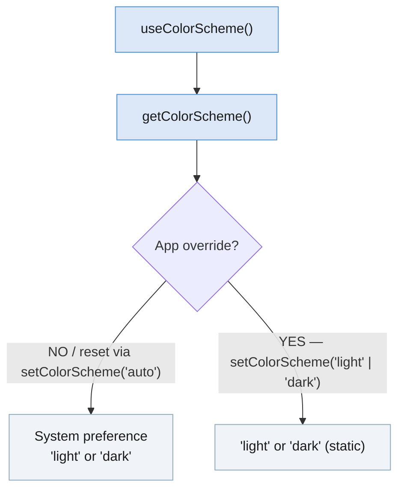

<a id="doc-ffdbe3a1e7ee93cacfc080b6"></a>

# facebook/react-native-website / CODE_OF_CONDUCT.md

Upstream: https://github.com/facebook/react-native-website/blob/f5d7ce02ff602fd91ceec28a17dd390d0e3e06df/CODE_OF_CONDUCT.md

Commit: `f5d7ce02ff602fd91ceec28a17dd390d0e3e06df`

Retrieved: 2026-10-01T15:37:09.777022+00:00

Kind: official-document

Raw SHA256: `290795367374dfbb91479c243a10d0fdbc308cd1e853a4dae59d11265faa5d5e`

Source text below is untrusted reference content. Acquisition does not verify technical claims.

License status: UPSTREAM_NOTICES_CAPTURED_PER_FILE_REVIEW_REQUIRED. See this repository's captured license files.

---

# Code of Conduct

## Our Pledge

In the interest of fostering an open and welcoming environment, we as
contributors and maintainers pledge to make participation in our project and
our community a harassment-free experience for everyone, regardless of age, body
size, disability, ethnicity, sex characteristics, gender identity and expression,
level of experience, education, socio-economic status, nationality, personal
appearance, race, religion, or sexual identity and orientation.

## Our Standards

Examples of behavior that contributes to creating a positive environment
include:

- Using welcoming and inclusive language
- Being respectful of differing viewpoints and experiences
- Gracefully accepting constructive criticism
- Focusing on what is best for the community
- Showing empathy towards other community members

Examples of unacceptable behavior by participants include:

- The use of sexualized language or imagery and unwelcome sexual attention or
  advances
- Trolling, insulting/derogatory comments, and personal or political attacks
- Public or private harassment
- Publishing others' private information, such as a physical or electronic
  address, without explicit permission
- Other conduct which could reasonably be considered inappropriate in a
  professional setting

## Our Responsibilities

Project maintainers are responsible for clarifying the standards of acceptable
behavior and are expected to take appropriate and fair corrective action in
response to any instances of unacceptable behavior.

Project maintainers have the right and responsibility to remove, edit, or
reject comments, commits, code, wiki edits, issues, and other contributions
that are not aligned to this Code of Conduct, or to ban temporarily or
permanently any contributor for other behaviors that they deem inappropriate,
threatening, offensive, or harmful.

## Scope

This Code of Conduct applies within all project spaces, and it also applies when
an individual is representing the project or its community in public spaces.
Examples of representing a project or community include using an official
project e-mail address, posting via an official social media account, or acting
as an appointed representative at an online or offline event. Representation of
a project may be further defined and clarified by project maintainers.

This Code of Conduct also applies outside the project spaces when there is a
reasonable belief that an individual's behavior may have a negative impact on
the project or its community.

## Enforcement

Instances of abusive, harassing, or otherwise unacceptable behavior may be
reported by contacting the project team at <opensource-conduct@fb.com>. All
complaints will be reviewed and investigated and will result in a response that
is deemed necessary and appropriate to the circumstances. The project team is
obligated to maintain confidentiality with regard to the reporter of an incident.
Further details of specific enforcement policies may be posted separately.

Project maintainers who do not follow or enforce the Code of Conduct in good
faith may face temporary or permanent repercussions as determined by other
members of the project's leadership.

## Attribution

This Code of Conduct is adapted from the [Contributor Covenant][homepage], version 1.4,
available at <https://www.contributor-covenant.org/version/1/4/code-of-conduct.html>

[homepage]: https://www.contributor-covenant.org

For answers to common questions about this code of conduct, see
<https://www.contributor-covenant.org/faq>


<a id="doc-eca12c0a30e25b4b46522ebf"></a>

# facebook/react-native-website / CONTRIBUTING.md

Upstream: https://github.com/facebook/react-native-website/blob/f5d7ce02ff602fd91ceec28a17dd390d0e3e06df/CONTRIBUTING.md

Commit: `f5d7ce02ff602fd91ceec28a17dd390d0e3e06df`

Retrieved: 2026-10-01T15:37:09.777022+00:00

Kind: official-document

Raw SHA256: `6381d982e77e0d89c5f65ecbe593c98f01f03d60024b94cf5141db3cb52fdccb`

Source text below is untrusted reference content. Acquisition does not verify technical claims.

License status: UPSTREAM_NOTICES_CAPTURED_PER_FILE_REVIEW_REQUIRED. See this repository's captured license files.

---

# Contributing to React Native website

Thank you for your interest in contributing to the React Native website! From commenting on and triaging issues, to reviewing and sending Pull Requests, all contributions are welcome. We aim to build a vibrant and inclusive [ecosystem of partners, core contributors, and community](https://github.com/facebook/react-native/blob/main/ECOSYSTEM.md) that goes beyond the main React Native GitHub repository.

The [Open Source Guides](https://opensource.guide/) website has a collection of resources for individuals, communities, and companies who want to learn how to run and contribute to an open source project. Contributors and people new to open source alike will find the following guides especially useful:

- [How to Contribute to Open Source](https://opensource.guide/how-to-contribute/)
- [Building Welcoming Communities](https://opensource.guide/building-community/)

## Code of Conduct

As a reminder, all contributors are expected to adhere to the [Code of Conduct](https://github.com/facebook/react-native-website/blob/main/CODE_OF_CONDUCT.md).

## Ways to Contribute

Please see our [Contributing Guide](https://reactnative.dev/contributing/overview) on the React Native website.

If you are interested specifically in contributing to the React Native website check out [Contributing section](https://github.com/facebook/react-native-website#-contributing) in the React Native website repository README file.


<a id="doc-c693279643b8cd5d248172d9"></a>

# facebook/react-native-website / LICENSE

Upstream: https://github.com/facebook/react-native-website/blob/f5d7ce02ff602fd91ceec28a17dd390d0e3e06df/LICENSE

Commit: `f5d7ce02ff602fd91ceec28a17dd390d0e3e06df`

Retrieved: 2026-10-01T15:37:09.777022+00:00

Kind: license

Raw SHA256: `da6d3703ed11cbe42bd212c725957c98da23cbff1998c05fa4b3d976d1a58e93`

Source text below is untrusted reference content. Acquisition does not verify technical claims.

License status: UPSTREAM_NOTICES_CAPTURED_PER_FILE_REVIEW_REQUIRED. See this repository's captured license files.

---

````text
MIT License

Copyright (c) Meta Platforms, Inc. and affiliates.

Permission is hereby granted, free of charge, to any person obtaining a copy
of this software and associated documentation files (the "Software"), to deal
in the Software without restriction, including without limitation the rights
to use, copy, modify, merge, publish, distribute, sublicense, and/or sell
copies of the Software, and to permit persons to whom the Software is
furnished to do so, subject to the following conditions:

The above copyright notice and this permission notice shall be included in all
copies or substantial portions of the Software.

THE SOFTWARE IS PROVIDED "AS IS", WITHOUT WARRANTY OF ANY KIND, EXPRESS OR
IMPLIED, INCLUDING BUT NOT LIMITED TO THE WARRANTIES OF MERCHANTABILITY,
FITNESS FOR A PARTICULAR PURPOSE AND NONINFRINGEMENT. IN NO EVENT SHALL THE
AUTHORS OR COPYRIGHT HOLDERS BE LIABLE FOR ANY CLAIM, DAMAGES OR OTHER
LIABILITY, WHETHER IN AN ACTION OF CONTRACT, TORT OR OTHERWISE, ARISING FROM,
OUT OF OR IN CONNECTION WITH THE SOFTWARE OR THE USE OR OTHER DEALINGS IN THE
SOFTWARE.

````


<a id="doc-6610280005b95670a545f3a8"></a>

# facebook/react-native-website / LICENSE-docs

Upstream: https://github.com/facebook/react-native-website/blob/f5d7ce02ff602fd91ceec28a17dd390d0e3e06df/LICENSE-docs

Commit: `f5d7ce02ff602fd91ceec28a17dd390d0e3e06df`

Retrieved: 2026-10-01T15:37:09.777022+00:00

Kind: license

Raw SHA256: `a5bdaa63ef9ad2186eb90eba7d2034616b1b85cec88190da6590ac6f65c831db`

Source text below is untrusted reference content. Acquisition does not verify technical claims.

License status: UPSTREAM_NOTICES_CAPTURED_PER_FILE_REVIEW_REQUIRED. See this repository's captured license files.

---

````text
Attribution 4.0 International

=======================================================================

Creative Commons Corporation ("Creative Commons") is not a law firm and
does not provide legal services or legal advice. Distribution of
Creative Commons public licenses does not create a lawyer-client or
other relationship. Creative Commons makes its licenses and related
information available on an "as-is" basis. Creative Commons gives no
warranties regarding its licenses, any material licensed under their
terms and conditions, or any related information. Creative Commons
disclaims all liability for damages resulting from their use to the
fullest extent possible.

Using Creative Commons Public Licenses

Creative Commons public licenses provide a standard set of terms and
conditions that creators and other rights holders may use to share
original works of authorship and other material subject to copyright
and certain other rights specified in the public license below. The
following considerations are for informational purposes only, are not
exhaustive, and do not form part of our licenses.

     Considerations for licensors: Our public licenses are
     intended for use by those authorized to give the public
     permission to use material in ways otherwise restricted by
     copyright and certain other rights. Our licenses are
     irrevocable. Licensors should read and understand the terms
     and conditions of the license they choose before applying it.
     Licensors should also secure all rights necessary before
     applying our licenses so that the public can reuse the
     material as expected. Licensors should clearly mark any
     material not subject to the license. This includes other CC-
     licensed material, or material used under an exception or
     limitation to copyright. More considerations for licensors:
  wiki.creativecommons.org/Considerations_for_licensors

     Considerations for the public: By using one of our public
     licenses, a licensor grants the public permission to use the
     licensed material under specified terms and conditions. If
     the licensor's permission is not necessary for any reason--for
     example, because of any applicable exception or limitation to
     copyright--then that use is not regulated by the license. Our
     licenses grant only permissions under copyright and certain
     other rights that a licensor has authority to grant. Use of
     the licensed material may still be restricted for other
     reasons, including because others have copyright or other
     rights in the material. A licensor may make special requests,
     such as asking that all changes be marked or described.
     Although not required by our licenses, you are encouraged to
     respect those requests where reasonable. More_considerations
     for the public:
  wiki.creativecommons.org/Considerations_for_licensees

=======================================================================

Creative Commons Attribution 4.0 International Public License

By exercising the Licensed Rights (defined below), You accept and agree
to be bound by the terms and conditions of this Creative Commons
Attribution 4.0 International Public License ("Public License"). To the
extent this Public License may be interpreted as a contract, You are
granted the Licensed Rights in consideration of Your acceptance of
these terms and conditions, and the Licensor grants You such rights in
consideration of benefits the Licensor receives from making the
Licensed Material available under these terms and conditions.


Section 1 -- Definitions.

  a. Adapted Material means material subject to Copyright and Similar
     Rights that is derived from or based upon the Licensed Material
     and in which the Licensed Material is translated, altered,
     arranged, transformed, or otherwise modified in a manner requiring
     permission under the Copyright and Similar Rights held by the
     Licensor. For purposes of this Public License, where the Licensed
     Material is a musical work, performance, or sound recording,
     Adapted Material is always produced where the Licensed Material is
     synched in timed relation with a moving image.

  b. Adapter's License means the license You apply to Your Copyright
     and Similar Rights in Your contributions to Adapted Material in
     accordance with the terms and conditions of this Public License.

  c. Copyright and Similar Rights means copyright and/or similar rights
     closely related to copyright including, without limitation,
     performance, broadcast, sound recording, and Sui Generis Database
     Rights, without regard to how the rights are labeled or
     categorized. For purposes of this Public License, the rights
     specified in Section 2(b)(1)-(2) are not Copyright and Similar
     Rights.

  d. Effective Technological Measures means those measures that, in the
     absence of proper authority, may not be circumvented under laws
     fulfilling obligations under Article 11 of the WIPO Copyright
     Treaty adopted on December 20, 1996, and/or similar international
     agreements.

  e. Exceptions and Limitations means fair use, fair dealing, and/or
     any other exception or limitation to Copyright and Similar Rights
     that applies to Your use of the Licensed Material.

  f. Licensed Material means the artistic or literary work, database,
     or other material to which the Licensor applied this Public
     License.

  g. Licensed Rights means the rights granted to You subject to the
     terms and conditions of this Public License, which are limited to
     all Copyright and Similar Rights that apply to Your use of the
     Licensed Material and that the Licensor has authority to license.

  h. Licensor means the individual(s) or entity(ies) granting rights
     under this Public License.

  i. Share means to provide material to the public by any means or
     process that requires permission under the Licensed Rights, such
     as reproduction, public display, public performance, distribution,
     dissemination, communication, or importation, and to make material
     available to the public including in ways that members of the
     public may access the material from a place and at a time
     individually chosen by them.

  j. Sui Generis Database Rights means rights other than copyright
     resulting from Directive 96/9/EC of the European Parliament and of
     the Council of 11 March 1996 on the legal protection of databases,
     as amended and/or succeeded, as well as other essentially
     equivalent rights anywhere in the world.

  k. You means the individual or entity exercising the Licensed Rights
     under this Public License. Your has a corresponding meaning.


Section 2 -- Scope.

  a. License grant.

       1. Subject to the terms and conditions of this Public License,
          the Licensor hereby grants You a worldwide, royalty-free,
          non-sublicensable, non-exclusive, irrevocable license to
          exercise the Licensed Rights in the Licensed Material to:

            a. reproduce and Share the Licensed Material, in whole or
               in part; and

            b. produce, reproduce, and Share Adapted Material.

       2. Exceptions and Limitations. For the avoidance of doubt, where
          Exceptions and Limitations apply to Your use, this Public
          License does not apply, and You do not need to comply with
          its terms and conditions.

       3. Term. The term of this Public License is specified in Section
          6(a).

       4. Media and formats; technical modifications allowed. The
          Licensor authorizes You to exercise the Licensed Rights in
          all media and formats whether now known or hereafter created,
          and to make technical modifications necessary to do so. The
          Licensor waives and/or agrees not to assert any right or
          authority to forbid You from making technical modifications
          necessary to exercise the Licensed Rights, including
          technical modifications necessary to circumvent Effective
          Technological Measures. For purposes of this Public License,
          simply making modifications authorized by this Section 2(a)
          (4) never produces Adapted Material.

       5. Downstream recipients.

            a. Offer from the Licensor -- Licensed Material. Every
               recipient of the Licensed Material automatically
               receives an offer from the Licensor to exercise the
               Licensed Rights under the terms and conditions of this
               Public License.

            b. No downstream restrictions. You may not offer or impose
               any additional or different terms or conditions on, or
               apply any Effective Technological Measures to, the
               Licensed Material if doing so restricts exercise of the
               Licensed Rights by any recipient of the Licensed
               Material.

       6. No endorsement. Nothing in this Public License constitutes or
          may be construed as permission to assert or imply that You
          are, or that Your use of the Licensed Material is, connected
          with, or sponsored, endorsed, or granted official status by,
          the Licensor or others designated to receive attribution as
          provided in Section 3(a)(1)(A)(i).

  b. Other rights.

       1. Moral rights, such as the right of integrity, are not
          licensed under this Public License, nor are publicity,
          privacy, and/or other similar personality rights; however, to
          the extent possible, the Licensor waives and/or agrees not to
          assert any such rights held by the Licensor to the limited
          extent necessary to allow You to exercise the Licensed
          Rights, but not otherwise.

       2. Patent and trademark rights are not licensed under this
          Public License.

       3. To the extent possible, the Licensor waives any right to
          collect royalties from You for the exercise of the Licensed
          Rights, whether directly or through a collecting society
          under any voluntary or waivable statutory or compulsory
          licensing scheme. In all other cases the Licensor expressly
          reserves any right to collect such royalties.


Section 3 -- License Conditions.

Your exercise of the Licensed Rights is expressly made subject to the
following conditions.

  a. Attribution.

       1. If You Share the Licensed Material (including in modified
          form), You must:

            a. retain the following if it is supplied by the Licensor
               with the Licensed Material:

                 i. identification of the creator(s) of the Licensed
                    Material and any others designated to receive
                    attribution, in any reasonable manner requested by
                    the Licensor (including by pseudonym if
                    designated);

                ii. a copyright notice;

               iii. a notice that refers to this Public License;

                iv. a notice that refers to the disclaimer of
                    warranties;

                 v. a URI or hyperlink to the Licensed Material to the
                    extent reasonably practicable;

            b. indicate if You modified the Licensed Material and
               retain an indication of any previous modifications; and

            c. indicate the Licensed Material is licensed under this
               Public License, and include the text of, or the URI or
               hyperlink to, this Public License.

       2. You may satisfy the conditions in Section 3(a)(1) in any
          reasonable manner based on the medium, means, and context in
          which You Share the Licensed Material. For example, it may be
          reasonable to satisfy the conditions by providing a URI or
          hyperlink to a resource that includes the required
          information.

       3. If requested by the Licensor, You must remove any of the
          information required by Section 3(a)(1)(A) to the extent
          reasonably practicable.

       4. If You Share Adapted Material You produce, the Adapter's
          License You apply must not prevent recipients of the Adapted
          Material from complying with this Public License.


Section 4 -- Sui Generis Database Rights.

Where the Licensed Rights include Sui Generis Database Rights that
apply to Your use of the Licensed Material:

  a. for the avoidance of doubt, Section 2(a)(1) grants You the right
     to extract, reuse, reproduce, and Share all or a substantial
     portion of the contents of the database;

  b. if You include all or a substantial portion of the database
     contents in a database in which You have Sui Generis Database
     Rights, then the database in which You have Sui Generis Database
     Rights (but not its individual contents) is Adapted Material; and

  c. You must comply with the conditions in Section 3(a) if You Share
     all or a substantial portion of the contents of the database.

For the avoidance of doubt, this Section 4 supplements and does not
replace Your obligations under this Public License where the Licensed
Rights include other Copyright and Similar Rights.


Section 5 -- Disclaimer of Warranties and Limitation of Liability.

  a. UNLESS OTHERWISE SEPARATELY UNDERTAKEN BY THE LICENSOR, TO THE
     EXTENT POSSIBLE, THE LICENSOR OFFERS THE LICENSED MATERIAL AS-IS
     AND AS-AVAILABLE, AND MAKES NO REPRESENTATIONS OR WARRANTIES OF
     ANY KIND CONCERNING THE LICENSED MATERIAL, WHETHER EXPRESS,
     IMPLIED, STATUTORY, OR OTHER. THIS INCLUDES, WITHOUT LIMITATION,
     WARRANTIES OF TITLE, MERCHANTABILITY, FITNESS FOR A PARTICULAR
     PURPOSE, NON-INFRINGEMENT, ABSENCE OF LATENT OR OTHER DEFECTS,
     ACCURACY, OR THE PRESENCE OR ABSENCE OF ERRORS, WHETHER OR NOT
     KNOWN OR DISCOVERABLE. WHERE DISCLAIMERS OF WARRANTIES ARE NOT
     ALLOWED IN FULL OR IN PART, THIS DISCLAIMER MAY NOT APPLY TO YOU.

  b. TO THE EXTENT POSSIBLE, IN NO EVENT WILL THE LICENSOR BE LIABLE
     TO YOU ON ANY LEGAL THEORY (INCLUDING, WITHOUT LIMITATION,
     NEGLIGENCE) OR OTHERWISE FOR ANY DIRECT, SPECIAL, INDIRECT,
     INCIDENTAL, CONSEQUENTIAL, PUNITIVE, EXEMPLARY, OR OTHER LOSSES,
     COSTS, EXPENSES, OR DAMAGES ARISING OUT OF THIS PUBLIC LICENSE OR
     USE OF THE LICENSED MATERIAL, EVEN IF THE LICENSOR HAS BEEN
     ADVISED OF THE POSSIBILITY OF SUCH LOSSES, COSTS, EXPENSES, OR
     DAMAGES. WHERE A LIMITATION OF LIABILITY IS NOT ALLOWED IN FULL OR
     IN PART, THIS LIMITATION MAY NOT APPLY TO YOU.

  c. The disclaimer of warranties and limitation of liability provided
     above shall be interpreted in a manner that, to the extent
     possible, most closely approximates an absolute disclaimer and
     waiver of all liability.


Section 6 -- Term and Termination.

  a. This Public License applies for the term of the Copyright and
     Similar Rights licensed here. However, if You fail to comply with
     this Public License, then Your rights under this Public License
     terminate automatically.

  b. Where Your right to use the Licensed Material has terminated under
     Section 6(a), it reinstates:

       1. automatically as of the date the violation is cured, provided
          it is cured within 30 days of Your discovery of the
          violation; or

       2. upon express reinstatement by the Licensor.

     For the avoidance of doubt, this Section 6(b) does not affect any
     right the Licensor may have to seek remedies for Your violations
     of this Public License.

  c. For the avoidance of doubt, the Licensor may also offer the
     Licensed Material under separate terms or conditions or stop
     distributing the Licensed Material at any time; however, doing so
     will not terminate this Public License.

  d. Sections 1, 5, 6, 7, and 8 survive termination of this Public
     License.


Section 7 -- Other Terms and Conditions.

  a. The Licensor shall not be bound by any additional or different
     terms or conditions communicated by You unless expressly agreed.

  b. Any arrangements, understandings, or agreements regarding the
     Licensed Material not stated herein are separate from and
     independent of the terms and conditions of this Public License.


Section 8 -- Interpretation.

  a. For the avoidance of doubt, this Public License does not, and
     shall not be interpreted to, reduce, limit, restrict, or impose
     conditions on any use of the Licensed Material that could lawfully
     be made without permission under this Public License.

  b. To the extent possible, if any provision of this Public License is
     deemed unenforceable, it shall be automatically reformed to the
     minimum extent necessary to make it enforceable. If the provision
     cannot be reformed, it shall be severed from this Public License
     without affecting the enforceability of the remaining terms and
     conditions.

  c. No term or condition of this Public License will be waived and no
     failure to comply consented to unless expressly agreed to by the
     Licensor.

  d. Nothing in this Public License constitutes or may be interpreted
     as a limitation upon, or waiver of, any privileges and immunities
     that apply to the Licensor or You, including from the legal
     processes of any jurisdiction or authority.


=======================================================================

Creative Commons is not a party to its public licenses.
Notwithstanding, Creative Commons may elect to apply one of its public
licenses to material it publishes and in those instances will be
considered the "Licensor." Except for the limited purpose of indicating
that material is shared under a Creative Commons public license or as
otherwise permitted by the Creative Commons policies published at
creativecommons.org/policies, Creative Commons does not authorize the
use of the trademark "Creative Commons" or any other trademark or logo
of Creative Commons without its prior written consent including,
without limitation, in connection with any unauthorized modifications
to any of its public licenses or any other arrangements,
understandings, or agreements concerning use of licensed material. For
the avoidance of doubt, this paragraph does not form part of the public
licenses.

Creative Commons may be contacted at creativecommons.org.
````


<a id="doc-b335630551682c19a781afeb"></a>

# facebook/react-native-website / README.md

Upstream: https://github.com/facebook/react-native-website/blob/f5d7ce02ff602fd91ceec28a17dd390d0e3e06df/README.md

Commit: `f5d7ce02ff602fd91ceec28a17dd390d0e3e06df`

Retrieved: 2026-10-01T15:37:09.777022+00:00

Kind: official-document

Raw SHA256: `a89fcd61402fcdad64f66c2b5cbae242b6f9025b94cd677aefb00d1efc106d71`

Source text below is untrusted reference content. Acquisition does not verify technical claims.

License status: UPSTREAM_NOTICES_CAPTURED_PER_FILE_REVIEW_REQUIRED. See this repository's captured license files.

---

# [reactnative.dev](https://reactnative.dev/) &middot; [](LICENSE-docs) [](CONTRIBUTING.md) <a href="https://twitter.com/intent/follow?screen_name=reactnative"></a> <a href="https://bsky.app/profile/reactnative.dev"></a>

This repo contains the website configuration and documentation powering the [React Native website](https://reactnative.dev/).

> If you are looking for the source code of the [React Native Archive website](https://archive.reactnative.dev/) select the [`archive`](https://github.com/facebook/react-native-website/tree/archive) branch.

## Contents

- [Getting started](#%EF%B8%8F-getting-started)
- [Overview](#-overview)
- [Website configuration](#-website-configuration)
- [Contributing](#-contributing)
- [License](#-license)

## ✈️ Getting started

### Prerequisites

1. [Git](https://git-scm.com/downloads).
1. [Node](https://nodejs.org/en/download/) _(version 22 or greater)_.
1. [Yarn Classic](https://classic.yarnpkg.com/en/docs/install) _(version 1)_.
1. A fork and clone of the `react-native-website` repo _(for any contributions)_.

### Installation

1. `cd react-native-website` to go into the project root.
1. Run `yarn` to install the website's workspace dependencies.

### Running locally

1. Run `yarn start` to start the development server _(powered by [Docusaurus](https://docusaurus.io))_.
1. Open <http://localhost:3000/> site in your favorite browser.

## 📖 Overview

If you would like to **_contribute an edit or addition to the docs,_** read through our [style guide](STYLEGUIDE.md) before you write anything.
Almost all our content is generated from markdown files you can find in the `docs`, `website/architecture` and `website/contributing` directories.

**_To edit the internals of how the site is built,_** you may want to get familiarized with how the site is built. The React Native website is a static site generated using [Docusaurus](https://docusaurus.io/).
The website configuration can be found in the `website` directory. Visit the Docusaurus website to learn more about all the available configuration options.

### Directory Structure

The following is a high-level overview of relevant files and folders.

```
react-native-website/
├── docs/
│   ├── [BASE VERSIONED DOC FILES]
│   └── ...
└── website/
    ├── architecture/
    │   ├── [ARCHITECTURE DOC FILES]
    │   └── ...
    ├── blog/
    │   ├── [BLOG POSTS]
    │   └── ...
    ├── contributing/
    │   ├── [CONTRIBUTING DOC FILES]
    │   └── ...
    ├── core/
    │   ├── [CUSTOM COMPONENTS]
    │   └── ...
    ├── src/
    │   ├── css/
    │   │   ├── [CUSTOM STYLES]
    │   │   └── ...
    │   ├── pages/
    │   │   ├── [STATIC PAGES]
    │   │   └── ...
    │   └── theme/
    │   │   ├── [SWIZZLED COMPONENTS]
    │   │   └── ...
    ├── static/
    │   ├── blog/
    │   │   └── assets/
    │   ├── docs/
    │   │   └── assets/
    │   └── img/
    ├── versioned_docs/
    │   ├── [GENERATED VERSIONED DOC FILES]
    │   └── ...
    ├── versioned_sidebars/
    │   ├── [GENERATED VERSIONED SIDEBARS]
    │   └── ...
    ├── docusaurus.config.ts
    ├── package.json
    ├── showcase.json
    ├── sidebars.ts
    ├── sidebarsArchitecture.ts
    ├── sidebarsCommunity.ts
    ├── sidebarsContributing.ts
    └── versions.json
```

### Documentation sources

As mentioned above, the `docs` folder contains the source files for docs from "Guides", "Components" and "APIs" tabs on the React Native website (versioned docs).
The doc files for the "Architecture" and "Contribution" tabs are located inside `website` in the respective directories (unversioned/static docs).
In most cases, you will only want to edit the files within those directories.

If you're adding a new doc or you need to alter the order the docs appear in the sidebar, take a look at the `sidebars.ts`, `sidebarsArchitecture.ts` and `sidebarsContributing.ts` files in the `website` directory. The sidebar files contain a list of document ids that should match those defined in the header metadata (aka frontmatter) of the docs markdown files.

### Versioned docs

Part of the React Native website is versioned to allow users to go back and see the Guides or API reference documentation for any given release. A new version of the website is generally generated whenever there is a new React Native release. When this happens, any changes made to the `docs` and `website/sidebars.ts` files will be copied over to the corresponding location within `website/versioned_docs` and `website/versioned_sidebars`.

> [!NOTE]
> Do not edit the auto-generated files within `versioned_docs` or `versioned_sidebars` unless you are sure it is necessary. Edits made to older versions will not be propagated to newer versions of the versioned docs.

Docusaurus keeps track of the list of versions for the site in the `website/versions.json` file. The ordering of versions in this file should be in reverse chronological order.

#### Cutting a new version

##### After RC

The React Native website lints and typechecks documents in "next". The version of React Native used by the linter should be updated before a release for consistency and to catch any documents/examples where APIs have changed.

This can be done by updating the `package.json` and configuration files in `script/lint-examples` the same way a React Native application would be updated. The diff of these files can be seen using a tool like [React Native Upgrade Helper](https://react-native-community.github.io/upgrade-helper/?from=0.70.6&to=0.71.0).

##### After Release

1. `cd react-native-website` to go into the project root.
1. `cd website` to go into the website portion of the project.
1. Run `yarn version:cut <newVersion>` where `<newVersion>` is the new version being released (e.g. `0.81`).
1. Open a PR and commit this change as "Cut branch <newVersion>"

## 🔧 Website configuration

The main config file for the website can be found at `website/docusaurus.config.ts`. This file tells [Docusaurus how to build the website](https://docusaurus.io/docs/configuration). Edits to this file are rarely necessary.

The `core` subdirectory contains JavaScript and React components that are the core part of the website.

The `src/pages` subdirectory contains the React components that make up the non-documentation pages of the site, such as the homepage.

The `src/theme` subdirectory contains the swizzled React components from the Docusaurus theme.

The `showcase.json` file contains the list of users that are highlighted in the React Native showcase.

## 👏 Contributing

### Create a branch

1. `git checkout main` from any folder in your local `react-native-website` repository.
1. `git pull origin main` to ensure you have the latest main code.
1. `git checkout -b the-name-of-my-branch` to create a branch.
   > replace `the-name-of-my-branch` with a suitable name, such as `update-animations-page`

### Make the change

1. Follow the "[Running locally](#running-locally)" instructions.
1. Save the files and check in the browser.
1. Some changes may require a server restart to generate new files. (Pages in `docs` always do!)
1. Edits to pages in `docs` will only be visible in the latest version of the documentation, called "Next", located under the `docs/next` path.

Visit **<http://localhost:3000/docs/next/YOUR-DOCS-PAGE>** to see your work.

> [!NOTE]
> Visit <http://localhost:3000/versions> to see the list of all versions of the docs, if you have backported some of the changes.

> [!TIP]
> If you're adding assets, make sure they’re optimized for the web. You can use tools like [ImageOptim](https://imageoptim.com/mac) to automatically apply lossless compression to various file types.

### Test the change

If possible, test any visual changes in all latest versions of the following browsers:

- Chrome and Firefox on the desktop.
- Chrome and Safari on mobile.

### Push it

1. Run `yarn lint` and `yarn prettier` in `./website` directory to ensure your changes are consistent with other files in the repo.
1. Run `yarn update-lock` to [deduplicate dependencies](https://yarnpkg.com/cli/dedupe).
1. `git add -A && git commit -m "My message"` to stage and commit your changes.
   > replace `My message` with a commit message, such as `Fixed header logo on Android`
1. `git push my-fork-name the-name-of-my-branch`
1. Go to the [react-native-website repo](https://github.com/facebook/react-native-website) and you should see recently pushed branches.
1. Follow GitHub's instructions.
1. Describe briefly your changes (in case of visual changes, please include screenshots).

## 📄 License

React Native is [MIT licensed](./LICENSE).

React Native documentation is [Creative Commons licensed](./LICENSE-docs).


<a id="doc-18b19378fcb4038a2ce14f3e"></a>

# facebook/react-native-website / STYLEGUIDE.md

Upstream: https://github.com/facebook/react-native-website/blob/f5d7ce02ff602fd91ceec28a17dd390d0e3e06df/STYLEGUIDE.md

Commit: `f5d7ce02ff602fd91ceec28a17dd390d0e3e06df`

Retrieved: 2026-10-01T15:37:09.777022+00:00

Kind: official-document

Raw SHA256: `6f89abfc527fa7b05a0a3a35f1e91add261313bfe86a5f011afdcceb975f02d5`

Source text below is untrusted reference content. Acquisition does not verify technical claims.

License status: UPSTREAM_NOTICES_CAPTURED_PER_FILE_REVIEW_REQUIRED. See this repository's captured license files.

---

# React Native Documentation Style Guide

We believe everyone should be able to learn React Native, no matter what their technology platform, experience, country of origin, age, race, gender, etc. And our documentation guidelines reflect that.

## From “Zero to 360”

Part of what makes books like Effective JavaScript effective for new learners as well as advanced is that each section starts by assuming the reader has no knowledge of JavaScript. By the end of the chapter, the author has ramped up the content to speak at an expert level. That’s the sort of cadence we’re looking for in our documentation pages. Each page should start with the basics then ramp up to advanced ideas and concepts. Readers will, as with Effective JavaScript, revisit the content as their expertise and understanding grows.

## Write for more than a React audience

It’s convenient to write as though the reader has the same background and perspective that you do. But in reality, our readers have a range of experience as well as come to us from many different fields including Android and iOS. We have to be inclusive of all learners, and that means taking nothing for granted!

- **Assume no knowledge of React.** 31% of visitors surveyed in September 2019 said they have no experience with React JS. When explaining React concepts, give a short explanation and then link to the appropriate React docs.
- **Assume readers have no background in web development.** While 76% of our visitors surveyed in September 2019 said they had experience with web development before starting with React Native, that means 24% came in without any knowledge of web paradigms! 7.4% said they had no experience, meaning we can’t rely on Android, iOS, or web metaphors with those readers.
- **Provide references to multiple technologies.** To help learners from Android and iOS backgrounds, it’s important that references also take those experiences into account and make comparisons for them in addition to web developers.

### Example

**Bad** “React Native is like React, but it uses native components instead of web components as building blocks.” This assumes a knowledge of the Web as well as React—and readers may lack one or both of those.

**Good** “React Native is built with React. On the Web, React composes web components into UIs. Similarly, React Native uses native components as building blocks.”

## Unpack “native”

Refer to non-web technologies by their proper nouns or as “apps,” not lumping them as “native.” Android and iOS developers do not think of their technologies as “native” nor what they build as “native apps.” Being more specific helps create an inclusive shared vocabulary for web and app devs to learn and collaborate with each other.

### Example

**Bad** “Native App Accessibility (Android and iOS)” Qualifying “app” with “native” is redundant with “Android and “iOS” in the same phrase.

**Good** “App Accessibility on Android and iOS” specifies both platforms and drops the confusing “native.”

## Welcoming and mature

Tone counts for a lot. Too familiar, and some folks might feel like they aren’t a part of a company of friends. Too formal and we risk alienating them with a robotic-sounding textbook! Our aim is to be welcoming and mature, like a senior developer who doesn’t take themselves too seriously.

### Example

**Bad** “In accordance with the ancient traditions of our people, we must first build an app that does nothing except say ‘Hello, world!’” Pokes fun at ancient traditions of “our people” (whose people?) using a storytelling voice familiar to European English-language speakers that could be lost on people from other backgrounds.

**Good** “As with so many other tutorials, you will first build an app that says ‘Hello, world!’” This is shorter, easier to read, and still keeps a friendly tone by acknowledging the proliferation of ‘hello world’ apps.

## In-jokes are out

Cultural reference jokes, or “in-jokes,” don’t translate well across language and cultural divides. Even a reference to a popular British television drama like Downton Abbey can be lost on an American audience! What’s more, these reference tend to exclude people of different generations and age poorly. For instance, a Never Ending Story reference is lost on people born in the 90’s, and a Stranger Things reference will be outdated in five years, meaning more work for future documentation contributors to update.

## “you”, “we”, and “they”

- “You” refers to the reader
- “We” can be confusing and ambiguous. It could refer to the React Native community, React Native contributors, or the React Native Core team at Facebook. As such, only use “we” after explicitly referring to one of those groups.
- “They” refers to people or organizations outside this “you/we” paradigm
  - Set up who “they” are by referencing the person/org first

### Example

**Bad** “We can play around with sample code directly in these web simulators made by Genius Co. (You have built a wonderful tool!) Their contributions make it better and better. It’s great when they all work together!”

**Good** “You can play around with sample code directly in these web simulators made by Genius Co. (They have built a wonderful tool!) The React Native community’s contributions make it better and better. It’s great when we all work together!”

## Avoid pronouns

Pronouns are difficult to translate into some languages. They also tend to be gendered, which provides unnecessary bias.

### Example

<!--alex ignore he-she retext-equality-->

**Bad** “When he opens the app, he will see a loading screen.”

**Good** “When the user opens the app, it will show a loading screen.”

## Prefer imperative to gerund

"To" forms of verbs are easier to translate.

### Example

**Bad** “Coding with React Native is fun!”

**Good** “It is fun to code with React Native!”

## Shorter is better

Short sentences are easier to translate, for both machines and humans! Break clauses into multiple sentences.

### Example

**Bad** “First of all, ES2015 (also known as ES6) is a set of improvements to JavaScript that is now part of the official standard, but not yet supported by all browsers, so often it isn't used yet in web development.”

**Good** “ES2015 is a set of improvements to the official JavaScript standard. It is not yet supported by all browsers, so it isn't used yet in web development.”

# Technical documentation guidelines

## Format menu paths

When navigating operating system menus, the menu selection path should be **bold** and use carats to indicate submenus.

### Example

**Bad** “Open Xcode’s ‘Preferences...’ menu and then click on ‘Components.’” Ambiguous. Relies on reader knowing that “Preferences” is a submenu of “Xcode.” Difficult to read at a glance.

**Good** “Open **Xcode > Preferences...** and select the **Components** tab.” Path is clearer to pick out from the surrounding copy.

## “Android” before “iOS”

The number of Android developers surpasses iOS developers, and putting iOS in front of Android seems belittling and privileged. For consistency's sake at the very least, when listing technologies, Android comes before iOS.

**Bad** “While we do our best to assume no prior knowledge of React, iOS, or Android development, these are valuable topics of study for the aspiring React Native developer.”

**Good** “While we do our best to assume no prior knowledge of React, Android, or iOS development, these are valuable topics of study for the aspiring React Native developer.”

## When it comes to values, be explicit

When it comes to describing property values, be definitive in what is and is not allowed. If something is optional, say it is optional. If something can have multiple values, say which values it can accept.

### Example

**Bad** “Should be an integer.” Implies that it could take other values. Leaves room for imagination.

**Good** “Accepts integer values.” Leaves no doubt about what values this takes!

## Other grammar policies

- Capitalize “Hooks.”

## Empathize with readers

When writing step-by-step instructions (e.g. how to install something), try to forget everything you know about the topic to attain a "beginner's mindset." Imagine follow the instructions you write, one step at time. Often you will discover that there is implicit knowledge that you forgot to mention, or that there are missing or out-of-order steps in the instructions. UX research pro tip: ask _someone else_ to follow your instructions and see where they get stuck!

# Learn more

## Writing tips

- Start with an outline, a table of contents of what you want to cover
- Expand that outline into fully fledged content
- Ensure your content answers Who, What, Where, When, Why and How

## Resources

- [React JS’s contributing guidelines](https://github.com/reactjs/reactjs.org/blob/main/CONTRIBUTING.md#guidelines-for-text), especially the [code examples guidelines](https://github.com/reactjs/reactjs.org/blob/master/CONTRIBUTING.md#guidelines-for-code-examples)


<a id="doc-1f5cb9c6b167693e02d712a0"></a>

# facebook/react-native-website / docs/_canary-channel-api-warning.mdx

Upstream: https://github.com/facebook/react-native-website/blob/f5d7ce02ff602fd91ceec28a17dd390d0e3e06df/docs/_canary-channel-api-warning.mdx

Commit: `f5d7ce02ff602fd91ceec28a17dd390d0e3e06df`

Retrieved: 2026-10-01T15:37:09.777022+00:00

Kind: official-document

Raw SHA256: `ad51ee273058b20bf1420cb0a746bc1917e6c8f995a303d09536d7e43a666b44`

Source text below is untrusted reference content. Acquisition does not verify technical claims.

License status: UPSTREAM_NOTICES_CAPTURED_PER_FILE_REVIEW_REQUIRED. See this repository's captured license files.

---

:::tip[Canary 🧪]

**This API is currently only available in React Native’s Canary and Experimental channels.**

If you want to try it out, please [enable the Canary Channel](release-levels) in your app.

:::


<a id="doc-39ae857ac455660ec4bc8a26"></a>

# facebook/react-native-website / docs/_experimental-api-warning.mdx

Upstream: https://github.com/facebook/react-native-website/blob/f5d7ce02ff602fd91ceec28a17dd390d0e3e06df/docs/_experimental-api-warning.mdx

Commit: `f5d7ce02ff602fd91ceec28a17dd390d0e3e06df`

Retrieved: 2026-10-01T15:37:09.777022+00:00

Kind: official-document

Raw SHA256: `d9bbd73934c7ec6adc4c828569a40734021acbf3fcb05ab4aa828ca8e2901dd1`

Source text below is untrusted reference content. Acquisition does not verify technical claims.

License status: UPSTREAM_NOTICES_CAPTURED_PER_FILE_REVIEW_REQUIRED. See this repository's captured license files.

---

:::important[Experimental 🧪]

**This API is experimental.** Experimental APIs may contain bugs and are likely to change in a future version of React Native. Don't use them in production.

:::


<a id="doc-1948cc04b392380b8b8b84d3"></a>

# facebook/react-native-website / docs/_experimental-channel-api-warning.mdx

Upstream: https://github.com/facebook/react-native-website/blob/f5d7ce02ff602fd91ceec28a17dd390d0e3e06df/docs/_experimental-channel-api-warning.mdx

Commit: `f5d7ce02ff602fd91ceec28a17dd390d0e3e06df`

Retrieved: 2026-10-01T15:37:09.777022+00:00

Kind: official-document

Raw SHA256: `3a08e2764f8dde52bf942f1bd316dc483de8f757eb27f38b558f8b06a0162417`

Source text below is untrusted reference content. Acquisition does not verify technical claims.

License status: UPSTREAM_NOTICES_CAPTURED_PER_FILE_REVIEW_REQUIRED. See this repository's captured license files.

---

:::important[Experimental Feature 🧪]

**This API is currently only available in React Native’s Experimental channels.**

Experimental APIs may contain bugs and are likely to change in a future version of React Native. Don't use them in production.

If you want to try it out, please [enable the Experimental Channel](release-levels) in your app.

:::


<a id="doc-151b9a8f7174f3876e1e14d4"></a>

# facebook/react-native-website / docs/_getting-started-linux-android.md

Upstream: https://github.com/facebook/react-native-website/blob/f5d7ce02ff602fd91ceec28a17dd390d0e3e06df/docs/_getting-started-linux-android.md

Commit: `f5d7ce02ff602fd91ceec28a17dd390d0e3e06df`

Retrieved: 2026-10-01T15:37:09.777022+00:00

Kind: official-document

Raw SHA256: `d336f759861f648783a26caa699e0ae464fbc87dfdd1d6df26409f72cacaf3e2`

Source text below is untrusted reference content. Acquisition does not verify technical claims.

License status: UPSTREAM_NOTICES_CAPTURED_PER_FILE_REVIEW_REQUIRED. See this repository's captured license files.

---

## Installing dependencies

You will need Node, the React Native command line interface, a JDK, and Android Studio.

While you can use any editor of your choice to develop your app, you will need to install Android Studio in order to set up the necessary tooling to build your React Native app for Android.

<h3>Node</h3>

Follow the [installation instructions for your Linux distribution](https://nodejs.org/en/download/package-manager/) to install Node 22.11.0 or newer.

<h3>Java Development Kit</h3>

React Native currently recommends version 17 of the Java SE Development Kit (JDK). You may encounter problems using higher JDK versions. You may download and install [OpenJDK](https://openjdk.java.net) from [AdoptOpenJDK](https://adoptopenjdk.net/) or your system packager.

<h3>Android development environment</h3>

Setting up your development environment can be somewhat tedious if you're new to Android development. If you're already familiar with Android development, there are a few things you may need to configure. In either case, please make sure to carefully follow the next few steps.

<h4 id="android-studio">1. Install Android Studio</h4>

[Download and install Android Studio](https://developer.android.com/studio). While on Android Studio installation wizard, make sure the boxes next to all of the following items are checked:

- `Android SDK`
- `Android SDK Platform`
- `Android Virtual Device`

Then, click "Next" to install all of these components.

:::note
If the checkboxes are grayed out, you will have a chance to install these components later on.
:::

Once setup has finalized and you're presented with the Welcome screen, proceed to the next step.

<h4 id="android-sdk">2. Install the Android SDK</h4>

Android Studio installs the latest Android SDK by default. Building a React Native app with native code, however, requires the `Android 15 (VanillaIceCream)` SDK in particular. Additional Android SDKs can be installed through the SDK Manager in Android Studio.

To do that, open Android Studio, click on "Configure" button and select "SDK Manager".

:::tip
The SDK Manager can also be found within the Android Studio "Settings" dialog, under **Languages & Frameworks** → **Android SDK**.
:::

Select the "SDK Platforms" tab from within the SDK Manager, then check the box next to "Show Package Details" in the bottom right corner. Look for and expand the `Android 15 (VanillaIceCream)` entry, then make sure the following items are checked:

- `Android SDK Platform 35`
- `Intel x86 Atom_64 System Image` or `Google APIs Intel x86 Atom System Image`

Next, select the "SDK Tools" tab and check the box next to "Show Package Details" here as well. Look for and expand the "Android SDK Build-Tools" entry, then make sure that `36.0.0` and `Android SDK Command-line Tools (latest)` are selected.

Finally, click "Apply" to download and install the Android SDK and related build tools.

<h4>3. Configure the ANDROID_HOME environment variable</h4>

The React Native tools require some environment variables to be set up in order to build apps with native code.

Add the following lines to your `$HOME/.bash_profile` or `$HOME/.bashrc` (if you are using `zsh` then `~/.zprofile` or `~/.zshrc`) config file:

```shell
export ANDROID_HOME=$HOME/Android/Sdk
export PATH=$PATH:$ANDROID_HOME/emulator
export PATH=$PATH:$ANDROID_HOME/platform-tools
```

:::note
`.bash_profile` is specific to `bash`. If you're using another shell, you will need to edit the appropriate shell-specific config file.
:::

Type `source $HOME/.bash_profile` for `bash` or `source $HOME/.zprofile` to load the config into your current shell. Verify that ANDROID_HOME has been set by running `echo $ANDROID_HOME` and the appropriate directories have been added to your path by running `echo $PATH`.

:::note
Please make sure you use the correct Android SDK path. You can find the actual location of the SDK in the Android Studio "Settings" dialog, under **Languages & Frameworks** → **Android SDK**.
:::

<h3>Watchman</h3>

Follow the [Watchman installation guide](https://facebook.github.io/watchman/docs/install#buildinstall) to compile and install Watchman from source.

:::info
[Watchman](https://facebook.github.io/watchman/docs/install) is a tool by Facebook for watching changes in the filesystem. It is highly recommended you install it for better performance and increased compatibility in certain edge cases (translation: you may be able to get by without installing this, but your mileage may vary; installing this now may save you from a headache later).
:::

<h2>Preparing the Android device</h2>

You will need an Android device to run your React Native Android app. This can be either a physical Android device, or more commonly, you can use an Android Virtual Device which allows you to emulate an Android device on your computer.

Either way, you will need to prepare the device to run Android apps for development.

<h3>Using a physical device</h3>

If you have a physical Android device, you can use it for development in place of an AVD by plugging it in to your computer using a USB cable and following the instructions [here](running-on-device.md).

<h3>Using a virtual device</h3>

If you use Android Studio to open `./AwesomeProject/android`, you can see the list of available Android Virtual Devices (AVDs) by opening the "AVD Manager" from within Android Studio. Look for an icon that looks like this:


If you have recently installed Android Studio, you will likely need to [create a new AVD](https://developer.android.com/studio/run/managing-avds.html). Select "Create Virtual Device...", then pick any Phone from the list and click "Next", then select the **VanillaIceCream** API Level 35 image.

:::tip
We recommend configuring [VM acceleration](https://developer.android.com/studio/run/emulator-acceleration.html#vm-linux) on your system to improve performance. Once you've followed those instructions, go back to the AVD Manager.
:::

Click "Next" then "Finish" to create your AVD. At this point you should be able to click on the green triangle button next to your AVD to launch it.

<h3>That's it!</h3>

Congratulations! You successfully set up your development environment.

<center></img></center>

<h2>Now what?</h2>

- If you want to add this new React Native code to an existing application, check out the [Integration guide](integration-with-existing-apps.md).
- If you're curious to learn more about React Native, check out the [Introduction to React Native](getting-started).


<a id="doc-f9abd017094048e4a9e4752e"></a>

# facebook/react-native-website / docs/_getting-started-macos-android.md

Upstream: https://github.com/facebook/react-native-website/blob/f5d7ce02ff602fd91ceec28a17dd390d0e3e06df/docs/_getting-started-macos-android.md

Commit: `f5d7ce02ff602fd91ceec28a17dd390d0e3e06df`

Retrieved: 2026-10-01T15:37:09.777022+00:00

Kind: official-document

Raw SHA256: `0a16e510e6fc370abe7c98407cb539f11a5a8b342408d56835b4abc365c4212f`

Source text below is untrusted reference content. Acquisition does not verify technical claims.

License status: UPSTREAM_NOTICES_CAPTURED_PER_FILE_REVIEW_REQUIRED. See this repository's captured license files.

---

## Installing dependencies

You will need Node, Watchman, the React Native command line interface, a JDK, and Android Studio.

While you can use any editor of your choice to develop your app, you will need to install Android Studio in order to set up the necessary tooling to build your React Native app for Android.

<h3>Node &amp; Watchman</h3>

We recommend installing Node and Watchman using [Homebrew](https://brew.sh/). Run the following commands in a Terminal after installing Homebrew:

```shell
brew install node
brew install watchman
```

If you have already installed Node on your system, make sure it is Node 22.11.0 or newer.

[Watchman](https://facebook.github.io/watchman) is a tool by Facebook for watching changes in the filesystem. It is highly recommended you install it for better performance.

<h3>Java Development Kit</h3>

We recommend installing the OpenJDK distribution called Azul **Zulu** using [Homebrew](https://brew.sh/). Run the following commands in a Terminal after installing Homebrew:

```shell
brew install --cask zulu@17

# Get path to where cask was installed to find the JDK installer
brew info --cask zulu@17

# ==> zulu@17: <version number>
# https://www.azul.com/downloads/
# Installed
# /opt/homebrew/Caskroom/zulu@17/<version number> (185.8MB) (note that the path is /usr/local/Caskroom on non-Apple Silicon Macs)
# Installed using the formulae.brew.sh API on 2024-06-06 at 10:00:00

# Navigate to the folder
open /opt/homebrew/Caskroom/zulu@17/<version number> # or /usr/local/Caskroom/zulu@17/<version number>
```

After opening Finder, double click the `Double-Click to Install Azul Zulu JDK 17.pkg` package to install the JDK.

After the JDK installation, add or update your `JAVA_HOME` environment variable in `~/.zshrc` (or in `~/.bash_profile`).

If you used above steps, JDK will likely be located at `/Library/Java/JavaVirtualMachines/zulu-17.jdk/Contents/Home`:

```shell
export JAVA_HOME=/Library/Java/JavaVirtualMachines/zulu-17.jdk/Contents/Home
```

The Zulu OpenJDK distribution offers JDKs for **both Intel and M1 Macs**. This will make sure your builds are faster on M1 Macs compared to using an Intel-based JDK.

If you have already installed JDK on your system, we recommend JDK 17. You may encounter problems using higher JDK versions.

<h3>Android development environment</h3>

Setting up your development environment can be somewhat tedious if you're new to Android development. If you're already familiar with Android development, there are a few things you may need to configure. In either case, please make sure to carefully follow the next few steps.

<h4 id="android-studio">1. Install Android Studio</h4>

[Download and install Android Studio](https://developer.android.com/studio). While on Android Studio installation wizard, make sure the boxes next to all of the following items are checked:

- `Android SDK`
- `Android SDK Platform`
- `Android Virtual Device`

Then, click "Next" to install all of these components.

:::note
If the checkboxes are grayed out, you will have a chance to install these components later on.
:::

Once setup has finalized and you're presented with the Welcome screen, proceed to the next step.

<h4 id="android-sdk">2. Install the Android SDK</h4>

Android Studio installs the latest Android SDK by default. Building a React Native app with native code, however, requires the `Android 15 (VanillaIceCream)` SDK in particular. Additional Android SDKs can be installed through the SDK Manager in Android Studio.

To do that, open Android Studio, click on "More Actions" button and select "SDK Manager".


:::tip
The SDK Manager can also be found within the Android Studio "Settings" dialog, under **Languages & Frameworks** → **Android SDK**.
:::

Select the "SDK Platforms" tab from within the SDK Manager, then check the box next to "Show Package Details" in the bottom right corner. Look for and expand the `Android 15 (VanillaIceCream)` entry, then make sure the following items are checked:

- `Android SDK Platform 35`
- `Intel x86 Atom_64 System Image` or `Google APIs Intel x86 Atom System Image` or (for Apple M1 Silicon) `Google APIs ARM 64 v8a System Image`

Next, select the "SDK Tools" tab and check the box next to "Show Package Details" here as well. Look for and expand the "Android SDK Build-Tools" entry, then make sure that `36.0.0` and `Android SDK Command-line Tools (latest)` are selected.

Finally, click "Apply" to download and install the Android SDK and related build tools.

<h4>3. Configure the ANDROID_HOME environment variable</h4>

The React Native tools require some environment variables to be set up in order to build apps with native code.

Add the following lines to your `~/.zprofile` or `~/.zshrc` (if you are using `bash`, then `~/.bash_profile` or `~/.bashrc`) config file:

```shell
export ANDROID_HOME=$HOME/Library/Android/sdk
export PATH=$PATH:$ANDROID_HOME/emulator
export PATH=$PATH:$ANDROID_HOME/platform-tools
```

Run `source ~/.zprofile` (or `source ~/.bash_profile` for `bash`) to load the config into your current shell. Verify that ANDROID_HOME has been set by running `echo $ANDROID_HOME` and the appropriate directories have been added to your path by running `echo $PATH`.

:::note
Please make sure you use the correct Android SDK path. You can find the actual location of the SDK in the Android Studio "Settings" dialog, under **Languages & Frameworks** → **Android SDK**.
:::

<h2>Preparing the Android device</h2>

You will need an Android device to run your React Native Android app. This can be either a physical Android device, or more commonly, you can use an Android Virtual Device which allows you to emulate an Android device on your computer.

Either way, you will need to prepare the device to run Android apps for development.

<h3>Using a physical device</h3>

If you have a physical Android device, you can use it for development in place of an AVD by plugging it in to your computer using a USB cable and following the instructions [here](running-on-device.md).

<h3>Using a virtual device</h3>

If you use Android Studio to open `./AwesomeProject/android`, you can see the list of available Android Virtual Devices (AVDs) by opening the "AVD Manager" from within Android Studio. Look for an icon that looks like this:


If you have recently installed Android Studio, you will likely need to [create a new AVD](https://developer.android.com/studio/run/managing-avds.html). Select "Create Virtual Device...", then pick any Phone from the list and click "Next", then select the **VanillaIceCream** API Level 35 image.

Click "Next" then "Finish" to create your AVD. At this point you should be able to click on the green triangle button next to your AVD to launch it.

<h3>That's it!</h3>

Congratulations! You successfully set up your development environment.

<center></img></center>

<h2>Now what?</h2>

- If you want to add this new React Native code to an existing application, check out the [Integration guide](integration-with-existing-apps.md).
- If you're curious to learn more about React Native, check out the [Introduction to React Native](getting-started).


<a id="doc-f7f87e7ec1fe4ca60696eabb"></a>

# facebook/react-native-website / docs/_getting-started-macos-ios.md

Upstream: https://github.com/facebook/react-native-website/blob/f5d7ce02ff602fd91ceec28a17dd390d0e3e06df/docs/_getting-started-macos-ios.md

Commit: `f5d7ce02ff602fd91ceec28a17dd390d0e3e06df`

Retrieved: 2026-10-01T15:37:09.777022+00:00

Kind: official-document

Raw SHA256: `470d171faebb2f9c34926b3a5ccd4c1803d1ef60c292db867ee23caf4cbee179`

Source text below is untrusted reference content. Acquisition does not verify technical claims.

License status: UPSTREAM_NOTICES_CAPTURED_PER_FILE_REVIEW_REQUIRED. See this repository's captured license files.

---

import ThemedImage from '@theme/ThemedImage';

## Installing dependencies

You will need Node, Watchman, the React Native command line interface, Xcode and CocoaPods.

While you can use any editor of your choice to develop your app, you will need to install Xcode in order to set up the necessary tooling to build your React Native app for iOS.

### Node & Watchman

We recommend installing Node and Watchman using [Homebrew](https://brew.sh/). Run the following commands in a Terminal after installing Homebrew:

```shell
brew install node
brew install watchman
```

If you have already installed Node on your system, make sure it is Node 22.11.0 or newer.

[Watchman](https://facebook.github.io/watchman) is a tool by Facebook for watching changes in the filesystem. It is highly recommended you install it for better performance.

### Xcode

Please use the **latest version** of Xcode.

The easiest way to install Xcode is via the [Mac App Store](https://itunes.apple.com/us/app/xcode/id497799835?mt=12). Installing Xcode will also install the iOS Simulator and all the necessary tools to build your iOS app.

#### Command Line Tools

You will also need to install the Xcode Command Line Tools. Open Xcode, then choose **Settings... (or Preferences...)** from the Xcode menu. Go to the Locations panel and install the tools by selecting the most recent version in the Command Line Tools dropdown.

<ThemedImage
alt="Xcode Command Line Tools configuration"
sources={{
    light: '/docs/assets/GettingStartedXcodeCommandLineTools.png',
    dark: '/docs/assets/GettingStartedXcodeCommandLineToolsDark.png',
  }}
/>

#### Installing an iOS Simulator in Xcode

To install a simulator, open **Xcode > Settings... (or Preferences...)** and select the **Platforms (or Components)** tab. Select a simulator with the corresponding version of iOS you wish to use.

If you are using Xcode version 14.0 or greater to install a simulator, open **Xcode > Settings > Platforms** tab, then click "+" icon and select **iOS…** option.

#### CocoaPods

[CocoaPods](https://cocoapods.org/) is one of the dependency management system available for iOS. CocoaPods is a Ruby [gem](https://en.wikipedia.org/wiki/RubyGems). You can install CocoaPods using the version of Ruby that ships with the latest version of macOS.

For more information, please visit [CocoaPods Getting Started guide](https://guides.cocoapods.org/using/getting-started.html).

### [Optional] Configuring your environment

Starting from React Native version 0.69, it is possible to configure the Xcode environment using the `.xcode.env` file provided by the template.

The `.xcode.env` file contains an environment variable to export the path to the `node` executable in the `NODE_BINARY` variable.
This is the **suggested approach** to decouple the build infrastructure from the system version of `node`. You should customize this variable with your own path or your own `node` version manager, if it differs from the default.

On top of this, it's possible to add any other environment variable and to source the `.xcode.env` file in your build script phases. If you need to run script that requires some specific environment, this is the **suggested approach**: it allows to decouple the build phases from a specific environment.

:::info
If you are already using [NVM](https://nvm.sh/) (a command which helps you install and switch between versions of Node.js) and [zsh](https://ohmyz.sh/), you might want to move the code that initialize NVM from your `~/.zshrc` into a `~/.zshenv` file to help Xcode find your Node executable:

```zsh
export NVM_DIR="$HOME/.nvm"
[ -s "$NVM_DIR/nvm.sh" ] && \. "$NVM_DIR/nvm.sh"  # This loads nvm
```

You might also want to ensure that all "shell script build phase" of your Xcode project, is using `/bin/zsh` as its shell.
:::

<h3>That's it!</h3>

Congratulations! You successfully set up your development environment.

<center></img></center>

<h2>Now what?</h2>

- If you want to add this new React Native code to an existing application, check out the [Integration guide](integration-with-existing-apps.md).
- If you're curious to learn more about React Native, check out the [Introduction to React Native](getting-started).


<a id="doc-3e88f40db53a30df3b7a3b9c"></a>

# facebook/react-native-website / docs/_getting-started-windows-android.md

Upstream: https://github.com/facebook/react-native-website/blob/f5d7ce02ff602fd91ceec28a17dd390d0e3e06df/docs/_getting-started-windows-android.md

Commit: `f5d7ce02ff602fd91ceec28a17dd390d0e3e06df`

Retrieved: 2026-10-01T15:37:09.777022+00:00

Kind: official-document

Raw SHA256: `e83ef99b14119b5f7e6633a29e34592f98ac5051c47e3c1864b826e92337ac2b`

Source text below is untrusted reference content. Acquisition does not verify technical claims.

License status: UPSTREAM_NOTICES_CAPTURED_PER_FILE_REVIEW_REQUIRED. See this repository's captured license files.

---

<h2>Installing dependencies</h2>

You will need Node, the React Native command line interface, a JDK, and Android Studio.

While you can use any editor of your choice to develop your app, you will need to install Android Studio in order to set up the necessary tooling to build your React Native app for Android.

<h3 id="jdk">Node, JDK</h3>

We recommend installing Node via [Chocolatey](https://chocolatey.org/install), a popular package manager for Windows.

It is recommended to use an LTS version of Node. If you want to be able to switch between different versions, you might want to install Node via [nvm-windows](https://github.com/coreybutler/nvm-windows), a Node version manager for Windows.

React Native also requires [Java SE Development Kit (JDK)](https://openjdk.java.net/projects/jdk/17/), which can be installed using Chocolatey as well.

Open an Administrator Command Prompt (right click Command Prompt and select "Run as Administrator"), then run the following command:

```powershell
choco install -y nodejs-lts microsoft-openjdk17
```

If you have already installed Node on your system, make sure it is Node 22.11.0 or newer. If you already have a JDK on your system, we recommend JDK17. You may encounter problems using higher JDK versions.

:::note
You can find additional installation options on [Node's Downloads page](https://nodejs.org/en/download/).
:::

:::info
If you're using the latest version of Java Development Kit, you'll need to change the Gradle version of your project so it can recognize the JDK. You can do that by going to `{project root folder}\android\gradle\wrapper\gradle-wrapper.properties` and changing the `distributionUrl` value to upgrade the Gradle version. You can check out [here the latest releases of Gradle](https://gradle.org/releases/).
:::

<h3>Android development environment</h3>

Setting up your development environment can be somewhat tedious if you're new to Android development. If you're already familiar with Android development, there are a few things you may need to configure. In either case, please make sure to carefully follow the next few steps.

<h4 id="android-studio">1. Install Android Studio</h4>

[Download and install Android Studio](https://developer.android.com/studio). While on Android Studio installation wizard, make sure the boxes next to all of the following items are checked:

- `Android SDK`
- `Android SDK Platform`
- `Android Virtual Device`
- If you are not already using Hyper-V: `Performance (Intel ® HAXM)` ([See here for AMD or Hyper-V](https://android-developers.googleblog.com/2018/07/android-emulator-amd-processor-hyper-v.html))

Then, click "Next" to install all of these components.

:::note
If the checkboxes are grayed out, you will have a chance to install these components later on.
:::

Once setup has finalized and you're presented with the Welcome screen, proceed to the next step.

<h4 id="android-sdk">2. Install the Android SDK</h4>

Android Studio installs the latest Android SDK by default. Building a React Native app with native code, however, requires the `Android 15 (VanillaIceCream)` SDK in particular. Additional Android SDKs can be installed through the SDK Manager in Android Studio.

To do that, open Android Studio, click on "More Actions" button and select "SDK Manager".


:::tip
The SDK Manager can also be found within the Android Studio "Settings" dialog, under **Languages & Frameworks** → **Android SDK**.
:::

Select the "SDK Platforms" tab from within the SDK Manager, then check the box next to "Show Package Details" in the bottom right corner. Look for and expand the `Android 15 (VanillaIceCream)` entry, then make sure the following items are checked:

- `Android SDK Platform 35`
- `Intel x86 Atom_64 System Image` or `Google APIs Intel x86 Atom System Image`

Next, select the "SDK Tools" tab and check the box next to "Show Package Details" here as well. Look for and expand the `Android SDK Build-Tools` entry, then make sure that `36.0.0` and `Android SDK Command-line Tools (latest)` are selected.

Finally, click "Apply" to download and install the Android SDK and related build tools.

<h4>3. Configure the ANDROID_HOME environment variable</h4>

The React Native tools require some environment variables to be set up in order to build apps with native code.

1. Open the **Windows Control Panel.**
2. Click on **User Accounts,** then click **User Accounts** again
3. Click on **Change my environment variables**
4. Click on **New...** to create a new `ANDROID_HOME` user variable that points to the path to your Android SDK:


The SDK is installed, by default, at the following location:

```powershell
%LOCALAPPDATA%\Android\Sdk
```

You can find the actual location of the SDK in the Android Studio "Settings" dialog, under **Languages & Frameworks** → **Android SDK**.

Open a new Command Prompt window to ensure the new environment variable is loaded before proceeding to the next step.

1. Open powershell
2. Copy and paste **Get-ChildItem -Path Env:\\** into powershell
3. Verify `ANDROID_HOME` has been added

<h4>4. Add platform-tools to Path</h4>

1. Open the **Windows Control Panel.**
2. Click on **User Accounts,** then click **User Accounts** again
3. Click on **Change my environment variables**
4. Select the **Path** variable.
5. Click **Edit.**
6. Click **New** and add the path to platform-tools to the list.

The default location for this folder is:

```powershell
%LOCALAPPDATA%\Android\Sdk\platform-tools
```

<h2>Preparing the Android device</h2>

You will need an Android device to run your React Native Android app. This can be either a physical Android device, or more commonly, you can use an Android Virtual Device which allows you to emulate an Android device on your computer.

Either way, you will need to prepare the device to run Android apps for development.

<h3>Using a physical device</h3>

If you have a physical Android device, you can use it for development in place of an AVD by plugging it in to your computer using a USB cable and following the instructions [here](running-on-device.md).

<h3>Using a virtual device</h3>

If you use Android Studio to open `./AwesomeProject/android`, you can see the list of available Android Virtual Devices (AVDs) by opening the "AVD Manager" from within Android Studio. Look for an icon that looks like this:


If you have recently installed Android Studio, you will likely need to [create a new AVD](https://developer.android.com/studio/run/managing-avds.html). Select "Create Virtual Device...", then pick any Phone from the list and click "Next", then select the **VanillaIceCream** API Level 35 image.

:::note
If you don't have HAXM installed, click on "Install HAXM" or follow [these instructions](https://github.com/intel/haxm/wiki/Installation-Instructions-on-Windows) to set it up, then go back to the AVD Manager.
:::

Click "Next" then "Finish" to create your AVD. At this point you should be able to click on the green triangle button next to your AVD to launch it.

<h3>That's it!</h3>

Congratulations! You successfully set up your development environment.

<center></img></center>

<h2>Now what?</h2>

- If you want to add this new React Native code to an existing application, check out the [Integration guide](integration-with-existing-apps.md).
- If you're curious to learn more about React Native, check out the [Introduction to React Native](getting-started).


<a id="doc-52204009ba2c252be8a0d7e7"></a>

# facebook/react-native-website / docs/_integration-with-existing-apps-ios.md

Upstream: https://github.com/facebook/react-native-website/blob/f5d7ce02ff602fd91ceec28a17dd390d0e3e06df/docs/_integration-with-existing-apps-ios.md

Commit: `f5d7ce02ff602fd91ceec28a17dd390d0e3e06df`

Retrieved: 2026-10-01T15:37:09.777022+00:00

Kind: official-document

Raw SHA256: `a7d8ffd0950c7ecf7d1eb76553431d4a06fdd7b98a7b9fad2c6ca9939ecef1ce`

Source text below is untrusted reference content. Acquisition does not verify technical claims.

License status: UPSTREAM_NOTICES_CAPTURED_PER_FILE_REVIEW_REQUIRED. See this repository's captured license files.

---

import Tabs from '@theme/Tabs';
import TabItem from '@theme/TabItem';
import ThemedImage from '@theme/ThemedImage';
import constants from '@site/core/TabsConstants';
import CodeBlock from '@theme/CodeBlock';
import RNTemplateRepoLink from '@site/core/RNTemplateRepoLink';
import {getTemplateBranchNameForCurrentVersion} from '@site/src/getTemplateBranchNameForCurrentVersion';

## Key Concepts

The keys to integrating React Native components into your iOS application are to:

1. Set up the correct directory structure.
2. Install the necessary NPM dependencies.
3. Adding React Native to your Podfile configuration.
4. Writing the TypeScript code for your first React Native screen.
5. Integrate React Native with your iOS code using a `RCTRootView`.
6. Testing your integration by running the bundler and seeing your app in action.

## Using the Community Template

While you follow this guide, we suggest you to use the [React Native Community Template](https://github.com/react-native-community/template/) as reference. The template contains a **minimal iOS app** and will help you understanding how to integrate React Native into an existing iOS app.

## Prerequisites

Follow the guide on [setting up your development environment](set-up-your-environment) and using [React Native without a framework](getting-started-without-a-framework) to configure your development environment for building React Native apps for iOS.
This guide also assumes you're familiar with the basics of iOS development such as creating a `UIViewController` and editing the `Podfile` file.

### 1. Set up directory structure

To ensure a smooth experience, create a new folder for your integrated React Native project, then **move your existing iOS project** to the `/ios` subfolder.

## 2. Install NPM dependencies

Go to the root directory and run the following command:

<CodeBlock language="bash" title="shell">
{`curl -O https://raw.githubusercontent.com/react-native-community/template/refs/heads/${getTemplateBranchNameForCurrentVersion()}/template/package.json`}
</CodeBlock>

This will copy the `package.json` <RNTemplateRepoLink href="template/package.json">file from the Community template</RNTemplateRepoLink> to your project.

Next, install the NPM packages by running:

<Tabs groupId="package-manager" queryString defaultValue={constants.defaultPackageManager} values={constants.packageManagers}>
<TabItem value="npm">

```shell
npm install
```

</TabItem>
<TabItem value="yarn">

```shell
yarn install
```

</TabItem>
</Tabs>

Installation process has created a new `node_modules` folder. This folder stores all the JavaScript dependencies required to build your project.

Add `node_modules/` to your `.gitignore` file (here the <RNTemplateRepoLink href="template/_gitignore">Community default one</RNTemplateRepoLink>).

### 3. Install Development tools

### Command Line Tools for Xcode

Install the Command Line Tools. Choose **Settings... (or Preferences...)** in the Xcode menu. Go to the Locations panel and install the tools by selecting the most recent version in the Command Line Tools dropdown.

<ThemedImage
alt="Xcode Command Line Tools configuration"
sources={{
    light: '/docs/assets/GettingStartedXcodeCommandLineTools.png',
    dark: '/docs/assets/GettingStartedXcodeCommandLineToolsDark.png',
  }}
/>

### CocoaPods

[CocoaPods](https://cocoapods.org) is a package management tool for iOS and macOS development. We use it to add the actual React Native framework code locally into your current project.

We recommend installing CocoaPods using [Homebrew](https://brew.sh/):

```shell
brew install cocoapods
```

## 4. Adding React Native to your app

### Configuring CocoaPods

To configure CocoaPods, we need two files:

- A **Gemfile** that defines which Ruby dependencies we need.
- A **Podfile** that defines how to properly install our dependencies.

For the **Gemfile**, go to the root directory of your project and run this command

<CodeBlock language="bash" title="shell">
{`curl -O https://raw.githubusercontent.com/react-native-community/template/refs/heads/${getTemplateBranchNameForCurrentVersion()}/template/Gemfile`}
</CodeBlock>

This will download the Gemfile from the template.

:::note
If you created your project with Xcode 16, you need to update the Gemfile as it follows:

```diff
-gem 'cocoapods', '>= 1.13', '!= 1.15.0', '!= 1.15.1'
+gem 'cocoapods', '1.16.2'
gem 'activesupport', '>= 6.1.7.5', '!= 7.1.0'
-gem 'xcodeproj', '< 1.26.0'
+gem 'xcodeproj', '1.27.0'
```

Xcode 16 generates a project in a slightly different ways from previous versions of Xcode, and you need the latest CocoaPods and Xcodeproj gems to make it work properly.
:::

Similarly, for the **Podfile**, go to the `ios` folder of your project and run

<CodeBlock language="bash" title="shell">
{`curl -O https://raw.githubusercontent.com/react-native-community/template/refs/heads/${getTemplateBranchNameForCurrentVersion()}/template/ios/Podfile`}
</CodeBlock>

Please use the Community Template as a reference point for the <RNTemplateRepoLink href="template/Gemfile">Gemfile</RNTemplateRepoLink> and for the <RNTemplateRepoLink href="template/ios/Podfile">Podfile</RNTemplateRepoLink>.

:::note
Remember to change <RNTemplateRepoLink href="template/ios/Podfile#L17">this line</RNTemplateRepoLink>.
:::

Now, we need to run a couple of extra commands to install the Ruby gems and the Pods.
Navigate to the `ios` folder and run the following commands:

```sh
bundle install
bundle exec pod install
```

The first command will install the Ruby dependencies and the second command will actually integrate the React Native code in your application so that your iOS files can import the React Native headers.

## 5. Writing the TypeScript Code

Now we will actually modify the native iOS application to integrate React Native.

The first bit of code we will write is the actual React Native code for the new screen that will be integrated into our application.

### Create a `index.js` file

First, create an empty `index.js` file in the root of your React Native project.

`index.js` is the starting point for React Native applications, and it is always required. It can be a small file that `import`s other file that are part of your React Native component or application, or it can contain all the code that is needed for it.

Our `index.js` should look as follows (here the <RNTemplateRepoLink href="template/index.js">Community template file as reference</RNTemplateRepoLink>):

```js
import {AppRegistry} from 'react-native';
import App from './App';

AppRegistry.registerComponent('HelloWorld', () => App);
```

### Create a `App.tsx` file

Let's create an `App.tsx` file. This is a [TypeScript](https://www.typescriptlang.org/) file that can have [JSX](<https://en.wikipedia.org/wiki/JSX_(JavaScript)>) expressions. It contains the root React Native component that we will integrate into our iOS application (<RNTemplateRepoLink href="template/App.tsx">link</RNTemplateRepoLink>):

```tsx
import {type JSX} from 'react';
import {
  SafeAreaView,
  ScrollView,
  StatusBar,
  StyleSheet,
  Text,
  useColorScheme,
  View,
} from 'react-native';

import {
  Colors,
  DebugInstructions,
  Header,
  ReloadInstructions,
} from 'react-native/Libraries/NewAppScreen';

function App(): JSX.Element {
  const isDarkMode = useColorScheme() === 'dark';

  const backgroundStyle = {
    backgroundColor: isDarkMode ? Colors.darker : Colors.lighter,
  };

  return (
    <SafeAreaView style={backgroundStyle}>
      <StatusBar
        barStyle={isDarkMode ? 'light-content' : 'dark-content'}
        backgroundColor={backgroundStyle.backgroundColor}
      />
      <ScrollView
        contentInsetAdjustmentBehavior="automatic"
        style={backgroundStyle}>
        <Header />
        <View
          style={{
            backgroundColor: isDarkMode
              ? Colors.black
              : Colors.white,
            padding: 24,
          }}>
          <Text style={styles.title}>Step One</Text>
          <Text>
            Edit <Text style={styles.bold}>App.tsx</Text> to
            change this screen and see your edits.
          </Text>
          <Text style={styles.title}>See your changes</Text>
          <ReloadInstructions />
          <Text style={styles.title}>Debug</Text>
          <DebugInstructions />
        </View>
      </ScrollView>
    </SafeAreaView>
  );
}

const styles = StyleSheet.create({
  title: {
    fontSize: 24,
    fontWeight: '600',
  },
  bold: {
    fontWeight: '700',
  },
});

export default App;
```

Here is the <RNTemplateRepoLink href="template/App.tsx">Community template file as reference</RNTemplateRepoLink>.

## 5. Integrating with your iOS code

We now need to add some native code in order to start the React Native runtime and tell it to render our React components.

### Requirements

React Native initialization is now unbound to any specific part of an iOS app.

React Native can be initialized using a class called `RCTReactNativeFactory`, that takes care of handling the React Native lifecycle for you.

Once the class is initialized, you can either start a React Native view providing a `UIWindow` object, or you can ask for the factory to generate a `UIView` that you can load in any `UIViewController.`

In the following example, we will create a ViewController that can load a React Native view as it's `view`.

#### Create the ReactViewController

Create a new file from template (<kbd>⌘</kbd>+<kbd>N</kbd>) and choose the Cocoa Touch Class template.

Make sure to select `UIViewController` as the "Subclass of" field.

<Tabs groupId="ios-language" queryString defaultValue={constants.defaultAppleLanguage} values={constants.appleLanguages}>
<TabItem value="objc">

Now open the `ReactViewController.m` file and apply the following changes

```diff title="ReactViewController.m"
#import "ReactViewController.h"
+#import <React/RCTBundleURLProvider.h>
+#import <RCTReactNativeFactory.h>
+#import <RCTDefaultReactNativeFactoryDelegate.h>
+#import <RCTAppDependencyProvider.h>


@interface ReactViewController ()

@end

+@interface ReactNativeFactoryDelegate: RCTDefaultReactNativeFactoryDelegate
+@end

-@implementation ReactViewController
+@implementation ReactViewController {
+  RCTReactNativeFactory *_factory;
+  id<RCTReactNativeFactoryDelegate> _factoryDelegate;
+}

 - (void)viewDidLoad {
     [super viewDidLoad];
     // Do any additional setup after loading the view.
+    _factoryDelegate = [ReactNativeFactoryDelegate new];
+    _factoryDelegate.dependencyProvider = [RCTAppDependencyProvider new];
+    _factory = [[RCTReactNativeFactory alloc] initWithDelegate:_factoryDelegate];
+    self.view = [_factory.rootViewFactory viewWithModuleName:@"HelloWorld"];
 }

@end

+@implementation ReactNativeFactoryDelegate
+
+- (NSURL *)sourceURLForBridge:(RCTBridge *)bridge
+{
+  return [self bundleURL];
+}
+
+- (NSURL *)bundleURL
+{
+#if DEBUG
+  return [RCTBundleURLProvider.sharedSettings jsBundleURLForBundleRoot:@"index"];
+#else
+  return [NSBundle.mainBundle URLForResource:@"main" withExtension:@"jsbundle"];
+#endif
+}

@end

```

</TabItem>
<TabItem value="swift">

Now open the `ReactViewController.swift` file and apply the following changes

```diff title="ReactViewController.swift"
import UIKit
+import React
+import React_RCTAppDelegate
+import ReactAppDependencyProvider

class ReactViewController: UIViewController {
+  var reactNativeFactory: RCTReactNativeFactory?
+  var reactNativeFactoryDelegate: RCTReactNativeFactoryDelegate?

  override func viewDidLoad() {
    super.viewDidLoad()
+    reactNativeFactoryDelegate = ReactNativeDelegate()
+    reactNativeFactoryDelegate!.dependencyProvider = RCTAppDependencyProvider()
+    reactNativeFactory = RCTReactNativeFactory(delegate: reactNativeFactoryDelegate!)
+    view = reactNativeFactory!.rootViewFactory.view(withModuleName: "HelloWorld")

  }
}

+class ReactNativeDelegate: RCTDefaultReactNativeFactoryDelegate {
+    override func sourceURL(for bridge: RCTBridge) -> URL? {
+      self.bundleURL()
+    }
+
+    override func bundleURL() -> URL? {
+      #if DEBUG
+      RCTBundleURLProvider.sharedSettings().jsBundleURL(forBundleRoot: "index")
+      #else
+      Bundle.main.url(forResource: "main", withExtension: "jsbundle")
+      #endif
+    }
+
+}
```

</TabItem>
</Tabs>

#### Presenting a React Native view in a rootViewController

Finally, we can present our React Native view. To do so, we need a new View Controller that can host a view in which we can load the JS content.
We already have the initial `ViewController`, and we can make it present the `ReactViewController`. There are several ways to do so, depending on your app. For this example, we assume that you have a button that presents React Native modally.

<Tabs groupId="ios-language" queryString defaultValue={constants.defaultAppleLanguage} values={constants.appleLanguages}>
<TabItem value="objc">

```diff title="ViewController.m"
#import "ViewController.h"
+#import "ReactViewController.h"

@interface ViewController ()

@end

- @implementation ViewController
+@implementation ViewController {
+  ReactViewController *reactViewController;
+}

 - (void)viewDidLoad {
   [super viewDidLoad];
   // Do any additional setup after loading the view.
   self.view.backgroundColor = UIColor.systemBackgroundColor;
+  UIButton *button = [UIButton new];
+  [button setTitle:@"Open React Native" forState:UIControlStateNormal];
+  [button setTitleColor:UIColor.systemBlueColor forState:UIControlStateNormal];
+  [button setTitleColor:UIColor.blueColor forState:UIControlStateHighlighted];
+  [button addTarget:self action:@selector(presentReactNative) forControlEvents:UIControlEventTouchUpInside];
+  [self.view addSubview:button];

+  button.translatesAutoresizingMaskIntoConstraints = NO;
+  [NSLayoutConstraint activateConstraints:@[
+    [button.leadingAnchor constraintEqualToAnchor:self.view.leadingAnchor],
+    [button.trailingAnchor constraintEqualToAnchor:self.view.trailingAnchor],
+    [button.centerYAnchor constraintEqualToAnchor:self.view.centerYAnchor],
+    [button.centerXAnchor constraintEqualToAnchor:self.view.centerXAnchor],
+  ]];
 }

+- (void)presentReactNative
+{
+  if (reactViewController == NULL) {
+    reactViewController = [ReactViewController new];
+  }
+  [self presentViewController:reactViewController animated:YES];
+}

@end
```

</TabItem>
<TabItem value="swift">

```diff title="ViewController.swift"
import UIKit

class ViewController: UIViewController {

+  var reactViewController: ReactViewController?

  override func viewDidLoad() {
    super.viewDidLoad()
    // Do any additional setup after loading the view.
    self.view.backgroundColor = .systemBackground

+    let button = UIButton()
+    button.setTitle("Open React Native", for: .normal)
+    button.setTitleColor(.systemBlue, for: .normal)
+    button.setTitleColor(.blue, for: .highlighted)
+    button.addAction(UIAction { [weak self] _ in
+      guard let self else { return }
+      if reactViewController == nil {
+       reactViewController = ReactViewController()
+      }
+      present(reactViewController!, animated: true)
+    }, for: .touchUpInside)
+    self.view.addSubview(button)
+
+    button.translatesAutoresizingMaskIntoConstraints = false
+    NSLayoutConstraint.activate([
+      button.leadingAnchor.constraint(equalTo: self.view.leadingAnchor),
+      button.trailingAnchor.constraint(equalTo: self.view.trailingAnchor),
+      button.centerXAnchor.constraint(equalTo: self.view.centerXAnchor),
+      button.centerYAnchor.constraint(equalTo: self.view.centerYAnchor),
+    ])
  }
}
```

</TabItem>
</Tabs>

Make sure to disable the Sandbox scripting. To achieve this, in Xcode, click on your app, then on build settings. Filter for script and set the `User Script Sandboxing` to `NO`. This step is needed to properly switch between the Debug and Release version of the [Hermes engine](https://github.com/facebook/hermes/blob/main/README.md) that we ship with React Native.


Finally, make sure to add the `UIViewControllerBasedStatusBarAppearance` key into your `Info.plist` file, with value of `NO`.


## 6. Test your integration

You have completed all the basic steps to integrate React Native with your application. Now we will start the [Metro bundler](https://metrobundler.dev/) to build your TypeScript application code into a bundle. Metro's HTTP server shares the bundle from `localhost` on your developer environment to a simulator or device. This allows for [hot reloading](https://reactnative.dev/blog/2016/03/24/introducing-hot-reloading).

First, you need to create a `metro.config.js` file in the root of your project as follows:

```js
const {getDefaultConfig} = require('@react-native/metro-config');
module.exports = getDefaultConfig(__dirname);
```

You can checkout the <RNTemplateRepoLink href="template/metro.config.js">`metro.config.js` file</RNTemplateRepoLink> from the Community template file as reference.

Then, you need to create a `.watchmanconfig` file in the root of your project. The file must contain an empty json object:

```sh
echo {} > .watchmanconfig
```

Once you have the configuration file in place, you can run the bundler. Run the following command in the root directory of your project:

<Tabs groupId="package-manager" queryString defaultValue={constants.defaultPackageManager} values={constants.packageManagers}>
<TabItem value="npm">

```shell
npm start
```

</TabItem>
<TabItem value="yarn">

```shell
yarn start
```

</TabItem>
</Tabs>

Now build and run your iOS app as normal.

Once you reach your React-powered Activity inside the app, it should load the JavaScript code from the development server and display:

<center></center>

### Creating a release build in Xcode

You can use Xcode to create your release builds too! The only additional step is to add a script that is executed when the app is built to package your JS and images into the iOS application.

1. In Xcode, select your application
2. Click on `Build Phases`
3. Click on the `+` in the top left corner and select `New Run Script Phase`
4. Click on the `Run Script` line and rename the Script to `Bundle React Native code and images`
5. Paste in the text box the following script

```sh title="Build React Native code and image"
set -e

WITH_ENVIRONMENT="$REACT_NATIVE_PATH/scripts/xcode/with-environment.sh"
REACT_NATIVE_XCODE="$REACT_NATIVE_PATH/scripts/react-native-xcode.sh"

/bin/sh -c "$WITH_ENVIRONMENT $REACT_NATIVE_XCODE"
```

6. Drag and drop the script before the one called `[CP] Embed Pods Frameworks`.

Now, if you build your app for Release, it will work as expected.

## 7. Passing initial props to the React Native view

In some case, you'd like to pass some information from the Native app to JavaScript. For example, you might want to pass the user id of the currently logged user to React Native, together with a token that can be used to retrieve information from a database.

This is possible by using the `initialProperties` parameter of the `view(withModuleName:initialProperty)` overload of the `RCTReactNativeFactory` class. The following steps shows you how to do it.

### Update the App.tsx file to read the initial properties.

Open the `App.tsx` file and add the following code:

```diff title="App.tsx"
import {
  Colors,
  DebugInstructions,
  Header,
  ReloadInstructions,
} from 'react-native/Libraries/NewAppScreen';

-function App(): React.JSX.Element {
+function App(props): React.JSX.Element {
  const isDarkMode = useColorScheme() === 'dark';

  const backgroundStyle = {
    backgroundColor: isDarkMode ? Colors.darker : Colors.lighter,
  };

  return (
    <SafeAreaView style={backgroundStyle}>
      <StatusBar
        barStyle={isDarkMode ? 'light-content' : 'dark-content'}
        backgroundColor={backgroundStyle.backgroundColor}
      />
      <ScrollView
        contentInsetAdjustmentBehavior="automatic"
        style={backgroundStyle}>
        <Header />
-       <View
-         style={{
-           backgroundColor: isDarkMode
-             ? Colors.black
-             : Colors.white,
-           padding: 24,
-         }}>
-         <Text style={styles.title}>Step One</Text>
-         <Text>
-           Edit <Text style={styles.bold}>App.tsx</Text> to
-           change this screen and see your edits.
-         </Text>
-         <Text style={styles.title}>See your changes</Text>
-         <ReloadInstructions />
-         <Text style={styles.title}>Debug</Text>
-         <DebugInstructions />
+         <Text style={styles.title}>UserID: {props.userID}</Text>
+         <Text style={styles.title}>Token: {props.token}</Text>
        </View>
      </ScrollView>
    </SafeAreaView>
  );
}

const styles = StyleSheet.create({
  title: {
    fontSize: 24,
    fontWeight: '600',
+   marginLeft: 20,
  },
  bold: {
    fontWeight: '700',
  },
});

export default App;
```

These changes will tell React Native that your App component is now accepting some properties. The `RCTreactNativeFactory` will take care of passing them to the component when it's rendered.

### Update the Native code to pass the initial properties to JavaScript.

<Tabs groupId="ios-language" queryString defaultValue={constants.defaultAppleLanguage} values={constants.appleLanguages}>
<TabItem value="objc">

Modify the `ReactViewController.mm` to pass the initial properties to JavaScript.

```diff title="ReactViewController.mm"
 - (void)viewDidLoad {
   [super viewDidLoad];
   // Do any additional setup after loading the view.

   _factoryDelegate = [ReactNativeFactoryDelegate new];
   _factoryDelegate.dependencyProvider = [RCTAppDependencyProvider new];
   _factory = [[RCTReactNativeFactory alloc] initWithDelegate:_factoryDelegate];
-  self.view = [_factory.rootViewFactory viewWithModuleName:@"HelloWorld"];
+  self.view = [_factory.rootViewFactory viewWithModuleName:@"HelloWorld" initialProperties:@{
+    @"userID": @"12345678",
+    @"token": @"secretToken"
+  }];
}
```

</TabItem>
<TabItem value="swift">

Modify the `ReactViewController.swift` to pass the initial properties to the React Native view.

```diff title="ReactViewController.swift"
  override func viewDidLoad() {
    super.viewDidLoad()
    reactNativeFactoryDelegate = ReactNativeDelegate()
    reactNativeFactoryDelegate!.dependencyProvider = RCTAppDependencyProvider()
    reactNativeFactory = RCTReactNativeFactory(delegate: reactNativeFactoryDelegate!)
-   view = reactNativeFactory!.rootViewFactory.view(withModuleName: "HelloWorld")
+   view = reactNativeFactory!.rootViewFactory.view(withModuleName: "HelloWorld" initialProperties: [
+     "userID": "12345678",
+     "token": "secretToken"
+])

  }
}
```

</TabItem>
</Tabs>

3. Run your app once again. You should see the following screen after you present the `ReactViewController`:

<center>
  
</center>

## Now what?

At this point you can continue developing your app as usual. Refer to our [debugging](debugging) and [deployment](running-on-device) docs to learn more about working with React Native.


<a id="doc-21bd5b6b87072c926c7f7fc2"></a>

# facebook/react-native-website / docs/_integration-with-existing-apps-kotlin.md

Upstream: https://github.com/facebook/react-native-website/blob/f5d7ce02ff602fd91ceec28a17dd390d0e3e06df/docs/_integration-with-existing-apps-kotlin.md

Commit: `f5d7ce02ff602fd91ceec28a17dd390d0e3e06df`

Retrieved: 2026-10-01T15:37:09.777022+00:00

Kind: official-document

Raw SHA256: `841aecffc408e04dc775e1f9bfdfce107a7c599a0b717c8d5f7e230b30c61eb9`

Source text below is untrusted reference content. Acquisition does not verify technical claims.

License status: UPSTREAM_NOTICES_CAPTURED_PER_FILE_REVIEW_REQUIRED. See this repository's captured license files.

---

import Tabs from '@theme/Tabs';
import TabItem from '@theme/TabItem';
import constants from '@site/core/TabsConstants';
import CodeBlock from '@theme/CodeBlock';
import RNTemplateRepoLink from '@site/core/RNTemplateRepoLink';
import {getTemplateBranchNameForCurrentVersion} from '@site/src/getTemplateBranchNameForCurrentVersion';

## Key Concepts

The keys to integrating React Native components into your Android application are to:

1. Set up the correct directory structure.
2. Install the necessary NPM dependencies.
3. Adding React Native to your Gradle configuration.
4. Writing the TypeScript code for your first React Native screen.
5. Integrate React Native with your Android code using a ReactActivity.
6. Testing your integration by running the bundler and seeing your app in action.

## Using the Community Template

While you follow this guide, we suggest you to use the [React Native Community Template](https://github.com/react-native-community/template/) as reference. The template contains a **minimal Android app** and will help you understanding how to integrate React Native into an existing Android app.

## Prerequisites

Follow the guide on [setting up your development environment](set-up-your-environment) and using [React Native without a framework](getting-started-without-a-framework) to configure your development environment for building React Native apps for Android.
This guide also assumes you're familiar with the basics of Android development such as creating Activities and editing the `AndroidManifest.xml` file.

## 1. Set up directory structure

To ensure a smooth experience, create a new folder for your integrated React Native project, then **move your existing Android project** to the `/android` subfolder.

## 2. Install NPM dependencies

Go to the root directory and run the following command:

<CodeBlock language="bash" title="shell">
{`curl -O https://raw.githubusercontent.com/react-native-community/template/refs/heads/${getTemplateBranchNameForCurrentVersion()}/template/package.json`}
</CodeBlock>

This will copy the `package.json` <RNTemplateRepoLink href="template/package.json">file from the Community template</RNTemplateRepoLink> to your project.

Next, install the NPM packages by running:

<Tabs groupId="package-manager" queryString defaultValue={constants.defaultPackageManager} values={constants.packageManagers}>
<TabItem value="npm">

```shell
npm install
```

</TabItem>
<TabItem value="yarn">

```shell
yarn install
```

</TabItem>
</Tabs>

Installation process has created a new `node_modules` folder. This folder stores all the JavaScript dependencies required to build your project.

Add `node_modules/` to your `.gitignore` file (here the <RNTemplateRepoLink href="template/_gitignore">Community default one</RNTemplateRepoLink>).

## 3. Adding React Native to your app

### Configuring Gradle

React Native uses the React Native Gradle Plugin to configure your dependencies and project setup.

First, let's edit your `settings.gradle` file by adding those lines (as suggested from the <RNTemplateRepoLink href="template/android/settings.gradle">Community template</RNTemplateRepoLink>):

```groovy
// Configures the React Native Gradle Settings plugin used for autolinking
pluginManagement { includeBuild("../node_modules/@react-native/gradle-plugin") }
plugins { id("com.facebook.react.settings") }
extensions.configure(com.facebook.react.ReactSettingsExtension){ ex -> ex.autolinkLibrariesFromCommand() }
// If using .gradle.kts files:
// extensions.configure<com.facebook.react.ReactSettingsExtension> { autolinkLibrariesFromCommand() }
includeBuild("../node_modules/@react-native/gradle-plugin")

// Include your existing Gradle modules here.
// include(":app")
```

Then you need to open your top level `build.gradle` and include this line (as suggested from the <RNTemplateRepoLink href="template/android/build.gradle">Community template</RNTemplateRepoLink>):

```diff
buildscript {
    repositories {
        google()
        mavenCentral()
    }
    dependencies {
        classpath("com.android.tools.build:gradle:7.3.1")
+       classpath("com.facebook.react:react-native-gradle-plugin")
    }
}
```

This makes sure the React Native Gradle Plugin (RNGP) is available inside your project.
Finally, add those lines inside your Applications's `build.gradle` file (it's a different `build.gradle` file usually inside your `app` folder - you can use the <RNTemplateRepoLink href="template/android/build.gradle">Community template file as reference</RNTemplateRepoLink>):

```diff
apply plugin: "com.android.application"
+apply plugin: "com.facebook.react"

repositories {
    mavenCentral()
}

dependencies {
    // Other dependencies here
+   // Note: we intentionally don't specify the version number here as RNGP will take care of it.
+   // If you don't use the RNGP, you'll have to specify version manually.
+   implementation("com.facebook.react:react-android")
+   implementation("com.facebook.react:hermes-android")
}

+react {
+   // Needed to enable Autolinking - https://github.com/react-native-community/cli/blob/master/docs/autolinking.md
+   autolinkLibrariesWithApp()
+}
```

Finally, open your application `gradle.properties` files and add the following line (here the <RNTemplateRepoLink href="template/android/gradle.properties">Community template file as reference</RNTemplateRepoLink>):

```diff
+reactNativeArchitectures=armeabi-v7a,arm64-v8a,x86,x86_64
+newArchEnabled=true
+hermesEnabled=true
```

### Configuring your manifest

First, make sure you have the Internet permission in your `AndroidManifest.xml`:

```diff
<manifest xmlns:android="http://schemas.android.com/apk/res/android">

+   <uses-permission android:name="android.permission.INTERNET" />

    <application
      android:name=".MainApplication">
    </application>
</manifest>
```

Then you need to enable [cleartext traffic](https://developer.android.com/training/articles/security-config#CleartextTrafficPermitted) in your **debug** `AndroidManifest.xml`:

```diff
<?xml version="1.0" encoding="utf-8"?>
<manifest xmlns:android="http://schemas.android.com/apk/res/android"
    xmlns:tools="http://schemas.android.com/tools">

    <application
+       android:usesCleartextTraffic="true"
+       tools:targetApi="28"
    />
</manifest>
```

As usual, here the AndroidManifest.xml file from the Community template to use as a reference: <RNTemplateRepoLink href="template/android/app/src/main/AndroidManifest.xml">main</RNTemplateRepoLink> and <RNTemplateRepoLink href="template/android/app/src/debug/AndroidManifest.xml">debug</RNTemplateRepoLink>.

This is needed as your application will communicate with your local bundler, [Metro](https://metrobundler.dev/), via HTTP.

Make sure you add this only to your **debug** manifest.

## 4. Writing the TypeScript Code

Now we will actually modify the native Android application to integrate React Native.

The first bit of code we will write is the actual React Native code for the new screen that will be integrated into our application.

### Create a `index.js` file

First, create an empty `index.js` file in the root of your React Native project.

`index.js` is the starting point for React Native applications, and it is always required. It can be a small file that `import`s other file that are part of your React Native component or application, or it can contain all the code that is needed for it.

Our index.js should look as follows (here the <RNTemplateRepoLink href="template/index.js">Community template file as reference</RNTemplateRepoLink>):

```js
import {AppRegistry} from 'react-native';
import App from './App';

AppRegistry.registerComponent('HelloWorld', () => App);
```

### Create a `App.tsx` file

Let's create an `App.tsx` file. This is a [TypeScript](https://www.typescriptlang.org/) file that can have [JSX](<https://en.wikipedia.org/wiki/JSX_(JavaScript)>) expressions. It contains the root React Native component that we will integrate into our Android application (<RNTemplateRepoLink href="template/App.tsx">link</RNTemplateRepoLink>):

```tsx
import {type JSX} from 'react';
import {
  SafeAreaView,
  ScrollView,
  StatusBar,
  StyleSheet,
  Text,
  useColorScheme,
  View,
} from 'react-native';
import {
  Colors,
  DebugInstructions,
  Header,
  ReloadInstructions,
} from 'react-native/Libraries/NewAppScreen';

function App(): JSX.Element {
  const isDarkMode = useColorScheme() === 'dark';

  const backgroundStyle = {
    backgroundColor: isDarkMode ? Colors.darker : Colors.lighter,
  };

  return (
    <SafeAreaView style={backgroundStyle}>
      <StatusBar
        barStyle={isDarkMode ? 'light-content' : 'dark-content'}
        backgroundColor={backgroundStyle.backgroundColor}
      />
      <ScrollView
        contentInsetAdjustmentBehavior="automatic"
        style={backgroundStyle}>
        <Header />
        <View
          style={{
            backgroundColor: isDarkMode
              ? Colors.black
              : Colors.white,
            padding: 24,
          }}>
          <Text style={styles.title}>Step One</Text>
          <Text>
            Edit <Text style={styles.bold}>App.tsx</Text> to
            change this screen and see your edits.
          </Text>
          <Text style={styles.title}>See your changes</Text>
          <ReloadInstructions />
          <Text style={styles.title}>Debug</Text>
          <DebugInstructions />
        </View>
      </ScrollView>
    </SafeAreaView>
  );
}

const styles = StyleSheet.create({
  title: {
    fontSize: 24,
    fontWeight: '600',
  },
  bold: {
    fontWeight: '700',
  },
});

export default App;
```

Here is the <RNTemplateRepoLink href="template/App.tsx">Community template file as reference</RNTemplateRepoLink>.

## 5. Integrating with your Android code

We now need to add some native code in order to start the React Native runtime and tell it to render our React components.

### Updating your Application class

First, we need to update your `Application` class to properly initialize React Native as follows:

<Tabs groupId="android-language" queryString defaultValue={constants.defaultAndroidLanguage} values={constants.androidLanguages}>

<TabItem value="java">

```diff
package <your-package-here>;

import android.app.Application;
+import com.facebook.react.PackageList;
+import com.facebook.react.ReactApplication;
+import com.facebook.react.ReactHost;
+import com.facebook.react.ReactNativeHost;
+import com.facebook.react.ReactPackage;
+import com.facebook.react.defaults.DefaultNewArchitectureEntryPoint;
+import com.facebook.react.defaults.DefaultReactHost;
+import com.facebook.react.defaults.DefaultReactNativeHost;
+import com.facebook.soloader.SoLoader;
+import com.facebook.react.soloader.OpenSourceMergedSoMapping
+import java.util.List;

-class MainApplication extends Application {
+class MainApplication extends Application implements ReactApplication {
+ @Override
+ public ReactNativeHost getReactNativeHost() {
+   return new DefaultReactNativeHost(this) {
+     @Override
+     protected List<ReactPackage> getPackages() { return new PackageList(this).getPackages(); }
+     @Override
+     protected String getJSMainModuleName() { return "index"; }
+     @Override
+     public boolean getUseDeveloperSupport() { return BuildConfig.DEBUG; }
+     @Override
+     protected boolean isNewArchEnabled() { return BuildConfig.IS_NEW_ARCHITECTURE_ENABLED; }
+     @Override
+     protected Boolean isHermesEnabled() { return BuildConfig.IS_HERMES_ENABLED; }
+   };
+ }

+ @Override
+ public ReactHost getReactHost() {
+   return DefaultReactHost.getDefaultReactHost(getApplicationContext(), getReactNativeHost());
+ }

  @Override
  public void onCreate() {
    super.onCreate();
+   SoLoader.init(this, OpenSourceMergedSoMapping);
+   if (BuildConfig.IS_NEW_ARCHITECTURE_ENABLED) {
+     DefaultNewArchitectureEntryPoint.load();
+   }
  }
}
```

</TabItem>

<TabItem value="kotlin">

```diff
// package <your-package-here>

import android.app.Application
+import com.facebook.react.PackageList
+import com.facebook.react.ReactApplication
+import com.facebook.react.ReactHost
+import com.facebook.react.ReactNativeHost
+import com.facebook.react.ReactPackage
+import com.facebook.react.defaults.DefaultNewArchitectureEntryPoint.load
+import com.facebook.react.defaults.DefaultReactHost.getDefaultReactHost
+import com.facebook.react.defaults.DefaultReactNativeHost
+import com.facebook.soloader.SoLoader
+import com.facebook.react.soloader.OpenSourceMergedSoMapping

-class MainApplication : Application() {
+class MainApplication : Application(), ReactApplication {

+ override val reactNativeHost: ReactNativeHost =
+      object : DefaultReactNativeHost(this) {
+        override fun getPackages(): List<ReactPackage> = PackageList(this).packages
+        override fun getJSMainModuleName(): String = "index"
+        override fun getUseDeveloperSupport(): Boolean = BuildConfig.DEBUG
+        override val isNewArchEnabled: Boolean = BuildConfig.IS_NEW_ARCHITECTURE_ENABLED
+        override val isHermesEnabled: Boolean = BuildConfig.IS_HERMES_ENABLED
+      }

+ override val reactHost: ReactHost
+   get() = getDefaultReactHost(applicationContext, reactNativeHost)

  override fun onCreate() {
    super.onCreate()
+   SoLoader.init(this, OpenSourceMergedSoMapping)
+   if (BuildConfig.IS_NEW_ARCHITECTURE_ENABLED) {
+     load()
+   }
  }
}
```

</TabItem>
</Tabs>

As usual, here the <RNTemplateRepoLink href="template/android/app/src/main/java/com/helloworld/MainApplication.kt">`MainApplication.kt` Community template file as reference</RNTemplateRepoLink>.

#### Creating a `ReactActivity`

Finally, we need to create a new `Activity` that will extend `ReactActivity` and host the React Native code. This activity will be responsible for starting the React Native runtime and rendering the React component.

<Tabs groupId="android-language" queryString defaultValue={constants.defaultAndroidLanguage} values={constants.androidLanguages}>

<TabItem value="java">

```java
// package <your-package-here>;

import com.facebook.react.ReactActivity;
import com.facebook.react.ReactActivityDelegate;
import com.facebook.react.defaults.DefaultNewArchitectureEntryPoint;
import com.facebook.react.defaults.DefaultReactActivityDelegate;

public class MyReactActivity extends ReactActivity {

    @Override
    protected String getMainComponentName() {
        return "HelloWorld";
    }

    @Override
    protected ReactActivityDelegate createReactActivityDelegate() {
        return new DefaultReactActivityDelegate(this, getMainComponentName(), DefaultNewArchitectureEntryPoint.getFabricEnabled());
    }
}
```

</TabItem>

<TabItem value="kotlin">

```kotlin
// package <your-package-here>

import com.facebook.react.ReactActivity
import com.facebook.react.ReactActivityDelegate
import com.facebook.react.defaults.DefaultNewArchitectureEntryPoint.fabricEnabled
import com.facebook.react.defaults.DefaultReactActivityDelegate

class MyReactActivity : ReactActivity() {

    override fun getMainComponentName(): String = "HelloWorld"

    override fun createReactActivityDelegate(): ReactActivityDelegate =
        DefaultReactActivityDelegate(this, mainComponentName, fabricEnabled)
}
```

</TabItem>
</Tabs>

As usual, here the <RNTemplateRepoLink href="template/android/app/src/main/java/com/helloworld/MainActivity.kt">`MainActivity.kt` Community template file as reference</RNTemplateRepoLink>.

Whenever you create a new Activity, you need to add it to your `AndroidManifest.xml` file. You also need set the theme of `MyReactActivity` to `Theme.AppCompat.Light.NoActionBar` (or to any non-ActionBar theme) as otherwise your application will render an ActionBar on top of your React Native screen:

```diff
<manifest xmlns:android="http://schemas.android.com/apk/res/android">

    <uses-permission android:name="android.permission.INTERNET" />

    <application
      android:name=".MainApplication">

+     <activity
+       android:name=".MyReactActivity"
+       android:label="@string/app_name"
+       android:theme="@style/Theme.AppCompat.Light.NoActionBar">
+     </activity>
    </application>
</manifest>
```

Now your activity is ready to run some JavaScript code.

## 6. Test your integration

You have completed all the basic steps to integrate React Native with your application. Now we will start the [Metro bundler](https://metrobundler.dev/) to build your TypeScript application code into a bundle. Metro's HTTP server shares the bundle from `localhost` on your developer environment to a simulator or device. This allows for [hot reloading](https://reactnative.dev/blog/2016/03/24/introducing-hot-reloading).

First, you need to create a `metro.config.js` file in the root of your project as follows:

```js
const {getDefaultConfig} = require('@react-native/metro-config');
module.exports = getDefaultConfig(__dirname);
```

You can checkout the <RNTemplateRepoLink href="template/metro.config.js">`metro.config.js` file</RNTemplateRepoLink> from the Community template file as reference.

Once you have the configuration file in place, you can run the bundler. Run the following command in the root directory of your project:

<Tabs groupId="package-manager" queryString defaultValue={constants.defaultPackageManager} values={constants.packageManagers}>
<TabItem value="npm">

```shell
npm start
```

</TabItem>
<TabItem value="yarn">

```shell
yarn start
```

</TabItem>
</Tabs>

Now build and run your Android app as normal.

Once you reach your React-powered Activity inside the app, it should load the JavaScript code from the development server and display:

<center></center>

### Creating a release build in Android Studio

You can use Android Studio to create your release builds too! It’s as quick as creating release builds of your previously-existing native Android app.

The React Native Gradle Plugin will take care of bundling the JS code inside your APK/App Bundle.

If you're not using Android Studio, you can create a release build with:

```
cd android
# For a Release APK
./gradlew :app:assembleRelease
# For a Release AAB
./gradlew :app:bundleRelease
```

### Now what?

At this point you can continue developing your app as usual. Refer to our [debugging](debugging) and [deployment](running-on-device) docs to learn more about working with React Native.


<a id="doc-bf6aa13d8ab4e2485888d9fc"></a>

# facebook/react-native-website / docs/_markdown-new-architecture-warning.mdx

Upstream: https://github.com/facebook/react-native-website/blob/f5d7ce02ff602fd91ceec28a17dd390d0e3e06df/docs/_markdown-new-architecture-warning.mdx

Commit: `f5d7ce02ff602fd91ceec28a17dd390d0e3e06df`

Retrieved: 2026-10-01T15:37:09.777022+00:00

Kind: official-document

Raw SHA256: `6eca24ddf271e5af05e26dd3f8d63084e43ecf4deeeb376fa69283353cec25df`

Source text below is untrusted reference content. Acquisition does not verify technical claims.

License status: UPSTREAM_NOTICES_CAPTURED_PER_FILE_REVIEW_REQUIRED. See this repository's captured license files.

---

:::caution

This documentation is still **experimental** and details are subject to changes as we iterate. Feel free to share your feedback on the [discussion inside the working group](https://github.com/reactwg/react-native-new-architecture/discussions/8) for this page.

Moreover, it contains several **manual steps**. Please note that this won't be representative of the final developer experience once the New Architecture is stable. We're working on tools, templates and libraries to help you get started fast on the New Architecture, without having to go through the whole setup.

:::


<a id="doc-a64c2e2d360dbfda61901508"></a>

# facebook/react-native-website / docs/_remove-global-cli.md

Upstream: https://github.com/facebook/react-native-website/blob/f5d7ce02ff602fd91ceec28a17dd390d0e3e06df/docs/_remove-global-cli.md

Commit: `f5d7ce02ff602fd91ceec28a17dd390d0e3e06df`

Retrieved: 2026-10-01T15:37:09.777022+00:00

Kind: official-document

Raw SHA256: `2bbb4857ece15e2101fcea74e2802b7121e69fab34a541de418b7dfe8c2dd3e8`

Source text below is untrusted reference content. Acquisition does not verify technical claims.

License status: UPSTREAM_NOTICES_CAPTURED_PER_FILE_REVIEW_REQUIRED. See this repository's captured license files.

---

:::warning
If you previously installed a global `react-native-cli` package, please remove it as it may cause unexpected issues:

```shell
npm uninstall -g react-native-cli @react-native-community/cli
```

:::


<a id="doc-69a54da073e7180ca0a427a1"></a>

# facebook/react-native-website / docs/accessibility.md

Upstream: https://github.com/facebook/react-native-website/blob/f5d7ce02ff602fd91ceec28a17dd390d0e3e06df/docs/accessibility.md

Commit: `f5d7ce02ff602fd91ceec28a17dd390d0e3e06df`

Retrieved: 2026-10-01T15:37:09.777022+00:00

Kind: official-document

Raw SHA256: `38cbc7d456811170b35dcdb8a8dbd5b194e8ee41d72bd20f2fe6d22cb488c087`

Source text below is untrusted reference content. Acquisition does not verify technical claims.

License status: UPSTREAM_NOTICES_CAPTURED_PER_FILE_REVIEW_REQUIRED. See this repository's captured license files.

---

---
id: accessibility
title: Accessibility
description: Create mobile apps accessible to assistive technology with React Native's suite of APIs designed to work with Android and iOS.
---

import ExperimentalAPIWarning from './\_experimental-api-warning.mdx';

Both Android and iOS provide APIs for integrating apps with assistive technologies like the bundled screen readers VoiceOver (iOS) and TalkBack (Android). React Native has complementary APIs that let your app accommodate all users.

:::info
Android and iOS differ slightly in their approaches, and thus the React Native implementations may vary by platform.
:::

## Accessibility properties

### `accessible`

When `true`, indicates that the view is discoverable by assistive technologies such as screen readers and hardware keyboards. Note that this does not necessarily mean that the view will be focused by VoiceOver or TalkBack. There are a number of reasons for this, such as VoiceOver disallowing nested accessibility elements, or TalkBack opting to focus some parent element instead.

By default, all touchable elements are accessible.

On Android, `accessible` will be translated into native [`focusable`](<https://developer.android.com/reference/android/view/View#setFocusable(boolean)>). On iOS, it translates into native [`isAccessibilityElement`](https://developer.apple.com/documentation/uikit/uiaccessibilityelement/isaccessibilityelement?language=objc).

```tsx
<View>
  <View accessible={true} />
  <View />
</View>
```

In the above example, accessibility focus is only available on the first child view with the `accessible` property, and not for the parent or sibling without `accessible`.

### `accessibilityLabel`

When a view is marked as accessible, it is a good practice to set an `accessibilityLabel` on the view, so that people who use VoiceOver or TalkBack know what element they have selected. A screen reader will verbalize this string when the associated element is selected.

To use, set the `accessibilityLabel` property to a custom string on your View, Text, or Touchable:

```tsx
<TouchableOpacity
  accessible={true}
  accessibilityLabel="Tap me!"
  onPress={onPress}>
  <View style={styles.button}>
    <Text style={styles.buttonText}>Press me!</Text>
  </View>
</TouchableOpacity>
```

In the above example, the `accessibilityLabel` on the TouchableOpacity element would default to "Press me!". The label is constructed by concatenating all Text node children separated by spaces.

### `accessibilityLabelledBy` <div className="label android">Android</div>

A reference to another element [nativeID](view.md#nativeid) used to build complex forms.
The value of `accessibilityLabelledBy` should match the `nativeID` of the related element:

```tsx
<View>
  <Text nativeID="formLabel">Label for Input Field</Text>
  <TextInput
    accessibilityLabel="input"
    accessibilityLabelledBy="formLabel"
  />
</View>
```

In the above example, the screen reader announces `Input, Edit Box for Label for Input Field` when focusing on the TextInput.

### `accessibilityHint`

An accessibility hint can be used to provide additional context to the user on the result of the action when it is not clear from the accessibility label alone.

Provide the `accessibilityHint` property a custom string on your View, Text, or Touchable:

```tsx
<TouchableOpacity
  accessible={true}
  accessibilityLabel="Go back"
  accessibilityHint="Navigates to the previous screen"
  onPress={onPress}>
  <View style={styles.button}>
    <Text style={styles.buttonText}>Back</Text>
  </View>
</TouchableOpacity>
```

<div className="label ios basic">iOS</div>

In the above example, VoiceOver will read the hint after the label, if the user has hints enabled in the device's VoiceOver settings. Read more about guidelines for `accessibilityHint` in the [iOS Developer Docs](https://developer.apple.com/documentation/objectivec/nsobject/1615093-accessibilityhint)

<div className="label android basic">Android</div>

In the above example, TalkBack will read the hint after the label. At this time, hints cannot be turned off on Android.

### `accessibilityLanguage` <div className="label ios">iOS</div>

By using the `accessibilityLanguage` property, the screen reader will understand which language to use while reading the element's **label**, **value**, and **hint**. The provided string value must follow the [BCP 47 specification](https://www.rfc-editor.org/info/bcp47).

```tsx
<View
  accessible={true}
  accessibilityLabel="Pizza"
  accessibilityLanguage="it-IT">
  <Text>🍕</Text>
</View>
```

### `accessibilityIgnoresInvertColors` <div className="label ios">iOS</div>

Inverting screen colors is an accessibility feature available in iOS and iPadOS for people with color blindness, low vision, or vision impairment. If there's a view you don't want to invert when this setting is on, possibly a photo, set this property to `true`.

### `accessibilityLiveRegion` <div className="label android">Android</div>

When components dynamically change, we want TalkBack to alert the end user. This is made possible by the `accessibilityLiveRegion` property. It can be set to `none`, `polite`, and `assertive`:

- **none** Accessibility services should not announce changes to this view.
- **polite** Accessibility services should announce changes to this view.
- **assertive** Accessibility services should interrupt ongoing speech to immediately announce changes to this view.

```tsx
<TouchableWithoutFeedback onPress={addOne}>
  <View style={styles.embedded}>
    <Text>Click me</Text>
  </View>
</TouchableWithoutFeedback>
<Text accessibilityLiveRegion="polite">
  Clicked {count} times
</Text>
```

In the above example method `addOne` changes the state variable `count`. When the TouchableWithoutFeedback is triggered, TalkBack reads the text in the Text view because of its `accessibilityLiveRegion="polite"` property.

### `accessibilityRole`

`accessibilityRole` communicates the purpose of a component to the user of assistive technology.

`accessibilityRole` can be one of the following:

- **adjustable** Used when an element can be "adjusted" (e.g. a slider).
- **alert** Used when an element contains important text to be presented to the user.
- **button** Used when the element should be treated as a button.
- **checkbox** Used when an element represents a checkbox that can be checked, unchecked, or have a mixed checked state.
- **combobox** Used when an element represents a combo box, which allows the user to select among several choices.
- **header** Used when an element acts as a header for a content section (e.g. the title of a navigation bar).
- **image** Used when the element should be treated as an image. Can be combined with a button or link.
- **imagebutton** Used when the element should be treated as a button and is also an image.
- **keyboardkey** Used when the element acts as a keyboard key.
- **link** Used when the element should be treated as a link.
- **menu** Used when the component is a menu of choices.
- **menubar** Used when a component is a container of multiple menus.
- **menuitem** Used to represent an item within a menu.
- **none** Used when the element has no role.
- **progressbar** Used to represent a component that indicates the progress of a task.
- **radio** Used to represent a radio button.
- **radiogroup** Used to represent a group of radio buttons.
- **scrollbar** Used to represent a scroll bar.
- **search** Used when a text field element should also be treated as a search field.
- **spinbutton** Used to represent a button that opens a list of choices.
- **summary** Used when an element can be used to provide a quick summary of current conditions in the app when the app first launches.
- **switch** Used to represent a switch that can be turned on and off.
- **tab** Used to represent a tab.
- **tablist** Used to represent a list of tabs.
- **text** Used when the element should be treated as static text that cannot change.
- **timer** Used to represent a timer.
- **togglebutton** Used to represent a toggle button. Should be used with accessibilityState checked to indicate if the button is toggled on or off.
- **toolbar** Used to represent a toolbar (a container of action buttons or components).
- **grid** Used with ScrollView, VirtualizedList, FlatList, or SectionList to represent a grid. Adds the in/out of grid announcements to Android's GridView.

### `accessibilityShowsLargeContentViewer` <div className="label ios">iOS</div>

A boolean value that determines whether the large content viewer is shown when the user performs a long press on the element.

Available in iOS 13.0 and later.

### `accessibilityLargeContentTitle` <div className="label ios">iOS</div>

A string that will be used as the title of the large content viewer when it is shown.

Requires `accessibilityShowsLargeContentViewer` to be set to `true`.

```tsx
<View
  accessibilityShowsLargeContentViewer={true}
  accessibilityLargeContentTitle="Home Tab">
  <Text>Home</Text>
</View>
```

### `accessibilityState`

Describes the current state of a component to the assistive technology user.

`accessibilityState` is an object. It contains the following fields:

| Name     | Description                                                                                                                           | Type               | Required |
| -------- | ------------------------------------------------------------------------------------------------------------------------------------- | ------------------ | -------- |
| disabled | Indicates whether the element is disabled or not.                                                                                     | boolean            | No       |
| selected | Indicates whether a selectable element is currently selected or not.                                                                  | boolean            | No       |
| checked  | Indicates the state of a checkable element. This field can either take a boolean or the "mixed" string to represent mixed checkboxes. | boolean or 'mixed' | No       |
| busy     | Indicates whether an element is currently busy or not.                                                                                | boolean            | No       |
| expanded | Indicates whether an expandable element is currently expanded or collapsed.                                                           | boolean            | No       |

To use, set the `accessibilityState` to an object with a specific definition.

### `accessibilityValue`

Represents the current value of a component. It can be a textual description of a component's value, or for range-based components, such as sliders and progress bars, it contains range information (minimum, current, and maximum).

`accessibilityValue` is an object. It contains the following fields:

| Name | Description                                                                                    | Type    | Required                  |
| ---- | ---------------------------------------------------------------------------------------------- | ------- | ------------------------- |
| min  | The minimum value of this component's range.                                                   | integer | Required if `now` is set. |
| max  | The maximum value of this component's range.                                                   | integer | Required if `now` is set. |
| now  | The current value of this component's range.                                                   | integer | No                        |
| text | A textual description of this component's value. Will override `min`, `now`, and `max` if set. | string  | No                        |

### `accessibilityViewIsModal` <div className="label ios">iOS</div>

A boolean value that indicates whether VoiceOver should ignore the elements within views that are siblings of the receiver.

For example, in a window that contains sibling views `A` and `B`, setting `accessibilityViewIsModal` to `true` on view `B` causes VoiceOver to ignore the elements in view `A`. On the other hand, if view `B` contains a child view `C` and you set `accessibilityViewIsModal` to `true` on view `C`, VoiceOver does not ignore the elements in view `A`.

### `accessibilityElementsHidden` <div className="label ios">iOS</div>

A boolean value indicating whether the given accessibility element, and any accessibility elements it contains, are hidden.

For example, in a window that contains sibling views `A` and `B`, setting `accessibilityElementsHidden` to `true` on view `B` causes VoiceOver to ignore the `B` view and any elements it contains. This is similar to the Android property `importantForAccessibility="no-hide-descendants"`.

### `aria-valuemax`

Represents the maximum value for range-based components, such as sliders and progress bars.

### `aria-valuemin`

Represents the minimum value for range-based components, such as sliders and progress bars.

### `aria-valuenow`

Represents the current value for range-based components, such as sliders and progress bars.

### `aria-valuetext`

Represents the textual description of the component.

### `aria-busy`

Indicates an element is being modified and that assistive technologies may want to wait until the changes are complete before informing the user about the update.

| Type    | Default |
| ------- | ------- |
| boolean | false   |

### `aria-checked`

Indicates the state of a checkable element. This field can either take a boolean or the "mixed" string to represent mixed checkboxes.

| Type             | Default |
| ---------------- | ------- |
| boolean, 'mixed' | false   |

### `aria-disabled`

Indicates that the element is perceivable but disabled, so it is not editable or otherwise operable.

| Type    | Default |
| ------- | ------- |
| boolean | false   |

### `aria-expanded`

Indicates whether an expandable element is currently expanded or collapsed.

| Type    | Default |
| ------- | ------- |
| boolean | false   |

### `aria-hidden`

Indicates whether the element is hidden from assistive technologies.

For example, in a window that contains sibling views `A` and `B`, setting `aria-hidden` to `true` on view `B` causes VoiceOver to ignore the `B` element and its children.

| Type    | Default |
| ------- | ------- |
| boolean | false   |

### `aria-label`

Defines a string value that can be used to name an element.

| Type   |
| ------ |
| string |

### `aria-labelledby` <div className="label android">Android</div>

Identifies the element that labels the element it is applied to. The value of `aria-labelledby` should match the [`nativeID`](view.md#nativeid) of the related element:

```tsx
<View>
  <Text nativeID="formLabel">Label for Input Field</Text>
  <TextInput aria-label="input" aria-labelledby="formLabel" />
</View>
```

| Type   |
| ------ |
| string |

### `aria-live` <div className="label android">Android</div>

Indicates that an element will be updated and describes the types of updates the user agents, assistive technologies, and user can expect from the live region.

- **off** Accessibility services should not announce changes to this view.
- **polite** Accessibility services should announce changes to this view.
- **assertive** Accessibility services should interrupt ongoing speech to immediately announce changes to this view.

| Type                                     | Default |
| ---------------------------------------- | ------- |
| enum(`'assertive'`, `'off'`, `'polite'`) | `'off'` |

---

### `aria-modal` <div className="label ios">iOS</div>

Boolean value indicating whether VoiceOver should ignore the elements within views that are siblings of the receiver.

| Type    | Default |
| ------- | ------- |
| boolean | false   |

### `aria-selected`

Indicates whether a selectable element is currently selected or not.

| Type    |
| ------- |
| boolean |

### `experimental_accessibilityOrder`

<ExperimentalAPIWarning />

:::note
For the sake of brevity, layout is excluded in the following examples even though it dictates the default focus order. Assume the document order matches the layout order.
:::

`experimental_accessibilityOrder` lets you define the order in which assistive technologies focus descendant components. It is an array of [`nativeIDs`](view.md#nativeid) that are set on the components whose order you are controlling. For example:

```
<View experimental_accessibilityOrder={['B', 'C', 'A']}>
  <View accessible={true} nativeID="A"/>
  <View accessible={true} nativeID="B"/>
  <View accessible={true} nativeID="C"/>
</View>
```

Assistive technologies will focus the `View` with `nativeID` of `B`, then `C`, then `A`.

`experimental_accessibilityOrder` will not “turn on” accessibility for the components it references, that still needs to be done. So if we remove `accessible={true}` on `C` above like so

```
<View experimental_accessibilityOrder={['B', 'C', 'A']}>
  <View accessible={true} nativeID="A"/>
  <View accessible={true} nativeID="B"/>
  <View nativeID="C"/>
</View>
```

then the new order will be `B` then `A`, even though `C` is still in `experimental_accessibilityOrder`.

`experimental_accessibilityOrder` will “turn off” accessibility of components it doesn’t reference, however.

```
<View experimental_accessibilityOrder={['B', 'C', 'A']}>
  <View accessible={true} nativeID="A"/>
  <View accessible={true} nativeID="B"/>
  <View accessible={true} nativeID="C"/>
  <View accessible={true} nativeID="D"/>
</View>
```

The order of the above example would be `B`, `C`, `A`. `D` will never get focused. In this sense `experimental_accessibilityOrder` is _exhaustive_.

There are still valid reasons to include an non-accessible component in `experimental_accessibilityOrder`. Consider

```
<View experimental_accessibilityOrder={['B', 'C', 'A']}>
  <View accessible={true} nativeID="A"/>
  <View accessible={true} nativeID="B"/>
  <View nativeID="C">
    <View accessible={true} nativeID="D"/>
    <View accessible={true} nativeID="E"/>
    <View accessible={true} nativeID="F"/>
  </View>
</View>
```

The focus order will be `B`, `D`, `E`, `F`, `A`. Even though `D`, `E`, and `F` are not directly referenced in `experimental_accessibilityOrder`, `C` is directly referenced. In this instance `C` in an _accessibility container_ - it contains accessible elements, but is not accessible itself. If an accessibility container is referenced in `experimental_accessibilityOrder` then the default order of the elements it contains is applied. In this sense `experimental_accessibilityOrder` is _nestable_.

`experimental_accessibilityOrder` can also reference another component with `experimental_accessibilityOrder`

```
<View experimental_accessibilityOrder={['B', 'C', 'A']}>
  <View accessible={true} nativeID="A"/>
  <View accessible={true} nativeID="B"/>
  <View nativeID="C" experimental_accessibilityOrder={['F', 'E', 'D']}>
    <View accessible={true} nativeID="D"/>
    <View accessible={true} nativeID="E"/>
    <View accessible={true} nativeID="F"/>
  </View>
</View>
```

The focus order will be `B`, `F`, `E`, `D`, `A`.

A component cannot be both an accessibility container and an accessibility element (`accessible={true}`). So if we have

```
<View experimental_accessibilityOrder={['B', 'C', 'A']}>
  <View accessible={true} nativeID="A"/>
  <View accessible={true} nativeID="B"/>
  <View accessible={true} nativeID="C" experimental_accessibilityOrder={['F', 'E', 'D']}>
    <View accessible={true} nativeID="D"/>
    <View accessible={true} nativeID="E"/>
    <View accessible={true} nativeID="F"/>
  </View>
</View>
```

The focus order would be `B`, `C`, `A`. `D`, `E`, and `F` are no longer in a container, so the exhaustive nature of `experimental_accessibilityOrder` means they will be excluded.

### `importantForAccessibility` <div className="label android">Android</div>

In the case of two overlapping UI components with the same parent, default accessibility focus can have unpredictable behavior. The `importantForAccessibility` property will resolve this by controlling if a view fires accessibility events and if it is reported to accessibility services. It can be set to `auto`, `yes`, `no` and `no-hide-descendants` (the last value will force accessibility services to ignore the component and all of its children).

```tsx
<View style={styles.container}>
  <View
    style={[styles.layout, {backgroundColor: 'green'}]}
    importantForAccessibility="yes">
    <Text>First layout</Text>
  </View>
  <View
    style={[styles.layout, {backgroundColor: 'yellow'}]}
    importantForAccessibility="no-hide-descendants">
    <Text>Second layout</Text>
  </View>
</View>
```

In the above example, the `yellow` layout and its descendants are completely invisible to TalkBack and all other accessibility services. So we can use overlapping views with the same parent without confusing TalkBack.

### `onAccessibilityEscape` <div className="label ios">iOS</div>

Assign this property to a custom function which will be called when someone performs the "escape" gesture, which is a two finger Z shaped gesture. An escape function should move back hierarchically in the user interface. This can mean moving up or back in a navigation hierarchy or dismissing a modal user interface. If the selected element does not have an `onAccessibilityEscape` function, the system will attempt to traverse up the view hierarchy until it finds a view that does or bonk to indicate it was unable to find one.

### `onAccessibilityTap` <div className="label ios">iOS</div>

Use this property to assign a custom function to be called when someone activates an accessible element by double tapping on it while it's selected.

### `onMagicTap` <div className="label ios">iOS</div>

Assign this property to a custom function which will be called when someone performs the "magic tap" gesture, which is a double-tap with two fingers. A magic tap function should perform the most relevant action a user could take on a component. In the Phone app on iPhone, a magic tap answers a phone call or ends the current one. If the selected element does not have an `onMagicTap` function, the system will traverse up the view hierarchy until it finds a view that does.

### `role`

`role` communicates the purpose of a component and has precedence over the [`accessibilityRole`](accessibility#accessibilityrole) prop.

`role` can be one of the following:

- **alert** Used when an element contains important text to be presented to the user.
- **button** Used when the element should be treated as a button.
- **checkbox** Used when an element represents a checkbox that can be checked, unchecked, or have a mixed checked state.
- **combobox** Used when an element represents a combo box, which allows the user to select among several choices.
- **grid** Used with ScrollView, VirtualizedList, FlatList, or SectionList to represent a grid. Adds the in/out of grid announcements to the android GridView.
- **heading** Used when an element acts as a header for a content section (e.g. the title of a navigation bar).
- **img** Used when the element should be treated as an image. Can be combined with a button or link, for example.
- **link** Used when the element should be treated as a link.
- **list** Used to identify a list of items.
- **listitem** Used to itentify an item in a list.
- **menu** Used when the component is a menu of choices.
- **menubar** Used when a component is a container of multiple menus.
- **menuitem** Used to represent an item within a menu.
- **none** Used when the element has no role.
- **presentation** Used when the element has no role.
- **progressbar** Used to represent a component that indicates the progress of a task.
- **radio** Used to represent a radio button.
- **radiogroup** Used to represent a group of radio buttons.
- **scrollbar** Used to represent a scroll bar.
- **searchbox** Used when the text field element should also be treated as a search field.
- **slider** Used when an element can be "adjusted" (e.g. a slider).
- **spinbutton** Used to represent a button that opens a list of choices.
- **summary** Used when an element can be used to provide a quick summary of current conditions in the app when the app first launches.
- **switch** Used to represent a switch that can be turned on and off.
- **tab** Used to represent a tab.
- **tablist** Used to represent a list of tabs.
- **timer** Used to represent a timer.
- **toolbar** Used to represent a toolbar (a container of action buttons or components).

## Accessibility Actions

Accessibility actions allow assistive technology to programmatically invoke the action(s) of a component. To support accessibility actions, a component must do two things:

- Define the list of actions it supports via the `accessibilityActions` property.
- Implement an `onAccessibilityAction` function to handle action requests.

The `accessibilityActions` property should contain a list of action objects. Each action object should contain the following fields:

| Name  | Type   | Required |
| ----- | ------ | -------- |
| name  | string | Yes      |
| label | string | No       |

Actions either represent standard actions, such as clicking a button or adjusting a slider, or custom actions specific to a given component such as deleting an email message. The `name` field is required for both standard and custom actions, but `label` is optional for standard actions.

When adding support for standard actions, `name` must be one of the following:

- `'magicTap'` - iOS only - While VoiceOver focus is on or inside the component, the user double tapped with two fingers.
- `'escape'` - iOS only - While VoiceOver focus is on or inside the component, the user performed a two-finger scrub gesture (left, right, left).
- `'activate'` - Activate the component. This should perform the same action with, or without, assistive technology. Engaged when a screen reader user double taps the component.
- `'increment'` - Increment an adjustable component. On iOS, VoiceOver generates this action when the component has a role of `'adjustable'` and the user places focus on it and swipes upward. On Android, in TalkBack versions 8.1 and below, this action is generated when the user focuses the component and presses the volume-up button. In TalkBack 9.1 and later, this was replaced by the "Adjust Reading Control" gesture (swiping upward on the focused control).
- `'decrement'` - Decrement an adjustable component. On iOS, VoiceOver generates this action when the component has a role of `'adjustable'` and the user places focus on it and swipes downward. On Android, in TalkBack versions 8.2 and below, this action is generated when the user focuses the component and presses the volume-down button. In TalkBack 9.2 and later, this was replaced by the "Adjust Reading Control" gesture (swiping downward on the focused control).
- `'longpress'` - Android only - This action is generated when the user places accessibility focus on the component, then double-taps and holds one finger on the screen. This should perform the same action with, or without, assistive technology.
- `'expand'` - Android only - This action "expands" the component so that TalkBack will announce an "expanded" hint.
- `'collapse'` - Android only - This action "collapses" the component so that TalkBack will announce a "collapsed" hint.

The `label` field is optional for standard actions and is used by assistive technologies to describe the specific result of an action. For example, TalkBack uses this field to override the default "Double tap to activate" announcement with a custom description like "Double tap to open chat." For custom actions, the `label` is a localized string containing a description of the action to be presented to the user.

To handle action requests, a component must implement an `onAccessibilityAction` function. The only argument to this function is an event containing the name of the action to perform. The below example from RNTester shows how to create a component that defines and handles several custom actions.

```tsx
<View
  accessible={true}
  accessibilityActions={[
    {name: 'cut', label: 'cut'},
    {name: 'copy', label: 'copy'},
    {name: 'paste', label: 'paste'},
  ]}
  onAccessibilityAction={event => {
    switch (event.nativeEvent.actionName) {
      case 'cut':
        Alert.alert('Alert', 'cut action success');
        break;
      case 'copy':
        Alert.alert('Alert', 'copy action success');
        break;
      case 'paste':
        Alert.alert('Alert', 'paste action success');
        break;
    }
  }}
/>
```

## Checking if a Screen Reader is Enabled

The `AccessibilityInfo` API allows you to determine whether or not a screen reader is currently active. See the [AccessibilityInfo documentation](accessibilityinfo) for details.

## Sending Accessibility Events <div className="label android">Android</div>

Sometimes it is useful to trigger an accessibility event on a UI component (i.e. when a custom view appears on a screen or set accessibility focus to a view). Native UIManager module exposes a method ‘sendAccessibilityEvent’ for this purpose. It takes two arguments: a view tag and a type of event. The supported event types are `typeWindowStateChanged`, `typeViewFocused`, and `typeViewClicked`.

```tsx
import {Platform, UIManager, findNodeHandle} from 'react-native';

if (Platform.OS === 'android') {
  UIManager.sendAccessibilityEvent(
    findNodeHandle(this),
    UIManager.AccessibilityEventTypes.typeViewFocused,
  );
}
```

## Testing TalkBack Support <div className="label android">Android</div>

To enable TalkBack, go to the Settings app on your Android device or emulator. Tap Accessibility, then TalkBack. Toggle the "Use service" switch to enable or disable it.

Android emulators don't have TalkBack installed by default. You can install TalkBack on your emulator via the Google Play Store. Make sure to choose an emulator with the Google Play store installed. These are available in Android Studio.

You can use the volume key shortcut to toggle TalkBack. To turn on the volume key shortcut, go to the Settings app, then Accessibility. At the top, turn on the volume key shortcut.

To use the volume key shortcut, press both volume keys for 3 seconds to start an accessibility tool.

Additionally, if you prefer, you can toggle TalkBack via the command line with:

```shell
# disable
adb shell settings put secure enabled_accessibility_services com.android.talkback/com.google.android.marvin.talkback.TalkBackService

# enable
adb shell settings put secure enabled_accessibility_services com.google.android.marvin.talkback/com.google.android.marvin.talkback.TalkBackService
```

## Testing VoiceOver Support <div className="label ios">iOS</div>

To enable VoiceOver on your iOS or iPadOS device, go to the Settings app, tap General, then Accessibility. There you will find many tools available for people to enable their devices to be more usable, including VoiceOver. To enable VoiceOver, tap on VoiceOver under "Vision" and toggle the switch that appears at the top.

At the very bottom of the Accessibility settings, there is an "Accessibility Shortcut". You can use this to toggle VoiceOver by triple-clicking the Home button.

VoiceOver isn't available via the simulator, but you can use Accessibility Inspector from Xcode to use the macOS VoiceOver through an application. Note it's always best to test with a device as macOS's VoiceOver may result in varied experiences.

## Additional Resources

- [Making React Native Apps Accessible](https://engineering.fb.com/ios/making-react-native-apps-accessible/)


<a id="doc-33e12bda5227310cd3eb0d5c"></a>

# facebook/react-native-website / docs/accessibilityinfo.md

Upstream: https://github.com/facebook/react-native-website/blob/f5d7ce02ff602fd91ceec28a17dd390d0e3e06df/docs/accessibilityinfo.md

Commit: `f5d7ce02ff602fd91ceec28a17dd390d0e3e06df`

Retrieved: 2026-10-01T15:37:09.777022+00:00

Kind: official-document

Raw SHA256: `e6154c6797391233a0cefb77927db675af7dc5910d50b0d8277d1957592a0c43`

Source text below is untrusted reference content. Acquisition does not verify technical claims.

License status: UPSTREAM_NOTICES_CAPTURED_PER_FILE_REVIEW_REQUIRED. See this repository's captured license files.

---

---
id: accessibilityinfo
title: AccessibilityInfo
---

Sometimes it's useful to know whether or not the device has a screen reader that is currently active. The `AccessibilityInfo` API is designed for this purpose. You can use it to query the current state of the screen reader as well as to register to be notified when the state of the screen reader changes.

## Example

```SnackPlayer name=AccessibilityInfo%20Example&supportedPlatforms=android,ios
import {useState, useEffect} from 'react';
import {AccessibilityInfo, Text, StyleSheet} from 'react-native';
import {SafeAreaView, SafeAreaProvider} from 'react-native-safe-area-context';

const App = () => {
  const [reduceMotionEnabled, setReduceMotionEnabled] = useState(false);
  const [screenReaderEnabled, setScreenReaderEnabled] = useState(false);

  useEffect(() => {
    const reduceMotionChangedSubscription = AccessibilityInfo.addEventListener(
      'reduceMotionChanged',
      isReduceMotionEnabled => {
        setReduceMotionEnabled(isReduceMotionEnabled);
      },
    );
    const screenReaderChangedSubscription = AccessibilityInfo.addEventListener(
      'screenReaderChanged',
      isScreenReaderEnabled => {
        setScreenReaderEnabled(isScreenReaderEnabled);
      },
    );

    AccessibilityInfo.isReduceMotionEnabled().then(isReduceMotionEnabled => {
      setReduceMotionEnabled(isReduceMotionEnabled);
    });
    AccessibilityInfo.isScreenReaderEnabled().then(isScreenReaderEnabled => {
      setScreenReaderEnabled(isScreenReaderEnabled);
    });

    return () => {
      reduceMotionChangedSubscription.remove();
      screenReaderChangedSubscription.remove();
    };
  }, []);

  return (
    <SafeAreaProvider>
      <SafeAreaView style={styles.container}>
        <Text style={styles.status}>
          The reduce motion is {reduceMotionEnabled ? 'enabled' : 'disabled'}.
        </Text>
        <Text style={styles.status}>
          The screen reader is {screenReaderEnabled ? 'enabled' : 'disabled'}.
        </Text>
      </SafeAreaView>
    </SafeAreaProvider>
  );
};

const styles = StyleSheet.create({
  container: {
    flex: 1,
    alignItems: 'center',
    justifyContent: 'center',
  },
  status: {
    margin: 30,
  },
});

export default App;
```

---

# Reference

## Methods

### `addEventListener()`

```tsx
static addEventListener(
  eventName: AccessibilityChangeEventName | AccessibilityAnnouncementEventName,
  handler: (
    event: AccessibilityChangeEvent | AccessibilityAnnouncementFinishedEvent,
  ) => void,
): EventSubscription;
```

Add an event handler. Supported events:

| Event name                                                                               | Description                                                                                                                                                                                                                                                                                              |
| ---------------------------------------------------------------------------------------- | -------------------------------------------------------------------------------------------------------------------------------------------------------------------------------------------------------------------------------------------------------------------------------------------------------- |
| `accessibilityServiceChanged`<br/><div className="label two-lines android">Android</div> | Fires when some services such as TalkBack, other Android assistive technologies, and third-party accessibility services are enabled. The argument to the event handler is a boolean. The boolean is `true` when a some accessibility services is enabled and `false` otherwise.                          |
| `announcementFinished`<br/><div className="label two-lines ios">iOS</div>                | Fires when the screen reader has finished making an announcement. The argument to the event handler is a dictionary with these keys:<ul><li>`announcement`: The string announced by the screen reader.</li><li>`success`: A boolean indicating whether the announcement was successfully made.</li></ul> |
| `boldTextChanged`<br/><div className="label two-lines ios">iOS</div>                     | Fires when the state of the bold text toggle changes. The argument to the event handler is a boolean. The boolean is `true` when bold text is enabled and `false` otherwise.                                                                                                                             |
| `grayscaleChanged`<br/><div className="label two-lines ios">iOS</div>                    | Fires when the state of the gray scale toggle changes. The argument to the event handler is a boolean. The boolean is `true` when a gray scale is enabled and `false` otherwise.                                                                                                                         |
| `invertColorsChanged`<br/><div className="label two-lines ios">iOS</div>                 | Fires when the state of the invert colors toggle changes. The argument to the event handler is a boolean. The boolean is `true` when invert colors is enabled and `false` otherwise.                                                                                                                     |
| `reduceMotionChanged`                                                                    | Fires when the state of the reduce motion toggle changes. The argument to the event handler is a boolean. The boolean is `true` when a reduce motion is enabled (or when "Transition Animation Scale" in "Developer options" is "Animation off") and `false` otherwise.                                  |
| `reduceTransparencyChanged`<br/><div className="label two-lines ios">iOS</div>           | Fires when the state of the reduce transparency toggle changes. The argument to the event handler is a boolean. The boolean is `true` when reduce transparency is enabled and `false` otherwise.                                                                                                         |
| `screenReaderChanged`                                                                    | Fires when the state of the screen reader changes. The argument to the event handler is a boolean. The boolean is `true` when a screen reader is enabled and `false` otherwise.                                                                                                                          |

---

### `announceForAccessibility()`

```tsx
static announceForAccessibility(announcement: string);
```

Post a string to be announced by the screen reader.

---

### `announceForAccessibilityWithOptions()`

```tsx
static announceForAccessibilityWithOptions(
  announcement: string,
  options: {queue?: boolean},
);
```

Post a string to be announced by the screen reader with modification options. By default announcements will interrupt any existing speech, but on iOS they can be queued behind existing speech by setting `queue` to `true` in the options object.

**Parameters:**

| Name                                                              | Type   | Description                                                                                  |
| ----------------------------------------------------------------- | ------ | -------------------------------------------------------------------------------------------- |
| announcement <div className="label basic required">Required</div> | string | The string to be announced                                                                   |
| options <div className="label basic required">Required</div>      | object | `queue` - queue the announcement behind existing speech <div className="label ios">iOS</div> |

---

### `getRecommendedTimeoutMillis()` <div className="label android">Android</div>

```tsx
static getRecommendedTimeoutMillis(originalTimeout: number): Promise<number>;
```

Gets the timeout in millisecond that the user needs.
This value is set in "Time to take action (Accessibility timeout)" of "Accessibility" settings.

**Parameters:**

| Name                                                                 | Type   | Description                                                                           |
| -------------------------------------------------------------------- | ------ | ------------------------------------------------------------------------------------- |
| originalTimeout <div className="label basic required">Required</div> | number | The timeout to return if "Accessibility timeout" is not set. Specify in milliseconds. |

---

### `isAccessibilityServiceEnabled()` <div className="label android">Android</div>

```tsx
static isAccessibilityServiceEnabled(): Promise<boolean>;
```

Check whether any accessibility service is enabled. This includes TalkBack but also any third-party accessibility app that may be installed. To only check whether TalkBack is enabled, use [isScreenReaderEnabled](#isscreenreaderenabled). Returns a promise which resolves to a boolean. The result is `true` when some accessibility services is enabled and `false` otherwise.

:::note
Please use [`isScreenReaderEnabled`](#isscreenreaderenabled) if you only want to check the status of TalkBack.
:::

---

### `isBoldTextEnabled()` <div className="label ios">iOS</div>

```tsx
static isBoldTextEnabled(): Promise<boolean>:
```

Query whether a bold text is currently enabled. Returns a promise which resolves to a boolean. The result is `true` when bold text is enabled and `false` otherwise.

---

### `isGrayscaleEnabled()` <div className="label ios">iOS</div>

```tsx
static isGrayscaleEnabled(): Promise<boolean>;
```

Query whether grayscale is currently enabled. Returns a promise which resolves to a boolean. The result is `true` when grayscale is enabled and `false` otherwise.

---

### `isInvertColorsEnabled()` <div className="label ios">iOS</div>

```tsx
static isInvertColorsEnabled(): Promise<boolean>;
```

Query whether invert colors is currently enabled. Returns a promise which resolves to a boolean. The result is `true` when invert colors is enabled and `false` otherwise.

---

### `isReduceMotionEnabled()`

```tsx
static isReduceMotionEnabled(): Promise<boolean>;
```

Query whether reduce motion is currently enabled. Returns a promise which resolves to a boolean. The result is `true` when reduce motion is enabled and `false` otherwise.

---

### `isReduceTransparencyEnabled()` <div className="label ios">iOS</div>

```tsx
static isReduceTransparencyEnabled(): Promise<boolean>;
```

Query whether reduce transparency is currently enabled. Returns a promise which resolves to a boolean. The result is `true` when a reduce transparency is enabled and `false` otherwise.

---

### `isScreenReaderEnabled()`

```tsx
static isScreenReaderEnabled(): Promise<boolean>;
```

Query whether a screen reader is currently enabled. Returns a promise which resolves to a boolean. The result is `true` when a screen reader is enabled and `false` otherwise.

---

### `isHighTextContrastEnabled()` <div className="label android">Android</div>

```tsx
static isHighTextContrastEnabled(): Promise<boolean>
```

Query whether high text contrast is currently enabled. Returns a promise which resolves to a boolean. The result is `true` when high text contrast is enabled and `false` otherwise.

---

### `isDarkerSystemColorsEnabled()` <div className="label ios">iOS</div>

```tsx
static isDarkerSystemColorsEnabled(): Promise<boolean>
```

Query whether dark system colors is currently enabled. Returns a promise which resolves to a boolean. The result is `true` when dark system colors is enabled and `false` otherwise.

---

### `prefersCrossFadeTransitions()` <div className="label ios">iOS</div>

```tsx
static prefersCrossFadeTransitions(): Promise<boolean>;
```

Query whether reduce motion and prefer cross-fade transitions settings are currently enabled. Returns a promise which resolves to a boolean. The result is `true` when prefer cross-fade transitions is enabled and `false` otherwise.

---

### 🗑️ `setAccessibilityFocus()`

:::warning[Deprecated]
Prefer using `sendAccessibilityEvent` with eventType `focus` instead.
:::

```tsx
static setAccessibilityFocus(reactTag: number);
```

Set accessibility focus to a React component.

On Android, this calls `UIManager.sendAccessibilityEvent` method with passed `reactTag` and `UIManager.AccessibilityEventTypes.typeViewFocused` arguments.

:::note
Make sure that any `View` you want to receive the accessibility focus has `accessible={true}`.
:::

---

### `sendAccessibilityEvent()`

```tsx
static sendAccessibilityEvent(host: HostInstance, eventType: AccessibilityEventTypes);
```

Imperatively trigger an accessibility event on a React component, like changing the focused element for a screen reader.

:::note
Make sure that any `View` you want to receive the accessibility focus has `accessible={true}`.
:::

| Name                                                           | Type                    | Description                                                                                                            |
| -------------------------------------------------------------- | ----------------------- | ---------------------------------------------------------------------------------------------------------------------- |
| host <div className="label basic required">Required</div>      | HostInstance            | The component ref to send the event to.                                                                                |
| eventType <div className="label basic required">Required</div> | AccessibilityEventTypes | One of `'click'` (Android only), `'focus'`, `'viewHoverEnter'` (Android only), or `'windowStateChange'` (Android only) |


<a id="doc-343cefd69e528a57371de9ab"></a>

# facebook/react-native-website / docs/actionsheetios.md

Upstream: https://github.com/facebook/react-native-website/blob/f5d7ce02ff602fd91ceec28a17dd390d0e3e06df/docs/actionsheetios.md

Commit: `f5d7ce02ff602fd91ceec28a17dd390d0e3e06df`

Retrieved: 2026-10-01T15:37:09.777022+00:00

Kind: official-document

Raw SHA256: `58d2e12bf2f6d98b999b12aba107177b692698af67da46953e03548ed97dbf70`

Source text below is untrusted reference content. Acquisition does not verify technical claims.

License status: UPSTREAM_NOTICES_CAPTURED_PER_FILE_REVIEW_REQUIRED. See this repository's captured license files.

---

---
id: actionsheetios
title: ActionSheetIOS
---

Displays native to iOS [Action Sheet](https://developer.apple.com/design/human-interface-guidelines/action-sheets) component.

## Example

```SnackPlayer name=ActionSheetIOS%20Example&supportedPlatforms=ios
import {useState} from 'react';
import {ActionSheetIOS, Button, StyleSheet, Text} from 'react-native';
import {SafeAreaView, SafeAreaProvider} from 'react-native-safe-area-context';

const App = () => {
  const [result, setResult] = useState('🔮');

  const onPress = () =>
    ActionSheetIOS.showActionSheetWithOptions(
      {
        options: ['Cancel', 'Generate number', 'Reset'],
        destructiveButtonIndex: 2,
        cancelButtonIndex: 0,
        userInterfaceStyle: 'dark',
      },
      buttonIndex => {
        if (buttonIndex === 0) {
          // cancel action
        } else if (buttonIndex === 1) {
          setResult(String(Math.floor(Math.random() * 100) + 1));
        } else if (buttonIndex === 2) {
          setResult('🔮');
        }
      },
    );

  return (
    <SafeAreaProvider>
      <SafeAreaView style={styles.container}>
        <Text style={styles.result}>{result}</Text>
        <Button onPress={onPress} title="Show Action Sheet" />
      </SafeAreaView>
    </SafeAreaProvider>
  );
};

const styles = StyleSheet.create({
  container: {
    flex: 1,
    justifyContent: 'center',
  },
  result: {
    fontSize: 64,
    textAlign: 'center',
  },
});

export default App;
```

# Reference

## Methods

### `showActionSheetWithOptions()`

```tsx
static showActionSheetWithOptions: (
  options: ActionSheetIOSOptions,
  callback: (buttonIndex: number) => void,
);
```

Display an iOS action sheet. The `options` object must contain one or more of:

- `options` (array of strings) - a list of button titles (required)
- `cancelButtonIndex` (int) - index of cancel button in `options`
- `cancelButtonTintColor` (string) - the [color](colors) used for the change the text color of the cancel button
- `destructiveButtonIndex` (int or array of ints) - indices of destructive buttons in `options`
- `title` (string) - a title to show above the action sheet
- `message` (string) - a message to show below the title
- `anchor` (number) - the node to which the action sheet should be anchored (used for iPad)
- `tintColor` (string) - the [color](colors) used for non-destructive button titles
- `disabledButtonIndices` (array of numbers) - a list of button indices which should be disabled
- `userInterfaceStyle` (string) - the interface style used for the action sheet, can be set to `light` or `dark`, otherwise the default system style will be used

The 'callback' function takes one parameter, the zero-based index of the selected item.

Minimal example:

```tsx
ActionSheetIOS.showActionSheetWithOptions(
  {
    options: ['Cancel', 'Remove'],
    destructiveButtonIndex: 1,
    cancelButtonIndex: 0,
  },
  buttonIndex => {
    if (buttonIndex === 1) {
      /* destructive action */
    }
  },
);
```

---

### `dismissActionSheet()`

```tsx
static dismissActionSheet();
```

Dismisses the most upper iOS action sheet presented, if no action sheet is present a warning is displayed.

---

### `showShareActionSheetWithOptions()`

```tsx
static showShareActionSheetWithOptions: (
  options: ShareActionSheetIOSOptions,
  failureCallback: (error: Error) => void,
  successCallback: (success: boolean, method: string) => void,
);
```

Display the iOS share sheet. The `options` object should contain one or both of `message` and `url` and can additionally have a `subject` or `excludedActivityTypes`:

- `url` (string) - a URL to share
- `message` (string) - a message to share
- `subject` (string) - a subject for the message
- `excludedActivityTypes` (array) - the activities to exclude from the ActionSheet

:::note
If `url` points to a local file, or is a base64-encoded uri, the file it points to will be loaded and shared directly. In this way, you can share images, videos, PDF files, etc. If `url` points to a remote file or address it must conform to URL format as described in [RFC 2396](https://www.ietf.org/rfc/rfc2396.txt). For example, a web URL without a proper protocol (HTTP/HTTPS) will not be shared.
:::

The 'failureCallback' function takes one parameter, an error object. The only property defined on this object is an optional `stack` property of type `string`.

The 'successCallback' function takes two parameters:

- a boolean value signifying success or failure
- a string that, in the case of success, indicates the method of sharing


<a id="doc-5308c9922299ed014cdff82c"></a>

# facebook/react-native-website / docs/activityindicator.md

Upstream: https://github.com/facebook/react-native-website/blob/f5d7ce02ff602fd91ceec28a17dd390d0e3e06df/docs/activityindicator.md

Commit: `f5d7ce02ff602fd91ceec28a17dd390d0e3e06df`

Retrieved: 2026-10-01T15:37:09.777022+00:00

Kind: official-document

Raw SHA256: `ce471f9080fe33236e25e6bba2fc54f25d3e8296fa66e1f593277f8499ca1df2`

Source text below is untrusted reference content. Acquisition does not verify technical claims.

License status: UPSTREAM_NOTICES_CAPTURED_PER_FILE_REVIEW_REQUIRED. See this repository's captured license files.

---

---
id: activityindicator
title: ActivityIndicator
---

Displays a circular loading indicator.

## Example

```SnackPlayer name=ActivityIndicator%20Example
import {ActivityIndicator, StyleSheet} from 'react-native';
import {SafeAreaView, SafeAreaProvider} from 'react-native-safe-area-context';

const App = () => (
  <SafeAreaProvider>
    <SafeAreaView style={[styles.container, styles.horizontal]}>
      <ActivityIndicator />
      <ActivityIndicator size="large" />
      <ActivityIndicator size="small" color="#0000ff" />
      <ActivityIndicator size="large" color="#00ff00" />
    </SafeAreaView>
  </SafeAreaProvider>
);

const styles = StyleSheet.create({
  container: {
    flex: 1,
    justifyContent: 'center',
  },
  horizontal: {
    flexDirection: 'row',
    justifyContent: 'space-around',
    padding: 10,
  },
});

export default App;
```

# Reference

## Props

### [View Props](view#props)

Inherits [View Props](view#props).

---

### `animating`

Whether to show the indicator (`true`) or hide it (`false`).

| Type | Default |
| ---- | ------- |
| bool | `true`  |

---

### `color`

The foreground color of the spinner.

| Type            | Default                                                                                                                                                                                         |
| --------------- | ----------------------------------------------------------------------------------------------------------------------------------------------------------------------------------------------- |
| [color](colors) | `null` (system accent default color)<div className="label android">Android</div><hr/><ins style={{background: '#999'}} className="color-box" />`'#999999'` <div className="label ios">iOS</div> |

---

### `hidesWhenStopped` <div className="label ios">iOS</div>

Whether the indicator should hide when not animating.

| Type | Default |
| ---- | ------- |
| bool | `true`  |

---

### `ref`

A ref setter that will be assigned an [element node](element-nodes) when mounted.

---

### `size`

Size of the indicator.

| Type                                                                               | Default   |
| ---------------------------------------------------------------------------------- | --------- |
| enum(`'small'`, `'large'`)<hr/>number <div className="label android">Android</div> | `'small'` |


<a id="doc-eb73871f63fe15ff7e95812a"></a>

# facebook/react-native-website / docs/alert.md

Upstream: https://github.com/facebook/react-native-website/blob/f5d7ce02ff602fd91ceec28a17dd390d0e3e06df/docs/alert.md

Commit: `f5d7ce02ff602fd91ceec28a17dd390d0e3e06df`

Retrieved: 2026-10-01T15:37:09.777022+00:00

Kind: official-document

Raw SHA256: `e44a955c226603a94fe1141efe09f36e67974cae1fb4d194a4a9f68d9c07f840`

Source text below is untrusted reference content. Acquisition does not verify technical claims.

License status: UPSTREAM_NOTICES_CAPTURED_PER_FILE_REVIEW_REQUIRED. See this repository's captured license files.

---

---
id: alert
title: Alert
---

Launches an alert dialog with the specified title and message.

Optionally provide a list of buttons. Tapping any button will fire the respective onPress callback and dismiss the alert. By default, the only button will be an 'OK' button.

This is an API that works both on Android and iOS and can show static alerts. Alert that prompts the user to enter some information is available on iOS only.

## Example

```SnackPlayer name=Alert%20Example&supportedPlatforms=ios,android
import {StyleSheet, Button, Alert} from 'react-native';
import {SafeAreaView, SafeAreaProvider} from 'react-native-safe-area-context';

const App = () => {
  const createTwoButtonAlert = () =>
    Alert.alert('Alert Title', 'My Alert Msg', [
      {
        text: 'Cancel',
        onPress: () => console.log('Cancel Pressed'),
        style: 'cancel',
      },
      {text: 'OK', onPress: () => console.log('OK Pressed')},
    ]);

  const createThreeButtonAlert = () =>
    Alert.alert('Alert Title', 'My Alert Msg', [
      {
        text: 'Ask me later',
        onPress: () => console.log('Ask me later pressed'),
      },
      {
        text: 'Cancel',
        onPress: () => console.log('Cancel Pressed'),
        style: 'cancel',
      },
      {text: 'OK', onPress: () => console.log('OK Pressed')},
    ]);

  return (
    <SafeAreaProvider>
      <SafeAreaView style={styles.container}>
        <Button title={'2-Button Alert'} onPress={createTwoButtonAlert} />
        <Button title={'3-Button Alert'} onPress={createThreeButtonAlert} />
      </SafeAreaView>
    </SafeAreaProvider>
  );
};

const styles = StyleSheet.create({
  container: {
    flex: 1,
    justifyContent: 'space-around',
    alignItems: 'center',
  },
});

export default App;
```

## iOS

On iOS you can specify any number of buttons. Each button can optionally specify a style or be emphasized, available options are represented by the [AlertButtonStyle](#alertbuttonstyle-ios) enum and the `isPreferred` field on [AlertButton](alert#alertbutton).

## Android

On Android at most three buttons can be specified. Android has a concept of a neutral, negative and a positive button:

- If you specify one button, it will be the 'positive' one (such as 'OK')
- Two buttons mean 'negative', 'positive' (such as 'Cancel', 'OK')
- Three buttons mean 'neutral', 'negative', 'positive' (such as 'Later', 'Cancel', 'OK')

Alerts on Android can be dismissed by tapping outside of the alert box. It is disabled by default and can be enabled by providing an optional [AlertOptions](alert#alertoptions) parameter with the cancelable property set to `true` i.e.<br/>`{cancelable: true}`.

The cancel event can be handled by providing an `onDismiss` callback property inside the `options` parameter.

### Example <div className="label android">Android</div>

```SnackPlayer name=Alert%20Android%20Dissmissable%20Example&supportedPlatforms=android
import {StyleSheet, Button, Alert} from 'react-native';
import {SafeAreaView, SafeAreaProvider} from 'react-native-safe-area-context';

const showAlert = () =>
  Alert.alert(
    'Alert Title',
    'My Alert Msg',
    [
      {
        text: 'Cancel',
        onPress: () => Alert.alert('Cancel Pressed'),
        style: 'cancel',
      },
    ],
    {
      cancelable: true,
      onDismiss: () =>
        Alert.alert(
          'This alert was dismissed by tapping outside of the alert dialog.',
        ),
    },
  );

const App = () => (
  <SafeAreaProvider>
    <SafeAreaView style={styles.container}>
      <Button title="Show alert" onPress={showAlert} />
    </SafeAreaView>
  </SafeAreaProvider>
);

const styles = StyleSheet.create({
  container: {
    flex: 1,
    justifyContent: 'center',
    alignItems: 'center',
  },
});

export default App;
```

---

# Reference

## Methods

### `alert()`

```tsx
static alert (
  title: string,
  message?: string,
  buttons?: AlertButton[],
  options?: AlertOptions,
);
```

**Parameters:**

| Name                                                       | Type                               | Description                                                             |
| ---------------------------------------------------------- | ---------------------------------- | ----------------------------------------------------------------------- |
| title <div className="label basic required">Required</div> | string                             | The dialog's title. Passing `null` or empty string will hide the title. |
| message                                                    | string                             | An optional message that appears below the dialog's title.              |
| buttons                                                    | [AlertButton](alert#alertbutton)[] | An optional array containing buttons configuration.                     |
| options                                                    | [AlertOptions](alert#alertoptions) | An optional Alert configuration.                                        |

---

### `prompt()` <div className="label ios">iOS</div>

```tsx
static prompt: (
  title: string,
  message?: string,
  callbackOrButtons?: ((text: string) => void) | AlertButton[],
  type?: AlertType,
  defaultValue?: string,
  keyboardType?: string,
);
```

Create and display a prompt to enter some text in form of Alert.

**Parameters:**

| Name                                                       | Type                                            | Description                                                                                                                                                                                           |
| ---------------------------------------------------------- | ----------------------------------------------- | ----------------------------------------------------------------------------------------------------------------------------------------------------------------------------------------------------- |
| title <div className="label basic required">Required</div> | string                                          | The dialog's title.                                                                                                                                                                                   |
| message                                                    | string                                          | An optional message that appears above the text input.                                                                                                                                                |
| callbackOrButtons                                          | function<hr/>[AlertButton](alert#alertButton)[] | If passed a function, it will be called with the prompt's value<br/>`(text: string) => void`, when the user taps 'OK'.<hr/>If passed an array, buttons will be configured based on the array content. |
| type                                                       | [AlertType](alert#alerttype-ios)                | This configures the text input.                                                                                                                                                                       |
| defaultValue                                               | string                                          | The default text in text input.                                                                                                                                                                       |
| keyboardType                                               | string                                          | The keyboard type of first text field (if exists). One of TextInput [keyboardTypes](textinput#keyboardtype).                                                                                          |
| options                                                    | [AlertOptions](alert#alertoptions)              | An optional Alert configuration.                                                                                                                                                                      |

---

## Type Definitions

### AlertButtonStyle <div className="label ios">iOS</div>

An iOS Alert button style.

| Type |
| ---- |
| enum |

**Constants:**

| Value           | Description               |
| --------------- | ------------------------- |
| `'default'`     | Default button style.     |
| `'cancel'`      | Cancel button style.      |
| `'destructive'` | Destructive button style. |

---

### AlertType <div className="label ios">iOS</div>

An iOS Alert type.

| Type |
| ---- |
| enum |

**Constants:**

| Value              | Description                  |
| ------------------ | ---------------------------- |
| `'default'`        | Default alert with no inputs |
| `'plain-text'`     | Plain text input alert       |
| `'secure-text'`    | Secure text input alert      |
| `'login-password'` | Login and password alert     |

---

### AlertButton

An object describing the configuration of a button in the alert.

| Type             |
| ---------------- |
| array of objects |

**Objects properties:**

| Name                                             | Type                                           | Description                                                                    |
| ------------------------------------------------ | ---------------------------------------------- | ------------------------------------------------------------------------------ |
| text                                             | string                                         | Button label.                                                                  |
| onPress                                          | function                                       | Callback function when button is pressed.                                      |
| style <div className="label ios">iOS</div>       | [AlertButtonStyle](alert#alertbuttonstyle-ios) | Button style, on Android this property will be ignored.                        |
| isPreferred <div className="label ios">iOS</div> | boolean                                        | Whether button should be emphasized, on Android this property will be ignored. |

---

### AlertOptions

| Type   |
| ------ |
| object |

**Properties:**

| Name                                                    | Type     | Description                                                                                                               |
| ------------------------------------------------------- | -------- | ------------------------------------------------------------------------------------------------------------------------- |
| cancelable <div className="label android">Android</div> | boolean  | Defines if alert can be dismissed by tapping outside of the alert box.                                                    |
| userInterfaceStyle <div className="label ios">iOS</div> | string   | The interface style used for the alert, can be set to `light` or `dark`, otherwise the default system style will be used. |
| onDismiss <div className="label android">Android</div>  | function | Callback function fired when alert has been dismissed.                                                                    |


<a id="doc-b4dc8c96343851dfd7d5dd6e"></a>

# facebook/react-native-website / docs/alertios.md

Upstream: https://github.com/facebook/react-native-website/blob/f5d7ce02ff602fd91ceec28a17dd390d0e3e06df/docs/alertios.md

Commit: `f5d7ce02ff602fd91ceec28a17dd390d0e3e06df`

Retrieved: 2026-10-01T15:37:09.777022+00:00

Kind: official-document

Raw SHA256: `d75787f767f8c599c8d1d927e52750f7697a1dda01c88bfbf98911af53136812`

Source text below is untrusted reference content. Acquisition does not verify technical claims.

License status: UPSTREAM_NOTICES_CAPTURED_PER_FILE_REVIEW_REQUIRED. See this repository's captured license files.

---

---
id: alertios
title: '❌ AlertIOS'
---

:::danger[Removed from React Native]
Use [`Alert`](alert) instead.
:::


<a id="doc-5d26d67cc69449d614214785"></a>

# facebook/react-native-website / docs/animated.md

Upstream: https://github.com/facebook/react-native-website/blob/f5d7ce02ff602fd91ceec28a17dd390d0e3e06df/docs/animated.md

Commit: `f5d7ce02ff602fd91ceec28a17dd390d0e3e06df`

Retrieved: 2026-10-01T15:37:09.777022+00:00

Kind: official-document

Raw SHA256: `9cca8420c6de359173bd7de25bd3e75847ea22760b00f4d2378493b981b62815`

Source text below is untrusted reference content. Acquisition does not verify technical claims.

License status: UPSTREAM_NOTICES_CAPTURED_PER_FILE_REVIEW_REQUIRED. See this repository's captured license files.

---

---
id: animated
title: Animated
---

The `Animated` library is designed to make animations fluid, powerful, and painless to build and maintain. `Animated` focuses on declarative relationships between inputs and outputs, configurable transforms in between, and `start`/`stop` methods to control time-based animation execution.

The core workflow for creating an animation is to create an `Animated.Value`, hook it up to one or more style attributes of an animated component, and then drive updates via animations using `Animated.timing()`.

:::note
Don't modify the animated value directly. You can use the [`useRef` Hook](https://react.dev/reference/react/useRef) to return a mutable ref object. This ref object's `current` property is initialized as the given argument and persists throughout the component lifecycle.
:::

## Example

The following example contains a `View` which will fade in and fade out based on the animated value `fadeAnim`

```SnackPlayer name=Animated%20Example
import {SafeAreaView, SafeAreaProvider} from 'react-native-safe-area-context';
import {
  Animated,
  Text,
  View,
  StyleSheet,
  Button,
  useAnimatedValue,
} from 'react-native';

const App = () => {
  // fadeAnim will be used as the value for opacity. Initial Value: 0
  const fadeAnim = useAnimatedValue(0);

  const fadeIn = () => {
    // Will change fadeAnim value to 1 in 5 seconds
    Animated.timing(fadeAnim, {
      toValue: 1,
      duration: 5000,
      useNativeDriver: true,
    }).start();
  };

  const fadeOut = () => {
    // Will change fadeAnim value to 0 in 3 seconds
    Animated.timing(fadeAnim, {
      toValue: 0,
      duration: 3000,
      useNativeDriver: true,
    }).start();
  };

  return (
    <SafeAreaProvider>
      <SafeAreaView style={styles.container}>
        <Animated.View
          style={[
            styles.fadingContainer,
            {
              // Bind opacity to animated value
              opacity: fadeAnim,
            },
          ]}>
          <Text style={styles.fadingText}>Fading View!</Text>
        </Animated.View>
        <View style={styles.buttonRow}>
          <Button title="Fade In View" onPress={fadeIn} />
          <Button title="Fade Out View" onPress={fadeOut} />
        </View>
      </SafeAreaView>
    </SafeAreaProvider>
  );
};

const styles = StyleSheet.create({
  container: {
    flex: 1,
    alignItems: 'center',
    justifyContent: 'center',
  },
  fadingContainer: {
    padding: 20,
    backgroundColor: 'powderblue',
  },
  fadingText: {
    fontSize: 28,
  },
  buttonRow: {
    flexBasis: 100,
    justifyContent: 'space-evenly',
    marginVertical: 16,
  },
});

export default App;
```

Refer to the [Animations](animations#animated-api) guide to see additional examples of `Animated` in action.

## Overview

There are two value types you can use with `Animated`:

- [`Animated.Value()`](animated#value) for single values
- [`Animated.ValueXY()`](animated#valuexy) for vectors

`Animated.Value` can bind to style properties or other props, and can be interpolated as well. A single `Animated.Value` can drive any number of properties.

### Configuring animations

`Animated` provides three types of animation types. Each animation type provides a particular animation curve that controls how your values animate from their initial value to the final value:

- [`Animated.decay()`](animated#decay) starts with an initial velocity and gradually slows to a stop.
- [`Animated.spring()`](animated#spring) provides a basic spring physics model.
- [`Animated.timing()`](animated#timing) animates a value over time using [easing functions](easing).

In most cases, you will be using `timing()`. By default, it uses a symmetric easeInOut curve that conveys the gradual acceleration of an object to full speed and concludes by gradually decelerating to a stop.

### Working with animations

Animations are started by calling `start()` on your animation. `start()` takes a completion callback that will be called when the animation is done. If the animation finished running normally, the completion callback will be invoked with `{finished: true}`. If the animation is done because `stop()` was called on it before it could finish (e.g. because it was interrupted by a gesture or another animation), then it will receive `{finished: false}`.

```tsx
Animated.timing({}).start(({finished}) => {
  /* completion callback */
});
```

### Using the native driver

By using the native driver, we send everything about the animation to native before starting the animation, allowing native code to perform the animation on the UI thread without having to go through the bridge on every frame. Once the animation has started, the JS thread can be blocked without affecting the animation.

You can use the native driver by specifying `useNativeDriver: true` in your animation configuration. See the [Animations](animations#using-the-native-driver) guide to learn more.

### Animatable components

Only animatable components can be animated. These unique components do the magic of binding the animated values to the properties, and do targeted native updates to avoid the cost of the React render and reconciliation process on every frame. They also handle cleanup on unmount so they are safe by default.

- [`createAnimatedComponent()`](animated#createanimatedcomponent) can be used to make a component animatable.

`Animated` exports the following animatable components using the above wrapper:

- `Animated.Image`
- `Animated.ScrollView`
- `Animated.Text`
- `Animated.View`
- `Animated.FlatList`
- `Animated.SectionList`

### Composing animations

Animations can also be combined in complex ways using composition functions:

- [`Animated.delay()`](animated#delay) starts an animation after a given delay.
- [`Animated.parallel()`](animated#parallel) starts a number of animations at the same time.
- [`Animated.sequence()`](animated#sequence) starts the animations in order, waiting for each to complete before starting the next.
- [`Animated.stagger()`](animated#stagger) starts animations in order and in parallel, but with successive delays.

Animations can also be chained together by setting the `toValue` of one animation to be another `Animated.Value`. See [Tracking dynamic values](animations#tracking-dynamic-values) in the Animations guide.

By default, if one animation is stopped or interrupted, then all other animations in the group are also stopped.

### Combining animated values

You can combine two animated values via addition, subtraction, multiplication, division, or modulo to make a new animated value:

- [`Animated.add()`](animated#add)
- [`Animated.subtract()`](animated#subtract)
- [`Animated.divide()`](animated#divide)
- [`Animated.modulo()`](animated#modulo)
- [`Animated.multiply()`](animated#multiply)

### Interpolation

The `interpolate()` function allows input ranges to map to different output ranges. By default, it will extrapolate the curve beyond the ranges given, but you can also have it clamp the output value. It uses linear interpolation by default but also supports easing functions.

- [`interpolate()`](animatedvalue#interpolate)

Read more about interpolation in the [Animation](animations#interpolation) guide.

### Handling gestures and other events

Gestures, like panning or scrolling, and other events can map directly to animated values using `Animated.event()`. This is done with a structured map syntax so that values can be extracted from complex event objects. The first level is an array to allow mapping across multiple args, and that array contains nested objects.

- [`Animated.event()`](animated#event)

For example, when working with horizontal scrolling gestures, you would do the following in order to map `event.nativeEvent.contentOffset.x` to `scrollX` (an `Animated.Value`):

```tsx
 onScroll={Animated.event(
   // scrollX = e.nativeEvent.contentOffset.x
   [{nativeEvent: {
        contentOffset: {
          x: scrollX
        }
      }
    }],
    {useNativeEvent: true}
 )}
```

---

# Reference

## Methods

When the given value is a ValueXY instead of a Value, each config option may be a vector of the form `{x: ..., y: ...}` instead of a scalar.

### `decay()`

```tsx
static decay(value, config): CompositeAnimation;
```

Animates a value from an initial velocity to zero based on a decay coefficient.

Config is an object that may have the following options:

- `velocity`: Initial velocity. Required.
- `deceleration`: Rate of decay. Default 0.997.
- `isInteraction`: Whether or not this animation creates an "interaction handle". Default true.
- `useNativeDriver`: Uses the native driver when true. Required.

---

### `timing()`

```tsx
static timing(value, config): CompositeAnimation;
```

Animates a value along a timed easing curve. The [`Easing`](easing) module has tons of predefined curves, or you can use your own function.

Config is an object that may have the following options:

- `duration`: Length of animation (milliseconds). Default 500.
- `easing`: Easing function to define curve. Default is `Easing.inOut(Easing.ease)`.
- `delay`: Start the animation after delay (milliseconds). Default 0.
- `isInteraction`: Whether or not this animation creates an "interaction handle". Default true.
- `useNativeDriver`: Uses the native driver when true. Required.

---

### `spring()`

```tsx
static spring(value, config): CompositeAnimation;
```

Animates a value according to an analytical spring model based on [damped harmonic oscillation](https://en.wikipedia.org/wiki/Harmonic_oscillator#Damped_harmonic_oscillator). Tracks velocity state to create fluid motions as the `toValue` updates, and can be chained together.

Config is an object that may have the following options.

Note that you can only define one of bounciness/speed, tension/friction, or stiffness/damping/mass, but not more than one:

The friction/tension or bounciness/speed options match the spring model in [`Facebook Pop`](https://github.com/facebook/pop), [Rebound](https://github.com/facebookarchive/rebound), and [Origami](https://origami.design/).

- `friction`: Controls "bounciness"/overshoot. Default 7.
- `tension`: Controls speed. Default 40.
- `speed`: Controls speed of the animation. Default 12.
- `bounciness`: Controls bounciness. Default 8.

Specifying stiffness/damping/mass as parameters makes `Animated.spring` use an analytical spring model based on the motion equations of a [damped harmonic oscillator](https://en.wikipedia.org/wiki/Harmonic_oscillator#Damped_harmonic_oscillator). This behavior is slightly more precise and faithful to the physics behind spring dynamics, and closely mimics the implementation in iOS's CASpringAnimation.

- `stiffness`: The spring stiffness coefficient. Default 100.
- `damping`: Defines how the spring’s motion should be damped due to the forces of friction. Default 10.
- `mass`: The mass of the object attached to the end of the spring. Default 1.

Other configuration options are as follows:

- `velocity`: The initial velocity of the object attached to the spring. Default 0 (object is at rest).
- `overshootClamping`: Boolean indicating whether the spring should be clamped and not bounce. Default false.
- `restDisplacementThreshold`: The threshold of displacement from rest below which the spring should be considered at rest. Default 0.001.
- `restSpeedThreshold`: The speed at which the spring should be considered at rest in pixels per second. Default 0.001.
- `delay`: Start the animation after delay (milliseconds). Default 0.
- `isInteraction`: Whether or not this animation creates an "interaction handle". Default true.
- `useNativeDriver`: Uses the native driver when true. Required.

---

### `add()`

```tsx
static add(a: Animated, b: Animated): AnimatedAddition;
```

Creates a new Animated value composed from two Animated values added together.

---

### `subtract()`

```tsx
static subtract(a: Animated, b: Animated): AnimatedSubtraction;
```

Creates a new Animated value composed by subtracting the second Animated value from the first Animated value.

---

### `divide()`

```tsx
static divide(a: Animated, b: Animated): AnimatedDivision;
```

Creates a new Animated value composed by dividing the first Animated value by the second Animated value.

---

### `multiply()`

```tsx
static multiply(a: Animated, b: Animated): AnimatedMultiplication;
```

Creates a new Animated value composed from two Animated values multiplied together.

---

### `modulo()`

```tsx
static modulo(a: Animated, modulus: number): AnimatedModulo;
```

Creates a new Animated value that is the (non-negative) modulo of the provided Animated value

---

### `diffClamp()`

```tsx
static diffClamp(a: Animated, min: number, max: number): AnimatedDiffClamp;
```

Create a new Animated value that is limited between 2 values. It uses the difference between the last value so even if the value is far from the bounds it will start changing when the value starts getting closer again. (`value = clamp(value + diff, min, max)`).

This is useful with scroll events, for example, to show the navbar when scrolling up and to hide it when scrolling down.

---

### `delay()`

```tsx
static delay(time: number): CompositeAnimation;
```

Starts an animation after the given delay.

---

### `sequence()`

```tsx
static sequence(animations: CompositeAnimation[]): CompositeAnimation;
```

Starts an array of animations in order, waiting for each to complete before starting the next. If the current running animation is stopped, no following animations will be started.

---

### `parallel()`

```tsx
static parallel(
  animations: CompositeAnimation[],
  config?: ParallelConfig
): CompositeAnimation;
```

Starts an array of animations all at the same time. By default, if one of the animations is stopped, they will all be stopped. You can override this with the `stopTogether` flag.

---

### `stagger()`

```tsx
static stagger(
  time: number,
  animations: CompositeAnimation[]
): CompositeAnimation;
```

Array of animations may run in parallel (overlap), but are started in sequence with successive delays. Nice for doing trailing effects.

---

### `loop()`

```tsx
static loop(
  animation: CompositeAnimation[],
  config?: LoopAnimationConfig
): CompositeAnimation;
```

Loops a given animation continuously, so that each time it reaches the end, it resets and begins again from the start. Will loop without blocking the JS thread if the child animation is set to `useNativeDriver: true`. In addition, loops can prevent `VirtualizedList`-based components from rendering more rows while the animation is running. You can pass `isInteraction: false` in the child animation config to fix this.

Config is an object that may have the following options:

- `iterations`: Number of times the animation should loop. Default `-1` (infinite).

---

### `event()`

```tsx
static event(
  argMapping: Mapping[],
  config?: EventConfig
): (...args: any[]) => void;
```

Takes an array of mappings and extracts values from each arg accordingly, then calls `setValue` on the mapped outputs. e.g.

```tsx
onScroll={Animated.event(
  [{nativeEvent: {contentOffset: {x: this._scrollX}}}],
  {listener: (event: ScrollEvent) => console.log(event)}, // Optional async listener
)}
 ...
onPanResponderMove: Animated.event(
  [
    null, // raw event arg ignored
    {dx: this._panX},
  ], // gestureState arg
  {
    listener: (
      event: GestureResponderEvent,
      gestureState: PanResponderGestureState
    ) => console.log(event, gestureState),
  } // Optional async listener
);
```

Config is an object that may have the following options:

- `listener`: Optional async listener.
- `useNativeDriver`: Uses the native driver when true. Required.

---

### `forkEvent()`

```jsx
static forkEvent(event: AnimatedEvent, listener: Function): AnimatedEvent;
```

Advanced imperative API for snooping on animated events that are passed in through props. It permits to add a new javascript listener to an existing `AnimatedEvent`. If `animatedEvent` is a javascript listener, it will merge the 2 listeners into a single one, and if `animatedEvent` is null/undefined, it will assign the javascript listener directly. Use values directly where possible.

---

### `unforkEvent()`

```jsx
static unforkEvent(event: AnimatedEvent, listener: Function);
```

---

### `start()`

```tsx
static start(callback?: (result: {finished: boolean}) => void);
```

Animations are started by calling start() on your animation. start() takes a completion callback that will be called when the animation is done or when the animation is done because stop() was called on it before it could finish.

**Parameters:**

| Name     | Type                                    | Required | Description                                                                                                                                                     |
| -------- | --------------------------------------- | -------- | --------------------------------------------------------------------------------------------------------------------------------------------------------------- |
| callback | `(result: {finished: boolean}) => void` | No       | Function that will be called after the animation finished running normally or when the animation is done because stop() was called on it before it could finish |

Start example with callback:

```tsx
Animated.timing({}).start(({finished}) => {
  /* completion callback */
});
```

---

### `stop()`

```tsx
static stop();
```

Stops any running animation.

---

### `reset()`

```tsx
static reset();
```

Stops any running animation and resets the value to its original.

## Properties

### `Value`

Standard value class for driving animations. Typically initialized with `useAnimatedValue(0);` or `new Animated.Value(0);` in class components.

You can read more about `Animated.Value` API on the separate [page](animatedvalue).

---

### `ValueXY`

2D value class for driving 2D animations, such as pan gestures.

You can read more about `Animated.ValueXY` API on the separate [page](animatedvaluexy).

---

### `Interpolation`

Exported to use the Interpolation type in flow.

---

### `Node`

Exported for ease of type checking. All animated values derive from this class.

---

### `createAnimatedComponent`

Make any React component Animatable. Used to create `Animated.View`, etc.

---

### `attachNativeEvent`

Imperative API to attach an animated value to an event on a view. Prefer using `Animated.event` with `useNativeDriver: true` if possible.


<a id="doc-ef4fd9f2901222d7761987c7"></a>

# facebook/react-native-website / docs/animatedvalue.md

Upstream: https://github.com/facebook/react-native-website/blob/f5d7ce02ff602fd91ceec28a17dd390d0e3e06df/docs/animatedvalue.md

Commit: `f5d7ce02ff602fd91ceec28a17dd390d0e3e06df`

Retrieved: 2026-10-01T15:37:09.777022+00:00

Kind: official-document

Raw SHA256: `25653c1ecf0fcebbaf2e1e8e0bec4aaafac402a3b13417b48164a93ca233e0a9`

Source text below is untrusted reference content. Acquisition does not verify technical claims.

License status: UPSTREAM_NOTICES_CAPTURED_PER_FILE_REVIEW_REQUIRED. See this repository's captured license files.

---

---
id: animatedvalue
title: Animated.Value
---

Standard value for driving animations. One `Animated.Value` can drive multiple properties in a synchronized fashion, but can only be driven by one mechanism at a time. Using a new mechanism (e.g. starting a new animation, or calling `setValue`) will stop any previous ones.

Typically initialized with `useAnimatedValue(0);` or `new Animated.Value(0);` in class components.

---

# Reference

## Methods

### `setValue()`

```tsx
setValue(value: number);
```

Directly set the value. This will stop any animations running on the value and update all the bound properties.

**Parameters:**

| Name  | Type   | Required | Description |
| ----- | ------ | -------- | ----------- |
| value | number | Yes      | Value       |

---

### `setOffset()`

```tsx
setOffset(offset: number);
```

Sets an offset that is applied on top of whatever value is set, whether via `setValue`, an animation, or `Animated.event`. Useful for compensating things like the start of a pan gesture.

**Parameters:**

| Name   | Type   | Required | Description  |
| ------ | ------ | -------- | ------------ |
| offset | number | Yes      | Offset value |

---

### `flattenOffset()`

```tsx
flattenOffset();
```

Merges the offset value into the base value and resets the offset to zero. The final output of the value is unchanged.

---

### `extractOffset()`

```tsx
extractOffset();
```

Sets the offset value to the base value, and resets the base value to zero. The final output of the value is unchanged.

---

### `addListener()`

```tsx
addListener(callback: (state: {value: number}) => void): string;
```

Adds an asynchronous listener to the value so you can observe updates from animations. This is useful because there is no way to synchronously read the value because it might be driven natively.

Returns a string that serves as an identifier for the listener.

**Parameters:**

| Name     | Type     | Required | Description                                                                                 |
| -------- | -------- | -------- | ------------------------------------------------------------------------------------------- |
| callback | function | Yes      | The callback function which will receive an object with a `value` key set to the new value. |

---

### `removeListener()`

```tsx
removeListener(id: string);
```

Unregister a listener. The `id` param shall match the identifier previously returned by `addListener()`.

**Parameters:**

| Name | Type   | Required | Description                        |
| ---- | ------ | -------- | ---------------------------------- |
| id   | string | Yes      | Id for the listener being removed. |

---

### `removeAllListeners()`

```tsx
removeAllListeners();
```

Remove all registered listeners.

---

### `stopAnimation()`

```tsx
stopAnimation(callback?: (value: number) => void);
```

Stops any running animation or tracking. `callback` is invoked with the final value after stopping the animation, which is useful for updating state to match the animation position with layout.

**Parameters:**

| Name     | Type     | Required | Description                                   |
| -------- | -------- | -------- | --------------------------------------------- |
| callback | function | No       | A function that will receive the final value. |

---

### `resetAnimation()`

```tsx
resetAnimation(callback?: (value: number) => void);
```

Stops any animation and resets the value to its original.

**Parameters:**

| Name     | Type     | Required | Description                                      |
| -------- | -------- | -------- | ------------------------------------------------ |
| callback | function | No       | A function that will receive the original value. |

---

### `interpolate()`

```tsx
interpolate(config: InterpolationConfigType);
```

Interpolates the value before updating the property, e.g. mapping 0-1 to 0-10.

See `AnimatedInterpolation.js`

**Parameters:**

| Name   | Type   | Required | Description |
| ------ | ------ | -------- | ----------- |
| config | object | Yes      | See below.  |

The `config` object is composed of the following keys:

- `inputRange`: an array of numbers
- `outputRange`: an array of numbers or strings
- `easing` (optional): a function that returns a number, given an input number
- `extrapolate` (optional): a string such as 'extend', 'identity', or 'clamp'
- `extrapolateLeft` (optional): a string such as 'extend', 'identity', or 'clamp'
- `extrapolateRight` (optional): a string such as 'extend', 'identity', or 'clamp'

---

### `animate()`

```tsx
animate(animation, callback);
```

Typically only used internally, but could be used by a custom Animation class.

**Parameters:**

| Name      | Type      | Required | Description         |
| --------- | --------- | -------- | ------------------- |
| animation | Animation | Yes      | See `Animation.js`. |
| callback  | function  | Yes      | Callback function.  |


<a id="doc-90d584367d89085ea37b1ad9"></a>

# facebook/react-native-website / docs/animatedvaluexy.md

Upstream: https://github.com/facebook/react-native-website/blob/f5d7ce02ff602fd91ceec28a17dd390d0e3e06df/docs/animatedvaluexy.md

Commit: `f5d7ce02ff602fd91ceec28a17dd390d0e3e06df`

Retrieved: 2026-10-01T15:37:09.777022+00:00

Kind: official-document

Raw SHA256: `27688927ad793d9a529eba5ae9cb649556ba185aa98bd26cd9a12a88c85bd476`

Source text below is untrusted reference content. Acquisition does not verify technical claims.

License status: UPSTREAM_NOTICES_CAPTURED_PER_FILE_REVIEW_REQUIRED. See this repository's captured license files.

---

---
id: animatedvaluexy
title: Animated.ValueXY
---

2D Value for driving 2D animations, such as pan gestures. Almost identical API to normal [`Animated.Value`](animatedvalue), but multiplexed. Contains two regular `Animated.Value`s under the hood.

## Example

```SnackPlayer name=Animated.ValueXY%20Example
import {useRef} from 'react';
import {Animated, PanResponder, StyleSheet} from 'react-native';
import {SafeAreaView, SafeAreaProvider} from 'react-native-safe-area-context';

const DraggableView = () => {
  const pan = useRef(new Animated.ValueXY()).current;

  const panResponder = PanResponder.create({
    onStartShouldSetPanResponder: () => true,
    onPanResponderMove: Animated.event(
      [
        null,
        {
          dx: pan.x, // x,y are Animated.Value
          dy: pan.y,
        },
      ],
      {useNativeDriver: false},
    ),
    onPanResponderRelease: () => {
      Animated.spring(
        pan, // Auto-multiplexed
        {toValue: {x: 0, y: 0}, useNativeDriver: true}, // Back to zero
      ).start();
    },
  });

  return (
    <SafeAreaProvider>
      <SafeAreaView style={styles.container}>
        <Animated.View
          {...panResponder.panHandlers}
          style={[pan.getLayout(), styles.box]}
        />
      </SafeAreaView>
    </SafeAreaProvider>
  );
};

const styles = StyleSheet.create({
  container: {
    flex: 1,
    justifyContent: 'center',
    alignItems: 'center',
  },
  box: {
    backgroundColor: '#61dafb',
    width: 80,
    height: 80,
    borderRadius: 4,
  },
});

export default DraggableView;
```

---

# Reference

## Methods

### `setValue()`

```tsx
setValue(value: {x: number; y: number});
```

Directly set the value. This will stop any animations running on the value and update all the bound properties.

**Parameters:**

| Name  | Type                     | Required | Description |
| ----- | ------------------------ | -------- | ----------- |
| value | `{x: number; y: number}` | Yes      | Value       |

---

### `setOffset()`

```tsx
setOffset(offset: {x: number; y: number});
```

Sets an offset that is applied on top of whatever value is set, whether via `setValue`, an animation, or `Animated.event`. Useful for compensating things like the start of a pan gesture.

**Parameters:**

| Name   | Type                     | Required | Description  |
| ------ | ------------------------ | -------- | ------------ |
| offset | `{x: number; y: number}` | Yes      | Offset value |

---

### `flattenOffset()`

```tsx
flattenOffset();
```

Merges the offset value into the base value and resets the offset to zero. The final output of the value is unchanged.

---

### `extractOffset()`

```tsx
extractOffset();
```

Sets the offset value to the base value, and resets the base value to zero. The final output of the value is unchanged.

---

### `addListener()`

```tsx
addListener(callback: (value: {x: number; y: number}) => void);
```

Adds an asynchronous listener to the value so you can observe updates from animations. This is useful because there is no way to synchronously read the value because it might be driven natively.

Returns a string that serves as an identifier for the listener.

**Parameters:**

| Name     | Type     | Required | Description                                                                                 |
| -------- | -------- | -------- | ------------------------------------------------------------------------------------------- |
| callback | function | Yes      | The callback function which will receive an object with a `value` key set to the new value. |

---

### `removeListener()`

```tsx
removeListener(id: string);
```

Unregister a listener. The `id` param shall match the identifier previously returned by `addListener()`.

**Parameters:**

| Name | Type   | Required | Description                        |
| ---- | ------ | -------- | ---------------------------------- |
| id   | string | Yes      | Id for the listener being removed. |

---

### `removeAllListeners()`

```tsx
removeAllListeners();
```

Remove all registered listeners.

---

### `stopAnimation()`

```tsx
stopAnimation(callback?: (value: {x: number; y: number}) => void);
```

Stops any running animation or tracking. `callback` is invoked with the final value after stopping the animation, which is useful for updating state to match the animation position with layout.

**Parameters:**

| Name     | Type     | Required | Description                                   |
| -------- | -------- | -------- | --------------------------------------------- |
| callback | function | No       | A function that will receive the final value. |

---

### `resetAnimation()`

```tsx
resetAnimation(callback?: (value: {x: number; y: number}) => void);
```

Stops any animation and resets the value to its original.

**Parameters:**

| Name     | Type     | Required | Description                                      |
| -------- | -------- | -------- | ------------------------------------------------ |
| callback | function | No       | A function that will receive the original value. |

---

### `getLayout()`

```tsx
getLayout(): {left: Animated.Value, top: Animated.Value};
```

Converts `{x, y}` into `{left, top}` for use in style, e.g.

```tsx
style={this.state.anim.getLayout()}
```

---

### `getTranslateTransform()`

```tsx
getTranslateTransform(): [
  {translateX: Animated.Value},
  {translateY: Animated.Value},
];
```

Converts `{x, y}` into a useable translation transform, e.g.

```tsx
style={{
  transform: this.state.anim.getTranslateTransform()
}}
```


<a id="doc-392c6fceef611b4c7f086232"></a>

# facebook/react-native-website / docs/animations.md

Upstream: https://github.com/facebook/react-native-website/blob/f5d7ce02ff602fd91ceec28a17dd390d0e3e06df/docs/animations.md

Commit: `f5d7ce02ff602fd91ceec28a17dd390d0e3e06df`

Retrieved: 2026-10-01T15:37:09.777022+00:00

Kind: official-document

Raw SHA256: `c895950a34f2be4ece99772a85bc8b5400f24392bcf3e76477bb19f2d623bc0e`

Source text below is untrusted reference content. Acquisition does not verify technical claims.

License status: UPSTREAM_NOTICES_CAPTURED_PER_FILE_REVIEW_REQUIRED. See this repository's captured license files.

---

---
id: animations
title: Animations
---

import Tabs from '@theme/Tabs'; import TabItem from '@theme/TabItem'; import constants from '@site/core/TabsConstants';

Animations are very important to create a great user experience. Stationary objects must overcome inertia as they start moving. Objects in motion have momentum and rarely come to a stop immediately. Animations allow you to convey physically believable motion in your interface.

React Native provides two complementary animation systems: [`Animated`](animations#animated-api) for granular and interactive control of specific values, and [`LayoutAnimation`](animations#layoutanimation-api) for animated global layout transactions.

## `Animated` API

The [`Animated`](animated) API is designed to concisely express a wide variety of interesting animation and interaction patterns in a very performant way. `Animated` focuses on declarative relationships between inputs and outputs, with configurable transforms in between, and `start`/`stop` methods to control time-based animation execution.

`Animated` exports six animatable component types: `View`, `Text`, `Image`, `ScrollView`, `FlatList` and `SectionList`, but you can also create your own using `Animated.createAnimatedComponent()`.

For example, a container view that fades in when it is mounted may look like this:

<Tabs groupId="language" queryString defaultValue={constants.defaultSnackLanguage} values={constants.snackLanguages}>
<TabItem value="javascript">

```SnackPlayer ext=js
import {useEffect, useRef} from 'react';
import {Animated, Text, View} from 'react-native';

const FadeInView = props => {
  const fadeAnim = useRef(new Animated.Value(0)).current; // Initial value for opacity: 0

  useEffect(() => {
    Animated.timing(fadeAnim, {
      toValue: 1,
      duration: 10000,
      useNativeDriver: true,
    }).start();
  }, [fadeAnim]);

  return (
    <Animated.View // Special animatable View
      style={{
        ...props.style,
        opacity: fadeAnim, // Bind opacity to animated value
      }}>
      {props.children}
    </Animated.View>
  );
};

// You can then use your `FadeInView` in place of a `View` in your components:
export default () => {
  return (
    <View
      style={{
        flex: 1,
        alignItems: 'center',
        justifyContent: 'center',
      }}>
      <FadeInView
        style={{
          width: 250,
          height: 50,
          backgroundColor: 'powderblue',
        }}>
        <Text style={{fontSize: 28, textAlign: 'center', margin: 10}}>
          Fading in
        </Text>
      </FadeInView>
    </View>
  );
};
```

</TabItem>
<TabItem value="typescript">

```SnackPlayer ext=tsx
import {useEffect, useRef, type PropsWithChildren, type FC} from 'react';
import {Animated, Text, View, type ViewStyle} from 'react-native';

type FadeInViewProps = PropsWithChildren<{style: ViewStyle}>;

const FadeInView: FC<FadeInViewProps> = props => {
  const fadeAnim = useRef(new Animated.Value(0)).current; // Initial value for opacity: 0

  useEffect(() => {
    Animated.timing(fadeAnim, {
      toValue: 1,
      duration: 10000,
      useNativeDriver: true,
    }).start();
  }, [fadeAnim]);

  return (
    <Animated.View // Special animatable View
      style={{
        ...props.style,
        opacity: fadeAnim, // Bind opacity to animated value
      }}>
      {props.children}
    </Animated.View>
  );
};

// You can then use your `FadeInView` in place of a `View` in your components:
export default () => {
  return (
    <View
      style={{
        flex: 1,
        alignItems: 'center',
        justifyContent: 'center',
      }}>
      <FadeInView
        style={{
          width: 250,
          height: 50,
          backgroundColor: 'powderblue',
        }}>
        <Text style={{fontSize: 28, textAlign: 'center', margin: 10}}>
          Fading in
        </Text>
      </FadeInView>
    </View>
  );
};
```

</TabItem>
</Tabs>

Let's break down what's happening here. In the `FadeInView` render method, a new `Animated.Value` called `fadeAnim` is initialized with `useRef`. The opacity property on the `View` is mapped to this animated value. Behind the scenes, the numeric value is extracted and used to set opacity.

When the component mounts, the opacity is set to 0. Then, an easing animation is started on the `fadeAnim` animated value, which will update all of its dependent mappings (in this case, only the opacity) on each frame as the value animates to the final value of 1.

This is done in an optimized way that is faster than calling `setState` and re-rendering. Because the entire configuration is declarative, we will be able to implement further optimizations that serialize the configuration and runs the animation on a high-priority thread.

### Configuring animations

Animations are heavily configurable. Custom and predefined easing functions, delays, durations, decay factors, spring constants, and more can all be tweaked depending on the type of animation.

`Animated` provides several animation types, the most commonly used one being [`Animated.timing()`](animated#timing). It supports animating a value over time using one of various predefined easing functions, or you can use your own. Easing functions are typically used in animation to convey gradual acceleration and deceleration of objects.

By default, `timing` will use an easeInOut curve that conveys gradual acceleration to full speed and concludes by gradually decelerating to a stop. You can specify a different easing function by passing an `easing` parameter. Custom `duration` or even a `delay` before the animation starts is also supported.

For example, if we want to create a 2-second long animation of an object that slightly backs up before moving to its final position:

```tsx
Animated.timing(this.state.xPosition, {
  toValue: 100,
  easing: Easing.back(),
  duration: 2000,
  useNativeDriver: true,
}).start();
```

Take a look at the [Configuring animations](animated#configuring-animations) section of the `Animated` API reference to learn more about all the config parameters supported by the built-in animations.

### Composing animations

Animations can be combined and played in sequence or in parallel. Sequential animations can play immediately after the previous animation has finished, or they can start after a specified delay. The `Animated` API provides several methods, such as `sequence()` and `delay()`, each of which take an array of animations to execute and automatically calls `start()`/`stop()` as needed.

For example, the following animation coasts to a stop, then it springs back while twirling in parallel:

```tsx
Animated.sequence([
  // decay, then spring to start and twirl
  Animated.decay(position, {
    // coast to a stop
    velocity: {x: gestureState.vx, y: gestureState.vy}, // velocity from gesture release
    deceleration: 0.997,
    useNativeDriver: true,
  }),
  Animated.parallel([
    // after decay, in parallel:
    Animated.spring(position, {
      toValue: {x: 0, y: 0}, // return to start
      useNativeDriver: true,
    }),
    Animated.timing(twirl, {
      // and twirl
      toValue: 360,
      useNativeDriver: true,
    }),
  ]),
]).start(); // start the sequence group
```

If one animation is stopped or interrupted, then all other animations in the group are also stopped. `Animated.parallel` has a `stopTogether` option that can be set to `false` to disable this.

You can find a full list of composition methods in the [Composing animations](animated#composing-animations) section of the `Animated` API reference.

### Combining animated values

You can [combine two animated values](animated#combining-animated-values) via addition, multiplication, division, or modulo to make a new animated value.

There are some cases where an animated value needs to invert another animated value for calculation. An example is inverting a scale (2x --> 0.5x):

```tsx
const a = new Animated.Value(1);
const b = Animated.divide(1, a);

Animated.spring(a, {
  toValue: 2,
  useNativeDriver: true,
}).start();
```

### Interpolation

Each property can be run through an interpolation first. An interpolation maps input ranges to output ranges, typically using a linear interpolation but also supports easing functions. By default, it will extrapolate the curve beyond the ranges given, but you can also have it clamp the output value.

A basic mapping to convert a 0-1 range to a 0-100 range would be:

```tsx
value.interpolate({
  inputRange: [0, 1],
  outputRange: [0, 100],
});
```

For example, you may want to think about your `Animated.Value` as going from 0 to 1, but animate the position from 150px to 0px and the opacity from 0 to 1. This can be done by modifying `style` from the example above like so:

```tsx
  style={{
    opacity: this.state.fadeAnim, // Binds directly
    transform: [{
      translateY: this.state.fadeAnim.interpolate({
        inputRange: [0, 1],
        outputRange: [150, 0]  // 0 : 150, 0.5 : 75, 1 : 0
      }),
    }],
  }}
```

[`interpolate()`](animated#interpolate) supports multiple range segments as well, which is handy for defining dead zones and other handy tricks. For example, to get a negation relationship at -300 that goes to 0 at -100, then back up to 1 at 0, and then back down to zero at 100 followed by a dead-zone that remains at 0 for everything beyond that, you could do:

```tsx
value.interpolate({
  inputRange: [-300, -100, 0, 100, 101],
  outputRange: [300, 0, 1, 0, 0],
});
```

Which would map like so:

```
Input | Output
------|-------
  -400|    450
  -300|    300
  -200|    150
  -100|      0
   -50|    0.5
     0|      1
    50|    0.5
   100|      0
   101|      0
   200|      0
```

`interpolate()` also supports mapping to strings, allowing you to animate colors as well as values with units. For example, if you wanted to animate a rotation you could do:

```tsx
value.interpolate({
  inputRange: [0, 360],
  outputRange: ['0deg', '360deg'],
});
```

`interpolate()` also supports arbitrary easing functions, many of which are already implemented in the [`Easing`](easing) module. `interpolate()` also has configurable behavior for extrapolating the `outputRange`. You can set the extrapolation by setting the `extrapolate`, `extrapolateLeft`, or `extrapolateRight` options. The default value is `extend` but you can use `clamp` to prevent the output value from exceeding `outputRange`.

### Tracking dynamic values

Animated values can also track other values by setting the `toValue` of an animation to another animated value instead of a plain number. For example, a "Chat Heads" animation like the one used by Messenger on Android could be implemented with a `spring()` pinned on another animated value, or with `timing()` and a `duration` of 0 for rigid tracking. They can also be composed with interpolations:

```tsx
Animated.spring(follower, {toValue: leader}).start();
Animated.timing(opacity, {
  toValue: pan.x.interpolate({
    inputRange: [0, 300],
    outputRange: [1, 0],
  }),
  useNativeDriver: true,
}).start();
```

The `leader` and `follower` animated values would be implemented using `Animated.ValueXY()`. `ValueXY` is a handy way to deal with 2D interactions, such as panning or dragging. It is a basic wrapper that contains two `Animated.Value` instances and some helper functions that call through to them, making `ValueXY` a drop-in replacement for `Value` in many cases. It allows us to track both x and y values in the example above.

### Tracking gestures

Gestures, like panning or scrolling, and other events can map directly to animated values using [`Animated.event`](animated#event). This is done with a structured map syntax so that values can be extracted from complex event objects. The first level is an array to allow mapping across multiple args, and that array contains nested objects.

For example, when working with horizontal scrolling gestures, you would do the following in order to map `event.nativeEvent.contentOffset.x` to `scrollX` (an `Animated.Value`):

```tsx
onScroll={Animated.event(
  // scrollX = e.nativeEvent.contentOffset.x
  [{
    nativeEvent: {
      contentOffset: { x: scrollX }
    }
  }],
  {useNativeDriver: true}
)}
```

The following example implements a horizontal scrolling carousel where the scroll position indicators are animated using the `Animated.event` used in the `ScrollView`

#### ScrollView with Animated Event Example

```SnackPlayer name=Animated&supportedPlatforms=ios,android
import {
  ScrollView,
  Text,
  StyleSheet,
  View,
  Image,
  Animated,
  useWindowDimensions,
  useAnimatedValue,
} from 'react-native';
import {SafeAreaView, SafeAreaProvider} from 'react-native-safe-area-context';

const images = new Array(6).fill(
  'https://images.unsplash.com/photo-1556740749-887f6717d7e4',
);

const App = () => {
  const scrollX = useAnimatedValue(0);

  const {width: windowWidth} = useWindowDimensions();

  return (
    <SafeAreaProvider>
      <SafeAreaView style={styles.container}>
        <View style={styles.scrollContainer}>
          <ScrollView
            horizontal={true}
            pagingEnabled
            showsHorizontalScrollIndicator={false}
            onScroll={Animated.event(
              [
                {
                  nativeEvent: {
                    contentOffset: {
                      x: scrollX,
                    },
                  },
                },
              ],
              {useNativeDriver: true},
            )}
            scrollEventThrottle={1}>
            {images.map((image, imageIndex) => {
              return (
                <View
                  style={{width: windowWidth, height: 250}}
                  key={imageIndex}>
                  <View style={styles.card}>
                    <Image
                      source={{uri: image}}
                      style={StyleSheet.absoluteFill}
                    />
                    <View style={styles.textContainer}>
                      <Text style={styles.infoText}>
                        {'Image - ' + imageIndex}
                      </Text>
                    </View>
                  </View>
                </View>
              );
            })}
          </ScrollView>
          <View style={styles.indicatorContainer}>
            {images.map((image, imageIndex) => {
              const width = scrollX.interpolate({
                inputRange: [
                  windowWidth * (imageIndex - 1),
                  windowWidth * imageIndex,
                  windowWidth * (imageIndex + 1),
                ],
                outputRange: [8, 16, 8],
                extrapolate: 'clamp',
              });
              return (
                <Animated.View
                  key={imageIndex}
                  style={[styles.normalDot, {width}]}
                />
              );
            })}
          </View>
        </View>
      </SafeAreaView>
    </SafeAreaProvider>
  );
};

const styles = StyleSheet.create({
  container: {
    flex: 1,
    alignItems: 'center',
    justifyContent: 'center',
  },
  scrollContainer: {
    height: 300,
    alignItems: 'center',
    justifyContent: 'center',
  },
  card: {
    flex: 1,
    marginVertical: 4,
    marginHorizontal: 16,
    borderRadius: 5,
    overflow: 'hidden',
    alignItems: 'center',
    justifyContent: 'center',
  },
  textContainer: {
    backgroundColor: 'rgba(0,0,0, 0.7)',
    paddingHorizontal: 24,
    paddingVertical: 8,
    borderRadius: 5,
  },
  infoText: {
    color: 'white',
    fontSize: 16,
    fontWeight: 'bold',
  },
  normalDot: {
    height: 8,
    width: 8,
    borderRadius: 4,
    backgroundColor: 'silver',
    marginHorizontal: 4,
  },
  indicatorContainer: {
    flexDirection: 'row',
    alignItems: 'center',
    justifyContent: 'center',
  },
});

export default App;
```

When using `PanResponder`, you could use the following code to extract the x and y positions from `gestureState.dx` and `gestureState.dy`. We use a `null` in the first position of the array, as we are only interested in the second argument passed to the `PanResponder` handler, which is the `gestureState`.

```tsx
onPanResponderMove={Animated.event(
  [null, // ignore the native event
  // extract dx and dy from gestureState
  // like 'pan.x = gestureState.dx, pan.y = gestureState.dy'
  {dx: pan.x, dy: pan.y}
])}
```

#### PanResponder with Animated Event Example

```SnackPlayer name=Animated
import {useRef} from 'react';
import {Animated, View, StyleSheet, PanResponder, Text} from 'react-native';

const App = () => {
  const pan = useRef(new Animated.ValueXY()).current;
  const panResponder = useRef(
    PanResponder.create({
      onMoveShouldSetPanResponder: () => true,
      onPanResponderMove: Animated.event([null, {dx: pan.x, dy: pan.y}], {
        useNativeDriver: false,
      }),
      onPanResponderRelease: () => {
        Animated.spring(pan, {
          toValue: {x: 0, y: 0},
          useNativeDriver: true,
        }).start();
      },
    }),
  ).current;

  return (
    <View style={styles.container}>
      <Text style={styles.titleText}>Drag & Release this box!</Text>
      <Animated.View
        style={{
          transform: [{translateX: pan.x}, {translateY: pan.y}],
        }}
        {...panResponder.panHandlers}>
        <View style={styles.box} />
      </Animated.View>
    </View>
  );
};

const styles = StyleSheet.create({
  container: {
    flex: 1,
    alignItems: 'center',
    justifyContent: 'center',
  },
  titleText: {
    fontSize: 14,
    lineHeight: 24,
    fontWeight: 'bold',
  },
  box: {
    height: 150,
    width: 150,
    backgroundColor: 'blue',
    borderRadius: 5,
  },
});

export default App;
```

### Responding to the current animation value

You may notice that there is no clear way to read the current value while animating. This is because the value may only be known in the native runtime due to optimizations. If you need to run JavaScript in response to the current value, there are two approaches:

- `spring.stopAnimation(callback)` will stop the animation and invoke `callback` with the final value. This is useful when making gesture transitions.
- `spring.addListener(callback)` will invoke `callback` asynchronously while the animation is running, providing a recent value. This is useful for triggering state changes, for example snapping a bobble to a new option as the user drags it closer, because these larger state changes are less sensitive to a few frames of lag compared to continuous gestures like panning which need to run at 60 fps.

`Animated` is designed to be fully serializable so that animations can be run in a high performance way, independent of the normal JavaScript event loop. This does influence the API, so keep that in mind when it seems a little trickier to do something compared to a fully synchronous system. Check out `Animated.Value.addListener` as a way to work around some of these limitations, but use it sparingly since it might have performance implications in the future.

### Using the native driver

The `Animated` API is designed to be serializable. By using the [native driver](/blog/2017/02/14/using-native-driver-for-animated), we send everything about the animation to native before starting the animation, allowing native code to perform the animation on the UI thread without having to go through the bridge on every frame. Once the animation has started, the JS thread can be blocked without affecting the animation.

Using the native driver for normal animations can be accomplished by setting `useNativeDriver: true` in animation config when starting it. Animations without a `useNativeDriver` property will default to false for legacy reasons, but emit a warning (and typechecking error in TypeScript).

```tsx
Animated.timing(this.state.animatedValue, {
  toValue: 1,
  duration: 500,
  useNativeDriver: true, // <-- Set this to true
}).start();
```

Animated values are only compatible with one driver so if you use native driver when starting an animation on a value, make sure every animation on that value also uses the native driver.

The native driver also works with `Animated.event`. This is especially useful for animations that follow the scroll position as without the native driver, the animation will always run a frame behind the gesture due to the async nature of React Native.

```tsx
<Animated.ScrollView // <-- Use the Animated ScrollView wrapper
  onScroll={Animated.event(
    [
      {
        nativeEvent: {
          contentOffset: {y: this.state.animatedValue},
        },
      },
    ],
    {useNativeDriver: true}, // <-- Set this to true
  )}>
  {content}
</Animated.ScrollView>
```

You can see the native driver in action by running the [RNTester app](https://github.com/facebook/react-native/blob/main/packages/rn-tester/), then loading the Native Animated Example. You can also take a look at the [source code](https://github.com/facebook/react-native/blob/main/packages/rn-tester/js/examples/NativeAnimation/NativeAnimationsExample.js) to learn how these examples were produced.

#### Caveats

Not everything you can do with `Animated` is currently supported by the native driver. The main limitation is that you can only animate non-layout properties: things like `transform` and `opacity` will work, but Flexbox and position properties will not. When using `Animated.event`, it will only work with direct events and not bubbling events. This means it does not work with `PanResponder` but does work with things like `ScrollView#onScroll`.

When an animation is running, it can prevent `VirtualizedList` components from rendering more rows. If you need to run a long or looping animation while the user is scrolling through a list, you can use `isInteraction: false` in your animation's config to prevent this issue.

### Bear in mind

While using transform styles such as `rotateY`, `rotateX`, and others ensure the transform style `perspective` is in place. At this time some animations may not render on Android without it. Example below.

```tsx
<Animated.View
  style={{
    transform: [
      {scale: this.state.scale},
      {rotateY: this.state.rotateY},
      {perspective: 1000}, // without this line this Animation will not render on Android while working fine on iOS
    ],
  }}
/>
```

### Additional examples

The RNTester app has various examples of `Animated` in use:

- [AnimatedGratuitousApp](https://github.com/facebook/react-native/tree/main/packages/rn-tester/js/examples/AnimatedGratuitousApp)
- [NativeAnimationsExample](https://github.com/facebook/react-native/blob/main/packages/rn-tester/js/examples/NativeAnimation/NativeAnimationsExample.js)

## `LayoutAnimation` API

`LayoutAnimation` allows you to globally configure `create` and `update` animations that will be used for all views in the next render/layout cycle. This is useful for doing Flexbox layout updates without bothering to measure or calculate specific properties in order to animate them directly, and is especially useful when layout changes may affect ancestors, for example a "see more" expansion that also increases the size of the parent and pushes down the row below which would otherwise require explicit coordination between the components in order to animate them all in sync.

Note that although `LayoutAnimation` is very powerful and can be quite useful, it provides much less control than `Animated` and other animation libraries, so you may need to use another approach if you can't get `LayoutAnimation` to do what you want.

Note that in order to get this to work on **Android** you need to set the following flags via `UIManager`:

```tsx
UIManager.setLayoutAnimationEnabledExperimental(true);
```

```SnackPlayer name=LayoutAnimations
import {useState} from 'react';
import {
  NativeModules,
  LayoutAnimation,
  Text,
  TouchableOpacity,
  StyleSheet,
  View,
} from 'react-native';

const {UIManager} = NativeModules;

UIManager.setLayoutAnimationEnabledExperimental &&
  UIManager.setLayoutAnimationEnabledExperimental(true);

export default function App() {
  const [state, setState] = useState({
    w: 100,
    h: 100,
  });

  const onPress = () => {
    // Animate the update
    LayoutAnimation.spring();
    setState({w: state.w + 15, h: state.h + 15});
  };

  return (
    <View style={styles.container}>
      <View style={[styles.box, {width: state.w, height: state.h}]} />
      <TouchableOpacity onPress={onPress}>
        <View style={styles.button}>
          <Text style={styles.buttonText}>Press me!</Text>
        </View>
      </TouchableOpacity>
    </View>
  );
}

const styles = StyleSheet.create({
  container: {
    flex: 1,
    alignItems: 'center',
    justifyContent: 'center',
  },
  box: {
    width: 200,
    height: 200,
    backgroundColor: 'red',
  },
  button: {
    backgroundColor: 'black',
    paddingHorizontal: 20,
    paddingVertical: 15,
    marginTop: 15,
  },
  buttonText: {
    color: '#fff',
    fontWeight: 'bold',
  },
});
```

This example uses a preset value, you can customize the animations as you need, see [LayoutAnimation.js](https://github.com/facebook/react-native/blob/main/packages/react-native/Libraries/LayoutAnimation/LayoutAnimation.js) for more information.

## Additional notes

### `requestAnimationFrame`

`requestAnimationFrame` is a polyfill from the browser that you might be familiar with. It accepts a function as its only argument and calls that function before the next repaint. It is an essential building block for animations that underlies all of the JavaScript-based animation APIs. In general, you shouldn't need to call this yourself - the animation APIs will manage frame updates for you.

### `setNativeProps`

As mentioned [in the Direct Manipulation section](legacy/direct-manipulation), `setNativeProps` allows us to modify properties of native-backed components (components that are actually backed by native views, unlike composite components) directly, without having to `setState` and re-render the component hierarchy.

We could use this in the Rebound example to update the scale - this might be helpful if the component that we are updating is deeply nested and hasn't been optimized with `shouldComponentUpdate`.

If you find your animations with dropping frames (performing below 60 frames per second), look into using `setNativeProps` or `shouldComponentUpdate` to optimize them. Or you could run the animations on the UI thread rather than the JavaScript thread [with the useNativeDriver option](/blog/2017/02/14/using-native-driver-for-animated). You may also want to defer any computationally intensive work until the JS thread is idle (for example, with `requestIdleCallback`). You can monitor the frame rate by using the In-App Dev Menu "FPS Monitor" tool.


<a id="doc-7c019d40e41fe12e6b9dd122"></a>

# facebook/react-native-website / docs/app-extensions.md

Upstream: https://github.com/facebook/react-native-website/blob/f5d7ce02ff602fd91ceec28a17dd390d0e3e06df/docs/app-extensions.md

Commit: `f5d7ce02ff602fd91ceec28a17dd390d0e3e06df`

Retrieved: 2026-10-01T15:37:09.777022+00:00

Kind: official-document

Raw SHA256: `9824e39220fc35155598769dd55464f1d31d4166f0e48b9ef808196cf304d2b8`

Source text below is untrusted reference content. Acquisition does not verify technical claims.

License status: UPSTREAM_NOTICES_CAPTURED_PER_FILE_REVIEW_REQUIRED. See this repository's captured license files.

---

---
id: app-extensions
title: App Extensions
---

App extensions let you provide custom functionality and content outside of your main app. There are different types of app extensions on iOS, and they are all covered in the [App Extension Programming Guide](https://developer.apple.com/library/content/documentation/General/Conceptual/ExtensibilityPG/index.html#//apple_ref/doc/uid/TP40014214-CH20-SW1). In this guide, we'll briefly cover how you may take advantage of app extensions on iOS.

## Memory use in extensions

As these extensions are loaded outside of the regular app sandbox, it's highly likely that several of these app extensions will be loaded simultaneously. As you might expect, these extensions have small memory usage limits. Keep these in mind when developing your app extensions. It's always highly recommended to test your application on an actual device, and more so when developing app extensions: too frequently, developers find that their extension works fine in the iOS Simulator, only to get user reports that their extension is not loading on actual devices.

### Today widget

The memory limit of a Today widget is 16 MB. As it happens, Today widget implementations using React Native may work unreliably because the memory usage tends to be too high. You can tell if your Today widget is exceeding the memory limit if it yields the message 'Unable to Load':


Always make sure to test your app extensions in a real device, but be aware that this may not be sufficient, especially when dealing with Today widgets. Debug-configured builds are more likely to exceed the memory limits, while release-configured builds don't fail right away. We highly recommend that you use [Xcode's Instruments](https://developer.apple.com/library/content/documentation/DeveloperTools/Conceptual/InstrumentsUserGuide/index.html) to analyze your real world memory usage, as it's very likely that your release-configured build is very close to the 16 MB limit. In situations like these, you can quickly go over the 16 MB limit by performing common operations, such as fetching data from an API.

To experiment with the limits of React Native Today widget implementations, try extending the example project in [react-native-today-widget](https://github.com/matejkriz/react-native-today-widget/).

### Other app extensions

Other types of app extensions have greater memory limits than the Today widget. For instance, Custom Keyboard extensions are limited to 48 MB, and Share extensions are limited to 120 MB. Implementing such app extensions with React Native is more viable. One proof of concept example is [react-native-ios-share-extension](https://github.com/andrewsardone/react-native-ios-share-extension).


<a id="doc-b4cb7efef29ca8f200bae8cc"></a>

# facebook/react-native-website / docs/appearance.md

Upstream: https://github.com/facebook/react-native-website/blob/f5d7ce02ff602fd91ceec28a17dd390d0e3e06df/docs/appearance.md

Commit: `f5d7ce02ff602fd91ceec28a17dd390d0e3e06df`

Retrieved: 2026-10-01T15:37:09.777022+00:00

Kind: official-document

Raw SHA256: `32153f06a99ea29027c1ba5c30db4c11760d0ab0a54a89e11962de881bb7515c`

Source text below is untrusted reference content. Acquisition does not verify technical claims.

License status: UPSTREAM_NOTICES_CAPTURED_PER_FILE_REVIEW_REQUIRED. See this repository's captured license files.

---

---
id: appearance
title: Appearance
---

import Tabs from '@theme/Tabs'; import TabItem from '@theme/TabItem'; import constants from '@site/core/TabsConstants';

```tsx
import {Appearance} from 'react-native';
```

The `Appearance` module exposes information about the user's appearance preferences, such as their preferred system color scheme (light or dark).

#### Developer notes

<Tabs groupId="guide" queryString defaultValue="web" values={constants.getDevNotesTabs(["android", "ios", "web"])}>

<TabItem value="web">

:::info
The `Appearance` API is inspired by the [Media Queries draft](https://drafts.csswg.org/mediaqueries-5/) from the W3C. The color scheme preference is modeled after the [`prefers-color-scheme` CSS media feature](https://developer.mozilla.org/en-US/docs/Web/CSS/@media/prefers-color-scheme).
:::

</TabItem>
<TabItem value="android">

:::info
The color scheme preference will map to the user's Light or [Dark theme](https://developer.android.com/guide/topics/ui/look-and-feel/darktheme) preference on Android 10 (API level 29) devices and higher.
:::

</TabItem>
<TabItem value="ios">

:::info
The color scheme preference will map to the user's Light or [Dark Mode](https://developer.apple.com/design/human-interface-guidelines/ios/visual-design/dark-mode/) preference on iOS 13 devices and higher.
:::

:::note
When taking a screenshot, by default, the color scheme may flicker between light and dark mode. It happens because the iOS takes snapshots on both color schemes and updating the user interface with color scheme is asynchronous.
:::

</TabItem>
</Tabs>

## Example

You can use the `Appearance` module to determine if the user prefers a dark color scheme:

```tsx
const colorScheme = Appearance.getColorScheme();
if (colorScheme === 'dark') {
  // Use dark color scheme
}
```

Although the color scheme is available immediately, this may change when not overridden via `setColorScheme()` (e.g. scheduled color scheme change at sunrise or sunset). Any rendering logic or styles that depend on the user preferred color scheme should try to call this function on every render, rather than caching the value.

**Recommended:** Use the [`useColorScheme`](usecolorscheme) hook.

### App-level overriding

`setColorScheme()` overrides the color scheme at the application level — it does not affect the system setting or other applications. Passing `'auto'` removes any override, restoring the system preference.



---

# Reference

## Methods

### `getColorScheme()`

```tsx
static getColorScheme(): 'light' | 'dark' | null;
```

Returns the active color scheme. This value may change at runtime, either at the system level (e.g. scheduled color scheme change at sunrise or sunset) or when overridden at the app level via `setColorScheme()`.

Return values:

- `'light'`: The light color scheme is applied.
- `'dark'`: The dark color scheme is applied.
- `null`: May be returned if the native Appearance module is not available.

See also: [`useColorScheme`](usecolorscheme) (hook).

---

### `setColorScheme()`

```tsx
static setColorScheme('light' | 'dark' | 'auto' | 'unspecified'): void;
```

Forces the application to always adopt a light or dark interface style. The change applies to the application and all native elements within it (Alerts, Pickers, etc.).

This is an app-level override — it does not affect the system's selected interface style or any style set in other applications.

Supported values:

- `'light'`: Apply light color scheme.
- `'dark'`: Apply dark color scheme.
- `'auto'`: Follow the system color scheme (removes any override).
- `'unspecified'` (**deprecated**): Follow the system color scheme (removes any override).

---

### `addChangeListener()`

```tsx
static addChangeListener(
  listener: (preferences: {colorScheme: 'light' | 'dark' | null}) => void,
): EventSubscription;
```

Add an event handler that is fired when appearance preferences change. On iOS and Android, the `colorScheme` value in the callback is always `'light'` or `'dark'`.


<a id="doc-f3df3b7ace19b59b553192ab"></a>

# facebook/react-native-website / docs/appendix.md

Upstream: https://github.com/facebook/react-native-website/blob/f5d7ce02ff602fd91ceec28a17dd390d0e3e06df/docs/appendix.md

Commit: `f5d7ce02ff602fd91ceec28a17dd390d0e3e06df`

Retrieved: 2026-10-01T15:37:09.777022+00:00

Kind: official-document

Raw SHA256: `00df16acab4dfbdff6b6524271edb6b4c1d2394a51070b8607f1fdf3607388a6`

Source text below is untrusted reference content. Acquisition does not verify technical claims.

License status: UPSTREAM_NOTICES_CAPTURED_PER_FILE_REVIEW_REQUIRED. See this repository's captured license files.

---

# Appendix

## I. Terminology

- **Spec** - TypeScript or Flow code that describes the API for a Turbo Native Module or Fabric Native component. Used by **Codegen** to generate boilerplate code.

- **Native Modules** - Native libraries that have no User Interface (UI) for the user. Examples would be persistent storage, notifications, network events. These are accessible to your JavaScript application code as functions and objects.
- **Native Component** - Native platform views that are available to your application JavaScript code through React Components.

- **Legacy Native Components** - Components which are running on the old React Native architecture.
- **Legacy Native Modules** - Modules which are running on the old React Native architecture.

## II. Codegen Typings

You may use the following table as a reference for which types are supported and what they map to in each platform:

| Flow                                                                       | TypeScript                                          | Flow Nullable Support                                   | TypeScript Nullable Support                          | Android (Java)                       | iOS (ObjC)                                                     |
| -------------------------------------------------------------------------- | --------------------------------------------------- | ------------------------------------------------------- | ---------------------------------------------------- | ------------------------------------ | -------------------------------------------------------------- |
| `string`                                                                   | `string`                                            | `?string`                                               | <code>string &#124; null</code>                      | `string`                             | `NSString`                                                     |
| `boolean`                                                                  | `boolean`                                           | `?boolean`                                              | <code>boolean &#124; null</code>                     | `Boolean`                            | `NSNumber`                                                     |
| Object Literal<br /><code>&#123;&#124; foo: string, ...&#124;&#125;</code> | <code>&#123; foo: string, ...&#125; as const</code> | <code>?&#123;&#124; foo: string, ...&#124;&#125;</code> | <code>?&#123; foo: string, ...&#125; as const</code> | \-                                   | \-                                                             |
| Object [[1](#notes)]                                                       | Object [[1](#notes)]                                | `?Object`                                               | <code>Object &#124; null</code>                      | `ReadableMap`                        | `@` (untyped dictionary)                                       |
| <code>Array&lt;T&gt;</code>                                                | <code>Array&lt;T&gt;</code>                         | <code>?Array&lt;T&gt;</code>                            | <code>Array&lt;T&gt; &#124; null</code>              | `ReadableArray`                      | `NSArray` (or `RCTConvertVecToArray` when used inside objects) |
| `Function`                                                                 | `Function`                                          | `?Function`                                             | <code>Function &#124; null</code>                    | \-                                   | \-                                                             |
| <code>Promise&lt;T&gt;</code>                                              | <code>Promise&lt;T&gt;</code>                       | <code>?Promise&lt;T&gt;</code>                          | <code>Promise&lt;T&gt; &#124; null</code>            | `com.facebook.react.bridge.Promise`  | `RCTPromiseResolve` and `RCTPromiseRejectBlock`                |
| Type Unions<br /><code>'SUCCESS'&#124;'FAIL'</code>                        | Type Unions<br /><code>'SUCCESS'&#124;'FAIL'</code> | Only as callbacks                                       |                                                      | \-                                   | \-                                                             |
| Callbacks<br />`() =>`                                                     | Callbacks<br />`() =>`                              | Yes                                                     |                                                      | `com.facebook.react.bridge.Callback` | `RCTResponseSenderBlock`                                       |
| `number`                                                                   | `number`                                            | No                                                      |                                                      | `double`                             | `NSNumber`                                                     |

### Notes:

<b>[1]</b> We strongly recommend using Object literals instead of Objects.

:::info
You may also find it useful to refer to the JavaScript specifications for the core modules in React Native. These are located inside the `Libraries/` directory in the React Native repository.
:::


<a id="doc-b98388137a1da500b985ccb5"></a>

# facebook/react-native-website / docs/appregistry.md

Upstream: https://github.com/facebook/react-native-website/blob/f5d7ce02ff602fd91ceec28a17dd390d0e3e06df/docs/appregistry.md

Commit: `f5d7ce02ff602fd91ceec28a17dd390d0e3e06df`

Retrieved: 2026-10-01T15:37:09.777022+00:00

Kind: official-document

Raw SHA256: `31619bf5c2fcb1333fac7f17cf7f0a4adb4d99a31d0a9c56e6ba3a431acbdbb7`

Source text below is untrusted reference content. Acquisition does not verify technical claims.

License status: UPSTREAM_NOTICES_CAPTURED_PER_FILE_REVIEW_REQUIRED. See this repository's captured license files.

---

---
id: appregistry
title: AppRegistry
---

<div className="banner-native-code-required">
  <h3>Project with Native Code Required</h3>
  <p>If you are using the managed Expo workflow there is only ever one entry component registered with <code>AppRegistry</code> and it is handled automatically (or through <a href="https://docs.expo.dev/versions/latest/sdk/register-root-component/">registerRootComponent</a>). You do not need to use this API.</p>
</div>

`AppRegistry` is the JS entry point to running all React Native apps. App root components should register themselves with `AppRegistry.registerComponent`, then the native system can load the bundle for the app and then actually run the app when it's ready by invoking `AppRegistry.runApplication`.

```tsx
import {Text, AppRegistry} from 'react-native';

const App = () => (
  <View>
    <Text>App1</Text>
  </View>
);

AppRegistry.registerComponent('Appname', () => App);
```

To "stop" an application when a view should be destroyed, call `AppRegistry.unmountApplicationComponentAtRootTag` with the tag that was passed into `runApplication`. These should always be used as a pair.

`AppRegistry` should be required early in the `require` sequence to make sure the JS execution environment is setup before other modules are required.

---

# Reference

## Methods

### `getAppKeys()`

```tsx
static getAppKeys(): string[];
```

Returns an array of strings.

---

### `getRegistry()`

```tsx
static getRegistry(): {sections: string[]; runnables: Runnable[]};
```

Returns a [Registry](appregistry#registry) object.

---

### `getRunnable()`

```tsx
static getRunnable(appKey: string): : Runnable | undefined;
```

Returns a [Runnable](appregistry#runnable) object.

**Parameters:**

| Name                                                        | Type   |
| ----------------------------------------------------------- | ------ |
| appKey <div className="label basic required">Required</div> | string |

---

### `getSectionKeys()`

```tsx
static getSectionKeys(): string[];
```

Returns an array of strings.

---

### `getSections()`

```tsx
static getSections(): Record<string, Runnable>;
```

Returns a [Runnables](appregistry#runnables) object.

---

### `registerCancellableHeadlessTask()`

```tsx
static registerCancellableHeadlessTask(
  taskKey: string,
  taskProvider: TaskProvider,
  taskCancelProvider: TaskCancelProvider,
);
```

Register a headless task which can be cancelled. A headless task is a bit of code that runs without a UI.

**Parameters:**

| Name                                                                                  | Type                                                 | Description                                                                                                                                                                                                                         |
| ------------------------------------------------------------------------------------- | ---------------------------------------------------- | ----------------------------------------------------------------------------------------------------------------------------------------------------------------------------------------------------------------------------------- |
| taskKey<br/><div className="label basic required two-lines">Required</div>            | string                                               | The native id for this task instance that was used when startHeadlessTask was called.                                                                                                                                               |
| taskProvider<br/><div className="label basic required two-lines">Required</div>       | [TaskProvider](appregistry#taskprovider)             | A promise returning function that takes some data passed from the native side as the only argument. When the promise is resolved or rejected the native side is notified of this event and it may decide to destroy the JS context. |
| taskCancelProvider<br/><div className="label basic required two-lines">Required</div> | [TaskCancelProvider](appregistry#taskcancelprovider) | a void returning function that takes no arguments; when a cancellation is requested, the function being executed by taskProvider should wrap up and return ASAP.                                                                    |

---

### `registerComponent()`

```tsx
static registerComponent(
  appKey: string,
  getComponentFunc: ComponentProvider,
  section?: boolean,
): string;
```

**Parameters:**

| Name                                                                   | Type              |
| ---------------------------------------------------------------------- | ----------------- |
| appKey <div className="label basic required">Required</div>            | string            |
| componentProvider <div className="label basic required">Required</div> | ComponentProvider |
| section                                                                | boolean           |

---

### `registerConfig()`

```tsx
static registerConfig(config: AppConfig[]);
```

**Parameters:**

| Name                                                        | Type                                 |
| ----------------------------------------------------------- | ------------------------------------ |
| config <div className="label basic required">Required</div> | [AppConfig](appregistry#appconfig)[] |

---

### `registerHeadlessTask()`

```tsx
static registerHeadlessTask(
  taskKey: string,
  taskProvider: TaskProvider,
);
```

Register a headless task. A headless task is a bit of code that runs without a UI.

This is a way to run tasks in JavaScript while your app is in the background. It can be used, for example, to sync fresh data, handle push notifications, or play music.

**Parameters:**

| Name                                                                        | Type                                     | Description                                                                                                                                                                                                                         |
| --------------------------------------------------------------------------- | ---------------------------------------- | ----------------------------------------------------------------------------------------------------------------------------------------------------------------------------------------------------------------------------------- |
| taskKey <div className="label basic required two-lines">Required</div>      | string                                   | The native id for this task instance that was used when startHeadlessTask was called.                                                                                                                                               |
| taskProvider <div className="label basic required two-lines">Required</div> | [TaskProvider](appregistry#taskprovider) | A promise returning function that takes some data passed from the native side as the only argument. When the promise is resolved or rejected the native side is notified of this event and it may decide to destroy the JS context. |

---

### `registerRunnable()`

```tsx
static registerRunnable(appKey: string, func: Runnable): string;
```

**Parameters:**

| Name                                                        | Type     |
| ----------------------------------------------------------- | -------- |
| appKey <div className="label basic required">Required</div> | string   |
| run <div className="label basic required">Required</div>    | function |

---

### `registerSection()`

```tsx
static registerSection(
  appKey: string,
  component: ComponentProvider,
);
```

**Parameters:**

| Name                                                           | Type              |
| -------------------------------------------------------------- | ----------------- |
| appKey <div className="label basic required">Required</div>    | string            |
| component <div className="label basic required">Required</div> | ComponentProvider |

---

### `runApplication()`

```tsx
static runApplication(appKey: string, appParameters: any): void;
```

Loads the JavaScript bundle and runs the app.

**Parameters:**

| Name                                                               | Type   |
| ------------------------------------------------------------------ | ------ |
| appKey <div className="label basic required">Required</div>        | string |
| appParameters <div className="label basic required">Required</div> | any    |

---

### `setComponentProviderInstrumentationHook()`

```tsx
static setComponentProviderInstrumentationHook(
  hook: ComponentProviderInstrumentationHook,
);
```

**Parameters:**

| Name                                                      | Type     |
| --------------------------------------------------------- | -------- |
| hook <div className="label basic required">Required</div> | function |

A valid `hook` function accepts the following as arguments:

| Name                                                                         | Type               |
| ---------------------------------------------------------------------------- | ------------------ |
| component <div className="label basic required">Required</div>               | ComponentProvider  |
| scopedPerformanceLogger <div className="label basic required">Required</div> | IPerformanceLogger |

The function must also return a React Component.

---

### `setWrapperComponentProvider()`

```tsx
static setWrapperComponentProvider(
  provider: WrapperComponentProvider,
);
```

**Parameters:**

| Name                                                          | Type              |
| ------------------------------------------------------------- | ----------------- |
| provider <div className="label basic required">Required</div> | ComponentProvider |

---

### `startHeadlessTask()`

```tsx
static startHeadlessTask(
  taskId: number,
  taskKey: string,
  data: any,
);
```

Only called from native code. Starts a headless task.

**Parameters:**

| Name                                                         | Type   | Description                                                          |
| ------------------------------------------------------------ | ------ | -------------------------------------------------------------------- |
| taskId <div className="label basic required">Required</div>  | number | The native id for this task instance to keep track of its execution. |
| taskKey <div className="label basic required">Required</div> | string | The key for the task to start.                                       |
| data <div className="label basic required">Required</div>    | any    | The data to pass to the task.                                        |

---

### `unmountApplicationComponentAtRootTag()`

```tsx
static unmountApplicationComponentAtRootTag(rootTag: number);
```

Stops an application when a view should be destroyed.

**Parameters:**

| Name                                                         | Type   |
| ------------------------------------------------------------ | ------ |
| rootTag <div className="label basic required">Required</div> | number |

## Type Definitions

### AppConfig

Application configuration for the `registerConfig` method.

| Type   |
| ------ |
| object |

**Properties:**

| Name                                                        | Type              |
| ----------------------------------------------------------- | ----------------- |
| appKey <div className="label basic required">Required</div> | string            |
| component                                                   | ComponentProvider |
| run                                                         | function          |
| section                                                     | boolean           |

:::note
Every config is expected to set either `component` or `run` function.
:::

### Registry

| Type   |
| ------ |
| object |

**Properties:**

| Name      | Type                                       |
| --------- | ------------------------------------------ |
| runnables | array of [Runnables](appregistry#runnable) |
| sections  | array of strings                           |

### Runnable

| Type   |
| ------ |
| object |

**Properties:**

| Name      | Type              |
| --------- | ----------------- |
| component | ComponentProvider |
| run       | function          |

### Runnables

An object with key of `appKey` and value of type of [`Runnable`](appregistry#runnable).

| Type   |
| ------ |
| object |

### Task

A `Task` is a function that accepts any data as argument and returns a Promise that resolves to `undefined`.

| Type     |
| -------- |
| function |

### TaskCanceller

A `TaskCanceller` is a function that accepts no argument and returns void.

| Type     |
| -------- |
| function |

### TaskCancelProvider

A valid `TaskCancelProvider` is a function that returns a [`TaskCanceller`](appregistry#taskcanceller).

| Type     |
| -------- |
| function |

### TaskProvider

A valid `TaskProvider` is a function that returns a [`Task`](appregistry#task).

| Type     |
| -------- |
| function |


<a id="doc-a24fd2a2978333c82a6cbbed"></a>

# facebook/react-native-website / docs/appstate.md

Upstream: https://github.com/facebook/react-native-website/blob/f5d7ce02ff602fd91ceec28a17dd390d0e3e06df/docs/appstate.md

Commit: `f5d7ce02ff602fd91ceec28a17dd390d0e3e06df`

Retrieved: 2026-10-01T15:37:09.777022+00:00

Kind: official-document

Raw SHA256: `b066e227488c335ce640d75f6ad8d0567791f5a93a5c0032362ec8877225e493`

Source text below is untrusted reference content. Acquisition does not verify technical claims.

License status: UPSTREAM_NOTICES_CAPTURED_PER_FILE_REVIEW_REQUIRED. See this repository's captured license files.

---

---
id: appstate
title: AppState
---

`AppState` can tell you if the app is in the foreground or background, and notify you when the state changes.

AppState is frequently used to determine the intent and proper behavior when handling push notifications.

### App States

- `active` - The app is running in the foreground
- `background` - The app is running in the background. The user is either:
  - in another app
  - on the home screen
  - [Android] on another `Activity`, including temporary system activities such
    as autofill credential pickers (even if launched by your app or the system)
- [iOS] `inactive` - This is a state that occurs when transitioning between foreground & background, and during periods of inactivity such as entering the multitasking view, opening the Notification Center or in the event of an incoming call.

For more information, see [Apple's documentation](https://developer.apple.com/documentation/uikit/app_and_scenes/managing_your_app_s_life_cycle)

## Basic Usage

To see the current state, you can check `AppState.currentState`, which will be kept up-to-date.

:::info
If you are using the legacy architecture, `currentState` will be `null` at launch until it is retrieved asynchronously from the native side.
:::

```SnackPlayer name=AppState%20Example
import {useRef, useState, useEffect} from 'react';
import {AppState, StyleSheet, Text} from 'react-native';
import {SafeAreaView, SafeAreaProvider} from 'react-native-safe-area-context';

const AppStateExample = () => {
  const appState = useRef(AppState.currentState);
  const [appStateVisible, setAppStateVisible] = useState(appState.current);

  useEffect(() => {
    const subscription = AppState.addEventListener('change', nextAppState => {
      if (
        appState.current?.match(/inactive|background/) &&
        nextAppState === 'active'
      ) {
        console.log('App has come to the foreground!');
      }

      appState.current = nextAppState;
      setAppStateVisible(appState.current);
      console.log('AppState', appState.current);
    });

    return () => {
      subscription.remove();
    };
  }, []);

  return (
    <SafeAreaProvider>
      <SafeAreaView style={styles.container}>
        <Text>Current state is: {appStateVisible}</Text>
      </SafeAreaView>
    </SafeAreaProvider>
  );
};

const styles = StyleSheet.create({
  container: {
    flex: 1,
    justifyContent: 'center',
    alignItems: 'center',
  },
});

export default AppStateExample;
```

This example will only ever appear to say "Current state is: active" because the app is only visible to the user when in the `active` state. If you want to experiment with the code we recommend to use your own device instead of embedded preview.

---

# Reference

## Events

### `change`

This event is received when the app state has changed. The listener is called with one of [the current app state values](appstate#app-states).

### `memoryWarning` <div className="label ios">iOS</div>

Fires when the app receives a memory warning from the operating system.

### `focus` <div className="label android">Android</div>

Received when the app gains focus (the user is interacting with the app).

### `blur` <div className="label android">Android</div>

Received when the user is not actively interacting with the app. Useful in situations when the user pulls down the [notification drawer](https://developer.android.com/guide/topics/ui/notifiers/notifications#bar-and-drawer). `AppState` won't change but the `blur` event will get fired.

## Methods

### `addEventListener()`

```tsx
static addEventListener(
  type: AppStateEvent,
  listener: (state: AppStateStatus) => void,
): EventSubscription;
```

Sets up a function that will be called whenever the specified event type on AppState occurs. Valid values for `eventType` are
[listed above](#events). Returns the `EventSubscription`.

## Properties

### `currentState`

```tsx
static currentState: AppStateStatus;
```


<a id="doc-96406507175c8f12a2ed88f6"></a>

# facebook/react-native-website / docs/asyncstorage.md

Upstream: https://github.com/facebook/react-native-website/blob/f5d7ce02ff602fd91ceec28a17dd390d0e3e06df/docs/asyncstorage.md

Commit: `f5d7ce02ff602fd91ceec28a17dd390d0e3e06df`

Retrieved: 2026-10-01T15:37:09.777022+00:00

Kind: official-document

Raw SHA256: `75a7c0e5089318e49916fe0462c3c05cb9b45395341d00d2d4e3390fcdcd25cf`

Source text below is untrusted reference content. Acquisition does not verify technical claims.

License status: UPSTREAM_NOTICES_CAPTURED_PER_FILE_REVIEW_REQUIRED. See this repository's captured license files.

---

---
id: asyncstorage
title: '❌ AsyncStorage'
---

:::danger[Removed from React Native]
Use one of the [community packages](https://reactnative.directory/?search=storage) instead.
:::


<a id="doc-67ffbe1f2091292b85e2e8f6"></a>

# facebook/react-native-website / docs/backhandler.md

Upstream: https://github.com/facebook/react-native-website/blob/f5d7ce02ff602fd91ceec28a17dd390d0e3e06df/docs/backhandler.md

Commit: `f5d7ce02ff602fd91ceec28a17dd390d0e3e06df`

Retrieved: 2026-10-01T15:37:09.777022+00:00

Kind: official-document

Raw SHA256: `25bd95e42fec37b25d1b0858073b6d192bbe1ed739afdfbdd3c018fc85c682fc`

Source text below is untrusted reference content. Acquisition does not verify technical claims.

License status: UPSTREAM_NOTICES_CAPTURED_PER_FILE_REVIEW_REQUIRED. See this repository's captured license files.

---

---
id: backhandler
title: BackHandler
---

The Backhandler API detects hardware button presses for back navigation, lets you register event listeners for the system's back action, and lets you control how your application responds. It is Android-only.

The event subscriptions are called in reverse order (i.e. the last registered subscription is called first).

- **If one subscription returns true,** then subscriptions registered earlier will not be called.
- **If no subscription returns true or none are registered,** it programmatically invokes the default back button functionality to exit the app.

:::warning[Warning for modal users]
If your app shows an opened `Modal`, `BackHandler` will not publish any events ([see `Modal` docs](modal#onrequestclose)).
:::

## Pattern

```tsx
const subscription = BackHandler.addEventListener(
  'hardwareBackPress',
  function () {
    /**
     * this.onMainScreen and this.goBack are just examples,
     * you need to use your own implementation here.
     *
     * Typically you would use the navigator here to go to the last state.
     */

    if (!this.onMainScreen()) {
      this.goBack();
      /**
       * When true is returned the event will not be bubbled up
       * & no other back action will execute
       */
      return true;
    }
    /**
     * Returning false will let the event to bubble up & let other event listeners
     * or the system's default back action to be executed.
     */
    return false;
  },
);

// Unsubscribe the listener on unmount
subscription.remove();
```

## Example

The following example implements a scenario where you confirm if the user wants to exit the app:

```SnackPlayer name=BackHandler&supportedPlatforms=android
import {useEffect} from 'react';
import {Text, StyleSheet, BackHandler, Alert} from 'react-native';
import {SafeAreaView, SafeAreaProvider} from 'react-native-safe-area-context';

const App = () => {
  useEffect(() => {
    const backAction = () => {
      Alert.alert('Hold on!', 'Are you sure you want to go back?', [
        {
          text: 'Cancel',
          onPress: () => null,
          style: 'cancel',
        },
        {text: 'YES', onPress: () => BackHandler.exitApp()},
      ]);
      return true;
    };

    const backHandler = BackHandler.addEventListener(
      'hardwareBackPress',
      backAction,
    );

    return () => backHandler.remove();
  }, []);

  return (
    <SafeAreaProvider>
      <SafeAreaView style={styles.container}>
        <Text style={styles.text}>Click Back button!</Text>
      </SafeAreaView>
    </SafeAreaProvider>
  );
};

const styles = StyleSheet.create({
  container: {
    flex: 1,
    alignItems: 'center',
    justifyContent: 'center',
  },
  text: {
    fontSize: 18,
    fontWeight: 'bold',
  },
});

export default App;
```

`BackHandler.addEventListener` creates an event listener & returns an `EventSubscription` object which should be cleared using the `EventSubscription.remove` method.

## Usage with React Navigation

If you are using React Navigation to navigate across different screens, you can follow their guide on [Custom Android back button behaviour](https://reactnavigation.org/docs/custom-android-back-button-handling/)

## Backhandler hook

[React Native Hooks](https://github.com/react-native-community/hooks#usebackhandler) has a nice `useBackHandler` hook which will simplify the process of setting up event listeners.

---

# Reference

## Methods

### `addEventListener()`

```tsx
static addEventListener(
  eventName: BackPressEventName,
  handler: () => boolean | null | undefined,
): EventSubscription;
```

---

### `exitApp()`

```tsx
static exitApp();
```


<a id="doc-0a9b5c89708359417a4d4f65"></a>

# facebook/react-native-website / docs/boxshadowvalue.md

Upstream: https://github.com/facebook/react-native-website/blob/f5d7ce02ff602fd91ceec28a17dd390d0e3e06df/docs/boxshadowvalue.md

Commit: `f5d7ce02ff602fd91ceec28a17dd390d0e3e06df`

Retrieved: 2026-10-01T15:37:09.777022+00:00

Kind: official-document

Raw SHA256: `5eb75bac735641b94b92b413a23d3ffcad0d812f66dd25973a2f5374412c5e80`

Source text below is untrusted reference content. Acquisition does not verify technical claims.

License status: UPSTREAM_NOTICES_CAPTURED_PER_FILE_REVIEW_REQUIRED. See this repository's captured license files.

---

---
id: boxshadowvalue
title: BoxShadowValue Object Type
---

The `BoxShadowValue` object is taken by the [`boxShadow`](./view-style-props.md#boxshadow) style prop. It is comprised of 2-4 lengths, an optional color, and an optional `inset` boolean. These values collectively define the box shadow's color, position, size, and blurriness.

## Example

```js
{
  offsetX: 10,
  offsetY: -3,
  blurRadius: '15px',
  spreadDistance: '10px',
  color: 'red',
  inset: true,
}
```

## Keys and values

### `offsetX`

The offset on the x-axis. This can be positive or negative. A positive value indicates right and negative indicates left.

| Type             | Optional |
| ---------------- | -------- |
| number \| string | No       |

### `offsetY`

The offset on the y-axis. This can be positive or negative. A positive value indicates up and negative indicates down.

| Type             | Optional |
| ---------------- | -------- |
| number \| string | No       |

### `blurRadius`

Represents the radius used in the [Gaussian blur](https://en.wikipedia.org/wiki/Gaussian_blur) algorithm. The larger the value the blurrier the shadow is. Only non-negative values are valid. The default is 0.

| Type             | Optional |
| ---------------- | -------- |
| number \| string | Yes      |

### `spreadDistance`

How much larger or smaller the shadow grows or shrinks. A positive value will grow the shadow, a negative value will shrink the shadow.

| Type             | Optional |
| ---------------- | -------- |
| number \| string | Yes      |

### `color`

The color of the shadow. The default is `black`.

| Type                 | Optional |
| -------------------- | -------- |
| [color](./colors.md) | Yes      |

### `inset`

Whether the shadow is inset or not. Inset shadows will appear around the inside of the element's border box as opposed to the outside.

| Type    | Optional |
| ------- | -------- |
| boolean | Yes      |

## Used by

- [`boxShadow`](./view-style-props.md#boxshadow)


<a id="doc-50d65c18b4bca695c1fb6643"></a>

# facebook/react-native-website / docs/build-speed.md

Upstream: https://github.com/facebook/react-native-website/blob/f5d7ce02ff602fd91ceec28a17dd390d0e3e06df/docs/build-speed.md

Commit: `f5d7ce02ff602fd91ceec28a17dd390d0e3e06df`

Retrieved: 2026-10-01T15:37:09.777022+00:00

Kind: official-document

Raw SHA256: `6d6e6f720474815c1b78e5283ff46b8d7cd08dc91a278cb1f50996ae820e8cdd`

Source text below is untrusted reference content. Acquisition does not verify technical claims.

License status: UPSTREAM_NOTICES_CAPTURED_PER_FILE_REVIEW_REQUIRED. See this repository's captured license files.

---

---
id: build-speed
title: Speeding up your Build phase
---

Building your React Native app could be **expensive** and take several minutes of developers time.
This can be problematic as your project grows and generally in bigger organizations with multiple React Native developers.

To mitigate this performance hit, this page shares some suggestions on how to **improve your build time**.

:::info

Please note that those suggestions are advanced feature that requires some amount of understanding of how the native build tools work.

:::

## Build only one ABI during development (Android-only)

When building your android app locally, by default you build all the 4 [Application Binary Interfaces (ABIs)](https://developer.android.com/ndk/guides/abis) : `armeabi-v7a`, `arm64-v8a`, `x86` & `x86_64`.

However, you probably don't need to build all of them if you're building locally and testing your emulator or on a physical device.

This should reduce your **native build time** by a ~75% factor.

If you're using the React Native CLI, you can add the `--active-arch-only` flag to the `run-android` command. This flag will make sure the correct ABI is picked up from either the running emulator or the plugged in phone. To confirm that this approach is working fine, you'll see a message like `info Detected architectures arm64-v8a` on console.

```
$ yarn react-native run-android --active-arch-only

[ ... ]
info Running jetifier to migrate libraries to AndroidX. You can disable it using "--no-jetifier" flag.
Jetifier found 1037 file(s) to forward-jetify. Using 32 workers...
info JS server already running.
info Detected architectures arm64-v8a
info Installing the app...
```

This mechanism relies on the `reactNativeArchitectures` Gradle property.

Therefore, if you're building directly with Gradle from the command line and without the CLI, you can specify the ABI you want to build as follows:

```
$ ./gradlew :app:assembleDebug -PreactNativeArchitectures=x86,x86_64
```

This can be useful if you wish to build your Android App on a CI and use a matrix to parallelize the build of the different architectures.

If you wish, you can also override this value locally, using the `gradle.properties` file you have in the [top-level folder](https://github.com/facebook/react-native/blob/19cf70266eb8ca151aa0cc46ac4c09cb987b2ceb/template/android/gradle.properties#L30-L33) of your project:

```
# Use this property to specify which architecture you want to build.
# You can also override it from the CLI using
# ./gradlew <task> -PreactNativeArchitectures=x86_64
reactNativeArchitectures=armeabi-v7a,arm64-v8a,x86,x86_64
```

Once you build a **release version** of your app, don't forget to remove those flags as you want to build an apk/app bundle that works for all the ABIs and not only for the one you're using in your daily development workflow.

## Enable Configuration Caching (Android-only)

Since React Native 0.79, you can also enable Gradle Configuration Caching.

When you’re running an Android build with `yarn android`, you will be executing a Gradle build that is composed by two steps ([source](https://docs.gradle.org/current/userguide/build_lifecycle.html)):

- Configuration phase, when all the `.gradle` files are evaluated.
- Execution phase, when the tasks are actually executed so the Java/Kotlin code is compiled and so on.

You will now be able to enable Configuration Caching, which will allow you to skip the Configuration phase on subsequent builds.

This is beneficial when making frequent changes to the native code as it improves build times.

For example here you can see how rebuilding faster it is to rebuild RN-Tester after a change in the native code:


You can enable Gradle Configuration Caching by adding the following line in your `android/gradle.properties` file:

```
org.gradle.configuration-cache=true
```

Please refer to the [official Gradle documentation](https://docs.gradle.org/current/userguide/configuration_cache.html) for more resources on Configuration Caching.

## Using a Maven Mirror (Android-only)

When building Android apps, your Gradle builds will need to download the necessary dependencies from Maven Central and other repositories from the internet.

If your organization is running a Maven repository mirror, you should consider using it as it will speed up your build, by downloading the artifacts from the mirror rather than from the internet.

You can configure a mirror by specifying the `exclusiveEnterpriseRepository` property in your `android/gradle.properties` file:

```diff
# Use this property to enable or disable the Hermes JS engine.
# If set to false, you will be using JSC instead.
hermesEnabled=true

# Use this property to configure a Maven enterprise repository
# that will be used exclusively to fetch all of your dependencies.
+exclusiveEnterpriseRepository=https://my.internal.proxy.net/
```

By setting this property, your build will fetch dependencies **exclusively** from your specified repository and not from others.

## Use a compiler cache

If you're running frequent native builds (either C++ or Objective-C), you might benefit from using a **compiler cache**.

Specifically you can use two type of caches: local compiler caches and distributed compiler caches.

### Local caches

:::info
The following instructions will work for **both Android & iOS**.
If you're building only Android apps, you should be good to go.
If you're building also iOS apps, please follow the instructions in the [Xcode Specific Setup](#xcode-specific-setup) section below.
:::

We suggest to use [**ccache**](https://ccache.dev/) to cache the compilation of your native builds.
Ccache works by wrapping the C++ compilers, storing the compilation results, and skipping the compilation
if an intermediate compilation result was originally stored.

Ccache is available in the package manager for most operating systems. On macOS, we can install ccache with `brew install ccache`.
Or you can follow the [official installation instructions](https://github.com/ccache/ccache/blob/master/doc/install.md) to install from source.

You can then do two clean builds (e.g. on Android you can first run `yarn react-native run-android`, delete the `android/app/build` folder and run the first command once more). You will notice that the second build was way faster than the first one (it should take seconds rather than minutes).
While building, you can verify that `ccache` works correctly and check the cache hits/miss rate `ccache -s`

```
$ ccache -s
Summary:
  Hits:             196 /  3068 (6.39 %)
    Direct:           0 /  3068 (0.00 %)
    Preprocessed:   196 /  3068 (6.39 %)
  Misses:          2872
    Direct:        3068
    Preprocessed:  2872
  Uncacheable:        1
Primary storage:
  Hits:             196 /  6136 (3.19 %)
  Misses:          5940
  Cache size (GB): 0.60 / 20.00 (3.00 %)
```

Note that `ccache` aggregates the stats over all builds. You can use `ccache --zero-stats` to reset them before a build to verify the cache-hit ratio.

Should you need to wipe your cache, you can do so with `ccache --clear`

#### Xcode Specific Setup

To make sure `ccache` works correctly with iOS and Xcode, you need to enable React Native support for ccache in `ios/Podfile`.

Open `ios/Podfile` in your editor and uncomment the `ccache_enabled` line.

```ruby
  post_install do |installer|
    # https://github.com/facebook/react-native/blob/main/packages/react-native/scripts/react_native_pods.rb#L197-L202
    react_native_post_install(
      installer,
      config[:reactNativePath],
      :mac_catalyst_enabled => false,
      # TODO: Uncomment the line below
      :ccache_enabled => true
    )
  end
```

#### Using this approach on a CI

Ccache uses the `/Users/$USER/Library/Caches/ccache` folder on macOS to store the cache.
Therefore you could save & restore the corresponding folder also on CI to speedup your builds.

However, there are a couple of things to be aware:

1. On CI, we recommend to do a full clean build, to avoid poisoned cache problems. If you follow the approach mentioned in the previous paragraph, you should be able to parallelize the native build on 4 different ABIs and you will most likely not need `ccache` on CI.

2. `ccache` relies on timestamps to compute a cache hit. This doesn't work well on CI as files are re-downloaded at every CI run. To overcome this, you'll need to use the `compiler_check content` option which relies instead on [hashing the content of the file](https://ccache.dev/manual/4.3.html).

### Distributed caches

Similar to local caches, you might want to consider using a distributed cache for your native builds.
This could be specifically useful in bigger organizations that are doing frequent native builds.

We recommend to use [sccache](https://github.com/mozilla/sccache) to achieve this.
We defer to the sccache [distributed compilation quickstart](https://github.com/mozilla/sccache/blob/main/docs/DistributedQuickstart.md) for instructions on how to setup and use this tool.


<a id="doc-941914e9c6da4d386c78dcde"></a>

# facebook/react-native-website / docs/building-for-tv.md

Upstream: https://github.com/facebook/react-native-website/blob/f5d7ce02ff602fd91ceec28a17dd390d0e3e06df/docs/building-for-tv.md

Commit: `f5d7ce02ff602fd91ceec28a17dd390d0e3e06df`

Retrieved: 2026-10-01T15:37:09.777022+00:00

Kind: official-document

Raw SHA256: `de1ff2f998a7df29a320753f2a8a2182b98038518abd40b92f9c773981dbe737`

Source text below is untrusted reference content. Acquisition does not verify technical claims.

License status: UPSTREAM_NOTICES_CAPTURED_PER_FILE_REVIEW_REQUIRED. See this repository's captured license files.

---

---
id: building-for-tv
title: 🗑️ Building For TV Devices
hide_table_of_contents: true
---

TV devices support has been implemented with the intention of making existing React Native applications work on Apple TV and Android TV, with few or no changes needed in the JavaScript code for the applications.

:::warning[Deprecated]
TV support has moved to the [React Native for TV](https://github.com/react-native-tvos/react-native-tvos#readme) repository. Please see the **README** there for information on projects for Apple TV or Android TV.
:::


<a id="doc-90c3be598194e699c7e79abd"></a>

# facebook/react-native-website / docs/button.md

Upstream: https://github.com/facebook/react-native-website/blob/f5d7ce02ff602fd91ceec28a17dd390d0e3e06df/docs/button.md

Commit: `f5d7ce02ff602fd91ceec28a17dd390d0e3e06df`

Retrieved: 2026-10-01T15:37:09.777022+00:00

Kind: official-document

Raw SHA256: `e5d27a645b71981cee82d6e3877effdaaa6584c0ebb34a4dca0a4aa687d97374`

Source text below is untrusted reference content. Acquisition does not verify technical claims.

License status: UPSTREAM_NOTICES_CAPTURED_PER_FILE_REVIEW_REQUIRED. See this repository's captured license files.

---

---
id: button
title: Button
---

A basic button component that should render nicely on any platform. Supports a minimal level of customization.

If this button doesn't look right for your app, you can build your own button using [Pressable](pressable). For inspiration, look at the [source code for the Button component](https://github.com/facebook/react-native/blob/main/packages/react-native/Libraries/Components/Button.js).

```tsx
<Button
  onPress={onPressLearnMore}
  title="Learn More"
  color="#841584"
  accessibilityLabel="Learn more about this purple button"
/>
```

## Example

```SnackPlayer name=Button%20Example&ext=js
import {StyleSheet, Button, View, Text, Alert, Platform} from 'react-native';
import {SafeAreaView, SafeAreaProvider} from 'react-native-safe-area-context';

const Separator = () => <View style={styles.separator} />;

function showAlert(message) {
  if (Platform.OS === 'web') {
    window.alert(message);
  } else {
    Alert.alert(message);
  }
}

const App = () => (
  <SafeAreaProvider>
    <SafeAreaView style={styles.container}>
      <View>
        <Text style={styles.title}>
          The title and onPress handler are required. It is recommended to set
          accessibilityLabel to help make your app usable by everyone.
        </Text>
        <Button
          title="Press me"
          onPress={() => showAlert('Simple Button pressed')}
        />
      </View>
      <Separator />
      <View>
        <Text style={styles.title}>
          Adjust the color in a way that looks standard on each platform. On
          iOS, the color prop controls the color of the text. On Android, the
          color adjusts the background color of the button.
        </Text>
        <Button
          title="Press me"
          color="#f194ff"
          onPress={() => showAlert('Button with adjusted color pressed')}
        />
      </View>
      <Separator />
      <View>
        <Text style={styles.title}>
          All interaction for the component are disabled.
        </Text>
        <Button
          title="Press me"
          disabled
          onPress={() => showAlert('Cannot press this one')}
        />
      </View>
      <Separator />
      <View>
        <Text style={styles.title}>
          This layout strategy lets the title define the width of the button.
        </Text>
        <View style={styles.fixToText}>
          <Button
            title="Left button"
            onPress={() => showAlert('Left button pressed')}
          />
          <Button
            title="Right button"
            onPress={() => showAlert('Right button pressed')}
          />
        </View>
      </View>
    </SafeAreaView>
  </SafeAreaProvider>
);

const styles = StyleSheet.create({
  container: {
    flex: 1,
    justifyContent: 'center',
    marginHorizontal: 16,
  },
  title: {
    textAlign: 'center',
    marginVertical: 8,
  },
  fixToText: {
    flexDirection: 'row',
    justifyContent: 'space-between',
  },
  separator: {
    marginVertical: 8,
    borderBottomColor: '#737373',
    borderBottomWidth: StyleSheet.hairlineWidth,
  },
});

export default App;
```

---

# Reference

## Props

### <div className="label required basic">Required</div>**`onPress`**

Handler to be called when the user taps the button.

| Type                                           |
| ---------------------------------------------- |
| `md ({nativeEvent: [PressEvent](pressevent)})` |

---

### <div className="label required basic">Required</div>**`title`**

Text to display inside the button. On Android the given title will be converted to the uppercased form.

| Type   |
| ------ |
| string |

---

### `accessibilityLabel`

Text to display for blindness accessibility features.

| Type   |
| ------ |
| string |

---

### `accessibilityLanguage` <div className="label ios">iOS</div>

A value indicating which language should be used by the screen reader when the user interacts with the element. It should follow the [BCP 47 specification](https://www.rfc-editor.org/info/bcp47).

See the [iOS `accessibilityLanguage` doc](https://developer.apple.com/documentation/objectivec/nsobject/1615192-accessibilitylanguage) for more information.

| Type   |
| ------ |
| string |

---

### `accessibilityActions`

Accessibility actions allow an assistive technology to programmatically invoke the actions of a component. The `accessibilityActions` property should contain a list of action objects. Each action object should contain the field name and label.

See the [Accessibility guide](accessibility.md#accessibility-actions) for more information.

| Type  | Required |
| ----- | -------- |
| array | No       |

---

### `onAccessibilityAction`

Invoked when the user performs the accessibility actions. The only argument to this function is an event containing the name of the action to perform.

See the [Accessibility guide](accessibility.md#accessibility-actions) for more information.

| Type     | Required |
| -------- | -------- |
| function | No       |

---

### `color`

Color of the text (iOS), or background color of the button (Android).

```mdx-code-block
export function ColorDefaults() {
  return (
    <>
      <ins style={{ background: "#2196F3" }} className="color-box" />{" "}<code>'#2196F3'</code>
      {" "}<div className="label android">Android</div>
      <hr />
      <ins style={{ background: "#007AFF" }} className="color-box" />{" "}<code>'#007AFF'</code>
      {" "}<div className="label ios">iOS</div>
    </>
  );
}
```

| Type            | Default          |
| --------------- | ---------------- |
| [color](colors) | <ColorDefaults/> |

---

### `disabled`

If `true`, disable all interactions for this component.

| Type | Default |
| ---- | ------- |
| bool | `false` |

---

### `hasTVPreferredFocus` <div className="label tv">TV</div>

TV preferred focus.

| Type | Default |
| ---- | ------- |
| bool | `false` |

---

### `nextFocusDown` <div className="label android">Android</div><div className="label tv">TV</div>

Designates the next view to receive focus when the user navigates down. See the [Android documentation](https://developer.android.com/reference/android/view/View.html#attr_android:nextFocusDown).

| Type   |
| ------ |
| number |

---

### `nextFocusForward` <div className="label android">Android</div><div className="label tv">TV</div>

Designates the next view to receive focus when the user navigates forward. See the [Android documentation](https://developer.android.com/reference/android/view/View.html#attr_android:nextFocusForward).

| Type   |
| ------ |
| number |

---

### `nextFocusLeft` <div className="label android">Android</div><div className="label tv">TV</div>

Designates the next view to receive focus when the user navigates left. See the [Android documentation](https://developer.android.com/reference/android/view/View.html#attr_android:nextFocusLeft).

| Type   |
| ------ |
| number |

---

### `nextFocusRight` <div className="label android">Android</div><div className="label tv">TV</div>

Designates the next view to receive focus when the user navigates right. See the [Android documentation](https://developer.android.com/reference/android/view/View.html#attr_android:nextFocusRight).

| Type   |
| ------ |
| number |

---

### `nextFocusUp` <div className="label android">Android</div><div className="label tv">TV</div>

Designates the next view to receive focus when the user navigates up. See the [Android documentation](https://developer.android.com/reference/android/view/View.html#attr_android:nextFocusUp).

| Type   |
| ------ |
| number |

---

### `testID`

Used to locate this view in end-to-end tests.

| Type   |
| ------ |
| string |

---

### `touchSoundDisabled` <div className="label android">Android</div>

If `true`, doesn't play system sound on touch.

| Type    | Default |
| ------- | ------- |
| boolean | `false` |


<a id="doc-5554a6736bf06461a817e54c"></a>

# facebook/react-native-website / docs/checkbox.md

Upstream: https://github.com/facebook/react-native-website/blob/f5d7ce02ff602fd91ceec28a17dd390d0e3e06df/docs/checkbox.md

Commit: `f5d7ce02ff602fd91ceec28a17dd390d0e3e06df`

Retrieved: 2026-10-01T15:37:09.777022+00:00

Kind: official-document

Raw SHA256: `55f8adc4be0e5098b3ed1b14da0320ae3b9f58a7758b3b5b63be236b96dfadc5`

Source text below is untrusted reference content. Acquisition does not verify technical claims.

License status: UPSTREAM_NOTICES_CAPTURED_PER_FILE_REVIEW_REQUIRED. See this repository's captured license files.

---

---
id: checkbox
title: '❌ CheckBox'
---

:::danger[Removed from React Native]
Use one of the [community packages](https://reactnative.directory/?search=checkbox) instead.
:::


<a id="doc-64ee19dc90e1ef934b3322c9"></a>

# facebook/react-native-website / docs/clipboard.md

Upstream: https://github.com/facebook/react-native-website/blob/f5d7ce02ff602fd91ceec28a17dd390d0e3e06df/docs/clipboard.md

Commit: `f5d7ce02ff602fd91ceec28a17dd390d0e3e06df`

Retrieved: 2026-10-01T15:37:09.777022+00:00

Kind: official-document

Raw SHA256: `e91ee4c6ec7ce8ffd07d6d33b996dd43d236d5db2523c0b79dec112cd475271d`

Source text below is untrusted reference content. Acquisition does not verify technical claims.

License status: UPSTREAM_NOTICES_CAPTURED_PER_FILE_REVIEW_REQUIRED. See this repository's captured license files.

---

---
id: clipboard
title: '❌ Clipboard'
---

:::danger[Removed from React Native]
Use one of the [community packages](https://reactnative.directory/?search=clipboard) instead.
:::


<a id="doc-69120a4b8cb54aa355692471"></a>

# facebook/react-native-website / docs/colors.md

Upstream: https://github.com/facebook/react-native-website/blob/f5d7ce02ff602fd91ceec28a17dd390d0e3e06df/docs/colors.md

Commit: `f5d7ce02ff602fd91ceec28a17dd390d0e3e06df`

Retrieved: 2026-10-01T15:37:09.777022+00:00

Kind: official-document

Raw SHA256: `6e4fd519bb61c4bc18a66641339cf7204729f496bcbef09b32217182ff3df729`

Source text below is untrusted reference content. Acquisition does not verify technical claims.

License status: UPSTREAM_NOTICES_CAPTURED_PER_FILE_REVIEW_REQUIRED. See this repository's captured license files.

---

---
id: colors
title: Color Reference
---

Components in React Native are [styled using JavaScript](style). Color properties usually match how [CSS works on the web](https://developer.mozilla.org/en-US/docs/Web/CSS/color_value). General guides on the color usage on each platform could be found below:

- [Android](https://material.io/design/color/color-usage.html)
- [iOS](https://developer.apple.com/design/human-interface-guidelines/ios/visual-design/color/)

## Color APIs

React Native has several color APIs designed to allow you to take full advantage of your platform's design and user preferences.

- [PlatformColor](platformcolor) lets you reference the platform's color system.
- [DynamicColorIOS](dynamiccolorios) is iOS specific and allows you to specify which colors should be used in light or Dark Mode.

## Color representations

### Red Green Blue (RGB)

React Native supports `rgb()` and `rgba()` in both hexadecimal and functional notation:

- `'#f0f'` (#rgb)
- `'#ff00ff'` (#rrggbb)
- `'#f0ff'` (#rgba)
- `'#ff00ff00'` (#rrggbbaa)
- `'rgb(255, 0, 255)'`
- `'rgb(255 0 255)'`
- `'rgba(255, 0, 255, 1.0)'`
- `'rgba(255 0 255 / 1.0)'`

### Hue Saturation Lightness (HSL)

React Native supports `hsl()` and `hsla()` in functional notation:

- `'hsl(360, 100%, 100%)'`
- `'hsl(360 100% 100%)'`
- `'hsla(360, 100%, 100%, 1.0)'`
- `'hsla(360 100% 100% / 1.0)'`

### Hue Whiteness Blackness (HWB)

React Native supports `hwb()` in functional notation:

- `'hwb(0, 0%, 100%)'`
- `'hwb(360, 100%, 100%)'`
- `'hwb(0 0% 0%)'`
- `'hwb(70 50% 0%)'`

### Color ints

React Native also supports colors as an `int` values (in RGB color mode):

- `0xff00ff00` (0xrrggbbaa)

:::caution
This might appear similar to the Android [Color](https://developer.android.com/reference/android/graphics/Color) ints representation but on Android values are stored in SRGB color mode (0xaarrggbb).
:::

### Named colors

In React Native you can also use color name strings as values.

:::info
React Native only supports lowercase color names. Uppercase color names are not supported.
:::

#### `transparent`

This is a shortcut for `rgba(0,0,0,0)`, same as in [CSS3](https://www.w3.org/TR/css-color-3/#transparent).

#### Color keywords

Named colors implementation follows the [CSS3/SVG specification](https://www.w3.org/TR/css-color-3/#svg-color):

- <ins style={{background: '#f0f8ff'}} className="color-box" /> aliceblue (<code>#f0f8ff</code>)
- <ins style={{background: '#faebd7'}} className="color-box" /> antiquewhite (<code>#faebd7</code>)
- <ins style={{background: '#00ffff'}} className="color-box" /> aqua (<code>#00ffff</code>)
- <ins style={{background: '#7fffd4'}} className="color-box" /> aquamarine (<code>#7fffd4</code>)
- <ins style={{background: '#f0ffff'}} className="color-box" /> azure (<code>#f0ffff</code>)
- <ins style={{background: '#f5f5dc'}} className="color-box" /> beige (<code>#f5f5dc</code>)
- <ins style={{background: '#ffe4c4'}} className="color-box" /> bisque (<code>#ffe4c4</code>)
- <ins style={{background: '#000000'}} className="color-box" /> black (<code>#000000</code>)
- <ins style={{background: '#ffebcd'}} className="color-box" /> blanchedalmond (<code>#ffebcd</code>)
- <ins style={{background: '#0000ff'}} className="color-box" /> blue (<code>#0000ff</code>)
- <ins style={{background: '#8a2be2'}} className="color-box" /> blueviolet (<code>#8a2be2</code>)
- <ins style={{background: '#a52a2a'}} className="color-box" /> brown (<code>#a52a2a</code>)
- <ins style={{background: '#deb887'}} className="color-box" /> burlywood (<code>#deb887</code>)
- <ins style={{background: '#5f9ea0'}} className="color-box" /> cadetblue (<code>#5f9ea0</code>)
- <ins style={{background: '#7fff00'}} className="color-box" /> chartreuse (<code>#7fff00</code>)
- <ins style={{background: '#d2691e'}} className="color-box" /> chocolate (<code>#d2691e</code>)
- <ins style={{background: '#ff7f50'}} className="color-box" /> coral (<code>#ff7f50</code>)
- <ins style={{background: '#6495ed'}} className="color-box" /> cornflowerblue (<code>#6495ed</code>)
- <ins style={{background: '#fff8dc'}} className="color-box" /> cornsilk (<code>#fff8dc</code>)
- <ins style={{background: '#dc143c'}} className="color-box" /> crimson (<code>#dc143c</code>)
- <ins style={{background: '#00ffff'}} className="color-box" /> cyan (<code>#00ffff</code>)
- <ins style={{background: '#00008b'}} className="color-box" /> darkblue (<code>#00008b</code>)
- <ins style={{background: '#008b8b'}} className="color-box" /> darkcyan (<code>#008b8b</code>)
- <ins style={{background: '#b8860b'}} className="color-box" /> darkgoldenrod (<code>#b8860b</code>)
- <ins style={{background: '#a9a9a9'}} className="color-box" /> darkgray (<code>#a9a9a9</code>)
- <ins style={{background: '#006400'}} className="color-box" /> darkgreen (<code>#006400</code>)
- <ins style={{background: '#a9a9a9'}} className="color-box" /> darkgrey (<code>#a9a9a9</code>)
- <ins style={{background: '#bdb76b'}} className="color-box" /> darkkhaki (<code>#bdb76b</code>)
- <ins style={{background: '#8b008b'}} className="color-box" /> darkmagenta (<code>#8b008b</code>)
- <ins style={{background: '#556b2f'}} className="color-box" /> darkolivegreen (<code>#556b2f</code>)
- <ins style={{background: '#ff8c00'}} className="color-box" /> darkorange (<code>#ff8c00</code>)
- <ins style={{background: '#9932cc'}} className="color-box" /> darkorchid (<code>#9932cc</code>)
- <ins style={{background: '#8b0000'}} className="color-box" /> darkred (<code>#8b0000</code>)
- <ins style={{background: '#e9967a'}} className="color-box" /> darksalmon (<code>#e9967a</code>)
- <ins style={{background: '#8fbc8f'}} className="color-box" /> darkseagreen (<code>#8fbc8f</code>)
- <ins style={{background: '#483d8b'}} className="color-box" /> darkslateblue (<code>#483d8b</code>)
- <ins style={{background: '#2f4f4f'}} className="color-box" /> darkslategrey (<code>#2f4f4f</code>)
- <ins style={{background: '#00ced1'}} className="color-box" /> darkturquoise (<code>#00ced1</code>)
- <ins style={{background: '#9400d3'}} className="color-box" /> darkviolet (<code>#9400d3</code>)
- <ins style={{background: '#ff1493'}} className="color-box" /> deeppink (<code>#ff1493</code>)
- <ins style={{background: '#00bfff'}} className="color-box" /> deepskyblue (<code>#00bfff</code>)
- <ins style={{background: '#696969'}} className="color-box" /> dimgray (<code>#696969</code>)
- <ins style={{background: '#696969'}} className="color-box" /> dimgrey (<code>#696969</code>)
- <ins style={{background: '#1e90ff'}} className="color-box" /> dodgerblue (<code>#1e90ff</code>)
- <ins style={{background: '#b22222'}} className="color-box" /> firebrick (<code>#b22222</code>)
- <ins style={{background: '#fffaf0'}} className="color-box" /> floralwhite (<code>#fffaf0</code>)
- <ins style={{background: '#228b22'}} className="color-box" /> forestgreen (<code>#228b22</code>)
- <ins style={{background: '#ff00ff'}} className="color-box" /> fuchsia (<code>#ff00ff</code>)
- <ins style={{background: '#dcdcdc'}} className="color-box" /> gainsboro (<code>#dcdcdc</code>)
- <ins style={{background: '#f8f8ff'}} className="color-box" /> ghostwhite (<code>#f8f8ff</code>)
- <ins style={{background: '#ffd700'}} className="color-box" /> gold (<code>#ffd700</code>)
- <ins style={{background: '#daa520'}} className="color-box" /> goldenrod (<code>#daa520</code>)
- <ins style={{background: '#808080'}} className="color-box" /> gray (<code>#808080</code>)
- <ins style={{background: '#008000'}} className="color-box" /> green (<code>#008000</code>)
- <ins style={{background: '#adff2f'}} className="color-box" /> greenyellow (<code>#adff2f</code>)
- <ins style={{background: '#808080'}} className="color-box" /> grey (<code>#808080</code>)
- <ins style={{background: '#f0fff0'}} className="color-box" /> honeydew (<code>#f0fff0</code>)
- <ins style={{background: '#ff69b4'}} className="color-box" /> hotpink (<code>#ff69b4</code>)
- <ins style={{background: '#cd5c5c'}} className="color-box" /> indianred (<code>#cd5c5c</code>)
- <ins style={{background: '#4b0082'}} className="color-box" /> indigo (<code>#4b0082</code>)
- <ins style={{background: '#fffff0'}} className="color-box" /> ivory (<code>#fffff0</code>)
- <ins style={{background: '#f0e68c'}} className="color-box" /> khaki (<code>#f0e68c</code>)
- <ins style={{background: '#e6e6fa'}} className="color-box" /> lavender (<code>#e6e6fa</code>)
- <ins style={{background: '#fff0f5'}} className="color-box" /> lavenderblush (<code>#fff0f5</code>)
- <ins style={{background: '#7cfc00'}} className="color-box" /> lawngreen (<code>#7cfc00</code>)
- <ins style={{background: '#fffacd'}} className="color-box" /> lemonchiffon (<code>#fffacd</code>)
- <ins style={{background: '#add8e6'}} className="color-box" /> lightblue (<code>#add8e6</code>)
- <ins style={{background: '#f08080'}} className="color-box" /> lightcoral (<code>#f08080</code>)
- <ins style={{background: '#e0ffff'}} className="color-box" /> lightcyan (<code>#e0ffff</code>)
- <ins style={{background: '#fafad2'}} className="color-box" /> lightgoldenrodyellow (<code>#fafad2</code>)
- <ins style={{background: '#d3d3d3'}} className="color-box" /> lightgray (<code>#d3d3d3</code>)
- <ins style={{background: '#90ee90'}} className="color-box" /> lightgreen (<code>#90ee90</code>)
- <ins style={{background: '#d3d3d3'}} className="color-box" /> lightgrey (<code>#d3d3d3</code>)
- <ins style={{background: '#ffb6c1'}} className="color-box" /> lightpink (<code>#ffb6c1</code>)
- <ins style={{background: '#ffa07a'}} className="color-box" /> lightsalmon (<code>#ffa07a</code>)
- <ins style={{background: '#20b2aa'}} className="color-box" /> lightseagreen (<code>#20b2aa</code>)
- <ins style={{background: '#87cefa'}} className="color-box" /> lightskyblue (<code>#87cefa</code>)
- <ins style={{background: '#778899'}} className="color-box" /> lightslategrey (<code>#778899</code>)
- <ins style={{background: '#b0c4de'}} className="color-box" /> lightsteelblue (<code>#b0c4de</code>)
- <ins style={{background: '#ffffe0'}} className="color-box" /> lightyellow (<code>#ffffe0</code>)
- <ins style={{background: '#00ff00'}} className="color-box" /> lime (<code>#00ff00</code>)
- <ins style={{background: '#32cd32'}} className="color-box" /> limegreen (<code>#32cd32</code>)
- <ins style={{background: '#faf0e6'}} className="color-box" /> linen (<code>#faf0e6</code>)
- <ins style={{background: '#ff00ff'}} className="color-box" /> magenta (<code>#ff00ff</code>)
- <ins style={{background: '#800000'}} className="color-box" /> maroon (<code>#800000</code>)
- <ins style={{background: '#66cdaa'}} className="color-box" /> mediumaquamarine (<code>#66cdaa</code>)
- <ins style={{background: '#0000cd'}} className="color-box" /> mediumblue (<code>#0000cd</code>)
- <ins style={{background: '#ba55d3'}} className="color-box" /> mediumorchid (<code>#ba55d3</code>)
- <ins style={{background: '#9370db'}} className="color-box" /> mediumpurple (<code>#9370db</code>)
- <ins style={{background: '#3cb371'}} className="color-box" /> mediumseagreen (<code>#3cb371</code>)
- <ins style={{background: '#7b68ee'}} className="color-box" /> mediumslateblue (<code>#7b68ee</code>)
- <ins style={{background: '#00fa9a'}} className="color-box" /> mediumspringgreen (<code>#00fa9a</code>)
- <ins style={{background: '#48d1cc'}} className="color-box" /> mediumturquoise (<code>#48d1cc</code>)
- <ins style={{background: '#c71585'}} className="color-box" /> mediumvioletred (<code>#c71585</code>)
- <ins style={{background: '#191970'}} className="color-box" /> midnightblue (<code>#191970</code>)
- <ins style={{background: '#f5fffa'}} className="color-box" /> mintcream (<code>#f5fffa</code>)
- <ins style={{background: '#ffe4e1'}} className="color-box" /> mistyrose (<code>#ffe4e1</code>)
- <ins style={{background: '#ffe4b5'}} className="color-box" /> moccasin (<code>#ffe4b5</code>)
- <ins style={{background: '#ffdead'}} className="color-box" /> navajowhite (<code>#ffdead</code>)
- <ins style={{background: '#000080'}} className="color-box" /> navy (<code>#000080</code>)
- <ins style={{background: '#fdf5e6'}} className="color-box" /> oldlace (<code>#fdf5e6</code>)
- <ins style={{background: '#808000'}} className="color-box" /> olive (<code>#808000</code>)
- <ins style={{background: '#6b8e23'}} className="color-box" /> olivedrab (<code>#6b8e23</code>)
- <ins style={{background: '#ffa500'}} className="color-box" /> orange (<code>#ffa500</code>)
- <ins style={{background: '#ff4500'}} className="color-box" /> orangered (<code>#ff4500</code>)
- <ins style={{background: '#da70d6'}} className="color-box" /> orchid (<code>#da70d6</code>)
- <ins style={{background: '#eee8aa'}} className="color-box" /> palegoldenrod (<code>#eee8aa</code>)
- <ins style={{background: '#98fb98'}} className="color-box" /> palegreen (<code>#98fb98</code>)
- <ins style={{background: '#afeeee'}} className="color-box" /> paleturquoise (<code>#afeeee</code>)
- <ins style={{background: '#db7093'}} className="color-box" /> palevioletred (<code>#db7093</code>)
- <ins style={{background: '#ffefd5'}} className="color-box" /> papayawhip (<code>#ffefd5</code>)
- <ins style={{background: '#ffdab9'}} className="color-box" /> peachpuff (<code>#ffdab9</code>)
- <ins style={{background: '#cd853f'}} className="color-box" /> peru (<code>#cd853f</code>)
- <ins style={{background: '#ffc0cb'}} className="color-box" /> pink (<code>#ffc0cb</code>)
- <ins style={{background: '#dda0dd'}} className="color-box" /> plum (<code>#dda0dd</code>)
- <ins style={{background: '#b0e0e6'}} className="color-box" /> powderblue (<code>#b0e0e6</code>)
- <ins style={{background: '#800080'}} className="color-box" /> purple (<code>#800080</code>)
- <ins style={{background: '#663399'}} className="color-box" /> rebeccapurple (<code>#663399</code>)
- <ins style={{background: '#ff0000'}} className="color-box" /> red (<code>#ff0000</code>)
- <ins style={{background: '#bc8f8f'}} className="color-box" /> rosybrown (<code>#bc8f8f</code>)
- <ins style={{background: '#4169e1'}} className="color-box" /> royalblue (<code>#4169e1</code>)
- <ins style={{background: '#8b4513'}} className="color-box" /> saddlebrown (<code>#8b4513</code>)
- <ins style={{background: '#fa8072'}} className="color-box" /> salmon (<code>#fa8072</code>)
- <ins style={{background: '#f4a460'}} className="color-box" /> sandybrown (<code>#f4a460</code>)
- <ins style={{background: '#2e8b57'}} className="color-box" /> seagreen (<code>#2e8b57</code>)
- <ins style={{background: '#fff5ee'}} className="color-box" /> seashell (<code>#fff5ee</code>)
- <ins style={{background: '#a0522d'}} className="color-box" /> sienna (<code>#a0522d</code>)
- <ins style={{background: '#c0c0c0'}} className="color-box" /> silver (<code>#c0c0c0</code>)
- <ins style={{background: '#87ceeb'}} className="color-box" /> skyblue (<code>#87ceeb</code>)
- <ins style={{background: '#6a5acd'}} className="color-box" /> slateblue (<code>#6a5acd</code>)
- <ins style={{background: '#708090'}} className="color-box" /> slategray (<code>#708090</code>)
- <ins style={{background: '#fffafa'}} className="color-box" /> snow (<code>#fffafa</code>)
- <ins style={{background: '#00ff7f'}} className="color-box" /> springgreen (<code>#00ff7f</code>)
- <ins style={{background: '#4682b4'}} className="color-box" /> steelblue (<code>#4682b4</code>)
- <ins style={{background: '#d2b48c'}} className="color-box" /> tan (<code>#d2b48c</code>)
- <ins style={{background: '#008080'}} className="color-box" /> teal (<code>#008080</code>)
- <ins style={{background: '#d8bfd8'}} className="color-box" /> thistle (<code>#d8bfd8</code>)
- <ins style={{background: '#ff6347'}} className="color-box" /> tomato (<code>#ff6347</code>)
- <ins style={{background: '#40e0d0'}} className="color-box" /> turquoise (<code>#40e0d0</code>)
- <ins style={{background: '#ee82ee'}} className="color-box" /> violet (<code>#ee82ee</code>)
- <ins style={{background: '#f5deb3'}} className="color-box" /> wheat (<code>#f5deb3</code>)
- <ins style={{background: '#ffffff'}} className="color-box" /> white (<code>#ffffff</code>)
- <ins style={{background: '#f5f5f5'}} className="color-box" /> whitesmoke (<code>#f5f5f5</code>)
- <ins style={{background: '#ffff00'}} className="color-box" /> yellow (<code>#ffff00</code>)
- <ins style={{background: '#9acd32'}} className="color-box" /> yellowgreen (<code>#9acd32</code>)


<a id="doc-a7a822b1f244fcc692000a37"></a>

# facebook/react-native-website / docs/communication-android.md

Upstream: https://github.com/facebook/react-native-website/blob/f5d7ce02ff602fd91ceec28a17dd390d0e3e06df/docs/communication-android.md

Commit: `f5d7ce02ff602fd91ceec28a17dd390d0e3e06df`

Retrieved: 2026-10-01T15:37:09.777022+00:00

Kind: official-document

Raw SHA256: `6a98b206c8f2c008cc3d68a7cac33df4e0b605c9eddc279bcee0bba331566e66`

Source text below is untrusted reference content. Acquisition does not verify technical claims.

License status: UPSTREAM_NOTICES_CAPTURED_PER_FILE_REVIEW_REQUIRED. See this repository's captured license files.

---

---
id: communication-android
title: Communication between native and React Native
---

import Tabs from '@theme/Tabs'; import TabItem from '@theme/TabItem'; import constants from '@site/core/TabsConstants';

In [Integrating with Existing Apps guide](integration-with-existing-apps) and [Native UI Components guide](legacy/native-components-android) we learn how to embed React Native in a native component and vice versa. When we mix native and React Native components, we'll eventually find a need to communicate between these two worlds. Some ways to achieve that have been already mentioned in other guides. This article summarizes available techniques.

## Introduction

React Native is inspired by React, so the basic idea of the information flow is similar. The flow in React is one-directional. We maintain a hierarchy of components, in which each component depends only on its parent and its own internal state. We do this with properties: data is passed from a parent to its children in a top-down manner. If an ancestor component relies on the state of its descendant, one should pass down a callback to be used by the descendant to update the ancestor.

The same concept applies to React Native. As long as we are building our application purely within the framework, we can drive our app with properties and callbacks. But, when we mix React Native and native components, we need some specific, cross-language mechanisms that would allow us to pass information between them.

## Properties

Properties are the most straightforward way of cross-component communication. So we need a way to pass properties both from native to React Native, and from React Native to native.

### Passing properties from native to React Native

You can pass properties down to the React Native app by providing a custom implementation of `ReactActivityDelegate` in your main activity. This implementation should override `getLaunchOptions` to return a `Bundle` with the desired properties.

<Tabs groupId="android-language" queryString defaultValue={constants.defaultAndroidLanguage} values={constants.androidLanguages}>

<TabItem value="java">

```java
public class MainActivity extends ReactActivity {
  @Override
  protected ReactActivityDelegate createReactActivityDelegate() {
    return new ReactActivityDelegate(this, getMainComponentName()) {
      @Override
      protected Bundle getLaunchOptions() {
        Bundle initialProperties = new Bundle();
        ArrayList<String> imageList = new ArrayList<String>(Arrays.asList(
                "https://dummyimage.com/600x400/ffffff/000000.png",
                "https://dummyimage.com/600x400/000000/ffffff.png"
        ));
        initialProperties.putStringArrayList("images", imageList);
        return initialProperties;
      }
    };
  }
}
```

</TabItem>

<TabItem value="kotlin">

```kotlin
class MainActivity : ReactActivity() {
    override fun createReactActivityDelegate(): ReactActivityDelegate {
        return object : ReactActivityDelegate(this, mainComponentName) {
            override fun getLaunchOptions(): Bundle {
                val imageList = arrayListOf("https://dummyimage.com/600x400/ffffff/000000.png", "https://dummyimage.com/600x400/000000/ffffff.png")
                val initialProperties = Bundle().apply { putStringArrayList("images", imageList) }
                return initialProperties
            }
        }
    }
}
```

</TabItem>
</Tabs>

```tsx
import {View, Image} from 'react-native';

export default class ImageBrowserApp extends React.Component {
  renderImage(imgURI) {
    return <Image source={{uri: imgURI}} />;
  }
  render() {
    return <View>{this.props.images.map(this.renderImage)}</View>;
  }
}
```

`ReactRootView` provides a read-write property `appProperties`. After `appProperties` is set, the React Native app is re-rendered with new properties. The update is only performed when the new updated properties differ from the previous ones.

<Tabs groupId="android-language" queryString defaultValue={constants.defaultAndroidLanguage} values={constants.androidLanguages}>

<TabItem value="java">

```java
Bundle updatedProps = mReactRootView.getAppProperties();
ArrayList<String> imageList = new ArrayList<String>(Arrays.asList(
        "https://dummyimage.com/600x400/ff0000/000000.png",
        "https://dummyimage.com/600x400/ffffff/ff0000.png"
));
updatedProps.putStringArrayList("images", imageList);

mReactRootView.setAppProperties(updatedProps);
```

</TabItem>

<TabItem value="kotlin">

```kotlin
var updatedProps: Bundle = reactRootView.getAppProperties()
var imageList = arrayListOf("https://dummyimage.com/600x400/ff0000/000000.png", "https://dummyimage.com/600x400/ffffff/ff0000.png")
```

</TabItem>

</Tabs>

It is fine to update properties anytime. However, updates have to be performed on the main thread. You use the getter on any thread.

There is no way to update only a few properties at a time. We suggest that you build it into your own wrapper instead.

:::info
Currently, JS function `componentWillUpdateProps` of the top level RN component will not be called after a prop update. However, you can access the new props in `componentDidMount` function.
:::

### Passing properties from React Native to native

The problem exposing properties of native components is covered in detail in [this article](legacy/native-components-android#3-expose-view-property-setters-using-reactprop-or-reactpropgroup-annotation). In short, properties that are to be reflected in JavaScript needs to be exposed as setter method annotated with `@ReactProp`, then use them in React Native as if the component was an ordinary React Native component.

### Limits of properties

The main drawback of cross-language properties is that they do not support callbacks, which would allow us to handle bottom-up data bindings. Imagine you have a small RN view that you want to be removed from the native parent view as a result of a JS action. There is no way to do that with props, as the information would need to go bottom-up.

Although we have a flavor of cross-language callbacks ([described here](legacy/native-modules-android#callbacks)), these callbacks are not always the thing we need. The main problem is that they are not intended to be passed as properties. Rather, this mechanism allows us to trigger a native action from JS, and handle the result of that action in JS.

## Other ways of cross-language interaction (events and native modules)

As stated in the previous chapter, using properties comes with some limitations. Sometimes properties are not enough to drive the logic of our app and we need a solution that gives more flexibility. This chapter covers other communication techniques available in React Native. They can be used for internal communication (between JS and native layers in RN) as well as for external communication (between RN and the 'pure native' part of your app).

React Native enables you to perform cross-language function calls. You can execute custom native code from JS and vice versa. Unfortunately, depending on the side we are working on, we achieve the same goal in different ways. For native - we use events mechanism to schedule an execution of a handler function in JS, while for React Native we directly call methods exported by native modules.

### Calling React Native functions from native (events)

Events are described in detail in [this article](legacy/native-components-android#events). Note that using events gives us no guarantees about execution time, as the event is handled on a separate thread.

Events are powerful, because they allow us to change React Native components without needing a reference to them. However, there are some pitfalls that you can fall into while using them:

- As events can be sent from anywhere, they can introduce spaghetti-style dependencies into your project.
- Events share namespace, which means that you may encounter some name collisions. Collisions will not be detected statically, which makes them hard to debug.
- If you use several instances of the same React Native component and you want to distinguish them from the perspective of your event, you'll likely need to introduce identifiers and pass them along with events (you can use the native view's `reactTag` as an identifier).

### Calling native functions from React Native (native modules)

Native modules are Java/Kotlin classes that are available in JS. Typically one instance of each module is created per JS bridge. They can export arbitrary functions and constants to React Native. They have been covered in detail in [this article](legacy/native-modules-android).

:::warning
All native modules share the same namespace. Watch out for name collisions when creating new ones.
:::


<a id="doc-48cd10872051a247b2eb034a"></a>

# facebook/react-native-website / docs/communication-ios.md

Upstream: https://github.com/facebook/react-native-website/blob/f5d7ce02ff602fd91ceec28a17dd390d0e3e06df/docs/communication-ios.md

Commit: `f5d7ce02ff602fd91ceec28a17dd390d0e3e06df`

Retrieved: 2026-10-01T15:37:09.777022+00:00

Kind: official-document

Raw SHA256: `68cb16d385e44936b307071f94f25697d54725e394a73ee3be4ef542d4278716`

Source text below is untrusted reference content. Acquisition does not verify technical claims.

License status: UPSTREAM_NOTICES_CAPTURED_PER_FILE_REVIEW_REQUIRED. See this repository's captured license files.

---

---
id: communication-ios
title: Communication between native and React Native
---

In [Integrating with Existing Apps guide](integration-with-existing-apps) and [Native UI Components guide](legacy/native-components-ios) we learn how to embed React Native in a native component and vice versa. When we mix native and React Native components, we'll eventually find a need to communicate between these two worlds. Some ways to achieve that have been already mentioned in other guides. This article summarizes available techniques.

## Introduction

React Native is inspired by React, so the basic idea of the information flow is similar. The flow in React is one-directional. We maintain a hierarchy of components, in which each component depends only on its parent and its own internal state. We do this with properties: data is passed from a parent to its children in a top-down manner. If an ancestor component relies on the state of its descendant, one should pass down a callback to be used by the descendant to update the ancestor.

The same concept applies to React Native. As long as we are building our application purely within the framework, we can drive our app with properties and callbacks. But, when we mix React Native and native components, we need some specific, cross-language mechanisms that would allow us to pass information between them.

## Properties

Properties are the most straightforward way of cross-component communication. So we need a way to pass properties both from native to React Native, and from React Native to native.

### Passing properties from native to React Native

In order to embed a React Native view in a native component, we use `RCTRootView`. `RCTRootView` is a `UIView` that holds a React Native app. It also provides an interface between native side and the hosted app.

`RCTRootView` has an initializer that allows you to pass arbitrary properties down to the React Native app. The `initialProperties` parameter has to be an instance of `NSDictionary`. The dictionary is internally converted into a JSON object that the top-level JS component can reference.

```objectivec
NSArray *imageList = @[@"https://dummyimage.com/600x400/ffffff/000000.png",
                       @"https://dummyimage.com/600x400/000000/ffffff.png"];

NSDictionary *props = @{@"images" : imageList};

RCTRootView *rootView = [[RCTRootView alloc] initWithBridge:bridge
                                                 moduleName:@"ImageBrowserApp"
                                          initialProperties:props];
```

```tsx
import {View, Image} from 'react-native';

export default class ImageBrowserApp extends React.Component {
  renderImage(imgURI) {
    return <Image source={{uri: imgURI}} />;
  }
  render() {
    return <View>{this.props.images.map(this.renderImage)}</View>;
  }
}
```

`RCTRootView` also provides a read-write property `appProperties`. After `appProperties` is set, the React Native app is re-rendered with new properties. The update is only performed when the new updated properties differ from the previous ones.

```objectivec
NSArray *imageList = @[@"https://dummyimage.com/600x400/ff0000/000000.png",
                       @"https://dummyimage.com/600x400/ffffff/ff0000.png"];

rootView.appProperties = @{@"images" : imageList};
```

It is fine to update properties anytime. However, updates have to be performed on the main thread. You use the getter on any thread.

:::note
Currently, there is a known issue where setting appProperties during the bridge startup, the change can be lost. See https://github.com/facebook/react-native/issues/20115 for more information.
:::

There is no way to update only a few properties at a time. We suggest that you build it into your own wrapper instead.

### Passing properties from React Native to native

The problem exposing properties of native components is covered in detail in [this article](legacy/native-components-ios#properties). In short, export properties with `RCT_CUSTOM_VIEW_PROPERTY` macro in your custom native component, then use them in React Native as if the component was an ordinary React Native component.

### Limits of properties

The main drawback of cross-language properties is that they do not support callbacks, which would allow us to handle bottom-up data bindings. Imagine you have a small RN view that you want to be removed from the native parent view as a result of a JS action. There is no way to do that with props, as the information would need to go bottom-up.

Although we have a flavor of cross-language callbacks ([described here](legacy/native-modules-ios#callbacks)), these callbacks are not always the thing we need. The main problem is that they are not intended to be passed as properties. Rather, this mechanism allows us to trigger a native action from JS, and handle the result of that action in JS.

## Other ways of cross-language interaction (events and native modules)

As stated in the previous chapter, using properties comes with some limitations. Sometimes properties are not enough to drive the logic of our app and we need a solution that gives more flexibility. This chapter covers other communication techniques available in React Native. They can be used for internal communication (between JS and native layers in RN) as well as for external communication (between RN and the 'pure native' part of your app).

React Native enables you to perform cross-language function calls. You can execute custom native code from JS and vice versa. Unfortunately, depending on the side we are working on, we achieve the same goal in different ways. For native - we use events mechanism to schedule an execution of a handler function in JS, while for React Native we directly call methods exported by native modules.

### Calling React Native functions from native (events)

Events are described in detail in [this article](legacy/native-components-ios#events). Note that using events gives us no guarantees about execution time, as the event is handled on a separate thread.

Events are powerful, because they allow us to change React Native components without needing a reference to them. However, there are some pitfalls that you can fall into while using them:

- As events can be sent from anywhere, they can introduce spaghetti-style dependencies into your project.
- Events share namespace, which means that you may encounter some name collisions. Collisions will not be detected statically, which makes them hard to debug.
- If you use several instances of the same React Native component and you want to distinguish them from the perspective of your event, you'll likely need to introduce identifiers and pass them along with events (you can use the native view's `reactTag` as an identifier).

The common pattern we use when embedding native in React Native is to make the native component's RCTViewManager a delegate for the views, sending events back to JavaScript via the bridge. This keeps related event calls in one place.

### Calling native functions from React Native (native modules)

Native modules are Objective-C classes that are available in JS. Typically one instance of each module is created per JS bridge. They can export arbitrary functions and constants to React Native. They have been covered in detail in [this article](legacy/native-modules-ios#content).

The fact that native modules are singletons limits the mechanism in the context of embedding. Let's say we have a React Native component embedded in a native view and we want to update the native, parent view. Using the native module mechanism, we would export a function that not only takes expected arguments, but also an identifier of the parent native view. The identifier would be used to retrieve a reference to the parent view to update. That said, we would need to keep a mapping from identifiers to native views in the module.

Although this solution is complex, it is used in `RCTUIManager`, which is an internal React Native class that manages all React Native views.

Native modules can also be used to expose existing native libraries to JS. The [Geolocation library](https://github.com/michalchudziak/react-native-geolocation) is a living example of the idea.

:::caution
All native modules share the same namespace. Watch out for name collisions when creating new ones.
:::

## Layout computation flow

When integrating native and React Native, we also need a way to consolidate two different layout systems. This section covers common layout problems and provides a brief description of mechanisms to address them.

### Layout of a native component embedded in React Native

This case is covered in [this article](legacy/native-components-ios#styles). To summarize, since all our native react views are subclasses of `UIView`, most style and size attributes will work like you would expect out of the box.

### Layout of a React Native component embedded in native

#### React Native content with fixed size

The general scenario is when we have a React Native app with a fixed size, which is known to the native side. In particular, a full-screen React Native view falls into this case. If we want a smaller root view, we can explicitly set RCTRootView's frame.

For instance, to make an RN app 200 (logical) pixels high, and the hosting view's width wide, we could do:

```objectivec title='SomeViewController.m'
- (void)viewDidLoad
{
  [...]
  RCTRootView *rootView = [[RCTRootView alloc] initWithBridge:bridge
                                                   moduleName:appName
                                            initialProperties:props];
  rootView.frame = CGRectMake(0, 0, self.view.width, 200);
  [self.view addSubview:rootView];
}
```

When we have a fixed size root view, we need to respect its bounds on the JS side. In other words, we need to ensure that the React Native content can be contained within the fixed-size root view. The easiest way to ensure this is to use Flexbox layout. If you use absolute positioning, and React components are visible outside the root view's bounds, you'll get overlap with native views, causing some features to behave unexpectedly. For instance, 'TouchableHighlight' will not highlight your touches outside the root view's bounds.

It's totally fine to update root view's size dynamically by re-setting its frame property. React Native will take care of the content's layout.

#### React Native content with flexible size

In some cases we'd like to render content of initially unknown size. Let's say the size will be defined dynamically in JS. We have two solutions to this problem.

1. You can wrap your React Native view in a `ScrollView` component. This guarantees that your content will always be available and it won't overlap with native views.
2. React Native allows you to determine, in JS, the size of the RN app and provide it to the owner of the hosting `RCTRootView`. The owner is then responsible for re-laying out the subviews and keeping the UI consistent. We achieve this with `RCTRootView`'s flexibility modes.

`RCTRootView` supports 4 different size flexibility modes:

```objectivec title='RCTRootView.h'
typedef NS_ENUM(NSInteger, RCTRootViewSizeFlexibility) {
  RCTRootViewSizeFlexibilityNone = 0,
  RCTRootViewSizeFlexibilityWidth,
  RCTRootViewSizeFlexibilityHeight,
  RCTRootViewSizeFlexibilityWidthAndHeight,
};
```

`RCTRootViewSizeFlexibilityNone` is the default value, which makes a root view's size fixed (but it still can be updated with `setFrame:`). The other three modes allow us to track React Native content's size updates. For instance, setting mode to `RCTRootViewSizeFlexibilityHeight` will cause React Native to measure the content's height and pass that information back to `RCTRootView`'s delegate. An arbitrary action can be performed within the delegate, including setting the root view's frame, so the content fits. The delegate is called only when the size of the content has changed.

:::caution
Making a dimension flexible in both JS and native leads to undefined behavior. For example - don't make a top-level React component's width flexible (with `flexbox`) while you're using `RCTRootViewSizeFlexibilityWidth` on the hosting `RCTRootView`.
:::

Let's look at an example.

```objectivec title='FlexibleSizeExampleView.m'
- (instancetype)initWithFrame:(CGRect)frame
{
  [...]

  _rootView = [[RCTRootView alloc] initWithBridge:bridge
  moduleName:@"FlexibilityExampleApp"
  initialProperties:@{}];

  _rootView.delegate = self;
  _rootView.sizeFlexibility = RCTRootViewSizeFlexibilityHeight;
  _rootView.frame = CGRectMake(0, 0, self.frame.size.width, 0);
}

#pragma mark - RCTRootViewDelegate
- (void)rootViewDidChangeIntrinsicSize:(RCTRootView *)rootView
{
  CGRect newFrame = rootView.frame;
  newFrame.size = rootView.intrinsicContentSize;

  rootView.frame = newFrame;
}
```

In the example we have a `FlexibleSizeExampleView` view that holds a root view. We create the root view, initialize it and set the delegate. The delegate will handle size updates. Then, we set the root view's size flexibility to `RCTRootViewSizeFlexibilityHeight`, which means that `rootViewDidChangeIntrinsicSize:` method will be called every time the React Native content changes its height. Finally, we set the root view's width and position. Note that we set there height as well, but it has no effect as we made the height RN-dependent.

You can checkout full source code of the example [here](https://github.com/facebook/react-native/blob/main/packages/rn-tester/RNTester/NativeExampleViews/FlexibleSizeExampleView.mm).

It's fine to change root view's size flexibility mode dynamically. Changing flexibility mode of a root view will schedule a layout recalculation and the delegate `rootViewDidChangeIntrinsicSize:` method will be called once the content size is known.

:::note
React Native layout calculation is performed on a separate thread, while native UI view updates are done on the main thread.
This may cause temporary UI inconsistencies between native and React Native. This is a known problem and our team is working on synchronizing UI updates coming from different sources.
:::

:::note
React Native does not perform any layout calculations until the root view becomes a subview of some other views.
If you want to hide React Native view until its dimensions are known, add the root view as a subview and make it initially hidden (use `UIView`'s `hidden` property). Then change its visibility in the delegate method.
:::


<a id="doc-2ecb5a9dea9841b224a5a5cc"></a>

# facebook/react-native-website / docs/components-and-apis.md

Upstream: https://github.com/facebook/react-native-website/blob/f5d7ce02ff602fd91ceec28a17dd390d0e3e06df/docs/components-and-apis.md

Commit: `f5d7ce02ff602fd91ceec28a17dd390d0e3e06df`

Retrieved: 2026-10-01T15:37:09.777022+00:00

Kind: official-document

Raw SHA256: `68c040b6bf185cd91b7cd28ee36c97c641d65831187682be2a02f68493c90ff7`

Source text below is untrusted reference content. Acquisition does not verify technical claims.

License status: UPSTREAM_NOTICES_CAPTURED_PER_FILE_REVIEW_REQUIRED. See this repository's captured license files.

---

---
id: components-and-apis
title: Core Components and APIs
---

React Native provides a number of built-in [Core Components](intro-react-native-components) ready for you to use in your app. You can find them all in the left sidebar (or menu above, if you are on a narrow screen). If you're not sure where to get started, take a look at the following categories:

- [Basic Components](components-and-apis#basic-components)
- [User Interface](components-and-apis#user-interface)
- [List Views](components-and-apis#list-views)
- [Android-specific](components-and-apis#android-components-and-apis)
- [iOS-specific](components-and-apis#ios-components-and-apis)
- [Others](components-and-apis#others)

You're not limited to the components and APIs bundled with React Native. React Native has a community of thousands of developers. If you're looking for a library that does something specific, please refer to [this guide about finding libraries](libraries#finding-libraries).

## Basic Components

Most apps will end up using one or more of these basic components.

<div className="component-grid component-grid-border">
  <div className="component">
    <a href="./view">
      <h3>View</h3>
      <p>The most fundamental component for building a UI.</p>
    </a>
  </div>
  <div className="component">
    <a href="./text">
      <h3>Text</h3>
      <p>A component for displaying text.</p>
    </a>
  </div>
  <div className="component">
    <a href="./image">
      <h3>Image</h3>
      <p>A component for displaying images.</p>
    </a>
  </div>
  <div className="component">
    <a href="./textinput">
      <h3>TextInput</h3>
      <p>A component for inputting text into the app via a keyboard.</p>
    </a>
  </div>
  <div className="component">
    <a href="./pressable">
      <h3>Pressable</h3>
      <p>A wrapper component that can detect various stages of press interactions on any of its children.</p>
    </a>
  </div>
  <div className="component">
    <a href="./scrollview">
      <h3>ScrollView</h3>
      <p>Provides a scrolling container that can host multiple components and views.</p>
    </a>
  </div>
  <div className="component">
    <a href="./stylesheet">
      <h3>StyleSheet</h3>
      <p>Provides an abstraction layer similar to CSS stylesheets.</p>
    </a>
  </div>
</div>

## User Interface

These common user interface controls will render on any platform.

<div className="component-grid component-grid-border">
  <div className="component">
    <a href="./button">
      <h3>Button</h3>
      <p>A basic button component for handling touches that should render nicely on any platform.</p>
    </a>
  </div>
  <div className="component">
    <a href="./switch">
      <h3>Switch</h3>
      <p>Renders a boolean input.</p>
    </a>
  </div>
</div>

## List Views

Unlike the more generic [`ScrollView`](./scrollview), the following list view components only render elements that are currently showing on the screen. This makes them a performant choice for displaying long lists of data.

<div className="component-grid component-grid-border">
  <div className="component">
    <a href="./flatlist">
      <h3>FlatList</h3>
      <p>A component for rendering performant scrollable lists.</p>
    </a>
  </div>
  <div className="component">
    <a href="./sectionlist">
      <h3>SectionList</h3>
      <p>Like <code>FlatList</code>, but for sectioned lists.</p>
    </a>
  </div>
</div>

## Android Components and APIs

Many of the following components provide wrappers for commonly used Android classes.

<div className="component-grid component-grid-border">
  <div className="component">
    <a href="./backhandler">
      <h3>BackHandler</h3>
      <p>Detect hardware button presses for back navigation.</p>
    </a>
  </div>
  <div className="component">
    <a href="./drawerlayoutandroid">
      <h3>DrawerLayoutAndroid</h3>
      <p>Renders a <code>DrawerLayout</code> on Android.</p>
    </a>
  </div>
  <div className="component">
    <a href="./permissionsandroid">
      <h3>PermissionsAndroid</h3>
      <p>Provides access to the permissions model introduced in Android M.</p>
    </a>
  </div>
  <div className="component">
    <a href="./toastandroid">
      <h3>ToastAndroid</h3>
      <p>Create an Android Toast alert.</p>
    </a>
  </div>
</div>

## iOS Components and APIs

Many of the following components provide wrappers for commonly used UIKit classes.

<div className="component-grid component-grid-border">
  <div className="component">
    <a href="./actionsheetios">
      <h3>ActionSheetIOS</h3>
      <p>API to display an iOS action sheet or share sheet.</p>
    </a>
  </div>
</div>

## Others

These components may be useful for certain applications. For an exhaustive list of components and APIs, check out the sidebar to the left (or menu above, if you are on a narrow screen).

<div className="component-grid">
  <div className="component">
    <a href="./activityindicator">
      <h3>ActivityIndicator</h3>
      <p>Displays a circular loading indicator.</p>
    </a>
  </div>
  <div className="component">
    <a href="./alert">
      <h3>Alert</h3>
      <p>Launches an alert dialog with the specified title and message.</p>
    </a>
  </div>
  <div className="component">
    <a href="./animated">
      <h3>Animated</h3>
      <p>A library for creating fluid, powerful animations that are easy to build and maintain.</p>
    </a>
  </div>
  <div className="component">
    <a href="./dimensions">
      <h3>Dimensions</h3>
      <p>Provides an interface for getting device dimensions.</p>
    </a>
  </div>
  <div className="component">
    <a href="./keyboardavoidingview">
      <h3>KeyboardAvoidingView</h3>
      <p>Provides a view that moves out of the way of the virtual keyboard automatically.</p>
    </a>
  </div>
  <div className="component">
    <a href="./linking">
      <h3>Linking</h3>
      <p>Provides a general interface to interact with both incoming and outgoing app links.</p>
    </a>
  </div>
  <div className="component">
    <a href="./modal">
      <h3>Modal</h3>
      <p>Provides a simple way to present content above an enclosing view.</p>
    </a>
  </div>
  <div className="component">
    <a href="./pixelratio">
      <h3>PixelRatio</h3>
      <p>Provides access to the device pixel density.</p>
    </a>
  </div>
  <div className="component">
    <a href="./reactnativeversion">
      <h3>ReactNativeVersion</h3>
      <p>Exposes the resolved React Native package version on the JS side.</p>
    </a>
  </div>
  <div className="component">
    <a href="./refreshcontrol">
      <h3>RefreshControl</h3>
      <p>This component is used inside a <code>ScrollView</code> to add pull to refresh functionality.</p>
    </a>
  </div>
  <div className="component">
    <a href="./statusbar">
      <h3>StatusBar</h3>
      <p>Component to control the app status bar.</p>
    </a>
  </div>
</div>


<a id="doc-40b28cab26756c5e8de15e82"></a>

# facebook/react-native-website / docs/datepickerandroid.md

Upstream: https://github.com/facebook/react-native-website/blob/f5d7ce02ff602fd91ceec28a17dd390d0e3e06df/docs/datepickerandroid.md

Commit: `f5d7ce02ff602fd91ceec28a17dd390d0e3e06df`

Retrieved: 2026-10-01T15:37:09.777022+00:00

Kind: official-document

Raw SHA256: `4fb3af2438db72e818993a484a6f0291e5e41d4f166325712626881c6341a343`

Source text below is untrusted reference content. Acquisition does not verify technical claims.

License status: UPSTREAM_NOTICES_CAPTURED_PER_FILE_REVIEW_REQUIRED. See this repository's captured license files.

---

---
id: datepickerandroid
title: '❌ DatePickerAndroid'
---

:::danger[Removed from React Native]
Use one of the [community packages](https://reactnative.directory/?search=datepicker) instead.
:::


<a id="doc-5a7d56e5ce1d12d818eae7e5"></a>

# facebook/react-native-website / docs/datepickerios.md

Upstream: https://github.com/facebook/react-native-website/blob/f5d7ce02ff602fd91ceec28a17dd390d0e3e06df/docs/datepickerios.md

Commit: `f5d7ce02ff602fd91ceec28a17dd390d0e3e06df`

Retrieved: 2026-10-01T15:37:09.777022+00:00

Kind: official-document

Raw SHA256: `7cb86ddaea5f35f272b26f2850102e461f91d3d4d78d49e7e60d7458f72e91a3`

Source text below is untrusted reference content. Acquisition does not verify technical claims.

License status: UPSTREAM_NOTICES_CAPTURED_PER_FILE_REVIEW_REQUIRED. See this repository's captured license files.

---

---
id: datepickerios
title: '❌ DatePickerIOS'
---

:::danger[Removed from React Native]
Use one of the [community packages](https://reactnative.directory/?search=datepicker) instead.
:::


<a id="doc-b41e4dbcc9a5db62682ff2df"></a>

# facebook/react-native-website / docs/debugging-native-code.md

Upstream: https://github.com/facebook/react-native-website/blob/f5d7ce02ff602fd91ceec28a17dd390d0e3e06df/docs/debugging-native-code.md

Commit: `f5d7ce02ff602fd91ceec28a17dd390d0e3e06df`

Retrieved: 2026-10-01T15:37:09.777022+00:00

Kind: official-document

Raw SHA256: `c7146b3fb2e1f19fc6a73ce9e968d5dc01db1cb415f9cf42987436d758a4df71`

Source text below is untrusted reference content. Acquisition does not verify technical claims.

License status: UPSTREAM_NOTICES_CAPTURED_PER_FILE_REVIEW_REQUIRED. See this repository's captured license files.

---

---
id: debugging-native-code
title: Debugging Native Code
---

import Tabs from '@theme/Tabs'; import TabItem from '@theme/TabItem'; import constants from '@site/core/TabsConstants';

<div className="banner-native-code-required">
  <h3>Projects with Native Code Only</h3>
  <p>The following section only applies to projects with native code exposed. If you are using the managed Expo workflow, see the guide on <a href="https://docs.expo.dev/workflow/prebuild/" target="_blank">prebuild</a> to use this API.</p>
</div>

## Accessing Logs

You can display the native logs for an iOS or Android app by using the following commands in a terminal while the app is running:

```shell
# For Android:
npx react-native log-android
# Or, for iOS:
npx react-native log-ios
```

You may also access these through Debug > Open System Log… in the iOS Simulator or by running `adb logcat "*:S" ReactNative:V ReactNativeJS:V` in a terminal while an Android app is running on a device or emulator.

<details>
<summary>**💡 Custom Native Logs**</summary>

If you are writing a Native Module and want to add custom logs to your module for debugging purposes, you can use the following method:

#### Android (Java/Kotlin)

In your native module, use the `Log` class to add logs that can be viewed in Logcat:

```java
import android.util.Log;

private void log(String message) {
    Log.d("YourModuleName", message);
}
```

To view these logs in Logcat, use this command, replacing `YourModuleName` with your custom tag:

```shell
adb logcat "*:S" ReactNative:V ReactNativeJS:V YourModuleName:D
```

#### iOS (Objective-C/Swift)

In your native module, use `NSLog` for custom logs:

```objectivec
NSLog(@"YourModuleName: %@", message);
```

Or, in Swift:

```swift
print("YourModuleName: \(message)")
```

These logs will appear in the Xcode console when running the app.

</details>

## Debugging in a Native IDE

When working with native code, such as when writing native modules, you can launch the app from Android Studio or Xcode and take advantage of the native debugging features (setting up breakpoints, etc.) as you would in case of building a standard native app.

Another option is to run your application using the React Native CLI and attach the native debugger of the native IDE (Android Studio or Xcode) to the process.

### Android Studio

On Android Studio you can do this by going on the "Run" option on the menu bar, clicking on "Attach to Process..." and selecting the running React Native app.

### Xcode

On Xcode click on "Debug" on the top menu bar, select the "Attach to process" option, and select the application in the list of "Likely Targets".


<a id="doc-bc182a9a263468aafa02a3ae"></a>

# facebook/react-native-website / docs/debugging-release-builds.md

Upstream: https://github.com/facebook/react-native-website/blob/f5d7ce02ff602fd91ceec28a17dd390d0e3e06df/docs/debugging-release-builds.md

Commit: `f5d7ce02ff602fd91ceec28a17dd390d0e3e06df`

Retrieved: 2026-10-01T15:37:09.777022+00:00

Kind: official-document

Raw SHA256: `60de37cf8e4bd984e67df183c6a29f89b11de43d7bd55e6f722d6e095090a5b5`

Source text below is untrusted reference content. Acquisition does not verify technical claims.

License status: UPSTREAM_NOTICES_CAPTURED_PER_FILE_REVIEW_REQUIRED. See this repository's captured license files.

---

---
id: debugging-release-builds
title: Debugging Release Builds
---

import Tabs from '@theme/Tabs'; import TabItem from '@theme/TabItem'; import constants from '@site/core/TabsConstants';

## Symbolicating a stack trace

If a React Native app throws an unhandled exception in a release build, the output may be obfuscated and hard to read.

```shell
07-15 10:58:25.820 18979 18998 E AndroidRuntime: FATAL EXCEPTION: mqt_native_modules
07-15 10:58:25.820 18979 18998 E AndroidRuntime: Process: com.awesomeproject, PID: 18979 07-15 10:58:25.820 18979 18998 E AndroidRuntime: com.facebook.react.common.JavascriptException: Failed, js engine: hermes, stack:
07-15 10:58:25.820 18979 18998 E AndroidRuntime: p@1:132161
07-15 10:58:25.820 18979 18998 E AndroidRuntime: p@1:132084
07-15 10:58:25.820 18979 18998 E AndroidRuntime: f@1:131854
07-15 10:58:25.820 18979 18998 E AndroidRuntime: anonymous@1:131119
```

In the above stack trace, entries like `p@1:132161` are minified function names and bytecode offsets. To debug these calls, we want to translate these into file, line, and function name, e.g. `AwesomeProject/App.js:54:initializeMap`. This is known as **symbolication.**

You can symbolicate minified function names and bytecode like the above by passing the stack trace and a generated source map to [`metro-symbolicate`](https://www.npmjs.com/package/metro-symbolicate).

### Enabling source maps

Source maps are required to symbolicate stack traces. Make sure that source maps are enabled within the build config for the target platform.

<Tabs groupId="platform" queryString defaultValue={constants.defaultPlatform} values={constants.platforms} className="pill-tabs">
<TabItem value="android">

:::info
On Android, source maps are **enabled** by default.
:::

To enable source map generation, ensure the following `hermesFlags` are present in `android/app/build.gradle`.

```groovy
react {
    hermesFlags = ["-O", "-output-source-map"]
}
```

If done correctly you should see the output location of the source map during Metro build output.

```text
Writing bundle output to:, android/app/build/generated/assets/react/release/index.android.bundle
Writing sourcemap output to:, android/app/build/intermediates/sourcemaps/react/release/index.android.bundle.packager.map
```

</TabItem>
<TabItem value="ios">

:::info
On iOS, source maps are **disabled** by default. Use the following instructions to enable them.
:::

To enable source map generation:

- Open Xcode and edit the build phase "Bundle React Native code and images".
- Above the other exports, add a `SOURCEMAP_FILE` entry with the desired output path.

```diff
+ export SOURCEMAP_FILE="$(pwd)/../main.jsbundle.map"
  WITH_ENVIRONMENT="../node_modules/react-native/scripts/xcode/with-environment.sh"
```

If done correctly you should see the output location of the source map during Metro build output.

```text
Writing bundle output to:, Build/Intermediates.noindex/ArchiveIntermediates/application/BuildProductsPath/Release-iphoneos/main.jsbundle
Writing sourcemap output to:, Build/Intermediates.noindex/ArchiveIntermediates/application/BuildProductsPath/Release-iphoneos/main.jsbundle.map
```

</TabItem>
</Tabs>

### Using `metro-symbolicate`

With source maps being generated, we can now translate our stack traces.

```shell
# Print usage instructions
npx metro-symbolicate

# From a file containing the stack trace
npx metro-symbolicate android/app/build/generated/sourcemaps/react/release/index.android.bundle.map < stacktrace.txt

# From adb logcat (Android)
adb logcat -d | npx metro-symbolicate android/app/build/generated/sourcemaps/react/release/index.android.bundle.map
```

### Notes on source maps

- Multiple source maps may be generated by the build process. Make sure to use the one in the location shown in the examples.
- Make sure that the source map you use corresponds to the exact commit of the crashing app. Small changes in source code can cause large differences in offsets.
- If `metro-symbolicate` exits immediately with success, make sure the input comes from a pipe or redirection and not from a terminal.


<a id="doc-6019563fa28fa370cdbd0814"></a>

# facebook/react-native-website / docs/debugging.md

Upstream: https://github.com/facebook/react-native-website/blob/f5d7ce02ff602fd91ceec28a17dd390d0e3e06df/docs/debugging.md

Commit: `f5d7ce02ff602fd91ceec28a17dd390d0e3e06df`

Retrieved: 2026-10-01T15:37:09.777022+00:00

Kind: official-document

Raw SHA256: `fd1501e3a96ca86ebd66f86af301967de64c3cb1d4b314981a25430b8d0c6b13`

Source text below is untrusted reference content. Acquisition does not verify technical claims.

License status: UPSTREAM_NOTICES_CAPTURED_PER_FILE_REVIEW_REQUIRED. See this repository's captured license files.

---

---
id: debugging
title: Debugging Basics
---

import Tabs from '@theme/Tabs'; import TabItem from '@theme/TabItem'; import constants from '@site/core/TabsConstants';

:::note
Debugging features, such as the Dev Menu, LogBox, and React Native DevTools are disabled in release (production) builds.
:::

## Opening the Dev Menu

React Native provides an in-app developer menu providing access to debugging features. You can access the Dev Menu by shaking your device or via keyboard shortcuts:

- iOS Simulator: <kbd>Ctrl</kbd> + <kbd>Cmd ⌘</kbd> + <kbd>Z</kbd> (or Device > Shake)
- Android emulators: <kbd>Cmd ⌘</kbd> + <kbd>M</kbd> (macOS) or <kbd>Ctrl</kbd> + <kbd>M</kbd> (Windows and Linux)

Alternative (Android): `adb shell input keyevent 82`.


## Opening DevTools

[React Native DevTools](./react-native-devtools) is our built-in debugger for React Native. It allows you to inspect and understand how your JavaScript code is running, similar to a web browser.

To open DevTools, either:

- Select "Open DevTools" in the Dev Menu.
- Press <kbd>j</kbd> from the CLI.


On first launch, DevTools will open to a welcome panel, along with an open console drawer where you can view logs and interact with the JavaScript runtime. From the top of the window, you can navigate to other panels, including the integrated React Components Inspector and Profiler.

Learn more in our [React Native DevTools guide](./react-native-devtools).

## LogBox

LogBox is an in-app tool that displays when warnings or errors are logged by your app.


### Fatal Errors

When an unrecoverable error occurs, such as a JavaScript syntax error, LogBox will open with the location of the error. In this state, LogBox is not dismissable since your code cannot be executed. LogBox will automatically dismiss once the syntax error is fixed — either via Fast Refresh or after a manual reload.

### Console Errors and Warnings

Console errors and warnings are displayed as on-screen notifications with a red or yellow badge.

- **Errors** will display with a notification count. Tap the notification to see an expanded view and to paginate through other logs.
- **Warnings** will display a notification banner without details, prompting you to open React Native DevTools.

When React Native DevTools is open, all errors except fatal errors will be hidden to LogBox. We recommend using the Console panel within React Native DevTools as a source of truth, due to various LogBox options which can hide or adjust the level of certain logs.

<details>
<summary>**💡 Ignoring logs**</summary>

LogBox can be configured via the `LogBox` API.

```js
import {LogBox} from 'react-native';
```

#### Ignore all logs

LogBox notifications can be disabled using `LogBox.ignoreAllLogs()`. This can be useful in situations such as giving product demos.

```js
LogBox.ignoreAllLogs();
```

#### Ignore specific logs

Notifications can be disabled on a per-log basis via `LogBox.ignoreLogs()`. This can be useful for noisy warnings or those that cannot be fixed, e.g. in a third-party dependency.

```js
LogBox.ignoreLogs([
  // Exact message
  'Warning: componentWillReceiveProps has been renamed',

  // Substring or regex match
  /GraphQL error: .*/,
]);
```

:::note

LogBox will treat certain errors from React as warnings, which will mean they don't display as an in-app error notification. Advanced users can change this behaviour by customising LogBox's warning filter using [`LogBoxData.setWarningFilter()`](https://github.com/facebook/react-native/blob/d334f4d77eea538dff87fdcf2ebc090246cfdbb0/packages/react-native/Libraries/LogBox/Data/LogBoxData.js#L338).

:::

</details>

## Performance Monitor

On Android and iOS, an in-app performance overlay can be toggled during development by selecting **"Perf Monitor"** in the Dev Menu. Learn more about this feature [here](/docs/performance).


:::info
The Performance Monitor runs in-app and is a guide. We recommend investigating the native tooling under Android Studio and Xcode for accurate performance measurements.
:::


<a id="doc-174febd2d73134b901ae03f4"></a>

# facebook/react-native-website / docs/devsettings.md

Upstream: https://github.com/facebook/react-native-website/blob/f5d7ce02ff602fd91ceec28a17dd390d0e3e06df/docs/devsettings.md

Commit: `f5d7ce02ff602fd91ceec28a17dd390d0e3e06df`

Retrieved: 2026-10-01T15:37:09.777022+00:00

Kind: official-document

Raw SHA256: `685f538743d900d763f1cbf52c3b8ba98ad4c33c011960215d4dd51d7bc69bbe`

Source text below is untrusted reference content. Acquisition does not verify technical claims.

License status: UPSTREAM_NOTICES_CAPTURED_PER_FILE_REVIEW_REQUIRED. See this repository's captured license files.

---

---
id: devsettings
title: DevSettings
---

The `DevSettings` module exposes methods for customizing settings for developers in development.

---

# Reference

## Methods

### `addMenuItem()`

```tsx
static addMenuItem(title: string, handler: () => any);
```

Add a custom menu item to the Dev Menu.

**Parameters:**

| Name                                                         | Type     |
| ------------------------------------------------------------ | -------- |
| title <div className="label basic required">Required</div>   | string   |
| handler <div className="label basic required">Required</div> | function |

**Example:**

```tsx
DevSettings.addMenuItem('Show Secret Dev Screen', () => {
  Alert.alert('Showing secret dev screen!');
});
```

---

### `reload()`

```tsx
static reload(reason?: string): void;
```

Reload the application. Can be invoked directly or on user interaction.

**Example:**

```tsx
<Button title="Reload" onPress={() => DevSettings.reload()} />
```


<a id="doc-4932a7ad86eee32e7135e7af"></a>

# facebook/react-native-website / docs/dimensions.md

Upstream: https://github.com/facebook/react-native-website/blob/f5d7ce02ff602fd91ceec28a17dd390d0e3e06df/docs/dimensions.md

Commit: `f5d7ce02ff602fd91ceec28a17dd390d0e3e06df`

Retrieved: 2026-10-01T15:37:09.777022+00:00

Kind: official-document

Raw SHA256: `1f90e495d5cb389b317c41bd86e8a6e2d620e7ec201b6dbb155cbbf92993953c`

Source text below is untrusted reference content. Acquisition does not verify technical claims.

License status: UPSTREAM_NOTICES_CAPTURED_PER_FILE_REVIEW_REQUIRED. See this repository's captured license files.

---

---
id: dimensions
title: Dimensions
---

:::info
[`useWindowDimensions`](usewindowdimensions) is the preferred API for React components. Unlike `Dimensions`, it updates as the window's dimensions update. This works nicely with the React paradigm.
:::

```tsx
import {Dimensions} from 'react-native';
```

You can get the application window's width and height using the following code:

```tsx
const windowWidth = Dimensions.get('window').width;
const windowHeight = Dimensions.get('window').height;
```

:::note
Although dimensions are available immediately, they may change (e.g due to device rotation, foldable devices etc) so any rendering logic or styles that depend on these constants should try to call this function on every render, rather than caching the value (for example, using inline styles rather than setting a value in a `StyleSheet`).
:::

If you are targeting foldable devices or devices which can change the screen size or app window size, you can use the event listener available in the Dimensions module as shown in the below example.

## Example

```SnackPlayer name=Dimensions%20Example&ext=tsx
import {useState, useEffect} from 'react';
import {
  StyleSheet,
  Text,
  Dimensions,
  type DimensionsPayload,
} from 'react-native';
import {SafeAreaView, SafeAreaProvider} from 'react-native-safe-area-context';

const windowDimensions = Dimensions.get('window');
const screenDimensions = Dimensions.get('screen');

const App = () => {
  const [dimensions, setDimensions] = useState({
    window: windowDimensions,
    screen: screenDimensions,
  });

  useEffect(() => {
    const subscription = Dimensions.addEventListener(
      'change',
      ({window, screen}: DimensionsPayload) => {
        if (window && screen) {
          setDimensions({window, screen});
        }
      },
    );
    return () => subscription?.remove();
  });

  return (
    <SafeAreaProvider>
      <SafeAreaView style={styles.container}>
        <Text style={styles.header}>Window Dimensions</Text>
        {Object.entries(dimensions.window).map(([key, value]) => (
          <Text>
            {key} - {value}
          </Text>
        ))}
        <Text style={styles.header}>Screen Dimensions</Text>
        {Object.entries(dimensions.screen).map(([key, value]) => (
          <Text>
            {key} - {value}
          </Text>
        ))}
      </SafeAreaView>
    </SafeAreaProvider>
  );
};

const styles = StyleSheet.create({
  container: {
    flex: 1,
    justifyContent: 'center',
    alignItems: 'center',
  },
  header: {
    fontSize: 16,
    marginVertical: 10,
  },
});

export default App;
```

# Reference

## Methods

### `addEventListener()`

```tsx
static addEventListener(
  type: 'change',
  handler: ({
    window,
    screen,
  }: DimensionsPayload) => void,
): EventSubscription;
```

Add an event handler. Supported events:

- `change`: Fires when a property within the `Dimensions` object changes. The argument to the event handler is a [`DimensionsPayload`](#dimensionspayload) object.

---

### `get()`

```tsx
static get(dim: string): DisplayMetrics | DisplayMetricsAndroid;
```

Initial dimensions are set before `runApplication` is called so they should be available before any other require's are run, but may be updated later.

Example: `const {height, width} = Dimensions.get('window');`

**Parameters:**

| Name                                                               | Type   | Description                                                                       |
| ------------------------------------------------------------------ | ------ | --------------------------------------------------------------------------------- |
| dim <div className="label basic required two-lines">Required</div> | string | Name of dimension as defined when calling `set`. Returns value for the dimension. |

:::note
For Android the `window` dimension will be reduced by the size of status bar (if not translucent) and bottom navigation bar.
:::

## Type Definitions

### DimensionsPayload

**Properties:**

| Name                 | Type                                                      | Description                             |
| -------------------- | --------------------------------------------------------- | --------------------------------------- |
| window               | [DisplayMetrics](dimensions#displaymetrics)               | Size of the visible application window. |
| screen               | [DisplayMetrics](dimensions#displaymetrics)               | Size of the device's screen.            |
| windowPhysicalPixels | [DisplayMetricsAndroid](dimensions#displaymetricsandroid) | Physical pixels for the Android window. |
| screenPhysicalPixels | [DisplayMetricsAndroid](dimensions#displaymetricsandroid) | Physical pixels for the Android screen. |

### DisplayMetrics

| Type   |
| ------ |
| object |

**Properties:**

| Name      | Type   |
| --------- | ------ |
| width     | number |
| height    | number |
| scale     | number |
| fontScale | number |

### DisplayMetricsAndroid

`DisplayMetricsAndroid` includes all [`DisplayMetrics`](dimensions#displaymetrics) properties and the following property:

| Name       | Type   |
| ---------- | ------ |
| densityDpi | number |


<a id="doc-3fd876b45d69ffedc5f380bd"></a>

# facebook/react-native-website / docs/document-nodes.md

Upstream: https://github.com/facebook/react-native-website/blob/f5d7ce02ff602fd91ceec28a17dd390d0e3e06df/docs/document-nodes.md

Commit: `f5d7ce02ff602fd91ceec28a17dd390d0e3e06df`

Retrieved: 2026-10-01T15:37:09.777022+00:00

Kind: official-document

Raw SHA256: `ce4d3521f470776a8464cef2587540a485f21f366f2b0b172d4b2d6d1db0cffc`

Source text below is untrusted reference content. Acquisition does not verify technical claims.

License status: UPSTREAM_NOTICES_CAPTURED_PER_FILE_REVIEW_REQUIRED. See this repository's captured license files.

---

---
id: document-nodes
title: Document nodes
---

Document nodes represent a complete native view tree. Apps using native navigation would provide a separate document node for each screen. Apps not using native navigation would generally provide a single document for the whole app (similar to single-page apps on Web).

```SnackPlayer ext=js&name=Document%20instance%20example
import {useEffect, useRef} from 'react';
import {Text, TextInput, View} from 'react-native';

function MyComponent(props) {
  return (
    <View ref={props.ref}>
      <Text>Start typing below</Text>
      <TextInput id="main-text-input" />
    </View>
  )
}

export default function AccessingDocument() {
  const ref = useRef(null);

  useEffect(() => {
    // Get the main text input in the screen and focus it after initial load.
    const element = ref.current;
    const doc = element.ownerDocument;
    const textInput = doc.getElementById('main-text-input');
    textInput?.focus();
  }, []);

  return (
    <MyComponent ref={ref} />
  );
}
```

---

## Reference

### Web-compatible API

From [`Document`](https://developer.mozilla.org/en-US/docs/Web/API/HTMLElement):

- Properties
  - [`childElementCount`](https://developer.mozilla.org/en-US/docs/Web/API/Document/childElementCount)
  - [`children`](https://developer.mozilla.org/en-US/docs/Web/API/Document/children)
  - [`documentElement`](https://developer.mozilla.org/en-US/docs/Web/API/Document/documentElement)
  - [`firstElementChild`](https://developer.mozilla.org/en-US/docs/Web/API/Document/firstElementChild)
  - [`lastElementChild`](https://developer.mozilla.org/en-US/docs/Web/API/Document/lastElementChild)
- Methods
  - [`getElementById()`](https://developer.mozilla.org/en-US/docs/Web/API/Document/getElementById)

From [`Node`](https://developer.mozilla.org/en-US/docs/Web/API/Node):

- Properties
  - [`childNodes`](https://developer.mozilla.org/en-US/docs/Web/API/Node/childNodes)
  - [`firstChild`](https://developer.mozilla.org/en-US/docs/Web/API/Node/firstChild)
  - [`isConnected`](https://developer.mozilla.org/en-US/docs/Web/API/Node/isConnected)
  - [`lastChild`](https://developer.mozilla.org/en-US/docs/Web/API/Node/lastChild)
  - [`nextSibling`](https://developer.mozilla.org/en-US/docs/Web/API/Node/nextSibling)
  - [`nodeName`](https://developer.mozilla.org/en-US/docs/Web/API/Node/nodeName)
  - [`nodeType`](https://developer.mozilla.org/en-US/docs/Web/API/Node/nodeType)
  - [`nodeValue`](https://developer.mozilla.org/en-US/docs/Web/API/Node/nodeValue)
  - [`ownerDocument`](https://developer.mozilla.org/en-US/docs/Web/API/Node/ownerDocument)
  - [`parentElement`](https://developer.mozilla.org/en-US/docs/Web/API/Node/parentElement)
  - [`parentNode`](https://developer.mozilla.org/en-US/docs/Web/API/Node/parentNode)
  - [`previousSibling`](https://developer.mozilla.org/en-US/docs/Web/API/Node/previousSibling)
  - [`textContent`](https://developer.mozilla.org/en-US/docs/Web/API/Node/textContent)
- Methods
  - [`compareDocumentPosition()`](https://developer.mozilla.org/en-US/docs/Web/API/Node/compareDocumentPosition)
  - [`contains()`](https://developer.mozilla.org/en-US/docs/Web/API/Node/contains)
  - [`getRootNode()`](https://developer.mozilla.org/en-US/docs/Web/API/Node/getRootNode)
  - [`hasChildNodes()`](https://developer.mozilla.org/en-US/docs/Web/API/Node/hasChildNodes)


<a id="doc-28a4d5a5d26a4b12e548f56b"></a>

# facebook/react-native-website / docs/drawerlayoutandroid.md

Upstream: https://github.com/facebook/react-native-website/blob/f5d7ce02ff602fd91ceec28a17dd390d0e3e06df/docs/drawerlayoutandroid.md

Commit: `f5d7ce02ff602fd91ceec28a17dd390d0e3e06df`

Retrieved: 2026-10-01T15:37:09.777022+00:00

Kind: official-document

Raw SHA256: `2fcebd19c311b43a8f8e1f2e4422c501a42d2a4d4a06711bde09ba612adf888e`

Source text below is untrusted reference content. Acquisition does not verify technical claims.

License status: UPSTREAM_NOTICES_CAPTURED_PER_FILE_REVIEW_REQUIRED. See this repository's captured license files.

---

---
id: drawerlayoutandroid
title: '🗑️ DrawerLayoutAndroid'
---

:::warning[Deprecated]
Use [`react-native-drawer-layout`](https://reactnavigation.org/docs/drawer-layout/) instead.
:::

import Tabs from '@theme/Tabs'; import TabItem from '@theme/TabItem'; import constants from '@site/core/TabsConstants';

React component that wraps the platform `DrawerLayout` (Android only). The Drawer (typically used for navigation) is rendered with `renderNavigationView` and direct children are the main view (where your content goes). The navigation view is initially not visible on the screen, but can be pulled in from the side of the window specified by the `drawerPosition` prop and its width can be set by the `drawerWidth` prop.

## Example

<Tabs groupId="language" queryString defaultValue={constants.defaultSnackLanguage} values={constants.snackLanguages}>
<TabItem value="javascript">

```SnackPlayer name=DrawerLayoutAndroid%20Component%20Example&supportedPlatforms=android&ext=js
import {useRef, useState} from 'react';
import {Button, DrawerLayoutAndroid, Text, StyleSheet} from 'react-native';
import {SafeAreaView, SafeAreaProvider} from 'react-native-safe-area-context';

const App = () => {
  const drawer = useRef(null);
  const [drawerPosition, setDrawerPosition] = useState('left');
  const changeDrawerPosition = () => {
    if (drawerPosition === 'left') {
      setDrawerPosition('right');
    } else {
      setDrawerPosition('left');
    }
  };

  const navigationView = () => (
    <SafeAreaView style={[styles.container, styles.navigationContainer]}>
      <Text style={styles.paragraph}>I'm in the Drawer!</Text>
      <Button
        title="Close drawer"
        onPress={() => drawer.current.closeDrawer()}
      />
    </SafeAreaView>
  );

  return (
    <SafeAreaProvider>
      <DrawerLayoutAndroid
        ref={drawer}
        drawerWidth={300}
        drawerPosition={drawerPosition}
        renderNavigationView={navigationView}>
        <SafeAreaView style={styles.container}>
          <Text style={styles.paragraph}>Drawer on the {drawerPosition}!</Text>
          <Button
            title="Change Drawer Position"
            onPress={() => changeDrawerPosition()}
          />
          <Text style={styles.paragraph}>
            Swipe from the side or press button below to see it!
          </Text>
          <Button
            title="Open drawer"
            onPress={() => drawer.current.openDrawer()}
          />
        </SafeAreaView>
      </DrawerLayoutAndroid>
    </SafeAreaProvider>
  );
};

const styles = StyleSheet.create({
  container: {
    flex: 1,
    paddingHorizontal: 16,
  },
  navigationContainer: {
    backgroundColor: '#ecf0f1',
  },
  paragraph: {
    padding: 16,
    fontSize: 15,
    textAlign: 'center',
  },
});

export default App;
```

</TabItem>
<TabItem value="typescript">

```SnackPlayer name=DrawerLayoutAndroid%20Component%20Example&supportedPlatforms=android&ext=tsx
import {useRef, useState} from 'react';
import {
  Button,
  DrawerLayoutAndroid,
  Text,
  StyleSheet,
  View,
} from 'react-native';

type DrawerLayoutAndroidInstance = React.ComponentRef<
  typeof DrawerLayoutAndroid
>;

const App = () => {
  const drawer = useRef<DrawerLayoutAndroidInstance>(null);
  const [drawerPosition, setDrawerPosition] = useState<'left' | 'right'>(
    'left',
  );
  const changeDrawerPosition = () => {
    if (drawerPosition === 'left') {
      setDrawerPosition('right');
    } else {
      setDrawerPosition('left');
    }
  };

  const navigationView = () => (
    <View style={[styles.container, styles.navigationContainer]}>
      <Text style={styles.paragraph}>I'm in the Drawer!</Text>
      <Button
        title="Close drawer"
        onPress={() => drawer.current?.closeDrawer()}
      />
    </View>
  );

  return (
    <DrawerLayoutAndroid
      ref={drawer}
      drawerWidth={300}
      drawerPosition={drawerPosition}
      renderNavigationView={navigationView}>
      <View style={styles.container}>
        <Text style={styles.paragraph}>Drawer on the {drawerPosition}!</Text>
        <Button
          title="Change Drawer Position"
          onPress={() => changeDrawerPosition()}
        />
        <Text style={styles.paragraph}>
          Swipe from the side or press button below to see it!
        </Text>
        <Button
          title="Open drawer"
          onPress={() => drawer.current?.openDrawer()}
        />
      </View>
    </DrawerLayoutAndroid>
  );
};

const styles = StyleSheet.create({
  container: {
    flex: 1,
    alignItems: 'center',
    justifyContent: 'center',
    padding: 16,
  },
  navigationContainer: {
    backgroundColor: '#ecf0f1',
  },
  paragraph: {
    padding: 16,
    fontSize: 15,
    textAlign: 'center',
  },
});

export default App;
```

</TabItem>
</Tabs>

---

# Reference

## Props

### [View Props](view.md#props)

Inherits [View Props](view.md#props).

---

### `drawerBackgroundColor`

Specifies the background color of the drawer. The default value is `white`. If you want to set the opacity of the drawer, use rgba. Example:

```tsx
return (
  <DrawerLayoutAndroid drawerBackgroundColor="rgba(0,0,0,0.5)" />
);
```

| Type               | Required |
| ------------------ | -------- |
| [color](colors.md) | No       |

---

### `drawerLockMode`

Specifies the lock mode of the drawer. The drawer can be locked in 3 states:

- unlocked (default), meaning that the drawer will respond (open/close) to touch gestures.
- locked-closed, meaning that the drawer will stay closed and not respond to gestures.
- locked-open, meaning that the drawer will stay opened and not respond to gestures. The drawer may still be opened and closed programmatically (`openDrawer`/`closeDrawer`).

| Type                                             | Required |
| ------------------------------------------------ | -------- |
| enum('unlocked', 'locked-closed', 'locked-open') | No       |

---

### `drawerPosition`

Specifies the side of the screen from which the drawer will slide in. By default it is set to `left`.

| Type                  | Required |
| --------------------- | -------- |
| enum('left', 'right') | No       |

---

### `drawerWidth`

Specifies the width of the drawer, more precisely the width of the view that be pulled in from the edge of the window.

| Type   | Required |
| ------ | -------- |
| number | No       |

---

### `keyboardDismissMode`

Determines whether the keyboard gets dismissed in response to a drag.

- 'none' (the default), drags do not dismiss the keyboard.
- 'on-drag', the keyboard is dismissed when a drag begins.

| Type                    | Required |
| ----------------------- | -------- |
| enum('none', 'on-drag') | No       |

---

### `onDrawerClose`

Function called whenever the navigation view has been closed.

| Type     | Required |
| -------- | -------- |
| function | No       |

---

### `onDrawerOpen`

Function called whenever the navigation view has been opened.

| Type     | Required |
| -------- | -------- |
| function | No       |

---

### `onDrawerSlide`

Function called whenever there is an interaction with the navigation view.

| Type     | Required |
| -------- | -------- |
| function | No       |

---

### `onDrawerStateChanged`

Function called when the drawer state has changed. The drawer can be in 3 states:

- idle, meaning there is no interaction with the navigation view happening at the time
- dragging, meaning there is currently an interaction with the navigation view
- settling, meaning that there was an interaction with the navigation view, and the navigation view is now finishing its closing or opening animation

| Type     | Required |
| -------- | -------- |
| function | No       |

---

### `renderNavigationView`

The navigation view that will be rendered to the side of the screen and can be pulled in.

| Type     | Required |
| -------- | -------- |
| function | Yes      |

---

### `statusBarBackgroundColor`

Make the drawer take the entire screen and draw the background of the status bar to allow it to open over the status bar. It will only have an effect on API 21+.

| Type               | Required |
| ------------------ | -------- |
| [color](colors.md) | No       |

## Methods

### `closeDrawer()`

```tsx
closeDrawer();
```

Closes the drawer.

---

### `openDrawer()`

```tsx
openDrawer();
```

Opens the drawer.


<a id="doc-1db742238f8897b80ae57b16"></a>

# facebook/react-native-website / docs/dropshadowvalue.md

Upstream: https://github.com/facebook/react-native-website/blob/f5d7ce02ff602fd91ceec28a17dd390d0e3e06df/docs/dropshadowvalue.md

Commit: `f5d7ce02ff602fd91ceec28a17dd390d0e3e06df`

Retrieved: 2026-10-01T15:37:09.777022+00:00

Kind: official-document

Raw SHA256: `5e9dc566fcd5fb0e5cc67fcb147cc5b93c372a626bcb5101279506b59f61e099`

Source text below is untrusted reference content. Acquisition does not verify technical claims.

License status: UPSTREAM_NOTICES_CAPTURED_PER_FILE_REVIEW_REQUIRED. See this repository's captured license files.

---

---
id: dropshadowvalue
title: DropShadowValue Object Type
---

The `DropShadowValue` object is taken by the [`filter`](./view-style-props.md#filter) style prop for the `dropShadow` function. It is comprised of 2 or 3 lengths and an optional color. These values collectively define the drop shadow's color, position, and blurriness.

## Example

```js
{
  offsetX: 10,
  offsetY: -3,
  standardDeviation: '15px',
  color: 'blue',
}
```

## Keys and values

### `offsetX`

The offset on the x-axis. This can be positive or negative. A positive value indicates right and negative indicates left.

| Type             | Optional |
| ---------------- | -------- |
| number \| string | No       |

### `offsetY`

The offset on the y-axis. This can be positive or negative. A positive value indicates up and negative indicates down.

| Type             | Optional |
| ---------------- | -------- |
| number \| string | No       |

### `standardDeviation`

Represents the standard deviation used in the [Gaussian blur](https://en.wikipedia.org/wiki/Gaussian_blur) algorithm. The larger the value the blurrier the shadow is. Only non-negative values are valid. The default is 0.

| Type             | Optional |
| ---------------- | -------- |
| number \| string | Yes      |

### `color`

The color of the shadow. The default is `black`.

| Type                 | Optional |
| -------------------- | -------- |
| [color](./colors.md) | Yes      |

## Used by

- [`filter`](./view-style-props.md#filter)


<a id="doc-263db921ca77769ed2e78dfa"></a>

# facebook/react-native-website / docs/dynamiccolorios.md

Upstream: https://github.com/facebook/react-native-website/blob/f5d7ce02ff602fd91ceec28a17dd390d0e3e06df/docs/dynamiccolorios.md

Commit: `f5d7ce02ff602fd91ceec28a17dd390d0e3e06df`

Retrieved: 2026-10-01T15:37:09.777022+00:00

Kind: official-document

Raw SHA256: `eee3f45dd172d5d2ca84885d7e1a81009f99e2edae171bc6de6c8355c1d46706`

Source text below is untrusted reference content. Acquisition does not verify technical claims.

License status: UPSTREAM_NOTICES_CAPTURED_PER_FILE_REVIEW_REQUIRED. See this repository's captured license files.

---

---
id: dynamiccolorios
title: DynamicColorIOS
---

import Tabs from '@theme/Tabs'; import TabItem from '@theme/TabItem'; import constants from '@site/core/TabsConstants';

The `DynamicColorIOS` function is a platform color type specific to iOS.

```tsx
DynamicColorIOS({
  light: color,
  dark: color,
  highContrastLight: color, // (optional) will fallback to "light" if not provided
  highContrastDark: color, // (optional) will fallback to "dark" if not provided
});
```

`DynamicColorIOS` takes a single argument as an object with two mandatory keys: `dark` and `light`, and two optional keys `highContrastLight` and `highContrastDark`. These correspond to the colors you want to use for "light mode" and "dark mode" on iOS, and when high contrast accessibility mode is enabled, high contrast version of them.

At runtime, the system will choose which of the colors to display depending on the current system appearance and accessibility settings. Dynamic colors are useful for branding colors or other app specific colors that still respond automatically to system setting changes.

#### Developer notes

<Tabs groupId="guide" queryString defaultValue="web" values={constants.getDevNotesTabs(["ios", "web"])}>

<TabItem value="web">

:::info
If you’re familiar with `@media (prefers-color-scheme: dark)` in CSS, this is similar! Only instead of defining all the colors in a media query, you define which color to use under what circumstances right there where you're using it. Neat!
:::

</TabItem>
<TabItem value="ios">

:::info
The `DynamicColorIOS` function is similar to the iOS native methods [`UIColor colorWithDynamicProvider:`](https://developer.apple.com/documentation/uikit/uicolor/3238040-colorwithdynamicprovider).
:::

</TabItem>
</Tabs>

## Example

```tsx
import {DynamicColorIOS} from 'react-native';

const customDynamicTextColor = DynamicColorIOS({
  dark: 'lightskyblue',
  light: 'midnightblue',
});

const customContrastDynamicTextColor = DynamicColorIOS({
  dark: 'darkgray',
  light: 'lightgray',
  highContrastDark: 'black',
  highContrastLight: 'white',
});
```


<a id="doc-935d7f413ec140742dbe2fb8"></a>

# facebook/react-native-website / docs/easing.md

Upstream: https://github.com/facebook/react-native-website/blob/f5d7ce02ff602fd91ceec28a17dd390d0e3e06df/docs/easing.md

Commit: `f5d7ce02ff602fd91ceec28a17dd390d0e3e06df`

Retrieved: 2026-10-01T15:37:09.777022+00:00

Kind: official-document

Raw SHA256: `51ec4852e966977a07022be309c2ce5ed3d2022dbff999b25bce190e6fd6d711`

Source text below is untrusted reference content. Acquisition does not verify technical claims.

License status: UPSTREAM_NOTICES_CAPTURED_PER_FILE_REVIEW_REQUIRED. See this repository's captured license files.

---

---
id: easing
title: Easing
---

import Tabs from '@theme/Tabs'; import TabItem from '@theme/TabItem'; import constants from '@site/core/TabsConstants';

The `Easing` module implements common easing functions. This module is used by [`Animated.timing()`](animated.md#timing) to convey physically believable motion in animations.

You can find a visualization of some common easing functions at https://easings.net/

### Predefined animations

The `Easing` module provides several predefined animations through the following methods:

- [`back`](easing.md#back) provides a basic animation where the object goes slightly back before moving forward
- [`bounce`](easing.md#bounce) provides a bouncing animation
- [`ease`](easing.md#ease) provides a basic inertial animation
- [`elastic`](easing.md#elastic) provides a basic spring interaction

### Standard functions

Three standard easing functions are provided:

- [`linear`](easing.md#linear)
- [`quad`](easing.md#quad)
- [`cubic`](easing.md#cubic)

The [`poly`](easing.md#poly) function can be used to implement quartic, quintic, and other higher power functions.

### Additional functions

Additional mathematical functions are provided by the following methods:

- [`bezier`](easing.md#bezier) provides a cubic bezier curve
- [`circle`](easing.md#circle) provides a circular function
- [`sin`](easing.md#sin) provides a sinusoidal function
- [`exp`](easing.md#exp) provides an exponential function

The following helpers are used to modify other easing functions.

- [`in`](easing.md#in) runs an easing function forwards
- [`inOut`](easing.md#inout) makes any easing function symmetrical
- [`out`](easing.md#out) runs an easing function backwards

## Example

<Tabs groupId="language" queryString defaultValue={constants.defaultSnackLanguage} values={constants.snackLanguages}>
<TabItem value="javascript">

```SnackPlayer name=Easing%20Demo&ext=js
import {useRef} from 'react';
import {
  Animated,
  Easing,
  SectionList,
  StatusBar,
  StyleSheet,
  Text,
  TouchableOpacity,
  View,
} from 'react-native';
import {SafeAreaView, SafeAreaProvider} from 'react-native-safe-area-context';

const App = () => {
  const opacity = useRef(new Animated.Value(0)).current;

  const animate = easing => {
    opacity.setValue(0);
    Animated.timing(opacity, {
      toValue: 1,
      duration: 1200,
      easing,
      useNativeDriver: false,
    }).start();
  };

  const size = opacity.interpolate({
    inputRange: [0, 1],
    outputRange: [0, 80],
  });

  const animatedStyles = [
    styles.box,
    {
      opacity,
      width: size,
      height: size,
    },
  ];

  return (
    <SafeAreaProvider>
      <SafeAreaView style={styles.container} edges={['right', 'top', 'left']}>
        <StatusBar hidden={true} />
        <Text style={styles.title}>
          Press rows below to preview the Easing!
        </Text>
        <View style={styles.boxContainer}>
          <Animated.View style={animatedStyles} />
        </View>
        <SectionList
          style={styles.list}
          sections={SECTIONS}
          keyExtractor={item => item.title}
          renderItem={({item}) => (
            <TouchableOpacity
              onPress={() => animate(item.easing)}
              style={styles.listRow}>
              <Text>{item.title}</Text>
            </TouchableOpacity>
          )}
          renderSectionHeader={({section: {title}}) => (
            <Text style={styles.listHeader}>{title}</Text>
          )}
        />
      </SafeAreaView>
    </SafeAreaProvider>
  );
};

const SECTIONS = [
  {
    title: 'Predefined animations',
    data: [
      {title: 'Bounce', easing: Easing.bounce},
      {title: 'Ease', easing: Easing.ease},
      {title: 'Elastic', easing: Easing.elastic(4)},
    ],
  },
  {
    title: 'Standard functions',
    data: [
      {title: 'Linear', easing: Easing.linear},
      {title: 'Quad', easing: Easing.quad},
      {title: 'Cubic', easing: Easing.cubic},
    ],
  },
  {
    title: 'Additional functions',
    data: [
      {
        title: 'Bezier',
        easing: Easing.bezier(0, 2, 1, -1),
      },
      {title: 'Circle', easing: Easing.circle},
      {title: 'Sin', easing: Easing.sin},
      {title: 'Exp', easing: Easing.exp},
    ],
  },
  {
    title: 'Combinations',
    data: [
      {
        title: 'In + Bounce',
        easing: Easing.in(Easing.bounce),
      },
      {
        title: 'Out + Exp',
        easing: Easing.out(Easing.exp),
      },
      {
        title: 'InOut + Elastic',
        easing: Easing.inOut(Easing.elastic(1)),
      },
    ],
  },
];

const styles = StyleSheet.create({
  container: {
    flex: 1,
    backgroundColor: '#20232a',
  },
  title: {
    marginTop: 10,
    textAlign: 'center',
    color: '#61dafb',
  },
  boxContainer: {
    height: 160,
    alignItems: 'center',
  },
  box: {
    marginTop: 32,
    borderRadius: 4,
    backgroundColor: '#61dafb',
  },
  list: {
    backgroundColor: '#fff',
  },
  listHeader: {
    paddingHorizontal: 8,
    paddingVertical: 4,
    backgroundColor: '#f4f4f4',
    color: '#999',
    fontSize: 12,
    textTransform: 'uppercase',
  },
  listRow: {
    padding: 8,
  },
});

export default App;
```

</TabItem>
<TabItem value="typescript">

```SnackPlayer name=Easing%20Demo&ext=tsx
import {useRef} from 'react';
import {
  Animated,
  Easing,
  SectionList,
  StatusBar,
  StyleSheet,
  Text,
  TouchableOpacity,
  View,
  type EasingFunction,
} from 'react-native';
import {SafeAreaView, SafeAreaProvider} from 'react-native-safe-area-context';

const App = () => {
  const opacity = useRef(new Animated.Value(0)).current;

  const animate = (easing: EasingFunction) => {
    opacity.setValue(0);
    Animated.timing(opacity, {
      toValue: 1,
      duration: 1200,
      easing,
      useNativeDriver: false,
    }).start();
  };

  const size = opacity.interpolate({
    inputRange: [0, 1],
    outputRange: [0, 80],
  });

  const animatedStyles = [
    styles.box,
    {
      opacity,
      width: size,
      height: size,
    },
  ];

  return (
    <SafeAreaProvider>
      <SafeAreaView style={styles.container} edges={['right', 'top', 'left']}>
        <StatusBar hidden={true} />
        <Text style={styles.title}>
          Press rows below to preview the Easing!
        </Text>
        <View style={styles.boxContainer}>
          <Animated.View style={animatedStyles} />
        </View>
        <SectionList
          style={styles.list}
          sections={SECTIONS}
          keyExtractor={item => item.title}
          renderItem={({item}) => (
            <TouchableOpacity
              onPress={() => animate(item.easing)}
              style={styles.listRow}>
              <Text>{item.title}</Text>
            </TouchableOpacity>
          )}
          renderSectionHeader={({section: {title}}) => (
            <Text style={styles.listHeader}>{title}</Text>
          )}
        />
      </SafeAreaView>
    </SafeAreaProvider>
  );
};

const SECTIONS = [
  {
    title: 'Predefined animations',
    data: [
      {title: 'Bounce', easing: Easing.bounce},
      {title: 'Ease', easing: Easing.ease},
      {title: 'Elastic', easing: Easing.elastic(4)},
    ],
  },
  {
    title: 'Standard functions',
    data: [
      {title: 'Linear', easing: Easing.linear},
      {title: 'Quad', easing: Easing.quad},
      {title: 'Cubic', easing: Easing.cubic},
    ],
  },
  {
    title: 'Additional functions',
    data: [
      {
        title: 'Bezier',
        easing: Easing.bezier(0, 2, 1, -1),
      },
      {title: 'Circle', easing: Easing.circle},
      {title: 'Sin', easing: Easing.sin},
      {title: 'Exp', easing: Easing.exp},
    ],
  },
  {
    title: 'Combinations',
    data: [
      {
        title: 'In + Bounce',
        easing: Easing.in(Easing.bounce),
      },
      {
        title: 'Out + Exp',
        easing: Easing.out(Easing.exp),
      },
      {
        title: 'InOut + Elastic',
        easing: Easing.inOut(Easing.elastic(1)),
      },
    ],
  },
];

const styles = StyleSheet.create({
  container: {
    flex: 1,
    backgroundColor: '#20232a',
  },
  title: {
    marginTop: 10,
    textAlign: 'center',
    color: '#61dafb',
  },
  boxContainer: {
    height: 160,
    alignItems: 'center',
  },
  box: {
    marginTop: 32,
    borderRadius: 4,
    backgroundColor: '#61dafb',
  },
  list: {
    backgroundColor: '#fff',
  },
  listHeader: {
    paddingHorizontal: 8,
    paddingVertical: 4,
    backgroundColor: '#f4f4f4',
    color: '#999',
    fontSize: 12,
    textTransform: 'uppercase',
  },
  listRow: {
    padding: 8,
  },
});

export default App;
```

</TabItem>
</Tabs>

---

# Reference

## Methods

### `step0()`

```tsx
static step0(n: number);
```

A stepping function, returns 1 for any positive value of `n`.

---

### `step1()`

```tsx
static step1(n: number);
```

A stepping function, returns 1 if `n` is greater than or equal to 1.

---

### `linear()`

```tsx
static linear(t: number);
```

A linear function, `f(t) = t`. Position correlates to elapsed time one to one.

https://cubic-bezier.com/#0,0,1,1

---

### `ease()`

```tsx
static ease(t: number);
```

A basic inertial interaction, similar to an object slowly accelerating to speed.

https://cubic-bezier.com/#.42,0,1,1

---

### `quad()`

```tsx
static quad(t: number);
```

A quadratic function, `f(t) = t * t`. Position equals the square of elapsed time.

https://easings.net/#easeInQuad

---

### `cubic()`

```tsx
static cubic(t: number);
```

A cubic function, `f(t) = t * t * t`. Position equals the cube of elapsed time.

https://easings.net/#easeInCubic

---

### `poly()`

```tsx
static poly(n: number);
```

A power function. Position is equal to the Nth power of elapsed time.

n = 4: https://easings.net/#easeInQuart n = 5: https://easings.net/#easeInQuint

---

### `sin()`

```tsx
static sin(t: number);
```

A sinusoidal function.

https://easings.net/#easeInSine

---

### `circle()`

```tsx
static circle(t: number);
```

A circular function.

https://easings.net/#easeInCirc

---

### `exp()`

```tsx
static exp(t: number);
```

An exponential function.

https://easings.net/#easeInExpo

---

### `elastic()`

```tsx
static elastic(bounciness: number);
```

A basic elastic interaction, similar to a spring oscillating back and forth.

Default bounciness is 1, which overshoots a little bit once. 0 bounciness doesn't overshoot at all, and bounciness of N > 1 will overshoot about N times.

https://easings.net/#easeInElastic

---

### `back()`

```tsx
static back(s)
```

Use with `Animated.parallel()` to create a basic effect where the object animates back slightly as the animation starts.

---

### `bounce()`

```tsx
static bounce(t: number);
```

Provides a basic bouncing effect.

https://easings.net/#easeInBounce

---

### `bezier()`

```tsx
static bezier(x1: number, y1: number, x2: number, y2: number);
```

Provides a cubic bezier curve, equivalent to CSS Transitions' `transition-timing-function`.

A useful tool to visualize cubic bezier curves can be found at https://cubic-bezier.com/

---

### `in()`

```tsx
static in(easing: number);
```

Runs an easing function forwards.

---

### `out()`

```tsx
static out(easing: number);
```

Runs an easing function backwards.

---

### `inOut()`

```tsx
static inOut(easing: number);
```

Makes any easing function symmetrical. The easing function will run forwards for half of the duration, then backwards for the rest of the duration.


<a id="doc-1c9cbf31fbcf19126527286d"></a>

# facebook/react-native-website / docs/element-nodes.md

Upstream: https://github.com/facebook/react-native-website/blob/f5d7ce02ff602fd91ceec28a17dd390d0e3e06df/docs/element-nodes.md

Commit: `f5d7ce02ff602fd91ceec28a17dd390d0e3e06df`

Retrieved: 2026-10-01T15:37:09.777022+00:00

Kind: official-document

Raw SHA256: `df81686d94cea7e9132b1245d41e2bf7a38e2137582ff2c09c089d4ef492f6ae`

Source text below is untrusted reference content. Acquisition does not verify technical claims.

License status: UPSTREAM_NOTICES_CAPTURED_PER_FILE_REVIEW_REQUIRED. See this repository's captured license files.

---

---
id: element-nodes
title: Element nodes
---

Element nodes represent native components in the native view tree (similar to [Element](https://developer.mozilla.org/en-US/docs/Web/API/Element) nodes on Web).

They are provided by all native components, and by many built-in components, via refs:

```SnackPlayer ext=js&name=Element%20instances%20example
import {useEffect, useRef, useState} from 'react';
import {View, SafeAreaView, StyleSheet, Text} from 'react-native';

const ViewWithRefs = () => {
  const ref = useRef(null);
  const [viewInfo, setViewInfo] = useState('');

  useEffect(() => {
    // `element` is an object implementing the interface described here.
    const element = ref.current;
    const rect = JSON.stringify(element.getBoundingClientRect());
    setViewInfo(
      `Bounding rect is: ${rect}.\nText content is: ${element.textContent}`,
    );
  }, []);

  return (
    <SafeAreaView style={styles.container}>
      <View ref={ref} style={styles.content}>
        <Text>Hello world!</Text>
      </View>
      <Text>{viewInfo}</Text>
    </SafeAreaView>
  );
};

const styles = StyleSheet.create({
  container: {
    flex: 1,
  },
  content: {
    padding: 10,
    backgroundColor: 'gray',
  },
});

export default ViewWithRefs;
```

:::info
Note that some built-in components are only a container for other components (including native components). For example, `ScrollView` internally renders a native scroll view and a native view, which are accessible through the ref it provides using methods like `getNativeScrollRef()` and `getInnerViewRef()`.
:::

---

## Reference

### Web-compatible API

From [`HTMLElement`](https://developer.mozilla.org/en-US/docs/Web/API/HTMLElement):

- Properties
  - [`offsetHeight`](https://developer.mozilla.org/en-US/docs/Web/API/HTMLElement/offsetHeight)
  - [`offsetLeft`](https://developer.mozilla.org/en-US/docs/Web/API/HTMLElement/offsetLeft)
  - [`offsetParent`](https://developer.mozilla.org/en-US/docs/Web/API/HTMLElement/offsetParent)
  - [`offsetTop`](https://developer.mozilla.org/en-US/docs/Web/API/HTMLElement/offsetTop)
  - [`offsetWidth`](https://developer.mozilla.org/en-US/docs/Web/API/HTMLElement/offsetWidth)
- Methods
  - [`blur()`](https://developer.mozilla.org/en-US/docs/Web/API/HTMLElement/blur).
  - [`focus()`](https://developer.mozilla.org/en-US/docs/Web/API/HTMLElement/focus).
    - ⚠️ The `options` parameter is not supported.

From [`Element`](https://developer.mozilla.org/en-US/docs/Web/API/Element):

- Properties
  - [`childElementCount`](https://developer.mozilla.org/en-US/docs/Web/API/Element/childElementCount)
  - [`children`](https://developer.mozilla.org/en-US/docs/Web/API/Element/children)
  - [`clientHeight`](https://developer.mozilla.org/en-US/docs/Web/API/Element/clientHeight)
  - [`clientLeft`](https://developer.mozilla.org/en-US/docs/Web/API/Element/clientLeft)
  - [`clientTop`](https://developer.mozilla.org/en-US/docs/Web/API/Element/clientTop)
  - [`clientWidth`](https://developer.mozilla.org/en-US/docs/Web/API/Element/clientWidth)
  - [`firstElementChild`](https://developer.mozilla.org/en-US/docs/Web/API/Element/firstElementChild)
  - [`id`](https://developer.mozilla.org/en-US/docs/Web/API/Element/id)
    - ℹ️ Returns the value of the `id` or `nativeID` props.
  - [`lastElementChild`](https://developer.mozilla.org/en-US/docs/Web/API/Element/lastElementChild)
  - [`nextElementSibling`](https://developer.mozilla.org/en-US/docs/Web/API/Element/nextElementSibling)
  - [`nodeName`](https://developer.mozilla.org/en-US/docs/Web/API/Node/nodeName)
  - [`nodeType`](https://developer.mozilla.org/en-US/docs/Web/API/Node/nodeType)
  - [`nodeValue`](https://developer.mozilla.org/en-US/docs/Web/API/Node/nodeValue)
  - [`previousElementSibling`](https://developer.mozilla.org/en-US/docs/Web/API/Element/previousElementSibling)
  - [`scrollHeight`](https://developer.mozilla.org/en-US/docs/Web/API/Element/scrollHeight)
  - [`scrollLeft`](https://developer.mozilla.org/en-US/docs/Web/API/Element/scrollLeft)
    - ⚠️ For built-in components, only `ScrollView` instances can return a value other than zero.
  - [`scrollTop`](https://developer.mozilla.org/en-US/docs/Web/API/Element/scrollTop)
    - ⚠️ For built-in components, only `ScrollView` instances can return a value other than zero.
  - [`scrollWidth`](https://developer.mozilla.org/en-US/docs/Web/API/Element/scrollWidth)
  - [`tagName`](https://developer.mozilla.org/en-US/docs/Web/API/Element/tagName)
    - ℹ️ Returns a normalized native component name prefixed with `RN:`, like `RN:View`.
  - [`textContent`](https://developer.mozilla.org/en-US/docs/Web/API/Node/textContent)
- Methods
  - [`getBoundingClientRect()`](https://developer.mozilla.org/en-US/docs/Web/API/Element/getBoundingClientRect)
  - [`hasPointerCapture()`](https://developer.mozilla.org/en-US/docs/Web/API/Element/hasPointerCapture)
  - [`setPointerCapture()`](https://developer.mozilla.org/en-US/docs/Web/API/Element/setPointerCapture)
  - [`releasePointerCapture()`](https://developer.mozilla.org/en-US/docs/Web/API/Element/releasePointerCapture)

From [`Node`](https://developer.mozilla.org/en-US/docs/Web/API/Node):

- Properties
  - [`childNodes`](https://developer.mozilla.org/en-US/docs/Web/API/Node/childNodes)
  - [`firstChild`](https://developer.mozilla.org/en-US/docs/Web/API/Node/firstChild)
  - [`isConnected`](https://developer.mozilla.org/en-US/docs/Web/API/Node/isConnected)
  - [`lastChild`](https://developer.mozilla.org/en-US/docs/Web/API/Node/lastChild)
  - [`nextSibling`](https://developer.mozilla.org/en-US/docs/Web/API/Node/nextSibling)
  - [`nodeName`](https://developer.mozilla.org/en-US/docs/Web/API/Node/nodeName)
  - [`nodeType`](https://developer.mozilla.org/en-US/docs/Web/API/Node/nodeType)
  - [`nodeValue`](https://developer.mozilla.org/en-US/docs/Web/API/Node/nodeValue)
  - [`ownerDocument`](https://developer.mozilla.org/en-US/docs/Web/API/Node/ownerDocument)
    - ℹ️ Will return the [document node](/docs/next/document-nodes) where this component was rendered.
  - [`parentElement`](https://developer.mozilla.org/en-US/docs/Web/API/Node/parentElement)
  - [`parentNode`](https://developer.mozilla.org/en-US/docs/Web/API/Node/parentNode)
  - [`previousSibling`](https://developer.mozilla.org/en-US/docs/Web/API/Node/previousSibling)
  - [`textContent`](https://developer.mozilla.org/en-US/docs/Web/API/Node/textContent)
- Methods
  - [`compareDocumentPosition()`](https://developer.mozilla.org/en-US/docs/Web/API/Node/compareDocumentPosition)
  - [`contains()`](https://developer.mozilla.org/en-US/docs/Web/API/Node/contains)
  - [`getRootNode()`](https://developer.mozilla.org/en-US/docs/Web/API/Node/getRootNode)
    - ℹ️ Will return a reference to itself if the component is not mounted.
  - [`hasChildNodes()`](https://developer.mozilla.org/en-US/docs/Web/API/Node/hasChildNodes)

### Legacy API

- [`measure()`](/docs/next/legacy/direct-manipulation#measurecallback)
- [`measureInWindow()`](/docs/next/legacy/direct-manipulation#measureinwindowcallback)
- [`measureLayout()`](/docs/next/legacy/direct-manipulation#measurelayoutrelativetonativecomponentref-onsuccess-onfail)
- [`setNativeProps()`](/docs/next/legacy/direct-manipulation#setnativeprops-with-touchableopacity)


<a id="doc-a521166687a22c7d7751257a"></a>

# facebook/react-native-website / docs/fabric-native-components-android.md

Upstream: https://github.com/facebook/react-native-website/blob/f5d7ce02ff602fd91ceec28a17dd390d0e3e06df/docs/fabric-native-components-android.md

Commit: `f5d7ce02ff602fd91ceec28a17dd390d0e3e06df`

Retrieved: 2026-10-01T15:37:09.777022+00:00

Kind: official-document

Raw SHA256: `39675213c36acc5126276503cb62f1efd49c60262b4d514850fa596c136b36f9`

Source text below is untrusted reference content. Acquisition does not verify technical claims.

License status: UPSTREAM_NOTICES_CAPTURED_PER_FILE_REVIEW_REQUIRED. See this repository's captured license files.

---

---
id: fabric-native-components-android
title: 'Fabric Native Modules: Android'
---

import Tabs from '@theme/Tabs'; import TabItem from '@theme/TabItem'; import constants from '@site/core/TabsConstants';

Now it's time to write some Android platform code to be able to render the web view. The steps you need to follow are:

- Running Codegen
- Write the code for the `ReactWebView`
- Write the code for the `ReactWebViewManager`
- Write the code for the `ReactWebViewPackage`
- Register the `ReactWebViewPackage` in the application

### 1. Run Codegen through Gradle

Run this once to generate boilerplate that your IDE of choice can use.

```bash title="Demo/"
cd android
./gradlew generateCodegenArtifactsFromSchema
```

Codegen will generate the `ViewManager` interface you need to implement and the `ViewManager` delegate for the web view.

### 2. Write the `ReactWebView`

The `ReactWebView` is the component that wraps the Android native view that React Native will render when using our custom Component.

Create a `ReactWebView.java` or a `ReactWebView.kt` file in the `android/src/main/java/com/webview` folder with this code:

<Tabs groupId="android-language" queryString defaultValue={constants.defaultAndroidLanguage} values={constants.androidLanguages}>
<TabItem value="java">

```java title="Demo/android/src/main/java/com/webview/ReactWebView.java"
package com.webview;

import android.content.Context;
import android.util.AttributeSet;
import android.webkit.WebView;
import android.webkit.WebViewClient;

import com.facebook.react.bridge.Arguments;
import com.facebook.react.bridge.WritableMap;
import com.facebook.react.bridge.ReactContext;
import com.facebook.react.uimanager.UIManagerHelper;
import com.facebook.react.uimanager.events.Event;

public class ReactWebView extends WebView {
  public ReactWebView(Context context) {
    super(context);
    configureComponent();
  }

  public ReactWebView(Context context, AttributeSet attrs) {
    super(context, attrs);
    configureComponent();
  }

  public ReactWebView(Context context, AttributeSet attrs, int defStyleAttr) {
    super(context, attrs, defStyleAttr);
    configureComponent();
  }

  private void configureComponent() {
    this.setLayoutParams(new LayoutParams(LayoutParams.MATCH_PARENT, LayoutParams.MATCH_PARENT));
    this.setWebViewClient(new WebViewClient() {
      @Override
      public void onPageFinished(WebView view, String url) {
        emitOnScriptLoaded(OnScriptLoadedEventResult.success);
      }
    });
  }

  public void emitOnScriptLoaded(OnScriptLoadedEventResult result) {
    ReactContext reactContext = (ReactContext) context;
    int surfaceId = UIManagerHelper.getSurfaceId(reactContext);
    EventDispatcher eventDispatcher = UIManagerHelper.getEventDispatcherForReactTag(reactContext, getId());
    WritableMap payload = Arguments.createMap();
    payload.putString("result", result.name());

    OnScriptLoadedEvent event = new OnScriptLoadedEvent(surfaceId, getId(), payload);
    if (eventDispatcher != null) {
      eventDispatcher.dispatchEvent(event);
    }
  }

  public enum OnScriptLoadedEventResult {
    success,
    error
  }

  private class OnScriptLoadedEvent extends Event<OnScriptLoadedEvent> {
    private final WritableMap payload;

    OnScriptLoadedEvent(int surfaceId, int viewId, WritableMap payload) {
      super(surfaceId, viewId);
      this.payload = payload;
    }

    @Override
    public String getEventName() {
      return "onScriptLoaded";
    }

    @Override
    public WritableMap getEventData() {
      return payload;
    }
  }
}
```

</TabItem>
<TabItem value="kotlin">

```kotlin title="Demo/android/src/main/java/com/webview/ReactWebView.kt"
package com.webview

import android.content.Context
import android.util.AttributeSet
import android.webkit.WebView
import android.webkit.WebViewClient
import com.facebook.react.bridge.Arguments
import com.facebook.react.bridge.WritableMap
import com.facebook.react.bridge.ReactContext
import com.facebook.react.uimanager.UIManagerHelper
import com.facebook.react.uimanager.events.Event

class ReactWebView: WebView {
  constructor(context: Context) : super(context) {
    configureComponent()
  }

  constructor(context: Context, attrs: AttributeSet?) : super(context, attrs) {
    configureComponent()
  }

  constructor(context: Context, attrs: AttributeSet?, defStyleAttr: Int) : super(context, attrs, defStyleAttr) {
    configureComponent()
  }

  private fun configureComponent() {
    this.layoutParams = LayoutParams(LayoutParams.MATCH_PARENT, LayoutParams.MATCH_PARENT)
    this.webViewClient = object : WebViewClient() {
      override fun onPageFinished(view: WebView, url: String) {
        emitOnScriptLoaded(OnScriptLoadedEventResult.success)
      }
    }
  }

  fun emitOnScriptLoaded(result: OnScriptLoadedEventResult) {
    val reactContext = context as ReactContext
    val surfaceId = UIManagerHelper.getSurfaceId(reactContext)
    val eventDispatcher = UIManagerHelper.getEventDispatcherForReactTag(reactContext, id)
    val payload =
        Arguments.createMap().apply {
          putString("result", result.name)
        }
    val event = OnScriptLoadedEvent(surfaceId, id, payload)

    eventDispatcher?.dispatchEvent(event)
  }

  enum class OnScriptLoadedEventResult {
    success,
    error;
  }

  inner class OnScriptLoadedEvent(
      surfaceId: Int,
      viewId: Int,
      private val payload: WritableMap
  ) : Event<OnScriptLoadedEvent>(surfaceId, viewId) {
    override fun getEventName() = "onScriptLoaded"

    override fun getEventData() = payload
  }
}
```

</TabItem>
</Tabs>

The `ReactWebView` extends the Android `WebView` so you can reuse all the properties already defined by the platform with ease.

The class defines the three Android constructors but defers their actual implementation to the private `configureComponent` function. This function takes care of initializing all the components specific properties: in this case you are setting the layout of the `WebView` and you are defining the `WebClient` that you use to customize the behavior of the `WebView`. In this code, the `ReactWebView` emits an event when the page finishes loading, by implementing the `WebClient`'s `onPageFinished` method.

The code then defines a helper function to actually emit an event. To emit an event, you have to:

- grab a reference to the `ReactContext`;
- retrieve the `surfaceId` of the view that you are presenting;
- grab a reference to the `eventDispatcher` associated with the view;
- build the payload for the event using a `WritableMap` object;
- create the event object that you need to send to JavaScript;
- call the `eventDispatcher.dispatchEvent` to send the event.

The last part of the file contains the definition of the data types you need to send the event:

- The `OnScriptLoadedEventResult`, with the possible outcomes of the `OnScriptLoaded` event.
- The actual `OnScriptLoadedEvent` that needs to extend the React Native's `Event` class.

### 3. Write the `WebViewManager`

The `WebViewManager` is the class that connects the React Native runtime with the native view.

When React receives the instruction from the app to render a specific component, React uses the registered view manager to create the view and to pass all the required properties.

This is the code of the `ReactWebViewManager`.

<Tabs groupId="android-language" queryString defaultValue={constants.defaultAndroidLanguage} values={constants.androidLanguages}>
<TabItem value="java">

```java title="Demo/android/src/main/java/com/webview/ReactWebViewManager.java"
package com.webview;

import com.facebook.react.bridge.ReactApplicationContext;
import com.facebook.react.module.annotations.ReactModule;
import com.facebook.react.uimanager.SimpleViewManager;
import com.facebook.react.uimanager.ThemedReactContext;
import com.facebook.react.uimanager.ViewManagerDelegate;
import com.facebook.react.uimanager.annotations.ReactProp;
import com.facebook.react.viewmanagers.CustomWebViewManagerInterface;
import com.facebook.react.viewmanagers.CustomWebViewManagerDelegate;

import java.util.HashMap;
import java.util.Map;

@ReactModule(name = ReactWebViewManager.REACT_CLASS)
class ReactWebViewManager extends SimpleViewManager<ReactWebView> implements CustomWebViewManagerInterface<ReactWebView> {
  private final CustomWebViewManagerDelegate<ReactWebView, ReactWebViewManager> delegate =
          new CustomWebViewManagerDelegate<>(this);

  @Override
  public ViewManagerDelegate<ReactWebView> getDelegate() {
    return delegate;
  }

  @Override
  public String getName() {
    return REACT_CLASS;
  }

  @Override
  public ReactWebView createViewInstance(ThemedReactContext context) {
    return new ReactWebView(context);
  }

  @ReactProp(name = "sourceUrl")
  @Override
  public void setSourceURL(ReactWebView view, String sourceURL) {
    if (sourceURL == null) {
      view.emitOnScriptLoaded(ReactWebView.OnScriptLoadedEventResult.error);
      return;
    }
    view.loadUrl(sourceURL, new HashMap<>());
  }

  public static final String REACT_CLASS = "CustomWebView";

  @Override
  public Map<String, Object> getExportedCustomBubblingEventTypeConstants() {
    Map<String, Object> map = new HashMap<>();
    Map<String, Object> bubblingMap = new HashMap<>();
    bubblingMap.put("phasedRegistrationNames", new HashMap<String, String>() {{
      put("bubbled", "onScriptLoaded");
      put("captured", "onScriptLoadedCapture");
    }});
    map.put("onScriptLoaded", bubblingMap);
    return map;
  }
}
```

</TabItem>
<TabItem value="kotlin">

```kotlin title="Demo/android/src/main/java/com/webview/ReactWebViewManager.kt"
package com.webview

import com.facebook.react.bridge.ReactApplicationContext;
import com.facebook.react.module.annotations.ReactModule;
import com.facebook.react.uimanager.SimpleViewManager;
import com.facebook.react.uimanager.ThemedReactContext;
import com.facebook.react.uimanager.ViewManagerDelegate;
import com.facebook.react.uimanager.annotations.ReactProp;
import com.facebook.react.viewmanagers.CustomWebViewManagerInterface;
import com.facebook.react.viewmanagers.CustomWebViewManagerDelegate;

@ReactModule(name = ReactWebViewManager.REACT_CLASS)
class ReactWebViewManager(context: ReactApplicationContext) : SimpleViewManager<ReactWebView>(), CustomWebViewManagerInterface<ReactWebView> {
  private val delegate: CustomWebViewManagerDelegate<ReactWebView, ReactWebViewManager> =
    CustomWebViewManagerDelegate(this)

  override fun getDelegate(): ViewManagerDelegate<ReactWebView> = delegate

  override fun getName(): String = REACT_CLASS

  override fun createViewInstance(context: ThemedReactContext): ReactWebView = ReactWebView(context)

  @ReactProp(name = "sourceUrl")
  override fun setSourceURL(view: ReactWebView, sourceURL: String?) {
    if (sourceURL == null) {
      view.emitOnScriptLoaded(ReactWebView.OnScriptLoadedEventResult.error)
      return;
    }
    view.loadUrl(sourceURL, emptyMap())
  }

  companion object {
    const val REACT_CLASS = "CustomWebView"
  }

  override fun getExportedCustomBubblingEventTypeConstants(): Map<String, Any> =
      mapOf(
          "onScriptLoaded" to
              mapOf(
                  "phasedRegistrationNames" to
                      mapOf(
                          "bubbled" to "onScriptLoaded",
                          "captured" to "onScriptLoadedCapture"
                      )))
}
```

</TabItem>
</Tabs>

The `ReactWebViewManager` extends the `SimpleViewManager` class from React and implements the `CustomWebViewManagerInterface`, generated by Codegen.

It holds a reference of the `CustomWebViewManagerDelegate`, another element generated by Codegen.

It then overrides the `getName` function, which must return the same name used in the spec's `codegenNativeComponent` function call.

The `createViewInstance` function is responsible to instantiate a new `ReactWebView`.

Then, the ViewManager needs to define how all the React's components props will update the native view. In the example, you need to decide how to handle the `sourceURL` property that React will set on the `WebView`.

Finally, if the component can emit an event, you need to map the event name by overriding the `getExportedCustomBubblingEventTypeConstants` for bubbling events, or the `getExportedCustomDirectEventTypeConstants` for direct events.

### 4. Write the `ReactWebViewPackage`

As you do with Native Modules, Native Components also need to implement the `ReactPackage` class. This is an object that you can use to register the component in the React Native runtime.

This is the code for the `ReactWebViewPackage`:

<Tabs groupId="android-language" queryString defaultValue={constants.defaultAndroidLanguage} values={constants.androidLanguages}>
<TabItem value="java">

```java title="Demo/android/src/main/java/com/webview/ReactWebViewPackage.java"
package com.webview;

import com.facebook.react.BaseReactPackage;
import com.facebook.react.bridge.NativeModule;
import com.facebook.react.bridge.ReactApplicationContext;
import com.facebook.react.module.model.ReactModuleInfo;
import com.facebook.react.module.model.ReactModuleInfoProvider;
import com.facebook.react.uimanager.ViewManager;

import java.util.Collections;
import java.util.HashMap;
import java.util.List;
import java.util.Map;

public class ReactWebViewPackage extends BaseReactPackage {
  @Override
  public List<ViewManager<?, ?>> createViewManagers(ReactApplicationContext reactContext) {
    return Collections.singletonList(new ReactWebViewManager(reactContext));
  }

  @Override
  public NativeModule getModule(String s, ReactApplicationContext reactApplicationContext) {
    if (ReactWebViewManager.REACT_CLASS.equals(s)) {
      return new ReactWebViewManager(reactApplicationContext);
    }
    return null;
  }

  @Override
  public ReactModuleInfoProvider getReactModuleInfoProvider() {
    return new ReactModuleInfoProvider() {
      @Override
      public Map<String, ReactModuleInfo> getReactModuleInfos() {
        Map<String, ReactModuleInfo> map = new HashMap<>();
        map.put(ReactWebViewManager.REACT_CLASS, new ReactModuleInfo(
                ReactWebViewManager.REACT_CLASS, // name
                ReactWebViewManager.REACT_CLASS, // className
                false,                           // canOverrideExistingModule
                false,                           // needsEagerInit
                false,                           // isCxxModule
                true                             // isTurboModule
        ));
        return map;
      }
    };
  }
}
```

</TabItem>
<TabItem value="kotlin">

```kotlin title="Demo/android/src/main/java/com/webview/ReactWebViewPackage.kt"
package com.webview

import com.facebook.react.BaseReactPackage
import com.facebook.react.bridge.NativeModule
import com.facebook.react.bridge.ReactApplicationContext
import com.facebook.react.module.model.ReactModuleInfo
import com.facebook.react.module.model.ReactModuleInfoProvider
import com.facebook.react.uimanager.ViewManager

class ReactWebViewPackage : BaseReactPackage() {
  override fun createViewManagers(reactContext: ReactApplicationContext): List<ViewManager<*, *>> {
    return listOf(ReactWebViewManager(reactContext))
  }

  override fun getModule(s: String, reactApplicationContext: ReactApplicationContext): NativeModule? {
    when (s) {
      ReactWebViewManager.REACT_CLASS -> ReactWebViewManager(reactApplicationContext)
    }
    return null
  }

  override fun getReactModuleInfoProvider(): ReactModuleInfoProvider = ReactModuleInfoProvider {
    mapOf(ReactWebViewManager.REACT_CLASS to ReactModuleInfo(
      name = ReactWebViewManager.REACT_CLASS,
      className = ReactWebViewManager.REACT_CLASS,
      canOverrideExistingModule = false,
      needsEagerInit = false,
      isCxxModule = false,
      isTurboModule = true,
    )
    )
  }
}
```

</TabItem>
</Tabs>

The `ReactWebViewPackage` extends the `BaseReactPackage` and implements all the methods required to properly register our component.

- the `createViewManagers` method is the factory method that creates the `ViewManager` that manage the custom views.
- the `getModule` method returns the proper ViewManager depending on the View that React Native needs to render.
- the `getReactModuleInfoProvider` provides all the information required when registering the module in the runtime,

### 5. Register the `ReactWebViewPackage` in the application

Finally, you need to register the `ReactWebViewPackage` in the application. We do that by modifying the `MainApplication` file by adding the `ReactWebViewPackage` to the list of packages returned by the `getPackages` function.

```kotlin title="Demo/app/src/main/java/com/demo/MainApplication.kt"
package com.demo

import android.app.Application
import com.facebook.react.PackageList
import com.facebook.react.ReactApplication
import com.facebook.react.ReactHost
import com.facebook.react.ReactNativeHost
import com.facebook.react.ReactPackage
import com.facebook.react.defaults.DefaultNewArchitectureEntryPoint.load
import com.facebook.react.defaults.DefaultReactHost.getDefaultReactHost
import com.facebook.react.defaults.DefaultReactNativeHost
import com.facebook.react.soloader.OpenSourceMergedSoMapping
import com.facebook.soloader.SoLoader
// highlight-next-line
import com.webview.ReactWebViewPackage

class MainApplication : Application(), ReactApplication {

  override val reactNativeHost: ReactNativeHost =
      object : DefaultReactNativeHost(this) {
        override fun getPackages(): List<ReactPackage> =
            PackageList(this).packages.apply {
              // highlight-next-line
              add(ReactWebViewPackage())
            }

        override fun getJSMainModuleName(): String = "index"

        override fun getUseDeveloperSupport(): Boolean = BuildConfig.DEBUG

        override val isNewArchEnabled: Boolean = BuildConfig.IS_NEW_ARCHITECTURE_ENABLED
        override val isHermesEnabled: Boolean = BuildConfig.IS_HERMES_ENABLED
      }

  override val reactHost: ReactHost
    get() = getDefaultReactHost(applicationContext, reactNativeHost)

  override fun onCreate() {
    super.onCreate()
    SoLoader.init(this, OpenSourceMergedSoMapping)
    if (BuildConfig.IS_NEW_ARCHITECTURE_ENABLED) {
      load()
    }
  }
}

```


<a id="doc-bd80d82bd8b3e93ce0cfb3e8"></a>

# facebook/react-native-website / docs/fabric-native-components-ios.md

Upstream: https://github.com/facebook/react-native-website/blob/f5d7ce02ff602fd91ceec28a17dd390d0e3e06df/docs/fabric-native-components-ios.md

Commit: `f5d7ce02ff602fd91ceec28a17dd390d0e3e06df`

Retrieved: 2026-10-01T15:37:09.777022+00:00

Kind: official-document

Raw SHA256: `8aebd9b39cb7677ce369c2da97e5c08a4430a1c5f96edca891cec0c82558d530`

Source text below is untrusted reference content. Acquisition does not verify technical claims.

License status: UPSTREAM_NOTICES_CAPTURED_PER_FILE_REVIEW_REQUIRED. See this repository's captured license files.

---

---
id: fabric-native-components-ios
title: 'Fabric Native Components: iOS'
---

import Tabs from '@theme/Tabs'; import TabItem from '@theme/TabItem'; import constants from '@site/core/TabsConstants';

Now it's time to write some iOS platform code to be able to render the web view. The steps you need to follow are:

- Run Codegen.
- Write the code for the `RCTWebView`
- Register the `RCTWebView` in the application

### 1. Run Codegen

You can [manually run](the-new-architecture/codegen-cli) the Codegen, however it's simpler to use the application you're going to demo the component in to do this for you.

```bash
cd ios
bundle install
bundle exec pod install
```

Importantly you will see logging output from Codegen, which we're going to use in Xcode to build our WebView native component.

:::warning
You should be careful about committing generated code to your repository. Generated code is specific to each version of React Native. Use npm [peerDependencies](https://nodejs.org/en/blog/npm/peer-dependencies) to restrict compatibility with version of React Native.
:::

### 3. Write the `RCTWebView`

We need to prepare your iOS project using Xcode by completing these **5 steps**:

1. Open the CocoaPods generated Xcode Workspace:

```bash
cd ios
open Demo.xcworkspace
```


2. Right click on app and select <code>New Group</code>, call the new group `WebView`.


3. In the `WebView` group, create <code>New</code>→<code>File from Template</code>.


4. Use the <code>Objective-C File</code> template, and name it <code>RCTWebView</code>.


5. Repeat step 4 and create a header file named `RCTWebView.h`.

6. Rename <code>RCTWebView.m</code> → <code>RCTWebView.mm</code> making it an Objective-C++ file.

```text title="Demo/ios"
Podfile
...
Demo
├── AppDelegate.swift
...
// highlight-start
├── RCTWebView.h
└── RCTWebView.mm
// highlight-end
```

After creating the header file and the implementation file, you can start implementing them.

This is the code for the `RCTWebView.h` file, which declares the component interface.

```objc title="Demo/RCTWebView/RCTWebView.h"
#import <React/RCTViewComponentView.h>
#import <UIKit/UIKit.h>

NS_ASSUME_NONNULL_BEGIN

@interface RCTWebView : RCTViewComponentView

// You would declare native methods you'd want to access from the view here

@end

NS_ASSUME_NONNULL_END
```

This class defines an `RCTWebView` which extends the `RCTViewComponentView` class. This is the base class for all the native components and it is provided by React Native.

The code for the implementation file (`RCTWebView.mm`) is the following:

```objc title="Demo/RCTWebView/RCTWebView.mm"
#import "RCTWebView.h"

#import <react/renderer/components/AppSpec/ComponentDescriptors.h>
#import <react/renderer/components/AppSpec/EventEmitters.h>
#import <react/renderer/components/AppSpec/Props.h>
#import <react/renderer/components/AppSpec/RCTComponentViewHelpers.h>
// highlight-next-line
#import <WebKit/WebKit.h>

using namespace facebook::react;

@interface RCTWebView () <RCTCustomWebViewViewProtocol, WKNavigationDelegate>
@end

@implementation RCTWebView {
  NSURL * _sourceURL;
  WKWebView * _webView;
}

-(instancetype)init
{
  if(self = [super init]) {
    // highlight-start
    _webView = [WKWebView new];
    _webView.navigationDelegate = self;
    [self addSubview:_webView];
    // highlight-end
  }
  return self;
}

- (void)updateProps:(Props::Shared const &)props oldProps:(Props::Shared const &)oldProps
{
  const auto &oldViewProps = *std::static_pointer_cast<CustomWebViewProps const>(_props);
  const auto &newViewProps = *std::static_pointer_cast<CustomWebViewProps const>(props);

  // Handle your props here
  if (oldViewProps.sourceURL != newViewProps.sourceURL) {
    NSString *urlString = [NSString stringWithCString:newViewProps.sourceURL.c_str() encoding:NSUTF8StringEncoding];
    _sourceURL = [NSURL URLWithString:urlString];
    // highlight-start
    if ([self urlIsValid:newViewProps.sourceURL]) {
      [_webView loadRequest:[NSURLRequest requestWithURL:_sourceURL]];
    }
    // highlight-end
  }

  [super updateProps:props oldProps:oldProps];
}

-(void)layoutSubviews
{
  [super layoutSubviews];
  _webView.frame = self.bounds;

}

#pragma mark - WKNavigationDelegate

// highlight-start
-(void)webView:(WKWebView *)webView didFinishNavigation:(WKNavigation *)navigation
{
  CustomWebViewEventEmitter::OnScriptLoaded result = CustomWebViewEventEmitter::OnScriptLoaded{CustomWebViewEventEmitter::OnScriptLoadedResult::Success};
  self.eventEmitter.onScriptLoaded(result);
}

- (BOOL)urlIsValid:(std::string)propString
{
  if (propString.length() > 0 && !_sourceURL) {
    CustomWebViewEventEmitter::OnScriptLoaded result = CustomWebViewEventEmitter::OnScriptLoaded{CustomWebViewEventEmitter::OnScriptLoadedResult::Error};

    self.eventEmitter.onScriptLoaded(result);
    return NO;
  }
  return YES;
}

// Event emitter convenience method
- (const CustomWebViewEventEmitter &)eventEmitter
{
  return static_cast<const CustomWebViewEventEmitter &>(*_eventEmitter);
}
// highlight-end

+ (ComponentDescriptorProvider)componentDescriptorProvider
{
  return concreteComponentDescriptorProvider<CustomWebViewComponentDescriptor>();
}

@end
```

This code is written in Objective-C++ and contains various details:

- the `@interface` implements two protocols:
  - `RCTCustomWebViewViewProtocol`, generated by Codegen;
  - `WKNavigationDelegate`, provided by the WebKit framework to handle the web view navigation events;
- the `init` method that instantiates the `WKWebView`, adds it to the subviews and that sets the `navigationDelegate`;
- the `updateProps` method that is called by React Native when the component's props change;
- the `layoutSubviews` method that describes how the custom view needs to be laid out;
- the `webView:didFinishNavigation:` method that lets you handle what to do when the `WKWebView` finishes loading the page;
- the `urlIsValid:(std::string)propString` method that checks whether the URL received as prop is valid;
- the `eventEmitter` method which is a utility to retrieve a strongly typed `eventEmitter` instance
- the `componentDescriptorProvider` which returns the `ComponentDescriptor` generated by Codegen;

#### Add WebKit framework

:::note
This step is only required because we are creating a Web view. Web components on iOS needs to be linked against the WebKit framework provided by Apple. If your component doesn't need to access web-specific features, you can skip this step.
:::

A web view requires access to some features that Apple provides through one of the frameworks shipped with Xcode and the devices: WebKit.
You can see it in the native code by the `#import <WebKit/WebKit.h>` line added in the `RCTWebView.mm`.

To link the WebKit framework in your app, follow these steps:

1. In Xcode, Click on your project
2. Select the app target
3. Select the General tab
4. Scroll down until you find the _"Frameworks, Libraries, and Embedded Contents"_ section, and press the `+` button


5. In the search bar, filter for WebKit
6. Select the WebKit framework
7. Click on Add.


<a id="doc-5da3de4631bc66c72eb49bff"></a>

# facebook/react-native-website / docs/fabric-native-components.md

Upstream: https://github.com/facebook/react-native-website/blob/f5d7ce02ff602fd91ceec28a17dd390d0e3e06df/docs/fabric-native-components.md

Commit: `f5d7ce02ff602fd91ceec28a17dd390d0e3e06df`

Retrieved: 2026-10-01T15:37:09.777022+00:00

Kind: official-document

Raw SHA256: `d73552deac06049162e211957bf42bd5c33bc3c0a41d9c55b9f8be090af01912`

Source text below is untrusted reference content. Acquisition does not verify technical claims.

License status: UPSTREAM_NOTICES_CAPTURED_PER_FILE_REVIEW_REQUIRED. See this repository's captured license files.

---

---
id: fabric-native-components-introduction
title: Fabric Native Components Introduction
---

import Tabs from '@theme/Tabs';
import TabItem from '@theme/TabItem';
import constants from '@site/core/TabsConstants';
import {FabricNativeComponentsAndroid,FabricNativeComponentsIOS} from './\_fabric-native-components';

# Native Components

If you want to build _new_ React Native Components that wrap around a [Host Component](https://reactnative.dev/architecture/glossary#host-view-tree-and-host-view) like a unique kind of [CheckBox](https://developer.android.com/reference/androidx/appcompat/widget/AppCompatCheckBox) on Android, or a [UIButton](https://developer.apple.com/documentation/uikit/uibutton?language=objc) on iOS, you should use a Fabric Native Component.

This guide will show you how to build Fabric Native Components, by implementing a web view component. The steps to doing this are:

1. Define a JavaScript specification using Flow or TypeScript.
2. Configure the dependencies management system to generate code from the provided spec and to be auto-linked.
3. Implement the Native code.
4. Use the Component in an App.

You're going to need a plain template generated application to use the component:

```bash
npx @react-native-community/cli@latest init Demo --install-pods false
```

## Creating a WebView Component

This guide will show you how to create a Web View component. We will be creating the component by using the Android's [`WebView`](https://developer.android.com/reference/android/webkit/WebView) component, and the iOS [`WKWebView`](https://developer.apple.com/documentation/webkit/wkwebview?language=objc) component.

Let's start by creating the folders structure to hold our component's code:

```bash
mkdir -p Demo/{specs,android/app/src/main/java/com/webview}
```

This gives you the following layout where you'll working:

```
Demo
├── android/app/src/main/java/com/webview
└── ios
└── specs
```

- The `android/app/src/main/java/com/webview` folder is the folder that will contain our Android code.
- The `ios` folder is the folder that will contain our iOS code.
- The `specs` folder is the folder that will contain the Codegen's specification file.

## 1. Define Specification for Codegen

Your specification must be defined in either [TypeScript](https://www.typescriptlang.org/) or [Flow](https://flow.org/) (see [Codegen](the-new-architecture/what-is-codegen) documentation for more details). This is used by Codegen to generate the C++, Objective-C++ and Java to connect your platform code to the JavaScript runtime that React runs in.

The specification file must be named `<MODULE_NAME>NativeComponent.{ts|js}` to work with Codegen. The suffix `NativeComponent` is not only a convention, it is actually used by Codegen to detect a spec file.

Use this specification for our WebView Component:

<Tabs groupId="language" queryString defaultValue={constants.defaultJavaScriptSpecLanguage} values={constants.javaScriptSpecLanguages}>
<TabItem value="typescript">

```typescript title="Demo/specs/WebViewNativeComponent.ts"
import type {
  CodegenTypes,
  HostComponent,
  ViewProps,
} from 'react-native';
import {codegenNativeComponent} from 'react-native';

type WebViewScriptLoadedEvent = {
  result: 'success' | 'error';
};

export interface NativeProps extends ViewProps {
  sourceURL?: string;
  onScriptLoaded?: CodegenTypes.BubblingEventHandler<WebViewScriptLoadedEvent> | null;
}

export default codegenNativeComponent<NativeProps>(
  'CustomWebView',
) as HostComponent<NativeProps>;
```

</TabItem>
<TabItem value="flow">

```ts title="Demo/RCTWebView/js/RCTWebViewNativeComponent.js":
// @flow strict-local

import type {CodegenTypes, HostComponent, ViewProps} from 'react-native';
import {codegenNativeComponent} from 'react-native';

type WebViewScriptLoadedEvent = $ReadOnly<{|
  result: "success" | "error",
|}>;

type NativeProps = $ReadOnly<{|
  ...ViewProps,
  sourceURL?: string;
  onScriptLoaded?: CodegenTypes.BubblingEventHandler<WebViewScriptLoadedEvent>?;
|}>;

export default (codegenNativeComponent<NativeProps>(
  'CustomWebView',
): HostComponent<NativeProps>);

```

</TabItem>
</Tabs>

This specification is composed of three main parts, excluding the imports:

- The `WebViewScriptLoadedEvent` is a supporting data type for the data the event needs to pass from native to JavaScript.
- The `NativeProps` is a definition of the props that we can set on the component.
- The `codegenNativeComponent` statement allows us to codegenerate the code for the custom component and that defines a name for the component used to match the native implementations.

As with Native Modules, you can have multiple specification files in the `specs/` directory. For more information about the types you can use, and the platform types these map to, see the [appendix](appendix.md#codegen-typings).

## 2. Configure Codegen to run

The specification is used by the React Native's Codegen tools to generate platform specific interfaces and boilerplate for us. To do this, Codegen needs to know where to find our specification and what to do with it. Update your `package.json` to include:

```json package.json
    "start": "react-native start",
    "test": "jest"
  },
  // highlight-start
  "codegenConfig": {
    "name": "AppSpec",
    "type": "components",
    "jsSrcsDir": "specs",
    "android": {
      "javaPackageName": "com.webview"
    },
    "ios": {
      "componentProvider": {
        "CustomWebView": "RCTWebView"
      }
    }
  },
  // highlight-end
  "dependencies": {
```

With everything wired up for Codegen, we need to prepare our native code to hook into our generated code.

Note that for iOS, we are declaratively mapping the name of the JS component that is exported by the spec (`CustomWebView`) with the iOS class that will implement the component natively.

## 2. Building your Native Code

Now it's time to write the native platform code so that when React requires to render a view, the platform can create the right native view and can render it on screen.

You should work through both the Android and iOS platforms.

:::note
This guide shows you how to create a Native Component that only works with the New Architecture. If you need to support both the New Architecture and the Legacy Architecture, please refer to our [backwards compatibility guide](https://github.com/reactwg/react-native-new-architecture/blob/main/docs/backwards-compat.md).

:::

<Tabs groupId="platforms" queryString defaultValue={constants.defaultPlatform}>
    <TabItem value="android" label="Android">
        <FabricNativeComponentsAndroid />
    </TabItem>
    <TabItem value="ios" label="iOS">
        <FabricNativeComponentsIOS />
    </TabItem>
</Tabs>

## 3. Use your Native Component

Finally, you can use the new component in your app. Update your generated `App.tsx` to:

```javascript title="Demo/App.tsx"
import {Alert, StyleSheet, View} from 'react-native';
import WebView from './specs/WebViewNativeComponent';

function App(): React.JSX.Element {
  return (
    <View style={styles.container}>
      <WebView
        sourceURL="https://react.dev/"
        style={styles.webview}
        onScriptLoaded={() => {
          Alert.alert('Page Loaded');
        }}
      />
    </View>
  );
}

const styles = StyleSheet.create({
  container: {
    flex: 1,
    alignItems: 'center',
    alignContent: 'center',
  },
  webview: {
    width: '100%',
    height: '100%',
  },
});

export default App;
```

This code creates an app that uses the new `WebView` component we created to load the `react.dev` website.

The app also shows an alert when the web page is loaded.

## 4. Run your App using the WebView Component

<Tabs groupId="platforms" queryString defaultValue={constants.defaultPlatform}>
<TabItem value="android" label="Android">
```bash
yarn run android
```
</TabItem>
<TabItem value="ios" label="iOS">
```bash
yarn run ios
```
</TabItem>
</Tabs>

|                                      Android                                      |                                     iOS                                      |
| :-------------------------------------------------------------------------------: | :--------------------------------------------------------------------------: |
|  |  |


<a id="doc-eaa48218be4a5fc6e22da6e9"></a>

# facebook/react-native-website / docs/fast-refresh.md

Upstream: https://github.com/facebook/react-native-website/blob/f5d7ce02ff602fd91ceec28a17dd390d0e3e06df/docs/fast-refresh.md

Commit: `f5d7ce02ff602fd91ceec28a17dd390d0e3e06df`

Retrieved: 2026-10-01T15:37:09.777022+00:00

Kind: official-document

Raw SHA256: `5917593d5cef1e5d355812f0cfde85edc3c6dec15931264c22859b5ed6d0e4c0`

Source text below is untrusted reference content. Acquisition does not verify technical claims.

License status: UPSTREAM_NOTICES_CAPTURED_PER_FILE_REVIEW_REQUIRED. See this repository's captured license files.

---

---
id: fast-refresh
title: Fast Refresh
---

Fast Refresh is a React Native feature that allows you to get near-instant feedback for changes in your React components. Fast Refresh is enabled by default, and you can toggle "Enable Fast Refresh" in the [React Native Dev Menu](/docs/debugging#accessing-the-in-app-developer-menu). With Fast Refresh enabled, most edits should be visible within a second or two.

## How It Works

- If you edit a module that **only exports React component(s)**, Fast Refresh will update the code only for that module, and re-render your component. You can edit anything in that file, including styles, rendering logic, event handlers, or effects.
- If you edit a module with exports that _aren't_ React components, Fast Refresh will re-run both that module, and the other modules importing it. So if both `Button.js` and `Modal.js` import `Theme.js`, editing `Theme.js` will update both components.
- Finally, if you **edit a file** that's **imported by modules outside of the React tree**, Fast Refresh **will fall back to doing a full reload**. You might have a file which renders a React component but also exports a value that is imported by a **non-React component**. For example, maybe your component also exports a constant, and a non-React utility module imports it. In that case, consider migrating the constant to a separate file and importing it into both files. This will re-enable Fast Refresh to work. Other cases can usually be solved in a similar way.

## Error Resilience

If you make a **syntax error** during a Fast Refresh session, you can fix it and save the file again. The redbox will disappear. Modules with syntax errors are prevented from running, so you won't need to reload the app.

If you make a **runtime error during the module initialization** (for example, typing `Style.create` instead of `StyleSheet.create`), the Fast Refresh session will continue once you fix the error. The redbox will disappear, and the module will be updated.

If you make a mistake that leads to a **runtime error inside your component**, the Fast Refresh session will _also_ continue after you fix the error. In that case, React will remount your application using the updated code.

If you have [error boundaries](https://react.dev/reference/react/Component#catching-rendering-errors-with-an-error-boundary) in your app (which is a good idea for graceful failures in production), they will retry rendering on the next edit after a redbox. In that sense, having an error boundary can prevent you from always getting kicked out to the root app screen. However, keep in mind that error boundaries shouldn't be _too_ granular. They are used by React in production, and should always be designed intentionally.

## Limitations

Fast Refresh tries to preserve local React state in the component you're editing, but only if it's safe to do so. Here's a few reasons why you might see local state being reset on every edit to a file:

- Local state is not preserved for class components (only function components and Hooks preserve state).
- The module you're editing might have _other_ exports in addition to a React component.
- Sometimes, a module would export the result of calling higher-order component like `createNavigationContainer(MyScreen)`. If the returned component is a class, state will be reset.

In the longer term, as more of your codebase moves to function components and Hooks, you can expect state to be preserved in more cases.

## Tips

- Fast Refresh preserves React local state in function components (and Hooks) by default.
- Sometimes you might want to _force_ the state to be reset, and a component to be remounted. For example, this can be handy if you're tweaking an animation that only happens on mount. To do this, you can add `// @refresh reset` anywhere in the file you're editing. This directive is local to the file, and instructs Fast Refresh to remount components defined in that file on every edit.

## Fast Refresh and Hooks

When possible, Fast Refresh attempts to preserve the state of your component between edits. In particular, `useState` and `useRef` preserve their previous values as long as you don't change their arguments or the order of the Hook calls.

Hooks with dependencies—such as `useEffect`, `useMemo`, and `useCallback`—will _always_ update during Fast Refresh. Their list of dependencies will be ignored while Fast Refresh is happening.

For example, when you edit `useMemo(() => x * 2, [x])` to `useMemo(() => x * 10, [x])`, it will re-run even though `x` (the dependency) has not changed. If React didn't do that, your edit wouldn't reflect on the screen!

Sometimes, this can lead to unexpected results. For example, even a `useEffect` with an empty array of dependencies would still re-run once during Fast Refresh. However, writing code resilient to an occasional re-running of `useEffect` is a good practice even without Fast Refresh. This makes it easier for you to later introduce new dependencies to it.


<a id="doc-a8d794d9ba3a93cef6949d22"></a>

# facebook/react-native-website / docs/flatlist.md

Upstream: https://github.com/facebook/react-native-website/blob/f5d7ce02ff602fd91ceec28a17dd390d0e3e06df/docs/flatlist.md

Commit: `f5d7ce02ff602fd91ceec28a17dd390d0e3e06df`

Retrieved: 2026-10-01T15:37:09.777022+00:00

Kind: official-document

Raw SHA256: `177ab6262ff9a39213756372bbaec7531928358536a00ee55b972c990870eec0`

Source text below is untrusted reference content. Acquisition does not verify technical claims.

License status: UPSTREAM_NOTICES_CAPTURED_PER_FILE_REVIEW_REQUIRED. See this repository's captured license files.

---

---
id: flatlist
title: FlatList
---

import Tabs from '@theme/Tabs'; import TabItem from '@theme/TabItem'; import constants from '@site/core/TabsConstants';

A performant interface for rendering basic, flat lists, supporting the most handy features:

- Fully cross-platform.
- Optional horizontal mode.
- Configurable viewability callbacks.
- Header support.
- Footer support.
- Separator support.
- Pull to Refresh.
- Scroll loading.
- ScrollToIndex support.
- Multiple column support.

If you need section support, use [`<SectionList>`](sectionlist.md).

## Example

<Tabs groupId="language" queryString defaultValue={constants.defaultSnackLanguage} values={constants.snackLanguages}>
<TabItem value="javascript">

```SnackPlayer name=Simple%20FlatList%20Example&ext=js
import {View, FlatList, StyleSheet, Text, StatusBar} from 'react-native';
import {SafeAreaView, SafeAreaProvider} from 'react-native-safe-area-context';

const DATA = [
  {
    id: 'bd7acbea-c1b1-46c2-aed5-3ad53abb28ba',
    title: 'First Item',
  },
  {
    id: '3ac68afc-c605-48d3-a4f8-fbd91aa97f63',
    title: 'Second Item',
  },
  {
    id: '58694a0f-3da1-471f-bd96-145571e29d72',
    title: 'Third Item',
  },
];

const Item = ({title}) => (
  <View style={styles.item}>
    <Text style={styles.title}>{title}</Text>
  </View>
);

const App = () => (
  <SafeAreaProvider>
    <SafeAreaView style={styles.container}>
      <FlatList
        data={DATA}
        renderItem={({item}) => <Item title={item.title} />}
        keyExtractor={item => item.id}
      />
    </SafeAreaView>
  </SafeAreaProvider>
);

const styles = StyleSheet.create({
  container: {
    flex: 1,
    marginTop: StatusBar.currentHeight || 0,
  },
  item: {
    backgroundColor: '#f9c2ff',
    padding: 20,
    marginVertical: 8,
    marginHorizontal: 16,
  },
  title: {
    fontSize: 32,
  },
});

export default App;
```

</TabItem>
<TabItem value="typescript">

```SnackPlayer name=Simple%20FlatList%20Example&ext=tsx
import {View, FlatList, StyleSheet, Text, StatusBar} from 'react-native';
import {SafeAreaView, SafeAreaProvider} from 'react-native-safe-area-context';

const DATA = [
  {
    id: 'bd7acbea-c1b1-46c2-aed5-3ad53abb28ba',
    title: 'First Item',
  },
  {
    id: '3ac68afc-c605-48d3-a4f8-fbd91aa97f63',
    title: 'Second Item',
  },
  {
    id: '58694a0f-3da1-471f-bd96-145571e29d72',
    title: 'Third Item',
  },
];

type ItemProps = {title: string};

const Item = ({title}: ItemProps) => (
  <View style={styles.item}>
    <Text style={styles.title}>{title}</Text>
  </View>
);

const App = () => (
  <SafeAreaProvider>
    <SafeAreaView style={styles.container}>
      <FlatList
        data={DATA}
        renderItem={({item}) => <Item title={item.title} />}
        keyExtractor={item => item.id}
      />
    </SafeAreaView>
  </SafeAreaProvider>
);

const styles = StyleSheet.create({
  container: {
    flex: 1,
    marginTop: StatusBar.currentHeight || 0,
  },
  item: {
    backgroundColor: '#f9c2ff',
    padding: 20,
    marginVertical: 8,
    marginHorizontal: 16,
  },
  title: {
    fontSize: 32,
  },
});

export default App;
```

</TabItem>
</Tabs>

To render multiple columns, use the [`numColumns`](flatlist.md#numcolumns) prop. Using this approach instead of a `flexWrap` layout can prevent conflicts with the item height logic.

More complex, selectable example below.

- By passing `extraData={selectedId}` to `FlatList` we make sure `FlatList` itself will re-render when the state changes. Without setting this prop, `FlatList` would not know it needs to re-render any items because it is a `PureComponent` and the prop comparison will not show any changes.
- `keyExtractor` tells the list to use the `id`s for the react keys instead of the default `key` property.

<Tabs groupId="language" queryString defaultValue={constants.defaultSnackLanguage} values={constants.snackLanguages}>
<TabItem value="javascript">

```SnackPlayer name=flatlist-selectable&ext=js
import {useState} from 'react';
import {
  FlatList,
  StatusBar,
  StyleSheet,
  Text,
  TouchableOpacity,
} from 'react-native';
import {SafeAreaView, SafeAreaProvider} from 'react-native-safe-area-context';

const DATA = [
  {
    id: 'bd7acbea-c1b1-46c2-aed5-3ad53abb28ba',
    title: 'First Item',
  },
  {
    id: '3ac68afc-c605-48d3-a4f8-fbd91aa97f63',
    title: 'Second Item',
  },
  {
    id: '58694a0f-3da1-471f-bd96-145571e29d72',
    title: 'Third Item',
  },
];

const Item = ({item, onPress, backgroundColor, textColor}) => (
  <TouchableOpacity onPress={onPress} style={[styles.item, {backgroundColor}]}>
    <Text style={[styles.title, {color: textColor}]}>{item.title}</Text>
  </TouchableOpacity>
);

const App = () => {
  const [selectedId, setSelectedId] = useState();

  const renderItem = ({item}) => {
    const backgroundColor = item.id === selectedId ? '#6e3b6e' : '#f9c2ff';
    const color = item.id === selectedId ? 'white' : 'black';

    return (
      <Item
        item={item}
        onPress={() => setSelectedId(item.id)}
        backgroundColor={backgroundColor}
        textColor={color}
      />
    );
  };

  return (
    <SafeAreaProvider>
      <SafeAreaView style={styles.container}>
        <FlatList
          data={DATA}
          renderItem={renderItem}
          keyExtractor={item => item.id}
          extraData={selectedId}
        />
      </SafeAreaView>
    </SafeAreaProvider>
  );
};

const styles = StyleSheet.create({
  container: {
    flex: 1,
    marginTop: StatusBar.currentHeight || 0,
  },
  item: {
    padding: 20,
    marginVertical: 8,
    marginHorizontal: 16,
  },
  title: {
    fontSize: 32,
  },
});

export default App;
```

</TabItem>
<TabItem value="typescript">

```SnackPlayer name=flatlist-selectable&ext=tsx
import {useState} from 'react';
import {
  FlatList,
  StatusBar,
  StyleSheet,
  Text,
  TouchableOpacity,
} from 'react-native';
import {SafeAreaView, SafeAreaProvider} from 'react-native-safe-area-context';

type ItemData = {
  id: string;
  title: string;
};

const DATA: ItemData[] = [
  {
    id: 'bd7acbea-c1b1-46c2-aed5-3ad53abb28ba',
    title: 'First Item',
  },
  {
    id: '3ac68afc-c605-48d3-a4f8-fbd91aa97f63',
    title: 'Second Item',
  },
  {
    id: '58694a0f-3da1-471f-bd96-145571e29d72',
    title: 'Third Item',
  },
];

type ItemProps = {
  item: ItemData;
  onPress: () => void;
  backgroundColor: string;
  textColor: string;
};

const Item = ({item, onPress, backgroundColor, textColor}: ItemProps) => (
  <TouchableOpacity onPress={onPress} style={[styles.item, {backgroundColor}]}>
    <Text style={[styles.title, {color: textColor}]}>{item.title}</Text>
  </TouchableOpacity>
);

const App = () => {
  const [selectedId, setSelectedId] = useState<string>();

  const renderItem = ({item}: {item: ItemData}) => {
    const backgroundColor = item.id === selectedId ? '#6e3b6e' : '#f9c2ff';
    const color = item.id === selectedId ? 'white' : 'black';

    return (
      <Item
        item={item}
        onPress={() => setSelectedId(item.id)}
        backgroundColor={backgroundColor}
        textColor={color}
      />
    );
  };

  return (
    <SafeAreaProvider>
      <SafeAreaView style={styles.container}>
        <FlatList
          data={DATA}
          renderItem={renderItem}
          keyExtractor={item => item.id}
          extraData={selectedId}
        />
      </SafeAreaView>
    </SafeAreaProvider>
  );
};

const styles = StyleSheet.create({
  container: {
    flex: 1,
    marginTop: StatusBar.currentHeight || 0,
  },
  item: {
    padding: 20,
    marginVertical: 8,
    marginHorizontal: 16,
  },
  title: {
    fontSize: 32,
  },
});

export default App;
```

</TabItem>
</Tabs>

This is a convenience wrapper around [`<VirtualizedList>`](virtualizedlist.md), and thus inherits its props (as well as those of [`<ScrollView>`](scrollview.md)) that aren't explicitly listed here, along with the following caveats:

- Internal state is not preserved when content scrolls out of the render window. Make sure all your data is captured in the item data or external stores like Flux, Redux, or Relay.
- This is a `PureComponent` which means that it will not re-render if `props` remain shallow-equal. Make sure that everything your `renderItem` function depends on is passed as a prop (e.g. `extraData`) that is not `===` after updates, otherwise your UI may not update on changes. This includes the `data` prop and parent component state.
- In order to constrain memory and enable smooth scrolling, content is rendered asynchronously offscreen. This means it's possible to scroll faster than the fill rate and momentarily see blank content. This is a tradeoff that can be adjusted to suit the needs of each application, and we are working on improving it behind the scenes.
- By default, the list looks for a `key` prop on each item and uses that for the React key. Alternatively, you can provide a custom `keyExtractor` prop.

---

# Reference

## Props

### [VirtualizedList Props](virtualizedlist.md#props)

Inherits [VirtualizedList Props](virtualizedlist.md#props).

---

### <div className="label required basic">Required</div> **`renderItem`**

```tsx
renderItem({
  item: ItemT,
  index: number,
  separators: {
    highlight: () => void;
    unhighlight: () => void;
    updateProps: (select: 'leading' | 'trailing', newProps: any) => void;
  }
}): JSX.Element;
```

Takes an item from `data` and renders it into the list.

Provides additional metadata like `index` if you need it, as well as a more generic `separators.updateProps` function which let you set whatever props you want to change the rendering of either the leading separator or trailing separator in case the more common `highlight` and `unhighlight` (which set the `highlighted: boolean` prop) are insufficient for your use case.

| Type     |
| -------- |
| function |

- `item` (Object): The item from `data` being rendered.
- `index` (number): The index corresponding to this item in the `data` array.
- `separators` (Object)
  - `highlight` (Function)
  - `unhighlight` (Function)
  - `updateProps` (Function)
    - `select` (enum('leading', 'trailing'))
    - `newProps` (Object)

Example usage:

```tsx
<FlatList
  ItemSeparatorComponent={
    Platform.OS !== 'android' &&
    (({highlighted}) => (
      <View
        style={[style.separator, highlighted && {marginLeft: 0}]}
      />
    ))
  }
  data={[{title: 'Title Text', key: 'item1'}]}
  renderItem={({item, index, separators}) => (
    <TouchableHighlight
      key={item.key}
      onPress={() => this._onPress(item)}
      onShowUnderlay={separators.highlight}
      onHideUnderlay={separators.unhighlight}>
      <View style={{backgroundColor: 'white'}}>
        <Text>{item.title}</Text>
      </View>
    </TouchableHighlight>
  )}
/>
```

---

### <div className="label required basic">Required</div> **`data`**

An array (or array-like list) of items to render. Other data types can be used by targeting [`VirtualizedList`](virtualizedlist.md) directly.

| Type      |
| --------- |
| ArrayLike |

---

### `ItemSeparatorComponent`

Rendered in between each item, but not at the top or bottom. By default, `highlighted` and `leadingItem` props are provided. `renderItem` provides `separators.highlight`/`unhighlight` which will update the `highlighted` prop, but you can also add custom props with `separators.updateProps`. Can be a React Component (e.g. `SomeComponent`), or a React element (e.g. `<SomeComponent />`).

| Type                         |
| ---------------------------- |
| component, function, element |

---

### `ListEmptyComponent`

Rendered when the list is empty. Can be a React Component (e.g. `SomeComponent`), or a React element (e.g. `<SomeComponent />`).

| Type               |
| ------------------ |
| component, element |

---

### `ListFooterComponent`

Rendered at the bottom of all the items. Can be a React Component (e.g. `SomeComponent`), or a React element (e.g. `<SomeComponent />`).

| Type               |
| ------------------ |
| component, element |

---

### `ListFooterComponentStyle`

Styling for internal View for `ListFooterComponent`.

| Type                           |
| ------------------------------ |
| [View Style](view-style-props) |

---

### `ListHeaderComponent`

Rendered at the top of all the items. Can be a React Component (e.g. `SomeComponent`), or a React element (e.g. `<SomeComponent />`).

| Type               |
| ------------------ |
| component, element |

---

### `ListHeaderComponentStyle`

Styling for internal View for `ListHeaderComponent`.

| Type                           |
| ------------------------------ |
| [View Style](view-style-props) |

---

### `ListItemComponent`

Each data item is rendered using this element, as an alternative to `renderItem`. It receives the same props, and takes precedence over `renderItem` when both are provided.

| Type               |
| ------------------ |
| component, element |

---

### `columnWrapperStyle`

Optional custom style for multi-item rows generated when `numColumns > 1`.

| Type                           |
| ------------------------------ |
| [View Style](view-style-props) |

---

### `extraData`

A marker property for telling the list to re-render (since it implements `PureComponent`). If any of your `renderItem`, Header, Footer, etc. functions depend on anything outside of the `data` prop, stick it here and treat it immutably.

| Type |
| ---- |
| any  |

---

### `getItemLayout`

```tsx
(data, index) => {length: number, offset: number, index: number}
```

`getItemLayout` is an optional optimization that allows skipping the measurement of dynamic content if you know the size (height or width) of items ahead of time. `getItemLayout` is efficient if you have fixed size items, for example:

```tsx
  getItemLayout={(data, index) => (
    {length: ITEM_HEIGHT, offset: ITEM_HEIGHT * index, index}
  )}
```

Adding `getItemLayout` can be a great performance boost for lists of several hundred items. Remember to include separator length (height or width) in your offset calculation if you specify `ItemSeparatorComponent`.

| Type     |
| -------- |
| function |

---

### `horizontal`

If `true`, renders items next to each other horizontally instead of stacked vertically.

| Type    |
| ------- |
| boolean |

---

### `initialNumToRender`

How many items to render in the initial batch. This should be enough to fill the screen but not much more. Note these items will never be unmounted as part of the windowed rendering in order to improve perceived performance of scroll-to-top actions.

| Type   | Default |
| ------ | ------- |
| number | `10`    |

---

### `initialScrollIndex`

Instead of starting at the top with the first item, start at `initialScrollIndex`. This disables the "scroll to top" optimization that keeps the first `initialNumToRender` items always rendered and immediately renders the items starting at this initial index. Requires `getItemLayout` to be implemented.

| Type   |
| ------ |
| number |

---

### `inverted`

Reverses the direction of scroll. Uses scale transforms of `-1`.

| Type    |
| ------- |
| boolean |

---

### `keyExtractor`

```tsx
(item: ItemT, index: number) => string;
```

Used to extract a unique key for a given item at the specified index. Key is used for caching and as the react key to track item re-ordering. The default extractor checks `item.key`, then `item.id`, and then falls back to using the index, like React does.

| Type     |
| -------- |
| function |

---

### `numColumns`

Multiple columns can only be rendered with `horizontal={false}` and will zig-zag like a `flexWrap` layout. Items should all be the same height - masonry layouts are not supported.

| Type   |
| ------ |
| number |

---

### `onRefresh`

```tsx
() => void;
```

If provided, a standard RefreshControl will be added for "Pull to Refresh" functionality. Make sure to also set the `refreshing` prop correctly.

| Type     |
| -------- |
| function |

---

### `onViewableItemsChanged`

Called when the viewability of rows changes, as defined by the `viewabilityConfig` prop.

| Type                                                                                                  |
| ----------------------------------------------------------------------------------------------------- |
| `md (callback: {changed: [ViewToken](viewtoken)[], viewableItems: [ViewToken](viewtoken)[]} => void;` |

---

### `progressViewOffset`

Set this when offset is needed for the loading indicator to show correctly.

| Type   |
| ------ |
| number |

---

### `refreshing`

Set this true while waiting for new data from a refresh.

| Type    |
| ------- |
| boolean |

---

### `removeClippedSubviews`

:::warning
Using this property may lead to bugs (missing content) in some circumstances - use at your own risk.
:::

When `true`, offscreen child views are removed from their native backing superview when offscreen. This may improve scroll performance for large lists. On Android the default value is `true`.

| Type    |
| ------- |
| boolean |

---

### `viewabilityConfig`

See [`ViewabilityHelper.js`](https://github.com/facebook/react-native/blob/main/packages/react-native/Libraries/Lists/ViewabilityHelper.js) for flow type and further documentation.

| Type              |
| ----------------- |
| ViewabilityConfig |

`viewabilityConfig` takes a type `ViewabilityConfig` an object with following properties

| Property                         | Type    |
| -------------------------------- | ------- |
| minimumViewTime                  | number  |
| viewAreaCoveragePercentThreshold | number  |
| itemVisiblePercentThreshold      | number  |
| waitForInteraction               | boolean |

At least one of the `viewAreaCoveragePercentThreshold` or `itemVisiblePercentThreshold` is required. This needs to be done in the `constructor` to avoid following error ([ref](https://github.com/facebook/react-native/issues/17408)):

```
  Error: Changing viewabilityConfig on the fly is not supported
```

```tsx
constructor (props) {
  super(props)

  this.viewabilityConfig = {
      waitForInteraction: true,
      viewAreaCoveragePercentThreshold: 95
  }
}
```

```tsx
<FlatList
    viewabilityConfig={this.viewabilityConfig}
  ...
```

#### minimumViewTime

Minimum amount of time (in milliseconds) that an item must be physically viewable before the viewability callback will be fired. A high number means that scrolling through content without stopping will not mark the content as viewable.

#### viewAreaCoveragePercentThreshold

Percent of viewport that must be covered for a partially occluded item to count as "viewable", 0-100. Fully visible items are always considered viewable. A value of 0 means that a single pixel in the viewport makes the item viewable, and a value of 100 means that an item must be either entirely visible or cover the entire viewport to count as viewable.

#### itemVisiblePercentThreshold

Similar to `viewAreaCoveragePercentThreshold`, but considers the percent of the item that is visible, rather than the fraction of the viewable area it covers.

#### waitForInteraction

Nothing is considered viewable until the user scrolls or `recordInteraction` is called after render.

---

### `viewabilityConfigCallbackPairs`

List of `ViewabilityConfig`/`onViewableItemsChanged` pairs. A specific `onViewableItemsChanged` will be called when its corresponding `ViewabilityConfig`'s conditions are met. See `ViewabilityHelper.js` for flow type and further documentation.

| Type                                   |
| -------------------------------------- |
| array of ViewabilityConfigCallbackPair |

## Methods

### `flashScrollIndicators()`

```tsx
flashScrollIndicators();
```

Displays the scroll indicators momentarily.

---

### `getNativeScrollRef()`

```tsx
getNativeScrollRef(): React.ElementRef<typeof ScrollViewComponent>;
```

Provides a reference to the underlying scroll component

---

### `getScrollResponder()`

```tsx
getScrollResponder(): ScrollResponderMixin;
```

Provides a handle to the underlying scroll responder.

---

### `getScrollableNode()`

```tsx
getScrollableNode(): any;
```

Provides a handle to the underlying scroll node.

### `scrollToEnd()`

```tsx
scrollToEnd(params?: {animated?: boolean});
```

Scrolls to the end of the content. May be janky without `getItemLayout` prop.

**Parameters:**

| Name   | Type   |
| ------ | ------ |
| params | object |

Valid `params` keys are:

- 'animated' (boolean) - Whether the list should do an animation while scrolling. Defaults to `true`.

---

### `scrollToIndex()`

```tsx
scrollToIndex: (params: {
  index: number;
  animated?: boolean;
  viewOffset?: number;
  viewPosition?: number;
});
```

Scrolls to the item at the specified index such that it is positioned in the viewable area such that `viewPosition` 0 places it at the top, 1 at the bottom, and 0.5 centered in the middle.

:::note
Cannot scroll to locations outside the render window without specifying the `getItemLayout` prop.
:::

**Parameters:**

| Name                                                        | Type   |
| ----------------------------------------------------------- | ------ |
| params <div className="label basic required">Required</div> | object |

Valid `params` keys are:

- 'animated' (boolean) - Whether the list should do an animation while scrolling. Defaults to `true`.
- 'index' (number) - The index to scroll to. Required.
- 'viewOffset' (number) - A fixed number of pixels to offset the final target position.
- 'viewPosition' (number) - A value of `0` places the item specified by index at the top, `1` at the bottom, and `0.5` centered in the middle.

---

### `scrollToItem()`

```tsx
scrollToItem(params: {
  animated?: ?boolean,
  item: Item,
  viewPosition?: number,
});
```

Requires linear scan through data - use `scrollToIndex` instead if possible.

:::note
Cannot scroll to locations outside the render window without specifying the `getItemLayout` prop.
:::

**Parameters:**

| Name                                                        | Type   |
| ----------------------------------------------------------- | ------ |
| params <div className="label basic required">Required</div> | object |

Valid `params` keys are:

- 'animated' (boolean) - Whether the list should do an animation while scrolling. Defaults to `true`.
- 'item' (object) - The item to scroll to. Required.
- 'viewPosition' (number)

---

### `scrollToOffset()`

```tsx
scrollToOffset(params: {
  offset: number;
  animated?: boolean;
});
```

Scroll to a specific content pixel offset in the list.

**Parameters:**

| Name                                                        | Type   |
| ----------------------------------------------------------- | ------ |
| params <div className="label basic required">Required</div> | object |

Valid `params` keys are:

- 'offset' (number) - The offset to scroll to. In case of `horizontal` being true, the offset is the x-value, in any other case the offset is the y-value. Required.
- 'animated' (boolean) - Whether the list should do an animation while scrolling. Defaults to `true`.


<a id="doc-eef0498eb64476c2616251e3"></a>

# facebook/react-native-website / docs/flexbox.md

Upstream: https://github.com/facebook/react-native-website/blob/f5d7ce02ff602fd91ceec28a17dd390d0e3e06df/docs/flexbox.md

Commit: `f5d7ce02ff602fd91ceec28a17dd390d0e3e06df`

Retrieved: 2026-10-01T15:37:09.777022+00:00

Kind: official-document

Raw SHA256: `4ee28c61f5fd684906d6d718a181bbeba1817dc3019b068f74703f170009a7f3`

Source text below is untrusted reference content. Acquisition does not verify technical claims.

License status: UPSTREAM_NOTICES_CAPTURED_PER_FILE_REVIEW_REQUIRED. See this repository's captured license files.

---

---
id: flexbox
title: Layout with Flexbox
---

import Tabs from '@theme/Tabs'; import TabItem from '@theme/TabItem'; import constants from '@site/core/TabsConstants';

A component can specify the layout of its children using the Flexbox algorithm. Flexbox is designed to provide a consistent layout on different screen sizes.

You will normally use a combination of `flexDirection`, `alignItems`, and `justifyContent` to achieve the right layout.

:::caution
Flexbox works the same way in React Native as it does in CSS on the web, with a few exceptions.
The defaults are different, with `flexDirection` defaulting to `column` instead of `row`, `alignContent` defaulting to `flex-start` instead of `stretch`, `flexShrink` defaulting to `0` instead of `1`, the `flex` parameter only supporting a single number.
:::

## Flex

[`flex`](layout-props#flex) will define how your items are going to **“fill”** over the available space along your main axis. Space will be divided according to each element's flex property.

In the following example, the red, orange, and green views are all children in the container view that has `flex: 1` set. The red view uses `flex: 1` , the orange view uses `flex: 2`, and the green view uses `flex: 3` . **1+2+3 = 6**, which means that the red view will get `1/6` of the space, the orange `2/6` of the space, and the green `3/6` of the space.

```SnackPlayer name=Flex%20Example
import {StyleSheet, View} from 'react-native';

const Flex = () => {
  return (
    <View
      style={[
        styles.container,
        {
          // Try setting `flexDirection` to `"row"`.
          flexDirection: 'column',
        },
      ]}>
      <View style={{flex: 1, backgroundColor: 'red'}} />
      <View style={{flex: 2, backgroundColor: 'darkorange'}} />
      <View style={{flex: 3, backgroundColor: 'green'}} />
    </View>
  );
};

const styles = StyleSheet.create({
  container: {
    flex: 1,
    padding: 20,
  },
});

export default Flex;
```

## Flex Direction

[`flexDirection`](layout-props#flexdirection) controls the direction in which the children of a node are laid out. This is also referred to as the main axis. The cross axis is the axis perpendicular to the main axis, or the axis which the wrapping lines are laid out in.

- `column` (**default value**) Align children from top to bottom. If wrapping is enabled, then the next line will start to the right of the first item on the top of the container.

- `row` Align children from left to right. If wrapping is enabled, then the next line will start under the first item on the left of the container.

- `column-reverse` Align children from bottom to top. If wrapping is enabled, then the next line will start to the right of the first item on the bottom of the container.

- `row-reverse` Align children from right to left. If wrapping is enabled, then the next line will start under the first item on the right of the container.

You can learn more [here](https://www.yogalayout.dev/docs/styling/flex-direction).

<Tabs groupId="language" queryString defaultValue={constants.defaultSnackLanguage} values={constants.snackLanguages}>
<TabItem value="javascript">

```SnackPlayer name=Flex%20Direction&ext=js
import {useState} from 'react';
import {StyleSheet, Text, TouchableOpacity, View} from 'react-native';

const FlexDirectionBasics = () => {
  const [flexDirection, setflexDirection] = useState('column');

  return (
    <PreviewLayout
      label="flexDirection"
      values={['column', 'row', 'column-reverse', 'row-reverse']}
      selectedValue={flexDirection}
      setSelectedValue={setflexDirection}>
      <View style={[styles.box, {backgroundColor: 'powderblue'}]} />
      <View style={[styles.box, {backgroundColor: 'skyblue'}]} />
      <View style={[styles.box, {backgroundColor: 'steelblue'}]} />
    </PreviewLayout>
  );
};

const PreviewLayout = ({
  label,
  children,
  values,
  selectedValue,
  setSelectedValue,
}) => (
  <View style={{padding: 10, flex: 1}}>
    <Text style={styles.label}>{label}</Text>
    <View style={styles.row}>
      {values.map(value => (
        <TouchableOpacity
          key={value}
          onPress={() => setSelectedValue(value)}
          style={[styles.button, selectedValue === value && styles.selected]}>
          <Text
            style={[
              styles.buttonLabel,
              selectedValue === value && styles.selectedLabel,
            ]}>
            {value}
          </Text>
        </TouchableOpacity>
      ))}
    </View>
    <View style={[styles.container, {[label]: selectedValue}]}>{children}</View>
  </View>
);

const styles = StyleSheet.create({
  container: {
    flex: 1,
    marginTop: 8,
    backgroundColor: 'aliceblue',
  },
  box: {
    width: 50,
    height: 50,
  },
  row: {
    flexDirection: 'row',
    flexWrap: 'wrap',
  },
  button: {
    paddingHorizontal: 8,
    paddingVertical: 6,
    borderRadius: 4,
    backgroundColor: 'oldlace',
    alignSelf: 'flex-start',
    marginHorizontal: '1%',
    marginBottom: 6,
    minWidth: '48%',
    textAlign: 'center',
  },
  selected: {
    backgroundColor: 'coral',
    borderWidth: 0,
  },
  buttonLabel: {
    fontSize: 12,
    fontWeight: '500',
    color: 'coral',
  },
  selectedLabel: {
    color: 'white',
  },
  label: {
    textAlign: 'center',
    marginBottom: 10,
    fontSize: 24,
  },
});

export default FlexDirectionBasics;
```

</TabItem>
<TabItem value="typescript">

```SnackPlayer name=Flex%20Direction&ext=tsx
import {useState} from 'react';
import {StyleSheet, Text, TouchableOpacity, View} from 'react-native';
import type {PropsWithChildren} from 'react';

const FlexDirectionBasics = () => {
  const [flexDirection, setflexDirection] = useState('column');

  return (
    <PreviewLayout
      label="flexDirection"
      values={['column', 'row', 'column-reverse', 'row-reverse']}
      selectedValue={flexDirection}
      setSelectedValue={setflexDirection}>
      <View style={[styles.box, {backgroundColor: 'powderblue'}]} />
      <View style={[styles.box, {backgroundColor: 'skyblue'}]} />
      <View style={[styles.box, {backgroundColor: 'steelblue'}]} />
    </PreviewLayout>
  );
};

type PreviewLayoutProps = PropsWithChildren<{
  label: string;
  values: string[];
  selectedValue: string;
  setSelectedValue: (value: string) => void;
}>;

const PreviewLayout = ({
  label,
  children,
  values,
  selectedValue,
  setSelectedValue,
}: PreviewLayoutProps) => (
  <View style={{padding: 10, flex: 1}}>
    <Text style={styles.label}>{label}</Text>
    <View style={styles.row}>
      {values.map(value => (
        <TouchableOpacity
          key={value}
          onPress={() => setSelectedValue(value)}
          style={[styles.button, selectedValue === value && styles.selected]}>
          <Text
            style={[
              styles.buttonLabel,
              selectedValue === value && styles.selectedLabel,
            ]}>
            {value}
          </Text>
        </TouchableOpacity>
      ))}
    </View>
    <View style={[styles.container, {[label]: selectedValue}]}>{children}</View>
  </View>
);

const styles = StyleSheet.create({
  container: {
    flex: 1,
    marginTop: 8,
    backgroundColor: 'aliceblue',
  },
  box: {
    width: 50,
    height: 50,
  },
  row: {
    flexDirection: 'row',
    flexWrap: 'wrap',
  },
  button: {
    paddingHorizontal: 8,
    paddingVertical: 6,
    borderRadius: 4,
    backgroundColor: 'oldlace',
    alignSelf: 'flex-start',
    marginHorizontal: '1%',
    marginBottom: 6,
    minWidth: '48%',
    textAlign: 'center',
  },
  selected: {
    backgroundColor: 'coral',
    borderWidth: 0,
  },
  buttonLabel: {
    fontSize: 12,
    fontWeight: '500',
    color: 'coral',
  },
  selectedLabel: {
    color: 'white',
  },
  label: {
    textAlign: 'center',
    marginBottom: 10,
    fontSize: 24,
  },
});

export default FlexDirectionBasics;
```

</TabItem>
</Tabs>

## Layout Direction

Layout [`direction`](layout-props#direction) specifies the direction in which children and text in a hierarchy should be laid out. Layout direction also affects what edge `start` and `end` refer to. By default, React Native lays out with LTR layout direction. In this mode `start` refers to left and `end` refers to right.

- `LTR` (**default value**) Text and children are laid out from left to right. Margin and padding applied to the start of an element are applied on the left side.

- `RTL` Text and children are laid out from right to left. Margin and padding applied to the start of an element are applied on the right side.

<Tabs groupId="language" queryString defaultValue={constants.defaultSnackLanguage} values={constants.snackLanguages}>
<TabItem value="javascript">

```SnackPlayer name=Flex%20Direction&ext=js
import {useState} from 'react';
import {View, TouchableOpacity, Text, StyleSheet} from 'react-native';

const DirectionLayout = () => {
  const [direction, setDirection] = useState('ltr');

  return (
    <PreviewLayout
      label="direction"
      selectedValue={direction}
      values={['ltr', 'rtl']}
      setSelectedValue={setDirection}>
      <View style={[styles.box, {backgroundColor: 'powderblue'}]} />
      <View style={[styles.box, {backgroundColor: 'skyblue'}]} />
      <View style={[styles.box, {backgroundColor: 'steelblue'}]} />
    </PreviewLayout>
  );
};

const PreviewLayout = ({
  label,
  children,
  values,
  selectedValue,
  setSelectedValue,
}) => (
  <View style={{padding: 10, flex: 1}}>
    <Text style={styles.label}>{label}</Text>
    <View style={styles.row}>
      {values.map(value => (
        <TouchableOpacity
          key={value}
          onPress={() => setSelectedValue(value)}
          style={[styles.button, selectedValue === value && styles.selected]}>
          <Text
            style={[
              styles.buttonLabel,
              selectedValue === value && styles.selectedLabel,
            ]}>
            {value}
          </Text>
        </TouchableOpacity>
      ))}
    </View>
    <View style={[styles.container, {[label]: selectedValue}]}>{children}</View>
  </View>
);

const styles = StyleSheet.create({
  container: {
    flex: 1,
    marginTop: 8,
    backgroundColor: 'aliceblue',
  },
  box: {
    width: 50,
    height: 50,
  },
  row: {
    flexDirection: 'row',
    flexWrap: 'wrap',
  },
  button: {
    paddingHorizontal: 8,
    paddingVertical: 6,
    borderRadius: 4,
    backgroundColor: 'oldlace',
    alignSelf: 'flex-start',
    marginHorizontal: '1%',
    marginBottom: 6,
    minWidth: '48%',
    textAlign: 'center',
  },
  selected: {
    backgroundColor: 'coral',
    borderWidth: 0,
  },
  buttonLabel: {
    fontSize: 12,
    fontWeight: '500',
    color: 'coral',
  },
  selectedLabel: {
    color: 'white',
  },
  label: {
    textAlign: 'center',
    marginBottom: 10,
    fontSize: 24,
  },
});

export default DirectionLayout;
```

</TabItem>
<TabItem value="typescript">

```SnackPlayer name=Flex%20Direction&ext=tsx
import {useState} from 'react';
import {View, TouchableOpacity, Text, StyleSheet} from 'react-native';
import type {PropsWithChildren} from 'react';

const DirectionLayout = () => {
  const [direction, setDirection] = useState('ltr');

  return (
    <PreviewLayout
      label="direction"
      selectedValue={direction}
      values={['ltr', 'rtl']}
      setSelectedValue={setDirection}>
      <View style={[styles.box, {backgroundColor: 'powderblue'}]} />
      <View style={[styles.box, {backgroundColor: 'skyblue'}]} />
      <View style={[styles.box, {backgroundColor: 'steelblue'}]} />
    </PreviewLayout>
  );
};

type PreviewLayoutProps = PropsWithChildren<{
  label: string;
  values: string[];
  selectedValue: string;
  setSelectedValue: (value: string) => void;
}>;

const PreviewLayout = ({
  label,
  children,
  values,
  selectedValue,
  setSelectedValue,
}: PreviewLayoutProps) => (
  <View style={{padding: 10, flex: 1}}>
    <Text style={styles.label}>{label}</Text>
    <View style={styles.row}>
      {values.map(value => (
        <TouchableOpacity
          key={value}
          onPress={() => setSelectedValue(value)}
          style={[styles.button, selectedValue === value && styles.selected]}>
          <Text
            style={[
              styles.buttonLabel,
              selectedValue === value && styles.selectedLabel,
            ]}>
            {value}
          </Text>
        </TouchableOpacity>
      ))}
    </View>
    <View style={[styles.container, {[label]: selectedValue}]}>{children}</View>
  </View>
);

const styles = StyleSheet.create({
  container: {
    flex: 1,
    marginTop: 8,
    backgroundColor: 'aliceblue',
  },
  box: {
    width: 50,
    height: 50,
  },
  row: {
    flexDirection: 'row',
    flexWrap: 'wrap',
  },
  button: {
    paddingHorizontal: 8,
    paddingVertical: 6,
    borderRadius: 4,
    backgroundColor: 'oldlace',
    alignSelf: 'flex-start',
    marginHorizontal: '1%',
    marginBottom: 6,
    minWidth: '48%',
    textAlign: 'center',
  },
  selected: {
    backgroundColor: 'coral',
    borderWidth: 0,
  },
  buttonLabel: {
    fontSize: 12,
    fontWeight: '500',
    color: 'coral',
  },
  selectedLabel: {
    color: 'white',
  },
  label: {
    textAlign: 'center',
    marginBottom: 10,
    fontSize: 24,
  },
});

export default DirectionLayout;
```

</TabItem>
</Tabs>

## Justify Content

[`justifyContent`](layout-props#justifycontent) describes how to align children within the main axis of their container. For example, you can use this property to center a child horizontally within a container with `flexDirection` set to `row` or vertically within a container with `flexDirection` set to `column`.

- `flex-start`(**default value**) Align children of a container to the start of the container's main axis.

- `flex-end` Align children of a container to the end of the container's main axis.

- `center` Align children of a container in the center of the container's main axis.

- `space-between` Evenly space off children across the container's main axis, distributing the remaining space between the children.

- `space-around` Evenly space off children across the container's main axis, distributing the remaining space around the children. Compared to `space-between`, using `space-around` will result in space being distributed to the beginning of the first child and end of the last child.

- `space-evenly` Evenly distribute children within the alignment container along the main axis. The spacing between each pair of adjacent items, the main-start edge and the first item, and the main-end edge and the last item, are all exactly the same.

You can learn more [here](https://www.yogalayout.dev/docs/styling/justify-content).

<Tabs groupId="language" queryString defaultValue={constants.defaultSnackLanguage} values={constants.snackLanguages}>
<TabItem value="javascript">

```SnackPlayer name=Justify%20Content&ext=js
import {useState} from 'react';
import {View, TouchableOpacity, Text, StyleSheet} from 'react-native';

const JustifyContentBasics = () => {
  const [justifyContent, setJustifyContent] = useState('flex-start');

  return (
    <PreviewLayout
      label="justifyContent"
      selectedValue={justifyContent}
      values={[
        'flex-start',
        'flex-end',
        'center',
        'space-between',
        'space-around',
        'space-evenly',
      ]}
      setSelectedValue={setJustifyContent}>
      <View style={[styles.box, {backgroundColor: 'powderblue'}]} />
      <View style={[styles.box, {backgroundColor: 'skyblue'}]} />
      <View style={[styles.box, {backgroundColor: 'steelblue'}]} />
    </PreviewLayout>
  );
};

const PreviewLayout = ({
  label,
  children,
  values,
  selectedValue,
  setSelectedValue,
}) => (
  <View style={{padding: 10, flex: 1}}>
    <Text style={styles.label}>{label}</Text>
    <View style={styles.row}>
      {values.map(value => (
        <TouchableOpacity
          key={value}
          onPress={() => setSelectedValue(value)}
          style={[styles.button, selectedValue === value && styles.selected]}>
          <Text
            style={[
              styles.buttonLabel,
              selectedValue === value && styles.selectedLabel,
            ]}>
            {value}
          </Text>
        </TouchableOpacity>
      ))}
    </View>
    <View style={[styles.container, {[label]: selectedValue}]}>{children}</View>
  </View>
);

const styles = StyleSheet.create({
  container: {
    flex: 1,
    marginTop: 8,
    backgroundColor: 'aliceblue',
  },
  box: {
    width: 50,
    height: 50,
  },
  row: {
    flexDirection: 'row',
    flexWrap: 'wrap',
  },
  button: {
    paddingHorizontal: 8,
    paddingVertical: 6,
    borderRadius: 4,
    backgroundColor: 'oldlace',
    alignSelf: 'flex-start',
    marginHorizontal: '1%',
    marginBottom: 6,
    minWidth: '48%',
    textAlign: 'center',
  },
  selected: {
    backgroundColor: 'coral',
    borderWidth: 0,
  },
  buttonLabel: {
    fontSize: 12,
    fontWeight: '500',
    color: 'coral',
  },
  selectedLabel: {
    color: 'white',
  },
  label: {
    textAlign: 'center',
    marginBottom: 10,
    fontSize: 24,
  },
});

export default JustifyContentBasics;
```

</TabItem>
<TabItem value="typescript">

```SnackPlayer name=Justify%20Content&ext=tsx
import {useState} from 'react';
import {View, TouchableOpacity, Text, StyleSheet} from 'react-native';
import type {PropsWithChildren} from 'react';

const JustifyContentBasics = () => {
  const [justifyContent, setJustifyContent] = useState('flex-start');

  return (
    <PreviewLayout
      label="justifyContent"
      selectedValue={justifyContent}
      values={[
        'flex-start',
        'flex-end',
        'center',
        'space-between',
        'space-around',
        'space-evenly',
      ]}
      setSelectedValue={setJustifyContent}>
      <View style={[styles.box, {backgroundColor: 'powderblue'}]} />
      <View style={[styles.box, {backgroundColor: 'skyblue'}]} />
      <View style={[styles.box, {backgroundColor: 'steelblue'}]} />
    </PreviewLayout>
  );
};

type PreviewLayoutProps = PropsWithChildren<{
  label: string;
  values: string[];
  selectedValue: string;
  setSelectedValue: (value: string) => void;
}>;

const PreviewLayout = ({
  label,
  children,
  values,
  selectedValue,
  setSelectedValue,
}: PreviewLayoutProps) => (
  <View style={{padding: 10, flex: 1}}>
    <Text style={styles.label}>{label}</Text>
    <View style={styles.row}>
      {values.map(value => (
        <TouchableOpacity
          key={value}
          onPress={() => setSelectedValue(value)}
          style={[styles.button, selectedValue === value && styles.selected]}>
          <Text
            style={[
              styles.buttonLabel,
              selectedValue === value && styles.selectedLabel,
            ]}>
            {value}
          </Text>
        </TouchableOpacity>
      ))}
    </View>
    <View style={[styles.container, {[label]: selectedValue}]}>{children}</View>
  </View>
);

const styles = StyleSheet.create({
  container: {
    flex: 1,
    marginTop: 8,
    backgroundColor: 'aliceblue',
  },
  box: {
    width: 50,
    height: 50,
  },
  row: {
    flexDirection: 'row',
    flexWrap: 'wrap',
  },
  button: {
    paddingHorizontal: 8,
    paddingVertical: 6,
    borderRadius: 4,
    backgroundColor: 'oldlace',
    alignSelf: 'flex-start',
    marginHorizontal: '1%',
    marginBottom: 6,
    minWidth: '48%',
    textAlign: 'center',
  },
  selected: {
    backgroundColor: 'coral',
    borderWidth: 0,
  },
  buttonLabel: {
    fontSize: 12,
    fontWeight: '500',
    color: 'coral',
  },
  selectedLabel: {
    color: 'white',
  },
  label: {
    textAlign: 'center',
    marginBottom: 10,
    fontSize: 24,
  },
});

export default JustifyContentBasics;
```

</TabItem>
</Tabs>

## Align Items

[`alignItems`](layout-props#alignitems) describes how to align children along the cross axis of their container. It is very similar to `justifyContent` but instead of applying to the main axis, `alignItems` applies to the cross axis.

- `stretch` (**default value**) Stretch children of a container to match the `height` of the container's cross axis.

- `flex-start` Align children of a container to the start of the container's cross axis.

- `flex-end` Align children of a container to the end of the container's cross axis.

- `center` Align children of a container in the center of the container's cross axis.

- `baseline` Align children of a container along a common baseline. Individual children can be set to be the reference baseline for their parents.

:::info
For `stretch` to have an effect, children must not have a fixed dimension along the secondary axis. In the following example, setting `alignItems: stretch` does nothing until the `width: 50` is removed from the children.
:::

You can learn more [here](https://www.yogalayout.dev/docs/styling/align-items-self).

<Tabs groupId="language" queryString defaultValue={constants.defaultSnackLanguage} values={constants.snackLanguages}>
<TabItem value="javascript">

```SnackPlayer name=Align%20Items&ext=js
import {useState} from 'react';
import {View, TouchableOpacity, Text, StyleSheet} from 'react-native';

const AlignItemsLayout = () => {
  const [alignItems, setAlignItems] = useState('stretch');

  return (
    <PreviewLayout
      label="alignItems"
      selectedValue={alignItems}
      values={['stretch', 'flex-start', 'flex-end', 'center', 'baseline']}
      setSelectedValue={setAlignItems}>
      <View style={[styles.box, {backgroundColor: 'powderblue'}]} />
      <View style={[styles.box, {backgroundColor: 'skyblue'}]} />
      <View
        style={[
          styles.box,
          {
            backgroundColor: 'steelblue',
            width: 'auto',
            minWidth: 50,
          },
        ]}
      />
    </PreviewLayout>
  );
};

const PreviewLayout = ({
  label,
  children,
  values,
  selectedValue,
  setSelectedValue,
}) => (
  <View style={{padding: 10, flex: 1}}>
    <Text style={styles.label}>{label}</Text>
    <View style={styles.row}>
      {values.map(value => (
        <TouchableOpacity
          key={value}
          onPress={() => setSelectedValue(value)}
          style={[styles.button, selectedValue === value && styles.selected]}>
          <Text
            style={[
              styles.buttonLabel,
              selectedValue === value && styles.selectedLabel,
            ]}>
            {value}
          </Text>
        </TouchableOpacity>
      ))}
    </View>
    <View style={[styles.container, {[label]: selectedValue}]}>{children}</View>
  </View>
);

const styles = StyleSheet.create({
  container: {
    flex: 1,
    marginTop: 8,
    backgroundColor: 'aliceblue',
    minHeight: 200,
  },
  box: {
    width: 50,
    height: 50,
  },
  row: {
    flexDirection: 'row',
    flexWrap: 'wrap',
  },
  button: {
    paddingHorizontal: 8,
    paddingVertical: 6,
    borderRadius: 4,
    backgroundColor: 'oldlace',
    alignSelf: 'flex-start',
    marginHorizontal: '1%',
    marginBottom: 6,
    minWidth: '48%',
    textAlign: 'center',
  },
  selected: {
    backgroundColor: 'coral',
    borderWidth: 0,
  },
  buttonLabel: {
    fontSize: 12,
    fontWeight: '500',
    color: 'coral',
  },
  selectedLabel: {
    color: 'white',
  },
  label: {
    textAlign: 'center',
    marginBottom: 10,
    fontSize: 24,
  },
});

export default AlignItemsLayout;
```

</TabItem>
<TabItem value="typescript">

```SnackPlayer name=Align%20Items&ext=tsx
import {useState} from 'react';
import {View, TouchableOpacity, Text, StyleSheet} from 'react-native';
import type {PropsWithChildren} from 'react';

const AlignItemsLayout = () => {
  const [alignItems, setAlignItems] = useState('stretch');

  return (
    <PreviewLayout
      label="alignItems"
      selectedValue={alignItems}
      values={['stretch', 'flex-start', 'flex-end', 'center', 'baseline']}
      setSelectedValue={setAlignItems}>
      <View style={[styles.box, {backgroundColor: 'powderblue'}]} />
      <View style={[styles.box, {backgroundColor: 'skyblue'}]} />
      <View
        style={[
          styles.box,
          {
            backgroundColor: 'steelblue',
            width: 'auto',
            minWidth: 50,
          },
        ]}
      />
    </PreviewLayout>
  );
};

type PreviewLayoutProps = PropsWithChildren<{
  label: string;
  values: string[];
  selectedValue: string;
  setSelectedValue: (value: string) => void;
}>;

const PreviewLayout = ({
  label,
  children,
  values,
  selectedValue,
  setSelectedValue,
}: PreviewLayoutProps) => (
  <View style={{padding: 10, flex: 1}}>
    <Text style={styles.label}>{label}</Text>
    <View style={styles.row}>
      {values.map(value => (
        <TouchableOpacity
          key={value}
          onPress={() => setSelectedValue(value)}
          style={[styles.button, selectedValue === value && styles.selected]}>
          <Text
            style={[
              styles.buttonLabel,
              selectedValue === value && styles.selectedLabel,
            ]}>
            {value}
          </Text>
        </TouchableOpacity>
      ))}
    </View>
    <View style={[styles.container, {[label]: selectedValue}]}>{children}</View>
  </View>
);

const styles = StyleSheet.create({
  container: {
    flex: 1,
    marginTop: 8,
    backgroundColor: 'aliceblue',
    minHeight: 200,
  },
  box: {
    width: 50,
    height: 50,
  },
  row: {
    flexDirection: 'row',
    flexWrap: 'wrap',
  },
  button: {
    paddingHorizontal: 8,
    paddingVertical: 6,
    borderRadius: 4,
    backgroundColor: 'oldlace',
    alignSelf: 'flex-start',
    marginHorizontal: '1%',
    marginBottom: 6,
    minWidth: '48%',
    textAlign: 'center',
  },
  selected: {
    backgroundColor: 'coral',
    borderWidth: 0,
  },
  buttonLabel: {
    fontSize: 12,
    fontWeight: '500',
    color: 'coral',
  },
  selectedLabel: {
    color: 'white',
  },
  label: {
    textAlign: 'center',
    marginBottom: 10,
    fontSize: 24,
  },
});

export default AlignItemsLayout;
```

</TabItem>
</Tabs>

## Align Self

[`alignSelf`](layout-props#alignself) has the same options and effect as `alignItems` but instead of affecting the children within a container, you can apply this property to a single child to change its alignment within its parent. `alignSelf` overrides any option set by the parent with `alignItems`.

<Tabs groupId="language" queryString defaultValue={constants.defaultSnackLanguage} values={constants.snackLanguages}>
<TabItem value="javascript">

```SnackPlayer name=Align%20Self&ext=js
import {useState} from 'react';
import {View, TouchableOpacity, Text, StyleSheet} from 'react-native';

const AlignSelfLayout = () => {
  const [alignSelf, setAlignSelf] = useState('stretch');

  return (
    <PreviewLayout
      label="alignSelf"
      selectedValue={alignSelf}
      values={['stretch', 'flex-start', 'flex-end', 'center', 'baseline']}
      setSelectedValue={setAlignSelf}>
      <View
        style={[
          styles.box,
          {
            alignSelf,
            width: 'auto',
            minWidth: 50,
            backgroundColor: 'powderblue',
          },
        ]}
      />
      <View style={[styles.box, {backgroundColor: 'skyblue'}]} />
      <View style={[styles.box, {backgroundColor: 'steelblue'}]} />
    </PreviewLayout>
  );
};

const PreviewLayout = ({
  label,
  children,
  values,
  selectedValue,
  setSelectedValue,
}) => (
  <View style={{padding: 10, flex: 1}}>
    <Text style={styles.label}>{label}</Text>
    <View style={styles.row}>
      {values.map(value => (
        <TouchableOpacity
          key={value}
          onPress={() => setSelectedValue(value)}
          style={[styles.button, selectedValue === value && styles.selected]}>
          <Text
            style={[
              styles.buttonLabel,
              selectedValue === value && styles.selectedLabel,
            ]}>
            {value}
          </Text>
        </TouchableOpacity>
      ))}
    </View>
    <View style={styles.container}>{children}</View>
  </View>
);

const styles = StyleSheet.create({
  container: {
    flex: 1,
    marginTop: 8,
    backgroundColor: 'aliceblue',
    minHeight: 200,
  },
  box: {
    width: 50,
    height: 50,
  },
  row: {
    flexDirection: 'row',
    flexWrap: 'wrap',
  },
  button: {
    paddingHorizontal: 8,
    paddingVertical: 6,
    borderRadius: 4,
    backgroundColor: 'oldlace',
    alignSelf: 'flex-start',
    marginHorizontal: '1%',
    marginBottom: 6,
    minWidth: '48%',
    textAlign: 'center',
  },
  selected: {
    backgroundColor: 'coral',
    borderWidth: 0,
  },
  buttonLabel: {
    fontSize: 12,
    fontWeight: '500',
    color: 'coral',
  },
  selectedLabel: {
    color: 'white',
  },
  label: {
    textAlign: 'center',
    marginBottom: 10,
    fontSize: 24,
  },
});

export default AlignSelfLayout;
```

</TabItem>
<TabItem value="typescript">

```SnackPlayer name=Align%20Self&ext=tsx
import {useState} from 'react';
import {
  View,
  TouchableOpacity,
  Text,
  StyleSheet,
  type ViewStyle,
} from 'react-native';
import type {PropsWithChildren} from 'react';

const AlignSelfLayout = () => {
  const [alignSelf, setAlignSelf] = useState<ViewStyle['alignSelf']>('stretch');

  return (
    <PreviewLayout
      label="alignSelf"
      selectedValue={alignSelf}
      values={['stretch', 'flex-start', 'flex-end', 'center', 'baseline']}
      setSelectedValue={setAlignSelf}>
      <View
        style={[
          styles.box,
          {
            alignSelf,
            width: 'auto',
            minWidth: 50,
            backgroundColor: 'powderblue',
          },
        ]}
      />
      <View style={[styles.box, {backgroundColor: 'skyblue'}]} />
      <View style={[styles.box, {backgroundColor: 'steelblue'}]} />
    </PreviewLayout>
  );
};

type PreviewLayoutProps = PropsWithChildren<{
  label: string;
  values: ViewStyle['alignSelf'][];
  selectedValue: ViewStyle['alignSelf'];
  setSelectedValue: (value: ViewStyle['alignSelf']) => void;
}>;

const PreviewLayout = ({
  label,
  children,
  values,
  selectedValue,
  setSelectedValue,
}: PreviewLayoutProps) => (
  <View style={{padding: 10, flex: 1}}>
    <Text style={styles.label}>{label}</Text>
    <View style={styles.row}>
      {values.map(value => (
        <TouchableOpacity
          key={value}
          onPress={() => setSelectedValue(value)}
          style={[styles.button, selectedValue === value && styles.selected]}>
          <Text
            style={[
              styles.buttonLabel,
              selectedValue === value && styles.selectedLabel,
            ]}>
            {value}
          </Text>
        </TouchableOpacity>
      ))}
    </View>
    <View style={styles.container}>{children}</View>
  </View>
);

const styles = StyleSheet.create({
  container: {
    flex: 1,
    marginTop: 8,
    backgroundColor: 'aliceblue',
    minHeight: 200,
  },
  box: {
    width: 50,
    height: 50,
  },
  row: {
    flexDirection: 'row',
    flexWrap: 'wrap',
  },
  button: {
    paddingHorizontal: 8,
    paddingVertical: 6,
    borderRadius: 4,
    backgroundColor: 'oldlace',
    alignSelf: 'flex-start',
    marginHorizontal: '1%',
    marginBottom: 6,
    minWidth: '48%',
    textAlign: 'center',
  },
  selected: {
    backgroundColor: 'coral',
    borderWidth: 0,
  },
  buttonLabel: {
    fontSize: 12,
    fontWeight: '500',
    color: 'coral',
  },
  selectedLabel: {
    color: 'white',
  },
  label: {
    textAlign: 'center',
    marginBottom: 10,
    fontSize: 24,
  },
});

export default AlignSelfLayout;
```

</TabItem>
</Tabs>

## Align Content

[alignContent](layout-props#aligncontent) defines the distribution of lines along the cross-axis. This only has effect when items are wrapped to multiple lines using `flexWrap`.

- `flex-start` (**default value**) Align wrapped lines to the start of the container's cross axis.

- `flex-end` Align wrapped lines to the end of the container's cross axis.

- `stretch` (_default value when using Yoga on the web_) Stretch wrapped lines to match the height of the container's cross axis.

- `center` Align wrapped lines in the center of the container's cross axis.

- `space-between` Evenly space wrapped lines across the container's cross axis, distributing the remaining space between the lines.

- `space-around` Evenly space wrapped lines across the container's cross axis, distributing the remaining space around the lines. Each end of the container has a half-sized space compared to the space between items.

- `space-evenly` Evenly space wrapped lines across the container's cross axis, distributing the remaining space around the lines. Each space is the same size.

You can learn more [here](https://www.yogalayout.dev/docs/styling/align-content).

<Tabs groupId="language" queryString defaultValue={constants.defaultSnackLanguage} values={constants.snackLanguages}>
<TabItem value="javascript">

```SnackPlayer name=Align%20Content&ext=js
import {useState} from 'react';
import {View, TouchableOpacity, Text, StyleSheet} from 'react-native';

const AlignContentLayout = () => {
  const [alignContent, setAlignContent] = useState('flex-start');

  return (
    <PreviewLayout
      label="alignContent"
      selectedValue={alignContent}
      values={[
        'flex-start',
        'flex-end',
        'stretch',
        'center',
        'space-between',
        'space-around',
      ]}
      setSelectedValue={setAlignContent}>
      <View style={[styles.box, {backgroundColor: 'orangered'}]} />
      <View style={[styles.box, {backgroundColor: 'orange'}]} />
      <View style={[styles.box, {backgroundColor: 'mediumseagreen'}]} />
      <View style={[styles.box, {backgroundColor: 'deepskyblue'}]} />
      <View style={[styles.box, {backgroundColor: 'mediumturquoise'}]} />
      <View style={[styles.box, {backgroundColor: 'mediumslateblue'}]} />
      <View style={[styles.box, {backgroundColor: 'purple'}]} />
    </PreviewLayout>
  );
};

const PreviewLayout = ({
  label,
  children,
  values,
  selectedValue,
  setSelectedValue,
}) => (
  <View style={{padding: 10, flex: 1}}>
    <Text style={styles.label}>{label}</Text>
    <View style={styles.row}>
      {values.map(value => (
        <TouchableOpacity
          key={value}
          onPress={() => setSelectedValue(value)}
          style={[styles.button, selectedValue === value && styles.selected]}>
          <Text
            style={[
              styles.buttonLabel,
              selectedValue === value && styles.selectedLabel,
            ]}>
            {value}
          </Text>
        </TouchableOpacity>
      ))}
    </View>
    <View style={[styles.container, {[label]: selectedValue}]}>{children}</View>
  </View>
);

const styles = StyleSheet.create({
  container: {
    flex: 1,
    flexWrap: 'wrap',
    marginTop: 8,
    backgroundColor: 'aliceblue',
    maxHeight: 400,
  },
  box: {
    width: 50,
    height: 80,
  },
  row: {
    flexDirection: 'row',
    flexWrap: 'wrap',
  },
  button: {
    paddingHorizontal: 8,
    paddingVertical: 6,
    borderRadius: 4,
    backgroundColor: 'oldlace',
    alignSelf: 'flex-start',
    marginHorizontal: '1%',
    marginBottom: 6,
    minWidth: '48%',
    textAlign: 'center',
  },
  selected: {
    backgroundColor: 'coral',
    borderWidth: 0,
  },
  buttonLabel: {
    fontSize: 12,
    fontWeight: '500',
    color: 'coral',
  },
  selectedLabel: {
    color: 'white',
  },
  label: {
    textAlign: 'center',
    marginBottom: 10,
    fontSize: 24,
  },
});

export default AlignContentLayout;
```

</TabItem>
<TabItem value="typescript">

```SnackPlayer name=Align%20Content&ext=tsx
import {useState} from 'react';
import {View, TouchableOpacity, Text, StyleSheet} from 'react-native';
import type {PropsWithChildren} from 'react';

const AlignContentLayout = () => {
  const [alignContent, setAlignContent] = useState('flex-start');

  return (
    <PreviewLayout
      label="alignContent"
      selectedValue={alignContent}
      values={[
        'flex-start',
        'flex-end',
        'stretch',
        'center',
        'space-between',
        'space-around',
      ]}
      setSelectedValue={setAlignContent}>
      <View style={[styles.box, {backgroundColor: 'orangered'}]} />
      <View style={[styles.box, {backgroundColor: 'orange'}]} />
      <View style={[styles.box, {backgroundColor: 'mediumseagreen'}]} />
      <View style={[styles.box, {backgroundColor: 'deepskyblue'}]} />
      <View style={[styles.box, {backgroundColor: 'mediumturquoise'}]} />
      <View style={[styles.box, {backgroundColor: 'mediumslateblue'}]} />
      <View style={[styles.box, {backgroundColor: 'purple'}]} />
    </PreviewLayout>
  );
};

type PreviewLayoutProps = PropsWithChildren<{
  label: string;
  values: string[];
  selectedValue: string;
  setSelectedValue: (value: string) => void;
}>;

const PreviewLayout = ({
  label,
  children,
  values,
  selectedValue,
  setSelectedValue,
}: PreviewLayoutProps) => (
  <View style={{padding: 10, flex: 1}}>
    <Text style={styles.label}>{label}</Text>
    <View style={styles.row}>
      {values.map(value => (
        <TouchableOpacity
          key={value}
          onPress={() => setSelectedValue(value)}
          style={[styles.button, selectedValue === value && styles.selected]}>
          <Text
            style={[
              styles.buttonLabel,
              selectedValue === value && styles.selectedLabel,
            ]}>
            {value}
          </Text>
        </TouchableOpacity>
      ))}
    </View>
    <View style={[styles.container, {[label]: selectedValue}]}>{children}</View>
  </View>
);

const styles = StyleSheet.create({
  container: {
    flex: 1,
    flexWrap: 'wrap',
    marginTop: 8,
    backgroundColor: 'aliceblue',
    maxHeight: 400,
  },
  box: {
    width: 50,
    height: 80,
  },
  row: {
    flexDirection: 'row',
    flexWrap: 'wrap',
  },
  button: {
    paddingHorizontal: 8,
    paddingVertical: 6,
    borderRadius: 4,
    backgroundColor: 'oldlace',
    alignSelf: 'flex-start',
    marginHorizontal: '1%',
    marginBottom: 6,
    minWidth: '48%',
    textAlign: 'center',
  },
  selected: {
    backgroundColor: 'coral',
    borderWidth: 0,
  },
  buttonLabel: {
    fontSize: 12,
    fontWeight: '500',
    color: 'coral',
  },
  selectedLabel: {
    color: 'white',
  },
  label: {
    textAlign: 'center',
    marginBottom: 10,
    fontSize: 24,
  },
});

export default AlignContentLayout;
```

</TabItem>
</Tabs>

## Flex Wrap

The [`flexWrap`](layout-props#flexwrap) property is set on containers and it controls what happens when children overflow the size of the container along the main axis. By default, children are forced into a single line (which can shrink elements). If wrapping is allowed, items are wrapped into multiple lines along the main axis if needed.

When wrapping lines, `alignContent` can be used to specify how the lines are placed in the container. Learn more [here](https://www.yogalayout.dev/docs/styling/flex-wrap).

<Tabs groupId="language" queryString defaultValue={constants.defaultSnackLanguage} values={constants.snackLanguages}>
<TabItem value="javascript">

```SnackPlayer name=Flex%20Wrap&ext=js
import {useState} from 'react';
import {View, TouchableOpacity, Text, StyleSheet} from 'react-native';

const FlexWrapLayout = () => {
  const [flexWrap, setFlexWrap] = useState('wrap');

  return (
    <PreviewLayout
      label="flexWrap"
      selectedValue={flexWrap}
      values={['wrap', 'nowrap']}
      setSelectedValue={setFlexWrap}>
      <View style={[styles.box, {backgroundColor: 'orangered'}]} />
      <View style={[styles.box, {backgroundColor: 'orange'}]} />
      <View style={[styles.box, {backgroundColor: 'mediumseagreen'}]} />
      <View style={[styles.box, {backgroundColor: 'deepskyblue'}]} />
      <View style={[styles.box, {backgroundColor: 'mediumturquoise'}]} />
      <View style={[styles.box, {backgroundColor: 'mediumslateblue'}]} />
      <View style={[styles.box, {backgroundColor: 'purple'}]} />
    </PreviewLayout>
  );
};

const PreviewLayout = ({
  label,
  children,
  values,
  selectedValue,
  setSelectedValue,
}) => (
  <View style={{padding: 10, flex: 1}}>
    <Text style={styles.label}>{label}</Text>
    <View style={styles.row}>
      {values.map(value => (
        <TouchableOpacity
          key={value}
          onPress={() => setSelectedValue(value)}
          style={[styles.button, selectedValue === value && styles.selected]}>
          <Text
            style={[
              styles.buttonLabel,
              selectedValue === value && styles.selectedLabel,
            ]}>
            {value}
          </Text>
        </TouchableOpacity>
      ))}
    </View>
    <View style={[styles.container, {[label]: selectedValue}]}>{children}</View>
  </View>
);

const styles = StyleSheet.create({
  container: {
    flex: 1,
    marginTop: 8,
    backgroundColor: 'aliceblue',
    maxHeight: 400,
  },
  box: {
    width: 50,
    height: 80,
  },
  row: {
    flexDirection: 'row',
    flexWrap: 'wrap',
  },
  button: {
    paddingHorizontal: 8,
    paddingVertical: 6,
    borderRadius: 4,
    backgroundColor: 'oldlace',
    marginHorizontal: '1%',
    marginBottom: 6,
    minWidth: '48%',
    textAlign: 'center',
  },
  selected: {
    backgroundColor: 'coral',
    borderWidth: 0,
  },
  buttonLabel: {
    fontSize: 12,
    fontWeight: '500',
    color: 'coral',
  },
  selectedLabel: {
    color: 'white',
  },
  label: {
    textAlign: 'center',
    marginBottom: 10,
    fontSize: 24,
  },
});

export default FlexWrapLayout;
```

</TabItem>
<TabItem value="typescript">

```SnackPlayer name=Flex%20Wrap&ext=tsx
import {useState} from 'react';
import {View, TouchableOpacity, Text, StyleSheet} from 'react-native';
import type {PropsWithChildren} from 'react';

const FlexWrapLayout = () => {
  const [flexWrap, setFlexWrap] = useState('wrap');

  return (
    <PreviewLayout
      label="flexWrap"
      selectedValue={flexWrap}
      values={['wrap', 'nowrap']}
      setSelectedValue={setFlexWrap}>
      <View style={[styles.box, {backgroundColor: 'orangered'}]} />
      <View style={[styles.box, {backgroundColor: 'orange'}]} />
      <View style={[styles.box, {backgroundColor: 'mediumseagreen'}]} />
      <View style={[styles.box, {backgroundColor: 'deepskyblue'}]} />
      <View style={[styles.box, {backgroundColor: 'mediumturquoise'}]} />
      <View style={[styles.box, {backgroundColor: 'mediumslateblue'}]} />
      <View style={[styles.box, {backgroundColor: 'purple'}]} />
    </PreviewLayout>
  );
};

type PreviewLayoutProps = PropsWithChildren<{
  label: string;
  values: string[];
  selectedValue: string;
  setSelectedValue: (value: string) => void;
}>;

const PreviewLayout = ({
  label,
  children,
  values,
  selectedValue,
  setSelectedValue,
}: PreviewLayoutProps) => (
  <View style={{padding: 10, flex: 1}}>
    <Text style={styles.label}>{label}</Text>
    <View style={styles.row}>
      {values.map(value => (
        <TouchableOpacity
          key={value}
          onPress={() => setSelectedValue(value)}
          style={[styles.button, selectedValue === value && styles.selected]}>
          <Text
            style={[
              styles.buttonLabel,
              selectedValue === value && styles.selectedLabel,
            ]}>
            {value}
          </Text>
        </TouchableOpacity>
      ))}
    </View>
    <View style={[styles.container, {[label]: selectedValue}]}>{children}</View>
  </View>
);

const styles = StyleSheet.create({
  container: {
    flex: 1,
    marginTop: 8,
    backgroundColor: 'aliceblue',
    maxHeight: 400,
  },
  box: {
    width: 50,
    height: 80,
  },
  row: {
    flexDirection: 'row',
    flexWrap: 'wrap',
  },
  button: {
    paddingHorizontal: 8,
    paddingVertical: 6,
    borderRadius: 4,
    backgroundColor: 'oldlace',
    marginHorizontal: '1%',
    marginBottom: 6,
    minWidth: '48%',
    textAlign: 'center',
  },
  selected: {
    backgroundColor: 'coral',
    borderWidth: 0,
  },
  buttonLabel: {
    fontSize: 12,
    fontWeight: '500',
    color: 'coral',
  },
  selectedLabel: {
    color: 'white',
  },
  label: {
    textAlign: 'center',
    marginBottom: 10,
    fontSize: 24,
  },
});

export default FlexWrapLayout;
```

</TabItem>
</Tabs>

## Flex Basis, Grow, and Shrink

- [`flexBasis`](layout-props#flexbasis) is an axis-independent way of providing the default size of an item along the main axis. Setting the `flexBasis` of a child is similar to setting the `width` of that child if its parent is a container with `flexDirection: row` or setting the `height` of a child if its parent is a container with `flexDirection: column`. The `flexBasis` of an item is the default size of that item, the size of the item before any `flexGrow` and `flexShrink` calculations are performed.

- [`flexGrow`](layout-props#flexgrow) describes how much space within a container should be distributed among its children along the main axis. After laying out its children, a container will distribute any remaining space according to the flex grow values specified by its children.

  `flexGrow` accepts any floating point value >= 0, with 0 being the default value. A container will distribute any remaining space among its children weighted by the children’s `flexGrow` values.

- [`flexShrink`](layout-props#flexshrink) describes how to shrink children along the main axis in the case in which the total size of the children overflows the size of the container on the main axis. `flexShrink` is very similar to `flexGrow` and can be thought of in the same way if any overflowing size is considered to be negative remaining space. These two properties also work well together by allowing children to grow and shrink as needed.

  `flexShrink` accepts any floating point value >= 0, with 0 being the default value (on the web, the default is 1). A container will shrink its children weighted by the children’s `flexShrink` values.

You can learn more [here](https://www.yogalayout.dev/docs/styling/flex-basis-grow-shrink).

<Tabs groupId="language" queryString defaultValue={constants.defaultSnackLanguage} values={constants.snackLanguages}>
<TabItem value="javascript">

```SnackPlayer name=Flex%20Basis%2C%20Grow%2C%20and%20Shrink&ext=js
import {useState} from 'react';
import {View, Text, TextInput, StyleSheet} from 'react-native';

const App = () => {
  const [powderblue, setPowderblue] = useState({
    flexGrow: 0,
    flexShrink: 1,
    flexBasis: 'auto',
  });
  const [skyblue, setSkyblue] = useState({
    flexGrow: 1,
    flexShrink: 0,
    flexBasis: 100,
  });
  const [steelblue, setSteelblue] = useState({
    flexGrow: 0,
    flexShrink: 1,
    flexBasis: 200,
  });
  return (
    <View style={styles.container}>
      <View
        style={[
          styles.container,
          {
            flexDirection: 'row',
            alignContent: 'space-between',
          },
        ]}>
        <BoxInfo color="powderblue" {...powderblue} setStyle={setPowderblue} />
        <BoxInfo color="skyblue" {...skyblue} setStyle={setSkyblue} />
        <BoxInfo color="steelblue" {...steelblue} setStyle={setSteelblue} />
      </View>
      <View style={styles.previewContainer}>
        <View
          style={[
            styles.box,
            {
              flexBasis: powderblue.flexBasis,
              flexGrow: powderblue.flexGrow,
              flexShrink: powderblue.flexShrink,
              backgroundColor: 'powderblue',
            },
          ]}
        />
        <View
          style={[
            styles.box,
            {
              flexBasis: skyblue.flexBasis,
              flexGrow: skyblue.flexGrow,
              flexShrink: skyblue.flexShrink,
              backgroundColor: 'skyblue',
            },
          ]}
        />
        <View
          style={[
            styles.box,
            {
              flexBasis: steelblue.flexBasis,
              flexGrow: steelblue.flexGrow,
              flexShrink: steelblue.flexShrink,
              backgroundColor: 'steelblue',
            },
          ]}
        />
      </View>
    </View>
  );
};

const BoxInfo = ({color, flexBasis, flexShrink, setStyle, flexGrow}) => (
  <View style={[styles.row, {flexDirection: 'column'}]}>
    <View
      style={[
        styles.boxLabel,
        {
          backgroundColor: color,
        },
      ]}>
      <Text
        style={{
          color: '#fff',
          fontWeight: '500',
          textAlign: 'center',
        }}>
        Box
      </Text>
    </View>
    <Text style={styles.label}>flexBasis</Text>
    <TextInput
      value={flexBasis}
      style={styles.input}
      onChangeText={fB =>
        setStyle(value => ({
          ...value,
          flexBasis: isNaN(parseInt(fB, 10)) ? 'auto' : parseInt(fB, 10),
        }))
      }
    />
    <Text style={styles.label}>flexShrink</Text>
    <TextInput
      value={flexShrink}
      style={styles.input}
      onChangeText={fS =>
        setStyle(value => ({
          ...value,
          flexShrink: isNaN(parseInt(fS, 10)) ? undefined : parseInt(fS, 10),
        }))
      }
    />
    <Text style={styles.label}>flexGrow</Text>
    <TextInput
      value={flexGrow}
      style={styles.input}
      onChangeText={fG =>
        setStyle(value => ({
          ...value,
          flexGrow: isNaN(parseInt(fG, 10)) ? undefined : parseInt(fG, 10),
        }))
      }
    />
  </View>
);

const styles = StyleSheet.create({
  container: {
    flex: 1,
    paddingHorizontal: 10,
  },
  box: {
    flex: 1,
    height: 50,
    width: 50,
  },
  boxLabel: {
    minWidth: 80,
    padding: 8,
    borderRadius: 4,
    marginTop: 8,
  },
  label: {
    marginTop: 6,
    fontSize: 16,
    fontWeight: '100',
  },
  previewContainer: {
    flex: 1,
    flexDirection: 'row',
    backgroundColor: 'aliceblue',
  },
  row: {
    flex: 1,
    flexDirection: 'row',
    flexWrap: 'wrap',
    alignItems: 'center',
    marginBottom: 10,
  },
  input: {
    borderBottomWidth: 1,
    paddingVertical: 3,
    width: 50,
    textAlign: 'center',
  },
});

export default App;
```

</TabItem>
<TabItem value="typescript">

```SnackPlayer name=Flex%20Basis%2C%20Grow%2C%20and%20Shrink&ext=tsx
import {useState, type Dispatch, type SetStateAction} from 'react';
import {View, Text, TextInput, StyleSheet} from 'react-native';
import type {ViewStyle} from 'react-native';

const App = () => {
  const [powderblue, setPowderblue] = useState<ViewStyle>({
    flexGrow: 0,
    flexShrink: 1,
    flexBasis: 'auto',
  });
  const [skyblue, setSkyblue] = useState<ViewStyle>({
    flexGrow: 1,
    flexShrink: 0,
    flexBasis: 100,
  });
  const [steelblue, setSteelblue] = useState<ViewStyle>({
    flexGrow: 0,
    flexShrink: 1,
    flexBasis: 200,
  });
  return (
    <View style={styles.container}>
      <View
        style={[
          styles.container,
          {
            flexDirection: 'row',
            alignContent: 'space-between',
          },
        ]}>
        <BoxInfo color="powderblue" {...powderblue} setStyle={setPowderblue} />
        <BoxInfo color="skyblue" {...skyblue} setStyle={setSkyblue} />
        <BoxInfo color="steelblue" {...steelblue} setStyle={setSteelblue} />
      </View>
      <View style={styles.previewContainer}>
        <View
          style={[
            styles.box,
            {
              flexBasis: powderblue.flexBasis,
              flexGrow: powderblue.flexGrow,
              flexShrink: powderblue.flexShrink,
              backgroundColor: 'powderblue',
            },
          ]}
        />
        <View
          style={[
            styles.box,
            {
              flexBasis: skyblue.flexBasis,
              flexGrow: skyblue.flexGrow,
              flexShrink: skyblue.flexShrink,
              backgroundColor: 'skyblue',
            },
          ]}
        />
        <View
          style={[
            styles.box,
            {
              flexBasis: steelblue.flexBasis,
              flexGrow: steelblue.flexGrow,
              flexShrink: steelblue.flexShrink,
              backgroundColor: 'steelblue',
            },
          ]}
        />
      </View>
    </View>
  );
};

type BoxInfoProps = ViewStyle & {
  color: string;
  setStyle: Dispatch<SetStateAction<ViewStyle>>;
};

const BoxInfo = ({
  color,
  flexBasis,
  flexShrink,
  setStyle,
  flexGrow,
}: BoxInfoProps) => (
  <View style={[styles.row, {flexDirection: 'column'}]}>
    <View
      style={[
        styles.boxLabel,
        {
          backgroundColor: color,
        },
      ]}>
      <Text
        style={{
          color: '#fff',
          fontWeight: '500',
          textAlign: 'center',
        }}>
        Box
      </Text>
    </View>
    <Text style={styles.label}>flexBasis</Text>
    <TextInput
      value={String(flexBasis)}
      style={styles.input}
      onChangeText={fB =>
        setStyle(value => ({
          ...value,
          flexBasis: isNaN(parseInt(fB, 10)) ? 'auto' : parseInt(fB, 10),
        }))
      }
    />
    <Text style={styles.label}>flexShrink</Text>
    <TextInput
      value={String(flexShrink)}
      style={styles.input}
      onChangeText={fS =>
        setStyle(value => ({
          ...value,
          flexShrink: isNaN(parseInt(fS, 10)) ? undefined : parseInt(fS, 10),
        }))
      }
    />
    <Text style={styles.label}>flexGrow</Text>
    <TextInput
      value={String(flexGrow)}
      style={styles.input}
      onChangeText={fG =>
        setStyle(value => ({
          ...value,
          flexGrow: isNaN(parseInt(fG, 10)) ? undefined : parseInt(fG, 10),
        }))
      }
    />
  </View>
);

const styles = StyleSheet.create({
  container: {
    flex: 1,
    paddingHorizontal: 10,
  },
  box: {
    flex: 1,
    height: 50,
    width: 50,
  },
  boxLabel: {
    minWidth: 80,
    padding: 8,
    borderRadius: 4,
    marginTop: 8,
  },
  label: {
    marginTop: 6,
    fontSize: 16,
    fontWeight: '100',
  },
  previewContainer: {
    flex: 1,
    flexDirection: 'row',
    backgroundColor: 'aliceblue',
  },
  row: {
    flex: 1,
    flexDirection: 'row',
    flexWrap: 'wrap',
    alignItems: 'center',
    marginBottom: 10,
  },
  input: {
    borderBottomWidth: 1,
    paddingVertical: 3,
    width: 50,
    textAlign: 'center',
  },
});

export default App;
```

</TabItem>
</Tabs>

## Row Gap, Column Gap and Gap

- [`rowGap`](layout-props#rowgap) sets the size of the gap (gutter) between an element's rows.

- [`columnGap`](layout-props#columngap) sets the size of the gap (gutter) between an element's columns.

- [`gap`](layout-props#gap) sets the size of the gap (gutter) between rows and columns. It is a shorthand for `rowGap` and `columnGap`.

You can use `flexWrap` and `alignContent` along with `gap` to add consistent spacing between items.

<Tabs groupId="language" queryString defaultValue={constants.defaultSnackLanguage} values={constants.snackLanguages}>
<TabItem value="javascript">

```SnackPlayer name=Row%20Gap%20and%20Column%20Gap&ext=js
import {useState} from 'react';
import {View, Text, StyleSheet, TextInput} from 'react-native';

const RowGapAndColumnGap = () => {
  const [rowGap, setRowGap] = useState(10);
  const [columnGap, setColumnGap] = useState(10);

  return (
    <PreviewLayout
      columnGap={columnGap}
      handleColumnGapChange={setColumnGap}
      rowGap={rowGap}
      handleRowGapChange={setRowGap}>
      <View style={[styles.box, styles.box1]} />
      <View style={[styles.box, styles.box2]} />
      <View style={[styles.box, styles.box3]} />
      <View style={[styles.box, styles.box4]} />
      <View style={[styles.box, styles.box5]} />
    </PreviewLayout>
  );
};

const PreviewLayout = ({
  children,
  handleColumnGapChange,
  handleRowGapChange,
  rowGap,
  columnGap,
}) => (
  <View style={styles.previewContainer}>
    <View style={styles.inputContainer}>
      <View style={styles.itemsCenter}>
        <Text>Row Gap</Text>
        <TextInput
          style={styles.input}
          value={rowGap}
          onChangeText={v => handleRowGapChange(Number(v))}
        />
      </View>
      <View style={styles.itemsCenter}>
        <Text>Column Gap</Text>
        <TextInput
          style={styles.input}
          value={columnGap}
          onChangeText={v => handleColumnGapChange(Number(v))}
        />
      </View>
    </View>
    <View style={[styles.container, {rowGap, columnGap}]}>{children}</View>
  </View>
);

const styles = StyleSheet.create({
  itemsCenter: {alignItems: 'center'},
  inputContainer: {
    gap: 4,
    flexDirection: 'row',
    justifyContent: 'space-around',
  },
  previewContainer: {padding: 10, flex: 1},
  input: {
    borderBottomWidth: 1,
    paddingVertical: 3,
    width: 50,
    textAlign: 'center',
  },
  container: {
    flex: 1,
    marginTop: 8,
    backgroundColor: 'aliceblue',
    maxHeight: 400,
    flexWrap: 'wrap',
    alignContent: 'flex-start',
  },
  box: {
    width: 50,
    height: 80,
  },
  box1: {
    backgroundColor: 'orangered',
  },
  box2: {
    backgroundColor: 'orange',
  },
  box3: {
    backgroundColor: 'mediumseagreen',
  },
  box4: {
    backgroundColor: 'deepskyblue',
  },
  box5: {
    backgroundColor: 'mediumturquoise',
  },
});

export default RowGapAndColumnGap;
```

</TabItem>
<TabItem value="typescript">

```SnackPlayer name=Row%20Gap%20and%20Column%20Gap&ext=tsx
import {useState} from 'react';
import {View, Text, StyleSheet, TextInput} from 'react-native';
import type {PropsWithChildren} from 'react';

const RowGapAndColumnGap = () => {
  const [rowGap, setRowGap] = useState(10);
  const [columnGap, setColumnGap] = useState(10);

  return (
    <PreviewLayout
      columnGap={columnGap}
      handleColumnGapChange={setColumnGap}
      rowGap={rowGap}
      handleRowGapChange={setRowGap}>
      <View style={[styles.box, styles.box1]} />
      <View style={[styles.box, styles.box2]} />
      <View style={[styles.box, styles.box3]} />
      <View style={[styles.box, styles.box4]} />
      <View style={[styles.box, styles.box5]} />
    </PreviewLayout>
  );
};

type PreviewLayoutProps = PropsWithChildren<{
  columnGap: number;
  handleColumnGapChange: (gap: number) => void;
  rowGap: number;
  handleRowGapChange: (gap: number) => void;
}>;

const PreviewLayout = ({
  children,
  handleColumnGapChange,
  handleRowGapChange,
  rowGap,
  columnGap,
}: PreviewLayoutProps) => (
  <View style={styles.previewContainer}>
    <View style={styles.inputContainer}>
      <View style={styles.itemsCenter}>
        <Text>Row Gap</Text>
        <TextInput
          style={styles.input}
          value={String(rowGap)}
          onChangeText={v => handleRowGapChange(Number(v))}
        />
      </View>
      <View style={styles.itemsCenter}>
        <Text>Column Gap</Text>
        <TextInput
          style={styles.input}
          value={String(columnGap)}
          onChangeText={v => handleColumnGapChange(Number(v))}
        />
      </View>
    </View>
    <View style={[styles.container, {rowGap, columnGap}]}>{children}</View>
  </View>
);

const styles = StyleSheet.create({
  itemsCenter: {alignItems: 'center'},
  inputContainer: {
    gap: 4,
    flexDirection: 'row',
    justifyContent: 'space-around',
  },
  previewContainer: {padding: 10, flex: 1},
  input: {
    borderBottomWidth: 1,
    paddingVertical: 3,
    width: 50,
    textAlign: 'center',
  },
  container: {
    flex: 1,
    marginTop: 8,
    backgroundColor: 'aliceblue',
    maxHeight: 400,
    flexWrap: 'wrap',
    alignContent: 'flex-start',
  },
  box: {
    width: 50,
    height: 80,
  },
  box1: {
    backgroundColor: 'orangered',
  },
  box2: {
    backgroundColor: 'orange',
  },
  box3: {
    backgroundColor: 'mediumseagreen',
  },
  box4: {
    backgroundColor: 'deepskyblue',
  },
  box5: {
    backgroundColor: 'mediumturquoise',
  },
});

export default RowGapAndColumnGap;
```

</TabItem>
</Tabs>

## Width and Height

The `width` property specifies the width of an element's content area. Similarly, the `height` property specifies the height of an element's content area.

Both `width` and `height` can take the following values:

- `auto` (**default value**) React Native calculates the width/height for the element based on its content, whether that is other children, text, or an image.

- `pixels` Defines the width/height in absolute pixels. Depending on other styles set on the component, this may or may not be the final dimension of the node.

- `percentage` Defines the width or height in percentage of its parent's width or height, respectively.

<Tabs groupId="language" queryString defaultValue={constants.defaultSnackLanguage} values={constants.snackLanguages}>
<TabItem value="javascript">

```SnackPlayer name=Width%20and%20Height&ext=js
import {useState} from 'react';
import {View, TouchableOpacity, Text, StyleSheet} from 'react-native';
import {SafeAreaView, SafeAreaProvider} from 'react-native-safe-area-context';

const WidthHeightBasics = () => {
  const [widthType, setWidthType] = useState('auto');
  const [heightType, setHeightType] = useState('auto');

  return (
    <PreviewLayout
      widthType={widthType}
      heightType={heightType}
      widthValues={['auto', 300, '80%']}
      heightValues={['auto', 200, '60%']}
      setWidthType={setWidthType}
      setHeightType={setHeightType}>
      <View
        style={{
          alignSelf: 'flex-start',
          backgroundColor: 'aliceblue',
          height: heightType,
          width: widthType,
          padding: 15,
        }}>
        <View style={[styles.box, {backgroundColor: 'powderblue'}]} />
        <View style={[styles.box, {backgroundColor: 'skyblue'}]} />
        <View style={[styles.box, {backgroundColor: 'steelblue'}]} />
      </View>
    </PreviewLayout>
  );
};

const PreviewLayout = ({
  children,
  widthType,
  heightType,
  widthValues,
  heightValues,
  setWidthType,
  setHeightType,
}) => (
  <SafeAreaProvider>
    <SafeAreaView style={{flex: 1, padding: 10}}>
      <View style={styles.row}>
        <Text style={styles.label}>width </Text>
        {widthValues.map(value => (
          <TouchableOpacity
            key={value}
            onPress={() => setWidthType(value)}
            style={[styles.button, widthType === value && styles.selected]}>
            <Text
              style={[
                styles.buttonLabel,
                widthType === value && styles.selectedLabel,
              ]}>
              {value}
            </Text>
          </TouchableOpacity>
        ))}
      </View>
      <View style={styles.row}>
        <Text style={styles.label}>height </Text>
        {heightValues.map(value => (
          <TouchableOpacity
            key={value}
            onPress={() => setHeightType(value)}
            style={[styles.button, heightType === value && styles.selected]}>
            <Text
              style={[
                styles.buttonLabel,
                heightType === value && styles.selectedLabel,
              ]}>
              {value}
            </Text>
          </TouchableOpacity>
        ))}
      </View>
      {children}
    </SafeAreaView>
  </SafeAreaProvider>
);

const styles = StyleSheet.create({
  box: {
    width: 50,
    height: 50,
  },
  row: {
    flexDirection: 'row',
    flexWrap: 'wrap',
  },
  button: {
    padding: 8,
    borderRadius: 4,
    backgroundColor: 'oldlace',
    alignSelf: 'flex-start',
    marginRight: 10,
    marginBottom: 10,
  },
  selected: {
    backgroundColor: 'coral',
    shadowOpacity: 0,
    borderWidth: 0,
  },
  buttonLabel: {
    fontSize: 12,
    fontWeight: '500',
    color: 'coral',
  },
  selectedLabel: {
    color: 'white',
  },
  label: {
    textAlign: 'center',
    marginBottom: 10,
    fontSize: 24,
  },
});

export default WidthHeightBasics;
```

</TabItem>
<TabItem value="typescript">

```SnackPlayer name=Width%20and%20Height&ext=tsx
import {useState, PropsWithChildren} from 'react';
import {View, TouchableOpacity, Text, StyleSheet} from 'react-native';
import {SafeAreaView, SafeAreaProvider} from 'react-native-safe-area-context';

type Dimension = 'auto' | `${number}%` | number;

const WidthHeightBasics = () => {
  const [widthType, setWidthType] = useState<Dimension>('auto');
  const [heightType, setHeightType] = useState<Dimension>('auto');

  return (
    <PreviewLayout
      widthType={widthType}
      heightType={heightType}
      widthValues={['auto', 300, '80%']}
      heightValues={['auto', 200, '60%']}
      setWidthType={setWidthType}
      setHeightType={setHeightType}>
      <View
        style={{
          alignSelf: 'flex-start',
          backgroundColor: 'aliceblue',
          height: heightType,
          width: widthType,
          padding: 15,
        }}>
        <View style={[styles.box, {backgroundColor: 'powderblue'}]} />
        <View style={[styles.box, {backgroundColor: 'skyblue'}]} />
        <View style={[styles.box, {backgroundColor: 'steelblue'}]} />
      </View>
    </PreviewLayout>
  );
};

type PreviewLayoutProps = PropsWithChildren<{
  widthType: Dimension;
  heightType: Dimension;
  widthValues: Dimension[];
  heightValues: Dimension[];
  setWidthType: (value: Dimension) => void;
  setHeightType: (value: Dimension) => void;
}>;

const PreviewLayout = ({
  children,
  widthType,
  heightType,
  widthValues,
  heightValues,
  setWidthType,
  setHeightType,
}: PreviewLayoutProps) => (
  <SafeAreaProvider>
    <SafeAreaView style={{flex: 1, padding: 10}}>
      <View style={styles.row}>
        <Text style={styles.label}>width </Text>
        {widthValues.map(value => (
          <TouchableOpacity
            key={value}
            onPress={() => setWidthType(value)}
            style={[styles.button, widthType === value && styles.selected]}>
            <Text
              style={[
                styles.buttonLabel,
                widthType === value && styles.selectedLabel,
              ]}>
              {value}
            </Text>
          </TouchableOpacity>
        ))}
      </View>
      <View style={styles.row}>
        <Text style={styles.label}>height </Text>
        {heightValues.map(value => (
          <TouchableOpacity
            key={value}
            onPress={() => setHeightType(value)}
            style={[styles.button, heightType === value && styles.selected]}>
            <Text
              style={[
                styles.buttonLabel,
                heightType === value && styles.selectedLabel,
              ]}>
              {value}
            </Text>
          </TouchableOpacity>
        ))}
      </View>
      {children}
    </SafeAreaView>
  </SafeAreaProvider>
);

const styles = StyleSheet.create({
  box: {
    width: 50,
    height: 50,
  },
  row: {
    flexDirection: 'row',
    flexWrap: 'wrap',
  },
  button: {
    padding: 8,
    borderRadius: 4,
    backgroundColor: 'oldlace',
    alignSelf: 'flex-start',
    marginRight: 10,
    marginBottom: 10,
  },
  selected: {
    backgroundColor: 'coral',
    shadowOpacity: 0,
    borderWidth: 0,
  },
  buttonLabel: {
    fontSize: 12,
    fontWeight: '500',
    color: 'coral',
  },
  selectedLabel: {
    color: 'white',
  },
  label: {
    textAlign: 'center',
    marginBottom: 10,
    fontSize: 24,
  },
});

export default WidthHeightBasics;
```

</TabItem>
</Tabs>

## Position

The `position` type of an element defines how it is positioned relative to either itself, its parent, or its [containing block](./flexbox.md#the-containing-block).

- `relative` (**default value**) By default, an element is positioned relatively. This means an element is positioned according to the normal flow of the layout, and then offset relative to that position based on the values of `top`, `right`, `bottom`, and `left`. The offset does not affect the position of any sibling or parent elements.

- `absolute` When positioned absolutely, an element doesn't take part in the normal layout flow. It is instead laid out independent of its siblings. The position is determined based on the `top`, `right`, `bottom`, and `left` values. These values will position the element relative to its containing block.

- `static` When positioned statically, an element is positioned according to the normal flow of layout, and will ignore the `top`, `right`, `bottom`, and `left` values. This `position` will also cause the element to not form a containing block for absolute descendants, unless some other superceding style prop is present (e.g. `transform`). This allows `absolute` elements to be positioned to something that is not their parent. Note that **`static` is only available on the New Architecture**.

<Tabs groupId="language" queryString defaultValue={constants.defaultSnackLanguage} values={constants.snackLanguages}>
<TabItem value="javascript">

```SnackPlayer name=Position&ext=js
import {useState} from 'react';
import {View, TouchableOpacity, Text, StyleSheet} from 'react-native';

const PositionLayout = () => {
  const [position, setPosition] = useState('relative');

  return (
    <PreviewLayout
      label="position"
      selectedValue={position}
      values={['relative', 'absolute', 'static']}
      setSelectedValue={setPosition}>
      <View
        style={[
          styles.box,
          {
            top: 25,
            left: 25,
            position,
            backgroundColor: 'powderblue',
          },
        ]}
      />
      <View
        style={[
          styles.box,
          {
            top: 50,
            left: 50,
            position,
            backgroundColor: 'skyblue',
          },
        ]}
      />
      <View
        style={[
          styles.box,
          {
            top: 75,
            left: 75,
            position,
            backgroundColor: 'steelblue',
          },
        ]}
      />
    </PreviewLayout>
  );
};

const PreviewLayout = ({
  label,
  children,
  values,
  selectedValue,
  setSelectedValue,
}) => (
  <View style={{padding: 10, flex: 1}}>
    <Text style={styles.label}>{label}</Text>
    <View style={styles.row}>
      {values.map(value => (
        <TouchableOpacity
          key={value}
          onPress={() => setSelectedValue(value)}
          style={[styles.button, selectedValue === value && styles.selected]}>
          <Text
            style={[
              styles.buttonLabel,
              selectedValue === value && styles.selectedLabel,
            ]}>
            {value}
          </Text>
        </TouchableOpacity>
      ))}
    </View>
    <View style={styles.container}>{children}</View>
  </View>
);

const styles = StyleSheet.create({
  container: {
    flex: 1,
    marginTop: 8,
    backgroundColor: 'aliceblue',
    minHeight: 200,
  },
  box: {
    width: 50,
    height: 50,
  },
  row: {
    flexDirection: 'row',
    flexWrap: 'wrap',
  },
  button: {
    paddingHorizontal: 8,
    paddingVertical: 6,
    borderRadius: 4,
    backgroundColor: 'oldlace',
    alignSelf: 'flex-start',
    marginHorizontal: '1%',
    marginBottom: 6,
    minWidth: '48%',
    textAlign: 'center',
  },
  selected: {
    backgroundColor: 'coral',
    borderWidth: 0,
  },
  buttonLabel: {
    fontSize: 12,
    fontWeight: '500',
    color: 'coral',
  },
  selectedLabel: {
    color: 'white',
  },
  label: {
    textAlign: 'center',
    marginBottom: 10,
    fontSize: 24,
  },
});

export default PositionLayout;
```

</TabItem>
<TabItem value="typescript">

```SnackPlayer name=Position&ext=tsx
import {useState} from 'react';
import {View, TouchableOpacity, Text, StyleSheet} from 'react-native';
import type {PropsWithChildren} from 'react';

const PositionLayout = () => {
  const [position, setPosition] = useState<'relative' | 'absolute' | 'static'>(
    'relative',
  );

  return (
    <PreviewLayout
      label="position"
      selectedValue={position}
      values={['relative', 'absolute', 'static']}
      setSelectedValue={setPosition}>
      <View
        style={[
          styles.box,
          {
            top: 25,
            left: 25,
            position,
            backgroundColor: 'powderblue',
          },
        ]}
      />
      <View
        style={[
          styles.box,
          {
            top: 50,
            left: 50,
            position,
            backgroundColor: 'skyblue',
          },
        ]}
      />
      <View
        style={[
          styles.box,
          {
            top: 75,
            left: 75,
            position,
            backgroundColor: 'steelblue',
          },
        ]}
      />
    </PreviewLayout>
  );
};

type PreviewLayoutProps = PropsWithChildren<{
  label: string;
  values: Array<'relative' | 'absolute' | 'static'>;
  selectedValue: string;
  setSelectedValue: (value: 'relative' | 'absolute' | 'static') => void;
}>;

const PreviewLayout = ({
  label,
  children,
  values,
  selectedValue,
  setSelectedValue,
}: PreviewLayoutProps) => (
  <View style={{padding: 10, flex: 1}}>
    <Text style={styles.label}>{label}</Text>
    <View style={styles.row}>
      {values.map(value => (
        <TouchableOpacity
          key={value}
          onPress={() => setSelectedValue(value)}
          style={[styles.button, selectedValue === value && styles.selected]}>
          <Text
            style={[
              styles.buttonLabel,
              selectedValue === value && styles.selectedLabel,
            ]}>
            {value}
          </Text>
        </TouchableOpacity>
      ))}
    </View>
    <View style={styles.container}>{children}</View>
  </View>
);

const styles = StyleSheet.create({
  container: {
    flex: 1,
    marginTop: 8,
    backgroundColor: 'aliceblue',
    minHeight: 200,
  },
  box: {
    width: 50,
    height: 50,
  },
  row: {
    flexDirection: 'row',
    flexWrap: 'wrap',
  },
  button: {
    paddingHorizontal: 8,
    paddingVertical: 6,
    borderRadius: 4,
    backgroundColor: 'oldlace',
    alignSelf: 'flex-start',
    marginHorizontal: '1%',
    marginBottom: 6,
    minWidth: '48%',
    textAlign: 'center',
  },
  selected: {
    backgroundColor: 'coral',
    borderWidth: 0,
  },
  buttonLabel: {
    fontSize: 12,
    fontWeight: '500',
    color: 'coral',
  },
  selectedLabel: {
    color: 'white',
  },
  label: {
    textAlign: 'center',
    marginBottom: 10,
    fontSize: 24,
  },
});

export default PositionLayout;
```

</TabItem>
</Tabs>

## The Containing Block

The containing block of an element is an ancestor element which controls its position and size.
The way containing blocks work in React Native is very similar to [how they work on the web](https://developer.mozilla.org/en-US/docs/Web/CSS/Containing_block), with some simplifications due to the lack of some web features.

The `top`, `right`, `bottom`, and `left` values of an absolutely positioned element will be
relative to its containing block.

Percentage lengths (e.g.: `width: '50%'` or `padding: '10%'`) applied to absolutely positioned elements will be calculated relatively to the size of its containing block. For example, if the containing block is 100 points wide, then `width: 50%` on an absolutely positioned element will cause it to be 50 points wide.

The following list will help you determine the containing block of any given element:

- If that element has a `position` type of `relative` or `static`, then its containing block is its parent.
- If that element has a `position` type of `absolute`, then its containing block is the nearest ancestor in which one of the following is true:
  - It has a `position` type other than `static`
  - It has a `transform`

## Going Deeper

Check out the interactive [yoga playground](https://www.yogalayout.dev/playground) that you can use to get a better understanding of flexbox.

We've covered the basics, but there are many other styles you may need for layouts. The full list of props that control layout is documented [here](./layout-props.md).

Additionally, you can see some examples from [Wix Engineers](https://medium.com/wix-engineering/the-full-react-native-layout-cheat-sheet-a4147802405c).


<a id="doc-a14e93aaa83da4c457de453d"></a>

# facebook/react-native-website / docs/gesture-responder-system.md

Upstream: https://github.com/facebook/react-native-website/blob/f5d7ce02ff602fd91ceec28a17dd390d0e3e06df/docs/gesture-responder-system.md

Commit: `f5d7ce02ff602fd91ceec28a17dd390d0e3e06df`

Retrieved: 2026-10-01T15:37:09.777022+00:00

Kind: official-document

Raw SHA256: `2bf9f237d015af8910efa0108c66845b47ee9397a9aac9bcc0f49ccd201c6932`

Source text below is untrusted reference content. Acquisition does not verify technical claims.

License status: UPSTREAM_NOTICES_CAPTURED_PER_FILE_REVIEW_REQUIRED. See this repository's captured license files.

---

---
id: gesture-responder-system
title: Gesture Responder System
---

The gesture responder system manages the lifecycle of gestures in your app. A touch can go through several phases as the app determines what the user's intention is. For example, the app needs to determine if the touch is scrolling, sliding on a widget, or tapping. This can even change during the duration of a touch. There can also be multiple simultaneous touches.

The touch responder system is needed to allow components to negotiate these touch interactions without any additional knowledge about their parent or child components.

### Best Practices

To make your app feel great, every action should have the following attributes:

- Feedback/highlighting- show the user what is handling their touch, and what will happen when they release the gesture
- Cancel-ability- when making an action, the user should be able to abort it mid-touch by dragging their finger away

These features make users more comfortable while using an app, because it allows people to experiment and interact without fear of making mistakes.

### TouchableHighlight and Touchable\*

The responder system can be complicated to use. So we have provided an abstract `Touchable` implementation for things that should be "tappable". This uses the responder system and allows you to configure tap interactions declaratively. Use `TouchableHighlight` anywhere where you would use a button or link on web.

## Responder Lifecycle

A view can become the touch responder by implementing the correct negotiation methods. There are two methods to ask the view if it wants to become responder:

- `View.props.onStartShouldSetResponder: evt => true,` - Does this view want to become responder on the start of a touch?
- `View.props.onMoveShouldSetResponder: evt => true,` - Called for every touch move on the View when it is not the responder: does this view want to "claim" touch responsiveness?

If the View returns true and attempts to become the responder, one of the following will happen:

- `View.props.onResponderGrant: evt => {}` - The View is now responding for touch events. This is the time to highlight and show the user what is happening
- `View.props.onResponderReject: evt => {}` - Something else is the responder right now and will not release it

If the view is responding, the following handlers can be called:

- `View.props.onResponderMove: evt => {}` - The user is moving their finger
- `View.props.onResponderRelease: evt => {}` - Fired at the end of the touch, ie "touchUp"
- `View.props.onResponderTerminationRequest: evt => true` - Something else wants to become responder. Should this view release the responder? Returning true allows release
- `View.props.onResponderTerminate: evt => {}` - The responder has been taken from the View. Might be taken by other views after a call to `onResponderTerminationRequest`, or might be taken by the OS without asking (happens with control center/ notification center on iOS)

`evt` is a synthetic touch event with the following form:

- `nativeEvent`
  - `changedTouches` - Array of all touch events that have changed since the last event
  - `identifier` - The ID of the touch
  - `locationX` - The X position of the touch, relative to the element
  - `locationY` - The Y position of the touch, relative to the element
  - `pageX` - The X position of the touch, relative to the root element
  - `pageY` - The Y position of the touch, relative to the root element
  - `target` - The node id of the element receiving the touch event
  - `timestamp` - A time identifier for the touch, useful for velocity calculation
  - `touches` - Array of all current touches on the screen

### Capture ShouldSet Handlers

`onStartShouldSetResponder` and `onMoveShouldSetResponder` are called with a bubbling pattern, where the deepest node is called first. That means that the deepest component will become responder when multiple Views return true for `*ShouldSetResponder` handlers. This is desirable in most cases, because it makes sure all controls and buttons are usable.

However, sometimes a parent will want to make sure that it becomes responder. This can be handled by using the capture phase. Before the responder system bubbles up from the deepest component, it will do a capture phase, firing `on*ShouldSetResponderCapture`. So if a parent View wants to prevent the child from becoming responder on a touch start, it should have a `onStartShouldSetResponderCapture` handler which returns true.

- `View.props.onStartShouldSetResponderCapture: evt => true,`
- `View.props.onMoveShouldSetResponderCapture: evt => true,`

### PanResponder

For higher-level gesture interpretation, check out [PanResponder](panresponder.md).


<a id="doc-46ef4aef6fe84771375c548f"></a>

# facebook/react-native-website / docs/get-started-without-a-framework.md

Upstream: https://github.com/facebook/react-native-website/blob/f5d7ce02ff602fd91ceec28a17dd390d0e3e06df/docs/get-started-without-a-framework.md

Commit: `f5d7ce02ff602fd91ceec28a17dd390d0e3e06df`

Retrieved: 2026-10-01T15:37:09.777022+00:00

Kind: official-document

Raw SHA256: `5c1e98fbff6cdda0cce87b9ab4c66a4aa6ad2165409ebd99882c872eb18ef33b`

Source text below is untrusted reference content. Acquisition does not verify technical claims.

License status: UPSTREAM_NOTICES_CAPTURED_PER_FILE_REVIEW_REQUIRED. See this repository's captured license files.

---

---
id: getting-started-without-a-framework
title: Get Started Without a Framework
hide_table_of_contents: true
---

import Tabs from '@theme/Tabs';
import TabItem from '@theme/TabItem';
import constants from '@site/core/TabsConstants';
import PlatformSupport from '@site/src/theme/PlatformSupport';

import RemoveGlobalCLI from './\_remove-global-cli.md';

<PlatformSupport platforms={['android', 'ios', 'macOS', 'tv', 'watchOS', 'web', 'windows', 'visionOS']} />

If you have constraints that are not served well by a [Framework](/architecture/glossary#react-native-framework), or you prefer to write your own Framework, you can create a React Native app without using a Framework.

To do so, you'll first need to [set up your environment](set-up-your-environment). Once you're set up, continue with the steps below to create an application and start developing.

### Step 1: Creating a new application

<RemoveGlobalCLI />

You can use [React Native Community CLI](https://github.com/react-native-community/cli) to generate a new project. Let's create a new React Native project called "AwesomeProject":

```shell
npx @react-native-community/cli@latest init AwesomeProject
```

This is not necessary if you are integrating React Native into an existing application, or if you've installed [Expo](https://docs.expo.dev/bare/installing-expo-modules/) in your project, or if you're adding Android support to an existing React Native project (see [Integration with Existing Apps](integration-with-existing-apps.md)). You can also use a third-party CLI to set up your React Native app, such as [Ignite CLI](https://github.com/infinitered/ignite).

:::info

If you are having trouble with iOS, try to reinstall the dependencies by running:

1. `cd ios` to navigate to the `ios` folder.
2. `bundle install` to install [Bundler](https://bundler.io/)
3. `bundle exec pod install` to install the iOS dependencies managed by CocoaPods.

:::

#### [Optional] Using a specific version or template

If you want to start a new project with a specific React Native version, you can use the `--version` argument:

```shell
npx @react-native-community/cli@X.XX.X init AwesomeProject --version X.XX.X
```

You can also start a project with a custom React Native template with the `--template` argument, read more [here](https://github.com/react-native-community/cli/blob/main/docs/init.md#initializing-project-with-custom-template).

### Step 2: Start Metro

[**Metro**](https://metrobundler.dev/) is the JavaScript build tool for React Native. To start the Metro development server, run the following from your project folder:

<Tabs groupId="package-manager" queryString defaultValue={constants.defaultPackageManager} values={constants.packageManagers}>
<TabItem value="npm">

```shell
npm start
```

</TabItem>
<TabItem value="yarn">

```shell
yarn start
```

</TabItem>
</Tabs>

:::note
If you're familiar with web development, Metro is similar to bundlers such as Vite and webpack, but is designed end-to-end for React Native. For instance, Metro uses [Babel](https://babel.dev/) to transform syntax such as JSX into executable JavaScript.
:::

### Step 3: Start your application

Let Metro Bundler run in its own terminal. Open a new terminal inside your React Native project folder. Run the following:

<Tabs groupId="package-manager" queryString defaultValue={constants.defaultPackageManager} values={constants.packageManagers}>
<TabItem value="npm">

```shell
npm run android
```

</TabItem>
<TabItem value="yarn">

```shell
yarn android
```

</TabItem>
</Tabs>

If everything is set up correctly, you should see your new app running in your Android emulator shortly.

This is one way to run your app - you can also run it directly from within Android Studio.

:::tip
If you can't get this to work, see the [Troubleshooting](troubleshooting.md) page.
:::

### Step 4: Modifying your app

Now that you have successfully run the app, let's modify it.

- Open `App.tsx` in your text editor of choice and edit some lines.
- Press the <kbd>R</kbd> key twice or select `Reload` from the Dev Menu (<kbd>Ctrl</kbd> + <kbd>M</kbd>) to see your changes!

### That's it!

Congratulations! You've successfully run and modified your first barebone React Native app.

<center></img></center>

### Now what?

- If you want to add this new React Native code to an existing application, check out the [Integration guide](integration-with-existing-apps.md).
- If you're curious to learn more about React Native, check out the [Introduction to React Native](getting-started).


<a id="doc-31bcba2ccafa41d46fbbd6d1"></a>

# facebook/react-native-website / docs/getting-started.md

Upstream: https://github.com/facebook/react-native-website/blob/f5d7ce02ff602fd91ceec28a17dd390d0e3e06df/docs/getting-started.md

Commit: `f5d7ce02ff602fd91ceec28a17dd390d0e3e06df`

Retrieved: 2026-10-01T15:37:09.777022+00:00

Kind: official-document

Raw SHA256: `1fc0fdd1d11ffcc2e4a11885a7268da99deb5ece78da60a075eae658d9ca30ae`

Source text below is untrusted reference content. Acquisition does not verify technical claims.

License status: UPSTREAM_NOTICES_CAPTURED_PER_FILE_REVIEW_REQUIRED. See this repository's captured license files.

---

---
id: environment-setup
title: Get Started with React Native
hide_table_of_contents: true
---

import PlatformSupport from '@site/src/theme/PlatformSupport';
import BoxLink from '@site/src/theme/BoxLink';

**React Native allows developers who know React to create native apps.** At the same time, native developers can use React Native to gain parity between native platforms by writing common features once.

We believe that the best way to experience React Native is through a **Framework**, a toolbox with all the necessary APIs to let you build production ready apps.

You can also use React Native without a Framework, however we’ve found that most developers benefit from using a React Native Framework like [Expo](https://expo.dev). Expo provides features like file-based routing, high-quality universal libraries, and the ability to write plugins that modify native code without having to manage native files.

<details>
<summary>Can I use React Native without a Framework?</summary>

Yes. You can use React Native without a Framework. **However, if you’re building a new app with React Native, we recommend using a Framework.**

In short, you’ll be able to spend time writing your app instead of writing an entire Framework yourself in addition to your app.

The React Native community has spent years refining approaches to navigation, accessing native APIs, dealing with native dependencies, and more. Most apps need these core features. A React Native Framework provides them from the start of your app.

Without a Framework, you’ll either have to write your own solutions to implement core features, or you’ll have to piece together a collection of pre-existing libraries to create a skeleton of a Framework. This takes real work, both when starting your app, then later when maintaining it.

If your app has unusual constraints that are not served well by a Framework, or you prefer to solve these problems yourself, you can make a React Native app without a Framework using Android Studio, Xcode. If you’re interested in this path, learn how to [set up your environment](set-up-your-environment) and how to [get started without a framework](getting-started-without-a-framework).

</details>

## Start a new React Native project with Expo

<PlatformSupport platforms={['android', 'ios', 'tv', 'web']} />

Expo is a production-grade React Native Framework. Expo provides developer tooling that makes developing apps easier, such as file-based routing, a standard library of native modules, and much more.

Expo's Framework is free and open source, with an active community on [GitHub](https://github.com/expo) and [Discord](https://chat.expo.dev). The Expo team works in close collaboration with the React Native team at Meta to bring the latest React Native features to the Expo SDK.

The team at Expo also provides Expo Application Services (EAS), an optional set of services that complements Expo, the Framework, in each step of the development process.

To create a new Expo project, run the following in your terminal:

```shell
npx create-expo-app@latest
```

Once you’ve created your app, check out the rest of Expo’s getting started guide to start developing your app.

<BoxLink href="https://docs.expo.dev/get-started/set-up-your-environment">Continue with Expo</BoxLink>


<a id="doc-77701c892292558afdd727a0"></a>

# facebook/react-native-website / docs/global-AbortController.md

Upstream: https://github.com/facebook/react-native-website/blob/f5d7ce02ff602fd91ceec28a17dd390d0e3e06df/docs/global-AbortController.md

Commit: `f5d7ce02ff602fd91ceec28a17dd390d0e3e06df`

Retrieved: 2026-10-01T15:37:09.777022+00:00

Kind: official-document

Raw SHA256: `0d1f634ee1fe6b77bc993883469426f08b90272ff86a0c7d7b1fe3b60682e367`

Source text below is untrusted reference content. Acquisition does not verify technical claims.

License status: UPSTREAM_NOTICES_CAPTURED_PER_FILE_REVIEW_REQUIRED. See this repository's captured license files.

---

---
id: global-AbortController
title: AbortController
---

:::warning
🚧 This page is work in progress, so please refer to the [MDN documentation](https://developer.mozilla.org/en-US/docs/Web/API/AbortController) for more information.
:::

The global `AbortController` class, as defined in Web specifications.


<a id="doc-0006811536359d785538c62e"></a>

# facebook/react-native-website / docs/global-AbortSignal.md

Upstream: https://github.com/facebook/react-native-website/blob/f5d7ce02ff602fd91ceec28a17dd390d0e3e06df/docs/global-AbortSignal.md

Commit: `f5d7ce02ff602fd91ceec28a17dd390d0e3e06df`

Retrieved: 2026-10-01T15:37:09.777022+00:00

Kind: official-document

Raw SHA256: `d491dbcb6e4f1c7d70da46c318741d7282ea4c2c0f86796c9597f24423adafad`

Source text below is untrusted reference content. Acquisition does not verify technical claims.

License status: UPSTREAM_NOTICES_CAPTURED_PER_FILE_REVIEW_REQUIRED. See this repository's captured license files.

---

---
id: global-AbortSignal
title: AbortSignal
---

:::warning
🚧 This page is work in progress, so please refer to the [MDN documentation](https://developer.mozilla.org/en-US/docs/Web/API/AbortSignal) for more information.
:::

The global `AbortSignal` class, as defined in Web specifications.


<a id="doc-2d7b0a22e8839ed645260f30"></a>

# facebook/react-native-website / docs/global-Blob.md

Upstream: https://github.com/facebook/react-native-website/blob/f5d7ce02ff602fd91ceec28a17dd390d0e3e06df/docs/global-Blob.md

Commit: `f5d7ce02ff602fd91ceec28a17dd390d0e3e06df`

Retrieved: 2026-10-01T15:37:09.777022+00:00

Kind: official-document

Raw SHA256: `e8f3ccb7b54064f81754b5c508c1412006676eb93cfbd43be1dda3fcb9493875`

Source text below is untrusted reference content. Acquisition does not verify technical claims.

License status: UPSTREAM_NOTICES_CAPTURED_PER_FILE_REVIEW_REQUIRED. See this repository's captured license files.

---

---
id: global-Blob
title: Blob
---

:::warning
🚧 This page is work in progress, so please refer to the [MDN documentation](https://developer.mozilla.org/en-US/docs/Web/API/Blob) for more information.
:::

The global `Blob` class, as defined in Web specifications.


<a id="doc-52d2aed1567a2bf9752904ca"></a>

# facebook/react-native-website / docs/global-EventCounts.md

Upstream: https://github.com/facebook/react-native-website/blob/f5d7ce02ff602fd91ceec28a17dd390d0e3e06df/docs/global-EventCounts.md

Commit: `f5d7ce02ff602fd91ceec28a17dd390d0e3e06df`

Retrieved: 2026-10-01T15:37:09.777022+00:00

Kind: official-document

Raw SHA256: `65e3487f601d01b97a9a45820cffacb25af89d5455e1b8e66a7bac2db8cb8d5c`

Source text below is untrusted reference content. Acquisition does not verify technical claims.

License status: UPSTREAM_NOTICES_CAPTURED_PER_FILE_REVIEW_REQUIRED. See this repository's captured license files.

---

---
id: global-EventCounts
title: EventCounts
---

The global [`EventCounts`](https://developer.mozilla.org/en-US/docs/Web/API/EventCounts) class, as defined in Web specifications.


<a id="doc-2ca563263eb284989ba68c8c"></a>

# facebook/react-native-website / docs/global-File.md

Upstream: https://github.com/facebook/react-native-website/blob/f5d7ce02ff602fd91ceec28a17dd390d0e3e06df/docs/global-File.md

Commit: `f5d7ce02ff602fd91ceec28a17dd390d0e3e06df`

Retrieved: 2026-10-01T15:37:09.777022+00:00

Kind: official-document

Raw SHA256: `f62c154819880e1d126cb81939c260326d301daa38a76bf6819b0daee13bef3d`

Source text below is untrusted reference content. Acquisition does not verify technical claims.

License status: UPSTREAM_NOTICES_CAPTURED_PER_FILE_REVIEW_REQUIRED. See this repository's captured license files.

---

---
id: global-File
title: File
---

:::warning
🚧 This page is work in progress, so please refer to the [MDN documentation](https://developer.mozilla.org/en-US/docs/Web/API/File) for more information.
:::

The global `File` class, as defined in Web specifications.


<a id="doc-4510bac8a29a89a06641d811"></a>

# facebook/react-native-website / docs/global-FileReader.md

Upstream: https://github.com/facebook/react-native-website/blob/f5d7ce02ff602fd91ceec28a17dd390d0e3e06df/docs/global-FileReader.md

Commit: `f5d7ce02ff602fd91ceec28a17dd390d0e3e06df`

Retrieved: 2026-10-01T15:37:09.777022+00:00

Kind: official-document

Raw SHA256: `1911cb139afc1df2b660123860776957ff4f78e9a550c9a7ec09ea7efaf36104`

Source text below is untrusted reference content. Acquisition does not verify technical claims.

License status: UPSTREAM_NOTICES_CAPTURED_PER_FILE_REVIEW_REQUIRED. See this repository's captured license files.

---

---
id: global-FileReader
title: FileReader
---

:::warning
🚧 This page is work in progress, so please refer to the [MDN documentation](https://developer.mozilla.org/en-US/docs/Web/API/FileReader) for more information.
:::

The global `FileReader` class, as defined in Web specifications.


<a id="doc-411ae9a6352c8f29d84eb01a"></a>

# facebook/react-native-website / docs/global-FormData.md

Upstream: https://github.com/facebook/react-native-website/blob/f5d7ce02ff602fd91ceec28a17dd390d0e3e06df/docs/global-FormData.md

Commit: `f5d7ce02ff602fd91ceec28a17dd390d0e3e06df`

Retrieved: 2026-10-01T15:37:09.777022+00:00

Kind: official-document

Raw SHA256: `098a830cd951b0d5492f2991b86d3009acb1b1794b89f751a325e7385baee3bd`

Source text below is untrusted reference content. Acquisition does not verify technical claims.

License status: UPSTREAM_NOTICES_CAPTURED_PER_FILE_REVIEW_REQUIRED. See this repository's captured license files.

---

---
id: global-FormData
title: FormData
---

:::warning
🚧 This page is work in progress, so please refer to the [MDN documentation](https://developer.mozilla.org/en-US/docs/Web/API/FormData) for more information.
:::

The global `FormData` class, as defined in Web specifications.


<a id="doc-933c5897db994c9b3bccb2d2"></a>

# facebook/react-native-website / docs/global-Headers.md

Upstream: https://github.com/facebook/react-native-website/blob/f5d7ce02ff602fd91ceec28a17dd390d0e3e06df/docs/global-Headers.md

Commit: `f5d7ce02ff602fd91ceec28a17dd390d0e3e06df`

Retrieved: 2026-10-01T15:37:09.777022+00:00

Kind: official-document

Raw SHA256: `57202eba90bb91e921c0e310f90b13ea97fa0fa992e1feb31a1aead9d99a3629`

Source text below is untrusted reference content. Acquisition does not verify technical claims.

License status: UPSTREAM_NOTICES_CAPTURED_PER_FILE_REVIEW_REQUIRED. See this repository's captured license files.

---

---
id: global-Headers
title: Headers
---

:::warning
🚧 This page is work in progress, so please refer to the [MDN documentation](https://developer.mozilla.org/en-US/docs/Web/API/Headers) for more information.
:::

The global `Headers` class, as defined in Web specifications.


<a id="doc-0edd25bb37d49cff7a81abae"></a>

# facebook/react-native-website / docs/global-PerformanceEntry.md

Upstream: https://github.com/facebook/react-native-website/blob/f5d7ce02ff602fd91ceec28a17dd390d0e3e06df/docs/global-PerformanceEntry.md

Commit: `f5d7ce02ff602fd91ceec28a17dd390d0e3e06df`

Retrieved: 2026-10-01T15:37:09.777022+00:00

Kind: official-document

Raw SHA256: `d0535d9c036235c466d95c8208a2c68be6f19e4774598382e16dcf1e99531c05`

Source text below is untrusted reference content. Acquisition does not verify technical claims.

License status: UPSTREAM_NOTICES_CAPTURED_PER_FILE_REVIEW_REQUIRED. See this repository's captured license files.

---

---
id: global-PerformanceEntry
title: PerformanceEntry
---

The global [`PerformanceEntry`](https://developer.mozilla.org/en-US/docs/Web/API/PerformanceEntry) class, as defined in Web specifications.


<a id="doc-3b6af6dea4b562005918f03d"></a>

# facebook/react-native-website / docs/global-PerformanceEventTiming.md

Upstream: https://github.com/facebook/react-native-website/blob/f5d7ce02ff602fd91ceec28a17dd390d0e3e06df/docs/global-PerformanceEventTiming.md

Commit: `f5d7ce02ff602fd91ceec28a17dd390d0e3e06df`

Retrieved: 2026-10-01T15:37:09.777022+00:00

Kind: official-document

Raw SHA256: `ca17ee0e25a4b0df5bfc26cc0dcfc83a2d97edc0b03216702b0717a7f7a5a13b`

Source text below is untrusted reference content. Acquisition does not verify technical claims.

License status: UPSTREAM_NOTICES_CAPTURED_PER_FILE_REVIEW_REQUIRED. See this repository's captured license files.

---

---
id: global-PerformanceEventTiming
title: PerformanceEventTiming
---

The global [`PerformanceEventTiming`](https://developer.mozilla.org/en-US/docs/Web/API/PerformanceEventTiming) class, as defined in Web specifications.

:::warning[Partial support]
The `cancelable` and `target` properties are not supported yet.
:::


<a id="doc-5fb3698de5f1dd52e115332a"></a>

# facebook/react-native-website / docs/global-PerformanceLongTaskTiming.md

Upstream: https://github.com/facebook/react-native-website/blob/f5d7ce02ff602fd91ceec28a17dd390d0e3e06df/docs/global-PerformanceLongTaskTiming.md

Commit: `f5d7ce02ff602fd91ceec28a17dd390d0e3e06df`

Retrieved: 2026-10-01T15:37:09.777022+00:00

Kind: official-document

Raw SHA256: `72549f55d381061e0a45bc8155a91eac5bb763565456472d040471595500dd50`

Source text below is untrusted reference content. Acquisition does not verify technical claims.

License status: UPSTREAM_NOTICES_CAPTURED_PER_FILE_REVIEW_REQUIRED. See this repository's captured license files.

---

---
id: global-PerformanceLongTaskTiming
title: PerformanceLongTaskTiming
---

The global [`PerformanceLongTaskTiming`](https://developer.mozilla.org/en-US/docs/Web/API/PerformanceLongTaskTiming) class, as defined in Web specifications.

:::warning[Partial support]
The value for the `attribution` property is always an empty array.
:::


<a id="doc-918ae98c08c4620cb870fcb4"></a>

# facebook/react-native-website / docs/global-PerformanceMark.md

Upstream: https://github.com/facebook/react-native-website/blob/f5d7ce02ff602fd91ceec28a17dd390d0e3e06df/docs/global-PerformanceMark.md

Commit: `f5d7ce02ff602fd91ceec28a17dd390d0e3e06df`

Retrieved: 2026-10-01T15:37:09.777022+00:00

Kind: official-document

Raw SHA256: `e6cd679176a5c24739bd53c3932ef6e0b42782b4ee0bf3c70bad20f5a7d354e8`

Source text below is untrusted reference content. Acquisition does not verify technical claims.

License status: UPSTREAM_NOTICES_CAPTURED_PER_FILE_REVIEW_REQUIRED. See this repository's captured license files.

---

---
id: global-PerformanceMark
title: PerformanceMark
---

The global [`PerformanceMark`](https://developer.mozilla.org/en-US/docs/Web/API/PerformanceMark) class, as defined in Web specifications.


<a id="doc-3b8641b011ea815a5671eabc"></a>

# facebook/react-native-website / docs/global-PerformanceMeasure.md

Upstream: https://github.com/facebook/react-native-website/blob/f5d7ce02ff602fd91ceec28a17dd390d0e3e06df/docs/global-PerformanceMeasure.md

Commit: `f5d7ce02ff602fd91ceec28a17dd390d0e3e06df`

Retrieved: 2026-10-01T15:37:09.777022+00:00

Kind: official-document

Raw SHA256: `c34954395feec0e03caa345d4891980cb6892508ef8010f6ab497b439cfb3793`

Source text below is untrusted reference content. Acquisition does not verify technical claims.

License status: UPSTREAM_NOTICES_CAPTURED_PER_FILE_REVIEW_REQUIRED. See this repository's captured license files.

---

---
id: global-PerformanceMeasure
title: PerformanceMeasure
---

The global [`PerformanceMeasure`](https://developer.mozilla.org/en-US/docs/Web/API/PerformanceMeasure) class, as defined in Web specifications.


<a id="doc-5d4fdd7513d3c58bf18981ae"></a>

# facebook/react-native-website / docs/global-PerformanceObserver.md

Upstream: https://github.com/facebook/react-native-website/blob/f5d7ce02ff602fd91ceec28a17dd390d0e3e06df/docs/global-PerformanceObserver.md

Commit: `f5d7ce02ff602fd91ceec28a17dd390d0e3e06df`

Retrieved: 2026-10-01T15:37:09.777022+00:00

Kind: official-document

Raw SHA256: `b25e205f082cc68d10989786809e3b47660bd38f766e6d87dfe17c9906df2300`

Source text below is untrusted reference content. Acquisition does not verify technical claims.

License status: UPSTREAM_NOTICES_CAPTURED_PER_FILE_REVIEW_REQUIRED. See this repository's captured license files.

---

---
id: global-PerformanceObserver
title: PerformanceObserver
---

The global [`PerformanceObserver`](https://developer.mozilla.org/en-US/docs/Web/API/PerformanceObserver) class, as defined in Web specifications.

## Example

```ts
const observer = new PerformanceObserver(
  (list, observer, options) => {
    for (const entry of list.getEntries()) {
      console.log(
        'Received entry with type',
        entry.entryType,
        'and name',
        entry.name,
        'that started at',
        entry.startTime,
        'and took',
        entry.duration,
        'ms',
      );
    }
  },
);

observer.observe({entryTypes: ['mark', 'measure']});
```

---

# Reference

## Constructor

### `PerformanceObserver()`

See [documentation in MDN](https://developer.mozilla.org/en-US/docs/Web/API/PerformanceObserver/PerformanceObserver).

## Static properties

### `supportedEntryTypes`

See [documentation in MDN](https://developer.mozilla.org/en-US/docs/Web/API/PerformanceObserver/supportedEntryTypes).

Returns `['mark', 'measure', 'event', 'longtask', 'resource']`.

## Instance methods

### `observe()`

See [documentation in MDN](https://developer.mozilla.org/en-US/docs/Web/API/PerformanceObserver/observe).

### `disconnect()`

See [documentation in MDN](https://developer.mozilla.org/en-US/docs/Web/API/PerformanceObserver/disconnect).


<a id="doc-22aa3221a6a1dbbe6804804e"></a>

# facebook/react-native-website / docs/global-PerformanceObserverEntryList.md

Upstream: https://github.com/facebook/react-native-website/blob/f5d7ce02ff602fd91ceec28a17dd390d0e3e06df/docs/global-PerformanceObserverEntryList.md

Commit: `f5d7ce02ff602fd91ceec28a17dd390d0e3e06df`

Retrieved: 2026-10-01T15:37:09.777022+00:00

Kind: official-document

Raw SHA256: `d1c15e5a41fa39228f264bb4208ebf1c0b6858105527a479480cf449545e4392`

Source text below is untrusted reference content. Acquisition does not verify technical claims.

License status: UPSTREAM_NOTICES_CAPTURED_PER_FILE_REVIEW_REQUIRED. See this repository's captured license files.

---

---
id: global-PerformanceObserverEntryList
title: PerformanceObserverEntryList
---

The global [`PerformanceObserverEntryList`](https://developer.mozilla.org/en-US/docs/Web/API/PerformanceObserverEntryList) class, as defined in Web specifications.


<a id="doc-6b645c314bdb04daa8f629aa"></a>

# facebook/react-native-website / docs/global-PerformanceResourceTiming.md

Upstream: https://github.com/facebook/react-native-website/blob/f5d7ce02ff602fd91ceec28a17dd390d0e3e06df/docs/global-PerformanceResourceTiming.md

Commit: `f5d7ce02ff602fd91ceec28a17dd390d0e3e06df`

Retrieved: 2026-10-01T15:37:09.777022+00:00

Kind: official-document

Raw SHA256: `17d9cbbaf07597b7d19afb1c0271df3cd832b24dcab5cf95a183ffec842a5886`

Source text below is untrusted reference content. Acquisition does not verify technical claims.

License status: UPSTREAM_NOTICES_CAPTURED_PER_FILE_REVIEW_REQUIRED. See this repository's captured license files.

---

---
id: global-PerformanceResourceTiming
title: PerformanceResourceTiming
---

The global [`PerformanceResourceTiming`](https://developer.mozilla.org/en-US/docs/Web/API/PerformanceResourceTiming) class, as defined in Web specifications.

:::warning[Partial support]

React Native implements the following `PerformanceResourceTiming` properties only:

- `fetchStart`
- `requestStart`
- `connectStart`
- `connectEnd`
- `responseStart`
- `responseEnd`
- `responseStatus`
- `contentType`
- `encodedBodySize`
- `decodedBodySize`

:::


<a id="doc-ae85e0a7468a1f6db3a89705"></a>

# facebook/react-native-website / docs/global-Request.md

Upstream: https://github.com/facebook/react-native-website/blob/f5d7ce02ff602fd91ceec28a17dd390d0e3e06df/docs/global-Request.md

Commit: `f5d7ce02ff602fd91ceec28a17dd390d0e3e06df`

Retrieved: 2026-10-01T15:37:09.777022+00:00

Kind: official-document

Raw SHA256: `d9d48e505b5c32e9405bfb41e9d0800f9be1e3dfafe8dbb170855509c31e0881`

Source text below is untrusted reference content. Acquisition does not verify technical claims.

License status: UPSTREAM_NOTICES_CAPTURED_PER_FILE_REVIEW_REQUIRED. See this repository's captured license files.

---

---
id: global-Request
title: Request
---

:::warning
🚧 This page is work in progress, so please refer to the [MDN documentation](https://developer.mozilla.org/en-US/docs/Web/API/Request) for more information.
:::

The global `Request` class, as defined in Web specifications.


<a id="doc-6209cebbe51b7fe33c5f0218"></a>

# facebook/react-native-website / docs/global-Response.md

Upstream: https://github.com/facebook/react-native-website/blob/f5d7ce02ff602fd91ceec28a17dd390d0e3e06df/docs/global-Response.md

Commit: `f5d7ce02ff602fd91ceec28a17dd390d0e3e06df`

Retrieved: 2026-10-01T15:37:09.777022+00:00

Kind: official-document

Raw SHA256: `3ee694e6595ef17f2fbc353d2a9fa78d689744a2b7fc51bc2eee92897df6974e`

Source text below is untrusted reference content. Acquisition does not verify technical claims.

License status: UPSTREAM_NOTICES_CAPTURED_PER_FILE_REVIEW_REQUIRED. See this repository's captured license files.

---

---
id: global-Response
title: Response
---

:::warning
🚧 This page is work in progress, so please refer to the [MDN documentation](https://developer.mozilla.org/en-US/docs/Web/API/Response) for more information.
:::

The global `Response` class, as defined in Web specifications.


<a id="doc-909636369c5c324e6d61ea61"></a>

# facebook/react-native-website / docs/global-URL.md

Upstream: https://github.com/facebook/react-native-website/blob/f5d7ce02ff602fd91ceec28a17dd390d0e3e06df/docs/global-URL.md

Commit: `f5d7ce02ff602fd91ceec28a17dd390d0e3e06df`

Retrieved: 2026-10-01T15:37:09.777022+00:00

Kind: official-document

Raw SHA256: `3640b20f947bd3dfceb7794faccde871007a70563487c08576033dedcdcdcb91`

Source text below is untrusted reference content. Acquisition does not verify technical claims.

License status: UPSTREAM_NOTICES_CAPTURED_PER_FILE_REVIEW_REQUIRED. See this repository's captured license files.

---

---
id: global-URL
title: URL
---

:::warning
🚧 This page is work in progress, so please refer to the [MDN documentation](https://developer.mozilla.org/en-US/docs/Web/API/URL) for more information.
:::

The global `URL` class, as defined in Web specifications.


<a id="doc-ec1b5564796a91775f123b3f"></a>

# facebook/react-native-website / docs/global-URLSearchParams.md

Upstream: https://github.com/facebook/react-native-website/blob/f5d7ce02ff602fd91ceec28a17dd390d0e3e06df/docs/global-URLSearchParams.md

Commit: `f5d7ce02ff602fd91ceec28a17dd390d0e3e06df`

Retrieved: 2026-10-01T15:37:09.777022+00:00

Kind: official-document

Raw SHA256: `9e8b70175e892987277bdde534a18d8df95b408f674ae2289c5593e26a979ed1`

Source text below is untrusted reference content. Acquisition does not verify technical claims.

License status: UPSTREAM_NOTICES_CAPTURED_PER_FILE_REVIEW_REQUIRED. See this repository's captured license files.

---

---
id: global-URLSearchParams
title: URLSearchParams
---

:::warning
🚧 This page is work in progress, so please refer to the [MDN documentation](https://developer.mozilla.org/en-US/docs/Web/API/URLSearchParams) for more information.\
:::

The global `URLSearchParams` class, as defined in Web specifications.


<a id="doc-a1bcfeb9d6f16154c9026865"></a>

# facebook/react-native-website / docs/global-WebSocket.md

Upstream: https://github.com/facebook/react-native-website/blob/f5d7ce02ff602fd91ceec28a17dd390d0e3e06df/docs/global-WebSocket.md

Commit: `f5d7ce02ff602fd91ceec28a17dd390d0e3e06df`

Retrieved: 2026-10-01T15:37:09.777022+00:00

Kind: official-document

Raw SHA256: `16ea2157bc0504f52036c81f5fd4da64313dab1b30d34f36c6641b483691acb6`

Source text below is untrusted reference content. Acquisition does not verify technical claims.

License status: UPSTREAM_NOTICES_CAPTURED_PER_FILE_REVIEW_REQUIRED. See this repository's captured license files.

---

---
id: global-WebSocket
title: WebSocket
---

:::warning
🚧 This page is work in progress, so please refer to the [MDN documentation](https://developer.mozilla.org/en-US/docs/Web/API/WebSocket) for more information.
:::

The global `WebSocket` class, as defined in Web specifications.


<a id="doc-0c65539266511d6aa23d5c0b"></a>

# facebook/react-native-website / docs/global-XMLHttpRequest.md

Upstream: https://github.com/facebook/react-native-website/blob/f5d7ce02ff602fd91ceec28a17dd390d0e3e06df/docs/global-XMLHttpRequest.md

Commit: `f5d7ce02ff602fd91ceec28a17dd390d0e3e06df`

Retrieved: 2026-10-01T15:37:09.777022+00:00

Kind: official-document

Raw SHA256: `d55d3192e599aaeaa7f51a41bb82de05fa2f28f5d6b282b01852fd27e024fb49`

Source text below is untrusted reference content. Acquisition does not verify technical claims.

License status: UPSTREAM_NOTICES_CAPTURED_PER_FILE_REVIEW_REQUIRED. See this repository's captured license files.

---

---
id: global-XMLHttpRequest
title: XMLHttpRequest
---

:::warning
🚧 This page is work in progress, so please refer to the [MDN documentation](https://developer.mozilla.org/en-US/docs/Web/API/XMLHttpRequest) for more information.
:::

The global `XMLHttpRequest` class, as defined in Web specifications.


<a id="doc-7106224d4934bd44c422c151"></a>

# facebook/react-native-website / docs/global-__DEV__.md

Upstream: https://github.com/facebook/react-native-website/blob/f5d7ce02ff602fd91ceec28a17dd390d0e3e06df/docs/global-__DEV__.md

Commit: `f5d7ce02ff602fd91ceec28a17dd390d0e3e06df`

Retrieved: 2026-10-01T15:37:09.777022+00:00

Kind: official-document

Raw SHA256: `0951c7bbf1266a7c11440c372a1f19ded7bed0a04ae86a81988e275eb9fc1595`

Source text below is untrusted reference content. Acquisition does not verify technical claims.

License status: UPSTREAM_NOTICES_CAPTURED_PER_FILE_REVIEW_REQUIRED. See this repository's captured license files.

---

---
id: global-__DEV__
title: ✨ __DEV__
---

You can use the `__DEV__` pseudo-global variable in the codebase to guard development-only blocks of code.

It is inlined during compilation and gets completely stripped out with the `if` blocks it guards in the minified build.


<a id="doc-10ff84b3430ebb445f4bbc36"></a>

# facebook/react-native-website / docs/global-alert.md

Upstream: https://github.com/facebook/react-native-website/blob/f5d7ce02ff602fd91ceec28a17dd390d0e3e06df/docs/global-alert.md

Commit: `f5d7ce02ff602fd91ceec28a17dd390d0e3e06df`

Retrieved: 2026-10-01T15:37:09.777022+00:00

Kind: official-document

Raw SHA256: `e9c3a97dc631ea20210eda4268f4b8f406c62fe4e794846b78ec5c5c62f6ca59`

Source text below is untrusted reference content. Acquisition does not verify technical claims.

License status: UPSTREAM_NOTICES_CAPTURED_PER_FILE_REVIEW_REQUIRED. See this repository's captured license files.

---

---
id: global-alert
title: alert
---

:::warning
🚧 This page is work in progress, so please refer to the [MDN documentation](https://developer.mozilla.org/en-US/docs/Web/API/Window/alert) for more information.
:::

The global `alert` function, as defined in Web specifications.


<a id="doc-5b4d61d5d9ab406231024de9"></a>

# facebook/react-native-website / docs/global-cancelAnimationFrame.md

Upstream: https://github.com/facebook/react-native-website/blob/f5d7ce02ff602fd91ceec28a17dd390d0e3e06df/docs/global-cancelAnimationFrame.md

Commit: `f5d7ce02ff602fd91ceec28a17dd390d0e3e06df`

Retrieved: 2026-10-01T15:37:09.777022+00:00

Kind: official-document

Raw SHA256: `e0ad8470bd8a0e32a25bcedc364e0a09f8ce099a5bf4efbf106a4b84b2f49a9a`

Source text below is untrusted reference content. Acquisition does not verify technical claims.

License status: UPSTREAM_NOTICES_CAPTURED_PER_FILE_REVIEW_REQUIRED. See this repository's captured license files.

---

---
id: global-cancelAnimationFrame
title: cancelAnimationFrame
---

:::warning
🚧 This page is work in progress, so please refer to the [MDN documentation](https://developer.mozilla.org/en-US/docs/Web/API/Window/cancelAnimationFrame) for more information.
:::

The global `cancelAnimationFrame` function, as defined in Web specifications.


<a id="doc-750b00e1fc543a114fba1b83"></a>

# facebook/react-native-website / docs/global-cancelIdleCallback.md

Upstream: https://github.com/facebook/react-native-website/blob/f5d7ce02ff602fd91ceec28a17dd390d0e3e06df/docs/global-cancelIdleCallback.md

Commit: `f5d7ce02ff602fd91ceec28a17dd390d0e3e06df`

Retrieved: 2026-10-01T15:37:09.777022+00:00

Kind: official-document

Raw SHA256: `97b9b345b7d1961e3e0ed79510b664ac75ee39e7e0dec4d017a247ca25b29136`

Source text below is untrusted reference content. Acquisition does not verify technical claims.

License status: UPSTREAM_NOTICES_CAPTURED_PER_FILE_REVIEW_REQUIRED. See this repository's captured license files.

---

---
id: global-cancelIdleCallback
title: cancelIdleCallback
---

:::warning
🚧 This page is work in progress, so please refer to the [MDN documentation](https://developer.mozilla.org/en-US/docs/Web/API/Window/cancelIdleCallback) for more information.
:::

The global `cancelIdleCallback` function, as defined in Web specifications.


<a id="doc-8199417104c632bbc392e5d6"></a>

# facebook/react-native-website / docs/global-clearInterval.md

Upstream: https://github.com/facebook/react-native-website/blob/f5d7ce02ff602fd91ceec28a17dd390d0e3e06df/docs/global-clearInterval.md

Commit: `f5d7ce02ff602fd91ceec28a17dd390d0e3e06df`

Retrieved: 2026-10-01T15:37:09.777022+00:00

Kind: official-document

Raw SHA256: `ed5ffdc6e7c1a13acbe8730e9a63295229a3dac4ec4e6b46be2643aaf4982f82`

Source text below is untrusted reference content. Acquisition does not verify technical claims.

License status: UPSTREAM_NOTICES_CAPTURED_PER_FILE_REVIEW_REQUIRED. See this repository's captured license files.

---

---
id: global-clearInterval
title: clearInterval
---

:::warning
🚧 This page is work in progress, so please refer to the [MDN documentation](https://developer.mozilla.org/en-US/docs/Web/API/Window/clearInterval) for more information.
:::

The global `clearInterval` function, as defined in Web specifications.


<a id="doc-d5f6d8d7d56afe9eef547f8c"></a>

# facebook/react-native-website / docs/global-clearTimeout.md

Upstream: https://github.com/facebook/react-native-website/blob/f5d7ce02ff602fd91ceec28a17dd390d0e3e06df/docs/global-clearTimeout.md

Commit: `f5d7ce02ff602fd91ceec28a17dd390d0e3e06df`

Retrieved: 2026-10-01T15:37:09.777022+00:00

Kind: official-document

Raw SHA256: `7f71a800567e3851a4bd0225fac39f1ffa9435582646ccfd9bd58843e936ca5e`

Source text below is untrusted reference content. Acquisition does not verify technical claims.

License status: UPSTREAM_NOTICES_CAPTURED_PER_FILE_REVIEW_REQUIRED. See this repository's captured license files.

---

---
id: global-clearTimeout
title: clearTimeout
---

:::warning
🚧 This page is work in progress, so please refer to the [MDN documentation](https://developer.mozilla.org/en-US/docs/Web/API/Window/clearTimeout) for more information.
:::

The global `clearTimeout` function, as defined in Web specifications.


<a id="doc-fe284bba911db1fa435ae5ad"></a>

# facebook/react-native-website / docs/global-console.md

Upstream: https://github.com/facebook/react-native-website/blob/f5d7ce02ff602fd91ceec28a17dd390d0e3e06df/docs/global-console.md

Commit: `f5d7ce02ff602fd91ceec28a17dd390d0e3e06df`

Retrieved: 2026-10-01T15:37:09.777022+00:00

Kind: official-document

Raw SHA256: `f3a8a1d90bca46262c6f7539950a4f18008e33f8b0eee4a743b99fcd642eba46`

Source text below is untrusted reference content. Acquisition does not verify technical claims.

License status: UPSTREAM_NOTICES_CAPTURED_PER_FILE_REVIEW_REQUIRED. See this repository's captured license files.

---

---
id: global-console
title: console
---

:::warning
🚧 This page is work in progress, so please refer to the [MDN documentation](https://developer.mozilla.org/en-US/docs/Web/API/console) for more information.
:::

The global `console` object, as defined in Web specifications.

---

## Methods

### `timeStamp()`

```tsx
console.timeStamp(
  label: string,
  start?: string | number,
  end?: string | number,
  trackName?: string,
  trackGroup?: string,
  color?: DevToolsColor
): void;
```

The `console.timeStamp` API allows you to add custom timing entries in the Performance panel timeline.

**Parameters:**

| Name       | Type               | Required | Description                                                                                                                                                                                                                                                                                                   |
| ---------- | ------------------ | -------- | ------------------------------------------------------------------------------------------------------------------------------------------------------------------------------------------------------------------------------------------------------------------------------------------------------------- |
| label      | `string`           | Yes      | The label for the timing entry.                                                                                                                                                                                                                                                                               |
| start      | `string \| number` | No       | <ul><li>If string, the name of a previously recorded timestamp with `console.timeStamp`.</li><li>If number, the [DOMHighResTimeStamp](https://developer.mozilla.org/en-US/docs/Web/API/DOMHighResTimeStamp). For example, from `performance.now()`.</li><li>If undefined, the current time is used.</li></ul> |
| end        | `string \| number` | No       | <ul><li>If string, the name of a previously recorded timestamp with `console.timeStamp`.</li><li>If number, the [DOMHighResTimeStamp](https://developer.mozilla.org/en-US/docs/Web/API/DOMHighResTimeStamp). For example, from `performance.now()`.</li><li>If undefined, the current time is used.</li></ul> |
| trackName  | `string`           | No       | The name of the custom track.                                                                                                                                                                                                                                                                                 |
| trackGroup | `string`           | No       | The name of the track group.                                                                                                                                                                                                                                                                                  |
| color      | `DevToolsColor`    | No       | The color of the entry.                                                                                                                                                                                                                                                                                       |

```tsx
type DevToolsColor =
  | 'primary'
  | 'primary-light'
  | 'primary-dark'
  | 'secondary'
  | 'secondary-light'
  | 'secondary-dark'
  | 'tertiary'
  | 'tertiary-light'
  | 'tertiary-dark'
  | 'warning'
  | 'error';
```


<a id="doc-75a8d8d52e197cf043621f72"></a>

# facebook/react-native-website / docs/global-fetch.md

Upstream: https://github.com/facebook/react-native-website/blob/f5d7ce02ff602fd91ceec28a17dd390d0e3e06df/docs/global-fetch.md

Commit: `f5d7ce02ff602fd91ceec28a17dd390d0e3e06df`

Retrieved: 2026-10-01T15:37:09.777022+00:00

Kind: official-document

Raw SHA256: `7b267779e2320c13b25a07c0252f86a4221b81cec029edf5bbccdc68c795fc2b`

Source text below is untrusted reference content. Acquisition does not verify technical claims.

License status: UPSTREAM_NOTICES_CAPTURED_PER_FILE_REVIEW_REQUIRED. See this repository's captured license files.

---

---
id: global-fetch
title: fetch
---

:::warning
🚧 This page is work in progress, so please refer to the [MDN documentation](https://developer.mozilla.org/en-US/docs/Web/API/Window/fetch) for more information.
:::

The global `fetch` function, as defined in Web specifications.


<a id="doc-9e321712e4da4332309d52fe"></a>

# facebook/react-native-website / docs/global-global.md

Upstream: https://github.com/facebook/react-native-website/blob/f5d7ce02ff602fd91ceec28a17dd390d0e3e06df/docs/global-global.md

Commit: `f5d7ce02ff602fd91ceec28a17dd390d0e3e06df`

Retrieved: 2026-10-01T15:37:09.777022+00:00

Kind: official-document

Raw SHA256: `40c2ddcbbfba967d7328c87706fe2d722b8909845eb67c0f9ee02364be6da756`

Source text below is untrusted reference content. Acquisition does not verify technical claims.

License status: UPSTREAM_NOTICES_CAPTURED_PER_FILE_REVIEW_REQUIRED. See this repository's captured license files.

---

---
id: global-global
title: global
---

[`global`](https://nodejs.org/api/globals.html#global) is a legacy alias for [`globalThis`](https://developer.mozilla.org/en-US/docs/Web/JavaScript/Reference/Global_Objects/globalThis), as defined in Node.js.

The use of `globalThis` is recommended over `global`.


<a id="doc-59afe215cb07837cf9fd93f4"></a>

# facebook/react-native-website / docs/global-intersectionobserver.md

Upstream: https://github.com/facebook/react-native-website/blob/f5d7ce02ff602fd91ceec28a17dd390d0e3e06df/docs/global-intersectionobserver.md

Commit: `f5d7ce02ff602fd91ceec28a17dd390d0e3e06df`

Retrieved: 2026-10-01T15:37:09.777022+00:00

Kind: official-document

Raw SHA256: `dad368e54b05098172e0fc47f806efccf98bfcc9f48811fc017866d31dad64bf`

Source text below is untrusted reference content. Acquisition does not verify technical claims.

License status: UPSTREAM_NOTICES_CAPTURED_PER_FILE_REVIEW_REQUIRED. See this repository's captured license files.

---

---
id: global-intersectionobserver
title: IntersectionObserver 🧪
---

import CanaryAPIWarning from './\_canary-channel-api-warning.mdx';

<CanaryAPIWarning />

The global [`IntersectionObserver`](https://developer.mozilla.org/en-US/docs/Web/API/IntersectionObserver) interface, as defined in Web specifications. It provides a way to asynchronously observe changes in the intersection of a target element with an ancestor element or with a top-level document's viewport.

---

# Reference

## Constructor

### `IntersectionObserver()`

See [documentation in MDN](https://developer.mozilla.org/en-US/docs/Web/API/IntersectionObserver/IntersectionObserver).

Creates a new `IntersectionObserver` object which will execute a specified callback function when it detects that a target element's visibility has crossed one or more `threshold` or `rnRootThreshold` values.

```ts
new IntersectionObserver(callback, options?)
```

#### Parameters

**`callback`**

A function which is called when the percentage of the target element is visible crosses a threshold. The callback receives two parameters:

- `entries`: An array of [`IntersectionObserverEntry`](global-intersectionobserverentry) objects, each representing one threshold which was crossed, either becoming more or less visible than the percentage specified by that threshold.
- `observer`: The `IntersectionObserver` instance which invoked the callback.

**`options`** (optional)

An optional object with the following properties:

| Name                 | Type                             | Description                                                                                                                                                                                                       |
| -------------------- | -------------------------------- | ----------------------------------------------------------------------------------------------------------------------------------------------------------------------------------------------------------------- |
| `root`               | [Element](element-nodes) \| null | An element that is an ancestor of the target, whose bounding rectangle will be considered the viewport. Defaults to the root viewport if not specified or if `null`.                                              |
| `rootMargin`         | string                           | A string which specifies a set of offsets to add to the root's bounding box when calculating intersections. Defaults to `"0px 0px 0px 0px"`.                                                                      |
| `threshold`          | number \| number[]               | Either a single number or an array of numbers between 0.0 and 1.0, specifying a ratio of intersection area to total bounding box area for the observed target. Defaults to `[0]` if `rnRootThreshold` is not set. |
| `rnRootThreshold` ⚠️ | number \| number[]               | **React Native specific.** Either a single number or an array of numbers between 0.0 and 1.0, specifying a ratio of intersection area to the total root area.                                                     |

## Instance properties

### `root`

See [documentation in MDN](https://developer.mozilla.org/en-US/docs/Web/API/IntersectionObserver/root).

The element or document whose bounds are used as the bounding box when testing for intersection.

### `rootMargin`

See [documentation in MDN](https://developer.mozilla.org/en-US/docs/Web/API/IntersectionObserver/rootMargin).

An offset rectangle applied to the root's bounding box when calculating intersections.

### `rnRootThresholds` ⚠️

:::warning[Non-standard]
This is a React Native specific extension.
:::

A list of root thresholds, sorted in increasing numeric order, where each threshold is a ratio of intersection area to bounding box area of the specified root view, which defaults to the viewport.

Notifications for a target are generated when any of the thresholds specified in `rnRootThresholds` or `thresholds` are crossed for that target.

```ts
get rnRootThresholds(): ReadonlyArray<number> | null;
```

### `thresholds`

See [documentation in MDN](https://developer.mozilla.org/en-US/docs/Web/API/IntersectionObserver/thresholds).

A list of thresholds, sorted in increasing numeric order, where each threshold is a ratio of intersection area to bounding box area of an observed target.

Notifications for a target are generated when any of the thresholds specified in `rnRootThresholds` or `thresholds` are crossed for that target.

## Instance methods

### `disconnect()`

See [documentation in MDN](https://developer.mozilla.org/en-US/docs/Web/API/IntersectionObserver/disconnect).

Stops the `IntersectionObserver` object from observing any target.

### `observe()`

See [documentation in MDN](https://developer.mozilla.org/en-US/docs/Web/API/IntersectionObserver/observe).

Tells the `IntersectionObserver` to begin observing a target element.

### `takeRecords()`

See [documentation in MDN](https://developer.mozilla.org/en-US/docs/Web/API/IntersectionObserver/takeRecords).

Returns an array of `IntersectionObserverEntry` objects for all observed targets.

### `unobserve()`

See [documentation in MDN](https://developer.mozilla.org/en-US/docs/Web/API/IntersectionObserver/unobserve).

Tells the `IntersectionObserver` to stop observing a particular target element.


<a id="doc-19456ec12879a090793a39a3"></a>

# facebook/react-native-website / docs/global-intersectionobserverentry.md

Upstream: https://github.com/facebook/react-native-website/blob/f5d7ce02ff602fd91ceec28a17dd390d0e3e06df/docs/global-intersectionobserverentry.md

Commit: `f5d7ce02ff602fd91ceec28a17dd390d0e3e06df`

Retrieved: 2026-10-01T15:37:09.777022+00:00

Kind: official-document

Raw SHA256: `e5544e49270152621d74bca61e311d079b8a1cd41b1d2988b6f8aacbc920eb37`

Source text below is untrusted reference content. Acquisition does not verify technical claims.

License status: UPSTREAM_NOTICES_CAPTURED_PER_FILE_REVIEW_REQUIRED. See this repository's captured license files.

---

---
id: global-intersectionobserverentry
title: IntersectionObserverEntry 🧪
---

import CanaryAPIWarning from './\_canary-channel-api-warning.mdx';

<CanaryAPIWarning />

The [`IntersectionObserverEntry`](https://developer.mozilla.org/en-US/docs/Web/API/IntersectionObserverEntry) interface, as defined in Web specifications. It describes the intersection between the target element and its root container at a specific moment of transition.

Instances of `IntersectionObserverEntry` are delivered to an [`IntersectionObserver`](global-intersectionobserver) callback in its `entries` parameter.

---

# Reference

## Instance properties

### `boundingClientRect`

See [documentation in MDN](https://developer.mozilla.org/en-US/docs/Web/API/IntersectionObserverEntry/boundingClientRect).

Returns the bounds rectangle of the target element as a `DOMRectReadOnly`.

### `intersectionRatio`

See [documentation in MDN](https://developer.mozilla.org/en-US/docs/Web/API/IntersectionObserverEntry/intersectionRatio).

Returns the ratio of the `intersectionRect` to the `boundingClientRect`.

### `intersectionRect`

See [documentation in MDN](https://developer.mozilla.org/en-US/docs/Web/API/IntersectionObserverEntry/intersectionRect).

Returns a `DOMRectReadOnly` representing the target's visible area.

### `isIntersecting`

See [documentation in MDN](https://developer.mozilla.org/en-US/docs/Web/API/IntersectionObserverEntry/isIntersecting).

A Boolean value which is `true` if the target element intersects with the intersection observer's root. If this is `true`, then the `IntersectionObserverEntry` describes a transition into a state of intersection; if it's `false`, then you know the transition is from intersecting to not-intersecting.

### `rnRootIntersectionRatio` ⚠️

:::warning[Non-standard]
This is a React Native specific extension.
:::

Returns the ratio of the `intersectionRect` to the `rootBounds`.

```ts
get rnRootIntersectionRatio(): number;
```

This is analogous to `intersectionRatio`, but computed relative to the root's bounding box instead of the target's bounding box. This corresponds to the `rnRootThreshold` option and allows you to determine what percentage of the root area is covered by the target element.

### `rootBounds`

See [documentation in MDN](https://developer.mozilla.org/en-US/docs/Web/API/IntersectionObserverEntry/rootBounds).

Returns a `DOMRectReadOnly` for the intersection observer's root.

### `target`

See [documentation in MDN](https://developer.mozilla.org/en-US/docs/Web/API/IntersectionObserverEntry/target).

The `Element` whose intersection with the root changed.

### `time`

See [documentation in MDN](https://developer.mozilla.org/en-US/docs/Web/API/IntersectionObserverEntry/time).

A `DOMHighResTimeStamp` indicating the time at which the intersection was recorded, relative to the `IntersectionObserver`'s time origin.


<a id="doc-a6ca7223681b1fb40c992eb3"></a>

# facebook/react-native-website / docs/global-navigator.md

Upstream: https://github.com/facebook/react-native-website/blob/f5d7ce02ff602fd91ceec28a17dd390d0e3e06df/docs/global-navigator.md

Commit: `f5d7ce02ff602fd91ceec28a17dd390d0e3e06df`

Retrieved: 2026-10-01T15:37:09.777022+00:00

Kind: official-document

Raw SHA256: `d17703524a0e34ef1e13bb25346b0cd48201c0d324d516a94b24b6f61252e7c5`

Source text below is untrusted reference content. Acquisition does not verify technical claims.

License status: UPSTREAM_NOTICES_CAPTURED_PER_FILE_REVIEW_REQUIRED. See this repository's captured license files.

---

---
id: global-navigator
title: navigator
---

:::warning
🚧 This page is work in progress, so please refer to the [MDN documentation](https://developer.mozilla.org/en-US/docs/Web/API/Window/navigator) for more information.
:::

The global `navigator` object, as defined in Web specifications.


<a id="doc-62d50c2bd372086e680bcffa"></a>

# facebook/react-native-website / docs/global-performance.md

Upstream: https://github.com/facebook/react-native-website/blob/f5d7ce02ff602fd91ceec28a17dd390d0e3e06df/docs/global-performance.md

Commit: `f5d7ce02ff602fd91ceec28a17dd390d0e3e06df`

Retrieved: 2026-10-01T15:37:09.777022+00:00

Kind: official-document

Raw SHA256: `dac03ac70c212d90e10229c8a6abb145850d4010885c1356422c351d48003885`

Source text below is untrusted reference content. Acquisition does not verify technical claims.

License status: UPSTREAM_NOTICES_CAPTURED_PER_FILE_REVIEW_REQUIRED. See this repository's captured license files.

---

---
id: global-performance
title: performance
---

The global [`performance`](https://developer.mozilla.org/en-US/docs/Web/API/Window/performance) object, as defined in Web specifications.

---

# Reference

## Instance properties

### `eventCounts`

See [documentation in MDN](https://developer.mozilla.org/en-US/docs/Web/API/Performance/eventCounts).

### `memory`

See [documentation in MDN](https://developer.mozilla.org/en-US/docs/Web/API/Performance/memory).

### `rnStartupTiming` ⚠️

:::warning[Non-standard]
This is a React Native specific extension.
:::

Provides information about the startup time of the application.

```ts
get rnStartupTiming(): ReactNativeStartupTiming;
```

The `ReactNativeStartupTiming` interface provides the following fields:

| Name                                     | Type           | Description                                               |
| ---------------------------------------- | -------------- | --------------------------------------------------------- |
| `startTime`                              | number \| void | When the React Native runtime initialization was started. |
| `executeJavaScriptBundleEntryPointStart` | number \| void | When the execution of the application bundle was started. |
| `endTime`                                | number \| void | When the React Native runtime was fully initialized.      |

### `timeOrigin`

:::warning[Partial support]
Provides the number of milliseconds from the UNIX epoch until system boot, instead of the number of milliseconds from the UNIX epoch until app startup.
:::

See [documentation in MDN](https://developer.mozilla.org/en-US/docs/Web/API/Performance/timeOrigin).

## Instance methods

### `clearMarks()`

See [documentation in MDN](https://developer.mozilla.org/en-US/docs/Web/API/Performance/clearMarks).

### `clearMeasures()`

See [documentation in MDN](https://developer.mozilla.org/en-US/docs/Web/API/Performance/clearMeasures).

### `getEntries()`

See [documentation in MDN](https://developer.mozilla.org/en-US/docs/Web/API/Performance/getEntries).

### `getEntriesByName()`

See [documentation in MDN](https://developer.mozilla.org/en-US/docs/Web/API/Performance/getEntriesByName).

### `getEntriesByType()`

See [documentation in MDN](https://developer.mozilla.org/en-US/docs/Web/API/Performance/getEntriesByType).

### `mark()`

See [documentation in MDN](https://developer.mozilla.org/en-US/docs/Web/API/Performance/mark).

### `measure()`

See [documentation in MDN](https://developer.mozilla.org/en-US/docs/Web/API/Performance/measure).

### `now()`

:::warning[Partial support]
Provides the number of milliseconds from system boot, instead of the number of milliseconds from app startup.
:::

See [documentation in MDN](https://developer.mozilla.org/en-US/docs/Web/API/Performance/now).


<a id="doc-de78f809b4e00a18807d72bf"></a>

# facebook/react-native-website / docs/global-process.md

Upstream: https://github.com/facebook/react-native-website/blob/f5d7ce02ff602fd91ceec28a17dd390d0e3e06df/docs/global-process.md

Commit: `f5d7ce02ff602fd91ceec28a17dd390d0e3e06df`

Retrieved: 2026-10-01T15:37:09.777022+00:00

Kind: official-document

Raw SHA256: `c39574bec842822d075076e3206374c0284e5c8f98270542c664f6797984c4df`

Source text below is untrusted reference content. Acquisition does not verify technical claims.

License status: UPSTREAM_NOTICES_CAPTURED_PER_FILE_REVIEW_REQUIRED. See this repository's captured license files.

---

---
id: global-process
title: process
---

:::warning
🚧 This page is work in progress.
:::

The global `process` object, as defined in Node.js.


<a id="doc-6607e0ac2aa2653546bf69e0"></a>

# facebook/react-native-website / docs/global-queueMicrotask.md

Upstream: https://github.com/facebook/react-native-website/blob/f5d7ce02ff602fd91ceec28a17dd390d0e3e06df/docs/global-queueMicrotask.md

Commit: `f5d7ce02ff602fd91ceec28a17dd390d0e3e06df`

Retrieved: 2026-10-01T15:37:09.777022+00:00

Kind: official-document

Raw SHA256: `7ad4a7cb6b634bb918bb110fca7120ca7852b3c78270fd8f1550d1a5d8b62f03`

Source text below is untrusted reference content. Acquisition does not verify technical claims.

License status: UPSTREAM_NOTICES_CAPTURED_PER_FILE_REVIEW_REQUIRED. See this repository's captured license files.

---

---
id: global-queueMicrotask
title: queueMicrotask
---

:::warning
🚧 This page is work in progress, so please refer to the [MDN documentation](https://developer.mozilla.org/en-US/docs/Web/API/Window/queueMicrotask) for more information.
:::

The global `queueMicrotask` function, as defined in Web specifications.


<a id="doc-af07d15dd33830c05ea3ce8d"></a>

# facebook/react-native-website / docs/global-requestAnimationFrame.md

Upstream: https://github.com/facebook/react-native-website/blob/f5d7ce02ff602fd91ceec28a17dd390d0e3e06df/docs/global-requestAnimationFrame.md

Commit: `f5d7ce02ff602fd91ceec28a17dd390d0e3e06df`

Retrieved: 2026-10-01T15:37:09.777022+00:00

Kind: official-document

Raw SHA256: `7122299ddc4bb25ff4ca88eaeb5c7aa6c2d74dc1bec8a5b6530ae52c5a415985`

Source text below is untrusted reference content. Acquisition does not verify technical claims.

License status: UPSTREAM_NOTICES_CAPTURED_PER_FILE_REVIEW_REQUIRED. See this repository's captured license files.

---

---
id: global-requestAnimationFrame
title: requestAnimationFrame
---

:::warning
🚧 This page is work in progress, so please refer to the [MDN documentation](https://developer.mozilla.org/en-US/docs/Web/API/Window/requestAnimationFrame) for more information.
:::

The global `requestAnimationFrame` function, as defined in Web specifications.


<a id="doc-a1408f81ff2f8e6b6f767c4b"></a>

# facebook/react-native-website / docs/global-requestIdleCallback.md

Upstream: https://github.com/facebook/react-native-website/blob/f5d7ce02ff602fd91ceec28a17dd390d0e3e06df/docs/global-requestIdleCallback.md

Commit: `f5d7ce02ff602fd91ceec28a17dd390d0e3e06df`

Retrieved: 2026-10-01T15:37:09.777022+00:00

Kind: official-document

Raw SHA256: `4eb0c5d3caaf13aa75b1a634a70306bea2d3da6004aaef890b123f1775e3d2a1`

Source text below is untrusted reference content. Acquisition does not verify technical claims.

License status: UPSTREAM_NOTICES_CAPTURED_PER_FILE_REVIEW_REQUIRED. See this repository's captured license files.

---

---
id: global-requestIdleCallback
title: requestIdleCallback
---

:::warning
🚧 This page is work in progress, so please refer to the [MDN documentation](https://developer.mozilla.org/en-US/docs/Web/API/Window/requestIdleCallback) for more information.
:::

The global `requestIdleCallback` function, as defined in Web specifications.


<a id="doc-e0ed56d50e30d8edd31a84d9"></a>

# facebook/react-native-website / docs/global-self.md

Upstream: https://github.com/facebook/react-native-website/blob/f5d7ce02ff602fd91ceec28a17dd390d0e3e06df/docs/global-self.md

Commit: `f5d7ce02ff602fd91ceec28a17dd390d0e3e06df`

Retrieved: 2026-10-01T15:37:09.777022+00:00

Kind: official-document

Raw SHA256: `986a1ebc6447efcb152a15780321bee62699ed7346ca14d611436a3cbdf95720`

Source text below is untrusted reference content. Acquisition does not verify technical claims.

License status: UPSTREAM_NOTICES_CAPTURED_PER_FILE_REVIEW_REQUIRED. See this repository's captured license files.

---

---
id: global-self
title: self
---

[`self`](https://developer.mozilla.org/en-US/docs/Web/API/Window/self) is an alias for [`globalThis`](https://developer.mozilla.org/en-US/docs/Web/JavaScript/Reference/Global_Objects/globalThis), as defined in Web specifications.

The use of `globalThis` is recommended over `self`.


<a id="doc-cc4a0b1e7b54ac8f94dd50c7"></a>

# facebook/react-native-website / docs/global-setInterval.md

Upstream: https://github.com/facebook/react-native-website/blob/f5d7ce02ff602fd91ceec28a17dd390d0e3e06df/docs/global-setInterval.md

Commit: `f5d7ce02ff602fd91ceec28a17dd390d0e3e06df`

Retrieved: 2026-10-01T15:37:09.777022+00:00

Kind: official-document

Raw SHA256: `cc24aa6643377698e3a54e34c3c8ce9870631b6dea11a06bcda56472dfd8c1d0`

Source text below is untrusted reference content. Acquisition does not verify technical claims.

License status: UPSTREAM_NOTICES_CAPTURED_PER_FILE_REVIEW_REQUIRED. See this repository's captured license files.

---

---
id: global-setInterval
title: setInterval
---

:::warning
🚧 This page is work in progress, so please refer to the [MDN documentation](https://developer.mozilla.org/en-US/docs/Web/API/Window/setInterval) for more information.
:::

The global `setInterval` function, as defined in Web specifications.


<a id="doc-59427a9b54de93ff93df83bd"></a>

# facebook/react-native-website / docs/global-setTimeout.md

Upstream: https://github.com/facebook/react-native-website/blob/f5d7ce02ff602fd91ceec28a17dd390d0e3e06df/docs/global-setTimeout.md

Commit: `f5d7ce02ff602fd91ceec28a17dd390d0e3e06df`

Retrieved: 2026-10-01T15:37:09.777022+00:00

Kind: official-document

Raw SHA256: `1b0c7e311cff6d06cf2df6eb49e725145fc97db687c3a20f51c110a0b673a824`

Source text below is untrusted reference content. Acquisition does not verify technical claims.

License status: UPSTREAM_NOTICES_CAPTURED_PER_FILE_REVIEW_REQUIRED. See this repository's captured license files.

---

---
id: global-setTimeout
title: setTimeout
---

:::warning
🚧 This page is work in progress, so please refer to the [MDN documentation](https://developer.mozilla.org/en-US/docs/Web/API/Window/setTimeout) for more information.
:::

The global `setTimeout` function, as defined in Web specifications.


<a id="doc-8979cdb368128c50746ef30f"></a>

# facebook/react-native-website / docs/global-window.md

Upstream: https://github.com/facebook/react-native-website/blob/f5d7ce02ff602fd91ceec28a17dd390d0e3e06df/docs/global-window.md

Commit: `f5d7ce02ff602fd91ceec28a17dd390d0e3e06df`

Retrieved: 2026-10-01T15:37:09.777022+00:00

Kind: official-document

Raw SHA256: `b6176707ce6938366a71231ca6773f07138a9364d0af99cdaab8c5961cb86adb`

Source text below is untrusted reference content. Acquisition does not verify technical claims.

License status: UPSTREAM_NOTICES_CAPTURED_PER_FILE_REVIEW_REQUIRED. See this repository's captured license files.

---

---
id: global-window
title: window
---

[`window`](https://developer.mozilla.org/en-US/docs/Web/API/Window/window) is an alias for [`globalThis`](https://developer.mozilla.org/en-US/docs/Web/JavaScript/Reference/Global_Objects/globalThis), as defined in Web specifications.

The use of `globalThis` is recommended over `window`.


<a id="doc-5a54072729a5adf09f9ef2ed"></a>

# facebook/react-native-website / docs/handling-text-input.md

Upstream: https://github.com/facebook/react-native-website/blob/f5d7ce02ff602fd91ceec28a17dd390d0e3e06df/docs/handling-text-input.md

Commit: `f5d7ce02ff602fd91ceec28a17dd390d0e3e06df`

Retrieved: 2026-10-01T15:37:09.777022+00:00

Kind: official-document

Raw SHA256: `65b231e67d45afb47ee46baf53b59c9c8502a4d0368a9ef40d666436e2cffac2`

Source text below is untrusted reference content. Acquisition does not verify technical claims.

License status: UPSTREAM_NOTICES_CAPTURED_PER_FILE_REVIEW_REQUIRED. See this repository's captured license files.

---

---
id: handling-text-input
title: Handling Text Input
---

[`TextInput`](textinput#content) is a [Core Component](intro-react-native-components) that allows the user to enter text. It has an `onChangeText` prop that takes a function to be called every time the text changed, and an `onSubmitEditing` prop that takes a function to be called when the text is submitted.

For example, let's say that as the user types, you're translating their words into a different language. In this new language, every single word is written the same way: 🍕. So the sentence "Hello there Bob" would be translated as "🍕 🍕 🍕".

```SnackPlayer name=Handling%20Text%20Input
import {useState} from 'react';
import {Text, TextInput, View} from 'react-native';

const PizzaTranslator = () => {
  const [text, setText] = useState('');
  return (
    <View style={{flex: 1, justifyContent: 'center'}}>
      <TextInput
        placeholder="Type here to translate!"
        onChangeText={newText => setText(newText)}
        defaultValue={text}
        style={{
          height: 40,
          padding: 5,
          marginHorizontal: 8,
          borderWidth: 1,
        }}
      />
      <Text style={{padding: 10, fontSize: 42}}>
        {text
          .split(' ')
          .map(word => word && '🍕')
          .join(' ')}
      </Text>
    </View>
  );
};

export default PizzaTranslator;
```

In this example, we store `text` in the state, because it changes over time.

There are a lot more things you might want to do with a text input. For example, you could validate the text inside while the user types. For more detailed examples, see the [React docs on controlled components](https://react.dev/reference/react-dom/components/input#controlling-an-input-with-a-state-variable), or the [reference docs for TextInput](textinput.md).

A `TextInput` is one of many ways for the user to interact with your app. For examples of other ways to handle input, see the documentation on [how to handle touches](handling-touches.md).

Now, let's take a look at [ScrollView](using-a-scrollview), another Core Component.


<a id="doc-73ee37d8e6e1824a9cb1af1b"></a>

# facebook/react-native-website / docs/handling-touches.md

Upstream: https://github.com/facebook/react-native-website/blob/f5d7ce02ff602fd91ceec28a17dd390d0e3e06df/docs/handling-touches.md

Commit: `f5d7ce02ff602fd91ceec28a17dd390d0e3e06df`

Retrieved: 2026-10-01T15:37:09.777022+00:00

Kind: official-document

Raw SHA256: `905501fa9d449e9035b56e3d679e938bdd521613f3d75f3a7fd041cb4eb17067`

Source text below is untrusted reference content. Acquisition does not verify technical claims.

License status: UPSTREAM_NOTICES_CAPTURED_PER_FILE_REVIEW_REQUIRED. See this repository's captured license files.

---

---
id: handling-touches
title: Handling Touches
---

Users interact with mobile apps mainly through touch. They can use a combination of gestures, such as tapping on a button, scrolling a list, or zooming on a map. React Native provides components to handle all sorts of common gestures, as well as a comprehensive [gesture responder system](gesture-responder-system.md) to allow for more advanced gesture recognition, but the one component you will most likely be interested in is the basic Button.

## Displaying a basic button

[Button](button.md) provides a basic button component that is rendered nicely on all platforms. The minimal example to display a button looks like this:

```tsx
<Button
  onPress={() => {
    console.log('You tapped the button!');
  }}
  title="Press Me"
/>
```

This will render a blue label on iOS, and a blue rounded rectangle with light text on Android. Pressing the button will call the "onPress" function, which in this case displays an alert popup. If you like, you can specify a "color" prop to change the color of your button.


Go ahead and play around with the `Button` component using the example below. You can select which platform your app is previewed in by clicking on the toggle in the bottom right and then clicking on "Tap to Play" to preview the app.

```SnackPlayer name=Button%20Basics
import {Alert, Button, StyleSheet, View} from 'react-native';

const ButtonBasics = () => {
  const onPress = () => {
    Alert.alert('You tapped the button!');
  };

  return (
    <View style={styles.container}>
      <View style={styles.buttonContainer}>
        <Button onPress={onPress} title="Press Me" />
      </View>
      <View style={styles.buttonContainer}>
        <Button onPress={onPress} title="Press Me" color="#841584" />
      </View>
      <View style={styles.alternativeLayoutButtonContainer}>
        <Button onPress={onPress} title="This looks great!" />
        <Button onPress={onPress} title="OK!" color="#841584" />
      </View>
    </View>
  );
};

const styles = StyleSheet.create({
  container: {
    flex: 1,
    justifyContent: 'center',
  },
  buttonContainer: {
    margin: 20,
  },
  alternativeLayoutButtonContainer: {
    margin: 20,
    flexDirection: 'row',
    justifyContent: 'space-between',
  },
});

export default ButtonBasics;
```

## Touchables

If the basic button doesn't look right for your app, you can build your own button using any of the "Touchable" components provided by React Native. These components provide the capability to capture tapping gestures and can display feedback when a gesture is recognized. However, these components do not provide any default styling, so you will need to do a bit of work to get them looking nice in your app.

Which "Touchable" component you use will depend on what kind of feedback you want to provide:

- Generally, you can use [**TouchableHighlight**](touchablehighlight.md) anywhere you would use a button or link on web. The view's background will be darkened when the user presses down on the button.

- You may consider using [**TouchableNativeFeedback**](touchablenativefeedback.md) on Android to display ink surface reaction ripples that respond to the user's touch.

- [**TouchableOpacity**](touchableopacity.md) can be used to provide feedback by reducing the opacity of the button, allowing the background to be seen through while the user is pressing down.

- If you need to handle a tap gesture but you don't want any feedback to be displayed, use [**TouchableWithoutFeedback**](touchablewithoutfeedback.md).

In some cases, you may want to detect when a user presses and holds a view for a set amount of time. These long presses can be handled by passing a function to the `onLongPress` props of any of the "Touchable" components.

Let's see all of these in action:

```SnackPlayer name=Touchables
import {
  Alert,
  Platform,
  StyleSheet,
  Text,
  TouchableHighlight,
  TouchableOpacity,
  TouchableNativeFeedback,
  TouchableWithoutFeedback,
  View,
} from 'react-native';

const Touchables = () => {
  const onPressButton = () => {
    Alert.alert('You tapped the button!');
  };

  const onLongPressButton = () => {
    Alert.alert('You long-pressed the button!');
  };

  return (
    <View style={styles.container}>
      <TouchableHighlight onPress={onPressButton} underlayColor="white">
        <View style={styles.button}>
          <Text style={styles.buttonText}>TouchableHighlight</Text>
        </View>
      </TouchableHighlight>
      <TouchableOpacity onPress={onPressButton}>
        <View style={styles.button}>
          <Text style={styles.buttonText}>TouchableOpacity</Text>
        </View>
      </TouchableOpacity>
      <TouchableNativeFeedback
        onPress={onPressButton}
        background={
          Platform.OS === 'android'
            ? TouchableNativeFeedback.SelectableBackground()
            : undefined
        }>
        <View style={styles.button}>
          <Text style={styles.buttonText}>
            TouchableNativeFeedback{' '}
            {Platform.OS !== 'android' ? '(Android only)' : ''}
          </Text>
        </View>
      </TouchableNativeFeedback>
      <TouchableWithoutFeedback onPress={onPressButton}>
        <View style={styles.button}>
          <Text style={styles.buttonText}>TouchableWithoutFeedback</Text>
        </View>
      </TouchableWithoutFeedback>
      <TouchableHighlight
        onPress={onPressButton}
        onLongPress={onLongPressButton}
        underlayColor="white">
        <View style={styles.button}>
          <Text style={styles.buttonText}>Touchable with Long Press</Text>
        </View>
      </TouchableHighlight>
    </View>
  );
};

const styles = StyleSheet.create({
  container: {
    paddingTop: 60,
    alignItems: 'center',
  },
  button: {
    marginBottom: 30,
    width: 260,
    alignItems: 'center',
    backgroundColor: '#2196F3',
  },
  buttonText: {
    textAlign: 'center',
    padding: 20,
    color: 'white',
  },
});

export default Touchables;
```

## Scrolling and swiping

Gestures commonly used on devices with touchable screens include swipes and pans. These allow the user to scroll through a list of items, or swipe through pages of content. For these, check out the [ScrollView](scrollview.md) Core Component.

## Known issues

- [react-native#29308](https://github.com/facebook/react-native/issues/29308#issuecomment-792864162): The touch area never extends past the parent view bounds and on Android negative margin is not supported.


<a id="doc-ac1ba7ff7ea0936815dc1c8e"></a>

# facebook/react-native-website / docs/headless-js-android.md

Upstream: https://github.com/facebook/react-native-website/blob/f5d7ce02ff602fd91ceec28a17dd390d0e3e06df/docs/headless-js-android.md

Commit: `f5d7ce02ff602fd91ceec28a17dd390d0e3e06df`

Retrieved: 2026-10-01T15:37:09.777022+00:00

Kind: official-document

Raw SHA256: `dfd160efe89b32225df4d85ba44c1009215a9ba922f8f713dd1f7e463006ea88`

Source text below is untrusted reference content. Acquisition does not verify technical claims.

License status: UPSTREAM_NOTICES_CAPTURED_PER_FILE_REVIEW_REQUIRED. See this repository's captured license files.

---

---
id: headless-js-android
title: Headless JS
---

import Tabs from '@theme/Tabs'; import TabItem from '@theme/TabItem';
import constants from '@site/core/TabsConstants';

Headless JS is a way to run tasks in JavaScript while your app is in the background. It can be used, for example, to sync fresh data, handle push notifications, or play music.

## The JS API

A task is an async function that you register on `AppRegistry`, similar to registering React applications:

```tsx
import {AppRegistry} from 'react-native';
AppRegistry.registerHeadlessTask('SomeTaskName', () =>
  require('SomeTaskName'),
);
```

Then, in `SomeTaskName.js`:

```tsx
module.exports = async taskData => {
  // do stuff
};
```

You can do anything in your task such as network requests, timers and so on, as long as it doesn't touch UI. Once your task completes (i.e. the promise is resolved), React Native will go into "paused" mode (unless there are other tasks running, or there is a foreground app).

## The Platform API

Yes, this does still require some native code, but it's pretty thin. You need to extend `HeadlessJsTaskService` and override `getTaskConfig`, e.g.:

<Tabs groupId="android-language" queryString defaultValue={constants.defaultAndroidLanguage} values={constants.androidLanguages}>
<TabItem value="java">

```java
package com.your_application_name;

import android.content.Intent;
import android.os.Bundle;
import com.facebook.react.HeadlessJsTaskService;
import com.facebook.react.bridge.Arguments;
import com.facebook.react.jstasks.HeadlessJsTaskConfig;
import javax.annotation.Nullable;

public class MyTaskService extends HeadlessJsTaskService {

  @Override
  protected @Nullable HeadlessJsTaskConfig getTaskConfig(Intent intent) {
    Bundle extras = intent.getExtras();
    if (extras != null) {
      return new HeadlessJsTaskConfig(
          "SomeTaskName",
          Arguments.fromBundle(extras),
          5000, // timeout in milliseconds for the task
          false // optional: defines whether or not the task is allowed in foreground. Default is false
        );
    }
    return null;
  }
}
```

</TabItem>
<TabItem value="kotlin">

```kotlin
package com.your_application_name;

import android.content.Intent
import com.facebook.react.HeadlessJsTaskService
import com.facebook.react.bridge.Arguments
import com.facebook.react.jstasks.HeadlessJsTaskConfig

class MyTaskService : HeadlessJsTaskService() {
    override fun getTaskConfig(intent: Intent?): HeadlessJsTaskConfig? {
        return intent.extras?.let {
            HeadlessJsTaskConfig(
                "SomeTaskName",
                Arguments.fromBundle(it),
                5000, // timeout for the task
                false // optional: defines whether or not the task is allowed in foreground.
                // Default is false
            )
        }
    }
}

```

</TabItem>
</Tabs>

Then add the service to your `AndroidManifest.xml` file inside the `application` tag:

```xml
<service android:name="com.example.MyTaskService" />
```

Now, whenever you [start your service][0], e.g. as a periodic task or in response to some system event / broadcast, JS will spin up, run your task, then spin down.

Example:

<Tabs groupId="android-language" queryString defaultValue={constants.defaultAndroidLanguage} values={constants.androidLanguages}>
<TabItem value="java">

```java
Intent service = new Intent(getApplicationContext(), MyTaskService.class);
Bundle bundle = new Bundle();

bundle.putString("foo", "bar");
service.putExtras(bundle);

getApplicationContext().startForegroundService(service);
```

</TabItem>
<TabItem value="kotlin">

```kotlin
val service = Intent(applicationContext, MyTaskService::class.java)
val bundle = Bundle()

bundle.putString("foo", "bar")

service.putExtras(bundle)

applicationContext.startForegroundService(service)
```

</TabItem>
</Tabs>

## Retries

By default, the headless JS task will not perform any retries. In order to do so, you need to create a `HeadlessJsRetryPolicy` and throw a specific `Error`.

`LinearCountingRetryPolicy` is an implementation of `HeadlessJsRetryPolicy` that allows you to specify a maximum number of retries with a fixed delay between each attempt. If that does not suit your needs then you can implement your own `HeadlessJsRetryPolicy`. These policies can be passed as an extra argument to the `HeadlessJsTaskConfig` constructor, e.g.

<Tabs groupId="android-language" queryString defaultValue={constants.defaultAndroidLanguage} values={constants.androidLanguages}>
<TabItem value="java">

```java
HeadlessJsRetryPolicy retryPolicy = new LinearCountingRetryPolicy(
  3, // Max number of retry attempts
  1000 // Delay between each retry attempt
);

return new HeadlessJsTaskConfig(
  'SomeTaskName',
  Arguments.fromBundle(extras),
  5000,
  false,
  retryPolicy
);
```

</TabItem>
<TabItem value="kotlin">

```kotlin
val retryPolicy: HeadlessJsTaskRetryPolicy =
    LinearCountingRetryPolicy(
        3, // Max number of retry attempts
        1000 // Delay between each retry attempt
    )

return HeadlessJsTaskConfig("SomeTaskName", Arguments.fromBundle(extras), 5000, false, retryPolicy)
```

</TabItem>
</Tabs>

A retry attempt will only be made when a specific `Error` is thrown. Inside a headless JS task, you can import the error and throw it when a retry attempt is required.

Example:

```tsx
import {HeadlessJsTaskError} from 'HeadlessJsTask';

module.exports = async taskData => {
  const condition = ...;
  if (!condition) {
    throw new HeadlessJsTaskError();
  }
};
```

If you wish all errors to cause a retry attempt, you will need to catch them and throw the above error.

## Caveats

- By default, your app will crash if you try to run a task while the app is in the foreground. This is to prevent developers from shooting themselves in the foot by doing a lot of work in a task and slowing the UI. You can pass a fourth `boolean` argument to control this behaviour.
- If you start your service from a `BroadcastReceiver`, make sure to call `HeadlessJsTaskService.acquireWakeLockNow()` before returning from `onReceive()`.

## Example Usage

Service can be started from Java API. First you need to decide when the service should be started and implement your solution accordingly. Here is an example that reacts to network connection change.

Following lines shows part of Android manifest file for registering broadcast receiver.

```xml
<receiver android:name=".NetworkChangeReceiver" >
  <intent-filter>
    <action android:name="android.net.conn.CONNECTIVITY_CHANGE" />
  </intent-filter>
</receiver>
```

Broadcast receiver then handles intent that was broadcasted in onReceive function. This is a great place to check whether your app is on foreground or not. If app is not on foreground we can prepare our intent to be started, with no information or additional information bundled using `putExtra` (keep in mind bundle can handle only parcelable values). In the end service is started and wakelock is acquired.

<Tabs groupId="android-language" queryString defaultValue={constants.defaultAndroidLanguage} values={constants.androidLanguages}>
<TabItem value="java">

```java
import android.app.ActivityManager;
import android.content.BroadcastReceiver;
import android.content.Context;
import android.content.Intent;
import android.net.ConnectivityManager;
import android.net.Network;
import android.net.NetworkCapabilities;
import android.net.NetworkInfo;
import android.os.Build;

import com.facebook.react.HeadlessJsTaskService;

public class NetworkChangeReceiver extends BroadcastReceiver {

    @Override
    public void onReceive(final Context context, final Intent intent) {
        /**
         This part will be called every time network connection is changed
         e.g. Connected -> Not Connected
         **/
        if (!isAppOnForeground((context))) {
            /**
             We will start our service and send extra info about
             network connections
             **/
            boolean hasInternet = isNetworkAvailable(context);
            Intent serviceIntent = new Intent(context, MyTaskService.class);
            serviceIntent.putExtra("hasInternet", hasInternet);
            context.startForegroundService(serviceIntent);
            HeadlessJsTaskService.acquireWakeLockNow(context);
        }
    }

    private boolean isAppOnForeground(Context context) {
        /**
         We need to check if app is in foreground otherwise the app will crash.
         https://stackoverflow.com/questions/8489993/check-android-application-is-in-foreground-or-not
         **/
        ActivityManager activityManager = (ActivityManager) context.getSystemService(Context.ACTIVITY_SERVICE);
        List<ActivityManager.RunningAppProcessInfo> appProcesses =
                activityManager.getRunningAppProcesses();
        if (appProcesses == null) {
            return false;
        }
        final String packageName = context.getPackageName();
        for (ActivityManager.RunningAppProcessInfo appProcess : appProcesses) {
            if (appProcess.importance ==
                    ActivityManager.RunningAppProcessInfo.IMPORTANCE_FOREGROUND &&
                    appProcess.processName.equals(packageName)) {
                return true;
            }
        }
        return false;
    }

    public static boolean isNetworkAvailable(Context context) {
        ConnectivityManager cm = (ConnectivityManager)
                context.getSystemService(Context.CONNECTIVITY_SERVICE);

        if (Build.VERSION.SDK_INT >= Build.VERSION_CODES.M) {
            Network networkCapabilities = cm.getActiveNetwork();

            if(networkCapabilities == null) {
                return false;
            }

            NetworkCapabilities actNw = cm.getNetworkCapabilities(networkCapabilities);

            if(actNw == null) {
                return false;
            }

            if(actNw.hasTransport(NetworkCapabilities.TRANSPORT_WIFI) || actNw.hasTransport(NetworkCapabilities.TRANSPORT_CELLULAR) || actNw.hasTransport(NetworkCapabilities.TRANSPORT_ETHERNET)) {
                return true;
            }

            return false;
        }

        // deprecated in API level 29
        NetworkInfo netInfo = cm.getActiveNetworkInfo();
        return (netInfo != null && netInfo.isConnected());
    }
}
```

</TabItem>
<TabItem value="kotlin">

```kotlin
import android.app.ActivityManager
import android.app.ActivityManager.RunningAppProcessInfo
import android.content.BroadcastReceiver
import android.content.Context
import android.content.Intent
import android.net.ConnectivityManager
import android.net.NetworkCapabilities
import android.os.Build
import com.facebook.react.HeadlessJsTaskService

class NetworkChangeReceiver : BroadcastReceiver() {
    override fun onReceive(context: Context, intent: Intent?) {
        /**
         * This part will be called every time network connection is changed e.g. Connected -> Not
         * Connected
         */
        if (!isAppOnForeground(context)) {
            /** We will start our service and send extra info about network connections */
            val hasInternet = isNetworkAvailable(context)
            val serviceIntent = Intent(context, MyTaskService::class.java)
            serviceIntent.putExtra("hasInternet", hasInternet)
            context.startForegroundService(serviceIntent)
            HeadlessJsTaskService.acquireWakeLockNow(context)
        }
    }

    private fun isAppOnForeground(context: Context): Boolean {
        /**
         * We need to check if app is in foreground otherwise the app will crash.
         * https://stackoverflow.com/questions/8489993/check-android-application-is-in-foreground-or-not
         */
        val activityManager = context.getSystemService(Context.ACTIVITY_SERVICE) as ActivityManager
        val appProcesses = activityManager.runningAppProcesses ?: return false
        val packageName: String = context.getPackageName()
        for (appProcess in appProcesses) {
            if (appProcess.importance == RunningAppProcessInfo.IMPORTANCE_FOREGROUND &&
                    appProcess.processName == packageName
            ) {
                return true
            }
        }
        return false
    }

    companion object {
        fun isNetworkAvailable(context: Context): Boolean {
            val cm = context.getSystemService(Context.CONNECTIVITY_SERVICE) as ConnectivityManager
            var result = false

            if (Build.VERSION.SDK_INT >= Build.VERSION_CODES.M) {
                val networkCapabilities = cm.activeNetwork ?: return false

                val actNw = cm.getNetworkCapabilities(networkCapabilities) ?: return false

                result =
                    when {
                        actNw.hasTransport(NetworkCapabilities.TRANSPORT_WIFI) -> true
                        actNw.hasTransport(NetworkCapabilities.TRANSPORT_CELLULAR) -> true
                        actNw.hasTransport(NetworkCapabilities.TRANSPORT_ETHERNET) -> true
                        else -> false
                    }

                return result
            } else {
                cm.run {
                    // deprecated in API level 29
                    cm.activeNetworkInfo?.run {
                        result =
                            when (type) {
                                ConnectivityManager.TYPE_WIFI -> true
                                ConnectivityManager.TYPE_MOBILE -> true
                                ConnectivityManager.TYPE_ETHERNET -> true
                                else -> false
                            }
                    }
                }
            }
            return result
        }
    }
}

```

</TabItem>
</Tabs>

[0]: https://developer.android.com/reference/android/content/Context.html#startService(android.content.Intent)


<a id="doc-2c054260a1a2f5682a5122dc"></a>

# facebook/react-native-website / docs/height-and-width.md

Upstream: https://github.com/facebook/react-native-website/blob/f5d7ce02ff602fd91ceec28a17dd390d0e3e06df/docs/height-and-width.md

Commit: `f5d7ce02ff602fd91ceec28a17dd390d0e3e06df`

Retrieved: 2026-10-01T15:37:09.777022+00:00

Kind: official-document

Raw SHA256: `82f3c4b62ee324239a6624e6ba977cf68c18da6ff6c3d22e4f6cdca184bdc97c`

Source text below is untrusted reference content. Acquisition does not verify technical claims.

License status: UPSTREAM_NOTICES_CAPTURED_PER_FILE_REVIEW_REQUIRED. See this repository's captured license files.

---

---
id: height-and-width
title: Height and Width
---

A component's height and width determine its size on the screen.

## Fixed Dimensions

The general way to set the dimensions of a component is by adding a fixed `width` and `height` to style. All dimensions in React Native are unitless, and represent density-independent pixels.

```SnackPlayer name=Height%20and%20Width
import {View} from 'react-native';

const FixedDimensionsBasics = () => {
  return (
    <View>
      <View
        style={{
          width: 50,
          height: 50,
          backgroundColor: 'powderblue',
        }}
      />
      <View
        style={{
          width: 100,
          height: 100,
          backgroundColor: 'skyblue',
        }}
      />
      <View
        style={{
          width: 150,
          height: 150,
          backgroundColor: 'steelblue',
        }}
      />
    </View>
  );
};

export default FixedDimensionsBasics;
```

Setting dimensions this way is common for components whose size should always be fixed to a number of points and not calculated based on screen size.

:::caution
There is no universal mapping from points to physical units of measurement. This means that a component with fixed dimensions might not have the same physical size, across different devices and screen sizes. However, this difference is unnoticeable for most use cases.
:::

## Flex Dimensions

Use `flex` in a component's style to have the component expand and shrink dynamically based on available space. Normally you will use `flex: 1`, which tells a component to fill all available space, shared evenly amongst other components with the same parent. The larger the `flex` given, the higher the ratio of space a component will take compared to its siblings.

:::info
A component can only expand to fill available space if its parent has dimensions greater than `0`. If a parent does not have either a fixed `width` and `height` or `flex`, the parent will have dimensions of `0` and the `flex` children will not be visible.
:::

```SnackPlayer name=Flex%20Dimensions
import {View} from 'react-native';

const FlexDimensionsBasics = () => {
  return (
    // Try removing the `flex: 1` on the parent View.
    // The parent will not have dimensions, so the children can't expand.
    // What if you add `height: 300` instead of `flex: 1`?
    <View style={{flex: 1}}>
      <View style={{flex: 1, backgroundColor: 'powderblue'}} />
      <View style={{flex: 2, backgroundColor: 'skyblue'}} />
      <View style={{flex: 3, backgroundColor: 'steelblue'}} />
    </View>
  );
};

export default FlexDimensionsBasics;
```

After you can control a component's size, the next step is to [learn how to lay it out on the screen](flexbox.md).

## Percentage Dimensions

If you want to fill a certain portion of the screen, but you _don't_ want to use the `flex` layout, you _can_ use **percentage values** in the component's style. Similar to flex dimensions, percentage dimensions require parent with a defined size.

```SnackPlayer name=Percentage%20Dimensions
import {View} from 'react-native';

const PercentageDimensionsBasics = () => {
  // Try removing the `height: '100%'` on the parent View.
  // The parent will not have dimensions, so the children can't expand.
  return (
    <View style={{height: '100%'}}>
      <View
        style={{
          height: '15%',
          backgroundColor: 'powderblue',
        }}
      />
      <View
        style={{
          width: '66%',
          height: '35%',
          backgroundColor: 'skyblue',
        }}
      />
      <View
        style={{
          width: '33%',
          height: '50%',
          backgroundColor: 'steelblue',
        }}
      />
    </View>
  );
};

export default PercentageDimensionsBasics;
```


<a id="doc-be7781bce70d88bb7e25f7f3"></a>

# facebook/react-native-website / docs/hermes.md

Upstream: https://github.com/facebook/react-native-website/blob/f5d7ce02ff602fd91ceec28a17dd390d0e3e06df/docs/hermes.md

Commit: `f5d7ce02ff602fd91ceec28a17dd390d0e3e06df`

Retrieved: 2026-10-01T15:37:09.777022+00:00

Kind: official-document

Raw SHA256: `695df088ee55c02b8b6eb82f9d9b467f2ded094c652667fafc64c8ca7baf26e0`

Source text below is untrusted reference content. Acquisition does not verify technical claims.

License status: UPSTREAM_NOTICES_CAPTURED_PER_FILE_REVIEW_REQUIRED. See this repository's captured license files.

---

---
id: hermes
title: Using Hermes
---

import Tabs from '@theme/Tabs'; import TabItem from '@theme/TabItem'; import constants from '@site/core/TabsConstants';

<a href="https://hermesengine.dev">
  
</a>

[Hermes](https://hermesengine.dev) is an open-source JavaScript engine optimized for React Native. For many apps, using Hermes will result in improved start-up time, decreased memory usage, and smaller app size when compared to JavaScriptCore.
Hermes is used by default by React Native and no additional configuration is required to enable it.

## Bundled Hermes

React Native comes with a **bundled version** of Hermes.
We are building a version of Hermes for you whenever we release a new version of React Native. This will make sure you're consuming a version of Hermes which is fully compatible with the version of React Native you're using.

This change is fully transparent to users of React Native. You can still disable Hermes using the command described in this page.
You can [read more about the technical implementation on this page](/architecture/bundled-hermes).

## Confirming Hermes is in use

If you've recently created a new app from scratch, you should see if Hermes is enabled in the welcome view:

<figure>

</figure>

A `HermesInternal` global variable will be available in JavaScript that can be used to verify that Hermes is in use:

```jsx
const isHermes = () => !!global.HermesInternal;
```

:::caution
If you are using a non-standard way of loading the JS bundle, it is possible that the `HermesInternal` variable is available but you aren't using the highly optimised pre-compiled bytecode.
Confirm that you are using the `.hbc` file and also benchmark the before/after as detailed below.
:::

To see the benefits of Hermes, try making a release build/deployment of your app to compare. For example; from the root of your project:

<Tabs groupId="platform" queryString defaultValue={constants.defaultPlatform} values={constants.platforms} className="pill-tabs">
<TabItem value="android">

[//]: # 'Android'

<Tabs groupId="package-manager" queryString defaultValue={constants.defaultPackageManager} values={constants.packageManagers}>
<TabItem value="npm">

```shell
npm run android -- --mode="release"
```

</TabItem>
<TabItem value="yarn">

```shell
yarn android --mode release
```

</TabItem>
</Tabs>

</TabItem>
<TabItem value="ios">

[//]: # 'iOS'

<Tabs groupId="package-manager" queryString defaultValue={constants.defaultPackageManager} values={constants.packageManagers}>
<TabItem value="npm">

```shell
npm run ios -- --mode="Release"
```

</TabItem>
<TabItem value="yarn">

```shell
yarn ios --mode Release
```

</TabItem>
</Tabs>

</TabItem>
</Tabs>

This will compile JavaScript to Hermes Bytecode during build time which will improve your app's startup speed on device.

## Switching back to JavaScriptCore

React Native also supports using JavaScriptCore as the [JavaScript engine](javascript-environment). Follow the instructions [from the community repository](https://github.com/react-native-community/javascriptcore) to opt-out of Hermes.


<a id="doc-d985cd58d8c2902217f3af0b"></a>

# facebook/react-native-website / docs/i18nmanager.md

Upstream: https://github.com/facebook/react-native-website/blob/f5d7ce02ff602fd91ceec28a17dd390d0e3e06df/docs/i18nmanager.md

Commit: `f5d7ce02ff602fd91ceec28a17dd390d0e3e06df`

Retrieved: 2026-10-01T15:37:09.777022+00:00

Kind: official-document

Raw SHA256: `2e6f1570480b34f63bfe16e5c0bbd805bce7a1058e10590fc586d532b4b16a64`

Source text below is untrusted reference content. Acquisition does not verify technical claims.

License status: UPSTREAM_NOTICES_CAPTURED_PER_FILE_REVIEW_REQUIRED. See this repository's captured license files.

---

---
id: i18nmanager
title: I18nManager
---

# I18nManager

The `I18nManager` module provides utilities for managing Right-to-Left (RTL) layout support for languages like Arabic, Hebrew, and others. It provides methods to control RTL behavior and check the current layout direction.

## Examples

### Change positions and animations based on RTL

If you absolutely position elements to align with other flexbox elements, they may not align in RTL languages. Using `isRTL` can be used to adjust alignment or animations.

```SnackPlayer name=I18nManager%20Change%20Absolute%20Positions%20And%20Animations
import {I18nManager, Text, View} from 'react-native';
import {SafeAreaView, SafeAreaProvider} from 'react-native-safe-area-context';

const App = () => {
  // Change to `true` to see the effect in a non-RTL language
  const isRTL = I18nManager.isRTL;
  return (
    <SafeAreaProvider>
      <SafeAreaView>
        <View
          style={{
            position: 'absolute',
            left: isRTL ? undefined : 0,
            right: isRTL ? 0 : undefined,
          }}>
          {isRTL ? <Text>Back &gt;</Text> : <Text>&lt; Back</Text>}
        </View>
      </SafeAreaView>
    </SafeAreaProvider>
  );
};

export default App;
```

### During Development

```SnackPlayer name=I18nManager%20During%20Development
import {useState} from 'react';
import {Alert, I18nManager, StyleSheet, Switch, Text, View} from 'react-native';
import {SafeAreaView, SafeAreaProvider} from 'react-native-safe-area-context';

const App = () => {
  const [rtl, setRTL] = useState(I18nManager.isRTL);
  return (
    <SafeAreaProvider>
      <SafeAreaView>
        <View style={styles.container}>
          <View style={styles.forceRtl}>
            <Text>Force RTL in Development:</Text>
            <Switch
              value={rtl}
              onValueChange={value => {
                setRTL(value);
                I18nManager.forceRTL(value);
                Alert.alert(
                  'Reload this page',
                  'Please reload this page to change the UI direction! ' +
                    'All examples in this app will be affected. ' +
                    'Check them out to see what they look like in RTL layout.',
                );
              }}
            />
          </View>
        </View>
      </SafeAreaView>
    </SafeAreaProvider>
  );
};

const styles = StyleSheet.create({
  container: {
    padding: 20,
  },
  forceRtl: {
    flexDirection: 'row',
    justifyContent: 'space-between',
    alignItems: 'center',
  },
});

export default App;
```

# Reference

## Properties

### `isRTL`

```typescript
static isRTL: boolean;
```

A boolean value indicating whether the app is currently in RTL layout mode.

The value of `isRTL` is determined by the following logic:

- If `forceRTL` is `true`, `isRTL` returns `true`
- If `allowRTL` is `false`, `isRTL` returns `false`
- Otherwise, `isRTL` will be `true` given the following:
  - **iOS:**
    - The user-preferred language on the device is an RTL language
    - The application-defined localizations include the user-chosen language (as defined in the Xcode project file (`knownRegions = (...)`)
  - **Android:**
    - The user-preferred language on the device is an RTL language
    - The application's `AndroidManifest.xml` defines `android:supportsRTL="true"` on the `<application>` element

### `doLeftAndRightSwapInRTL`

```typescript
static doLeftAndRightSwapInRTL: boolean;
```

A boolean value indicating whether left and right style properties should be automatically swapped when in RTL mode. When enabled, left becomes right and right becomes left in RTL layouts.

## Methods

### `allowRTL()`

```typescript
static allowRTL: (allowRTL: boolean) => void;
```

Enables or disables RTL layout support for the application.

**Parameters:**

- `allowRTL` (boolean): Whether to allow RTL layout

**Important Notes:**

- Changes take effect on the next application start, not immediately
- This setting is persisted across app restarts

### `forceRTL()`

```typescript
static forceRTL: (forced: boolean) => void;
```

Forces the app to use RTL layout regardless of the device language settings. This is primarily useful for testing RTL layouts during development.

Avoid forcing RTL in production apps as it requires a full app restart to take effect, which makes for a poor user-experience.

**Parameters:**

- `forced` (boolean): Whether to force RTL layout

**Important Notes:**

- Changes take full effect on the next application start, not immediately
- The setting is persisted across app restarts
- Only meant for development and testing. In production, you should either disallow RTL fully or handle it appropriately (see `isRTL`)

### `swapLeftAndRightInRTL()`

```typescript
static swapLeftAndRightInRTL: (swapLeftAndRight: boolean) => void;
```

Swap left and right style properties in RTL mode. When enabled, left becomes right and right becomes left in RTL layouts. Does not affect the value of `isRTL`.


<a id="doc-105e85e2454136419c14806b"></a>

# facebook/react-native-website / docs/image-style-props.md

Upstream: https://github.com/facebook/react-native-website/blob/f5d7ce02ff602fd91ceec28a17dd390d0e3e06df/docs/image-style-props.md

Commit: `f5d7ce02ff602fd91ceec28a17dd390d0e3e06df`

Retrieved: 2026-10-01T15:37:09.777022+00:00

Kind: official-document

Raw SHA256: `144aecfc8a9db093e81e8b9156a09d8cb0fe4edd5eb15b64798092095844492a`

Source text below is untrusted reference content. Acquisition does not verify technical claims.

License status: UPSTREAM_NOTICES_CAPTURED_PER_FILE_REVIEW_REQUIRED. See this repository's captured license files.

---

---
id: image-style-props
title: Image Style Props
---

## Examples

### Image Resize Mode

```SnackPlayer name=Image%20Resize%20Modes%20Example
import {View, Image, Text, StyleSheet, ScrollView} from 'react-native';
import {SafeAreaView, SafeAreaProvider} from 'react-native-safe-area-context';

const asset = require('@expo/snack-static/react-native-logo.png');

const DisplayAnImageWithStyle = () => (
  <SafeAreaProvider>
    <SafeAreaView style={styles.container} edges={['top']}>
      <ScrollView style={styles.scrollView}>
        <View>
          <Image style={[styles.image, {resizeMode: 'cover'}]} source={asset} />
          <Text style={styles.text}>resizeMode : cover</Text>
        </View>
        <View>
          <Image
            style={[styles.image, {resizeMode: 'contain'}]}
            source={asset}
          />
          <Text style={styles.text}>resizeMode : contain</Text>
        </View>
        <View>
          <Image
            style={[styles.image, {resizeMode: 'stretch'}]}
            source={asset}
          />
          <Text style={styles.text}>resizeMode : stretch</Text>
        </View>
        <View>
          <Image
            style={[styles.image, {resizeMode: 'repeat'}]}
            source={asset}
          />
          <Text style={styles.text}>resizeMode : repeat</Text>
        </View>
        <View>
          <Image
            style={[styles.image, {resizeMode: 'center'}]}
            source={asset}
          />
          <Text style={styles.text}>resizeMode : center</Text>
        </View>
      </ScrollView>
    </SafeAreaView>
  </SafeAreaProvider>
);

const styles = StyleSheet.create({
  container: {
    flex: 1,
  },
  scrollView: {
    padding: 12,
    alignItems: 'center',
    gap: 16,
  },
  image: {
    borderWidth: 1,
    borderColor: 'red',
    height: 100,
    width: 200,
  },
  text: {
    textAlign: 'center',
    marginBottom: 12,
  },
});

export default DisplayAnImageWithStyle;
```

### Image Border

```SnackPlayer name=Style%20BorderWidth%20and%20BorderColor%20Example
import {Image, StyleSheet, Text} from 'react-native';
import {SafeAreaView, SafeAreaProvider} from 'react-native-safe-area-context';

const DisplayAnImageWithStyle = () => (
  <SafeAreaProvider>
    <SafeAreaView style={styles.container}>
      <Image
        style={{
          borderColor: 'red',
          borderWidth: 5,
          height: 100,
          width: 200,
        }}
        source={require('@expo/snack-static/react-native-logo.png')}
      />
      <Text>borderColor & borderWidth</Text>
    </SafeAreaView>
  </SafeAreaProvider>
);

const styles = StyleSheet.create({
  container: {
    flex: 1,
    flexDirection: 'column',
    justifyContent: 'center',
    alignItems: 'center',
  },
});

export default DisplayAnImageWithStyle;
```

### Image Border Radius

```SnackPlayer name=Style%20Border%20Radius%20Example
import {View, Image, StyleSheet, Text, ScrollView} from 'react-native';
import {SafeAreaView, SafeAreaProvider} from 'react-native-safe-area-context';

const asset = require('@expo/snack-static/react-native-logo.png');

const DisplayAnImageWithStyle = () => (
  <SafeAreaProvider>
    <SafeAreaView style={styles.container}>
      <ScrollView style={styles.scrollView}>
        <View>
          <Image
            style={[styles.image, {borderTopRightRadius: 20}]}
            source={asset}
          />
          <Text>borderTopRightRadius</Text>
        </View>
        <View>
          <Image
            style={[styles.image, {borderBottomRightRadius: 20}]}
            source={asset}
          />
          <Text>borderBottomRightRadius</Text>
        </View>
        <View>
          <Image
            style={[styles.image, {borderBottomLeftRadius: 20}]}
            source={asset}
          />
          <Text>borderBottomLeftRadius</Text>
        </View>
        <View>
          <Image
            style={[styles.image, {borderTopLeftRadius: 20}]}
            source={asset}
          />
          <Text>borderTopLeftRadius</Text>
        </View>
      </ScrollView>
    </SafeAreaView>
  </SafeAreaProvider>
);

const styles = StyleSheet.create({
  container: {
    flex: 1,
  },
  scrollView: {
    flex: 1,
    justifyContent: 'center',
    alignItems: 'center',
  },
  image: {
    borderWidth: 1,
    borderColor: 'red',
    height: 100,
    width: 200,
  },
});

export default DisplayAnImageWithStyle;
```

### Image Tint

```SnackPlayer name=Style%20tintColor%20Function%20Component
import {Image, StyleSheet, Text} from 'react-native';
import {SafeAreaView, SafeAreaProvider} from 'react-native-safe-area-context';

const DisplayAnImageWithStyle = () => (
  <SafeAreaProvider>
    <SafeAreaView style={styles.container}>
      <Image
        style={{
          tintColor: '#000000',
          resizeMode: 'contain',
          height: 100,
          width: 200,
        }}
        source={require('@expo/snack-static/react-native-logo.png')}
      />
      <Text>tintColor</Text>
    </SafeAreaView>
  </SafeAreaProvider>
);

const styles = StyleSheet.create({
  container: {
    flex: 1,
    justifyContent: 'center',
    alignItems: 'center',
  },
});

export default DisplayAnImageWithStyle;
```

# Reference

## Props

### `backfaceVisibility`

The property defines whether or not the back face of a rotated image should be visible.

| Type                          | Default     |
| ----------------------------- | ----------- |
| enum(`'visible'`, `'hidden'`) | `'visible'` |

---

### `backgroundColor`

| Type               |
| ------------------ |
| [color](colors.md) |

---

### `borderBottomLeftRadius`

| Type   |
| ------ |
| number |

---

### `borderBottomRightRadius`

| Type   |
| ------ |
| number |

---

### `borderColor`

| Type               |
| ------------------ |
| [color](colors.md) |

---

### `borderRadius`

| Type   |
| ------ |
| number |

---

### `borderTopLeftRadius`

| Type   |
| ------ |
| number |

---

### `borderTopRightRadius`

| Type   |
| ------ |
| number |

---

### `borderWidth`

| Type   |
| ------ |
| number |

---

### `opacity`

Set an opacity value for the image. The number should be in the range from `0.0` to `1.0`.

| Type   | Default |
| ------ | ------- |
| number | `1.0`   |

---

### `overflow`

| Type                          | Default     |
| ----------------------------- | ----------- |
| enum(`'visible'`, `'hidden'`) | `'visible'` |

---

### `overlayColor` <div className="label android">Android</div>

When the image has rounded corners, specifying an overlayColor will cause the remaining space in the corners to be filled with a solid color. This is useful in cases which are not supported by the Android implementation of rounded corners:

- Certain resize modes, such as `'contain'`
- Animated GIFs

A typical way to use this prop is with images displayed on a solid background and setting the `overlayColor` to the same color as the background.

For details of how this works under the hood, see [Fresco documentation](https://frescolib.org/docs/rounded-corners-and-circles.html).

| Type   |
| ------ |
| string |

---

### `resizeMode`

Determines how to resize the image when the frame doesn't match the raw image dimensions. Defaults to `cover`.

- `cover`: Scale the image uniformly (maintain the image's aspect ratio) so that:
  - Both dimensions (width and height) of the image will be equal to or larger than the corresponding dimension of the view (minus padding)
  - At least one dimension of the scaled image will be equal to the corresponding dimension of the view (minus padding)

- `contain`: Scale the image uniformly (maintain the image's aspect ratio) so that both dimensions (width and height) of the image will be equal to or less than the corresponding dimension of the view (minus padding).

- `stretch`: Scale width and height independently, This may change the aspect ratio of the src.

- `repeat`: Repeat the image to cover the frame of the view. The image will keep its size and aspect ratio, unless it is larger than the view, in which case it will be scaled down uniformly so that it is contained in the view.

- `center`: Center the image in the view along both dimensions. If the image is larger than the view, scale it down uniformly so that it is contained in the view.

| Type                                                              | Default   |
| ----------------------------------------------------------------- | --------- |
| enum(`'cover'`, `'contain'`, `'stretch'`, `'repeat'`, `'center'`) | `'cover'` |

---

### `objectFit`

Determines how to resize the image when the frame doesn't match the raw image dimensions.

| Type                                                   | Default   |
| ------------------------------------------------------ | --------- |
| enum(`'cover'`, `'contain'`, `'fill'`, `'scale-down'`) | `'cover'` |

---

### `tintColor`

Changes the color of all the non-transparent pixels to the tintColor.

| Type               |
| ------------------ |
| [color](colors.md) |


<a id="doc-83833fdca735d880d69070b5"></a>

# facebook/react-native-website / docs/image.md

Upstream: https://github.com/facebook/react-native-website/blob/f5d7ce02ff602fd91ceec28a17dd390d0e3e06df/docs/image.md

Commit: `f5d7ce02ff602fd91ceec28a17dd390d0e3e06df`

Retrieved: 2026-10-01T15:37:09.777022+00:00

Kind: official-document

Raw SHA256: `a0f8a8258da0b4898628a41fe361d3ceea08d3d8aa63bf86c0b76d19f3b1e829`

Source text below is untrusted reference content. Acquisition does not verify technical claims.

License status: UPSTREAM_NOTICES_CAPTURED_PER_FILE_REVIEW_REQUIRED. See this repository's captured license files.

---

---
id: image
title: Image
---

A React component for displaying different types of images, including network images, static resources, temporary local images, and images from local disk, such as the camera roll.

This example shows fetching and displaying an image from local storage as well as one from network and even from data provided in the `'data:'` uri scheme.

:::note
For network and data images, you will need to manually specify the dimensions of your image!
:::

## Examples

```SnackPlayer name=Image%20Example
import {Image, StyleSheet} from 'react-native';
import {SafeAreaView, SafeAreaProvider} from 'react-native-safe-area-context';

const styles = StyleSheet.create({
  container: {
    flex: 1,
  },
  tinyLogo: {
    width: 50,
    height: 50,
  },
  logo: {
    width: 66,
    height: 58,
  },
});

const DisplayAnImage = () => (
  <SafeAreaProvider>
    <SafeAreaView style={styles.container}>
      <Image
        style={styles.tinyLogo}
        source={require('@expo/snack-static/react-native-logo.png')}
      />
      <Image
        style={styles.tinyLogo}
        source={{
          uri: 'https://reactnative.dev/img/tiny_logo.png',
        }}
      />
      <Image
        style={styles.logo}
        source={{
          uri: 'data:image/png;base64,iVBORw0KGgoAAAANSUhEUgAAADMAAAAzCAYAAAA6oTAqAAAAEXRFWHRTb2Z0d2FyZQBwbmdjcnVzaEB1SfMAAABQSURBVGje7dSxCQBACARB+2/ab8BEeQNhFi6WSYzYLYudDQYGBgYGBgYGBgYGBgYGBgZmcvDqYGBgmhivGQYGBgYGBgYGBgYGBgYGBgbmQw+P/eMrC5UTVAAAAABJRU5ErkJggg==',
        }}
      />
    </SafeAreaView>
  </SafeAreaProvider>
);

export default DisplayAnImage;
```

You can also add `style` to an image:

```SnackPlayer name=Styled%20Image%20Example
import {Image, StyleSheet} from 'react-native';
import {SafeAreaView, SafeAreaProvider} from 'react-native-safe-area-context';

const styles = StyleSheet.create({
  container: {
    flex: 1,
  },
  stretch: {
    width: 50,
    height: 200,
    resizeMode: 'stretch',
  },
});

const DisplayAnImageWithStyle = () => (
  <SafeAreaProvider>
    <SafeAreaView style={styles.container}>
      <Image
        style={styles.stretch}
        source={require('@expo/snack-static/react-native-logo.png')}
      />
    </SafeAreaView>
  </SafeAreaProvider>
);

export default DisplayAnImageWithStyle;
```

## GIF and WebP support on Android

When building your own native code, GIF and WebP are not supported by default on Android.

You will need to add some optional modules in `android/app/build.gradle`, depending on the needs of your app.

```groovy
dependencies {
  // If your app supports Android versions before Ice Cream Sandwich (API level 14)
  implementation 'com.facebook.fresco:animated-base-support:1.3.0'

  // For animated GIF support
  implementation 'com.facebook.fresco:animated-gif:3.6.0'

  // For WebP support, including animated WebP
  implementation 'com.facebook.fresco:animated-webp:3.6.0'
  implementation 'com.facebook.fresco:webpsupport:3.6.0'

  // For WebP support, without animations
  implementation 'com.facebook.fresco:webpsupport:3.6.0'
}
```

:::note
The version listed above may not be updated in time. Please check [`packages/react-native/gradle/libs.versions.toml`](https://github.com/facebook/react-native/blob/main/packages/react-native/gradle/libs.versions.toml) in the main repo to see which fresco version is being used in a specific tagged version.
:::

---

# Reference

## Props

### [View Props](view.md#props)

Inherits [View Props](view#props).

---

### `accessible`

When true, indicates the image is an accessibility element.

| Type | Default |
| ---- | ------- |
| bool | `false` |

---

### `accessibilityLabel`

The text that's read by the screen reader when the user interacts with the image.

| Type   |
| ------ |
| string |

---

### `alt`

A string that defines an alternative text description of the image, which will be read by the screen reader when the user interacts with it. Using this will automatically mark this element as accessible.

| Type   |
| ------ |
| string |

---

### `blurRadius`

blurRadius: the blur radius of the blur filter added to the image.

| Type   |
| ------ |
| number |

:::tip
On IOS, you will need to increase `blurRadius` by more than `5`.
:::

---

### `capInsets` <div className="label ios">iOS</div>

When the image is resized, the corners of the size specified by `capInsets` will stay a fixed size, but the center content and borders of the image will be stretched. This is useful for creating resizable rounded buttons, shadows, and other resizable assets. More info in the [official Apple documentation](https://developer.apple.com/library/ios/documentation/UIKit/Reference/UIImage_Class/index.html#//apple_ref/occ/instm/UIImage/resizableImageWithCapInsets).

| Type         |
| ------------ |
| [Rect](rect) |

---

### `crossOrigin`

A string of a keyword specifying the CORS mode to use when fetching the image resource. It works similar to crossorigin attribute in HTML.

- `anonymous`: No exchange of user credentials in the image request.
- `use-credentials`: Sets `Access-Control-Allow-Credentials` header value to `true` in the image request.

| Type                                     | Default       |
| ---------------------------------------- | ------------- |
| enum(`'anonymous'`, `'use-credentials'`) | `'anonymous'` |

---

### `defaultSource`

A static image to display while loading the image source.

| Type                             |
| -------------------------------- |
| [ImageSource](image#imagesource) |

:::note
On Android, the default source prop is ignored on debug builds.
:::

---

### `fadeDuration` <div className="label android">Android</div>

Fade animation duration in milliseconds.

| Type   | Default |
| ------ | ------- |
| number | `300`   |

---

### `height`

Height of the image component.

| Type   |
| ------ |
| number |

---

### `loadingIndicatorSource`

Similarly to `source`, this property represents the resource used to render the loading indicator for the image. The loading indicator is displayed until image is ready to be displayed, typically after the image is downloaded.

| Type                                                  |
| ----------------------------------------------------- |
| [ImageSource](image#imagesource) (`uri` only), number |

---

### `onError`

Invoked on load error.

| Type                                |
| ----------------------------------- |
| (`{nativeEvent: {error} }`) => void |

---

### `onLayout`

Invoked on mount and on layout changes.

| Type                                                    |
| ------------------------------------------------------- |
| `md ({nativeEvent: [LayoutEvent](layoutevent)} => void` |

---

### `onLoad`

Invoked when load completes successfully.

**Example:** `onLoad={({nativeEvent: {source: {width, height}}}) => setImageRealSize({width, height})}`

| Type                                                                |
| ------------------------------------------------------------------- |
| `md ({nativeEvent: [ImageLoadEvent](image#imageloadevent)} => void` |

---

### `onLoadEnd`

Invoked when load either succeeds or fails.

| Type       |
| ---------- |
| () => void |

---

### `onLoadStart`

Invoked on load start.

**Example:** `onLoadStart={() => this.setState({loading: true})}`

| Type       |
| ---------- |
| () => void |

---

### `onPartialLoad` <div className="label ios">iOS</div>

Invoked when a partial load of the image is complete. The definition of what constitutes a "partial load" is loader specific though this is meant for progressive JPEG loads.

| Type       |
| ---------- |
| () => void |

---

### `onProgress`

Invoked on download progress.

| Type                                        |
| ------------------------------------------- |
| (`{nativeEvent: {loaded, total} }`) => void |

---

### `progressiveRenderingEnabled` <div className="label android">Android</div>

When `true`, enables progressive jpeg streaming - https://frescolib.org/docs/progressive-jpegs.

| Type | Default |
| ---- | ------- |
| bool | `false` |

---

### `referrerPolicy`

A string indicating which referrer to use when fetching the resource. Sets the value for `Referrer-Policy` header in the image request. Works similar to `referrerpolicy` attribute in HTML.

| Type                                                                                                                                                                                     | Default                             |
| ---------------------------------------------------------------------------------------------------------------------------------------------------------------------------------------- | ----------------------------------- |
| enum(`'no-referrer'`, `'no-referrer-when-downgrade'`, `'origin'`, `'origin-when-cross-origin'`, `'same-origin'`, `'strict-origin'`, `'strict-origin-when-cross-origin'`, `'unsafe-url'`) | `'strict-origin-when-cross-origin'` |

---

### `ref`

A ref setter that will be assigned an [element node](element-nodes) when mounted.

---

### `resizeMethod` <div className="label android">Android</div>

The mechanism that should be used to resize the image when the image's dimensions differ from the image view's dimensions. Defaults to `auto`.

- `auto`: Use heuristics to pick between `resize` and `scale`.

- `resize`: A software operation which changes the encoded image in memory before it gets decoded. This should be used instead of `scale` when the image is much larger than the view.

- `scale`: The image gets drawn downscaled or upscaled. Compared to `resize`, `scale` is faster (usually hardware accelerated) and produces higher quality images. This should be used if the image is smaller than the view. It should also be used if the image is slightly bigger than the view.

- `none`: No sampling is performed and the image is displayed in its full resolution. This should only be used in rare circumstances because it is considered unsafe as Android will throw a runtime exception when trying to render images that consume too much memory.

More details about `resize` and `scale` can be found at https://frescolib.org/docs/resizing.

| Type                                            | Default  |
| ----------------------------------------------- | -------- |
| enum(`'auto'`, `'resize'`, `'scale'`, `'none'`) | `'auto'` |

---

### `resizeMode`

Determines how to resize the image when the frame doesn't match the raw image dimensions. Defaults to `cover`.

- `cover`: Scale the image uniformly (maintain the image's aspect ratio) so that
  - both dimensions (width and height) of the image will be equal to or larger than the corresponding dimension of the view (minus padding)
  - at least one dimension of the scaled image will be equal to the corresponding dimension of the view (minus padding)

- `contain`: Scale the image uniformly (maintain the image's aspect ratio) so that both dimensions (width and height) of the image will be equal to or less than the corresponding dimension of the view (minus padding).

- `stretch`: Scale width and height independently, This may change the aspect ratio of the src.

- `repeat`: Repeat the image to cover the frame of the view. The image will keep its size and aspect ratio, unless it is larger than the view, in which case it will be scaled down uniformly so that it is contained in the view.

- `center`: Center the image in the view along both dimensions. If the image is larger than the view, scale it down uniformly so that it is contained in the view.

| Type                                                              | Default   |
| ----------------------------------------------------------------- | --------- |
| enum(`'cover'`, `'contain'`, `'stretch'`, `'repeat'`, `'center'`) | `'cover'` |

---

### `resizeMultiplier` <div className="label android">Android</div>

When the `resizeMethod` is set to `resize`, the destination dimensions are multiplied by this value. The `scale` method is used to perform the remainder of the resize. A default of `1.0` means the bitmap size is designed to fit the destination dimensions. A multiplier greater than `1.0` will set the resize options larger than that of the destination dimensions, and the resulting bitmap will be scaled down from the hardware size. Defaults to `1.0`.

This prop is most useful in cases where the destination dimensions are quite small and the source image is significantly larger. The `resize` resize method performs downsampling and significant image quality is lost between the source and destination image sizes, often resulting in a blurry image. By using a multiplier, the decoded image is slightly larger than the target size but smaller than the source image (if the source image is large enough). This allows aliasing artifacts to produce faux quality through scaling operations on the multiplied image.

If you have a source image with dimensions 200x200 and destination dimensions of 24x24, a resizeMultiplier of `2.0` will tell Fresco to downsample the image to 48x48. Fresco picks the closest power of 2 (so, 50x50) and decodes the image into a bitmap of that size. Without the multiplier, the closest power of 2 would be 25x25. The resultant image is scaled down by the system.

| Type   | Default |
| ------ | ------- |
| number | `1.0`   |

---

### `source`

The image source (either a remote URL or a local file resource).

This prop can also contain several remote URLs, specified together with their width and height and potentially with scale/other URI arguments. The native side will then choose the best `uri` to display based on the measured size of the image container. A `cache` property can be added to control how networked request interacts with the local cache. (For more information see [Cache Control for Images](images#cache-control)).

The currently supported formats are `png`, `jpg`, `jpeg`, `bmp`, `gif`, `webp`, `psd` (iOS only). In addition, iOS supports several RAW image formats. Refer to Apple's documentation for the current list of supported camera models (for iOS 12, see https://support.apple.com/en-ca/HT208967).

Please note that the `webp` format is supported on iOS **only** when bundled with the JavaScript code.

| Type                             |
| -------------------------------- |
| [ImageSource](image#imagesource) |

---

### `src`

A string representing the remote URL of the image. This prop has precedence over `source` prop.

**Example:** `src={'https://reactnative.dev/img/tiny_logo.png'}`

| Type   |
| ------ |
| string |

---

### `srcSet`

A string representing comma separated list of possible candidate image source. Each image source contains a URL of an image and a pixel density descriptor. If no descriptor is specified, it defaults to descriptor of `1x`.

If `srcSet` does not contain a `1x` descriptor, the value in `src` is used as image source with `1x` descriptor (if provided).

This prop has precedence over both the `src` and `source` props.

**Example:** `srcSet={'https://reactnative.dev/img/tiny_logo.png 1x, https://reactnative.dev/img/header_logo.svg 2x'}`

| Type   |
| ------ |
| string |

---

### `style`

| Type                                                                                                                                                 |
| ---------------------------------------------------------------------------------------------------------------------------------------------------- |
| [Image Style Props](image-style-props#props), [Layout Props](layout-props#props), [Shadow Props](shadow-props#props), [Transforms](transforms#props) |

---

### `testID`

A unique identifier for this element to be used in UI Automation testing scripts.

| Type   |
| ------ |
| string |

---

### `tintColor`

Changes the color of all non-transparent pixels to the `tintColor`.

| Type               |
| ------------------ |
| [color](colors.md) |

---

### `width`

Width of the image component.

| Type   |
| ------ |
| number |

## Methods

### `abortPrefetch()` <div className="label android">Android</div>

```tsx
static abortPrefetch(requestId: number);
```

Abort prefetch request.

**Parameters:**

| Name                                                           | Type   | Description                             |
| -------------------------------------------------------------- | ------ | --------------------------------------- |
| requestId <div className="label basic required">Required</div> | number | Request id as returned by `prefetch()`. |

---

### `getSize()`

```tsx
static getSize(uri: string): Promise<{width: number, height: number}>;
```

Retrieve the width and height (in pixels) of an image prior to displaying it. This method can fail if the image cannot be found, or fails to download.

In order to retrieve the image dimensions, the image may first need to be loaded or downloaded, after which it will be cached. This means that in principle you could use this method to preload images, however it is not optimized for that purpose, and may in future be implemented in a way that does not fully load/download the image data. A proper, supported way to preload images will be provided as a separate API.

**Parameters:**

| <div className="wideColumn">Name</div>                   | Type   | Description                |
| -------------------------------------------------------- | ------ | -------------------------- |
| uri <div className="label basic required">Required</div> | string | The location of the image. |

---

### `getSizeWithHeaders()`

```tsx
static getSizeWithHeaders(
  uri: string,
  headers: {[index: string]: string}
): Promise<{width: number, height: number}>;
```

Retrieve the width and height (in pixels) of an image prior to displaying it with the ability to provide the headers for the request. This method can fail if the image cannot be found, or fails to download. It also does not work for static image resources.

In order to retrieve the image dimensions, the image may first need to be loaded or downloaded, after which it will be cached. This means that in principle you could use this method to preload images, however it is not optimized for that purpose, and may in future be implemented in a way that does not fully load/download the image data. A proper, supported way to preload images will be provided as a separate API.

**Parameters:**

| <div className="wideColumn">Name</div>                       | Type   | Description                  |
| ------------------------------------------------------------ | ------ | ---------------------------- |
| uri <div className="label basic required">Required</div>     | string | The location of the image.   |
| headers <div className="label basic required">Required</div> | object | The headers for the request. |

---

### `prefetch()`

```tsx
await Image.prefetch(url);
```

Prefetches a remote image for later use by downloading it to the disk cache. Returns a promise which resolves to a boolean.

**Parameters:**

| Name                                                     | Type                                                  | Description                                            |
| -------------------------------------------------------- | ----------------------------------------------------- | ------------------------------------------------------ |
| url <div className="label basic required">Required</div> | string                                                | The remote location of the image.                      |
| callback                                                 | function <div className="label android">Android</div> | The function that will be called with the `requestId`. |

---

### `queryCache()`

```tsx
static queryCache(
  urls: string[],
): Promise<Record<string, 'memory' | 'disk' | 'disk/memory'>>;
```

Perform cache interrogation. Returns a promise which resolves to a mapping from URL to cache status, such as "disk", "memory" or "disk/memory". If a requested URL is not in the mapping, it means it's not in the cache.

**Parameters:**

| Name                                                      | Type  | Description                                |
| --------------------------------------------------------- | ----- | ------------------------------------------ |
| urls <div className="label basic required">Required</div> | array | List of image URLs to check the cache for. |

---

### `resolveAssetSource()`

```tsx
static resolveAssetSource(source: ImageSourcePropType): {
  height: number;
  width: number;
  scale: number;
  uri: string;
};
```

Resolves an asset reference into an object which has the properties `uri`, `scale`, `width`, and `height`.

**Parameters:**

| <div className="wideColumn">Name</div>                      | Type                                     | Description                                                                  |
| ----------------------------------------------------------- | ---------------------------------------- | ---------------------------------------------------------------------------- |
| source <div className="label basic required">Required</div> | [ImageSource](image#imagesource), number | A number (opaque type returned by `require('./foo.png')`) or an ImageSource. |

## Type Definitions

### ImageCacheEnum <div className="label ios">iOS</div>

Enum which can be used to set the cache handling or strategy for the potentially cached responses.

| Type                                                               | Default     |
| ------------------------------------------------------------------ | ----------- |
| enum(`'default'`, `'reload'`, `'force-cache'`, `'only-if-cached'`) | `'default'` |

- `default`: Use the native platforms default strategy.
- `reload`: The data for the URL will be loaded from the originating source. No existing cache data should be used to satisfy a URL load request.
- `force-cache`: The existing cached data will be used to satisfy the request, regardless of its age or expiration date. If there is no existing data in the cache corresponding the request, the data is loaded from the originating source.
- `only-if-cached`: The existing cache data will be used to satisfy a request, regardless of its age or expiration date. If there is no existing data in the cache corresponding to a URL load request, no attempt is made to load the data from the originating source, and the load is considered to have failed.

### ImageLoadEvent

Object returned in the `onLoad` callback.

| Type   |
| ------ |
| object |

**Properties:**

| Name   | Type   | Description                         |
| ------ | ------ | ----------------------------------- |
| source | object | The [source object](#source-object) |

#### Source Object

**Properties:**

| Name   | Type   | Description                                                  |
| ------ | ------ | ------------------------------------------------------------ |
| width  | number | The width of loaded image.                                   |
| height | number | The height of loaded image.                                  |
| uri    | string | A string representing the resource identifier for the image. |

### ImageSource

| Type                             |
| -------------------------------- |
| object, array of objects, number |

**Properties (if passing as object or array of objects):**

| <div className="wideColumn">Name</div>     | Type                                       | Description                                                                                                                                                                          |
| ------------------------------------------ | ------------------------------------------ | ------------------------------------------------------------------------------------------------------------------------------------------------------------------------------------ |
| uri                                        | string                                     | A string representing the resource identifier for the image, which could be an http address, a local file path, or the name of a static image resource.                              |
| width                                      | number                                     | Can be specified if known at build time, in which case the value will be used to set the default `<Image/>` component dimension.                                                     |
| height                                     | number                                     | Can be specified if known at build time, in which case the value will be used to set the default `<Image/>` component dimension.                                                     |
| scale                                      | number                                     | Used to indicate the scale factor of the image. Defaults to `1.0` if unspecified, meaning that one image pixel equates to one display point / DIP.                                   |
| bundle<div className="label ios">iOS</div> | string                                     | The iOS asset bundle which the image is included in. This will default to `[NSBundle mainBundle]` if not set.                                                                        |
| method                                     | string                                     | The HTTP Method to use. Defaults to `'GET'` if not specified.                                                                                                                        |
| headers                                    | object                                     | An object representing the HTTP headers to send along with the request for a remote image.                                                                                           |
| body                                       | string                                     | The HTTP body to send with the request. This must be a valid UTF-8 string, and will be sent exactly as specified, with no additional encoding (e.g. URL-escaping or base64) applied. |
| cache<div className="label ios">iOS</div>  | [ImageCacheEnum](image#imagecacheenum-ios) | Determines how the requests handles potentially cached responses.                                                                                                                    |

**If passing a number:**

- `number` - opaque type returned by something like `require('./image.jpg')`.


<a id="doc-84fe82c9568d10a02abe1023"></a>

# facebook/react-native-website / docs/imagebackground.md

Upstream: https://github.com/facebook/react-native-website/blob/f5d7ce02ff602fd91ceec28a17dd390d0e3e06df/docs/imagebackground.md

Commit: `f5d7ce02ff602fd91ceec28a17dd390d0e3e06df`

Retrieved: 2026-10-01T15:37:09.777022+00:00

Kind: official-document

Raw SHA256: `7326038bc53498c794f02a216f203f94ead584fe97eec7bf16b6eab2a4ad174b`

Source text below is untrusted reference content. Acquisition does not verify technical claims.

License status: UPSTREAM_NOTICES_CAPTURED_PER_FILE_REVIEW_REQUIRED. See this repository's captured license files.

---

---
id: imagebackground
title: '🗑️ ImageBackground'
---

:::warning[Deprecated]
Use a [`View`](view.md) with an absolutely positioned [`Image`](image.md) instead.
:::

A common feature request from developers familiar with the web is `background-image`. To handle this use case, you can use the `<ImageBackground>` component, which has the same props as `<Image>`, and add whatever children to it you would like to layer on top of it.

You might not want to use `<ImageBackground>` in some cases, since the implementation is basic. Refer to `<ImageBackground>`'s [source code](https://github.com/facebook/react-native/blob/main/packages/react-native/Libraries/Image/ImageBackground.js) for more insight, and create your own custom component when needed.

Note that you must specify some width and height style attributes.

## Example

```SnackPlayer name=ImageBackground
import {ImageBackground, StyleSheet, Text} from 'react-native';
import {SafeAreaView, SafeAreaProvider} from 'react-native-safe-area-context';

const image = {uri: 'https://legacy.reactjs.org/logo-og.png'};

const App = () => (
  <SafeAreaProvider>
    <SafeAreaView style={styles.container} edges={['left', 'right']}>
      <ImageBackground source={image} resizeMode="cover" style={styles.image}>
        <Text style={styles.text}>Inside</Text>
      </ImageBackground>
    </SafeAreaView>
  </SafeAreaProvider>
);

const styles = StyleSheet.create({
  container: {
    flex: 1,
  },
  image: {
    flex: 1,
    justifyContent: 'center',
  },
  text: {
    color: 'white',
    fontSize: 42,
    lineHeight: 84,
    fontWeight: 'bold',
    textAlign: 'center',
    backgroundColor: '#000000c0',
  },
});

export default App;
```

---

# Reference

## Props

### [Image Props](image.md#props)

Inherits [Image Props](image.md#props).

---

### `imageStyle`

| Type                                |
| ----------------------------------- |
| [Image Style](image-style-props.md) |

---

### `imageRef`

A ref setter that will be assigned the [element node](element-nodes) of the inner `Image` component when mounted.

---

### `style`

| Type                              |
| --------------------------------- |
| [View Style](view-style-props.md) |


<a id="doc-7d94ce458afedc7e27db4740"></a>

# facebook/react-native-website / docs/imagepickerios.md

Upstream: https://github.com/facebook/react-native-website/blob/f5d7ce02ff602fd91ceec28a17dd390d0e3e06df/docs/imagepickerios.md

Commit: `f5d7ce02ff602fd91ceec28a17dd390d0e3e06df`

Retrieved: 2026-10-01T15:37:09.777022+00:00

Kind: official-document

Raw SHA256: `772489d0b15ab022bfc0448684ada8695187ed9da4517615db5a9080e6d65a2c`

Source text below is untrusted reference content. Acquisition does not verify technical claims.

License status: UPSTREAM_NOTICES_CAPTURED_PER_FILE_REVIEW_REQUIRED. See this repository's captured license files.

---

---
id: imagepickerios
title: '❌ ImagePickerIOS'
---

:::danger[Removed from React Native]
Use one of the [community packages](https://reactnative.directory/?search=image+picker) instead.
:::


<a id="doc-512ba7ea1cbf2f95a500a469"></a>

# facebook/react-native-website / docs/images.md

Upstream: https://github.com/facebook/react-native-website/blob/f5d7ce02ff602fd91ceec28a17dd390d0e3e06df/docs/images.md

Commit: `f5d7ce02ff602fd91ceec28a17dd390d0e3e06df`

Retrieved: 2026-10-01T15:37:09.777022+00:00

Kind: official-document

Raw SHA256: `3b30584b4b52462a3dd98a856c65fe192ac708771a93ca43df3adf84e67f07d7`

Source text below is untrusted reference content. Acquisition does not verify technical claims.

License status: UPSTREAM_NOTICES_CAPTURED_PER_FILE_REVIEW_REQUIRED. See this repository's captured license files.

---

---
id: images
title: Images
---

## Static Image Resources

React Native provides a unified way of managing images and other media assets in your Android and iOS apps. To add a static image to your app, place it somewhere in your source code tree and reference it like this:

```tsx
<Image source={require('./my-icon.png')} />
```

The image name is resolved the same way JS modules are resolved. In the example above, the bundler will look for `my-icon.png` in the same folder as the component that requires it.

You can use the `@2x` and `@3x` suffixes to provide images for different screen densities. If you have the following file structure:

```
.
├── button.js
└── img
    ├── check.png
    ├── check@2x.png
    └── check@3x.png
```

...and `button.js` code contains:

```tsx
<Image source={require('./img/check.png')} />
```

...the bundler will bundle and serve the image corresponding to device's screen density. For example, `check@2x.png`, will be used on an iPhone 7, while `check@3x.png` will be used on an iPhone 7 Plus or a Nexus 5. If there is no image matching the screen density, the closest best option will be selected.

On Windows, you might need to restart the bundler if you add new images to your project.

Here are some benefits that you get:

1. Same system on Android and iOS.
2. Images live in the same folder as your JavaScript code. Components are self-contained.
3. No global namespace, i.e. you don't have to worry about name collisions.
4. Only the images that are actually used will be packaged into your app.
5. Adding and changing images doesn't require app recompilation, you can refresh the simulator as you normally do.
6. The bundler knows the image dimensions, no need to duplicate it in the code.
7. Images can be distributed via [npm](https://www.npmjs.com/) packages.

In order for this to work, the image name in `require` has to be known statically.

```tsx
// GOOD
<Image source={require('./my-icon.png')} />;

// BAD
const icon = this.props.active
  ? 'my-icon-active'
  : 'my-icon-inactive';
<Image source={require('./' + icon + '.png')} />;

// GOOD
const icon = this.props.active
  ? require('./my-icon-active.png')
  : require('./my-icon-inactive.png');
<Image source={icon} />;
```

Note that image sources required this way include size (width, height) info for the Image. If you need to scale the image dynamically (i.e. via flex), you may need to manually set `{width: undefined, height: undefined}` on the style attribute.

### Bundling images in an asset catalog (iOS)

By default the bundler copies each required image, along with every `@2x` and `@3x` variant, into your iOS app as a loose file next to the JavaScript bundle. On iOS you can instead have them compiled into an [asset catalog](https://developer.apple.com/documentation/xcode/managing-assets-with-asset-catalogs), so the system ships only the scale a device needs.

To opt in, set the `RCTUseAssetCatalog` key to `true` in your app's `Info.plist`:

```xml
<key>RCTUseAssetCatalog</key>
<true/>
```

With this enabled, the iOS build script compiles your bundled images into an `RNAssets.bundle` asset catalog at build time. Your `require('./my-icon.png')` calls stay exactly the same, and no changes to your Xcode project are needed.

After changing this setting, make sure to do a clean build.

## Static Non-Image Resources

The `require` syntax described above can be used to statically include audio, video or document files in your project as well. Most common file types are supported including `.mp3`, `.wav`, `.mp4`, `.mov`, `.html`, `.pdf` and more. See [bundler defaults](https://github.com/facebook/metro/blob/main/packages/metro-config/src/defaults/defaults.js#L16-L51) for the full list.

You can add support for other types by adding an [`assetExts` resolver option](https://metrobundler.dev/docs/configuration#resolver-options) in your [Metro configuration](https://metrobundler.dev/docs/configuration).

A caveat is that videos must use absolute positioning instead of `flexGrow`, since size info is not currently passed for non-image assets. This limitation doesn't occur for videos that are linked directly into Xcode or the Assets folder for Android.

## Images From Hybrid App's Resources

If you are building a hybrid app (some UIs in React Native, some UIs in platform code) you can still use images that are already bundled into the app.

For images included via Xcode asset catalogs or in the Android drawable folder, use the image name without the extension:

```tsx
<Image
  source={{uri: 'app_icon'}}
  style={{width: 40, height: 40}}
/>
```

For images in the Android assets folder, use the `asset:/` scheme:

```tsx
<Image
  source={{uri: 'asset:/app_icon.png'}}
  style={{width: 40, height: 40}}
/>
```

These approaches provide no safety checks. It's up to you to guarantee that those images are available in the application. Also you have to specify image dimensions manually.

## Network Images

Many of the images you will display in your app will not be available at compile time, or you will want to load some dynamically to keep the binary size down. Unlike with static resources, _you will need to manually specify the dimensions of your image_. It's highly recommended that you use https as well in order to satisfy [App Transport Security](publishing-to-app-store.md#1-enable-app-transport-security) requirements on iOS.

```tsx
// GOOD
<Image source={{uri: 'https://reactjs.org/logo-og.png'}}
       style={{width: 400, height: 400}} />

// BAD
<Image source={{uri: 'https://reactjs.org/logo-og.png'}} />
```

### Network Requests for Images

If you would like to set such things as the HTTP-Verb, Headers or a Body along with the image request, you may do this by defining these properties on the source object:

```tsx
<Image
  source={{
    uri: 'https://reactjs.org/logo-og.png',
    method: 'POST',
    headers: {
      Pragma: 'no-cache',
    },
    body: 'Your Body goes here',
  }}
  style={{width: 400, height: 400}}
/>
```

## URI Data Images

Sometimes, you might be getting encoded image data from a REST API call. You can use the `'data:'` URI scheme to use these images. Same as for network resources, _you will need to manually specify the dimensions of your image_.

:::info
This is recommended for very small and dynamic images only, like icons in a list from a DB.
:::

```tsx
// include at least width and height!
<Image
  style={{
    width: 51,
    height: 51,
    resizeMode: 'contain',
  }}
  source={{
    uri: 'data:image/png;base64,iVBORw0KGgoAAAANSUhEUgAAADMAAAAzCAYAAAA6oTAqAAAAEXRFWHRTb2Z0d2FyZQBwbmdjcnVzaEB1SfMAAABQSURBVGje7dSxCQBACARB+2/ab8BEeQNhFi6WSYzYLYudDQYGBgYGBgYGBgYGBgYGBgZmcvDqYGBgmhivGQYGBgYGBgYGBgYGBgYGBgbmQw+P/eMrC5UTVAAAAABJRU5ErkJggg==',
  }}
/>
```

### Cache Control

In some cases you might only want to display an image if it is already in the local cache, i.e. a low resolution placeholder until a higher resolution is available. In other cases you do not care if the image is outdated and are willing to display an outdated image to save bandwidth. The `cache` source property gives you control over how the network layer interacts with the cache.

- `default`: Use the native platforms default strategy.
- `reload`: The data for the URL will be loaded from the originating source. No existing cache data should be used to satisfy a URL load request.
- `force-cache`: The existing cached data will be used to satisfy the request, regardless of its age or expiration date. If there is no existing data in the cache corresponding the request, the data is loaded from the originating source.
- `only-if-cached`: The existing cache data will be used to satisfy a request, regardless of its age or expiration date. If there is no existing data in the cache corresponding to a URL load request, no attempt is made to load the data from the originating source, and the load is considered to have failed.

```tsx
<Image
  source={{
    uri: 'https://reactjs.org/logo-og.png',
    cache: 'only-if-cached',
  }}
  style={{width: 400, height: 400}}
/>
```

## Local Filesystem Images

See [CameraRoll](https://github.com/react-native-community/react-native-cameraroll) for an example of using local resources that are outside of `Images.xcassets`.

### Drawable resources

Android supports loading [drawable resources](https://developer.android.com/guide/topics/resources/drawable-resource) via the `xml` file type. This means you can use [vector drawables](https://developer.android.com/develop/ui/views/graphics/vector-drawable-resources) for rendering icons or [shape drawables](https://developer.android.com/guide/topics/resources/drawable-resource#Shape) for, well, drawing shapes! You can import and use these resource types the same as any other [static resource](#static-image-resources) or [hybrid resource](#images-from-hybrid-apps-resources). You have to specify image dimensions manually.

For static drawables that live alongside your JS code, use the `require` or `import` syntax (both work the same):

```tsx
<Image
  source={require('./img/my_icon.xml')}
  style={{width: 40, height: 40}}
/>
```

For drawables included in the Android drawable folder (i.e. `res/drawable`), use the resource name without the extension:

```tsx
<Image
  source={{uri: 'my_icon'}}
  style={{width: 40, height: 40}}
/>
```

The one key difference between drawable resources and other image types is that the asset must be referenced at compile-time of the Android application as Android needs to run the [Android Asset Packaging Tool (AAPT)](https://developer.android.com/tools/aapt2) to package the asset. Binary XML, the file format AAPT creates, cannot be loaded over the network by Metro. If you change the directory or name of an asset, you will need to rebuild the Android application each time.

#### Creating XML drawable resources

Android provides comprehensive documentation on each of the supported drawable resource types in its [Drawable resources](https://developer.android.com/guide/topics/resources/drawable-resource) guide, along with examples of raw XML files. You can utilize tools from Android Studio like the [Vector Asset Studio](https://developer.android.com/studio/write/vector-asset-studio) to create vector drawables from Scalable Vector Graphic (SVG) and Adobe Photoshop Document (PSD) files.

:::info
You should try to avoid referencing other resources in the XML file you create if you want to treat your XML file as a static image resource (i.e. with an `import` or `require` statement). If you wish to utilize references to other drawables or attributes, like [color state lists](https://developer.android.com/guide/topics/resources/color-list-resource) or [dimension resources](https://developer.android.com/guide/topics/resources/more-resources#Dimension), you should include your drawable as a [hybrid resource](#images-from-hybrid-apps-resources) and import it by name.
:::

### Best Camera Roll Image

iOS saves multiple sizes for the same image in your Camera Roll, it is very important to pick the one that's as close as possible for performance reasons. You wouldn't want to use the full quality 3264x2448 image as source when displaying a 200x200 thumbnail. If there's an exact match, React Native will pick it, otherwise it's going to use the first one that's at least 50% bigger in order to avoid blur when resizing from a close size. All of this is done by default so you don't have to worry about writing the tedious (and error prone) code to do it yourself.

## Why Not Automatically Size Everything?

_In the browser_ if you don't give a size to an image, the browser is going to render a 0x0 element, download the image, and then render the image based with the correct size. The big issue with this behavior is that your UI is going to jump all around as images load, this makes for a very bad user experience. This is called [Cumulative Layout Shift](https://web.dev/cls/).

_In React Native_ this behavior is intentionally not implemented. It is more work for the developer to know the dimensions (or aspect ratio) of the remote image in advance, but we believe that it leads to a better user experience. Static images loaded from the app bundle via the `require('./my-icon.png')` syntax _can be automatically sized_ because their dimensions are available immediately at the time of mounting.

For example, the result of `require('./my-icon.png')` might be:

```tsx
{"__packager_asset":true,"uri":"my-icon.png","width":591,"height":573}
```

## Source as an object

In React Native, one interesting decision is that the `src` attribute is named `source` and doesn't take a string but an object with a `uri` attribute.

```tsx
<Image source={{uri: 'something.jpg'}} />
```

On the infrastructure side, the reason is that it allows us to attach metadata to this object. For example if you are using `require('./my-icon.png')`, then we add information about its actual location and size (don't rely on this fact, it might change in the future!). This is also future proofing, for example we may want to support sprites at some point, instead of outputting `{uri: ...}`, we can output `{uri: ..., crop: {left: 10, top: 50, width: 20, height: 40}}` and transparently support spriting on all the existing call sites.

On the user side, this lets you annotate the object with useful attributes such as the dimension of the image in order to compute the size it's going to be displayed in. Feel free to use it as your data structure to store more information about your image.

## Background Image via Nesting

To layer content over an image, render an absolutely positioned [`Image`](image.md) inside a [`View`](view.md), followed by the content that should appear on top.

```tsx
return (
  <View style={{width: '100%', height: '100%'}}>
    <Image source={...} style={StyleSheet.absoluteFill} />
    <Text>Inside</Text>
  </View>
);
```

Note that you must specify some width and height style attributes on the containing `View`.

## iOS Border Radius Styles

Please note that the following corner specific, border radius style properties might be ignored by iOS's image component:

- `borderTopLeftRadius`
- `borderTopRightRadius`
- `borderBottomLeftRadius`
- `borderBottomRightRadius`

## Off-thread Decoding

Image decoding can take more than a frame-worth of time. This is one of the major sources of frame drops on the web because decoding is done in the main thread. In React Native, image decoding is done in a different thread. In practice, you already need to handle the case when the image is not downloaded yet, so displaying the placeholder for a few more frames while it is decoding does not require any code change.

## Configuring iOS Image Cache Limits

On iOS, we expose an API to override React Native's default image cache limits. This should be called from within your native AppDelegate code (e.g. within `didFinishLaunchingWithOptions`).

```objectivec
RCTSetImageCacheLimits(4*1024*1024, 200*1024*1024);
```

**Parameters:**

| Name           | Type   | Required | Description             |
| -------------- | ------ | -------- | ----------------------- |
| imageSizeLimit | number | Yes      | Image cache size limit. |
| totalCostLimit | number | Yes      | Total cache cost limit. |

In the above code example the image size limit is set to 4 MB and the total cost limit is set to 200 MB.


<a id="doc-4a574780e0292054ea1d2b3a"></a>

# facebook/react-native-website / docs/improvingux.md

Upstream: https://github.com/facebook/react-native-website/blob/f5d7ce02ff602fd91ceec28a17dd390d0e3e06df/docs/improvingux.md

Commit: `f5d7ce02ff602fd91ceec28a17dd390d0e3e06df`

Retrieved: 2026-10-01T15:37:09.777022+00:00

Kind: official-document

Raw SHA256: `604bbc0d963a1c9f61f2b9f696c1740ffb7503c3d1af69db0e39e5c32d04262d`

Source text below is untrusted reference content. Acquisition does not verify technical claims.

License status: UPSTREAM_NOTICES_CAPTURED_PER_FILE_REVIEW_REQUIRED. See this repository's captured license files.

---

---
id: improvingux
title: Improving User Experience
---

import Tabs from '@theme/Tabs'; import TabItem from '@theme/TabItem'; import constants from '@site/core/TabsConstants';

## Configure text inputs

Entering text on touch phone is a challenge - small screen, software keyboard. But based on what kind of data you need, you can make it easier by properly configuring the text inputs:

- Focus the first field automatically
- Use placeholder text as an example of expected data format
- Enable or disable autocapitalization and autocorrect
- Choose keyboard type (e.g. email, numeric)
- Make sure the return button focuses the next field or submits the form

Check out [`TextInput` docs](textinput.md) for more configuration options.

<Tabs groupId="language" queryString defaultValue={constants.defaultSnackLanguage} values={constants.snackLanguages}>
<TabItem value="javascript">

```SnackPlayer name=TextInput%20form%20example&ext=js
import {useState, useRef} from 'react';
import {
  Alert,
  Text,
  StatusBar,
  TextInput,
  View,
  StyleSheet,
} from 'react-native';

const App = () => {
  const emailInput = useRef(null);
  const [name, setName] = useState('');
  const [email, setEmail] = useState('');

  const submit = () => {
    Alert.alert(
      `Welcome, ${name}! Confirmation email has been sent to ${email}`,
    );
  };

  return (
    <View style={styles.container}>
      <StatusBar barStyle="light-content" />
      <View style={styles.header}>
        <Text style={styles.description}>
          This demo shows how using available TextInput customizations can make
          forms much easier to use. Try completing the form and notice that
          different fields have specific optimizations and the return key
          changes from focusing next input to submitting the form.
        </Text>
      </View>
      <TextInput
        style={styles.input}
        value={name}
        onChangeText={text => setName(text)}
        placeholder="Full Name"
        autoFocus={true}
        autoCapitalize="words"
        autoCorrect={true}
        keyboardType="default"
        returnKeyType="next"
        onSubmitEditing={() => emailInput.current.focus()}
        blurOnSubmit={false}
      />
      <TextInput
        style={styles.input}
        value={email}
        onChangeText={text => setEmail(text)}
        ref={emailInput}
        placeholder="email@example.com"
        autoCapitalize="none"
        autoCorrect={false}
        keyboardType="email-address"
        returnKeyType="send"
        onSubmitEditing={submit}
        blurOnSubmit={true}
      />
    </View>
  );
};

const styles = StyleSheet.create({
  container: {
    flex: 1,
  },
  header: {
    paddingTop: 64,
    padding: 20,
    backgroundColor: '#282c34',
  },
  description: {
    fontSize: 14,
    color: 'white',
  },
  input: {
    margin: 20,
    marginBottom: 0,
    height: 34,
    paddingHorizontal: 10,
    borderRadius: 4,
    borderColor: '#ccc',
    borderWidth: 1,
    fontSize: 16,
  },
});

export default App;
```

</TabItem>
<TabItem value="typescript">

```SnackPlayer name=TextInput%20form%20example&ext=tsx
import {useState, useRef} from 'react';
import {
  Alert,
  Text,
  StatusBar,
  TextInput,
  View,
  StyleSheet,
} from 'react-native';

type TextInputInstance = React.ComponentRef<typeof TextInput>;

const App = () => {
  const emailInput = useRef<TextInputInstance>(null);
  const [name, setName] = useState('');
  const [email, setEmail] = useState('');

  const submit = () => {
    Alert.alert(
      `Welcome, ${name}! Confirmation email has been sent to ${email}`,
    );
  };

  return (
    <View style={styles.container}>
      <StatusBar barStyle="light-content" />
      <View style={styles.header}>
        <Text style={styles.description}>
          This demo shows how using available TextInput customizations can make
          forms much easier to use. Try completing the form and notice that
          different fields have specific optimizations and the return key
          changes from focusing next input to submitting the form.
        </Text>
      </View>
      <TextInput
        style={styles.input}
        value={name}
        onChangeText={text => setName(text)}
        placeholder="Full Name"
        autoFocus={true}
        autoCapitalize="words"
        autoCorrect={true}
        keyboardType="default"
        returnKeyType="next"
        onSubmitEditing={() => emailInput.current?.focus()}
        blurOnSubmit={false}
      />
      <TextInput
        style={styles.input}
        value={email}
        onChangeText={text => setEmail(text)}
        ref={emailInput}
        placeholder="email@example.com"
        autoCapitalize="none"
        autoCorrect={false}
        keyboardType="email-address"
        returnKeyType="send"
        onSubmitEditing={submit}
        blurOnSubmit={true}
      />
    </View>
  );
};

const styles = StyleSheet.create({
  container: {
    flex: 1,
  },
  header: {
    paddingTop: 64,
    padding: 20,
    backgroundColor: '#282c34',
  },
  description: {
    fontSize: 14,
    color: 'white',
  },
  input: {
    margin: 20,
    marginBottom: 0,
    height: 34,
    paddingHorizontal: 10,
    borderRadius: 4,
    borderColor: '#ccc',
    borderWidth: 1,
    fontSize: 16,
  },
});

export default App;
```

</TabItem>
</Tabs>

## Manage layout when keyboard is visible

Software keyboard takes almost half of the screen. If you have interactive elements that can get covered by the keyboard, make sure they are still accessible by using the [`KeyboardAvoidingView` component](keyboardavoidingview.md).

<Tabs groupId="language" queryString defaultValue={constants.defaultSnackLanguage} values={constants.snackLanguages}>
<TabItem value="javascript">

```SnackPlayer name=KeyboardAvoidingView%20example&ext=js
import {useState, useRef} from 'react';
import {
  Alert,
  Text,
  Button,
  StatusBar,
  TextInput,
  KeyboardAvoidingView,
  View,
  StyleSheet,
} from 'react-native';

const App = () => {
  const emailInput = useRef(null);
  const [email, setEmail] = useState('');

  const submit = () => {
    emailInput.current.blur();
    Alert.alert(`Confirmation email has been sent to ${email}`);
  };

  return (
    <View style={styles.container}>
      <StatusBar barStyle="light-content" />
      <View style={styles.header}>
        <Text style={styles.description}>
          This demo shows how to avoid covering important UI elements with the
          software keyboard. Focus the email input below and notice that the
          Sign Up button and the text adjusted positions to make sure they are
          not hidden under the keyboard.
        </Text>
      </View>
      <KeyboardAvoidingView behavior="padding" style={styles.form}>
        <TextInput
          style={styles.input}
          value={email}
          onChangeText={text => setEmail(text)}
          ref={emailInput}
          placeholder="email@example.com"
          autoCapitalize="none"
          autoCorrect={false}
          keyboardType="email-address"
          returnKeyType="send"
          onSubmitEditing={submit}
          blurOnSubmit={true}
        />
        <View>
          <Button title="Sign Up" onPress={submit} />
          <Text style={styles.legal}>Some important legal fine print here</Text>
        </View>
      </KeyboardAvoidingView>
    </View>
  );
};

const styles = StyleSheet.create({
  container: {
    flex: 1,
  },
  header: {
    paddingTop: 64,
    padding: 20,
    backgroundColor: '#282c34',
  },
  description: {
    fontSize: 14,
    color: 'white',
  },
  input: {
    margin: 20,
    marginBottom: 0,
    height: 34,
    paddingHorizontal: 10,
    borderRadius: 4,
    borderColor: '#ccc',
    borderWidth: 1,
    fontSize: 16,
  },
  legal: {
    margin: 10,
    color: '#333',
    fontSize: 12,
    textAlign: 'center',
  },
  form: {
    flex: 1,
    justifyContent: 'space-between',
  },
});

export default App;
```

</TabItem>
<TabItem value="typescript">

```SnackPlayer name=KeyboardAvoidingView%20example&ext=tsx
import {useState, useRef} from 'react';
import {
  Alert,
  Text,
  Button,
  StatusBar,
  TextInput,
  KeyboardAvoidingView,
  View,
  StyleSheet,
} from 'react-native';

type TextInputInstance = React.ComponentRef<typeof TextInput>;

const App = () => {
  const emailInput = useRef<TextInputInstance>(null);
  const [email, setEmail] = useState('');

  const submit = () => {
    emailInput.current?.blur();
    Alert.alert(`Confirmation email has been sent to ${email}`);
  };

  return (
    <View style={styles.container}>
      <StatusBar barStyle="light-content" />
      <View style={styles.header}>
        <Text style={styles.description}>
          This demo shows how to avoid covering important UI elements with the
          software keyboard. Focus the email input below and notice that the
          Sign Up button and the text adjusted positions to make sure they are
          not hidden under the keyboard.
        </Text>
      </View>
      <KeyboardAvoidingView behavior="padding" style={styles.form}>
        <TextInput
          style={styles.input}
          value={email}
          onChangeText={text => setEmail(text)}
          ref={emailInput}
          placeholder="email@example.com"
          autoCapitalize="none"
          autoCorrect={false}
          keyboardType="email-address"
          returnKeyType="send"
          onSubmitEditing={submit}
          blurOnSubmit={true}
        />
        <View>
          <Button title="Sign Up" onPress={submit} />
          <Text style={styles.legal}>Some important legal fine print here</Text>
        </View>
      </KeyboardAvoidingView>
    </View>
  );
};

const styles = StyleSheet.create({
  container: {
    flex: 1,
  },
  header: {
    paddingTop: 64,
    padding: 20,
    backgroundColor: '#282c34',
  },
  description: {
    fontSize: 14,
    color: 'white',
  },
  input: {
    margin: 20,
    marginBottom: 0,
    height: 34,
    paddingHorizontal: 10,
    borderRadius: 4,
    borderColor: '#ccc',
    borderWidth: 1,
    fontSize: 16,
  },
  legal: {
    margin: 10,
    color: '#333',
    fontSize: 12,
    textAlign: 'center',
  },
  form: {
    flex: 1,
    justifyContent: 'space-between',
  },
});

export default App;
```

</TabItem>
</Tabs>

## Make tappable areas larger

On mobile phones it's hard to be very precise when pressing buttons. Make sure all interactive elements are 44x44 or larger. One way to do this is to leave enough space for the element, `padding`, `minWidth` and `minHeight` style values can be useful for that. Alternatively, you can use [`hitSlop` prop](touchablewithoutfeedback.md#hitslop) to increase interactive area without affecting the layout. Here's a demo:

```SnackPlayer name=HitSlop%20example
import {
  Text,
  StatusBar,
  TouchableOpacity,
  View,
  StyleSheet,
} from 'react-native';

const App = () => {
  return (
    <View style={styles.container}>
      <StatusBar barStyle="light-content" />
      <View style={styles.header}>
        <Text style={styles.description}>
          This demo shows how using hitSlop can make interactive elements much
          easier to tap without changing their layout and size. Try pressing
          each button quickly multiple times and notice which one is easier to
          hit.
        </Text>
      </View>
      <View style={styles.content}>
        <TouchableOpacity>
          <Text style={styles.label}>Without hitSlop</Text>
        </TouchableOpacity>
        <View style={styles.separator} />
        <View style={styles.preview}>
          <TouchableOpacity
            hitSlop={{top: 20, left: 20, bottom: 20, right: 20}}>
            <Text style={styles.label}>With hitSlop</Text>
          </TouchableOpacity>
        </View>
      </View>
    </View>
  );
};

const styles = StyleSheet.create({
  container: {
    flex: 1,
  },
  header: {
    paddingTop: 64,
    padding: 20,
    backgroundColor: '#282c34',
  },
  description: {
    fontSize: 14,
    color: 'white',
  },
  content: {
    flex: 1,
    alignItems: 'center',
    justifyContent: 'center',
  },
  label: {
    fontSize: 18,
    color: '#336699',
    textAlign: 'center',
    borderColor: '#ddd',
    borderWidth: 1,
  },
  separator: {
    height: 50,
  },
  preview: {
    padding: 20,
    backgroundColor: '#f6f6f6',
  },
});

export default App;
```

## Use Android Ripple

Android API 21+ uses the material design ripple to provide user with feedback when they touch an interactable area on the screen. React Native exposes this through the [`TouchableNativeFeedback` component](touchablenativefeedback.md). Using this touchable effect instead of opacity or highlight will often make your app feel much more fitting on the platform. That said, you need to be careful when using it because it doesn't work on iOS or on Android API < 21, so you will need to fallback to using one of the other Touchable components on iOS. You can use a library like [react-native-platform-touchable](https://github.com/react-community/react-native-platform-touchable) to handle the platform differences for you.

```SnackPlayer name=Android%20Ripple%20example&supportedPlatforms=android
import {
  TouchableNativeFeedback,
  TouchableOpacity,
  TouchableHighlight,
  Platform,
  Text,
  View,
  StyleSheet,
} from 'react-native';

const SUPPORTS_NATIVE_FEEDBACK =
  Platform.OS === 'android' && Platform.Version >= 21;

const noop = () => {};
const defaultHitSlop = {top: 15, bottom: 15, right: 15, left: 15};

const ButtonsWithNativeFeedback = () => (
  <View style={styles.buttonContainer}>
    <TouchableNativeFeedback
      onPress={noop}
      background={TouchableNativeFeedback.Ripple('#06bcee', false)}
      hitSlop={defaultHitSlop}>
      <View style={styles.button}>
        <Text style={styles.text}>This is a ripple respecting borders</Text>
      </View>
    </TouchableNativeFeedback>
    <TouchableNativeFeedback
      onPress={noop}
      background={TouchableNativeFeedback.Ripple('#06bcee', true)}
      hitSlop={defaultHitSlop}>
      <View style={styles.button}>
        <Text style={styles.text}>
          This is ripple without borders, this is more useful for icons, eg: in
          tab bar
        </Text>
      </View>
    </TouchableNativeFeedback>
  </View>
);

const Buttons = () => (
  <View style={styles.buttonContainer}>
    <TouchableOpacity
      style={styles.button}
      onPress={noop}
      hitSlop={defaultHitSlop}>
      <Text style={styles.text}>This is opacity</Text>
    </TouchableOpacity>
    <TouchableHighlight
      style={styles.button}
      onPress={noop}
      hitSlop={defaultHitSlop}
      underlayColor="#06bcee">
      <Text style={styles.text}>This is highlight</Text>
    </TouchableHighlight>
  </View>
);

const App = () => (
  <View style={styles.container}>
    {SUPPORTS_NATIVE_FEEDBACK ? <ButtonsWithNativeFeedback /> : <Buttons />}
  </View>
);

const styles = StyleSheet.create({
  container: {
    flex: 1,
    alignItems: 'center',
    justifyContent: 'center',
    paddingTop: 64,
    backgroundColor: '#fff',
  },
  buttonContainer: {
    margin: 24,
  },
  text: {
    fontSize: 20,
    color: '#fff',
    fontWeight: 'bold',
  },
  button: {
    padding: 25,
    borderRadius: 5,
    backgroundColor: '#000',
    marginBottom: 30,
  },
});

export default App;
```

## Screen orientation lock

Multiple screen orientations should work fine by default unless you're using `Dimensions` API and don't handle orientation changes. If you don't want to support multiple screen orientations, you can lock the screen orientation to either portrait or landscape.

On iOS, in the General tab and Deployment Info section of Xcode enable the Device Orientation you want to support (ensure you have selected iPhone from the Devices menu when making the changes). For Android, open the AndroidManifest.xml file and within the activity element add `'android:screenOrientation="portrait"'` to lock to portrait or `'android:screenOrientation="landscape"'` to lock to landscape.

# Learn more

[Material Design](https://material.io/) and [Human Interface Guidelines](https://developer.apple.com/design/human-interface-guidelines) are great resources for learning more about designing for mobile platforms.


<a id="doc-080ee9ef8e47475f1f5f9507"></a>

# facebook/react-native-website / docs/inputaccessoryview.md

Upstream: https://github.com/facebook/react-native-website/blob/f5d7ce02ff602fd91ceec28a17dd390d0e3e06df/docs/inputaccessoryview.md

Commit: `f5d7ce02ff602fd91ceec28a17dd390d0e3e06df`

Retrieved: 2026-10-01T15:37:09.777022+00:00

Kind: official-document

Raw SHA256: `cb59b75f9b4d06bbca89f1d6744df4fd920f91bcd036bd6fe2cea66b5730f423`

Source text below is untrusted reference content. Acquisition does not verify technical claims.

License status: UPSTREAM_NOTICES_CAPTURED_PER_FILE_REVIEW_REQUIRED. See this repository's captured license files.

---

---
id: inputaccessoryview
title: '🗑️ InputAccessoryView'
---

:::warning[Deprecated]
`InputAccessoryView` is deprecated and will be removed in a future release.
:::

A component which enables customization of the keyboard input accessory view on iOS. The input accessory view is displayed above the keyboard whenever a `TextInput` has focus. This component can be used to create custom toolbars.

To use this component wrap your custom toolbar with the InputAccessoryView component, and set a `nativeID`. Then, pass that `nativeID` as the `inputAccessoryViewID` of whatever `TextInput` you desire. A basic example:

```SnackPlayer name=InputAccessoryView&supportedPlatforms=ios
import {useState} from 'react';
import {
  Button,
  InputAccessoryView,
  ScrollView,
  TextInput,
  StyleSheet,
} from 'react-native';
import {SafeAreaView, SafeAreaProvider} from 'react-native-safe-area-context';

const inputAccessoryViewID = 'uniqueID';
const initialText = '';

const App = () => {
  const [text, setText] = useState(initialText);

  return (
    <SafeAreaProvider>
      <SafeAreaView style={styles.container}>
        <ScrollView keyboardDismissMode="interactive">
          <TextInput
            style={styles.textInput}
            inputAccessoryViewID={inputAccessoryViewID}
            onChangeText={setText}
            value={text}
            placeholder={'Please type here…'}
          />
        </ScrollView>
      </SafeAreaView>
      <InputAccessoryView nativeID={inputAccessoryViewID}>
        <Button onPress={() => setText(initialText)} title="Clear text" />
      </InputAccessoryView>
    </SafeAreaProvider>
  );
};

const styles = StyleSheet.create({
  container: {
    flex: 1,
    justifyContent: 'center',
    paddingHorizontal: 20,
  },
  textInput: {
    padding: 16,
    borderColor: 'black',
    borderWidth: 1,
  },
});

export default App;
```

This component can also be used to create sticky text inputs (text inputs which are anchored to the top of the keyboard). To do this, wrap a `TextInput` with the `InputAccessoryView` component, and don't set a `nativeID`. For an example, look at [InputAccessoryViewExample.js](https://github.com/facebook/react-native/blob/main/packages/rn-tester/js/examples/InputAccessoryView/InputAccessoryViewExample.js).

---

# Reference

## Props

### `backgroundColor`

| Type               |
| ------------------ |
| [color](colors.md) |

---

### `nativeID`

An ID which is used to associate this `InputAccessoryView` to specified TextInput(s).

| Type   |
| ------ |
| string |

---

### `style`

| Type                              |
| --------------------------------- |
| [View Style](view-style-props.md) |

# Known issues

- [react-native#18997](https://github.com/facebook/react-native/issues/18997): Doesn't support multiline `TextInput`
- [react-native#20157](https://github.com/facebook/react-native/issues/20157): Can't use with a bottom tab bar


<a id="doc-598079bcb2834bb310803bb3"></a>

# facebook/react-native-website / docs/integration-with-android-fragment.md

Upstream: https://github.com/facebook/react-native-website/blob/f5d7ce02ff602fd91ceec28a17dd390d0e3e06df/docs/integration-with-android-fragment.md

Commit: `f5d7ce02ff602fd91ceec28a17dd390d0e3e06df`

Retrieved: 2026-10-01T15:37:09.777022+00:00

Kind: official-document

Raw SHA256: `957e0d5d33af84378a65a7648f5f26306cc4f65023fa3c38d1323fd7d784ee4d`

Source text below is untrusted reference content. Acquisition does not verify technical claims.

License status: UPSTREAM_NOTICES_CAPTURED_PER_FILE_REVIEW_REQUIRED. See this repository's captured license files.

---

---
id: integration-with-android-fragment
title: Integration with an Android Fragment
---

import Tabs from '@theme/Tabs'; import TabItem from '@theme/TabItem'; import constants from '@site/core/TabsConstants';

The guide for [Integration with Existing Apps](/docs/integration-with-existing-apps) details how to integrate a full-screen React Native app into an existing Android app as an **Activity**.

To use React Native components within **Fragments** in an existing app requires some additional setup.

### 1. Add React Native to your app

Follow the guide for [Integration with Existing Apps](/docs/integration-with-existing-apps) until the end to make sure you can safely run your React Native app in a full screen Activity.

### 2. Add a FrameLayout for the React Native Fragment

In this example, we're going to use a `FrameLayout` to add a React Native Fragment to an Activity. This approach is flexible enough and can be adapted to use React Native in other layouts such as Bottom Sheets or Tab Layouts.

First add a `<FrameLayout>` with an id, width and height to your Activity's layout (e.g. `main_activity.xml` in the `res/layouts` folder). This is the layout you will find to render your React Native Fragment.

```xml
<FrameLayout
    android:id="@+id/react_native_fragment"
    android:layout_width="match_parent"
    android:layout_height="match_parent" />
```

### 3. Make your host Activity implement `DefaultHardwareBackBtnHandler`

As your host activity is not a `ReactActivity`, you need to implement the `DefaultHardwareBackBtnHandler` interface to handle the back button press event.
This is required by React Native to handle the back button press event.

Go into your host activity and make sure it implements the `DefaultHardwareBackBtnHandler` interface:

:::warning[Deprecated]
`Activity.onBackPressed()` has been [deprecated](<https://developer.android.com/reference/android/app/Activity#onBackPressed()>) since API level 33. Android 16 devices with apps targeting API level 36 this will [no longer be called](https://developer.android.com/about/versions/16/behavior-changes-16#predictive-back) and [OnBackPressedDispatcher](https://developer.android.com/reference/androidx/activity/OnBackPressedDispatcher) should be used instead.
:::

<Tabs groupId="android-language" queryString defaultValue={constants.defaultAndroidLanguage} values={constants.androidLanguages}>
<TabItem value="kotlin">

```diff
package <your-package-here>

import android.os.Bundle
import androidx.appcompat.app.AppCompatActivity
+import com.facebook.react.modules.core.DefaultHardwareBackBtnHandler

+class MainActivity : AppCompatActivity() {
+class MainActivity : AppCompatActivity(), DefaultHardwareBackBtnHandler {

    override fun onCreate(savedInstanceState: Bundle?) {
        super.onCreate(savedInstanceState)
        setContentView(R.layout.main_activity)

        findViewById<Button>(R.id.sample_button).setOnClickListener {
            // Handle button click
        }
    }

+   override fun invokeDefaultOnBackPressed() {
+       onBackPressedDispatcher.onBackPressed()
+   }
}
```

</TabItem>
<TabItem value="java">

```diff
package <your-package-here>;

import android.os.Bundle;
import androidx.appcompat.app.AppCompatActivity;
+import com.facebook.react.modules.core.DefaultHardwareBackBtnHandler;

-class MainActivity extends AppCompatActivity {
+class MainActivity extends AppCompatActivity implements DefaultHardwareBackBtnHandler {

    @Override
    protected void onCreate(@Nullable Bundle savedInstanceState) {
        super.onCreate(savedInstanceState);
        setContentView(R.layout.main_activity);

        findViewById(R.id.button_appcompose).setOnClickListener(button -> {
            // Handle button click
        });
    }

+   @Override
+   public void invokeDefaultOnBackPressed() {
+       getOnBackPressedDispatcher().onBackPressed();
+   }
}
```

</TabItem>
</Tabs>

### 4. Add a React Native Fragment to the FrameLayout

Finally, we can update the Activity to add a React Native Fragment to the FrameLayout.
In this specific example, we're going to assume that your Activity has a button with id `sample_button` that when clicked will render a React Native Fragment into the FrameLayout.

Update your Activity's `onCreate` method as follows:

<Tabs groupId="android-language" queryString defaultValue={constants.defaultAndroidLanguage} values={constants.androidLanguages}>
<TabItem value="kotlin">

```diff
package <your-package-here>

import android.os.Bundle
import androidx.appcompat.app.AppCompatActivity
+import com.facebook.react.ReactFragment
import com.facebook.react.modules.core.DefaultHardwareBackBtnHandler

public class MainActivity : AppCompatActivity(), DefaultHardwareBackBtnHandler {

    override fun onCreate(savedInstanceState: Bundle?) {
        super.onCreate(savedInstanceState)
        setContentView(R.layout.main_activity)

        findViewById<Button>(R.id.sample_button).setOnClickListener {
+           val reactNativeFragment = ReactFragment.Builder()
+               .setComponentName("HelloWorld")
+               .setLaunchOptions(Bundle().apply { putString("message", "my value") })
+               .build()
+           supportFragmentManager
+               .beginTransaction()
+               .add(R.id.react_native_fragment, reactNativeFragment)
+               .commit()
        }
    }

   override fun invokeDefaultOnBackPressed() {
       super.onBackPressed()
   }
}
```

</TabItem>
<TabItem value="java">

```diff
package <your-package-here>;

import android.os.Bundle;
import androidx.appcompat.app.AppCompatActivity;
+import com.facebook.react.ReactFragment;
import com.facebook.react.modules.core.DefaultHardwareBackBtnHandler;

public class MainActivity extends AppCompatActivity implements DefaultHardwareBackBtnHandler {

    @Override
    protected void onCreate(@Nullable Bundle savedInstanceState) {
        super.onCreate(savedInstanceState);
        setContentView(R.layout.main_activity);

        findViewById(R.id.button_appcompose).setOnClickListener(button -> {
+           Bundle launchOptions = new Bundle();
+           launchOptions.putString("message", "my value");
+
+           ReactFragment fragment = new ReactFragment.Builder()
+                   .setComponentName("HelloWorld")
+                   .setLaunchOptions(launchOptions)
+                   .build();
+           getSupportFragmentManager()
+                   .beginTransaction()
+                   .add(R.id.react_native_fragment, fragment)
+                   .commit();
        });
    }

    @Override
    public void invokeDefaultOnBackPressed() {
        super.onBackPressed();
    }
}
```

</TabItem>
</Tabs>

Let's look at the code above.

The `ReactFragment.Builder()` is used to create a new `ReactFragment` and then we use the `supportFragmentManager` to add that Fragment to the `FrameLayout`.

Inside the builder you can customize how the fragment is created:

- `setComponentName` is the name of the component you want to render. It's the same string specified in your `index.js` inside the `registerComponent` method.
- `setLaunchOptions` is an optional method to pass initial props to your component. This is optional and you can remove it if you don't use it.

### 5. Test your integration

Make sure you run `yarn start` to run the bundler and then run your android app in Android Studio. The app should load the JavaScript/TypeScript code from the development server and display it in your React Native Fragment in the Activity.

Your app should look like this one:


<a id="doc-3ba3415def663c5d78e972a3"></a>

# facebook/react-native-website / docs/integration-with-existing-apps.md

Upstream: https://github.com/facebook/react-native-website/blob/f5d7ce02ff602fd91ceec28a17dd390d0e3e06df/docs/integration-with-existing-apps.md

Commit: `f5d7ce02ff602fd91ceec28a17dd390d0e3e06df`

Retrieved: 2026-10-01T15:37:09.777022+00:00

Kind: official-document

Raw SHA256: `f9803a9fd271b95124350b58597d1c1f900642c668bb9e49b6f57cbee73b8f3b`

Source text below is untrusted reference content. Acquisition does not verify technical claims.

License status: UPSTREAM_NOTICES_CAPTURED_PER_FILE_REVIEW_REQUIRED. See this repository's captured license files.

---

---
id: integration-with-existing-apps
title: Integration with Existing Apps
hide_table_of_contents: true
---

import Tabs from '@theme/Tabs'; import TabItem from '@theme/TabItem';

import IntegrationApple from './\_integration-with-existing-apps-ios.md'; import
IntegrationKotlin from './\_integration-with-existing-apps-kotlin.md';

React Native is great when you are starting a new mobile app from scratch. However, it also works well for adding a single view or user flow to existing native applications. With a few steps, you can add new React Native based features, screens, views, etc.

The specific steps are different depending on what platform you're targeting.

<Tabs groupId="language" queryString defaultValue="kotlin" values={[ {label: 'Android (Java & Kotlin)', value: 'kotlin'}, {label: 'iOS (Objective-C and Swift)', value: 'apple'}, ]}>

<TabItem value="kotlin">

<IntegrationKotlin />

</TabItem>
<TabItem value="apple">

<IntegrationApple />

</TabItem>
</Tabs>


<a id="doc-247aa8de57d94310c1de3f26"></a>

# facebook/react-native-website / docs/intro-react-native-components.md

Upstream: https://github.com/facebook/react-native-website/blob/f5d7ce02ff602fd91ceec28a17dd390d0e3e06df/docs/intro-react-native-components.md

Commit: `f5d7ce02ff602fd91ceec28a17dd390d0e3e06df`

Retrieved: 2026-10-01T15:37:09.777022+00:00

Kind: official-document

Raw SHA256: `e4ea9dfb434033bf03acd2442925bb59b8f931895c304af8d3ddbeb9a376f233`

Source text below is untrusted reference content. Acquisition does not verify technical claims.

License status: UPSTREAM_NOTICES_CAPTURED_PER_FILE_REVIEW_REQUIRED. See this repository's captured license files.

---

---
id: intro-react-native-components
title: Core Components and Native Components
description: 'React Native lets you compose app interfaces using Native Components. Conveniently, it comes with a set of these components for you to get started with right now—the Core Components!'
---

import ThemedImage from '@theme/ThemedImage';

React Native is an open source framework for building Android and iOS applications using [React](https://react.dev/) and the app platform’s native capabilities. With React Native, you use JavaScript to access your platform’s APIs as well as to describe the appearance and behavior of your UI using React components: bundles of reusable, nestable code. You can learn more about React in the next section. But first, let’s cover how components work in React Native.

## Views and mobile development

In Android and iOS development, a **view** is the basic building block of UI: a small rectangular element on the screen which can be used to display text, images, or respond to user input. Even the smallest visual elements of an app, like a line of text or a button, are kinds of views. Some kinds of views can contain other views. It’s views all the way down!

<figure>
  
  <figcaption>Just a sampling of the many views used in Android and iOS apps.</figcaption>
</figure>

## Native Components

In Android development, you write views in Kotlin or Java; in iOS development, you use Swift or Objective-C. With React Native, you can invoke these views with JavaScript using React components. At runtime, React Native creates the corresponding Android and iOS views for those components. Because React Native components are backed by the same views as Android and iOS, React Native apps look, feel, and perform like any other apps. We call these platform-backed components **Native Components.**

React Native comes with a set of essential, ready-to-use Native Components you can use to start building your app today. These are React Native's **Core Components**.

:::caution
This documentation references a legacy set of API and needs to be updated to reflect the New Architecture
:::
React Native also lets you build your own Native Components for [Android](legacy/native-components-android.md) and [iOS](legacy/native-components-ios.md) to suit your app’s unique needs. We also have a thriving ecosystem of these **community-contributed components.** Check out [Native Directory](https://reactnative.directory) to find what the community has been creating.

## Core Components

React Native has many Core Components for everything from controls to activity indicators. You can find them all [documented in the API section](components-and-apis). You will mostly work with the following Core Components:

| React Native UI Component | Android View   | iOS View         | Web Analog              | Description                                                                                           |
| ------------------------- | -------------- | ---------------- | ----------------------- | ----------------------------------------------------------------------------------------------------- |
| `<View>`                  | `<ViewGroup>`  | `<UIView>`       | A non-scrolling `<div>` | A container that supports layout with flexbox, style, some touch handling, and accessibility controls |
| `<Text>`                  | `<TextView>`   | `<UITextView>`   | `<p>`                   | Displays, styles, and nests strings of text and even handles touch events                             |
| `<Image>`                 | `<ImageView>`  | `<UIImageView>`  | ``                 | Displays different types of images                                                                    |
| `<ScrollView>`            | `<ScrollView>` | `<UIScrollView>` | `<div>`                 | A generic scrolling container that can contain multiple components and views                          |
| `<TextInput>`             | `<EditText>`   | `<UITextField>`  | `<input type="text">`   | Allows the user to enter text                                                                         |

In the next section, you will start combining these Core Components to learn about how React works. Have a play with them here now!

```SnackPlayer name=Hello%20World
import {View, Text, Image, ScrollView, TextInput} from 'react-native';

const App = () => {
  return (
    <ScrollView>
      <Text>Some text</Text>
      <View>
        <Text>Some more text</Text>
        <Image
          source={{
            uri: 'https://reactnative.dev/docs/assets/p_cat2.png',
          }}
          style={{width: 200, height: 200}}
        />
      </View>
      <TextInput
        style={{
          height: 40,
          borderColor: 'gray',
          borderWidth: 1,
        }}
        defaultValue="You can type in me"
      />
    </ScrollView>
  );
};

export default App;
```

---

Because React Native uses the same API structure as React components, you’ll need to understand React component APIs to get started. The [next section](intro-react) makes for a quick introduction or refresher on the topic. However, if you’re already familiar with React, feel free to [skip ahead](handling-text-input).

<ThemedImage
alt="A diagram showing React Native's Core Components are a subset of React Components that ship with React Native."
sources={{
  light: '/docs/assets/diagram_react-native-components.svg',
  dark: '/docs/assets/diagram_react-native-components_dark.svg',
}}
/>


<a id="doc-12c5adf7d0af187e87a2c94c"></a>

# facebook/react-native-website / docs/intro-react.md

Upstream: https://github.com/facebook/react-native-website/blob/f5d7ce02ff602fd91ceec28a17dd390d0e3e06df/docs/intro-react.md

Commit: `f5d7ce02ff602fd91ceec28a17dd390d0e3e06df`

Retrieved: 2026-10-01T15:37:09.777022+00:00

Kind: official-document

Raw SHA256: `27ac763d3f8001b1cd963f1afc44c2dbd80be5973f52b4975a537095ca89f5ab`

Source text below is untrusted reference content. Acquisition does not verify technical claims.

License status: UPSTREAM_NOTICES_CAPTURED_PER_FILE_REVIEW_REQUIRED. See this repository's captured license files.

---

---
id: intro-react
title: React Fundamentals
description: To understand React Native fully, you need a solid foundation in React. This short introduction to React can help you get started or get refreshed.
---

import Tabs from '@theme/Tabs'; import TabItem from '@theme/TabItem'; import constants from '@site/core/TabsConstants';

React Native runs on [React](https://react.dev/), a popular open source library for building user interfaces with JavaScript. To make the most of React Native, it helps to understand React itself. This section can get you started or can serve as a refresher course.

We’re going to cover the core concepts behind React:

- components
- JSX
- props
- state

If you want to dig deeper, we encourage you to check out [React’s official documentation](https://react.dev/learn).

## Your first component

The rest of this introduction to React uses cats in its examples: friendly, approachable creatures that need names and a cafe to work in. Here is your very first Cat component:

```SnackPlayer name=Your%20Cat
import {Text} from 'react-native';

const Cat = () => {
  return <Text>Hello, I am your cat!</Text>;
};

export default Cat;
```

Here is how you do it: To define your `Cat` component, first use JavaScript’s [`import`](https://developer.mozilla.org/en-US/docs/Web/JavaScript/Reference/Statements/import) to import React Native’s [`Text`](/docs/next/text) Core Component:

```tsx
import {Text} from 'react-native';
```

Your component starts as a function:

```tsx
const Cat = () => {};
```

You can think of components as blueprints. Whatever a function component returns is rendered as a **React element.** React elements let you describe what you want to see on the screen.

Here the `Cat` component will render a `<Text>` element:

```tsx
const Cat = () => {
  return <Text>Hello, I am your cat!</Text>;
};
```

You can export your function component with JavaScript’s [`export default`](https://developer.mozilla.org/en-US/docs/Web/JavaScript/Reference/Statements/export) for use throughout your app like so:

```tsx
const Cat = () => {
  return <Text>Hello, I am your cat!</Text>;
};

export default Cat;
```

:::tip
This is one of many ways to export your component. This kind of export works well with the Snack Player. However, depending on your app’s file structure, you might need to use a different convention. This [handy cheatsheet on JavaScript imports and exports](https://medium.com/dailyjs/javascript-module-cheatsheet-7bd474f1d829) can help.
:::

Now take a closer look at that `return` statement. `<Text>Hello, I am your cat!</Text>` is using a kind of JavaScript syntax that makes writing elements convenient: JSX.

## JSX

React and React Native use **JSX,** a syntax that lets you write elements inside JavaScript like so: `<Text>Hello, I am your cat!</Text>`. The React docs have [a comprehensive guide to JSX](https://react.dev/learn/writing-markup-with-jsx) you can refer to learn even more. Because JSX is JavaScript, you can use variables inside it. Here you are declaring a name for the cat, `name`, and embedding it with curly braces inside `<Text>`.

```SnackPlayer name=Curly%20Braces
import {Text} from 'react-native';

const Cat = () => {
  const name = 'Maru';
  return <Text>Hello, I am {name}!</Text>;
};

export default Cat;
```

Any JavaScript expression will work between curly braces, including function calls like `{getFullName("Rum", "Tum", "Tugger")}`:

<Tabs groupId="language" queryString defaultValue={constants.defaultSnackLanguage} values={constants.snackLanguages}>
<TabItem value="javascript">

```SnackPlayer name=Curly%20Braces&ext=js
import {Text} from 'react-native';

const getFullName = (firstName, secondName, thirdName) => {
  return firstName + ' ' + secondName + ' ' + thirdName;
};

const Cat = () => {
  return <Text>Hello, I am {getFullName('Rum', 'Tum', 'Tugger')}!</Text>;
};

export default Cat;
```

</TabItem>
<TabItem value="typescript">

```SnackPlayer name=Curly%20Braces&ext=tsx
import {Text} from 'react-native';

const getFullName = (
  firstName: string,
  secondName: string,
  thirdName: string,
) => {
  return firstName + ' ' + secondName + ' ' + thirdName;
};

const Cat = () => {
  return <Text>Hello, I am {getFullName('Rum', 'Tum', 'Tugger')}!</Text>;
};

export default Cat;
```

</TabItem>
</Tabs>

You can think of curly braces as creating a portal into JS functionality in your JSX!

## Custom Components

You’ve already met [React Native’s Core Components](intro-react-native-components). React lets you nest these components inside each other to create new components. These nestable, reusable components are at the heart of the React paradigm.

For example, you can nest [`Text`](text) and [`TextInput`](textinput) inside a [`View`](view) below, and React Native will render them together:

```SnackPlayer name=Custom%20Components
import {Text, TextInput, View} from 'react-native';

const Cat = () => {
  return (
    <View>
      <Text>Hello, I am...</Text>
      <TextInput
        style={{
          height: 40,
          borderColor: 'gray',
          borderWidth: 1,
        }}
        defaultValue="Name me!"
      />
    </View>
  );
};

export default Cat;
```

#### Developer notes

<Tabs groupId="guide" queryString defaultValue="web" values={constants.getDevNotesTabs(["android", "web"])}>

<TabItem value="web">

:::info
If you’re familiar with web development, `<View>` and `<Text>` might remind you of HTML! You can think of them as the `<div>` and `<p>` tags of application development.
:::

</TabItem>
<TabItem value="android">

:::info
On Android, you usually put your views inside `LinearLayout`, `FrameLayout`, `RelativeLayout`, etc. to define how the view’s children will be arranged on the screen. In React Native, `View` uses Flexbox for its children’s layout. You can learn more in [our guide to layout with Flexbox](flexbox).
:::

</TabItem>
</Tabs>

You can render this component multiple times and in multiple places without repeating your code by using `<Cat>`:

```SnackPlayer name=Multiple%20Components
import {Text, View} from 'react-native';

const Cat = () => {
  return (
    <View>
      <Text>I am also a cat!</Text>
    </View>
  );
};

const Cafe = () => {
  return (
    <View>
      <Text>Welcome!</Text>
      <Cat />
      <Cat />
      <Cat />
    </View>
  );
};

export default Cafe;
```

Any component that renders other components is a **parent component.** Here, `Cafe` is the parent component and each `Cat` is a **child component.**

You can put as many cats in your cafe as you like. Each `<Cat>` renders a unique element—which you can customize with props.

## Props

**Props** is short for “properties”. Props let you customize React components. For example, here you pass each `<Cat>` a different `name` for `Cat` to render:

<Tabs groupId="language" queryString defaultValue={constants.defaultSnackLanguage} values={constants.snackLanguages}>
<TabItem value="javascript">

```SnackPlayer name=Multiple%20Props&ext=js
import {Text, View} from 'react-native';

const Cat = props => {
  return (
    <View>
      <Text>Hello, I am {props.name}!</Text>
    </View>
  );
};

const Cafe = () => {
  return (
    <View>
      <Cat name="Maru" />
      <Cat name="Jellylorum" />
      <Cat name="Spot" />
    </View>
  );
};

export default Cafe;
```

</TabItem>
<TabItem value="typescript">

```SnackPlayer name=Multiple%20Props&ext=tsx
import {Text, View} from 'react-native';

type CatProps = {
  name: string;
};

const Cat = (props: CatProps) => {
  return (
    <View>
      <Text>Hello, I am {props.name}!</Text>
    </View>
  );
};

const Cafe = () => {
  return (
    <View>
      <Cat name="Maru" />
      <Cat name="Jellylorum" />
      <Cat name="Spot" />
    </View>
  );
};

export default Cafe;
```

</TabItem>
</Tabs>

Most of React Native’s Core Components can be customized with props, too. For example, when using [`Image`](image), you pass it a prop named [`source`](image#source) to define what image it shows:

```SnackPlayer name=Props
import {Text, View, Image} from 'react-native';

const CatApp = () => {
  return (
    <View>
      <Image
        source={{
          uri: 'https://reactnative.dev/docs/assets/p_cat1.png',
        }}
        style={{width: 200, height: 200}}
      />
      <Text>Hello, I am your cat!</Text>
    </View>
  );
};

export default CatApp;
```

`Image` has [many different props](image#props), including [`style`](image#style), which accepts a JS object of design and layout related property-value pairs.

:::note
Notice the double curly braces `{{ }}` surrounding `style`‘s width and height. In JSX, JavaScript values are referenced with `{}`. This is handy if you are passing something other than a string as props, like an array or number: `<Cat food={["fish", "kibble"]} age={2} />`. However, JS objects are **_also_** denoted with curly braces: `{width: 200, height: 200}`. Therefore, to pass a JS object in JSX, you must wrap the object in **another pair** of curly braces: `{{width: 200, height: 200}}`
:::

You can build many things with props and the Core Components [`Text`](text), [`Image`](image), and [`View`](view)! But to build something interactive, you’ll need state.

## State

While you can think of props as arguments you use to configure how components render, **state** is like a component’s personal data storage. State is useful for handling data that changes over time or that comes from user interaction. State gives your components memory!

:::info
As a general rule, use props to configure a component when it renders. Use state to keep track of any component data that you expect to change over time.
:::

The following example takes place in a cat cafe where two hungry cats are waiting to be fed. Their hunger, which we expect to change over time (unlike their names), is stored as state. To feed the cats, press their buttons—which will update their state.

You can add state to a component by calling [React’s `useState` Hook](https://react.dev/learn/state-a-components-memory). A Hook is a kind of function that lets you “hook into” React features. For example, `useState` is a Hook that lets you add state to function components. You can learn more about [other kinds of Hooks in the React documentation.](https://react.dev/reference/react)

<Tabs groupId="language" queryString defaultValue={constants.defaultSnackLanguage} values={constants.snackLanguages}>
<TabItem value="javascript">

```SnackPlayer name=State&ext=js
import {useState} from 'react';
import {Button, Text, View} from 'react-native';

const Cat = props => {
  const [isHungry, setIsHungry] = useState(true);

  return (
    <View>
      <Text>
        I am {props.name}, and I am {isHungry ? 'hungry' : 'full'}!
      </Text>
      <Button
        onPress={() => {
          setIsHungry(false);
        }}
        disabled={!isHungry}
        title={isHungry ? 'Give me some food, please!' : 'Thank you!'}
      />
    </View>
  );
};

const Cafe = () => {
  return (
    <>
      <Cat name="Munkustrap" />
      <Cat name="Spot" />
    </>
  );
};

export default Cafe;
```

</TabItem>
<TabItem value="typescript">

```SnackPlayer name=State&ext=tsx
import {useState} from 'react';
import {Button, Text, View} from 'react-native';

type CatProps = {
  name: string;
};

const Cat = (props: CatProps) => {
  const [isHungry, setIsHungry] = useState(true);

  return (
    <View>
      <Text>
        I am {props.name}, and I am {isHungry ? 'hungry' : 'full'}!
      </Text>
      <Button
        onPress={() => {
          setIsHungry(false);
        }}
        disabled={!isHungry}
        title={isHungry ? 'Give me some food, please!' : 'Thank you!'}
      />
    </View>
  );
};

const Cafe = () => {
  return (
    <>
      <Cat name="Munkustrap" />
      <Cat name="Spot" />
    </>
  );
};

export default Cafe;
```

</TabItem>
</Tabs>

First, you will want to import `useState` from React like so:

```tsx
import {useState} from 'react';
```

Then you declare the component’s state by calling `useState` inside its function. In this example, `useState` creates an `isHungry` state variable:

```tsx
const Cat = (props: CatProps) => {
  const [isHungry, setIsHungry] = useState(true);
  // ...
};
```

:::tip
You can use `useState` to track any kind of data: strings, numbers, Booleans, arrays, objects. For example, you can track the number of times a cat has been petted with `const [timesPetted, setTimesPetted] = useState(0)`!
:::

Calling `useState` does two things:

- it creates a “state variable” with an initial value—in this case the state variable is `isHungry` and its initial value is `true`
- it creates a function to set that state variable’s value—`setIsHungry`

It doesn’t matter what names you use. But it can be handy to think of the pattern as `[<getter>, <setter>] = useState(<initialValue>)`.

Next you add the [`Button`](button) Core Component and give it an `onPress` prop:

```tsx
<Button
  onPress={() => {
    setIsHungry(false);
  }}
  //..
/>
```

Now, when someone presses the button, `onPress` will fire, calling the `setIsHungry(false)`. This sets the state variable `isHungry` to `false`. When `isHungry` is false, the `Button`’s `disabled` prop is set to `true` and its `title` also changes:

```tsx
<Button
  //..
  disabled={!isHungry}
  title={isHungry ? 'Give me some food, please!' : 'Thank you!'}
/>
```

:::info
You might’ve noticed that although `isHungry` is a [const](https://developer.mozilla.org/docs/Web/JavaScript/Reference/Statements/const), it is seemingly reassignable! The `const` keyword here does not mean that the state itself is immutable. Rather, it means that the reference to the object, that contains the state and the function to update it, will not change.
What is happening is when a state-setting function like `setIsHungry` is called, its component will re-render. In this case the `Cat` function will run again—and this time, `useState` will give us the next value of `isHungry`.
:::

Finally, put your cats inside a `Cafe` component:

```tsx
const Cafe = () => {
  return (
    <>
      <Cat name="Munkustrap" />
      <Cat name="Spot" />
    </>
  );
};
```

:::info
See the `<>` and `</>` above? These bits of JSX are [fragments](https://react.dev/reference/react/Fragment). Adjacent JSX elements must be wrapped in an enclosing tag. Fragments let you do that without nesting an extra, unnecessary wrapping element like `View`.
:::

---

Now that you’ve covered both React and React Native’s Core Components, let’s dive deeper on some of these core components by looking at [handling `<TextInput>`](handling-text-input).


<a id="doc-56f8d2b8c873ba84c43d98f2"></a>

# facebook/react-native-website / docs/introduction.md

Upstream: https://github.com/facebook/react-native-website/blob/f5d7ce02ff602fd91ceec28a17dd390d0e3e06df/docs/introduction.md

Commit: `f5d7ce02ff602fd91ceec28a17dd390d0e3e06df`

Retrieved: 2026-10-01T15:37:09.777022+00:00

Kind: official-document

Raw SHA256: `78bae96eb09a3845e598cfc570d25a09267f7dd4cbe91bdb9cf039e9236b7245`

Source text below is untrusted reference content. Acquisition does not verify technical claims.

License status: UPSTREAM_NOTICES_CAPTURED_PER_FILE_REVIEW_REQUIRED. See this repository's captured license files.

---

---
id: getting-started
title: Introduction
description: This helpful guide lays out the prerequisites for learning React Native, using these docs, and setting up your environment.
---

import Tabs from '@theme/Tabs'; import TabItem from '@theme/TabItem'; import constants from '@site/core/TabsConstants';

<div className="content-banner">
  Welcome to the very start of your React Native journey! If you're looking for getting started instructions, they've moved to <a href="environment-setup">their own section</a>. Continue reading for an introduction to the documentation, Native Components, React, and more!
  
</div>

Many different kinds of people use React Native: from advanced iOS developers to React beginners, to people getting started programming for the first time in their career. These docs were written for all learners, no matter their experience level or background.

## How to use these docs

You can start here and read through these docs linearly like a book; or you can read the specific sections you need. Already familiar with React? You can skip [that section](intro-react)—or read it for a light refresher.

## Prerequisites

To work with React Native, you will need to have an understanding of JavaScript fundamentals. If you’re new to JavaScript or need a refresher, you can [dive in](https://developer.mozilla.org/en-US/docs/Web/JavaScript) or [brush up](https://developer.mozilla.org/en-US/docs/Web/JavaScript/A_re-introduction_to_JavaScript) at Mozilla Developer Network.

:::info
While we do our best to assume no prior knowledge of React, Android, or iOS development, these are valuable topics of study for the aspiring React Native developer. Where sensible, we have linked to resources and articles that go more in depth.
:::

## Interactive examples

This introduction lets you get started immediately in your browser with interactive examples like this one:

```SnackPlayer name=Hello%20World
import {Text, View} from 'react-native';

const YourApp = () => {
  return (
    <View
      style={{
        flex: 1,
        justifyContent: 'center',
        alignItems: 'center',
      }}>
      <Text>Try editing me! 🎉</Text>
    </View>
  );
};

export default YourApp;
```

The above is a Snack Player. It’s a handy tool created by Expo to embed and run React Native projects and share how they render in platforms like Android and iOS. The code is live and editable, so you can play directly with it in your browser. Go ahead and try changing the "Try editing me!" text above to "Hello, world!"

:::tip
Optionally, if you want to set up a local development environment, [you can follow our guide to setting up your environment on your local machine](set-up-your-environment) and paste the code examples into your project. (If you are a web developer, you may already have a local environment set up for mobile browser testing!)
:::

## Developer Notes

People from many different development backgrounds are learning React Native. You may have experience with a range of technologies, from web to Android to iOS and more. We try to write for developers from all backgrounds. Sometimes we provide explanations specific to one platform or another like so:

<Tabs groupId="guide" queryString defaultValue="web" values={constants.getDevNotesTabs(["android","ios","web"])}>

<TabItem value="android">

:::info
Android developers may be familiar with this concept.
:::

</TabItem>
<TabItem value="ios">

:::info
iOS developers may be familiar with this concept.
:::

</TabItem>
<TabItem value="web">

:::info
Web developers may be familiar with this concept.
:::

</TabItem>
</Tabs>

## Formatting

Menu paths are written in bold and use carets to navigate submenus. Example: **Android Studio > Preferences**

---

Now that you know how this guide works, it's time to get to know the foundation of React Native: [Native Components](intro-react-native-components.md).


<a id="doc-bb853fb631c98b206f2ce4fd"></a>

# facebook/react-native-website / docs/javascript-environment.md

Upstream: https://github.com/facebook/react-native-website/blob/f5d7ce02ff602fd91ceec28a17dd390d0e3e06df/docs/javascript-environment.md

Commit: `f5d7ce02ff602fd91ceec28a17dd390d0e3e06df`

Retrieved: 2026-10-01T15:37:09.777022+00:00

Kind: official-document

Raw SHA256: `97742b41bd9867a9135c22e65df028bdecf260883c5e8f6fd8dbc3fc4b33d64a`

Source text below is untrusted reference content. Acquisition does not verify technical claims.

License status: UPSTREAM_NOTICES_CAPTURED_PER_FILE_REVIEW_REQUIRED. See this repository's captured license files.

---

---
id: javascript-environment
title: JavaScript Environment
---

import TableRow from '@site/core/TableRowWithCodeBlock';

## JavaScript Runtime

When using React Native, you're going to be running your JavaScript code in up to three environments:

- In most cases, React Native will use [Hermes](hermes), an open-source JavaScript engine optimized for React Native.
- If Hermes is disabled, React Native will use [JavaScriptCore](https://trac.webkit.org/wiki/JavaScriptCore), the JavaScript engine that powers Safari. Note that on iOS, JavaScriptCore does not use JIT due to the absence of writable executable memory in iOS apps.
- When using Chrome debugging, all JavaScript code runs within Chrome itself, communicating with native code via WebSockets. Chrome uses [V8](https://v8.dev/) as its JavaScript engine.

While these environments are very similar, you may end up hitting some inconsistencies. It is best to avoid relying on specifics of any runtime.

## JavaScript Syntax Transformers

Syntax transformers make writing code more enjoyable by allowing you to use new JavaScript syntax without having to wait for support on all interpreters.

React Native ships with the [Babel JavaScript compiler](https://babeljs.io). Check [Babel documentation](https://babeljs.io/docs/plugins/#transform-plugins) on its supported transformations for more details.

A full list of React Native's enabled transformations can be found in [@react-native/babel-preset](https://github.com/facebook/react-native/tree/main/packages/react-native-babel-preset).

<table>
<thead>
  <tr><th>Transformation</th><th>Code</th></tr>
</thead>
<tbody>
  <tr><td className="table-heading" colSpan="2">ECMAScript 5</td></tr>
  <TableRow name="Reserved Words" code="promise.catch(function() {...});" />
  <tr><td className="table-heading" colSpan="2">ECMAScript 2015 (ES6)</td></tr>
  <TableRow name="Arrow functions" code="<C onPress={() => this.setState({pressed: true})} />" url="https://babeljs.io/docs/learn-es2015/#arrows" />
  <TableRow name="Block scoping" code="let greeting = 'hi';" url="https://babeljs.io/docs/learn-es2015/#let-const" />
  <TableRow name="Call spread" code="Math.max(...array);" url="https://babeljs.io/docs/learn-es2015/#default-rest-spread" />
  <TableRow name="Classes" code="class C extends React.Component {render() { return <View />; }}" url="https://babeljs.io/docs/learn-es2015/#classes" />
  <TableRow name="Computed Properties" code="const key = 'abc'; const obj = {[key]: 10};" url="https://babeljs.io/docs/learn-es2015/#enhanced-object-literals" />
  <TableRow name="Constants" code="const answer = 42;" url="https://babeljs.io/docs/learn-es2015/#let-const" />
  <TableRow name="Destructuring" code="const {isActive, style} = this.props;" url="https://babeljs.io/docs/learn-es2015/#destructuring" />
  <TableRow name="for…of" code="for (var num of [1, 2, 3]) {...};" url="https://developer.mozilla.org/en-US/docs/Web/JavaScript/Reference/Statements/for...of" />
  <TableRow name="Function Name" code="let number = x => x;" url="https://babeljs.io/docs/en/babel-plugin-transform-function-name" />
  <TableRow name="Literals" code="const b = 0b11; const o = 0o7; const u = 'Hello\u{000A}\u{0009}!';" url="https://babeljs.io/docs/en/babel-plugin-transform-literals" />
  <TableRow name="Modules" code="import {Component} from 'react';" url="https://babeljs.io/docs/learn-es2015/#modules" />
  <TableRow name="Object Concise Method" code="const obj = {method() { return 10; }};" url="https://babeljs.io/docs/learn-es2015/#enhanced-object-literals" />
  <TableRow name="Object Short Notation" code="const name = 'vjeux'; const obj = {name};" url="https://babeljs.io/docs/learn-es2015/#enhanced-object-literals" />
  <TableRow name="Parameters" code="function test(x = 'hello', {a, b}, ...args) {}" url="https://babeljs.io/docs/en/babel-plugin-transform-parameters" />
  <TableRow name="Rest Params" code="function(type, ...args) {};" url="https://github.com/sebmarkbage/ecmascript-rest-spread" />
  <TableRow name="Shorthand Properties" code="const o = {a, b, c};" url="https://babeljs.io/docs/en/babel-plugin-transform-shorthand-properties" />
  <TableRow name="Sticky Regex" code="const a = /o+/y;" url="https://babeljs.io/docs/en/babel-plugin-transform-sticky-regex" />
  <TableRow name="Template Literals" code="const who = 'world'; const str = `Hello ${who}`;" url="https://babeljs.io/docs/learn-es2015/#template-strings" />
  <TableRow name="Unicode Regex" code="const string = 'foo💩bar'; const match = string.match(/foo(.)bar/u);" url="https://babeljs.io/docs/en/babel-plugin-transform-unicode-regex" />
  <tr><td className="table-heading" colSpan="2">ECMAScript 2016 (ES7)</td></tr>
  <TableRow name="Exponentiation Operator" code="let x = 10 ** 2;" url="https://babeljs.io/docs/en/babel-plugin-transform-exponentiation-operator" />
  <tr><td className="table-heading" colSpan="2">ECMAScript 2017 (ES8)</td></tr>
  <TableRow name="Async Functions" code="async function doStuffAsync() {const foo = await doOtherStuffAsync();};" url="https://github.com/tc39/ecmascript-asyncawait" />
  <TableRow name="Function Trailing Comma" code="function f(a, b, c,) {};" url="https://github.com/jeffmo/es-trailing-function-commas" />
  <tr><td className="table-heading" colSpan="2">ECMAScript 2018 (ES9)</td></tr>
  <TableRow name="Object Spread" code="const extended = {...obj, a: 10};" url="https://github.com/tc39/proposal-object-rest-spread" />
  <tr><td className="table-heading" colSpan="2">ECMAScript 2019 (ES10)</td></tr>
  <TableRow name="Optional Catch Binding" code="try {throw 0; } catch { doSomethingWhichDoesNotCareAboutTheValueThrown();}" url="https://babeljs.io/docs/en/babel-plugin-proposal-optional-catch-binding" />
  <tr><td className="table-heading" colSpan="2">ECMAScript 2020 (ES11)</td></tr>
  <TableRow name="Dynamic Imports" code="const package = await import('package'); package.function()" url="https://babeljs.io/docs/en/babel-plugin-syntax-dynamic-import" />
  <TableRow name="Nullish Coalescing Operator" code="const foo = object.foo ?? 'default';" url="https://babeljs.io/docs/en/babel-plugin-proposal-nullish-coalescing-operator" />
  <TableRow name="Optional Chaining" code="const name = obj.user?.name;" url="https://github.com/tc39/proposal-optional-chaining" />
  <tr><td className="table-heading" colSpan="2">ECMAScript 2022 (ES13)</td></tr>
  <TableRow name="Class Fields" code="class Bork {static a = 'foo'; static b; x = 'bar'; y;}" url="https://babeljs.io/docs/en/babel-plugin-proposal-class-properties" />
  <tr><td className="table-heading" colSpan="2">Stage 1 Proposal</td></tr>
  <TableRow name="Export Default From" code="export v from 'mod';" url="https://babeljs.io/docs/en/babel-plugin-proposal-export-default-from" />
  <tr><td className="table-heading" colSpan="2">Miscellaneous</td></tr>
  <TableRow name="Babel Template" code="template(`const %%importName%% = require(%%source%%);`);" url="https://babeljs.io/docs/en/babel-template" />
  <TableRow name="Flow" code="function foo(x: ?number): string {};" url="https://flowtype.org/" />
  <TableRow name="ESM to CJS" code="export default 42;" url="https://babeljs.io/docs/en/babel-plugin-transform-modules-commonjs" />
  <TableRow name="JSX" code="<View style={{color: 'red'}} />" url="https://react.dev/learn/writing-markup-with-jsx" />
  <TableRow name="Object Assign" code="Object.assign(a, b);" url="https://babeljs.io/docs/en/babel-plugin-transform-object-assign" />
  <TableRow name="React Display Name" code="const bar = createReactClass({});" url="https://babeljs.io/docs/en/babel-plugin-transform-react-display-name" />
  <TableRow name="TypeScript" code="function foo(x: {hello: true, target: 'react native!'}): string {};" url="https://www.typescriptlang.org/" />
</tbody>
</table>

## Polyfills

Many standard functions are also available on all the supported JavaScript runtimes.

#### Browser

- [CommonJS `require`](https://nodejs.org/docs/latest/api/modules.html)
- `md [console.{log, warn, error, info, debug, trace, table, group, groupCollapsed, groupEnd}](https://developer.chrome.com/devtools/docs/console-api)`
- [`XMLHttpRequest`, `fetch`](network.md#content)
- [`{set, clear}{Timeout, Interval, Immediate}, {request, cancel}AnimationFrame`](timers.md#content)

#### ECMAScript 2015 (ES6)

- [`Array.from`](https://developer.mozilla.org/en-US/docs/Web/JavaScript/Reference/Global_Objects/Array/from)
- `md Array.prototype.{[find](https://developer.mozilla.org/en-US/docs/Web/JavaScript/Reference/Global_Objects/Array/find), [findIndex](https://developer.mozilla.org/en-US/docs/Web/JavaScript/Reference/Global_Objects/Array/findIndex)}`
- [`Object.assign`](https://developer.mozilla.org/en-US/docs/Web/JavaScript/Reference/Global_Objects/Object/assign)
- `md String.prototype.{[startsWith](https://developer.mozilla.org/en-US/docs/Web/JavaScript/Reference/Global_Objects/String/startsWith), [endsWith](https://developer.mozilla.org/en-US/docs/Web/JavaScript/Reference/Global_Objects/String/endsWith), [repeat](https://developer.mozilla.org/en-US/docs/Web/JavaScript/Reference/Global_Objects/String/repeat), [includes](https://developer.mozilla.org/en-US/docs/Web/JavaScript/Reference/Global_Objects/String/includes)}`

#### ECMAScript 2016 (ES7)

- `md Array.prototype.[includes](https://developer.mozilla.org/en-US/docs/Web/JavaScript/Reference/Global_Objects/Array/includes)`

#### ECMAScript 2017 (ES8)

- `md Object.{[entries](https://developer.mozilla.org/en-US/docs/Web/JavaScript/Reference/Global_Objects/Object/entries), [values](https://developer.mozilla.org/en-US/docs/Web/JavaScript/Reference/Global_Objects/Object/values)}`

#### Specific

- `__DEV__`


<a id="doc-e2e19b5ee81f84ea11c8c180"></a>

# facebook/react-native-website / docs/keyboard.md

Upstream: https://github.com/facebook/react-native-website/blob/f5d7ce02ff602fd91ceec28a17dd390d0e3e06df/docs/keyboard.md

Commit: `f5d7ce02ff602fd91ceec28a17dd390d0e3e06df`

Retrieved: 2026-10-01T15:37:09.777022+00:00

Kind: official-document

Raw SHA256: `8a16c5ad148117869636ed9f7606b1f4229b19a6ab7b94c28f88baae4fe702b3`

Source text below is untrusted reference content. Acquisition does not verify technical claims.

License status: UPSTREAM_NOTICES_CAPTURED_PER_FILE_REVIEW_REQUIRED. See this repository's captured license files.

---

---
id: keyboard
title: Keyboard
---

`Keyboard` module to control keyboard events.

### Usage

The Keyboard module allows you to listen for native events and react to them, as well as make changes to the keyboard, like dismissing it.

```SnackPlayer name=Keyboard%20Example&supportedPlatforms=ios,android
import {useState, useEffect} from 'react';
import {Keyboard, Text, TextInput, StyleSheet} from 'react-native';
import {SafeAreaView, SafeAreaProvider} from 'react-native-safe-area-context';

const Example = () => {
  const [keyboardStatus, setKeyboardStatus] = useState('Keyboard Hidden');

  useEffect(() => {
    const showSubscription = Keyboard.addListener('keyboardDidShow', () => {
      setKeyboardStatus('Keyboard Shown');
    });
    const hideSubscription = Keyboard.addListener('keyboardDidHide', () => {
      setKeyboardStatus('Keyboard Hidden');
    });

    return () => {
      showSubscription.remove();
      hideSubscription.remove();
    };
  }, []);

  return (
    <SafeAreaProvider>
      <SafeAreaView style={style.container}>
        <TextInput
          style={style.input}
          placeholder="Click here…"
          onSubmitEditing={Keyboard.dismiss}
        />
        <Text style={style.status}>{keyboardStatus}</Text>
      </SafeAreaView>
    </SafeAreaProvider>
  );
};

const style = StyleSheet.create({
  container: {
    flex: 1,
    padding: 36,
  },
  input: {
    padding: 10,
    borderWidth: 0.5,
    borderRadius: 4,
  },
  status: {
    padding: 16,
    textAlign: 'center',
  },
});

export default Example;
```

---

# Reference

## Methods

### `addListener()`

```tsx
static addListener: (
  eventType: KeyboardEventName,
  listener: KeyboardEventListener,
) => EventSubscription;
```

The `addListener` function connects a JavaScript function to an identified native keyboard notification event.

This function then returns the reference to the listener.

**Parameters:**

| Name                                                                     | Type     | Description                                                                    |
| ------------------------------------------------------------------------ | -------- | ------------------------------------------------------------------------------ |
| eventName <div className="label basic two-lines required">Required</div> | string   | The string that identifies the event you're listening for. See the list below. |
| callback <div className="label basic two-lines required">Required</div>  | function | The function to be called when the event fires                                 |

**`eventName`**

This can be any of the following:

- `keyboardWillShow`
- `keyboardDidShow`
- `keyboardWillHide`
- `keyboardDidHide`
- `keyboardWillChangeFrame`
- `keyboardDidChangeFrame`

:::note
Only `keyboardDidShow` and `keyboardDidHide` events are available on Android. The events will not be fired when using Android 10 or below if your activity has `android:windowSoftInputMode` set to `adjustResize` or `adjustNothing`.
:::

---

### `dismiss()`

```tsx
static dismiss();
```

Dismisses the active keyboard and removes focus.

---

### `scheduleLayoutAnimation`

```tsx
static scheduleLayoutAnimation(event: KeyboardEvent);
```

Useful for syncing TextInput (or other keyboard accessory view) size of position changes with keyboard movements.

---

### `isVisible()`

```tsx
static isVisible(): boolean;
```

Whether the keyboard is last known to be visible.

---

### `metrics()`

```tsx
static metrics(): KeyboardMetrics | undefined;
```

Return the metrics of the soft-keyboard if visible.


<a id="doc-02e3a3e7106cbaf7460cb2cf"></a>

# facebook/react-native-website / docs/keyboardavoidingview.md

Upstream: https://github.com/facebook/react-native-website/blob/f5d7ce02ff602fd91ceec28a17dd390d0e3e06df/docs/keyboardavoidingview.md

Commit: `f5d7ce02ff602fd91ceec28a17dd390d0e3e06df`

Retrieved: 2026-10-01T15:37:09.777022+00:00

Kind: official-document

Raw SHA256: `ca523f599c40f29ddde2e10877dd0f9b34df6973dace69d787a78bf9392127c7`

Source text below is untrusted reference content. Acquisition does not verify technical claims.

License status: UPSTREAM_NOTICES_CAPTURED_PER_FILE_REVIEW_REQUIRED. See this repository's captured license files.

---

---
id: keyboardavoidingview
title: KeyboardAvoidingView
---

This component will automatically adjust its height, position, or bottom padding based on the keyboard height to remain visible while the virtual keyboard is displayed.

## Example

```SnackPlayer name=KeyboardAvoidingView&supportedPlatforms=android,ios
import {
  View,
  KeyboardAvoidingView,
  TextInput,
  StyleSheet,
  Text,
  Platform,
  TouchableWithoutFeedback,
  Button,
  Keyboard,
} from 'react-native';

const KeyboardAvoidingComponent = () => {
  return (
    <KeyboardAvoidingView
      behavior={Platform.OS === 'ios' ? 'padding' : 'height'}
      style={styles.container}>
      <TouchableWithoutFeedback onPress={Keyboard.dismiss}>
        <View style={styles.inner}>
          <Text style={styles.header}>Header</Text>
          <TextInput placeholder="Username" style={styles.textInput} />
          <View style={styles.btnContainer}>
            <Button title="Submit" onPress={() => null} />
          </View>
        </View>
      </TouchableWithoutFeedback>
    </KeyboardAvoidingView>
  );
};

const styles = StyleSheet.create({
  container: {
    flex: 1,
  },
  inner: {
    padding: 24,
    flex: 1,
    justifyContent: 'space-around',
  },
  header: {
    fontSize: 36,
    marginBottom: 48,
  },
  textInput: {
    height: 40,
    borderColor: '#000000',
    borderBottomWidth: 1,
    marginBottom: 36,
  },
  btnContainer: {
    backgroundColor: 'white',
    marginTop: 12,
  },
});

export default KeyboardAvoidingComponent;
```

---

# Reference

## Props

### [View Props](view.md#props)

Inherits [View Props](view.md#props).

---

### `behavior`

Specify how to react to the presence of the keyboard.

:::note
Android and iOS both interact with this prop differently. On both iOS and Android, setting `behavior` is recommended.
:::

| Type                                        |
| ------------------------------------------- |
| enum(`'height'`, `'position'`, `'padding'`) |

---

### `contentContainerStyle`

The style of the content container (View) when behavior is `'position'`.

| Type                              |
| --------------------------------- |
| [View Style](view-style-props.md) |

---

### `enabled`

Enabled or disabled KeyboardAvoidingView.

| Type    | Default |
| ------- | ------- |
| boolean | `true`  |

---

### `keyboardVerticalOffset`

This is the distance between the top of the user screen and the react native view, may be non-zero in some use cases.

| Type   | Default |
| ------ | ------- |
| number | `0`     |


<a id="doc-ced498b58a5a8db345973849"></a>

# facebook/react-native-website / docs/layout-props.md

Upstream: https://github.com/facebook/react-native-website/blob/f5d7ce02ff602fd91ceec28a17dd390d0e3e06df/docs/layout-props.md

Commit: `f5d7ce02ff602fd91ceec28a17dd390d0e3e06df`

Retrieved: 2026-10-01T15:37:09.777022+00:00

Kind: official-document

Raw SHA256: `32e2c3bea6f9b455c70abc4944fb1ea3b0aba6ee7d3da43441150d3fef9e32e0`

Source text below is untrusted reference content. Acquisition does not verify technical claims.

License status: UPSTREAM_NOTICES_CAPTURED_PER_FILE_REVIEW_REQUIRED. See this repository's captured license files.

---

---
id: layout-props
title: Layout Props
---

import Tabs from '@theme/Tabs'; import TabItem from '@theme/TabItem'; import constants from '@site/core/TabsConstants';

:::info
More detailed examples about those properties can be found on the [Layout with Flexbox](flexbox) page.
:::

### Example

The following example shows how different properties can affect or shape a React Native layout. You can try for example to add or remove squares from the UI while changing the values of the property `flexWrap`.

<Tabs groupId="language" queryString defaultValue={constants.defaultSnackLanguage} values={constants.snackLanguages}>
<TabItem value="javascript">

```SnackPlayer name=LayoutProps%20Example&ext=js
import {useState} from 'react';
import {Button, ScrollView, StyleSheet, Text, View} from 'react-native';
import {SafeAreaView, SafeAreaProvider} from 'react-native-safe-area-context';

const App = () => {
  const [flexDirection, setFlexDirection] = useState(0);
  const [justifyContent, setJustifyContent] = useState(0);
  const [alignItems, setAlignItems] = useState(0);
  const [direction, setDirection] = useState(0);
  const [wrap, setWrap] = useState(0);

  const [squares, setSquares] = useState([<Square />, <Square />, <Square />]);

  const hookedStyles = {
    flexDirection: flexDirections[flexDirection],
    justifyContent: justifyContents[justifyContent],
    alignItems: alignItemsArr[alignItems],
    direction: directions[direction],
    flexWrap: wraps[wrap],
  };

  const changeSetting = (value, options, setterFunction) => {
    if (value === options.length - 1) {
      setterFunction(0);
      return;
    }
    setterFunction(value + 1);
  };

  return (
    <SafeAreaProvider>
      <SafeAreaView style={styles.container}>
        <View style={[styles.container, styles.playingSpace, hookedStyles]}>
          {squares.map(elem => elem)}
        </View>
        <ScrollView style={styles.layoutContainer}>
          <View style={styles.controlSpace}>
            <View style={styles.buttonView}>
              <Button
                title="Change Flex Direction"
                onPress={() =>
                  changeSetting(flexDirection, flexDirections, setFlexDirection)
                }
              />
              <Text style={styles.text}>{flexDirections[flexDirection]}</Text>
            </View>
            <View style={styles.buttonView}>
              <Button
                title="Change Justify Content"
                onPress={() =>
                  changeSetting(
                    justifyContent,
                    justifyContents,
                    setJustifyContent,
                  )
                }
              />
              <Text style={styles.text}>{justifyContents[justifyContent]}</Text>
            </View>
            <View style={styles.buttonView}>
              <Button
                title="Change Align Items"
                onPress={() =>
                  changeSetting(alignItems, alignItemsArr, setAlignItems)
                }
              />
              <Text style={styles.text}>{alignItemsArr[alignItems]}</Text>
            </View>
            <View style={styles.buttonView}>
              <Button
                title="Change Direction"
                onPress={() =>
                  changeSetting(direction, directions, setDirection)
                }
              />
              <Text style={styles.text}>{directions[direction]}</Text>
            </View>
            <View style={styles.buttonView}>
              <Button
                title="Change Flex Wrap"
                onPress={() => changeSetting(wrap, wraps, setWrap)}
              />
              <Text style={styles.text}>{wraps[wrap]}</Text>
            </View>
            <View style={styles.buttonView}>
              <Button
                title="Add Square"
                onPress={() => setSquares([...squares, <Square />])}
              />
            </View>
            <View style={styles.buttonView}>
              <Button
                title="Delete Square"
                onPress={() =>
                  setSquares(squares.filter((v, i) => i !== squares.length - 1))
                }
              />
            </View>
          </View>
        </ScrollView>
      </SafeAreaView>
    </SafeAreaProvider>
  );
};

const flexDirections = ['row', 'row-reverse', 'column', 'column-reverse'];
const justifyContents = [
  'flex-start',
  'flex-end',
  'center',
  'space-between',
  'space-around',
  'space-evenly',
];
const alignItemsArr = [
  'flex-start',
  'flex-end',
  'center',
  'stretch',
  'baseline',
];
const wraps = ['nowrap', 'wrap', 'wrap-reverse'];
const directions = ['inherit', 'ltr', 'rtl'];

const styles = StyleSheet.create({
  container: {
    flex: 1,
  },
  layoutContainer: {
    flex: 0.5,
  },
  playingSpace: {
    backgroundColor: 'white',
    borderColor: 'blue',
    borderWidth: 3,
    overflow: 'hidden',
  },
  controlSpace: {
    flexDirection: 'row',
    flexWrap: 'wrap',
  },
  buttonView: {
    width: '50%',
    padding: 10,
  },
  text: {
    textAlign: 'center',
  },
});

const Square = () => (
  <View
    style={{
      width: 50,
      height: 50,
      backgroundColor: randomHexColor(),
    }}
  />
);

const randomHexColor = () => {
  return '#000000'.replace(/0/g, () => {
    return Math.round(Math.random() * 14).toString(16);
  });
};

export default App;
```

</TabItem>
<TabItem value="typescript">

```SnackPlayer name=LayoutProps%20Example&ext=tsx
import {useState} from 'react';
import {
  Button,
  ScrollView,
  StyleSheet,
  Text,
  View,
  ViewStyle,
} from 'react-native';
import {SafeAreaView, SafeAreaProvider} from 'react-native-safe-area-context';

const App = () => {
  const [flexDirection, setFlexDirection] = useState(0);
  const [justifyContent, setJustifyContent] = useState(0);
  const [alignItems, setAlignItems] = useState(0);
  const [direction, setDirection] = useState(0);
  const [wrap, setWrap] = useState(0);

  const [squares, setSquares] = useState([<Square />, <Square />, <Square />]);

  const hookedStyles = {
    flexDirection: flexDirections[flexDirection],
    justifyContent: justifyContents[justifyContent],
    alignItems: alignItemsArr[alignItems],
    direction: directions[direction],
    flexWrap: wraps[wrap],
  };

  const changeSetting = (
    value: number,
    options: any[],
    setterFunction: (index: number) => void,
  ) => {
    if (value === options.length - 1) {
      setterFunction(0);
      return;
    }
    setterFunction(value + 1);
  };

  return (
    <SafeAreaProvider>
      <SafeAreaView style={styles.container}>
        <View style={[styles.container, styles.playingSpace, hookedStyles]}>
          {squares.map(elem => elem)}
        </View>
        <ScrollView style={styles.layoutContainer}>
          <View style={styles.controlSpace}>
            <View style={styles.buttonView}>
              <Button
                title="Change Flex Direction"
                onPress={() =>
                  changeSetting(flexDirection, flexDirections, setFlexDirection)
                }
              />
              <Text style={styles.text}>{flexDirections[flexDirection]}</Text>
            </View>
            <View style={styles.buttonView}>
              <Button
                title="Change Justify Content"
                onPress={() =>
                  changeSetting(
                    justifyContent,
                    justifyContents,
                    setJustifyContent,
                  )
                }
              />
              <Text style={styles.text}>{justifyContents[justifyContent]}</Text>
            </View>
            <View style={styles.buttonView}>
              <Button
                title="Change Align Items"
                onPress={() =>
                  changeSetting(alignItems, alignItemsArr, setAlignItems)
                }
              />
              <Text style={styles.text}>{alignItemsArr[alignItems]}</Text>
            </View>
            <View style={styles.buttonView}>
              <Button
                title="Change Direction"
                onPress={() =>
                  changeSetting(direction, directions, setDirection)
                }
              />
              <Text style={styles.text}>{directions[direction]}</Text>
            </View>
            <View style={styles.buttonView}>
              <Button
                title="Change Flex Wrap"
                onPress={() => changeSetting(wrap, wraps, setWrap)}
              />
              <Text style={styles.text}>{wraps[wrap]}</Text>
            </View>
            <View style={styles.buttonView}>
              <Button
                title="Add Square"
                onPress={() => setSquares([...squares, <Square />])}
              />
            </View>
            <View style={styles.buttonView}>
              <Button
                title="Delete Square"
                onPress={() =>
                  setSquares(squares.filter((v, i) => i !== squares.length - 1))
                }
              />
            </View>
          </View>
        </ScrollView>
      </SafeAreaView>
    </SafeAreaProvider>
  );
};

const flexDirections: ViewStyle['flexDirection'][] = [
  'row',
  'row-reverse',
  'column',
  'column-reverse',
];
const justifyContents: ViewStyle['justifyContent'][] = [
  'flex-start',
  'flex-end',
  'center',
  'space-between',
  'space-around',
  'space-evenly',
];
const alignItemsArr: ViewStyle['alignItems'][] = [
  'flex-start',
  'flex-end',
  'center',
  'stretch',
  'baseline',
];
const wraps: ViewStyle['flexWrap'][] = ['nowrap', 'wrap', 'wrap-reverse'];
const directions: ViewStyle['direction'][] = ['inherit', 'ltr', 'rtl'];

const styles = StyleSheet.create({
  container: {
    flex: 1,
  },
  layoutContainer: {
    flex: 0.5,
  },
  playingSpace: {
    backgroundColor: 'white',
    borderColor: 'blue',
    borderWidth: 3,
    overflow: 'hidden',
  },
  controlSpace: {
    flexDirection: 'row',
    flexWrap: 'wrap',
  },
  buttonView: {
    width: '50%',
    padding: 10,
  },
  text: {
    textAlign: 'center',
  },
});

const Square = () => (
  <View
    style={{
      width: 50,
      height: 50,
      backgroundColor: randomHexColor(),
    }}
  />
);

const randomHexColor = () => {
  return '#000000'.replace(/0/g, () => {
    return Math.round(Math.random() * 14).toString(16);
  });
};

export default App;
```

</TabItem>
</Tabs>

---

# Reference

## Props

### `alignContent`

`alignContent` controls how rows align in the cross direction, overriding the `alignContent` of the parent.

See [MDN CSS Reference](https://developer.mozilla.org/en-US/docs/Web/CSS/align-content) for more details.

| Type                                                                                                 | Required |
| ---------------------------------------------------------------------------------------------------- | -------- |
| enum('flex-start', 'flex-end', 'center', 'stretch', 'space-between', 'space-around', 'space-evenly') | No       |

---

### `alignItems`

`alignItems` aligns children in the cross direction. For example, if children are flowing vertically, `alignItems` controls how they align horizontally. It works like `align-items` in CSS (default: stretch).

See [MDN CSS Reference](https://developer.mozilla.org/en-US/docs/Web/CSS/align-items) for more details.

| Type                                                            | Required |
| --------------------------------------------------------------- | -------- |
| enum('flex-start', 'flex-end', 'center', 'stretch', 'baseline') | No       |

---

### `alignSelf`

`alignSelf` controls how a child aligns in the cross direction, overriding the `alignItems` of the parent. It works like `align-self` in CSS (default: auto).

See [MDN CSS Reference](https://developer.mozilla.org/en-US/docs/Web/CSS/align-self) for more details.

| Type                                                                    | Required |
| ----------------------------------------------------------------------- | -------- |
| enum('auto', 'flex-start', 'flex-end', 'center', 'stretch', 'baseline') | No       |

---

### `aspectRatio`

Aspect ratio controls the size of the undefined dimension of a node.

- On a node with a set width/height, aspect ratio controls the size of the unset dimension
- On a node with a set flex basis, aspect ratio controls the size of the node in the cross axis if unset
- On a node with a measure function, aspect ratio works as though the measure function measures the flex basis
- On a node with flex grow/shrink, aspect ratio controls the size of the node in the cross axis if unset
- Aspect ratio takes min/max dimensions into account

See [MDN CSS Reference](https://developer.mozilla.org/en-US/docs/Web/CSS/aspect-ratio) for more details.

| Type           | Required |
| -------------- | -------- |
| number, string | No       |

---

### `borderBottomWidth`

`borderBottomWidth` works like `border-bottom-width` in CSS.

See [MDN CSS Reference](https://developer.mozilla.org/en-US/docs/Web/CSS/border-bottom-width) for more details.

| Type   | Required |
| ------ | -------- |
| number | No       |

---

### `borderEndWidth`

When direction is `ltr`, `borderEndWidth` is equivalent to `borderRightWidth`. When direction is `rtl`, `borderEndWidth` is equivalent to `borderLeftWidth`.

| Type   | Required |
| ------ | -------- |
| number | No       |

---

### `borderLeftWidth`

`borderLeftWidth` works like `border-left-width` in CSS.

See [MDN CSS Reference](https://developer.mozilla.org/en-US/docs/Web/CSS/border-left-width) for more details.

| Type   | Required |
| ------ | -------- |
| number | No       |

---

### `borderRightWidth`

`borderRightWidth` works like `border-right-width` in CSS.

See [MDN CSS Reference](https://developer.mozilla.org/en-US/docs/Web/CSS/border-right-width) for more details.

| Type   | Required |
| ------ | -------- |
| number | No       |

---

### `borderStartWidth`

When direction is `ltr`, `borderStartWidth` is equivalent to `borderLeftWidth`. When direction is `rtl`, `borderStartWidth` is equivalent to `borderRightWidth`.

| Type   | Required |
| ------ | -------- |
| number | No       |

---

### `borderTopWidth`

`borderTopWidth` works like `border-top-width` in CSS.

See [MDN CSS Reference](https://developer.mozilla.org/en-US/docs/Web/CSS/border-top-width) for more details.

| Type   | Required |
| ------ | -------- |
| number | No       |

---

### `borderWidth`

`borderWidth` works like `border-width` in CSS.

See [MDN CSS Reference](https://developer.mozilla.org/en-US/docs/Web/CSS/border-width) for more details.

| Type   | Required |
| ------ | -------- |
| number | No       |

---

### `bottom`

`bottom` is the number of logical pixels to offset the bottom edge of this component.

It works similarly to `bottom` in CSS, but in React Native you must use points or percentages. Ems and other units are not supported.

See [MDN CSS Reference](https://developer.mozilla.org/en-US/docs/Web/CSS/bottom) for more details of how `bottom` affects layout.

| Type           | Required |
| -------------- | -------- |
| number, string | No       |

---

### `boxSizing`

`boxSizing` defines how the element's various sizing props (`width`, `height`, `minWidth`, `minHeight`, etc.) are computed. If `boxSizing` is `border-box`, these sizes apply to the border box of the element. If it is `content-box`, they apply to the content box of the element. The default value is `border-box`. The [web documentation](https://developer.mozilla.org/en-US/docs/Web/CSS/box-sizing) is a good source of information if you wish to learn more about how this prop works.

| Type                              | Required |
| --------------------------------- | -------- |
| enum('border-box', 'content-box') | No       |

---

### `columnGap`

`columnGap` works like `column-gap` in CSS. Only pixel units are supported in React Native.

See [MDN CSS Reference](https://developer.mozilla.org/en-US/docs/Web/CSS/column-gap) for more details.

| Type   | Required |
| ------ | -------- |
| number | No       |

---

### `direction`

`direction` specifies the directional flow of the user interface. The default is `inherit`, except for root node which will have value based on the current locale.

See [MDN CSS Reference](https://www.yogalayout.dev/docs/styling/layout-direction) for more details.

| Type                          | Required |
| ----------------------------- | -------- |
| enum('inherit', 'ltr', 'rtl') | No       |

---

### `display`

`display` sets the display type of this component.

It works similarly to `display` in CSS but only supports the values 'flex', 'none', and 'contents'. The default is `flex`.

| Type                             | Required |
| -------------------------------- | -------- |
| enum('none', 'flex', 'contents') | No       |

---

### `end`

When the direction is `ltr`, `end` is equivalent to `right`. When the direction is `rtl`, `end` is equivalent to `left`.

This style takes precedence over the `left` and `right` styles.

| Type           | Required |
| -------------- | -------- |
| number, string | No       |

---

### `flex`

In React Native `flex` does not work the same way that it does in CSS. `flex` is a number rather than a string, and it works according to the [Yoga](https://github.com/facebook/yoga) layout engine.

When `flex` is a positive number, it makes the component flexible, and it will be sized proportional to its flex value. So a component with `flex` set to `2` will take twice the space as a component with `flex` set to 1. `flex: <positive number>` equates to `flexGrow: <positive number>, flexShrink: 1, flexBasis: 0`.

When `flex` is `0`, the component is sized according to `width` and `height`, and it is inflexible.

When `flex` is `-1`, the component is normally sized according to `width` and `height`. However, if there's not enough space, the component will shrink to its `minWidth` and `minHeight`.

`flexGrow`, `flexShrink`, and `flexBasis` work the same as in CSS.

| Type   | Required |
| ------ | -------- |
| number | No       |

---

### `flexBasis`

`flexBasis` is an axis-independent way of providing the default size of an item along the main axis. Setting the `flexBasis` of a child is similar to setting the `width` of that child if its parent is a container with `flexDirection: row` or setting the `height` of a child if its parent is a container with `flexDirection: column`. The `flexBasis` of an item is the default size of that item, the size of the item before any `flexGrow` and `flexShrink` calculations are performed.

| Type           | Required |
| -------------- | -------- |
| number, string | No       |

---

### `flexDirection`

`flexDirection` controls which directions children of a container go. `row` goes left to right, `column` goes top to bottom, and you may be able to guess what the other two do. It works like `flex-direction` in CSS, except the default is `column`.

See [MDN CSS Reference](https://developer.mozilla.org/en-US/docs/Web/CSS/flex-direction) for more details.

| Type                                                   | Required |
| ------------------------------------------------------ | -------- |
| enum('row', 'row-reverse', 'column', 'column-reverse') | No       |

---

### `flexGrow`

`flexGrow` describes how any space within a container should be distributed among its children along the main axis. After laying out its children, a container will distribute any remaining space according to the flex grow values specified by its children.

`flexGrow` accepts any floating point value >= 0, with 0 being the default value. A container will distribute any remaining space among its children weighted by the children’s `flexGrow` values.

| Type   | Required |
| ------ | -------- |
| number | No       |

---

### `flexShrink`

[`flexShrink`](layout-props#flexshrink) describes how to shrink children along the main axis in the case in which the total size of the children overflows the size of the container on the main axis. `flexShrink` is very similar to `flexGrow` and can be thought of in the same way if any overflowing size is considered to be negative remaining space. These two properties also work well together by allowing children to grow and shrink as needed.

`flexShrink` accepts any floating point value >= 0, with 0 being the default value. A container will shrink its children weighted by the children’s `flexShrink` values.

| Type   | Required |
| ------ | -------- |
| number | No       |

---

### `flexWrap`

`flexWrap` controls whether children can wrap around after they hit the end of a flex container. It works like `flex-wrap` in CSS (default: nowrap).

Note it does not work anymore with `alignItems: stretch` (the default), so you may want to use `alignItems: flex-start` for example (breaking change details: https://github.com/facebook/react-native/releases/tag/v0.28.0).

See [MDN CSS Reference](https://developer.mozilla.org/en-US/docs/Web/CSS/flex-wrap) for more details.

| Type                                   | Required |
| -------------------------------------- | -------- |
| enum('wrap', 'nowrap', 'wrap-reverse') | No       |

---

### `gap`

`gap` works like `gap` in CSS. Only pixel units are supported in React Native.

See [MDN CSS Reference](https://developer.mozilla.org/en-US/docs/Web/CSS/gap) for more details.

| Type   | Required |
| ------ | -------- |
| number | No       |

---

### `height`

`height` sets the height of this component.

It works similarly to `height` in CSS, but in React Native you must use points or percentages. Ems and other units are not supported.

See [MDN CSS Reference](https://developer.mozilla.org/en-US/docs/Web/CSS/height) for more details.

| Type           | Required |
| -------------- | -------- |
| number, string | No       |

---

### `inset`

:::note
`inset` is only available on the [New Architecture](/architecture/landing-page)
:::

Setting `inset` has the same effect as setting each of `top`, `bottom`, `right` and `left` props.

See [MDN CSS Reference](https://developer.mozilla.org/en-US/docs/Web/CSS/Reference/Properties/inset) for more details.

| Type           | Required |
| -------------- | -------- |
| number, string | No       |

---

### `insetBlock`

:::note
`insetBlock` is only available on the [New Architecture](/architecture/landing-page)
:::

Equivalent to [`top`](layout-props#top) and [`bottom`](layout-props#bottom).

See [MDN CSS Reference](https://developer.mozilla.org/en-US/docs/Web/CSS/inset-block) for more details.

| Type           | Required |
| -------------- | -------- |
| number, string | No       |

---

### `insetBlockEnd`

:::note
`insetBlockEnd` is only available on the [New Architecture](/architecture/landing-page)
:::

Equivalent to [`bottom`](layout-props#bottom).

See [MDN CSS Reference](https://developer.mozilla.org/en-US/docs/Web/CSS/inset-block-end) for more details.

| Type           | Required |
| -------------- | -------- |
| number, string | No       |

---

### `insetBlockStart`

:::note
`insetBlockStart` is only available on the [New Architecture](/architecture/landing-page)
:::

Equivalent to [`top`](layout-props#top).

See [MDN CSS Reference](https://developer.mozilla.org/en-US/docs/Web/CSS/inset-block-start) for more details.

| Type           | Required |
| -------------- | -------- |
| number, string | No       |

---

### `insetInline`

:::note
`insetInline` is only available on the [New Architecture](/architecture/landing-page)
:::

Equivalent to [`right`](layout-props#right) and [`left`](layout-props#left).

See [MDN CSS Reference](https://developer.mozilla.org/en-US/docs/Web/CSS/inset-inline) for more details.

| Type           | Required |
| -------------- | -------- |
| number, string | No       |

---

### `insetInlineEnd`

:::note
`insetInlineEnd` is only available on the [New Architecture](/architecture/landing-page)
:::

When direction is `ltr`, `insetInlineEnd` is equivalent to [`right`](layout-props#right). When direction is `rtl`, `insetInlineEnd` is equivalent to [`left`](layout-props#left).

See [MDN CSS Reference](https://developer.mozilla.org/en-US/docs/Web/CSS/inset-inline-end) for more details.

| Type           | Required |
| -------------- | -------- |
| number, string | No       |

---

### `insetInlineStart`

:::note
`insetInlineStart` is only available on the [New Architecture](/architecture/landing-page)
:::

When direction is `ltr`, `insetInlineStart` is equivalent to [`left`](layout-props#left). When direction is `rtl`, `insetInlineStart` is equivalent to [`right`](layout-props#right).

See [MDN CSS Reference](https://developer.mozilla.org/en-US/docs/Web/CSS/inset-inline-start) for more details.

| Type           | Required |
| -------------- | -------- |
| number, string | No       |

---

### `isolation`

:::note
`isolation` is only available on the [New Architecture](/architecture/landing-page)
:::

`isolation` lets you form a [stacking context](https://developer.mozilla.org/en-US/docs/Web/CSS/CSS_positioned_layout/Stacking_context).

There are two values:

- `auto` (default): Does nothing.
- `isolate`: Forms a stacking context.

| Type                    | Required |
| ----------------------- | -------- |
| enum('auto', 'isolate') | No       |

---

### `justifyContent`

`justifyContent` aligns children in the main direction. For example, if children are flowing vertically, `justifyContent` controls how they align vertically. It works like `justify-content` in CSS (default: flex-start).

See [MDN CSS Reference](https://developer.mozilla.org/en-US/docs/Web/CSS/justify-content) for more details.

| Type                                                                                      | Required |
| ----------------------------------------------------------------------------------------- | -------- |
| enum('flex-start', 'flex-end', 'center', 'space-between', 'space-around', 'space-evenly') | No       |

---

### `left`

`left` is the number of logical pixels to offset the left edge of this component.

It works similarly to `left` in CSS, but in React Native you must use points or percentages. Ems and other units are not supported.

See [MDN CSS Reference](https://developer.mozilla.org/en-US/docs/Web/CSS/left) for more details of how `left` affects layout.

| Type           | Required |
| -------------- | -------- |
| number, string | No       |

---

### `margin`

Setting `margin` has the same effect as setting each of `marginTop`, `marginLeft`, `marginBottom`, and `marginRight`.

See [MDN CSS Reference](https://developer.mozilla.org/en-US/docs/Web/CSS/margin) for more details.

| Type           | Required |
| -------------- | -------- |
| number, string | No       |

---

### `marginBottom`

`marginBottom` works like `margin-bottom` in CSS. See [MDN CSS Reference](https://developer.mozilla.org/en-US/docs/Web/CSS/margin-bottom) for more details.

| Type           | Required |
| -------------- | -------- |
| number, string | No       |

---

### `marginBlock`

Equivalent to [`marginVertical`](layout-props#marginvertical).

See [MDN CSS Reference](https://developer.mozilla.org/en-US/docs/Web/CSS/Reference/Properties/margin-block) for more details.

| Type           | Required |
| -------------- | -------- |
| number, string | No       |

---

### `marginBlockEnd`

Equivalent to [`marginBottom`](layout-props#marginbottom).

See [MDN CSS Reference](https://developer.mozilla.org/en-US/docs/Web/CSS/Reference/Properties/margin-block-end) for more details.

| Type           | Required |
| -------------- | -------- |
| number, string | No       |

---

### `marginBlockStart`

Equivalent to [`marginTop`](layout-props#margintop).

See [MDN CSS Reference](https://developer.mozilla.org/en-US/docs/Web/CSS/Reference/Properties/margin-block-start) for more details.

| Type           | Required |
| -------------- | -------- |
| number, string | No       |

---

### `marginEnd`

When direction is `ltr`, `marginEnd` is equivalent to `marginRight`. When direction is `rtl`, `marginEnd` is equivalent to `marginLeft`.

| Type           | Required |
| -------------- | -------- |
| number, string | No       |

---

### `marginHorizontal`

Setting `marginHorizontal` has the same effect as setting both `marginLeft` and `marginRight`.

| Type           | Required |
| -------------- | -------- |
| number, string | No       |

---

### `marginInline`

Equivalent to [`marginHorizontal`](layout-props#marginhorizontal).

See [MDN CSS Reference](https://developer.mozilla.org/en-US/docs/Web/CSS/Reference/Properties/margin-inline) for more details.

| Type           | Required |
| -------------- | -------- |
| number, string | No       |

---

### `marginInlineEnd`

When direction is `ltr`, `marginInlineEnd` is equivalent to [`marginEnd`](layout-props#marginend) (i.e. `marginRight`). When direction is `rtl`, `marginInlineEnd` is equivalent to [`marginEnd`](layout-props#marginend) (i.e. `marginLeft`).

See [MDN CSS Reference](https://developer.mozilla.org/en-US/docs/Web/CSS/Reference/Properties/margin-inline-end) for more details.

| Type           | Required |
| -------------- | -------- |
| number, string | No       |

---

### `marginInlineStart`

When direction is `ltr`, `marginInlineStart` is equivalent to [`marginStart`](layout-props#marginstart) (i.e. `marginLeft`). When direction is `rtl`, `marginInlineStart` is equivalent to [`marginStart`](layout-props#marginstart) (i.e. `marginRight`).

See [MDN CSS Reference](https://developer.mozilla.org/en-US/docs/Web/CSS/Reference/Properties/margin-inline-start) for more details.

| Type           | Required |
| -------------- | -------- |
| number, string | No       |

---

### `marginLeft`

`marginLeft` works like `margin-left` in CSS. See [MDN CSS Reference](https://developer.mozilla.org/en-US/docs/Web/CSS/margin-left) for more details.

| Type           | Required |
| -------------- | -------- |
| number, string | No       |

---

### `marginRight`

`marginRight` works like `margin-right` in CSS.

See [MDN CSS Reference](https://developer.mozilla.org/en-US/docs/Web/CSS/margin-right) for more details.

| Type           | Required |
| -------------- | -------- |
| number, string | No       |

---

### `marginStart`

When direction is `ltr`, `marginStart` is equivalent to `marginLeft`. When direction is `rtl`, `marginStart` is equivalent to `marginRight`.

| Type           | Required |
| -------------- | -------- |
| number, string | No       |

---

### `marginTop`

`marginTop` works like `margin-top` in CSS.

See [MDN CSS Reference](https://developer.mozilla.org/en-US/docs/Web/CSS/margin-top) for more details.

| Type           | Required |
| -------------- | -------- |
| number, string | No       |

---

### `marginVertical`

Setting `marginVertical` has the same effect as setting both `marginTop` and `marginBottom`.

| Type           | Required |
| -------------- | -------- |
| number, string | No       |

---

### `maxHeight`

`maxHeight` is the maximum height for this component, in logical pixels.

It works similarly to `max-height` in CSS, but in React Native you must use points or percentages. Ems and other units are not supported.

See [MDN CSS Reference](https://developer.mozilla.org/en-US/docs/Web/CSS/max-height) for more details.

| Type           | Required |
| -------------- | -------- |
| number, string | No       |

---

### `maxWidth`

`maxWidth` is the maximum width for this component, in logical pixels.

It works similarly to `max-width` in CSS, but in React Native you must use points or percentages. Ems and other units are not supported.

See [MDN CSS Reference](https://developer.mozilla.org/en-US/docs/Web/CSS/max-width) for more details.

| Type           | Required |
| -------------- | -------- |
| number, string | No       |

---

### `minHeight`

`minHeight` is the minimum height for this component, in logical pixels.

It works similarly to `min-height` in CSS, but in React Native you must use points or percentages. Ems and other units are not supported.

See [MDN CSS Reference](https://developer.mozilla.org/en-US/docs/Web/CSS/min-height) for more details.

| Type           | Required |
| -------------- | -------- |
| number, string | No       |

---

### `minWidth`

`minWidth` is the minimum width for this component, in logical pixels.

It works similarly to `min-width` in CSS, but in React Native you must use points or percentages. Ems and other units are not supported.

See [MDN CSS Reference](https://developer.mozilla.org/en-US/docs/Web/CSS/min-width) for more details.

| Type           | Required |
| -------------- | -------- |
| number, string | No       |

---

### `overflow`

`overflow` controls how children are measured and displayed. `overflow: hidden` causes views to be clipped while `overflow: scroll` causes views to be measured independently of their parents' main axis. It works like `overflow` in CSS (default: visible).

See [MDN CSS Reference](https://developer.mozilla.org/en-US/docs/Web/CSS/overflow) for more details.

| Type                                | Required |
| ----------------------------------- | -------- |
| enum('visible', 'hidden', 'scroll') | No       |

---

### `padding`

Setting `padding` has the same effect as setting each of `paddingTop`, `paddingBottom`, `paddingLeft`, and `paddingRight`.

See [MDN CSS Reference](https://developer.mozilla.org/en-US/docs/Web/CSS/padding) for more details.

| Type           | Required |
| -------------- | -------- |
| number, string | No       |

---

### `paddingBottom`

`paddingBottom` works like `padding-bottom` in CSS.

See [MDN CSS Reference](https://developer.mozilla.org/en-US/docs/Web/CSS/padding-bottom) for more details.

| Type           | Required |
| -------------- | -------- |
| number, string | No       |

---

### `paddingBlock`

Equivalent to [`paddingVertical`](layout-props#paddingvertical).

See [MDN CSS Reference](https://developer.mozilla.org/en-US/docs/Web/CSS/Reference/Properties/padding-block) for more details.

| Type           | Required |
| -------------- | -------- |
| number, string | No       |

---

### `paddingBlockEnd`

Equivalent to [`paddingBottom`](layout-props#paddingbottom).

See [MDN CSS Reference](https://developer.mozilla.org/en-US/docs/Web/CSS/Reference/Properties/padding-block-end) for more details.

| Type           | Required |
| -------------- | -------- |
| number, string | No       |

---

### `paddingBlockStart`

Equivalent to [`paddingTop`](layout-props#paddingtop).

See [MDN CSS Reference](https://developer.mozilla.org/en-US/docs/Web/CSS/Reference/Properties/padding-block-start) for more details.

| Type           | Required |
| -------------- | -------- |
| number, string | No       |

---

### `paddingEnd`

When direction is `ltr`, `paddingEnd` is equivalent to `paddingRight`. When direction is `rtl`, `paddingEnd` is equivalent to `paddingLeft`.

| Type           | Required |
| -------------- | -------- |
| number, string | No       |

---

### `paddingHorizontal`

Setting `paddingHorizontal` is like setting both of `paddingLeft` and `paddingRight`.

| Type           | Required |
| -------------- | -------- |
| number, string | No       |

---

### `paddingInline`

Equivalent to [`paddingHorizontal`](layout-props#paddinghorizontal).

See [MDN CSS Reference](https://developer.mozilla.org/en-US/docs/Web/CSS/Reference/Properties/padding-inline) for more details.

| Type           | Required |
| -------------- | -------- |
| number, string | No       |

---

### `paddingInlineEnd`

When direction is `ltr`, `paddingInlineEnd` is equivalent to [`paddingEnd`](layout-props#paddingend) (i.e. `paddingRight`). When direction is `rtl`, `paddingInlineEnd` is equivalent to [`paddingEnd`](layout-props#paddingend) (i.e. `paddingLeft`).

See [MDN CSS Reference](https://developer.mozilla.org/en-US/docs/Web/CSS/Reference/Properties/padding-inline-end) for more details.

| Type           | Required |
| -------------- | -------- |
| number, string | No       |

---

### `paddingInlineStart`

When direction is `ltr`, `paddingInlineStart` is equivalent to [`paddingStart`](layout-props#paddingstart) (i.e. `paddingLeft`). When direction is `rtl`, `paddingInlineStart` is equivalent to [`paddingStart`](layout-props#paddingstart) (i.e. `paddingRight`).

See [MDN CSS Reference](https://developer.mozilla.org/en-US/docs/Web/CSS/Reference/Properties/padding-inline-start) for more details.

| Type           | Required |
| -------------- | -------- |
| number, string | No       |

---

### `paddingLeft`

`paddingLeft` works like `padding-left` in CSS.

See [MDN CSS Reference](https://developer.mozilla.org/en-US/docs/Web/CSS/padding-left) for more details.

| Type           | Required |
| -------------- | -------- |
| number, string | No       |

---

### `paddingRight`

`paddingRight` works like `padding-right` in CSS.

See [MDN CSS Reference](https://developer.mozilla.org/en-US/docs/Web/CSS/padding-right) for more details.

| Type           | Required |
| -------------- | -------- |
| number, string | No       |

---

### `paddingStart`

When direction is `ltr`, `paddingStart` is equivalent to `paddingLeft`. When direction is `rtl`, `paddingStart` is equivalent to `paddingRight`.

| Type           | Required |
| -------------- | -------- |
| number, string | No       |

---

### `paddingTop`

`paddingTop` works like `padding-top` in CSS.

See [MDN CSS Reference](https://developer.mozilla.org/en-US/docs/Web/CSS/padding-top) for more details.

| Type           | Required |
| -------------- | -------- |
| number, string | No       |

---

### `paddingVertical`

Setting `paddingVertical` is like setting both of `paddingTop` and `paddingBottom`.

| Type           | Required |
| -------------- | -------- |
| number, string | No       |

---

### `position`

`position` in React Native is similar to [regular CSS](https://developer.mozilla.org/en-US/docs/Web/CSS/position), but everything is set to `relative` by default.

`relative` will position an element according to the normal flow of the layout. Insets (`top`, `bottom`, `left`, `right`) will offset relative to this layout.

`absolute` takes the element out of the normal flow of the layout. Insets will offset relative to its [containing block](./flexbox.md#the-containing-block).

`static` will position an element according to the normal flow of the layout. Insets will have no effect.
`static` elements do not form a containing block for absolute descendants.

For more information, see the [Layout with Flexbox docs](./flexbox.md#position). Also, [the Yoga documentation](https://www.yogalayout.dev/docs/styling/position) has more details on how `position` differs between React Native and CSS.

| Type                                   | Required |
| -------------------------------------- | -------- |
| enum('absolute', 'relative', 'static') | No       |

---

### `right`

`right` is the number of logical pixels to offset the right edge of this component.

It works similarly to `right` in CSS, but in React Native you must use points or percentages. Ems and other units are not supported.

See [MDN CSS Reference](https://developer.mozilla.org/en-US/docs/Web/CSS/right) for more details of how `right` affects layout.

| Type           | Required |
| -------------- | -------- |
| number, string | No       |

---

### `rowGap`

`rowGap` works like `row-gap` in CSS. Only pixel units are supported in React Native.

See [MDN CSS Reference](https://developer.mozilla.org/en-US/docs/Web/CSS/row-gap) for more details.

| Type   | Required |
| ------ | -------- |
| number | No       |

---

### `start`

When the direction is `ltr`, `start` is equivalent to `left`. When the direction is `rtl`, `start` is equivalent to `right`.

This style takes precedence over the `left`, `right`, and `end` styles.

| Type           | Required |
| -------------- | -------- |
| number, string | No       |

---

### `top`

`top` is the number of logical pixels to offset the top edge of this component.

It works similarly to `top` in CSS, but in React Native you must use points or percentages. Ems and other units are not supported.

See [MDN CSS Reference](https://developer.mozilla.org/en-US/docs/Web/CSS/top) for more details of how `top` affects layout.

| Type           | Required |
| -------------- | -------- |
| number, string | No       |

---

### `width`

`width` sets the width of this component.

It works similarly to `width` in CSS, but in React Native you must use points or percentages. Ems and other units are not supported.

See [MDN CSS Reference](https://developer.mozilla.org/en-US/docs/Web/CSS/width) for more details.

| Type           | Required |
| -------------- | -------- |
| number, string | No       |

---

### `zIndex`

`zIndex` controls which components display on top of others. Normally, you don't use `zIndex`. Components render according to their order in the document tree, so later components draw over earlier ones. `zIndex` may be useful if you have animations or custom modal interfaces where you don't want this behavior.

It works like the CSS `z-index` property - components with a larger `zIndex` will render on top. Think of the z-direction like it's pointing from the phone into your eyeball.

On iOS, `zIndex` may require `View`s to be siblings of each other for it to work as expected.

See [MDN CSS Reference](https://developer.mozilla.org/en-US/docs/Web/CSS/z-index) for more details.

| Type   | Required |
| ------ | -------- |
| number | No       |


<a id="doc-69003783f086e8cd1173f033"></a>

# facebook/react-native-website / docs/layoutanimation.md

Upstream: https://github.com/facebook/react-native-website/blob/f5d7ce02ff602fd91ceec28a17dd390d0e3e06df/docs/layoutanimation.md

Commit: `f5d7ce02ff602fd91ceec28a17dd390d0e3e06df`

Retrieved: 2026-10-01T15:37:09.777022+00:00

Kind: official-document

Raw SHA256: `dc27912a5ad86b86789bbfbd4ab91237d25373ed758563534ada7a19d5757e1d`

Source text below is untrusted reference content. Acquisition does not verify technical claims.

License status: UPSTREAM_NOTICES_CAPTURED_PER_FILE_REVIEW_REQUIRED. See this repository's captured license files.

---

---
id: layoutanimation
title: LayoutAnimation
---

Automatically animates views to their new positions when the next layout happens.

A common way to use this API is to call it before updating the state hook in functional components and calling `setState` in class components.

Note that in order to get this to work on **Android** you need to set the following flags via `UIManager`:

```js
if (Platform.OS === 'android') {
  if (UIManager.setLayoutAnimationEnabledExperimental) {
    UIManager.setLayoutAnimationEnabledExperimental(true);
  }
}
```

## Example

```SnackPlayer name=LayoutAnimation%20Example&supportedPlatforms=android,ios
import {useState} from 'react';
import {
  LayoutAnimation,
  Platform,
  StyleSheet,
  Text,
  TouchableOpacity,
  UIManager,
  View,
} from 'react-native';
import {SafeAreaView, SafeAreaProvider} from 'react-native-safe-area-context';

if (
  Platform.OS === 'android' &&
  UIManager.setLayoutAnimationEnabledExperimental
) {
  UIManager.setLayoutAnimationEnabledExperimental(true);
}
const App = () => {
  const [expanded, setExpanded] = useState(false);

  return (
    <SafeAreaProvider>
      <SafeAreaView style={style.container}>
        <TouchableOpacity
          onPress={() => {
            LayoutAnimation.configureNext(LayoutAnimation.Presets.spring);
            setExpanded(!expanded);
          }}>
          <Text>Press me to {expanded ? 'collapse' : 'expand'}!</Text>
        </TouchableOpacity>
        {expanded && (
          <View style={style.tile}>
            <Text>I disappear sometimes!</Text>
          </View>
        )}
      </SafeAreaView>
    </SafeAreaProvider>
  );
};

const style = StyleSheet.create({
  container: {
    flex: 1,
    justifyContent: 'center',
    alignItems: 'center',
    gap: 16,
  },
  tile: {
    backgroundColor: 'lightgrey',
    borderWidth: 0.5,
    borderColor: '#d6d7da',
    padding: 4,
  },
});

export default App;
```

---

# Reference

## Methods

### `configureNext()`

```tsx
static configureNext(
  config: LayoutAnimationConfig,
  onAnimationDidEnd?: () => void,
  onAnimationDidFail?: () => void,
);
```

Schedules an animation to happen on the next layout.

#### Parameters:

| Name               | Type     | Required | Description                         |
| ------------------ | -------- | -------- | ----------------------------------- |
| config             | object   | Yes      | See config description below.       |
| onAnimationDidEnd  | function | No       | Called when the animation finished. |
| onAnimationDidFail | function | No       | Called when the animation failed.   |

The `config` parameter is an object with the keys below. [`create`](layoutanimation.md#create) returns a valid object for `config`, and the [`Presets`](layoutanimation.md#presets) objects can also all be passed as the `config`.

- `duration` in milliseconds
- `create`, optional config for animating in new views
- `update`, optional config for animating views that have been updated
- `delete`, optional config for animating views as they are removed

The config that's passed to `create`, `update`, or `delete` has the following keys:

- `type`, the [animation type](layoutanimation.md#types) to use
- `property`, the [layout property](layoutanimation.md#properties) to animate (optional, but recommended for `create` and `delete`)
- `springDamping` (number, optional and only for use with `type: Type.spring`)
- `initialVelocity` (number, optional)
- `delay` (number, optional)
- `duration` (number, optional)

---

### `create()`

```tsx
static create(duration, type, creationProp)
```

Helper that creates an object (with `create`, `update`, and `delete` fields) to pass into [`configureNext`](layoutanimation.md#configurenext). The `type` parameter is an [animation type](layoutanimation.md#types), and the `creationProp` parameter is a [layout property](layoutanimation.md#properties).

**Example:**

```SnackPlayer name=LayoutAnimation&supportedPlatforms=android,ios
import {useState} from 'react';
import {
  View,
  Platform,
  UIManager,
  LayoutAnimation,
  StyleSheet,
  Button,
} from 'react-native';

if (
  Platform.OS === 'android' &&
  UIManager.setLayoutAnimationEnabledExperimental
) {
  UIManager.setLayoutAnimationEnabledExperimental(true);
}

const App = () => {
  const [boxPosition, setBoxPosition] = useState('left');

  const toggleBox = () => {
    LayoutAnimation.configureNext({
      duration: 500,
      create: {type: 'linear', property: 'opacity'},
      update: {type: 'spring', springDamping: 0.4},
      delete: {type: 'linear', property: 'opacity'},
    });
    setBoxPosition(boxPosition === 'left' ? 'right' : 'left');
  };

  return (
    <View style={styles.container}>
      <View style={styles.buttonContainer}>
        <Button title="Toggle Layout" onPress={toggleBox} />
      </View>
      <View
        style={[styles.box, boxPosition === 'left' ? null : styles.moveRight]}
      />
    </View>
  );
};

const styles = StyleSheet.create({
  container: {
    flex: 1,
    alignItems: 'flex-start',
    justifyContent: 'center',
  },
  box: {
    height: 100,
    width: 100,
    borderRadius: 5,
    margin: 8,
    backgroundColor: 'blue',
  },
  moveRight: {
    alignSelf: 'flex-end',
    height: 200,
    width: 200,
  },
  buttonContainer: {
    alignSelf: 'center',
  },
});

export default App;
```

## Properties

### Types

An enumeration of animation types to be used in the [`create`](layoutanimation.md#create) method, or in the `create`/`update`/`delete` configs for [`configureNext`](layoutanimation.md#configurenext). (example usage: `LayoutAnimation.Types.easeIn`)

| Types         |
| ------------- |
| spring        |
| linear        |
| easeInEaseOut |
| easeIn        |
| easeOut       |
| keyboard      |

---

### Properties

An enumeration of layout properties to be animated to be used in the [`create`](layoutanimation.md#create) method, or in the `create`/`update`/`delete` configs for [`configureNext`](layoutanimation.md#configurenext). (example usage: `LayoutAnimation.Properties.opacity`)

| Properties |
| ---------- |
| opacity    |
| scaleX     |
| scaleY     |
| scaleXY    |

---

### Presets

A set of predefined animation configs to pass into [`configureNext`](layoutanimation.md#configurenext).

| Presets       | Value                                                                                                                                                          |
| ------------- | -------------------------------------------------------------------------------------------------------------------------------------------------------------- |
| easeInEaseOut | `create(300, 'easeInEaseOut', 'opacity')`                                                                                                                      |
| linear        | `create(500, 'linear', 'opacity')`                                                                                                                             |
| spring        | `{duration: 700, create: {type: 'linear', property: 'opacity'}, update: {type: 'spring', springDamping: 0.4}, delete: {type: 'linear', property: 'opacity'} }` |

---

### `easeInEaseOut`

Calls `configureNext()` with `Presets.easeInEaseOut`.

---

### `linear`

Calls `configureNext()` with `Presets.linear`.

---

### `spring`

Calls `configureNext()` with `Presets.spring`.

**Example:**

```SnackPlayer name=LayoutAnimation&supportedPlatforms=android,ios
import {useState} from 'react';
import {
  View,
  Platform,
  UIManager,
  LayoutAnimation,
  StyleSheet,
  Button,
} from 'react-native';

if (
  Platform.OS === 'android' &&
  UIManager.setLayoutAnimationEnabledExperimental
) {
  UIManager.setLayoutAnimationEnabledExperimental(true);
}

const App = () => {
  const [firstBoxPosition, setFirstBoxPosition] = useState('left');
  const [secondBoxPosition, setSecondBoxPosition] = useState('left');
  const [thirdBoxPosition, setThirdBoxPosition] = useState('left');

  const toggleFirstBox = () => {
    LayoutAnimation.configureNext(LayoutAnimation.Presets.easeInEaseOut);
    setFirstBoxPosition(firstBoxPosition === 'left' ? 'right' : 'left');
  };

  const toggleSecondBox = () => {
    LayoutAnimation.configureNext(LayoutAnimation.Presets.linear);
    setSecondBoxPosition(secondBoxPosition === 'left' ? 'right' : 'left');
  };

  const toggleThirdBox = () => {
    LayoutAnimation.configureNext(LayoutAnimation.Presets.spring);
    setThirdBoxPosition(thirdBoxPosition === 'left' ? 'right' : 'left');
  };

  return (
    <View style={styles.container}>
      <View style={styles.buttonContainer}>
        <Button title="EaseInEaseOut" onPress={toggleFirstBox} />
      </View>
      <View
        style={[
          styles.box,
          firstBoxPosition === 'left' ? null : styles.moveRight,
        ]}
      />
      <View style={styles.buttonContainer}>
        <Button title="Linear" onPress={toggleSecondBox} />
      </View>
      <View
        style={[
          styles.box,
          secondBoxPosition === 'left' ? null : styles.moveRight,
        ]}
      />
      <View style={styles.buttonContainer}>
        <Button title="Spring" onPress={toggleThirdBox} />
      </View>
      <View
        style={[
          styles.box,
          thirdBoxPosition === 'left' ? null : styles.moveRight,
        ]}
      />
    </View>
  );
};

const styles = StyleSheet.create({
  container: {
    flex: 1,
    alignItems: 'flex-start',
    justifyContent: 'center',
  },
  box: {
    height: 100,
    width: 100,
    borderRadius: 5,
    margin: 8,
    backgroundColor: 'blue',
  },
  moveRight: {
    alignSelf: 'flex-end',
  },
  buttonContainer: {
    alignSelf: 'center',
  },
});

export default App;
```


<a id="doc-6d0af950e94c5ed6292fdda9"></a>

# facebook/react-native-website / docs/layoutevent.md

Upstream: https://github.com/facebook/react-native-website/blob/f5d7ce02ff602fd91ceec28a17dd390d0e3e06df/docs/layoutevent.md

Commit: `f5d7ce02ff602fd91ceec28a17dd390d0e3e06df`

Retrieved: 2026-10-01T15:37:09.777022+00:00

Kind: official-document

Raw SHA256: `19d651b23df169b4bfd42982d43a016dde2167930f1bc3042dc5d9fdc5bb8403`

Source text below is untrusted reference content. Acquisition does not verify technical claims.

License status: UPSTREAM_NOTICES_CAPTURED_PER_FILE_REVIEW_REQUIRED. See this repository's captured license files.

---

---
id: layoutevent
title: LayoutEvent Object Type
---

`LayoutEvent` object is returned in the callback as a result of component layout change, for example `onLayout` in [View](view) component.

## Example

```js
{
    layout: {
        width: 520,
        height: 70.5,
        x: 0,
        y: 42.5
    },
    target: 1127
}
```

## Keys and values

### `height`

Height of the component after the layout changes.

| Type   | Optional |
| ------ | -------- |
| number | No       |

### `width`

Width of the component after the layout changes.

| Type   | Optional |
| ------ | -------- |
| number | No       |

### `x`

Component X coordinate inside the parent component.

| Type   | Optional |
| ------ | -------- |
| number | No       |

### `y`

Component Y coordinate inside the parent component.

| Type   | Optional |
| ------ | -------- |
| number | No       |

### `target`

The node id of the element receiving the LayoutEvent.

| Type                        | Optional |
| --------------------------- | -------- |
| number, `null`, `undefined` | No       |

## Used by

- [`Image`](image)
- [`Pressable`](pressable)
- [`ScrollView`](scrollview)
- [`Text`](text)
- [`TextInput`](textinput)
- [`TouchableWithoutFeedback`](touchablewithoutfeedback)
- [`View`](view)


<a id="doc-23a4c751909a6b7f51bce733"></a>

# facebook/react-native-website / docs/legacy/direct-manipulation.md

Upstream: https://github.com/facebook/react-native-website/blob/f5d7ce02ff602fd91ceec28a17dd390d0e3e06df/docs/legacy/direct-manipulation.md

Commit: `f5d7ce02ff602fd91ceec28a17dd390d0e3e06df`

Retrieved: 2026-10-01T15:37:09.777022+00:00

Kind: official-document

Raw SHA256: `33fa9be8471b6d6fef03a5a0baf99c70974c8958f74727ae865e39b0dcac450d`

Source text below is untrusted reference content. Acquisition does not verify technical claims.

License status: UPSTREAM_NOTICES_CAPTURED_PER_FILE_REVIEW_REQUIRED. See this repository's captured license files.

---

---
id: direct-manipulation
title: Direct Manipulation
---

import Tabs from '@theme/Tabs'; import TabItem from '@theme/TabItem'; import constants from '@site/core/TabsConstants';

It is sometimes necessary to make changes directly to a component without using state/props to trigger a re-render of the entire subtree. When using React in the browser for example, you sometimes need to directly modify a DOM node, and the same is true for views in mobile apps. `setNativeProps` is the React Native equivalent to setting properties directly on a DOM node.

:::caution
Use `setNativeProps` when frequent re-rendering creates a performance bottleneck!

Direct manipulation will not be a tool that you reach for frequently. You will typically only be using it for creating continuous animations to avoid the overhead of rendering the component hierarchy and reconciling many views.
`setNativeProps` is imperative and stores state in the native layer (DOM, UIView, etc.) and not within your React components, which makes your code more difficult to reason about.

Before you use it, try to solve your problem with `setState` and [`shouldComponentUpdate`](https://react.dev/reference/react/Component#shouldcomponentupdate).
:::

## setNativeProps with TouchableOpacity

[TouchableOpacity](https://github.com/facebook/react-native/blob/main/packages/react-native/Libraries/Components/Touchable/TouchableOpacity.js) uses `setNativeProps` internally to update the opacity of its child component:

```tsx
const viewRef = useRef<View>();
const setOpacityTo = useCallback(value => {
  // Redacted: animation related code
  viewRef.current.setNativeProps({
    opacity: value,
  });
}, []);
```

This allows us to write the following code and know that the child will have its opacity updated in response to taps, without the child having any knowledge of that fact or requiring any changes to its implementation:

```tsx
<TouchableOpacity onPress={handlePress}>
  <View>
    <Text>Press me!</Text>
  </View>
</TouchableOpacity>
```

Let's imagine that `setNativeProps` was not available. One way that we might implement it with that constraint is to store the opacity value in the state, then update that value whenever `onPress` is fired:

```tsx
const [buttonOpacity, setButtonOpacity] = useState(1);
return (
  <TouchableOpacity
    onPressIn={() => setButtonOpacity(0.5)}
    onPressOut={() => setButtonOpacity(1)}>
    <View style={{opacity: buttonOpacity}}>
      <Text>Press me!</Text>
    </View>
  </TouchableOpacity>
);
```

This is computationally intensive compared to the original example - React needs to re-render the component hierarchy each time the opacity changes, even though other properties of the view and its children haven't changed. Usually this overhead isn't a concern but when performing continuous animations and responding to gestures, judiciously optimizing your components can improve your animations' fidelity.

If you look at the implementation of `setNativeProps` in [NativeMethodsMixin](https://github.com/facebook/react-native/blob/main/packages/react-native/Libraries/Renderer/implementations/ReactNativeRenderer-prod.js) you will notice that it is a wrapper around `RCTUIManager.updateView` - this is the exact same function call that results from re-rendering - see [receiveComponent in ReactNativeBaseComponent](https://github.com/facebook/react-native/blob/fb2ec1ea47c53c2e7b873acb1cb46192ac74274e/Libraries/Renderer/oss/ReactNativeRenderer-prod.js#L5793-L5813).

## Composite components and setNativeProps

Composite components are not backed by a native view, so you cannot call `setNativeProps` on them. Consider this example:

<Tabs groupId="language" queryString defaultValue={constants.defaultSnackLanguage} values={constants.snackLanguages}>
<TabItem value="javascript">

```SnackPlayer name=setNativeProps%20with%20Composite%20Components&ext=js
import {Text, TouchableOpacity, View} from 'react-native';

const MyButton = props => (
  <View style={{marginTop: 50}}>
    <Text>{props.label}</Text>
  </View>
);

const App = () => (
  <TouchableOpacity>
    <MyButton label="Press me!" />
  </TouchableOpacity>
);

export default App;
```

</TabItem>
<TabItem value="typescript">

```SnackPlayer name=setNativeProps%20with%20Composite%20Components&ext=tsx
import {Text, TouchableOpacity, View} from 'react-native';

const MyButton = (props: {label: string}) => (
  <View style={{marginTop: 50}}>
    <Text>{props.label}</Text>
  </View>
);

const App = () => (
  <TouchableOpacity>
    <MyButton label="Press me!" />
  </TouchableOpacity>
);

export default App;
```

</TabItem>
</Tabs>

If you run this you will immediately see this error: `Touchable child must either be native or forward setNativeProps to a native component`. This occurs because `MyButton` isn't directly backed by a native view whose opacity should be set. You can think about it like this: if you define a component with `createReactClass` you would not expect to be able to set a style prop on it and have that work - you would need to pass the style prop down to a child, unless you are wrapping a native component. Similarly, we are going to forward `setNativeProps` to a native-backed child component.

#### Forward setNativeProps to a child

Since the `setNativeProps` method exists on any ref to a `View` component, it is enough to forward a ref on your custom component to one of the `<View />` components that it renders. This means that a call to `setNativeProps` on the custom component will have the same effect as if you called `setNativeProps` on the wrapped `View` component itself.

<Tabs groupId="language" queryString defaultValue={constants.defaultSnackLanguage} values={constants.snackLanguages}>
<TabItem value="javascript">

```SnackPlayer name=Forwarding%20setNativeProps&ext=js
import {forwardRef} from 'react';
import {Text, TouchableOpacity, View} from 'react-native';

const MyButton = forwardRef((props, ref) => (
  <View {...props} ref={ref} style={{marginTop: 50}}>
    <Text>{props.label}</Text>
  </View>
));

const App = () => (
  <TouchableOpacity>
    <MyButton label="Press me!" />
  </TouchableOpacity>
);

export default App;
```

</TabItem>
<TabItem value="typescript">

```SnackPlayer name=Forwarding%20setNativeProps&ext=tsx
import {forwardRef, ElementRef} from 'react';
import {Text, TouchableOpacity, View} from 'react-native';

const MyButton = forwardRef<ElementRef<typeof View>, {label: string}>(
  (props, ref) => (
    <View {...props} ref={ref} style={{marginTop: 50}}>
      <Text>{props.label}</Text>
    </View>
  ),
);

const App = () => (
  <TouchableOpacity>
    <MyButton label="Press me!" />
  </TouchableOpacity>
);

export default App;
```

</TabItem>
</Tabs>

You can now use `MyButton` inside of `TouchableOpacity`!

You may have noticed that we passed all of the props down to the child view using `{...props}`. The reason for this is that `TouchableOpacity` is actually a composite component, and so in addition to depending on `setNativeProps` on its child, it also requires that the child perform touch handling. To do this, it passes on [various props](view.md#onmoveshouldsetresponder) that call back to the `TouchableOpacity` component. `TouchableHighlight`, in contrast, is backed by a native view and only requires that we implement `setNativeProps`.

## setNativeProps to edit TextInput value

Another very common use case of `setNativeProps` is to edit the value of the TextInput. The `controlled` prop of TextInput can sometimes drop characters when the `bufferDelay` is low and the user types very quickly. Some developers prefer to skip this prop entirely and instead use `setNativeProps` to directly manipulate the TextInput value when necessary. For example, the following code demonstrates editing the input when you tap a button:

<Tabs groupId="language" queryString defaultValue={constants.defaultSnackLanguage} values={constants.snackLanguages}>
<TabItem value="javascript">

```SnackPlayer name=Clear%20text&ext=js
import {useCallback, useRef} from 'react';
import {
  StyleSheet,
  TextInput,
  Text,
  TouchableOpacity,
  View,
} from 'react-native';

const App = () => {
  const inputRef = useRef(null);
  const editText = useCallback(() => {
    inputRef.current.setNativeProps({text: 'Edited Text'});
  }, []);

  return (
    <View style={styles.container}>
      <TextInput ref={inputRef} style={styles.input} />
      <TouchableOpacity onPress={editText}>
        <Text>Edit text</Text>
      </TouchableOpacity>
    </View>
  );
};

const styles = StyleSheet.create({
  container: {
    flex: 1,
    alignItems: 'center',
    justifyContent: 'center',
  },
  input: {
    height: 50,
    width: 200,
    marginHorizontal: 20,
    borderWidth: 1,
    borderColor: '#ccc',
  },
});

export default App;
```

</TabItem>
<TabItem value="typescript">

```SnackPlayer name=Clear%20text&ext=tsx
import {useCallback, useRef} from 'react';
import {
  StyleSheet,
  TextInput,
  Text,
  TouchableOpacity,
  View,
} from 'react-native';

type TextInputInstance = React.ComponentRef<typeof TextInput>;

const App = () => {
  const inputRef = useRef<TextInputInstance>(null);
  const editText = useCallback(() => {
    inputRef.current?.setNativeProps({text: 'Edited Text'});
  }, []);

  return (
    <View style={styles.container}>
      <TextInput ref={inputRef} style={styles.input} />
      <TouchableOpacity onPress={editText}>
        <Text>Edit text</Text>
      </TouchableOpacity>
    </View>
  );
};

const styles = StyleSheet.create({
  container: {
    flex: 1,
    alignItems: 'center',
    justifyContent: 'center',
  },
  input: {
    height: 50,
    width: 200,
    marginHorizontal: 20,
    borderWidth: 1,
    borderColor: '#ccc',
  },
});

export default App;
```

</TabItem>
</Tabs>

You can use the [`clear`](../textinput#clear) method to clear the `TextInput` which clears the current input text using the same approach.

## Avoiding conflicts with the render function

If you update a property that is also managed by the render function, you might end up with some unpredictable and confusing bugs because anytime the component re-renders and that property changes, whatever value was previously set from `setNativeProps` will be completely ignored and overridden.

## setNativeProps & shouldComponentUpdate

By [intelligently applying `shouldComponentUpdate`](https://react.dev/reference/react/Component#shouldcomponentupdate) you can avoid the unnecessary overhead involved in reconciling unchanged component subtrees, to the point where it may be performant enough to use `setState` instead of `setNativeProps`.

## Other native methods

The methods described here are available on most of the default components provided by React Native. Note, however, that they are _not_ available on composite components that aren't directly backed by a native view. This will generally include most components that you define in your own app.

### measure(callback)

Determines the location on screen, width, and height in the viewport of the given view and returns the values via an async callback. If successful, the callback will be called with the following arguments:

- x
- y
- width
- height
- pageX
- pageY

Note that these measurements are not available until after the rendering has been completed in native. If you need the measurements as soon as possible and you don't need `pageX` and `pageY`, consider using the [`onLayout`](view.md#onlayout) property instead.

Also the width and height returned by `measure()` are the width and height of the component in the viewport. If you need the actual size of the component, consider using the [`onLayout`](view.md#onlayout) property instead.

### measureInWindow(callback)

Determines the location of the given view in the window and returns the values via an async callback. If the React root view is embedded in another native view, this will give you the absolute coordinates. If successful, the callback will be called with the following arguments:

- x
- y
- width
- height

### measureLayout(relativeToNativeComponentRef, onSuccess, onFail)

Like `measure()`, but measures the view relative to an ancestor, specified with `relativeToNativeComponentRef` reference. This means that the returned coordinates are relative to the origin `x`, `y` of the ancestor view.

:::note
This method can also be called with a `relativeToNativeNode` handler (instead of reference), but this variant is obsolete with the new architecture.
:::

<Tabs groupId="language" queryString defaultValue={constants.defaultSnackLanguage} values={constants.snackLanguages}>
<TabItem value="javascript">

```SnackPlayer name=measureLayout%20example&supportedPlatforms=android,ios&ext=js
import {useEffect, useRef, useState} from 'react';
import {Text, View, StyleSheet} from 'react-native';

const App = () => {
  const textContainerRef = useRef(null);
  const textRef = useRef(null);
  const [measure, setMeasure] = useState(null);

  useEffect(() => {
    if (textRef.current && textContainerRef.current) {
      textRef.current.measureLayout(
        textContainerRef.current,
        (left, top, width, height) => {
          setMeasure({left, top, width, height});
        },
      );
    }
  }, [measure]);

  return (
    <View style={styles.container}>
      <View ref={textContainerRef} style={styles.textContainer}>
        <Text ref={textRef}>Where am I? (relative to the text container)</Text>
      </View>
      <Text style={styles.measure}>{JSON.stringify(measure)}</Text>
    </View>
  );
};

const styles = StyleSheet.create({
  container: {
    flex: 1,
    justifyContent: 'center',
  },
  textContainer: {
    backgroundColor: '#61dafb',
    justifyContent: 'center',
    alignItems: 'center',
    padding: 12,
  },
  measure: {
    textAlign: 'center',
    padding: 12,
  },
});

export default App;
```

</TabItem>
<TabItem value="typescript">

```SnackPlayer name=measureLayout%20example&ext=tsx
import {useEffect, useRef, useState} from 'react';
import {Text, View, StyleSheet} from 'react-native';

type Measurements = {
  left: number;
  top: number;
  width: number;
  height: number;
};

type TextInstance = React.ComponentRef<typeof Text>;
type ViewInstance = React.ComponentRef<typeof View>;

const App = () => {
  const textContainerRef = useRef<ViewInstance>(null);
  const textRef = useRef<TextInstance>(null);
  const [measure, setMeasure] = useState<Measurements | null>(null);

  useEffect(() => {
    if (textRef.current && textContainerRef.current) {
      textRef.current?.measureLayout(
        textContainerRef.current,
        (left, top, width, height) => {
          setMeasure({left, top, width, height});
        },
        () => {
          console.error('measurement failed');
        },
      );
    }
  }, [measure]);

  return (
    <View style={styles.container}>
      <View ref={textContainerRef} style={styles.textContainer}>
        <Text ref={textRef}>Where am I? (relative to the text container)</Text>
      </View>
      <Text style={styles.measure}>{JSON.stringify(measure)}</Text>
    </View>
  );
};

const styles = StyleSheet.create({
  container: {
    flex: 1,
    justifyContent: 'center',
  },
  textContainer: {
    backgroundColor: '#61dafb',
    justifyContent: 'center',
    alignItems: 'center',
    padding: 12,
  },
  measure: {
    textAlign: 'center',
    padding: 12,
  },
});

export default App;
```

</TabItem>
</Tabs>

### focus()

Requests focus for the given input or view. The exact behavior triggered will depend on the platform and type of view.

### blur()

Removes focus from an input or view. This is the opposite of `focus()`.


<a id="doc-c5af523897507780926bb836"></a>

# facebook/react-native-website / docs/legacy/local-library-setup.md

Upstream: https://github.com/facebook/react-native-website/blob/f5d7ce02ff602fd91ceec28a17dd390d0e3e06df/docs/legacy/local-library-setup.md

Commit: `f5d7ce02ff602fd91ceec28a17dd390d0e3e06df`

Retrieved: 2026-10-01T15:37:09.777022+00:00

Kind: official-document

Raw SHA256: `089541127023d789cfdc89bc43d4bbc29573495da192317eb0e54cbcfff3b178`

Source text below is untrusted reference content. Acquisition does not verify technical claims.

License status: UPSTREAM_NOTICES_CAPTURED_PER_FILE_REVIEW_REQUIRED. See this repository's captured license files.

---

---
id: local-library-setup
title: Local libraries setup
---

import Tabs from '@theme/Tabs'; import TabItem from '@theme/TabItem'; import constants from '@site/core/TabsConstants';

A local library is a library containing views or modules that's local to your app and not published to a registry. This is different from the traditional setup for view and modules in the sense that a local library is decoupled from your app's native code.

The local library is created outside of the `android/` and `ios/` folders and makes use of autolinking to integrate with your app. The structure with a local library may look like this:

```plaintext
MyApp
├── node_modules
├── modules <-- folder for your local libraries
│ └── awesome-module <-- your local library
├── android
├── ios
├── src
├── index.js
└── package.json
```

Since a local library's code exists outside of `android/` and `ios/` folders, it makes it easier to upgrade React Native versions in the future, copy to other projects etc.

To create local library we will use [create-react-native-library](https://callstack.github.io/react-native-builder-bob/create). This tool contains all the necessary templates.

### Getting Started

Inside your React Native application's root folder, run the following command:

```shell
npx create-react-native-library@latest awesome-module
```

Where `awesome-module` is the name you would like for the new module. After going through the prompts, you will have a new folder called `modules` in your project's root directory which contains the new module.

### Linking

By default, the generated library is automatically linked to the project using `link:` protocol when using Yarn and `file:` when using npm:

<Tabs groupId="package-manager" queryString defaultValue={constants.defaultPackageManager} values={constants.packageManagers}>

<TabItem value="npm">

```json
"dependencies": {
  "awesome-module": "file:./modules/awesome-module"
}
```

</TabItem>
<TabItem value="yarn">

```json
"dependencies": {
  "awesome-module": "link:./modules/awesome-module"
}
```

</TabItem>
</Tabs>

This creates a symlink to the library under `node_modules` which makes autolinking work.

### Installing dependencies

To link the module you need to install dependencies:

<Tabs groupId="package-manager" queryString defaultValue={constants.defaultPackageManager} values={constants.packageManagers}>

<TabItem value="npm">

```shell
npm install
```

</TabItem>
<TabItem value="yarn">

```shell
yarn install
```

</TabItem>
</Tabs>

### Using module inside your app

To use the module inside your app, you can import it by its name:

```js
import {multiply} from 'awesome-module';
```


<a id="doc-58d2960b54a30e3c187f44b4"></a>

# facebook/react-native-website / docs/legacy/native-components-android.md

Upstream: https://github.com/facebook/react-native-website/blob/f5d7ce02ff602fd91ceec28a17dd390d0e3e06df/docs/legacy/native-components-android.md

Commit: `f5d7ce02ff602fd91ceec28a17dd390d0e3e06df`

Retrieved: 2026-10-01T15:37:09.777022+00:00

Kind: official-document

Raw SHA256: `d144c0f1238fc578e387700bba70427f94fdc25168fac94a1a99de7237ffa632`

Source text below is untrusted reference content. Acquisition does not verify technical claims.

License status: UPSTREAM_NOTICES_CAPTURED_PER_FILE_REVIEW_REQUIRED. See this repository's captured license files.

---

---
id: native-components-android
title: Android Native UI Components
---

import Tabs from '@theme/Tabs'; import TabItem from '@theme/TabItem'; import constants from '@site/core/TabsConstants';
import NativeDeprecated from '../the-new-architecture/\_markdown_native_deprecation.mdx'

<NativeDeprecated />

There are tons of native UI widgets out there ready to be used in the latest apps - some of them are part of the platform, others are available as third-party libraries, and still more might be in use in your very own portfolio. React Native has several of the most critical platform components already wrapped, like `ScrollView` and `TextInput`, but not all of them, and certainly not ones you might have written yourself for a previous app. Fortunately, we can wrap up these existing components for seamless integration with your React Native application.

Like the native module guide, this too is a more advanced guide that assumes you are somewhat familiar with Android SDK programming. This guide will show you how to build a native UI component, walking you through the implementation of a subset of the existing `ImageView` component available in the core React Native library.

:::info
You can also setup local library containing native component with one command. Read the guide to [Local libraries setup](local-library-setup) for more details.
:::

## ImageView example

For this example we are going to walk through the implementation requirements to allow the use of ImageViews in JavaScript.

Native views are created and manipulated by extending `ViewManager` or more commonly `SimpleViewManager` . A `SimpleViewManager` is convenient in this case because it applies common properties such as background color, opacity, and Flexbox layout.

These subclasses are essentially singletons - only one instance of each is created by the bridge. They send native views to the `NativeViewHierarchyManager`, which delegates back to them to set and update the properties of the views as necessary. The `ViewManagers` are also typically the delegates for the views, sending events back to JavaScript via the bridge.

To send a view:

1. Create the ViewManager subclass.
2. Implement the `createViewInstance` method
3. Expose view property setters using `@ReactProp` (or `@ReactPropGroup`) annotation
4. Register the manager in `createViewManagers` of the applications package.
5. Implement the JavaScript module

### 1. Create the `ViewManager` subclass

In this example we create view manager class `ReactImageManager` that extends `SimpleViewManager` of type `ReactImageView`. `ReactImageView` is the type of object managed by the manager, this will be the custom native view. Name returned by `getName` is used to reference the native view type from JavaScript.

<Tabs groupId="android-language" queryString defaultValue={constants.defaultAndroidLanguage} values={constants.androidLanguages}>
<TabItem value="kotlin">

```kotlin
class ReactImageManager(
    private val callerContext: ReactApplicationContext
) : SimpleViewManager<ReactImageView>() {

  override fun getName() = REACT_CLASS

  companion object {
    const val REACT_CLASS = "RCTImageView"
  }
}
```

</TabItem>
<TabItem value="java">

```java
public class ReactImageManager extends SimpleViewManager<ReactImageView> {

  public static final String REACT_CLASS = "RCTImageView";
  ReactApplicationContext mCallerContext;

  public ReactImageManager(ReactApplicationContext reactContext) {
    mCallerContext = reactContext;
  }

  @Override
  public String getName() {
    return REACT_CLASS;
  }
}
```

</TabItem>
</Tabs>

### 2. Implement method `createViewInstance`

Views are created in the `createViewInstance` method, the view should initialize itself in its default state, any properties will be set via a follow up call to `updateView.`

<Tabs groupId="android-language" queryString defaultValue={constants.defaultAndroidLanguage} values={constants.androidLanguages}>
<TabItem value="kotlin">

```kotlin
  override fun createViewInstance(context: ThemedReactContext) =
      ReactImageView(context, Fresco.newDraweeControllerBuilder(), null, callerContext)
```

</TabItem>
<TabItem value="java">

```java
  @Override
  public ReactImageView createViewInstance(ThemedReactContext context) {
    return new ReactImageView(context, Fresco.newDraweeControllerBuilder(), null, mCallerContext);
  }
```

</TabItem>
</Tabs>

### 3. Expose view property setters using `@ReactProp` (or `@ReactPropGroup`) annotation

Properties that are to be reflected in JavaScript needs to be exposed as setter method annotated with `@ReactProp` (or `@ReactPropGroup`). Setter method should take view to be updated (of the current view type) as a first argument and property value as a second argument. Setter should be public and not return a value (i.e. return type should be `void` in Java or `Unit` in Kotlin). Property type sent to JS is determined automatically based on the type of value argument of the setter. The following type of values are currently supported (in Java): `boolean`, `int`, `float`, `double`, `String`, `Boolean`, `Integer`, `ReadableArray`, `ReadableMap`. The corresponding types in Kotlin are `Boolean`, `Int`, `Float`, `Double`, `String`, `ReadableArray`, `ReadableMap`.

Annotation `@ReactProp` has one obligatory argument `name` of type `String`. Name assigned to the `@ReactProp` annotation linked to the setter method is used to reference the property on JS side.

Except from `name`, `@ReactProp` annotation may take following optional arguments: `defaultBoolean`, `defaultInt`, `defaultFloat`. Those arguments should be of the corresponding type (accordingly `boolean`, `int`, `float` in Java and `Boolean`, `Int`, `Float` in Kotlin) and the value provided will be passed to the setter method in case when the property that the setter is referencing has been removed from the component. Note that "default" values are only provided for primitive types, in case when setter is of some complex type, `null` will be provided as a default value in case when corresponding property gets removed.

Setter declaration requirements for methods annotated with `@ReactPropGroup` are different than for `@ReactProp`, please refer to the `@ReactPropGroup` annotation class docs for more information about it. **IMPORTANT!** in ReactJS updating the property value will result in setter method call. Note that one of the ways we can update component is by removing properties that have been set before. In that case setter method will be called as well to notify view manager that property has changed. In that case "default" value will be provided (for primitive types "default" value can be specified using `defaultBoolean`, `defaultFloat`, etc. arguments of `@ReactProp` annotation, for complex types setter will be called with value set to `null`).

<Tabs groupId="android-language" queryString defaultValue={constants.defaultAndroidLanguage} values={constants.androidLanguages}>
<TabItem value="kotlin">

```kotlin
  @ReactProp(name = "src")
  fun setSrc(view: ReactImageView, sources: ReadableArray?) {
    view.setSource(sources)
  }

  @ReactProp(name = "borderRadius", defaultFloat = 0f)
  override fun setBorderRadius(view: ReactImageView, borderRadius: Float) {
    view.setBorderRadius(borderRadius)
  }

  @ReactProp(name = ViewProps.RESIZE_MODE)
  fun setResizeMode(view: ReactImageView, resizeMode: String?) {
    view.setScaleType(ImageResizeMode.toScaleType(resizeMode))
  }
```

</TabItem>
<TabItem value="java">

```java
  @ReactProp(name = "src")
  public void setSrc(ReactImageView view, @Nullable ReadableArray sources) {
    view.setSource(sources);
  }

  @ReactProp(name = "borderRadius", defaultFloat = 0f)
  public void setBorderRadius(ReactImageView view, float borderRadius) {
    view.setBorderRadius(borderRadius);
  }

  @ReactProp(name = ViewProps.RESIZE_MODE)
  public void setResizeMode(ReactImageView view, @Nullable String resizeMode) {
    view.setScaleType(ImageResizeMode.toScaleType(resizeMode));
  }
```

</TabItem>
</Tabs>

### 4. Register the `ViewManager`

The final step is to register the ViewManager to the application, this happens in a similar way to [Native Modules](native-modules-android.md), via the applications package member function `createViewManagers`.

<Tabs groupId="android-language" queryString defaultValue={constants.defaultAndroidLanguage} values={constants.androidLanguages}>
<TabItem value="kotlin">

```kotlin
  override fun createViewManagers(
      reactContext: ReactApplicationContext
  ) = listOf(ReactImageManager(reactContext))
```

</TabItem>
<TabItem value="java">

```java
  @Override
  public List<ViewManager> createViewManagers(
                            ReactApplicationContext reactContext) {
    return Arrays.<ViewManager>asList(
      new ReactImageManager(reactContext)
    );
  }
```

</TabItem>
</Tabs>

### 5. Implement the JavaScript module

The very final step is to create the JavaScript module that defines the interface layer between Java/Kotlin and JavaScript for the users of your new view. It is recommended for you to document the component interface in this module (e.g. using TypeScript, Flow, or plain old comments).

```tsx title="ImageView.tsx"
import {requireNativeComponent} from 'react-native';

/**
 * Composes `View`.
 *
 * - src: Array<{url: string}>
 * - borderRadius: number
 * - resizeMode: 'cover' | 'contain' | 'stretch'
 */
export default requireNativeComponent('RCTImageView');
```

The `requireNativeComponent` function takes the name of the native view. Note that if your component needs to do anything more sophisticated (e.g. custom event handling), you should wrap the native component in another React component. This is illustrated in the `MyCustomView` example below.

## Events

So now we know how to expose native view components that we can control freely from JS, but how do we deal with events from the user, like pinch-zooms or panning? When a native event occurs the native code should issue an event to the JavaScript representation of the View, and the two views are linked with the value returned from the `getId()` method.

<Tabs groupId="android-language" queryString defaultValue={constants.defaultAndroidLanguage} values={constants.androidLanguages}>
<TabItem value="kotlin">

```kotlin
class MyCustomView(context: Context) : View(context) {
  ...
  fun onReceiveNativeEvent() {
    val event = Arguments.createMap().apply {
      putString("message", "MyMessage")
    }
    val reactContext = context as ReactContext
    reactContext
        .getJSModule(RCTEventEmitter::class.java)
        .receiveEvent(id, "topChange", event)
  }
}
```

</TabItem>
<TabItem value="java">

```java
class MyCustomView extends View {
   ...
   public void onReceiveNativeEvent() {
      WritableMap event = Arguments.createMap();
      event.putString("message", "MyMessage");
      ReactContext reactContext = (ReactContext)getContext();
      reactContext
          .getJSModule(RCTEventEmitter.class)
          .receiveEvent(getId(), "topChange", event);
    }
}
```

</TabItem>
</Tabs>

To map the `topChange` event name to the `onChange` callback prop in JavaScript, register it by overriding the `getExportedCustomBubblingEventTypeConstants` method in your `ViewManager`:

<Tabs groupId="android-language" queryString defaultValue={constants.defaultAndroidLanguage} values={constants.androidLanguages}>
<TabItem value="kotlin">

```kotlin
class ReactImageManager : SimpleViewManager<MyCustomView>() {
  ...
  override fun getExportedCustomBubblingEventTypeConstants(): Map<String, Any> {
    return mapOf(
      "topChange" to mapOf(
        "phasedRegistrationNames" to mapOf(
          "bubbled" to "onChange"
        )
      )
    )
  }
}
```

</TabItem>
<TabItem value="java">

```java
public class ReactImageManager extends SimpleViewManager<MyCustomView> {
    ...
    public Map getExportedCustomBubblingEventTypeConstants() {
        return MapBuilder.builder().put(
            "topChange",
            MapBuilder.of(
                "phasedRegistrationNames",
                MapBuilder.of("bubbled", "onChange")
            )
        ).build();
    }
}
```

</TabItem>
</Tabs>

This callback is invoked with the raw event, which we typically process in the wrapper component to make a simpler API:

```tsx {8-11,13-17} title="MyCustomView.tsx"
import {useCallback} from 'react';
import {requireNativeComponent} from 'react-native';

const RCTMyCustomView = requireNativeComponent('RCTMyCustomView');

export default function MyCustomView(props: {
  // ...
  /**
   * Callback that is called continuously when the user is dragging the map.
   */
  onChangeMessage: (message: string) => unknown;
}) {
  const onChange = useCallback(
    event => {
      props.onChangeMessage?.(event.nativeEvent.message);
    },
    [props.onChangeMessage],
  );

  return <RCTMyCustomView {...props} onChange={onChange} />;
}
```

## Integration with an Android Fragment example

In order to integrate existing Native UI elements to your React Native app, you might need to use Android Fragments to give you a more granular control over your native component than returning a `View` from your `ViewManager`. You will need this if you want to add custom logic that is tied to your view with the help of [lifecycle methods](https://developer.android.com/guide/fragments/lifecycle), such as `onViewCreated`, `onPause`, `onResume`. The following steps will show you how to do it:

### 1. Create an example custom view

First, let's create a `CustomView` class which extends `FrameLayout` (the content of this view can be any view that you'd like to render)

<Tabs groupId="android-language" queryString defaultValue={constants.defaultAndroidLanguage} values={constants.androidLanguages}>
<TabItem value="kotlin">

```kotlin title="CustomView.kt"
// replace with your package
package com.mypackage

import android.content.Context
import android.graphics.Color
import android.widget.FrameLayout
import android.widget.TextView

class CustomView(context: Context) : FrameLayout(context) {
  init {
    // set padding and background color
    setPadding(16,16,16,16)
    setBackgroundColor(Color.parseColor("#5FD3F3"))

    // add default text view
    addView(TextView(context).apply {
      text = "Welcome to Android Fragments with React Native."
    })
  }
}
```

</TabItem>
<TabItem value="java">

```java title="CustomView.java"
// replace with your package
package com.mypackage;

import android.content.Context;
import android.graphics.Color;
import android.widget.FrameLayout;
import android.widget.ImageView;
import android.widget.TextView;

import androidx.annotation.NonNull;

public class CustomView extends FrameLayout {
  public CustomView(@NonNull Context context) {
    super(context);
    // set padding and background color
    this.setPadding(16,16,16,16);
    this.setBackgroundColor(Color.parseColor("#5FD3F3"));

    // add default text view
    TextView text = new TextView(context);
    text.setText("Welcome to Android Fragments with React Native.");
    this.addView(text);
  }
}
```

</TabItem>
</Tabs>

### 2. Create a `Fragment`

<Tabs groupId="android-language" queryString defaultValue={constants.defaultAndroidLanguage} values={constants.androidLanguages}>
<TabItem value="kotlin">

```kotlin title="MyFragment.kt"
// replace with your package
package com.mypackage

import android.os.Bundle
import android.view.LayoutInflater
import android.view.View
import android.view.ViewGroup
import androidx.fragment.app.Fragment

// replace with your view's import
import com.mypackage.CustomView

class MyFragment : Fragment() {
  private lateinit var customView: CustomView

  override fun onCreateView(inflater: LayoutInflater, container: ViewGroup?, savedInstanceState: Bundle?): View {
    super.onCreateView(inflater, container, savedInstanceState)
    customView = CustomView(requireNotNull(context))
    return customView // this CustomView could be any view that you want to render
  }

  override fun onViewCreated(view: View, savedInstanceState: Bundle?) {
    super.onViewCreated(view, savedInstanceState)
    // do any logic that should happen in an `onCreate` method, e.g:
    // customView.onCreate(savedInstanceState);
  }

  override fun onPause() {
    super.onPause()
    // do any logic that should happen in an `onPause` method
    // e.g.: customView.onPause();
  }

  override fun onResume() {
    super.onResume()
    // do any logic that should happen in an `onResume` method
    // e.g.: customView.onResume();
  }

  override fun onDestroy() {
    super.onDestroy()
    // do any logic that should happen in an `onDestroy` method
    // e.g.: customView.onDestroy();
  }
}
```

</TabItem>
<TabItem value="java">

```java title="MyFragment.java"
// replace with your package
package com.mypackage;

import android.os.Bundle;
import android.view.LayoutInflater;
import android.view.View;
import android.view.ViewGroup;
import androidx.fragment.app.Fragment;

// replace with your view's import
import com.mypackage.CustomView;

public class MyFragment extends Fragment {
    CustomView customView;

    @Override
    public View onCreateView(LayoutInflater inflater, ViewGroup parent, Bundle savedInstanceState) {
        super.onCreateView(inflater, parent, savedInstanceState);
        customView = new CustomView(this.getContext());
        return customView; // this CustomView could be any view that you want to render
    }

    @Override
    public void onViewCreated(View view, Bundle savedInstanceState) {
        super.onViewCreated(view, savedInstanceState);
        // do any logic that should happen in an `onCreate` method, e.g:
        // customView.onCreate(savedInstanceState);
    }

    @Override
    public void onPause() {
        super.onPause();
        // do any logic that should happen in an `onPause` method
        // e.g.: customView.onPause();
    }

    @Override
    public void onResume() {
        super.onResume();
       // do any logic that should happen in an `onResume` method
       // e.g.: customView.onResume();
    }

    @Override
    public void onDestroy() {
        super.onDestroy();
        // do any logic that should happen in an `onDestroy` method
        // e.g.: customView.onDestroy();
    }
}
```

</TabItem>
</Tabs>

### 3. Create the `ViewManager` subclass

<Tabs groupId="android-language" queryString defaultValue={constants.defaultAndroidLanguage} values={constants.androidLanguages}>
<TabItem value="kotlin">

```kotlin title="MyViewManager.kt"
// replace with your package
package com.mypackage

import android.view.Choreographer
import android.view.View
import android.view.ViewGroup
import android.widget.FrameLayout
import androidx.fragment.app.FragmentActivity
import com.facebook.react.bridge.ReactApplicationContext
import com.facebook.react.bridge.ReadableArray
import com.facebook.react.uimanager.ThemedReactContext
import com.facebook.react.uimanager.ViewGroupManager
import com.facebook.react.uimanager.annotations.ReactPropGroup

class MyViewManager(
    private val reactContext: ReactApplicationContext
) : ViewGroupManager<FrameLayout>() {
  private var propWidth: Int? = null
  private var propHeight: Int? = null

  override fun getName() = REACT_CLASS

  /**
   * Return a FrameLayout which will later hold the Fragment
   */
  override fun createViewInstance(reactContext: ThemedReactContext) =
      FrameLayout(reactContext)

  /**
   * Map the "create" command to an integer
   */
  override fun getCommandsMap() = mapOf("create" to COMMAND_CREATE)

  /**
   * Handle "create" command (called from JS) and call createFragment method
   */
  override fun receiveCommand(
      root: FrameLayout,
      commandId: String,
      args: ReadableArray?
  ) {
    super.receiveCommand(root, commandId, args)
    val reactNativeViewId = requireNotNull(args).getInt(0)

    when (commandId.toInt()) {
      COMMAND_CREATE -> createFragment(root, reactNativeViewId)
    }
  }

  @ReactPropGroup(names = ["width", "height"], customType = "Style")
  fun setStyle(view: FrameLayout, index: Int, value: Int) {
    if (index == 0) propWidth = value
    if (index == 1) propHeight = value
  }

  /**
   * Replace your React Native view with a custom fragment
   */
  fun createFragment(root: FrameLayout, reactNativeViewId: Int) {
    val parentView = root.findViewById<ViewGroup>(reactNativeViewId)
    setupLayout(parentView)

    val myFragment = MyFragment()
    val activity = reactContext.currentActivity as FragmentActivity
    activity.supportFragmentManager
        .beginTransaction()
        .replace(reactNativeViewId, myFragment, reactNativeViewId.toString())
        .commit()
  }

  fun setupLayout(view: View) {
    Choreographer.getInstance().postFrameCallback(object: Choreographer.FrameCallback {
      override fun doFrame(frameTimeNanos: Long) {
        manuallyLayoutChildren(view)
        view.viewTreeObserver.dispatchOnGlobalLayout()
        Choreographer.getInstance().postFrameCallback(this)
      }
    })
  }

  /**
   * Layout all children properly
   */
  private fun manuallyLayoutChildren(view: View) {
    // propWidth and propHeight coming from react-native props
    val width = requireNotNull(propWidth)
    val height = requireNotNull(propHeight)

    view.measure(
        View.MeasureSpec.makeMeasureSpec(width, View.MeasureSpec.EXACTLY),
        View.MeasureSpec.makeMeasureSpec(height, View.MeasureSpec.EXACTLY))

    view.layout(0, 0, width, height)
  }

  companion object {
    private const val REACT_CLASS = "MyViewManager"
    private const val COMMAND_CREATE = 1
  }
}
```

</TabItem>
<TabItem value="java">

```java title="MyViewManager.java"
// replace with your package
package com.mypackage;

import android.view.Choreographer;
import android.view.View;
import android.view.ViewGroup;
import android.widget.FrameLayout;

import androidx.annotation.NonNull;
import androidx.annotation.Nullable;
import androidx.fragment.app.FragmentActivity;

import com.facebook.react.bridge.ReactApplicationContext;
import com.facebook.react.bridge.ReadableArray;
import com.facebook.react.common.MapBuilder;
import com.facebook.react.uimanager.annotations.ReactProp;
import com.facebook.react.uimanager.annotations.ReactPropGroup;
import com.facebook.react.uimanager.ViewGroupManager;
import com.facebook.react.uimanager.ThemedReactContext;

import java.util.Map;

public class MyViewManager extends ViewGroupManager<FrameLayout> {

  public static final String REACT_CLASS = "MyViewManager";
  public final int COMMAND_CREATE = 1;
  private int propWidth;
  private int propHeight;

  ReactApplicationContext reactContext;

  public MyViewManager(ReactApplicationContext reactContext) {
    this.reactContext = reactContext;
  }

  @Override
  public String getName() {
    return REACT_CLASS;
  }

  /**
   * Return a FrameLayout which will later hold the Fragment
   */
  @Override
  public FrameLayout createViewInstance(ThemedReactContext reactContext) {
    return new FrameLayout(reactContext);
  }

  /**
   * Map the "create" command to an integer
   */
  @Nullable
  @Override
  public Map<String, Integer> getCommandsMap() {
    return MapBuilder.of("create", COMMAND_CREATE);
  }

  /**
   * Handle "create" command (called from JS) and call createFragment method
   */
  @Override
  public void receiveCommand(
    @NonNull FrameLayout root,
    String commandId,
    @Nullable ReadableArray args
  ) {
    super.receiveCommand(root, commandId, args);
    int reactNativeViewId = args.getInt(0);
    int commandIdInt = Integer.parseInt(commandId);

    switch (commandIdInt) {
      case COMMAND_CREATE:
        createFragment(root, reactNativeViewId);
        break;
      default: {}
    }
  }

  @ReactPropGroup(names = {"width", "height"}, customType = "Style")
  public void setStyle(FrameLayout view, int index, Integer value) {
    if (index == 0) {
      propWidth = value;
    }

    if (index == 1) {
      propHeight = value;
    }
  }

  /**
   * Replace your React Native view with a custom fragment
   */
  public void createFragment(FrameLayout root, int reactNativeViewId) {
    ViewGroup parentView = (ViewGroup) root.findViewById(reactNativeViewId);
    setupLayout(parentView);

    final MyFragment myFragment = new MyFragment();
    FragmentActivity activity = (FragmentActivity) reactContext.getCurrentActivity();
    activity.getSupportFragmentManager()
            .beginTransaction()
            .replace(reactNativeViewId, myFragment, String.valueOf(reactNativeViewId))
            .commit();
  }

  public void setupLayout(View view) {
    Choreographer.getInstance().postFrameCallback(new Choreographer.FrameCallback() {
      @Override
      public void doFrame(long frameTimeNanos) {
        manuallyLayoutChildren(view);
        view.getViewTreeObserver().dispatchOnGlobalLayout();
        Choreographer.getInstance().postFrameCallback(this);
      }
    });
  }

  /**
   * Layout all children properly
   */
  public void manuallyLayoutChildren(View view) {
      // propWidth and propHeight coming from react-native props
      int width = propWidth;
      int height = propHeight;

      view.measure(
              View.MeasureSpec.makeMeasureSpec(width, View.MeasureSpec.EXACTLY),
              View.MeasureSpec.makeMeasureSpec(height, View.MeasureSpec.EXACTLY));

      view.layout(0, 0, width, height);
  }
}
```

</TabItem>
</Tabs>

### 4. Register the `ViewManager`

<Tabs groupId="android-language" queryString defaultValue={constants.defaultAndroidLanguage} values={constants.androidLanguages}>
<TabItem value="kotlin">

```kotlin title="MyPackage.kt"
// replace with your package
package com.mypackage

import com.facebook.react.ReactPackage
import com.facebook.react.bridge.ReactApplicationContext
import com.facebook.react.uimanager.ViewManager

class MyPackage : ReactPackage {
  ...
  override fun createViewManagers(
      reactContext: ReactApplicationContext
  ) = listOf(MyViewManager(reactContext))
}
```

</TabItem>
<TabItem value="java">

```java title="MyPackage.java"
// replace with your package
package com.mypackage;

import com.facebook.react.ReactPackage;
import com.facebook.react.bridge.ReactApplicationContext;
import com.facebook.react.uimanager.ViewManager;

import java.util.Arrays;
import java.util.List;

public class MyPackage implements ReactPackage {

   @Override
   public List<ViewManager> createViewManagers(ReactApplicationContext reactContext) {
       return Arrays.<ViewManager>asList(
            new MyViewManager(reactContext)
       );
   }

}
```

</TabItem>
</Tabs>

### 5. Register the `Package`

<Tabs groupId="android-language" queryString defaultValue={constants.defaultAndroidLanguage} values={constants.androidLanguages}>
<TabItem value="kotlin">

```kotlin title="MainApplication.kt"
override fun getPackages(): List<ReactPackage> =
    PackageList(this).packages.apply {
        // Packages that cannot be autolinked yet can be added manually here, for example:
        // add(MyReactNativePackage())
        add(MyAppPackage())
    }
```

</TabItem>
<TabItem value="java">

```java title="MainApplication.java"
@Override
protected List<ReactPackage> getPackages() {
    List<ReactPackage> packages = new PackageList(this).getPackages();
    // Packages that cannot be autolinked yet can be added manually here, for example:
    // packages.add(new MyReactNativePackage());
    packages.add(new MyAppPackage());
    return packages;
}
```

</TabItem>
</Tabs>

### 6. Implement the JavaScript module

I. Start with custom View manager:

```tsx title="MyViewManager.tsx"
import {requireNativeComponent} from 'react-native';

export const MyViewManager =
  requireNativeComponent('MyViewManager');
```

II. Then implement custom View calling the `create` method:

```tsx title="MyView.tsx"
import {useEffect, useRef} from 'react';
import {
  PixelRatio,
  UIManager,
  findNodeHandle,
} from 'react-native';

import {MyViewManager} from './my-view-manager';

const createFragment = viewId =>
  UIManager.dispatchViewManagerCommand(
    viewId,
    // we are calling the 'create' command
    UIManager.MyViewManager.Commands.create.toString(),
    [viewId],
  );

export const MyView = () => {
  const ref = useRef(null);

  useEffect(() => {
    const viewId = findNodeHandle(ref.current);
    createFragment(viewId);
  }, []);

  return (
    <MyViewManager
      style={{
        // converts dpi to px, provide desired height
        height: PixelRatio.getPixelSizeForLayoutSize(200),
        // converts dpi to px, provide desired width
        width: PixelRatio.getPixelSizeForLayoutSize(200),
      }}
      ref={ref}
    />
  );
};
```

If you want to expose property setters using `@ReactProp` (or `@ReactPropGroup`) annotation see the [ImageView example](#imageview-example) above.


<a id="doc-1e24aac1b825206c58f0fd50"></a>

# facebook/react-native-website / docs/legacy/native-components-ios.md

Upstream: https://github.com/facebook/react-native-website/blob/f5d7ce02ff602fd91ceec28a17dd390d0e3e06df/docs/legacy/native-components-ios.md

Commit: `f5d7ce02ff602fd91ceec28a17dd390d0e3e06df`

Retrieved: 2026-10-01T15:37:09.777022+00:00

Kind: official-document

Raw SHA256: `3b894b27b9c07409f04d609763b09341d990906cd8cab0b3d288c60bfd8df7cd`

Source text below is untrusted reference content. Acquisition does not verify technical claims.

License status: UPSTREAM_NOTICES_CAPTURED_PER_FILE_REVIEW_REQUIRED. See this repository's captured license files.

---

---
id: native-components-ios
title: iOS Native UI Components
---

import NativeDeprecated from '../the-new-architecture/\_markdown_native_deprecation.mdx'

<NativeDeprecated />

There are tons of native UI widgets out there ready to be used in the latest apps - some of them are part of the platform, others are available as third-party libraries, and still more might be in use in your very own portfolio. React Native has several of the most critical platform components already wrapped, like `ScrollView` and `TextInput`, but not all of them, and certainly not ones you might have written yourself for a previous app. Fortunately, we can wrap up these existing components for seamless integration with your React Native application.

Like the native module guide, this too is a more advanced guide that assumes you are somewhat familiar with iOS programming. This guide will show you how to build a native UI component, walking you through the implementation of a subset of the existing `MapView` component available in the core React Native library.

## iOS MapView example

Let's say we want to add an interactive Map to our app - might as well use [`MKMapView`](https://developer.apple.com/library/prerelease/mac/documentation/MapKit/Reference/MKMapView_Class/index.html), we only need to make it usable from JavaScript.

Native views are created and manipulated by subclasses of `RCTViewManager`. These subclasses are similar in function to view controllers, but are essentially singletons - only one instance of each is created by the bridge. They expose native views to the `RCTUIManager`, which delegates back to them to set and update the properties of the views as necessary. The `RCTViewManager`s are also typically the delegates for the views, sending events back to JavaScript via the bridge.

To expose a view you can:

- Subclass `RCTViewManager` to create a manager for your component.
- Add the `RCT_EXPORT_MODULE()` marker macro.
- Implement the `-(UIView *)view` method.

```objectivec title='RNTMapManager.m'
#import <MapKit/MapKit.h>

#import <React/RCTViewManager.h>

@interface RNTMapManager : RCTViewManager
@end

@implementation RNTMapManager

RCT_EXPORT_MODULE(RNTMap)

- (UIView *)view
{
  return [[MKMapView alloc] init];
}

@end
```

:::note
Do not attempt to set the `frame` or `backgroundColor` properties on the `UIView` instance that you expose through the `-view` method.
React Native will overwrite the values set by your custom class in order to match your JavaScript component's layout props.
If you need this granularity of control it might be better to wrap the `UIView` instance you want to style in another `UIView` and return the wrapper `UIView` instead.
See [Issue 2948](https://github.com/facebook/react-native/issues/2948) for more context.
:::

:::info
In the example above, we prefixed our class name with `RNT`. Prefixes are used to avoid name collisions with other frameworks.
Apple frameworks use two-letter prefixes, and React Native uses `RCT` as a prefix. In order to avoid name collisions, we recommend using a three-letter prefix other than `RCT` in your own classes.
:::

Then you need a little bit of JavaScript to make this a usable React component:

```tsx {3} title="MapView.tsx"
import {requireNativeComponent} from 'react-native';

export default requireNativeComponent('RNTMap');
```

The `requireNativeComponent` function automatically resolves `RNTMap` to `RNTMapManager` and exports our native view for use in JavaScript.

```tsx title="MyApp.tsx"
import MapView from './MapView.tsx';

export default function MyApp() {
  return <MapView style={{flex: 1}} />;
}
```

:::note
When rendering, don't forget to stretch the view, otherwise you'll be staring at a blank screen.
:::

This is now a fully-functioning native map view component in JavaScript, complete with pinch-zoom and other native gesture support. We can't really control it from JavaScript yet, though.

## Properties

The first thing we can do to make this component more usable is to bridge over some native properties. Let's say we want to be able to disable zooming and specify the visible region. Disabling zoom is a boolean, so we add this one line:

```objectivec title='RNTMapManager.m'
RCT_EXPORT_VIEW_PROPERTY(zoomEnabled, BOOL)
```

Note that we explicitly specify the type as `BOOL` - React Native uses `RCTConvert` under the hood to convert all sorts of different data types when talking over the bridge, and bad values will show convenient "RedBox" errors to let you know there is an issue ASAP. When things are straightforward like this, the whole implementation is taken care of for you by this macro.

Now to actually disable zooming, we set the property in JavaScript:

```tsx {4} title="MyApp.tsx"
import MapView from './MapView.tsx';

export default function MyApp() {
  return <MapView zoomEnabled={false} style={{flex: 1}} />;
}
```

To document the properties (and which values they accept) of our MapView component we'll add a wrapper component and document the interface with TypeScript:

```tsx {6-9} title="MapView.tsx"
import {requireNativeComponent} from 'react-native';

const RNTMap = requireNativeComponent('RNTMap');

export default function MapView(props: {
  /**
   * Whether the user may use pinch gestures to zoom in and out.
   */
  zoomEnabled?: boolean;
}) {
  return <RNTMap {...props} />;
}
```

Now we have a nicely documented wrapper component to work with.

Next, let's add the more complex `region` prop. We start by adding the native code:

```objectivec title='RNTMapManager.m'
RCT_CUSTOM_VIEW_PROPERTY(region, MKCoordinateRegion, MKMapView)
{
  [view setRegion:json ? [RCTConvert MKCoordinateRegion:json] : defaultView.region animated:YES];
}
```

Ok, this is more complicated than the `BOOL` case we had before. Now we have a `MKCoordinateRegion` type that needs a conversion function, and we have custom code so that the view will animate when we set the region from JS. Within the function body that we provide, `json` refers to the raw value that has been passed from JS. There is also a `view` variable which gives us access to the manager's view instance, and a `defaultView` that we use to reset the property back to the default value if JS sends us a null sentinel.

You could write any conversion function you want for your view - here is the implementation for `MKCoordinateRegion` via a category on `RCTConvert`. It uses an already existing category of ReactNative `RCTConvert+CoreLocation`:

```objectivec title='RNTMapManager.m'
#import "RCTConvert+Mapkit.h"
```

```objectivec title='RCTConvert+Mapkit.h'
#import <MapKit/MapKit.h>
#import <React/RCTConvert.h>
#import <CoreLocation/CoreLocation.h>
#import <React/RCTConvert+CoreLocation.h>

@interface RCTConvert (Mapkit)

+ (MKCoordinateSpan)MKCoordinateSpan:(id)json;
+ (MKCoordinateRegion)MKCoordinateRegion:(id)json;

@end

@implementation RCTConvert(MapKit)

+ (MKCoordinateSpan)MKCoordinateSpan:(id)json
{
  json = [self NSDictionary:json];
  return (MKCoordinateSpan){
    [self CLLocationDegrees:json[@"latitudeDelta"]],
    [self CLLocationDegrees:json[@"longitudeDelta"]]
  };
}

+ (MKCoordinateRegion)MKCoordinateRegion:(id)json
{
  return (MKCoordinateRegion){
    [self CLLocationCoordinate2D:json],
    [self MKCoordinateSpan:json]
  };
}

@end
```

These conversion functions are designed to safely process any JSON that the JS might throw at them by displaying "RedBox" errors and returning standard initialization values when missing keys or other developer errors are encountered.

To finish up support for the `region` prop, we can document it with TypeScript:

```tsx {6-25} title="MapView.tsx"
import {requireNativeComponent} from 'react-native';

const RNTMap = requireNativeComponent('RNTMap');

export default function MapView(props: {
  /**
   * The region to be displayed by the map.
   *
   * The region is defined by the center coordinates and the span of
   * coordinates to display.
   */
  region?: {
    /**
     * Coordinates for the center of the map.
     */
    latitude: number;
    longitude: number;

    /**
     * Distance between the minimum and the maximum latitude/longitude
     * to be displayed.
     */
    latitudeDelta: number;
    longitudeDelta: number;
  };
  /**
   * Whether the user may use pinch gestures to zoom in and out.
   */
  zoomEnabled?: boolean;
}) {
  return <RNTMap {...props} />;
}
```

We can now supply the `region` prop to `MapView`:

```tsx {4-9,12} title="MyApp.tsx"
import MapView from './MapView.tsx';

export default function MyApp() {
  const region = {
    latitude: 37.48,
    longitude: -122.16,
    latitudeDelta: 0.1,
    longitudeDelta: 0.1,
  };
  return (
    <MapView
      region={region}
      zoomEnabled={false}
      style={{flex: 1}}
    />
  );
}
```

## Events

So now we have a native map component that we can control freely from JS, but how do we deal with events from the user, like pinch-zooms or panning to change the visible region?

Until now we've only returned a `MKMapView` instance from our manager's `-(UIView *)view` method. We can't add new properties to `MKMapView` so we have to create a new subclass from `MKMapView` which we use for our View. We can then add a `onRegionChange` callback on this subclass:

```objectivec title='RNTMapView.h'
#import <MapKit/MapKit.h>

#import <React/RCTComponent.h>

@interface RNTMapView: MKMapView

@property (nonatomic, copy) RCTBubblingEventBlock onRegionChange;

@end
```

```objectivec title='RNTMapView.m'
#import "RNTMapView.h"

@implementation RNTMapView

@end
```

Note that all `RCTBubblingEventBlock` must be prefixed with `on`. Next, declare an event handler property on `RNTMapManager`, make it a delegate for all the views it exposes, and forward events to JS by calling the event handler block from the native view.

```objectivec {9,17,31-48} title='RNTMapManager.m'
#import <MapKit/MapKit.h>
#import <React/RCTViewManager.h>

#import "RNTMapView.h"
#import "RCTConvert+Mapkit.h"

@interface RNTMapManager : RCTViewManager <MKMapViewDelegate>
@end

@implementation RNTMapManager

RCT_EXPORT_MODULE()

RCT_EXPORT_VIEW_PROPERTY(zoomEnabled, BOOL)
RCT_EXPORT_VIEW_PROPERTY(onRegionChange, RCTBubblingEventBlock)

RCT_CUSTOM_VIEW_PROPERTY(region, MKCoordinateRegion, MKMapView)
{
  [view setRegion:json ? [RCTConvert MKCoordinateRegion:json] : defaultView.region animated:YES];
}

- (UIView *)view
{
  RNTMapView *map = [RNTMapView new];
  map.delegate = self;
  return map;
}

#pragma mark MKMapViewDelegate

- (void)mapView:(RNTMapView *)mapView regionDidChangeAnimated:(BOOL)animated
{
  if (!mapView.onRegionChange) {
    return;
  }

  MKCoordinateRegion region = mapView.region;
  mapView.onRegionChange(@{
    @"region": @{
      @"latitude": @(region.center.latitude),
      @"longitude": @(region.center.longitude),
      @"latitudeDelta": @(region.span.latitudeDelta),
      @"longitudeDelta": @(region.span.longitudeDelta),
    }
  });
}
@end
```

In the delegate method `-mapView:regionDidChangeAnimated:` the event handler block is called on the corresponding view with the region data. Calling the `onRegionChange` event handler block results in calling the same callback prop in JavaScript. This callback is invoked with the raw event, which we typically process in the wrapper component to simplify the API:

```tsx {3-10,14-17,19} title="MapView.tsx"
// ...

type RegionChangeEvent = {
  nativeEvent: {
    latitude: number;
    longitude: number;
    latitudeDelta: number;
    longitudeDelta: number;
  };
};

export default function MapView(props: {
  // ...
  /**
   * Callback that is called continuously when the user is dragging the map.
   */
  onRegionChange: (event: RegionChangeEvent) => unknown;
}) {
  return <RNTMap {...props} onRegionChange={onRegionChange} />;
}
```

```tsx {6-9,14} title="MyApp.tsx"
import MapView from './MapView.tsx';

export default function MyApp() {
  // ...

  const onRegionChange = useCallback(event => {
    const {region} = event.nativeEvent;
    // Do something with `region.latitude`, etc.
  });

  return (
    <MapView
      // ...
      onRegionChange={onRegionChange}
    />
  );
}
```

## Handling multiple native views

A React Native view can have more than one child view in the view tree eg.

```tsx
<View>
  <MyNativeView />
  <MyNativeView />
  <Button />
</View>
```

In this example, the class `MyNativeView` is a wrapper for a `NativeComponent` and exposes methods, which will be called on the iOS platform. `MyNativeView` is defined in `MyNativeView.ios.js` and contains proxy methods of `NativeComponent`.

When the user interacts with the component, like clicking the button, the `backgroundColor` of `MyNativeView` changes. In this case `UIManager` would not know which `MyNativeView` should be handled and which one should change `backgroundColor`. Below you will find a solution to this problem:

```tsx
<View>
  <MyNativeView ref={this.myNativeReference} />
  <MyNativeView ref={this.myNativeReference2} />
  <Button
    onPress={() => {
      this.myNativeReference.callNativeMethod();
    }}
  />
</View>
```

Now the above component has a reference to a particular `MyNativeView` which allows us to use a specific instance of `MyNativeView`. Now the button can control which `MyNativeView` should change its `backgroundColor`. In this example let's assume that `callNativeMethod` changes `backgroundColor`.

```tsx title="MyNativeView.ios.tsx"
class MyNativeView extends React.Component {
  callNativeMethod = () => {
    UIManager.dispatchViewManagerCommand(
      ReactNative.findNodeHandle(this),
      UIManager.getViewManagerConfig('RNCMyNativeView').Commands
        .callNativeMethod,
      [],
    );
  };

  render() {
    return <NativeComponent ref={NATIVE_COMPONENT_REF} />;
  }
}
```

`callNativeMethod` is our custom iOS method which for example changes the `backgroundColor` which is exposed through `MyNativeView`. This method uses `UIManager.dispatchViewManagerCommand` which needs 3 parameters:

- `(nonnull NSNumber \*)reactTag`  -  id of react view.
- `commandID:(NSInteger)commandID`  -  Id of the native method that should be called
- `commandArgs:(NSArray<id> \*)commandArgs`  -  Args of the native method that we can pass from JS to native.

```objectivec title='RNCMyNativeViewManager.m'
#import <React/RCTViewManager.h>
#import <React/RCTUIManager.h>
#import <React/RCTLog.h>

RCT_EXPORT_METHOD(callNativeMethod:(nonnull NSNumber*) reactTag) {
    [self.bridge.uiManager addUIBlock:^(RCTUIManager *uiManager, NSDictionary<NSNumber *,UIView *> *viewRegistry) {
        NativeView *view = viewRegistry[reactTag];
        if (!view || ![view isKindOfClass:[NativeView class]]) {
            RCTLogError(@"Cannot find NativeView with tag #%@", reactTag);
            return;
        }
        [view callNativeMethod];
    }];

}
```

Here the `callNativeMethod` is defined in the `RNCMyNativeViewManager.m` file and contains only one parameter which is `(nonnull NSNumber*) reactTag`. This exported function will find a particular view using `addUIBlock` which contains the `viewRegistry` parameter and returns the component based on `reactTag` allowing it to call the method on the correct component.

## Styles

Since all our native react views are subclasses of `UIView`, most style attributes will work like you would expect out of the box. Some components will want a default style, however, for example `UIDatePicker` which is a fixed size. This default style is important for the layout algorithm to work as expected, but we also want to be able to override the default style when using the component. `DatePickerIOS` does this by wrapping the native component in an extra view, which has flexible styling, and using a fixed style (which is generated with constants passed in from native) on the inner native component:

```tsx title="DatePickerIOS.ios.tsx"
import {UIManager} from 'react-native';
const RCTDatePickerIOSConsts = UIManager.RCTDatePicker.Constants;
...
  render: function() {
    return (
      <View style={this.props.style}>
        <RCTDatePickerIOS
          ref={DATEPICKER}
          style={styles.rkDatePickerIOS}
          ...
        />
      </View>
    );
  }
});

const styles = StyleSheet.create({
  rkDatePickerIOS: {
    height: RCTDatePickerIOSConsts.ComponentHeight,
    width: RCTDatePickerIOSConsts.ComponentWidth,
  },
});
```

The `RCTDatePickerIOSConsts` constants are exported from native by grabbing the actual frame of the native component like so:

```objectivec title='RCTDatePickerManager.m'
- (NSDictionary *)constantsToExport
{
  UIDatePicker *dp = [[UIDatePicker alloc] init];
  [dp layoutIfNeeded];

  return @{
    @"ComponentHeight": @(CGRectGetHeight(dp.frame)),
    @"ComponentWidth": @(CGRectGetWidth(dp.frame)),
    @"DatePickerModes": @{
      @"time": @(UIDatePickerModeTime),
      @"date": @(UIDatePickerModeDate),
      @"datetime": @(UIDatePickerModeDateAndTime),
    }
  };
}
```

This guide covered many of the aspects of bridging over custom native components, but there is even more you might need to consider, such as custom hooks for inserting and laying out subviews. If you want to go even deeper, check out the [source code](https://github.com/facebook/react-native/tree/main/packages/react-native/React/Views) of some of the implemented components.


<a id="doc-e654b6351b9be67519c4a160"></a>

# facebook/react-native-website / docs/legacy/native-modules-android.md

Upstream: https://github.com/facebook/react-native-website/blob/f5d7ce02ff602fd91ceec28a17dd390d0e3e06df/docs/legacy/native-modules-android.md

Commit: `f5d7ce02ff602fd91ceec28a17dd390d0e3e06df`

Retrieved: 2026-10-01T15:37:09.777022+00:00

Kind: official-document

Raw SHA256: `b6f20422a07b824054bfd5a74da7d8313cd42bfe840779a1b76cd5c0af705feb`

Source text below is untrusted reference content. Acquisition does not verify technical claims.

License status: UPSTREAM_NOTICES_CAPTURED_PER_FILE_REVIEW_REQUIRED. See this repository's captured license files.

---

---
id: native-modules-android
title: Android Native Modules
---

import NativeDeprecated from '../the-new-architecture/\_markdown_native_deprecation.mdx'
import Tabs from '@theme/Tabs'; import TabItem from '@theme/TabItem'; import constants from '@site/core/TabsConstants';

<NativeDeprecated />

Welcome to Native Modules for Android. Please start by reading the [Native Modules Intro](native-modules-intro) for an intro to what native modules are.

## Create a Calendar Native Module

In the following guide you will create a native module, `CalendarModule`, that will allow you to access Android’s calendar APIs from JavaScript. By the end, you will be able to call `CalendarModule.createCalendarEvent('Dinner Party', 'My House');` from JavaScript, invoking a Java/Kotlin method that creates a calendar event.

### Setup

To get started, open up the Android project within your React Native application in Android Studio. You can find your Android project here within a React Native app:

<figure>
  
  <figcaption>Image of where you can find your Android project</figcaption>
</figure>

We recommend using Android Studio to write your native code. Android Studio is an IDE built for Android development and using it will help you resolve minor issues like code syntax errors quickly.

We also recommend enabling [Gradle Daemon](https://docs.gradle.org/2.9/userguide/gradle_daemon.html) to speed up builds as you iterate on Java/Kotlin code.

### Create A Custom Native Module File

The first step is to create the (`CalendarModule.java` or `CalendarModule.kt`) Java/Kotlin file inside `android/app/src/main/java/com/your-app-name/` folder (the folder is the same for both Kotlin and Java). This Java/Kotlin file will contain your native module Java/Kotlin class.

<figure>
  
  <figcaption>Image of how to add the CalendarModuleClass</figcaption>
</figure>

Then add the following content:

<Tabs groupId="android-language" queryString defaultValue={constants.defaultAndroidLanguage} values={constants.androidLanguages}>
<TabItem value="java">

```java
package com.your-apps-package-name; // replace your-apps-package-name with your app’s package name
import com.facebook.react.bridge.NativeModule;
import com.facebook.react.bridge.ReactApplicationContext;
import com.facebook.react.bridge.ReactContext;
import com.facebook.react.bridge.ReactContextBaseJavaModule;
import com.facebook.react.bridge.ReactMethod;
import java.util.Map;
import java.util.HashMap;

public class CalendarModule extends ReactContextBaseJavaModule {
   CalendarModule(ReactApplicationContext context) {
       super(context);
   }
}
```

</TabItem>
<TabItem value="kotlin">

```kotlin
package com.your-apps-package-name; // replace your-apps-package-name with your app’s package name
import com.facebook.react.bridge.NativeModule
import com.facebook.react.bridge.ReactApplicationContext
import com.facebook.react.bridge.ReactContext
import com.facebook.react.bridge.ReactContextBaseJavaModule
import com.facebook.react.bridge.ReactMethod

class CalendarModule(reactContext: ReactApplicationContext) : ReactContextBaseJavaModule(reactContext) {...}
```

</TabItem>
</Tabs>

As you can see, your `CalendarModule` class extends the `ReactContextBaseJavaModule` class. For Android, Java/Kotlin native modules are written as classes that extend `ReactContextBaseJavaModule` and implement the functionality required by JavaScript.

:::note
It is worth noting that technically Java/Kotlin classes only need to extend the `BaseJavaModule` class or implement the `NativeModule` interface to be considered a Native Module by React Native.

However we recommend that you use `ReactContextBaseJavaModule`, as shown above. `ReactContextBaseJavaModule` gives access to the `ReactApplicationContext` (RAC), which is useful for Native Modules that need to hook into activity lifecycle methods. Using `ReactContextBaseJavaModule` will also make it easier to make your native module type-safe in the future. For native module type-safety, which is coming in future releases, React Native looks at each native module's JavaScript spec and generates an abstract base class that extends `ReactContextBaseJavaModule`.
:::

### Module Name

All Java/Kotlin native modules in Android need to implement the `getName()` method. This method returns a string, which represents the name of the native module. The native module can then be accessed in JavaScript using its name. For example, in the below code snippet, `getName()` returns `"CalendarModule"`.

<Tabs groupId="android-language" queryString defaultValue={constants.defaultAndroidLanguage} values={constants.androidLanguages}>
<TabItem value="java">

```java
// add to CalendarModule.java
@Override
public String getName() {
   return "CalendarModule";
}
```

</TabItem>
<TabItem value="kotlin">

```kotlin
// add to CalendarModule.kt
override fun getName() = "CalendarModule"
```

</TabItem>
</Tabs>

The native module can then be accessed in JS like this:

```tsx
const {CalendarModule} = ReactNative.NativeModules;
```

### Export a Native Method to JavaScript

Next you will need to add a method to your native module that will create calendar events and can be invoked in JavaScript. All native module methods meant to be invoked from JavaScript must be annotated with `@ReactMethod`.

Set up a method `createCalendarEvent()` for `CalendarModule` that can be invoked in JS through `CalendarModule.createCalendarEvent()`. For now, the method will take in a name and location as strings. Argument type options will be covered shortly.

<Tabs groupId="android-language" queryString defaultValue={constants.defaultAndroidLanguage} values={constants.androidLanguages}>
<TabItem value="java">

```java
@ReactMethod
public void createCalendarEvent(String name, String location) {
}
```

</TabItem>
<TabItem value="kotlin">

```kotlin
@ReactMethod fun createCalendarEvent(name: String, location: String) {}
```

</TabItem>
</Tabs>

Add a debug log in the method to confirm it has been invoked when you call it from your application. Below is an example of how you can import and use the [Log](https://developer.android.com/reference/android/util/Log) class from the Android util package:

<Tabs groupId="android-language" queryString defaultValue={constants.defaultAndroidLanguage} values={constants.androidLanguages}>
<TabItem value="java">

```java
import android.util.Log;

@ReactMethod
public void createCalendarEvent(String name, String location) {
   Log.d("CalendarModule", "Create event called with name: " + name
   + " and location: " + location);
}
```

</TabItem>
<TabItem value="kotlin">

```kotlin
import android.util.Log

@ReactMethod
fun createCalendarEvent(name: String, location: String) {
    Log.d("CalendarModule", "Create event called with name: $name and location: $location")
}
```

</TabItem>
</Tabs>

Once you finish implementing the native module and hook it up in JavaScript, you can follow [these steps](https://developer.android.com/studio/debug/am-logcat.html) to view the logs from your app.

### Synchronous Methods

You can pass `isBlockingSynchronousMethod = true` to a native method to mark it as a synchronous method.

<Tabs groupId="android-language" queryString defaultValue={constants.defaultAndroidLanguage} values={constants.androidLanguages}>
<TabItem value="java">

```java
@ReactMethod(isBlockingSynchronousMethod = true)
```

</TabItem>
<TabItem value="kotlin">

```kotlin
@ReactMethod(isBlockingSynchronousMethod = true)
```

</TabItem>
</Tabs>

At the moment, we do not recommend this, since calling methods synchronously can have strong performance penalties and introduce threading-related bugs to your native modules. Additionally, please note that if you choose to enable `isBlockingSynchronousMethod`, your app can no longer use the Google Chrome debugger. This is because synchronous methods require the JS VM to share memory with the app. For the Google Chrome debugger, React Native runs inside the JS VM in Google Chrome, and communicates asynchronously with the mobile devices via WebSockets.

### Register the Module (Android Specific)

Once a native module is written, it needs to be registered with React Native. In order to do so, you need to add your native module to a `ReactPackage` and register the `ReactPackage` with React Native. During initialization, React Native will loop over all packages, and for each `ReactPackage`, register each native module within.

React Native invokes the method `createNativeModules()` on a `ReactPackage` in order to get the list of native modules to register. For Android, if a module is not instantiated and returned in createNativeModules it will not be available from JavaScript.

To add your Native Module to `ReactPackage`, first create a new Java/Kotlin Class named (`MyAppPackage.java` or `MyAppPackage.kt`) that implements `ReactPackage` inside the `android/app/src/main/java/com/your-app-name/` folder:

Then add the following content:

<Tabs groupId="android-language" queryString defaultValue={constants.defaultAndroidLanguage} values={constants.androidLanguages}>
<TabItem value="java">

```java
package com.your-app-name; // replace your-app-name with your app’s name
import com.facebook.react.ReactPackage;
import com.facebook.react.bridge.NativeModule;
import com.facebook.react.bridge.ReactApplicationContext;
import com.facebook.react.uimanager.ViewManager;

import java.util.ArrayList;
import java.util.Collections;
import java.util.List;

public class MyAppPackage implements ReactPackage {

   @Override
   public List<ViewManager> createViewManagers(ReactApplicationContext reactContext) {
       return Collections.emptyList();
   }

   @Override
   public List<NativeModule> createNativeModules(
           ReactApplicationContext reactContext) {
       List<NativeModule> modules = new ArrayList<>();

       modules.add(new CalendarModule(reactContext));

       return modules;
   }

}
```

</TabItem>
<TabItem value="kotlin">

```kotlin
package com.your-app-name // replace your-app-name with your app’s name

import android.view.View
import com.facebook.react.ReactPackage
import com.facebook.react.bridge.NativeModule
import com.facebook.react.bridge.ReactApplicationContext
import com.facebook.react.uimanager.ReactShadowNode
import com.facebook.react.uimanager.ViewManager

class MyAppPackage : ReactPackage {

    override fun createViewManagers(
        reactContext: ReactApplicationContext
    ): MutableList<ViewManager<View, ReactShadowNode<*>>> = mutableListOf()

    override fun createNativeModules(
        reactContext: ReactApplicationContext
    ): MutableList<NativeModule> = listOf(CalendarModule(reactContext)).toMutableList()
}
```

</TabItem>
</Tabs>

This file imports the native module you created, `CalendarModule`. It then instantiates `CalendarModule` within the `createNativeModules()` function and returns it as a list of `NativeModules` to register. If you add more native modules down the line, you can also instantiate them and add them to the list returned here.

:::note
It is worth noting that this way of registering native modules eagerly initializes all native modules when the application starts, which adds to the startup time of an application. You can use [TurboReactPackage](https://github.com/facebook/react-native/blob/main/packages/react-native/ReactAndroid/src/main/java/com/facebook/react/TurboReactPackage.kt) as an alternative. Instead of `createNativeModules`, which return a list of instantiated native module objects, TurboReactPackage implements a `getModule(String name, ReactApplicationContext rac)` method that creates the native module object, when required. TurboReactPackage is a bit more complicated to implement at the moment. In addition to implementing a `getModule()` method, you have to implement a `getReactModuleInfoProvider()` method, which returns a list of all the native modules the package can instantiate along with a function that instantiates them, example [here](https://github.com/facebook/react-native/blob/8ac467c51b94c82d81930b4802b2978c85539925/ReactAndroid/src/main/java/com/facebook/react/CoreModulesPackage.java#L86-L165). Again, using TurboReactPackage will allow your application to have a faster startup time, but it is currently a bit cumbersome to write. So proceed with caution if you choose to use TurboReactPackages.
:::

To register the `CalendarModule` package, you must add `MyAppPackage` to the list of packages returned in ReactNativeHost's `getPackages()` method. Open up your `MainApplication.java` or `MainApplication.kt` file, which can be found in the following path: `android/app/src/main/java/com/your-app-name/`.

Locate ReactNativeHost’s `getPackages()` method and add your package to the packages list `getPackages()` returns:

<Tabs groupId="android-language" queryString defaultValue={constants.defaultAndroidLanguage} values={constants.androidLanguages}>
<TabItem value="java">

```java
@Override
protected List<ReactPackage> getPackages() {
    List<ReactPackage> packages = new PackageList(this).getPackages();
    // Packages that cannot be autolinked yet can be added manually here, for example:
    // packages.add(new MyReactNativePackage());
    packages.add(new MyAppPackage());
    return packages;
}
```

</TabItem>
<TabItem value="kotlin">

```kotlin
override fun getPackages(): List<ReactPackage> =
    PackageList(this).packages.apply {
        // Packages that cannot be autolinked yet can be added manually here, for example:
        // add(MyReactNativePackage())
        add(MyAppPackage())
    }
```

</TabItem>
</Tabs>

You have now successfully registered your native module for Android!

### Test What You Have Built

At this point, you have set up the basic scaffolding for your native module in Android. Test that out by accessing the native module and invoking its exported method in JavaScript.

Find a place in your application where you would like to add a call to the native module’s `createCalendarEvent()` method. Below is an example of a component, `NewModuleButton` you can add in your app. You can invoke the native module inside `NewModuleButton`'s `onPress()` function.

```tsx
import {NativeModules, Button} from 'react-native';

const NewModuleButton = () => {
  const onPress = () => {
    console.log('We will invoke the native module here!');
  };

  return (
    <Button
      title="Click to invoke your native module!"
      color="#841584"
      onPress={onPress}
    />
  );
};

export default NewModuleButton;
```

In order to access your native module from JavaScript you need to first import `NativeModules` from React Native:

```tsx
import {NativeModules} from 'react-native';
```

You can then access the `CalendarModule` native module off of `NativeModules`.

```tsx
const {CalendarModule} = NativeModules;
```

Now that you have the CalendarModule native module available, you can invoke your native method `createCalendarEvent()`. Below it is added to the `onPress()` method in `NewModuleButton`:

```tsx
const onPress = () => {
  CalendarModule.createCalendarEvent('testName', 'testLocation');
};
```

The final step is to rebuild the React Native app so that you can have the latest native code (with your new native module!) available. In your command line, where the react native application is located, run the following:

<Tabs groupId="package-manager" queryString defaultValue={constants.defaultPackageManager} values={constants.packageManagers}>
<TabItem value="npm">

```shell
npm run android
```

</TabItem>
<TabItem value="yarn">

```shell
yarn android
```

</TabItem>
</Tabs>

### Building as You Iterate

As you work through these guides and iterate on your native module, you will need to do a native rebuild of your application to access your most recent changes from JavaScript. This is because the code that you are writing sits within the native part of your application. While React Native’s metro bundler can watch for changes in JavaScript and rebuild on the fly for you, it will not do so for native code. So if you want to test your latest native changes you need to rebuild by using the above command.

### Recap✨

You should now be able to invoke your `createCalendarEvent()` method on your native module in the app. In our example this occurs by pressing the `NewModuleButton`. You can confirm this by viewing the log you set up in your `createCalendarEvent()` method. You can follow [these steps](https://developer.android.com/studio/debug/am-logcat.html) to view ADB logs in your app. You should then be able to search for your `Log.d` message (in our example “Create event called with name: testName and location: testLocation”) and see your message logged each time you invoke your native module method.

<figure>
  
  <figcaption>Image of ADB logs in Android Studio</figcaption>
</figure>

At this point you have created an Android native module and invoked its native method from JavaScript in your React Native application. You can read on to learn more about things like argument types available to a native module method and how to setup callbacks and promises.

## Beyond a Calendar Native Module

### Better Native Module Export

Importing your native module by pulling it off of `NativeModules` like above is a bit clunky.

To save consumers of your native module from needing to do that each time they want to access your native module, you can create a JavaScript wrapper for the module. Create a new JavaScript file named `CalendarModule.js` with the following content:

```tsx
/**
* This exposes the native CalendarModule module as a JS module. This has a
* function 'createCalendarEvent' which takes the following parameters:

* 1. String name: A string representing the name of the event
* 2. String location: A string representing the location of the event
*/
import {NativeModules} from 'react-native';
const {CalendarModule} = NativeModules;
export default CalendarModule;
```

This JavaScript file also becomes a good location for you to add any JavaScript side functionality. For example, if you use a type system like TypeScript you can add type annotations for your native module here. While React Native does not yet support Native to JS type safety, all your JS code will be type safe. Doing so will also make it easier for you to switch to type-safe native modules down the line. Below is an example of adding type safety to the CalendarModule:

```tsx
/**
 * This exposes the native CalendarModule module as a JS module. This has a
 * function 'createCalendarEvent' which takes the following parameters:
 *
 * 1. String name: A string representing the name of the event
 * 2. String location: A string representing the location of the event
 */
import {NativeModules} from 'react-native';
const {CalendarModule} = NativeModules;
interface CalendarInterface {
  createCalendarEvent(name: string, location: string): void;
}
export default CalendarModule as CalendarInterface;
```

In your other JavaScript files you can access the native module and invoke its method like this:

```tsx
import CalendarModule from './CalendarModule';
CalendarModule.createCalendarEvent('foo', 'bar');
```

:::note
This assumes that the place you are importing `CalendarModule` is in the same hierarchy as `CalendarModule.js`. Please update the relative import as necessary.
:::

### Argument Types

When a native module method is invoked in JavaScript, React Native converts the arguments from JS objects to their Java/Kotlin object analogues. So for example, if your Java Native Module method accepts a double, in JS you need to call the method with a number. React Native will handle the conversion for you. Below is a list of the argument types supported for native module methods and the JavaScript equivalents they map to.

| Java          | Kotlin        | JavaScript |
| ------------- | ------------- | ---------- |
| Boolean       | Boolean       | ?boolean   |
| boolean       |               | boolean    |
| Double        | Double        | ?number    |
| double        |               | number     |
| String        | String        | string     |
| Callback      | Callback      | Function   |
| Promise       | Promise       | Promise    |
| ReadableMap   | ReadableMap   | Object     |
| ReadableArray | ReadableArray | Array      |

:::info
The following types are currently supported but will not be supported in TurboModules. Please avoid using them:

- Integer Java/Kotlin -> ?number
- Float Java/Kotlin -> ?number
- int Java -> number
- float Java -> number
  :::

For argument types not listed above, you will need to handle the conversion yourself. For example, in Android, `Date` conversion is not supported out of the box. You can handle the conversion to the `Date` type within the native method yourself like so:

<Tabs groupId="android-language" queryString defaultValue={constants.defaultAndroidLanguage} values={constants.androidLanguages}>
<TabItem value="java">

```java
    String dateFormat = "yyyy-MM-dd";
    SimpleDateFormat sdf = new SimpleDateFormat(dateFormat);
    Calendar eStartDate = Calendar.getInstance();
    try {
        eStartDate.setTime(sdf.parse(startDate));
    }

```

</TabItem>
<TabItem value="kotlin">

```kotlin
    val dateFormat = "yyyy-MM-dd"
    val sdf = SimpleDateFormat(dateFormat, Locale.US)
    val eStartDate = Calendar.getInstance()
    try {
        sdf.parse(startDate)?.let {
            eStartDate.time = it
        }
    }
```

</TabItem>
</Tabs>

### Exporting Constants

A native module can export constants by implementing the native method `getConstants()`, which is available in JS. Below you will implement `getConstants()` and return a Map that contains a `DEFAULT_EVENT_NAME` constant you can access in JavaScript:

<Tabs groupId="android-language" queryString defaultValue={constants.defaultAndroidLanguage} values={constants.androidLanguages}>
<TabItem value="java">

```java
@Override
public Map<String, Object> getConstants() {
   final Map<String, Object> constants = new HashMap<>();
   constants.put("DEFAULT_EVENT_NAME", "New Event");
   return constants;
}
```

</TabItem>
<TabItem value="kotlin">

```kotlin
override fun getConstants(): MutableMap<String, Any> =
    hashMapOf("DEFAULT_EVENT_NAME" to "New Event")
```

</TabItem>
</Tabs>

The constant can then be accessed by invoking `getConstants` on the native module in JS:

```tsx
const {DEFAULT_EVENT_NAME} = CalendarModule.getConstants();
console.log(DEFAULT_EVENT_NAME);
```

Technically it is possible to access constants exported in `getConstants()` directly off the native module object. This will no longer be supported with TurboModules, so we encourage the community to switch to the above approach to avoid necessary migration down the line.

:::note
That currently constants are exported only at initialization time, so if you change getConstants values at runtime it won't affect the JavaScript environment. This will change with Turbomodules. With Turbomodules, `getConstants()` will become a regular native module method, and each invocation will hit the native side.
:::

### Callbacks

Native modules also support a unique kind of argument: a callback. Callbacks are used to pass data from Java/Kotlin to JavaScript for asynchronous methods. They can also be used to asynchronously execute JavaScript from the native side.

In order to create a native module method with a callback, first import the `Callback` interface, and then add a new parameter to your native module method of type `Callback`. There are a couple of nuances with callback arguments that will soon be lifted with TurboModules. First off, you can only have two callbacks in your function arguments- a successCallback and a failureCallback. In addition, the last argument to a native module method call, if it's a function, is treated as the successCallback, and the second to last argument to a native module method call, if it's a function, is treated as the failure callback.

<Tabs groupId="android-language" queryString defaultValue={constants.defaultAndroidLanguage} values={constants.androidLanguages}>
<TabItem value="java">

```java
import com.facebook.react.bridge.Callback;

@ReactMethod
public void createCalendarEvent(String name, String location, Callback callBack) {
}
```

</TabItem>
<TabItem value="kotlin">

```kotlin
import com.facebook.react.bridge.Callback

@ReactMethod fun createCalendarEvent(name: String, location: String, callback: Callback) {}
```

</TabItem>
</Tabs>

You can invoke the callback in your Java/Kotlin method, providing whatever data you want to pass to JavaScript. Please note that you can only pass serializable data from native code to JavaScript. If you need to pass back a native object you can use `WriteableMaps`, if you need to use a collection use `WritableArrays`. It is also important to highlight that the callback is not invoked immediately after the native function completes. Below the ID of an event created in an earlier call is passed to the callback.

<Tabs groupId="android-language" queryString defaultValue={constants.defaultAndroidLanguage} values={constants.androidLanguages}>
<TabItem value="java">

```java
  @ReactMethod
   public void createCalendarEvent(String name, String location, Callback callBack) {
       Integer eventId = ...
       callBack.invoke(eventId);
   }
```

</TabItem>
<TabItem value="kotlin">

```kotlin
  @ReactMethod
  fun createCalendarEvent(name: String, location: String, callback: Callback) {
      val eventId = ...
      callback.invoke(eventId)
  }
```

</TabItem>
</Tabs>

This method could then be accessed in JavaScript using:

```tsx
const onPress = () => {
  CalendarModule.createCalendarEvent(
    'Party',
    'My House',
    eventId => {
      console.log(`Created a new event with id ${eventId}`);
    },
  );
};
```

Another important detail to note is that a native module method can only invoke one callback, one time. This means that you can either call a success callback or a failure callback, but not both, and each callback can only be invoked at most one time. A native module can, however, store the callback and invoke it later.

There are two approaches to error handling with callbacks. The first is to follow Node’s convention and treat the first argument passed to the callback as an error object.

<Tabs groupId="android-language" queryString defaultValue={constants.defaultAndroidLanguage} values={constants.androidLanguages}>
<TabItem value="java">

```java
  @ReactMethod
   public void createCalendarEvent(String name, String location, Callback callBack) {
       Integer eventId = ...
       callBack.invoke(null, eventId);
   }
```

</TabItem>
<TabItem value="kotlin">

```kotlin
  @ReactMethod
  fun createCalendarEvent(name: String, location: String, callback: Callback) {
      val eventId = ...
      callback.invoke(null, eventId)
  }
```

</TabItem>
</Tabs>

In JavaScript, you can then check the first argument to see if an error was passed through:

```tsx
const onPress = () => {
  CalendarModule.createCalendarEvent(
    'testName',
    'testLocation',
    (error, eventId) => {
      if (error) {
        console.error(`Error found! ${error}`);
      }
      console.log(`event id ${eventId} returned`);
    },
  );
};
```

Another option is to use an onSuccess and onFailure callback:

<Tabs groupId="android-language" queryString defaultValue={constants.defaultAndroidLanguage} values={constants.androidLanguages}>
<TabItem value="java">

```java
@ReactMethod
public void createCalendarEvent(String name, String location, Callback myFailureCallback, Callback mySuccessCallback) {
}
```

</TabItem>
<TabItem value="kotlin">

```kotlin
@ReactMethod
  fun createCalendarEvent(
      name: String,
      location: String,
      myFailureCallback: Callback,
      mySuccessCallback: Callback
  ) {}
```

</TabItem>
</Tabs>

Then in JavaScript you can add a separate callback for error and success responses:

```tsx
const onPress = () => {
  CalendarModule.createCalendarEvent(
    'testName',
    'testLocation',
    error => {
      console.error(`Error found! ${error}`);
    },
    eventId => {
      console.log(`event id ${eventId} returned`);
    },
  );
};
```

### Promises

Native modules can also fulfill a [Promise](https://developer.mozilla.org/en-US/docs/Web/JavaScript/Reference/Global_Objects/Promise), which can simplify your JavaScript, especially when using ES2016's [async/await](https://developer.mozilla.org/en-US/docs/Web/JavaScript/Reference/Statements/async_function) syntax. When the last parameter of a native module Java/Kotlin method is a Promise, its corresponding JS method will return a JS Promise object.

Refactoring the above code to use a promise instead of callbacks looks like this:

<Tabs groupId="android-language" queryString defaultValue={constants.defaultAndroidLanguage} values={constants.androidLanguages}>
<TabItem value="java">

```java
import com.facebook.react.bridge.Promise;

@ReactMethod
public void createCalendarEvent(String name, String location, Promise promise) {
    try {
        Integer eventId = ...
        promise.resolve(eventId);
    } catch(Exception e) {
        promise.reject("Create Event Error", e);
    }
}
```

</TabItem>
<TabItem value="kotlin">

```kotlin
import com.facebook.react.bridge.Promise

@ReactMethod
fun createCalendarEvent(name: String, location: String, promise: Promise) {
    try {
        val eventId = ...
        promise.resolve(eventId)
    } catch (e: Throwable) {
        promise.reject("Create Event Error", e)
    }
}
```

</TabItem>
</Tabs>

:::note
Similar to callbacks, a native module method can either reject or resolve a promise (but not both) and can do so at most once. This means that you can either call a success callback or a failure callback, but not both, and each callback can only be invoked at most one time. A native module can, however, store the callback and invoke it later.
:::

The JavaScript counterpart of this method returns a Promise. This means you can use the `await` keyword within an async function to call it and wait for its result:

```tsx
const onSubmit = async () => {
  try {
    const eventId = await CalendarModule.createCalendarEvent(
      'Party',
      'My House',
    );
    console.log(`Created a new event with id ${eventId}`);
  } catch (e) {
    console.error(e);
  }
};
```

The reject method takes different combinations of the following arguments:

<Tabs groupId="android-language" queryString defaultValue={constants.defaultAndroidLanguage} values={constants.androidLanguages}>
<TabItem value="java">

```java
String code, String message, WritableMap userInfo, Throwable throwable
```

</TabItem>
<TabItem value="kotlin">

```kotlin
code: String, message: String, userInfo: WritableMap, throwable: Throwable
```

</TabItem>
</Tabs>

For more detail, you can find the `Promise.java` interface [here](https://github.com/facebook/react-native/blob/main/packages/react-native/ReactAndroid/src/main/java/com/facebook/react/bridge/Promise.kt). If `userInfo` is not provided, ReactNative will set it to null. For the rest of the parameters React Native will use a default value. The `message` argument provides the error `message` shown at the top of an error call stack. Below is an example of the error message shown in JavaScript from the following reject call in Java/Kotlin.

Java/Kotlin reject call:

<Tabs groupId="android-language" queryString defaultValue={constants.defaultAndroidLanguage} values={constants.androidLanguages}>
<TabItem value="java">

```java
promise.reject("Create Event error", "Error parsing date", e);
```

</TabItem>
<TabItem value="kotlin">

```kotlin
promise.reject("Create Event error", "Error parsing date", e)
```

</TabItem>
</Tabs>

Error message in React Native App when promise is rejected:

<figure>
  
  <figcaption>Image of error message</figcaption>
</figure>

### Sending Events to JavaScript

Native modules can signal events to JavaScript without being invoked directly. For example, you might want to signal to JavaScript a reminder that a calendar event from the native Android calendar app will occur soon. The easiest way to do this is to use the `RCTDeviceEventEmitter` which can be obtained from the `ReactContext` as in the code snippet below.

<Tabs groupId="android-language" queryString defaultValue={constants.defaultAndroidLanguage} values={constants.androidLanguages}>
<TabItem value="java">

```java
...
import com.facebook.react.modules.core.DeviceEventManagerModule;
import com.facebook.react.bridge.WritableMap;
import com.facebook.react.bridge.Arguments;
...
private void sendEvent(ReactContext reactContext,
                      String eventName,
                      @Nullable WritableMap params) {
 reactContext
     .getJSModule(DeviceEventManagerModule.RCTDeviceEventEmitter.class)
     .emit(eventName, params);
}

private int listenerCount = 0;

@ReactMethod
public void addListener(String eventName) {
  if (listenerCount == 0) {
    // Set up any upstream listeners or background tasks as necessary
  }

  listenerCount += 1;
}

@ReactMethod
public void removeListeners(Integer count) {
  listenerCount -= count;
  if (listenerCount == 0) {
    // Remove upstream listeners, stop unnecessary background tasks
  }
}
...
WritableMap params = Arguments.createMap();
params.putString("eventProperty", "someValue");
...
sendEvent(reactContext, "EventReminder", params);
```

</TabItem>
<TabItem value="kotlin">

```kotlin
...
import com.facebook.react.bridge.WritableMap
import com.facebook.react.bridge.Arguments
import com.facebook.react.modules.core.DeviceEventManagerModule
...

private fun sendEvent(reactContext: ReactContext, eventName: String, params: WritableMap?) {
    reactContext
      .getJSModule(DeviceEventManagerModule.RCTDeviceEventEmitter::class.java)
      .emit(eventName, params)
}

private var listenerCount = 0

@ReactMethod
fun addListener(eventName: String) {
  if (listenerCount == 0) {
    // Set up any upstream listeners or background tasks as necessary
  }

  listenerCount += 1
}

@ReactMethod
fun removeListeners(count: Int) {
  listenerCount -= count
  if (listenerCount == 0) {
    // Remove upstream listeners, stop unnecessary background tasks
  }
}
...
val params = Arguments.createMap().apply {
    putString("eventProperty", "someValue")
}
...
sendEvent(reactContext, "EventReminder", params)
```

</TabItem>
</Tabs>

JavaScript modules can then register to receive events by `addListener` on the [NativeEventEmitter](https://github.com/facebook/react-native/blob/main/packages/react-native/Libraries/EventEmitter/NativeEventEmitter.js) class.

```tsx
import {NativeEventEmitter, NativeModules} from 'react-native';
...
useEffect(() => {
    const eventEmitter = new NativeEventEmitter(NativeModules.ToastExample);
    let eventListener = eventEmitter.addListener('EventReminder', event => {
      console.log(event.eventProperty) // "someValue"
    });

    // Removes the listener once unmounted
    return () => {
      eventListener.remove();
    };
  }, []);
```

### Getting Activity Result from startActivityForResult

You'll need to listen to `onActivityResult` if you want to get results from an activity you started with `startActivityForResult`. To do this, you must extend `BaseActivityEventListener` or implement `ActivityEventListener`. The former is preferred as it is more resilient to API changes. Then, you need to register the listener in the module's constructor like so:

<Tabs groupId="android-language" queryString defaultValue={constants.defaultAndroidLanguage} values={constants.androidLanguages}>
<TabItem value="java">

```java
reactContext.addActivityEventListener(mActivityResultListener);
```

</TabItem>
<TabItem value="kotlin">

```kotlin
reactContext.addActivityEventListener(mActivityResultListener);
```

</TabItem>
</Tabs>

Now you can listen to `onActivityResult` by implementing the following method:

<Tabs groupId="android-language" queryString defaultValue={constants.defaultAndroidLanguage} values={constants.androidLanguages}>
<TabItem value="java">

```java
@Override
public void onActivityResult(
 final Activity activity,
 final int requestCode,
 final int resultCode,
 final Intent intent) {
 // Your logic here
}
```

</TabItem>
<TabItem value="kotlin">

```kotlin
override fun onActivityResult(
    activity: Activity?,
    requestCode: Int,
    resultCode: Int,
    intent: Intent?
) {
    // Your logic here
}
```

</TabItem>
</Tabs>

Let's implement a basic image picker to demonstrate this. The image picker will expose the method `pickImage` to JavaScript, which will return the path of the image when called.

<Tabs groupId="android-language" queryString defaultValue={constants.defaultAndroidLanguage} values={constants.androidLanguages}>
<TabItem value="java">

```kotlin
public class ImagePickerModule extends ReactContextBaseJavaModule {

  private static final int IMAGE_PICKER_REQUEST = 1;
  private static final String E_ACTIVITY_DOES_NOT_EXIST = "E_ACTIVITY_DOES_NOT_EXIST";
  private static final String E_PICKER_CANCELLED = "E_PICKER_CANCELLED";
  private static final String E_FAILED_TO_SHOW_PICKER = "E_FAILED_TO_SHOW_PICKER";
  private static final String E_NO_IMAGE_DATA_FOUND = "E_NO_IMAGE_DATA_FOUND";

  private Promise mPickerPromise;

  private final ActivityEventListener mActivityEventListener = new BaseActivityEventListener() {

    @Override
    public void onActivityResult(Activity activity, int requestCode, int resultCode, Intent intent) {
      if (requestCode == IMAGE_PICKER_REQUEST) {
        if (mPickerPromise != null) {
          if (resultCode == Activity.RESULT_CANCELED) {
            mPickerPromise.reject(E_PICKER_CANCELLED, "Image picker was cancelled");
          } else if (resultCode == Activity.RESULT_OK) {
            Uri uri = intent.getData();

            if (uri == null) {
              mPickerPromise.reject(E_NO_IMAGE_DATA_FOUND, "No image data found");
            } else {
              mPickerPromise.resolve(uri.toString());
            }
          }

          mPickerPromise = null;
        }
      }
    }
  };

  ImagePickerModule(ReactApplicationContext reactContext) {
    super(reactContext);

    // Add the listener for `onActivityResult`
    reactContext.addActivityEventListener(mActivityEventListener);
  }

  @Override
  public String getName() {
    return "ImagePickerModule";
  }

  @ReactMethod
  public void pickImage(final Promise promise) {
    Activity currentActivity = getCurrentActivity();

    if (currentActivity == null) {
      promise.reject(E_ACTIVITY_DOES_NOT_EXIST, "Activity doesn't exist");
      return;
    }

    // Store the promise to resolve/reject when picker returns data
    mPickerPromise = promise;

    try {
      final Intent galleryIntent = new Intent(Intent.ACTION_PICK);

      galleryIntent.setType("image/*");

      final Intent chooserIntent = Intent.createChooser(galleryIntent, "Pick an image");

      currentActivity.startActivityForResult(chooserIntent, IMAGE_PICKER_REQUEST);
    } catch (Exception e) {
      mPickerPromise.reject(E_FAILED_TO_SHOW_PICKER, e);
      mPickerPromise = null;
    }
  }
}
```

</TabItem>
<TabItem value="kotlin">

```kotlin
class ImagePickerModule(reactContext: ReactApplicationContext) :
    ReactContextBaseJavaModule(reactContext) {

    private var pickerPromise: Promise? = null

    private val activityEventListener =
        object : BaseActivityEventListener() {
            override fun onActivityResult(
                activity: Activity?,
                requestCode: Int,
                resultCode: Int,
                intent: Intent?
            ) {
                if (requestCode == IMAGE_PICKER_REQUEST) {
                    pickerPromise?.let { promise ->
                        when (resultCode) {
                            Activity.RESULT_CANCELED ->
                                promise.reject(E_PICKER_CANCELLED, "Image picker was cancelled")
                            Activity.RESULT_OK -> {
                                val uri = intent?.data

                                uri?.let { promise.resolve(uri.toString())}
                                    ?: promise.reject(E_NO_IMAGE_DATA_FOUND, "No image data found")
                            }
                        }

                        pickerPromise = null
                    }
                }
            }
        }

    init {
        reactContext.addActivityEventListener(activityEventListener)
    }

    override fun getName() = "ImagePickerModule"

    @ReactMethod
    fun pickImage(promise: Promise) {
        val activity = currentActivity

        if (activity == null) {
            promise.reject(E_ACTIVITY_DOES_NOT_EXIST, "Activity doesn't exist")
            return
        }

        pickerPromise = promise

        try {
            val galleryIntent = Intent(Intent.ACTION_PICK).apply { type = "image\/*" }

            val chooserIntent = Intent.createChooser(galleryIntent, "Pick an image")

            activity.startActivityForResult(chooserIntent, IMAGE_PICKER_REQUEST)
        } catch (t: Throwable) {
            pickerPromise?.reject(E_FAILED_TO_SHOW_PICKER, t)
            pickerPromise = null
        }
    }

    companion object {
        const val IMAGE_PICKER_REQUEST = 1
        const val E_ACTIVITY_DOES_NOT_EXIST = "E_ACTIVITY_DOES_NOT_EXIST"
        const val E_PICKER_CANCELLED = "E_PICKER_CANCELLED"
        const val E_FAILED_TO_SHOW_PICKER = "E_FAILED_TO_SHOW_PICKER"
        const val E_NO_IMAGE_DATA_FOUND = "E_NO_IMAGE_DATA_FOUND"
    }
}
```

</TabItem>
</Tabs>

### Listening to Lifecycle Events

Listening to the activity's LifeCycle events such as `onResume`, `onPause` etc. is very similar to how `ActivityEventListener` was implemented. The module must implement `LifecycleEventListener`. Then, you need to register a listener in the module's constructor like so:

<Tabs groupId="android-language" queryString defaultValue={constants.defaultAndroidLanguage} values={constants.androidLanguages}>
<TabItem value="java">

```java
reactContext.addLifecycleEventListener(this);
```

</TabItem>
<TabItem value="kotlin">

```kotlin
reactContext.addLifecycleEventListener(this)
```

</TabItem>
</Tabs>

Now you can listen to the activity's LifeCycle events by implementing the following methods:

<Tabs groupId="android-language" queryString defaultValue={constants.defaultAndroidLanguage} values={constants.androidLanguages}>
<TabItem value="java">

```java
@Override
public void onHostResume() {
   // Activity `onResume`
}
@Override
public void onHostPause() {
   // Activity `onPause`
}
@Override
public void onHostDestroy() {
   // Activity `onDestroy`
}
```

</TabItem>
<TabItem value="kotlin">

```kotlin
override fun onHostResume() {
    // Activity `onResume`
}

override fun onHostPause() {
    // Activity `onPause`
}

override fun onHostDestroy() {
    // Activity `onDestroy`
}
```

</TabItem>
</Tabs>

### Threading

To date, on Android, all native module async methods execute on one thread. Native modules should not have any assumptions about what thread they are being called on, as the current assignment is subject to change in the future. If a blocking call is required, the heavy work should be dispatched to an internally managed worker thread, and any callbacks distributed from there.


<a id="doc-bd7210dd892f3b5967ede19e"></a>

# facebook/react-native-website / docs/legacy/native-modules-intro.md

Upstream: https://github.com/facebook/react-native-website/blob/f5d7ce02ff602fd91ceec28a17dd390d0e3e06df/docs/legacy/native-modules-intro.md

Commit: `f5d7ce02ff602fd91ceec28a17dd390d0e3e06df`

Retrieved: 2026-10-01T15:37:09.777022+00:00

Kind: official-document

Raw SHA256: `c67ae68b7406b6bdfb45d8edf7e3a0af691678bf27ee9578c70917de5716417b`

Source text below is untrusted reference content. Acquisition does not verify technical claims.

License status: UPSTREAM_NOTICES_CAPTURED_PER_FILE_REVIEW_REQUIRED. See this repository's captured license files.

---

---
id: native-modules-intro
title: Native Modules Intro
---

import NativeDeprecated from '../the-new-architecture/\_markdown_native_deprecation.mdx'

<NativeDeprecated />

Sometimes a React Native app needs to access a native platform API that is not available by default in JavaScript, for example the native APIs to access Apple or Google Pay. Maybe you want to reuse some existing Objective-C, Swift, Java or C++ libraries without having to reimplement it in JavaScript, or write some high performance, multi-threaded code for things like image processing.

The NativeModule system exposes instances of Java/Objective-C/C++ (native) classes to JavaScript (JS) as JS objects, thereby allowing you to execute arbitrary native code from within JS. While we don't expect this feature to be part of the usual development process, it is essential that it exists. If React Native doesn't export a native API that your JS app needs you should be able to export it yourself!

## Native Module Setup

There are different ways to write a native module for your React Native application:

1. Creating a local library that can be imported in your React Native application. Read [Creating local libraries](local-library-setup) guide to learn more.
2. Directly within your React Native application's iOS/Android projects
3. As an NPM package that can be installed as a dependency by your/other React Native applications.

This guide will first walk you through implementing a native module directly within a React Native application. However the native module you build in the following guide can be distributed as an NPM package. Check out the [Setting Up a Native Module as an NPM Package](native-modules-setup) guide if you are interested in doing so.

## Getting Started

In the following sections we will walk you through guides on how to build a native module directly within a React Native application. As a prerequisite, you will need a React Native application to work within. You can follow the steps [here](../getting-started) to setup a React Native application if you do not already have one.

Imagine that you want to access the iOS/Android native calendar APIs from JavaScript within a React Native application in order to create calendar events. React Native does not expose a JavaScript API to communicate with the native calendar libraries. However, through native modules, you can write native code that communicates with native calendar APIs. Then you can invoke that native code through JavaScript in your React Native application.

In the following sections you will create such a Calendar native module for both [Android](native-modules-android) and [iOS](native-modules-ios).


<a id="doc-693ec90b26ee3c129e0d6ecf"></a>

# facebook/react-native-website / docs/legacy/native-modules-ios.md

Upstream: https://github.com/facebook/react-native-website/blob/f5d7ce02ff602fd91ceec28a17dd390d0e3e06df/docs/legacy/native-modules-ios.md

Commit: `f5d7ce02ff602fd91ceec28a17dd390d0e3e06df`

Retrieved: 2026-10-01T15:37:09.777022+00:00

Kind: official-document

Raw SHA256: `5857b234c6393c67557045063e7f5184b52ad4d9c8a48d83b7100b172916deb9`

Source text below is untrusted reference content. Acquisition does not verify technical claims.

License status: UPSTREAM_NOTICES_CAPTURED_PER_FILE_REVIEW_REQUIRED. See this repository's captured license files.

---

---
id: native-modules-ios
title: iOS Native Modules
---

import NativeDeprecated from '../the-new-architecture/\_markdown_native_deprecation.mdx'
import Tabs from '@theme/Tabs'; import TabItem from '@theme/TabItem'; import constants from '@site/core/TabsConstants';

<NativeDeprecated />

Welcome to Native Modules for iOS. Please start by reading the [Native Modules Intro](native-modules-intro) for an intro to what native modules are.

## Create a Calendar Native Module

In the following guide you will create a native module, `CalendarModule`, that will allow you to access Apple's calendar APIs from JavaScript. By the end you will be able to call `CalendarModule.createCalendarEvent('Dinner Party', 'My House');` from JavaScript, invoking a native method that creates a calendar event.

### Setup

To get started, open up the iOS project within your React Native application in Xcode. You can find your iOS project here within a React Native app:

<figure>
  
  <figcaption>Image of where you can find your iOS project</figcaption>
</figure>

We recommend using Xcode to write your native code. Xcode is built for iOS development, and using it will help you to quickly resolve smaller errors like code syntax.

### Create Custom Native Module Files

The first step is to create our main custom native module header and implementation files. Create a new file called `RCTCalendarModule.h`

<figure>
  
  <figcaption>Image of creating a custom native module file within the same folder as AppDelegate</figcaption>
</figure>

and add the following to it:

```objectivec
//  RCTCalendarModule.h
#import <React/RCTBridgeModule.h>
@interface RCTCalendarModule : NSObject <RCTBridgeModule>
@end

```

You can use any name that fits the native module you are building. Name the class `RCTCalendarModule` since you are creating a calendar native module. Since ObjC does not have language-level support for namespaces like Java or C++, convention is to prepend the class name with a substring. This could be an abbreviation of your application name or your infra name. RCT, in this example, refers to React.

As you can see below, the CalendarModule class implements the `RCTBridgeModule` protocol. A native module is an Objective-C class that implements the `RCTBridgeModule` protocol.

Next up, let’s start implementing the native module. Create the corresponding implementation file using cocoa touch class in xcode, `RCTCalendarModule.m`, in the same folder and include the following content:

```objectivec
// RCTCalendarModule.m
#import "RCTCalendarModule.h"

@implementation RCTCalendarModule

// To export a module named RCTCalendarModule
RCT_EXPORT_MODULE();

@end

```

### Module Name

For now, your `RCTCalendarModule.m` native module only includes a `RCT_EXPORT_MODULE` macro, which exports and registers the native module class with React Native. The `RCT_EXPORT_MODULE` macro also takes an optional argument that specifies the name that the module will be accessible as in your JavaScript code.

This argument is not a string literal. In the example below `RCT_EXPORT_MODULE(CalendarModuleFoo)` is passed, not `RCT_EXPORT_MODULE("CalendarModuleFoo")`.

```objectivec
// To export a module named CalendarModuleFoo
RCT_EXPORT_MODULE(CalendarModuleFoo);
```

The native module can then be accessed in JS like this:

```tsx
const {CalendarModuleFoo} = ReactNative.NativeModules;
```

If you do not specify a name, the JavaScript module name will match the Objective-C class name, with any "RCT" or "RK" prefixes removed.

Let's follow the example below and call `RCT_EXPORT_MODULE` without any arguments. As a result, the module will be exposed to React Native using the name `CalendarModule`, since that is the Objective-C class name, with RCT removed.

```objectivec
// Without passing in a name this will export the native module name as the Objective-C class name with “RCT” removed
RCT_EXPORT_MODULE();
```

The native module can then be accessed in JS like this:

```tsx
const {CalendarModule} = ReactNative.NativeModules;
```

### Export a Native Method to JavaScript

React Native will not expose any methods in a native module to JavaScript unless explicitly told to. This can be done using the `RCT_EXPORT_METHOD` macro. Methods written in the `RCT_EXPORT_METHOD` macro are asynchronous and the return type is therefore always void. In order to pass a result from a `RCT_EXPORT_METHOD` method to JavaScript you can use callbacks or emit events (covered below). Let’s go ahead and set up a native method for our `CalendarModule` native module using the `RCT_EXPORT_METHOD` macro. Call it `createCalendarEvent()` and for now have it take in name and location arguments as strings. Argument type options will be covered shortly.

```objectivec
RCT_EXPORT_METHOD(createCalendarEvent:(NSString *)name location:(NSString *)location)
{
}
```

:::note
Please note that the `RCT_EXPORT_METHOD` macro will not be necessary with TurboModules unless your method relies on RCT argument conversion (see argument types below). Ultimately, React Native will remove `RCT_EXPORT_MACRO,` so we discourage people from using `RCTConvert`. Instead, you can do the argument conversion within the method body.
:::

Before you build out the `createCalendarEvent()` method’s functionality, add a console log in the method so you can confirm it has been invoked from JavaScript in your React Native application. Use the `RCTLog` APIs from React. Let’s import that header at the top of your file and then add the log call.

```objectivec
#import <React/RCTLog.h>
RCT_EXPORT_METHOD(createCalendarEvent:(NSString *)name location:(NSString *)location)
{
 RCTLogInfo(@"Pretending to create an event %@ at %@", name, location);
}
```

### Synchronous Methods

You can use the `RCT_EXPORT_BLOCKING_SYNCHRONOUS_METHOD` to create a synchronous native method.

```objectivec
RCT_EXPORT_BLOCKING_SYNCHRONOUS_METHOD(getName)
{
return [[UIDevice currentDevice] name];
}
```

The return type of this method must be of object type (id) and should be serializable to JSON. This means that the hook can only return nil or JSON values (e.g. NSNumber, NSString, NSArray, NSDictionary).

At the moment, we do not recommend using synchronous methods, since calling methods synchronously can have strong performance penalties and introduce threading-related bugs to your native modules. Additionally, please note that if you choose to use `RCT_EXPORT_BLOCKING_SYNCHRONOUS_METHOD`, your app can no longer use the Google Chrome debugger. This is because synchronous methods require the JS VM to share memory with the app. For the Google Chrome debugger, React Native runs inside the JS VM in Google Chrome, and communicates asynchronously with the mobile devices via WebSockets.

### Test What You Have Built

At this point you have set up the basic scaffolding for your native module in iOS. Test that out by accessing the native module and invoking it’s exported method in JavaScript.

Find a place in your application where you would like to add a call to the native module’s `createCalendarEvent()` method. Below is an example of a component, `NewModuleButton` you can add in your app. You can invoke the native module inside `NewModuleButton`'s `onPress()` function.

```tsx
import {Button} from 'react-native';

const NewModuleButton = () => {
  const onPress = () => {
    console.log('We will invoke the native module here!');
  };

  return (
    <Button
      title="Click to invoke your native module!"
      color="#841584"
      onPress={onPress}
    />
  );
};

export default NewModuleButton;
```

In order to access your native module from JavaScript you need to first import `NativeModules` from React Native:

```tsx
import {NativeModules} from 'react-native';
```

You can then access the `CalendarModule` native module off of `NativeModules`.

```tsx
const {CalendarModule} = NativeModules;
```

Now that you have the CalendarModule native module available, you can invoke your native method `createCalendarEvent()`. Below it is added to the `onPress()` method in `NewModuleButton`:

```tsx
const onPress = () => {
  CalendarModule.createCalendarEvent('testName', 'testLocation');
};
```

The final step is to rebuild the React Native app so that you can have the latest native code (with your new native module!) available. In your command line, where the react native application is located, run the following :

<Tabs groupId="package-manager" queryString defaultValue={constants.defaultPackageManager} values={constants.packageManagers}>
<TabItem value="npm">

```shell
npm run ios
```

</TabItem>
<TabItem value="yarn">

```shell
yarn ios
```

</TabItem>
</Tabs>

### Building as You Iterate

As you work through these guides and iterate on your native module, you will need to do a native rebuild of your application to access your most recent changes from JavaScript. This is because the code that you are writing sits within the native part of your application. While React Native’s metro bundler can watch for changes in JavaScript and rebuild JS bundle on the fly for you, it will not do so for native code. So if you want to test your latest native changes you need to rebuild by using the above command.

### Recap✨

You should now be able to invoke your `createCalendarEvent()` method on your native module in JavaScript. Since you are using `RCTLog` in the function, you can confirm your native method is being invoked by [enabling debug mode in your app](https://reactnative.dev/docs/debugging#chrome-developer-tools) and looking at the JS console in Chrome or the mobile app debugger Flipper. You should see your `RCTLogInfo(@"Pretending to create an event %@ at %@", name, location);` message each time you invoke the native module method.

<figure>
  
  <figcaption>Image of iOS logs in Flipper</figcaption>
</figure>

At this point you have created an iOS native module and invoked a method on it from JavaScript in your React Native application. You can read on to learn more about things like what argument types your native module method takes and how to setup callbacks and promises within your native module.

## Beyond a Calendar Native Module

### Better Native Module Export

Importing your native module by pulling it off of `NativeModules` like above is a bit clunky.

To save consumers of your native module from needing to do that each time they want to access your native module, you can create a JavaScript wrapper for the module. Create a new JavaScript file named NativeCalendarModule.js with the following content:

```tsx
/**
* This exposes the native CalendarModule module as a JS module. This has a
* function 'createCalendarEvent' which takes the following parameters:

* 1. String name: A string representing the name of the event
* 2. String location: A string representing the location of the event
*/
import {NativeModules} from 'react-native';
const {CalendarModule} = NativeModules;
export default CalendarModule;
```

This JavaScript file also becomes a good location for you to add any JavaScript side functionality. For example, if you use a type system like TypeScript you can add type annotations for your native module here. While React Native does not yet support Native to JS type safety, with these type annotations, all your JS code will be type safe. These annotations will also make it easier for you to switch to type-safe native modules down the line. Below is an example of adding type safety to the Calendar Module:

```tsx
/**
 * This exposes the native CalendarModule module as a JS module. This has a
 * function 'createCalendarEvent' which takes the following parameters:
 *
 * 1. String name: A string representing the name of the event
 * 2. String location: A string representing the location of the event
 */
import {NativeModules} from 'react-native';
const {CalendarModule} = NativeModules;
interface CalendarInterface {
  createCalendarEvent(name: string, location: string): void;
}
export default CalendarModule as CalendarInterface;
```

In your other JavaScript files you can access the native module and invoke its method like this:

```tsx
import NativeCalendarModule from './NativeCalendarModule';
NativeCalendarModule.createCalendarEvent('foo', 'bar');
```

:::note
This assumes that the place you are importing `CalendarModule` is in the same hierarchy as `NativeCalendarModule.js`. Please update the relative import as necessary.
:::

### Argument Types

When a native module method is invoked in JavaScript, React Native converts the arguments from JS objects to their Objective-C/Swift object analogues. So for example, if your Objective-C Native Module method accepts a NSNumber, in JS you need to call the method with a number. React Native will handle the conversion for you. Below is a list of the argument types supported for native module methods and the JavaScript equivalents they map to.

| Objective-C                                   | JavaScript         |
| --------------------------------------------- | ------------------ |
| NSString                                      | string, ?string    |
| BOOL                                          | boolean            |
| double                                        | number             |
| NSNumber                                      | ?number            |
| NSArray                                       | Array, ?Array      |
| NSDictionary                                  | Object, ?Object    |
| RCTResponseSenderBlock                        | Function (success) |
| RCTResponseSenderBlock, RCTResponseErrorBlock | Function (failure) |
| RCTPromiseResolveBlock, RCTPromiseRejectBlock | Promise            |

:::info
The following types are currently supported but will not be supported in TurboModules. Please avoid using them.

- Function (failure) -> RCTResponseErrorBlock
- Number -> NSInteger
- Number -> CGFloat
- Number -> float
  :::

For iOS, you can also write native module methods with any argument type that is supported by the `RCTConvert` class (see [RCTConvert](https://github.com/facebook/react-native/blob/main/packages/react-native/React/Base/RCTConvert.h) for details about what is supported). The RCTConvert helper functions all accept a JSON value as input and map it to a native Objective-C type or class.

### Exporting Constants

A native module can export constants by overriding the native method `constantsToExport()`. Below `constantsToExport()` is overridden, and returns a Dictionary that contains a default event name property you can access in JavaScript like so:

```objectivec
- (NSDictionary *)constantsToExport
{
 return @{ @"DEFAULT_EVENT_NAME": @"New Event" };
}
```

The constant can then be accessed by invoking `getConstants()` on the native module in JS like so:

```tsx
const {DEFAULT_EVENT_NAME} = CalendarModule.getConstants();
console.log(DEFAULT_EVENT_NAME);
```

Technically, it is possible to access constants exported in `constantsToExport()` directly off the `NativeModule` object. This will no longer be supported with TurboModules, so we encourage the community to switch to the above approach to avoid necessary migration down the line.

:::note
The constants are exported only at initialization time, so if you change `constantsToExport()` values at runtime it won't affect the JavaScript environment.
:::

For iOS, if you override `constantsToExport()` then you should also implement `+ requiresMainQueueSetup` to let React Native know if your module needs to be initialized on the main thread, before any JavaScript code executes. Otherwise you will see a warning that in the future your module may be initialized on a background thread unless you explicitly opt out with `+ requiresMainQueueSetup:`. If your module does not require access to UIKit, then you should respond to `+ requiresMainQueueSetup` with NO.

### Callbacks

Native modules also support a unique kind of argument - a callback. Callbacks are used to pass data from Objective-C to JavaScript for asynchronous methods. They can also be used to asynchronously execute JS from the native side.

For iOS, callbacks are implemented using the type `RCTResponseSenderBlock`. Below the callback parameter `myCallBack` is added to the `createCalendarEventMethod()`:

```objectivec
RCT_EXPORT_METHOD(createCalendarEvent:(NSString *)title
                location:(NSString *)location
                myCallback:(RCTResponseSenderBlock)callback)

```

You can then invoke the callback in your native function, providing whatever result you want to pass to JavaScript in an array. Note that `RCTResponseSenderBlock` accepts only one argument - an array of parameters to pass to the JavaScript callback. Below you will pass back the ID of an event created in an earlier call.

:::info
It is important to highlight that the callback is not invoked immediately after the native function completes—remember the communication is asynchronous.
:::

```objectivec
RCT_EXPORT_METHOD(createCalendarEvent:(NSString *)title location:(NSString *)location callback: (RCTResponseSenderBlock)callback)
{
 NSInteger eventId = ...
 callback(@[@(eventId)]);

 RCTLogInfo(@"Pretending to create an event %@ at %@", title, location);
}

```

This method could then be accessed in JavaScript using the following:

```tsx
const onSubmit = () => {
  CalendarModule.createCalendarEvent(
    'Party',
    '04-12-2020',
    eventId => {
      console.log(`Created a new event with id ${eventId}`);
    },
  );
};
```

A native module is supposed to invoke its callback only once. It can, however, store the callback and invoke it later. This pattern is often used to wrap iOS APIs that require delegates— see [`RCTAlertManager`](https://github.com/facebook/react-native/blob/main/packages/react-native/React/CoreModules/RCTAlertManager.mm) for an example. If the callback is never invoked, some memory is leaked.

There are two approaches to error handling with callbacks. The first is to follow Node’s convention and treat the first argument passed to the callback array as an error object.

```objectivec
RCT_EXPORT_METHOD(createCalendarEventCallback:(NSString *)title location:(NSString *)location callback: (RCTResponseSenderBlock)callback)
{
  NSNumber *eventId = [NSNumber numberWithInt:123];
  callback(@[[NSNull null], eventId]);
}
```

In JavaScript, you can then check the first argument to see if an error was passed through:

```tsx
const onPress = () => {
  CalendarModule.createCalendarEventCallback(
    'testName',
    'testLocation',
    (error, eventId) => {
      if (error) {
        console.error(`Error found! ${error}`);
      }
      console.log(`event id ${eventId} returned`);
    },
  );
};
```

Another option is to use two separate callbacks: onFailure and onSuccess.

```objectivec
RCT_EXPORT_METHOD(createCalendarEventCallback:(NSString *)title
                  location:(NSString *)location
                  errorCallback: (RCTResponseSenderBlock)errorCallback
                  successCallback: (RCTResponseSenderBlock)successCallback)
{
  @try {
    NSNumber *eventId = [NSNumber numberWithInt:123];
    successCallback(@[eventId]);
  }

  @catch ( NSException *e ) {
    errorCallback(@[e]);
  }
}
```

Then in JavaScript you can add a separate callback for error and success responses:

```tsx
const onPress = () => {
  CalendarModule.createCalendarEventCallback(
    'testName',
    'testLocation',
    error => {
      console.error(`Error found! ${error}`);
    },
    eventId => {
      console.log(`event id ${eventId} returned`);
    },
  );
};
```

If you want to pass error-like objects to JavaScript, use `RCTMakeError` from [`RCTUtils.h.`](https://github.com/facebook/react-native/blob/main/packages/react-native/React/Base/RCTUtils.h) Right now this only passes an Error-shaped dictionary to JavaScript, but React Native aims to automatically generate real JavaScript Error objects in the future. You can also provide a `RCTResponseErrorBlock` argument, which is used for error callbacks and accepts an `NSError \* object`. Please note that this argument type will not be supported with TurboModules.

### Promises

Native modules can also fulfill a promise, which can simplify your JavaScript, especially when using ES2016's `async/await` syntax. When the last parameter of a native module method is a `RCTPromiseResolveBlock` and `RCTPromiseRejectBlock`, its corresponding JS method will return a JS Promise object.

Refactoring the above code to use a promise instead of callbacks looks like this:

```objectivec
RCT_EXPORT_METHOD(createCalendarEvent:(NSString *)title
                 location:(NSString *)location
                 resolver:(RCTPromiseResolveBlock)resolve
                 rejecter:(RCTPromiseRejectBlock)reject)
{
 NSInteger eventId = createCalendarEvent();
 if (eventId) {
    resolve(@(eventId));
  } else {
    reject(@"event_failure", @"no event id returned", nil);
  }
}

```

The JavaScript counterpart of this method returns a Promise. This means you can use the `await` keyword within an async function to call it and wait for its result:

```tsx
const onSubmit = async () => {
  try {
    const eventId = await CalendarModule.createCalendarEvent(
      'Party',
      'my house',
    );
    console.log(`Created a new event with id ${eventId}`);
  } catch (e) {
    console.error(e);
  }
};
```

### Sending Events to JavaScript

Native modules can signal events to JavaScript without being invoked directly. For example, you might want to signal to JavaScript a reminder that a calendar event from the native iOS calendar app will occur soon. The preferred way to do this is to subclass `RCTEventEmitter`, implement `supportedEvents` and call self `sendEventWithName`:

Update your header class to import `RCTEventEmitter` and subclass `RCTEventEmitter`:

```objectivec
//  CalendarModule.h

#import <React/RCTBridgeModule.h>
#import <React/RCTEventEmitter.h>

@interface CalendarModule : RCTEventEmitter <RCTBridgeModule>
@end

```

JavaScript code can subscribe to these events by creating a new `NativeEventEmitter` instance around your module.

You will receive a warning if you expend resources unnecessarily by emitting an event while there are no listeners. To avoid this, and to optimize your module's workload (e.g. by unsubscribing from upstream notifications or pausing background tasks), you can override `startObserving` and `stopObserving` in your `RCTEventEmitter` subclass.

```objectivec
@implementation CalendarModule
{
  bool hasListeners;
}

// Will be called when this module's first listener is added.
-(void)startObserving {
    hasListeners = YES;
    // Set up any upstream listeners or background tasks as necessary
}

// Will be called when this module's last listener is removed, or on dealloc.
-(void)stopObserving {
    hasListeners = NO;
    // Remove upstream listeners, stop unnecessary background tasks
}

- (void)calendarEventReminderReceived:(NSNotification *)notification
{
  NSString *eventName = notification.userInfo[@"name"];
  if (hasListeners) {// Only send events if anyone is listening
    [self sendEventWithName:@"EventReminder" body:@{@"name": eventName}];
  }
}

```

### Threading

Unless the native module provides its own method queue, it shouldn't make any assumptions about what thread it's being called on. Currently, if a native module doesn't provide a method queue, React Native will create a separate GCD queue for it and invoke its methods there. Please note that this is an implementation detail and might change. If you want to explicitly provide a method queue for a native module, override the `(dispatch_queue_t) methodQueue` method in the native module. For example, if it needs to use a main-thread-only iOS API, it should specify this via:

```objectivec
- (dispatch_queue_t)methodQueue
{
  return dispatch_get_main_queue();
}
```

Similarly, if an operation may take a long time to complete, the native module can specify its own queue to run operations on. Again, currently React Native will provide a separate method queue for your native module, but this is an implementation detail you should not rely on. If you don't provide your own method queue, in the future, your native module's long running operations may end up blocking async calls being executed on other unrelated native modules. The `RCTAsyncLocalStorage` module here, for example, creates its own queue so the React queue isn't blocked waiting on potentially slow disk access.

```objectivec
- (dispatch_queue_t)methodQueue
{
 return dispatch_queue_create("com.facebook.React.AsyncLocalStorageQueue", DISPATCH_QUEUE_SERIAL);
}
```

The specified `methodQueue` will be shared by all of the methods in your module. If only one of your methods is long-running (or needs to be run on a different queue than the others for some reason), you can use `dispatch_async` inside the method to perform that particular method's code on another queue, without affecting the others:

```objectivec
RCT_EXPORT_METHOD(doSomethingExpensive:(NSString *)param callback:(RCTResponseSenderBlock)callback)
{
 dispatch_async(dispatch_get_global_queue(DISPATCH_QUEUE_PRIORITY_DEFAULT, 0), ^{
   // Call long-running code on background thread
   ...
   // You can invoke callback from any thread/queue
   callback(@[...]);
 });
}

```

:::info[Sharing dispatch queues between modules]
The `methodQueue` method will be called once when the module is initialized, and then retained by React Native, so there is no need to keep a reference to the queue yourself, unless you wish to make use of it within your module. However, if you wish to share the same queue between multiple modules then you will need to ensure that you retain and return the same queue instance for each of them.
:::

### Dependency Injection

React Native will create and initialize any registered native modules automatically. However, you may wish to create and initialize your own module instances to, for example, inject dependencies.

You can do this by creating a class that implements the `RCTBridgeDelegate` Protocol, initializing an `RCTBridge` with the delegate as an argument and initialising a `RCTRootView` with the initialized bridge.

```objectivec
id<RCTBridgeDelegate> moduleInitialiser = [[classThatImplementsRCTBridgeDelegate alloc] init];

RCTBridge *bridge = [[RCTBridge alloc] initWithDelegate:moduleInitialiser launchOptions:nil];

RCTRootView *rootView = [[RCTRootView alloc]
                        initWithBridge:bridge
                            moduleName:kModuleName
                     initialProperties:nil];
```

### Exporting Swift

Swift doesn't have support for macros, so exposing native modules and their methods to JavaScript inside React Native requires a bit more setup. However, it works relatively the same. Let's say you have the same `CalendarModule` but as a Swift class:

```swift
// CalendarModule.swift

@objc(CalendarModule)
class CalendarModule: NSObject {

 @objc(addEvent:location:date:)
 func addEvent(_ name: String, location: String, date: NSNumber) -> Void {
   // Date is ready to use!
 }

 @objc
 func constantsToExport() -> [String: Any]! {
   return ["someKey": "someValue"]
 }

}
```

:::note
It is important to use the `@objc` modifiers to ensure the class and functions are exported properly to the Objective-C runtime.
:::

Then create a private implementation file that will register the required information with React Native:

```objectivec
// CalendarModuleBridge.m
#import <React/RCTBridgeModule.h>

@interface RCT_EXTERN_MODULE(CalendarModule, NSObject)

RCT_EXTERN_METHOD(addEvent:(NSString *)name location:(NSString *)location date:(nonnull NSNumber *)date)

@end
```

For those of you new to Swift and Objective-C, whenever you [mix the two languages in an iOS project](https://developer.apple.com/library/prerelease/ios/documentation/Swift/Conceptual/BuildingCocoaApps/MixandMatch.html), you will also need an additional bridging file, known as a bridging header, to expose the Objective-C files to Swift. Xcode will offer to create this header file for you if you add your Swift file to your app through the Xcode `File>New File` menu option. You will need to import `RCTBridgeModule.h` in this header file.

```objectivec
// CalendarModule-Bridging-Header.h
#import <React/RCTBridgeModule.h>
```

You can also use `RCT_EXTERN_REMAP_MODULE` and `_RCT_EXTERN_REMAP_METHOD` to alter the JavaScript name of the module or methods you are exporting. For more information see [`RCTBridgeModule`](https://github.com/facebook/react-native/blob/main/packages/react-native/React/Base/RCTBridgeModule.h).

:::note
Important when making third party modules: Static libraries with Swift are only supported in Xcode 9 and later. In order for the Xcode project to build when you use Swift in the iOS static library you include in the module, your main app project must contain Swift code and a bridging header itself. If your app project does not contain any Swift code, a workaround can be a single empty .swift file and an empty bridging header.
:::

### Reserved Method Names

#### invalidate()

Native modules can conform to the [RCTInvalidating](https://github.com/facebook/react-native/blob/main/packages/react-native/React/Base/RCTInvalidating.h) protocol on iOS by implementing the `invalidate()` method. This method [can be invoked](https://github.com/facebook/react-native/blob/0.62-stable/ReactCommon/turbomodule/core/platform/ios/RCTTurboModuleManager.mm#L456) when the native bridge is invalidated (i.e.: on devmode reload). Please use this mechanism as necessary to do the required cleanup for your native module.


<a id="doc-d80098822b53640778ca32f4"></a>

# facebook/react-native-website / docs/legacy/native-modules-setup.md

Upstream: https://github.com/facebook/react-native-website/blob/f5d7ce02ff602fd91ceec28a17dd390d0e3e06df/docs/legacy/native-modules-setup.md

Commit: `f5d7ce02ff602fd91ceec28a17dd390d0e3e06df`

Retrieved: 2026-10-01T15:37:09.777022+00:00

Kind: official-document

Raw SHA256: `66923100fecf104d763ce857bb207ec5cb26f129be4c3f356c6bf0190815d0e3`

Source text below is untrusted reference content. Acquisition does not verify technical claims.

License status: UPSTREAM_NOTICES_CAPTURED_PER_FILE_REVIEW_REQUIRED. See this repository's captured license files.

---

---
id: native-modules-setup
title: Native Modules NPM Package Setup
---

import NativeDeprecated from '../the-new-architecture/\_markdown_native_deprecation.mdx'

<NativeDeprecated />

Native modules are usually distributed as npm packages, except that on top of the usual JavaScript they will include some native code per platform. To understand more about npm packages you may find [this guide](https://docs.npmjs.com/packages-and-modules/contributing-packages-to-the-registry) useful.

To get set up with the basic project structure for a native module we will use the community tool called [create-react-native-library](https://callstack.github.io/react-native-builder-bob/create). You can go ahead further and dive deep into how that library works, but for our needs we will only execute the basic script:

```shell
npx create-react-native-library@latest react-native-awesome-module
```

Where `react-native-awesome-module` is the name you would like for the new module. After doing this you will navigate into `react-native-awesome-module` folder and bootstrap the example project by running:

```shell
yarn
```

When the bootstrap is done, you will be able to start the example app by executing one of the following commands:

```shell
# Android app
yarn example android
# iOS app
yarn example ios
```

When all steps above are done, you will be able to continue with [Android Native Modules](native-modules-android) or [iOS Native Modules](native-modules-ios) guides to add in some code.


<a id="doc-4ab4438dd3ea2ed67cd4643c"></a>

# facebook/react-native-website / docs/libraries.md

Upstream: https://github.com/facebook/react-native-website/blob/f5d7ce02ff602fd91ceec28a17dd390d0e3e06df/docs/libraries.md

Commit: `f5d7ce02ff602fd91ceec28a17dd390d0e3e06df`

Retrieved: 2026-10-01T15:37:09.777022+00:00

Kind: official-document

Raw SHA256: `fbfb51d905f7f453076e28dfe08b6fa60f4540f2f9ccbefc1b2fd8100b2864e4`

Source text below is untrusted reference content. Acquisition does not verify technical claims.

License status: UPSTREAM_NOTICES_CAPTURED_PER_FILE_REVIEW_REQUIRED. See this repository's captured license files.

---

---
id: libraries
title: Using Libraries
author: Brent Vatne
authorURL: 'https://twitter.com/notbrent'
description: This guide introduces React Native developers to finding, installing, and using third-party libraries in their apps.
---

import Tabs from '@theme/Tabs'; import TabItem from '@theme/TabItem'; import constants from '@site/core/TabsConstants';

React Native provides a set of built-in [Core Components and APIs](./components-and-apis) ready to use in your app. You're not limited to the components and APIs bundled with React Native. React Native has a community of thousands of developers. If the Core Components and APIs don't have what you are looking for, you may be able to find and install a library from the community to add the functionality to your app.

## Selecting a Package Manager

React Native libraries are typically installed from the [npm registry](https://www.npmjs.com/) using a Node.js package manager such as [npm CLI](https://docs.npmjs.com/cli/npm) or [Yarn Classic](https://classic.yarnpkg.com/en/).

If you have Node.js installed on your computer then you already have the npm CLI installed. Some developers prefer to use Yarn Classic for slightly faster install times and additional advanced features like Workspaces. Both tools work great with React Native. We will assume npm for the rest of this guide for simplicity of explanation.

:::note
The terms "library" and "package" are used interchangeably in the JavaScript community.
:::

## Installing a Library

To install a library in your project, navigate to your project directory in your terminal and run the installation command. Let's try this with `react-native-webview`:

<Tabs groupId="package-manager" queryString defaultValue={constants.defaultPackageManager} values={constants.packageManagers}>
<TabItem value="npm">

```shell
npm install react-native-webview
```

</TabItem>
<TabItem value="yarn">

```shell
yarn add react-native-webview
```

</TabItem>
</Tabs>

The library that we installed includes native code, and we need to link to our app before we use it.

## Linking Native Code on iOS

React Native uses CocoaPods to manage iOS project dependencies and most React Native libraries follow this same convention. If a library you are using does not, then please refer to their README for additional instruction. In most cases, the following instructions will apply.

Run `pod install` in our `ios` directory in order to link it to our native iOS project. A shortcut for doing this without switching to the `ios` directory is to run `npx pod-install`.

```bash
npx pod-install
```

Once this is complete, re-build the app binary to start using your new library:

<Tabs groupId="package-manager" queryString defaultValue={constants.defaultPackageManager} values={constants.packageManagers}>
<TabItem value="npm">

```shell
npm run ios
```

</TabItem>
<TabItem value="yarn">

```shell
yarn ios
```

</TabItem>
</Tabs>

## Linking Native Code on Android

React Native uses Gradle to manage Android project dependencies. After you install a library with native dependencies, you will need to re-build the app binary to use your new library:

<Tabs groupId="package-manager" queryString defaultValue={constants.defaultPackageManager} values={constants.packageManagers}>
<TabItem value="npm">

```shell
npm run android
```

</TabItem>
<TabItem value="yarn">

```shell
yarn android
```

</TabItem>
</Tabs>

## Finding Libraries

[React Native Directory](https://reactnative.directory) is a searchable database of libraries built specifically for React Native. This is the first place to look for a library for your React Native app.

Many of the libraries you will find on the directory are from [React Native Community](https://github.com/react-native-community/) or [Expo](https://docs.expo.dev/versions/latest/).

Libraries built by the React Native Community are driven by volunteers and individuals at companies that depend on React Native. They often support iOS, tvOS, Android, Windows, but this varies across projects. Many of the libraries in this organization were once React Native Core Components and APIs.

Libraries built by Expo are all written in TypeScript and support iOS, Android, and `react-native-web` wherever possible.

After React Native Directory, the [npm registry](https://www.npmjs.com/) is the next best place if you can't find a library specifically for React Native on the directory. The npm registry is the definitive source for JavaScript libraries, but the libraries that it lists may not all be compatible with React Native. React Native is one of many JavaScript programming environments, including Node.js, web browsers, Electron, and more, and npm includes libraries that work for all of these environments.

## Determining Library Compatibility

### Does it work with React Native?

Usually libraries built _specifically for other platforms_ will not work with React Native. Examples include `react-select` which is built for the web and specifically targets `react-dom`, and `rimraf` which is built for Node.js and interacts with your computer file system. Other libraries like `lodash` use only JavaScript language features and work in any environment. You will gain a sense for this over time, but until then the easiest way to find out is to try it yourself. You can remove packages using `npm uninstall` if it turns out that it does not work in React Native.

### Does it work for the platforms that my app supports?

[React Native Directory](https://reactnative.directory) allows you to filter by platform compatibility, such as iOS, Android, Web, and Windows. If the library you would like to use is not currently listed there, refer to the README for the library to learn more.

### Does it work with my app version of React Native?

The latest version of a library is typically compatible with the latest version of React Native. If you are using an older version, you should refer to the README to know which version of the library you should install. You can install a particular version of the library by running `npm install <library-name>@<version-number>`, for example: `npm install @react-native-community/netinfo@^2.0.0`.


<a id="doc-7faf6e7daa91366071a88831"></a>

# facebook/react-native-website / docs/linking-libraries-ios.md

Upstream: https://github.com/facebook/react-native-website/blob/f5d7ce02ff602fd91ceec28a17dd390d0e3e06df/docs/linking-libraries-ios.md

Commit: `f5d7ce02ff602fd91ceec28a17dd390d0e3e06df`

Retrieved: 2026-10-01T15:37:09.777022+00:00

Kind: official-document

Raw SHA256: `f49f94e0b4aba27d433c7b93255846a84fbeca0e7ccc4c7572fc84d522c8af06`

Source text below is untrusted reference content. Acquisition does not verify technical claims.

License status: UPSTREAM_NOTICES_CAPTURED_PER_FILE_REVIEW_REQUIRED. See this repository's captured license files.

---

---
id: linking-libraries-ios
title: Linking Libraries
---

Not every app uses all the native capabilities, and including the code to support all those features would impact the binary size... But we still want to support adding these features whenever you need them.

With that in mind we exposed many of these features as independent static libraries.

For most of the libs it will be as quick as dragging two files, sometimes a third step will be necessary, but no more than that.

:::note
All the libraries we ship with React Native live in the `Libraries` folder in the root of the repository. Some of them are pure JavaScript, and you only need to `require` it.
Other libraries also rely on some native code, in that case you'll have to add these files to your app, otherwise the app will throw an error as soon as you try to use the library.
:::

## Here are the few steps to link your libraries that contain native code

### Automatic linking

Install a library with native dependencies:

```shell
npm install <library-with-native-dependencies> --save
```

:::info
`--save` or `--save-dev` flag is very important for this step. React Native will link your libs based on `dependencies` and `devDependencies` in your `package.json` file.
:::

That's it! Next time you build your app the native code will be linked thanks to the [autolinking](https://github.com/react-native-community/cli/blob/main/docs/autolinking.md) mechanism.

### Manual linking

#### Step 1

If the library has native code, there must be an `.xcodeproj` file inside its folder. Drag this file to your project on Xcode (usually under the `Libraries` group on Xcode);


#### Step 2

Click on your main project file (the one that represents the `.xcodeproj`) select `Build Phases` and drag the static library from the `Products` folder inside the Library you are importing to `Link Binary With Libraries`


#### Step 3

Not every library will need this step, what you need to consider is:

_Do I need to know the contents of the library at compile time?_

What that means is, are you using this library on the native side or only in JavaScript? If you are only using it in JavaScript, you are good to go!

If you do need to call it from native, then we need to know the library's headers. To achieve that you have to go to your project's file, select `Build Settings` and search for `Header Search Paths`. There you should include the path to your library. (This documentation used to recommend using `recursive`, but this is no longer recommended, as it can cause subtle build failures, especially with CocoaPods.)


<a id="doc-1be5aa5b72483651015a5045"></a>

# facebook/react-native-website / docs/linking.md

Upstream: https://github.com/facebook/react-native-website/blob/f5d7ce02ff602fd91ceec28a17dd390d0e3e06df/docs/linking.md

Commit: `f5d7ce02ff602fd91ceec28a17dd390d0e3e06df`

Retrieved: 2026-10-01T15:37:09.777022+00:00

Kind: official-document

Raw SHA256: `24966543bbdd7b7538ddbad0731ff465cba03c15d9e4cddead8a4dd094b26f28`

Source text below is untrusted reference content. Acquisition does not verify technical claims.

License status: UPSTREAM_NOTICES_CAPTURED_PER_FILE_REVIEW_REQUIRED. See this repository's captured license files.

---

---
id: linking
title: Linking
---

import Tabs from '@theme/Tabs'; import TabItem from '@theme/TabItem'; import constants from '@site/core/TabsConstants';

`Linking` gives you a general interface to interact with both incoming and outgoing app links.

Every Link (URL) has a URL Scheme, some websites are prefixed with `https://` or `http://` and the `http` is the URL Scheme. Let's call it scheme for short.

In addition to `https`, you're likely also familiar with the `mailto` scheme. When you open a link with the mailto scheme, your operating system will open an installed mail application. Similarly, there are schemes for making phone calls and sending SMS. Read more about [built-in URL](#built-in-url-schemes) schemes below.

Like using the mailto scheme, it's possible to link to other applications by using custom url schemes. For example, when you get a **Magic Link** email from Slack, the **Launch Slack** button is an anchor tag with an href that looks something like: `slack://secret/magic-login/other-secret`. Like with Slack, you can tell the operating system that you want to handle a custom scheme. When the Slack app opens, it receives the URL that was used to open it. This is often referred to as deep linking. Read more about how to [get the deep link](#get-the-deep-link) into your app.

A custom URL scheme isn't the only way to open your application on mobile. For example, if you want to email someone a link to be opened on mobile, using a custom URL scheme isn't ideal because the user might open the email on a desktop, where the link wouldn't work. Instead, you should use standard `https` links, such as `https://www.myapp.io/records/1234546`. On mobile, these links can be configured to open your app. On Android, this feature is called **Deep Links**, while on iOS, it is known as **Universal Links**.

### Built-in URL Schemes

As mentioned in the introduction, there are some URL schemes for core functionality that exist on every platform. The following is a non-exhaustive list, but covers the most commonly used schemes.

| Scheme           | Description                                | iOS | Android |
| ---------------- | ------------------------------------------ | --- | ------- |
| `mailto`         | Open mail app, eg: mailto: hello@world.dev | ✅  | ✅      |
| `tel`            | Open phone app, eg: tel:+123456789         | ✅  | ✅      |
| `sms`            | Open SMS app, eg: sms:+123456789           | ✅  | ✅      |
| `https` / `http` | Open web browser app, eg: https://expo.dev | ✅  | ✅      |

### Enabling Deep Links

<div className="banner-native-code-required">
  <h3>Projects with Native Code Only</h3>
  <p>The following section only applies to projects with native code exposed. If you are using the managed Expo workflow, see the guide on <a href="https://docs.expo.dev/guides/linking/">Linking</a> in the Expo documentation for the appropriate alternative.</p>
</div>

If you want to enable deep links in your app, please read the below guide:

<Tabs groupId="syntax" queryString defaultValue={constants.defaultPlatform} values={constants.platforms}>
<TabItem value="android">

:::info
For instructions on how to add support for deep linking on Android, refer to [Enabling Deep Links for App Content - Add Intent Filters for Your Deep Links](https://developer.android.com/training/app-indexing/deep-linking.html#adding-filters).
:::

If you wish to receive the intent in an existing instance of MainActivity, you may set the `launchMode` of MainActivity to `singleTask` in `AndroidManifest.xml`. See [`<activity>`](https://developer.android.com/guide/topics/manifest/activity-element.html) documentation for more information.

```xml
<activity
  android:name=".MainActivity"
  android:launchMode="singleTask">
```

</TabItem>
<TabItem value="ios">

:::note
On iOS, you'll need to add the `LinkingIOS` folder into your header search paths as described in step 3 [here](linking-libraries-ios#step-3). If you also want to listen to incoming app links during your app's execution, you'll need to add the following lines to your `*AppDelegate.m`:

<Tabs groupId="ios-language" queryString defaultValue={constants.defaultAppleLanguage} values={constants.appleLanguages}>
<TabItem value="objc">

```objc title="AppDelegate.mm"
// iOS 9.x or newer
#import <React/RCTLinkingManager.h>

- (BOOL)application:(UIApplication *)application
   openURL:(NSURL *)url
   options:(NSDictionary<UIApplicationOpenURLOptionsKey,id> *)options
{
  return [RCTLinkingManager application:application openURL:url options:options];
}
```

If your app is using [Universal Links](https://developer.apple.com/ios/universal-links/), you'll need to add the following code as well:

```objc title="AppDelegate.mm"
- (BOOL)application:(UIApplication *)application continueUserActivity:(nonnull NSUserActivity *)userActivity
 restorationHandler:(nonnull void (^)(NSArray<id<UIUserActivityRestoring>> * _Nullable))restorationHandler
{
 return [RCTLinkingManager application:application
                  continueUserActivity:userActivity
                    restorationHandler:restorationHandler];
}
```

</TabItem>
<TabItem value="swift">

```swift title="AppDelegate.swift"
func application(_ app: UIApplication, open url: URL, options: [UIApplication.OpenURLOptionsKey : Any] = [:]) -> Bool {
  return RCTLinkingManager.application(app, open: url, options: options)
}
```

If your app is using [Universal Links](https://developer.apple.com/ios/universal-links/), you'll need to add the following code as well:

```swift title="AppDelegate.swift"
func application(
  _ application: UIApplication,
  continue userActivity: NSUserActivity,
  restorationHandler: @escaping ([UIUserActivityRestoring]?) -> Void) -> Bool {
    return RCTLinkingManager.application(
      application,
      continue: userActivity,
      restorationHandler: restorationHandler
    )
  }
```

</TabItem>
</Tabs>

:::

</TabItem>
</Tabs>

### Handling Deep Links

There are two ways to handle URLs that open your app.

#### 1. If the app is already open, the app is foregrounded and a Linking 'url' event is fired

You can handle these events with `Linking.addEventListener('url', callback)` - it calls `callback({url})` with the linked URL

#### 2. If the app is not already open, it is opened and the url is passed in as the initialURL

You can handle these events with `Linking.getInitialURL()` - it returns a Promise that resolves to the URL, if there is one.

---

## Example

### Open Links and Deep Links (Universal Links)

<Tabs groupId="language" queryString defaultValue={constants.defaultSnackLanguage} values={constants.snackLanguages}>
<TabItem value="javascript">

```SnackPlayer name=Linking%20Example&supportedPlatforms=ios,android&ext=js
import {useCallback} from 'react';
import {Alert, Button, Linking, StyleSheet, View} from 'react-native';

const supportedURL = 'https://google.com';

const unsupportedURL = 'slack://open?team=123456';

const OpenURLButton = ({url, children}) => {
  const handlePress = useCallback(async () => {
    // Checking if the link is supported for links with custom URL scheme.
    const supported = await Linking.canOpenURL(url);

    if (supported) {
      // Opening the link with some app, if the URL scheme is "http" the web link should be opened
      // by some browser in the mobile
      await Linking.openURL(url);
    } else {
      Alert.alert(`Don't know how to open this URL: ${url}`);
    }
  }, [url]);

  return <Button title={children} onPress={handlePress} />;
};

const App = () => {
  return (
    <View style={styles.container}>
      <OpenURLButton url={supportedURL}>Open Supported URL</OpenURLButton>
      <OpenURLButton url={unsupportedURL}>Open Unsupported URL</OpenURLButton>
    </View>
  );
};

const styles = StyleSheet.create({
  container: {
    flex: 1,
    justifyContent: 'center',
    alignItems: 'center',
  },
});

export default App;
```

</TabItem>
<TabItem value="typescript">

```SnackPlayer name=Linking%20Example&supportedPlatforms=ios,android&ext=tsx
import {useCallback} from 'react';
import {Alert, Button, Linking, StyleSheet, View} from 'react-native';

const supportedURL = 'https://google.com';

const unsupportedURL = 'slack://open?team=123456';

type OpenURLButtonProps = {
  url: string;
  children: string;
};

const OpenURLButton = ({url, children}: OpenURLButtonProps) => {
  const handlePress = useCallback(async () => {
    // Checking if the link is supported for links with custom URL scheme.
    const supported = await Linking.canOpenURL(url);

    if (supported) {
      // Opening the link with some app, if the URL scheme is "http" the web link should be opened
      // by some browser in the mobile
      await Linking.openURL(url);
    } else {
      Alert.alert(`Don't know how to open this URL: ${url}`);
    }
  }, [url]);

  return <Button title={children} onPress={handlePress} />;
};

const App = () => {
  return (
    <View style={styles.container}>
      <OpenURLButton url={supportedURL}>Open Supported URL</OpenURLButton>
      <OpenURLButton url={unsupportedURL}>Open Unsupported URL</OpenURLButton>
    </View>
  );
};

const styles = StyleSheet.create({
  container: {
    flex: 1,
    justifyContent: 'center',
    alignItems: 'center',
  },
});

export default App;
```

</TabItem>
</Tabs>

### Open Custom Settings

<Tabs groupId="language" queryString defaultValue={constants.defaultSnackLanguage} values={constants.snackLanguages}>
<TabItem value="javascript">

```SnackPlayer name=Linking%20Example&supportedPlatforms=ios,android&ext=js
import {useCallback} from 'react';
import {Button, Linking, StyleSheet, View} from 'react-native';

const OpenSettingsButton = ({children}) => {
  const handlePress = useCallback(async () => {
    // Open the custom settings if the app has one
    await Linking.openSettings();
  }, []);

  return <Button title={children} onPress={handlePress} />;
};

const App = () => {
  return (
    <View style={styles.container}>
      <OpenSettingsButton>Open Settings</OpenSettingsButton>
    </View>
  );
};

const styles = StyleSheet.create({
  container: {
    flex: 1,
    justifyContent: 'center',
    alignItems: 'center',
  },
});

export default App;
```

</TabItem>
<TabItem value="typescript">

```SnackPlayer name=Linking%20Example&supportedPlatforms=ios,android&ext=tsx
import {useCallback} from 'react';
import {Button, Linking, StyleSheet, View} from 'react-native';

type OpenSettingsButtonProps = {
  children: string;
};

const OpenSettingsButton = ({children}: OpenSettingsButtonProps) => {
  const handlePress = useCallback(async () => {
    // Open the custom settings if the app has one
    await Linking.openSettings();
  }, []);

  return <Button title={children} onPress={handlePress} />;
};

const App = () => {
  return (
    <View style={styles.container}>
      <OpenSettingsButton>Open Settings</OpenSettingsButton>
    </View>
  );
};

const styles = StyleSheet.create({
  container: {
    flex: 1,
    justifyContent: 'center',
    alignItems: 'center',
  },
});

export default App;
```

</TabItem>
</Tabs>

### Get the Deep Link

<Tabs groupId="language" queryString defaultValue={constants.defaultSnackLanguage} values={constants.snackLanguages}>
<TabItem value="javascript">

```SnackPlayer name=Linking%20Example&supportedPlatforms=ios,android&ext=js
import {useState, useEffect} from 'react';
import {Linking, StyleSheet, Text, View} from 'react-native';

const useInitialURL = () => {
  const [url, setUrl] = useState(null);
  const [processing, setProcessing] = useState(true);

  useEffect(() => {
    const getUrlAsync = async () => {
      // Get the deep link used to open the app
      const initialUrl = await Linking.getInitialURL();

      // The setTimeout is just for testing purpose
      setTimeout(() => {
        setUrl(initialUrl ?? null);
        setProcessing(false);
      }, 1000);
    };

    getUrlAsync();
  }, []);

  return {url, processing};
};

const App = () => {
  const {url: initialUrl, processing} = useInitialURL();

  return (
    <View style={styles.container}>
      <Text>
        {processing
          ? 'Processing the initial url from a deep link'
          : `The deep link is: ${initialUrl || 'None'}`}
      </Text>
    </View>
  );
};

const styles = StyleSheet.create({
  container: {
    flex: 1,
    justifyContent: 'center',
    alignItems: 'center',
  },
});

export default App;
```

</TabItem>
<TabItem value="typescript">

```SnackPlayer name=Linking%20Example&supportedPlatforms=ios,android&ext=tsx
import {useState, useEffect} from 'react';
import {Linking, StyleSheet, Text, View} from 'react-native';

const useInitialURL = () => {
  const [url, setUrl] = useState<string | null>(null);
  const [processing, setProcessing] = useState(true);

  useEffect(() => {
    const getUrlAsync = async () => {
      // Get the deep link used to open the app
      const initialUrl = await Linking.getInitialURL();

      // The setTimeout is just for testing purpose
      setTimeout(() => {
        setUrl(initialUrl ?? null);
        setProcessing(false);
      }, 1000);
    };

    getUrlAsync();
  }, []);

  return {url, processing};
};

const App = () => {
  const {url: initialUrl, processing} = useInitialURL();

  return (
    <View style={styles.container}>
      <Text>
        {processing
          ? 'Processing the initial url from a deep link'
          : `The deep link is: ${initialUrl || 'None'}`}
      </Text>
    </View>
  );
};

const styles = StyleSheet.create({
  container: {
    flex: 1,
    justifyContent: 'center',
    alignItems: 'center',
  },
});

export default App;
```

</TabItem>
</Tabs>

### Send Intents (Android)

<Tabs groupId="language" queryString defaultValue={constants.defaultSnackLanguage} values={constants.snackLanguages}>
<TabItem value="javascript">

```SnackPlayer name=Linking%20Example&supportedPlatforms=android&ext=js
import {useCallback} from 'react';
import {Alert, Button, Linking, StyleSheet, View} from 'react-native';

const SendIntentButton = ({action, extras, children}) => {
  const handlePress = useCallback(async () => {
    try {
      await Linking.sendIntent(action, extras);
    } catch (e) {
      Alert.alert(e.message);
    }
  }, [action, extras]);

  return <Button title={children} onPress={handlePress} />;
};

const App = () => {
  return (
    <View style={styles.container}>
      <SendIntentButton action="android.intent.action.POWER_USAGE_SUMMARY">
        Power Usage Summary
      </SendIntentButton>
      <SendIntentButton
        action="android.settings.APP_NOTIFICATION_SETTINGS"
        extras={[
          {
            key: 'android.provider.extra.APP_PACKAGE',
            value: 'com.facebook.katana',
          },
        ]}>
        App Notification Settings
      </SendIntentButton>
    </View>
  );
};

const styles = StyleSheet.create({
  container: {
    flex: 1,
    justifyContent: 'center',
    alignItems: 'center',
  },
});

export default App;
```

</TabItem>
<TabItem value="typescript">

```SnackPlayer name=Linking%20Example&ext=tsx
import {useCallback} from 'react';
import {Alert, Button, Linking, StyleSheet, View} from 'react-native';

type SendIntentButtonProps = {
  action: string;
  children: string;
  extras?: Array<{
    key: string;
    value: string | number | boolean;
  }>;
};

const SendIntentButton = ({
  action,
  extras,
  children,
}: SendIntentButtonProps) => {
  const handlePress = useCallback(async () => {
    try {
      await Linking.sendIntent(action, extras);
    } catch (e: any) {
      Alert.alert(e.message);
    }
  }, [action, extras]);

  return <Button title={children} onPress={handlePress} />;
};

const App = () => {
  return (
    <View style={styles.container}>
      <SendIntentButton action="android.intent.action.POWER_USAGE_SUMMARY">
        Power Usage Summary
      </SendIntentButton>
      <SendIntentButton
        action="android.settings.APP_NOTIFICATION_SETTINGS"
        extras={[
          {
            key: 'android.provider.extra.APP_PACKAGE',
            value: 'com.facebook.katana',
          },
        ]}>
        App Notification Settings
      </SendIntentButton>
    </View>
  );
};

const styles = StyleSheet.create({
  container: {
    flex: 1,
    justifyContent: 'center',
    alignItems: 'center',
  },
});

export default App;
```

</TabItem>
</Tabs>

# Reference

## Methods

### `addEventListener()`

```tsx
static addEventListener(
  type: 'url',
  handler: (event: {url: string}) => void,
): EventSubscription;
```

Add a handler to Linking changes by listening to the `url` event type and providing the handler.

---

### `canOpenURL()`

```tsx
static canOpenURL(url: string): Promise<boolean>;
```

Determine whether or not an installed app can handle a given URL.

The method returns a `Promise` object. When it is determined whether or not the given URL can be handled, the promise is resolved and the first parameter is whether or not it can be opened.

The `Promise` will reject on Android if it was impossible to check if the URL can be opened or when targeting Android 11 (SDK 30) if you didn't specify the relevant intent queries in `AndroidManifest.xml`. Similarly on iOS, the promise will reject if you didn't add the specific scheme in the `LSApplicationQueriesSchemes` key inside `Info.plist` (see bellow).

**Parameters:**

| Name                                                     | Type   | Description      |
| -------------------------------------------------------- | ------ | ---------------- |
| url <div className="label basic required">Required</div> | string | The URL to open. |

:::note
For web URLs, the protocol (`"http://"`, `"https://"`) must be set accordingly!
:::

:::warning
This method has limitations on iOS 9+. From [the official Apple documentation](https://developer.apple.com/documentation/uikit/uiapplication/1622952-canopenurl):

- If your app is linked against an earlier version of iOS but is running in iOS 9.0 or later, you can call this method up to 50 times. After reaching that limit, subsequent calls always resolve to `false`. If the user reinstalls or upgrades the app, iOS resets the limit.
- As of iOS 9, your app also needs to provide the `LSApplicationQueriesSchemes` key inside `Info.plist` or `canOpenURL()` will always resolve to `false`.
  :::

:::info
When targeting Android 11 (SDK 30) you must specify the intents for the schemes you want to handle in `AndroidManifest.xml`. A list of common intents can be found [here](https://developer.android.com/guide/components/intents-common).

For example to handle `https` schemes the following needs to be added to your manifest:

```
<manifest ...>
  <queries>
    <intent>
      <action android:name="android.intent.action.VIEW" />
      <data android:scheme="https"/>
    </intent>
  </queries>
</manifest>
```

:::

---

### `getInitialURL()`

```tsx
static getInitialURL(): Promise<string | null>;
```

If the app launch was triggered by an app link, it will give the link url, otherwise it will give `null`.

:::info
To support deep linking on Android, refer https://developer.android.com/training/app-indexing/deep-linking.html#handling-intents.
:::

:::tip
`getInitialURL` may return `null` when Remote JS Debugging is active. Disable the debugger to ensure it gets passed.
:::

---

### `openSettings()`

```tsx
static openSettings(): Promise<void>;
```

Open the Settings app and displays the app’s custom settings, if it has any.

---

### `openURL()`

```tsx
static openURL(url: string): Promise<any>;
```

Try to open the given `url` with any of the installed apps.

You can use other URLs, like a location (e.g. "geo:37.484847,-122.148386" on Android or "https://maps.apple.com/?ll=37.484847,-122.148386" on iOS), a contact, or any other URL that can be opened with the installed apps.

The method returns a `Promise` object. If the user confirms the open dialog or the url automatically opens, the promise is resolved. If the user cancels the open dialog or there are no registered applications for the url, the promise is rejected.

**Parameters:**

| Name                                                     | Type   | Description      |
| -------------------------------------------------------- | ------ | ---------------- |
| url <div className="label basic required">Required</div> | string | The URL to open. |

:::note
This method will fail if the system doesn't know how to open the specified URL. If you're passing in a non-http(s) URL, it's best to check `canOpenURL()` first. For web URLs, the protocol (`"http://"`, `"https://"`) must be set accordingly!
:::

:::warning
This method may behave differently in a simulator e.g. `"tel:"` links are not able to be handled in the iOS simulator as there's no access to the dialer app.
:::

---

### `sendIntent()` <div className="label android">Android</div>

```tsx
static sendIntent(
  action: string,
  extras?: Array<{key: string; value: string | number | boolean}>,
): Promise<void>;
```

Launch an Android intent with extras.

**Parameters:**

| Name                                                        | Type                                                       |
| ----------------------------------------------------------- | ---------------------------------------------------------- |
| action <div className="label basic required">Required</div> | string                                                     |
| extras                                                      | `Array<{key: string, value: string ｜ number ｜ boolean}>` |


<a id="doc-43df29f7ae9091777a4043a9"></a>

# facebook/react-native-website / docs/metro.mdx

Upstream: https://github.com/facebook/react-native-website/blob/f5d7ce02ff602fd91ceec28a17dd390d0e3e06df/docs/metro.mdx

Commit: `f5d7ce02ff602fd91ceec28a17dd390d0e3e06df`

Retrieved: 2026-10-01T15:37:09.777022+00:00

Kind: official-document

Raw SHA256: `b4360abae75c5c1f4213b053f7fa1e0385704d15bb12b2944d78cd89b06fde21`

Source text below is untrusted reference content. Acquisition does not verify technical claims.

License status: UPSTREAM_NOTICES_CAPTURED_PER_FILE_REVIEW_REQUIRED. See this repository's captured license files.

---

---
id: metro
title: Metro
---

React Native uses [Metro](https://metrobundler.dev/) to build your JavaScript code and assets.

## Configuring Metro

Configuration options for Metro can be customized in your project's `metro.config.js` file. This can export either:

- **An object (recommended)** that will be merged on top of Metro's internal config defaults.
- [**A function**](#advanced-using-a-config-function) that will be called with Metro's internal config defaults and should return a final config object.

:::tip
Please see [**Configuring Metro**](https://metrobundler.dev/docs/configuration) on the Metro website for documentation on all available config options.
:::

In React Native, your Metro config should extend either [`@react-native/metro-config`](https://www.npmjs.com/package/@react-native/metro-config) or [`@expo/metro-config`](https://www.npmjs.com/package/@expo/metro-config). These packages contain essential defaults necessary to build and run React Native apps.

Below is the default `metro.config.js` file in a React Native template project:

{/* prettier-ignore */}
```js
const {
  getDefaultConfig,
  mergeConfig,
} = require('@react-native/metro-config');

/**
 * Metro configuration
 * https://metrobundler.dev/docs/configuration
 *
 * @type {import('metro-config').MetroConfig}
 */
const config = {};

module.exports = mergeConfig(getDefaultConfig(__dirname), config);
```

Metro options you wish to customize can be done so within the `config` object.

### Advanced: Using a config function

Exporting a config function is an opt-in to managing the final config yourself — **Metro will not apply any internal defaults**. This pattern can be useful when needing to read the base default config object from Metro or to set options dynamically.

:::info
**From `@react-native/metro-config` 0.72.1**, it is no longer necessary to use a config function to access the complete default config. See the **Tip** section below.
:::

{/* prettier-ignore */}
```js
const {
  getDefaultConfig,
  mergeConfig,
} = require('@react-native/metro-config');

module.exports = function (baseConfig) {
  const defaultConfig = mergeConfig(
    baseConfig,
    getDefaultConfig(__dirname),
  );
  const {
    resolver: {assetExts, sourceExts},
  } = defaultConfig;

  return mergeConfig(defaultConfig, {
    resolver: {
      assetExts: assetExts.filter(ext => ext !== 'svg'),
      sourceExts: [...sourceExts, 'svg'],
    },
  });
};
```

:::tip
Using a config function is for advanced use cases. A simpler method than the above, e.g. for customising `sourceExts`, would be to read these defaults from `@react-native/metro-config`.

**Alternative**

{/* prettier-ignore */}
```js
const defaultConfig = getDefaultConfig(__dirname);

const config = {
  resolver: {
    sourceExts: [...defaultConfig.resolver.sourceExts, 'svg'],
  },
};

module.exports = mergeConfig(defaultConfig, config);
```

**However!**, we recommend copying and editing when overriding these config values — placing the source of truth in your config file.

✅ **Recommended**

{/* prettier-ignore */}
```js
const config = {
  resolver: {
    sourceExts: ['js', 'ts', 'tsx', 'svg'],
  },
};
```

:::

## Learn more about Metro

- [Metro website](https://metrobundler.dev/)
- [Video: "Metro & React Native DevX" talk at App.js 2023](https://www.youtube.com/watch?v=c9D4pg0y9cI)


<a id="doc-c20533ef14be4254f2130d5a"></a>

# facebook/react-native-website / docs/modal.md

Upstream: https://github.com/facebook/react-native-website/blob/f5d7ce02ff602fd91ceec28a17dd390d0e3e06df/docs/modal.md

Commit: `f5d7ce02ff602fd91ceec28a17dd390d0e3e06df`

Retrieved: 2026-10-01T15:37:09.777022+00:00

Kind: official-document

Raw SHA256: `3e6c163bd3d91d43129e5ccaaadcc0d9630a378ecfde074b04fc70fa67ba2377`

Source text below is untrusted reference content. Acquisition does not verify technical claims.

License status: UPSTREAM_NOTICES_CAPTURED_PER_FILE_REVIEW_REQUIRED. See this repository's captured license files.

---

---
id: modal
title: Modal
---

The Modal component is a basic way to present content above an enclosing view.

## Example

```SnackPlayer name=Modal&supportedPlatforms=android,ios
import {useState} from 'react';
import {Alert, Modal, StyleSheet, Text, Pressable, View} from 'react-native';
import {SafeAreaView, SafeAreaProvider} from 'react-native-safe-area-context';

const App = () => {
  const [modalVisible, setModalVisible] = useState(false);
  return (
    <SafeAreaProvider>
      <SafeAreaView style={styles.centeredView}>
        <Modal
          animationType="slide"
          transparent={true}
          visible={modalVisible}
          onRequestClose={() => {
            Alert.alert('Modal has been closed.');
            setModalVisible(!modalVisible);
          }}>
          <View style={styles.centeredView}>
            <View style={styles.modalView}>
              <Text style={styles.modalText}>Hello World!</Text>
              <Pressable
                style={[styles.button, styles.buttonClose]}
                onPress={() => setModalVisible(!modalVisible)}>
                <Text style={styles.textStyle}>Hide Modal</Text>
              </Pressable>
            </View>
          </View>
        </Modal>
        <Pressable
          style={[styles.button, styles.buttonOpen]}
          onPress={() => setModalVisible(true)}>
          <Text style={styles.textStyle}>Show Modal</Text>
        </Pressable>
      </SafeAreaView>
    </SafeAreaProvider>
  );
};

const styles = StyleSheet.create({
  centeredView: {
    flex: 1,
    justifyContent: 'center',
    alignItems: 'center',
  },
  modalView: {
    margin: 20,
    backgroundColor: 'white',
    borderRadius: 20,
    padding: 35,
    alignItems: 'center',
    shadowColor: '#000',
    shadowOffset: {
      width: 0,
      height: 2,
    },
    shadowOpacity: 0.25,
    shadowRadius: 4,
    elevation: 5,
  },
  button: {
    borderRadius: 20,
    padding: 10,
    elevation: 2,
  },
  buttonOpen: {
    backgroundColor: '#F194FF',
  },
  buttonClose: {
    backgroundColor: '#2196F3',
  },
  textStyle: {
    color: 'white',
    fontWeight: 'bold',
    textAlign: 'center',
  },
  modalText: {
    marginBottom: 15,
    textAlign: 'center',
  },
});

export default App;
```

---

# Reference

## Props

### [View Props](view.md#props)

Inherits [View Props](view.md#props).

---

### `animationType`

The `animationType` prop controls how the modal animates.

Possible values:

- `slide` slides in from the bottom
- `fade` fades into view
- `none` appears without an animation

| Type                                | Default |
| ----------------------------------- | ------- |
| enum(`'none'`, `'slide'`, `'fade'`) | `none`  |

---

### `backdropColor`

The `backdropColor` of the modal (or background color of the modal's container.) Defaults to `white` if not provided and transparent is `false`. Ignored if `transparent` is `true`.

| Type            | Default |
| --------------- | ------- |
| [color](colors) | white   |

---

### `hardwareAccelerated` <div className="label android">Android</div>

The `hardwareAccelerated` prop controls whether to force hardware acceleration for the underlying window.

| Type | Default |
| ---- | ------- |
| bool | `false` |

---

### `navigationBarTranslucent` <div className="label android">Android</div>

The `navigationBarTranslucent` prop determines whether your modal should go under the system navigation bar. However, `statusBarTranslucent` also needs to be set to `true` to make navigation bar translucent.

| Type | Default |
| ---- | ------- |
| bool | `false` |

---

### `onDismiss` <div className="label ios">iOS</div>

The `onDismiss` prop allows passing a function that will be called once the modal has been dismissed.

| Type     |
| -------- |
| function |

---

### `onOrientationChange` <div className="label ios">iOS</div>

The `onOrientationChange` callback is called when the orientation changes while the modal is being displayed. The orientation provided is only 'portrait' or 'landscape'. This callback is also called on initial render, regardless of the current orientation.

| Type     |
| -------- |
| function |

---

### `allowSwipeDismissal` <div className="label ios">iOS</div>

Controls whether the modal can be dismissed by swiping down on iOS.
This requires you to implement the `onRequestClose` prop to handle the dismissal.

| Type | Default |
| ---- | ------- |
| bool | `false` |

---

### `ref`

A ref setter that will be assigned an [element node](element-nodes) when mounted.

---

### `onRequestClose`

The `onRequestClose` callback is called when the user taps the hardware back button on Android or the menu button on Apple TV. Because of this required prop, be aware that `BackHandler` events will not be emitted as long as the modal is open.
On iOS, this callback is called when a Modal is being dismissed using a drag gesture when `presentationStyle` is `pageSheet` or `formSheet`. When `allowSwipeDismissal` is enabled this callback will be called after dismissing the modal.

| Type                                                                                                                                                                                           |
| ---------------------------------------------------------------------------------------------------------------------------------------------------------------------------------------------- |
| function <div className="label basic required">Required</div><div className="label android">Android</div><div className="label tv">TV</div><hr />function <div className="label ios">iOS</div> |

---

### `onShow`

The `onShow` prop allows passing a function that will be called once the modal has been shown.

| Type     |
| -------- |
| function |

---

### `presentationStyle` <div className="label ios">iOS</div>

The `presentationStyle` prop controls how the modal appears (generally on larger devices such as iPad or plus-sized iPhones). See https://developer.apple.com/reference/uikit/uimodalpresentationstyle for details.

Possible values:

- `fullScreen` covers the screen completely
- `pageSheet` covers portrait-width view centered (only on larger devices)
- `formSheet` covers narrow-width view centered (only on larger devices)
- `overFullScreen` covers the screen completely, but allows transparency

| Type                                                                   | Default                                                                             |
| ---------------------------------------------------------------------- | ----------------------------------------------------------------------------------- |
| enum(`'fullScreen'`, `'pageSheet'`, `'formSheet'`, `'overFullScreen'`) | `fullScreen` if `transparent={false}`<hr />`overFullScreen` if `transparent={true}` |

---

### `statusBarTranslucent` <div className="label android">Android</div>

The `statusBarTranslucent` prop determines whether your modal should go under the system statusbar.

| Type | Default |
| ---- | ------- |
| bool | `false` |

---

### `supportedOrientations` <div className="label ios">iOS</div>

The `supportedOrientations` prop allows the modal to be rotated to any of the specified orientations. On iOS, the modal is still restricted by what's specified in your app's Info.plist's UISupportedInterfaceOrientations field.

:::note
When using `presentationStyle` of `pageSheet` or `formSheet`, this property will be ignored on iOS.
:::

| Type                                                                                                           | Default        |
| -------------------------------------------------------------------------------------------------------------- | -------------- |
| array of enums(`'portrait'`, `'portrait-upside-down'`, `'landscape'`, `'landscape-left'`, `'landscape-right'`) | `['portrait']` |

---

### `transparent`

The `transparent` prop determines whether your modal will fill the entire view. Setting this to `true` will render the modal over a transparent background.

| Type | Default |
| ---- | ------- |
| bool | `false` |

---

### `visible`

The `visible` prop determines whether your modal is visible.

| Type | Default |
| ---- | ------- |
| bool | `true`  |


<a id="doc-fdf69e749527727cb64a0b50"></a>

# facebook/react-native-website / docs/more-resources.md

Upstream: https://github.com/facebook/react-native-website/blob/f5d7ce02ff602fd91ceec28a17dd390d0e3e06df/docs/more-resources.md

Commit: `f5d7ce02ff602fd91ceec28a17dd390d0e3e06df`

Retrieved: 2026-10-01T15:37:09.777022+00:00

Kind: official-document

Raw SHA256: `1124cc98e7f9a7615b265ea6b14877eabffa45127b39eb6a8923b220a7ec535d`

Source text below is untrusted reference content. Acquisition does not verify technical claims.

License status: UPSTREAM_NOTICES_CAPTURED_PER_FILE_REVIEW_REQUIRED. See this repository's captured license files.

---

---
id: more-resources
title: More Resources
---

There’s always more to learn: developer workflows, shipping to app stores, internationalization, security and more.

## Where to go from here

- [Set up your environment](environment-setup)
- [Set up your development workflow](running-on-device)
- [Design and layout your app](flexbox)
- [Debug your app](debugging)
- [Make your app cross platform](platform-specific-code)
- [Get involved in the React Native community](/community/overview)

## Dive deep

- [React’s Documentation](https://react.dev/learn)
- [MDN’s JavaScript tutorials, reference, and guides](https://developer.mozilla.org/en-US/docs/Web/JavaScript)
- [Android](https://developer.android.com/docs) and [iOS](https://developer.apple.com/documentation/uikit) platform docs

## IDEs

We recommend using the [VS Code](https://code.visualstudio.com/) code editor and its handy [React Native tools](https://marketplace.visualstudio.com/items?itemName=msjsdiag.vscode-react-native).

## Platforms to try

[Expo](https://docs.expo.dev/) is a framework of tools and services for React Native that focuses on helping you build, ship, and iterate on your app, to use preview deployment workflows that are popular with web development, and to automate your development workflows. Expo also makes it possible to build React Native apps without ever touching Xcode or Android Studio, and it doesn't get in the way if you want to use those tools.

[Ignite](https://github.com/infinitered/ignite) is a starter kit CLI with several React Native boilerplates. The latest, Ignite Maverick, uses MobX-State-Tree for state management, React Navigation, and other common libraries. It has generators for screens, models, and more, and supports Expo out of the box. Ignite also comes with a component library that is tuned for custom designs, theming support, and testing. If you are looking for a preconfigured tech stack, Ignite could be perfect for you.

## Example Apps

Try out apps from the [Showcase](https://reactnative.dev/showcase) to see what React Native is capable of! Looking for something more hands on? Check out this [set of example apps on GitHub](https://github.com/ReactNativeNews/React-Native-Apps). You can look at their source code—try running one on a simulator or device.

## Find, make, and share your own Native Components and TurboModules

React Native has a community of thousands of developers like you making content, tools, tutorials—and Native Components!

Can’t find what you’re looking for in the Core Components? Visit [React Native Directory](https://reactnative.directory) to find what the community has been creating.

:::caution
This documentation references a legacy set of API and needs to be updated to reflect the New Architecture
:::
Interested in making your own Native Component or Module? Making modules for your own use case and sharing them with others on NPM and GitHub helps grow the React Native ecosystem and community! Read the guides to making your own Native Modules ([Android](legacy/native-modules-android.md), [iOS](legacy/native-modules-ios.md)) and Native Components ([Android](legacy/native-components-android.md), [iOS](legacy/native-components-ios.md)).


<a id="doc-50b83ffbb3772cf956d38096"></a>

# facebook/react-native-website / docs/native-platforms.md

Upstream: https://github.com/facebook/react-native-website/blob/f5d7ce02ff602fd91ceec28a17dd390d0e3e06df/docs/native-platforms.md

Commit: `f5d7ce02ff602fd91ceec28a17dd390d0e3e06df`

Retrieved: 2026-10-01T15:37:09.777022+00:00

Kind: official-document

Raw SHA256: `bb8e224b75431ccc9f55739630a847c22a52afa3a9034f31ee3fbd99709801ae`

Source text below is untrusted reference content. Acquisition does not verify technical claims.

License status: UPSTREAM_NOTICES_CAPTURED_PER_FILE_REVIEW_REQUIRED. See this repository's captured license files.

---

---
id: native-platform
title: Native Platform
---

Your application may need access to platform features that aren’t directly available from react-native or one of the hundreds of [third-party libraries](https://reactnative.directory/) maintained by the community. Maybe you want to reuse some existing Objective-C, Swift, Java, Kotlin or C++ code from the JavaScript runtime. Whatever your reason, React Native exposes a powerful set of API to connect your native code to your JavaScript application code.

This guide introduces:

- **Native Modules:** native libraries that have no User Interface (UI) for the user. Examples would be persistent storage, notifications, network events. These are accessible to your user as JavaScript functions and objects.
- **Native Component:** native platform views, widgets and controllers that are available to your application's JavaScript code through React Components.

:::note
You might have previously been familiar with:

- [Legacy Native Modules](./legacy/native-modules-intro);
- [Legacy Native Components](./legacy/native-components-android);

These are our deprecated native module and component API. You can still use many of these legacy libraries with the New Architecture thanks to our interop layers. You should consider:

- using alternative libraries,
- upgrading to newer library versions that have first-class support for the New Architecture, or
- port these libraries yourself to Turbo Native Modules or Fabric Native Components.

:::

1. Native Modules
   - [Android & iOS](turbo-native-modules.md)
   - [Cross-Platform with C++](the-new-architecture/pure-cxx-modules.md)
   - [Advanced: Custom C++ Types](the-new-architecture/custom-cxx-types.md)
2. Fabric Native Components
   - [Android & iOS](fabric-native-components.md)


<a id="doc-6798db981d010778a7abc298"></a>

# facebook/react-native-website / docs/navigation.md

Upstream: https://github.com/facebook/react-native-website/blob/f5d7ce02ff602fd91ceec28a17dd390d0e3e06df/docs/navigation.md

Commit: `f5d7ce02ff602fd91ceec28a17dd390d0e3e06df`

Retrieved: 2026-10-01T15:37:09.777022+00:00

Kind: official-document

Raw SHA256: `0c6ae0a5799be3de584a52f39b315df64293e985116da69d492973a502d754c1`

Source text below is untrusted reference content. Acquisition does not verify technical claims.

License status: UPSTREAM_NOTICES_CAPTURED_PER_FILE_REVIEW_REQUIRED. See this repository's captured license files.

---

---
id: navigation
title: Navigating Between Screens
---

Mobile apps are rarely made up of a single screen. Managing the presentation of, and transition between, multiple screens is typically handled by what is known as a navigator.

This guide covers the various navigation components available in React Native. If you are getting started with navigation, you will probably want to use [React Navigation](navigation.md#react-navigation). React Navigation provides a straightforward navigation solution, with the ability to present common stack navigation and tabbed navigation patterns on both Android and iOS.

If you're integrating React Native into an app that already manages navigation natively, or looking for an alternative to React Navigation, the following library provides native navigation on both platforms: [react-native-navigation](https://github.com/wix/react-native-navigation).

## React Navigation

The community solution to navigation is a standalone library that allows developers to set up the screens of an app with a few lines of code.

### Starter template

If you're starting a new project, you can use the React Navigation template to quickly set up a new project with [Expo](https://expo.dev/):

```shell
npx create-expo-app@latest --template react-navigation/template
```

See the project's `README.md` for more information on how to get started.

### Installation and setup

First, you need to install them in your project:

```shell
npm install @react-navigation/native @react-navigation/native-stack
```

Next, install the required peer dependencies. You need to run different commands depending on whether your project is an Expo managed project or a bare React Native project.

- If you have an Expo managed project, install the dependencies with `expo`:

  ```shell
  npx expo install react-native-screens react-native-safe-area-context
  ```

- If you have a bare React Native project, install the dependencies with `npm`:

  ```shell
  npm install react-native-screens react-native-safe-area-context
  ```

  For iOS with bare React Native project, make sure you have [CocoaPods](https://cocoapods.org/) installed. Then install the pods to complete the installation:

  ```shell
  cd ios
  pod install
  cd ..
  ```

Once you've installed and configured the dependencies, you can move on to setting up your project to use React Navigation.

When using React Navigation, you configure [navigators](https://reactnavigation.org/docs/glossary-of-terms#navigator) in your app. Navigators handle the transition between screens in your app and provide UI such as header, tab bar etc.

Now you are ready to build and run your app on the device/simulator.

### Usage

Now you can create an app with a home screen and a profile screen:

```tsx title="App.tsx"
import {createStaticNavigation} from '@react-navigation/native';
import {createNativeStackNavigator} from '@react-navigation/native-stack';

const RootStack = createNativeStackNavigator({
  screens: {
    Home: {
      screen: HomeScreen,
      options: {title: 'Welcome'},
    },
    Profile: {
      screen: ProfileScreen,
    },
  },
});

const Navigation = createStaticNavigation(RootStack);

export default function App() {
  return <Navigation />;
}
```

In this example, `RootStack` is a navigator with 2 screens (`Home` and `Profile`), defined in the `screens` property in `createNativeStackNavigator`. Similarly, you can define as many screens as you like.

You can specify options such as the screen title for each screen in the `options` property of each screen. Each screen definition also needs a `screen` property that is a React component or another navigator.

Inside each screen component, you can use the `useNavigation` hook to get the `navigation` object, which has various methods to link to other screens. For example, you can use `navigation.navigate` to go to the `Profile` screen:

```tsx title="HomeScreen.tsx"
import {useNavigation} from '@react-navigation/native';

export default function HomeScreen() {
  const navigation = useNavigation();

  return (
    <Button
      title="Go to Jane's profile"
      onPress={() =>
        navigation.navigate('Profile', {name: 'Jane'})
      }
    />
  );
}
```

```tsx title="ProfileScreen.tsx"
export default function ProfileScreen({route}) {
  return <Text>This is {route.params.name}'s profile</Text>;
}
```

This `native-stack` navigator uses the native APIs: `UINavigationController` on iOS and `Fragment` on Android so that navigation built with `createNativeStackNavigator` will behave the same and have the similar performance characteristics as apps built natively on top of those APIs.

React Navigation also has packages for different kind of navigators such as tabs and drawer. You can use them to implement various patterns in your app.

For a complete intro to React Navigation, follow the [React Navigation Getting Started Guide](https://reactnavigation.org/docs/getting-started).


<a id="doc-99dc61e9a9462dd29c3fb267"></a>

# facebook/react-native-website / docs/network.md

Upstream: https://github.com/facebook/react-native-website/blob/f5d7ce02ff602fd91ceec28a17dd390d0e3e06df/docs/network.md

Commit: `f5d7ce02ff602fd91ceec28a17dd390d0e3e06df`

Retrieved: 2026-10-01T15:37:09.777022+00:00

Kind: official-document

Raw SHA256: `6bafad40dab964e15b3ea4361f0b3c28a719458437f49318f5acec0b5b0dae20`

Source text below is untrusted reference content. Acquisition does not verify technical claims.

License status: UPSTREAM_NOTICES_CAPTURED_PER_FILE_REVIEW_REQUIRED. See this repository's captured license files.

---

---
id: network
title: Networking
---

import Tabs from '@theme/Tabs'; import TabItem from '@theme/TabItem'; import constants from '@site/core/TabsConstants';

Many mobile apps need to load resources from a remote URL. You may want to make a POST request to a REST API, or you may need to fetch a chunk of static content from another server.

## Using Fetch

React Native provides the [Fetch API](https://developer.mozilla.org/en-US/docs/Web/API/Fetch_API) for your networking needs. Fetch will seem familiar if you have used `XMLHttpRequest` or other networking APIs before. You may refer to MDN's guide on [Using Fetch](https://developer.mozilla.org/en-US/docs/Web/API/Fetch_API/Using_Fetch) for additional information.

### Making requests

In order to fetch content from an arbitrary URL, you can pass the URL to fetch:

```ts
fetch('https://mywebsite.com/mydata.json');
```

Fetch also takes an optional second argument that allows you to customize the HTTP request. You may want to specify additional headers, or make a POST request:

```ts
fetch('https://mywebsite.com/endpoint/', {
  method: 'POST',
  headers: {
    Accept: 'application/json',
    'Content-Type': 'application/json',
  },
  body: JSON.stringify({
    firstParam: 'yourValue',
    secondParam: 'yourOtherValue',
  }),
});
```

Take a look at the [Fetch Request docs](https://developer.mozilla.org/en-US/docs/Web/API/Request) for a full list of properties.

### Handling the response

The above examples show how you can make a request. In many cases, you will want to do something with the response.

Networking is an inherently asynchronous operation. Fetch method will return a [Promise](https://developer.mozilla.org/en-US/docs/Web/JavaScript/Reference/Global_Objects/Promise) that makes it straightforward to write code that works in an asynchronous manner:

```ts
const getMoviesFromApi = () => {
  return fetch('https://reactnative.dev/movies.json')
    .then(response => response.json())
    .then(json => {
      return json.movies;
    })
    .catch(error => {
      console.error(error);
    });
};
```

You can also use the `async` / `await` syntax in a React Native app:

```ts
const getMoviesFromApiAsync = async () => {
  try {
    const response = await fetch(
      'https://reactnative.dev/movies.json',
    );
    const json = await response.json();
    return json.movies;
  } catch (error) {
    console.error(error);
  }
};
```

Don't forget to catch any errors that may be thrown by `fetch`, otherwise they will be dropped silently.

<Tabs groupId="language" queryString defaultValue={constants.defaultSnackLanguage} values={constants.snackLanguages}>
<TabItem value="javascript">

```SnackPlayer name=Fetch%20Example&ext=js
import {useEffect, useState} from 'react';
import {ActivityIndicator, FlatList, Text, View} from 'react-native';

const App = () => {
  const [isLoading, setLoading] = useState(true);
  const [data, setData] = useState([]);

  const getMovies = async () => {
    try {
      const response = await fetch('https://reactnative.dev/movies.json');
      const json = await response.json();
      setData(json.movies);
    } catch (error) {
      console.error(error);
    } finally {
      setLoading(false);
    }
  };

  useEffect(() => {
    getMovies();
  }, []);

  return (
    <View style={{flex: 1, padding: 24}}>
      {isLoading ? (
        <ActivityIndicator />
      ) : (
        <FlatList
          data={data}
          keyExtractor={({id}) => id}
          renderItem={({item}) => (
            <Text>
              {item.title}, {item.releaseYear}
            </Text>
          )}
        />
      )}
    </View>
  );
};

export default App;
```

</TabItem>
<TabItem value="typescript">

```SnackPlayer name=Fetch%20Example&ext=tsx
import {useEffect, useState} from 'react';
import {ActivityIndicator, FlatList, Text, View} from 'react-native';

type Movie = {
  id: string;
  title: string;
  releaseYear: string;
};

type MoviesResponse = {
  title: string;
  description: string;
  movies: Movie[];
};

const App = () => {
  const [isLoading, setLoading] = useState(true);
  const [data, setData] = useState<Movie[]>([]);

  const getMovies = async () => {
    try {
      const response = await fetch('https://reactnative.dev/movies.json');
      const json = (await response.json()) as MoviesResponse;
      setData(json.movies);
    } catch (error) {
      console.error(error);
    } finally {
      setLoading(false);
    }
  };

  useEffect(() => {
    getMovies();
  }, []);

  return (
    <View style={{flex: 1, padding: 24}}>
      {isLoading ? (
        <ActivityIndicator />
      ) : (
        <FlatList
          data={data}
          keyExtractor={({id}) => id}
          renderItem={({item}) => (
            <Text>
              {item.title}, {item.releaseYear}
            </Text>
          )}
        />
      )}
    </View>
  );
};

export default App;
```

</TabItem>
</Tabs>

:::info
By default, iOS 9.0 or later enforce App Transport Security (ATS). ATS requires any HTTP connection to use HTTPS. If you need to fetch from a cleartext URL (one that begins with `http`) you will first need to [add an ATS exception](integration-with-existing-apps.md#test-your-integration). If you know ahead of time what domains you will need access to, it is more secure to add exceptions only for those domains; if the domains are not known until runtime you can [disable ATS completely](publishing-to-app-store.md#1-enable-app-transport-security). Note however that from January 2017, [Apple's App Store review will require reasonable justification for disabling ATS](https://forums.developer.apple.com/thread/48979). See [Apple's documentation](https://developer.apple.com/library/ios/documentation/General/Reference/InfoPlistKeyReference/Articles/CocoaKeys.html#//apple_ref/doc/uid/TP40009251-SW33) for more information.
:::

:::tip
On Android, as of API Level 28, clear text traffic is also blocked by default. This behaviour can be overridden by setting [`android:usesCleartextTraffic`](https://developer.android.com/guide/topics/manifest/application-element#usesCleartextTraffic) in the app manifest file.
:::

## Using Other Networking Libraries

The [XMLHttpRequest API](https://developer.mozilla.org/en-US/docs/Web/API/XMLHttpRequest) is built into React Native. This means that you can use third party libraries such as [frisbee](https://github.com/niftylettuce/frisbee) or [axios](https://github.com/axios/axios) that depend on it, or you can use the XMLHttpRequest API directly if you prefer.

```ts
const request = new XMLHttpRequest();
request.onreadystatechange = e => {
  if (request.readyState !== 4) {
    return;
  }

  if (request.status === 200) {
    console.log('success', request.responseText);
  } else {
    console.warn('error');
  }
};

request.open('GET', 'https://mywebsite.com/endpoint/');
request.send();
```

:::warning[Caution]
The security model for XMLHttpRequest is different than on web as there is no concept of [CORS](https://en.wikipedia.org/wiki/Cross-origin_resource_sharing) in native apps.
:::

## WebSocket Support

React Native also supports [WebSockets](https://developer.mozilla.org/en-US/docs/Web/API/WebSocket), a protocol which provides full-duplex communication channels over a single TCP connection.

```ts
const ws = new WebSocket('ws://host.com/path');

ws.onopen = () => {
  // connection opened
  ws.send('something'); // send a message
};

ws.onmessage = e => {
  // a message was received
  console.log(e.data);
};

ws.onerror = e => {
  // an error occurred
  console.log(e.message);
};

ws.onclose = e => {
  // connection closed
  console.log(e.code, e.reason);
};
```

## Known Issues with `fetch` and cookie based authentication

The following options are currently not working with `fetch`

- `redirect:manual`
- `credentials:omit`

* Having same name headers on Android will result in only the latest one being present. A temporary solution can be found here: https://github.com/facebook/react-native/issues/18837#issuecomment-398779994.
* Cookie based authentication is currently unstable. You can view some of the issues raised here: https://github.com/facebook/react-native/issues/23185
* As a minimum on iOS, when redirected through a `302`, if a `Set-Cookie` header is present, the cookie is not set properly. Since the redirect cannot be handled manually this might cause a scenario where infinite requests occur if the redirect is the result of an expired session.

## Configuring NSURLSession on iOS

For some applications it may be appropriate to provide a custom `NSURLSessionConfiguration` for the underlying `NSURLSession` that is used for network requests in a React Native application running on iOS. For instance, one may need to set a custom user agent string for all network requests coming from the app or supply `NSURLSession` with an ephemeral `NSURLSessionConfiguration`. The function `RCTSetCustomNSURLSessionConfigurationProvider` allows for such customization. Remember to add the following import to the file in which `RCTSetCustomNSURLSessionConfigurationProvider` will be called:

```objectivec
#import <React/RCTHTTPRequestHandler.h>
```

`RCTSetCustomNSURLSessionConfigurationProvider` should be called early in the application life cycle such that it is readily available when needed by React, for instance:

```objectivec
-(void)application:(__unused UIApplication *)application didFinishLaunchingWithOptions:(NSDictionary *)launchOptions {

  // set RCTSetCustomNSURLSessionConfigurationProvider
  RCTSetCustomNSURLSessionConfigurationProvider(^NSURLSessionConfiguration *{
     NSURLSessionConfiguration *configuration = [NSURLSessionConfiguration defaultSessionConfiguration];
     // configure the session
     return configuration;
  });

  // set up React
  _bridge = [[RCTBridge alloc] initWithDelegate:self launchOptions:launchOptions];
}
```


<a id="doc-085a2d89c4ba2c2700b90ded"></a>

# facebook/react-native-website / docs/nodes.md

Upstream: https://github.com/facebook/react-native-website/blob/f5d7ce02ff602fd91ceec28a17dd390d0e3e06df/docs/nodes.md

Commit: `f5d7ce02ff602fd91ceec28a17dd390d0e3e06df`

Retrieved: 2026-10-01T15:37:09.777022+00:00

Kind: official-document

Raw SHA256: `7a0f8b054076340c0115f2d0cfe2d75e1b5381cdc48ce3ebaa892def7aefa13b`

Source text below is untrusted reference content. Acquisition does not verify technical claims.

License status: UPSTREAM_NOTICES_CAPTURED_PER_FILE_REVIEW_REQUIRED. See this repository's captured license files.

---

---
id: nodes
title: Nodes from refs
---

React Native apps render a native view tree that represents the UI, similar to how React DOM does on Web (the DOM tree). React Native provides imperative access to this tree via [refs](https://react.dev/learn/manipulating-the-dom-with-refs), which are returned by all native components (including those rendered by built-in components like [`View`](/docs/next/view)).

React Native provides 3 types of nodes:

- [Elements](/docs/next/element-nodes): element nodes represent native components in the native view tree (similar to [Element](https://developer.mozilla.org/en-US/docs/Web/API/Element) nodes on Web). They are provided by all native components via refs.
- [Text](/docs/next/text-nodes): text nodes represent raw text content on the tree (similar to [`Text`](https://developer.mozilla.org/en-US/docs/Web/API/Text) nodes on Web). They are not directly accessible via `refs`, but can be accessed using methods like [`childNodes`](https://developer.mozilla.org/en-US/docs/Web/API/Node/childNodes) on element refs.
- [Documents](/docs/next/document-nodes): document nodes represent a complete native view tree (similar to [`Document`](https://developer.mozilla.org/en-US/docs/Web/API/Document) nodes on Web). Like text nodes, they can only be accessed through other nodes, using properties like [`ownerDocument`](https://developer.mozilla.org/en-US/docs/Web/API/Node/ownerDocument).

As on Web, these nodes can be used to traverse the rendered UI tree, access layout information or execute imperative operations like `focus`.

:::info
**Unlike on Web, these nodes do not allow mutation** (e.g.: [`node.appendChild`](https://developer.mozilla.org/en-US/docs/Web/API/Node/appendChild)), as the tree contents are fully managed by the React renderer.
:::


<a id="doc-b3037bd38629cb5f7b28476b"></a>

# facebook/react-native-website / docs/optimizing-flatlist-configuration.md

Upstream: https://github.com/facebook/react-native-website/blob/f5d7ce02ff602fd91ceec28a17dd390d0e3e06df/docs/optimizing-flatlist-configuration.md

Commit: `f5d7ce02ff602fd91ceec28a17dd390d0e3e06df`

Retrieved: 2026-10-01T15:37:09.777022+00:00

Kind: official-document

Raw SHA256: `7af7484f45e6aef53d6e2fd16b9227be21147b27b78c3c1c61a2612ac35ae1b8`

Source text below is untrusted reference content. Acquisition does not verify technical claims.

License status: UPSTREAM_NOTICES_CAPTURED_PER_FILE_REVIEW_REQUIRED. See this repository's captured license files.

---

---
id: optimizing-flatlist-configuration
title: Optimizing FlatList Configuration
---

## Terms

- **VirtualizedList:** The component behind `FlatList` (React Native's implementation of the [`Virtual List`](https://bvaughn.github.io/react-virtualized/#/components/List) concept.)

- **Memory consumption:** How much information about your list is being stored in memory, which could lead to an app crash.

- **Responsiveness:** Application ability to respond to interactions. Low responsiveness, for instance, is when you touch on a component and it waits a bit to respond, instead of responding immediately as expected.

- **Blank areas:** When `VirtualizedList` can't render your items fast enough, you may enter a part of your list with non-rendered components that appear as blank space.

- **Viewport:** The visible area of content that is rendered to pixels.

- **Window:** The area in which items should be mounted, which is generally much larger than the viewport.

## Props

Here are a list of props that can help to improve `FlatList` performance:

### `removeClippedSubviews`

| Type    | Default                              |
| ------- | ------------------------------------ |
| Boolean | `true` on Android, otherwise `false` |

If `true`, views that are outside of the viewport are automatically detached from the native view hierarchy.

**Pros:** This reduces time spent on the main thread, and thus reduces the risk of dropped frames, by excluding views outside of the viewport from the native rendering and drawing traversals.

**Cons:** Be aware that this implementation can have bugs, such as missing content (mainly observed on iOS), especially if you are doing complex things with transforms and/or absolute positioning. Also note this does not save significant memory because the views are not deallocated, only detached.

### `maxToRenderPerBatch`

| Type   | Default |
| ------ | ------- |
| Number | 10      |

It is a `VirtualizedList` prop that can be passed through `FlatList`. This controls the amount of items rendered per batch, which is the next chunk of items rendered on every scroll.

**Pros:** Setting a bigger number means less visual blank areas when scrolling (increases the fill rate).

**Cons:** More items per batch means longer periods of JavaScript execution potentially blocking other event processing, like presses, hurting responsiveness.

### `updateCellsBatchingPeriod`

| Type   | Default |
| ------ | ------- |
| Number | 50      |

While `maxToRenderPerBatch` tells the amount of items rendered per batch, setting `updateCellsBatchingPeriod` tells your `VirtualizedList` the delay in milliseconds between batch renders (how frequently your component will be rendering the windowed items).

**Pros:** Combining this prop with `maxToRenderPerBatch` gives you the power to, for example, render more items in a less frequent batch, or less items in a more frequent batch.

**Cons:** Less frequent batches may cause blank areas, More frequent batches may cause responsiveness issues.

### initialNumToRender

| Type   | Default |
| ------ | ------- |
| Number | 10      |

The initial amount of items to render.

**Pros:** Define precise number of items that would cover the screen for every device. This can be a big performance boost for the initial render.

**Cons:** Setting a low `initialNumToRender` may cause blank areas, especially if it's too small to cover the viewport on initial render.

### `windowSize`

| Type   | Default |
| ------ | ------- |
| Number | 21      |

The number passed here is a measurement unit where 1 is equivalent to your viewport height. The default value is 21 (10 viewports above, 10 below, and one in between).

**Pros:** Bigger `windowSize` will result in less chance of seeing blank space while scrolling. On the other hand, smaller `windowSize` will result in fewer items mounted simultaneously, saving memory.

**Cons:** For a bigger `windowSize`, you will have more memory consumption. For a lower `windowSize`, you will have a bigger chance of seeing blank areas.

## List items

Below are some tips about list item components. They are the core of your list, so they need to be fast.

### Use basic components

The more complex your components are, the slower they will render. Try to avoid a lot of logic and nesting in your list items. If you are reusing this list item component a lot in your app, create a component only for your big lists and make them with as little logic and nesting as possible.

### Use light components

The heavier your components are, the slower they render. Avoid heavy images (use a cropped version or thumbnail for list items, as small as possible). Talk to your design team, use as little effects and interactions and information as possible in your list. Show them in your item's detail.

### Use `memo()`

`React.memo()` creates a memoized component that will be re-rendered only when the props passed to the component change. We can use this function to optimize the components in the FlatList.

```tsx
import {memo} from 'react';
import {View, Text} from 'react-native';

const MyListItem = memo(
  ({title}: {title: string}) => (
    <View>
      <Text>{title}</Text>
    </View>
  ),
  (prevProps, nextProps) => {
    return prevProps.title === nextProps.title;
  },
);

export default MyListItem;
```

In this example, we have determined that MyListItem should be re-rendered only when the title changes. We passed the comparison function as the second argument to React.memo() so that the component is re-rendered only when the specified prop is changed. If the comparison function returns true, the component will not be re-rendered.

### Use cached optimized images

You can use the community packages (such as [@d11/react-native-fast-image](https://github.com/ds-horizon/react-native-fast-image) from [Dream11](https://github.com/ds-horizon)) for more performant images. Every image in your list is a `new Image()` instance. The faster it reaches the `loaded` hook, the faster your JavaScript thread will be free again.

### Use `getItemLayout`

If all your list item components have the same height (or width, for a horizontal list), providing the [getItemLayout](flatlist#getitemlayout) prop removes the need for your `FlatList` to manage async layout calculations. This is a very desirable optimization technique.

If your components have dynamic size and you really need performance, consider asking your design team if they may think of a redesign in order to perform better.

### Use `keyExtractor` or `key`

You can set the [`keyExtractor`](flatlist#keyextractor) to your `FlatList` component. This prop is used for caching and as the React `key` to track item re-ordering.

You can also use a `key` prop in your item component.

### Avoid anonymous function on `renderItem`

For functional components, move the `renderItem` function outside of the returned JSX. Also, ensure that it is wrapped in a `useCallback` hook to prevent it from being recreated each render.

For class components, move the `renderItem` function outside of the render function, so it won't recreate itself each time the render function is called.

```tsx
const renderItem = useCallback(({item}) => (
   <View key={item.key}>
      <Text>{item.title}</Text>
   </View>
 ), []);

return (
  // ...
  <FlatList data={items} renderItem={renderItem} />;
  // ...
);
```


<a id="doc-891dbfc90082a016c35a432c"></a>

# facebook/react-native-website / docs/optimizing-javascript-loading.md

Upstream: https://github.com/facebook/react-native-website/blob/f5d7ce02ff602fd91ceec28a17dd390d0e3e06df/docs/optimizing-javascript-loading.md

Commit: `f5d7ce02ff602fd91ceec28a17dd390d0e3e06df`

Retrieved: 2026-10-01T15:37:09.777022+00:00

Kind: official-document

Raw SHA256: `412bd5795c7872155b771f4c57c02e89194b304d4c9208b9ee0a3b2efee6ec35`

Source text below is untrusted reference content. Acquisition does not verify technical claims.

License status: UPSTREAM_NOTICES_CAPTURED_PER_FILE_REVIEW_REQUIRED. See this repository's captured license files.

---

---
id: optimizing-javascript-loading
title: Optimizing JavaScript loading
---

import Tabs from '@theme/Tabs'; import TabItem from '@theme/TabItem'; import constants from '@site/core/TabsConstants';

Parsing and running JavaScript code requires memory and time. Because of this, as your app grows, it's often useful to delay loading code until it's needed for the first time. React Native comes with some standard optimizations that are on by default, and there are techniques you can adopt in your own code to help React load your app more efficiently. There are also some advanced automatic optimizations (with their own tradeoffs) that are suitable for very large apps.

## Recommended: Use Hermes

Hermes is the default engine for new React Native apps, and is highly optimized for efficient code loading. In release builds, JavaScript code is fully compiled to bytecode ahead of time. Bytecode is loaded to memory on-demand and does not need to be parsed like plain JavaScript does.

:::info
Read more about using Hermes in React Native [here](./hermes).
:::

## Recommended: Lazy-load large components

If a component with a lot of code/dependencies is not likely to be used when initially rendering your app, you can use React's [`lazy`](https://react.dev/reference/react/lazy) API to defer loading its code until it's rendered for the first time. Typically, you should consider lazy-loading screen-level components in your app, so that adding new screens to your app does not increase its startup time.

:::info
Read more about [lazy-loading components with Suspense
](https://react.dev/reference/react/lazy#suspense-for-code-splitting), including code examples, in React's documentation.
:::

### Tip: Avoid module side effects

Lazy-loading components can change the behavior of your app if your component modules (or their dependencies) have _side effects_, such as modifying global variables or subscribing to events outside of a component. Most modules in React apps should not have any side effects.

```tsx title="SideEffects.tsx"
import Logger from './utils/Logger';

//  🚩 🚩 🚩 Side effect! This must be executed before React can even begin to
// render the SplashScreen component, and can unexpectedly break code elsewhere
// in your app if you later decide to lazy-load SplashScreen.
global.logger = new Logger();

export function SplashScreen() {
  // ...
}
```

## Advanced: Call `require` inline

Sometimes you may want to defer loading some code until you use it for the first time, without using `lazy` or an asynchronous `import()`. You can do this by using the [`require()`](https://metrobundler.dev/docs/module-api/#require) function where you would otherwise use a static `import` at the top of the file.

```tsx title="VeryExpensive.tsx"
import {Component} from 'react';
import {Text} from 'react-native';
// ... import some very expensive modules

export default function VeryExpensive() {
  // ... lots and lots of rendering logic
  return <Text>Very Expensive Component</Text>;
}
```

```tsx title="Optimized.tsx"
import {useCallback, useState} from 'react';
import {TouchableOpacity, View, Text} from 'react-native';
// Usually we would write a static import:
// import VeryExpensive from './VeryExpensive';

let VeryExpensive = null;

export default function Optimize() {
  const [needsExpensive, setNeedsExpensive] = useState(false);
  const didPress = useCallback(() => {
    if (VeryExpensive == null) {
      VeryExpensive = require('./VeryExpensive').default;
    }

    setNeedsExpensive(true);
  }, []);

  return (
    <View style={{marginTop: 20}}>
      <TouchableOpacity onPress={didPress}>
        <Text>Load</Text>
      </TouchableOpacity>
      {needsExpensive ? <VeryExpensive /> : null}
    </View>
  );
}
```

## Advanced: Automatically inline `require` calls

If you use the React Native CLI to build your app, `require` calls (but not `import`s) will automatically be inlined for you, both in your code and inside any third-party packages (`node_modules`) you use.

```tsx
import {useCallback, useState} from 'react';
import {TouchableOpacity, View, Text} from 'react-native';

// This top-level require call will be evaluated lazily as part of the component below.
const VeryExpensive = require('./VeryExpensive').default;

export default function Optimize() {
  const [needsExpensive, setNeedsExpensive] = useState(false);
  const didPress = useCallback(() => {
    setNeedsExpensive(true);
  }, []);

  return (
    <View style={{marginTop: 20}}>
      <TouchableOpacity onPress={didPress}>
        <Text>Load</Text>
      </TouchableOpacity>
      {needsExpensive ? <VeryExpensive /> : null}
    </View>
  );
}
```

:::info
Some React Native frameworks disable this behavior. In particular, in Expo projects, `require` calls are not inlined by default. You can enable this optimization by editing your project's Metro config and setting `inlineRequires: true` in [`getTransformOptions`](https://metrobundler.dev/docs/configuration#gettransformoptions).
:::

### Pitfalls of inline `require`s

Inlining `require` calls changes the order in which modules are evaluated, and can even cause some modules to _never_ be evaluated. This is usually safe to do automatically, because JavaScript modules are often written to be side-effect-free.

If one of your modules does have side effects - for example, if it initializes some logging mechanism, or patches a global API used by the rest of your code - then you might see unexpected behavior or even crashes. In those cases, you may want to exclude certain modules from this optimization, or disable it entirely.

To **disable all automatic inlining of `require` calls:**

Update your `metro.config.js` to set the `inlineRequires` transformer option to `false`:

```tsx title="metro.config.js"
module.exports = {
  transformer: {
    async getTransformOptions() {
      return {
        transform: {
          inlineRequires: false,
        },
      };
    },
  },
};
```

To only **exclude certain modules from `require` inlining:**

There are two relevant transformer options: `inlineRequires.blockList` and `nonInlinedRequires`. See the code snippet for examples of how to use each one.

```tsx title="metro.config.js"
module.exports = {
  transformer: {
    async getTransformOptions() {
      return {
        transform: {
          inlineRequires: {
            blockList: {
              // require() calls in `DoNotInlineHere.js` will not be inlined.
              [require.resolve('./src/DoNotInlineHere.js')]: true,

              // require() calls anywhere else will be inlined, unless they
              // match any entry nonInlinedRequires (see below).
            },
          },
          nonInlinedRequires: [
            // require('react') calls will not be inlined anywhere
            'react',
          ],
        },
      };
    },
  },
};
```

See the documentation for [`getTransformOptions` in Metro](https://metrobundler.dev/docs/configuration#gettransformoptions) for more details on setting up and fine-tuning your inline `require`s.

## Advanced: Use random access module bundles (non-Hermes)

:::tip
**Not supported when [using Hermes](#use-hermes).** Hermes bytecode is not compatible with the RAM bundle format, and provides the same (or better) performance in all use cases.
:::

Random access module bundles (also known as RAM bundles) work in conjunction with the techniques mentioned above to limit the amount of JavaScript code that needs to be parsed and loaded into memory. Each module is stored as a separate string (or file) which is only parsed when the module needs to be executed.

RAM bundles may be physically split into separate files, or they may use the _indexed_ format, consisting of a lookup table of multiple modules in a single file.

<Tabs groupId="platform" queryString defaultValue={constants.defaultPlatform} values={constants.platforms}>
<TabItem value="android">

On Android enable the RAM format by editing your `android/app/build.gradle` file. Before the line `apply from: "../../node_modules/react-native/react.gradle"` add or amend the `project.ext.react` block:

```
project.ext.react = [
  bundleCommand: "ram-bundle",
]
```

Use the following lines on Android if you want to use a single indexed file:

```
project.ext.react = [
  bundleCommand: "ram-bundle",
  extraPackagerArgs: ["--indexed-ram-bundle"]
]
```

</TabItem>
<TabItem value="ios">

On iOS, RAM bundles are always indexed ( = single file).

Enable the RAM format in Xcode by editing the build phase "Bundle React Native code and images". Before `../node_modules/react-native/scripts/react-native-xcode.sh` add `export BUNDLE_COMMAND="ram-bundle"`:

```
export BUNDLE_COMMAND="ram-bundle"
export NODE_BINARY=node
../node_modules/react-native/scripts/react-native-xcode.sh
```

</TabItem>
</Tabs>

See the documentation for [`getTransformOptions` in Metro](https://metrobundler.dev/docs/configuration#gettransformoptions) for more details on setting up and fine-tuning your RAM bundle build.


<a id="doc-4d8f538456750f68b8f454d7"></a>

# facebook/react-native-website / docs/other-debugging-methods.md

Upstream: https://github.com/facebook/react-native-website/blob/f5d7ce02ff602fd91ceec28a17dd390d0e3e06df/docs/other-debugging-methods.md

Commit: `f5d7ce02ff602fd91ceec28a17dd390d0e3e06df`

Retrieved: 2026-10-01T15:37:09.777022+00:00

Kind: official-document

Raw SHA256: `b6148ad289d48d67536217a311e3251cdf045d08304958ec72092dada9bc5df1`

Source text below is untrusted reference content. Acquisition does not verify technical claims.

License status: UPSTREAM_NOTICES_CAPTURED_PER_FILE_REVIEW_REQUIRED. See this repository's captured license files.

---

---
id: other-debugging-methods
title: Other Debugging Methods
---

import Tabs from '@theme/Tabs'; import TabItem from '@theme/TabItem'; import constants from '@site/core/TabsConstants';

This page covers how to use legacy JavaScript debugging methods. If you are getting started with a new React Native or Expo app, we recommend using [React Native DevTools](./react-native-devtools).

## Safari Developer Tools (direct JSC debugging)

You can use Safari to debug the iOS version of your app when using [JavaScriptCore](https://trac.webkit.org/wiki/JavaScriptCore) (JSC) as your app's runtime.

1. **Physical devices only**: Open the Settings app, and navigate to Safari > Advanced, and make sure "Web Inspector" is turned on.
2. On your Mac, open Safari and enable the Develop menu. This can be found under Safari > Settings..., then the Advanced tab, then selecting "Show features for web developers".
3. Find your device under the Develop menu, and select the "JSContext" item from the submenu. This will open Safari's Web Inspector, which includes Console and Sources panels similar to Chrome DevTools.


:::tip
While source maps may not be enabled by default, you can follow [this guide](https://blog.nparashuram.com/2019/10/debugging-react-native-ios-apps-with.html) or [video](https://www.youtube.com/watch?v=GrGqIIz51k4) to enable them and set break points at the right places in the source code.
:::

:::tip
Every time the app is reloaded, a new JSContext is created. Choosing "Automatically Show Web Inspectors for JSContexts" saves you from having to select the latest JSContext manually.
:::

## Remote JavaScript Debugging (removed)

:::warning[Important]
Remote JavaScript Debugging has been removed as of React Native 0.79. See the original [deprecation announcement](https://github.com/react-native-community/discussions-and-proposals/discussions/734).

If you are on an older version of React Native, please go to the docs [for your version](/versions).
:::


<a id="doc-4ff5a52333bed84d30764143"></a>

# facebook/react-native-website / docs/out-of-tree-platforms.md

Upstream: https://github.com/facebook/react-native-website/blob/f5d7ce02ff602fd91ceec28a17dd390d0e3e06df/docs/out-of-tree-platforms.md

Commit: `f5d7ce02ff602fd91ceec28a17dd390d0e3e06df`

Retrieved: 2026-10-01T15:37:09.777022+00:00

Kind: official-document

Raw SHA256: `6ec0a78cd8bdeb7e3f88e235ac0ac2ec84d672173c8c91514f85151d7ae7353f`

Source text below is untrusted reference content. Acquisition does not verify technical claims.

License status: UPSTREAM_NOTICES_CAPTURED_PER_FILE_REVIEW_REQUIRED. See this repository's captured license files.

---

---
id: out-of-tree-platforms
title: Out-of-Tree Platforms
---

React Native is not only for Android and iOS devices - our partners and the community maintain projects that bring React Native to other platforms, such as:

**From Partners**

- [React Native macOS](https://github.com/microsoft/react-native-macos) - React Native for macOS and Cocoa.
- [React Native Windows](https://github.com/microsoft/react-native-windows) - React Native for Microsoft's Universal Windows Platform (UWP).
- [React Native visionOS](https://github.com/callstack/react-native-visionos) - React Native for Apple's visionOS.
- [React Native OpenHarmony](https://atomgit.com/CPF-RN/ohos_react_native) - React Native for OpenHarmony.

**From Community**

- [React Native tvOS](https://github.com/react-native-tvos/react-native-tvos) - React Native for Apple TV and Android TV devices.
- [React Native Web](https://github.com/necolas/react-native-web) - React Native on the web using React DOM.
- [React Native Skia](https://github.com/react-native-skia/react-native-skia) - React Native using [Skia](https://skia.org/) as a renderer. Currently supports Linux and macOS.

## Creating your own React Native platform

The process of creating a React Native platform from scratch is still not very well documented - one of the goals of the New Architecture and [Fabric](/architecture/fabric-renderer) is to make maintaining a platform easier.

### Bundling

As of React Native 0.57 you can now register your React Native platform with React Native's JavaScript bundler, [Metro](https://metrobundler.dev/). This means you can pass `--platform example` to `npx react-native bundle`, and it will look for JavaScript files with the `.example.js` suffix.

To register your platform with RNPM, your module's name must match one of these patterns:

- `react-native-example` - It will search all top-level modules that start with `react-native-`
- `@org/react-native-example` - It will search for modules that start with `react-native-` under any scope
- `@react-native-example/module` - It will search in all modules under scopes with names starting with `@react-native-`

You must also have an entry in your `package.json` like this:

```json
{
  "rnpm": {
    "haste": {
      "providesModuleNodeModules": ["react-native-example"],
      "platforms": ["example"]
    }
  }
}
```

`"providesModuleNodeModules"` is an array of modules that will get added to the Haste module search path, and `"platforms"` is an array of platform suffixes that will be added as valid platforms.


<a id="doc-5805a305dbcec772d6f25def"></a>

# facebook/react-native-website / docs/panresponder.md

Upstream: https://github.com/facebook/react-native-website/blob/f5d7ce02ff602fd91ceec28a17dd390d0e3e06df/docs/panresponder.md

Commit: `f5d7ce02ff602fd91ceec28a17dd390d0e3e06df`

Retrieved: 2026-10-01T15:37:09.777022+00:00

Kind: official-document

Raw SHA256: `f0c90a6c3dc5665d430997dad786e6216e1872577ea3b61d6b9d7e8b9d2fd780`

Source text below is untrusted reference content. Acquisition does not verify technical claims.

License status: UPSTREAM_NOTICES_CAPTURED_PER_FILE_REVIEW_REQUIRED. See this repository's captured license files.

---

---
id: panresponder
title: PanResponder
---

import Tabs from '@theme/Tabs'; import TabItem from '@theme/TabItem'; import constants from '@site/core/TabsConstants';

`PanResponder` reconciles several touches into a single gesture. It makes single-touch gestures resilient to extra touches, and can be used to recognize basic multi-touch gestures.

By default, `PanResponder` holds an interaction handle to block long-running JS events from interrupting active gestures.

It provides a predictable wrapper of the responder handlers provided by the [gesture responder system](gesture-responder-system.md). For each handler, it provides a new `gestureState` object alongside the native event object:

```
onPanResponderMove: (event, gestureState) => {}
```

A native event is a synthetic touch event with form of [PressEvent](pressevent).

A `gestureState` object has the following:

- `stateID` - ID of the gestureState- persisted as long as there's at least one touch on screen
- `moveX` - the latest screen coordinates of the recently-moved touch
- `moveY` - the latest screen coordinates of the recently-moved touch
- `x0` - the screen coordinates of the responder grant
- `y0` - the screen coordinates of the responder grant
- `dx` - accumulated distance of the gesture since the touch started
- `dy` - accumulated distance of the gesture since the touch started
- `vx` - current velocity of the gesture
- `vy` - current velocity of the gesture
- `numberActiveTouches` - Number of touches currently on screen

## Usage Pattern

```tsx
const ExampleComponent = () => {
  const panResponder = useRef(
    PanResponder.create({
      // Ask to be the responder:
      onStartShouldSetPanResponder: (evt, gestureState) => true,
      onStartShouldSetPanResponderCapture: (evt, gestureState) =>
        true,
      onMoveShouldSetPanResponder: (evt, gestureState) => true,
      onMoveShouldSetPanResponderCapture: (evt, gestureState) =>
        true,

      onPanResponderGrant: (evt, gestureState) => {
        // The gesture has started. Show visual feedback so the user knows
        // what is happening!
        // gestureState.d{x,y} will be set to zero now
      },
      onPanResponderMove: (evt, gestureState) => {
        // The most recent move distance is gestureState.move{X,Y}
        // The accumulated gesture distance since becoming responder is
        // gestureState.d{x,y}
      },
      onPanResponderTerminationRequest: (evt, gestureState) =>
        true,
      onPanResponderRelease: (evt, gestureState) => {
        // The user has released all touches while this view is the
        // responder. This typically means a gesture has succeeded
      },
      onPanResponderTerminate: (evt, gestureState) => {
        // Another component has become the responder, so this gesture
        // should be cancelled
      },
      onShouldBlockNativeResponder: (evt, gestureState) => {
        // Returns whether this component should block native components from becoming the JS
        // responder. Returns true by default. Is currently only supported on android.
        return true;
      },
    }),
  ).current;

  return <View {...panResponder.panHandlers} />;
};
```

## Example

`PanResponder` works with `Animated` API to help build complex gestures in the UI. The following example contains an animated `View` component which can be dragged freely across the screen

```SnackPlayer name=PanResponder
import {useRef} from 'react';
import {Animated, View, StyleSheet, PanResponder, Text} from 'react-native';
import {SafeAreaView, SafeAreaProvider} from 'react-native-safe-area-context';

const App = () => {
  const pan = useRef(new Animated.ValueXY()).current;

  const panResponder = useRef(
    PanResponder.create({
      onMoveShouldSetPanResponder: () => true,
      onPanResponderMove: Animated.event([null, {dx: pan.x, dy: pan.y}], {
        useNativeDriver: false,
      }),
      onPanResponderRelease: () => {
        pan.extractOffset();
      },
    }),
  ).current;

  return (
    <SafeAreaProvider>
      <SafeAreaView style={styles.container}>
        <Text style={styles.titleText}>Drag this box!</Text>
        <Animated.View
          style={{
            transform: [{translateX: pan.x}, {translateY: pan.y}],
          }}
          {...panResponder.panHandlers}>
          <View style={styles.box} />
        </Animated.View>
      </SafeAreaView>
    </SafeAreaProvider>
  );
};

const styles = StyleSheet.create({
  container: {
    flex: 1,
    alignItems: 'center',
    justifyContent: 'center',
  },
  titleText: {
    fontSize: 14,
    lineHeight: 24,
    fontWeight: 'bold',
  },
  box: {
    height: 150,
    width: 150,
    backgroundColor: 'blue',
    borderRadius: 5,
  },
});

export default App;
```

Try the [PanResponder example in RNTester](https://github.com/facebook/react-native/blob/main/packages/rn-tester/js/examples/PanResponder/PanResponderExample.js).

---

# Reference

## Methods

### `create()`

```tsx
static create(config: PanResponderCallbacks): PanResponderInstance;
```

**Parameters:**

| Name                                                        | Type   | Description |
| ----------------------------------------------------------- | ------ | ----------- |
| config <div className="label basic required">Required</div> | object | Refer below |

The `config` object provides enhanced versions of all of the responder callbacks that provide not only the [`PressEvent`](pressevent), but also the `PanResponder` gesture state, by replacing the word `Responder` with `PanResponder` in each of the typical `onResponder*` callbacks. For example, the `config` object would look like:

- `onMoveShouldSetPanResponder: (e, gestureState) => {...}`
- `onMoveShouldSetPanResponderCapture: (e, gestureState) => {...}`
- `onStartShouldSetPanResponder: (e, gestureState) => {...}`
- `onStartShouldSetPanResponderCapture: (e, gestureState) => {...}`
- `onPanResponderReject: (e, gestureState) => {...}`
- `onPanResponderGrant: (e, gestureState) => {...}`
- `onPanResponderStart: (e, gestureState) => {...}`
- `onPanResponderEnd: (e, gestureState) => {...}`
- `onPanResponderRelease: (e, gestureState) => {...}`
- `onPanResponderMove: (e, gestureState) => {...}`
- `onPanResponderTerminate: (e, gestureState) => {...}`
- `onPanResponderTerminationRequest: (e, gestureState) => {...}`
- `onShouldBlockNativeResponder: (e, gestureState) => {...}`

In general, for events that have capture equivalents, we update the gestureState once in the capture phase and can use it in the bubble phase as well.

Be careful with `onStartShould*` callbacks. They only reflect updated `gestureState` for start/end events that bubble/capture to the Node. Once the node is the responder, you can rely on every start/end event being processed by the gesture and `gestureState` being updated accordingly. (numberActiveTouches) may not be totally accurate unless you are the responder.


<a id="doc-067e920c19b27f21ab757527"></a>

# facebook/react-native-website / docs/performance.md

Upstream: https://github.com/facebook/react-native-website/blob/f5d7ce02ff602fd91ceec28a17dd390d0e3e06df/docs/performance.md

Commit: `f5d7ce02ff602fd91ceec28a17dd390d0e3e06df`

Retrieved: 2026-10-01T15:37:09.777022+00:00

Kind: official-document

Raw SHA256: `f1457447d4f5d324e01a8ff8f5910f288e57e34e9901c30ac483c311feebe577`

Source text below is untrusted reference content. Acquisition does not verify technical claims.

License status: UPSTREAM_NOTICES_CAPTURED_PER_FILE_REVIEW_REQUIRED. See this repository's captured license files.

---

---
id: performance
title: Performance Overview
---

A compelling reason to use React Native instead of WebView-based tools is to achieve at least 60 frames per second and provide a native look and feel to your apps. Whenever feasible, we aim for React Native to handle optimizations automatically, allowing you to focus on your app without worrying about performance. However, there are certain areas where we haven't quite reached that level yet, and others where React Native (similar to writing native code directly) cannot determine the best optimization approach for you. In such cases, manual intervention becomes necessary. We strive to deliver buttery-smooth UI performance by default, but there may be instances where that isn't possible.

This guide is intended to teach you some basics to help you to [troubleshoot performance issues](profiling.md), as well as discuss [common sources of problems and their suggested solutions](performance.md#common-sources-of-performance-problems).

## What you need to know about frames

Your grandparents' generation called movies ["moving pictures"](https://www.youtube.com/watch?v=F1i40rnpOsA) for a reason: realistic motion in video is an illusion created by quickly changing static images at a consistent speed. We refer to each of these images as frames. The number of frames that is displayed each second has a direct impact on how smooth and ultimately life-like a video (or user interface) seems to be. iOS and Android devices display at least 60 frames per second, which gives you and the UI system at most 16.67ms to do all of the work needed to generate the static image (frame) that the user will see on the screen for that interval. If you are unable to do the work necessary to generate that frame within the allotted time slot, then you will "drop a frame" and the UI will appear unresponsive.

Now to confuse the matter a little bit, open up the [Dev Menu](debugging.md#opening-the-dev-menu) in your app and toggle `Show Perf Monitor`. You will notice that there are two different frame rates.


### JS frame rate (JavaScript thread)

For most React Native applications, your business logic will run on the JavaScript thread. This is where your React application lives, API calls are made, touch events are processed, and more. Updates to native-backed views are batched and sent over to the native side at the end of each iteration of the event loop, before the frame deadline (if all goes well). If the JavaScript thread is unresponsive for a frame, it will be considered a dropped frame. For example, if you were to set a new state on the root component of a complex application and it resulted in re-rendering computationally expensive component subtrees, it's conceivable that this might take 200ms and result in 12 frames being dropped. Any animations controlled by JavaScript would appear to freeze during that time. If enough frames are dropped, the user will feel it.

An example is responding to touches: if you are doing work across multiple frames on the JavaScript thread, you might notice a delay in responding to `TouchableOpacity`, for example. This is because the JavaScript thread is busy and cannot process the raw touch events sent over from the main thread. As a result, `TouchableOpacity` cannot react to the touch events and command the native view to adjust its opacity.

### UI frame rate (main thread)

You may have noticed that performance of native stack navigators (such as the [@react-navigation/native-stack](https://reactnavigation.org/docs/native-stack-navigator) provided by React Navigation) is better out of the box than JavaScript-based stack navigators. This is because the transition animations are executed on the native main UI thread, so they are not interrupted by frame drops on the JavaScript thread.

Similarly, you can happily scroll up and down through a `ScrollView` when the JavaScript thread is locked up because the `ScrollView` lives on the main thread. The scroll events are dispatched to the JS thread, but their receipt is not necessary for the scroll to occur.

## Common sources of performance problems

### Running in development mode (`dev=true`)

JavaScript thread performance suffers greatly when running in dev mode. This is unavoidable: a lot more work needs to be done at runtime to provide you with good warnings and error messages. Always make sure to test performance in [release builds](running-on-device.md#building-your-app-for-production).

### Using `console.log` statements

When running a bundled app, these statements can cause a big bottleneck in the JavaScript thread. This includes calls from debugging libraries such as [redux-logger](https://github.com/evgenyrodionov/redux-logger), so make sure to remove them before bundling. You can also use this [babel plugin](https://babeljs.io/docs/plugins/transform-remove-console/) that removes all the `console.*` calls. You need to install it first with `npm i babel-plugin-transform-remove-console --save-dev`, and then edit the `.babelrc` file under your project directory like this:

```json
{
  "env": {
    "production": {
      "plugins": ["transform-remove-console"]
    }
  }
}
```

This will automatically remove all `console.*` calls in the release (production) versions of your project.

It is recommended to use the plugin even if no `console.*` calls are made in your project. A third party library could also call them.

### `FlatList` rendering is too slow or scroll performance is bad for large lists

If your [`FlatList`](flatlist.md) is rendering slowly, be sure that you've implemented [`getItemLayout`](flatlist.md#getitemlayout) to optimize rendering speed by skipping measurement of the rendered items.

There are also other third-party list libraries that are optimized for performance, including [FlashList](https://github.com/shopify/flash-list) and [Legend List](https://github.com/legendapp/legend-list).

### Dropping JS thread FPS because of doing a lot of work on the JavaScript thread at the same time

"Slow Navigator transitions" is the most common manifestation of this, but there are other times this can happen. Deferring work until the JS thread is idle (for example, with `requestIdleCallback`) can be a good approach, but if the user experience cost is too high to delay work during an animation, then you might want to consider [`LayoutAnimation`](layoutanimation.md).

The [`Animated API`](animated.md) currently calculates each keyframe on-demand on the JavaScript thread unless you [set `useNativeDriver: true`](/blog/2017/02/14/using-native-driver-for-animated#how-do-i-use-this-in-my-app), while [`LayoutAnimation`](layoutanimation.md) leverages Core Animation and is unaffected by JS thread and main thread frame drops.

One case for using this is animating in a modal (sliding down from top and fading in a translucent overlay) while initializing and perhaps receiving responses for several network requests, rendering the contents of the modal, and updating the view where the modal was opened from. See the [Animations guide](animations.md) for more information about how to use `LayoutAnimation`.

**Caveats:**

- `LayoutAnimation` only works for fire-and-forget animations ("static" animations) -- if it must be interruptible, you will need to use [`Animated`](animated.md).

### Moving a view on the screen (scrolling, translating, rotating) drops UI thread FPS

This is especially true on Android when you have text with a transparent background positioned on top of an image, or any other situation where alpha compositing would be required to re-draw the view on each frame. You will find that enabling `renderToHardwareTextureAndroid` can help with this significantly. For iOS, `shouldRasterizeIOS` is already enabled by default.

Be careful not to overuse this or your memory usage could go through the roof. Profile your performance and memory usage when using these props. If you don't plan to move a view anymore, turn this property off.

### Animating the size of an image drops UI thread FPS

On iOS, each time you adjust the width or height of an [`Image` component](image.md) it is re-cropped and scaled from the original image. This can be very expensive, especially for large images. Instead, use the `transform: [{scale}]` style property to animate the size. An example of when you might do this is when you tap an image and zoom it in to full screen.

### My TouchableX view isn't very responsive

Sometimes, if we do an action in the same frame that we are adjusting the opacity or highlight of a component that is responding to a touch, we won't see that effect until after the `onPress` function has returned. This may occur if `onPress` sets a state that results in a heavy re-render and a few frames are dropped as a result. A solution to this is to wrap any action inside of your `onPress` handler in `requestAnimationFrame`:

```tsx
function handleOnPress() {
  requestAnimationFrame(() => {
    this.doExpensiveAction();
  });
}
```


<a id="doc-942014ba9ff7ba93543aa5c7"></a>

# facebook/react-native-website / docs/permissionsandroid.md

Upstream: https://github.com/facebook/react-native-website/blob/f5d7ce02ff602fd91ceec28a17dd390d0e3e06df/docs/permissionsandroid.md

Commit: `f5d7ce02ff602fd91ceec28a17dd390d0e3e06df`

Retrieved: 2026-10-01T15:37:09.777022+00:00

Kind: official-document

Raw SHA256: `53a299e7d806e44eab0da8e1432909d1af9dd504f0e55c8527b631b14bd7b85d`

Source text below is untrusted reference content. Acquisition does not verify technical claims.

License status: UPSTREAM_NOTICES_CAPTURED_PER_FILE_REVIEW_REQUIRED. See this repository's captured license files.

---

---
id: permissionsandroid
title: PermissionsAndroid
---

<div className="banner-native-code-required">
  <h3>Project with Native Code Required</h3>
  <p>The following section only applies to projects with native code exposed. If you are using the managed Expo workflow, see the guide on <a href="https://docs.expo.dev/guides/permissions/">Permissions</a> in the Expo documentation for the appropriate alternative.</p>
</div>

`PermissionsAndroid` provides access to Android M's new permissions model. The so-called "normal" permissions are granted by default when the application is installed as long as they appear in `AndroidManifest.xml`. However, "dangerous" permissions require a dialog prompt. You should use this module for those permissions.

On devices before SDK version 23, the permissions are automatically granted if they appear in the manifest, so `check` should always result to `true` and `request` should always resolve to `PermissionsAndroid.RESULTS.GRANTED`.

If a user has previously turned off a permission that you prompt for, the OS will advise your app to show a rationale for needing the permission. The optional `rationale` argument will show a dialog prompt only if necessary - otherwise the normal permission prompt will appear.

### Example

```SnackPlayer name=PermissionsAndroid%20Example&supportedPlatforms=android
import {
  Button,
  PermissionsAndroid,
  StatusBar,
  StyleSheet,
  Text,
} from 'react-native';
import {SafeAreaView, SafeAreaProvider} from 'react-native-safe-area-context';

const requestCameraPermission = async () => {
  try {
    const granted = await PermissionsAndroid.request(
      PermissionsAndroid.PERMISSIONS.CAMERA,
      {
        title: 'Cool Photo App Camera Permission',
        message:
          'Cool Photo App needs access to your camera ' +
          'so you can take awesome pictures.',
        buttonNeutral: 'Ask Me Later',
        buttonNegative: 'Cancel',
        buttonPositive: 'OK',
      },
    );
    if (granted === PermissionsAndroid.RESULTS.GRANTED) {
      console.log('You can use the camera');
    } else {
      console.log('Camera permission denied');
    }
  } catch (err) {
    console.warn(err);
  }
};

const App = () => (
  <SafeAreaProvider>
    <SafeAreaView style={styles.container}>
      <Text style={styles.item}>Try permissions</Text>
      <Button title="request permissions" onPress={requestCameraPermission} />
    </SafeAreaView>
  </SafeAreaProvider>
);

const styles = StyleSheet.create({
  container: {
    flex: 1,
    justifyContent: 'center',
    paddingTop: StatusBar.currentHeight,
    backgroundColor: '#ecf0f1',
    padding: 8,
  },
  item: {
    margin: 24,
    fontSize: 18,
    fontWeight: 'bold',
    textAlign: 'center',
  },
});

export default App;
```

### Permissions that require prompting the user

Available as constants under `PermissionsAndroid.PERMISSIONS`:

- `READ_CALENDAR`: 'android.permission.READ_CALENDAR'
- `WRITE_CALENDAR`: 'android.permission.WRITE_CALENDAR'
- `CAMERA`: 'android.permission.CAMERA'
- `READ_CONTACTS`: 'android.permission.READ_CONTACTS'
- `WRITE_CONTACTS`: 'android.permission.WRITE_CONTACTS'
- `GET_ACCOUNTS`: 'android.permission.GET_ACCOUNTS'
- `ACCESS_FINE_LOCATION`: 'android.permission.ACCESS_FINE_LOCATION'
- `ACCESS_COARSE_LOCATION`: 'android.permission.ACCESS_COARSE_LOCATION'
- `ACCESS_BACKGROUND_LOCATION`: 'android.permission.ACCESS_BACKGROUND_LOCATION'
- `RECORD_AUDIO`: 'android.permission.RECORD_AUDIO'
- `READ_PHONE_STATE`: 'android.permission.READ_PHONE_STATE'
- `CALL_PHONE`: 'android.permission.CALL_PHONE'
- `READ_CALL_LOG`: 'android.permission.READ_CALL_LOG'
- `WRITE_CALL_LOG`: 'android.permission.WRITE_CALL_LOG'
- `ADD_VOICEMAIL`: 'com.android.voicemail.permission.ADD_VOICEMAIL'
- `USE_SIP`: 'android.permission.USE_SIP'
- `PROCESS_OUTGOING_CALLS`: 'android.permission.PROCESS_OUTGOING_CALLS'
- `BODY_SENSORS`: 'android.permission.BODY_SENSORS'
- `SEND_SMS`: 'android.permission.SEND_SMS'
- `RECEIVE_SMS`: 'android.permission.RECEIVE_SMS'
- `READ_SMS`: 'android.permission.READ_SMS'
- `RECEIVE_WAP_PUSH`: 'android.permission.RECEIVE_WAP_PUSH'
- `RECEIVE_MMS`: 'android.permission.RECEIVE_MMS'
- `READ_EXTERNAL_STORAGE`: 'android.permission.READ_EXTERNAL_STORAGE'
- `WRITE_EXTERNAL_STORAGE`: 'android.permission.WRITE_EXTERNAL_STORAGE'
- `BLUETOOTH_CONNECT`: 'android.permission.BLUETOOTH_CONNECT'
- `BLUETOOTH_SCAN`: 'android.permission.BLUETOOTH_SCAN'
- `BLUETOOTH_ADVERTISE`: 'android.permission.BLUETOOTH_ADVERTISE'
- `ACCESS_MEDIA_LOCATION`: 'android.permission.ACCESS_MEDIA_LOCATION'
- `ACCEPT_HANDOVER`: 'android.permission.ACCEPT_HANDOVER'
- `ACTIVITY_RECOGNITION`: 'android.permission.ACTIVITY_RECOGNITION'
- `ANSWER_PHONE_CALLS`: 'android.permission.ANSWER_PHONE_CALLS'
- `READ_PHONE_NUMBERS`: 'android.permission.READ_PHONE_NUMBERS'
- `UWB_RANGING`: 'android.permission.UWB_RANGING'
- `BODY_SENSORS_BACKGROUND`: 'android.permission.BODY_SENSORS_BACKGROUND'
- `READ_MEDIA_IMAGES`: 'android.permission.READ_MEDIA_IMAGES'
- `READ_MEDIA_VIDEO`: 'android.permission.READ_MEDIA_VIDEO'
- `READ_MEDIA_AUDIO`: 'android.permission.READ_MEDIA_AUDIO'
- `POST_NOTIFICATIONS`: 'android.permission.POST_NOTIFICATIONS'
- `NEARBY_WIFI_DEVICES`: 'android.permission.NEARBY_WIFI_DEVICES'
- `READ_VOICEMAIL`: 'com.android.voicemail.permission.READ_VOICEMAIL',
- `WRITE_VOICEMAIL`: 'com.android.voicemail.permission.WRITE_VOICEMAIL',

### Result strings for requesting permissions

Available as constants under `PermissionsAndroid.RESULTS`:

- `GRANTED`: 'granted'
- `DENIED`: 'denied'
- `NEVER_ASK_AGAIN`: 'never_ask_again'

---

# Reference

## Methods

### `check()`

```tsx
static check(permission: Permission): Promise<boolean>;
```

Returns a promise resolving to a boolean value as to whether the specified permissions has been granted.

**Parameters:**

| Name       | Type   | Required | Description                  |
| ---------- | ------ | -------- | ---------------------------- |
| permission | string | Yes      | The permission to check for. |

---

### `request()`

```tsx
static request(
  permission: Permission,
  rationale?: Rationale,
): Promise<PermissionStatus>;
```

Prompts the user to enable a permission and returns a promise resolving to a string value (see result strings above) indicating whether the user allowed or denied the request or does not want to be asked again.

If `rationale` is provided, this function checks with the OS whether it is necessary to show a dialog explaining why the permission is needed (https://developer.android.com/training/permissions/requesting.html#explain) and then shows the system permission dialog.

**Parameters:**

| Name       | Type   | Required | Description                |
| ---------- | ------ | -------- | -------------------------- |
| permission | string | Yes      | The permission to request. |
| rationale  | object | No       | See `rationale` below.     |

**Rationale:**

| Name           | Type   | Required | Description                      |
| -------------- | ------ | -------- | -------------------------------- |
| title          | string | Yes      | The title of the dialog.         |
| message        | string | Yes      | The message of the dialog.       |
| buttonPositive | string | Yes      | The text of the positive button. |
| buttonNegative | string | No       | The text of the negative button. |
| buttonNeutral  | string | No       | The text of the neutral button.  |

---

### `requestMultiple()`

```tsx
static requestMultiple(
  permissions: Permission[],
): Promise<{[key in Permission]: PermissionStatus}>;
```

Prompts the user to enable multiple permissions in the same dialog and returns an object with the permissions as keys and strings as values (see result strings above) indicating whether the user allowed or denied the request or does not want to be asked again.

**Parameters:**

| Name        | Type  | Required | Description                      |
| ----------- | ----- | -------- | -------------------------------- |
| permissions | array | Yes      | Array of permissions to request. |


<a id="doc-1ccce93949bbaccd73db9acc"></a>

# facebook/react-native-website / docs/pixelratio.md

Upstream: https://github.com/facebook/react-native-website/blob/f5d7ce02ff602fd91ceec28a17dd390d0e3e06df/docs/pixelratio.md

Commit: `f5d7ce02ff602fd91ceec28a17dd390d0e3e06df`

Retrieved: 2026-10-01T15:37:09.777022+00:00

Kind: official-document

Raw SHA256: `d3106f66dcf0c9dd1e4af5319ca680b6f88e926f3e489c7e666c8dc3649b42c9`

Source text below is untrusted reference content. Acquisition does not verify technical claims.

License status: UPSTREAM_NOTICES_CAPTURED_PER_FILE_REVIEW_REQUIRED. See this repository's captured license files.

---

---
id: pixelratio
title: PixelRatio
---

`PixelRatio` gives you access to the device's pixel density and font scale.

## Fetching a correctly sized image

You should get a higher resolution image if you are on a high pixel density device. A good rule of thumb is to multiply the size of the image you display by the pixel ratio.

```tsx
const image = getImage({
  width: PixelRatio.getPixelSizeForLayoutSize(200),
  height: PixelRatio.getPixelSizeForLayoutSize(100),
});
<Image source={image} style={{width: 200, height: 100}} />;
```

## Pixel grid snapping

In iOS, you can specify positions and dimensions for elements with arbitrary precision, for example 29.674825. But, ultimately the physical display only have a fixed number of pixels, for example 640×1136 for iPhone SE (1st generation) or 828×1792 for iPhone 11. iOS tries to be as faithful as possible to the user value by spreading one original pixel into multiple ones to trick the eye. The downside of this technique is that it makes the resulting element look blurry.

In practice, we found out that developers do not want this feature and they have to work around it by doing manual rounding in order to avoid having blurry elements. In React Native, we are rounding all the pixels automatically.

We have to be careful when to do this rounding. You never want to work with rounded and unrounded values at the same time as you're going to accumulate rounding errors. Having even one rounding error is deadly because a one pixel border may vanish or be twice as big.

In React Native, everything in JavaScript and within the layout engine works with arbitrary precision numbers. It's only when we set the position and dimensions of the native element on the main thread that we round. Also, rounding is done relative to the root rather than the parent, again to avoid accumulating rounding errors.

## Example

```SnackPlayer name=PixelRatio%20Example
import {
  Image,
  PixelRatio,
  ScrollView,
  StyleSheet,
  Text,
  View,
} from 'react-native';
import {SafeAreaView, SafeAreaProvider} from 'react-native-safe-area-context';

const size = 50;
const cat = {
  uri: 'https://reactnative.dev/docs/assets/p_cat1.png',
  width: size,
  height: size,
};

const App = () => (
  <SafeAreaProvider>
    <SafeAreaView style={styles.container}>
      <ScrollView style={styles.scrollContainer}>
        <View style={styles.container}>
          <Text>Current Pixel Ratio is:</Text>
          <Text style={styles.value}>{PixelRatio.get()}</Text>
        </View>
        <View style={styles.container}>
          <Text>Current Font Scale is:</Text>
          <Text style={styles.value}>{PixelRatio.getFontScale()}</Text>
        </View>
        <View style={styles.container}>
          <Text>On this device images with a layout width of</Text>
          <Text style={styles.value}>{size} px</Text>
          <Image source={cat} />
        </View>
        <View style={styles.container}>
          <Text>require images with a pixel width of</Text>
          <Text style={styles.value}>
            {PixelRatio.getPixelSizeForLayoutSize(size)} px
          </Text>
          <Image
            source={cat}
            style={{
              width: PixelRatio.getPixelSizeForLayoutSize(size),
              height: PixelRatio.getPixelSizeForLayoutSize(size),
            }}
          />
        </View>
      </ScrollView>
    </SafeAreaView>
  </SafeAreaProvider>
);

const styles = StyleSheet.create({
  scrollContainer: {
    flex: 1,
  },
  container: {
    justifyContent: 'center',
    alignItems: 'center',
  },
  value: {
    fontSize: 24,
    marginBottom: 12,
    marginTop: 4,
  },
});

export default App;
```

---

# Reference

## Methods

### `get()`

```tsx
static get(): number;
```

Returns the device pixel density. Some examples:

- `PixelRatio.get() === 1`
  - [mdpi Android devices](https://material.io/tools/devices/)
- `PixelRatio.get() === 1.5`
  - [hdpi Android devices](https://material.io/tools/devices/)
- `PixelRatio.get() === 2`
  - iPhone SE, 6S, 7, 8
  - iPhone XR
  - iPhone 11
  - [xhdpi Android devices](https://material.io/tools/devices/)
- `PixelRatio.get() === 3`
  - iPhone 6S Plus, 7 Plus, 8 Plus
  - iPhone X, XS, XS Max
  - iPhone 11 Pro, 11 Pro Max
  - Pixel, Pixel 2
  - [xxhdpi Android devices](https://material.io/tools/devices/)
- `PixelRatio.get() === 3.5`
  - Nexus 6
  - Pixel XL, Pixel 2 XL
  - [xxxhdpi Android devices](https://material.io/tools/devices/)

---

### `getFontScale()`

```tsx
static getFontScale(): number;
```

Returns the scaling factor for font sizes. This is the ratio that is used to calculate the absolute font size, so any elements that heavily depend on that should use this to do calculations.

- on Android value reflects the user preference set in **Settings > Display > Font size**
- on iOS value reflects the user preference set in **Settings > Display & Brightness > Text Size**, value can also be updated in **Settings > Accessibility > Display & Text Size > Larger Text**

If a font scale is not set, this returns the device pixel ratio.

---

### `getPixelSizeForLayoutSize()`

```tsx
static getPixelSizeForLayoutSize(layoutSize: number): number;
```

Converts a layout size (dp) to pixel size (px).

Guaranteed to return an integer number.

---

### `roundToNearestPixel()`

```tsx
static roundToNearestPixel(layoutSize: number): number;
```

Rounds a layout size (dp) to the nearest layout size that corresponds to an integer number of pixels. For example, on a device with a PixelRatio of 3, `PixelRatio.roundToNearestPixel(8.4) = 8.33`, which corresponds to exactly (8.33 \* 3) = 25 pixels.


<a id="doc-6fb25ffce9a06a18c5794f80"></a>

# facebook/react-native-website / docs/platform-specific-code.md

Upstream: https://github.com/facebook/react-native-website/blob/f5d7ce02ff602fd91ceec28a17dd390d0e3e06df/docs/platform-specific-code.md

Commit: `f5d7ce02ff602fd91ceec28a17dd390d0e3e06df`

Retrieved: 2026-10-01T15:37:09.777022+00:00

Kind: official-document

Raw SHA256: `8fc78221d04de66c15d877447b8394b2dd0a9f33c46e3881d54518b5953ee05b`

Source text below is untrusted reference content. Acquisition does not verify technical claims.

License status: UPSTREAM_NOTICES_CAPTURED_PER_FILE_REVIEW_REQUIRED. See this repository's captured license files.

---

---
id: platform-specific-code
title: Platform-Specific Code
---

When building a cross-platform app, you'll want to re-use as much code as possible. Scenarios may arise where it makes sense for the code to be different, for example you may want to implement separate visual components for Android and iOS.

React Native provides two ways to organize your code and separate it by platform:

- Using the [`Platform` module](platform-specific-code.md#platform-module).
- Using [platform-specific file extensions](platform-specific-code.md#platform-specific-extensions).

Certain components may have properties that work on one platform only. All of these props are annotated with `@platform` and have a small badge next to them on the website.

## Platform module

React Native provides a module that detects the platform in which the app is running. You can use the detection logic to implement platform-specific code. Use this option when only small parts of a component are platform-specific.

```tsx
import {Platform, StyleSheet} from 'react-native';

const styles = StyleSheet.create({
  height: Platform.OS === 'ios' ? 200 : 100,
});
```

`Platform.OS` will be `ios` when running on iOS and `android` when running on Android.

There is also a `Platform.select` method available that, given an object where keys can be one of `'ios' | 'android' | 'native' | 'default'`, returns the most fitting value for the platform you are currently running on. That is, if you're running on a phone, `ios` and `android` keys will take preference. If those are not specified, `native` key will be used and then the `default` key.

```tsx
import {Platform, StyleSheet} from 'react-native';

const styles = StyleSheet.create({
  container: {
    flex: 1,
    ...Platform.select({
      ios: {
        backgroundColor: 'red',
      },
      android: {
        backgroundColor: 'green',
      },
      default: {
        // other platforms, web for example
        backgroundColor: 'blue',
      },
    }),
  },
});
```

This will result in a container having `flex: 1` on all platforms, a red background color on iOS, a green background color on Android, and a blue background color on other platforms.

Since it accepts `any` value, you can also use it to return platform-specific components, like below:

```tsx
const Component = Platform.select({
  ios: () => require('ComponentIOS'),
  android: () => require('ComponentAndroid'),
})();

<Component />;
```

```tsx
const Component = Platform.select({
  native: () => require('ComponentForNative'),
  default: () => require('ComponentForWeb'),
})();

<Component />;
```

### Detecting the Android version <div className="label android">Android</div>

On Android, the `Platform` module can also be used to detect the version of the Android Platform in which the app is running:

```tsx
import {Platform} from 'react-native';

if (Platform.Version === 25) {
  console.log('Running on Nougat!');
}
```

**Note**: `Version` is set to the Android API version not the Android OS version. To find a mapping please refer to [Android Version History](https://en.wikipedia.org/wiki/Android_version_history#Overview).

### Detecting the iOS version <div className="label ios">iOS</div>

On iOS, the `Version` is a result of `-[UIDevice systemVersion]`, which is a string with the current version of the operating system. An example of the system version is "10.3". For example, to detect the major version number on iOS:

```tsx
import {Platform} from 'react-native';

const majorVersionIOS = parseInt(Platform.Version, 10);
if (majorVersionIOS <= 9) {
  console.log('Work around a change in behavior');
}
```

## Platform-specific extensions

When your platform-specific code is more complex, you should consider splitting the code out into separate files. React Native will detect when a file has a `.ios.` or `.android.` extension and load the relevant platform file when required from other components.

For example, say you have the following files in your project:

```shell
BigButton.ios.js
BigButton.android.js
```

You can then import the component as follows:

```tsx
import BigButton from './BigButton';
```

React Native will automatically pick up the right file based on the running platform.

## Native-specific extensions (i.e. sharing code with NodeJS and Web)

You can also use the `.native.js` extension when a module needs to be shared between NodeJS/Web and React Native but it has no Android/iOS differences. This is especially useful for projects that have common code shared among React Native and ReactJS.

For example, say you have the following files in your project:

```shell
Container.js # picked up by webpack, Rollup or any other Web bundler
Container.native.js # picked up by the React Native bundler for both Android and iOS (Metro)
```

You can still import it without the `.native` extension, as follows:

```tsx
import Container from './Container';
```

**Pro tip:** Configure your Web bundler to ignore `.native.js` extensions in order to avoid having unused code in your production bundle, thus reducing the final bundle size.


<a id="doc-012e978a4ccde59fefeb0c0d"></a>

# facebook/react-native-website / docs/platform.md

Upstream: https://github.com/facebook/react-native-website/blob/f5d7ce02ff602fd91ceec28a17dd390d0e3e06df/docs/platform.md

Commit: `f5d7ce02ff602fd91ceec28a17dd390d0e3e06df`

Retrieved: 2026-10-01T15:37:09.777022+00:00

Kind: official-document

Raw SHA256: `f5b4a3183fab000ea2cde9f9fbf74edabfa8c34fd84003bf3166a95bcd5353c8`

Source text below is untrusted reference content. Acquisition does not verify technical claims.

License status: UPSTREAM_NOTICES_CAPTURED_PER_FILE_REVIEW_REQUIRED. See this repository's captured license files.

---

---
id: platform
title: Platform
---

## Example

```SnackPlayer name=Platform%20API%20Example&supportedPlatforms=ios,android
import {Platform, StyleSheet, Text, ScrollView} from 'react-native';
import {SafeAreaView, SafeAreaProvider} from 'react-native-safe-area-context';

const App = () => {
  return (
    <SafeAreaProvider>
      <SafeAreaView style={styles.safeArea}>
        <ScrollView contentContainerStyle={styles.container}>
          <Text>OS</Text>
          <Text style={styles.value}>{Platform.OS}</Text>
          <Text>OS Version</Text>
          <Text style={styles.value}>{Platform.Version}</Text>
          <Text>isTV</Text>
          <Text style={styles.value}>{Platform.isTV.toString()}</Text>
          {Platform.OS === 'ios' && (
            <>
              <Text>isPad</Text>
              <Text style={styles.value}>{Platform.isPad.toString()}</Text>
            </>
          )}
          <Text>Constants</Text>
          <Text style={styles.value}>
            {JSON.stringify(Platform.constants, null, 2)}
          </Text>
        </ScrollView>
      </SafeAreaView>
    </SafeAreaProvider>
  );
};

const styles = StyleSheet.create({
  container: {
    flex: 1,
    justifyContent: 'center',
    alignItems: 'center',
  },
  value: {
    fontWeight: '600',
    padding: 4,
    marginBottom: 8,
  },
  safeArea: {
    flex: 1,
  },
});

export default App;
```

---

# Reference

## Properties

### `constants`

```tsx
static constants: PlatformConstants;
```

Returns an object which contains all available common and specific constants related to the platform.

**Properties:**

| <div className="widerColumn">Name</div>                   | Type    | Optional | Description                                                                                                                                                                                       |
| --------------------------------------------------------- | ------- | -------- | ------------------------------------------------------------------------------------------------------------------------------------------------------------------------------------------------- |
| isTesting                                                 | boolean | No       |                                                                                                                                                                                                   |
| reactNativeVersion                                        | object  | No       | Information about React Native version. Keys are `major`, `minor`, `patch` with optional `prerelease` and values are `number`s.                                                                   |
| Version <div className="label android">Android</div>      | number  | No       | OS version constant specific to Android.                                                                                                                                                          |
| Release <div className="label android">Android</div>      | string  | No       |                                                                                                                                                                                                   |
| Serial <div className="label android">Android</div>       | string  | No       | Hardware serial number of an Android device.                                                                                                                                                      |
| Fingerprint <div className="label android">Android</div>  | string  | No       | A string that uniquely identifies the build.                                                                                                                                                      |
| Model <div className="label android">Android</div>        | string  | No       | The end-user-visible name for the Android device.                                                                                                                                                 |
| Brand <div className="label android">Android</div>        | string  | No       | The consumer-visible brand with which the product/hardware will be associated.                                                                                                                    |
| Manufacturer <div className="label android">Android</div> | string  | No       | The manufacturer of the Android device.                                                                                                                                                           |
| ServerHost <div className="label android">Android</div>   | string  | Yes      |                                                                                                                                                                                                   |
| uiMode <div className="label android">Android</div>       | string  | No       | Possible values are: `'car'`, `'desk'`, `'normal'`,`'tv'`, `'watch'` and `'unknown'`. Read more about [Android ModeType](https://developer.android.com/reference/android/app/UiModeManager.html). |
| forceTouchAvailable <div className="label ios">iOS</div>  | boolean | No       | Indicate the availability of 3D Touch on a device.                                                                                                                                                |
| interfaceIdiom <div className="label ios">iOS</div>       | string  | No       | The interface type for the device. Read more about [UIUserInterfaceIdiom](https://developer.apple.com/documentation/uikit/uiuserinterfaceidiom).                                                  |
| osVersion <div className="label ios">iOS</div>            | string  | No       | OS version constant specific to iOS.                                                                                                                                                              |
| systemName <div className="label ios">iOS</div>           | string  | No       | OS name constant specific to iOS.                                                                                                                                                                 |

---

### `isPad` <div className="label ios">iOS</div>

```tsx
static isPad: boolean;
```

Returns a boolean which defines if device is an iPad.

| Type    |
| ------- |
| boolean |

---

### `isTV`

```tsx
static isTV: boolean;
```

Returns a boolean which defines if device is a TV.

| Type    |
| ------- |
| boolean |

---

### `isVision`

```tsx
static isVision: boolean;
```

Returns a boolean which defines if device is an Apple Vision. _If you are using [Apple Vision Pro (Designed for iPad)](https://developer.apple.com/documentation/visionos/determining-whether-to-bring-your-app-to-visionos) `isVision` will be `false` but `isPad` will be `true`_

| Type    |
| ------- |
| boolean |

---

### `isTesting`

```tsx
static isTesting: boolean;
```

Returns a boolean which defines if application is running in Developer Mode with testing flag set.

| Type    |
| ------- |
| boolean |

---

### `OS`

```tsx
static OS: 'android' | 'ios';
```

Returns string value representing the current OS.

| Type                       |
| -------------------------- |
| enum(`'android'`, `'ios'`) |

---

### `Version`

```tsx
static Version: 'number' | 'string';
```

Returns the version of the OS.

| Type                                                                                                 |
| ---------------------------------------------------------------------------------------------------- |
| number <div className="label android">Android</div><hr />string <div className="label ios">iOS</div> |

## Methods

### `select()`

```tsx
static select(config: Record<string, T>): T;
```

Returns the most fitting value for the platform you are currently running on.

#### Parameters:

| Name   | Type   | Required | Description                   |
| ------ | ------ | -------- | ----------------------------- |
| config | object | Yes      | See config description below. |

Select method returns the most fitting value for the platform you are currently running on. That is, if you're running on a phone, `android` and `ios` keys will take preference. If those are not specified, `native` key will be used and then the `default` key.

The `config` parameter is an object with the following keys:

- `android` (any)
- `ios` (any)
- `native` (any)
- `default` (any)

**Example usage:**

```tsx
import {Platform, StyleSheet} from 'react-native';

const styles = StyleSheet.create({
  container: {
    flex: 1,
    ...Platform.select({
      android: {
        backgroundColor: 'green',
      },
      ios: {
        backgroundColor: 'red',
      },
      default: {
        // other platforms, web for example
        backgroundColor: 'blue',
      },
    }),
  },
});
```

This will result in a container having `flex: 1` on all platforms, a green background color on Android, a red background color on iOS, and a blue background color on other platforms.

Since the value of the corresponding platform key can be of type `any`, [`select`](platform.md#select) method can also be used to return platform-specific components, like below:

```tsx
const Component = Platform.select({
  ios: () => require('ComponentIOS'),
  android: () => require('ComponentAndroid'),
})();

<Component />;
```

```tsx
const Component = Platform.select({
  native: () => require('ComponentForNative'),
  default: () => require('ComponentForWeb'),
})();

<Component />;
```


<a id="doc-3648a63f978fb2624d0bf2c7"></a>

# facebook/react-native-website / docs/platformcolor.md

Upstream: https://github.com/facebook/react-native-website/blob/f5d7ce02ff602fd91ceec28a17dd390d0e3e06df/docs/platformcolor.md

Commit: `f5d7ce02ff602fd91ceec28a17dd390d0e3e06df`

Retrieved: 2026-10-01T15:37:09.777022+00:00

Kind: official-document

Raw SHA256: `e26f48a678123b2378792a136ae8077c30b909081907f0286ee55bad703140d5`

Source text below is untrusted reference content. Acquisition does not verify technical claims.

License status: UPSTREAM_NOTICES_CAPTURED_PER_FILE_REVIEW_REQUIRED. See this repository's captured license files.

---

---
id: platformcolor
title: PlatformColor
---

import Tabs from '@theme/Tabs'; import TabItem from '@theme/TabItem'; import constants from '@site/core/TabsConstants';

```js
PlatformColor(color1, [color2, ...colorN]);
```

You can use the `PlatformColor` function to access native colors on the target platform by supplying the native color’s corresponding string value. You pass a string to the `PlatformColor` function and, provided it exists on that platform, it will return the corresponding native color, which you can apply in any part of your application.

If you pass more than one string value to the `PlatformColor` function, it will treat the first value as the default and the rest as fallback.

```js
PlatformColor('bogusName', 'linkColor');
```

Since native colors can be sensitive to themes and/or high contrast, this platform specific logic also translates inside your components.

### Supported colors

For a full list of the types of system colors supported, see:

- Android:
  - [R.attr](https://developer.android.com/reference/android/R.attr) - `?attr` prefix
  - [R.color](https://developer.android.com/reference/android/R.color) - `@android:color` prefix
- iOS (Objective-C and Swift notations):
  - [UIColor Standard Colors](https://developer.apple.com/documentation/uikit/uicolor/standard_colors)
  - [UIColor UI Element Colors](https://developer.apple.com/documentation/uikit/uicolor/ui_element_colors)

#### Developer notes

<Tabs groupId="guide" queryString defaultValue="web" values={constants.getDevNotesTabs(["web"])}>

<TabItem value="web">

:::info
If you’re familiar with design systems, another way of thinking about this is that `PlatformColor` lets you tap into the local design system's color tokens so your app can blend right in!
:::

</TabItem>
</Tabs>

## Example

```SnackPlayer name=PlatformColor%20Example&supportedPlatforms=android,ios
import {Platform, PlatformColor, StyleSheet, Text} from 'react-native';
import {SafeAreaView, SafeAreaProvider} from 'react-native-safe-area-context';

const App = () => (
  <SafeAreaProvider>
    <SafeAreaView style={styles.container}>
      <Text style={styles.label}>I am a special label color!</Text>
    </SafeAreaView>
  </SafeAreaProvider>
);

const styles = StyleSheet.create({
  label: {
    padding: 16,
    fontWeight: '800',
    ...Platform.select({
      ios: {
        color: PlatformColor('label'),
        backgroundColor: PlatformColor('systemTealColor'),
      },
      android: {
        color: PlatformColor('?android:attr/textColor'),
        backgroundColor: PlatformColor('@android:color/holo_blue_bright'),
      },
      default: {color: 'black'},
    }),
  },
  container: {
    flex: 1,
    alignItems: 'center',
    justifyContent: 'center',
  },
});

export default App;
```

The string value provided to the `PlatformColor` function must match the string as it exists on the native platform where the app is running. In order to avoid runtime errors, the function should be wrapped in a platform check, either through a `Platform.OS === 'platform'` or a `Platform.select()`, as shown on the example above.

:::note
You can find a complete example that demonstrates proper, intended use of `PlatformColor` in [PlatformColorExample.js](https://github.com/facebook/react-native/blob/main/packages/rn-tester/js/examples/PlatformColor/PlatformColorExample.js).
:::


<a id="doc-faa67cc779bb1079c85e4f5a"></a>

# facebook/react-native-website / docs/pressable.md

Upstream: https://github.com/facebook/react-native-website/blob/f5d7ce02ff602fd91ceec28a17dd390d0e3e06df/docs/pressable.md

Commit: `f5d7ce02ff602fd91ceec28a17dd390d0e3e06df`

Retrieved: 2026-10-01T15:37:09.777022+00:00

Kind: official-document

Raw SHA256: `a8219c663fd5dddeacaca1edb35d8e54b7f60b6e327f1e05ff0ac3a3d7049ed9`

Source text below is untrusted reference content. Acquisition does not verify technical claims.

License status: UPSTREAM_NOTICES_CAPTURED_PER_FILE_REVIEW_REQUIRED. See this repository's captured license files.

---

---
id: pressable
title: Pressable
---

Pressable is a Core Component wrapper that can detect various stages of press interactions on any of its defined children.

```tsx
<Pressable onPress={onPressFunction}>
  <Text>I'm pressable!</Text>
</Pressable>
```

## How it works

On an element wrapped by `Pressable`:

- [`onPressIn`](#onpressin) is called when a press is activated.
- [`onPressOut`](#onpressout) is called when the press gesture is deactivated.

After pressing [`onPressIn`](#onpressin), one of two things will happen:

1. The person will remove their finger, triggering [`onPressOut`](#onpressout) followed by [`onPress`](#onpress).
2. If the person leaves their finger longer than 500 milliseconds before removing it, [`onLongPress`](#onlongpress) is triggered. ([`onPressOut`](#onpressout) will still fire when they remove their finger.)


Fingers are not the most precise instruments, and it is common for users to accidentally activate the wrong element or miss the activation area. To help, `Pressable` has an optional `HitRect` you can use to define how far a touch can register away from the wrapped element. Presses can start anywhere within a `HitRect`.

`PressRect` allows presses to move beyond the element and its `HitRect` while maintaining activation and being eligible for a "press"—think of sliding your finger slowly away from a button you're pressing down on.

:::note
The touch area never extends past the parent view bounds and the Z-index of sibling views always takes precedence if a touch hits two overlapping views.
:::

<figure>
  
  <figcaption>
    You can set <code>HitRect</code> with <code>hitSlop</code> and set <code>PressRect</code> with <code>pressRetentionOffset</code>.
  </figcaption>
</figure>

:::info
`Pressable` uses React Native's `Pressability` API. For more information around the state machine flow of Pressability and how it works, check out the implementation for [Pressability](https://github.com/facebook/react-native/blob/main/packages/react-native/Libraries/Pressability/Pressability.js#L350).
:::

## Example

```SnackPlayer name=Pressable
import {useState} from 'react';
import {Pressable, StyleSheet, Text, View} from 'react-native';
import {SafeAreaView, SafeAreaProvider} from 'react-native-safe-area-context';

const App = () => {
  const [timesPressed, setTimesPressed] = useState(0);

  let textLog = '';
  if (timesPressed > 1) {
    textLog = timesPressed + 'x onPress';
  } else if (timesPressed > 0) {
    textLog = 'onPress';
  }

  return (
    <SafeAreaProvider>
      <SafeAreaView style={styles.container}>
        <Pressable
          onPress={() => {
            setTimesPressed(current => current + 1);
          }}
          style={({pressed}) => [
            {
              backgroundColor: pressed ? 'rgb(210, 230, 255)' : 'white',
            },
            styles.wrapperCustom,
          ]}>
          {({pressed}) => (
            <Text style={styles.text}>{pressed ? 'Pressed!' : 'Press Me'}</Text>
          )}
        </Pressable>
        <View style={styles.logBox}>
          <Text testID="pressable_press_console">{textLog}</Text>
        </View>
      </SafeAreaView>
    </SafeAreaProvider>
  );
};

const styles = StyleSheet.create({
  container: {
    flex: 1,
    justifyContent: 'center',
  },
  text: {
    fontSize: 16,
  },
  wrapperCustom: {
    borderRadius: 8,
    padding: 6,
  },
  logBox: {
    padding: 20,
    margin: 10,
    borderWidth: StyleSheet.hairlineWidth,
    borderColor: '#f0f0f0',
    backgroundColor: '#f9f9f9',
  },
});

export default App;
```

## Props

### `android_disableSound` <div className="label android">Android</div>

If true, doesn't play Android system sound on press.

| Type    | Default |
| ------- | ------- |
| boolean | `false` |

### `android_ripple` <div className="label android">Android</div>

Enables the Android ripple effect and configures its properties. The `color` field accepts both plain colors and [`PlatformColor`](platformcolor) values, so you can reference theme attributes like `?attr/colorAccent`. When a `PlatformColor` is used, the ripple is automatically updated when the system configuration changes (for example, when switching between light and dark mode).

| Type                                   |
| -------------------------------------- |
| [RippleConfig](pressable#rippleconfig) |

### `children`

Either children or a function that receives a boolean reflecting whether the component is currently pressed.

| Type                     |
| ------------------------ |
| [React Node](react-node) |

### `unstable_pressDelay`

Duration (in milliseconds) to wait after press down before calling `onPressIn`.

| Type   |
| ------ |
| number |

### `delayLongPress`

Duration (in milliseconds) from `onPressIn` before `onLongPress` is called.

| Type   | Default |
| ------ | ------- |
| number | `500`   |

### `disabled`

Whether the press behavior is disabled.

| Type    | Default |
| ------- | ------- |
| boolean | `false` |

### `hitSlop`

Sets additional distance outside of element in which a press can be detected.

| Type                   |
| ---------------------- |
| [Rect](rect) or number |

### `onHoverIn`

Called when the hover is activated to provide visual feedback.

| Type                                                                                                      |
| --------------------------------------------------------------------------------------------------------- |
| `md ({ nativeEvent: [MouseEvent](https://developer.mozilla.org/en-US/docs/Web/API/MouseEvent) }) => void` |

### `onHoverOut`

Called when the hover is deactivated to undo visual feedback.

| Type                                                                                                      |
| --------------------------------------------------------------------------------------------------------- |
| `md ({ nativeEvent: [MouseEvent](https://developer.mozilla.org/en-US/docs/Web/API/MouseEvent) }) => void` |

### `onLongPress`

Called if the time after `onPressIn` lasts longer than 500 milliseconds. This time period can be customized with [`delayLongPress`](#delaylongpress).

| Type                                                   |
| ------------------------------------------------------ |
| `md ({nativeEvent: [PressEvent](pressevent)}) => void` |

### `onPress`

Called after `onPressOut`.

| Type                                                   |
| ------------------------------------------------------ |
| `md ({nativeEvent: [PressEvent](pressevent)}) => void` |

### `onPressIn`

Called immediately when a touch is engaged, before `onPressOut` and `onPress`.

| Type                                                   |
| ------------------------------------------------------ |
| `md ({nativeEvent: [PressEvent](pressevent)}) => void` |

### `onPressMove`

Called when the press location moves.

| Type                                                   |
| ------------------------------------------------------ |
| `md ({nativeEvent: [PressEvent](pressevent)}) => void` |

### `onPressOut`

Called when a touch is released.

| Type                                                   |
| ------------------------------------------------------ |
| `md ({nativeEvent: [PressEvent](pressevent)}) => void` |

### `pressRetentionOffset`

Additional distance outside of this view in which a touch is considered a press before `onPressOut` is triggered.

| Type                   | Default                                      |
| ---------------------- | -------------------------------------------- |
| [Rect](rect) or number | `{bottom: 30, left: 20, right: 20, top: 20}` |

### `style`

Either view styles or a function that receives a boolean reflecting whether the component is currently pressed and returns view styles.

| Type                                                                                            |
| ----------------------------------------------------------------------------------------------- |
| [View Style](view-style-props) or `md ({ pressed: boolean }) => [View Style](view-style-props)` |

### `testOnly_pressed`

Used only for documentation or testing (e.g. snapshot testing).

| Type    | Default |
| ------- | ------- |
| boolean | `false` |

## Type Definitions

### RippleConfig

Ripple effect configuration for the `android_ripple` property.

| Type   |
| ------ |
| object |

**Properties:**

| Name       | Type                                              | Required | Description                                                                                                                                                                                                                                                  |
| ---------- | ------------------------------------------------- | -------- | ------------------------------------------------------------------------------------------------------------------------------------------------------------------------------------------------------------------------------------------------------------ |
| color      | [color](colors) or [PlatformColor](platformcolor) | No       | Defines the color of the ripple effect.                                                                                                                                                                                                                      |
| borderless | boolean                                           | No       | Defines if ripple effect should not include border.                                                                                                                                                                                                          |
| radius     | number                                            | No       | Defines the radius of the ripple effect.                                                                                                                                                                                                                     |
| foreground | boolean                                           | No       | Set to true to add the ripple effect to the foreground of the view, instead of the background. This is useful if one of your child views has a background of its own, or you're e.g. displaying images, and you don't want the ripple to be covered by them. |
| alpha      | number                                            | No       | Controls the opacity of the ripple. Accepts a value between `0.0` (fully transparent) and `1.0` (fully opaque). The value is applied on top of any alpha already present in the color.                                                                       |


<a id="doc-f072794d15d2ad449719cafb"></a>

# facebook/react-native-website / docs/pressevent.md

Upstream: https://github.com/facebook/react-native-website/blob/f5d7ce02ff602fd91ceec28a17dd390d0e3e06df/docs/pressevent.md

Commit: `f5d7ce02ff602fd91ceec28a17dd390d0e3e06df`

Retrieved: 2026-10-01T15:37:09.777022+00:00

Kind: official-document

Raw SHA256: `d30e49aeb1eb644e09a2b4b4284936c8faae4f3872f8a50802dbec76c3fd1994`

Source text below is untrusted reference content. Acquisition does not verify technical claims.

License status: UPSTREAM_NOTICES_CAPTURED_PER_FILE_REVIEW_REQUIRED. See this repository's captured license files.

---

---
id: pressevent
title: PressEvent Object Type
---

`PressEvent` object is returned in the callback as a result of user press interaction, for example `onPress` in [Button](button) component.

## Example

```js
{
    changedTouches: [PressEvent],
    identifier: 1,
    locationX: 8,
    locationY: 4.5,
    pageX: 24,
    pageY: 49.5,
    target: 1127,
    timestamp: 85131876.58868201,
    touches: []
}
```

## Keys and values

### `changedTouches`

Array of all PressEvents that have changed since the last event.

| Type                 | Optional |
| -------------------- | -------- |
| array of PressEvents | No       |

### `force` <div className="label ios">iOS</div>

Amount of force used during the 3D Touch press. Returns the float value in range from `0.0` to `1.0`.

| Type   | Optional |
| ------ | -------- |
| number | Yes      |

### `identifier`

Unique numeric identifier assigned to the event.

| Type   | Optional |
| ------ | -------- |
| number | No       |

### `locationX`

Touch origin X coordinate inside touchable area (relative to the element).

| Type   | Optional |
| ------ | -------- |
| number | No       |

### `locationY`

Touch origin Y coordinate inside touchable area (relative to the element).

| Type   | Optional |
| ------ | -------- |
| number | No       |

### `pageX`

Touch origin X coordinate on the screen (relative to the root view).

| Type   | Optional |
| ------ | -------- |
| number | No       |

### `pageY`

Touch origin Y coordinate on the screen (relative to the root view).

| Type   | Optional |
| ------ | -------- |
| number | No       |

### `target`

The node id of the element receiving the PressEvent.

| Type                        | Optional |
| --------------------------- | -------- |
| number, `null`, `undefined` | No       |

### `timestamp`

Timestamp value when a PressEvent occurred. Value is represented in milliseconds.

| Type   | Optional |
| ------ | -------- |
| number | No       |

### `touches`

Array of all current PressEvents on the screen.

| Type                 | Optional |
| -------------------- | -------- |
| array of PressEvents | No       |

## Used by

- [`Button`](button)
- [`PanResponder`](panresponder)
- [`Pressable`](pressable)
- [`ScrollView`](scrollview)
- [`Text`](text)
- [`TextInput`](textinput)
- [`TouchableHighlight`](touchablenativefeedback)
- [`TouchableOpacity`](touchablewithoutfeedback)
- [`TouchableNativeFeedback`](touchablenativefeedback)
- [`TouchableWithoutFeedback`](touchablewithoutfeedback)
- [`View`](view)


<a id="doc-4ff14dc92e1cb31f57ac5a5d"></a>

# facebook/react-native-website / docs/profiling.md

Upstream: https://github.com/facebook/react-native-website/blob/f5d7ce02ff602fd91ceec28a17dd390d0e3e06df/docs/profiling.md

Commit: `f5d7ce02ff602fd91ceec28a17dd390d0e3e06df`

Retrieved: 2026-10-01T15:37:09.777022+00:00

Kind: official-document

Raw SHA256: `6f108fca8e6806b2efc8040282bb9c198ba96d588fc67c93993c8f43177628a3`

Source text below is untrusted reference content. Acquisition does not verify technical claims.

License status: UPSTREAM_NOTICES_CAPTURED_PER_FILE_REVIEW_REQUIRED. See this repository's captured license files.

---

---
id: profiling
title: Profiling
---

Profiling is the process of analyzing an app's performance, resource usage, and behavior to identify potential bottlenecks or inefficiencies. It's worth making use of profiling tools to ensure your app works smoothly across different devices and conditions.

For iOS, Instruments is an invaluable tool, and on Android you should learn to use the [Android Studio Profiler](profiling.md#profiling-android-ui-performance-with-system-tracing).

But first, [**make sure that Development Mode is OFF!**](performance.md#running-in-development-mode-devtrue).

## Profiling Android UI Performance with System Tracing

Android supports 10k+ different phones and is generalized to support software rendering: the framework architecture and need to generalize across many hardware targets unfortunately means you get less for free relative to iOS. But sometimes, there are things you can improve -- and many times it's not native code's fault at all!

The first step for debugging this jank is to answer the fundamental question of where your time is being spent during each 16ms frame. For that, we'll be using the [built-in System Tracing profiler in the Android Studio](https://developer.android.com/studio/profile).

:::note
The standalone `systrace` tool has been removed from Android platform-tools. Use the Android Studio Profiler instead, which provides the same functionality with a better user interface.
:::

### 1. Collecting a trace

First, connect a device that exhibits the stuttering you want to investigate to your computer via USB. Open your project's `android` folder in Android Studio, select your device in the top right pane, and [run your project as profileable](https://developer.android.com/studio/profile#build-and-run).

When your app is built as profileable and is running on the device, get your app to the point right before the navigation/animation you want to profile and start the ["Capture System Activities" task](https://developer.android.com/studio/profile#start-profiling) in the Android Studio Profiler pane.

Once the trace starts collecting, perform the animation or interaction you care about. Then press "Stop recording". You can now [inspect the trace directly in the Android Studio](https://developer.android.com/studio/profile/jank-detection). Alternatively, you can select it in the "Past Recordings" pane, press "Export recording", and open it in a tool like [Perfetto](https://perfetto.dev/).

### 2. Reading the trace

After opening the trace in Android Studio or Perfetto, you should see something like this:


:::note[Hint]
Use the WASD keys to strafe and zoom.
:::

The exact UI might be different but the instructions below will apply regardless of the tool you're using.

:::info[Enable VSync highlighting]
Check this checkbox at the top right of the screen to highlight the 16ms frame boundaries:


You should see zebra stripes as in the screenshot above. If you don't, try profiling on a different device: Samsung has been known to have issues displaying vsyncs while the Nexus series is generally pretty reliable.
:::

### 3. Find your process

Scroll until you see (part of) the name of your package. In this case, I was profiling `com.facebook.adsmanager`, which shows up as `book.adsmanager` because of silly thread name limits in the kernel.

On the left side, you'll see a set of threads which correspond to the timeline rows on the right. There are a few threads we care about for our purposes: the UI thread (which has your package name or the name UI Thread), `mqt_js`, and `mqt_native_modules`. If you're running on Android 5+, we also care about the Render Thread.

- **UI Thread.** This is where standard android measure/layout/draw happens. The thread name on the right will be your package name (in my case book.adsmanager) or UI Thread. The events that you see on this thread should look something like this and have to do with `Choreographer`, `traversals`, and `DispatchUI`:

  

- **JS Thread.** This is where JavaScript is executed. The thread name will be either `mqt_js` or `<...>` depending on how cooperative the kernel on your device is being. To identify it if it doesn't have a name, look for things like `JSCall`, `Bridge.executeJSCall`, etc:

  

- **Native Modules Thread.** This is where native module calls (e.g. the `UIManager`) are executed. The thread name will be either `mqt_native_modules` or `<...>`. To identify it in the latter case, look for things like `NativeCall`, `callJavaModuleMethod`, and `onBatchComplete`:

  

- **Bonus: Render Thread.** If you're using Android L (5.0) and up, you will also have a render thread in your application. This thread generates the actual OpenGL commands used to draw your UI. The thread name will be either `RenderThread` or `<...>`. To identify it in the latter case, look for things like `DrawFrame` and `queueBuffer`:

  

## Identifying a culprit

A smooth animation should look something like the following:


Each change in color is a frame -- remember that in order to display a frame, all our UI work needs to be done by the end of that 16ms period. Notice that no thread is working close to the frame boundary. An application rendering like this is rendering at 60 FPS.

If you noticed chop, however, you might see something like this:


Notice that the JS thread is executing almost all the time, and across frame boundaries! This app is not rendering at 60 FPS. In this case, **the problem lies in JS**.

You might also see something like this:


In this case, the UI and render threads are the ones that have work crossing frame boundaries. The UI that we're trying to render on each frame is requiring too much work to be done. In this case, **the problem lies in the native views being rendered**.

At this point, you'll have some very helpful information to inform your next steps.

## Resolving JavaScript issues

If you identified a JS problem, look for clues in the specific JS that you're executing. In the scenario above, we see `RCTEventEmitter` being called multiple times per frame. Here's a zoom-in of the JS thread from the trace above:


This doesn't seem right. Why is it being called so often? Are they actually different events? The answers to these questions will probably depend on your product code. And many times, you'll want to look into [shouldComponentUpdate](https://react.dev/reference/react/Component#shouldcomponentupdate).

## Resolving native UI Issues

If you identified a native UI problem, there are usually two scenarios:

1. the UI you're trying to draw each frame involves too much work on the GPU, or
2. You're constructing new UI during the animation/interaction (e.g. loading in new content during a scroll).

### Too much GPU work

In the first scenario, you'll see a trace that has the UI thread and/or Render Thread looking like this:


Notice the long amount of time spent in `DrawFrame` that crosses frame boundaries. This is time spent waiting for the GPU to drain its command buffer from the previous frame.

To mitigate this, you should:

- investigate using `renderToHardwareTextureAndroid` for complex, static content that is being animated/transformed (e.g. the `Navigator` slide/alpha animations)
- make sure that you are **not** using `needsOffscreenAlphaCompositing`, which is disabled by default, as it greatly increases the per-frame load on the GPU in most cases.

### Creating new views on the UI thread

In the second scenario, you'll see something more like this:


Notice that first the JS thread thinks for a bit, then you see some work done on the native modules thread, followed by an expensive traversal on the UI thread.

There isn't a quick way to mitigate this unless you're able to postpone creating new UI until after the interaction, or you are able to simplify the UI you're creating. The react native team is working on an infrastructure level solution for this that will allow new UI to be created and configured off the main thread, allowing the interaction to continue smoothly.

### Finding native CPU hotspots

If the problem seems to be on the native side, you can use the [CPU hotspot profiler](https://developer.android.com/studio/profile/record-java-kotlin-methods) to get more details on what's happening. Open the Android Studio Profiler panel and select "Find CPU Hotspots (Java/Kotlin Method Recording)".

:::info[Choose the Java/Kotlin recording]

Make sure you select "Find CPU Hotspots **(Java/Kotlin Recording)**" rather than "Find CPU Hotspots (Callstack Sample)". They have similar icons but do different things.
:::

Perform the interactions and press "Stop recording". Recording is resource-intensive, so keep the interaction short. You can then either inspect the resulting trace in the Android Studio or export it and open it in an online tool like [Firefox Profiler](https://profiler.firefox.com/).

Unlike System Trace, CPU hotspot profiling is slow so it won't give you accurate measurements. However, it should give you an idea of what native methods are being called, and where the time is being spent proportionally during each frame.


<a id="doc-02cbddbb79b7bd93b8d7343d"></a>

# facebook/react-native-website / docs/progressbarandroid.md

Upstream: https://github.com/facebook/react-native-website/blob/f5d7ce02ff602fd91ceec28a17dd390d0e3e06df/docs/progressbarandroid.md

Commit: `f5d7ce02ff602fd91ceec28a17dd390d0e3e06df`

Retrieved: 2026-10-01T15:37:09.777022+00:00

Kind: official-document

Raw SHA256: `3773a76c9ba60a758b33296ffdc4b6fc8354cf0ecf6c277ad96cbb98d3b0c456`

Source text below is untrusted reference content. Acquisition does not verify technical claims.

License status: UPSTREAM_NOTICES_CAPTURED_PER_FILE_REVIEW_REQUIRED. See this repository's captured license files.

---

---
id: progressbarandroid
title: '🗑️ ProgressBarAndroid'
---

:::warning[Deprecated]
Use one of the [community packages](https://reactnative.directory/?search=progressbar) instead.
:::

Android-only React component used to indicate that the app is loading or there is some activity in the app.

### Example

```SnackPlayer name=ProgressBarAndroid&supportedPlatforms=android
import {View, StyleSheet, ProgressBarAndroid, Text} from 'react-native';

const App = () => {
  return (
    <View style={styles.container}>
      <View style={styles.example}>
        <Text>Circle Progress Indicator</Text>
        <ProgressBarAndroid indeterminate styleAttr="Normal" />
      </View>
      <View style={styles.example}>
        <Text>Horizontal Progress Indicator</Text>
        <ProgressBarAndroid indeterminate styleAttr="Horizontal" />
      </View>
      <View style={styles.example}>
        <Text>Colored Progress Indicator</Text>
        <ProgressBarAndroid
          indeterminate
          styleAttr="Horizontal"
          color="#2196F3"
        />
      </View>
      <View style={styles.example}>
        <Text>Fixed Progress Value</Text>
        <ProgressBarAndroid
          styleAttr="Horizontal"
          indeterminate={false}
          progress={0.5}
        />
      </View>
    </View>
  );
};

const styles = StyleSheet.create({
  container: {
    flex: 1,
    justifyContent: 'center',
    alignItems: 'center',
  },
  example: {
    marginVertical: 24,
  },
});

export default App;
```

---

# Reference

## Props

Inherits [View Props](view.md#props).

### `animating`

Whether to show the ProgressBar (true, the default) or hide it (false).

| Type | Required |
| ---- | -------- |
| bool | No       |

---

### `color`

Color of the progress bar.

| Type               | Required |
| ------------------ | -------- |
| [color](colors.md) | No       |

---

### `indeterminate`

If the progress bar will show indeterminate progress. Note that this can only be false if styleAttr is Horizontal, and requires a `progress` value.

| Type              | Required |
| ----------------- | -------- |
| indeterminateType | No       |

---

### `progress`

The progress value (between 0 and 1).

| Type   | Required |
| ------ | -------- |
| number | No       |

---

### `styleAttr`

Style of the ProgressBar. One of:

- Horizontal
- Normal (default)
- Small
- Large
- Inverse
- SmallInverse
- LargeInverse

| Type                                                                                      | Required |
| ----------------------------------------------------------------------------------------- | -------- |
| enum('Horizontal', 'Normal', 'Small', 'Large', 'Inverse', 'SmallInverse', 'LargeInverse') | No       |

---

### `testID`

Used to locate this view in end-to-end tests.

| Type   | Required |
| ------ | -------- |
| string | No       |


<a id="doc-9db0fbab57f7ee2bbd60af7a"></a>

# facebook/react-native-website / docs/props.md

Upstream: https://github.com/facebook/react-native-website/blob/f5d7ce02ff602fd91ceec28a17dd390d0e3e06df/docs/props.md

Commit: `f5d7ce02ff602fd91ceec28a17dd390d0e3e06df`

Retrieved: 2026-10-01T15:37:09.777022+00:00

Kind: official-document

Raw SHA256: `98c597f95a3c0b14c4ccf74c8165e8a979415171569492639b264dce1d1a3642`

Source text below is untrusted reference content. Acquisition does not verify technical claims.

License status: UPSTREAM_NOTICES_CAPTURED_PER_FILE_REVIEW_REQUIRED. See this repository's captured license files.

---

---
id: props
title: Props
---

import Tabs from '@theme/Tabs'; import TabItem from '@theme/TabItem'; import constants from '@site/core/TabsConstants';

Most components can be customized when they are created, with different parameters. These created parameters are called `props`, short for properties.

For example, one basic React Native component is the `Image`. When you create an image, you can use a prop named `source` to control what image it shows.

```SnackPlayer name=Props
import {Image} from 'react-native';

const Bananas = () => {
  let pic = {
    uri: 'https://upload.wikimedia.org/wikipedia/commons/d/de/Bananavarieties.jpg',
  };
  return (
    <Image source={pic} style={{width: 193, height: 110, marginTop: 50}} />
  );
};

export default Bananas;
```

Notice the braces surrounding `{pic}` - these embed the variable `pic` into JSX. You can put any JavaScript expression inside braces in JSX.

Your own components can also use `props`. This lets you make a single component that is used in many different places in your app, with slightly different properties in each place by referring to `props` in your `render` function. Here's an example:

<Tabs groupId="language" queryString defaultValue={constants.defaultSnackLanguage} values={constants.snackLanguages}>
<TabItem value="javascript">

```SnackPlayer name=Props&ext=js
import {Text, View} from 'react-native';

const Greeting = props => {
  return (
    <View style={{alignItems: 'center'}}>
      <Text>Hello {props.name}!</Text>
    </View>
  );
};

const LotsOfGreetings = () => {
  return (
    <View style={{alignItems: 'center', top: 50}}>
      <Greeting name="Rexxar" />
      <Greeting name="Jaina" />
      <Greeting name="Valeera" />
    </View>
  );
};

export default LotsOfGreetings;
```

</TabItem>
<TabItem value="typescript">

```SnackPlayer name=Props&ext=tsx
import {Text, View} from 'react-native';

type GreetingProps = {
  name: string;
};

const Greeting = (props: GreetingProps) => {
  return (
    <View style={{alignItems: 'center'}}>
      <Text>Hello {props.name}!</Text>
    </View>
  );
};

const LotsOfGreetings = () => {
  return (
    <View style={{alignItems: 'center', top: 50}}>
      <Greeting name="Rexxar" />
      <Greeting name="Jaina" />
      <Greeting name="Valeera" />
    </View>
  );
};

export default LotsOfGreetings;
```

</TabItem>
</Tabs>

Using `name` as a prop lets us customize the `Greeting` component, so we can reuse that component for each of our greetings. This example also uses the `Greeting` component in JSX, similar to the [Core Components](intro-react-native-components). The power to do this is what makes React so cool - if you find yourself wishing that you had a different set of UI primitives to work with, you can invent new ones.

The other new thing going on here is the [`View`](view.md) component. A [`View`](view.md) is useful as a container for other components, to help control style and layout.

With `props` and the basic [`Text`](text.md), [`Image`](image.md), and [`View`](view.md) components, you can build a wide variety of static screens. To learn how to make your app change over time, you need to [learn about State](state.md).


<a id="doc-66066893f027bfb4634baf1a"></a>

# facebook/react-native-website / docs/publishing-to-app-store.md

Upstream: https://github.com/facebook/react-native-website/blob/f5d7ce02ff602fd91ceec28a17dd390d0e3e06df/docs/publishing-to-app-store.md

Commit: `f5d7ce02ff602fd91ceec28a17dd390d0e3e06df`

Retrieved: 2026-10-01T15:37:09.777022+00:00

Kind: official-document

Raw SHA256: `62939a109eab1c9502a1b96a6a0bd23d4d5ed7769a6702fe54f5a7dcdd971de5`

Source text below is untrusted reference content. Acquisition does not verify technical claims.

License status: UPSTREAM_NOTICES_CAPTURED_PER_FILE_REVIEW_REQUIRED. See this repository's captured license files.

---

---
id: publishing-to-app-store
title: Publishing to Apple App Store
---

import ThemedImage from '@theme/ThemedImage';

The publishing process is the same as any other native iOS app, with some additional considerations to take into account.

:::info
If you are using Expo, read the Expo guide for [Deploying to App Stores](https://docs.expo.dev/distribution/app-stores/) to build and submit your app for the Apple App Store. This guide works with any React Native app to automate the deployment process.
:::

### 1. Configure release scheme

Building an app for distribution in the App Store requires using the `Release` scheme in Xcode. Apps built for `Release` will automatically disable the in-app Dev Menu, which will prevent your users from inadvertently accessing the menu in production. It will also bundle the JavaScript locally, so you can put the app on a device and test whilst not connected to the computer.

To configure your app to be built using the `Release` scheme, go to **Product** → **Scheme** → **Edit Scheme**. Select the **Run** tab in the sidebar, then set the **Build Configuration** dropdown to `Release`.

<ThemedImage
alt="Xcode Release Scheme configuration"
sources={{
    light: '/docs/assets/ConfigureReleaseScheme.png',
    dark: '/docs/assets/ConfigureReleaseSchemeDark.png',
  }}
/>

#### Pro Tips

The static bundle is built every time you target a physical device, even in Debug. If you want to save time, turn off bundle generation in Debug by adding the following to your shell script in the Xcode Build Phase `Bundle React Native code and images`:

```shell
 if [ "${CONFIGURATION}" == "Debug" ]; then
  export SKIP_BUNDLING=true
 fi
```

### 2. Build app for release

You can now build your app for release by tapping <kbd>Cmd ⌘</kbd> + <kbd>B</kbd> or selecting **Product** → **Build** from the menu bar. Once built for release, you'll be able to distribute the app to beta testers and submit the app to the App Store.

:::info
You can also use the `React Native CLI` to perform this operation using the option `--mode` with the value `Release` (e.g. from the root of your project: `npm run ios -- --mode="Release"` or `yarn ios --mode Release`).
:::

Once you are done with the testing and ready to publish to App Store, follow along with this guide.

- Launch your terminal, and navigate into the iOS folder of your app and type `open .`.
- Double click on YOUR_APP_NAME.xcworkspace. It should launch Xcode.
- Click on `Product` → `Archive`. Make sure to set the device to "Any iOS Device (arm64)".

:::note
Check your Bundle Identifier and make sure it is exactly same as the one you have created in the Identifiers in Apple Developer Dashboard.
:::

- After the archive is completed, in the archive window, click on `Distribute App`.
- Click on `App Store Connect` now (if you want to publish in App Store).
- Click `Upload` → Make sure all the checkboxes are selected, hit `Next`.
- Choose between `Automatically manage signing` and `Manually manage signing` based on your needs.
- Click on `Upload`.
- Now you can find it in the App Store Connect under TestFlight.

Now fill up the necessary information and in the Build Section, select the build of the app and click on `Save` → `Submit For Review`.

### 3. Screenshots

The Apple Store requires you have screenshots for the latest devices. The reference for such devices would be found [here](https://developer.apple.com/help/app-store-connect/reference/screenshot-specifications/). Note that screenshots for some display sizes are not required if they are provided for other sizes.


<a id="doc-52fedb3ebab12f604f429f2d"></a>

# facebook/react-native-website / docs/pushnotificationios.md

Upstream: https://github.com/facebook/react-native-website/blob/f5d7ce02ff602fd91ceec28a17dd390d0e3e06df/docs/pushnotificationios.md

Commit: `f5d7ce02ff602fd91ceec28a17dd390d0e3e06df`

Retrieved: 2026-10-01T15:37:09.777022+00:00

Kind: official-document

Raw SHA256: `f54408f6991226bacaf2a10cd14beb59226b947d501f089ceb0b700a0a1375c7`

Source text below is untrusted reference content. Acquisition does not verify technical claims.

License status: UPSTREAM_NOTICES_CAPTURED_PER_FILE_REVIEW_REQUIRED. See this repository's captured license files.

---

---
id: pushnotificationios
title: '🗑️ PushNotificationIOS'
---

:::warning[Deprecated]
Use one of the [community packages](https://reactnative.directory/?search=notification) instead.
:::

<div className="banner-native-code-required">
  <h3>Projects with Native Code Only</h3>
  <p>The following section only applies to projects with native code exposed. If you are using the managed Expo workflow, see the guide on <a href="https://docs.expo.dev/versions/latest/sdk/notifications/">Notifications</a> in the Expo documentation for the appropriate alternative.</p>
</div>

Handle notifications for your app, including scheduling and permissions.

---

## Getting Started

To enable push notifications, [configure your notifications with Apple](https://developer.apple.com/documentation/usernotifications/setting_up_a_remote_notification_server) and your server-side system.

Then, [enable remote notifications](https://developer.apple.com/documentation/usernotifications/setting_up_a_remote_notification_server/pushing_background_updates_to_your_app#2980038) in your project. This will automatically enable the required settings.

### Enable support for `register` events

In your `AppDelegate.m`, add:

```objectivec
#import <React/RCTPushNotificationManager.h>
```

Then implement the following in order to handle remote notification registration events:

```objectivec
- (void)application:(UIApplication *)application didRegisterForRemoteNotificationsWithDeviceToken:(NSData *)deviceToken
{
 // This will trigger 'register' events on PushNotificationIOS
 [RCTPushNotificationManager didRegisterForRemoteNotificationsWithDeviceToken:deviceToken];
}
- (void)application:(UIApplication *)application didFailToRegisterForRemoteNotificationsWithError:(NSError *)error
{
 // This will trigger 'registrationError' events on PushNotificationIOS
 [RCTPushNotificationManager didFailToRegisterForRemoteNotificationsWithError:error];
}
```

### Handle notifications

You'll need to implement `UNUserNotificationCenterDelegate` in your `AppDelegate`:

```objectivec
#import <UserNotifications/UserNotifications.h>

@interface YourAppDelegate () <UNUserNotificationCenterDelegate>
@end
```

Set the delegate on app launch:

```objectivec
- (BOOL)application:(UIApplication *)application didFinishLaunchingWithOptions:(NSDictionary *)launchOptions
{
  ...
  UNUserNotificationCenter *center = [UNUserNotificationCenter currentNotificationCenter];
  center.delegate = self;

  return YES;
}
```

#### Foreground notifications

Implement `userNotificationCenter:willPresentNotification:withCompletionHandler:` to handle notifications that arrive when the app is in the foreground. Use the completionHandler to determine if the notification will be shown to the user and notify `RCTPushNotificationManager` accordingly:

```objectivec
// Called when a notification is delivered to a foreground app.
- (void)userNotificationCenter:(UNUserNotificationCenter *)center
       willPresentNotification:(UNNotification *)notification
         withCompletionHandler:(void (^)(UNNotificationPresentationOptions options))completionHandler
{
  // This will trigger 'notification' and 'localNotification' events on PushNotificationIOS
  [RCTPushNotificationManager didReceiveNotification:notification];
  // Decide if and how the notification will be shown to the user
  completionHandler(UNNotificationPresentationOptionNone);
}
```

#### Background notifications

Implement `userNotificationCenter:didReceiveNotificationResponse:withCompletionHandler:` to handle when a notification is tapped, typically called for background notifications which the user taps to open the app. However, if you had set foreground notifications to be shown in `userNotificationCenter:willPresentNotification:withCompletionHandler:`, this method will also be invoked on foreground notifications when tapped. In this case, you should only notify `RCTPushNotificationManager` in one of these callbacks.

If the tapped notification resulted in app launch, call `setInitialNotification:`. If the notification was not previously handled by `userNotificationCenter:willPresentNotification:withCompletionHandler:`, call `didReceiveNotification:` as well:

```objectivec
- (void)  userNotificationCenter:(UNUserNotificationCenter *)center
  didReceiveNotificationResponse:(UNNotificationResponse *)response
           withCompletionHandler:(void (^)(void))completionHandler
{
  // This condition passes if the notification was tapped to launch the app
  if ([response.actionIdentifier isEqualToString:UNNotificationDefaultActionIdentifier]) {
    // Allow the notification to be retrieved on the JS side using getInitialNotification()
    [RCTPushNotificationManager setInitialNotification:response.notification];
  }
  // This will trigger 'notification' and 'localNotification' events on PushNotificationIOS
  [RCTPushNotificationManager didReceiveNotification:response.notification];
  completionHandler();
}
```

---

# Reference

## Methods

### `presentLocalNotification()`

```tsx
static presentLocalNotification(details: PresentLocalNotificationDetails);
```

Schedules a local notification for immediate presentation.

**Parameters:**

| Name    | Type   | Required | Description |
| ------- | ------ | -------- | ----------- |
| details | object | Yes      | See below.  |

`details` is an object containing:

- `alertTitle` : The text displayed as the title of the notification alert.
- `alertBody` : The message displayed in the notification alert.
- `userInfo` : An object containing additional notification data (optional).
- `category` : The category of this notification, required for actionable notifications (optional). e.g. notifications with additional actions such as Reply or Like.
- `applicationIconBadgeNumber` The number to display as the app's icon badge. The default value of this property is 0, which means that no badge is displayed (optional).
- `isSilent` : If true, the notification will appear without sound (optional).
- `soundName` : The sound played when the notification is fired (optional).
- `alertAction` : DEPRECATED. This was used for iOS's legacy UILocalNotification.

---

### `scheduleLocalNotification()`

```tsx
static scheduleLocalNotification(details: ScheduleLocalNotificationDetails);
```

Schedules a local notification for future presentation.

**Parameters:**

| Name    | Type   | Required | Description |
| ------- | ------ | -------- | ----------- |
| details | object | Yes      | See below.  |

`details` is an object containing:

- `alertTitle` : The text displayed as the title of the notification alert.
- `alertBody` : The message displayed in the notification alert.
- `fireDate` : When the notification will be fired. Schedule notifications using either `fireDate` or `fireIntervalSeconds`, with `fireDate` taking precedence.
- `fireIntervalSeconds` : Seconds from now to display the notification.
- `userInfo` : An object containing additional notification data (optional).
- `category` : The category of this notification, required for actionable notifications (optional). e.g. notifications with additional actions such as Reply or Like.
- `applicationIconBadgeNumber` The number to display as the app's icon badge. The default value of this property is 0, which means that no badge is displayed (optional).
- `isSilent` : If true, the notification will appear without sound (optional).
- `soundName` : The sound played when the notification is fired (optional).
- `alertAction` : DEPRECATED. This was used for iOS's legacy UILocalNotification.
- `repeatInterval` : DEPRECATED. Use `fireDate` or `fireIntervalSeconds` instead.

---

### `cancelAllLocalNotifications()`

```tsx
static cancelAllLocalNotifications();
```

Cancels all scheduled local notifications.

---

### `removeAllDeliveredNotifications()`

```tsx
static removeAllDeliveredNotifications();
```

Removes all delivered notifications from Notification Center.

---

### `getDeliveredNotifications()`

```tsx
static getDeliveredNotifications(callback: (notifications: Object[]) => void);
```

Provides a list of the app’s notifications that are currently displayed in Notification Center.

**Parameters:**

| Name     | Type     | Required | Description                                                  |
| -------- | -------- | -------- | ------------------------------------------------------------ |
| callback | function | Yes      | Function which receives an array of delivered notifications. |

A delivered notification is an object containing:

- `identifier` : The identifier of this notification.
- `title` : The title of this notification.
- `body` : The body of this notification.
- `category` : The category of this notification (optional).
- `userInfo` : An object containing additional notification data (optional).
- `thread-id` : The thread identifier of this notification, if it has one.

---

### `removeDeliveredNotifications()`

```tsx
static removeDeliveredNotifications(identifiers: string[]);
```

Removes the specified notifications from Notification Center.

**Parameters:**

| Name        | Type  | Required | Description                        |
| ----------- | ----- | -------- | ---------------------------------- |
| identifiers | array | Yes      | Array of notification identifiers. |

---

### `setApplicationIconBadgeNumber()`

```tsx
static setApplicationIconBadgeNumber(num: number);
```

Sets the badge number for the app icon on the Home Screen.

**Parameters:**

| Name   | Type   | Required | Description                    |
| ------ | ------ | -------- | ------------------------------ |
| number | number | Yes      | Badge number for the app icon. |

---

### `getApplicationIconBadgeNumber()`

```tsx
static getApplicationIconBadgeNumber(callback: (num: number) => void);
```

Gets the current badge number for the app icon on the Home Screen.

**Parameters:**

| Name     | Type     | Required | Description                                        |
| -------- | -------- | -------- | -------------------------------------------------- |
| callback | function | Yes      | Function which processes the current badge number. |

---

### `cancelLocalNotifications()`

```tsx
static cancelLocalNotifications(userInfo: Object);
```

Cancels any scheduled local notifications which match the fields in the provided `userInfo`.

**Parameters:**

| Name     | Type   | Required | Description |
| -------- | ------ | -------- | ----------- |
| userInfo | object | No       |             |

---

### `getScheduledLocalNotifications()`

```tsx
static getScheduledLocalNotifications(
  callback: (notifications: ScheduleLocalNotificationDetails[]) => void,
);
```

Gets the list of local notifications that are currently scheduled.

**Parameters:**

| Name     | Type     | Required | Description                                                                  |
| -------- | -------- | -------- | ---------------------------------------------------------------------------- |
| callback | function | Yes      | Function which processes an array of objects describing local notifications. |

---

### `addEventListener()`

```tsx
static addEventListener(
  type: PushNotificationEventName,
  handler:
    | ((notification: PushNotification) => void)
    | ((deviceToken: string) => void)
    | ((error: {message: string; code: number; details: any}) => void),
);
```

Attaches a listener to notification events including local notifications, remote notifications, and notification registration results.

**Parameters:**

| Name    | Type     | Required | Description                         |
| ------- | -------- | -------- | ----------------------------------- |
| type    | string   | Yes      | Event type to listen to. See below. |
| handler | function | Yes      | Listener.                           |

Valid events types include:

- `notification` : Fired when a remote notification is received. The handler will be invoked with an instance of `PushNotificationIOS`. This will handle notifications that arrive in the foreground or were tapped to open the app from the background.
- `localNotification` : Fired when a local notification is received. The handler will be invoked with an instance of `PushNotificationIOS`. This will handle notifications that arrive in the foreground or were tapped to open the app from the background.
- `register`: Fired when the user registers successfully for remote notifications. The handler will be invoked with a hex string representing the deviceToken.
- `registrationError`: Fired when the user fails to register for remote notifications. Typically occurs due to APNS issues or if the device is a simulator. The handler will be invoked with `{message: string, code: number, details: any}`.

---

### `removeEventListener()`

```tsx
static removeEventListener(
  type: PushNotificationEventName,
);
```

Removes the event listener. Do this in `componentWillUnmount` to prevent memory leaks.

**Parameters:**

| Name | Type   | Required | Description                                       |
| ---- | ------ | -------- | ------------------------------------------------- |
| type | string | Yes      | Event type. See `addEventListener()` for options. |

---

### `requestPermissions()`

```tsx
static requestPermissions(permissions?: PushNotificationPermissions[]);
```

Requests notification permissions from iOS, prompting the user with a dialog box. By default, this will request all notification permissions, but you can optionally specify which permissions to request. The following permissions are supported:

- `alert`
- `badge`
- `sound`

If a map is provided to the method, only the permissions with truthy values will be requested.

This method returns a promise that will resolve when the user accepts or rejects the request, or if the permissions were previously rejected. The promise resolves to the state of the permissions after the request has been completed.

**Parameters:**

| Name        | Type  | Required | Description            |
| ----------- | ----- | -------- | ---------------------- |
| permissions | array | No       | alert, badge, or sound |

---

### `abandonPermissions()`

```tsx
static abandonPermissions();
```

Unregister for all remote notifications received via Apple Push Notification service.

You should call this method in rare circumstances only, such as when a new version of the app removes support for all types of remote notifications. Users can temporarily prevent apps from receiving remote notifications through the Settings app. Apps unregistered through this method can always re-register.

---

### `checkPermissions()`

```tsx
static checkPermissions(
  callback: (permissions: PushNotificationPermissions) => void,
);
```

Check which push permissions are currently enabled.

**Parameters:**

| Name     | Type     | Required | Description |
| -------- | -------- | -------- | ----------- |
| callback | function | Yes      | See below.  |

`callback` will be invoked with a `permissions` object:

- `alert: boolean`
- `badge: boolean`
- `sound: boolean`

---

### `getInitialNotification()`

```tsx
static getInitialNotification(): Promise<PushNotification | null>;
```

This method returns a promise. If the app was launched by a push notification, this promise resolves to an object of type `PushNotificationIOS` for the notification that was tapped. Otherwise, it resolves to `null`.

---

### `getAuthorizationStatus()`

```tsx
static getAuthorizationStatus(): Promise<number>;
```

This method returns a promise that resolves to the current notification authorization status. See [UNAuthorizationStatus](https://developer.apple.com/documentation/usernotifications/unauthorizationstatus?language=objc) for possible values.

---

### `finish()`

```tsx
finish(result: string);
```

This method is available for remote notifications that have been received via [`application:didReceiveRemoteNotification:fetchCompletionHandler:`](https://developer.apple.com/documentation/uikit/uiapplicationdelegate/1623013-application?language=objc). However, this is superseded by `UNUserNotificationCenterDelegate` and will no longer be invoked if both `application:didReceiveRemoteNotification:fetchCompletionHandler:` and the newer handlers from `UNUserNotificationCenterDelegate` are implemented.

If for some reason you're still relying on `application:didReceiveRemoteNotification:fetchCompletionHandler:`, you'll need to set up event handling on the iOS side:

```objectivec
- (void)           application:(UIApplication *)application
  didReceiveRemoteNotification:(NSDictionary *)userInfo
        fetchCompletionHandler:(void (^)(UIBackgroundFetchResult result))handler
{
  [RCTPushNotificationManager didReceiveRemoteNotification:userInfo fetchCompletionHandler:handler];
}
```

Call `finish()` to execute the native completion handlers once you're done handling the notification on the JS side. When calling this block, pass in the fetch result value that best describes the results of your operation. For a list of possible values, see `PushNotificationIOS.FetchResult`.

If you're using `application:didReceiveRemoteNotification:fetchCompletionHandler:`, you _must_ call this handler and should do so as soon as possible. See the [official documentation](https://developer.apple.com/documentation/uikit/uiapplicationdelegate/1623013-application?language=objc) for more details.

---

### `getMessage()`

```tsx
getMessage(): string | Object;
```

An alias for `getAlert` to get the notification's main message string.

---

### `getSound()`

```tsx
getSound(): string;
```

Gets the sound string from the `aps` object. This will be `null` for local notifications.

---

### `getCategory()`

```tsx
getCategory(): string;
```

Gets the category string from the `aps` object.

---

### `getAlert()`

```tsx
getAlert(): string | Object;
```

Gets the notification's main message from the `aps` object. Also see the alias: `getMessage()`.

---

### `getContentAvailable()`

```tsx
getContentAvailable(): number;
```

Gets the content-available number from the `aps` object.

---

### `getBadgeCount()`

```tsx
getBadgeCount(): number;
```

Gets the badge count number from the `aps` object.

---

### `getData()`

```tsx
getData(): Object;
```

Gets the data object on the notification.

---

### `getThreadID()`

```tsx
getThreadID();
```

Gets the thread ID on the notification.


<a id="doc-d26e6243fd3aebba65e3ffc7"></a>

# facebook/react-native-website / docs/react-native-devtools.md

Upstream: https://github.com/facebook/react-native-website/blob/f5d7ce02ff602fd91ceec28a17dd390d0e3e06df/docs/react-native-devtools.md

Commit: `f5d7ce02ff602fd91ceec28a17dd390d0e3e06df`

Retrieved: 2026-10-01T15:37:09.777022+00:00

Kind: official-document

Raw SHA256: `7a6b9c43fe40149e190b4b9667142d7f815c86c68b71563cfa95b3ab13f85f8a`

Source text below is untrusted reference content. Acquisition does not verify technical claims.

License status: UPSTREAM_NOTICES_CAPTURED_PER_FILE_REVIEW_REQUIRED. See this repository's captured license files.

---

---
id: react-native-devtools
title: React Native DevTools
---

import Tabs from '@theme/Tabs'; import TabItem from '@theme/TabItem'; import constants from '@site/core/TabsConstants';

React Native DevTools is our modern debugging experience for React Native. Purpose-built from the ground up, it aims to be fundamentally more integrated, correct, and reliable than previous debugging methods.


React Native DevTools is designed for debugging React app concerns, and not to replace native tools. If you want to inspect React Native’s underlying platform layers (for example, while developing a Native Module), please use the debugging tools available in Android Studio and Xcode (see [Debugging Native Code](/docs/debugging-native-code)).

## Core features

React Native DevTools is based on the Chrome DevTools frontend. If you have a web development background, its features should be familiar. As a starting point, we recommend browsing the [Chrome DevTools docs](https://developer.chrome.com/docs/devtools) which contain full guides as well as video resources.

### Console


The Console panel allows you to view and filter messages, evaluate JavaScript, inspect object properties, and more.

[Console features reference | Chrome DevTools](https://developer.chrome.com/docs/devtools/console/reference)

#### Useful tips

- If your app has a lot of logs, use the filter box or change the log levels that are shown.
- Watch values over time with [Live Expressions](https://developer.chrome.com/docs/devtools/console/live-expressions).
- Persist messages across reloads with [Preserve Logs](https://developer.chrome.com/docs/devtools/console/reference#persist).
- Use <kbd>Ctrl</kbd> + <kbd>L</kbd> to clear the console view.

### Sources & breakpoints


The Sources panel allows you to view the source files in your app and register breakpoints. Use a breakpoint to define a line of code where your app should pause — allowing you to inspect the live state of the program and incrementally step through code.

[Pause your code with breakpoints | Chrome DevTools](https://developer.chrome.com/docs/devtools/javascript/breakpoints)

:::tip

#### Mini-guide

Breakpoints are a fundamental tool in your debugging toolkit!

1. Navigate to a source file using the sidebar or <kbd>Cmd ⌘</kbd>+<kbd>P</kbd> / <kbd>Ctrl</kbd>+<kbd>P</kbd>.
2. Click in the line number column next to a line of code to add a breakpoint.
3. Use the navigation controls at the top right to [step through code](https://developer.chrome.com/docs/devtools/javascript/reference#stepping) when paused.

:::

#### Useful tips

- A "Paused in Debugger" overlay appears when your app is paused. Tap it to resume.
- Pay attention to the right-hand panels when on a breakpoint, which allow you to inspect the current scope and call stack, and set watch expressions.
- Use a `debugger;` statement to quickly set a breakpoint from your text editor. This will reach the device immediately via Fast Refresh.
- There are multiple kinds of breakpoints! For example, [Conditional Breakpoints and Logpoints](https://developer.chrome.com/docs/devtools/javascript/breakpoints#overview).

### Network <div className="label primary">Since 0.83</div>


The Network panel allows you to view and inspect the network requests made by your app. Logged requests provide detailed metadata such as timings and headers sent/received, as well as response previews.

Network requests are recorded automatically when DevTools is open. We support most features from Chrome, with some exceptions. See more below.

<details>
<summary><strong>💡 Network event coverage, Expo support</strong></summary>

**Which network events are captured?**

Today, we record all network calls through `fetch()`, `XMLHttpRequest`, and `<Image>` — with support for custom networking libraries, such as Expo Fetch, coming later.

**Expo Network differences**

Because of this, apps using Expo will continue to see the "Expo Network" panel — a separate implementation by the Expo framework which will log these additional request sources but has slightly reduced features.

- Coverage for Expo-specific network events.
- No request initiator support.
- No Performance panel integration.

We're working with Expo to integrate Expo Fetch and third party networking libraries with our new Network inspection pipeline in future releases.

**Unimplemented features**

At launch, these are the features we don't yet support in React Native:

- WebSocket events
- Network response mocking
- Simulated network throttling

</details>

<details>
<summary><strong>💡 Response previews buffer size</strong></summary>

If you are inspecting a large volume of response data, please note that response previews are cached in an on-device buffer with a maximum size of 100MB. This means we may evict response previews (but not metadata) if the cache becomes too large, oldest request first.

</details>

#### Useful tips

- Use the Initiator tab to see the call stack of where a network request was initiated in your app.
- Network events will also be shown in the Network track in the Performance panel.

### Performance <div className="label primary">Since 0.83</div>


Performance tracing allows you to record a performance session within your app to understand how your JavaScript code is running and what operations took the most time. In React Native, we show JavaScript execution, React Performance tracks, Network events, and custom [User Timings](https://developer.mozilla.org/en-US/docs/Web/API/Performance_API/User_timing), rendered in a single performance timeline.

#### Useful tips

- Use [Annotations](https://developer.chrome.com/docs/devtools/performance/annotations) (shift-drag) to label and mark up a performance trace — useful before [downloading and sharing](https://developer.chrome.com/docs/devtools/performance/save-trace) a trace with a teammate. Annotations also provide a quick way to gauge time spans in **seconds**.
- Use the [`PerformanceObserver` API](./global-PerformanceObserver.md) in your app to observe performance events at runtime — useful if you want to capture performance telemetry.

#### Learn more

- [React Performance tracks](https://react.dev/reference/dev-tools/react-performance-tracks)
- [Performance APIs > User Timings | MDN](https://developer.mozilla.org/en-US/docs/Web/API/Performance_API/User_timing)
- ["Debug Like a Senior — React Native Performance Panel" | Software Mansion](https://blog.swmansion.com/react-native-debugging-new-performance-panel-in-react-native-0-83-21ca90871f6d)

### Memory


The Memory panel allows you to take a heap snapshot and view the memory usage of your JavaScript code over time.

[Record heap snapshots | Chrome DevTools](https://developer.chrome.com/docs/devtools/memory-problems/heap-snapshots)

#### Useful tips

- Use <kbd>Cmd ⌘</kbd>+<kbd>F</kbd> / <kbd>Ctrl</kbd>+<kbd>F</kbd> to filter for specific objects in the heap.
- Taking an [allocation timeline report](https://developer.chrome.com/docs/devtools/memory-problems/allocation-profiler) can be useful to see memory usage over time as a graph, to identify possible memory leaks.

## React DevTools features

In the integrated Components and Profiler panels, you'll find all the features of the [React DevTools](https://react.dev/learn/react-developer-tools) browser extension. These work seamlessly in React Native DevTools.

### React Components


The React Components panel allows you to inspect and update the rendered React component tree.

- Hover or select an element in DevTools to highlight it on the device.
- To locate an element in DevTools, click the top-left "Select element" button, then tap any element in the app.

#### Useful tips

- Props and state on a component can be viewed and modified at runtime using the right hand panel.
- Components optimized with [React Compiler](https://react.dev/learn/react-compiler) will be annotated with a "Memo ✨" badge.

:::tip

#### Protip: Highlight re-renders

Re-renders can be a significant contributor to performance issues in React apps. DevTools can highlight component re-renders as they happen.

- To enable, click the View Settings (`⚙︎`) icon and check "Highlight updates when components render".


:::

### React Profiler


The React Profiler panel allows you to record performance profiles to understand the timing of component renders and React commits.

For more info, see the [original 2018 guide](https://legacy.reactjs.org/blog/2018/09/10/introducing-the-react-profiler.html#reading-performance-data) (note that parts of this may be outdated).

## Reconnecting DevTools

Occasionally, DevTools might disconnect from the target device. This can happen if:

- The app is closed.
- The app is rebuilt (a new native build is installed).
- The app crashes on the native side.
- The dev server (Metro) is quit.
- A physical device is disconnected.

On disconnect, a dialog will be shown with the message "Debugging connection was closed".


From here, you can either:

- **Dismiss**: Select the close (`×`) icon or click outside the dialog to return to the DevTools UI in the last state before disconnection.
- **Reconnect**: Select "Reconnect DevTools", having addressed the reason for disconnection.


<a id="doc-2c9deead147a76088a8f0819"></a>

# facebook/react-native-website / docs/react-native-gradle-plugin.md

Upstream: https://github.com/facebook/react-native-website/blob/f5d7ce02ff602fd91ceec28a17dd390d0e3e06df/docs/react-native-gradle-plugin.md

Commit: `f5d7ce02ff602fd91ceec28a17dd390d0e3e06df`

Retrieved: 2026-10-01T15:37:09.777022+00:00

Kind: official-document

Raw SHA256: `9b0815a73aef56607c35b5cf7ef0d9fea4710cb1d69c57c05970a0fa2f57df86`

Source text below is untrusted reference content. Acquisition does not verify technical claims.

License status: UPSTREAM_NOTICES_CAPTURED_PER_FILE_REVIEW_REQUIRED. See this repository's captured license files.

---

---
id: react-native-gradle-plugin
title: React Native Gradle Plugin
---

This guide describes how to configure the **React Native Gradle Plugin** (often referred as RNGP), when building your React Native application for Android.

## Using the plugin

The React Native Gradle Plugin is distributed as a separate NPM package which is installed automatically with `react-native`.

The plugin is **already configured** for new projects created using `npx react-native init`. You don't need to do any extra steps to install it if you created your app with this command.

If you're integrating React Native into an existing project, please refer to [the corresponding page](/docs/next/integration-with-existing-apps#configuring-gradle): it contains specific instructions on how to install the plugin.

## Configuring the plugin

By default, the plugin will work **out of the box** with sensible defaults. You should refer to this guide and customize the behavior only if you need it.

To configure the plugin you can modify the `react` block, inside your `android/app/build.gradle`:

```groovy
apply plugin: "com.facebook.react"

/**
 * This is the configuration block to customize your React Native Android app.
 * By default you don't need to apply any configuration, just uncomment the lines you need.
 */
react {
  // Custom configuration goes here.
}
```

Each configuration key is described below:

### `root`

This is the root folder of your React Native project, i.e. where the `package.json` file lives. Default is `..`. You can customize it as follows:

```groovy
root = file("../")
```

### `reactNativeDir`

This is the folder where the `react-native` package lives. Default is `../node_modules/react-native`.
If you're in a monorepo or using a different package manager, you can use adjust `reactNativeDir` to your setup.

You can customize it as follows:

```groovy
reactNativeDir = file("../node_modules/react-native")
```

### `codegenDir`

This is the folder where the `react-native-codegen` package lives. Default is `../node_modules/react-native-codegen`.
If you're in a monorepo or using a different package manager, you can adjust `codegenDir` to your setup.

You can customize it as follows:

```groovy
codegenDir = file("../node_modules/@react-native/codegen")
```

### `cliFile`

This is the entrypoint file for the React Native CLI. Default is `../node_modules/react-native/cli.js`.
The entrypoint file is needed as the plugin needs to invoke the CLI for bundling and creating your app.

If you're in a monorepo or using a different package manager, you can adjust `cliFile` to your setup.
You can customize it as follows:

```groovy
cliFile = file("../node_modules/react-native/cli.js")
```

### `debuggableVariants`

This is the list of variants that are debuggable (see [using variants](#using-variants) for more context on variants).

By default the plugin is considering as `debuggableVariants` only `debug`, while `release` is not. If you have other
variants (like `staging`, `lite`, etc.) you'll need to adjust this accordingly.

Variants that are listed as `debuggableVariants` will not come with a shipped bundle, so you'll need Metro to run them.

You can customize it as follows:

```groovy
debuggableVariants = ["liteDebug", "prodDebug"]
```

### `nodeExecutableAndArgs`

This is the list of node command and arguments that should be invoked for all the scripts. By default is `[node]` but can be customized to add extra flags as follows:

```groovy
nodeExecutableAndArgs = ["node"]
```

### `bundleCommand`

This is the name of the `bundle` command to be invoked when creating the bundle for your app. That's useful if you're using [RAM Bundles](https://reactnative.dev/docs/0.74/ram-bundles-inline-requires). By default is `bundle` but can be customized to add extra flags as follows:

```groovy
bundleCommand = "ram-bundle"
```

### `bundleConfig`

This is the path to a configuration file that will be passed to `bundle --config <file>` if provided. Default is empty (no config file will be probided). More information on bundling config files can be found [on the CLI documentation](https://github.com/react-native-community/cli/blob/main/docs/commands.md#bundle). Can be customized as follow:

```groovy
bundleConfig = file(../rn-cli.config.js)
```

### `bundleAssetName`

This is the name of the bundle file that should be generated. Default is `index.android.bundle`. Can be customized as follow:

```groovy
bundleAssetName = "MyApplication.android.bundle"
```

### `entryFile`

The entry file used for bundle generation. The default is to search for `index.android.js` or `index.js`. Can be customized as follow:

```groovy
entryFile = file("../js/MyApplication.android.js")
```

### `extraPackagerArgs`

A list of extra flags that will be passed to the `bundle` command. The list of available flags is in [the CLI documentation](https://github.com/react-native-community/cli/blob/main/docs/commands.md#bundle). Default is empty. Can be customized as follows:

```groovy
extraPackagerArgs = []
```

### `hermesCommand`

The path to the `hermesc` command (the Hermes Compiler). React Native comes with a version of the Hermes compiler bundled with it, so you generally won't be needing to customize this. The plugin will use the correct compiler for your system by default.

### `hermesFlags`

The list of flags to pass to `hermesc`. By default is `["-O", "-output-source-map"]`. You can customize it as follows

```groovy
hermesFlags = ["-O", "-output-source-map"]
```

### `enableBundleCompression`

Whether the Bundle Asset should be compressed when packaged into a `.apk`, or not.

Disabling compression for the `.bundle` allows it to be directly memory-mapped to RAM, hence improving startup time - at the cost of a larger resulting app size on disk. Please note that the `.apk` download size will be mostly unaffected as the `.apk` files are compressed before downloading

By default this is disabled, and you should not turn it on, unless you're really concerned about disk space for your application.

## Using Flavors & Build Variants

When building Android apps, you might want to use [custom flavors](https://developer.android.com/studio/build/build-variants#product-flavors) to have different versions of your app starting from the same project.

Please refer to the [official Android guide](https://developer.android.com/studio/build/build-variants) to configure custom build types (like `staging`) or custom flavors (like `full`, `lite`, etc.).
By default new apps are created with two build types (`debug` and `release`) and no custom flavors.

The combination of all the build types and all the flavors generates a set of **build variants**. For instance for `debug`/`staging`/`release` build types and `full`/`lite` you will have 6 build variants: `fullDebug`, `fullStaging`, `fullRelease` and so on.

If you're using custom variants beyond `debug` and `release`, you need to instruct the React Native Gradle Plugin specifying which of your variants are **debuggable** using the [`debuggableVariants`](#debuggablevariants) configuration as follows:

```diff
apply plugin: "com.facebook.react"

react {
+ debuggableVariants = ["fullStaging", "fullDebug"]
}
```

This is necessary because the plugin will skip the JS bundling for all the `debuggableVariants`: you'll need Metro to run them. For example, if you list `fullStaging` in the `debuggableVariants`, you won't be able to publish it to a store as it will be missing the bundle.

## What is the plugin doing under the hood?

The React Native Gradle Plugin is responsible for configuring your Application build to ship React Native applications to production.
The plugin is also used inside 3rd party libraries, to run the [Codegen](https://github.com/reactwg/react-native-new-architecture/blob/main/docs/codegen.md) used for the New Architecture.

Here is a summary of the plugin responsibilities:

- Add a `createBundle<Variant>JsAndAssets` task for every non debuggable variant, that is responsible of invoking the `bundle`, `hermesc` and `compose-source-map` commands.
- Setting up the proper version of the `com.facebook.react:react-android` and `com.facebook.react:hermes-android` dependency, reading the React Native version from the `package.json` of `react-native`.
- Setting up the proper Maven repositories (Maven Central, Google Maven Repo, JSC local Maven repo, etc.) needed to consume all the necessary Maven Dependencies.
- Setting up the NDK to let you build apps that are using the New Architecture.
- Setting up the `buildConfigFields` so that you can know at runtime if Hermes or the New Architecture are enabled.
- Setting up the Metro DevServer Port as an Android resource so the app knows on which port to connect.
- Invoking the [React Native Codegen](https://github.com/reactwg/react-native-new-architecture/blob/main/docs/codegen.md) if a library or app is using the Codegen for the New Architecture.


<a id="doc-887e263fd6d5ededdf7bfdbd"></a>

# facebook/react-native-website / docs/react-node.md

Upstream: https://github.com/facebook/react-native-website/blob/f5d7ce02ff602fd91ceec28a17dd390d0e3e06df/docs/react-node.md

Commit: `f5d7ce02ff602fd91ceec28a17dd390d0e3e06df`

Retrieved: 2026-10-01T15:37:09.777022+00:00

Kind: official-document

Raw SHA256: `2ca901c24190eca33a6ea0c513fa72551e55a940421494fdf946a331820e6e95`

Source text below is untrusted reference content. Acquisition does not verify technical claims.

License status: UPSTREAM_NOTICES_CAPTURED_PER_FILE_REVIEW_REQUIRED. See this repository's captured license files.

---

---
id: react-node
title: React Node Object Type
---

A React Node is one of the following types:

- Boolean (which is ignored)
- `null` or `undefined` (which is ignored)
- Number
- String
- A React element (result of JSX)
- An array of any of the above, possibly a nested one


<a id="doc-c601d4337c5af5805ff73746"></a>

# facebook/react-native-website / docs/reactnativeversion.md

Upstream: https://github.com/facebook/react-native-website/blob/f5d7ce02ff602fd91ceec28a17dd390d0e3e06df/docs/reactnativeversion.md

Commit: `f5d7ce02ff602fd91ceec28a17dd390d0e3e06df`

Retrieved: 2026-10-01T15:37:09.777022+00:00

Kind: official-document

Raw SHA256: `81095146f7b7c9083d0f0a6fed0e1008ab420ad60157cbc91bc26fb90cd072f9`

Source text below is untrusted reference content. Acquisition does not verify technical claims.

License status: UPSTREAM_NOTICES_CAPTURED_PER_FILE_REVIEW_REQUIRED. See this repository's captured license files.

---

---
id: reactnativeversion
title: ReactNativeVersion
---

```tsx
import {ReactNativeVersion} from 'react-native';
```

The `ReactNativeVersion` API exposes the version of the resolved `react-native` package on JS side. Apps and libraries can use it to check compatibility or enable version-specific behavior.

:::note

Also, we have [`Platform.constants.reactNativeVersion`](platform#constants) in our public API already. **However**, this is the per-platform _**native-reported**_ React Native version.

:::

## Example

```tsx
import {ReactNativeVersion} from 'react-native';

const version = ReactNativeVersion.getVersionString(); // 0.88.1
const {major, minor, patch, prerelease} = ReactNativeVersion;
major; // 0
minor; // 88
patch; // 1
prerelease; // null
```

---

# Reference

## Properties

### `major`

```tsx
static major: number;
```

The major version number of the resolved `react-native` package.

---

### `minor`

```tsx
static minor: number;
```

The minor version number of the resolved `react-native` package.

---

### `patch`

```tsx
static patch: number;
```

The patch version number of the resolved `react-native` package.

---

### `prerelease`

```tsx
static prerelease: string | null;
```

The prerelease tag for the resolved `react-native` package, or `null` for stable releases.

## Methods

### `getVersionString()`

```tsx
static getVersionString(): string;
```

Returns the full version string in the format `major.minor.patch` or `major.minor.patch-prerelease`.


<a id="doc-21b85c55dbdf234af9d6ef49"></a>

# facebook/react-native-website / docs/rect.md

Upstream: https://github.com/facebook/react-native-website/blob/f5d7ce02ff602fd91ceec28a17dd390d0e3e06df/docs/rect.md

Commit: `f5d7ce02ff602fd91ceec28a17dd390d0e3e06df`

Retrieved: 2026-10-01T15:37:09.777022+00:00

Kind: official-document

Raw SHA256: `bb98ad8ad3100116f29a260c996745e0cbce10f3703f7a78077205e5a0828c54`

Source text below is untrusted reference content. Acquisition does not verify technical claims.

License status: UPSTREAM_NOTICES_CAPTURED_PER_FILE_REVIEW_REQUIRED. See this repository's captured license files.

---

---
id: rect
title: Rect Object Type
---

`Rect` accepts numeric pixel values to describe how far to extend a rectangular area. These values are added to the original area's size to expand it.

## Example

```js
{
    bottom: 20,
    left: null,
    right: undefined,
    top: 50
}
```

## Keys and values

### `bottom`

| Type                        | Required |
| --------------------------- | -------- |
| number, `null`, `undefined` | No       |

### `left`

| Type                        | Required |
| --------------------------- | -------- |
| number, `null`, `undefined` | No       |

### `right`

| Type                        | Required |
| --------------------------- | -------- |
| number, `null`, `undefined` | No       |

### `top`

| Type                        | Required |
| --------------------------- | -------- |
| number, `null`, `undefined` | No       |

## Used by

- [`Image`](image)
- [`Pressable`](pressable)
- [`Text`](text)
- [`TouchableWithoutFeedback`](touchablewithoutfeedback)


<a id="doc-c62e564df5a1a9d735f531fb"></a>

# facebook/react-native-website / docs/refreshcontrol.md

Upstream: https://github.com/facebook/react-native-website/blob/f5d7ce02ff602fd91ceec28a17dd390d0e3e06df/docs/refreshcontrol.md

Commit: `f5d7ce02ff602fd91ceec28a17dd390d0e3e06df`

Retrieved: 2026-10-01T15:37:09.777022+00:00

Kind: official-document

Raw SHA256: `197f982df200da9c5df8b99e9b76b6cfd6f20b2075ddb9dbfc1c2a478e630355`

Source text below is untrusted reference content. Acquisition does not verify technical claims.

License status: UPSTREAM_NOTICES_CAPTURED_PER_FILE_REVIEW_REQUIRED. See this repository's captured license files.

---

---
id: refreshcontrol
title: RefreshControl
---

This component is used inside a ScrollView or ListView to add pull to refresh functionality. When the ScrollView is at `scrollY: 0`, swiping down triggers an `onRefresh` event.

## Example

```SnackPlayer name=RefreshControl&supportedPlatforms=ios,android
import {useCallback, useState} from 'react';
import {RefreshControl, ScrollView, StyleSheet, Text} from 'react-native';
import {SafeAreaView, SafeAreaProvider} from 'react-native-safe-area-context';

const App = () => {
  const [refreshing, setRefreshing] = useState(false);

  const onRefresh = useCallback(() => {
    setRefreshing(true);
    setTimeout(() => {
      setRefreshing(false);
    }, 2000);
  }, []);

  return (
    <SafeAreaProvider>
      <SafeAreaView style={styles.container}>
        <ScrollView
          contentContainerStyle={styles.scrollView}
          refreshControl={
            <RefreshControl refreshing={refreshing} onRefresh={onRefresh} />
          }>
          <Text>Pull down to see RefreshControl indicator</Text>
        </ScrollView>
      </SafeAreaView>
    </SafeAreaProvider>
  );
};

const styles = StyleSheet.create({
  container: {
    flex: 1,
  },
  scrollView: {
    flex: 1,
    backgroundColor: 'pink',
    alignItems: 'center',
    justifyContent: 'center',
  },
});

export default App;
```

:::note
`refreshing` is a controlled prop, this is why it needs to be set to `true` in the `onRefresh` function otherwise the refresh indicator will stop immediately.
:::

---

# Reference

## Props

### [View Props](view.md#props)

Inherits [View Props](view.md#props).

---

### <div className="label required basic">Required</div>**`refreshing`**

Whether the view should be indicating an active refresh.

| Type    |
| ------- |
| boolean |

---

### `colors` <div className="label android">Android</div>

The colors (at least one) that will be used to draw the refresh indicator.

| Type                         |
| ---------------------------- |
| array of [colors](colors.md) |

---

### `enabled` <div className="label android">Android</div>

Whether the pull to refresh functionality is enabled.

| Type    | Default |
| ------- | ------- |
| boolean | `true`  |

---

### `onRefresh`

Called when the view starts refreshing.

| Type     |
| -------- |
| function |

---

### `progressBackgroundColor` <div className="label android">Android</div>

The background color of the refresh indicator.

| Type               |
| ------------------ |
| [color](colors.md) |

---

### `progressViewOffset`

Progress view top offset.

| Type   | Default |
| ------ | ------- |
| number | `0`     |

---

### `size` <div className="label android">Android</div>

Size of the refresh indicator.

| Type                         | Default     |
| ---------------------------- | ----------- |
| enum(`'default'`, `'large'`) | `'default'` |

---

### `tintColor` <div className="label ios">iOS</div>

The color of the refresh indicator.

| Type               |
| ------------------ |
| [color](colors.md) |

---

### `title` <div className="label ios">iOS</div>

The title displayed under the refresh indicator.

| Type   |
| ------ |
| string |

---

### `titleColor` <div className="label ios">iOS</div>

The color of the refresh indicator title.

| Type               |
| ------------------ |
| [color](colors.md) |


<a id="doc-6e82c1b85398ee5392a9a176"></a>

# facebook/react-native-website / docs/release-levels.md

Upstream: https://github.com/facebook/react-native-website/blob/f5d7ce02ff602fd91ceec28a17dd390d0e3e06df/docs/release-levels.md

Commit: `f5d7ce02ff602fd91ceec28a17dd390d0e3e06df`

Retrieved: 2026-10-01T15:37:09.777022+00:00

Kind: official-document

Raw SHA256: `6b7c39e66d395ae3a4489241582eb51dbab5a521087bc0fbf5ed354e34a368b9`

Source text below is untrusted reference content. Acquisition does not verify technical claims.

License status: UPSTREAM_NOTICES_CAPTURED_PER_FILE_REVIEW_REQUIRED. See this repository's captured license files.

---

---
id: release-levels
title: Release Levels
---

import Tabs from '@theme/Tabs'; import TabItem from '@theme/TabItem'; import constants from '@site/core/TabsConstants';

React Native provides the community with the ability to adopt individual new features as soon as their design and implementation are nearly complete, even before they are included in a stable release. This approach is known as **release levels**.

You can configure the release level of React Native so that your React Native instance will initialize with Feature Flags set to either `EXPERIMENTAL`, `CANARY`, or `STABLE` modes.

:::note
This approach is similar to [Canary and Experimental releases in React](https://react.dev/blog/2023/05/03/react-canaries), but with a key difference: regardless of the release level, the same version of React JS and React Native code is used.  
React Native is also not using `@canary` or `@experimental` NPM tags, as release levels are available for both stable and nightly releases of React Native.
:::

Moreover, setting the release level to `EXPERIMENTAL` or `CANARY` will **not** result in consuming `react@nightly` or `react@canary` due to how react-native is consuming the React version ([you can read more about it here](https://github.com/facebook/react-native/blob/main/packages/react-native/Libraries/Renderer/README.md#react--react-native-versions)).

## When to Use Each Release Level

- **`STABLE`**:
  - Use for all production apps and libraries that do not need early access to unreleased features.
  - This is the default level for stable and nightly releases.
- **`CANARY`:**
  - Use if you are a framework author, advanced app developer, or need to test or adopt new features before they are released in stable.
  - Not recommended for production or user-facing applications.
- **`EXPERIMENTAL`:**
  - Use only for testing and providing feedback for new features in the early stages of development
  - Not recommended for production or user-facing applications.

## How to initialize React Native using Canary & Experimental

### Android

The `DefaultNewArchitectureEntryPoint` class now has a `releaseLevel` property (default: `STABLE`).  
The feature flag system uses this property to select the appropriate set of feature flags for the chosen release level.

```kotlin title="Example usage"
DefaultNewArchitectureEntryPoint.releaseLevel = ReleaseLevel.CANARY
DefaultNewArchitectureEntryPoint.load()
```

The build system generates different feature flag override classes for each release level, ensuring the correct features are enabled for each stage.

### iOS

The `RCTReactNativeFactory` class now has an initializer that accepts a `releaseLevel` parameter. The feature flag setup uses this parameter to select the correct feature flag overrides.

<Tabs groupId="ios-language" queryString defaultValue={constants.defaultAppleLanguage} values={constants.appleLanguages}>
<TabItem value="objc">

```objc title="AppDelegate.mm"
[[RCTReactNativeFactory alloc] initWithDelegate:delegate releaseLevel:Canary];
```

</TabItem>
<TabItem value="swift">

```swift title="AppDelegate.swift"
let factory = RCTReactNativeFactory(delegate: delegate, releaseLevel: RCTReleaseLevel.Canary)
```

</TabItem>
</Tabs>

The system ensures that only one release level is active per app instance, and will crash if multiple factories are created with different release levels.


<a id="doc-92f658c060682cda590810de"></a>

# facebook/react-native-website / docs/roottag.md

Upstream: https://github.com/facebook/react-native-website/blob/f5d7ce02ff602fd91ceec28a17dd390d0e3e06df/docs/roottag.md

Commit: `f5d7ce02ff602fd91ceec28a17dd390d0e3e06df`

Retrieved: 2026-10-01T15:37:09.777022+00:00

Kind: official-document

Raw SHA256: `5f22c7abd8109c222e2f79ef383de14075f15d2d9d33bde9b6e76ca4448fad89`

Source text below is untrusted reference content. Acquisition does not verify technical claims.

License status: UPSTREAM_NOTICES_CAPTURED_PER_FILE_REVIEW_REQUIRED. See this repository's captured license files.

---

---
id: roottag
title: RootTag
---

import Tabs from '@theme/Tabs'; import TabItem from '@theme/TabItem'; import constants from '@site/core/TabsConstants';

`RootTag` is an opaque identifier assigned to the native root view of your React Native surface — i.e. the `ReactRootView` or `RCTRootView` instance for Android or iOS respectively. In short, it is a surface identifier.

## When to use a RootTag?

For most React Native developers, you likely won’t need to deal with `RootTag`s.

`RootTag`s are useful for when an app renders **multiple React Native root views** and you need to handle native API calls differently depending on the surface. An example of this is when an app is using native navigation and each screen is a separate React Native root view.

In native navigation, every React Native root view is rendered in a platform’s navigation view (e.g., `Activity` for Android, `UINavigationViewController` for iOS). By this, you are able to leverage the navigation paradigms of the platform such as native look and feel and navigation transitions. The functionality to interact with the native navigation APIs can be exposed to React Native via a [native module](https://reactnative.dev/docs/next/native-modules-intro).

For example, to update the title bar of a screen, you would call the navigation module’s API `setTitle("Updated Title")`, but it would need to know which screen in the stack to update. A `RootTag` is necessary here to identify the root view and its hosting container.

Another use case for `RootTag` is when your app needs to attribute a certain JavaScript call to native based on its originating root view. A `RootTag` is necessary to differentiate the source of the call from different surfaces.

## How to access the RootTag... if you need it

In versions 0.65 and below, RootTag is accessed via a [legacy context](https://github.com/facebook/react-native/blob/v0.64.1/Libraries/ReactNative/AppContainer.js#L56). To prepare React Native for Concurrent features coming in React 18 and beyond, we are migrating to the latest [Context API](https://react.dev/reference/react/createContext) via `RootTagContext` in 0.66. Version 0.65 supports both the legacy context and the recommended `RootTagContext` to allow developers time to migrate their call-sites. See the breaking changes summary.

How to access `RootTag` via the `RootTagContext`.

```js
import {RootTagContext} from 'react-native';
import NativeAnalytics from 'native-analytics';
import NativeNavigation from 'native-navigation';

function ScreenA() {
  const rootTag = useContext(RootTagContext);

  const updateTitle = title => {
    NativeNavigation.setTitle(rootTag, title);
  };

  const handleOneEvent = () => {
    NativeAnalytics.logEvent(rootTag, 'one_event');
  };

  // ...
}

class ScreenB extends React.Component {
  static contextType: typeof RootTagContext = RootTagContext;

  updateTitle(title) {
    NativeNavigation.setTitle(this.context, title);
  }

  handleOneEvent() {
    NativeAnalytics.logEvent(this.context, 'one_event');
  }

  // ...
}
```

Learn more about the Context API for [classes](https://react.dev/reference/react/Component#static-contexttype) and [hooks](https://react.dev/reference/react/useContext) from the React docs.

### Breaking Change in 0.65

`RootTagContext` was formerly named `unstable_RootTagContext` and changed to `RootTagContext` in 0.65. Please update any usages of `unstable_RootTagContext` in your codebase.

### Breaking Change in 0.66

The legacy context access to `RootTag` will be removed and replaced by `RootTagContext`. Beginning in 0.65, we encourage developers to proactively migrate `RootTag` accesses to `RootTagContext`.

## Future Plans

With the new React Native architecture progressing, there will be future iterations to `RootTag`, with the intention to keep the `RootTag` type opaque and prevent thrash in React Native codebases. Please do not rely on the fact that RootTag currently aliases to a number! If your app relies on RootTags, keep an eye on our version change logs, which you can find [here](https://github.com/facebook/react-native/blob/main/CHANGELOG.md).


<a id="doc-9431c0ccc252ca85b9d88639"></a>

# facebook/react-native-website / docs/running-on-device.md

Upstream: https://github.com/facebook/react-native-website/blob/f5d7ce02ff602fd91ceec28a17dd390d0e3e06df/docs/running-on-device.md

Commit: `f5d7ce02ff602fd91ceec28a17dd390d0e3e06df`

Retrieved: 2026-10-01T15:37:09.777022+00:00

Kind: official-document

Raw SHA256: `08bf135b23031db887ecd96dac3b9eaf25bb0d852451cbb23f2c43f18ca9b370`

Source text below is untrusted reference content. Acquisition does not verify technical claims.

License status: UPSTREAM_NOTICES_CAPTURED_PER_FILE_REVIEW_REQUIRED. See this repository's captured license files.

---

---
id: running-on-device
title: Running On Device
hide_table_of_contents: true
---

import Tabs from '@theme/Tabs'; import TabItem from '@theme/TabItem'; import constants from '@site/core/TabsConstants';

It's always a good idea to test your app on an actual device before releasing it to your users. This document will guide you through the necessary steps to run your React Native app on a device and to get it ready for production.

:::tip
If you used `create-expo-app` to set up your project, you can run your app on a device in Expo Go by scanning the QR code that is displayed when you run `npm start`. Refer to the Expo guide for [running your project on your device](https://docs.expo.dev/get-started/expo-go/) for more information.
:::

<Tabs groupId="platform" queryString defaultValue={constants.defaultPlatform} values={constants.platforms} className="pill-tabs">
<TabItem value="android">

## Running your app on Android devices

#### Development OS

<Tabs groupId="os" queryString defaultValue={constants.defaultOs} values={constants.oses} className="pill-tabs">
<TabItem value="macos">

[//]: # 'macOS, Android'

### 1. Enable Debugging over USB

Most Android devices can only install and run apps downloaded from Google Play, by default. You will need to enable USB Debugging on your device in order to install your app during development.

To enable USB debugging on your device, you will first need to enable the "Developer options" menu by going to **Settings** → **About phone** → **Software information** and then tapping the `Build number` row at the bottom seven times. You can then go back to **Settings** → **Developer options** to enable "USB debugging".

### 2. Plug in your device via USB

Let's now set up an Android device to run our React Native projects. Go ahead and plug in your device via USB to your development machine.

Now check that your device is properly connecting to ADB, the Android Debug Bridge, by running `adb devices`.

```shell
$ adb devices
List of devices attached
emulator-5554 offline   # Google emulator
14ed2fcc device         # Physical device
```

Seeing `device` in the right column means the device is connected. You must have **only one device connected** at a time.

:::note
If you see `unauthorized` in the list you will need to run `adb reverse tcp:8081 tcp:8081` and press allow USB debugging on the device.
:::

### 3. Run your app

From the root of your project; type the following in your command prompt to install and launch your app on the device:

<Tabs groupId="package-manager" queryString defaultValue={constants.defaultPackageManager} values={constants.packageManagers}>
<TabItem value="npm">

```shell
npm run android
```

</TabItem>
<TabItem value="yarn">

```shell
yarn android
```

</TabItem>
</Tabs>

:::note
If you get a "bridge configuration isn't available" error, see [Using adb reverse](running-on-device.md#method-1-using-adb-reverse-recommended).
:::

:::tip
You can also use the `React Native CLI` to generate and run a `release` build (e.g. from the root of your project: `yarn android --mode release`).
:::

<h2>Connecting to the development server</h2>

You can also iterate quickly on a device by connecting to the development server running on your development machine. There are several ways of accomplishing this, depending on whether you have access to a USB cable or a Wi-Fi network.

### Method 1: Using adb reverse (recommended)

You can use this method if your device is running Android 5.0 (Lollipop) or newer, it has USB debugging enabled, and it is connected via USB to your development machine.

Run the following in a command prompt:

```shell
$ adb -s <device name> reverse tcp:8081 tcp:8081
```

To find the device name, run the following adb command:

```shell
$ adb devices
```

You can now enable Fast Refresh from the [Dev Menu](debugging.md#opening-the-dev-menu). Your app will reload whenever your JavaScript code has changed.

### Method 2: Connect via Wi-Fi

You can also connect to the development server over Wi-Fi. You'll first need to install the app on your device using a USB cable, but once that has been done you can debug wirelessly by following these instructions. You'll need your development machine's current IP address before proceeding.

You can find the IP address in **System Settings (or System Preferences)** → **Network**.

1. Make sure your laptop and your phone are on the **same** Wi-Fi network.
2. Open your React Native app on your device.
3. You'll see a [red screen with an error](debugging.md#logbox). This is OK. The following steps will fix that.
4. Open the in-app [Dev Menu](debugging.md#opening-the-dev-menu).
5. Go to **Dev Settings** → **Debug server host & port for device**.
6. Type in your machine's IP address and the port of the local dev server (e.g. `10.0.1.1:8081`).
7. Go back to the **Dev Menu** and select **Reload JS**.

You can now enable Fast Refresh from the [Dev Menu](debugging.md#opening-the-dev-menu). Your app will reload whenever your JavaScript code has changed.

## Building your app for production

You have built a great app using React Native, and you are now itching to release it in the Play Store. The process is the same as any other native Android app, with some additional considerations to take into account. Follow the guide for [generating a signed APK](signed-apk-android.md) to learn more.

</TabItem>
<TabItem value="windows">

[//]: # 'Windows, Android'

### 1. Enable Debugging over USB

Most Android devices can only install and run apps downloaded from Google Play, by default. You will need to enable USB Debugging on your device in order to install your app during development.

To enable USB debugging on your device, you will first need to enable the "Developer options" menu by going to **Settings** → **About phone** → **Software information** and then tapping the `Build number` row at the bottom seven times. You can then go back to **Settings** → **Developer options** to enable "USB debugging".

### 2. Plug in your device via USB

Let's now set up an Android device to run our React Native projects. Go ahead and plug in your device via USB to your development machine.

Now check that your device is properly connecting to ADB, the Android Debug Bridge, by running `adb devices`.

```shell
$ adb devices
List of devices attached
emulator-5554 offline   # Google emulator
14ed2fcc device         # Physical device
```

Seeing `device` in the right column means the device is connected. You must have **only one device connected** at a time.

### 3. Run your app

From the root of your project, run the following in your command prompt to install and launch your app on the device:

<Tabs groupId="package-manager" queryString defaultValue={constants.defaultPackageManager} values={constants.packageManagers}>
<TabItem value="npm">

```shell
npm run android
```

</TabItem>
<TabItem value="yarn">

```shell
yarn android
```

</TabItem>
</Tabs>

:::tip
You can also use the `React Native CLI` to generate and run a `release` build (e.g. from the root of your project: `yarn android --mode release`).
:::

<h2>Connecting to the development server</h2>

You can also iterate quickly on a device by connecting to the development server running on your development machine. There are several ways of accomplishing this, depending on whether you have access to a USB cable or a Wi-Fi network.

### Method 1: Using adb reverse (recommended)

You can use this method if your device is running Android 5.0 (Lollipop) or newer, it has USB debugging enabled, and it is connected via USB to your development machine.

Run the following in a command prompt:

```shell
$ adb -s <device name> reverse tcp:8081 tcp:8081
```

To find the device name, run the following adb command:

```shell
$ adb devices
```

You can now enable Fast Refresh from the [Dev Menu](debugging.md#opening-the-dev-menu). Your app will reload whenever your JavaScript code has changed.

### Method 2: Connect via Wi-Fi

You can also connect to the development server over Wi-Fi. You'll first need to install the app on your device using a USB cable, but once that has been done you can debug wirelessly by following these instructions. You'll need your development machine's current IP address before proceeding.

Open the command prompt and type `ipconfig` to find your machine's IP address ([more info](https://windows.microsoft.com/en-us/windows/using-command-line-tools-networking-information)).

1. Make sure your laptop and your phone are on the **same** Wi-Fi network.
2. Open your React Native app on your device.
3. You'll see a [red screen with an error](debugging.md#logbox). This is OK. The following steps will fix that.
4. Open the in-app [Dev Menu](debugging.md#opening-the-dev-menu).
5. Go to **Dev Settings** → **Debug server host & port for device**.
6. Type in your machine's IP address and the port of the local dev server (e.g. `10.0.1.1:8081`).
7. Go back to the **Dev Menu** and select **Reload JS**.

You can now enable Fast Refresh from the [Dev Menu](debugging.md#opening-the-dev-menu). Your app will reload whenever your JavaScript code has changed.

## Building your app for production

You have built a great app using React Native, and you are now itching to release it in the Play Store. The process is the same as any other native Android app, with some additional considerations to take into account. Follow the guide for [generating a signed APK](signed-apk-android.md) to learn more.

</TabItem>
<TabItem value="linux">

[//]: # 'Linux, Android'

### 1. Enable Debugging over USB

Most Android devices can only install and run apps downloaded from Google Play, by default. You will need to enable USB Debugging on your device in order to install your app during development.

To enable USB debugging on your device, you will first need to enable the "Developer options" menu by going to **Settings** → **About phone** → **Software information** and then tapping the `Build number` row at the bottom seven times. You can then go back to **Settings** → **Developer options** to enable "USB debugging".

### 2. Plug in your device via USB

Let's now set up an Android device to run our React Native projects. Go ahead and plug in your device via USB to your development machine.

Next, check the manufacturer code by using `lsusb` (on mac, you must first [install lsusb](https://github.com/jlhonora/lsusb)). `lsusb` should output something like this:

```bash
$ lsusb
Bus 002 Device 002: ID 8087:0024 Intel Corp. Integrated Rate Matching Hub
Bus 002 Device 001: ID 1d6b:0002 Linux Foundation 2.0 root hub
Bus 001 Device 003: ID 22b8:2e76 Motorola PCS
Bus 001 Device 002: ID 8087:0024 Intel Corp. Integrated Rate Matching Hub
Bus 001 Device 001: ID 1d6b:0002 Linux Foundation 2.0 root hub
Bus 004 Device 001: ID 1d6b:0003 Linux Foundation 3.0 root hub
Bus 003 Device 001: ID 1d6b:0002 Linux Foundation 2.0 root hub
```

These lines represent the USB devices currently connected to your machine.

You want the line that represents your phone. If you're in doubt, try unplugging your phone and running the command again:

```bash
$ lsusb
Bus 002 Device 002: ID 8087:0024 Intel Corp. Integrated Rate Matching Hub
Bus 002 Device 001: ID 1d6b:0002 Linux Foundation 2.0 root hub
Bus 001 Device 002: ID 8087:0024 Intel Corp. Integrated Rate Matching Hub
Bus 001 Device 001: ID 1d6b:0002 Linux Foundation 2.0 root hub
Bus 004 Device 001: ID 1d6b:0003 Linux Foundation 3.0 root hub
Bus 003 Device 001: ID 1d6b:0002 Linux Foundation 2.0 root hub
```

You'll see that after removing the phone, the line which has the phone model ("Motorola PCS" in this case) disappeared from the list. This is the line that we care about.

`Bus 001 Device 003: ID 22b8:2e76 Motorola PCS`

From the above line, you want to grab the first four digits from the device ID:

`22b8:2e76`

In this case, it's `22b8`. That's the identifier for Motorola.

You'll need to input this into your udev rules in order to get up and running:

```shell
echo 'SUBSYSTEM=="usb", ATTR{idVendor}=="22b8", MODE="0666", GROUP="plugdev"' | sudo tee /etc/udev/rules.d/51-android-usb.rules
```

Make sure that you replace `22b8` with the identifier you get in the above command.

Now check that your device is properly connecting to ADB, the Android Debug Bridge, by running `adb devices`.

```shell
$ adb devices
List of devices attached
emulator-5554 offline   # Google emulator
14ed2fcc device         # Physical device
```

Seeing `device` in the right column means the device is connected. You must have **only one device connected** at a time.

### 3. Run your app

From the root of your project, type the following in your command prompt to install and launch your app on the device:

<Tabs groupId="package-manager" queryString defaultValue={constants.defaultPackageManager} values={constants.packageManagers}>
<TabItem value="npm">

```shell
npm run android
```

</TabItem>
<TabItem value="yarn">

```shell
yarn android
```

</TabItem>
</Tabs>

:::note
If you get a "bridge configuration isn't available" error, see [Using adb reverse](running-on-device.md#method-1-using-adb-reverse-recommended).
:::

:::tip
You can also use the `React Native CLI` to generate and run a `release` build (e.g. from the root of your project: `yarn android --mode release`).
:::

<h2>Connecting to the development server</h2>

You can also iterate quickly on a device by connecting to the development server running on your development machine. There are several ways of accomplishing this, depending on whether you have access to a USB cable or a Wi-Fi network.

### Method 1: Using adb reverse (recommended)

You can use this method if your device is running Android 5.0 (Lollipop) or newer, it has USB debugging enabled, and it is connected via USB to your development machine.

Run the following in a command prompt:

```shell
$ adb -s <device name> reverse tcp:8081 tcp:8081
```

To find the device name, run the following adb command:

```shell
$ adb devices
```

You can now enable Fast Refresh from the [Dev Menu](debugging.md#opening-the-dev-menu). Your app will reload whenever your JavaScript code has changed.

### Method 2: Connect via Wi-Fi

You can also connect to the development server over Wi-Fi. You'll first need to install the app on your device using a USB cable, but once that has been done you can debug wirelessly by following these instructions. You'll need your development machine's current IP address before proceeding.

Open a terminal and type `/sbin/ifconfig` to find your machine's IP address.

1. Make sure your laptop and your phone are on the **same** Wi-Fi network.
2. Open your React Native app on your device.
3. You'll see a [red screen with an error](debugging.md#logbox). This is OK. The following steps will fix that.
4. Open the in-app [Dev Menu](debugging.md#opening-the-dev-menu).
5. Go to **Dev Settings** → **Debug server host & port for device**.
6. Type in your machine's IP address and the port of the local dev server (e.g. `10.0.1.1:8081`).
7. Go back to the **Dev Menu** and select **Reload JS**.

You can now enable Fast Refresh from the [Dev Menu](debugging.md#opening-the-dev-menu). Your app will reload whenever your JavaScript code has changed.

## Building your app for production

You have built a great app using React Native, and you are now itching to release it in the Play Store. The process is the same as any other native Android app, with some additional considerations to take into account. Follow the guide for [generating a signed APK](signed-apk-android.md) to learn more.

</TabItem>
</Tabs>

</TabItem>
<TabItem value="ios">

## Running your app on iOS devices

#### Development OS

<Tabs groupId="os" queryString defaultValue={constants.defaultOs} values={constants.oses} className="pill-tabs">
<TabItem value="macos">

[//]: # 'macOS, iOS'

### 1. Plug in your device via USB

Connect your iOS device to your Mac using a USB to Lightning or USB-C cable. Navigate to the `ios` folder in your project, then open the `.xcodeproj` file, or if you are using CocoaPods open `.xcworkspace`, within it using Xcode.

If this is your first time running an app on your iOS device, you may need to register your device for development. Open the **Product** menu from Xcode's menubar, then go to **Destination**. Look for and select your device from the list. Xcode will then register your device for development.

### 2. Configure code signing

Register for an [Apple Developer account](https://developer.apple.com/) if you don't have one yet.

Select your project in the Xcode Project Navigator, then select your main target (it should share the same name as your project). Look for the "General" tab. Go to "Signing" and make sure your Apple Developer account or team is selected under the Team dropdown. Do the same for the tests target (it ends with Tests, and is below your main target).

**Repeat** this step for the **Tests** target in your project.


### 3. Build and Run your app

If everything is set up correctly, your device will be listed as the build target in the Xcode toolbar, and it will also appear in the Devices pane (<kbd>Shift ⇧</kbd> + <kbd>Cmd ⌘</kbd> + <kbd>2</kbd>). You can now press the **Build and run** button (<kbd>Cmd ⌘</kbd> + <kbd>R</kbd>) or select **Run** from the **Product** menu. Your app will launch on your device shortly.


:::note
If you run into any issues, please take a look at Apple's [Launching Your App on a Device](https://developer.apple.com/library/content/documentation/IDEs/Conceptual/AppDistributionGuide/LaunchingYourApponDevices/LaunchingYourApponDevices.html#//apple_ref/doc/uid/TP40012582-CH27-SW4) docs.
:::

<h2>Connecting to the development server</h2>

You can also iterate quickly on a device using the development server. You only have to be on the same Wi-Fi network as your computer. Shake your device to open the [Dev Menu](debugging.md#opening-the-dev-menu), then enable Fast Refresh. Your app will reload whenever your JavaScript code has changed.


### Troubleshooting

:::tip
If you have any issues, ensure that your Mac and device are on the same network and can reach each other. Many open wireless networks with captive portals are configured to prevent devices from reaching other devices on the network. You may use your device's Personal Hotspot feature in this case. You may also share your internet (Wi-Fi/Ethernet) connection from your Mac to your device via USB and connect to the bundler through this tunnel for very high transfer speeds.
:::

When trying to connect to the development server you might get a [red screen with an error](debugging.md#logbox) saying:

:::note
Connection to `http://localhost:8081/debugger-proxy?role=client` timed out. Are you running node proxy? If you are running on the device, check if you have the right IP address in `RCTWebSocketExecutor.m`.
:::

To solve this issue check the following points.

#### 1. Wi-Fi network.

Make sure your laptop and your phone are on the **same** Wi-Fi network.

#### 2. IP address

Make sure that the build script detected the IP address of your machine correctly (e.g. `10.0.1.123`).


Open the **Report navigator** tab, select the last **Build** and search for `IP=` followed by an IP address. The IP address which gets embedded in the app should match your machines IP address.

## Building your app for production

You have built a great app using React Native, and you are now itching to release it in the App Store. The process is the same as any other native iOS app, with some additional considerations to take into account. Follow the guide for [publishing to the Apple App Store](publishing-to-app-store.md) to learn more.

</TabItem>
<TabItem value="windows">

[//]: # 'Windows, iOS'

:::info
A Mac is required in order to build your app for iOS devices. Alternatively, you can refer to our [environment setup guide](environment-setup) to learn how to build your app using Expo CLI, which will allow you to run your app using the Expo client app.
:::

</TabItem>
<TabItem value="linux">

[//]: # 'Linux, iOS'

:::info
A Mac is required in order to build your app for iOS devices. Alternatively, you can refer to our [environment setup guide](environment-setup) to learn how to build your app using Expo CLI, which will allow you to run your app using the Expo client app.
:::

</TabItem>
</Tabs>

</TabItem>
</Tabs>


<a id="doc-15d77f28151e5caac45a7bee"></a>

# facebook/react-native-website / docs/running-on-simulator-ios.md

Upstream: https://github.com/facebook/react-native-website/blob/f5d7ce02ff602fd91ceec28a17dd390d0e3e06df/docs/running-on-simulator-ios.md

Commit: `f5d7ce02ff602fd91ceec28a17dd390d0e3e06df`

Retrieved: 2026-10-01T15:37:09.777022+00:00

Kind: official-document

Raw SHA256: `78682fe73931338b059414c85328d3535b631559037886ed19775d2869f30f1a`

Source text below is untrusted reference content. Acquisition does not verify technical claims.

License status: UPSTREAM_NOTICES_CAPTURED_PER_FILE_REVIEW_REQUIRED. See this repository's captured license files.

---

---
id: running-on-simulator-ios
title: Running On Simulator
---

import Tabs from '@theme/Tabs'; import TabItem from '@theme/TabItem'; import constants from '@site/core/TabsConstants';

## Starting the simulator

Once you have your React Native project initialized, you can run the following command inside the newly created project directory.

<Tabs groupId="package-manager" queryString defaultValue={constants.defaultPackageManager} values={constants.packageManagers}>
<TabItem value="npm">

```shell
npm run ios
```

</TabItem>
<TabItem value="yarn">

```shell
yarn ios
```

</TabItem>
</Tabs>

If everything is set up correctly, you should see your new app running in the iOS Simulator shortly.

## Specifying a device

You can specify the device the simulator should run with the `--simulator` flag, followed by the device name as a string. The default is `"iPhone 14"`. If you wish to run your app on an iPhone SE (3rd generation), run the following command:

<Tabs groupId="package-manager" queryString defaultValue={constants.defaultPackageManager} values={constants.packageManagers}>
<TabItem value="npm">

```shell
npm run ios -- --simulator="iPhone SE (3rd generation)"
```

</TabItem>
<TabItem value="yarn">

```shell
yarn ios --simulator "iPhone SE (3rd generation)"
```

</TabItem>
</Tabs>

The device names correspond to the list of devices available in Xcode. You can check your available devices by running `xcrun simctl list devices` from the console.

### Specifying a version of device

If you have multiple iOS versions installed, you also need to specify its appropriate version. E.g. To run your app on an iPhone 14 Pro (16.0) run the following command:

<Tabs groupId="package-manager" queryString defaultValue={constants.defaultPackageManager} values={constants.packageManagers}>
<TabItem value="npm">

```shell
npm run ios -- --simulator="iPhone 14 Pro (16.0)"
```

</TabItem>
<TabItem value="yarn">

```shell
yarn ios --simulator "iPhone 14 Pro (16.0)"
```

</TabItem>
</Tabs>

## Specifying an UDID

You can specify the device UDID returned from `xcrun simctl list devices` command. E.g. To run your app with UDID `AAAAAAAA-AAAA-AAAA-AAAA-AAAAAAAAAAAA` run the following command:

<Tabs groupId="package-manager" queryString defaultValue={constants.defaultPackageManager} values={constants.packageManagers}>
<TabItem value="npm">

```shell
npm run ios -- --udid="AAAAAAAA-AAAA-AAAA-AAAA-AAAAAAAAAAAA"
```

</TabItem>
<TabItem value="yarn">

```shell
yarn ios --udid "AAAAAAAA-AAAA-AAAA-AAAA-AAAAAAAAAAAA"
```

</TabItem>
</Tabs>


<a id="doc-a3868f59fe11d09c597ef95b"></a>

# facebook/react-native-website / docs/safeareaview.md

Upstream: https://github.com/facebook/react-native-website/blob/f5d7ce02ff602fd91ceec28a17dd390d0e3e06df/docs/safeareaview.md

Commit: `f5d7ce02ff602fd91ceec28a17dd390d0e3e06df`

Retrieved: 2026-10-01T15:37:09.777022+00:00

Kind: official-document

Raw SHA256: `2f7c5eeff225e3f1f7e5950248f55feedc66e9e197f5b8402c4b0f4c1024b61f`

Source text below is untrusted reference content. Acquisition does not verify technical claims.

License status: UPSTREAM_NOTICES_CAPTURED_PER_FILE_REVIEW_REQUIRED. See this repository's captured license files.

---

---
id: safeareaview
title: '🗑️ SafeAreaView'
---

:::warning[Deprecated]
Use [react-native-safe-area-context](https://github.com/AppAndFlow/react-native-safe-area-context) instead.
:::

The purpose of `SafeAreaView` is to render content within the safe area boundaries of a device. It is currently only applicable to iOS devices with iOS version 11 or later.

`SafeAreaView` renders nested content and automatically applies padding to reflect the portion of the view that is not covered by navigation bars, tab bars, toolbars, and other ancestor views. Moreover, and most importantly, Safe Area's paddings reflect the physical limitation of the screen, such as rounded corners or camera notches (i.e. the sensor housing area on iPhone 13).

## Example

To use, wrap your top level view with a `SafeAreaView` with a `flex: 1` style applied to it. You may also want to use a background color that matches your application's design.

```SnackPlayer name=SafeAreaView&supportedPlatforms=ios
import {StyleSheet, Text, SafeAreaView} from 'react-native';

const App = () => {
  return (
    <SafeAreaView style={styles.container}>
      <Text style={styles.text}>Page content</Text>
    </SafeAreaView>
  );
};

const styles = StyleSheet.create({
  container: {
    flex: 1,
  },
  text: {
    fontSize: 25,
    fontWeight: '500',
  },
});

export default App;
```

---

# Reference

## Props

### [View Props](view.md#props)

Inherits [View Props](view.md#props).

:::note
As padding is used to implement the behavior of the component, padding rules in styles applied to a `SafeAreaView` will be ignored and can cause different results depending on the platform. See [#22211](https://github.com/facebook/react-native/issues/22211) for details.
:::


<a id="doc-15b31b6345b8e045a8ab764d"></a>

# facebook/react-native-website / docs/scrollview.md

Upstream: https://github.com/facebook/react-native-website/blob/f5d7ce02ff602fd91ceec28a17dd390d0e3e06df/docs/scrollview.md

Commit: `f5d7ce02ff602fd91ceec28a17dd390d0e3e06df`

Retrieved: 2026-10-01T15:37:09.777022+00:00

Kind: official-document

Raw SHA256: `a3bfbdfa1fee1c1880b0b54f5f1d4d54a19908cb4e6a2c8540917931c3249809`

Source text below is untrusted reference content. Acquisition does not verify technical claims.

License status: UPSTREAM_NOTICES_CAPTURED_PER_FILE_REVIEW_REQUIRED. See this repository's captured license files.

---

---
id: scrollview
title: ScrollView
---

Component that wraps platform ScrollView while providing integration with touch locking "responder" system.

Keep in mind that ScrollViews must have a bounded height in order to work, since they contain unbounded-height children into a bounded container (via a scroll interaction). In order to bound the height of a ScrollView, either set the height of the view directly (discouraged) or make sure all parent views have bounded height. Forgetting to transfer `{flex: 1}` down the view stack can lead to errors here, which the element inspector makes quick to debug.

Doesn't yet support other contained responders from blocking this scroll view from becoming the responder.

`<ScrollView>` vs [`<FlatList>`](flatlist.md) - which one to use?

`ScrollView` renders all its react child components at once, but this has a performance downside.

Imagine you have a very long list of items you want to display, maybe several screens worth of content. Creating JS components and native views for everything all at once, much of which may not even be shown, will contribute to slow rendering and increased memory usage.

This is where `FlatList` comes into play. `FlatList` renders items lazily, when they are about to appear, and removes items that scroll way off screen to save memory and processing time.

`FlatList` is also handy if you want to render separators between your items, multiple columns, infinite scroll loading, or any number of other features it supports out of the box.

## Example

```SnackPlayer name=ScrollView%20Example
import {StyleSheet, Text, ScrollView, StatusBar} from 'react-native';
import {SafeAreaView, SafeAreaProvider} from 'react-native-safe-area-context';

const App = () => (
  <SafeAreaProvider>
    <SafeAreaView style={styles.container} edges={['top']}>
      <ScrollView style={styles.scrollView}>
        <Text style={styles.text}>
          Lorem ipsum dolor sit amet, consectetur adipiscing elit, sed do
          eiusmod tempor incididunt ut labore et dolore magna aliqua. Ut enim ad
          minim veniam, quis nostrud exercitation ullamco laboris nisi ut
          aliquip ex ea commodo consequat. Duis aute irure dolor in
          reprehenderit in voluptate velit esse cillum dolore eu fugiat nulla
          pariatur. Excepteur sint occaecat cupidatat non proident, sunt in
          culpa qui officia deserunt mollit anim id est laborum.
        </Text>
      </ScrollView>
    </SafeAreaView>
  </SafeAreaProvider>
);

const styles = StyleSheet.create({
  container: {
    flex: 1,
    paddingTop: StatusBar.currentHeight,
  },
  scrollView: {
    backgroundColor: 'pink',
  },
  text: {
    fontSize: 42,
    padding: 12,
  },
});

export default App;
```

---

# Reference

## Props

### [View Props](view.md#props)

Inherits [View Props](view#props).

---

### `StickyHeaderComponent`

A React Component that will be used to render sticky headers, should be used together with `stickyHeaderIndices`. You may need to set this component if your sticky header uses custom transforms, for example, when you want your list to have an animated and hidable header. If a component has not been provided, the default [`ScrollViewStickyHeader`](https://github.com/facebook/react-native/blob/main/packages/react-native/Libraries/Components/ScrollView/ScrollViewStickyHeader.js) component will be used.

| Type               |
| ------------------ |
| component, element |

---

### `alwaysBounceHorizontal` <div className="label ios">iOS</div>

When true, the scroll view bounces horizontally when it reaches the end even if the content is smaller than the scroll view itself.

| Type | Default                                               |
| ---- | ----------------------------------------------------- |
| bool | `true` when `horizontal={true}`<hr/>`false` otherwise |

---

### `alwaysBounceVertical` <div className="label ios">iOS</div>

When true, the scroll view bounces vertically when it reaches the end even if the content is smaller than the scroll view itself.

| Type | Default                                               |
| ---- | ----------------------------------------------------- |
| bool | `false` when `horizontal={true}`<hr/>`true` otherwise |

---

### `automaticallyAdjustContentInsets` <div className="label ios">iOS</div>

Controls whether iOS should automatically adjust the content inset for scroll views that are placed behind a navigation bar or tab bar/toolbar.

| Type | Default |
| ---- | ------- |
| bool | `true`  |

---

### `automaticallyAdjustKeyboardInsets` <div className="label ios">iOS</div>

Controls whether the ScrollView should automatically adjust its `contentInset` and `scrollViewInsets` when the Keyboard changes its size.

| Type | Default |
| ---- | ------- |
| bool | `false` |

---

### `automaticallyAdjustsScrollIndicatorInsets` <div className="label ios">iOS</div>

Controls whether iOS should automatically adjust the scroll indicator insets. See Apple's [documentation on the property](https://developer.apple.com/documentation/uikit/uiscrollview/3198043-automaticallyadjustsscrollindica).

| Type | Default |
| ---- | ------- |
| bool | `true`  |

---

### `bounces` <div className="label ios">iOS</div>

When true, the scroll view bounces when it reaches the end of the content if the content is larger than the scroll view along the axis of the scroll direction. When `false`, it disables all bouncing even if the `alwaysBounce*` props are `true`.

| Type | Default |
| ---- | ------- |
| bool | `true`  |

---

### `bouncesZoom` <div className="label ios">iOS</div>

When `true`, gestures can drive zoom past min/max and the zoom will animate to the min/max value at gesture end, otherwise the zoom will not exceed the limits.

| Type | Default |
| ---- | ------- |
| bool | `true`  |

---

### `canCancelContentTouches` <div className="label ios">iOS</div>

When `false`, once tracking starts, won't try to drag if the touch moves.

| Type | Default |
| ---- | ------- |
| bool | `true`  |

---

### `centerContent` <div className="label ios">iOS</div>

When `true`, the scroll view automatically centers the content when the content is smaller than the scroll view bounds; when the content is larger than the scroll view, this property has no effect.

| Type | Default |
| ---- | ------- |
| bool | `false` |

---

### `contentContainerStyle`

These styles will be applied to the scroll view content container which wraps all of the child views. Example:

```
return (
  <ScrollView contentContainerStyle={styles.contentContainer}>
  </ScrollView>
);
...
const styles = StyleSheet.create({
  contentContainer: {
    paddingVertical: 20
  }
});
```

| Type                           |
| ------------------------------ |
| [View Style](view-style-props) |

---

### `contentInset` <div className="label ios">iOS</div>

The amount by which the scroll view content is inset from the edges of the scroll view.

| Type                                                                 | Default                                  |
| -------------------------------------------------------------------- | ---------------------------------------- |
| object: `{top: number, left: number, bottom: number, right: number}` | `{top: 0, left: 0, bottom: 0, right: 0}` |

---

### `contentInsetAdjustmentBehavior` <div className="label ios">iOS</div>

This property specifies how the safe area insets are used to modify the content area of the scroll view. Available on iOS 11 and later.

| Type                                                           | Default   |
| -------------------------------------------------------------- | --------- |
| enum(`'automatic'`, `'scrollableAxes'`, `'never'`, `'always'`) | `'never'` |

---

### `contentOffset`

Used to manually set the starting scroll offset.

| Type  | Default        |
| ----- | -------------- |
| Point | `{x: 0, y: 0}` |

---

### `decelerationRate`

A floating-point number that determines how quickly the scroll view decelerates after the user lifts their finger. You may also use string shortcuts `"normal"` and `"fast"` which match the underlying iOS settings for `UIScrollViewDecelerationRateNormal` and `UIScrollViewDecelerationRateFast` respectively.

- `'normal'` 0.998 on iOS, 0.985 on Android.
- `'fast'`, 0.99 on iOS, 0.9 on Android.

| Type                               | Default    |
| ---------------------------------- | ---------- |
| enum(`'fast'`, `'normal'`), number | `'normal'` |

---

### `directionalLockEnabled` <div className="label ios">iOS</div>

When true, the ScrollView will try to lock to only vertical or horizontal scrolling while dragging.

| Type | Default |
| ---- | ------- |
| bool | `false` |

---

### `disableIntervalMomentum`

When true, the scroll view stops on the next index (in relation to scroll position at release) regardless of how fast the gesture is. This can be used for pagination when the page is less than the width of the horizontal ScrollView or the height of the vertical ScrollView.

| Type | Default |
| ---- | ------- |
| bool | `false` |

---

### `disableScrollViewPanResponder`

When true, the default JS pan responder on the ScrollView is disabled, and full control over touches inside the ScrollView is left to its child components. This is particularly useful if `snapToInterval` is enabled, since it does not follow typical touch patterns. Do not use this on regular ScrollView use cases without `snapToInterval` as it may cause unexpected touches to occur while scrolling.

| Type | Default |
| ---- | ------- |
| bool | `false` |

---

### `endFillColor` <div className="label android">Android</div>

Sometimes a scrollview takes up more space than its content fills. When this is the case, this prop will fill the rest of the scrollview with a color to avoid setting a background and creating unnecessary overdraw. This is an advanced optimization that is not needed in the general case.

| Type            |
| --------------- |
| [color](colors) |

---

### `fadingEdgeLength` <div className="label android">Android</div>

Fades out the edges of the scroll content.

If the value is greater than `0`, the fading edges will be set accordingly to the current scroll direction and position, indicating if there is more content to show.

| Type                                               | Default |
| -------------------------------------------------- | ------- |
| number<hr />object: `{start: number, end: number}` | `0`     |

---

### `horizontal`

When `true`, the scroll view's children are arranged horizontally in a row instead of vertically in a column.

| Type | Default |
| ---- | ------- |
| bool | `false` |

---

### `indicatorStyle` <div className="label ios">iOS</div>

The style of the scroll indicators.

- `'default'` same as `black`.
- `'black'`, scroll indicator is `black`. This style is good against a light background.
- `'white'`, scroll indicator is `white`. This style is good against a dark background.

| Type                                    | Default     |
| --------------------------------------- | ----------- |
| enum(`'default'`, `'black'`, `'white'`) | `'default'` |

---

### `invertStickyHeaders`

If sticky headers should stick at the bottom instead of the top of the ScrollView. This is usually used with inverted ScrollViews.

| Type | Default |
| ---- | ------- |
| bool | `false` |

---

### `keyboardDismissMode`

Determines whether the keyboard gets dismissed in response to a drag.

- `'none'`, drags do not dismiss the keyboard.
- `'on-drag'`, the keyboard is dismissed when a drag begins.

**iOS Only**

- `'interactive'`, the keyboard is dismissed interactively with the drag and moves in synchrony with the touch, dragging upwards cancels the dismissal. On Android this is not supported and it will have the same behavior as `'none'`.

| Type                                                                                                                                                            | Default  |
| --------------------------------------------------------------------------------------------------------------------------------------------------------------- | -------- |
| enum(`'none'`, `'on-drag'`) <div className="label android">Android</div><hr />enum(`'none'`, `'on-drag'`, `'interactive'`) <div className="label ios">iOS</div> | `'none'` |

---

### `keyboardShouldPersistTaps`

Determines when the keyboard should stay visible after a tap.

- `'never'` tapping outside of the focused text input when the keyboard is up dismisses the keyboard. When this happens, children won't receive the tap.
- `'always'`, the keyboard will not dismiss automatically, and the scroll view will not catch taps, but children of the scroll view can catch taps.
- `'handled'`, the keyboard will not dismiss automatically when the tap was handled by children of the scroll view (or captured by an ancestor).

| Type                                     | Default   |
| ---------------------------------------- | --------- |
| enum(`'always'`, `'never'`, `'handled'`) | `'never'` |

---

### `maintainVisibleContentPosition`

When set, the scroll view will adjust the scroll position so that the first child that is currently visible and at or beyond `minIndexForVisible` will not change position. This is useful for lists that are loading content in both directions, e.g. a chat thread, where new messages coming in might otherwise cause the scroll position to jump. A value of 0 is common, but other values such as 1 can be used to skip loading spinners or other content that should not maintain position.

The optional `autoscrollToTopThreshold` can be used to make the content automatically scroll to the top after making the adjustment if the user was within the threshold of the top before the adjustment was made. This is also useful for chat-like applications where you want to see new messages scroll into place, but not if the user has scrolled up a ways and it would be disruptive to scroll a bunch.

Caveat 1: Reordering elements in the scrollview with this enabled will probably cause jumpiness and jank. It can be fixed, but there are currently no plans to do so. For now, don't re-order the content of any ScrollViews or Lists that use this feature.

Caveat 2: This uses `contentOffset` and `frame.origin` in native code to compute visibility. Occlusion, transforms, and other complexity won't be taken into account as to whether content is "visible" or not.

| Type                                                                     |
| ------------------------------------------------------------------------ |
| object: `{minIndexForVisible: number, autoscrollToTopThreshold: number}` |

---

### `maximumZoomScale` <div className="label ios">iOS</div>

The maximum allowed zoom scale.

| Type   | Default |
| ------ | ------- |
| number | `1.0`   |

---

### `minimumZoomScale` <div className="label ios">iOS</div>

The minimum allowed zoom scale.

| Type   | Default |
| ------ | ------- |
| number | `1.0`   |

---

### `nestedScrollEnabled` <div className="label android">Android</div>

Enables nested scrolling for Android API level 21+.

| Type | Default |
| ---- | ------- |
| bool | `false` |

---

### `onContentSizeChange`

Called when scrollable content view of the ScrollView changes.

The handler function will receive two parameters: the content width and content height `(contentWidth, contentHeight)`.

It's implemented using onLayout handler attached to the content container which this ScrollView renders.

| Type     |
| -------- |
| function |

---

### `onMomentumScrollBegin`

Called when the momentum scroll starts (scroll which occurs as the ScrollView starts gliding).

| Type     |
| -------- |
| function |

---

### `onMomentumScrollEnd`

Called when the momentum scroll ends (scroll which occurs as the ScrollView glides to a stop).

| Type     |
| -------- |
| function |

---

### `onScroll`

Fires at most once per frame during scrolling. The event has the following shape (all values with unspecified type are numbers):

```js
{
  nativeEvent: {
    contentInset: {bottom, left, right, top},
    contentOffset: {x, y},
    contentSize: {height, width},
    layoutMeasurement: {height, width},
    velocity: {x, y},
    responderIgnoreScroll: boolean,
    zoomScale,
    // iOS only
    targetContentOffset: {x, y}
  }
}
```

| Type     |
| -------- |
| function |

---

### `onScrollBeginDrag`

Called when the user begins to drag the scroll view.

| Type     |
| -------- |
| function |

---

### `onScrollEndDrag`

Called when the user stops dragging the scroll view and it either stops or begins to glide.

| Type     |
| -------- |
| function |

---

### `onScrollToTop` <div className="label ios">iOS</div>

Fires when the scroll view scrolls to top after the status bar has been tapped.

| Type     |
| -------- |
| function |

---

### `overScrollMode` <div className="label android">Android</div>

Used to override default value of overScroll mode.

Possible values:

- `'auto'` - Allow a user to over-scroll this view only if the content is large enough to meaningfully scroll.
- `'always'` - Always allow a user to over-scroll this view.
- `'never'` - Never allow a user to over-scroll this view.

| Type                                  | Default  |
| ------------------------------------- | -------- |
| enum(`'auto'`, `'always'`, `'never'`) | `'auto'` |

---

### `pagingEnabled`

When true, the scroll view stops on multiples of the scroll view's size when scrolling. This can be used for horizontal pagination.

| Type | Default |
| ---- | ------- |
| bool | `false` |

---

### `persistentScrollbar` <div className="label android">Android</div>

Causes the scrollbars not to turn transparent when they are not in use.

| Type | Default |
| ---- | ------- |
| bool | `false` |

---

### `pinchGestureEnabled` <div className="label ios">iOS</div>

When true, ScrollView allows use of pinch gestures to zoom in and out.

| Type | Default |
| ---- | ------- |
| bool | `true`  |

---

### `refreshControl`

A RefreshControl component, used to provide pull-to-refresh functionality for the ScrollView. Only works for vertical ScrollViews (`horizontal` prop must be `false`).

See [RefreshControl](refreshcontrol).

| Type    |
| ------- |
| element |

---

### `removeClippedSubviews`

:::warning
Using this property may lead to bugs (missing content) in some circumstances - use at your own risk.
:::

When `true`, offscreen child views are removed from their native backing superview when offscreen. This may improve scroll performance for large lists. On Android the default value is `true`.

| Type    |
| ------- |
| boolean |

---

### `scrollEnabled`

When false, the view cannot be scrolled via touch interaction.

Note that the view can always be scrolled by calling `scrollTo`.

| Type | Default |
| ---- | ------- |
| bool | `true`  |

---

### `scrollEventThrottle`

Limits how often scroll events will be fired while scrolling, specified as a time interval in ms. This may be useful when expensive work is performed in response to scrolling. Values &le; `16` will disable throttling, regardless of the refresh rate of the device.

| Type   | Default |
| ------ | ------- |
| number | `0`     |

---

### `scrollIndicatorInsets` <div className="label ios">iOS</div>

The amount by which the scroll view indicators are inset from the edges of the scroll view. This should normally be set to the same value as the `contentInset`.

| Type                                                                 | Default                                  |
| -------------------------------------------------------------------- | ---------------------------------------- |
| object: `{top: number, left: number, bottom: number, right: number}` | `{top: 0, left: 0, bottom: 0, right: 0}` |

---

### `scrollPerfTag` <div className="label android">Android</div>

Tag used to log scroll performance on this scroll view. Will force momentum events to be turned on (see sendMomentumEvents). This doesn't do anything out of the box and you need to implement a custom native FpsListener for it to be useful.

| Type   |
| ------ |
| string |

---

### `scrollsChildToFocus` <div className="label android">Android</div>

When `true`, the ScrollView automatically scrolls to bring a focused child into view. Set to `false` to disable this behavior and take manual control of scroll position when focus changes.

| Type | Default |
| ---- | ------- |
| bool | `true`  |

---

### `scrollToOverflowEnabled` <div className="label ios">iOS</div>

When `true`, the scroll view can be programmatically scrolled beyond its content size.

| Type | Default |
| ---- | ------- |
| bool | `false` |

---

### `scrollsToTop` <div className="label ios">iOS</div>

When `true`, the scroll view scrolls to top when the status bar is tapped.

| Type | Default |
| ---- | ------- |
| bool | `true`  |

---

### `showsHorizontalScrollIndicator`

When `true`, shows a horizontal scroll indicator.

| Type | Default |
| ---- | ------- |
| bool | `true`  |

---

### `showsVerticalScrollIndicator`

When `true`, shows a vertical scroll indicator.

| Type | Default |
| ---- | ------- |
| bool | `true`  |

---

### `snapToAlignment`

When `snapToInterval` is set, `snapToAlignment` will define the relationship of the snapping to the scroll view.

Possible values:

- `'start'` will align the snap at the left (horizontal) or top (vertical).
- `'center'` will align the snap in the center.
- `'end'` will align the snap at the right (horizontal) or bottom (vertical).

| Type                                 | Default   |
| ------------------------------------ | --------- |
| enum(`'start'`, `'center'`, `'end'`) | `'start'` |

---

### `snapToEnd`

Use in conjunction with `snapToOffsets`. By default, the end of the list counts as a snap offset. Set `snapToEnd` to false to disable this behavior and allow the list to scroll freely between its end and the last `snapToOffsets` offset.

| Type | Default |
| ---- | ------- |
| bool | `true`  |

---

### `snapToInterval`

When set, causes the scroll view to stop at multiples of the value of `snapToInterval`. This can be used for paginating through children that have lengths smaller than the scroll view. Typically used in combination with `snapToAlignment` and `decelerationRate="fast"`. Overrides less configurable `pagingEnabled` prop.

| Type   |
| ------ |
| number |

---

### `snapToOffsets`

When set, causes the scroll view to stop at the defined offsets. This can be used for paginating through variously sized children that have lengths smaller than the scroll view. Typically used in combination with `decelerationRate="fast"`. Overrides less configurable `pagingEnabled` and `snapToInterval` props.

| Type            |
| --------------- |
| array of number |

---

### `snapToStart`

Use in conjunction with `snapToOffsets`. By default, the beginning of the list counts as a snap offset. Set `snapToStart` to `false` to disable this behavior and allow the list to scroll freely between its start and the first `snapToOffsets` offset.

| Type | Default |
| ---- | ------- |
| bool | `true`  |

---

### `stickyHeaderHiddenOnScroll`

When set to `true`, sticky header will be hidden when scrolling down the list, and it will dock at the top of the list when scrolling up.

| Type | Default |
| ---- | ------- |
| bool | `false` |

---

### `stickyHeaderIndices`

An array of child indices determining which children get docked to the top of the screen when scrolling. For example, passing `stickyHeaderIndices={[0]}` will cause the first child to be fixed to the top of the scroll view. You can also use like [x,y,z] to make multiple items sticky when they are at the top. This property is not supported in conjunction with `horizontal={true}`.

| Type            |
| --------------- |
| array of number |

---

### `zoomScale` <div className="label ios">iOS</div>

The current scale of the scroll view content.

| Type   | Default |
| ------ | ------- |
| number | `1.0`   |

---

## Methods

### `flashScrollIndicators()`

```tsx
flashScrollIndicators();
```

Displays the scroll indicators momentarily.

---

### `scrollTo()`

```tsx
scrollTo(
  options?: {x?: number, y?: number, animated?: boolean} | number,
  deprecatedX?: number,
  deprecatedAnimated?: boolean,
);
```

Scrolls to a given x, y offset, either immediately, with a smooth animation.

**Example:**

`scrollTo({x: 0, y: 0, animated: true})`

:::note
The weird function signature is due to the fact that, for historical reasons, the function also accepts separate arguments as an alternative to the options object. This is deprecated due to ambiguity (y before x), and SHOULD NOT BE USED.
:::

---

### `scrollToEnd()`

```tsx
scrollToEnd(options?: {animated?: boolean});
```

If this is a vertical ScrollView scrolls to the bottom. If this is a horizontal ScrollView scrolls to the right.

Use `scrollToEnd({animated: true})` for smooth animated scrolling, `scrollToEnd({animated: false})` for immediate scrolling. If no options are passed, `animated` defaults to `true`.


<a id="doc-bdc6ba0a584d03361fcc74f1"></a>

# facebook/react-native-website / docs/sectionlist.md

Upstream: https://github.com/facebook/react-native-website/blob/f5d7ce02ff602fd91ceec28a17dd390d0e3e06df/docs/sectionlist.md

Commit: `f5d7ce02ff602fd91ceec28a17dd390d0e3e06df`

Retrieved: 2026-10-01T15:37:09.777022+00:00

Kind: official-document

Raw SHA256: `79aef9e8bdc7108437b6a59ff1d5fea9a71215c380c3fea9b90149ecaef3d368`

Source text below is untrusted reference content. Acquisition does not verify technical claims.

License status: UPSTREAM_NOTICES_CAPTURED_PER_FILE_REVIEW_REQUIRED. See this repository's captured license files.

---

---
id: sectionlist
title: SectionList
---

A performant interface for rendering sectioned lists, supporting the most handy features:

- Fully cross-platform.
- Configurable viewability callbacks.
- List header support.
- List footer support.
- Item separator support.
- Section header support.
- Section separator support.
- Heterogeneous data and item rendering support.
- Pull to Refresh.
- Scroll loading.

If you don't need section support and want a simpler interface, use [`<FlatList>`](flatlist.md).

## Example

```SnackPlayer name=SectionList%20Example
import {StyleSheet, Text, View, SectionList, StatusBar} from 'react-native';
import {SafeAreaView, SafeAreaProvider} from 'react-native-safe-area-context';

const DATA = [
  {
    title: 'Main dishes',
    data: ['Pizza', 'Burger', 'Risotto'],
  },
  {
    title: 'Sides',
    data: ['French Fries', 'Onion Rings', 'Fried Shrimps'],
  },
  {
    title: 'Drinks',
    data: ['Water', 'Coke', 'Beer'],
  },
  {
    title: 'Desserts',
    data: ['Cheese Cake', 'Ice Cream'],
  },
];

const App = () => (
  <SafeAreaProvider>
    <SafeAreaView style={styles.container} edges={['top']}>
      <SectionList
        sections={DATA}
        keyExtractor={(item, index) => item + index}
        renderItem={({item}) => (
          <View style={styles.item}>
            <Text style={styles.title}>{item}</Text>
          </View>
        )}
        renderSectionHeader={({section: {title}}) => (
          <Text style={styles.header}>{title}</Text>
        )}
      />
    </SafeAreaView>
  </SafeAreaProvider>
);

const styles = StyleSheet.create({
  container: {
    flex: 1,
    paddingTop: StatusBar.currentHeight,
    marginHorizontal: 16,
  },
  item: {
    backgroundColor: '#f9c2ff',
    padding: 20,
    marginVertical: 8,
  },
  header: {
    fontSize: 32,
    backgroundColor: '#fff',
  },
  title: {
    fontSize: 24,
  },
});

export default App;
```

This is a convenience wrapper around [`<VirtualizedList>`](virtualizedlist.md), and thus inherits its props (as well as those of [`<ScrollView>`](scrollview.md)) that aren't explicitly listed here, along with the following caveats:

- Internal state is not preserved when content scrolls out of the render window. Make sure all your data is captured in the item data or external stores like Flux, Redux, or Relay.
- This is a `PureComponent` which means that it will not re-render if `props` remain shallow-equal. Make sure that everything your `renderItem` function depends on is passed as a prop (e.g. `extraData`) that is not `===` after updates, otherwise your UI may not update on changes. This includes the `data` prop and parent component state.
- In order to constrain memory and enable smooth scrolling, content is rendered asynchronously offscreen. This means it's possible to scroll faster than the fill rate and momentarily see blank content. This is a tradeoff that can be adjusted to suit the needs of each application, and we are working on improving it behind the scenes.
- By default, the list looks for a `key` prop on each item and uses that for the React key. Alternatively, you can provide a custom `keyExtractor` prop.

---

# Reference

## Props

### [VirtualizedList Props](virtualizedlist.md#props)

Inherits [VirtualizedList Props](virtualizedlist.md#props).

---

### <div className="label required basic">Required</div>**`renderItem`**

Default renderer for every item in every section. Can be over-ridden on a per-section basis. Should return a React element.

| Type     |
| -------- |
| function |

The render function will be passed an object with the following keys:

- 'item' (object) - the item object as specified in this section's `data` key
- 'index' (number) - Item's index within the section.
- 'section' (object) - The full section object as specified in `sections`.
- 'separators' (object) - An object with the following keys:
  - 'highlight' (function) - `() => void`
  - 'unhighlight' (function) - `() => void`
  - 'updateProps' (function) - `(select, newProps) => void`
    - 'select' (enum) - possible values are 'leading', 'trailing'
    - 'newProps' (object)

---

### <div className="label required basic">Required</div>**`sections`**

The actual data to render, akin to the `data` prop in [`FlatList`](flatlist.md).

| Type                                        |
| ------------------------------------------- |
| array of [Section](sectionlist.md#section)s |

---

### `extraData`

A marker property for telling the list to re-render (since it implements `PureComponent`). If any of your `renderItem`, Header, Footer, etc. functions depend on anything outside of the `data` prop, stick it here and treat it immutably.

| Type |
| ---- |
| any  |

---

### `initialNumToRender`

How many items to render in the initial batch. This should be enough to fill the screen but not much more. Note these items will never be unmounted as part of the windowed rendering in order to improve perceived performance of scroll-to-top actions.

| Type   | Default |
| ------ | ------- |
| number | `10`    |

---

### `inverted`

Reverses the direction of scroll. Uses scale transforms of -1.

| Type    | Default |
| ------- | ------- |
| boolean | `false` |

---

### `ItemSeparatorComponent`

Rendered in between each item, but not at the top or bottom. By default, `highlighted`, `section`, and `[leading/trailing][Item/Section]` props are provided. `renderItem` provides `separators.highlight`/`unhighlight` which will update the `highlighted` prop, but you can also add custom props with `separators.updateProps`. Can be a React Component (e.g. `SomeComponent`), or a React element (e.g. `<SomeComponent />`).

| Type                         |
| ---------------------------- |
| component, function, element |

---

### `keyExtractor`

Used to extract a unique key for a given item at the specified index. Key is used for caching and as the React key to track item re-ordering. The default extractor checks `item.key`, then `item.id`, and then falls back to using the index, like React does. Note that this sets keys for each item, but each overall section still needs its own key.

| Type                                    |
| --------------------------------------- |
| (item: object, index: number) => string |

---

### `ListEmptyComponent`

Rendered when the list is empty. Can be a React Component (e.g. `SomeComponent`), or a React element (e.g. `<SomeComponent />`).

| Type               |
| ------------------ |
| component, element |

---

### `ListFooterComponent`

Rendered at the very end of the list. Can be a React Component (e.g. `SomeComponent`), or a React element (e.g. `<SomeComponent />`).

| Type               |
| ------------------ |
| component, element |

---

### `ListHeaderComponent`

Rendered at the very beginning of the list. Can be a React Component (e.g. `SomeComponent`), or a React element (e.g. `<SomeComponent />`).

| Type               |
| ------------------ |
| component, element |

---

### `onRefresh`

If provided, a standard RefreshControl will be added for "Pull to Refresh" functionality. Make sure to also set the `refreshing` prop correctly. To offset the RefreshControl from the top (e.g. by 100 pts), use `progressViewOffset={100}`.

| Type     |
| -------- |
| function |

---

### `onViewableItemsChanged`

Called when the viewability of rows changes, as defined by the `viewabilityConfig` prop.

| Type                                                                                                  |
| ----------------------------------------------------------------------------------------------------- |
| `md (callback: {changed: [ViewToken](viewtoken)[], viewableItems: [ViewToken](viewtoken)[]}) => void` |

---

### `refreshing`

Set this true while waiting for new data from a refresh.

| Type    | Default |
| ------- | ------- |
| boolean | `false` |

---

### `removeClippedSubviews`

:::warning
Using this property may lead to bugs (missing content) in some circumstances - use at your own risk.
:::

When `true`, offscreen child views are removed from their native backing superview when offscreen. This may improve scroll performance for large lists. On Android the default value is `true`.

| Type    |
| ------- |
| boolean |

---

### `renderSectionFooter`

Rendered at the bottom of each section.

| Type                                                                      |
| ------------------------------------------------------------------------- |
| `md (info: {section: [Section](sectionlist#section)}) => element ｜ null` |

---

### `renderSectionHeader`

Rendered at the top of each section. These stick to the top of the `ScrollView` by default on iOS. See `stickySectionHeadersEnabled`.

| Type                                                                      |
| ------------------------------------------------------------------------- |
| `md (info: {section: [Section](sectionlist#section)}) => element ｜ null` |

---

### `SectionSeparatorComponent`

Rendered at the top and bottom of each section (note this is different from `ItemSeparatorComponent` which is only rendered between items). These are intended to separate sections from the headers above and below and typically have the same highlight response as `ItemSeparatorComponent`. Also receives `highlighted`, `[leading/trailing][Item/Section]`, and any custom props from `separators.updateProps`.

| Type               |
| ------------------ |
| component, element |

---

### `stickySectionHeadersEnabled`

Makes section headers stick to the top of the screen until the next one pushes it off. Only enabled by default on iOS because that is the platform standard there.

| Type    | Default                                                                                              |
| ------- | ---------------------------------------------------------------------------------------------------- |
| boolean | `false` <div className="label android">Android</div><hr/>`true` <div className="label ios">iOS</div> |

## Methods

### `flashScrollIndicators()` <div className="label ios">iOS</div>

```tsx
flashScrollIndicators();
```

Displays the scroll indicators momentarily.

---

### `recordInteraction()`

```tsx
recordInteraction();
```

Tells the list an interaction has occurred, which should trigger viewability calculations, e.g. if `waitForInteractions` is true and the user has not scrolled. This is typically called by taps on items or by navigation actions.

---

### `scrollToLocation()`

```tsx
scrollToLocation(params: SectionListScrollParams);
```

Scrolls to the item at the specified `sectionIndex` and `itemIndex` (within the section) positioned in the viewable area such that `viewPosition` set to `0` places it at the top (and may be covered by a sticky header), `1` at the bottom, and `0.5` centered in the middle.

:::note
You cannot scroll to locations outside the render window without specifying the `getItemLayout` or `onScrollToIndexFailed` prop.
:::

**Parameters:**

| Name                                                        | Type   |
| ----------------------------------------------------------- | ------ |
| params <div className="label basic required">Required</div> | object |

Valid `params` keys are:

- 'animated' (boolean) - Whether the list should do an animation while scrolling. Defaults to `true`.
- 'itemIndex' (number) - Index within section for the item to scroll to. Required.
- 'sectionIndex' (number) - Index for section that contains the item to scroll to. Required.
- 'viewOffset' (number) - A fixed number of pixels to offset the final target position, e.g. to compensate for sticky headers.
- 'viewPosition' (number) - A value of `0` places the item specified by index at the top, `1` at the bottom, and `0.5` centered in the middle.

## Type Definitions

### Section

An object that identifies the data to be rendered for a given section.

| Type |
| ---- |
| any  |

**Properties:**

| Name                                                      | Type               | Description                                                                                                                                                         |
| --------------------------------------------------------- | ------------------ | ------------------------------------------------------------------------------------------------------------------------------------------------------------------- |
| data <div className="label basic required">Required</div> | array              | The data for rendering items in this section. Array of objects, much like [`FlatList`'s data prop](flatlist#required-data).                                         |
| key                                                       | string             | Optional key to keep track of section re-ordering. If you don't plan on re-ordering sections, the array index will be used by default.                              |
| renderItem                                                | function           | Optionally define an arbitrary item renderer for this section, overriding the default [`renderItem`](sectionlist#renderitem) for the list.                          |
| ItemSeparatorComponent                                    | component, element | Optionally define an arbitrary item separator for this section, overriding the default [`ItemSeparatorComponent`](sectionlist#itemseparatorcomponent) for the list. |
| keyExtractor                                              | function           | Optionally define an arbitrary key extractor for this section, overriding the default [`keyExtractor`](sectionlist#keyextractor).                                   |


<a id="doc-2c506cc756a5333f8fb5acb8"></a>

# facebook/react-native-website / docs/security.md

Upstream: https://github.com/facebook/react-native-website/blob/f5d7ce02ff602fd91ceec28a17dd390d0e3e06df/docs/security.md

Commit: `f5d7ce02ff602fd91ceec28a17dd390d0e3e06df`

Retrieved: 2026-10-01T15:37:09.777022+00:00

Kind: official-document

Raw SHA256: `595b81751f49e596337a2d9c270ddbf5601809d730bd091556a969baa7d71e2c`

Source text below is untrusted reference content. Acquisition does not verify technical claims.

License status: UPSTREAM_NOTICES_CAPTURED_PER_FILE_REVIEW_REQUIRED. See this repository's captured license files.

---

---
id: security
title: Security
---

import Tabs from '@theme/Tabs'; import TabItem from '@theme/TabItem'; import constants from '@site/core/TabsConstants';

Security is often overlooked when building apps. It is true that it is impossible to build software that is completely impenetrable—we’ve yet to invent a completely impenetrable lock (bank vaults do, after all, still get broken into). However, the probability of falling victim to a malicious attack or being exposed for a security vulnerability is inversely proportional to the effort you’re willing to put in to protecting your application against any such eventuality. Although an ordinary padlock is pickable, it is still much harder to get past than a cabinet hook!


In this guide, you will learn about best practices for storing sensitive information, authentication, network security, and tools that will help you secure your app. This is not a preflight checklist—it is a catalogue of options, each of which will help further protect your app and users.

## Storing Sensitive Info

Never store sensitive API keys in your app code. Anything included in your code could be accessed in plain text by anyone inspecting the app bundle. Tools like [react-native-dotenv](https://github.com/goatandsheep/react-native-dotenv) and [react-native-config](https://github.com/luggit/react-native-config/) are great for adding environment-specific variables like API endpoints, but they should not be confused with server-side environment variables, which can often contain secrets and API keys.

If you must have an API key or a secret to access some resource from your app, the most secure way to handle this would be to build an orchestration layer between your app and the resource. This could be a serverless function (e.g. using AWS Lambda or Google Cloud Functions) which can forward the request with the required API key or secret. Secrets in server side code cannot be accessed by the API consumers the same way secrets in your app code can.

**For persisted user data, choose the right type of storage based on its sensitivity.** As your app is used, you’ll often find the need to save data on the device, whether to support your app being used offline, cut down on network requests or save your user’s access token between sessions so they wouldn’t have to re-authenticate each time they use the app.

:::info
**Persisted vs unpersisted** — persisted data is written to the device’s disk, which lets the data be read by your app across application launches without having to do another network request to fetch it or asking the user to re-enter it. But this also can make that data more vulnerable to being accessed by attackers. Unpersisted data is never written to disk—so there's no data to access!
:::

### Async Storage

[Async Storage](https://github.com/react-native-async-storage/async-storage) is a community-maintained module for React Native that provides an asynchronous, unencrypted, key-value store. Async Storage is not shared between apps: every app has its own sandbox environment and has no access to data from other apps.

| **Do** use async storage when...              | **Don't** use async storage for... |
| --------------------------------------------- | ---------------------------------- |
| Persisting non-sensitive data across app runs | Token storage                      |
| Persisting Redux state                        | Secrets                            |
| Persisting GraphQL state                      |                                    |
| Storing global app-wide variables             |                                    |

#### Developer Notes

<Tabs groupId="guide" queryString defaultValue="web" values={constants.getDevNotesTabs(["web"])}>

<TabItem value="web">

:::note
Async Storage is the React Native equivalent of Local Storage from the web
:::

</TabItem>
</Tabs>

### Secure Storage

React Native does not come bundled with any way of storing sensitive data. However, there are pre-existing solutions for Android and iOS platforms.

#### iOS - Keychain Services

[Keychain Services](https://developer.apple.com/documentation/security/keychain_services) allows you to securely store small chunks of sensitive info for the user. This is an ideal place to store certificates, tokens, passwords, and any other sensitive information that doesn’t belong in Async Storage.

#### Android - Secure Shared Preferences

[Shared Preferences](https://developer.android.com/reference/android/content/SharedPreferences) is the Android equivalent for a persistent key-value data store. **Data in Shared Preferences is not encrypted by default**, but [Encrypted Shared Preferences](https://developer.android.com/topic/security/data) wraps the Shared Preferences class for Android, and automatically encrypts keys and values.

#### Android - Keystore

The [Android Keystore](https://developer.android.com/training/articles/keystore) system lets you store cryptographic keys in a container to make it more difficult to extract from the device.

In order to use iOS Keychain services or Android Secure Shared Preferences, you can either write a bridge yourself or use a library which wraps them for you and provides a unified API at your own risk. Some libraries to consider:

- [expo-secure-store](https://docs.expo.dev/versions/latest/sdk/securestore/)
- [react-native-keychain](https://github.com/oblador/react-native-keychain)

:::warning[Caution]
**Be mindful of unintentionally storing or exposing sensitive info.** This could happen accidentally, for example saving sensitive form data in redux state and persisting the whole state tree in Async Storage. Or sending user tokens and personal info to an application monitoring service such as Sentry or Crashlytics.
:::

## Authentication and Deep Linking


Mobile apps have a unique vulnerability that is non-existent in the web: **deep linking**. Deep linking is a way of sending data directly to a native application from an outside source. A deep link looks like `app://` where `app` is your app scheme and anything following the // could be used internally to handle the request.

For example, if you were building an ecommerce app, you could use `app://products/1` to deep link to your app and open the product detail page for a product with id 1. You can think of these kind of like URLs on the web, but with one crucial distinction:

Deep links are not secure and you should never send any sensitive information in them.

The reason deep links are not secure is because there is no centralized method of registering URL schemes. As an application developer, you can use almost any url scheme you choose by [configuring it in Xcode](https://developer.apple.com/documentation/uikit/inter-process_communication/allowing_apps_and_websites_to_link_to_your_content/defining_a_custom_url_scheme_for_your_app) for iOS or [adding an intent on Android](https://developer.android.com/training/app-links/deep-linking).

There is nothing stopping a malicious application from hijacking your deep link by also registering to the same scheme and then obtaining access to the data your link contains. Sending something like `app://products/1` is not harmful, but sending tokens is a security concern.

When the operating system has two or more applications to choose from when opening a link, Android will show the user a [Disambiguation dialog](https://developer.android.com/training/basics/intents/sending#disambiguation-dialog) and ask them to choose which application to use to open the link. On iOS however, the operating system will make the choice for you, so the user will be blissfully unaware. Apple has made steps to address this issue in later iOS versions (iOS 11) where they instituted a first-come-first-served principle, although this vulnerability could still be exploited in different ways which you can read more about [here](https://thehackernews.com/2019/07/ios-custom-url-scheme.html). Using [universal links](https://developer.apple.com/ios/universal-links/) will allow linking to content within your app securely in iOS.

### OAuth2 and Redirects

The OAuth2 authentication protocol is incredibly popular nowadays, prided as the most complete and secure protocol around. The OpenID Connect protocol is also based on this. In OAuth2, the user is asked to authenticate via a third party. On successful completion, this third party redirects back to the requesting application with a verification code which can be exchanged for a JWT — a [JSON Web Token](https://jwt.io/introduction/). JWT is an open standard for securely transmitting information between parties on the web.

On the web, this redirect step is secure, because URLs on the web are guaranteed to be unique. This is not true for apps because, as mentioned earlier, there is no centralized method of registering URL schemes! In order to address this security concern, an additional check must be added in the form of PKCE.

[PKCE](https://oauth.net/2/pkce/), pronounced “Pixy” stands for Proof of Key Code Exchange, and is an extension to the OAuth 2 spec. This involves adding an additional layer of security which verifies that the authentication and token exchange requests come from the same client. PKCE uses the [SHA 256](https://www.movable-type.co.uk/scripts/sha256.html) Cryptographic Hash Algorithm. SHA 256 creates a unique “signature” for a text or file of any size, but it is:

- Always the same length regardless of the input file
- Guaranteed to always produce the same result for the same input
- One way (that is, you can’t reverse engineer it to reveal the original input)

Now you have two values:

- **code_verifier** - a large random string generated by the client
- **code_challenge** - the SHA 256 of the code_verifier

During the initial `/authorize` request, the client also sends the `code_challenge` for the `code_verifier` it keeps in memory. After the authorize request has returned correctly, the client also sends the `code_verifier` that was used to generate the `code_challenge`. The IDP will then calculate the `code_challenge`, see if it matches what was set on the very first `/authorize` request, and only send the access token if the values match.

This guarantees that only the application that triggered the initial authorization flow would be able to successfully exchange the verification code for a JWT. So even if a malicious application gets access to the verification code, it will be useless on its own. To see this in action, check out [this example](https://aaronparecki.com/oauth-2-simplified/#mobile-apps).

A library to consider for native OAuth is [react-native-app-auth](https://github.com/FormidableLabs/react-native-app-auth). React-native-app-auth is an SDK for communicating with OAuth2 providers. It wraps the native [AppAuth-iOS](https://github.com/openid/AppAuth-iOS) and [AppAuth-Android](https://github.com/openid/AppAuth-Android) libraries and can support PKCE.

:::note
`react-native-app-auth` can support PKCE only if your Identity Provider supports it.
:::


## Network Security

Your APIs should always use [SSL encryption](https://www.ssl.com/faqs/faq-what-is-ssl/). SSL encryption protects against the requested data being read in plain text between when it leaves the server and before it reaches the client. You’ll know the endpoint is secure, because it starts with `https://` instead of `http://`.

### SSL Pinning

Using https endpoints could still leave your data vulnerable to interception. With https, the client will only trust the server if it can provide a valid certificate that is signed by a trusted Certificate Authority that is pre-installed on the client. An attacker could take advantage of this by installing a malicious root CA certificate to the user’s device, so the client would trust all certificates that are signed by the attacker. Thus, relying on certificates alone could still leave you vulnerable to a [man-in-the-middle attack](https://en.wikipedia.org/wiki/Man-in-the-middle_attack).

**SSL pinning** is a technique that can be used on the client side to avoid this attack. It works by embedding (or pinning) a list of trusted certificates to the client during development, so that only the requests signed with one of the trusted certificates will be accepted, and any self-signed certificates will not be.

:::warning[Caution]
When using SSL pinning, you should be mindful of certificate expiry. Certificates expire every 1-2 years and when one does, it’ll need to be updated in the app as well as on the server. As soon as the certificate on the server has been updated, any apps with the old certificate embedded in them will cease to work.
:::

## Summary

There is no bulletproof way to handle security, but with conscious effort and diligence, it is possible to significantly reduce the likelihood of a security breach in your application. Invest in security proportional to the sensitivity of the data stored in your application, the number of users, and the damage a hacker could do when gaining access to their account. And remember: it’s significantly harder to access information that was never requested in the first place.


<a id="doc-c7729e80075330cff46f2077"></a>

# facebook/react-native-website / docs/segmentedcontrolios.md

Upstream: https://github.com/facebook/react-native-website/blob/f5d7ce02ff602fd91ceec28a17dd390d0e3e06df/docs/segmentedcontrolios.md

Commit: `f5d7ce02ff602fd91ceec28a17dd390d0e3e06df`

Retrieved: 2026-10-01T15:37:09.777022+00:00

Kind: official-document

Raw SHA256: `3f72b0bf9db2b77c6e3f02da57f8bb2590e2a44e4747d51c170e77f2884c663e`

Source text below is untrusted reference content. Acquisition does not verify technical claims.

License status: UPSTREAM_NOTICES_CAPTURED_PER_FILE_REVIEW_REQUIRED. See this repository's captured license files.

---

---
id: segmentedcontrolios
title: '❌ SegmentedControlIOS'
---

:::danger[Removed from React Native]
Use one of the [community packages](https://reactnative.directory/?search=segmentedcontrol) instead.
:::

---


<a id="doc-788d0463d8186e700bdccbbe"></a>

# facebook/react-native-website / docs/set-up-your-environment.md

Upstream: https://github.com/facebook/react-native-website/blob/f5d7ce02ff602fd91ceec28a17dd390d0e3e06df/docs/set-up-your-environment.md

Commit: `f5d7ce02ff602fd91ceec28a17dd390d0e3e06df`

Retrieved: 2026-10-01T15:37:09.777022+00:00

Kind: official-document

Raw SHA256: `61630faf93648787c35cddfe2763cdc723174ff5b3e89435a1f51e7b5bdaea81`

Source text below is untrusted reference content. Acquisition does not verify technical claims.

License status: UPSTREAM_NOTICES_CAPTURED_PER_FILE_REVIEW_REQUIRED. See this repository's captured license files.

---

---
id: set-up-your-environment
title: Set Up Your Environment
hide_table_of_contents: true
---

import Tabs from '@theme/Tabs';
import TabItem from '@theme/TabItem';
import constants from '@site/core/TabsConstants';

import GuideLinuxAndroid from './\_getting-started-linux-android.md';
import GuideMacOSAndroid from './\_getting-started-macos-android.md';
import GuideWindowsAndroid from './\_getting-started-windows-android.md';
import GuideMacOSIOS from './\_getting-started-macos-ios.md';

In this guide, you'll learn how to set up your environment, so that you can run your project with Android Studio and Xcode. This will allow you to develop with Android emulators and iOS simulators, build your app locally, and more.

:::info
This guide requires Android Studio or Xcode. If you already have one of these programs installed, you should be able to get up and running within a few minutes. If they are not installed, you should expect to spend about an hour installing and configuring them.

<details>
<summary>Is setting up my environment required?</summary>

Setting up your environment is not required if you're using a [Framework](/architecture/glossary#react-native-framework). With a React Native Framework, you don't need to set up Android Studio or Xcode as it will take care of building the native app for you

If you have constraints that prevent you from using a Framework, or you'd like to write your own Framework, then setting up your local environment is a requirement. After your environment is set up, learn how to [get started without a framework](getting-started-without-a-framework).

</details>
:::

#### Development OS

<Tabs groupId="os" queryString defaultValue={constants.defaultOs} values={constants.oses} className="pill-tabs">
<TabItem value="macos">

#### Target OS

<Tabs groupId="platform" queryString defaultValue={constants.defaultPlatform} values={constants.platforms} className="pill-tabs">
<TabItem value="android">

[//]: # 'macOS, Android'

<GuideMacOSAndroid/>

</TabItem>
<TabItem value="ios">

[//]: # 'macOS, iOS'

<GuideMacOSIOS/>

</TabItem>
</Tabs>

</TabItem>
<TabItem value="windows">

#### Target OS

<Tabs groupId="platform" queryString defaultValue={constants.defaultPlatform} values={constants.platforms} className="pill-tabs">
<TabItem value="android">

[//]: # 'Windows, Android'

<GuideWindowsAndroid/>

</TabItem>
<TabItem value="ios">

[//]: # 'Windows, iOS'

## Unsupported

:::info
A Mac is required to build projects with native code for iOS. You can use [Expo Go](https://expo.dev/go) from [Expo](environment-setup#start-a-new-react-native-project-with-expo) to develop your app on your iOS device.
:::

</TabItem>
</Tabs>

</TabItem>
<TabItem value="linux">

#### Target OS

<Tabs groupId="platform" queryString defaultValue={constants.defaultPlatform} values={constants.platforms} className="pill-tabs">
<TabItem value="android">

[//]: # 'Linux, Android'

<GuideLinuxAndroid/>

</TabItem>
<TabItem value="ios">

[//]: # 'Linux, iOS'

## Unsupported

:::info
A Mac is required to build projects with native code for iOS. You can use [Expo Go](https://expo.dev/go) from [Expo](environment-setup#start-a-new-react-native-project-with-expo) to develop your app on your iOS device.
:::

</TabItem>
</Tabs>

</TabItem>
</Tabs>


<a id="doc-cd5ab0390b5750a658337173"></a>

# facebook/react-native-website / docs/settings.md

Upstream: https://github.com/facebook/react-native-website/blob/f5d7ce02ff602fd91ceec28a17dd390d0e3e06df/docs/settings.md

Commit: `f5d7ce02ff602fd91ceec28a17dd390d0e3e06df`

Retrieved: 2026-10-01T15:37:09.777022+00:00

Kind: official-document

Raw SHA256: `dfe9dc068c766fbeaa4645920f3d83ba019387da88763a7f5a7a46dbf8b3cfe9`

Source text below is untrusted reference content. Acquisition does not verify technical claims.

License status: UPSTREAM_NOTICES_CAPTURED_PER_FILE_REVIEW_REQUIRED. See this repository's captured license files.

---

---
id: settings
title: Settings
---

`Settings` serves as a wrapper for [`NSUserDefaults`](https://developer.apple.com/documentation/foundation/nsuserdefaults), a persistent key-value store available only on iOS.

## Example

```SnackPlayer name=Settings%20Example&supportedPlatforms=ios
import {useState} from 'react';
import {Button, Settings, StyleSheet, Text} from 'react-native';
import {SafeAreaView, SafeAreaProvider} from 'react-native-safe-area-context';

const App = () => {
  const [data, setData] = useState(() => Settings.get('data'));

  return (
    <SafeAreaProvider>
      <SafeAreaView style={styles.container}>
        <Text>Stored value:</Text>
        <Text style={styles.value}>{data}</Text>
        <Button
          onPress={() => {
            Settings.set({data: 'React'});
            setData(Settings.get('data'));
          }}
          title="Store 'React'"
        />
        <Button
          onPress={() => {
            Settings.set({data: 'Native'});
            setData(Settings.get('data'));
          }}
          title="Store 'Native'"
        />
      </SafeAreaView>
    </SafeAreaProvider>
  );
};

const styles = StyleSheet.create({
  container: {
    flex: 1,
    justifyContent: 'center',
    alignItems: 'center',
  },
  value: {
    fontSize: 24,
    marginVertical: 12,
  },
});

export default App;
```

---

# Reference

## Methods

### `clearWatch()`

```tsx
static clearWatch(watchId: number);
```

`watchId` is the number returned by `watchKeys()` when the subscription was originally configured.

---

### `get()`

```tsx
static get(key: string): any;
```

Get the current value for a given `key` in `NSUserDefaults`.

---

### `set()`

```tsx
static set(settings: Record<string, any>);
```

Set one or more values in `NSUserDefaults`.

---

### `watchKeys()`

```tsx
static watchKeys(keys: string | array<string>, callback: () => void): number;
```

Subscribe to be notified when the value for any of the keys specified by the `keys` parameter has been changed in `NSUserDefaults`. Returns a `watchId` number that may be used with `clearWatch()` to unsubscribe.

:::note
`watchKeys()` by design ignores internal `set()` calls and fires callback only on changes preformed outside of React Native code.
:::


<a id="doc-26c5524922983c775bfc9ca8"></a>

# facebook/react-native-website / docs/shadow-props.md

Upstream: https://github.com/facebook/react-native-website/blob/f5d7ce02ff602fd91ceec28a17dd390d0e3e06df/docs/shadow-props.md

Commit: `f5d7ce02ff602fd91ceec28a17dd390d0e3e06df`

Retrieved: 2026-10-01T15:37:09.777022+00:00

Kind: official-document

Raw SHA256: `34c00e3310d6d574abcc517d7d00a938348952b6311157ea4647d830d0a62bf7`

Source text below is untrusted reference content. Acquisition does not verify technical claims.

License status: UPSTREAM_NOTICES_CAPTURED_PER_FILE_REVIEW_REQUIRED. See this repository's captured license files.

---

---
id: shadow-props
title: Shadow Props
---

import Tabs from '@theme/Tabs'; import TabItem from '@theme/TabItem'; import constants from '@site/core/TabsConstants';

<Tabs groupId="language" queryString defaultValue={constants.defaultSnackLanguage} values={constants.snackLanguages}>
<TabItem value="javascript">

```SnackPlayer name=Shadow%20Props&supportedPlatforms=ios&ext=js&dependencies=@react-native-community/slider
import {useState} from 'react';
import {Text, View, StyleSheet} from 'react-native';
import {SafeAreaView, SafeAreaProvider} from 'react-native-safe-area-context';
import Slider from '@react-native-community/slider';

const ShadowPropSlider = ({label, value, ...props}) => {
  return (
    <>
      <Text>
        {label} ({value.toFixed(2)})
      </Text>
      <Slider step={1} value={value} {...props} />
    </>
  );
};

const App = () => {
  const [shadowOffsetWidth, setShadowOffsetWidth] = useState(0);
  const [shadowOffsetHeight, setShadowOffsetHeight] = useState(0);
  const [shadowRadius, setShadowRadius] = useState(0);
  const [shadowOpacity, setShadowOpacity] = useState(0.1);

  return (
    <SafeAreaProvider>
      <SafeAreaView style={styles.container}>
        <View
          style={[
            styles.square,
            {
              shadowOffset: {
                width: shadowOffsetWidth,
                height: -shadowOffsetHeight,
              },
              shadowOpacity,
              shadowRadius,
            },
          ]}
        />
        <View style={styles.controls}>
          <ShadowPropSlider
            label="shadowOffset - X"
            minimumValue={-50}
            maximumValue={50}
            value={shadowOffsetWidth}
            onValueChange={setShadowOffsetWidth}
          />
          <ShadowPropSlider
            label="shadowOffset - Y"
            minimumValue={-50}
            maximumValue={50}
            value={shadowOffsetHeight}
            onValueChange={setShadowOffsetHeight}
          />
          <ShadowPropSlider
            label="shadowRadius"
            minimumValue={0}
            maximumValue={100}
            value={shadowRadius}
            onValueChange={setShadowRadius}
          />
          <ShadowPropSlider
            label="shadowOpacity"
            minimumValue={0}
            maximumValue={1}
            step={0.05}
            value={shadowOpacity}
            onValueChange={val => setShadowOpacity(val)}
          />
        </View>
      </SafeAreaView>
    </SafeAreaProvider>
  );
};

const styles = StyleSheet.create({
  container: {
    flex: 1,
    justifyContent: 'space-around',
    backgroundColor: '#ecf0f1',
    padding: 8,
  },
  square: {
    alignSelf: 'center',
    backgroundColor: 'white',
    borderRadius: 4,
    height: 150,
    shadowColor: 'black',
    width: 150,
  },
  controls: {
    paddingHorizontal: 12,
  },
});

export default App;
```

</TabItem>
<TabItem value="typescript">

```SnackPlayer name=Shadow%20Props&supportedPlatforms=ios&ext=tsx&dependencies=@react-native-community/slider
import {useState} from 'react';
import {Text, View, StyleSheet} from 'react-native';
import Slider, {SliderProps} from '@react-native-community/slider';
import {SafeAreaView, SafeAreaProvider} from 'react-native-safe-area-context';

type ShadowPropSliderProps = SliderProps & {
  label: string;
};

const ShadowPropSlider = ({label, value, ...props}: ShadowPropSliderProps) => {
  return (
    <>
      <Text>
        {label} ({value?.toFixed(2)})
      </Text>
      <Slider step={1} value={value} {...props} />
    </>
  );
};

const App = () => {
  const [shadowOffsetWidth, setShadowOffsetWidth] = useState(0);
  const [shadowOffsetHeight, setShadowOffsetHeight] = useState(0);
  const [shadowRadius, setShadowRadius] = useState(0);
  const [shadowOpacity, setShadowOpacity] = useState(0.1);

  return (
    <SafeAreaProvider>
      <SafeAreaView style={styles.container}>
        <View
          style={[
            styles.square,
            {
              shadowOffset: {
                width: shadowOffsetWidth,
                height: -shadowOffsetHeight,
              },
              shadowOpacity,
              shadowRadius,
            },
          ]}
        />
        <View style={styles.controls}>
          <ShadowPropSlider
            label="shadowOffset - X"
            minimumValue={-50}
            maximumValue={50}
            value={shadowOffsetWidth}
            onValueChange={setShadowOffsetWidth}
          />
          <ShadowPropSlider
            label="shadowOffset - Y"
            minimumValue={-50}
            maximumValue={50}
            value={shadowOffsetHeight}
            onValueChange={setShadowOffsetHeight}
          />
          <ShadowPropSlider
            label="shadowRadius"
            minimumValue={0}
            maximumValue={100}
            value={shadowRadius}
            onValueChange={setShadowRadius}
          />
          <ShadowPropSlider
            label="shadowOpacity"
            minimumValue={0}
            maximumValue={1}
            step={0.05}
            value={shadowOpacity}
            onValueChange={val => setShadowOpacity(val)}
          />
        </View>
      </SafeAreaView>
    </SafeAreaProvider>
  );
};

const styles = StyleSheet.create({
  container: {
    flex: 1,
    justifyContent: 'space-around',
    backgroundColor: '#ecf0f1',
    padding: 8,
  },
  square: {
    alignSelf: 'center',
    backgroundColor: 'white',
    borderRadius: 4,
    height: 150,
    shadowColor: 'black',
    width: 150,
  },
  controls: {
    paddingHorizontal: 12,
  },
});

export default App;
```

</TabItem>
</Tabs>

---

# Reference

There are 3 sets of shadow APIs in React Native:

- `boxShadow`: A View style prop and a spec-compliant implementation of the [web style prop of the same name](https://developer.mozilla.org/en-US/docs/Web/CSS/box-shadow).
- `dropShadow`: A specific filter function available as part of the [`filter`](./view-style-props#filter) View style prop.
- Various `shadow` props (`shadowColor`, `shadowOffset`, `shadowOpacity`, `shadowRadius`): These map directly to their native counterparts exposed by the platform-level APIs.

The difference between `dropShadow` and `boxShadow` are as follows:

- `dropShadow` exists as part of `filter`, whereas `boxShadow` is a standalone style prop.
- `dropShadow` is an alpha mask, so only pixels with a positive alpha value will "cast" a shadow. `boxShadow` will cast around the border box of the element no matter it's contents (unless it is inset).
- `dropShadow` is only available on Android, `boxShadow` is available on iOS and Android.
- `dropShadow` cannot be inset like `boxShadow`.
- `dropShadow` does not have the `spreadDistance` argument like `boxShadow`.

Both `boxShadow` and `dropShadow` are generally more capable than the `shadow` props. The `shadow` props, however, map to native platform-level APIs, so if you only need a straightforward shadow these props are recommended. Note that only `shadowColor` works on both Android and iOS, all other `shadow` props only work on iOS.

## Props

### `boxShadow`

See [View Style Props](./view-style-props#boxshadow) for documentation.

### `dropShadow` <div className="label android">Android</div>

See [View Style Props](./view-style-props#filter) for documentation.

### `shadowColor`

Sets the drop shadow color.

This property will only work on Android API 28 and above. For similar functionality on lower Android APIs, use the [`elevation` property](view-style-props#elevation-android).

| Type               |
| ------------------ |
| [color](colors.md) |

---

### `shadowOffset` <div className="label ios">iOS</div>

Sets the drop shadow offset.

| Type                                     |
| ---------------------------------------- |
| object: `{width: number,height: number}` |

---

### `shadowOpacity` <div className="label ios">iOS</div>

Sets the drop shadow opacity (multiplied by the color's alpha component).

| Type   |
| ------ |
| number |

---

### `shadowRadius` <div className="label ios">iOS</div>

Sets the drop shadow blur radius.

| Type   |
| ------ |
| number |


<a id="doc-fd55e221b8a542c3a726f564"></a>

# facebook/react-native-website / docs/share.md

Upstream: https://github.com/facebook/react-native-website/blob/f5d7ce02ff602fd91ceec28a17dd390d0e3e06df/docs/share.md

Commit: `f5d7ce02ff602fd91ceec28a17dd390d0e3e06df`

Retrieved: 2026-10-01T15:37:09.777022+00:00

Kind: official-document

Raw SHA256: `0a4a0d75fe42efcaa9608b7cb125dc2f4154fd5513918ff9dc5e3376e8e3bc16`

Source text below is untrusted reference content. Acquisition does not verify technical claims.

License status: UPSTREAM_NOTICES_CAPTURED_PER_FILE_REVIEW_REQUIRED. See this repository's captured license files.

---

---
id: share
title: Share
---

import Tabs from '@theme/Tabs'; import TabItem from '@theme/TabItem'; import constants from '@site/core/TabsConstants';

## Example

<Tabs groupId="language" queryString defaultValue={constants.defaultSnackLanguage} values={constants.snackLanguages}>
<TabItem value="javascript">

```SnackPlayer name=Example&supportedPlatforms=ios,android&ext=js
import {Alert, Share, Button} from 'react-native';
import {SafeAreaView, SafeAreaProvider} from 'react-native-safe-area-context';

const ShareExample = () => {
  const onShare = async () => {
    try {
      const result = await Share.share({
        message:
          'React Native | A framework for building native apps using React',
      });
      if (result.action === Share.sharedAction) {
        if (result.activityType) {
          // shared with activity type of result.activityType
        } else {
          // shared
        }
      } else if (result.action === Share.dismissedAction) {
        // dismissed
      }
    } catch (error) {
      Alert.alert(error.message);
    }
  };
  return (
    <SafeAreaProvider>
      <SafeAreaView>
        <Button onPress={onShare} title="Share" />
      </SafeAreaView>
    </SafeAreaProvider>
  );
};

export default ShareExample;
```

</TabItem>
<TabItem value="typescript">

```SnackPlayer name=Example&supportedPlatforms=ios,android&ext=tsx
import {Alert, Share, Button} from 'react-native';
import {SafeAreaView, SafeAreaProvider} from 'react-native-safe-area-context';

const ShareExample = () => {
  const onShare = async () => {
    try {
      const result = await Share.share({
        message:
          'React Native | A framework for building native apps using React',
      });
      if (result.action === Share.sharedAction) {
        if (result.activityType) {
          // shared with activity type of result.activityType
        } else {
          // shared
        }
      } else if (result.action === Share.dismissedAction) {
        // dismissed
      }
    } catch (error: any) {
      Alert.alert(error.message);
    }
  };
  return (
    <SafeAreaProvider>
      <SafeAreaView>
        <Button onPress={onShare} title="Share" />
      </SafeAreaView>
    </SafeAreaProvider>
  );
};

export default ShareExample;
```

</TabItem>
</Tabs>

# Reference

## Methods

### `share()`

```tsx
static share(content: ShareContent, options?: ShareOptions);
```

Open a dialog to share text content.

In iOS, returns a Promise which will be invoked with an object containing `action` and `activityType`. If the user dismissed the dialog, the Promise will still be resolved with action being `Share.dismissedAction` and all the other keys being undefined. Note that some share options will not appear or work on the iOS simulator.

In Android, returns a Promise which will always be resolved with action being `Share.sharedAction`.

**Properties:**

| Name                                                         | Type   | Description                                                                                                                                                                                                                                                                                                                                                                                  |
| ------------------------------------------------------------ | ------ | -------------------------------------------------------------------------------------------------------------------------------------------------------------------------------------------------------------------------------------------------------------------------------------------------------------------------------------------------------------------------------------------- |
| content <div className="label basic required">Required</div> | object | `message` - a message to share<br/>`url` - a URL to share <div className="label ios">iOS</div><br/>`title` - title of the message <div className="label android">Android</div><hr/>At least one of `url` and `message` is required.                                                                                                                                                          |
| options                                                      | object | `dialogTitle` <div className="label android">Android</div><br/>`excludedActivityTypes` <div className="label ios">iOS</div><br/>`subject` - a subject to share via email <div className="label ios">iOS</div><br/>`tintColor` <div className="label ios">iOS</div><br/>`anchor` - the node to which the action sheet should be anchored (used for iPad) <div className="label ios">iOS</div> |

---

## Properties

### `sharedAction`

```tsx
static sharedAction: 'sharedAction';
```

The content was successfully shared.

---

### `dismissedAction` <div className="label ios">iOS</div>

```tsx
static dismissedAction: 'dismissedAction';
```

The dialog has been dismissed.


<a id="doc-5aedaea8f55d187e1ac1dd50"></a>

# facebook/react-native-website / docs/signed-apk-android.md

Upstream: https://github.com/facebook/react-native-website/blob/f5d7ce02ff602fd91ceec28a17dd390d0e3e06df/docs/signed-apk-android.md

Commit: `f5d7ce02ff602fd91ceec28a17dd390d0e3e06df`

Retrieved: 2026-10-01T15:37:09.777022+00:00

Kind: official-document

Raw SHA256: `1c7fbfe23fafefa16dbd820c53a54043a97abbb956c282843d70a3b525553dd6`

Source text below is untrusted reference content. Acquisition does not verify technical claims.

License status: UPSTREAM_NOTICES_CAPTURED_PER_FILE_REVIEW_REQUIRED. See this repository's captured license files.

---

---
id: signed-apk-android
title: Publishing to Google Play Store
---

import Tabs from '@theme/Tabs'; import TabItem from '@theme/TabItem'; import constants from '@site/core/TabsConstants';

Android requires that all apps be digitally signed with a certificate before they can be installed. In order to distribute your Android application via [Google Play store](https://play.google.com/store) it needs to be signed with a release key that then needs to be used for all future updates. Since 2017 it is possible for Google Play to manage signing releases automatically thanks to [App Signing by Google Play](https://developer.android.com/studio/publish/app-signing#app-signing-google-play) functionality. However, before your application binary is uploaded to Google Play it needs to be signed with an upload key. The [Signing Your Applications](https://developer.android.com/tools/publishing/app-signing.html) page on Android Developers documentation describes the topic in detail. This guide covers the process in brief, as well as lists the steps required to package the JavaScript bundle.

:::info
If you are using Expo, read the Expo guide for [Deploying to App Stores](https://docs.expo.dev/distribution/app-stores/) to build and submit your app for the Google Play Store. This guide works with any React Native app to automate the deployment process.
:::

## Generating an upload key

You can generate a private signing key using `keytool`.

### Windows

On Windows `keytool` must be run from `C:\Program Files\Java\jdkx.x.x_x\bin`, as administrator.

```shell
keytool -genkeypair -v -storetype PKCS12 -keystore my-upload-key.keystore -alias my-key-alias -keyalg RSA -keysize 2048 -validity 10000
```

This command prompts you for passwords for the keystore and key and for the Distinguished Name fields for your key. It then generates the keystore as a file called `my-upload-key.keystore`.

The keystore contains a single key, valid for 10000 days. The alias is a name that you will use later when signing your app, so remember to take note of the alias.

### macOS

On macOS, if you're not sure where your JDK bin folder is, then perform the following command to find it:

```shell
/usr/libexec/java_home
```

It will output the directory of the JDK, which will look something like this:

```shell
/Library/Java/JavaVirtualMachines/jdkX.X.X_XXX.jdk/Contents/Home
```

Navigate to that directory by using the command `cd /your/jdk/path` and use the keytool command with sudo permission as shown below.

```shell
sudo keytool -genkey -v -keystore my-upload-key.keystore -alias my-key-alias -keyalg RSA -keysize 2048 -validity 10000
```

:::caution
Remember to keep the keystore file private. In case you've lost upload key or it's been compromised you should [follow these instructions](https://support.google.com/googleplay/android-developer/answer/7384423#reset).
:::

## Setting up Gradle variables

1. Place the `my-upload-key.keystore` file under the `android/app` directory in your project folder.
2. Edit the file `~/.gradle/gradle.properties` or `android/gradle.properties`, and add the following (replace `*****` with the correct keystore password, alias and key password),

```
MYAPP_UPLOAD_STORE_FILE=my-upload-key.keystore
MYAPP_UPLOAD_KEY_ALIAS=my-key-alias
MYAPP_UPLOAD_STORE_PASSWORD=*****
MYAPP_UPLOAD_KEY_PASSWORD=*****
```

These are going to be global Gradle variables, which we can later use in our Gradle config to sign our app.

:::note[Note about using git]
Saving the above Gradle variables in `~/.gradle/gradle.properties` instead of `android/gradle.properties` prevents them from being checked in to git. You may have to create the `~/.gradle/gradle.properties` file in your user's home directory before you can add the variables.
:::

:::note[Note about security]
If you are not keen on storing your passwords in plaintext, and you are running macOS, you can also [store your credentials in the Keychain Access app](https://pilloxa.gitlab.io/posts/safer-passwords-in-gradle/). Then you can skip the two last rows in `~/.gradle/gradle.properties`.
:::

## Adding signing config to your app's Gradle config

The last configuration step that needs to be done is to setup release builds to be signed using upload key. Edit the file `android/app/build.gradle` in your project folder, and add the signing config,

```groovy
...
android {
    ...
    defaultConfig { ... }
    signingConfigs {
        release {
            if (project.hasProperty('MYAPP_UPLOAD_STORE_FILE')) {
                storeFile file(MYAPP_UPLOAD_STORE_FILE)
                storePassword MYAPP_UPLOAD_STORE_PASSWORD
                keyAlias MYAPP_UPLOAD_KEY_ALIAS
                keyPassword MYAPP_UPLOAD_KEY_PASSWORD
            }
        }
    }
    buildTypes {
        release {
            ...
            signingConfig signingConfigs.release
        }
    }
}
...
```

## Generating the release AAB

Run the following command in a terminal:

```shell
npx react-native build-android --mode=release
```

This command uses Gradle's `bundleRelease` under the hood that bundles all the JavaScript needed to run your app into the AAB ([Android App Bundle](https://developer.android.com/guide/app-bundle)). If you need to change the way the JavaScript bundle and/or drawable resources are bundled (e.g. if you changed the default file/folder names or the general structure of the project), have a look at `android/app/build.gradle` to see how you can update it to reflect these changes.

:::note
Make sure `gradle.properties` does not include `org.gradle.configureondemand=true` as that will make the release build skip bundling JS and assets into the app binary.
:::

The generated AAB can be found under `android/app/build/outputs/bundle/release/app-release.aab`, and is ready to be uploaded to Google Play.

In order for Google Play to accept AAB format the App Signing by Google Play needs to be configured for your application on the Google Play Console. If you are updating an existing app that doesn't use App Signing by Google Play, please check our [migration section](#migrating-old-android-react-native-apps-to-use-app-signing-by-google-play) to learn how to perform that configuration change.

## Testing the release build of your app

Before uploading the release build to the Play Store, make sure you test it thoroughly. First uninstall any previous version of the app you already have installed. Install it on the device using the following command in the project root:

<Tabs groupId="package-manager" queryString defaultValue={constants.defaultPackageManager} values={constants.packageManagers}>
<TabItem value="npm">

```shell
npm run android -- --mode="release"
```

</TabItem>
<TabItem value="yarn">

```shell
yarn android --mode release
```

</TabItem>
</Tabs>

Note that `--mode release` is only available if you've set up signing as described above.

You can terminate any running bundler instances, since all your framework and JavaScript code is bundled in the APK's assets.

## Publishing to other stores

By default, the generated APK has the native code for both `x86`, `x86_64`, `ARMv7a` and `ARM64-v8a` CPU architectures. This makes it easier to share APKs that run on almost all Android devices. However, this has the downside that there will be some unused native code on any device, leading to unnecessarily bigger APKs.

You can create an APK for each CPU by adding the following line in your `android/app/build.gradle` file:

```diff
android {

    splits {
        abi {
            reset()
            enable true
            universalApk false
            include "armeabi-v7a", "arm64-v8a", "x86", "x86_64"
        }
    }

}
```

Upload these files to markets which support device targeting, such as [Amazon AppStore](https://developer.amazon.com/docs/app-submission/device-filtering-and-compatibility.html) or [F-Droid](https://f-droid.org/en/), and the users will automatically get the appropriate APK. If you want to upload to other markets, such as [APKFiles](https://www.apkfiles.com/), which do not support multiple APKs for a single app, change the `universalApk false` line to `true` to create the default universal APK with binaries for both CPUs.

Please note that you will also have to configure distinct version codes, as [suggested in this page](https://developer.android.com/studio/build/configure-apk-splits#configure-APK-versions) from the official Android documentation.

## Enabling Proguard to reduce the size of the APK (optional)

Proguard is a tool that can slightly reduce the size of the APK. It does this by stripping parts of the React Native Java bytecode (and its dependencies) that your app is not using.

:::caution[Important]
Make sure to thoroughly test your app if you've enabled Proguard. Proguard often requires configuration specific to each native library you're using. See `app/proguard-rules.pro`.
:::

To enable Proguard, edit `android/app/build.gradle`:

```groovy
/**
 * Run Proguard to shrink the Java bytecode in release builds.
 */
def enableProguardInReleaseBuilds = true
```

## Migrating old Android React Native apps to use App Signing by Google Play

If you are migrating from previous version of React Native chances are your app does not use App Signing by Google Play feature. We recommend you enable that in order to take advantage from things like automatic app splitting. In order to migrate from the old way of signing you need to start by [generating new upload key](#generating-an-upload-key) and then replacing release signing config in `android/app/build.gradle` to use the upload key instead of the release one (see section about [adding signing config to gradle](#adding-signing-config-to-your-apps-gradle-config)). Once that's done you should follow the [instructions from Google Play Help website](https://support.google.com/googleplay/android-developer/answer/7384423) in order to send your original release key to Google Play.

## Default Permissions

By default, `INTERNET` permission is added to your Android app as pretty much all apps use it. `SYSTEM_ALERT_WINDOW` permission is added to your Android APK in debug mode but it will be removed in production.


<a id="doc-70bf5db57865c11eb07f12ac"></a>

# facebook/react-native-website / docs/state.md

Upstream: https://github.com/facebook/react-native-website/blob/f5d7ce02ff602fd91ceec28a17dd390d0e3e06df/docs/state.md

Commit: `f5d7ce02ff602fd91ceec28a17dd390d0e3e06df`

Retrieved: 2026-10-01T15:37:09.777022+00:00

Kind: official-document

Raw SHA256: `61dc3922b5aef9082119cc43abcea5d09b874b40432b7a1e763de22ab13d8fe4`

Source text below is untrusted reference content. Acquisition does not verify technical claims.

License status: UPSTREAM_NOTICES_CAPTURED_PER_FILE_REVIEW_REQUIRED. See this repository's captured license files.

---

---
id: state
title: State
---

import Tabs from '@theme/Tabs'; import TabItem from '@theme/TabItem'; import constants from '@site/core/TabsConstants';

There are two types of data that control a component: `props` and `state`. `props` are set by the parent and they are fixed throughout the lifetime of a component. For data that is going to change, we have to use `state`.

In general, you should initialize `state` in the constructor, and then call `setState` when you want to change it.

For example, let's say we want to make text that blinks all the time. The text itself gets set once when the blinking component gets created, so the text itself is a `prop`. The "whether the text is currently on or off" changes over time, so that should be kept in `state`.

<Tabs groupId="language" queryString defaultValue={constants.defaultSnackLanguage} values={constants.snackLanguages}>
<TabItem value="javascript">

```SnackPlayer name=State&ext=js
import {useState, useEffect} from 'react';
import {Text, View} from 'react-native';

const Blink = props => {
  const [isShowingText, setIsShowingText] = useState(true);

  useEffect(() => {
    const toggle = setInterval(() => {
      setIsShowingText(!isShowingText);
    }, 1000);

    return () => clearInterval(toggle);
  });

  if (!isShowingText) {
    return null;
  }

  return <Text>{props.text}</Text>;
};

const BlinkApp = () => {
  return (
    <View style={{marginTop: 50}}>
      <Blink text="I love to blink" />
      <Blink text="Yes blinking is so great" />
      <Blink text="Why did they ever take this out of HTML" />
      <Blink text="Look at me look at me look at me" />
    </View>
  );
};

export default BlinkApp;
```

</TabItem>
<TabItem value="typescript">

```SnackPlayer name=State&ext=tsx
import {useState, useEffect} from 'react';
import {Text, View} from 'react-native';

type BlinkProps = {
  text: string;
};

const Blink = (props: BlinkProps) => {
  const [isShowingText, setIsShowingText] = useState(true);

  useEffect(() => {
    const toggle = setInterval(() => {
      setIsShowingText(!isShowingText);
    }, 1000);

    return () => clearInterval(toggle);
  });

  if (!isShowingText) {
    return null;
  }

  return <Text>{props.text}</Text>;
};

const BlinkApp = () => {
  return (
    <View style={{marginTop: 50}}>
      <Blink text="I love to blink" />
      <Blink text="Yes blinking is so great" />
      <Blink text="Why did they ever take this out of HTML" />
      <Blink text="Look at me look at me look at me" />
    </View>
  );
};

export default BlinkApp;
```

</TabItem>
</Tabs>

In a real application, you probably won't be setting state with a timer. You might set state when you have new data from the server, or from user input. You can also use a state container like [Redux](https://redux.js.org/) or [MobX](https://mobx.js.org/) to control your data flow. In that case you would use Redux or MobX to modify your state rather than calling `setState` directly.

When setState is called, BlinkApp will re-render its Component. By calling setState within the Timer, the component will re-render every time the Timer ticks.

State works the same way as it does in React, so for more details on handling state, you can look at the [React.Component API](https://react.dev/reference/react/Component#setstate). At this point, you may have noticed that most of our examples use the default text color. To customize the text color, you will have to [learn about Style](style.md).


<a id="doc-ad6da24b50db39e613dddfef"></a>

# facebook/react-native-website / docs/statusbar.md

Upstream: https://github.com/facebook/react-native-website/blob/f5d7ce02ff602fd91ceec28a17dd390d0e3e06df/docs/statusbar.md

Commit: `f5d7ce02ff602fd91ceec28a17dd390d0e3e06df`

Retrieved: 2026-10-01T15:37:09.777022+00:00

Kind: official-document

Raw SHA256: `ef0244824fa0e863c2ebc87637989624095228fca13d686e8e2da9f0fad770e8`

Source text below is untrusted reference content. Acquisition does not verify technical claims.

License status: UPSTREAM_NOTICES_CAPTURED_PER_FILE_REVIEW_REQUIRED. See this repository's captured license files.

---

---
id: statusbar
title: StatusBar
---

import Tabs from '@theme/Tabs'; import TabItem from '@theme/TabItem'; import constants from '@site/core/TabsConstants';

Component to control the app's status bar. The status bar is the zone, typically at the top of the screen, that displays the current time, Wi-Fi and cellular network information, battery level and/or other status icons.

### Usage with Navigator

It is possible to have multiple `StatusBar` components mounted at the same time. The props will be merged in the order the `StatusBar` components were mounted.

<Tabs groupId="language" queryString defaultValue={constants.defaultSnackLanguage} values={constants.snackLanguages}>
<TabItem value="javascript">

```SnackPlayer name=StatusBar%20Component%20Example&supportedPlatforms=android,ios&ext=js
import {useState} from 'react';
import {
  Button,
  Platform,
  StatusBar,
  StyleSheet,
  Text,
  View,
} from 'react-native';
import {SafeAreaView, SafeAreaProvider} from 'react-native-safe-area-context';

const STYLES = ['default', 'auto', 'dark-content', 'light-content'];
const TRANSITIONS = ['fade', 'slide', 'none'];

const App = () => {
  const [hidden, setHidden] = useState(false);
  const [statusBarStyle, setStatusBarStyle] = useState(STYLES[0]);
  const [statusBarTransition, setStatusBarTransition] = useState(
    TRANSITIONS[0],
  );

  const changeStatusBarVisibility = () => setHidden(!hidden);

  const changeStatusBarStyle = () => {
    const styleId = STYLES.indexOf(statusBarStyle) + 1;
    if (styleId === STYLES.length) {
      setStatusBarStyle(STYLES[0]);
    } else {
      setStatusBarStyle(STYLES[styleId]);
    }
  };

  const changeStatusBarTransition = () => {
    const transition = TRANSITIONS.indexOf(statusBarTransition) + 1;
    if (transition === TRANSITIONS.length) {
      setStatusBarTransition(TRANSITIONS[0]);
    } else {
      setStatusBarTransition(TRANSITIONS[transition]);
    }
  };

  return (
    <SafeAreaProvider>
      <SafeAreaView style={styles.container}>
        <StatusBar
          animated={true}
          barStyle={statusBarStyle}
          showHideTransition={statusBarTransition}
          hidden={hidden}
        />
        <Text style={styles.textStyle}>
          StatusBar Visibility:{'\n'}
          {hidden ? 'Hidden' : 'Visible'}
        </Text>
        <Text style={styles.textStyle}>
          StatusBar Style:{'\n'}
          {statusBarStyle}
        </Text>
        {Platform.OS === 'ios' ? (
          <Text style={styles.textStyle}>
            StatusBar Transition:{'\n'}
            {statusBarTransition}
          </Text>
        ) : null}
        <View style={styles.buttonsContainer}>
          <Button
            title="Toggle StatusBar"
            onPress={changeStatusBarVisibility}
          />
          <Button
            title="Change StatusBar Style"
            onPress={changeStatusBarStyle}
          />
          {Platform.OS === 'ios' ? (
            <Button
              title="Change StatusBar Transition"
              onPress={changeStatusBarTransition}
            />
          ) : null}
        </View>
      </SafeAreaView>
    </SafeAreaProvider>
  );
};

const styles = StyleSheet.create({
  container: {
    flex: 1,
    justifyContent: 'center',
    backgroundColor: '#ECF0F1',
  },
  buttonsContainer: {
    padding: 10,
  },
  textStyle: {
    textAlign: 'center',
    marginBottom: 8,
  },
});

export default App;
```

</TabItem>
<TabItem value="typescript">

```SnackPlayer name=StatusBar%20Component%20Example&supportedPlatforms=android,ios&ext=tsx
import {useState} from 'react';
import {
  Button,
  Platform,
  StatusBar,
  StyleSheet,
  Text,
  View,
  StatusBarStyle,
} from 'react-native';
import {SafeAreaView, SafeAreaProvider} from 'react-native-safe-area-context';

const STYLES = ['default', 'auto', 'dark-content', 'light-content'] as const;
const TRANSITIONS = ['fade', 'slide', 'none'] as const;

const App = () => {
  const [hidden, setHidden] = useState(false);
  const [statusBarStyle, setStatusBarStyle] = useState<StatusBarStyle>(
    STYLES[0],
  );
  const [statusBarTransition, setStatusBarTransition] = useState<
    'fade' | 'slide' | 'none'
  >(TRANSITIONS[0]);

  const changeStatusBarVisibility = () => setHidden(!hidden);

  const changeStatusBarStyle = () => {
    const styleId = STYLES.indexOf(statusBarStyle) + 1;
    if (styleId === STYLES.length) {
      setStatusBarStyle(STYLES[0]);
    } else {
      setStatusBarStyle(STYLES[styleId]);
    }
  };

  const changeStatusBarTransition = () => {
    const transition = TRANSITIONS.indexOf(statusBarTransition) + 1;
    if (transition === TRANSITIONS.length) {
      setStatusBarTransition(TRANSITIONS[0]);
    } else {
      setStatusBarTransition(TRANSITIONS[transition]);
    }
  };

  return (
    <SafeAreaProvider>
      <SafeAreaView style={styles.container}>
        <StatusBar
          animated={true}
          barStyle={statusBarStyle}
          showHideTransition={statusBarTransition}
          hidden={hidden}
        />
        <Text style={styles.textStyle}>
          StatusBar Visibility:{'\n'}
          {hidden ? 'Hidden' : 'Visible'}
        </Text>
        <Text style={styles.textStyle}>
          StatusBar Style:{'\n'}
          {statusBarStyle}
        </Text>
        {Platform.OS === 'ios' ? (
          <Text style={styles.textStyle}>
            StatusBar Transition:{'\n'}
            {statusBarTransition}
          </Text>
        ) : null}
        <View style={styles.buttonsContainer}>
          <Button
            title="Toggle StatusBar"
            onPress={changeStatusBarVisibility}
          />
          <Button
            title="Change StatusBar Style"
            onPress={changeStatusBarStyle}
          />
          {Platform.OS === 'ios' ? (
            <Button
              title="Change StatusBar Transition"
              onPress={changeStatusBarTransition}
            />
          ) : null}
        </View>
      </SafeAreaView>
    </SafeAreaProvider>
  );
};

const styles = StyleSheet.create({
  container: {
    flex: 1,
    justifyContent: 'center',
    backgroundColor: '#ECF0F1',
  },
  buttonsContainer: {
    padding: 10,
  },
  textStyle: {
    textAlign: 'center',
    marginBottom: 8,
  },
});

export default App;
```

</TabItem>
</Tabs>

### Imperative API

For cases where using a component is not ideal, there is also an imperative API exposed as static functions on the component. It is however not recommended to use the static API and the component for the same prop because any value set by the static API will get overridden by the one set by the component in the next render.

---

# Reference

## Constants

### `currentHeight` <div className="label android">Android</div>

The height of the status bar, which includes the notch height, if present.

---

## Props

### `animated`

If the transition between status bar property changes should be animated. Supported for `barStyle` and `hidden` properties.

| Type    | Required | Default |
| ------- | -------- | ------- |
| boolean | No       | `false` |

---

### `barStyle`

Sets the color of the status bar text.

On Android, this will only have an impact on API versions 23 and above.

| Type                                       | Required | Default     |
| ------------------------------------------ | -------- | ----------- |
| [StatusBarStyle](statusbar#statusbarstyle) | No       | `'default'` |

---

### `hidden`

If the status bar is hidden.

| Type    | Required | Default |
| ------- | -------- | ------- |
| boolean | No       | `false` |

---

### `showHideTransition` <div className="label ios">iOS</div>

The transition effect when showing and hiding the status bar using the `hidden` prop.

| Type                                               | Default  |
| -------------------------------------------------- | -------- |
| [StatusBarAnimation](statusbar#statusbaranimation) | `'fade'` |

## Methods

### `popStackEntry()`

```tsx
static popStackEntry(entry: StatusBarProps);
```

Get and remove the last StatusBar entry from the stack.

**Parameters:**

| Name                                                       | Type | Description                           |
| ---------------------------------------------------------- | ---- | ------------------------------------- |
| entry <div className="label basic required">Required</div> | any  | Entry returned from `pushStackEntry`. |

---

### `pushStackEntry()`

```tsx
static pushStackEntry(props: StatusBarProps): StatusBarProps;
```

Push a StatusBar entry onto the stack. The return value should be passed to `popStackEntry` when complete.

**Parameters:**

| Name                                                       | Type | Description                                                      |
| ---------------------------------------------------------- | ---- | ---------------------------------------------------------------- |
| props <div className="label basic required">Required</div> | any  | Object containing the StatusBar props to use in the stack entry. |

---

### `replaceStackEntry()`

```tsx
static replaceStackEntry(
  entry: StatusBarProps,
  props: StatusBarProps
): StatusBarProps;
```

Replace an existing StatusBar stack entry with new props.

**Parameters:**

| Name                                                       | Type | Description                                                                  |
| ---------------------------------------------------------- | ---- | ---------------------------------------------------------------------------- |
| entry <div className="label basic required">Required</div> | any  | Entry returned from `pushStackEntry` to replace.                             |
| props <div className="label basic required">Required</div> | any  | Object containing the StatusBar props to use in the replacement stack entry. |

---

### `setBarStyle()`

```tsx
static setBarStyle(style: StatusBarStyle, animated?: boolean);
```

Set the status bar style.

**Parameters:**

| Name                                                       | Type                                       | Description               |
| ---------------------------------------------------------- | ------------------------------------------ | ------------------------- |
| style <div className="label basic required">Required</div> | [StatusBarStyle](statusbar#statusbarstyle) | Status bar style to set.  |
| animated                                                   | boolean                                    | Animate the style change. |

---

### `setHidden()`

```tsx
static setHidden(hidden: boolean, animation?: StatusBarAnimation);
```

Show or hide the status bar.

**Parameters:**

| Name                                                        | Type                                               | Description                                             |
| ----------------------------------------------------------- | -------------------------------------------------- | ------------------------------------------------------- |
| hidden <div className="label basic required">Required</div> | boolean                                            | Hide the status bar.                                    |
| animation <div className="label ios">iOS</div>              | [StatusBarAnimation](statusbar#statusbaranimation) | Animation when changing the status bar hidden property. |

---

## Type Definitions

### StatusBarAnimation

Status bar animation type for transitions on the iOS.

| Type |
| ---- |
| enum |

**Constants:**

| Value     | Type   | Description     |
| --------- | ------ | --------------- |
| `'fade'`  | string | Fade animation  |
| `'slide'` | string | Slide animation |
| `'none'`  | string | No animation    |

---

### StatusBarStyle

Status bar style type.

| Type |
| ---- |
| enum |

**Constants:**

| Value             | Type   | Description                                                                                                                         |
| ----------------- | ------ | ----------------------------------------------------------------------------------------------------------------------------------- |
| `'default'`       | string | Default status bar style (light for Android, dark for iOS)                                                                          |
| `'auto'`          | string | Automatically picks `light-content` or `dark-content` based on the current color scheme. Updates whenever the color scheme changes. |
| `'light-content'` | string | White texts and icons                                                                                                               |
| `'dark-content'`  | string | Dark texts and icons (requires API>=23 on Android)                                                                                  |


<a id="doc-32fb7573b172bfa0efb3a428"></a>

# facebook/react-native-website / docs/statusbarios.md

Upstream: https://github.com/facebook/react-native-website/blob/f5d7ce02ff602fd91ceec28a17dd390d0e3e06df/docs/statusbarios.md

Commit: `f5d7ce02ff602fd91ceec28a17dd390d0e3e06df`

Retrieved: 2026-10-01T15:37:09.777022+00:00

Kind: official-document

Raw SHA256: `f329c542479792ef025adacddecf8b00bb4af456864df34f4f90d175de3b5ae1`

Source text below is untrusted reference content. Acquisition does not verify technical claims.

License status: UPSTREAM_NOTICES_CAPTURED_PER_FILE_REVIEW_REQUIRED. See this repository's captured license files.

---

---
id: statusbarios
title: '❌ StatusBarIOS'
---

:::danger[Removed from React Native]
Use [`StatusBar`](statusbar.md) for mutating the status bar.
:::

---


<a id="doc-c06d8bd60ef341c7e0339e3e"></a>

# facebook/react-native-website / docs/strict-typescript-api.md

Upstream: https://github.com/facebook/react-native-website/blob/f5d7ce02ff602fd91ceec28a17dd390d0e3e06df/docs/strict-typescript-api.md

Commit: `f5d7ce02ff602fd91ceec28a17dd390d0e3e06df`

Retrieved: 2026-10-01T15:37:09.777022+00:00

Kind: official-document

Raw SHA256: `754797be4de055f13a82f29e1278fded555d212a9cc52bf50eb3bd318a83c46a`

Source text below is untrusted reference content. Acquisition does not verify technical claims.

License status: UPSTREAM_NOTICES_CAPTURED_PER_FILE_REVIEW_REQUIRED. See this repository's captured license files.

---

---
id: strict-typescript-api
title: Strict TypeScript API
---

import Tabs from '@theme/Tabs';
import TabItem from '@theme/TabItem';
import RNRepoLink from '@site/core/RNRepoLink';

:::info[New in 0.87]

**The Strict API is now enabled by default** (previously an opt-in from 0.80+). This is a **breaking change**, detailed in the guide below.

:::

The Strict TypeScript API is React Native's modern TypeScript API, replacing the previous hand-maintained TypeScript definitions from earlier versions.

### Key changes (breaking)

1. **No deep imports.** The API is restricted to `react-native`'s index file. This is a tighter and more intentional public API contract. It also ensures that internal file path changes in React Native's source code won't be breaking.
2. **Generated directly from source.** Previously, React Native used separately maintained manual types. Generating from source now means we improve coverage, correctness, and compatibility guarantees.

### Opting out <div className="label primary">Since 0.87</div>

The Strict API is a **breaking change**, and not all apps and libraries may be able to migrate immediately.

We continue to ship our previous manual types, which can be reverted to via your `tsconfig.json` config. Please note that in a future release we will remove this opt out.

```diff title="tsconfig.json"
  {
    "extends": "@react-native/typescript-config",
    "compilerOptions": {
      ...
+     "customConditions": ["react-native", "react-native-legacy-deep-imports"]
    }
  }
```

:::info[Issues / Feedback?]

The 0.87 rollout of the Strict API by default is an ecosystem-wide change, and one we need to make in order to have stable API guarantees for React Native in future.

Design choices about which APIs are exported at root, and intentional updates to type names/shapes have been worked on with the community and partners since the original 0.80 preview.

We believe we've ironed out all rough edges, but there may still be edge cases. If you're choosing to opt out of the Strict API in 0.87 or later, we'd love to know why: [**discussion thread**](https://github.com/react-native-community/discussions-and-proposals/discussions/1015).

:::

---

## Migration guide

:::tip

Use the [**/migrate-to-strict-api**](https://www.skills.sh/react-native-community/skills/migrate-to-strict-api) skill to migrate your codebase via an agent.

```sh
npx skills add react-native-community/skills --skill migrate-to-strict-api
```

:::

### Before you start

Enabling the Strict API — by upgrading to 0.87, or by opting in on an earlier release — affects TypeScript analysis of your own project only, scoped by its `tsconfig.json`.

In most cases, codebases can migrate independently — app developers don't need to wait for specific dependencies to opt in, and library authors don't need to wait for their users.

#### Keep `skipLibCheck` enabled

The above depends on `skipLibCheck`, which `@react-native/typescript-config` enables by default. This keeps errors originating inside third-party `.d.ts` files out of your results. If your project overrides it, turn it back on before you start — otherwise you will see errors in dependencies that you can't fix.

#### Update your dependencies

Occasionally, your dependencies can have rough edges under the Strict API. Whenever type errors involve a library, check for and update to a fixed release first.

One specific rough edge: Some libraries ship raw TypeScript source that your project imports, e.g. Jest setup files. These are typechecked as part of your project. Popular libraries have already repackaged these entry points:

- `@expensify/react-native-live-markdown` — fixed in [0.1.335](https://github.com/Expensify/react-native-live-markdown/pull/771)
- `react-native-safe-area-context` — fixed in [5.8.1](https://github.com/AppAndFlow/react-native-safe-area-context/pull/745)

<details>
<summary>**Advanced: Excluding an incompatible library**</summary>

If an incompatible library is producing errors under `node_modules` (typically `TS2307: Cannot find module 'react-native/Libraries/...'`), you can exclude it from TypeScript analysis as a local fix, by redirecting the imported subpath to an untyped stub:

```json title="tsconfig.json"
{
  "compilerOptions": {
    "paths": {
      "some-library/jest/mock": ["./untyped-module.d.ts"]
    }
  }
}
```

```ts title="untyped-module.d.ts"
declare const anyExport: unknown;
export default anyExport;
```

Please also report the incompatibility to the library — the fixes linked above are a good template.

</details>

### New `CodegenTypes` namespace

Types used for codegen, like `Int32`, `Double`, `WithDefault` etc. are now available under a single `CodegenTypes` namespace. Similarly, `codegenNativeComponent` and `codegenNativeCommands` are now available to import from the react-native package instead of using the deep import.

Namespaced `CodegenTypes` as well as `codegenNativeCommands` and `codegenNativeComponent` are also available from `react-native` package when the Strict API is not enabled to make the adoption easier for third-party libraries.

#### Migration

<Tabs defaultValue="after">
<TabItem value="before" label="Before">

```ts title=""
import codegenNativeComponent from 'react-native/Libraries/Utilities/codegenNativeComponent';
import type {
  Int32,
  WithDefault,
} from 'react-native/Libraries/Types/CodegenTypes';

interface NativeProps extends ViewProps {
  enabled?: WithDefault<boolean, true>;
  size?: Int32;
}

export default codegenNativeComponent<NativeProps>(
  'RNCustomComponent',
);
```

</TabItem>
<TabItem value="after" label="After">

```ts title=""
import {CodegenTypes, codegenNativeComponent} from 'react-native';

interface NativeProps extends ViewProps {
  enabled?: CodegenTypes.WithDefault<boolean, true>;
  size?: CodegenTypes.Int32;
}

export default codegenNativeComponent<NativeProps>(
  'RNCustomComponent',
);
```

</TabItem>
</Tabs>

### Refs now use `*Instance` types <div className="label primary">Since 0.87</div>

Each built-in component now has a dedicated `*Instance` type for use with refs — for example, `ViewInstance`, `TextInputInstance`, `ScrollViewInstance`. These are the **recommended way to type refs** under the Strict TypeScript API.

Previously, `useRef<View>` worked because `View` and other components were typed as a class. Under the Strict API, built-in components are typed as functions, so `View` refers to the function itself — **component type names no longer work as ref types**.

<Tabs defaultValue="after">
<TabItem value="before" label="Before">

```tsx title=""
import {useRef} from 'react';
import {View, TextInput} from 'react-native';

function MyComponent() {
  const viewRef = useRef<View>(null);
  const inputRef = useRef<TextInput>(null);

  return (
    <>
      <View ref={viewRef} />
      <TextInput ref={inputRef} />
    </>
  );
}
```

</TabItem>
<TabItem value="after" label="After">

```tsx title=""
import {useRef} from 'react';
import type {
  TextInput,
  TextInputInstance,
  View,
  ViewInstance,
} from 'react-native';

function MyComponent() {
  const viewRef = useRef<ViewInstance>(null);
  const inputRef = useRef<TextInputInstance>(null);

  return (
    <>
      <View ref={viewRef} />
      <TextInput ref={inputRef} />
    </>
  );
}
```

</TabItem>
</Tabs>

`*Instance` types also work transparently with `Animated` variants — no separate type is needed:

```tsx title=""
const viewRef = useRef<ViewInstance>(null);

<View ref={viewRef} />
<Animated.View ref={viewRef} />
```

This also replaces the removed `Animated.LegacyRef` type. Code using `ref={ref as React.Ref<Animated.LegacyRef<View>>}` can be simplified to `ref={ref}` with a `ViewInstance`-typed ref.

<details>
<summary>**Available instance types**</summary>

| Component                 | Instance type                     |
| ------------------------- | --------------------------------- |
| `ActivityIndicator`       | `ActivityIndicatorInstance`       |
| `Button`                  | `ButtonInstance`                  |
| `DrawerLayoutAndroid`     | `DrawerLayoutAndroidInstance`     |
| `FlatList`                | `FlatListInstance`                |
| `Image`                   | `ImageInstance`                   |
| `ImageBackground`         | `ImageBackgroundInstance`         |
| `KeyboardAvoidingView`    | `KeyboardAvoidingViewInstance`    |
| `Modal`                   | `ModalInstance`                   |
| `Pressable`               | `PressableInstance`               |
| `ProgressBarAndroid`      | `ProgressBarAndroidInstance`      |
| `RefreshControl`          | `RefreshControlInstance`          |
| `SafeAreaView`            | `SafeAreaViewInstance`            |
| `ScrollView`              | `ScrollViewInstance`              |
| `SectionList`             | `SectionListInstance`             |
| `StatusBar`               | `StatusBarInstance`               |
| `Switch`                  | `SwitchInstance`                  |
| `Text`                    | `TextInstance`                    |
| `TextInput`               | `TextInputInstance`               |
| `TouchableHighlight`      | `TouchableHighlightInstance`      |
| `TouchableNativeFeedback` | `TouchableNativeFeedbackInstance` |
| `TouchableOpacity`        | `TouchableOpacityInstance`        |
| `View`                    | `ViewInstance`                    |
| `VirtualizedList`         | `VirtualizedListInstance`         |
| `VirtualizedSectionList`  | `VirtualizedSectionListInstance`  |

Components without ref support (`InputAccessoryView`, `TouchableWithoutFeedback`, `experimental_LayoutConformance`) do not have instance types.

</details>

**Migration**

| Before                                                  | After                        |
| ------------------------------------------------------- | ---------------------------- |
| `useRef<View>(null)`                                    | `useRef<ViewInstance>(null)` |
| `useRef<React.ComponentRef<typeof View>>(null)`         | `useRef<ViewInstance>(null)` |
| `useRef<HostInstance>(null)` (for a specific component) | `useRef<ViewInstance>(null)` |
| `Ref<Animated.LegacyRef<View>>`                         | `Ref<ViewInstance>`          |

:::note

`React.ComponentRef<typeof View>` remains valid and produces the same type as `ViewInstance`. The `*Instance` types are convenient aliases — both approaches work.

:::

### Removal of `*Static` types

#### Migration

<Tabs defaultValue="after">
<TabItem value="before" label="Before">

```tsx title=""
import {Linking, LinkingStatic} from 'react-native';

function foo(linking: LinkingStatic) {}
foo(Linking);
```

</TabItem>
<TabItem value="after" label="After">

```tsx title=""
import {Linking} from 'react-native';

function foo(linking: Linking) {}
foo(Linking);
```

</TabItem>
</Tabs>

The following APIs were previously named as `*Static` plus a variable declaration of said type. In most cases there was an alias so that value and the type were exported under the same identifier, but some were missing.

<details>
<summary>**Affected APIs**</summary>

- `AlertStatic`
- `ActionSheetIOSStatic`
- `ToastAndroidStatic`
- `InteractionManagerStatic` (In this case there was no relevant `InteractionManager` type alias)
- `UIManagerStatic`
- `PlatformStatic`
- `SectionListStatic`
- `PixelRatioStatic` (In this case there was no relevant `PixelRatio` type alias)
- `AppStateStatic`
- `AccessibilityInfoStatic`
- `ImageResizeModeStatic`
- `BackHandlerStatic`
- `DevMenuStatic` (In this case there was no relevant `DevMenu` type alias)
- `ClipboardStatic`
- `PermissionsAndroidStatic`
- `ShareStatic`
- `DeviceEventEmitterStatic`
- `LayoutAnimationStatic`
- `KeyboardStatic` (In this case there was no relevant `Keyboard` type alias)
- `DevSettingsStatic` (In this case there was no relevant `DevSettings` type alias)
- `I18nManagerStatic`
- `EasingStatic`
- `PanResponderStatic`
- `NativeModulesStatic` (In this case there was no relevant `NativeModules` type alias)
- `LogBoxStatic`
- `PushNotificationIOSStatic`
- `SettingsStatic`
- `VibrationStatic`

</details>

### Updating test mocks

In most projects, no changes are needed here. Existing `jest.mock()` calls against `react-native/*` paths keep working — the Strict API doesn't change how module paths resolve in Jest or Metro, and a `jest.mock()` path string isn't type-checked.

If a test file imports a deep path as a module (for example, to wrap the real implementation from `jest.requireActual()`), TypeScript will report the import as untyped. Where no root export covers the use case, you can keep the import and quiet the error:

```ts
// @ts-expect-error - React Native internal, untyped under the Strict API
import NativeAppState from 'react-native/Libraries/AppState/NativeAppState';
```

Separately, if your Jest setup imports `react-native/Libraries/Core/InitializeCore`, update it — see [`InitializeCore` is now `react-native/setup-env`](#initializecore-is-now-react-nativesetup-env-since-087).

## Other breaking changes

### `InitializeCore` is now `react-native/setup-env` <div className="label primary">Since 0.87</div>

Unlike other deep imports, this module is a side-effect entry point with no root `react-native` equivalent. `InitializeCore` is deprecated since 0.87.

```diff title=""
- import 'react-native/Libraries/Core/InitializeCore';
+ import 'react-native/setup-env';
```

Most apps never import this directly — it's typically found in Jest setup files and custom entry points.

### Changes to Animated types

Animated nodes were previously generic types based on their interpolation output. Now, they are non-generic types with a generic `interpolate` method.

`Animated.LegacyRef` is no longer available. Use the appropriate `*Instance` type instead (e.g. `ViewInstance` for `Animated.View`).

### Unified types for optional props

In the new types, every optional prop will be typed as `type | undefined`.

### Removal of some deprecated types

The long-deprecated `*Properties` aliases are inaccessible under the Strict API. These date from an early rename of the props types to their modern `*Props` names, and each alias has a direct replacement: `ViewProperties` becomes `ViewProps`, `TextInputProperties` becomes `TextInputProps`, and so on (plus `ImagePropertiesSourceOptions`, which becomes `ImageSourcePropType`).

For the full list of aliases, see <RNRepoLink href="/packages/react-native/types/public/DeprecatedPropertiesAlias.d.ts">`DeprecatedPropertiesAlias.d.ts`</RNRepoLink>.

### Removal of leftover component props

Some properties that were defined in type definitions but were not used by the component or were lacking a definition were removed (for example: `lineBreakMode` on `Text`, `scrollWithoutAnimationTo` on `ScrollView`, transform styles defined outside of transform array).

### Removal of internal-only helper types

Due to the configuration of the previous type definitions, every defined type was accessible from the `react-native` package. This included types that were not explicitly exported and helper types that were only supposed to be used internally.

Notable examples of this are types related to StyleSheet (like `RecursiveArray`, `RegisteredStyle` and `Falsy`) and Animated (like `WithAnimatedArray` and `WithAnimatedObject`).

## FAQs

<details>
<summary>**Does this change anything at runtime?**</summary>

No. The Strict API changes which type definitions TypeScript resolves — both modes resolve the same JavaScript, and your bundle is unaffected.

Note that 0.87 separately removes `react-native/src/private/*` from the package's exports, which does affect runtime. That change is independent of the Strict API.

</details>

<details>
<summary>**I maintain a library. Do I need to migrate before my users can upgrade?**</summary>

No — libraries and apps should be able to migrate independently. The Strict API is enabled per project, through each project's own `tsconfig.json`: an app adopting it doesn't affect your library, and your library adopting it doesn't affect your users. Consumers only ever see the type definitions your package ships.

Two caveats: any raw TypeScript source you ship for consumers to import (such as a Jest mock entry point) is typechecked inside their projects, so it must not rely on deep imports — ship compiled output with `.d.ts` files instead (see [Update your dependencies](#update-your-dependencies)). And you should still plan to migrate your own source: the legacy types opt-out is temporary.

</details>

<details>
<summary>**An API I use isn't exported from `react-native`. Is that a bug?**</summary>

In most cases this is intentional rather than an oversight. Our [RFC](https://github.com/react-native-community/discussions-and-proposals/pull/894) scoped the public API to what `react-native`'s index file exports, so some previously reachable internals are now private.

If you depend on something with no root equivalent, please tell us in the [discussion thread](https://github.com/react-native-community/discussions-and-proposals/discussions/1015). Where justified, we may promote APIs to the index export.

</details>

<details>
<summary>**Why were React Native's manual types replaced?**</summary>

React Native is authored in [Flow](https://flow.org/), not TypeScript. Its TypeScript types were previously community-contributed and hand-maintained (originating from `@types/react-native` on DefinitelyTyped), leaving correctness gaps — generating them from our source code ensures the types always match the implementation.

See [Moving Towards a Stable JavaScript API](/blog/2025/06/12/moving-towards-a-stable-javascript-api) for the full rationale.

</details>

:::note[Learn more]

<div style={{display: 'flex', alignItems: 'center', gap: 40}}>
  <div style={{flex: 1, gap: 8}}>
    <strong style={{display: 'block', marginBottom: 8}}>
      Watch the talk!
    </strong>
    <span>
      We shared a deep dive into our motivations and the work
      behind the Strict TypeScript API at{' '}
      <strong>App.js 2025</strong>.
    </span>
    <a
      href="https://www.youtube.com/live/UTaJlqhTk2g?si=SDRmj80kss7hXuGG&t=6520"
      target="_blank">
      <strong>View on YouTube</strong>
    </a>
  </div>
  
</div>

:::


<a id="doc-f6452d31d288bd43b664e57c"></a>

# facebook/react-native-website / docs/style.md

Upstream: https://github.com/facebook/react-native-website/blob/f5d7ce02ff602fd91ceec28a17dd390d0e3e06df/docs/style.md

Commit: `f5d7ce02ff602fd91ceec28a17dd390d0e3e06df`

Retrieved: 2026-10-01T15:37:09.777022+00:00

Kind: official-document

Raw SHA256: `06a7a27b4d70df60fca5ef6a4aa495a54217d47a57ff1c05043b4bf0b89b0efc`

Source text below is untrusted reference content. Acquisition does not verify technical claims.

License status: UPSTREAM_NOTICES_CAPTURED_PER_FILE_REVIEW_REQUIRED. See this repository's captured license files.

---

---
id: style
title: Style
---

With React Native, you style your application using JavaScript. All of the core components accept a prop named `style`. The style names and [values](colors.md) usually match how CSS works on the web, except names are written using camel casing, e.g. `backgroundColor` rather than `background-color`.

The `style` prop can be a plain old JavaScript object. That's what we usually use for example code. You can also pass an array of styles - the last style in the array has precedence, so you can use this to inherit styles.

As a component grows in complexity, it is often cleaner to use `StyleSheet.create` to define several styles in one place. Here's an example:

```SnackPlayer name=Style
import {StyleSheet, Text, View} from 'react-native';

const LotsOfStyles = () => {
  return (
    <View style={styles.container}>
      <Text style={styles.red}>just red</Text>
      <Text style={styles.bigBlue}>just bigBlue</Text>
      <Text style={[styles.bigBlue, styles.red]}>bigBlue, then red</Text>
      <Text style={[styles.red, styles.bigBlue]}>red, then bigBlue</Text>
    </View>
  );
};

const styles = StyleSheet.create({
  container: {
    marginTop: 50,
  },
  bigBlue: {
    color: 'blue',
    fontWeight: 'bold',
    fontSize: 30,
  },
  red: {
    color: 'red',
  },
});

export default LotsOfStyles;
```

One common pattern is to make your component accept a `style` prop which in turn is used to style subcomponents. You can use this to make styles "cascade" the way they do in CSS.

There are a lot more ways to customize the text style. Check out the [Text component reference](text.md) for a complete list.

Now you can make your text beautiful. The next step in becoming a style expert is to [learn how to control component size](height-and-width.md).

## Known issues

- [react-native#29308](https://github.com/facebook/react-native/issues/29308#issuecomment-792864162): In some cases React Native does not match how CSS works on the web, for example the touch area never extends past the parent view bounds and on Android negative margin is not supported.


<a id="doc-e9d0005ee86e5b4de315c205"></a>

# facebook/react-native-website / docs/stylesheet.md

Upstream: https://github.com/facebook/react-native-website/blob/f5d7ce02ff602fd91ceec28a17dd390d0e3e06df/docs/stylesheet.md

Commit: `f5d7ce02ff602fd91ceec28a17dd390d0e3e06df`

Retrieved: 2026-10-01T15:37:09.777022+00:00

Kind: official-document

Raw SHA256: `5a6eec554164fa1a4f9d6dee5b1a6f11559600659c0d483fd73a5c118dae861d`

Source text below is untrusted reference content. Acquisition does not verify technical claims.

License status: UPSTREAM_NOTICES_CAPTURED_PER_FILE_REVIEW_REQUIRED. See this repository's captured license files.

---

---
id: stylesheet
title: StyleSheet
---

A StyleSheet is an abstraction similar to CSS StyleSheets.

```SnackPlayer name=StyleSheet
import {StyleSheet, Text} from 'react-native';
import {SafeAreaView, SafeAreaProvider} from 'react-native-safe-area-context';

const App = () => (
  <SafeAreaProvider>
    <SafeAreaView style={styles.container}>
      <Text style={styles.title}>React Native</Text>
    </SafeAreaView>
  </SafeAreaProvider>
);

const styles = StyleSheet.create({
  container: {
    flex: 1,
    padding: 24,
    backgroundColor: '#eaeaea',
  },
  title: {
    marginTop: 16,
    paddingVertical: 8,
    borderWidth: 4,
    borderColor: '#20232a',
    borderRadius: 6,
    backgroundColor: '#61dafb',
    color: '#20232a',
    textAlign: 'center',
    fontSize: 30,
    fontWeight: 'bold',
  },
});

export default App;
```

Code quality tips:

- By moving styles away from the render function, you're making the code easier to understand.
- Naming the styles is a good way to add meaning to the low level components in the render function, and encourage reuse.
- In most IDEs, using `StyleSheet.create()` will offer static type checking and suggestions to help you write valid styles.

---

# Reference

## Methods

### `compose()`

```tsx
static compose(style1: Object, style2: Object): Object | Object[];
```

Combines two styles such that `style2` will override any styles in `style1`. If either style is falsy, the other one is returned without allocating an array, saving allocations and maintaining reference equality for PureComponent checks.

```SnackPlayer name=Compose&ext=js
import {StyleSheet, Text} from 'react-native';
import {SafeAreaView, SafeAreaProvider} from 'react-native-safe-area-context';

const App = () => (
  <SafeAreaProvider>
    <SafeAreaView style={container}>
      <Text style={text}>React Native</Text>
    </SafeAreaView>
  </SafeAreaProvider>
);

const page = StyleSheet.create({
  container: {
    flex: 1,
    padding: 24,
    backgroundColor: '#fff',
  },
  text: {
    fontSize: 30,
    color: '#000',
  },
});

const lists = StyleSheet.create({
  listContainer: {
    flex: 1,
    backgroundColor: '#61dafb',
  },
  listItem: {
    fontWeight: 'bold',
  },
});

const container = StyleSheet.compose(page.container, lists.listContainer);
const text = StyleSheet.compose(page.text, lists.listItem);

export default App;
```

---

### `create()`

```tsx
static create(styles: Object extends Record<string, ViewStyle | ImageStyle | TextStyle>): Object;
```

An identity function for creating styles. The main practical benefit of creating styles inside `StyleSheet.create()` is static type checking against native style properties.

---

### `flatten()`

```tsx
static flatten(style: Array<Object extends Record<string, ViewStyle | ImageStyle | TextStyle>>): Object;
```

Flattens an array of style objects, into one aggregated style object.

```SnackPlayer name=Flatten
import {StyleSheet, Text} from 'react-native';
import {SafeAreaView, SafeAreaProvider} from 'react-native-safe-area-context';

const App = () => (
  <SafeAreaProvider>
    <SafeAreaView style={page.container}>
      <Text style={flattenStyle}>React Native</Text>
      <Text>Flatten Style</Text>
      <Text style={page.code}>{JSON.stringify(flattenStyle, null, 2)}</Text>
    </SafeAreaView>
  </SafeAreaProvider>
);

const page = StyleSheet.create({
  container: {
    flex: 1,
    padding: 24,
    alignItems: 'center',
  },
  text: {
    color: '#000',
    fontSize: 14,
    fontWeight: 'bold',
  },
  code: {
    marginTop: 12,
    padding: 12,
    borderRadius: 8,
    color: '#666',
    backgroundColor: '#eaeaea',
  },
});

const typography = StyleSheet.create({
  header: {
    color: '#61dafb',
    fontSize: 30,
    marginBottom: 36,
  },
});

const flattenStyle = StyleSheet.flatten([page.text, typography.header]);

export default App;
```

---

### `setStyleAttributePreprocessor()`

:::warning[Experimental]
Breaking changes will probably happen a lot and will not be reliably announced. The whole thing might be deleted, who knows? Use at your own risk.
:::

```tsx
static setStyleAttributePreprocessor(
  property: string,
  process: (propValue: any) => any,
);
```

Sets a function to use to pre-process a style property value. This is used internally to process color and transform values. You should not use this unless you really know what you are doing and have exhausted other options.

## Properties

---

### `absoluteFill`

A very common pattern is to create overlays with position absolute and zero positioning (`position: 'absolute', left: 0, right: 0, top: 0, bottom: 0`), so `absoluteFill` can be used for convenience and to reduce duplication of these repeated styles. If you want, absoluteFill can be used to create a customized entry in a StyleSheet, e.g.:

```SnackPlayer name=absoluteFill
import {StyleSheet, Text, View} from 'react-native';
import {SafeAreaView, SafeAreaProvider} from 'react-native-safe-area-context';

const App = () => (
  <SafeAreaProvider>
    <SafeAreaView style={styles.container}>
      <View style={styles.box1}>
        <Text style={styles.text}>1</Text>
      </View>
      <View style={[styles.box2, StyleSheet.absoluteFill]}>
        <Text style={styles.text}>2</Text>
      </View>
      <View style={styles.box3}>
        <Text style={styles.text}>3</Text>
      </View>
    </SafeAreaView>
  </SafeAreaProvider>
);

const styles = StyleSheet.create({
  container: {
    flex: 1,
  },
  box1: {
    position: 'absolute',
    top: 40,
    left: 40,
    width: 100,
    height: 100,
    backgroundColor: 'red',
  },
  box2: {
    width: 100,
    height: 100,
    backgroundColor: 'blue',
  },
  box3: {
    position: 'absolute',
    top: 120,
    left: 120,
    width: 100,
    height: 100,
    backgroundColor: 'green',
  },
  text: {
    color: '#FFF',
    fontSize: 80,
  },
});

export default App;
```

---

### `hairlineWidth`

This is defined as the width of a thin line on the platform. It can be used as the thickness of a border or division between two elements. Example:

```SnackPlayer name=hairlineWidth
import {StyleSheet, Text, View} from 'react-native';

const App = () => (
  <View style={styles.container}>
    <Text style={styles.row}>React</Text>
    <Text style={styles.row}>Native</Text>
  </View>
);

const styles = StyleSheet.create({
  container: {
    flex: 1,
    padding: 24,
  },
  row: {
    padding: 4,
    borderBottomColor: 'red',
    borderBottomWidth: StyleSheet.hairlineWidth,
  },
});

export default App;
```

This constant will always be a round number of pixels (so a line defined by it can look crisp) and will try to match the standard width of a thin line on the underlying platform. However, you should not rely on it being a constant size, because on different platforms and screen densities its value may be calculated differently.

A line with hairline width may not be visible if your simulator is downscaled.


<a id="doc-894a70c2ea931187df8f4c2e"></a>

# facebook/react-native-website / docs/switch.md

Upstream: https://github.com/facebook/react-native-website/blob/f5d7ce02ff602fd91ceec28a17dd390d0e3e06df/docs/switch.md

Commit: `f5d7ce02ff602fd91ceec28a17dd390d0e3e06df`

Retrieved: 2026-10-01T15:37:09.777022+00:00

Kind: official-document

Raw SHA256: `477424d3f0b302b2a4012227f90f997be2908978c45264615a4cec31c0323606`

Source text below is untrusted reference content. Acquisition does not verify technical claims.

License status: UPSTREAM_NOTICES_CAPTURED_PER_FILE_REVIEW_REQUIRED. See this repository's captured license files.

---

---
id: switch
title: Switch
---

Renders a boolean input.

This is a controlled component that requires an `onValueChange` callback that updates the `value` prop in order for the component to reflect user actions. If the `value` prop is not updated, the component will continue to render the supplied `value` prop instead of the expected result of any user actions.

## Example

```SnackPlayer name=Switch&supportedPlatforms=android,ios
import {useState} from 'react';
import {Switch, StyleSheet} from 'react-native';
import {SafeAreaView, SafeAreaProvider} from 'react-native-safe-area-context';

const App = () => {
  const [isEnabled, setIsEnabled] = useState(false);
  const toggleSwitch = () => setIsEnabled(previousState => !previousState);

  return (
    <SafeAreaProvider>
      <SafeAreaView style={styles.container}>
        <Switch
          trackColor={{false: '#767577', true: '#81b0ff'}}
          thumbColor={isEnabled ? '#f5dd4b' : '#f4f3f4'}
          ios_backgroundColor="#3e3e3e"
          onValueChange={toggleSwitch}
          value={isEnabled}
        />
      </SafeAreaView>
    </SafeAreaProvider>
  );
};

const styles = StyleSheet.create({
  container: {
    flex: 1,
    alignItems: 'center',
    justifyContent: 'center',
  },
});

export default App;
```

---

# Reference

## Props

### [View Props](view.md#props)

Inherits [View Props](view.md#props).

---

### `disabled`

If true the user won't be able to toggle the switch.

| Type | Default |
| ---- | ------- |
| bool | `false` |

---

### `ios_backgroundColor` <div className="label ios">iOS</div>

On iOS, custom color for the background. This background color can be seen either when the switch value is `false` or when the switch is disabled (and the switch is translucent).

| Type               |
| ------------------ |
| [color](colors.md) |

---

### `onChange`

Invoked when the user tries to change the value of the switch. Receives the change event as an argument. If you want to only receive the new value, use `onValueChange` instead.

| Type     |
| -------- |
| function |

---

### `onValueChange`

Invoked when the user tries to change the value of the switch. Receives the new value as an argument. If you want to instead receive an event, use `onChange`.

| Type     |
| -------- |
| function |

---

### `ref`

A ref setter that will be assigned an [element node](element-nodes) when mounted.

---

### `thumbColor`

Color of the foreground switch grip. If this is set on iOS, the switch grip will lose its drop shadow.

| Type               |
| ------------------ |
| [color](colors.md) |

---

### `trackColor`

Custom colors for the switch track.

_iOS_: When the switch value is `false`, the track shrinks into the border. If you want to change the color of the background exposed by the shrunken track, use [`ios_backgroundColor`](switch.md#ios_backgroundColor).

| Type                                                         |
| ------------------------------------------------------------ |
| `md object: {false: [color](colors), true: [color](colors)}` |

---

### `value`

The value of the switch. If true the switch will be turned on. Default value is false.

| Type |
| ---- |
| bool |


<a id="doc-800c60b7183a21cfff6153f3"></a>

# facebook/react-native-website / docs/systrace.md

Upstream: https://github.com/facebook/react-native-website/blob/f5d7ce02ff602fd91ceec28a17dd390d0e3e06df/docs/systrace.md

Commit: `f5d7ce02ff602fd91ceec28a17dd390d0e3e06df`

Retrieved: 2026-10-01T15:37:09.777022+00:00

Kind: official-document

Raw SHA256: `c8b0c2eba77495bb5e6e9720b3d07c2d9c1908b63571fce5d88d07b3e17a0a2a`

Source text below is untrusted reference content. Acquisition does not verify technical claims.

License status: UPSTREAM_NOTICES_CAPTURED_PER_FILE_REVIEW_REQUIRED. See this repository's captured license files.

---

---
id: systrace
title: Systrace
---

`Systrace` is a standard Android marker-based profiling tool (and is installed when you install the Android platform-tools package). Profiled code blocks are surrounded by start/end markers which are then visualized in a colorful chart format. Both the Android SDK and React Native framework provide standard markers that you can visualize.

## Example

`Systrace` allows you to mark JavaScript (JS) events with a tag and an integer value. Start profiling with an Android profiling tool such as Perfetto or EasyProfiler, then use these markers to identify the events in the captured trace.

```SnackPlayer name=Systrace%20Example
import {Button, Text, View, StyleSheet, Systrace} from 'react-native';
import {SafeAreaView, SafeAreaProvider} from 'react-native-safe-area-context';

const App = () => {
  const markEvent = () => {
    Systrace.beginEvent('event_label');
    Systrace.counterEvent('event_label', 10);
    Systrace.endEvent();
  };

  return (
    <SafeAreaProvider>
      <SafeAreaView style={styles.container}>
        <Text style={[styles.header, styles.paragraph]}>
          React Native Systrace API
        </Text>
        <View style={styles.buttonsColumn}>
          <Button title="Mark event" onPress={markEvent} />
        </View>
      </SafeAreaView>
    </SafeAreaProvider>
  );
};

const styles = StyleSheet.create({
  container: {
    flex: 1,
    backgroundColor: '#fff',
    alignItems: 'center',
    justifyContent: 'center',
    padding: 8,
    gap: 16,
  },
  header: {
    fontSize: 18,
    fontWeight: 'bold',
    textAlign: 'center',
  },
  paragraph: {
    fontSize: 25,
    textAlign: 'center',
  },
  buttonsColumn: {
    gap: 16,
  },
});

export default App;
```

---

# Reference

## Methods

### `isEnabled()`

```tsx
static isEnabled(): boolean;
```

---

### `beginEvent()`

```tsx
static beginEvent(eventName: string | (() => string), args?: EventArgs);
```

beginEvent/endEvent for starting and then ending a profile within the same call stack frame.

---

### `endEvent()`

```tsx
static endEvent(args?: EventArgs);
```

---

### `beginAsyncEvent()`

```tsx
static beginAsyncEvent(
  eventName: string | (() => string),
  args?: EventArgs,
): number;
```

beginAsyncEvent/endAsyncEvent for starting and then ending a profile where the end can either occur on another thread or out of the current stack frame, eg await the returned cookie variable should be used as input into the endAsyncEvent call to end the profile.

---

### `endAsyncEvent()`

```tsx
static endAsyncEvent(
  eventName: EventName,
  cookie: number,
  args?: EventArgs,
);
```

---

### `counterEvent()`

```tsx
static counterEvent(eventName: string | (() => string), value: number);
```

Register the value to the profileName on the systrace timeline.


<a id="doc-91755e52d4a5c30d125b804e"></a>

# facebook/react-native-website / docs/targetevent.md

Upstream: https://github.com/facebook/react-native-website/blob/f5d7ce02ff602fd91ceec28a17dd390d0e3e06df/docs/targetevent.md

Commit: `f5d7ce02ff602fd91ceec28a17dd390d0e3e06df`

Retrieved: 2026-10-01T15:37:09.777022+00:00

Kind: official-document

Raw SHA256: `1b7c8d008e768b5ac7ea48ee75850b3f232f7bbc7ae5531bcfd3c905aae88588`

Source text below is untrusted reference content. Acquisition does not verify technical claims.

License status: UPSTREAM_NOTICES_CAPTURED_PER_FILE_REVIEW_REQUIRED. See this repository's captured license files.

---

---
id: targetevent
title: TargetEvent Object Type
---

`TargetEvent` object is returned in the callback as a result of focus change, for example `onFocus` or `onBlur` in the [TextInput](textinput) component.

## Example

```
{
    target: 1127
}
```

## Keys and values

### `target`

The node id of the element receiving the TargetEvent.

| Type                        | Optional |
| --------------------------- | -------- |
| number, `null`, `undefined` | No       |

## Used by

- [`TextInput`](textinput)
- [`TouchableWithoutFeedback`](touchablewithoutfeedback)


<a id="doc-42d50820aa87316d0308cf68"></a>

# facebook/react-native-website / docs/testing-overview.md

Upstream: https://github.com/facebook/react-native-website/blob/f5d7ce02ff602fd91ceec28a17dd390d0e3e06df/docs/testing-overview.md

Commit: `f5d7ce02ff602fd91ceec28a17dd390d0e3e06df`

Retrieved: 2026-10-01T15:37:09.777022+00:00

Kind: official-document

Raw SHA256: `3bca5c801a358ac21b17aee8d36ade0c721d5569f9b3b09f7825f26b469b96b5`

Source text below is untrusted reference content. Acquisition does not verify technical claims.

License status: UPSTREAM_NOTICES_CAPTURED_PER_FILE_REVIEW_REQUIRED. See this repository's captured license files.

---

---
id: testing-overview
title: Testing
author: Vojtech Novak
authorURL: 'https://twitter.com/vonovak'
description: This guide introduces React Native developers to the key concepts behind testing, how to write good tests, and what kinds of tests you can incorporate into your workflow.
---

As your codebase expands, small errors and edge cases you don’t expect can cascade into larger failures. Bugs lead to bad user experience and ultimately, business losses. One way to prevent fragile programming is to test your code before releasing it into the wild.

In this guide, we will cover different, automated ways to ensure your app works as expected, ranging from static analysis to end-to-end tests.


## Why Test

We're humans, and humans make mistakes. Testing is important because it helps you uncover these mistakes and verifies that your code is working. Perhaps even more importantly, testing ensures that your code continues to work in the future as you add new features, refactor the existing ones, or upgrade major dependencies of your project.

There is more value in testing than you might realize. One of the best ways to fix a bug in your code is to write a failing test that exposes it. Then when you fix the bug and re-run the test, if it passes it means the bug is fixed, never reintroduced into the code base.

Tests can also serve as documentation for new people joining your team. For people who have never seen a codebase before, reading tests can help them understand how the existing code works.

Last but not least, more automated testing means less time spent with manual <abbr title="Quality Assurance">QA</abbr>, freeing up valuable time.

## Static Analysis

The first step to improve your code quality is to start using static analysis tools. Static analysis checks your code for errors as you write it, but without running any of that code.

- **Linters** analyze code to catch common errors such as unused code and to help avoid pitfalls, to flag style guide no-nos like using tabs instead of spaces (or vice versa, depending on your configuration).
- **Type checking** ensures that the construct you’re passing to a function matches what the function was designed to accept, preventing passing a string to a counting function that expects a number, for instance.

React Native comes with two such tools configured out of the box: [ESLint](https://eslint.org/) for linting and [TypeScript](typescript) for type checking.

## Writing Testable Code

To start with tests, you first need to write code that is testable. Consider an aircraft manufacturing process - before any model first takes off to show that all of its complex systems work well together, individual parts are tested to guarantee they are safe and function correctly. For example, wings are tested by bending them under extreme load; engine parts are tested for their durability; the windshield is tested against simulated bird impact.

Software is similar. Instead of writing your entire program in one huge file with many lines of code, you write your code in multiple small modules that you can test more thoroughly than if you tested the assembled whole. In this way, writing testable code is intertwined with writing clean, modular code.

To make your app more testable, start by separating the view part of your app—your React components—from your business logic and app state (regardless of whether you use Redux, MobX or other solutions). This way, you can keep your business logic testing—which shouldn’t rely on your React components—independent of the components themselves, whose job is primarily rendering your app’s UI!

Theoretically, you could go so far as to move all logic and data fetching out of your components. This way your components would be solely dedicated to rendering. Your state would be entirely independent of your components. Your app’s logic would work without any React components at all!

:::tip
We encourage you to further explore the topic of testable code in other learning resources.
:::

## Writing Tests

After writing testable code, it’s time to write some actual tests! The default template of React Native ships with [Jest](https://jestjs.io) testing framework. It includes a preset that's tailored to this environment so you can get productive without tweaking the configuration and mocks straight away—[more on mocks](#mocking) shortly. You can use Jest to write all types of tests featured in this guide.

:::note
If you do test-driven development, you actually write tests first! That way, testability of your code is given.
:::

### Structuring Tests

Your tests should be short and ideally test only one thing. Let's start with an example unit test written with Jest:

```js
it('given a date in the past, colorForDueDate() returns red', () => {
  expect(colorForDueDate('2000-10-20')).toBe('red');
});
```

The test is described by the string passed to the [`it`](https://jestjs.io/docs/en/api#testname-fn-timeout) function. Take good care writing the description so that it’s clear what is being tested. Do your best to cover the following:

1. **Given** - some precondition
2. **When** - some action executed by the function that you’re testing
3. **Then** - the expected outcome

This is also known as AAA (Arrange, Act, Assert).

Jest offers [`describe`](https://jestjs.io/docs/en/api#describename-fn) function to help structure your tests. Use `describe` to group together all tests that belong to one functionality. Describes can be nested, if you need that. Other functions you'll commonly use are [`beforeEach`](https://jestjs.io/docs/en/api#beforeeachfn-timeout) or [`beforeAll`](https://jestjs.io/docs/en/api#beforeallfn-timeout) that you can use for setting up the objects you're testing. Read more in the [Jest api reference](https://jestjs.io/docs/en/api).

If your test has many steps or many expectations, you probably want to split it into multiple smaller ones. Also, ensure that your tests are completely independent of one another. Each test in your suite must be executable on its own without first running some other test. Conversely, if you run all your tests together, the first test must not influence the output of the second one.

Lastly, as developers we like when our code works great and doesn't crash. With tests, this is often the opposite. Think of a failed test as of a _good thing!_ When a test fails, it often means something is not right. This gives you an opportunity to fix the problem before it impacts the users.

## Unit Tests

Unit tests cover the smallest parts of code, like individual functions or classes.

When the object being tested has any dependencies, you’ll often need to mock them out, as described in the next paragraph.

The great thing about unit tests is that they are quick to write and run. Therefore, as you work, you get fast feedback about whether your tests are passing. Jest even has an option to continuously run tests that are related to code you’re editing: [Watch mode](https://jestjs.io/docs/en/cli#watch).


### Mocking

Sometimes, when your tested objects have external dependencies, you’ll want to “mock them out.” “Mocking” is when you replace some dependency of your code with your own implementation.

:::info
Generally, using real objects in your tests is better than using mocks but there are situations where this is not possible. For example: when your JS unit test relies on a native module written in Java or Objective-C.
:::

Imagine you’re writing an app that shows the current weather in your city and you’re using some external service or other dependency that provides you with the weather information. If the service tells you that it’s raining, you want to show an image with a rainy cloud. You don’t want to call that service in your tests, because:

- It could make the tests slow and unstable (because of the network requests involved)
- The service may return different data every time you run the test
- Third party services can go offline when you really need to run tests!

Therefore, you can provide a mock implementation of the service, effectively replacing thousands of lines of code and some internet-connected thermometers!

:::note
Jest comes with [support for mocking](https://jestjs.io/docs/en/mock-functions#mocking-modules) from function level all the way to module level mocking.
:::

## Integration Tests

When writing larger software systems, individual pieces of it need to interact with each other. In unit testing, if your unit depends on another one, you’ll sometimes end up mocking the dependency, replacing it with a fake one.

In integration testing, real individual units are combined (same as in your app) and tested together to ensure that their cooperation works as expected. This is not to say that mocking does not happen here: you’ll still need mocks (for example, to mock communication with a weather service), but you'll need them much less than in unit testing.

:::info
Please note that the terminology around what integration testing means is not always consistent. Also, the line between what is a unit test and what is an integration test may not always be clear. For this guide, your test falls into "integration testing" if it:

- Combines several modules of your app as described above
- Uses an external system
- Makes a network call to other application (such as the weather service API)
- Does any kind of file or database <abbr title="Input/Output">I/O</abbr>
  :::


## Component Tests

React components are responsible for rendering your app, and users will directly interact with their output. Even if your app's business logic has high testing coverage and is correct, without component tests you may still deliver a broken UI to your users. Component tests could fall into both unit and integration testing, but because they are such a core part of React Native, we'll cover them separately.

For testing React components, there are two things you may want to test:

- Interaction: to ensure the component behaves correctly when interacted with by a user (eg. when user presses a button)
- Rendering: to ensure the component render output used by React is correct (eg. the button's appearance and placement in the UI)

For example, if you have a button that has an `onPress` listener, you want to test that the button both appears correctly and that tapping the button is correctly handled by the component.

There are several libraries that can help you testing these:

- [React Native Testing Library](https://callstack.github.io/react-native-testing-library/) builds on top of React’s test renderer and adds `fireEvent` and `query` APIs described in the next paragraph.
- [Deprecated] React’s [Test Renderer](https://react.dev/blog/2024/04/25/react-19-upgrade-guide#deprecated-react-test-renderer), developed alongside its core, provides a React renderer that can be used to render React components to pure JavaScript objects, without depending on the DOM or a native mobile environment.

:::warning
Component tests are only JavaScript tests running in Node.js environment. They do _not_ take into account any iOS, Android, or other platform code which is backing the React Native components. It follows that they cannot give you a 100% confidence that everything works for the user. If there is a bug in the iOS or Android code, they will not find it.
:::


### Testing User Interactions

Aside from rendering some UI, your components handle events like `onChangeText` for `TextInput` or `onPress` for `Button`. They may also contain other functions and event callbacks. Consider the following example:

```tsx
function GroceryShoppingList() {
  const [groceryItem, setGroceryItem] = useState('');
  const [items, setItems] = useState<string[]>([]);

  const addNewItemToShoppingList = useCallback(() => {
    setItems([groceryItem, ...items]);
    setGroceryItem('');
  }, [groceryItem, items]);

  return (
    <>
      <TextInput
        value={groceryItem}
        placeholder="Enter grocery item"
        onChangeText={text => setGroceryItem(text)}
      />
      <Button
        title="Add the item to list"
        onPress={addNewItemToShoppingList}
      />
      {items.map(item => (
        <Text key={item}>{item}</Text>
      ))}
    </>
  );
}
```

When testing user interactions, test the component from the user perspective—what's on the page? What changes when interacted with?

As a rule of thumb, prefer using things users can see or hear:

- make assertions using rendered text or [accessibility helpers](https://reactnative.dev/docs/accessibility#accessibility-properties)

Conversely, you should avoid:

- making assertions on component props or state
- testID queries

Avoid testing implementation details like props or state—while such tests work, they are not oriented toward how users will interact with the component and tend to break by refactoring (for example when you'd like to rename some things or rewrite class component using hooks).

:::info
React class components are especially prone to testing their implementation details such as internal state, props or event handlers. To avoid testing implementation details, prefer using function components with Hooks, which make relying on component internals _harder_.
:::

Component testing libraries such as [React Native Testing Library](https://callstack.github.io/react-native-testing-library/) facilitate writing user-centric tests by careful choice of provided APIs. The following example uses `fireEvent` methods `changeText` and `press` that simulate a user interacting with the component and a query function `getAllByText` that finds matching `Text` nodes in the rendered output.

```tsx
test('given empty GroceryShoppingList, user can add an item to it', () => {
  const {getByPlaceholderText, getByText, getAllByText} = render(
    <GroceryShoppingList />,
  );

  fireEvent.changeText(
    getByPlaceholderText('Enter grocery item'),
    'banana',
  );
  fireEvent.press(getByText('Add the item to list'));

  const bananaElements = getAllByText('banana');
  expect(bananaElements).toHaveLength(1); // expect 'banana' to be on the list
});
```

This example is not testing how some state changes when you call a function. It tests what happens when a user changes text in the `TextInput` and presses the `Button`!

### Testing Rendered Output

[Snapshot testing](https://jestjs.io/docs/en/snapshot-testing) is an advanced kind of testing enabled by Jest. It is a very powerful and low-level tool, so extra attention is advised when using it.

A "component snapshot" is a JSX-like string created by a custom React serializer built into Jest. This serializer lets Jest translate React component trees to string that's human-readable. Put another way: a component snapshot is a textual representation of your component’s render output _generated_ during a test run. It may look like this:

```tsx
<Text
  style={
    Object {
      "fontSize": 20,
      "textAlign": "center",
    }
  }>
  Welcome to React Native!
</Text>
```

With snapshot testing, you typically first implement your component and then run the snapshot test. The snapshot test then creates a snapshot and saves it to a file in your repo as a reference snapshot. **The file is then committed and checked during code review**. Any future changes to the component render output will change its snapshot, which will cause the test to fail. You then need to update the stored reference snapshot for the test to pass. That change again needs to be committed and reviewed.

Snapshots have several weak points:

- For you as a developer or reviewer, it can be hard to tell whether a change in snapshot is intended or whether it's evidence of a bug. Especially large snapshots can quickly become hard to understand and their added value becomes low.
- When snapshot is created, at that point it is considered to be correct-even in the case when the rendered output is actually wrong.
- When a snapshot fails, it's tempting to update it using the `--updateSnapshot` jest option without taking proper care to investigate whether the change is expected. Certain developer discipline is thus needed.

Snapshots themselves do not ensure that your component render logic is correct, they are merely good at guarding against unexpected changes and for checking that the components in the React tree under test receive the expected props (styles and etc.).

We recommend that you only use small snapshots (see [`no-large-snapshots` rule](https://github.com/jest-community/eslint-plugin-jest/blob/main/docs/rules/no-large-snapshots.md)). If you want to test a _change_ between two React component states, use [`snapshot-diff`](https://github.com/jest-community/snapshot-diff). When in doubt, prefer explicit expectations as described in the previous paragraph.


## End-to-End Tests

In end-to-end (E2E) tests, you verify your app is working as expected on a device (or a simulator / emulator) from the user perspective.

This is done by building your app in the release configuration and running the tests against it. In E2E tests, you no longer think about React components, React Native APIs, Redux stores or any business logic. That is not the purpose of E2E tests and those are not even accessible to you during E2E testing.

Instead, E2E testing libraries allow you to find and control elements in the screen of your app: for example, you can _actually_ tap buttons or insert text into `TextInputs` the same way a real user would. Then you can make assertions about whether or not a certain element exists in the app’s screen, whether or not it’s visible, what text it contains, and so on.

E2E tests give you the highest possible confidence that part of your app is working. The tradeoffs include:

- writing them is more time consuming compared to the other types of tests
- they are slower to run
- they are more prone to flakiness (a "flaky" test is a test which randomly passes and fails without any change to code)

Try to cover the vital parts of your app with E2E tests: authentication flow, core functionalities, payments, etc. Use faster JS tests for the non-vital parts of your app. The more tests you add, the higher your confidence, but also, the more time you'll spend maintaining and running them. Consider the tradeoffs and decide what's best for you.

There are several E2E testing tools available: in the React Native community, [Detox](https://github.com/wix/detox/) is a popular framework because it’s tailored for React Native apps. Another popular library in the space of iOS and Android apps is [Appium](https://appium.io/) or [Maestro](https://maestro.mobile.dev/).


## Summary

We hope you enjoyed reading and learned something from this guide. There are many ways you can test your apps. It may be hard to decide what to use at first. However, we believe it all will make sense once you start adding tests to your awesome React Native app. So what are you waiting for? Get your coverage up!

### Links

- [React testing overview](https://react.dev/reference/react/act)
- [React Native Testing Library](https://callstack.github.io/react-native-testing-library/)
- [Jest docs](https://jestjs.io/docs/en/tutorial-react-native)
- [Detox](https://github.com/wix/detox/)
- [Appium](https://appium.io/)
- [Maestro](https://maestro.mobile.dev/)

---

_This guide originally authored and contributed in full by [Vojtech Novak](https://twitter.com/vonovak)._


<a id="doc-dd7e879a5704c9a72bd6886e"></a>

# facebook/react-native-website / docs/text-nodes.md

Upstream: https://github.com/facebook/react-native-website/blob/f5d7ce02ff602fd91ceec28a17dd390d0e3e06df/docs/text-nodes.md

Commit: `f5d7ce02ff602fd91ceec28a17dd390d0e3e06df`

Retrieved: 2026-10-01T15:37:09.777022+00:00

Kind: official-document

Raw SHA256: `20aa4638d8a9b4e1a1ba740454c11bd66045a47f01d9bded4dfab212d7376949`

Source text below is untrusted reference content. Acquisition does not verify technical claims.

License status: UPSTREAM_NOTICES_CAPTURED_PER_FILE_REVIEW_REQUIRED. See this repository's captured license files.

---

---
id: text-nodes
title: Text nodes
---

Text nodes represent raw text content on the tree (similar to [`Text`](https://developer.mozilla.org/en-US/docs/Web/API/Text) nodes on Web). They are not directly accessible via `refs`, but can be accessed using methods like [`childNodes`](https://developer.mozilla.org/en-US/docs/Web/API/Node/childNodes) on element refs.

```SnackPlayer ext=js&name=Text%20instances%20example
import {useEffect, useRef, useState} from 'react';
import {SafeAreaView, StyleSheet, Text} from 'react-native';

const TextWithRefs = () => {
  const ref = useRef(null);
  const [viewInfo, setViewInfo] = useState('');

  useEffect(() => {
    // `textElement` is an object implementing the interface described here.
    const textElement = ref.current;
    const textNode = textElement.childNodes[0];
    setViewInfo(
      `Text content is: ${textNode.nodeValue}`,
    );
  }, []);

  return (
    <SafeAreaView style={styles.container}>
      <Text ref={ref}>
        Hello world!
      </Text>
      <Text>{viewInfo}</Text>
    </SafeAreaView>
  );
};

const styles = StyleSheet.create({
  container: {
    flex: 1,
  },
  content: {
    padding: 10,
    backgroundColor: 'gray',
  },
});

export default TextWithRefs;
```

---

## Reference

### Web-compatible API

From [`CharacterData`](https://developer.mozilla.org/en-US/docs/Web/API/CharacterData):

- Properties
  - [`data`](https://developer.mozilla.org/en-US/docs/Web/API/CharacterData/data)
  - [`length`](https://developer.mozilla.org/en-US/docs/Web/API/CharacterData/length)
  - [`nextElementSibling`](https://developer.mozilla.org/en-US/docs/Web/API/CharacterData/nextElementSibling)
  - [`previousElementSibling`](https://developer.mozilla.org/en-US/docs/Web/API/CharacterData/previousElementSibling)
- Methods
  - [`substringData()`](https://developer.mozilla.org/en-US/docs/Web/API/CharacterData/substringData)

From [`Node`](https://developer.mozilla.org/en-US/docs/Web/API/Node):

- Properties
  - [`childNodes`](https://developer.mozilla.org/en-US/docs/Web/API/Node/childNodes)
  - [`firstChild`](https://developer.mozilla.org/en-US/docs/Web/API/Node/firstChild)
  - [`isConnected`](https://developer.mozilla.org/en-US/docs/Web/API/Node/isConnected)
  - [`lastChild`](https://developer.mozilla.org/en-US/docs/Web/API/Node/lastChild)
  - [`nextSibling`](https://developer.mozilla.org/en-US/docs/Web/API/Node/nextSibling)
  - [`nodeName`](https://developer.mozilla.org/en-US/docs/Web/API/Node/nodeName)
  - [`nodeType`](https://developer.mozilla.org/en-US/docs/Web/API/Node/nodeType)
  - [`nodeValue`](https://developer.mozilla.org/en-US/docs/Web/API/Node/nodeValue)
  - [`ownerDocument`](https://developer.mozilla.org/en-US/docs/Web/API/Node/ownerDocument)
    - ℹ️ Will return the [document node](/docs/next/document-nodes) where this component was rendered.
  - [`parentElement`](https://developer.mozilla.org/en-US/docs/Web/API/Node/parentElement)
  - [`parentNode`](https://developer.mozilla.org/en-US/docs/Web/API/Node/parentNode)
  - [`previousSibling`](https://developer.mozilla.org/en-US/docs/Web/API/Node/previousSibling)
  - [`textContent`](https://developer.mozilla.org/en-US/docs/Web/API/Node/textContent)
- Methods
  - [`compareDocumentPosition()`](https://developer.mozilla.org/en-US/docs/Web/API/Node/compareDocumentPosition)
  - [`contains()`](https://developer.mozilla.org/en-US/docs/Web/API/Node/contains)
  - [`getRootNode()`](https://developer.mozilla.org/en-US/docs/Web/API/Node/getRootNode)
    - ℹ️ Will return a reference to itself if the component is not mounted.
  - [`hasChildNodes()`](https://developer.mozilla.org/en-US/docs/Web/API/Node/hasChildNodes)


<a id="doc-ce3aeb1d7a07f7ffadc0a73e"></a>

# facebook/react-native-website / docs/text-style-props.md

Upstream: https://github.com/facebook/react-native-website/blob/f5d7ce02ff602fd91ceec28a17dd390d0e3e06df/docs/text-style-props.md

Commit: `f5d7ce02ff602fd91ceec28a17dd390d0e3e06df`

Retrieved: 2026-10-01T15:37:09.777022+00:00

Kind: official-document

Raw SHA256: `3753d340919c87c9ec44a37d2dc45462fa9e057e222fbc1edc1d1431f8b630f1`

Source text below is untrusted reference content. Acquisition does not verify technical claims.

License status: UPSTREAM_NOTICES_CAPTURED_PER_FILE_REVIEW_REQUIRED. See this repository's captured license files.

---

---
id: text-style-props
title: Text Style Props
---

### Example

import Tabs from '@theme/Tabs'; import TabItem from '@theme/TabItem'; import constants from '@site/core/TabsConstants';

<Tabs groupId="language" queryString defaultValue={constants.defaultSnackLanguage} values={constants.snackLanguages}>
<TabItem value="javascript">

```SnackPlayer name=TextStyleProps&supportedPlatforms=ios,android&ext=js&dependencies=@react-native-community/slider
import {useState} from 'react';
import {
  FlatList,
  Platform,
  ScrollView,
  StyleSheet,
  Switch,
  Text,
  TouchableWithoutFeedback,
  View,
} from 'react-native';
import Slider from '@react-native-community/slider';
import {SafeAreaView, SafeAreaProvider} from 'react-native-safe-area-context';

const fontStyles = ['normal', 'italic'];
const fontVariants = [
  'small-caps',
  'oldstyle-nums',
  'lining-nums',
  'tabular-nums',
  'proportional-nums',
];
const fontWeights = [
  'normal',
  'bold',
  '100',
  '200',
  '300',
  '400',
  '500',
  '600',
  '700',
  '800',
  '900',
];
const textAlignments = ['auto', 'left', 'right', 'center', 'justify'];
const textDecorationLines = [
  'none',
  'underline',
  'line-through',
  'underline line-through',
];
const textDecorationStyles = ['solid', 'double', 'dotted', 'dashed'];
const textTransformations = ['none', 'uppercase', 'lowercase', 'capitalize'];
const textAlignmentsVertical = ['auto', 'top', 'bottom', 'center'];
const writingDirections = ['auto', 'ltr', 'rtl'];

const App = () => {
  const [fontSize, setFontSize] = useState(20);
  const [fontStyleIdx, setFontStyleIdx] = useState(0);
  const [fontWeightIdx, setFontWeightIdx] = useState(0);
  const [lineHeight, setLineHeight] = useState(24);
  const [textAlignIdx, setTextAlignIdx] = useState(0);
  const [textDecorationLineIdx, setTextDecorationLineIdx] = useState(0);
  const [includeFontPadding, setIncludeFontPadding] = useState(false);
  const [textVerticalAlignIdx, setTextVerticalAlignIdx] = useState(0);
  const [fontVariantIdx, setFontVariantIdx] = useState(0);
  const [letterSpacing, setLetterSpacing] = useState(0);
  const [textDecorationStyleIdx, setTextDecorationStyleIdx] = useState(0);
  const [textTransformIdx, setTextTransformIdx] = useState(0);
  const [writingDirectionIdx, setWritingDirectionIdx] = useState(0);
  const [textShadowRadius, setTextShadowRadius] = useState(0);
  const [textShadowOffset, setTextShadowOffset] = useState({
    height: 0,
    width: 0,
  });

  const [, ...validFontVariants] = fontVariants;

  return (
    <SafeAreaProvider>
      <SafeAreaView style={styles.container}>
        <View style={styles.pargraphWrapper}>
          <Text
            style={[
              styles.paragraph,
              {
                fontSize,
                fontStyle: fontStyles[fontStyleIdx],
                fontWeight: fontWeights[fontWeightIdx],
                lineHeight,
                textAlign: textAlignments[textAlignIdx],
                textDecorationLine: textDecorationLines[textDecorationLineIdx],
                textTransform: textTransformations[textTransformIdx],
                textAlignVertical: textAlignmentsVertical[textVerticalAlignIdx],
                fontVariant:
                  fontVariantIdx === 0
                    ? undefined
                    : [validFontVariants[fontVariantIdx - 1]],
                letterSpacing,
                includeFontPadding,
                textDecorationStyle:
                  textDecorationStyles[textDecorationStyleIdx],
                writingDirection: writingDirections[writingDirectionIdx],
                textShadowOffset,
                textShadowRadius,
              },
            ]}>
            Lorem Ipsum is simply dummy text of the printing and typesetting
            industry. 112 Likes
          </Text>
        </View>
        <ScrollView style={{padding: 12}}>
          <View>
            <Text>Common platform properties</Text>
            <CustomSlider
              label="Text Shadow Offset - Height"
              value={textShadowOffset.height}
              minimumValue={-40}
              maximumValue={40}
              handleValueChange={val =>
                setTextShadowOffset(prev => ({...prev, height: val}))
              }
            />
            <CustomSlider
              label="Text Shadow Offset - Width"
              value={textShadowOffset.width}
              minimumValue={-40}
              maximumValue={40}
              handleValueChange={val =>
                setTextShadowOffset(prev => ({...prev, width: val}))
              }
            />
            <CustomSlider
              label="Font Size"
              value={fontSize}
              maximumValue={40}
              handleValueChange={setFontSize}
            />
            <CustomPicker
              label="Font Style"
              data={fontStyles}
              currentIndex={fontStyleIdx}
              onSelected={setFontStyleIdx}
            />
            <CustomPicker
              label="Font Weight"
              data={fontWeights}
              currentIndex={fontWeightIdx}
              onSelected={setFontWeightIdx}
            />
            <CustomSlider
              label="Line Height"
              value={lineHeight}
              minimumValue={10}
              maximumValue={50}
              handleValueChange={setLineHeight}
            />
            <CustomPicker
              label="Text Align"
              data={textAlignments}
              currentIndex={textAlignIdx}
              onSelected={setTextAlignIdx}
            />
            <CustomPicker
              label="Text Decoration Line"
              data={textDecorationLines}
              currentIndex={textDecorationLineIdx}
              onSelected={setTextDecorationLineIdx}
            />
            <CustomSlider
              label="Text Shadow Radius"
              value={textShadowRadius}
              handleValueChange={setTextShadowRadius}
            />
            <CustomPicker
              label="Font Variant"
              data={fontVariants}
              currentIndex={fontVariantIdx}
              onSelected={setFontVariantIdx}
            />
            <CustomSlider
              label="Letter Spacing"
              step={0.1}
              value={letterSpacing}
              handleValueChange={setLetterSpacing}
            />
            <CustomPicker
              label="Text Transform"
              data={textTransformations}
              currentIndex={textTransformIdx}
              onSelected={setTextTransformIdx}
            />
          </View>
          {Platform.OS === 'android' && (
            <View style={styles.platformContainer}>
              <Text style={styles.platformContainerTitle}>
                Android only properties
              </Text>
              <CustomPicker
                label="Text Vertical Align"
                data={textAlignmentsVertical}
                currentIndex={textVerticalAlignIdx}
                onSelected={setTextVerticalAlignIdx}
              />
              <CustomSwitch
                label="Include Font Padding"
                handleValueChange={setIncludeFontPadding}
                value={includeFontPadding}
              />
            </View>
          )}
          {Platform.OS === 'ios' && (
            <View style={styles.platformContainer}>
              <Text style={styles.platformContainerTitle}>
                iOS only properties
              </Text>
              <CustomPicker
                label="Text Decoration Style"
                data={textDecorationStyles}
                currentIndex={textDecorationStyleIdx}
                onSelected={setTextDecorationStyleIdx}
              />
              <CustomPicker
                label="Writing Direction"
                data={writingDirections}
                currentIndex={writingDirectionIdx}
                onSelected={setWritingDirectionIdx}
              />
            </View>
          )}
        </ScrollView>
      </SafeAreaView>
    </SafeAreaProvider>
  );
};

const CustomSwitch = ({label, handleValueChange, value}) => {
  return (
    <>
      <Text style={styles.title}>{label}</Text>
      <View style={{alignItems: 'flex-start'}}>
        <Switch
          trackColor={{false: '#767577', true: '#DAA520'}}
          thumbColor={value ? '#DAA520' : '#f4f3f4'}
          onValueChange={handleValueChange}
          value={value}
        />
      </View>
    </>
  );
};

const CustomSlider = ({
  label,
  handleValueChange,
  step = 1,
  minimumValue = 0,
  maximumValue = 10,
  value,
}) => {
  return (
    <>
      {label && (
        <Text style={styles.title}>{`${label} (${value.toFixed(2)})`}</Text>
      )}
      <View style={styles.wrapperHorizontal}>
        <Slider
          thumbTintColor="#06bcee"
          minimumTrackTintColor="#64d7ffbb"
          minimumValue={minimumValue}
          maximumValue={maximumValue}
          step={step}
          onValueChange={handleValueChange}
          value={value}
        />
      </View>
    </>
  );
};

const CustomPicker = ({label, data, currentIndex, onSelected}) => {
  return (
    <>
      <Text style={styles.title}>{label}</Text>
      <View style={styles.wrapperHorizontal}>
        <FlatList
          bounces
          horizontal
          data={data}
          keyExtractor={item => String(item)}
          renderItem={({item, index}) => {
            const selected = index === currentIndex;
            return (
              <TouchableWithoutFeedback onPress={() => onSelected(index)}>
                <View
                  style={[
                    styles.itemStyleHorizontal,
                    selected && styles.itemSelectedStyleHorizontal,
                  ]}>
                  <Text
                    style={{
                      textAlign: 'center',
                      color: selected ? 'black' : 'grey',
                      fontWeight: selected ? 'bold' : 'normal',
                    }}>
                    {item + ''}
                  </Text>
                </View>
              </TouchableWithoutFeedback>
            );
          }}
        />
      </View>
    </>
  );
};

const styles = StyleSheet.create({
  container: {
    flex: 1,
  },
  pargraphWrapper: {
    backgroundColor: 'black',
  },
  paragraph: {
    color: '#fff',
    textDecorationColor: 'yellow',
    textShadowColor: 'red',
    textShadowRadius: 1,
    padding: 24,
  },
  wrapperHorizontal: {
    justifyContent: 'center',
    color: 'black',
  },
  itemStyleHorizontal: {
    marginRight: 10,
    height: 50,
    padding: 8,
    borderWidth: 1,
    borderColor: 'grey',
    borderRadius: 8,
    textAlign: 'center',
    justifyContent: 'center',
  },
  itemSelectedStyleHorizontal: {
    borderWidth: 2,
    borderColor: '#06bcee',
  },
  platformContainer: {
    marginTop: 8,
    borderTopWidth: 1,
  },
  platformContainerTitle: {
    marginTop: 8,
  },
  title: {
    fontWeight: 'bold',
    marginVertical: 8,
  },
});

export default App;
```

</TabItem>
<TabItem value="typescript">

```SnackPlayer name=TextStyleProps&supportedPlatforms=ios,android&ext=tsx&dependencies=@react-native-community/slider
import {useState} from 'react';
import {
  FlatList,
  Platform,
  ScrollView,
  StyleSheet,
  Switch,
  Text,
  TouchableWithoutFeedback,
  View,
  TextStyle,
} from 'react-native';
import Slider from '@react-native-community/slider';
import {SafeAreaView, SafeAreaProvider} from 'react-native-safe-area-context';

const App = () => {
  const [fontSize, setFontSize] = useState(20);
  const [fontStyleIdx, setFontStyleIdx] = useState(0);
  const [fontWeightIdx, setFontWeightIdx] = useState(0);
  const [lineHeight, setLineHeight] = useState(24);
  const [textAlignIdx, setTextAlignIdx] = useState(0);
  const [textDecorationLineIdx, setTextDecorationLineIdx] = useState(0);
  const [includeFontPadding, setIncludeFontPadding] = useState(false);
  const [textVerticalAlignIdx, setTextVerticalAlignIdx] = useState(0);
  const [fontVariantIdx, setFontVariantIdx] = useState(0);
  const [letterSpacing, setLetterSpacing] = useState(0);
  const [textDecorationStyleIdx, setTextDecorationStyleIdx] = useState(0);
  const [textTransformIdx, setTextTransformIdx] = useState(0);
  const [writingDirectionIdx, setWritingDirectionIdx] = useState(0);
  const [textShadowRadius, setTextShadowRadius] = useState(0);
  const [textShadowOffset, setTextShadowOffset] = useState({
    height: 0,
    width: 0,
  });

  const [, ...validFontVariants] = fontVariants;

  return (
    <SafeAreaProvider>
      <SafeAreaView style={styles.container}>
        <View style={styles.pargraphWrapper}>
          <Text
            style={[
              styles.paragraph,
              {
                fontSize,
                fontStyle: fontStyles[fontStyleIdx],
                fontWeight: fontWeights[fontWeightIdx],
                lineHeight,
                textAlign: textAlignments[textAlignIdx],
                textDecorationLine: textDecorationLines[textDecorationLineIdx],
                textTransform: textTransformations[textTransformIdx],
                textAlignVertical: textAlignmentsVertical[textVerticalAlignIdx],
                fontVariant:
                  fontVariantIdx === 0
                    ? undefined
                    : [validFontVariants[fontVariantIdx - 1]],
                letterSpacing,
                includeFontPadding,
                textDecorationStyle:
                  textDecorationStyles[textDecorationStyleIdx],
                writingDirection: writingDirections[writingDirectionIdx],
                textShadowOffset,
                textShadowRadius,
              } as TextStyle,
            ]}>
            Lorem Ipsum is simply dummy text of the printing and typesetting
            industry. 112 Likes
          </Text>
        </View>
        <ScrollView style={{padding: 12}}>
          <View>
            <Text>Common platform properties</Text>
            <CustomSlider
              label="Text Shadow Offset - Height"
              value={textShadowOffset.height}
              minimumValue={-40}
              maximumValue={40}
              handleValueChange={(val: number) =>
                setTextShadowOffset(prev => ({...prev, height: val}))
              }
            />
            <CustomSlider
              label="Text Shadow Offset - Width"
              value={textShadowOffset.width}
              minimumValue={-40}
              maximumValue={40}
              handleValueChange={(val: number) =>
                setTextShadowOffset(prev => ({...prev, width: val}))
              }
            />
            <CustomSlider
              label="Font Size"
              value={fontSize}
              maximumValue={40}
              handleValueChange={setFontSize}
            />
            <CustomPicker
              label="Font Style"
              data={fontStyles}
              currentIndex={fontStyleIdx}
              onSelected={setFontStyleIdx}
            />
            <CustomPicker
              label="Font Weight"
              data={fontWeights}
              currentIndex={fontWeightIdx}
              onSelected={setFontWeightIdx}
            />
            <CustomSlider
              label="Line Height"
              value={lineHeight}
              minimumValue={10}
              maximumValue={50}
              handleValueChange={setLineHeight}
            />
            <CustomPicker
              label="Text Align"
              data={textAlignments}
              currentIndex={textAlignIdx}
              onSelected={setTextAlignIdx}
            />
            <CustomPicker
              label="Text Decoration Line"
              data={textDecorationLines}
              currentIndex={textDecorationLineIdx}
              onSelected={setTextDecorationLineIdx}
            />
            <CustomSlider
              label="Text Shadow Radius"
              value={textShadowRadius}
              handleValueChange={setTextShadowRadius}
            />
            <CustomPicker
              label="Font Variant"
              data={fontVariants}
              currentIndex={fontVariantIdx}
              onSelected={setFontVariantIdx}
            />
            <CustomSlider
              label="Letter Spacing"
              step={0.1}
              value={letterSpacing}
              handleValueChange={setLetterSpacing}
            />
            <CustomPicker
              label="Text Transform"
              data={textTransformations}
              currentIndex={textTransformIdx}
              onSelected={setTextTransformIdx}
            />
          </View>
          {Platform.OS === 'android' && (
            <View style={styles.platformContainer}>
              <Text style={styles.platformContainerTitle}>
                Android only properties
              </Text>
              <CustomPicker
                label="Text Vertical Align"
                data={textAlignmentsVertical}
                currentIndex={textVerticalAlignIdx}
                onSelected={setTextVerticalAlignIdx}
              />
              <CustomSwitch
                label="Include Font Padding"
                handleValueChange={setIncludeFontPadding}
                value={includeFontPadding}
              />
            </View>
          )}
          {Platform.OS === 'ios' && (
            <View style={styles.platformContainer}>
              <Text style={styles.platformContainerTitle}>
                iOS only properties
              </Text>
              <CustomPicker
                label="Text Decoration Style"
                data={textDecorationStyles}
                currentIndex={textDecorationStyleIdx}
                onSelected={setTextDecorationStyleIdx}
              />
              <CustomPicker
                label="Writing Direction"
                data={writingDirections}
                currentIndex={writingDirectionIdx}
                onSelected={setWritingDirectionIdx}
              />
            </View>
          )}
        </ScrollView>
      </SafeAreaView>
    </SafeAreaProvider>
  );
};

type CustomSwitchProps = {
  label: string;
  value: boolean;
  handleValueChange: (value: boolean) => void;
};

const CustomSwitch = ({label, handleValueChange, value}: CustomSwitchProps) => {
  return (
    <>
      <Text style={styles.title}>{label}</Text>
      <View style={{alignItems: 'flex-start'}}>
        <Switch
          trackColor={{false: '#767577', true: '#DAA520'}}
          thumbColor={value ? '#DAA520' : '#f4f3f4'}
          onValueChange={handleValueChange}
          value={value}
        />
      </View>
    </>
  );
};

type CustomSliderProps = {
  label: string;
  value: number;
  handleValueChange: (value: number) => void;
  step?: number;
  minimumValue?: number;
  maximumValue?: number;
};

const CustomSlider = ({
  label,
  handleValueChange,
  step = 1,
  minimumValue = 0,
  maximumValue = 10,
  value,
}: CustomSliderProps) => {
  return (
    <>
      {label && (
        <Text style={styles.title}>{`${label} (${value.toFixed(2)})`}</Text>
      )}
      <View style={styles.wrapperHorizontal}>
        <Slider
          thumbTintColor="#06bcee"
          minimumTrackTintColor="#64d7ffbb"
          minimumValue={minimumValue}
          maximumValue={maximumValue}
          step={step}
          onValueChange={handleValueChange}
          value={value}
        />
      </View>
    </>
  );
};

type CustomPickerProps = {
  label: string;
  data?: ArrayLike<string> | undefined;
  currentIndex: number;
  onSelected: (index: number) => void;
};

const CustomPicker = ({
  label,
  data,
  currentIndex,
  onSelected,
}: CustomPickerProps) => {
  return (
    <>
      <Text style={styles.title}>{label}</Text>
      <View style={styles.wrapperHorizontal}>
        <FlatList
          horizontal
          data={data}
          keyExtractor={item => String(item)}
          renderItem={({item, index}: {item: string; index: number}) => {
            const selected = index === currentIndex;
            return (
              <TouchableWithoutFeedback onPress={() => onSelected(index)}>
                <View
                  style={[
                    styles.itemStyleHorizontal,
                    selected && styles.itemSelectedStyleHorizontal,
                  ]}>
                  <Text
                    style={{
                      textAlign: 'center',
                      color: selected ? 'black' : 'grey',
                      fontWeight: selected ? 'bold' : 'normal',
                    }}>
                    {item + ''}
                  </Text>
                </View>
              </TouchableWithoutFeedback>
            );
          }}
        />
      </View>
    </>
  );
};

const fontStyles = ['normal', 'italic'];
const fontVariants = [
  'small-caps',
  'oldstyle-nums',
  'lining-nums',
  'tabular-nums',
  'proportional-nums',
];
const fontWeights = [
  'normal',
  'bold',
  '100',
  '200',
  '300',
  '400',
  '500',
  '600',
  '700',
  '800',
  '900',
];
const textAlignments = ['auto', 'left', 'right', 'center', 'justify'];
const textDecorationLines = [
  'none',
  'underline',
  'line-through',
  'underline line-through',
];
const textDecorationStyles = ['solid', 'double', 'dotted', 'dashed'];
const textTransformations = ['none', 'uppercase', 'lowercase', 'capitalize'];
const textAlignmentsVertical = ['auto', 'top', 'bottom', 'center'];
const writingDirections = ['auto', 'ltr', 'rtl'];

const styles = StyleSheet.create({
  container: {
    flex: 1,
  },
  pargraphWrapper: {
    backgroundColor: 'black',
  },
  paragraph: {
    color: '#fff',
    textDecorationColor: 'yellow',
    textShadowColor: 'red',
    textShadowRadius: 1,
    padding: 24,
  },
  wrapperHorizontal: {
    justifyContent: 'center',
    color: 'black',
  },
  itemStyleHorizontal: {
    marginRight: 10,
    height: 50,
    padding: 8,
    borderWidth: 1,
    borderColor: 'grey',
    borderRadius: 8,
    textAlign: 'center',
    justifyContent: 'center',
  },
  itemSelectedStyleHorizontal: {
    borderWidth: 2,
    borderColor: '#06bcee',
  },
  platformContainer: {
    marginTop: 8,
    borderTopWidth: 1,
  },
  platformContainerTitle: {
    marginTop: 8,
  },
  title: {
    fontWeight: 'bold',
    marginVertical: 8,
  },
});

export default App;
```

</TabItem>
</Tabs>

# Reference

## Props

### `color`

| Type               |
| ------------------ |
| [color](colors.md) |

---

### `fontFamily`

| Type   |
| ------ |
| string |

The generic font families `system-ui`, `ui-sans-serif`, `ui-serif`, `ui-monospace`, and `ui-rounded` are supported on iOS.

---

### `fontSize`

| Type   |
| ------ |
| number |

---

### `fontStyle`

| Type                         |
| ---------------------------- |
| enum(`'normal'`, `'italic'`) |

---

### `fontWeight`

Specifies font weight. The values `'normal'` and `'bold'` are supported for most fonts. Not all fonts have a variant for each of the numeric values, in that case the closest one is chosen.

| Type                                                                                                                  | Default    |
| --------------------------------------------------------------------------------------------------------------------- | ---------- |
| enum(`'normal'`, `'bold'`, `'100'`, `'200'`, `'300'`, `'400'`, `'500'`, `'600'`, `'700'`, `'800'`, `'900'`) or number | `'normal'` |

---

### `includeFontPadding` <div className="label android">Android</div>

Set to `false` to remove extra font padding intended to make space for certain ascenders / descenders. With some fonts, this padding can make text look slightly misaligned when centered vertically. For best results also set `textAlignVertical` to `center`.

| Type | Default |
| ---- | ------- |
| bool | `true`  |

---

### `fontVariant`

Allows you to set all the font variants for a font. Can be set by using an array of enums or a space-separated string e.g. `'small-caps common-ligatures'`.

| Type                                                                                                                 | Default |
| -------------------------------------------------------------------------------------------------------------------- | ------- |
| array of enum(`'small-caps'`, `'oldstyle-nums'`, `'lining-nums'`, `'tabular-nums'`, `'proportional-nums'`) or string | `[]`    |

---

### `fontVariationSettings`

Configures variation axes for a variable font. Each axis is identified by a four-character OpenType tag, such as `wght` for weight, `wdth` for width, `opsz` for optical size, or a custom axis supported by the font. Settings can be provided as an object or as a CSS-compatible string.

The object and string forms below are equivalent; both set the wght axis to 500:

```tsx
<Text
  style={{
    fontVariationSettings: {wght: 500},
    // Equivalent CSS-compatible string:
    fontVariationSettings: "'wght' 500",
  }}>
  Variable font
</Text>
```

For more information about variation axes and the CSS string syntax, see MDN's font-variation-settings (https://developer.mozilla.org/en-US/docs/Web/CSS/font-variation-settings) documentation.

| Type                                         |
| -------------------------------------------- |
| string or object: `{[axis: string]: number}` |

---

### `letterSpacing`

Increase or decrease the spacing between characters. By default there is no extra letter spacing.

| Type   |
| ------ |
| number |

---

### `lineHeight`

Numeric value that controls the vertical spacing between lines of text within a text element. It specifies the distance between the baselines of consecutive lines of text.

| Type   |
| ------ |
| number |

---

### `textAlign`

Specifies text alignment. On Android, the value 'justify' is only supported on Oreo (8.0) or above (API level >= 26). The value will fallback to `left` on lower Android versions.

| Type                                                         | Default  |
| ------------------------------------------------------------ | -------- |
| enum(`'auto'`, `'left'`, `'right'`, `'center'`, `'justify'`) | `'auto'` |

---

### `textAlignVertical` <div className="label android">Android</div>

An alias for `verticalAlign` style prop, if you use both properties, `verticalAlign` will take precedence over `textAlignVertical`

| Type                                            | Default  |
| ----------------------------------------------- | -------- |
| enum(`'auto'`, `'top'`, `'bottom'`, `'center'`) | `'auto'` |

---

### `textDecorationColor` <div className="label ios">iOS</div>

| Type               |
| ------------------ |
| [color](colors.md) |

---

### `textDecorationLine`

| Type                                                                        | Default  |
| --------------------------------------------------------------------------- | -------- |
| enum(`'none'`, `'underline'`, `'line-through'`, `'underline line-through'`) | `'none'` |

---

### `textDecorationStyle` <div className="label ios">iOS</div>

| Type                                                | Default   |
| --------------------------------------------------- | --------- |
| enum(`'solid'`, `'double'`, `'dotted'`, `'dashed'`) | `'solid'` |

---

### `textShadowColor`

| Type               |
| ------------------ |
| [color](colors.md) |

---

### `textShadowOffset`

| Type                                        |
| ------------------------------------------- |
| object: `{width?: number, height?: number}` |

---

### `textShadowRadius`

| Type   |
| ------ |
| number |

---

### `textTransform`

| Type                                                         | Default  |
| ------------------------------------------------------------ | -------- |
| enum(`'none'`, `'uppercase'`, `'lowercase'`, `'capitalize'`) | `'none'` |

---

### `verticalAlign` <div className="label android">Android</div>

| Type                                            | Default  |
| ----------------------------------------------- | -------- |
| enum(`'auto'`, `'top'`, `'bottom'`, `'middle'`) | `'auto'` |

---

### `writingDirection` <div className="label ios">iOS</div>

| Type                             | Default  |
| -------------------------------- | -------- |
| enum(`'auto'`, `'ltr'`, `'rtl'`) | `'auto'` |

---

### `userSelect`

It allows the user to select text and to use the native copy and paste functionality. Has precedence over the `selectable` prop.

| Type                                                     | Default |
| -------------------------------------------------------- | ------- |
| enum(`'auto'`, `'text'`, `'none'`, `'contain'`, `'all'`) | `none`  |


<a id="doc-571c43148c129dbe73ee32d3"></a>

# facebook/react-native-website / docs/text.md

Upstream: https://github.com/facebook/react-native-website/blob/f5d7ce02ff602fd91ceec28a17dd390d0e3e06df/docs/text.md

Commit: `f5d7ce02ff602fd91ceec28a17dd390d0e3e06df`

Retrieved: 2026-10-01T15:37:09.777022+00:00

Kind: official-document

Raw SHA256: `4068e87100d500dd22b4bca2dcf824d2dbfbdf804c2b518fe5cbe49259429b3f`

Source text below is untrusted reference content. Acquisition does not verify technical claims.

License status: UPSTREAM_NOTICES_CAPTURED_PER_FILE_REVIEW_REQUIRED. See this repository's captured license files.

---

---
id: text
title: Text
---

A React component for displaying text.

`Text` supports nesting, styling, and touch handling.

In the following example, the nested title and body text will inherit the `fontFamily` from `styles.baseText`, but the title provides its own additional styles. The title and body will stack on top of each other on account of the literal newlines:

```SnackPlayer name=Text%20Function%20Component%20Example
import {useState} from 'react';
import {Text, StyleSheet} from 'react-native';
import {SafeAreaView, SafeAreaProvider} from 'react-native-safe-area-context';

const TextInANest = () => {
  const [titleText, setTitleText] = useState("Bird's Nest");
  const bodyText = 'This is not really a bird nest.';

  const onPressTitle = () => {
    setTitleText("Bird's Nest [pressed]");
  };

  return (
    <SafeAreaProvider>
      <SafeAreaView style={styles.container}>
        <Text style={styles.baseText}>
          <Text style={styles.titleText} onPress={onPressTitle}>
            {titleText}
            {'\n'}
            {'\n'}
          </Text>
          <Text numberOfLines={5}>{bodyText}</Text>
        </Text>
      </SafeAreaView>
    </SafeAreaProvider>
  );
};

const styles = StyleSheet.create({
  container: {
    flex: 1,
  },
  baseText: {
    fontFamily: 'Cochin',
  },
  titleText: {
    fontSize: 20,
    fontWeight: 'bold',
  },
});

export default TextInANest;
```

## Nested text

Both Android and iOS allow you to display formatted text by annotating ranges of a string with specific formatting like bold or colored text (`NSAttributedString` on iOS, `SpannableString` on Android). In practice, this is very tedious. For React Native, we decided to use the web paradigm for this, where you can nest text to achieve the same effect.

```SnackPlayer name=Nested%20Text%20Example
import {Text, StyleSheet} from 'react-native';
import {SafeAreaView, SafeAreaProvider} from 'react-native-safe-area-context';

const BoldAndBeautiful = () => (
  <SafeAreaProvider>
    <SafeAreaView style={styles.container}>
      <Text style={styles.baseText}>
        I am bold
        <Text style={styles.innerText}> and red</Text>
      </Text>
    </SafeAreaView>
  </SafeAreaProvider>
);

const styles = StyleSheet.create({
  container: {
    flex: 1,
  },
  baseText: {
    fontWeight: 'bold',
  },
  innerText: {
    color: 'red',
  },
});

export default BoldAndBeautiful;
```

Behind the scenes, React Native converts this to a flat `NSAttributedString` or `SpannableString` that contains the following information:

```
"I am bold and red"
0-9: bold
9-17: bold, red
```

## Containers

The `<Text>` element is unique relative to layout: everything inside is no longer using the Flexbox layout but using text layout. This means that elements inside of a `<Text>` are no longer rectangles, but wrap when they see the end of the line.

```tsx
<Text>
  <Text>First part and </Text>
  <Text>second part</Text>
</Text>
// Text container: the text will be inline, if the space allows it
// |First part and second part|

// otherwise, the text will flow as if it was one
// |First part |
// |and second |
// |part       |

<View>
  <Text>First part and </Text>
  <Text>second part</Text>
</View>
// View container: each text is its own block
// |First part and|
// |second part   |

// otherwise, the text will flow in its own block
// |First part |
// |and        |
// |second part|
```

## Limited Style Inheritance

On the web, the usual way to set a font family and size for the entire document is to take advantage of inherited CSS properties like so:

```css
html {
  font-family:
    'lucida grande', tahoma, verdana, arial, sans-serif;
  font-size: 11px;
  color: #141823;
}
```

All elements in the document will inherit this font unless they or one of their parents specifies a new rule.

In React Native, we are more strict about it: **you must wrap all the text nodes inside of a `<Text>` component**. You cannot have a text node directly under a `<View>`.

```tsx
// BAD: will raise exception, can't have a text node as child of a <View>
<View>
  Some text
</View>

// GOOD
<View>
  <Text>
    Some text
  </Text>
</View>
```

You also lose the ability to set up a default font for an entire subtree. Meanwhile, `fontFamily` only accepts a single font name, which is different from `font-family` in CSS. The recommended way to use consistent fonts and sizes across your application is to create a component `MyAppText` that includes them and use this component across your app. You can also use this component to make more specific components like `MyAppHeaderText` for other kinds of text.

```tsx
<View>
  <MyAppText>
    Text styled with the default font for the entire application
  </MyAppText>
  <MyAppHeaderText>Text styled as a header</MyAppHeaderText>
</View>
```

Assuming that `MyAppText` is a component that only renders out its children into a `Text` component with styling, then `MyAppHeaderText` can be defined as follows:

```tsx
const MyAppHeaderText = ({children}) => {
  return (
    <MyAppText>
      <Text style={{fontSize: 20}}>{children}</Text>
    </MyAppText>
  );
};
```

Composing `MyAppText` in this way ensures that we get the styles from a top-level component, but leaves us the ability to add/override them in specific use cases.

React Native still has the concept of style inheritance, but limited to text subtrees. In this case, the second part will be both bold and red.

```tsx
<Text style={{fontWeight: 'bold'}}>
  I am bold
  <Text style={{color: 'red'}}>and red</Text>
</Text>
```

We believe that this more constrained way to style text will yield better apps:

- (Developer) React components are designed with strong isolation in mind: You should be able to drop a component anywhere in your application, trusting that as long as the props are the same, it will look and behave the same way. Text properties that could inherit from outside of the props would break this isolation.

- (Implementor) The implementation of React Native is also simplified. We do not need to have a `fontFamily` field on every single element, and we do not need to potentially traverse the tree up to the root every time we display a text node. The style inheritance is only encoded inside of the native Text component and doesn't leak to other components or the system itself.

---

# Reference

## Props

### `accessibilityHint`

An accessibility hint helps users understand what will happen when they perform an action on the accessibility element when that result is not clear from the accessibility label.

| Type   |
| ------ |
| string |

---

### `accessibilityLanguage` <div className="label ios">iOS</div>

A value indicating which language should be used by the screen reader when the user interacts with the element. It should follow the [BCP 47 specification](https://www.rfc-editor.org/info/bcp47).

See the [iOS `accessibilityLanguage` doc](https://developer.apple.com/documentation/objectivec/nsobject/1615192-accessibilitylanguage) for more information.

| Type   |
| ------ |
| string |

---

### `accessibilityLabel`

Overrides the text that's read by the screen reader when the user interacts with the element. By default, the label is constructed by traversing all the children and accumulating all the `Text` nodes separated by space.

| Type   |
| ------ |
| string |

---

### `accessibilityRole`

Tells the screen reader to treat the currently focused on element as having a specific role.

On iOS, these roles map to corresponding Accessibility Traits. Image button has the same functionality as if the trait was set to both 'image' and 'button'. See the [Accessibility guide](accessibility.md#accessibilitytraits-ios) for more information.

On Android, these roles have similar functionality on TalkBack as adding Accessibility Traits does on Voiceover in iOS

| Type                                                 |
| ---------------------------------------------------- |
| [AccessibilityRole](accessibility#accessibilityrole) |

---

### `accessibilityState`

Tells the screen reader to treat the currently focused on element as being in a specific state.

You can provide one state, no state, or multiple states. The states must be passed in through an object, e.g. `{selected: true, disabled: true}`.

| Type                                                   |
| ------------------------------------------------------ |
| [AccessibilityState](accessibility#accessibilitystate) |

---

### `accessibilityActions`

Accessibility actions allow an assistive technology to programmatically invoke the actions of a component. The `accessibilityActions` property should contain a list of action objects. Each action object should contain the field name and label.

See the [Accessibility guide](accessibility.md#accessibility-actions) for more information.

| Type  | Required |
| ----- | -------- |
| array | No       |

---

### `onAccessibilityAction`

Invoked when the user performs the accessibility actions. The only argument to this function is an event containing the name of the action to perform.

See the [Accessibility guide](accessibility.md#accessibility-actions) for more information.

| Type     | Required |
| -------- | -------- |
| function | No       |

---

### `accessible`

When set to `true`, indicates that the view is an accessibility element.

See the [Accessibility guide](accessibility#accessible-ios-android) for more information.

| Type    | Default |
| ------- | ------- |
| boolean | `true`  |

---

### `adjustsFontSizeToFit`

Specifies whether fonts should be scaled down automatically to fit given style constraints.

| Type    | Default |
| ------- | ------- |
| boolean | `false` |

---

### `allowFontScaling`

Specifies whether fonts should scale to respect Text Size accessibility settings.

| Type    | Default |
| ------- | ------- |
| boolean | `true`  |

---

### `android_hyphenationFrequency` <div className="label android">Android</div>

Sets the frequency of automatic hyphenation to use when determining word breaks on Android API Level 23+.

| Type                                | Default  |
| ----------------------------------- | -------- |
| enum(`'none'`, `'normal'`,`'full'`) | `'none'` |

---

### `aria-busy`

Indicates an element is being modified and that assistive technologies may want to wait until the changes are complete before informing the user about the update.

| Type    | Default |
| ------- | ------- |
| boolean | false   |

---

### `aria-checked`

Indicates the state of a checkable element. This field can either take a boolean or the "mixed" string to represent mixed checkboxes.

| Type             | Default |
| ---------------- | ------- |
| boolean, 'mixed' | false   |

---

### `aria-disabled`

Indicates that the element is perceivable but disabled, so it is not editable or otherwise operable.

| Type    | Default |
| ------- | ------- |
| boolean | false   |

---

### `aria-expanded`

Indicates whether an expandable element is currently expanded or collapsed.

| Type    | Default |
| ------- | ------- |
| boolean | false   |

---

### `aria-label`

Defines a string value that labels an interactive element.

| Type   |
| ------ |
| string |

---

### `aria-selected`

Indicates whether a selectable element is currently selected or not.

| Type    |
| ------- |
| boolean |

### `dataDetectorType` <div className="label android">Android</div>

Determines the types of data converted to clickable URLs in the text element. By default, no data types are detected.

You can provide only one type.

| Type                                                          | Default  |
| ------------------------------------------------------------- | -------- |
| enum(`'phoneNumber'`, `'link'`, `'email'`, `'none'`, `'all'`) | `'none'` |

---

### `disabled` <div className="label android">Android</div>

Specifies the disabled state of the text view for testing purposes.

| Type | Default |
| ---- | ------- |
| bool | `false` |

---

### `dynamicTypeRamp` <div className="label ios">iOS</div>

The [Dynamic Type](https://developer.apple.com/documentation/uikit/uifont/scaling_fonts_automatically) ramp to apply to this element on iOS.

| Type                                                                                                                                                     | Default  |
| -------------------------------------------------------------------------------------------------------------------------------------------------------- | -------- |
| enum(`'caption2'`, `'caption1'`, `'footnote'`, `'subheadline'`, `'callout'`, `'body'`, `'headline'`, `'title3'`, `'title2'`, `'title1'`, `'largeTitle'`) | `'body'` |

---

### `ellipsizeMode`

When `numberOfLines` is set, this prop defines how the text will be truncated. `numberOfLines` must be set in conjunction with this prop.

This can be one of the following values:

- `head` - The line is displayed so that the end fits in the container and the missing text at the beginning of the line is indicated by an ellipsis glyph. e.g., "...wxyz"
- `middle` - The line is displayed so that the beginning and end fit in the container and the missing text in the middle is indicated by an ellipsis glyph. "ab...yz"
- `tail` - The line is displayed so that the beginning fits in the container and the missing text at the end of the line is indicated by an ellipsis glyph. e.g., "abcd..."
- `clip` - Lines are not drawn past the edge of the text container.

:::note
On Android, when `numberOfLines` is set to a value higher than `1`, only `tail` value will work correctly.
:::

| Type                                           | Default |
| ---------------------------------------------- | ------- |
| enum(`'head'`, `'middle'`, `'tail'`, `'clip'`) | `tail`  |

---

### `id`

Used to locate this view from native code. Has precedence over `nativeID` prop.

| Type   |
| ------ |
| string |

---

### `maxFontSizeMultiplier`

Specifies the largest possible scale a font can reach when `allowFontScaling` is enabled. Possible values:

- `null/undefined`: inherit from the parent node or the global default (0)
- `0`: no max, ignore parent/global default
- `>= 1`: sets the `maxFontSizeMultiplier` of this node to this value

| Type   | Default     |
| ------ | ----------- |
| number | `undefined` |

---

### `minimumFontScale`

Specifies the smallest possible scale a font can reach when `adjustsFontSizeToFit` is enabled. (values 0.01-1.0).

| Type   |
| ------ |
| number |

---

### `nativeID`

Used to locate this view from native code.

| Type   |
| ------ |
| string |

---

### `numberOfLines`

Used to truncate the text with an ellipsis after computing the text layout, including line wrapping, such that the total number of lines does not exceed this number. Setting this property to `0` will result in unsetting this value, which means that no lines restriction will be applied.

This prop is commonly used with `ellipsizeMode`.

| Type   | Default |
| ------ | ------- |
| number | `0`     |

---

### `onLayout`

Invoked on mount and on layout changes.

| Type                                                     |
| -------------------------------------------------------- |
| `md ({nativeEvent: [LayoutEvent](layoutevent)}) => void` |

---

### `onLongPress`

This function is called on long press.

| Type                                                   |
| ------------------------------------------------------ |
| `md ({nativeEvent: [PressEvent](pressevent)}) => void` |

---

### `onMoveShouldSetResponder`

Does this view want to "claim" touch responsiveness? This is called for every touch move on the `View` when it is not the responder.

| Type                                                      |
| --------------------------------------------------------- |
| `md ({nativeEvent: [PressEvent](pressevent)}) => boolean` |

---

### `onPress`

Function called on user press, triggered after `onPressOut`.

| Type                                                   |
| ------------------------------------------------------ |
| `md ({nativeEvent: [PressEvent](pressevent)}) => void` |

---

### `onPressIn`

Called immediately when a touch is engaged, before `onPressOut` and `onPress`.

| Type                                                   |
| ------------------------------------------------------ |
| `md ({nativeEvent: [PressEvent](pressevent)}) => void` |

---

### `onPressOut`

Called when a touch is released.

| Type                                                   |
| ------------------------------------------------------ |
| `md ({nativeEvent: [PressEvent](pressevent)}) => void` |

---

### `onResponderGrant`

The View is now responding to touch events. This is the time to highlight and show the user what is happening.

On Android, return true from this callback to prevent any other native components from becoming responder until this responder terminates.

| Type                                                              |
| ----------------------------------------------------------------- |
| `md ({nativeEvent: [PressEvent](pressevent)}) => void ｜ boolean` |

---

### `onResponderMove`

The user is moving their finger.

| Type                                                   |
| ------------------------------------------------------ |
| `md ({nativeEvent: [PressEvent](pressevent)}) => void` |

---

### `onResponderRelease`

Fired at the end of the touch.

| Type                                                   |
| ------------------------------------------------------ |
| `md ({nativeEvent: [PressEvent](pressevent)}) => void` |

---

### `onResponderTerminate`

The responder has been taken from the `View`. Might be taken by other views after a call to `onResponderTerminationRequest`, or might be taken by the OS without asking (e.g., happens with control center/ notification center on iOS)

| Type                                                   |
| ------------------------------------------------------ |
| `md ({nativeEvent: [PressEvent](pressevent)}) => void` |

---

### `onResponderTerminationRequest`

Some other `View` wants to become a responder and is asking this `View` to release its responder. Returning `true` allows its release.

| Type                                                      |
| --------------------------------------------------------- |
| `md ({nativeEvent: [PressEvent](pressevent)}) => boolean` |

---

### `onStartShouldSetResponderCapture`

If a parent `View` wants to prevent a child `View` from becoming a responder on a touch start, it should have this handler which returns `true`.

| Type                                                      |
| --------------------------------------------------------- |
| `md ({nativeEvent: [PressEvent](pressevent)}) => boolean` |

---

### `onTextLayout`

Invoked on Text layout change.

| Type                                                 |
| ---------------------------------------------------- |
| ([`TextLayoutEvent`](text#textlayoutevent)) => mixed |

---

### `pressRetentionOffset`

When the scroll view is disabled, this defines how far your touch may move off of the button, before deactivating the button. Once deactivated, try moving it back and you'll see that the button is once again reactivated! Move it back and forth several times while the scroll view is disabled. Ensure you pass in a constant to reduce memory allocations.

| Type                 |
| -------------------- |
| [Rect](rect), number |

---

### `ref`

A ref setter that will be assigned an [element node](element-nodes) when mounted.

Note that `Text` components don't provide text nodes, the same way that paragraph elements (`<p>`) on Web are element nodes instead of text nodes. Text nodes can be found as their child nodes instead.

---

### `role`

`role` communicates the purpose of a component to the user of an assistive technology. Has precedence over the [`accessibilityRole`](text#accessibilityrole) prop.

| Type                       |
| -------------------------- |
| [Role](accessibility#role) |

---

### `selectable`

Lets the user select text, to use the native copy and paste functionality.

| Type    | Default |
| ------- | ------- |
| boolean | `false` |

---

### `selectionColor` <div className="label android">Android</div>

The highlight color of the text.

| Type            |
| --------------- |
| [color](colors) |

---

### `style`

| Type                                                                 |
| -------------------------------------------------------------------- |
| [Text Style](text-style-props), [View Style Props](view-style-props) |

---

### `suppressHighlighting` <div className="label ios">iOS</div>

When `true`, no visual change is made when text is pressed down. By default, a gray oval highlights the text on press down.

| Type    | Default |
| ------- | ------- |
| boolean | `false` |

---

### `testID`

Used to locate this view in end-to-end tests.

| Type   |
| ------ |
| string |

---

### `textBreakStrategy` <div className="label android">Android</div>

Set text break strategy on Android API Level 23+, possible values are `simple`, `highQuality`, `balanced`.

| Type                                            | Default       |
| ----------------------------------------------- | ------------- |
| enum(`'simple'`, `'highQuality'`, `'balanced'`) | `highQuality` |

---

### `lineBreakStrategyIOS` <div className="label ios">iOS</div>

Set line break strategy on iOS 14+. Possible values are `none`, `standard`, `hangul-word` and `push-out`.

| Type                                                        | Default  |
| ----------------------------------------------------------- | -------- |
| enum(`'none'`, `'standard'`, `'hangul-word'`, `'push-out'`) | `'none'` |

## Type Definitions

### TextLayout

`TextLayout` object is a part of [`TextLayoutEvent`](text#textlayoutevent) callback and contains the measurement data for `Text` line.

#### Example

```js
{
    capHeight: 10.496,
    ascender: 14.624,
    descender: 4,
    width: 28.224,
    height: 18.624,
    xHeight: 6.048,
    x: 0,
    y: 0
}
```

#### Properties

| Name      | Type   | Optional | Description                                                         |
| --------- | ------ | -------- | ------------------------------------------------------------------- |
| ascender  | number | No       | The line ascender height after the text layout changes.             |
| capHeight | number | No       | Height of capital letter above the baseline.                        |
| descender | number | No       | The line descender height after the text layout changes.            |
| height    | number | No       | Height of the line after the text layout changes.                   |
| width     | number | No       | Width of the line after the text layout changes.                    |
| x         | number | No       | Line X coordinate inside the Text component.                        |
| xHeight   | number | No       | Distance between the baseline and median of the line (corpus size). |
| y         | number | No       | Line Y coordinate inside the Text component.                        |

### TextLayoutEvent

`TextLayoutEvent` object is returned in the callback as a result of a component layout change. It contains a key called `lines` with a value which is an array containing [`TextLayout`](text#textlayout) object corresponded to every rendered text line.

#### Example

```js
{
  lines: [
    TextLayout,
    TextLayout,
    // ...
  ];
  target: 1127;
}
```

#### Properties

| Name   | Type                                    | Optional | Description                                           |
| ------ | --------------------------------------- | -------- | ----------------------------------------------------- |
| lines  | array of [TextLayout](text#textlayout)s | No       | Provides the TextLayout data for every rendered line. |
| target | number                                  | No       | The node id of the element.                           |


<a id="doc-42f8d1e66a9b39b8dd6364b2"></a>

# facebook/react-native-website / docs/textinput.md

Upstream: https://github.com/facebook/react-native-website/blob/f5d7ce02ff602fd91ceec28a17dd390d0e3e06df/docs/textinput.md

Commit: `f5d7ce02ff602fd91ceec28a17dd390d0e3e06df`

Retrieved: 2026-10-01T15:37:09.777022+00:00

Kind: official-document

Raw SHA256: `ceb5c1fc3d91dd1020b935a9df0f58b2f3e0b989cc8aaa7f2c403854e2d209d2`

Source text below is untrusted reference content. Acquisition does not verify technical claims.

License status: UPSTREAM_NOTICES_CAPTURED_PER_FILE_REVIEW_REQUIRED. See this repository's captured license files.

---

---
id: textinput
title: TextInput
---

A foundational component for inputting text into the app via a keyboard. Props provide configurability for several features, such as auto-correction, auto-capitalization, placeholder text, and different keyboard types, such as a numeric keypad.

The most basic use case is to plop down a `TextInput` and subscribe to the `onChangeText` events to read the user input. There are also other events, such as `onSubmitEditing` and `onFocus` that can be subscribed to. A minimal example:

```SnackPlayer name=TextInput%20Example
import {useState} from 'react';
import {StyleSheet, TextInput} from 'react-native';
import {SafeAreaView, SafeAreaProvider} from 'react-native-safe-area-context';

const TextInputExample = () => {
  const [text, onChangeText] = useState('Useless Text');
  const [number, onChangeNumber] = useState('');

  return (
    <SafeAreaProvider>
      <SafeAreaView>
        <TextInput
          style={styles.input}
          onChangeText={onChangeText}
          value={text}
        />
        <TextInput
          style={styles.input}
          onChangeText={onChangeNumber}
          value={number}
          placeholder="useless placeholder"
          keyboardType="numeric"
        />
      </SafeAreaView>
    </SafeAreaProvider>
  );
};

const styles = StyleSheet.create({
  input: {
    height: 40,
    margin: 12,
    borderWidth: 1,
    padding: 10,
  },
});

export default TextInputExample;
```

Two methods exposed via the native element are `.focus()` and `.blur()` that will focus or blur the TextInput programmatically.

Note that some props are only available with `multiline={true/false}`:

```SnackPlayer name=Multiline%20TextInput%20Example
import {useState} from 'react';
import {TextInput, StyleSheet} from 'react-native';
import {SafeAreaView, SafeAreaProvider} from 'react-native-safe-area-context';

const MultilineTextInputExample = () => {
  const [value, onChangeText] = useState('Useless Multiline Placeholder');

  // If you type something in the text box that is a color,
  // the background will change to that color.
  return (
    <SafeAreaProvider>
      <SafeAreaView
        style={{
          flex: 1,
          backgroundColor: value.toLowerCase(),
        }}>
        <TextInput
          editable
          multiline
          numberOfLines={4}
          maxLength={40}
          onChangeText={text => onChangeText(text)}
          value={value}
          style={styles.textInput}
        />
      </SafeAreaView>
    </SafeAreaProvider>
  );
};

const styles = StyleSheet.create({
  textInput: {
    padding: 10,
    borderColor: '#000',
    borderWidth: 1,
    margin: 12,
  },
});

export default MultilineTextInputExample;
```

`TextInput` has a border at the bottom of its view by default. This border has its padding set by the background image provided by the system, and it cannot be changed. Solutions to avoid this are to either not set height explicitly, in which case the system will take care of displaying the border in the correct position, or to not display the border by setting `underlineColorAndroid` to transparent.

Note that on Android performing text selection in an input can change the app's activity `windowSoftInputMode` param to `adjustResize`. This may cause issues with components that have position: 'absolute' while the keyboard is active. To avoid this behavior either specify `windowSoftInputMode` in AndroidManifest.xml ( https://developer.android.com/guide/topics/manifest/activity-element.html ) or control this param programmatically with native code.

---

# Reference

## Props

### [View Props](view.md#props)

Inherits [View Props](view.md#props).

---

### `allowFontScaling`

Specifies whether fonts should scale to respect Text Size accessibility settings. The default is `true`.

| Type |
| ---- |
| bool |

---

### `autoCapitalize`

Tells `TextInput` to automatically capitalize certain characters. This property is not supported by some keyboard types such as `name-phone-pad`.

- `characters`: all characters.
- `words`: first letter of each word.
- `sentences`: first letter of each sentence (_default_).
- `none`: don't auto capitalize anything.

| Type                                             |
| ------------------------------------------------ |
| enum('none', 'sentences', 'words', 'characters') |

---

### `autoComplete`

Specifies autocomplete hints for the system, so it can provide autofill. On Android, the system will always attempt to offer autofill by using heuristics to identify the type of content. To disable autocomplete, set `autoComplete` to `off`.

The following values work across platforms:

- `additional-name`
- `address-line1`
- `address-line2`
- `birthdate-day` (iOS 17+)
- `birthdate-full` (iOS 17+)
- `birthdate-month` (iOS 17+)
- `birthdate-year` (iOS 17+)
- `cc-csc` (iOS 17+)
- `cc-exp` (iOS 17+)
- `cc-exp-day` (iOS 17+)
- `cc-exp-month` (iOS 17+)
- `cc-exp-year` (iOS 17+)
- `cc-number`
- `country`
- `current-password`
- `email`
- `family-name`
- `given-name`
- `honorific-prefix`
- `honorific-suffix`
- `name`
- `new-password`
- `off`
- `one-time-code`
- `postal-code`
- `street-address`
- `tel`
- `username`

<div className="label basic ios">iOS</div>

The following values work on iOS only:

- `cc-family-name` (iOS 17+)
- `cc-given-name` (iOS 17+)
- `cc-middle-name` (iOS 17+)
- `cc-name` (iOS 17+)
- `cc-type` (iOS 17+)
- `nickname`
- `organization`
- `organization-title`
- `url`

<div className="label basic android">Android</div>

The following values work on Android only:

- `gender`
- `name-family`
- `name-given`
- `name-middle`
- `name-middle-initial`
- `name-prefix`
- `name-suffix`
- `password`
- `password-new`
- `postal-address`
- `postal-address-country`
- `postal-address-extended`
- `postal-address-extended-postal-code`
- `postal-address-locality`
- `postal-address-region`
- `sms-otp`
- `tel-country-code`
- `tel-device`
- `tel-national`
- `username-new`

| Type                                                                                                                                                                                                                                                                                                                                                                                                                                                                                                                                                                                                                                                                                                                                                                                                                                                                                                                                                       |
| ---------------------------------------------------------------------------------------------------------------------------------------------------------------------------------------------------------------------------------------------------------------------------------------------------------------------------------------------------------------------------------------------------------------------------------------------------------------------------------------------------------------------------------------------------------------------------------------------------------------------------------------------------------------------------------------------------------------------------------------------------------------------------------------------------------------------------------------------------------------------------------------------------------------------------------------------------------- |
| enum('additional-name', 'address-line1', 'address-line2', 'birthdate-day', 'birthdate-full', 'birthdate-month', 'birthdate-year', 'cc-csc', 'cc-exp', 'cc-exp-day', 'cc-exp-month', 'cc-exp-year', 'cc-number', 'country', 'current-password', 'email', 'family-name', 'given-name', 'honorific-prefix', 'honorific-suffix', 'name', 'new-password', 'off', 'one-time-code', 'postal-code', 'street-address', 'tel', 'username', 'cc-family-name', 'cc-given-name', 'cc-middle-name', 'cc-name', 'cc-type', 'nickname', 'organization', 'organization-title', 'url', 'gender', 'name-family', 'name-given', 'name-middle', 'name-middle-initial', 'name-prefix', 'name-suffix', 'password', 'password-new', 'postal-address', 'postal-address-country', 'postal-address-extended', 'postal-address-extended-postal-code', 'postal-address-locality', 'postal-address-region', 'sms-otp', 'tel-country-code', 'tel-device', 'tel-national', 'username-new') |

---

### `autoCorrect`

If `false`, disables auto-correct. The default value is `true`.

| Type |
| ---- |
| bool |

---

### `autoFocus`

If `true`, focuses the input. The default value is `false`.

| Type |
| ---- |
| bool |

---

### 🗑️ `blurOnSubmit`

:::warning[Deprecated]
Note that `submitBehavior` now takes the place of `blurOnSubmit` and will override any behavior defined by `blurOnSubmit`. See [submitBehavior](textinput#submitbehavior).
:::

If `true`, the text field will blur when submitted. The default value is true for single-line fields and false for multiline fields. Note that for multiline fields, setting `blurOnSubmit` to `true` means that pressing return will blur the field and trigger the `onSubmitEditing` event instead of inserting a newline into the field.

| Type |
| ---- |
| bool |

---

### `caretHidden`

If `true`, caret is hidden. The default value is `false`.

| Type |
| ---- |
| bool |

---

### `clearButtonMode` <div className="label ios">iOS</div>

When the clear button should appear on the right side of the text view. This property is supported only for single-line TextInput component. The default value is `never`.

| Type                                                       |
| ---------------------------------------------------------- |
| enum('never', 'while-editing', 'unless-editing', 'always') |

---

### `clearTextOnFocus` <div className="label ios">iOS</div>

If `true`, clears the text field automatically when editing begins.

| Type |
| ---- |
| bool |

---

### `contextMenuHidden`

If `true`, context menu is hidden. The default value is `false`.

| Type |
| ---- |
| bool |

---

### `dataDetectorTypes` <div className="label ios">iOS</div>

Determines the types of data converted to clickable URLs in the text input. Only valid if `multiline={true}` and `editable={false}`. By default no data types are detected.

You can provide one type or an array of many types.

Possible values for `dataDetectorTypes` are:

- `'phoneNumber'`
- `'link'`
- `'address'`
- `'calendarEvent'`
- `'none'`
- `'all'`

| Type                                                                                                                                                     |
| -------------------------------------------------------------------------------------------------------------------------------------------------------- |
| enum('phoneNumber', 'link', 'address', 'calendarEvent', 'none', 'all'), ,array of enum('phoneNumber', 'link', 'address', 'calendarEvent', 'none', 'all') |

---

### `defaultValue`

Provides an initial value that will change when the user starts typing. Useful for use-cases where you do not want to deal with listening to events and updating the value prop to keep the controlled state in sync.

| Type   |
| ------ |
| string |

---

### `disableKeyboardShortcuts` <div className="label ios">iOS</div>

If `true`, the keyboard shortcuts (undo/redo and copy buttons) are disabled.

| Type | Default |
| ---- | ------- |
| bool | `false` |

---

### `cursorColor` <div className="label android">Android</div>

When provided it will set the color of the cursor (or "caret") in the component. Unlike the behavior of `selectionColor` the cursor color will be set independently from the color of the text selection box.

| Type               |
| ------------------ |
| [color](colors.md) |

---

### `disableFullscreenUI` <div className="label android">Android</div>

When `false`, if there is a small amount of space available around a text input (e.g. landscape orientation on a phone), the OS may choose to have the user edit the text inside of a full screen text input mode. When `true`, this feature is disabled and users will always edit the text directly inside of the text input. Defaults to `false`.

| Type |
| ---- |
| bool |

---

### `editable`

If `false`, text is not editable. The default value is `true`.

| Type |
| ---- |
| bool |

---

### `enablesReturnKeyAutomatically` <div className="label ios">iOS</div>

If `true`, the keyboard disables the return key when there is no text and automatically enables it when there is text. The default value is `false`.

| Type |
| ---- |
| bool |

---

### `enterKeyHint`

Determines what text should be shown to the return key. Has precedence over the `returnKeyType` prop.

The following values work across platforms:

- `done`
- `next`
- `search`
- `send`
- `go`

_Android Only_

The following values work on Android only:

- `previous`

_iOS Only_

The following values work on iOS only:

- `enter`

| Type                                                              |
| ----------------------------------------------------------------- |
| enum('enter', 'done', 'next', 'previous', 'search', 'send', 'go') |

---

### `importantForAutofill` <div className="label android">Android</div>

Tells the operating system whether the individual fields in your app should be included in a view structure for autofill purposes on Android API Level 26+. Possible values are `auto`, `no`, `noExcludeDescendants`, `yes`, and `yesExcludeDescendants`. The default value is `auto`.

- `auto`: Let the Android System use its heuristics to determine if the view is important for autofill.
- `no`: This view isn't important for autofill.
- `noExcludeDescendants`: This view and its children aren't important for autofill.
- `yes`: This view is important for autofill.
- `yesExcludeDescendants`: This view is important for autofill, but its children aren't important for autofill.

| Type                                                                       |
| -------------------------------------------------------------------------- |
| enum('auto', 'no', 'noExcludeDescendants', 'yes', 'yesExcludeDescendants') |

---

### `inlineImageLeft` <div className="label android">Android</div>

If defined, the provided image resource will be rendered on the left. The image resource must be inside `/android/app/src/main/res/drawable` and referenced like

```
<TextInput
 inlineImageLeft='search_icon'
/>
```

| Type   |
| ------ |
| string |

---

### `inlineImagePadding` <div className="label android">Android</div>

Padding between the inline image, if any, and the text input itself.

| Type   |
| ------ |
| number |

---

### `inputAccessoryViewID` <div className="label ios">iOS</div>

An optional identifier which links a custom [InputAccessoryView](inputaccessoryview.md) to this text input. The InputAccessoryView is rendered above the keyboard when this text input is focused.

| Type   |
| ------ |
| string |

---

### `inputAccessoryViewButtonLabel` <div className="label ios">iOS</div>

An optional label that overrides the default [InputAccessoryView](inputaccessoryview.md) button label.

By default, the default button label is not localized. Use this property to provide a localized version.

| Type   |
| ------ |
| string |

---

### `inputMode`

Works like the `inputmode` attribute in HTML, it determines which keyboard to open, e.g. `numeric` and has precedence over `keyboardType`.

Support the following values:

- `none`
- `text`
- `decimal`
- `numeric`
- `tel`
- `search`
- `email`
- `url`

| Type                                                                        |
| --------------------------------------------------------------------------- |
| enum('decimal', 'email', 'none', 'numeric', 'search', 'tel', 'text', 'url') |

---

### `keyboardAppearance` <div className="label ios">iOS</div>

Determines the color of the keyboard.

| Type                             |
| -------------------------------- |
| enum('default', 'light', 'dark') |

---

### `keyboardType`

Determines which keyboard to open, e.g.`numeric`.

See screenshots of all the types [here](https://davidl.fr/blog/keyboard-react-native-ios-android#all-react-native-keyboard-type-examples-i-os-on-the-left-android-on-the-right).

The following values work across platforms:

- `default`
- `number-pad`
- `decimal-pad`
- `numeric`
- `email-address`
- `phone-pad`
- `url`

_iOS Only_

The following values work on iOS only:

- `ascii-capable`
- `numbers-and-punctuation`
- `name-phone-pad`
- `twitter`
- `web-search`

_Android Only_

The following values work on Android only:

- `visible-password`

| Type                                                                                                                                                                                                    |
| ------------------------------------------------------------------------------------------------------------------------------------------------------------------------------------------------------- |
| enum('default', 'email-address', 'numeric', 'phone-pad', 'ascii-capable', 'numbers-and-punctuation', 'url', 'number-pad', 'name-phone-pad', 'decimal-pad', 'twitter', 'web-search', 'visible-password') |

---

### `lineBreakStrategyIOS` <div className="label ios">iOS</div>

Set line break strategy on iOS 14+. Possible values are `none`, `standard`, `hangul-word` and `push-out`.

| Type                                                        | Default  |
| ----------------------------------------------------------- | -------- |
| enum(`'none'`, `'standard'`, `'hangul-word'`, `'push-out'`) | `'none'` |

---

### `lineBreakModeIOS` <div className="label ios">iOS</div>

Set line break mode on iOS. Possible values are `wordWrapping`, `char`, `clip`, `head`, `middle` and `tail`.

| Type                                                                       | Default          |
| -------------------------------------------------------------------------- | ---------------- |
| enum(`'wordWrapping'`, `'char'`, `'clip'`, `'head'`, `'middle'`, `'tail'`) | `'wordWrapping'` |

---

### `maxFontSizeMultiplier`

Specifies largest possible scale a font can reach when `allowFontScaling` is enabled. Possible values:

- `null/undefined` (default): inherit from the parent node or the global default (0)
- `0`: no max, ignore parent/global default
- `>= 1`: sets the `maxFontSizeMultiplier` of this node to this value

| Type   |
| ------ |
| number |

---

### `maxLength`

Limits the maximum number of characters that can be entered. Use this instead of implementing the logic in JS to avoid flicker.

| Type   |
| ------ |
| number |

---

### `multiline`

If `true`, the text input can be multiple lines. The default value is `false`.

:::note
It is important to note that this aligns the text to the top on iOS, and centers it on Android. Use with `textAlignVertical` set to `top` for the same behavior in both platforms.
:::

| Type |
| ---- |
| bool |

---

### `numberOfLines`

:::note
`numberOfLines` on iOS is only available on the [New Architecture](/architecture/landing-page)
:::

Sets the maximum number of lines for a `TextInput`. Use it with multiline set to `true` to be able to fill the lines.

| Type   |
| ------ |
| number |

---

### `onBlur`

Callback that is called when the text input is blurred.

:::note
If you are attempting to access the `text` value from `nativeEvent` keep in mind that the resulting value you get can be `undefined` which can cause unintended errors. If you are trying to find the last value of TextInput, you can use the [`onEndEditing`](textinput#onendediting) event, which is fired upon completion of editing.
:::

| Type                                                     |
| -------------------------------------------------------- |
| `md ({nativeEvent: [TargetEvent](targetevent)}) => void` |

---

### `onChange`

Callback that is called when the text input's text changes.

| Type                                                  |
| ----------------------------------------------------- |
| (`{nativeEvent: {eventCount, target, text}}`) => void |

---

### `onChangeText`

Callback that is called when the text input's text changes. Changed text is passed as a single string argument to the callback handler.

| Type     |
| -------- |
| function |

---

### `onContentSizeChange`

Callback that is called when the text input's content size changes.

Only called for multiline text inputs.

| Type                                                       |
| ---------------------------------------------------------- |
| (`{nativeEvent: {contentSize: {width, height} }}`) => void |

---

### `onEndEditing`

Callback that is called when text input ends.

| Type     |
| -------- |
| function |

---

### `onPressIn`

Callback that is called when a touch is engaged.

| Type                                                   |
| ------------------------------------------------------ |
| `md ({nativeEvent: [PressEvent](pressevent)}) => void` |

---

### `onPressOut`

Callback that is called when a touch is released.

| Type                                                   |
| ------------------------------------------------------ |
| `md ({nativeEvent: [PressEvent](pressevent)}) => void` |

---

### `onFocus`

Callback that is called when the text input is focused.

| Type                                                     |
| -------------------------------------------------------- |
| `md ({nativeEvent: [TargetEvent](targetevent)}) => void` |

---

### `onKeyPress`

Callback that is called when a key is pressed. This will be called with object where `keyValue` is `'Enter'` or `'Backspace'` for respective keys and the typed-in character otherwise including `' '` for space. Fires before `onChange` callbacks. Note: on Android only the inputs from soft keyboard are handled, not the hardware keyboard inputs.

| Type                                        |
| ------------------------------------------- |
| (`{nativeEvent: {key: keyValue} }`) => void |

---

### `onLayout`

Invoked on mount and on layout changes.

| Type                                                     |
| -------------------------------------------------------- |
| `md ({nativeEvent: [LayoutEvent](layoutevent)}) => void` |

---

### `onScroll`

Invoked on content scroll. May also contain other properties from `ScrollEvent` but on Android `contentSize` is not provided for performance reasons.

| Type                                                |
| --------------------------------------------------- |
| (`{nativeEvent: {contentOffset: {x, y} }}`) => void |

---

### `onSelectionChange`

Callback that is called when the text input selection is changed.

| Type                                                  |
| ----------------------------------------------------- |
| (`{nativeEvent: {selection: {start, end} }}`) => void |

---

### `onSubmitEditing`

Callback that is called when the text input's submit button is pressed.

| Type                                                  |
| ----------------------------------------------------- |
| (`{nativeEvent: {text, eventCount, target}}`) => void |

Note that on iOS this method isn't called when using `keyboardType="phone-pad"`.

---

### `placeholder`

The string that will be rendered before text input has been entered.

| Type   |
| ------ |
| string |

---

### `placeholderTextColor`

The text color of the placeholder string.

| Type               |
| ------------------ |
| [color](colors.md) |

---

### `readOnly`

If `true`, text is not editable. The default value is `false`.

| Type |
| ---- |
| bool |

---

### `returnKeyLabel` <div className="label android">Android</div>

Sets the return key to the label. Use it instead of `returnKeyType`.

| Type   |
| ------ |
| string |

---

### `returnKeyType`

Determines how the return key should look. On Android you can also use `returnKeyLabel`.

_Cross platform_

The following values work across platforms:

- `done`
- `go`
- `next`
- `search`
- `send`

_Android Only_

The following values work on Android only:

- `none`
- `previous`

_iOS Only_

The following values work on iOS only:

- `default`
- `emergency-call`
- `google`
- `join`
- `route`
- `yahoo`

| Type                                                                                                                              |
| --------------------------------------------------------------------------------------------------------------------------------- |
| enum('done', 'go', 'next', 'search', 'send', 'none', 'previous', 'default', 'emergency-call', 'google', 'join', 'route', 'yahoo') |

### `rejectResponderTermination` <div className="label ios">iOS</div>

If `true`, allows TextInput to pass touch events to the parent component. This allows components such as SwipeableListView to be swipeable from the TextInput on iOS, as is the case on Android by default. If `false`, TextInput always asks to handle the input (except when disabled). The default value is `true`.

| Type |
| ---- |
| bool |

---

### `rows` <div className="label android">Android</div>

Sets the number of lines for a `TextInput`. Use it with multiline set to `true` to be able to fill the lines.

| Type   |
| ------ |
| number |

---

### `scrollEnabled` <div className="label ios">iOS</div>

If `false`, scrolling of the text view will be disabled. The default value is `true`. Only works with `multiline={true}`.

| Type |
| ---- |
| bool |

---

### `secureTextEntry`

If `true`, the text input obscures the text entered so that sensitive text like passwords stay secure. The default value is `false`. Does not work with `multiline={true}`.

| Type |
| ---- |
| bool |

---

### `selection`

The start and end of the text input's selection. Set start and end to the same value to position the cursor.

| Type                                  |
| ------------------------------------- |
| object: `{start: number,end: number}` |

---

### `selectionColor`

The highlight, selection handle and cursor color of the text input.

| Type               |
| ------------------ |
| [color](colors.md) |

---

### `selectionHandleColor` <div className="label android">Android</div>

Sets the color of the selection handle. Unlike `selectionColor`, it allows the selection handle color to be customized independently of the selection's color.

| Type               |
| ------------------ |
| [color](colors.md) |

---

### `selectTextOnFocus`

If `true`, all text will automatically be selected on focus.

| Type |
| ---- |
| bool |

---

### `showSoftInputOnFocus`

When `false`, it will prevent the soft keyboard from showing when the field is focused. The default value is `true`.

| Type |
| ---- |
| bool |

---

### `smartInsertDelete` <div className="label ios">iOS</div>

If `false`, the iOS system will not insert an extra space after a paste operation neither delete one or two spaces after a cut or delete operation.

| Type | Default |
| ---- | ------- |
| bool | `true`  |

---

### `spellCheck` <div className="label ios">iOS</div>

If `false`, disables spell-check style (i.e. red underlines). The default value is inherited from `autoCorrect`.

| Type |
| ---- |
| bool |

---

### `submitBehavior`

When the return key is pressed,

For single line inputs:

- `'newline'` defaults to `'blurAndSubmit'`
- `undefined` defaults to `'blurAndSubmit'`

For multiline inputs:

- `'newline'` adds a newline
- `undefined` defaults to `'newline'`

For both single line and multiline inputs:

- `'submit'` will only send a submit event and not blur the input
- `'blurAndSubmit`' will both blur the input and send a submit event

| Type                                       |
| ------------------------------------------ |
| enum('submit', 'blurAndSubmit', 'newline') |

---

### `textAlign`

Align the input text to the left, center, or right sides of the input field.

Possible values for `textAlign` are:

- `left`
- `center`
- `right`

| Type                            |
| ------------------------------- |
| enum('left', 'center', 'right') |

---

### `textContentType` <div className="label ios">iOS</div>

Give the keyboard and the system information about the expected semantic meaning for the content that users enter.

:::note
[`autoComplete`](#autocomplete), provides the same functionality and is available for all platforms. You can use [`Platform.select`](/docs/next/platform#select) for differing platform behaviors.

Avoid using both `textContentType` and `autoComplete`. For backwards compatibility, `textContentType` takes precedence when both properties are set.
:::

You can set `textContentType` to `username` or `password` to enable autofill of login details from the device keychain.

`newPassword` can be used to indicate a new password input the user may want to save in the keychain, and `oneTimeCode` can be used to indicate that a field can be autofilled by a code arriving in an SMS.

To disable autofill, set `textContentType` to `none`.

Possible values for `textContentType` are:

- `none`
- `addressCity`
- `addressCityAndState`
- `addressState`
- `birthdate` (iOS 17+)
- `birthdateDay` (iOS 17+)
- `birthdateMonth` (iOS 17+)
- `birthdateYear` (iOS 17+)
- `countryName`
- `creditCardExpiration` (iOS 17+)
- `creditCardExpirationMonth` (iOS 17+)
- `creditCardExpirationYear` (iOS 17+)
- `creditCardFamilyName` (iOS 17+)
- `creditCardGivenName` (iOS 17+)
- `creditCardMiddleName` (iOS 17+)
- `creditCardName` (iOS 17+)
- `creditCardNumber`
- `creditCardSecurityCode` (iOS 17+)
- `creditCardType` (iOS 17+)
- `emailAddress`
- `familyName`
- `fullStreetAddress`
- `givenName`
- `jobTitle`
- `location`
- `middleName`
- `name`
- `namePrefix`
- `nameSuffix`
- `newPassword`
- `nickname`
- `oneTimeCode`
- `organizationName`
- `password`
- `postalCode`
- `streetAddressLine1`
- `streetAddressLine2`
- `sublocality`
- `telephoneNumber`
- `URL`
- `username`

| Type                                                                                                                                                                                                                                                                                                                                                                                                                                                                                                                                                                                                                                                                                                                           |
| ------------------------------------------------------------------------------------------------------------------------------------------------------------------------------------------------------------------------------------------------------------------------------------------------------------------------------------------------------------------------------------------------------------------------------------------------------------------------------------------------------------------------------------------------------------------------------------------------------------------------------------------------------------------------------------------------------------------------------ |
| enum('none', 'addressCity', 'addressCityAndState', 'addressState', 'birthdate', 'birthdateDay', 'birthdateMonth', 'birthdateYear', 'countryName', 'creditCardExpiration', 'creditCardExpirationMonth', 'creditCardExpirationYear', 'creditCardFamilyName', 'creditCardGivenName', 'creditCardMiddleName', 'creditCardName', 'creditCardNumber', 'creditCardSecurityCode', 'creditCardType', 'emailAddress', 'familyName', 'fullStreetAddress', 'givenName', 'jobTitle', 'location', 'middleName', 'name', 'namePrefix', 'nameSuffix', 'newPassword', 'nickname', 'oneTimeCode', 'organizationName', 'password', 'postalCode', 'streetAddressLine1', 'streetAddressLine2', 'sublocality', 'telephoneNumber', 'URL', 'username') |

---

### `passwordRules` <div className="label ios">iOS</div>

When using `textContentType` as `newPassword` on iOS we can let the OS know the minimum requirements of the password so that it can generate one that will satisfy them. In order to create a valid string for `PasswordRules` take a look to the [Apple Docs](https://developer.apple.com/password-rules/).

:::tip
If passwords generation dialog doesn't appear please make sure that:

- AutoFill is enabled: **Settings** → **Passwords & Accounts** → toggle "On" the **AutoFill Passwords**,
- iCloud Keychain is used: **Settings** → **Apple ID** → **iCloud** → **Keychain** → toggle "On" the **iCloud Keychain**.
  :::

| Type   |
| ------ |
| string |

---

### `style`

Note that not all Text styles are supported, an incomplete list of what is not supported includes:

- `borderLeftWidth`
- `borderTopWidth`
- `borderRightWidth`
- `borderBottomWidth`
- `borderTopLeftRadius`
- `borderTopRightRadius`
- `borderBottomRightRadius`
- `borderBottomLeftRadius`

[Styles](style.md)

| Type                  |
| --------------------- |
| [Text](text.md#style) |

---

### `textBreakStrategy` <div className="label android">Android</div>

Set text break strategy on Android API Level 23+, possible values are `simple`, `highQuality`, `balanced` The default value is `highQuality`.

| Type                                      |
| ----------------------------------------- |
| enum('simple', 'highQuality', 'balanced') |

---

### `underlineColorAndroid` <div className="label android">Android</div>

The color of the `TextInput` underline.

| Type               |
| ------------------ |
| [color](colors.md) |

---

### `value`

The value to show for the text input. `TextInput` is a controlled component, which means the native value will be forced to match this value prop if provided. For most uses, this works great, but in some cases this may cause flickering - one common cause is preventing edits by keeping value the same. In addition to setting the same value, either set `editable={false}`, or set/update `maxLength` to prevent unwanted edits without flicker.

| Type   |
| ------ |
| string |

## Methods

### `.focus()`

```tsx
focus();
```

Makes the native input request focus.

### `.blur()`

```tsx
blur();
```

Makes the native input lose focus.

### `clear()`

```tsx
clear();
```

Removes all text from the `TextInput`.

---

### `isFocused()`

```tsx
isFocused(): boolean;
```

Returns `true` if the input is currently focused; `false` otherwise.

# Known issues

- [react-native#19096](https://github.com/facebook/react-native/issues/19096): Doesn't support Android's `onKeyPreIme`.
- [react-native#19366](https://github.com/facebook/react-native/issues/19366): Calling .focus() after closing Android's keyboard via back button doesn't bring keyboard up again.
- [react-native#26799](https://github.com/facebook/react-native/issues/26799): Doesn't support Android's `secureTextEntry` when `keyboardType="email-address"` or `keyboardType="phone-pad"`.


<a id="doc-7e7aeec407100621949740c6"></a>

# facebook/react-native-website / docs/the-new-architecture/_markdown_native_deprecation.mdx

Upstream: https://github.com/facebook/react-native-website/blob/f5d7ce02ff602fd91ceec28a17dd390d0e3e06df/docs/the-new-architecture/_markdown_native_deprecation.mdx

Commit: `f5d7ce02ff602fd91ceec28a17dd390d0e3e06df`

Retrieved: 2026-10-01T15:37:09.777022+00:00

Kind: official-document

Raw SHA256: `ec0505bb1b5ec796908df05d86353d7277f7632a04c3921c82e40b0355688570`

Source text below is untrusted reference content. Acquisition does not verify technical claims.

License status: UPSTREAM_NOTICES_CAPTURED_PER_FILE_REVIEW_REQUIRED. See this repository's captured license files.

---

:::info
Native Module and Native Components are our stable technologies used by the legacy architecture.
They will be deprecated in the future when the New Architecture will be stable. The New Architecture uses [Turbo Native Module](https://github.com/reactwg/react-native-new-architecture/blob/main/docs/turbo-modules.md) and [Fabric Native Components](https://github.com/reactwg/react-native-new-architecture/blob/main/docs/fabric-native-components.md) to achieve similar results.
:::


<a id="doc-a12c7709548be71d2a813a86"></a>

# facebook/react-native-website / docs/the-new-architecture/advanced-topics-components.md

Upstream: https://github.com/facebook/react-native-website/blob/f5d7ce02ff602fd91ceec28a17dd390d0e3e06df/docs/the-new-architecture/advanced-topics-components.md

Commit: `f5d7ce02ff602fd91ceec28a17dd390d0e3e06df`

Retrieved: 2026-10-01T15:37:09.777022+00:00

Kind: official-document

Raw SHA256: `1296b327ee499ed1f2fddcd1afbc9ffdc6ef70d624f7afecd545a9a985530a98`

Source text below is untrusted reference content. Acquisition does not verify technical claims.

License status: UPSTREAM_NOTICES_CAPTURED_PER_FILE_REVIEW_REQUIRED. See this repository's captured license files.

---

# Advanced Topics on Native Modules Development

This document contains a set of advanced topics to implement more complex functionalities of Native Components. It is recommended to first read the [Codegen](/docs/the-new-architecture/what-is-codegen) section and the guides on [Native Components](/docs/fabric-native-components-introduction).

This guide will cover the following topics:

- [Direct Manipulation](/docs/the-new-architecture/direct-manipulation-new-architecture)
- [Measuring the Layout](/docs/the-new-architecture/layout-measurements)
- [Invoking native functions on your native component](/docs/next/the-new-architecture/fabric-component-native-commands)


<a id="doc-ec65ab3e827e0cf0ac55a75e"></a>

# facebook/react-native-website / docs/the-new-architecture/advanced-topics-modules.md

Upstream: https://github.com/facebook/react-native-website/blob/f5d7ce02ff602fd91ceec28a17dd390d0e3e06df/docs/the-new-architecture/advanced-topics-modules.md

Commit: `f5d7ce02ff602fd91ceec28a17dd390d0e3e06df`

Retrieved: 2026-10-01T15:37:09.777022+00:00

Kind: official-document

Raw SHA256: `20f7d40ff1655b210e56cdaaf724d6eb9b7858d00415d486f7dcb0041ee4bf6d`

Source text below is untrusted reference content. Acquisition does not verify technical claims.

License status: UPSTREAM_NOTICES_CAPTURED_PER_FILE_REVIEW_REQUIRED. See this repository's captured license files.

---

# Advanced Topics on Native Modules Development

This document contains a set of advanced topics to implement more complex functionalities of Native Modules. It is recommended to first read the [Codegen](/docs/the-new-architecture/what-is-codegen) section and the guides on [Native Modules](/docs/turbo-native-modules-introduction).

This guide will cover the following topics:

- [Add custom C++ types to your C++ modules](/docs/the-new-architecture/custom-cxx-types)
- [Use Swift in your Module](/docs/next/the-new-architecture/turbo-modules-with-swift)
- [Emit custom events from your Native Modules](/docs/next/the-new-architecture/native-modules-custom-events)
- [Native Modules Lifecycle](/docs/next/the-new-architecture/native-modules-lifecycle)


<a id="doc-c407c1d010e381a4eef4a3bb"></a>

# facebook/react-native-website / docs/the-new-architecture/codegen-cli.md

Upstream: https://github.com/facebook/react-native-website/blob/f5d7ce02ff602fd91ceec28a17dd390d0e3e06df/docs/the-new-architecture/codegen-cli.md

Commit: `f5d7ce02ff602fd91ceec28a17dd390d0e3e06df`

Retrieved: 2026-10-01T15:37:09.777022+00:00

Kind: official-document

Raw SHA256: `d8c2868114c8871f200c4f248417260f4884c9ca2047de9d3ea709b70b9c025f`

Source text below is untrusted reference content. Acquisition does not verify technical claims.

License status: UPSTREAM_NOTICES_CAPTURED_PER_FILE_REVIEW_REQUIRED. See this repository's captured license files.

---

# The Codegen CLI

Calling Gradle or manually calling a script might be hard to remember and it requires a lot of ceremony.

To simplify it, we created a CLI tool that can help you running those tasks: the **Codegen** cli. This command runs [@react-native/codegen](https://www.npmjs.com/package/@react-native/codegen) for your project. The following options are available:

```sh
npx @react-native-community/cli codegen --help
Usage: rnc-cli codegen [options]

Options:
  --verbose            Increase logging verbosity
  --path <path>        Path to the React Native project root. (default: "/Users/MyUsername/projects/my-app")
  --platform <string>  Target platform. Supported values: "android", "ios", "all". (default: "all")
  --outputPath <path>  Path where generated artifacts will be output to.
  -h, --help           display help for command
```

## Examples

- Read `package.json` from the current working directory, generate code based on its codegenConfig.

```shell
npx @react-native-community/cli codegen
```

- Read `package.json` from the current working directory, generate iOS code in the location defined in the codegenConfig.

```shell
npx @react-native-community/cli codegen --platform ios
```

- Read `package.json` from `third-party/some-library`, generate Android code in `third-party/some-library/android/generated`.

```shell
npx @react-native-community/cli codegen \
    --path third-party/some-library \
    --platform android \
    --outputPath third-party/some-library/android/generated
```

## Including Generated Code into Libraries

The Codegen CLI is a great tool for library developers. It can be used to take a sneak-peek at the generated code to see which interfaces you need to implement.

Normally the generated code is not included in the library, and the app that uses the library is responsible for running the Codegen at build time.
This is a good setup for most cases, but Codegen also offers a mechanism to include the generated code in the library itself via the `includesGeneratedCode` property.

It's important to understand what are the implications of using `includesGeneratedCode = true`. Including the generated code comes with several benefits such as:

- No need to rely on the app to run **Codegen** for you, the generated code is always there.
- The implementation files are always consistent with the generated interfaces (this makes your library code more resilient against API changes in codegen).
- No need to include two sets of files to support both architectures on Android. You can only keep the New Architecture one, and it is guaranteed to be backwards compatible.
- Since all native code is there, it is possible to ship the native part of the library as a prebuild.

On the other hand, you also need to be aware of one drawback:

- The generated code will use the React Native version defined inside your library. So if your library is shipping with React Native 0.76, the generated code will be based on that version. This could mean that the generated code is not compatible with apps using **previous** React Native version used by the app (e.g. an App running on React Native 0.75).

## Enabling `includesGeneratedCode`

To enable this setup:

- Add the `includesGeneratedCode` property into your library's `codegenConfig` field in the `package.json` file. Set its value to `true`.
- Run **Codegen** locally with the codegen CLI.
- Update your `package.json` to include the generated code.
- Update your `podspec` to include the generated code.
- Update your `build.Gradle` file to include the generated code.
- Update `cmakeListsPath` in `react-native.config.js` so that Gradle doesn't look for CMakeLists file in the build directory but instead in your outputDir.


<a id="doc-07a12a150909f112225f8ea1"></a>

# facebook/react-native-website / docs/the-new-architecture/create-module-library.mdx

Upstream: https://github.com/facebook/react-native-website/blob/f5d7ce02ff602fd91ceec28a17dd390d0e3e06df/docs/the-new-architecture/create-module-library.mdx

Commit: `f5d7ce02ff602fd91ceec28a17dd390d0e3e06df`

Retrieved: 2026-10-01T15:37:09.777022+00:00

Kind: official-document

Raw SHA256: `f4a4914321b867919dd40a2854a42a8beea7ab3319700ac7e883275d04bad4ef`

Source text below is untrusted reference content. Acquisition does not verify technical claims.

License status: UPSTREAM_NOTICES_CAPTURED_PER_FILE_REVIEW_REQUIRED. See this repository's captured license files.

---

# Create a Library for Your Module

React Native has a rich ecosystem of libraries to solve common problems. We collect React Native libraries in the [reactnative.directory](https://reactnative.directory) website, and this is a great resource to bookmark for every React Native developer.

Sometimes, you might be working on a module that is worth extracting in a separate library for code reuse. This can be a library that you want to reuse in all your apps, a library that you want to distribute to the ecosystem as an open source component, or even a library you'd like to sell.

In this guide, you'll learn:

- how to extract a module into a library
- how to distribute the library using NPM

## Extract the Module into a Library

You can use the [`create-react-native-library`](https://callstack.github.io/react-native-builder-bob/create) tool to create a new library. This tool sets up a new library with all the boilerplate code that is needed: all the configuration files and all files required by the various platforms. It also comes with a nice interactive menu to guide you through the creation of the library.

To extract a module into a separate library, you can follow these steps:

1. Create the new library
2. Move the code from the App to the Library
3. Update the code to reflect the new structure
4. Publish it.

### 1. Create a Library

1. Start the creation process by running the command:

```sh
npx create-react-native-library@latest <Name of Your Library>
```

2. Add a name for your module. It must be a valid npm name, so it should be all lowercase. You can use `-` to separate words.
3. Add a description for the package.
4. Continue filling the form until you reach the question _"What type of library do you want to develop?"_
   
5. For the sake of this guide, select the _Turbo module_ option. Notice that you can create libraries for both New Architecture and Legacy Architecture.
6. Then, you can choose whether you want a library that access the platform (Kotlin & Objective-C) or a shared C++ library (C++ for Android and iOS).
7. Finally, select the `Test App` as last option. This option creates the library with a separate app already configured within the library folder.

Once the interactive prompt is done, the tool creates a folder whose structure looks like this in Visual Studio Code:


Feel free to explore the code that has been created for you. However, the most important parts:

- The `android` folder: this is where the Android code lives
- The `cpp` folder: this is where the c++ code lives
- The `ios` folder: this is where the iOS code lives
- The `src` folder: this is where the JS code lives.

The `package.json` is already configured with all the information that we provided to the `create-react-native-library` tool, including the name and the description of the package. Notice that the `package.json` is also already configured to run Codegen.

```json
  "codegenConfig": {
    "name": "RN<your module name>Spec",
    "type": "all",
    "jsSrcsDir": "src",
    "outputDir": {
      "ios": "ios/generated",
      "android": "android/generated"
    },
    "android": {
      "javaPackageName": "com.<name-of-the-module>"
    }
  },
```

Finally, the library contains already all the infrastructure to let the library be linked with iOS and Android.

### 2. Copy the Code over from Your App

The rest of the guide assumes that you have a local Turbo Native Module in your app, created following the guidelines shown in the other guides in the website: platform specific Turbo Native Modules, or [cross-platform Turbo Native Modules](./pure-cxx-modules). But it works also for Components and legacy architecture modules and components. You'll have to adapt the files you need to copy and update.

{/* TODO: add links for Turbo Native Modules */}

1. **[Not required for legacy architecture modules and components]** Move the code you have in the `specs` folder in your app into the `src` folder created by the `create-react-native-library` folder.
2. Update the `index.ts` file to properly export the Turbo Native Module spec so that it is accessible from the library. For example:

```ts
import NativeSampleModule from './NativeSampleModule';

export default NativeSampleModule;
```

3. Copy the native module over:
   - Replace the code in the `android/src/main/java/com/<name-of-the-module>` with the code you wrote in the app for your native module, if any.
   - Replace the code in the `ios` folder with the code you wrote in your app for your native module, if any.
   - Replace the code in the `cpp` folder with the code you wrote in your app for your native module, if any.

4. **[Not required for legacy architecture modules and components]** Update all the references from the previous spec name to the new spec name, the one that is defined in the `codegenConfig` field of the library's `package.json`. For example, if in the app `package.json` you set `AppSpecs` as `codegenConfig.name` and in the library it is called `RNNativeSampleModuleSpec`, you have to replace every occurrence of `AppSpecs` with `RNNativeSampleModuleSpec`.

That's it! You have moved all the required code out of your app and in a separate library.

## Testing your Library

The `create-react-native-library` comes with a useful example application that is already configured to work properly with the library. This is a great way to test it!

If you look at the `example` folder, you can find the same structure of a new React Native application that you can create from the [`react-native-community/template`](https://github.com/react-native-community/template).

To test your library:

1. Navigate to the `example` folder.
2. Run `yarn install` to install all the dependencies.
3. For iOS only, you need to install CocoaPods: `cd ios && pod install`.
4. Build and run Android with `yarn android` from the `example` folder.
5. Build and run iOS with `yarn ios` from the `example` folder.

## Use your library as a Local Module

There are some scenario where you might want to reuse your library as a local module for your applications, without publishing it to NPM.

In this case, you might end up in a scenario where you have your library sitting as a sibling of your apps.

```shell
Development
├── App
└── Library
```

You can use the library created with `create-react-native-library` also in this case.

1. add you library to your app by navigating into the `App` folder and running `yarn add ../Library`.
2. For iOS only, navigate in the `App/ios` folder and run `bundle exec pod install` to install your dependencies.
3. Update the `App.tsx` code to import the code in your library. For example:

```tsx
import NativeSampleModule from '../Library/src/index';
```

If you run your app right now, Metro would not find the JS files that it needs to serve to the app. That's because metro will be running starting from the `App` folder and it would not have access to the JS files located in the `Library` folder. To fix this, let's update the `metro.config.js` file as it follows

```diff
const {getDefaultConfig, mergeConfig} = require('@react-native/metro-config');

/**
 * Metro configuration
 * https://reactnative.dev/docs/metro
 *
 * @type {import('metro-config').MetroConfig}
 */
+ const path = require('path');

- const config = {}
+ const config = {
+  // Make Metro able to resolve required external dependencies
+  watchFolders: [
+    path.resolve(__dirname, '../Library'),
+  ],
+  resolver: {
+    extraNodeModules: {
+      'react-native': path.resolve(__dirname, 'node_modules/react-native'),
+    },
+  },
+};

module.exports = mergeConfig(getDefaultConfig(__dirname), config);
```

The `watchFolders` configs tells Metro to watch for files and changes in some additional paths, in this case to the `../Library` path, which contains the `src/index` file you need.
The `resolver`property is required to feed to the library the React Native code used by the app. The library might refer and import code from React Native: without the additional resolver, the imports in the library will fail.

At this point, you can build and run your app as usual:

- Build and run Android with `yarn android` from the `example` folder.
- Build and run iOS with `yarn ios` from the `example` folder.

## Publish the Library on NPM

The setup to publish everything on NPM is already in place, thanks to `create-react-native-library`.

1. Install the dependencies in your module `yarn install`.
2. Build the library running `yarn prepare`.
3. Release it with `yarn release`.

After a while, you'll find your library on NPM. To verify that, run:

```bash
npm view <package.name>
```

where `package.name` is the `name` you set up in the `package.json` file during the initialization of the library.

Now, you can install the library in your application by running:

```bash
yarn add <package.name>
```

:::note
For iOS only, whenever you install a new module with some native code, you have to reinstall CocoaPods, by running `bundle exec pod install` (recommended) or `pod install` if you are not using Ruby's Bundler (not recommended).
:::

Congratulations! You published your first React Native library.


<a id="doc-fbf246117cbe3128c1230989"></a>

# facebook/react-native-website / docs/the-new-architecture/custom-cxx-types.md

Upstream: https://github.com/facebook/react-native-website/blob/f5d7ce02ff602fd91ceec28a17dd390d0e3e06df/docs/the-new-architecture/custom-cxx-types.md

Commit: `f5d7ce02ff602fd91ceec28a17dd390d0e3e06df`

Retrieved: 2026-10-01T15:37:09.777022+00:00

Kind: official-document

Raw SHA256: `11bb21db1b2e6d98a3fbaaa045deb81da728fb1f509563e2ffbe2d31333a8896`

Source text below is untrusted reference content. Acquisition does not verify technical claims.

License status: UPSTREAM_NOTICES_CAPTURED_PER_FILE_REVIEW_REQUIRED. See this repository's captured license files.

---

import Tabs from '@theme/Tabs'; import TabItem from '@theme/TabItem'; import constants from '@site/core/TabsConstants';

# Advanced: Custom C++ Types

:::note
This guide assumes that you are familiar with the [**Pure C++ Turbo Native Modules**](pure-cxx-modules.md) guide. This will build on top of that guide.
:::

C++ Turbo Native Modules support [bridging functionality](https://github.com/facebook/react-native/tree/main/packages/react-native/ReactCommon/react/bridging) for most `std::` standard types. You can use most of those types in your modules without any additional code required.

If you want to add support for new and custom types in your app or library, you need to provide the necessary `bridging` header file.

## Adding a New Custom: Int64

C++ Turbo Native Modules don't support `int64_t` numbers yet - because JavaScript doesn't support numbers greater 2^53. To represent numbers greater than 2^53, we can use a `string` type in JS and automatically convert it to `int64_t` in C++.

### 1. Create the Bridging Header file

The first step to support a new custom type is to define the bridging header that takes care of converting the type **from** the JS representation to the C++ representation, and from the C++ representation **to** the JS one.

1. In the `shared` folder, add a new file called `Int64.h`
2. Add the following code to that file:

```cpp title="Int64.h"
#pragma once

#include <react/bridging/Bridging.h>

namespace facebook::react {

template <>
struct Bridging<int64_t> {
  // Converts from the JS representation to the C++ representation
  static int64_t fromJs(jsi::Runtime &rt, const jsi::String &value) {
    try {
      size_t pos;
      auto str = value.utf8(rt);
      auto num = std::stoll(str, &pos);
      if (pos != str.size()) {
        throw std::invalid_argument("Invalid number"); // don't support alphanumeric strings
      }
      return num;
    } catch (const std::logic_error &e) {
      throw jsi::JSError(rt, e.what());
    }
  }

  // Converts from the C++ representation to the JS representation
  static jsi::String toJs(jsi::Runtime &rt, int64_t value) {
    return bridging::toJs(rt, std::to_string(value));
  }
};

}
```

The key components for your custom bridging header are:

- Explicit specialization of the `Bridging` struct for your custom type. In this case, the template specify the `int64_t` type.
- A `fromJs` function to convert from the JS representation to the C++ representation
- A `toJs` function to convert from the C++ representation to the JS representation

:::note
On iOS, remember to add the `Int64.h` file to the Xcode project.
:::

### 2. Modify the JS Spec

Now, we can modify the JS spec to add a method that uses the new type. As usual, we can use either Flow or TypeScript for our specs.

1. Open the `specs/NativeSampleTurbomodule`
2. Modify the spec as follows:

<Tabs groupId="custom-int64" queryString defaultValue={constants.defaultJavaScriptSpecLanguages} values={constants.javaScriptSpecLanguages}>
<TabItem value="typescript">

```diff title="NativeSampleModule.ts"
import {TurboModule, TurboModuleRegistry} from 'react-native';

export interface Spec extends TurboModule {
  readonly reverseString: (input: string) => string;
+  readonly cubicRoot: (input: string) => number;
}

export default TurboModuleRegistry.getEnforcing<Spec>(
  'NativeSampleModule',
);
```

</TabItem>
<TabItem value="flow">

```diff title="NativeSampleModule.js"
// @flow
import type {TurboModule} from 'react-native';
import { TurboModuleRegistry } from "react-native";

export interface Spec extends TurboModule {
  +reverseString: (input: string) => string;
+  +cubicRoot: (input: string) => number;
}

export default (TurboModuleRegistry.getEnforcing<Spec>(
  "NativeSampleModule"
): Spec);
```

</TabItem>
</Tabs>

In this files, we are defining the function that needs to be implemented in C++.

### 3. Implement the Native Code

Now, we need to implement the function that we declared in the JS specification.

1. Open the `specs/NativeSampleModule.h` file and apply the following changes:

```diff title="NativeSampleModule.h"
#pragma once

#include <AppSpecsJSI.h>
#include <memory>
#include <string>

+ #include "Int64.h"

namespace facebook::react {

class NativeSampleModule : public NativeSampleModuleCxxSpec<NativeSampleModule> {
public:
  NativeSampleModule(std::shared_ptr<CallInvoker> jsInvoker);

  std::string reverseString(jsi::Runtime& rt, std::string input);
+ int32_t cubicRoot(jsi::Runtime& rt, int64_t input);
};

} // namespace facebook::react

```

2. Open the `specs/NativeSampleModule.cpp` file and apply the implement the new function:

```diff title="NativeSampleModule.cpp"
#include "NativeSampleModule.h"
+ #include <cmath>

namespace facebook::react {

NativeSampleModule::NativeSampleModule(std::shared_ptr<CallInvoker> jsInvoker)
    : NativeSampleModuleCxxSpec(std::move(jsInvoker)) {}

std::string NativeSampleModule::reverseString(jsi::Runtime& rt, std::string input) {
  return std::string(input.rbegin(), input.rend());
}

+int32_t NativeSampleModule::cubicRoot(jsi::Runtime& rt, int64_t input) {
+    return std::cbrt(input);
+}

} // namespace facebook::react
```

The implementation imports the `<cmath>` C++ library to perform mathematical operations, then it implements the `cubicRoot` function using the `cbrt` primitive from the `<cmath>` module.

### 4. Test your code in Your App

Now, we can test the code in our app.

First, we need to update the `App.tsx` file to use the new method from the TurboModule. Then, we can build our apps in Android and iOS.

1. Open the `App.tsx` code apply the following changes:

```diff title="App.tsx"
// ...
+ const [cubicSource, setCubicSource] = useState('')
+ const [cubicRoot, setCubicRoot] = useState(0)
  return (
    <SafeAreaView style={styles.container}>
      <View>
        <Text style={styles.title}>
          Welcome to C++ Turbo Native Module Example
        </Text>
        <Text>Write down here the text you want to revert</Text>
        <TextInput
          style={styles.textInput}
          placeholder="Write your text here"
          onChangeText={setValue}
          value={value}
        />
        <Button title="Reverse" onPress={onPress} />
        <Text>Reversed text: {reversedValue}</Text>
+        <Text>For which number do you want to compute the Cubic Root?</Text>
+        <TextInput
+          style={styles.textInput}
+          placeholder="Write your text here"
+          onChangeText={setCubicSource}
+          value={cubicSource}
+        />
+        <Button title="Get Cubic Root" onPress={() => setCubicRoot(SampleTurboModule.cubicRoot(cubicSource))} />
+        <Text>The cubic root is: {cubicRoot}</Text>
      </View>
    </SafeAreaView>
  );
}
//...
```

2. To test the app on Android, run `yarn android` from the root folder of your project.
3. To test the app on iOS, run `yarn ios` from the root folder of your project.

## Adding a New Structured Custom Type: Address

The approach above can be generalized to any kind of type. For structured types, React Native provides some helper functions that make it easier to bridge them from JS to C++ and vice versa.

Let's assume that we want to bridge a custom `Address` type with the following properties:

```ts
interface Address {
  street: string;
  num: number;
  isInUS: boolean;
}
```

### 1. Define the type in the specs

For the first step, let's define the new custom type in the JS specs, so that Codegen can output all the supporting code. In this way, we don't have to manually write the code.

1. Open the `specs/NativeSampleModule` file and add the following changes.

<Tabs groupId="custom-int64" queryString defaultValue={constants.defaultJavaScriptSpecLanguages} values={constants.javaScriptSpecLanguages}>
<TabItem value="typescript">

```diff title="NativeSampleModule (Add Address type and validateAddress function)"
import {TurboModule, TurboModuleRegistry} from 'react-native';

+export type Address = {
+  street: string,
+  num: number,
+  isInUS: boolean,
+};

export interface Spec extends TurboModule {
  readonly reverseString: (input: string) => string;
+ readonly validateAddress: (input: Address) => boolean;
}

export default TurboModuleRegistry.getEnforcing<Spec>(
  'NativeSampleModule',
);
```

</TabItem>
<TabItem value="flow">

```diff title="NativeSampleModule (Add Address type and validateAddress function)"

// @flow
import type {TurboModule} from 'react-native';
import { TurboModuleRegistry } from "react-native";

+export type Address = {
+  street: string,
+  num: number,
+  isInUS: boolean,
+};


export interface Spec extends TurboModule {
  +reverseString: (input: string) => string;
+ +validateAddress: (input: Address) => boolean;
}

export default (TurboModuleRegistry.getEnforcing<Spec>(
  "NativeSampleModule"
): Spec);
```

</TabItem>
</Tabs>

This code defines the new `Address` type and defines a new `validateAddress` function for the Turbo Native Module. Notice that the `validateFunction` requires an `Address` object as parameter.

It is also possible to have functions that return custom types.

### 2. Define the bridging code

From the `Address` type defined in the specs, Codegen will generate two helper types: `NativeSampleModuleAddress` and `NativeSampleModuleAddressBridging`.

The first type is the definition of the `Address`. The second type contains all the infrastructure to bridge the custom type from JS to C++ and vice versa. The only extra step we need to add is to define the `Bridging` structure that extends the `NativeSampleModuleAddressBridging` type.

1. Open the `shared/NativeSampleModule.h` file
2. Add the following code in the file:

```diff title="NativeSampleModule.h (Bridging the Address type)"
#include "Int64.h"
#include <memory>
#include <string>

namespace facebook::react {
+  using Address = NativeSampleModuleAddress<std::string, int32_t, bool>;

+  template <>
+  struct Bridging<Address>
+      : NativeSampleModuleAddressBridging<Address> {};
  // ...
}
```

This code defines an `Address` typealias for the generic type `NativeSampleModuleAddress`. **The order of the generics matters**: the first template argument refers to the first data type of the struct, the second refers to the second, and so forth.

Then, the code adds the `Bridging` specialization for the new `Address` type, by extending `NativeSampleModuleAddressBridging` that is generated by Codegen.

:::note
There is a convention that is followed to generate this types:

- The first part of the name is always the type of the module. `NativeSampleModule`, in this example.
- The second part of the name is always the name of the JS type defined in the specs. `Address`, in this example.
  :::

### 3. Implement the Native Code

Now, we need to implement the `validateAddress` function in C++. First, we need to add the function declaration into the `.h` file, and then we can implement it in the `.cpp` file.

1. Open the `shared/NativeSampleModule.h` file and add the function definition

```diff title="NativeSampleModule.h (validateAddress function prototype)"
  std::string reverseString(jsi::Runtime& rt, std::string input);

+  bool validateAddress(jsi::Runtime &rt, jsi::Object input);
};

} // namespace facebook::react
```

2. Open the `shared/NativeSampleModule.cpp` file and add the function implementation

```cpp title="NativeSampleModule.cpp (validateAddress implementation)"
bool NativeSampleModule::validateAddress(jsi::Runtime &rt, jsi::Object input) {
  std::string street = input.getProperty(rt, "street").asString(rt).utf8(rt);
  int32_t number = input.getProperty(rt, "num").asNumber();

  return !street.empty() && number > 0;
}
```

In the implementation, the object that represents the `Address` is a `jsi::Object`. To extract the values from this object, we need to use the accessors provided by `JSI`:

- `getProperty()` retrieves the property from and object by name.
- `asString()` converts the property to `jsi::String`.
- `utf8()` converts the `jsi::String` to a `std::string`.
- `asNumber()` converts the property to a `double`.

Once we manually parsed the object, we can implement the logic that we need.

:::note
If you want to learn more about `JSI` and how it works, have a look at this [great talk](https://youtu.be/oLmGInjKU2U?feature=shared) from App.JS 2024
:::

### 4. Testing the code in the app

To test the code in the app, we have to modify the `App.tsx` file.

1. Open the `App.tsx` file. Remove the content of the `App()` function.
2. Replace the body of the `App()` function with the following code:

```tsx title="App.tsx (App function body replacement)"
const [street, setStreet] = useState('');
const [num, setNum] = useState('');
const [isValidAddress, setIsValidAddress] = useState<
  boolean | null
>(null);

const onPress = () => {
  let houseNum = parseInt(num, 10);
  if (isNaN(houseNum)) {
    houseNum = -1;
  }
  const address = {
    street,
    num: houseNum,
    isInUS: false,
  };
  const result = SampleTurboModule.validateAddress(address);
  setIsValidAddress(result);
};

return (
  <SafeAreaView style={styles.container}>
    <View>
      <Text style={styles.title}>
        Welcome to C Turbo Native Module Example
      </Text>
      <Text>Address:</Text>
      <TextInput
        style={styles.textInput}
        placeholder="Write your address here"
        onChangeText={setStreet}
        value={street}
      />
      <Text>Number:</Text>
      <TextInput
        style={styles.textInput}
        placeholder="Write your address here"
        onChangeText={setNum}
        value={num}
      />
      <Button title="Validate" onPress={onPress} />
      {isValidAddress != null && (
        <Text>
          Your address is {isValidAddress ? 'valid' : 'not valid'}
        </Text>
      )}
    </View>
  </SafeAreaView>
);
```

Congratulation! 🎉

You bridged your first types from JS to C++.


<a id="doc-29110fe6310ccc202526b21a"></a>

# facebook/react-native-website / docs/the-new-architecture/direct-manipulation.md

Upstream: https://github.com/facebook/react-native-website/blob/f5d7ce02ff602fd91ceec28a17dd390d0e3e06df/docs/the-new-architecture/direct-manipulation.md

Commit: `f5d7ce02ff602fd91ceec28a17dd390d0e3e06df`

Retrieved: 2026-10-01T15:37:09.777022+00:00

Kind: official-document

Raw SHA256: `64b24f0f0becdd1abcbd81a801f2433fc9d409e73143ec6b1696a03aa4e6bcc6`

Source text below is untrusted reference content. Acquisition does not verify technical claims.

License status: UPSTREAM_NOTICES_CAPTURED_PER_FILE_REVIEW_REQUIRED. See this repository's captured license files.

---

---
id: direct-manipulation-new-architecture
title: Direct Manipulation
---

import Tabs from '@theme/Tabs'; import TabItem from '@theme/TabItem'; import constants from '@site/core/TabsConstants';

It is sometimes necessary to make changes directly to a component without using state/props to trigger a re-render of the entire subtree. When using React in the browser for example, you sometimes need to directly modify a DOM node, and the same is true for views in mobile apps. `setNativeProps` is the React Native equivalent to setting properties directly on a DOM node.

:::caution
Use `setNativeProps` when frequent re-rendering creates a performance bottleneck!

Direct manipulation will not be a tool that you reach for frequently. You will typically only be using it for creating continuous animations to avoid the overhead of rendering the component hierarchy and reconciling many views.
`setNativeProps` is imperative and stores state in the native layer (DOM, UIView, etc.) and not within your React components, which makes your code more difficult to reason about.

Before you use it, try to solve your problem with `setState` and [`shouldComponentUpdate`](https://react.dev/reference/react/Component#shouldcomponentupdate).
:::

## setNativeProps to edit TextInput value

Another very common use case of `setNativeProps` is to edit the value of the TextInput. The `controlled` prop of TextInput can sometimes drop characters when the `bufferDelay` is low and the user types very quickly. Some developers prefer to skip this prop entirely and instead use `setNativeProps` to directly manipulate the TextInput value when necessary.

For example, the following code demonstrates editing the input when you tap a button:

<Tabs groupId="language" queryString defaultValue={constants.defaultSnackLanguage} values={constants.snackLanguages}>
<TabItem value="javascript">

```SnackPlayer name=setNativeProps%20on%20TextInput&ext=js
import {useCallback, useRef} from 'react';
import {
  StyleSheet,
  TextInput,
  Text,
  TouchableOpacity,
  View,
} from 'react-native';

const App = () => {
  const inputRef = useRef(null);
  const editText = useCallback(() => {
    inputRef.current.setNativeProps({text: 'Edited Text'});
  }, []);

  return (
    <View style={styles.container}>
      <TextInput ref={inputRef} style={styles.input} />
      <TouchableOpacity onPress={editText}>
        <Text>Edit text</Text>
      </TouchableOpacity>
    </View>
  );
};

const styles = StyleSheet.create({
  container: {
    flex: 1,
    alignItems: 'center',
    justifyContent: 'center',
  },
  input: {
    height: 50,
    width: 200,
    marginHorizontal: 20,
    borderWidth: 1,
    borderColor: '#ccc',
  },
});

export default App;
```

</TabItem>
<TabItem value="typescript">

```SnackPlayer name=Clear%20text&ext=tsx
import {useCallback, useRef} from 'react';
import {
  StyleSheet,
  TextInput,
  Text,
  TouchableOpacity,
  View,
} from 'react-native';

type TextInputInstance = React.ComponentRef<typeof TextInput>;

const App = () => {
  const inputRef = useRef<TextInputInstance>(null);
  const editText = useCallback(() => {
    inputRef.current?.setNativeProps({text: 'Edited Text'});
  }, []);

  return (
    <View style={styles.container}>
      <TextInput ref={inputRef} style={styles.input} />
      <TouchableOpacity onPress={editText}>
        <Text>Edit text</Text>
      </TouchableOpacity>
    </View>
  );
};

const styles = StyleSheet.create({
  container: {
    flex: 1,
    alignItems: 'center',
    justifyContent: 'center',
  },
  input: {
    height: 50,
    width: 200,
    marginHorizontal: 20,
    borderWidth: 1,
    borderColor: '#ccc',
  },
});

export default App;
```

</TabItem>
</Tabs>

You can use the [`clear`](../textinput#clear) method to clear the `TextInput` which clears the current input text using the same approach.

## Avoiding conflicts with the render function

If you update a property that is also managed by the render function, you might end up with some unpredictable and confusing bugs because anytime the component re-renders and that property changes, whatever value was previously set from `setNativeProps` will be completely ignored and overridden.


<a id="doc-becd8aefd44edb94d79dc5fc"></a>

# facebook/react-native-website / docs/the-new-architecture/fabric-component-native-commands.md

Upstream: https://github.com/facebook/react-native-website/blob/f5d7ce02ff602fd91ceec28a17dd390d0e3e06df/docs/the-new-architecture/fabric-component-native-commands.md

Commit: `f5d7ce02ff602fd91ceec28a17dd390d0e3e06df`

Retrieved: 2026-10-01T15:37:09.777022+00:00

Kind: official-document

Raw SHA256: `90ff8d99dd48f827be12198869ea0709ca67589ec4ba1dd8c52dce168c9f373d`

Source text below is untrusted reference content. Acquisition does not verify technical claims.

License status: UPSTREAM_NOTICES_CAPTURED_PER_FILE_REVIEW_REQUIRED. See this repository's captured license files.

---

import Tabs from '@theme/Tabs'; import TabItem from '@theme/TabItem'; import constants from '@site/core/TabsConstants';

# Invoking native functions on your native component

In the [base guide](/docs/fabric-native-components-introduction) to write a new Native Component, you have explored how to create a new component, how to pass properties from the JS side to the native side, and how to emit events from native side to JS.

Custom components can also call some of the functions implemented in the native code imperatively, to achieve some more advanced functionalities, such as programmatically reload a web page.

In this guide you'll learn how to achieve this, by using a new concept: Native Commands.

This guide starts from the [Native Components](/docs/fabric-native-components-introduction) guide and assumes that you are familiar with it and that you are familiar with [Codegen](/docs/next/the-new-architecture/what-is-codegen).

## 1. Update your component specs

The first step is to update the component spec to declare the `NativeCommand`.

<Tabs groupId="language" queryString defaultValue={constants.defaultJavaScriptSpecLanguage} values={constants.javaScriptSpecLanguages}>
<TabItem value="typescript">

Update the `WebViewNativeComponent.ts` as it follows:

```diff title="Demo/specs/WebViewNativeComponent.ts"
import type {HostComponent, ViewProps} from 'react-native';
import type {BubblingEventHandler} from 'react-native/Libraries/Types/CodegenTypes';
import codegenNativeComponent from 'react-native/Libraries/Utilities/codegenNativeComponent';
+import codegenNativeCommands from 'react-native/Libraries/Utilities/codegenNativeCommands';

type WebViewScriptLoadedEvent = {
  result: 'success' | 'error';
};

export interface NativeProps extends ViewProps {
  sourceURL?: string;
  onScriptLoaded?: BubblingEventHandler<WebViewScriptLoadedEvent> | null;
}

+interface NativeCommands {
+    reload: (viewRef: React.ElementRef<HostComponent<NativeProps>>) => void;
+}

+export const Commands: NativeCommands = codegenNativeCommands<NativeCommands>({
+    supportedCommands: ['reload'],
+});

export default codegenNativeComponent<NativeProps>(
  'CustomWebView',
) as HostComponent<NativeProps>;
```

</TabItem>
<TabItem value="flow">

Update the `WebViewNativeComponent.js` as it follows:

```diff title="Demo/specs/WebViewNativeComponent.js"
// @flow strict-local

import type {HostComponent, ViewProps} from 'react-native';
import type {BubblingEventHandler} from 'react-native/Libraries/Types/CodegenTypes';
import codegenNativeComponent from 'react-native/Libraries/Utilities/codegenNativeComponent';
+import codegenNativeCommands from 'react-native/Libraries/Utilities/codegenNativeCommands';

type WebViewScriptLoadedEvent = $ReadOnly<{|
  result: "success" | "error",
|}>;

type NativeProps = $ReadOnly<{|
  ...ViewProps,
  sourceURL?: string;
  onScriptLoaded?: BubblingEventHandler<WebViewScriptLoadedEvent>?;
|}>;

+interface NativeCommands {
+    reload: (viewRef: React.ElementRef<HostComponent<NativeProps>>) => void;
+}

+export const Commands: NativeCommands = codegenNativeCommands<NativeCommands>({
+    supportedCommands: ['reload'],
+});

export default (codegenNativeComponent<NativeProps>(
  'CustomWebView',
): HostComponent<NativeProps>);

```

</TabItem>
</Tabs>

These changes requires you to:

1. Import the `codegenNativeCommands` function from `react-native`. This instruct codegen that it has to generate the code for `NativeCommands`
2. Define an interface that contains the methods we want to invoke in native. All the Native Commands must have a first parameter of type `React.ElementRef`.
3. Export the `Commands` variable that is the result of the invocation of `codegenNativeCommands`, passing a list of the supported commands.

:::warning
In TypeScript, the `React.ElementRef` is deprecated. The correct type to use is actually `React.ComponentRef`. However, due to a bug in Codegen, using `ComponentRef` will crash the app. We have the fix already, but we need to release a new version of React Native to apply it.
:::

## 2. Update the App code to use the new command

Now you can use the command in the app.

<Tabs groupId="language" queryString defaultValue={constants.defaultJavaScriptSpecLanguage} values={constants.javaScriptSpecLanguages}>
<TabItem value="typescript">

Open the `App.tsx` file and modify it as it follows:

```diff title="App.tsx"
-import {Alert, StyleSheet, View} from 'react-native';
-import WebView from '../specs/WebViewNativeComponent';
+import {Alert, StyleSheet, Pressable, Text, View} from 'react-native';
+import WebView, {Commands} from '../specs/WebViewNativeComponent';

function App(): React.JSX.Element {
+    const webViewRef = React.useRef<React.ElementRef<typeof View> | null>(null);
+
+    const refresh = () => {
+        if (webViewRef.current) {
+            Commands.reload(webViewRef.current);
+        }
+    };

  return (
    <View style={styles.container}>
      <WebView
+       ref={webViewRef}
        sourceURL="https://react.dev/"
        style={styles.webview}
        onScriptLoaded={() => {
          Alert.alert('Page Loaded');
        }}
      />
+      <View style={styles.tabbar}>
+        <Pressable onPress={refresh} style={styles.button}>
+            {({pressed}) => (
+                !pressed ? <Text style={styles.buttonText}>Refresh</Text> : <Text style={styles.buttonTextPressed}>Refresh</Text>) }
+        </Pressable>
+      </View>
    </View>
  );
}

const styles = StyleSheet.create({
  container: {
    flex: 1,
    alignItems: 'center',
    alignContent: 'center',
  },
  webview: {
    width: '100%',
-    height: '100%',
+    height: '90%',
  },
+  tabbar: {
+    flex: 1,
+    backgroundColor: 'gray',
+    width: '100%',
+    alignItems: 'center',
+    alignContent: 'center',
+  },
+  button: {
+    margin: 10,
+  },
+  buttonText: {
+    fontSize: 20,
+    fontWeight: 'bold',
+    color: '#00D6FF',
+    width: '100%',
+  },
+  buttonTextPressed: {
+    fontSize: 20,
+    fontWeight: 'bold',
+    color: '#00D6FF77',
+    width: '100%',
+  },
});

export default App;
```

</TabItem>
<TabItem value="flow">

Open the `App.tsx` file and modify it as it follows:

```diff title="App.jsx"
-import {Alert, StyleSheet, View} from 'react-native';
-import WebView from '../specs/WebViewNativeComponent';
+import {Alert, StyleSheet, Pressable, Text, View} from 'react-native';
+import WebView, {Commands} from '../specs/WebViewNativeComponent';

function App(): React.JSX.Element {
+    const webViewRef = React.useRef<React.ElementRef<typeof View> | null>(null);
+
+    const refresh = () => {
+        if (webViewRef.current) {
+            Commands.reload(webViewRef.current);
+        }
+    };

  return (
    <View style={styles.container}>
      <WebView
+       ref={webViewRef}
        sourceURL="https://react.dev/"
        style={styles.webview}
        onScriptLoaded={() => {
          Alert.alert('Page Loaded');
        }}
      />
+      <View style={styles.tabbar}>
+        <Pressable onPress={refresh} style={styles.button}>
+            {({pressed}) => (
+                !pressed ? <Text style={styles.buttonText}>Refresh</Text> : <Text style={styles.buttonTextPressed}>Refresh</Text>) }
+        </Pressable>
+      </View>
    </View>
  );
}

const styles = StyleSheet.create({
  container: {
    flex: 1,
    alignItems: 'center',
    alignContent: 'center',
  },
  webview: {
    width: '100%',
-    height: '100%',
+    height: '90%',
  },
+  tabbar: {
+    flex: 1,
+    backgroundColor: 'gray',
+    width: '100%',
+    alignItems: 'center',
+    alignContent: 'center',
+  },
+  button: {
+    margin: 10,
+  },
+  buttonText: {
+    fontSize: 20,
+    fontWeight: 'bold',
+    color: '#00D6FF',
+    width: '100%',
+  },
+  buttonTextPressed: {
+    fontSize: 20,
+    fontWeight: 'bold',
+    color: '#00D6FF77',
+    width: '100%',
+  },
});

export default App;
```

</TabItem>
</Tabs>

The relevant changes here are the following:

1. Import the `Commands` const from the spec file. The Command is an object that let us call the methods we have in native.
2. Declare a ref to the `WebView` custom native component using `useRef`. You need to pass this ref to the native command.
3. Implement the `refresh` function. This function checks that the WebView's ref is not null and if not, it calls the command.
4. Add a pressable to call the command when the user taps on the button.

The remaining changes are regular React changes to add a `Pressable` and to style the view so it looks nicer.

## 3. Rerun Codegen

Now that the specs are updated and the code is ready to use the command, it is time to implement the Native code. However, before diving into writing native code, you have to rerun codegen, to let it generate the new types that are needed by the Native code.

<Tabs groupId="platforms" queryString defaultValue={constants.defaultPlatform}>
<TabItem value="android" label="Android">
Codegen is executed through the `generateCodegenArtifactsFromSchema` Gradle task:

```bash
cd android
./gradlew generateCodegenArtifactsFromSchema

BUILD SUCCESSFUL in 837ms
14 actionable tasks: 3 executed, 11 up-to-date
```

This is automatically run when you build your Android application.
</TabItem>
<TabItem value="ios" label="iOS">
Codegen is run as part of the script phases that's automatically added to the project generated by CocoaPods.

```bash
cd ios
bundle install
bundle exec pod install
```

The output will look like this:

```shell
...
Framework build type is static library
[Codegen] Adding script_phases to ReactCodegen.
[Codegen] Generating ./build/generated/ios/ReactCodegen.podspec.json
[Codegen] Analyzing /Users/me/src/TurboModuleExample/package.json
[Codegen] Searching for codegen-enabled libraries in the app.
[Codegen] Found TurboModuleExample
[Codegen] Searching for codegen-enabled libraries in the project dependencies.
[Codegen] Found react-native
...
```

</TabItem>
</Tabs>

## 4. Implement the Native Code

Now it's time to implement the native changes that will enable your JS to directly invoke methods on your native view.

<Tabs groupId="platforms" queryString defaultValue={constants.defaultPlatform}>
<TabItem value="android" label="Android">

To let your view respond to the Native Command, you only have to modify the ReactWebViewManager.

If you try to build right now, the build will fail, because the current `ReactWebViewManager` does not implement the new `reload` method.
To fix the build error, let's modify the `ReactWebViewManager` to implement it.

<Tabs groupId="android-language" queryString defaultValue={constants.defaultAndroidLanguage} values={constants.androidLanguages}>
<TabItem value="java">

```diff title="ReactWebViewManager.java"

//...
  @ReactProp(name = "sourceUrl")
  @Override
  public void setSourceURL(ReactWebView view, String sourceURL) {
    if (sourceURL == null) {
      view.emitOnScriptLoaded(ReactWebView.OnScriptLoadedEventResult.error);
      return;
    }
    view.loadUrl(sourceURL, new HashMap<>());
  }

+  @Override
+  public void reload(ReactWebView view) {
+    view.reload();
+  }

  public static final String REACT_CLASS = "CustomWebView";
//...
```

</TabItem>
<TabItem value="kotlin">

```diff title="ReactWebViewManager.kt"
  @ReactProp(name = "sourceUrl")
  override fun setSourceURL(view: ReactWebView, sourceURL: String?) {
    if (sourceURL == null) {
      view.emitOnScriptLoaded(ReactWebView.OnScriptLoadedEventResult.error)
      return;
    }
    view.loadUrl(sourceURL, emptyMap())
  }

+  override fun reload(view: ReactWebView) {
+    view.reload()
+  }

  companion object {
    const val REACT_CLASS = "CustomWebView"
  }
```

</TabItem>
</Tabs>

In this case, it's enough to call directly the `view.reload()` method because our ReactWebView inherits from the Android's `WebView` and it has a reload method directly available. If you are implementing a custom function, that is not available in your custom view, you might also have to implement the required method in the Android's View that is managed by the React Native's `ViewManager`.

</TabItem>
<TabItem value="ios" label="iOS">

To let your view respond to the Native Command, we need to implement a couple of methods on iOS.

Let's open the `RCTWebView.mm` file and let's modify it as it follows:

```diff title="RCTWebView.mm"
  // Event emitter convenience method
  - (const CustomWebViewEventEmitter &)eventEmitter
  {
  return static_cast<const CustomWebViewEventEmitter &>(*_eventEmitter);
  }

+  - (void)handleCommand:(const NSString *)commandName args:(const NSArray *)args
+  {
+  RCTCustomWebViewHandleCommand(self, commandName, args);
+  }
+
+  - (void)reload
+  {
+  [_webView reloadFromOrigin];
+  }

  + (ComponentDescriptorProvider)componentDescriptorProvider
  {
  return concreteComponentDescriptorProvider<CustomWebViewComponentDescriptor>();
  }
```

To make your view respond to the Native Commands, you need to apply the following changes:

1. Add a `handleCommand:args` function. This function is invoked by the components infrastructure to handle the commands. The function implementation is similar for every component: you need to call an `RCT<componentNameInJS>HandleCommand` function that is generated by Codegen for you. The `RCT<componentNameInJS>HandleCommand` perform a bunch of validation, verifying that the command that we need to invoke is among the supported ones and that the parameters passed matches the one expected. If all the checks pass, the `RCT<componentNameInJS>HandleCommand` will then invoke the proper native method.
2. Implement the `reload` method. In this example, the `reload` method calls the `reloadFromOrigin` function of the WebKit's WebView.

</TabItem>
</Tabs>

## 5. Run your app

Finally, you can run your app with the usual commands. Once the app is running, you can tap on the refresh button to see the page getting reloaded.

| <center>Android</center>                                                                         | <center>iOS</center>                                                                         |
| ------------------------------------------------------------------------------------------------ | -------------------------------------------------------------------------------------------- |
| <center></center> | <center></center> |


<a id="doc-171fd14b4bcbf9a3c85f5857"></a>

# facebook/react-native-website / docs/the-new-architecture/layout-measurements.md

Upstream: https://github.com/facebook/react-native-website/blob/f5d7ce02ff602fd91ceec28a17dd390d0e3e06df/docs/the-new-architecture/layout-measurements.md

Commit: `f5d7ce02ff602fd91ceec28a17dd390d0e3e06df`

Retrieved: 2026-10-01T15:37:09.777022+00:00

Kind: official-document

Raw SHA256: `8d36448c1debf44cbe90791265c481863c1f2f4de9be5aff6dc4c5cce2568b63`

Source text below is untrusted reference content. Acquisition does not verify technical claims.

License status: UPSTREAM_NOTICES_CAPTURED_PER_FILE_REVIEW_REQUIRED. See this repository's captured license files.

---

# Measuring the Layout

Sometimes, you need to measure the current layout to apply some changes to the overall layout or to make decisions and call some specific logic.

React Native provides some native methods to know what are the measurements of the views.

The best way to invoke those methods is in a `useLayoutEffect` hook: this will give you the most recent values for those measurements and it will let you apply changes in the same frame when the measurements are computed.

Typical code will look like this:

```tsx
function AComponent(children) {
  const targetRef = useRef(null)

  useLayoutEffect(() => {
    targetRef.current?.measure((x, y, width, height, pageX, pageY) => {
      //do something with the measurements
    });
  }, [ /* add dependencies here */]);

  return (
    <View ref={targetRef}>
     {children}
    <View />
  );
}
```

:::note
The methods described here are available on most of the default components provided by React Native. However, they are _not_ available on composite components that aren't directly backed by a native view. This will generally include most components that you define in your own app.
:::

## measure(callback)

Determines the location on screen (`x` and `y`), `width`, and `height` in the viewport of the given view. Returns the values via an async callback. If successful, the callback will be called with the following arguments:

- `x`: the `x` coordinate of the origin (top-left corner) of the measured view in the viewport.
- `y`: the `y` coordinate of the origin (top-left corner) of the measured view in the viewport.
- `width`: the `width` of the view.
- `height`: the `height` of the view.
- `pageX`: the `x` coordinate of the view in the viewport (typically the whole screen).
- `pageY`: the `y` coordinate of the view in the viewport (typically the whole screen).

Also the `width` and `height` returned by `measure()` are the `width` and `height` of the component in the viewport.

## measureInWindow(callback)

Determines the location (`x` and `y`) of the given view in the window and returns the values via an async callback. If the React root view is embedded in another native view, this will give you the absolute coordinates. If successful, the callback will be called with the following arguments:

- `x`: the `x` coordinate of the view in the current window.
- `y`: the `y` coordinate of the view in the current window.
- `width`: the `width` of the view.
- `height`: the `height` of the view.


<a id="doc-8b080c75b3400e217e598a57"></a>

# facebook/react-native-website / docs/the-new-architecture/native-modules-custom-events.md

Upstream: https://github.com/facebook/react-native-website/blob/f5d7ce02ff602fd91ceec28a17dd390d0e3e06df/docs/the-new-architecture/native-modules-custom-events.md

Commit: `f5d7ce02ff602fd91ceec28a17dd390d0e3e06df`

Retrieved: 2026-10-01T15:37:09.777022+00:00

Kind: official-document

Raw SHA256: `95cf4cc1ea807feee097245b18df39caa40ccde3b9f8923f53ff8c0ac36a3766`

Source text below is untrusted reference content. Acquisition does not verify technical claims.

License status: UPSTREAM_NOTICES_CAPTURED_PER_FILE_REVIEW_REQUIRED. See this repository's captured license files.

---

import Tabs from '@theme/Tabs'; import TabItem from '@theme/TabItem'; import constants from '@site/core/TabsConstants';

# Emitting Events in Native Modules

In some circustamces, you may want to have a Native Module that listen to some events in the platform layer and then emit them to the JavaScript layer, to let you application react to such native events. In other cases, you might have long running operations that can emits events so that the UI can be updated when those happen.

Both are good use cases for emitting events from a Native Modules. In this guide, you'll learn how to do that.

## Emitting an Event when a new key added to the storage

In this example, you will learn how to emit an event when a new key is added to the storage. Changing the value of the key will not emit the event, but adding a new key will.

This guide starts from the [Native Module](/docs/next/turbo-native-modules-introduction) guide.
Make sure to be familiar with that guide before diving into this one, potentially implementing the example in the guide.

## Step 1: Update the Specs of NativeLocalStorage

The first step would be to update the specs of the `NativeLocalStorage` specs to let React Native aware that the module can emit events.

<Tabs groupId="language" queryString defaultValue={constants.defaultJavaScriptSpecLanguage} values={constants.javaScriptSpecLanguages}>
<TabItem value="typescript">

Open the `NativeLocalStorage.ts` file and update it as it follows:

```diff title="NativeLocalStorage.ts"
+import type {TurboModule, CodegenTypes} from 'react-native';
import {TurboModuleRegistry} from 'react-native';

+export type KeyValuePair = {
+  key: string,
+  value: string,
+}

export interface Spec extends TurboModule {
  setItem(value: string, key: string): void;
  getItem(key: string): string | null;
  removeItem(key: string): void;
  clear(): void;

+ readonly onKeyAdded: CodegenTypes.EventEmitter<KeyValuePair>;
}

export default TurboModuleRegistry.getEnforcing<Spec>(
  'NativeLocalStorage',
);
```

</TabItem>
<TabItem value="flow">

Open the `NativeLocalStorage.js` file and update it as it follows:

```diff title="NativeLocalStorage.js"

// @flow
+import type {TurboModule, CodegenTypes} from 'react-native';
import {TurboModule, TurboModuleRegistry} from 'react-native';

+export type KeyValuePair = {
+  key: string,
+  value: string,
+}

export interface Spec extends TurboModule {
  setItem(value: string, key: string): void;
  getItem(key: string): ?string;
  removeItem(key: string): void;
  clear(): void;
+ onKeyAdded: CodegenTypes.EventEmitter<KeyValuePair>
}
export default (TurboModuleRegistry.get<Spec>(
  'NativeLocalStorage'
): ?Spec);
```

</TabItem>
</Tabs>

With the `import type` statement, you are importing the `CodegenTypes` from `react-native`, which includes the `EventEmitter` type. This allows you to define the `onKeyAdded` property using `CodegenTypes.EventEmitter<KeyValuePair>`, specifying that the event will emit a payload of type `KeyValuePair`.

When the event is emitted, you expect for it to receive a parameter of type `KeyValuePair`.

## Step 2: Generate Codegen

Given that you have updated the specs for your Native Module, you now have to rerun Codegen to generate the artifacts in the native code.

This is the same process presented in the Native Modules guide.

<Tabs groupId="platforms" queryString defaultValue={constants.defaultPlatform}>
<TabItem value="android" label="Android">
Codegen is executed through the `generateCodegenArtifactsFromSchema` Gradle task:

```bash
cd android
./gradlew generateCodegenArtifactsFromSchema

BUILD SUCCESSFUL in 837ms
14 actionable tasks: 3 executed, 11 up-to-date
```

This is automatically run when you build your Android application.
</TabItem>
<TabItem value="ios" label="iOS">
Codegen is run as part of the script phases that's automatically added to the project generated by CocoaPods.

```bash
cd ios
bundle install
bundle exec pod install
```

The output will look like this:

```shell
...
Framework build type is static library
[Codegen] Adding script_phases to ReactCodegen.
[Codegen] Generating ./build/generated/ios/ReactCodegen.podspec.json
[Codegen] Analyzing /Users/me/src/TurboModuleExample/package.json
[Codegen] Searching for Codegen-enabled libraries in the app.
[Codegen] Found TurboModuleExample
[Codegen] Searching for Codegen-enabled libraries in the project dependencies.
[Codegen] Found react-native
...
```

</TabItem>
</Tabs>

## Step 3: Update the App code

Now, it's time to update the code of the App to handle the new event.

Open the `App.tsx` file and modify it as it follows:

```diff title="App.tsx"
import {
+ Alert,
+ EventSubscription,
  SafeAreaView,
  StyleSheet,
  Text,
  TextInput,
  Button,
} from 'react-native';

import NativeLocalStorage from './specs/NativeLocalStorage';

const EMPTY = '<empty>';

function App(): React.JSX.Element {
  const [value, setValue] = React.useState<string | null>(null);
+ const [key, setKey] = React.useState<string | null>(null);
+ const listenerSubscription = React.useRef<null | EventSubscription>(null);

+ React.useEffect(() => {
+   listenerSubscription.current = NativeLocalStorage?.onKeyAdded((pair) => Alert.alert(`New key added: ${pair.key} with value: ${pair.value}`));

+   return  () => {
+     listenerSubscription.current?.remove();
+     listenerSubscription.current = null;
+   }
+ }, [])

  const [editingValue, setEditingValue] = React.useState<
    string | null
  >(null);

- React.useEffect(() => {
-   const storedValue = NativeLocalStorage?.getItem('myKey');
-   setValue(storedValue ?? '');
- }, []);

  function saveValue() {
+   if (key == null) {
+     Alert.alert('Please enter a key');
+     return;
+   }
    NativeLocalStorage?.setItem(editingValue ?? EMPTY, key);
    setValue(editingValue);
  }

  function clearAll() {
    NativeLocalStorage?.clear();
    setValue('');
  }

  function deleteValue() {
+   if (key == null) {
+     Alert.alert('Please enter a key');
+     return;
+   }
    NativeLocalStorage?.removeItem(key);
    setValue('');
  }

+ function retrieveValue() {
+   if (key == null) {
+     Alert.alert('Please enter a key');
+     return;
+   }
+   const val = NativeLocalStorage?.getItem(key);
+   setValue(val);
+ }

  return (
    <SafeAreaView style={{flex: 1}}>
      <Text style={styles.text}>
        Current stored value is: {value ?? 'No Value'}
      </Text>
+     <Text>Key:</Text>
+      <TextInput
+       placeholder="Enter the key you want to store"
+       style={styles.textInput}
+       onChangeText={setKey}
+     />
+     <Text>Value:</Text>
      <TextInput
        placeholder="Enter the text you want to store"
        style={styles.textInput}
        onChangeText={setEditingValue}
      />
      <Button title="Save" onPress={saveValue} />
+     <Button title="Retrieve" onPress={retrieveValue} />
      <Button title="Delete" onPress={deleteValue} />
      <Button title="Clear" onPress={clearAll} />
    </SafeAreaView>
  );
}

const styles = StyleSheet.create({
  text: {
    margin: 10,
    fontSize: 20,
  },
  textInput: {
    margin: 10,
    height: 40,
    borderColor: 'black',
    borderWidth: 1,
    paddingLeft: 5,
    paddingRight: 5,
    borderRadius: 5,
  },
});

export default App;
```

There are a few relevant changes to look at:

1. You need to import the `EventSubscription` type from `react-native` to handle the `EventSubscription`
2. You need to use a `useRef` to keep track of the `EventSubscription` reference
3. You register the listener using an `useEffect` hook. The `onKeyAdded` function takes a callback with an object of type `KeyValuePair` as a function parameter.
4. The callback added to `onKeyAdded` is executed every time the event is emitted from Native to JS.
5. In the `useEffect` cleanup function, you `remove` the event subscription and you set the ref to `null`.

The rest of the changes are regular React changes to improve the App for this new feature.

## Step 4: Write your Native Code

With everything prepared, let's start writing native platform code.

<Tabs groupId="platforms" queryString defaultValue={constants.defaultPlatform}>
<TabItem value="android" label="Android">

Assuming you followed the guide for Android described in the [Native Modules guide](/docs/turbo-native-modules-introduction?platforms=android&language=typescript#3-write-application-code-using-the-turbo-native-module), what's left to do is to plug the code that emit the events in your app.

To do so, you have to:

1. Open the `NativeLocalStorage.kt` file
2. Modify it as it follows:

```diff title="NativeLocalStorage"
package com.nativelocalstorage

import android.content.Context
import android.content.SharedPreferences
import com.nativelocalstorage.NativeLocalStorageSpec
+import com.facebook.react.bridge.Arguments
import com.facebook.react.bridge.ReactApplicationContext
+import com.facebook.react.bridge.WritableMap

class NativeLocalStorageModule(reactContext: ReactApplicationContext) : NativeLocalStorageSpec(reactContext) {

  override fun getName() = NAME

  override fun setItem(value: String, key: String) {
+   var shouldEmit = false
+   if (getItem(key) != null) {
+       shouldEmit = true
+   }
    val sharedPref = getReactApplicationContext().getSharedPreferences("my_prefs", Context.MODE_PRIVATE)
    val editor = sharedPref.edit()
    editor.putString(key, value)
    editor.apply()

+   if (shouldEmit == true) {
+       val eventData = Arguments.createMap().apply {
+           putString("key", key)
+           putString("value", value)
+       }
+       emitOnKeyAdded(eventData)
+   }
  }

  override fun getItem(key: String): String? {
    val sharedPref = getReactApplicationContext().getSharedPreferences("my_prefs", Context.MODE_PRIVATE)
    val username = sharedPref.getString(key, null)
    return username.toString()
  }
```

First, you need to import a couple of types that you need to use to create the eventData that needs to be sent from Native to JS. These imports are:

- `import com.facebook.react.bridge.Arguments`
- `import com.facebook.react.bridge.WritableMap`

Secondly, you need to implement the logic that actually emits the event to JS. In case of complex types, like the `KeyValuePair` defined in the specs, Codegen will generate a function that expects a `ReadableMap` as a parameter. You can create the `ReadableMap` by using the `Arguments.createMap()` factory method, and use the `apply` function to populate the map. It's your responsibility to make sure that the the keys you are using in the map are the same properties that are defined in the spec type in JS.

</TabItem>
<TabItem value="ios" label="iOS">

Assuming you followed the guide for iOS described in the [Native Modules guide](/docs/turbo-native-modules-introduction?platforms=ios&language=typescript#3-write-application-code-using-the-turbo-native-module), what's left to do is to plug the code that emit the events in your app.

To do so, you have to:

1. Open the `RCTNativeLocalStorage.h` file.
2. Change the base class from `NSObject` to `NativeLocalStorageSpecBase`

```diff title="RCTNativeLocalStorage.h"
#import <Foundation/Foundation.h>
#import <NativeLocalStorageSpec/NativeLocalStorageSpec.h>

NS_ASSUME_NONNULL_BEGIN

-@interface RCTNativeLocalStorage : NSObject <NativeLocalStorageSpec>
+@interface RCTNativeLocalStorage : NativeLocalStorageSpecBase <NativeLocalStorageSpec>

@end

NS_ASSUME_NONNULL_END
```

3. Open the `RCTNativeLocalStorage.mm` file.
4. Modify it to emit the events when needed, for example:

```diff title="RCTNativeLocalStorage.mm"
 - (void)setItem:(NSString *)value key:(NSString *)key {
+  BOOL shouldEmitEvent = NO;
+  if (![self getItem:key]) {
+    shouldEmitEvent = YES;
+  }
   [self.localStorage setObject:value forKey:key];

+  if (shouldEmitEvent) {
+    [self emitOnKeyAdded:@{@"key": key, @"value": value}];
+  }
}
```

The `NativeLocalStorageSpecBase` is a base class that provides the `emitOnKeyAdded` method and its basic implementation and boilerplate. Thanks to this class, you don't have to handle all the conversion between Objective-C and JSI that is required to send the event to JS.

In case of complex types, like the `KeyValuePair` defined in the specs, Codegen will generate a generic dictionary that you can populate on the native side. It's your responsibility to make sure that the the keys you are using in the dictionary are the same properties that are defined in the spec type in JS.

</TabItem>
</Tabs>

## Step 5: Run Your App

If you now try to run your app, you should see this behavior.

| <center>Android</center>                                                                                    | <center>iOS</center>                                                                                    |
| ----------------------------------------------------------------------------------------------------------- | ------------------------------------------------------------------------------------------------------- |
| <center></center> | <center></center> |


<a id="doc-1114df60b48e0d0fe5525338"></a>

# facebook/react-native-website / docs/the-new-architecture/native-modules-lifecycle.md

Upstream: https://github.com/facebook/react-native-website/blob/f5d7ce02ff602fd91ceec28a17dd390d0e3e06df/docs/the-new-architecture/native-modules-lifecycle.md

Commit: `f5d7ce02ff602fd91ceec28a17dd390d0e3e06df`

Retrieved: 2026-10-01T15:37:09.777022+00:00

Kind: official-document

Raw SHA256: `d27ce482c612464ccc37f259d37b58716a239e50c39e6b605ec3aa64cbfeaa70`

Source text below is untrusted reference content. Acquisition does not verify technical claims.

License status: UPSTREAM_NOTICES_CAPTURED_PER_FILE_REVIEW_REQUIRED. See this repository's captured license files.

---

import Tabs from '@theme/Tabs'; import TabItem from '@theme/TabItem'; import constants from '@site/core/TabsConstants';

# Native Modules Lifecycle

In React Native, Native Modules are singleton. The Native Module infrastructure lazily creates a Native Module the first time it is accessed and it keeps it around whenever the app requires it. This is a performance optimization that allows us to avoid the overhead of creating Native Modules eagerly, at app start, and it ensure faster startup times.

In a pure React Native app, the Native Modules are created once and they are never destroyed. However, in more complex apps, there might be use cases where the Native Modules are destroyed and recreated. Imagine, for example, a brownfield app that mixes some native views with some React Native surfaces, as presented in the [Integrating with Existing App guide](/docs/integration-with-existing-apps). In that case it might make sense to destroy a React Native instance when the user navigates away from a React Native surface and recreate it when the user navigates back to that surface.

When this happens, Native Modules that are stateless won't cause any issues. However, for stateful Native Modules it might be necessary to properly invalidate the Native Module to ensure that the state is reset and the resources released.

In this guide, you will explore how to initialize and invalidate a Native Module properly. This guide assumes that you are familiar with how to write a Native Modules and you are comfortable writing native code. If you are not familiar with Native Modules, please read the [Native Modules guide](/docs/next/turbo-native-modules-introduction) first.

## Android

When it comes to Android, all the Native Modules already implements a [TurboModule](https://github.com/facebook/react-native/blob/main/packages/react-native/ReactAndroid/src/main/java/com/facebook/react/turbomodule/core/interfaces/TurboModule.kt) interface that defines two methods: `initialize()` and `invalidate()`.

The `initialize()` method is called by the Native Module infrastructure when the Native Module is created. This is the best place to put all the initialization code that needs access to the ReactApplicationContext, for example. These are some Native Modules from core that implements the `initialize()` method: [BlobModule](https://github.com/facebook/react-native/blob/0617accecdcb11159ba15c34885f294bc206aa89/packages/react-native/ReactAndroid/src/main/java/com/facebook/react/modules/blob/BlobModule.java#L155-L157), [NetworkingModule](https://github.com/facebook/react-native/blob/0617accecdcb11159ba15c34885f294bc206aa89/packages/react-native/ReactAndroid/src/main/java/com/facebook/react/modules/network/NetworkingModule.java#L193-L197).

The `invalidate()` method is called by the Native Module infrastructure when the Native Module is destroyed. This is the best place to put all the cleanup code, resetting the Native Module state and release resources that are no longer needed, such as memory and files. These are some Native Modules from core that implements the `invalidate()` method: [DeviceInfoModule](https://github.com/facebook/react-native/blob/0617accecdcb11159ba15c34885f294bc206aa89/packages/react-native/ReactAndroid/src/main/java/com/facebook/react/modules/deviceinfo/DeviceInfoModule.kt#L72-L76), [NetworkModule](https://github.com/facebook/react-native/blob/0617accecdcb11159ba15c34885f294bc206aa89/packages/react-native/ReactAndroid/src/main/java/com/facebook/react/modules/network/NetworkingModule.java#L200-L212)

## iOS

On iOS, Native Modules conforms to the [`RCTTurboModule`](https://github.com/facebook/react-native/blob/0617accecdcb11159ba15c34885f294bc206aa89/packages/react-native/ReactCommon/react/nativemodule/core/platform/ios/ReactCommon/RCTTurboModule.h#L196-L200) protocol. However, this protocol does not expose the `initialize` and `invalidate` method that are exposed by the Android's `TurboModule` class.

Instead, on iOS, there are two additional protocols: [`RCTInitializing`](https://github.com/facebook/react-native/blob/0617accecdcb11159ba15c34885f294bc206aa89/packages/react-native/React/Base/RCTInitializing.h) and [`RCTInvalidating`](https://github.com/facebook/react-native/blob/0617accecdcb11159ba15c34885f294bc206aa89/packages/react-native/React/Base/RCTInvalidating.h). These protocols are used to define the `initialize` and `invalidate` methods, respectively.

If your module needs to run some initialization code, then you can conform to the `RCTInitializing` protocol and implement the `initialize` method. To do so, you have to:

1. Modify the `NativeModule.h` file by adding the following lines:

```diff title="NativeModule.h"
+ #import <React/RCTInitializing.h>

//...

- @interface NativeModule : NSObject <NativeModuleSpec>
+ @interface NativeModule : NSObject <NativeModuleSpec, RCTInitializing>
//...
@end
```

2. Implement the `initialize` method in the `NativeModule.mm` file:

```diff title="NativeModule.mm"
// ...

@implementation NativeModule

+- (void)initialize {
+ // add the initialization code here
+}

@end
```

These are some Native Modules from core that implements the `initialize` method: [RCTBlobManager](https://github.com/facebook/react-native/blob/0617accecdcb11159ba15c34885f294bc206aa89/packages/react-native/Libraries/Blob/RCTBlobManager.mm#L58-L68), [RCTTiming](https://github.com/facebook/react-native/blob/0617accecdcb11159ba15c34885f294bc206aa89/packages/react-native/React/CoreModules/RCTTiming.mm#L121-L124).

If your module needs to run some cleanup code, then you can conform to the `RCTInvalidating` protocol and implement the `invalidate` method. To do so, you have to:

1. Moduify the `NativeModule.h` file by adding the following lines:

```diff title="NativeModule.h"
+ #import <React/RCTInvalidating.h>

//...

- @interface NativeModule : NSObject <NativeModuleSpec>
+ @interface NativeModule : NSObject <NativeModuleSpec, RCTInvalidating>

//...

@end
```

2. Implement the `invalidate` method in the `NativeModule.mm` file:

```diff title="NativeModule.mm"

// ...

@implementation NativeModule

+- (void)invalidate {
+ // add the cleanup code here
+}

@end
```

These are some Native Modules from core that implements the `invalidate` method: [RCTAppearance](https://github.com/facebook/react-native/blob/0617accecdcb11159ba15c34885f294bc206aa89/packages/react-native/React/CoreModules/RCTAppearance.mm#L151-L155), [RCTDeviceInfo](https://github.com/facebook/react-native/blob/0617accecdcb11159ba15c34885f294bc206aa89/packages/react-native/React/CoreModules/RCTDeviceInfo.mm#L127-L133).


<a id="doc-59d5341743ece1fba5a7ed5d"></a>

# facebook/react-native-website / docs/the-new-architecture/pure-cxx-modules.md

Upstream: https://github.com/facebook/react-native-website/blob/f5d7ce02ff602fd91ceec28a17dd390d0e3e06df/docs/the-new-architecture/pure-cxx-modules.md

Commit: `f5d7ce02ff602fd91ceec28a17dd390d0e3e06df`

Retrieved: 2026-10-01T15:37:09.777022+00:00

Kind: official-document

Raw SHA256: `0d48c27395257648c3f05f43b20bfb49d02950aa7748d7db088b34ab6e1b6547`

Source text below is untrusted reference content. Acquisition does not verify technical claims.

License status: UPSTREAM_NOTICES_CAPTURED_PER_FILE_REVIEW_REQUIRED. See this repository's captured license files.

---

import {getCoreBranchNameForCurrentVersion} from '@site/src/getCoreBranchNameForCurrentVersion';
import {getCurrentVersion} from '@site/src/getCurrentVersion';
import CodeBlock from '@theme/CodeBlock';

# Cross-Platform Native Modules (C++)

import Tabs from '@theme/Tabs'; import TabItem from '@theme/TabItem'; import constants from '@site/core/TabsConstants';

Writing a module in C++ is the best way to share platform-agnostic code between Android and iOS. With pure C++ modules, you can write your logic only once and reuse it right away from all the platforms, without the need of writing platform-specific code.

In this guide, we will go through the creation of a pure C++ Turbo Native Module:

1. Create the JS specs
2. Configure Codegen to generate the scaffolding
3. Implement the Native logic
4. Register the module in the Android and iOS application
5. Test your changes in JS

The rest of this guide assumes that you have created your application running the command:

<CodeBlock language="bash" title="shell">
{`npx @react-native-community/cli@latest init SampleApp --version "${getCurrentVersion()}"`}
</CodeBlock>

## 1. Create the JS specs

Pure C++ Turbo Native Modules are Turbo Native Modules. They need a specification file (also called spec file) so that Codegen can create the scaffolding code for us. The specification file is also what we use to access the Turbo Native Module in JS.

Spec files need to be written in a typed JS dialect. React Native currently supports Flow or TypeScript.

1. Inside the root folder of your app, create a new folder called `specs`.
2. Create a new file called `NativeSampleModule.ts` with the following code:

:::warning
All Native Turbo Module spec files must have the prefix `Native`, otherwise Codegen will ignore them.
:::

<Tabs groupId="tnm-specs" queryString defaultValue={constants.defaultJavaScriptSpecLanguages} values={constants.javaScriptSpecLanguages}>
<TabItem value="flow">

```ts title="specs/NativeSampleModule.ts"
// @flow
import type {TurboModule} from 'react-native'
import { TurboModuleRegistry } from "react-native";

export interface Spec extends TurboModule {
  +reverseString: (input: string) => string;
}

export default (TurboModuleRegistry.getEnforcing<Spec>(
  "NativeSampleModule"
): Spec);
```

</TabItem>
<TabItem value="typescript">

```ts title="specs/NativeSampleModule.ts"
import {TurboModule, TurboModuleRegistry} from 'react-native';

export interface Spec extends TurboModule {
  readonly reverseString: (input: string) => string;
}

export default TurboModuleRegistry.getEnforcing<Spec>(
  'NativeSampleModule',
);
```

</TabItem>
</Tabs>

## 2. Configure Codegen

The next step is to configure [Codegen](what-is-codegen.mdx) in your `package.json`. Update the file to include:

```json title="package.json"
     "start": "react-native start",
     "test": "jest"
   },
   // highlight-add-start
   "codegenConfig": {
     "name": "AppSpecs",
     "type": "modules",
     "jsSrcsDir": "specs",
     "android": {
       "javaPackageName": "com.sampleapp.specs"
     }
   },
   // highlight-add-end
   "dependencies": {
```

This configuration tells Codegen to look for spec files in the `specs` folder. It also instructs Codegen to only generate code for `modules` and to namespace the generated code as `AppSpecs`.

## 3. Write the Native Code

Writing a C++ Turbo Native Module allows you to share the code between Android and iOS. Therefore we will be writing the code once, and we will look into what changes we need to apply to the platforms so that the C++ code can be picked up.

1. Create a folder named `shared` at the same level as the `android` and `ios` folders.
2. Inside the `shared` folder, create a new file called `NativeSampleModule.h`.

   ```cpp title="shared/NativeSampleModule.h"
   #pragma once

   #include <AppSpecsJSI.h>

   #include <memory>
   #include <string>

   namespace facebook::react {

   class NativeSampleModule : public NativeSampleModuleCxxSpec<NativeSampleModule> {
   public:
     NativeSampleModule(std::shared_ptr<CallInvoker> jsInvoker);

     std::string reverseString(jsi::Runtime& rt, std::string input);
   };

   } // namespace facebook::react

   ```

3. Inside the `shared` folder, create a new file called `NativeSampleModule.cpp`.

   ```cpp title="shared/NativeSampleModule.cpp"
   #include "NativeSampleModule.h"

   namespace facebook::react {

   NativeSampleModule::NativeSampleModule(std::shared_ptr<CallInvoker> jsInvoker)
       : NativeSampleModuleCxxSpec(std::move(jsInvoker)) {}

   std::string NativeSampleModule::reverseString(jsi::Runtime& rt, std::string input) {
     return std::string(input.rbegin(), input.rend());
   }

   } // namespace facebook::react
   ```

Let's have a look at the two files we created:

- The `NativeSampleModule.h` file is the header file for a Pure C++ TurboModule. The `include` statements make sure that we include the specs that will be created by Codegen and that contains the interface and the base class we need to implement.
- The module lives in the `facebook::react` namespace to have access to all the types that live in that namespace.
- The class `NativeSampleModule` is the actual Turbo Native Module class and it extends the `NativeSampleModuleCxxSpec` class which contains some glue code and boilerplate code to let this class behave as a Turbo Native Module.
- Finally, we have the constructor, that accepts a pointer to the `CallInvoker`, to communicate with JS if needed and the function's prototype we have to implement.

The `NativeSampleModule.cpp` file is the actual implementation of our Turbo Native Module and implements the constructor and the method that we declared in the specs.

## 4. Register the Module in the platform

The next steps will let us register the module in the platform. This is the step that exposes the native code to JS so that the React Native application can finally call the native methods from the JS layer.

This is the only time when we will have to write some platform-specific code.

### Android

To make sure that the Android app can effectively build the C++ Turbo Native Module, we need to:

1. Create a `CMakeLists.txt` to access our C++ code.
2. Modify `build.gradle` to point to the newly created `CMakeLists.txt` file.
3. Create an `OnLoad.cpp` file in our Android app to register the new Turbo Native Module.

#### 1. Create the `CMakeLists.txt` file

Android uses CMake to build. CMake needs to access the files we defined in our shared folder to be able to build them.

1. Create a new folder `SampleApp/android/app/src/main/jni`. The `jni` folder is where the C++ side of Android lives.
2. Create a `CMakeLists.txt` file and add this context:

```shell title="CMakeLists.txt"
cmake_minimum_required(VERSION 3.13)

# Define the library name here.
project(appmodules)

# This file includes all the necessary to let you build your React Native application
include(${REACT_ANDROID_DIR}/cmake-utils/ReactNative-application.cmake)

# Define where the additional source code lives. We need to crawl back the jni, main, src, app, android folders
target_sources(${CMAKE_PROJECT_NAME} PRIVATE ../../../../../shared/NativeSampleModule.cpp)

# Define where CMake can find the additional header files. We need to crawl back the jni, main, src, app, android folders
target_include_directories(${CMAKE_PROJECT_NAME} PUBLIC ../../../../../shared)
```

The CMake file does the following things:

- Defines the `appmodules` library, where all the app C++ code will be included.
- Loads the base React Native's CMake file.
- Adds the Module C++ source code that we need to build with the `target_sources` directives. By default React Native will already populate the `appmodules` library with default sources, here we include our custom one. You can see that we need to crawl back from the `jni` folder to the `shared` folder where our C++ Turbo Module lives.
- Specifies where CMake can find the module header files. Also in this case we need to crawl back from the `jni` folder.

#### 2. Modify `build.gradle` to include the custom C++ code

Gradle is the tool that orchestrates the Android build. We need to tell it where it can find the `CMake` files to build the Turbo Native Module.

1. Open the `SampleApp/android/app/build.gradle` file.
2. Add the following block into the Gradle file, within the existing `android` block:

```diff title="android/app/build.gradle"
    buildTypes {
        debug {
            signingConfig signingConfigs.debug
        }
        release {
            // Caution! In production, you need to generate your own keystore file.
            // see https://reactnative.dev/docs/signed-apk-android.
            signingConfig signingConfigs.debug
            minifyEnabled enableProguardInReleaseBuilds
            proguardFiles getDefaultProguardFile("proguard-android.txt"), "proguard-rules.pro"
        }
    }

+   externalNativeBuild {
+       cmake {
+           path "src/main/jni/CMakeLists.txt"
+       }
+   }
}
```

This block tells the Gradle file where to look for the CMake file. The path is relative to the folder where the `build.gradle` file lives, so we need to add the path to the `CMakeLists.txt` files in the `jni` folder.

#### 3. Register the new Turbo Native Module

The final step is to register the new C++ Turbo Native Module in the runtime, so that when JS requires the C++ Turbo Native Module, the app knows where to find it and can return it.

1. From the folder `SampleApp/android/app/src/main/jni`, run the following command:

<CodeBlock language="sh" title="shell">
{`curl -O https://raw.githubusercontent.com/facebook/react-native/${getCoreBranchNameForCurrentVersion()}/packages/react-native/ReactAndroid/cmake-utils/default-app-setup/OnLoad.cpp`}
</CodeBlock>

2. Then, modify this file as follows:

```diff title="android/app/src/main/jni/OnLoad.cpp"
#include <DefaultComponentsRegistry.h>
#include <DefaultTurboModuleManagerDelegate.h>
#include <autolinking.h>
#include <fbjni/fbjni.h>
#include <react/renderer/componentregistry/ComponentDescriptorProviderRegistry.h>
#include <rncore.h>

+ // Include the NativeSampleModule header
+ #include <NativeSampleModule.h>

//...

std::shared_ptr<TurboModule> cxxModuleProvider(
    const std::string& name,
    const std::shared_ptr<CallInvoker>& jsInvoker) {
  // Here you can provide your CXX Turbo Modules coming from
  // either your application or from external libraries. The approach to follow
  // is similar to the following (for a module called `NativeCxxModuleExample`):
  //
  // if (name == NativeCxxModuleExample::kModuleName) {
  //   return std::make_shared<NativeCxxModuleExample>(jsInvoker);
  // }

+  // This code registers the module so that when the JS side asks for it, the app can return it
+  if (name == NativeSampleModule::kModuleName) {
+    return std::make_shared<NativeSampleModule>(jsInvoker);
+  }

  // And we fallback to the CXX module providers autolinked
  return autolinking_cxxModuleProvider(name, jsInvoker);
}

// leave the rest of the file
```

These steps download the original `OnLoad.cpp` file from React Native, so that we can safely override it to load the C++ Turbo Native Module in the app.

Once we downloaded the file, we can modify it by:

- Including the header file that points to our module
- Registering the Turbo Native Module so that when JS requires it, the app can return it.

Now, you can run `yarn android` from the project root to see your app building successfully.

### iOS

To make sure that the iOS app can effectively build the C++ Turbo Native Module, we need to:

1. Install pods and run Codegen.
2. Add the `shared` folder to our iOS project.
3. Register the C++ Turbo Native Module in the application.

#### 1. Install Pods and Run Codegen.

The first step we need to run is the usual steps we run every time we have to prepare our iOS application. CocoaPods is the tool we use to setup and install React Native dependencies and, as part of the process, it will also run Codegen for us.

```bash
cd ios
bundle install
bundle exec pod install
```

#### 2. Add the shared folder to the iOS project

This step adds the `shared` folder to the project to make it visible to Xcode.

1. Open the CocoaPods generated Xcode Workspace.

```bash
cd ios
open SampleApp.xcworkspace
```

2. Click on the `SampleApp` project on the left and select `Add files to "Sample App"...`.


3. Select the `shared` folder and click on `Add`.


If you did everything right, your project on the left should look like this:


#### 3. Registering the Cxx Turbo Native Module in your app

To register a pure Cxx Turbo Native Module in your app, you need to:

1. Create a `ModuleProvider` for the Native Module
2. Configure the `package.json` to associate the JS module name with the ModuleProvider class.

The ModuleProvider is an Objective-C++ that glues together the Pure C++ module with the rest of your iOS App.

##### 3.1 Create the ModuleProvider

1. From Xcode, select the `SampleApp` project and press <kbd>⌘</kbd> + <kbd>N</kbd> to create a new file.
2. Select the `Cocoa Touch Class` template
3. Add the name `NativeSampleModuleProvider` (keep the other field as `Subclass of: NSObject` and `Language: Objective-C`)
4. Click Next to generate the files.
5. Rename the `NativeSampleModuleProvider.m` to `NativeSampleModuleProvider.mm`. The `mm` extension denotes an Objective-C++ file.
6. Implement the content of the `NativeSampleModuleProvider.h` with the following:

```objc title="NativeSampleModuleProvider.h"

#import <Foundation/Foundation.h>
#import <ReactCommon/RCTTurboModule.h>

NS_ASSUME_NONNULL_BEGIN

@interface NativeSampleModuleProvider : NSObject <RCTModuleProvider>

@end

NS_ASSUME_NONNULL_END
```

This declares a `NativeSampleModuleProvider` object that conforms to the `RCTModuleProvider` protocol.

7. Implement the content of the `NativeSampleModuleProvider.mm` with the following:

```objc title="NativeSampleModuleProvider.mm"

#import "NativeSampleModuleProvider.h"
#import <ReactCommon/CallInvoker.h>
#import <ReactCommon/TurboModule.h>
#import "NativeSampleModule.h"

@implementation NativeSampleModuleProvider

- (std::shared_ptr<facebook::react::TurboModule>)getTurboModule:
    (const facebook::react::ObjCTurboModule::InitParams &)params
{
  return std::make_shared<facebook::react::NativeSampleModule>(params.jsInvoker);
}

@end
```

This code implements the `RCTModuleProvider` protocol by creating the pure C++ `NativeSampleModule` when the `getTurboModule:` method is called.

##### 3.2 Update the package.json

The last step consists in updating the `package.json` to tell React Native about the link between the JS specs of the Native Module and the concrete implementation of those spec in native code.

Modify the `package.json` as it follows:

```json title="package.json"
     "start": "react-native start",
     "test": "jest"
   },
   "codegenConfig": {
     "name": "AppSpecs",
     "type": "modules",
     "jsSrcsDir": "specs",
     "android": {
       "javaPackageName": "com.sampleapp.specs"
     // highlight-add-start
     },
     "ios": {
        "modulesProvider": {
          "NativeSampleModule":  "NativeSampleModuleProvider"
        }
     }
     // highlight-add-end
   },

   "dependencies": {
```

At this point, you need to re-install the pods to make sure that codegen runs again to generate the new files:

```bash
# from the ios folder
bundle exec pod install
open SampleApp.xcworkspace
```

If you now build your application from Xcode, you should be able to build successfully.

## 5. Testing your Code

It's now time to access our C++ Turbo Native Module from JS. To do so, we have to modify the `App.tsx` file to import the Turbo Native Module and to call it in our code.

1. Open the `App.tsx` file.
2. Replace the content of the template with the following code:

```tsx title="App.tsx"
import {type JSX, useState} from 'react';
import {
  Button,
  SafeAreaView,
  StyleSheet,
  Text,
  TextInput,
  View,
} from 'react-native';
import SampleTurboModule from './specs/NativeSampleModule';

function App(): JSX.Element {
  const [value, setValue] = useState('');
  const [reversedValue, setReversedValue] = useState('');

  const onPress = () => {
    const revString = SampleTurboModule.reverseString(value);
    setReversedValue(revString);
  };

  return (
    <SafeAreaView style={styles.container}>
      <View>
        <Text style={styles.title}>
          Welcome to C++ Turbo Native Module Example
        </Text>
        <Text>Write down here the text you want to reverse</Text>
        <TextInput
          style={styles.textInput}
          placeholder="Write your text here"
          onChangeText={setValue}
          value={value}
        />
        <Button title="Reverse" onPress={onPress} />
        <Text>Reversed text: {reversedValue}</Text>
      </View>
    </SafeAreaView>
  );
}

const styles = StyleSheet.create({
  container: {
    flex: 1,
    justifyContent: 'center',
    alignItems: 'center',
  },
  title: {
    fontSize: 18,
    marginBottom: 20,
  },
  textInput: {
    borderColor: 'black',
    borderWidth: 1,
    borderRadius: 5,
    padding: 10,
    marginTop: 10,
  },
});

export default App;
```

The interesting lines in this app are:

- `import SampleTurboModule from './specs/NativeSampleModule';`: this line imports the Turbo Native Module in the app,
- `const revString = SampleTurboModule.reverseString(value);` in the `onPress` callback: this is how you can use the Turbo Native Module in your app.

:::warning
For the sake of this example and to keep it as short as possible, we directly imported the spec file in our app.
The best practice in this case is to create a separate file to wrap the specs and use that file into your application.
This allows you to prepare the input for the specs and gives you more control over them in JS.
:::

Congratulations, you wrote your first C++ Turbo Native Module!

| <center>Android</center>                                                                             | <center>iOS</center>                                                                          |
| ---------------------------------------------------------------------------------------------------- | --------------------------------------------------------------------------------------------- |
| <center></center> | <center></center> |


<a id="doc-437c41c8826610420763208e"></a>

# facebook/react-native-website / docs/the-new-architecture/turbo-modules-with-swift.md

Upstream: https://github.com/facebook/react-native-website/blob/f5d7ce02ff602fd91ceec28a17dd390d0e3e06df/docs/the-new-architecture/turbo-modules-with-swift.md

Commit: `f5d7ce02ff602fd91ceec28a17dd390d0e3e06df`

Retrieved: 2026-10-01T15:37:09.777022+00:00

Kind: official-document

Raw SHA256: `fc7d4c429d3c83122f9afa6f92a4e369f436691ade941832d422eb09f3ebe2fb`

Source text below is untrusted reference content. Acquisition does not verify technical claims.

License status: UPSTREAM_NOTICES_CAPTURED_PER_FILE_REVIEW_REQUIRED. See this repository's captured license files.

---

# iOS - Using Swift in Your Native Modules

Swift is the official and default language for developing native application on iOS.

In this guide, you will explore how you can write your Native Modules using Swift.

:::note
The core of React Native is mainly written in C++ and the interoperability between Swift and C++ is not great, despite the [interoperability layer](https://www.swift.org/documentation/cxx-interop/) developed by Apple.

Therefore, the module you are going to write in this guide won't be a pure Swift implementation due to the incompatibilities between the languages. You'll have to write some Objective-C++ glue code but the goal of the guide is to minimize the amount of Objective-C++ code that is needed. If you are migrating an existing Native Modules from the legacy architecture to the New Architecture, this approach should allow you to reuse most of the code.
:::

This guide starts from the iOS implementation of the [Native Module](/docs/next/turbo-native-modules-introduction) guide.
Make sure to be familiar with that guide before diving into this one, potentially implementing the example in the guide.

## The Adapter pattern

The goal is to implement all our business logic using a Swift module and have a thin glue layer in Objective-C++ that is able to connect the app with the Swift implementation.

You can achieve this by leveraging the [Adapter](https://en.wikipedia.org/wiki/Adapter_pattern) design pattern, to connect the Swift Module with the Objective-C++ layer.

The Objective-C++ object is created by React Native and it keeps a reference to the Swift module, handling its lifecycle. The Objective-C++ object forwards to the all the methods invocation to Swift.

### Creating the Swift Module

The first step is to move the implementation from the Objective-C++ layer to the Swift Layer.

To achieve that, please follow these steps:

1. Create a new empty file in the Xcode project, and call it `NativeLocalStorage.swift`
2. Add the implementation in your Swift module like it follows:

```swift title="NativeLocalStorage.swift"
import Foundation

@objcMembers public class NativeLocalStorage: NSObject {
  let userDefaults = UserDefaults(suiteName: "local-storage");

  public func getItem(for key: String) -> String? {
    return userDefaults?.string(forKey: key)
  }

  public func setItem(for key: String, value: String) {
    userDefaults?.set(value, forKey: key)
  }

  public func removeItem(for key: String) {
    userDefaults?.removeObject(forKey: key)
  }

  public func clear() {
    userDefaults?.dictionaryRepresentation().keys.forEach { removeItem(for: $0) }
  }
}

```

Notice that you have to declare all the methods that you need to call from Objective-C as `public` and with the `@objc` annotation.
Remember also to make your class inherit from `NSObject`, otherwise it would not be possible to use it from Objective-C.

### Update the `RCTNativeLocalStorage` file

Then, you need to update the implementation of the `RCTNativeLocalStorage` to be able to create the Swift module and to call its methods.

1. Open the `RCTNativeLocalStorage.mm` file
2. Update it as it follows:

```diff title="RCTNativeLocalStorage.mm"
//  RCTNativeLocalStorage.m
//  TurboModuleExample

#import "RCTNativeLocalStorage.h"
+#import "SampleApp-Swift.h"

- static NSString *const RCTNativeLocalStorageKey = @"local-storage";

-@interface RCTNativeLocalStorage()
-@property (strong, nonatomic) NSUserDefaults *localStorage;
-@end

-@implementation RCTNativeLocalStorage
+@implementation RCTNativeLocalStorage {
+    NativeLocalStorage *storage;
+}

-RCT_EXPORT_MODULE(NativeLocalStorage)

 - (id) init {
   if (self = [super init]) {
-    _localStorage = [[NSUserDefaults alloc] initWithSuiteName:RCTNativeLocalStorageKey];
+    storage = [NativeLocalStorage new];
   }
   return self;
 }

 - (std::shared_ptr<facebook::react::TurboModule>)getTurboModule:(const facebook::react::ObjCTurboModule::InitParams &)params {
   return std::make_shared<facebook::react::NativeLocalStorageSpecJSI>(params);
 }

 - (NSString * _Nullable)getItem:(NSString *)key {
-   return [self.localStorage stringForKey:key];
+   return [storage getItemFor:key];
 }

 - (void)setItem:(NSString *)value key:(NSString *)key {
-   [self.localStorage setObject:value forKey:key];
+   [storage setItemFor:key value:value];
 }

 - (void)removeItem:(NSString *)key {
-   [self.localStorage removeObjectForKey:key];
+   [storage removeItemFor:key];
 }

 - (void)clear {
-   NSDictionary *keys = [self.localStorage dictionaryRepresentation];
-   for (NSString *key in keys) {
-     [self removeItem:key];
-   }
+  [storage clear];
 }

++ (NSString *)moduleName
+{
+  return @"NativeLocalStorage";
+}

@end
```

The code is not really changed. Instead of creating a reference to the `NSUserDefaults` directly, you create a new `NativeLocalStorage` using the swift implementation and, whenever a native module function is invoked, the invocation is forwarded to the `NativeLocalStorage` implemented in Swift.

Remember to import the `"SampleApp-Swift.h"` header. This is a header automatically generated by Xcode which contains the public API of your Swift files, in a format that is consumable by Objective-C. The `SampleApp` part of the header is actually your App name, so if you created the app with a name that is **different** from `SampleApp`, you'll have to change it.

Note also that the `RCT_EXPORT_MODULE` macro is not required anymore, because native modules are registered using the `package.json` as described [here](/docs/next/turbo-native-modules-introduction?platforms=ios#register-the-native-module-in-your-app).

This approach introduces a bit of code duplication in the interfaces, but it allows you to reuse the Swift code you may already have in your codebase, with little extra effort.

### Implementing the Bridging Header

:::note
If you are a library author, developing a native module that is going to be distributed as a separate library, this step is not required.
:::

The last required step to connect the Swift code with the Objective-C++ counterpart is a bridging header.

A bridging header is an header where you can import all the Objective-C header files that needs to be visible by your swift code.

You might already have a bridging header in your codebase, but in case you haven't, you can create a new one by following these steps:

1. In Xcode, create a new file and call it `"SampleApp-Bridging-Header.h"`
2. Update the content of the `"SampleApp-Bridging-Header.h"` like this:

```diff title="SampleApp-Bridging-Header.h"
//
//  Use this file to import your target's public headers that you would like to expose to Swift.
//

+ #import <React-RCTAppDelegate/RCTDefaultReactNativeFactoryDelegate.h>
```

3. Link the Bridging header in your project:
   1. In the project navigator, select your app name (`SampleApp`, on the left)
   2. Click on `Build Settings`
   3. Filter for `"Bridging Header"`
   4. Add the relative path to the "Bridging Header", in the example it is `SampleApp-Bridging-Header.h`


## Build and Run Your App

Now you can follow the last step of the [Native Module's guide](/docs/turbo-native-modules-introduction#build-and-run-your-code-on-a-simulator) and you should see your app running with a Native Module written in Swift.


<a id="doc-e79fdc310d7d58e3fa043b1a"></a>

# facebook/react-native-website / docs/the-new-architecture/using-codegen.mdx

Upstream: https://github.com/facebook/react-native-website/blob/f5d7ce02ff602fd91ceec28a17dd390d0e3e06df/docs/the-new-architecture/using-codegen.mdx

Commit: `f5d7ce02ff602fd91ceec28a17dd390d0e3e06df`

Retrieved: 2026-10-01T15:37:09.777022+00:00

Kind: official-document

Raw SHA256: `2f26594e5c3accc8ab697d3f3508e8953853a6b254e052e9909f7e49aa424069`

Source text below is untrusted reference content. Acquisition does not verify technical claims.

License status: UPSTREAM_NOTICES_CAPTURED_PER_FILE_REVIEW_REQUIRED. See this repository's captured license files.

---

import CodeBlock from '@theme/CodeBlock';
import {getCurrentVersion} from '@site/src/getCurrentVersion';

# Using Codegen

This guide teaches how to:

- Configure **Codegen**.
- Invoke it manually for each platform.

It also describes the generated code.

## Prerequisites

You always need a React Native app to generate the code properly, even when invoking the **Codegen** manually.

The **Codegen** process is tightly coupled with the build of the app, and the scripts are located in the `react-native` NPM package.

For the sake of this guide, create a project using the React Native CLI as follows:

<CodeBlock language="bash" title="shell">
  {`npx @react-native-community/cli@latest init SampleApp --version "${getCurrentVersion()}"`}
</CodeBlock>

**Codegen** is used to generate the glue-code for your custom modules or components. See the guides for Turbo Native Modules and Fabric Native Components for more details on how to create them.

{/* TODO: add links */}

## Configuring **Codegen**

**Codegen** can be configured in your app by modifying the `package.json` file. **Codegen** is controlled by a custom field called `codegenConfig`.

```json title="package.json"
  "codegenConfig": {
    "name": "<SpecName>",
    "type": "<types>",
    "jsSrcsDir": "<source_dir>",
    "android": {
      "javaPackageName": "<java.package.name>"
    },
    "ios": {
      "modules": {
        "TestModule": {
          "className": "<iOS-class-implementing-the-RCTModuleProvider-protocol>",
          "unstableRequiresMainQueueSetup": false,
          "conformsToProtocols": ["RCTImageURLLoader", "RCTURLRequestHandler", "RCTImageDataDecoder"],
        }
      },
      "components": {
        "TestComponent": {
          "className": "<iOS-class-implementing-the-component>"
        }
      }
    }
  },
```

You can add this snippet to your app and customize the various fields:

- `name:` Name of the codegen config. This will customize the codegen output: the filenames, and the code.
- `type:`
  - `modules:` Only generate code for modules.
  - `components:` Only generate code for components.
  - `all`: Generate code for everything.
- `jsSrcsDir`: The root folder where all your specs live.
- `android`: Codegen configuration for Android (all optional):
  - `.javaPackageName`: Configure the package name of the Android Java codegen output.
- `ios`: Codegen configuration for iOS (all optional):
  - `.modules[moduleName]:`
    - `.className`: This module's ObjC class. Or, if it's a [C++-only module](/docs/next/the-new-architecture/pure-cxx-modules), its `RCTModuleProvider` class.
    - `.unstableRequiresMainQueueSetup`: Initialize this module on the UI Thread, before running any JavaScript.
    - `.conformsToProtocols`: Annotate which of these protocols this module conforms to any of the following protocols: [`RCTImageURLLoader`](https://github.com/facebook/react-native/blob/00d5caee9921b6c10be8f7d5b3903c6afe8dbefa/packages/react-native/Libraries/Image/RCTImageURLLoader.h#L26-L81), [`RCTURLRequestHandler`](https://github.com/facebook/react-native/blob/00d5caee9921b6c10be8f7d5b3903c6afe8dbefa/packages/react-native/React/Base/RCTURLRequestHandler.h#L11-L52), [`RCTImageDataDecoder`](https://github.com/facebook/react-native/blob/00d5caee9921b6c10be8f7d5b3903c6afe8dbefa/packages/react-native/Libraries/Image/RCTImageDataDecoder.h#L15-L53).
  - `.components[componentName]`:
    - `.className`: This component's ObjC class (e.g: `TextInput` -> `RCTTextInput`).

When **Codegen** runs, it searches among all the dependencies of the app, looking for JS files that respects some specific conventions, and it generates the required code:

- Turbo Native Modules require that the spec files are prefixed with `Native`. For example, `NativeLocalStorage.ts` is a valid name for a spec file.
- Native Fabric Components require that the spec files are suffixed with `NativeComponent`. For example, `WebViewNativeComponent.ts` is a valid name for a spec file.

## Running **Codegen**

The rest of this guide assumes that you have a Native Turbo Module, a Native Fabric Component or both already set up in your project. We also assume that you have valid specification files in the `jsSrcsDir` specified in the `package.json`.

### Android

**Codegen** for Android is integrated with the React Native Gradle Plugin (RNGP). The RNGP contains a task that can be invoked that reads the configurations defined in the `package.json` file and execute **Codegen**. To run the gradle task, first navigate inside the `android` folder of your project. Then run:

```bash
./gradlew generateCodegenArtifactsFromSchema
```

This task invokes the `generateCodegenArtifactsFromSchema` command on all the imported projects of the app (the app and all the node modules which are linked to it). It generates the code in the corresponding `node_modules/<dependency>` folder. For example, if you have a Fabric Native Component whose Node module is called `my-fabric-component`, the generated code is located in the `SampleApp/node_modules/my-fabric-component/android/build/generated/source/codegen` path. For the app, the code is generated in the `android/app/build/generated/source/codegen` folder.

#### The Generated Code

After running the gradle command above, you will find the codegen code in the `SampleApp/android/app/build` folder. The structure will look like this:

```
build
└── generated
    └── source
        └── codegen
            ├── java
            │   └── com
            │       ├── facebook
            │       │   └── react
            │       │       └── viewmanagers
            │       │           ├── <nativeComponent>ManagerDelegate.java
            │       │           └── <nativeComponent>ManagerInterface.java
            │       └── sampleapp
            │           └── NativeLocalStorageSpec.java
            ├── jni
            │   ├── <codegenConfig.name>-generated.cpp
            │   ├── <codegenConfig.name>.h
            │   ├── CMakeLists.txt
            │   └── react
            │       └── renderer
            │           └── components
            │               └── <codegenConfig.name>
            │                   ├── <codegenConfig.name>JSI-generated.cpp
            │                   ├── <codegenConfig.name>.h
            │                   ├── ComponentDescriptors.cpp
            │                   ├── ComponentDescriptors.h
            │                   ├── EventEmitters.cpp
            │                   ├── EventEmitters.h
            │                   ├── Props.cpp
            │                   ├── Props.h
            │                   ├── ShadowNodes.cpp
            │                   ├── ShadowNodes.h
            │                   ├── States.cpp
            │                   └── States.h
            └── schema.json
```

The generated code is split in two folders:

- `java` which contains the platform specific code
- `jni` which contains the C++ code required to let JS and Java interact correctly.

In the `java` folder, you can find the Fabric Native component generated code in the `com/facebook/viewmanagers` subfolder.

- the `<nativeComponent>ManagerDelegate.java` contains the methods that the `ViewManager` can call on the custom Native Component
- the `<nativeComponent>ManagerInterface.java` contains the interface of the `ViewManager`.

In the folder whose name was set up in the `codegenConfig.android.javaPackageName`, instead, you can find the abstract class that a Turbo Native Module has to implement to carry out its tasks.

In the `jni` folder, finally, there is all the boilerplate code to connect JS to Android.

- `<codegenConfig.name>.h` this contains the interface of your custom C++ Turbo Native Modules.
- `<codegenConfig.name>-generated.cpp` this contains the glue code of your custom C++ Turbo Native Modules.
- `react/renderer/components/<codegenConfig.name>`: this folder contains all the glue-code required by your custom component.

This structure has been generated by using the value `all` for the `codegenConfig.type` field. If you use the value `modules`, expect to see no `react/renderer/components/` folder. If you use the value `components`, expect not to see any of the other files.

### iOS

**Codegen** for iOS relies on some Node scripts that are invoked during the build process. The scripts are located in the `SampleApp/node_modules/react-native/scripts/` folder.

The main script is the `generate-codegen-artifacts.js` script. To invoke the script, you can run this command from the root folder of your app:

```bash
node node_modules/react-native/scripts/generate-codegen-artifacts.js

Usage: generate-codegen-artifacts.js -p [path to app] -t [target platform] -o [output path]

Options:
      --help            Show help                                      [boolean]
      --version         Show version number                            [boolean]
  -p, --path            Path to the React Native project root.        [required]
  -t, --targetPlatform  Target platform. Supported values: "android", "ios",
                        "all".                                        [required]
  -o, --outputPath      Path where generated artifacts will be output to.
```

where:

- `--path` is the path to the root folder of your app.
- `--outputPath` is the destination where **Codegen** will write the generated files.
- `--targetPlatform` is the platform you'd like to generate the code for.

#### The Generated Code

Running the script with these arguments:

```shell
node node_modules/react-native/scripts/generate-codegen-artifacts.js \
    --path . \
    --outputPath ios/ \
    --targetPlatform ios
```

Will generate these files in the `ios/build` folder:

```
build
└── generated
    └── ios
        ├── <codegenConfig.name>
        │   ├── <codegenConfig.name>-generated.mm
        │   └── <codegenConfig.name>.h
        ├── <codegenConfig.name>JSI-generated.cpp
        ├── <codegenConfig.name>JSI.h
        ├── FBReactNativeSpec
        │   ├── FBReactNativeSpec-generated.mm
        │   └── FBReactNativeSpec.h
        ├── FBReactNativeSpecJSI-generated.cpp
        ├── FBReactNativeSpecJSI.h
        ├── RCTModulesConformingToProtocolsProvider.h
        ├── RCTModulesConformingToProtocolsProvider.mm
        └── react
            └── renderer
                └── components
                    └── <codegenConfig.name>
                        ├── ComponentDescriptors.cpp
                        ├── ComponentDescriptors.h
                        ├── EventEmitters.cpp
                        ├── EventEmitters.h
                        ├── Props.cpp
                        ├── Props.h
                        ├── RCTComponentViewHelpers.h
                        ├── ShadowNodes.cpp
                        ├── ShadowNodes.h
                        ├── States.cpp
                        └── States.h
```

Part of these generated files are used by React Native in the Core. Then there is a set of files which contains the same name you specified in the package.json `codegenConfig.name` field.

- `<codegenConfig.name>/<codegenConfig.name>.h`: this contains the interface of your custom iOS Turbo Native Modules.
- `<codegenConfig.name>/<codegenConfig.name>-generated.mm`: this contains the glue code of your custom iOS Turbo Native Modules.
- `<codegenConfig.name>JSI.h`: this contains the interface of your custom C++ Turbo Native Modules.
- `<codegenConfig.name>JSI-generated.h`: this contains the glue code of your custom C++ Turbo Native Modules.
- `react/renderer/components/<codegenConfig.name>`: this folder contains all the glue-code required by your custom component.

This structure has been generated by using the value `all` for the `codegenConfig.type` field. If you use the value `modules`, expect to see no `react/renderer/components/` folder. If you use the value `components`, expect not to see any of the other files.


<a id="doc-5a8938cc3da146fce3e073de"></a>

# facebook/react-native-website / docs/the-new-architecture/what-is-codegen.mdx

Upstream: https://github.com/facebook/react-native-website/blob/f5d7ce02ff602fd91ceec28a17dd390d0e3e06df/docs/the-new-architecture/what-is-codegen.mdx

Commit: `f5d7ce02ff602fd91ceec28a17dd390d0e3e06df`

Retrieved: 2026-10-01T15:37:09.777022+00:00

Kind: official-document

Raw SHA256: `dfef786b74d002e98d8bc209c31ef5b147daae911701222725f1478ec27cbfa0`

Source text below is untrusted reference content. Acquisition does not verify technical claims.

License status: UPSTREAM_NOTICES_CAPTURED_PER_FILE_REVIEW_REQUIRED. See this repository's captured license files.

---

# What is Codegen?

**Codegen** is a tool to avoid writing a lot of repetitive code. Using Codegen **is not mandatory**: you can write all the generated code manually. However, Codegen generates scaffolding code that could save you a lot of time.

React Native invokes Codegen automatically every time an iOS or Android app is built. Occasionally, you would like to manually run the Codegen scripts to know which types and files are actually generated: this is a common scenario when developing [Turbo Native Modules](/docs/turbo-native-modules-introduction) and Fabric Native Components.

{/* TODO: Add links to TM and FC */}

## How Codegen Works

**Codegen** is a process that is tightly coupled with a React Native app. The Codegen scripts live inside the `react-native` NPM package and the apps call those scripts at build time.

Codegen crawls the folders in your project, starting from a directory you specify in your `package.json`, looking for some specific JS files that contain the specification (or specs) for your custom modules and components. Spec files are JS files written in a typed dialect: React Native currently supports Flow and TypeScript.

Every time Codegen finds a spec file, it generates boilerplate code associated with it. Codegen generates some C++ glue-code and then it generates platform-specific code, using Java for Android and Objective-C++ for iOS.


<a id="doc-625cb795507f66b0ad594005"></a>

# facebook/react-native-website / docs/timepickerandroid.md

Upstream: https://github.com/facebook/react-native-website/blob/f5d7ce02ff602fd91ceec28a17dd390d0e3e06df/docs/timepickerandroid.md

Commit: `f5d7ce02ff602fd91ceec28a17dd390d0e3e06df`

Retrieved: 2026-10-01T15:37:09.777022+00:00

Kind: official-document

Raw SHA256: `85c1abd0f4a4156c717bc18cb1518d78e2fe32e824966477a782349f12ff3197`

Source text below is untrusted reference content. Acquisition does not verify technical claims.

License status: UPSTREAM_NOTICES_CAPTURED_PER_FILE_REVIEW_REQUIRED. See this repository's captured license files.

---

---
id: timepickerandroid
title: '❌ TimePickerAndroid'
---

:::danger[Removed from React Native]
Use one of the [community packages](https://reactnative.directory/?search=timepicker) instead.
:::


<a id="doc-707ff3c47eda5a3331cd86e2"></a>

# facebook/react-native-website / docs/timers.md

Upstream: https://github.com/facebook/react-native-website/blob/f5d7ce02ff602fd91ceec28a17dd390d0e3e06df/docs/timers.md

Commit: `f5d7ce02ff602fd91ceec28a17dd390d0e3e06df`

Retrieved: 2026-10-01T15:37:09.777022+00:00

Kind: official-document

Raw SHA256: `d628b4b7460ba898dd15c6a9460b13a00d8f3a94de2534d5666441bed7d2d6c8`

Source text below is untrusted reference content. Acquisition does not verify technical claims.

License status: UPSTREAM_NOTICES_CAPTURED_PER_FILE_REVIEW_REQUIRED. See this repository's captured license files.

---

---
id: timers
title: Timers
---

Timers are an important part of an application and React Native implements the [browser timers](https://developer.mozilla.org/en-US/docs/Learn/JavaScript/Asynchronous/Timeouts_and_intervals).

## Timers

- `setTimeout` and `clearTimeout`
- `setInterval` and `clearInterval`
- `setImmediate` and `clearImmediate`
- `requestAnimationFrame` and `cancelAnimationFrame`

`requestAnimationFrame(fn)` is not the same as `setTimeout(fn, 0)` - the former will fire after all the frames have flushed, whereas the latter will fire as quickly as possible (over 1000x per second on an iPhone 5S).

`setImmediate` is executed at the end of the current JavaScript execution block, right before sending the batched response back to native. Note that if you call `setImmediate` within a `setImmediate` callback, it will be executed right away, it won't yield back to native in between.

The `Promise` implementation uses `setImmediate` as its asynchronicity implementation.

:::note
When debugging on Android, if the times between the debugger and device have drifted; things such as animation, event behavior, etc., might not work properly or the results may not be accurate.
Please correct this by running ``adb shell "date `date +%m%d%H%M%Y.%S%3N`"`` on your debugger machine. Root access is required for the use in real device.
:::


<a id="doc-d081a115cf01993a4cd184c4"></a>

# facebook/react-native-website / docs/toastandroid.md

Upstream: https://github.com/facebook/react-native-website/blob/f5d7ce02ff602fd91ceec28a17dd390d0e3e06df/docs/toastandroid.md

Commit: `f5d7ce02ff602fd91ceec28a17dd390d0e3e06df`

Retrieved: 2026-10-01T15:37:09.777022+00:00

Kind: official-document

Raw SHA256: `4809f33f4560301eaf5b061daacafb28dae8974b81f00d99deefb952c696a07e`

Source text below is untrusted reference content. Acquisition does not verify technical claims.

License status: UPSTREAM_NOTICES_CAPTURED_PER_FILE_REVIEW_REQUIRED. See this repository's captured license files.

---

---
id: toastandroid
title: ToastAndroid
---

React Native's ToastAndroid API exposes the Android platform's ToastAndroid module as a JS module. It provides the method `show(message, duration)` which takes the following parameters:

- _message_ A string with the text to toast
- _duration_ The duration of the toast—either `ToastAndroid.SHORT` or `ToastAndroid.LONG`

You can alternatively use `showWithGravity(message, duration, gravity)` to specify where the toast appears in the screen's layout. May be `ToastAndroid.TOP`, `ToastAndroid.BOTTOM` or `ToastAndroid.CENTER`.

The `showWithGravityAndOffset(message, duration, gravity, xOffset, yOffset)` method adds the ability to specify an offset with in pixels.

:::note
Starting with Android 11 (API level 30), setting the gravity has no effect on text toasts. Read about the changes [here](https://developer.android.com/about/versions/11/behavior-changes-11#text-toast-api-changes).
:::

```SnackPlayer name=Toast%20Android%20API%20Example&supportedPlatforms=android
import {StyleSheet, ToastAndroid, Button, StatusBar} from 'react-native';
import {SafeAreaView, SafeAreaProvider} from 'react-native-safe-area-context';

const App = () => {
  const showToast = () => {
    ToastAndroid.show('A pikachu appeared nearby !', ToastAndroid.SHORT);
  };

  const showToastWithGravity = () => {
    ToastAndroid.showWithGravity(
      'All Your Base Are Belong To Us',
      ToastAndroid.SHORT,
      ToastAndroid.CENTER,
    );
  };

  const showToastWithGravityAndOffset = () => {
    ToastAndroid.showWithGravityAndOffset(
      'A wild toast appeared!',
      ToastAndroid.LONG,
      ToastAndroid.BOTTOM,
      25,
      50,
    );
  };

  return (
    <SafeAreaProvider>
      <SafeAreaView style={styles.container}>
        <Button title="Toggle Toast" onPress={() => showToast()} />
        <Button
          title="Toggle Toast With Gravity"
          onPress={() => showToastWithGravity()}
        />
        <Button
          title="Toggle Toast With Gravity & Offset"
          onPress={() => showToastWithGravityAndOffset()}
        />
      </SafeAreaView>
    </SafeAreaProvider>
  );
};

const styles = StyleSheet.create({
  container: {
    flex: 1,
    justifyContent: 'center',
    paddingTop: StatusBar.currentHeight,
    backgroundColor: '#888888',
    padding: 8,
  },
});

export default App;
```

---

# Reference

## Methods

### `show()`

```tsx
static show(message: string, duration: number);
```

---

### `showWithGravity()`

This property will only work on Android API 29 and below. For similar functionality on higher Android APIs, consider using snackbar or notification.

```tsx
static showWithGravity(message: string, duration: number, gravity: number);
```

---

### `showWithGravityAndOffset()`

This property will only work on Android API 29 and below. For similar functionality on higher Android APIs, consider using snackbar or notification.

```tsx
static showWithGravityAndOffset(
  message: string,
  duration: number,
  gravity: number,
  xOffset: number,
  yOffset: number,
);
```

## Properties

### `SHORT`

Indicates the duration on the screen.

```tsx
static SHORT: number;
```

---

### `LONG`

Indicates the duration on the screen.

```tsx
static LONG: number;
```

---

### `TOP`

Indicates the position on the screen.

```tsx
static TOP: number;
```

---

### `BOTTOM`

Indicates the position on the screen.

```tsx
static BOTTOM: number;
```

---

### `CENTER`

Indicates the position on the screen.

```tsx
static CENTER: number;
```


<a id="doc-60884185e79fad709c26d6b9"></a>

# facebook/react-native-website / docs/touchablehighlight.md

Upstream: https://github.com/facebook/react-native-website/blob/f5d7ce02ff602fd91ceec28a17dd390d0e3e06df/docs/touchablehighlight.md

Commit: `f5d7ce02ff602fd91ceec28a17dd390d0e3e06df`

Retrieved: 2026-10-01T15:37:09.777022+00:00

Kind: official-document

Raw SHA256: `e765a92ffb01824f4fd191e077bc0ac974d9ec7cad31a734a101e767a722a7cc`

Source text below is untrusted reference content. Acquisition does not verify technical claims.

License status: UPSTREAM_NOTICES_CAPTURED_PER_FILE_REVIEW_REQUIRED. See this repository's captured license files.

---

---
id: touchablehighlight
title: TouchableHighlight
---

:::tip
If you're looking for a more extensive and future-proof way to handle touch-based input, check out the [Pressable](pressable.md) API.
:::

A wrapper for making views respond properly to touches. On press down, the opacity of the wrapped view is decreased, which allows the underlay color to show through, darkening or tinting the view.

The underlay comes from wrapping the child in a new View, which can affect layout, and sometimes cause unwanted visual artifacts if not used correctly, for example if the backgroundColor of the wrapped view isn't explicitly set to an opaque color.

TouchableHighlight must have one child (not zero or more than one). If you wish to have several child components, wrap them in a View.

```tsx
function MyComponent(props: MyComponentProps) {
  return (
    <View {...props} style={{flex: 1, backgroundColor: '#fff'}}>
      <Text>My Component</Text>
    </View>
  );
}

<TouchableHighlight
  activeOpacity={0.6}
  underlayColor="#DDDDDD"
  onPress={() => alert('Pressed!')}>
  <MyComponent />
</TouchableHighlight>;
```

## Example

```SnackPlayer name=TouchableHighlight%20Example
import {useState} from 'react';
import {StyleSheet, Text, TouchableHighlight, View} from 'react-native';
import {SafeAreaView, SafeAreaProvider} from 'react-native-safe-area-context';

const TouchableHighlightExample = () => {
  const [count, setCount] = useState(0);
  const onPress = () => setCount(count + 1);

  return (
    <SafeAreaProvider>
      <SafeAreaView style={styles.container}>
        <TouchableHighlight onPress={onPress}>
          <View style={styles.button}>
            <Text>Touch Here</Text>
          </View>
        </TouchableHighlight>
        <View style={styles.countContainer}>
          <Text style={styles.countText}>{count || null}</Text>
        </View>
      </SafeAreaView>
    </SafeAreaProvider>
  );
};

const styles = StyleSheet.create({
  container: {
    flex: 1,
    justifyContent: 'center',
    paddingHorizontal: 10,
  },
  button: {
    alignItems: 'center',
    backgroundColor: '#DDDDDD',
    padding: 10,
  },
  countContainer: {
    alignItems: 'center',
    padding: 10,
  },
  countText: {
    color: '#FF00FF',
  },
});

export default TouchableHighlightExample;
```

---

# Reference

## Props

### [TouchableWithoutFeedback Props](touchablewithoutfeedback.md#props)

Inherits [TouchableWithoutFeedback Props](touchablewithoutfeedback.md#props).

---

### `activeOpacity`

Determines what the opacity of the wrapped view should be when touch is active. The value should be between 0 and 1. Defaults to 0.85. Requires `underlayColor` to be set.

| Type   |
| ------ |
| number |

---

### `onHideUnderlay`

Called immediately after the underlay is hidden.

| Type     |
| -------- |
| function |

---

### `onShowUnderlay`

Called immediately after the underlay is shown.

| Type     |
| -------- |
| function |

---

### `ref`

A ref setter that will be assigned an [element node](element-nodes) when mounted.

---

### `style`

| Type       |
| ---------- |
| View.style |

---

### `underlayColor`

The color of the underlay that will show through when the touch is active.

| Type               |
| ------------------ |
| [color](colors.md) |

---

### `hasTVPreferredFocus` <div className="label ios">iOS</div>

_(Apple TV only)_ TV preferred focus (see documentation for the View component).

| Type |
| ---- |
| bool |

---

### `nextFocusDown` <div className="label android">Android</div>

TV next focus down (see documentation for the View component).

| Type   |
| ------ |
| number |

---

### `nextFocusForward` <div className="label android">Android</div>

TV next focus forward (see documentation for the View component).

| Type   |
| ------ |
| number |

---

### `nextFocusLeft` <div className="label android">Android</div>

TV next focus left (see documentation for the View component).

| Type   |
| ------ |
| number |

---

### `nextFocusRight` <div className="label android">Android</div>

TV next focus right (see documentation for the View component).

| Type   |
| ------ |
| number |

---

### `nextFocusUp` <div className="label android">Android</div>

TV next focus up (see documentation for the View component).

| Type   |
| ------ |
| number |

---

### `testOnly_pressed`

Handy for snapshot tests.

| Type |
| ---- |
| bool |


<a id="doc-c60edcdeba74346be6c94b13"></a>

# facebook/react-native-website / docs/touchablenativefeedback.md

Upstream: https://github.com/facebook/react-native-website/blob/f5d7ce02ff602fd91ceec28a17dd390d0e3e06df/docs/touchablenativefeedback.md

Commit: `f5d7ce02ff602fd91ceec28a17dd390d0e3e06df`

Retrieved: 2026-10-01T15:37:09.777022+00:00

Kind: official-document

Raw SHA256: `42eb0f5aa285ba85a97d62269be5f40328815a4385303a5533ef33228189d252`

Source text below is untrusted reference content. Acquisition does not verify technical claims.

License status: UPSTREAM_NOTICES_CAPTURED_PER_FILE_REVIEW_REQUIRED. See this repository's captured license files.

---

---
id: touchablenativefeedback
title: TouchableNativeFeedback
---

:::tip
If you're looking for a more extensive and future-proof way to handle touch-based input, check out the [Pressable](pressable.md) API.
:::

A wrapper for making views respond properly to touches (Android only). On Android this component uses native state drawable to display touch feedback.

At the moment it only supports having a single View instance as a child node, as it's implemented by replacing that View with another instance of RCTView node with some additional properties set.

Background drawable of native feedback touchable can be customized with `background` property.

## Example

```SnackPlayer name=TouchableNativeFeedback%20Android%20Component%20Example&supportedPlatforms=android
import {useState} from 'react';
import {Text, View, StyleSheet, TouchableNativeFeedback} from 'react-native';
import {SafeAreaView, SafeAreaProvider} from 'react-native-safe-area-context';

const App = () => {
  const [rippleColor, setRippleColor] = useState(randomHexColor());
  const [rippleOverflow, setRippleOverflow] = useState(false);
  return (
    <SafeAreaProvider>
      <SafeAreaView style={styles.container}>
        <TouchableNativeFeedback
          onPress={() => {
            setRippleColor(randomHexColor());
            setRippleOverflow(!rippleOverflow);
          }}
          background={TouchableNativeFeedback.Ripple(
            rippleColor,
            rippleOverflow,
          )}>
          <View style={styles.touchable}>
            <Text style={styles.text}>TouchableNativeFeedback</Text>
          </View>
        </TouchableNativeFeedback>
      </SafeAreaView>
    </SafeAreaProvider>
  );
};

const randomHexColor = () => {
  return '#000000'.replace(/0/g, function () {
    return Math.round(Math.random() * 16).toString(16);
  });
};

const styles = StyleSheet.create({
  container: {
    flex: 1,
    justifyContent: 'center',
    backgroundColor: 'black',
    paddingHorizontal: 20,
  },
  touchable: {
    flex: 0.33,
    justifyContent: 'center',
    backgroundColor: '#eeeeee',
    borderColor: 'black',
    borderWidth: 1,
  },
  text: {
    alignSelf: 'center',
  },
});

export default App;
```

---

# Reference

## Props

### [TouchableWithoutFeedback Props](touchablewithoutfeedback.md#props)

Inherits [TouchableWithoutFeedback Props](touchablewithoutfeedback.md#props).

---

### `background`

Determines the type of background drawable that's going to be used to display feedback. It takes an object with `type` property and extra data depending on the `type`. It's recommended to use one of the static methods to generate that dictionary.

| Type               |
| ------------------ |
| backgroundPropType |

---

### `useForeground`

Set to true to add the ripple effect to the foreground of the view, instead of the background. This is useful if one of your child views has a background of its own, or you're e.g. displaying images, and you don't want the ripple to be covered by them.

Check TouchableNativeFeedback.canUseNativeForeground() first, as this is only available on Android 6.0 and above. If you try to use this on older versions you will get a warning and fallback to background.

| Type |
| ---- |
| bool |

---

### `hasTVPreferredFocus` <div className="label android">Android</div>

TV preferred focus (see documentation for the View component).

| Type |
| ---- |
| bool |

---

### `nextFocusDown` <div className="label android">Android</div>

TV next focus down (see documentation for the View component).

| Type   |
| ------ |
| number |

---

### `nextFocusForward` <div className="label android">Android</div>

TV next focus forward (see documentation for the View component).

| Type   |
| ------ |
| number |

---

### `nextFocusLeft` <div className="label android">Android</div>

TV next focus left (see documentation for the View component).

| Type   |
| ------ |
| number |

---

### `nextFocusRight` <div className="label android">Android</div>

TV next focus right (see documentation for the View component).

| Type   |
| ------ |
| number |

---

### `nextFocusUp` <div className="label android">Android</div>

TV next focus up (see documentation for the View component).

| Type   |
| ------ |
| number |

## Methods

### `SelectableBackground()`

```tsx
static SelectableBackground(
  rippleRadius: number | null,
): ThemeAttributeBackgroundPropType;
```

Creates an object that represents android theme's default background for selectable elements (`?android:attr/selectableItemBackground`). `rippleRadius` parameter controls the radius of the ripple effect.

---

### `SelectableBackgroundBorderless()`

```tsx
static SelectableBackgroundBorderless(
  rippleRadius: number | null,
): ThemeAttributeBackgroundPropType;
```

Creates an object that represent android theme's default background for borderless selectable elements (`?android:attr/selectableItemBackgroundBorderless`). Available on android API level 21+. `rippleRadius` parameter controls the radius of the ripple effect.

---

### `Ripple()`

```tsx
static Ripple(
  color: ColorValue,
  borderless: boolean,
  rippleRadius?: number | null,
): RippleBackgroundPropType;
```

Creates an object that represents ripple drawable with specified color (as a string). If property `borderless` evaluates to true the ripple will render outside of the view bounds (see native actionbar buttons as an example of that behavior). This background type is available on Android API level 21+.

**Parameters:**

| Name         | Type    | Required | Description                                 |
| ------------ | ------- | -------- | ------------------------------------------- |
| color        | string  | Yes      | The ripple color                            |
| borderless   | boolean | Yes      | If the ripple can render outside its bounds |
| rippleRadius | ?number | No       | controls the radius of the ripple effect    |

---

### `canUseNativeForeground()`

```tsx
static canUseNativeForeground(): boolean;
```


<a id="doc-cbbc3ad16465f30c09c817b1"></a>

# facebook/react-native-website / docs/touchableopacity.md

Upstream: https://github.com/facebook/react-native-website/blob/f5d7ce02ff602fd91ceec28a17dd390d0e3e06df/docs/touchableopacity.md

Commit: `f5d7ce02ff602fd91ceec28a17dd390d0e3e06df`

Retrieved: 2026-10-01T15:37:09.777022+00:00

Kind: official-document

Raw SHA256: `a251ff7e0c2e4a3bd93c6a8e650707d17037f0be2680bc610da2becc624feb3c`

Source text below is untrusted reference content. Acquisition does not verify technical claims.

License status: UPSTREAM_NOTICES_CAPTURED_PER_FILE_REVIEW_REQUIRED. See this repository's captured license files.

---

---
id: touchableopacity
title: TouchableOpacity
---

:::tip
If you're looking for a more extensive and future-proof way to handle touch-based input, check out the [Pressable](pressable.md) API.
:::

A wrapper for making views respond properly to touches. On press down, the opacity of the wrapped view is decreased, dimming it.

Opacity is controlled by wrapping the children in an `Animated.View`, which is added to the view hierarchy. Be aware that this can affect layout.

## Example

```SnackPlayer name=TouchableOpacity%20Example
import {useState} from 'react';
import {StyleSheet, Text, TouchableOpacity, View} from 'react-native';
import {SafeAreaView, SafeAreaProvider} from 'react-native-safe-area-context';

const App = () => {
  const [count, setCount] = useState(0);
  const onPress = () => setCount(prevCount => prevCount + 1);

  return (
    <SafeAreaProvider>
      <SafeAreaView style={styles.container}>
        <View style={styles.countContainer}>
          <Text>Count: {count}</Text>
        </View>
        <TouchableOpacity style={styles.button} onPress={onPress}>
          <Text>Press Here</Text>
        </TouchableOpacity>
      </SafeAreaView>
    </SafeAreaProvider>
  );
};

const styles = StyleSheet.create({
  container: {
    flex: 1,
    justifyContent: 'center',
    paddingHorizontal: 10,
  },
  button: {
    alignItems: 'center',
    backgroundColor: '#DDDDDD',
    padding: 10,
  },
  countContainer: {
    alignItems: 'center',
    padding: 10,
  },
});

export default App;
```

---

# Reference

## Props

### [TouchableWithoutFeedback Props](touchablewithoutfeedback.md#props)

Inherits [TouchableWithoutFeedback Props](touchablewithoutfeedback.md#props).

---

### `style`

| Type                           |
| ------------------------------ |
| [View.style](view-style-props) |

---

### `activeOpacity`

Determines what the opacity of the wrapped view should be when touch is active. Defaults to `0.2`.

| Type   |
| ------ |
| number |

---

### `hasTVPreferredFocus` <div className="label ios">iOS</div>

_(Apple TV only)_ TV preferred focus (see documentation for the View component).

| Type |
| ---- |
| bool |

---

### `nextFocusDown` <div className="label android">Android</div>

TV next focus down (see documentation for the View component).

| Type   |
| ------ |
| number |

---

### `nextFocusForward` <div className="label android">Android</div>

TV next focus forward (see documentation for the View component).

| Type   |
| ------ |
| number |

---

### `nextFocusLeft` <div className="label android">Android</div>

TV next focus left (see documentation for the View component).

| Type   |
| ------ |
| number |

---

### `nextFocusRight` <div className="label android">Android</div>

TV next focus right (see documentation for the View component).

| Type   |
| ------ |
| number |

---

### `nextFocusUp` <div className="label android">Android</div>

TV next focus up (see documentation for the View component).

| Type   |
| ------ |
| number |

---

### `ref`

A ref setter that will be assigned an [element node](element-nodes) when mounted.


<a id="doc-8220293840bd3857beba9250"></a>

# facebook/react-native-website / docs/touchablewithoutfeedback.md

Upstream: https://github.com/facebook/react-native-website/blob/f5d7ce02ff602fd91ceec28a17dd390d0e3e06df/docs/touchablewithoutfeedback.md

Commit: `f5d7ce02ff602fd91ceec28a17dd390d0e3e06df`

Retrieved: 2026-10-01T15:37:09.777022+00:00

Kind: official-document

Raw SHA256: `057bee1488626a044914180276a79bb84e08f185ed433d4f472cd98d0701aafe`

Source text below is untrusted reference content. Acquisition does not verify technical claims.

License status: UPSTREAM_NOTICES_CAPTURED_PER_FILE_REVIEW_REQUIRED. See this repository's captured license files.

---

---
id: touchablewithoutfeedback
title: TouchableWithoutFeedback
---

:::tip
If you're looking for a more extensive and future-proof way to handle touch-based input, check out the [Pressable](pressable.md) API.
:::

Do not use unless you have a very good reason. All elements that respond to press should have a visual feedback when touched.

`TouchableWithoutFeedback` supports only one child. If you wish to have several child components, wrap them in a View. Importantly, `TouchableWithoutFeedback` works by cloning its child and applying responder props to it. It is therefore required that any intermediary components pass through those props to the underlying React Native component.

## Usage Pattern

```tsx
function MyComponent(props: MyComponentProps) {
  return (
    <View {...props} style={{flex: 1, backgroundColor: '#fff'}}>
      <Text>My Component</Text>
    </View>
  );
}

<TouchableWithoutFeedback onPress={() => alert('Pressed!')}>
  <MyComponent />
</TouchableWithoutFeedback>;
```

## Example

```SnackPlayer name=TouchableWithoutFeedback
import {useState} from 'react';
import {StyleSheet, TouchableWithoutFeedback, Text, View} from 'react-native';
import {SafeAreaView, SafeAreaProvider} from 'react-native-safe-area-context';

const TouchableWithoutFeedbackExample = () => {
  const [count, setCount] = useState(0);

  const onPress = () => {
    setCount(count + 1);
  };

  return (
    <SafeAreaProvider>
      <SafeAreaView style={styles.container}>
        <View style={styles.countContainer}>
          <Text style={styles.countText}>Count: {count}</Text>
        </View>
        <TouchableWithoutFeedback onPress={onPress}>
          <View style={styles.button}>
            <Text>Touch Here</Text>
          </View>
        </TouchableWithoutFeedback>
      </SafeAreaView>
    </SafeAreaProvider>
  );
};

const styles = StyleSheet.create({
  container: {
    flex: 1,
    justifyContent: 'center',
    paddingHorizontal: 10,
  },
  button: {
    alignItems: 'center',
    backgroundColor: '#DDDDDD',
    padding: 10,
  },
  countContainer: {
    alignItems: 'center',
    padding: 10,
  },
  countText: {
    color: '#FF00FF',
  },
});

export default TouchableWithoutFeedbackExample;
```

---

# Reference

## Props

### `accessibilityIgnoresInvertColors` <div className="label ios">iOS</div>

A value indicating this view should or should not be inverted when color inversion is turned on. A value of `true` will tell the view to not be inverted even if color inversion is turned on.

See the [Accessibility guide](accessibility.md#accessibilityignoresinvertcolors) for more information.

| Type    |
| ------- |
| Boolean |

---

### `accessible`

When `true`, indicates that the view is an accessibility element. By default, all the touchable elements are accessible.

| Type |
| ---- |
| bool |

---

### `accessibilityLabel`

Overrides the text that's read by the screen reader when the user interacts with the element. By default, the label is constructed by traversing all the children and accumulating all the `Text` nodes separated by space.

| Type   |
| ------ |
| string |

---

### `accessibilityLanguage` <div className="label ios">iOS</div>

A value indicating which language should be used by the screen reader when the user interacts with the element. It should follow the [BCP 47 specification](https://www.rfc-editor.org/info/bcp47).

See the [iOS `accessibilityLanguage` doc](https://developer.apple.com/documentation/objectivec/nsobject/1615192-accessibilitylanguage) for more information.

| Type   |
| ------ |
| string |

---

### `accessibilityHint`

An accessibility hint helps users understand what will happen when they perform an action on the accessibility element when that result is not clear from the accessibility label.

| Type   |
| ------ |
| string |

---

### `accessibilityRole`

`accessibilityRole` communicates the purpose of a component to the user of an assistive technology.

`accessibilityRole` can be one of the following:

- `'none'` - Used when the element has no role.
- `'button'` - Used when the element should be treated as a button.
- `'link'` - Used when the element should be treated as a link.
- `'search'` - Used when the text field element should also be treated as a search field.
- `'image'` - Used when the element should be treated as an image. Can be combined with button or link, for example.
- `'keyboardkey'` - Used when the element acts as a keyboard key.
- `'text'` - Used when the element should be treated as static text that cannot change.
- `'adjustable'` - Used when an element can be "adjusted" (e.g. a slider).
- `'imagebutton'` - Used when the element should be treated as a button and is also an image.
- `'header'` - Used when an element acts as a header for a content section (e.g. the title of a navigation bar).
- `'summary'` - Used when an element can be used to provide a quick summary of current conditions in the app when the app first launches.
- `'alert'` - Used when an element contains important text to be presented to the user.
- `'checkbox'` - Used when an element represents a checkbox which can be checked, unchecked, or have mixed checked state.
- `'combobox'` - Used when an element represents a combo box, which allows the user to select among several choices.
- `'menu'` - Used when the component is a menu of choices.
- `'menubar'` - Used when a component is a container of multiple menus.
- `'menuitem'` - Used to represent an item within a menu.
- `'progressbar'` - Used to represent a component which indicates progress of a task.
- `'radio'` - Used to represent a radio button.
- `'radiogroup'` - Used to represent a group of radio buttons.
- `'scrollbar'` - Used to represent a scroll bar.
- `'spinbutton'` - Used to represent a button which opens a list of choices.
- `'switch'` - Used to represent a switch which can be turned on and off.
- `'tab'` - Used to represent a tab.
- `'tablist'` - Used to represent a list of tabs.
- `'timer'` - Used to represent a timer.
- `'toolbar'` - Used to represent a tool bar (a container of action buttons or components).

| Type   |
| ------ |
| string |

---

### `accessibilityState`

Describes the current state of a component to the user of an assistive technology.

See the [Accessibility guide](accessibility.md#accessibilitystate-ios-android) for more information.

| Type                                                                                             |
| ------------------------------------------------------------------------------------------------ |
| object: `{disabled: bool, selected: bool, checked: bool or 'mixed', busy: bool, expanded: bool}` |

---

### `accessibilityActions`

Accessibility actions allow an assistive technology to programmatically invoke the actions of a component. The `accessibilityActions` property should contain a list of action objects. Each action object should contain the field name and label.

See the [Accessibility guide](accessibility.md#accessibility-actions) for more information.

| Type  |
| ----- |
| array |

---

### `aria-busy`

Indicates an element is being modified and that assistive technologies may want to wait until the changes are complete before informing the user about the update.

| Type    | Default |
| ------- | ------- |
| boolean | false   |

---

### `aria-checked`

Indicates the state of a checkable element. This field can either take a boolean or the "mixed" string to represent mixed checkboxes.

| Type             | Default |
| ---------------- | ------- |
| boolean, 'mixed' | false   |

---

### `aria-disabled`

Indicates that the element is perceivable but disabled, so it is not editable or otherwise operable.

| Type    | Default |
| ------- | ------- |
| boolean | false   |

---

### `aria-expanded`

Indicates whether an expandable element is currently expanded or collapsed.

| Type    | Default |
| ------- | ------- |
| boolean | false   |

---

### `aria-hidden`

Indicates whether the element is hidden from assistive technologies.

For example, in a window that contains sibling views `A` and `B`, setting `aria-hidden` to `true` on view `B` causes VoiceOver to ignore the `B` element and its children.

| Type    | Default |
| ------- | ------- |
| boolean | false   |

---

### `aria-label`

Defines a string value that labels an interactive element.

| Type   |
| ------ |
| string |

---

### `aria-live` <div className="label android">Android</div>

Indicates that an element will be updated, and describes the types of updates the user agents, assistive technologies, and user can expect from the live region.

- **off** Accessibility services should not announce changes to this view.
- **polite** Accessibility services should announce changes to this view.
- **assertive** Accessibility services should interrupt ongoing speech to immediately announce changes to this view.

| Type                                     | Default |
| ---------------------------------------- | ------- |
| enum(`'assertive'`, `'off'`, `'polite'`) | `'off'` |

---

### `aria-modal` <div className="label ios">iOS</div>

Boolean value indicating whether VoiceOver should ignore the elements within views that are siblings of the receiver. Has precedence over the [`accessibilityViewIsModal`](#accessibilityviewismodal-ios) prop.

| Type    | Default |
| ------- | ------- |
| boolean | false   |

---

### `aria-selected`

Indicates whether a selectable element is currently selected or not.

| Type    |
| ------- |
| boolean |

### `onAccessibilityAction`

Invoked when the user performs the accessibility actions. The only argument to this function is an event containing the name of the action to perform.

See the [Accessibility guide](accessibility.md#accessibility-actions) for more information.

| Type     |
| -------- |
| function |

---

### `accessibilityValue`

Represents the current value of a component. It can be a textual description of a component's value, or for range-based components, such as sliders and progress bars, it contains range information (minimum, current, and maximum).

See the [Accessibility guide](accessibility.md#accessibilityvalue-ios-android) for more information.

| Type                                                            |
| --------------------------------------------------------------- |
| object: `{min: number, max: number, now: number, text: string}` |

---

### `aria-valuemax`

Represents the maximum value for range-based components, such as sliders and progress bars. Has precedence over the `max` value in the `accessibilityValue` prop.

| Type   |
| ------ |
| number |

---

### `aria-valuemin`

Represents the minimum value for range-based components, such as sliders and progress bars. Has precedence over the `min` value in the `accessibilityValue` prop.

| Type   |
| ------ |
| number |

---

### `aria-valuenow`

Represents the current value for range-based components, such as sliders and progress bars. Has precedence over the `now` value in the `accessibilityValue` prop.

| Type   |
| ------ |
| number |

---

### `aria-valuetext`

Represents the textual description of the component. Has precedence over the `text` value in the `accessibilityValue` prop.

| Type   |
| ------ |
| string |

---

### `delayLongPress`

Duration (in milliseconds) from `onPressIn` before `onLongPress` is called.

| Type   |
| ------ |
| number |

---

### `delayPressIn`

Duration (in milliseconds), from the start of the touch, before `onPressIn` is called.

| Type   |
| ------ |
| number |

---

### `delayPressOut`

Duration (in milliseconds), from the release of the touch, before `onPressOut` is called.

| Type   |
| ------ |
| number |

---

### `disabled`

If true, disable all interactions for this component.

| Type |
| ---- |
| bool |

---

### `hitSlop`

This defines how far your touch can start away from the button. This is added to `pressRetentionOffset` when moving off of the button.

:::note
The touch area never extends past the parent view bounds and the Z-index of sibling views always takes precedence if a touch hits two overlapping views.
:::

| Type                   |
| ---------------------- |
| [Rect](rect) or number |

### `id`

Used to locate this view from native code. Has precedence over `nativeID` prop.

| Type   |
| ------ |
| string |

---

### `onBlur`

Invoked when the item loses focus.

| Type                                                     |
| -------------------------------------------------------- |
| `md ({nativeEvent: [TargetEvent](targetevent)}) => void` |

---

### `onFocus`

Invoked when the item receives focus.

| Type                                                     |
| -------------------------------------------------------- |
| `md ({nativeEvent: [TargetEvent](targetevent)}) => void` |

---

### `onLayout`

Invoked on mount and on layout changes.

| Type                                                     |
| -------------------------------------------------------- |
| `md ({nativeEvent: [LayoutEvent](layoutevent)}) => void` |

---

### `onLongPress`

Called if the time after `onPressIn` lasts longer than 370 milliseconds. This time period can be customized with [`delayLongPress`](#delaylongpress).

| Type     |
| -------- |
| function |

---

### `onPress`

Called when the touch is released, but not if cancelled (e.g. by a scroll that steals the responder lock). The first function argument is an event in form of [PressEvent](pressevent).

| Type     |
| -------- |
| function |

---

### `onPressIn`

Called as soon as the touchable element is pressed and invoked even before onPress. This can be useful when making network requests. The first function argument is an event in form of [PressEvent](pressevent).

| Type     |
| -------- |
| function |

---

### `onPressOut`

Called as soon as the touch is released even before onPress. The first function argument is an event in form of [PressEvent](pressevent).

| Type     |
| -------- |
| function |

---

### `pressRetentionOffset`

When the scroll view is disabled, this defines how far your touch may move off of the button, before deactivating the button. Once deactivated, try moving it back and you'll see that the button is once again reactivated! Move it back and forth several times while the scroll view is disabled. Ensure you pass in a constant to reduce memory allocations.

| Type                   |
| ---------------------- |
| [Rect](rect) or number |

---

### `nativeID`

| Type   |
| ------ |
| string |

---

### `testID`

Used to locate this view in end-to-end tests.

| Type   |
| ------ |
| string |

---

### `touchSoundDisabled` <div className="label android">Android</div>

If true, doesn't play a system sound on touch.

| Type    |
| ------- |
| Boolean |


<a id="doc-b7cdfd453c5a6d190f2c990a"></a>

# facebook/react-native-website / docs/transforms.md

Upstream: https://github.com/facebook/react-native-website/blob/f5d7ce02ff602fd91ceec28a17dd390d0e3e06df/docs/transforms.md

Commit: `f5d7ce02ff602fd91ceec28a17dd390d0e3e06df`

Retrieved: 2026-10-01T15:37:09.777022+00:00

Kind: official-document

Raw SHA256: `b06fbbfc410c5f0d270c610bbcb353648fb555eb005f2641069527166c5eadf8`

Source text below is untrusted reference content. Acquisition does not verify technical claims.

License status: UPSTREAM_NOTICES_CAPTURED_PER_FILE_REVIEW_REQUIRED. See this repository's captured license files.

---

---
id: transforms
title: Transforms
---

Transforms are style properties that will help you modify the appearance and position of your components using 2D or 3D transformations. However, once you apply transforms, the layouts remain the same around the transformed component hence it might overlap with the nearby components. You can apply margin to the transformed component, the nearby components or padding to the container to prevent such overlaps.

## Example

```SnackPlayer name=Transforms%20Example
import {ScrollView, StyleSheet, Text, View} from 'react-native';
import {SafeAreaView, SafeAreaProvider} from 'react-native-safe-area-context';

const App = () => (
  <SafeAreaProvider>
    <SafeAreaView style={styles.container}>
      <ScrollView contentContainerStyle={styles.scrollContentContainer}>
        <View style={styles.box}>
          <Text style={styles.text}>Original Object</Text>
        </View>

        <View
          style={[
            styles.box,
            {
              transform: [{scale: 2}],
            },
          ]}>
          <Text style={styles.text}>Scale by 2</Text>
        </View>

        <View
          style={[
            styles.box,
            {
              transform: [{scaleX: 2}],
            },
          ]}>
          <Text style={styles.text}>ScaleX by 2</Text>
        </View>

        <View
          style={[
            styles.box,
            {
              transform: [{scaleY: 2}],
            },
          ]}>
          <Text style={styles.text}>ScaleY by 2</Text>
        </View>

        <View
          style={[
            styles.box,
            {
              transform: [{rotate: '45deg'}],
            },
          ]}>
          <Text style={styles.text}>Rotate by 45 deg</Text>
        </View>

        <View
          style={[
            styles.box,
            {
              transform: [{rotateX: '45deg'}, {rotateZ: '45deg'}],
            },
          ]}>
          <Text style={styles.text}>Rotate X&Z by 45 deg</Text>
        </View>

        <View
          style={[
            styles.box,
            {
              transform: [{rotateY: '45deg'}, {rotateZ: '45deg'}],
            },
          ]}>
          <Text style={styles.text}>Rotate Y&Z by 45 deg</Text>
        </View>

        <View
          style={[
            styles.box,
            {
              transform: [{skewX: '45deg'}],
            },
          ]}>
          <Text style={styles.text}>SkewX by 45 deg</Text>
        </View>

        <View
          style={[
            styles.box,
            {
              transform: [{skewY: '45deg'}],
            },
          ]}>
          <Text style={styles.text}>SkewY by 45 deg</Text>
        </View>

        <View
          style={[
            styles.box,
            {
              transform: [{skewX: '30deg'}, {skewY: '30deg'}],
            },
          ]}>
          <Text style={styles.text}>Skew X&Y by 30 deg</Text>
        </View>

        <View
          style={[
            styles.box,
            {
              transform: [{translateX: -50}],
            },
          ]}>
          <Text style={styles.text}>TranslateX by -50 </Text>
        </View>

        <View
          style={[
            styles.box,
            {
              transform: [{translateY: 50}],
            },
          ]}>
          <Text style={styles.text}>TranslateY by 50 </Text>
        </View>

        <View
          style={[
            styles.box,
            {
              transform: [
                {
                  matrix: [1, 0.5, 0, 0, 0.5, 1, 0, 0, 0, 0, 1, 0, 0, 0, 0, 1],
                },
              ],
            },
          ]}>
          <Text style={styles.text}>Matrix Transform</Text>
        </View>
      </ScrollView>
    </SafeAreaView>
  </SafeAreaProvider>
);

const styles = StyleSheet.create({
  container: {
    flex: 1,
  },
  scrollContentContainer: {
    alignItems: 'center',
    paddingBottom: 60,
  },
  box: {
    height: 100,
    width: 100,
    borderRadius: 5,
    marginVertical: 40,
    backgroundColor: '#61dafb',
    alignItems: 'center',
    justifyContent: 'center',
  },
  text: {
    fontSize: 14,
    fontWeight: 'bold',
    margin: 8,
    color: '#000',
    textAlign: 'center',
  },
});

export default App;
```

---

# Reference

## Transform

`transform` accepts an array of transformation objects or space-separated string values. Each object specifies the property that will be transformed as the key, and the value to use in the transformation. Objects should not be combined. Use a single key/value pair per object.

The rotate transformations require a string so that the transform may be expressed in degrees (deg) or radians (rad). For example:

```js
{
  transform: [{rotateX: '45deg'}, {rotateZ: '0.785398rad'}],
}
```

The same could also be achieved using a space-separated string:

```js
{
  transform: 'rotateX(45deg) rotateZ(0.785398rad)',
}
```

The skew transformations require a string so that the transform may be expressed in degrees (deg). For example:

```js
{
  transform: [{skewX: '45deg'}],
}
```

### Matrix Transform

The `matrix` transform accepts a 4x4 transformation matrix as an array of 16 numbers. This allows you to apply complex transformations that combine translation, rotation, scaling, and skewing in a single operation.

The matrix is specified in column-major order:

```js
{
  transform: [
    {
      matrix: [
        scaleX,
        skewY,
        0,
        0,
        skewX,
        scaleY,
        0,
        0,
        0,
        0,
        1,
        0,
        translateX,
        translateY,
        0,
        1,
      ],
    },
  ];
}
```

For example, to apply a combination of scale and skew:

```js
{
  transform: [
    {
      matrix: [
        1, 0.5, 0, 0, 0.5, 1, 0, 0, 0, 0, 1, 0, 0, 0, 0, 1,
      ],
    },
  ];
}
```

:::note
Matrix transforms are useful when you need to apply pre-calculated transformation matrices, such as those from animation libraries or when building UI editor applications. For basic transformations, it's recommended to use the individual transform properties (scale, rotate, translate, etc.) as they are more readable.
:::

| Type                                                                                                                                                                                                                                                                                                          | Required |
| ------------------------------------------------------------------------------------------------------------------------------------------------------------------------------------------------------------------------------------------------------------------------------------------------------------- | -------- |
| array of objects: `{matrix: number[]}`, `{perspective: number}`, `{rotate: string}`, `{rotateX: string}`, `{rotateY: string}`, `{rotateZ: string}`, `{scale: number}`, `{scaleX: number}`, `{scaleY: number}`, `{translateX: number}`, `{translateY: number}`, `{skewX: string}`, `{skewY: string}` or string | No       |

---

### 🗑️ `decomposedMatrix`, `rotation`, `scaleX`, `scaleY`, `transformMatrix`, `translateX`, `translateY`

:::warning[Deprecated]
Use the [`transform`](transforms#transform) prop instead.
:::

## Transform Origin

The `transformOrigin` property sets the origin for a view's transformations. The transform origin is the point around which a transformation is applied. By default, the origin of a transform is `center`.

# Example

```SnackPlayer name=TransformOrigin%20Example
import {useEffect, useRef} from 'react';
import {Animated, View, StyleSheet, Easing} from 'react-native';
import {SafeAreaView, SafeAreaProvider} from 'react-native-safe-area-context';

const App = () => {
  const rotateAnim = useRef(new Animated.Value(0)).current;

  useEffect(() => {
    Animated.loop(
      Animated.timing(rotateAnim, {
        toValue: 1,
        duration: 5000,
        easing: Easing.linear,
        useNativeDriver: true,
      }),
    ).start();
  }, [rotateAnim]);

  const spin = rotateAnim.interpolate({
    inputRange: [0, 1],
    outputRange: ['0deg', '360deg'],
  });

  return (
    <SafeAreaProvider>
      <SafeAreaView style={styles.container}>
        <View style={styles.transformOriginWrapper}>
          <Animated.View
            style={[
              styles.transformOriginView,
              {
                transform: [{rotate: spin}],
              },
            ]}
          />
        </View>
      </SafeAreaView>
    </SafeAreaProvider>
  );
};

const styles = StyleSheet.create({
  container: {
    flex: 1,
    alignItems: 'center',
    justifyContent: 'center',
  },
  transformOriginWrapper: {
    borderWidth: 1,
    borderColor: 'rgba(0, 0, 0, 0.5)',
  },
  transformOriginView: {
    backgroundColor: 'pink',
    width: 100,
    height: 100,
    transformOrigin: 'top',
  },
});

export default App;
```

### Values

Transform origin supports `px`, `percentage` and keywords `top`, `left`, `right`, `bottom`, `center` values.

The `transformOrigin` property may be specified using one, two, or three values, where each value represents an offset.

#### One-value syntax:

- The value must be a `px`, a `percentage`, or one of the keywords `left`, `center`, `right`, `top`, and `bottom`.

```js
{
  transformOrigin: '20px',
  transformOrigin: 'bottom',
}
```

#### Two-value syntax:

- First value (x-offset) must be a `px`, a `percentage`, or one of the keywords `left`, `center`, and `right`.
- The second value (y-offset) must be a `px`, a `percentage`, or one of the keywords `top`, `center`, and `bottom`.

```js
{
  transformOrigin: '10px 2px',
  transformOrigin: 'left top',
  transformOrigin: 'top right',
}
```

#### Three-value syntax:

- The first two values are the same as for the two-value syntax.
- The third value (z-offset) must be a `px`. It always represents the Z offset.

```js
{
  transformOrigin: '2px 30% 10px',
  transformOrigin: 'right bottom 20px',
}
```

#### Array syntax

`transformOrigin` also supports an array syntax. It makes it convenient to use it with Animated APIs. It also avoids string parsing, so should be more efficient.

```js
{
  // Using numeric values
  transformOrigin: [10, 30, 40],
  // Mixing numeric and percentage values
  transformOrigin: [10, '20%', 0],
}
```

You may refer to MDN's guide on [Transform origin](https://developer.mozilla.org/en-US/docs/Web/CSS/transform-origin) for additional information.


<a id="doc-373ebedf1806538a48b09135"></a>

# facebook/react-native-website / docs/troubleshooting.md

Upstream: https://github.com/facebook/react-native-website/blob/f5d7ce02ff602fd91ceec28a17dd390d0e3e06df/docs/troubleshooting.md

Commit: `f5d7ce02ff602fd91ceec28a17dd390d0e3e06df`

Retrieved: 2026-10-01T15:37:09.777022+00:00

Kind: official-document

Raw SHA256: `69e3e145db6595a191023a6181834c104f30d315f62095c77a25e6c7c1f244eb`

Source text below is untrusted reference content. Acquisition does not verify technical claims.

License status: UPSTREAM_NOTICES_CAPTURED_PER_FILE_REVIEW_REQUIRED. See this repository's captured license files.

---

---
id: troubleshooting
title: Troubleshooting
---

import Tabs from '@theme/Tabs'; import TabItem from '@theme/TabItem'; import constants from '@site/core/TabsConstants';

These are some common issues you may run into while setting up React Native. If you encounter something that is not listed here, try [searching for the issue in GitHub](https://github.com/facebook/react-native/issues/).

### Port already in use

The [Metro bundler][metro] runs on port 8081. If another process is already using that port, you can either terminate that process, or change the port that the bundler uses.

#### Terminating a process on port 8081

Run the following command to find the id for the process that is listening on port 8081:

```shell
sudo lsof -i :8081
```

Then run the following to terminate the process:

```shell
kill -9 <PID>
```

On Windows you can find the process using port 8081 using [Resource Monitor](https://stackoverflow.com/questions/48198/how-can-you-find-out-which-process-is-listening-on-a-port-on-windows) and stop it using Task Manager.

#### Using a port other than 8081

You can configure the bundler to use a port other than 8081 by using the `port` parameter, from the root of your project run:

<Tabs groupId="package-manager" queryString defaultValue={constants.defaultPackageManager} values={constants.packageManagers}>
<TabItem value="npm">

```shell
npm start -- --port=8088
```

</TabItem>
<TabItem value="yarn">

```shell
yarn start --port 8088
```

</TabItem>
</Tabs>

You will also need to update your applications to load the JavaScript bundle from the new port. If running on device from Xcode, you can do this by updating occurrences of `8081` to your chosen port in the `ios/__App_Name__.xcodeproj/project.pbxproj` file.

### NPM locking error

If you encounter an error such as `npm WARN locking Error: EACCES` while using the React Native CLI, try running the following:

```shell
sudo chown -R $USER ~/.npm
sudo chown -R $USER /usr/local/lib/node_modules
```

### Missing libraries for React

If you added React Native manually to your project, make sure you have included all the relevant dependencies that you are using, like `RCTText.xcodeproj`, `RCTImage.xcodeproj`. Next, the binaries built by these dependencies have to be linked to your app binary. Use the `Linked Frameworks and Binaries` section in the Xcode project settings. More detailed steps are here: [Linking Libraries](linking-libraries-ios.md#content).

If you are using CocoaPods, verify that you have added React along with the subspecs to the `Podfile`. For example, if you were using the `<Text />`, `<Image />` and `fetch()` APIs, you would need to add these in your `Podfile`:

```
pod 'React', :path => '../node_modules/react-native', :subspecs => [
  'RCTText',
  'RCTImage',
  'RCTNetwork',
  'RCTWebSocket',
]
```

Next, make sure you have run `pod install` and that a `Pods/` directory has been created in your project with React installed. CocoaPods will instruct you to use the generated `.xcworkspace` file henceforth to be able to use these installed dependencies.

#### React Native does not compile when being used as a CocoaPod

There is a CocoaPods plugin called [cocoapods-fix-react-native](https://github.com/orta/cocoapods-fix-react-native) which handles any potential post-fixing of the source code due to differences when using a dependency manager.

#### Argument list too long: recursive header expansion failed

In the project's build settings, `User Search Header Paths` and `Header Search Paths` are two configs that specify where Xcode should look for `#import` header files specified in the code. For Pods, CocoaPods uses a default array of specific folders to look in. Verify that this particular config is not overwritten, and that none of the folders configured are too large. If one of the folders is a large folder, Xcode will attempt to recursively search the entire directory and throw above error at some point.

To revert the `User Search Header Paths` and `Header Search Paths` build settings to their defaults set by CocoaPods - select the entry in the Build Settings panel, and hit delete. It will remove the custom override and return to the CocoaPod defaults.

### No transports available

React Native implements a polyfill for WebSockets. These [polyfills](https://github.com/facebook/react-native/blob/main/packages/react-native/Libraries/Core/InitializeCore.js) are initialized as part of the react-native module that you include in your application through `import React from 'react'`. If you load another module that requires WebSockets, such as [Firebase](https://github.com/facebook/react-native/issues/3645), be sure to load/require it after react-native:

```
import Firebase from 'firebase';
```

## Shell Command Unresponsive Exception

If you encounter a ShellCommandUnresponsiveException exception such as:

```
Execution failed for task ':app:installDebug'.
  com.android.builder.testing.api.DeviceException: com.android.ddmlib.ShellCommandUnresponsiveException
```

Restart the ADB server by running the following commands in your terminal:

```
adb kill-server
adb start-server
```

## Unable to start react-native package manager (on Linux)

### Case 1: Error "code":"ENOSPC","errno":"ENOSPC"

Issue caused by the number of directories [inotify](https://github.com/guard/listen/blob/master/README.md#increasing-the-amount-of-inotify-watchers) (used by watchman on Linux) can monitor. To solve it, run this command in your terminal window

```shell
echo fs.inotify.max_user_watches=582222 | sudo tee -a /etc/sysctl.conf && sudo sysctl -p
```

### Error: spawnSync ./gradlew EACCES

If you run into issue where executing `npm run android` or `yarn android` on macOS throws the above error, try to run `sudo chmod +x android/gradlew` command to make `gradlew` files into executable.

[metro]: https://metrobundler.dev/


<a id="doc-8a7c8f3f839d2dc6c7864456"></a>

# facebook/react-native-website / docs/turbo-native-modules-android.md

Upstream: https://github.com/facebook/react-native-website/blob/f5d7ce02ff602fd91ceec28a17dd390d0e3e06df/docs/turbo-native-modules-android.md

Commit: `f5d7ce02ff602fd91ceec28a17dd390d0e3e06df`

Retrieved: 2026-10-01T15:37:09.777022+00:00

Kind: official-document

Raw SHA256: `26df0c02f849e1f48620a8017505188b776fdf07b4a167ef8cffec5434998448`

Source text below is untrusted reference content. Acquisition does not verify technical claims.

License status: UPSTREAM_NOTICES_CAPTURED_PER_FILE_REVIEW_REQUIRED. See this repository's captured license files.

---

---
id: turbo-native-modules-android
title: 'Turbo Native Modules: Android'
---

import Tabs from '@theme/Tabs'; import TabItem from '@theme/TabItem'; import constants from '@site/core/TabsConstants';

Now it's time to write some Android platform code to make sure `localStorage` survives after the application is closed.

The first step is to implement the generated `NativeLocalStorageSpec` interface:

<Tabs groupId="android-language" queryString defaultValue={constants.defaultAndroidLanguage} values={constants.androidLanguages}>
<TabItem value="java">

```java title="android/app/src/main/java/com/nativelocalstorage/NativeLocalStorageModule.java"
package com.nativelocalstorage;

import android.content.Context;
import android.content.SharedPreferences;
import com.nativelocalstorage.NativeLocalStorageSpec;
import com.facebook.react.bridge.ReactApplicationContext;

public class NativeLocalStorageModule extends NativeLocalStorageSpec {

  public static final String NAME = "NativeLocalStorage";

  public NativeLocalStorageModule(ReactApplicationContext reactContext) {
    super(reactContext);
  }

  @Override
  public String getName() {
    return NAME;
  }

  @Override
  public void setItem(String value, String key) {
    SharedPreferences sharedPref = getReactApplicationContext().getSharedPreferences("my_prefs", Context.MODE_PRIVATE);
    SharedPreferences.Editor editor = sharedPref.edit();
    editor.putString(key, value);
    editor.apply();
  }

  @Override
  public String getItem(String key) {
    SharedPreferences sharedPref = getReactApplicationContext().getSharedPreferences("my_prefs", Context.MODE_PRIVATE);
    String username = sharedPref.getString(key, null);
    return username;
  }

  @Override
  public void removeItem(String key) {
    SharedPreferences sharedPref = getReactApplicationContext().getSharedPreferences("my_prefs", Context.MODE_PRIVATE);
    sharedPref.edit().remove(key).apply();
  }

  @Override
  public void clear() {
    SharedPreferences sharedPref = getReactApplicationContext().getSharedPreferences("my_prefs", Context.MODE_PRIVATE);
    sharedPref.edit().clear().apply();
  }
}
```

</TabItem>
<TabItem value="kotlin">

```kotlin title="android/app/src/main/java/com/nativelocalstorage/NativeLocalStorageModule.kt"
package com.nativelocalstorage

import android.content.Context
import android.content.SharedPreferences
import com.nativelocalstorage.NativeLocalStorageSpec
import com.facebook.react.bridge.ReactApplicationContext

class NativeLocalStorageModule(reactContext: ReactApplicationContext) : NativeLocalStorageSpec(reactContext) {

  override fun getName() = NAME

  override fun setItem(value: String, key: String) {
    val sharedPref = getReactApplicationContext().getSharedPreferences("my_prefs", Context.MODE_PRIVATE)
    val editor = sharedPref.edit()
    editor.putString(key, value)
    editor.apply()
  }

  override fun getItem(key: String): String? {
    val sharedPref = getReactApplicationContext().getSharedPreferences("my_prefs", Context.MODE_PRIVATE)
    val username = sharedPref.getString(key, null)
    return username.toString()
  }

  override fun removeItem(key: String) {
    val sharedPref = getReactApplicationContext().getSharedPreferences("my_prefs", Context.MODE_PRIVATE)
    val editor = sharedPref.edit()
    editor.remove(key)
    editor.apply()
  }

  override fun clear() {
    val sharedPref = getReactApplicationContext().getSharedPreferences("my_prefs", Context.MODE_PRIVATE)
    val editor = sharedPref.edit()
    editor.clear()
    editor.apply()
  }

  companion object {
    const val NAME = "NativeLocalStorage"
  }
}
```

</TabItem>
</Tabs>

Next we need to create `NativeLocalStoragePackage`. It provides an object to register our Module in the React Native runtime, by wrapping it as a Base Native Package:

<Tabs groupId="android-language" queryString defaultValue={constants.defaultAndroidLanguage} values={constants.androidLanguages}>
<TabItem value="java">

```java title="android/app/src/main/java/com/nativelocalstorage/NativeLocalStoragePackage.java"
package com.nativelocalstorage;

import com.facebook.react.BaseReactPackage;
import com.facebook.react.bridge.NativeModule;
import com.facebook.react.bridge.ReactApplicationContext;
import com.facebook.react.module.model.ReactModuleInfo;
import com.facebook.react.module.model.ReactModuleInfoProvider;

import java.util.HashMap;
import java.util.Map;

public class NativeLocalStoragePackage extends BaseReactPackage {

  @Override
  public NativeModule getModule(String name, ReactApplicationContext reactContext) {
    if (name.equals(NativeLocalStorageModule.NAME)) {
      return new NativeLocalStorageModule(reactContext);
    } else {
      return null;
    }
  }

  @Override
  public ReactModuleInfoProvider getReactModuleInfoProvider() {
    return new ReactModuleInfoProvider() {
      @Override
      public Map<String, ReactModuleInfo> getReactModuleInfos() {
        Map<String, ReactModuleInfo> map = new HashMap<>();
        map.put(NativeLocalStorageModule.NAME, new ReactModuleInfo(
          NativeLocalStorageModule.NAME,       // name
          NativeLocalStorageModule.NAME,       // className
          false, // canOverrideExistingModule
          false, // needsEagerInit
          false, // isCXXModule
          true   // isTurboModule
        ));
        return map;
      }
    };
  }
}
```

</TabItem>
<TabItem value="kotlin">

```kotlin title="android/app/src/main/java/com/nativelocalstorage/NativeLocalStoragePackage.kt"
package com.nativelocalstorage

import com.facebook.react.BaseReactPackage
import com.facebook.react.bridge.NativeModule
import com.facebook.react.bridge.ReactApplicationContext
import com.facebook.react.module.model.ReactModuleInfo
import com.facebook.react.module.model.ReactModuleInfoProvider

class NativeLocalStoragePackage : BaseReactPackage() {

  override fun getModule(name: String, reactContext: ReactApplicationContext): NativeModule? =
    if (name == NativeLocalStorageModule.NAME) {
      NativeLocalStorageModule(reactContext)
    } else {
      null
    }

  override fun getReactModuleInfoProvider() = ReactModuleInfoProvider {
    mapOf(
      NativeLocalStorageModule.NAME to ReactModuleInfo(
        name = NativeLocalStorageModule.NAME,
        className = NativeLocalStorageModule.NAME,
        canOverrideExistingModule = false,
        needsEagerInit = false,
        isCxxModule = false,
        isTurboModule = true
      )
    )
  }
}
```

</TabItem>
</Tabs>

Finally, we need to tell the React Native in our main application how to find this `Package`. We call this "registering" the package in React Native.

In this case, you add it to be returned by the [getPackages](https://github.com/facebook/react-native/blob/8d8b8c343e62115a5509e1aed62047053c2f6e39/packages/react-native/ReactAndroid/src/main/java/com/facebook/react/ReactNativeHost.java#L233) method.

:::info
Later you’ll learn how to distribute your Native Modules as [npm packages](the-new-architecture/create-module-library.mdx#publish-the-library-on-npm), which our build tooling will autolink for you.
:::

<Tabs groupId="android-language" queryString defaultValue={constants.defaultAndroidLanguage} values={constants.androidLanguages}>
<TabItem value="java">

```java title="android/app/src/main/java/com/turobmoduleexample/MainApplication.java"
package com.inappmodule;

import android.app.Application;
import com.facebook.react.PackageList;
import com.facebook.react.ReactApplication;
import com.facebook.react.ReactHost;
import com.facebook.react.ReactNativeHost;
import com.facebook.react.ReactPackage;
import com.facebook.react.defaults.DefaultNewArchitectureEntryPoint;
import com.facebook.react.defaults.DefaultReactHost;
import com.facebook.react.defaults.DefaultReactNativeHost;
import com.facebook.soloader.SoLoader;
// highlight-add-next-line
import com.nativelocalstorage.NativeLocalStoragePackage;

import java.util.ArrayList;
import java.util.List;

public class MainApplication extends Application implements ReactApplication {

  private final ReactNativeHost reactNativeHost = new DefaultReactNativeHost(this) {
    @Override
    public List<ReactPackage> getPackages() {
      List<ReactPackage> packages = new PackageList(this).getPackages();
      // Packages that cannot be autolinked yet can be added manually here, for example:
      // packages.add(new MyReactNativePackage());
      // highlight-add-next-line
      packages.add(new NativeLocalStoragePackage());
      return packages;
    }

    @Override
    public String getJSMainModuleName() {
      return "index";
    }

    @Override
    public boolean getUseDeveloperSupport() {
      return BuildConfig.DEBUG;
    }

    @Override
    public boolean isNewArchEnabled() {
      return BuildConfig.IS_NEW_ARCHITECTURE_ENABLED;
    }

    @Override
    public boolean isHermesEnabled() {
      return BuildConfig.IS_HERMES_ENABLED;
    }
  };

  @Override
  public ReactHost getReactHost() {
    return DefaultReactHost.getDefaultReactHost(getApplicationContext(), reactNativeHost);
  }

  @Override
  public void onCreate() {
    super.onCreate();
    SoLoader.init(this, false);
    if (BuildConfig.IS_NEW_ARCHITECTURE_ENABLED) {
      // If you opted-in for the New Architecture, we load the native entry point for this app.
      DefaultNewArchitectureEntryPoint.load();
    }
  }
}
```

</TabItem>
<TabItem value="kotlin">

```kotlin title="android/app/src/main/java/com/turobmoduleexample/MainApplication.kt"
package com.inappmodule

import android.app.Application
import com.facebook.react.PackageList
import com.facebook.react.ReactApplication
import com.facebook.react.ReactHost
import com.facebook.react.ReactNativeHost
import com.facebook.react.ReactPackage
import com.facebook.react.defaults.DefaultNewArchitectureEntryPoint.load
import com.facebook.react.defaults.DefaultReactHost.getDefaultReactHost
import com.facebook.react.defaults.DefaultReactNativeHost
import com.facebook.soloader.SoLoader
// highlight-add-next-line
import com.nativelocalstorage.NativeLocalStoragePackage

class MainApplication : Application(), ReactApplication {

  override val reactNativeHost: ReactNativeHost =
      object : DefaultReactNativeHost(this) {
        override fun getPackages(): List<ReactPackage> =
            PackageList(this).packages.apply {
              // Packages that cannot be autolinked yet can be added manually here, for example:
              // add(MyReactNativePackage())
              // highlight-add-next-line
              add(NativeLocalStoragePackage())
            }

        override fun getJSMainModuleName(): String = "index"

        override fun getUseDeveloperSupport(): Boolean = BuildConfig.DEBUG

        override val isNewArchEnabled: Boolean = BuildConfig.IS_NEW_ARCHITECTURE_ENABLED
        override val isHermesEnabled: Boolean = BuildConfig.IS_HERMES_ENABLED
      }

  override val reactHost: ReactHost
    get() = getDefaultReactHost(applicationContext, reactNativeHost)

  override fun onCreate() {
    super.onCreate()
    SoLoader.init(this, false)
    if (BuildConfig.IS_NEW_ARCHITECTURE_ENABLED) {
      // If you opted-in for the New Architecture, we load the native entry point for this app.
      load()
    }
  }
}
```

</TabItem>
</Tabs>

You can now build and run your code on an emulator:

<Tabs groupId="package-manager" queryString defaultValue={constants.defaultPackageManager} values={constants.packageManagers}>
<TabItem value="npm">
```bash
npm run android
```
</TabItem>
<TabItem value="yarn">
```bash
yarn run android
```
</TabItem>
</Tabs>

<video width="30%" height="30%" playsinline="true" autoplay="true" muted="true" loop="true">
    <source src="/docs/assets/turbo-native-modules/turbo-native-modules-android.webm" type="video/webm" />
    <source src="/docs/assets/turbo-native-modules/turbo-native-modules-android.mp4" type="video/mp4" />
</video>


<a id="doc-fabf9df4ecdd038570723815"></a>

# facebook/react-native-website / docs/turbo-native-modules-ios.md

Upstream: https://github.com/facebook/react-native-website/blob/f5d7ce02ff602fd91ceec28a17dd390d0e3e06df/docs/turbo-native-modules-ios.md

Commit: `f5d7ce02ff602fd91ceec28a17dd390d0e3e06df`

Retrieved: 2026-10-01T15:37:09.777022+00:00

Kind: official-document

Raw SHA256: `095b45de3b2254030ff83ca9595bd80dcaf10659347d125613a6810312efbad8`

Source text below is untrusted reference content. Acquisition does not verify technical claims.

License status: UPSTREAM_NOTICES_CAPTURED_PER_FILE_REVIEW_REQUIRED. See this repository's captured license files.

---

---
id: turbo-native-modules-ios
title: 'Turbo Native Modules: iOS'
---

import Tabs from '@theme/Tabs'; import TabItem from '@theme/TabItem'; import constants from '@site/core/TabsConstants';

Now it's time to write some iOS platform code to make sure `localStorage` survives after the application is closed.

## Prepare your Xcode Project

We need to prepare your iOS project using Xcode. After completing these **6 steps** you'll have `RCTNativeLocalStorage` that implements the generated `NativeLocalStorageSpec` interface.

1. Open the CocoaPods generated Xcode Workspace:

```bash
cd ios
open TurboModuleExample.xcworkspace
```


2. Right click on app and select <code>New Group</code>, call the new group `NativeLocalStorage`.


3. In the `NativeLocalStorage` group, create <code>New</code>→<code>File from Template</code>.


4. Use the <code>Cocoa Touch Class</code>.


5. Name the Cocoa Touch Class <code>RCTNativeLocalStorage</code> with the <code>Objective-C</code> language.


6. Rename <code>RCTNativeLocalStorage.m</code> → <code>RCTNativeLocalStorage.mm</code> making it an Objective-C++ file.


## Implement localStorage with NSUserDefaults

Start by updating `RCTNativeLocalStorage.h`:

```objc title="NativeLocalStorage/RCTNativeLocalStorage.h"
//  RCTNativeLocalStorage.h
//  TurboModuleExample

#import <Foundation/Foundation.h>
// highlight-add-next-line
#import <NativeLocalStorageSpec/NativeLocalStorageSpec.h>

NS_ASSUME_NONNULL_BEGIN

// highlight-remove-next-line
@interface RCTNativeLocalStorage : NSObject
// highlight-add-next-line
@interface RCTNativeLocalStorage : NSObject <NativeLocalStorageSpec>

@end
```

Then update our implementation to use `NSUserDefaults` with a custom [suite name](https://developer.apple.com/documentation/foundation/nsuserdefaults/1409957-initwithsuitename).

```objc title="NativeLocalStorage/RCTNativeLocalStorage.mm"
//  RCTNativeLocalStorage.m
//  TurboModuleExample

#import "RCTNativeLocalStorage.h"

static NSString *const RCTNativeLocalStorageKey = @"local-storage";

@interface RCTNativeLocalStorage()
@property (strong, nonatomic) NSUserDefaults *localStorage;
@end

@implementation RCTNativeLocalStorage

- (id) init {
  if (self = [super init]) {
    _localStorage = [[NSUserDefaults alloc] initWithSuiteName:RCTNativeLocalStorageKey];
  }
  return self;
}

- (std::shared_ptr<facebook::react::TurboModule>)getTurboModule:(const facebook::react::ObjCTurboModule::InitParams &)params {
  return std::make_shared<facebook::react::NativeLocalStorageSpecJSI>(params);
}

- (NSString * _Nullable)getItem:(NSString *)key {
  return [self.localStorage stringForKey:key];
}

- (void)setItem:(NSString *)value
          key:(NSString *)key {
  [self.localStorage setObject:value forKey:key];
}

- (void)removeItem:(NSString *)key {
  [self.localStorage removeObjectForKey:key];
}

- (void)clear {
  NSDictionary *keys = [self.localStorage dictionaryRepresentation];
  for (NSString *key in keys) {
    [self removeItem:key];
  }
}

+ (NSString *)moduleName
{
  return @"NativeLocalStorage";
}

@end
```

Important things to note:

- You can use Xcode to jump to the Codegen `@protocol NativeLocalStorageSpec`. You can also use Xcode to generate stubs for you.

## Register the Native Module in your app

The last step consist in updating the `package.json` to tell React Native about the link between the JS specs of the Native Module and the concrete implementation of those specs in native code.

Modify the `package.json` as it follows:

```json title="package.json"
     "start": "react-native start",
     "test": "jest"
   },
   "codegenConfig": {
     "name": "NativeLocalStorageSpec",
     "type": "modules",
     "jsSrcsDir": "specs",
     "android": {
       "javaPackageName": "com.nativelocalstorage"
     },
     // highlight-add-start
     "ios": {
        "modulesProvider": {
          "NativeLocalStorage": "RCTNativeLocalStorage"
        }
     }
     // highlight-add-end
   },

   "dependencies": {
```

At this point, you need to re-install the pods to make sure that codegen runs again to generate the new files:

```bash
# from the ios folder
bundle exec pod install
open TurboModuleExample.xcworkspace
```

If you now build your application from Xcode, you should be able to build successfully.

## Build and run your code on a Simulator

<Tabs groupId="package-manager" queryString defaultValue={constants.defaultPackageManager} values={constants.packageManagers}>
<TabItem value="npm">
```bash
npm run ios
```
</TabItem>
<TabItem value="yarn">
```bash
yarn run ios
```
</TabItem>
</Tabs>

<video width="30%" height="30%" playsinline="true" autoplay="true" muted="true" loop="true">
    <source src="/docs/assets/turbo-native-modules/turbo-native-modules-ios.webm" type="video/webm" />
    <source src="/docs/assets/turbo-native-modules/turbo-native-modules-ios.mp4" type="video/mp4" />
</video>


<a id="doc-a34f4e52b5afdc18bfa762cc"></a>

# facebook/react-native-website / docs/turbo-native-modules.md

Upstream: https://github.com/facebook/react-native-website/blob/f5d7ce02ff602fd91ceec28a17dd390d0e3e06df/docs/turbo-native-modules.md

Commit: `f5d7ce02ff602fd91ceec28a17dd390d0e3e06df`

Retrieved: 2026-10-01T15:37:09.777022+00:00

Kind: official-document

Raw SHA256: `3967c3868621012d3218e6ad3c5744b504985943948149c9809b4fa7ae552212`

Source text below is untrusted reference content. Acquisition does not verify technical claims.

License status: UPSTREAM_NOTICES_CAPTURED_PER_FILE_REVIEW_REQUIRED. See this repository's captured license files.

---

---
id: turbo-native-modules-introduction
title: 'Native Modules: Introduction'
---

import Tabs from '@theme/Tabs';
import TabItem from '@theme/TabItem';
import constants from '@site/core/TabsConstants';
import CodeBlock from '@theme/CodeBlock';
import {getCurrentVersion} from '@site/src/getCurrentVersion';
import {TurboNativeModulesAndroid, TurboNativeModulesIOS} from './\_turbo-native-modules-components';

# Native Modules

Your React Native application code may need to interact with native platform APIs that aren't provided by React Native or an existing library. You can write the integration code yourself using a **Turbo Native Module**. This guide will show you how to write one.

The basic steps are:

1. **define a typed JavaScript specification** using one of the most popular JavaScript type annotation languages: Flow or TypeScript;
2. **configure your dependency management system to run Codegen**, which converts the specification into native language interfaces;
3. **write your application code** using your specification; and
4. **write your native platform code using the generated interfaces** to write and hook your native code into the React Native runtime environment.

Lets work through each of these steps by building an example Turbo Native Module. The rest of this guide assume that you have created your application running the command:

<CodeBlock language="bash" title="shell">
{`npx @react-native-community/cli@latest init TurboModuleExample --version "${getCurrentVersion()}"`}
</CodeBlock>

## Native Persistent Storage

This guide will show you how to write an implementation of the [Web Storage API](https://html.spec.whatwg.org/multipage/webstorage.html#dom-localstorage-dev): `localStorage`. The API is relatable to a React developer who might be writing application code on your project.

To make this work on mobile, we need to use Android and iOS APIs:

- Android: [SharedPreferences](https://developer.android.com/reference/android/content/SharedPreferences), and
- iOS: [NSUserDefaults](https://developer.apple.com/documentation/foundation/nsuserdefaults).

### 1. Declare Typed Specification

React Native provides a tool called [Codegen](/docs/the-new-architecture/what-is-codegen), which takes a specification written in TypeScript or Flow and generates platform specific code for Android and iOS. The specification declares the methods and data types that will pass back and forth between your native code and the React Native JavaScript runtime. A Turbo Native Module is both your specification, the native code you write, and the Codegen interfaces generated from your specification.

To create a specs file:

1. Inside the root folder of your app, create a new folder called `specs`.
2. Create a new file called `NativeLocalStorage.ts`.

:::info
You can see all of the types you can use in your specification and the native types that are generated in the [Appendix](/docs/appendix) documentation.
:::

:::info
If you want to change the name of your module and the related specs file, make sure to always use 'Native' as prefix (e.g. `NativeStorage` or `NativeUsersDefault`).
:::

Here is an implementation of the `localStorage` specification:

<Tabs groupId="language" queryString defaultValue={constants.defaultJavaScriptSpecLanguage} values={constants.javaScriptSpecLanguages}>
<TabItem value="typescript">

```typescript title="specs/NativeLocalStorage.ts"
import type {TurboModule} from 'react-native';
import {TurboModuleRegistry} from 'react-native';

export interface Spec extends TurboModule {
  setItem(value: string, key: string): void;
  getItem(key: string): string | null;
  removeItem(key: string): void;
  clear(): void;
}

export default TurboModuleRegistry.getEnforcing<Spec>(
  'NativeLocalStorage',
);
```

</TabItem>
<TabItem value="flow">

```flow title="NativeLocalStorage.js"
import type {TurboModule} from 'react-native';
import {TurboModule, TurboModuleRegistry} from 'react-native';

export interface Spec extends TurboModule {
  setItem(value: string, key: string): void;
  getItem(key: string): ?string;
  removeItem(key: string): void;
  clear(): void;
}
```

</TabItem>
</Tabs>

### 2. Configure Codegen to run

The specification is used by the React Native Codegen tools to generate platform specific interfaces and boilerplate for us. To do this, Codegen needs to know where to find our specification and what to do with it. Update your `package.json` to include:

```json title="package.json"
     "start": "react-native start",
     "test": "jest"
   },
   // highlight-add-start
   "codegenConfig": {
     "name": "NativeLocalStorageSpec",
     "type": "modules",
     "jsSrcsDir": "specs",
     "android": {
       "javaPackageName": "com.nativelocalstorage"
     }
   },
   // highlight-add-end
   "dependencies": {
```

With everything wired up for Codegen, we need to prepare our native code to hook into our generated code.

<Tabs groupId="platforms" queryString defaultValue={constants.defaultPlatform}>
<TabItem value="android" label="Android">
Codegen is executed through the `generateCodegenArtifactsFromSchema` Gradle task:

```bash
cd android
./gradlew generateCodegenArtifactsFromSchema

BUILD SUCCESSFUL in 837ms
14 actionable tasks: 3 executed, 11 up-to-date
```

This is automatically run when you build your Android application.
</TabItem>
<TabItem value="ios" label="iOS">
Codegen is run as part of the script phases that's automatically added to the project generated by CocoaPods.

```bash
cd ios
bundle install
bundle exec pod install
```

The output will look like this:

```shell
...
Framework build type is static library
[Codegen] Adding script_phases to ReactCodegen.
[Codegen] Generating ./build/generated/ios/ReactCodegen.podspec.json
[Codegen] Analyzing /Users/me/src/TurboModuleExample/package.json
[Codegen] Searching for codegen-enabled libraries in the app.
[Codegen] Found TurboModuleExample
[Codegen] Searching for codegen-enabled libraries in the project dependencies.
[Codegen] Found react-native
...
```

</TabItem>
</Tabs>

### 3. Write Application Code using the Turbo Native Module

Using `NativeLocalStorage`, here’s a modified `App.tsx` that includes some text we want persisted, an input field and some buttons to update this value.

The `TurboModuleRegistry` supports 2 modes of retrieving a Turbo Native Module:

- `get<T>(name: string): T | null` which will return `null` if the Turbo Native Module is unavailable.
- `getEnforcing<T>(name: string): T` which will throw an exception if the Turbo Native Module is unavailable. This assumes the module is always available.

```tsx title="App.tsx"
import {useEffect, useState, type JSX} from 'react';
import {
  SafeAreaView,
  StyleSheet,
  Text,
  TextInput,
  Button,
} from 'react-native';

import NativeLocalStorage from './specs/NativeLocalStorage';

const EMPTY = '<empty>';

function App(): JSX.Element {
  const [value, setValue] = useState<string | null>(null);

  const [editingValue, setEditingValue] = useState<string | null>(
    null,
  );

  useEffect(() => {
    const storedValue = NativeLocalStorage?.getItem('myKey');
    setValue(storedValue ?? '');
  }, []);

  function saveValue() {
    NativeLocalStorage?.setItem(editingValue ?? EMPTY, 'myKey');
    setValue(editingValue);
  }

  function clearAll() {
    NativeLocalStorage?.clear();
    setValue('');
  }

  function deleteValue() {
    NativeLocalStorage?.removeItem('myKey');
    setValue('');
  }

  return (
    <SafeAreaView style={{flex: 1}}>
      <Text style={styles.text}>
        Current stored value is: {value ?? 'No Value'}
      </Text>
      <TextInput
        placeholder="Enter the text you want to store"
        style={styles.textInput}
        onChangeText={setEditingValue}
      />
      <Button title="Save" onPress={saveValue} />
      <Button title="Delete" onPress={deleteValue} />
      <Button title="Clear" onPress={clearAll} />
    </SafeAreaView>
  );
}

const styles = StyleSheet.create({
  text: {
    margin: 10,
    fontSize: 20,
  },
  textInput: {
    margin: 10,
    height: 40,
    borderColor: 'black',
    borderWidth: 1,
    paddingLeft: 5,
    paddingRight: 5,
    borderRadius: 5,
  },
});

export default App;
```

### 4. Write your Native Platform code

With everything prepared, we're going to start writing native platform code. We do this in 2 parts:

:::note
This guide shows you how to create a Turbo Native Module that only works with the New Architecture. If you need to support both the New Architecture and the Legacy Architecture, please refer to our [backwards compatibility guide](https://github.com/reactwg/react-native-new-architecture/blob/main/docs/backwards-compat.md).
:::

<Tabs groupId="platforms" queryString defaultValue={constants.defaultPlatform}>
    <TabItem value="android" label="Android">
        <TurboNativeModulesAndroid />
    </TabItem>
    <TabItem value="ios" label="iOS">
        <TurboNativeModulesIOS/>
    </TabItem>
</Tabs>


<a id="doc-abe1e09771cc949a765515b0"></a>

# facebook/react-native-website / docs/tutorial.md

Upstream: https://github.com/facebook/react-native-website/blob/f5d7ce02ff602fd91ceec28a17dd390d0e3e06df/docs/tutorial.md

Commit: `f5d7ce02ff602fd91ceec28a17dd390d0e3e06df`

Retrieved: 2026-10-01T15:37:09.777022+00:00

Kind: official-document

Raw SHA256: `7e999bb2dd2d63badc2157a2f79a415bcf2ed86d65d412b6245dbded27d9af93`

Source text below is untrusted reference content. Acquisition does not verify technical claims.

License status: UPSTREAM_NOTICES_CAPTURED_PER_FILE_REVIEW_REQUIRED. See this repository's captured license files.

---

---
id: tutorial
title: Learn the Basics
---

import Tabs from '@theme/Tabs'; import TabItem from '@theme/TabItem'; import constants from '@site/core/TabsConstants';

React Native is like React, but it uses native components instead of web components as building blocks. So to understand the basic structure of a React Native app, you need to understand some of the basic React concepts, like JSX, components, `state`, and `props`. If you already know React, you still need to learn some React Native specific stuff, like the native components. This tutorial is aimed at all audiences, whether you have React experience or not.

Let's do this thing.

## Hello World

In accordance with the ancient traditions of our people, we must first build an app that does nothing except say "Hello, world!". Here it is:

```SnackPlayer name=Hello%20World
import {Text, View} from 'react-native';

const HelloWorldApp = () => {
  return (
    <View
      style={{
        flex: 1,
        justifyContent: 'center',
        alignItems: 'center',
      }}>
      <Text>Hello, world!</Text>
    </View>
  );
};
export default HelloWorldApp;
```

If you are feeling curious, you can play around with sample code directly in the web simulators. You can also paste it into your `App.js` file to create a real app on your local machine.

## What's going on here?

1. First of all, we need to import `React` to be able to use `JSX`, which will then be transformed to the native components of each platform.
2. On line 2, we import the `Text` and `View` components from `react-native`

Then we define the `HelloWorldApp` function, which is a [function component](https://react.dev/reference/react/Component) and behaves in the same way as in React for the web. This function returns a `View` component with some styles and a`Text` as its child.

The `Text` component allows us to render a text, while the `View` component renders a container. This container has several styles applied, let's analyze what each one is doing.

The first style that we find is `flex: 1`, the [`flex`](layout-props#flex) prop will define how your items are going to "fill" over the available space along your main axis. Since we only have one container, it will take all the available space of the parent component. In this case, it is the only component, so it will take all the available screen space.

The following style is [`justifyContent`](layout-props#justifycontent): "center". This aligns children of a container in the center of the container's main axis. Finally, we have [`alignItems`](layout-props#alignitems): "center", which aligns children of a container in the center of the container's cross axis.

Some of the things in here might not look like JavaScript to you. Don't panic. _This is the future_.

First of all, ES2015 (also known as ES6) is a set of improvements to JavaScript that is now part of the official standard, but not yet supported by all browsers, so often it isn't used yet in web development. React Native ships with ES2015 support, so you can use this stuff without worrying about compatibility. `import`, `export`, `const` and `from` in the example above are all ES2015 features. If you aren't familiar with ES2015, you can probably pick it up by reading through sample code like this tutorial has. If you want, [this page](https://babeljs.io/learn-es2015/) has a good overview of ES2015 features.

The other unusual thing in this code example is `<View><Text>Hello world!</Text></View>`. This is JSX - a syntax for embedding XML within JavaScript. Many frameworks use a specialized templating language which lets you embed code inside markup language. In React, this is reversed. JSX lets you write your markup language inside code. It looks like HTML on the web, except instead of web things like `<div>` or `<span>`, you use React components. In this case, `<Text>` is a [Core Component](intro-react-native-components) that displays some text and `View` is like the `<div>` or `<span>`.

## Components

So this code is defining `HelloWorldApp`, a new `Component`. When you're building a React Native app, you'll be making new components a lot. Anything you see on the screen is some sort of component.

## Props

Most components can be customized when they are created, with different parameters. These creation parameters are called props.

Your own components can also use `props`. This lets you make a single component that is used in many different places in your app, with slightly different properties in each place. Refer to `props.YOUR_PROP_NAME` in your functional components or `this.props.YOUR_PROP_NAME` in your class components. Here's an example:

<Tabs groupId="language" queryString defaultValue={constants.defaultSnackLanguage} values={constants.snackLanguages}>
<TabItem value="javascript">

```SnackPlayer name=Hello%20Props&ext=js
import {Text, View, StyleSheet} from 'react-native';

const styles = StyleSheet.create({
  center: {
    alignItems: 'center',
  },
});

const Greeting = props => {
  return (
    <View style={styles.center}>
      <Text>Hello {props.name}!</Text>
    </View>
  );
};

const LotsOfGreetings = () => {
  return (
    <View style={[styles.center, {top: 50}]}>
      <Greeting name="Rexxar" />
      <Greeting name="Jaina" />
      <Greeting name="Valeera" />
    </View>
  );
};

export default LotsOfGreetings;
```

</TabItem>
<TabItem value="typescript">

```SnackPlayer name=Hello%20Props&ext=tsx
import {Text, View, StyleSheet} from 'react-native';

const styles = StyleSheet.create({
  center: {
    alignItems: 'center',
  },
});

type GreetingProps = {
  name: string;
};

const Greeting = (props: GreetingProps) => {
  return (
    <View style={styles.center}>
      <Text>Hello {props.name}!</Text>
    </View>
  );
};

const LotsOfGreetings = () => {
  return (
    <View style={[styles.center, {top: 50}]}>
      <Greeting name="Rexxar" />
      <Greeting name="Jaina" />
      <Greeting name="Valeera" />
    </View>
  );
};

export default LotsOfGreetings;
```

</TabItem>
</Tabs>

Using `name` as a prop lets us customize the `Greeting` component, so we can reuse that component for each of our greetings. This example also uses the `Greeting` component in JSX. The power to do this is what makes React so cool.

The other new thing going on here is the [`View`](view.md) component. A [`View`](view.md) is useful as a container for other components, to help control style and layout.

With `props` and the basic [`Text`](text.md), [`Image`](image.md), and [`View`](view.md) components, you can build a wide variety of static screens. To learn how to make your app change over time, you need to [learn about State](#state).

## State

Unlike props [that are read-only](https://react.dev/reference/react/Component#props) and should not be modified, the `state` allows React components to change their output over time in response to user actions, network responses and anything else.

#### What's the difference between state and props in React?

In a React component, the props are the variables that we pass from a parent component to a child component. Similarly, the state are also variables, with the difference that they are not passed as parameters, but rather that the component initializes and manages them internally.

#### Are there differences between React and React Native to handle the state?

<div className="two-columns">

```tsx
// React Counter Example using Hooks!

import {useState} from 'react';


const App = () => {
  const [count, setCount] = useState(0);

  return (
    <div className="container">
      <p>You clicked {count} times</p>
      <button
        onClick={() => setCount(count + 1)}>
        Click me!
      </button>
    </div>
  );
};


// CSS
.container {
  display: flex;
  justify-content: center;
  align-items: center;
}

```

```tsx
// React Native Counter Example using Hooks!

import {useState} from 'react';
import {View, Text, Button, StyleSheet} from 'react-native';

const App = () => {
  const [count, setCount] = useState(0);

  return (
    <View style={styles.container}>
      <Text>You clicked {count} times</Text>
      <Button
        onPress={() => setCount(count + 1)}
        title="Click me!"
      />
    </View>
  );
};

// React Native Styles
const styles = StyleSheet.create({
  container: {
    flex: 1,
    justifyContent: 'center',
    alignItems: 'center',
  },
});
```

</div>

As shown above, there is no difference in handling the `state` between [React](https://react.dev/learn/state-a-components-memory) and `React Native`. You can use the state of your components both in classes and in function components using [hooks](https://react.dev/reference/react/useState)!

In the following example we will show the same above counter example using classes.

```SnackPlayer name=Hello%20Classes
import {Component} from 'react';
import {StyleSheet, TouchableOpacity, Text, View} from 'react-native';

class App extends Component {
  state = {
    count: 0,
  };

  onPress = () => {
    this.setState({
      count: this.state.count + 1,
    });
  };

  render() {
    return (
      <View style={styles.container}>
        <TouchableOpacity style={styles.button} onPress={this.onPress}>
          <Text>Click me</Text>
        </TouchableOpacity>
        <View>
          <Text>You clicked {this.state.count} times</Text>
        </View>
      </View>
    );
  }
}

const styles = StyleSheet.create({
  container: {
    flex: 1,
    justifyContent: 'center',
    alignItems: 'center',
  },
  button: {
    alignItems: 'center',
    backgroundColor: '#DDDDDD',
    padding: 10,
    marginBottom: 10,
  },
});

export default App;
```


<a id="doc-ae03a9f2eb638a25c1d8d7ba"></a>

# facebook/react-native-website / docs/typescript.md

Upstream: https://github.com/facebook/react-native-website/blob/f5d7ce02ff602fd91ceec28a17dd390d0e3e06df/docs/typescript.md

Commit: `f5d7ce02ff602fd91ceec28a17dd390d0e3e06df`

Retrieved: 2026-10-01T15:37:09.777022+00:00

Kind: official-document

Raw SHA256: `bb4168d58f74084c9156e47f6a4a3001976f818057b0f41e7efc4fe64a787265`

Source text below is untrusted reference content. Acquisition does not verify technical claims.

License status: UPSTREAM_NOTICES_CAPTURED_PER_FILE_REVIEW_REQUIRED. See this repository's captured license files.

---

---
id: typescript
title: Using TypeScript
---

import Tabs from '@theme/Tabs'; import TabItem from '@theme/TabItem'; import constants from '@site/core/TabsConstants';

[TypeScript][ts] is a language which extends JavaScript by adding type definitions. New React Native projects target TypeScript by default, but also support JavaScript and Flow.

## Getting Started with TypeScript

New projects created by the [React Native CLI](getting-started-without-a-framework#step-1-creating-a-new-application) or popular templates like [Ignite][ignite] will use TypeScript by default.

TypeScript may also be used with [Expo][expo], which maintains TypeScript templates, or will prompt you to automatically install and configure TypeScript when a `.ts` or `.tsx` file is added to your project.

```shell
npx create-expo-app --template
```

## Adding TypeScript to an Existing Project

1. Add TypeScript, types, and ESLint plugins to your project.

<Tabs groupId="package-manager" queryString defaultValue={constants.defaultPackageManager} values={constants.packageManagers}>
<TabItem value="npm">

```shell
npm install -D typescript @react-native/typescript-config @types/jest @types/react @types/react-test-renderer
```

</TabItem>
<TabItem value="yarn">

```shell
yarn add --dev typescript @react-native/typescript-config @types/jest @types/react @types/react-test-renderer
```

</TabItem>
</Tabs>

:::note
This command adds the latest version of every dependency. The versions may need to be changed to match the existing packages used by your project. You can use a tool like [React Native Upgrade Helper](https://react-native-community.github.io/upgrade-helper/) to see the versions shipped by React Native.
:::

2. Add a TypeScript config file. Create a `tsconfig.json` in the root of your project:

```json title="tsconfig.json"
{
  "extends": "@react-native/typescript-config"
}
```

3. Rename a JavaScript file to be `*.tsx`

:::warning
You should leave the `./index.js` entrypoint file as it is otherwise you may run into an issue when it comes to bundling a production build.
:::

4. Run `tsc` to type-check your new TypeScript files.

<Tabs groupId="package-manager" queryString defaultValue={constants.defaultPackageManager} values={constants.packageManagers}>
<TabItem value="npm">

```shell
npx tsc
```

</TabItem>
<TabItem value="yarn">

```shell
yarn tsc
```

</TabItem>
</Tabs>

## Using JavaScript Instead of TypeScript

React Native defaults new applications to TypeScript, but JavaScript may still be used. Files with a `.jsx` extension are treated as JavaScript instead of TypeScript, and will not be typechecked. JavaScript modules may still be imported by TypeScript modules, along with the reverse.

## How TypeScript and React Native works

Out of the box, TypeScript sources are transformed by [Babel][babel] during bundling. We recommend that you use the TypeScript compiler only for type checking. This is the default behavior of `tsc` for newly created applications. If you have existing TypeScript code being ported to React Native, there are [one or two caveats][babel-7-caveats] to using Babel instead of TypeScript.

## What does React Native + TypeScript look like

You can provide an interface for a React Component's [Props](props) and [State](state) via `React.Component<Props, State>` which will provide type-checking and editor auto-completing when working with that component in JSX.

```tsx title="components/Hello.tsx"
import {useState} from 'react';
import {Button, StyleSheet, Text, View} from 'react-native';

export type Props = {
  name: string;
  baseEnthusiasmLevel?: number;
};

function Hello({name, baseEnthusiasmLevel = 0}: Props) {
  const [enthusiasmLevel, setEnthusiasmLevel] = useState(
    baseEnthusiasmLevel,
  );

  const onIncrement = () =>
    setEnthusiasmLevel(enthusiasmLevel + 1);
  const onDecrement = () =>
    setEnthusiasmLevel(
      enthusiasmLevel > 0 ? enthusiasmLevel - 1 : 0,
    );

  const getExclamationMarks = (numChars: number) =>
    numChars > 0 ? Array(numChars + 1).join('!') : '';

  return (
    <View style={styles.container}>
      <Text style={styles.greeting}>
        Hello {name}
        {getExclamationMarks(enthusiasmLevel)}
      </Text>
      <View>
        <Button
          title="Increase enthusiasm"
          accessibilityLabel="increment"
          onPress={onIncrement}
          color="blue"
        />
        <Button
          title="Decrease enthusiasm"
          accessibilityLabel="decrement"
          onPress={onDecrement}
          color="red"
        />
      </View>
    </View>
  );
}

const styles = StyleSheet.create({
  container: {
    flex: 1,
    alignItems: 'center',
    justifyContent: 'center',
  },
  greeting: {
    fontSize: 20,
    fontWeight: 'bold',
    margin: 16,
  },
});

export default Hello;
```

You can explore the syntax more in the [TypeScript playground][tsplay].

## Where to Find Useful Advice

- [TypeScript Handbook][ts-handbook]
- [React's documentation on TypeScript][react-ts]
- [React + TypeScript Cheatsheets][cheat] has a good overview on how to use React with TypeScript

## Using Custom Path Aliases with TypeScript

To use custom path aliases with TypeScript, you need to set the path aliases to work from both Babel and TypeScript. Here's how:

1. Edit your `tsconfig.json` to have your [custom path mappings][path-map]. Set anything in the root of `src` to be available with no preceding path reference, and allow any test file to be accessed by using `tests/File.tsx`:

```diff
{
-  "extends": "@react-native/typescript-config"
+  "extends": "@react-native/typescript-config",
+  "compilerOptions": {
+    "baseUrl": ".",
+    "paths": {
+      "*": ["src/*"],
+      "tests": ["tests/*"],
+      "@components/*": ["src/components/*"],
+    },
+  }
}
```

2. Add [`babel-plugin-module-resolver`][bpmr] as a development package to your project:

<Tabs groupId="package-manager" queryString defaultValue={constants.defaultPackageManager} values={constants.packageManagers}>
<TabItem value="npm">

```shell
npm install --save-dev babel-plugin-module-resolver
```

</TabItem>
<TabItem value="yarn">

```shell
yarn add --dev babel-plugin-module-resolver
```

</TabItem>
</Tabs>

3. Finally, configure your `babel.config.js` (note that the syntax for your `babel.config.js` is different from your `tsconfig.json`):

```diff
{
   presets: ['module:metro-react-native-babel-preset'],
+  plugins: [
+    [
+       'module-resolver',
+       {
+         root: ['./src'],
+         extensions: ['.ios.js', '.android.js', '.js', '.ts', '.tsx', '.json'],
+         alias: {
+           tests: ['./tests/'],
+           "@components": "./src/components",
+         }
+       }
+    ]
+  ]
}
```

[react-ts]: https://react.dev/learn/typescript
[ts]: https://www.typescriptlang.org/
[flow]: https://flow.org
[ts-template]: https://github.com/react-native-community/react-native-template-typescript
[babel]: /docs/javascript-environment#javascript-syntax-transformers
[babel-7-caveats]: https://babeljs.io/docs/en/next/babel-plugin-transform-typescript
[cheat]: https://github.com/typescript-cheatsheets/react-typescript-cheatsheet#reacttypescript-cheatsheets
[ts-handbook]: https://www.typescriptlang.org/docs/handbook/intro.html
[path-map]: https://www.typescriptlang.org/docs/handbook/module-resolution.html#path-mapping
[bpmr]: https://github.com/tleunen/babel-plugin-module-resolver
[expo]: https://expo.io
[ignite]: https://github.com/infinitered/ignite
[tsplay]: https://www.typescriptlang.org/play?strictNullChecks=false&jsx=3#code/JYWwDg9gTgLgBAJQKYEMDG8BmUIjgcilQ3wG4BYAKFEljgG8AhAVxhggDsAaOAZRgCeAGyS8AFkiQweAFSQAPaXABqwJAHcAvnGy4CRdDAC0HFDGAA3JGSpUFteILBI4ABRxgAznAC8DKnBwpiBIAFxwnjBQwBwA5hSUgQBGKJ5IAKIcMGLMnsCpIAAySFZCAPzhHMwgSUhQCZq2lGickXAAEkhCQhDhyIYAdABiAMIAPO4QXgB8vnAAFPRBKCE8KWmZ2bn5nkUlXXMADHCaAJS+s-QBcC0cbQDaSFk5eQXFpTxpMJsvO3ulAF05v0MANcqIYGYkPN1hlnts3vshKcEtdbm1OABJDhoIghLJzebnHyzL4-BG7d5deZPLavSlIuAAajgAEYUWjWvBOAARJC4pD4+B+IkXCJScn0-7U2m-RGlOCzY5lOCyinSoRwIxsuDhQ4cyicu7wWIS+RoIQrMzATgAWRQUAA1t4RVUQCMxA7PJVqrUoMTZm6PV7FXBlXAAIJQKAoATzIOeqDeFnsgYAKwgMXm+AAhPhzuF8DZDYk4EQYMwoBwFtdAmNVBoIoIRD56JFhEhPANbpCYnVNNNa4E4GM5Iomx3W+2RF3YkQpDFYgOh8OOl0evR8ARGqXV4F6MEkDu98P6KbvubLSBrXaHc6afCpVTkce92MAPRjmCD3fD+tqdQfxPOsWDYTgVz3cwYBbAAibEBVSFw1SlGCINXdA0E7PIkmAIRgEEQoUFqIQfBgmIBSFVDfxPTh3Cw1ssRxPFaVfYCbggHooFIpIhGYJAqLY98gOAsZQPYDg0OHKDYL5BC0lVR8-gEti4AwrDgBwvCCKIrpSIAE35ZismUtjaKITxPAYjhZKMmBWOAlpONIog9JMvchIgj8G0AocvIA4SDU0VFmi5CcZzmfgO3ESQYG7AwYGhK5Sx7FA+ygcIktXTARHkcJWS4IcUDw2IOExBKQG9OAYMwrI6hggrfzTXJzEwAQRk4BKsnCaraTq65NAawI5xixcMqHTAOt4YAAC8wjgAAmQ5BuHCasgAdSQYBYjEGBCySDi9PwZbAmvKBYhiPKADZloGqgzmC+xoHgAzMBQZghHgTpuggBIgA


<a id="doc-0220ca71b6e5d1c80ad9e3de"></a>

# facebook/react-native-website / docs/upgrading.md

Upstream: https://github.com/facebook/react-native-website/blob/f5d7ce02ff602fd91ceec28a17dd390d0e3e06df/docs/upgrading.md

Commit: `f5d7ce02ff602fd91ceec28a17dd390d0e3e06df`

Retrieved: 2026-10-01T15:37:09.777022+00:00

Kind: official-document

Raw SHA256: `8c70d775e24727beab7b28566827ed830daef93ee6fa20eea1ebe295f9eacee5`

Source text below is untrusted reference content. Acquisition does not verify technical claims.

License status: UPSTREAM_NOTICES_CAPTURED_PER_FILE_REVIEW_REQUIRED. See this repository's captured license files.

---

---
id: upgrading
title: Upgrading to New Versions
---

import Tabs from '@theme/Tabs'; import TabItem from '@theme/TabItem'; import constants from '@site/core/TabsConstants';

Upgrading to new versions of React Native will give you access to more APIs, views, developer tools and other goodies. Upgrading requires a small amount of effort, but we try to make it straightforward for you.

## Expo projects

Upgrading your Expo project to a new version of React Native requires updating the `react-native`, `react`, and `expo` package versions in your `package.json` file. Expo recommends upgrading SDK versions incrementally, one at a time. Doing so will help you pinpoint breakages and issues that arise during the upgrade process. See the [Upgrading Expo SDK Walkthrough](https://docs.expo.dev/workflow/upgrading-expo-sdk-walkthrough/) for up-to-date information about upgrading your project.

## React Native projects

Because typical React Native projects are essentially made up of an Android project, an iOS project, and a JavaScript project, upgrading can be rather tricky. The [Upgrade Helper](https://react-native-community.github.io/upgrade-helper/) is a web tool to help you out when upgrading your apps by providing the full set of changes happening between any two versions. It also shows comments on specific files to help understanding why that change is needed.

### 1. Select the versions

You first need to select from and to which version you wish to upgrade, by default the latest major versions are selected. After selecting you can click the button "Show me how to upgrade".

💡 Major updates will show a "useful content" section on the top with links to help you out when upgrading.

### 2. Upgrade dependencies

The first file that is shown is the `package.json`, it's good to update the dependencies that are showing in there. For example, if `react-native` and `react` appears as changes then you can install it in your project by running following commands:

<Tabs groupId="package-manager" queryString defaultValue={constants.defaultPackageManager} values={constants.packageManagers}>
<TabItem value="npm">

```shell
# {{VERSION}} and {{REACT_VERSION}} are the release versions showing in the diff
npm install react-native@{{VERSION}}
npm install react@{{REACT_VERSION}}
```

</TabItem>
<TabItem value="yarn">

```shell
# {{VERSION}} and {{REACT_VERSION}} are the release versions showing in the diff
yarn add react-native@{{VERSION}}
yarn add react@{{REACT_VERSION}}
```

</TabItem>
</Tabs>

### 3. Upgrade your project files

The new release may contain updates to other files that are generated when you run `npx react-native init`, those files are listed after the `package.json` in the [Upgrade Helper](https://react-native-community.github.io/upgrade-helper/) page. If there aren't other changes then you only need to rebuild the project to continue developing. In case there are changes you need to manually apply them into your project.

### Troubleshooting

#### I have done all the changes but my app is still using an old version

These sort of errors are usually related to caching, it's recommended to install [react-native-clean-project](https://github.com/pmadruga/react-native-clean-project) to clear all your project's cache and then you can run it again.


<a id="doc-987c1a6e1a10097efa93a74b"></a>

# facebook/react-native-website / docs/usecolorscheme.md

Upstream: https://github.com/facebook/react-native-website/blob/f5d7ce02ff602fd91ceec28a17dd390d0e3e06df/docs/usecolorscheme.md

Commit: `f5d7ce02ff602fd91ceec28a17dd390d0e3e06df`

Retrieved: 2026-10-01T15:37:09.777022+00:00

Kind: official-document

Raw SHA256: `bc5cb8332bf8523e319a054b61b6cb3f4f4299f6bae1d67f721256de3ef0315d`

Source text below is untrusted reference content. Acquisition does not verify technical claims.

License status: UPSTREAM_NOTICES_CAPTURED_PER_FILE_REVIEW_REQUIRED. See this repository's captured license files.

---

---
id: usecolorscheme
title: useColorScheme
---

```tsx
import {useColorScheme} from 'react-native';
```

The `useColorScheme` React hook provides and subscribes to color scheme updates from the [`Appearance`](appearance) module. The return value indicates the active color scheme. The value may be updated later, either through direct user action (e.g. theme selection in device settings or application-level selected user interface style via [`setColorScheme`](appearance#setcolorscheme)) or on a schedule (e.g. light and dark themes that follow the day/night cycle).

### Return values

- `'light'`: The light color scheme is applied.
- `'dark'`: The dark color scheme is applied.
- `null`: May be returned if the native Appearance module is not available.

---

## Example

```SnackPlayer
import {Text, StyleSheet, useColorScheme} from 'react-native';
import {SafeAreaView, SafeAreaProvider} from 'react-native-safe-area-context';

const App = () => {
  const colorScheme = useColorScheme();
  return (
    <SafeAreaProvider>
      <SafeAreaView style={styles.container}>
        <Text>useColorScheme(): {colorScheme}</Text>
      </SafeAreaView>
    </SafeAreaProvider>
  );
};

const styles = StyleSheet.create({
  container: {
    flex: 1,
    alignItems: 'center',
    justifyContent: 'center',
  },
});

export default App;
```

You can find a complete example that demonstrates the use of this hook alongside a React context to add support for light and dark themes to your application in [`AppearanceExample.js`](https://github.com/facebook/react-native/blob/main/packages/rn-tester/js/examples/Appearance/AppearanceExample.js).


<a id="doc-62eb2db9a122805e7d615dbf"></a>

# facebook/react-native-website / docs/usewindowdimensions.md

Upstream: https://github.com/facebook/react-native-website/blob/f5d7ce02ff602fd91ceec28a17dd390d0e3e06df/docs/usewindowdimensions.md

Commit: `f5d7ce02ff602fd91ceec28a17dd390d0e3e06df`

Retrieved: 2026-10-01T15:37:09.777022+00:00

Kind: official-document

Raw SHA256: `5f5ab3676f8c24d7bc6105874364204162c75b31d415aa3e1af8905c27b43457`

Source text below is untrusted reference content. Acquisition does not verify technical claims.

License status: UPSTREAM_NOTICES_CAPTURED_PER_FILE_REVIEW_REQUIRED. See this repository's captured license files.

---

---
id: usewindowdimensions
title: useWindowDimensions
---

```tsx
import {useWindowDimensions} from 'react-native';
```

`useWindowDimensions` automatically updates all of its values when screen size or font scale changes. You can get your application window's width and height like so:

```tsx
const {height, width} = useWindowDimensions();
```

## Example

```SnackPlayer name=useWindowDimensions&supportedPlatforms=ios,android
import {StyleSheet, Text, useWindowDimensions} from 'react-native';
import {SafeAreaView, SafeAreaProvider} from 'react-native-safe-area-context';

const App = () => {
  const {height, width, scale, fontScale} = useWindowDimensions();
  return (
    <SafeAreaProvider>
      <SafeAreaView style={styles.container}>
        <Text style={styles.header}>Window Dimension Data</Text>
        <Text>Height: {height}</Text>
        <Text>Width: {width}</Text>
        <Text>Font scale: {fontScale}</Text>
        <Text>Pixel ratio: {scale}</Text>
      </SafeAreaView>
    </SafeAreaProvider>
  );
};
const styles = StyleSheet.create({
  container: {
    flex: 1,
    justifyContent: 'center',
    alignItems: 'center',
  },
  header: {
    fontSize: 20,
    marginBottom: 12,
  },
});

export default App;
```

## Properties

### `fontScale`

```tsx
useWindowDimensions().fontScale;
```

The scale of the font currently used. Some operating systems allow users to scale their font sizes larger or smaller for reading comfort. This property will let you know what is in effect.

---

### `height`

```tsx
useWindowDimensions().height;
```

The height in pixels of the window or screen your app occupies.

---

### `scale`

```tsx
useWindowDimensions().scale;
```

The pixel ratio of the device your app is running on. The values can be:

- `1` which indicates that one point equals one pixel (usually PPI/DPI of 96, 76 on some platforms).
- `2` or `3` which indicates a Retina or high DPI display.

---

### `width`

```tsx
useWindowDimensions().width;
```

The width in pixels of the window or screen your app occupies.


<a id="doc-fa0108b4e12d462f85616642"></a>

# facebook/react-native-website / docs/using-a-listview.md

Upstream: https://github.com/facebook/react-native-website/blob/f5d7ce02ff602fd91ceec28a17dd390d0e3e06df/docs/using-a-listview.md

Commit: `f5d7ce02ff602fd91ceec28a17dd390d0e3e06df`

Retrieved: 2026-10-01T15:37:09.777022+00:00

Kind: official-document

Raw SHA256: `3ddda0531eeab2353487f17b981710ca235358773eaa8014a98716061821c439`

Source text below is untrusted reference content. Acquisition does not verify technical claims.

License status: UPSTREAM_NOTICES_CAPTURED_PER_FILE_REVIEW_REQUIRED. See this repository's captured license files.

---

---
id: using-a-listview
title: Using List Views
---

React Native provides a suite of components for presenting lists of data. Generally, you'll want to use either [FlatList](flatlist.md) or [SectionList](sectionlist.md).

The `FlatList` component displays a scrolling list of changing, but similarly structured, data. `FlatList` works well for long lists of data, where the number of items might change over time. Unlike the more generic [`ScrollView`](using-a-scrollview.md), the `FlatList` only renders elements that are currently showing on the screen, not all the elements at once.

The `FlatList` component requires two props: `data` and `renderItem`. `data` is the source of information for the list. `renderItem` takes one item from the source and returns a formatted component to render.

This example creates a basic `FlatList` of hardcoded data. Each item in the `data` props is rendered as a `Text` component. The `FlatListBasics` component then renders the `FlatList` and all `Text` components.

```SnackPlayer name=FlatList%20Basics
import {FlatList, StyleSheet, Text, View} from 'react-native';

const styles = StyleSheet.create({
  container: {
    flex: 1,
    paddingTop: 22,
  },
  item: {
    padding: 10,
    fontSize: 18,
    height: 44,
  },
});

const FlatListBasics = () => {
  return (
    <View style={styles.container}>
      <FlatList
        data={[
          {key: 'Devin'},
          {key: 'Dan'},
          {key: 'Dominic'},
          {key: 'Jackson'},
          {key: 'James'},
          {key: 'Joel'},
          {key: 'John'},
          {key: 'Jillian'},
          {key: 'Jimmy'},
          {key: 'Julie'},
        ]}
        renderItem={({item}) => <Text style={styles.item}>{item.key}</Text>}
      />
    </View>
  );
};

export default FlatListBasics;
```

If you want to render a set of data broken into logical sections, maybe with section headers, similar to `UITableView` on iOS, then a [SectionList](sectionlist.md) is the way to go.

```SnackPlayer name=SectionList%20Basics
import {SectionList, StyleSheet, Text, View} from 'react-native';

const styles = StyleSheet.create({
  container: {
    flex: 1,
    paddingTop: 22,
  },
  sectionHeader: {
    paddingTop: 2,
    paddingLeft: 10,
    paddingRight: 10,
    paddingBottom: 2,
    fontSize: 14,
    fontWeight: 'bold',
    backgroundColor: 'rgba(247,247,247,1.0)',
  },
  item: {
    padding: 10,
    fontSize: 18,
    height: 44,
  },
});

const SectionListBasics = () => {
  return (
    <View style={styles.container}>
      <SectionList
        sections={[
          {title: 'D', data: ['Devin', 'Dan', 'Dominic']},
          {
            title: 'J',
            data: [
              'Jackson',
              'James',
              'Jillian',
              'Jimmy',
              'Joel',
              'John',
              'Julie',
            ],
          },
        ]}
        renderItem={({item}) => <Text style={styles.item}>{item}</Text>}
        renderSectionHeader={({section}) => (
          <Text style={styles.sectionHeader}>{section.title}</Text>
        )}
        keyExtractor={item => `basicListEntry-${item}`}
      />
    </View>
  );
};

export default SectionListBasics;
```

One of the most common uses for a list view is displaying data that you fetch from a server. To do that, you will need to [learn about networking in React Native](network.md).


<a id="doc-d5f3a0d7843271ad54ba106f"></a>

# facebook/react-native-website / docs/using-a-scrollview.md

Upstream: https://github.com/facebook/react-native-website/blob/f5d7ce02ff602fd91ceec28a17dd390d0e3e06df/docs/using-a-scrollview.md

Commit: `f5d7ce02ff602fd91ceec28a17dd390d0e3e06df`

Retrieved: 2026-10-01T15:37:09.777022+00:00

Kind: official-document

Raw SHA256: `9fca5747d736318090a0fc84a509785127920a94ba5cbfd7ee66286ac2ac3f9d`

Source text below is untrusted reference content. Acquisition does not verify technical claims.

License status: UPSTREAM_NOTICES_CAPTURED_PER_FILE_REVIEW_REQUIRED. See this repository's captured license files.

---

---
id: using-a-scrollview
title: Using a ScrollView
---

The [ScrollView](scrollview.md) is a generic scrolling container that can contain multiple components and views. The scrollable items can be heterogeneous, and you can scroll both vertically and horizontally (by setting the `horizontal` property).

This example creates a vertical `ScrollView` with both images and text mixed together.

```SnackPlayer name=Using%20ScrollView
import {Image, ScrollView, Text} from 'react-native';

const logo = {
  uri: 'https://reactnative.dev/img/tiny_logo.png',
  width: 64,
  height: 64,
};

const App = () => (
  <ScrollView>
    <Text style={{fontSize: 96}}>Scroll me plz</Text>
    <Image source={logo} />
    <Image source={logo} />
    <Image source={logo} />
    <Image source={logo} />
    <Image source={logo} />
    <Text style={{fontSize: 96}}>If you like</Text>
    <Image source={logo} />
    <Image source={logo} />
    <Image source={logo} />
    <Image source={logo} />
    <Image source={logo} />
    <Text style={{fontSize: 96}}>Scrolling down</Text>
    <Image source={logo} />
    <Image source={logo} />
    <Image source={logo} />
    <Image source={logo} />
    <Image source={logo} />
    <Text style={{fontSize: 96}}>What's the best</Text>
    <Image source={logo} />
    <Image source={logo} />
    <Image source={logo} />
    <Image source={logo} />
    <Image source={logo} />
    <Text style={{fontSize: 96}}>Framework around?</Text>
    <Image source={logo} />
    <Image source={logo} />
    <Image source={logo} />
    <Image source={logo} />
    <Image source={logo} />
    <Text style={{fontSize: 80}}>React Native</Text>
  </ScrollView>
);

export default App;
```

ScrollViews can be configured to allow paging through views using swiping gestures by using the `pagingEnabled` props. Swiping horizontally between views can also be implemented on Android using the [ViewPager](https://github.com/react-native-community/react-native-viewpager) component.

On iOS a ScrollView with a single item can be used to allow the user to zoom content. Set up the `maximumZoomScale` and `minimumZoomScale` props and your user will be able to use pinch and expand gestures to zoom in and out.

The ScrollView works best to present a small number of things of a limited size. All the elements and views of a `ScrollView` are rendered, even if they are not currently shown on the screen. If you have a long list of items which cannot fit on the screen, you should use a `FlatList` instead. So let's [learn about list views](using-a-listview.md) next.


<a id="doc-a3b6823d03b606bbf50ab575"></a>

# facebook/react-native-website / docs/vibration.md

Upstream: https://github.com/facebook/react-native-website/blob/f5d7ce02ff602fd91ceec28a17dd390d0e3e06df/docs/vibration.md

Commit: `f5d7ce02ff602fd91ceec28a17dd390d0e3e06df`

Retrieved: 2026-10-01T15:37:09.777022+00:00

Kind: official-document

Raw SHA256: `7cca0074dff3f8969845fc9ac206e1eb0b7e7c30120cf41c63329a5030775ba3`

Source text below is untrusted reference content. Acquisition does not verify technical claims.

License status: UPSTREAM_NOTICES_CAPTURED_PER_FILE_REVIEW_REQUIRED. See this repository's captured license files.

---

---
id: vibration
title: Vibration
---

Vibrates the device.

## Example

```SnackPlayer name=Vibration%20Example&supportedPlatforms=ios,android
import {
  Button,
  Platform,
  Text,
  Vibration,
  View,
  StyleSheet,
} from 'react-native';
import {SafeAreaView, SafeAreaProvider} from 'react-native-safe-area-context';

const Separator = () => {
  return <View style={Platform.OS === 'android' ? styles.separator : null} />;
};

const App = () => {
  const ONE_SECOND_IN_MS = 1000;

  const PATTERN = [
    1 * ONE_SECOND_IN_MS,
    2 * ONE_SECOND_IN_MS,
    3 * ONE_SECOND_IN_MS,
  ];

  const PATTERN_DESC =
    Platform.OS === 'android'
      ? 'wait 1s, vibrate 2s, wait 3s'
      : 'wait 1s, vibrate, wait 2s, vibrate, wait 3s';

  return (
    <SafeAreaProvider>
      <SafeAreaView style={styles.container}>
        <Text style={[styles.header, styles.paragraph]}>Vibration API</Text>
        <View>
          <Button title="Vibrate once" onPress={() => Vibration.vibrate()} />
        </View>
        <Separator />
        {Platform.OS === 'android'
          ? [
              <View>
                <Button
                  title="Vibrate for 10 seconds"
                  onPress={() => Vibration.vibrate(10 * ONE_SECOND_IN_MS)}
                />
              </View>,
              <Separator />,
            ]
          : null}
        <Text style={styles.paragraph}>Pattern: {PATTERN_DESC}</Text>
        <Button
          title="Vibrate with pattern"
          onPress={() => Vibration.vibrate(PATTERN)}
        />
        <Separator />
        <Button
          title="Vibrate with pattern until cancelled"
          onPress={() => Vibration.vibrate(PATTERN, true)}
        />
        <Separator />
        <Button
          title="Stop vibration pattern"
          onPress={() => Vibration.cancel()}
          color="#FF0000"
        />
      </SafeAreaView>
    </SafeAreaProvider>
  );
};

const styles = StyleSheet.create({
  container: {
    flex: 1,
    justifyContent: 'center',
    paddingTop: 44,
    padding: 8,
  },
  header: {
    fontSize: 18,
    fontWeight: 'bold',
    textAlign: 'center',
  },
  paragraph: {
    margin: 24,
    textAlign: 'center',
  },
  separator: {
    marginVertical: 8,
    borderBottomColor: '#737373',
    borderBottomWidth: StyleSheet.hairlineWidth,
  },
});

export default App;
```

:::info
Android apps should request the `android.permission.VIBRATE` permission by adding `<uses-permission android:name="android.permission.VIBRATE"/>` to `AndroidManifest.xml`.
:::

:::note
The Vibration API is implemented as a `AudioServicesPlaySystemSound(kSystemSoundID_Vibrate)` call on iOS.
:::

---

# Reference

## Methods

### `cancel()`

```tsx
static cancel();
```

Call this to stop vibrating after having invoked `vibrate()` with repetition enabled.

---

### `vibrate()`

```tsx
static vibrate(
  pattern?: number | number[],
  repeat?: boolean
);
```

Triggers a vibration with a fixed duration.

**On Android,** the vibration duration defaults to 400 milliseconds, and an arbitrary vibration duration can be specified by passing a number as the value for the `pattern` argument. **On iOS,** the vibration duration is fixed at roughly 400 milliseconds.

The `vibrate()` method can take a `pattern` argument with an array of numbers that represent time in milliseconds. You may set `repeat` to true to run through the vibration pattern in a loop until `cancel()` is called.

**On Android,** the odd indices of the `pattern` array represent the vibration duration, while the even ones represent the separation time. **On iOS,** the numbers in the `pattern` array represent the separation time, as the vibration duration is fixed.

**Parameters:**

| Name    | Type                                                                     | Default | Description                                                                                       |
| ------- | ------------------------------------------------------------------------ | ------- | ------------------------------------------------------------------------------------------------- |
| pattern | number <div className="label android">Android</div><hr/>array of numbers | `400`   | Vibration duration in milliseconds.<hr/>Vibration pattern as an array of numbers in milliseconds. |
| repeat  | boolean                                                                  | `false` | Repeat vibration pattern until `cancel()`.                                                        |


<a id="doc-7cb44508d1de77dd0f15673d"></a>

# facebook/react-native-website / docs/view-style-props.md

Upstream: https://github.com/facebook/react-native-website/blob/f5d7ce02ff602fd91ceec28a17dd390d0e3e06df/docs/view-style-props.md

Commit: `f5d7ce02ff602fd91ceec28a17dd390d0e3e06df`

Retrieved: 2026-10-01T15:37:09.777022+00:00

Kind: official-document

Raw SHA256: `6a3e58557cc839d002edee9e2d2c4f5b443c00525f4c707df03204ba3e42f53e`

Source text below is untrusted reference content. Acquisition does not verify technical claims.

License status: UPSTREAM_NOTICES_CAPTURED_PER_FILE_REVIEW_REQUIRED. See this repository's captured license files.

---

---
id: view-style-props
title: View Style Props
---

import ExperimentalAPIWarning from './\_experimental-api-warning.mdx';
import {getCoreBranchNameForCurrentVersion} from '@site/src/getCoreBranchNameForCurrentVersion';

### Example

```SnackPlayer name=ViewStyleProps
import {View, StyleSheet} from 'react-native';
import {SafeAreaView, SafeAreaProvider} from 'react-native-safe-area-context';

const App = () => (
  <SafeAreaProvider>
    <SafeAreaView style={styles.container}>
      <View style={styles.top} />
      <View style={styles.middle} />
      <View style={styles.bottom} />
    </SafeAreaView>
  </SafeAreaProvider>
);

const styles = StyleSheet.create({
  container: {
    flex: 1,
    justifyContent: 'space-between',
    padding: 20,
    margin: 10,
  },
  top: {
    flex: 0.3,
    backgroundColor: 'grey',
    borderWidth: 5,
    borderTopLeftRadius: 20,
    borderTopRightRadius: 20,
  },
  middle: {
    flex: 0.3,
    backgroundColor: 'beige',
    borderWidth: 5,
  },
  bottom: {
    flex: 0.3,
    backgroundColor: 'pink',
    borderWidth: 5,
    borderBottomLeftRadius: 20,
    borderBottomRightRadius: 20,
  },
});

export default App;
```

# Reference

## Props

### `backfaceVisibility`

| Type                          |
| ----------------------------- |
| enum(`'visible'`, `'hidden'`) |

---

### `backgroundColor`

| Type               |
| ------------------ |
| [color](colors.md) |

---

### `backgroundImage`

`backgroundImage` provides the ability to draw a [`linear-gradient()`](https://developer.mozilla.org/en-US/docs/Web/CSS/Reference/Values/gradient/linear-gradient) and [`radial-gradient()`](https://developer.mozilla.org/en-US/docs/Web/CSS/Reference/Values/gradient/radial-gradient) using a web-like syntax.

```tsx
// Simple usage:
<View style={{ backgroundImage: 'linear-gradient(45deg, blue, red)' }} />

<View style={{ backgroundImage: 'radial-gradient(ellipse farthest-corner at 30% 40%, red, blue)' }} />

// Also with PlatformColor:
<View
style={{
  backgroundImage: [
    {
      type: 'linear-gradient',
      direction: 'to bottom',
      colorStops: [
        {
          color: Platform.select({
            ios: PlatformColor('systemTealColor'),
            android: PlatformColor('@android:color/holo_purple'),
            default: 'blue',
          }),
          positions: ['0%'],
        },
        {color: 'green', positions: ['100%']},
      ],
    },
  ],
}}
/>
```

More complex examples of usage can be found in the RNTester app (with `PlatformColor` supports):

- <a href={`https://github.com/facebook/react-native/blob/${getCoreBranchNameForCurrentVersion()}/packages/rn-tester/js/examples/LinearGradient/LinearGradientExample.js`}>LinearGradientExample.js</a>
- <a href={`https://github.com/facebook/react-native/blob/${getCoreBranchNameForCurrentVersion()}/packages/rn-tester/js/examples/RadialGradient/RadialGradientExample.js`}>RadialGradientExample.js</a>

| Type                                                                                                                                                                                               |
| -------------------------------------------------------------------------------------------------------------------------------------------------------------------------------------------------- |
| string, array of objects: `{type: 'linear-gradient', direction: string, colorStops: object[] }`, `{type: 'radial-gradient', shape: string, position: object, size: string, colorStops: object[] }` |

---

### `backgroundPosition`

Controls where the background gradient is placed inside the view. This is useful when `backgroundImage` is set, and you want to offset or center it instead of filling the full area.

```tsx
<View
  style={{
    backgroundImage: 'radial-gradient(circle, #ff6b6b, #4ecdc4)',
    backgroundPosition: 'center',
    backgroundRepeat: 'no-repeat',
    backgroundSize: '50px 50px',
  }}
/>
```

| Type                                                                                    |
| --------------------------------------------------------------------------------------- |
| string \| array of objects `{top: string, left: string, right: string, bottom: string}` |

---

### `backgroundRepeat`

Controls whether the background gradient is repeated, and how. This works together with `backgroundImage` to tile gradients across the view.

```tsx
<View
  style={{
    backgroundImage: 'linear-gradient(45deg, #ff6b6b, #4ecdc4)',
    backgroundRepeat: 'repeat',
    backgroundSize: '20px 20px',
  }}
/>
```

| Type                                                                                               |
| -------------------------------------------------------------------------------------------------- |
| enum(`'repeat'`, `'space'`, `'round'`, `'no-repeat'`) \| array of objects `{x: string, y: string}` |

---

### `backgroundSize`

Controls the size of the background gradient. This is most useful when `backgroundImage` is set and the gradient should not fill the entire view by default.

```tsx
<View
  style={{
    backgroundImage: 'linear-gradient(90deg, #a8edea, #fed6e3)',
    backgroundRepeat: 'no-repeat',
    backgroundSize: '100px 100px',
  }}
/>
```

| Type                                                |
| --------------------------------------------------- |
| string \| array of objects `{x: number, y: number}` |

---

### `borderBottomColor`

| Type               |
| ------------------ |
| [color](colors.md) |

---

### `borderBlockColor`

| Type               |
| ------------------ |
| [color](colors.md) |

---

### `borderBlockEndColor`

| Type               |
| ------------------ |
| [color](colors.md) |

---

### `borderBlockStartColor`

| Type               |
| ------------------ |
| [color](colors.md) |

---

### `borderBottomEndRadius`

| Type                              |
| --------------------------------- |
| number, string (percentage value) |

---

### `borderBottomLeftRadius`

| Type                              |
| --------------------------------- |
| number, string (percentage value) |

---

### `borderBottomRightRadius`

| Type                              |
| --------------------------------- |
| number, string (percentage value) |

---

### `borderBottomStartRadius`

| Type                              |
| --------------------------------- |
| number, string (percentage value) |

---

### `borderStartEndRadius`

| Type                              |
| --------------------------------- |
| number, string (percentage value) |

---

### `borderStartStartRadius`

| Type                              |
| --------------------------------- |
| number, string (percentage value) |

---

### `borderEndEndRadius`

| Type                              |
| --------------------------------- |
| number, string (percentage value) |

---

### `borderEndStartRadius`

| Type                              |
| --------------------------------- |
| number, string (percentage value) |

---

### `borderBottomWidth`

| Type   |
| ------ |
| number |

---

### `borderColor`

| Type               |
| ------------------ |
| [color](colors.md) |

---

### `borderCurve` <div className="label ios">iOS</div>

On iOS 13+, it is possible to change the corner curve of borders.

| Type                               |
| ---------------------------------- |
| enum(`'circular'`, `'continuous'`) |

---

### `borderEndColor`

| Type               |
| ------------------ |
| [color](colors.md) |

---

### `borderLeftColor`

| Type               |
| ------------------ |
| [color](colors.md) |

---

### `borderLeftWidth`

| Type   |
| ------ |
| number |

---

### `borderRadius`

If the rounded border is not visible, try applying `overflow: 'hidden'` as well.

| Type                              |
| --------------------------------- |
| number, string (percentage value) |

---

### `borderRightColor`

| Type               |
| ------------------ |
| [color](colors.md) |

---

### `borderRightWidth`

| Type   |
| ------ |
| number |

---

### `borderStartColor`

| Type               |
| ------------------ |
| [color](colors.md) |

---

### `borderStyle`

| Type                                    |
| --------------------------------------- |
| enum(`'solid'`, `'dotted'`, `'dashed'`) |

---

### `borderTopColor`

| Type               |
| ------------------ |
| [color](colors.md) |

---

### `borderTopEndRadius`

| Type                              |
| --------------------------------- |
| number, string (percentage value) |

---

### `borderTopLeftRadius`

| Type                              |
| --------------------------------- |
| number, string (percentage value) |

---

### `borderTopRightRadius`

| Type                              |
| --------------------------------- |
| number, string (percentage value) |

---

### `borderTopStartRadius`

| Type                              |
| --------------------------------- |
| number, string (percentage value) |

---

### `borderTopWidth`

| Type                              |
| --------------------------------- |
| number, string (percentage value) |

---

### `borderWidth`

| Type   |
| ------ |
| number |

### `boxShadow`

:::note
`boxShadow` is only available on the [New Architecture](/architecture/landing-page). Outset shadows are only supported on **Android 9+**. Inset shadows are only supported on **Android 10+**.
:::

Adds a shadow effect to an element, with the ability to control the position, color, size, and blurriness of the shadow. This shadow either appears around the outside or inside of the border box of the element, depending on whether or not the shadow is _inset_. This is a spec-compliant implementation of the [web style prop of the same name](https://developer.mozilla.org/en-US/docs/Web/CSS/box-shadow). Read more about all the arguments available in the [BoxShadowValue](./boxshadowvalue) documentation.

These shadows can be composed together so that a single `boxShadow` can be comprised of multiple different shadows.

`boxShadow` takes either a string which mimics the [web syntax](https://developer.mozilla.org/en-US/docs/Web/CSS/box-shadow#syntax) or an array of [BoxShadowValue](./boxshadowvalue) objects.

| Type                                      |
| ----------------------------------------- |
| array of BoxShadowValue objects \| string |

### `cursor` <div className="label ios">iOS</div>

On iOS 17+, Setting to `pointer` allows hover effects when a pointer (such as a trackpad or stylus on iOS, or the users' gaze on visionOS) is over the view.

| Type                        |
| --------------------------- |
| enum(`'auto'`, `'pointer'`) |

---

### `elevation` <div className="label android">Android</div>

Sets the elevation of a view, using Android's underlying [elevation API](https://developer.android.com/training/material/shadows-clipping.html#Elevation). This adds a drop shadow to the item and affects z-order for overlapping views. Only supported on Android 5.0+, has no effect on earlier versions.

| Type   |
| ------ |
| number |

---

### `filter`

:::note
`filter` is only available on the [New Architecture](/architecture/landing-page)
:::

Adds a graphical filter to the `View`. This filter is comprised of any number of _filter functions_, which each represent some atomic change to the graphical composition of the `View`. The complete list of valid filter functions is defined below. `filter` will apply to descendants of the `View` as well as the `View` itself. `filter` implies `overflow: hidden`, so descendants will be clipped to fit the bounds of the `View`.

The following filter functions work across all platforms:

- `brightness`: Changes the brightness of the `View`. Takes a non-negative number or percentage.
- `opacity`: Changes the opacity, or alpha, of the `View`. Takes a non-negative number or percentage.

:::note
Due to issues with performance and spec compliance, these are the only two filter functions available on iOS. There are plans to explore some potential workarounds using SwiftUI instead of UIKit for this implementation.
:::

<div className="label basic android">Android</div>

The following filter functions work on Android only:

- `blur`: Blurs the `View` with a [Gaussian blur](https://en.wikipedia.org/wiki/Gaussian_blur), where the specified length represents the radius used in the blurring algorithm. Any non-negative DIP value is valid (no percents). The larger the value, the blurrier the result.
- `contrast`: Changes the contrast of the `View`. Takes a non-negative number or percentage.
- `dropShadow`: Adds a shadow around the alpha mask of the `View` (only non-zero alpha pixels in the `View` will cast a shadow). Takes an optional color representing the shadow color, and 2 or 3 lengths. If 2 lengths are specified they are interpreted as `offsetX` and `offsetY` which will translate the shadow in the X and Y dimensions respectfully. If a 3rd length is given it is interpreted as the standard deviation of the Gaussian blur used on the shadow - so a larger value will blur the shadow more. Read more about the arguments in [DropShadowValue](./dropshadowvalue.md).
- `grayscale`: Converts the `View` to [grayscale](https://en.wikipedia.org/wiki/Grayscale) by the specified amount. Takes a non-negative number or percentage, where `1` or `100%` represents complete grayscale.
- `hueRotate`: Changes the [hue](https://en.wikipedia.org/wiki/Hue) of the View. The argument of this function defines the angle of a color wheel around which the hue will be rotated, so e.g., `360deg` would have no effect. This angle can have either `deg` or `rad` units.
- `invert`: Inverts the colors in the `View`. Takes a non-negative number or percentage, where `1` or `100%` represents complete inversion.
- `sepia`: Converts the `View` to [sepia](<https://en.wikipedia.org/wiki/Sepia_(color)>). Takes a non-negative number or percentage, where `1` or `100%` represents complete sepia.
- `saturate`: Changes the [saturation](https://en.wikipedia.org/wiki/Colorfulness) of the `View`. Takes a non-negative number or percentage.

:::note
`blur` and `dropShadow` are only supported on **Android 12+**
:::

`filter` takes either an array of objects comprising of the above filter functions or a string which mimics the [web syntax](https://developer.mozilla.org/en-US/docs/Web/CSS/filter#syntax).

| Type                                                                                                                                                                                                                                                                                                                                        |
| ------------------------------------------------------------------------------------------------------------------------------------------------------------------------------------------------------------------------------------------------------------------------------------------------------------------------------------------- |
| array of objects: `{brightness: number\|string}`, `{opacity: number\|string}`, `{blur: number\|string}`, `{contrast: number\|string}`, `{dropShadow: DropShadowValue\|string}`, `{grayscale: number\|string}`, `{hueRotate: number\|string}`, `{invert: number\|string}`, `{sepia: number\|string}`, `{saturate: number\|string}` or string |

---

### `mixBlendMode`

:::note
`mixBlendMode` is only available on the [New Architecture](/architecture/landing-page) and **Android 10+**
:::

Controls how the `View` blends its colors with the other elements in its **stacking context**. Check out the [MDN documentation](https://developer.mozilla.org/en-US/docs/Web/CSS/mix-blend-mode) for a full overview of each blending function.

For more granular control over what should be blending together see [isolation](layout-props#isolation).

##### mixBlendMode Values

- `normal`: The element is drawn on top of its background without blending.
- `multiply`: The source color is multiplied by the destination color and replaces the destination.
- `screen`: Multiplies the complements of the backdrop and source color values, then complements the result.
- `overlay`: Multiplies or screens the colors, depending on the backdrop color value.
- `darken`: Selects the darker of the backdrop and source colors.
- `lighten`: Selects the lighter of the backdrop and source colors.
- `color-dodge`: Brightens the backdrop color to reflect the source color. Painting with black produces no changes.
- `color-burn`: Darkens the backdrop color to reflect the source color. Painting with white produces no change.
- `hard-light`: Multiplies or screens the colors, depending on the source color value. The effect is similar to shining a harsh spotlight on the backdrop.
- `soft-light`: Darkens or lightens the colors, depending on the source color value. The effect is similar to shining a diffused spotlight on the backdrop.
- `difference`: Subtracts the darker of the two constituent colors from the lighter color.
- `exclusion`: Produces an effect similar to that of the Difference mode but lower in contrast.
- `hue`: Creates a color with the hue of the source color and the saturation and luminosity of the backdrop color.
- `saturation`: Creates a color with the saturation of the source color and the hue and luminosity of the backdrop color.
- `color`: Creates a color with the hue and saturation of the source color and the luminosity of the backdrop color. This preserves the gray levels of the backdrop and is useful for coloring monochrome images or tinting color images.
- `luminosity`: Creates a color with the luminosity of the source color and the hue and saturation of the backdrop color. This produces an inverse effect to that of the Color mode.
- `plus-lighter`: Adds the source and destination color channels, clamping each at maximum value.

| Type                                                                                                                                                                                                                                                   |
| ------------------------------------------------------------------------------------------------------------------------------------------------------------------------------------------------------------------------------------------------------ |
| enum(`'normal'`, `'multiply'`, `'screen'`, `'overlay'`, `'darken'`, `'lighten'`, `'color-dodge'`, `'color-burn'`, `'hard-light'`, `'soft-light'`, `'difference'`, `'exclusion'`, `'hue'`, `'saturation'`, `'color'`, `'luminosity'`, `'plus-lighter'`) |

---

### `opacity`

| Type   |
| ------ |
| number |

---

### `outlineColor`

:::note
`outlineColor` is only available on the [New Architecture](/architecture/landing-page)
:::

Sets the color of an element's outline. See [web documentation](https://developer.mozilla.org/en-US/docs/Web/CSS/outline-color) for more details.

| Type               |
| ------------------ |
| [color](colors.md) |

---

### `outlineOffset`

:::note
`outlineOffset` is only available on the [New Architecture](/architecture/landing-page)
:::

Sets the amount of space between an outline and the bounds of an element. Does not affect layout. See [web documentation](https://developer.mozilla.org/en-US/docs/Web/CSS/outline-offset) for more details.

| Type   |
| ------ |
| number |

---

### `outlineStyle`

:::note
`outlineStyle` is only available on the [New Architecture](/architecture/landing-page)
:::

Sets the style of an element's outline. See [web documentation](https://developer.mozilla.org/en-US/docs/Web/CSS/outline-style) for more details.

| Type                                    |
| --------------------------------------- |
| enum(`'solid'`, `'dotted'`, `'dashed'`) |

---

### `outlineWidth`

:::note
`outlineWidth` is only available on the [New Architecture](/architecture/landing-page)
:::

The width of an outline which is drawn around an element, outside the border. Does not affect layout. See [web documentation](https://developer.mozilla.org/en-US/docs/Web/CSS/outline-width) for more details.

| Type   |
| ------ |
| number |

---

### `pointerEvents`

Controls whether the `View` can be the target of touch events.

- `'auto'`: The View can be the target of touch events.
- `'none'`: The View is never the target of touch events.
- `'box-none'`: The View is never the target of touch events but its subviews can be.
- `'box-only'`: The view can be the target of touch events but its subviews cannot be.

| Type                                                  |
| ----------------------------------------------------- |
| enum(`'auto'`, `'box-none'`, `'box-only'`, `'none'` ) |


<a id="doc-05c4f169cc200892422af8dc"></a>

# facebook/react-native-website / docs/view.md

Upstream: https://github.com/facebook/react-native-website/blob/f5d7ce02ff602fd91ceec28a17dd390d0e3e06df/docs/view.md

Commit: `f5d7ce02ff602fd91ceec28a17dd390d0e3e06df`

Retrieved: 2026-10-01T15:37:09.777022+00:00

Kind: official-document

Raw SHA256: `ba42a6beb359fa0be49098fc0b497aef122a6d6ed54c43ba83728e1534438575`

Source text below is untrusted reference content. Acquisition does not verify technical claims.

License status: UPSTREAM_NOTICES_CAPTURED_PER_FILE_REVIEW_REQUIRED. See this repository's captured license files.

---

---
id: view
title: View
---

import ExperimentalAPIWarning from './\_experimental-api-warning.mdx';

The most fundamental component for building a UI, `View` is a container that supports layout with [flexbox](flexbox.md), [style](style.md), [some touch handling](handling-touches.md), and [accessibility](accessibility.md) controls. `View` maps directly to the native view equivalent on whatever platform React Native is running on, whether that is a `UIView`, `<div>`, `android.view`, etc.

`View` is designed to be nested inside other views and can have 0 to many children of any type.

This example creates a `View` that wraps two boxes with color and a text component in a row with padding.

```SnackPlayer name=View%20Example
import {View, Text} from 'react-native';
import {SafeAreaView, SafeAreaProvider} from 'react-native-safe-area-context';

const ViewBoxesWithColorAndText = () => {
  return (
    <SafeAreaProvider>
      <SafeAreaView style={{flexDirection: 'row'}}>
        <View style={{height: 100, backgroundColor: 'blue', flex: 0.2}} />
        <View style={{height: 100, backgroundColor: 'red', flex: 0.4}} />
        <Text>Hello World!</Text>
      </SafeAreaView>
    </SafeAreaProvider>
  );
};

export default ViewBoxesWithColorAndText;
```

:::note
`View`s are designed to be used with [`StyleSheet`](style.md) for clarity and performance, although inline styles are also supported.
:::

### Synthetic Touch Events

For `View` responder props (e.g., `onResponderMove`), the synthetic touch event passed to them are in form of [PressEvent](pressevent).

---

# Reference

## Props

---

### `accessibilityActions`

Accessibility actions allow an assistive technology to programmatically invoke the actions of a component. The `accessibilityActions` property should contain a list of action objects. Each action object should contain the field name and label.

See the [Accessibility guide](accessibility.md#accessibility-actions) for more information.

| Type  |
| ----- |
| array |

---

### `accessibilityElementsHidden` <div className="label ios">iOS</div>

A boolean value indicating whether the given accessibility element, and any accessibility elements it contains, are hidden. Default is `false`.

See the [Accessibility guide](accessibility.md#accessibilityelementshidden-ios) for more information.

| Type |
| ---- |
| bool |

---

### `accessibilityHint`

An accessibility hint helps users understand what will happen when they perform an action on the accessibility element when that result is not clear from the accessibility label.

| Type   |
| ------ |
| string |

---

### `accessibilityLanguage` <div className="label ios">iOS</div>

A value indicating which language should be used by the screen reader when the user interacts with the element. It should follow the [BCP 47 specification](https://www.rfc-editor.org/info/bcp47).

See the [iOS `accessibilityLanguage` doc](https://developer.apple.com/documentation/objectivec/nsobject/1615192-accessibilitylanguage) for more information.

| Type   |
| ------ |
| string |

---

### `accessibilityIgnoresInvertColors` <div className="label ios">iOS</div>

A value indicating this view should or should not be inverted when color inversion is turned on. A value of `true` will tell the view to not be inverted even if color inversion is turned on.

See the [Accessibility guide](accessibility.md#accessibilityignoresinvertcolors) for more information.

| Type |
| ---- |
| bool |

---

### `accessibilityLabel`

Overrides the text that's read by the screen reader when the user interacts with the element. By default, the label is constructed by traversing all the children and accumulating all the `Text` nodes separated by space.

| Type   |
| ------ |
| string |

---

### `accessibilityLiveRegion` <div className="label android">Android</div>

Indicates to accessibility services whether the user should be notified when this view changes. Works for Android API >= 19 only. Possible values:

- `'none'` - Accessibility services should not announce changes to this view.
- `'polite'`- Accessibility services should announce changes to this view.
- `'assertive'` - Accessibility services should interrupt ongoing speech to immediately announce changes to this view.

See the [Android `View` docs](https://developer.android.com/reference/android/view/View.html#attr_android:accessibilityLiveRegion) for reference.

| Type                                |
| ----------------------------------- |
| enum('none', 'polite', 'assertive') |

---

### `accessibilityRole`

`accessibilityRole` communicates the purpose of a component to the user of an assistive technology.

`accessibilityRole` can be one of the following:

- `'none'` - Used when the element has no role.
- `'button'` - Used when the element should be treated as a button.
- `'link'` - Used when the element should be treated as a link.
- `'search'` - Used when the text field element should also be treated as a search field.
- `'image'` - Used when the element should be treated as an image. Can be combined with button or link, for example.
- `'keyboardkey'` - Used when the element acts as a keyboard key.
- `'text'` - Used when the element should be treated as static text that cannot change.
- `'adjustable'` - Used when an element can be "adjusted" (e.g. a slider).
- `'imagebutton'` - Used when the element should be treated as a button and is also an image.
- `'header'` - Used when an element acts as a header for a content section (e.g. the title of a navigation bar).
- `'summary'` - Used when an element can be used to provide a quick summary of current conditions in the app when the app first launches.
- `'alert'` - Used when an element contains important text to be presented to the user.
- `'checkbox'` - Used when an element represents a checkbox which can be checked, unchecked, or have mixed checked state.
- `'combobox'` - Used when an element represents a combo box, which allows the user to select among several choices.
- `'menu'` - Used when the component is a menu of choices.
- `'menubar'` - Used when a component is a container of multiple menus.
- `'menuitem'` - Used to represent an item within a menu.
- `'progressbar'` - Used to represent a component which indicates progress of a task.
- `'radio'` - Used to represent a radio button.
- `'radiogroup'` - Used to represent a group of radio buttons.
- `'scrollbar'` - Used to represent a scroll bar.
- `'spinbutton'` - Used to represent a button which opens a list of choices.
- `'switch'` - Used to represent a switch which can be turned on and off.
- `'tab'` - Used to represent a tab.
- `'tablist'` - Used to represent a list of tabs.
- `'timer'` - Used to represent a timer.
- `'toolbar'` - Used to represent a tool bar (a container of action buttons or components).
- `'grid'` - Used with ScrollView, VirtualizedList, FlatList, or SectionList to represent a grid. Adds the in/out of grid announcements to the android GridView.

| Type   |
| ------ |
| string |

---

### `accessibilityState`

Describes the current state of a component to the user of an assistive technology.

See the [Accessibility guide](accessibility.md#accessibilitystate-ios-android) for more information.

| Type                                                                                             |
| ------------------------------------------------------------------------------------------------ |
| object: `{disabled: bool, selected: bool, checked: bool or 'mixed', busy: bool, expanded: bool}` |

---

### `accessibilityValue`

Represents the current value of a component. It can be a textual description of a component's value, or for range-based components, such as sliders and progress bars, it contains range information (minimum, current, and maximum).

See the [Accessibility guide](accessibility.md#accessibilityvalue-ios-android) for more information.

| Type                                                            |
| --------------------------------------------------------------- |
| object: `{min: number, max: number, now: number, text: string}` |

---

### `accessibilityViewIsModal` <div className="label ios">iOS</div>

A value indicating whether VoiceOver should ignore the elements within views that are siblings of the receiver. Default is `false`.

See the [Accessibility guide](accessibility.md#accessibilityviewismodal-ios) for more information.

| Type |
| ---- |
| bool |

---

### `accessible`

When `true`, indicates that the view is an accessibility element and discoverable by assistive technologies such as screen readers and hardware keyboards. By default, all the touchable elements are accessible.

See the [Accessibility guide](accessibility.md#accessible) for more information.

---

### `aria-busy`

Indicates an element is being modified and that assistive technologies may want to wait until the changes are complete before informing the user about the update.

| Type    | Default |
| ------- | ------- |
| boolean | false   |

---

### `aria-checked`

Indicates the state of a checkable element. This field can either take a boolean or the "mixed" string to represent mixed checkboxes.

| Type             | Default |
| ---------------- | ------- |
| boolean, 'mixed' | false   |

---

### `aria-disabled`

Indicates that the element is perceivable but disabled, so it is not editable or otherwise operable.

| Type    | Default |
| ------- | ------- |
| boolean | false   |

---

### `aria-expanded`

Indicates whether an expandable element is currently expanded or collapsed.

| Type    | Default |
| ------- | ------- |
| boolean | false   |

---

### `aria-hidden`

Indicates whether the element is hidden from assistive technologies.

For example, in a window that contains sibling views `A` and `B`, setting `aria-hidden` to `true` on view `B` causes VoiceOver to ignore the `B` element and its children.

| Type    | Default |
| ------- | ------- |
| boolean | false   |

---

### `aria-label`

Defines a string value that labels an interactive element.

| Type   |
| ------ |
| string |

---

### `aria-labelledby` <div className="label android">Android</div>

Identifies the element that labels the element it is applied to. The value of `aria-labelledby` should match the [`nativeID`](view.md#nativeid) of the related element:

```tsx
<View>
  <Text nativeID="formLabel">Label for Input Field</Text>
  <TextInput aria-label="input" aria-labelledby="formLabel" />
</View>
```

| Type   |
| ------ |
| string |

---

### `aria-live` <div className="label android">Android</div>

Indicates that an element will be updated, and describes the types of updates the user agents, assistive technologies, and user can expect from the live region.

- **off** Accessibility services should not announce changes to this view.
- **polite** Accessibility services should announce changes to this view.
- **assertive** Accessibility services should interrupt ongoing speech to immediately announce changes to this view.

| Type                                     | Default |
| ---------------------------------------- | ------- |
| enum(`'assertive'`, `'off'`, `'polite'`) | `'off'` |

---

### `aria-modal` <div className="label ios">iOS</div>

Boolean value indicating whether VoiceOver should ignore the elements within views that are siblings of the receiver. Has precedence over the [`accessibilityViewIsModal`](#accessibilityviewismodal-ios) prop.

| Type    | Default |
| ------- | ------- |
| boolean | false   |

---

### `aria-selected`

Indicates whether a selectable element is currently selected or not.

| Type    |
| ------- |
| boolean |

### `aria-valuemax`

Represents the maximum value for range-based components, such as sliders and progress bars. Has precedence over the `max` value in the `accessibilityValue` prop.

| Type   |
| ------ |
| number |

---

### `aria-valuemin`

Represents the minimum value for range-based components, such as sliders and progress bars. Has precedence over the `min` value in the `accessibilityValue` prop.

| Type   |
| ------ |
| number |

---

### `aria-valuenow`

Represents the current value for range-based components, such as sliders and progress bars. Has precedence over the `now` value in the `accessibilityValue` prop.

| Type   |
| ------ |
| number |

---

### `aria-valuetext`

Represents the textual description of the component. Has precedence over the `text` value in the `accessibilityValue` prop.

| Type   |
| ------ |
| string |

---

### `collapsable`

Views that are only used to layout their children or otherwise don't draw anything may be automatically removed from the native hierarchy as an optimization. Set this property to `false` to disable this optimization and ensure that this `View` exists in the native view hierarchy.

| Type    | Default |
| ------- | ------- |
| boolean | true    |

---

### `collapsableChildren`

Setting to false prevents direct children of the view from being removed from the native view hierarchy, similar to the effect of setting `collapsable={false}` on each child.

| Type    | Default |
| ------- | ------- |
| boolean | true    |

---

### `experimental_accessibilityOrder`

<ExperimentalAPIWarning />

`experimental_accessibilityOrder` indicates the order in which an assistive technology focuses descendants of this `View`. This prop takes an array of strings where each string is a [`nativeID`](view.md#nativeid) of some descendant component whose order is being defined. This prop does not enable accessibility itself, each referenced component still needs to be accessible by setting [`accessible`](view.md#accessible) to true. This prop is both **nestable** and **exhaustive** meaning

- If `experimental_accessibilityOrder` contains a reference to some non-accessible component, it will focus the descendants of that component in the default order. Additionally, it can also contain a reference to other components that also have an `experimental_accessibilityOrder`.
- If some component that is otherwise accessible is not directly referenced in `experimental_accessibilityOrder`, or nested within some container directly referenced in `experimental_accessibilityOrder`, then it will not be accessible.

See the [accessibility guide](accessibility.md#experimental_accessibilityorder) for more information.

| Type             |
| ---------------- |
| array of strings |

---

### `focusable` <div className="label android">Android</div>

Whether this `View` should be focusable with a non-touch input device, eg. receive focus with a hardware keyboard.

| Type    |
| ------- |
| boolean |

---

### `hitSlop`

This defines how far a touch event can start away from the view. Typical interface guidelines recommend touch targets that are at least 30 - 40 points/density-independent pixels.

For example, if a touchable view has a height of 20 the touchable height can be extended to 40 with `hitSlop={{top: 10, bottom: 10, left: 0, right: 0}}`

:::note
The touch area never extends past the parent view bounds, and the Z-index of sibling views always takes precedence if a touch hits two overlapping views.
:::

| Type                                                                 |
| -------------------------------------------------------------------- |
| object: `{top: number, left: number, bottom: number, right: number}` |

---

### `id`

Used to locate this view from native classes. Has precedence over `nativeID` prop.

:::warning
This disables the 'layout-only view removal' optimization for this view!
:::

| Type   |
| ------ |
| string |

---

### `importantForAccessibility` <div className="label android">Android</div>

Controls how view is important for accessibility which is if it fires accessibility events and if it is reported to accessibility services that query the screen. Works for Android only.

Possible values:

- `'auto'` - The system determines whether the view is important for accessibility - default (recommended).
- `'yes'` - The view is important for accessibility.
- `'no'` - The view is not important for accessibility.
- `'no-hide-descendants'` - The view is not important for accessibility, nor are any of its descendant views.

See the [Android `importantForAccessibility` docs](https://developer.android.com/reference/android/R.attr.html#importantForAccessibility) for reference.

| Type                                             |
| ------------------------------------------------ |
| enum('auto', 'yes', 'no', 'no-hide-descendants') |

---

### `nativeID`

Used to locate this view from native classes.

:::warning
This disables the 'layout-only view removal' optimization for this view!
:::

| Type   |
| ------ |
| string |

---

### `needsOffscreenAlphaCompositing`

Whether this `View` needs to rendered offscreen and composited with an alpha in order to preserve 100% correct colors and blending behavior. The default (`false`) falls back to drawing the component and its children with an alpha applied to the paint used to draw each element instead of rendering the full component offscreen and compositing it back with an alpha value. This default may be noticeable and undesired in the case where the `View` you are setting an opacity on has multiple overlapping elements (e.g. multiple overlapping `View`s, or text and a background).

Rendering offscreen to preserve correct alpha behavior is extremely expensive and hard to debug for non-native developers, which is why it is not turned on by default. If you do need to enable this property for an animation, consider combining it with renderToHardwareTextureAndroid if the view **contents** are static (i.e. it doesn't need to be redrawn each frame). If that property is enabled, this View will be rendered off-screen once, saved in a hardware texture, and then composited onto the screen with an alpha each frame without having to switch rendering targets on the GPU.

| Type |
| ---- |
| bool |

---

### `nextFocusDown` <div className="label android">Android</div>

Designates the next view to receive focus when the user navigates down. See the [Android documentation](https://developer.android.com/reference/android/view/View.html#attr_android:nextFocusDown).

| Type   |
| ------ |
| number |

---

### `nextFocusForward` <div className="label android">Android</div>

Designates the next view to receive focus when the user navigates forward. See the [Android documentation](https://developer.android.com/reference/android/view/View.html#attr_android:nextFocusForward).

| Type   |
| ------ |
| number |

---

### `nextFocusLeft` <div className="label android">Android</div>

Designates the next view to receive focus when the user navigates left. See the [Android documentation](https://developer.android.com/reference/android/view/View.html#attr_android:nextFocusLeft).

| Type   |
| ------ |
| number |

---

### `nextFocusRight` <div className="label android">Android</div>

Designates the next view to receive focus when the user navigates right. See the [Android documentation](https://developer.android.com/reference/android/view/View.html#attr_android:nextFocusRight).

| Type   |
| ------ |
| number |

---

### `nextFocusUp` <div className="label android">Android</div>

Designates the next view to receive focus when the user navigates up. See the [Android documentation](https://developer.android.com/reference/android/view/View.html#attr_android:nextFocusUp).

| Type   |
| ------ |
| number |

---

### `onAccessibilityAction`

Invoked when the user performs the accessibility actions. The only argument to this function is an event containing the name of the action to perform.

See the [Accessibility guide](accessibility.md#accessibility-actions) for more information.

| Type     |
| -------- |
| function |

---

### `onAccessibilityEscape` <div className="label ios">iOS</div>

When `accessible` is `true`, the system will invoke this function when the user performs the escape gesture.

| Type     |
| -------- |
| function |

---

### `onAccessibilityTap` <div className="label ios">iOS</div>

When `accessible` is true, the system will try to invoke this function when the user performs accessibility tap gesture.

| Type     |
| -------- |
| function |

---

### `onLayout`

Invoked on mount and on layout changes.

This event is fired immediately once the layout has been calculated, but the new layout may not yet be reflected on the screen at the time the event is received, especially if a layout animation is in progress.

| Type                                                     |
| -------------------------------------------------------- |
| `md ({nativeEvent: [LayoutEvent](layoutevent)}) => void` |

---

### `onMagicTap` <div className="label ios">iOS</div>

When `accessible` is `true`, the system will invoke this function when the user performs the magic tap gesture.

| Type     |
| -------- |
| function |

---

### `onMoveShouldSetResponder`

Does this view want to "claim" touch responsiveness? This is called for every touch move on the `View` when it is not the responder.

| Type                                                      |
| --------------------------------------------------------- |
| `md ({nativeEvent: [PressEvent](pressevent)}) => boolean` |

---

### `onMoveShouldSetResponderCapture`

If a parent `View` wants to prevent a child `View` from becoming responder on a move, it should have this handler which returns `true`.

| Type                                                      |
| --------------------------------------------------------- |
| `md ({nativeEvent: [PressEvent](pressevent)}) => boolean` |

---

### `onResponderGrant`

The View is now responding for touch events. This is the time to highlight and show the user what is happening.

On Android, return true from this callback to prevent any other native components from becoming responder until this responder terminates.

| Type                                                              |
| ----------------------------------------------------------------- |
| `md ({nativeEvent: [PressEvent](pressevent)}) => void ｜ boolean` |

---

### `onResponderMove`

The user is moving their finger.

| Type                                                   |
| ------------------------------------------------------ |
| `md ({nativeEvent: [PressEvent](pressevent)}) => void` |

---

### `onResponderReject`

Another responder is already active and will not release it to that `View` asking to be the responder.

| Type                                                   |
| ------------------------------------------------------ |
| `md ({nativeEvent: [PressEvent](pressevent)}) => void` |

---

### `onResponderRelease`

Fired at the end of the touch.

| Type                                                   |
| ------------------------------------------------------ |
| `md ({nativeEvent: [PressEvent](pressevent)}) => void` |

---

### `onResponderTerminate`

The responder has been taken from the `View`. Might be taken by other views after a call to `onResponderTerminationRequest`, or might be taken by the OS without asking (e.g., happens with control center/ notification center on iOS)

| Type                                                   |
| ------------------------------------------------------ |
| `md ({nativeEvent: [PressEvent](pressevent)}) => void` |

---

### `onResponderTerminationRequest`

Some other `View` wants to become responder and is asking this `View` to release its responder. Returning `true` allows its release.

| Type                                                   |
| ------------------------------------------------------ |
| `md ({nativeEvent: [PressEvent](pressevent)}) => void` |

---

### `onStartShouldSetResponder`

Does this view want to become responder on the start of a touch?

| Type                                                      |
| --------------------------------------------------------- |
| `md ({nativeEvent: [PressEvent](pressevent)}) => boolean` |

---

### `onStartShouldSetResponderCapture`

If a parent `View` wants to prevent a child `View` from becoming responder on a touch start, it should have this handler which returns `true`.

| Type                                                      |
| --------------------------------------------------------- |
| `md ({nativeEvent: [PressEvent](pressevent)}) => boolean` |

---

### `pointerEvents`

Controls whether the `View` can be the target of touch events.

- `'auto'`: The View can be the target of touch events.
- `'none'`: The View is never the target of touch events.
- `'box-none'`: The View is never the target of touch events but its subviews can be. It behaves like if the view had the following classes in CSS:

```css
.box-none {
  pointer-events: none;
}
.box-none * {
  pointer-events: auto;
}
```

- `'box-only'`: The view can be the target of touch events but its subviews cannot be. It behaves like if the view had the following classes in CSS:

```css
.box-only {
  pointer-events: auto;
}
.box-only * {
  pointer-events: none;
}
```

| Type                                         |
| -------------------------------------------- |
| enum('box-none', 'none', 'box-only', 'auto') |

---

### `ref`

A ref setter that will be assigned an [element node](element-nodes) when mounted.

---

### `removeClippedSubviews`

This is a reserved performance property exposed by `RCTView` and is useful for scrolling content when there are many subviews, most of which are offscreen. For this property to be effective, it must be applied to a view that contains many subviews that extend outside its bound. The subviews must also have `overflow: hidden`, as should the containing view (or one of its superviews).

| Type |
| ---- |
| bool |

---

### `renderToHardwareTextureAndroid` <div className="label android">Android</div>

Whether this `View` should render itself (and all of its children) into a single hardware texture on the GPU.

On Android, this is useful for animations and interactions that only modify opacity, rotation, translation, and/or scale: in those cases, the view doesn't have to be redrawn and display lists don't need to be re-executed. The texture can be re-used and re-composited with different parameters. The downside is that this can use up limited video memory, so this prop should be set back to false at the end of the interaction/animation.

| Type |
| ---- |
| bool |

---

### `role`

`role` communicates the purpose of a component to the user of an assistive technology. Has precedence over the [`accessibilityRole`](view#accessibilityrole) prop.

| Type                       |
| -------------------------- |
| [Role](accessibility#role) |

---

### `shouldRasterizeIOS` <div className="label ios">iOS</div>

Whether this `View` should be rendered as a bitmap before compositing.

On iOS, this is useful for animations and interactions that do not modify this component's dimensions nor its children; for example, when translating the position of a static view, rasterization allows the renderer to reuse a cached bitmap of a static view and quickly composite it during each frame.

Rasterization incurs an off-screen drawing pass and the bitmap consumes memory. Test and measure when using this property.

| Type |
| ---- |
| bool |

---

### `style`

| Type                           |
| ------------------------------ |
| [View Style](view-style-props) |

---

### `tabIndex` <div className="label android">Android</div>

Whether this `View` should be focusable with a non-touch input device, eg. receive focus with a hardware keyboard.
Supports the following values:

- `0` - View is focusable
- `-1` - View is not focusable

| Type        |
| ----------- |
| enum(0, -1) |

---

### `testID`

Used to locate this view in end-to-end tests.

:::warning
This disables the 'layout-only view removal' optimization for this view!
:::

| Type   |
| ------ |
| string |


<a id="doc-da7267110c995ddfd2bb32c1"></a>

# facebook/react-native-website / docs/viewtoken.md

Upstream: https://github.com/facebook/react-native-website/blob/f5d7ce02ff602fd91ceec28a17dd390d0e3e06df/docs/viewtoken.md

Commit: `f5d7ce02ff602fd91ceec28a17dd390d0e3e06df`

Retrieved: 2026-10-01T15:37:09.777022+00:00

Kind: official-document

Raw SHA256: `f8f649e24e767886696928cb4cdfc5e8425865d43cc7b307f8bf629bb5485427`

Source text below is untrusted reference content. Acquisition does not verify technical claims.

License status: UPSTREAM_NOTICES_CAPTURED_PER_FILE_REVIEW_REQUIRED. See this repository's captured license files.

---

---
id: viewtoken
title: ViewToken Object Type
---

`ViewToken` object is returned as one of the properties in the `onViewableItemsChanged` callback (for example, in the [FlatList](flatlist) component). It is exported by [`ViewabilityHelper.js`](https://github.com/facebook/react-native/blob/main/packages/react-native/Libraries/Lists/ViewabilityHelper.js).

## Example

```js
{
  item: {key: "key-12"},
  key: "key-12",
  index: 11,
  isViewable: true
}
```

## Keys and values

### `index`

Unique numeric identifier assigned to the data element.

| Type   | Optional |
| ------ | -------- |
| number | Yes      |

### `isViewable`

Specifies if at least some part of list element is visible in the viewport.

| Type    | Optional |
| ------- | -------- |
| boolean | No       |

### `item`

Item data

| Type | Optional |
| ---- | -------- |
| any  | No       |

### `key`

Key identifier assigned to the data element extracted to the top level.

| Type   | Optional |
| ------ | -------- |
| string | No       |

### `section`

Item section data when used with `SectionList`.

| Type | Optional |
| ---- | -------- |
| any  | Yes      |

## Used by

- [`FlatList`](flatlist)
- [`SectionList`](sectionlist)
- [`VirtualizedList`](virtualizedlist)


<a id="doc-572ba403b2af01469073d353"></a>

# facebook/react-native-website / docs/virtualizedlist.md

Upstream: https://github.com/facebook/react-native-website/blob/f5d7ce02ff602fd91ceec28a17dd390d0e3e06df/docs/virtualizedlist.md

Commit: `f5d7ce02ff602fd91ceec28a17dd390d0e3e06df`

Retrieved: 2026-10-01T15:37:09.777022+00:00

Kind: official-document

Raw SHA256: `74b7ceecd7b50a0ed61c7184c5d750fc29aa4e6dd03075da3278412bde4829f6`

Source text below is untrusted reference content. Acquisition does not verify technical claims.

License status: UPSTREAM_NOTICES_CAPTURED_PER_FILE_REVIEW_REQUIRED. See this repository's captured license files.

---

---
id: virtualizedlist
title: VirtualizedList
---

import Tabs from '@theme/Tabs'; import TabItem from '@theme/TabItem'; import constants from '@site/core/TabsConstants';

Base implementation for the more convenient [`<FlatList>`](flatlist.md) and [`<SectionList>`](sectionlist.md) components, which are also better documented. In general, this should only really be used if you need more flexibility than [`FlatList`](flatlist.md) provides, e.g. for use with immutable data instead of plain arrays.

Virtualization massively improves memory consumption and performance of large lists by maintaining a finite render window of active items and replacing all items outside of the render window with appropriately sized blank space. The window adapts to scrolling behavior, and items are rendered incrementally with low-pri (after any running interactions) if they are far from the visible area, or with hi-pri otherwise to minimize the potential of seeing blank space.

## Example

<Tabs groupId="language" queryString defaultValue={constants.defaultSnackLanguage} values={constants.snackLanguages}>
<TabItem value="javascript">

```SnackPlayer name=VirtualizedListExample&ext=js
import {View, VirtualizedList, StyleSheet, Text, StatusBar} from 'react-native';
import {SafeAreaView, SafeAreaProvider} from 'react-native-safe-area-context';

const getItem = (_data, index) => ({
  id: Math.random().toString(12).substring(0),
  title: `Item ${index + 1}`,
});

const getItemCount = _data => 50;

const Item = ({title}) => (
  <View style={styles.item}>
    <Text style={styles.title}>{title}</Text>
  </View>
);

const App = () => (
  <SafeAreaProvider>
    <SafeAreaView style={styles.container} edges={['top']}>
      <VirtualizedList
        initialNumToRender={4}
        renderItem={({item}) => <Item title={item.title} />}
        keyExtractor={item => item.id}
        getItemCount={getItemCount}
        getItem={getItem}
      />
    </SafeAreaView>
  </SafeAreaProvider>
);

const styles = StyleSheet.create({
  container: {
    flex: 1,
    marginTop: StatusBar.currentHeight,
  },
  item: {
    backgroundColor: '#f9c2ff',
    height: 150,
    justifyContent: 'center',
    marginVertical: 8,
    marginHorizontal: 16,
    padding: 20,
  },
  title: {
    fontSize: 32,
  },
});

export default App;
```

</TabItem>
<TabItem value="typescript">

```SnackPlayer name=VirtualizedListExample&ext=tsx
import {View, VirtualizedList, StyleSheet, Text, StatusBar} from 'react-native';
import {SafeAreaView, SafeAreaProvider} from 'react-native-safe-area-context';

type ItemData = {
  id: string;
  title: string;
};

const getItem = (_data: unknown, index: number): ItemData => ({
  id: Math.random().toString(12).substring(0),
  title: `Item ${index + 1}`,
});

const getItemCount = (_data: unknown) => 50;

type ItemProps = {
  title: string;
};

const Item = ({title}: ItemProps) => (
  <View style={styles.item}>
    <Text style={styles.title}>{title}</Text>
  </View>
);

const App = () => (
  <SafeAreaProvider>
    <SafeAreaView style={styles.container} edges={['top']}>
      <VirtualizedList
        initialNumToRender={4}
        renderItem={({item}) => <Item title={item.title} />}
        keyExtractor={item => item.id}
        getItemCount={getItemCount}
        getItem={getItem}
      />
    </SafeAreaView>
  </SafeAreaProvider>
);

const styles = StyleSheet.create({
  container: {
    flex: 1,
    marginTop: StatusBar.currentHeight,
  },
  item: {
    backgroundColor: '#f9c2ff',
    height: 150,
    justifyContent: 'center',
    marginVertical: 8,
    marginHorizontal: 16,
    padding: 20,
  },
  title: {
    fontSize: 32,
  },
});

export default App;
```

</TabItem>
</Tabs>

---

Some caveats:

- Internal state is not preserved when content scrolls out of the render window. Make sure all your data is captured in the item data or external stores like Flux, Redux, or Relay.
- This is a `PureComponent` which means that it will not re-render if `props` are shallow-equal. Make sure that everything your `renderItem` function depends on is passed as a prop (e.g. `extraData`) that is not `===` after updates, otherwise your UI may not update on changes. This includes the `data` prop and parent component state.
- In order to constrain memory and enable smooth scrolling, content is rendered asynchronously offscreen. This means it's possible to scroll faster than the fill rate and momentarily see blank content. This is a tradeoff that can be adjusted to suit the needs of each application, and we are working on improving it behind the scenes.
- By default, the list looks for a `key` prop on each item and uses that for the React key. Alternatively, you can provide a custom `keyExtractor` prop.

---

# Reference

## Props

### [ScrollView Props](scrollview.md#props)

Inherits [ScrollView Props](scrollview.md#props).

---

### `data`

Opaque data type passed to `getItem` and `getItemCount` to retrieve items.

| Type |
| ---- |
| any  |

---

### <div className="label required basic">Required</div> **`getItem`**

```tsx
(data: any, index: number) => any;
```

A generic accessor for extracting an item from any sort of data blob.

| Type     |
| -------- |
| function |

---

### <div className="label required basic">Required</div> **`getItemCount`**

```tsx
(data: any) => number;
```

Determines how many items are in the data blob.

| Type     |
| -------- |
| function |

---

### <div className="label required basic">Required</div> **`renderItem`**

```tsx
(info: any) => ?React.Element<any>
```

Takes an item from `data` and renders it into the list

| Type     |
| -------- |
| function |

---

### `CellRendererComponent`

CellRendererComponent allows customizing how cells rendered by `renderItem`/`ListItemComponent` are wrapped when placed into the underlying ScrollView. This component must accept event handlers which notify VirtualizedList of changes within the cell.

| Type                                     |
| ---------------------------------------- |
| `React.ComponentType<CellRendererProps>` |

---

### `ItemSeparatorComponent`

Rendered in between each item, but not at the top or bottom. By default, `highlighted` and `leadingItem` props are provided. `renderItem` provides `separators.highlight`/`unhighlight` which will update the `highlighted` prop, but you can also add custom props with `separators.updateProps`. Can be a React Component (e.g. `SomeComponent`), or a React element (e.g. `<SomeComponent />`).

| Type                         |
| ---------------------------- |
| component, function, element |

---

### `ListEmptyComponent`

Rendered when the list is empty. Can be a React Component (e.g. `SomeComponent`), or a React element (e.g. `<SomeComponent />`).

| Type               |
| ------------------ |
| component, element |

---

### `ListItemComponent`

Each data item is rendered using this element. Can be a React Component Class, or a render function.

| Type                |
| ------------------- |
| component, function |

---

### `ListFooterComponent`

Rendered at the bottom of all the items. Can be a React Component (e.g. `SomeComponent`), or a React element (e.g. `<SomeComponent />`).

| Type               |
| ------------------ |
| component, element |

---

### `ListFooterComponentStyle`

Styling for internal View for `ListFooterComponent`.

| Type          | Required |
| ------------- | -------- |
| ViewStyleProp | No       |

---

### `ListHeaderComponent`

Rendered at the top of all the items. Can be a React Component (e.g. `SomeComponent`), or a React element (e.g. `<SomeComponent />`).

| Type               |
| ------------------ |
| component, element |

---

### `ListHeaderComponentStyle`

Styling for internal View for `ListHeaderComponent`.

| Type                           |
| ------------------------------ |
| [View Style](view-style-props) |

---

### `debug`

`debug` will turn on extra logging and visual overlays to aid with debugging both usage and implementation, but with a significant perf hit.

| Type    |
| ------- |
| boolean |

---

### 🗑️ `disableVirtualization`

:::warning[Deprecated]
Virtualization provides significant performance and memory optimizations, but fully unmounts react instances that are outside of the render window. You should only need to disable this for debugging purposes.
:::

| Type    |
| ------- |
| boolean |

---

### `extraData`

A marker property for telling the list to re-render (since it implements `PureComponent`). If any of your `renderItem`, Header, Footer, etc. functions depend on anything outside of the `data` prop, stick it here and treat it immutably.

| Type |
| ---- |
| any  |

---

### `getItemLayout`

```tsx
(
  data: any,
  index: number,
) => {length: number, offset: number, index: number}
```

| Type     |
| -------- |
| function |

---

### `horizontal`

If `true`, renders items next to each other horizontally instead of stacked vertically.

| Type    |
| ------- |
| boolean |

---

### `initialNumToRender`

How many items to render in the initial batch. This should be enough to fill the screen but not much more. Note these items will never be unmounted as part of the windowed rendering in order to improve perceived performance of scroll-to-top actions.

| Type   | Default |
| ------ | ------- |
| number | `10`    |

---

### `initialScrollIndex`

Instead of starting at the top with the first item, start at `initialScrollIndex`. This disables the "scroll to top" optimization that keeps the first `initialNumToRender` items always rendered and immediately renders the items starting at this initial index. Requires `getItemLayout` to be implemented.

| Type   |
| ------ |
| number |

---

### `inverted`

Reverses the direction of scroll. Uses scale transforms of `-1`.

| Type    |
| ------- |
| boolean |

---

### `keyExtractor`

```tsx
(item: any, index: number) => string;
```

Used to extract a unique key for a given item at the specified index. Key is used for caching and as the react key to track item re-ordering. The default extractor checks `item.key`, then `item.id`, and then falls back to using the index, like React does.

| Type     |
| -------- |
| function |

---

### `maxToRenderPerBatch`

The maximum number of items to render in each incremental render batch. The more rendered at once, the better the fill rate, but responsiveness may suffer because rendering content may interfere with responding to button taps or other interactions.

| Type   |
| ------ |
| number |

---

### `onEndReached`

Called once when the scroll position gets within `onEndReachedThreshold` from the logical end of the list.

| Type                                        |
| ------------------------------------------- |
| `(info: {distanceFromEnd: number}) => void` |

---

### `onEndReachedThreshold`

How far from the end (in units of visible length of the list) the trailing edge of the list must be from the end of the content to trigger the `onEndReached` callback. Thus, a value of 0.5 will trigger `onEndReached` when the end of the content is within half the visible length of the list.

| Type   | Default |
| ------ | ------- |
| number | `2`     |

---

### `onRefresh`

```tsx
() => void;
```

If provided, a standard `RefreshControl` will be added for "Pull to Refresh" functionality. Make sure to also set the `refreshing` prop correctly.

| Type     |
| -------- |
| function |

---

### `onScrollToIndexFailed`

```tsx
(info: {
  index: number,
  highestMeasuredFrameIndex: number,
  averageItemLength: number,
}) => void;
```

Used to handle failures when scrolling to an index that has not been measured yet. Recommended action is to either compute your own offset and `scrollTo` it, or scroll as far as possible and then try again after more items have been rendered.

| Type     |
| -------- |
| function |

---

### `onStartReached`

Called once when the scroll position gets within `onStartReachedThreshold` from the logical start of the list.

| Type                                          |
| --------------------------------------------- |
| `(info: {distanceFromStart: number}) => void` |

---

### `onStartReachedThreshold`

How far from the start (in units of visible length of the list) the leading edge of the list must be from the start of the content to trigger the `onStartReached` callback. Thus, a value of 0.5 will trigger `onStartReached` when the start of the content is within half the visible length of the list.

| Type   | Default |
| ------ | ------- |
| number | `2`     |

---

### `onViewableItemsChanged`

Called when the viewability of rows changes, as defined by the `viewabilityConfig` prop.

| Type                                                                                                  |
| ----------------------------------------------------------------------------------------------------- |
| `md (callback: {changed: [ViewToken](viewtoken)[], viewableItems: [ViewToken](viewtoken)[]}) => void` |

---

### `persistentScrollbar`

| Type |
| ---- |
| bool |

---

### `progressViewOffset`

Set this when offset is needed for the loading indicator to show correctly.

| Type   |
| ------ |
| number |

---

### `refreshControl`

A custom refresh control element. When set, it overrides the default `<RefreshControl>` component built internally. The onRefresh and refreshing props are also ignored. Only works for vertical VirtualizedList.

| Type    |
| ------- |
| element |

---

### `refreshing`

Set this true while waiting for new data from a refresh.

| Type    |
| ------- |
| boolean |

---

### `removeClippedSubviews`

:::warning
Using this property may lead to bugs (missing content) in some circumstances - use at your own risk.
:::

When `true`, offscreen child views are removed from their native backing superview when offscreen. This may improve scroll performance for large lists. On Android the default value is `true`.

| Type    |
| ------- |
| boolean |

---

### `renderScrollComponent`

```tsx
(props: object) => element;
```

Render a custom scroll component, e.g. with a differently styled `RefreshControl`.

| Type     |
| -------- |
| function |

---

### `viewabilityConfig`

See `ViewabilityHelper.js` for flow type and further documentation.

| Type              |
| ----------------- |
| ViewabilityConfig |

---

### `viewabilityConfigCallbackPairs`

List of `ViewabilityConfig`/`onViewableItemsChanged` pairs. A specific `onViewableItemsChanged` will be called when its corresponding `ViewabilityConfig`'s conditions are met. See `ViewabilityHelper.js` for flow type and further documentation.

| Type                                   |
| -------------------------------------- |
| array of ViewabilityConfigCallbackPair |

---

### `updateCellsBatchingPeriod`

Amount of time between low-pri item render batches, e.g. for rendering items quite a ways off screen. Similar fill rate/responsiveness tradeoff as `maxToRenderPerBatch`.

| Type   |
| ------ |
| number |

---

### `windowSize`

Determines the maximum number of items rendered outside of the visible area, in units of visible lengths. So if your list fills the screen, then `windowSize={21}` (the default) will render the visible screen area plus up to 10 screens above and 10 below the viewport. Reducing this number will reduce memory consumption and may improve performance, but will increase the chance that fast scrolling may reveal momentary blank areas of unrendered content.

| Type   |
| ------ |
| number |

## Methods

### `flashScrollIndicators()`

```tsx
flashScrollIndicators();
```

---

### `getScrollableNode()`

```tsx
getScrollableNode(): any;
```

---

### `getScrollRef()`

```tsx
getScrollRef():
  | React.ElementRef<typeof ScrollView>
  | React.ElementRef<typeof View>
  | null;
```

---

### `getScrollResponder()`

```tsx
getScrollResponder () => ScrollResponderMixin | null;
```

Provides a handle to the underlying scroll responder. Note that `this._scrollRef` might not be a `ScrollView`, so we need to check that it responds to `getScrollResponder` before calling it.

---

### `scrollToEnd()`

```tsx
scrollToEnd(params?: {animated?: boolean});
```

Scrolls to the end of the content. May be janky without `getItemLayout` prop.

**Parameters:**

| Name   | Type   |
| ------ | ------ |
| params | object |

Valid `params` keys are:

- `'animated'` (boolean) - Whether the list should do an animation while scrolling. Defaults to `true`.

---

### `scrollToIndex()`

```tsx
scrollToIndex(params: {
  index: number;
  animated?: boolean;
  viewOffset?: number;
  viewPosition?: number;
});
```

Valid `params` consist of:

- 'index' (number). Required.
- 'animated' (boolean). Optional.
- 'viewOffset' (number). Optional.
- 'viewPosition' (number). Optional.

---

### `scrollToItem()`

```tsx
scrollToItem(params: {
  item: ItemT;
  animated?: boolean;
  viewOffset?: number;
  viewPosition?: number;
);
```

Valid `params` consist of:

- 'item' (Item). Required.
- 'animated' (boolean). Optional.
- 'viewOffset' (number). Optional.
- 'viewPosition' (number). Optional.

---

### `scrollToOffset()`

```tsx
scrollToOffset(params: {
  offset: number;
  animated?: boolean;
});
```

Scroll to a specific content pixel offset in the list.

Param `offset` expects the offset to scroll to. In case of `horizontal` is true, the offset is the x-value, in any other case the offset is the y-value.

Param `animated` (`true` by default) defines whether the list should do an animation while scrolling.


<a id="doc-b56b92667faec5898c97ed73"></a>

# facebook/react-native-website / docs/virtualview.md

Upstream: https://github.com/facebook/react-native-website/blob/f5d7ce02ff602fd91ceec28a17dd390d0e3e06df/docs/virtualview.md

Commit: `f5d7ce02ff602fd91ceec28a17dd390d0e3e06df`

Retrieved: 2026-10-01T15:37:09.777022+00:00

Kind: official-document

Raw SHA256: `463ff38a74cec5d7626566eb85b7ad37dada718ee60b6d542874082fa8cbc13a`

Source text below is untrusted reference content. Acquisition does not verify technical claims.

License status: UPSTREAM_NOTICES_CAPTURED_PER_FILE_REVIEW_REQUIRED. See this repository's captured license files.

---

---
id: virtualview
title: VirtualView 🧪
---

import ExperimentalAPIWarning from './\_experimental-api-warning.mdx';

<ExperimentalAPIWarning />

`VirtualView` is a core component that behaves similar to [`View`](view).

When it is the descendent of a [`ScrollView`](scrollview), it gains additional virtualization capabilities to reduce its memory footprint when obscured by the scroll viewport.

```tsx
<ScrollView>
  <VirtualView>
    <Text>Hello world!</Text>
  </VirtualView>
</ScrollView>
```

A `VirtualView` without an ancestor[`ScrollView`](scrollview) does not have any virtualization capabilities.

## Virtualization

When a `VirtualView` leaves the visible region of a [`ScrollView`](scrollview), it becomes hidden. When hidden, a `VirtualView` will cache its most recent layout and may unmount its children — a process called virtualization.

When a `VirtualView` returns to the visible region of a [`ScrollView`](scrollview), it becomes visible. When visible, its children are _guaranteed_ to be rendered. This guarantee is maintained by blocking the main thread from rendering the next frame that would reveal the `VirtualView` until its children can be rendered.


:::note
In future developments, a hidden `VirtualView` may instead render its children in an [`<Activity mode="hidden">`](https://react.dev/reference/react/Activity) to preserve state for as long as possible while balancing memory overhead.
:::

### Blocking the Main Thread

This is the first time in React Native’s feature set where rendering a React component can block the main thread. This is a new capability enabled by the [New Architecture](/architecture/landing-page)!

Blocking the main thread can provide a better user experience by preventing flashes of blank frames that sometimes occur when using components like [`FlatList`](flatlist). It can also enable better performance by using main thread priority, which is also typically run on higher performance cores.

However, blocking the main thread also comes with tradeoffs. If an update operation, such as mounting the children of a `VirtualView`, takes too long to finish, it can now drop frames. Dropping more than a couple frames can lead to a worse user experience by making the app feel sluggish and non-responsive. Dropping too many frames may cause the operating system to display a modal indicating the app is not responsive, or it may even terminate your app!

:::warning
DevTools does not currently support debugging JavaScript on the main thread. This means if you are using breakpoints to debug code called from `onModeChange`, that is executed on the main thread, your debugger may freeze.

Debugging all other parts of your JavaScript code should work as expected. We are working on closing this gap before releasing `VirtualView` to stable channels of React Native.
:::

### Prerendering

`VirtualView` enables you to benefit from main thread rendering while mitigating the disadvantages of dropped frames by rendering earlier before it is needed. This is called “prerendering”.

By default, each `VirtualView` will prerender its children when it approaches the visible region of a [`ScrollView`](scrollview). When this happens, its children will be rendered on a background thread at a lower priority (using a [transition](https://react.dev/reference/react/startTransition)). This ensures that the main thread and React are available to handle other critical user interactions at a higher priority.

:::note
`VirtualView`'s prerender logic is not currently configurable. The algorithm for determining this is undergoing active design iteration and is likely to change in a future release.
:::

---

## Props

### `children`

Content to render inside this `VirtualView`.

| Type                     |
| ------------------------ |
| [React Node](react-node) |

---

### `onModeChange`

Invoked when the `VirtualView` changes how it renders its children.

If a callback is supplied, it may be invoked from different threads and priorities depending on the internal state change. This can be detected by checking the `mode` property on the event:

- If `mode` is [`VirtualViewMode.Visible`](#virtualviewmode), the callback is being invoked from the main thread with immediate priority.
- If `mode` is [`VirtualViewMode.Prerender`](#virtualviewmode) or [`VirtualViewMode.Hidden`](#virtualviewmode), the callback is being invoked from a background thread with transition priority.

The callback will never be invoked consecutively with the same `mode` value. However, there are few guarantees about sequencing of events. Also, the callback may never be invoked with [`VirtualViewMode.Visible`](#virtualviewmode) even if it becomes visible, if the children were successfully prerendered.

| Type                                               |
| -------------------------------------------------- |
| `md ([ModeChangeEvent](#modechangeevent)) => void` |

---

### `nativeID`

An identifier for locating this view from native classes.

| Type   |
| ------ |
| string |

---

### `style`

| Type                           |
| ------------------------------ |
| [View Style](view-style-props) |

---

## Type Definitions

### `ModeChangeEvent`

Argument supplied to [`onModeChange`](#onmodechange).

| Type   |
| ------ |
| object |

**Properties:**

| Name          | Type                                | Description                                                                                       |
| ------------- | ----------------------------------- | ------------------------------------------------------------------------------------------------- |
| mode          | [VirtualViewMode](#virtualviewmode) | New mode of the `VirtualView`.                                                                    |
| target        | element                             | `VirtualView` emitting this event.                                                                |
| targetRect    | [Rect](rect)                        | Layout of `target` relative to the nearest ancestor `ScrollView`.                                 |
| thresholdRect | [Rect](rect)                        | Layout of the threshold that triggered this event, relative to the nearest ancestor `ScrollView`. |

:::note
For example, if a `VirtualView` enters the visible region of a [`ScrollView`](scrollview)...

- `mode` would be [`VirtualViewMode.Visible`](#virtualviewmode)
- `thresholdRect` would describe the visible viewport of the nearest ancestor [`ScrollView`](scrollview)
- `targetRect` would be the layout of `target` that overlaps with `thresholdRect` (i.e. it is within the visible region of the [`ScrollView`](scrollview))

:::

### `VirtualViewMode`

Possible modes of a `VirtualView`.

| Name      | Value | Description                                    |
| --------- | ----- | ---------------------------------------------- |
| Visible   | `0`   | Target view is visible.                        |
| Prerender | `1`   | Target view is hidden, but can be prerendered. |
| Hidden    | `2`   | Target view is hidden.                         |

---

## Static Methods

### `createHiddenVirtualView()`

```tsx
static createHiddenVirtualView(height: number): typeof VirtualView;
```

`VirtualView` initially renders its children as visible, even if it is initially obscured by an ancestor [`ScrollView`](scrollview). This is because when a component is initially rendered, the presence of an ancestor [`ScrollView`](scrollview) — let alone its size and scroll position — are unknown.

For advanced use cases, `createHiddenVirtualView()` creates a component that renders an initially hidden `VirtualView` with the supplied estimated layout.

```tsx
const HiddenVirtualView = createHiddenVirtualView(100);

<ScrollView>
  <HiddenVirtualView>
    <Text>Hello world!</Text>
  </HiddenVirtualView>
</ScrollView>;
```

**Parameters:**

| Name                                                        | Type   | Description                                            |
| ----------------------------------------------------------- | ------ | ------------------------------------------------------ |
| height <div className="label basic required">Required</div> | number | Estimated height of initially rendering `VirtualView`. |


<a id="doc-db0ddc89975c000088ecb527"></a>

# facebook/react-native-website / packages/lint-examples/README.md

Upstream: https://github.com/facebook/react-native-website/blob/f5d7ce02ff602fd91ceec28a17dd390d0e3e06df/packages/lint-examples/README.md

Commit: `f5d7ce02ff602fd91ceec28a17dd390d0e3e06df`

Retrieved: 2026-10-01T15:37:09.777022+00:00

Kind: official-document

Raw SHA256: `eb96717376c9b991cca17a734b409d857338b78d6fe53a4a3f3809e5e117f35c`

Source text below is untrusted reference content. Acquisition does not verify technical claims.

License status: UPSTREAM_NOTICES_CAPTURED_PER_FILE_REVIEW_REQUIRED. See this repository's captured license files.

---

# @react-native-website/lint-examples

This script lints Snack player examples as if they were placed in a newly built react-native project. Changes to the examples made by linting will be patched back into the original document.

## Arguments

Command line arguments (e.g. `--fix`) are currently forwarded to ESLint.


<a id="doc-87ebca0f936f0d1683ebd634"></a>

# facebook/react-native-website / plugins/remark-codeblock-language-as-title/README.md

Upstream: https://github.com/facebook/react-native-website/blob/f5d7ce02ff602fd91ceec28a17dd390d0e3e06df/plugins/remark-codeblock-language-as-title/README.md

Commit: `f5d7ce02ff602fd91ceec28a17dd390d0e3e06df`

Retrieved: 2026-10-01T15:37:09.777022+00:00

Kind: official-document

Raw SHA256: `ba250063434c7cbe310bcb67696c3d39fe4aaced9a85d91cdd6d4b5bf9e8c49c`

Source text below is untrusted reference content. Acquisition does not verify technical claims.

License status: UPSTREAM_NOTICES_CAPTURED_PER_FILE_REVIEW_REQUIRED. See this repository's captured license files.

---

# codeblockLanguageAsTitleRemarkPlugin

A custom [remark](https://github.com/remarkjs/remark) plugin that automatically sets the `title` metadata for code blocks in Markdown files based on the block's language.

## Features

- **Adds `title` Metadata**: For code blocks with a specified language (e.g., `js`, `python`), the plugin sets the `title` metadata to match the language.
- **Preserves Existing Metadata**: If the code block already contains metadata (`meta`) but lacks a `title`, the plugin appends the `title` without removing the existing metadata.
- **Ignores Code Blocks with Existing `title`**: If the `meta` field already includes a `title` property, the plugin does nothing to avoid overwriting it.


<a id="doc-d9ccaf706912faa2aa07b6ca"></a>

# facebook/react-native-website / plugins/remark-lint-no-dead-urls/LICENSE

Upstream: https://github.com/facebook/react-native-website/blob/f5d7ce02ff602fd91ceec28a17dd390d0e3e06df/plugins/remark-lint-no-dead-urls/LICENSE

Commit: `f5d7ce02ff602fd91ceec28a17dd390d0e3e06df`

Retrieved: 2026-10-01T15:37:09.777022+00:00

Kind: license

Raw SHA256: `937dc8f9a978ef884323fa425ae612c93b7614e3bc725ab47b64ac07c28e0bc4`

Source text below is untrusted reference content. Acquisition does not verify technical claims.

License status: UPSTREAM_NOTICES_CAPTURED_PER_FILE_REVIEW_REQUIRED. See this repository's captured license files.

---

````text
MIT License

Copyright (c) 2023 Meta Platforms, Inc. and affiliates.
Copyright (c) 2017 David Clark, https://github.com/davidtheclark/remark-lint-no-dead-urls

Permission is hereby granted, free of charge, to any person obtaining a copy
of this software and associated documentation files (the "Software"), to deal
in the Software without restriction, including without limitation the rights
to use, copy, modify, merge, publish, distribute, sublicense, and/or sell
copies of the Software, and to permit persons to whom the Software is
furnished to do so, subject to the following conditions:

The above copyright notice and this permission notice shall be included in all
copies or substantial portions of the Software.

THE SOFTWARE IS PROVIDED "AS IS", WITHOUT WARRANTY OF ANY KIND, EXPRESS OR
IMPLIED, INCLUDING BUT NOT LIMITED TO THE WARRANTIES OF MERCHANTABILITY,
FITNESS FOR A PARTICULAR PURPOSE AND NONINFRINGEMENT. IN NO EVENT SHALL THE
AUTHORS OR COPYRIGHT HOLDERS BE LIABLE FOR ANY CLAIM, DAMAGES OR OTHER
LIABILITY, WHETHER IN AN ACTION OF CONTRACT, TORT OR OTHERWISE, ARISING FROM,
OUT OF OR IN CONNECTION WITH THE SOFTWARE OR THE USE OR OTHER DEALINGS IN THE
SOFTWARE.

````


<a id="doc-d7ffe5cfd8bbac9301c31bdb"></a>

# facebook/react-native-website / plugins/remark-lint-no-dead-urls/README.md

Upstream: https://github.com/facebook/react-native-website/blob/f5d7ce02ff602fd91ceec28a17dd390d0e3e06df/plugins/remark-lint-no-dead-urls/README.md

Commit: `f5d7ce02ff602fd91ceec28a17dd390d0e3e06df`

Retrieved: 2026-10-01T15:37:09.777022+00:00

Kind: official-document

Raw SHA256: `3e9a42e879d5d701f3b6d0566ebbfa033db973d2f6a5f17ce69d9e8af2300d84`

Source text below is untrusted reference content. Acquisition does not verify technical claims.

License status: UPSTREAM_NOTICES_CAPTURED_PER_FILE_REVIEW_REQUIRED. See this repository's captured license files.

---

<h1 align="center">Remark Lint: no broken external links</h1>

<p align="center">Remark linter rule to finds broken external links. This is a fork of <a href="https://github.com/davidtheclark/remark-lint-no-dead-urls">remark-lint-no-dead-urls</a></p>

## Usage

Add to your `.remarkrc.js` as a plugin:

```js
module.exports = {
  plugins: [
    '@react-native-website/remark-lint-no-broken-external-links',
  ],
};
```


<a id="doc-2a56d6a5ee9b79e28524b322"></a>

# facebook/react-native-website / plugins/remark-snackplayer/README.md

Upstream: https://github.com/facebook/react-native-website/blob/f5d7ce02ff602fd91ceec28a17dd390d0e3e06df/plugins/remark-snackplayer/README.md

Commit: `f5d7ce02ff602fd91ceec28a17dd390d0e3e06df`

Retrieved: 2026-10-01T15:37:09.777022+00:00

Kind: official-document

Raw SHA256: `8fc9dcb0b6b389e57eb6b92683411547407a840401104785fe42683f982edbee`

Source text below is untrusted reference content. Acquisition does not verify technical claims.

License status: UPSTREAM_NOTICES_CAPTURED_PER_FILE_REVIEW_REQUIRED. See this repository's captured license files.

---

<h1 align="center">Remark SnackPlayer</h1>

<p align="center">Remark plugin to embed <a href="https://snack.expo.dev/">Expo Snack's</a> using Code Blocks</p>

## Usage

This plugin parses codeblocks with language set as `SnackPlayer` and replaces them with embedded Expo's SnackPlayers, you can also provide parameters along with the codeblock to set some basic details.

### Example Code Block

````
```SnackPlayer name=Hello%20World description=This%20is%20a%20description
import React from 'react';
import { Text, View } from 'react-native';

const YourApp = () => {
  return (
    <View style={{ flex: 1, justifyContent: "center", alignItems: "center" }}>
      <Text>Try editing me! 🎉</Text>
    </View>
  );
}

export default YourApp;
```
````

The above code snippet would look like this:


### Parameters

| Name               | Description                                                                                                     | Default             |
| ------------------ | --------------------------------------------------------------------------------------------------------------- | ------------------- |
| name               | SnackPlayer name                                                                                                | `"Example"`         |
| description        | Description of the example                                                                                      | `"Example usage"`   |
| dependencies       | Additional dependencies, eg. `"expo-constant"`                                                                  | `""`                |
| platform           | Example platform                                                                                                | `"web"`             |
| supportedPlatforms | Supported platforms                                                                                             | `"ios,android,web"` |
| theme              | SnackPlayer theme, `"light"` or `"dark"`                                                                        | `"light"`           |
| preview            | Preview visible, `"true"` or `"false"`                                                                          | `"true"`            |
| deviceAppearance   | Sets the preview mobile device appearance, `"light"` or `"dark"`                                                | `"light"`           |
| loading            | iFrame loading attribute, `"auto"`, `"lazy"` or `"eager"`                                                       | `"lazy"`            |
| deviceAndroid      | Emulator type used for Android, [see Appetize options](https://docs.appetize.io/core-features/playback-options) | `pixel4`            |
| deviceIos          | Simulator type used for iOS, [see Appetize options](https://docs.appetize.io/core-features/playback-options)    | `iphone12`          |

## Styling

To style the Snack Player wrapper you can use `.snack-player` class.


<a id="doc-691d84731819af50a3945c28"></a>

# facebook/react-native-website / website/architecture/architecture-glossary.md

Upstream: https://github.com/facebook/react-native-website/blob/f5d7ce02ff602fd91ceec28a17dd390d0e3e06df/website/architecture/architecture-glossary.md

Commit: `f5d7ce02ff602fd91ceec28a17dd390d0e3e06df`

Retrieved: 2026-10-01T15:37:09.777022+00:00

Kind: official-document

Raw SHA256: `ff938df5be49393d176d10e8a98311f9e8e09056cbef30f96b2de85583a5e7e6`

Source text below is untrusted reference content. Acquisition does not verify technical claims.

License status: UPSTREAM_NOTICES_CAPTURED_PER_FILE_REVIEW_REQUIRED. See this repository's captured license files.

---

---
id: architecture-glossary
title: Glossary
slug: /glossary
---

## Dev Menu

The in-app developer menu (available in development builds) that offers access to various development and debugging actions. [Learn more about the Dev Menu in the docs](/docs/debugging).

## Fabric Renderer

React Native executes the same React framework code as React for the web. However, React Native renders to general platform views (host views) instead of DOM nodes (which can be considered web’s host views). Rendering to host views is made possible by the Fabric Renderer. Fabric lets React talk to each platform and manage its host view instances. The Fabric Renderer exists in JavaScript and targets interfaces made available by C++ code. [Read more about React renderers in this blog post.](https://overreacted.io/react-as-a-ui-runtime/#renderers)

## Host platform

The platform embedding React Native (e.g., Android, iOS, macOS, Windows).

## Host View Tree (and Host View)

Tree representation of views in the host platform (e.g. Android, iOS). On Android, the host views are instances of `android.view.ViewGroup`, `android.widget.TextView`, etc. which are the building blocks of the host view tree. The size and location of each host view are based on `LayoutMetrics` calculated with Yoga, and the style and content of each host view are based on information from the React Shadow Tree.

## JavaScript Interfaces (JSI)

A lightweight API to embed a JavaScript engine in a C++ application. Fabric uses it to communicate between Fabric’s C++ core and React.

## Java Native Interface (JNI)

An [API to write Java native methods](https://docs.oracle.com/javase/8/docs/technotes/guides/jni/) used to communicate between Fabric’s C++ core and Android, written in Java.

## React Component

A JavaScript function or class that instructs how to create a React Element. [Read more about React components, elements in this blog post.](https://reactjs.org/blog/2015/12/18/react-components-elements-and-instances.html)

## React Composite Components

React Components with `render` implementations that reduce to other React Composite Components or React Host Components.

## React Host Components or Host Components

React Components whose view implementation is provided by a host view (e.g., `<View>, <Text>` ). On the Web, ReactDOM's Host components would be components like `<p>` and `<div>`.

## React Element Tree (and React Element)

A _React Element Tree_ is created by React in JavaScript and consists of React Elements. A _React Element_ is a plain JavaScript object that describes what should appear on the screen. It includes props, styles, and children. React Elements only exist in JavaScript and can represent instantiations of either React Composite Components or React Host Components. [Read more about React components and elements in this blog post.](https://reactjs.org/blog/2015/12/18/react-components-elements-and-instances.html)

## React Native Framework

React Native allows developers to use the [React programming paradigm](https://react.dev/learn/thinking-in-react) to ship applications to native targets. The React Native team is focused on creating **core APIs** and **functionalities** that fit the most general use case when developing native apps.

Shipping native apps to production usually requires a set of tools and libraries that are not provided by default as part of React Native, but are still crucial to ship an app to production. Examples of such tools are: support for publishing applications to a dedicated store or support for routing and navigation mechanisms.

When those tools and libraries are collected to form a cohesive framework built on top of React Native, we define it as a **React Native Framework**.

An example of Open Source React Native Framework is [Expo](https://expo.dev/).

## React Shadow Tree (and React Shadow Node)

A _React Shadow Tree_ is created by the Fabric Renderer and consists of React Shadow Nodes. A React Shadow Node is an object that represents a React Host Component to be mounted, and contains props that originate from JavaScript. They also contain layout information (x, y, width, height). In Fabric, React Shadow Node objects exist in C++. Before Fabric, these existed in the mobile runtime heap (e.g. Android JVM).

## Yoga Tree (and Yoga Node)

The _Yoga Tree_ is used by [Yoga](https://www.yogalayout.dev/) to calculate layout information for a React Shadow Tree. Each React Shadow Node typically creates a _Yoga Node_ because React Native employs Yoga to calculate layout. However, this is not a hard requirement. Fabric can also create React Shadow Nodes that do not use Yoga; the implementation of each React Shadow Node determines how to calculate layout.


<a id="doc-75fa6dd5cc139e8c8c0b5185"></a>

# facebook/react-native-website / website/architecture/architecture-overview.md

Upstream: https://github.com/facebook/react-native-website/blob/f5d7ce02ff602fd91ceec28a17dd390d0e3e06df/website/architecture/architecture-overview.md

Commit: `f5d7ce02ff602fd91ceec28a17dd390d0e3e06df`

Retrieved: 2026-10-01T15:37:09.777022+00:00

Kind: official-document

Raw SHA256: `33cc78fcfc39fa062663c94e46c0ff2f0bfed04fcd32fcaebc9d290240bfb487`

Source text below is untrusted reference content. Acquisition does not verify technical claims.

License status: UPSTREAM_NOTICES_CAPTURED_PER_FILE_REVIEW_REQUIRED. See this repository's captured license files.

---

---
id: architecture-overview
title: Architecture Overview
slug: /overview
---

:::info
Welcome to the Architecture Overview! If you're getting started with React Native, please refer to <a href="/docs/getting-started">Guides</a> section. Continue reading to learn how internals of React Native work!

This section is a work in progress and more material will be added in the future. Please make sure to come back later to check for new information.
:::

Architecture Overview is intended to share conceptual overview of how React Native's internals work. The intended audience includes library authors and core contributors. If you are an app developer, it is not a requirement to be familiar with this material to be effective with React Native. You can still benefit from the overview as it will give you insights into how React Native works under the hood. Feel free to share your feedback on the <a href="https://github.com/reactwg/react-native-new-architecture/discussions/9">discussion inside the working group</a> for this section.

## Table of Contents

- [About the New Architecture](landing-page)
- Rendering
  - [Fabric](fabric-renderer)
  - [Render, Commit, and Mount](render-pipeline)
  - [Cross Platform Implementation](xplat-implementation)
  - [View Flattening](view-flattening)
  - [Threading Model](threading-model)
- Build Tools
  - [Bundled Hermes](bundled-hermes)
- [Glossary](glossary)


<a id="doc-bb1349128f86c64f15601c55"></a>

# facebook/react-native-website / website/contributing/changelogs-in-pull-requests.md

Upstream: https://github.com/facebook/react-native-website/blob/f5d7ce02ff602fd91ceec28a17dd390d0e3e06df/website/contributing/changelogs-in-pull-requests.md

Commit: `f5d7ce02ff602fd91ceec28a17dd390d0e3e06df`

Retrieved: 2026-10-01T15:37:09.777022+00:00

Kind: official-document

Raw SHA256: `12f7b2aade9dac407ae15bdbf707a8280accb23ebbe2c4362b65ee56db6ed7c6`

Source text below is untrusted reference content. Acquisition does not verify technical claims.

License status: UPSTREAM_NOTICES_CAPTURED_PER_FILE_REVIEW_REQUIRED. See this repository's captured license files.

---

---
title: Changelogs in Pull Requests
---

The changelog entry in your pull request serves as a sort of "tl;dr:" for your changes: do they affect Android? are these breaking changes? is something new being added?

Providing a changelog using a standardized format helps release coordinators write release notes. Please include a changelog as part of your pull request description. Your pull request description will be used as the commit message should the pull request get merged.

### Format

A changelog entry has the following format

```
## Changelog:

[Category] [Type] - Message
```

The "Category" field may be one of:

- **Android**, for changes that affect Android.
- **iOS**, for changes that affect iOS.
- **General**, for changes that do not fit any of the other categories.
- **Internal**, for changes that would not be relevant to developers consuming the release notes.

The "Type" field may be one of:

- **Breaking**, for breaking changes.
- **Added**, for new features.
- **Changed**, for changes in existing functionality.
- **Deprecated**, for soon-to-be removed features.
- **Removed**, for now removed features.
- **Fixed**, for any bug fixes.
- **Security**, in case of vulnerabilities.

Finally, the "Message" field may answer "what and why" on a feature level. Use this to briefly tell React Native users about notable changes.

For more detail, see [How do I make a good changelog?](https://keepachangelog.com/en/1.0.0/#how) and [Why keep a changelog?](https://keepachangelog.com/en/1.0.0/#why)

### Examples

- `[General] [Added] - Add snapToOffsets prop to ScrollView component`
- `[General] [Fixed] - Fix various issues in snapToInterval on ScrollView component`
- `[iOS] [Fixed] - Fix crash in RCTImagePicker`

### FAQ

#### What if my pull request contains changes to both Android and JavaScript?

Use the Android category.

#### What if my pull request contains changes to both Android and iOS?

Use the General category if the change is made in a single pull request.

#### What if my pull request contains changes to Android, iOS, and JavaScript?

Use the General category if the change is made in a single pull request.

#### What if...?

Any changelog entry is better than none. If you are unsure if you have picked the right category, use the "message" field to succinctly describe your change.

These entries are used by the [`@rnx-kit/rn-changelog-generator`](https://github.com/microsoft/rnx-kit/tree/main/incubator/rn-changelog-generator) script to build a rough draft, which is then edited by a release coordinator.

Your notes will be used to add your change to the correct location in the final release notes.


<a id="doc-357d61a42e9600ffbddcf408"></a>

# facebook/react-native-website / website/versioned_docs/version-0.77/troubleshooting.md

Upstream: https://github.com/facebook/react-native-website/blob/f5d7ce02ff602fd91ceec28a17dd390d0e3e06df/website/versioned_docs/version-0.77/troubleshooting.md

Commit: `f5d7ce02ff602fd91ceec28a17dd390d0e3e06df`

Retrieved: 2026-10-01T15:37:09.777022+00:00

Kind: official-document

Raw SHA256: `1de251eeb68c608a01d563525298dfb08035d149c77cbb9bed8093a0794f6424`

Source text below is untrusted reference content. Acquisition does not verify technical claims.

License status: UPSTREAM_NOTICES_CAPTURED_PER_FILE_REVIEW_REQUIRED. See this repository's captured license files.

---

---
id: troubleshooting
title: Troubleshooting
---

import Tabs from '@theme/Tabs'; import TabItem from '@theme/TabItem'; import constants from '@site/core/TabsConstants';

These are some common issues you may run into while setting up React Native. If you encounter something that is not listed here, try [searching for the issue in GitHub](https://github.com/facebook/react-native/issues/).

### Port already in use

The [Metro bundler][metro] runs on port 8081. If another process is already using that port, you can either terminate that process, or change the port that the bundler uses.

#### Terminating a process on port 8081

Run the following command to find the id for the process that is listening on port 8081:

```shell
sudo lsof -i :8081
```

Then run the following to terminate the process:

```shell
kill -9 <PID>
```

On Windows you can find the process using port 8081 using [Resource Monitor](https://stackoverflow.com/questions/48198/how-can-you-find-out-which-process-is-listening-on-a-port-on-windows) and stop it using Task Manager.

#### Using a port other than 8081

You can configure the bundler to use a port other than 8081 by using the `port` parameter, from the root of your project run:

<Tabs groupId="package-manager" queryString defaultValue={constants.defaultPackageManager} values={constants.packageManagers}>
<TabItem value="npm">

```shell
npm start -- --port=8088
```

</TabItem>
<TabItem value="yarn">

```shell
yarn start --port 8088
```

</TabItem>
</Tabs>

You will also need to update your applications to load the JavaScript bundle from the new port. If running on device from Xcode, you can do this by updating occurrences of `8081` to your chosen port in the `ios/__App_Name__.xcodeproj/project.pbxproj` file.

### NPM locking error

If you encounter an error such as `npm WARN locking Error: EACCES` while using the React Native CLI, try running the following:

```shell
sudo chown -R $USER ~/.npm
sudo chown -R $USER /usr/local/lib/node_modules
```

### Missing libraries for React

If you added React Native manually to your project, make sure you have included all the relevant dependencies that you are using, like `RCTText.xcodeproj`, `RCTImage.xcodeproj`. Next, the binaries built by these dependencies have to be linked to your app binary. Use the `Linked Frameworks and Binaries` section in the Xcode project settings. More detailed steps are here: [Linking Libraries](linking-libraries-ios.md#content).

If you are using CocoaPods, verify that you have added React along with the subspecs to the `Podfile`. For example, if you were using the `<Text />`, `<Image />` and `fetch()` APIs, you would need to add these in your `Podfile`:

```
pod 'React', :path => '../node_modules/react-native', :subspecs => [
  'RCTText',
  'RCTImage',
  'RCTNetwork',
  'RCTWebSocket',
]
```

Next, make sure you have run `pod install` and that a `Pods/` directory has been created in your project with React installed. CocoaPods will instruct you to use the generated `.xcworkspace` file henceforth to be able to use these installed dependencies.

#### React Native does not compile when being used as a CocoaPod

There is a CocoaPods plugin called [cocoapods-fix-react-native](https://github.com/orta/cocoapods-fix-react-native) which handles any potential post-fixing of the source code due to differences when using a dependency manager.

#### Argument list too long: recursive header expansion failed

In the project's build settings, `User Search Header Paths` and `Header Search Paths` are two configs that specify where Xcode should look for `#import` header files specified in the code. For Pods, CocoaPods uses a default array of specific folders to look in. Verify that this particular config is not overwritten, and that none of the folders configured are too large. If one of the folders is a large folder, Xcode will attempt to recursively search the entire directory and throw above error at some point.

To revert the `User Search Header Paths` and `Header Search Paths` build settings to their defaults set by CocoaPods - select the entry in the Build Settings panel, and hit delete. It will remove the custom override and return to the CocoaPod defaults.

### No transports available

React Native implements a polyfill for WebSockets. These [polyfills](https://github.com/facebook/react-native/blob/main/packages/react-native/Libraries/Core/InitializeCore.js) are initialized as part of the react-native module that you include in your application through `import React from 'react'`. If you load another module that requires WebSockets, such as [Firebase](https://github.com/facebook/react-native/issues/3645), be sure to load/require it after react-native:

```
import React from 'react';
import Firebase from 'firebase';
```

## Shell Command Unresponsive Exception

If you encounter a ShellCommandUnresponsiveException exception such as:

```
Execution failed for task ':app:installDebug'.
  com.android.builder.testing.api.DeviceException: com.android.ddmlib.ShellCommandUnresponsiveException
```

Try [downgrading your Gradle version to 1.2.3](https://github.com/facebook/react-native/issues/2720) in `android/build.gradle`.

## react-native init hangs

If you run into issues where running `npx react-native init` hangs in your system, try running it again in verbose mode and referring to [#2797](https://github.com/facebook/react-native/issues/2797) for common causes:

```shell
npx react-native init --verbose
```

When you're debugging a process or need to know a little more about the error being thrown, you may want to use the verbose option to output more logs and information to nail down your issue.

Run the following command in your project's root directory.

<Tabs groupId="package-manager" queryString defaultValue={constants.defaultPackageManager} values={constants.packageManagers}>
<TabItem value="npm">

```shell
npm run android -- --verbose
```

</TabItem>
<TabItem value="yarn">

```shell
yarn android --verbose
```

</TabItem>
</Tabs>

## Unable to start react-native package manager (on Linux)

### Case 1: Error "code":"ENOSPC","errno":"ENOSPC"

Issue caused by the number of directories [inotify](https://github.com/guard/listen/blob/master/README.md#increasing-the-amount-of-inotify-watchers) (used by watchman on Linux) can monitor. To solve it, run this command in your terminal window

```shell
echo fs.inotify.max_user_watches=582222 | sudo tee -a /etc/sysctl.conf && sudo sysctl -p
```

### Error: spawnSync ./gradlew EACCES

If you run into issue where executing `npm run android` or `yarn android` on macOS throws the above error, try to run `sudo chmod +x android/gradlew` command to make `gradlew` files into executable.

[metro]: https://metrobundler.dev/


<a id="doc-8bc5deeddac684f3db791be0"></a>

# facebook/react-native-website / website/versioned_docs/version-0.78/troubleshooting.md

Upstream: https://github.com/facebook/react-native-website/blob/f5d7ce02ff602fd91ceec28a17dd390d0e3e06df/website/versioned_docs/version-0.78/troubleshooting.md

Commit: `f5d7ce02ff602fd91ceec28a17dd390d0e3e06df`

Retrieved: 2026-10-01T15:37:09.777022+00:00

Kind: official-document

Raw SHA256: `1de251eeb68c608a01d563525298dfb08035d149c77cbb9bed8093a0794f6424`

Source text below is untrusted reference content. Acquisition does not verify technical claims.

License status: UPSTREAM_NOTICES_CAPTURED_PER_FILE_REVIEW_REQUIRED. See this repository's captured license files.

---

---
id: troubleshooting
title: Troubleshooting
---

import Tabs from '@theme/Tabs'; import TabItem from '@theme/TabItem'; import constants from '@site/core/TabsConstants';

These are some common issues you may run into while setting up React Native. If you encounter something that is not listed here, try [searching for the issue in GitHub](https://github.com/facebook/react-native/issues/).

### Port already in use

The [Metro bundler][metro] runs on port 8081. If another process is already using that port, you can either terminate that process, or change the port that the bundler uses.

#### Terminating a process on port 8081

Run the following command to find the id for the process that is listening on port 8081:

```shell
sudo lsof -i :8081
```

Then run the following to terminate the process:

```shell
kill -9 <PID>
```

On Windows you can find the process using port 8081 using [Resource Monitor](https://stackoverflow.com/questions/48198/how-can-you-find-out-which-process-is-listening-on-a-port-on-windows) and stop it using Task Manager.

#### Using a port other than 8081

You can configure the bundler to use a port other than 8081 by using the `port` parameter, from the root of your project run:

<Tabs groupId="package-manager" queryString defaultValue={constants.defaultPackageManager} values={constants.packageManagers}>
<TabItem value="npm">

```shell
npm start -- --port=8088
```

</TabItem>
<TabItem value="yarn">

```shell
yarn start --port 8088
```

</TabItem>
</Tabs>

You will also need to update your applications to load the JavaScript bundle from the new port. If running on device from Xcode, you can do this by updating occurrences of `8081` to your chosen port in the `ios/__App_Name__.xcodeproj/project.pbxproj` file.

### NPM locking error

If you encounter an error such as `npm WARN locking Error: EACCES` while using the React Native CLI, try running the following:

```shell
sudo chown -R $USER ~/.npm
sudo chown -R $USER /usr/local/lib/node_modules
```

### Missing libraries for React

If you added React Native manually to your project, make sure you have included all the relevant dependencies that you are using, like `RCTText.xcodeproj`, `RCTImage.xcodeproj`. Next, the binaries built by these dependencies have to be linked to your app binary. Use the `Linked Frameworks and Binaries` section in the Xcode project settings. More detailed steps are here: [Linking Libraries](linking-libraries-ios.md#content).

If you are using CocoaPods, verify that you have added React along with the subspecs to the `Podfile`. For example, if you were using the `<Text />`, `<Image />` and `fetch()` APIs, you would need to add these in your `Podfile`:

```
pod 'React', :path => '../node_modules/react-native', :subspecs => [
  'RCTText',
  'RCTImage',
  'RCTNetwork',
  'RCTWebSocket',
]
```

Next, make sure you have run `pod install` and that a `Pods/` directory has been created in your project with React installed. CocoaPods will instruct you to use the generated `.xcworkspace` file henceforth to be able to use these installed dependencies.

#### React Native does not compile when being used as a CocoaPod

There is a CocoaPods plugin called [cocoapods-fix-react-native](https://github.com/orta/cocoapods-fix-react-native) which handles any potential post-fixing of the source code due to differences when using a dependency manager.

#### Argument list too long: recursive header expansion failed

In the project's build settings, `User Search Header Paths` and `Header Search Paths` are two configs that specify where Xcode should look for `#import` header files specified in the code. For Pods, CocoaPods uses a default array of specific folders to look in. Verify that this particular config is not overwritten, and that none of the folders configured are too large. If one of the folders is a large folder, Xcode will attempt to recursively search the entire directory and throw above error at some point.

To revert the `User Search Header Paths` and `Header Search Paths` build settings to their defaults set by CocoaPods - select the entry in the Build Settings panel, and hit delete. It will remove the custom override and return to the CocoaPod defaults.

### No transports available

React Native implements a polyfill for WebSockets. These [polyfills](https://github.com/facebook/react-native/blob/main/packages/react-native/Libraries/Core/InitializeCore.js) are initialized as part of the react-native module that you include in your application through `import React from 'react'`. If you load another module that requires WebSockets, such as [Firebase](https://github.com/facebook/react-native/issues/3645), be sure to load/require it after react-native:

```
import React from 'react';
import Firebase from 'firebase';
```

## Shell Command Unresponsive Exception

If you encounter a ShellCommandUnresponsiveException exception such as:

```
Execution failed for task ':app:installDebug'.
  com.android.builder.testing.api.DeviceException: com.android.ddmlib.ShellCommandUnresponsiveException
```

Try [downgrading your Gradle version to 1.2.3](https://github.com/facebook/react-native/issues/2720) in `android/build.gradle`.

## react-native init hangs

If you run into issues where running `npx react-native init` hangs in your system, try running it again in verbose mode and referring to [#2797](https://github.com/facebook/react-native/issues/2797) for common causes:

```shell
npx react-native init --verbose
```

When you're debugging a process or need to know a little more about the error being thrown, you may want to use the verbose option to output more logs and information to nail down your issue.

Run the following command in your project's root directory.

<Tabs groupId="package-manager" queryString defaultValue={constants.defaultPackageManager} values={constants.packageManagers}>
<TabItem value="npm">

```shell
npm run android -- --verbose
```

</TabItem>
<TabItem value="yarn">

```shell
yarn android --verbose
```

</TabItem>
</Tabs>

## Unable to start react-native package manager (on Linux)

### Case 1: Error "code":"ENOSPC","errno":"ENOSPC"

Issue caused by the number of directories [inotify](https://github.com/guard/listen/blob/master/README.md#increasing-the-amount-of-inotify-watchers) (used by watchman on Linux) can monitor. To solve it, run this command in your terminal window

```shell
echo fs.inotify.max_user_watches=582222 | sudo tee -a /etc/sysctl.conf && sudo sysctl -p
```

### Error: spawnSync ./gradlew EACCES

If you run into issue where executing `npm run android` or `yarn android` on macOS throws the above error, try to run `sudo chmod +x android/gradlew` command to make `gradlew` files into executable.

[metro]: https://metrobundler.dev/


<a id="doc-0983c3c7358aa881e80622b3"></a>

# facebook/react-native-website / website/versioned_docs/version-0.79/troubleshooting.md

Upstream: https://github.com/facebook/react-native-website/blob/f5d7ce02ff602fd91ceec28a17dd390d0e3e06df/website/versioned_docs/version-0.79/troubleshooting.md

Commit: `f5d7ce02ff602fd91ceec28a17dd390d0e3e06df`

Retrieved: 2026-10-01T15:37:09.777022+00:00

Kind: official-document

Raw SHA256: `1de251eeb68c608a01d563525298dfb08035d149c77cbb9bed8093a0794f6424`

Source text below is untrusted reference content. Acquisition does not verify technical claims.

License status: UPSTREAM_NOTICES_CAPTURED_PER_FILE_REVIEW_REQUIRED. See this repository's captured license files.

---

---
id: troubleshooting
title: Troubleshooting
---

import Tabs from '@theme/Tabs'; import TabItem from '@theme/TabItem'; import constants from '@site/core/TabsConstants';

These are some common issues you may run into while setting up React Native. If you encounter something that is not listed here, try [searching for the issue in GitHub](https://github.com/facebook/react-native/issues/).

### Port already in use

The [Metro bundler][metro] runs on port 8081. If another process is already using that port, you can either terminate that process, or change the port that the bundler uses.

#### Terminating a process on port 8081

Run the following command to find the id for the process that is listening on port 8081:

```shell
sudo lsof -i :8081
```

Then run the following to terminate the process:

```shell
kill -9 <PID>
```

On Windows you can find the process using port 8081 using [Resource Monitor](https://stackoverflow.com/questions/48198/how-can-you-find-out-which-process-is-listening-on-a-port-on-windows) and stop it using Task Manager.

#### Using a port other than 8081

You can configure the bundler to use a port other than 8081 by using the `port` parameter, from the root of your project run:

<Tabs groupId="package-manager" queryString defaultValue={constants.defaultPackageManager} values={constants.packageManagers}>
<TabItem value="npm">

```shell
npm start -- --port=8088
```

</TabItem>
<TabItem value="yarn">

```shell
yarn start --port 8088
```

</TabItem>
</Tabs>

You will also need to update your applications to load the JavaScript bundle from the new port. If running on device from Xcode, you can do this by updating occurrences of `8081` to your chosen port in the `ios/__App_Name__.xcodeproj/project.pbxproj` file.

### NPM locking error

If you encounter an error such as `npm WARN locking Error: EACCES` while using the React Native CLI, try running the following:

```shell
sudo chown -R $USER ~/.npm
sudo chown -R $USER /usr/local/lib/node_modules
```

### Missing libraries for React

If you added React Native manually to your project, make sure you have included all the relevant dependencies that you are using, like `RCTText.xcodeproj`, `RCTImage.xcodeproj`. Next, the binaries built by these dependencies have to be linked to your app binary. Use the `Linked Frameworks and Binaries` section in the Xcode project settings. More detailed steps are here: [Linking Libraries](linking-libraries-ios.md#content).

If you are using CocoaPods, verify that you have added React along with the subspecs to the `Podfile`. For example, if you were using the `<Text />`, `<Image />` and `fetch()` APIs, you would need to add these in your `Podfile`:

```
pod 'React', :path => '../node_modules/react-native', :subspecs => [
  'RCTText',
  'RCTImage',
  'RCTNetwork',
  'RCTWebSocket',
]
```

Next, make sure you have run `pod install` and that a `Pods/` directory has been created in your project with React installed. CocoaPods will instruct you to use the generated `.xcworkspace` file henceforth to be able to use these installed dependencies.

#### React Native does not compile when being used as a CocoaPod

There is a CocoaPods plugin called [cocoapods-fix-react-native](https://github.com/orta/cocoapods-fix-react-native) which handles any potential post-fixing of the source code due to differences when using a dependency manager.

#### Argument list too long: recursive header expansion failed

In the project's build settings, `User Search Header Paths` and `Header Search Paths` are two configs that specify where Xcode should look for `#import` header files specified in the code. For Pods, CocoaPods uses a default array of specific folders to look in. Verify that this particular config is not overwritten, and that none of the folders configured are too large. If one of the folders is a large folder, Xcode will attempt to recursively search the entire directory and throw above error at some point.

To revert the `User Search Header Paths` and `Header Search Paths` build settings to their defaults set by CocoaPods - select the entry in the Build Settings panel, and hit delete. It will remove the custom override and return to the CocoaPod defaults.

### No transports available

React Native implements a polyfill for WebSockets. These [polyfills](https://github.com/facebook/react-native/blob/main/packages/react-native/Libraries/Core/InitializeCore.js) are initialized as part of the react-native module that you include in your application through `import React from 'react'`. If you load another module that requires WebSockets, such as [Firebase](https://github.com/facebook/react-native/issues/3645), be sure to load/require it after react-native:

```
import React from 'react';
import Firebase from 'firebase';
```

## Shell Command Unresponsive Exception

If you encounter a ShellCommandUnresponsiveException exception such as:

```
Execution failed for task ':app:installDebug'.
  com.android.builder.testing.api.DeviceException: com.android.ddmlib.ShellCommandUnresponsiveException
```

Try [downgrading your Gradle version to 1.2.3](https://github.com/facebook/react-native/issues/2720) in `android/build.gradle`.

## react-native init hangs

If you run into issues where running `npx react-native init` hangs in your system, try running it again in verbose mode and referring to [#2797](https://github.com/facebook/react-native/issues/2797) for common causes:

```shell
npx react-native init --verbose
```

When you're debugging a process or need to know a little more about the error being thrown, you may want to use the verbose option to output more logs and information to nail down your issue.

Run the following command in your project's root directory.

<Tabs groupId="package-manager" queryString defaultValue={constants.defaultPackageManager} values={constants.packageManagers}>
<TabItem value="npm">

```shell
npm run android -- --verbose
```

</TabItem>
<TabItem value="yarn">

```shell
yarn android --verbose
```

</TabItem>
</Tabs>

## Unable to start react-native package manager (on Linux)

### Case 1: Error "code":"ENOSPC","errno":"ENOSPC"

Issue caused by the number of directories [inotify](https://github.com/guard/listen/blob/master/README.md#increasing-the-amount-of-inotify-watchers) (used by watchman on Linux) can monitor. To solve it, run this command in your terminal window

```shell
echo fs.inotify.max_user_watches=582222 | sudo tee -a /etc/sysctl.conf && sudo sysctl -p
```

### Error: spawnSync ./gradlew EACCES

If you run into issue where executing `npm run android` or `yarn android` on macOS throws the above error, try to run `sudo chmod +x android/gradlew` command to make `gradlew` files into executable.

[metro]: https://metrobundler.dev/


<a id="doc-846920c66b6b8fdecdc4ee5a"></a>

# facebook/react-native-website / website/versioned_docs/version-0.80/troubleshooting.md

Upstream: https://github.com/facebook/react-native-website/blob/f5d7ce02ff602fd91ceec28a17dd390d0e3e06df/website/versioned_docs/version-0.80/troubleshooting.md

Commit: `f5d7ce02ff602fd91ceec28a17dd390d0e3e06df`

Retrieved: 2026-10-01T15:37:09.777022+00:00

Kind: official-document

Raw SHA256: `2019202c93b8b0365c6a405f8998924be5145458ed1d1bfe6ec7f4755d54a29b`

Source text below is untrusted reference content. Acquisition does not verify technical claims.

License status: UPSTREAM_NOTICES_CAPTURED_PER_FILE_REVIEW_REQUIRED. See this repository's captured license files.

---

---
id: troubleshooting
title: Troubleshooting
---

import Tabs from '@theme/Tabs'; import TabItem from '@theme/TabItem'; import constants from '@site/core/TabsConstants';

These are some common issues you may run into while setting up React Native. If you encounter something that is not listed here, try [searching for the issue in GitHub](https://github.com/facebook/react-native/issues/).

### Port already in use

The [Metro bundler][metro] runs on port 8081. If another process is already using that port, you can either terminate that process, or change the port that the bundler uses.

#### Terminating a process on port 8081

Run the following command to find the id for the process that is listening on port 8081:

```shell
sudo lsof -i :8081
```

Then run the following to terminate the process:

```shell
kill -9 <PID>
```

On Windows you can find the process using port 8081 using [Resource Monitor](https://stackoverflow.com/questions/48198/how-can-you-find-out-which-process-is-listening-on-a-port-on-windows) and stop it using Task Manager.

#### Using a port other than 8081

You can configure the bundler to use a port other than 8081 by using the `port` parameter, from the root of your project run:

<Tabs groupId="package-manager" queryString defaultValue={constants.defaultPackageManager} values={constants.packageManagers}>
<TabItem value="npm">

```shell
npm start -- --port=8088
```

</TabItem>
<TabItem value="yarn">

```shell
yarn start --port 8088
```

</TabItem>
</Tabs>

You will also need to update your applications to load the JavaScript bundle from the new port. If running on device from Xcode, you can do this by updating occurrences of `8081` to your chosen port in the `ios/__App_Name__.xcodeproj/project.pbxproj` file.

### NPM locking error

If you encounter an error such as `npm WARN locking Error: EACCES` while using the React Native CLI, try running the following:

```shell
sudo chown -R $USER ~/.npm
sudo chown -R $USER /usr/local/lib/node_modules
```

### Missing libraries for React

If you added React Native manually to your project, make sure you have included all the relevant dependencies that you are using, like `RCTText.xcodeproj`, `RCTImage.xcodeproj`. Next, the binaries built by these dependencies have to be linked to your app binary. Use the `Linked Frameworks and Binaries` section in the Xcode project settings. More detailed steps are here: [Linking Libraries](linking-libraries-ios.md#content).

If you are using CocoaPods, verify that you have added React along with the subspecs to the `Podfile`. For example, if you were using the `<Text />`, `<Image />` and `fetch()` APIs, you would need to add these in your `Podfile`:

```
pod 'React', :path => '../node_modules/react-native', :subspecs => [
  'RCTText',
  'RCTImage',
  'RCTNetwork',
  'RCTWebSocket',
]
```

Next, make sure you have run `pod install` and that a `Pods/` directory has been created in your project with React installed. CocoaPods will instruct you to use the generated `.xcworkspace` file henceforth to be able to use these installed dependencies.

#### React Native does not compile when being used as a CocoaPod

There is a CocoaPods plugin called [cocoapods-fix-react-native](https://github.com/orta/cocoapods-fix-react-native) which handles any potential post-fixing of the source code due to differences when using a dependency manager.

#### Argument list too long: recursive header expansion failed

In the project's build settings, `User Search Header Paths` and `Header Search Paths` are two configs that specify where Xcode should look for `#import` header files specified in the code. For Pods, CocoaPods uses a default array of specific folders to look in. Verify that this particular config is not overwritten, and that none of the folders configured are too large. If one of the folders is a large folder, Xcode will attempt to recursively search the entire directory and throw above error at some point.

To revert the `User Search Header Paths` and `Header Search Paths` build settings to their defaults set by CocoaPods - select the entry in the Build Settings panel, and hit delete. It will remove the custom override and return to the CocoaPod defaults.

### No transports available

React Native implements a polyfill for WebSockets. These [polyfills](https://github.com/facebook/react-native/blob/main/packages/react-native/Libraries/Core/InitializeCore.js) are initialized as part of the react-native module that you include in your application through `import React from 'react'`. If you load another module that requires WebSockets, such as [Firebase](https://github.com/facebook/react-native/issues/3645), be sure to load/require it after react-native:

```
import Firebase from 'firebase';
```

## Shell Command Unresponsive Exception

If you encounter a ShellCommandUnresponsiveException exception such as:

```
Execution failed for task ':app:installDebug'.
  com.android.builder.testing.api.DeviceException: com.android.ddmlib.ShellCommandUnresponsiveException
```

Try [downgrading your Gradle version to 1.2.3](https://github.com/facebook/react-native/issues/2720) in `android/build.gradle`.

## react-native init hangs

If you run into issues where running `npx react-native init` hangs in your system, try running it again in verbose mode and referring to [#2797](https://github.com/facebook/react-native/issues/2797) for common causes:

```shell
npx react-native init --verbose
```

When you're debugging a process or need to know a little more about the error being thrown, you may want to use the verbose option to output more logs and information to nail down your issue.

Run the following command in your project's root directory.

<Tabs groupId="package-manager" queryString defaultValue={constants.defaultPackageManager} values={constants.packageManagers}>
<TabItem value="npm">

```shell
npm run android -- --verbose
```

</TabItem>
<TabItem value="yarn">

```shell
yarn android --verbose
```

</TabItem>
</Tabs>

## Unable to start react-native package manager (on Linux)

### Case 1: Error "code":"ENOSPC","errno":"ENOSPC"

Issue caused by the number of directories [inotify](https://github.com/guard/listen/blob/master/README.md#increasing-the-amount-of-inotify-watchers) (used by watchman on Linux) can monitor. To solve it, run this command in your terminal window

```shell
echo fs.inotify.max_user_watches=582222 | sudo tee -a /etc/sysctl.conf && sudo sysctl -p
```

### Error: spawnSync ./gradlew EACCES

If you run into issue where executing `npm run android` or `yarn android` on macOS throws the above error, try to run `sudo chmod +x android/gradlew` command to make `gradlew` files into executable.

[metro]: https://metrobundler.dev/


<a id="doc-abacd337d76af37e6d4cedb1"></a>

# facebook/react-native-website / website/versioned_docs/version-0.81/troubleshooting.md

Upstream: https://github.com/facebook/react-native-website/blob/f5d7ce02ff602fd91ceec28a17dd390d0e3e06df/website/versioned_docs/version-0.81/troubleshooting.md

Commit: `f5d7ce02ff602fd91ceec28a17dd390d0e3e06df`

Retrieved: 2026-10-01T15:37:09.777022+00:00

Kind: official-document

Raw SHA256: `2019202c93b8b0365c6a405f8998924be5145458ed1d1bfe6ec7f4755d54a29b`

Source text below is untrusted reference content. Acquisition does not verify technical claims.

License status: UPSTREAM_NOTICES_CAPTURED_PER_FILE_REVIEW_REQUIRED. See this repository's captured license files.

---

---
id: troubleshooting
title: Troubleshooting
---

import Tabs from '@theme/Tabs'; import TabItem from '@theme/TabItem'; import constants from '@site/core/TabsConstants';

These are some common issues you may run into while setting up React Native. If you encounter something that is not listed here, try [searching for the issue in GitHub](https://github.com/facebook/react-native/issues/).

### Port already in use

The [Metro bundler][metro] runs on port 8081. If another process is already using that port, you can either terminate that process, or change the port that the bundler uses.

#### Terminating a process on port 8081

Run the following command to find the id for the process that is listening on port 8081:

```shell
sudo lsof -i :8081
```

Then run the following to terminate the process:

```shell
kill -9 <PID>
```

On Windows you can find the process using port 8081 using [Resource Monitor](https://stackoverflow.com/questions/48198/how-can-you-find-out-which-process-is-listening-on-a-port-on-windows) and stop it using Task Manager.

#### Using a port other than 8081

You can configure the bundler to use a port other than 8081 by using the `port` parameter, from the root of your project run:

<Tabs groupId="package-manager" queryString defaultValue={constants.defaultPackageManager} values={constants.packageManagers}>
<TabItem value="npm">

```shell
npm start -- --port=8088
```

</TabItem>
<TabItem value="yarn">

```shell
yarn start --port 8088
```

</TabItem>
</Tabs>

You will also need to update your applications to load the JavaScript bundle from the new port. If running on device from Xcode, you can do this by updating occurrences of `8081` to your chosen port in the `ios/__App_Name__.xcodeproj/project.pbxproj` file.

### NPM locking error

If you encounter an error such as `npm WARN locking Error: EACCES` while using the React Native CLI, try running the following:

```shell
sudo chown -R $USER ~/.npm
sudo chown -R $USER /usr/local/lib/node_modules
```

### Missing libraries for React

If you added React Native manually to your project, make sure you have included all the relevant dependencies that you are using, like `RCTText.xcodeproj`, `RCTImage.xcodeproj`. Next, the binaries built by these dependencies have to be linked to your app binary. Use the `Linked Frameworks and Binaries` section in the Xcode project settings. More detailed steps are here: [Linking Libraries](linking-libraries-ios.md#content).

If you are using CocoaPods, verify that you have added React along with the subspecs to the `Podfile`. For example, if you were using the `<Text />`, `<Image />` and `fetch()` APIs, you would need to add these in your `Podfile`:

```
pod 'React', :path => '../node_modules/react-native', :subspecs => [
  'RCTText',
  'RCTImage',
  'RCTNetwork',
  'RCTWebSocket',
]
```

Next, make sure you have run `pod install` and that a `Pods/` directory has been created in your project with React installed. CocoaPods will instruct you to use the generated `.xcworkspace` file henceforth to be able to use these installed dependencies.

#### React Native does not compile when being used as a CocoaPod

There is a CocoaPods plugin called [cocoapods-fix-react-native](https://github.com/orta/cocoapods-fix-react-native) which handles any potential post-fixing of the source code due to differences when using a dependency manager.

#### Argument list too long: recursive header expansion failed

In the project's build settings, `User Search Header Paths` and `Header Search Paths` are two configs that specify where Xcode should look for `#import` header files specified in the code. For Pods, CocoaPods uses a default array of specific folders to look in. Verify that this particular config is not overwritten, and that none of the folders configured are too large. If one of the folders is a large folder, Xcode will attempt to recursively search the entire directory and throw above error at some point.

To revert the `User Search Header Paths` and `Header Search Paths` build settings to their defaults set by CocoaPods - select the entry in the Build Settings panel, and hit delete. It will remove the custom override and return to the CocoaPod defaults.

### No transports available

React Native implements a polyfill for WebSockets. These [polyfills](https://github.com/facebook/react-native/blob/main/packages/react-native/Libraries/Core/InitializeCore.js) are initialized as part of the react-native module that you include in your application through `import React from 'react'`. If you load another module that requires WebSockets, such as [Firebase](https://github.com/facebook/react-native/issues/3645), be sure to load/require it after react-native:

```
import Firebase from 'firebase';
```

## Shell Command Unresponsive Exception

If you encounter a ShellCommandUnresponsiveException exception such as:

```
Execution failed for task ':app:installDebug'.
  com.android.builder.testing.api.DeviceException: com.android.ddmlib.ShellCommandUnresponsiveException
```

Try [downgrading your Gradle version to 1.2.3](https://github.com/facebook/react-native/issues/2720) in `android/build.gradle`.

## react-native init hangs

If you run into issues where running `npx react-native init` hangs in your system, try running it again in verbose mode and referring to [#2797](https://github.com/facebook/react-native/issues/2797) for common causes:

```shell
npx react-native init --verbose
```

When you're debugging a process or need to know a little more about the error being thrown, you may want to use the verbose option to output more logs and information to nail down your issue.

Run the following command in your project's root directory.

<Tabs groupId="package-manager" queryString defaultValue={constants.defaultPackageManager} values={constants.packageManagers}>
<TabItem value="npm">

```shell
npm run android -- --verbose
```

</TabItem>
<TabItem value="yarn">

```shell
yarn android --verbose
```

</TabItem>
</Tabs>

## Unable to start react-native package manager (on Linux)

### Case 1: Error "code":"ENOSPC","errno":"ENOSPC"

Issue caused by the number of directories [inotify](https://github.com/guard/listen/blob/master/README.md#increasing-the-amount-of-inotify-watchers) (used by watchman on Linux) can monitor. To solve it, run this command in your terminal window

```shell
echo fs.inotify.max_user_watches=582222 | sudo tee -a /etc/sysctl.conf && sudo sysctl -p
```

### Error: spawnSync ./gradlew EACCES

If you run into issue where executing `npm run android` or `yarn android` on macOS throws the above error, try to run `sudo chmod +x android/gradlew` command to make `gradlew` files into executable.

[metro]: https://metrobundler.dev/


<a id="doc-3401efe5713aca2dd30484df"></a>

# facebook/react-native-website / website/versioned_docs/version-0.82/releases/release-levels.md

Upstream: https://github.com/facebook/react-native-website/blob/f5d7ce02ff602fd91ceec28a17dd390d0e3e06df/website/versioned_docs/version-0.82/releases/release-levels.md

Commit: `f5d7ce02ff602fd91ceec28a17dd390d0e3e06df`

Retrieved: 2026-10-01T15:37:09.777022+00:00

Kind: official-document

Raw SHA256: `3d0270e06070f7f31c07b6e9d3449c044e746d5f8feaa01a03b6d140b5e7288a`

Source text below is untrusted reference content. Acquisition does not verify technical claims.

License status: UPSTREAM_NOTICES_CAPTURED_PER_FILE_REVIEW_REQUIRED. See this repository's captured license files.

---

---
id: release-levels
title: Release Levels
---

React Native provides the community with the ability to adopt individual new features as soon as their design and implementation are nearly complete, even before they are included in a stable release. This approach is known as **release levels**.

You can configure the release level of React Native so that your React Native instance will initialize with Feature Flags set to either `EXPERIMENTAL`, `CANARY`, or `STABLE` modes.

:::note
This approach is similar to [Canary and Experimental releases in React](https://react.dev/blog/2023/05/03/react-canaries), but with a key difference: regardless of the release level, the same version of React JS and React Native code is used.  
React Native is also not using `@canary` or `@experimental` NPM tags, as release levels are available for both stable and nightly releases of React Native.
:::

Moreover, setting the release level to `EXPERIMENTAL` or `CANARY` will **not** result in consuming `react@nightly` or `react@canary` due to how react-native is consuming the React version ([you can read more about it here](https://github.com/facebook/react-native/blob/main/packages/react-native/Libraries/Renderer/README.md#react--react-native-versions)).

## When to Use Each Release Level

- **`STABLE`**:
  - Use for all production apps and libraries that do not need early access to unreleased features.
  - This is the default level for stable and nightly releases.
- **`CANARY`:**
  - Use if you are a framework author, advanced app developer, or need to test or adopt new features before they are released in stable.
  - Not recommended for production or user-facing applications.
- **`EXPERIMENTAL`:**
  - Use only for testing and providing feedback for new features in the early stages of development
  - Not recommended for production or user-facing applications.

## How to initialize React Native using Canary & Experimental

### Android

The `DefaultNewArchitectureEntryPoint` class now has a `releaseLevel` property (default: `STABLE`).  
The feature flag system uses this property to select the appropriate set of feature flags for the chosen release level.

```kotlin title="Example usage"
DefaultNewArchitectureEntryPoint.releaseLevel = ReleaseLevel.CANARY
DefaultNewArchitectureEntryPoint.load()
```

The build system generates different feature flag override classes for each release level, ensuring the correct features are enabled for each stage.

### iOS

The `RCTReactNativeFactory` class now has an initializer that accepts a `releaseLevel` parameter. The feature flag setup uses this parameter to select the correct feature flag overrides.

```objc title="Example usage"
[[RCTReactNativeFactory alloc] initWithDelegate:delegate releaseLevel:Canary];
```

The system ensures that only one release level is active per app instance, and will crash if multiple factories are created with different release levels.


<a id="doc-aacb125b4b3a89d8e5c95cda"></a>

# facebook/react-native-website / website/versioned_docs/version-0.82/releases/releases.md

Upstream: https://github.com/facebook/react-native-website/blob/f5d7ce02ff602fd91ceec28a17dd390d0e3e06df/website/versioned_docs/version-0.82/releases/releases.md

Commit: `f5d7ce02ff602fd91ceec28a17dd390d0e3e06df`

Retrieved: 2026-10-01T15:37:09.777022+00:00

Kind: official-document

Raw SHA256: `9f2d4935e07981a86eb3391a7c8641aeb65ee58eff7000c968aaa79824c9456a`

Source text below is untrusted reference content. Acquisition does not verify technical claims.

License status: UPSTREAM_NOTICES_CAPTURED_PER_FILE_REVIEW_REQUIRED. See this repository's captured license files.

---

---
id: releases
title: Releases Overview
---

import ReleasesTable from '@site/src/components/releases/ReleasesTable';

New React Native releases are shipped **every two months**, usually resulting in six (6) new minors per year.

Below is the schedule and current status of recent and upcoming React Native releases:

<ReleasesTable />

The different support level presented in the table are defined as such:

- **Future**
  - After a new version branch gets cut, creating new Release Candidates to allow the community to test the upcoming version is very important. New RC releases are done at a high pace, as soon as viable.
- **Active**
  - Stable releases in active support receive frequent updates. Latest stable has the highest priority, and at the start of its stable cycle (right after .0 is released) multiple patches will be done as soon as possible to stabilize the version and ensure a good upgrade experience to the community.
- **End of Cycle**
  - A version in this support bracket will receive less patches, unless some important regressions need to be addressed. Once a next version becomes the new latest stable, before the version in EoC moves over into Unsupported one last patch released will be produced with the latest receive pick requests.
- **Unsupported**
  - When a version is in the unsupported stage, no new released are to be expected. Only very important regressions might create exceptions to this rule; it is recommended that codebases using an unsupported version upgrade as soon as possible.

## Commitment to Stability

In order to support users upgrading React Native versions, we’re committed to maintain the **latest 3 minor series** (e.g. 0.78.x, 0.77.x and 0.76.x when 0.78 is the latest release).

For those releases we’ll be publishing regular updates and bug fixes.

You can read more about our support policy on [the react-native-releases working group](https://github.com/reactwg/react-native-releases/blob/main/docs/support.md).

More information on our versioning, and what we consider a breaking change is available in our [versioning policy](./releases/versioning-policy) page.


<a id="doc-0a6eb3071c28a634725ec919"></a>

# facebook/react-native-website / website/versioned_docs/version-0.82/troubleshooting.md

Upstream: https://github.com/facebook/react-native-website/blob/f5d7ce02ff602fd91ceec28a17dd390d0e3e06df/website/versioned_docs/version-0.82/troubleshooting.md

Commit: `f5d7ce02ff602fd91ceec28a17dd390d0e3e06df`

Retrieved: 2026-10-01T15:37:09.777022+00:00

Kind: official-document

Raw SHA256: `69e3e145db6595a191023a6181834c104f30d315f62095c77a25e6c7c1f244eb`

Source text below is untrusted reference content. Acquisition does not verify technical claims.

License status: UPSTREAM_NOTICES_CAPTURED_PER_FILE_REVIEW_REQUIRED. See this repository's captured license files.

---

---
id: troubleshooting
title: Troubleshooting
---

import Tabs from '@theme/Tabs'; import TabItem from '@theme/TabItem'; import constants from '@site/core/TabsConstants';

These are some common issues you may run into while setting up React Native. If you encounter something that is not listed here, try [searching for the issue in GitHub](https://github.com/facebook/react-native/issues/).

### Port already in use

The [Metro bundler][metro] runs on port 8081. If another process is already using that port, you can either terminate that process, or change the port that the bundler uses.

#### Terminating a process on port 8081

Run the following command to find the id for the process that is listening on port 8081:

```shell
sudo lsof -i :8081
```

Then run the following to terminate the process:

```shell
kill -9 <PID>
```

On Windows you can find the process using port 8081 using [Resource Monitor](https://stackoverflow.com/questions/48198/how-can-you-find-out-which-process-is-listening-on-a-port-on-windows) and stop it using Task Manager.

#### Using a port other than 8081

You can configure the bundler to use a port other than 8081 by using the `port` parameter, from the root of your project run:

<Tabs groupId="package-manager" queryString defaultValue={constants.defaultPackageManager} values={constants.packageManagers}>
<TabItem value="npm">

```shell
npm start -- --port=8088
```

</TabItem>
<TabItem value="yarn">

```shell
yarn start --port 8088
```

</TabItem>
</Tabs>

You will also need to update your applications to load the JavaScript bundle from the new port. If running on device from Xcode, you can do this by updating occurrences of `8081` to your chosen port in the `ios/__App_Name__.xcodeproj/project.pbxproj` file.

### NPM locking error

If you encounter an error such as `npm WARN locking Error: EACCES` while using the React Native CLI, try running the following:

```shell
sudo chown -R $USER ~/.npm
sudo chown -R $USER /usr/local/lib/node_modules
```

### Missing libraries for React

If you added React Native manually to your project, make sure you have included all the relevant dependencies that you are using, like `RCTText.xcodeproj`, `RCTImage.xcodeproj`. Next, the binaries built by these dependencies have to be linked to your app binary. Use the `Linked Frameworks and Binaries` section in the Xcode project settings. More detailed steps are here: [Linking Libraries](linking-libraries-ios.md#content).

If you are using CocoaPods, verify that you have added React along with the subspecs to the `Podfile`. For example, if you were using the `<Text />`, `<Image />` and `fetch()` APIs, you would need to add these in your `Podfile`:

```
pod 'React', :path => '../node_modules/react-native', :subspecs => [
  'RCTText',
  'RCTImage',
  'RCTNetwork',
  'RCTWebSocket',
]
```

Next, make sure you have run `pod install` and that a `Pods/` directory has been created in your project with React installed. CocoaPods will instruct you to use the generated `.xcworkspace` file henceforth to be able to use these installed dependencies.

#### React Native does not compile when being used as a CocoaPod

There is a CocoaPods plugin called [cocoapods-fix-react-native](https://github.com/orta/cocoapods-fix-react-native) which handles any potential post-fixing of the source code due to differences when using a dependency manager.

#### Argument list too long: recursive header expansion failed

In the project's build settings, `User Search Header Paths` and `Header Search Paths` are two configs that specify where Xcode should look for `#import` header files specified in the code. For Pods, CocoaPods uses a default array of specific folders to look in. Verify that this particular config is not overwritten, and that none of the folders configured are too large. If one of the folders is a large folder, Xcode will attempt to recursively search the entire directory and throw above error at some point.

To revert the `User Search Header Paths` and `Header Search Paths` build settings to their defaults set by CocoaPods - select the entry in the Build Settings panel, and hit delete. It will remove the custom override and return to the CocoaPod defaults.

### No transports available

React Native implements a polyfill for WebSockets. These [polyfills](https://github.com/facebook/react-native/blob/main/packages/react-native/Libraries/Core/InitializeCore.js) are initialized as part of the react-native module that you include in your application through `import React from 'react'`. If you load another module that requires WebSockets, such as [Firebase](https://github.com/facebook/react-native/issues/3645), be sure to load/require it after react-native:

```
import Firebase from 'firebase';
```

## Shell Command Unresponsive Exception

If you encounter a ShellCommandUnresponsiveException exception such as:

```
Execution failed for task ':app:installDebug'.
  com.android.builder.testing.api.DeviceException: com.android.ddmlib.ShellCommandUnresponsiveException
```

Restart the ADB server by running the following commands in your terminal:

```
adb kill-server
adb start-server
```

## Unable to start react-native package manager (on Linux)

### Case 1: Error "code":"ENOSPC","errno":"ENOSPC"

Issue caused by the number of directories [inotify](https://github.com/guard/listen/blob/master/README.md#increasing-the-amount-of-inotify-watchers) (used by watchman on Linux) can monitor. To solve it, run this command in your terminal window

```shell
echo fs.inotify.max_user_watches=582222 | sudo tee -a /etc/sysctl.conf && sudo sysctl -p
```

### Error: spawnSync ./gradlew EACCES

If you run into issue where executing `npm run android` or `yarn android` on macOS throws the above error, try to run `sudo chmod +x android/gradlew` command to make `gradlew` files into executable.

[metro]: https://metrobundler.dev/


<a id="doc-3b0192c1f46d971630b97e23"></a>

# facebook/react-native-website / website/versioned_docs/version-0.83/releases/release-levels.md

Upstream: https://github.com/facebook/react-native-website/blob/f5d7ce02ff602fd91ceec28a17dd390d0e3e06df/website/versioned_docs/version-0.83/releases/release-levels.md

Commit: `f5d7ce02ff602fd91ceec28a17dd390d0e3e06df`

Retrieved: 2026-10-01T15:37:09.777022+00:00

Kind: official-document

Raw SHA256: `3d0270e06070f7f31c07b6e9d3449c044e746d5f8feaa01a03b6d140b5e7288a`

Source text below is untrusted reference content. Acquisition does not verify technical claims.

License status: UPSTREAM_NOTICES_CAPTURED_PER_FILE_REVIEW_REQUIRED. See this repository's captured license files.

---

---
id: release-levels
title: Release Levels
---

React Native provides the community with the ability to adopt individual new features as soon as their design and implementation are nearly complete, even before they are included in a stable release. This approach is known as **release levels**.

You can configure the release level of React Native so that your React Native instance will initialize with Feature Flags set to either `EXPERIMENTAL`, `CANARY`, or `STABLE` modes.

:::note
This approach is similar to [Canary and Experimental releases in React](https://react.dev/blog/2023/05/03/react-canaries), but with a key difference: regardless of the release level, the same version of React JS and React Native code is used.  
React Native is also not using `@canary` or `@experimental` NPM tags, as release levels are available for both stable and nightly releases of React Native.
:::

Moreover, setting the release level to `EXPERIMENTAL` or `CANARY` will **not** result in consuming `react@nightly` or `react@canary` due to how react-native is consuming the React version ([you can read more about it here](https://github.com/facebook/react-native/blob/main/packages/react-native/Libraries/Renderer/README.md#react--react-native-versions)).

## When to Use Each Release Level

- **`STABLE`**:
  - Use for all production apps and libraries that do not need early access to unreleased features.
  - This is the default level for stable and nightly releases.
- **`CANARY`:**
  - Use if you are a framework author, advanced app developer, or need to test or adopt new features before they are released in stable.
  - Not recommended for production or user-facing applications.
- **`EXPERIMENTAL`:**
  - Use only for testing and providing feedback for new features in the early stages of development
  - Not recommended for production or user-facing applications.

## How to initialize React Native using Canary & Experimental

### Android

The `DefaultNewArchitectureEntryPoint` class now has a `releaseLevel` property (default: `STABLE`).  
The feature flag system uses this property to select the appropriate set of feature flags for the chosen release level.

```kotlin title="Example usage"
DefaultNewArchitectureEntryPoint.releaseLevel = ReleaseLevel.CANARY
DefaultNewArchitectureEntryPoint.load()
```

The build system generates different feature flag override classes for each release level, ensuring the correct features are enabled for each stage.

### iOS

The `RCTReactNativeFactory` class now has an initializer that accepts a `releaseLevel` parameter. The feature flag setup uses this parameter to select the correct feature flag overrides.

```objc title="Example usage"
[[RCTReactNativeFactory alloc] initWithDelegate:delegate releaseLevel:Canary];
```

The system ensures that only one release level is active per app instance, and will crash if multiple factories are created with different release levels.


<a id="doc-d4f085024b8d3c9695d904cf"></a>

# facebook/react-native-website / website/versioned_docs/version-0.83/releases/releases.md

Upstream: https://github.com/facebook/react-native-website/blob/f5d7ce02ff602fd91ceec28a17dd390d0e3e06df/website/versioned_docs/version-0.83/releases/releases.md

Commit: `f5d7ce02ff602fd91ceec28a17dd390d0e3e06df`

Retrieved: 2026-10-01T15:37:09.777022+00:00

Kind: official-document

Raw SHA256: `9f2d4935e07981a86eb3391a7c8641aeb65ee58eff7000c968aaa79824c9456a`

Source text below is untrusted reference content. Acquisition does not verify technical claims.

License status: UPSTREAM_NOTICES_CAPTURED_PER_FILE_REVIEW_REQUIRED. See this repository's captured license files.

---

---
id: releases
title: Releases Overview
---

import ReleasesTable from '@site/src/components/releases/ReleasesTable';

New React Native releases are shipped **every two months**, usually resulting in six (6) new minors per year.

Below is the schedule and current status of recent and upcoming React Native releases:

<ReleasesTable />

The different support level presented in the table are defined as such:

- **Future**
  - After a new version branch gets cut, creating new Release Candidates to allow the community to test the upcoming version is very important. New RC releases are done at a high pace, as soon as viable.
- **Active**
  - Stable releases in active support receive frequent updates. Latest stable has the highest priority, and at the start of its stable cycle (right after .0 is released) multiple patches will be done as soon as possible to stabilize the version and ensure a good upgrade experience to the community.
- **End of Cycle**
  - A version in this support bracket will receive less patches, unless some important regressions need to be addressed. Once a next version becomes the new latest stable, before the version in EoC moves over into Unsupported one last patch released will be produced with the latest receive pick requests.
- **Unsupported**
  - When a version is in the unsupported stage, no new released are to be expected. Only very important regressions might create exceptions to this rule; it is recommended that codebases using an unsupported version upgrade as soon as possible.

## Commitment to Stability

In order to support users upgrading React Native versions, we’re committed to maintain the **latest 3 minor series** (e.g. 0.78.x, 0.77.x and 0.76.x when 0.78 is the latest release).

For those releases we’ll be publishing regular updates and bug fixes.

You can read more about our support policy on [the react-native-releases working group](https://github.com/reactwg/react-native-releases/blob/main/docs/support.md).

More information on our versioning, and what we consider a breaking change is available in our [versioning policy](./releases/versioning-policy) page.


<a id="doc-be43f3c372c7d96747092b8a"></a>

# facebook/react-native-website / website/versioned_docs/version-0.83/troubleshooting.md

Upstream: https://github.com/facebook/react-native-website/blob/f5d7ce02ff602fd91ceec28a17dd390d0e3e06df/website/versioned_docs/version-0.83/troubleshooting.md

Commit: `f5d7ce02ff602fd91ceec28a17dd390d0e3e06df`

Retrieved: 2026-10-01T15:37:09.777022+00:00

Kind: official-document

Raw SHA256: `69e3e145db6595a191023a6181834c104f30d315f62095c77a25e6c7c1f244eb`

Source text below is untrusted reference content. Acquisition does not verify technical claims.

License status: UPSTREAM_NOTICES_CAPTURED_PER_FILE_REVIEW_REQUIRED. See this repository's captured license files.

---

---
id: troubleshooting
title: Troubleshooting
---

import Tabs from '@theme/Tabs'; import TabItem from '@theme/TabItem'; import constants from '@site/core/TabsConstants';

These are some common issues you may run into while setting up React Native. If you encounter something that is not listed here, try [searching for the issue in GitHub](https://github.com/facebook/react-native/issues/).

### Port already in use

The [Metro bundler][metro] runs on port 8081. If another process is already using that port, you can either terminate that process, or change the port that the bundler uses.

#### Terminating a process on port 8081

Run the following command to find the id for the process that is listening on port 8081:

```shell
sudo lsof -i :8081
```

Then run the following to terminate the process:

```shell
kill -9 <PID>
```

On Windows you can find the process using port 8081 using [Resource Monitor](https://stackoverflow.com/questions/48198/how-can-you-find-out-which-process-is-listening-on-a-port-on-windows) and stop it using Task Manager.

#### Using a port other than 8081

You can configure the bundler to use a port other than 8081 by using the `port` parameter, from the root of your project run:

<Tabs groupId="package-manager" queryString defaultValue={constants.defaultPackageManager} values={constants.packageManagers}>
<TabItem value="npm">

```shell
npm start -- --port=8088
```

</TabItem>
<TabItem value="yarn">

```shell
yarn start --port 8088
```

</TabItem>
</Tabs>

You will also need to update your applications to load the JavaScript bundle from the new port. If running on device from Xcode, you can do this by updating occurrences of `8081` to your chosen port in the `ios/__App_Name__.xcodeproj/project.pbxproj` file.

### NPM locking error

If you encounter an error such as `npm WARN locking Error: EACCES` while using the React Native CLI, try running the following:

```shell
sudo chown -R $USER ~/.npm
sudo chown -R $USER /usr/local/lib/node_modules
```

### Missing libraries for React

If you added React Native manually to your project, make sure you have included all the relevant dependencies that you are using, like `RCTText.xcodeproj`, `RCTImage.xcodeproj`. Next, the binaries built by these dependencies have to be linked to your app binary. Use the `Linked Frameworks and Binaries` section in the Xcode project settings. More detailed steps are here: [Linking Libraries](linking-libraries-ios.md#content).

If you are using CocoaPods, verify that you have added React along with the subspecs to the `Podfile`. For example, if you were using the `<Text />`, `<Image />` and `fetch()` APIs, you would need to add these in your `Podfile`:

```
pod 'React', :path => '../node_modules/react-native', :subspecs => [
  'RCTText',
  'RCTImage',
  'RCTNetwork',
  'RCTWebSocket',
]
```

Next, make sure you have run `pod install` and that a `Pods/` directory has been created in your project with React installed. CocoaPods will instruct you to use the generated `.xcworkspace` file henceforth to be able to use these installed dependencies.

#### React Native does not compile when being used as a CocoaPod

There is a CocoaPods plugin called [cocoapods-fix-react-native](https://github.com/orta/cocoapods-fix-react-native) which handles any potential post-fixing of the source code due to differences when using a dependency manager.

#### Argument list too long: recursive header expansion failed

In the project's build settings, `User Search Header Paths` and `Header Search Paths` are two configs that specify where Xcode should look for `#import` header files specified in the code. For Pods, CocoaPods uses a default array of specific folders to look in. Verify that this particular config is not overwritten, and that none of the folders configured are too large. If one of the folders is a large folder, Xcode will attempt to recursively search the entire directory and throw above error at some point.

To revert the `User Search Header Paths` and `Header Search Paths` build settings to their defaults set by CocoaPods - select the entry in the Build Settings panel, and hit delete. It will remove the custom override and return to the CocoaPod defaults.

### No transports available

React Native implements a polyfill for WebSockets. These [polyfills](https://github.com/facebook/react-native/blob/main/packages/react-native/Libraries/Core/InitializeCore.js) are initialized as part of the react-native module that you include in your application through `import React from 'react'`. If you load another module that requires WebSockets, such as [Firebase](https://github.com/facebook/react-native/issues/3645), be sure to load/require it after react-native:

```
import Firebase from 'firebase';
```

## Shell Command Unresponsive Exception

If you encounter a ShellCommandUnresponsiveException exception such as:

```
Execution failed for task ':app:installDebug'.
  com.android.builder.testing.api.DeviceException: com.android.ddmlib.ShellCommandUnresponsiveException
```

Restart the ADB server by running the following commands in your terminal:

```
adb kill-server
adb start-server
```

## Unable to start react-native package manager (on Linux)

### Case 1: Error "code":"ENOSPC","errno":"ENOSPC"

Issue caused by the number of directories [inotify](https://github.com/guard/listen/blob/master/README.md#increasing-the-amount-of-inotify-watchers) (used by watchman on Linux) can monitor. To solve it, run this command in your terminal window

```shell
echo fs.inotify.max_user_watches=582222 | sudo tee -a /etc/sysctl.conf && sudo sysctl -p
```

### Error: spawnSync ./gradlew EACCES

If you run into issue where executing `npm run android` or `yarn android` on macOS throws the above error, try to run `sudo chmod +x android/gradlew` command to make `gradlew` files into executable.

[metro]: https://metrobundler.dev/


<a id="doc-a8f201c36229ec3d93bad124"></a>

# facebook/react-native-website / website/versioned_docs/version-0.84/releases/release-levels.md

Upstream: https://github.com/facebook/react-native-website/blob/f5d7ce02ff602fd91ceec28a17dd390d0e3e06df/website/versioned_docs/version-0.84/releases/release-levels.md

Commit: `f5d7ce02ff602fd91ceec28a17dd390d0e3e06df`

Retrieved: 2026-10-01T15:37:09.777022+00:00

Kind: official-document

Raw SHA256: `6b7c39e66d395ae3a4489241582eb51dbab5a521087bc0fbf5ed354e34a368b9`

Source text below is untrusted reference content. Acquisition does not verify technical claims.

License status: UPSTREAM_NOTICES_CAPTURED_PER_FILE_REVIEW_REQUIRED. See this repository's captured license files.

---

---
id: release-levels
title: Release Levels
---

import Tabs from '@theme/Tabs'; import TabItem from '@theme/TabItem'; import constants from '@site/core/TabsConstants';

React Native provides the community with the ability to adopt individual new features as soon as their design and implementation are nearly complete, even before they are included in a stable release. This approach is known as **release levels**.

You can configure the release level of React Native so that your React Native instance will initialize with Feature Flags set to either `EXPERIMENTAL`, `CANARY`, or `STABLE` modes.

:::note
This approach is similar to [Canary and Experimental releases in React](https://react.dev/blog/2023/05/03/react-canaries), but with a key difference: regardless of the release level, the same version of React JS and React Native code is used.  
React Native is also not using `@canary` or `@experimental` NPM tags, as release levels are available for both stable and nightly releases of React Native.
:::

Moreover, setting the release level to `EXPERIMENTAL` or `CANARY` will **not** result in consuming `react@nightly` or `react@canary` due to how react-native is consuming the React version ([you can read more about it here](https://github.com/facebook/react-native/blob/main/packages/react-native/Libraries/Renderer/README.md#react--react-native-versions)).

## When to Use Each Release Level

- **`STABLE`**:
  - Use for all production apps and libraries that do not need early access to unreleased features.
  - This is the default level for stable and nightly releases.
- **`CANARY`:**
  - Use if you are a framework author, advanced app developer, or need to test or adopt new features before they are released in stable.
  - Not recommended for production or user-facing applications.
- **`EXPERIMENTAL`:**
  - Use only for testing and providing feedback for new features in the early stages of development
  - Not recommended for production or user-facing applications.

## How to initialize React Native using Canary & Experimental

### Android

The `DefaultNewArchitectureEntryPoint` class now has a `releaseLevel` property (default: `STABLE`).  
The feature flag system uses this property to select the appropriate set of feature flags for the chosen release level.

```kotlin title="Example usage"
DefaultNewArchitectureEntryPoint.releaseLevel = ReleaseLevel.CANARY
DefaultNewArchitectureEntryPoint.load()
```

The build system generates different feature flag override classes for each release level, ensuring the correct features are enabled for each stage.

### iOS

The `RCTReactNativeFactory` class now has an initializer that accepts a `releaseLevel` parameter. The feature flag setup uses this parameter to select the correct feature flag overrides.

<Tabs groupId="ios-language" queryString defaultValue={constants.defaultAppleLanguage} values={constants.appleLanguages}>
<TabItem value="objc">

```objc title="AppDelegate.mm"
[[RCTReactNativeFactory alloc] initWithDelegate:delegate releaseLevel:Canary];
```

</TabItem>
<TabItem value="swift">

```swift title="AppDelegate.swift"
let factory = RCTReactNativeFactory(delegate: delegate, releaseLevel: RCTReleaseLevel.Canary)
```

</TabItem>
</Tabs>

The system ensures that only one release level is active per app instance, and will crash if multiple factories are created with different release levels.


<a id="doc-66d9f4ffbef51ddf066f8b45"></a>

# facebook/react-native-website / website/versioned_docs/version-0.84/releases/releases.md

Upstream: https://github.com/facebook/react-native-website/blob/f5d7ce02ff602fd91ceec28a17dd390d0e3e06df/website/versioned_docs/version-0.84/releases/releases.md

Commit: `f5d7ce02ff602fd91ceec28a17dd390d0e3e06df`

Retrieved: 2026-10-01T15:37:09.777022+00:00

Kind: official-document

Raw SHA256: `9f2d4935e07981a86eb3391a7c8641aeb65ee58eff7000c968aaa79824c9456a`

Source text below is untrusted reference content. Acquisition does not verify technical claims.

License status: UPSTREAM_NOTICES_CAPTURED_PER_FILE_REVIEW_REQUIRED. See this repository's captured license files.

---

---
id: releases
title: Releases Overview
---

import ReleasesTable from '@site/src/components/releases/ReleasesTable';

New React Native releases are shipped **every two months**, usually resulting in six (6) new minors per year.

Below is the schedule and current status of recent and upcoming React Native releases:

<ReleasesTable />

The different support level presented in the table are defined as such:

- **Future**
  - After a new version branch gets cut, creating new Release Candidates to allow the community to test the upcoming version is very important. New RC releases are done at a high pace, as soon as viable.
- **Active**
  - Stable releases in active support receive frequent updates. Latest stable has the highest priority, and at the start of its stable cycle (right after .0 is released) multiple patches will be done as soon as possible to stabilize the version and ensure a good upgrade experience to the community.
- **End of Cycle**
  - A version in this support bracket will receive less patches, unless some important regressions need to be addressed. Once a next version becomes the new latest stable, before the version in EoC moves over into Unsupported one last patch released will be produced with the latest receive pick requests.
- **Unsupported**
  - When a version is in the unsupported stage, no new released are to be expected. Only very important regressions might create exceptions to this rule; it is recommended that codebases using an unsupported version upgrade as soon as possible.

## Commitment to Stability

In order to support users upgrading React Native versions, we’re committed to maintain the **latest 3 minor series** (e.g. 0.78.x, 0.77.x and 0.76.x when 0.78 is the latest release).

For those releases we’ll be publishing regular updates and bug fixes.

You can read more about our support policy on [the react-native-releases working group](https://github.com/reactwg/react-native-releases/blob/main/docs/support.md).

More information on our versioning, and what we consider a breaking change is available in our [versioning policy](./releases/versioning-policy) page.


<a id="doc-bcba5aaae017776c0c25195e"></a>

# facebook/react-native-website / website/versioned_docs/version-0.84/troubleshooting.md

Upstream: https://github.com/facebook/react-native-website/blob/f5d7ce02ff602fd91ceec28a17dd390d0e3e06df/website/versioned_docs/version-0.84/troubleshooting.md

Commit: `f5d7ce02ff602fd91ceec28a17dd390d0e3e06df`

Retrieved: 2026-10-01T15:37:09.777022+00:00

Kind: official-document

Raw SHA256: `69e3e145db6595a191023a6181834c104f30d315f62095c77a25e6c7c1f244eb`

Source text below is untrusted reference content. Acquisition does not verify technical claims.

License status: UPSTREAM_NOTICES_CAPTURED_PER_FILE_REVIEW_REQUIRED. See this repository's captured license files.

---

---
id: troubleshooting
title: Troubleshooting
---

import Tabs from '@theme/Tabs'; import TabItem from '@theme/TabItem'; import constants from '@site/core/TabsConstants';

These are some common issues you may run into while setting up React Native. If you encounter something that is not listed here, try [searching for the issue in GitHub](https://github.com/facebook/react-native/issues/).

### Port already in use

The [Metro bundler][metro] runs on port 8081. If another process is already using that port, you can either terminate that process, or change the port that the bundler uses.

#### Terminating a process on port 8081

Run the following command to find the id for the process that is listening on port 8081:

```shell
sudo lsof -i :8081
```

Then run the following to terminate the process:

```shell
kill -9 <PID>
```

On Windows you can find the process using port 8081 using [Resource Monitor](https://stackoverflow.com/questions/48198/how-can-you-find-out-which-process-is-listening-on-a-port-on-windows) and stop it using Task Manager.

#### Using a port other than 8081

You can configure the bundler to use a port other than 8081 by using the `port` parameter, from the root of your project run:

<Tabs groupId="package-manager" queryString defaultValue={constants.defaultPackageManager} values={constants.packageManagers}>
<TabItem value="npm">

```shell
npm start -- --port=8088
```

</TabItem>
<TabItem value="yarn">

```shell
yarn start --port 8088
```

</TabItem>
</Tabs>

You will also need to update your applications to load the JavaScript bundle from the new port. If running on device from Xcode, you can do this by updating occurrences of `8081` to your chosen port in the `ios/__App_Name__.xcodeproj/project.pbxproj` file.

### NPM locking error

If you encounter an error such as `npm WARN locking Error: EACCES` while using the React Native CLI, try running the following:

```shell
sudo chown -R $USER ~/.npm
sudo chown -R $USER /usr/local/lib/node_modules
```

### Missing libraries for React

If you added React Native manually to your project, make sure you have included all the relevant dependencies that you are using, like `RCTText.xcodeproj`, `RCTImage.xcodeproj`. Next, the binaries built by these dependencies have to be linked to your app binary. Use the `Linked Frameworks and Binaries` section in the Xcode project settings. More detailed steps are here: [Linking Libraries](linking-libraries-ios.md#content).

If you are using CocoaPods, verify that you have added React along with the subspecs to the `Podfile`. For example, if you were using the `<Text />`, `<Image />` and `fetch()` APIs, you would need to add these in your `Podfile`:

```
pod 'React', :path => '../node_modules/react-native', :subspecs => [
  'RCTText',
  'RCTImage',
  'RCTNetwork',
  'RCTWebSocket',
]
```

Next, make sure you have run `pod install` and that a `Pods/` directory has been created in your project with React installed. CocoaPods will instruct you to use the generated `.xcworkspace` file henceforth to be able to use these installed dependencies.

#### React Native does not compile when being used as a CocoaPod

There is a CocoaPods plugin called [cocoapods-fix-react-native](https://github.com/orta/cocoapods-fix-react-native) which handles any potential post-fixing of the source code due to differences when using a dependency manager.

#### Argument list too long: recursive header expansion failed

In the project's build settings, `User Search Header Paths` and `Header Search Paths` are two configs that specify where Xcode should look for `#import` header files specified in the code. For Pods, CocoaPods uses a default array of specific folders to look in. Verify that this particular config is not overwritten, and that none of the folders configured are too large. If one of the folders is a large folder, Xcode will attempt to recursively search the entire directory and throw above error at some point.

To revert the `User Search Header Paths` and `Header Search Paths` build settings to their defaults set by CocoaPods - select the entry in the Build Settings panel, and hit delete. It will remove the custom override and return to the CocoaPod defaults.

### No transports available

React Native implements a polyfill for WebSockets. These [polyfills](https://github.com/facebook/react-native/blob/main/packages/react-native/Libraries/Core/InitializeCore.js) are initialized as part of the react-native module that you include in your application through `import React from 'react'`. If you load another module that requires WebSockets, such as [Firebase](https://github.com/facebook/react-native/issues/3645), be sure to load/require it after react-native:

```
import Firebase from 'firebase';
```

## Shell Command Unresponsive Exception

If you encounter a ShellCommandUnresponsiveException exception such as:

```
Execution failed for task ':app:installDebug'.
  com.android.builder.testing.api.DeviceException: com.android.ddmlib.ShellCommandUnresponsiveException
```

Restart the ADB server by running the following commands in your terminal:

```
adb kill-server
adb start-server
```

## Unable to start react-native package manager (on Linux)

### Case 1: Error "code":"ENOSPC","errno":"ENOSPC"

Issue caused by the number of directories [inotify](https://github.com/guard/listen/blob/master/README.md#increasing-the-amount-of-inotify-watchers) (used by watchman on Linux) can monitor. To solve it, run this command in your terminal window

```shell
echo fs.inotify.max_user_watches=582222 | sudo tee -a /etc/sysctl.conf && sudo sysctl -p
```

### Error: spawnSync ./gradlew EACCES

If you run into issue where executing `npm run android` or `yarn android` on macOS throws the above error, try to run `sudo chmod +x android/gradlew` command to make `gradlew` files into executable.

[metro]: https://metrobundler.dev/


<a id="doc-1bb78c816d89310ed6e0a589"></a>

# facebook/react-native-website / website/versioned_docs/version-0.85/releases/release-levels.md

Upstream: https://github.com/facebook/react-native-website/blob/f5d7ce02ff602fd91ceec28a17dd390d0e3e06df/website/versioned_docs/version-0.85/releases/release-levels.md

Commit: `f5d7ce02ff602fd91ceec28a17dd390d0e3e06df`

Retrieved: 2026-10-01T15:37:09.777022+00:00

Kind: official-document

Raw SHA256: `6b7c39e66d395ae3a4489241582eb51dbab5a521087bc0fbf5ed354e34a368b9`

Source text below is untrusted reference content. Acquisition does not verify technical claims.

License status: UPSTREAM_NOTICES_CAPTURED_PER_FILE_REVIEW_REQUIRED. See this repository's captured license files.

---

---
id: release-levels
title: Release Levels
---

import Tabs from '@theme/Tabs'; import TabItem from '@theme/TabItem'; import constants from '@site/core/TabsConstants';

React Native provides the community with the ability to adopt individual new features as soon as their design and implementation are nearly complete, even before they are included in a stable release. This approach is known as **release levels**.

You can configure the release level of React Native so that your React Native instance will initialize with Feature Flags set to either `EXPERIMENTAL`, `CANARY`, or `STABLE` modes.

:::note
This approach is similar to [Canary and Experimental releases in React](https://react.dev/blog/2023/05/03/react-canaries), but with a key difference: regardless of the release level, the same version of React JS and React Native code is used.  
React Native is also not using `@canary` or `@experimental` NPM tags, as release levels are available for both stable and nightly releases of React Native.
:::

Moreover, setting the release level to `EXPERIMENTAL` or `CANARY` will **not** result in consuming `react@nightly` or `react@canary` due to how react-native is consuming the React version ([you can read more about it here](https://github.com/facebook/react-native/blob/main/packages/react-native/Libraries/Renderer/README.md#react--react-native-versions)).

## When to Use Each Release Level

- **`STABLE`**:
  - Use for all production apps and libraries that do not need early access to unreleased features.
  - This is the default level for stable and nightly releases.
- **`CANARY`:**
  - Use if you are a framework author, advanced app developer, or need to test or adopt new features before they are released in stable.
  - Not recommended for production or user-facing applications.
- **`EXPERIMENTAL`:**
  - Use only for testing and providing feedback for new features in the early stages of development
  - Not recommended for production or user-facing applications.

## How to initialize React Native using Canary & Experimental

### Android

The `DefaultNewArchitectureEntryPoint` class now has a `releaseLevel` property (default: `STABLE`).  
The feature flag system uses this property to select the appropriate set of feature flags for the chosen release level.

```kotlin title="Example usage"
DefaultNewArchitectureEntryPoint.releaseLevel = ReleaseLevel.CANARY
DefaultNewArchitectureEntryPoint.load()
```

The build system generates different feature flag override classes for each release level, ensuring the correct features are enabled for each stage.

### iOS

The `RCTReactNativeFactory` class now has an initializer that accepts a `releaseLevel` parameter. The feature flag setup uses this parameter to select the correct feature flag overrides.

<Tabs groupId="ios-language" queryString defaultValue={constants.defaultAppleLanguage} values={constants.appleLanguages}>
<TabItem value="objc">

```objc title="AppDelegate.mm"
[[RCTReactNativeFactory alloc] initWithDelegate:delegate releaseLevel:Canary];
```

</TabItem>
<TabItem value="swift">

```swift title="AppDelegate.swift"
let factory = RCTReactNativeFactory(delegate: delegate, releaseLevel: RCTReleaseLevel.Canary)
```

</TabItem>
</Tabs>

The system ensures that only one release level is active per app instance, and will crash if multiple factories are created with different release levels.


<a id="doc-3a5c53dafa86416e952cf4c7"></a>

# facebook/react-native-website / website/versioned_docs/version-0.85/releases/releases.md

Upstream: https://github.com/facebook/react-native-website/blob/f5d7ce02ff602fd91ceec28a17dd390d0e3e06df/website/versioned_docs/version-0.85/releases/releases.md

Commit: `f5d7ce02ff602fd91ceec28a17dd390d0e3e06df`

Retrieved: 2026-10-01T15:37:09.777022+00:00

Kind: official-document

Raw SHA256: `9f2d4935e07981a86eb3391a7c8641aeb65ee58eff7000c968aaa79824c9456a`

Source text below is untrusted reference content. Acquisition does not verify technical claims.

License status: UPSTREAM_NOTICES_CAPTURED_PER_FILE_REVIEW_REQUIRED. See this repository's captured license files.

---

---
id: releases
title: Releases Overview
---

import ReleasesTable from '@site/src/components/releases/ReleasesTable';

New React Native releases are shipped **every two months**, usually resulting in six (6) new minors per year.

Below is the schedule and current status of recent and upcoming React Native releases:

<ReleasesTable />

The different support level presented in the table are defined as such:

- **Future**
  - After a new version branch gets cut, creating new Release Candidates to allow the community to test the upcoming version is very important. New RC releases are done at a high pace, as soon as viable.
- **Active**
  - Stable releases in active support receive frequent updates. Latest stable has the highest priority, and at the start of its stable cycle (right after .0 is released) multiple patches will be done as soon as possible to stabilize the version and ensure a good upgrade experience to the community.
- **End of Cycle**
  - A version in this support bracket will receive less patches, unless some important regressions need to be addressed. Once a next version becomes the new latest stable, before the version in EoC moves over into Unsupported one last patch released will be produced with the latest receive pick requests.
- **Unsupported**
  - When a version is in the unsupported stage, no new released are to be expected. Only very important regressions might create exceptions to this rule; it is recommended that codebases using an unsupported version upgrade as soon as possible.

## Commitment to Stability

In order to support users upgrading React Native versions, we’re committed to maintain the **latest 3 minor series** (e.g. 0.78.x, 0.77.x and 0.76.x when 0.78 is the latest release).

For those releases we’ll be publishing regular updates and bug fixes.

You can read more about our support policy on [the react-native-releases working group](https://github.com/reactwg/react-native-releases/blob/main/docs/support.md).

More information on our versioning, and what we consider a breaking change is available in our [versioning policy](./releases/versioning-policy) page.


<a id="doc-d155a3755f4d9a8250733dc4"></a>

# facebook/react-native-website / website/versioned_docs/version-0.85/troubleshooting.md

Upstream: https://github.com/facebook/react-native-website/blob/f5d7ce02ff602fd91ceec28a17dd390d0e3e06df/website/versioned_docs/version-0.85/troubleshooting.md

Commit: `f5d7ce02ff602fd91ceec28a17dd390d0e3e06df`

Retrieved: 2026-10-01T15:37:09.777022+00:00

Kind: official-document

Raw SHA256: `69e3e145db6595a191023a6181834c104f30d315f62095c77a25e6c7c1f244eb`

Source text below is untrusted reference content. Acquisition does not verify technical claims.

License status: UPSTREAM_NOTICES_CAPTURED_PER_FILE_REVIEW_REQUIRED. See this repository's captured license files.

---

---
id: troubleshooting
title: Troubleshooting
---

import Tabs from '@theme/Tabs'; import TabItem from '@theme/TabItem'; import constants from '@site/core/TabsConstants';

These are some common issues you may run into while setting up React Native. If you encounter something that is not listed here, try [searching for the issue in GitHub](https://github.com/facebook/react-native/issues/).

### Port already in use

The [Metro bundler][metro] runs on port 8081. If another process is already using that port, you can either terminate that process, or change the port that the bundler uses.

#### Terminating a process on port 8081

Run the following command to find the id for the process that is listening on port 8081:

```shell
sudo lsof -i :8081
```

Then run the following to terminate the process:

```shell
kill -9 <PID>
```

On Windows you can find the process using port 8081 using [Resource Monitor](https://stackoverflow.com/questions/48198/how-can-you-find-out-which-process-is-listening-on-a-port-on-windows) and stop it using Task Manager.

#### Using a port other than 8081

You can configure the bundler to use a port other than 8081 by using the `port` parameter, from the root of your project run:

<Tabs groupId="package-manager" queryString defaultValue={constants.defaultPackageManager} values={constants.packageManagers}>
<TabItem value="npm">

```shell
npm start -- --port=8088
```

</TabItem>
<TabItem value="yarn">

```shell
yarn start --port 8088
```

</TabItem>
</Tabs>

You will also need to update your applications to load the JavaScript bundle from the new port. If running on device from Xcode, you can do this by updating occurrences of `8081` to your chosen port in the `ios/__App_Name__.xcodeproj/project.pbxproj` file.

### NPM locking error

If you encounter an error such as `npm WARN locking Error: EACCES` while using the React Native CLI, try running the following:

```shell
sudo chown -R $USER ~/.npm
sudo chown -R $USER /usr/local/lib/node_modules
```

### Missing libraries for React

If you added React Native manually to your project, make sure you have included all the relevant dependencies that you are using, like `RCTText.xcodeproj`, `RCTImage.xcodeproj`. Next, the binaries built by these dependencies have to be linked to your app binary. Use the `Linked Frameworks and Binaries` section in the Xcode project settings. More detailed steps are here: [Linking Libraries](linking-libraries-ios.md#content).

If you are using CocoaPods, verify that you have added React along with the subspecs to the `Podfile`. For example, if you were using the `<Text />`, `<Image />` and `fetch()` APIs, you would need to add these in your `Podfile`:

```
pod 'React', :path => '../node_modules/react-native', :subspecs => [
  'RCTText',
  'RCTImage',
  'RCTNetwork',
  'RCTWebSocket',
]
```

Next, make sure you have run `pod install` and that a `Pods/` directory has been created in your project with React installed. CocoaPods will instruct you to use the generated `.xcworkspace` file henceforth to be able to use these installed dependencies.

#### React Native does not compile when being used as a CocoaPod

There is a CocoaPods plugin called [cocoapods-fix-react-native](https://github.com/orta/cocoapods-fix-react-native) which handles any potential post-fixing of the source code due to differences when using a dependency manager.

#### Argument list too long: recursive header expansion failed

In the project's build settings, `User Search Header Paths` and `Header Search Paths` are two configs that specify where Xcode should look for `#import` header files specified in the code. For Pods, CocoaPods uses a default array of specific folders to look in. Verify that this particular config is not overwritten, and that none of the folders configured are too large. If one of the folders is a large folder, Xcode will attempt to recursively search the entire directory and throw above error at some point.

To revert the `User Search Header Paths` and `Header Search Paths` build settings to their defaults set by CocoaPods - select the entry in the Build Settings panel, and hit delete. It will remove the custom override and return to the CocoaPod defaults.

### No transports available

React Native implements a polyfill for WebSockets. These [polyfills](https://github.com/facebook/react-native/blob/main/packages/react-native/Libraries/Core/InitializeCore.js) are initialized as part of the react-native module that you include in your application through `import React from 'react'`. If you load another module that requires WebSockets, such as [Firebase](https://github.com/facebook/react-native/issues/3645), be sure to load/require it after react-native:

```
import Firebase from 'firebase';
```

## Shell Command Unresponsive Exception

If you encounter a ShellCommandUnresponsiveException exception such as:

```
Execution failed for task ':app:installDebug'.
  com.android.builder.testing.api.DeviceException: com.android.ddmlib.ShellCommandUnresponsiveException
```

Restart the ADB server by running the following commands in your terminal:

```
adb kill-server
adb start-server
```

## Unable to start react-native package manager (on Linux)

### Case 1: Error "code":"ENOSPC","errno":"ENOSPC"

Issue caused by the number of directories [inotify](https://github.com/guard/listen/blob/master/README.md#increasing-the-amount-of-inotify-watchers) (used by watchman on Linux) can monitor. To solve it, run this command in your terminal window

```shell
echo fs.inotify.max_user_watches=582222 | sudo tee -a /etc/sysctl.conf && sudo sysctl -p
```

### Error: spawnSync ./gradlew EACCES

If you run into issue where executing `npm run android` or `yarn android` on macOS throws the above error, try to run `sudo chmod +x android/gradlew` command to make `gradlew` files into executable.

[metro]: https://metrobundler.dev/


<a id="doc-b050baf0216a46c7e402b8fc"></a>

# facebook/react-native-website / website/versioned_docs/version-0.86/release-levels.md

Upstream: https://github.com/facebook/react-native-website/blob/f5d7ce02ff602fd91ceec28a17dd390d0e3e06df/website/versioned_docs/version-0.86/release-levels.md

Commit: `f5d7ce02ff602fd91ceec28a17dd390d0e3e06df`

Retrieved: 2026-10-01T15:37:09.777022+00:00

Kind: official-document

Raw SHA256: `6b7c39e66d395ae3a4489241582eb51dbab5a521087bc0fbf5ed354e34a368b9`

Source text below is untrusted reference content. Acquisition does not verify technical claims.

License status: UPSTREAM_NOTICES_CAPTURED_PER_FILE_REVIEW_REQUIRED. See this repository's captured license files.

---

---
id: release-levels
title: Release Levels
---

import Tabs from '@theme/Tabs'; import TabItem from '@theme/TabItem'; import constants from '@site/core/TabsConstants';

React Native provides the community with the ability to adopt individual new features as soon as their design and implementation are nearly complete, even before they are included in a stable release. This approach is known as **release levels**.

You can configure the release level of React Native so that your React Native instance will initialize with Feature Flags set to either `EXPERIMENTAL`, `CANARY`, or `STABLE` modes.

:::note
This approach is similar to [Canary and Experimental releases in React](https://react.dev/blog/2023/05/03/react-canaries), but with a key difference: regardless of the release level, the same version of React JS and React Native code is used.  
React Native is also not using `@canary` or `@experimental` NPM tags, as release levels are available for both stable and nightly releases of React Native.
:::

Moreover, setting the release level to `EXPERIMENTAL` or `CANARY` will **not** result in consuming `react@nightly` or `react@canary` due to how react-native is consuming the React version ([you can read more about it here](https://github.com/facebook/react-native/blob/main/packages/react-native/Libraries/Renderer/README.md#react--react-native-versions)).

## When to Use Each Release Level

- **`STABLE`**:
  - Use for all production apps and libraries that do not need early access to unreleased features.
  - This is the default level for stable and nightly releases.
- **`CANARY`:**
  - Use if you are a framework author, advanced app developer, or need to test or adopt new features before they are released in stable.
  - Not recommended for production or user-facing applications.
- **`EXPERIMENTAL`:**
  - Use only for testing and providing feedback for new features in the early stages of development
  - Not recommended for production or user-facing applications.

## How to initialize React Native using Canary & Experimental

### Android

The `DefaultNewArchitectureEntryPoint` class now has a `releaseLevel` property (default: `STABLE`).  
The feature flag system uses this property to select the appropriate set of feature flags for the chosen release level.

```kotlin title="Example usage"
DefaultNewArchitectureEntryPoint.releaseLevel = ReleaseLevel.CANARY
DefaultNewArchitectureEntryPoint.load()
```

The build system generates different feature flag override classes for each release level, ensuring the correct features are enabled for each stage.

### iOS

The `RCTReactNativeFactory` class now has an initializer that accepts a `releaseLevel` parameter. The feature flag setup uses this parameter to select the correct feature flag overrides.

<Tabs groupId="ios-language" queryString defaultValue={constants.defaultAppleLanguage} values={constants.appleLanguages}>
<TabItem value="objc">

```objc title="AppDelegate.mm"
[[RCTReactNativeFactory alloc] initWithDelegate:delegate releaseLevel:Canary];
```

</TabItem>
<TabItem value="swift">

```swift title="AppDelegate.swift"
let factory = RCTReactNativeFactory(delegate: delegate, releaseLevel: RCTReleaseLevel.Canary)
```

</TabItem>
</Tabs>

The system ensures that only one release level is active per app instance, and will crash if multiple factories are created with different release levels.


<a id="doc-0ccc4abea9eb46bceaf411a0"></a>

# facebook/react-native-website / website/versioned_docs/version-0.86/troubleshooting.md

Upstream: https://github.com/facebook/react-native-website/blob/f5d7ce02ff602fd91ceec28a17dd390d0e3e06df/website/versioned_docs/version-0.86/troubleshooting.md

Commit: `f5d7ce02ff602fd91ceec28a17dd390d0e3e06df`

Retrieved: 2026-10-01T15:37:09.777022+00:00

Kind: official-document

Raw SHA256: `69e3e145db6595a191023a6181834c104f30d315f62095c77a25e6c7c1f244eb`

Source text below is untrusted reference content. Acquisition does not verify technical claims.

License status: UPSTREAM_NOTICES_CAPTURED_PER_FILE_REVIEW_REQUIRED. See this repository's captured license files.

---

---
id: troubleshooting
title: Troubleshooting
---

import Tabs from '@theme/Tabs'; import TabItem from '@theme/TabItem'; import constants from '@site/core/TabsConstants';

These are some common issues you may run into while setting up React Native. If you encounter something that is not listed here, try [searching for the issue in GitHub](https://github.com/facebook/react-native/issues/).

### Port already in use

The [Metro bundler][metro] runs on port 8081. If another process is already using that port, you can either terminate that process, or change the port that the bundler uses.

#### Terminating a process on port 8081

Run the following command to find the id for the process that is listening on port 8081:

```shell
sudo lsof -i :8081
```

Then run the following to terminate the process:

```shell
kill -9 <PID>
```

On Windows you can find the process using port 8081 using [Resource Monitor](https://stackoverflow.com/questions/48198/how-can-you-find-out-which-process-is-listening-on-a-port-on-windows) and stop it using Task Manager.

#### Using a port other than 8081

You can configure the bundler to use a port other than 8081 by using the `port` parameter, from the root of your project run:

<Tabs groupId="package-manager" queryString defaultValue={constants.defaultPackageManager} values={constants.packageManagers}>
<TabItem value="npm">

```shell
npm start -- --port=8088
```

</TabItem>
<TabItem value="yarn">

```shell
yarn start --port 8088
```

</TabItem>
</Tabs>

You will also need to update your applications to load the JavaScript bundle from the new port. If running on device from Xcode, you can do this by updating occurrences of `8081` to your chosen port in the `ios/__App_Name__.xcodeproj/project.pbxproj` file.

### NPM locking error

If you encounter an error such as `npm WARN locking Error: EACCES` while using the React Native CLI, try running the following:

```shell
sudo chown -R $USER ~/.npm
sudo chown -R $USER /usr/local/lib/node_modules
```

### Missing libraries for React

If you added React Native manually to your project, make sure you have included all the relevant dependencies that you are using, like `RCTText.xcodeproj`, `RCTImage.xcodeproj`. Next, the binaries built by these dependencies have to be linked to your app binary. Use the `Linked Frameworks and Binaries` section in the Xcode project settings. More detailed steps are here: [Linking Libraries](linking-libraries-ios.md#content).

If you are using CocoaPods, verify that you have added React along with the subspecs to the `Podfile`. For example, if you were using the `<Text />`, `<Image />` and `fetch()` APIs, you would need to add these in your `Podfile`:

```
pod 'React', :path => '../node_modules/react-native', :subspecs => [
  'RCTText',
  'RCTImage',
  'RCTNetwork',
  'RCTWebSocket',
]
```

Next, make sure you have run `pod install` and that a `Pods/` directory has been created in your project with React installed. CocoaPods will instruct you to use the generated `.xcworkspace` file henceforth to be able to use these installed dependencies.

#### React Native does not compile when being used as a CocoaPod

There is a CocoaPods plugin called [cocoapods-fix-react-native](https://github.com/orta/cocoapods-fix-react-native) which handles any potential post-fixing of the source code due to differences when using a dependency manager.

#### Argument list too long: recursive header expansion failed

In the project's build settings, `User Search Header Paths` and `Header Search Paths` are two configs that specify where Xcode should look for `#import` header files specified in the code. For Pods, CocoaPods uses a default array of specific folders to look in. Verify that this particular config is not overwritten, and that none of the folders configured are too large. If one of the folders is a large folder, Xcode will attempt to recursively search the entire directory and throw above error at some point.

To revert the `User Search Header Paths` and `Header Search Paths` build settings to their defaults set by CocoaPods - select the entry in the Build Settings panel, and hit delete. It will remove the custom override and return to the CocoaPod defaults.

### No transports available

React Native implements a polyfill for WebSockets. These [polyfills](https://github.com/facebook/react-native/blob/main/packages/react-native/Libraries/Core/InitializeCore.js) are initialized as part of the react-native module that you include in your application through `import React from 'react'`. If you load another module that requires WebSockets, such as [Firebase](https://github.com/facebook/react-native/issues/3645), be sure to load/require it after react-native:

```
import Firebase from 'firebase';
```

## Shell Command Unresponsive Exception

If you encounter a ShellCommandUnresponsiveException exception such as:

```
Execution failed for task ':app:installDebug'.
  com.android.builder.testing.api.DeviceException: com.android.ddmlib.ShellCommandUnresponsiveException
```

Restart the ADB server by running the following commands in your terminal:

```
adb kill-server
adb start-server
```

## Unable to start react-native package manager (on Linux)

### Case 1: Error "code":"ENOSPC","errno":"ENOSPC"

Issue caused by the number of directories [inotify](https://github.com/guard/listen/blob/master/README.md#increasing-the-amount-of-inotify-watchers) (used by watchman on Linux) can monitor. To solve it, run this command in your terminal window

```shell
echo fs.inotify.max_user_watches=582222 | sudo tee -a /etc/sysctl.conf && sudo sysctl -p
```

### Error: spawnSync ./gradlew EACCES

If you run into issue where executing `npm run android` or `yarn android` on macOS throws the above error, try to run `sudo chmod +x android/gradlew` command to make `gradlew` files into executable.

[metro]: https://metrobundler.dev/


<a id="doc-9faf516deeacb9919a0dab8c"></a>

# facebook/react-native-website / website/versioned_docs/version-0.87/release-levels.md

Upstream: https://github.com/facebook/react-native-website/blob/f5d7ce02ff602fd91ceec28a17dd390d0e3e06df/website/versioned_docs/version-0.87/release-levels.md

Commit: `f5d7ce02ff602fd91ceec28a17dd390d0e3e06df`

Retrieved: 2026-10-01T15:37:09.777022+00:00

Kind: official-document

Raw SHA256: `6b7c39e66d395ae3a4489241582eb51dbab5a521087bc0fbf5ed354e34a368b9`

Source text below is untrusted reference content. Acquisition does not verify technical claims.

License status: UPSTREAM_NOTICES_CAPTURED_PER_FILE_REVIEW_REQUIRED. See this repository's captured license files.

---

---
id: release-levels
title: Release Levels
---

import Tabs from '@theme/Tabs'; import TabItem from '@theme/TabItem'; import constants from '@site/core/TabsConstants';

React Native provides the community with the ability to adopt individual new features as soon as their design and implementation are nearly complete, even before they are included in a stable release. This approach is known as **release levels**.

You can configure the release level of React Native so that your React Native instance will initialize with Feature Flags set to either `EXPERIMENTAL`, `CANARY`, or `STABLE` modes.

:::note
This approach is similar to [Canary and Experimental releases in React](https://react.dev/blog/2023/05/03/react-canaries), but with a key difference: regardless of the release level, the same version of React JS and React Native code is used.  
React Native is also not using `@canary` or `@experimental` NPM tags, as release levels are available for both stable and nightly releases of React Native.
:::

Moreover, setting the release level to `EXPERIMENTAL` or `CANARY` will **not** result in consuming `react@nightly` or `react@canary` due to how react-native is consuming the React version ([you can read more about it here](https://github.com/facebook/react-native/blob/main/packages/react-native/Libraries/Renderer/README.md#react--react-native-versions)).

## When to Use Each Release Level

- **`STABLE`**:
  - Use for all production apps and libraries that do not need early access to unreleased features.
  - This is the default level for stable and nightly releases.
- **`CANARY`:**
  - Use if you are a framework author, advanced app developer, or need to test or adopt new features before they are released in stable.
  - Not recommended for production or user-facing applications.
- **`EXPERIMENTAL`:**
  - Use only for testing and providing feedback for new features in the early stages of development
  - Not recommended for production or user-facing applications.

## How to initialize React Native using Canary & Experimental

### Android

The `DefaultNewArchitectureEntryPoint` class now has a `releaseLevel` property (default: `STABLE`).  
The feature flag system uses this property to select the appropriate set of feature flags for the chosen release level.

```kotlin title="Example usage"
DefaultNewArchitectureEntryPoint.releaseLevel = ReleaseLevel.CANARY
DefaultNewArchitectureEntryPoint.load()
```

The build system generates different feature flag override classes for each release level, ensuring the correct features are enabled for each stage.

### iOS

The `RCTReactNativeFactory` class now has an initializer that accepts a `releaseLevel` parameter. The feature flag setup uses this parameter to select the correct feature flag overrides.

<Tabs groupId="ios-language" queryString defaultValue={constants.defaultAppleLanguage} values={constants.appleLanguages}>
<TabItem value="objc">

```objc title="AppDelegate.mm"
[[RCTReactNativeFactory alloc] initWithDelegate:delegate releaseLevel:Canary];
```

</TabItem>
<TabItem value="swift">

```swift title="AppDelegate.swift"
let factory = RCTReactNativeFactory(delegate: delegate, releaseLevel: RCTReleaseLevel.Canary)
```

</TabItem>
</Tabs>

The system ensures that only one release level is active per app instance, and will crash if multiple factories are created with different release levels.


<a id="doc-7f1b074b36bdc8585a224a33"></a>

# facebook/react-native-website / website/versioned_docs/version-0.87/troubleshooting.md

Upstream: https://github.com/facebook/react-native-website/blob/f5d7ce02ff602fd91ceec28a17dd390d0e3e06df/website/versioned_docs/version-0.87/troubleshooting.md

Commit: `f5d7ce02ff602fd91ceec28a17dd390d0e3e06df`

Retrieved: 2026-10-01T15:37:09.777022+00:00

Kind: official-document

Raw SHA256: `69e3e145db6595a191023a6181834c104f30d315f62095c77a25e6c7c1f244eb`

Source text below is untrusted reference content. Acquisition does not verify technical claims.

License status: UPSTREAM_NOTICES_CAPTURED_PER_FILE_REVIEW_REQUIRED. See this repository's captured license files.

---

---
id: troubleshooting
title: Troubleshooting
---

import Tabs from '@theme/Tabs'; import TabItem from '@theme/TabItem'; import constants from '@site/core/TabsConstants';

These are some common issues you may run into while setting up React Native. If you encounter something that is not listed here, try [searching for the issue in GitHub](https://github.com/facebook/react-native/issues/).

### Port already in use

The [Metro bundler][metro] runs on port 8081. If another process is already using that port, you can either terminate that process, or change the port that the bundler uses.

#### Terminating a process on port 8081

Run the following command to find the id for the process that is listening on port 8081:

```shell
sudo lsof -i :8081
```

Then run the following to terminate the process:

```shell
kill -9 <PID>
```

On Windows you can find the process using port 8081 using [Resource Monitor](https://stackoverflow.com/questions/48198/how-can-you-find-out-which-process-is-listening-on-a-port-on-windows) and stop it using Task Manager.

#### Using a port other than 8081

You can configure the bundler to use a port other than 8081 by using the `port` parameter, from the root of your project run:

<Tabs groupId="package-manager" queryString defaultValue={constants.defaultPackageManager} values={constants.packageManagers}>
<TabItem value="npm">

```shell
npm start -- --port=8088
```

</TabItem>
<TabItem value="yarn">

```shell
yarn start --port 8088
```

</TabItem>
</Tabs>

You will also need to update your applications to load the JavaScript bundle from the new port. If running on device from Xcode, you can do this by updating occurrences of `8081` to your chosen port in the `ios/__App_Name__.xcodeproj/project.pbxproj` file.

### NPM locking error

If you encounter an error such as `npm WARN locking Error: EACCES` while using the React Native CLI, try running the following:

```shell
sudo chown -R $USER ~/.npm
sudo chown -R $USER /usr/local/lib/node_modules
```

### Missing libraries for React

If you added React Native manually to your project, make sure you have included all the relevant dependencies that you are using, like `RCTText.xcodeproj`, `RCTImage.xcodeproj`. Next, the binaries built by these dependencies have to be linked to your app binary. Use the `Linked Frameworks and Binaries` section in the Xcode project settings. More detailed steps are here: [Linking Libraries](linking-libraries-ios.md#content).

If you are using CocoaPods, verify that you have added React along with the subspecs to the `Podfile`. For example, if you were using the `<Text />`, `<Image />` and `fetch()` APIs, you would need to add these in your `Podfile`:

```
pod 'React', :path => '../node_modules/react-native', :subspecs => [
  'RCTText',
  'RCTImage',
  'RCTNetwork',
  'RCTWebSocket',
]
```

Next, make sure you have run `pod install` and that a `Pods/` directory has been created in your project with React installed. CocoaPods will instruct you to use the generated `.xcworkspace` file henceforth to be able to use these installed dependencies.

#### React Native does not compile when being used as a CocoaPod

There is a CocoaPods plugin called [cocoapods-fix-react-native](https://github.com/orta/cocoapods-fix-react-native) which handles any potential post-fixing of the source code due to differences when using a dependency manager.

#### Argument list too long: recursive header expansion failed

In the project's build settings, `User Search Header Paths` and `Header Search Paths` are two configs that specify where Xcode should look for `#import` header files specified in the code. For Pods, CocoaPods uses a default array of specific folders to look in. Verify that this particular config is not overwritten, and that none of the folders configured are too large. If one of the folders is a large folder, Xcode will attempt to recursively search the entire directory and throw above error at some point.

To revert the `User Search Header Paths` and `Header Search Paths` build settings to their defaults set by CocoaPods - select the entry in the Build Settings panel, and hit delete. It will remove the custom override and return to the CocoaPod defaults.

### No transports available

React Native implements a polyfill for WebSockets. These [polyfills](https://github.com/facebook/react-native/blob/main/packages/react-native/Libraries/Core/InitializeCore.js) are initialized as part of the react-native module that you include in your application through `import React from 'react'`. If you load another module that requires WebSockets, such as [Firebase](https://github.com/facebook/react-native/issues/3645), be sure to load/require it after react-native:

```
import Firebase from 'firebase';
```

## Shell Command Unresponsive Exception

If you encounter a ShellCommandUnresponsiveException exception such as:

```
Execution failed for task ':app:installDebug'.
  com.android.builder.testing.api.DeviceException: com.android.ddmlib.ShellCommandUnresponsiveException
```

Restart the ADB server by running the following commands in your terminal:

```
adb kill-server
adb start-server
```

## Unable to start react-native package manager (on Linux)

### Case 1: Error "code":"ENOSPC","errno":"ENOSPC"

Issue caused by the number of directories [inotify](https://github.com/guard/listen/blob/master/README.md#increasing-the-amount-of-inotify-watchers) (used by watchman on Linux) can monitor. To solve it, run this command in your terminal window

```shell
echo fs.inotify.max_user_watches=582222 | sudo tee -a /etc/sysctl.conf && sudo sysctl -p
```

### Error: spawnSync ./gradlew EACCES

If you run into issue where executing `npm run android` or `yarn android` on macOS throws the above error, try to run `sudo chmod +x android/gradlew` command to make `gradlew` files into executable.

[metro]: https://metrobundler.dev/
