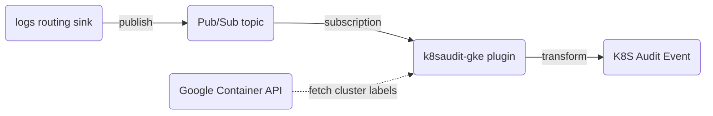

<a id="doc-c693279643b8cd5d248172d9"></a>

# falcosecurity/plugins / LICENSE

Upstream: https://github.com/falcosecurity/plugins/blob/33cbeb904822c973bd4806c0c72f39860a7fa8e9/LICENSE

Commit: `33cbeb904822c973bd4806c0c72f39860a7fa8e9`

Retrieved: 2026-10-01T15:50:01.646198+00:00

Kind: license

Raw SHA256: `c71d239df91726fc519c6eb72d318ec65820627232b2f796219e87dcf35d0ab4`

Source text below is untrusted reference content. Acquisition does not verify technical claims.

License status: UPSTREAM_NOTICES_CAPTURED_PER_FILE_REVIEW_REQUIRED. See this repository's captured license files.

---

````text
                                 Apache License
                           Version 2.0, January 2004
                        http://www.apache.org/licenses/

   TERMS AND CONDITIONS FOR USE, REPRODUCTION, AND DISTRIBUTION

   1. Definitions.

      "License" shall mean the terms and conditions for use, reproduction,
      and distribution as defined by Sections 1 through 9 of this document.

      "Licensor" shall mean the copyright owner or entity authorized by
      the copyright owner that is granting the License.

      "Legal Entity" shall mean the union of the acting entity and all
      other entities that control, are controlled by, or are under common
      control with that entity. For the purposes of this definition,
      "control" means (i) the power, direct or indirect, to cause the
      direction or management of such entity, whether by contract or
      otherwise, or (ii) ownership of fifty percent (50%) or more of the
      outstanding shares, or (iii) beneficial ownership of such entity.

      "You" (or "Your") shall mean an individual or Legal Entity
      exercising permissions granted by this License.

      "Source" form shall mean the preferred form for making modifications,
      including but not limited to software source code, documentation
      source, and configuration files.

      "Object" form shall mean any form resulting from mechanical
      transformation or translation of a Source form, including but
      not limited to compiled object code, generated documentation,
      and conversions to other media types.

      "Work" shall mean the work of authorship, whether in Source or
      Object form, made available under the License, as indicated by a
      copyright notice that is included in or attached to the work
      (an example is provided in the Appendix below).

      "Derivative Works" shall mean any work, whether in Source or Object
      form, that is based on (or derived from) the Work and for which the
      editorial revisions, annotations, elaborations, or other modifications
      represent, as a whole, an original work of authorship. For the purposes
      of this License, Derivative Works shall not include works that remain
      separable from, or merely link (or bind by name) to the interfaces of,
      the Work and Derivative Works thereof.

      "Contribution" shall mean any work of authorship, including
      the original version of the Work and any modifications or additions
      to that Work or Derivative Works thereof, that is intentionally
      submitted to Licensor for inclusion in the Work by the copyright owner
      or by an individual or Legal Entity authorized to submit on behalf of
      the copyright owner. For the purposes of this definition, "submitted"
      means any form of electronic, verbal, or written communication sent
      to the Licensor or its representatives, including but not limited to
      communication on electronic mailing lists, source code control systems,
      and issue tracking systems that are managed by, or on behalf of, the
      Licensor for the purpose of discussing and improving the Work, but
      excluding communication that is conspicuously marked or otherwise
      designated in writing by the copyright owner as "Not a Contribution."

      "Contributor" shall mean Licensor and any individual or Legal Entity
      on behalf of whom a Contribution has been received by Licensor and
      subsequently incorporated within the Work.

   2. Grant of Copyright License. Subject to the terms and conditions of
      this License, each Contributor hereby grants to You a perpetual,
      worldwide, non-exclusive, no-charge, royalty-free, irrevocable
      copyright license to reproduce, prepare Derivative Works of,
      publicly display, publicly perform, sublicense, and distribute the
      Work and such Derivative Works in Source or Object form.

   3. Grant of Patent License. Subject to the terms and conditions of
      this License, each Contributor hereby grants to You a perpetual,
      worldwide, non-exclusive, no-charge, royalty-free, irrevocable
      (except as stated in this section) patent license to make, have made,
      use, offer to sell, sell, import, and otherwise transfer the Work,
      where such license applies only to those patent claims licensable
      by such Contributor that are necessarily infringed by their
      Contribution(s) alone or by combination of their Contribution(s)
      with the Work to which such Contribution(s) was submitted. If You
      institute patent litigation against any entity (including a
      cross-claim or counterclaim in a lawsuit) alleging that the Work
      or a Contribution incorporated within the Work constitutes direct
      or contributory patent infringement, then any patent licenses
      granted to You under this License for that Work shall terminate
      as of the date such litigation is filed.

   4. Redistribution. You may reproduce and distribute copies of the
      Work or Derivative Works thereof in any medium, with or without
      modifications, and in Source or Object form, provided that You
      meet the following conditions:

      (a) You must give any other recipients of the Work or
          Derivative Works a copy of this License; and

      (b) You must cause any modified files to carry prominent notices
          stating that You changed the files; and

      (c) You must retain, in the Source form of any Derivative Works
          that You distribute, all copyright, patent, trademark, and
          attribution notices from the Source form of the Work,
          excluding those notices that do not pertain to any part of
          the Derivative Works; and

      (d) If the Work includes a "NOTICE" text file as part of its
          distribution, then any Derivative Works that You distribute must
          include a readable copy of the attribution notices contained
          within such NOTICE file, excluding those notices that do not
          pertain to any part of the Derivative Works, in at least one
          of the following places: within a NOTICE text file distributed
          as part of the Derivative Works; within the Source form or
          documentation, if provided along with the Derivative Works; or,
          within a display generated by the Derivative Works, if and
          wherever such third-party notices normally appear. The contents
          of the NOTICE file are for informational purposes only and
          do not modify the License. You may add Your own attribution
          notices within Derivative Works that You distribute, alongside
          or as an addendum to the NOTICE text from the Work, provided
          that such additional attribution notices cannot be construed
          as modifying the License.

      You may add Your own copyright statement to Your modifications and
      may provide additional or different license terms and conditions
      for use, reproduction, or distribution of Your modifications, or
      for any such Derivative Works as a whole, provided Your use,
      reproduction, and distribution of the Work otherwise complies with
      the conditions stated in this License.

   5. Submission of Contributions. Unless You explicitly state otherwise,
      any Contribution intentionally submitted for inclusion in the Work
      by You to the Licensor shall be under the terms and conditions of
      this License, without any additional terms or conditions.
      Notwithstanding the above, nothing herein shall supersede or modify
      the terms of any separate license agreement you may have executed
      with Licensor regarding such Contributions.

   6. Trademarks. This License does not grant permission to use the trade
      names, trademarks, service marks, or product names of the Licensor,
      except as required for reasonable and customary use in describing the
      origin of the Work and reproducing the content of the NOTICE file.

   7. Disclaimer of Warranty. Unless required by applicable law or
      agreed to in writing, Licensor provides the Work (and each
      Contributor provides its Contributions) on an "AS IS" BASIS,
      WITHOUT WARRANTIES OR CONDITIONS OF ANY KIND, either express or
      implied, including, without limitation, any warranties or conditions
      of TITLE, NON-INFRINGEMENT, MERCHANTABILITY, or FITNESS FOR A
      PARTICULAR PURPOSE. You are solely responsible for determining the
      appropriateness of using or redistributing the Work and assume any
      risks associated with Your exercise of permissions under this License.

   8. Limitation of Liability. In no event and under no legal theory,
      whether in tort (including negligence), contract, or otherwise,
      unless required by applicable law (such as deliberate and grossly
      negligent acts) or agreed to in writing, shall any Contributor be
      liable to You for damages, including any direct, indirect, special,
      incidental, or consequential damages of any character arising as a
      result of this License or out of the use or inability to use the
      Work (including but not limited to damages for loss of goodwill,
      work stoppage, computer failure or malfunction, or any and all
      other commercial damages or losses), even if such Contributor
      has been advised of the possibility of such damages.

   9. Accepting Warranty or Additional Liability. While redistributing
      the Work or Derivative Works thereof, You may choose to offer,
      and charge a fee for, acceptance of support, warranty, indemnity,
      or other liability obligations and/or rights consistent with this
      License. However, in accepting such obligations, You may act only
      on Your own behalf and on Your sole responsibility, not on behalf
      of any other Contributor, and only if You agree to indemnify,
      defend, and hold each Contributor harmless for any liability
      incurred by, or claims asserted against, such Contributor by reason
      of your accepting any such warranty or additional liability.

   END OF TERMS AND CONDITIONS

   APPENDIX: How to apply the Apache License to your work.

      To apply the Apache License to your work, attach the following
      boilerplate notice, with the fields enclosed by brackets "[]"
      replaced with your own identifying information. (Don't include
      the brackets!)  The text should be enclosed in the appropriate
      comment syntax for the file format. We also recommend that a
      file or class name and description of purpose be included on the
      same "printed page" as the copyright notice for easier
      identification within third-party archives.

   Copyright [yyyy] [name of copyright owner]

   Licensed under the Apache License, Version 2.0 (the "License");
   you may not use this file except in compliance with the License.
   You may obtain a copy of the License at

       http://www.apache.org/licenses/LICENSE-2.0

   Unless required by applicable law or agreed to in writing, software
   distributed under the License is distributed on an "AS IS" BASIS,
   WITHOUT WARRANTIES OR CONDITIONS OF ANY KIND, either express or implied.
   See the License for the specific language governing permissions and
   limitations under the License.

````


<a id="doc-b335630551682c19a781afeb"></a>

# falcosecurity/plugins / README.md

Upstream: https://github.com/falcosecurity/plugins/blob/33cbeb904822c973bd4806c0c72f39860a7fa8e9/README.md

Commit: `33cbeb904822c973bd4806c0c72f39860a7fa8e9`

Retrieved: 2026-10-01T15:50:01.646198+00:00

Kind: official-document

Raw SHA256: `84d085f7612d3ffc262ab1c7d01191e0ee7f6159440a9d08e1734ce2f3d17509`

Source text below is untrusted reference content. Acquisition does not verify technical claims.

License status: UPSTREAM_NOTICES_CAPTURED_PER_FILE_REVIEW_REQUIRED. See this repository's captured license files.

---

# Plugins

[](https://github.com/falcosecurity/evolution/blob/main/REPOSITORIES.md#core-scope) [](https://github.com/falcosecurity/evolution/blob/main/REPOSITORIES.md#stable) [](./LICENSE)

This repository is the central hub for the Falco Plugin ecosystem. It serves two main purposes:

- **Be a registry:** A comprehensive catalog of plugins recognized by The Falco Project, regardless of where their source code is hosted.
- **Monorepo for Falcosecurity plugins:** Official plugins hosted and maintained by The Falco Project, with robust release and distribution processes.

For more information about the plugin system’s architecture and concepts, please see the [official documentation](https://falco.org/docs/plugins).

---

## Plugin Registry

The registry contains metadata and information about every plugin known and recognized by the Falcosecurity organization. It lists plugins hosted either in this repository or in other repositories. These plugins are developed for Falco and made available to the community. 

> Check out the [Registering a Plugin](./docs/registering-a-plugin.md) to know how to add your plugin to this registry.

### Registered Plugins

The tables below list all the plugins currently registered. The tables are automatically generated from the [registry.yaml](./registry.yaml) file.

<!-- The text inside \<!-- REGISTRY:xxx --\> comments is auto-generated.
These comments and the text between them should not be edited by hand -->
<!-- REGISTRY:TABLE -->
| Name | Capabilities | Description
| --- | --- | --- |
| plugin-id-zero-value | **Event Sourcing** <br/>ID: 0 <br/>`` | This ID is reserved for particular purposes and cannot be registered. A plugin author should not use this ID unless specified by the documentation.  <br/><br/> Authors: N/A <br/> License: N/A |
| test | **Event Sourcing** <br/>ID: 999 <br/>`test` | This ID is reserved for source plugin development. Any plugin author can use this ID, but authors can expect events from other developers with this ID. After development is complete, the author should request an actual ID  <br/><br/> Authors: N/A <br/> License: N/A |
| [k8saudit](https://github.com/falcosecurity/plugins/tree/main/plugins/k8saudit) | **Event Sourcing** <br/>ID: 1 <br/>`k8s_audit` <br/>**Field Extraction** <br/> `k8s_audit` | Read Kubernetes Audit Events and monitor Kubernetes Clusters  <br/><br/> Authors: [The Falco Authors](https://falco.org/community) <br/> License: Apache-2.0 |
| [cloudtrail](https://github.com/falcosecurity/plugins/tree/main/plugins/cloudtrail) | **Event Sourcing** <br/>ID: 2 <br/>`aws_cloudtrail` <br/>**Field Extraction** <br/> `aws_cloudtrail` | Reads Cloudtrail JSON logs from files/S3 and injects as events  <br/><br/> Authors: [The Falco Authors](https://falco.org/community) <br/> License: Apache-2.0 |
| [json](https://github.com/falcosecurity/plugins/tree/main/plugins/json) | **Field Extraction** <br/> *All Sources* | Extract values from any JSON payload  <br/><br/> Authors: [The Falco Authors](https://falco.org/community) <br/> License: Apache-2.0 |
| [dummy](https://github.com/falcosecurity/plugins/tree/main/plugins/dummy) | **Event Sourcing** <br/>ID: 3 <br/>`dummy` <br/>**Field Extraction** <br/> `dummy` | Reference plugin used to document interface  <br/><br/> Authors: [The Falco Authors](https://falco.org/community) <br/> License: Apache-2.0 |
| [dummy_c](https://github.com/falcosecurity/plugins/tree/main/plugins/dummy_c) | **Event Sourcing** <br/>ID: 4 <br/>`dummy_c` <br/>**Field Extraction** <br/> `dummy_c` | Like dummy, but written in C++  <br/><br/> Authors: [The Falco Authors](https://falco.org/community) <br/> License: Apache-2.0 |
| [docker](https://github.com/Issif/docker-plugin) | **Event Sourcing** <br/>ID: 5 <br/>`docker` <br/>**Field Extraction** <br/> `docker` | Docker Events  <br/><br/> Authors: [Thomas Labarussias](https://github.com/Issif) <br/> License: Apache-2.0 |
| [seccompagent](https://github.com/kinvolk/seccompagent) | **Event Sourcing** <br/>ID: 6 <br/>`seccompagent` <br/>**Field Extraction** <br/> `seccompagent` | Seccomp Agent Events  <br/><br/> Authors: [Alban Crequy](https://github.com/kinvolk/seccompagent) <br/> License: Apache-2.0 |
| [okta](https://github.com/falcosecurity/plugins/tree/main/plugins/okta) | **Event Sourcing** <br/>ID: 7 <br/>`okta` <br/>**Field Extraction** <br/> `okta` | Okta Log Events  <br/><br/> Authors: [The Falco Authors](https://falco.org/community) <br/> License: Apache-2.0 |
| [github](https://github.com/falcosecurity/plugins/tree/main/plugins/github) | **Event Sourcing** <br/>ID: 8 <br/>`github` <br/>**Field Extraction** <br/> `github` | Github Webhook Events  <br/><br/> Authors: [The Falco Authors](https://falco.org/community) <br/> License: Apache-2.0 |
| [k8saudit-eks](https://github.com/falcosecurity/plugins/tree/main/plugins/k8saudit-eks) | **Event Sourcing** <br/>ID: 9 <br/>`k8s_audit` <br/>**Field Extraction** <br/> `k8s_audit` | Read Kubernetes Audit Events from AWS EKS Clusters  <br/><br/> Authors: [The Falco Authors](https://falco.org/community) <br/> License: Apache-2.0 |
| [nomad](https://github.com/albertollamaso/nomad-plugin/tree/main) | **Event Sourcing** <br/>ID: 10 <br/>`nomad` <br/>**Field Extraction** <br/> `nomad` | Read Hashicorp Nomad Events Stream  <br/><br/> Authors: [Alberto Llamas](https://github.com/albertollamaso/nomad-plugin/issues) <br/> License: Apache-2.0 |
| [dnscollector](https://github.com/SysdigDan/dnscollector-falco-plugin) | **Event Sourcing** <br/>ID: 11 <br/>`dnscollector` <br/>**Field Extraction** <br/> `dnscollector` | DNS Collector Events  <br/><br/> Authors: [Daniel Moloney](https://github.com/SysdigDan/dnscollector-falco-plugin/issues) <br/> License: Apache-2.0 |
| [gcpaudit](https://github.com/falcosecurity/plugins/tree/main/plugins/gcpaudit) | **Event Sourcing** <br/>ID: 12 <br/>`gcp_auditlog` <br/>**Field Extraction** <br/> `gcp_auditlog` | Read GCP Audit Logs  <br/><br/> Authors: [The Falco Authors](https://falco.org/community) <br/> License: Apache-2.0 |
| [syslogsrv](https://github.com/nabokihms/syslogsrv-falco-plugin/tree/main/plugins/syslogsrv) | **Event Sourcing** <br/>ID: 13 <br/>`syslogsrv` <br/>**Field Extraction** <br/> `syslogsrv` | Syslog Server Events  <br/><br/> Authors: [Maksim Nabokikh](https://github.com/nabokihms/syslogsrv-falco-plugin/issues) <br/> License: Apache-2.0 |
| [salesforce](https://github.com/an1245/falco-plugin-salesforce/) | **Event Sourcing** <br/>ID: 14 <br/>`salesforce` <br/>**Field Extraction** <br/> `salesforce` | Falco plugin providing basic runtime threat detection and auditing logging for Salesforce  <br/><br/> Authors: [Andy](https://github.com/an1245/falco-plugin-salesforce/issues) <br/> License: Apache-2.0 |
| [box](https://github.com/an1245/falco-plugin-box/) | **Event Sourcing** <br/>ID: 15 <br/>`box` <br/>**Field Extraction** <br/> `box` | Falco plugin providing basic runtime threat detection and auditing logging for Box  <br/><br/> Authors: [Andy](https://github.com/an1245/falco-plugin-box/issues) <br/> License: Apache-2.0 |
| [k8smeta](https://github.com/falcosecurity/plugins/tree/main/plugins/k8smeta) | **Field Extraction** <br/> `syscall` | Enriche Falco syscall flow with Kubernetes Metadata  <br/><br/> Authors: [The Falco Authors](https://falco.org/community) <br/> License: Apache-2.0 |
| [k8saudit-gke](https://github.com/falcosecurity/plugins/tree/main/plugins/k8saudit-gke) | **Event Sourcing** <br/>ID: 16 <br/>`k8s_audit` <br/>**Field Extraction** <br/> `k8s_audit` | Read Kubernetes Audit Events from GKE Clusters  <br/><br/> Authors: [The Falco Authors](https://falco.org/community) <br/> License: Apache-2.0 |
| [journald](https://github.com/gnosek/falco-journald-plugin) | **Event Sourcing** <br/>ID: 17 <br/>`journal` <br/>**Field Extraction** <br/> `journal` | Read Journald events into Falco  <br/><br/> Authors: [Grzegorz Nosek](https://github.com/gnosek/falco-journald-plugin) <br/> License: Apache-2.0 |
| [kafka](https://github.com/falcosecurity/plugins/tree/main/plugins/kafka) | **Event Sourcing** <br/>ID: 18 <br/>`kafka` | Read events from Kafka topics into Falco  <br/><br/> Authors: [Hunter Madison](https://falco.org/community) <br/> License: Apache-2.0 |
| [gitlab](https://github.com/an1245/falco-plugin-gitlab) | **Event Sourcing** <br/>ID: 19 <br/>`gitlab` <br/>**Field Extraction** <br/> `gitlab` | Falco plugin providing basic runtime threat detection and auditing logging for GitLab  <br/><br/> Authors: [Andy](https://github.com/an1245/falco-plugin-gitlab/issues) <br/> License: Apache-2.0 |
| [keycloak](https://github.com/mattiaforc/falco-keycloak-plugin) | **Event Sourcing** <br/>ID: 20 <br/>`keycloak` <br/>**Field Extraction** <br/> `keycloak` | Falco plugin for sourcing and extracting Keycloak user/admin events  <br/><br/> Authors: [Mattia Forcellese](https://github.com/mattiaforc/falco-keycloak-plugin/issues) <br/> License: Apache-2.0 |
| [k8saudit-aks](https://github.com/falcosecurity/plugins/tree/main/plugins/k8saudit-aks) | **Event Sourcing** <br/>ID: 21 <br/>`k8s_audit` <br/>**Field Extraction** <br/> `k8s_audit` | Read Kubernetes Audit Events from Azure AKS Clusters  <br/><br/> Authors: [The Falco Authors](https://falco.org/community) <br/> License: Apache-2.0 |
| [k8saudit-ovh](https://github.com/falcosecurity/plugins/tree/main/plugins/k8saudit-ovh) | **Event Sourcing** <br/>ID: 22 <br/>`k8s_audit` <br/>**Field Extraction** <br/> `k8s_audit` | Read Kubernetes Audit Events from OVHcloud MKS Clusters  <br/><br/> Authors: [Aurélie Vache](https://falco.org/community) <br/> License: Apache-2.0 |
| [dummy_rs](https://github.com/falcosecurity/plugins/tree/main/plugins/dummy_rs) | **Event Sourcing** <br/>ID: 23 <br/>`dummy_rs` <br/>**Field Extraction** <br/> `dummy_rs` | Like dummy, but written in Rust  <br/><br/> Authors: [The Falco Authors](https://falco.org/community) <br/> License: Apache-2.0 |
| [container](https://github.com/falcosecurity/plugins/tree/main/plugins/container) | **Field Extraction** <br/> `syscall` | Enriche Falco syscall flow with Container Metadata  <br/><br/> Authors: [The Falco Authors](https://falco.org/community) <br/> License: Apache-2.0 |
| [krsi](https://github.com/falcosecurity/plugins/tree/main/plugins/krsi) | **Field Extraction** <br/> `syscall` | Security (KRSI) events support for Falco  <br/><br/> Authors: [The Falco Authors](https://falco.org/community) <br/> License: Apache-2.0 |
| [collector](https://github.com/falcosecurity/plugins/tree/main/plugins/collector) | **Event Sourcing** <br/>ID: 24 <br/>`collector` | Generic collector to ingest raw payloads into Falco  <br/><br/> Authors: [The Falco Authors](https://falco.org/community) <br/> License: Apache-2.0 |
| [awselb](https://github.com/yukinakanaka/falco-plugin-aws-elb) | **Event Sourcing** <br/>ID: 25 <br/>`awselb` <br/>**Field Extraction** <br/> `awselb` | AWS Elastic Load Balancer access logs events  <br/><br/> Authors: [Yuki Nakamura](https://github.com/yukinakanaka/falco-plugin-aws-elb/issues) <br/> License: Apache-2.0 |
| [edera](https://github.com/edera-dev/falco_plugin/) | **Event Sourcing** <br/>ID: 26 <br/>`edera_zone` <br/>**Field Extraction** <br/> `edera_zone` | A Falco plugin for forwarding libscap events out of Edera zones.  <br/><br/> Authors: [Edera](contact@edera.dev) <br/> License: Apache-2.0 |
| [nginx](https://github.com/takaosgb3/falco-plugin-nginx) | **Event Sourcing** <br/>ID: 27 <br/>`nginx` <br/>**Field Extraction** <br/> `nginx` | Real-time nginx access log monitoring for security threats.
Detects SQL injection, XSS, path traversal, command injection,
brute force attacks, and OWASP Top 10 vulnerabilities.
  <br/><br/> Authors: [takaosgb3](https://github.com/takaosgb3/falco-plugin-nginx/issues) <br/> License: Apache-2.0 |
| [coding_agent](https://github.com/falcosecurity/prempti/tree/main/plugins/coding-agents-plugin) | **Event Sourcing** <br/>ID: 28 <br/>`coding_agent` <br/>**Field Extraction** <br/> `coding_agent` | Runtime detection for AI coding agents with Falco (part of the Prempti
project). Intercepts tool calls (shell commands, file operations, web
fetches, MCP calls) before they run and produces allow/deny/ask
verdicts via customizable Falco rules, with a full audit trail of
agent activity.
  <br/><br/> Authors: [The Falco Authors](https://github.com/falcosecurity/prempti) <br/> License: Apache-2.0 |

<!-- REGISTRY:TABLE -->

## Falcosecurity Plugins

Along with the registry, this repository hosts the official plugins maintained by the Falcosecurity organization. Each plugin is an independent project with its own directory in the [plugins folder](https://github.com/falcosecurity/plugins/tree/main/plugins).

The `main` branch reflects the latest development state, and plugins are released on a regular basis. Development builds are published automatically when a Pull Request is merged into `main`, while stable builds are released only when a new tag is created. You can find all published artifacts at [download.falco.org](https://download.falco.org/?prefix=plugins). For details on the release process, please see our [Release Process](./release.md).

The instructions below explain how to install and apply only to plugins from this repository.

### Installing Plugins

Plugins hosted in this repository are built and distributed through Falco's official channels. You can easily install them using either [falcoctl](https://github.com/falcosecurity/falcoctl) or the [Falco Helm chart](https://github.com/falcosecurity/charts/tree/master/charts/falco).

#### Using falcoctl

1. **Install falcoctl:** If you haven't already, follow the [falcoctl installation guide](https://github.com/falcosecurity/falcoctl?tab=readme-ov-file#installation).
2. **Install a Plugin:** Execute the following command, replacing `<plugin-name>` with the name of the plugin you wish to install:
   ```bash
   falcoctl index update falcosecurity
   falcoctl artifact install <plugin-name>
   ```
    > Depending on your environment, you may need to run the above commands with `sudo`.
3. Configure Falco to load the plugin as described in the [plugin's documentation](https://falco.org/docs/concepts/plugins/usage/#loading-plugins-in-falco).


#### Using the Falco Helm Chart

When installing Falco using the Helm chart, you can instruct the chart to install a specific plugin by setting the `falcoctl.config.artifact.install.refs` value and then adding the relevant plugin configuration under `falco`. 

The Helm charts provides a preset [values-k8saudit.yaml](https://github.com/falcosecurity/charts/blob/master/charts/falco/values-k8saudit.yaml) file that can be used to install the `k8saudit` plugin or as example for installing other plugins.

## Contributing

If you want to help and wish to contribute, please review our [contribution guidelines](https://github.com/falcosecurity/.github/blob/main/CONTRIBUTING.md). Code contributions are always encouraged and welcome!

If you wish to contribute a plugin to The Falco Project, simply open a Pull Request to add your plugin to the `/plugins` folder and [update the registry accordingly](./docs/registering-a-plugin.md). Note that to be hosted in this repository, plugins must be licensed under the [Apache 2.0 License](./LICENSE).

### Enforcing coding style and repo policies locally

This repository supports enforcing coding style and policies locally through the `pre-commit` framework. `pre-commit`
allows to automatically install `git-hooks` that will be executed at every new commit. The following is the list of
`git-hooks` defined in `.pre-commit-config.yaml` (notice that some of them only target files written in a specific
language):
1. the `rust-fmt` hook - a `pre-commit` git hook running `rust fmt` on the staged changes
2. the `dco` hook - a `pre-commit-msg` git hook running adding the `DCO` on the commit if not present

The following steps describe how to install these hooks.

##### Step 1

Install `pre-commit` framework following the [official documentation](https://pre-commit.com/#installation).

> __Please note__: you have to follow only the "Installation" section.

#### Step 2

Install `pre-commit` git hooks:
```bash
pre-commit install --hook-type pre-commit --hook-type prepare-commit-msg  --overwrite
```

## License

This project is licensed to you under the [Apache 2.0 Open Source License](./LICENSE).


<a id="doc-d8d30e2aacd3f61d943f48d6"></a>

# falcosecurity/plugins / docs/best-practices.md

Upstream: https://github.com/falcosecurity/plugins/blob/33cbeb904822c973bd4806c0c72f39860a7fa8e9/docs/best-practices.md

Commit: `33cbeb904822c973bd4806c0c72f39860a7fa8e9`

Retrieved: 2026-10-01T15:50:01.646198+00:00

Kind: official-document

Raw SHA256: `fbc06ba4e3d1fbb742ca8a26aa850e4e8190a6fbda5cfaa6e538146f8692de8c`

Source text below is untrusted reference content. Acquisition does not verify technical claims.

License status: UPSTREAM_NOTICES_CAPTURED_PER_FILE_REVIEW_REQUIRED. See this repository's captured license files.

---

# Best Practices

This page summarizes some best practices and guidelines that can be useful to developers that are getting started with the [plugin system of Falco](https://falco.org/docs/plugins/). The [Developers Guide](https://falco.org/docs/plugins/developers-guide/) is mostly focused on the technical aspects of plugin development. In contrast, here we provide some guidance on more high-level points that may occur during the design and implementation phases.

## Plugin Directory Structure

Currently, Go is the most used language for writing plugins. So, below you can find the recommended layout for Go plugin projects. For other languages, you can adapt the layout accordingly. 

### `/pkg`

Reusable Go packages that other plugins or projects can use. This directory is not mandatory but is highly recommended.

### `/plugin`

This directory contains the plugin entry point. This directory should have only one `.go` file, named as your plugin. This file must define the `main` package (and an empty `main()` function) per CGO requirement. 
Usually, this file also imports packages from `/pkg` and defines an `init()` function to register the plugin capabilities (that's required if you are using the [plugin-go-sdk](https://github.com/falcosecurity/plugin-sdk-go)).

### `/rules`

This directory is optional. If you want to distribute rules files for your plugin, you can put them in this directory.
The building system of this repository will automatically build and publish them as a `.tar.gz` archive under [https://download.falco.org/?prefix=plugins/](https://download.falco.org/?prefix=plugins/).

### `/Makefile`

Providing a `Makefile` is mandatory for plugins hosted by this repository. The building system of this repository will use:
- `make` to build the plugin binary
- `make clean` to clean the built artifacts
- `make rules` to build the rules files (this is optional)

Below you can find an example of a typical `Makefile` for a plugin hosted by this repository.

```Makefile
SHELL=/bin/bash -o pipefail
GO ?= go

NAME := <YOUR-PLUGIN-NAME-HERE>
OUTPUT := lib$(NAME).so

ifeq ($(DEBUG), 1)
    GODEBUGFLAGS= GODEBUG=cgocheck=1
else
    GODEBUGFLAGS= GODEBUG=cgocheck=0
endif

all: $(OUTPUT)

clean:
	@rm -f *.so *.h

$(OUTPUT):
	@$(GODEBUGFLAGS) $(GO) build -buildmode=c-shared -o $(OUTPUT) ./plugin
```

## Configuration in Source Plugins

One peculiarity of plugins with event source capability is how they can accept user configurations. Other plugins can only be configured during the initialization phase through `plugin_init()`, whereas source plugins also take some parameters while opening the event stream with `plugin_open()`. This creates some ambiguity on **which** information should go inside the init configuration and what should be part of the open parameters instead.

There's no silver bullet for this problem, and the solution strictly depends on the use cases of your plugin. However, there are some principles you can follow.

- The [init configuration](https://falco.org/docs/configuration/#plugins) should contain information that is used during the whole plugin lifecycle and that is used across both field extraction and event generation
- The init configuration is the right place for structured data. In fact, in most cases, plugins accept JSON strings as a configuration and also expose a schema describing/documenting the expected data format (see [`plugin_get_init_schema`](https://falco.org/docs/plugins/plugin-api-reference/#get-init-schema) for more details)
- Init configuration parameters should have the following annotations. See the [JSON Schema Validation specification](https://json-schema.org/draft/2020-12/json-schema-validation.html#name-a-vocabulary-for-basic-meta) for more details:
    - `title`, which provides a short user-facing name for the parameter.
    - `description`, which describes the parameter using a sentence or a short paragraph.
    - `default` (optional), which provides the default value of the parameter.
    - `required` (optional), which notes that the parameter value is required.
    - `examples` (optional), which provides example values for the parameter.
- The open parameters should contain information that is only relevant for opening a specific event source, and their lifecycle ends at the invocation of `plugin_close()`
- The open parameters should contain minimal and non-structured information, such as a URI or a resource descriptor string. This is the reason why the framework does not support any schema definition for open parameters and treats them as an opaque string. Ideally, if more than one parameter is required to open a data source, comma-separated string concatenation is preferable to structured data formats such as JSON

## Secret Management

An important decision during plugin development is how secrets are managed. It's common to manage connections to external services, authenticate with credentials, or use private tokens. Plugins accept user-defined values only through the [init configuration](https://falco.org/docs/configuration/#plugins) or the open parameters. In general, you shouldn't pass secrets directly inside the init configuration or the open parameters. Instead, there are a few guidelines you can follow in order to ensure that your secrets are managed safely in the plugin framework.

### Don't

- Pass credentials or secrets in the plugin:
    - Init configuration
    - Open parameters
- Create custom conventions (e.g. storing the secrets in a non-customizable path such as `~/.mysecrets`)
- Embed credentials or secrets inside the plugin code

### Do

- Retrieve credentials or secrets through environment variables or external files, and pass their name in the plugin:
    - Init configuration
    - Open parameters, only if they are required to open the event source
- Follow the secret management guidelines mandated by well-known packages such as [aws-sdk-go](https://github.com/aws/aws-sdk-go#configuring-credentials)


## Managing the NextBatch Loop

In source plugins, new events are created and returned in batches with the `plugin_next_batch()` function. This design decision reduces the overhead that may occur by integrating C with other programming languages such as Go. Although the SDKs cover most of the hard work, plugin developers must manage the batching system manually and there are some things to keep in mind to ensure optimal performance and correct behavior.

### Don't

- Allocate a new event batch at every invocation of `plugin_next_batch()`, because event generation is a very hot path
- Block the execution for long times: be mindful that `plugin_next_batch()` is blocking for the framework
- Return an EOF error and then return new events at the following invocation of `plugin_next_batch()`
- Return a given number of events without filling their data in the event batch

### Do

- Rely on the Go SDK and C++ SDK to ensure that all memory allocations are optimized
- Return a number of events smaller than the size of the batch, if fastly available (see the behavior described [in the Go SDK](https://pkg.go.dev/github.com/falcosecurity/plugin-sdk-go@v0.1.0/pkg/sdk#NextBatcher))
- Return Timeout (see [`sdk.ErrTimeout`](https://github.com/falcosecurity/plugin-sdk-go/blob/0b4b6dc215141116c53398f3232aac98e49cdb80/pkg/sdk/sdk.go#L30) in Go or [`SS_PLUGIN_TIMEOUT`](https://github.com/falcosecurity/libs/blob/033c4b9f28e58e20a5822bd8a7419beea098af91/userspace/libscap/plugin_info.h#L76) in C/C++) after a short time period passes without producing any event (no more than a few milliseconds)
- Return Timeout even with a non-zero number of events, if they are available
- Return EOF (see [`sdk.ErrEOF`](https://github.com/falcosecurity/plugin-sdk-go/blob/0b4b6dc215141116c53398f3232aac98e49cdb80/pkg/sdk/sdk.go#L25) in Go or [`SS_PLUGIN_EOF`](https://github.com/falcosecurity/libs/blob/033c4b9f28e58e20a5822bd8a7419beea098af91/userspace/libscap/plugin_info.h#L77) in C/C++) when you are certain that no more events will be produced
- Return EOF with a non-zero number of events, but ensuring that every following invocation of `plugin_next_batch()` returns EOF and zero events


## Fields Naming Conventions

Plugins can extend Falco by supporting new fields to be extracted event data. At runtime, those fields co-exist with the other fields natively supported in libsinsp, such as the `evt.*` or the `container.*` classes. In this perspective, it's really important for plugin developers to follow some naming conventions for the newly introduced fields.

### Don't

- Introduce fields with the same name or the same class (e.g. `evt.*`, `container.*`, `ka.*`) as the ones already existing in libsinsp
- Use field names containing arbitrary characters
- Assign unnecessarely long names to your fields

### Do

- Make sure your fields have an unique-ish class prefix that represents the use case of your plugin (e.g. `ct.*` for AWS Cloudtrail). This will help avoid ambiguities for rulesets using your fields in rule conditions
- Use field names matching the following safe regular expression, that is compliant with the grammar of the rule parser: `[a-z]+[a-z0-9_]*(\.[a-z]+[a-z0-9_]*)+`
- Use the `.` divisor character to give better meaning to your fields and divide them into categories (e.g. `ct.user.accountid` refers to the `user` category of AWS Cloudtrail events)


## Live Events vs. Offline Events

Once you get started developing a source plugin, you may come to the conclusion that there is absolutely no technical constraint on the events returned with `plugin_next_batch()`, since the plugin dictates both the data format of the events and how frequently they are produced. Some many degrees of freedom can be confusing and can make developer wonder to which extent the behavior of Falco should be changed.

An important topic is the difference between producing events from a *live* or *offline* source. Those two terms are meant to distinguish events produced in real-time from the ones generated by parsing a static and reproducible source (such as a log file). In other words, live events are not reproducible because they are tied to real-time observations. To clear some of these doubts, be mindful of the following points:

- Falco has been designed as a tool for runtime security, and it is supposed to stay in that space as much as possible
- By default, plugins are meant to always produce live events
- Plugins can **optionally** produce offline events with a given configuration or with special open parameters. This is helpful to satisfy use cases involving debugging, testing, and reproducibility
- Live events do not include events that happened before the plugin startup. For instance, assuming one has a log file:
    - `tail -f` would output live events only
    - `cat` would output all events (ie. offline mode)


<a id="doc-fb0e79fa7963eaaec9aea598"></a>

# falcosecurity/plugins / docs/plugin-ids.md

Upstream: https://github.com/falcosecurity/plugins/blob/33cbeb904822c973bd4806c0c72f39860a7fa8e9/docs/plugin-ids.md

Commit: `33cbeb904822c973bd4806c0c72f39860a7fa8e9`

Retrieved: 2026-10-01T15:50:01.646198+00:00

Kind: official-document

Raw SHA256: `061e692e9b9336a32ed7df27ce3d2c25d6b7a95244dc531a33353244abfd921d`

Source text below is untrusted reference content. Acquisition does not verify technical claims.

License status: UPSTREAM_NOTICES_CAPTURED_PER_FILE_REVIEW_REQUIRED. See this repository's captured license files.

---

# Plugin IDs (Sourcing Capability Only)

Using a unique `id` is mandatory to maintain interoperability across all plugins with _event sourcing_ capability. When a plugin is loaded by a compatible application (e.g., Falco), the `id` is used to route events to the correct plugin. Indeed, attempting to load two or more plugins using the same `id` will result in an error.

For this reason, The Falco Project maintains a [public registry of plugins](https://github.com/falcosecurity/plugins/blob/main/README.md#registering-a-new-plugin), which allows the assignment of a unique `id` for your plugin. However, some plugins may not be registered in the public registry. For example, if you are privately developing a plugin for your own use, you might use any `id` you want. To avoid conflicts in these situations, this document mandates general rules regarding `id` assignment and reservation.

## ID Blocks

The following ID ranges are designated for specific purposes:

| Block name | ID range | # of IDs | Description |
|---|---|---|---|
| Public | 0–1073741823 (30-bit) | 1073741824 | Used in the public registry. Single IDs in this range can be [assigned](#assigning-an-id) or [reserved](#reserving-an-id). |
| Private | 1073741824–2147483647 (30-bit) | 1073741824 | Used for private plugins (think of this range as the equivalent of 192.168.0.0/16 in networks). Organizations may use this range for plugins intended for their private domain. Interoperability is not guaranteed. |
| Reserved | 2147483648-3221225471 (30-bit) | 1073741824 | This range is reserved for future use and must not be used under any circumstances. |
| Internal | 3221225472-4294967295 (30-bit) | 1073741824 | This range is reserved for internal use and must not be used by plugins. It might be used by the plugin framework implementation for technical purposes. |

Notes:
- An `id` is a 32-bit unsigned integer. The MSBs are used to identify the block of IDs.
- Only IDs up to 1073741823 can be requested for use in the public registry.
- Only IDs up to 2147483647 can be used by plugins.

## Assigning an ID

The public registry is intended for assigning IDs to plugins that are publicly available. If you want to share your plugin with the community, you should follow the instructions reported in the [Registering a new plugin](../README.md#registering-a-new-plugin) section of this repository's documentation.

When making your request, please choose the next available ID in the [registry.yaml](../registry.yaml) file. The `id` will be definitively assigned to your plugin once the corresponding PR is merged, and the [registry.yaml](../registry.yaml) file is updated.

## Reserving an ID

For particular technical purposes or special cases, an `id` can be reserved so that it will not be assigned to any specific plugin. Notably, id 999 has been reserved for source plugin development. Any plugin author can temporarily use this `id`; however, it can't be assigned to any specific plugin and must not be used for purposes other than local development.

To reserve an `id`, you can use the same procedure for [registering a new plugin](../README.md#registering-a-new-plugin) and specify the `reserved: true` option.

Requests for `id` reservation will be evaluated on a case-by-case basis. The Falco Project reserves the right to reject any request for any reason.

<a id="doc-b1ad43c82e1867ad2fb12158"></a>

# falcosecurity/plugins / docs/registering-a-plugin.md

Upstream: https://github.com/falcosecurity/plugins/blob/33cbeb904822c973bd4806c0c72f39860a7fa8e9/docs/registering-a-plugin.md

Commit: `33cbeb904822c973bd4806c0c72f39860a7fa8e9`

Retrieved: 2026-10-01T15:50:01.646198+00:00

Kind: official-document

Raw SHA256: `430cf7d0dd1666c8679b4f5e490ac630582812f57ee44d990d4781f3c606ab34`

Source text below is untrusted reference content. Acquisition does not verify technical claims.

License status: UPSTREAM_NOTICES_CAPTURED_PER_FILE_REVIEW_REQUIRED. See this repository's captured license files.

---

### Registering a Plugin

Registering your plugin inside the registry helps ensure that some technical constraints are respected, such as that a [given ID is used by exactly one plugin with event source capability](https://falco.org/docs/concepts/plugins/architecture/#plugin-event-ids) and allows plugin authors to [coordinate about event source formats](https://falco.org/docs/concepts/plugins/architecture/#plugin-event-sources-and-interoperability). Moreover, this is a great way to share your plugin project with the community and engage with it, thus gaining new users and **increasing its visibility**. We encourage you to register your plugin in this registry before publishing it. You can add your plugins in this registry regardless of where its source code is hosted (there's a `url` field for this specifically).

The registration process involves adding an entry about your plugin inside the [registry.yaml](../registry.yaml) file by creating a Pull Request in this repository. Please be mindful of a few constraints that are automatically checked and required for your plugin to be accepted:

- The `name` field is mandatory and must be **unique** across all the plugins in the registry
- *(Sourcing Capability Only)* The `id` field is mandatory and must be **unique** in the registry across all the plugins with event source capability
  - See [docs/plugin-ids.md](plugin-ids.md) for more information about plugin IDs
- The plugin `name` must match this [regular expression](https://en.wikipedia.org/wiki/Regular_expression): `^[a-z]+[a-z0-9-_\-]*$` (however, its not recommended to use `_` in the name, unless you are trying to match the name of a source or for particular reasons)
- The `source` *(Sourcing Capability Only)* and `sources` *(Extraction Capability Only)* must match this [regular expression](https://en.wikipedia.org/wiki/Regular_expression): `^[a-z]+[a-z0-9_]*$`
- The `url` field should point to the plugin source code
- The `rules_url` field should point to the default ruleset, if any

For reference, here's an example of an entry for a plugin with both event sourcing and field extraction capabilities:
```yaml
- name: k8saudit
  description: ...
  authors: ...
  contact: ...
  maintainers:
    - name: The Falco Authors
      email: cncf-falco-dev@lists.cncf.io
  keywords:
    - audit
    - audit-log
    - audit-events
    - kubernetes
    url: https://github.com/falcosecurity/plugins/tree/main/plugins/k8saudit
    rules_url: https://github.com/falcosecurity/plugins/tree/main/plugins/k8saudit/rules
  url: ...
  license: ...
  capabilities:
    sourcing:
      supported: true
      id: 2
      source: k8s_audit
    extraction:
      supported: true
```

<a id="doc-95e3e81e5869782799885a55"></a>

# falcosecurity/plugins / plugins/anomalydetection/CHANGELOG.md

Upstream: https://github.com/falcosecurity/plugins/blob/33cbeb904822c973bd4806c0c72f39860a7fa8e9/plugins/anomalydetection/CHANGELOG.md

Commit: `33cbeb904822c973bd4806c0c72f39860a7fa8e9`

Retrieved: 2026-10-01T15:50:01.646198+00:00

Kind: official-document

Raw SHA256: `2d68c5b88ac4872c603d66e65137074cfbf18827dfe756250942f8a213694071`

Source text below is untrusted reference content. Acquisition does not verify technical claims.

License status: UPSTREAM_NOTICES_CAPTURED_PER_FILE_REVIEW_REQUIRED. See this repository's captured license files.

---

# Changelog


<a id="doc-8e779e0a5b33627564457d3d"></a>

# falcosecurity/plugins / plugins/anomalydetection/CMakeLists.txt

Upstream: https://github.com/falcosecurity/plugins/blob/33cbeb904822c973bd4806c0c72f39860a7fa8e9/plugins/anomalydetection/CMakeLists.txt

Commit: `33cbeb904822c973bd4806c0c72f39860a7fa8e9`

Retrieved: 2026-10-01T15:50:01.646198+00:00

Kind: official-document

Raw SHA256: `10eddeddd3e05909e4095b568d57d3ebc5208b5a2c3f936c8da02fa04412c6dd`

Source text below is untrusted reference content. Acquisition does not verify technical claims.

License status: UPSTREAM_NOTICES_CAPTURED_PER_FILE_REVIEW_REQUIRED. See this repository's captured license files.

---

# SPDX-License-Identifier: Apache-2.0
#
# Copyright (C) 2024 The Falco Authors.
#
# Licensed under the Apache License, Version 2.0 (the "License"); you may not use this file except in compliance with
# the License. You may obtain a copy of the License at
#
# http://www.apache.org/licenses/LICENSE-2.0
#
# Unless required by applicable law or agreed to in writing, software distributed under the License is distributed on an
# "AS IS" BASIS, WITHOUT WARRANTIES OR CONDITIONS OF ANY KIND, either express or implied. See the License for the
# specific language governing permissions and limitations under the License.
#

cmake_minimum_required(VERSION 3.22)

list(APPEND CMAKE_MODULE_PATH "${CMAKE_CURRENT_SOURCE_DIR}/cmake/modules")

option(BUILD_TESTS "Enable tests" ON)

# Project metadata
project(
  anomalydetection
  VERSION 0.1.0
  DESCRIPTION "Falco Anomaly Detection Plugin"
  LANGUAGES CXX)

# Dependencies
include(FetchContent)
include(plugin-sdk-cpp)
include(libs) # Temporarily include libs for initial dev
include(xxhash)

# Project target
file(GLOB_RECURSE anomalydetection_SOURCES "${CMAKE_CURRENT_SOURCE_DIR}/src/*.cpp")
add_library(anomalydetection SHARED ${anomalydetection_SOURCES} )
set_target_properties(anomalydetection PROPERTIES CXX_EXTENSIONS OFF)

# Project compilation options
target_compile_options(anomalydetection PRIVATE "-fPIC")
target_compile_options(anomalydetection PRIVATE "-Wl,-z,relro,-z,now")
target_compile_options(anomalydetection PRIVATE "-fstack-protector-strong")
# When compiling in Debug mode, this will define the DEBUG symbol for use in your code
target_compile_options(anomalydetection PUBLIC "$<$<CONFIG:DEBUG>:-DDEBUG>")
target_compile_features(anomalydetection PUBLIC cxx_std_17)

# Project includes
target_include_directories(
  anomalydetection PRIVATE "${PLUGIN_SDK_INCLUDE}" "${XXHASH_INCLUDE}" "${LIBS_INCLUDE}")

# Project linked libraries
target_link_libraries(anomalydetection ${_REFLECTION})

# Testing
if(BUILD_TESTS)
  add_subdirectory(test)
endif()


<a id="doc-a4b0475d14f42b9563fb1e6b"></a>

# falcosecurity/plugins / plugins/anomalydetection/README.md

Upstream: https://github.com/falcosecurity/plugins/blob/33cbeb904822c973bd4806c0c72f39860a7fa8e9/plugins/anomalydetection/README.md

Commit: `33cbeb904822c973bd4806c0c72f39860a7fa8e9`

Retrieved: 2026-10-01T15:50:01.646198+00:00

Kind: official-document

Raw SHA256: `45999887e2100cc237c79e369d75209381ffff45e103049d4398b74f6dd673ab`

Source text below is untrusted reference content. Acquisition does not verify technical claims.

License status: UPSTREAM_NOTICES_CAPTURED_PER_FILE_REVIEW_REQUIRED. See this repository's captured license files.

---

# Falcosecurity `anomalydetection` Plugin

**This plugin is experimental and under development**

This `anomalydetection` plugin has been created upon this [Proposal](https://github.com/falcosecurity/falco/blob/master/proposals/20230620-anomaly-detection-framework.md).

## Introduction

The `anomalydetection` plugin enhances {syscall} event analysis by incorporating anomaly detection estimates for probabilistic filtering.

### Functionality

The initial scope focuses exclusively on "CountMinSketch Powered Probabilistic Counting and Filtering" for a subset of syscalls and a selection of options for defining behavior profiles. This limitation is due to current restrictions related to the plugin API and SDK layout.

The new framework primarily aims to improve the usability of standard Falco rules. It may reduce the need for precise rule tuning, leverages probabilistic count estimates to auto-tune noisy rules on the fly, and enables the creation of broader Falco rules. Read more in the [Proposal](https://github.com/falcosecurity/falco/blob/master/proposals/20230620-anomaly-detection-framework.md).

### TL;DR

The official documentation will eventually be available on the Falco [Plugins](https://falco.org/docs/plugins/) site. Therefore, consider this README as not being a complete documentation for using this plugin.

*Disclaimer*: Anomaly detection can mean different things to different people. It's best to keep your expectations low for this plugin's current capabilities. For now, it is focused solely on probabilistic counting.

What this plugin is:
- **Initial step for real-time anomaly detection in Falco**: Introduces basic real-time anomaly detection methods on the host.
- **Probabilistic counting**: Currently supports only probabilistic counting, with the guarantee that any overcounting remains within an acceptable error margin.
- **Use-case dependent**: Requires careful derivation of custom use cases; no default use cases are provided at this time.
- **Limited by current API**: Subject to several restrictions due to plugin API and other limitations.
- **Built for future extensibility**: Designed to support more algorithms in the future, limited to those that can be implemented in a single data pass to ensure real-time performance.
- **Documentation is insufficient**: Expect to need hands-on exploration to understand usage and restrictions.

What this plugin is not:
- **Not a pre-trained AI/ML model**.
- **Not ready out-of-the-box**: No default configuration or use cases are provided at this time.
- **Not a universal solution**: Does not offer a one-size-fits-all approach to anomaly detection.
- **No multi-pass algorithms**: Algorithms requiring multiple data passes are not planned; the plugin is intended to remain real-time and efficient for applicable use cases.
- **Not yet battle-tested in production**.

### Outlook

In the near term, the plan is to expand the syscalls for which behavior profiles can be applied and to enhance the fields available for defining these profiles. The first version is quite restrictive in this regard due to current plugin API limitations. Additionally, from an algorithmic and capabilities point of view, we will explore the following:

- Support for HyperLogLog probabilistic distinct counting (ETA unknown).
- Overcoming the cold start problem by loading sketch data structures and counts from previous agent runs or from test environments (ETA unknown).
- Efficient and feasible options for real-time, single-pass time series analysis (ETA unknown).

### Plugin Official Name

`anomalydetection`

## Capabilities

The `anomalydetection` plugin implements 2 capabilities:

* `extraction`
* `parsing`

## Supported Fields

Here is the current set of output / filter fields introduced by this plugin:

<!-- README-PLUGIN-FIELDS -->
|                NAME                |   TYPE   |  ARG  |                                                                                                                                            DESCRIPTION                                                                                                                                            |
|------------------------------------|----------|-------|---------------------------------------------------------------------------------------------------------------------------------------------------------------------------------------------------------------------------------------------------------------------------------------------------|
| `anomaly.count_min_sketch`         | `uint64` | Index | Count Min Sketch Estimate according to the specified behavior profile for a predefined set of {syscalls} events. Access different behavior profiles/sketches using indices. For instance, anomaly.count_min_sketch[0] retrieves the first behavior profile defined in the plugins' `init_config`. |
| `anomaly.count_min_sketch.profile` | `string` | Index | Concatenated string according to the specified behavior profile (not preserving original order). Access different behavior profiles using indices. For instance, anomaly.count_min_sketch.profile[0] retrieves the first behavior profile defined in the plugins' `init_config`.                  |
| `anomaly.falco.duration_ns`        | `uint64` | None  | Falco agent run duration in nanoseconds, which could be useful for ignoring some rare events at launch time while Falco is just starting to build up the counts in the sketch data structures (if applicable).                                                                                    |
<!-- /README-PLUGIN-FIELDS -->

## Usage

**Configuration**

Here's an example of configuration of `falco.yaml`:

```yaml
plugins:
  - name: anomalydetection
    library_path: libanomalydetection.so
    init_config:
      count_min_sketch:
        enabled: true
        n_sketches: 3
        # `gamma_eps`: auto-calculate rows and cols; usage: [[gamma, eps], ...];
        # gamma -> error probability -> determine d / rows / number of hash functions
        # eps -> relative error -> determine w / cols / number of buckets
        gamma_eps: [
          [0.001, 0.0001],
          [0.001, 0.0001],
          [0.001, 0.0001]
        ]
        # `rows_cols`: pass explicit dimensions, supersedes `gamma_eps`; usage: [[7, 27183], ...]; by default disabled when not used.
        # rows_cols: []
        behavior_profiles: [
          {
            "fields": "%container.id %custom.proc.aname.lineage.join[7] %custom.proc.aexepath.lineage.join[7] %proc.tty %proc.vpgid.name %proc.sname",
            # execve, execveat exit event codes
            "event_codes": [293, 331]
          },
          {
            "fields": "%container.id %custom.proc.aname.lineage.join[7] %custom.proc.aexepath.lineage.join[7] %proc.tty %proc.vpgid.name %proc.sname %fd.name %fd.nameraw",
            # open, openat, openat2 exit event codes
            "event_codes": [3, 307, 327]
          },
          {
            "fields": "%container.id %proc.cmdline",
            # execve, execveat exit event codes
            "event_codes": [293, 331],
            # optional config `reset_timer_ms`, resets the data structure every x milliseconds, here one hour as example
            # Remove JSON key if not wanted / needed.
            "reset_timer_ms": 3600000
          }
        ]

load_plugins: [anomalydetection]
```

The first version is quite restrictive with respect to the behavior profile's `event_codes` and `fields`. In a nutshell, you can currently define them only for a handful of event codes that Falco supports and a subset of the [Supported Fields for Conditions and Outputs](https://falco.org/docs/reference/rules/supported-fields/).

When you disable the `count_min_sketch` algorithm as shown below, all `anomaly.count_min_sketch` fields will be null.

```
count_min_sketch:
        enabled: false
```

__NOTE__: Do not toggle the `enabled` key while hot reloading the config, as it currently does not get properly applied in such cases. Restart Falco with the `count_min_sketch` either enabled or disabled; subsequent reloads will work as expected.

**Behavior profiles for "execve/execveat/clone/clone3" events**

Example 1:
``` 
"event_codes": [293, 331],
```

Example 2:
``` 
"event_codes": [223, 335],
```

You can reference a behavior profile based on "execve/execveat/clone/clone3" events in any Falco rule that monitors any supported syscall. This works because every syscall is associated with a process.

**Behavior profiles for "fd-related" events**

Example 1:
```
rule: (evt.type in (open, openat, openat2) and evt.dir=<)
...
"event_codes": [3, 307, 327],
```

Example 2:
```
rule: (evt.type=connect and evt.dir=<)
...
"event_codes": [23],
```

You should avoid writing rules for arbitrary syscalls using "fd-related" behavior profiles because if a syscall doesn't involve a file descriptor (fd), referencing counts that rely on fd fields won't be meaningful.

Here's how it works:
- If your behavior profile includes `%fd.*` fields, all event codes in that profile must be related to file descriptors.
- If you use an "fd-related" behavior profile with a syscall that doesn't involve a file descriptor, the count will always be zero. While Falco won't crash, the anomaly detection estimate won't function as expected.

References:
- See the [Supported PPME `event codes`](#ppme-event-codes) reference below.
- See the [Supported Behavior Profiles `fields`](#behavior-profiles-fields) reference below.

**Open Parameters**:

This plugin does not have open params.

**Rules**

This plugin does not provide any default use cases or rules at the moment. More concrete use cases may be added at a later time.

Example of a dummy Falco rule using the `anomalydetection` fields for local testing:

```yaml
- macro: spawned_process
  condition: (evt.type in (execve, execveat) and evt.dir=<)
- rule: execve count_min_sketch test
  desc: "execve count_min_sketch test"
  condition: spawned_process and proc.name=cat and anomaly.count_min_sketch[0] > 10
  output: '%anomaly.count_min_sketch[0] %proc.pid %proc.ppid %proc.name %user.loginuid %user.name %user.uid %proc.cmdline %container.id %evt.type %evt.res %proc.cwd %proc.sid %proc.exepath %container.image.repository'
  priority: NOTICE
  tags: [maturity_sandbox, host, container, process, anomalydetection]
```

__NOTE__: Ensure you regularly execute `cat` commands. Once you have done so frequently enough, logs will start to appear. Alternatively, perform an inverse test to observe how quickly a very noisy rule gets silenced.

**Adoption**

To adopt the plugin framework, you can start by identifying rules in the [default](https://github.com/falcosecurity/rules) Falco ruleset that could benefit from auto-tuning based on your heuristics regarding counts. For example, you might broaden the scope of a rule and add an `anomaly.count_min_sketch` filter condition as a safety upper bound. 

For initial adoption, we recommend creating new, separate rules inspired by existing upstream rules, rather than modifying rules that are already performing well in production. 

Another approach is to duplicate a rule -- one version with and another without the anomaly detection filtering. 

Alternatively, you can add the count estimates as output fields to provide additional forensic evidence without using the counts for on-host filtering.

Lastly, keep in mind that there is a configuration to reset the counts per behavior profile every x milliseconds if this suits your use case better.

### Running

This plugin requires Falco with version >= **0.38.2**.

1. Have Falco >= **0.38.2** installed and set up
2. Download the plugin's shared object (or build it yourself; see instructions below) and place it under `/usr/share/falco/plugins/libanomalydetection.so`
3. Modify the `falco.yaml` with the provided example [configuration](#configuration) above
4. Add a rule that uses `anomaly.count_min_sketch` as an output field and/or filter to `falco_rules.yaml`, and you're ready to go!


```shell
# Read the steps above before running Falco with this plugin
sudo falco -c falco.yaml -r falco_rules.yaml
```

## Local Development

### Build

```bash
git clone https://github.com/falcosecurity/plugins.git
cd plugins/plugins/anomalydetection
rm -f libanomalydetection.so; 
rm -f build/libanomalydetection.so; 
make;
# Copy the shared library to the expected location for `falco.yaml`, which is `library_path: libanomalydetection.so`
sudo mkdir -p /usr/share/falco/plugins/;
sudo cp -f libanomalydetection.so /usr/share/falco/plugins/libanomalydetection.so;
```


## References

### PPME event codes

Read this [blog post](https://falco.org/blog/adaptive-syscalls-selection/) to learn more about Falco's internal PPME event codes compared to the syscall names you are used to using in Falco rules.

The list below is complete, and no other event codes from Falco can be used for the behavior profiles at the moment. The binary will error out if used incorrectly. Thank you for your patience.

```CPP
typedef enum {
	PPME_SYSCALL_OPEN_X = 3, // compare to "(evt.type=open and evt.dir=<)" in a Falco rule
	PPME_SOCKET_CONNECT_X = 23, // compare to "(evt.type=connect and evt.dir=<)" in a Falco rule
	PPME_SYSCALL_CREAT_X = 59, // compare to "(evt.type=creat and evt.dir=<)" in a Falco rule
	PPME_SYSCALL_CLONE_20_X = 223, // compare to "(evt.type=clone and evt.dir=<)" in a Falco rule
	PPME_SOCKET_ACCEPT_5_X = 247, // compare to "(evt.type=accept and evt.dir=<)" in a Falco rule
	PPME_SYSCALL_EXECVE_19_X = 293, // compare to "(evt.type=execve and evt.dir=<)" in a Falco rule
	PPME_SYSCALL_OPENAT_2_X = 307, // compare to "(evt.type=openat and evt.dir=<)" in a Falco rule
	PPME_SYSCALL_OPENAT2_X = 327, // compare to "(evt.type=openat2 and evt.dir=<)" in a Falco rule
	PPME_SYSCALL_EXECVEAT_X = 331, // compare to "(evt.type=execveat and evt.dir=<)" in a Falco rule
	PPME_SYSCALL_CLONE3_X = 335, // compare to "(evt.type=clone3 and evt.dir=<)" in a Falco rule
	PPME_SYSCALL_OPEN_BY_HANDLE_AT_X = 337, // compare to "(evt.type=open_by_handle_at and evt.dir=<)" in a Falco rule
	PPME_SOCKET_ACCEPT4_6_X = 389, // compare to "(evt.type=accept4 and evt.dir=<)" in a Falco rule
} ppm_event_code;
```

### Behavior Profiles fields

Compare to [Supported Fields for Conditions and Outputs](https://falco.org/docs/reference/rules/supported-fields/).

The list below is complete, and no other fields from Falco can be used for the behavior profiles at the moment. The binary will error out if used incorrectly. Thank you for your patience.

| Supported Behavior Profile Field | Description |
| --- | --- |
|proc.exe|The first command-line argument (i.e., argv[0]), typically the executable name or a custom string as specified by the user. It is primarily obtained from syscall arguments, truncated after 4096 bytes, or, as a fallback, by reading /proc/PID/cmdline, in which case it may be truncated after 1024 bytes. This field may differ from the last component of proc.exepath, reflecting how command invocation and execution paths can vary.|
|proc.pexe|The proc.exe (first command line argument argv[0]) of the parent process.|
|proc.aexe|The proc.exe (first command line argument argv[0]) for a specific process ancestor. You can access different levels of ancestors by using indices. For example, proc.aexe[1] retrieves the proc.exe of the parent process, proc.aexe[2] retrieves the proc.exe of the grandparent process, and so on. The current process's proc.exe line can be obtained using proc.aexe[0]. When used without any arguments, proc.aexe is applicable only in filters and matches any of the process ancestors. For instance, you can use `proc.aexe endswith java` to match any process ancestor whose proc.exe ends with the term `java`.|
|proc.exepath|The full executable path of a process, resolving to the canonical path for symlinks. This is primarily obtained from the kernel, or as a fallback, by reading /proc/PID/exe (in the latter case, the path is truncated after 1024 bytes). For eBPF drivers, due to verifier limits, path components may be truncated to 24 for legacy eBPF on kernel <5.2, 48 for legacy eBPF on kernel >=5.2, or 96 for modern eBPF.|
|proc.pexepath|The proc.exepath (full executable path) of the parent process.|
|proc.aexepath|The proc.exepath (full executable path) for a specific process ancestor. You can access different levels of ancestors by using indices. For example, proc.aexepath[1] retrieves the proc.exepath of the parent process, proc.aexepath[2] retrieves the proc.exepath of the grandparent process, and so on. The current process's proc.exepath line can be obtained using proc.aexepath[0]. When used without any arguments, proc.aexepath is applicable only in filters and matches any of the process ancestors. For instance, you can use `proc.aexepath endswith java` to match any process ancestor whose path ends with the term `java`.|
|proc.name|The process name (truncated after 16 characters) generating the event (task->comm). Truncation is determined by kernel settings and not by Falco. This field is collected from the syscalls args or, as a fallback, extracted from /proc/PID/status. The name of the process and the name of the executable file on disk (if applicable) can be different if a process is given a custom name which is often the case for example for java applications.|
|proc.pname|The proc.name truncated after 16 characters) of the process generating the event.|
|proc.aname|The proc.name (truncated after 16 characters) for a specific process ancestor. You can access different levels of ancestors by using indices. For example, proc.aname[1] retrieves the proc.name of the parent process, proc.aname[2] retrieves the proc.name of the grandparent process, and so on. The current process's proc.name line can be obtained using proc.aname[0]. When used without any arguments, proc.aname is applicable only in filters and matches any of the process ancestors. For instance, you can use `proc.aname=bash` to match any process ancestor whose name is `bash`.|
|proc.args|The arguments passed on the command line when starting the process generating the event excluding argv[0] (truncated after 4096 bytes). This field is collected from the syscalls args or, as a fallback, extracted from /proc/PID/cmdline.|
|proc.cmdline|The concatenation of `proc.name + proc.args` (truncated after 4096 bytes) when starting the process generating the event.|
|proc.pcmdline|The proc.cmdline (full command line (proc.name + proc.args)) of the parent of the process generating the event.|
|proc.acmdline|The full command line (proc.name + proc.args) for a specific process ancestor. You can access different levels of ancestors by using indices. For example, proc.acmdline[1] retrieves the full command line of the parent process, proc.acmdline[2] retrieves the proc.cmdline of the grandparent process, and so on. The current process's full command line can be obtained using proc.acmdline[0]. When used without any arguments, proc.acmdline is applicable only in filters and matches any of the process ancestors. For instance, you can use `proc.acmdline contains base64` to match any process ancestor whose command line contains the term base64.|
|proc.cmdnargs|The number of command line args (proc.args).|
|proc.cmdlenargs|The total count of characters / length of the command line args (proc.args) combined excluding whitespaces between args.|
|proc.exeline|The full command line, with exe as first argument (proc.exe + proc.args) when starting the process generating the event.|
|proc.env|The environment variables of the process generating the event as concatenated string 'ENV_NAME=value ENV_NAME1=value1'. Can also be used to extract the value of a known env variable, e.g. proc.env[ENV_NAME].|
|proc.cwd|The current working directory of the event.|
|proc.tty|The controlling terminal of the process. 0 for processes without a terminal.|
|proc.pid|The id of the process generating the event.|
|proc.ppid|The pid of the parent of the process generating the event.|
|proc.apid|The pid for a specific process ancestor. You can access different levels of ancestors by using indices. For example, proc.apid[1] retrieves the pid of the parent process, proc.apid[2] retrieves the pid of the grandparent process, and so on. The current process's pid can be obtained using proc.apid[0]. When used without any arguments, proc.apid is applicable only in filters and matches any of the process ancestors. For instance, you can use `proc.apid=1337` to match any process ancestor whose pid is equal to 1337.|
|proc.vpid|The id of the process generating the event as seen from its current PID namespace.|
|proc.pvpid|The id of the parent process generating the event as seen from its current PID namespace.|
|proc.sid|The session id of the process generating the event.|
|proc.sname|The name of the current process's session leader. This is either the process with pid=proc.sid or the eldest ancestor that has the same sid as the current process.|
|proc.sid.exe|The first command line argument argv[0] (usually the executable name or a custom one) of the current process's session leader. This is either the process with pid=proc.sid or the eldest ancestor that has the same sid as the current process.|
|proc.sid.exepath|The full executable path of the current process's session leader. This is either the process with pid=proc.sid or the eldest ancestor that has the same sid as the current process.|
|proc.vpgid|The process group id of the process generating the event, as seen from its current PID namespace.|
|proc.vpgid.name|The name of the current process's process group leader. This is either the process with proc.vpgid == proc.vpid or the eldest ancestor that has the same vpgid as the current process. The description of `proc.is_vpgid_leader` offers additional insights.|
|proc.vpgid.exe|The first command line argument argv[0] (usually the executable name or a custom one) of the current process's process group leader. This is either the process with proc.vpgid == proc.vpid or the eldest ancestor that has the same vpgid as the current process. The description of `proc.is_vpgid_leader` offers additional insights.|
|proc.vpgid.exepath|The full executable path of the current process's process group leader. This is either the process with proc.vpgid == proc.vpid or the eldest ancestor that has the same vpgid as the current process. The description of `proc.is_vpgid_leader` offers additional insights.|
|proc.is_exe_writable|'true' if this process' executable file is writable by the same user that spawned the process.|
|proc.is_exe_upper_layer|'true' if this process' executable file is in upper layer in overlayfs. This field value can only be trusted if the underlying kernel version is greater or equal than 3.18.0, since overlayfs was introduced at that time.|
|proc.is_exe_from_memfd|'true' if the executable file of the current process is an anonymous file created using memfd_create() and is being executed by referencing its file descriptor (fd). This type of file exists only in memory and not on disk. Relevant to detect malicious in-memory code injection. Requires kernel version greater or equal to 3.17.0.|
|proc.is_sid_leader|'true' if this process is the leader of the process session, proc.sid == proc.vpid. For host processes vpid reflects pid.|
|proc.is_vpgid_leader|'true' if this process is the leader of the virtual process group, proc.vpgid == proc.vpid. For host processes vpgid and vpid reflect pgid and pid. Can help to distinguish if the process was 'directly' executed for instance in a tty (similar to bash history logging, `is_vpgid_leader` would be 'true') or executed as descendent process in the same process group which for example is the case when subprocesses are spawned from a script (`is_vpgid_leader` would be 'false').|
|proc.exe_ino|The inode number of the executable file on disk. Can be correlated with fd.ino.|
|proc.exe_ino.ctime|Last status change time of executable file (inode->ctime) as epoch timestamp in nanoseconds. Time is changed by writing or by setting inode information e.g. owner, group, link count, mode etc.|
|proc.exe_ino.mtime|Last modification time of executable file (inode->mtime) as epoch timestamp in nanoseconds. Time is changed by file modifications, e.g. by mknod, truncate, utime, write of more than zero bytes etc. For tracking changes in owner, group, link count or mode, use proc.exe_ino.ctime instead.|
|container.id|The truncated container ID (first 12 characters), e.g. 3ad7b26ded6d is extracted from the Linux cgroups by Falco within the kernel. Consequently, this field is reliably available and serves as the lookup key for Falco's synchronous or asynchronous requests against the container runtime socket to retrieve all other `'container.*'` information. One important aspect to be aware of is that if the process occurs on the host, meaning not in the container PID namespace, this field is set to a string called 'host'. In Kubernetes, pod sandbox container processes can exist where `container.id` matches `k8s.pod.sandbox_id`, lacking other 'container.*' details.|
|fd.num|the unique number identifying the file descriptor.|
|fd.name|FD full name. If the fd is a file, this field contains the full path. If the FD is a socket, this field contain the connection tuple.|
|fd.directory|If the fd is a file, the directory that contains it.|
|fd.filename|If the fd is a file, the filename without the path.|
|fd.dev|device number (major/minor) containing the referenced file|
|fd.ino|inode number of the referenced file|
|fd.nameraw|FD full name raw. Just like fd.name, but only used if fd is a file path. File path is kept raw with limited sanitization and without deriving the absolute path.|
|custom.proc.aname.lineage.join|[Incubating] String concatenate the process lineage to achieve better performance. It requires an argument to specify the maximum level of traversal, e.g. 'custom.proc.aname.lineage.join[7]'. This is a custom plugin specific field for the anomaly behavior profiles only. It may be dperecated in the future.|
|custom.proc.aexe.lineage.join|[Incubating] String concatenate the process lineage to achieve better performance. It requires an argument to specify the maximum level of traversal, e.g. 'custom.proc.aexe.lineage.join[7]'. This is a custom plugin specific field for the anomaly behavior profiles only. It may be dperecated in the future.|
|custom.proc.aexepath.lineage.join|[Incubating] String concatenate the process lineage to achieve better performance. It requires an argument to specify the maximum level of traversal, e.g. 'custom.proc.aexepath.lineage.join[7]'. This is a custom plugin specific field for the anomaly behavior profiles only. It may be dperecated in the future.|
|custom.fd.name.part1|[Incubating] For fd related network events only. Part 1 as string of the ip tuple in the format 'ip:port', e.g '172.40.111.222:54321' given fd.name '172.40.111.222:54321->142.251.111.147:443'. It may be dperecated in the future.|
|custom.fd.name.part2|[Incubating] For fd related network events only. Part 2 as string of the ip tuple in the format 'ip:port', e.g.'142.251.111.147:443' given fd.name '172.40.111.222:54321->142.251.111.147:443'. This is a custom plugin specific field for the anomaly behavior profiles only. It may be dperecated in the future.|


<a id="doc-b0dac7d3bfc9980bfc8d6fc6"></a>

# falcosecurity/plugins / plugins/anomalydetection/test/CMakeLists.txt

Upstream: https://github.com/falcosecurity/plugins/blob/33cbeb904822c973bd4806c0c72f39860a7fa8e9/plugins/anomalydetection/test/CMakeLists.txt

Commit: `33cbeb904822c973bd4806c0c72f39860a7fa8e9`

Retrieved: 2026-10-01T15:50:01.646198+00:00

Kind: official-document

Raw SHA256: `96454791f5bc9e4bfc36325f17ebff7f2f39c83bd8419426d1343c8eaa74801d`

Source text below is untrusted reference content. Acquisition does not verify technical claims.

License status: UPSTREAM_NOTICES_CAPTURED_PER_FILE_REVIEW_REQUIRED. See this repository's captured license files.

---

# SPDX-License-Identifier: Apache-2.0
#
# Copyright (C) 2024 The Falco Authors.
#
# Licensed under the Apache License, Version 2.0 (the "License"); you may not use this file except in compliance with
# the License. You may obtain a copy of the License at
#
# http://www.apache.org/licenses/LICENSE-2.0
#
# Unless required by applicable law or agreed to in writing, software distributed under the License is distributed on an
# "AS IS" BASIS, WITHOUT WARRANTIES OR CONDITIONS OF ANY KIND, either express or implied. See the License for the
# specific language governing permissions and limitations under the License.
#

# Setup adopted from the `k8smeta` plugin

include(libs)

# Create a build directory out of the tree for libs tests
set(SINSP_TEST_FOLDER "${CMAKE_BINARY_DIR}/libs_tests")
file(MAKE_DIRECTORY "${SINSP_TEST_FOLDER}")

# Prepare some additional includes for plugin tests
set(TEST_EXTRA_INCLUDES "${CMAKE_BINARY_DIR}/plugin_include")
configure_file("${CMAKE_CURRENT_SOURCE_DIR}/plugin_test_var.h.in"
               "${TEST_EXTRA_INCLUDES}/plugin_test_var.h")
# Copy the entire plugin src directory for targeted additional unit tests
file(COPY "${CMAKE_SOURCE_DIR}/src/" DESTINATION "${TEST_EXTRA_INCLUDES}/")

# Download nlohmann json single include used in tests
file(
  DOWNLOAD
  "https://raw.githubusercontent.com/nlohmann/json/v3.10.2/single_include/nlohmann/json.hpp"
  "${TEST_EXTRA_INCLUDES}/json.hpp"
  EXPECTED_HASH
    SHA256=059743e48b37e41579ee3a92e82e984bfa0d2a9a2b20b175d04db8089f46f047)

# Download xxhash single include used in cms class unit tests
file(
  DOWNLOAD
  "https://raw.githubusercontent.com/Cyan4973/xxHash/v0.8.2/xxhash.h"
  "${TEST_EXTRA_INCLUDES}/xxhash.h"
  EXPECTED_HASH SHA256=be275e9db21a503c37f24683cdb4908f2370a3e35ab96e02c4ea73dc8e399c43)

# Add some additional test source files
file(GLOB_RECURSE ANOMALYDETECTION_TEST_SUITE ${CMAKE_CURRENT_SOURCE_DIR}/src/*.cpp)
string(REPLACE ";" "\\;" ESCAPED_ANOMALYDETECTION_TEST_SUITE "${ANOMALYDETECTION_TEST_SUITE}")

# Associate the needed includes
list(APPEND ANOMALYDETECTION_TEST_INCLUDES "${CMAKE_CURRENT_SOURCE_DIR}/include"
     "${CMAKE_BINARY_DIR}/plugin_include")
string(REPLACE ";" "\\;" ESCAPED_ANOMALYDETECTION_TEST_INCLUDES "${ANOMALYDETECTION_TEST_INCLUDES}")

add_custom_target(
  build-tests
  WORKING_DIRECTORY "${SINSP_TEST_FOLDER}"
  COMMAND
    cmake -S"${LIBS_DIR}"
    -DCMAKE_BUILD_TYPE=Release
    -DUSE_BUNDLED_DEPS=ON
    -DBUILD_LIBSCAP_GVISOR=OFF
    -DCREATE_TEST_TARGETS=ON
    -DMINIMAL_BUILD=ON
    -DSCAP_FILES_SUITE_ENABLE=OFF
    -DADDITIONAL_SINSP_TESTS_SUITE="${ESCAPED_ANOMALYDETECTION_TEST_SUITE}"
    -DADDITIONAL_SINSP_TESTS_INCLUDE_FOLDERS="${ESCAPED_ANOMALYDETECTION_TEST_INCLUDES}"
  COMMAND make -C "${SINSP_TEST_FOLDER}" unit-test-libsinsp -j4)

add_custom_target(
  run-tests COMMAND "${SINSP_TEST_FOLDER}/libsinsp/test/unit-test-libsinsp"
                    --gtest_filter='*plugin_anomalydetection*')


<a id="doc-e55845c362d94b14db6566cd"></a>

# falcosecurity/plugins / plugins/anomalydetection/test/README.md

Upstream: https://github.com/falcosecurity/plugins/blob/33cbeb904822c973bd4806c0c72f39860a7fa8e9/plugins/anomalydetection/test/README.md

Commit: `33cbeb904822c973bd4806c0c72f39860a7fa8e9`

Retrieved: 2026-10-01T15:50:01.646198+00:00

Kind: official-document

Raw SHA256: `00493a8930963fb85e82e3ee7feef2e25c50f8df2a09be43ed6683f382725ac0`

Source text below is untrusted reference content. Acquisition does not verify technical claims.

License status: UPSTREAM_NOTICES_CAPTURED_PER_FILE_REVIEW_REQUIRED. See this repository's captured license files.

---

# Tests Leveraging `libsinsp` Unit Tests Framework

We leverage the [falcosecurity/libs](https://github.com/falcosecurity/libs) `libsinsp` unit test framework for the `anomalydetection` plugin tests. This way, we can check the compatibility of the plugin with a specific framework version. This approach was adopted from the `k8smeta` plugin.

## Run Tests

```bash
cd build
# Build tests
make build-tests
# Run tests
make run-tests
```

<a id="doc-750d49caa52640899a04bc4d"></a>

# falcosecurity/plugins / plugins/cloudtrail/CHANGELOG.md

Upstream: https://github.com/falcosecurity/plugins/blob/33cbeb904822c973bd4806c0c72f39860a7fa8e9/plugins/cloudtrail/CHANGELOG.md

Commit: `33cbeb904822c973bd4806c0c72f39860a7fa8e9`

Retrieved: 2026-10-01T15:50:01.646198+00:00

Kind: official-document

Raw SHA256: `653d4d1dab02eed46a25893a20b312fec26712d9db5eade0958593cdbb6a6608`

Source text below is untrusted reference content. Acquisition does not verify technical claims.

License status: UPSTREAM_NOTICES_CAPTURED_PER_FILE_REVIEW_REQUIRED. See this repository's captured license files.

---

# Changelog

## v0.17.1

* [`edc2f90`](https://github.com/falcosecurity/plugins/commit/edc2f90) chore(plugins/cloudtrail): bump version to `0.17.1`

* [`27eff89`](https://github.com/falcosecurity/plugins/commit/27eff89) fix(plugins/cloudtrail): imageid not shown for RequestSpotInstances

* [`455f4a9`](https://github.com/falcosecurity/plugins/commit/455f4a9) build(deps): bump the gomod group across 1 directory with 2 updates


## v0.17.0

* [`1202e23`](https://github.com/falcosecurity/plugins/commit/1202e23) chore(plugins/cloudtrail): bump version to `0.17.0`

* [`5d01545`](https://github.com/falcosecurity/plugins/commit/5d01545) refactor(plugins/cloudtrail): clean `imagesFromInstancesSet()`

* [`60861ea`](https://github.com/falcosecurity/plugins/commit/60861ea) fix(plugins/cloudtrail): ec2.imageid empty for DeregisterImage, DescribeFastL...

* [`a2cb5db`](https://github.com/falcosecurity/plugins/commit/a2cb5db) build(deps): bump the gomod group across 4 directories with 7 updates

* [`b5c8e23`](https://github.com/falcosecurity/plugins/commit/b5c8e23) build(deps): bump the gomod group across 3 directories with 5 updates

* [`c5ffe33`](https://github.com/falcosecurity/plugins/commit/c5ffe33) build(deps): bump github.com/invopop/jsonschema in /plugins/cloudtrail

* [`009f791`](https://github.com/falcosecurity/plugins/commit/009f791) build(deps): bump the gomod group across 4 directories with 9 updates

* [`333d2ed`](https://github.com/falcosecurity/plugins/commit/333d2ed) build(deps): bump the gomod group across 1 directory with 2 updates

* [`e53ecc9`](https://github.com/falcosecurity/plugins/commit/e53ecc9) chore: complete parameters list for plugin config

* [`0c71c74`](https://github.com/falcosecurity/plugins/commit/0c71c74) build(deps): bump the gomod group across 3 directories with 5 updates


## v0.16.0

* [`78e3a89`](https://github.com/falcosecurity/plugins/commit/78e3a89) fix(plugins/cloudtrail): replace ct.user.sessionname with ct.originaluser

* [`07a9f40`](https://github.com/falcosecurity/plugins/commit/07a9f40) fix(plugins/cloudtrail): restore role name for ct.user on AssumedRole events

* [`8608166`](https://github.com/falcosecurity/plugins/commit/8608166) fix(plugins/cloudtrail): prevent panics during sqs message parsing

* [`26a31ea`](https://github.com/falcosecurity/plugins/commit/26a31ea) chore(plugins/cloudtrail): fix formatting of source.go

* [`2f0a3bf`](https://github.com/falcosecurity/plugins/commit/2f0a3bf) fix(plugins/cloudtrail): preserve records when strings contain braces

* [`abbb4dd`](https://github.com/falcosecurity/plugins/commit/abbb4dd) build(deps): bump the gomod group across 1 directory with 5 updates

* [`4e32a94`](https://github.com/falcosecurity/plugins/commit/4e32a94) build(deps): bump the gomod group across 2 directories with 5 updates

* [`8b3fabe`](https://github.com/falcosecurity/plugins/commit/8b3fabe) build(deps): bump github.com/aws/aws-lambda-go in /plugins/cloudtrail

* [`4047f74`](https://github.com/falcosecurity/plugins/commit/4047f74) build(deps): bump the gomod group across 5 directories with 7 updates


## v0.15.0

* [`b201d1f`](https://github.com/falcosecurity/plugins/commit/b201d1f) chore(plugins/cloudtrail): bump to `0.15.0`

* [`bfee0e3`](https://github.com/falcosecurity/plugins/commit/bfee0e3) doc(plugins/cloudtrail): Assumed role user from session name, falling back to...

* [`9c58bb2`](https://github.com/falcosecurity/plugins/commit/9c58bb2) fix(plugins/cloudtrail): Assumed role user from session name, falling back to...

* [`531d926`](https://github.com/falcosecurity/plugins/commit/531d926) build(deps): bump github.com/aws/aws-lambda-go in /plugins/cloudtrail

* [`a3c335e`](https://github.com/falcosecurity/plugins/commit/a3c335e) build(deps): bump the gomod group across 1 directory with 5 updates

* [`e3440a2`](https://github.com/falcosecurity/plugins/commit/e3440a2) build(deps): bump the gomod group across 2 directories with 6 updates

* [`80ec627`](https://github.com/falcosecurity/plugins/commit/80ec627) build(deps): bump the gomod group across 3 directories with 7 updates

* [`d2494aa`](https://github.com/falcosecurity/plugins/commit/d2494aa) Update plugins/cloudtrail/README.md

* [`2ed54cd`](https://github.com/falcosecurity/plugins/commit/2ed54cd) Update plugins/cloudtrail/pkg/cloudtrail/extract.go

* [`c7868b5`](https://github.com/falcosecurity/plugins/commit/c7868b5) feat(cloudtrail): add AWS SSM related request data to extracted fields

* [`47fabee`](https://github.com/falcosecurity/plugins/commit/47fabee) build(deps): bump github.com/aws/aws-sdk-go-v2/feature/s3/manager

* [`152dd69`](https://github.com/falcosecurity/plugins/commit/152dd69) build(deps): bump github.com/aws/aws-sdk-go-v2/feature/s3/manager

* [`2eab23a`](https://github.com/falcosecurity/plugins/commit/2eab23a) build(deps): bump github.com/aws/aws-lambda-go in /plugins/cloudtrail

* [`28ed6f0`](https://github.com/falcosecurity/plugins/commit/28ed6f0) build(deps): bump the gomod group across 2 directories with 7 updates

* [`d64e4aa`](https://github.com/falcosecurity/plugins/commit/d64e4aa) build(deps): bump the gomod group across 1 directory with 4 updates

* [`21f3748`](https://github.com/falcosecurity/plugins/commit/21f3748) build(deps): bump the gomod group across 4 directories with 9 updates

* [`1e250c8`](https://github.com/falcosecurity/plugins/commit/1e250c8) build(deps): bump the gomod group across 2 directories with 7 updates

* [`b647cd3`](https://github.com/falcosecurity/plugins/commit/b647cd3) build(deps): bump github.com/aws/aws-lambda-go in /plugins/cloudtrail

* [`fb52206`](https://github.com/falcosecurity/plugins/commit/fb52206) build(deps): bump github.com/aws/aws-sdk-go-v2 in /plugins/cloudtrail

* [`34aa034`](https://github.com/falcosecurity/plugins/commit/34aa034) build(deps): bump github.com/aws/aws-sdk-go-v2/service/sqs

* [`7edf706`](https://github.com/falcosecurity/plugins/commit/7edf706) build(deps): bump github.com/aws/smithy-go in /plugins/cloudtrail

* [`3e2caf7`](https://github.com/falcosecurity/plugins/commit/3e2caf7) build(deps): bump github.com/aws/aws-sdk-go-v2/feature/s3/manager

* [`3859b31`](https://github.com/falcosecurity/plugins/commit/3859b31) build(deps): bump github.com/aws/aws-lambda-go in /plugins/cloudtrail

* [`23f96b1`](https://github.com/falcosecurity/plugins/commit/23f96b1) build(deps): bump github.com/aws/aws-sdk-go-v2/service/s3

* [`e3988f5`](https://github.com/falcosecurity/plugins/commit/e3988f5) build(deps): bump github.com/aws/aws-sdk-go-v2/config

* [`d5f1633`](https://github.com/falcosecurity/plugins/commit/d5f1633) build(deps): bump the gomod group across 2 directories with 4 updates

* [`4d5786c`](https://github.com/falcosecurity/plugins/commit/4d5786c) build(deps): bump the gomod group across 2 directories with 5 updates

* [`f19ba95`](https://github.com/falcosecurity/plugins/commit/f19ba95) build(deps): bump the gomod group across 1 directory with 6 updates

* [`3143ce4`](https://github.com/falcosecurity/plugins/commit/3143ce4) build(deps): bump the gomod group across 2 directories with 2 updates

* [`a34ed2f`](https://github.com/falcosecurity/plugins/commit/a34ed2f) build(deps): bump the gomod group across 1 directory with 5 updates


## v0.14.0

* [`72e2a9e`](https://github.com/falcosecurity/plugins/commit/72e2a9e) update(plugins/cloudtrail): bump to v0.14.0

* [`f300a28`](https://github.com/falcosecurity/plugins/commit/f300a28) build(deps): bump github.com/aws/aws-sdk-go-v2/service/sqs

* [`873f228`](https://github.com/falcosecurity/plugins/commit/873f228) build(deps): bump github.com/aws/aws-sdk-go-v2/feature/s3/manager

* [`579dac9`](https://github.com/falcosecurity/plugins/commit/579dac9) build(deps): bump github.com/aws/aws-sdk-go-v2/config

* [`01cf19f`](https://github.com/falcosecurity/plugins/commit/01cf19f) build(deps): bump github.com/aws/aws-sdk-go-v2/service/s3

* [`3916d85`](https://github.com/falcosecurity/plugins/commit/3916d85) chore(plugins): bulk update to plugin-sdk-go to v0.8.3

* [`e8d9031`](https://github.com/falcosecurity/plugins/commit/e8d9031) build(deps): bump the gomod group across 13 directories with 7 updates

* [`7111f6b`](https://github.com/falcosecurity/plugins/commit/7111f6b) fix(cloudtrail): Make sure values are quoted and unquoted directly

* [`7647eba`](https://github.com/falcosecurity/plugins/commit/7647eba) update(cloudtrail): Use our fastjson fork instead of gjson

* [`645b81d`](https://github.com/falcosecurity/plugins/commit/645b81d) update(cloudtrail): Add support for value offsets

* [`bc7881a`](https://github.com/falcosecurity/plugins/commit/bc7881a) feat(cloudtrail): add iam.role and iam.policy fields

* [`5d23e77`](https://github.com/falcosecurity/plugins/commit/5d23e77) build(deps): bump the gomod group across 1 directory with 5 updates

* [`a214622`](https://github.com/falcosecurity/plugins/commit/a214622) build(deps): bump github.com/aws/aws-lambda-go in /plugins/cloudtrail

* [`a48093f`](https://github.com/falcosecurity/plugins/commit/a48093f) build(deps): bump the gomod group across 1 directory with 2 updates

* [`3c32e67`](https://github.com/falcosecurity/plugins/commit/3c32e67) build(deps): bump the gomod group across 1 directory with 2 updates

* [`be90a98`](https://github.com/falcosecurity/plugins/commit/be90a98) build(deps): bump github.com/aws/aws-sdk-go-v2/feature/s3/manager

* [`6d9cd75`](https://github.com/falcosecurity/plugins/commit/6d9cd75) build(deps): bump the gomod group across 4 directories with 4 updates


## v0.13.0

* [`ecff28f`](https://github.com/falcosecurity/plugins/commit/ecff28f) update(cloudtrail): bump to v0.13.0

* [`794c76f`](https://github.com/falcosecurity/plugins/commit/794c76f) build(deps): bump the gomod group across 3 directories with 5 updates

* [`ce4e3fc`](https://github.com/falcosecurity/plugins/commit/ce4e3fc) build(deps): bump github.com/aws/aws-lambda-go in /plugins/cloudtrail

* [`65c9973`](https://github.com/falcosecurity/plugins/commit/65c9973) chore(cloudtrail): allow SQSOwnerAccount parameter

* [`3d2e23d`](https://github.com/falcosecurity/plugins/commit/3d2e23d) build(deps): bump the gomod group across 4 directories with 6 updates

* [`9a50a76`](https://github.com/falcosecurity/plugins/commit/9a50a76) build(deps): bump the gomod group across 1 directory with 2 updates

* [`d3f0850`](https://github.com/falcosecurity/plugins/commit/d3f0850) build(deps): bump the gomod group across 1 directory with 3 updates

* [`0b7065d`](https://github.com/falcosecurity/plugins/commit/0b7065d) build(deps): bump the gomod group across 5 directories with 7 updates

* [`103b5b2`](https://github.com/falcosecurity/plugins/commit/103b5b2) update(build,plugins): bump plugin-sdk-go to 0.7.5.

* [`8094fa3`](https://github.com/falcosecurity/plugins/commit/8094fa3) chore(plugins): bulk go mod tidy

* [`ba252e3`](https://github.com/falcosecurity/plugins/commit/ba252e3) update(plugins/cloudtrail): upgrade deps


## v0.12.5

* [`f2fe57d`](https://github.com/falcosecurity/plugins/commit/f2fe57d) update(plugins/cloudtrail): support pre-ControlTower organization trails

* [`391b7cd`](https://github.com/falcosecurity/plugins/commit/391b7cd) build(deps): bump github.com/aws/aws-sdk-go-v2/service/sqs

* [`2b5d40d`](https://github.com/falcosecurity/plugins/commit/2b5d40d) build(deps): bump the gomod group across 1 directory with 3 updates

* [`b68e48c`](https://github.com/falcosecurity/plugins/commit/b68e48c) build(deps): bump the gomod group across 1 directory with 4 updates

* [`2ea1083`](https://github.com/falcosecurity/plugins/commit/2ea1083) update(plugins/cloudtrail): upgrade direct deps

* [`55ac305`](https://github.com/falcosecurity/plugins/commit/55ac305) build(deps): bump the gomod group across 2 directories with 5 updates

* [`eedd891`](https://github.com/falcosecurity/plugins/commit/eedd891) build(deps): bump the gomod group across 3 directories with 6 updates

* [`fde5100`](https://github.com/falcosecurity/plugins/commit/fde5100) build(deps): bump the gomod group across 5 directories with 5 updates


## v0.12.4

* [`1171418`](https://github.com/falcosecurity/plugins/commit/1171418) build(deps): bump github.com/aws/aws-sdk-go-v2/service/sqs

* [`5b45ddc`](https://github.com/falcosecurity/plugins/commit/5b45ddc) build(deps): bump github.com/aws/aws-sdk-go-v2/feature/s3/manager

* [`9351022`](https://github.com/falcosecurity/plugins/commit/9351022) build(deps): bump github.com/aws/aws-sdk-go-v2/service/s3

* [`9663407`](https://github.com/falcosecurity/plugins/commit/9663407) build(deps): bump github.com/aws/aws-sdk-go-v2 in /plugins/cloudtrail

* [`f6e5098`](https://github.com/falcosecurity/plugins/commit/f6e5098) update(plugins/cloudtrail): bump to v0.12.3

* [`56c0599`](https://github.com/falcosecurity/plugins/commit/56c0599) build(deps): bump github.com/invopop/jsonschema in /plugins/cloudtrail

* [`3cb67a9`](https://github.com/falcosecurity/plugins/commit/3cb67a9) build(deps): bump github.com/aws/aws-sdk-go-v2/service/sqs

* [`342a347`](https://github.com/falcosecurity/plugins/commit/342a347) build(deps): bump the gomod group across 5 directories with 3 updates


## v0.12.3

* [`fbd9f48`](https://github.com/falcosecurity/plugins/commit/fbd9f48) update(cloudtrail): Update ct.resources handling

* [`b31ad61`](https://github.com/falcosecurity/plugins/commit/b31ad61) docs(plugins): update README.md


## v0.12.2

* [`aaee539`](https://github.com/falcosecurity/plugins/commit/aaee539) chore(plugins): bump versions


## v0.12.1

* [`d775f53`](https://github.com/falcosecurity/plugins/commit/d775f53) chore(cloudtrail): replace moved package

* [`f43ca43`](https://github.com/falcosecurity/plugins/commit/f43ca43) chore(cloudtrail): update Go and dependencies


## v0.12.0

* [`b31948c`](https://github.com/falcosecurity/plugins/commit/b31948c) refactor(cloudtrail): Get S3 keys concurrently

* [`9920d35`](https://github.com/falcosecurity/plugins/commit/9920d35) feat(cloudtrail): support accounts for org trails

* [`746ea98`](https://github.com/falcosecurity/plugins/commit/746ea98) feat(cloudtrail): Support for organization trails

* [`9a1f86a`](https://github.com/falcosecurity/plugins/commit/9a1f86a) feat(cloudtrail): Add generic additionalEventData field

* [`0e4a687`](https://github.com/falcosecurity/plugins/commit/0e4a687) feat(cloudtrail): Add ct.response and ct.request field

* [`4b93e56`](https://github.com/falcosecurity/plugins/commit/4b93e56) fix s3.cnt.other condition

* [`29fa24d`](https://github.com/falcosecurity/plugins/commit/29fa24d) remove s3 extract fields

* [`6a99500`](https://github.com/falcosecurity/plugins/commit/6a99500) feat: add more Cloudtrail fields


## v0.11.0

* [`195752b`](https://github.com/falcosecurity/plugins/commit/195752b) Update plugins/cloudtrail/rules/aws_cloudtrail_rules.yaml

* [`c298b25`](https://github.com/falcosecurity/plugins/commit/c298b25) bump cloudtrail plugin version to 0.11.0

* [`7a9233d`](https://github.com/falcosecurity/plugins/commit/7a9233d) add size to s3.bytes

* [`b31e54a`](https://github.com/falcosecurity/plugins/commit/b31e54a) extract from s3 notification message


## v0.10.0

* [`080583c`](https://github.com/falcosecurity/plugins/commit/080583c) update(plugins): cloudtrail-0.10.0


## v0.9.1

* [`16306f2`](https://github.com/falcosecurity/plugins/commit/16306f2) update(cloudtrail): bump version to 0.9.1

* [`66c77be`](https://github.com/falcosecurity/plugins/commit/66c77be) fix(plugins/cloudtrail): remove wrong return statement when extracting recipi...

* [`34ab875`](https://github.com/falcosecurity/plugins/commit/34ab875) docs: add SPDX license identifier


## v0.9.0

* [`69618af`](https://github.com/falcosecurity/plugins/commit/69618af) update(plugins): bump to-be-released plugin versions.

* [`3156ed5`](https://github.com/falcosecurity/plugins/commit/3156ed5) fix(plugins/cloudtrail): Generate the correct interval values

* [`14ae3c9`](https://github.com/falcosecurity/plugins/commit/14ae3c9) build: bump plugin-sdk-go to v0.7.3

* [`c7bc1e9`](https://github.com/falcosecurity/plugins/commit/c7bc1e9) chore(plugins): update readmes

* [`440c234`](https://github.com/falcosecurity/plugins/commit/440c234) fix(plugins): adopt cgocheck=1 in debug mode

* [`1119a0d`](https://github.com/falcosecurity/plugins/commit/1119a0d) chore: trigger CI validations

* [`5bbc310`](https://github.com/falcosecurity/plugins/commit/5bbc310) update(plugins/cloudtrail): Make our default interval ""

* [`431bcf8`](https://github.com/falcosecurity/plugins/commit/431bcf8) update(plugins/cloudtrail): Remove a dependency

* [`ef52d3c`](https://github.com/falcosecurity/plugins/commit/ef52d3c) update(plugins/cloudtrail): Fix a time comparison

* [`c02b076`](https://github.com/falcosecurity/plugins/commit/c02b076) update(plugins/cloudtrail): Add an S3Interval option

* [`4b1156b`](https://github.com/falcosecurity/plugins/commit/4b1156b) update(plugins/cloudtrail): Add dependencies to our Makefile

* [`cced306`](https://github.com/falcosecurity/plugins/commit/cced306) chore(plugins): trigger sample CI checks

* [`9a0ec0d`](https://github.com/falcosecurity/plugins/commit/9a0ec0d) update(plugins/cloudtrail): Increase our default S3 concurrency


## v0.8.0

* [`81ffddd`](https://github.com/falcosecurity/plugins/commit/81ffddd) update(plugins): bump to-be-released plugin versions

* [`9166d80`](https://github.com/falcosecurity/plugins/commit/9166d80) update(plugins): bump plugin-go-sdk to v0.7.1

* [`de77005`](https://github.com/falcosecurity/plugins/commit/de77005) update(plugins): re-bump sdk go to latest dev version

* [`bec2147`](https://github.com/falcosecurity/plugins/commit/bec2147) update(plugins): bump sdk go to latest dev version

* [`9f36290`](https://github.com/falcosecurity/plugins/commit/9f36290) update(plugins/cloudtrail): Avoid duplicate event info


## v0.7.3

* [`3bac296`](https://github.com/falcosecurity/plugins/commit/3bac296) fix(plugins/cloudtrail): fix ruleset dependencies


## v0.7.2

* [`79d6f67`](https://github.com/falcosecurity/plugins/commit/79d6f67) update(plugin-versions): bump plugins and rules versions

* [`b7cf5f2`](https://github.com/falcosecurity/plugins/commit/b7cf5f2) check if list is empty

* [`151b1df`](https://github.com/falcosecurity/plugins/commit/151b1df) use ecr.imagetag instead ecr.image.tag

* [`0c07efc`](https://github.com/falcosecurity/plugins/commit/0c07efc) feature(plugins/cloudtrail): add fields to plugin

* [`501f351`](https://github.com/falcosecurity/plugins/commit/501f351) fix(plugins/cloudtrail): if accountId not present in userIdentity, set it to ...


## v0.7.1

* [`6e35f16`](https://github.com/falcosecurity/plugins/commit/6e35f16) update(plugins): bump plugins versions

* [`8ddaea1`](https://github.com/falcosecurity/plugins/commit/8ddaea1) update(plugins): bump plugin-sdk-go to v0.6.2


## v0.7.0

* [`3c6009b`](https://github.com/falcosecurity/plugins/commit/3c6009b) update(plugins/cloudtrail): bump plugin version to v0.7.0

* [`8984655`](https://github.com/falcosecurity/plugins/commit/8984655) update(rules/cloudtrail): bump required_plugins_versions for cloudtrail rules

* [`505a308`](https://github.com/falcosecurity/plugins/commit/505a308) update(plugins/cloudtrail): More friendly error messages


## v0.6.0

* [`0571948`](https://github.com/falcosecurity/plugins/commit/0571948) update(plugins/cloudtrail): bump plugin version to v0.6.0

* [`028b3bd`](https://github.com/falcosecurity/plugins/commit/028b3bd) update(plugins): bump plugin-sdk-go to v0.6.0

* [`1db4264`](https://github.com/falcosecurity/plugins/commit/1db4264) update(plugins/cloudtrail): Add a region setting.

* [`b986695`](https://github.com/falcosecurity/plugins/commit/b986695) refactor(plugins/cloudtrail): isolate AWS sdk config code logic

* [`fa8e957`](https://github.com/falcosecurity/plugins/commit/fa8e957) chore(plugins/cloudtrail): use oop method declarations

* [`4df7a05`](https://github.com/falcosecurity/plugins/commit/4df7a05) update(plugins/cloudtrail): use custom sdk config files and profiles

* [`3032fd1`](https://github.com/falcosecurity/plugins/commit/3032fd1) update(plugins/cloudtrail): add aws client config overrides

* [`0306830`](https://github.com/falcosecurity/plugins/commit/0306830) update(plugins/cloudtraill): remove aws sdk v1 dependency

* [`3a6b9ec`](https://github.com/falcosecurity/plugins/commit/3a6b9ec) update(plugins/cloudtrail): bumo plugin version to 0.6.0-rc1

* [`a0fd4d5`](https://github.com/falcosecurity/plugins/commit/a0fd4d5) chore: bump plugin-sdk-go v0.6.0-rc2 (plugin API v2)

* [`a0050c3`](https://github.com/falcosecurity/plugins/commit/a0050c3) fix: only init s3 once

* [`9b0f15f`](https://github.com/falcosecurity/plugins/commit/9b0f15f) feat: parse SNS originating from S3 (#1)

* [`4b1872c`](https://github.com/falcosecurity/plugins/commit/4b1872c) update(plugins): generate rea

* [`6c9fd11`](https://github.com/falcosecurity/plugins/commit/6c9fd11) update(plugins): generate readmes

* [`550b3c3`](https://github.com/falcosecurity/plugins/commit/550b3c3) update(plugins): add readme entry in makefiles

* [`d142131`](https://github.com/falcosecurity/plugins/commit/d142131) update(plugins): add generator tags in readmes

* [`453d1ae`](https://github.com/falcosecurity/plugins/commit/453d1ae) update(plugins): Add titles and default values.

* [`fe2defa`](https://github.com/falcosecurity/plugins/commit/fe2defa) update(plugins/cloudtrail): fix makefile cleanup


## v0.5.0

* [`f32982d`](https://github.com/falcosecurity/plugins/commit/f32982d) update(plugins/cloudtrail): bump version to 0.5.0

* [`2606677`](https://github.com/falcosecurity/plugins/commit/2606677) update(plugins): upgrade go SDK to v0.5.0


## v0.4.0

* [`a497e73`](https://github.com/falcosecurity/plugins/commit/a497e73) fix(cloudtrail): update README with uncompressed file support on S3

* [`a2023d4`](https://github.com/falcosecurity/plugins/commit/a2023d4) fix(cloudtrail): allow plain text logs in S3

* [`ad47c2a`](https://github.com/falcosecurity/plugins/commit/ad47c2a) chore(plugins): use code md notation consistently in readmes

* [`527cac0`](https://github.com/falcosecurity/plugins/commit/527cac0) Update cloudtrail plugin doc

* [`e05d16e`](https://github.com/falcosecurity/plugins/commit/e05d16e) update(plugins/cloudtrail): adapt plugin for plugin-sdk-go v0.4.0


## v0.3.0

* [`52366d2`](https://github.com/falcosecurity/plugins/commit/52366d2) update(plugins): bump version requirements in plugin rulesets

* [`535eb1e`](https://github.com/falcosecurity/plugins/commit/535eb1e) update(plugins): bump version of cloudtrail, json, okta, and dummy

* [`2e136d5`](https://github.com/falcosecurity/plugins/commit/2e136d5) refactor(plugins/cloudtrail): create package directory

* [`f2ed025`](https://github.com/falcosecurity/plugins/commit/f2ed025) update(plugins): bump Go plugins deps and GO SDK to v0.3.0

* [`3446a68`](https://github.com/falcosecurity/plugins/commit/3446a68) chore(cloudtrail): move ruleset to plugin folder

* [`440a4b3`](https://github.com/falcosecurity/plugins/commit/440a4b3) update(plugins): bump sdk version in go plugins

* [`cc7c279`](https://github.com/falcosecurity/plugins/commit/cc7c279) update(plugins/cloudtrail): Always fill in ct.info

* [`b47bb51`](https://github.com/falcosecurity/plugins/commit/b47bb51) update(plugins/cloudtrail): Add ct.managementevent

* [`2c1bb25`](https://github.com/falcosecurity/plugins/commit/2c1bb25) update(plugins): bump Go sdk version

* [`3068d86`](https://github.com/falcosecurity/plugins/commit/3068d86) update(plugins): bump SDK Go version


## v0.2.5

* [`2c27a3f`](https://github.com/falcosecurity/plugins/commit/2c27a3f) update(cloudtrail): bump version to 0.2.5

* [`f4dadbb`](https://github.com/falcosecurity/plugins/commit/f4dadbb) Cloudtrail: Handle floating point values.


## v0.2.4

* [`2e7b0f9`](https://github.com/falcosecurity/plugins/commit/2e7b0f9) update(plugins/cloudtrail): bump version

* [`aad3421`](https://github.com/falcosecurity/plugins/commit/aad3421) build(plugins): correct go module paths

* [`2ef9014`](https://github.com/falcosecurity/plugins/commit/2ef9014) fix(plugin/cloudtrail): manage cloudtrail empty file.


## v0.2.3

* [`323f902`](https://github.com/falcosecurity/plugins/commit/323f902) update(plugins/cloudtrail): bump plugin version to 0.2.3

* [`9d3dec2`](https://github.com/falcosecurity/plugins/commit/9d3dec2) Update desc text for ct.error (not found value)


## v0.2.2

* [`f6b32ee`](https://github.com/falcosecurity/plugins/commit/f6b32ee) update(cloudtrail): bump verstion to 0.2.2

* [`3762a4a`](https://github.com/falcosecurity/plugins/commit/3762a4a) Fix off-by-one error in NextBatch

* [`519ff01`](https://github.com/falcosecurity/plugins/commit/519ff01) docs(plugins): update the license in every plugin


## v0.2.1

* [`8381b81`](https://github.com/falcosecurity/plugins/commit/8381b81) update(plugins): bump version of all plugins

* [`e639c28`](https://github.com/falcosecurity/plugins/commit/e639c28) Cloudtrail: Fixup some field display names.


## v0.2.0

* [`e5e605a`](https://github.com/falcosecurity/plugins/commit/e5e605a) update(cloudtrail): bump plugin version to 0.2.0

* [`b00c620`](https://github.com/falcosecurity/plugins/commit/b00c620) update(plugins): bump Go SDK version in Go plugins to 0.1.0

* [`840689d`](https://github.com/falcosecurity/plugins/commit/840689d) update(cloudtrail): support init config schema in cloudtrail plugin

* [`fa6b7e5`](https://github.com/falcosecurity/plugins/commit/fa6b7e5) build: remove debug flags from release go plugins

* [`8b0b41a`](https://github.com/falcosecurity/plugins/commit/8b0b41a) Update go plugins to latest plugin-sdk-go version

* [`0e9a31a`](https://github.com/falcosecurity/plugins/commit/0e9a31a) Bump required api version

* [`db2bee6`](https://github.com/falcosecurity/plugins/commit/db2bee6) Allow properties to be a list of strings

* [`c1469ed`](https://github.com/falcosecurity/plugins/commit/c1469ed) refactor(plugins): remove legacy debug logging

* [`ac88ed6`](https://github.com/falcosecurity/plugins/commit/ac88ed6) refactor(plugins): read configuration uniformly across Go plugins

* [`638eac1`](https://github.com/falcosecurity/plugins/commit/638eac1) update(plugins): bump dependencies and Go SDK versions

* [`a4b8402`](https://github.com/falcosecurity/plugins/commit/a4b8402) fix(cloudtrail): properly read init config

* [`94cb2d1`](https://github.com/falcosecurity/plugins/commit/94cb2d1) update(plugins): upgrade go sdk to v0.0.0-20211125012426-11baaa45581c

* [`019437e`](https://github.com/falcosecurity/plugins/commit/019437e) Update all plugins to latest plugin-sdk-go

* [`300551c`](https://github.com/falcosecurity/plugins/commit/300551c) refactor(cloudtrail): update cloudtrail to new SDK design

* [`01e46ac`](https://github.com/falcosecurity/plugins/commit/01e46ac) refactor(cloudtrail): split files and preserve history (2)

* [`992abcc`](https://github.com/falcosecurity/plugins/commit/992abcc) refactor(cloudtrail): split files and preserve history (1)

* [`02affba`](https://github.com/falcosecurity/plugins/commit/02affba) Update cloudtrail plugin to latest sdk

* [`6077cfa`](https://github.com/falcosecurity/plugins/commit/6077cfa) Update plugin-sdk-go to latest version

* [`147d7cc`](https://github.com/falcosecurity/plugins/commit/147d7cc) Update cloudtrail to use async extraction/free in plugin-sdk-go

* [`3af6189`](https://github.com/falcosecurity/plugins/commit/3af6189) Update plugin contact

* [`135532f`](https://github.com/falcosecurity/plugins/commit/135532f) Add ct.user.accountid to cloudtrail plugin

* [`a5ecb91`](https://github.com/falcosecurity/plugins/commit/a5ecb91) Add fields used in initial cloudtrail ruleset

* [`835e22d`](https://github.com/falcosecurity/plugins/commit/835e22d) Be more strict about missing fields

* [`e51b916`](https://github.com/falcosecurity/plugins/commit/e51b916) Use an initial version of 0.1.0 for plugins/plugin api

* [`9168fc8`](https://github.com/falcosecurity/plugins/commit/9168fc8) Add a ct.error field to extract errors

* [`eed4777`](https://github.com/falcosecurity/plugins/commit/eed4777) Add README for cloudwatch plugin

* [`587d6b2`](https://github.com/falcosecurity/plugins/commit/587d6b2) Increment file pointer by downloads, not concurrency

* [`4109bde`](https://github.com/falcosecurity/plugins/commit/4109bde) Make s3 download concurrency configurable, default 1

* [`25bb91a`](https://github.com/falcosecurity/plugins/commit/25bb91a) Update to latest plugin-sdk-go

* [`3f0019c`](https://github.com/falcosecurity/plugins/commit/3f0019c) Add mode that reads cloudtrail files from sqs queue

* [`b56883e`](https://github.com/falcosecurity/plugins/commit/b56883e) Update go.mod/go.sum to use falcosecurity/plugin-sdk-go

* [`c60c7e6`](https://github.com/falcosecurity/plugins/commit/c60c7e6) Have fewer includes in go plugins.

* [`d05a2eb`](https://github.com/falcosecurity/plugins/commit/d05a2eb) Changes to reflect new plugins API/SDK

* [`0d1b39b`](https://github.com/falcosecurity/plugins/commit/0d1b39b) plugin improvements

* [`58cbdd9`](https://github.com/falcosecurity/plugins/commit/58cbdd9) refactor(plugins): move plugins under their own folder


<a id="doc-e821e47428b3a5b2180b448b"></a>

# falcosecurity/plugins / plugins/cloudtrail/README.md

Upstream: https://github.com/falcosecurity/plugins/blob/33cbeb904822c973bd4806c0c72f39860a7fa8e9/plugins/cloudtrail/README.md

Commit: `33cbeb904822c973bd4806c0c72f39860a7fa8e9`

Retrieved: 2026-10-01T15:50:01.646198+00:00

Kind: official-document

Raw SHA256: `9a7a703cc2eb2a1c6cd31a90f743ac7c46aa9e0707e3048aa1d691cd82412939`

Source text below is untrusted reference content. Acquisition does not verify technical claims.

License status: UPSTREAM_NOTICES_CAPTURED_PER_FILE_REVIEW_REQUIRED. See this repository's captured license files.

---

# Falcosecurity Cloudtrail Plugin

This directory contains the cloudtrail plugin, which can fetch log files containing [cloudtrail](https://aws.amazon.com/cloudtrail/) events, parse the log files, and emit sinsp/scap events (e.g. the events used by Falco) for each cloudtrail log entry.

The plugin can be configured to obtain log files from:

* A S3 bucket
* A SQS queue that passes along SNS notifications about new log files
* A local filesystem path

The plugin also exports fields that extract information from a cloudtrail event, such as the event time, the aws region, S3 bucket/EC2 instance names, etc.

## Event Source

The event source for cloudtrail events is `aws_cloudtrail`.

## Supported Fields

Here is the current set of supported fields:

<!-- README-PLUGIN-FIELDS -->
|                   NAME                   |      TYPE       |  ARG  |                                                                                                   DESCRIPTION                                                                                                   |
|------------------------------------------|-----------------|-------|-----------------------------------------------------------------------------------------------------------------------------------------------------------------------------------------------------------------|
| `ct.id`                                  | `string`        | None  | the unique ID of the cloudtrail event (eventID in the json).                                                                                                                                                    |
| `ct.error`                               | `string`        | None  | The error code from the event. Will be "<NA>" (e.g. the NULL/empty/none value) if there was no error.                                                                                                           |
| `ct.errormessage`                        | `string`        | None  | The description of an error. Will be "<NA>" (e.g. the NULL/empty/none value) if there was no error.                                                                                                             |
| `ct.time`                                | `string`        | None  | the timestamp of the cloudtrail event (eventTime in the json).                                                                                                                                                  |
| `ct.src`                                 | `string`        | None  | the source of the cloudtrail event (eventSource in the json).                                                                                                                                                   |
| `ct.shortsrc`                            | `string`        | None  | the source of the cloudtrail event (eventSource in the json, without the '.amazonaws.com' trailer).                                                                                                             |
| `ct.name`                                | `string`        | None  | the name of the cloudtrail event (eventName in the json).                                                                                                                                                       |
| `ct.user`                                | `string`        | None  | the user of the cloudtrail event (userIdentity.userName in the json). For AssumedRole events, this is the role name from sessionContext.sessionIssuer.userName.                                                 |
| `ct.originaluser`                        | `string`        | None  | the user name as seen in CloudTrail. For AssumedRole events, this is the session name extracted from userIdentity.arn or userIdentity.principalId. For all other identity types, this is userIdentity.userName. |
| `ct.user.accountid`                      | `string`        | None  | the account id of the user of the cloudtrail event.                                                                                                                                                             |
| `ct.user.identitytype`                   | `string`        | None  | the kind of user identity (e.g. Root, IAMUser,AWSService, etc.)                                                                                                                                                 |
| `ct.user.principalid`                    | `string`        | None  | A unique identifier for the user that made the request.                                                                                                                                                         |
| `ct.user.arn`                            | `string`        | None  | the Amazon Resource Name (ARN) of the user that made the request.                                                                                                                                               |
| `ct.region`                              | `string`        | None  | the region of the cloudtrail event (awsRegion in the json).                                                                                                                                                     |
| `ct.response.subnetid`                   | `string`        | None  | the subnet ID included in the response.                                                                                                                                                                         |
| `ct.response.reservationid`              | `string`        | None  | the reservation ID included in the response.                                                                                                                                                                    |
| `ct.response`                            | `string`        | None  | All response elements.                                                                                                                                                                                          |
| `ct.request.availabilityzone`            | `string`        | None  | the availability zone included in the request.                                                                                                                                                                  |
| `ct.request.cluster`                     | `string`        | None  | the cluster included in the request.                                                                                                                                                                            |
| `ct.request.functionname`                | `string`        | None  | the function name included in the request.                                                                                                                                                                      |
| `ct.request.groupname`                   | `string`        | None  | the group name included in the request.                                                                                                                                                                         |
| `ct.request.host`                        | `string`        | None  | the host included in the request                                                                                                                                                                                |
| `ct.request.name`                        | `string`        | None  | the name of the entity being acted on in the request.                                                                                                                                                           |
| `ct.request.policy`                      | `string`        | None  | the policy included in the request                                                                                                                                                                              |
| `ct.request.reason`                      | `string`        | None  | the reason included in the request.                                                                                                                                                                             |
| `ct.request.target`                      | `string`        | None  | the target included in the request.                                                                                                                                                                             |
| `ct.request.documentname`                | `string`        | None  | the document name included in the request.                                                                                                                                                                      |
| `ct.request.serialnumber`                | `string`        | None  | the serial number provided in the request.                                                                                                                                                                      |
| `ct.request.servicename`                 | `string`        | None  | the service name provided in the request.                                                                                                                                                                       |
| `ct.request.subnetid`                    | `string`        | None  | the subnet ID provided in the request.                                                                                                                                                                          |
| `ct.request.taskdefinition`              | `string`        | None  | the task definition prrovided in the request.                                                                                                                                                                   |
| `ct.request.username`                    | `string`        | None  | the username provided in the request.                                                                                                                                                                           |
| `ct.request`                             | `string`        | None  | All request parameters.                                                                                                                                                                                         |
| `ct.srcip`                               | `string`        | None  | the IP address generating the event (sourceIPAddress in the json).                                                                                                                                              |
| `ct.useragent`                           | `string`        | None  | the user agent generating the event (userAgent in the json).                                                                                                                                                    |
| `ct.info`                                | `string`        | None  | summary information about the event. This varies depending on the event type and, for some events, it contains event-specific details.                                                                          |
| `ct.managementevent`                     | `string`        | None  | 'true' if the event is a management event (AwsApiCall, AwsConsoleAction, AwsConsoleSignIn, or AwsServiceEvent), 'false' otherwise.                                                                              |
| `ct.readonly`                            | `string`        | None  | 'true' if the event only reads information (e.g. DescribeInstances), 'false' if the event modifies the state (e.g. RunInstances, CreateLoadBalancer...).                                                        |
| `ct.requestid`                           | `string`        | None  | The value that identifies the request.                                                                                                                                                                          |
| `ct.eventtype`                           | `string`        | None  | Identifies the type of event that generated the event record.                                                                                                                                                   |
| `ct.apiversion`                          | `string`        | None  | The API version associated with the AwsApiCall eventType value.                                                                                                                                                 |
| `ct.resources`                           | `string`        | None  | A list of resources accessed in the event.                                                                                                                                                                      |
| `ct.recipientaccountid`                  | `string`        | None  | The account ID that received this event.                                                                                                                                                                        |
| `ct.serviceeventdetails`                 | `string`        | None  | Identifies the service event, including what triggered the event and the result.                                                                                                                                |
| `ct.sharedeventid`                       | `string`        | None  | GUID generated by CloudTrail to uniquely identify CloudTrail events.                                                                                                                                            |
| `ct.vpcendpointid`                       | `string`        | None  | Identifies the VPC endpoint in which requests were made.                                                                                                                                                        |
| `ct.eventcategory`                       | `string`        | None  | Shows the event category that is used in LookupEvents calls.                                                                                                                                                    |
| `ct.addendum.reason`                     | `string`        | None  | The reason that the event or some of its contents were missing.                                                                                                                                                 |
| `ct.addendum.updatedfields`              | `string`        | None  | The event record fields that are updated by the addendum.                                                                                                                                                       |
| `ct.addendum.originalrequestid`          | `string`        | None  | The original unique ID of the request.                                                                                                                                                                          |
| `ct.addendum.originaleventid`            | `string`        | None  | The original event ID.                                                                                                                                                                                          |
| `ct.sessioncredentialfromconsole`        | `string`        | None  | Shows whether or not an event originated from an AWS Management Console session.                                                                                                                                |
| `ct.edgedevicedetails`                   | `string`        | None  | Information about edge devices that are targets of a request.                                                                                                                                                   |
| `ct.tlsdetails.tlsversion`               | `string`        | None  | The TLS version of a request.                                                                                                                                                                                   |
| `ct.tlsdetails.ciphersuite`              | `string`        | None  | The cipher suite (combination of security algorithms used) of a request.                                                                                                                                        |
| `ct.tlsdetails.clientprovidedhostheader` | `string`        | None  | The client-provided host name used in the service API call.                                                                                                                                                     |
| `ct.additionaleventdata`                 | `string`        | None  | All additional event data attributes.                                                                                                                                                                           |
| `s3.uri`                                 | `string`        | None  | the s3 URI (s3://<bucket>/<key>).                                                                                                                                                                               |
| `s3.bucket`                              | `string`        | None  | the bucket name for s3 events.                                                                                                                                                                                  |
| `s3.key`                                 | `string`        | None  | the S3 key name.                                                                                                                                                                                                |
| `s3.bytes`                               | `uint64`        | None  | the size of an s3 download or upload, in bytes.                                                                                                                                                                 |
| `s3.bytes.in`                            | `uint64`        | None  | the size of an s3 upload, in bytes.                                                                                                                                                                             |
| `s3.bytes.out`                           | `uint64`        | None  | the size of an s3 download, in bytes.                                                                                                                                                                           |
| `s3.cnt.get`                             | `uint64`        | None  | the number of get operations. This field is 1 for GetObject events, 0 otherwise.                                                                                                                                |
| `s3.cnt.put`                             | `uint64`        | None  | the number of put operations. This field is 1 for PutObject events, 0 otherwise.                                                                                                                                |
| `s3.cnt.other`                           | `uint64`        | None  | the number of non I/O operations. This field is 0 for GetObject and PutObject events, 1 for all the other events.                                                                                               |
| `ec2.name`                               | `string`        | None  | the name of the ec2 instances, typically stored in the instance tags.                                                                                                                                           |
| `ec2.imageid`                            | `string`        | None  | (Deprecated) the ID for the image used to run the ec2 instance in the response. Replace with ec2.imageids[0].                                                                                                   |
| `ec2.imageids`                           | `string (list)` | Index | the list of image IDs for the ec2 instances involved.                                                                                                                                                           |
| `ecr.repository`                         | `string`        | None  | the name of the ecr Repository specified in the request.                                                                                                                                                        |
| `ecr.imagetag`                           | `string`        | None  | the tag of the image specified in the request.                                                                                                                                                                  |
| `iam.role`                               | `string`        | None  | the IAM role specified in the request.                                                                                                                                                                          |
| `iam.policy`                             | `string`        | None  | the IAM policy specified in the request.                                                                                                                                                                        |
<!-- /README-PLUGIN-FIELDS -->

## Handling AWS Authentication

When reading log files from a S3 bucket or when reading SNS notifications from a SQS queue, the plugin needs authentication credentials and to be configured with an AWS Region. The plugin relies on the same authentication mechanisms used by the [AWS Go SDK](https://aws.github.io/aws-sdk-go-v2/docs/configuring-sdk/#specifying-credentials):

* Environment Variables: specify the aws region with `AWS_REGION=xxx`, the access key id with `AWS_ACCESS_KEY_ID=xxx`, and the secret key with `AWS_SECRET_ACCESS_KEY=xxx`. Here's a sample command line:

```shell
AWS_DEFAULT_REGION=us-west-1 AWS_ACCESS_KEY_ID=XXX AWS_SECRET_ACCESS_KEY=XXX falco -c <path-to-falco.yaml> -r <path-to-falco-rules>
```

* Shared Configuration Files: specify the aws region in a file at `$HOME/.aws/config` and the credentials in a file at `$HOME/.aws/credentials`. Here are example files:

#### **`$HOME/.aws/config`**
```shell
[default]
region = us-west-1
```

#### **`$HOME/.aws/credentials`**
```shell
[default]
aws_access_key_id=<YOUR-AWS-ACCESS-KEY-ID-HERE>
aws_secret_access_key=<YOUR-AWS-SECRET-ACCESS-KEY-HERE>
```

## Configuration

### Plugin Initialization

The format of the initialization string is a json object. Here's an example:

```json
{"sqsDelete": false, "s3DownloadConcurrency": 64, "useS3SNS": true}
```

The json object has the following properties:

* `sqsDelete`: value is boolean. If true, then the plugin will delete sqs messages from the queue immediately after receiving them. (Default: true)
* `s3DownloadConcurrency`: value is numeric. Controls the number of background goroutines used to download S3 files. (Default: 1)
* `s3Interval`: value is string. Download log files matching the specified time interval. Note that this matches log file *names*, not event timestamps. CloudTrail logs usually cover [the previous 5 minutes of activity](https://docs.aws.amazon.com/awscloudtrail/latest/userguide/get-and-view-cloudtrail-log-files.html). See *Time Intervals* below for possible formats.
* `useS3SNS`: value is boolean. If true, then the plugin will expect SNS messages to originate from S3 instead of directly from Cloudtrail (Default: false)
* `s3AccountList`: value is string. Download log files matching the specified account IDs (in a comma separated list) in an organization trail. See *Read From S3 Bucket Directly* below for more details.
* `sqsOwnerAccount`: value is string. The AWS account ID that owns the SQS queue in case the queue is owned by a different account. Not required by default.
* `aws`: value is object. AWS SDK config override block.
  * `profile`: value is string. Overrides shared AWS profile (for example default). (Default: empty)
  * `region`: value is string. Overrides AWS region used by the plugin. (Default: empty)
  * `config`: value is string. Overrides shared config file path (for example ~/.aws/config). (Default: empty)
  * `credentials`: value is string. Overrides shared credentials file path (for example ~/.aws/credentials). (Default: empty)
* `useAsync`: value is boolean. Enables async extraction optimization. (Default: true)

The init string can be the empty string, which is treated identically to `{}`.

### Time Intervals

S3Interval values can be individual duration values or RFC 3339-style timestamps. In this case the interval will start at the specified time and end at the current time:
* `5d`: A simple duration relative to the current time.
* `2021-03-30T18:07:17Z`: A duration starting from the specified RFC 3339 formatted time.

Simple durations must be a positive integer followed by `w` for weeks, `d` for days, `h` for hours, `m` for minutes, or `s` for seconds.
RFC 3339-style times must be formatted as a datestamp, the letter `T`, a timestamp with no fractional seconds, and the letter `Z`, e.g. `2021-03-30T18:07:17Z`.

Values can also cover a range:
* `5d-2d`: A simple duration interval relative to the current time.
* `2023-04-05T06:00:00Z-2023-04-05T12:00:10Z`: An RFC 3339-style timestamp interval.
* `2023-04-05T06:00:00Z-5d`: A combination of an RFC 3339-style timestamp and a duration.

### Plugin Open Params

The format of the open params string is a uri-like string with one of the following forms:

* `s3://<S3 Bucket Name>[/<Optional Prefix>]`
* `sqs://<SQS Queue Name>`
* `<Some Filesystem Path>`

We describe each of these below.

#### Read From S3 Bucket Directly

When using `s3://<S3 Bucket Name>/[<Optional Prefix>]`, the plugin will scan the bucket a single time for all objects. Characters up to the first slash/end of string will be used as the S3 bucket name, and any remaining characters will be treated as a key prefix. After reading all objects, the plugin will return EOF.

All objects below the bucket, or below the bucket + prefix, will be considered cloudtrail logs. Any object ending in .json.gz will be decompressed first.

For example, if a bucket `my-s3-bucket` contained cloudtrail logs below a prefix `AWSLogs/411571310278/CloudTrail/us-west-1/2021/09/23/`, Using an open params of `s3://my-s3-bucket/AWSLogs/411571310278/CloudTrail/us-west-1/2021/09/23/` would configure the plugin to read all files below `AWSLogs/411571310278/CloudTrail/us-west-1/2021/09/23/` as cloudtrail logs and then return EOF. No other files in the bucket will be read.

For organization trails the files are normally stored like `s3://bucket_name/prefix_name/AWSLogs/O-ID/Account ID/CloudTrail/Region/YYYY/MM/DD/file_name.json.gz`. Using an open parameter of `s3//my-s3-bucket/AWSLogs/o-123abc/` would configure the plugin to read all files for all account IDs in the organization `o-123abc`, for all regions and the entire retention time. Therefore it makes sense to combine this open parameter with `S3AccountList` and `S3Interval` parameters. `S3AccountList` is a comma separated string with account IDs to query.

Setting `S3AccountList` to `012345678912,987654321012` and `S3Interval` to `3d-1d` with open parameter `s3://my-s3-bucket/AWSLogs/o-123abc/` would get all events for account IDs 12345678912 and 987654321012 for all regions from 3 days ago up to to 1 day ago.

#### Read from SQS Queue

When using `sqs://<SQS Queue Name>`, the plugin will read messages from the provided SQS Queue. The messages are assumed to be [SNS Notifications](https://docs.aws.amazon.com/awscloudtrail/latest/userguide/configure-sns-notifications-for-cloudtrail.html) that announce the presence of new Cloudtrail log files in a S3 bucket. Each new file will be read from the provided s3 bucket.

In case the queue is owned by another AWS account, use the `SQSOwnerAccount` parameter to specify the account ID of the queue's owner. Note that the queue owner must grant you the necessary permissions to access the queue. 

In this mode, the plugin polls the queue forever, waiting for new log files.

#### Read single file

All other open params are interpreted as a filesystem path to a single cloudtrail log file. This fill will be read and parsed. When complete, the plugin returns EOF.

### `falco.yaml` Example

Here is a complete `falco.yaml` snippet showing valid configurations for the cloudtrail plugin:

```yaml
# Cloudtrail reading from a S3 Bucket
plugins:
  - name: cloudtrail
    library_path: libcloudtrail.so
    init_config: ""
    open_params: "s3://my-s3-bucket/AWSLogs/411571310278/CloudTrail/us-west-1/2021/09/23/"

# Optional. If not specified the first entry in plugins is used.
load_plugins: [cloudtrail, json]
```

```yaml
# Cloudtrail reading from a SQS Queue
plugins:
  - name: cloudtrail
    library_path: libcloudtrail.so
    init_config: '{"sqsDelete": true}'
    open_params: "sqs://my-sqs-queue"

# Optional. If not specified the first entry in plugins is used.
load_plugins: [cloudtrail, json]
```

```yaml
# Cloudtrail reading from a single file
plugins:
  - name: cloudtrail
    library_path: libcloudtrail.so
    init_config: ""
    open_params: "/home/user/cloudtrail-logs/059797578166_CloudTrail_us-east-1_20210209T0130Z_65lDDH3uferZH5Br.json.gz"

# Optional. If not specified the first entry in plugins is used.
load_plugins: [cloudtrail, json]
```

### Using SNS/SQS to Route Cloudtrail Events to the Plugin

Note that the plugin does not create any Cloudtrails, S3 Buckets, SNS Notifications, or SQS Queues. It assumes that those resources have already been created.

The general steps involve:

1. Creating a Cloudtrail with the events you would like to monitor: https://docs.aws.amazon.com/awscloudtrail/latest/userguide/cloudtrail-create-and-update-a-trail.html
2. Configuring SNS Notifications for Cloudtrail: https://docs.aws.amazon.com/awscloudtrail/latest/userguide/configure-sns-notifications-for-cloudtrail.html
3. Creating a SQS Queue to receive the SNS Notifications: https://docs.aws.amazon.com/AWSSimpleQueueService/latest/SQSDeveloperGuide/sqs-configure-subscribe-queue-sns-topic.html


<a id="doc-6e599f6ef844ec4d26b5cc40"></a>

# falcosecurity/plugins / plugins/collector/CHANGELOG.md

Upstream: https://github.com/falcosecurity/plugins/blob/33cbeb904822c973bd4806c0c72f39860a7fa8e9/plugins/collector/CHANGELOG.md

Commit: `33cbeb904822c973bd4806c0c72f39860a7fa8e9`

Retrieved: 2026-10-01T15:50:01.646198+00:00

Kind: official-document

Raw SHA256: `da53e1e084084c3f608ca3c5d11d6356e51800196f7fa962169c58752fabbbc7`

Source text below is untrusted reference content. Acquisition does not verify technical claims.

License status: UPSTREAM_NOTICES_CAPTURED_PER_FILE_REVIEW_REQUIRED. See this repository's captured license files.

---

# Changelog

## v0.1.1

* [`cae2ddf`](https://github.com/falcosecurity/plugins/commit/cae2ddf) chore(plugins/collector): bump to 0.1.1

* [`3916d85`](https://github.com/falcosecurity/plugins/commit/3916d85) chore(plugins): bulk update to plugin-sdk-go to v0.8.3

* [`909e234`](https://github.com/falcosecurity/plugins/commit/909e234) build(deps): bump github.com/falcosecurity/plugin-sdk-go


## v0.1.0

* [`6d6d44c`](https://github.com/falcosecurity/plugins/commit/6d6d44c) docs(plugins/collector): add example rule

* [`f2dcd4d`](https://github.com/falcosecurity/plugins/commit/f2dcd4d) docs(plugins/collector): intial README and CHANGELOG

* [`c9cbb98`](https://github.com/falcosecurity/plugins/commit/c9cbb98) new(plugins): add collector plugin


<a id="doc-995c7dc52f5e2eb75a54e655"></a>

# falcosecurity/plugins / plugins/collector/README.md

Upstream: https://github.com/falcosecurity/plugins/blob/33cbeb904822c973bd4806c0c72f39860a7fa8e9/plugins/collector/README.md

Commit: `33cbeb904822c973bd4806c0c72f39860a7fa8e9`

Retrieved: 2026-10-01T15:50:01.646198+00:00

Kind: official-document

Raw SHA256: `160d25d813c9c21510ba2c32cc18d24cedceb8732a6a675ce96e26738dd2ed67`

Source text below is untrusted reference content. Acquisition does not verify technical claims.

License status: UPSTREAM_NOTICES_CAPTURED_PER_FILE_REVIEW_REQUIRED. See this repository's captured license files.

---

# Falco Collector Plugin


The `collector` is a generic [Falco](https://falco.org) source plugin that listens for incoming HTTP POST requests and ingests the raw payloads as events. This plugin is designed for use cases where external components (e.g. other Falco instances, alerting systems, or webhooks) need to push data into the Falco engine for further processing.

This plugin **does not expose any fields** on its own. Instead, it is intended to be used in **conjunction with a parser plugin** such as [`json`](https://github.com/falcosecurity/plugins/tree/main/plugins/json), which can extract structured data from the raw payloads in case of JSON formatted data.

## Example Use Case

You can deploy the collector plugin alongside the `json` plugin to:

- Ingest alerts or events from remote Falco instances configured to send their output in JSON to the collector endpoint.
- Use Falco rules based on the `json` to filter and analyze those events by parsing the JSON payload.

## Plugin Configuration

The plugin accepts the following configuration parameters as JSON:

```json
{
  "buffer": 0,
  "addr": ":54827"
}
```

| Key      | Type     | Default     | Description                                                                 |
| -------- | -------- | ----------- | --------------------------------------------------------------------------- |
| `buffer` | `uint64` | `0`         | Number of payloads held by the buffer.                                      |
| `addr`   | `string` | `:54827`    | Address for the HTTP server to listen on (e.g., `:8080`, `127.0.0.1:9000`). |

### Example Plugin Load Configuration

When using this plugin in Falco, configure it like this:

```yaml
load_plugins: [collector, json]

plugins:
  - name: collector
    library_path: libcollector.so

  - name: json
    library_path: libjson.so
```

## Example Payload

Send an event to the collector plugin using `curl`:

```bash
curl -X POST http://localhost:54827 -d '{"hostname":"x86","output":"14:50:34.502309868: Warning Sensitive file opened for reading by non-trusted program (file=/etc/shadow gparent=sudo ggparent=zsh gggparent=kitty evt_type=openat user=root user_uid=0 user_loginuid=1000 process=cat proc_exepath=/usr/bin/cat parent=sudo command=cat /etc/shadow terminal=34820 container_id=host container_name=host)","output_fields":{"container.id":"host","container.name":"host","evt.time":1746622234502309868,"evt.type":"openat","fd.name":"/etc/shadow","proc.aname[2]":"sudo","proc.aname[3]":"zsh","proc.aname[4]":"kitty","proc.cmdline":"cat /etc/shadow","proc.exepath":"/usr/bin/cat","proc.name":"cat","proc.pname":"sudo","proc.tty":34820,"user.loginuid":1000,"user.name":"root","user.uid":0},"priority":"Warning","rule":"Read sensitive file untrusted","source":"syscall","tags":["T1555","container","filesystem","host","maturity_stable","mitre_credential_access"],"time":"2025-05-07T12:50:34.502309868Z"}'
```

Then, using the `json` plugin, you can create rules that filter on any of the fields in the JSON payload, for example:

```yaml
- rule: Non-container event
  desc: Match host events from a JSON-formatted Falco alert for syscall source.
  condition: json.value[/output_fields/container.id] == "host"
  output: Non-container event (payload=%evt.plugininfo)
  priority: INFO
  source: collector
```

<a id="doc-f0aceda8601e0d393f347d16"></a>

# falcosecurity/plugins / plugins/container/CHANGELOG.md

Upstream: https://github.com/falcosecurity/plugins/blob/33cbeb904822c973bd4806c0c72f39860a7fa8e9/plugins/container/CHANGELOG.md

Commit: `33cbeb904822c973bd4806c0c72f39860a7fa8e9`

Retrieved: 2026-10-01T15:50:01.646198+00:00

Kind: official-document

Raw SHA256: `0752a96862327d8ef69568d5689c1cef4f6430525cc9978d8602eb47289ef325`

Source text below is untrusted reference content. Acquisition does not verify technical claims.

License status: UPSTREAM_NOTICES_CAPTURED_PER_FILE_REVIEW_REQUIRED. See this repository's captured license files.

---

# Changelog

## v0.7.0

* [`9028e8d`](https://github.com/falcosecurity/plugins/commit/9028e8d) fix(plugins/container): keep deprecated TYPE_IS_CONTAINER_* in if guard for c...

* [`e439965`](https://github.com/falcosecurity/plugins/commit/e439965) chore(plugings/container): bump to v0.7.0

* [`8c1671e`](https://github.com/falcosecurity/plugins/commit/8c1671e) chore(plugins/container): deprecate healthcheck/readiness/liveness related fi...

* [`16b32a6`](https://github.com/falcosecurity/plugins/commit/16b32a6) chore(plugins/container): remove implem for incosistent fields (healthcheck, ...

* [`32edb77`](https://github.com/falcosecurity/plugins/commit/32edb77) build(deps): bump github.com/containers/podman/v5

* [`9c3d24b`](https://github.com/falcosecurity/plugins/commit/9c3d24b) build(deps): bump go.opentelemetry.io/otel/sdk


## v0.6.4

* [`20d9db8`](https://github.com/falcosecurity/plugins/commit/20d9db8) chore(plugins/container): bump to v0.6.4

* [`b42829e`](https://github.com/falcosecurity/plugins/commit/b42829e) build(deps): bump github.com/go-jose/go-jose/v4

* [`cd84488`](https://github.com/falcosecurity/plugins/commit/cd84488) chore(plugins/container): Make engines and sockets optional when disabled

* [`3fa9143`](https://github.com/falcosecurity/plugins/commit/3fa9143) build(deps): bump google.golang.org/grpc in /plugins/container/go-worker

* [`ce24541`](https://github.com/falcosecurity/plugins/commit/ce24541) build(deps): bump go.opentelemetry.io/otel/sdk

* [`41e67da`](https://github.com/falcosecurity/plugins/commit/41e67da) fix(plugins/container): use canonical image ID from ImageInspect


## v0.6.3

* [`fb2ad64`](https://github.com/falcosecurity/plugins/commit/fb2ad64) chore(plugins/container): bump to `v0.6.3`

* [`9a3ee4c`](https://github.com/falcosecurity/plugins/commit/9a3ee4c) fix(plugins/container): correct image parsing with registry port


## v0.6.2

* [`4a4ea55`](https://github.com/falcosecurity/plugins/commit/4a4ea55) chore(plugins/container): bump to v0.6.2

* [`807e3d6`](https://github.com/falcosecurity/plugins/commit/807e3d6) build(deps): bump github.com/sigstore/fulcio

* [`365ae0a`](https://github.com/falcosecurity/plugins/commit/365ae0a) deps(plugins/container): update k8s.io/cri-api and k8s.io/cri-client

* [`1d32f5c`](https://github.com/falcosecurity/plugins/commit/1d32f5c) build(deps): bump github.com/sigstore/sigstore

* [`d1775b1`](https://github.com/falcosecurity/plugins/commit/d1775b1) build(deps): bump github.com/opencontainers/selinux to 1.13.1

* [`14d243c`](https://github.com/falcosecurity/plugins/commit/14d243c) build(deps): bump github.com/opencontainers/selinux

* [`bff3406`](https://github.com/falcosecurity/plugins/commit/bff3406) feat(container): cache resolution results

* [`a1de12e`](https://github.com/falcosecurity/plugins/commit/a1de12e) chore(plugins/container): bump Go version to 1.25


## v0.6.1

* [`2ef9be1`](https://github.com/falcosecurity/plugins/commit/2ef9be1) chore(plugins/container): bump to `0.6.1`

* [`fb763af`](https://github.com/falcosecurity/plugins/commit/fb763af) fix(container): prevent int64 overflow in JSON deserialization

* [`f4debc9`](https://github.com/falcosecurity/plugins/commit/f4debc9) perf(plugins/container): use string_view to reduce allocations in cgroup matc...

* [`73bdb47`](https://github.com/falcosecurity/plugins/commit/73bdb47) perf(plugins/container): optimize endswih in runc matcher

* [`0021125`](https://github.com/falcosecurity/plugins/commit/0021125) fix(container): don't allocate reflex matcher at every resolve

* [`3352cc2`](https://github.com/falcosecurity/plugins/commit/3352cc2) docs(plugins/container): add deepskyblue86 as a maintainer

* [`d25b110`](https://github.com/falcosecurity/plugins/commit/d25b110) chore(plugins/container): fix formatting

* [`b822c11`](https://github.com/falcosecurity/plugins/commit/b822c11) ci(plugins/container): run container plugin integration test in ci

* [`521649a`](https://github.com/falcosecurity/plugins/commit/521649a) chore(plugins/container): add integration test on extraction capability


## v0.6.0

* [`41cdbe1`](https://github.com/falcosecurity/plugins/commit/41cdbe1) chore(plugins/container): bump to `v0.6.0`

* [`b49ad24`](https://github.com/falcosecurity/plugins/commit/b49ad24) fix: if missing thread_entry, don't attempt to dereference it (iss-1076)

* [`c8a839a`](https://github.com/falcosecurity/plugins/commit/c8a839a) feat(container): add basic exposed fields


## v0.5.0

* [`b9784a0`](https://github.com/falcosecurity/plugins/commit/b9784a0) chore(plugins/container): bump to v0.5.0

* [`eac4150`](https://github.com/falcosecurity/plugins/commit/eac4150) build(deps): bump golang.org/x/crypto in /plugins/container/go-worker

* [`5737135`](https://github.com/falcosecurity/plugins/commit/5737135) build(container): use MinGW toolchaing instead of MSVC on windows builds

* [`a167a1c`](https://github.com/falcosecurity/plugins/commit/a167a1c) update(deps): move from github.com/containers/image/v5 to go.podman.io/image/v5

* [`87d5c72`](https://github.com/falcosecurity/plugins/commit/87d5c72) update(deps): bump github.com/docker/docker from to v28.5.2+incompatible

* [`cb0d70b`](https://github.com/falcosecurity/plugins/commit/cb0d70b) fix(container): add back support for Falco libs 0.21

* [`61df229`](https://github.com/falcosecurity/plugins/commit/61df229) feat(plugins/container): add logging in go-worker engines

* [`81201c0`](https://github.com/falcosecurity/plugins/commit/81201c0) fix(container): crash at filter extract

* [`874361f`](https://github.com/falcosecurity/plugins/commit/874361f) build(deps): bump github.com/containerd/containerd/v2

* [`f44f4ea`](https://github.com/falcosecurity/plugins/commit/f44f4ea) build(deps): bump github.com/opencontainers/runc


## v0.4.1

* [`f411492`](https://github.com/falcosecurity/plugins/commit/f411492) chore(plugins/container): bump to v0.4.1

* [`d95e32c`](https://github.com/falcosecurity/plugins/commit/d95e32c) fix(container): do not generate async event for CRI CONTAINER_STOPPED_EVENT

* [`025444d`](https://github.com/falcosecurity/plugins/commit/025444d) chore(plugins/container): bump to v0.4.0


## v0.4.0-rc1


## v0.4.0

* [`025444d`](https://github.com/falcosecurity/plugins/commit/025444d) chore(plugins/container): bump to v0.4.0

* [`3b0a2f1`](https://github.com/falcosecurity/plugins/commit/3b0a2f1) chore(plugins/container): bump to v0.4.0-rc1

* [`f1e38d4`](https://github.com/falcosecurity/plugins/commit/f1e38d4) feat(plugins/container)!: bump required schema version to `4.0.0`

* [`964a864`](https://github.com/falcosecurity/plugins/commit/964a864) test(container/go-worker): fix flaky tests

* [`315ed46`](https://github.com/falcosecurity/plugins/commit/315ed46) fix(container): cri sandbox detection

* [`c53e51f`](https://github.com/falcosecurity/plugins/commit/c53e51f) fix(container): containerd sandbox detection

* [`880dc1d`](https://github.com/falcosecurity/plugins/commit/880dc1d) chore(container): add microk8s to go-worker exe

* [`4802a10`](https://github.com/falcosecurity/plugins/commit/4802a10) build(plugins/container/go-worker): upgrade containerd to v2.1.4

* [`5986a0e`](https://github.com/falcosecurity/plugins/commit/5986a0e) build(deps): bump github.com/containers/podman/v5

* [`3916d85`](https://github.com/falcosecurity/plugins/commit/3916d85) chore(plugins): bulk update to plugin-sdk-go to v0.8.3

* [`b3d9b6e`](https://github.com/falcosecurity/plugins/commit/b3d9b6e) build(deps): bump github.com/ulikunitz/xz


## v0.3.7

* [`3a40e6e`](https://github.com/falcosecurity/plugins/commit/3a40e6e) chore(plugins/container): bump to v0.3.7

* [`61cdb3f`](https://github.com/falcosecurity/plugins/commit/61cdb3f) fix(plugins/container): safe access to `podSandboxStatus` in CRI engine to pr...

* [`3fc8fde`](https://github.com/falcosecurity/plugins/commit/3fc8fde) fix(plugins/container): prevent segfault in docker engine List method

* [`c27ad53`](https://github.com/falcosecurity/plugins/commit/c27ad53) fix(plugins/container): prevent CRI engine goroutine deadlock during shutdown

* [`932e308`](https://github.com/falcosecurity/plugins/commit/932e308) fix(plugins/container): static linking libgcc/libstdc++ for legacy compatibility


## v0.3.6

* [`eb04abf`](https://github.com/falcosecurity/plugins/commit/eb04abf) new(plugins/container): add pprof to go-worker demo executable.

* [`421197c`](https://github.com/falcosecurity/plugins/commit/421197c) chore(plugins/container): inline container_health_probe

* [`755ec40`](https://github.com/falcosecurity/plugins/commit/755ec40) update(plugins/container): bump to 0.3.6

* [`ffdf1e2`](https://github.com/falcosecurity/plugins/commit/ffdf1e2) fix(plugins/container): container_info to_json


## v0.3.5

* [`411f0f7`](https://github.com/falcosecurity/plugins/commit/411f0f7) fix(plugins/container): do not use async methods in scap replay mode (ie: whe...

* [`beabb1f`](https://github.com/falcosecurity/plugins/commit/beabb1f) cleanup(plugins/container): always use `procexit` logic to cleanup containers...

* [`78247e7`](https://github.com/falcosecurity/plugins/commit/78247e7) new(plugins/container): properly send `container_removed` events for bpm,lxc,...


## v0.3.4

* [`885c18e`](https://github.com/falcosecurity/plugins/commit/885c18e) update(plugins/container): bump to 0.3.4.

* [`11c7d16`](https://github.com/falcosecurity/plugins/commit/11c7d16) chore(plugins/container): move error log to debug level.

* [`0275c81`](https://github.com/falcosecurity/plugins/commit/0275c81) chore(plugins/container): added some tests around workerLoop().

* [`4bcabb2`](https://github.com/falcosecurity/plugins/commit/4bcabb2) chore(plugins/container): improve exit strategy for goroutine workers when st...

* [`dd90663`](https://github.com/falcosecurity/plugins/commit/dd90663) chore(plugins/container): fixed a log.

* [`4684790`](https://github.com/falcosecurity/plugins/commit/4684790) fix(plugins/container): fixed build under recent gcc by including `algorithm`.

* [`2487f7c`](https://github.com/falcosecurity/plugins/commit/2487f7c) chore(plugins/container): move `containerEventsErrorTimeout` to cri.

* [`2fc5772`](https://github.com/falcosecurity/plugins/commit/2fc5772) cleanup(plugins/container): podman `system.Events` now returns error synchron...

* [`f9da9fa`](https://github.com/falcosecurity/plugins/commit/f9da9fa) chore(plugins/container): port docker engine away from deprecated APIs.

* [`7bb3847`](https://github.com/falcosecurity/plugins/commit/7bb3847) Podman init will expose nil on the error channel if init was successful

* [`59ae99b`](https://github.com/falcosecurity/plugins/commit/59ae99b) Optimize pull request - avoid unnecessary go routines and move constant defin...

* [`4a03991`](https://github.com/falcosecurity/plugins/commit/4a03991) Update plugins/container/src/plugin.cpp

* [`b58dd18`](https://github.com/falcosecurity/plugins/commit/b58dd18) Apply suggestions from code review

* [`d37f218`](https://github.com/falcosecurity/plugins/commit/d37f218) Container plugin workaround fixing issues #3610 and #3630 for cri-o and podma...

* [`f4d1772`](https://github.com/falcosecurity/plugins/commit/f4d1772) Container plugin workaround fixing cri-o issues #3610 and #3630


## v0.3.3

* [`5ca391e`](https://github.com/falcosecurity/plugins/commit/5ca391e) update(plugins/container): bump to v0.3.3

* [`f28adb7`](https://github.com/falcosecurity/plugins/commit/f28adb7) fix(plugins/container): parse_exit_process_event

* [`a97e226`](https://github.com/falcosecurity/plugins/commit/a97e226) chore(container/make): add CMAKE_EXPORT_COMPILE_COMMANDS


## v0.3.2

* [`92ec4dc`](https://github.com/falcosecurity/plugins/commit/92ec4dc) chore(plugins/container): add a trace log when removing container from procexit.

* [`6a75982`](https://github.com/falcosecurity/plugins/commit/6a75982) update(plugins/container): bump version to 0.3.2.

* [`1f8a375`](https://github.com/falcosecurity/plugins/commit/1f8a375) fix(plugins/container): properly cleanup stale container cache entries for ex...

* [`2f4b632`](https://github.com/falcosecurity/plugins/commit/2f4b632) chore(plugins/container): properly cleanup fetchCh in test.

* [`42fe4e2`](https://github.com/falcosecurity/plugins/commit/42fe4e2) update(docs): updated container plugin readme.

* [`1c135e3`](https://github.com/falcosecurity/plugins/commit/1c135e3) chore(plugins/container): let async_ctx own the fetcher channel.

* [`d3305f8`](https://github.com/falcosecurity/plugins/commit/d3305f8) build(deps): bump github.com/containers/podman/v5

* [`6e02f91`](https://github.com/falcosecurity/plugins/commit/6e02f91) chore(plugins/container): drop fulfilled TODOs

* [`e8745cf`](https://github.com/falcosecurity/plugins/commit/e8745cf) chore(plugins/container): introduce and use container_info::ptr_t

* [`db2b9c9`](https://github.com/falcosecurity/plugins/commit/db2b9c9) chore(plugins/container): headers cleanup

* [`a7da58c`](https://github.com/falcosecurity/plugins/commit/a7da58c) chore(plugins/container): avoid building unneeded RE-flex targets

* [`e281227`](https://github.com/falcosecurity/plugins/commit/e281227) fix(container): detect libpod container ids with cgroups mode split


## v0.3.1

* [`398db32`](https://github.com/falcosecurity/plugins/commit/398db32) new(plugins/container): add test around null healthcheck in container json.

* [`ab266f5`](https://github.com/falcosecurity/plugins/commit/ab266f5) fix(plugins/container): fix healthcheck probe args retrieval since they can b...


## v0.3.0

* [`2b5f8a8`](https://github.com/falcosecurity/plugins/commit/2b5f8a8) update(plugins/container): bump plugin version to 0.3.0

* [`5cfa378`](https://github.com/falcosecurity/plugins/commit/5cfa378) chore(plugins/container): set an unexisted tid on generated asyncevents.


## v0.2.6

* [`f01e70d`](https://github.com/falcosecurity/plugins/commit/f01e70d) update(plugins/container): bump container plugin to 0.2.6.

* [`5fcee14`](https://github.com/falcosecurity/plugins/commit/5fcee14) fix(plugins/container): avoid possible nil ptr dereference in cri and contain...


## v0.2.5

* [`2bb872e`](https://github.com/falcosecurity/plugins/commit/2bb872e) fx(plugins/container): do not override containers_image_openpgp tag in `exe` ...

* [`1fe9569`](https://github.com/falcosecurity/plugins/commit/1fe9569) chore(ci,plugins/container): use `-tags containers_image_openpgp ` for test m...

* [`576b1c9`](https://github.com/falcosecurity/plugins/commit/576b1c9) fix(plugins/container): redefine port binding port and IP as integers


## v0.2.4

* [`b1a5800`](https://github.com/falcosecurity/plugins/commit/b1a5800) chore(plugins/container): bump version to 0.2.4

* [`4792bca`](https://github.com/falcosecurity/plugins/commit/4792bca) build(deps): bump github.com/containerd/containerd/v2


## v0.2.3

* [`c64a5c8`](https://github.com/falcosecurity/plugins/commit/c64a5c8) chore(docs): updated plugin container readme.

* [`74b643a`](https://github.com/falcosecurity/plugins/commit/74b643a) chore(src): fix formatting.

* [`bc645a8`](https://github.com/falcosecurity/plugins/commit/bc645a8) docs(plugins/container): deprecation message for old `k8s` fields

* [`298b671`](https://github.com/falcosecurity/plugins/commit/298b671) chore(plugins/container): avoid useless req.set_value of empty string.


## v0.2.2

* [`9c1c488`](https://github.com/falcosecurity/plugins/commit/9c1c488) fix(plugins/container): use `C.GoString()` in `AskForContainerInfo`.

* [`b909298`](https://github.com/falcosecurity/plugins/commit/b909298) update(plugins/container): bumped plugin container to 0.2.2.

* [`a5840d1`](https://github.com/falcosecurity/plugins/commit/a5840d1) fix(plugins/container): use an unique ctx for fetcher.


## v0.2.1

* [`7fef864`](https://github.com/falcosecurity/plugins/commit/7fef864) new(plugins/container): suggest more output fields.

* [`b8140c8`](https://github.com/falcosecurity/plugins/commit/b8140c8) chore(plugins/container): bump version to 0.2.1.

* [`c122ed4`](https://github.com/falcosecurity/plugins/commit/c122ed4) chore(plugins/container): make ASYNC cap resilient to multiple calls.

* [`e25a1f8`](https://github.com/falcosecurity/plugins/commit/e25a1f8) cleanup(plugins/container): drop `async_ctx` static variable.


## v0.2.0

* [`ea11491`](https://github.com/falcosecurity/plugins/commit/ea11491) build(deps): bump golang.org/x/net in /plugins/container/go-worker

* [`0d595a2`](https://github.com/falcosecurity/plugins/commit/0d595a2) new(plugins/container): added fetcher tests.

* [`89712a5`](https://github.com/falcosecurity/plugins/commit/89712a5) fix(plugin/container): avoid overwriting host container info when loading pre...

* [`ff332cb`](https://github.com/falcosecurity/plugins/commit/ff332cb) fix(plugins/container): fixed CRI listing filter.

* [`5b374f7`](https://github.com/falcosecurity/plugins/commit/5b374f7) new(plugins/container): immediately enrich plugin cache with pre-existing con...

* [`ca2c560`](https://github.com/falcosecurity/plugins/commit/ca2c560) new(plugins/container): print a debug log with all connected engine sockets.

* [`37fdf54`](https://github.com/falcosecurity/plugins/commit/37fdf54) cleanup(plugins/container/go-worker): dropped inotifier support.

* [`d6e6c6e`](https://github.com/falcosecurity/plugins/commit/d6e6c6e) chore(plugins/container): broaden exceptions management.

* [`e318e18`](https://github.com/falcosecurity/plugins/commit/e318e18) chore(plugins/container): bump container plugin to 0.2.0.

* [`d81c8c5`](https://github.com/falcosecurity/plugins/commit/d81c8c5) fix(plugins/container): fixed config tests.

* [`911e33d`](https://github.com/falcosecurity/plugins/commit/911e33d) chore(plugins/container): updated readme.

* [`adec84a`](https://github.com/falcosecurity/plugins/commit/adec84a) new(plugins/container): allow to specify which hook to be attached between {"...

* [`7c7cb4b`](https://github.com/falcosecurity/plugins/commit/7c7cb4b) build(deps): bump github.com/containerd/containerd/v2


## v0.1.0

* [`103b5b2`](https://github.com/falcosecurity/plugins/commit/103b5b2) update(build,plugins): bump plugin-sdk-go to 0.7.5.

* [`d8a42ad`](https://github.com/falcosecurity/plugins/commit/d8a42ad) chore(docs): updated container plugin readme through readme tool.

* [`9a6f285`](https://github.com/falcosecurity/plugins/commit/9a6f285) new(plugins): initial import of container plugin.


<a id="doc-3f253a41a632a81f757b2d8c"></a>

# falcosecurity/plugins / plugins/container/CMakeLists.txt

Upstream: https://github.com/falcosecurity/plugins/blob/33cbeb904822c973bd4806c0c72f39860a7fa8e9/plugins/container/CMakeLists.txt

Commit: `33cbeb904822c973bd4806c0c72f39860a7fa8e9`

Retrieved: 2026-10-01T15:50:01.646198+00:00

Kind: official-document

Raw SHA256: `6cd8cc9770b7634919c96651478002403b7365f7a8134c2235d23d39e0410b91`

Source text below is untrusted reference content. Acquisition does not verify technical claims.

License status: UPSTREAM_NOTICES_CAPTURED_PER_FILE_REVIEW_REQUIRED. See this repository's captured license files.

---

cmake_minimum_required(VERSION 3.28)

if(NOT DEFINED CMAKE_BUILD_TYPE OR CMAKE_BUILD_TYPE STREQUAL "")
    set(CMAKE_BUILD_TYPE "release")
endif()

list(APPEND CMAKE_MODULE_PATH "${CMAKE_CURRENT_SOURCE_DIR}/cmake/modules")

# project metadata
project(
        container
        VERSION 0.7.5
        DESCRIPTION "Falco container metadata enrichment Plugin"
        LANGUAGES CXX)

# compiler related configs
include(compiler)

# Include capabilities module.
# This also defines CAPS_SOURCES.
include(caps)

# Configure the macros header
configure_file(src/macros.h.in src/macros.h @ONLY)

file(GLOB SOURCES src/*.cpp src/matchers/*.cpp)

# project target
add_library(container SHARED ${SOURCES} ${CAPS_SOURCES})

# dependencies
if(ENABLE_ASYNC)
    include(go-worker)
    add_dependencies(container go-worker)
endif()
include(plugin-sdk-cpp)
include(reflex)
include(fmt)

# project compilation options
set_property(TARGET container PROPERTY POSITION_INDEPENDENT_CODE ON)
if (NOT MSVC)
    target_compile_options(container PRIVATE "-Wl,-z,relro,-z,now")
    target_compile_options(container PRIVATE "-fstack-protector-strong")
else()
    # Workaround https://github.com/golang/go/issues/71921
    target_compile_definitions(container PRIVATE "_CRT_USE_C_COMPLEX_H")
endif()
# When compiling in Debug mode, this will define the DEBUG symbol for use in your code.
target_compile_options(container PUBLIC "$<$<CONFIG:DEBUG>:-DDEBUG>")
target_compile_features(container PUBLIC cxx_std_20)

# Global static linking for legacy compatibility (i.e. RHEL8)
if(CMAKE_SYSTEM_NAME STREQUAL "Linux")
    set(CMAKE_CXX_FLAGS "${CMAKE_CXX_FLAGS} -static-libgcc -static-libstdc++")
    set(CMAKE_EXE_LINKER_FLAGS "${CMAKE_EXE_LINKER_FLAGS} -static-libgcc -static-libstdc++")
    set(CMAKE_SHARED_LINKER_FLAGS "${CMAKE_SHARED_LINKER_FLAGS} -static-libgcc -static-libstdc++")
    
    message(STATUS "Static linking enabled for Linux platform")
else()
    message(STATUS "Static linking not applied (not on Linux platform)")
endif()

# project includes
target_include_directories(container PRIVATE ${CMAKE_BINARY_DIR}/src/ src/ ${PLUGIN_SDK_INCLUDE} ${PLUGIN_SDK_DEPS_INCLUDE} ${WORKER_INCLUDE})

# project linked libraries
target_link_libraries(container PRIVATE fmt::fmt-header-only ReflexLibStatic ${WORKER_LIB} ${WORKER_DEP})

option(ENABLE_TESTS "Enable build of unit tests" ON)

if(ENABLE_TESTS)
    add_subdirectory(${CMAKE_SOURCE_DIR}/test/)
endif()


<a id="doc-08aac7e025584add208ecd1a"></a>

# falcosecurity/plugins / plugins/container/README.md

Upstream: https://github.com/falcosecurity/plugins/blob/33cbeb904822c973bd4806c0c72f39860a7fa8e9/plugins/container/README.md

Commit: `33cbeb904822c973bd4806c0c72f39860a7fa8e9`

Retrieved: 2026-10-01T15:50:01.646198+00:00

Kind: official-document

Raw SHA256: `f3cb123c50e686fba83190d8b73a59bd57ec1318719ef59b99423c66d78b6842`

Source text below is untrusted reference content. Acquisition does not verify technical claims.

License status: UPSTREAM_NOTICES_CAPTURED_PER_FILE_REVIEW_REQUIRED. See this repository's captured license files.

---

# Container metadata enrichment Plugin

## Introduction

The `container` plugin enhances the Falco syscall source by providing additional information about container resources involved. You can find the comprehensive list of supported fields [here](#supported-fields).

### Functionality

The plugin itself reimplements all the container-related logic that was already present in libs under the form of a plugin, that can be attached to any source.  
Moreover, it aims to fix issues present in the current implementation, trying to be as quick as possible to gather container metadata information, to avoid losing 
a single event metadata.

## Capabilities

The `container` plugin implements the following capabilities:

* `capture listening` -> to attach `container_id` foreign key to all pre-existing threadinfos, once they have been scraped from procfs by sinsp 
* `extraction` -> to extract `container.X` fields
* `parsing` -> to parse `async` and `container` events (the latter for backward compatibility with existing scap files), and clone/fork/execve events to attach `container_id` foreign key to any threads
* `async` -> to generate events with container information and `dump` current plugin cache state when requested

It requires **3.10.0** plugin API version.

## Architecture


The `container` plugin is split into 2 modules:
* a [C++ shared object](src) that implements the 3 capabilities and holds the cache map `<container_id,container_info>`
* a [GO static library](go-worker) (linked inside the C++ shared object) that implements the worker logic to retrieve new containers' metadata leveraging existing SDKs

As soon as the plugin starts, the go-worker gets started as part of the `async` capability, passing to it plugin init config and a C++ callback to generate async events. 
Whenever the GO worker finds a new container, it immediately generates an `async` event through the aforementioned callback.
The `async` event is then received by the C++ side as part of the `parsing` capability, and it enriches its own internal state cache.
Every time a clone/fork/execve event gets parsed, we attach to its thread table entry the information about the container_id, extracted by looking at the `cgroups` field, in a foreign key.
Once the extraction is requested for a thread, the container_id is then used as key to access our plugin's internal container metadata cache, and the requested infos extracted.

Note, however, that for some container engines, namely `{bpm,lxc,libvirt_lcx}`, we only support fetching generic info, ie: the container ID and the container type.  
Given that there is no "listener" SDK to attach to, for these engines the `async` event is generated directly by the C++ code, as soon as the container ID is retrieved.

### Plugin official name

`container`

### Supported Fields

<!-- README-PLUGIN-FIELDS -->
|                NAME                 |   TYPE    |         ARG          |                                                                                                                                                                                                                                                                                                                                   DESCRIPTION                                                                                                                                                                                                                                                                                                                                   |
|-------------------------------------|-----------|----------------------|---------------------------------------------------------------------------------------------------------------------------------------------------------------------------------------------------------------------------------------------------------------------------------------------------------------------------------------------------------------------------------------------------------------------------------------------------------------------------------------------------------------------------------------------------------------------------------------------------------------------------------------------------------------------------------|
| `container.id`                      | `string`  | None                 | The truncated container ID (first 12 characters), e.g. 3ad7b26ded6d is extracted from the Linux cgroups by Falco within the kernel. Consequently, this field is reliably available and serves as the lookup key for Falco's synchronous or asynchronous requests against the container runtime socket to retrieve all other 'container.*' information. One important aspect to be aware of is that if the process occurs on the host, meaning not in the container PID namespace, this field is set to a string called 'host'. In Kubernetes, pod sandbox container processes can exist where `container.id` matches `k8s.pod.sandbox_id`, lacking other 'container.*' details. |
| `container.full_id`                 | `string`  | None                 | The full container ID, e.g. 3ad7b26ded6d8e7b23da7d48fe889434573036c27ae5a74837233de441c3601e. In contrast to `container.id`, we enrich this field as part of the container engine enrichment. In instances of userspace container engine lookup delays, this field may not be available yet.                                                                                                                                                                                                                                                                                                                                                                                    |
| `container.name`                    | `string`  | None                 | The container name. In instances of userspace container engine lookup delays, this field may not be available yet. One important aspect to be aware of is that if the process occurs on the host, meaning not in the container PID namespace, this field is set to a string called 'host'.                                                                                                                                                                                                                                                                                                                                                                                      |
| `container.image`                   | `string`  | None                 | The container image name (e.g. falcosecurity/falco:latest for docker). In instances of userspace container engine lookup delays, this field may not be available yet.                                                                                                                                                                                                                                                                                                                                                                                                                                                                                                           |
| `container.image.id`                | `string`  | None                 | The container image id (e.g. 6f7e2741b66b). In instances of userspace container engine lookup delays, this field may not be available yet.                                                                                                                                                                                                                                                                                                                                                                                                                                                                                                                                      |
| `container.type`                    | `string`  | None                 | The container type, e.g. docker, cri-o, containerd etc.                                                                                                                                                                                                                                                                                                                                                                                                                                                                                                                                                                                                                         |
| `container.privileged`              | `bool`    | None                 | 'true' for containers running as privileged, 'false' otherwise. In instances of userspace container engine lookup delays, this field may not be available yet.                                                                                                                                                                                                                                                                                                                                                                                                                                                                                                                  |
| `container.mounts`                  | `string`  | None                 | A space-separated list of mount information. Each item in the list has the format 'source:dest:mode:rdrw:propagation'. In instances of userspace container engine lookup delays, this field may not be available yet.                                                                                                                                                                                                                                                                                                                                                                                                                                                           |
| `container.mount`                   | `string`  | Index, Key, Required | Information about a single mount, specified by number (e.g. container.mount[0]) or mount source (container.mount[/usr/local]). The pathname can be a glob (container.mount[/usr/local/*]), in which case the first matching mount will be returned. The information has the format 'source:dest:mode:rdrw:propagation'. If there is no mount with the specified index or matching the provided source, returns the string "none" instead of a NULL value. In instances of userspace container engine lookup delays, this field may not be available yet.                                                                                                                        |
| `container.mount.source`            | `string`  | Index, Key, Required | The mount source, specified by number (e.g. container.mount.source[0]) or mount destination (container.mount.source[/host/lib/modules]). The pathname can be a glob. In instances of userspace container engine lookup delays, this field may not be available yet.                                                                                                                                                                                                                                                                                                                                                                                                             |
| `container.mount.dest`              | `string`  | Index, Key, Required | The mount destination, specified by number (e.g. container.mount.dest[0]) or mount source (container.mount.dest[/lib/modules]). The pathname can be a glob. In instances of userspace container engine lookup delays, this field may not be available yet.                                                                                                                                                                                                                                                                                                                                                                                                                      |
| `container.mount.mode`              | `string`  | Index, Key, Required | The mount mode, specified by number (e.g. container.mount.mode[0]) or mount source (container.mount.mode[/usr/local]). The pathname can be a glob. In instances of userspace container engine lookup delays, this field may not be available yet.                                                                                                                                                                                                                                                                                                                                                                                                                               |
| `container.mount.rdwr`              | `string`  | Index, Key, Required | The mount rdwr value, specified by number (e.g. container.mount.rdwr[0]) or mount source (container.mount.rdwr[/usr/local]). The pathname can be a glob. In instances of userspace container engine lookup delays, this field may not be available yet.                                                                                                                                                                                                                                                                                                                                                                                                                         |
| `container.mount.propagation`       | `string`  | Index, Key, Required | The mount propagation value, specified by number (e.g. container.mount.propagation[0]) or mount source (container.mount.propagation[/usr/local]). The pathname can be a glob. In instances of userspace container engine lookup delays, this field may not be available yet.                                                                                                                                                                                                                                                                                                                                                                                                    |
| `container.image.repository`        | `string`  | None                 | The container image repository (e.g. falcosecurity/falco). In instances of userspace container engine lookup delays, this field may not be available yet.                                                                                                                                                                                                                                                                                                                                                                                                                                                                                                                       |
| `container.image.tag`               | `string`  | None                 | The container image tag (e.g. stable, latest). In instances of userspace container engine lookup delays, this field may not be available yet.                                                                                                                                                                                                                                                                                                                                                                                                                                                                                                                                   |
| `container.image.digest`            | `string`  | None                 | The container image registry digest (e.g. sha256:d977378f890d445c15e51795296e4e5062f109ce6da83e0a355fc4ad8699d27). In instances of userspace container engine lookup delays, this field may not be available yet.                                                                                                                                                                                                                                                                                                                                                                                                                                                               |
| `container.healthcheck`             | `string`  | None                 | **[Deprecated]** Deprecated, will be removed in a future version.                                                                                                                                                                                                                                                                                                                                                                                                                                                                                                                                                                                                               |
| `container.liveness_probe`          | `string`  | None                 | **[Deprecated]** Deprecated, will be removed in a future version. Use `k8smeta` plugin instead.                                                                                                                                                                                                                                                                                                                                                                                                                                                                                                                                                                                 |
| `container.readiness_probe`         | `string`  | None                 | **[Deprecated]** Deprecated, will be removed in a future version. Use `k8smeta` plugin instead.                                                                                                                                                                                                                                                                                                                                                                                                                                                                                                                                                                                 |
| `container.start_ts`                | `abstime` | None                 | Container start as epoch timestamp in nanoseconds based on proc.pidns_init_start_ts and extracted in the kernel and not from the container runtime socket / container engine.                                                                                                                                                                                                                                                                                                                                                                                                                                                                                                   |
| `container.duration`                | `reltime` | None                 | Number of nanoseconds since container.start_ts.                                                                                                                                                                                                                                                                                                                                                                                                                                                                                                                                                                                                                                 |
| `container.ip`                      | `string`  | None                 | The container's / pod's primary ip address as retrieved from the container engine. Only ipv4 addresses are tracked. Consider container.cni.json (CRI use case) for logging ip addresses for each network interface. In instances of userspace container engine lookup delays, this field may not be available yet.                                                                                                                                                                                                                                                                                                                                                              |
| `container.cni.json`                | `string`  | None                 | The container's / pod's CNI result field from the respective pod status info. It contains ip addresses for each network interface exposed as unparsed escaped JSON string. Supported for CRI container engine (containerd, cri-o runtimes), optimized for containerd (some non-critical JSON keys removed). Useful for tracking ips (ipv4 and ipv6, dual-stack support) for each network interface (multi-interface support). In instances of userspace container engine lookup delays, this field may not be available yet.                                                                                                                                                    |
| `container.host_pid`                | `bool`    | None                 | 'true' if the container is running in the host PID namespace, 'false' otherwise.                                                                                                                                                                                                                                                                                                                                                                                                                                                                                                                                                                                                |
| `container.host_network`            | `bool`    | None                 | 'true' if the container is running in the host network namespace, 'false' otherwise.                                                                                                                                                                                                                                                                                                                                                                                                                                                                                                                                                                                            |
| `container.host_ipc`                | `bool`    | None                 | 'true' if the container is running in the host IPC namespace, 'false' otherwise.                                                                                                                                                                                                                                                                                                                                                                                                                                                                                                                                                                                                |
| `container.label`                   | `string`  | Key, Required        | Container label. E.g. 'container.label.foo'.                                                                                                                                                                                                                                                                                                                                                                                                                                                                                                                                                                                                                                    |
| `container.labels`                  | `string`  | None                 | Container comma-separated key/value labels. E.g. 'foo1:bar1,foo2:bar2'.                                                                                                                                                                                                                                                                                                                                                                                                                                                                                                                                                                                                         |
| `proc.is_container_healthcheck`     | `bool`    | None                 | **[Deprecated]** Deprecated, will be removed in a future version.                                                                                                                                                                                                                                                                                                                                                                                                                                                                                                                                                                                                               |
| `proc.is_container_liveness_probe`  | `bool`    | None                 | **[Deprecated]** Deprecated, will be removed in a future version. Use `k8smeta` plugin instead.                                                                                                                                                                                                                                                                                                                                                                                                                                                                                                                                                                                 |
| `proc.is_container_readiness_probe` | `bool`    | None                 | **[Deprecated]** Deprecated, will be removed in a future version. Use `k8smeta` plugin instead.                                                                                                                                                                                                                                                                                                                                                                                                                                                                                                                                                                                 |
| `k8s.pod.name`                      | `string`  | None                 | The Kubernetes pod name. This field is extracted from the container runtime socket simultaneously as we look up the 'container.*' fields. In cases of lookup delays, it may not be available yet.                                                                                                                                                                                                                                                                                                                                                                                                                                                                               |
| `k8s.ns.name`                       | `string`  | None                 | The Kubernetes namespace name. This field is extracted from the container runtime socket simultaneously as we look up the 'container.*' fields. In cases of lookup delays, it may not be available yet.                                                                                                                                                                                                                                                                                                                                                                                                                                                                         |
| `k8s.pod.id`                        | `string`  | None                 | [LEGACY] The Kubernetes pod UID, e.g. 3e41dc6b-08a8-44db-bc2a-3724b18ab19a. This legacy field points to `k8s.pod.uid`; however, the pod ID typically refers to the pod sandbox ID. We recommend using the semantically more accurate `k8s.pod.uid` field. This field is extracted from the container runtime socket simultaneously as we look up the 'container.*' fields. In cases of lookup delays, it may not be available yet.                                                                                                                                                                                                                                              |
| `k8s.pod.uid`                       | `string`  | None                 | The Kubernetes pod UID, e.g. 3e41dc6b-08a8-44db-bc2a-3724b18ab19a. Note that the pod UID is a unique identifier assigned upon pod creation within Kubernetes, allowing the Kubernetes control plane to manage and track pods reliably. As such, it is fundamentally a different concept compared to the pod sandbox ID. This field is extracted from the container runtime socket simultaneously as we look up the 'container.*' fields. In cases of lookup delays, it may not be available yet.                                                                                                                                                                                |
| `k8s.pod.sandbox_id`                | `string`  | None                 | The truncated Kubernetes pod sandbox ID (first 12 characters), e.g 63060edc2d3a. The sandbox ID is specific to the container runtime environment. It is the equivalent of the container ID for the pod / sandbox and extracted from the Linux cgroups. As such, it differs from the pod UID. This field is extracted from the container runtime socket simultaneously as we look up the 'container.*' fields. In cases of lookup delays, it may not be available yet. In Kubernetes, pod sandbox container processes can exist where `container.id` matches `k8s.pod.sandbox_id`, lacking other 'container.*' details.                                                          |
| `k8s.pod.full_sandbox_id`           | `string`  | None                 | The full Kubernetes pod / sandbox ID, e.g 63060edc2d3aa803ab559f2393776b151f99fc5b05035b21db66b3b62246ad6a. This field is extracted from the container runtime socket simultaneously as we look up the 'container.*' fields. In cases of lookup delays, it may not be available yet.                                                                                                                                                                                                                                                                                                                                                                                            |
| `k8s.pod.label`                     | `string`  | Key, Required        | The Kubernetes pod label. The label can be accessed either with the familiar brackets notation, e.g. 'k8s.pod.label[foo]' or by appending a dot followed by the name, e.g. 'k8s.pod.label.foo'. The label name itself can include the original special characters such as '.', '-', '_' or '/' characters. For instance, 'k8s.pod.label[app.kubernetes.io/name]', 'k8s.pod.label.app.kubernetes.io/name' or 'k8s.pod.label[custom-label_one]' are all valid. This field is extracted from the container runtime socket simultaneously as we look up the 'container.*' fields. In cases of lookup delays, it may not be available yet.                                           |
| `k8s.pod.labels`                    | `string`  | None                 | The Kubernetes pod comma-separated key/value labels. E.g. 'foo1:bar1,foo2:bar2'. This field is extracted from the container runtime socket simultaneously as we look up the 'container.*' fields. In cases of lookup delays, it may not be available yet.                                                                                                                                                                                                                                                                                                                                                                                                                       |
| `k8s.pod.ip`                        | `string`  | None                 | The Kubernetes pod ip, same as container.ip field as each container in a pod shares the network stack of the sandbox / pod. Only ipv4 addresses are tracked. Consider k8s.pod.cni.json for logging ip addresses for each network interface. This field is extracted from the container runtime socket simultaneously as we look up the 'container.*' fields. In cases of lookup delays, it may not be available yet.                                                                                                                                                                                                                                                            |
| `k8s.pod.cni.json`                  | `string`  | None                 | The Kubernetes pod CNI result field from the respective pod status info, same as container.cni.json field. It contains ip addresses for each network interface exposed as unparsed escaped JSON string. Supported for CRI container engine (containerd, cri-o runtimes), optimized for containerd (some non-critical JSON keys removed). Useful for tracking ips (ipv4 and ipv6, dual-stack support) for each network interface (multi-interface support). This field is extracted from the container runtime socket simultaneously as we look up the 'container.*' fields. In cases of lookup delays, it may not be available yet.                                             |
| `k8s.rc.name`                       | `string`  | None                 | Deprecated. Use `k8smeta` plugin instead.                                                                                                                                                                                                                                                                                                                                                                                                                                                                                                                                                                                                                                       |
| `k8s.rc.id`                         | `string`  | None                 | Deprecated. Use `k8smeta` plugin instead.                                                                                                                                                                                                                                                                                                                                                                                                                                                                                                                                                                                                                                       |
| `k8s.rc.label`                      | `string`  | Key, Required        | Deprecated. Use `k8smeta` plugin instead.                                                                                                                                                                                                                                                                                                                                                                                                                                                                                                                                                                                                                                       |
| `k8s.rc.labels`                     | `string`  | None                 | Deprecated. Use `k8smeta` plugin instead.                                                                                                                                                                                                                                                                                                                                                                                                                                                                                                                                                                                                                                       |
| `k8s.svc.name`                      | `string`  | None                 | Deprecated. Use `k8smeta` plugin instead.                                                                                                                                                                                                                                                                                                                                                                                                                                                                                                                                                                                                                                       |
| `k8s.svc.id`                        | `string`  | None                 | Deprecated. Use `k8smeta` plugin instead.                                                                                                                                                                                                                                                                                                                                                                                                                                                                                                                                                                                                                                       |
| `k8s.svc.label`                     | `string`  | Key, Required        | Deprecated. Use `k8smeta` plugin instead.                                                                                                                                                                                                                                                                                                                                                                                                                                                                                                                                                                                                                                       |
| `k8s.svc.labels`                    | `string`  | None                 | Deprecated. Use `k8smeta` plugin instead.                                                                                                                                                                                                                                                                                                                                                                                                                                                                                                                                                                                                                                       |
| `k8s.ns.id`                         | `string`  | None                 | Deprecated. Use `k8smeta` plugin instead.                                                                                                                                                                                                                                                                                                                                                                                                                                                                                                                                                                                                                                       |
| `k8s.ns.label`                      | `string`  | Key, Required        | Deprecated. Use `k8smeta` plugin instead.                                                                                                                                                                                                                                                                                                                                                                                                                                                                                                                                                                                                                                       |
| `k8s.ns.labels`                     | `string`  | None                 | Deprecated. Use `k8smeta` plugin instead.                                                                                                                                                                                                                                                                                                                                                                                                                                                                                                                                                                                                                                       |
| `k8s.rs.name`                       | `string`  | None                 | Deprecated. Use `k8smeta` plugin instead.                                                                                                                                                                                                                                                                                                                                                                                                                                                                                                                                                                                                                                       |
| `k8s.rs.id`                         | `string`  | None                 | Deprecated. Use `k8smeta` plugin instead.                                                                                                                                                                                                                                                                                                                                                                                                                                                                                                                                                                                                                                       |
| `k8s.rs.label`                      | `string`  | Key, Required        | Deprecated. Use `k8smeta` plugin instead.                                                                                                                                                                                                                                                                                                                                                                                                                                                                                                                                                                                                                                       |
| `k8s.rs.labels`                     | `string`  | None                 | Deprecated. Use `k8smeta` plugin instead.                                                                                                                                                                                                                                                                                                                                                                                                                                                                                                                                                                                                                                       |
| `k8s.deployment.name`               | `string`  | None                 | Deprecated. Use `k8smeta` plugin instead.                                                                                                                                                                                                                                                                                                                                                                                                                                                                                                                                                                                                                                       |
| `k8s.deployment.id`                 | `string`  | None                 | Deprecated. Use `k8smeta` plugin instead.                                                                                                                                                                                                                                                                                                                                                                                                                                                                                                                                                                                                                                       |
| `k8s.deployment.label`              | `string`  | Key, Required        | Deprecated. Use `k8smeta` plugin instead.                                                                                                                                                                                                                                                                                                                                                                                                                                                                                                                                                                                                                                       |
| `k8s.deployment.labels`             | `string`  | None                 | Deprecated. Use `k8smeta` plugin instead.                                                                                                                                                                                                                                                                                                                                                                                                                                                                                                                                                                                                                                       |
<!-- /README-PLUGIN-FIELDS -->

## Requirements

* `containerd` >= 1.7 (https://kubernetes.io/docs/tasks/administer-cluster/switch-to-evented-pleg/, https://github.com/containerd/containerd/pull/7073)
* `cri-o` >= 1.26 (https://kubernetes.io/docs/tasks/administer-cluster/switch-to-evented-pleg/)
* `podman` >= v4.0.0 (2.0.0 introduced https://github.com/containers/podman/commit/165aef7766953cd0c0589ffa1abc25022a905adb, but the client library requires 4.0.0)

## Usage

### Configuration

By default, all engines are enabled on **default sockets**:
* Docker: [`/var/run/docker.sock`]
* Podman: [`/run/podman/podman.sock` for root, + `/run/user/$uid/podman/podman.sock` for each user in the system]
* Containerd: [`/run/host-containerd/containerd.sock`]
* Cri: [`/run/containerd/containerd.sock`, `/run/crio/crio.sock`, `/run/k3s/containerd/containerd.sock`, `/run/host-containerd/containerd.sock`]

Here's an example of configuration of `falco.yaml`:

```yaml
plugins:
  - name: container
    # path to the plugin .so file
    library_path: libcontainer.so
    init_config:
      label_max_len: 100 # (optional, default: 100; container labels larger than this won't be reported)
      with_size: false # (optional, default: false; whether to enable container size inspection, which is inherently slow)
      hooks: ['create', 'start'] # (optional, default: 'create'. Some fields might not be available in create hook, but we are guaranteed that it gets triggered before first process gets started)
      engine_timeout: 10 # (optional, default: 10; seconds to wait for a container engine to answer at startup, 0 disables the timeout)
      engines:
        docker:
          enabled: true
          sockets: ['/var/run/docker.sock']
        podman:
          enabled: true
          sockets: ['/run/podman/podman.sock', '/run/user/1000/podman/podman.sock']
        containerd:
          enabled: true
          sockets: ['/run/containerd/containerd.sock']
        cri:
          enabled: true
          sockets: ['/run/crio/crio.sock']
        lxc:
          enabled: false
        libvirt_lxc:
          enabled: false
        bpm:
          enabled: false  

load_plugins: [container]
```

At startup, the plugin connects to each enabled engine socket and lists the pre-existing containers. An engine that does not answer within `engine_timeout` seconds (default: 10) is skipped with a warning, so that an unresponsive runtime socket (for example a socket-activated service whose backend is gone) cannot block Falco's startup. An engine that answers but does not finish listing its containers in time is kept: the containers inspected so far are loaded, and the others are looked up in the background right after startup, one at a time and behind the lookups the events ask for; their events carry no container metadata until then.

For containerd, this also includes namespaces whose container listing was interrupted or had not started. Their listing is retried in the background until it succeeds, without requiring a new process event. Each attempt uses `engine_timeout` and stops when capture stops. Setting `engine_timeout` to `0` disables the timeout: startup and background namespace listings then wait indefinitely unless cancelled.

N.B. With podman the timeout can be exceeded by up to about 0.6 seconds, since the podman client retries a failed request three times with fixed pauses in between.

### Rules

This plugin doesn't provide any custom rule, you can use the default Falco ruleset and add the necessary `container` fields.
Note: leveraging latest plugin SDK features, the plugin itself will expose certain fields as suggested output fields:
* `container.id`
* `container.name`

### Running

This plugin requires Falco with version >= **0.41.0**.
The plugin is bundled within Falco, so you only need to run Falco as you would do normally.

## Local development

### Build and test

Build the plugin on a fresh `Ubuntu 22.04` machine:

```bash
sudo apt update -y
sudo apt install -y cmake build-essential autoconf libtool pkg-config
git clone https://github.com/falcosecurity/plugins.git
cd plugins/container
make libcontainer.so
```

You can also run `make exe` from withing the `go-worker` folder to build a `worker` executable to test the go-worker implementation.


<a id="doc-6e1cd01b553887431fdf0be2"></a>

# falcosecurity/plugins / plugins/container/test/CMakeLists.txt

Upstream: https://github.com/falcosecurity/plugins/blob/33cbeb904822c973bd4806c0c72f39860a7fa8e9/plugins/container/test/CMakeLists.txt

Commit: `33cbeb904822c973bd4806c0c72f39860a7fa8e9`

Retrieved: 2026-10-01T15:50:01.646198+00:00

Kind: official-document

Raw SHA256: `b7b60bebc762222293db9ae683e1f583e42caed508b9b224db7c923493c60951`

Source text below is untrusted reference content. Acquisition does not verify technical claims.

License status: UPSTREAM_NOTICES_CAPTURED_PER_FILE_REVIEW_REQUIRED. See this repository's captured license files.

---

include(gtest)
include(libs)

# Configure the test variables header from template
set(TEST_INCLUDE_DIR "${CMAKE_CURRENT_BINARY_DIR}/include")
configure_file(
    "${CMAKE_CURRENT_SOURCE_DIR}/plugin_test_var.h.in"
    "${TEST_INCLUDE_DIR}/container_tests/plugin_test_var.h"
    @ONLY
)

add_executable(test src/extract.cpp
    asked_containers.cpp
    config.cpp
    container_info_json.cpp
    lru.cpp
    matchers.cpp
    mounts.cpp
)

target_include_directories(test PRIVATE
    ${CMAKE_SOURCE_DIR}/src
    ${CMAKE_SOURCE_DIR}/src/matchers
    ${TEST_INCLUDE_DIR}
    ${PLUGIN_SDK_DEPS_INCLUDE}
    ${PLUGIN_SDK_INCLUDE})

target_link_libraries(test PRIVATE
    sinsp_test_support
    GTest::gmock
    GTest::gmock_main
    fmt::fmt-header-only
    container
)

if(CMAKE_SYSTEM_NAME STREQUAL "Linux")
    target_link_libraries(test PRIVATE resolv container)
endif()


<a id="doc-a787ea500e2d82ea96d16daf"></a>

# falcosecurity/plugins / plugins/dummy/CHANGELOG.md

Upstream: https://github.com/falcosecurity/plugins/blob/33cbeb904822c973bd4806c0c72f39860a7fa8e9/plugins/dummy/CHANGELOG.md

Commit: `33cbeb904822c973bd4806c0c72f39860a7fa8e9`

Retrieved: 2026-10-01T15:50:01.646198+00:00

Kind: official-document

Raw SHA256: `2090055a2ce3d50a2583598789a36077614bbf316bf5ec55d4cf3c536b3c6c05`

Source text below is untrusted reference content. Acquisition does not verify technical claims.

License status: UPSTREAM_NOTICES_CAPTURED_PER_FILE_REVIEW_REQUIRED. See this repository's captured license files.

---

# Changelog

## v0.11.5

* [`ddd8205`](https://github.com/falcosecurity/plugins/commit/ddd8205) chore(plugins/dummy): bump version to `0.11.5`

* [`3916d85`](https://github.com/falcosecurity/plugins/commit/3916d85) chore(plugins): bulk update to plugin-sdk-go to v0.8.3

* [`8f0129b`](https://github.com/falcosecurity/plugins/commit/8f0129b) build(deps): bump github.com/falcosecurity/plugin-sdk-go

* [`103b5b2`](https://github.com/falcosecurity/plugins/commit/103b5b2) update(build,plugins): bump plugin-sdk-go to 0.7.5.

* [`8094fa3`](https://github.com/falcosecurity/plugins/commit/8094fa3) chore(plugins): bulk go mod tidy


## v0.11.4

* [`e99e98c`](https://github.com/falcosecurity/plugins/commit/e99e98c) update(plugins/dummy): upgrade sdk and deps


## v0.11.3

* [`aaee539`](https://github.com/falcosecurity/plugins/commit/aaee539) chore(plugins): bump versions


## v0.11.2

* [`3e04dc2`](https://github.com/falcosecurity/plugins/commit/3e04dc2) update(dummy): bump version for ci testing purpose

* [`b0f3f0b`](https://github.com/falcosecurity/plugins/commit/b0f3f0b) chore(plugins): bump dummy plugin version


## v0.11.0

* [`4fafb03`](https://github.com/falcosecurity/plugins/commit/4fafb03) chore(dummy): bump version


## v0.10.0

* [`b3a9248`](https://github.com/falcosecurity/plugins/commit/b3a9248) update(plugins): dummy-0.10.0

* [`48c0a0b`](https://github.com/falcosecurity/plugins/commit/48c0a0b) chore(plugins): bump dummy to 0.10.0-rc1

* [`5611cae`](https://github.com/falcosecurity/plugins/commit/5611cae) cleanup: try to uniform the behavior of `dummy` plugins

* [`34ab875`](https://github.com/falcosecurity/plugins/commit/34ab875) docs: add SPDX license identifier


## v0.9.1

* [`69618af`](https://github.com/falcosecurity/plugins/commit/69618af) update(plugins): bump to-be-released plugin versions.

* [`8c60832`](https://github.com/falcosecurity/plugins/commit/8c60832) update(plugins/dummy): update version to 0.10.0-rc1

* [`7e5a4a7`](https://github.com/falcosecurity/plugins/commit/7e5a4a7) new(dummy): add an example rule for the dummy plugin

* [`14ae3c9`](https://github.com/falcosecurity/plugins/commit/14ae3c9) build: bump plugin-sdk-go to v0.7.3

* [`440c234`](https://github.com/falcosecurity/plugins/commit/440c234) fix(plugins): adopt cgocheck=1 in debug mode


## v0.9.0

* [`81ffddd`](https://github.com/falcosecurity/plugins/commit/81ffddd) update(plugins): bump to-be-released plugin versions

* [`9166d80`](https://github.com/falcosecurity/plugins/commit/9166d80) update(plugins): bump plugin-go-sdk to v0.7.1


## v0.8.3

* [`9321f8a`](https://github.com/falcosecurity/plugins/commit/9321f8a) chore(plugins/dummy/pkg/dummy/dummy.go): bump dummy plugin version to test re...


## v0.8.2

* [`79d6f67`](https://github.com/falcosecurity/plugins/commit/79d6f67) update(plugin-versions): bump plugins and rules versions


## v0.8.1

* [`6e35f16`](https://github.com/falcosecurity/plugins/commit/6e35f16) update(plugins): bump plugins versions

* [`8ddaea1`](https://github.com/falcosecurity/plugins/commit/8ddaea1) update(plugins): bump plugin-sdk-go to v0.6.2


## v0.8.0

* [`3c22642`](https://github.com/falcosecurity/plugins/commit/3c22642) update(plugins/dummy): bump version to 8.0 for testing purpose


## v0.7.0

* [`2e161d7`](https://github.com/falcosecurity/plugins/commit/2e161d7) update(plugins/dummy): bump plugin version to v0.7.0

* [`028b3bd`](https://github.com/falcosecurity/plugins/commit/028b3bd) update(plugins): bump plugin-sdk-go to v0.6.0

* [`a0fd4d5`](https://github.com/falcosecurity/plugins/commit/a0fd4d5) chore: bump plugin-sdk-go v0.6.0-rc2 (plugin API v2)

* [`4b1872c`](https://github.com/falcosecurity/plugins/commit/4b1872c) update(plugins): generate rea

* [`6c9fd11`](https://github.com/falcosecurity/plugins/commit/6c9fd11) update(plugins): generate readmes

* [`550b3c3`](https://github.com/falcosecurity/plugins/commit/550b3c3) update(plugins): add readme entry in makefiles

* [`d142131`](https://github.com/falcosecurity/plugins/commit/d142131) update(plugins): add generator tags in readmes

* [`453d1ae`](https://github.com/falcosecurity/plugins/commit/453d1ae) update(plugins): Add titles and default values.

* [`fb20ebe`](https://github.com/falcosecurity/plugins/commit/fb20ebe) update(plugins/dummy): fix makefile cleanup


## v0.6.0

* [`ae6e3ed`](https://github.com/falcosecurity/plugins/commit/ae6e3ed) docs(plugins/dummy): update readme according to new plugin version

* [`9563397`](https://github.com/falcosecurity/plugins/commit/9563397) update(plugins/dummy): bump plugin version to 0.6.0

* [`aa9a20d`](https://github.com/falcosecurity/plugins/commit/aa9a20d) refactor(plugins/dummy): modify plugin open parameters for modern SDK approaches


## v0.5.0

* [`30f4fac`](https://github.com/falcosecurity/plugins/commit/30f4fac) update(plugins/dummy): bump version to 0.5.0

* [`2606677`](https://github.com/falcosecurity/plugins/commit/2606677) update(plugins): upgrade go SDK to v0.5.0


## v0.4.0

* [`ad47c2a`](https://github.com/falcosecurity/plugins/commit/ad47c2a) chore(plugins): use code md notation consistently in readmes

* [`41696f9`](https://github.com/falcosecurity/plugins/commit/41696f9) update(plugins/dummy): adapt plugin for plugin-sdk-go v0.4.0


## v0.3.0

* [`535eb1e`](https://github.com/falcosecurity/plugins/commit/535eb1e) update(plugins): bump version of cloudtrail, json, okta, and dummy

* [`ab3491f`](https://github.com/falcosecurity/plugins/commit/ab3491f) refactor(plugins/dummy): create package directory

* [`f2ed025`](https://github.com/falcosecurity/plugins/commit/f2ed025) update(plugins): bump Go plugins deps and GO SDK to v0.3.0

* [`440a4b3`](https://github.com/falcosecurity/plugins/commit/440a4b3) update(plugins): bump sdk version in go plugins

* [`2c1bb25`](https://github.com/falcosecurity/plugins/commit/2c1bb25) update(plugins): bump Go sdk version

* [`3068d86`](https://github.com/falcosecurity/plugins/commit/3068d86) update(plugins): bump SDK Go version

* [`aad3421`](https://github.com/falcosecurity/plugins/commit/aad3421) build(plugins): correct go module paths

* [`519ff01`](https://github.com/falcosecurity/plugins/commit/519ff01) docs(plugins): update the license in every plugin


## v0.2.1

* [`8381b81`](https://github.com/falcosecurity/plugins/commit/8381b81) update(plugins): bump version of all plugins


## v0.2.0

* [`e200fde`](https://github.com/falcosecurity/plugins/commit/e200fde) update(dummy): bump plugin version to 0.2.0

* [`b00c620`](https://github.com/falcosecurity/plugins/commit/b00c620) update(plugins): bump Go SDK version in Go plugins to 0.1.0

* [`50526ed`](https://github.com/falcosecurity/plugins/commit/50526ed) update(dummy): support init config schema in dummy plugin


## v0.1.0

* [`fa6b7e5`](https://github.com/falcosecurity/plugins/commit/fa6b7e5) build: remove debug flags from release go plugins

* [`cea549e`](https://github.com/falcosecurity/plugins/commit/cea549e) Update required engine version for dummy plugin

* [`8b0b41a`](https://github.com/falcosecurity/plugins/commit/8b0b41a) Update go plugins to latest plugin-sdk-go version

* [`c1469ed`](https://github.com/falcosecurity/plugins/commit/c1469ed) refactor(plugins): remove legacy debug logging

* [`ac88ed6`](https://github.com/falcosecurity/plugins/commit/ac88ed6) refactor(plugins): read configuration uniformly across Go plugins

* [`638eac1`](https://github.com/falcosecurity/plugins/commit/638eac1) update(plugins): bump dependencies and Go SDK versions

* [`94cb2d1`](https://github.com/falcosecurity/plugins/commit/94cb2d1) update(plugins): upgrade go sdk to v0.0.0-20211125012426-11baaa45581c

* [`019437e`](https://github.com/falcosecurity/plugins/commit/019437e) Update all plugins to latest plugin-sdk-go

* [`6593937`](https://github.com/falcosecurity/plugins/commit/6593937) refactor: update sdk version in dummy and json

* [`e507a7f`](https://github.com/falcosecurity/plugins/commit/e507a7f) refactor(dummy): update dummy to new SDK design

* [`fc025de`](https://github.com/falcosecurity/plugins/commit/fc025de) Allow dummy plugins to have empty config

* [`5ab21d4`](https://github.com/falcosecurity/plugins/commit/5ab21d4) Update dummy plugin to latest plugin-sdk-go

* [`11d89d3`](https://github.com/falcosecurity/plugins/commit/11d89d3) Update dummy plugin to rem async extract, use plugin-sdk-go wrappers

* [`6077cfa`](https://github.com/falcosecurity/plugins/commit/6077cfa) Update plugin-sdk-go to latest version

* [`e51b916`](https://github.com/falcosecurity/plugins/commit/e51b916) Use an initial version of 0.1.0 for plugins/plugin api

* [`cca5992`](https://github.com/falcosecurity/plugins/commit/cca5992) Add README.md for dummy/dummy_c/json plugins

* [`b575dbc`](https://github.com/falcosecurity/plugins/commit/b575dbc) Don't return event numbers in plugin_next()

* [`b56883e`](https://github.com/falcosecurity/plugins/commit/b56883e) Update go.mod/go.sum to use falcosecurity/plugin-sdk-go

* [`c60c7e6`](https://github.com/falcosecurity/plugins/commit/c60c7e6) Have fewer includes in go plugins.

* [`d05a2eb`](https://github.com/falcosecurity/plugins/commit/d05a2eb) Changes to reflect new plugins API/SDK


<a id="doc-390bb0ca0d9a95fef9a1f07f"></a>

# falcosecurity/plugins / plugins/dummy/README.md

Upstream: https://github.com/falcosecurity/plugins/blob/33cbeb904822c973bd4806c0c72f39860a7fa8e9/plugins/dummy/README.md

Commit: `33cbeb904822c973bd4806c0c72f39860a7fa8e9`

Retrieved: 2026-10-01T15:50:01.646198+00:00

Kind: official-document

Raw SHA256: `3b3f72ddee035e268618bc04d1230487e4ab0a9ac3660a97254a6a7e47aeda10`

Source text below is untrusted reference content. Acquisition does not verify technical claims.

License status: UPSTREAM_NOTICES_CAPTURED_PER_FILE_REVIEW_REQUIRED. See this repository's captured license files.

---

# Falcosecurity Dummy Plugin

This directory contains the dummy plugin, which is an example plugin written in Go. It's referenced in the [Plugins Go SDK Walkthrough](https://falco.org/docs/plugins/go-sdk-walkthrough/#example-go-plugin-dummy) as an implementation example of a plugin with both event sourcing and field extraction capabilities.

It generates synthetic events and doesn't serve any purpose other than for documentation.

## Event Source

The event source for dummy events is `dummy`.

## Supported Fields

Here is the current set of supported fields:

<!-- README-PLUGIN-FIELDS -->
|       NAME        |   TYPE   |       ARG       |                               DESCRIPTION                               |
|-------------------|----------|-----------------|-------------------------------------------------------------------------|
| `dummy.divisible` | `uint64` | Index, Required | Return 1 if the value is divisible by the provided divisor, 0 otherwise |
| `dummy.value`     | `uint64` | None            | The sample value in the event                                           |
| `dummy.strvalue`  | `string` | None            | The sample value in the event, as a string                              |
<!-- /README-PLUGIN-FIELDS -->

## Configuration

### Plugin Initialization

The format of the initialization string is a json object. Here's an example:

```json
{"jitter": 10}
```

The json object has the following properties:

* `jitter`: Controls the random value that is added to each event returned in next().

The init string can be the empty string, which is treated identically to `{}`.

### Plugin Open Params

The format of the open params string is a json object. Here's an example:

```json
{"start": 1, "maxEvents": 20}
```

The json object has the following properties:
* `start`: denotes the initial value of the sample
* `maxEvents`: denotes the number of events to return before returning EOF.

The open params string can be the empty string, which is treated identically to `{}`.

### Run with Falco

Here is a complete `falco.yaml` snippet showing valid configurations for the dummy plugin:

```yaml
plugins:
  - name: dummy
    library_path: libdummy.so
    init_config: '{"jitter": 10}'
    open_params: '{"start": 1, "maxEvents": 20}'

# Optional. If not specified the first entry in plugins is used.
load_plugins: [dummy]
```

Run Falco using `dummy_rules.yaml`

```bash
sudo ./usr/bin/falco -c falco.yaml -r dummy_rules.yaml --disable-source=syscall
```


<a id="doc-bd83a81d8f2a06c2115eaca4"></a>

# falcosecurity/plugins / plugins/dummy_c/CHANGELOG.md

Upstream: https://github.com/falcosecurity/plugins/blob/33cbeb904822c973bd4806c0c72f39860a7fa8e9/plugins/dummy_c/CHANGELOG.md

Commit: `33cbeb904822c973bd4806c0c72f39860a7fa8e9`

Retrieved: 2026-10-01T15:50:01.646198+00:00

Kind: official-document

Raw SHA256: `2960e5b40ec56a2660d2609385054065d010d83841908239dd1d98f0ee94cc0a`

Source text below is untrusted reference content. Acquisition does not verify technical claims.

License status: UPSTREAM_NOTICES_CAPTURED_PER_FILE_REVIEW_REQUIRED. See this repository's captured license files.

---

# Changelog

## v0.3.0

* [`d889493`](https://github.com/falcosecurity/plugins/commit/d889493) update(plugins/dummy_c): bump to v0.3.0

* [`08197b7`](https://github.com/falcosecurity/plugins/commit/08197b7) style(dummy_c): adapt dummy_c to the new clang-format

* [`5611cae`](https://github.com/falcosecurity/plugins/commit/5611cae) cleanup: try to uniform the behavior of `dummy` plugins

* [`ef328a3`](https://github.com/falcosecurity/plugins/commit/ef328a3) fix: use the correct plugin id for dummy_c

* [`ee0903e`](https://github.com/falcosecurity/plugins/commit/ee0903e) new(dummy_c): add a rule file for dummy_c

* [`c4cc4a2`](https://github.com/falcosecurity/plugins/commit/c4cc4a2) plugins(dummy_c): update dummy_c plugin to use the latest sdk

* [`34ab875`](https://github.com/falcosecurity/plugins/commit/34ab875) docs: add SPDX license identifier

* [`c7bc1e9`](https://github.com/falcosecurity/plugins/commit/c7bc1e9) chore(plugins): update readmes

* [`16df816`](https://github.com/falcosecurity/plugins/commit/16df816) fix(dummy_c): alligned with the dummy go version

* [`f23c702`](https://github.com/falcosecurity/plugins/commit/f23c702) update: dummy_c with new api


## v0.2.2

* [`79d6f67`](https://github.com/falcosecurity/plugins/commit/79d6f67) update(plugin-versions): bump plugins and rules versions

* [`4b1872c`](https://github.com/falcosecurity/plugins/commit/4b1872c) update(plugins): generate rea

* [`6c9fd11`](https://github.com/falcosecurity/plugins/commit/6c9fd11) update(plugins): generate readmes

* [`550b3c3`](https://github.com/falcosecurity/plugins/commit/550b3c3) update(plugins): add readme entry in makefiles

* [`d142131`](https://github.com/falcosecurity/plugins/commit/d142131) update(plugins): add generator tags in readmes

* [`7c1d7ce`](https://github.com/falcosecurity/plugins/commit/7c1d7ce) update(plugins/dummy_c): fix target dependencies

* [`33a7768`](https://github.com/falcosecurity/plugins/commit/33a7768) update(plugins/dummy_c): fix makefile cleanup

* [`ad47c2a`](https://github.com/falcosecurity/plugins/commit/ad47c2a) chore(plugins): use code md notation consistently in readmes


## v0.2.1

* [`b7c0677`](https://github.com/falcosecurity/plugins/commit/b7c0677) build(plugins/dummy_c): updated sdk and bump version

* [`519ff01`](https://github.com/falcosecurity/plugins/commit/519ff01) docs(plugins): update the license in every plugin


## v0.2.0

* [`8381b81`](https://github.com/falcosecurity/plugins/commit/8381b81) update(plugins): bump version of all plugins

* [`a9cfad3`](https://github.com/falcosecurity/plugins/commit/a9cfad3) build: moved to use plugin-sdk-cpp repository.

* [`c32a564`](https://github.com/falcosecurity/plugins/commit/c32a564) refactor(plugins/dummy_c): change source name of dummy_c to guarantee uniqueness

* [`0e31423`](https://github.com/falcosecurity/plugins/commit/0e31423) update(dummy_c): catch initialization errors in dummy_c

* [`f310f9d`](https://github.com/falcosecurity/plugins/commit/f310f9d) Update dummy_c plugin to use sdk

* [`fc025de`](https://github.com/falcosecurity/plugins/commit/fc025de) Allow dummy plugins to have empty config

* [`1e8b983`](https://github.com/falcosecurity/plugins/commit/1e8b983) Update dummy_c plugin to use plugin_free_mem()

* [`e51b916`](https://github.com/falcosecurity/plugins/commit/e51b916) Use an initial version of 0.1.0 for plugins/plugin api

* [`cca5992`](https://github.com/falcosecurity/plugins/commit/cca5992) Add README.md for dummy/dummy_c/json plugins

* [`b575dbc`](https://github.com/falcosecurity/plugins/commit/b575dbc) Don't return event numbers in plugin_next()

* [`d05a2eb`](https://github.com/falcosecurity/plugins/commit/d05a2eb) Changes to reflect new plugins API/SDK


<a id="doc-d18e79b6feedac3598386cd9"></a>

# falcosecurity/plugins / plugins/dummy_c/README.md

Upstream: https://github.com/falcosecurity/plugins/blob/33cbeb904822c973bd4806c0c72f39860a7fa8e9/plugins/dummy_c/README.md

Commit: `33cbeb904822c973bd4806c0c72f39860a7fa8e9`

Retrieved: 2026-10-01T15:50:01.646198+00:00

Kind: official-document

Raw SHA256: `306a48bad2145a95d2e14a6f7a269ee1442019150792a9c3fbfdd7bd99c83f7e`

Source text below is untrusted reference content. Acquisition does not verify technical claims.

License status: UPSTREAM_NOTICES_CAPTURED_PER_FILE_REVIEW_REQUIRED. See this repository's captured license files.

---

# Falcosecurity Dummy_c Plugin

This directory contains the dummy_c plugin, which is an example plugin written in C++. It's referenced in the [developer's guide](https://falco.org/docs/plugins/developers_guide/) to walk through the implementation of a source plugin.

It generates synthetic events and doesn't serve any purpose other than for documentation.

It is a companion to the `dummy` plugin which is written in Go but supports the same fields, event source, and configuration.

## Event Source

The event source for dummy events is `dummy_c`.

## Supported Fields

Here is the current set of supported fields:

<!-- README-PLUGIN-FIELDS -->
|       NAME        |   TYPE   |       ARG       |                               DESCRIPTION                               |
|-------------------|----------|-----------------|-------------------------------------------------------------------------|
| `dummy.divisible` | `uint64` | Index, Required | Return 1 if the value is divisible by the provided divisor, 0 otherwise |
| `dummy.value`     | `uint64` | None            | The sample value in the event                                           |
| `dummy.strvalue`  | `string` | None            | The sample value in the event, as a string                              |
<!-- /README-PLUGIN-FIELDS -->

## Configuration

### Plugin Initialization

The format of the initialization string is a json object. Here's an example:

```json
{"jitter": 10}
```

The json object has the following properties:

* `jitter`: Controls the random value that is added to each event returned in next().

The init string can be the empty string, which is treated identically to `{}`.

### Plugin Open Params

The format of the open params string is a json object. Here's an example:

```json
{"start": 1, "maxEvents": 20}
```

The json object has the following properties:
* `start`: denotes the initial value of the sample
* `maxEvents`: denotes the number of events to return before returning EOF.

The open params string can be the empty string, which is treated identically to `{}`.

### Run with Falco

Here is a complete `falco.yaml` snippet showing valid configurations for the dummy_c plugin:

```yaml
plugins:
  - name: dummy_c
    library_path: libdummy_c.so
    init_config: '{"jitter": 10}'
    open_params: '{"start": 1, "maxEvents": 20}'

# Optional. If not specified the first entry in plugins is used.
load_plugins: [dummy_c]
```

Run Falco using `dummy_c_rules.yaml`

```bash
sudo ./usr/bin/falco -c falco.yaml -r dummy_c_rules.yaml --disable-source=syscall
```


<a id="doc-60c3d8fd02a5f1e31e311b55"></a>

# falcosecurity/plugins / plugins/dummy_rs/CHANGELOG.md

Upstream: https://github.com/falcosecurity/plugins/blob/33cbeb904822c973bd4806c0c72f39860a7fa8e9/plugins/dummy_rs/CHANGELOG.md

Commit: `33cbeb904822c973bd4806c0c72f39860a7fa8e9`

Retrieved: 2026-10-01T15:50:01.646198+00:00

Kind: official-document

Raw SHA256: `52af2e0e80ef48f441a5cf5fb1decfdabd9c9e31835f4f06389a1beb4e20c492`

Source text below is untrusted reference content. Acquisition does not verify technical claims.

License status: UPSTREAM_NOTICES_CAPTURED_PER_FILE_REVIEW_REQUIRED. See this repository's captured license files.

---

# Changelog

## v0.1.2

* [`1319779`](https://github.com/falcosecurity/plugins/commit/1319779) chore(plugins/dummy_rs): bump version to `0.1.2`

* [`21e21e2`](https://github.com/falcosecurity/plugins/commit/21e21e2) build(deps): bump the cargo group across 1 directory with 3 updates

* [`a1b97a1`](https://github.com/falcosecurity/plugins/commit/a1b97a1) build(deps): bump falco_plugin from 0.4.3 to 0.5.1 in /plugins/dummy_rs

* [`4b0f799`](https://github.com/falcosecurity/plugins/commit/4b0f799) build(deps): bump rand from 0.9.2 to 0.10.1 in /plugins/dummy_rs

* [`a213817`](https://github.com/falcosecurity/plugins/commit/a213817) build(deps): bump the cargo group across 1 directory with 3 updates

* [`8ca0786`](https://github.com/falcosecurity/plugins/commit/8ca0786) build(deps): bump the cargo group across 1 directory with 3 updates

* [`5e5cd03`](https://github.com/falcosecurity/plugins/commit/5e5cd03) build(deps): bump the cargo group across 1 directory with 3 updates

* [`f23b687`](https://github.com/falcosecurity/plugins/commit/f23b687) build(deps): bump the cargo group across 1 directory with 3 updates

* [`54e6ebc`](https://github.com/falcosecurity/plugins/commit/54e6ebc) build(deps): bump cc

* [`2418593`](https://github.com/falcosecurity/plugins/commit/2418593) build(deps): bump the cargo group across 1 directory with 5 updates

* [`15c5def`](https://github.com/falcosecurity/plugins/commit/15c5def) build(deps): bump the cargo group across 1 directory with 2 updates

* [`5e337f0`](https://github.com/falcosecurity/plugins/commit/5e337f0) build(deps): bump anyhow

* [`e31beb9`](https://github.com/falcosecurity/plugins/commit/e31beb9) build(deps): bump the cargo group across 1 directory with 4 updates

* [`f8dd76f`](https://github.com/falcosecurity/plugins/commit/f8dd76f) build(deps): bump the cargo group across 1 directory with 4 updates

* [`a833136`](https://github.com/falcosecurity/plugins/commit/a833136) build(deps): bump the cargo group across 1 directory with 3 updates

* [`8a2b5eb`](https://github.com/falcosecurity/plugins/commit/8a2b5eb) build(deps): bump the cargo group across 2 directories with 10 updates

* [`97ba122`](https://github.com/falcosecurity/plugins/commit/97ba122) build(deps): bump cc

* [`e0b611e`](https://github.com/falcosecurity/plugins/commit/e0b611e) build(deps): bump cc

* [`e7d8524`](https://github.com/falcosecurity/plugins/commit/e7d8524) build(deps): bump the cargo group across 1 directory with 7 updates


## v0.1.1

* [`55c41ad`](https://github.com/falcosecurity/plugins/commit/55c41ad) update(plugins/dummy_rs): bump to v0.1.1

* [`ec984e6`](https://github.com/falcosecurity/plugins/commit/ec984e6) build(deps): bump the cargo group across 1 directory with 3 updates

* [`ab18c10`](https://github.com/falcosecurity/plugins/commit/ab18c10) build(deps): bump the cargo group across 2 directories with 3 updates

* [`2fb60da`](https://github.com/falcosecurity/plugins/commit/2fb60da) build(deps): bump the cargo group across 2 directories with 6 updates

* [`c7e7cb4`](https://github.com/falcosecurity/plugins/commit/c7e7cb4) build(deps): bump the cargo group across 2 directories with 5 updates

* [`c0b419d`](https://github.com/falcosecurity/plugins/commit/c0b419d) build(deps): bump the cargo group across 2 directories with 5 updates

* [`ee25fef`](https://github.com/falcosecurity/plugins/commit/ee25fef) build(deps): bump the cargo group across 2 directories with 4 updates

* [`a76335d`](https://github.com/falcosecurity/plugins/commit/a76335d) build(deps): bump the cargo group across 2 directories with 4 updates

* [`847bcaf`](https://github.com/falcosecurity/plugins/commit/847bcaf) build(deps): bump the cargo group across 2 directories with 2 updates

* [`89bfe52`](https://github.com/falcosecurity/plugins/commit/89bfe52) build(deps): bump the cargo group across 2 directories with 3 updates

* [`5ff53a6`](https://github.com/falcosecurity/plugins/commit/5ff53a6) build(deps): bump the cargo group across 2 directories with 4 updates

* [`77e6472`](https://github.com/falcosecurity/plugins/commit/77e6472) build(deps): bump the cargo group across 2 directories with 2 updates

* [`8c3cbb2`](https://github.com/falcosecurity/plugins/commit/8c3cbb2) build(deps): bump the cargo group across 2 directories with 2 updates

* [`dd775b5`](https://github.com/falcosecurity/plugins/commit/dd775b5) build(deps): bump the cargo group across 2 directories with 4 updates

* [`994245a`](https://github.com/falcosecurity/plugins/commit/994245a) build(deps): bump the cargo group across 2 directories with 2 updates

* [`75e6c2d`](https://github.com/falcosecurity/plugins/commit/75e6c2d) build(deps): bump the cargo group across 2 directories with 7 updates

* [`fe40853`](https://github.com/falcosecurity/plugins/commit/fe40853) chore: enforce coding style in `dummy_rs` plugin

* [`17dfd80`](https://github.com/falcosecurity/plugins/commit/17dfd80) docs(plugins/dummy_rs): update readme

* [`6cce924`](https://github.com/falcosecurity/plugins/commit/6cce924) fix(plugins/dummy_rs): sync `Cargo.lock`


## v0.1.0

* [`3bdbfb4`](https://github.com/falcosecurity/plugins/commit/3bdbfb4) docs(plugins/dummy_rs): remove leftover

* [`14ba722`](https://github.com/falcosecurity/plugins/commit/14ba722) update(plugins/dummy_rs): pin SDK to 0.4

* [`9064007`](https://github.com/falcosecurity/plugins/commit/9064007) fix(plugins/dummy_rs): typo in comment

* [`5689000`](https://github.com/falcosecurity/plugins/commit/5689000) docs(plugins/dummy_rs): readme

* [`20c607b`](https://github.com/falcosecurity/plugins/commit/20c607b) chore(plugins/dummy_rs): add Carco.lock

* [`1e67a44`](https://github.com/falcosecurity/plugins/commit/1e67a44) new(plugins): dummy_rs

* [`a20d2df`](https://github.com/falcosecurity/plugins/commit/a20d2df) new(plugins): initial dummy_rs skeleton


<a id="doc-7cc5604ff51cb89fc32cdd6b"></a>

# falcosecurity/plugins / plugins/dummy_rs/README.md

Upstream: https://github.com/falcosecurity/plugins/blob/33cbeb904822c973bd4806c0c72f39860a7fa8e9/plugins/dummy_rs/README.md

Commit: `33cbeb904822c973bd4806c0c72f39860a7fa8e9`

Retrieved: 2026-10-01T15:50:01.646198+00:00

Kind: official-document

Raw SHA256: `7014b724dde97f2964a45f8611b091fc525ac694e82f89537c72db44ce74a22b`

Source text below is untrusted reference content. Acquisition does not verify technical claims.

License status: UPSTREAM_NOTICES_CAPTURED_PER_FILE_REVIEW_REQUIRED. See this repository's captured license files.

---

# Falcosecurity dummy_rs Plugin

This directory contains the dummy_rs plugin, which is an example plugin written in Rust. Take a look at the [plugin-sdk-rs](https://github.com/falcosecurity/plugin-sdk-rs) to find out more about the writing plugins in Rust.

It generates synthetic events and doesn't serve any purpose other than for documentation.

It is a companion to the `dummy` plugin which is written in Go but supports the same fields, event source, and configuration.

## Event Source

The event source for dummy events is `dummy_rs`.

## Supported Fields

Here is the current set of supported fields:

<!-- README-PLUGIN-FIELDS -->
|       NAME       |   TYPE   | ARG  |                DESCRIPTION                 |
|------------------|----------|------|--------------------------------------------|
| `dummy.value`    | `uint64` | None | The sample value in the event              |
| `dummy.strvalue` | `string` | None | The sample value in the event, as a string |
<!-- /README-PLUGIN-FIELDS -->

## Configuration

### Plugin Initialization

The format of the initialization string is a json object. Here's an example:

```json
{"jitter": 10}
```

The json object has the following properties:

* `jitter`: Controls the random value that is added to each event returned in next().

The init string can be the empty string, which is treated identically to `{}`.

### Plugin Open Params

The format of the open params string is a json object. Here's an example:

```json
{"start": 1, "maxEvents": 20}
```

The json object has the following properties:
* `start`: denotes the initial value of the sample
* `maxEvents`: denotes the number of events to return before returning EOF.

The open params string can be the empty string, which is treated identically to `{}`.

### Run with Falco

Here is a complete `falco.yaml` snippet showing valid configurations for the `dummy_rs` plugin:

```yaml
plugins:
  - name: dummy_rs
    library_path: libdummy_rs.so
    init_config: '{"jitter": 10}'
    open_params: '{"start": 1, "maxEvents": 20}'

# Optional. If not specified the first entry in plugins is used.
load_plugins: [dummy_rs]
```

Run Falco using `dummy_rs_rules.yaml`

```bash
sudo ./usr/bin/falco -c falco.yaml -r dummy_rs_rules.yaml --disable-source=syscall
```


<a id="doc-a11a8c756a088b3ef45ada35"></a>

# falcosecurity/plugins / plugins/gcpaudit/CHANGELOG.md

Upstream: https://github.com/falcosecurity/plugins/blob/33cbeb904822c973bd4806c0c72f39860a7fa8e9/plugins/gcpaudit/CHANGELOG.md

Commit: `33cbeb904822c973bd4806c0c72f39860a7fa8e9`

Retrieved: 2026-10-01T15:50:01.646198+00:00

Kind: official-document

Raw SHA256: `6e4a6ec3f2c7b6890bd323afd2f7fa11faf43712403c84d30a93a6bcb0d9e8bf`

Source text below is untrusted reference content. Acquisition does not verify technical claims.

License status: UPSTREAM_NOTICES_CAPTURED_PER_FILE_REVIEW_REQUIRED. See this repository's captured license files.

---

# Changelog

## v0.8.1

* [`984afe8`](https://github.com/falcosecurity/plugins/commit/984afe8) chore(plugins/gcpaudit): bump version to `0.8.1`

* [`ed26368`](https://github.com/falcosecurity/plugins/commit/ed26368) build(deps): bump google.golang.org/api in /plugins/gcpaudit

* [`03fd984`](https://github.com/falcosecurity/plugins/commit/03fd984) build(deps): bump google.golang.org/api in /plugins/gcpaudit

* [`f4e4853`](https://github.com/falcosecurity/plugins/commit/f4e4853) build(deps): bump google.golang.org/api in /plugins/gcpaudit

* [`59849fb`](https://github.com/falcosecurity/plugins/commit/59849fb) build(deps): bump google.golang.org/api in /plugins/gcpaudit

* [`0c71c74`](https://github.com/falcosecurity/plugins/commit/0c71c74) build(deps): bump the gomod group across 3 directories with 5 updates

* [`b9b55a5`](https://github.com/falcosecurity/plugins/commit/b9b55a5) build(deps): bump google.golang.org/api in /plugins/gcpaudit

* [`8c25314`](https://github.com/falcosecurity/plugins/commit/8c25314) build(deps): bump google.golang.org/api in /plugins/gcpaudit

* [`2ff89c1`](https://github.com/falcosecurity/plugins/commit/2ff89c1) build(deps): bump google.golang.org/grpc in /plugins/gcpaudit

* [`06ea5a9`](https://github.com/falcosecurity/plugins/commit/06ea5a9) build(deps): bump google.golang.org/api in /plugins/gcpaudit


## v0.8.0

* [`6f94fc3`](https://github.com/falcosecurity/plugins/commit/6f94fc3) chore(plugins/gcpaudit): bump to `0.8.0`

* [`c86c817`](https://github.com/falcosecurity/plugins/commit/c86c817) build(deps): bump google.golang.org/api in /plugins/gcpaudit

* [`a6b58ac`](https://github.com/falcosecurity/plugins/commit/a6b58ac) build(deps): bump google.golang.org/api in /plugins/gcpaudit

* [`4fb3f02`](https://github.com/falcosecurity/plugins/commit/4fb3f02) feat(gcpaudit) Improved field descriptions

* [`6eca6aa`](https://github.com/falcosecurity/plugins/commit/6eca6aa) build(deps): bump google.golang.org/api in /plugins/gcpaudit

* [`cc2accf`](https://github.com/falcosecurity/plugins/commit/cc2accf) build(deps): bump google.golang.org/api in /plugins/gcpaudit

* [`1a1555d`](https://github.com/falcosecurity/plugins/commit/1a1555d) build(deps): bump google.golang.org/api in /plugins/gcpaudit

* [`6bd9233`](https://github.com/falcosecurity/plugins/commit/6bd9233) build(deps): bump google.golang.org/api in /plugins/gcpaudit

* [`1d0295a`](https://github.com/falcosecurity/plugins/commit/1d0295a) chore: update docs

* [`97f376d`](https://github.com/falcosecurity/plugins/commit/97f376d) build(deps): bump google.golang.org/api in /plugins/gcpaudit

* [`20cafb2`](https://github.com/falcosecurity/plugins/commit/20cafb2) build(deps): bump google.golang.org/api in /plugins/gcpaudit

* [`21f3748`](https://github.com/falcosecurity/plugins/commit/21f3748) build(deps): bump the gomod group across 4 directories with 9 updates

* [`2c5435e`](https://github.com/falcosecurity/plugins/commit/2c5435e) build(deps): bump google.golang.org/api in /plugins/gcpaudit

* [`b223df1`](https://github.com/falcosecurity/plugins/commit/b223df1) build(deps): bump golang.org/x/crypto in /plugins/gcpaudit

* [`114d685`](https://github.com/falcosecurity/plugins/commit/114d685) build(deps): bump google.golang.org/api in /plugins/gcpaudit

* [`3143ce4`](https://github.com/falcosecurity/plugins/commit/3143ce4) build(deps): bump the gomod group across 2 directories with 2 updates


## v0.7.0

* [`e32f2b4`](https://github.com/falcosecurity/plugins/commit/e32f2b4) update(plugins/gcpaudit): bump to v0.7.0

* [`dcb4051`](https://github.com/falcosecurity/plugins/commit/dcb4051) build(deps): bump the gomod group across 4 directories with 2 updates

* [`3916d85`](https://github.com/falcosecurity/plugins/commit/3916d85) chore(plugins): bulk update to plugin-sdk-go to v0.8.3

* [`e8d9031`](https://github.com/falcosecurity/plugins/commit/e8d9031) build(deps): bump the gomod group across 13 directories with 7 updates

* [`91e1ad8`](https://github.com/falcosecurity/plugins/commit/91e1ad8) update(gcpaudit): Add support for field offsets

* [`f39b719`](https://github.com/falcosecurity/plugins/commit/f39b719) build(deps): bump google.golang.org/api in /plugins/gcpaudit

* [`299d65b`](https://github.com/falcosecurity/plugins/commit/299d65b) build(deps): bump google.golang.org/api in /plugins/gcpaudit

* [`0e0737e`](https://github.com/falcosecurity/plugins/commit/0e0737e) build(deps): bump google.golang.org/api in /plugins/gcpaudit


## v0.6.0

* [`e1a0753`](https://github.com/falcosecurity/plugins/commit/e1a0753) bump version

* [`f7dca71`](https://github.com/falcosecurity/plugins/commit/f7dca71) add time field extract

* [`898b3cb`](https://github.com/falcosecurity/plugins/commit/898b3cb) build(deps): bump google.golang.org/api in /plugins/gcpaudit

* [`e4e1edf`](https://github.com/falcosecurity/plugins/commit/e4e1edf) build(deps): bump google.golang.org/api in /plugins/gcpaudit

* [`5842a33`](https://github.com/falcosecurity/plugins/commit/5842a33) build(deps): bump google.golang.org/api in /plugins/gcpaudit

* [`b698fa7`](https://github.com/falcosecurity/plugins/commit/b698fa7) build(deps): bump google.golang.org/api in /plugins/gcpaudit

* [`7db1914`](https://github.com/falcosecurity/plugins/commit/7db1914) build(deps): bump google.golang.org/api in /plugins/gcpaudit

* [`3dbc627`](https://github.com/falcosecurity/plugins/commit/3dbc627) build(deps): bump google.golang.org/api in /plugins/gcpaudit

* [`6837ad9`](https://github.com/falcosecurity/plugins/commit/6837ad9) build(deps): bump cloud.google.com/go/pubsub in /plugins/gcpaudit

* [`3d2e23d`](https://github.com/falcosecurity/plugins/commit/3d2e23d) build(deps): bump the gomod group across 4 directories with 6 updates

* [`937aba6`](https://github.com/falcosecurity/plugins/commit/937aba6) build(deps): bump google.golang.org/api in /plugins/gcpaudit

* [`0b7065d`](https://github.com/falcosecurity/plugins/commit/0b7065d) build(deps): bump the gomod group across 5 directories with 7 updates

* [`6ad48d7`](https://github.com/falcosecurity/plugins/commit/6ad48d7) build(deps): bump google.golang.org/api in /plugins/gcpaudit

* [`103b5b2`](https://github.com/falcosecurity/plugins/commit/103b5b2) update(build,plugins): bump plugin-sdk-go to 0.7.5.

* [`8094fa3`](https://github.com/falcosecurity/plugins/commit/8094fa3) chore(plugins): bulk go mod tidy

* [`bb1d3ec`](https://github.com/falcosecurity/plugins/commit/bb1d3ec) update(plugins/gcpaudit): upgrade deps

* [`c68b879`](https://github.com/falcosecurity/plugins/commit/c68b879) build(deps): bump google.golang.org/api in /plugins/gcpaudit

* [`467f7c7`](https://github.com/falcosecurity/plugins/commit/467f7c7) build(deps): bump google.golang.org/api in /plugins/gcpaudit

* [`eedd891`](https://github.com/falcosecurity/plugins/commit/eedd891) build(deps): bump the gomod group across 3 directories with 6 updates


## v0.5.2

* [`1dc00ae`](https://github.com/falcosecurity/plugins/commit/1dc00ae) build(deps): bump google.golang.org/api in /plugins/gcpaudit

* [`06371c1`](https://github.com/falcosecurity/plugins/commit/06371c1) update(plugins/gcpaudit): bump to go 1.22.7

* [`7cfd78b`](https://github.com/falcosecurity/plugins/commit/7cfd78b) build(deps): bump cloud.google.com/go/pubsub in /plugins/gcpaudit

* [`ff835b2`](https://github.com/falcosecurity/plugins/commit/ff835b2) update(plugins/gcpaudig): bump to v0.5.2

* [`7e92fd6`](https://github.com/falcosecurity/plugins/commit/7e92fd6) build(deps): bump golang.org/x/net in /plugins/gcpaudit


## v0.5.1

* [`b9c5f80`](https://github.com/falcosecurity/plugins/commit/b9c5f80) update(gcpaudit): bump to v0.5.1

* [`59018d7`](https://github.com/falcosecurity/plugins/commit/59018d7) build(deps): bump golang.org/x/crypto in /plugins/gcpaudit


## v0.5.0

* [`8f06b50`](https://github.com/falcosecurity/plugins/commit/8f06b50) update(plugins/gcpaudit): bump plugin version to 0.5.0

* [`b63c0ef`](https://github.com/falcosecurity/plugins/commit/b63c0ef) chore(plugins/gcpaudit): update readme with new field

* [`13e3d11`](https://github.com/falcosecurity/plugins/commit/13e3d11) feat(plugins/gcpaudit): add gcp.resourceLabels field

* [`2277f83`](https://github.com/falcosecurity/plugins/commit/2277f83) build(deps): bump google.golang.org/grpc in /plugins/gcpaudit


## v0.4.0

* [`92ee2d3`](https://github.com/falcosecurity/plugins/commit/92ee2d3) update(plugins/gcpaudit): upgrade sdk and deps

* [`bc83186`](https://github.com/falcosecurity/plugins/commit/bc83186) update(plugins/gcpaudit): bump version to 0.4.0

* [`9c1cab5`](https://github.com/falcosecurity/plugins/commit/9c1cab5) feat(plugins/gcpaudit): introduce optional UseAsync field in gcpaudit plugin


## v0.3.3

* [`aaee539`](https://github.com/falcosecurity/plugins/commit/aaee539) chore(plugins): bump versions

* [`6ec224e`](https://github.com/falcosecurity/plugins/commit/6ec224e) Missing new line indicator


## v0.3.2

* [`e2565ed`](https://github.com/falcosecurity/plugins/commit/e2565ed) update(gcpaudit): bump version to 0.3.2

* [`80bfc71`](https://github.com/falcosecurity/plugins/commit/80bfc71) build(deps): bump golang.org/x/net in /plugins/gcpaudit


## v0.3.1

* [`bf6e917`](https://github.com/falcosecurity/plugins/commit/bf6e917) fix(plugins/gcpaudit/rules): required version

* [`fb4eb7a`](https://github.com/falcosecurity/plugins/commit/fb4eb7a) feat(gcpaudit): Add Display attribute for fields

* [`ba8a0e8`](https://github.com/falcosecurity/plugins/commit/ba8a0e8) docs: update default branch to `main`

* [`2a71ea8`](https://github.com/falcosecurity/plugins/commit/2a71ea8) build(deps): bump google.golang.org/protobuf in /plugins/gcpaudit

* [`a99691a`](https://github.com/falcosecurity/plugins/commit/a99691a) cleanup(plugins/gcp_auditlog): lint

* [`f57f32e`](https://github.com/falcosecurity/plugins/commit/f57f32e) fixed formatting errors

* [`5968c36`](https://github.com/falcosecurity/plugins/commit/5968c36) Update plugins/gcpaudit/walkthrough.md

* [`0c02e9f`](https://github.com/falcosecurity/plugins/commit/0c02e9f) Update plugins/gcpaudit/walkthrough.md

* [`93725a3`](https://github.com/falcosecurity/plugins/commit/93725a3) Update plugins/gcpaudit/walkthrough.md

* [`e83e4d7`](https://github.com/falcosecurity/plugins/commit/e83e4d7) Update plugins/gcpaudit/walkthrough.md

* [`bf5bded`](https://github.com/falcosecurity/plugins/commit/bf5bded) initial commit of GCP Audit logs walkthrough


## v0.3.0

* [`466eab0`](https://github.com/falcosecurity/plugins/commit/466eab0) update(plugins): gcpaudit-0.3.0

* [`8fe6a6f`](https://github.com/falcosecurity/plugins/commit/8fe6a6f) fixed formatting errors

* [`bc86999`](https://github.com/falcosecurity/plugins/commit/bc86999) general rules clean up

* [`042f3f2`](https://github.com/falcosecurity/plugins/commit/042f3f2) update(plugins/gcpaudit): replace json values with new fields in rules

* [`d17ea2d`](https://github.com/falcosecurity/plugins/commit/d17ea2d) chore(plugins/gcpaudit): use new fields in example

* [`eff2054`](https://github.com/falcosecurity/plugins/commit/eff2054) update(plugins): generate fresh changelogs and readmes

* [`87ca5d0`](https://github.com/falcosecurity/plugins/commit/87ca5d0) build(deps): bump google.golang.org/grpc in /plugins/gcpaudit

* [`c588b06`](https://github.com/falcosecurity/plugins/commit/c588b06) build(deps): bump golang.org/x/net in /plugins/gcpaudit

* [`0bac0be`](https://github.com/falcosecurity/plugins/commit/0bac0be) docs(plugins/gcpauidit): add license headers

* [`34ab875`](https://github.com/falcosecurity/plugins/commit/34ab875) docs: add SPDX license identifier


## v0.2.2

* [`9e0afdb`](https://github.com/falcosecurity/plugins/commit/9e0afdb) update gcp plugin version to 0.2.2

* [`2fd8cf9`](https://github.com/falcosecurity/plugins/commit/2fd8cf9) fix conversion error for empty zone Signed-off-by: Lorenzo Merici <lorenzo.me...


## v0.2.1

* [`b68b2d3`](https://github.com/falcosecurity/plugins/commit/b68b2d3) update gcp version to 0.2.1 Signed-off-by: Lorenzo Merici <lorenzo.merici@sys...

* [`60ac267`](https://github.com/falcosecurity/plugins/commit/60ac267) add missing string conversions Signed-off-by: Lorenzo Merici <lorenzo.merici@...


## v0.2.0

* [`cb72c55`](https://github.com/falcosecurity/plugins/commit/cb72c55) update(plugins/gcpaudit): bump version to 0.2.0

* [`b274350`](https://github.com/falcosecurity/plugins/commit/b274350) fix(plugins/gcpaudit): check open params.

* [`573df5a`](https://github.com/falcosecurity/plugins/commit/573df5a) Revert "add scaffold for unit testing"

* [`ce0ef95`](https://github.com/falcosecurity/plugins/commit/ce0ef95) Add missing string conversions Signed-off-by: Lorenzo Merici <lorenzo.merici@...

* [`3f859d8`](https://github.com/falcosecurity/plugins/commit/3f859d8) add scaffold for unit testing

* [`af20dc6`](https://github.com/falcosecurity/plugins/commit/af20dc6) add nil checks for optional fields Signed-off-by: Lorenzo Merici <lorenzo.mer...


## v0.1.3

* [`dc3891f`](https://github.com/falcosecurity/plugins/commit/dc3891f) update(gcpaudit): bump version to 0.1.3

* [`01209e3`](https://github.com/falcosecurity/plugins/commit/01209e3) feat(plugins/gcp): extract more gcp fields


## v0.1.2

* [`54e75bf`](https://github.com/falcosecurity/plugins/commit/54e75bf) fix(plugins/gcpaudit): properly import gcpaudit package


## v0.1.1

* [`61926b6`](https://github.com/falcosecurity/plugins/commit/61926b6) fix(plugins/gcpaudit) correct module name

* [`14ae3c9`](https://github.com/falcosecurity/plugins/commit/14ae3c9) build: bump plugin-sdk-go to v0.7.3


## v0.1.0

* [`7590e96`](https://github.com/falcosecurity/plugins/commit/7590e96) fix(ci): solve validation workflow issues

* [`440c234`](https://github.com/falcosecurity/plugins/commit/440c234) fix(plugins): adopt cgocheck=1 in debug mode

* [`1119a0d`](https://github.com/falcosecurity/plugins/commit/1119a0d) chore: trigger CI validations

* [`151f995`](https://github.com/falcosecurity/plugins/commit/151f995) chore(plugins/gcpaudit): trigger CI validation

* [`c5e0c28`](https://github.com/falcosecurity/plugins/commit/c5e0c28) chore(plugins/gcpaudit): minor improvements

* [`30526f3`](https://github.com/falcosecurity/plugins/commit/30526f3) refactor(plugins/gcpaudit): improve error reporting

* [`57e0881`](https://github.com/falcosecurity/plugins/commit/57e0881) refactor(plugins/gcpaudit): shorten receivers var name

* [`c019a02`](https://github.com/falcosecurity/plugins/commit/c019a02) refactor(plugins/gcpaudit): polish init config and open params

* [`9e06fd7`](https://github.com/falcosecurity/plugins/commit/9e06fd7) update(plugins/gcpaudit): remove warnings from rules

* [`779b746`](https://github.com/falcosecurity/plugins/commit/779b746) chore(plugins/gcpaudit): rename ruleset for consistency

* [`e3a8669`](https://github.com/falcosecurity/plugins/commit/e3a8669) update(plugins/gcpaudit): assign ID and add to registry

* [`5cc2855`](https://github.com/falcosecurity/plugins/commit/5cc2855) update(plugins/gcp): add ahmedameenaim to approvers

* [`c7d49d7`](https://github.com/falcosecurity/plugins/commit/c7d49d7) refactor(plugins/gcpaudit): rename gcp plugin to gcpaudit


<a id="doc-f3a29cc52af031dbd72c055e"></a>

# falcosecurity/plugins / plugins/gcpaudit/README.md

Upstream: https://github.com/falcosecurity/plugins/blob/33cbeb904822c973bd4806c0c72f39860a7fa8e9/plugins/gcpaudit/README.md

Commit: `33cbeb904822c973bd4806c0c72f39860a7fa8e9`

Retrieved: 2026-10-01T15:50:01.646198+00:00

Kind: official-document

Raw SHA256: `911fe3febab0140d4e6c5ceb1e4277fd23d360f4088e9e0d0f9bda66c278bdb4`

Source text below is untrusted reference content. Acquisition does not verify technical claims.

License status: UPSTREAM_NOTICES_CAPTURED_PER_FILE_REVIEW_REQUIRED. See this repository's captured license files.

---

# GCP audit logs Events Plugin

This GCP Audit Logs Plugin is designed to ingest GCP audit logs for several GCP services, including Compute Engine, KMS, Cloud Armor WAF, IAM, Firewall, Cloud Storage, BigQuery, CloudSQL, Pub/Sub, Cloud Logging, and Cloud Functions.

The GCP Audit Logs Plugin's primary purpose is to detect security threats, vulnerabilities, and compliance risks by analyzing the ingested GCP audit logs. The default security detection rules were built with the MITRE & ATT&CK framework in mind, which provides a comprehensive and industry-standard way to identify and classify different types of security threats.

The GCP Audit Logs Plugin can help security teams identify and respond to security incidents quickly, improve compliance posture, and reduce overall risk to the organization. It provides a comprehensive and centralized view of security events across multiple GCP services and can help detect and prevent unauthorized access, data exfiltration, and other types of malicious activity.

By leveraging GCP audit logs, the GCP Audit Logs Plugin provides deep insights into the activities of different users, services, and resources in your GCP environment. The GCP Audit Logs Plugin's advanced ebpf capabilities enable it to identify anomalous activities and raise alerts when it detects suspicious or malicious behavior.

The GCP Audit Logs Plugin also offers customizable detection rules that enable you to fine-tune the detection capabilities to suit your organization's specific needs. You can customize the rules to detect specific types of security threats, monitor specific users or services, and track specific resources or data types.


For more details about what GCP Audit logs are, see the [GCP official documentation](https://cloud.google.com/logging/docs/audit/understanding-audit-logs).

### Functionality

The GCP Audit Logs Plugin comes with pre-built security detection rules designed to detect security threats based on the MITRE & ATT&CK framework. These rules are constantly updated to ensure that the security agent is always detecting the latest threats and vulnerabilities.

The default security detection rules cover the following areas:

* Identity and Access Management (IAM)
* Network Security
* Data Security
* Compliance
* Infrastructure Security
* Cloud Service Providers

The GCP Audit Logs Plugin's detection rules can identify threats such as:

* Privilege escalation
* Unauthorized access
* Data exfiltration
* Denial of Service (DoS) attacks
* Insider threats
* Suspicious network activity

- [GCP Audit Logs Plugin](#GCP Audit Logs Plugin)
- [Event Source](#event-source)
- [Supported Fields](#supported-fields)
- [Development](#development)
  - [Requirements](#requirements)
  - [Build](#build)
- [Settings](#settings)
- [Configurations](#configurations)
- [Usage](#usage)
  - [Requirements](#requirements-1)
  - [Results](#results)

# Event Source

The event source for `GCP Audit Logs Plugin` events is `GCP Audit Logs`.

This GCP Audit Logs Plugin is designed to ingest GCP audit logs from several GCP services, including: 
* Compute Engine
* KMS 
* Cloud Armor WAF 
* IAM 
* Firewall 
* Cloud Storage
* BigQuery
* Cloud SQL
* Pub/Sub
* Cloud Logging
* Cloud Functions

The GCP Audit Logs Plugin subscribes to a Pub/Sub topic service and is backed by an optimized sink that exports the most important log entries.

```sql
log_name="projects/your-gcp-project-id/logs/cloudaudit.googleapis.com%2Factivity" AND
(protoPayload.serviceName="cloudsql.googleapis.com" OR 
protoPayload.serviceName="logging.googleapis.com" OR 
protoPayload.serviceName="iam.googleapis.com" OR 
(protoPayload.serviceName="compute.googleapis.com" AND NOT protoPayload.authenticationInfo.principalEmail=~"^service-") OR 
protoPayload.serviceName="pubsub.googleapis.com" OR
protoPayload.serviceName="cloudkms.googleapis.com" OR
protoPayload.serviceName="cloudfunctions.googleapis.com" OR
protoPayload.serviceName="storage.googleapis.com" OR
protoPayload.serviceName="cloudresourcemanager.googleapis.com" OR
protoPayload.serviceName="bigquery.googleapis.com")
```

You can change the log query to fit your specific needs.

For more details about what Cloud logging log queries, see the [GCP official documentation](https://cloud.google.com/logging/docs/view/logging-query-language).

# Supported Fields

<!-- README-PLUGIN-FIELDS -->
|             NAME              |   TYPE   | ARG  |               DESCRIPTION                |
|-------------------------------|----------|------|------------------------------------------|
| `gcp.user`                    | `string` | None | GCP principal, actor of the action       |
| `gcp.callerIP`                | `string` | None | Actor's IP                               |
| `gcp.userAgent`               | `string` | None | Actor's User Agent                       |
| `gcp.authorizationInfo`       | `string` | None | GCP authorization (JSON)                 |
| `gcp.serviceName`             | `string` | None | GCP API service name                     |
| `gcp.policyDelta`             | `string` | None | GCP service resource access policy delta |
| `gcp.request`                 | `string` | None | GCP API raw request (JSON)               |
| `gcp.methodName`              | `string` | None | GCP API service method executed          |
| `gcp.cloudfunctions.function` | `string` | None | GCF name                                 |
| `gcp.cloudsql.databaseId`     | `string` | None | GCP SQL database ID                      |
| `gcp.compute.instanceId`      | `string` | None | GCE instance ID                          |
| `gcp.compute.networkId`       | `string` | None | GCP network ID                           |
| `gcp.compute.subnetwork`      | `string` | None | GCP subnetwork name                      |
| `gcp.compute.subnetworkId`    | `string` | None | GCP subnetwork ID                        |
| `gcp.dns.zone`                | `string` | None | GCP DNS zone                             |
| `gcp.iam.serviceAccount`      | `string` | None | GCP service account                      |
| `gcp.iam.serviceAccountId`    | `string` | None | GCP IAM unique ID                        |
| `gcp.location`                | `string` | None | GCP region                               |
| `gcp.logging.sink`            | `string` | None | GCP logging sink                         |
| `gcp.projectId`               | `string` | None | GCP project ID                           |
| `gcp.resourceName`            | `string` | None | GCP resource name                        |
| `gcp.resourceType`            | `string` | None | GCP resource type                        |
| `gcp.resourceLabels`          | `string` | None | GCP resource labels (JSON)               |
| `gcp.storage.bucket`          | `string` | None | GCP bucket name                          |
| `gcp.time`                    | `string` | None | Timestamp of the event in RFC3339 format |
<!-- /README-PLUGIN-FIELDS -->

# Development
## Requirements

You need:
* `Go` >= 1.17

## Build

```shell
make
```

# Settings

Only `init` accepts settings:
* `project_id`: the name of your GCP project
* `num_goroutines`: is the number of goroutines that each datastructure along the Receive path will spawn (default: 10)
* `maxout_stand_messages`: is the maximum number of unprocessed messages (default: 1000)
* `sub_id`: The subscriber name for your pub/sub topic

# Configurations

* `falco.yaml`

  ```yaml
  plugins:
    - name: json
      library_path: libjson.so

    - name: gcpaudit
      library_path: libgcpaudit.so
      open_params: "your-subscription-ID"
      init_config:
        project_id: "your-gcp-project-ID"
  load_plugins: [gcpaudit, json]
  ```

* `rules.yaml`

The `source` for rules must be `gcp_auditlog`.

See example:
```yaml
- rule: GCP Bucket configured to be public
  desc: Detect when access on a GCP Bucket granted to the public internet.
  condition: is_gcs_service and gcp.methodName="storage.setIamPermissions" and is_binded_delta_to_public 
  output: > 
    project=%gcp.projectId
    A GCP bucket access granted to be public by user=%gcp.user userIP=%gcp.callerIP userAgent=%gcp.userAgent  bindedDelta=%gcp.policyDelta
    authorizationInfo=%gcp.authorizationInfo
    rawRequest=%gcp.request 
    bucketName=%gcp.storage.bucket  
  priority: CRITICAL
  source: auditlogs
  tags: [GCP, buckets, compliance]
```

# Usage

```shell
falco -c falco.yaml -r auditlogs_rules.yaml
```

## Requirements

* `Falco` >= 0.35

## Results

```shell
{"hostname":"sherlock","output":"01:43:54.476694000: Notice project=********** A GCP WAF network policy or waf rule modified by user=ahmed.amin@test.com userIP=41.45.115.69 userAgent=Mozilla/5.0 (X11; Linux x86_64) AppleWebKit/537.36 (KHTML, like Gecko) Chrome/113.0.0.0 Safari/537.36,gzip(gfe),gzip(gfe)  authorizationInfo=[{\"granted\":true,\"permission\":\"compute.securityPolicies.update\",\"resourceAttributes\":{\"name\":\"projects/=**********/global/securityPolicies/**********\",\"service\":\"compute\",\"type\":\"compute.securityPolicies\"}}] rawRequest={\"@type\":\"type.googleapis.com/compute.securityPolicies.addRule\",\"action\":\"deny(403)\",\"description\":\"\",\"match\":{\"config\":{\"srcIpRanges\":[\"1.1.1.1\"]},\"versionedExpr\":\"SRC_IPS_V1\"},\"preview\":false,\"priority\":\"0\"} policyName=**********","priority":"Notice","rule":"GCP WAF rule modified or deleted","source":"gcp_auditlog","tags":["CloudArmor","GCP","T1562-impair-defenses","TA0005-defense-evasion","WAF"],"time":"2023-07-06T22:43:54.476694000Z", "output_fields": {"evt.time":1688683434476694000,"gcp.authorizationInfo":"[{\"granted\":true,\"permission\":\"compute.securityPolicies.update\",\"resourceAttributes\":{\"name\":\"projects/=**********/global/securityPolicies/**********\",\"service\":\"compute\",\"type\":\"compute.securityPolicies\"}}]","gcp.callerIP":"41.45.115.69","gcp.request":"{\"@type\":\"type.googleapis.com/compute.securityPolicies.addRule\",\"action\":\"deny(403)\",\"description\":\"\",\"match\":{\"config\":{\"srcIpRanges\":[\"1.1.1.1\"]},\"versionedExpr\":\"SRC_IPS_V1\"},\"preview\":false,\"priority\":\"0\"}","gcp.user":"ahmed.amin@test.com","gcp.userAgent":"Mozilla/5.0 (X11; Linux x86_64) AppleWebKit/537.36 (KHTML, like Gecko) Chrome/113.0.0.0 Safari/537.36,gzip(gfe),gzip(gfe)","json.value[/resource/labels/policy_name]":"**********","gcp.projectId":"****"}}

{"hostname":"sherlock","output":"03:36:21.780289000: Critical project=********** A GCP bucket access granted to be public by user=ahmed.amin@test.com userIP=156.204.230.94 userAgent=Mozilla/5.0 (X11; Linux x86_64) AppleWebKit/537.36 (KHTML, like Gecko) Chrome/113.0.0.0 Safari/537.36,gzip(gfe),gzip(gfe)  bindedDelta=[{\"action\":\"ADD\",\"member\":\"allUsers\",\"role\":\"roles/storage.objectViewer\"}] authorizationInfo=[{\"granted\":true,\"permission\":\"storage.buckets.setIamPolicy\",\"resource\":\"projects/_/buckets/amin-test\",\"resourceAttributes\":{}}]  bucketName=ahmed-test","priority":"Critical","rule":"GCP Bucket configured to be public","source":"gcp_auditlog","tags":["GCP","buckets","compliance"],"time":"2023-06-30T00:36:21.780289000Z", "output_fields": {"evt.time":1688085381780289000,"gcp.authorizationInfo":"[{\"granted\":true,\"permission\":\"storage.buckets.setIamPolicy\",\"resource\":\"projects/_/buckets/ahmed-test\",\"resourceAttributes\":{}}]","gcp.callerIP":"156.204.230.94","gcp.policyDelta":"[{\"action\":\"ADD\",\"member\":\"allUsers\",\"role\":\"roles/storage.objectViewer\"}]","gcp.user":"ahmed.amin@test.com","gcp.userAgent":"Mozilla/5.0 (X11; Linux x86_64) AppleWebKit/537.36 (KHTML, like Gecko) Chrome/113.0.0.0 Safari/537.36,gzip(gfe),gzip(gfe)","gcp.storage.bucket":"ahmed-test","gcp.projectId":"**********"}}

{"hostname":"sherlock","output":"01:36:49.223570000: Notice project=-***-**-*** A GCP WAF network policy or waf rule modified by user=ahmed.amin@test.com userIP=x.x.x.x userAgent=Mozilla/5.0 (X11; Linux x86_64) AppleWebKit/537.36 (KHTML, like Gecko) Chrome/111.0.0.0 Safari/537.36,gzip(gfe),gzip(gfe) authorizationInfo=[{\"granted\":true,\"permission\":\"compute.securityPolicies.update\",\"resourceAttributes\":{\"name\":\"projects/-***-**-***/global/securityPolicies/xxx-xxxx-xxxx\",\"service\":\"compute\",\"type\":\"compute.securityPolicies\"}}] policyName=xxx-xxxx-xxxx","priority":"Notice","rule":"GCP WAF rule modified or deleted","source":"auditlogs","tags":["CloudArmor","GCP","T1562-impair-defenses","TA0005-defense-evasion","WAF"],"time":"2023-04-22T23:36:49.223570000Z", "output_fields": {"gcp.authorizationInfo ":"[{\"granted\":true,\"permission\":\"compute.securityPolicies.update\",\"resourceAttributes\":{\"name\":\"projects/-***-**-***/global/securityPolicies/xxx-xxxx-xxxx\",\"service\":\"compute\",\"type\":\"compute.securityPolicies\"}}]","gcp.user":"ahmed.amin@test.com","al.principal.ip":"x.x.x.x","gcp.userAgent ":"Mozilla/5.0 (X11; Linux x86_64) AppleWebKit/537.36 (KHTML, like Gecko) Chrome/111.0.0.0 Safari/537.36,gzip(gfe),gzip(gfe)","evt.time":1682206609223570000,"json.value[/resource/labels/policy_name]":"xxx-xxxx-xxxx","gcp.projectId":"-***-**-***"}}

{"hostname":"sherlock-ThinkBook-15-G2-ITL","output":"02:48:23.599777000: Notice project=xxx-xxxx-xxxx A GCP serviceAccount delete by user=ahmed.amin@test.com userIP=156.204.230.94 userAgent=Mozilla/5.0 (X11; Linux x86_64) AppleWebKit/537.36 (KHTML, like Gecko) Chrome/113.0.0.0 Safari/537.36,gzip(gfe)  authorizationInfo=[{\"granted\":true,\"permission\":\"iam.serviceAccounts.delete\",\"resource\":\"projects/-/serviceAccounts/101363364166838521279\",\"resourceAttributes\":{\"name\":\"projects/-/serviceAccounts/101363364166838521279\"}}]","priority":"Notice","rule":"GCP IAM serviceAccount deleted","source":"gcp_auditlog","tags":["GCP","IAM","abuse-elevation-control-mechanism"],"time":"2023-06-29T23:48:23.599777000Z", "output_fields": {"evt.time":1688082503599777000,"gcp.authorizationInfo":"[{\"granted\":true,\"permission\":\"iam.serviceAccounts.delete\",\"resource\":\"projects/-/serviceAccounts/101363364166838521279\",\"resourceAttributes\":{\"name\":\"projects/-/serviceAccounts/101363364166838521279\"}}]","gcp.callerIP":"156.204.230.94","gcp.user":"ahmed.amin@test.com","gcp.userAgent":"Mozilla/5.0 (X11; Linux x86_64) AppleWebKit/537.36 (KHTML, like Gecko) Chrome/113.0.0.0 Safari/537.36,gzip(gfe)","gcp.projectId":"xxx-xxxx-xxxx"}}


```


<a id="doc-530c15619e9a1758e00e91c1"></a>

# falcosecurity/plugins / plugins/gcpaudit/walkthrough.md

Upstream: https://github.com/falcosecurity/plugins/blob/33cbeb904822c973bd4806c0c72f39860a7fa8e9/plugins/gcpaudit/walkthrough.md

Commit: `33cbeb904822c973bd4806c0c72f39860a7fa8e9`

Retrieved: 2026-10-01T15:50:01.646198+00:00

Kind: official-document

Raw SHA256: `b03698d1a9fcae70b2a44a2349fb40aec6b538e6c16824f8dacf3586a317fc51`

Source text below is untrusted reference content. Acquisition does not verify technical claims.

License status: UPSTREAM_NOTICES_CAPTURED_PER_FILE_REVIEW_REQUIRED. See this repository's captured license files.

---

### GCP Audit Logs Plugin Overview

As the name suggests, the GCP Audit Logs plugin ingests GCP Audit Logs for several key GCP services. 

An optimized GCP logging sink is used to send the most critical events from the monitored services to a user-defined Pub/Sub subscription. 


The filtering process is based on a set of custom Falco rules authored with the [Mitre Att&ck framework](https://www.mitre.org/focus-areas/cybersecurity/mitre-attack) in mind. When an action, such as deleting a VM, triggers one of the rules, Falco sends out an alert. 

### GCP Audit Logs walkthrough

In this section, you will learn how to install and use the GCP Audit Logs plugin. You’ll first configure the necessary GCP services. This includes setting up a Pub/Sub topic and subscription and creating a GCP Logging service sink. Then, you will build the plugin. Next, you’ll install Falco and configure it to use the plugin. Finally, you’ll test everything to ensure it’s all working correctly. 

#### Prerequisites

To follow along with this tutorial, you will need a GCP project and an account with appropriate permissions, including the ability to:


* Create and manage compute instances
* Create and manage pub/sub topics
* Access GCP audit logs and create custom GCP Logging sinks

You will also need to have the gcloud command line tool installed on your local machine or use Cloud Shell (which already has gcloud installed). 

Make sure you know the project ID of your GCP project. 

Finally, to build the plugin, you will need to have both Git and Go 1.17 or greater. If you use Cloud Shell, both tools are already installed for you. 


#### Step 1: Configure the GCP services

In this section, you’ll configure the necessary backend GCP services. 

**NOTE**: This walkthrough creates resources that could incur charges against your GCP bill. The easiest way to reduce charges is to use a project that can be deleted when you are finished. Alternatively, you will need to delete the resources you created manually upon creation. There are instructions on how to do this at the end of the walkthrough. 

To begin make sure you’re authenticated to your GCP account in gcloud and you’ve selected the appropriate project.


```shell
gcloud auth login 
gcloud config set project [project id]
```


It is helpful later on to have your GCP project ID configured in an environment variable.

```shell
export PROJECT_ID="[project id]"
```

The next step is to create a Pub/Sub topic to receive the output from the GCP Audit logs. 

```shell
gcloud pubsub topics create falco-plugin-topic`
```

The plugin uses a Pub/Sub subscription to receive events, so create that now.

```shell 
gcloud pubsub subscriptions create falco-plugin-sub --topic=falco-plugin-topic
```

Next, create a GCP Logging sink to filter events and send them over to the Pub/Sub topic you just created. In this example, you use Falco’s recommended sink query, but you can adjust the query as you see fit based on your organization’s needs. 

**NOTE**: You will need to manually add your project ID in the first line of the `--log-filter` parameter (all the quotations make variable interpolation difficult).


```
gcloud logging sinks create falco-plugin-sink pubsub.googleapis.com/projects/$PROJECT_ID/topics/falco-plugin-topic --log-filter='"projects/[PROJECT ID]/logs/cloudaudit.googleapis.com%2Factivity" AND
(protoPayload.serviceName="cloudsql.googleapis.com" OR
protoPayload.serviceName="logging.googleapis.com" OR
protoPayload.serviceName="iam.googleapis.com" OR
(protoPayload.serviceName="compute.googleapis.com" AND NOT
protoPayload.authenticationInfo.principalEmail=~"^service-") OR
protoPayload.serviceName="pubsub.googleapis.com" OR
protoPayload.serviceName="cloudkms.googleapis.com" OR
protoPayload.serviceName="cloudfunctions.googleapis.com" OR
protoPayload.serviceName="storage.googleapis.com" OR
protoPayload.serviceName="cloudresourcemanager.googleapis.com" OR
protoPayload.serviceName="bigquery.googleapis.com")'
```

You should see a message that the sink was successfully created, but notice the guidance near the end regarding service account permissions (your service account email will be different than below).

Please remember to grant `serviceAccount:service-abc123@gcp-sa-logging.iam.gserviceaccount.com` the Pub/Sub Publisher role on the topic.

We need to allow the logging service permission to write to Pub/Sub. Start by creating an environment variable for the service account email.

```
SA=[service account email from the last command's output] 
```

For example:

```shell
SA=serviceAccount:service-abc123@gcp-sa-logging.iam.gserviceaccount.com
```

Next, bind the Pub/Sub Publisher role to the to the service account.

```shell
gcloud projects add-iam-policy-binding $PROJECT_ID \
--member=$SA \
--role=roles/pubsub.publisher
```


At this point, any events that match the audit logs filter should be passed onto the Pub/Sub subscription. You can test that by creating and deleting a new Pub/Sub topic and then pulling messages from the subscription looking for any messages with “pubsub” in the output.

```shell
gcloud pubsub topics create test && \
gcloud pubsub topics delete test && \
gcloud pubsub subscriptions pull falco-plugin-sub | grep pubsub
```

You should see logging output for the Pub/Sub commands you just issued. If you do not, verify that you have correctly created the logging sink (double check you specified your project ID) and that you have bound the Pub/Sub publisher role to the logging service account. 

#### Step 2: Build the plugin

In this step, you will build the GCP Audit Logs plugin, and copy it up to the VM that will be used to run Falco. 

We’ll start by creating the Falco VM.

```shell
gcloud compute instances create falco \
--project=$PROJECT_ID \
--zone=us-central1-a \
--machine-type=e2-medium  --create-disk=auto-delete=yes,boot=yes,device-name=falco,image=projects/ubuntu-os-cloud/global/images/ubuntu-2004-focal-v20231213,mode=rw,size=10,type=projects/$PROJECT_ID/zones/us-central1-a/diskTypes/pd-balanced
```

While the VM is being created build the plugin. First, clone the plugins repository, then change to the appropriate directory, and finally compile the plugin shared library.

```shell
git clone https://github.com/falcosecurity/plugins.git
cd plugins/plugins/gcpaudit
make
```

This will create the plugin file (`libgcpaudit.so`), which needs to be copied to the Falco VM. 

```shell
gcloud compute scp libgcpaudit.so falco:~/ --zone=us-central1-a
```

You also need to copy the Falco rules file for the plugin to the VM. 

```shell
cd rules
gcloud compute scp gcp_auditlog_rules.yaml falco:/ --zone=us-central1-a
```

Now shell into the newly created VM.

**Note**: You may need to follow the prompts to create a new SSH key. 

```shell
gcloud compute ssh falco --zone=us-central1-a
```

### Step 4: Install Falco and Configure the Plugin

Now you will install Falco, move the plugin and plugin rules files into the appropriate directory, and edit the Falco configuration file to enable the plugin. 

Start by trusting the Falcosecurity key.

```shell
curl -fsSL https://falco.org/repo/falcosecurity-packages.asc | \
sudo gpg --dearmor -o /usr/share/keyrings/falco-archive-keyring.gpg
```
Configure the Apt repository.

```shell
echo "deb [signed-by=/usr/share/keyrings/falco-archive-keyring.gpg] https://download.falco.org/packages/deb stable main" | \
sudo tee -a /etc/apt/sources.list.d/falcosecurity.list
```
Update the packages list. 

```shell
sudo apt-get update -y
```

The Falco installer needs to have the `dialog` package installed, so install that now. 

```shell
sudo apt install -y dialog
```

Install the Falco binary.

```shell
sudo apt-get install -y falco
```

You will be prompted to choose a Falco driver: choose **_Modern eBPF_**. 

When asked if you want to automatically update the rulesets choose **_No_**. 

**Note**: In production, you might choose to do the automatic updates, but for this tutorial, it’s not necessary.  

Check to ensure Falco is up and running. 

```shell
sudo systemctl status falco-modern-bpf
```

You should see something similar to the following. 

The output should indicate that Falco is “active (running)”.

Press **_Q_** to continue. 

Verify that Falco is running appropriately. 

```shell
sudo cat /etc/shadow
cat /var/log/syslog | grep Warning
```

You should see something similar to the following output. 

```
Jan  3 19:39:42 falco falco: 19:39:42.522581168: Warning Sensitive file opened for reading by non-trusted program (file=/etc/shadow gparent=bash ggparent=sshd gggparent=sshd evt_type=openat user=root user_uid=0 user_loginuid=1001 process=cat proc_exepath=/usr/bin/cat parent=sudo command=cat /etc/shadow terminal=34816 exe_flags=O_RDONLY container_id=host container_name=host)
```

Copy the plugin and rules files into the appropriate directories. 

```shell
sudo cp libgcpaudit.so /usr/share/falco/plugins
sudo cp gcp_auditlog_rules.yaml /etc/falco
```

Next, you need to edit the Falco configuration file. You’re going to be editing three sections. The first will tell Falco to load the plugin’s rules. The second will instruct Falco to load the plugin (along with the JSON plugin which is also required), and the third will provide configuration information for Falco. 

With whatever text editor you prefer open `/etc/falco/falco.yaml`. 

**Note**: You will need admin privileges to edit the file, so use `sudo` if necessary

Find the `rules_file:` section and add an entry for `/etc/falco/gcp_auditlog_rules.yaml`.

```shell
rules_file:
    - /etc/falco/falco_rules.yaml
    - /etc/falco/falco_rules.local.yaml
    - /etc/falco/rules.d
    - /etc/falco/gcp_auditlog_rules.yaml
```

Find the `load_plugins:` section, and add entries for `json` and `gcpaudit`. 

```shell
load_plugins: [json, gcpaudit]
```

Finally find the `plugins:` section and append an entry for the GCP Audit Logs plugin. 

**Note**: Make sure to specify your project ID in the last line

```shell
plugins:
    - name: json
    library_path: libjson.so
    - name: gcpaudit
    library_path: libgcpaudit.so
    open_params: "falco-plugin-sub"
    init_config:
        project_id: "[PROJECT ID]"
```

Falco is configured to monitor changes to its configuration files, so there is no need to restart the service. 

#### Step 3: Test the Plugin

With everything configured, the last step is to test the GCP Audit Logs plugin.

If you read the [plugin rules file](https://github.com/falcosecurity/plugins/blob/main/plugins/gcpaudit/rules/gcp_auditlog_rules.yaml), you will see that there are dozens of different rules that you could test, but to keep it simple we’ll repeat the same test we did earlier and create and delete a Pub/Sub topic. 

Since the VM you created to run Falco does not have `gcloud` installed, the easiest way to do this section is to create a second shell instance either back on your local machine or in Cloud Shell - wherever you originally ran the gcloud commands from.

In the newly instantiated shell, create and delete a Pub/Sub topic.

```shell
gcloud pubsub topics create test && \
gcloud pubsub topics delete test
```

Move back into the SSH session for the Falco VM and check the Falco logs to see if they show entries for the Pub/Sub activity. 

```shell
cat /var/log/syslog | grep Pub/Sub   
```

You should see something similar to the following output:

```
Jan  3 19:48:00 falco falco: 19:48:00.117403000: Notice project=project-id A GCP Pub/Sub topic has been deleted by user=user@company.com userIP=10.0.0.1
userAgent=google-cloud-sdk gcloud/457.0.0 command/gcloud.pubsub.topics.delete invocation-id/d8cf1344e1be4f52a951285c1c158b61 environment/devshell environment-version/None client-os/LINUX client-os-ver/6.1.58 client-pltf-arch/x86_64 interactive/True from-script/False python/3.11.6 term/screen (Linux 6.1.58+),gzip(gfe)  authorizationInfo=<NA>  rawRequest=<NA>
```

You might have noticed that there is only a notification for the deletion of the topic. Why would that be?  Because there is no Falco rule defined for the creation of a new topic. If you wanted to be notified on topic creation, you could very easily add a rule to do that. 

If you’re interested in testing out other rules, go ahead and examine the rules file to see what other scenarios generate alerts (one that I, and many others, could have used for sure is the one that alerts when a storage bucket is made public). Once you have found a rule you want to test, simply perform that action in GCP and then examine the Falco outputs. 

### Cleanup

If you want to tear down the services you created during the walkthrough you have two choices.

1. Delete the entire project.

```shell
gcloud projects delete $PROJECT_ID
```

2. Delete just the resources that were created during the walkthrough. From the machine where you ran the gcloud commands originally: 

```shell
gcloud compute instances delete falco --zone=us-central1-a
gcloud pubsub subscriptions delete falco-plugin-sub
gcloud pubsub topics delete falco-plugin-topic
gcloud logging sinks delete falco-plugin-sink
```

You might also want to delete the GitHub repo you cloned onto your local machine or Cloud Shell environment. 


<a id="doc-f0ecf98076241e6d165ee083"></a>

# falcosecurity/plugins / plugins/github/CHANGELOG.md

Upstream: https://github.com/falcosecurity/plugins/blob/33cbeb904822c973bd4806c0c72f39860a7fa8e9/plugins/github/CHANGELOG.md

Commit: `33cbeb904822c973bd4806c0c72f39860a7fa8e9`

Retrieved: 2026-10-01T15:50:01.646198+00:00

Kind: official-document

Raw SHA256: `7f5f2405dad702bc686aafe6cc3a4614291f1f8375e8c77e8b77a2d787692d06`

Source text below is untrusted reference content. Acquisition does not verify technical claims.

License status: UPSTREAM_NOTICES_CAPTURED_PER_FILE_REVIEW_REQUIRED. See this repository's captured license files.

---

# Changelog

## v0.10.1

* [`24389a4`](https://github.com/falcosecurity/plugins/commit/24389a4) chore(plugins/github): bump version to `0.10.1`

* [`9d54407`](https://github.com/falcosecurity/plugins/commit/9d54407) build(deps): bump golang.org/x/oauth2 in /plugins/github

* [`80ec627`](https://github.com/falcosecurity/plugins/commit/80ec627) build(deps): bump the gomod group across 3 directories with 7 updates

* [`c40bc6e`](https://github.com/falcosecurity/plugins/commit/c40bc6e) build(deps): bump golang.org/x/oauth2 in /plugins/github

* [`1d0295a`](https://github.com/falcosecurity/plugins/commit/1d0295a) chore: update docs


## v0.10.0

* [`63cbb78`](https://github.com/falcosecurity/plugins/commit/63cbb78) chore(github): bump version to 0.10.0

* [`21f3748`](https://github.com/falcosecurity/plugins/commit/21f3748) build(deps): bump the gomod group across 4 directories with 9 updates

* [`db525fa`](https://github.com/falcosecurity/plugins/commit/db525fa) build(deps): bump golang.org/x/oauth2 in /plugins/github

* [`6a94ca7`](https://github.com/falcosecurity/plugins/commit/6a94ca7) add_description_field

* [`9c57643`](https://github.com/falcosecurity/plugins/commit/9c57643) build(deps): bump golang.org/x/oauth2 in /plugins/github


## v0.9.1

* [`306db05`](https://github.com/falcosecurity/plugins/commit/306db05) update(plugins/github): bump to v0.9.1

* [`3916d85`](https://github.com/falcosecurity/plugins/commit/3916d85) chore(plugins): bulk update to plugin-sdk-go to v0.8.3

* [`6ac5f75`](https://github.com/falcosecurity/plugins/commit/6ac5f75) build(deps): bump golang.org/x/oauth2 in /plugins/github

* [`af547e2`](https://github.com/falcosecurity/plugins/commit/af547e2) docs(plugins/github): update readme


## v0.9.0

* [`d69e701`](https://github.com/falcosecurity/plugins/commit/d69e701) update(github): bump to v0.9.0

* [`97df3bb`](https://github.com/falcosecurity/plugins/commit/97df3bb) new(gitub): add fileds for `added` and `removed` files

* [`4bcb38b`](https://github.com/falcosecurity/plugins/commit/4bcb38b) build(deps): bump golang.org/x/oauth2 in /plugins/github

* [`103b5b2`](https://github.com/falcosecurity/plugins/commit/103b5b2) update(build,plugins): bump plugin-sdk-go to 0.7.5.

* [`8094fa3`](https://github.com/falcosecurity/plugins/commit/8094fa3) chore(plugins): bulk go mod tidy

* [`563729c`](https://github.com/falcosecurity/plugins/commit/563729c) update(plugins/github): upgrade deps

* [`a56d432`](https://github.com/falcosecurity/plugins/commit/a56d432) chore(github): go mod tidy

* [`3fcacd1`](https://github.com/falcosecurity/plugins/commit/3fcacd1) build(deps): bump golang.org/x/oauth2 in /plugins/github

* [`0baafb0`](https://github.com/falcosecurity/plugins/commit/0baafb0) build(deps): bump golang.org/x/oauth2 in /plugins/github


## v0.8.1

* [`6c27356`](https://github.com/falcosecurity/plugins/commit/6c27356) build(deps): bump golang.org/x/oauth2 in /plugins/github

* [`2d52d84`](https://github.com/falcosecurity/plugins/commit/2d52d84) update(plugins/github): bump to v0.8.1

* [`342a347`](https://github.com/falcosecurity/plugins/commit/342a347) build(deps): bump the gomod group across 5 directories with 3 updates

* [`b59b03a`](https://github.com/falcosecurity/plugins/commit/b59b03a) docs(plugins): bulk update readmes


## v0.8.0

* [`e94e21f`](https://github.com/falcosecurity/plugins/commit/e94e21f) update the falco version used in the CI

* [`7403eee`](https://github.com/falcosecurity/plugins/commit/7403eee) [github plugin] split the field github.repo into github.repo.name and github....


## v0.7.5

* [`980fa2e`](https://github.com/falcosecurity/plugins/commit/980fa2e) update(plugins/github): upgrade sdk and deps


## v0.7.4

* [`aaee539`](https://github.com/falcosecurity/plugins/commit/aaee539) chore(plugins): bump versions


## v0.7.3

* [`9298bcb`](https://github.com/falcosecurity/plugins/commit/9298bcb) update(github): bump version to 0.7.3

* [`6f7ef79`](https://github.com/falcosecurity/plugins/commit/6f7ef79) build(deps): bump golang.org/x/net in /plugins/github

* [`ba8a0e8`](https://github.com/falcosecurity/plugins/commit/ba8a0e8) docs: update default branch to `main`


## v0.7.2

* [`f37dd74`](https://github.com/falcosecurity/plugins/commit/f37dd74) chore(github): bump version to 0.7.2


## v0.7.1

* [`2ec47c4`](https://github.com/falcosecurity/plugins/commit/2ec47c4) bump plugin version

* [`b0a2735`](https://github.com/falcosecurity/plugins/commit/b0a2735) fix(plugins/github): add length check in if statement

* [`5e2953f`](https://github.com/falcosecurity/plugins/commit/5e2953f) build(deps): bump google.golang.org/protobuf in /plugins/github


## v0.7.0

* [`9275406`](https://github.com/falcosecurity/plugins/commit/9275406) update(plugins): github-0.7.0

* [`3a7f1b1`](https://github.com/falcosecurity/plugins/commit/3a7f1b1) fix(plugins/github): add a check that before and after commit IDs aren't null...

* [`81ccd91`](https://github.com/falcosecurity/plugins/commit/81ccd91) build(deps): bump golang.org/x/net in /plugins/github

* [`34ab875`](https://github.com/falcosecurity/plugins/commit/34ab875) docs: add SPDX license identifier


## v0.6.1

* [`69618af`](https://github.com/falcosecurity/plugins/commit/69618af) update(plugins): bump to-be-released plugin versions.

* [`14ae3c9`](https://github.com/falcosecurity/plugins/commit/14ae3c9) build: bump plugin-sdk-go to v0.7.3

* [`440c234`](https://github.com/falcosecurity/plugins/commit/440c234) fix(plugins): adopt cgocheck=1 in debug mode


## v0.6.0

* [`81ffddd`](https://github.com/falcosecurity/plugins/commit/81ffddd) update(plugins): bump to-be-released plugin versions

* [`9166d80`](https://github.com/falcosecurity/plugins/commit/9166d80) update(plugins): bump plugin-go-sdk to v0.7.1

* [`753a912`](https://github.com/falcosecurity/plugins/commit/753a912) Revert "fix(plugins/github): fix type field extraction"

* [`044d7d3`](https://github.com/falcosecurity/plugins/commit/044d7d3) fix(plugins/github): fix small typo

* [`4c22035`](https://github.com/falcosecurity/plugins/commit/4c22035) feat(plugins/github): add github tag to all rules in ruleset file

* [`409260a`](https://github.com/falcosecurity/plugins/commit/409260a) fix(plugins/github): fix type field extraction

* [`e716f81`](https://github.com/falcosecurity/plugins/commit/e716f81) chore(docs): more clear params


## v0.5.3

* [`dc1e87e`](https://github.com/falcosecurity/plugins/commit/dc1e87e) fix(plugins/github): fix ruleset dependencies


## v0.5.2

* [`79d6f67`](https://github.com/falcosecurity/plugins/commit/79d6f67) update(plugin-versions): bump plugins and rules versions


## v0.5.1

* [`6e35f16`](https://github.com/falcosecurity/plugins/commit/6e35f16) update(plugins): bump plugins versions

* [`8ddaea1`](https://github.com/falcosecurity/plugins/commit/8ddaea1) update(plugins): bump plugin-sdk-go to v0.6.2

* [`f1bd3b4`](https://github.com/falcosecurity/plugins/commit/f1bd3b4) build(deps): bump golang.org/x/net in /plugins/github


## v0.5.0

* [`972cca0`](https://github.com/falcosecurity/plugins/commit/972cca0) update(plugin/github): bump plugin version to v0.5.0

* [`0b6e12b`](https://github.com/falcosecurity/plugins/commit/0b6e12b) update(rules/github): bump required_plugins_versions for github rules

* [`797e0cf`](https://github.com/falcosecurity/plugins/commit/797e0cf) chore(plugins): generate readmes

* [`e59c804`](https://github.com/falcosecurity/plugins/commit/e59c804) refine the GitHub miner detection rule

* [`fad7e88`](https://github.com/falcosecurity/plugins/commit/fad7e88) detect more miners + miner rule simplification

* [`e5b0d28`](https://github.com/falcosecurity/plugins/commit/e5b0d28) initial implementation of miners in github actions


## v0.4.0

* [`9654722`](https://github.com/falcosecurity/plugins/commit/9654722) update(plugins/github): bump plugin version to v0.4.0

* [`028b3bd`](https://github.com/falcosecurity/plugins/commit/028b3bd) update(plugins): bump plugin-sdk-go to v0.6.0

* [`a0fd4d5`](https://github.com/falcosecurity/plugins/commit/a0fd4d5) chore: bump plugin-sdk-go v0.6.0-rc2 (plugin API v2)

* [`9f3a5e0`](https://github.com/falcosecurity/plugins/commit/9f3a5e0) chore(plugins/github): update readme

* [`4b1872c`](https://github.com/falcosecurity/plugins/commit/4b1872c) update(plugins): generate rea

* [`6c9fd11`](https://github.com/falcosecurity/plugins/commit/6c9fd11) update(plugins): generate readmes

* [`550b3c3`](https://github.com/falcosecurity/plugins/commit/550b3c3) update(plugins): add readme entry in makefiles

* [`d142131`](https://github.com/falcosecurity/plugins/commit/d142131) update(plugins): add generator tags in readmes

* [`453d1ae`](https://github.com/falcosecurity/plugins/commit/453d1ae) update(plugins): Add titles and default values.

* [`0b7468a`](https://github.com/falcosecurity/plugins/commit/0b7468a) update(plugins/github): fix makefile cleanup


## v0.3.1

* [`1bf3df4`](https://github.com/falcosecurity/plugins/commit/1bf3df4) update(plugin/github): bump version to 0.3.1

* [`cf809fa`](https://github.com/falcosecurity/plugins/commit/cf809fa) fix(plugins/github): correctly parse git diffs


## v0.3.0

* [`c2412cf`](https://github.com/falcosecurity/plugins/commit/c2412cf) update(plugins/github): bump version to 0.3.0

* [`2606677`](https://github.com/falcosecurity/plugins/commit/2606677) update(plugins): upgrade go SDK to v0.5.0


## v0.2.0

* [`d9c1f08`](https://github.com/falcosecurity/plugins/commit/d9c1f08) update(plugins/github): adapt plugin for plugin-sdk-go v0.4.0

* [`71f653f`](https://github.com/falcosecurity/plugins/commit/71f653f) chore(plugins/github): address review suggestions

* [`32cccff`](https://github.com/falcosecurity/plugins/commit/32cccff) chore(plugins/github): use log instead of fmt prints

* [`dbf7459`](https://github.com/falcosecurity/plugins/commit/dbf7459) chore(plugins/github): reduce method visibility

* [`a1ef331`](https://github.com/falcosecurity/plugins/commit/a1ef331) chore(plugins/github): solve warnings

* [`daaa426`](https://github.com/falcosecurity/plugins/commit/daaa426) chore(plugins/gihub): remove non-meaningful logging

* [`c79c890`](https://github.com/falcosecurity/plugins/commit/c79c890) refactor(plugin/github): adhere to package design and init plugin main file

* [`79336d4`](https://github.com/falcosecurity/plugins/commit/79336d4) chore(plugins/github): insert copyright headers

* [`57caa6c`](https://github.com/falcosecurity/plugins/commit/57caa6c) update(plugins/github): bump dependencies version

* [`678787f`](https://github.com/falcosecurity/plugins/commit/678787f) update(plugins/github/rules): add version dependencies in ruleset

* [`982ac09`](https://github.com/falcosecurity/plugins/commit/982ac09) refactor(plugins/github): create package directory

* [`86b4bc3`](https://github.com/falcosecurity/plugins/commit/86b4bc3) chore(plugins/github): apply suggestions from review

* [`604cfd9`](https://github.com/falcosecurity/plugins/commit/604cfd9) github plugin


<a id="doc-66e0d17ac940cbf6afc34f26"></a>

# falcosecurity/plugins / plugins/github/README.md

Upstream: https://github.com/falcosecurity/plugins/blob/33cbeb904822c973bd4806c0c72f39860a7fa8e9/plugins/github/README.md

Commit: `33cbeb904822c973bd4806c0c72f39860a7fa8e9`

Retrieved: 2026-10-01T15:50:01.646198+00:00

Kind: official-document

Raw SHA256: `e570fd2916c556a01a0ef01a3c509438b8ac587750df9f4b2a2467120d20eaf0`

Source text below is untrusted reference content. Acquisition does not verify technical claims.

License status: UPSTREAM_NOTICES_CAPTURED_PER_FILE_REVIEW_REQUIRED. See this repository's captured license files.

---

# GitHub Plugin for Falco

This plugin exports several fields that can be used to analyze GitHub activity. The plugin comes with a default set of rules that detect common GitHub-related threats/issues, for example:

- A secret was committed into a repository
- A private repository become public
- A new deploy key was created

The plugin works by installing a webhook on one or more repositories. It then receives and parses the messages from each webhook and, for push messages, the plugin is able to retrieve the files that have been added/changed and parse them.

## Usage

### Prerequisites

- You will need a github token for your account, which you can get at <https://github.com/settings/tokens>. The token needs, at a minimum, full repo scope, to be able to enumerate the user's repositories and install/remove webhooks. Therefore, in the token creation page, make sure `repo` (and its childs) are checked under `Select scopes`. The token can go in one of these two places:
  - in a file called `github.token` in `~/.ghplugin` (or in the directory pointed by the `SecretsDir` init parameter)
  - in an environment variable called GITHUB_PLUGIN_TOKEN
- The machine where the plugin is running needs a public address and an open firewall that allows either port 80 (for HTTP) or port 443 (for https)

If you want to use https (**highly recommended**), name your key and certificate `server.key` and `server.crt` and put them in `~/.ghplugin` (or in the directory pointed by the `SecretsDir` init parameter). The plugin will pick them up, validate them and start an https server. If the key and certificate are not valid, the plugin will cause falco to exit with an error.

### Initialization parameters

The plugin exports the following init parameters:

- `websocketServerURL`: The URL of the server where the plugin will run, i.e. the plublic accessible address of this machine.
- `secretsDir`: The directory where the secrets required by the plugin are stored. Unless the github token is provided by environment variable, it must be stored in a file named github.token in this directory. In addition, when the webhook server uses HTTPs, server.key and server.crt must be in this directory too. The default value for this parameter is `~/.ghplugin`.
- `useHTTPs`: if this parameter is set to `true`, then the webhook webserver listening at WebsocketServerURL will use HTTPs. In that case, `server.key` and `server.crt` must be present in the SecretsDir directory, or the plugin will fail to load. If the parameter is set to false, the webhook webserver will be plain HTTP. **Use HTTP only for testing or when the plugin is behind a proxy that handles encryption**. The default value for this parameter is `true`.

### Open string format

The plugin's open string is the comma-separated list of repository names that the plugin will monitor.

Finally, specifying `*` as open argument will cause the plugin to instrument all of the available repositories.

### Falco configuration examples

Instrument three specific repositories:

```yaml
- name: github
  library_path: libgithub.so
  init_config: '{"useHTTPs":true, "websocketServerURL" :"http://foo.ngrok.io"}'
  open_params: "falcosecurity/falco, falcosecurity/libs, falcosecurity/test-infra"
```

Instrument all of the user's repositores:

```yaml
- name: github
  library_path: libgithub.so
  init_config: '{"websocketServerURL" :"http://foo.ngrok.io"}'
  open_params: "*"
```

## Webhook lifecycle

The plugin creates a webhook for each of the instrumented repository using the token specified as the first open argument. Each webhook is configured with a unique, automatically generated secret. This allows the plugin to reject messages that don't come from the righful github webhooks.

All of the webhooks are deleted when the plugin event source gets closed (i.e. when Falco reloads or stops).

## Available fields

<!-- README-PLUGIN-FIELDS -->
|                 NAME                  |   TYPE   | ARG  |                                                                                                      DESCRIPTION                                                                                                      |
|---------------------------------------|----------|------|-----------------------------------------------------------------------------------------------------------------------------------------------------------------------------------------------------------------------|
| `github.type`                         | `string` | None | Message type, e.g. 'star' or 'repository'.                                                                                                                                                                            |
| `github.action`                       | `string` | None | The github event action. This field typically qualifies the github.type field. For example, a message of type 'star' can have action 'created' or 'deleted'.                                                          |
| `github.user`                         | `string` | None | Name of the user that triggered the event.                                                                                                                                                                            |
| `github.repo`                         | `string` | None | (deprecated) URL of the git repository where the event occurred. Github Webhook payloads contain the repository property when the event occurs from activity in a repository.                                         |
| `github.repo.url`                     | `string` | None | URL of the git repository where the event occurred. Github Webhook payloads contain the repository property when the event occurs from activity in a repository.                                                      |
| `github.repo.name`                    | `string` | None | Name of the git repository where the event occurred. Github Webhook payloads contain the repository property when the event occurs from activity in a repository.                                                     |
| `github.repo.description`             | `string` | None | Description of the GitHub repository.                                                                                                                                                                                 |
| `github.org`                          | `string` | None | Name of the organization the git repository belongs to.                                                                                                                                                               |
| `github.owner`                        | `string` | None | Name of the repository's owner.                                                                                                                                                                                       |
| `github.repo.public`                  | `string` | None | 'true' if the repository affected by the action is public. 'false' otherwise.                                                                                                                                         |
| `github.collaborator.name`            | `string` | None | The member name for message that add or remove users.                                                                                                                                                                 |
| `github.collaborator.role`            | `string` | None | The member name for message that add or remove users.                                                                                                                                                                 |
| `github.webhook.id`                   | `string` | None | When a new webhook has been created, the webhook id.                                                                                                                                                                  |
| `github.webhook.type`                 | `string` | None | When a new webhook has been created, the webhook type, e.g. 'repository'.                                                                                                                                             |
| `github.commit.added`                 | `string` | None | Comma separated list of files that have been added.                                                                                                                                                                   |
| `github.commit.modified`              | `string` | None | Comma separated list of files that have been modified.                                                                                                                                                                |
| `github.commit.removed`               | `string` | None | Comma separated list of files that have been removed.                                                                                                                                                                 |
| `github.diff.has_secrets`             | `string` | None | For push messages, 'true' if the diff of one of the commits contains a secret.                                                                                                                                        |
| `github.diff.committed_secrets.desc`  | `string` | None | For push messages, if one of the commits includes one or more secrets (AWS keys, github tokens...), this field contains the description of each of the committed secrets, as a comma separated list.                  |
| `github.diff.committed_secrets.files` | `string` | None | For push messages, if one of the commits includes one or more secrets (AWS keys, github tokens...), this field contains the names of the files in which each of the secrets was committed, as a comma separated list. |
| `github.diff.committed_secrets.lines` | `string` | None | For push messages, if one of the commits includes one or more secrets (AWS keys, github tokens...), this field contains the file line positions of the committed secrets, as a comma separated list.                  |
| `github.diff.committed_secrets.links` | `string` | None | For push messages, if one of the commits includes one or more secrets (AWS keys, github tokens...), this field contains the github source code link for each of the committed secrets, as a comma separated list.     |
| `github.workflow.has_miners`          | `string` | None | For workflow_run messages, 'true' if the a miner has been detected in the workflow definition file.                                                                                                                   |
| `github.workflow.miners.type`         | `string` | None | For workflow_run messages, if one or more miners is detected in the workflow definition file, this field contains the type of each of the detected miner, as a comma separated list (e.g. xmrig, stratum).            |
| `github.workflow.filename`            | `string` | None | For workflow_run messages, the name of the workflow definition file.                                                                                                                                                  |
<!-- /README-PLUGIN-FIELDS -->

## Types of detected secrets

The plugin can currently detect when the following types of secrets are committed into one of the repos:

- aws_access_key
- aws_secret_key
- aws_mws_key
- facebook_secret_key
- facebook_client_id
- twitter_secret_key
- twitter_client_id
- github_personal_access_token
- github_oauth_access_token
- github_app_token
- github_refresh_token
- linkedin_client_id
- linkedin_secret_key
- slack
- asymmetric_private_key
- google_api_key
- google_gcp_service_account
- heroku_api_key
- mailchimp_api_key
- mailgun_api_key
- paypal_braintree_access_token
- picatic_api_key
- sendgrid_api_key
- slack_webhook
- stripe_api_key
- square_access_token
- square_oauth_secret
- twilio_api_key
- dynatrace_token
- shopify_shared_secret
- shopify_access_token
- shopify_custom_app_access_token
- shopify_private_app_access_token
- pypi_upload_token

Adding a new secret detection is simply a matter of adding a new entry in the secretsChecks array in [secrets.go](https://github.com/falcosecurity/plugins/blob/main/plugins/github/pkg/github/secrets.go).


<a id="doc-00e082ff263d824f319592fc"></a>

# falcosecurity/plugins / plugins/json/CHANGELOG.md

Upstream: https://github.com/falcosecurity/plugins/blob/33cbeb904822c973bd4806c0c72f39860a7fa8e9/plugins/json/CHANGELOG.md

Commit: `33cbeb904822c973bd4806c0c72f39860a7fa8e9`

Retrieved: 2026-10-01T15:50:01.646198+00:00

Kind: official-document

Raw SHA256: `81e35412f3e62091984ab1b67a1a694b9c8fb7f58a553f938daa7d73291e914e`

Source text below is untrusted reference content. Acquisition does not verify technical claims.

License status: UPSTREAM_NOTICES_CAPTURED_PER_FILE_REVIEW_REQUIRED. See this repository's captured license files.

---

# Changelog

## v0.7.4

* [`fbbf010`](https://github.com/falcosecurity/plugins/commit/fbbf010) chore(plugins/json): bump version to `0.7.4`

* [`80ec627`](https://github.com/falcosecurity/plugins/commit/80ec627) build(deps): bump the gomod group across 3 directories with 7 updates

* [`21f3748`](https://github.com/falcosecurity/plugins/commit/21f3748) build(deps): bump the gomod group across 4 directories with 9 updates

* [`3916d85`](https://github.com/falcosecurity/plugins/commit/3916d85) chore(plugins): bulk update to plugin-sdk-go to v0.8.3

* [`b909159`](https://github.com/falcosecurity/plugins/commit/b909159) build(deps): bump github.com/falcosecurity/plugin-sdk-go

* [`103b5b2`](https://github.com/falcosecurity/plugins/commit/103b5b2) update(build,plugins): bump plugin-sdk-go to 0.7.5.

* [`8094fa3`](https://github.com/falcosecurity/plugins/commit/8094fa3) chore(plugins): bulk go mod tidy


## v0.7.3

* [`85f956a`](https://github.com/falcosecurity/plugins/commit/85f956a) update(plugins/json): upgrade sdk and deps


## v0.7.2

* [`b450d15`](https://github.com/falcosecurity/plugins/commit/b450d15) Bump json version to 0.7.2 Signed-off-by: lorenzo-merici <lorenzo.merici@sysd...

* [`f3a617f`](https://github.com/falcosecurity/plugins/commit/f3a617f) fix crash on empty json field arg Signed-off-by: lorenzo-merici <lorenzo.meri...

* [`34ab875`](https://github.com/falcosecurity/plugins/commit/34ab875) docs: add SPDX license identifier


## v0.7.1

* [`69618af`](https://github.com/falcosecurity/plugins/commit/69618af) update(plugins): bump to-be-released plugin versions.

* [`14ae3c9`](https://github.com/falcosecurity/plugins/commit/14ae3c9) build: bump plugin-sdk-go to v0.7.3

* [`440c234`](https://github.com/falcosecurity/plugins/commit/440c234) fix(plugins): adopt cgocheck=1 in debug mode


## v0.7.0

* [`81ffddd`](https://github.com/falcosecurity/plugins/commit/81ffddd) update(plugins): bump to-be-released plugin versions

* [`9166d80`](https://github.com/falcosecurity/plugins/commit/9166d80) update(plugins): bump plugin-go-sdk to v0.7.1

* [`de77005`](https://github.com/falcosecurity/plugins/commit/de77005) update(plugins): re-bump sdk go to latest dev version

* [`bec2147`](https://github.com/falcosecurity/plugins/commit/bec2147) update(plugins): bump sdk go to latest dev version


## v0.6.2

* [`79d6f67`](https://github.com/falcosecurity/plugins/commit/79d6f67) update(plugin-versions): bump plugins and rules versions


## v0.6.1

* [`6e35f16`](https://github.com/falcosecurity/plugins/commit/6e35f16) update(plugins): bump plugins versions

* [`8ddaea1`](https://github.com/falcosecurity/plugins/commit/8ddaea1) update(plugins): bump plugin-sdk-go to v0.6.2


## v0.6.0

* [`cb30978`](https://github.com/falcosecurity/plugins/commit/cb30978) update(plugins/json): bump plugin version to v0.6.0

* [`028b3bd`](https://github.com/falcosecurity/plugins/commit/028b3bd) update(plugins): bump plugin-sdk-go to v0.6.0

* [`6c38f20`](https://github.com/falcosecurity/plugins/commit/6c38f20) update(plugins/json): bumo plugin version to 0.6.0-rc1

* [`a0fd4d5`](https://github.com/falcosecurity/plugins/commit/a0fd4d5) chore: bump plugin-sdk-go v0.6.0-rc2 (plugin API v2)

* [`4b1872c`](https://github.com/falcosecurity/plugins/commit/4b1872c) update(plugins): generate rea

* [`6c9fd11`](https://github.com/falcosecurity/plugins/commit/6c9fd11) update(plugins): generate readmes

* [`550b3c3`](https://github.com/falcosecurity/plugins/commit/550b3c3) update(plugins): add readme entry in makefiles

* [`d142131`](https://github.com/falcosecurity/plugins/commit/d142131) update(plugins): add generator tags in readmes

* [`453d1ae`](https://github.com/falcosecurity/plugins/commit/453d1ae) update(plugins): Add titles and default values.

* [`51f7376`](https://github.com/falcosecurity/plugins/commit/51f7376) update(plugins/json): fix makefile cleanup


## v0.5.0

* [`d4f1a4c`](https://github.com/falcosecurity/plugins/commit/d4f1a4c) update(plugins/json): bump version to 0.5.0

* [`2606677`](https://github.com/falcosecurity/plugins/commit/2606677) update(plugins): upgrade go SDK to v0.5.0

* [`1bce4c1`](https://github.com/falcosecurity/plugins/commit/1bce4c1) fix(plugins): use right object for init schema reflection

* [`9026424`](https://github.com/falcosecurity/plugins/commit/9026424) update(plugins/json): add optional init configuration

* [`fe991d0`](https://github.com/falcosecurity/plugins/commit/fe991d0) update(plugins/json/go.mod): add jsonschema library dependency


## v0.4.0

* [`ad47c2a`](https://github.com/falcosecurity/plugins/commit/ad47c2a) chore(plugins): use code md notation consistently in readmes

* [`12443f3`](https://github.com/falcosecurity/plugins/commit/12443f3) chore(plugins/json): fix typo in readme

* [`6695589`](https://github.com/falcosecurity/plugins/commit/6695589) update(plugins/json): adapt plugin for plugin-sdk-go v0.4.0


## v0.3.0

* [`535eb1e`](https://github.com/falcosecurity/plugins/commit/535eb1e) update(plugins): bump version of cloudtrail, json, okta, and dummy

* [`2f95c6b`](https://github.com/falcosecurity/plugins/commit/2f95c6b) refactor(plugins/json): create package directory

* [`f2ed025`](https://github.com/falcosecurity/plugins/commit/f2ed025) update(plugins): bump Go plugins deps and GO SDK to v0.3.0

* [`440a4b3`](https://github.com/falcosecurity/plugins/commit/440a4b3) update(plugins): bump sdk version in go plugins

* [`2c1bb25`](https://github.com/falcosecurity/plugins/commit/2c1bb25) update(plugins): bump Go sdk version

* [`6a2e542`](https://github.com/falcosecurity/plugins/commit/6a2e542) test(plugins/json): add unit tests for json plugin

* [`10cd992`](https://github.com/falcosecurity/plugins/commit/10cd992) fix(plugins/json): support json pointer escapes

* [`3068d86`](https://github.com/falcosecurity/plugins/commit/3068d86) update(plugins): bump SDK Go version

* [`aad3421`](https://github.com/falcosecurity/plugins/commit/aad3421) build(plugins): correct go module paths


## v0.2.2

* [`4802896`](https://github.com/falcosecurity/plugins/commit/4802896) update(plugins/json): bump json plugin version to 0.2.2

* [`ea1362f`](https://github.com/falcosecurity/plugins/commit/ea1362f) fix(plugins/json): fix quoting and escaping in string-based json.value

* [`519ff01`](https://github.com/falcosecurity/plugins/commit/519ff01) docs(plugins): update the license in every plugin


## v0.2.1

* [`8381b81`](https://github.com/falcosecurity/plugins/commit/8381b81) update(plugins): bump version of all plugins


## v0.2.0

* [`c91c2cc`](https://github.com/falcosecurity/plugins/commit/c91c2cc) update(dummy): bump plugin version to 0.2.0

* [`b00c620`](https://github.com/falcosecurity/plugins/commit/b00c620) update(plugins): bump Go SDK version in Go plugins to 0.1.0

* [`fa6b7e5`](https://github.com/falcosecurity/plugins/commit/fa6b7e5) build: remove debug flags from release go plugins

* [`8b0b41a`](https://github.com/falcosecurity/plugins/commit/8b0b41a) Update go plugins to latest plugin-sdk-go version

* [`0e9a31a`](https://github.com/falcosecurity/plugins/commit/0e9a31a) Bump required api version

* [`c1469ed`](https://github.com/falcosecurity/plugins/commit/c1469ed) refactor(plugins): remove legacy debug logging

* [`638eac1`](https://github.com/falcosecurity/plugins/commit/638eac1) update(plugins): bump dependencies and Go SDK versions

* [`019437e`](https://github.com/falcosecurity/plugins/commit/019437e) Update all plugins to latest plugin-sdk-go

* [`6593937`](https://github.com/falcosecurity/plugins/commit/6593937) refactor: update sdk version in dummy and json

* [`a572534`](https://github.com/falcosecurity/plugins/commit/a572534) refactor(json): update json to new SDK design

* [`d429b86`](https://github.com/falcosecurity/plugins/commit/d429b86) Update json plugin to latest plugin-sdk-go

* [`b09703f`](https://github.com/falcosecurity/plugins/commit/b09703f) Update json plugin to latest sdk.

* [`3af6189`](https://github.com/falcosecurity/plugins/commit/3af6189) Update plugin contact

* [`e51b916`](https://github.com/falcosecurity/plugins/commit/e51b916) Use an initial version of 0.1.0 for plugins/plugin api

* [`cca5992`](https://github.com/falcosecurity/plugins/commit/cca5992) Add README.md for dummy/dummy_c/json plugins

* [`2ea5617`](https://github.com/falcosecurity/plugins/commit/2ea5617) Clean up field descriptions a bit.

* [`b56883e`](https://github.com/falcosecurity/plugins/commit/b56883e) Update go.mod/go.sum to use falcosecurity/plugin-sdk-go

* [`c60c7e6`](https://github.com/falcosecurity/plugins/commit/c60c7e6) Have fewer includes in go plugins.

* [`d05a2eb`](https://github.com/falcosecurity/plugins/commit/d05a2eb) Changes to reflect new plugins API/SDK


<a id="doc-00c3373271a94af9355ba73d"></a>

# falcosecurity/plugins / plugins/json/README.md

Upstream: https://github.com/falcosecurity/plugins/blob/33cbeb904822c973bd4806c0c72f39860a7fa8e9/plugins/json/README.md

Commit: `33cbeb904822c973bd4806c0c72f39860a7fa8e9`

Retrieved: 2026-10-01T15:50:01.646198+00:00

Kind: official-document

Raw SHA256: `c514cd46be5461e46b93cc021dfea8d41fa7efa673f7f86b9e9abb09d9a0bcbd`

Source text below is untrusted reference content. Acquisition does not verify technical claims.

License status: UPSTREAM_NOTICES_CAPTURED_PER_FILE_REVIEW_REQUIRED. See this repository's captured license files.

---

# Falcosecurity Json Plugin

This directory contains the json extractor plugin, which can extract values from any json payload. It is used to extract information from json payloads like [k8s_audit](https://falco.org/docs/event-sources/kubernetes-audit/) events or from event payloads generated by source plugins like [cloudtrail](../cloudtrail/README.md), which happen to represent their event payload as json.

## Event Source

The Json plugin is an extractor plugin, and as a result does not have an event source.

## Supported Fields

Here is the current set of supported fields:

<!-- README-PLUGIN-FIELDS -->
|      NAME      |   TYPE   |      ARG      |                                                                                 DESCRIPTION                                                                                  |
|----------------|----------|---------------|------------------------------------------------------------------------------------------------------------------------------------------------------------------------------|
| `json.value`   | `string` | Key, Required | Extracts a value from a JSON-encoded input. Syntax is json.value[<json pointer>], where <json pointer> is a json pointer (see https://datatracker.ietf.org/doc/html/rfc6901) |
| `json.obj`     | `string` | None          | The full json message as a text string.                                                                                                                                      |
| `json.rawtime` | `string` | None          | The time of the event, identical to evt.rawtime.                                                                                                                             |
| `jevt.value`   | `string` | Key, Required | Alias for json.value, provided for backwards compatibility.                                                                                                                  |
| `jevt.obj`     | `string` | None          | Alias for json.obj, provided for backwards compatibility.                                                                                                                    |
| `jevt.rawtime` | `string` | None          | Alias for json.rawtime, provided for backwards compatibility.                                                                                                                |
<!-- /README-PLUGIN-FIELDS -->

## Configuration

This plugin does not have any configuration. Any initialization value passed to `plugin_init()` is ignored.

### `falco.yaml` Example

Here is a complete `falco.yaml` snippet showing valid configurations for the dummy plugin:

```yaml
plugins:
  - name: json
    library_path: libjson.so
    init_config: ""
    open_params: ""

# Optional. If not specified the first entry in plugins is used.
load_plugins: [json]
```


<a id="doc-bf60382bca7da73217bbc8a5"></a>

# falcosecurity/plugins / plugins/k8saudit-aks/CHANGELOG.md

Upstream: https://github.com/falcosecurity/plugins/blob/33cbeb904822c973bd4806c0c72f39860a7fa8e9/plugins/k8saudit-aks/CHANGELOG.md

Commit: `33cbeb904822c973bd4806c0c72f39860a7fa8e9`

Retrieved: 2026-10-01T15:50:01.646198+00:00

Kind: official-document

Raw SHA256: `0c7c05f9a71d0fa51cf92bca4514bf70f37f9cab7c4d1551398bd9b863f0ee58`

Source text below is untrusted reference content. Acquisition does not verify technical claims.

License status: UPSTREAM_NOTICES_CAPTURED_PER_FILE_REVIEW_REQUIRED. See this repository's captured license files.

---

# Changelog

## v0.6.0

* Bump the plugin version to `0.6.0`.

* Bump the `k8saudit` dependency to `v0.18.0`.

* Regenerate the README field table from the updated `k8saudit` extractor.


## v0.5.1

* [`6c00adb`](https://github.com/falcosecurity/plugins/commit/6c00adb) chore(plugins/k8saudit-aks): bump version to `0.5.1`

* [`acf91e8`](https://github.com/falcosecurity/plugins/commit/acf91e8) fix(plugins/k8saudit-aks): inline fastjson.ValidateBytes per review

* [`15f528e`](https://github.com/falcosecurity/plugins/commit/15f528e) fix(plugins/k8saudit-aks): use fastjson.ValidateBytes for JSON guard

* [`8ecdb42`](https://github.com/falcosecurity/plugins/commit/8ecdb42) fix(plugins/k8saudit-aks): skip non-JSON records before parsing


## v0.5.0

* [`409744e`](https://github.com/falcosecurity/plugins/commit/409744e) chore(plugins/k8saudit-aks): bump version to `0.5.0`

* [`ab2fe4f`](https://github.com/falcosecurity/plugins/commit/ab2fe4f) chore(plugins/k8saudit-aks): bump `k8saudit` to `v0.17.0`

* [`bf24d92`](https://github.com/falcosecurity/plugins/commit/bf24d92) build(deps): bump github.com/invopop/jsonschema in /plugins/k8saudit-aks

* [`40e8302`](https://github.com/falcosecurity/plugins/commit/40e8302) build(deps): bump github.com/buger/jsonparser in /plugins/k8saudit-aks

* [`4047f74`](https://github.com/falcosecurity/plugins/commit/4047f74) build(deps): bump the gomod group across 5 directories with 7 updates

* [`e0a957a`](https://github.com/falcosecurity/plugins/commit/e0a957a) build(deps): bump golang.org/x/time in /plugins/k8saudit-aks

* [`93b499c`](https://github.com/falcosecurity/plugins/commit/93b499c) fix(plugins/k8saudit): fix MaxEventSize config

* [`4c1407a`](https://github.com/falcosecurity/plugins/commit/4c1407a) build(deps): bump the gomod group across 3 directories with 3 updates

* [`904636a`](https://github.com/falcosecurity/plugins/commit/904636a) build(deps): bump golang.org/x/time in /plugins/k8saudit-aks

* [`4d5786c`](https://github.com/falcosecurity/plugins/commit/4d5786c) build(deps): bump the gomod group across 2 directories with 5 updates


## v0.4.0

* [`a6a1fea`](https://github.com/falcosecurity/plugins/commit/a6a1fea) chore(plugins/k8saudit-aks): bump to v0.4.0

* [`9772f93`](https://github.com/falcosecurity/plugins/commit/9772f93) chore(plugins) Update k8saudit-* to k8saudit 0.16.0

* [`3916d85`](https://github.com/falcosecurity/plugins/commit/3916d85) chore(plugins): bulk update to plugin-sdk-go to v0.8.3

* [`e8d9031`](https://github.com/falcosecurity/plugins/commit/e8d9031) build(deps): bump the gomod group across 13 directories with 7 updates


## v0.3.0

* [`785bf34`](https://github.com/falcosecurity/plugins/commit/785bf34) update(plugins/k8saudit-aks): bump to v0.3.0

* [`341801e`](https://github.com/falcosecurity/plugins/commit/341801e) build(plugins/k8saudit-*): bulk update for k8saudit v0.15.0

* [`e29787d`](https://github.com/falcosecurity/plugins/commit/e29787d) build(deps): bump github.com/falcosecurity/plugins/plugins/k8saudit

* [`00ea9d3`](https://github.com/falcosecurity/plugins/commit/00ea9d3) build(deps): bump golang.org/x/time in /plugins/k8saudit-aks


## v0.2.0

* [`089e4bb`](https://github.com/falcosecurity/plugins/commit/089e4bb) docs(plugins/k8saudit-*): bulk update READMEs

* [`2a07283`](https://github.com/falcosecurity/plugins/commit/2a07283) update(plugins/k8saudit-aks): bump to v0.2.0

* [`f195192`](https://github.com/falcosecurity/plugins/commit/f195192) update(plugins/k8saudit-aks): upgrade to k8saudit v0.13

* [`6d9cd75`](https://github.com/falcosecurity/plugins/commit/6d9cd75) build(deps): bump the gomod group across 4 directories with 4 updates

* [`794c76f`](https://github.com/falcosecurity/plugins/commit/794c76f) build(deps): bump the gomod group across 3 directories with 5 updates

* [`103b5b2`](https://github.com/falcosecurity/plugins/commit/103b5b2) update(build,plugins): bump plugin-sdk-go to 0.7.5.

* [`f00e48e`](https://github.com/falcosecurity/plugins/commit/f00e48e) update(plugins/k8saudit-aks): upgrade deps

* [`6aa12f8`](https://github.com/falcosecurity/plugins/commit/6aa12f8) build(deps): bump github.com/Azure/azure-sdk-for-go/sdk/messaging/azeventhubs

* [`b512a7f`](https://github.com/falcosecurity/plugins/commit/b512a7f) build(deps): bump golang.org/x/time in /plugins/k8saudit-aks

* [`b124ff0`](https://github.com/falcosecurity/plugins/commit/b124ff0) docs(plugins/k8saudit-aks): update README


## v0.1.0

* [`7214ed9`](https://github.com/falcosecurity/plugins/commit/7214ed9) update(plugins/k8saudit-*): bump k8saudit plugin dep to v0.12

* [`69948ac`](https://github.com/falcosecurity/plugins/commit/69948ac) build(deps): bump github.com/Azure/azure-sdk-for-go/sdk/storage/azblob

* [`12e3afe`](https://github.com/falcosecurity/plugins/commit/12e3afe) upgrade the deps for k8saudit-aks and run go mod tidy to clean up the go.mod ...

* [`34dac61`](https://github.com/falcosecurity/plugins/commit/34dac61) chore: update docs

* [`7da2323`](https://github.com/falcosecurity/plugins/commit/7da2323) feat: refactor it to use init config instead environment variables, add plugi...

* [`fd257f2`](https://github.com/falcosecurity/plugins/commit/fd257f2) fix: add waitgroup to prevent sending messages on closed channels

* [`a476fb5`](https://github.com/falcosecurity/plugins/commit/a476fb5) chore: fix license description on all files, remove test rules file, fix typo...

* [`c539988`](https://github.com/falcosecurity/plugins/commit/c539988) chore: remove unused print

* [`78c9bc9`](https://github.com/falcosecurity/plugins/commit/78c9bc9) feat: handling channel closenes in order

* [`d28ea19`](https://github.com/falcosecurity/plugins/commit/d28ea19) feat: refactor to remove print logs, add .envrc to .gitignore, configure prop...

* [`fa29781`](https://github.com/falcosecurity/plugins/commit/fa29781) feat(plugins/aksaudit): add aks audit logs plugin


<a id="doc-cb0f493c64d23cc4506ab9be"></a>

# falcosecurity/plugins / plugins/k8saudit-aks/README.md

Upstream: https://github.com/falcosecurity/plugins/blob/33cbeb904822c973bd4806c0c72f39860a7fa8e9/plugins/k8saudit-aks/README.md

Commit: `33cbeb904822c973bd4806c0c72f39860a7fa8e9`

Retrieved: 2026-10-01T15:50:01.646198+00:00

Kind: official-document

Raw SHA256: `93c9ac9de7d39fe642339686ae69b42c320558948e1bf448b5798427ac4eff7a`

Source text below is untrusted reference content. Acquisition does not verify technical claims.

License status: UPSTREAM_NOTICES_CAPTURED_PER_FILE_REVIEW_REQUIRED. See this repository's captured license files.

---

# Kubernetes Audit Events Plugin for AKS

## Introduction

This plugin extends Falco to support [Kubernetes Audit Events](https://kubernetes.io/docs/tasks/debug-application-cluster/audit/#audit-backends) from AKS clusters as a new data source.
For more details about what Audit logs are, see the [README of k8saudit plugin](https://github.com/falcosecurity/plugins/blob/main/plugins/k8saudit/README.md).

### Functionality

This plugin supports consuming Kubernetes Audit Events stored in Azure Event Hub for the AKS Clusters, see [Azure official documentation](https://learn.microsoft.com/en-us/azure/aks/monitor-aks#aks-control-planeresource-logs) for details.

## Capabilities

The `k8saudit-aks` uses the field extraction methods of the [`k8saudit`](https://github.com/falcosecurity/plugins/tree/main/plugins/k8saudit) plugin as the format for the Audit Logs is same.

### Event Source

The event source for Kubernetes Audit Events from AKS is `k8s_audit`, it allows to use same rules than `k8saudit` plugin.

### Supported Fields

Here is the current set of supported fields (from `k8saudit` plugin's extractor):

<!-- README-PLUGIN-FIELDS -->
|                            NAME                             |      TYPE       |      ARG      |                                                                                                       DESCRIPTION                                                                                                       |
|-------------------------------------------------------------|-----------------|---------------|-------------------------------------------------------------------------------------------------------------------------------------------------------------------------------------------------------------------------|
| `ka.auditid`                                                | `string`        | None          | The unique id of the audit event                                                                                                                                                                                        |
| `ka.stage`                                                  | `string`        | None          | Stage of the request (e.g. RequestReceived, ResponseComplete, etc.)                                                                                                                                                     |
| `ka.auth.decision`                                          | `string`        | None          | The authorization decision                                                                                                                                                                                              |
| `ka.auth.reason`                                            | `string`        | None          | The authorization reason                                                                                                                                                                                                |
| `ka.auth.openshift.decision`                                | `string`        | None          | The authentication decision of the openshfit apiserver extention. Only available on openshift clusters                                                                                                                  |
| `ka.validations.admission.policy.failure`                   | `string`        | None          | The validation failure reason from a Validation Admission Policy                                                                                                                                                        |
| `ka.security.pod.violations`                                | `string`        | None          | The violation reason for pod security policy                                                                                                                                                                            |
| `ka.auth.openshift.username`                                | `string`        | None          | The user name performing the openshift authentication operation. Only available on openshift clusters                                                                                                                   |
| `ka.user.name`                                              | `string`        | None          | The user name performing the request                                                                                                                                                                                    |
| `ka.user.groups`                                            | `string (list)` | None          | The groups to which the user belongs                                                                                                                                                                                    |
| `ka.impuser.name`                                           | `string`        | None          | The impersonated user name                                                                                                                                                                                              |
| `ka.verb`                                                   | `string`        | None          | The action being performed                                                                                                                                                                                              |
| `ka.uri`                                                    | `string`        | None          | The request URI as sent from client to server                                                                                                                                                                           |
| `ka.uri.param`                                              | `string`        | Key, Required | The value of a given query parameter in the uri (e.g. when uri=/foo?key=val, ka.uri.param[key] is val).                                                                                                                 |
| `ka.target.name`                                            | `string`        | None          | The target object name                                                                                                                                                                                                  |
| `ka.target.namespace`                                       | `string`        | None          | The target object namespace                                                                                                                                                                                             |
| `ka.target.resource`                                        | `string`        | None          | The target object resource                                                                                                                                                                                              |
| `ka.target.subresource`                                     | `string`        | None          | The target object subresource                                                                                                                                                                                           |
| `ka.target.pod.name`                                        | `string`        | None          | The target pod name                                                                                                                                                                                                     |
| `ka.req.binding.subjects`                                   | `string (list)` | None          | When the request object refers to a cluster role binding, the subject (e.g. account/users) being linked by the binding                                                                                                  |
| `ka.req.binding.subjects.user_names`                        | `string (list)` | None          | When the request object refers to a cluster role binding, the subject user names being linked by the binding                                                                                                            |
| `ka.req.binding.subjects.serviceaccount_names`              | `string (list)` | None          | When the request object refers to a cluster role binding, the subject service account names being linked by the binding                                                                                                 |
| `ka.req.binding.subjects.serviceaccount_ns_names`           | `string (list)` | None          | When the request object refers to a cluster role binding, the subject serviceaccount namespaced names being linked by the binding, e.g. a list containing: mynamespace:myserviceaccount                                 |
| `ka.req.binding.subjects.group_names`                       | `string (list)` | None          | When the request object refers to a cluster role binding, the subject group names being linked by the binding                                                                                                           |
| `ka.req.binding.role`                                       | `string`        | None          | When the request object refers to a cluster role binding, the role being linked by the binding                                                                                                                          |
| `ka.req.binding.subject.has_name`                           | `string`        | Key, Required | Deprecated, always returns "N/A". Only provided for backwards compatibility                                                                                                                                             |
| `ka.req.configmap.name`                                     | `string`        | None          | If the request object refers to a configmap, the configmap name                                                                                                                                                         |
| `ka.req.configmap.obj`                                      | `string`        | None          | If the request object refers to a configmap, the entire configmap object                                                                                                                                                |
| `ka.req.pod.containers.args`                                | `string (list)` | Index         | When the request object refers to a pod, the container's args.                                                                                                                                                          |
| `ka.req.pod.containers.command`                             | `string (list)` | Index         | When the request object refers to a pod, the container's command.                                                                                                                                                       |
| `ka.req.pod.containers.name`                                | `string (list)` | Index         | When the request object refers to a pod, the container's names.                                                                                                                                                         |
| `ka.req.pod.containers.image`                               | `string (list)` | Index         | When the request object refers to a pod, the container's images.                                                                                                                                                        |
| `ka.req.container.image`                                    | `string`        | None          | Deprecated by ka.req.pod.containers.image. Returns the image of the first container only                                                                                                                                |
| `ka.req.pod.containers.image.repository`                    | `string (list)` | Index         | The same as req.container.image, but only the repository part (e.g. falcosecurity/falco).                                                                                                                               |
| `ka.req.container.image.repository`                         | `string`        | None          | Deprecated by ka.req.pod.containers.image.repository. Returns the repository of the first container only                                                                                                                |
| `ka.req.pod.host_ipc`                                       | `string`        | None          | When the request object refers to a pod, the value of the hostIPC flag.                                                                                                                                                 |
| `ka.req.pod.host_network`                                   | `string`        | None          | When the request object refers to a pod, the value of the hostNetwork flag.                                                                                                                                             |
| `ka.req.container.host_network`                             | `string`        | None          | Deprecated alias for ka.req.pod.host_network                                                                                                                                                                            |
| `ka.req.pod.host_pid`                                       | `string`        | None          | When the request object refers to a pod, the value of the hostPID flag.                                                                                                                                                 |
| `ka.req.pod.containers.host_port`                           | `string (list)` | Index         | When the request object refers to a pod, all container's hostPort values.                                                                                                                                               |
| `ka.req.pod.containers.privileged`                          | `string (list)` | Index         | When the request object refers to a pod, the value of the privileged flag for all containers.                                                                                                                           |
| `ka.req.container.privileged`                               | `string`        | None          | Deprecated by ka.req.pod.containers.privileged. Returns true if any container has privileged=true                                                                                                                       |
| `ka.req.pod.containers.allow_privilege_escalation`          | `string (list)` | Index         | When the request object refers to a pod, the value of the allowPrivilegeEscalation flag for all containers                                                                                                              |
| `ka.req.pod.containers.read_only_fs`                        | `string (list)` | Index         | When the request object refers to a pod, the value of the readOnlyRootFilesystem flag for all containers                                                                                                                |
| `ka.req.pod.run_as_user`                                    | `string`        | None          | When the request object refers to a pod, the runAsUser uid specified in the security context for the pod. See ....containers.run_as_user for the runAsUser for individual containers                                    |
| `ka.req.pod.containers.run_as_user`                         | `string (list)` | Index         | When the request object refers to a pod, the runAsUser uid for all containers                                                                                                                                           |
| `ka.req.pod.containers.eff_run_as_user`                     | `string (list)` | Index         | When the request object refers to a pod, the initial uid that will be used for all containers. This combines information from both the pod and container security contexts and uses 0 if no uid is specified            |
| `ka.req.pod.run_as_group`                                   | `string`        | None          | When the request object refers to a pod, the runAsGroup gid specified in the security context for the pod. See ....containers.run_as_group for the runAsGroup for individual containers                                 |
| `ka.req.pod.containers.run_as_group`                        | `string (list)` | Index         | When the request object refers to a pod, the runAsGroup gid for all containers                                                                                                                                          |
| `ka.req.pod.containers.eff_run_as_group`                    | `string (list)` | Index         | When the request object refers to a pod, the initial gid that will be used for all containers. This combines information from both the pod and container security contexts and uses 0 if no gid is specified            |
| `ka.req.pod.containers.proc_mount`                          | `string (list)` | Index         | When the request object refers to a pod, the procMount types for all containers                                                                                                                                         |
| `ka.req.role.rules`                                         | `string (list)` | None          | When the request object refers to a role/cluster role, the rules associated with the role                                                                                                                               |
| `ka.req.role.rules.apiGroups`                               | `string (list)` | Index         | When the request object refers to a role/cluster role, the api groups associated with the role's rules                                                                                                                  |
| `ka.req.role.rules.nonResourceURLs`                         | `string (list)` | Index         | When the request object refers to a role/cluster role, the non resource urls associated with the role's rules                                                                                                           |
| `ka.req.role.rules.verbs`                                   | `string (list)` | Index         | When the request object refers to a role/cluster role, the verbs associated with the role's rules                                                                                                                       |
| `ka.req.role.rules.resources`                               | `string (list)` | Index         | When the request object refers to a role/cluster role, the resources associated with the role's rules                                                                                                                   |
| `ka.req.pod.fs_group`                                       | `string`        | None          | When the request object refers to a pod, the fsGroup gid specified by the security context.                                                                                                                             |
| `ka.req.pod.supplemental_groups`                            | `string (list)` | None          | When the request object refers to a pod, the supplementalGroup gids specified by the security context.                                                                                                                  |
| `ka.req.pod.containers.add_capabilities`                    | `string (list)` | Index         | When the request object refers to a pod, all capabilities to add when running the container.                                                                                                                            |
| `ka.req.service.type`                                       | `string`        | None          | When the request object refers to a service, the service type                                                                                                                                                           |
| `ka.req.service.ports`                                      | `string (list)` | Index         | When the request object refers to a service, the service's ports                                                                                                                                                        |
| `ka.req.pod.volumes.hostpath`                               | `string (list)` | Index         | When the request object refers to a pod, all hostPath paths specified for all volumes                                                                                                                                   |
| `ka.req.volume.hostpath`                                    | `string`        | Key, Required | Deprecated by ka.req.pod.volumes.hostpath. Return true if the provided (host) path prefix is used by any volume                                                                                                         |
| `ka.req.pod.volumes.flexvolume_driver`                      | `string (list)` | Index         | When the request object refers to a pod, all flexvolume drivers specified for all volumes                                                                                                                               |
| `ka.req.pod.volumes.volume_type`                            | `string (list)` | Index         | When the request object refers to a pod, all volume types for all volumes                                                                                                                                               |
| `ka.resp.name`                                              | `string`        | None          | The response object name                                                                                                                                                                                                |
| `ka.response.code`                                          | `string`        | None          | The response code                                                                                                                                                                                                       |
| `ka.response.reason`                                        | `string`        | None          | The response reason (usually present only for failures)                                                                                                                                                                 |
| `ka.useragent`                                              | `string`        | None          | The useragent of the client who made the request to the apiserver                                                                                                                                                       |
| `ka.sourceips`                                              | `string (list)` | Index         | The IP addresses of the client who made the request to the apiserver                                                                                                                                                    |
| `ka.cluster.name`                                           | `string`        | None          | The name of the k8s cluster                                                                                                                                                                                             |
| `ka.req.pod.initContainers.name`                            | `string (list)` | Index         | When the request object refers to a pod, the init containers names.                                                                                                                                                     |
| `ka.req.pod.initContainers.image`                           | `string (list)` | Index         | When the request object refers to a pod, the init containers images.                                                                                                                                                    |
| `ka.req.pod.initContainers.image.repository`                | `string (list)` | Index         | The same as ka.req.pod.initContainers.image, but only the repository part (e.g. falcosecurity/falco).                                                                                                                   |
| `ka.req.pod.initContainers.command`                         | `string (list)` | Index         | When the request object refers to a pod, the init containers commands.                                                                                                                                                  |
| `ka.req.pod.initContainers.args`                            | `string (list)` | Index         | When the request object refers to a pod, the init containers args.                                                                                                                                                      |
| `ka.req.pod.initContainers.privileged`                      | `string (list)` | Index         | When the request object refers to a pod, the value of the privileged flag for all init containers.                                                                                                                      |
| `ka.req.pod.initContainers.allow_privilege_escalation`      | `string (list)` | Index         | When the request object refers to a pod, the value of the allowPrivilegeEscalation flag for all init containers.                                                                                                        |
| `ka.req.pod.initContainers.read_only_fs`                    | `string (list)` | Index         | When the request object refers to a pod, the value of the readOnlyRootFilesystem flag for all init containers.                                                                                                          |
| `ka.req.pod.initContainers.run_as_user`                     | `string (list)` | Index         | When the request object refers to a pod, the runAsUser uid for all init containers.                                                                                                                                     |
| `ka.req.pod.initContainers.eff_run_as_user`                 | `string (list)` | Index         | When the request object refers to a pod, the initial uid that will be used for all init containers. This combines information from both the pod and container security contexts and uses 0 if no uid is specified.      |
| `ka.req.pod.initContainers.run_as_group`                    | `string (list)` | Index         | When the request object refers to a pod, the runAsGroup gid for all init containers.                                                                                                                                    |
| `ka.req.pod.initContainers.eff_run_as_group`                | `string (list)` | Index         | When the request object refers to a pod, the initial gid that will be used for all init containers. This combines information from both the pod and container security contexts and uses 0 if no gid is specified.      |
| `ka.req.pod.initContainers.proc_mount`                      | `string (list)` | Index         | When the request object refers to a pod, the procMount type for all init containers.                                                                                                                                    |
| `ka.req.pod.initContainers.add_capabilities`                | `string (list)` | Index         | When the request object refers to a pod, the capabilities added for all init containers.                                                                                                                                |
| `ka.req.pod.initContainers.host_port`                       | `string (list)` | Index         | When the request object refers to a pod, all init containers hostPort values.                                                                                                                                           |
| `ka.req.pod.ephemeralContainers.name`                       | `string (list)` | Index         | When the request object refers to a pod, the ephemeral containers names.                                                                                                                                                |
| `ka.req.pod.ephemeralContainers.image`                      | `string (list)` | Index         | When the request object refers to a pod, the ephemeral containers images.                                                                                                                                               |
| `ka.req.pod.ephemeralContainers.image.repository`           | `string (list)` | Index         | The same as ka.req.pod.ephemeralContainers.image, but only the repository part (e.g. falcosecurity/falco).                                                                                                              |
| `ka.req.pod.ephemeralContainers.command`                    | `string (list)` | Index         | When the request object refers to a pod, the ephemeral containers commands.                                                                                                                                             |
| `ka.req.pod.ephemeralContainers.args`                       | `string (list)` | Index         | When the request object refers to a pod, the ephemeral containers args.                                                                                                                                                 |
| `ka.req.pod.ephemeralContainers.privileged`                 | `string (list)` | Index         | When the request object refers to a pod, the value of the privileged flag for all ephemeral containers.                                                                                                                 |
| `ka.req.pod.ephemeralContainers.allow_privilege_escalation` | `string (list)` | Index         | When the request object refers to a pod, the value of the allowPrivilegeEscalation flag for all ephemeral containers.                                                                                                   |
| `ka.req.pod.ephemeralContainers.read_only_fs`               | `string (list)` | Index         | When the request object refers to a pod, the value of the readOnlyRootFilesystem flag for all ephemeral containers.                                                                                                     |
| `ka.req.pod.ephemeralContainers.run_as_user`                | `string (list)` | Index         | When the request object refers to a pod, the runAsUser uid for all ephemeral containers.                                                                                                                                |
| `ka.req.pod.ephemeralContainers.eff_run_as_user`            | `string (list)` | Index         | When the request object refers to a pod, the initial uid that will be used for all ephemeral containers. This combines information from both the pod and container security contexts and uses 0 if no uid is specified. |
| `ka.req.pod.ephemeralContainers.run_as_group`               | `string (list)` | Index         | When the request object refers to a pod, the runAsGroup gid for all ephemeral containers.                                                                                                                               |
| `ka.req.pod.ephemeralContainers.eff_run_as_group`           | `string (list)` | Index         | When the request object refers to a pod, the initial gid that will be used for all ephemeral containers. This combines information from both the pod and container security contexts and uses 0 if no gid is specified. |
| `ka.req.pod.ephemeralContainers.proc_mount`                 | `string (list)` | Index         | When the request object refers to a pod, the procMount type for all ephemeral containers.                                                                                                                               |
| `ka.req.pod.ephemeralContainers.add_capabilities`           | `string (list)` | Index         | When the request object refers to a pod, the capabilities added for all ephemeral containers.                                                                                                                           |
<!-- /README-PLUGIN-FIELDS -->

## Usage

### Configuration

Here's an example of configuration of `falco.yaml`:

```yaml
plugins:
  - name: k8saudit-aks
    library_path: libk8saudit-aks.so
    init_config:
      event_hub_namespace_connection_string: "xxxx"
      event_hub_name: "<my-hub>"
      blob_storage_connection_string: "xxxxx"
      blob_storage_container_name: "<container-name>"
      rate_limit_events_per_second: 100
      rate_limit_burst: 200
    open_params: "my-cluster"
  - name: json
    library_path: libjson.so
    init_config: ""

load_plugins: [k8saudit-aks, json]
```

**Initialization Config**:
* `event_hub_namespace_connection_string` (required): The connection string of the EventHub Namespace to read from
* `event_hub_name` (required) : The name of the EventHub to read from
* `blob_storage_connection_string` (required): The connection string of the Blob Storage to use as checkpoint store
* `blob_storage_container_name` (required): The name of the Blob Storage container to use as checkpoint store
* `rate_limit_events_per_second` (optional): The rate limit of events per second to read from EventHub
* `rate_limit_burst` (optional): The rate limit burst of events to read from EventHub

**Open Parameters**

No open parameters are required for this plugin.

### Rules

The `k8saudit-aks` plugin ships with no default rule for test purpose, you can use the same rules than those for `k8saudit` plugin. See [here](https://github.com/falcosecurity/plugins/blob/main/plugins/k8saudit/rules/k8s_audit_rules.yaml).

To test if it works anyway, you can still use this one for example:

```yaml
- required_engine_version: 15
- required_plugin_versions:
  - name: k8saudit-aks
    version: 0.6.0

- rule: Dummy rule
  desc: >
    Dummy rule
  condition: >
    ka.verb in (get,create,delete,update)
  output: user=%ka.user.name verb=%ka.verb target=%ka.target.name target.namespace=%ka.target.namespace resource=%ka.target.resource
  priority: WARNING
  source: k8s_audit
  tags: [k8s]
```


<a id="doc-2328795bacd7609aaa761f63"></a>

# falcosecurity/plugins / plugins/k8saudit-eks/CHANGELOG.md

Upstream: https://github.com/falcosecurity/plugins/blob/33cbeb904822c973bd4806c0c72f39860a7fa8e9/plugins/k8saudit-eks/CHANGELOG.md

Commit: `33cbeb904822c973bd4806c0c72f39860a7fa8e9`

Retrieved: 2026-10-01T15:50:01.646198+00:00

Kind: official-document

Raw SHA256: `f3f382241deca1aa7093663737465a20f25d1842e16f81c4a163a535d529271d`

Source text below is untrusted reference content. Acquisition does not verify technical claims.

License status: UPSTREAM_NOTICES_CAPTURED_PER_FILE_REVIEW_REQUIRED. See this repository's captured license files.

---

# Changelog

## v0.12.0

* Bump the plugin version to `0.12.0`.

* Bump the `k8saudit` dependency to `v0.18.0`.

* Regenerate the README field table from the updated `k8saudit` extractor.


## v0.11.0

* [`4366124`](https://github.com/falcosecurity/plugins/commit/4366124) chore(plugins/k8saudit-eks): bump version to `0.11.0`

* [`3db6899`](https://github.com/falcosecurity/plugins/commit/3db6899) chore(plugins/k8saudit-eks): bump `k8saudit` to `v0.17.0`

* [`b5c8e23`](https://github.com/falcosecurity/plugins/commit/b5c8e23) build(deps): bump the gomod group across 3 directories with 5 updates

* [`0e3e335`](https://github.com/falcosecurity/plugins/commit/0e3e335) build(deps): bump github.com/invopop/jsonschema in /plugins/k8saudit-eks

* [`009f791`](https://github.com/falcosecurity/plugins/commit/009f791) build(deps): bump the gomod group across 4 directories with 9 updates

* [`3e6168e`](https://github.com/falcosecurity/plugins/commit/3e6168e) feat(shared/go/aws)!: replace `aws-sdk-go` with `aws-sdk-go-v2`


## v0.10.1

* [`2eb4ceb`](https://github.com/falcosecurity/plugins/commit/2eb4ceb) chore(plugins/k8saudit-eks): bump to v0.10.1

* [`db267a1`](https://github.com/falcosecurity/plugins/commit/db267a1) Added config max_event_size to allow larger eks audit logs


## v0.10.0

* [`4c94300`](https://github.com/falcosecurity/plugins/commit/4c94300) chore(plugins/k8saudit-eks): bump to v0.10.0

* [`9772f93`](https://github.com/falcosecurity/plugins/commit/9772f93) chore(plugins) Update k8saudit-* to k8saudit 0.16.0

* [`3916d85`](https://github.com/falcosecurity/plugins/commit/3916d85) chore(plugins): bulk update to plugin-sdk-go to v0.8.3

* [`e8d9031`](https://github.com/falcosecurity/plugins/commit/e8d9031) build(deps): bump the gomod group across 13 directories with 7 updates


## v0.9.0

* [`ecadcf8`](https://github.com/falcosecurity/plugins/commit/ecadcf8) update(plugins/k8saudit-eks): bump to v0.9.0

* [`341801e`](https://github.com/falcosecurity/plugins/commit/341801e) build(plugins/k8saudit-*): bulk update for k8saudit v0.15.0

* [`fe732fc`](https://github.com/falcosecurity/plugins/commit/fe732fc) build(deps): bump github.com/invopop/jsonschema in /plugins/k8saudit-eks


## v0.8.0

* [`089e4bb`](https://github.com/falcosecurity/plugins/commit/089e4bb) docs(plugins/k8saudit-*): bulk update READMEs

* [`a2af2f4`](https://github.com/falcosecurity/plugins/commit/a2af2f4) update(plugins/k8saudit-eks): bump to v0.8.0

* [`3933adc`](https://github.com/falcosecurity/plugins/commit/3933adc) update(plugins/k8saudit-eks): upgrade to k8saudit v0.13 and other deps

* [`103b5b2`](https://github.com/falcosecurity/plugins/commit/103b5b2) update(build,plugins): bump plugin-sdk-go to 0.7.5.

* [`9201ea7`](https://github.com/falcosecurity/plugins/commit/9201ea7) docs(plugins/k8saudit-eks): update README


## v0.7.0

* [`7214ed9`](https://github.com/falcosecurity/plugins/commit/7214ed9) update(plugins/k8saudit-*): bump k8saudit plugin dep to v0.12

* [`275672a`](https://github.com/falcosecurity/plugins/commit/275672a) update(plugins/k8saudit-eks): bump to v0.7.0

* [`69956e9`](https://github.com/falcosecurity/plugins/commit/69956e9) build(deps): bump github.com/invopop/jsonschema in /plugins/k8saudit-eks


## v0.6.0

* [`26e55fa`](https://github.com/falcosecurity/plugins/commit/26e55fa) update(k8saudit-eks): upgrade base plugin version


## v0.5.1

* [`7310bbe`](https://github.com/falcosecurity/plugins/commit/7310bbe) update(plugins/k8saudit-eks): upgrade sdk and deps

* [`b31ad61`](https://github.com/falcosecurity/plugins/commit/b31ad61) docs(plugins): update README.md


## v0.5.0

* [`c9e9216`](https://github.com/falcosecurity/plugins/commit/c9e9216) update(plugins/k8sauditeks,plugins/k8sauditgke): bump versions

* [`cee5818`](https://github.com/falcosecurity/plugins/commit/cee5818) chore(plugins): update k8saudit to 0.10.0 in gke and eks

* [`ba8a0e8`](https://github.com/falcosecurity/plugins/commit/ba8a0e8) docs: update default branch to `main`


## v0.4.0

* [`03ca9e9`](https://github.com/falcosecurity/plugins/commit/03ca9e9) update(plugins): k8saudit-eks-0.4.0

* [`612f126`](https://github.com/falcosecurity/plugins/commit/612f126) change the method to detect the truncate

* [`0fb4ee3`](https://github.com/falcosecurity/plugins/commit/0fb4ee3) add a log line with the auditID of the truncated line

* [`21cd9b9`](https://github.com/falcosecurity/plugins/commit/21cd9b9) ignore truncated lines to avoid parsing errors

* [`34ab875`](https://github.com/falcosecurity/plugins/commit/34ab875) docs: add SPDX license identifier

* [`2605da1`](https://github.com/falcosecurity/plugins/commit/2605da1) update k8saudit-eks readme to explain how to deploy in EKS


## v0.2.1

* [`69618af`](https://github.com/falcosecurity/plugins/commit/69618af) update(plugins): bump to-be-released plugin versions.

* [`14ae3c9`](https://github.com/falcosecurity/plugins/commit/14ae3c9) build: bump plugin-sdk-go to v0.7.3

* [`440c234`](https://github.com/falcosecurity/plugins/commit/440c234) fix(plugins): adopt cgocheck=1 in debug mode

* [`0f1a1fa`](https://github.com/falcosecurity/plugins/commit/0f1a1fa) add Issif as approvers for k8saudit-eks plugin


## v0.2.0

* [`81ffddd`](https://github.com/falcosecurity/plugins/commit/81ffddd) update(plugins): bump to-be-released plugin versions

* [`9166d80`](https://github.com/falcosecurity/plugins/commit/9166d80) update(plugins): bump plugin-go-sdk to v0.7.1


## v0.1.2

* [`79d6f67`](https://github.com/falcosecurity/plugins/commit/79d6f67) update(plugin-versions): bump plugins and rules versions


## v0.1.1

* [`6e35f16`](https://github.com/falcosecurity/plugins/commit/6e35f16) update(plugins): bump plugins versions

* [`8ddaea1`](https://github.com/falcosecurity/plugins/commit/8ddaea1) update(plugins): bump plugin-sdk-go to v0.6.2

* [`e9a1ef4`](https://github.com/falcosecurity/plugins/commit/e9a1ef4) docs(plugins/k8saudit-eks): document required aws iam permissions


## v0.1.0

* [`797e0cf`](https://github.com/falcosecurity/plugins/commit/797e0cf) chore(plugins): generate readmes

* [`fa60639`](https://github.com/falcosecurity/plugins/commit/fa60639) update(plugins/k8saudit-eks): point k8saudit dependency to latest stable tag

* [`028b3bd`](https://github.com/falcosecurity/plugins/commit/028b3bd) update(plugins): bump plugin-sdk-go to v0.6.0

* [`88d4e51`](https://github.com/falcosecurity/plugins/commit/88d4e51) update lib for cloudwatch

* [`388aa72`](https://github.com/falcosecurity/plugins/commit/388aa72) update gitignore to follow new name

* [`2929152`](https://github.com/falcosecurity/plugins/commit/2929152) change to dash for k8saudit-eks name

* [`39a2db9`](https://github.com/falcosecurity/plugins/commit/39a2db9) remove renamed folders

* [`ff80452`](https://github.com/falcosecurity/plugins/commit/ff80452) remove /rules folder

* [`da3de15`](https://github.com/falcosecurity/plugins/commit/da3de15) update github.com/falcosecurity/plugins/plugins/k8saudit dep to 0.3.0

* [`d6f938a`](https://github.com/falcosecurity/plugins/commit/d6f938a) creation of a plugin for k8saudit logs of EKS clusters from Cloudwatch Logs


<a id="doc-a3dc2b1337e67f7279ec706d"></a>

# falcosecurity/plugins / plugins/k8saudit-eks/README.md

Upstream: https://github.com/falcosecurity/plugins/blob/33cbeb904822c973bd4806c0c72f39860a7fa8e9/plugins/k8saudit-eks/README.md

Commit: `33cbeb904822c973bd4806c0c72f39860a7fa8e9`

Retrieved: 2026-10-01T15:50:01.646198+00:00

Kind: official-document

Raw SHA256: `674ffbc5e9e4d866487a1e2ec87cad9b907cd0b4ae08b645b4559c14d5afb596`

Source text below is untrusted reference content. Acquisition does not verify technical claims.

License status: UPSTREAM_NOTICES_CAPTURED_PER_FILE_REVIEW_REQUIRED. See this repository's captured license files.

---

# Kubernetes Audit Events Plugin for EKS

## Introduction

This plugin extends Falco to support [Kubernetes Audit Events](https://kubernetes.io/docs/tasks/debug-application-cluster/audit/#audit-backends) from AWS EKS clusters as a new data source.
For more details about what Audit logs are, see the [README of k8saudit plugin](https://github.com/falcosecurity/plugins/blob/main/plugins/k8saudit/README.md).

### Functionality

This plugin supports consuming Kubernetes Audit Events stored in Cloudwatch Logs for the EKS Clusters, see [AWS official documentation](https://docs.aws.amazon.com/eks/latest/userguide/control-plane-logs.html) for details.

## Capabilities

The `k8saudit-eks` uses the field extraction methods of the [`k8saudit`](https://github.com/falcosecurity/plugins/tree/main/plugins/k8saudit) plugin as the format for the Audit Logs is same.

### Event Source

The event source for Kubernetes Audit Events from EKS is `k8s_audit`, it allows to use same rules than `k8saudit` plugin.

### Supported Fields

Here is the current set of supported fields (from `k8saudit` plugin's extractor):

<!-- README-PLUGIN-FIELDS -->
|                            NAME                             |      TYPE       |      ARG      |                                                                                                       DESCRIPTION                                                                                                       |
|-------------------------------------------------------------|-----------------|---------------|-------------------------------------------------------------------------------------------------------------------------------------------------------------------------------------------------------------------------|
| `ka.auditid`                                                | `string`        | None          | The unique id of the audit event                                                                                                                                                                                        |
| `ka.stage`                                                  | `string`        | None          | Stage of the request (e.g. RequestReceived, ResponseComplete, etc.)                                                                                                                                                     |
| `ka.auth.decision`                                          | `string`        | None          | The authorization decision                                                                                                                                                                                              |
| `ka.auth.reason`                                            | `string`        | None          | The authorization reason                                                                                                                                                                                                |
| `ka.auth.openshift.decision`                                | `string`        | None          | The authentication decision of the openshfit apiserver extention. Only available on openshift clusters                                                                                                                  |
| `ka.validations.admission.policy.failure`                   | `string`        | None          | The validation failure reason from a Validation Admission Policy                                                                                                                                                        |
| `ka.security.pod.violations`                                | `string`        | None          | The violation reason for pod security policy                                                                                                                                                                            |
| `ka.auth.openshift.username`                                | `string`        | None          | The user name performing the openshift authentication operation. Only available on openshift clusters                                                                                                                   |
| `ka.user.name`                                              | `string`        | None          | The user name performing the request                                                                                                                                                                                    |
| `ka.user.groups`                                            | `string (list)` | None          | The groups to which the user belongs                                                                                                                                                                                    |
| `ka.impuser.name`                                           | `string`        | None          | The impersonated user name                                                                                                                                                                                              |
| `ka.verb`                                                   | `string`        | None          | The action being performed                                                                                                                                                                                              |
| `ka.uri`                                                    | `string`        | None          | The request URI as sent from client to server                                                                                                                                                                           |
| `ka.uri.param`                                              | `string`        | Key, Required | The value of a given query parameter in the uri (e.g. when uri=/foo?key=val, ka.uri.param[key] is val).                                                                                                                 |
| `ka.target.name`                                            | `string`        | None          | The target object name                                                                                                                                                                                                  |
| `ka.target.namespace`                                       | `string`        | None          | The target object namespace                                                                                                                                                                                             |
| `ka.target.resource`                                        | `string`        | None          | The target object resource                                                                                                                                                                                              |
| `ka.target.subresource`                                     | `string`        | None          | The target object subresource                                                                                                                                                                                           |
| `ka.target.pod.name`                                        | `string`        | None          | The target pod name                                                                                                                                                                                                     |
| `ka.req.binding.subjects`                                   | `string (list)` | None          | When the request object refers to a cluster role binding, the subject (e.g. account/users) being linked by the binding                                                                                                  |
| `ka.req.binding.subjects.user_names`                        | `string (list)` | None          | When the request object refers to a cluster role binding, the subject user names being linked by the binding                                                                                                            |
| `ka.req.binding.subjects.serviceaccount_names`              | `string (list)` | None          | When the request object refers to a cluster role binding, the subject service account names being linked by the binding                                                                                                 |
| `ka.req.binding.subjects.serviceaccount_ns_names`           | `string (list)` | None          | When the request object refers to a cluster role binding, the subject serviceaccount namespaced names being linked by the binding, e.g. a list containing: mynamespace:myserviceaccount                                 |
| `ka.req.binding.subjects.group_names`                       | `string (list)` | None          | When the request object refers to a cluster role binding, the subject group names being linked by the binding                                                                                                           |
| `ka.req.binding.role`                                       | `string`        | None          | When the request object refers to a cluster role binding, the role being linked by the binding                                                                                                                          |
| `ka.req.binding.subject.has_name`                           | `string`        | Key, Required | Deprecated, always returns "N/A". Only provided for backwards compatibility                                                                                                                                             |
| `ka.req.configmap.name`                                     | `string`        | None          | If the request object refers to a configmap, the configmap name                                                                                                                                                         |
| `ka.req.configmap.obj`                                      | `string`        | None          | If the request object refers to a configmap, the entire configmap object                                                                                                                                                |
| `ka.req.pod.containers.args`                                | `string (list)` | Index         | When the request object refers to a pod, the container's args.                                                                                                                                                          |
| `ka.req.pod.containers.command`                             | `string (list)` | Index         | When the request object refers to a pod, the container's command.                                                                                                                                                       |
| `ka.req.pod.containers.name`                                | `string (list)` | Index         | When the request object refers to a pod, the container's names.                                                                                                                                                         |
| `ka.req.pod.containers.image`                               | `string (list)` | Index         | When the request object refers to a pod, the container's images.                                                                                                                                                        |
| `ka.req.container.image`                                    | `string`        | None          | Deprecated by ka.req.pod.containers.image. Returns the image of the first container only                                                                                                                                |
| `ka.req.pod.containers.image.repository`                    | `string (list)` | Index         | The same as req.container.image, but only the repository part (e.g. falcosecurity/falco).                                                                                                                               |
| `ka.req.container.image.repository`                         | `string`        | None          | Deprecated by ka.req.pod.containers.image.repository. Returns the repository of the first container only                                                                                                                |
| `ka.req.pod.host_ipc`                                       | `string`        | None          | When the request object refers to a pod, the value of the hostIPC flag.                                                                                                                                                 |
| `ka.req.pod.host_network`                                   | `string`        | None          | When the request object refers to a pod, the value of the hostNetwork flag.                                                                                                                                             |
| `ka.req.container.host_network`                             | `string`        | None          | Deprecated alias for ka.req.pod.host_network                                                                                                                                                                            |
| `ka.req.pod.host_pid`                                       | `string`        | None          | When the request object refers to a pod, the value of the hostPID flag.                                                                                                                                                 |
| `ka.req.pod.containers.host_port`                           | `string (list)` | Index         | When the request object refers to a pod, all container's hostPort values.                                                                                                                                               |
| `ka.req.pod.containers.privileged`                          | `string (list)` | Index         | When the request object refers to a pod, the value of the privileged flag for all containers.                                                                                                                           |
| `ka.req.container.privileged`                               | `string`        | None          | Deprecated by ka.req.pod.containers.privileged. Returns true if any container has privileged=true                                                                                                                       |
| `ka.req.pod.containers.allow_privilege_escalation`          | `string (list)` | Index         | When the request object refers to a pod, the value of the allowPrivilegeEscalation flag for all containers                                                                                                              |
| `ka.req.pod.containers.read_only_fs`                        | `string (list)` | Index         | When the request object refers to a pod, the value of the readOnlyRootFilesystem flag for all containers                                                                                                                |
| `ka.req.pod.run_as_user`                                    | `string`        | None          | When the request object refers to a pod, the runAsUser uid specified in the security context for the pod. See ....containers.run_as_user for the runAsUser for individual containers                                    |
| `ka.req.pod.containers.run_as_user`                         | `string (list)` | Index         | When the request object refers to a pod, the runAsUser uid for all containers                                                                                                                                           |
| `ka.req.pod.containers.eff_run_as_user`                     | `string (list)` | Index         | When the request object refers to a pod, the initial uid that will be used for all containers. This combines information from both the pod and container security contexts and uses 0 if no uid is specified            |
| `ka.req.pod.run_as_group`                                   | `string`        | None          | When the request object refers to a pod, the runAsGroup gid specified in the security context for the pod. See ....containers.run_as_group for the runAsGroup for individual containers                                 |
| `ka.req.pod.containers.run_as_group`                        | `string (list)` | Index         | When the request object refers to a pod, the runAsGroup gid for all containers                                                                                                                                          |
| `ka.req.pod.containers.eff_run_as_group`                    | `string (list)` | Index         | When the request object refers to a pod, the initial gid that will be used for all containers. This combines information from both the pod and container security contexts and uses 0 if no gid is specified            |
| `ka.req.pod.containers.proc_mount`                          | `string (list)` | Index         | When the request object refers to a pod, the procMount types for all containers                                                                                                                                         |
| `ka.req.role.rules`                                         | `string (list)` | None          | When the request object refers to a role/cluster role, the rules associated with the role                                                                                                                               |
| `ka.req.role.rules.apiGroups`                               | `string (list)` | Index         | When the request object refers to a role/cluster role, the api groups associated with the role's rules                                                                                                                  |
| `ka.req.role.rules.nonResourceURLs`                         | `string (list)` | Index         | When the request object refers to a role/cluster role, the non resource urls associated with the role's rules                                                                                                           |
| `ka.req.role.rules.verbs`                                   | `string (list)` | Index         | When the request object refers to a role/cluster role, the verbs associated with the role's rules                                                                                                                       |
| `ka.req.role.rules.resources`                               | `string (list)` | Index         | When the request object refers to a role/cluster role, the resources associated with the role's rules                                                                                                                   |
| `ka.req.pod.fs_group`                                       | `string`        | None          | When the request object refers to a pod, the fsGroup gid specified by the security context.                                                                                                                             |
| `ka.req.pod.supplemental_groups`                            | `string (list)` | None          | When the request object refers to a pod, the supplementalGroup gids specified by the security context.                                                                                                                  |
| `ka.req.pod.containers.add_capabilities`                    | `string (list)` | Index         | When the request object refers to a pod, all capabilities to add when running the container.                                                                                                                            |
| `ka.req.service.type`                                       | `string`        | None          | When the request object refers to a service, the service type                                                                                                                                                           |
| `ka.req.service.ports`                                      | `string (list)` | Index         | When the request object refers to a service, the service's ports                                                                                                                                                        |
| `ka.req.pod.volumes.hostpath`                               | `string (list)` | Index         | When the request object refers to a pod, all hostPath paths specified for all volumes                                                                                                                                   |
| `ka.req.volume.hostpath`                                    | `string`        | Key, Required | Deprecated by ka.req.pod.volumes.hostpath. Return true if the provided (host) path prefix is used by any volume                                                                                                         |
| `ka.req.pod.volumes.flexvolume_driver`                      | `string (list)` | Index         | When the request object refers to a pod, all flexvolume drivers specified for all volumes                                                                                                                               |
| `ka.req.pod.volumes.volume_type`                            | `string (list)` | Index         | When the request object refers to a pod, all volume types for all volumes                                                                                                                                               |
| `ka.resp.name`                                              | `string`        | None          | The response object name                                                                                                                                                                                                |
| `ka.response.code`                                          | `string`        | None          | The response code                                                                                                                                                                                                       |
| `ka.response.reason`                                        | `string`        | None          | The response reason (usually present only for failures)                                                                                                                                                                 |
| `ka.useragent`                                              | `string`        | None          | The useragent of the client who made the request to the apiserver                                                                                                                                                       |
| `ka.sourceips`                                              | `string (list)` | Index         | The IP addresses of the client who made the request to the apiserver                                                                                                                                                    |
| `ka.cluster.name`                                           | `string`        | None          | The name of the k8s cluster                                                                                                                                                                                             |
| `ka.req.pod.initContainers.name`                            | `string (list)` | Index         | When the request object refers to a pod, the init containers names.                                                                                                                                                     |
| `ka.req.pod.initContainers.image`                           | `string (list)` | Index         | When the request object refers to a pod, the init containers images.                                                                                                                                                    |
| `ka.req.pod.initContainers.image.repository`                | `string (list)` | Index         | The same as ka.req.pod.initContainers.image, but only the repository part (e.g. falcosecurity/falco).                                                                                                                   |
| `ka.req.pod.initContainers.command`                         | `string (list)` | Index         | When the request object refers to a pod, the init containers commands.                                                                                                                                                  |
| `ka.req.pod.initContainers.args`                            | `string (list)` | Index         | When the request object refers to a pod, the init containers args.                                                                                                                                                      |
| `ka.req.pod.initContainers.privileged`                      | `string (list)` | Index         | When the request object refers to a pod, the value of the privileged flag for all init containers.                                                                                                                      |
| `ka.req.pod.initContainers.allow_privilege_escalation`      | `string (list)` | Index         | When the request object refers to a pod, the value of the allowPrivilegeEscalation flag for all init containers.                                                                                                        |
| `ka.req.pod.initContainers.read_only_fs`                    | `string (list)` | Index         | When the request object refers to a pod, the value of the readOnlyRootFilesystem flag for all init containers.                                                                                                          |
| `ka.req.pod.initContainers.run_as_user`                     | `string (list)` | Index         | When the request object refers to a pod, the runAsUser uid for all init containers.                                                                                                                                     |
| `ka.req.pod.initContainers.eff_run_as_user`                 | `string (list)` | Index         | When the request object refers to a pod, the initial uid that will be used for all init containers. This combines information from both the pod and container security contexts and uses 0 if no uid is specified.      |
| `ka.req.pod.initContainers.run_as_group`                    | `string (list)` | Index         | When the request object refers to a pod, the runAsGroup gid for all init containers.                                                                                                                                    |
| `ka.req.pod.initContainers.eff_run_as_group`                | `string (list)` | Index         | When the request object refers to a pod, the initial gid that will be used for all init containers. This combines information from both the pod and container security contexts and uses 0 if no gid is specified.      |
| `ka.req.pod.initContainers.proc_mount`                      | `string (list)` | Index         | When the request object refers to a pod, the procMount type for all init containers.                                                                                                                                    |
| `ka.req.pod.initContainers.add_capabilities`                | `string (list)` | Index         | When the request object refers to a pod, the capabilities added for all init containers.                                                                                                                                |
| `ka.req.pod.initContainers.host_port`                       | `string (list)` | Index         | When the request object refers to a pod, all init containers hostPort values.                                                                                                                                           |
| `ka.req.pod.ephemeralContainers.name`                       | `string (list)` | Index         | When the request object refers to a pod, the ephemeral containers names.                                                                                                                                                |
| `ka.req.pod.ephemeralContainers.image`                      | `string (list)` | Index         | When the request object refers to a pod, the ephemeral containers images.                                                                                                                                               |
| `ka.req.pod.ephemeralContainers.image.repository`           | `string (list)` | Index         | The same as ka.req.pod.ephemeralContainers.image, but only the repository part (e.g. falcosecurity/falco).                                                                                                              |
| `ka.req.pod.ephemeralContainers.command`                    | `string (list)` | Index         | When the request object refers to a pod, the ephemeral containers commands.                                                                                                                                             |
| `ka.req.pod.ephemeralContainers.args`                       | `string (list)` | Index         | When the request object refers to a pod, the ephemeral containers args.                                                                                                                                                 |
| `ka.req.pod.ephemeralContainers.privileged`                 | `string (list)` | Index         | When the request object refers to a pod, the value of the privileged flag for all ephemeral containers.                                                                                                                 |
| `ka.req.pod.ephemeralContainers.allow_privilege_escalation` | `string (list)` | Index         | When the request object refers to a pod, the value of the allowPrivilegeEscalation flag for all ephemeral containers.                                                                                                   |
| `ka.req.pod.ephemeralContainers.read_only_fs`               | `string (list)` | Index         | When the request object refers to a pod, the value of the readOnlyRootFilesystem flag for all ephemeral containers.                                                                                                     |
| `ka.req.pod.ephemeralContainers.run_as_user`                | `string (list)` | Index         | When the request object refers to a pod, the runAsUser uid for all ephemeral containers.                                                                                                                                |
| `ka.req.pod.ephemeralContainers.eff_run_as_user`            | `string (list)` | Index         | When the request object refers to a pod, the initial uid that will be used for all ephemeral containers. This combines information from both the pod and container security contexts and uses 0 if no uid is specified. |
| `ka.req.pod.ephemeralContainers.run_as_group`               | `string (list)` | Index         | When the request object refers to a pod, the runAsGroup gid for all ephemeral containers.                                                                                                                               |
| `ka.req.pod.ephemeralContainers.eff_run_as_group`           | `string (list)` | Index         | When the request object refers to a pod, the initial gid that will be used for all ephemeral containers. This combines information from both the pod and container security contexts and uses 0 if no gid is specified. |
| `ka.req.pod.ephemeralContainers.proc_mount`                 | `string (list)` | Index         | When the request object refers to a pod, the procMount type for all ephemeral containers.                                                                                                                               |
| `ka.req.pod.ephemeralContainers.add_capabilities`           | `string (list)` | Index         | When the request object refers to a pod, the capabilities added for all ephemeral containers.                                                                                                                           |
<!-- /README-PLUGIN-FIELDS -->

## Usage

### Configuration

Here's an example of configuration of `falco.yaml`:

```yaml
plugins:
  - name: k8saudit-eks
    library_path: libk8saudit-eks.so
    init_config:
      region: "us-east-1"
      profile: "default"
      shift: 10
      polling_interval: 10
      use_async: false
      buffer_size: 500
    open_params: "my-cluster"
  - name: json
    library_path: libjson.so
    init_config: ""

load_plugins: [k8saudit-eks, json]
```

**Initialization Config**:
 * `profile`: The Profile to use to create the session, env var `AWS_PROFILE` if present
 * `region`: The Region of your EKS cluster, env var `AWS_REGION` is used if present
 * `use_async`: If true then async extraction optimization is enabled (Default: true)
 * `polling_interval`: Polling Interval in seconds (default: 5s)
 * `shift`: Time shift in past in seconds (default: 1s)
 * `buffer_size`: Buffer Size (default: 200)
 * `max_event_size`: Maximum size of single audit event (default: 262144)


**Open Parameters**
A string which contains the name of your EKS Cluster (required).

### Rules

The `k8saudit-eks` plugin ships with no default rule for test purpose, you can use the same rules than those for `k8saudit` plugin. See [here](https://github.com/falcosecurity/plugins/blob/main/plugins/k8saudit/rules/k8s_audit_rules.yaml).


To test if it works anyway, you can still use this one for example:

```yaml
- required_engine_version: 15
- required_plugin_versions:
  - name: k8saudit-eks
    version: 0.12.0

- rule: Dummy rule
  desc: >
    Dummy rule
  condition: >
    ka.verb in (get,create,delete,update)
  output: user=%ka.user.name verb=%ka.verb target=%ka.target.name target.namespace=%ka.target.namespace resource=%ka.target.resource
  priority: WARNING
  source: k8s_audit
  tags: [k8s]
```

### AWS IAM Policy Permissions

This plugin retrieves Kubernetes audit events from Amazon CloudWatch Logs and it therefore needs appropriate permissions to perform these actions. If you use a `profile` or associate a role to the service account in Kubernetes with an OIDC provider, you need to grant it permissions.

Here is a AWS IAM policy document that satisfies the requirements:

```json
{
  "Version":"2012-10-17",
  "Statement":[
    {
      "Sid":"ReadAccessToCloudWatchLogs",
      "Effect":"Allow",
      "Action":[
        "logs:Describe*",
        "logs:FilterLogEvents",
        "logs:Get*",
        "logs:List*"
      ],
      "Resource":[
        "arn:aws:logs:${REGION}:${ACCOUNT_ID}:log-group:/aws/eks/${CLUSTER_NAME}/cluster:*"
      ]
    }
  ]
}
```

> **Note**
The three placeholders REGION, ACCOUNT_ID, and CLUSTER_NAME which must be replaced with fitting values.

### Running locally

This plugin requires Falco with version >= **0.35.0**.
```shell
falco -c falco.yaml -r rules/k8s_audit_rules.yaml
```
```shell
17:48:41.067076000: Warning user=eks:certificate-controller verb=get target=eks-certificates-controller target.namespace=kube-system resource=configmapsEvents detected: 1
Rule counts by severity:
   WARNING: 1
Triggered rules by rule name:
   Dummy rule: 1
Syscall event drop monitoring:
   - event drop detected: 0 occurrences
   - num times actions taken: 0
```

### Running in EKS

> **Warning**
When running Falco with the `k8saudit-eks` plugin in a kubernetes cluster, you can't have more than 1 pod at once. The plugin pulls the logs from Cloudwatch Logs, having multiple instances will lead to multiple gatherings of the same logs and the duplication of alerts.

You can use the official [Falco helm chart](https://github.com/falcosecurity/charts/tree/master/falco) to deploy it with the `k8saudit-eks` plugin as 1 replica deployment. You can also use it to associate the IAM role you created (see [AWS IAM Policy Permissions](#aws-iam-policy-permissions)).

See this example of `values.yaml`.

```yaml
tty: true
kubernetes: false #disable the collection of k8s metadata

falco:
  rules_file:
    - /etc/falco/k8s_audit_rules.yaml #rules to use
    - /etc/falco/rules.d
  plugins:
    - name: k8saudit-eks
      library_path: libk8saudit-eks.so
      init_config:
        region: ${REGION} #replace with your region
        shift: 10
        polling_interval: 10
        use_async: false
        buffer_size: 500
      open_params: ${CLUSTER_NAME} #replace with your cluster name
    - name: json
      library_path: libjson.so
      init_config: ""
  load_plugins: [k8saudit-eks, json] #plugins to load

driver:
  enabled: false #disable the collection of syscalls
collectors:
  enabled: false #disable the collection of container metadata

controller:
  kind: deployment
  deployment:
    replicas: 1 #1 replica deployment to avoid duplication of alerts

falcoctl: #use falcoctl to install automatically the plugin and the rules
  indexes:
  - name: falcosecurity
    url: https://falcosecurity.github.io/falcoctl/index.yaml
  artifact:
    install:
      enabled: true
    follow:
      enabled: true
  config:
    artifact:
      allowedTypes:
        - plugin
        - rulesfile
      install:
        resolveDeps: false
        refs: [k8saudit-rules:0, k8saudit-eks:0, json:0]
      follow:
        refs: [k8saudit-rules:0]

serviceAccount:
  create: true
  annotations:
    - eks.amazonaws.com/role-arn: arn:aws:iam::${ACCOUNT_ID}:role/${ROLE} #if you use an OIDC provider, you can attach a role to the service account
```

> **Note**
Note the three placeholders REGION, ACCOUNT_ID, and CLUSTER_NAME which must be replaced with fitting values.

### Warning

> **Warning**
AWS Cloudwatch Logs truncates log lines with more than 10,000 characters, as these lines can't be parsed by the plugin they are ignored and some events may be missed.


<a id="doc-1b6d204666af80d6dbac1a3e"></a>

# falcosecurity/plugins / plugins/k8saudit-gke/CHANGELOG.md

Upstream: https://github.com/falcosecurity/plugins/blob/33cbeb904822c973bd4806c0c72f39860a7fa8e9/plugins/k8saudit-gke/CHANGELOG.md

Commit: `33cbeb904822c973bd4806c0c72f39860a7fa8e9`

Retrieved: 2026-10-01T15:50:01.646198+00:00

Kind: official-document

Raw SHA256: `f5d0363ddc3683340d7bcc02b905e673763d62315dcb5f1a532b116654f55318`

Source text below is untrusted reference content. Acquisition does not verify technical claims.

License status: UPSTREAM_NOTICES_CAPTURED_PER_FILE_REVIEW_REQUIRED. See this repository's captured license files.

---

# Changelog

## v0.9.0

* Bump the plugin version to `0.9.0`.

* Bump the `k8saudit` dependency to `v0.18.0`.

* Regenerate the README field table from the updated `k8saudit` extractor.

* Update the GKE overlay ruleset required plugin version to `0.9.0`.


## v0.8.0

* [`f3c1f4d`](https://github.com/falcosecurity/plugins/commit/f3c1f4d) chore(plugins/k8saudit-gke): bump version to `0.8.0`

* [`34ac452`](https://github.com/falcosecurity/plugins/commit/34ac452) chore(plugins/k8saudit-gke): bump `k8saudit` to `v0.17.0`

* [`e3887c8`](https://github.com/falcosecurity/plugins/commit/e3887c8) build(deps): bump cloud.google.com/go/logging in /plugins/k8saudit-gke

* [`009f791`](https://github.com/falcosecurity/plugins/commit/009f791) build(deps): bump the gomod group across 4 directories with 9 updates

* [`c78db4f`](https://github.com/falcosecurity/plugins/commit/c78db4f) build(deps): bump google.golang.org/api in /plugins/k8saudit-gke

* [`27122c5`](https://github.com/falcosecurity/plugins/commit/27122c5) build(deps): bump cloud.google.com/go/logging in /plugins/k8saudit-gke

* [`0a93bdb`](https://github.com/falcosecurity/plugins/commit/0a93bdb) build(deps): bump google.golang.org/api in /plugins/k8saudit-gke

* [`25cbf3c`](https://github.com/falcosecurity/plugins/commit/25cbf3c) build(deps): bump cloud.google.com/go/logging in /plugins/k8saudit-gke

* [`0c71c74`](https://github.com/falcosecurity/plugins/commit/0c71c74) build(deps): bump the gomod group across 3 directories with 5 updates

* [`3ee12ee`](https://github.com/falcosecurity/plugins/commit/3ee12ee) build(deps): bump google.golang.org/api in /plugins/k8saudit-gke

* [`4e32a94`](https://github.com/falcosecurity/plugins/commit/4e32a94) build(deps): bump the gomod group across 2 directories with 5 updates

* [`114ab7d`](https://github.com/falcosecurity/plugins/commit/114ab7d) build(deps): bump google.golang.org/grpc in /plugins/k8saudit-gke

* [`e231d47`](https://github.com/falcosecurity/plugins/commit/e231d47) build(deps): bump google.golang.org/api in /plugins/k8saudit-gke

* [`4047f74`](https://github.com/falcosecurity/plugins/commit/4047f74) build(deps): bump the gomod group across 5 directories with 7 updates

* [`6ffb52a`](https://github.com/falcosecurity/plugins/commit/6ffb52a) build(deps): bump google.golang.org/api in /plugins/k8saudit-gke

* [`e3440a2`](https://github.com/falcosecurity/plugins/commit/e3440a2) build(deps): bump the gomod group across 2 directories with 6 updates

* [`6445b28`](https://github.com/falcosecurity/plugins/commit/6445b28) build(deps): bump google.golang.org/api in /plugins/k8saudit-gke

* [`0cacadf`](https://github.com/falcosecurity/plugins/commit/0cacadf) build(deps): bump the gomod group across 1 directory with 5 updates

* [`68c9d5d`](https://github.com/falcosecurity/plugins/commit/68c9d5d) build(deps): bump google.golang.org/api in /plugins/k8saudit-gke

* [`490b73f`](https://github.com/falcosecurity/plugins/commit/490b73f) build(deps): bump google.golang.org/api in /plugins/k8saudit-gke

* [`9654f58`](https://github.com/falcosecurity/plugins/commit/9654f58) build(deps): bump k8s.io/apiserver in /plugins/k8saudit-gke

* [`aa86746`](https://github.com/falcosecurity/plugins/commit/aa86746) build(deps): bump k8s.io/api in /plugins/k8saudit-gke

* [`fb45b1c`](https://github.com/falcosecurity/plugins/commit/fb45b1c) build(deps): bump google.golang.org/api in /plugins/k8saudit-gke

* [`57fbeb7`](https://github.com/falcosecurity/plugins/commit/57fbeb7) build(deps): bump google.golang.org/api in /plugins/k8saudit-gke

* [`e1194bf`](https://github.com/falcosecurity/plugins/commit/e1194bf) build(deps): bump google.golang.org/api in /plugins/k8saudit-gke

* [`58755ab`](https://github.com/falcosecurity/plugins/commit/58755ab) build(deps): bump google.golang.org/api in /plugins/k8saudit-gke

* [`21f3748`](https://github.com/falcosecurity/plugins/commit/21f3748) build(deps): bump the gomod group across 4 directories with 9 updates

* [`4e11379`](https://github.com/falcosecurity/plugins/commit/4e11379) build(deps): bump google.golang.org/api in /plugins/k8saudit-gke

* [`c0aa33a`](https://github.com/falcosecurity/plugins/commit/c0aa33a) build(deps): bump k8s.io/apiserver in /plugins/k8saudit-gke

* [`ce0b941`](https://github.com/falcosecurity/plugins/commit/ce0b941) build(deps): bump google.golang.org/api in /plugins/k8saudit-gke

* [`d5f1633`](https://github.com/falcosecurity/plugins/commit/d5f1633) build(deps): bump the gomod group across 2 directories with 4 updates

* [`ba71321`](https://github.com/falcosecurity/plugins/commit/ba71321) build(deps): bump golang.org/x/crypto in /plugins/k8saudit-gke


## v0.7.0

* [`3143ce4`](https://github.com/falcosecurity/plugins/commit/3143ce4) build(deps): bump the gomod group across 2 directories with 2 updates

* [`bdfc865`](https://github.com/falcosecurity/plugins/commit/bdfc865) chore(plugins/k8saudit-gke): bump to v0.7.0

* [`9772f93`](https://github.com/falcosecurity/plugins/commit/9772f93) chore(plugins) Update k8saudit-* to k8saudit 0.16.0

* [`dcb4051`](https://github.com/falcosecurity/plugins/commit/dcb4051) build(deps): bump the gomod group across 4 directories with 2 updates

* [`3916d85`](https://github.com/falcosecurity/plugins/commit/3916d85) chore(plugins): bulk update to plugin-sdk-go to v0.8.3

* [`e8d9031`](https://github.com/falcosecurity/plugins/commit/e8d9031) build(deps): bump the gomod group across 13 directories with 7 updates

* [`c8f34c5`](https://github.com/falcosecurity/plugins/commit/c8f34c5) build(deps): bump google.golang.org/api in /plugins/k8saudit-gke


## v0.6.0

* [`8cb2bc8`](https://github.com/falcosecurity/plugins/commit/8cb2bc8) update(plugins/k8saudit-gke): bump to v0.6.0

* [`341801e`](https://github.com/falcosecurity/plugins/commit/341801e) build(plugins/k8saudit-*): bulk update for k8saudit v0.15.0

* [`09c0f73`](https://github.com/falcosecurity/plugins/commit/09c0f73) build(deps): bump github.com/falcosecurity/plugins/plugins/k8saudit

* [`af68b7e`](https://github.com/falcosecurity/plugins/commit/af68b7e) build(deps): bump google.golang.org/api in /plugins/k8saudit-gke

* [`0cdc099`](https://github.com/falcosecurity/plugins/commit/0cdc099) build(deps): bump google.golang.org/api in /plugins/k8saudit-gke

* [`576b439`](https://github.com/falcosecurity/plugins/commit/576b439) build(deps): bump google.golang.org/api in /plugins/k8saudit-gke

* [`5dd873d`](https://github.com/falcosecurity/plugins/commit/5dd873d) build(deps): bump google.golang.org/api in /plugins/k8saudit-gke


## v0.5.0

* [`8f55be8`](https://github.com/falcosecurity/plugins/commit/8f55be8) revert: update(plugins/k8saudit-gke): bump to v0.6.0

* [`089e4bb`](https://github.com/falcosecurity/plugins/commit/089e4bb) docs(plugins/k8saudit-*): bulk update READMEs

* [`a116c38`](https://github.com/falcosecurity/plugins/commit/a116c38) update(plugins/k8saudit-gke): bump to v0.6.0

* [`de3f2e5`](https://github.com/falcosecurity/plugins/commit/de3f2e5) update(plugins/k8saudit-gke): upgrade to k8saudit v0.13

* [`a8b9121`](https://github.com/falcosecurity/plugins/commit/a8b9121) build(deps): bump google.golang.org/api in /plugins/k8saudit-gke

* [`48d7102`](https://github.com/falcosecurity/plugins/commit/48d7102) build(deps): bump google.golang.org/api in /plugins/k8saudit-gke

* [`37dc1a6`](https://github.com/falcosecurity/plugins/commit/37dc1a6) build(deps): bump cloud.google.com/go/pubsub in /plugins/k8saudit-gke

* [`27f663b`](https://github.com/falcosecurity/plugins/commit/27f663b) build(deps): bump google.golang.org/api in /plugins/k8saudit-gke

* [`3d2e23d`](https://github.com/falcosecurity/plugins/commit/3d2e23d) build(deps): bump the gomod group across 4 directories with 6 updates

* [`ad1c759`](https://github.com/falcosecurity/plugins/commit/ad1c759) build(deps): bump google.golang.org/api in /plugins/k8saudit-gke

* [`103b5b2`](https://github.com/falcosecurity/plugins/commit/103b5b2) update(build,plugins): bump plugin-sdk-go to 0.7.5.

* [`7ba8f84`](https://github.com/falcosecurity/plugins/commit/7ba8f84) update(plugins/k8saudit-gke): upgrade deps

* [`4294304`](https://github.com/falcosecurity/plugins/commit/4294304) build(deps): bump google.golang.org/api in /plugins/k8saudit-gke

* [`7295c7b`](https://github.com/falcosecurity/plugins/commit/7295c7b) build(deps): bump google.golang.org/api in /plugins/k8saudit-gke

* [`d4f5aaf`](https://github.com/falcosecurity/plugins/commit/d4f5aaf) build(deps): bump google.golang.org/api in /plugins/k8saudit-gke

* [`55ac305`](https://github.com/falcosecurity/plugins/commit/55ac305) build(deps): bump the gomod group across 2 directories with 5 updates

* [`eedd891`](https://github.com/falcosecurity/plugins/commit/eedd891) build(deps): bump the gomod group across 3 directories with 6 updates

* [`7214ed9`](https://github.com/falcosecurity/plugins/commit/7214ed9) update(plugins/k8saudit-*): bump k8saudit plugin dep to v0.12

* [`f321ad7`](https://github.com/falcosecurity/plugins/commit/f321ad7) update(plugins/k8saudit-gke): bump to v0.5.0

* [`87da20c`](https://github.com/falcosecurity/plugins/commit/87da20c) build(deps): bump google.golang.org/api in /plugins/k8saudit-gke

* [`dff7758`](https://github.com/falcosecurity/plugins/commit/dff7758) build(deps): bump cloud.google.com/go/pubsub in /plugins/k8saudit-gke

* [`17b55be`](https://github.com/falcosecurity/plugins/commit/17b55be) build(deps): bump k8s.io/apiserver in /plugins/k8saudit-gke

* [`fdb08c4`](https://github.com/falcosecurity/plugins/commit/fdb08c4) update(plugins/k8saudit-gke): bump to go 1.23.0

* [`28582b7`](https://github.com/falcosecurity/plugins/commit/28582b7) build(deps): bump k8s.io/apimachinery in /plugins/k8saudit-gke

* [`342a347`](https://github.com/falcosecurity/plugins/commit/342a347) build(deps): bump the gomod group across 5 directories with 3 updates


## v0.4.1

* [`8b30c00`](https://github.com/falcosecurity/plugins/commit/8b30c00) update(k8saudit-gke): bump to v0.4.1

* [`bb9801e`](https://github.com/falcosecurity/plugins/commit/bb9801e) build(deps): bump golang.org/x/crypto in /plugins/k8saudit-gke


## v0.4.0

* [`fc03215`](https://github.com/falcosecurity/plugins/commit/fc03215) update(k8saudit-gke): upgrade base plugin version

* [`a00cc75`](https://github.com/falcosecurity/plugins/commit/a00cc75) build(deps): bump google.golang.org/grpc in /plugins/k8saudit-gke


## v0.3.1

* [`b90a491`](https://github.com/falcosecurity/plugins/commit/b90a491) update(plugins/k8saudit-gke): upgrade sdk and deps


## v0.3.0

* [`c9e9216`](https://github.com/falcosecurity/plugins/commit/c9e9216) update(plugins/k8sauditeks,plugins/k8sauditgke): bump versions

* [`cee5818`](https://github.com/falcosecurity/plugins/commit/cee5818) chore(plugins): update k8saudit to 0.10.0 in gke and eks


## v0.2.0

* [`db113db`](https://github.com/falcosecurity/plugins/commit/db113db) apply feedback; bump plugin version in a right way

* [`737f336`](https://github.com/falcosecurity/plugins/commit/737f336) chore(k8saudit-gke): bump version

* [`274f99a`](https://github.com/falcosecurity/plugins/commit/274f99a) apply feedback; add method comment

* [`06814a7`](https://github.com/falcosecurity/plugins/commit/06814a7) plugins(k8saudit-gke): export ConvertLogEntry method


## v0.1.1

* [`d2e1605`](https://github.com/falcosecurity/plugins/commit/d2e1605) chore(k8saudit-gke): bump version to 0.1.1

* [`1f2fa77`](https://github.com/falcosecurity/plugins/commit/1f2fa77) build(deps): bump golang.org/x/net in /plugins/k8saudit-gke


## v0.1.0

* [`5ab853d`](https://github.com/falcosecurity/plugins/commit/5ab853d) docs(k8saudit-gke): describe scaling options for high audit log volumes

* [`ec37c95`](https://github.com/falcosecurity/plugins/commit/ec37c95) docs(k8saudit-gke): Explain Pub/Sub setup alternatives

* [`ba8a0e8`](https://github.com/falcosecurity/plugins/commit/ba8a0e8) docs: update default branch to `main`

* [`3d7ce9e`](https://github.com/falcosecurity/plugins/commit/3d7ce9e) docs: add k8saudit-gke to registry.yaml

* [`0879a81`](https://github.com/falcosecurity/plugins/commit/0879a81) update(plugins/k8s_audit): k8s_* -> k8s_audit_*

* [`8d3dd24`](https://github.com/falcosecurity/plugins/commit/8d3dd24) chore(deps): bump google.golang.org/protobuf in /plugins/k8saudit-gke

* [`16da99d`](https://github.com/falcosecurity/plugins/commit/16da99d) fix(k8saudit-gke): update rules with #431

* [`aeaef3a`](https://github.com/falcosecurity/plugins/commit/aeaef3a) fix(k8saudit-gke): remove falco stable rules dep

* [`e45db30`](https://github.com/falcosecurity/plugins/commit/e45db30) fix(k8saudit-gke): engine version != falco version

* [`dc604e1`](https://github.com/falcosecurity/plugins/commit/dc604e1) chore(k8saudit-gke): remove modern_pbf setting as it is not applicable

* [`451cbb5`](https://github.com/falcosecurity/plugins/commit/451cbb5) chore(k8saudit-gke): use same project/subscription example id as readme

* [`a13d908`](https://github.com/falcosecurity/plugins/commit/a13d908) docs(k8saudit-gke): fix some errors in the readme

* [`192c79c`](https://github.com/falcosecurity/plugins/commit/192c79c) chore(k8saudit-gke): fix copyright header

* [`7aca8fe`](https://github.com/falcosecurity/plugins/commit/7aca8fe) chore(k8saudit-gke): set required engine version to 0.37

* [`f42b948`](https://github.com/falcosecurity/plugins/commit/f42b948) chore(k8saudit-gke): add required_plugin_versions to rules

* [`b51d7ae`](https://github.com/falcosecurity/plugins/commit/b51d7ae) ci(k8saudit-gke): try symlink to base k8saudit rules

* [`0f850be`](https://github.com/falcosecurity/plugins/commit/0f850be) docs(k8saudit-gke): add note about log sink exclusion filters

* [`d0312cc`](https://github.com/falcosecurity/plugins/commit/d0312cc) chore(k8saudit-gke): publish gke specific rule overrides

* [`af1580e`](https://github.com/falcosecurity/plugins/commit/af1580e) chore(k8saudit-gke): set officially assigned PluginID

* [`c61b4db`](https://github.com/falcosecurity/plugins/commit/c61b4db) fix(k8saudit-gke): prefix resourname with a slash to create uri

* [`d91805f`](https://github.com/falcosecurity/plugins/commit/d91805f) feat(k8saudit-gke): initial k8saudit-gke plugin code


<a id="doc-f4df17f101df0fe82d29c83c"></a>

# falcosecurity/plugins / plugins/k8saudit-gke/README.md

Upstream: https://github.com/falcosecurity/plugins/blob/33cbeb904822c973bd4806c0c72f39860a7fa8e9/plugins/k8saudit-gke/README.md

Commit: `33cbeb904822c973bd4806c0c72f39860a7fa8e9`

Retrieved: 2026-10-01T15:50:01.646198+00:00

Kind: official-document

Raw SHA256: `47c340cdc5839fa9c9e07fe9d7add926509421be7458f479008fb0ecb5d171d9`

Source text below is untrusted reference content. Acquisition does not verify technical claims.

License status: UPSTREAM_NOTICES_CAPTURED_PER_FILE_REVIEW_REQUIRED. See this repository's captured license files.

---

# Kubernetes Audit Events Plugin for GKE

## Introduction

[Audit logs](https://cloud.google.com/kubernetes-engine/docs/how-to/audit-logging) created by Google Kubernetes Engine (GKE) are part of Google's [Cloud Audit Logs](https://cloud.google.com/logging/docs/audit), which in turn are part of Google's [Cloud Logging](https://cloud.google.com/logging).

This means we have no control over the [audit policy](https://kubernetes.io/docs/tasks/debug/debug-cluster/audit/#audit-policy) and, more importantly, we have no access to the original [audit event](https://kubernetes.io/docs/reference/config-api/apiserver-audit.v1/#audit-k8s-io-v1-Event) emitted by the Kubernetes API server.

This plugin tries to reconstruct an audit event object as defined in the `audit.k8s.io` API group from the available information in the Google [`LogEntry`](https://cloud.google.com/logging/docs/reference/v2/rest/v2/LogEntry). Unfortunately this might mean that certain information is simply unavailable to Falco.

## How it works

GKE Admin Activity audit logs and GKE Data Access audit logs can be send to a Pub/Sub topic using a logs routing sink. The Falco `k8saudit-gke` plugin uses a subscription on this Pub/Sub topic to pull the audit log entries.

Optionally, the `k8saudit-gke` plugin can use the Google Container API to fetch cluster resource metadata labels. These cluster labels are appended to the resource labels of the log entry.

Finally, the Google audit log entries are converted to a Kubernetes audit event object and handed off to the Falco rule pipeline. This means the field extraction methods and rules of the [`k8saudit`](https://github.com/falcosecurity/plugins/tree/main/plugins/k8saudit) can be used.
> [!WARNING] 
> As the Kubernetes audit event is reconstructed from a Google audit logs entry some Falco rules might not work as expected due to missing information.



### Supported Fields

Here is the current set of supported fields (from `k8saudit` plugin's extractor):

<!-- README-PLUGIN-FIELDS -->
|                            NAME                             |      TYPE       |      ARG      |                                                                                                       DESCRIPTION                                                                                                       |
|-------------------------------------------------------------|-----------------|---------------|-------------------------------------------------------------------------------------------------------------------------------------------------------------------------------------------------------------------------|
| `ka.auditid`                                                | `string`        | None          | The unique id of the audit event                                                                                                                                                                                        |
| `ka.stage`                                                  | `string`        | None          | Stage of the request (e.g. RequestReceived, ResponseComplete, etc.)                                                                                                                                                     |
| `ka.auth.decision`                                          | `string`        | None          | The authorization decision                                                                                                                                                                                              |
| `ka.auth.reason`                                            | `string`        | None          | The authorization reason                                                                                                                                                                                                |
| `ka.auth.openshift.decision`                                | `string`        | None          | The authentication decision of the openshfit apiserver extention. Only available on openshift clusters                                                                                                                  |
| `ka.validations.admission.policy.failure`                   | `string`        | None          | The validation failure reason from a Validation Admission Policy                                                                                                                                                        |
| `ka.security.pod.violations`                                | `string`        | None          | The violation reason for pod security policy                                                                                                                                                                            |
| `ka.auth.openshift.username`                                | `string`        | None          | The user name performing the openshift authentication operation. Only available on openshift clusters                                                                                                                   |
| `ka.user.name`                                              | `string`        | None          | The user name performing the request                                                                                                                                                                                    |
| `ka.user.groups`                                            | `string (list)` | None          | The groups to which the user belongs                                                                                                                                                                                    |
| `ka.impuser.name`                                           | `string`        | None          | The impersonated user name                                                                                                                                                                                              |
| `ka.verb`                                                   | `string`        | None          | The action being performed                                                                                                                                                                                              |
| `ka.uri`                                                    | `string`        | None          | The request URI as sent from client to server                                                                                                                                                                           |
| `ka.uri.param`                                              | `string`        | Key, Required | The value of a given query parameter in the uri (e.g. when uri=/foo?key=val, ka.uri.param[key] is val).                                                                                                                 |
| `ka.target.name`                                            | `string`        | None          | The target object name                                                                                                                                                                                                  |
| `ka.target.namespace`                                       | `string`        | None          | The target object namespace                                                                                                                                                                                             |
| `ka.target.resource`                                        | `string`        | None          | The target object resource                                                                                                                                                                                              |
| `ka.target.subresource`                                     | `string`        | None          | The target object subresource                                                                                                                                                                                           |
| `ka.target.pod.name`                                        | `string`        | None          | The target pod name                                                                                                                                                                                                     |
| `ka.req.binding.subjects`                                   | `string (list)` | None          | When the request object refers to a cluster role binding, the subject (e.g. account/users) being linked by the binding                                                                                                  |
| `ka.req.binding.subjects.user_names`                        | `string (list)` | None          | When the request object refers to a cluster role binding, the subject user names being linked by the binding                                                                                                            |
| `ka.req.binding.subjects.serviceaccount_names`              | `string (list)` | None          | When the request object refers to a cluster role binding, the subject service account names being linked by the binding                                                                                                 |
| `ka.req.binding.subjects.serviceaccount_ns_names`           | `string (list)` | None          | When the request object refers to a cluster role binding, the subject serviceaccount namespaced names being linked by the binding, e.g. a list containing: mynamespace:myserviceaccount                                 |
| `ka.req.binding.subjects.group_names`                       | `string (list)` | None          | When the request object refers to a cluster role binding, the subject group names being linked by the binding                                                                                                           |
| `ka.req.binding.role`                                       | `string`        | None          | When the request object refers to a cluster role binding, the role being linked by the binding                                                                                                                          |
| `ka.req.binding.subject.has_name`                           | `string`        | Key, Required | Deprecated, always returns "N/A". Only provided for backwards compatibility                                                                                                                                             |
| `ka.req.configmap.name`                                     | `string`        | None          | If the request object refers to a configmap, the configmap name                                                                                                                                                         |
| `ka.req.configmap.obj`                                      | `string`        | None          | If the request object refers to a configmap, the entire configmap object                                                                                                                                                |
| `ka.req.pod.containers.args`                                | `string (list)` | Index         | When the request object refers to a pod, the container's args.                                                                                                                                                          |
| `ka.req.pod.containers.command`                             | `string (list)` | Index         | When the request object refers to a pod, the container's command.                                                                                                                                                       |
| `ka.req.pod.containers.name`                                | `string (list)` | Index         | When the request object refers to a pod, the container's names.                                                                                                                                                         |
| `ka.req.pod.containers.image`                               | `string (list)` | Index         | When the request object refers to a pod, the container's images.                                                                                                                                                        |
| `ka.req.container.image`                                    | `string`        | None          | Deprecated by ka.req.pod.containers.image. Returns the image of the first container only                                                                                                                                |
| `ka.req.pod.containers.image.repository`                    | `string (list)` | Index         | The same as req.container.image, but only the repository part (e.g. falcosecurity/falco).                                                                                                                               |
| `ka.req.container.image.repository`                         | `string`        | None          | Deprecated by ka.req.pod.containers.image.repository. Returns the repository of the first container only                                                                                                                |
| `ka.req.pod.host_ipc`                                       | `string`        | None          | When the request object refers to a pod, the value of the hostIPC flag.                                                                                                                                                 |
| `ka.req.pod.host_network`                                   | `string`        | None          | When the request object refers to a pod, the value of the hostNetwork flag.                                                                                                                                             |
| `ka.req.container.host_network`                             | `string`        | None          | Deprecated alias for ka.req.pod.host_network                                                                                                                                                                            |
| `ka.req.pod.host_pid`                                       | `string`        | None          | When the request object refers to a pod, the value of the hostPID flag.                                                                                                                                                 |
| `ka.req.pod.containers.host_port`                           | `string (list)` | Index         | When the request object refers to a pod, all container's hostPort values.                                                                                                                                               |
| `ka.req.pod.containers.privileged`                          | `string (list)` | Index         | When the request object refers to a pod, the value of the privileged flag for all containers.                                                                                                                           |
| `ka.req.container.privileged`                               | `string`        | None          | Deprecated by ka.req.pod.containers.privileged. Returns true if any container has privileged=true                                                                                                                       |
| `ka.req.pod.containers.allow_privilege_escalation`          | `string (list)` | Index         | When the request object refers to a pod, the value of the allowPrivilegeEscalation flag for all containers                                                                                                              |
| `ka.req.pod.containers.read_only_fs`                        | `string (list)` | Index         | When the request object refers to a pod, the value of the readOnlyRootFilesystem flag for all containers                                                                                                                |
| `ka.req.pod.run_as_user`                                    | `string`        | None          | When the request object refers to a pod, the runAsUser uid specified in the security context for the pod. See ....containers.run_as_user for the runAsUser for individual containers                                    |
| `ka.req.pod.containers.run_as_user`                         | `string (list)` | Index         | When the request object refers to a pod, the runAsUser uid for all containers                                                                                                                                           |
| `ka.req.pod.containers.eff_run_as_user`                     | `string (list)` | Index         | When the request object refers to a pod, the initial uid that will be used for all containers. This combines information from both the pod and container security contexts and uses 0 if no uid is specified            |
| `ka.req.pod.run_as_group`                                   | `string`        | None          | When the request object refers to a pod, the runAsGroup gid specified in the security context for the pod. See ....containers.run_as_group for the runAsGroup for individual containers                                 |
| `ka.req.pod.containers.run_as_group`                        | `string (list)` | Index         | When the request object refers to a pod, the runAsGroup gid for all containers                                                                                                                                          |
| `ka.req.pod.containers.eff_run_as_group`                    | `string (list)` | Index         | When the request object refers to a pod, the initial gid that will be used for all containers. This combines information from both the pod and container security contexts and uses 0 if no gid is specified            |
| `ka.req.pod.containers.proc_mount`                          | `string (list)` | Index         | When the request object refers to a pod, the procMount types for all containers                                                                                                                                         |
| `ka.req.role.rules`                                         | `string (list)` | None          | When the request object refers to a role/cluster role, the rules associated with the role                                                                                                                               |
| `ka.req.role.rules.apiGroups`                               | `string (list)` | Index         | When the request object refers to a role/cluster role, the api groups associated with the role's rules                                                                                                                  |
| `ka.req.role.rules.nonResourceURLs`                         | `string (list)` | Index         | When the request object refers to a role/cluster role, the non resource urls associated with the role's rules                                                                                                           |
| `ka.req.role.rules.verbs`                                   | `string (list)` | Index         | When the request object refers to a role/cluster role, the verbs associated with the role's rules                                                                                                                       |
| `ka.req.role.rules.resources`                               | `string (list)` | Index         | When the request object refers to a role/cluster role, the resources associated with the role's rules                                                                                                                   |
| `ka.req.pod.fs_group`                                       | `string`        | None          | When the request object refers to a pod, the fsGroup gid specified by the security context.                                                                                                                             |
| `ka.req.pod.supplemental_groups`                            | `string (list)` | None          | When the request object refers to a pod, the supplementalGroup gids specified by the security context.                                                                                                                  |
| `ka.req.pod.containers.add_capabilities`                    | `string (list)` | Index         | When the request object refers to a pod, all capabilities to add when running the container.                                                                                                                            |
| `ka.req.service.type`                                       | `string`        | None          | When the request object refers to a service, the service type                                                                                                                                                           |
| `ka.req.service.ports`                                      | `string (list)` | Index         | When the request object refers to a service, the service's ports                                                                                                                                                        |
| `ka.req.pod.volumes.hostpath`                               | `string (list)` | Index         | When the request object refers to a pod, all hostPath paths specified for all volumes                                                                                                                                   |
| `ka.req.volume.hostpath`                                    | `string`        | Key, Required | Deprecated by ka.req.pod.volumes.hostpath. Return true if the provided (host) path prefix is used by any volume                                                                                                         |
| `ka.req.pod.volumes.flexvolume_driver`                      | `string (list)` | Index         | When the request object refers to a pod, all flexvolume drivers specified for all volumes                                                                                                                               |
| `ka.req.pod.volumes.volume_type`                            | `string (list)` | Index         | When the request object refers to a pod, all volume types for all volumes                                                                                                                                               |
| `ka.resp.name`                                              | `string`        | None          | The response object name                                                                                                                                                                                                |
| `ka.response.code`                                          | `string`        | None          | The response code                                                                                                                                                                                                       |
| `ka.response.reason`                                        | `string`        | None          | The response reason (usually present only for failures)                                                                                                                                                                 |
| `ka.useragent`                                              | `string`        | None          | The useragent of the client who made the request to the apiserver                                                                                                                                                       |
| `ka.sourceips`                                              | `string (list)` | Index         | The IP addresses of the client who made the request to the apiserver                                                                                                                                                    |
| `ka.cluster.name`                                           | `string`        | None          | The name of the k8s cluster                                                                                                                                                                                             |
| `ka.req.pod.initContainers.name`                            | `string (list)` | Index         | When the request object refers to a pod, the init containers names.                                                                                                                                                     |
| `ka.req.pod.initContainers.image`                           | `string (list)` | Index         | When the request object refers to a pod, the init containers images.                                                                                                                                                    |
| `ka.req.pod.initContainers.image.repository`                | `string (list)` | Index         | The same as ka.req.pod.initContainers.image, but only the repository part (e.g. falcosecurity/falco).                                                                                                                   |
| `ka.req.pod.initContainers.command`                         | `string (list)` | Index         | When the request object refers to a pod, the init containers commands.                                                                                                                                                  |
| `ka.req.pod.initContainers.args`                            | `string (list)` | Index         | When the request object refers to a pod, the init containers args.                                                                                                                                                      |
| `ka.req.pod.initContainers.privileged`                      | `string (list)` | Index         | When the request object refers to a pod, the value of the privileged flag for all init containers.                                                                                                                      |
| `ka.req.pod.initContainers.allow_privilege_escalation`      | `string (list)` | Index         | When the request object refers to a pod, the value of the allowPrivilegeEscalation flag for all init containers.                                                                                                        |
| `ka.req.pod.initContainers.read_only_fs`                    | `string (list)` | Index         | When the request object refers to a pod, the value of the readOnlyRootFilesystem flag for all init containers.                                                                                                          |
| `ka.req.pod.initContainers.run_as_user`                     | `string (list)` | Index         | When the request object refers to a pod, the runAsUser uid for all init containers.                                                                                                                                     |
| `ka.req.pod.initContainers.eff_run_as_user`                 | `string (list)` | Index         | When the request object refers to a pod, the initial uid that will be used for all init containers. This combines information from both the pod and container security contexts and uses 0 if no uid is specified.      |
| `ka.req.pod.initContainers.run_as_group`                    | `string (list)` | Index         | When the request object refers to a pod, the runAsGroup gid for all init containers.                                                                                                                                    |
| `ka.req.pod.initContainers.eff_run_as_group`                | `string (list)` | Index         | When the request object refers to a pod, the initial gid that will be used for all init containers. This combines information from both the pod and container security contexts and uses 0 if no gid is specified.      |
| `ka.req.pod.initContainers.proc_mount`                      | `string (list)` | Index         | When the request object refers to a pod, the procMount type for all init containers.                                                                                                                                    |
| `ka.req.pod.initContainers.add_capabilities`                | `string (list)` | Index         | When the request object refers to a pod, the capabilities added for all init containers.                                                                                                                                |
| `ka.req.pod.initContainers.host_port`                       | `string (list)` | Index         | When the request object refers to a pod, all init containers hostPort values.                                                                                                                                           |
| `ka.req.pod.ephemeralContainers.name`                       | `string (list)` | Index         | When the request object refers to a pod, the ephemeral containers names.                                                                                                                                                |
| `ka.req.pod.ephemeralContainers.image`                      | `string (list)` | Index         | When the request object refers to a pod, the ephemeral containers images.                                                                                                                                               |
| `ka.req.pod.ephemeralContainers.image.repository`           | `string (list)` | Index         | The same as ka.req.pod.ephemeralContainers.image, but only the repository part (e.g. falcosecurity/falco).                                                                                                              |
| `ka.req.pod.ephemeralContainers.command`                    | `string (list)` | Index         | When the request object refers to a pod, the ephemeral containers commands.                                                                                                                                             |
| `ka.req.pod.ephemeralContainers.args`                       | `string (list)` | Index         | When the request object refers to a pod, the ephemeral containers args.                                                                                                                                                 |
| `ka.req.pod.ephemeralContainers.privileged`                 | `string (list)` | Index         | When the request object refers to a pod, the value of the privileged flag for all ephemeral containers.                                                                                                                 |
| `ka.req.pod.ephemeralContainers.allow_privilege_escalation` | `string (list)` | Index         | When the request object refers to a pod, the value of the allowPrivilegeEscalation flag for all ephemeral containers.                                                                                                   |
| `ka.req.pod.ephemeralContainers.read_only_fs`               | `string (list)` | Index         | When the request object refers to a pod, the value of the readOnlyRootFilesystem flag for all ephemeral containers.                                                                                                     |
| `ka.req.pod.ephemeralContainers.run_as_user`                | `string (list)` | Index         | When the request object refers to a pod, the runAsUser uid for all ephemeral containers.                                                                                                                                |
| `ka.req.pod.ephemeralContainers.eff_run_as_user`            | `string (list)` | Index         | When the request object refers to a pod, the initial uid that will be used for all ephemeral containers. This combines information from both the pod and container security contexts and uses 0 if no uid is specified. |
| `ka.req.pod.ephemeralContainers.run_as_group`               | `string (list)` | Index         | When the request object refers to a pod, the runAsGroup gid for all ephemeral containers.                                                                                                                               |
| `ka.req.pod.ephemeralContainers.eff_run_as_group`           | `string (list)` | Index         | When the request object refers to a pod, the initial gid that will be used for all ephemeral containers. This combines information from both the pod and container security contexts and uses 0 if no gid is specified. |
| `ka.req.pod.ephemeralContainers.proc_mount`                 | `string (list)` | Index         | When the request object refers to a pod, the procMount type for all ephemeral containers.                                                                                                                               |
| `ka.req.pod.ephemeralContainers.add_capabilities`           | `string (list)` | Index         | When the request object refers to a pod, the capabilities added for all ephemeral containers.                                                                                                                           |
<!-- /README-PLUGIN-FIELDS -->

## Usage

### Configuration

Here's an example of configuration of `falco.yaml`:

```yaml
plugins:
- init_config:
    project_id: "your-gcp-project-id"
    max_event_size: 8000000
    set_cluster_labels: true
  library_path: libk8saudit-gke.so
  name: k8saudit-gke
  open_params: "your-gcp-subscription-id"

load_plugins: [k8saudit-gke, json]
```

**Initialization Config**:

- `project_id`: The Google project ID containing your Pub/Sub topic/subscription.
- `credentials_file`: If non-empty overrides the default GCP credentials file (default: empty)
- `num_goroutines`: The number of goroutines that each datastructure along the Pub/Sub receive path will spawn (default: 10)
- `maxout_stand_messages`: The maximum number of unprocessed Pub/Sub messages (default: 1000)
- `fetch_cluster_metadata`: If true then use the Google Container API to fetch cluster metadata labels (default: false)
- `cache_expiration`: Cluster metadata cache expiration duration in minutes (default: 10)
- `use_async`: If true then async extraction optimization is enabled (default: true)
- `max_event_size`: Maximum size of single audit event (default: 262144)

Note: as described in issue [#2475](https://github.com/falcosecurity/falco/issues/2475) it might be better to turn off the async extraction optimization.

**Open Parameters**:

A string which contains the subscriber name for your Google Pub/Sub topic (required).

### Setting up a Google Pub/Sub topic and subscription

A Pub/Sub topic and subscription can be created in the same Google project as your GKE cluster(s). If you run GKE clusters in different Google projects, this would mean deploying multiple Falco `k8saudit-gke` plugin instances, as the Falco `k8saudit-gke` plugin only supports a single subscription.

Fortunately, Google supports publishing messages to a Pub/Sub topic in a different Google project. Hence it is possible to create a single Pub/Sub topic and subscription with log sinks from different projects routing log entries to it.

In case a single Falco `k8saudit-gke` plugin instance is not able to handle your audit log volume, you can use the following Pub/Sub publish and subscribe [patterns](https://cloud.google.com/pubsub/docs/pubsub-basics#choose_a_publish_and_subscribe_pattern) (or a combination of them):
1) create multiple topics (e.g. one per Google project or GKE cluster) and corresponding subscriptions
2) create a single topic and multiple subscriptions with different [message filters](https://cloud.google.com/pubsub/docs/subscription-message-filter)
3) use multiple Falco `k8saudit-gke` plugin instances with a single subscription by enabling [exactly-once delivery](https://cloud.google.com/pubsub/docs/exactly-once-delivery). Only supported within a single cloud region.

Pub/Sub setup:
- create a Pub/Sub topic (e.g. `falco-gke-audit-topic`), this can be in the same or in a different Google project as your GKE cluster(s)
- create a subscription (e.g. `falco-gke-audit-sub`) to the Pub/Sub topic created above
- create a service account and bind the iam role `roles/pubsub.subscriber`
- provide the credentials file of this service account to the `k8saudit-gke` plugin

Log Router Sinks setup (for each Google project containing GKE clusters):
- create a logs routing sink (e.g. `falco-gke-audit-sink`) with the following options:
  - destination: `pubsub.googleapis.com/<your Pub/Sub topic>` (e.g. `pubsub.googleapis.com/<my-google-pubsub-project-id>/topics/falco-gke-audit-topic`)
  - filter: `logName=~"projects/.+/logs/cloudaudit.googleapis.com%2F(activity|data_access)" AND protoPayload.serviceName="k8s.io"`
  - exclusion filters (optional): e.g. `protoPayload.methodName="io.k8s.coordination.v1.leases.update"` (exclusion filters reduce the number of log entries send to Falco)
- bind the iam role `roles/pubsub.publisher` to the log sink writer identity

See the official Google [Pub/Sub documentation](https://cloud.google.com/pubsub/docs/overview) for additional information on how to set up Pub/Sub.

### Cluster resource labels and Google Container API permissions

To fetch cluster metadata from the Google Container API (enabled with the `fetch_cluster_metadata` flag), the serviceaccount used by the `k8saudit-gke` plugin requires the iam rolebinding `roles/container.clusterViewer` for each Google project sending GKE auditlogs to the Pub/Sub topic.

The cluster resource labels are internally added to the `labels` field of the Google `LogEntry.resource` object. These labels in turn are added to the `annotations` field of the reconstructed Kubernetes `audit.k8s.io/v1/Event` object.

For example the default 'resource' labels of a `LogEntry` are available in a Falco rule as follows, but the same applies to your own cluster metadata labels:
- `%jevt.value[/annotations/cluster_name]`
- `%jevt.value[/annotations/location]`
- `%jevt.value[/annotations/project_id]`

## Running locally

To build and run the `k8saudit-gke` plugin locally on MacOS, the following steps can be followed:

- d/l json plugin with falcoctl:
```
docker run -ti --rm -v "${PWD}"/hack:/plugins falcosecurity/falcoctl artifact install json --plugins-dir=/plugins
```

- build k8saudit-gke plugin from its src dir:
```
docker run -ti --rm -v "${PWD}"/:/go/src --workdir=/go/src golang:1.21 make
```

- run falco container from k8saudit-gke plugin src dir:
```
docker run -ti --rm -v "${PWD}"/hack/falco.yaml:/etc/falco/falco.yaml:ro -v "${PWD}"/hack/rules.yaml:/etc/falco/rules.d/rules.yaml:ro -v "${HOME}"/.config/gcloud/application_default_credentials.json:/root/.config/gcloud/application_default_credentials.json:ro -v "${PWD}"/hack/libjson.so://usr/share/falco/plugins/libjson.so:ro -v "${PWD}"/libk8saudit-gke.so:/usr/share/falco/plugins/libk8saudit-gke.so:ro -v "${PWD}"/test:/test/:ro falcosecurity/falco-no-driver:0.37.1 falco --disable-source syscall
```

See `hack/falco.yaml` for `open_params`. To test specific Google auditlog events the `file://` option can be used to point to local json files, otherwise point to a Google Pub/Sub subscription:
```
  # open_params: "file://test/pods_create.json"
  open_params: "falco-gke-audit-sub"
```

## References

- https://cloud.google.com/logging/docs/reference/v2/rest/v2/LogEntry
- https://cloud.google.com/logging/docs/reference/audit/auditlog/rest/Shared.Types/AuditLog


<a id="doc-be0f9517434986ef26735041"></a>

# falcosecurity/plugins / plugins/k8saudit-ovh/CHANGELOG.md

Upstream: https://github.com/falcosecurity/plugins/blob/33cbeb904822c973bd4806c0c72f39860a7fa8e9/plugins/k8saudit-ovh/CHANGELOG.md

Commit: `33cbeb904822c973bd4806c0c72f39860a7fa8e9`

Retrieved: 2026-10-01T15:50:01.646198+00:00

Kind: official-document

Raw SHA256: `aac139e7a2fbe532b371fd67cf3512d2ccbc149a8c14132ac8256657df9c9b59`

Source text below is untrusted reference content. Acquisition does not verify technical claims.

License status: UPSTREAM_NOTICES_CAPTURED_PER_FILE_REVIEW_REQUIRED. See this repository's captured license files.

---

# Changelog

## v0.6.0

* Bump the plugin version to `0.6.0`.

* Bump the `k8saudit` dependency to `v0.18.0`.

* Regenerate the README field table from the updated `k8saudit` extractor.


## v0.5.0

* [`70216f4`](https://github.com/falcosecurity/plugins/commit/70216f4) chore(plugins/k8saudit-ovh): bump version to `0.5.0`

* [`d63ef62`](https://github.com/falcosecurity/plugins/commit/d63ef62) chore(plugins/k8saudit-ovh): bump `k8saudit` to `v0.17.0`

* [`9d77db0`](https://github.com/falcosecurity/plugins/commit/9d77db0) chore(plugins/k8saudit-ovh): bump version to v0.4.1 and regenerate CHANGELOG

* [`e866c41`](https://github.com/falcosecurity/plugins/commit/e866c41) fix(plugins/k8saudit-ovh): add WebSocket reconnect loop and improve resilience

* [`4047f74`](https://github.com/falcosecurity/plugins/commit/4047f74) build(deps): bump the gomod group across 5 directories with 7 updates

* [`93b499c`](https://github.com/falcosecurity/plugins/commit/93b499c) fix(plugins/k8saudit): fix MaxEventSize config


## v0.4.0

* [`211f589`](https://github.com/falcosecurity/plugins/commit/211f589) chore(plugins/k8saudit-ovh): bump to v0.4.0

* [`9772f93`](https://github.com/falcosecurity/plugins/commit/9772f93) chore(plugins) Update k8saudit-* to k8saudit 0.16.0

* [`3916d85`](https://github.com/falcosecurity/plugins/commit/3916d85) chore(plugins): bulk update to plugin-sdk-go to v0.8.3


## v0.3.0

* [`2f09a40`](https://github.com/falcosecurity/plugins/commit/2f09a40) update(plugins/k8saudit-ovh): bump to v0.3.0

* [`341801e`](https://github.com/falcosecurity/plugins/commit/341801e) build(plugins/k8saudit-*): bulk update for k8saudit v0.15.0


## v0.2.0

* [`089e4bb`](https://github.com/falcosecurity/plugins/commit/089e4bb) docs(plugins/k8saudit-*): bulk update READMEs

* [`ef1682c`](https://github.com/falcosecurity/plugins/commit/ef1682c) docs(plugins/k8saudit-ovh): add files header

* [`53db6b4`](https://github.com/falcosecurity/plugins/commit/53db6b4) update(plugins/k8saudit-ovh): bump to v0.2.0

* [`de3f2e5`](https://github.com/falcosecurity/plugins/commit/de3f2e5) update(plugins/k8saudit-gke): upgrade to k8saudit v0.13

* [`103b5b2`](https://github.com/falcosecurity/plugins/commit/103b5b2) update(build,plugins): bump plugin-sdk-go to 0.7.5.

* [`c1d32cd`](https://github.com/falcosecurity/plugins/commit/c1d32cd) docs(plugins/k8saudit-ovh): update README

* [`ceba133`](https://github.com/falcosecurity/plugins/commit/ceba133) fix(plugins/k8saudit-ovh): add README generation in Makefile


## v0.1.0

* [`7214ed9`](https://github.com/falcosecurity/plugins/commit/7214ed9) update(plugins/k8saudit-*): bump k8saudit plugin dep to v0.12

* [`e7e5531`](https://github.com/falcosecurity/plugins/commit/e7e5531) feat: Add k8saudiovh plugin in falcosecurity repo


<a id="doc-18c6ec820c33efd0a2ea6748"></a>

# falcosecurity/plugins / plugins/k8saudit-ovh/README.md

Upstream: https://github.com/falcosecurity/plugins/blob/33cbeb904822c973bd4806c0c72f39860a7fa8e9/plugins/k8saudit-ovh/README.md

Commit: `33cbeb904822c973bd4806c0c72f39860a7fa8e9`

Retrieved: 2026-10-01T15:50:01.646198+00:00

Kind: official-document

Raw SHA256: `277663d2de82f1a7c4ebf552920979d208e47927df8746ca51d02a24f85715e7`

Source text below is untrusted reference content. Acquisition does not verify technical claims.

License status: UPSTREAM_NOTICES_CAPTURED_PER_FILE_REVIEW_REQUIRED. See this repository's captured license files.

---

# Kubernetes Audit Events Plugin for OVHcloud

## Introduction

This plugin extends Falco to support [Kubernetes Audit Events](https://kubernetes.io/docs/tasks/debug-application-cluster/audit/#audit-backends) from OVHcloud MKS clusters as a new data source.
For more details about what Audit logs are, see the [README of k8saudit plugin](https://github.com/falcosecurity/plugins/blob/main/plugins/k8saudit/README.md).

### Functionality

This plugin supports consuming Kubernetes Audit Events stored in OVHcloud Log Data Platform (LDP) for the MKS Clusters, see [OVHcloud official documentation](https://help.ovhcloud.com/csm/fr-public-cloud-kubernetes-forwarding-audit-logs?id=kb_article_view&sysparm_article=KB0062284) for details.

## Capabilities

The `k8saudit-ovh` uses the field extraction methods of the [`k8saudit`](https://github.com/falcosecurity/plugins/tree/main/plugins/k8saudit) plugin as the format for the Audit Logs is same.

### Event Source

The event source for Kubernetes Audit Events from OVHcloud is `k8s_audit`, it allows to use same rules than `k8saudit` plugin.

### Supported Fields

Here is the current set of supported fields (from `k8saudit` plugin's extractor):
<!-- README-PLUGIN-FIELDS -->
|                            NAME                             |      TYPE       |      ARG      |                                                                                                       DESCRIPTION                                                                                                       |
|-------------------------------------------------------------|-----------------|---------------|-------------------------------------------------------------------------------------------------------------------------------------------------------------------------------------------------------------------------|
| `ka.auditid`                                                | `string`        | None          | The unique id of the audit event                                                                                                                                                                                        |
| `ka.stage`                                                  | `string`        | None          | Stage of the request (e.g. RequestReceived, ResponseComplete, etc.)                                                                                                                                                     |
| `ka.auth.decision`                                          | `string`        | None          | The authorization decision                                                                                                                                                                                              |
| `ka.auth.reason`                                            | `string`        | None          | The authorization reason                                                                                                                                                                                                |
| `ka.auth.openshift.decision`                                | `string`        | None          | The authentication decision of the openshfit apiserver extention. Only available on openshift clusters                                                                                                                  |
| `ka.validations.admission.policy.failure`                   | `string`        | None          | The validation failure reason from a Validation Admission Policy                                                                                                                                                        |
| `ka.security.pod.violations`                                | `string`        | None          | The violation reason for pod security policy                                                                                                                                                                            |
| `ka.auth.openshift.username`                                | `string`        | None          | The user name performing the openshift authentication operation. Only available on openshift clusters                                                                                                                   |
| `ka.user.name`                                              | `string`        | None          | The user name performing the request                                                                                                                                                                                    |
| `ka.user.groups`                                            | `string (list)` | None          | The groups to which the user belongs                                                                                                                                                                                    |
| `ka.impuser.name`                                           | `string`        | None          | The impersonated user name                                                                                                                                                                                              |
| `ka.verb`                                                   | `string`        | None          | The action being performed                                                                                                                                                                                              |
| `ka.uri`                                                    | `string`        | None          | The request URI as sent from client to server                                                                                                                                                                           |
| `ka.uri.param`                                              | `string`        | Key, Required | The value of a given query parameter in the uri (e.g. when uri=/foo?key=val, ka.uri.param[key] is val).                                                                                                                 |
| `ka.target.name`                                            | `string`        | None          | The target object name                                                                                                                                                                                                  |
| `ka.target.namespace`                                       | `string`        | None          | The target object namespace                                                                                                                                                                                             |
| `ka.target.resource`                                        | `string`        | None          | The target object resource                                                                                                                                                                                              |
| `ka.target.subresource`                                     | `string`        | None          | The target object subresource                                                                                                                                                                                           |
| `ka.target.pod.name`                                        | `string`        | None          | The target pod name                                                                                                                                                                                                     |
| `ka.req.binding.subjects`                                   | `string (list)` | None          | When the request object refers to a cluster role binding, the subject (e.g. account/users) being linked by the binding                                                                                                  |
| `ka.req.binding.subjects.user_names`                        | `string (list)` | None          | When the request object refers to a cluster role binding, the subject user names being linked by the binding                                                                                                            |
| `ka.req.binding.subjects.serviceaccount_names`              | `string (list)` | None          | When the request object refers to a cluster role binding, the subject service account names being linked by the binding                                                                                                 |
| `ka.req.binding.subjects.serviceaccount_ns_names`           | `string (list)` | None          | When the request object refers to a cluster role binding, the subject serviceaccount namespaced names being linked by the binding, e.g. a list containing: mynamespace:myserviceaccount                                 |
| `ka.req.binding.subjects.group_names`                       | `string (list)` | None          | When the request object refers to a cluster role binding, the subject group names being linked by the binding                                                                                                           |
| `ka.req.binding.role`                                       | `string`        | None          | When the request object refers to a cluster role binding, the role being linked by the binding                                                                                                                          |
| `ka.req.binding.subject.has_name`                           | `string`        | Key, Required | Deprecated, always returns "N/A". Only provided for backwards compatibility                                                                                                                                             |
| `ka.req.configmap.name`                                     | `string`        | None          | If the request object refers to a configmap, the configmap name                                                                                                                                                         |
| `ka.req.configmap.obj`                                      | `string`        | None          | If the request object refers to a configmap, the entire configmap object                                                                                                                                                |
| `ka.req.pod.containers.args`                                | `string (list)` | Index         | When the request object refers to a pod, the container's args.                                                                                                                                                          |
| `ka.req.pod.containers.command`                             | `string (list)` | Index         | When the request object refers to a pod, the container's command.                                                                                                                                                       |
| `ka.req.pod.containers.name`                                | `string (list)` | Index         | When the request object refers to a pod, the container's names.                                                                                                                                                         |
| `ka.req.pod.containers.image`                               | `string (list)` | Index         | When the request object refers to a pod, the container's images.                                                                                                                                                        |
| `ka.req.container.image`                                    | `string`        | None          | Deprecated by ka.req.pod.containers.image. Returns the image of the first container only                                                                                                                                |
| `ka.req.pod.containers.image.repository`                    | `string (list)` | Index         | The same as req.container.image, but only the repository part (e.g. falcosecurity/falco).                                                                                                                               |
| `ka.req.container.image.repository`                         | `string`        | None          | Deprecated by ka.req.pod.containers.image.repository. Returns the repository of the first container only                                                                                                                |
| `ka.req.pod.host_ipc`                                       | `string`        | None          | When the request object refers to a pod, the value of the hostIPC flag.                                                                                                                                                 |
| `ka.req.pod.host_network`                                   | `string`        | None          | When the request object refers to a pod, the value of the hostNetwork flag.                                                                                                                                             |
| `ka.req.container.host_network`                             | `string`        | None          | Deprecated alias for ka.req.pod.host_network                                                                                                                                                                            |
| `ka.req.pod.host_pid`                                       | `string`        | None          | When the request object refers to a pod, the value of the hostPID flag.                                                                                                                                                 |
| `ka.req.pod.containers.host_port`                           | `string (list)` | Index         | When the request object refers to a pod, all container's hostPort values.                                                                                                                                               |
| `ka.req.pod.containers.privileged`                          | `string (list)` | Index         | When the request object refers to a pod, the value of the privileged flag for all containers.                                                                                                                           |
| `ka.req.container.privileged`                               | `string`        | None          | Deprecated by ka.req.pod.containers.privileged. Returns true if any container has privileged=true                                                                                                                       |
| `ka.req.pod.containers.allow_privilege_escalation`          | `string (list)` | Index         | When the request object refers to a pod, the value of the allowPrivilegeEscalation flag for all containers                                                                                                              |
| `ka.req.pod.containers.read_only_fs`                        | `string (list)` | Index         | When the request object refers to a pod, the value of the readOnlyRootFilesystem flag for all containers                                                                                                                |
| `ka.req.pod.run_as_user`                                    | `string`        | None          | When the request object refers to a pod, the runAsUser uid specified in the security context for the pod. See ....containers.run_as_user for the runAsUser for individual containers                                    |
| `ka.req.pod.containers.run_as_user`                         | `string (list)` | Index         | When the request object refers to a pod, the runAsUser uid for all containers                                                                                                                                           |
| `ka.req.pod.containers.eff_run_as_user`                     | `string (list)` | Index         | When the request object refers to a pod, the initial uid that will be used for all containers. This combines information from both the pod and container security contexts and uses 0 if no uid is specified            |
| `ka.req.pod.run_as_group`                                   | `string`        | None          | When the request object refers to a pod, the runAsGroup gid specified in the security context for the pod. See ....containers.run_as_group for the runAsGroup for individual containers                                 |
| `ka.req.pod.containers.run_as_group`                        | `string (list)` | Index         | When the request object refers to a pod, the runAsGroup gid for all containers                                                                                                                                          |
| `ka.req.pod.containers.eff_run_as_group`                    | `string (list)` | Index         | When the request object refers to a pod, the initial gid that will be used for all containers. This combines information from both the pod and container security contexts and uses 0 if no gid is specified            |
| `ka.req.pod.containers.proc_mount`                          | `string (list)` | Index         | When the request object refers to a pod, the procMount types for all containers                                                                                                                                         |
| `ka.req.role.rules`                                         | `string (list)` | None          | When the request object refers to a role/cluster role, the rules associated with the role                                                                                                                               |
| `ka.req.role.rules.apiGroups`                               | `string (list)` | Index         | When the request object refers to a role/cluster role, the api groups associated with the role's rules                                                                                                                  |
| `ka.req.role.rules.nonResourceURLs`                         | `string (list)` | Index         | When the request object refers to a role/cluster role, the non resource urls associated with the role's rules                                                                                                           |
| `ka.req.role.rules.verbs`                                   | `string (list)` | Index         | When the request object refers to a role/cluster role, the verbs associated with the role's rules                                                                                                                       |
| `ka.req.role.rules.resources`                               | `string (list)` | Index         | When the request object refers to a role/cluster role, the resources associated with the role's rules                                                                                                                   |
| `ka.req.pod.fs_group`                                       | `string`        | None          | When the request object refers to a pod, the fsGroup gid specified by the security context.                                                                                                                             |
| `ka.req.pod.supplemental_groups`                            | `string (list)` | None          | When the request object refers to a pod, the supplementalGroup gids specified by the security context.                                                                                                                  |
| `ka.req.pod.containers.add_capabilities`                    | `string (list)` | Index         | When the request object refers to a pod, all capabilities to add when running the container.                                                                                                                            |
| `ka.req.service.type`                                       | `string`        | None          | When the request object refers to a service, the service type                                                                                                                                                           |
| `ka.req.service.ports`                                      | `string (list)` | Index         | When the request object refers to a service, the service's ports                                                                                                                                                        |
| `ka.req.pod.volumes.hostpath`                               | `string (list)` | Index         | When the request object refers to a pod, all hostPath paths specified for all volumes                                                                                                                                   |
| `ka.req.volume.hostpath`                                    | `string`        | Key, Required | Deprecated by ka.req.pod.volumes.hostpath. Return true if the provided (host) path prefix is used by any volume                                                                                                         |
| `ka.req.pod.volumes.flexvolume_driver`                      | `string (list)` | Index         | When the request object refers to a pod, all flexvolume drivers specified for all volumes                                                                                                                               |
| `ka.req.pod.volumes.volume_type`                            | `string (list)` | Index         | When the request object refers to a pod, all volume types for all volumes                                                                                                                                               |
| `ka.resp.name`                                              | `string`        | None          | The response object name                                                                                                                                                                                                |
| `ka.response.code`                                          | `string`        | None          | The response code                                                                                                                                                                                                       |
| `ka.response.reason`                                        | `string`        | None          | The response reason (usually present only for failures)                                                                                                                                                                 |
| `ka.useragent`                                              | `string`        | None          | The useragent of the client who made the request to the apiserver                                                                                                                                                       |
| `ka.sourceips`                                              | `string (list)` | Index         | The IP addresses of the client who made the request to the apiserver                                                                                                                                                    |
| `ka.cluster.name`                                           | `string`        | None          | The name of the k8s cluster                                                                                                                                                                                             |
| `ka.req.pod.initContainers.name`                            | `string (list)` | Index         | When the request object refers to a pod, the init containers names.                                                                                                                                                     |
| `ka.req.pod.initContainers.image`                           | `string (list)` | Index         | When the request object refers to a pod, the init containers images.                                                                                                                                                    |
| `ka.req.pod.initContainers.image.repository`                | `string (list)` | Index         | The same as ka.req.pod.initContainers.image, but only the repository part (e.g. falcosecurity/falco).                                                                                                                   |
| `ka.req.pod.initContainers.command`                         | `string (list)` | Index         | When the request object refers to a pod, the init containers commands.                                                                                                                                                  |
| `ka.req.pod.initContainers.args`                            | `string (list)` | Index         | When the request object refers to a pod, the init containers args.                                                                                                                                                      |
| `ka.req.pod.initContainers.privileged`                      | `string (list)` | Index         | When the request object refers to a pod, the value of the privileged flag for all init containers.                                                                                                                      |
| `ka.req.pod.initContainers.allow_privilege_escalation`      | `string (list)` | Index         | When the request object refers to a pod, the value of the allowPrivilegeEscalation flag for all init containers.                                                                                                        |
| `ka.req.pod.initContainers.read_only_fs`                    | `string (list)` | Index         | When the request object refers to a pod, the value of the readOnlyRootFilesystem flag for all init containers.                                                                                                          |
| `ka.req.pod.initContainers.run_as_user`                     | `string (list)` | Index         | When the request object refers to a pod, the runAsUser uid for all init containers.                                                                                                                                     |
| `ka.req.pod.initContainers.eff_run_as_user`                 | `string (list)` | Index         | When the request object refers to a pod, the initial uid that will be used for all init containers. This combines information from both the pod and container security contexts and uses 0 if no uid is specified.      |
| `ka.req.pod.initContainers.run_as_group`                    | `string (list)` | Index         | When the request object refers to a pod, the runAsGroup gid for all init containers.                                                                                                                                    |
| `ka.req.pod.initContainers.eff_run_as_group`                | `string (list)` | Index         | When the request object refers to a pod, the initial gid that will be used for all init containers. This combines information from both the pod and container security contexts and uses 0 if no gid is specified.      |
| `ka.req.pod.initContainers.proc_mount`                      | `string (list)` | Index         | When the request object refers to a pod, the procMount type for all init containers.                                                                                                                                    |
| `ka.req.pod.initContainers.add_capabilities`                | `string (list)` | Index         | When the request object refers to a pod, the capabilities added for all init containers.                                                                                                                                |
| `ka.req.pod.initContainers.host_port`                       | `string (list)` | Index         | When the request object refers to a pod, all init containers hostPort values.                                                                                                                                           |
| `ka.req.pod.ephemeralContainers.name`                       | `string (list)` | Index         | When the request object refers to a pod, the ephemeral containers names.                                                                                                                                                |
| `ka.req.pod.ephemeralContainers.image`                      | `string (list)` | Index         | When the request object refers to a pod, the ephemeral containers images.                                                                                                                                               |
| `ka.req.pod.ephemeralContainers.image.repository`           | `string (list)` | Index         | The same as ka.req.pod.ephemeralContainers.image, but only the repository part (e.g. falcosecurity/falco).                                                                                                              |
| `ka.req.pod.ephemeralContainers.command`                    | `string (list)` | Index         | When the request object refers to a pod, the ephemeral containers commands.                                                                                                                                             |
| `ka.req.pod.ephemeralContainers.args`                       | `string (list)` | Index         | When the request object refers to a pod, the ephemeral containers args.                                                                                                                                                 |
| `ka.req.pod.ephemeralContainers.privileged`                 | `string (list)` | Index         | When the request object refers to a pod, the value of the privileged flag for all ephemeral containers.                                                                                                                 |
| `ka.req.pod.ephemeralContainers.allow_privilege_escalation` | `string (list)` | Index         | When the request object refers to a pod, the value of the allowPrivilegeEscalation flag for all ephemeral containers.                                                                                                   |
| `ka.req.pod.ephemeralContainers.read_only_fs`               | `string (list)` | Index         | When the request object refers to a pod, the value of the readOnlyRootFilesystem flag for all ephemeral containers.                                                                                                     |
| `ka.req.pod.ephemeralContainers.run_as_user`                | `string (list)` | Index         | When the request object refers to a pod, the runAsUser uid for all ephemeral containers.                                                                                                                                |
| `ka.req.pod.ephemeralContainers.eff_run_as_user`            | `string (list)` | Index         | When the request object refers to a pod, the initial uid that will be used for all ephemeral containers. This combines information from both the pod and container security contexts and uses 0 if no uid is specified. |
| `ka.req.pod.ephemeralContainers.run_as_group`               | `string (list)` | Index         | When the request object refers to a pod, the runAsGroup gid for all ephemeral containers.                                                                                                                               |
| `ka.req.pod.ephemeralContainers.eff_run_as_group`           | `string (list)` | Index         | When the request object refers to a pod, the initial gid that will be used for all ephemeral containers. This combines information from both the pod and container security contexts and uses 0 if no gid is specified. |
| `ka.req.pod.ephemeralContainers.proc_mount`                 | `string (list)` | Index         | When the request object refers to a pod, the procMount type for all ephemeral containers.                                                                                                                               |
| `ka.req.pod.ephemeralContainers.add_capabilities`           | `string (list)` | Index         | When the request object refers to a pod, the capabilities added for all ephemeral containers.                                                                                                                           |
<!-- /README-PLUGIN-FIELDS -->

## Usage

### Install the plugin

```bash
# Add falcosecurity index
sudo falcoctl index add falcosecurity https://falcosecurity.github.io/falcoctl/index.yaml
# Install k8saudit-ovh Falco plugin
sudo falcoctl artifact install k8saudit-ovh
```

### Configuration

Here's an example of configuration of `falco.yaml`:

```yaml
plugins:
  - name: k8saudit-ovh
    library_path: /usr/share/falco/plugins/libk8saudit-ovh.so
    open_params: "<OVH LDP WEBSOCKET URL>" # gra<x>.logs.ovh.com/tail/?tk=<ID>
  - name: json
    library_path: libjson.so
    init_config: ""
load_plugins: [k8saudit-ovh, json]
```
**Open Parameters**

A string which contains the LDP WebSocket URL of your OVHcloud MKS Cluster (required).

[Follow this guide](https://help.ovhcloud.com/csm/fr-logs-data-platform-ldp-tail?id=kb_article_view&sysparm_article=KB0037675#retrieve-your-websocket-address) to retrieve the OVHcloud LDP URL.

### Rules

The `k8saudit-ovh` plugin ships with no default rule for test purpose, you can use the same rules than those for `k8saudit` plugin. See [here](https://github.com/falcosecurity/plugins/blob/main/plugins/k8saudit/rules/k8s_audit_rules.yaml).


To test if it works anyway, you can still use this one for example:

```yaml
- required_engine_version: 15
- required_plugin_versions:
  - name: k8saudit-ovh
    version: 0.6.0

- rule: TEST
  desc: >
    Test rule
  condition: >
    ka.verb in (get,create,delete,update)
  output: verb=%ka.verb name=%ka.target.name resp=%ka.response.code namespace=%ka.target.namespace 
  priority: NOTICE
  source: k8s_audit
  tags: [k8s]
```

### Running locally

This plugin requires Falco with version >= **0.35.0**.

```bash
falco -c falco.yaml -r rules/k8s_audit_rules.yaml
```

```bash
12:29:51.895849000: Notice verb=get name=<NA> resp=200 namespace=<NA>
12:29:51.900789000: Notice verb=get name=<NA> resp=200 namespace=<NA>
^CEvents detected: 2
Rule counts by severity:
   NOTICE: 2
Triggered rules by rule name:
   TEST: 2
```

### Running in an OVHcloud MKS cluster

You can use the official [Falco Helm chart](https://github.com/falcosecurity/charts/tree/master/falco) to deploy it, with the following `values.yaml`:

```yaml
tty: true
kubernetes: false

# Just a Deployment with 1 replica (instead of a Daemonset) to have only one Pod that pulls the MKS Audit Logs from a OVHcloud LDP
controller:
  kind: deployment
  deployment:
    replicas: 1

falco:
  rules_files:
    - /etc/falco/k8s_audit_rules.yaml
    - /etc/falco/rules.d
  plugins:
    - name: k8saudit-ovh
      library_path: libk8saudit-ovh.so
      open_params: "gra<x>.logs.ovh.com/tail/?tk=<ID>" # Replace with your LDP Websocket URL
    - name: json
      library_path: libjson.so
      init_config: ""
  # Plugins that Falco will load. Note: the same plugins are installed by the falcoctl-artifact-install init container.
  load_plugins: [k8saudit-ovh, json]

driver:
  enabled: false
collectors:
  enabled: false

# use falcoctl to install automatically the plugin and the rules
falcoctl:
  artifact:
    install:
      enabled: true
    follow:
      enabled: true
  config:
    indexes:
    - name: falcosecurity
      url: https://falcosecurity.github.io/falcoctl/index.yaml
    artifact:
      allowedTypes:
        - plugin
        - rulesfile
      install:
        resolveDeps: false
        refs: [k8saudit-rules:0, k8saudit-ovh:0.1, json:0]
      follow:
        refs: [k8saudit-rules:0]
```

Note: You can also install Falcosidekick and enable the webUI to watch your events in an interface.


<a id="doc-b55940620a4359434c7fcd98"></a>

# falcosecurity/plugins / plugins/k8saudit/CHANGELOG.md

Upstream: https://github.com/falcosecurity/plugins/blob/33cbeb904822c973bd4806c0c72f39860a7fa8e9/plugins/k8saudit/CHANGELOG.md

Commit: `33cbeb904822c973bd4806c0c72f39860a7fa8e9`

Retrieved: 2026-10-01T15:50:01.646198+00:00

Kind: official-document

Raw SHA256: `eb711c70c6c758f56ce3185433567eb9732f4d9b58de6d2ddc59b59f98b4b2b1`

Source text below is untrusted reference content. Acquisition does not verify technical claims.

License status: UPSTREAM_NOTICES_CAPTURED_PER_FILE_REVIEW_REQUIRED. See this repository's captured license files.

---

# Changelog

## v0.18.0

* Add init and ephemeral container field extraction and rules coverage.

* Bump the plugin version to `0.18.0`.

* Update the `k8s_audit` ruleset required plugin versions for `k8saudit` and the cloud plugin alternatives.


## v0.17.0

* [`371d2cc`](https://github.com/falcosecurity/plugins/commit/371d2cc) chore(plugins/k8saudit): bump to v0.17.0

* [`6fad65c`](https://github.com/falcosecurity/plugins/commit/6fad65c) fix(k8saudit): fix file watcher offset overshoot when last line lacks trailin...

* [`eaa9f21`](https://github.com/falcosecurity/plugins/commit/eaa9f21) fix(k8saudit): improve error handling and test assertions for file watcher

* [`8928816`](https://github.com/falcosecurity/plugins/commit/8928816) fix(k8saudit): restore truncation handling and relocate watch tests

* [`698d035`](https://github.com/falcosecurity/plugins/commit/698d035) refactor(k8saudit): use event-driven file watching with fsnotify

* [`ccce887`](https://github.com/falcosecurity/plugins/commit/ccce887) Update plugins/k8saudit/pkg/k8saudit/tail/tail_test.go

* [`09aa945`](https://github.com/falcosecurity/plugins/commit/09aa945) docs(k8saudit): correct documentation for default file read

* [`bc83005`](https://github.com/falcosecurity/plugins/commit/bc83005) docs(k8saudit): document tail:// file watching scheme

* [`a3eded4`](https://github.com/falcosecurity/plugins/commit/a3eded4) feat(k8saudit): add file watching support via tail:// scheme


## v0.16.1

* [`607928c`](https://github.com/falcosecurity/plugins/commit/607928c) chore(plugins/k8saudit): bump to v0.16.1

* [`3a2616d`](https://github.com/falcosecurity/plugins/commit/3a2616d) fix(plugins/k8saudit): handle fastjson panic on large payloads


## v0.16.0

* [`8b1d3e2`](https://github.com/falcosecurity/plugins/commit/8b1d3e2) update(plugins/k8saudit): bump to v0.16.0

* [`3916d85`](https://github.com/falcosecurity/plugins/commit/3916d85) chore(plugins): bulk update to plugin-sdk-go to v0.8.3

* [`e8d9031`](https://github.com/falcosecurity/plugins/commit/e8d9031) build(deps): bump the gomod group across 13 directories with 7 updates

* [`f05c6c4`](https://github.com/falcosecurity/plugins/commit/f05c6c4) update(k8saudit): Add support for field offsets

* [`ebf9702`](https://github.com/falcosecurity/plugins/commit/ebf9702) docs(plugins/k8saudit): improve README.md


## v0.15.0

* [`65cb078`](https://github.com/falcosecurity/plugins/commit/65cb078) fix(extract.go): renaming variables to match context

* [`3fcea87`](https://github.com/falcosecurity/plugins/commit/3fcea87) new(k8saudit): add extraction of container command and args from pods


## v0.14.0

* [`db8f412`](https://github.com/falcosecurity/plugins/commit/db8f412) chore(k8saudit): update readme with new field

* [`03b1df3`](https://github.com/falcosecurity/plugins/commit/03b1df3) update(k8saudit): bump version to 0.14.0

* [`59af3f9`](https://github.com/falcosecurity/plugins/commit/59af3f9) new(k8saudit): add field for extracting container names from pods

* [`319bdd4`](https://github.com/falcosecurity/plugins/commit/319bdd4) able to get pod security policy violations from audit events

* [`e3e4d0c`](https://github.com/falcosecurity/plugins/commit/e3e4d0c) docs(plugins/k8saudit): update README


## v0.13.0

* [`f046209`](https://github.com/falcosecurity/plugins/commit/f046209) update(plugins/k8saudit): bump to v0.13.0

* [`4b6e9f3`](https://github.com/falcosecurity/plugins/commit/4b6e9f3) able to get validation failure message from a Validating admission policy

* [`103b5b2`](https://github.com/falcosecurity/plugins/commit/103b5b2) update(build,plugins): bump plugin-sdk-go to 0.7.5.

* [`8094fa3`](https://github.com/falcosecurity/plugins/commit/8094fa3) chore(plugins): bulk go mod tidy


## v0.12.0

* [`1da1fc0`](https://github.com/falcosecurity/plugins/commit/1da1fc0) update(plugins/k8saudit): bump to v0.12.0

* [`e5a4c20`](https://github.com/falcosecurity/plugins/commit/e5a4c20) update(plugins/k8saudit): update `required_plugin_versions` in ruleset

* [`42e49c7`](https://github.com/falcosecurity/plugins/commit/42e49c7) fix the rule to detect the exec in EKS

* [`453dd87`](https://github.com/falcosecurity/plugins/commit/453dd87) Add k8saudit-ovh plugin

* [`a383f07`](https://github.com/falcosecurity/plugins/commit/a383f07) new(plugins/k8saudit): add subject name fields


## v0.11.0

* [`45e716e`](https://github.com/falcosecurity/plugins/commit/45e716e) update(k8saudit): bump to v0.11

* [`cea7600`](https://github.com/falcosecurity/plugins/commit/cea7600) fix:Do not output information that contains confidential data.


## v0.10.1

* [`b31ad61`](https://github.com/falcosecurity/plugins/commit/b31ad61) docs(plugins): update README.md

* [`56e3a81`](https://github.com/falcosecurity/plugins/commit/56e3a81) update(plugins/k8saudit): upgrade sdk and deps

* [`aaee539`](https://github.com/falcosecurity/plugins/commit/aaee539) chore(plugins): bump versions


## v0.10.0-rc1


## v0.10.0

* [`aaee539`](https://github.com/falcosecurity/plugins/commit/aaee539) chore(plugins): bump versions

* [`5e23552`](https://github.com/falcosecurity/plugins/commit/5e23552) chore(plugins/k8saudit): use rc tag

* [`63b7093`](https://github.com/falcosecurity/plugins/commit/63b7093) chore(plugin/cloudtrail): bump cloudtrail version to 0.10.0

* [`e66527d`](https://github.com/falcosecurity/plugins/commit/e66527d) add field info fields list

* [`ab63a13`](https://github.com/falcosecurity/plugins/commit/ab63a13) feat(plugins/k8saudit): extract pod name

* [`1a559ef`](https://github.com/falcosecurity/plugins/commit/1a559ef) apply feedback; add field into fields.go

* [`31c2f53`](https://github.com/falcosecurity/plugins/commit/31c2f53) feat(plugins/k8saudit): extract cluster name

* [`65aed62`](https://github.com/falcosecurity/plugins/commit/65aed62) Add ka.auth.openshift.decision and ka.auth.openshift.username as fields to al...


## v0.9.0

* [`42fcdae`](https://github.com/falcosecurity/plugins/commit/42fcdae) chore(plugins/k8saudit): bump plugin version to 0.9.0

* [`472fd1f`](https://github.com/falcosecurity/plugins/commit/472fd1f) fix(plugins/k8saudit/rules): split rbac rules by individual rbac object


## v0.8.0

* [`4a3da48`](https://github.com/falcosecurity/plugins/commit/4a3da48) chore(k8saudit): bump version to 0.8.0 to release rule changes

* [`24e9f22`](https://github.com/falcosecurity/plugins/commit/24e9f22) update(plugins/k8s_audit): rename more falco_ lists

* [`0879a81`](https://github.com/falcosecurity/plugins/commit/0879a81) update(plugins/k8s_audit): k8s_* -> k8s_audit_*

* [`2f2e624`](https://github.com/falcosecurity/plugins/commit/2f2e624) update(rules): remove references to k8s.io

* [`2c4a275`](https://github.com/falcosecurity/plugins/commit/2c4a275) cleanup(plugins/k8s_audit): make the rulesefile self-referenced

* [`ef07168`](https://github.com/falcosecurity/plugins/commit/ef07168) chore(k8saudit): add k8saudit-gke as plugin alternative

* [`0c21c8a`](https://github.com/falcosecurity/plugins/commit/0c21c8a) update(k8saudit/docs): add k8s configuration files


## v0.7.0

* [`091c6bb`](https://github.com/falcosecurity/plugins/commit/091c6bb) update(plugins): k8saudit-0.7.0

* [`028fa19`](https://github.com/falcosecurity/plugins/commit/028fa19) feat(plugins/k8saudit/rules) add detection for portforwarding

* [`34ab875`](https://github.com/falcosecurity/plugins/commit/34ab875) docs: add SPDX license identifier


## v0.6.1

* [`69618af`](https://github.com/falcosecurity/plugins/commit/69618af) update(plugins): bump to-be-released plugin versions.

* [`14ae3c9`](https://github.com/falcosecurity/plugins/commit/14ae3c9) build: bump plugin-sdk-go to v0.7.3

* [`440c234`](https://github.com/falcosecurity/plugins/commit/440c234) fix(plugins): adopt cgocheck=1 in debug mode

* [`cced306`](https://github.com/falcosecurity/plugins/commit/cced306) chore(plugins): trigger sample CI checks


## v0.6.0

* [`81ffddd`](https://github.com/falcosecurity/plugins/commit/81ffddd) update(plugins): bump to-be-released plugin versions

* [`9166d80`](https://github.com/falcosecurity/plugins/commit/9166d80) update(plugins): bump plugin-go-sdk to v0.7.1

* [`de77005`](https://github.com/falcosecurity/plugins/commit/de77005) update(plugins): re-bump sdk go to latest dev version

* [`bec2147`](https://github.com/falcosecurity/plugins/commit/bec2147) update(plugins): bump sdk go to latest dev version

* [`0c6922e`](https://github.com/falcosecurity/plugins/commit/0c6922e) feat(plugins/k8saudit): include query params in health check endpoint exceptions


## v0.5.3

* [`8949655`](https://github.com/falcosecurity/plugins/commit/8949655) fix(plugins/k8saudit): fix dependencies in ruleset


## v0.5.2

* [`79d6f67`](https://github.com/falcosecurity/plugins/commit/79d6f67) update(plugin-versions): bump plugins and rules versions


## v0.5.1

* [`6e35f16`](https://github.com/falcosecurity/plugins/commit/6e35f16) update(plugins): bump plugins versions

* [`8ddaea1`](https://github.com/falcosecurity/plugins/commit/8ddaea1) update(plugins): bump plugin-sdk-go to v0.6.2

* [`03daaf8`](https://github.com/falcosecurity/plugins/commit/03daaf8) update k8s registry domain

* [`f5ebfb2`](https://github.com/falcosecurity/plugins/commit/f5ebfb2) chore: Add eks:addon-manager as well

* [`8ce5b5b`](https://github.com/falcosecurity/plugins/commit/8ce5b5b) feature(plugins/k8saudit/rules): Add two additional users to eks_allowed_k8s_...


## v0.5.0

* [`9e623ef`](https://github.com/falcosecurity/plugins/commit/9e623ef) update(plugins/k8saudit): bump plugin version to v0.5.0

* [`a2989d1`](https://github.com/falcosecurity/plugins/commit/a2989d1) fix(plugin/k8saudit): Add missing comma

* [`9a5d083`](https://github.com/falcosecurity/plugins/commit/9a5d083) update(rules/k8saudit): bump required_plugins_versions for k8saudit rules

* [`0809a56`](https://github.com/falcosecurity/plugins/commit/0809a56) fix(plugins/k8saudit): prevent panics while shutting down webserver

* [`e306efb`](https://github.com/falcosecurity/plugins/commit/e306efb) Apply suggestions from code review

* [`a818875`](https://github.com/falcosecurity/plugins/commit/a818875) added the sort standard library and fixed the results slice to use an io.Read...

* [`02ad670`](https://github.com/falcosecurity/plugins/commit/02ad670) changes after feedback

* [`c339cc2`](https://github.com/falcosecurity/plugins/commit/c339cc2) fixed the single file logic

* [`337246a`](https://github.com/falcosecurity/plugins/commit/337246a) added custom struct and io.MultiReader

* [`cdd7821`](https://github.com/falcosecurity/plugins/commit/cdd7821) pruned unnecessary code

* [`a47f56a`](https://github.com/falcosecurity/plugins/commit/a47f56a) forgot to add the filepath package

* [`5fdfe6b`](https://github.com/falcosecurity/plugins/commit/5fdfe6b) trim + construct the filepath and open before passing to the event stream

* [`27982f3`](https://github.com/falcosecurity/plugins/commit/27982f3) differentiate between single file and directory


## v0.4.1

* [`f4dcac2`](https://github.com/falcosecurity/plugins/commit/f4dcac2) update(plugins/k8saudit): bump version to 0.4.1 for patched ruleset

* [`c83fb72`](https://github.com/falcosecurity/plugins/commit/c83fb72) update(plugins/k8saudit): update ruleset to support k8saudit-eks alternative ...


## v0.4.0

* [`f4315ff`](https://github.com/falcosecurity/plugins/commit/f4315ff) update(plugins/k8saudit): bump plugin version to v0.4.0

* [`028b3bd`](https://github.com/falcosecurity/plugins/commit/028b3bd) update(plugins): bump plugin-sdk-go to v0.6.0

* [`256c669`](https://github.com/falcosecurity/plugins/commit/256c669) docs(k8saudit): update README.md

* [`41cd0f0`](https://github.com/falcosecurity/plugins/commit/41cd0f0) add containerd.sock to sensitive_vol_mount

* [`8efcec3`](https://github.com/falcosecurity/plugins/commit/8efcec3) add ka.sourceips

* [`3ff5e94`](https://github.com/falcosecurity/plugins/commit/3ff5e94) update(plugins/k8saudit): bumo plugin version to 0.4.0-rc1

* [`a0fd4d5`](https://github.com/falcosecurity/plugins/commit/a0fd4d5) chore: bump plugin-sdk-go v0.6.0-rc2 (plugin API v2)

* [`84f3061`](https://github.com/falcosecurity/plugins/commit/84f3061) feature(plugins/k8saudit/rules): Add ka.target.resource to each rule as defau...

* [`4b1872c`](https://github.com/falcosecurity/plugins/commit/4b1872c) update(plugins): generate rea

* [`6c9fd11`](https://github.com/falcosecurity/plugins/commit/6c9fd11) update(plugins): generate readmes

* [`550b3c3`](https://github.com/falcosecurity/plugins/commit/550b3c3) update(plugins): add readme entry in makefiles

* [`d142131`](https://github.com/falcosecurity/plugins/commit/d142131) update(plugins): add generator tags in readmes

* [`453d1ae`](https://github.com/falcosecurity/plugins/commit/453d1ae) update(plugins): Add titles and default values.

* [`f90c4f6`](https://github.com/falcosecurity/plugins/commit/f90c4f6) update(plugins/k8saudit): fix makefile cleanup


## v0.3.0

* [`df79bbf`](https://github.com/falcosecurity/plugins/commit/df79bbf) update(plugins/k8saudit): bump version to 0.3.0

* [`2606677`](https://github.com/falcosecurity/plugins/commit/2606677) update(plugins): upgrade go SDK to v0.5.0

* [`1bce4c1`](https://github.com/falcosecurity/plugins/commit/1bce4c1) fix(plugins): use right object for init schema reflection

* [`37ca72b`](https://github.com/falcosecurity/plugins/commit/37ca72b) refactor(plugins/k8saudit): implement k8saudit event source using prebuilts f...


## v0.2.1

* [`6c920da`](https://github.com/falcosecurity/plugins/commit/6c920da) update(plugins/k8saudit): bump plugin version to 0.2.1

* [`a9b4988`](https://github.com/falcosecurity/plugins/commit/a9b4988) fix(plugins/k8saudit): return non-nil error from NextBatch with closed channel


## v0.2.0

* [`4257d88`](https://github.com/falcosecurity/plugins/commit/4257d88) update(plugins/k8saudit): add new config entries to readme

* [`9384788`](https://github.com/falcosecurity/plugins/commit/9384788) update(plugins/k8saudit): adapt plugin for plugin-sdk-go v0.4.0

* [`43b7eb6`](https://github.com/falcosecurity/plugins/commit/43b7eb6) fix(plugins/k8saudit): drop events larger than max evt size

* [`b4b22f1`](https://github.com/falcosecurity/plugins/commit/b4b22f1) refactor(plugins/k8saudit): make evt size and batch size configurable with of...

* [`91cc17b`](https://github.com/falcosecurity/plugins/commit/91cc17b) refactor(plugins/k8saudit): bump sdk go version

* [`5fc7655`](https://github.com/falcosecurity/plugins/commit/5fc7655) chore(plugins/k8saudit): update maxEventBytes default value

* [`eb3e49d`](https://github.com/falcosecurity/plugins/commit/eb3e49d) chore(plugins/k8saudit): use logging for bad requests

* [`972ac41`](https://github.com/falcosecurity/plugins/commit/972ac41) fix(plugins/k8saudit): correctly parse and respond for http requests

* [`bf0cce1`](https://github.com/falcosecurity/plugins/commit/bf0cce1) fix(plugins/k8saudit): make corrupted jsons non-blocking

* [`fc2a956`](https://github.com/falcosecurity/plugins/commit/fc2a956) new(plugins/k8saudit): add internal plugin logger

* [`177b232`](https://github.com/falcosecurity/plugins/commit/177b232) chore(plugins/k8saudit): export plugin config field

* [`122bed3`](https://github.com/falcosecurity/plugins/commit/122bed3) new(plugins/k8saudit): make async extraction part of init config


## v0.1.0

* [`52366d2`](https://github.com/falcosecurity/plugins/commit/52366d2) update(plugins): bump version requirements in plugin rulesets

* [`12a4c24`](https://github.com/falcosecurity/plugins/commit/12a4c24) refactor(plugins/k8saudit): properly handle open params prefix

* [`921535f`](https://github.com/falcosecurity/plugins/commit/921535f) fix(plugins/k8saudit): fix webserver host resolution

* [`ea894aa`](https://github.com/falcosecurity/plugins/commit/ea894aa) docs(plugins/k8saudit): add readme

* [`1084e52`](https://github.com/falcosecurity/plugins/commit/1084e52) fix(plugins/k8saudit): fix extraction of ka.req.pod.volumes.volume_type

* [`b0a7177`](https://github.com/falcosecurity/plugins/commit/b0a7177) update(plugins/k8saudit): change default config values

* [`a55436f`](https://github.com/falcosecurity/plugins/commit/a55436f) update(plugins/k8saudit): open filepath by default if prefix is unknown

* [`7386f82`](https://github.com/falcosecurity/plugins/commit/7386f82) refactor(plugins/k8saudit): create package directory

* [`f2ed025`](https://github.com/falcosecurity/plugins/commit/f2ed025) update(plugins): bump Go plugins deps and GO SDK to v0.3.0

* [`bf61ca8`](https://github.com/falcosecurity/plugins/commit/bf61ca8) chore(k8saudit): move ruleset to plugin folder

* [`440a4b3`](https://github.com/falcosecurity/plugins/commit/440a4b3) update(plugins): bump sdk version in go plugins

* [`d2cfa30`](https://github.com/falcosecurity/plugins/commit/d2cfa30) refactor(plugins/k8saudit): do not return <NA> on missing field values

* [`e2ad7d1`](https://github.com/falcosecurity/plugins/commit/e2ad7d1) refactor(plugins/k8saudit): allow non-blocking null values and place <NA> lik...

* [`e759462`](https://github.com/falcosecurity/plugins/commit/e759462) refactor(plugins/k8saudit): implement recursive json exploration and simplify...

* [`d8f9194`](https://github.com/falcosecurity/plugins/commit/d8f9194) refactor(plugins/k8saudit): remove unused u64 extraction logic

* [`16a1955`](https://github.com/falcosecurity/plugins/commit/16a1955) test(plugins/k8saudit): add k8saudit extractor rough benchmark

* [`d709cd5`](https://github.com/falcosecurity/plugins/commit/d709cd5) fix(plugins/k8saudit): fix typo that caused null ptr error

* [`f205356`](https://github.com/falcosecurity/plugins/commit/f205356) update(plugins/k8saudit): reject unrelated JSON from extraction and add webse...

* [`5e9826c`](https://github.com/falcosecurity/plugins/commit/5e9826c) refactor(plugins/k8saudit): use a default event timeout

* [`41effdd`](https://github.com/falcosecurity/plugins/commit/41effdd) refactor(plugins/k8saudit): bump plugin sdk go version and adapt field arg de...

* [`b93d09e`](https://github.com/falcosecurity/plugins/commit/b93d09e) update(plugins/k8saudit): improve error handling and resource disposal

* [`059e0d0`](https://github.com/falcosecurity/plugins/commit/059e0d0) new(plugins/k8saudit): initial implementation of K8S audit plugin


<a id="doc-4a4c6eea4f6b2c2d559cd473"></a>

# falcosecurity/plugins / plugins/k8saudit/README.md

Upstream: https://github.com/falcosecurity/plugins/blob/33cbeb904822c973bd4806c0c72f39860a7fa8e9/plugins/k8saudit/README.md

Commit: `33cbeb904822c973bd4806c0c72f39860a7fa8e9`

Retrieved: 2026-10-01T15:50:01.646198+00:00

Kind: official-document

Raw SHA256: `ad3942fa3e12a43f1c7ca2842b22225f1f1f3d4780df61fbc2d9d451d44c80db`

Source text below is untrusted reference content. Acquisition does not verify technical claims.

License status: UPSTREAM_NOTICES_CAPTURED_PER_FILE_REVIEW_REQUIRED. See this repository's captured license files.

---

# Kubernetes Audit Events Plugin

## Introduction

This plugin extends Falco to support [Kubernetes Audit Events](https://kubernetes.io/docs/tasks/debug-application-cluster/audit/#audit-backends) as a new data source.
Audit events are logged by the API server when almost every cluster management task is performed. By monitoring the audit logs, this plugin provides high visibility into the activity in your cluster, allowing for the detection of malicious behavior.

### Functionality

This plugin supports consuming Kubernetes Audit Events coming from the [Webhook backend](https://kubernetes.io/docs/tasks/debug/debug-cluster/audit/#webhook-backend) or from a file. For webhooks, the plugin embeds a web server that listens on a configurable port and accepts POST requests. The posted JSON object comprises one or more events. The web server of the plugin can be configured as part of the plugin's init configuration and open parameters. For files, the plugin expects content to be in [JSONL format](https://jsonlines.org/), where each line represents a JSON object, containing one or more audit events.

The expected way of using the plugin with Falco is through a Webhook. File reading support can be used with Stratoshark or testing and development. The `file://` scheme enables continuous file watching with log rotation support, useful for reading audit logs written to disk by the API server.

## Capabilities

The `k8saudit` plugin implements both the event sourcing and the field extraction capabilities of the Falco Plugin System.

### Event Source

The event source for Kubernetes Audit Events is `k8s_audit`.

### Supported Fields

<!-- README-PLUGIN-FIELDS -->
|                            NAME                             |      TYPE       |      ARG      |                                                                                                       DESCRIPTION                                                                                                       |
|-------------------------------------------------------------|-----------------|---------------|-------------------------------------------------------------------------------------------------------------------------------------------------------------------------------------------------------------------------|
| `ka.auditid`                                                | `string`        | None          | The unique id of the audit event                                                                                                                                                                                        |
| `ka.stage`                                                  | `string`        | None          | Stage of the request (e.g. RequestReceived, ResponseComplete, etc.)                                                                                                                                                     |
| `ka.auth.decision`                                          | `string`        | None          | The authorization decision                                                                                                                                                                                              |
| `ka.auth.reason`                                            | `string`        | None          | The authorization reason                                                                                                                                                                                                |
| `ka.auth.openshift.decision`                                | `string`        | None          | The authentication decision of the openshfit apiserver extention. Only available on openshift clusters                                                                                                                  |
| `ka.validations.admission.policy.failure`                   | `string`        | None          | The validation failure reason from a Validation Admission Policy                                                                                                                                                        |
| `ka.security.pod.violations`                                | `string`        | None          | The violation reason for pod security policy                                                                                                                                                                            |
| `ka.auth.openshift.username`                                | `string`        | None          | The user name performing the openshift authentication operation. Only available on openshift clusters                                                                                                                   |
| `ka.user.name`                                              | `string`        | None          | The user name performing the request                                                                                                                                                                                    |
| `ka.user.groups`                                            | `string (list)` | None          | The groups to which the user belongs                                                                                                                                                                                    |
| `ka.impuser.name`                                           | `string`        | None          | The impersonated user name                                                                                                                                                                                              |
| `ka.verb`                                                   | `string`        | None          | The action being performed                                                                                                                                                                                              |
| `ka.uri`                                                    | `string`        | None          | The request URI as sent from client to server                                                                                                                                                                           |
| `ka.uri.param`                                              | `string`        | Key, Required | The value of a given query parameter in the uri (e.g. when uri=/foo?key=val, ka.uri.param[key] is val).                                                                                                                 |
| `ka.target.name`                                            | `string`        | None          | The target object name                                                                                                                                                                                                  |
| `ka.target.namespace`                                       | `string`        | None          | The target object namespace                                                                                                                                                                                             |
| `ka.target.resource`                                        | `string`        | None          | The target object resource                                                                                                                                                                                              |
| `ka.target.subresource`                                     | `string`        | None          | The target object subresource                                                                                                                                                                                           |
| `ka.target.pod.name`                                        | `string`        | None          | The target pod name                                                                                                                                                                                                     |
| `ka.req.binding.subjects`                                   | `string (list)` | None          | When the request object refers to a cluster role binding, the subject (e.g. account/users) being linked by the binding                                                                                                  |
| `ka.req.binding.subjects.user_names`                        | `string (list)` | None          | When the request object refers to a cluster role binding, the subject user names being linked by the binding                                                                                                            |
| `ka.req.binding.subjects.serviceaccount_names`              | `string (list)` | None          | When the request object refers to a cluster role binding, the subject service account names being linked by the binding                                                                                                 |
| `ka.req.binding.subjects.serviceaccount_ns_names`           | `string (list)` | None          | When the request object refers to a cluster role binding, the subject serviceaccount namespaced names being linked by the binding, e.g. a list containing: mynamespace:myserviceaccount                                 |
| `ka.req.binding.subjects.group_names`                       | `string (list)` | None          | When the request object refers to a cluster role binding, the subject group names being linked by the binding                                                                                                           |
| `ka.req.binding.role`                                       | `string`        | None          | When the request object refers to a cluster role binding, the role being linked by the binding                                                                                                                          |
| `ka.req.binding.subject.has_name`                           | `string`        | Key, Required | Deprecated, always returns "N/A". Only provided for backwards compatibility                                                                                                                                             |
| `ka.req.configmap.name`                                     | `string`        | None          | If the request object refers to a configmap, the configmap name                                                                                                                                                         |
| `ka.req.configmap.obj`                                      | `string`        | None          | If the request object refers to a configmap, the entire configmap object                                                                                                                                                |
| `ka.req.pod.containers.args`                                | `string (list)` | Index         | When the request object refers to a pod, the container's args.                                                                                                                                                          |
| `ka.req.pod.containers.command`                             | `string (list)` | Index         | When the request object refers to a pod, the container's command.                                                                                                                                                       |
| `ka.req.pod.containers.name`                                | `string (list)` | Index         | When the request object refers to a pod, the container's names.                                                                                                                                                         |
| `ka.req.pod.containers.image`                               | `string (list)` | Index         | When the request object refers to a pod, the container's images.                                                                                                                                                        |
| `ka.req.container.image`                                    | `string`        | None          | Deprecated by ka.req.pod.containers.image. Returns the image of the first container only                                                                                                                                |
| `ka.req.pod.containers.image.repository`                    | `string (list)` | Index         | The same as req.container.image, but only the repository part (e.g. falcosecurity/falco).                                                                                                                               |
| `ka.req.container.image.repository`                         | `string`        | None          | Deprecated by ka.req.pod.containers.image.repository. Returns the repository of the first container only                                                                                                                |
| `ka.req.pod.host_ipc`                                       | `string`        | None          | When the request object refers to a pod, the value of the hostIPC flag.                                                                                                                                                 |
| `ka.req.pod.host_network`                                   | `string`        | None          | When the request object refers to a pod, the value of the hostNetwork flag.                                                                                                                                             |
| `ka.req.container.host_network`                             | `string`        | None          | Deprecated alias for ka.req.pod.host_network                                                                                                                                                                            |
| `ka.req.pod.host_pid`                                       | `string`        | None          | When the request object refers to a pod, the value of the hostPID flag.                                                                                                                                                 |
| `ka.req.pod.containers.host_port`                           | `string (list)` | Index         | When the request object refers to a pod, all container's hostPort values.                                                                                                                                               |
| `ka.req.pod.containers.privileged`                          | `string (list)` | Index         | When the request object refers to a pod, the value of the privileged flag for all containers.                                                                                                                           |
| `ka.req.container.privileged`                               | `string`        | None          | Deprecated by ka.req.pod.containers.privileged. Returns true if any container has privileged=true                                                                                                                       |
| `ka.req.pod.containers.allow_privilege_escalation`          | `string (list)` | Index         | When the request object refers to a pod, the value of the allowPrivilegeEscalation flag for all containers                                                                                                              |
| `ka.req.pod.containers.read_only_fs`                        | `string (list)` | Index         | When the request object refers to a pod, the value of the readOnlyRootFilesystem flag for all containers                                                                                                                |
| `ka.req.pod.run_as_user`                                    | `string`        | None          | When the request object refers to a pod, the runAsUser uid specified in the security context for the pod. See ....containers.run_as_user for the runAsUser for individual containers                                    |
| `ka.req.pod.containers.run_as_user`                         | `string (list)` | Index         | When the request object refers to a pod, the runAsUser uid for all containers                                                                                                                                           |
| `ka.req.pod.containers.eff_run_as_user`                     | `string (list)` | Index         | When the request object refers to a pod, the initial uid that will be used for all containers. This combines information from both the pod and container security contexts and uses 0 if no uid is specified            |
| `ka.req.pod.run_as_group`                                   | `string`        | None          | When the request object refers to a pod, the runAsGroup gid specified in the security context for the pod. See ....containers.run_as_group for the runAsGroup for individual containers                                 |
| `ka.req.pod.containers.run_as_group`                        | `string (list)` | Index         | When the request object refers to a pod, the runAsGroup gid for all containers                                                                                                                                          |
| `ka.req.pod.containers.eff_run_as_group`                    | `string (list)` | Index         | When the request object refers to a pod, the initial gid that will be used for all containers. This combines information from both the pod and container security contexts and uses 0 if no gid is specified            |
| `ka.req.pod.containers.proc_mount`                          | `string (list)` | Index         | When the request object refers to a pod, the procMount types for all containers                                                                                                                                         |
| `ka.req.role.rules`                                         | `string (list)` | None          | When the request object refers to a role/cluster role, the rules associated with the role                                                                                                                               |
| `ka.req.role.rules.apiGroups`                               | `string (list)` | Index         | When the request object refers to a role/cluster role, the api groups associated with the role's rules                                                                                                                  |
| `ka.req.role.rules.nonResourceURLs`                         | `string (list)` | Index         | When the request object refers to a role/cluster role, the non resource urls associated with the role's rules                                                                                                           |
| `ka.req.role.rules.verbs`                                   | `string (list)` | Index         | When the request object refers to a role/cluster role, the verbs associated with the role's rules                                                                                                                       |
| `ka.req.role.rules.resources`                               | `string (list)` | Index         | When the request object refers to a role/cluster role, the resources associated with the role's rules                                                                                                                   |
| `ka.req.pod.fs_group`                                       | `string`        | None          | When the request object refers to a pod, the fsGroup gid specified by the security context.                                                                                                                             |
| `ka.req.pod.supplemental_groups`                            | `string (list)` | None          | When the request object refers to a pod, the supplementalGroup gids specified by the security context.                                                                                                                  |
| `ka.req.pod.containers.add_capabilities`                    | `string (list)` | Index         | When the request object refers to a pod, all capabilities to add when running the container.                                                                                                                            |
| `ka.req.service.type`                                       | `string`        | None          | When the request object refers to a service, the service type                                                                                                                                                           |
| `ka.req.service.ports`                                      | `string (list)` | Index         | When the request object refers to a service, the service's ports                                                                                                                                                        |
| `ka.req.pod.volumes.hostpath`                               | `string (list)` | Index         | When the request object refers to a pod, all hostPath paths specified for all volumes                                                                                                                                   |
| `ka.req.volume.hostpath`                                    | `string`        | Key, Required | Deprecated by ka.req.pod.volumes.hostpath. Return true if the provided (host) path prefix is used by any volume                                                                                                         |
| `ka.req.pod.volumes.flexvolume_driver`                      | `string (list)` | Index         | When the request object refers to a pod, all flexvolume drivers specified for all volumes                                                                                                                               |
| `ka.req.pod.volumes.volume_type`                            | `string (list)` | Index         | When the request object refers to a pod, all volume types for all volumes                                                                                                                                               |
| `ka.resp.name`                                              | `string`        | None          | The response object name                                                                                                                                                                                                |
| `ka.response.code`                                          | `string`        | None          | The response code                                                                                                                                                                                                       |
| `ka.response.reason`                                        | `string`        | None          | The response reason (usually present only for failures)                                                                                                                                                                 |
| `ka.useragent`                                              | `string`        | None          | The useragent of the client who made the request to the apiserver                                                                                                                                                       |
| `ka.sourceips`                                              | `string (list)` | Index         | The IP addresses of the client who made the request to the apiserver                                                                                                                                                    |
| `ka.cluster.name`                                           | `string`        | None          | The name of the k8s cluster                                                                                                                                                                                             |
| `ka.req.pod.initContainers.name`                            | `string (list)` | Index         | When the request object refers to a pod, the init containers names.                                                                                                                                                     |
| `ka.req.pod.initContainers.image`                           | `string (list)` | Index         | When the request object refers to a pod, the init containers images.                                                                                                                                                    |
| `ka.req.pod.initContainers.image.repository`                | `string (list)` | Index         | The same as ka.req.pod.initContainers.image, but only the repository part (e.g. falcosecurity/falco).                                                                                                                   |
| `ka.req.pod.initContainers.command`                         | `string (list)` | Index         | When the request object refers to a pod, the init containers commands.                                                                                                                                                  |
| `ka.req.pod.initContainers.args`                            | `string (list)` | Index         | When the request object refers to a pod, the init containers args.                                                                                                                                                      |
| `ka.req.pod.initContainers.privileged`                      | `string (list)` | Index         | When the request object refers to a pod, the value of the privileged flag for all init containers.                                                                                                                      |
| `ka.req.pod.initContainers.allow_privilege_escalation`      | `string (list)` | Index         | When the request object refers to a pod, the value of the allowPrivilegeEscalation flag for all init containers.                                                                                                        |
| `ka.req.pod.initContainers.read_only_fs`                    | `string (list)` | Index         | When the request object refers to a pod, the value of the readOnlyRootFilesystem flag for all init containers.                                                                                                          |
| `ka.req.pod.initContainers.run_as_user`                     | `string (list)` | Index         | When the request object refers to a pod, the runAsUser uid for all init containers.                                                                                                                                     |
| `ka.req.pod.initContainers.eff_run_as_user`                 | `string (list)` | Index         | When the request object refers to a pod, the initial uid that will be used for all init containers. This combines information from both the pod and container security contexts and uses 0 if no uid is specified.      |
| `ka.req.pod.initContainers.run_as_group`                    | `string (list)` | Index         | When the request object refers to a pod, the runAsGroup gid for all init containers.                                                                                                                                    |
| `ka.req.pod.initContainers.eff_run_as_group`                | `string (list)` | Index         | When the request object refers to a pod, the initial gid that will be used for all init containers. This combines information from both the pod and container security contexts and uses 0 if no gid is specified.      |
| `ka.req.pod.initContainers.proc_mount`                      | `string (list)` | Index         | When the request object refers to a pod, the procMount type for all init containers.                                                                                                                                    |
| `ka.req.pod.initContainers.add_capabilities`                | `string (list)` | Index         | When the request object refers to a pod, the capabilities added for all init containers.                                                                                                                                |
| `ka.req.pod.initContainers.host_port`                       | `string (list)` | Index         | When the request object refers to a pod, all init containers hostPort values.                                                                                                                                           |
| `ka.req.pod.ephemeralContainers.name`                       | `string (list)` | Index         | When the request object refers to a pod, the ephemeral containers names.                                                                                                                                                |
| `ka.req.pod.ephemeralContainers.image`                      | `string (list)` | Index         | When the request object refers to a pod, the ephemeral containers images.                                                                                                                                               |
| `ka.req.pod.ephemeralContainers.image.repository`           | `string (list)` | Index         | The same as ka.req.pod.ephemeralContainers.image, but only the repository part (e.g. falcosecurity/falco).                                                                                                              |
| `ka.req.pod.ephemeralContainers.command`                    | `string (list)` | Index         | When the request object refers to a pod, the ephemeral containers commands.                                                                                                                                             |
| `ka.req.pod.ephemeralContainers.args`                       | `string (list)` | Index         | When the request object refers to a pod, the ephemeral containers args.                                                                                                                                                 |
| `ka.req.pod.ephemeralContainers.privileged`                 | `string (list)` | Index         | When the request object refers to a pod, the value of the privileged flag for all ephemeral containers.                                                                                                                 |
| `ka.req.pod.ephemeralContainers.allow_privilege_escalation` | `string (list)` | Index         | When the request object refers to a pod, the value of the allowPrivilegeEscalation flag for all ephemeral containers.                                                                                                   |
| `ka.req.pod.ephemeralContainers.read_only_fs`               | `string (list)` | Index         | When the request object refers to a pod, the value of the readOnlyRootFilesystem flag for all ephemeral containers.                                                                                                     |
| `ka.req.pod.ephemeralContainers.run_as_user`                | `string (list)` | Index         | When the request object refers to a pod, the runAsUser uid for all ephemeral containers.                                                                                                                                |
| `ka.req.pod.ephemeralContainers.eff_run_as_user`            | `string (list)` | Index         | When the request object refers to a pod, the initial uid that will be used for all ephemeral containers. This combines information from both the pod and container security contexts and uses 0 if no uid is specified. |
| `ka.req.pod.ephemeralContainers.run_as_group`               | `string (list)` | Index         | When the request object refers to a pod, the runAsGroup gid for all ephemeral containers.                                                                                                                               |
| `ka.req.pod.ephemeralContainers.eff_run_as_group`           | `string (list)` | Index         | When the request object refers to a pod, the initial gid that will be used for all ephemeral containers. This combines information from both the pod and container security contexts and uses 0 if no gid is specified. |
| `ka.req.pod.ephemeralContainers.proc_mount`                 | `string (list)` | Index         | When the request object refers to a pod, the procMount type for all ephemeral containers.                                                                                                                               |
| `ka.req.pod.ephemeralContainers.add_capabilities`           | `string (list)` | Index         | When the request object refers to a pod, the capabilities added for all ephemeral containers.                                                                                                                           |
<!-- /README-PLUGIN-FIELDS -->

## Usage

### Requirements

The Kubernetes cluster must have the [audit logs](https://kubernetes.io/docs/tasks/debug/debug-cluster/audit/)
enabled and configured to send the audit logs to the plugin. We provide the [audit-policy.yaml](./configs/audit-policy.yaml), which is tailored for the `k8saudit` plugin.
The [audit-policy.yaml](./configs/audit-policy.yaml) is of vital importance; it defines the rules about what events should
be recorded and what data they should include. The rules shipped with the `k8saudit` plugins rely on those events.
The [webhook-config.yaml](./configs/webhook-config.yaml.in) shows how to configure the webhook backend to send events to
an external HTTP API.

### Configuration

Here's an example of the configuration of `falco.yaml`:

```yaml
plugins:
  - name: k8saudit
    library_path: libk8saudit.so
    init_config:
      sslCertificate: /etc/falco/falco.pem
    open_params: "http://:9765/k8s-audit"
  - name: json
    library_path: libjson.so
    init_config: ""

load_plugins: [k8saudit, json]
```

**Initialization Config**:
- `sslCertificate`: The SSL Certificate to be used with the HTTPS Webhook endpoint (Default: /etc/falco/falco.pem)
- `maxEventSize`: Maximum size of single audit event (Default: 262144)
- `webhookMaxBatchSize`: Maximum size of incoming webhook POST request bodies (Default: 12582912)
- `useAsync`: If true, then async extraction optimization is enabled (Default: true)

**Open Parameters**:
- `http://<host>:<port>/<endpoint>`: Opens an event stream by listening on an HTTP web server
- `https://<host>:<port>/<endpoint>`: Opens an event stream by listening on an HTTPS web server
- `file://<filepath>`: Opens an event stream by continuously watching a file for new audit events. Handles log rotation automatically. Example: `file:///var/log/kube-apiserver/audit.log`
- `no scheme`: Opens an event stream by reading the events from a file on the local filesystem. The params string is interpreted as a filepath


**NOTE**: There is also a full tutorial on how to run the k8saudit plugin in a Kubernetes cluster using minikube: 
https://falco.org/docs/install-operate/third-party/learning/#falco-with-multiple-sources.

### Rules

The `k8saudit` plugin ships with a default set of ruleset (see `rules/` directory).
The official ruleset depends on the `json` plugin, which is why its presence is demonstrated in the `falco.yaml` sample shown above.

### Running

This plugin requires Falco with version >= **0.32.0**.
```shell
falco -c falco.yaml -r k8s_audit_rules.yaml
```
```shell
14:09:12.581541000: Warning Pod started with privileged container (user=system:serviceaccount:kube-system:replicaset-controller pod=nginx-deployment-5cdcc99dbf-rgw6z ns=default image=nginx)
Driver Events:0
Driver Drops:0
Elapsed time: 0.004, Captured Events: 1, 224.62 eps
Events detected: 1
Rule counts by severity:
   WARNING: 1
Triggered rules by rule name:
   Create Privileged Pod: 1
Syscall event drop monitoring:
   - event drop detected: 0 occurrences
   - num times actions taken: 0
```


<a id="doc-99d8d23221186746a67dd184"></a>

# falcosecurity/plugins / plugins/k8smeta/CHANGELOG.md

Upstream: https://github.com/falcosecurity/plugins/blob/33cbeb904822c973bd4806c0c72f39860a7fa8e9/plugins/k8smeta/CHANGELOG.md

Commit: `33cbeb904822c973bd4806c0c72f39860a7fa8e9`

Retrieved: 2026-10-01T15:50:01.646198+00:00

Kind: official-document

Raw SHA256: `5640e7fb78ee64f62301eed5f53812eb4ded15c89e4440da65383e7148ad8118`

Source text below is untrusted reference content. Acquisition does not verify technical claims.

License status: UPSTREAM_NOTICES_CAPTURED_PER_FILE_REVIEW_REQUIRED. See this repository's captured license files.

---

# Changelog

## v0.4.1

* [`c75328d`](https://github.com/falcosecurity/plugins/commit/c75328d) update(plugins): bump k8smeta to v0.4.1

* [`19a4266`](https://github.com/falcosecurity/plugins/commit/19a4266) docs(k8smeta): clarify dynamic nodeName usage

* [`350c120`](https://github.com/falcosecurity/plugins/commit/350c120) fix(k8smeta): wait for the client to be done before destroying

* [`11054f2`](https://github.com/falcosecurity/plugins/commit/11054f2) fix(k8smeta): update libs version used in tests to 0.22.1 and fix tests

* [`e1ac593`](https://github.com/falcosecurity/plugins/commit/e1ac593) chore(plugins/k8smeta): bump to v0.4.0


## v0.4.0-rc1


## v0.4.0

* [`e1ac593`](https://github.com/falcosecurity/plugins/commit/e1ac593) chore(plugins/k8smeta): bump to v0.4.0

* [`c7c0968`](https://github.com/falcosecurity/plugins/commit/c7c0968) chore(k8smeta): update cmake build command in readme file

* [`7bbbfac`](https://github.com/falcosecurity/plugins/commit/7bbbfac) chore(k8smeta): bump sdk version and implement get_required_event_schema version


## v0.3.1

* [`b029bc3`](https://github.com/falcosecurity/plugins/commit/b029bc3) chore(plugins/k8smeta): drop experimental status.

* [`6e458f9`](https://github.com/falcosecurity/plugins/commit/6e458f9) update(plugins/k8smeta): bump k8smeta to 0.3.0 final.


## v0.3.0-rc1


## v0.3.0

* [`6e458f9`](https://github.com/falcosecurity/plugins/commit/6e458f9) update(plugins/k8smeta): bump k8smeta to 0.3.0 final.

* [`3f714b9`](https://github.com/falcosecurity/plugins/commit/3f714b9) chore(k8smeta): bump k8smeta version to 0.3.0-rc1

* [`ab18fe1`](https://github.com/falcosecurity/plugins/commit/ab18fe1) fix(plugins/k8smeta): fixed newlines at end of files.

* [`c3b79f5`](https://github.com/falcosecurity/plugins/commit/c3b79f5) fix(plugins/k8smeta): fixed `CLONE_FORK_TEST` tests.

* [`0333042`](https://github.com/falcosecurity/plugins/commit/0333042) fix(plugins/k8smeta): write pod_uid using correct thread_entry.

* [`ec5d855`](https://github.com/falcosecurity/plugins/commit/ec5d855) chore(plugins/k8smeta): broaden exception mgmt.

* [`e80fd67`](https://github.com/falcosecurity/plugins/commit/e80fd67) chore(src): add a deprecation warning for hostProc.

* [`4c41b39`](https://github.com/falcosecurity/plugins/commit/4c41b39) fix(plugins/k8smeta): fixed a couple of tests.

* [`d8fd49f`](https://github.com/falcosecurity/plugins/commit/d8fd49f) chore(plugins/k8smeta): bump libs to 0.20.0.

* [`41d2b39`](https://github.com/falcosecurity/plugins/commit/41d2b39) chore(plugins/k8smeta): update README.

* [`e10eef7`](https://github.com/falcosecurity/plugins/commit/e10eef7) chore(plugins/k8smeta): apply formatting.

* [`67c4870`](https://github.com/falcosecurity/plugins/commit/67c4870) new(plugins/k8smeta): update k8smeta plugin to require plugin API version 3.9.0.

* [`0890696`](https://github.com/falcosecurity/plugins/commit/0890696) update: improve k8smeta logging


## v0.2.1

* [`aceb2c2`](https://github.com/falcosecurity/plugins/commit/aceb2c2) chore(k8smeta): bump k8smeta version to 0.2.1

* [`8df5a6b`](https://github.com/falcosecurity/plugins/commit/8df5a6b) chore(k8smeta): adjust logging level

* [`8aeeaa5`](https://github.com/falcosecurity/plugins/commit/8aeeaa5) fix(k8smeta): handle missing directories/files during /proc scan

* [`b5b9a4d`](https://github.com/falcosecurity/plugins/commit/b5b9a4d) fix(proc/scan): scan all existing threads


## v0.2.0

* [`40bbf69`](https://github.com/falcosecurity/plugins/commit/40bbf69) chore(k8smeta): bump k8smeta plugin version

* [`1c569c4`](https://github.com/falcosecurity/plugins/commit/1c569c4) cleanup: complete the /proc scan

* [`4585f3b`](https://github.com/falcosecurity/plugins/commit/4585f3b) fix(k8smeta): introduce proc-scan to recover the initial host state

* [`ba8a0e8`](https://github.com/falcosecurity/plugins/commit/ba8a0e8) docs: update default branch to `main`

* [`256f94c`](https://github.com/falcosecurity/plugins/commit/256f94c) docs: update k8smeta doc

* [`3a459ef`](https://github.com/falcosecurity/plugins/commit/3a459ef) tests: bump libs to 0.14.1

* [`03d5635`](https://github.com/falcosecurity/plugins/commit/03d5635) chore(k8smeta): bump to 0.1.0

* [`8671386`](https://github.com/falcosecurity/plugins/commit/8671386) fix: move a log after verbosity initialization

* [`936a819`](https://github.com/falcosecurity/plugins/commit/936a819) docs(k8smeta): update README.md

* [`91119e9`](https://github.com/falcosecurity/plugins/commit/91119e9) chore(k8smeta): bump libs to 0.14.0

* [`4450793`](https://github.com/falcosecurity/plugins/commit/4450793) fix(k8smeta)!: use `nodeName` instead of `nodename`

* [`08b6424`](https://github.com/falcosecurity/plugins/commit/08b6424) cleanup(k8smeta): rename some variables

* [`ac5c8fb`](https://github.com/falcosecurity/plugins/commit/ac5c8fb) update(k8smeta): add a retry log

* [`93b643c`](https://github.com/falcosecurity/plugins/commit/93b643c) update(k8smeta): change log verbosity for a log


## v0.1.0-alpha


## v0.1.0

* [`3a459ef`](https://github.com/falcosecurity/plugins/commit/3a459ef) tests: bump libs to 0.14.1

* [`03d5635`](https://github.com/falcosecurity/plugins/commit/03d5635) chore(k8smeta): bump to 0.1.0

* [`8671386`](https://github.com/falcosecurity/plugins/commit/8671386) fix: move a log after verbosity initialization

* [`936a819`](https://github.com/falcosecurity/plugins/commit/936a819) docs(k8smeta): update README.md

* [`91119e9`](https://github.com/falcosecurity/plugins/commit/91119e9) chore(k8smeta): bump libs to 0.14.0

* [`4450793`](https://github.com/falcosecurity/plugins/commit/4450793) fix(k8smeta)!: use `nodeName` instead of `nodename`

* [`08b6424`](https://github.com/falcosecurity/plugins/commit/08b6424) cleanup(k8smeta): rename some variables

* [`ac5c8fb`](https://github.com/falcosecurity/plugins/commit/ac5c8fb) update(k8smeta): add a retry log

* [`93b643c`](https://github.com/falcosecurity/plugins/commit/93b643c) update(k8smeta): change log verbosity for a log

* [`b58f560`](https://github.com/falcosecurity/plugins/commit/b58f560) update(k8smeta): change plugin version to `0.1.0-alpha`

* [`1f80134`](https://github.com/falcosecurity/plugins/commit/1f80134) update(k8smeta): remove a wrong log

* [`21eaf33`](https://github.com/falcosecurity/plugins/commit/21eaf33) cleanup: fix clang-format issues

* [`ee4e90e`](https://github.com/falcosecurity/plugins/commit/ee4e90e) cleanup: rename `.id` into `.uid`

* [`e23a1c4`](https://github.com/falcosecurity/plugins/commit/e23a1c4) cleanup(k8smeta): rename `k8sres.*` into `k8smeta.*`

* [`e994cbd`](https://github.com/falcosecurity/plugins/commit/e994cbd) new(CI): add a new workflow for `k8smeta` plugin

* [`9b54c04`](https://github.com/falcosecurity/plugins/commit/9b54c04) new(plugins): introduce new `k8smeta` plugin


<a id="doc-519ec832e25eff64c379ee50"></a>

# falcosecurity/plugins / plugins/k8smeta/CMakeLists.txt

Upstream: https://github.com/falcosecurity/plugins/blob/33cbeb904822c973bd4806c0c72f39860a7fa8e9/plugins/k8smeta/CMakeLists.txt

Commit: `33cbeb904822c973bd4806c0c72f39860a7fa8e9`

Retrieved: 2026-10-01T15:50:01.646198+00:00

Kind: official-document

Raw SHA256: `b9642df55f1d96457f07fbfc88a34bd52ee2bfcf1d05eb7870360488a95329e8`

Source text below is untrusted reference content. Acquisition does not verify technical claims.

License status: UPSTREAM_NOTICES_CAPTURED_PER_FILE_REVIEW_REQUIRED. See this repository's captured license files.

---

cmake_minimum_required(VERSION 3.22)

list(APPEND CMAKE_MODULE_PATH "${CMAKE_CURRENT_SOURCE_DIR}/cmake/modules")

option(BUILD_TESTS "Enable test" ON)

# project metadata
project(
  k8smeta
  VERSION 0.1.0
  DESCRIPTION "Falco Kubernetes enrichment Plugin"
  LANGUAGES CXX)

# dependencies
include(FetchContent)
include(grpc)
include(spdlog)
include(plugin-sdk-cpp)
include(k8s-metacollector)

set(PROTO_PATH "${K8S_METACOLLECTOR_DIR}/metadata/metadata.proto")

get_filename_component(meta_proto "${PROTO_PATH}" ABSOLUTE)
get_filename_component(meta_proto_path "${meta_proto}" PATH)

# Generated sources
set(PROTO_GENERATED_INCLUDE "${CMAKE_BINARY_DIR}/generated")
if(NOT EXISTS "${PROTO_GENERATED_INCLUDE}")
  file(MAKE_DIRECTORY "${PROTO_GENERATED_INCLUDE}")
endif()

set(meta_proto_srcs "${PROTO_GENERATED_INCLUDE}/metadata.pb.cc")
set(meta_proto_hdrs "${PROTO_GENERATED_INCLUDE}/metadata.pb.h")
set(meta_grpc_srcs "${PROTO_GENERATED_INCLUDE}/metadata.grpc.pb.cc")
set(meta_grpc_hdrs "${PROTO_GENERATED_INCLUDE}/metadata.grpc.pb.h")
add_custom_command(
  OUTPUT "${meta_proto_srcs}" "${meta_proto_hdrs}" "${meta_grpc_srcs}"
         "${meta_grpc_hdrs}"
  COMMAND
    ${_PROTOBUF_PROTOC} ARGS --grpc_out "${PROTO_GENERATED_INCLUDE}" --cpp_out
    "${PROTO_GENERATED_INCLUDE}" -I "${meta_proto_path}"
    --plugin=protoc-gen-grpc="${_GRPC_CPP_PLUGIN_EXECUTABLE}" "${meta_proto}"
  DEPENDS "${meta_proto}")

# project target
file(GLOB_RECURSE K8S_SOURCES "${CMAKE_CURRENT_SOURCE_DIR}/src/*.cpp")
add_library(k8smeta SHARED ${K8S_SOURCES} ${meta_grpc_srcs} ${meta_grpc_hdrs}
                           ${meta_proto_srcs} ${meta_proto_hdrs})
set_target_properties(k8smeta PROPERTIES CXX_EXTENSIONS OFF)

# project compilation options
target_compile_options(k8smeta PRIVATE "-fPIC")
target_compile_options(k8smeta PRIVATE "-Wl,-z,relro,-z,now")
target_compile_options(k8smeta PRIVATE "-fstack-protector-strong")
# When compiling in Debug mode, this will define the DEBUG symbol for use in
# your code.
target_compile_options(k8smeta PUBLIC "$<$<CONFIG:DEBUG>:-DDEBUG>")
target_compile_features(k8smeta PUBLIC cxx_std_17)

# project includes
target_include_directories(
  k8smeta PRIVATE "${PLUGIN_SDK_INLCUDE}" "${PROTO_GENERATED_INCLUDE}"
                  "${SPDLOG_INLCUDE}")

# project linked libraries
target_link_libraries(k8smeta ${_REFLECTION} ${_GRPC_GRPCPP}
                      ${_PROTOBUF_LIBPROTOBUF} re2::re2)

# Testing
if(BUILD_TESTS)
  add_subdirectory(test)
endif()


<a id="doc-4273df6d612294350b39bc14"></a>

# falcosecurity/plugins / plugins/k8smeta/README.md

Upstream: https://github.com/falcosecurity/plugins/blob/33cbeb904822c973bd4806c0c72f39860a7fa8e9/plugins/k8smeta/README.md

Commit: `33cbeb904822c973bd4806c0c72f39860a7fa8e9`

Retrieved: 2026-10-01T15:50:01.646198+00:00

Kind: official-document

Raw SHA256: `9946c13a0853b0f851d99f77bad854f4afd62bd76a9461026acbbb25db27ae6a`

Source text below is untrusted reference content. Acquisition does not verify technical claims.

License status: UPSTREAM_NOTICES_CAPTURED_PER_FILE_REVIEW_REQUIRED. See this repository's captured license files.

---

# Kubernetes metadata enrichment Plugin

## Introduction

The `k8smeta` plugin enhances the Falco syscall source by providing additional information about the Kubernetes resources involved. For instance, when a syscall is thrown within a pod, it allows retrieving details about the pod, such as `uid`, `name`, `labels`, and more. It also provides information about resources associated with the pod like `deployments`, `services`, `replica-sets`, and others. You can find the comprehensive list of supported fields [here](#supported-fields).

### Functionality

The plugin gathers details about Kubernetes resources from a remote collector known as [`k8s-metacollector`](https://github.com/falcosecurity/k8s-metacollector). It then stores this information in tables and provides access to Falco upon request. The plugin specifically acquires data for the node where the associated Falco instance is deployed, resulting in node-level granularity. In contrast, the collector runs at the cluster level. This implies that within a given cluster, there may be multiple `k8smeta` plugins (one per node), but there is only one collector.

## Capabilities

The `k8smeta` plugin implements 4 capabilities:

* `extraction`
* `parsing`
* `async`
* `capture listening`

### Plugin official name

`k8smeta`

### Supported Fields

<!-- README-PLUGIN-FIELDS -->
|            NAME             |      TYPE       |      ARG      |                                                                                                                                                  DESCRIPTION                                                                                                                                                  |
|-----------------------------|-----------------|---------------|---------------------------------------------------------------------------------------------------------------------------------------------------------------------------------------------------------------------------------------------------------------------------------------------------------------|
| `k8smeta.pod.name`          | `string`        | None          | Kubernetes pod name.                                                                                                                                                                                                                                                                                          |
| `k8smeta.pod.uid`           | `string`        | None          | Kubernetes pod UID.                                                                                                                                                                                                                                                                                           |
| `k8smeta.pod.label`         | `string`        | Key, Required | Kubernetes pod label. E.g. 'k8smeta.pod.label[foo]'.                                                                                                                                                                                                                                                          |
| `k8smeta.pod.labels`        | `string (list)` | None          | Kubernetes pod comma-separated key/value labels. E.g. '(foo1:bar1,foo2:bar2)'.                                                                                                                                                                                                                                |
| `k8smeta.pod.ip`            | `string`        | None          | Kubernetes pod ip                                                                                                                                                                                                                                                                                             |
| `k8smeta.ns.name`           | `string`        | None          | Kubernetes namespace name.                                                                                                                                                                                                                                                                                    |
| `k8smeta.ns.uid`            | `string`        | None          | Kubernetes namespace UID.                                                                                                                                                                                                                                                                                     |
| `k8smeta.ns.label`          | `string`        | Key, Required | Kubernetes namespace label. E.g. 'k8smeta.ns.label[foo]'.                                                                                                                                                                                                                                                     |
| `k8smeta.ns.labels`         | `string (list)` | None          | Kubernetes namespace comma-separated key/value labels. E.g. '(foo1:bar1,foo2:bar2)'.                                                                                                                                                                                                                          |
| `k8smeta.deployment.name`   | `string`        | None          | Kubernetes deployment name.                                                                                                                                                                                                                                                                                   |
| `k8smeta.deployment.uid`    | `string`        | None          | Kubernetes deployment UID.                                                                                                                                                                                                                                                                                    |
| `k8smeta.deployment.label`  | `string`        | Key, Required | Kubernetes deployment label. E.g. 'k8smeta.rs.label[foo]'.                                                                                                                                                                                                                                                    |
| `k8smeta.deployment.labels` | `string (list)` | None          | Kubernetes deployment comma-separated key/value labels. E.g. '(foo1:bar1,foo2:bar2)'.                                                                                                                                                                                                                         |
| `k8smeta.svc.name`          | `string (list)` | None          | Kubernetes services name. Return a list with all the names of the services associated with the current pod. E.g. '(service1,service2)'                                                                                                                                                                        |
| `k8smeta.svc.uid`           | `string (list)` | None          | Kubernetes services UID. Return a list with all the UIDs of the services associated with the current pod. E.g. '(88279776-941c-491e-8da1-95ef30f50fe8,149e72f4-a570-4282-bfa0-25307c5007e8)'                                                                                                                  |
| `k8smeta.svc.label`         | `string (list)` | Key, Required | Kubernetes services label. If the services associated with the current pod have a label with this name, return the list of label's values. E.g. if the current pod has 2 services associated and both have the 'foo' label, 'k8smeta.svc.label[foo]' will return '(service1-label-value,service2-label-value) |
| `k8smeta.svc.labels`        | `string (list)` | None          | Kubernetes services labels. Return a list with all the comma-separated key/value labels of the services associated with the current pod. E.g. '(foo1:bar1,foo2:bar2)'                                                                                                                                         |
| `k8smeta.rs.name`           | `string`        | None          | Kubernetes replica set name.                                                                                                                                                                                                                                                                                  |
| `k8smeta.rs.uid`            | `string`        | None          | Kubernetes replica set UID.                                                                                                                                                                                                                                                                                   |
| `k8smeta.rs.label`          | `string`        | Key, Required | Kubernetes replica set label. E.g. 'k8smeta.rs.label[foo]'.                                                                                                                                                                                                                                                   |
| `k8smeta.rs.labels`         | `string (list)` | None          | Kubernetes replica set comma-separated key/value labels. E.g. '(foo1:bar1,foo2:bar2)'.                                                                                                                                                                                                                        |
| `k8smeta.rc.name`           | `string`        | None          | Kubernetes replication controller name.                                                                                                                                                                                                                                                                       |
| `k8smeta.rc.uid`            | `string`        | None          | Kubernetes replication controller UID.                                                                                                                                                                                                                                                                        |
| `k8smeta.rc.label`          | `string`        | Key, Required | Kubernetes replication controller label. E.g. 'k8smeta.rc.label[foo]'.                                                                                                                                                                                                                                        |
| `k8smeta.rc.labels`         | `string (list)` | None          | Kubernetes replication controller comma-separated key/value labels. E.g. '(foo1:bar1,foo2:bar2)'.                                                                                                                                                                                                             |
<!-- /README-PLUGIN-FIELDS -->

## Usage

### Configuration

Here's an example of configuration of `falco.yaml`:

> NOTE:
> The `nodeName` field is required by the plugin and must match the name of the
> Kubernetes node on which the Falco instance is running.
>
> When running Falco as a DaemonSet, this value **must be set dynamically**
> using the Kubernetes Downward API.
> Hard-coding the node name will cause metadata enrichment to work only for a
> single node.

```yaml
plugins:
  - name: k8smeta
    # path to the plugin .so file
    library_path: libk8smeta.so
    init_config:
      # port exposed by the k8s-metacollector
      collectorPort: 45000 # (required)
      # hostname exposed by the k8s-metacollector
      collectorHostname: localhost # (required)
      # name of the node on which the Falco instance is running.
      nodeName: "${FALCO_K8S_NODE_NAME}" # (required)
      # name of the node on which the Falco instance is running.
      # In Kubernetes DaemonSets, you should use an environment variable
      # that is populated via Downward API so that each Falco pod gets
      # its own node name dynamically:
      #
      #   extra:
      #     # -- Extra environment variables that will be pass onto Falco containers.
      #     env:
      #       - name: FALCO_K8S_NODE_NAME
      #         valueFrom:
      #           fieldRef:
      #             fieldPath: spec.nodeName
      #
      # verbosity level for the plugin logger
      verbosity: warning # (optional, default: info)
      # path to the PEM encoding of the server root certificates.
      # Used to open an authanticated GRPC channel with the collector.
      # If empty the connection will be insecure.
      caPEMBundle: /etc/ssl/certs/ca-certificates.crt # (optional)
      # [DEPRECATED] The plugin needs to scan the '/proc' of the host on which is running.
      # In Falco usually we put the host '/proc' folder under '/host/proc' so
      # the the default for this config is '/host'.
      # The path used here must not have a final '/'.
      hostProc: /host  # (optional, default: /host)

load_plugins: [k8smeta]
```

**Initialization Config**:

See the [configuration](#configuration) section above.

**Open Parameters**:

The plugin doesn't have open params

### Rules

This plugin doesn't provide any custom rule, you can use the default Falco ruleset and add the necessary `k8smeta` fields. A very simple example rule can be found [here](https://github.com/falcosecurity/plugins/blob/main/plugins/k8smeta/test/rules/example_rule.yaml).  

Note: leveraging latest plugin SDK features, the plugin itself will expose certain fields as suggested output fields:
* `k8smeta.pod.name`
* `k8smeta.ns.name`

### Running

This plugin requires Falco with version >= **0.40.0**.  
For older Falco version (>= 0.37.0) please use plugin version 0.2.x.
Modify the `falco.yaml` with the [configuration above](#configuration) and you are ready to go!

```shell
falco -c falco.yaml -r falco_rules.yaml
```

## Local development

### Build and test

Build the plugin on a fresh `Ubuntu 22.04` machine:

```bash
sudo apt update -y
sudo apt install -y cmake build-essential autoconf libtool pkg-config
git clone https://github.com/falcosecurity/plugins.git
cd plugins/k8smeta
cmake -S . -B build
cmake --build build --target k8smeta -j $(nproc)
```

To run local tests follow the steps [here](https://github.com/falcosecurity/plugins/blob/main/plugins/k8smeta/test/README.md)


<a id="doc-d9502893718dcaf5324a2582"></a>

# falcosecurity/plugins / plugins/k8smeta/test/CMakeLists.txt

Upstream: https://github.com/falcosecurity/plugins/blob/33cbeb904822c973bd4806c0c72f39860a7fa8e9/plugins/k8smeta/test/CMakeLists.txt

Commit: `33cbeb904822c973bd4806c0c72f39860a7fa8e9`

Retrieved: 2026-10-01T15:50:01.646198+00:00

Kind: official-document

Raw SHA256: `d2e8181d83704ead5590ca90ab1e81e5dc86d7b0d9eae6fef6d17836a2210974`

Source text below is untrusted reference content. Acquisition does not verify technical claims.

License status: UPSTREAM_NOTICES_CAPTURED_PER_FILE_REVIEW_REQUIRED. See this repository's captured license files.

---

include(libs)

# ##############################################################################
# Build test server
# ##############################################################################

# Set some test paths inside the collector
set(TEST_SERVER_FOLDER "${K8S_METACOLLECTOR_DIR}/test/server")
set(TEST_JSON_FILE "${TEST_SERVER_FOLDER}/test.json")

add_custom_target(build-server COMMAND cd "${TEST_SERVER_FOLDER}" && go build .)
add_custom_target(run-server COMMAND "${TEST_SERVER_FOLDER}/test_server" --file
                                     "${TEST_JSON_FILE}")

# ##############################################################################
# Build tests
# ##############################################################################

# Create a build directory out of the tree for libs tests
set(SINSP_TEST_FOLDER "${CMAKE_BINARY_DIR}/libs_tests")
file(MAKE_DIRECTORY "${SINSP_TEST_FOLDER}")

# Prepare some additional includes for plugin tests
set(TEST_EXTRA_INCLUDES "${CMAKE_BINARY_DIR}/plugin_include/k8smeta_tests")
# Put a file with test macros into the build dir
configure_file("${CMAKE_CURRENT_SOURCE_DIR}/plugin_test_var.h.in"
               "${TEST_EXTRA_INCLUDES}/plugin_test_var.h")
# Copy an include shared with the plugin into the build dir
configure_file("${CMAKE_SOURCE_DIR}/src/shared_with_tests_consts.h"
               "${TEST_EXTRA_INCLUDES}/shared_with_tests_consts.h" COPYONLY)
# Download nlohmann json single include used in tests
file(
  DOWNLOAD
  "https://raw.githubusercontent.com/nlohmann/json/v3.10.2/single_include/nlohmann/json.hpp"
  "${TEST_EXTRA_INCLUDES}/json.hpp"
  EXPECTED_HASH
    SHA256=059743e48b37e41579ee3a92e82e984bfa0d2a9a2b20b175d04db8089f46f047)

# Add some additional test source files
file(GLOB_RECURSE K8S_TEST_SUITE ${CMAKE_CURRENT_SOURCE_DIR}/src/*.cpp)
string(REPLACE ";" "\\;" ESCAPED_K8S_TEST_SUITE "${K8S_TEST_SUITE}")

# Associate the needed includes
list(APPEND K8S_TEST_INCLUDES "${CMAKE_CURRENT_SOURCE_DIR}/include"
     "${CMAKE_BINARY_DIR}/plugin_include")
string(REPLACE ";" "\\;" ESCAPED_K8S_TEST_INCLUDES "${K8S_TEST_INCLUDES}")

add_custom_target(
  build-tests
  WORKING_DIRECTORY "${SINSP_TEST_FOLDER}"
  COMMAND
    cmake -S"${LIBS_DIR}" -DCMAKE_BUILD_TYPE=Release -DUSE_BUNDLED_DEPS=ON
    -DBUILD_LIBSCAP_GVISOR=OFF -DCREATE_TEST_TARGETS=ON -DMINIMAL_BUILD=ON
    -DSCAP_FILES_SUITE_ENABLE=OFF
    -DADDITIONAL_SINSP_TESTS_SUITE="${ESCAPED_K8S_TEST_SUITE}"
    -DADDITIONAL_SINSP_TESTS_INCLUDE_FOLDERS="${ESCAPED_K8S_TEST_INCLUDES}"
  COMMAND make -C "${SINSP_TEST_FOLDER}" unit-test-libsinsp -j4)

add_custom_target(
  run-tests COMMAND "${SINSP_TEST_FOLDER}/libsinsp/test/unit-test-libsinsp"
                    --gtest_filter='*plugin_k8s*')


<a id="doc-c824c56582ca451342b99862"></a>

# falcosecurity/plugins / plugins/k8smeta/test/README.md

Upstream: https://github.com/falcosecurity/plugins/blob/33cbeb904822c973bd4806c0c72f39860a7fa8e9/plugins/k8smeta/test/README.md

Commit: `33cbeb904822c973bd4806c0c72f39860a7fa8e9`

Retrieved: 2026-10-01T15:50:01.646198+00:00

Kind: official-document

Raw SHA256: `19eadec05a6e8d03ff564e84d791b6eff5c9605bd34ce9afcb7a377a95fc9670`

Source text below is untrusted reference content. Acquisition does not verify technical claims.

License status: UPSTREAM_NOTICES_CAPTURED_PER_FILE_REVIEW_REQUIRED. See this repository's captured license files.

---

# Tests with libsinsp

To run the k8s plugin tests we use the libsinsp framework tests, in this way we can check the compatibility with the plugin and a specific framework version

## Run tests

```bash
cd build
# build the test server which emulates the remote collector
make build-server
# run the test server
make run-server
# build tests
make build-tests
# run tests against the test server
make run-tests
```

To run only some tests you need to use the test binary directly

```bash
# from the `build` directory
./libs_tests/libsinsp/test/unit-test-libsinsp --gtest_filter='*plugin_k8s_PPME_SYSCALL_CLONE3_X_parse'
```


<a id="doc-dc2435b7b48747e7b6e44dc7"></a>

# falcosecurity/plugins / plugins/kafka/CHANGELOG.md

Upstream: https://github.com/falcosecurity/plugins/blob/33cbeb904822c973bd4806c0c72f39860a7fa8e9/plugins/kafka/CHANGELOG.md

Commit: `33cbeb904822c973bd4806c0c72f39860a7fa8e9`

Retrieved: 2026-10-01T15:50:01.646198+00:00

Kind: official-document

Raw SHA256: `de515017b4ff9fe895cf8f6e3c786e4d4dd2c9c2eabeb466fa5ebc6b27acc1ad`

Source text below is untrusted reference content. Acquisition does not verify technical claims.

License status: UPSTREAM_NOTICES_CAPTURED_PER_FILE_REVIEW_REQUIRED. See this repository's captured license files.

---

# Changelog

## v0.1.6

* [`30ea81d`](https://github.com/falcosecurity/plugins/commit/30ea81d) chore(plugins/kafka): bump version to `0.1.6`

* [`b5c8e23`](https://github.com/falcosecurity/plugins/commit/b5c8e23) build(deps): bump the gomod group across 3 directories with 5 updates

* [`f671635`](https://github.com/falcosecurity/plugins/commit/f671635) build(deps): bump github.com/testcontainers/testcontainers-go/modules/kafka

* [`12bcf35`](https://github.com/falcosecurity/plugins/commit/12bcf35) build(deps): bump github.com/testcontainers/testcontainers-go/modules/kafka

* [`fc52dde`](https://github.com/falcosecurity/plugins/commit/fc52dde) build(deps): bump github.com/testcontainers/testcontainers-go

* [`4c1407a`](https://github.com/falcosecurity/plugins/commit/4c1407a) build(deps): bump the gomod group across 3 directories with 3 updates

* [`21f3748`](https://github.com/falcosecurity/plugins/commit/21f3748) build(deps): bump the gomod group across 4 directories with 9 updates

* [`4ff523e`](https://github.com/falcosecurity/plugins/commit/4ff523e) build(deps): bump github.com/testcontainers/testcontainers-go/modules/kafka

* [`3784b35`](https://github.com/falcosecurity/plugins/commit/3784b35) build(deps): bump github.com/testcontainers/testcontainers-go

* [`285071a`](https://github.com/falcosecurity/plugins/commit/285071a) build(deps): bump golang.org/x/crypto in /plugins/kafka

* [`3143ce4`](https://github.com/falcosecurity/plugins/commit/3143ce4) build(deps): bump the gomod group across 2 directories with 2 updates


## v0.1.5

* [`3dea286`](https://github.com/falcosecurity/plugins/commit/3dea286) update(plugins/kafka): bump to v0.1.5

* [`dcb4051`](https://github.com/falcosecurity/plugins/commit/dcb4051) build(deps): bump the gomod group across 4 directories with 2 updates

* [`3916d85`](https://github.com/falcosecurity/plugins/commit/3916d85) chore(plugins): bulk update to plugin-sdk-go to v0.8.3

* [`e8d9031`](https://github.com/falcosecurity/plugins/commit/e8d9031) build(deps): bump the gomod group across 13 directories with 7 updates

* [`6ef6f85`](https://github.com/falcosecurity/plugins/commit/6ef6f85) build(deps): bump github.com/segmentio/kafka-go

* [`81b7e1d`](https://github.com/falcosecurity/plugins/commit/81b7e1d) build(deps): bump github.com/testcontainers/testcontainers-go/modules/kafka

* [`d65c379`](https://github.com/falcosecurity/plugins/commit/d65c379) build(deps): bump github.com/testcontainers/testcontainers-go

* [`5875b85`](https://github.com/falcosecurity/plugins/commit/5875b85) build(deps): bump github.com/testcontainers/testcontainers-go/modules/kafka

* [`0b7065d`](https://github.com/falcosecurity/plugins/commit/0b7065d) build(deps): bump the gomod group across 5 directories with 7 updates

* [`103b5b2`](https://github.com/falcosecurity/plugins/commit/103b5b2) update(build,plugins): bump plugin-sdk-go to 0.7.5.

* [`471dd90`](https://github.com/falcosecurity/plugins/commit/471dd90) update(plugins/kafka): upgrade deps

* [`6d5a24e`](https://github.com/falcosecurity/plugins/commit/6d5a24e) build(deps): bump github.com/testcontainers/testcontainers-go/modules/kafka

* [`36fa737`](https://github.com/falcosecurity/plugins/commit/36fa737) build(deps): bump github.com/testcontainers/testcontainers-go


## v0.1.4

* [`b53587b`](https://github.com/falcosecurity/plugins/commit/b53587b) update(plugins/kafka): bump to v0.1.4

* [`35ec887`](https://github.com/falcosecurity/plugins/commit/35ec887) build(deps): bump golang.org/x/crypto in /plugins/kafka


## v0.1.3

* [`2fbea59`](https://github.com/falcosecurity/plugins/commit/2fbea59) update(kafka): bump to v0.1.3

* [`6f493c3`](https://github.com/falcosecurity/plugins/commit/6f493c3) build(deps): bump github.com/docker/docker in /plugins/kafka

* [`f1a7628`](https://github.com/falcosecurity/plugins/commit/f1a7628) build(deps): bump github.com/docker/docker in /plugins/kafka

* [`c011440`](https://github.com/falcosecurity/plugins/commit/c011440) build(deps): bump google.golang.org/grpc in /plugins/kafka


## v0.1.2

* [`c13c93d`](https://github.com/falcosecurity/plugins/commit/c13c93d) docs(plugins/kafka): add SPDXID and file headers for license

* [`9490f62`](https://github.com/falcosecurity/plugins/commit/9490f62) update(plugins/kafka): upgrade sdk and deps


## v0.1.1

* [`aaee539`](https://github.com/falcosecurity/plugins/commit/aaee539) chore(plugins): bump versions


## v0.1.0

* [`0e7ef76`](https://github.com/falcosecurity/plugins/commit/0e7ef76) docs(plugins/kafka): update description and contact

* [`d486cb0`](https://github.com/falcosecurity/plugins/commit/d486cb0) Add a Readme and Owners

* [`e08db5a`](https://github.com/falcosecurity/plugins/commit/e08db5a) Register plugin as ID 18

* [`e2d7458`](https://github.com/falcosecurity/plugins/commit/e2d7458) Support reading events from Kafka


<a id="doc-b6da313ecc5cb418e89d7f58"></a>

# falcosecurity/plugins / plugins/kafka/README.md

Upstream: https://github.com/falcosecurity/plugins/blob/33cbeb904822c973bd4806c0c72f39860a7fa8e9/plugins/kafka/README.md

Commit: `33cbeb904822c973bd4806c0c72f39860a7fa8e9`

Retrieved: 2026-10-01T15:50:01.646198+00:00

Kind: official-document

Raw SHA256: `1572b0ced80cf4e7ca53b370c4f7a7e3ed6335b1add13316947f686d45795349`

Source text below is untrusted reference content. Acquisition does not verify technical claims.

License status: UPSTREAM_NOTICES_CAPTURED_PER_FILE_REVIEW_REQUIRED. See this repository's captured license files.

---

# Kafka Events Plugin

This repository contains the `kafka` plugin for `Falco`.

# Event Source

The event source for `kafka` events is `kafka`.

# Supported Fields

This plugin does not provide field extraction.

# Development
## Requirements

You need:
* `Go` >= 1.22.2

## Build

```shell
make
```

# Settings

Only `init` accepts settings:

* `brokers`: The list of Kafka brokers to consume messages from.
* `groupId`: The consumer group identifier.
* `topics`: The topics to consume from.
* `tlsConfig`: Configuration for TLS encryption.

# Configurations

* `falco.yaml`

  ```yaml
  plugins:
    - name: kafka
      library_path: /usr/share/falco/plugins/libkafka.so
      init_config:
        init_config: |
          {
            "brokers": ["host.docker.internal:9094"],
            "topics": ["example2"],
            "groupId": "example1",
            "tlsConfig": {
              "caCertPath": "/mnt/certs/ca.pem",
              "userCertPath": "/mnt/certs/user.pem",
              "userKeyPath": "/mnt/certs/key.pem"
            }
          }
      open_params: ''

  load_plugins: [kafka]
  ```

<a id="doc-d5cc2ddf6011e3513051a5db"></a>

# falcosecurity/plugins / plugins/krsi/CHANGELOG.md

Upstream: https://github.com/falcosecurity/plugins/blob/33cbeb904822c973bd4806c0c72f39860a7fa8e9/plugins/krsi/CHANGELOG.md

Commit: `33cbeb904822c973bd4806c0c72f39860a7fa8e9`

Retrieved: 2026-10-01T15:50:01.646198+00:00

Kind: official-document

Raw SHA256: `e663896850f190b3900120d09eadf46f4164f7d38207ff836c90264b998cfa52`

Source text below is untrusted reference content. Acquisition does not verify technical claims.

License status: UPSTREAM_NOTICES_CAPTURED_PER_FILE_REVIEW_REQUIRED. See this repository's captured license files.

---

# Changelog

## v0.2.0

* [`c1ac9ce`](https://github.com/falcosecurity/plugins/commit/c1ac9ce) chore(plugins/krsi): bump version to `0.2.0`

* [`21e21e2`](https://github.com/falcosecurity/plugins/commit/21e21e2) build(deps): bump the cargo group across 1 directory with 3 updates

* [`aca6f30`](https://github.com/falcosecurity/plugins/commit/aca6f30) build(deps): bump the cargo group across 1 directory with 2 updates

* [`4399627`](https://github.com/falcosecurity/plugins/commit/4399627) build(deps): bump falco_plugin from 0.4.3 to 0.5.1 in /plugins/krsi

* [`a213817`](https://github.com/falcosecurity/plugins/commit/a213817) build(deps): bump the cargo group across 1 directory with 3 updates

* [`8ca0786`](https://github.com/falcosecurity/plugins/commit/8ca0786) build(deps): bump the cargo group across 1 directory with 3 updates

* [`5e5cd03`](https://github.com/falcosecurity/plugins/commit/5e5cd03) build(deps): bump the cargo group across 1 directory with 3 updates

* [`7e5c0ef`](https://github.com/falcosecurity/plugins/commit/7e5c0ef) fix(plugins/krsi): fix non-UTF8 unix socket paths handling

* [`f23b687`](https://github.com/falcosecurity/plugins/commit/f23b687) build(deps): bump the cargo group across 1 directory with 3 updates

* [`54e6ebc`](https://github.com/falcosecurity/plugins/commit/54e6ebc) build(deps): bump cc

* [`2418593`](https://github.com/falcosecurity/plugins/commit/2418593) build(deps): bump the cargo group across 1 directory with 5 updates

* [`15c5def`](https://github.com/falcosecurity/plugins/commit/15c5def) build(deps): bump the cargo group across 1 directory with 2 updates

* [`23eadba`](https://github.com/falcosecurity/plugins/commit/23eadba) fix(krsi): enable real-sys feature for which 8.0.0

* [`0fecf93`](https://github.com/falcosecurity/plugins/commit/0fecf93) build(deps): bump which from 6.0.3 to 8.0.0 in /plugins/krsi

* [`5e337f0`](https://github.com/falcosecurity/plugins/commit/5e337f0) build(deps): bump anyhow

* [`e31beb9`](https://github.com/falcosecurity/plugins/commit/e31beb9) build(deps): bump the cargo group across 1 directory with 4 updates

* [`f8dd76f`](https://github.com/falcosecurity/plugins/commit/f8dd76f) build(deps): bump the cargo group across 1 directory with 4 updates

* [`cb56e66`](https://github.com/falcosecurity/plugins/commit/cb56e66) build(deps): bump bytes from 1.10.1 to 1.11.1 in /plugins/krsi

* [`a833136`](https://github.com/falcosecurity/plugins/commit/a833136) build(deps): bump the cargo group across 1 directory with 3 updates

* [`8a2b5eb`](https://github.com/falcosecurity/plugins/commit/8a2b5eb) build(deps): bump the cargo group across 2 directories with 10 updates

* [`97ba122`](https://github.com/falcosecurity/plugins/commit/97ba122) build(deps): bump cc

* [`e0b611e`](https://github.com/falcosecurity/plugins/commit/e0b611e) build(deps): bump cc

* [`bbb1e95`](https://github.com/falcosecurity/plugins/commit/bbb1e95) build(deps): bump cargo_metadata from 0.22.0 to 0.23.0 in /plugins/krsi

* [`e7d8524`](https://github.com/falcosecurity/plugins/commit/e7d8524) build(deps): bump the cargo group across 1 directory with 7 updates

* [`ec984e6`](https://github.com/falcosecurity/plugins/commit/ec984e6) build(deps): bump the cargo group across 1 directory with 3 updates

* [`ab18c10`](https://github.com/falcosecurity/plugins/commit/ab18c10) build(deps): bump the cargo group across 2 directories with 3 updates

* [`2fb60da`](https://github.com/falcosecurity/plugins/commit/2fb60da) build(deps): bump the cargo group across 2 directories with 6 updates

* [`c7e7cb4`](https://github.com/falcosecurity/plugins/commit/c7e7cb4) build(deps): bump the cargo group across 2 directories with 5 updates

* [`c0b419d`](https://github.com/falcosecurity/plugins/commit/c0b419d) build(deps): bump the cargo group across 2 directories with 5 updates

* [`ef13f88`](https://github.com/falcosecurity/plugins/commit/ef13f88) build(deps): bump slab from 0.4.10 to 0.4.11 in /plugins/krsi

* [`ee25fef`](https://github.com/falcosecurity/plugins/commit/ee25fef) build(deps): bump the cargo group across 2 directories with 4 updates

* [`a76335d`](https://github.com/falcosecurity/plugins/commit/a76335d) build(deps): bump the cargo group across 2 directories with 4 updates

* [`b71146b`](https://github.com/falcosecurity/plugins/commit/b71146b) docs: add `ekoops` as maintainer

* [`de22042`](https://github.com/falcosecurity/plugins/commit/de22042) build(deps): bump cargo_metadata

* [`847bcaf`](https://github.com/falcosecurity/plugins/commit/847bcaf) build(deps): bump the cargo group across 2 directories with 2 updates

* [`89bfe52`](https://github.com/falcosecurity/plugins/commit/89bfe52) build(deps): bump the cargo group across 2 directories with 3 updates

* [`5ff53a6`](https://github.com/falcosecurity/plugins/commit/5ff53a6) build(deps): bump the cargo group across 2 directories with 4 updates

* [`77e6472`](https://github.com/falcosecurity/plugins/commit/77e6472) build(deps): bump the cargo group across 2 directories with 2 updates

* [`8d44358`](https://github.com/falcosecurity/plugins/commit/8d44358) build(plugins/krsi): bump `cargo_metadata` from 0.19.0 to 0.20.0

* [`8c3cbb2`](https://github.com/falcosecurity/plugins/commit/8c3cbb2) build(deps): bump the cargo group across 2 directories with 2 updates

* [`d4e8eb2`](https://github.com/falcosecurity/plugins/commit/d4e8eb2) feat(plugins/krsi): add initial `renameat` parsing/extraction support

* [`9fd1d28`](https://github.com/falcosecurity/plugins/commit/9fd1d28) refactor(plugins/krsi): remove redundant parts and rephrase README.md

* [`56ec9a8`](https://github.com/falcosecurity/plugins/commit/56ec9a8) refactor(plugins/krsi): rename example file as `example_rules.yaml`

* [`c358225`](https://github.com/falcosecurity/plugins/commit/c358225) refactor(plugins/krsi/krsi): split event parsing into dedicated funcs

* [`b56ce0a`](https://github.com/falcosecurity/plugins/commit/b56ce0a) refactor(plugins/krsi/krsi): fix extracted field desc formatting

* [`f697f53`](https://github.com/falcosecurity/plugins/commit/f697f53) refactor(plugins/krsi/krsi-ebpf): use slices in `auxbuf` code

* [`afb97f6`](https://github.com/falcosecurity/plugins/commit/afb97f6) refactor(plugins/krsi/krsi-ebpf): avoid `auxbuf` repetition in paths

* [`dd775b5`](https://github.com/falcosecurity/plugins/commit/dd775b5) build(deps): bump the cargo group across 2 directories with 4 updates

* [`400cdcb`](https://github.com/falcosecurity/plugins/commit/400cdcb) fix(plugins/krsi): properly handle `auxbuf` writing errors

* [`53ba10d`](https://github.com/falcosecurity/plugins/commit/53ba10d) refactor(plugins/krsi): remove `auxbuf` unsafe code using `zerocopy`

* [`994245a`](https://github.com/falcosecurity/plugins/commit/994245a) build(deps): bump the cargo group across 2 directories with 2 updates

* [`bacfc08`](https://github.com/falcosecurity/plugins/commit/bacfc08) refactor(plugins/krsi/krsi-ebpf): move extraction logic out of auxbuf

* [`3f35135`](https://github.com/falcosecurity/plugins/commit/3f35135) refactor(plugins/krsi/krsi-ebpf): reorder `auxbuf` module code

* [`379f998`](https://github.com/falcosecurity/plugins/commit/379f998) refactor(plugins/krsi/krsi-ebpf): remove auxbuf dep on shared_state

* [`40ffcae`](https://github.com/falcosecurity/plugins/commit/40ffcae) refactor(plugins/krsi/krsi-ebpf): introduce auxbuf writer abstraction

* [`730e3fc`](https://github.com/falcosecurity/plugins/commit/730e3fc) refactor(plugins/krsi/krsi-ebpf): remove auxbuf dep on ringbuf

* [`c5f5270`](https://github.com/falcosecurity/plugins/commit/c5f5270) refactor(plugins/krsi/krsi-ebpf): change auxbuf internal naming conv

* [`3a4c46a`](https://github.com/falcosecurity/plugins/commit/3a4c46a) refactor(plugins/krsi/krsi-ebpf): rename `auxmap` to `auxbuf`

* [`54c8287`](https://github.com/falcosecurity/plugins/commit/54c8287) fix(plugins/krsi): use safe ring buffer events parsing logic

* [`2e7dff5`](https://github.com/falcosecurity/plugins/commit/2e7dff5) refactor(plugins/krsi/krsi): use macros for field extraction

* [`3b14447`](https://github.com/falcosecurity/plugins/commit/3b14447) fix(plugins/krsi/krsi-ebpf): send only interesting payload

* [`75e6c2d`](https://github.com/falcosecurity/plugins/commit/75e6c2d) build(deps): bump the cargo group across 2 directories with 7 updates

* [`e53b45e`](https://github.com/falcosecurity/plugins/commit/e53b45e) docs(plugins/krsi): add `ekoops` as maintainer

* [`f91ed60`](https://github.com/falcosecurity/plugins/commit/f91ed60) feat(plugins/krsi): add `protocol` field extraction support

* [`199b754`](https://github.com/falcosecurity/plugins/commit/199b754) perf(plugins/krsi/krsi-ebpf): improve memory mgt by sharing state map

* [`f85ec1b`](https://github.com/falcosecurity/plugins/commit/f85ec1b) refactor(krsi-ebpf): rename `shared_maps` to `shared_state`

* [`212bb3b`](https://github.com/falcosecurity/plugins/commit/212bb3b) chore: add `pre-commit` hooks for enforcing coding style and policies

* [`ae39190`](https://github.com/falcosecurity/plugins/commit/ae39190) build(deps): bump tokio from 1.44.0 to 1.44.2 in /plugins/krsi

* [`eb34920`](https://github.com/falcosecurity/plugins/commit/eb34920) doc: add support for `krsi` plugin field extraction doc auto-gen


## v0.1.0

* [`28618ac`](https://github.com/falcosecurity/plugins/commit/28618ac) fix(plugins/krsi): fix plugin version

* [`d09985d`](https://github.com/falcosecurity/plugins/commit/d09985d) fix(plugins/krsi): correct multi-arch char type handling

* [`b9c6b0a`](https://github.com/falcosecurity/plugins/commit/b9c6b0a) fix(.github): pin deps to build rust ebpf

* [`40f892b`](https://github.com/falcosecurity/plugins/commit/40f892b) fix(plugins/krsi): correct makefile

* [`6da6129`](https://github.com/falcosecurity/plugins/commit/6da6129) cleanup(krsi): add license text, remove leftover

* [`3c8710e`](https://github.com/falcosecurity/plugins/commit/3c8710e) chore: add `Makefile`

* [`303fd1e`](https://github.com/falcosecurity/plugins/commit/303fd1e) doc: populate `README.md`

* [`9b6951a`](https://github.com/falcosecurity/plugins/commit/9b6951a) feat: add example rule file

* [`52a089c`](https://github.com/falcosecurity/plugins/commit/52a089c) feat(ebpf): add `unlink` and `unlinkat` syscall support

* [`178a7a3`](https://github.com/falcosecurity/plugins/commit/178a7a3) fix(ebpf): prevent `symlinkat` syscall evt gen if support is disabled

* [`ce3c427`](https://github.com/falcosecurity/plugins/commit/ce3c427) fix(ebpf): prevent `renameat` syscall event gen if support is disabled

* [`6070c05`](https://github.com/falcosecurity/plugins/commit/6070c05) fix(ebpf): prevent `mkdirat` syscall event gen if support is disabled

* [`99f0e94`](https://github.com/falcosecurity/plugins/commit/99f0e94) fix(ebpf): prevent `linkat` syscall event gen if support is disabled

* [`53542ab`](https://github.com/falcosecurity/plugins/commit/53542ab) feat: add plugin options support

* [`2b5e4c5`](https://github.com/falcosecurity/plugins/commit/2b5e4c5) feat(krsi): add connect operation and thread fields support

* [`e9a9999`](https://github.com/falcosecurity/plugins/commit/e9a9999) test(ebpf): add `load_and_attach_programs` test

* [`4022aa5`](https://github.com/falcosecurity/plugins/commit/4022aa5) refactor(ebpf): remove unneded vmlinux module

* [`93bfe63`](https://github.com/falcosecurity/plugins/commit/93bfe63) feat(ebpf): use CO-RE approach to evaluate inode upper dentry

* [`e53017b`](https://github.com/falcosecurity/plugins/commit/e53017b) refactor(ebpf): remove some vmlinux references

* [`f5b6730`](https://github.com/falcosecurity/plugins/commit/f5b6730) feat(ebpf): replace non-CO-RE access to `f_path` with CO-RE one

* [`280f318`](https://github.com/falcosecurity/plugins/commit/280f318) feat(ebpf): add iou_ret field to open event

* [`ec628cf`](https://github.com/falcosecurity/plugins/commit/ec628cf) feat(ebpf): add partial bind operations support

* [`0bf13c4`](https://github.com/falcosecurity/plugins/commit/0bf13c4) feat(test): add Dockerfile

* [`5e54860`](https://github.com/falcosecurity/plugins/commit/5e54860) feat: integrate plugin with eBPF and add userspace fields handling

* [`010a67e`](https://github.com/falcosecurity/plugins/commit/010a67e) refactor: cleanup code

* [`4e4bb8c`](https://github.com/falcosecurity/plugins/commit/4e4bb8c) feat(ebpf): replace io_uring structs accesses with CO-RE equivalents

* [`270cae3`](https://github.com/falcosecurity/plugins/commit/270cae3) feat(ebpf): replace `file->private_data` access with CO-RE equivalent

* [`a6c5e95`](https://github.com/falcosecurity/plugins/commit/a6c5e95) refactor(ebpf): remove unused `file_name` non-CO-RE extractor

* [`21eebf5`](https://github.com/falcosecurity/plugins/commit/21eebf5) feat(ebpf): replace `filename_name` non-CO-RE extractor

* [`1a58474`](https://github.com/falcosecurity/plugins/commit/1a58474) feat(ebpf): use CO-RE accessors for some sockets accesses

* [`adafbd2`](https://github.com/falcosecurity/plugins/commit/adafbd2) feat(ebpf): use CO-RE accessors for some files accesses

* [`751ae3b`](https://github.com/falcosecurity/plugins/commit/751ae3b) feat(ebpf): add C binding infrastructure enabling CO-RE

* [`1e88c07`](https://github.com/falcosecurity/plugins/commit/1e88c07) refactor(ebpf): move extraction in `extractors` and `getters` crates

* [`8a7be7f`](https://github.com/falcosecurity/plugins/commit/8a7be7f) refactor(ebpf): add sockets::extract crate

* [`abca308`](https://github.com/falcosecurity/plugins/commit/abca308) feat(ebpf): add renameat operations support

* [`8ac597f`](https://github.com/falcosecurity/plugins/commit/8ac597f) feat(ebpf): add mkdirat operations support

* [`036828b`](https://github.com/falcosecurity/plugins/commit/036828b) refactor(ebpf): use declarative approach to load and attach programs

* [`da57e8d`](https://github.com/falcosecurity/plugins/commit/da57e8d) fix: safe parse_ringbuf_event

* [`a301d3e`](https://github.com/falcosecurity/plugins/commit/a301d3e) style: apply code-formatting

* [`0354b3d`](https://github.com/falcosecurity/plugins/commit/0354b3d) chore: add `pre-commit` hooks for enforcing coding style and policies

* [`4903b39`](https://github.com/falcosecurity/plugins/commit/4903b39) feat(ebpf): add unlinkat io_uring operation support

* [`b4feb0b`](https://github.com/falcosecurity/plugins/commit/b4feb0b) feat(ebpf): add linkat operations support

* [`24629d8`](https://github.com/falcosecurity/plugins/commit/24629d8) refactor(ebpf): move file-related extraction logics to separate crate

* [`b9a0d7f`](https://github.com/falcosecurity/plugins/commit/b9a0d7f) refactor(ebpf): align symlinkat operation map name

* [`2dec519`](https://github.com/falcosecurity/plugins/commit/2dec519) refactor(ebpf): align connect operation handling code naming

* [`53dc445`](https://github.com/falcosecurity/plugins/commit/53dc445) refactor(ebpf): cleanup open operation handling code

* [`db523d8`](https://github.com/falcosecurity/plugins/commit/db523d8) refactor(ebpf): rename open operation's pids map

* [`0afb3c6`](https://github.com/falcosecurity/plugins/commit/0afb3c6) feat: move ebpf support in different crate and introduce feature flags

* [`4bbea65`](https://github.com/falcosecurity/plugins/commit/4bbea65) fix: adjust open's `name` param output positioning

* [`b991bac`](https://github.com/falcosecurity/plugins/commit/b991bac) feat: add testing program

* [`32629e6`](https://github.com/falcosecurity/plugins/commit/32629e6) feat(ebpf): add symlinkat operations support

* [`b9b0407`](https://github.com/falcosecurity/plugins/commit/b9b0407) feat(ebpf): export `iou_ret` in connect operation

* [`a8e7d5f`](https://github.com/falcosecurity/plugins/commit/a8e7d5f) feat(ebpf): add socket operations support

* [`d4985b5`](https://github.com/falcosecurity/plugins/commit/d4985b5) feat(ebpf): introduce `iouring` module from data extraction

* [`803bca3`](https://github.com/falcosecurity/plugins/commit/803bca3) feat(ebpf): avoid sending fd/file_index if not present

* [`ba8d9ae`](https://github.com/falcosecurity/plugins/commit/ba8d9ae) feat(ebpf): remove need for socket permanent file descriptors tracking

* [`ce568f4`](https://github.com/falcosecurity/plugins/commit/ce568f4) refactor(ebpf): split eBPF programs by operation

* [`129e5c1`](https://github.com/falcosecurity/plugins/commit/129e5c1) feat(ebpf): drop some `unsafe` method qualifiers in auxmap

* [`9b06ae2`](https://github.com/falcosecurity/plugins/commit/9b06ae2) feat(ebpf): add support for io_uring connect operation

* [`22f21ad`](https://github.com/falcosecurity/plugins/commit/22f21ad) feat(ebpf): add io_uring's `IORING_OPENAT{2}` `file_index` support

* [`68aa11b`](https://github.com/falcosecurity/plugins/commit/68aa11b) feat(ebpf): add non-blocking connect operations support

* [`96d7746`](https://github.com/falcosecurity/plugins/commit/96d7746) style(ebpf): remove non idiomatic `_ptr` suffixes

* [`cc54966`](https://github.com/falcosecurity/plugins/commit/cc54966) feat(ebpf): add connect support

* [`99c7f3d`](https://github.com/falcosecurity/plugins/commit/99c7f3d) refactor(ebpf): replace `tid` with `pid`

* [`4c44415`](https://github.com/falcosecurity/plugins/commit/4c44415) feat(ebpf): add socket creation monitoring support

* [`0cea86b`](https://github.com/falcosecurity/plugins/commit/0cea86b) fix(ebpf): reintroduce support for io_uring openat* operations

* [`d245d66`](https://github.com/falcosecurity/plugins/commit/d245d66) refactor(krsi): cleanup

* [`0913bfa`](https://github.com/falcosecurity/plugins/commit/0913bfa) doc(ebpf): fix `open` module documentation

* [`f0a399d`](https://github.com/falcosecurity/plugins/commit/f0a399d) fix(ebpf): fix auxiliary map index calculation

* [`11e6949`](https://github.com/falcosecurity/plugins/commit/11e6949) fix(ebpf): fix timestamp calculation by including boot time

* [`c8596ce`](https://github.com/falcosecurity/plugins/commit/c8596ce) refactor(ebpf): move file opening extraction in separate module

* [`2d9f21c`](https://github.com/falcosecurity/plugins/commit/2d9f21c) fix(ebpf): handle `fd_install` invocations only in open context

* [`75cc932`](https://github.com/falcosecurity/plugins/commit/75cc932) feat(krsi): populate fd table

* [`a690118`](https://github.com/falcosecurity/plugins/commit/a690118) feat: handle io_uring thread

* [`9661fe7`](https://github.com/falcosecurity/plugins/commit/9661fe7) feat(ebpf): export tgid together with pid in event header

* [`e348237`](https://github.com/falcosecurity/plugins/commit/e348237) fix(ebpf): remove early return behaviour

* [`8ff297c`](https://github.com/falcosecurity/plugins/commit/8ff297c) feat(krsi): add extractor fields

* [`b084b02`](https://github.com/falcosecurity/plugins/commit/b084b02) feat(ebpf): enable full path resolution

* [`c70b746`](https://github.com/falcosecurity/plugins/commit/c70b746) feat(ebpf): align the auxiliary maps number to the number of CPUs

* [`91e307c`](https://github.com/falcosecurity/plugins/commit/91e307c) feat: add integration between eBPF and plugin

* [`cb6f03c`](https://github.com/falcosecurity/plugins/commit/cb6f03c) feat: add eBPF source

* [`ddf3f6c`](https://github.com/falcosecurity/plugins/commit/ddf3f6c) feat: initial scaffolding and plugin setup


<a id="doc-9176790fcdfa6367b0c3b7fb"></a>

# falcosecurity/plugins / plugins/krsi/README.md

Upstream: https://github.com/falcosecurity/plugins/blob/33cbeb904822c973bd4806c0c72f39860a7fa8e9/plugins/krsi/README.md

Commit: `33cbeb904822c973bd4806c0c72f39860a7fa8e9`

Retrieved: 2026-10-01T15:50:01.646198+00:00

Kind: official-document

Raw SHA256: `cfe24eee21bceba4147ba71b15149f730032d21ab78d14493aadf75592d8358a`

Source text below is untrusted reference content. Acquisition does not verify technical claims.

License status: UPSTREAM_NOTICES_CAPTURED_PER_FILE_REVIEW_REQUIRED. See this repository's captured license files.

---

# Falco KRSI Integration

This plugin allows Falco to receive data from the Kernel Runtime Security Instrumentation system.

The main difference between these operations and regular Falco events is that:
* With `krsi` operations Falco can inspect both syscall and [io_uring](https://www.man7.org/linux/man-pages/man7/io_uring.7.html) activity, which you wouldn't be able to do with just syscalls (configurable)
* The arguments are collected directly from the kernel, making data collection more resilient against TOCTOU attacks and other conditions that could prevent Falco from getting accurate data
* File path and network connection data resolution is performed directly in the kernel to provide more accurate information

## Supported fields

<!-- README-PLUGIN-FIELDS -->
|       NAME        |   TYPE   | ARG  |                                                                                                                                                                        DESCRIPTION                                                                                                                                                                         |
|-------------------|----------|------|------------------------------------------------------------------------------------------------------------------------------------------------------------------------------------------------------------------------------------------------------------------------------------------------------------------------------------------------------------|
| `krsi.name`       | `string` | None | Availability: `krsi_open`, `krsi_connect`.<br/>            Per-event descriptions:<br/>            - `krsi_open`: full path to file<br/>            - `krsi_connect`: connection display name (e.g. `127.0.0.1:54321->10.0.0.1:8000`)                                                                                                                      |
| `krsi.fd`         | `uint64` | None | Availability: `krsi_open`, `krsi_socket`, `krsi_connect`.<br/>            Description: fd number (if available)                                                                                                                                                                                                                                            |
| `krsi.file_index` | `uint64` | None | Availability: `krsi_open`, `krsi_socket`, `krsi_connect`.<br/>            Description: file index number (if available)                                                                                                                                                                                                                                    |
| `krsi.flags`      | `uint64` | None | Availability: `krsi_open`, `krsi_linkat`, `krsi_unlinkat`, `krsi_renameat`.<br/>            Per-event descriptions:<br/>            - `krsi_open`: open* flags, equivalent to open* syscall family flags<br/>            - `krsi_linkat`: linkat flags<br/>            - `krsi_unlinkat`: unlinkat flags<br/>            - `krsi_renameat`: renameat flags |
| `krsi.mode`       | `uint64` | None | Availability: `krsi_open`, `krsi_mkdirat`.<br/>            Per-event descriptions:<br/>            - `krsi_open`: open file mode<br/>            - `krsi_mkdirat`: mkdirat mode, indicating permission to use                                                                                                                                              |
| `krsi.dev`        | `uint64` | None | Availability: `krsi_open`.<br/>            Per-event descriptions:<br/>            - `krsi_open`: file device number                                                                                                                                                                                                                                       |
| `krsi.ino`        | `uint64` | None | Availability: `krsi_open`.<br/>            Per-event descriptions:<br/>            - `krsi_open`: file inode number                                                                                                                                                                                                                                        |
| `krsi.domain`     | `uint64` | None | Availability: `krsi_socket`.<br/>            Per-event descriptions:<br/>            - `krsi_socket`: socket domain                                                                                                                                                                                                                                        |
| `krsi.type`       | `uint64` | None | Availability: `krsi_socket`.<br/>            Per-event descriptions:<br/>            - `krsi_socket`: socket type                                                                                                                                                                                                                                          |
| `krsi.protocol`   | `uint64` | None | Availability: `krsi_socket`.<br/>            Per-event descriptions:<br/>            - `krsi_socket`: socket protocol                                                                                                                                                                                                                                      |
| `krsi.iou_ret`    | `uint64` | None | Availability: `krsi_open`, `krsi_socket`, `krsi_connect`, `krsi_symlinkat`, `krsi_linkat`, `krsi_unlinkat`, `krsi_mkdirat`, `krsi_renameat`.<br/>            Description: io_uring internal return value (if available)                                                                                                                                    |
| `krsi.res`        | `uint64` | None | Availability: `krsi_connect`, `krsi_symlinkat`, `krsi_linkat`, `krsi_unlinkat`, `krsi_mkdirat`, `krsi_renameat`.<br/>            Description: `operation return value (if available)                                                                                                                                                                       |
| `krsi.target`     | `string` | None | Availability: `krsi_symlinkat`.<br/>            Per-event descriptions:<br/>            - `krsi_symlinkat`: symbolic link target path                                                                                                                                                                                                                      |
| `krsi.linkdirfd`  | `uint64` | None | Availability: `krsi_symlinkat`.<br/>            Per-event descriptions:<br/>            - `krsi_symlinkat`: symbolic link dir fd                                                                                                                                                                                                                           |
| `krsi.linkpath`   | `string` | None | Availability: `krsi_symlinkat`.<br/>            Per-event descriptions:<br/>            - `krsi_symlinkat`: symbolic link path                                                                                                                                                                                                                             |
| `krsi.olddirfd`   | `uint64` | None | Availability: `krsi_linkat`, `krsi_renameat`.<br/>            Per-event descriptions:<br/>            - `krsi_linkat`: dir fd for the target path<br/>            - `krsi_renameat`: dir fd for the old path                                                                                                                                               |
| `krsi.newdirfd`   | `uint64` | None | Availability: `krsi_linkat`, `krsi_renameat`.<br/>            Per-event descriptions:<br/>            - `krsi_linkat`: dir fd for the link path<br/>            - `krsi_renameat`: dir fd for the new path                                                                                                                                                 |
| `krsi.dirfd`      | `uint64` | None | Availability: `krsi_unlinkat`, `krsi_mkdirat`.<br/>            Description: dir fd of the path                                                                                                                                                                                                                                                             |
| `krsi.path`       | `string` | None | Availability: `krsi_unlinkat`, `krsi_mkdirat`.<br/>            Per-event descriptions:<br/>            - `krsi_unlinkat`: path to be unlinked<br/>            - `krsi_mkdirat`: path to the directory to be created                                                                                                                                        |
| `krsi.oldpath`    | `string` | None | Availability: `krsi_linkat`, `krsi_renameat`.<br/>            Per-event descriptions:<br/>            - `krsi_linkat`: target path<br/>            - `krsi_renameat`: old path                                                                                                                                                                             |
| `krsi.newpath`    | `string` | None | Availability: `krsi_linkat`, `krsi_renameat`.<br/>            Per-event descriptions:<br/>            - `krsi_linkat`: link path<br/>            - `krsi_renameat`: new path                                                                                                                                                                               |
| `krsi.cip`        | `ipaddr` | None | Availability: `krsi_connect`.<br/>            Per-event descriptions:<br/>            - `krsi_connect`: client IP address                                                                                                                                                                                                                                  |
| `krsi.sip`        | `ipaddr` | None | Availability: `krsi_connect`.<br/>            Per-event descriptions:<br/>            - `krsi_connect`: server IP address                                                                                                                                                                                                                                  |
| `krsi.cport`      | `uint64` | None | Availability: `krsi_connect`.<br/>            Per-event descriptions:<br/>            - `krsi_connect`: client port                                                                                                                                                                                                                                        |
| `krsi.sport`      | `uint64` | None | Availability: `krsi_connect`.<br/>            Per-event descriptions:<br/>            - `krsi_connect`: server port                                                                                                                                                                                                                                        |
<!-- /README-PLUGIN-FIELDS -->

## Build

To build the plugin, simply run the `make`. This will place the resulting shared object in the current plugin directory.

## Running and configuring the plugin

The following is the minimal configuration to run falco with the built plugin, and enable `io_uring` events collection:

```bash
sudo /path/to/falco -o 'plugins[]={"name":"krsi","library_path":"/path/to/libkrsi.so","init_config":{"io_uring":true}}' -o load_plugins[]=krsi
```

`io_uring: true` is the piece of configuration that enables `io_uring`. Change the configuration to
`{"io_uring":true,"syscall":true}` to collect both io_uring and syscall activity. You can then load rule files that use
these events.

## Example rule

```yaml
- rule: KRSI open
  desc: KRSI open
  condition: evt.type = krsi_open
  output: "[KRSI OPEN] iouring-poc %proc.pid:%thread.tid (name: %proc.name) %krsi.filename"
  priority: INFO
```

See the [example_rules](example_rules.yaml) file for more information.

## How to build and run the plugin

### Prerequisites

1. stable rust toolchains: `rustup toolchain install stable`
1. nightly rust toolchains: `rustup toolchain install nightly --component rust-src`
1. (if cross-compiling) rustup target: `rustup target add ${ARCH}-unknown-linux-musl`
1. (if cross-compiling) LLVM: (e.g.) `brew install llvm` (on macOS)
1. (if cross-compiling) C toolchain: (e.g.) [`brew install filosottile/musl-cross/musl-cross`](https://github.com/FiloSottile/homebrew-musl-cross) (on macOS)
1. bpf-linker: `cargo install bpf-linker` (`--no-default-features` on macOS)

## How to contribute

### Local testing

A small utility to generate syscalls/io_uring events is provided under `test/`. See [test/README.md](./test/README.md) for more details.

### Enforcing coding style and repo policies locally

See the [repo corresponding section](../../README.md#enforcing-coding-style-and-repo-policies-locally) for more details.


<a id="doc-33a4f2134f3f9b33af7c7bfc"></a>

# falcosecurity/plugins / plugins/krsi/test/README.md

Upstream: https://github.com/falcosecurity/plugins/blob/33cbeb904822c973bd4806c0c72f39860a7fa8e9/plugins/krsi/test/README.md

Commit: `33cbeb904822c973bd4806c0c72f39860a7fa8e9`

Retrieved: 2026-10-01T15:50:01.646198+00:00

Kind: official-document

Raw SHA256: `c3d77955ea1949eff53d342fd76239e4cc5a1896da1c281b287c6bac9dffbc24`

Source text below is untrusted reference content. Acquisition does not verify technical claims.

License status: UPSTREAM_NOTICES_CAPTURED_PER_FILE_REVIEW_REQUIRED. See this repository's captured license files.

---

# Local testing

## Build

In order to use the test program, you have to compile it. You can decide to build it by using your host dependencies or
use a docker image built from the Dockerfile provided in the current directory.

### Method 1: use your host dependencies
This has been tested with `gcc 11` and `liburing 2.9`, so it is advised to use these versions on your host to correctly
compile it. Install the needed dependencies on your host and then run the following command from the current directory.

```shell
gcc test/test.c -o test/test -luring 
```

### Method 2: builder docker image
If you want to build the test program and link it statically with the right liburing version, without installing any
dependency on your host, you can use our docker image!

Run the following command to build the image:

```bash
docker build -t test-builder:latest .
```

Run the following command, from the current directory, to compile the test program using the built image:

```bash
docker run --rm -v "$PWD":/usr/src/test -w /usr/src/test test-builder:latest gcc test.c -o test /usr/lib/liburing.a
```

The compiled program, named `test`, will be available under the current directory.

## Usage

From the current directory, you can run the built test program in the following way:

```shell
sudo ./test/test {--use-syscalls|--use-file-indexes}
```

Without any flag, the program runs io_uring operations with traditional file descriptors. Using `--use-file-indexes`
instructs to use io_uring file indexes in place of traditional file descriptors. The `--use-syscalls` flag instructs the
program to use syscalls instead of io_uring operations.


<a id="doc-97721b72aa4665ec3bb99279"></a>

# falcosecurity/plugins / plugins/okta/CHANGELOG.md

Upstream: https://github.com/falcosecurity/plugins/blob/33cbeb904822c973bd4806c0c72f39860a7fa8e9/plugins/okta/CHANGELOG.md

Commit: `33cbeb904822c973bd4806c0c72f39860a7fa8e9`

Retrieved: 2026-10-01T15:50:01.646198+00:00

Kind: official-document

Raw SHA256: `6765d5f53922acc1be5920f174f4661d1f48caf0b860f8a48f379a5178e94417`

Source text below is untrusted reference content. Acquisition does not verify technical claims.

License status: UPSTREAM_NOTICES_CAPTURED_PER_FILE_REVIEW_REQUIRED. See this repository's captured license files.

---

# Changelog

## v0.12.0

* [`24ebf63`](https://github.com/falcosecurity/plugins/commit/24ebf63) feat(plugins/okta): refactor okta.target.displayName to okta.targets.displayN...

* [`4b3b4a0`](https://github.com/falcosecurity/plugins/commit/4b3b4a0) fix(okta) field okta.target.displayName was never extracted

* [`ed6c38a`](https://github.com/falcosecurity/plugins/commit/ed6c38a) bump versions

* [`6a66428`](https://github.com/falcosecurity/plugins/commit/6a66428) add new fields

* [`3916d85`](https://github.com/falcosecurity/plugins/commit/3916d85) chore(plugins): bulk update to plugin-sdk-go to v0.8.3

* [`6154aa1`](https://github.com/falcosecurity/plugins/commit/6154aa1) build(deps): bump github.com/falcosecurity/plugin-sdk-go

* [`103b5b2`](https://github.com/falcosecurity/plugins/commit/103b5b2) update(build,plugins): bump plugin-sdk-go to 0.7.5.

* [`8094fa3`](https://github.com/falcosecurity/plugins/commit/8094fa3) chore(plugins): bulk go mod tidy


## v0.11.1

* [`b31ad61`](https://github.com/falcosecurity/plugins/commit/b31ad61) docs(plugins): update README.md

* [`0f93bb4`](https://github.com/falcosecurity/plugins/commit/0f93bb4) update(plugins/okta): upgrade sdk and deps

* [`ea17a79`](https://github.com/falcosecurity/plugins/commit/ea17a79) feat(plugins/okta): introduce optional UseAsync field in okta plugin

* [`1523297`](https://github.com/falcosecurity/plugins/commit/1523297) Squashing commits Signed-off-by: Farid Driouch <farid.driouch@employinc.com>

* [`f677523`](https://github.com/falcosecurity/plugins/commit/f677523) add Issif as owner of the okta plugin for the PR approvals

* [`e1047e1`](https://github.com/falcosecurity/plugins/commit/e1047e1) update(plugins): okta-rules:0.10.0


## v0.10.0

* [`6c0d1bc`](https://github.com/falcosecurity/plugins/commit/6c0d1bc) update(plugins/okta): bump version to 0.10.0


## v0.9.0

* [`d41172a`](https://github.com/falcosecurity/plugins/commit/d41172a) add refresh_interval parameter

* [`34ab875`](https://github.com/falcosecurity/plugins/commit/34ab875) docs: add SPDX license identifier


## v0.8.1

* [`69618af`](https://github.com/falcosecurity/plugins/commit/69618af) update(plugins): bump to-be-released plugin versions.

* [`14ae3c9`](https://github.com/falcosecurity/plugins/commit/14ae3c9) build: bump plugin-sdk-go to v0.7.3

* [`c7bc1e9`](https://github.com/falcosecurity/plugins/commit/c7bc1e9) chore(plugins): update readmes

* [`440c234`](https://github.com/falcosecurity/plugins/commit/440c234) fix(plugins): adopt cgocheck=1 in debug mode


## v0.8.0

* [`81ffddd`](https://github.com/falcosecurity/plugins/commit/81ffddd) update(plugins): bump to-be-released plugin versions

* [`9166d80`](https://github.com/falcosecurity/plugins/commit/9166d80) update(plugins): bump plugin-go-sdk to v0.7.1


## v0.7.0

* [`79d6f67`](https://github.com/falcosecurity/plugins/commit/79d6f67) update(plugin-versions): bump plugins and rules versions

* [`c15abf9`](https://github.com/falcosecurity/plugins/commit/c15abf9) fix(plugins/okta): return nil if field not present

* [`1248d02`](https://github.com/falcosecurity/plugins/commit/1248d02) fix(plugins/okta): adjust mappings in actor.id and client.zone

* [`edb96f4`](https://github.com/falcosecurity/plugins/commit/edb96f4) feature(plugins/okta): add published timestamp field

* [`5a2b8ec`](https://github.com/falcosecurity/plugins/commit/5a2b8ec) fix(plugins/okta): typo on okta.target.{user,group}.alternateid


## v0.6.0

* [`6e35f16`](https://github.com/falcosecurity/plugins/commit/6e35f16) update(plugins): bump plugins versions

* [`8ddaea1`](https://github.com/falcosecurity/plugins/commit/8ddaea1) update(plugins): bump plugin-sdk-go to v0.6.2

* [`60997d6`](https://github.com/falcosecurity/plugins/commit/60997d6) feature(plugins/okta): make api token and organization field optional

* [`e4334df`](https://github.com/falcosecurity/plugins/commit/e4334df) feature(plugins/okta): add okta.org as available field


## v0.5.0

* [`4ea1faf`](https://github.com/falcosecurity/plugins/commit/4ea1faf) update(plugins/okta): update readme

* [`543a657`](https://github.com/falcosecurity/plugins/commit/543a657) update(plugins/okta): bump plugin version to v0.5.0

* [`028b3bd`](https://github.com/falcosecurity/plugins/commit/028b3bd) update(plugins): bump plugin-sdk-go to v0.6.0

* [`e47f23b`](https://github.com/falcosecurity/plugins/commit/e47f23b) fix(okta): correct version (release candidate)

* [`7aa76d0`](https://github.com/falcosecurity/plugins/commit/7aa76d0) add new fields with count of failed and denied MFA requests

* [`a0fd4d5`](https://github.com/falcosecurity/plugins/commit/a0fd4d5) chore: bump plugin-sdk-go v0.6.0-rc2 (plugin API v2)

* [`4b1872c`](https://github.com/falcosecurity/plugins/commit/4b1872c) update(plugins): generate rea

* [`6c9fd11`](https://github.com/falcosecurity/plugins/commit/6c9fd11) update(plugins): generate readmes

* [`550b3c3`](https://github.com/falcosecurity/plugins/commit/550b3c3) update(plugins): add readme entry in makefiles

* [`d142131`](https://github.com/falcosecurity/plugins/commit/d142131) update(plugins): add generator tags in readmes

* [`453d1ae`](https://github.com/falcosecurity/plugins/commit/453d1ae) update(plugins): Add titles and default values.

* [`f6c48e3`](https://github.com/falcosecurity/plugins/commit/f6c48e3) update(plugins/okta): fix makefile cleanup


## v0.4.0

* [`60f151d`](https://github.com/falcosecurity/plugins/commit/60f151d) update(plugins/okta): bump version to 0.4.0

* [`2606677`](https://github.com/falcosecurity/plugins/commit/2606677) update(plugins): upgrade go SDK to v0.5.0


## v0.3.0

* [`a30cfaa`](https://github.com/falcosecurity/plugins/commit/a30cfaa) update(plugins/k8saudit): adapt plugin for plugin-sdk-go v0.4.0


## v0.2.0

* [`535eb1e`](https://github.com/falcosecurity/plugins/commit/535eb1e) update(plugins): bump version of cloudtrail, json, okta, and dummy

* [`6211a1d`](https://github.com/falcosecurity/plugins/commit/6211a1d) update(plugins/okta/rules): specify required engine and plugin versions

* [`42dc4b3`](https://github.com/falcosecurity/plugins/commit/42dc4b3) refactor(plugins/okta): create package directory

* [`f2ed025`](https://github.com/falcosecurity/plugins/commit/f2ed025) update(plugins): bump Go plugins deps and GO SDK to v0.3.0

* [`d13a1bf`](https://github.com/falcosecurity/plugins/commit/d13a1bf) chore(okta/rules): add copyright

* [`be90f35`](https://github.com/falcosecurity/plugins/commit/be90f35) chore(okta): move ruleset to plugin folder

* [`440a4b3`](https://github.com/falcosecurity/plugins/commit/440a4b3) update(plugins): bump sdk version in go plugins


## v0.1.0

* [`25033b3`](https://github.com/falcosecurity/plugins/commit/25033b3) register new plugin for Okta


<a id="doc-dd3c9f6ae18e226c7d772afa"></a>

# falcosecurity/plugins / plugins/okta/LICENSE

Upstream: https://github.com/falcosecurity/plugins/blob/33cbeb904822c973bd4806c0c72f39860a7fa8e9/plugins/okta/LICENSE

Commit: `33cbeb904822c973bd4806c0c72f39860a7fa8e9`

Retrieved: 2026-10-01T15:50:01.646198+00:00

Kind: license

Raw SHA256: `43070e2d4e532684de521b885f385d0841030efa2b1a20bafb76133a5e1379c1`

Source text below is untrusted reference content. Acquisition does not verify technical claims.

License status: UPSTREAM_NOTICES_CAPTURED_PER_FILE_REVIEW_REQUIRED. See this repository's captured license files.

---

````text
                                 Apache License
                           Version 2.0, January 2004
                        http://www.apache.org/licenses/

   TERMS AND CONDITIONS FOR USE, REPRODUCTION, AND DISTRIBUTION

   1. Definitions.

      "License" shall mean the terms and conditions for use, reproduction,
      and distribution as defined by Sections 1 through 9 of this document.

      "Licensor" shall mean the copyright owner or entity authorized by
      the copyright owner that is granting the License.

      "Legal Entity" shall mean the union of the acting entity and all
      other entities that control, are controlled by, or are under common
      control with that entity. For the purposes of this definition,
      "control" means (i) the power, direct or indirect, to cause the
      direction or management of such entity, whether by contract or
      otherwise, or (ii) ownership of fifty percent (50%) or more of the
      outstanding shares, or (iii) beneficial ownership of such entity.

      "You" (or "Your") shall mean an individual or Legal Entity
      exercising permissions granted by this License.

      "Source" form shall mean the preferred form for making modifications,
      including but not limited to software source code, documentation
      source, and configuration files.

      "Object" form shall mean any form resulting from mechanical
      transformation or translation of a Source form, including but
      not limited to compiled object code, generated documentation,
      and conversions to other media types.

      "Work" shall mean the work of authorship, whether in Source or
      Object form, made available under the License, as indicated by a
      copyright notice that is included in or attached to the work
      (an example is provided in the Appendix below).

      "Derivative Works" shall mean any work, whether in Source or Object
      form, that is based on (or derived from) the Work and for which the
      editorial revisions, annotations, elaborations, or other modifications
      represent, as a whole, an original work of authorship. For the purposes
      of this License, Derivative Works shall not include works that remain
      separable from, or merely link (or bind by name) to the interfaces of,
      the Work and Derivative Works thereof.

      "Contribution" shall mean any work of authorship, including
      the original version of the Work and any modifications or additions
      to that Work or Derivative Works thereof, that is intentionally
      submitted to Licensor for inclusion in the Work by the copyright owner
      or by an individual or Legal Entity authorized to submit on behalf of
      the copyright owner. For the purposes of this definition, "submitted"
      means any form of electronic, verbal, or written communication sent
      to the Licensor or its representatives, including but not limited to
      communication on electronic mailing lists, source code control systems,
      and issue tracking systems that are managed by, or on behalf of, the
      Licensor for the purpose of discussing and improving the Work, but
      excluding communication that is conspicuously marked or otherwise
      designated in writing by the copyright owner as "Not a Contribution."

      "Contributor" shall mean Licensor and any individual or Legal Entity
      on behalf of whom a Contribution has been received by Licensor and
      subsequently incorporated within the Work.

   2. Grant of Copyright License. Subject to the terms and conditions of
      this License, each Contributor hereby grants to You a perpetual,
      worldwide, non-exclusive, no-charge, royalty-free, irrevocable
      copyright license to reproduce, prepare Derivative Works of,
      publicly display, publicly perform, sublicense, and distribute the
      Work and such Derivative Works in Source or Object form.

   3. Grant of Patent License. Subject to the terms and conditions of
      this License, each Contributor hereby grants to You a perpetual,
      worldwide, non-exclusive, no-charge, royalty-free, irrevocable
      (except as stated in this section) patent license to make, have made,
      use, offer to sell, sell, import, and otherwise transfer the Work,
      where such license applies only to those patent claims licensable
      by such Contributor that are necessarily infringed by their
      Contribution(s) alone or by combination of their Contribution(s)
      with the Work to which such Contribution(s) was submitted. If You
      institute patent litigation against any entity (including a
      cross-claim or counterclaim in a lawsuit) alleging that the Work
      or a Contribution incorporated within the Work constitutes direct
      or contributory patent infringement, then any patent licenses
      granted to You under this License for that Work shall terminate
      as of the date such litigation is filed.

   4. Redistribution. You may reproduce and distribute copies of the
      Work or Derivative Works thereof in any medium, with or without
      modifications, and in Source or Object form, provided that You
      meet the following conditions:

      (a) You must give any other recipients of the Work or
          Derivative Works a copy of this License; and

      (b) You must cause any modified files to carry prominent notices
          stating that You changed the files; and

      (c) You must retain, in the Source form of any Derivative Works
          that You distribute, all copyright, patent, trademark, and
          attribution notices from the Source form of the Work,
          excluding those notices that do not pertain to any part of
          the Derivative Works; and

      (d) If the Work includes a "NOTICE" text file as part of its
          distribution, then any Derivative Works that You distribute must
          include a readable copy of the attribution notices contained
          within such NOTICE file, excluding those notices that do not
          pertain to any part of the Derivative Works, in at least one
          of the following places: within a NOTICE text file distributed
          as part of the Derivative Works; within the Source form or
          documentation, if provided along with the Derivative Works; or,
          within a display generated by the Derivative Works, if and
          wherever such third-party notices normally appear. The contents
          of the NOTICE file are for informational purposes only and
          do not modify the License. You may add Your own attribution
          notices within Derivative Works that You distribute, alongside
          or as an addendum to the NOTICE text from the Work, provided
          that such additional attribution notices cannot be construed
          as modifying the License.

      You may add Your own copyright statement to Your modifications and
      may provide additional or different license terms and conditions
      for use, reproduction, or distribution of Your modifications, or
      for any such Derivative Works as a whole, provided Your use,
      reproduction, and distribution of the Work otherwise complies with
      the conditions stated in this License.

   5. Submission of Contributions. Unless You explicitly state otherwise,
      any Contribution intentionally submitted for inclusion in the Work
      by You to the Licensor shall be under the terms and conditions of
      this License, without any additional terms or conditions.
      Notwithstanding the above, nothing herein shall supersede or modify
      the terms of any separate license agreement you may have executed
      with Licensor regarding such Contributions.

   6. Trademarks. This License does not grant permission to use the trade
      names, trademarks, service marks, or product names of the Licensor,
      except as required for reasonable and customary use in describing the
      origin of the Work and reproducing the content of the NOTICE file.

   7. Disclaimer of Warranty. Unless required by applicable law or
      agreed to in writing, Licensor provides the Work (and each
      Contributor provides its Contributions) on an "AS IS" BASIS,
      WITHOUT WARRANTIES OR CONDITIONS OF ANY KIND, either express or
      implied, including, without limitation, any warranties or conditions
      of TITLE, NON-INFRINGEMENT, MERCHANTABILITY, or FITNESS FOR A
      PARTICULAR PURPOSE. You are solely responsible for determining the
      appropriateness of using or redistributing the Work and assume any
      risks associated with Your exercise of permissions under this License.

   8. Limitation of Liability. In no event and under no legal theory,
      whether in tort (including negligence), contract, or otherwise,
      unless required by applicable law (such as deliberate and grossly
      negligent acts) or agreed to in writing, shall any Contributor be
      liable to You for damages, including any direct, indirect, special,
      incidental, or consequential damages of any character arising as a
      result of this License or out of the use or inability to use the
      Work (including but not limited to damages for loss of goodwill,
      work stoppage, computer failure or malfunction, or any and all
      other commercial damages or losses), even if such Contributor
      has been advised of the possibility of such damages.

   9. Accepting Warranty or Additional Liability. While redistributing
      the Work or Derivative Works thereof, You may choose to offer,
      and charge a fee for, acceptance of support, warranty, indemnity,
      or other liability obligations and/or rights consistent with this
      License. However, in accepting such obligations, You may act only
      on Your own behalf and on Your sole responsibility, not on behalf
      of any other Contributor, and only if You agree to indemnify,
      defend, and hold each Contributor harmless for any liability
      incurred by, or claims asserted against, such Contributor by reason
      of your accepting any such warranty or additional liability.

   END OF TERMS AND CONDITIONS

   APPENDIX: How to apply the Apache License to your work.

      To apply the Apache License to your work, attach the following
      boilerplate notice, with the fields enclosed by brackets "[]"
      replaced with your own identifying information. (Don't include
      the brackets!)  The text should be enclosed in the appropriate
      comment syntax for the file format. We also recommend that a
      file or class name and description of purpose be included on the
      same "printed page" as the copyright notice for easier
      identification within third-party archives.

   Copyright [yyyy] [name of copyright owner]

   Licensed under the Apache License, Version 2.0 (the "License");
   you may not use this file except in compliance with the License.
   You may obtain a copy of the License at

       http://www.apache.org/licenses/LICENSE-2.0

   Unless required by applicable law or agreed to in writing, software
   distributed under the License is distributed on an "AS IS" BASIS,
   WITHOUT WARRANTIES OR CONDITIONS OF ANY KIND, either express or implied.
   See the License for the specific language governing permissions and
   limitations under the License.
````


<a id="doc-1a515e2e340f5b09da225328"></a>

# falcosecurity/plugins / plugins/okta/README.md

Upstream: https://github.com/falcosecurity/plugins/blob/33cbeb904822c973bd4806c0c72f39860a7fa8e9/plugins/okta/README.md

Commit: `33cbeb904822c973bd4806c0c72f39860a7fa8e9`

Retrieved: 2026-10-01T15:50:01.646198+00:00

Kind: official-document

Raw SHA256: `933f072b6ebccb6532b5a9bc8cdb50b7b883d4f3cb487033e654c753e5483de6`

Source text below is untrusted reference content. Acquisition does not verify technical claims.

License status: UPSTREAM_NOTICES_CAPTURED_PER_FILE_REVIEW_REQUIRED. See this repository's captured license files.

---

# Okta Events Plugin

This repository contains the `okta` plugin for `Falco`, which fetch log events from Okta and emit sinsp/scap events (e.g. the events used by `Falco`) for each entry.

The plugin also exports fields that extract information from a `okta` log event, such as the event time, the event type, the actor name, the application, ...

- [Okta Events Plugin](#okta-events-plugin)
- [Event Source](#event-source)
- [Supported Fields](#supported-fields)
- [Development](#development)
  - [Requirements](#requirements)
  - [Build](#build)
- [Settings](#settings)
- [Configurations](#configurations)
- [Usage](#usage)
  - [Requirements](#requirements-1)
  - [Results](#results)

# Event Source

The event source for `okta` events is `okta`.

# Supported Fields

<!-- README-PLUGIN-FIELDS -->
|                   NAME                   |   TYPE   |       ARG       |              DESCRIPTION              |
|------------------------------------------|----------|-----------------|---------------------------------------|
| `okta.app`                               | `string` | None            | Application                           |
| `okta.behaviors`                         | `string` | None            | Behaviors                             |
| `okta.org`                               | `string` | None            | Organization                          |
| `okta.evt.type`                          | `string` | None            | Event Type                            |
| `okta.evt.legacytype`                    | `string` | None            | Event Legacy Type                     |
| `okta.severity`                          | `string` | None            | Severity                              |
| `okta.message`                           | `string` | None            | Message                               |
| `okta.published`                         | `string` | None            | Event Source Timestamp                |
| `okta.logonlysecuritydata`               | `string` | None            | Log Only Security Data                |
| `okta.actor.id`                          | `string` | None            | Actor ID                              |
| `okta.actor.Type`                        | `string` | None            | Actor Type                            |
| `okta.actor.alternateid`                 | `string` | None            | Actor Alternate ID                    |
| `okta.actor.name`                        | `string` | None            | Actor Display Name                    |
| `okta.client.zone`                       | `string` | None            | Client Zone                           |
| `okta.client.ip`                         | `string` | None            | Client IP Address                     |
| `okta.client.device`                     | `string` | None            | Client Device                         |
| `okta.client.id`                         | `string` | None            | Client ID                             |
| `okta.client.geo.city`                   | `string` | None            | Client Geographical City              |
| `okta.client.geo.state`                  | `string` | None            | Client Geographical State             |
| `okta.client.geo.country`                | `string` | None            | Client Geographical Country           |
| `okta.client.geo.postalcode`             | `string` | None            | Client Geographical Postal Code       |
| `okta.client.geo.lat`                    | `string` | None            | Client Geographical Latitude          |
| `okta.client.geo.lon`                    | `string` | None            | Client Geographical Longitude         |
| `okta.useragent.os`                      | `string` | None            | Useragent OS                          |
| `okta.useragent.browser`                 | `string` | None            | Useragent Browser                     |
| `okta.useragent.raw`                     | `string` | None            | Raw Useragent                         |
| `okta.result`                            | `string` | None            | Outcome Result                        |
| `okta.reason`                            | `string` | None            | Outcome Reason                        |
| `okta.transaction.id`                    | `string` | None            | Transaction ID                        |
| `okta.transaction.type`                  | `string` | None            | Transaction Type                      |
| `okta.requesturi`                        | `string` | None            | Request URI                           |
| `okta.principal.id`                      | `string` | None            | Principal ID                          |
| `okta.principal.alternateid`             | `string` | None            | Principal Alternate ID                |
| `okta.principal.type`                    | `string` | None            | Principal Type                        |
| `okta.principal.name`                    | `string` | None            | Principal Name                        |
| `okta.authentication.step`               | `string` | None            | Authentication Step                   |
| `okta.authentication.sessionid`          | `string` | None            | External Session ID                   |
| `okta.authentication.provider`           | `string` | None            | Authentication Provider               |
| `okta.authentication.credentialprovider` | `string` | None            | Credential Provider                   |
| `okta.security.asnumber`                 | `uint64` | None            | Security AS Number                    |
| `okta.security.asorg`                    | `string` | None            | Security AS Org                       |
| `okta.security.isp`                      | `string` | None            | Security ISP                          |
| `okta.security.domain`                   | `string` | None            | Security Domain                       |
| `okta.security.isproxy`                  | `string` | None            | Is Proxy                              |
| `okta.target.user.id`                    | `string` | None            | Target User ID                        |
| `okta.target.user.alternateid`           | `string` | None            | Target User Alternate ID              |
| `okta.target.user.name`                  | `string` | None            | Target User Name                      |
| `okta.target.group.id`                   | `string` | None            | Target Group ID                       |
| `okta.target.group.alternateid`          | `string` | None            | Target Group Alternate ID             |
| `okta.target.group.name`                 | `string` | None            | Target Group Name                     |
| `okta.target.app.alternateid`            | `string` | None            | Target App Alternate ID               |
| `okta.targets.displayName`               | `string` | Index           | Targets Display Names                 |
| `okta.mfa.failure.countlast`             | `uint64` | Index, Required | Count of MFA failures in last seconds |
| `okta.mfa.deny.countlast`                | `uint64` | Index, Required | Count of MFA denies in last seconds   |
<!-- /README-PLUGIN-FIELDS -->

# Development
## Requirements

You need:
* `Go` >= 1.17

## Build

```shell
make
```

# Settings

Only `init` accepts settings:
* `organization`: the name of your organization (same as in *https://xxxx.okta.com*)
* `api_token`: your API Token to access Okta API
* `cache_expiration`: TTL in seconds for keys in cache for MFA events (default: 600)
* `cache_usermaxsize`: Max size by user for the cache (default: 200)
* `refresh_interval`: Delay in seconds between two calls to the Okta API (default: 10)

> **Warning**
Don't set a too low value for `refresh_interval` too avoid `Too many requests` errors.

# Configurations

* `falco.yaml`

  ```yaml
  plugins:
    - name: okta
      library_path: /usr/share/falco/plugins/libokta.so
      init_config:
        organization: myorg
        api_token: xxxxxxxxxxx
        cache_expiration: 84600 #24h
        cache_usermaxsize: 200
        refresh_interval: 10 #in seconds
      open_params: ''

  load_plugins: [okta]
  ```

* `rules.yaml`

The `source` for rules must be `okta`.

See example:
```yaml
- rule: Dummy
  desc: Dummy
  condition: okta.app!="" 
  output: "evt=%okta.evt.type user=%okta.actor.name ip=%okta.client.ip app=%okta.app"
  priority: DEBUG
  source: okta
  tags: [okta]
```

# Usage

```shell
falco -c falco.yaml -r okta_rules.yaml
```

## Requirements

* `Falco` >= 0.31

## Results

```shell
19:12:25.439350000: Debug evt=user.authentication.sso user=User1 ip=x.x.x.x app=google
19:12:30.675628000: Debug evt=user.authentication.sso user=User2 ip=x.x.x.x app=github
19:12:35.918456000: Debug evt=user.authentication.sso user=User3 ip=x.x.x.x app=office365
```


<a id="doc-8ea7e761f4431f97008201a3"></a>

# falcosecurity/plugins / release.md

Upstream: https://github.com/falcosecurity/plugins/blob/33cbeb904822c973bd4806c0c72f39860a7fa8e9/release.md

Commit: `33cbeb904822c973bd4806c0c72f39860a7fa8e9`

Retrieved: 2026-10-01T15:50:01.646198+00:00

Kind: official-document

Raw SHA256: `401a695b6d47056419d03a7e9d28a66a90ca48bace02c32eb62a4176156bda49`

Source text below is untrusted reference content. Acquisition does not verify technical claims.

License status: UPSTREAM_NOTICES_CAPTURED_PER_FILE_REVIEW_REQUIRED. See this repository's captured license files.

---

# Release Process

Our release process is automated by a couple of GitHub Actions ([`Update Plugins-dev`](https://github.com/falcosecurity/plugins/blob/main/.github/workflows/main.yml) and [`Release Plugins`](https://github.com/falcosecurity/plugins/blob/main/.github/workflows/release.yml)). 

The process publishes two types of releases:
- **dev** builds: the process is fully automated, and it is triggered when changes are merged into `main` branch
- **stable** builds: the process is automated, but it needs to be manually triggered by tagging a plugin with a release version (see the [section](#Stable-builds) below)

Regardless of the type, if a plugin provides a ruleset, the ruleset is released, too, with the same version number. This may change in the future. Also, see [Versioning a rulset](https://github.com/falcosecurity/rules/blob/main/RELEASE.md#versioning-a-ruleset) guidelines before deciding the release version number.

Artifacts will be published at https://download.falco.org/?prefix=plugins/. For *stable* builds, [OCI artifacts](https://github.com/orgs/falcosecurity/packages?repo_name=plugins) are published too. They can be consumed with [falcoctl](https://github.com/falcosecurity/falcoctl).


## Tag format (stable build only)

Since the *plugins* repository is a [monorepo](https://en.wikipedia.org/wiki/Monorepo), we introduced a special convention for tagging release versions, so that we can differentiate among plugins. Git tag MUST respect the following format:

*plugins*/**name**/*v***version** e.x: plugins/cloudtrail/v1.2.3

Where **name** is the plugin name (must match a folder under [./plugins](./plugins)) and **version** is the plugin version to be released (must match the version string declared by the plugin).


## Release a plugin (stable build only)

When we release, we do the following process:

1. When changes are introduced to a plugin (i.e. a PR gets merged) and its version has been bumped, we choose the git tag based on the above convention
2. A person with repository rights [creates a new release](https://github.com/falcosecurity/plugins/releases) from the GitHub UI
3. Once the CI has done its job:
   1. the tag is live on [Github](https://github.com/falcosecurity/plugins/releases);
   2. the plugin package is published at [download.falco.org](https://download.falco.org/?prefix=plugins/stable);
   3. the OCI artifact is published at [ghcr.io](https://github.com/orgs/falcosecurity/packages).
